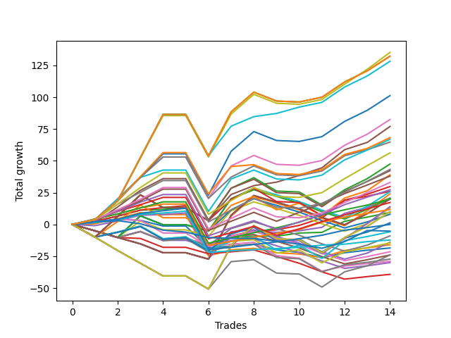

# Long Shepard 103 SD 
- Symbol: ES_830-1130
- Date Range: 03/18/2022 - 12/30/2022
- Trading Period: 8:30-11:30
- Number of Trades: 14



| Name | Win Percent | Profit | Avg Profit / Trade | Avg Time / Trade |      | Name | Win Percent | Profit | Avg Profit / Trade | Avg Time / Trade |
| ---- | ----------- | ------ | ------------------ | ---------------- | ---- | ---- | ----------- | ------ | ------------------ | ---------------- |
| Sorted By <br> Profit | | | | | | Sorted By <br> Win Percentage ||||
| V U/L 1SD | 78.57 | 67625.00 | 4830.36 | 44:23 |     | NEWFI 000 | 92.86 | 64125.00 | 4580.36 | 42:08 |
| NEWFI 06 | 78.57 | 66125.00 | 4723.21 | 49:18 |     | BB-50 U/L 1SD | 92.86 | 38500.00 | 2750.00 | 26:26 |
| BB-200 U/L 2SD | 78.57 | 66125.00 | 4723.21 | 49:18 |     | BB-20 U/L 2SD C | 92.86 | 13000.00 | 928.57 | 18:42 |
| NEWFI 000 | 92.86 | 64125.00 | 4580.36 | 42:08 |     | TP-4 | 92.86 | 10000.00 | 714.29 | 18:09 |
| BB-100 U/L 2SD | 78.57 | 50625.00 | 3616.07 | 47:54 |     | TP-3 | 92.86 | 5875.00 | 419.64 | 17:19 |
| BB-50 U/L 2SD | 78.57 | 41250.00 | 2946.43 | 34:02 |     | BB-20 U/L 2SD | 92.86 | 4750.00 | 339.29 | 16:24 |
| BB-50 U/L 1SD | 92.86 | 38500.00 | 2750.00 | 26:26 |     | TP-2 | 92.86 | 0.00 | 0.00 | 14:15 |
| BB-200 Mid | 78.57 | 34125.00 | 2437.50 | 36:19 |     | TP-1 | 92.86 | -6125.00 | -437.50 | 11:51 |
| BB-100 Mid | 78.57 | 33500.00 | 2392.86 | 32:07 |     | TP-7 | 85.71 | 19000.00 | 1357.14 | 25:31 |
| V Mid | 78.57 | 32375.00 | 2312.50 | 31:03 |     | TP-6 | 85.71 | 13625.00 | 973.21 | 23:55 |
| TP-10 | 78.57 | 28125.00 | 2008.93 | 31:36 |     | TP-5 | 85.71 | 8625.00 | 616.07 | 22:38 |
| BB-50 U/L 2SD SL-10 | 57.14 | 23750.00 | 1696.43 | 21:12 |     | V U/L 1SD | 78.57 | 67625.00 | 4830.36 | 44:23 |
| TP-9 | 78.57 | 21625.00 | 1544.64 | 29:32 |     | NEWFI 06 | 78.57 | 66125.00 | 4723.21 | 49:18 |
| BB-100 Mid SL-10 | 57.14 | 21125.00 | 1508.93 | 19:40 |     | BB-200 U/L 2SD | 78.57 | 66125.00 | 4723.21 | 49:18 |
| BB-50 U/L 1SD SL-10 | 64.29 | 19500.00 | 1392.86 | 16:33 |     | BB-100 U/L 2SD | 78.57 | 50625.00 | 3616.07 | 47:54 |
| TP-7 | 85.71 | 19000.00 | 1357.14 | 25:31 |     | BB-50 U/L 2SD | 78.57 | 41250.00 | 2946.43 | 34:02 |
| TP-8 | 78.57 | 16500.00 | 1178.57 | 28:57 |     | BB-200 Mid | 78.57 | 34125.00 | 2437.50 | 36:19 |
| V Mid SL-10 | 57.14 | 14875.00 | 1062.50 | 18:13 |     | BB-100 Mid | 78.57 | 33500.00 | 2392.86 | 32:07 |
| TP-6 | 85.71 | 13625.00 | 973.21 | 23:55 |     | V Mid | 78.57 | 32375.00 | 2312.50 | 31:03 |
| BB-20 U/L 2SD C | 92.86 | 13000.00 | 928.57 | 18:42 |     | TP-10 | 78.57 | 28125.00 | 2008.93 | 31:36 |
| BB-50 U/L 2SD SL-5 | 42.86 | 12875.00 | 919.64 | 12:23 |     | TP-9 | 78.57 | 21625.00 | 1544.64 | 29:32 |
| V U/L 1SD SL-5 | 35.71 | 12000.00 | 857.14 | 16:51 |     | TP-8 | 78.57 | 16500.00 | 1178.57 | 28:57 |
| BB-50 Mid | 78.57 | 10375.00 | 741.07 | 22:03 |     | BB-50 Mid | 78.57 | 10375.00 | 741.07 | 22:03 |
| BB-100 Mid SL-5 | 42.86 | 10250.00 | 732.14 | 10:52 |     | BB-50 U/L 1SD SL-10 | 64.29 | 19500.00 | 1392.86 | 16:33 |
| TP-4 | 92.86 | 10000.00 | 714.29 | 18:09 |     | BB-50 Mid SL-10 | 64.29 | 625.00 | 44.64 | 12:51 |
| BB-200 U/L 2SD SL-5 | 35.71 | 10000.00 | 714.29 | 20:46 |     | BB-20 U/L 2SD C SL-10 | 64.29 | -2875.00 | -205.36 | 10:33 |
| BB-100 U/L 2SD SL-5 | 35.71 | 10000.00 | 714.29 | 20:46 |     | BB-20 U/L 2SD SL-10 | 64.29 | -7250.00 | -517.86 | 09:22 |
| TP-5 | 85.71 | 8625.00 | 616.07 | 22:38 |     | BB-20 U/L 1SD | 64.29 | -8000.00 | -571.43 | 13:35 |
| V U/L 1SD SL-10 | 42.86 | 7000.00 | 500.00 | 28:50 |     | BB-50 U/L 2SD SL-10 | 57.14 | 23750.00 | 1696.43 | 21:12 |
| BB-50 U/L 1SD SL-5 | 42.86 | 6500.00 | 464.29 | 10:48 |     | BB-100 Mid SL-10 | 57.14 | 21125.00 | 1508.93 | 19:40 |
| TP-3 | 92.86 | 5875.00 | 419.64 | 17:19 |     | V Mid SL-10 | 57.14 | 14875.00 | 1062.50 | 18:13 |
| BB-200 U/L 2SD SL-10 | 42.86 | 5000.00 | 357.14 | 32:46 |     | BB-20 Mid | 57.14 | -9250.00 | -660.71 | 07:46 |
| BB-100 U/L 2SD SL-10 | 42.86 | 5000.00 | 357.14 | 32:46 |     | BB-20 U/L 1SD SL-10 | 57.14 | -13625.00 | -973.21 | 07:48 |
| BB-20 U/L 2SD | 92.86 | 4750.00 | 339.29 | 16:24 |     | BB-20 Mid SL-10 | 57.14 | -14500.00 | -1035.71 | 04:44 |
| V Mid SL-5 | 42.86 | 4000.00 | 285.71 | 09:26 |     | BB-50 U/L 2SD SL-5 | 42.86 | 12875.00 | 919.64 | 12:23 |
| BB-50 Mid SL-10 | 64.29 | 625.00 | 44.64 | 12:51 |     | BB-100 Mid SL-5 | 42.86 | 10250.00 | 732.14 | 10:52 |
| TP-2 | 92.86 | 0.00 | 0.00 | 14:15 |     | V U/L 1SD SL-10 | 42.86 | 7000.00 | 500.00 | 28:50 |
| NEWFI 0000 | 35.71 | -2625.00 | -187.50 | 06:00 |     | BB-50 U/L 1SD SL-5 | 42.86 | 6500.00 | 464.29 | 10:48 |
| BB-20 U/L 2SD C SL-10 | 64.29 | -2875.00 | -205.36 | 10:33 |     | BB-200 U/L 2SD SL-10 | 42.86 | 5000.00 | 357.14 | 32:46 |
| BB-50 Mid SL-5 | 42.86 | -4500.00 | -321.43 | 07:33 |     | BB-100 U/L 2SD SL-10 | 42.86 | 5000.00 | 357.14 | 32:46 |
| TP-1 | 92.86 | -6125.00 | -437.50 | 11:51 |     | V Mid SL-5 | 42.86 | 4000.00 | 285.71 | 09:26 |
| BB-200 Mid SL-5 | 35.71 | -7000.00 | -500.00 | 09:10 |     | BB-50 Mid SL-5 | 42.86 | -4500.00 | -321.43 | 07:33 |
| BB-20 U/L 2SD SL-10 | 64.29 | -7250.00 | -517.86 | 09:22 |     | BB-20 U/L 2SD C SL-5 | 42.86 | -10750.00 | -767.86 | 05:07 |
| BB-20 U/L 1SD | 64.29 | -8000.00 | -571.43 | 13:35 |     | BB-200 Mid SL-10 | 42.86 | -12000.00 | -857.14 | 21:10 |
| BB-20 Mid | 57.14 | -9250.00 | -660.71 | 07:46 |     | BB-20 U/L 2SD SL-5 | 42.86 | -12000.00 | -857.14 | 05:00 |
| BB-20 U/L 2SD C SL-5 | 42.86 | -10750.00 | -767.86 | 05:07 |     | BB-20 U/L 1SD SL-5 | 42.86 | -15000.00 | -1071.43 | 04:23 |
| BB-200 Mid SL-10 | 42.86 | -12000.00 | -857.14 | 21:10 |     | V U/L 1SD SL-5 | 35.71 | 12000.00 | 857.14 | 16:51 |
| BB-20 U/L 2SD SL-5 | 42.86 | -12000.00 | -857.14 | 05:00 |     | BB-200 U/L 2SD SL-5 | 35.71 | 10000.00 | 714.29 | 20:46 |
| BB-20 U/L 1SD SL-10 | 57.14 | -13625.00 | -973.21 | 07:48 |     | BB-100 U/L 2SD SL-5 | 35.71 | 10000.00 | 714.29 | 20:46 |
| BB-20 Mid SL-10 | 57.14 | -14500.00 | -1035.71 | 04:44 |     | NEWFI 0000 | 35.71 | -2625.00 | -187.50 | 06:00 |
| BB-20 U/L 1SD SL-5 | 42.86 | -15000.00 | -1071.43 | 04:23 |     | BB-200 Mid SL-5 | 35.71 | -7000.00 | -500.00 | 09:10 |
| BB-20 Mid SL-5 | 35.71 | -19625.00 | -1401.79 | 02:58 |     | BB-20 Mid SL-5 | 35.71 | -19625.00 | -1401.79 | 02:58 |

## NO STOPLOSS

### Test BB-20 Mid
* Sell when price hits the middle line of the 20p bollinger
* No Stoploss
* Results:
```
Total Trades: 14
Percent Up: 57.14
Percent Down: 42.86
Total Points Moved Up: -18.50
Potential Profit: -9250.00
Total Points Ups: 14.75 Count Ups: 8
Total Points Downs: -33.25 Count Downs: 6
```

<details><summary>Trades</summary>

<code>In: 2022-04-27 12:11:00		Out: 2022-04-27 12:14:00		Total Position Time: 03:00		Total Move Up: 2.25		Total to Date: 2.25</code> <br />
<code>In: 2022-05-06 11:36:00		Out: 2022-05-06 11:40:25		Total Position Time: 04:25		Total Move Up: 1.75		Total to Date: 4.00</code> <br />
<code>In: 2022-05-06 11:47:00		Out: 2022-05-06 11:48:15		Total Position Time: 01:15		Total Move Up: -0.75		Total to Date: 3.25</code> <br />
<code>In: 2022-05-06 12:20:00		Out: 2022-05-06 12:27:50		Total Position Time: 07:50		Total Move Up: -4.50		Total to Date: -1.25</code> <br />
<code>In: 2022-07-11 12:15:00		Out: 2022-07-11 12:22:10		Total Position Time: 07:10		Total Move Up: 0.00		Total to Date: -1.25</code> <br />
<code>In: 2022-09-02 09:47:00		Out: 2022-09-02 10:18:10		Total Position Time: 31:10		Total Move Up: -17.25		Total to Date: -18.50</code> <br />
<code>In: 2022-09-08 09:24:00		Out: 2022-09-08 09:26:25		Total Position Time: 02:25		Total Move Up: 1.50		Total to Date: -17.00</code> <br />
<code>In: 2022-09-12 09:12:00		Out: 2022-09-12 09:14:05		Total Position Time: 02:05		Total Move Up: 1.50		Total to Date: -15.50</code> <br />
<code>In: 2022-09-14 10:59:00		Out: 2022-09-14 11:15:30		Total Position Time: 16:30		Total Move Up: -4.50		Total to Date: -20.00</code> <br />
<code>In: 2022-09-14 11:06:00		Out: 2022-09-14 11:15:30		Total Position Time: 09:30		Total Move Up: -2.00		Total to Date: -22.00</code> <br />
<code>In: 2022-10-11 12:06:00		Out: 2022-10-11 12:17:25		Total Position Time: 11:25		Total Move Up: -4.25		Total to Date: -26.25</code> <br />
<code>In: 2022-10-11 12:15:00		Out: 2022-10-11 12:17:25		Total Position Time: 02:25		Total Move Up: 4.00		Total to Date: -22.25</code> <br />
<code>In: 2022-10-31 09:56:00		Out: 2022-10-31 09:57:10		Total Position Time: 01:10		Total Move Up: 2.00		Total to Date: -20.25</code> <br />
<code>In: 2022-10-31 12:11:00		Out: 2022-10-31 12:19:35		Total Position Time: 08:35		Total Move Up: 1.75		Total to Date: -18.50</code> <br />


</details>

### Test BB-20 U/L 1SD
* Sell when the price hits the upper line of the 20p 1std bollinger
* No Stoploss
* Results:
```
Total Trades: 14
Percent Up: 64.29
Percent Down: 35.71
Total Points Moved Up: -16.00
Potential Profit: -8000.00
Total Points Ups: 25.25 Count Ups: 9
Total Points Downs: -41.25 Count Downs: 5
```

<details><summary>Trades</summary>

<code>In: 2022-04-27 12:11:00		Out: 2022-04-27 12:27:15		Total Position Time: 16:15		Total Move Up: 0.50		Total to Date: 0.50</code> <br />
<code>In: 2022-05-06 11:36:00		Out: 2022-05-06 11:49:10		Total Position Time: 13:10		Total Move Up: 4.00		Total to Date: 4.50</code> <br />
<code>In: 2022-05-06 11:47:00		Out: 2022-05-06 11:49:10		Total Position Time: 02:10		Total Move Up: 4.75		Total to Date: 9.25</code> <br />
<code>In: 2022-05-06 12:20:00		Out: 2022-05-06 12:28:05		Total Position Time: 08:05		Total Move Up: -1.50		Total to Date: 7.75</code> <br />
<code>In: 2022-07-11 12:15:00		Out: 2022-07-11 12:29:20		Total Position Time: 14:20		Total Move Up: 0.00		Total to Date: 7.75</code> <br />
<code>In: 2022-09-02 09:47:00		Out: 2022-09-02 10:43:30		Total Position Time: 56:30		Total Move Up: -32.50		Total to Date: -24.75</code> <br />
<code>In: 2022-09-08 09:24:00		Out: 2022-09-08 09:29:00		Total Position Time: 05:00		Total Move Up: 4.75		Total to Date: -20.00</code> <br />
<code>In: 2022-09-12 09:12:00		Out: 2022-09-12 09:21:25		Total Position Time: 09:25		Total Move Up: 1.25		Total to Date: -18.75</code> <br />
<code>In: 2022-09-14 10:59:00		Out: 2022-09-14 11:19:10		Total Position Time: 20:10		Total Move Up: -3.50		Total to Date: -22.25</code> <br />
<code>In: 2022-09-14 11:06:00		Out: 2022-09-14 11:19:10		Total Position Time: 13:10		Total Move Up: -1.00		Total to Date: -23.25</code> <br />
<code>In: 2022-10-11 12:06:00		Out: 2022-10-11 12:20:40		Total Position Time: 14:40		Total Move Up: -2.75		Total to Date: -26.00</code> <br />
<code>In: 2022-10-11 12:15:00		Out: 2022-10-11 12:20:40		Total Position Time: 05:40		Total Move Up: 5.50		Total to Date: -20.50</code> <br />
<code>In: 2022-10-31 09:56:00		Out: 2022-10-31 09:57:10		Total Position Time: 01:10		Total Move Up: 2.00		Total to Date: -18.50</code> <br />
<code>In: 2022-10-31 12:11:00		Out: 2022-10-31 12:21:30		Total Position Time: 10:30		Total Move Up: 2.50		Total to Date: -16.00</code> <br />


</details>

### Test BB-20 U/L 2SD
* Sell when the price hits the upper line of the 20p 2std bollinger
* No Stoploss
* Results:
```
Total Trades: 14
Percent Up: 92.86
Percent Down: 7.14
Total Points Moved Up: 9.50
Potential Profit: 4750.00
Total Points Ups: 40.00 Count Ups: 13
Total Points Downs: -30.50 Count Downs: 1
```

<details><summary>Trades</summary>

<code>In: 2022-04-27 12:11:00		Out: 2022-04-27 12:31:20		Total Position Time: 20:20		Total Move Up: 2.50		Total to Date: 2.50</code> <br />
<code>In: 2022-05-06 11:36:00		Out: 2022-05-06 11:49:10		Total Position Time: 13:10		Total Move Up: 4.00		Total to Date: 6.50</code> <br />
<code>In: 2022-05-06 11:47:00		Out: 2022-05-06 11:49:10		Total Position Time: 02:10		Total Move Up: 4.75		Total to Date: 11.25</code> <br />
<code>In: 2022-05-06 12:20:00		Out: 2022-05-06 12:28:10		Total Position Time: 08:10		Total Move Up: 0.50		Total to Date: 11.75</code> <br />
<code>In: 2022-07-11 12:15:00		Out: 2022-07-11 12:29:40		Total Position Time: 14:40		Total Move Up: 1.50		Total to Date: 13.25</code> <br />
<code>In: 2022-09-02 09:47:00		Out: 2022-09-02 10:43:50		Total Position Time: 56:50		Total Move Up: -30.50		Total to Date: -17.25</code> <br />
<code>In: 2022-09-08 09:24:00		Out: 2022-09-08 09:31:35		Total Position Time: 07:35		Total Move Up: 6.75		Total to Date: -10.50</code> <br />
<code>In: 2022-09-12 09:12:00		Out: 2022-09-12 09:21:25		Total Position Time: 09:25		Total Move Up: 1.25		Total to Date: -9.25</code> <br />
<code>In: 2022-09-14 10:59:00		Out: 2022-09-14 11:30:30		Total Position Time: 31:30		Total Move Up: 0.00		Total to Date: -9.25</code> <br />
<code>In: 2022-09-14 11:06:00		Out: 2022-09-14 11:30:30		Total Position Time: 24:30		Total Move Up: 2.50		Total to Date: -6.75</code> <br />
<code>In: 2022-10-11 12:06:00		Out: 2022-10-11 12:22:35		Total Position Time: 16:35		Total Move Up: 0.50		Total to Date: -6.25</code> <br />
<code>In: 2022-10-11 12:15:00		Out: 2022-10-11 12:22:35		Total Position Time: 07:35		Total Move Up: 8.75		Total to Date: 2.50</code> <br />
<code>In: 2022-10-31 09:56:00		Out: 2022-10-31 10:02:05		Total Position Time: 06:05		Total Move Up: 3.25		Total to Date: 5.75</code> <br />
<code>In: 2022-10-31 12:11:00		Out: 2022-10-31 12:22:10		Total Position Time: 11:10		Total Move Up: 3.75		Total to Date: 9.50</code> <br />


</details>

### Test BB-20 U/L 2SD C
* Sell when the price hits the upper line of the 20p 2std bollinger
* No Stoploss
* Results:
```
Total Trades: 14
Percent Up: 92.86
Percent Down: 7.14
Total Points Moved Up: 26.00
Potential Profit: 13000.00
Total Points Ups: 56.50 Count Ups: 13
Total Points Downs: -30.50 Count Downs: 1
```

<details><summary>Trades</summary>

<code>In: 2022-04-27 12:11:00		Out: 2022-04-27 12:31:20		Total Position Time: 20:20		Total Move Up: 2.50		Total to Date: 2.50</code> <br />
<code>In: 2022-05-06 11:36:00		Out: 2022-05-06 11:49:10		Total Position Time: 13:10		Total Move Up: 4.00		Total to Date: 6.50</code> <br />
<code>In: 2022-05-06 11:47:00		Out: 2022-05-06 11:49:10		Total Position Time: 02:10		Total Move Up: 4.75		Total to Date: 11.25</code> <br />
<code>In: 2022-05-06 12:20:00		Out: 2022-05-06 12:28:50		Total Position Time: 08:50		Total Move Up: 2.00		Total to Date: 13.25</code> <br />
<code>In: 2022-07-11 12:15:00		Out: 2022-07-11 12:29:40		Total Position Time: 14:40		Total Move Up: 1.50		Total to Date: 14.75</code> <br />
<code>In: 2022-09-02 09:47:00		Out: 2022-09-02 10:43:50		Total Position Time: 56:50		Total Move Up: -30.50		Total to Date: -15.75</code> <br />
<code>In: 2022-09-08 09:24:00		Out: 2022-09-08 09:31:35		Total Position Time: 07:35		Total Move Up: 6.75		Total to Date: -9.00</code> <br />
<code>In: 2022-09-12 09:12:00		Out: 2022-09-12 09:23:10		Total Position Time: 11:10		Total Move Up: 3.75		Total to Date: -5.25</code> <br />
<code>In: 2022-09-14 10:59:00		Out: 2022-09-14 11:30:55		Total Position Time: 31:55		Total Move Up: 1.00		Total to Date: -4.25</code> <br />
<code>In: 2022-09-14 11:06:00		Out: 2022-09-14 11:30:55		Total Position Time: 24:55		Total Move Up: 3.50		Total to Date: -0.75</code> <br />
<code>In: 2022-10-11 12:06:00		Out: 2022-10-11 12:37:00		Total Position Time: 31:00		Total Move Up: 5.75		Total to Date: 5.00</code> <br />
<code>In: 2022-10-11 12:15:00		Out: 2022-10-11 12:37:00		Total Position Time: 22:00		Total Move Up: 14.00		Total to Date: 19.00</code> <br />
<code>In: 2022-10-31 09:56:00		Out: 2022-10-31 10:02:05		Total Position Time: 06:05		Total Move Up: 3.25		Total to Date: 22.25</code> <br />
<code>In: 2022-10-31 12:11:00		Out: 2022-10-31 12:22:10		Total Position Time: 11:10		Total Move Up: 3.75		Total to Date: 26.00</code> <br />


</details>

### Test BB-50 Mid
* Sell when price hits the middle line of the 50p bollinger
* No Stoploss
* Results:
```
Total Trades: 14
Percent Up: 78.57
Percent Down: 21.43
Total Points Moved Up: 20.75
Potential Profit: 10375.00
Total Points Ups: 55.50 Count Ups: 11
Total Points Downs: -34.75 Count Downs: 3
```

<details><summary>Trades</summary>

<code>In: 2022-04-27 12:11:00		Out: 2022-04-27 12:44:20		Total Position Time: 33:20		Total Move Up: -1.00		Total to Date: -1.00</code> <br />
<code>In: 2022-05-06 11:36:00		Out: 2022-05-06 11:49:15		Total Position Time: 13:15		Total Move Up: 3.75		Total to Date: 2.75</code> <br />
<code>In: 2022-05-06 11:47:00		Out: 2022-05-06 11:49:15		Total Position Time: 02:15		Total Move Up: 4.50		Total to Date: 7.25</code> <br />
<code>In: 2022-05-06 12:20:00		Out: 2022-05-06 12:28:10		Total Position Time: 08:10		Total Move Up: 0.50		Total to Date: 7.75</code> <br />
<code>In: 2022-07-11 12:15:00		Out: 2022-07-11 12:40:35		Total Position Time: 25:35		Total Move Up: 1.25		Total to Date: 9.00</code> <br />
<code>In: 2022-09-02 09:47:00		Out: 2022-09-02 10:47:55		Total Position Time: 60:55		Total Move Up: -32.50		Total to Date: -23.50</code> <br />
<code>In: 2022-09-08 09:24:00		Out: 2022-09-08 09:39:40		Total Position Time: 15:40		Total Move Up: 13.25		Total to Date: -10.25</code> <br />
<code>In: 2022-09-12 09:12:00		Out: 2022-09-12 09:24:10		Total Position Time: 12:10		Total Move Up: 5.25		Total to Date: -5.00</code> <br />
<code>In: 2022-09-14 10:59:00		Out: 2022-09-14 11:29:30		Total Position Time: 30:30		Total Move Up: -1.25		Total to Date: -6.25</code> <br />
<code>In: 2022-09-14 11:06:00		Out: 2022-09-14 11:29:30		Total Position Time: 23:30		Total Move Up: 1.25		Total to Date: -5.00</code> <br />
<code>In: 2022-10-11 12:06:00		Out: 2022-10-11 12:36:35		Total Position Time: 30:35		Total Move Up: 2.75		Total to Date: -2.25</code> <br />
<code>In: 2022-10-11 12:15:00		Out: 2022-10-11 12:36:35		Total Position Time: 21:35		Total Move Up: 11.00		Total to Date: 8.75</code> <br />
<code>In: 2022-10-31 09:56:00		Out: 2022-10-31 10:08:30		Total Position Time: 12:30		Total Move Up: 4.75		Total to Date: 13.50</code> <br />
<code>In: 2022-10-31 12:11:00		Out: 2022-10-31 12:29:45		Total Position Time: 18:45		Total Move Up: 7.25		Total to Date: 20.75</code> <br />


</details>

### Test BB-50 U/L 1SD
* Sell when the price hits the upper line of the 50p 1std bollinger
* No Stoploss
* Results:
```
Total Trades: 14
Percent Up: 92.86
Percent Down: 7.14
Total Points Moved Up: 77.00
Potential Profit: 38500.00
Total Points Ups: 109.50 Count Ups: 13
Total Points Downs: -32.50 Count Downs: 1
```

<details><summary>Trades</summary>

<code>In: 2022-04-27 12:11:00		Out: 2022-04-27 12:46:05		Total Position Time: 35:05		Total Move Up: 1.50		Total to Date: 1.50</code> <br />
<code>In: 2022-05-06 11:36:00		Out: 2022-05-06 11:50:10		Total Position Time: 14:10		Total Move Up: 12.25		Total to Date: 13.75</code> <br />
<code>In: 2022-05-06 11:47:00		Out: 2022-05-06 11:50:10		Total Position Time: 03:10		Total Move Up: 13.00		Total to Date: 26.75</code> <br />
<code>In: 2022-05-06 12:20:00		Out: 2022-05-06 12:30:30		Total Position Time: 10:30		Total Move Up: 9.25		Total to Date: 36.00</code> <br />
<code>In: 2022-07-11 12:15:00		Out: 2022-07-11 12:47:00		Total Position Time: 32:00		Total Move Up: 0.00		Total to Date: 36.00</code> <br />
<code>In: 2022-09-02 09:47:00		Out: 2022-09-02 10:47:55		Total Position Time: 60:55		Total Move Up: -32.50		Total to Date: 3.50</code> <br />
<code>In: 2022-09-08 09:24:00		Out: 2022-09-08 09:49:55		Total Position Time: 25:55		Total Move Up: 20.00		Total to Date: 23.50</code> <br />
<code>In: 2022-09-12 09:12:00		Out: 2022-09-12 09:37:50		Total Position Time: 25:50		Total Move Up: 7.00		Total to Date: 30.50</code> <br />
<code>In: 2022-09-14 10:59:00		Out: 2022-09-14 11:32:05		Total Position Time: 33:05		Total Move Up: 2.75		Total to Date: 33.25</code> <br />
<code>In: 2022-09-14 11:06:00		Out: 2022-09-14 11:32:05		Total Position Time: 26:05		Total Move Up: 5.25		Total to Date: 38.50</code> <br />
<code>In: 2022-10-11 12:06:00		Out: 2022-10-11 12:39:25		Total Position Time: 33:25		Total Move Up: 6.00		Total to Date: 44.50</code> <br />
<code>In: 2022-10-11 12:15:00		Out: 2022-10-11 12:39:25		Total Position Time: 24:25		Total Move Up: 14.25		Total to Date: 58.75</code> <br />
<code>In: 2022-10-31 09:56:00		Out: 2022-10-31 10:16:15		Total Position Time: 20:15		Total Move Up: 5.75		Total to Date: 64.50</code> <br />
<code>In: 2022-10-31 12:11:00		Out: 2022-10-31 12:36:15		Total Position Time: 25:15		Total Move Up: 12.50		Total to Date: 77.00</code> <br />


</details>

### Test BB-50 U/L 2SD
* Sell when the price hits the upper line of the 50p 2std bollinger
* No Stoploss
* Results:
```
Total Trades: 14
Percent Up: 78.57
Percent Down: 21.43
Total Points Moved Up: 82.50
Potential Profit: 41250.00
Total Points Ups: 122.75 Count Ups: 11
Total Points Downs: -40.25 Count Downs: 3
```

<details><summary>Trades</summary>

<code>In: 2022-04-27 12:11:00		Out: 2022-04-27 12:47:00		Total Position Time: 36:00		Total Move Up: 3.75		Total to Date: 3.75</code> <br />
<code>In: 2022-05-06 11:36:00		Out: 2022-05-06 11:50:35		Total Position Time: 14:35		Total Move Up: 16.25		Total to Date: 20.00</code> <br />
<code>In: 2022-05-06 11:47:00		Out: 2022-05-06 11:50:35		Total Position Time: 03:35		Total Move Up: 17.00		Total to Date: 37.00</code> <br />
<code>In: 2022-05-06 12:20:00		Out: 2022-05-06 12:35:40		Total Position Time: 15:40		Total Move Up: 16.00		Total to Date: 53.00</code> <br />
<code>In: 2022-07-11 12:15:00		Out: 2022-07-11 12:47:00		Total Position Time: 32:00		Total Move Up: 0.00		Total to Date: 53.00</code> <br />
<code>In: 2022-09-02 09:47:00		Out: 2022-09-02 10:47:55		Total Position Time: 60:55		Total Move Up: -32.50		Total to Date: 20.50</code> <br />
<code>In: 2022-09-08 09:24:00		Out: 2022-09-08 09:53:05		Total Position Time: 29:05		Total Move Up: 25.50		Total to Date: 46.00</code> <br />
<code>In: 2022-09-12 09:12:00		Out: 2022-09-12 09:44:15		Total Position Time: 32:15		Total Move Up: 8.25		Total to Date: 54.25</code> <br />
<code>In: 2022-09-14 10:59:00		Out: 2022-09-14 11:59:55		Total Position Time: 60:55		Total Move Up: -7.00		Total to Date: 47.25</code> <br />
<code>In: 2022-09-14 11:06:00		Out: 2022-09-14 12:06:55		Total Position Time: 60:55		Total Move Up: -0.75		Total to Date: 46.50</code> <br />
<code>In: 2022-10-11 12:06:00		Out: 2022-10-11 12:47:00		Total Position Time: 41:00		Total Move Up: 3.75		Total to Date: 50.25</code> <br />
<code>In: 2022-10-11 12:15:00		Out: 2022-10-11 12:47:00		Total Position Time: 32:00		Total Move Up: 12.00		Total to Date: 62.25</code> <br />
<code>In: 2022-10-31 09:56:00		Out: 2022-10-31 10:17:40		Total Position Time: 21:40		Total Move Up: 8.75		Total to Date: 71.00</code> <br />
<code>In: 2022-10-31 12:11:00		Out: 2022-10-31 12:47:00		Total Position Time: 36:00		Total Move Up: 11.50		Total to Date: 82.50</code> <br />


</details>

### Test V Mid
* Sell when the price hits the middle line of the 1std VWAP
* No Stoploss
* Results:
```
Total Trades: 14
Percent Up: 78.57
Percent Down: 21.43
Total Points Moved Up: 64.75
Potential Profit: 32375.00
Total Points Ups: 105.00 Count Ups: 11
Total Points Downs: -40.25 Count Downs: 3
```

<details><summary>Trades</summary>

<code>In: 2022-04-27 12:11:00		Out: 2022-04-27 12:47:00		Total Position Time: 36:00		Total Move Up: 3.75		Total to Date: 3.75</code> <br />
<code>In: 2022-05-06 11:36:00		Out: 2022-05-06 11:50:20		Total Position Time: 14:20		Total Move Up: 16.25		Total to Date: 20.00</code> <br />
<code>In: 2022-05-06 11:47:00		Out: 2022-05-06 11:50:20		Total Position Time: 03:20		Total Move Up: 17.00		Total to Date: 37.00</code> <br />
<code>In: 2022-05-06 12:20:00		Out: 2022-05-06 12:35:40		Total Position Time: 15:40		Total Move Up: 16.00		Total to Date: 53.00</code> <br />
<code>In: 2022-07-11 12:15:00		Out: 2022-07-11 12:47:00		Total Position Time: 32:00		Total Move Up: 0.00		Total to Date: 53.00</code> <br />
<code>In: 2022-09-02 09:47:00		Out: 2022-09-02 10:47:55		Total Position Time: 60:55		Total Move Up: -32.50		Total to Date: 20.50</code> <br />
<code>In: 2022-09-08 09:24:00		Out: 2022-09-08 09:41:45		Total Position Time: 17:45		Total Move Up: 16.75		Total to Date: 37.25</code> <br />
<code>In: 2022-09-12 09:12:00		Out: 2022-09-12 09:44:25		Total Position Time: 32:25		Total Move Up: 8.75		Total to Date: 46.00</code> <br />
<code>In: 2022-09-14 10:59:00		Out: 2022-09-14 11:59:55		Total Position Time: 60:55		Total Move Up: -7.00		Total to Date: 39.00</code> <br />
<code>In: 2022-09-14 11:06:00		Out: 2022-09-14 12:06:55		Total Position Time: 60:55		Total Move Up: -0.75		Total to Date: 38.25</code> <br />
<code>In: 2022-10-11 12:06:00		Out: 2022-10-11 12:47:00		Total Position Time: 41:00		Total Move Up: 3.75		Total to Date: 42.00</code> <br />
<code>In: 2022-10-11 12:15:00		Out: 2022-10-11 12:47:00		Total Position Time: 32:00		Total Move Up: 12.00		Total to Date: 54.00</code> <br />
<code>In: 2022-10-31 09:56:00		Out: 2022-10-31 10:08:30		Total Position Time: 12:30		Total Move Up: 4.75		Total to Date: 58.75</code> <br />
<code>In: 2022-10-31 12:11:00		Out: 2022-10-31 12:26:10		Total Position Time: 15:10		Total Move Up: 6.00		Total to Date: 64.75</code> <br />


</details>

### Test V U/L 1SD
* Sell when the price hits the upper line of the 1std VWAP
* No Stoploss
* Results:
```
Total Trades: 14
Percent Up: 78.57
Percent Down: 21.43
Total Points Moved Up: 135.25
Potential Profit: 67625.00
Total Points Ups: 175.50 Count Ups: 11
Total Points Downs: -40.25 Count Downs: 3
```

<details><summary>Trades</summary>

<code>In: 2022-04-27 12:11:00		Out: 2022-04-27 12:47:00		Total Position Time: 36:00		Total Move Up: 3.75		Total to Date: 3.75</code> <br />
<code>In: 2022-05-06 11:36:00		Out: 2022-05-06 12:36:55		Total Position Time: 60:55		Total Move Up: 14.75		Total to Date: 18.50</code> <br />
<code>In: 2022-05-06 11:47:00		Out: 2022-05-06 12:40:00		Total Position Time: 53:00		Total Move Up: 33.50		Total to Date: 52.00</code> <br />
<code>In: 2022-05-06 12:20:00		Out: 2022-05-06 12:40:00		Total Position Time: 20:00		Total Move Up: 33.50		Total to Date: 85.50</code> <br />
<code>In: 2022-07-11 12:15:00		Out: 2022-07-11 12:47:00		Total Position Time: 32:00		Total Move Up: 0.00		Total to Date: 85.50</code> <br />
<code>In: 2022-09-02 09:47:00		Out: 2022-09-02 10:47:55		Total Position Time: 60:55		Total Move Up: -32.50		Total to Date: 53.00</code> <br />
<code>In: 2022-09-08 09:24:00		Out: 2022-09-08 10:13:25		Total Position Time: 49:25		Total Move Up: 33.75		Total to Date: 86.75</code> <br />
<code>In: 2022-09-12 09:12:00		Out: 2022-09-12 10:12:55		Total Position Time: 60:55		Total Move Up: 15.50		Total to Date: 102.25</code> <br />
<code>In: 2022-09-14 10:59:00		Out: 2022-09-14 11:59:55		Total Position Time: 60:55		Total Move Up: -7.00		Total to Date: 95.25</code> <br />
<code>In: 2022-09-14 11:06:00		Out: 2022-09-14 12:06:55		Total Position Time: 60:55		Total Move Up: -0.75		Total to Date: 94.50</code> <br />
<code>In: 2022-10-11 12:06:00		Out: 2022-10-11 12:47:00		Total Position Time: 41:00		Total Move Up: 3.75		Total to Date: 98.25</code> <br />
<code>In: 2022-10-11 12:15:00		Out: 2022-10-11 12:47:00		Total Position Time: 32:00		Total Move Up: 12.00		Total to Date: 110.25</code> <br />
<code>In: 2022-10-31 09:56:00		Out: 2022-10-31 10:24:00		Total Position Time: 28:00		Total Move Up: 11.75		Total to Date: 122.00</code> <br />
<code>In: 2022-10-31 12:11:00		Out: 2022-10-31 12:36:30		Total Position Time: 25:30		Total Move Up: 13.25		Total to Date: 135.25</code> <br />


</details>

### Test BB-100 Mid
* Move to BB100 Mid
* No Stoploss
* Results:
```
Total Trades: 14
Percent Up: 78.57
Percent Down: 21.43
Total Points Moved Up: 67.00
Potential Profit: 33500.00
Total Points Ups: 107.25 Count Ups: 11
Total Points Downs: -40.25 Count Downs: 3
```

<details><summary>Trades</summary>

<code>In: 2022-04-27 12:11:00		Out: 2022-04-27 12:47:00		Total Position Time: 36:00		Total Move Up: 3.75		Total to Date: 3.75</code> <br />
<code>In: 2022-05-06 11:36:00		Out: 2022-05-06 11:50:35		Total Position Time: 14:35		Total Move Up: 16.25		Total to Date: 20.00</code> <br />
<code>In: 2022-05-06 11:47:00		Out: 2022-05-06 11:50:35		Total Position Time: 03:35		Total Move Up: 17.00		Total to Date: 37.00</code> <br />
<code>In: 2022-05-06 12:20:00		Out: 2022-05-06 12:30:20		Total Position Time: 10:20		Total Move Up: 5.75		Total to Date: 42.75</code> <br />
<code>In: 2022-07-11 12:15:00		Out: 2022-07-11 12:47:00		Total Position Time: 32:00		Total Move Up: 0.00		Total to Date: 42.75</code> <br />
<code>In: 2022-09-02 09:47:00		Out: 2022-09-02 10:47:55		Total Position Time: 60:55		Total Move Up: -32.50		Total to Date: 10.25</code> <br />
<code>In: 2022-09-08 09:24:00		Out: 2022-09-08 09:53:05		Total Position Time: 29:05		Total Move Up: 25.50		Total to Date: 35.75</code> <br />
<code>In: 2022-09-12 09:12:00		Out: 2022-09-12 09:37:50		Total Position Time: 25:50		Total Move Up: 7.00		Total to Date: 42.75</code> <br />
<code>In: 2022-09-14 10:59:00		Out: 2022-09-14 11:59:55		Total Position Time: 60:55		Total Move Up: -7.00		Total to Date: 35.75</code> <br />
<code>In: 2022-09-14 11:06:00		Out: 2022-09-14 12:06:55		Total Position Time: 60:55		Total Move Up: -0.75		Total to Date: 35.00</code> <br />
<code>In: 2022-10-11 12:06:00		Out: 2022-10-11 12:47:00		Total Position Time: 41:00		Total Move Up: 3.75		Total to Date: 38.75</code> <br />
<code>In: 2022-10-11 12:15:00		Out: 2022-10-11 12:47:00		Total Position Time: 32:00		Total Move Up: 12.00		Total to Date: 50.75</code> <br />
<code>In: 2022-10-31 09:56:00		Out: 2022-10-31 10:17:20		Total Position Time: 21:20		Total Move Up: 7.75		Total to Date: 58.50</code> <br />
<code>In: 2022-10-31 12:11:00		Out: 2022-10-31 12:32:20		Total Position Time: 21:20		Total Move Up: 8.50		Total to Date: 67.00</code> <br />


</details>

### Test BB-100 U/L 2SD
* Move to BB100 Upper Band
* No Stoploss
* Results:
```
Total Trades: 14
Percent Up: 78.57
Percent Down: 21.43
Total Points Moved Up: 101.25
Potential Profit: 50625.00
Total Points Ups: 141.50 Count Ups: 11
Total Points Downs: -40.25 Count Downs: 3
```

<details><summary>Trades</summary>

<code>In: 2022-04-27 12:11:00		Out: 2022-04-27 12:47:00		Total Position Time: 36:00		Total Move Up: 3.75		Total to Date: 3.75</code> <br />
<code>In: 2022-05-06 11:36:00		Out: 2022-05-06 12:36:55		Total Position Time: 60:55		Total Move Up: 14.75		Total to Date: 18.50</code> <br />
<code>In: 2022-05-06 11:47:00		Out: 2022-05-06 12:37:10		Total Position Time: 50:10		Total Move Up: 18.50		Total to Date: 37.00</code> <br />
<code>In: 2022-05-06 12:20:00		Out: 2022-05-06 12:37:10		Total Position Time: 17:10		Total Move Up: 18.50		Total to Date: 55.50</code> <br />
<code>In: 2022-07-11 12:15:00		Out: 2022-07-11 12:47:00		Total Position Time: 32:00		Total Move Up: 0.00		Total to Date: 55.50</code> <br />
<code>In: 2022-09-02 09:47:00		Out: 2022-09-02 10:47:55		Total Position Time: 60:55		Total Move Up: -32.50		Total to Date: 23.00</code> <br />
<code>In: 2022-09-08 09:24:00		Out: 2022-09-08 10:24:55		Total Position Time: 60:55		Total Move Up: 34.50		Total to Date: 57.50</code> <br />
<code>In: 2022-09-12 09:12:00		Out: 2022-09-12 10:12:55		Total Position Time: 60:55		Total Move Up: 15.50		Total to Date: 73.00</code> <br />
<code>In: 2022-09-14 10:59:00		Out: 2022-09-14 11:59:55		Total Position Time: 60:55		Total Move Up: -7.00		Total to Date: 66.00</code> <br />
<code>In: 2022-09-14 11:06:00		Out: 2022-09-14 12:06:55		Total Position Time: 60:55		Total Move Up: -0.75		Total to Date: 65.25</code> <br />
<code>In: 2022-10-11 12:06:00		Out: 2022-10-11 12:47:00		Total Position Time: 41:00		Total Move Up: 3.75		Total to Date: 69.00</code> <br />
<code>In: 2022-10-11 12:15:00		Out: 2022-10-11 12:47:00		Total Position Time: 32:00		Total Move Up: 12.00		Total to Date: 81.00</code> <br />
<code>In: 2022-10-31 09:56:00		Out: 2022-10-31 10:56:55		Total Position Time: 60:55		Total Move Up: 8.75		Total to Date: 89.75</code> <br />
<code>In: 2022-10-31 12:11:00		Out: 2022-10-31 12:47:00		Total Position Time: 36:00		Total Move Up: 11.50		Total to Date: 101.25</code> <br />


</details>

### Test BB-200 Mid
* Move to BB200 Mid
* No Stoploss
* Results:
```
Total Trades: 14
Percent Up: 78.57
Percent Down: 21.43
Total Points Moved Up: 68.25
Potential Profit: 34125.00
Total Points Ups: 108.50 Count Ups: 11
Total Points Downs: -40.25 Count Downs: 3
```

<details><summary>Trades</summary>

<code>In: 2022-04-27 12:11:00		Out: 2022-04-27 12:47:00		Total Position Time: 36:00		Total Move Up: 3.75		Total to Date: 3.75</code> <br />
<code>In: 2022-05-06 11:36:00		Out: 2022-05-06 12:36:55		Total Position Time: 60:55		Total Move Up: 14.75		Total to Date: 18.50</code> <br />
<code>In: 2022-05-06 11:47:00		Out: 2022-05-06 12:37:15		Total Position Time: 50:15		Total Move Up: 19.00		Total to Date: 37.50</code> <br />
<code>In: 2022-05-06 12:20:00		Out: 2022-05-06 12:37:15		Total Position Time: 17:15		Total Move Up: 19.00		Total to Date: 56.50</code> <br />
<code>In: 2022-07-11 12:15:00		Out: 2022-07-11 12:47:00		Total Position Time: 32:00		Total Move Up: 0.00		Total to Date: 56.50</code> <br />
<code>In: 2022-09-02 09:47:00		Out: 2022-09-02 10:47:55		Total Position Time: 60:55		Total Move Up: -32.50		Total to Date: 24.00</code> <br />
<code>In: 2022-09-08 09:24:00		Out: 2022-09-08 09:44:25		Total Position Time: 20:25		Total Move Up: 21.50		Total to Date: 45.50</code> <br />
<code>In: 2022-09-12 09:12:00		Out: 2022-09-12 09:14:05		Total Position Time: 02:05		Total Move Up: 1.50		Total to Date: 47.00</code> <br />
<code>In: 2022-09-14 10:59:00		Out: 2022-09-14 11:59:55		Total Position Time: 60:55		Total Move Up: -7.00		Total to Date: 40.00</code> <br />
<code>In: 2022-09-14 11:06:00		Out: 2022-09-14 12:06:55		Total Position Time: 60:55		Total Move Up: -0.75		Total to Date: 39.25</code> <br />
<code>In: 2022-10-11 12:06:00		Out: 2022-10-11 12:47:00		Total Position Time: 41:00		Total Move Up: 3.75		Total to Date: 43.00</code> <br />
<code>In: 2022-10-11 12:15:00		Out: 2022-10-11 12:47:00		Total Position Time: 32:00		Total Move Up: 12.00		Total to Date: 55.00</code> <br />
<code>In: 2022-10-31 09:56:00		Out: 2022-10-31 10:08:30		Total Position Time: 12:30		Total Move Up: 4.75		Total to Date: 59.75</code> <br />
<code>In: 2022-10-31 12:11:00		Out: 2022-10-31 12:32:20		Total Position Time: 21:20		Total Move Up: 8.50		Total to Date: 68.25</code> <br />


</details>

### Test BB-200 U/L 2SD
* Move to BB200 Upper Band
* No Stoploss
* Results:
```
Total Trades: 14
Percent Up: 78.57
Percent Down: 21.43
Total Points Moved Up: 132.25
Potential Profit: 66125.00
Total Points Ups: 172.50 Count Ups: 11
Total Points Downs: -40.25 Count Downs: 3
```

<details><summary>Trades</summary>

<code>In: 2022-04-27 12:11:00		Out: 2022-04-27 12:47:00		Total Position Time: 36:00		Total Move Up: 3.75		Total to Date: 3.75</code> <br />
<code>In: 2022-05-06 11:36:00		Out: 2022-05-06 12:36:55		Total Position Time: 60:55		Total Move Up: 14.75		Total to Date: 18.50</code> <br />
<code>In: 2022-05-06 11:47:00		Out: 2022-05-06 12:47:00		Total Position Time: 60:00		Total Move Up: 34.00		Total to Date: 52.50</code> <br />
<code>In: 2022-05-06 12:20:00		Out: 2022-05-06 12:47:00		Total Position Time: 27:00		Total Move Up: 34.00		Total to Date: 86.50</code> <br />
<code>In: 2022-07-11 12:15:00		Out: 2022-07-11 12:47:00		Total Position Time: 32:00		Total Move Up: 0.00		Total to Date: 86.50</code> <br />
<code>In: 2022-09-02 09:47:00		Out: 2022-09-02 10:47:55		Total Position Time: 60:55		Total Move Up: -32.50		Total to Date: 54.00</code> <br />
<code>In: 2022-09-08 09:24:00		Out: 2022-09-08 10:24:55		Total Position Time: 60:55		Total Move Up: 34.50		Total to Date: 88.50</code> <br />
<code>In: 2022-09-12 09:12:00		Out: 2022-09-12 10:12:55		Total Position Time: 60:55		Total Move Up: 15.50		Total to Date: 104.00</code> <br />
<code>In: 2022-09-14 10:59:00		Out: 2022-09-14 11:59:55		Total Position Time: 60:55		Total Move Up: -7.00		Total to Date: 97.00</code> <br />
<code>In: 2022-09-14 11:06:00		Out: 2022-09-14 12:06:55		Total Position Time: 60:55		Total Move Up: -0.75		Total to Date: 96.25</code> <br />
<code>In: 2022-10-11 12:06:00		Out: 2022-10-11 12:47:00		Total Position Time: 41:00		Total Move Up: 3.75		Total to Date: 100.00</code> <br />
<code>In: 2022-10-11 12:15:00		Out: 2022-10-11 12:47:00		Total Position Time: 32:00		Total Move Up: 12.00		Total to Date: 112.00</code> <br />
<code>In: 2022-10-31 09:56:00		Out: 2022-10-31 10:56:55		Total Position Time: 60:55		Total Move Up: 8.75		Total to Date: 120.75</code> <br />
<code>In: 2022-10-31 12:11:00		Out: 2022-10-31 12:47:00		Total Position Time: 36:00		Total Move Up: 11.50		Total to Date: 132.25</code> <br />


</details>

## STOPLOSS OF 5

### Test BB-20 Mid SL-5
* Sell when price hits the middle line of the 20p bollinger
* Stoploss is 5 points
* Results:
```
Total Trades: 14
Percent Up: 35.71
Percent Down: 64.29
Total Points Moved Up: -39.25
Potential Profit: -19625.00
Total Points Ups: 6.75 Count Ups: 5
Total Points Downs: -46.00 Count Downs: 9
```

<details><summary>Trades</summary>

<code>In: 2022-04-27 12:11:00		Out: 2022-04-27 12:12:30		Total Position Time: 01:30		Total Move Up: -5.00		Total to Date: -5.00</code> <br />
<code>In: 2022-05-06 11:36:00		Out: 2022-05-06 11:38:55		Total Position Time: 02:55		Total Move Up: -5.25		Total to Date: -10.25</code> <br />
<code>In: 2022-05-06 11:47:00		Out: 2022-05-06 11:48:15		Total Position Time: 01:15		Total Move Up: -0.75		Total to Date: -11.00</code> <br />
<code>In: 2022-05-06 12:20:00		Out: 2022-05-06 12:21:10		Total Position Time: 01:10		Total Move Up: -7.00		Total to Date: -18.00</code> <br />
<code>In: 2022-07-11 12:15:00		Out: 2022-07-11 12:22:10		Total Position Time: 07:10		Total Move Up: 0.00		Total to Date: -18.00</code> <br />
<code>In: 2022-09-02 09:47:00		Out: 2022-09-02 09:48:15		Total Position Time: 01:15		Total Move Up: -5.00		Total to Date: -23.00</code> <br />
<code>In: 2022-09-08 09:24:00		Out: 2022-09-08 09:26:25		Total Position Time: 02:25		Total Move Up: 1.50		Total to Date: -21.50</code> <br />
<code>In: 2022-09-12 09:12:00		Out: 2022-09-12 09:14:05		Total Position Time: 02:05		Total Move Up: 1.50		Total to Date: -20.00</code> <br />
<code>In: 2022-09-14 10:59:00		Out: 2022-09-14 11:03:40		Total Position Time: 04:40		Total Move Up: -5.25		Total to Date: -25.25</code> <br />
<code>In: 2022-09-14 11:06:00		Out: 2022-09-14 11:09:05		Total Position Time: 03:05		Total Move Up: -5.25		Total to Date: -30.50</code> <br />
<code>In: 2022-10-11 12:06:00		Out: 2022-10-11 12:09:15		Total Position Time: 03:15		Total Move Up: -6.75		Total to Date: -37.25</code> <br />
<code>In: 2022-10-11 12:15:00		Out: 2022-10-11 12:16:10		Total Position Time: 01:10		Total Move Up: -5.75		Total to Date: -43.00</code> <br />
<code>In: 2022-10-31 09:56:00		Out: 2022-10-31 09:57:10		Total Position Time: 01:10		Total Move Up: 2.00		Total to Date: -41.00</code> <br />
<code>In: 2022-10-31 12:11:00		Out: 2022-10-31 12:19:35		Total Position Time: 08:35		Total Move Up: 1.75		Total to Date: -39.25</code> <br />


</details>

### Test BB-20 U/L 1SD SL-5
* Sell when the price hits the upper line of the 20p 1std bollinger
* Stoploss is 5 points
* Results:
```
Total Trades: 14
Percent Up: 42.86
Percent Down: 57.14
Total Points Moved Up: -30.00
Potential Profit: -15000.00
Total Points Ups: 15.25 Count Ups: 6
Total Points Downs: -45.25 Count Downs: 8
```

<details><summary>Trades</summary>

<code>In: 2022-04-27 12:11:00		Out: 2022-04-27 12:12:30		Total Position Time: 01:30		Total Move Up: -5.00		Total to Date: -5.00</code> <br />
<code>In: 2022-05-06 11:36:00		Out: 2022-05-06 11:38:55		Total Position Time: 02:55		Total Move Up: -5.25		Total to Date: -10.25</code> <br />
<code>In: 2022-05-06 11:47:00		Out: 2022-05-06 11:49:10		Total Position Time: 02:10		Total Move Up: 4.75		Total to Date: -5.50</code> <br />
<code>In: 2022-05-06 12:20:00		Out: 2022-05-06 12:21:10		Total Position Time: 01:10		Total Move Up: -7.00		Total to Date: -12.50</code> <br />
<code>In: 2022-07-11 12:15:00		Out: 2022-07-11 12:29:20		Total Position Time: 14:20		Total Move Up: 0.00		Total to Date: -12.50</code> <br />
<code>In: 2022-09-02 09:47:00		Out: 2022-09-02 09:48:15		Total Position Time: 01:15		Total Move Up: -5.00		Total to Date: -17.50</code> <br />
<code>In: 2022-09-08 09:24:00		Out: 2022-09-08 09:29:00		Total Position Time: 05:00		Total Move Up: 4.75		Total to Date: -12.75</code> <br />
<code>In: 2022-09-12 09:12:00		Out: 2022-09-12 09:21:25		Total Position Time: 09:25		Total Move Up: 1.25		Total to Date: -11.50</code> <br />
<code>In: 2022-09-14 10:59:00		Out: 2022-09-14 11:03:40		Total Position Time: 04:40		Total Move Up: -5.25		Total to Date: -16.75</code> <br />
<code>In: 2022-09-14 11:06:00		Out: 2022-09-14 11:09:05		Total Position Time: 03:05		Total Move Up: -5.25		Total to Date: -22.00</code> <br />
<code>In: 2022-10-11 12:06:00		Out: 2022-10-11 12:09:15		Total Position Time: 03:15		Total Move Up: -6.75		Total to Date: -28.75</code> <br />
<code>In: 2022-10-11 12:15:00		Out: 2022-10-11 12:16:10		Total Position Time: 01:10		Total Move Up: -5.75		Total to Date: -34.50</code> <br />
<code>In: 2022-10-31 09:56:00		Out: 2022-10-31 09:57:10		Total Position Time: 01:10		Total Move Up: 2.00		Total to Date: -32.50</code> <br />
<code>In: 2022-10-31 12:11:00		Out: 2022-10-31 12:21:30		Total Position Time: 10:30		Total Move Up: 2.50		Total to Date: -30.00</code> <br />


</details>

### Test BB-20 U/L 2SD SL-5
* Sell when the price hits the upper line of the 20p 2std bollinger
* Stoploss is 5 points
* Results:
```
Total Trades: 14
Percent Up: 42.86
Percent Down: 57.14
Total Points Moved Up: -24.00
Potential Profit: -12000.00
Total Points Ups: 21.25 Count Ups: 6
Total Points Downs: -45.25 Count Downs: 8
```

<details><summary>Trades</summary>

<code>In: 2022-04-27 12:11:00		Out: 2022-04-27 12:12:30		Total Position Time: 01:30		Total Move Up: -5.00		Total to Date: -5.00</code> <br />
<code>In: 2022-05-06 11:36:00		Out: 2022-05-06 11:38:55		Total Position Time: 02:55		Total Move Up: -5.25		Total to Date: -10.25</code> <br />
<code>In: 2022-05-06 11:47:00		Out: 2022-05-06 11:49:10		Total Position Time: 02:10		Total Move Up: 4.75		Total to Date: -5.50</code> <br />
<code>In: 2022-05-06 12:20:00		Out: 2022-05-06 12:21:10		Total Position Time: 01:10		Total Move Up: -7.00		Total to Date: -12.50</code> <br />
<code>In: 2022-07-11 12:15:00		Out: 2022-07-11 12:29:40		Total Position Time: 14:40		Total Move Up: 1.50		Total to Date: -11.00</code> <br />
<code>In: 2022-09-02 09:47:00		Out: 2022-09-02 09:48:15		Total Position Time: 01:15		Total Move Up: -5.00		Total to Date: -16.00</code> <br />
<code>In: 2022-09-08 09:24:00		Out: 2022-09-08 09:31:35		Total Position Time: 07:35		Total Move Up: 6.75		Total to Date: -9.25</code> <br />
<code>In: 2022-09-12 09:12:00		Out: 2022-09-12 09:21:25		Total Position Time: 09:25		Total Move Up: 1.25		Total to Date: -8.00</code> <br />
<code>In: 2022-09-14 10:59:00		Out: 2022-09-14 11:03:40		Total Position Time: 04:40		Total Move Up: -5.25		Total to Date: -13.25</code> <br />
<code>In: 2022-09-14 11:06:00		Out: 2022-09-14 11:09:05		Total Position Time: 03:05		Total Move Up: -5.25		Total to Date: -18.50</code> <br />
<code>In: 2022-10-11 12:06:00		Out: 2022-10-11 12:09:15		Total Position Time: 03:15		Total Move Up: -6.75		Total to Date: -25.25</code> <br />
<code>In: 2022-10-11 12:15:00		Out: 2022-10-11 12:16:10		Total Position Time: 01:10		Total Move Up: -5.75		Total to Date: -31.00</code> <br />
<code>In: 2022-10-31 09:56:00		Out: 2022-10-31 10:02:05		Total Position Time: 06:05		Total Move Up: 3.25		Total to Date: -27.75</code> <br />
<code>In: 2022-10-31 12:11:00		Out: 2022-10-31 12:22:10		Total Position Time: 11:10		Total Move Up: 3.75		Total to Date: -24.00</code> <br />


</details>

### Test BB-20 U/L 2SD C SL-5
* Sell when the price hits the upper line of the 20p 2std bollinger
* Stoploss is 5 points
* Results:
```
Total Trades: 14
Percent Up: 42.86
Percent Down: 57.14
Total Points Moved Up: -21.50
Potential Profit: -10750.00
Total Points Ups: 23.75 Count Ups: 6
Total Points Downs: -45.25 Count Downs: 8
```

<details><summary>Trades</summary>

<code>In: 2022-04-27 12:11:00		Out: 2022-04-27 12:12:30		Total Position Time: 01:30		Total Move Up: -5.00		Total to Date: -5.00</code> <br />
<code>In: 2022-05-06 11:36:00		Out: 2022-05-06 11:38:55		Total Position Time: 02:55		Total Move Up: -5.25		Total to Date: -10.25</code> <br />
<code>In: 2022-05-06 11:47:00		Out: 2022-05-06 11:49:10		Total Position Time: 02:10		Total Move Up: 4.75		Total to Date: -5.50</code> <br />
<code>In: 2022-05-06 12:20:00		Out: 2022-05-06 12:21:10		Total Position Time: 01:10		Total Move Up: -7.00		Total to Date: -12.50</code> <br />
<code>In: 2022-07-11 12:15:00		Out: 2022-07-11 12:29:40		Total Position Time: 14:40		Total Move Up: 1.50		Total to Date: -11.00</code> <br />
<code>In: 2022-09-02 09:47:00		Out: 2022-09-02 09:48:15		Total Position Time: 01:15		Total Move Up: -5.00		Total to Date: -16.00</code> <br />
<code>In: 2022-09-08 09:24:00		Out: 2022-09-08 09:31:35		Total Position Time: 07:35		Total Move Up: 6.75		Total to Date: -9.25</code> <br />
<code>In: 2022-09-12 09:12:00		Out: 2022-09-12 09:23:10		Total Position Time: 11:10		Total Move Up: 3.75		Total to Date: -5.50</code> <br />
<code>In: 2022-09-14 10:59:00		Out: 2022-09-14 11:03:40		Total Position Time: 04:40		Total Move Up: -5.25		Total to Date: -10.75</code> <br />
<code>In: 2022-09-14 11:06:00		Out: 2022-09-14 11:09:05		Total Position Time: 03:05		Total Move Up: -5.25		Total to Date: -16.00</code> <br />
<code>In: 2022-10-11 12:06:00		Out: 2022-10-11 12:09:15		Total Position Time: 03:15		Total Move Up: -6.75		Total to Date: -22.75</code> <br />
<code>In: 2022-10-11 12:15:00		Out: 2022-10-11 12:16:10		Total Position Time: 01:10		Total Move Up: -5.75		Total to Date: -28.50</code> <br />
<code>In: 2022-10-31 09:56:00		Out: 2022-10-31 10:02:05		Total Position Time: 06:05		Total Move Up: 3.25		Total to Date: -25.25</code> <br />
<code>In: 2022-10-31 12:11:00		Out: 2022-10-31 12:22:10		Total Position Time: 11:10		Total Move Up: 3.75		Total to Date: -21.50</code> <br />


</details>

### Test BB-50 Mid SL-5
* Sell when price hits the middle line of the 50p bollinger
* Stoploss is 5 points
* Results:
```
Total Trades: 14
Percent Up: 42.86
Percent Down: 57.14
Total Points Moved Up: -9.00
Potential Profit: -4500.00
Total Points Ups: 36.25 Count Ups: 6
Total Points Downs: -45.25 Count Downs: 8
```

<details><summary>Trades</summary>

<code>In: 2022-04-27 12:11:00		Out: 2022-04-27 12:12:30		Total Position Time: 01:30		Total Move Up: -5.00		Total to Date: -5.00</code> <br />
<code>In: 2022-05-06 11:36:00		Out: 2022-05-06 11:38:55		Total Position Time: 02:55		Total Move Up: -5.25		Total to Date: -10.25</code> <br />
<code>In: 2022-05-06 11:47:00		Out: 2022-05-06 11:49:15		Total Position Time: 02:15		Total Move Up: 4.50		Total to Date: -5.75</code> <br />
<code>In: 2022-05-06 12:20:00		Out: 2022-05-06 12:21:10		Total Position Time: 01:10		Total Move Up: -7.00		Total to Date: -12.75</code> <br />
<code>In: 2022-07-11 12:15:00		Out: 2022-07-11 12:40:35		Total Position Time: 25:35		Total Move Up: 1.25		Total to Date: -11.50</code> <br />
<code>In: 2022-09-02 09:47:00		Out: 2022-09-02 09:48:15		Total Position Time: 01:15		Total Move Up: -5.00		Total to Date: -16.50</code> <br />
<code>In: 2022-09-08 09:24:00		Out: 2022-09-08 09:39:40		Total Position Time: 15:40		Total Move Up: 13.25		Total to Date: -3.25</code> <br />
<code>In: 2022-09-12 09:12:00		Out: 2022-09-12 09:24:10		Total Position Time: 12:10		Total Move Up: 5.25		Total to Date: 2.00</code> <br />
<code>In: 2022-09-14 10:59:00		Out: 2022-09-14 11:03:40		Total Position Time: 04:40		Total Move Up: -5.25		Total to Date: -3.25</code> <br />
<code>In: 2022-09-14 11:06:00		Out: 2022-09-14 11:09:05		Total Position Time: 03:05		Total Move Up: -5.25		Total to Date: -8.50</code> <br />
<code>In: 2022-10-11 12:06:00		Out: 2022-10-11 12:09:15		Total Position Time: 03:15		Total Move Up: -6.75		Total to Date: -15.25</code> <br />
<code>In: 2022-10-11 12:15:00		Out: 2022-10-11 12:16:10		Total Position Time: 01:10		Total Move Up: -5.75		Total to Date: -21.00</code> <br />
<code>In: 2022-10-31 09:56:00		Out: 2022-10-31 10:08:30		Total Position Time: 12:30		Total Move Up: 4.75		Total to Date: -16.25</code> <br />
<code>In: 2022-10-31 12:11:00		Out: 2022-10-31 12:29:45		Total Position Time: 18:45		Total Move Up: 7.25		Total to Date: -9.00</code> <br />


</details>

### Test BB-50 U/L 1SD SL-5
* Sell when the price hits the upper line of the 50p 1std bollinger
* Stoploss is 5 points
* Results:
```
Total Trades: 14
Percent Up: 42.86
Percent Down: 57.14
Total Points Moved Up: 13.00
Potential Profit: 6500.00
Total Points Ups: 58.25 Count Ups: 6
Total Points Downs: -45.25 Count Downs: 8
```

<details><summary>Trades</summary>

<code>In: 2022-04-27 12:11:00		Out: 2022-04-27 12:12:30		Total Position Time: 01:30		Total Move Up: -5.00		Total to Date: -5.00</code> <br />
<code>In: 2022-05-06 11:36:00		Out: 2022-05-06 11:38:55		Total Position Time: 02:55		Total Move Up: -5.25		Total to Date: -10.25</code> <br />
<code>In: 2022-05-06 11:47:00		Out: 2022-05-06 11:50:10		Total Position Time: 03:10		Total Move Up: 13.00		Total to Date: 2.75</code> <br />
<code>In: 2022-05-06 12:20:00		Out: 2022-05-06 12:21:10		Total Position Time: 01:10		Total Move Up: -7.00		Total to Date: -4.25</code> <br />
<code>In: 2022-07-11 12:15:00		Out: 2022-07-11 12:47:00		Total Position Time: 32:00		Total Move Up: 0.00		Total to Date: -4.25</code> <br />
<code>In: 2022-09-02 09:47:00		Out: 2022-09-02 09:48:15		Total Position Time: 01:15		Total Move Up: -5.00		Total to Date: -9.25</code> <br />
<code>In: 2022-09-08 09:24:00		Out: 2022-09-08 09:49:55		Total Position Time: 25:55		Total Move Up: 20.00		Total to Date: 10.75</code> <br />
<code>In: 2022-09-12 09:12:00		Out: 2022-09-12 09:37:50		Total Position Time: 25:50		Total Move Up: 7.00		Total to Date: 17.75</code> <br />
<code>In: 2022-09-14 10:59:00		Out: 2022-09-14 11:03:40		Total Position Time: 04:40		Total Move Up: -5.25		Total to Date: 12.50</code> <br />
<code>In: 2022-09-14 11:06:00		Out: 2022-09-14 11:09:05		Total Position Time: 03:05		Total Move Up: -5.25		Total to Date: 7.25</code> <br />
<code>In: 2022-10-11 12:06:00		Out: 2022-10-11 12:09:15		Total Position Time: 03:15		Total Move Up: -6.75		Total to Date: 0.50</code> <br />
<code>In: 2022-10-11 12:15:00		Out: 2022-10-11 12:16:10		Total Position Time: 01:10		Total Move Up: -5.75		Total to Date: -5.25</code> <br />
<code>In: 2022-10-31 09:56:00		Out: 2022-10-31 10:16:15		Total Position Time: 20:15		Total Move Up: 5.75		Total to Date: 0.50</code> <br />
<code>In: 2022-10-31 12:11:00		Out: 2022-10-31 12:36:15		Total Position Time: 25:15		Total Move Up: 12.50		Total to Date: 13.00</code> <br />


</details>

### Test BB-50 U/L 2SD SL-5
* Sell when the price hits the upper line of the 50p 2std bollinger
* Stoploss is 5 points
* Results:
```
Total Trades: 14
Percent Up: 42.86
Percent Down: 57.14
Total Points Moved Up: 25.75
Potential Profit: 12875.00
Total Points Ups: 71.00 Count Ups: 6
Total Points Downs: -45.25 Count Downs: 8
```

<details><summary>Trades</summary>

<code>In: 2022-04-27 12:11:00		Out: 2022-04-27 12:12:30		Total Position Time: 01:30		Total Move Up: -5.00		Total to Date: -5.00</code> <br />
<code>In: 2022-05-06 11:36:00		Out: 2022-05-06 11:38:55		Total Position Time: 02:55		Total Move Up: -5.25		Total to Date: -10.25</code> <br />
<code>In: 2022-05-06 11:47:00		Out: 2022-05-06 11:50:35		Total Position Time: 03:35		Total Move Up: 17.00		Total to Date: 6.75</code> <br />
<code>In: 2022-05-06 12:20:00		Out: 2022-05-06 12:21:10		Total Position Time: 01:10		Total Move Up: -7.00		Total to Date: -0.25</code> <br />
<code>In: 2022-07-11 12:15:00		Out: 2022-07-11 12:47:00		Total Position Time: 32:00		Total Move Up: 0.00		Total to Date: -0.25</code> <br />
<code>In: 2022-09-02 09:47:00		Out: 2022-09-02 09:48:15		Total Position Time: 01:15		Total Move Up: -5.00		Total to Date: -5.25</code> <br />
<code>In: 2022-09-08 09:24:00		Out: 2022-09-08 09:53:05		Total Position Time: 29:05		Total Move Up: 25.50		Total to Date: 20.25</code> <br />
<code>In: 2022-09-12 09:12:00		Out: 2022-09-12 09:44:15		Total Position Time: 32:15		Total Move Up: 8.25		Total to Date: 28.50</code> <br />
<code>In: 2022-09-14 10:59:00		Out: 2022-09-14 11:03:40		Total Position Time: 04:40		Total Move Up: -5.25		Total to Date: 23.25</code> <br />
<code>In: 2022-09-14 11:06:00		Out: 2022-09-14 11:09:05		Total Position Time: 03:05		Total Move Up: -5.25		Total to Date: 18.00</code> <br />
<code>In: 2022-10-11 12:06:00		Out: 2022-10-11 12:09:15		Total Position Time: 03:15		Total Move Up: -6.75		Total to Date: 11.25</code> <br />
<code>In: 2022-10-11 12:15:00		Out: 2022-10-11 12:16:10		Total Position Time: 01:10		Total Move Up: -5.75		Total to Date: 5.50</code> <br />
<code>In: 2022-10-31 09:56:00		Out: 2022-10-31 10:17:40		Total Position Time: 21:40		Total Move Up: 8.75		Total to Date: 14.25</code> <br />
<code>In: 2022-10-31 12:11:00		Out: 2022-10-31 12:47:00		Total Position Time: 36:00		Total Move Up: 11.50		Total to Date: 25.75</code> <br />


</details>

### Test V Mid SL-5
* Sell when the price hits the middle line of the 1std VWAP
* Stoploss is 5 points
* Results:
```
Total Trades: 14
Percent Up: 42.86
Percent Down: 57.14
Total Points Moved Up: 8.00
Potential Profit: 4000.00
Total Points Ups: 53.25 Count Ups: 6
Total Points Downs: -45.25 Count Downs: 8
```

<details><summary>Trades</summary>

<code>In: 2022-04-27 12:11:00		Out: 2022-04-27 12:12:30		Total Position Time: 01:30		Total Move Up: -5.00		Total to Date: -5.00</code> <br />
<code>In: 2022-05-06 11:36:00		Out: 2022-05-06 11:38:55		Total Position Time: 02:55		Total Move Up: -5.25		Total to Date: -10.25</code> <br />
<code>In: 2022-05-06 11:47:00		Out: 2022-05-06 11:50:20		Total Position Time: 03:20		Total Move Up: 17.00		Total to Date: 6.75</code> <br />
<code>In: 2022-05-06 12:20:00		Out: 2022-05-06 12:21:10		Total Position Time: 01:10		Total Move Up: -7.00		Total to Date: -0.25</code> <br />
<code>In: 2022-07-11 12:15:00		Out: 2022-07-11 12:47:00		Total Position Time: 32:00		Total Move Up: 0.00		Total to Date: -0.25</code> <br />
<code>In: 2022-09-02 09:47:00		Out: 2022-09-02 09:48:15		Total Position Time: 01:15		Total Move Up: -5.00		Total to Date: -5.25</code> <br />
<code>In: 2022-09-08 09:24:00		Out: 2022-09-08 09:41:45		Total Position Time: 17:45		Total Move Up: 16.75		Total to Date: 11.50</code> <br />
<code>In: 2022-09-12 09:12:00		Out: 2022-09-12 09:44:25		Total Position Time: 32:25		Total Move Up: 8.75		Total to Date: 20.25</code> <br />
<code>In: 2022-09-14 10:59:00		Out: 2022-09-14 11:03:40		Total Position Time: 04:40		Total Move Up: -5.25		Total to Date: 15.00</code> <br />
<code>In: 2022-09-14 11:06:00		Out: 2022-09-14 11:09:05		Total Position Time: 03:05		Total Move Up: -5.25		Total to Date: 9.75</code> <br />
<code>In: 2022-10-11 12:06:00		Out: 2022-10-11 12:09:15		Total Position Time: 03:15		Total Move Up: -6.75		Total to Date: 3.00</code> <br />
<code>In: 2022-10-11 12:15:00		Out: 2022-10-11 12:16:10		Total Position Time: 01:10		Total Move Up: -5.75		Total to Date: -2.75</code> <br />
<code>In: 2022-10-31 09:56:00		Out: 2022-10-31 10:08:30		Total Position Time: 12:30		Total Move Up: 4.75		Total to Date: 2.00</code> <br />
<code>In: 2022-10-31 12:11:00		Out: 2022-10-31 12:26:10		Total Position Time: 15:10		Total Move Up: 6.00		Total to Date: 8.00</code> <br />


</details>

### Test V U/L 1SD SL-5
* Sell when the price hits the upper line of the 1std VWAP
* Stoploss is 5 points
* Results:
```
Total Trades: 14
Percent Up: 35.71
Percent Down: 64.29
Total Points Moved Up: 24.00
Potential Profit: 12000.00
Total Points Ups: 74.25 Count Ups: 5
Total Points Downs: -50.25 Count Downs: 9
```

<details><summary>Trades</summary>

<code>In: 2022-04-27 12:11:00		Out: 2022-04-27 12:12:30		Total Position Time: 01:30		Total Move Up: -5.00		Total to Date: -5.00</code> <br />
<code>In: 2022-05-06 11:36:00		Out: 2022-05-06 11:38:55		Total Position Time: 02:55		Total Move Up: -5.25		Total to Date: -10.25</code> <br />
<code>In: 2022-05-06 11:47:00		Out: 2022-05-06 12:08:10		Total Position Time: 21:10		Total Move Up: -5.00		Total to Date: -15.25</code> <br />
<code>In: 2022-05-06 12:20:00		Out: 2022-05-06 12:21:10		Total Position Time: 01:10		Total Move Up: -7.00		Total to Date: -22.25</code> <br />
<code>In: 2022-07-11 12:15:00		Out: 2022-07-11 12:47:00		Total Position Time: 32:00		Total Move Up: 0.00		Total to Date: -22.25</code> <br />
<code>In: 2022-09-02 09:47:00		Out: 2022-09-02 09:48:15		Total Position Time: 01:15		Total Move Up: -5.00		Total to Date: -27.25</code> <br />
<code>In: 2022-09-08 09:24:00		Out: 2022-09-08 10:13:25		Total Position Time: 49:25		Total Move Up: 33.75		Total to Date: 6.50</code> <br />
<code>In: 2022-09-12 09:12:00		Out: 2022-09-12 10:12:55		Total Position Time: 60:55		Total Move Up: 15.50		Total to Date: 22.00</code> <br />
<code>In: 2022-09-14 10:59:00		Out: 2022-09-14 11:03:40		Total Position Time: 04:40		Total Move Up: -5.25		Total to Date: 16.75</code> <br />
<code>In: 2022-09-14 11:06:00		Out: 2022-09-14 11:09:05		Total Position Time: 03:05		Total Move Up: -5.25		Total to Date: 11.50</code> <br />
<code>In: 2022-10-11 12:06:00		Out: 2022-10-11 12:09:15		Total Position Time: 03:15		Total Move Up: -6.75		Total to Date: 4.75</code> <br />
<code>In: 2022-10-11 12:15:00		Out: 2022-10-11 12:16:10		Total Position Time: 01:10		Total Move Up: -5.75		Total to Date: -1.00</code> <br />
<code>In: 2022-10-31 09:56:00		Out: 2022-10-31 10:24:00		Total Position Time: 28:00		Total Move Up: 11.75		Total to Date: 10.75</code> <br />
<code>In: 2022-10-31 12:11:00		Out: 2022-10-31 12:36:30		Total Position Time: 25:30		Total Move Up: 13.25		Total to Date: 24.00</code> <br />


</details>

### Test BB-100 Mid SL-5
* Move to BB100 Mid
* Stoploss is 5 points
* Results:
```
Total Trades: 14
Percent Up: 42.86
Percent Down: 57.14
Total Points Moved Up: 20.50
Potential Profit: 10250.00
Total Points Ups: 65.75 Count Ups: 6
Total Points Downs: -45.25 Count Downs: 8
```

<details><summary>Trades</summary>

<code>In: 2022-04-27 12:11:00		Out: 2022-04-27 12:12:30		Total Position Time: 01:30		Total Move Up: -5.00		Total to Date: -5.00</code> <br />
<code>In: 2022-05-06 11:36:00		Out: 2022-05-06 11:38:55		Total Position Time: 02:55		Total Move Up: -5.25		Total to Date: -10.25</code> <br />
<code>In: 2022-05-06 11:47:00		Out: 2022-05-06 11:50:35		Total Position Time: 03:35		Total Move Up: 17.00		Total to Date: 6.75</code> <br />
<code>In: 2022-05-06 12:20:00		Out: 2022-05-06 12:21:10		Total Position Time: 01:10		Total Move Up: -7.00		Total to Date: -0.25</code> <br />
<code>In: 2022-07-11 12:15:00		Out: 2022-07-11 12:47:00		Total Position Time: 32:00		Total Move Up: 0.00		Total to Date: -0.25</code> <br />
<code>In: 2022-09-02 09:47:00		Out: 2022-09-02 09:48:15		Total Position Time: 01:15		Total Move Up: -5.00		Total to Date: -5.25</code> <br />
<code>In: 2022-09-08 09:24:00		Out: 2022-09-08 09:53:05		Total Position Time: 29:05		Total Move Up: 25.50		Total to Date: 20.25</code> <br />
<code>In: 2022-09-12 09:12:00		Out: 2022-09-12 09:37:50		Total Position Time: 25:50		Total Move Up: 7.00		Total to Date: 27.25</code> <br />
<code>In: 2022-09-14 10:59:00		Out: 2022-09-14 11:03:40		Total Position Time: 04:40		Total Move Up: -5.25		Total to Date: 22.00</code> <br />
<code>In: 2022-09-14 11:06:00		Out: 2022-09-14 11:09:05		Total Position Time: 03:05		Total Move Up: -5.25		Total to Date: 16.75</code> <br />
<code>In: 2022-10-11 12:06:00		Out: 2022-10-11 12:09:15		Total Position Time: 03:15		Total Move Up: -6.75		Total to Date: 10.00</code> <br />
<code>In: 2022-10-11 12:15:00		Out: 2022-10-11 12:16:10		Total Position Time: 01:10		Total Move Up: -5.75		Total to Date: 4.25</code> <br />
<code>In: 2022-10-31 09:56:00		Out: 2022-10-31 10:17:20		Total Position Time: 21:20		Total Move Up: 7.75		Total to Date: 12.00</code> <br />
<code>In: 2022-10-31 12:11:00		Out: 2022-10-31 12:32:20		Total Position Time: 21:20		Total Move Up: 8.50		Total to Date: 20.50</code> <br />


</details>

### Test BB-100 U/L 2SD SL-5
* Move to BB100 Upper Band
* Stoploss is 5 points
* Results:
```
Total Trades: 14
Percent Up: 35.71
Percent Down: 64.29
Total Points Moved Up: 20.00
Potential Profit: 10000.00
Total Points Ups: 70.25 Count Ups: 5
Total Points Downs: -50.25 Count Downs: 9
```

<details><summary>Trades</summary>

<code>In: 2022-04-27 12:11:00		Out: 2022-04-27 12:12:30		Total Position Time: 01:30		Total Move Up: -5.00		Total to Date: -5.00</code> <br />
<code>In: 2022-05-06 11:36:00		Out: 2022-05-06 11:38:55		Total Position Time: 02:55		Total Move Up: -5.25		Total to Date: -10.25</code> <br />
<code>In: 2022-05-06 11:47:00		Out: 2022-05-06 12:08:10		Total Position Time: 21:10		Total Move Up: -5.00		Total to Date: -15.25</code> <br />
<code>In: 2022-05-06 12:20:00		Out: 2022-05-06 12:21:10		Total Position Time: 01:10		Total Move Up: -7.00		Total to Date: -22.25</code> <br />
<code>In: 2022-07-11 12:15:00		Out: 2022-07-11 12:47:00		Total Position Time: 32:00		Total Move Up: 0.00		Total to Date: -22.25</code> <br />
<code>In: 2022-09-02 09:47:00		Out: 2022-09-02 09:48:15		Total Position Time: 01:15		Total Move Up: -5.00		Total to Date: -27.25</code> <br />
<code>In: 2022-09-08 09:24:00		Out: 2022-09-08 10:24:55		Total Position Time: 60:55		Total Move Up: 34.50		Total to Date: 7.25</code> <br />
<code>In: 2022-09-12 09:12:00		Out: 2022-09-12 10:12:55		Total Position Time: 60:55		Total Move Up: 15.50		Total to Date: 22.75</code> <br />
<code>In: 2022-09-14 10:59:00		Out: 2022-09-14 11:03:40		Total Position Time: 04:40		Total Move Up: -5.25		Total to Date: 17.50</code> <br />
<code>In: 2022-09-14 11:06:00		Out: 2022-09-14 11:09:05		Total Position Time: 03:05		Total Move Up: -5.25		Total to Date: 12.25</code> <br />
<code>In: 2022-10-11 12:06:00		Out: 2022-10-11 12:09:15		Total Position Time: 03:15		Total Move Up: -6.75		Total to Date: 5.50</code> <br />
<code>In: 2022-10-11 12:15:00		Out: 2022-10-11 12:16:10		Total Position Time: 01:10		Total Move Up: -5.75		Total to Date: -0.25</code> <br />
<code>In: 2022-10-31 09:56:00		Out: 2022-10-31 10:56:55		Total Position Time: 60:55		Total Move Up: 8.75		Total to Date: 8.50</code> <br />
<code>In: 2022-10-31 12:11:00		Out: 2022-10-31 12:47:00		Total Position Time: 36:00		Total Move Up: 11.50		Total to Date: 20.00</code> <br />


</details>

### Test BB-200 Mid SL-5
* Move to BB200 Mid
* Stoploss is 5 points
* Results:
```
Total Trades: 14
Percent Up: 35.71
Percent Down: 64.29
Total Points Moved Up: -14.00
Potential Profit: -7000.00
Total Points Ups: 36.25 Count Ups: 5
Total Points Downs: -50.25 Count Downs: 9
```

<details><summary>Trades</summary>

<code>In: 2022-04-27 12:11:00		Out: 2022-04-27 12:12:30		Total Position Time: 01:30		Total Move Up: -5.00		Total to Date: -5.00</code> <br />
<code>In: 2022-05-06 11:36:00		Out: 2022-05-06 11:38:55		Total Position Time: 02:55		Total Move Up: -5.25		Total to Date: -10.25</code> <br />
<code>In: 2022-05-06 11:47:00		Out: 2022-05-06 12:08:10		Total Position Time: 21:10		Total Move Up: -5.00		Total to Date: -15.25</code> <br />
<code>In: 2022-05-06 12:20:00		Out: 2022-05-06 12:21:10		Total Position Time: 01:10		Total Move Up: -7.00		Total to Date: -22.25</code> <br />
<code>In: 2022-07-11 12:15:00		Out: 2022-07-11 12:47:00		Total Position Time: 32:00		Total Move Up: 0.00		Total to Date: -22.25</code> <br />
<code>In: 2022-09-02 09:47:00		Out: 2022-09-02 09:48:15		Total Position Time: 01:15		Total Move Up: -5.00		Total to Date: -27.25</code> <br />
<code>In: 2022-09-08 09:24:00		Out: 2022-09-08 09:44:25		Total Position Time: 20:25		Total Move Up: 21.50		Total to Date: -5.75</code> <br />
<code>In: 2022-09-12 09:12:00		Out: 2022-09-12 09:14:05		Total Position Time: 02:05		Total Move Up: 1.50		Total to Date: -4.25</code> <br />
<code>In: 2022-09-14 10:59:00		Out: 2022-09-14 11:03:40		Total Position Time: 04:40		Total Move Up: -5.25		Total to Date: -9.50</code> <br />
<code>In: 2022-09-14 11:06:00		Out: 2022-09-14 11:09:05		Total Position Time: 03:05		Total Move Up: -5.25		Total to Date: -14.75</code> <br />
<code>In: 2022-10-11 12:06:00		Out: 2022-10-11 12:09:15		Total Position Time: 03:15		Total Move Up: -6.75		Total to Date: -21.50</code> <br />
<code>In: 2022-10-11 12:15:00		Out: 2022-10-11 12:16:10		Total Position Time: 01:10		Total Move Up: -5.75		Total to Date: -27.25</code> <br />
<code>In: 2022-10-31 09:56:00		Out: 2022-10-31 10:08:30		Total Position Time: 12:30		Total Move Up: 4.75		Total to Date: -22.50</code> <br />
<code>In: 2022-10-31 12:11:00		Out: 2022-10-31 12:32:20		Total Position Time: 21:20		Total Move Up: 8.50		Total to Date: -14.00</code> <br />


</details>

### Test BB-200 U/L 2SD SL-5
* Move to BB200 Upper Band
* Stoploss is 5 points
* Results:
```
Total Trades: 14
Percent Up: 35.71
Percent Down: 64.29
Total Points Moved Up: 20.00
Potential Profit: 10000.00
Total Points Ups: 70.25 Count Ups: 5
Total Points Downs: -50.25 Count Downs: 9
```

<details><summary>Trades</summary>

<code>In: 2022-04-27 12:11:00		Out: 2022-04-27 12:12:30		Total Position Time: 01:30		Total Move Up: -5.00		Total to Date: -5.00</code> <br />
<code>In: 2022-05-06 11:36:00		Out: 2022-05-06 11:38:55		Total Position Time: 02:55		Total Move Up: -5.25		Total to Date: -10.25</code> <br />
<code>In: 2022-05-06 11:47:00		Out: 2022-05-06 12:08:10		Total Position Time: 21:10		Total Move Up: -5.00		Total to Date: -15.25</code> <br />
<code>In: 2022-05-06 12:20:00		Out: 2022-05-06 12:21:10		Total Position Time: 01:10		Total Move Up: -7.00		Total to Date: -22.25</code> <br />
<code>In: 2022-07-11 12:15:00		Out: 2022-07-11 12:47:00		Total Position Time: 32:00		Total Move Up: 0.00		Total to Date: -22.25</code> <br />
<code>In: 2022-09-02 09:47:00		Out: 2022-09-02 09:48:15		Total Position Time: 01:15		Total Move Up: -5.00		Total to Date: -27.25</code> <br />
<code>In: 2022-09-08 09:24:00		Out: 2022-09-08 10:24:55		Total Position Time: 60:55		Total Move Up: 34.50		Total to Date: 7.25</code> <br />
<code>In: 2022-09-12 09:12:00		Out: 2022-09-12 10:12:55		Total Position Time: 60:55		Total Move Up: 15.50		Total to Date: 22.75</code> <br />
<code>In: 2022-09-14 10:59:00		Out: 2022-09-14 11:03:40		Total Position Time: 04:40		Total Move Up: -5.25		Total to Date: 17.50</code> <br />
<code>In: 2022-09-14 11:06:00		Out: 2022-09-14 11:09:05		Total Position Time: 03:05		Total Move Up: -5.25		Total to Date: 12.25</code> <br />
<code>In: 2022-10-11 12:06:00		Out: 2022-10-11 12:09:15		Total Position Time: 03:15		Total Move Up: -6.75		Total to Date: 5.50</code> <br />
<code>In: 2022-10-11 12:15:00		Out: 2022-10-11 12:16:10		Total Position Time: 01:10		Total Move Up: -5.75		Total to Date: -0.25</code> <br />
<code>In: 2022-10-31 09:56:00		Out: 2022-10-31 10:56:55		Total Position Time: 60:55		Total Move Up: 8.75		Total to Date: 8.50</code> <br />
<code>In: 2022-10-31 12:11:00		Out: 2022-10-31 12:47:00		Total Position Time: 36:00		Total Move Up: 11.50		Total to Date: 20.00</code> <br />


</details>

## STOPLOSS OF 10

### Test BB-20 Mid SL-10
* Sell when price hits the middle line of the 20p bollinger
* Stoploss is 10 points
* Results:
```
Total Trades: 14
Percent Up: 57.14
Percent Down: 42.86
Total Points Moved Up: -29.00
Potential Profit: -14500.00
Total Points Ups: 14.75 Count Ups: 8
Total Points Downs: -43.75 Count Downs: 6
```

<details><summary>Trades</summary>

<code>In: 2022-04-27 12:11:00		Out: 2022-04-27 12:14:00		Total Position Time: 03:00		Total Move Up: 2.25		Total to Date: 2.25</code> <br />
<code>In: 2022-05-06 11:36:00		Out: 2022-05-06 11:40:25		Total Position Time: 04:25		Total Move Up: 1.75		Total to Date: 4.00</code> <br />
<code>In: 2022-05-06 11:47:00		Out: 2022-05-06 11:48:15		Total Position Time: 01:15		Total Move Up: -0.75		Total to Date: 3.25</code> <br />
<code>In: 2022-05-06 12:20:00		Out: 2022-05-06 12:21:40		Total Position Time: 01:40		Total Move Up: -10.00		Total to Date: -6.75</code> <br />
<code>In: 2022-07-11 12:15:00		Out: 2022-07-11 12:22:10		Total Position Time: 07:10		Total Move Up: 0.00		Total to Date: -6.75</code> <br />
<code>In: 2022-09-02 09:47:00		Out: 2022-09-02 09:51:20		Total Position Time: 04:20		Total Move Up: -10.25		Total to Date: -17.00</code> <br />
<code>In: 2022-09-08 09:24:00		Out: 2022-09-08 09:26:25		Total Position Time: 02:25		Total Move Up: 1.50		Total to Date: -15.50</code> <br />
<code>In: 2022-09-12 09:12:00		Out: 2022-09-12 09:14:05		Total Position Time: 02:05		Total Move Up: 1.50		Total to Date: -14.00</code> <br />
<code>In: 2022-09-14 10:59:00		Out: 2022-09-14 11:12:05		Total Position Time: 13:05		Total Move Up: -10.50		Total to Date: -24.50</code> <br />
<code>In: 2022-09-14 11:06:00		Out: 2022-09-14 11:15:30		Total Position Time: 09:30		Total Move Up: -2.00		Total to Date: -26.50</code> <br />
<code>In: 2022-10-11 12:06:00		Out: 2022-10-11 12:11:20		Total Position Time: 05:20		Total Move Up: -10.25		Total to Date: -36.75</code> <br />
<code>In: 2022-10-11 12:15:00		Out: 2022-10-11 12:17:25		Total Position Time: 02:25		Total Move Up: 4.00		Total to Date: -32.75</code> <br />
<code>In: 2022-10-31 09:56:00		Out: 2022-10-31 09:57:10		Total Position Time: 01:10		Total Move Up: 2.00		Total to Date: -30.75</code> <br />
<code>In: 2022-10-31 12:11:00		Out: 2022-10-31 12:19:35		Total Position Time: 08:35		Total Move Up: 1.75		Total to Date: -29.00</code> <br />


</details>

### Test BB-20 U/L 1SD SL-10
* Sell when the price hits the upper line of the 20p 1std bollinger
* Stoploss is 10 points
* Results:
```
Total Trades: 14
Percent Up: 57.14
Percent Down: 42.86
Total Points Moved Up: -27.25
Potential Profit: -13625.00
Total Points Ups: 24.75 Count Ups: 8
Total Points Downs: -52.00 Count Downs: 6
```

<details><summary>Trades</summary>

<code>In: 2022-04-27 12:11:00		Out: 2022-04-27 12:21:25		Total Position Time: 10:25		Total Move Up: -10.00		Total to Date: -10.00</code> <br />
<code>In: 2022-05-06 11:36:00		Out: 2022-05-06 11:49:10		Total Position Time: 13:10		Total Move Up: 4.00		Total to Date: -6.00</code> <br />
<code>In: 2022-05-06 11:47:00		Out: 2022-05-06 11:49:10		Total Position Time: 02:10		Total Move Up: 4.75		Total to Date: -1.25</code> <br />
<code>In: 2022-05-06 12:20:00		Out: 2022-05-06 12:21:40		Total Position Time: 01:40		Total Move Up: -10.00		Total to Date: -11.25</code> <br />
<code>In: 2022-07-11 12:15:00		Out: 2022-07-11 12:29:20		Total Position Time: 14:20		Total Move Up: 0.00		Total to Date: -11.25</code> <br />
<code>In: 2022-09-02 09:47:00		Out: 2022-09-02 09:51:20		Total Position Time: 04:20		Total Move Up: -10.25		Total to Date: -21.50</code> <br />
<code>In: 2022-09-08 09:24:00		Out: 2022-09-08 09:29:00		Total Position Time: 05:00		Total Move Up: 4.75		Total to Date: -16.75</code> <br />
<code>In: 2022-09-12 09:12:00		Out: 2022-09-12 09:21:25		Total Position Time: 09:25		Total Move Up: 1.25		Total to Date: -15.50</code> <br />
<code>In: 2022-09-14 10:59:00		Out: 2022-09-14 11:12:05		Total Position Time: 13:05		Total Move Up: -10.50		Total to Date: -26.00</code> <br />
<code>In: 2022-09-14 11:06:00		Out: 2022-09-14 11:19:10		Total Position Time: 13:10		Total Move Up: -1.00		Total to Date: -27.00</code> <br />
<code>In: 2022-10-11 12:06:00		Out: 2022-10-11 12:11:20		Total Position Time: 05:20		Total Move Up: -10.25		Total to Date: -37.25</code> <br />
<code>In: 2022-10-11 12:15:00		Out: 2022-10-11 12:20:40		Total Position Time: 05:40		Total Move Up: 5.50		Total to Date: -31.75</code> <br />
<code>In: 2022-10-31 09:56:00		Out: 2022-10-31 09:57:10		Total Position Time: 01:10		Total Move Up: 2.00		Total to Date: -29.75</code> <br />
<code>In: 2022-10-31 12:11:00		Out: 2022-10-31 12:21:30		Total Position Time: 10:30		Total Move Up: 2.50		Total to Date: -27.25</code> <br />


</details>

### Test BB-20 U/L 2SD SL-10
* Sell when the price hits the upper line of the 20p 2std bollinger
* Stoploss is 10 points
* Results:
```
Total Trades: 14
Percent Up: 64.29
Percent Down: 35.71
Total Points Moved Up: -14.50
Potential Profit: -7250.00
Total Points Ups: 36.50 Count Ups: 9
Total Points Downs: -51.00 Count Downs: 5
```

<details><summary>Trades</summary>

<code>In: 2022-04-27 12:11:00		Out: 2022-04-27 12:21:25		Total Position Time: 10:25		Total Move Up: -10.00		Total to Date: -10.00</code> <br />
<code>In: 2022-05-06 11:36:00		Out: 2022-05-06 11:49:10		Total Position Time: 13:10		Total Move Up: 4.00		Total to Date: -6.00</code> <br />
<code>In: 2022-05-06 11:47:00		Out: 2022-05-06 11:49:10		Total Position Time: 02:10		Total Move Up: 4.75		Total to Date: -1.25</code> <br />
<code>In: 2022-05-06 12:20:00		Out: 2022-05-06 12:21:40		Total Position Time: 01:40		Total Move Up: -10.00		Total to Date: -11.25</code> <br />
<code>In: 2022-07-11 12:15:00		Out: 2022-07-11 12:29:40		Total Position Time: 14:40		Total Move Up: 1.50		Total to Date: -9.75</code> <br />
<code>In: 2022-09-02 09:47:00		Out: 2022-09-02 09:51:20		Total Position Time: 04:20		Total Move Up: -10.25		Total to Date: -20.00</code> <br />
<code>In: 2022-09-08 09:24:00		Out: 2022-09-08 09:31:35		Total Position Time: 07:35		Total Move Up: 6.75		Total to Date: -13.25</code> <br />
<code>In: 2022-09-12 09:12:00		Out: 2022-09-12 09:21:25		Total Position Time: 09:25		Total Move Up: 1.25		Total to Date: -12.00</code> <br />
<code>In: 2022-09-14 10:59:00		Out: 2022-09-14 11:12:05		Total Position Time: 13:05		Total Move Up: -10.50		Total to Date: -22.50</code> <br />
<code>In: 2022-09-14 11:06:00		Out: 2022-09-14 11:30:30		Total Position Time: 24:30		Total Move Up: 2.50		Total to Date: -20.00</code> <br />
<code>In: 2022-10-11 12:06:00		Out: 2022-10-11 12:11:20		Total Position Time: 05:20		Total Move Up: -10.25		Total to Date: -30.25</code> <br />
<code>In: 2022-10-11 12:15:00		Out: 2022-10-11 12:22:35		Total Position Time: 07:35		Total Move Up: 8.75		Total to Date: -21.50</code> <br />
<code>In: 2022-10-31 09:56:00		Out: 2022-10-31 10:02:05		Total Position Time: 06:05		Total Move Up: 3.25		Total to Date: -18.25</code> <br />
<code>In: 2022-10-31 12:11:00		Out: 2022-10-31 12:22:10		Total Position Time: 11:10		Total Move Up: 3.75		Total to Date: -14.50</code> <br />


</details>

### Test BB-20 U/L 2SD C SL-10
* Sell when the price hits the upper line of the 20p 2std bollinger
* Stoploss is 10 points
* Results:
```
Total Trades: 14
Percent Up: 64.29
Percent Down: 35.71
Total Points Moved Up: -5.75
Potential Profit: -2875.00
Total Points Ups: 45.25 Count Ups: 9
Total Points Downs: -51.00 Count Downs: 5
```

<details><summary>Trades</summary>

<code>In: 2022-04-27 12:11:00		Out: 2022-04-27 12:21:25		Total Position Time: 10:25		Total Move Up: -10.00		Total to Date: -10.00</code> <br />
<code>In: 2022-05-06 11:36:00		Out: 2022-05-06 11:49:10		Total Position Time: 13:10		Total Move Up: 4.00		Total to Date: -6.00</code> <br />
<code>In: 2022-05-06 11:47:00		Out: 2022-05-06 11:49:10		Total Position Time: 02:10		Total Move Up: 4.75		Total to Date: -1.25</code> <br />
<code>In: 2022-05-06 12:20:00		Out: 2022-05-06 12:21:40		Total Position Time: 01:40		Total Move Up: -10.00		Total to Date: -11.25</code> <br />
<code>In: 2022-07-11 12:15:00		Out: 2022-07-11 12:29:40		Total Position Time: 14:40		Total Move Up: 1.50		Total to Date: -9.75</code> <br />
<code>In: 2022-09-02 09:47:00		Out: 2022-09-02 09:51:20		Total Position Time: 04:20		Total Move Up: -10.25		Total to Date: -20.00</code> <br />
<code>In: 2022-09-08 09:24:00		Out: 2022-09-08 09:31:35		Total Position Time: 07:35		Total Move Up: 6.75		Total to Date: -13.25</code> <br />
<code>In: 2022-09-12 09:12:00		Out: 2022-09-12 09:23:10		Total Position Time: 11:10		Total Move Up: 3.75		Total to Date: -9.50</code> <br />
<code>In: 2022-09-14 10:59:00		Out: 2022-09-14 11:12:05		Total Position Time: 13:05		Total Move Up: -10.50		Total to Date: -20.00</code> <br />
<code>In: 2022-09-14 11:06:00		Out: 2022-09-14 11:30:55		Total Position Time: 24:55		Total Move Up: 3.50		Total to Date: -16.50</code> <br />
<code>In: 2022-10-11 12:06:00		Out: 2022-10-11 12:11:20		Total Position Time: 05:20		Total Move Up: -10.25		Total to Date: -26.75</code> <br />
<code>In: 2022-10-11 12:15:00		Out: 2022-10-11 12:37:00		Total Position Time: 22:00		Total Move Up: 14.00		Total to Date: -12.75</code> <br />
<code>In: 2022-10-31 09:56:00		Out: 2022-10-31 10:02:05		Total Position Time: 06:05		Total Move Up: 3.25		Total to Date: -9.50</code> <br />
<code>In: 2022-10-31 12:11:00		Out: 2022-10-31 12:22:10		Total Position Time: 11:10		Total Move Up: 3.75		Total to Date: -5.75</code> <br />


</details>

### Test BB-50 Mid SL-10
* Sell when price hits the middle line of the 50p bollinger
* Stoploss is 10 points
* Results:
```
Total Trades: 14
Percent Up: 64.29
Percent Down: 35.71
Total Points Moved Up: 1.25
Potential Profit: 625.00
Total Points Ups: 52.25 Count Ups: 9
Total Points Downs: -51.00 Count Downs: 5
```

<details><summary>Trades</summary>

<code>In: 2022-04-27 12:11:00		Out: 2022-04-27 12:21:25		Total Position Time: 10:25		Total Move Up: -10.00		Total to Date: -10.00</code> <br />
<code>In: 2022-05-06 11:36:00		Out: 2022-05-06 11:49:15		Total Position Time: 13:15		Total Move Up: 3.75		Total to Date: -6.25</code> <br />
<code>In: 2022-05-06 11:47:00		Out: 2022-05-06 11:49:15		Total Position Time: 02:15		Total Move Up: 4.50		Total to Date: -1.75</code> <br />
<code>In: 2022-05-06 12:20:00		Out: 2022-05-06 12:21:40		Total Position Time: 01:40		Total Move Up: -10.00		Total to Date: -11.75</code> <br />
<code>In: 2022-07-11 12:15:00		Out: 2022-07-11 12:40:35		Total Position Time: 25:35		Total Move Up: 1.25		Total to Date: -10.50</code> <br />
<code>In: 2022-09-02 09:47:00		Out: 2022-09-02 09:51:20		Total Position Time: 04:20		Total Move Up: -10.25		Total to Date: -20.75</code> <br />
<code>In: 2022-09-08 09:24:00		Out: 2022-09-08 09:39:40		Total Position Time: 15:40		Total Move Up: 13.25		Total to Date: -7.50</code> <br />
<code>In: 2022-09-12 09:12:00		Out: 2022-09-12 09:24:10		Total Position Time: 12:10		Total Move Up: 5.25		Total to Date: -2.25</code> <br />
<code>In: 2022-09-14 10:59:00		Out: 2022-09-14 11:12:05		Total Position Time: 13:05		Total Move Up: -10.50		Total to Date: -12.75</code> <br />
<code>In: 2022-09-14 11:06:00		Out: 2022-09-14 11:29:30		Total Position Time: 23:30		Total Move Up: 1.25		Total to Date: -11.50</code> <br />
<code>In: 2022-10-11 12:06:00		Out: 2022-10-11 12:11:20		Total Position Time: 05:20		Total Move Up: -10.25		Total to Date: -21.75</code> <br />
<code>In: 2022-10-11 12:15:00		Out: 2022-10-11 12:36:35		Total Position Time: 21:35		Total Move Up: 11.00		Total to Date: -10.75</code> <br />
<code>In: 2022-10-31 09:56:00		Out: 2022-10-31 10:08:30		Total Position Time: 12:30		Total Move Up: 4.75		Total to Date: -6.00</code> <br />
<code>In: 2022-10-31 12:11:00		Out: 2022-10-31 12:29:45		Total Position Time: 18:45		Total Move Up: 7.25		Total to Date: 1.25</code> <br />


</details>

### Test BB-50 U/L 1SD SL-10
* Sell when the price hits the upper line of the 50p 1std bollinger
* Stoploss is 10 points
* Results:
```
Total Trades: 14
Percent Up: 64.29
Percent Down: 35.71
Total Points Moved Up: 39.00
Potential Profit: 19500.00
Total Points Ups: 90.00 Count Ups: 9
Total Points Downs: -51.00 Count Downs: 5
```

<details><summary>Trades</summary>

<code>In: 2022-04-27 12:11:00		Out: 2022-04-27 12:21:25		Total Position Time: 10:25		Total Move Up: -10.00		Total to Date: -10.00</code> <br />
<code>In: 2022-05-06 11:36:00		Out: 2022-05-06 11:50:10		Total Position Time: 14:10		Total Move Up: 12.25		Total to Date: 2.25</code> <br />
<code>In: 2022-05-06 11:47:00		Out: 2022-05-06 11:50:10		Total Position Time: 03:10		Total Move Up: 13.00		Total to Date: 15.25</code> <br />
<code>In: 2022-05-06 12:20:00		Out: 2022-05-06 12:21:40		Total Position Time: 01:40		Total Move Up: -10.00		Total to Date: 5.25</code> <br />
<code>In: 2022-07-11 12:15:00		Out: 2022-07-11 12:47:00		Total Position Time: 32:00		Total Move Up: 0.00		Total to Date: 5.25</code> <br />
<code>In: 2022-09-02 09:47:00		Out: 2022-09-02 09:51:20		Total Position Time: 04:20		Total Move Up: -10.25		Total to Date: -5.00</code> <br />
<code>In: 2022-09-08 09:24:00		Out: 2022-09-08 09:49:55		Total Position Time: 25:55		Total Move Up: 20.00		Total to Date: 15.00</code> <br />
<code>In: 2022-09-12 09:12:00		Out: 2022-09-12 09:37:50		Total Position Time: 25:50		Total Move Up: 7.00		Total to Date: 22.00</code> <br />
<code>In: 2022-09-14 10:59:00		Out: 2022-09-14 11:12:05		Total Position Time: 13:05		Total Move Up: -10.50		Total to Date: 11.50</code> <br />
<code>In: 2022-09-14 11:06:00		Out: 2022-09-14 11:32:05		Total Position Time: 26:05		Total Move Up: 5.25		Total to Date: 16.75</code> <br />
<code>In: 2022-10-11 12:06:00		Out: 2022-10-11 12:11:20		Total Position Time: 05:20		Total Move Up: -10.25		Total to Date: 6.50</code> <br />
<code>In: 2022-10-11 12:15:00		Out: 2022-10-11 12:39:25		Total Position Time: 24:25		Total Move Up: 14.25		Total to Date: 20.75</code> <br />
<code>In: 2022-10-31 09:56:00		Out: 2022-10-31 10:16:15		Total Position Time: 20:15		Total Move Up: 5.75		Total to Date: 26.50</code> <br />
<code>In: 2022-10-31 12:11:00		Out: 2022-10-31 12:36:15		Total Position Time: 25:15		Total Move Up: 12.50		Total to Date: 39.00</code> <br />


</details>

### Test BB-50 U/L 2SD SL-10
* Sell when the price hits the upper line of the 50p 2std bollinger
* Stoploss is 10 points
* Results:
```
Total Trades: 14
Percent Up: 57.14
Percent Down: 42.86
Total Points Moved Up: 47.50
Potential Profit: 23750.00
Total Points Ups: 99.25 Count Ups: 8
Total Points Downs: -51.75 Count Downs: 6
```

<details><summary>Trades</summary>

<code>In: 2022-04-27 12:11:00		Out: 2022-04-27 12:21:25		Total Position Time: 10:25		Total Move Up: -10.00		Total to Date: -10.00</code> <br />
<code>In: 2022-05-06 11:36:00		Out: 2022-05-06 11:50:35		Total Position Time: 14:35		Total Move Up: 16.25		Total to Date: 6.25</code> <br />
<code>In: 2022-05-06 11:47:00		Out: 2022-05-06 11:50:35		Total Position Time: 03:35		Total Move Up: 17.00		Total to Date: 23.25</code> <br />
<code>In: 2022-05-06 12:20:00		Out: 2022-05-06 12:21:40		Total Position Time: 01:40		Total Move Up: -10.00		Total to Date: 13.25</code> <br />
<code>In: 2022-07-11 12:15:00		Out: 2022-07-11 12:47:00		Total Position Time: 32:00		Total Move Up: 0.00		Total to Date: 13.25</code> <br />
<code>In: 2022-09-02 09:47:00		Out: 2022-09-02 09:51:20		Total Position Time: 04:20		Total Move Up: -10.25		Total to Date: 3.00</code> <br />
<code>In: 2022-09-08 09:24:00		Out: 2022-09-08 09:53:05		Total Position Time: 29:05		Total Move Up: 25.50		Total to Date: 28.50</code> <br />
<code>In: 2022-09-12 09:12:00		Out: 2022-09-12 09:44:15		Total Position Time: 32:15		Total Move Up: 8.25		Total to Date: 36.75</code> <br />
<code>In: 2022-09-14 10:59:00		Out: 2022-09-14 11:12:05		Total Position Time: 13:05		Total Move Up: -10.50		Total to Date: 26.25</code> <br />
<code>In: 2022-09-14 11:06:00		Out: 2022-09-14 12:06:55		Total Position Time: 60:55		Total Move Up: -0.75		Total to Date: 25.50</code> <br />
<code>In: 2022-10-11 12:06:00		Out: 2022-10-11 12:11:20		Total Position Time: 05:20		Total Move Up: -10.25		Total to Date: 15.25</code> <br />
<code>In: 2022-10-11 12:15:00		Out: 2022-10-11 12:47:00		Total Position Time: 32:00		Total Move Up: 12.00		Total to Date: 27.25</code> <br />
<code>In: 2022-10-31 09:56:00		Out: 2022-10-31 10:17:40		Total Position Time: 21:40		Total Move Up: 8.75		Total to Date: 36.00</code> <br />
<code>In: 2022-10-31 12:11:00		Out: 2022-10-31 12:47:00		Total Position Time: 36:00		Total Move Up: 11.50		Total to Date: 47.50</code> <br />


</details>

### Test V Mid SL-10
* Sell when the price hits the middle line of the 1std VWAP
* Stoploss is 10 points
* Results:
```
Total Trades: 14
Percent Up: 57.14
Percent Down: 42.86
Total Points Moved Up: 29.75
Potential Profit: 14875.00
Total Points Ups: 81.50 Count Ups: 8
Total Points Downs: -51.75 Count Downs: 6
```

<details><summary>Trades</summary>

<code>In: 2022-04-27 12:11:00		Out: 2022-04-27 12:21:25		Total Position Time: 10:25		Total Move Up: -10.00		Total to Date: -10.00</code> <br />
<code>In: 2022-05-06 11:36:00		Out: 2022-05-06 11:50:20		Total Position Time: 14:20		Total Move Up: 16.25		Total to Date: 6.25</code> <br />
<code>In: 2022-05-06 11:47:00		Out: 2022-05-06 11:50:20		Total Position Time: 03:20		Total Move Up: 17.00		Total to Date: 23.25</code> <br />
<code>In: 2022-05-06 12:20:00		Out: 2022-05-06 12:21:40		Total Position Time: 01:40		Total Move Up: -10.00		Total to Date: 13.25</code> <br />
<code>In: 2022-07-11 12:15:00		Out: 2022-07-11 12:47:00		Total Position Time: 32:00		Total Move Up: 0.00		Total to Date: 13.25</code> <br />
<code>In: 2022-09-02 09:47:00		Out: 2022-09-02 09:51:20		Total Position Time: 04:20		Total Move Up: -10.25		Total to Date: 3.00</code> <br />
<code>In: 2022-09-08 09:24:00		Out: 2022-09-08 09:41:45		Total Position Time: 17:45		Total Move Up: 16.75		Total to Date: 19.75</code> <br />
<code>In: 2022-09-12 09:12:00		Out: 2022-09-12 09:44:25		Total Position Time: 32:25		Total Move Up: 8.75		Total to Date: 28.50</code> <br />
<code>In: 2022-09-14 10:59:00		Out: 2022-09-14 11:12:05		Total Position Time: 13:05		Total Move Up: -10.50		Total to Date: 18.00</code> <br />
<code>In: 2022-09-14 11:06:00		Out: 2022-09-14 12:06:55		Total Position Time: 60:55		Total Move Up: -0.75		Total to Date: 17.25</code> <br />
<code>In: 2022-10-11 12:06:00		Out: 2022-10-11 12:11:20		Total Position Time: 05:20		Total Move Up: -10.25		Total to Date: 7.00</code> <br />
<code>In: 2022-10-11 12:15:00		Out: 2022-10-11 12:47:00		Total Position Time: 32:00		Total Move Up: 12.00		Total to Date: 19.00</code> <br />
<code>In: 2022-10-31 09:56:00		Out: 2022-10-31 10:08:30		Total Position Time: 12:30		Total Move Up: 4.75		Total to Date: 23.75</code> <br />
<code>In: 2022-10-31 12:11:00		Out: 2022-10-31 12:26:10		Total Position Time: 15:10		Total Move Up: 6.00		Total to Date: 29.75</code> <br />


</details>

### Test V U/L 1SD SL-10
* Sell when the price hits the upper line of the 1std VWAP
* Stoploss is 10 points
* Results:
```
Total Trades: 14
Percent Up: 42.86
Percent Down: 57.14
Total Points Moved Up: 14.00
Potential Profit: 7000.00
Total Points Ups: 86.25 Count Ups: 6
Total Points Downs: -72.25 Count Downs: 8
```

<details><summary>Trades</summary>

<code>In: 2022-04-27 12:11:00		Out: 2022-04-27 12:21:25		Total Position Time: 10:25		Total Move Up: -10.00		Total to Date: -10.00</code> <br />
<code>In: 2022-05-06 11:36:00		Out: 2022-05-06 12:21:35		Total Position Time: 45:35		Total Move Up: -10.50		Total to Date: -20.50</code> <br />
<code>In: 2022-05-06 11:47:00		Out: 2022-05-06 12:21:40		Total Position Time: 34:40		Total Move Up: -10.00		Total to Date: -30.50</code> <br />
<code>In: 2022-05-06 12:20:00		Out: 2022-05-06 12:21:40		Total Position Time: 01:40		Total Move Up: -10.00		Total to Date: -40.50</code> <br />
<code>In: 2022-07-11 12:15:00		Out: 2022-07-11 12:47:00		Total Position Time: 32:00		Total Move Up: 0.00		Total to Date: -40.50</code> <br />
<code>In: 2022-09-02 09:47:00		Out: 2022-09-02 09:51:20		Total Position Time: 04:20		Total Move Up: -10.25		Total to Date: -50.75</code> <br />
<code>In: 2022-09-08 09:24:00		Out: 2022-09-08 10:13:25		Total Position Time: 49:25		Total Move Up: 33.75		Total to Date: -17.00</code> <br />
<code>In: 2022-09-12 09:12:00		Out: 2022-09-12 10:12:55		Total Position Time: 60:55		Total Move Up: 15.50		Total to Date: -1.50</code> <br />
<code>In: 2022-09-14 10:59:00		Out: 2022-09-14 11:12:05		Total Position Time: 13:05		Total Move Up: -10.50		Total to Date: -12.00</code> <br />
<code>In: 2022-09-14 11:06:00		Out: 2022-09-14 12:06:55		Total Position Time: 60:55		Total Move Up: -0.75		Total to Date: -12.75</code> <br />
<code>In: 2022-10-11 12:06:00		Out: 2022-10-11 12:11:20		Total Position Time: 05:20		Total Move Up: -10.25		Total to Date: -23.00</code> <br />
<code>In: 2022-10-11 12:15:00		Out: 2022-10-11 12:47:00		Total Position Time: 32:00		Total Move Up: 12.00		Total to Date: -11.00</code> <br />
<code>In: 2022-10-31 09:56:00		Out: 2022-10-31 10:24:00		Total Position Time: 28:00		Total Move Up: 11.75		Total to Date: 0.75</code> <br />
<code>In: 2022-10-31 12:11:00		Out: 2022-10-31 12:36:30		Total Position Time: 25:30		Total Move Up: 13.25		Total to Date: 14.00</code> <br />


</details>

### Test BB-100 Mid SL-10
* Move to BB100 Mid
* Stoploss is 10 points
* Results:
```
Total Trades: 14
Percent Up: 57.14
Percent Down: 42.86
Total Points Moved Up: 42.25
Potential Profit: 21125.00
Total Points Ups: 94.00 Count Ups: 8
Total Points Downs: -51.75 Count Downs: 6
```

<details><summary>Trades</summary>

<code>In: 2022-04-27 12:11:00		Out: 2022-04-27 12:21:25		Total Position Time: 10:25		Total Move Up: -10.00		Total to Date: -10.00</code> <br />
<code>In: 2022-05-06 11:36:00		Out: 2022-05-06 11:50:35		Total Position Time: 14:35		Total Move Up: 16.25		Total to Date: 6.25</code> <br />
<code>In: 2022-05-06 11:47:00		Out: 2022-05-06 11:50:35		Total Position Time: 03:35		Total Move Up: 17.00		Total to Date: 23.25</code> <br />
<code>In: 2022-05-06 12:20:00		Out: 2022-05-06 12:21:40		Total Position Time: 01:40		Total Move Up: -10.00		Total to Date: 13.25</code> <br />
<code>In: 2022-07-11 12:15:00		Out: 2022-07-11 12:47:00		Total Position Time: 32:00		Total Move Up: 0.00		Total to Date: 13.25</code> <br />
<code>In: 2022-09-02 09:47:00		Out: 2022-09-02 09:51:20		Total Position Time: 04:20		Total Move Up: -10.25		Total to Date: 3.00</code> <br />
<code>In: 2022-09-08 09:24:00		Out: 2022-09-08 09:53:05		Total Position Time: 29:05		Total Move Up: 25.50		Total to Date: 28.50</code> <br />
<code>In: 2022-09-12 09:12:00		Out: 2022-09-12 09:37:50		Total Position Time: 25:50		Total Move Up: 7.00		Total to Date: 35.50</code> <br />
<code>In: 2022-09-14 10:59:00		Out: 2022-09-14 11:12:05		Total Position Time: 13:05		Total Move Up: -10.50		Total to Date: 25.00</code> <br />
<code>In: 2022-09-14 11:06:00		Out: 2022-09-14 12:06:55		Total Position Time: 60:55		Total Move Up: -0.75		Total to Date: 24.25</code> <br />
<code>In: 2022-10-11 12:06:00		Out: 2022-10-11 12:11:20		Total Position Time: 05:20		Total Move Up: -10.25		Total to Date: 14.00</code> <br />
<code>In: 2022-10-11 12:15:00		Out: 2022-10-11 12:47:00		Total Position Time: 32:00		Total Move Up: 12.00		Total to Date: 26.00</code> <br />
<code>In: 2022-10-31 09:56:00		Out: 2022-10-31 10:17:20		Total Position Time: 21:20		Total Move Up: 7.75		Total to Date: 33.75</code> <br />
<code>In: 2022-10-31 12:11:00		Out: 2022-10-31 12:32:20		Total Position Time: 21:20		Total Move Up: 8.50		Total to Date: 42.25</code> <br />


</details>

### Test BB-100 U/L 2SD SL-10
* Move to BB100 Upper Band
* Stoploss is 10 points
* Results:
```
Total Trades: 14
Percent Up: 42.86
Percent Down: 57.14
Total Points Moved Up: 10.00
Potential Profit: 5000.00
Total Points Ups: 82.25 Count Ups: 6
Total Points Downs: -72.25 Count Downs: 8
```

<details><summary>Trades</summary>

<code>In: 2022-04-27 12:11:00		Out: 2022-04-27 12:21:25		Total Position Time: 10:25		Total Move Up: -10.00		Total to Date: -10.00</code> <br />
<code>In: 2022-05-06 11:36:00		Out: 2022-05-06 12:21:35		Total Position Time: 45:35		Total Move Up: -10.50		Total to Date: -20.50</code> <br />
<code>In: 2022-05-06 11:47:00		Out: 2022-05-06 12:21:40		Total Position Time: 34:40		Total Move Up: -10.00		Total to Date: -30.50</code> <br />
<code>In: 2022-05-06 12:20:00		Out: 2022-05-06 12:21:40		Total Position Time: 01:40		Total Move Up: -10.00		Total to Date: -40.50</code> <br />
<code>In: 2022-07-11 12:15:00		Out: 2022-07-11 12:47:00		Total Position Time: 32:00		Total Move Up: 0.00		Total to Date: -40.50</code> <br />
<code>In: 2022-09-02 09:47:00		Out: 2022-09-02 09:51:20		Total Position Time: 04:20		Total Move Up: -10.25		Total to Date: -50.75</code> <br />
<code>In: 2022-09-08 09:24:00		Out: 2022-09-08 10:24:55		Total Position Time: 60:55		Total Move Up: 34.50		Total to Date: -16.25</code> <br />
<code>In: 2022-09-12 09:12:00		Out: 2022-09-12 10:12:55		Total Position Time: 60:55		Total Move Up: 15.50		Total to Date: -0.75</code> <br />
<code>In: 2022-09-14 10:59:00		Out: 2022-09-14 11:12:05		Total Position Time: 13:05		Total Move Up: -10.50		Total to Date: -11.25</code> <br />
<code>In: 2022-09-14 11:06:00		Out: 2022-09-14 12:06:55		Total Position Time: 60:55		Total Move Up: -0.75		Total to Date: -12.00</code> <br />
<code>In: 2022-10-11 12:06:00		Out: 2022-10-11 12:11:20		Total Position Time: 05:20		Total Move Up: -10.25		Total to Date: -22.25</code> <br />
<code>In: 2022-10-11 12:15:00		Out: 2022-10-11 12:47:00		Total Position Time: 32:00		Total Move Up: 12.00		Total to Date: -10.25</code> <br />
<code>In: 2022-10-31 09:56:00		Out: 2022-10-31 10:56:55		Total Position Time: 60:55		Total Move Up: 8.75		Total to Date: -1.50</code> <br />
<code>In: 2022-10-31 12:11:00		Out: 2022-10-31 12:47:00		Total Position Time: 36:00		Total Move Up: 11.50		Total to Date: 10.00</code> <br />


</details>

### Test BB-200 Mid SL-10
* Move to BB200 Mid
* Stoploss is 10 points
* Results:
```
Total Trades: 14
Percent Up: 42.86
Percent Down: 57.14
Total Points Moved Up: -24.00
Potential Profit: -12000.00
Total Points Ups: 48.25 Count Ups: 6
Total Points Downs: -72.25 Count Downs: 8
```

<details><summary>Trades</summary>

<code>In: 2022-04-27 12:11:00		Out: 2022-04-27 12:21:25		Total Position Time: 10:25		Total Move Up: -10.00		Total to Date: -10.00</code> <br />
<code>In: 2022-05-06 11:36:00		Out: 2022-05-06 12:21:35		Total Position Time: 45:35		Total Move Up: -10.50		Total to Date: -20.50</code> <br />
<code>In: 2022-05-06 11:47:00		Out: 2022-05-06 12:21:40		Total Position Time: 34:40		Total Move Up: -10.00		Total to Date: -30.50</code> <br />
<code>In: 2022-05-06 12:20:00		Out: 2022-05-06 12:21:40		Total Position Time: 01:40		Total Move Up: -10.00		Total to Date: -40.50</code> <br />
<code>In: 2022-07-11 12:15:00		Out: 2022-07-11 12:47:00		Total Position Time: 32:00		Total Move Up: 0.00		Total to Date: -40.50</code> <br />
<code>In: 2022-09-02 09:47:00		Out: 2022-09-02 09:51:20		Total Position Time: 04:20		Total Move Up: -10.25		Total to Date: -50.75</code> <br />
<code>In: 2022-09-08 09:24:00		Out: 2022-09-08 09:44:25		Total Position Time: 20:25		Total Move Up: 21.50		Total to Date: -29.25</code> <br />
<code>In: 2022-09-12 09:12:00		Out: 2022-09-12 09:14:05		Total Position Time: 02:05		Total Move Up: 1.50		Total to Date: -27.75</code> <br />
<code>In: 2022-09-14 10:59:00		Out: 2022-09-14 11:12:05		Total Position Time: 13:05		Total Move Up: -10.50		Total to Date: -38.25</code> <br />
<code>In: 2022-09-14 11:06:00		Out: 2022-09-14 12:06:55		Total Position Time: 60:55		Total Move Up: -0.75		Total to Date: -39.00</code> <br />
<code>In: 2022-10-11 12:06:00		Out: 2022-10-11 12:11:20		Total Position Time: 05:20		Total Move Up: -10.25		Total to Date: -49.25</code> <br />
<code>In: 2022-10-11 12:15:00		Out: 2022-10-11 12:47:00		Total Position Time: 32:00		Total Move Up: 12.00		Total to Date: -37.25</code> <br />
<code>In: 2022-10-31 09:56:00		Out: 2022-10-31 10:08:30		Total Position Time: 12:30		Total Move Up: 4.75		Total to Date: -32.50</code> <br />
<code>In: 2022-10-31 12:11:00		Out: 2022-10-31 12:32:20		Total Position Time: 21:20		Total Move Up: 8.50		Total to Date: -24.00</code> <br />


</details>

### Test BB-200 U/L 2SD SL-10
* Move to BB200 Upper Band
* Stoploss is 10 points
* Results:
```
Total Trades: 14
Percent Up: 42.86
Percent Down: 57.14
Total Points Moved Up: 10.00
Potential Profit: 5000.00
Total Points Ups: 82.25 Count Ups: 6
Total Points Downs: -72.25 Count Downs: 8
```

<details><summary>Trades</summary>

<code>In: 2022-04-27 12:11:00		Out: 2022-04-27 12:21:25		Total Position Time: 10:25		Total Move Up: -10.00		Total to Date: -10.00</code> <br />
<code>In: 2022-05-06 11:36:00		Out: 2022-05-06 12:21:35		Total Position Time: 45:35		Total Move Up: -10.50		Total to Date: -20.50</code> <br />
<code>In: 2022-05-06 11:47:00		Out: 2022-05-06 12:21:40		Total Position Time: 34:40		Total Move Up: -10.00		Total to Date: -30.50</code> <br />
<code>In: 2022-05-06 12:20:00		Out: 2022-05-06 12:21:40		Total Position Time: 01:40		Total Move Up: -10.00		Total to Date: -40.50</code> <br />
<code>In: 2022-07-11 12:15:00		Out: 2022-07-11 12:47:00		Total Position Time: 32:00		Total Move Up: 0.00		Total to Date: -40.50</code> <br />
<code>In: 2022-09-02 09:47:00		Out: 2022-09-02 09:51:20		Total Position Time: 04:20		Total Move Up: -10.25		Total to Date: -50.75</code> <br />
<code>In: 2022-09-08 09:24:00		Out: 2022-09-08 10:24:55		Total Position Time: 60:55		Total Move Up: 34.50		Total to Date: -16.25</code> <br />
<code>In: 2022-09-12 09:12:00		Out: 2022-09-12 10:12:55		Total Position Time: 60:55		Total Move Up: 15.50		Total to Date: -0.75</code> <br />
<code>In: 2022-09-14 10:59:00		Out: 2022-09-14 11:12:05		Total Position Time: 13:05		Total Move Up: -10.50		Total to Date: -11.25</code> <br />
<code>In: 2022-09-14 11:06:00		Out: 2022-09-14 12:06:55		Total Position Time: 60:55		Total Move Up: -0.75		Total to Date: -12.00</code> <br />
<code>In: 2022-10-11 12:06:00		Out: 2022-10-11 12:11:20		Total Position Time: 05:20		Total Move Up: -10.25		Total to Date: -22.25</code> <br />
<code>In: 2022-10-11 12:15:00		Out: 2022-10-11 12:47:00		Total Position Time: 32:00		Total Move Up: 12.00		Total to Date: -10.25</code> <br />
<code>In: 2022-10-31 09:56:00		Out: 2022-10-31 10:56:55		Total Position Time: 60:55		Total Move Up: 8.75		Total to Date: -1.50</code> <br />
<code>In: 2022-10-31 12:11:00		Out: 2022-10-31 12:47:00		Total Position Time: 36:00		Total Move Up: 11.50		Total to Date: 10.00</code> <br />


</details>

## TAKE PROFIT

### Test TP-1
* Take Profit of 1 Point
* No Stoploss
* Results:
```
Total Trades: 14
Percent Up: 92.86
Percent Down: 7.14
Total Points Moved Up: -12.25
Potential Profit: -6125.00
Total Points Ups: 20.25 Count Ups: 13
Total Points Downs: -32.50 Count Downs: 1
```

<details><summary>Trades</summary>

<code>In: 2022-04-27 12:11:00		Out: 2022-04-27 12:13:55		Total Position Time: 02:55		Total Move Up: 1.50		Total to Date: 1.50</code> <br />
<code>In: 2022-05-06 11:36:00		Out: 2022-05-06 11:40:25		Total Position Time: 04:25		Total Move Up: 1.75		Total to Date: 3.25</code> <br />
<code>In: 2022-05-06 11:47:00		Out: 2022-05-06 11:49:10		Total Position Time: 02:10		Total Move Up: 4.75		Total to Date: 8.00</code> <br />
<code>In: 2022-05-06 12:20:00		Out: 2022-05-06 12:28:25		Total Position Time: 08:25		Total Move Up: 1.00		Total to Date: 9.00</code> <br />
<code>In: 2022-07-11 12:15:00		Out: 2022-07-11 12:29:40		Total Position Time: 14:40		Total Move Up: 1.50		Total to Date: 10.50</code> <br />
<code>In: 2022-09-02 09:47:00		Out: 2022-09-02 10:47:55		Total Position Time: 60:55		Total Move Up: -32.50		Total to Date: -22.00</code> <br />
<code>In: 2022-09-08 09:24:00		Out: 2022-09-08 09:26:15		Total Position Time: 02:15		Total Move Up: 1.25		Total to Date: -20.75</code> <br />
<code>In: 2022-09-12 09:12:00		Out: 2022-09-12 09:13:50		Total Position Time: 01:50		Total Move Up: 1.00		Total to Date: -19.75</code> <br />
<code>In: 2022-09-14 10:59:00		Out: 2022-09-14 11:30:40		Total Position Time: 31:40		Total Move Up: 0.75		Total to Date: -19.00</code> <br />
<code>In: 2022-09-14 11:06:00		Out: 2022-09-14 11:20:50		Total Position Time: 14:50		Total Move Up: 1.00		Total to Date: -18.00</code> <br />
<code>In: 2022-10-11 12:06:00		Out: 2022-10-11 12:22:40		Total Position Time: 16:40		Total Move Up: 1.75		Total to Date: -16.25</code> <br />
<code>In: 2022-10-11 12:15:00		Out: 2022-10-11 12:17:05		Total Position Time: 02:05		Total Move Up: 0.75		Total to Date: -15.50</code> <br />
<code>In: 2022-10-31 09:56:00		Out: 2022-10-31 09:57:10		Total Position Time: 01:10		Total Move Up: 2.00		Total to Date: -13.50</code> <br />
<code>In: 2022-10-31 12:11:00		Out: 2022-10-31 12:13:05		Total Position Time: 02:05		Total Move Up: 1.25		Total to Date: -12.25</code> <br />


</details>

### Test TP-2
* Take Profit of 2 Point
* No Stoploss
* Results:
```
Total Trades: 14
Percent Up: 92.86
Percent Down: 7.14
Total Points Moved Up: 0.00
Potential Profit: 0.00
Total Points Ups: 32.50 Count Ups: 13
Total Points Downs: -32.50 Count Downs: 1
```

<details><summary>Trades</summary>

<code>In: 2022-04-27 12:11:00		Out: 2022-04-27 12:14:00		Total Position Time: 03:00		Total Move Up: 2.25		Total to Date: 2.25</code> <br />
<code>In: 2022-05-06 11:36:00		Out: 2022-05-06 11:40:25		Total Position Time: 04:25		Total Move Up: 1.75		Total to Date: 4.00</code> <br />
<code>In: 2022-05-06 11:47:00		Out: 2022-05-06 11:49:10		Total Position Time: 02:10		Total Move Up: 4.75		Total to Date: 8.75</code> <br />
<code>In: 2022-05-06 12:20:00		Out: 2022-05-06 12:28:50		Total Position Time: 08:50		Total Move Up: 2.00		Total to Date: 10.75</code> <br />
<code>In: 2022-07-11 12:15:00		Out: 2022-07-11 12:31:10		Total Position Time: 16:10		Total Move Up: 2.00		Total to Date: 12.75</code> <br />
<code>In: 2022-09-02 09:47:00		Out: 2022-09-02 10:47:55		Total Position Time: 60:55		Total Move Up: -32.50		Total to Date: -19.75</code> <br />
<code>In: 2022-09-08 09:24:00		Out: 2022-09-08 09:26:20		Total Position Time: 02:20		Total Move Up: 1.75		Total to Date: -18.00</code> <br />
<code>In: 2022-09-12 09:12:00		Out: 2022-09-12 09:14:25		Total Position Time: 02:25		Total Move Up: 2.25		Total to Date: -15.75</code> <br />
<code>In: 2022-09-14 10:59:00		Out: 2022-09-14 11:31:00		Total Position Time: 32:00		Total Move Up: 2.00		Total to Date: -13.75</code> <br />
<code>In: 2022-09-14 11:06:00		Out: 2022-09-14 11:30:30		Total Position Time: 24:30		Total Move Up: 2.50		Total to Date: -11.25</code> <br />
<code>In: 2022-10-11 12:06:00		Out: 2022-10-11 12:36:35		Total Position Time: 30:35		Total Move Up: 2.75		Total to Date: -8.50</code> <br />
<code>In: 2022-10-11 12:15:00		Out: 2022-10-11 12:17:25		Total Position Time: 02:25		Total Move Up: 4.00		Total to Date: -4.50</code> <br />
<code>In: 2022-10-31 09:56:00		Out: 2022-10-31 09:57:10		Total Position Time: 01:10		Total Move Up: 2.00		Total to Date: -2.50</code> <br />
<code>In: 2022-10-31 12:11:00		Out: 2022-10-31 12:19:45		Total Position Time: 08:45		Total Move Up: 2.50		Total to Date: 0.00</code> <br />


</details>

### Test TP-3
* Take Profit of 3 Point
* No Stoploss
* Results:
```
Total Trades: 14
Percent Up: 92.86
Percent Down: 7.14
Total Points Moved Up: 11.75
Potential Profit: 5875.00
Total Points Ups: 44.25 Count Ups: 13
Total Points Downs: -32.50 Count Downs: 1
```

<details><summary>Trades</summary>

<code>In: 2022-04-27 12:11:00		Out: 2022-04-27 12:15:20		Total Position Time: 04:20		Total Move Up: 4.25		Total to Date: 4.25</code> <br />
<code>In: 2022-05-06 11:36:00		Out: 2022-05-06 11:49:10		Total Position Time: 13:10		Total Move Up: 4.00		Total to Date: 8.25</code> <br />
<code>In: 2022-05-06 11:47:00		Out: 2022-05-06 11:49:10		Total Position Time: 02:10		Total Move Up: 4.75		Total to Date: 13.00</code> <br />
<code>In: 2022-05-06 12:20:00		Out: 2022-05-06 12:28:55		Total Position Time: 08:55		Total Move Up: 3.00		Total to Date: 16.00</code> <br />
<code>In: 2022-07-11 12:15:00		Out: 2022-07-11 12:47:00		Total Position Time: 32:00		Total Move Up: 0.00		Total to Date: 16.00</code> <br />
<code>In: 2022-09-02 09:47:00		Out: 2022-09-02 10:47:55		Total Position Time: 60:55		Total Move Up: -32.50		Total to Date: -16.50</code> <br />
<code>In: 2022-09-08 09:24:00		Out: 2022-09-08 09:26:50		Total Position Time: 02:50		Total Move Up: 3.25		Total to Date: -13.25</code> <br />
<code>In: 2022-09-12 09:12:00		Out: 2022-09-12 09:22:35		Total Position Time: 10:35		Total Move Up: 3.25		Total to Date: -10.00</code> <br />
<code>In: 2022-09-14 10:59:00		Out: 2022-09-14 11:32:00		Total Position Time: 33:00		Total Move Up: 3.00		Total to Date: -7.00</code> <br />
<code>In: 2022-09-14 11:06:00		Out: 2022-09-14 11:30:35		Total Position Time: 24:35		Total Move Up: 3.00		Total to Date: -4.00</code> <br />
<code>In: 2022-10-11 12:06:00		Out: 2022-10-11 12:37:00		Total Position Time: 31:00		Total Move Up: 5.75		Total to Date: 1.75</code> <br />
<code>In: 2022-10-11 12:15:00		Out: 2022-10-11 12:17:25		Total Position Time: 02:25		Total Move Up: 4.00		Total to Date: 5.75</code> <br />
<code>In: 2022-10-31 09:56:00		Out: 2022-10-31 10:01:55		Total Position Time: 05:55		Total Move Up: 3.00		Total to Date: 8.75</code> <br />
<code>In: 2022-10-31 12:11:00		Out: 2022-10-31 12:21:45		Total Position Time: 10:45		Total Move Up: 3.00		Total to Date: 11.75</code> <br />


</details>

### Test TP-4
* Take Profit of 4 Point
* No Stoploss
* Results:
```
Total Trades: 14
Percent Up: 92.86
Percent Down: 7.14
Total Points Moved Up: 20.00
Potential Profit: 10000.00
Total Points Ups: 52.50 Count Ups: 13
Total Points Downs: -32.50 Count Downs: 1
```

<details><summary>Trades</summary>

<code>In: 2022-04-27 12:11:00		Out: 2022-04-27 12:15:20		Total Position Time: 04:20		Total Move Up: 4.25		Total to Date: 4.25</code> <br />
<code>In: 2022-05-06 11:36:00		Out: 2022-05-06 11:49:10		Total Position Time: 13:10		Total Move Up: 4.00		Total to Date: 8.25</code> <br />
<code>In: 2022-05-06 11:47:00		Out: 2022-05-06 11:49:10		Total Position Time: 02:10		Total Move Up: 4.75		Total to Date: 13.00</code> <br />
<code>In: 2022-05-06 12:20:00		Out: 2022-05-06 12:30:15		Total Position Time: 10:15		Total Move Up: 4.75		Total to Date: 17.75</code> <br />
<code>In: 2022-07-11 12:15:00		Out: 2022-07-11 12:47:00		Total Position Time: 32:00		Total Move Up: 0.00		Total to Date: 17.75</code> <br />
<code>In: 2022-09-02 09:47:00		Out: 2022-09-02 10:47:55		Total Position Time: 60:55		Total Move Up: -32.50		Total to Date: -14.75</code> <br />
<code>In: 2022-09-08 09:24:00		Out: 2022-09-08 09:27:30		Total Position Time: 03:30		Total Move Up: 4.25		Total to Date: -10.50</code> <br />
<code>In: 2022-09-12 09:12:00		Out: 2022-09-12 09:23:20		Total Position Time: 11:20		Total Move Up: 4.00		Total to Date: -6.50</code> <br />
<code>In: 2022-09-14 10:59:00		Out: 2022-09-14 11:39:40		Total Position Time: 40:40		Total Move Up: 3.75		Total to Date: -2.75</code> <br />
<code>In: 2022-09-14 11:06:00		Out: 2022-09-14 11:31:00		Total Position Time: 25:00		Total Move Up: 4.50		Total to Date: 1.75</code> <br />
<code>In: 2022-10-11 12:06:00		Out: 2022-10-11 12:37:00		Total Position Time: 31:00		Total Move Up: 5.75		Total to Date: 7.50</code> <br />
<code>In: 2022-10-11 12:15:00		Out: 2022-10-11 12:17:25		Total Position Time: 02:25		Total Move Up: 4.00		Total to Date: 11.50</code> <br />
<code>In: 2022-10-31 09:56:00		Out: 2022-10-31 10:02:15		Total Position Time: 06:15		Total Move Up: 3.75		Total to Date: 15.25</code> <br />
<code>In: 2022-10-31 12:11:00		Out: 2022-10-31 12:22:15		Total Position Time: 11:15		Total Move Up: 4.75		Total to Date: 20.00</code> <br />


</details>

### Test TP-5
* Take Profit of 5 Point
* No Stoploss
* Results:
```
Total Trades: 14
Percent Up: 85.71
Percent Down: 14.29
Total Points Moved Up: 17.25
Potential Profit: 8625.00
Total Points Ups: 56.75 Count Ups: 12
Total Points Downs: -39.50 Count Downs: 2
```

<details><summary>Trades</summary>

<code>In: 2022-04-27 12:11:00		Out: 2022-04-27 12:47:00		Total Position Time: 36:00		Total Move Up: 3.75		Total to Date: 3.75</code> <br />
<code>In: 2022-05-06 11:36:00		Out: 2022-05-06 11:49:25		Total Position Time: 13:25		Total Move Up: 6.50		Total to Date: 10.25</code> <br />
<code>In: 2022-05-06 11:47:00		Out: 2022-05-06 11:49:20		Total Position Time: 02:20		Total Move Up: 5.25		Total to Date: 15.50</code> <br />
<code>In: 2022-05-06 12:20:00		Out: 2022-05-06 12:30:20		Total Position Time: 10:20		Total Move Up: 5.75		Total to Date: 21.25</code> <br />
<code>In: 2022-07-11 12:15:00		Out: 2022-07-11 12:47:00		Total Position Time: 32:00		Total Move Up: 0.00		Total to Date: 21.25</code> <br />
<code>In: 2022-09-02 09:47:00		Out: 2022-09-02 10:47:55		Total Position Time: 60:55		Total Move Up: -32.50		Total to Date: -11.25</code> <br />
<code>In: 2022-09-08 09:24:00		Out: 2022-09-08 09:29:00		Total Position Time: 05:00		Total Move Up: 4.75		Total to Date: -6.50</code> <br />
<code>In: 2022-09-12 09:12:00		Out: 2022-09-12 09:24:05		Total Position Time: 12:05		Total Move Up: 5.00		Total to Date: -1.50</code> <br />
<code>In: 2022-09-14 10:59:00		Out: 2022-09-14 11:59:55		Total Position Time: 60:55		Total Move Up: -7.00		Total to Date: -8.50</code> <br />
<code>In: 2022-09-14 11:06:00		Out: 2022-09-14 11:31:50		Total Position Time: 25:50		Total Move Up: 5.00		Total to Date: -3.50</code> <br />
<code>In: 2022-10-11 12:06:00		Out: 2022-10-11 12:37:00		Total Position Time: 31:00		Total Move Up: 5.75		Total to Date: 2.25</code> <br />
<code>In: 2022-10-11 12:15:00		Out: 2022-10-11 12:18:00		Total Position Time: 03:00		Total Move Up: 5.25		Total to Date: 7.50</code> <br />
<code>In: 2022-10-31 09:56:00		Out: 2022-10-31 10:08:30		Total Position Time: 12:30		Total Move Up: 4.75		Total to Date: 12.25</code> <br />
<code>In: 2022-10-31 12:11:00		Out: 2022-10-31 12:22:35		Total Position Time: 11:35		Total Move Up: 5.00		Total to Date: 17.25</code> <br />


</details>

### Test TP-6
* Take Profit of 6 Point
* No Stoploss
* Results:
```
Total Trades: 14
Percent Up: 85.71
Percent Down: 14.29
Total Points Moved Up: 27.25
Potential Profit: 13625.00
Total Points Ups: 66.75 Count Ups: 12
Total Points Downs: -39.50 Count Downs: 2
```

<details><summary>Trades</summary>

<code>In: 2022-04-27 12:11:00		Out: 2022-04-27 12:47:00		Total Position Time: 36:00		Total Move Up: 3.75		Total to Date: 3.75</code> <br />
<code>In: 2022-05-06 11:36:00		Out: 2022-05-06 11:49:25		Total Position Time: 13:25		Total Move Up: 6.50		Total to Date: 10.25</code> <br />
<code>In: 2022-05-06 11:47:00		Out: 2022-05-06 11:49:25		Total Position Time: 02:25		Total Move Up: 7.25		Total to Date: 17.50</code> <br />
<code>In: 2022-05-06 12:20:00		Out: 2022-05-06 12:30:25		Total Position Time: 10:25		Total Move Up: 6.00		Total to Date: 23.50</code> <br />
<code>In: 2022-07-11 12:15:00		Out: 2022-07-11 12:47:00		Total Position Time: 32:00		Total Move Up: 0.00		Total to Date: 23.50</code> <br />
<code>In: 2022-09-02 09:47:00		Out: 2022-09-02 10:47:55		Total Position Time: 60:55		Total Move Up: -32.50		Total to Date: -9.00</code> <br />
<code>In: 2022-09-08 09:24:00		Out: 2022-09-08 09:31:15		Total Position Time: 07:15		Total Move Up: 6.25		Total to Date: -2.75</code> <br />
<code>In: 2022-09-12 09:12:00		Out: 2022-09-12 09:32:15		Total Position Time: 20:15		Total Move Up: 5.75		Total to Date: 3.00</code> <br />
<code>In: 2022-09-14 10:59:00		Out: 2022-09-14 11:59:55		Total Position Time: 60:55		Total Move Up: -7.00		Total to Date: -4.00</code> <br />
<code>In: 2022-09-14 11:06:00		Out: 2022-09-14 11:33:00		Total Position Time: 27:00		Total Move Up: 6.00		Total to Date: 2.00</code> <br />
<code>In: 2022-10-11 12:06:00		Out: 2022-10-11 12:37:00		Total Position Time: 31:00		Total Move Up: 5.75		Total to Date: 7.75</code> <br />
<code>In: 2022-10-11 12:15:00		Out: 2022-10-11 12:21:25		Total Position Time: 06:25		Total Move Up: 7.75		Total to Date: 15.50</code> <br />
<code>In: 2022-10-31 09:56:00		Out: 2022-10-31 10:11:00		Total Position Time: 15:00		Total Move Up: 6.00		Total to Date: 21.50</code> <br />
<code>In: 2022-10-31 12:11:00		Out: 2022-10-31 12:23:00		Total Position Time: 12:00		Total Move Up: 5.75		Total to Date: 27.25</code> <br />


</details>

### Test TP-7
* Take Profit of 7 Point
* No Stoploss
* Results:
```
Total Trades: 14
Percent Up: 85.71
Percent Down: 14.29
Total Points Moved Up: 38.00
Potential Profit: 19000.00
Total Points Ups: 77.50 Count Ups: 12
Total Points Downs: -39.50 Count Downs: 2
```

<details><summary>Trades</summary>

<code>In: 2022-04-27 12:11:00		Out: 2022-04-27 12:47:00		Total Position Time: 36:00		Total Move Up: 3.75		Total to Date: 3.75</code> <br />
<code>In: 2022-05-06 11:36:00		Out: 2022-05-06 11:49:30		Total Position Time: 13:30		Total Move Up: 7.50		Total to Date: 11.25</code> <br />
<code>In: 2022-05-06 11:47:00		Out: 2022-05-06 11:49:25		Total Position Time: 02:25		Total Move Up: 7.25		Total to Date: 18.50</code> <br />
<code>In: 2022-05-06 12:20:00		Out: 2022-05-06 12:30:30		Total Position Time: 10:30		Total Move Up: 9.25		Total to Date: 27.75</code> <br />
<code>In: 2022-07-11 12:15:00		Out: 2022-07-11 12:47:00		Total Position Time: 32:00		Total Move Up: 0.00		Total to Date: 27.75</code> <br />
<code>In: 2022-09-02 09:47:00		Out: 2022-09-02 10:47:55		Total Position Time: 60:55		Total Move Up: -32.50		Total to Date: -4.75</code> <br />
<code>In: 2022-09-08 09:24:00		Out: 2022-09-08 09:31:40		Total Position Time: 07:40		Total Move Up: 7.25		Total to Date: 2.50</code> <br />
<code>In: 2022-09-12 09:12:00		Out: 2022-09-12 09:33:10		Total Position Time: 21:10		Total Move Up: 7.00		Total to Date: 9.50</code> <br />
<code>In: 2022-09-14 10:59:00		Out: 2022-09-14 11:59:55		Total Position Time: 60:55		Total Move Up: -7.00		Total to Date: 2.50</code> <br />
<code>In: 2022-09-14 11:06:00		Out: 2022-09-14 11:41:15		Total Position Time: 35:15		Total Move Up: 7.00		Total to Date: 9.50</code> <br />
<code>In: 2022-10-11 12:06:00		Out: 2022-10-11 12:39:35		Total Position Time: 33:35		Total Move Up: 7.00		Total to Date: 16.50</code> <br />
<code>In: 2022-10-11 12:15:00		Out: 2022-10-11 12:21:25		Total Position Time: 06:25		Total Move Up: 7.75		Total to Date: 24.25</code> <br />
<code>In: 2022-10-31 09:56:00		Out: 2022-10-31 10:16:35		Total Position Time: 20:35		Total Move Up: 6.75		Total to Date: 31.00</code> <br />
<code>In: 2022-10-31 12:11:00		Out: 2022-10-31 12:27:30		Total Position Time: 16:30		Total Move Up: 7.00		Total to Date: 38.00</code> <br />


</details>

### Test TP-8
* Take Profit of 8 Point
* No Stoploss
* Results:
```
Total Trades: 14
Percent Up: 78.57
Percent Down: 21.43
Total Points Moved Up: 33.00
Potential Profit: 16500.00
Total Points Ups: 73.25 Count Ups: 11
Total Points Downs: -40.25 Count Downs: 3
```

<details><summary>Trades</summary>

<code>In: 2022-04-27 12:11:00		Out: 2022-04-27 12:47:00		Total Position Time: 36:00		Total Move Up: 3.75		Total to Date: 3.75</code> <br />
<code>In: 2022-05-06 11:36:00		Out: 2022-05-06 11:49:35		Total Position Time: 13:35		Total Move Up: 7.75		Total to Date: 11.50</code> <br />
<code>In: 2022-05-06 11:47:00		Out: 2022-05-06 11:49:30		Total Position Time: 02:30		Total Move Up: 8.25		Total to Date: 19.75</code> <br />
<code>In: 2022-05-06 12:20:00		Out: 2022-05-06 12:30:30		Total Position Time: 10:30		Total Move Up: 9.25		Total to Date: 29.00</code> <br />
<code>In: 2022-07-11 12:15:00		Out: 2022-07-11 12:47:00		Total Position Time: 32:00		Total Move Up: 0.00		Total to Date: 29.00</code> <br />
<code>In: 2022-09-02 09:47:00		Out: 2022-09-02 10:47:55		Total Position Time: 60:55		Total Move Up: -32.50		Total to Date: -3.50</code> <br />
<code>In: 2022-09-08 09:24:00		Out: 2022-09-08 09:31:45		Total Position Time: 07:45		Total Move Up: 8.25		Total to Date: 4.75</code> <br />
<code>In: 2022-09-12 09:12:00		Out: 2022-09-12 09:43:10		Total Position Time: 31:10		Total Move Up: 8.25		Total to Date: 13.00</code> <br />
<code>In: 2022-09-14 10:59:00		Out: 2022-09-14 11:59:55		Total Position Time: 60:55		Total Move Up: -7.00		Total to Date: 6.00</code> <br />
<code>In: 2022-09-14 11:06:00		Out: 2022-09-14 12:06:55		Total Position Time: 60:55		Total Move Up: -0.75		Total to Date: 5.25</code> <br />
<code>In: 2022-10-11 12:06:00		Out: 2022-10-11 12:47:00		Total Position Time: 41:00		Total Move Up: 3.75		Total to Date: 9.00</code> <br />
<code>In: 2022-10-11 12:15:00		Out: 2022-10-11 12:21:30		Total Position Time: 06:30		Total Move Up: 8.25		Total to Date: 17.25</code> <br />
<code>In: 2022-10-31 09:56:00		Out: 2022-10-31 10:17:20		Total Position Time: 21:20		Total Move Up: 7.75		Total to Date: 25.00</code> <br />
<code>In: 2022-10-31 12:11:00		Out: 2022-10-31 12:31:15		Total Position Time: 20:15		Total Move Up: 8.00		Total to Date: 33.00</code> <br />


</details>

### Test TP-9
* Take Profit of 9 Point
* No Stoploss
* Results:
```
Total Trades: 14
Percent Up: 78.57
Percent Down: 21.43
Total Points Moved Up: 43.25
Potential Profit: 21625.00
Total Points Ups: 83.50 Count Ups: 11
Total Points Downs: -40.25 Count Downs: 3
```

<details><summary>Trades</summary>

<code>In: 2022-04-27 12:11:00		Out: 2022-04-27 12:47:00		Total Position Time: 36:00		Total Move Up: 3.75		Total to Date: 3.75</code> <br />
<code>In: 2022-05-06 11:36:00		Out: 2022-05-06 11:50:10		Total Position Time: 14:10		Total Move Up: 12.25		Total to Date: 16.00</code> <br />
<code>In: 2022-05-06 11:47:00		Out: 2022-05-06 11:50:05		Total Position Time: 03:05		Total Move Up: 9.25		Total to Date: 25.25</code> <br />
<code>In: 2022-05-06 12:20:00		Out: 2022-05-06 12:30:30		Total Position Time: 10:30		Total Move Up: 9.25		Total to Date: 34.50</code> <br />
<code>In: 2022-07-11 12:15:00		Out: 2022-07-11 12:47:00		Total Position Time: 32:00		Total Move Up: 0.00		Total to Date: 34.50</code> <br />
<code>In: 2022-09-02 09:47:00		Out: 2022-09-02 10:47:55		Total Position Time: 60:55		Total Move Up: -32.50		Total to Date: 2.00</code> <br />
<code>In: 2022-09-08 09:24:00		Out: 2022-09-08 09:32:30		Total Position Time: 08:30		Total Move Up: 9.25		Total to Date: 11.25</code> <br />
<code>In: 2022-09-12 09:12:00		Out: 2022-09-12 09:44:50		Total Position Time: 32:50		Total Move Up: 9.25		Total to Date: 20.50</code> <br />
<code>In: 2022-09-14 10:59:00		Out: 2022-09-14 11:59:55		Total Position Time: 60:55		Total Move Up: -7.00		Total to Date: 13.50</code> <br />
<code>In: 2022-09-14 11:06:00		Out: 2022-09-14 12:06:55		Total Position Time: 60:55		Total Move Up: -0.75		Total to Date: 12.75</code> <br />
<code>In: 2022-10-11 12:06:00		Out: 2022-10-11 12:47:00		Total Position Time: 41:00		Total Move Up: 3.75		Total to Date: 16.50</code> <br />
<code>In: 2022-10-11 12:15:00		Out: 2022-10-11 12:22:35		Total Position Time: 07:35		Total Move Up: 8.75		Total to Date: 25.25</code> <br />
<code>In: 2022-10-31 09:56:00		Out: 2022-10-31 10:19:35		Total Position Time: 23:35		Total Move Up: 8.75		Total to Date: 34.00</code> <br />
<code>In: 2022-10-31 12:11:00		Out: 2022-10-31 12:32:35		Total Position Time: 21:35		Total Move Up: 9.25		Total to Date: 43.25</code> <br />


</details>

### Test TP-10
* Take Profit of 10 Point
* No Stoploss
* Results:
```
Total Trades: 14
Percent Up: 78.57
Percent Down: 21.43
Total Points Moved Up: 56.25
Potential Profit: 28125.00
Total Points Ups: 96.50 Count Ups: 11
Total Points Downs: -40.25 Count Downs: 3
```

<details><summary>Trades</summary>

<code>In: 2022-04-27 12:11:00		Out: 2022-04-27 12:47:00		Total Position Time: 36:00		Total Move Up: 3.75		Total to Date: 3.75</code> <br />
<code>In: 2022-05-06 11:36:00		Out: 2022-05-06 11:50:10		Total Position Time: 14:10		Total Move Up: 12.25		Total to Date: 16.00</code> <br />
<code>In: 2022-05-06 11:47:00		Out: 2022-05-06 11:50:10		Total Position Time: 03:10		Total Move Up: 13.00		Total to Date: 29.00</code> <br />
<code>In: 2022-05-06 12:20:00		Out: 2022-05-06 12:31:25		Total Position Time: 11:25		Total Move Up: 11.50		Total to Date: 40.50</code> <br />
<code>In: 2022-07-11 12:15:00		Out: 2022-07-11 12:47:00		Total Position Time: 32:00		Total Move Up: 0.00		Total to Date: 40.50</code> <br />
<code>In: 2022-09-02 09:47:00		Out: 2022-09-02 10:47:55		Total Position Time: 60:55		Total Move Up: -32.50		Total to Date: 8.00</code> <br />
<code>In: 2022-09-08 09:24:00		Out: 2022-09-08 09:33:25		Total Position Time: 09:25		Total Move Up: 10.75		Total to Date: 18.75</code> <br />
<code>In: 2022-09-12 09:12:00		Out: 2022-09-12 09:55:55		Total Position Time: 43:55		Total Move Up: 10.25		Total to Date: 29.00</code> <br />
<code>In: 2022-09-14 10:59:00		Out: 2022-09-14 11:59:55		Total Position Time: 60:55		Total Move Up: -7.00		Total to Date: 22.00</code> <br />
<code>In: 2022-09-14 11:06:00		Out: 2022-09-14 12:06:55		Total Position Time: 60:55		Total Move Up: -0.75		Total to Date: 21.25</code> <br />
<code>In: 2022-10-11 12:06:00		Out: 2022-10-11 12:47:00		Total Position Time: 41:00		Total Move Up: 3.75		Total to Date: 25.00</code> <br />
<code>In: 2022-10-11 12:15:00		Out: 2022-10-11 12:36:35		Total Position Time: 21:35		Total Move Up: 11.00		Total to Date: 36.00</code> <br />
<code>In: 2022-10-31 09:56:00		Out: 2022-10-31 10:21:00		Total Position Time: 25:00		Total Move Up: 10.25		Total to Date: 46.25</code> <br />
<code>In: 2022-10-31 12:11:00		Out: 2022-10-31 12:33:00		Total Position Time: 22:00		Total Move Up: 10.00		Total to Date: 56.25</code> <br />


</details>

## Indicator Exits

### Test NEWFI 000
* Newfi 0000
* No Stoploss
* Results:
```
Total Trades: 14
Percent Up: 92.86
Percent Down: 7.14
Total Points Moved Up: 128.25
Potential Profit: 64125.00
Total Points Ups: 160.75 Count Ups: 13
Total Points Downs: -32.50 Count Downs: 1
```

<details><summary>Trades</summary>

<code>In: 2022-04-27 12:11:00		Out: 2022-04-27 12:47:00		Total Position Time: 36:00		Total Move Up: 3.75		Total to Date: 3.75</code> <br />
<code>In: 2022-05-06 11:36:00		Out: 2022-05-06 12:36:55		Total Position Time: 60:55		Total Move Up: 14.75		Total to Date: 18.50</code> <br />
<code>In: 2022-05-06 11:47:00		Out: 2022-05-06 12:47:00		Total Position Time: 60:00		Total Move Up: 34.00		Total to Date: 52.50</code> <br />
<code>In: 2022-05-06 12:20:00		Out: 2022-05-06 12:47:00		Total Position Time: 27:00		Total Move Up: 34.00		Total to Date: 86.50</code> <br />
<code>In: 2022-07-11 12:15:00		Out: 2022-07-11 12:47:00		Total Position Time: 32:00		Total Move Up: 0.00		Total to Date: 86.50</code> <br />
<code>In: 2022-09-02 09:47:00		Out: 2022-09-02 10:47:55		Total Position Time: 60:55		Total Move Up: -32.50		Total to Date: 54.00</code> <br />
<code>In: 2022-09-08 09:24:00		Out: 2022-09-08 09:56:05		Total Position Time: 32:05		Total Move Up: 23.25		Total to Date: 77.25</code> <br />
<code>In: 2022-09-12 09:12:00		Out: 2022-09-12 09:48:05		Total Position Time: 36:05		Total Move Up: 7.50		Total to Date: 84.75</code> <br />
<code>In: 2022-09-14 10:59:00		Out: 2022-09-14 11:40:05		Total Position Time: 41:05		Total Move Up: 2.50		Total to Date: 87.25</code> <br />
<code>In: 2022-09-14 11:06:00		Out: 2022-09-14 11:40:05		Total Position Time: 34:05		Total Move Up: 5.00		Total to Date: 92.25</code> <br />
<code>In: 2022-10-11 12:06:00		Out: 2022-10-11 12:47:00		Total Position Time: 41:00		Total Move Up: 3.75		Total to Date: 96.00</code> <br />
<code>In: 2022-10-11 12:15:00		Out: 2022-10-11 12:47:00		Total Position Time: 32:00		Total Move Up: 12.00		Total to Date: 108.00</code> <br />
<code>In: 2022-10-31 09:56:00		Out: 2022-10-31 10:56:55		Total Position Time: 60:55		Total Move Up: 8.75		Total to Date: 116.75</code> <br />
<code>In: 2022-10-31 12:11:00		Out: 2022-10-31 12:47:00		Total Position Time: 36:00		Total Move Up: 11.50		Total to Date: 128.25</code> <br />


</details>

### Test NEWFI 0000
* Newfi 0000
* No Stoploss
* Results:
```
Total Trades: 14
Percent Up: 35.71
Percent Down: 64.29
Total Points Moved Up: -5.25
Potential Profit: -2625.00
Total Points Ups: 17.00 Count Ups: 5
Total Points Downs: -22.25 Count Downs: 9
```

<details><summary>Trades</summary>

<code>In: 2022-04-27 12:11:00		Out: 2022-04-27 12:15:05		Total Position Time: 04:05		Total Move Up: 2.00		Total to Date: 2.00</code> <br />
<code>In: 2022-05-06 11:36:00		Out: 2022-05-06 11:41:05		Total Position Time: 05:05		Total Move Up: 1.00		Total to Date: 3.00</code> <br />
<code>In: 2022-05-06 11:47:00		Out: 2022-05-06 11:48:05		Total Position Time: 01:05		Total Move Up: -2.50		Total to Date: 0.50</code> <br />
<code>In: 2022-05-06 12:20:00		Out: 2022-05-06 12:21:05		Total Position Time: 01:05		Total Move Up: -5.00		Total to Date: -4.50</code> <br />
<code>In: 2022-07-11 12:15:00		Out: 2022-07-11 12:16:05		Total Position Time: 01:05		Total Move Up: -1.50		Total to Date: -6.00</code> <br />
<code>In: 2022-09-02 09:47:00		Out: 2022-09-02 09:48:05		Total Position Time: 01:05		Total Move Up: -4.25		Total to Date: -10.25</code> <br />
<code>In: 2022-09-08 09:24:00		Out: 2022-09-08 09:25:05		Total Position Time: 01:05		Total Move Up: -0.75		Total to Date: -11.00</code> <br />
<code>In: 2022-09-12 09:12:00		Out: 2022-09-12 09:13:05		Total Position Time: 01:05		Total Move Up: 0.00		Total to Date: -11.00</code> <br />
<code>In: 2022-09-14 10:59:00		Out: 2022-09-14 11:00:05		Total Position Time: 01:05		Total Move Up: -2.25		Total to Date: -13.25</code> <br />
<code>In: 2022-09-14 11:06:00		Out: 2022-09-14 11:07:05		Total Position Time: 01:05		Total Move Up: -2.25		Total to Date: -15.50</code> <br />
<code>In: 2022-10-11 12:06:00		Out: 2022-10-11 12:07:05		Total Position Time: 01:05		Total Move Up: -3.25		Total to Date: -18.75</code> <br />
<code>In: 2022-10-11 12:15:00		Out: 2022-10-11 12:18:05		Total Position Time: 03:05		Total Move Up: 5.25		Total to Date: -13.50</code> <br />
<code>In: 2022-10-31 09:56:00		Out: 2022-10-31 10:56:55		Total Position Time: 60:55		Total Move Up: 8.75		Total to Date: -4.75</code> <br />
<code>In: 2022-10-31 12:11:00		Out: 2022-10-31 12:12:05		Total Position Time: 01:05		Total Move Up: -0.50		Total to Date: -5.25</code> <br />


</details>

### Test NEWFI 06
* Newfi 06
* No Stoploss
* Results:
```
Total Trades: 14
Percent Up: 78.57
Percent Down: 21.43
Total Points Moved Up: 132.25
Potential Profit: 66125.00
Total Points Ups: 172.50 Count Ups: 11
Total Points Downs: -40.25 Count Downs: 3
```

<details><summary>Trades</summary>

<code>In: 2022-04-27 12:11:00		Out: 2022-04-27 12:47:00		Total Position Time: 36:00		Total Move Up: 3.75		Total to Date: 3.75</code> <br />
<code>In: 2022-05-06 11:36:00		Out: 2022-05-06 12:36:55		Total Position Time: 60:55		Total Move Up: 14.75		Total to Date: 18.50</code> <br />
<code>In: 2022-05-06 11:47:00		Out: 2022-05-06 12:47:00		Total Position Time: 60:00		Total Move Up: 34.00		Total to Date: 52.50</code> <br />
<code>In: 2022-05-06 12:20:00		Out: 2022-05-06 12:47:00		Total Position Time: 27:00		Total Move Up: 34.00		Total to Date: 86.50</code> <br />
<code>In: 2022-07-11 12:15:00		Out: 2022-07-11 12:47:00		Total Position Time: 32:00		Total Move Up: 0.00		Total to Date: 86.50</code> <br />
<code>In: 2022-09-02 09:47:00		Out: 2022-09-02 10:47:55		Total Position Time: 60:55		Total Move Up: -32.50		Total to Date: 54.00</code> <br />
<code>In: 2022-09-08 09:24:00		Out: 2022-09-08 10:24:55		Total Position Time: 60:55		Total Move Up: 34.50		Total to Date: 88.50</code> <br />
<code>In: 2022-09-12 09:12:00		Out: 2022-09-12 10:12:55		Total Position Time: 60:55		Total Move Up: 15.50		Total to Date: 104.00</code> <br />
<code>In: 2022-09-14 10:59:00		Out: 2022-09-14 11:59:55		Total Position Time: 60:55		Total Move Up: -7.00		Total to Date: 97.00</code> <br />
<code>In: 2022-09-14 11:06:00		Out: 2022-09-14 12:06:55		Total Position Time: 60:55		Total Move Up: -0.75		Total to Date: 96.25</code> <br />
<code>In: 2022-10-11 12:06:00		Out: 2022-10-11 12:47:00		Total Position Time: 41:00		Total Move Up: 3.75		Total to Date: 100.00</code> <br />
<code>In: 2022-10-11 12:15:00		Out: 2022-10-11 12:47:00		Total Position Time: 32:00		Total Move Up: 12.00		Total to Date: 112.00</code> <br />
<code>In: 2022-10-31 09:56:00		Out: 2022-10-31 10:56:55		Total Position Time: 60:55		Total Move Up: 8.75		Total to Date: 120.75</code> <br />
<code>In: 2022-10-31 12:11:00		Out: 2022-10-31 12:47:00		Total Position Time: 36:00		Total Move Up: 11.50		Total to Date: 132.25</code> <br />


</details>