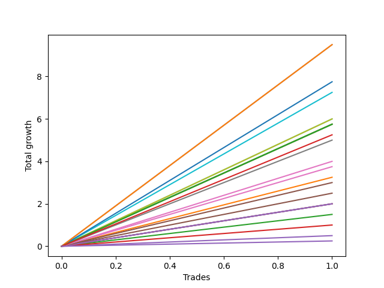

# Short Bernese 002 1v 
- Symbol: ES_830-1130
- Date Range: 03/18/2022 - 12/30/2022
- Trading Period: 8:30-11:30
- Number of Trades: 1



| Name | Win Percent | Profit | Avg Profit / Trade | Avg Time / Trade |      | Name | Win Percent | Profit | Avg Profit / Trade | Avg Time / Trade |
| ---- | ----------- | ------ | ------------------ | ---------------- | ---- | ---- | ----------- | ------ | ------------------ | ---------------- |
| Sorted By <br> Profit | | | | | | Sorted By <br> Win Percentage ||||
| TP-9 | 100.00 | 4750.00 | 4750.00 | 53:45 |     | TP-9 | 100.00 | 4750.00 | 4750.00 | 53:45 |
| V Mid | 100.00 | 4750.00 | 4750.00 | 53:45 |     | V Mid | 100.00 | 4750.00 | 4750.00 | 53:45 |
| TP-8 | 100.00 | 3875.00 | 3875.00 | 52:50 |     | TP-8 | 100.00 | 3875.00 | 3875.00 | 52:50 |
| TP-7 | 100.00 | 3625.00 | 3625.00 | 38:50 |     | TP-7 | 100.00 | 3625.00 | 3625.00 | 38:50 |
| TP-6 | 100.00 | 3000.00 | 3000.00 | 38:20 |     | TP-6 | 100.00 | 3000.00 | 3000.00 | 38:20 |
| BB-100 Mid | 100.00 | 3000.00 | 3000.00 | 38:25 |     | BB-100 Mid | 100.00 | 3000.00 | 3000.00 | 38:25 |
| TP-10 | 100.00 | 2875.00 | 2875.00 | 60:55 |     | TP-10 | 100.00 | 2875.00 | 2875.00 | 60:55 |
| BB-200 U/L 2SD | 100.00 | 2875.00 | 2875.00 | 60:55 |     | BB-200 U/L 2SD | 100.00 | 2875.00 | 2875.00 | 60:55 |
| BB-200 Mid | 100.00 | 2875.00 | 2875.00 | 60:55 |     | BB-200 Mid | 100.00 | 2875.00 | 2875.00 | 60:55 |
| BB-100 U/L 2SD | 100.00 | 2875.00 | 2875.00 | 60:55 |     | BB-100 U/L 2SD | 100.00 | 2875.00 | 2875.00 | 60:55 |
| V U/L 1SD | 100.00 | 2875.00 | 2875.00 | 60:55 |     | V U/L 1SD | 100.00 | 2875.00 | 2875.00 | 60:55 |
| NEWFI 000 | 100.00 | 2625.00 | 2625.00 | 42:05 |     | NEWFI 000 | 100.00 | 2625.00 | 2625.00 | 42:05 |
| TP-5 | 100.00 | 2500.00 | 2500.00 | 38:05 |     | TP-5 | 100.00 | 2500.00 | 2500.00 | 38:05 |
| TP-4 | 100.00 | 2000.00 | 2000.00 | 37:45 |     | TP-4 | 100.00 | 2000.00 | 2000.00 | 37:45 |
| BB-50 U/L 2SD | 100.00 | 1875.00 | 1875.00 | 37:40 |     | BB-50 U/L 2SD | 100.00 | 1875.00 | 1875.00 | 37:40 |
| BB-20 U/L 1SD | 100.00 | 1625.00 | 1625.00 | 05:15 |     | BB-20 U/L 1SD | 100.00 | 1625.00 | 1625.00 | 05:15 |
| TP-3 | 100.00 | 1500.00 | 1500.00 | 02:45 |     | TP-3 | 100.00 | 1500.00 | 1500.00 | 02:45 |
| BB-50 U/L 1SD | 100.00 | 1250.00 | 1250.00 | 34:05 |     | BB-50 U/L 1SD | 100.00 | 1250.00 | 1250.00 | 34:05 |
| TP-2 | 100.00 | 1000.00 | 1000.00 | 02:05 |     | TP-2 | 100.00 | 1000.00 | 1000.00 | 02:05 |
| BB-20 U/L 2SD C | 100.00 | 1000.00 | 1000.00 | 32:35 |     | BB-20 U/L 2SD C | 100.00 | 1000.00 | 1000.00 | 32:35 |
| BB-20 Mid | 100.00 | 1000.00 | 1000.00 | 02:05 |     | BB-20 Mid | 100.00 | 1000.00 | 1000.00 | 02:05 |
| BB-20 U/L 2SD | 100.00 | 750.00 | 750.00 | 31:30 |     | BB-20 U/L 2SD | 100.00 | 750.00 | 750.00 | 31:30 |
| TP-1 | 100.00 | 500.00 | 500.00 | 01:55 |     | TP-1 | 100.00 | 500.00 | 500.00 | 01:55 |
| BB-50 Mid | 100.00 | 250.00 | 250.00 | 29:35 |     | BB-50 Mid | 100.00 | 250.00 | 250.00 | 29:35 |
| NEWFI 0000 | 100.00 | 125.00 | 125.00 | 01:05 |     | NEWFI 0000 | 100.00 | 125.00 | 125.00 | 01:05 |

## NO STOPLOSS

### Test BB-20 Mid
* Sell when price hits the middle line of the 20p bollinger
* No Stoploss
* Results:
```
Total Trades: 1
Percent Up: 0.00
Percent Down: 100.00
Total Points Moved Down: 2.00
Potential Profit: 1000.00
Total Points Ups: 0.00 Count Ups: 0
Total Points Downs: 2.00 Count Downs: 1
```

<details><summary>Trades</summary>

<code>In: 2022-08-05 10:18:00		Out: 2022-08-05 10:20:05		Total Position Time: 02:05		Total Move Down: 2.00		Total to Date: 2.00</code> <br />


</details>

### Test BB-20 U/L 1SD
* Sell when the price hits the lower line of the 20p 1std bollinger
* No Stoploss
* Results:
```
Total Trades: 1
Percent Up: 0.00
Percent Down: 100.00
Total Points Moved Down: 3.25
Potential Profit: 1625.00
Total Points Ups: 0.00 Count Ups: 0
Total Points Downs: 3.25 Count Downs: 1
```

<details><summary>Trades</summary>

<code>In: 2022-08-05 10:18:00		Out: 2022-08-05 10:23:15		Total Position Time: 05:15		Total Move Down: 3.25		Total to Date: 3.25</code> <br />


</details>

### Test BB-20 U/L 2SD
* Sell when the price hits the lower line of the 20p 2std bollinger
* No Stoploss
* Results:
```
Total Trades: 1
Percent Up: 0.00
Percent Down: 100.00
Total Points Moved Down: 1.50
Potential Profit: 750.00
Total Points Ups: 0.00 Count Ups: 0
Total Points Downs: 1.50 Count Downs: 1
```

<details><summary>Trades</summary>

<code>In: 2022-08-05 10:18:00		Out: 2022-08-05 10:49:30		Total Position Time: 31:30		Total Move Down: 1.50		Total to Date: 1.50</code> <br />


</details>

### Test BB-20 U/L 2SD C
* Sell when the price hits the lower line of the 20p 2std bollinger
* No Stoploss
* Results:
```
Total Trades: 1
Percent Up: 0.00
Percent Down: 100.00
Total Points Moved Down: 2.00
Potential Profit: 1000.00
Total Points Ups: 0.00 Count Ups: 0
Total Points Downs: 2.00 Count Downs: 1
```

<details><summary>Trades</summary>

<code>In: 2022-08-05 10:18:00		Out: 2022-08-05 10:50:35		Total Position Time: 32:35		Total Move Down: 2.00		Total to Date: 2.00</code> <br />


</details>

### Test BB-50 Mid
* Sell when price hits the middle line of the 50p bollinger
* No Stoploss
* Results:
```
Total Trades: 1
Percent Up: 0.00
Percent Down: 100.00
Total Points Moved Down: 0.50
Potential Profit: 250.00
Total Points Ups: 0.00 Count Ups: 0
Total Points Downs: 0.50 Count Downs: 1
```

<details><summary>Trades</summary>

<code>In: 2022-08-05 10:18:00		Out: 2022-08-05 10:47:35		Total Position Time: 29:35		Total Move Down: 0.50		Total to Date: 0.50</code> <br />


</details>

### Test BB-50 U/L 1SD
* Sell when the price hits the lower line of the 50p 1std bollinger
* No Stoploss
* Results:
```
Total Trades: 1
Percent Up: 0.00
Percent Down: 100.00
Total Points Moved Down: 2.50
Potential Profit: 1250.00
Total Points Ups: 0.00 Count Ups: 0
Total Points Downs: 2.50 Count Downs: 1
```

<details><summary>Trades</summary>

<code>In: 2022-08-05 10:18:00		Out: 2022-08-05 10:52:05		Total Position Time: 34:05		Total Move Down: 2.50		Total to Date: 2.50</code> <br />


</details>

### Test BB-50 U/L 2SD
* Sell when the price hits the lower line of the 50p 2std bollinger
* No Stoploss
* Results:
```
Total Trades: 1
Percent Up: 0.00
Percent Down: 100.00
Total Points Moved Down: 3.75
Potential Profit: 1875.00
Total Points Ups: 0.00 Count Ups: 0
Total Points Downs: 3.75 Count Downs: 1
```

<details><summary>Trades</summary>

<code>In: 2022-08-05 10:18:00		Out: 2022-08-05 10:55:40		Total Position Time: 37:40		Total Move Down: 3.75		Total to Date: 3.75</code> <br />


</details>

### Test V Mid
* Sell when the price hits the middle line of the 1std VWAP
* No Stoploss
* Results:
```
Total Trades: 1
Percent Up: 0.00
Percent Down: 100.00
Total Points Moved Down: 9.50
Potential Profit: 4750.00
Total Points Ups: 0.00 Count Ups: 0
Total Points Downs: 9.50 Count Downs: 1
```

<details><summary>Trades</summary>

<code>In: 2022-08-05 10:18:00		Out: 2022-08-05 11:11:45		Total Position Time: 53:45		Total Move Down: 9.50		Total to Date: 9.50</code> <br />


</details>

### Test V U/L 1SD
* Sell when the price hits the lower line of the 1std VWAP
* No Stoploss
* Results:
```
Total Trades: 1
Percent Up: 0.00
Percent Down: 100.00
Total Points Moved Down: 5.75
Potential Profit: 2875.00
Total Points Ups: 0.00 Count Ups: 0
Total Points Downs: 5.75 Count Downs: 1
```

<details><summary>Trades</summary>

<code>In: 2022-08-05 10:18:00		Out: 2022-08-05 11:18:55		Total Position Time: 60:55		Total Move Down: 5.75		Total to Date: 5.75</code> <br />


</details>

### Test BB-100 Mid
* Move to BB100 Mid
* No Stoploss
* Results:
```
Total Trades: 1
Percent Up: 0.00
Percent Down: 100.00
Total Points Moved Down: 6.00
Potential Profit: 3000.00
Total Points Ups: 0.00 Count Ups: 0
Total Points Downs: 6.00 Count Downs: 1
```

<details><summary>Trades</summary>

<code>In: 2022-08-05 10:18:00		Out: 2022-08-05 10:56:25		Total Position Time: 38:25		Total Move Down: 6.00		Total to Date: 6.00</code> <br />


</details>

### Test BB-100 U/L 2SD
* Move to BB100 Upper Band
* No Stoploss
* Results:
```
Total Trades: 1
Percent Up: 0.00
Percent Down: 100.00
Total Points Moved Down: 5.75
Potential Profit: 2875.00
Total Points Ups: 0.00 Count Ups: 0
Total Points Downs: 5.75 Count Downs: 1
```

<details><summary>Trades</summary>

<code>In: 2022-08-05 10:18:00		Out: 2022-08-05 11:18:55		Total Position Time: 60:55		Total Move Down: 5.75		Total to Date: 5.75</code> <br />


</details>

### Test BB-200 Mid
* Move to BB200 Mid
* No Stoploss
* Results:
```
Total Trades: 1
Percent Up: 0.00
Percent Down: 100.00
Total Points Moved Down: 5.75
Potential Profit: 2875.00
Total Points Ups: 0.00 Count Ups: 0
Total Points Downs: 5.75 Count Downs: 1
```

<details><summary>Trades</summary>

<code>In: 2022-08-05 10:18:00		Out: 2022-08-05 11:18:55		Total Position Time: 60:55		Total Move Down: 5.75		Total to Date: 5.75</code> <br />


</details>

### Test BB-200 U/L 2SD
* Move to BB200 Upper Band
* No Stoploss
* Results:
```
Total Trades: 1
Percent Up: 0.00
Percent Down: 100.00
Total Points Moved Down: 5.75
Potential Profit: 2875.00
Total Points Ups: 0.00 Count Ups: 0
Total Points Downs: 5.75 Count Downs: 1
```

<details><summary>Trades</summary>

<code>In: 2022-08-05 10:18:00		Out: 2022-08-05 11:18:55		Total Position Time: 60:55		Total Move Down: 5.75		Total to Date: 5.75</code> <br />


</details>

## TAKE PROFIT

### Test TP-1
* Take Profit of 1 Point
* No Stoploss
* Results:
```
Total Trades: 1
Percent Up: 0.00
Percent Down: 100.00
Total Points Moved Down: 1.00
Potential Profit: 500.00
Total Points Ups: 0.00 Count Ups: 0
Total Points Downs: 1.00 Count Downs: 1
```

<details><summary>Trades</summary>

<code>In: 2022-08-05 10:18:00		Out: 2022-08-05 10:19:55		Total Position Time: 01:55		Total Move Down: 1.00		Total to Date: 1.00</code> <br />


</details>

### Test TP-2
* Take Profit of 2 Point
* No Stoploss
* Results:
```
Total Trades: 1
Percent Up: 0.00
Percent Down: 100.00
Total Points Moved Down: 2.00
Potential Profit: 1000.00
Total Points Ups: 0.00 Count Ups: 0
Total Points Downs: 2.00 Count Downs: 1
```

<details><summary>Trades</summary>

<code>In: 2022-08-05 10:18:00		Out: 2022-08-05 10:20:05		Total Position Time: 02:05		Total Move Down: 2.00		Total to Date: 2.00</code> <br />


</details>

### Test TP-3
* Take Profit of 3 Point
* No Stoploss
* Results:
```
Total Trades: 1
Percent Up: 0.00
Percent Down: 100.00
Total Points Moved Down: 3.00
Potential Profit: 1500.00
Total Points Ups: 0.00 Count Ups: 0
Total Points Downs: 3.00 Count Downs: 1
```

<details><summary>Trades</summary>

<code>In: 2022-08-05 10:18:00		Out: 2022-08-05 10:20:45		Total Position Time: 02:45		Total Move Down: 3.00		Total to Date: 3.00</code> <br />


</details>

### Test TP-4
* Take Profit of 4 Point
* No Stoploss
* Results:
```
Total Trades: 1
Percent Up: 0.00
Percent Down: 100.00
Total Points Moved Down: 4.00
Potential Profit: 2000.00
Total Points Ups: 0.00 Count Ups: 0
Total Points Downs: 4.00 Count Downs: 1
```

<details><summary>Trades</summary>

<code>In: 2022-08-05 10:18:00		Out: 2022-08-05 10:55:45		Total Position Time: 37:45		Total Move Down: 4.00		Total to Date: 4.00</code> <br />


</details>

### Test TP-5
* Take Profit of 5 Point
* No Stoploss
* Results:
```
Total Trades: 1
Percent Up: 0.00
Percent Down: 100.00
Total Points Moved Down: 5.00
Potential Profit: 2500.00
Total Points Ups: 0.00 Count Ups: 0
Total Points Downs: 5.00 Count Downs: 1
```

<details><summary>Trades</summary>

<code>In: 2022-08-05 10:18:00		Out: 2022-08-05 10:56:05		Total Position Time: 38:05		Total Move Down: 5.00		Total to Date: 5.00</code> <br />


</details>

### Test TP-6
* Take Profit of 6 Point
* No Stoploss
* Results:
```
Total Trades: 1
Percent Up: 0.00
Percent Down: 100.00
Total Points Moved Down: 6.00
Potential Profit: 3000.00
Total Points Ups: 0.00 Count Ups: 0
Total Points Downs: 6.00 Count Downs: 1
```

<details><summary>Trades</summary>

<code>In: 2022-08-05 10:18:00		Out: 2022-08-05 10:56:20		Total Position Time: 38:20		Total Move Down: 6.00		Total to Date: 6.00</code> <br />


</details>

### Test TP-7
* Take Profit of 7 Point
* No Stoploss
* Results:
```
Total Trades: 1
Percent Up: 0.00
Percent Down: 100.00
Total Points Moved Down: 7.25
Potential Profit: 3625.00
Total Points Ups: 0.00 Count Ups: 0
Total Points Downs: 7.25 Count Downs: 1
```

<details><summary>Trades</summary>

<code>In: 2022-08-05 10:18:00		Out: 2022-08-05 10:56:50		Total Position Time: 38:50		Total Move Down: 7.25		Total to Date: 7.25</code> <br />


</details>

### Test TP-8
* Take Profit of 8 Point
* No Stoploss
* Results:
```
Total Trades: 1
Percent Up: 0.00
Percent Down: 100.00
Total Points Moved Down: 7.75
Potential Profit: 3875.00
Total Points Ups: 0.00 Count Ups: 0
Total Points Downs: 7.75 Count Downs: 1
```

<details><summary>Trades</summary>

<code>In: 2022-08-05 10:18:00		Out: 2022-08-05 11:10:50		Total Position Time: 52:50		Total Move Down: 7.75		Total to Date: 7.75</code> <br />


</details>

### Test TP-9
* Take Profit of 9 Point
* No Stoploss
* Results:
```
Total Trades: 1
Percent Up: 0.00
Percent Down: 100.00
Total Points Moved Down: 9.50
Potential Profit: 4750.00
Total Points Ups: 0.00 Count Ups: 0
Total Points Downs: 9.50 Count Downs: 1
```

<details><summary>Trades</summary>

<code>In: 2022-08-05 10:18:00		Out: 2022-08-05 11:11:45		Total Position Time: 53:45		Total Move Down: 9.50		Total to Date: 9.50</code> <br />


</details>

### Test TP-10
* Take Profit of 10 Point
* No Stoploss
* Results:
```
Total Trades: 1
Percent Up: 0.00
Percent Down: 100.00
Total Points Moved Down: 5.75
Potential Profit: 2875.00
Total Points Ups: 0.00 Count Ups: 0
Total Points Downs: 5.75 Count Downs: 1
```

<details><summary>Trades</summary>

<code>In: 2022-08-05 10:18:00		Out: 2022-08-05 11:18:55		Total Position Time: 60:55		Total Move Down: 5.75		Total to Date: 5.75</code> <br />


</details>

## Indicator Exits

### Test NEWFI 000
* Newfi 0000
* No Stoploss
* Results:
```
Total Trades: 1
Percent Up: 0.00
Percent Down: 100.00
Total Points Moved Down: 5.25
Potential Profit: 2625.00
Total Points Ups: 0.00 Count Ups: 0
Total Points Downs: 5.25 Count Downs: 1
```

<details><summary>Trades</summary>

<code>In: 2022-08-05 10:18:00		Out: 2022-08-05 11:00:05		Total Position Time: 42:05		Total Move Down: 5.25		Total to Date: 5.25</code> <br />


</details>

### Test NEWFI 0000
* Newfi 0000
* No Stoploss
* Results:
```
Total Trades: 1
Percent Up: 0.00
Percent Down: 100.00
Total Points Moved Down: 0.25
Potential Profit: 125.00
Total Points Ups: 0.00 Count Ups: 0
Total Points Downs: 0.25 Count Downs: 1
```

<details><summary>Trades</summary>

<code>In: 2022-08-05 10:18:00		Out: 2022-08-05 10:19:05		Total Position Time: 01:05		Total Move Down: 0.25		Total to Date: 0.25</code> <br />


</details>