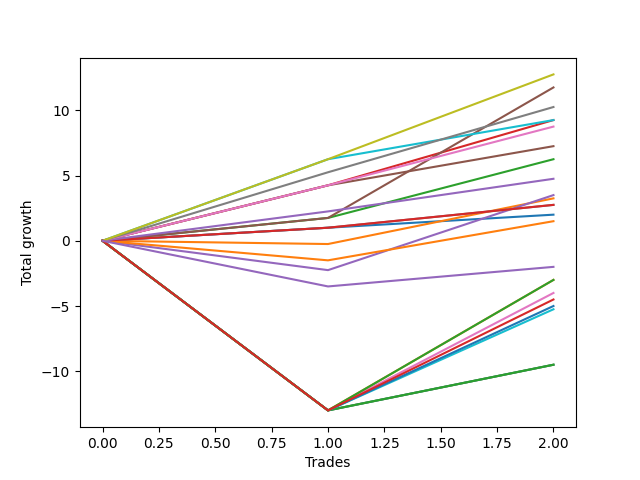

# Short Bernese 002 50 
- Symbol: ES_830-1130
- Date Range: 03/18/2022 - 12/30/2022
- Trading Period: 8:30-11:30
- Number of Trades: 2



| Name | Win Percent | Profit | Avg Profit / Trade | Avg Time / Trade |      | Name | Win Percent | Profit | Avg Profit / Trade | Avg Time / Trade |
| ---- | ----------- | ------ | ------------------ | ---------------- | ---- | ---- | ----------- | ------ | ------------------ | ---------------- |
| Sorted By <br> Profit | | | | | | Sorted By <br> Win Percentage ||||
| TP-6 | 100.00 | 6375.00 | 3187.50 | 22:05 |     | TP-6 | 100.00 | 6375.00 | 3187.50 | 22:05 |
| BB-50 U/L 1SD | 100.00 | 5875.00 | 2937.50 | 25:12 |     | BB-50 U/L 1SD | 100.00 | 5875.00 | 2937.50 | 25:12 |
| TP-5 | 100.00 | 5125.00 | 2562.50 | 21:52 |     | TP-5 | 100.00 | 5125.00 | 2562.50 | 21:52 |
| BB-100 Mid | 100.00 | 4625.00 | 2312.50 | 19:05 |     | BB-100 Mid | 100.00 | 4625.00 | 2312.50 | 19:05 |
| BB-20 U/L 2SD C | 100.00 | 4625.00 | 2312.50 | 21:42 |     | BB-20 U/L 2SD C | 100.00 | 4625.00 | 2312.50 | 21:42 |
| TP-4 | 100.00 | 4375.00 | 2187.50 | 21:40 |     | TP-4 | 100.00 | 4375.00 | 2187.50 | 21:40 |
| TP-3 | 100.00 | 3625.00 | 1812.50 | 18:47 |     | TP-3 | 100.00 | 3625.00 | 1812.50 | 18:47 |
| BB-20 U/L 2SD | 100.00 | 3125.00 | 1562.50 | 21:37 |     | BB-20 U/L 2SD | 100.00 | 3125.00 | 1562.50 | 21:37 |
| TP-2 | 100.00 | 2375.00 | 1187.50 | 03:40 |     | TP-2 | 100.00 | 2375.00 | 1187.50 | 03:40 |
| BB-50 Mid | 50.00 | 1750.00 | 875.00 | 18:37 |     | TP-1 | 100.00 | 1375.00 | 687.50 | 01:37 |
| BB-20 U/L 1SD | 50.00 | 1625.00 | 812.50 | 09:55 |     | V Mid | 100.00 | 1375.00 | 687.50 | 01:37 |
| TP-1 | 100.00 | 1375.00 | 687.50 | 01:37 |     | BB-20 Mid | 100.00 | 1000.00 | 500.00 | 03:05 |
| V Mid | 100.00 | 1375.00 | 687.50 | 01:37 |     | BB-50 Mid | 50.00 | 1750.00 | 875.00 | 18:37 |
| BB-20 Mid | 100.00 | 1000.00 | 500.00 | 03:05 |     | BB-20 U/L 1SD | 50.00 | 1625.00 | 812.50 | 09:55 |
| BB-200 Mid | 50.00 | 750.00 | 375.00 | 03:15 |     | BB-200 Mid | 50.00 | 750.00 | 375.00 | 03:15 |
| NEWFI 0000 | 50.00 | -1000.00 | -500.00 | 06:35 |     | NEWFI 0000 | 50.00 | -1000.00 | -500.00 | 06:35 |
| TP-10 | 50.00 | -1500.00 | -750.00 | 39:35 |     | TP-10 | 50.00 | -1500.00 | -750.00 | 39:35 |
| TP-9 | 50.00 | -1500.00 | -750.00 | 39:32 |     | TP-9 | 50.00 | -1500.00 | -750.00 | 39:32 |
| BB-50 U/L 2SD | 50.00 | -2000.00 | -1000.00 | 51:20 |     | BB-50 U/L 2SD | 50.00 | -2000.00 | -1000.00 | 51:20 |
| NEWFI 000 | 50.00 | -2250.00 | -1125.00 | 55:30 |     | NEWFI 000 | 50.00 | -2250.00 | -1125.00 | 55:30 |
| TP-8 | 50.00 | -2500.00 | -1250.00 | 39:15 |     | TP-8 | 50.00 | -2500.00 | -1250.00 | 39:15 |
| TP-7 | 50.00 | -2625.00 | -1312.50 | 36:25 |     | TP-7 | 50.00 | -2625.00 | -1312.50 | 36:25 |
| BB-200 U/L 2SD | 50.00 | -4750.00 | -2375.00 | 60:55 |     | BB-200 U/L 2SD | 50.00 | -4750.00 | -2375.00 | 60:55 |
| BB-100 U/L 2SD | 50.00 | -4750.00 | -2375.00 | 60:55 |     | BB-100 U/L 2SD | 50.00 | -4750.00 | -2375.00 | 60:55 |
| V U/L 1SD | 50.00 | -4750.00 | -2375.00 | 60:55 |     | V U/L 1SD | 50.00 | -4750.00 | -2375.00 | 60:55 |

## NO STOPLOSS

### Test BB-20 Mid
* Sell when price hits the middle line of the 20p bollinger
* No Stoploss
* Results:
```
Total Trades: 2
Percent Up: 0.00
Percent Down: 100.00
Total Points Moved Down: 2.00
Potential Profit: 1000.00
Total Points Ups: 0.00 Count Ups: 0
Total Points Downs: 2.00 Count Downs: 2
```

<details><summary>Trades</summary>

<code>In: 2022-04-25 09:29:00		Out: 2022-04-25 09:31:05		Total Position Time: 02:05		Total Move Down: 1.00		Total to Date: 1.00</code> <br />
<code>In: 2022-10-06 09:51:00		Out: 2022-10-06 09:55:05		Total Position Time: 04:05		Total Move Down: 1.00		Total to Date: 2.00</code> <br />


</details>

### Test BB-20 U/L 1SD
* Sell when the price hits the lower line of the 20p 1std bollinger
* No Stoploss
* Results:
```
Total Trades: 2
Percent Up: 50.00
Percent Down: 50.00
Total Points Moved Down: 3.25
Potential Profit: 1625.00
Total Points Ups: 0.25 Count Ups: 1
Total Points Downs: 3.50 Count Downs: 1
```

<details><summary>Trades</summary>

<code>In: 2022-04-25 09:29:00		Out: 2022-04-25 09:42:45		Total Position Time: 13:45		Total Move Down: -0.25		Total to Date: -0.25</code> <br />
<code>In: 2022-10-06 09:51:00		Out: 2022-10-06 09:57:05		Total Position Time: 06:05		Total Move Down: 3.50		Total to Date: 3.25</code> <br />


</details>

### Test BB-20 U/L 2SD
* Sell when the price hits the lower line of the 20p 2std bollinger
* No Stoploss
* Results:
```
Total Trades: 2
Percent Up: 0.00
Percent Down: 100.00
Total Points Moved Down: 6.25
Potential Profit: 3125.00
Total Points Ups: 0.00 Count Ups: 0
Total Points Downs: 6.25 Count Downs: 2
```

<details><summary>Trades</summary>

<code>In: 2022-04-25 09:29:00		Out: 2022-04-25 10:01:15		Total Position Time: 32:15		Total Move Down: 1.75		Total to Date: 1.75</code> <br />
<code>In: 2022-10-06 09:51:00		Out: 2022-10-06 10:02:00		Total Position Time: 11:00		Total Move Down: 4.50		Total to Date: 6.25</code> <br />


</details>

### Test BB-20 U/L 2SD C
* Sell when the price hits the lower line of the 20p 2std bollinger
* No Stoploss
* Results:
```
Total Trades: 2
Percent Up: 0.00
Percent Down: 100.00
Total Points Moved Down: 9.25
Potential Profit: 4625.00
Total Points Ups: 0.00 Count Ups: 0
Total Points Downs: 9.25 Count Downs: 2
```

<details><summary>Trades</summary>

<code>In: 2022-04-25 09:29:00		Out: 2022-04-25 10:01:20		Total Position Time: 32:20		Total Move Down: 4.25		Total to Date: 4.25</code> <br />
<code>In: 2022-10-06 09:51:00		Out: 2022-10-06 10:02:05		Total Position Time: 11:05		Total Move Down: 5.00		Total to Date: 9.25</code> <br />


</details>

### Test BB-50 Mid
* Sell when price hits the middle line of the 50p bollinger
* No Stoploss
* Results:
```
Total Trades: 2
Percent Up: 50.00
Percent Down: 50.00
Total Points Moved Down: 3.50
Potential Profit: 1750.00
Total Points Ups: 2.25 Count Ups: 1
Total Points Downs: 5.75 Count Downs: 1
```

<details><summary>Trades</summary>

<code>In: 2022-04-25 09:29:00		Out: 2022-04-25 09:55:05		Total Position Time: 26:05		Total Move Down: -2.25		Total to Date: -2.25</code> <br />
<code>In: 2022-10-06 09:51:00		Out: 2022-10-06 10:02:10		Total Position Time: 11:10		Total Move Down: 5.75		Total to Date: 3.50</code> <br />


</details>

### Test BB-50 U/L 1SD
* Sell when the price hits the lower line of the 50p 1std bollinger
* No Stoploss
* Results:
```
Total Trades: 2
Percent Up: 0.00
Percent Down: 100.00
Total Points Moved Down: 11.75
Potential Profit: 5875.00
Total Points Ups: 0.00 Count Ups: 0
Total Points Downs: 11.75 Count Downs: 2
```

<details><summary>Trades</summary>

<code>In: 2022-04-25 09:29:00		Out: 2022-04-25 10:01:15		Total Position Time: 32:15		Total Move Down: 1.75		Total to Date: 1.75</code> <br />
<code>In: 2022-10-06 09:51:00		Out: 2022-10-06 10:09:10		Total Position Time: 18:10		Total Move Down: 10.00		Total to Date: 11.75</code> <br />


</details>

### Test BB-50 U/L 2SD
* Sell when the price hits the lower line of the 50p 2std bollinger
* No Stoploss
* Results:
```
Total Trades: 2
Percent Up: 50.00
Percent Down: 50.00
Total Points Moved Down: -4.00
Potential Profit: -2000.00
Total Points Ups: 13.00 Count Ups: 1
Total Points Downs: 9.00 Count Downs: 1
```

<details><summary>Trades</summary>

<code>In: 2022-04-25 09:29:00		Out: 2022-04-25 10:29:55		Total Position Time: 60:55		Total Move Down: -13.00		Total to Date: -13.00</code> <br />
<code>In: 2022-10-06 09:51:00		Out: 2022-10-06 10:32:45		Total Position Time: 41:45		Total Move Down: 9.00		Total to Date: -4.00</code> <br />


</details>

### Test V Mid
* Sell when the price hits the middle line of the 1std VWAP
* No Stoploss
* Results:
```
Total Trades: 2
Percent Up: 0.00
Percent Down: 100.00
Total Points Moved Down: 2.75
Potential Profit: 1375.00
Total Points Ups: 0.00 Count Ups: 0
Total Points Downs: 2.75 Count Downs: 2
```

<details><summary>Trades</summary>

<code>In: 2022-04-25 09:29:00		Out: 2022-04-25 09:31:05		Total Position Time: 02:05		Total Move Down: 1.00		Total to Date: 1.00</code> <br />
<code>In: 2022-10-06 09:51:00		Out: 2022-10-06 09:52:10		Total Position Time: 01:10		Total Move Down: 1.75		Total to Date: 2.75</code> <br />


</details>

### Test V U/L 1SD
* Sell when the price hits the lower line of the 1std VWAP
* No Stoploss
* Results:
```
Total Trades: 2
Percent Up: 50.00
Percent Down: 50.00
Total Points Moved Down: -9.50
Potential Profit: -4750.00
Total Points Ups: 13.00 Count Ups: 1
Total Points Downs: 3.50 Count Downs: 1
```

<details><summary>Trades</summary>

<code>In: 2022-04-25 09:29:00		Out: 2022-04-25 10:29:55		Total Position Time: 60:55		Total Move Down: -13.00		Total to Date: -13.00</code> <br />
<code>In: 2022-10-06 09:51:00		Out: 2022-10-06 10:51:55		Total Position Time: 60:55		Total Move Down: 3.50		Total to Date: -9.50</code> <br />


</details>

### Test BB-100 Mid
* Move to BB100 Mid
* No Stoploss
* Results:
```
Total Trades: 2
Percent Up: 0.00
Percent Down: 100.00
Total Points Moved Down: 9.25
Potential Profit: 4625.00
Total Points Ups: 0.00 Count Ups: 0
Total Points Downs: 9.25 Count Downs: 2
```

<details><summary>Trades</summary>

<code>In: 2022-04-25 09:29:00		Out: 2022-04-25 10:01:50		Total Position Time: 32:50		Total Move Down: 6.25		Total to Date: 6.25</code> <br />
<code>In: 2022-10-06 09:51:00		Out: 2022-10-06 09:56:20		Total Position Time: 05:20		Total Move Down: 3.00		Total to Date: 9.25</code> <br />


</details>

### Test BB-100 U/L 2SD
* Move to BB100 Upper Band
* No Stoploss
* Results:
```
Total Trades: 2
Percent Up: 50.00
Percent Down: 50.00
Total Points Moved Down: -9.50
Potential Profit: -4750.00
Total Points Ups: 13.00 Count Ups: 1
Total Points Downs: 3.50 Count Downs: 1
```

<details><summary>Trades</summary>

<code>In: 2022-04-25 09:29:00		Out: 2022-04-25 10:29:55		Total Position Time: 60:55		Total Move Down: -13.00		Total to Date: -13.00</code> <br />
<code>In: 2022-10-06 09:51:00		Out: 2022-10-06 10:51:55		Total Position Time: 60:55		Total Move Down: 3.50		Total to Date: -9.50</code> <br />


</details>

### Test BB-200 Mid
* Move to BB200 Mid
* No Stoploss
* Results:
```
Total Trades: 2
Percent Up: 50.00
Percent Down: 50.00
Total Points Moved Down: 1.50
Potential Profit: 750.00
Total Points Ups: 1.50 Count Ups: 1
Total Points Downs: 3.00 Count Downs: 1
```

<details><summary>Trades</summary>

<code>In: 2022-04-25 09:29:00		Out: 2022-04-25 09:30:10		Total Position Time: 01:10		Total Move Down: -1.50		Total to Date: -1.50</code> <br />
<code>In: 2022-10-06 09:51:00		Out: 2022-10-06 09:56:20		Total Position Time: 05:20		Total Move Down: 3.00		Total to Date: 1.50</code> <br />


</details>

### Test BB-200 U/L 2SD
* Move to BB200 Upper Band
* No Stoploss
* Results:
```
Total Trades: 2
Percent Up: 50.00
Percent Down: 50.00
Total Points Moved Down: -9.50
Potential Profit: -4750.00
Total Points Ups: 13.00 Count Ups: 1
Total Points Downs: 3.50 Count Downs: 1
```

<details><summary>Trades</summary>

<code>In: 2022-04-25 09:29:00		Out: 2022-04-25 10:29:55		Total Position Time: 60:55		Total Move Down: -13.00		Total to Date: -13.00</code> <br />
<code>In: 2022-10-06 09:51:00		Out: 2022-10-06 10:51:55		Total Position Time: 60:55		Total Move Down: 3.50		Total to Date: -9.50</code> <br />


</details>

## TAKE PROFIT

### Test TP-1
* Take Profit of 1 Point
* No Stoploss
* Results:
```
Total Trades: 2
Percent Up: 0.00
Percent Down: 100.00
Total Points Moved Down: 2.75
Potential Profit: 1375.00
Total Points Ups: 0.00 Count Ups: 0
Total Points Downs: 2.75 Count Downs: 2
```

<details><summary>Trades</summary>

<code>In: 2022-04-25 09:29:00		Out: 2022-04-25 09:31:05		Total Position Time: 02:05		Total Move Down: 1.00		Total to Date: 1.00</code> <br />
<code>In: 2022-10-06 09:51:00		Out: 2022-10-06 09:52:10		Total Position Time: 01:10		Total Move Down: 1.75		Total to Date: 2.75</code> <br />


</details>

### Test TP-2
* Take Profit of 2 Point
* No Stoploss
* Results:
```
Total Trades: 2
Percent Up: 0.00
Percent Down: 100.00
Total Points Moved Down: 4.75
Potential Profit: 2375.00
Total Points Ups: 0.00 Count Ups: 0
Total Points Downs: 4.75 Count Downs: 2
```

<details><summary>Trades</summary>

<code>In: 2022-04-25 09:29:00		Out: 2022-04-25 09:31:10		Total Position Time: 02:10		Total Move Down: 2.25		Total to Date: 2.25</code> <br />
<code>In: 2022-10-06 09:51:00		Out: 2022-10-06 09:56:10		Total Position Time: 05:10		Total Move Down: 2.50		Total to Date: 4.75</code> <br />


</details>

### Test TP-3
* Take Profit of 3 Point
* No Stoploss
* Results:
```
Total Trades: 2
Percent Up: 0.00
Percent Down: 100.00
Total Points Moved Down: 7.25
Potential Profit: 3625.00
Total Points Ups: 0.00 Count Ups: 0
Total Points Downs: 7.25 Count Downs: 2
```

<details><summary>Trades</summary>

<code>In: 2022-04-25 09:29:00		Out: 2022-04-25 10:01:20		Total Position Time: 32:20		Total Move Down: 4.25		Total to Date: 4.25</code> <br />
<code>In: 2022-10-06 09:51:00		Out: 2022-10-06 09:56:15		Total Position Time: 05:15		Total Move Down: 3.00		Total to Date: 7.25</code> <br />


</details>

### Test TP-4
* Take Profit of 4 Point
* No Stoploss
* Results:
```
Total Trades: 2
Percent Up: 0.00
Percent Down: 100.00
Total Points Moved Down: 8.75
Potential Profit: 4375.00
Total Points Ups: 0.00 Count Ups: 0
Total Points Downs: 8.75 Count Downs: 2
```

<details><summary>Trades</summary>

<code>In: 2022-04-25 09:29:00		Out: 2022-04-25 10:01:20		Total Position Time: 32:20		Total Move Down: 4.25		Total to Date: 4.25</code> <br />
<code>In: 2022-10-06 09:51:00		Out: 2022-10-06 10:02:00		Total Position Time: 11:00		Total Move Down: 4.50		Total to Date: 8.75</code> <br />


</details>

### Test TP-5
* Take Profit of 5 Point
* No Stoploss
* Results:
```
Total Trades: 2
Percent Up: 0.00
Percent Down: 100.00
Total Points Moved Down: 10.25
Potential Profit: 5125.00
Total Points Ups: 0.00 Count Ups: 0
Total Points Downs: 10.25 Count Downs: 2
```

<details><summary>Trades</summary>

<code>In: 2022-04-25 09:29:00		Out: 2022-04-25 10:01:40		Total Position Time: 32:40		Total Move Down: 5.25		Total to Date: 5.25</code> <br />
<code>In: 2022-10-06 09:51:00		Out: 2022-10-06 10:02:05		Total Position Time: 11:05		Total Move Down: 5.00		Total to Date: 10.25</code> <br />


</details>

### Test TP-6
* Take Profit of 6 Point
* No Stoploss
* Results:
```
Total Trades: 2
Percent Up: 0.00
Percent Down: 100.00
Total Points Moved Down: 12.75
Potential Profit: 6375.00
Total Points Ups: 0.00 Count Ups: 0
Total Points Downs: 12.75 Count Downs: 2
```

<details><summary>Trades</summary>

<code>In: 2022-04-25 09:29:00		Out: 2022-04-25 10:01:50		Total Position Time: 32:50		Total Move Down: 6.25		Total to Date: 6.25</code> <br />
<code>In: 2022-10-06 09:51:00		Out: 2022-10-06 10:02:20		Total Position Time: 11:20		Total Move Down: 6.50		Total to Date: 12.75</code> <br />


</details>

### Test TP-7
* Take Profit of 7 Point
* No Stoploss
* Results:
```
Total Trades: 2
Percent Up: 50.00
Percent Down: 50.00
Total Points Moved Down: -5.25
Potential Profit: -2625.00
Total Points Ups: 13.00 Count Ups: 1
Total Points Downs: 7.75 Count Downs: 1
```

<details><summary>Trades</summary>

<code>In: 2022-04-25 09:29:00		Out: 2022-04-25 10:29:55		Total Position Time: 60:55		Total Move Down: -13.00		Total to Date: -13.00</code> <br />
<code>In: 2022-10-06 09:51:00		Out: 2022-10-06 10:02:55		Total Position Time: 11:55		Total Move Down: 7.75		Total to Date: -5.25</code> <br />


</details>

### Test TP-8
* Take Profit of 8 Point
* No Stoploss
* Results:
```
Total Trades: 2
Percent Up: 50.00
Percent Down: 50.00
Total Points Moved Down: -5.00
Potential Profit: -2500.00
Total Points Ups: 13.00 Count Ups: 1
Total Points Downs: 8.00 Count Downs: 1
```

<details><summary>Trades</summary>

<code>In: 2022-04-25 09:29:00		Out: 2022-04-25 10:29:55		Total Position Time: 60:55		Total Move Down: -13.00		Total to Date: -13.00</code> <br />
<code>In: 2022-10-06 09:51:00		Out: 2022-10-06 10:08:35		Total Position Time: 17:35		Total Move Down: 8.00		Total to Date: -5.00</code> <br />


</details>

### Test TP-9
* Take Profit of 9 Point
* No Stoploss
* Results:
```
Total Trades: 2
Percent Up: 50.00
Percent Down: 50.00
Total Points Moved Down: -3.00
Potential Profit: -1500.00
Total Points Ups: 13.00 Count Ups: 1
Total Points Downs: 10.00 Count Downs: 1
```

<details><summary>Trades</summary>

<code>In: 2022-04-25 09:29:00		Out: 2022-04-25 10:29:55		Total Position Time: 60:55		Total Move Down: -13.00		Total to Date: -13.00</code> <br />
<code>In: 2022-10-06 09:51:00		Out: 2022-10-06 10:09:10		Total Position Time: 18:10		Total Move Down: 10.00		Total to Date: -3.00</code> <br />


</details>

### Test TP-10
* Take Profit of 10 Point
* No Stoploss
* Results:
```
Total Trades: 2
Percent Up: 50.00
Percent Down: 50.00
Total Points Moved Down: -3.00
Potential Profit: -1500.00
Total Points Ups: 13.00 Count Ups: 1
Total Points Downs: 10.00 Count Downs: 1
```

<details><summary>Trades</summary>

<code>In: 2022-04-25 09:29:00		Out: 2022-04-25 10:29:55		Total Position Time: 60:55		Total Move Down: -13.00		Total to Date: -13.00</code> <br />
<code>In: 2022-10-06 09:51:00		Out: 2022-10-06 10:09:15		Total Position Time: 18:15		Total Move Down: 10.00		Total to Date: -3.00</code> <br />


</details>

## Indicator Exits

### Test NEWFI 000
* Newfi 0000
* No Stoploss
* Results:
```
Total Trades: 2
Percent Up: 50.00
Percent Down: 50.00
Total Points Moved Down: -4.50
Potential Profit: -2250.00
Total Points Ups: 13.00 Count Ups: 1
Total Points Downs: 8.50 Count Downs: 1
```

<details><summary>Trades</summary>

<code>In: 2022-04-25 09:29:00		Out: 2022-04-25 10:29:55		Total Position Time: 60:55		Total Move Down: -13.00		Total to Date: -13.00</code> <br />
<code>In: 2022-10-06 09:51:00		Out: 2022-10-06 10:41:05		Total Position Time: 50:05		Total Move Down: 8.50		Total to Date: -4.50</code> <br />


</details>

### Test NEWFI 0000
* Newfi 0000
* No Stoploss
* Results:
```
Total Trades: 2
Percent Up: 50.00
Percent Down: 50.00
Total Points Moved Down: -2.00
Potential Profit: -1000.00
Total Points Ups: 3.50 Count Ups: 1
Total Points Downs: 1.50 Count Downs: 1
```

<details><summary>Trades</summary>

<code>In: 2022-04-25 09:29:00		Out: 2022-04-25 09:41:05		Total Position Time: 12:05		Total Move Down: -3.50		Total to Date: -3.50</code> <br />
<code>In: 2022-10-06 09:51:00		Out: 2022-10-06 09:52:05		Total Position Time: 01:05		Total Move Down: 1.50		Total to Date: -2.00</code> <br />


</details>