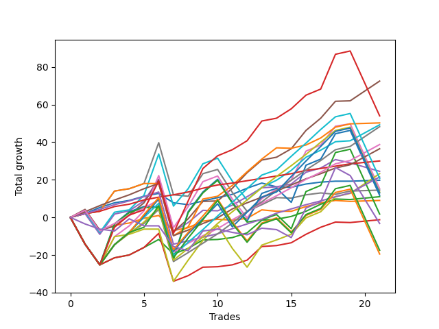

# Short Labrador 002 
- Symbol: ES_830-1130
- Date Range: 03/18/2022 - 12/30/2022
- Trading Period: 8:30-11:30
- Number of Trades: 21



| Name | Win Percent | Profit | Avg Profit / Trade | Avg Time / Trade |      | Name | Win Percent | Profit | Avg Profit / Trade | Avg Time / Trade |
| ---- | ----------- | ------ | ------------------ | ---------------- | ---- | ---- | ----------- | ------ | ------------------ | ---------------- |
| Sorted By <br> Profit | | | | | | Sorted By <br> Win Percentage ||||
| BB-50 U/L 1SD | 90.48 | 36250.00 | 1726.19 | 23:19 |     | TP-1 | 100.00 | 15000.00 | 714.29 | 06:32 |
| NEWFI 000 | 76.19 | 27000.00 | 1285.71 | 45:54 |     | TP-3 | 95.24 | 18250.00 | 869.05 | 14:57 |
| BB-200 Mid | 85.71 | 25125.00 | 1196.43 | 20:13 |     | TP-2 | 95.24 | 10750.00 | 511.90 | 12:08 |
| BB-100 Mid | 80.95 | 24625.00 | 1172.62 | 28:26 |     | BB-50 U/L 1SD | 90.48 | 36250.00 | 1726.19 | 23:19 |
| TP-5 | 85.71 | 24125.00 | 1148.81 | 25:09 |     | TP-4 | 90.48 | 19375.00 | 922.62 | 20:35 |
| TP-4 | 90.48 | 19375.00 | 922.62 | 20:35 |     | BB-200 Mid | 85.71 | 25125.00 | 1196.43 | 20:13 |
| TP-3 | 95.24 | 18250.00 | 869.05 | 14:57 |     | TP-5 | 85.71 | 24125.00 | 1148.81 | 25:09 |
| TP-1 | 100.00 | 15000.00 | 714.29 | 06:32 |     | BB-100 Mid | 80.95 | 24625.00 | 1172.62 | 28:26 |
| BB-50 Mid | 71.43 | 12250.00 | 583.33 | 18:33 |     | BB-20 U/L 2SD | 80.95 | 5500.00 | 261.90 | 16:10 |
| V U/L 1SD | 71.43 | 11625.00 | 553.57 | 39:46 |     | BB-20 U/L 2SD C | 80.95 | -625.00 | -29.76 | 17:59 |
| TP-2 | 95.24 | 10750.00 | 511.90 | 12:08 |     | NEWFI 000 | 76.19 | 27000.00 | 1285.71 | 45:54 |
| TP-7 | 76.19 | 10375.00 | 494.05 | 32:06 |     | TP-7 | 76.19 | 10375.00 | 494.05 | 32:06 |
| BB-20 Mid | 76.19 | 9875.00 | 470.24 | 03:58 |     | BB-20 Mid | 76.19 | 9875.00 | 470.24 | 03:58 |
| BB-50 U/L 2SD | 66.67 | 7625.00 | 363.10 | 44:19 |     | TP-6 | 76.19 | 6750.00 | 321.43 | 31:05 |
| V Mid | 71.43 | 7250.00 | 345.24 | 19:20 |     | BB-50 Mid | 71.43 | 12250.00 | 583.33 | 18:33 |
| TP-6 | 76.19 | 6750.00 | 321.43 | 31:05 |     | V U/L 1SD | 71.43 | 11625.00 | 553.57 | 39:46 |
| TP-8 | 71.43 | 6500.00 | 309.52 | 37:30 |     | V Mid | 71.43 | 7250.00 | 345.24 | 19:20 |
| BB-100 U/L 2SD | 57.14 | 5875.00 | 279.76 | 52:42 |     | TP-8 | 71.43 | 6500.00 | 309.52 | 37:30 |
| BB-20 U/L 2SD | 80.95 | 5500.00 | 261.90 | 16:10 |     | BB-20 U/L 1SD | 71.43 | 4500.00 | 214.29 | 09:13 |
| BB-20 U/L 1SD | 71.43 | 4500.00 | 214.29 | 09:13 |     | BB-50 U/L 2SD | 66.67 | 7625.00 | 363.10 | 44:19 |
| BB-200 U/L 2SD | 57.14 | 875.00 | 41.67 | 56:52 |     | TP-10 | 61.90 | -8750.00 | -416.67 | 44:48 |
| BB-20 U/L 2SD C | 80.95 | -625.00 | -29.76 | 17:59 |     | TP-9 | 61.90 | -9750.00 | -464.29 | 42:37 |
| NEWFI 0000 | 33.33 | -1625.00 | -77.38 | 24:42 |     | BB-100 U/L 2SD | 57.14 | 5875.00 | 279.76 | 52:42 |
| TP-10 | 61.90 | -8750.00 | -416.67 | 44:48 |     | BB-200 U/L 2SD | 57.14 | 875.00 | 41.67 | 56:52 |
| TP-9 | 61.90 | -9750.00 | -464.29 | 42:37 |     | NEWFI 0000 | 33.33 | -1625.00 | -77.38 | 24:42 |

## NO STOPLOSS

### Test BB-20 Mid
* Sell when price hits the middle line of the 20p bollinger
* No Stoploss
* Results:
```
Total Trades: 21
Percent Up: 23.81
Percent Down: 76.19
Total Points Moved Down: 19.75
Potential Profit: 9875.00
Total Points Ups: 8.25 Count Ups: 5
Total Points Downs: 28.00 Count Downs: 16
```

<details><summary>Trades</summary>

<code>In: 2022-03-25 10:23:00		Out: 2022-03-25 10:24:10		Total Position Time: 01:10		Total Move Down: 2.00		Total to Date: 2.00</code> <br />
<code>In: 2022-03-25 10:40:00		Out: 2022-03-25 10:42:05		Total Position Time: 02:05		Total Move Down: 3.25		Total to Date: 5.25</code> <br />
<code>In: 2022-04-06 10:56:00		Out: 2022-04-06 10:57:10		Total Position Time: 01:10		Total Move Down: 2.50		Total to Date: 7.75</code> <br />
<code>In: 2022-04-11 10:17:00		Out: 2022-04-11 10:18:10		Total Position Time: 01:10		Total Move Down: 1.25		Total to Date: 9.00</code> <br />
<code>In: 2022-04-18 10:53:00		Out: 2022-04-18 10:59:30		Total Position Time: 06:30		Total Move Down: 2.25		Total to Date: 11.25</code> <br />
<code>In: 2022-05-10 11:07:00		Out: 2022-05-10 11:08:10		Total Position Time: 01:10		Total Move Down: 1.50		Total to Date: 12.75</code> <br />
<code>In: 2022-05-25 11:24:00		Out: 2022-05-25 11:39:10		Total Position Time: 15:10		Total Move Down: -5.00		Total to Date: 7.75</code> <br />
<code>In: 2022-06-06 10:55:00		Out: 2022-06-06 11:07:10		Total Position Time: 12:10		Total Move Down: -1.00		Total to Date: 6.75</code> <br />
<code>In: 2022-06-29 11:19:00		Out: 2022-06-29 11:20:10		Total Position Time: 01:10		Total Move Down: 2.00		Total to Date: 8.75</code> <br />
<code>In: 2022-08-04 09:03:00		Out: 2022-08-04 09:04:10		Total Position Time: 01:10		Total Move Down: 1.75		Total to Date: 10.50</code> <br />
<code>In: 2022-08-29 09:08:00		Out: 2022-08-29 09:14:10		Total Position Time: 06:10		Total Move Down: 1.75		Total to Date: 12.25</code> <br />
<code>In: 2022-08-29 09:09:00		Out: 2022-08-29 09:14:10		Total Position Time: 05:10		Total Move Down: 3.25		Total to Date: 15.50</code> <br />
<code>In: 2022-09-22 09:56:00		Out: 2022-09-22 09:58:35		Total Position Time: 02:35		Total Move Down: 2.75		Total to Date: 18.25</code> <br />
<code>In: 2022-10-17 08:44:00		Out: 2022-10-17 08:59:05		Total Position Time: 15:05		Total Move Down: -2.00		Total to Date: 16.25</code> <br />
<code>In: 2022-10-19 11:21:00		Out: 2022-10-19 11:22:10		Total Position Time: 01:10		Total Move Down: -0.25		Total to Date: 16.00</code> <br />
<code>In: 2022-10-27 10:25:00		Out: 2022-10-27 10:26:10		Total Position Time: 01:10		Total Move Down: 1.75		Total to Date: 17.75</code> <br />
<code>In: 2022-11-01 10:25:00		Out: 2022-11-01 10:26:10		Total Position Time: 01:10		Total Move Down: 1.00		Total to Date: 18.75</code> <br />
<code>In: 2022-11-18 08:35:00		Out: 2022-11-18 08:37:10		Total Position Time: 02:10		Total Move Down: 0.50		Total to Date: 19.25</code> <br />
<code>In: 2022-11-21 10:24:00		Out: 2022-11-21 10:27:25		Total Position Time: 03:25		Total Move Down: -0.00		Total to Date: 19.25</code> <br />
<code>In: 2022-11-23 10:51:00		Out: 2022-11-23 10:52:10		Total Position Time: 01:10		Total Move Down: 0.25		Total to Date: 19.50</code> <br />
<code>In: 2022-11-23 10:51:00		Out: 2022-11-23 10:52:10		Total Position Time: 01:10		Total Move Down: 0.25		Total to Date: 19.75</code> <br />


</details>

### Test BB-20 U/L 1SD
* Sell when the price hits the lower line of the 20p 1std bollinger
* No Stoploss
* Results:
```
Total Trades: 21
Percent Up: 28.57
Percent Down: 71.43
Total Points Moved Down: 9.00
Potential Profit: 4500.00
Total Points Ups: 19.50 Count Ups: 6
Total Points Downs: 28.50 Count Downs: 15
```

<details><summary>Trades</summary>

<code>In: 2022-03-25 10:23:00		Out: 2022-03-25 10:24:15		Total Position Time: 01:15		Total Move Down: 3.00		Total to Date: 3.00</code> <br />
<code>In: 2022-03-25 10:40:00		Out: 2022-03-25 11:19:45		Total Position Time: 39:45		Total Move Down: -9.75		Total to Date: -6.75</code> <br />
<code>In: 2022-04-06 10:56:00		Out: 2022-04-06 10:57:10		Total Position Time: 01:10		Total Move Down: 2.50		Total to Date: -4.25</code> <br />
<code>In: 2022-04-11 10:17:00		Out: 2022-04-11 10:18:15		Total Position Time: 01:15		Total Move Down: 1.25		Total to Date: -3.00</code> <br />
<code>In: 2022-04-18 10:53:00		Out: 2022-04-18 11:06:35		Total Position Time: 13:35		Total Move Down: 2.50		Total to Date: -0.50</code> <br />
<code>In: 2022-05-10 11:07:00		Out: 2022-05-10 11:08:10		Total Position Time: 01:10		Total Move Down: 1.50		Total to Date: 1.00</code> <br />
<code>In: 2022-05-25 11:24:00		Out: 2022-05-25 11:49:55		Total Position Time: 25:55		Total Move Down: -8.00		Total to Date: -7.00</code> <br />
<code>In: 2022-06-06 10:55:00		Out: 2022-06-06 11:07:55		Total Position Time: 12:55		Total Move Down: 1.50		Total to Date: -5.50</code> <br />
<code>In: 2022-06-29 11:19:00		Out: 2022-06-29 11:20:35		Total Position Time: 01:35		Total Move Down: 3.50		Total to Date: -2.00</code> <br />
<code>In: 2022-08-04 09:03:00		Out: 2022-08-04 09:16:05		Total Position Time: 13:05		Total Move Down: 1.00		Total to Date: -1.00</code> <br />
<code>In: 2022-08-29 09:08:00		Out: 2022-08-29 09:24:15		Total Position Time: 16:15		Total Move Down: -0.50		Total to Date: -1.50</code> <br />
<code>In: 2022-08-29 09:09:00		Out: 2022-08-29 09:24:15		Total Position Time: 15:15		Total Move Down: 1.00		Total to Date: -0.50</code> <br />
<code>In: 2022-09-22 09:56:00		Out: 2022-09-22 09:59:15		Total Position Time: 03:15		Total Move Down: 4.50		Total to Date: 4.00</code> <br />
<code>In: 2022-10-17 08:44:00		Out: 2022-10-17 09:04:15		Total Position Time: 20:15		Total Move Down: -0.75		Total to Date: 3.25</code> <br />
<code>In: 2022-10-19 11:21:00		Out: 2022-10-19 11:28:05		Total Position Time: 07:05		Total Move Down: -0.00		Total to Date: 3.25</code> <br />
<code>In: 2022-10-27 10:25:00		Out: 2022-10-27 10:26:20		Total Position Time: 01:20		Total Move Down: 2.50		Total to Date: 5.75</code> <br />
<code>In: 2022-11-01 10:25:00		Out: 2022-11-01 10:30:05		Total Position Time: 05:05		Total Move Down: 2.00		Total to Date: 7.75</code> <br />
<code>In: 2022-11-18 08:35:00		Out: 2022-11-18 08:37:20		Total Position Time: 02:20		Total Move Down: 1.25		Total to Date: 9.00</code> <br />
<code>In: 2022-11-21 10:24:00		Out: 2022-11-21 10:33:00		Total Position Time: 09:00		Total Move Down: -0.50		Total to Date: 8.50</code> <br />
<code>In: 2022-11-23 10:51:00		Out: 2022-11-23 10:52:10		Total Position Time: 01:10		Total Move Down: 0.25		Total to Date: 8.75</code> <br />
<code>In: 2022-11-23 10:51:00		Out: 2022-11-23 10:52:10		Total Position Time: 01:10		Total Move Down: 0.25		Total to Date: 9.00</code> <br />


</details>

### Test BB-20 U/L 2SD
* Sell when the price hits the lower line of the 20p 2std bollinger
* No Stoploss
* Results:
```
Total Trades: 21
Percent Up: 19.05
Percent Down: 80.95
Total Points Moved Down: 11.00
Potential Profit: 5500.00
Total Points Ups: 33.25 Count Ups: 4
Total Points Downs: 44.25 Count Downs: 17
```

<details><summary>Trades</summary>

<code>In: 2022-03-25 10:23:00		Out: 2022-03-25 11:23:55		Total Position Time: 60:55		Total Move Down: -14.25		Total to Date: -14.25</code> <br />
<code>In: 2022-03-25 10:40:00		Out: 2022-03-25 11:40:55		Total Position Time: 60:55		Total Move Down: -11.00		Total to Date: -25.25</code> <br />
<code>In: 2022-04-06 10:56:00		Out: 2022-04-06 10:58:00		Total Position Time: 02:00		Total Move Down: 3.75		Total to Date: -21.50</code> <br />
<code>In: 2022-04-11 10:17:00		Out: 2022-04-11 10:21:05		Total Position Time: 04:05		Total Move Down: 1.50		Total to Date: -20.00</code> <br />
<code>In: 2022-04-18 10:53:00		Out: 2022-04-18 11:10:40		Total Position Time: 17:40		Total Move Down: 4.00		Total to Date: -16.00</code> <br />
<code>In: 2022-05-10 11:07:00		Out: 2022-05-10 11:11:10		Total Position Time: 04:10		Total Move Down: 4.25		Total to Date: -11.75</code> <br />
<code>In: 2022-05-25 11:24:00		Out: 2022-05-25 11:50:00		Total Position Time: 26:00		Total Move Down: -7.75		Total to Date: -19.50</code> <br />
<code>In: 2022-06-06 10:55:00		Out: 2022-06-06 11:09:05		Total Position Time: 14:05		Total Move Down: 3.00		Total to Date: -16.50</code> <br />
<code>In: 2022-06-29 11:19:00		Out: 2022-06-29 11:21:10		Total Position Time: 02:10		Total Move Down: 4.50		Total to Date: -12.00</code> <br />
<code>In: 2022-08-04 09:03:00		Out: 2022-08-04 09:38:50		Total Position Time: 35:50		Total Move Down: 0.25		Total to Date: -11.75</code> <br />
<code>In: 2022-08-29 09:08:00		Out: 2022-08-29 09:24:35		Total Position Time: 16:35		Total Move Down: 1.00		Total to Date: -10.75</code> <br />
<code>In: 2022-08-29 09:09:00		Out: 2022-08-29 09:24:35		Total Position Time: 15:35		Total Move Down: 2.50		Total to Date: -8.25</code> <br />
<code>In: 2022-09-22 09:56:00		Out: 2022-09-22 10:03:25		Total Position Time: 07:25		Total Move Down: 6.75		Total to Date: -1.50</code> <br />
<code>In: 2022-10-17 08:44:00		Out: 2022-10-17 09:12:25		Total Position Time: 28:25		Total Move Down: 0.50		Total to Date: -1.00</code> <br />
<code>In: 2022-10-19 11:21:00		Out: 2022-10-19 11:40:50		Total Position Time: 19:50		Total Move Down: 1.50		Total to Date: 0.50</code> <br />
<code>In: 2022-10-27 10:25:00		Out: 2022-10-27 10:27:05		Total Position Time: 02:05		Total Move Down: 2.75		Total to Date: 3.25</code> <br />
<code>In: 2022-11-01 10:25:00		Out: 2022-11-01 10:31:40		Total Position Time: 06:40		Total Move Down: 3.75		Total to Date: 7.00</code> <br />
<code>In: 2022-11-18 08:35:00		Out: 2022-11-18 08:38:05		Total Position Time: 03:05		Total Move Down: 2.75		Total to Date: 9.75</code> <br />
<code>In: 2022-11-21 10:24:00		Out: 2022-11-21 10:33:10		Total Position Time: 09:10		Total Move Down: -0.25		Total to Date: 9.50</code> <br />
<code>In: 2022-11-23 10:51:00		Out: 2022-11-23 10:52:30		Total Position Time: 01:30		Total Move Down: 0.75		Total to Date: 10.25</code> <br />
<code>In: 2022-11-23 10:51:00		Out: 2022-11-23 10:52:30		Total Position Time: 01:30		Total Move Down: 0.75		Total to Date: 11.00</code> <br />


</details>

### Test BB-20 U/L 2SD C
* Sell when the price hits the lower line of the 20p 2std bollinger
* No Stoploss
* Results:
```
Total Trades: 21
Percent Up: 19.05
Percent Down: 80.95
Total Points Moved Down: -1.25
Potential Profit: -625.00
Total Points Ups: 51.00 Count Ups: 4
Total Points Downs: 49.75 Count Downs: 17
```

<details><summary>Trades</summary>

<code>In: 2022-03-25 10:23:00		Out: 2022-03-25 11:23:55		Total Position Time: 60:55		Total Move Down: -14.25		Total to Date: -14.25</code> <br />
<code>In: 2022-03-25 10:40:00		Out: 2022-03-25 11:40:55		Total Position Time: 60:55		Total Move Down: -11.00		Total to Date: -25.25</code> <br />
<code>In: 2022-04-06 10:56:00		Out: 2022-04-06 10:58:05		Total Position Time: 02:05		Total Move Down: 3.75		Total to Date: -21.50</code> <br />
<code>In: 2022-04-11 10:17:00		Out: 2022-04-11 10:21:05		Total Position Time: 04:05		Total Move Down: 1.50		Total to Date: -20.00</code> <br />
<code>In: 2022-04-18 10:53:00		Out: 2022-04-18 11:10:40		Total Position Time: 17:40		Total Move Down: 4.00		Total to Date: -16.00</code> <br />
<code>In: 2022-05-10 11:07:00		Out: 2022-05-10 11:16:05		Total Position Time: 09:05		Total Move Down: 7.50		Total to Date: -8.50</code> <br />
<code>In: 2022-05-25 11:24:00		Out: 2022-05-25 12:23:00		Total Position Time: 59:00		Total Move Down: -25.50		Total to Date: -34.00</code> <br />
<code>In: 2022-06-06 10:55:00		Out: 2022-06-06 11:09:05		Total Position Time: 14:05		Total Move Down: 3.00		Total to Date: -31.00</code> <br />
<code>In: 2022-06-29 11:19:00		Out: 2022-06-29 11:21:15		Total Position Time: 02:15		Total Move Down: 4.50		Total to Date: -26.50</code> <br />
<code>In: 2022-08-04 09:03:00		Out: 2022-08-04 09:38:50		Total Position Time: 35:50		Total Move Down: 0.25		Total to Date: -26.25</code> <br />
<code>In: 2022-08-29 09:08:00		Out: 2022-08-29 09:24:35		Total Position Time: 16:35		Total Move Down: 1.00		Total to Date: -25.25</code> <br />
<code>In: 2022-08-29 09:09:00		Out: 2022-08-29 09:24:35		Total Position Time: 15:35		Total Move Down: 2.50		Total to Date: -22.75</code> <br />
<code>In: 2022-09-22 09:56:00		Out: 2022-09-22 10:03:30		Total Position Time: 07:30		Total Move Down: 7.25		Total to Date: -15.50</code> <br />
<code>In: 2022-10-17 08:44:00		Out: 2022-10-17 09:12:25		Total Position Time: 28:25		Total Move Down: 0.50		Total to Date: -15.00</code> <br />
<code>In: 2022-10-19 11:21:00		Out: 2022-10-19 11:40:50		Total Position Time: 19:50		Total Move Down: 1.50		Total to Date: -13.50</code> <br />
<code>In: 2022-10-27 10:25:00		Out: 2022-10-27 10:27:10		Total Position Time: 02:10		Total Move Down: 4.50		Total to Date: -9.00</code> <br />
<code>In: 2022-11-01 10:25:00		Out: 2022-11-01 10:31:40		Total Position Time: 06:40		Total Move Down: 3.75		Total to Date: -5.25</code> <br />
<code>In: 2022-11-18 08:35:00		Out: 2022-11-18 08:38:05		Total Position Time: 03:05		Total Move Down: 2.75		Total to Date: -2.50</code> <br />
<code>In: 2022-11-21 10:24:00		Out: 2022-11-21 10:33:10		Total Position Time: 09:10		Total Move Down: -0.25		Total to Date: -2.75</code> <br />
<code>In: 2022-11-23 10:51:00		Out: 2022-11-23 10:52:30		Total Position Time: 01:30		Total Move Down: 0.75		Total to Date: -2.00</code> <br />
<code>In: 2022-11-23 10:51:00		Out: 2022-11-23 10:52:30		Total Position Time: 01:30		Total Move Down: 0.75		Total to Date: -1.25</code> <br />


</details>

### Test BB-50 Mid
* Sell when price hits the middle line of the 50p bollinger
* No Stoploss
* Results:
```
Total Trades: 21
Percent Up: 28.57
Percent Down: 71.43
Total Points Moved Down: 24.50
Potential Profit: 12250.00
Total Points Ups: 45.25 Count Ups: 6
Total Points Downs: 69.75 Count Downs: 15
```

<details><summary>Trades</summary>

<code>In: 2022-03-25 10:23:00		Out: 2022-03-25 10:24:10		Total Position Time: 01:10		Total Move Down: 2.00		Total to Date: 2.00</code> <br />
<code>In: 2022-03-25 10:40:00		Out: 2022-03-25 11:40:55		Total Position Time: 60:55		Total Move Down: -11.00		Total to Date: -9.00</code> <br />
<code>In: 2022-04-06 10:56:00		Out: 2022-04-06 11:00:10		Total Position Time: 04:10		Total Move Down: 10.75		Total to Date: 1.75</code> <br />
<code>In: 2022-04-11 10:17:00		Out: 2022-04-11 10:18:35		Total Position Time: 01:35		Total Move Down: 1.75		Total to Date: 3.50</code> <br />
<code>In: 2022-04-18 10:53:00		Out: 2022-04-18 11:16:45		Total Position Time: 23:45		Total Move Down: 5.25		Total to Date: 8.75</code> <br />
<code>In: 2022-05-10 11:07:00		Out: 2022-05-10 11:16:20		Total Position Time: 09:20		Total Move Down: 11.50		Total to Date: 20.25</code> <br />
<code>In: 2022-05-25 11:24:00		Out: 2022-05-25 12:24:55		Total Position Time: 60:55		Total Move Down: -27.75		Total to Date: -7.50</code> <br />
<code>In: 2022-06-06 10:55:00		Out: 2022-06-06 11:15:10		Total Position Time: 20:10		Total Move Down: 4.75		Total to Date: -2.75</code> <br />
<code>In: 2022-06-29 11:19:00		Out: 2022-06-29 11:31:05		Total Position Time: 12:05		Total Move Down: 6.50		Total to Date: 3.75</code> <br />
<code>In: 2022-08-04 09:03:00		Out: 2022-08-04 09:36:55		Total Position Time: 33:55		Total Move Down: -0.25		Total to Date: 3.50</code> <br />
<code>In: 2022-08-29 09:08:00		Out: 2022-08-29 09:31:25		Total Position Time: 23:25		Total Move Down: 3.00		Total to Date: 6.50</code> <br />
<code>In: 2022-08-29 09:09:00		Out: 2022-08-29 09:31:25		Total Position Time: 22:25		Total Move Down: 4.50		Total to Date: 11.00</code> <br />
<code>In: 2022-09-22 09:56:00		Out: 2022-09-22 10:01:50		Total Position Time: 05:50		Total Move Down: 4.75		Total to Date: 15.75</code> <br />
<code>In: 2022-10-17 08:44:00		Out: 2022-10-17 09:12:25		Total Position Time: 28:25		Total Move Down: 0.50		Total to Date: 16.25</code> <br />
<code>In: 2022-10-19 11:21:00		Out: 2022-10-19 11:40:50		Total Position Time: 19:50		Total Move Down: 1.50		Total to Date: 17.75</code> <br />
<code>In: 2022-10-27 10:25:00		Out: 2022-10-27 10:28:15		Total Position Time: 03:15		Total Move Down: 6.25		Total to Date: 24.00</code> <br />
<code>In: 2022-11-01 10:25:00		Out: 2022-11-01 10:30:55		Total Position Time: 05:55		Total Move Down: 2.25		Total to Date: 26.25</code> <br />
<code>In: 2022-11-18 08:35:00		Out: 2022-11-18 08:38:30		Total Position Time: 03:30		Total Move Down: 4.50		Total to Date: 30.75</code> <br />
<code>In: 2022-11-21 10:24:00		Out: 2022-11-21 10:54:25		Total Position Time: 30:25		Total Move Down: -1.75		Total to Date: 29.00</code> <br />
<code>In: 2022-11-23 10:51:00		Out: 2022-11-23 11:00:25		Total Position Time: 09:25		Total Move Down: -2.25		Total to Date: 26.75</code> <br />
<code>In: 2022-11-23 10:51:00		Out: 2022-11-23 11:00:25		Total Position Time: 09:25		Total Move Down: -2.25		Total to Date: 24.50</code> <br />


</details>

### Test BB-50 U/L 1SD
* Sell when the price hits the lower line of the 50p 1std bollinger
* No Stoploss
* Results:
```
Total Trades: 21
Percent Up: 9.52
Percent Down: 90.48
Total Points Moved Down: 72.50
Potential Profit: 36250.00
Total Points Ups: 38.75 Count Ups: 2
Total Points Downs: 111.25 Count Downs: 19
```

<details><summary>Trades</summary>

<code>In: 2022-03-25 10:23:00		Out: 2022-03-25 10:27:15		Total Position Time: 04:15		Total Move Down: 4.25		Total to Date: 4.25</code> <br />
<code>In: 2022-03-25 10:40:00		Out: 2022-03-25 11:40:55		Total Position Time: 60:55		Total Move Down: -11.00		Total to Date: -6.75</code> <br />
<code>In: 2022-04-06 10:56:00		Out: 2022-04-06 11:00:15		Total Position Time: 04:15		Total Move Down: 2.00		Total to Date: -4.75</code> <br />
<code>In: 2022-04-11 10:17:00		Out: 2022-04-11 10:24:35		Total Position Time: 07:35		Total Move Down: 6.00		Total to Date: 1.25</code> <br />
<code>In: 2022-04-18 10:53:00		Out: 2022-04-18 11:22:10		Total Position Time: 29:10		Total Move Down: 6.50		Total to Date: 7.75</code> <br />
<code>In: 2022-05-10 11:07:00		Out: 2022-05-10 11:24:05		Total Position Time: 17:05		Total Move Down: 12.25		Total to Date: 20.00</code> <br />
<code>In: 2022-05-25 11:24:00		Out: 2022-05-25 12:24:55		Total Position Time: 60:55		Total Move Down: -27.75		Total to Date: -7.75</code> <br />
<code>In: 2022-06-06 10:55:00		Out: 2022-06-06 11:21:40		Total Position Time: 26:40		Total Move Down: 7.00		Total to Date: -0.75</code> <br />
<code>In: 2022-06-29 11:19:00		Out: 2022-06-29 11:39:25		Total Position Time: 20:25		Total Move Down: 9.25		Total to Date: 8.50</code> <br />
<code>In: 2022-08-04 09:03:00		Out: 2022-08-04 09:38:50		Total Position Time: 35:50		Total Move Down: 0.25		Total to Date: 8.75</code> <br />
<code>In: 2022-08-29 09:08:00		Out: 2022-08-29 09:36:50		Total Position Time: 28:50		Total Move Down: 6.75		Total to Date: 15.50</code> <br />
<code>In: 2022-08-29 09:09:00		Out: 2022-08-29 09:36:50		Total Position Time: 27:50		Total Move Down: 8.25		Total to Date: 23.75</code> <br />
<code>In: 2022-09-22 09:56:00		Out: 2022-09-22 10:07:35		Total Position Time: 11:35		Total Move Down: 6.75		Total to Date: 30.50</code> <br />
<code>In: 2022-10-17 08:44:00		Out: 2022-10-17 09:19:00		Total Position Time: 35:00		Total Move Down: 1.50		Total to Date: 32.00</code> <br />
<code>In: 2022-10-19 11:21:00		Out: 2022-10-19 11:47:05		Total Position Time: 26:05		Total Move Down: 4.50		Total to Date: 36.50</code> <br />
<code>In: 2022-10-27 10:25:00		Out: 2022-10-27 10:37:15		Total Position Time: 12:15		Total Move Down: 9.75		Total to Date: 46.25</code> <br />
<code>In: 2022-11-01 10:25:00		Out: 2022-11-01 10:36:00		Total Position Time: 11:00		Total Move Down: 6.50		Total to Date: 52.75</code> <br />
<code>In: 2022-11-18 08:35:00		Out: 2022-11-18 08:49:50		Total Position Time: 14:50		Total Move Down: 9.00		Total to Date: 61.75</code> <br />
<code>In: 2022-11-21 10:24:00		Out: 2022-11-21 10:59:25		Total Position Time: 35:25		Total Move Down: 0.25		Total to Date: 62.00</code> <br />
<code>In: 2022-11-23 10:51:00		Out: 2022-11-23 11:01:00		Total Position Time: 10:00		Total Move Down: 5.25		Total to Date: 67.25</code> <br />
<code>In: 2022-11-23 10:51:00		Out: 2022-11-23 11:01:00		Total Position Time: 10:00		Total Move Down: 5.25		Total to Date: 72.50</code> <br />


</details>

### Test BB-50 U/L 2SD
* Sell when the price hits the lower line of the 50p 2std bollinger
* No Stoploss
* Results:
```
Total Trades: 21
Percent Up: 33.33
Percent Down: 66.67
Total Points Moved Down: 15.25
Potential Profit: 7625.00
Total Points Ups: 109.75 Count Ups: 7
Total Points Downs: 125.00 Count Downs: 14
```

<details><summary>Trades</summary>

<code>In: 2022-03-25 10:23:00		Out: 2022-03-25 11:23:55		Total Position Time: 60:55		Total Move Down: -14.25		Total to Date: -14.25</code> <br />
<code>In: 2022-03-25 10:40:00		Out: 2022-03-25 11:40:55		Total Position Time: 60:55		Total Move Down: -11.00		Total to Date: -25.25</code> <br />
<code>In: 2022-04-06 10:56:00		Out: 2022-04-06 11:09:40		Total Position Time: 13:40		Total Move Down: 15.00		Total to Date: -10.25</code> <br />
<code>In: 2022-04-11 10:17:00		Out: 2022-04-11 11:14:35		Total Position Time: 57:35		Total Move Down: 5.75		Total to Date: -4.50</code> <br />
<code>In: 2022-04-18 10:53:00		Out: 2022-04-18 11:47:00		Total Position Time: 54:00		Total Move Down: 8.00		Total to Date: 3.50</code> <br />
<code>In: 2022-05-10 11:07:00		Out: 2022-05-10 11:27:05		Total Position Time: 20:05		Total Move Down: 18.75		Total to Date: 22.25</code> <br />
<code>In: 2022-05-25 11:24:00		Out: 2022-05-25 12:24:55		Total Position Time: 60:55		Total Move Down: -27.75		Total to Date: -5.50</code> <br />
<code>In: 2022-06-06 10:55:00		Out: 2022-06-06 11:22:40		Total Position Time: 27:40		Total Move Down: 11.25		Total to Date: 5.75</code> <br />
<code>In: 2022-06-29 11:19:00		Out: 2022-06-29 11:41:15		Total Position Time: 22:15		Total Move Down: 13.25		Total to Date: 19.00</code> <br />
<code>In: 2022-08-04 09:03:00		Out: 2022-08-04 09:42:00		Total Position Time: 39:00		Total Move Down: 3.00		Total to Date: 22.00</code> <br />
<code>In: 2022-08-29 09:08:00		Out: 2022-08-29 10:08:55		Total Position Time: 60:55		Total Move Down: -12.25		Total to Date: 9.75</code> <br />
<code>In: 2022-08-29 09:09:00		Out: 2022-08-29 10:09:55		Total Position Time: 60:55		Total Move Down: -10.00		Total to Date: -0.25</code> <br />
<code>In: 2022-09-22 09:56:00		Out: 2022-09-22 10:10:05		Total Position Time: 14:05		Total Move Down: 10.25		Total to Date: 10.00</code> <br />
<code>In: 2022-10-17 08:44:00		Out: 2022-10-17 09:22:05		Total Position Time: 38:05		Total Move Down: 5.00		Total to Date: 15.00</code> <br />
<code>In: 2022-10-19 11:21:00		Out: 2022-10-19 11:53:05		Total Position Time: 32:05		Total Move Down: 5.00		Total to Date: 20.00</code> <br />
<code>In: 2022-10-27 10:25:00		Out: 2022-10-27 10:59:35		Total Position Time: 34:35		Total Move Down: 15.25		Total to Date: 35.25</code> <br />
<code>In: 2022-11-01 10:25:00		Out: 2022-11-01 11:25:55		Total Position Time: 60:55		Total Move Down: 3.25		Total to Date: 38.50</code> <br />
<code>In: 2022-11-18 08:35:00		Out: 2022-11-18 09:07:20		Total Position Time: 32:20		Total Move Down: 10.00		Total to Date: 48.50</code> <br />
<code>In: 2022-11-21 10:24:00		Out: 2022-11-21 11:22:10		Total Position Time: 58:10		Total Move Down: 1.25		Total to Date: 49.75</code> <br />
<code>In: 2022-11-23 10:51:00		Out: 2022-11-23 11:51:55		Total Position Time: 60:55		Total Move Down: -17.25		Total to Date: 32.50</code> <br />
<code>In: 2022-11-23 10:51:00		Out: 2022-11-23 11:51:55		Total Position Time: 60:55		Total Move Down: -17.25		Total to Date: 15.25</code> <br />


</details>

### Test V Mid
* Sell when the price hits the middle line of the 1std VWAP
* No Stoploss
* Results:
```
Total Trades: 21
Percent Up: 28.57
Percent Down: 71.43
Total Points Moved Down: 14.50
Potential Profit: 7250.00
Total Points Ups: 51.75 Count Ups: 6
Total Points Downs: 66.25 Count Downs: 15
```

<details><summary>Trades</summary>

<code>In: 2022-03-25 10:23:00		Out: 2022-03-25 10:24:10		Total Position Time: 01:10		Total Move Down: 2.00		Total to Date: 2.00</code> <br />
<code>In: 2022-03-25 10:40:00		Out: 2022-03-25 10:41:10		Total Position Time: 01:10		Total Move Down: 1.25		Total to Date: 3.25</code> <br />
<code>In: 2022-04-06 10:56:00		Out: 2022-04-06 11:00:10		Total Position Time: 04:10		Total Move Down: 10.75		Total to Date: 14.00</code> <br />
<code>In: 2022-04-11 10:17:00		Out: 2022-04-11 10:18:10		Total Position Time: 01:10		Total Move Down: 1.25		Total to Date: 15.25</code> <br />
<code>In: 2022-04-18 10:53:00		Out: 2022-04-18 11:53:55		Total Position Time: 60:55		Total Move Down: 2.75		Total to Date: 18.00</code> <br />
<code>In: 2022-05-10 11:07:00		Out: 2022-05-10 11:27:40		Total Position Time: 20:40		Total Move Down: 21.75		Total to Date: 39.75</code> <br />
<code>In: 2022-05-25 11:24:00		Out: 2022-05-25 12:24:55		Total Position Time: 60:55		Total Move Down: -27.75		Total to Date: 12.00</code> <br />
<code>In: 2022-06-06 10:55:00		Out: 2022-06-06 10:56:10		Total Position Time: 01:10		Total Move Down: -0.75		Total to Date: 11.25</code> <br />
<code>In: 2022-06-29 11:19:00		Out: 2022-06-29 11:41:10		Total Position Time: 22:10		Total Move Down: 12.00		Total to Date: 23.25</code> <br />
<code>In: 2022-08-04 09:03:00		Out: 2022-08-04 09:06:00		Total Position Time: 03:00		Total Move Down: 2.25		Total to Date: 25.50</code> <br />
<code>In: 2022-08-29 09:08:00		Out: 2022-08-29 10:08:55		Total Position Time: 60:55		Total Move Down: -12.25		Total to Date: 13.25</code> <br />
<code>In: 2022-08-29 09:09:00		Out: 2022-08-29 10:09:55		Total Position Time: 60:55		Total Move Down: -10.00		Total to Date: 3.25</code> <br />
<code>In: 2022-09-22 09:56:00		Out: 2022-09-22 09:59:10		Total Position Time: 03:10		Total Move Down: 3.50		Total to Date: 6.75</code> <br />
<code>In: 2022-10-17 08:44:00		Out: 2022-10-17 09:20:40		Total Position Time: 36:40		Total Move Down: 3.75		Total to Date: 10.50</code> <br />
<code>In: 2022-10-19 11:21:00		Out: 2022-10-19 11:22:10		Total Position Time: 01:10		Total Move Down: -0.25		Total to Date: 10.25</code> <br />
<code>In: 2022-10-27 10:25:00		Out: 2022-10-27 10:26:10		Total Position Time: 01:10		Total Move Down: 1.75		Total to Date: 12.00</code> <br />
<code>In: 2022-11-01 10:25:00		Out: 2022-11-01 10:26:10		Total Position Time: 01:10		Total Move Down: 1.00		Total to Date: 13.00</code> <br />
<code>In: 2022-11-18 08:35:00		Out: 2022-11-18 08:36:10		Total Position Time: 01:10		Total Move Down: -0.75		Total to Date: 12.25</code> <br />
<code>In: 2022-11-21 10:24:00		Out: 2022-11-21 11:24:55		Total Position Time: 60:55		Total Move Down: 1.75		Total to Date: 14.00</code> <br />
<code>In: 2022-11-23 10:51:00		Out: 2022-11-23 10:52:10		Total Position Time: 01:10		Total Move Down: 0.25		Total to Date: 14.25</code> <br />
<code>In: 2022-11-23 10:51:00		Out: 2022-11-23 10:52:10		Total Position Time: 01:10		Total Move Down: 0.25		Total to Date: 14.50</code> <br />


</details>

### Test V U/L 1SD
* Sell when the price hits the lower line of the 1std VWAP
* No Stoploss
* Results:
```
Total Trades: 21
Percent Up: 28.57
Percent Down: 71.43
Total Points Moved Down: 23.25
Potential Profit: 11625.00
Total Points Ups: 75.25 Count Ups: 6
Total Points Downs: 98.50 Count Downs: 15
```

<details><summary>Trades</summary>

<code>In: 2022-03-25 10:23:00		Out: 2022-03-25 11:23:55		Total Position Time: 60:55		Total Move Down: -14.25		Total to Date: -14.25</code> <br />
<code>In: 2022-03-25 10:40:00		Out: 2022-03-25 11:40:55		Total Position Time: 60:55		Total Move Down: -11.00		Total to Date: -25.25</code> <br />
<code>In: 2022-04-06 10:56:00		Out: 2022-04-06 11:09:40		Total Position Time: 13:40		Total Move Down: 15.00		Total to Date: -10.25</code> <br />
<code>In: 2022-04-11 10:17:00		Out: 2022-04-11 10:18:15		Total Position Time: 01:15		Total Move Down: 1.25		Total to Date: -9.00</code> <br />
<code>In: 2022-04-18 10:53:00		Out: 2022-04-18 11:53:55		Total Position Time: 60:55		Total Move Down: 2.75		Total to Date: -6.25</code> <br />
<code>In: 2022-05-10 11:07:00		Out: 2022-05-10 12:07:55		Total Position Time: 60:55		Total Move Down: -0.00		Total to Date: -6.25</code> <br />
<code>In: 2022-05-25 11:24:00		Out: 2022-05-25 12:24:55		Total Position Time: 60:55		Total Move Down: -27.75		Total to Date: -34.00</code> <br />
<code>In: 2022-06-06 10:55:00		Out: 2022-06-06 11:22:40		Total Position Time: 27:40		Total Move Down: 11.25		Total to Date: -22.75</code> <br />
<code>In: 2022-06-29 11:19:00		Out: 2022-06-29 12:19:55		Total Position Time: 60:55		Total Move Down: 10.50		Total to Date: -12.25</code> <br />
<code>In: 2022-08-04 09:03:00		Out: 2022-08-04 09:47:20		Total Position Time: 44:20		Total Move Down: 8.00		Total to Date: -4.25</code> <br />
<code>In: 2022-08-29 09:08:00		Out: 2022-08-29 10:08:55		Total Position Time: 60:55		Total Move Down: -12.25		Total to Date: -16.50</code> <br />
<code>In: 2022-08-29 09:09:00		Out: 2022-08-29 10:09:55		Total Position Time: 60:55		Total Move Down: -10.00		Total to Date: -26.50</code> <br />
<code>In: 2022-09-22 09:56:00		Out: 2022-09-22 10:13:20		Total Position Time: 17:20		Total Move Down: 11.75		Total to Date: -14.75</code> <br />
<code>In: 2022-10-17 08:44:00		Out: 2022-10-17 09:44:55		Total Position Time: 60:55		Total Move Down: 2.75		Total to Date: -12.00</code> <br />
<code>In: 2022-10-19 11:21:00		Out: 2022-10-19 11:41:20		Total Position Time: 20:20		Total Move Down: 3.00		Total to Date: -9.00</code> <br />
<code>In: 2022-10-27 10:25:00		Out: 2022-10-27 10:33:15		Total Position Time: 08:15		Total Move Down: 8.75		Total to Date: -0.25</code> <br />
<code>In: 2022-11-01 10:25:00		Out: 2022-11-01 11:25:55		Total Position Time: 60:55		Total Move Down: 3.25		Total to Date: 3.00</code> <br />
<code>In: 2022-11-18 08:35:00		Out: 2022-11-18 08:47:20		Total Position Time: 12:20		Total Move Down: 8.00		Total to Date: 11.00</code> <br />
<code>In: 2022-11-21 10:24:00		Out: 2022-11-21 11:24:55		Total Position Time: 60:55		Total Move Down: 1.75		Total to Date: 12.75</code> <br />
<code>In: 2022-11-23 10:51:00		Out: 2022-11-23 11:01:00		Total Position Time: 10:00		Total Move Down: 5.25		Total to Date: 18.00</code> <br />
<code>In: 2022-11-23 10:51:00		Out: 2022-11-23 11:01:00		Total Position Time: 10:00		Total Move Down: 5.25		Total to Date: 23.25</code> <br />


</details>

### Test BB-100 Mid
* Move to BB100 Mid
* No Stoploss
* Results:
```
Total Trades: 21
Percent Up: 19.05
Percent Down: 80.95
Total Points Moved Down: 49.25
Potential Profit: 24625.00
Total Points Ups: 61.00 Count Ups: 4
Total Points Downs: 110.25 Count Downs: 17
```

<details><summary>Trades</summary>

<code>In: 2022-03-25 10:23:00		Out: 2022-03-25 10:24:15		Total Position Time: 01:15		Total Move Down: 3.00		Total to Date: 3.00</code> <br />
<code>In: 2022-03-25 10:40:00		Out: 2022-03-25 11:40:55		Total Position Time: 60:55		Total Move Down: -11.00		Total to Date: -8.00</code> <br />
<code>In: 2022-04-06 10:56:00		Out: 2022-04-06 11:00:10		Total Position Time: 04:10		Total Move Down: 10.75		Total to Date: 2.75</code> <br />
<code>In: 2022-04-11 10:17:00		Out: 2022-04-11 10:18:10		Total Position Time: 01:10		Total Move Down: 1.25		Total to Date: 4.00</code> <br />
<code>In: 2022-04-18 10:53:00		Out: 2022-04-18 11:46:55		Total Position Time: 53:55		Total Move Down: 7.75		Total to Date: 11.75</code> <br />
<code>In: 2022-05-10 11:07:00		Out: 2022-05-10 11:40:30		Total Position Time: 33:30		Total Move Down: 22.00		Total to Date: 33.75</code> <br />
<code>In: 2022-05-25 11:24:00		Out: 2022-05-25 12:24:55		Total Position Time: 60:55		Total Move Down: -27.75		Total to Date: 6.00</code> <br />
<code>In: 2022-06-06 10:55:00		Out: 2022-06-06 11:21:45		Total Position Time: 26:45		Total Move Down: 9.25		Total to Date: 15.25</code> <br />
<code>In: 2022-06-29 11:19:00		Out: 2022-06-29 11:41:15		Total Position Time: 22:15		Total Move Down: 13.25		Total to Date: 28.50</code> <br />
<code>In: 2022-08-04 09:03:00		Out: 2022-08-04 09:42:00		Total Position Time: 39:00		Total Move Down: 3.00		Total to Date: 31.50</code> <br />
<code>In: 2022-08-29 09:08:00		Out: 2022-08-29 10:08:55		Total Position Time: 60:55		Total Move Down: -12.25		Total to Date: 19.25</code> <br />
<code>In: 2022-08-29 09:09:00		Out: 2022-08-29 10:09:55		Total Position Time: 60:55		Total Move Down: -10.00		Total to Date: 9.25</code> <br />
<code>In: 2022-09-22 09:56:00		Out: 2022-09-22 10:03:25		Total Position Time: 07:25		Total Move Down: 6.75		Total to Date: 16.00</code> <br />
<code>In: 2022-10-17 08:44:00		Out: 2022-10-17 09:20:45		Total Position Time: 36:45		Total Move Down: 3.75		Total to Date: 19.75</code> <br />
<code>In: 2022-10-19 11:21:00		Out: 2022-10-19 11:54:05		Total Position Time: 33:05		Total Move Down: 5.25		Total to Date: 25.00</code> <br />
<code>In: 2022-10-27 10:25:00		Out: 2022-10-27 10:31:15		Total Position Time: 06:15		Total Move Down: 7.00		Total to Date: 32.00</code> <br />
<code>In: 2022-11-01 10:25:00		Out: 2022-11-01 10:31:40		Total Position Time: 06:40		Total Move Down: 3.75		Total to Date: 35.75</code> <br />
<code>In: 2022-11-18 08:35:00		Out: 2022-11-18 08:38:30		Total Position Time: 03:30		Total Move Down: 4.50		Total to Date: 40.25</code> <br />
<code>In: 2022-11-21 10:24:00		Out: 2022-11-21 11:22:05		Total Position Time: 58:05		Total Move Down: 0.50		Total to Date: 40.75</code> <br />
<code>In: 2022-11-23 10:51:00		Out: 2022-11-23 11:00:55		Total Position Time: 09:55		Total Move Down: 4.25		Total to Date: 45.00</code> <br />
<code>In: 2022-11-23 10:51:00		Out: 2022-11-23 11:00:55		Total Position Time: 09:55		Total Move Down: 4.25		Total to Date: 49.25</code> <br />


</details>

### Test BB-100 U/L 2SD
* Move to BB100 Upper Band
* No Stoploss
* Results:
```
Total Trades: 21
Percent Up: 42.86
Percent Down: 57.14
Total Points Moved Down: 11.75
Potential Profit: 5875.00
Total Points Ups: 117.25 Count Ups: 9
Total Points Downs: 129.00 Count Downs: 12
```

<details><summary>Trades</summary>

<code>In: 2022-03-25 10:23:00		Out: 2022-03-25 11:23:55		Total Position Time: 60:55		Total Move Down: -14.25		Total to Date: -14.25</code> <br />
<code>In: 2022-03-25 10:40:00		Out: 2022-03-25 11:40:55		Total Position Time: 60:55		Total Move Down: -11.00		Total to Date: -25.25</code> <br />
<code>In: 2022-04-06 10:56:00		Out: 2022-04-06 11:14:55		Total Position Time: 18:55		Total Move Down: 21.75		Total to Date: -3.50</code> <br />
<code>In: 2022-04-11 10:17:00		Out: 2022-04-11 10:27:10		Total Position Time: 10:10		Total Move Down: 6.50		Total to Date: 3.00</code> <br />
<code>In: 2022-04-18 10:53:00		Out: 2022-04-18 11:53:55		Total Position Time: 60:55		Total Move Down: 2.75		Total to Date: 5.75</code> <br />
<code>In: 2022-05-10 11:07:00		Out: 2022-05-10 12:07:55		Total Position Time: 60:55		Total Move Down: -0.00		Total to Date: 5.75</code> <br />
<code>In: 2022-05-25 11:24:00		Out: 2022-05-25 12:24:55		Total Position Time: 60:55		Total Move Down: -27.75		Total to Date: -22.00</code> <br />
<code>In: 2022-06-06 10:55:00		Out: 2022-06-06 11:51:30		Total Position Time: 56:30		Total Move Down: 25.00		Total to Date: 3.00</code> <br />
<code>In: 2022-06-29 11:19:00		Out: 2022-06-29 12:19:55		Total Position Time: 60:55		Total Move Down: 10.50		Total to Date: 13.50</code> <br />
<code>In: 2022-08-04 09:03:00		Out: 2022-08-04 10:03:55		Total Position Time: 60:55		Total Move Down: 6.75		Total to Date: 20.25</code> <br />
<code>In: 2022-08-29 09:08:00		Out: 2022-08-29 10:08:55		Total Position Time: 60:55		Total Move Down: -12.25		Total to Date: 8.00</code> <br />
<code>In: 2022-08-29 09:09:00		Out: 2022-08-29 10:09:55		Total Position Time: 60:55		Total Move Down: -10.00		Total to Date: -2.00</code> <br />
<code>In: 2022-09-22 09:56:00		Out: 2022-09-22 10:17:15		Total Position Time: 21:15		Total Move Down: 14.75		Total to Date: 12.75</code> <br />
<code>In: 2022-10-17 08:44:00		Out: 2022-10-17 09:44:55		Total Position Time: 60:55		Total Move Down: 2.75		Total to Date: 15.50</code> <br />
<code>In: 2022-10-19 11:21:00		Out: 2022-10-19 12:21:55		Total Position Time: 60:55		Total Move Down: -7.50		Total to Date: 8.00</code> <br />
<code>In: 2022-10-27 10:25:00		Out: 2022-10-27 11:10:50		Total Position Time: 45:50		Total Move Down: 19.75		Total to Date: 27.75</code> <br />
<code>In: 2022-11-01 10:25:00		Out: 2022-11-01 11:25:55		Total Position Time: 60:55		Total Move Down: 3.25		Total to Date: 31.00</code> <br />
<code>In: 2022-11-18 08:35:00		Out: 2022-11-18 09:15:20		Total Position Time: 40:20		Total Move Down: 13.50		Total to Date: 44.50</code> <br />
<code>In: 2022-11-21 10:24:00		Out: 2022-11-21 11:24:55		Total Position Time: 60:55		Total Move Down: 1.75		Total to Date: 46.25</code> <br />
<code>In: 2022-11-23 10:51:00		Out: 2022-11-23 11:51:55		Total Position Time: 60:55		Total Move Down: -17.25		Total to Date: 29.00</code> <br />
<code>In: 2022-11-23 10:51:00		Out: 2022-11-23 11:51:55		Total Position Time: 60:55		Total Move Down: -17.25		Total to Date: 11.75</code> <br />


</details>

### Test BB-200 Mid
* Move to BB200 Mid
* No Stoploss
* Results:
```
Total Trades: 21
Percent Up: 14.29
Percent Down: 85.71
Total Points Moved Down: 50.25
Potential Profit: 25125.00
Total Points Ups: 28.00 Count Ups: 3
Total Points Downs: 78.25 Count Downs: 18
```

<details><summary>Trades</summary>

<code>In: 2022-03-25 10:23:00		Out: 2022-03-25 10:24:10		Total Position Time: 01:10		Total Move Down: 2.00		Total to Date: 2.00</code> <br />
<code>In: 2022-03-25 10:40:00		Out: 2022-03-25 10:41:10		Total Position Time: 01:10		Total Move Down: 1.25		Total to Date: 3.25</code> <br />
<code>In: 2022-04-06 10:56:00		Out: 2022-04-06 11:00:10		Total Position Time: 04:10		Total Move Down: 10.75		Total to Date: 14.00</code> <br />
<code>In: 2022-04-11 10:17:00		Out: 2022-04-11 10:18:10		Total Position Time: 01:10		Total Move Down: 1.25		Total to Date: 15.25</code> <br />
<code>In: 2022-04-18 10:53:00		Out: 2022-04-18 11:53:55		Total Position Time: 60:55		Total Move Down: 2.75		Total to Date: 18.00</code> <br />
<code>In: 2022-05-10 11:07:00		Out: 2022-05-10 12:07:55		Total Position Time: 60:55		Total Move Down: -0.00		Total to Date: 18.00</code> <br />
<code>In: 2022-05-25 11:24:00		Out: 2022-05-25 12:24:55		Total Position Time: 60:55		Total Move Down: -27.75		Total to Date: -9.75</code> <br />
<code>In: 2022-06-06 10:55:00		Out: 2022-06-06 11:15:10		Total Position Time: 20:10		Total Move Down: 4.75		Total to Date: -5.00</code> <br />
<code>In: 2022-06-29 11:19:00		Out: 2022-06-29 11:42:15		Total Position Time: 23:15		Total Move Down: 14.75		Total to Date: 9.75</code> <br />
<code>In: 2022-08-04 09:03:00		Out: 2022-08-04 09:04:15		Total Position Time: 01:15		Total Move Down: 1.50		Total to Date: 11.25</code> <br />
<code>In: 2022-08-29 09:08:00		Out: 2022-08-29 09:31:35		Total Position Time: 23:35		Total Move Down: 5.75		Total to Date: 17.00</code> <br />
<code>In: 2022-08-29 09:09:00		Out: 2022-08-29 09:31:35		Total Position Time: 22:35		Total Move Down: 7.25		Total to Date: 24.25</code> <br />
<code>In: 2022-09-22 09:56:00		Out: 2022-09-22 10:03:25		Total Position Time: 07:25		Total Move Down: 6.75		Total to Date: 31.00</code> <br />
<code>In: 2022-10-17 08:44:00		Out: 2022-10-17 09:43:35		Total Position Time: 59:35		Total Move Down: 6.00		Total to Date: 37.00</code> <br />
<code>In: 2022-10-19 11:21:00		Out: 2022-10-19 11:22:10		Total Position Time: 01:10		Total Move Down: -0.25		Total to Date: 36.75</code> <br />
<code>In: 2022-10-27 10:25:00		Out: 2022-10-27 10:26:10		Total Position Time: 01:10		Total Move Down: 1.75		Total to Date: 38.50</code> <br />
<code>In: 2022-11-01 10:25:00		Out: 2022-11-01 10:31:40		Total Position Time: 06:40		Total Move Down: 3.75		Total to Date: 42.25</code> <br />
<code>In: 2022-11-18 08:35:00		Out: 2022-11-18 08:39:20		Total Position Time: 04:20		Total Move Down: 5.75		Total to Date: 48.00</code> <br />
<code>In: 2022-11-21 10:24:00		Out: 2022-11-21 11:24:55		Total Position Time: 60:55		Total Move Down: 1.75		Total to Date: 49.75</code> <br />
<code>In: 2022-11-23 10:51:00		Out: 2022-11-23 10:52:10		Total Position Time: 01:10		Total Move Down: 0.25		Total to Date: 50.00</code> <br />
<code>In: 2022-11-23 10:51:00		Out: 2022-11-23 10:52:10		Total Position Time: 01:10		Total Move Down: 0.25		Total to Date: 50.25</code> <br />


</details>

### Test BB-200 U/L 2SD
* Move to BB200 Upper Band
* No Stoploss
* Results:
```
Total Trades: 21
Percent Up: 42.86
Percent Down: 57.14
Total Points Moved Down: 1.75
Potential Profit: 875.00
Total Points Ups: 117.25 Count Ups: 9
Total Points Downs: 119.00 Count Downs: 12
```

<details><summary>Trades</summary>

<code>In: 2022-03-25 10:23:00		Out: 2022-03-25 11:23:55		Total Position Time: 60:55		Total Move Down: -14.25		Total to Date: -14.25</code> <br />
<code>In: 2022-03-25 10:40:00		Out: 2022-03-25 11:40:55		Total Position Time: 60:55		Total Move Down: -11.00		Total to Date: -25.25</code> <br />
<code>In: 2022-04-06 10:56:00		Out: 2022-04-06 11:14:55		Total Position Time: 18:55		Total Move Down: 21.75		Total to Date: -3.50</code> <br />
<code>In: 2022-04-11 10:17:00		Out: 2022-04-11 11:14:45		Total Position Time: 57:45		Total Move Down: 6.00		Total to Date: 2.50</code> <br />
<code>In: 2022-04-18 10:53:00		Out: 2022-04-18 11:53:55		Total Position Time: 60:55		Total Move Down: 2.75		Total to Date: 5.25</code> <br />
<code>In: 2022-05-10 11:07:00		Out: 2022-05-10 12:07:55		Total Position Time: 60:55		Total Move Down: -0.00		Total to Date: 5.25</code> <br />
<code>In: 2022-05-25 11:24:00		Out: 2022-05-25 12:24:55		Total Position Time: 60:55		Total Move Down: -27.75		Total to Date: -22.50</code> <br />
<code>In: 2022-06-06 10:55:00		Out: 2022-06-06 11:51:30		Total Position Time: 56:30		Total Move Down: 25.00		Total to Date: 2.50</code> <br />
<code>In: 2022-06-29 11:19:00		Out: 2022-06-29 12:19:55		Total Position Time: 60:55		Total Move Down: 10.50		Total to Date: 13.00</code> <br />
<code>In: 2022-08-04 09:03:00		Out: 2022-08-04 10:03:55		Total Position Time: 60:55		Total Move Down: 6.75		Total to Date: 19.75</code> <br />
<code>In: 2022-08-29 09:08:00		Out: 2022-08-29 10:08:55		Total Position Time: 60:55		Total Move Down: -12.25		Total to Date: 7.50</code> <br />
<code>In: 2022-08-29 09:09:00		Out: 2022-08-29 10:09:55		Total Position Time: 60:55		Total Move Down: -10.00		Total to Date: -2.50</code> <br />
<code>In: 2022-09-22 09:56:00		Out: 2022-09-22 10:56:55		Total Position Time: 60:55		Total Move Down: 1.25		Total to Date: -1.25</code> <br />
<code>In: 2022-10-17 08:44:00		Out: 2022-10-17 09:44:55		Total Position Time: 60:55		Total Move Down: 2.75		Total to Date: 1.50</code> <br />
<code>In: 2022-10-19 11:21:00		Out: 2022-10-19 12:21:55		Total Position Time: 60:55		Total Move Down: -7.50		Total to Date: -6.00</code> <br />
<code>In: 2022-10-27 10:25:00		Out: 2022-10-27 11:10:50		Total Position Time: 45:50		Total Move Down: 19.75		Total to Date: 13.75</code> <br />
<code>In: 2022-11-01 10:25:00		Out: 2022-11-01 11:25:55		Total Position Time: 60:55		Total Move Down: 3.25		Total to Date: 17.00</code> <br />
<code>In: 2022-11-18 08:35:00		Out: 2022-11-18 09:15:50		Total Position Time: 40:50		Total Move Down: 17.50		Total to Date: 34.50</code> <br />
<code>In: 2022-11-21 10:24:00		Out: 2022-11-21 11:24:55		Total Position Time: 60:55		Total Move Down: 1.75		Total to Date: 36.25</code> <br />
<code>In: 2022-11-23 10:51:00		Out: 2022-11-23 11:51:55		Total Position Time: 60:55		Total Move Down: -17.25		Total to Date: 19.00</code> <br />
<code>In: 2022-11-23 10:51:00		Out: 2022-11-23 11:51:55		Total Position Time: 60:55		Total Move Down: -17.25		Total to Date: 1.75</code> <br />


</details>

## TAKE PROFIT

### Test TP-1
* Take Profit of 1 Point
* No Stoploss
* Results:
```
Total Trades: 21
Percent Up: 0.00
Percent Down: 100.00
Total Points Moved Down: 30.00
Potential Profit: 15000.00
Total Points Ups: 0.00 Count Ups: 0
Total Points Downs: 30.00 Count Downs: 21
```

<details><summary>Trades</summary>

<code>In: 2022-03-25 10:23:00		Out: 2022-03-25 10:24:10		Total Position Time: 01:10		Total Move Down: 2.00		Total to Date: 2.00</code> <br />
<code>In: 2022-03-25 10:40:00		Out: 2022-03-25 10:41:10		Total Position Time: 01:10		Total Move Down: 1.25		Total to Date: 3.25</code> <br />
<code>In: 2022-04-06 10:56:00		Out: 2022-04-06 10:57:10		Total Position Time: 01:10		Total Move Down: 2.50		Total to Date: 5.75</code> <br />
<code>In: 2022-04-11 10:17:00		Out: 2022-04-11 10:18:15		Total Position Time: 01:15		Total Move Down: 1.25		Total to Date: 7.00</code> <br />
<code>In: 2022-04-18 10:53:00		Out: 2022-04-18 10:59:30		Total Position Time: 06:30		Total Move Down: 2.25		Total to Date: 9.25</code> <br />
<code>In: 2022-05-10 11:07:00		Out: 2022-05-10 11:08:10		Total Position Time: 01:10		Total Move Down: 1.50		Total to Date: 10.75</code> <br />
<code>In: 2022-05-25 11:24:00		Out: 2022-05-25 11:25:15		Total Position Time: 01:15		Total Move Down: 1.25		Total to Date: 12.00</code> <br />
<code>In: 2022-06-06 10:55:00		Out: 2022-06-06 11:07:55		Total Position Time: 12:55		Total Move Down: 1.50		Total to Date: 13.50</code> <br />
<code>In: 2022-06-29 11:19:00		Out: 2022-06-29 11:20:10		Total Position Time: 01:10		Total Move Down: 2.00		Total to Date: 15.50</code> <br />
<code>In: 2022-08-04 09:03:00		Out: 2022-08-04 09:04:10		Total Position Time: 01:10		Total Move Down: 1.75		Total to Date: 17.25</code> <br />
<code>In: 2022-08-29 09:08:00		Out: 2022-08-29 09:13:50		Total Position Time: 05:50		Total Move Down: 1.00		Total to Date: 18.25</code> <br />
<code>In: 2022-08-29 09:09:00		Out: 2022-08-29 09:13:15		Total Position Time: 04:15		Total Move Down: 1.25		Total to Date: 19.50</code> <br />
<code>In: 2022-09-22 09:56:00		Out: 2022-09-22 09:58:20		Total Position Time: 02:20		Total Move Down: 1.25		Total to Date: 20.75</code> <br />
<code>In: 2022-10-17 08:44:00		Out: 2022-10-17 09:12:30		Total Position Time: 28:30		Total Move Down: 1.25		Total to Date: 22.00</code> <br />
<code>In: 2022-10-19 11:21:00		Out: 2022-10-19 11:22:40		Total Position Time: 01:40		Total Move Down: 1.25		Total to Date: 23.25</code> <br />
<code>In: 2022-10-27 10:25:00		Out: 2022-10-27 10:26:10		Total Position Time: 01:10		Total Move Down: 1.75		Total to Date: 25.00</code> <br />
<code>In: 2022-11-01 10:25:00		Out: 2022-11-01 10:26:10		Total Position Time: 01:10		Total Move Down: 1.00		Total to Date: 26.00</code> <br />
<code>In: 2022-11-18 08:35:00		Out: 2022-11-18 08:37:20		Total Position Time: 02:20		Total Move Down: 1.25		Total to Date: 27.25</code> <br />
<code>In: 2022-11-21 10:24:00		Out: 2022-11-21 11:22:10		Total Position Time: 58:10		Total Move Down: 1.25		Total to Date: 28.50</code> <br />
<code>In: 2022-11-23 10:51:00		Out: 2022-11-23 10:52:30		Total Position Time: 01:30		Total Move Down: 0.75		Total to Date: 29.25</code> <br />
<code>In: 2022-11-23 10:51:00		Out: 2022-11-23 10:52:30		Total Position Time: 01:30		Total Move Down: 0.75		Total to Date: 30.00</code> <br />


</details>

### Test TP-2
* Take Profit of 2 Point
* No Stoploss
* Results:
```
Total Trades: 21
Percent Up: 4.76
Percent Down: 95.24
Total Points Moved Down: 21.50
Potential Profit: 10750.00
Total Points Ups: 27.75 Count Ups: 1
Total Points Downs: 49.25 Count Downs: 20
```

<details><summary>Trades</summary>

<code>In: 2022-03-25 10:23:00		Out: 2022-03-25 10:24:10		Total Position Time: 01:10		Total Move Down: 2.00		Total to Date: 2.00</code> <br />
<code>In: 2022-03-25 10:40:00		Out: 2022-03-25 10:41:20		Total Position Time: 01:20		Total Move Down: 2.25		Total to Date: 4.25</code> <br />
<code>In: 2022-04-06 10:56:00		Out: 2022-04-06 10:57:10		Total Position Time: 01:10		Total Move Down: 2.50		Total to Date: 6.75</code> <br />
<code>In: 2022-04-11 10:17:00		Out: 2022-04-11 10:18:25		Total Position Time: 01:25		Total Move Down: 2.00		Total to Date: 8.75</code> <br />
<code>In: 2022-04-18 10:53:00		Out: 2022-04-18 10:59:30		Total Position Time: 06:30		Total Move Down: 2.25		Total to Date: 11.00</code> <br />
<code>In: 2022-05-10 11:07:00		Out: 2022-05-10 11:09:55		Total Position Time: 02:55		Total Move Down: 2.50		Total to Date: 13.50</code> <br />
<code>In: 2022-05-25 11:24:00		Out: 2022-05-25 12:24:55		Total Position Time: 60:55		Total Move Down: -27.75		Total to Date: -14.25</code> <br />
<code>In: 2022-06-06 10:55:00		Out: 2022-06-06 11:08:00		Total Position Time: 13:00		Total Move Down: 1.75		Total to Date: -12.50</code> <br />
<code>In: 2022-06-29 11:19:00		Out: 2022-06-29 11:20:10		Total Position Time: 01:10		Total Move Down: 2.00		Total to Date: -10.50</code> <br />
<code>In: 2022-08-04 09:03:00		Out: 2022-08-04 09:05:00		Total Position Time: 02:00		Total Move Down: 1.75		Total to Date: -8.75</code> <br />
<code>In: 2022-08-29 09:08:00		Out: 2022-08-29 09:31:20		Total Position Time: 23:20		Total Move Down: 2.75		Total to Date: -6.00</code> <br />
<code>In: 2022-08-29 09:09:00		Out: 2022-08-29 09:13:50		Total Position Time: 04:50		Total Move Down: 2.50		Total to Date: -3.50</code> <br />
<code>In: 2022-09-22 09:56:00		Out: 2022-09-22 09:58:30		Total Position Time: 02:30		Total Move Down: 2.50		Total to Date: -1.00</code> <br />
<code>In: 2022-10-17 08:44:00		Out: 2022-10-17 09:12:40		Total Position Time: 28:40		Total Move Down: 3.25		Total to Date: 2.25</code> <br />
<code>In: 2022-10-19 11:21:00		Out: 2022-10-19 11:40:55		Total Position Time: 19:55		Total Move Down: 2.25		Total to Date: 4.50</code> <br />
<code>In: 2022-10-27 10:25:00		Out: 2022-10-27 10:26:15		Total Position Time: 01:15		Total Move Down: 2.25		Total to Date: 6.75</code> <br />
<code>In: 2022-11-01 10:25:00		Out: 2022-11-01 10:27:05		Total Position Time: 02:05		Total Move Down: 2.00		Total to Date: 8.75</code> <br />
<code>In: 2022-11-18 08:35:00		Out: 2022-11-18 08:37:30		Total Position Time: 02:30		Total Move Down: 2.25		Total to Date: 11.00</code> <br />
<code>In: 2022-11-21 10:24:00		Out: 2022-11-21 11:22:25		Total Position Time: 58:25		Total Move Down: 2.00		Total to Date: 13.00</code> <br />
<code>In: 2022-11-23 10:51:00		Out: 2022-11-23 11:00:55		Total Position Time: 09:55		Total Move Down: 4.25		Total to Date: 17.25</code> <br />
<code>In: 2022-11-23 10:51:00		Out: 2022-11-23 11:00:55		Total Position Time: 09:55		Total Move Down: 4.25		Total to Date: 21.50</code> <br />


</details>

### Test TP-3
* Take Profit of 3 Point
* No Stoploss
* Results:
```
Total Trades: 21
Percent Up: 4.76
Percent Down: 95.24
Total Points Moved Down: 36.50
Potential Profit: 18250.00
Total Points Ups: 27.75 Count Ups: 1
Total Points Downs: 64.25 Count Downs: 20
```

<details><summary>Trades</summary>

<code>In: 2022-03-25 10:23:00		Out: 2022-03-25 10:24:15		Total Position Time: 01:15		Total Move Down: 3.00		Total to Date: 3.00</code> <br />
<code>In: 2022-03-25 10:40:00		Out: 2022-03-25 10:42:05		Total Position Time: 02:05		Total Move Down: 3.25		Total to Date: 6.25</code> <br />
<code>In: 2022-04-06 10:56:00		Out: 2022-04-06 10:57:20		Total Position Time: 01:20		Total Move Down: 3.00		Total to Date: 9.25</code> <br />
<code>In: 2022-04-11 10:17:00		Out: 2022-04-11 10:21:40		Total Position Time: 04:40		Total Move Down: 2.75		Total to Date: 12.00</code> <br />
<code>In: 2022-04-18 10:53:00		Out: 2022-04-18 11:06:40		Total Position Time: 13:40		Total Move Down: 3.25		Total to Date: 15.25</code> <br />
<code>In: 2022-05-10 11:07:00		Out: 2022-05-10 11:10:15		Total Position Time: 03:15		Total Move Down: 2.75		Total to Date: 18.00</code> <br />
<code>In: 2022-05-25 11:24:00		Out: 2022-05-25 12:24:55		Total Position Time: 60:55		Total Move Down: -27.75		Total to Date: -9.75</code> <br />
<code>In: 2022-06-06 10:55:00		Out: 2022-06-06 11:09:05		Total Position Time: 14:05		Total Move Down: 3.00		Total to Date: -6.75</code> <br />
<code>In: 2022-06-29 11:19:00		Out: 2022-06-29 11:20:35		Total Position Time: 01:35		Total Move Down: 3.50		Total to Date: -3.25</code> <br />
<code>In: 2022-08-04 09:03:00		Out: 2022-08-04 09:42:00		Total Position Time: 39:00		Total Move Down: 3.00		Total to Date: -0.25</code> <br />
<code>In: 2022-08-29 09:08:00		Out: 2022-08-29 09:31:30		Total Position Time: 23:30		Total Move Down: 4.75		Total to Date: 4.50</code> <br />
<code>In: 2022-08-29 09:09:00		Out: 2022-08-29 09:14:10		Total Position Time: 05:10		Total Move Down: 3.25		Total to Date: 7.75</code> <br />
<code>In: 2022-09-22 09:56:00		Out: 2022-09-22 09:58:50		Total Position Time: 02:50		Total Move Down: 3.00		Total to Date: 10.75</code> <br />
<code>In: 2022-10-17 08:44:00		Out: 2022-10-17 09:12:40		Total Position Time: 28:40		Total Move Down: 3.25		Total to Date: 14.00</code> <br />
<code>In: 2022-10-19 11:21:00		Out: 2022-10-19 11:41:15		Total Position Time: 20:15		Total Move Down: 3.25		Total to Date: 17.25</code> <br />
<code>In: 2022-10-27 10:25:00		Out: 2022-10-27 10:26:40		Total Position Time: 01:40		Total Move Down: 3.25		Total to Date: 20.50</code> <br />
<code>In: 2022-11-01 10:25:00		Out: 2022-11-01 10:31:35		Total Position Time: 06:35		Total Move Down: 2.75		Total to Date: 23.25</code> <br />
<code>In: 2022-11-18 08:35:00		Out: 2022-11-18 08:38:00		Total Position Time: 03:00		Total Move Down: 3.00		Total to Date: 26.25</code> <br />
<code>In: 2022-11-21 10:24:00		Out: 2022-11-21 11:24:55		Total Position Time: 60:55		Total Move Down: 1.75		Total to Date: 28.00</code> <br />
<code>In: 2022-11-23 10:51:00		Out: 2022-11-23 11:00:55		Total Position Time: 09:55		Total Move Down: 4.25		Total to Date: 32.25</code> <br />
<code>In: 2022-11-23 10:51:00		Out: 2022-11-23 11:00:55		Total Position Time: 09:55		Total Move Down: 4.25		Total to Date: 36.50</code> <br />


</details>

### Test TP-4
* Take Profit of 4 Point
* No Stoploss
* Results:
```
Total Trades: 21
Percent Up: 9.52
Percent Down: 90.48
Total Points Moved Down: 38.75
Potential Profit: 19375.00
Total Points Ups: 38.75 Count Ups: 2
Total Points Downs: 77.50 Count Downs: 19
```

<details><summary>Trades</summary>

<code>In: 2022-03-25 10:23:00		Out: 2022-03-25 10:27:05		Total Position Time: 04:05		Total Move Down: 3.75		Total to Date: 3.75</code> <br />
<code>In: 2022-03-25 10:40:00		Out: 2022-03-25 11:40:55		Total Position Time: 60:55		Total Move Down: -11.00		Total to Date: -7.25</code> <br />
<code>In: 2022-04-06 10:56:00		Out: 2022-04-06 10:59:55		Total Position Time: 03:55		Total Move Down: 4.00		Total to Date: -3.25</code> <br />
<code>In: 2022-04-11 10:17:00		Out: 2022-04-11 10:23:55		Total Position Time: 06:55		Total Move Down: 4.25		Total to Date: 1.00</code> <br />
<code>In: 2022-04-18 10:53:00		Out: 2022-04-18 11:10:40		Total Position Time: 17:40		Total Move Down: 4.00		Total to Date: 5.00</code> <br />
<code>In: 2022-05-10 11:07:00		Out: 2022-05-10 11:11:10		Total Position Time: 04:10		Total Move Down: 4.25		Total to Date: 9.25</code> <br />
<code>In: 2022-05-25 11:24:00		Out: 2022-05-25 12:24:55		Total Position Time: 60:55		Total Move Down: -27.75		Total to Date: -18.50</code> <br />
<code>In: 2022-06-06 10:55:00		Out: 2022-06-06 11:15:10		Total Position Time: 20:10		Total Move Down: 4.75		Total to Date: -13.75</code> <br />
<code>In: 2022-06-29 11:19:00		Out: 2022-06-29 11:20:40		Total Position Time: 01:40		Total Move Down: 4.00		Total to Date: -9.75</code> <br />
<code>In: 2022-08-04 09:03:00		Out: 2022-08-04 09:46:45		Total Position Time: 43:45		Total Move Down: 3.75		Total to Date: -6.00</code> <br />
<code>In: 2022-08-29 09:08:00		Out: 2022-08-29 09:31:30		Total Position Time: 23:30		Total Move Down: 4.75		Total to Date: -1.25</code> <br />
<code>In: 2022-08-29 09:09:00		Out: 2022-08-29 09:31:20		Total Position Time: 22:20		Total Move Down: 4.25		Total to Date: 3.00</code> <br />
<code>In: 2022-09-22 09:56:00		Out: 2022-09-22 09:59:15		Total Position Time: 03:15		Total Move Down: 4.50		Total to Date: 7.50</code> <br />
<code>In: 2022-10-17 08:44:00		Out: 2022-10-17 09:21:25		Total Position Time: 37:25		Total Move Down: 4.00		Total to Date: 11.50</code> <br />
<code>In: 2022-10-19 11:21:00		Out: 2022-10-19 11:47:00		Total Position Time: 26:00		Total Move Down: 4.25		Total to Date: 15.75</code> <br />
<code>In: 2022-10-27 10:25:00		Out: 2022-10-27 10:27:10		Total Position Time: 02:10		Total Move Down: 4.50		Total to Date: 20.25</code> <br />
<code>In: 2022-11-01 10:25:00		Out: 2022-11-01 10:34:10		Total Position Time: 09:10		Total Move Down: 3.75		Total to Date: 24.00</code> <br />
<code>In: 2022-11-18 08:35:00		Out: 2022-11-18 08:38:30		Total Position Time: 03:30		Total Move Down: 4.50		Total to Date: 28.50</code> <br />
<code>In: 2022-11-21 10:24:00		Out: 2022-11-21 11:24:55		Total Position Time: 60:55		Total Move Down: 1.75		Total to Date: 30.25</code> <br />
<code>In: 2022-11-23 10:51:00		Out: 2022-11-23 11:00:55		Total Position Time: 09:55		Total Move Down: 4.25		Total to Date: 34.50</code> <br />
<code>In: 2022-11-23 10:51:00		Out: 2022-11-23 11:00:55		Total Position Time: 09:55		Total Move Down: 4.25		Total to Date: 38.75</code> <br />


</details>

### Test TP-5
* Take Profit of 5 Point
* No Stoploss
* Results:
```
Total Trades: 21
Percent Up: 14.29
Percent Down: 85.71
Total Points Moved Down: 48.25
Potential Profit: 24125.00
Total Points Ups: 53.00 Count Ups: 3
Total Points Downs: 101.25 Count Downs: 18
```

<details><summary>Trades</summary>

<code>In: 2022-03-25 10:23:00		Out: 2022-03-25 11:23:55		Total Position Time: 60:55		Total Move Down: -14.25		Total to Date: -14.25</code> <br />
<code>In: 2022-03-25 10:40:00		Out: 2022-03-25 11:40:55		Total Position Time: 60:55		Total Move Down: -11.00		Total to Date: -25.25</code> <br />
<code>In: 2022-04-06 10:56:00		Out: 2022-04-06 11:00:10		Total Position Time: 04:10		Total Move Down: 10.75		Total to Date: -14.50</code> <br />
<code>In: 2022-04-11 10:17:00		Out: 2022-04-11 10:24:35		Total Position Time: 07:35		Total Move Down: 6.00		Total to Date: -8.50</code> <br />
<code>In: 2022-04-18 10:53:00		Out: 2022-04-18 11:11:35		Total Position Time: 18:35		Total Move Down: 5.25		Total to Date: -3.25</code> <br />
<code>In: 2022-05-10 11:07:00		Out: 2022-05-10 11:16:05		Total Position Time: 09:05		Total Move Down: 7.50		Total to Date: 4.25</code> <br />
<code>In: 2022-05-25 11:24:00		Out: 2022-05-25 12:24:55		Total Position Time: 60:55		Total Move Down: -27.75		Total to Date: -23.50</code> <br />
<code>In: 2022-06-06 10:55:00		Out: 2022-06-06 11:16:25		Total Position Time: 21:25		Total Move Down: 4.75		Total to Date: -18.75</code> <br />
<code>In: 2022-06-29 11:19:00		Out: 2022-06-29 11:21:30		Total Position Time: 02:30		Total Move Down: 5.00		Total to Date: -13.75</code> <br />
<code>In: 2022-08-04 09:03:00		Out: 2022-08-04 09:47:00		Total Position Time: 44:00		Total Move Down: 5.00		Total to Date: -8.75</code> <br />
<code>In: 2022-08-29 09:08:00		Out: 2022-08-29 09:31:35		Total Position Time: 23:35		Total Move Down: 5.75		Total to Date: -3.00</code> <br />
<code>In: 2022-08-29 09:09:00		Out: 2022-08-29 09:31:30		Total Position Time: 22:30		Total Move Down: 6.25		Total to Date: 3.25</code> <br />
<code>In: 2022-09-22 09:56:00		Out: 2022-09-22 10:02:45		Total Position Time: 06:45		Total Move Down: 5.00		Total to Date: 8.25</code> <br />
<code>In: 2022-10-17 08:44:00		Out: 2022-10-17 09:43:35		Total Position Time: 59:35		Total Move Down: 6.00		Total to Date: 14.25</code> <br />
<code>In: 2022-10-19 11:21:00		Out: 2022-10-19 11:49:15		Total Position Time: 28:15		Total Move Down: 5.50		Total to Date: 19.75</code> <br />
<code>In: 2022-10-27 10:25:00		Out: 2022-10-27 10:27:30		Total Position Time: 02:30		Total Move Down: 5.50		Total to Date: 25.25</code> <br />
<code>In: 2022-11-01 10:25:00		Out: 2022-11-01 10:34:45		Total Position Time: 09:45		Total Move Down: 5.00		Total to Date: 30.25</code> <br />
<code>In: 2022-11-18 08:35:00		Out: 2022-11-18 08:39:20		Total Position Time: 04:20		Total Move Down: 5.75		Total to Date: 36.00</code> <br />
<code>In: 2022-11-21 10:24:00		Out: 2022-11-21 11:24:55		Total Position Time: 60:55		Total Move Down: 1.75		Total to Date: 37.75</code> <br />
<code>In: 2022-11-23 10:51:00		Out: 2022-11-23 11:01:00		Total Position Time: 10:00		Total Move Down: 5.25		Total to Date: 43.00</code> <br />
<code>In: 2022-11-23 10:51:00		Out: 2022-11-23 11:01:00		Total Position Time: 10:00		Total Move Down: 5.25		Total to Date: 48.25</code> <br />


</details>

### Test TP-6
* Take Profit of 6 Point
* No Stoploss
* Results:
```
Total Trades: 21
Percent Up: 23.81
Percent Down: 76.19
Total Points Moved Down: 13.50
Potential Profit: 6750.00
Total Points Ups: 87.50 Count Ups: 5
Total Points Downs: 101.00 Count Downs: 16
```

<details><summary>Trades</summary>

<code>In: 2022-03-25 10:23:00		Out: 2022-03-25 11:23:55		Total Position Time: 60:55		Total Move Down: -14.25		Total to Date: -14.25</code> <br />
<code>In: 2022-03-25 10:40:00		Out: 2022-03-25 11:40:55		Total Position Time: 60:55		Total Move Down: -11.00		Total to Date: -25.25</code> <br />
<code>In: 2022-04-06 10:56:00		Out: 2022-04-06 11:00:10		Total Position Time: 04:10		Total Move Down: 10.75		Total to Date: -14.50</code> <br />
<code>In: 2022-04-11 10:17:00		Out: 2022-04-11 10:24:35		Total Position Time: 07:35		Total Move Down: 6.00		Total to Date: -8.50</code> <br />
<code>In: 2022-04-18 10:53:00		Out: 2022-04-18 11:16:50		Total Position Time: 23:50		Total Move Down: 6.00		Total to Date: -2.50</code> <br />
<code>In: 2022-05-10 11:07:00		Out: 2022-05-10 11:16:05		Total Position Time: 09:05		Total Move Down: 7.50		Total to Date: 5.00</code> <br />
<code>In: 2022-05-25 11:24:00		Out: 2022-05-25 12:24:55		Total Position Time: 60:55		Total Move Down: -27.75		Total to Date: -22.75</code> <br />
<code>In: 2022-06-06 10:55:00		Out: 2022-06-06 11:21:35		Total Position Time: 26:35		Total Move Down: 6.25		Total to Date: -16.50</code> <br />
<code>In: 2022-06-29 11:19:00		Out: 2022-06-29 11:22:35		Total Position Time: 03:35		Total Move Down: 6.00		Total to Date: -10.50</code> <br />
<code>In: 2022-08-04 09:03:00		Out: 2022-08-04 09:47:10		Total Position Time: 44:10		Total Move Down: 7.25		Total to Date: -3.25</code> <br />
<code>In: 2022-08-29 09:08:00		Out: 2022-08-29 09:34:20		Total Position Time: 26:20		Total Move Down: 6.25		Total to Date: 3.00</code> <br />
<code>In: 2022-08-29 09:09:00		Out: 2022-08-29 09:31:30		Total Position Time: 22:30		Total Move Down: 6.25		Total to Date: 9.25</code> <br />
<code>In: 2022-09-22 09:56:00		Out: 2022-09-22 10:03:20		Total Position Time: 07:20		Total Move Down: 6.50		Total to Date: 15.75</code> <br />
<code>In: 2022-10-17 08:44:00		Out: 2022-10-17 09:43:50		Total Position Time: 59:50		Total Move Down: 6.00		Total to Date: 21.75</code> <br />
<code>In: 2022-10-19 11:21:00		Out: 2022-10-19 11:53:15		Total Position Time: 32:15		Total Move Down: 5.75		Total to Date: 27.50</code> <br />
<code>In: 2022-10-27 10:25:00		Out: 2022-10-27 10:28:10		Total Position Time: 03:10		Total Move Down: 6.00		Total to Date: 33.50</code> <br />
<code>In: 2022-11-01 10:25:00		Out: 2022-11-01 10:36:00		Total Position Time: 11:00		Total Move Down: 6.50		Total to Date: 40.00</code> <br />
<code>In: 2022-11-18 08:35:00		Out: 2022-11-18 08:40:50		Total Position Time: 05:50		Total Move Down: 6.25		Total to Date: 46.25</code> <br />
<code>In: 2022-11-21 10:24:00		Out: 2022-11-21 11:24:55		Total Position Time: 60:55		Total Move Down: 1.75		Total to Date: 48.00</code> <br />
<code>In: 2022-11-23 10:51:00		Out: 2022-11-23 11:51:55		Total Position Time: 60:55		Total Move Down: -17.25		Total to Date: 30.75</code> <br />
<code>In: 2022-11-23 10:51:00		Out: 2022-11-23 11:51:55		Total Position Time: 60:55		Total Move Down: -17.25		Total to Date: 13.50</code> <br />


</details>

### Test TP-7
* Take Profit of 7 Point
* No Stoploss
* Results:
```
Total Trades: 21
Percent Up: 23.81
Percent Down: 76.19
Total Points Moved Down: 20.75
Potential Profit: 10375.00
Total Points Ups: 87.50 Count Ups: 5
Total Points Downs: 108.25 Count Downs: 16
```

<details><summary>Trades</summary>

<code>In: 2022-03-25 10:23:00		Out: 2022-03-25 11:23:55		Total Position Time: 60:55		Total Move Down: -14.25		Total to Date: -14.25</code> <br />
<code>In: 2022-03-25 10:40:00		Out: 2022-03-25 11:40:55		Total Position Time: 60:55		Total Move Down: -11.00		Total to Date: -25.25</code> <br />
<code>In: 2022-04-06 10:56:00		Out: 2022-04-06 11:00:10		Total Position Time: 04:10		Total Move Down: 10.75		Total to Date: -14.50</code> <br />
<code>In: 2022-04-11 10:17:00		Out: 2022-04-11 10:27:15		Total Position Time: 10:15		Total Move Down: 6.75		Total to Date: -7.75</code> <br />
<code>In: 2022-04-18 10:53:00		Out: 2022-04-18 11:17:05		Total Position Time: 24:05		Total Move Down: 7.75		Total to Date: 0.00</code> <br />
<code>In: 2022-05-10 11:07:00		Out: 2022-05-10 11:16:05		Total Position Time: 09:05		Total Move Down: 7.50		Total to Date: 7.50</code> <br />
<code>In: 2022-05-25 11:24:00		Out: 2022-05-25 12:24:55		Total Position Time: 60:55		Total Move Down: -27.75		Total to Date: -20.25</code> <br />
<code>In: 2022-06-06 10:55:00		Out: 2022-06-06 11:21:40		Total Position Time: 26:40		Total Move Down: 7.00		Total to Date: -13.25</code> <br />
<code>In: 2022-06-29 11:19:00		Out: 2022-06-29 11:24:15		Total Position Time: 05:15		Total Move Down: 6.75		Total to Date: -6.50</code> <br />
<code>In: 2022-08-04 09:03:00		Out: 2022-08-04 09:47:10		Total Position Time: 44:10		Total Move Down: 7.25		Total to Date: 0.75</code> <br />
<code>In: 2022-08-29 09:08:00		Out: 2022-08-29 09:37:00		Total Position Time: 29:00		Total Move Down: 7.25		Total to Date: 8.00</code> <br />
<code>In: 2022-08-29 09:09:00		Out: 2022-08-29 09:31:35		Total Position Time: 22:35		Total Move Down: 7.25		Total to Date: 15.25</code> <br />
<code>In: 2022-09-22 09:56:00		Out: 2022-09-22 10:03:30		Total Position Time: 07:30		Total Move Down: 7.25		Total to Date: 22.50</code> <br />
<code>In: 2022-10-17 08:44:00		Out: 2022-10-17 09:44:55		Total Position Time: 60:55		Total Move Down: 2.75		Total to Date: 25.25</code> <br />
<code>In: 2022-10-19 11:21:00		Out: 2022-10-19 12:01:15		Total Position Time: 40:15		Total Move Down: 7.25		Total to Date: 32.50</code> <br />
<code>In: 2022-10-27 10:25:00		Out: 2022-10-27 10:31:15		Total Position Time: 06:15		Total Move Down: 7.00		Total to Date: 39.50</code> <br />
<code>In: 2022-11-01 10:25:00		Out: 2022-11-01 10:36:10		Total Position Time: 11:10		Total Move Down: 7.25		Total to Date: 46.75</code> <br />
<code>In: 2022-11-18 08:35:00		Out: 2022-11-18 08:42:30		Total Position Time: 07:30		Total Move Down: 6.75		Total to Date: 53.50</code> <br />
<code>In: 2022-11-21 10:24:00		Out: 2022-11-21 11:24:55		Total Position Time: 60:55		Total Move Down: 1.75		Total to Date: 55.25</code> <br />
<code>In: 2022-11-23 10:51:00		Out: 2022-11-23 11:51:55		Total Position Time: 60:55		Total Move Down: -17.25		Total to Date: 38.00</code> <br />
<code>In: 2022-11-23 10:51:00		Out: 2022-11-23 11:51:55		Total Position Time: 60:55		Total Move Down: -17.25		Total to Date: 20.75</code> <br />


</details>

### Test TP-8
* Take Profit of 8 Point
* No Stoploss
* Results:
```
Total Trades: 21
Percent Up: 28.57
Percent Down: 71.43
Total Points Moved Down: 13.00
Potential Profit: 6500.00
Total Points Ups: 99.75 Count Ups: 6
Total Points Downs: 112.75 Count Downs: 15
```

<details><summary>Trades</summary>

<code>In: 2022-03-25 10:23:00		Out: 2022-03-25 11:23:55		Total Position Time: 60:55		Total Move Down: -14.25		Total to Date: -14.25</code> <br />
<code>In: 2022-03-25 10:40:00		Out: 2022-03-25 11:40:55		Total Position Time: 60:55		Total Move Down: -11.00		Total to Date: -25.25</code> <br />
<code>In: 2022-04-06 10:56:00		Out: 2022-04-06 11:00:10		Total Position Time: 04:10		Total Move Down: 10.75		Total to Date: -14.50</code> <br />
<code>In: 2022-04-11 10:17:00		Out: 2022-04-11 11:17:55		Total Position Time: 60:55		Total Move Down: 6.50		Total to Date: -8.00</code> <br />
<code>In: 2022-04-18 10:53:00		Out: 2022-04-18 11:17:10		Total Position Time: 24:10		Total Move Down: 8.75		Total to Date: 0.75</code> <br />
<code>In: 2022-05-10 11:07:00		Out: 2022-05-10 11:16:15		Total Position Time: 09:15		Total Move Down: 9.00		Total to Date: 9.75</code> <br />
<code>In: 2022-05-25 11:24:00		Out: 2022-05-25 12:24:55		Total Position Time: 60:55		Total Move Down: -27.75		Total to Date: -18.00</code> <br />
<code>In: 2022-06-06 10:55:00		Out: 2022-06-06 11:21:45		Total Position Time: 26:45		Total Move Down: 9.25		Total to Date: -8.75</code> <br />
<code>In: 2022-06-29 11:19:00		Out: 2022-06-29 11:33:15		Total Position Time: 14:15		Total Move Down: 8.00		Total to Date: -0.75</code> <br />
<code>In: 2022-08-04 09:03:00		Out: 2022-08-04 09:47:20		Total Position Time: 44:20		Total Move Down: 8.00		Total to Date: 7.25</code> <br />
<code>In: 2022-08-29 09:08:00		Out: 2022-08-29 10:08:55		Total Position Time: 60:55		Total Move Down: -12.25		Total to Date: -5.00</code> <br />
<code>In: 2022-08-29 09:09:00		Out: 2022-08-29 09:34:25		Total Position Time: 25:25		Total Move Down: 7.75		Total to Date: 2.75</code> <br />
<code>In: 2022-09-22 09:56:00		Out: 2022-09-22 10:07:50		Total Position Time: 11:50		Total Move Down: 8.00		Total to Date: 10.75</code> <br />
<code>In: 2022-10-17 08:44:00		Out: 2022-10-17 09:44:55		Total Position Time: 60:55		Total Move Down: 2.75		Total to Date: 13.50</code> <br />
<code>In: 2022-10-19 11:21:00		Out: 2022-10-19 12:07:45		Total Position Time: 46:45		Total Move Down: 8.25		Total to Date: 21.75</code> <br />
<code>In: 2022-10-27 10:25:00		Out: 2022-10-27 10:31:20		Total Position Time: 06:20		Total Move Down: 8.25		Total to Date: 30.00</code> <br />
<code>In: 2022-11-01 10:25:00		Out: 2022-11-01 10:38:55		Total Position Time: 13:55		Total Move Down: 7.75		Total to Date: 37.75</code> <br />
<code>In: 2022-11-18 08:35:00		Out: 2022-11-18 08:47:20		Total Position Time: 12:20		Total Move Down: 8.00		Total to Date: 45.75</code> <br />
<code>In: 2022-11-21 10:24:00		Out: 2022-11-21 11:24:55		Total Position Time: 60:55		Total Move Down: 1.75		Total to Date: 47.50</code> <br />
<code>In: 2022-11-23 10:51:00		Out: 2022-11-23 11:51:55		Total Position Time: 60:55		Total Move Down: -17.25		Total to Date: 30.25</code> <br />
<code>In: 2022-11-23 10:51:00		Out: 2022-11-23 11:51:55		Total Position Time: 60:55		Total Move Down: -17.25		Total to Date: 13.00</code> <br />


</details>

### Test TP-9
* Take Profit of 9 Point
* No Stoploss
* Results:
```
Total Trades: 21
Percent Up: 38.10
Percent Down: 61.90
Total Points Moved Down: -19.50
Potential Profit: -9750.00
Total Points Ups: 117.25 Count Ups: 8
Total Points Downs: 97.75 Count Downs: 13
```

<details><summary>Trades</summary>

<code>In: 2022-03-25 10:23:00		Out: 2022-03-25 11:23:55		Total Position Time: 60:55		Total Move Down: -14.25		Total to Date: -14.25</code> <br />
<code>In: 2022-03-25 10:40:00		Out: 2022-03-25 11:40:55		Total Position Time: 60:55		Total Move Down: -11.00		Total to Date: -25.25</code> <br />
<code>In: 2022-04-06 10:56:00		Out: 2022-04-06 11:00:10		Total Position Time: 04:10		Total Move Down: 10.75		Total to Date: -14.50</code> <br />
<code>In: 2022-04-11 10:17:00		Out: 2022-04-11 11:17:55		Total Position Time: 60:55		Total Move Down: 6.50		Total to Date: -8.00</code> <br />
<code>In: 2022-04-18 10:53:00		Out: 2022-04-18 11:18:10		Total Position Time: 25:10		Total Move Down: 9.50		Total to Date: 1.50</code> <br />
<code>In: 2022-05-10 11:07:00		Out: 2022-05-10 11:16:15		Total Position Time: 09:15		Total Move Down: 9.00		Total to Date: 10.50</code> <br />
<code>In: 2022-05-25 11:24:00		Out: 2022-05-25 12:24:55		Total Position Time: 60:55		Total Move Down: -27.75		Total to Date: -17.25</code> <br />
<code>In: 2022-06-06 10:55:00		Out: 2022-06-06 11:21:45		Total Position Time: 26:45		Total Move Down: 9.25		Total to Date: -8.00</code> <br />
<code>In: 2022-06-29 11:19:00		Out: 2022-06-29 11:37:45		Total Position Time: 18:45		Total Move Down: 8.75		Total to Date: 0.75</code> <br />
<code>In: 2022-08-04 09:03:00		Out: 2022-08-04 09:48:45		Total Position Time: 45:45		Total Move Down: 9.00		Total to Date: 9.75</code> <br />
<code>In: 2022-08-29 09:08:00		Out: 2022-08-29 10:08:55		Total Position Time: 60:55		Total Move Down: -12.25		Total to Date: -2.50</code> <br />
<code>In: 2022-08-29 09:09:00		Out: 2022-08-29 10:09:55		Total Position Time: 60:55		Total Move Down: -10.00		Total to Date: -12.50</code> <br />
<code>In: 2022-09-22 09:56:00		Out: 2022-09-22 10:08:15		Total Position Time: 12:15		Total Move Down: 9.50		Total to Date: -3.00</code> <br />
<code>In: 2022-10-17 08:44:00		Out: 2022-10-17 09:44:55		Total Position Time: 60:55		Total Move Down: 2.75		Total to Date: -0.25</code> <br />
<code>In: 2022-10-19 11:21:00		Out: 2022-10-19 12:21:55		Total Position Time: 60:55		Total Move Down: -7.50		Total to Date: -7.75</code> <br />
<code>In: 2022-10-27 10:25:00		Out: 2022-10-27 10:33:15		Total Position Time: 08:15		Total Move Down: 8.75		Total to Date: 1.00</code> <br />
<code>In: 2022-11-01 10:25:00		Out: 2022-11-01 11:25:55		Total Position Time: 60:55		Total Move Down: 3.25		Total to Date: 4.25</code> <br />
<code>In: 2022-11-18 08:35:00		Out: 2022-11-18 08:48:55		Total Position Time: 13:55		Total Move Down: 9.00		Total to Date: 13.25</code> <br />
<code>In: 2022-11-21 10:24:00		Out: 2022-11-21 11:24:55		Total Position Time: 60:55		Total Move Down: 1.75		Total to Date: 15.00</code> <br />
<code>In: 2022-11-23 10:51:00		Out: 2022-11-23 11:51:55		Total Position Time: 60:55		Total Move Down: -17.25		Total to Date: -2.25</code> <br />
<code>In: 2022-11-23 10:51:00		Out: 2022-11-23 11:51:55		Total Position Time: 60:55		Total Move Down: -17.25		Total to Date: -19.50</code> <br />


</details>

### Test TP-10
* Take Profit of 10 Point
* No Stoploss
* Results:
```
Total Trades: 21
Percent Up: 38.10
Percent Down: 61.90
Total Points Moved Down: -17.50
Potential Profit: -8750.00
Total Points Ups: 117.25 Count Ups: 8
Total Points Downs: 99.75 Count Downs: 13
```

<details><summary>Trades</summary>

<code>In: 2022-03-25 10:23:00		Out: 2022-03-25 11:23:55		Total Position Time: 60:55		Total Move Down: -14.25		Total to Date: -14.25</code> <br />
<code>In: 2022-03-25 10:40:00		Out: 2022-03-25 11:40:55		Total Position Time: 60:55		Total Move Down: -11.00		Total to Date: -25.25</code> <br />
<code>In: 2022-04-06 10:56:00		Out: 2022-04-06 11:00:10		Total Position Time: 04:10		Total Move Down: 10.75		Total to Date: -14.50</code> <br />
<code>In: 2022-04-11 10:17:00		Out: 2022-04-11 11:17:55		Total Position Time: 60:55		Total Move Down: 6.50		Total to Date: -8.00</code> <br />
<code>In: 2022-04-18 10:53:00		Out: 2022-04-18 11:53:55		Total Position Time: 60:55		Total Move Down: 2.75		Total to Date: -5.25</code> <br />
<code>In: 2022-05-10 11:07:00		Out: 2022-05-10 11:16:20		Total Position Time: 09:20		Total Move Down: 11.50		Total to Date: 6.25</code> <br />
<code>In: 2022-05-25 11:24:00		Out: 2022-05-25 12:24:55		Total Position Time: 60:55		Total Move Down: -27.75		Total to Date: -21.50</code> <br />
<code>In: 2022-06-06 10:55:00		Out: 2022-06-06 11:22:25		Total Position Time: 27:25		Total Move Down: 10.50		Total to Date: -11.00</code> <br />
<code>In: 2022-06-29 11:19:00		Out: 2022-06-29 11:39:50		Total Position Time: 20:50		Total Move Down: 9.75		Total to Date: -1.25</code> <br />
<code>In: 2022-08-04 09:03:00		Out: 2022-08-04 09:49:15		Total Position Time: 46:15		Total Move Down: 10.25		Total to Date: 9.00</code> <br />
<code>In: 2022-08-29 09:08:00		Out: 2022-08-29 10:08:55		Total Position Time: 60:55		Total Move Down: -12.25		Total to Date: -3.25</code> <br />
<code>In: 2022-08-29 09:09:00		Out: 2022-08-29 10:09:55		Total Position Time: 60:55		Total Move Down: -10.00		Total to Date: -13.25</code> <br />
<code>In: 2022-09-22 09:56:00		Out: 2022-09-22 10:08:20		Total Position Time: 12:20		Total Move Down: 9.75		Total to Date: -3.50</code> <br />
<code>In: 2022-10-17 08:44:00		Out: 2022-10-17 09:44:55		Total Position Time: 60:55		Total Move Down: 2.75		Total to Date: -0.75</code> <br />
<code>In: 2022-10-19 11:21:00		Out: 2022-10-19 12:21:55		Total Position Time: 60:55		Total Move Down: -7.50		Total to Date: -8.25</code> <br />
<code>In: 2022-10-27 10:25:00		Out: 2022-10-27 10:37:20		Total Position Time: 12:20		Total Move Down: 9.75		Total to Date: 1.50</code> <br />
<code>In: 2022-11-01 10:25:00		Out: 2022-11-01 11:25:55		Total Position Time: 60:55		Total Move Down: 3.25		Total to Date: 4.75</code> <br />
<code>In: 2022-11-18 08:35:00		Out: 2022-11-18 08:51:30		Total Position Time: 16:30		Total Move Down: 10.50		Total to Date: 15.25</code> <br />
<code>In: 2022-11-21 10:24:00		Out: 2022-11-21 11:24:55		Total Position Time: 60:55		Total Move Down: 1.75		Total to Date: 17.00</code> <br />
<code>In: 2022-11-23 10:51:00		Out: 2022-11-23 11:51:55		Total Position Time: 60:55		Total Move Down: -17.25		Total to Date: -0.25</code> <br />
<code>In: 2022-11-23 10:51:00		Out: 2022-11-23 11:51:55		Total Position Time: 60:55		Total Move Down: -17.25		Total to Date: -17.50</code> <br />


</details>

## Indicator Exits

### Test NEWFI 000
* Newfi 0000
* No Stoploss
* Results:
```
Total Trades: 21
Percent Up: 23.81
Percent Down: 76.19
Total Points Moved Down: 54.00
Potential Profit: 27000.00
Total Points Ups: 87.50 Count Ups: 5
Total Points Downs: 141.50 Count Downs: 16
```

<details><summary>Trades</summary>

<code>In: 2022-03-25 10:23:00		Out: 2022-03-25 11:23:55		Total Position Time: 60:55		Total Move Down: -14.25		Total to Date: -14.25</code> <br />
<code>In: 2022-03-25 10:40:00		Out: 2022-03-25 11:40:55		Total Position Time: 60:55		Total Move Down: -11.00		Total to Date: -25.25</code> <br />
<code>In: 2022-04-06 10:56:00		Out: 2022-04-06 11:22:05		Total Position Time: 26:05		Total Move Down: 20.00		Total to Date: -5.25</code> <br />
<code>In: 2022-04-11 10:17:00		Out: 2022-04-11 11:17:55		Total Position Time: 60:55		Total Move Down: 6.50		Total to Date: 1.25</code> <br />
<code>In: 2022-04-18 10:53:00		Out: 2022-04-18 11:53:55		Total Position Time: 60:55		Total Move Down: 2.75		Total to Date: 4.00</code> <br />
<code>In: 2022-05-10 11:07:00		Out: 2022-05-10 11:31:05		Total Position Time: 24:05		Total Move Down: 15.25		Total to Date: 19.25</code> <br />
<code>In: 2022-05-25 11:24:00		Out: 2022-05-25 12:24:55		Total Position Time: 60:55		Total Move Down: -27.75		Total to Date: -8.50</code> <br />
<code>In: 2022-06-06 10:55:00		Out: 2022-06-06 11:32:05		Total Position Time: 37:05		Total Move Down: 17.25		Total to Date: 8.75</code> <br />
<code>In: 2022-06-29 11:19:00		Out: 2022-06-29 11:48:05		Total Position Time: 29:05		Total Move Down: 17.25		Total to Date: 26.00</code> <br />
<code>In: 2022-08-04 09:03:00		Out: 2022-08-04 10:03:55		Total Position Time: 60:55		Total Move Down: 6.75		Total to Date: 32.75</code> <br />
<code>In: 2022-08-29 09:08:00		Out: 2022-08-29 09:41:05		Total Position Time: 33:05		Total Move Down: 3.25		Total to Date: 36.00</code> <br />
<code>In: 2022-08-29 09:09:00		Out: 2022-08-29 09:41:05		Total Position Time: 32:05		Total Move Down: 4.75		Total to Date: 40.75</code> <br />
<code>In: 2022-09-22 09:56:00		Out: 2022-09-22 10:21:05		Total Position Time: 25:05		Total Move Down: 10.50		Total to Date: 51.25</code> <br />
<code>In: 2022-10-17 08:44:00		Out: 2022-10-17 09:25:05		Total Position Time: 41:05		Total Move Down: 1.50		Total to Date: 52.75</code> <br />
<code>In: 2022-10-19 11:21:00		Out: 2022-10-19 11:57:05		Total Position Time: 36:05		Total Move Down: 5.00		Total to Date: 57.75</code> <br />
<code>In: 2022-10-27 10:25:00		Out: 2022-10-27 10:43:05		Total Position Time: 18:05		Total Move Down: 7.25		Total to Date: 65.00</code> <br />
<code>In: 2022-11-01 10:25:00		Out: 2022-11-01 11:25:55		Total Position Time: 60:55		Total Move Down: 3.25		Total to Date: 68.25</code> <br />
<code>In: 2022-11-18 08:35:00		Out: 2022-11-18 09:28:05		Total Position Time: 53:05		Total Move Down: 18.50		Total to Date: 86.75</code> <br />
<code>In: 2022-11-21 10:24:00		Out: 2022-11-21 11:24:55		Total Position Time: 60:55		Total Move Down: 1.75		Total to Date: 88.50</code> <br />
<code>In: 2022-11-23 10:51:00		Out: 2022-11-23 11:51:55		Total Position Time: 60:55		Total Move Down: -17.25		Total to Date: 71.25</code> <br />
<code>In: 2022-11-23 10:51:00		Out: 2022-11-23 11:51:55		Total Position Time: 60:55		Total Move Down: -17.25		Total to Date: 54.00</code> <br />


</details>

### Test NEWFI 0000
* Newfi 0000
* No Stoploss
* Results:
```
Total Trades: 21
Percent Up: 66.67
Percent Down: 33.33
Total Points Moved Down: -3.25
Potential Profit: -1625.00
Total Points Ups: 62.00 Count Ups: 14
Total Points Downs: 58.75 Count Downs: 7
```

<details><summary>Trades</summary>

<code>In: 2022-03-25 10:23:00		Out: 2022-03-25 10:40:05		Total Position Time: 17:05		Total Move Down: -3.50		Total to Date: -3.50</code> <br />
<code>In: 2022-03-25 10:40:00		Out: 2022-03-25 10:53:05		Total Position Time: 13:05		Total Move Down: -2.75		Total to Date: -6.25</code> <br />
<code>In: 2022-04-06 10:56:00		Out: 2022-04-06 11:06:05		Total Position Time: 10:05		Total Move Down: -1.00		Total to Date: -7.25</code> <br />
<code>In: 2022-04-11 10:17:00		Out: 2022-04-11 11:17:55		Total Position Time: 60:55		Total Move Down: 6.50		Total to Date: -0.75</code> <br />
<code>In: 2022-04-18 10:53:00		Out: 2022-04-18 10:56:05		Total Position Time: 03:05		Total Move Down: -3.75		Total to Date: -4.50</code> <br />
<code>In: 2022-05-10 11:07:00		Out: 2022-05-10 12:07:55		Total Position Time: 60:55		Total Move Down: -0.00		Total to Date: -4.50</code> <br />
<code>In: 2022-05-25 11:24:00		Out: 2022-05-25 11:30:05		Total Position Time: 06:05		Total Move Down: -11.00		Total to Date: -15.50</code> <br />
<code>In: 2022-06-06 10:55:00		Out: 2022-06-06 11:02:05		Total Position Time: 07:05		Total Move Down: -2.25		Total to Date: -17.75</code> <br />
<code>In: 2022-06-29 11:19:00		Out: 2022-06-29 12:19:55		Total Position Time: 60:55		Total Move Down: 10.50		Total to Date: -7.25</code> <br />
<code>In: 2022-08-04 09:03:00		Out: 2022-08-04 09:16:05		Total Position Time: 13:05		Total Move Down: 1.00		Total to Date: -6.25</code> <br />
<code>In: 2022-08-29 09:08:00		Out: 2022-08-29 09:09:05		Total Position Time: 01:05		Total Move Down: -1.75		Total to Date: -8.00</code> <br />
<code>In: 2022-08-29 09:09:00		Out: 2022-08-29 09:21:05		Total Position Time: 12:05		Total Move Down: -1.25		Total to Date: -9.25</code> <br />
<code>In: 2022-09-22 09:56:00		Out: 2022-09-22 09:59:05		Total Position Time: 03:05		Total Move Down: 3.50		Total to Date: -5.75</code> <br />
<code>In: 2022-10-17 08:44:00		Out: 2022-10-17 08:45:05		Total Position Time: 01:05		Total Move Down: -0.75		Total to Date: -6.50</code> <br />
<code>In: 2022-10-19 11:21:00		Out: 2022-10-19 11:35:05		Total Position Time: 14:05		Total Move Down: -4.25		Total to Date: -10.75</code> <br />
<code>In: 2022-10-27 10:25:00		Out: 2022-10-27 11:25:55		Total Position Time: 60:55		Total Move Down: 15.75		Total to Date: 5.00</code> <br />
<code>In: 2022-11-01 10:25:00		Out: 2022-11-01 11:25:55		Total Position Time: 60:55		Total Move Down: 3.25		Total to Date: 8.25</code> <br />
<code>In: 2022-11-18 08:35:00		Out: 2022-11-18 09:35:55		Total Position Time: 60:55		Total Move Down: 18.25		Total to Date: 26.50</code> <br />
<code>In: 2022-11-21 10:24:00		Out: 2022-11-21 10:42:05		Total Position Time: 18:05		Total Move Down: -4.25		Total to Date: 22.25</code> <br />
<code>In: 2022-11-23 10:51:00		Out: 2022-11-23 11:08:05		Total Position Time: 17:05		Total Move Down: -12.75		Total to Date: 9.50</code> <br />
<code>In: 2022-11-23 10:51:00		Out: 2022-11-23 11:08:05		Total Position Time: 17:05		Total Move Down: -12.75		Total to Date: -3.25</code> <br />


</details>