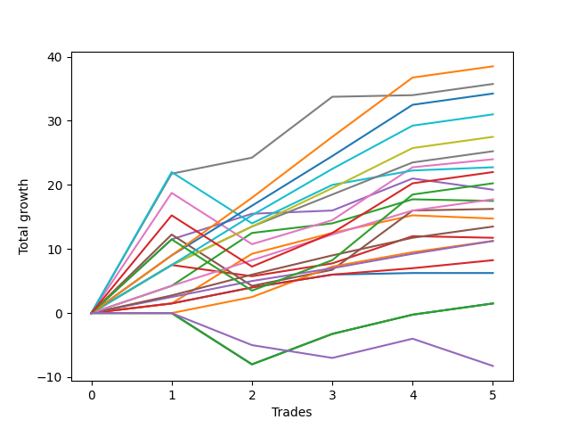

# Short Labrador 003 
- Symbol: ES_830-1130
- Date Range: 03/18/2022 - 12/30/2022
- Trading Period: 8:30-11:30
- Number of Trades: 5



| Name | Win Percent | Profit | Avg Profit / Trade | Avg Time / Trade |      | Name | Win Percent | Profit | Avg Profit / Trade | Avg Time / Trade |
| ---- | ----------- | ------ | ------------------ | ---------------- | ---- | ---- | ----------- | ------ | ------------------ | ---------------- |
| Sorted By <br> Profit | | | | | | Sorted By <br> Win Percentage ||||
| TP-9 | 100.00 | 19250.00 | 3850.00 | 29:29 |     | TP-9 | 100.00 | 19250.00 | 3850.00 | 29:29 |
| V Mid SL-10 | 100.00 | 17875.00 | 3575.00 | 27:43 |     | V Mid SL-10 | 100.00 | 17875.00 | 3575.00 | 27:43 |
| V Mid | 100.00 | 17875.00 | 3575.00 | 27:43 |     | V Mid | 100.00 | 17875.00 | 3575.00 | 27:43 |
| TP-8 | 100.00 | 17125.00 | 3425.00 | 28:59 |     | TP-8 | 100.00 | 17125.00 | 3425.00 | 28:59 |
| TP-7 | 100.00 | 15500.00 | 3100.00 | 25:49 |     | TP-7 | 100.00 | 15500.00 | 3100.00 | 25:49 |
| TP-6 | 100.00 | 13750.00 | 2750.00 | 24:33 |     | TP-6 | 100.00 | 13750.00 | 2750.00 | 24:33 |
| TP-5 | 100.00 | 12625.00 | 2525.00 | 24:22 |     | TP-5 | 100.00 | 12625.00 | 2525.00 | 24:22 |
| BB-50 U/L 2SD | 80.00 | 12000.00 | 2400.00 | 43:19 |     | TP-4 | 100.00 | 8875.00 | 1775.00 | 23:13 |
| BB-100 Mid | 80.00 | 11375.00 | 2275.00 | 38:51 |     | TP-3 | 100.00 | 6750.00 | 1350.00 | 15:01 |
| NEWFI 000 | 80.00 | 11000.00 | 2200.00 | 47:13 |     | TP-2 | 100.00 | 5625.00 | 1125.00 | 13:35 |
| BB-50 U/L 2SD SL-10 | 80.00 | 11000.00 | 2200.00 | 36:19 |     | TP-1 | 100.00 | 4125.00 | 825.00 | 12:56 |
| BB-100 Mid SL-10 | 80.00 | 10375.00 | 2075.00 | 31:51 |     | BB-50 U/L 2SD | 80.00 | 12000.00 | 2400.00 | 43:19 |
| TP-10 | 80.00 | 10125.00 | 2025.00 | 41:53 |     | BB-100 Mid | 80.00 | 11375.00 | 2275.00 | 38:51 |
| BB-50 Mid SL-10 | 80.00 | 9625.00 | 1925.00 | 19:45 |     | NEWFI 000 | 80.00 | 11000.00 | 2200.00 | 47:13 |
| BB-50 Mid | 80.00 | 9625.00 | 1925.00 | 19:45 |     | BB-50 U/L 2SD SL-10 | 80.00 | 11000.00 | 2200.00 | 36:19 |
| TP-4 | 100.00 | 8875.00 | 1775.00 | 23:13 |     | BB-100 Mid SL-10 | 80.00 | 10375.00 | 2075.00 | 31:51 |
| BB-20 U/L 2SD SL-10 | 80.00 | 8750.00 | 1750.00 | 12:24 |     | TP-10 | 80.00 | 10125.00 | 2025.00 | 41:53 |
| BB-20 U/L 2SD SL-5 | 80.00 | 8750.00 | 1750.00 | 12:24 |     | BB-50 Mid SL-10 | 80.00 | 9625.00 | 1925.00 | 19:45 |
| BB-20 U/L 2SD | 80.00 | 8750.00 | 1750.00 | 12:24 |     | BB-50 Mid | 80.00 | 9625.00 | 1925.00 | 19:45 |
| BB-50 U/L 1SD | 80.00 | 8125.00 | 1625.00 | 32:44 |     | BB-20 U/L 2SD SL-10 | 80.00 | 8750.00 | 1750.00 | 12:24 |
| BB-20 U/L 1SD SL-10 | 80.00 | 7375.00 | 1475.00 | 04:55 |     | BB-20 U/L 2SD SL-5 | 80.00 | 8750.00 | 1750.00 | 12:24 |
| BB-20 U/L 1SD SL-5 | 80.00 | 7375.00 | 1475.00 | 04:55 |     | BB-20 U/L 2SD | 80.00 | 8750.00 | 1750.00 | 12:24 |
| BB-20 U/L 1SD | 80.00 | 7375.00 | 1475.00 | 04:55 |     | BB-50 U/L 1SD | 80.00 | 8125.00 | 1625.00 | 32:44 |
| BB-50 U/L 1SD SL-10 | 80.00 | 7125.00 | 1425.00 | 25:44 |     | BB-20 U/L 1SD SL-10 | 80.00 | 7375.00 | 1475.00 | 04:55 |
| TP-3 | 100.00 | 6750.00 | 1350.00 | 15:01 |     | BB-20 U/L 1SD SL-5 | 80.00 | 7375.00 | 1475.00 | 04:55 |
| BB-20 U/L 2SD C | 60.00 | 5875.00 | 1175.00 | 20:42 |     | BB-20 U/L 1SD | 80.00 | 7375.00 | 1475.00 | 04:55 |
| TP-2 | 100.00 | 5625.00 | 1125.00 | 13:35 |     | BB-50 U/L 1SD SL-10 | 80.00 | 7125.00 | 1425.00 | 25:44 |
| BB-200 Mid SL-10 | 80.00 | 5625.00 | 1125.00 | 37:39 |     | BB-200 Mid SL-10 | 80.00 | 5625.00 | 1125.00 | 37:39 |
| BB-200 Mid | 80.00 | 5625.00 | 1125.00 | 37:39 |     | BB-200 Mid | 80.00 | 5625.00 | 1125.00 | 37:39 |
| TP-1 | 100.00 | 4125.00 | 825.00 | 12:56 |     | BB-20 Mid SL-10 | 80.00 | 3125.00 | 625.00 | 02:00 |
| BB-20 Mid SL-10 | 80.00 | 3125.00 | 625.00 | 02:00 |     | BB-20 Mid SL-5 | 80.00 | 3125.00 | 625.00 | 02:00 |
| BB-20 Mid SL-5 | 80.00 | 3125.00 | 625.00 | 02:00 |     | BB-20 Mid | 80.00 | 3125.00 | 625.00 | 02:00 |
| BB-20 Mid | 80.00 | 3125.00 | 625.00 | 02:00 |     | BB-20 U/L 2SD C | 60.00 | 5875.00 | 1175.00 | 20:42 |
| BB-20 U/L 2SD C SL-10 | 60.00 | 1750.00 | 350.00 | 17:10 |     | BB-20 U/L 2SD C SL-10 | 60.00 | 1750.00 | 350.00 | 17:10 |
| V Mid SL-5 | 60.00 | 1125.00 | 225.00 | 15:29 |     | V Mid SL-5 | 60.00 | 1125.00 | 225.00 | 15:29 |
| NEWFI 06 | 60.00 | 750.00 | 150.00 | 60:55 |     | NEWFI 06 | 60.00 | 750.00 | 150.00 | 60:55 |
| BB-200 U/L 2SD | 60.00 | 750.00 | 150.00 | 60:55 |     | BB-200 U/L 2SD | 60.00 | 750.00 | 150.00 | 60:55 |
| BB-100 U/L 2SD | 60.00 | 750.00 | 150.00 | 60:55 |     | BB-100 U/L 2SD | 60.00 | 750.00 | 150.00 | 60:55 |
| V U/L 1SD | 60.00 | 750.00 | 150.00 | 60:55 |     | V U/L 1SD | 60.00 | 750.00 | 150.00 | 60:55 |
| BB-200 U/L 2SD SL-10 | 60.00 | -250.00 | -50.00 | 53:55 |     | BB-200 U/L 2SD SL-10 | 60.00 | -250.00 | -50.00 | 53:55 |
| BB-100 U/L 2SD SL-10 | 60.00 | -250.00 | -50.00 | 53:55 |     | BB-100 U/L 2SD SL-10 | 60.00 | -250.00 | -50.00 | 53:55 |
| V U/L 1SD SL-10 | 60.00 | -250.00 | -50.00 | 53:55 |     | V U/L 1SD SL-10 | 60.00 | -250.00 | -50.00 | 53:55 |
| BB-200 Mid SL-5 | 60.00 | -250.00 | -50.00 | 17:22 |     | BB-200 Mid SL-5 | 60.00 | -250.00 | -50.00 | 17:22 |
| BB-50 U/L 2SD SL-5 | 40.00 | -1500.00 | -300.00 | 22:43 |     | BB-50 U/L 2SD SL-5 | 40.00 | -1500.00 | -300.00 | 22:43 |
| BB-50 U/L 1SD SL-5 | 40.00 | -1625.00 | -325.00 | 17:17 |     | BB-50 U/L 1SD SL-5 | 40.00 | -1625.00 | -325.00 | 17:17 |
| BB-20 U/L 2SD C SL-5 | 40.00 | -2000.00 | -400.00 | 14:46 |     | BB-20 U/L 2SD C SL-5 | 40.00 | -2000.00 | -400.00 | 14:46 |
| BB-100 Mid SL-5 | 40.00 | -3375.00 | -675.00 | 15:35 |     | BB-100 Mid SL-5 | 40.00 | -3375.00 | -675.00 | 15:35 |
| BB-200 U/L 2SD SL-5 | 40.00 | -3625.00 | -725.00 | 31:36 |     | BB-200 U/L 2SD SL-5 | 40.00 | -3625.00 | -725.00 | 31:36 |
| BB-100 U/L 2SD SL-5 | 40.00 | -3625.00 | -725.00 | 31:36 |     | BB-100 U/L 2SD SL-5 | 40.00 | -3625.00 | -725.00 | 31:36 |
| V U/L 1SD SL-5 | 40.00 | -3625.00 | -725.00 | 31:36 |     | V U/L 1SD SL-5 | 40.00 | -3625.00 | -725.00 | 31:36 |
| NEWFI 0000 | 20.00 | -4125.00 | -825.00 | 36:49 |     | BB-50 Mid SL-5 | 40.00 | -4750.00 | -950.00 | 14:59 |
| BB-50 Mid SL-5 | 40.00 | -4750.00 | -950.00 | 14:59 |     | NEWFI 0000 | 20.00 | -4125.00 | -825.00 | 36:49 |

## NO STOPLOSS

### Test BB-20 Mid
* Sell when price hits the middle line of the 20p bollinger
* No Stoploss
* Results:
```
Total Trades: 5
Percent Up: 20.00
Percent Down: 80.00
Total Points Moved Down: 6.25
Potential Profit: 3125.00
Total Points Ups: 0.00 Count Ups: 1
Total Points Downs: 6.25 Count Downs: 4
```

<details><summary>Trades</summary>

<code>In: 2022-05-10 11:07:00		Out: 2022-05-10 11:08:10		Total Position Time: 01:10		Total Move Down: 1.50		Total to Date: 1.50</code> <br />
<code>In: 2022-06-13 08:47:00		Out: 2022-06-13 08:48:10		Total Position Time: 01:10		Total Move Down: 2.50		Total to Date: 4.00</code> <br />
<code>In: 2022-08-05 10:19:00		Out: 2022-08-05 10:20:10		Total Position Time: 01:10		Total Move Down: 2.00		Total to Date: 6.00</code> <br />
<code>In: 2022-10-06 09:52:00		Out: 2022-10-06 09:55:05		Total Position Time: 03:05		Total Move Down: 0.25		Total to Date: 6.25</code> <br />
<code>In: 2022-11-21 10:24:00		Out: 2022-11-21 10:27:25		Total Position Time: 03:25		Total Move Down: -0.00		Total to Date: 6.25</code> <br />


</details>

### Test BB-20 U/L 1SD
* Sell when the price hits the lower line of the 20p 1std bollinger
* No Stoploss
* Results:
```
Total Trades: 5
Percent Up: 20.00
Percent Down: 80.00
Total Points Moved Down: 14.75
Potential Profit: 7375.00
Total Points Ups: 0.50 Count Ups: 1
Total Points Downs: 15.25 Count Downs: 4
```

<details><summary>Trades</summary>

<code>In: 2022-05-10 11:07:00		Out: 2022-05-10 11:08:10		Total Position Time: 01:10		Total Move Down: 1.50		Total to Date: 1.50</code> <br />
<code>In: 2022-06-13 08:47:00		Out: 2022-06-13 08:52:05		Total Position Time: 05:05		Total Move Down: 7.75		Total to Date: 9.25</code> <br />
<code>In: 2022-08-05 10:19:00		Out: 2022-08-05 10:23:15		Total Position Time: 04:15		Total Move Down: 3.25		Total to Date: 12.50</code> <br />
<code>In: 2022-10-06 09:52:00		Out: 2022-10-06 09:57:05		Total Position Time: 05:05		Total Move Down: 2.75		Total to Date: 15.25</code> <br />
<code>In: 2022-11-21 10:24:00		Out: 2022-11-21 10:33:00		Total Position Time: 09:00		Total Move Down: -0.50		Total to Date: 14.75</code> <br />


</details>

### Test BB-20 U/L 2SD
* Sell when the price hits the lower line of the 20p 2std bollinger
* No Stoploss
* Results:
```
Total Trades: 5
Percent Up: 20.00
Percent Down: 80.00
Total Points Moved Down: 17.50
Potential Profit: 8750.00
Total Points Ups: 0.25 Count Ups: 1
Total Points Downs: 17.75 Count Downs: 4
```

<details><summary>Trades</summary>

<code>In: 2022-05-10 11:07:00		Out: 2022-05-10 11:11:10		Total Position Time: 04:10		Total Move Down: 4.25		Total to Date: 4.25</code> <br />
<code>In: 2022-06-13 08:47:00		Out: 2022-06-13 08:55:10		Total Position Time: 08:10		Total Move Down: 8.25		Total to Date: 12.50</code> <br />
<code>In: 2022-08-05 10:19:00		Out: 2022-08-05 10:49:30		Total Position Time: 30:30		Total Move Down: 1.50		Total to Date: 14.00</code> <br />
<code>In: 2022-10-06 09:52:00		Out: 2022-10-06 10:02:00		Total Position Time: 10:00		Total Move Down: 3.75		Total to Date: 17.75</code> <br />
<code>In: 2022-11-21 10:24:00		Out: 2022-11-21 10:33:10		Total Position Time: 09:10		Total Move Down: -0.25		Total to Date: 17.50</code> <br />


</details>

### Test BB-20 U/L 2SD C
* Sell when the price hits the lower line of the 20p 2std bollinger
* No Stoploss
* Results:
```
Total Trades: 5
Percent Up: 40.00
Percent Down: 60.00
Total Points Moved Down: 11.75
Potential Profit: 5875.00
Total Points Ups: 2.00 Count Ups: 2
Total Points Downs: 13.75 Count Downs: 3
```

<details><summary>Trades</summary>

<code>In: 2022-05-10 11:07:00		Out: 2022-05-10 11:16:05		Total Position Time: 09:05		Total Move Down: 7.50		Total to Date: 7.50</code> <br />
<code>In: 2022-06-13 08:47:00		Out: 2022-06-13 09:30:35		Total Position Time: 43:35		Total Move Down: -1.75		Total to Date: 5.75</code> <br />
<code>In: 2022-08-05 10:19:00		Out: 2022-08-05 10:50:35		Total Position Time: 31:35		Total Move Down: 2.00		Total to Date: 7.75</code> <br />
<code>In: 2022-10-06 09:52:00		Out: 2022-10-06 10:02:05		Total Position Time: 10:05		Total Move Down: 4.25		Total to Date: 12.00</code> <br />
<code>In: 2022-11-21 10:24:00		Out: 2022-11-21 10:33:10		Total Position Time: 09:10		Total Move Down: -0.25		Total to Date: 11.75</code> <br />


</details>

### Test BB-50 Mid
* Sell when price hits the middle line of the 50p bollinger
* No Stoploss
* Results:
```
Total Trades: 5
Percent Up: 20.00
Percent Down: 80.00
Total Points Moved Down: 19.25
Potential Profit: 9625.00
Total Points Ups: 1.75 Count Ups: 1
Total Points Downs: 21.00 Count Downs: 4
```

<details><summary>Trades</summary>

<code>In: 2022-05-10 11:07:00		Out: 2022-05-10 11:16:20		Total Position Time: 09:20		Total Move Down: 11.50		Total to Date: 11.50</code> <br />
<code>In: 2022-06-13 08:47:00		Out: 2022-06-13 09:07:15		Total Position Time: 20:15		Total Move Down: 4.00		Total to Date: 15.50</code> <br />
<code>In: 2022-08-05 10:19:00		Out: 2022-08-05 10:47:35		Total Position Time: 28:35		Total Move Down: 0.50		Total to Date: 16.00</code> <br />
<code>In: 2022-10-06 09:52:00		Out: 2022-10-06 10:02:10		Total Position Time: 10:10		Total Move Down: 5.00		Total to Date: 21.00</code> <br />
<code>In: 2022-11-21 10:24:00		Out: 2022-11-21 10:54:25		Total Position Time: 30:25		Total Move Down: -1.75		Total to Date: 19.25</code> <br />


</details>

### Test BB-50 U/L 1SD
* Sell when the price hits the lower line of the 50p 1std bollinger
* No Stoploss
* Results:
```
Total Trades: 5
Percent Up: 20.00
Percent Down: 80.00
Total Points Moved Down: 16.25
Potential Profit: 8125.00
Total Points Ups: 8.00 Count Ups: 1
Total Points Downs: 24.25 Count Downs: 4
```

<details><summary>Trades</summary>

<code>In: 2022-05-10 11:07:00		Out: 2022-05-10 11:24:05		Total Position Time: 17:05		Total Move Down: 12.25		Total to Date: 12.25</code> <br />
<code>In: 2022-06-13 08:47:00		Out: 2022-06-13 09:47:55		Total Position Time: 60:55		Total Move Down: -8.00		Total to Date: 4.25</code> <br />
<code>In: 2022-08-05 10:19:00		Out: 2022-08-05 10:52:05		Total Position Time: 33:05		Total Move Down: 2.50		Total to Date: 6.75</code> <br />
<code>In: 2022-10-06 09:52:00		Out: 2022-10-06 10:09:10		Total Position Time: 17:10		Total Move Down: 9.25		Total to Date: 16.00</code> <br />
<code>In: 2022-11-21 10:24:00		Out: 2022-11-21 10:59:25		Total Position Time: 35:25		Total Move Down: 0.25		Total to Date: 16.25</code> <br />


</details>

### Test BB-50 U/L 2SD
* Sell when the price hits the lower line of the 50p 2std bollinger
* No Stoploss
* Results:
```
Total Trades: 5
Percent Up: 20.00
Percent Down: 80.00
Total Points Moved Down: 24.00
Potential Profit: 12000.00
Total Points Ups: 8.00 Count Ups: 1
Total Points Downs: 32.00 Count Downs: 4
```

<details><summary>Trades</summary>

<code>In: 2022-05-10 11:07:00		Out: 2022-05-10 11:27:05		Total Position Time: 20:05		Total Move Down: 18.75		Total to Date: 18.75</code> <br />
<code>In: 2022-06-13 08:47:00		Out: 2022-06-13 09:47:55		Total Position Time: 60:55		Total Move Down: -8.00		Total to Date: 10.75</code> <br />
<code>In: 2022-08-05 10:19:00		Out: 2022-08-05 10:55:40		Total Position Time: 36:40		Total Move Down: 3.75		Total to Date: 14.50</code> <br />
<code>In: 2022-10-06 09:52:00		Out: 2022-10-06 10:32:45		Total Position Time: 40:45		Total Move Down: 8.25		Total to Date: 22.75</code> <br />
<code>In: 2022-11-21 10:24:00		Out: 2022-11-21 11:22:10		Total Position Time: 58:10		Total Move Down: 1.25		Total to Date: 24.00</code> <br />


</details>

### Test V Mid
* Sell when the price hits the middle line of the 1std VWAP
* No Stoploss
* Results:
```
Total Trades: 5
Percent Up: 0.00
Percent Down: 100.00
Total Points Moved Down: 35.75
Potential Profit: 17875.00
Total Points Ups: 0.00 Count Ups: 0
Total Points Downs: 35.75 Count Downs: 5
```

<details><summary>Trades</summary>

<code>In: 2022-05-10 11:07:00		Out: 2022-05-10 11:27:40		Total Position Time: 20:40		Total Move Down: 21.75		Total to Date: 21.75</code> <br />
<code>In: 2022-06-13 08:47:00		Out: 2022-06-13 08:48:10		Total Position Time: 01:10		Total Move Down: 2.50		Total to Date: 24.25</code> <br />
<code>In: 2022-08-05 10:19:00		Out: 2022-08-05 11:11:45		Total Position Time: 52:45		Total Move Down: 9.50		Total to Date: 33.75</code> <br />
<code>In: 2022-10-06 09:52:00		Out: 2022-10-06 09:55:05		Total Position Time: 03:05		Total Move Down: 0.25		Total to Date: 34.00</code> <br />
<code>In: 2022-11-21 10:24:00		Out: 2022-11-21 11:24:55		Total Position Time: 60:55		Total Move Down: 1.75		Total to Date: 35.75</code> <br />


</details>

### Test V U/L 1SD
* Sell when the price hits the lower line of the 1std VWAP
* No Stoploss
* Results:
```
Total Trades: 5
Percent Up: 40.00
Percent Down: 60.00
Total Points Moved Down: 1.50
Potential Profit: 750.00
Total Points Ups: 8.00 Count Ups: 2
Total Points Downs: 9.50 Count Downs: 3
```

<details><summary>Trades</summary>

<code>In: 2022-05-10 11:07:00		Out: 2022-05-10 12:07:55		Total Position Time: 60:55		Total Move Down: -0.00		Total to Date: 0.00</code> <br />
<code>In: 2022-06-13 08:47:00		Out: 2022-06-13 09:47:55		Total Position Time: 60:55		Total Move Down: -8.00		Total to Date: -8.00</code> <br />
<code>In: 2022-08-05 10:19:00		Out: 2022-08-05 11:19:55		Total Position Time: 60:55		Total Move Down: 4.75		Total to Date: -3.25</code> <br />
<code>In: 2022-10-06 09:52:00		Out: 2022-10-06 10:52:55		Total Position Time: 60:55		Total Move Down: 3.00		Total to Date: -0.25</code> <br />
<code>In: 2022-11-21 10:24:00		Out: 2022-11-21 11:24:55		Total Position Time: 60:55		Total Move Down: 1.75		Total to Date: 1.50</code> <br />


</details>

### Test BB-100 Mid
* Move to BB100 Mid
* No Stoploss
* Results:
```
Total Trades: 5
Percent Up: 20.00
Percent Down: 80.00
Total Points Moved Down: 22.75
Potential Profit: 11375.00
Total Points Ups: 8.00 Count Ups: 1
Total Points Downs: 30.75 Count Downs: 4
```

<details><summary>Trades</summary>

<code>In: 2022-05-10 11:07:00		Out: 2022-05-10 11:40:30		Total Position Time: 33:30		Total Move Down: 22.00		Total to Date: 22.00</code> <br />
<code>In: 2022-06-13 08:47:00		Out: 2022-06-13 09:47:55		Total Position Time: 60:55		Total Move Down: -8.00		Total to Date: 14.00</code> <br />
<code>In: 2022-08-05 10:19:00		Out: 2022-08-05 10:56:25		Total Position Time: 37:25		Total Move Down: 6.00		Total to Date: 20.00</code> <br />
<code>In: 2022-10-06 09:52:00		Out: 2022-10-06 09:56:20		Total Position Time: 04:20		Total Move Down: 2.25		Total to Date: 22.25</code> <br />
<code>In: 2022-11-21 10:24:00		Out: 2022-11-21 11:22:05		Total Position Time: 58:05		Total Move Down: 0.50		Total to Date: 22.75</code> <br />


</details>

### Test BB-100 U/L 2SD
* Move to BB100 Upper Band
* No Stoploss
* Results:
```
Total Trades: 5
Percent Up: 40.00
Percent Down: 60.00
Total Points Moved Down: 1.50
Potential Profit: 750.00
Total Points Ups: 8.00 Count Ups: 2
Total Points Downs: 9.50 Count Downs: 3
```

<details><summary>Trades</summary>

<code>In: 2022-05-10 11:07:00		Out: 2022-05-10 12:07:55		Total Position Time: 60:55		Total Move Down: -0.00		Total to Date: 0.00</code> <br />
<code>In: 2022-06-13 08:47:00		Out: 2022-06-13 09:47:55		Total Position Time: 60:55		Total Move Down: -8.00		Total to Date: -8.00</code> <br />
<code>In: 2022-08-05 10:19:00		Out: 2022-08-05 11:19:55		Total Position Time: 60:55		Total Move Down: 4.75		Total to Date: -3.25</code> <br />
<code>In: 2022-10-06 09:52:00		Out: 2022-10-06 10:52:55		Total Position Time: 60:55		Total Move Down: 3.00		Total to Date: -0.25</code> <br />
<code>In: 2022-11-21 10:24:00		Out: 2022-11-21 11:24:55		Total Position Time: 60:55		Total Move Down: 1.75		Total to Date: 1.50</code> <br />


</details>

### Test BB-200 Mid
* Move to BB200 Mid
* No Stoploss
* Results:
```
Total Trades: 5
Percent Up: 20.00
Percent Down: 80.00
Total Points Moved Down: 11.25
Potential Profit: 5625.00
Total Points Ups: 0.00 Count Ups: 1
Total Points Downs: 11.25 Count Downs: 4
```

<details><summary>Trades</summary>

<code>In: 2022-05-10 11:07:00		Out: 2022-05-10 12:07:55		Total Position Time: 60:55		Total Move Down: -0.00		Total to Date: 0.00</code> <br />
<code>In: 2022-06-13 08:47:00		Out: 2022-06-13 08:48:10		Total Position Time: 01:10		Total Move Down: 2.50		Total to Date: 2.50</code> <br />
<code>In: 2022-08-05 10:19:00		Out: 2022-08-05 11:19:55		Total Position Time: 60:55		Total Move Down: 4.75		Total to Date: 7.25</code> <br />
<code>In: 2022-10-06 09:52:00		Out: 2022-10-06 09:56:20		Total Position Time: 04:20		Total Move Down: 2.25		Total to Date: 9.50</code> <br />
<code>In: 2022-11-21 10:24:00		Out: 2022-11-21 11:24:55		Total Position Time: 60:55		Total Move Down: 1.75		Total to Date: 11.25</code> <br />


</details>

### Test BB-200 U/L 2SD
* Move to BB200 Upper Band
* No Stoploss
* Results:
```
Total Trades: 5
Percent Up: 40.00
Percent Down: 60.00
Total Points Moved Down: 1.50
Potential Profit: 750.00
Total Points Ups: 8.00 Count Ups: 2
Total Points Downs: 9.50 Count Downs: 3
```

<details><summary>Trades</summary>

<code>In: 2022-05-10 11:07:00		Out: 2022-05-10 12:07:55		Total Position Time: 60:55		Total Move Down: -0.00		Total to Date: 0.00</code> <br />
<code>In: 2022-06-13 08:47:00		Out: 2022-06-13 09:47:55		Total Position Time: 60:55		Total Move Down: -8.00		Total to Date: -8.00</code> <br />
<code>In: 2022-08-05 10:19:00		Out: 2022-08-05 11:19:55		Total Position Time: 60:55		Total Move Down: 4.75		Total to Date: -3.25</code> <br />
<code>In: 2022-10-06 09:52:00		Out: 2022-10-06 10:52:55		Total Position Time: 60:55		Total Move Down: 3.00		Total to Date: -0.25</code> <br />
<code>In: 2022-11-21 10:24:00		Out: 2022-11-21 11:24:55		Total Position Time: 60:55		Total Move Down: 1.75		Total to Date: 1.50</code> <br />


</details>

## STOPLOSS OF 5

### Test BB-20 Mid SL-5
* Sell when price hits the middle line of the 20p bollinger
* Stoploss is -5 points
* Results:
```
Total Trades: 5
Percent Up: 20.00
Percent Down: 80.00
Total Points Moved Down: 6.25
Potential Profit: 3125.00
Total Points Ups: 0.00 Count Ups: 1
Total Points Downs: 6.25 Count Downs: 4
```

<details><summary>Trades</summary>

<code>In: 2022-05-10 11:07:00		Out: 2022-05-10 11:08:10		Total Position Time: 01:10		Total Move Down: 1.50		Total to Date: 1.50</code> <br />
<code>In: 2022-06-13 08:47:00		Out: 2022-06-13 08:48:10		Total Position Time: 01:10		Total Move Down: 2.50		Total to Date: 4.00</code> <br />
<code>In: 2022-08-05 10:19:00		Out: 2022-08-05 10:20:10		Total Position Time: 01:10		Total Move Down: 2.00		Total to Date: 6.00</code> <br />
<code>In: 2022-10-06 09:52:00		Out: 2022-10-06 09:55:05		Total Position Time: 03:05		Total Move Down: 0.25		Total to Date: 6.25</code> <br />
<code>In: 2022-11-21 10:24:00		Out: 2022-11-21 10:27:25		Total Position Time: 03:25		Total Move Down: -0.00		Total to Date: 6.25</code> <br />


</details>

### Test BB-20 U/L 1SD SL-5
* Sell when the price hits the lower line of the 20p 1std bollinger
* Stoploss is -5 points
* Results:
```
Total Trades: 5
Percent Up: 20.00
Percent Down: 80.00
Total Points Moved Down: 14.75
Potential Profit: 7375.00
Total Points Ups: 0.50 Count Ups: 1
Total Points Downs: 15.25 Count Downs: 4
```

<details><summary>Trades</summary>

<code>In: 2022-05-10 11:07:00		Out: 2022-05-10 11:08:10		Total Position Time: 01:10		Total Move Down: 1.50		Total to Date: 1.50</code> <br />
<code>In: 2022-06-13 08:47:00		Out: 2022-06-13 08:52:05		Total Position Time: 05:05		Total Move Down: 7.75		Total to Date: 9.25</code> <br />
<code>In: 2022-08-05 10:19:00		Out: 2022-08-05 10:23:15		Total Position Time: 04:15		Total Move Down: 3.25		Total to Date: 12.50</code> <br />
<code>In: 2022-10-06 09:52:00		Out: 2022-10-06 09:57:05		Total Position Time: 05:05		Total Move Down: 2.75		Total to Date: 15.25</code> <br />
<code>In: 2022-11-21 10:24:00		Out: 2022-11-21 10:33:00		Total Position Time: 09:00		Total Move Down: -0.50		Total to Date: 14.75</code> <br />


</details>

### Test BB-20 U/L 2SD SL-5
* Sell when the price hits the lower line of the 20p 2std bollinger
* Stoploss is -5 points
* Results:
```
Total Trades: 5
Percent Up: 20.00
Percent Down: 80.00
Total Points Moved Down: 17.50
Potential Profit: 8750.00
Total Points Ups: 0.25 Count Ups: 1
Total Points Downs: 17.75 Count Downs: 4
```

<details><summary>Trades</summary>

<code>In: 2022-05-10 11:07:00		Out: 2022-05-10 11:11:10		Total Position Time: 04:10		Total Move Down: 4.25		Total to Date: 4.25</code> <br />
<code>In: 2022-06-13 08:47:00		Out: 2022-06-13 08:55:10		Total Position Time: 08:10		Total Move Down: 8.25		Total to Date: 12.50</code> <br />
<code>In: 2022-08-05 10:19:00		Out: 2022-08-05 10:49:30		Total Position Time: 30:30		Total Move Down: 1.50		Total to Date: 14.00</code> <br />
<code>In: 2022-10-06 09:52:00		Out: 2022-10-06 10:02:00		Total Position Time: 10:00		Total Move Down: 3.75		Total to Date: 17.75</code> <br />
<code>In: 2022-11-21 10:24:00		Out: 2022-11-21 10:33:10		Total Position Time: 09:10		Total Move Down: -0.25		Total to Date: 17.50</code> <br />


</details>

### Test BB-20 U/L 2SD C SL-5
* Sell when the price hits the lower line of the 20p 2std bollinger
* Stoploss is -5 points
* Results:
```
Total Trades: 5
Percent Up: 60.00
Percent Down: 40.00
Total Points Moved Down: -4.00
Potential Profit: -2000.00
Total Points Ups: 10.25 Count Ups: 3
Total Points Downs: 6.25 Count Downs: 2
```

<details><summary>Trades</summary>

<code>In: 2022-05-10 11:07:00		Out: 2022-05-10 11:14:15		Total Position Time: 07:15		Total Move Down: -5.00		Total to Date: -5.00</code> <br />
<code>In: 2022-06-13 08:47:00		Out: 2022-06-13 09:02:45		Total Position Time: 15:45		Total Move Down: -5.00		Total to Date: -10.00</code> <br />
<code>In: 2022-08-05 10:19:00		Out: 2022-08-05 10:50:35		Total Position Time: 31:35		Total Move Down: 2.00		Total to Date: -8.00</code> <br />
<code>In: 2022-10-06 09:52:00		Out: 2022-10-06 10:02:05		Total Position Time: 10:05		Total Move Down: 4.25		Total to Date: -3.75</code> <br />
<code>In: 2022-11-21 10:24:00		Out: 2022-11-21 10:33:10		Total Position Time: 09:10		Total Move Down: -0.25		Total to Date: -4.00</code> <br />


</details>

### Test BB-50 Mid SL-5
* Sell when price hits the middle line of the 50p bollinger
* Stoploss is -5 points
* Results:
```
Total Trades: 5
Percent Up: 60.00
Percent Down: 40.00
Total Points Moved Down: -9.50
Potential Profit: -4750.00
Total Points Ups: 15.00 Count Ups: 3
Total Points Downs: 5.50 Count Downs: 2
```

<details><summary>Trades</summary>

<code>In: 2022-05-10 11:07:00		Out: 2022-05-10 11:14:15		Total Position Time: 07:15		Total Move Down: -5.00		Total to Date: -5.00</code> <br />
<code>In: 2022-06-13 08:47:00		Out: 2022-06-13 09:02:45		Total Position Time: 15:45		Total Move Down: -5.00		Total to Date: -10.00</code> <br />
<code>In: 2022-08-05 10:19:00		Out: 2022-08-05 10:47:35		Total Position Time: 28:35		Total Move Down: 0.50		Total to Date: -9.50</code> <br />
<code>In: 2022-10-06 09:52:00		Out: 2022-10-06 10:02:10		Total Position Time: 10:10		Total Move Down: 5.00		Total to Date: -4.50</code> <br />
<code>In: 2022-11-21 10:24:00		Out: 2022-11-21 10:37:10		Total Position Time: 13:10		Total Move Down: -5.00		Total to Date: -9.50</code> <br />


</details>

### Test BB-50 U/L 1SD SL-5
* Sell when the price hits the lower line of the 50p 1std bollinger
* Stoploss is -5 points
* Results:
```
Total Trades: 5
Percent Up: 60.00
Percent Down: 40.00
Total Points Moved Down: -3.25
Potential Profit: -1625.00
Total Points Ups: 15.00 Count Ups: 3
Total Points Downs: 11.75 Count Downs: 2
```

<details><summary>Trades</summary>

<code>In: 2022-05-10 11:07:00		Out: 2022-05-10 11:14:15		Total Position Time: 07:15		Total Move Down: -5.00		Total to Date: -5.00</code> <br />
<code>In: 2022-06-13 08:47:00		Out: 2022-06-13 09:02:45		Total Position Time: 15:45		Total Move Down: -5.00		Total to Date: -10.00</code> <br />
<code>In: 2022-08-05 10:19:00		Out: 2022-08-05 10:52:05		Total Position Time: 33:05		Total Move Down: 2.50		Total to Date: -7.50</code> <br />
<code>In: 2022-10-06 09:52:00		Out: 2022-10-06 10:09:10		Total Position Time: 17:10		Total Move Down: 9.25		Total to Date: 1.75</code> <br />
<code>In: 2022-11-21 10:24:00		Out: 2022-11-21 10:37:10		Total Position Time: 13:10		Total Move Down: -5.00		Total to Date: -3.25</code> <br />


</details>

### Test BB-50 U/L 2SD SL-5
* Sell when the price hits the lower line of the 50p 2std bollinger
* Stoploss is -5 points
* Results:
```
Total Trades: 5
Percent Up: 60.00
Percent Down: 40.00
Total Points Moved Down: -3.00
Potential Profit: -1500.00
Total Points Ups: 15.00 Count Ups: 3
Total Points Downs: 12.00 Count Downs: 2
```

<details><summary>Trades</summary>

<code>In: 2022-05-10 11:07:00		Out: 2022-05-10 11:14:15		Total Position Time: 07:15		Total Move Down: -5.00		Total to Date: -5.00</code> <br />
<code>In: 2022-06-13 08:47:00		Out: 2022-06-13 09:02:45		Total Position Time: 15:45		Total Move Down: -5.00		Total to Date: -10.00</code> <br />
<code>In: 2022-08-05 10:19:00		Out: 2022-08-05 10:55:40		Total Position Time: 36:40		Total Move Down: 3.75		Total to Date: -6.25</code> <br />
<code>In: 2022-10-06 09:52:00		Out: 2022-10-06 10:32:45		Total Position Time: 40:45		Total Move Down: 8.25		Total to Date: 2.00</code> <br />
<code>In: 2022-11-21 10:24:00		Out: 2022-11-21 10:37:10		Total Position Time: 13:10		Total Move Down: -5.00		Total to Date: -3.00</code> <br />


</details>

### Test V Mid SL-5
* Sell when the price hits the middle line of the 1std VWAP
* Stoploss is -5 points
* Results:
```
Total Trades: 5
Percent Up: 40.00
Percent Down: 60.00
Total Points Moved Down: 2.25
Potential Profit: 1125.00
Total Points Ups: 10.00 Count Ups: 2
Total Points Downs: 12.25 Count Downs: 3
```

<details><summary>Trades</summary>

<code>In: 2022-05-10 11:07:00		Out: 2022-05-10 11:14:15		Total Position Time: 07:15		Total Move Down: -5.00		Total to Date: -5.00</code> <br />
<code>In: 2022-06-13 08:47:00		Out: 2022-06-13 08:48:10		Total Position Time: 01:10		Total Move Down: 2.50		Total to Date: -2.50</code> <br />
<code>In: 2022-08-05 10:19:00		Out: 2022-08-05 11:11:45		Total Position Time: 52:45		Total Move Down: 9.50		Total to Date: 7.00</code> <br />
<code>In: 2022-10-06 09:52:00		Out: 2022-10-06 09:55:05		Total Position Time: 03:05		Total Move Down: 0.25		Total to Date: 7.25</code> <br />
<code>In: 2022-11-21 10:24:00		Out: 2022-11-21 10:37:10		Total Position Time: 13:10		Total Move Down: -5.00		Total to Date: 2.25</code> <br />


</details>

### Test V U/L 1SD SL-5
* Sell when the price hits the lower line of the 1std VWAP
* Stoploss is -5 points
* Results:
```
Total Trades: 5
Percent Up: 60.00
Percent Down: 40.00
Total Points Moved Down: -7.25
Potential Profit: -3625.00
Total Points Ups: 15.00 Count Ups: 3
Total Points Downs: 7.75 Count Downs: 2
```

<details><summary>Trades</summary>

<code>In: 2022-05-10 11:07:00		Out: 2022-05-10 11:14:15		Total Position Time: 07:15		Total Move Down: -5.00		Total to Date: -5.00</code> <br />
<code>In: 2022-06-13 08:47:00		Out: 2022-06-13 09:02:45		Total Position Time: 15:45		Total Move Down: -5.00		Total to Date: -10.00</code> <br />
<code>In: 2022-08-05 10:19:00		Out: 2022-08-05 11:19:55		Total Position Time: 60:55		Total Move Down: 4.75		Total to Date: -5.25</code> <br />
<code>In: 2022-10-06 09:52:00		Out: 2022-10-06 10:52:55		Total Position Time: 60:55		Total Move Down: 3.00		Total to Date: -2.25</code> <br />
<code>In: 2022-11-21 10:24:00		Out: 2022-11-21 10:37:10		Total Position Time: 13:10		Total Move Down: -5.00		Total to Date: -7.25</code> <br />


</details>

### Test BB-100 Mid SL-5
* Move to BB100 Mid
* Stoploss is -5 points
* Results:
```
Total Trades: 5
Percent Up: 60.00
Percent Down: 40.00
Total Points Moved Down: -6.75
Potential Profit: -3375.00
Total Points Ups: 15.00 Count Ups: 3
Total Points Downs: 8.25 Count Downs: 2
```

<details><summary>Trades</summary>

<code>In: 2022-05-10 11:07:00		Out: 2022-05-10 11:14:15		Total Position Time: 07:15		Total Move Down: -5.00		Total to Date: -5.00</code> <br />
<code>In: 2022-06-13 08:47:00		Out: 2022-06-13 09:02:45		Total Position Time: 15:45		Total Move Down: -5.00		Total to Date: -10.00</code> <br />
<code>In: 2022-08-05 10:19:00		Out: 2022-08-05 10:56:25		Total Position Time: 37:25		Total Move Down: 6.00		Total to Date: -4.00</code> <br />
<code>In: 2022-10-06 09:52:00		Out: 2022-10-06 09:56:20		Total Position Time: 04:20		Total Move Down: 2.25		Total to Date: -1.75</code> <br />
<code>In: 2022-11-21 10:24:00		Out: 2022-11-21 10:37:10		Total Position Time: 13:10		Total Move Down: -5.00		Total to Date: -6.75</code> <br />


</details>

### Test BB-100 U/L 2SD SL-5
* Move to BB100 Upper Band
* Stoploss is -5 points
* Results:
```
Total Trades: 5
Percent Up: 60.00
Percent Down: 40.00
Total Points Moved Down: -7.25
Potential Profit: -3625.00
Total Points Ups: 15.00 Count Ups: 3
Total Points Downs: 7.75 Count Downs: 2
```

<details><summary>Trades</summary>

<code>In: 2022-05-10 11:07:00		Out: 2022-05-10 11:14:15		Total Position Time: 07:15		Total Move Down: -5.00		Total to Date: -5.00</code> <br />
<code>In: 2022-06-13 08:47:00		Out: 2022-06-13 09:02:45		Total Position Time: 15:45		Total Move Down: -5.00		Total to Date: -10.00</code> <br />
<code>In: 2022-08-05 10:19:00		Out: 2022-08-05 11:19:55		Total Position Time: 60:55		Total Move Down: 4.75		Total to Date: -5.25</code> <br />
<code>In: 2022-10-06 09:52:00		Out: 2022-10-06 10:52:55		Total Position Time: 60:55		Total Move Down: 3.00		Total to Date: -2.25</code> <br />
<code>In: 2022-11-21 10:24:00		Out: 2022-11-21 10:37:10		Total Position Time: 13:10		Total Move Down: -5.00		Total to Date: -7.25</code> <br />


</details>

### Test BB-200 Mid SL-5
* Move to BB200 Mid
* Stoploss is -5 points
* Results:
```
Total Trades: 5
Percent Up: 40.00
Percent Down: 60.00
Total Points Moved Down: -0.50
Potential Profit: -250.00
Total Points Ups: 10.00 Count Ups: 2
Total Points Downs: 9.50 Count Downs: 3
```

<details><summary>Trades</summary>

<code>In: 2022-05-10 11:07:00		Out: 2022-05-10 11:14:15		Total Position Time: 07:15		Total Move Down: -5.00		Total to Date: -5.00</code> <br />
<code>In: 2022-06-13 08:47:00		Out: 2022-06-13 08:48:10		Total Position Time: 01:10		Total Move Down: 2.50		Total to Date: -2.50</code> <br />
<code>In: 2022-08-05 10:19:00		Out: 2022-08-05 11:19:55		Total Position Time: 60:55		Total Move Down: 4.75		Total to Date: 2.25</code> <br />
<code>In: 2022-10-06 09:52:00		Out: 2022-10-06 09:56:20		Total Position Time: 04:20		Total Move Down: 2.25		Total to Date: 4.50</code> <br />
<code>In: 2022-11-21 10:24:00		Out: 2022-11-21 10:37:10		Total Position Time: 13:10		Total Move Down: -5.00		Total to Date: -0.50</code> <br />


</details>

### Test BB-200 U/L 2SD SL-5
* Move to BB200 Upper Band
* Stoploss is -5 points
* Results:
```
Total Trades: 5
Percent Up: 60.00
Percent Down: 40.00
Total Points Moved Down: -7.25
Potential Profit: -3625.00
Total Points Ups: 15.00 Count Ups: 3
Total Points Downs: 7.75 Count Downs: 2
```

<details><summary>Trades</summary>

<code>In: 2022-05-10 11:07:00		Out: 2022-05-10 11:14:15		Total Position Time: 07:15		Total Move Down: -5.00		Total to Date: -5.00</code> <br />
<code>In: 2022-06-13 08:47:00		Out: 2022-06-13 09:02:45		Total Position Time: 15:45		Total Move Down: -5.00		Total to Date: -10.00</code> <br />
<code>In: 2022-08-05 10:19:00		Out: 2022-08-05 11:19:55		Total Position Time: 60:55		Total Move Down: 4.75		Total to Date: -5.25</code> <br />
<code>In: 2022-10-06 09:52:00		Out: 2022-10-06 10:52:55		Total Position Time: 60:55		Total Move Down: 3.00		Total to Date: -2.25</code> <br />
<code>In: 2022-11-21 10:24:00		Out: 2022-11-21 10:37:10		Total Position Time: 13:10		Total Move Down: -5.00		Total to Date: -7.25</code> <br />


</details>

## STOPLOSS OF 10

### Test BB-20 Mid SL-10
* Sell when price hits the middle line of the 20p bollinger
* Stoploss is -10 points
* Results:
```
Total Trades: 5
Percent Up: 20.00
Percent Down: 80.00
Total Points Moved Down: 6.25
Potential Profit: 3125.00
Total Points Ups: 0.00 Count Ups: 1
Total Points Downs: 6.25 Count Downs: 4
```

<details><summary>Trades</summary>

<code>In: 2022-05-10 11:07:00		Out: 2022-05-10 11:08:10		Total Position Time: 01:10		Total Move Down: 1.50		Total to Date: 1.50</code> <br />
<code>In: 2022-06-13 08:47:00		Out: 2022-06-13 08:48:10		Total Position Time: 01:10		Total Move Down: 2.50		Total to Date: 4.00</code> <br />
<code>In: 2022-08-05 10:19:00		Out: 2022-08-05 10:20:10		Total Position Time: 01:10		Total Move Down: 2.00		Total to Date: 6.00</code> <br />
<code>In: 2022-10-06 09:52:00		Out: 2022-10-06 09:55:05		Total Position Time: 03:05		Total Move Down: 0.25		Total to Date: 6.25</code> <br />
<code>In: 2022-11-21 10:24:00		Out: 2022-11-21 10:27:25		Total Position Time: 03:25		Total Move Down: -0.00		Total to Date: 6.25</code> <br />


</details>

### Test BB-20 U/L 1SD SL-10
* Sell when the price hits the lower line of the 20p 1std bollinger
* Stoploss is -10 points
* Results:
```
Total Trades: 5
Percent Up: 20.00
Percent Down: 80.00
Total Points Moved Down: 14.75
Potential Profit: 7375.00
Total Points Ups: 0.50 Count Ups: 1
Total Points Downs: 15.25 Count Downs: 4
```

<details><summary>Trades</summary>

<code>In: 2022-05-10 11:07:00		Out: 2022-05-10 11:08:10		Total Position Time: 01:10		Total Move Down: 1.50		Total to Date: 1.50</code> <br />
<code>In: 2022-06-13 08:47:00		Out: 2022-06-13 08:52:05		Total Position Time: 05:05		Total Move Down: 7.75		Total to Date: 9.25</code> <br />
<code>In: 2022-08-05 10:19:00		Out: 2022-08-05 10:23:15		Total Position Time: 04:15		Total Move Down: 3.25		Total to Date: 12.50</code> <br />
<code>In: 2022-10-06 09:52:00		Out: 2022-10-06 09:57:05		Total Position Time: 05:05		Total Move Down: 2.75		Total to Date: 15.25</code> <br />
<code>In: 2022-11-21 10:24:00		Out: 2022-11-21 10:33:00		Total Position Time: 09:00		Total Move Down: -0.50		Total to Date: 14.75</code> <br />


</details>

### Test BB-20 U/L 2SD SL-10
* Sell when the price hits the lower line of the 20p 2std bollinger
* Stoploss is -10 points
* Results:
```
Total Trades: 5
Percent Up: 20.00
Percent Down: 80.00
Total Points Moved Down: 17.50
Potential Profit: 8750.00
Total Points Ups: 0.25 Count Ups: 1
Total Points Downs: 17.75 Count Downs: 4
```

<details><summary>Trades</summary>

<code>In: 2022-05-10 11:07:00		Out: 2022-05-10 11:11:10		Total Position Time: 04:10		Total Move Down: 4.25		Total to Date: 4.25</code> <br />
<code>In: 2022-06-13 08:47:00		Out: 2022-06-13 08:55:10		Total Position Time: 08:10		Total Move Down: 8.25		Total to Date: 12.50</code> <br />
<code>In: 2022-08-05 10:19:00		Out: 2022-08-05 10:49:30		Total Position Time: 30:30		Total Move Down: 1.50		Total to Date: 14.00</code> <br />
<code>In: 2022-10-06 09:52:00		Out: 2022-10-06 10:02:00		Total Position Time: 10:00		Total Move Down: 3.75		Total to Date: 17.75</code> <br />
<code>In: 2022-11-21 10:24:00		Out: 2022-11-21 10:33:10		Total Position Time: 09:10		Total Move Down: -0.25		Total to Date: 17.50</code> <br />


</details>

### Test BB-20 U/L 2SD C SL-10
* Sell when the price hits the lower line of the 20p 2std bollinger
* Stoploss is -10 points
* Results:
```
Total Trades: 5
Percent Up: 40.00
Percent Down: 60.00
Total Points Moved Down: 3.50
Potential Profit: 1750.00
Total Points Ups: 10.25 Count Ups: 2
Total Points Downs: 13.75 Count Downs: 3
```

<details><summary>Trades</summary>

<code>In: 2022-05-10 11:07:00		Out: 2022-05-10 11:16:05		Total Position Time: 09:05		Total Move Down: 7.50		Total to Date: 7.50</code> <br />
<code>In: 2022-06-13 08:47:00		Out: 2022-06-13 09:12:55		Total Position Time: 25:55		Total Move Down: -10.00		Total to Date: -2.50</code> <br />
<code>In: 2022-08-05 10:19:00		Out: 2022-08-05 10:50:35		Total Position Time: 31:35		Total Move Down: 2.00		Total to Date: -0.50</code> <br />
<code>In: 2022-10-06 09:52:00		Out: 2022-10-06 10:02:05		Total Position Time: 10:05		Total Move Down: 4.25		Total to Date: 3.75</code> <br />
<code>In: 2022-11-21 10:24:00		Out: 2022-11-21 10:33:10		Total Position Time: 09:10		Total Move Down: -0.25		Total to Date: 3.50</code> <br />


</details>

### Test BB-50 Mid SL-10
* Sell when price hits the middle line of the 50p bollinger
* Stoploss is -10 points
* Results:
```
Total Trades: 5
Percent Up: 20.00
Percent Down: 80.00
Total Points Moved Down: 19.25
Potential Profit: 9625.00
Total Points Ups: 1.75 Count Ups: 1
Total Points Downs: 21.00 Count Downs: 4
```

<details><summary>Trades</summary>

<code>In: 2022-05-10 11:07:00		Out: 2022-05-10 11:16:20		Total Position Time: 09:20		Total Move Down: 11.50		Total to Date: 11.50</code> <br />
<code>In: 2022-06-13 08:47:00		Out: 2022-06-13 09:07:15		Total Position Time: 20:15		Total Move Down: 4.00		Total to Date: 15.50</code> <br />
<code>In: 2022-08-05 10:19:00		Out: 2022-08-05 10:47:35		Total Position Time: 28:35		Total Move Down: 0.50		Total to Date: 16.00</code> <br />
<code>In: 2022-10-06 09:52:00		Out: 2022-10-06 10:02:10		Total Position Time: 10:10		Total Move Down: 5.00		Total to Date: 21.00</code> <br />
<code>In: 2022-11-21 10:24:00		Out: 2022-11-21 10:54:25		Total Position Time: 30:25		Total Move Down: -1.75		Total to Date: 19.25</code> <br />


</details>

### Test BB-50 U/L 1SD SL-10
* Sell when the price hits the lower line of the 50p 1std bollinger
* Stoploss is -10 points
* Results:
```
Total Trades: 5
Percent Up: 20.00
Percent Down: 80.00
Total Points Moved Down: 14.25
Potential Profit: 7125.00
Total Points Ups: 10.00 Count Ups: 1
Total Points Downs: 24.25 Count Downs: 4
```

<details><summary>Trades</summary>

<code>In: 2022-05-10 11:07:00		Out: 2022-05-10 11:24:05		Total Position Time: 17:05		Total Move Down: 12.25		Total to Date: 12.25</code> <br />
<code>In: 2022-06-13 08:47:00		Out: 2022-06-13 09:12:55		Total Position Time: 25:55		Total Move Down: -10.00		Total to Date: 2.25</code> <br />
<code>In: 2022-08-05 10:19:00		Out: 2022-08-05 10:52:05		Total Position Time: 33:05		Total Move Down: 2.50		Total to Date: 4.75</code> <br />
<code>In: 2022-10-06 09:52:00		Out: 2022-10-06 10:09:10		Total Position Time: 17:10		Total Move Down: 9.25		Total to Date: 14.00</code> <br />
<code>In: 2022-11-21 10:24:00		Out: 2022-11-21 10:59:25		Total Position Time: 35:25		Total Move Down: 0.25		Total to Date: 14.25</code> <br />


</details>

### Test BB-50 U/L 2SD SL-10
* Sell when the price hits the lower line of the 50p 2std bollinger
* Stoploss is -10 points
* Results:
```
Total Trades: 5
Percent Up: 20.00
Percent Down: 80.00
Total Points Moved Down: 22.00
Potential Profit: 11000.00
Total Points Ups: 10.00 Count Ups: 1
Total Points Downs: 32.00 Count Downs: 4
```

<details><summary>Trades</summary>

<code>In: 2022-05-10 11:07:00		Out: 2022-05-10 11:27:05		Total Position Time: 20:05		Total Move Down: 18.75		Total to Date: 18.75</code> <br />
<code>In: 2022-06-13 08:47:00		Out: 2022-06-13 09:12:55		Total Position Time: 25:55		Total Move Down: -10.00		Total to Date: 8.75</code> <br />
<code>In: 2022-08-05 10:19:00		Out: 2022-08-05 10:55:40		Total Position Time: 36:40		Total Move Down: 3.75		Total to Date: 12.50</code> <br />
<code>In: 2022-10-06 09:52:00		Out: 2022-10-06 10:32:45		Total Position Time: 40:45		Total Move Down: 8.25		Total to Date: 20.75</code> <br />
<code>In: 2022-11-21 10:24:00		Out: 2022-11-21 11:22:10		Total Position Time: 58:10		Total Move Down: 1.25		Total to Date: 22.00</code> <br />


</details>

### Test V Mid SL-10
* Sell when the price hits the middle line of the 1std VWAP
* Stoploss is -10 points
* Results:
```
Total Trades: 5
Percent Up: 0.00
Percent Down: 100.00
Total Points Moved Down: 35.75
Potential Profit: 17875.00
Total Points Ups: 0.00 Count Ups: 0
Total Points Downs: 35.75 Count Downs: 5
```

<details><summary>Trades</summary>

<code>In: 2022-05-10 11:07:00		Out: 2022-05-10 11:27:40		Total Position Time: 20:40		Total Move Down: 21.75		Total to Date: 21.75</code> <br />
<code>In: 2022-06-13 08:47:00		Out: 2022-06-13 08:48:10		Total Position Time: 01:10		Total Move Down: 2.50		Total to Date: 24.25</code> <br />
<code>In: 2022-08-05 10:19:00		Out: 2022-08-05 11:11:45		Total Position Time: 52:45		Total Move Down: 9.50		Total to Date: 33.75</code> <br />
<code>In: 2022-10-06 09:52:00		Out: 2022-10-06 09:55:05		Total Position Time: 03:05		Total Move Down: 0.25		Total to Date: 34.00</code> <br />
<code>In: 2022-11-21 10:24:00		Out: 2022-11-21 11:24:55		Total Position Time: 60:55		Total Move Down: 1.75		Total to Date: 35.75</code> <br />


</details>

### Test V U/L 1SD SL-10
* Sell when the price hits the lower line of the 1std VWAP
* Stoploss is -10 points
* Results:
```
Total Trades: 5
Percent Up: 40.00
Percent Down: 60.00
Total Points Moved Down: -0.50
Potential Profit: -250.00
Total Points Ups: 10.00 Count Ups: 2
Total Points Downs: 9.50 Count Downs: 3
```

<details><summary>Trades</summary>

<code>In: 2022-05-10 11:07:00		Out: 2022-05-10 12:07:55		Total Position Time: 60:55		Total Move Down: -0.00		Total to Date: 0.00</code> <br />
<code>In: 2022-06-13 08:47:00		Out: 2022-06-13 09:12:55		Total Position Time: 25:55		Total Move Down: -10.00		Total to Date: -10.00</code> <br />
<code>In: 2022-08-05 10:19:00		Out: 2022-08-05 11:19:55		Total Position Time: 60:55		Total Move Down: 4.75		Total to Date: -5.25</code> <br />
<code>In: 2022-10-06 09:52:00		Out: 2022-10-06 10:52:55		Total Position Time: 60:55		Total Move Down: 3.00		Total to Date: -2.25</code> <br />
<code>In: 2022-11-21 10:24:00		Out: 2022-11-21 11:24:55		Total Position Time: 60:55		Total Move Down: 1.75		Total to Date: -0.50</code> <br />


</details>

### Test BB-100 Mid SL-10
* Move to BB100 Mid
* Stoploss is -10 points
* Results:
```
Total Trades: 5
Percent Up: 20.00
Percent Down: 80.00
Total Points Moved Down: 20.75
Potential Profit: 10375.00
Total Points Ups: 10.00 Count Ups: 1
Total Points Downs: 30.75 Count Downs: 4
```

<details><summary>Trades</summary>

<code>In: 2022-05-10 11:07:00		Out: 2022-05-10 11:40:30		Total Position Time: 33:30		Total Move Down: 22.00		Total to Date: 22.00</code> <br />
<code>In: 2022-06-13 08:47:00		Out: 2022-06-13 09:12:55		Total Position Time: 25:55		Total Move Down: -10.00		Total to Date: 12.00</code> <br />
<code>In: 2022-08-05 10:19:00		Out: 2022-08-05 10:56:25		Total Position Time: 37:25		Total Move Down: 6.00		Total to Date: 18.00</code> <br />
<code>In: 2022-10-06 09:52:00		Out: 2022-10-06 09:56:20		Total Position Time: 04:20		Total Move Down: 2.25		Total to Date: 20.25</code> <br />
<code>In: 2022-11-21 10:24:00		Out: 2022-11-21 11:22:05		Total Position Time: 58:05		Total Move Down: 0.50		Total to Date: 20.75</code> <br />


</details>

### Test BB-100 U/L 2SD SL-10
* Move to BB100 Upper Band
* Stoploss is -10 points
* Results:
```
Total Trades: 5
Percent Up: 40.00
Percent Down: 60.00
Total Points Moved Down: -0.50
Potential Profit: -250.00
Total Points Ups: 10.00 Count Ups: 2
Total Points Downs: 9.50 Count Downs: 3
```

<details><summary>Trades</summary>

<code>In: 2022-05-10 11:07:00		Out: 2022-05-10 12:07:55		Total Position Time: 60:55		Total Move Down: -0.00		Total to Date: 0.00</code> <br />
<code>In: 2022-06-13 08:47:00		Out: 2022-06-13 09:12:55		Total Position Time: 25:55		Total Move Down: -10.00		Total to Date: -10.00</code> <br />
<code>In: 2022-08-05 10:19:00		Out: 2022-08-05 11:19:55		Total Position Time: 60:55		Total Move Down: 4.75		Total to Date: -5.25</code> <br />
<code>In: 2022-10-06 09:52:00		Out: 2022-10-06 10:52:55		Total Position Time: 60:55		Total Move Down: 3.00		Total to Date: -2.25</code> <br />
<code>In: 2022-11-21 10:24:00		Out: 2022-11-21 11:24:55		Total Position Time: 60:55		Total Move Down: 1.75		Total to Date: -0.50</code> <br />


</details>

### Test BB-200 Mid SL-10
* Move to BB200 Mid
* Stoploss is -10 points
* Results:
```
Total Trades: 5
Percent Up: 20.00
Percent Down: 80.00
Total Points Moved Down: 11.25
Potential Profit: 5625.00
Total Points Ups: 0.00 Count Ups: 1
Total Points Downs: 11.25 Count Downs: 4
```

<details><summary>Trades</summary>

<code>In: 2022-05-10 11:07:00		Out: 2022-05-10 12:07:55		Total Position Time: 60:55		Total Move Down: -0.00		Total to Date: 0.00</code> <br />
<code>In: 2022-06-13 08:47:00		Out: 2022-06-13 08:48:10		Total Position Time: 01:10		Total Move Down: 2.50		Total to Date: 2.50</code> <br />
<code>In: 2022-08-05 10:19:00		Out: 2022-08-05 11:19:55		Total Position Time: 60:55		Total Move Down: 4.75		Total to Date: 7.25</code> <br />
<code>In: 2022-10-06 09:52:00		Out: 2022-10-06 09:56:20		Total Position Time: 04:20		Total Move Down: 2.25		Total to Date: 9.50</code> <br />
<code>In: 2022-11-21 10:24:00		Out: 2022-11-21 11:24:55		Total Position Time: 60:55		Total Move Down: 1.75		Total to Date: 11.25</code> <br />


</details>

### Test BB-200 U/L 2SD SL-10
* Move to BB200 Upper Band
* Stoploss is -10 points
* Results:
```
Total Trades: 5
Percent Up: 40.00
Percent Down: 60.00
Total Points Moved Down: -0.50
Potential Profit: -250.00
Total Points Ups: 10.00 Count Ups: 2
Total Points Downs: 9.50 Count Downs: 3
```

<details><summary>Trades</summary>

<code>In: 2022-05-10 11:07:00		Out: 2022-05-10 12:07:55		Total Position Time: 60:55		Total Move Down: -0.00		Total to Date: 0.00</code> <br />
<code>In: 2022-06-13 08:47:00		Out: 2022-06-13 09:12:55		Total Position Time: 25:55		Total Move Down: -10.00		Total to Date: -10.00</code> <br />
<code>In: 2022-08-05 10:19:00		Out: 2022-08-05 11:19:55		Total Position Time: 60:55		Total Move Down: 4.75		Total to Date: -5.25</code> <br />
<code>In: 2022-10-06 09:52:00		Out: 2022-10-06 10:52:55		Total Position Time: 60:55		Total Move Down: 3.00		Total to Date: -2.25</code> <br />
<code>In: 2022-11-21 10:24:00		Out: 2022-11-21 11:24:55		Total Position Time: 60:55		Total Move Down: 1.75		Total to Date: -0.50</code> <br />


</details>

## TAKE PROFIT

### Test TP-1
* Take Profit of 1 Point
* No Stoploss
* Results:
```
Total Trades: 5
Percent Up: 0.00
Percent Down: 100.00
Total Points Moved Down: 8.25
Potential Profit: 4125.00
Total Points Ups: 0.00 Count Ups: 0
Total Points Downs: 8.25 Count Downs: 5
```

<details><summary>Trades</summary>

<code>In: 2022-05-10 11:07:00		Out: 2022-05-10 11:08:10		Total Position Time: 01:10		Total Move Down: 1.50		Total to Date: 1.50</code> <br />
<code>In: 2022-06-13 08:47:00		Out: 2022-06-13 08:48:10		Total Position Time: 01:10		Total Move Down: 2.50		Total to Date: 4.00</code> <br />
<code>In: 2022-08-05 10:19:00		Out: 2022-08-05 10:20:10		Total Position Time: 01:10		Total Move Down: 2.00		Total to Date: 6.00</code> <br />
<code>In: 2022-10-06 09:52:00		Out: 2022-10-06 09:55:00		Total Position Time: 03:00		Total Move Down: 1.00		Total to Date: 7.00</code> <br />
<code>In: 2022-11-21 10:24:00		Out: 2022-11-21 11:22:10		Total Position Time: 58:10		Total Move Down: 1.25		Total to Date: 8.25</code> <br />


</details>

### Test TP-2
* Take Profit of 2 Point
* No Stoploss
* Results:
```
Total Trades: 5
Percent Up: 0.00
Percent Down: 100.00
Total Points Moved Down: 11.25
Potential Profit: 5625.00
Total Points Ups: 0.00 Count Ups: 0
Total Points Downs: 11.25 Count Downs: 5
```

<details><summary>Trades</summary>

<code>In: 2022-05-10 11:07:00		Out: 2022-05-10 11:09:55		Total Position Time: 02:55		Total Move Down: 2.50		Total to Date: 2.50</code> <br />
<code>In: 2022-06-13 08:47:00		Out: 2022-06-13 08:48:10		Total Position Time: 01:10		Total Move Down: 2.50		Total to Date: 5.00</code> <br />
<code>In: 2022-08-05 10:19:00		Out: 2022-08-05 10:20:10		Total Position Time: 01:10		Total Move Down: 2.00		Total to Date: 7.00</code> <br />
<code>In: 2022-10-06 09:52:00		Out: 2022-10-06 09:56:15		Total Position Time: 04:15		Total Move Down: 2.25		Total to Date: 9.25</code> <br />
<code>In: 2022-11-21 10:24:00		Out: 2022-11-21 11:22:25		Total Position Time: 58:25		Total Move Down: 2.00		Total to Date: 11.25</code> <br />


</details>

### Test TP-3
* Take Profit of 3 Point
* No Stoploss
* Results:
```
Total Trades: 5
Percent Up: 0.00
Percent Down: 100.00
Total Points Moved Down: 13.50
Potential Profit: 6750.00
Total Points Ups: 0.00 Count Ups: 0
Total Points Downs: 13.50 Count Downs: 5
```

<details><summary>Trades</summary>

<code>In: 2022-05-10 11:07:00		Out: 2022-05-10 11:10:15		Total Position Time: 03:15		Total Move Down: 2.75		Total to Date: 2.75</code> <br />
<code>In: 2022-06-13 08:47:00		Out: 2022-06-13 08:51:10		Total Position Time: 04:10		Total Move Down: 3.25		Total to Date: 6.00</code> <br />
<code>In: 2022-08-05 10:19:00		Out: 2022-08-05 10:20:45		Total Position Time: 01:45		Total Move Down: 3.00		Total to Date: 9.00</code> <br />
<code>In: 2022-10-06 09:52:00		Out: 2022-10-06 09:57:00		Total Position Time: 05:00		Total Move Down: 2.75		Total to Date: 11.75</code> <br />
<code>In: 2022-11-21 10:24:00		Out: 2022-11-21 11:24:55		Total Position Time: 60:55		Total Move Down: 1.75		Total to Date: 13.50</code> <br />


</details>

### Test TP-4
* Take Profit of 4 Point
* No Stoploss
* Results:
```
Total Trades: 5
Percent Up: 0.00
Percent Down: 100.00
Total Points Moved Down: 17.75
Potential Profit: 8875.00
Total Points Ups: 0.00 Count Ups: 0
Total Points Downs: 17.75 Count Downs: 5
```

<details><summary>Trades</summary>

<code>In: 2022-05-10 11:07:00		Out: 2022-05-10 11:11:10		Total Position Time: 04:10		Total Move Down: 4.25		Total to Date: 4.25</code> <br />
<code>In: 2022-06-13 08:47:00		Out: 2022-06-13 08:51:15		Total Position Time: 04:15		Total Move Down: 4.00		Total to Date: 8.25</code> <br />
<code>In: 2022-08-05 10:19:00		Out: 2022-08-05 10:55:45		Total Position Time: 36:45		Total Move Down: 4.00		Total to Date: 12.25</code> <br />
<code>In: 2022-10-06 09:52:00		Out: 2022-10-06 10:02:00		Total Position Time: 10:00		Total Move Down: 3.75		Total to Date: 16.00</code> <br />
<code>In: 2022-11-21 10:24:00		Out: 2022-11-21 11:24:55		Total Position Time: 60:55		Total Move Down: 1.75		Total to Date: 17.75</code> <br />


</details>

### Test TP-5
* Take Profit of 5 Point
* No Stoploss
* Results:
```
Total Trades: 5
Percent Up: 0.00
Percent Down: 100.00
Total Points Moved Down: 25.25
Potential Profit: 12625.00
Total Points Ups: 0.00 Count Ups: 0
Total Points Downs: 25.25 Count Downs: 5
```

<details><summary>Trades</summary>

<code>In: 2022-05-10 11:07:00		Out: 2022-05-10 11:16:05		Total Position Time: 09:05		Total Move Down: 7.50		Total to Date: 7.50</code> <br />
<code>In: 2022-06-13 08:47:00		Out: 2022-06-13 08:51:35		Total Position Time: 04:35		Total Move Down: 6.00		Total to Date: 13.50</code> <br />
<code>In: 2022-08-05 10:19:00		Out: 2022-08-05 10:56:05		Total Position Time: 37:05		Total Move Down: 5.00		Total to Date: 18.50</code> <br />
<code>In: 2022-10-06 09:52:00		Out: 2022-10-06 10:02:10		Total Position Time: 10:10		Total Move Down: 5.00		Total to Date: 23.50</code> <br />
<code>In: 2022-11-21 10:24:00		Out: 2022-11-21 11:24:55		Total Position Time: 60:55		Total Move Down: 1.75		Total to Date: 25.25</code> <br />


</details>

### Test TP-6
* Take Profit of 6 Point
* No Stoploss
* Results:
```
Total Trades: 5
Percent Up: 0.00
Percent Down: 100.00
Total Points Moved Down: 27.50
Potential Profit: 13750.00
Total Points Ups: 0.00 Count Ups: 0
Total Points Downs: 27.50 Count Downs: 5
```

<details><summary>Trades</summary>

<code>In: 2022-05-10 11:07:00		Out: 2022-05-10 11:16:05		Total Position Time: 09:05		Total Move Down: 7.50		Total to Date: 7.50</code> <br />
<code>In: 2022-06-13 08:47:00		Out: 2022-06-13 08:51:35		Total Position Time: 04:35		Total Move Down: 6.00		Total to Date: 13.50</code> <br />
<code>In: 2022-08-05 10:19:00		Out: 2022-08-05 10:56:20		Total Position Time: 37:20		Total Move Down: 6.00		Total to Date: 19.50</code> <br />
<code>In: 2022-10-06 09:52:00		Out: 2022-10-06 10:02:50		Total Position Time: 10:50		Total Move Down: 6.25		Total to Date: 25.75</code> <br />
<code>In: 2022-11-21 10:24:00		Out: 2022-11-21 11:24:55		Total Position Time: 60:55		Total Move Down: 1.75		Total to Date: 27.50</code> <br />


</details>

### Test TP-7
* Take Profit of 7 Point
* No Stoploss
* Results:
```
Total Trades: 5
Percent Up: 0.00
Percent Down: 100.00
Total Points Moved Down: 31.00
Potential Profit: 15500.00
Total Points Ups: 0.00 Count Ups: 0
Total Points Downs: 31.00 Count Downs: 5
```

<details><summary>Trades</summary>

<code>In: 2022-05-10 11:07:00		Out: 2022-05-10 11:16:05		Total Position Time: 09:05		Total Move Down: 7.50		Total to Date: 7.50</code> <br />
<code>In: 2022-06-13 08:47:00		Out: 2022-06-13 08:52:05		Total Position Time: 05:05		Total Move Down: 7.75		Total to Date: 15.25</code> <br />
<code>In: 2022-08-05 10:19:00		Out: 2022-08-05 10:56:50		Total Position Time: 37:50		Total Move Down: 7.25		Total to Date: 22.50</code> <br />
<code>In: 2022-10-06 09:52:00		Out: 2022-10-06 10:08:10		Total Position Time: 16:10		Total Move Down: 6.75		Total to Date: 29.25</code> <br />
<code>In: 2022-11-21 10:24:00		Out: 2022-11-21 11:24:55		Total Position Time: 60:55		Total Move Down: 1.75		Total to Date: 31.00</code> <br />


</details>

### Test TP-8
* Take Profit of 8 Point
* No Stoploss
* Results:
```
Total Trades: 5
Percent Up: 0.00
Percent Down: 100.00
Total Points Moved Down: 34.25
Potential Profit: 17125.00
Total Points Ups: 0.00 Count Ups: 0
Total Points Downs: 34.25 Count Downs: 5
```

<details><summary>Trades</summary>

<code>In: 2022-05-10 11:07:00		Out: 2022-05-10 11:16:15		Total Position Time: 09:15		Total Move Down: 9.00		Total to Date: 9.00</code> <br />
<code>In: 2022-06-13 08:47:00		Out: 2022-06-13 08:53:05		Total Position Time: 06:05		Total Move Down: 7.75		Total to Date: 16.75</code> <br />
<code>In: 2022-08-05 10:19:00		Out: 2022-08-05 11:10:50		Total Position Time: 51:50		Total Move Down: 7.75		Total to Date: 24.50</code> <br />
<code>In: 2022-10-06 09:52:00		Out: 2022-10-06 10:08:50		Total Position Time: 16:50		Total Move Down: 8.00		Total to Date: 32.50</code> <br />
<code>In: 2022-11-21 10:24:00		Out: 2022-11-21 11:24:55		Total Position Time: 60:55		Total Move Down: 1.75		Total to Date: 34.25</code> <br />


</details>

### Test TP-9
* Take Profit of 9 Point
* No Stoploss
* Results:
```
Total Trades: 5
Percent Up: 0.00
Percent Down: 100.00
Total Points Moved Down: 38.50
Potential Profit: 19250.00
Total Points Ups: 0.00 Count Ups: 0
Total Points Downs: 38.50 Count Downs: 5
```

<details><summary>Trades</summary>

<code>In: 2022-05-10 11:07:00		Out: 2022-05-10 11:16:15		Total Position Time: 09:15		Total Move Down: 9.00		Total to Date: 9.00</code> <br />
<code>In: 2022-06-13 08:47:00		Out: 2022-06-13 08:54:20		Total Position Time: 07:20		Total Move Down: 9.00		Total to Date: 18.00</code> <br />
<code>In: 2022-08-05 10:19:00		Out: 2022-08-05 11:11:45		Total Position Time: 52:45		Total Move Down: 9.50		Total to Date: 27.50</code> <br />
<code>In: 2022-10-06 09:52:00		Out: 2022-10-06 10:09:10		Total Position Time: 17:10		Total Move Down: 9.25		Total to Date: 36.75</code> <br />
<code>In: 2022-11-21 10:24:00		Out: 2022-11-21 11:24:55		Total Position Time: 60:55		Total Move Down: 1.75		Total to Date: 38.50</code> <br />


</details>

### Test TP-10
* Take Profit of 10 Point
* No Stoploss
* Results:
```
Total Trades: 5
Percent Up: 20.00
Percent Down: 80.00
Total Points Moved Down: 20.25
Potential Profit: 10125.00
Total Points Ups: 8.00 Count Ups: 1
Total Points Downs: 28.25 Count Downs: 4
```

<details><summary>Trades</summary>

<code>In: 2022-05-10 11:07:00		Out: 2022-05-10 11:16:20		Total Position Time: 09:20		Total Move Down: 11.50		Total to Date: 11.50</code> <br />
<code>In: 2022-06-13 08:47:00		Out: 2022-06-13 09:47:55		Total Position Time: 60:55		Total Move Down: -8.00		Total to Date: 3.50</code> <br />
<code>In: 2022-08-05 10:19:00		Out: 2022-08-05 11:19:55		Total Position Time: 60:55		Total Move Down: 4.75		Total to Date: 8.25</code> <br />
<code>In: 2022-10-06 09:52:00		Out: 2022-10-06 10:09:20		Total Position Time: 17:20		Total Move Down: 10.25		Total to Date: 18.50</code> <br />
<code>In: 2022-11-21 10:24:00		Out: 2022-11-21 11:24:55		Total Position Time: 60:55		Total Move Down: 1.75		Total to Date: 20.25</code> <br />


</details>

## Indicator Exits

### Test NEWFI 000
* Newfi 0000
* No Stoploss
* Results:
```
Total Trades: 5
Percent Up: 20.00
Percent Down: 80.00
Total Points Moved Down: 22.00
Potential Profit: 11000.00
Total Points Ups: 8.00 Count Ups: 1
Total Points Downs: 30.00 Count Downs: 4
```

<details><summary>Trades</summary>

<code>In: 2022-05-10 11:07:00		Out: 2022-05-10 11:31:05		Total Position Time: 24:05		Total Move Down: 15.25		Total to Date: 15.25</code> <br />
<code>In: 2022-06-13 08:47:00		Out: 2022-06-13 09:47:55		Total Position Time: 60:55		Total Move Down: -8.00		Total to Date: 7.25</code> <br />
<code>In: 2022-08-05 10:19:00		Out: 2022-08-05 11:00:05		Total Position Time: 41:05		Total Move Down: 5.25		Total to Date: 12.50</code> <br />
<code>In: 2022-10-06 09:52:00		Out: 2022-10-06 10:41:05		Total Position Time: 49:05		Total Move Down: 7.75		Total to Date: 20.25</code> <br />
<code>In: 2022-11-21 10:24:00		Out: 2022-11-21 11:24:55		Total Position Time: 60:55		Total Move Down: 1.75		Total to Date: 22.00</code> <br />


</details>

### Test NEWFI 0000
* Newfi 0000
* No Stoploss
* Results:
```
Total Trades: 5
Percent Up: 80.00
Percent Down: 20.00
Total Points Moved Down: -8.25
Potential Profit: -4125.00
Total Points Ups: 11.25 Count Ups: 4
Total Points Downs: 3.00 Count Downs: 1
```

<details><summary>Trades</summary>

<code>In: 2022-05-10 11:07:00		Out: 2022-05-10 12:07:55		Total Position Time: 60:55		Total Move Down: -0.00		Total to Date: 0.00</code> <br />
<code>In: 2022-06-13 08:47:00		Out: 2022-06-13 09:11:05		Total Position Time: 24:05		Total Move Down: -5.00		Total to Date: -5.00</code> <br />
<code>In: 2022-08-05 10:19:00		Out: 2022-08-05 10:39:05		Total Position Time: 20:05		Total Move Down: -2.00		Total to Date: -7.00</code> <br />
<code>In: 2022-10-06 09:52:00		Out: 2022-10-06 10:52:55		Total Position Time: 60:55		Total Move Down: 3.00		Total to Date: -4.00</code> <br />
<code>In: 2022-11-21 10:24:00		Out: 2022-11-21 10:42:05		Total Position Time: 18:05		Total Move Down: -4.25		Total to Date: -8.25</code> <br />


</details>

### Test NEWFI 06
* Newfi 06
* No Stoploss
* Results:
```
Total Trades: 5
Percent Up: 40.00
Percent Down: 60.00
Total Points Moved Down: 1.50
Potential Profit: 750.00
Total Points Ups: 8.00 Count Ups: 2
Total Points Downs: 9.50 Count Downs: 3
```

<details><summary>Trades</summary>

<code>In: 2022-05-10 11:07:00		Out: 2022-05-10 12:07:55		Total Position Time: 60:55		Total Move Down: -0.00		Total to Date: 0.00</code> <br />
<code>In: 2022-06-13 08:47:00		Out: 2022-06-13 09:47:55		Total Position Time: 60:55		Total Move Down: -8.00		Total to Date: -8.00</code> <br />
<code>In: 2022-08-05 10:19:00		Out: 2022-08-05 11:19:55		Total Position Time: 60:55		Total Move Down: 4.75		Total to Date: -3.25</code> <br />
<code>In: 2022-10-06 09:52:00		Out: 2022-10-06 10:52:55		Total Position Time: 60:55		Total Move Down: 3.00		Total to Date: -0.25</code> <br />
<code>In: 2022-11-21 10:24:00		Out: 2022-11-21 11:24:55		Total Position Time: 60:55		Total Move Down: 1.75		Total to Date: 1.50</code> <br />


</details>