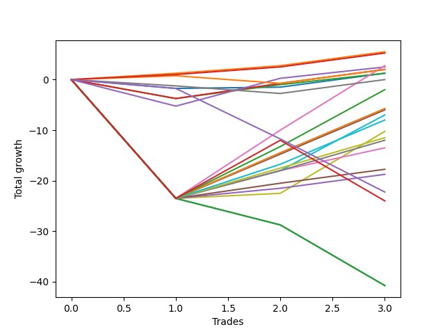

# Short Labrador 004 
- Symbol: ES_830-1130
- Date Range: 03/18/2022 - 12/30/2022
- Trading Period: 8:30-11:30
- Number of Trades: 3



| Name | Win Percent | Profit | Avg Profit / Trade | Avg Time / Trade |      | Name | Win Percent | Profit | Avg Profit / Trade | Avg Time / Trade |
| ---- | ----------- | ------ | ------------------ | ---------------- | ---- | ---- | ----------- | ------ | ------------------ | ---------------- |
| Sorted By <br> Profit | | | | | | Sorted By <br> Win Percentage ||||
| BB-50 U/L 2SD SL-5 | 66.67 | 10750.00 | 3583.33 | 08:33 |     | BB-20 U/L 1SD SL-10 | 100.00 | 2750.00 | 916.67 | 03:40 |
| BB-50 U/L 2SD SL-10 | 66.67 | 8000.00 | 2666.67 | 12:10 |     | BB-20 U/L 1SD | 100.00 | 2750.00 | 916.67 | 03:40 |
| BB-50 U/L 1SD SL-5 | 66.67 | 6375.00 | 2125.00 | 04:41 |     | TP-1 | 100.00 | 2625.00 | 875.00 | 03:38 |
| BB-100 Mid SL-5 | 66.67 | 5875.00 | 1958.33 | 04:36 |     | BB-50 U/L 2SD SL-5 | 66.67 | 10750.00 | 3583.33 | 08:33 |
| V U/L 1SD SL-5 | 66.67 | 4250.00 | 1416.67 | 03:46 |     | BB-50 U/L 2SD SL-10 | 66.67 | 8000.00 | 2666.67 | 12:10 |
| BB-50 U/L 1SD SL-10 | 66.67 | 3625.00 | 1208.33 | 08:18 |     | BB-50 U/L 1SD SL-5 | 66.67 | 6375.00 | 2125.00 | 04:41 |
| BB-100 Mid SL-10 | 66.67 | 3125.00 | 1041.67 | 08:13 |     | BB-100 Mid SL-5 | 66.67 | 5875.00 | 1958.33 | 04:36 |
| BB-20 U/L 1SD SL-10 | 100.00 | 2750.00 | 916.67 | 03:40 |     | V U/L 1SD SL-5 | 66.67 | 4250.00 | 1416.67 | 03:46 |
| BB-20 U/L 1SD | 100.00 | 2750.00 | 916.67 | 03:40 |     | BB-50 U/L 1SD SL-10 | 66.67 | 3625.00 | 1208.33 | 08:18 |
| TP-1 | 100.00 | 2625.00 | 875.00 | 03:38 |     | BB-100 Mid SL-10 | 66.67 | 3125.00 | 1041.67 | 08:13 |
| V U/L 1SD SL-10 | 66.67 | 1500.00 | 500.00 | 07:23 |     | V U/L 1SD SL-10 | 66.67 | 1500.00 | 500.00 | 07:23 |
| BB-50 Mid SL-5 | 66.67 | 1500.00 | 500.00 | 03:06 |     | BB-50 Mid SL-5 | 66.67 | 1500.00 | 500.00 | 03:06 |
| BB-50 U/L 2SD | 66.67 | 1375.00 | 458.33 | 27:46 |     | BB-50 U/L 2SD | 66.67 | 1375.00 | 458.33 | 27:46 |
| BB-50 Mid | 66.67 | 1250.00 | 416.67 | 12:15 |     | BB-50 Mid | 66.67 | 1250.00 | 416.67 | 12:15 |
| BB-200 Mid SL-10 | 66.67 | 1000.00 | 333.33 | 03:15 |     | BB-200 Mid SL-10 | 66.67 | 1000.00 | 333.33 | 03:15 |
| BB-200 Mid | 66.67 | 1000.00 | 333.33 | 03:15 |     | BB-200 Mid | 66.67 | 1000.00 | 333.33 | 03:15 |
| BB-20 U/L 2SD C | 66.67 | 1000.00 | 333.33 | 11:31 |     | BB-20 U/L 2SD C | 66.67 | 1000.00 | 333.33 | 11:31 |
| BB-20 Mid SL-10 | 66.67 | 625.00 | 208.33 | 03:13 |     | BB-20 Mid SL-10 | 66.67 | 625.00 | 208.33 | 03:13 |
| BB-20 U/L 2SD | 66.67 | 625.00 | 208.33 | 11:26 |     | BB-20 U/L 2SD | 66.67 | 625.00 | 208.33 | 11:26 |
| BB-20 Mid | 66.67 | 625.00 | 208.33 | 03:13 |     | BB-20 Mid | 66.67 | 625.00 | 208.33 | 03:13 |
| BB-20 U/L 2SD C SL-5 | 66.67 | 500.00 | 166.67 | 02:25 |     | BB-20 U/L 2SD C SL-5 | 66.67 | 500.00 | 166.67 | 02:25 |
| BB-20 U/L 2SD SL-5 | 66.67 | 125.00 | 41.67 | 02:20 |     | BB-20 U/L 2SD SL-5 | 66.67 | 125.00 | 41.67 | 02:20 |
| V Mid SL-10 | 33.33 | -0.00 | -0.00 | 01:10 |     | BB-20 U/L 1SD SL-5 | 66.67 | -250.00 | -83.33 | 02:10 |
| V Mid SL-5 | 33.33 | -0.00 | -0.00 | 01:10 |     | BB-20 Mid SL-5 | 66.67 | -875.00 | -291.67 | 02:06 |
| V Mid | 33.33 | -0.00 | -0.00 | 01:10 |     | TP-10 | 66.67 | -1000.00 | -333.33 | 25:00 |
| BB-20 U/L 1SD SL-5 | 66.67 | -250.00 | -83.33 | 02:10 |     | BB-50 Mid SL-10 | 66.67 | -1250.00 | -416.67 | 06:43 |
| BB-20 Mid SL-5 | 66.67 | -875.00 | -291.67 | 02:06 |     | BB-20 U/L 2SD C SL-10 | 66.67 | -2250.00 | -750.00 | 06:01 |
| TP-10 | 66.67 | -1000.00 | -333.33 | 25:00 |     | BB-20 U/L 2SD SL-10 | 66.67 | -2625.00 | -875.00 | 05:56 |
| BB-50 Mid SL-10 | 66.67 | -1250.00 | -416.67 | 06:43 |     | TP-9 | 66.67 | -2875.00 | -958.33 | 23:48 |
| BB-200 Mid SL-5 | 33.33 | -1750.00 | -583.33 | 01:51 |     | TP-8 | 66.67 | -2875.00 | -958.33 | 23:46 |
| BB-20 U/L 2SD C SL-10 | 66.67 | -2250.00 | -750.00 | 06:01 |     | BB-50 U/L 1SD | 66.67 | -3000.00 | -1000.00 | 23:55 |
| BB-20 U/L 2SD SL-10 | 66.67 | -2625.00 | -875.00 | 05:56 |     | BB-100 Mid | 66.67 | -3500.00 | -1166.67 | 23:50 |
| TP-9 | 66.67 | -2875.00 | -958.33 | 23:48 |     | TP-7 | 66.67 | -4000.00 | -1333.33 | 23:36 |
| TP-8 | 66.67 | -2875.00 | -958.33 | 23:46 |     | V U/L 1SD | 66.67 | -5125.00 | -1708.33 | 23:00 |
| BB-50 U/L 1SD | 66.67 | -3000.00 | -1000.00 | 23:55 |     | TP-6 | 66.67 | -5750.00 | -1916.67 | 22:55 |
| BB-100 Mid | 66.67 | -3500.00 | -1166.67 | 23:50 |     | TP-5 | 66.67 | -6000.00 | -2000.00 | 22:53 |
| TP-7 | 66.67 | -4000.00 | -1333.33 | 23:36 |     | TP-4 | 66.67 | -6750.00 | -2250.00 | 22:43 |
| V U/L 1SD | 66.67 | -5125.00 | -1708.33 | 23:00 |     | TP-3 | 66.67 | -8875.00 | -2958.33 | 21:38 |
| TP-6 | 66.67 | -5750.00 | -1916.67 | 22:55 |     | TP-2 | 66.67 | -9375.00 | -3125.00 | 21:26 |
| TP-5 | 66.67 | -6000.00 | -2000.00 | 22:53 |     | V Mid SL-10 | 33.33 | -0.00 | -0.00 | 01:10 |
| TP-4 | 66.67 | -6750.00 | -2250.00 | 22:43 |     | V Mid SL-5 | 33.33 | -0.00 | -0.00 | 01:10 |
| TP-3 | 66.67 | -8875.00 | -2958.33 | 21:38 |     | V Mid | 33.33 | -0.00 | -0.00 | 01:10 |
| BB-200 U/L 2SD SL-5 | 0.00 | -9000.00 | -3000.00 | 21:33 |     | BB-200 Mid SL-5 | 33.33 | -1750.00 | -583.33 | 01:51 |
| BB-100 U/L 2SD SL-5 | 0.00 | -9000.00 | -3000.00 | 21:33 |     | NEWFI 000 | 33.33 | -12000.00 | -4000.00 | 47:38 |
| TP-2 | 66.67 | -9375.00 | -3125.00 | 21:26 |     | BB-200 U/L 2SD SL-5 | 0.00 | -9000.00 | -3000.00 | 21:33 |
| NEWFI 0000 | 0.00 | -11125.00 | -3708.33 | 30:25 |     | BB-100 U/L 2SD SL-5 | 0.00 | -9000.00 | -3000.00 | 21:33 |
| NEWFI 000 | 33.33 | -12000.00 | -4000.00 | 47:38 |     | NEWFI 0000 | 0.00 | -11125.00 | -3708.33 | 30:25 |
| BB-200 U/L 2SD SL-10 | 0.00 | -15125.00 | -5041.67 | 27:13 |     | BB-200 U/L 2SD SL-10 | 0.00 | -15125.00 | -5041.67 | 27:13 |
| BB-100 U/L 2SD SL-10 | 0.00 | -15125.00 | -5041.67 | 27:13 |     | BB-100 U/L 2SD SL-10 | 0.00 | -15125.00 | -5041.67 | 27:13 |
| BB-200 U/L 2SD | 0.00 | -20375.00 | -6791.67 | 60:55 |     | BB-200 U/L 2SD | 0.00 | -20375.00 | -6791.67 | 60:55 |
| BB-100 U/L 2SD | 0.00 | -20375.00 | -6791.67 | 60:55 |     | BB-100 U/L 2SD | 0.00 | -20375.00 | -6791.67 | 60:55 |

## NO STOPLOSS

### Test BB-20 Mid
* Sell when price hits the middle line of the 20p bollinger
* No Stoploss
* Results:
```
Total Trades: 3
Percent Up: 33.33
Percent Down: 66.67
Total Points Moved Down: 1.25
Potential Profit: 625.00
Total Points Ups: 1.75 Count Ups: 1
Total Points Downs: 3.00 Count Downs: 2
```

<details><summary>Trades</summary>

<code>In: 2022-06-01 10:24:00		Out: 2022-06-01 10:30:35		Total Position Time: 06:35		Total Move Down: -1.75		Total to Date: -1.75</code> <br />
<code>In: 2022-09-26 11:21:00		Out: 2022-09-26 11:22:55		Total Position Time: 01:55		Total Move Down: 0.25		Total to Date: -1.50</code> <br />
<code>In: 2022-10-18 09:58:00		Out: 2022-10-18 09:59:10		Total Position Time: 01:10		Total Move Down: 2.75		Total to Date: 1.25</code> <br />


</details>

### Test BB-20 U/L 1SD
* Sell when the price hits the lower line of the 20p 1std bollinger
* No Stoploss
* Results:
```
Total Trades: 3
Percent Up: 0.00
Percent Down: 100.00
Total Points Moved Down: 5.50
Potential Profit: 2750.00
Total Points Ups: 0.00 Count Ups: 0
Total Points Downs: 5.50 Count Downs: 3
```

<details><summary>Trades</summary>

<code>In: 2022-06-01 10:24:00		Out: 2022-06-01 10:31:45		Total Position Time: 07:45		Total Move Down: 1.25		Total to Date: 1.25</code> <br />
<code>In: 2022-09-26 11:21:00		Out: 2022-09-26 11:23:05		Total Position Time: 02:05		Total Move Down: 1.50		Total to Date: 2.75</code> <br />
<code>In: 2022-10-18 09:58:00		Out: 2022-10-18 09:59:10		Total Position Time: 01:10		Total Move Down: 2.75		Total to Date: 5.50</code> <br />


</details>

### Test BB-20 U/L 2SD
* Sell when the price hits the lower line of the 20p 2std bollinger
* No Stoploss
* Results:
```
Total Trades: 3
Percent Up: 33.33
Percent Down: 66.67
Total Points Moved Down: 1.25
Potential Profit: 625.00
Total Points Ups: 3.75 Count Ups: 1
Total Points Downs: 5.00 Count Downs: 2
```

<details><summary>Trades</summary>

<code>In: 2022-06-01 10:24:00		Out: 2022-06-01 10:54:35		Total Position Time: 30:35		Total Move Down: -3.75		Total to Date: -3.75</code> <br />
<code>In: 2022-09-26 11:21:00		Out: 2022-09-26 11:23:30		Total Position Time: 02:30		Total Move Down: 2.75		Total to Date: -1.00</code> <br />
<code>In: 2022-10-18 09:58:00		Out: 2022-10-18 09:59:15		Total Position Time: 01:15		Total Move Down: 2.25		Total to Date: 1.25</code> <br />


</details>

### Test BB-20 U/L 2SD C
* Sell when the price hits the lower line of the 20p 2std bollinger
* No Stoploss
* Results:
```
Total Trades: 3
Percent Up: 33.33
Percent Down: 66.67
Total Points Moved Down: 2.00
Potential Profit: 1000.00
Total Points Ups: 3.75 Count Ups: 1
Total Points Downs: 5.75 Count Downs: 2
```

<details><summary>Trades</summary>

<code>In: 2022-06-01 10:24:00		Out: 2022-06-01 10:54:35		Total Position Time: 30:35		Total Move Down: -3.75		Total to Date: -3.75</code> <br />
<code>In: 2022-09-26 11:21:00		Out: 2022-09-26 11:23:40		Total Position Time: 02:40		Total Move Down: 3.00		Total to Date: -0.75</code> <br />
<code>In: 2022-10-18 09:58:00		Out: 2022-10-18 09:59:20		Total Position Time: 01:20		Total Move Down: 2.75		Total to Date: 2.00</code> <br />


</details>

### Test BB-50 Mid
* Sell when price hits the middle line of the 50p bollinger
* No Stoploss
* Results:
```
Total Trades: 3
Percent Up: 33.33
Percent Down: 66.67
Total Points Moved Down: 2.50
Potential Profit: 1250.00
Total Points Ups: 5.25 Count Ups: 1
Total Points Downs: 7.75 Count Downs: 2
```

<details><summary>Trades</summary>

<code>In: 2022-06-01 10:24:00		Out: 2022-06-01 10:54:40		Total Position Time: 30:40		Total Move Down: -5.25		Total to Date: -5.25</code> <br />
<code>In: 2022-09-26 11:21:00		Out: 2022-09-26 11:25:50		Total Position Time: 04:50		Total Move Down: 5.50		Total to Date: 0.25</code> <br />
<code>In: 2022-10-18 09:58:00		Out: 2022-10-18 09:59:15		Total Position Time: 01:15		Total Move Down: 2.25		Total to Date: 2.50</code> <br />


</details>

### Test BB-50 U/L 1SD
* Sell when the price hits the lower line of the 50p 1std bollinger
* No Stoploss
* Results:
```
Total Trades: 3
Percent Up: 33.33
Percent Down: 66.67
Total Points Moved Down: -6.00
Potential Profit: -3000.00
Total Points Ups: 23.50 Count Ups: 1
Total Points Downs: 17.50 Count Downs: 2
```

<details><summary>Trades</summary>

<code>In: 2022-06-01 10:24:00		Out: 2022-06-01 11:24:55		Total Position Time: 60:55		Total Move Down: -23.50		Total to Date: -23.50</code> <br />
<code>In: 2022-09-26 11:21:00		Out: 2022-09-26 11:28:50		Total Position Time: 07:50		Total Move Down: 8.75		Total to Date: -14.75</code> <br />
<code>In: 2022-10-18 09:58:00		Out: 2022-10-18 10:01:00		Total Position Time: 03:00		Total Move Down: 8.75		Total to Date: -6.00</code> <br />


</details>

### Test BB-50 U/L 2SD
* Sell when the price hits the lower line of the 50p 2std bollinger
* No Stoploss
* Results:
```
Total Trades: 3
Percent Up: 33.33
Percent Down: 66.67
Total Points Moved Down: 2.75
Potential Profit: 1375.00
Total Points Ups: 23.50 Count Ups: 1
Total Points Downs: 26.25 Count Downs: 2
```

<details><summary>Trades</summary>

<code>In: 2022-06-01 10:24:00		Out: 2022-06-01 11:24:55		Total Position Time: 60:55		Total Move Down: -23.50		Total to Date: -23.50</code> <br />
<code>In: 2022-09-26 11:21:00		Out: 2022-09-26 11:37:30		Total Position Time: 16:30		Total Move Down: 13.50		Total to Date: -10.00</code> <br />
<code>In: 2022-10-18 09:58:00		Out: 2022-10-18 10:03:55		Total Position Time: 05:55		Total Move Down: 12.75		Total to Date: 2.75</code> <br />


</details>

### Test V Mid
* Sell when the price hits the middle line of the 1std VWAP
* No Stoploss
* Results:
```
Total Trades: 3
Percent Up: 66.67
Percent Down: 33.33
Total Points Moved Down: -0.00
Potential Profit: -0.00
Total Points Ups: 2.75 Count Ups: 2
Total Points Downs: 2.75 Count Downs: 1
```

<details><summary>Trades</summary>

<code>In: 2022-06-01 10:24:00		Out: 2022-06-01 10:25:10		Total Position Time: 01:10		Total Move Down: -1.25		Total to Date: -1.25</code> <br />
<code>In: 2022-09-26 11:21:00		Out: 2022-09-26 11:22:10		Total Position Time: 01:10		Total Move Down: -1.50		Total to Date: -2.75</code> <br />
<code>In: 2022-10-18 09:58:00		Out: 2022-10-18 09:59:10		Total Position Time: 01:10		Total Move Down: 2.75		Total to Date: 0.00</code> <br />


</details>

### Test V U/L 1SD
* Sell when the price hits the lower line of the 1std VWAP
* No Stoploss
* Results:
```
Total Trades: 3
Percent Up: 33.33
Percent Down: 66.67
Total Points Moved Down: -10.25
Potential Profit: -5125.00
Total Points Ups: 23.50 Count Ups: 1
Total Points Downs: 13.25 Count Downs: 2
```

<details><summary>Trades</summary>

<code>In: 2022-06-01 10:24:00		Out: 2022-06-01 11:24:55		Total Position Time: 60:55		Total Move Down: -23.50		Total to Date: -23.50</code> <br />
<code>In: 2022-09-26 11:21:00		Out: 2022-09-26 11:23:00		Total Position Time: 02:00		Total Move Down: 1.00		Total to Date: -22.50</code> <br />
<code>In: 2022-10-18 09:58:00		Out: 2022-10-18 10:04:05		Total Position Time: 06:05		Total Move Down: 12.25		Total to Date: -10.25</code> <br />


</details>

### Test BB-100 Mid
* Move to BB100 Mid
* No Stoploss
* Results:
```
Total Trades: 3
Percent Up: 33.33
Percent Down: 66.67
Total Points Moved Down: -7.00
Potential Profit: -3500.00
Total Points Ups: 23.50 Count Ups: 1
Total Points Downs: 16.50 Count Downs: 2
```

<details><summary>Trades</summary>

<code>In: 2022-06-01 10:24:00		Out: 2022-06-01 11:24:55		Total Position Time: 60:55		Total Move Down: -23.50		Total to Date: -23.50</code> <br />
<code>In: 2022-09-26 11:21:00		Out: 2022-09-26 11:25:50		Total Position Time: 04:50		Total Move Down: 5.50		Total to Date: -18.00</code> <br />
<code>In: 2022-10-18 09:58:00		Out: 2022-10-18 10:03:45		Total Position Time: 05:45		Total Move Down: 11.00		Total to Date: -7.00</code> <br />


</details>

### Test BB-100 U/L 2SD
* Move to BB100 Upper Band
* No Stoploss
* Results:
```
Total Trades: 3
Percent Up: 100.00
Percent Down: 0.00
Total Points Moved Down: -40.75
Potential Profit: -20375.00
Total Points Ups: 40.75 Count Ups: 3
Total Points Downs: 0.00 Count Downs: 0
```

<details><summary>Trades</summary>

<code>In: 2022-06-01 10:24:00		Out: 2022-06-01 11:24:55		Total Position Time: 60:55		Total Move Down: -23.50		Total to Date: -23.50</code> <br />
<code>In: 2022-09-26 11:21:00		Out: 2022-09-26 12:21:55		Total Position Time: 60:55		Total Move Down: -5.25		Total to Date: -28.75</code> <br />
<code>In: 2022-10-18 09:58:00		Out: 2022-10-18 10:58:55		Total Position Time: 60:55		Total Move Down: -12.00		Total to Date: -40.75</code> <br />


</details>

### Test BB-200 Mid
* Move to BB200 Mid
* No Stoploss
* Results:
```
Total Trades: 3
Percent Up: 33.33
Percent Down: 66.67
Total Points Moved Down: 2.00
Potential Profit: 1000.00
Total Points Ups: 1.50 Count Ups: 1
Total Points Downs: 3.50 Count Downs: 2
```

<details><summary>Trades</summary>

<code>In: 2022-06-01 10:24:00		Out: 2022-06-01 10:31:25		Total Position Time: 07:25		Total Move Down: 0.75		Total to Date: 0.75</code> <br />
<code>In: 2022-09-26 11:21:00		Out: 2022-09-26 11:22:10		Total Position Time: 01:10		Total Move Down: -1.50		Total to Date: -0.75</code> <br />
<code>In: 2022-10-18 09:58:00		Out: 2022-10-18 09:59:10		Total Position Time: 01:10		Total Move Down: 2.75		Total to Date: 2.00</code> <br />


</details>

### Test BB-200 U/L 2SD
* Move to BB200 Upper Band
* No Stoploss
* Results:
```
Total Trades: 3
Percent Up: 100.00
Percent Down: 0.00
Total Points Moved Down: -40.75
Potential Profit: -20375.00
Total Points Ups: 40.75 Count Ups: 3
Total Points Downs: 0.00 Count Downs: 0
```

<details><summary>Trades</summary>

<code>In: 2022-06-01 10:24:00		Out: 2022-06-01 11:24:55		Total Position Time: 60:55		Total Move Down: -23.50		Total to Date: -23.50</code> <br />
<code>In: 2022-09-26 11:21:00		Out: 2022-09-26 12:21:55		Total Position Time: 60:55		Total Move Down: -5.25		Total to Date: -28.75</code> <br />
<code>In: 2022-10-18 09:58:00		Out: 2022-10-18 10:58:55		Total Position Time: 60:55		Total Move Down: -12.00		Total to Date: -40.75</code> <br />


</details>

## STOPLOSS OF 5

### Test BB-20 Mid SL-5
* Sell when price hits the middle line of the 20p bollinger
* Stoploss is -5 points
* Results:
```
Total Trades: 3
Percent Up: 33.33
Percent Down: 66.67
Total Points Moved Down: -1.75
Potential Profit: -875.00
Total Points Ups: 4.75 Count Ups: 1
Total Points Downs: 3.00 Count Downs: 2
```

<details><summary>Trades</summary>

<code>In: 2022-06-01 10:24:00		Out: 2022-06-01 10:27:15		Total Position Time: 03:15		Total Move Down: -4.75		Total to Date: -4.75</code> <br />
<code>In: 2022-09-26 11:21:00		Out: 2022-09-26 11:22:55		Total Position Time: 01:55		Total Move Down: 0.25		Total to Date: -4.50</code> <br />
<code>In: 2022-10-18 09:58:00		Out: 2022-10-18 09:59:10		Total Position Time: 01:10		Total Move Down: 2.75		Total to Date: -1.75</code> <br />


</details>

### Test BB-20 U/L 1SD SL-5
* Sell when the price hits the lower line of the 20p 1std bollinger
* Stoploss is -5 points
* Results:
```
Total Trades: 3
Percent Up: 33.33
Percent Down: 66.67
Total Points Moved Down: -0.50
Potential Profit: -250.00
Total Points Ups: 4.75 Count Ups: 1
Total Points Downs: 4.25 Count Downs: 2
```

<details><summary>Trades</summary>

<code>In: 2022-06-01 10:24:00		Out: 2022-06-01 10:27:15		Total Position Time: 03:15		Total Move Down: -4.75		Total to Date: -4.75</code> <br />
<code>In: 2022-09-26 11:21:00		Out: 2022-09-26 11:23:05		Total Position Time: 02:05		Total Move Down: 1.50		Total to Date: -3.25</code> <br />
<code>In: 2022-10-18 09:58:00		Out: 2022-10-18 09:59:10		Total Position Time: 01:10		Total Move Down: 2.75		Total to Date: -0.50</code> <br />


</details>

### Test BB-20 U/L 2SD SL-5
* Sell when the price hits the lower line of the 20p 2std bollinger
* Stoploss is -5 points
* Results:
```
Total Trades: 3
Percent Up: 33.33
Percent Down: 66.67
Total Points Moved Down: 0.25
Potential Profit: 125.00
Total Points Ups: 4.75 Count Ups: 1
Total Points Downs: 5.00 Count Downs: 2
```

<details><summary>Trades</summary>

<code>In: 2022-06-01 10:24:00		Out: 2022-06-01 10:27:15		Total Position Time: 03:15		Total Move Down: -4.75		Total to Date: -4.75</code> <br />
<code>In: 2022-09-26 11:21:00		Out: 2022-09-26 11:23:30		Total Position Time: 02:30		Total Move Down: 2.75		Total to Date: -2.00</code> <br />
<code>In: 2022-10-18 09:58:00		Out: 2022-10-18 09:59:15		Total Position Time: 01:15		Total Move Down: 2.25		Total to Date: 0.25</code> <br />


</details>

### Test BB-20 U/L 2SD C SL-5
* Sell when the price hits the lower line of the 20p 2std bollinger
* Stoploss is -5 points
* Results:
```
Total Trades: 3
Percent Up: 33.33
Percent Down: 66.67
Total Points Moved Down: 1.00
Potential Profit: 500.00
Total Points Ups: 4.75 Count Ups: 1
Total Points Downs: 5.75 Count Downs: 2
```

<details><summary>Trades</summary>

<code>In: 2022-06-01 10:24:00		Out: 2022-06-01 10:27:15		Total Position Time: 03:15		Total Move Down: -4.75		Total to Date: -4.75</code> <br />
<code>In: 2022-09-26 11:21:00		Out: 2022-09-26 11:23:40		Total Position Time: 02:40		Total Move Down: 3.00		Total to Date: -1.75</code> <br />
<code>In: 2022-10-18 09:58:00		Out: 2022-10-18 09:59:20		Total Position Time: 01:20		Total Move Down: 2.75		Total to Date: 1.00</code> <br />


</details>

### Test BB-50 Mid SL-5
* Sell when price hits the middle line of the 50p bollinger
* Stoploss is -5 points
* Results:
```
Total Trades: 3
Percent Up: 33.33
Percent Down: 66.67
Total Points Moved Down: 3.00
Potential Profit: 1500.00
Total Points Ups: 4.75 Count Ups: 1
Total Points Downs: 7.75 Count Downs: 2
```

<details><summary>Trades</summary>

<code>In: 2022-06-01 10:24:00		Out: 2022-06-01 10:27:15		Total Position Time: 03:15		Total Move Down: -4.75		Total to Date: -4.75</code> <br />
<code>In: 2022-09-26 11:21:00		Out: 2022-09-26 11:25:50		Total Position Time: 04:50		Total Move Down: 5.50		Total to Date: 0.75</code> <br />
<code>In: 2022-10-18 09:58:00		Out: 2022-10-18 09:59:15		Total Position Time: 01:15		Total Move Down: 2.25		Total to Date: 3.00</code> <br />


</details>

### Test BB-50 U/L 1SD SL-5
* Sell when the price hits the lower line of the 50p 1std bollinger
* Stoploss is -5 points
* Results:
```
Total Trades: 3
Percent Up: 33.33
Percent Down: 66.67
Total Points Moved Down: 12.75
Potential Profit: 6375.00
Total Points Ups: 4.75 Count Ups: 1
Total Points Downs: 17.50 Count Downs: 2
```

<details><summary>Trades</summary>

<code>In: 2022-06-01 10:24:00		Out: 2022-06-01 10:27:15		Total Position Time: 03:15		Total Move Down: -4.75		Total to Date: -4.75</code> <br />
<code>In: 2022-09-26 11:21:00		Out: 2022-09-26 11:28:50		Total Position Time: 07:50		Total Move Down: 8.75		Total to Date: 4.00</code> <br />
<code>In: 2022-10-18 09:58:00		Out: 2022-10-18 10:01:00		Total Position Time: 03:00		Total Move Down: 8.75		Total to Date: 12.75</code> <br />


</details>

### Test BB-50 U/L 2SD SL-5
* Sell when the price hits the lower line of the 50p 2std bollinger
* Stoploss is -5 points
* Results:
```
Total Trades: 3
Percent Up: 33.33
Percent Down: 66.67
Total Points Moved Down: 21.50
Potential Profit: 10750.00
Total Points Ups: 4.75 Count Ups: 1
Total Points Downs: 26.25 Count Downs: 2
```

<details><summary>Trades</summary>

<code>In: 2022-06-01 10:24:00		Out: 2022-06-01 10:27:15		Total Position Time: 03:15		Total Move Down: -4.75		Total to Date: -4.75</code> <br />
<code>In: 2022-09-26 11:21:00		Out: 2022-09-26 11:37:30		Total Position Time: 16:30		Total Move Down: 13.50		Total to Date: 8.75</code> <br />
<code>In: 2022-10-18 09:58:00		Out: 2022-10-18 10:03:55		Total Position Time: 05:55		Total Move Down: 12.75		Total to Date: 21.50</code> <br />


</details>

### Test V Mid SL-5
* Sell when the price hits the middle line of the 1std VWAP
* Stoploss is -5 points
* Results:
```
Total Trades: 3
Percent Up: 66.67
Percent Down: 33.33
Total Points Moved Down: -0.00
Potential Profit: -0.00
Total Points Ups: 2.75 Count Ups: 2
Total Points Downs: 2.75 Count Downs: 1
```

<details><summary>Trades</summary>

<code>In: 2022-06-01 10:24:00		Out: 2022-06-01 10:25:10		Total Position Time: 01:10		Total Move Down: -1.25		Total to Date: -1.25</code> <br />
<code>In: 2022-09-26 11:21:00		Out: 2022-09-26 11:22:10		Total Position Time: 01:10		Total Move Down: -1.50		Total to Date: -2.75</code> <br />
<code>In: 2022-10-18 09:58:00		Out: 2022-10-18 09:59:10		Total Position Time: 01:10		Total Move Down: 2.75		Total to Date: 0.00</code> <br />


</details>

### Test V U/L 1SD SL-5
* Sell when the price hits the lower line of the 1std VWAP
* Stoploss is -5 points
* Results:
```
Total Trades: 3
Percent Up: 33.33
Percent Down: 66.67
Total Points Moved Down: 8.50
Potential Profit: 4250.00
Total Points Ups: 4.75 Count Ups: 1
Total Points Downs: 13.25 Count Downs: 2
```

<details><summary>Trades</summary>

<code>In: 2022-06-01 10:24:00		Out: 2022-06-01 10:27:15		Total Position Time: 03:15		Total Move Down: -4.75		Total to Date: -4.75</code> <br />
<code>In: 2022-09-26 11:21:00		Out: 2022-09-26 11:23:00		Total Position Time: 02:00		Total Move Down: 1.00		Total to Date: -3.75</code> <br />
<code>In: 2022-10-18 09:58:00		Out: 2022-10-18 10:04:05		Total Position Time: 06:05		Total Move Down: 12.25		Total to Date: 8.50</code> <br />


</details>

### Test BB-100 Mid SL-5
* Move to BB100 Mid
* Stoploss is -5 points
* Results:
```
Total Trades: 3
Percent Up: 33.33
Percent Down: 66.67
Total Points Moved Down: 11.75
Potential Profit: 5875.00
Total Points Ups: 4.75 Count Ups: 1
Total Points Downs: 16.50 Count Downs: 2
```

<details><summary>Trades</summary>

<code>In: 2022-06-01 10:24:00		Out: 2022-06-01 10:27:15		Total Position Time: 03:15		Total Move Down: -4.75		Total to Date: -4.75</code> <br />
<code>In: 2022-09-26 11:21:00		Out: 2022-09-26 11:25:50		Total Position Time: 04:50		Total Move Down: 5.50		Total to Date: 0.75</code> <br />
<code>In: 2022-10-18 09:58:00		Out: 2022-10-18 10:03:45		Total Position Time: 05:45		Total Move Down: 11.00		Total to Date: 11.75</code> <br />


</details>

### Test BB-100 U/L 2SD SL-5
* Move to BB100 Upper Band
* Stoploss is -5 points
* Results:
```
Total Trades: 3
Percent Up: 100.00
Percent Down: 0.00
Total Points Moved Down: -18.00
Potential Profit: -9000.00
Total Points Ups: 18.00 Count Ups: 3
Total Points Downs: 0.00 Count Downs: 0
```

<details><summary>Trades</summary>

<code>In: 2022-06-01 10:24:00		Out: 2022-06-01 10:27:15		Total Position Time: 03:15		Total Move Down: -4.75		Total to Date: -4.75</code> <br />
<code>In: 2022-09-26 11:21:00		Out: 2022-09-26 11:49:05		Total Position Time: 28:05		Total Move Down: -8.00		Total to Date: -12.75</code> <br />
<code>In: 2022-10-18 09:58:00		Out: 2022-10-18 10:31:20		Total Position Time: 33:20		Total Move Down: -5.25		Total to Date: -18.00</code> <br />


</details>

### Test BB-200 Mid SL-5
* Move to BB200 Mid
* Stoploss is -5 points
* Results:
```
Total Trades: 3
Percent Up: 66.67
Percent Down: 33.33
Total Points Moved Down: -3.50
Potential Profit: -1750.00
Total Points Ups: 6.25 Count Ups: 2
Total Points Downs: 2.75 Count Downs: 1
```

<details><summary>Trades</summary>

<code>In: 2022-06-01 10:24:00		Out: 2022-06-01 10:27:15		Total Position Time: 03:15		Total Move Down: -4.75		Total to Date: -4.75</code> <br />
<code>In: 2022-09-26 11:21:00		Out: 2022-09-26 11:22:10		Total Position Time: 01:10		Total Move Down: -1.50		Total to Date: -6.25</code> <br />
<code>In: 2022-10-18 09:58:00		Out: 2022-10-18 09:59:10		Total Position Time: 01:10		Total Move Down: 2.75		Total to Date: -3.50</code> <br />


</details>

### Test BB-200 U/L 2SD SL-5
* Move to BB200 Upper Band
* Stoploss is -5 points
* Results:
```
Total Trades: 3
Percent Up: 100.00
Percent Down: 0.00
Total Points Moved Down: -18.00
Potential Profit: -9000.00
Total Points Ups: 18.00 Count Ups: 3
Total Points Downs: 0.00 Count Downs: 0
```

<details><summary>Trades</summary>

<code>In: 2022-06-01 10:24:00		Out: 2022-06-01 10:27:15		Total Position Time: 03:15		Total Move Down: -4.75		Total to Date: -4.75</code> <br />
<code>In: 2022-09-26 11:21:00		Out: 2022-09-26 11:49:05		Total Position Time: 28:05		Total Move Down: -8.00		Total to Date: -12.75</code> <br />
<code>In: 2022-10-18 09:58:00		Out: 2022-10-18 10:31:20		Total Position Time: 33:20		Total Move Down: -5.25		Total to Date: -18.00</code> <br />


</details>

## STOPLOSS OF 10

### Test BB-20 Mid SL-10
* Sell when price hits the middle line of the 20p bollinger
* Stoploss is -10 points
* Results:
```
Total Trades: 3
Percent Up: 33.33
Percent Down: 66.67
Total Points Moved Down: 1.25
Potential Profit: 625.00
Total Points Ups: 1.75 Count Ups: 1
Total Points Downs: 3.00 Count Downs: 2
```

<details><summary>Trades</summary>

<code>In: 2022-06-01 10:24:00		Out: 2022-06-01 10:30:35		Total Position Time: 06:35		Total Move Down: -1.75		Total to Date: -1.75</code> <br />
<code>In: 2022-09-26 11:21:00		Out: 2022-09-26 11:22:55		Total Position Time: 01:55		Total Move Down: 0.25		Total to Date: -1.50</code> <br />
<code>In: 2022-10-18 09:58:00		Out: 2022-10-18 09:59:10		Total Position Time: 01:10		Total Move Down: 2.75		Total to Date: 1.25</code> <br />


</details>

### Test BB-20 U/L 1SD SL-10
* Sell when the price hits the lower line of the 20p 1std bollinger
* Stoploss is -10 points
* Results:
```
Total Trades: 3
Percent Up: 0.00
Percent Down: 100.00
Total Points Moved Down: 5.50
Potential Profit: 2750.00
Total Points Ups: 0.00 Count Ups: 0
Total Points Downs: 5.50 Count Downs: 3
```

<details><summary>Trades</summary>

<code>In: 2022-06-01 10:24:00		Out: 2022-06-01 10:31:45		Total Position Time: 07:45		Total Move Down: 1.25		Total to Date: 1.25</code> <br />
<code>In: 2022-09-26 11:21:00		Out: 2022-09-26 11:23:05		Total Position Time: 02:05		Total Move Down: 1.50		Total to Date: 2.75</code> <br />
<code>In: 2022-10-18 09:58:00		Out: 2022-10-18 09:59:10		Total Position Time: 01:10		Total Move Down: 2.75		Total to Date: 5.50</code> <br />


</details>

### Test BB-20 U/L 2SD SL-10
* Sell when the price hits the lower line of the 20p 2std bollinger
* Stoploss is -10 points
* Results:
```
Total Trades: 3
Percent Up: 33.33
Percent Down: 66.67
Total Points Moved Down: -5.25
Potential Profit: -2625.00
Total Points Ups: 10.25 Count Ups: 1
Total Points Downs: 5.00 Count Downs: 2
```

<details><summary>Trades</summary>

<code>In: 2022-06-01 10:24:00		Out: 2022-06-01 10:38:05		Total Position Time: 14:05		Total Move Down: -10.25		Total to Date: -10.25</code> <br />
<code>In: 2022-09-26 11:21:00		Out: 2022-09-26 11:23:30		Total Position Time: 02:30		Total Move Down: 2.75		Total to Date: -7.50</code> <br />
<code>In: 2022-10-18 09:58:00		Out: 2022-10-18 09:59:15		Total Position Time: 01:15		Total Move Down: 2.25		Total to Date: -5.25</code> <br />


</details>

### Test BB-20 U/L 2SD C SL-10
* Sell when the price hits the lower line of the 20p 2std bollinger
* Stoploss is -10 points
* Results:
```
Total Trades: 3
Percent Up: 33.33
Percent Down: 66.67
Total Points Moved Down: -4.50
Potential Profit: -2250.00
Total Points Ups: 10.25 Count Ups: 1
Total Points Downs: 5.75 Count Downs: 2
```

<details><summary>Trades</summary>

<code>In: 2022-06-01 10:24:00		Out: 2022-06-01 10:38:05		Total Position Time: 14:05		Total Move Down: -10.25		Total to Date: -10.25</code> <br />
<code>In: 2022-09-26 11:21:00		Out: 2022-09-26 11:23:40		Total Position Time: 02:40		Total Move Down: 3.00		Total to Date: -7.25</code> <br />
<code>In: 2022-10-18 09:58:00		Out: 2022-10-18 09:59:20		Total Position Time: 01:20		Total Move Down: 2.75		Total to Date: -4.50</code> <br />


</details>

### Test BB-50 Mid SL-10
* Sell when price hits the middle line of the 50p bollinger
* Stoploss is -10 points
* Results:
```
Total Trades: 3
Percent Up: 33.33
Percent Down: 66.67
Total Points Moved Down: -2.50
Potential Profit: -1250.00
Total Points Ups: 10.25 Count Ups: 1
Total Points Downs: 7.75 Count Downs: 2
```

<details><summary>Trades</summary>

<code>In: 2022-06-01 10:24:00		Out: 2022-06-01 10:38:05		Total Position Time: 14:05		Total Move Down: -10.25		Total to Date: -10.25</code> <br />
<code>In: 2022-09-26 11:21:00		Out: 2022-09-26 11:25:50		Total Position Time: 04:50		Total Move Down: 5.50		Total to Date: -4.75</code> <br />
<code>In: 2022-10-18 09:58:00		Out: 2022-10-18 09:59:15		Total Position Time: 01:15		Total Move Down: 2.25		Total to Date: -2.50</code> <br />


</details>

### Test BB-50 U/L 1SD SL-10
* Sell when the price hits the lower line of the 50p 1std bollinger
* Stoploss is -10 points
* Results:
```
Total Trades: 3
Percent Up: 33.33
Percent Down: 66.67
Total Points Moved Down: 7.25
Potential Profit: 3625.00
Total Points Ups: 10.25 Count Ups: 1
Total Points Downs: 17.50 Count Downs: 2
```

<details><summary>Trades</summary>

<code>In: 2022-06-01 10:24:00		Out: 2022-06-01 10:38:05		Total Position Time: 14:05		Total Move Down: -10.25		Total to Date: -10.25</code> <br />
<code>In: 2022-09-26 11:21:00		Out: 2022-09-26 11:28:50		Total Position Time: 07:50		Total Move Down: 8.75		Total to Date: -1.50</code> <br />
<code>In: 2022-10-18 09:58:00		Out: 2022-10-18 10:01:00		Total Position Time: 03:00		Total Move Down: 8.75		Total to Date: 7.25</code> <br />


</details>

### Test BB-50 U/L 2SD SL-10
* Sell when the price hits the lower line of the 50p 2std bollinger
* Stoploss is -10 points
* Results:
```
Total Trades: 3
Percent Up: 33.33
Percent Down: 66.67
Total Points Moved Down: 16.00
Potential Profit: 8000.00
Total Points Ups: 10.25 Count Ups: 1
Total Points Downs: 26.25 Count Downs: 2
```

<details><summary>Trades</summary>

<code>In: 2022-06-01 10:24:00		Out: 2022-06-01 10:38:05		Total Position Time: 14:05		Total Move Down: -10.25		Total to Date: -10.25</code> <br />
<code>In: 2022-09-26 11:21:00		Out: 2022-09-26 11:37:30		Total Position Time: 16:30		Total Move Down: 13.50		Total to Date: 3.25</code> <br />
<code>In: 2022-10-18 09:58:00		Out: 2022-10-18 10:03:55		Total Position Time: 05:55		Total Move Down: 12.75		Total to Date: 16.00</code> <br />


</details>

### Test V Mid SL-10
* Sell when the price hits the middle line of the 1std VWAP
* Stoploss is -10 points
* Results:
```
Total Trades: 3
Percent Up: 66.67
Percent Down: 33.33
Total Points Moved Down: -0.00
Potential Profit: -0.00
Total Points Ups: 2.75 Count Ups: 2
Total Points Downs: 2.75 Count Downs: 1
```

<details><summary>Trades</summary>

<code>In: 2022-06-01 10:24:00		Out: 2022-06-01 10:25:10		Total Position Time: 01:10		Total Move Down: -1.25		Total to Date: -1.25</code> <br />
<code>In: 2022-09-26 11:21:00		Out: 2022-09-26 11:22:10		Total Position Time: 01:10		Total Move Down: -1.50		Total to Date: -2.75</code> <br />
<code>In: 2022-10-18 09:58:00		Out: 2022-10-18 09:59:10		Total Position Time: 01:10		Total Move Down: 2.75		Total to Date: 0.00</code> <br />


</details>

### Test V U/L 1SD SL-10
* Sell when the price hits the lower line of the 1std VWAP
* Stoploss is -10 points
* Results:
```
Total Trades: 3
Percent Up: 33.33
Percent Down: 66.67
Total Points Moved Down: 3.00
Potential Profit: 1500.00
Total Points Ups: 10.25 Count Ups: 1
Total Points Downs: 13.25 Count Downs: 2
```

<details><summary>Trades</summary>

<code>In: 2022-06-01 10:24:00		Out: 2022-06-01 10:38:05		Total Position Time: 14:05		Total Move Down: -10.25		Total to Date: -10.25</code> <br />
<code>In: 2022-09-26 11:21:00		Out: 2022-09-26 11:23:00		Total Position Time: 02:00		Total Move Down: 1.00		Total to Date: -9.25</code> <br />
<code>In: 2022-10-18 09:58:00		Out: 2022-10-18 10:04:05		Total Position Time: 06:05		Total Move Down: 12.25		Total to Date: 3.00</code> <br />


</details>

### Test BB-100 Mid SL-10
* Move to BB100 Mid
* Stoploss is -10 points
* Results:
```
Total Trades: 3
Percent Up: 33.33
Percent Down: 66.67
Total Points Moved Down: 6.25
Potential Profit: 3125.00
Total Points Ups: 10.25 Count Ups: 1
Total Points Downs: 16.50 Count Downs: 2
```

<details><summary>Trades</summary>

<code>In: 2022-06-01 10:24:00		Out: 2022-06-01 10:38:05		Total Position Time: 14:05		Total Move Down: -10.25		Total to Date: -10.25</code> <br />
<code>In: 2022-09-26 11:21:00		Out: 2022-09-26 11:25:50		Total Position Time: 04:50		Total Move Down: 5.50		Total to Date: -4.75</code> <br />
<code>In: 2022-10-18 09:58:00		Out: 2022-10-18 10:03:45		Total Position Time: 05:45		Total Move Down: 11.00		Total to Date: 6.25</code> <br />


</details>

### Test BB-100 U/L 2SD SL-10
* Move to BB100 Upper Band
* Stoploss is -10 points
* Results:
```
Total Trades: 3
Percent Up: 100.00
Percent Down: 0.00
Total Points Moved Down: -30.25
Potential Profit: -15125.00
Total Points Ups: 30.25 Count Ups: 3
Total Points Downs: 0.00 Count Downs: 0
```

<details><summary>Trades</summary>

<code>In: 2022-06-01 10:24:00		Out: 2022-06-01 10:38:05		Total Position Time: 14:05		Total Move Down: -10.25		Total to Date: -10.25</code> <br />
<code>In: 2022-09-26 11:21:00		Out: 2022-09-26 11:52:45		Total Position Time: 31:45		Total Move Down: -10.25		Total to Date: -20.50</code> <br />
<code>In: 2022-10-18 09:58:00		Out: 2022-10-18 10:33:50		Total Position Time: 35:50		Total Move Down: -9.75		Total to Date: -30.25</code> <br />


</details>

### Test BB-200 Mid SL-10
* Move to BB200 Mid
* Stoploss is -10 points
* Results:
```
Total Trades: 3
Percent Up: 33.33
Percent Down: 66.67
Total Points Moved Down: 2.00
Potential Profit: 1000.00
Total Points Ups: 1.50 Count Ups: 1
Total Points Downs: 3.50 Count Downs: 2
```

<details><summary>Trades</summary>

<code>In: 2022-06-01 10:24:00		Out: 2022-06-01 10:31:25		Total Position Time: 07:25		Total Move Down: 0.75		Total to Date: 0.75</code> <br />
<code>In: 2022-09-26 11:21:00		Out: 2022-09-26 11:22:10		Total Position Time: 01:10		Total Move Down: -1.50		Total to Date: -0.75</code> <br />
<code>In: 2022-10-18 09:58:00		Out: 2022-10-18 09:59:10		Total Position Time: 01:10		Total Move Down: 2.75		Total to Date: 2.00</code> <br />


</details>

### Test BB-200 U/L 2SD SL-10
* Move to BB200 Upper Band
* Stoploss is -10 points
* Results:
```
Total Trades: 3
Percent Up: 100.00
Percent Down: 0.00
Total Points Moved Down: -30.25
Potential Profit: -15125.00
Total Points Ups: 30.25 Count Ups: 3
Total Points Downs: 0.00 Count Downs: 0
```

<details><summary>Trades</summary>

<code>In: 2022-06-01 10:24:00		Out: 2022-06-01 10:38:05		Total Position Time: 14:05		Total Move Down: -10.25		Total to Date: -10.25</code> <br />
<code>In: 2022-09-26 11:21:00		Out: 2022-09-26 11:52:45		Total Position Time: 31:45		Total Move Down: -10.25		Total to Date: -20.50</code> <br />
<code>In: 2022-10-18 09:58:00		Out: 2022-10-18 10:33:50		Total Position Time: 35:50		Total Move Down: -9.75		Total to Date: -30.25</code> <br />


</details>

## TAKE PROFIT

### Test TP-1
* Take Profit of 1 Point
* No Stoploss
* Results:
```
Total Trades: 3
Percent Up: 0.00
Percent Down: 100.00
Total Points Moved Down: 5.25
Potential Profit: 2625.00
Total Points Ups: 0.00 Count Ups: 0
Total Points Downs: 5.25 Count Downs: 3
```

<details><summary>Trades</summary>

<code>In: 2022-06-01 10:24:00		Out: 2022-06-01 10:31:40		Total Position Time: 07:40		Total Move Down: 1.00		Total to Date: 1.00</code> <br />
<code>In: 2022-09-26 11:21:00		Out: 2022-09-26 11:23:05		Total Position Time: 02:05		Total Move Down: 1.50		Total to Date: 2.50</code> <br />
<code>In: 2022-10-18 09:58:00		Out: 2022-10-18 09:59:10		Total Position Time: 01:10		Total Move Down: 2.75		Total to Date: 5.25</code> <br />


</details>

### Test TP-2
* Take Profit of 2 Point
* No Stoploss
* Results:
```
Total Trades: 3
Percent Up: 33.33
Percent Down: 66.67
Total Points Moved Down: -18.75
Potential Profit: -9375.00
Total Points Ups: 23.50 Count Ups: 1
Total Points Downs: 4.75 Count Downs: 2
```

<details><summary>Trades</summary>

<code>In: 2022-06-01 10:24:00		Out: 2022-06-01 11:24:55		Total Position Time: 60:55		Total Move Down: -23.50		Total to Date: -23.50</code> <br />
<code>In: 2022-09-26 11:21:00		Out: 2022-09-26 11:23:15		Total Position Time: 02:15		Total Move Down: 2.00		Total to Date: -21.50</code> <br />
<code>In: 2022-10-18 09:58:00		Out: 2022-10-18 09:59:10		Total Position Time: 01:10		Total Move Down: 2.75		Total to Date: -18.75</code> <br />


</details>

### Test TP-3
* Take Profit of 3 Point
* No Stoploss
* Results:
```
Total Trades: 3
Percent Up: 33.33
Percent Down: 66.67
Total Points Moved Down: -17.75
Potential Profit: -8875.00
Total Points Ups: 23.50 Count Ups: 1
Total Points Downs: 5.75 Count Downs: 2
```

<details><summary>Trades</summary>

<code>In: 2022-06-01 10:24:00		Out: 2022-06-01 11:24:55		Total Position Time: 60:55		Total Move Down: -23.50		Total to Date: -23.50</code> <br />
<code>In: 2022-09-26 11:21:00		Out: 2022-09-26 11:23:40		Total Position Time: 02:40		Total Move Down: 3.00		Total to Date: -20.50</code> <br />
<code>In: 2022-10-18 09:58:00		Out: 2022-10-18 09:59:20		Total Position Time: 01:20		Total Move Down: 2.75		Total to Date: -17.75</code> <br />


</details>

### Test TP-4
* Take Profit of 4 Point
* No Stoploss
* Results:
```
Total Trades: 3
Percent Up: 33.33
Percent Down: 66.67
Total Points Moved Down: -13.50
Potential Profit: -6750.00
Total Points Ups: 23.50 Count Ups: 1
Total Points Downs: 10.00 Count Downs: 2
```

<details><summary>Trades</summary>

<code>In: 2022-06-01 10:24:00		Out: 2022-06-01 11:24:55		Total Position Time: 60:55		Total Move Down: -23.50		Total to Date: -23.50</code> <br />
<code>In: 2022-09-26 11:21:00		Out: 2022-09-26 11:25:50		Total Position Time: 04:50		Total Move Down: 5.50		Total to Date: -18.00</code> <br />
<code>In: 2022-10-18 09:58:00		Out: 2022-10-18 10:00:25		Total Position Time: 02:25		Total Move Down: 4.50		Total to Date: -13.50</code> <br />


</details>

### Test TP-5
* Take Profit of 5 Point
* No Stoploss
* Results:
```
Total Trades: 3
Percent Up: 33.33
Percent Down: 66.67
Total Points Moved Down: -12.00
Potential Profit: -6000.00
Total Points Ups: 23.50 Count Ups: 1
Total Points Downs: 11.50 Count Downs: 2
```

<details><summary>Trades</summary>

<code>In: 2022-06-01 10:24:00		Out: 2022-06-01 11:24:55		Total Position Time: 60:55		Total Move Down: -23.50		Total to Date: -23.50</code> <br />
<code>In: 2022-09-26 11:21:00		Out: 2022-09-26 11:25:50		Total Position Time: 04:50		Total Move Down: 5.50		Total to Date: -18.00</code> <br />
<code>In: 2022-10-18 09:58:00		Out: 2022-10-18 10:00:55		Total Position Time: 02:55		Total Move Down: 6.00		Total to Date: -12.00</code> <br />


</details>

### Test TP-6
* Take Profit of 6 Point
* No Stoploss
* Results:
```
Total Trades: 3
Percent Up: 33.33
Percent Down: 66.67
Total Points Moved Down: -11.50
Potential Profit: -5750.00
Total Points Ups: 23.50 Count Ups: 1
Total Points Downs: 12.00 Count Downs: 2
```

<details><summary>Trades</summary>

<code>In: 2022-06-01 10:24:00		Out: 2022-06-01 11:24:55		Total Position Time: 60:55		Total Move Down: -23.50		Total to Date: -23.50</code> <br />
<code>In: 2022-09-26 11:21:00		Out: 2022-09-26 11:25:55		Total Position Time: 04:55		Total Move Down: 6.00		Total to Date: -17.50</code> <br />
<code>In: 2022-10-18 09:58:00		Out: 2022-10-18 10:00:55		Total Position Time: 02:55		Total Move Down: 6.00		Total to Date: -11.50</code> <br />


</details>

### Test TP-7
* Take Profit of 7 Point
* No Stoploss
* Results:
```
Total Trades: 3
Percent Up: 33.33
Percent Down: 66.67
Total Points Moved Down: -8.00
Potential Profit: -4000.00
Total Points Ups: 23.50 Count Ups: 1
Total Points Downs: 15.50 Count Downs: 2
```

<details><summary>Trades</summary>

<code>In: 2022-06-01 10:24:00		Out: 2022-06-01 11:24:55		Total Position Time: 60:55		Total Move Down: -23.50		Total to Date: -23.50</code> <br />
<code>In: 2022-09-26 11:21:00		Out: 2022-09-26 11:27:55		Total Position Time: 06:55		Total Move Down: 6.75		Total to Date: -16.75</code> <br />
<code>In: 2022-10-18 09:58:00		Out: 2022-10-18 10:01:00		Total Position Time: 03:00		Total Move Down: 8.75		Total to Date: -8.00</code> <br />


</details>

### Test TP-8
* Take Profit of 8 Point
* No Stoploss
* Results:
```
Total Trades: 3
Percent Up: 33.33
Percent Down: 66.67
Total Points Moved Down: -5.75
Potential Profit: -2875.00
Total Points Ups: 23.50 Count Ups: 1
Total Points Downs: 17.75 Count Downs: 2
```

<details><summary>Trades</summary>

<code>In: 2022-06-01 10:24:00		Out: 2022-06-01 11:24:55		Total Position Time: 60:55		Total Move Down: -23.50		Total to Date: -23.50</code> <br />
<code>In: 2022-09-26 11:21:00		Out: 2022-09-26 11:28:25		Total Position Time: 07:25		Total Move Down: 9.00		Total to Date: -14.50</code> <br />
<code>In: 2022-10-18 09:58:00		Out: 2022-10-18 10:01:00		Total Position Time: 03:00		Total Move Down: 8.75		Total to Date: -5.75</code> <br />


</details>

### Test TP-9
* Take Profit of 9 Point
* No Stoploss
* Results:
```
Total Trades: 3
Percent Up: 33.33
Percent Down: 66.67
Total Points Moved Down: -5.75
Potential Profit: -2875.00
Total Points Ups: 23.50 Count Ups: 1
Total Points Downs: 17.75 Count Downs: 2
```

<details><summary>Trades</summary>

<code>In: 2022-06-01 10:24:00		Out: 2022-06-01 11:24:55		Total Position Time: 60:55		Total Move Down: -23.50		Total to Date: -23.50</code> <br />
<code>In: 2022-09-26 11:21:00		Out: 2022-09-26 11:28:30		Total Position Time: 07:30		Total Move Down: 9.00		Total to Date: -14.50</code> <br />
<code>In: 2022-10-18 09:58:00		Out: 2022-10-18 10:01:00		Total Position Time: 03:00		Total Move Down: 8.75		Total to Date: -5.75</code> <br />


</details>

### Test TP-10
* Take Profit of 10 Point
* No Stoploss
* Results:
```
Total Trades: 3
Percent Up: 33.33
Percent Down: 66.67
Total Points Moved Down: -2.00
Potential Profit: -1000.00
Total Points Ups: 23.50 Count Ups: 1
Total Points Downs: 21.50 Count Downs: 2
```

<details><summary>Trades</summary>

<code>In: 2022-06-01 10:24:00		Out: 2022-06-01 11:24:55		Total Position Time: 60:55		Total Move Down: -23.50		Total to Date: -23.50</code> <br />
<code>In: 2022-09-26 11:21:00		Out: 2022-09-26 11:29:25		Total Position Time: 08:25		Total Move Down: 10.25		Total to Date: -13.25</code> <br />
<code>In: 2022-10-18 09:58:00		Out: 2022-10-18 10:03:40		Total Position Time: 05:40		Total Move Down: 11.25		Total to Date: -2.00</code> <br />


</details>

## Indicator Exits

### Test NEWFI 000
* Newfi 0000
* No Stoploss
* Results:
```
Total Trades: 3
Percent Up: 66.67
Percent Down: 33.33
Total Points Moved Down: -24.00
Potential Profit: -12000.00
Total Points Ups: 35.50 Count Ups: 2
Total Points Downs: 11.50 Count Downs: 1
```

<details><summary>Trades</summary>

<code>In: 2022-06-01 10:24:00		Out: 2022-06-01 11:24:55		Total Position Time: 60:55		Total Move Down: -23.50		Total to Date: -23.50</code> <br />
<code>In: 2022-09-26 11:21:00		Out: 2022-09-26 11:42:05		Total Position Time: 21:05		Total Move Down: 11.50		Total to Date: -12.00</code> <br />
<code>In: 2022-10-18 09:58:00		Out: 2022-10-18 10:58:55		Total Position Time: 60:55		Total Move Down: -12.00		Total to Date: -24.00</code> <br />


</details>

### Test NEWFI 0000
* Newfi 0000
* No Stoploss
* Results:
```
Total Trades: 3
Percent Up: 100.00
Percent Down: 0.00
Total Points Moved Down: -22.25
Potential Profit: -11125.00
Total Points Ups: 22.25 Count Ups: 3
Total Points Downs: 0.00 Count Downs: 0
```

<details><summary>Trades</summary>

<code>In: 2022-06-01 10:24:00		Out: 2022-06-01 10:30:05		Total Position Time: 06:05		Total Move Down: -1.75		Total to Date: -1.75</code> <br />
<code>In: 2022-09-26 11:21:00		Out: 2022-09-26 12:05:05		Total Position Time: 44:05		Total Move Down: -10.00		Total to Date: -11.75</code> <br />
<code>In: 2022-10-18 09:58:00		Out: 2022-10-18 10:39:05		Total Position Time: 41:05		Total Move Down: -10.50		Total to Date: -22.25</code> <br />


</details>