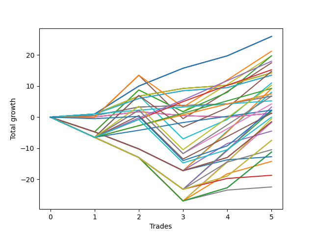

# Short Labrador 005 
- Symbol: ES_830-1130
- Date Range: 03/18/2022 - 12/30/2022
- Trading Period: 8:30-11:30
- Number of Trades: 5



| Name | Win Percent | Profit | Avg Profit / Trade | Avg Time / Trade |      | Name | Win Percent | Profit | Avg Profit / Trade | Avg Time / Trade |
| ---- | ----------- | ------ | ------------------ | ---------------- | ---- | ---- | ----------- | ------ | ------------------ | ---------------- |
| Sorted By <br> Profit | | | | | | Sorted By <br> Win Percentage ||||
| BB-50 Mid SL-10 | 100.00 | 13000.00 | 2600.00 | 14:29 |     | BB-50 Mid SL-10 | 100.00 | 13000.00 | 2600.00 | 14:29 |
| BB-50 Mid SL-5 | 100.00 | 13000.00 | 2600.00 | 14:29 |     | BB-50 Mid SL-5 | 100.00 | 13000.00 | 2600.00 | 14:29 |
| BB-50 Mid | 100.00 | 13000.00 | 2600.00 | 14:29 |     | BB-50 Mid | 100.00 | 13000.00 | 2600.00 | 14:29 |
| BB-50 U/L 1SD SL-10 | 60.00 | 10625.00 | 2125.00 | 25:41 |     | BB-20 U/L 2SD SL-10 | 100.00 | 7125.00 | 1425.00 | 09:36 |
| BB-100 Mid SL-5 | 60.00 | 9875.00 | 1975.00 | 23:41 |     | BB-20 U/L 2SD SL-5 | 100.00 | 7125.00 | 1425.00 | 09:36 |
| BB-50 U/L 1SD SL-5 | 60.00 | 9875.00 | 1975.00 | 23:28 |     | BB-20 U/L 2SD | 100.00 | 7125.00 | 1425.00 | 09:36 |
| TP-6 | 80.00 | 9000.00 | 1800.00 | 21:54 |     | BB-20 U/L 2SD C SL-10 | 100.00 | 6750.00 | 1350.00 | 09:48 |
| BB-50 U/L 1SD | 60.00 | 8750.00 | 1750.00 | 32:27 |     | BB-20 U/L 2SD C SL-5 | 100.00 | 6750.00 | 1350.00 | 09:48 |
| TP-5 | 80.00 | 7625.00 | 1525.00 | 20:56 |     | BB-20 U/L 2SD C | 100.00 | 6750.00 | 1350.00 | 09:48 |
| BB-100 Mid SL-10 | 60.00 | 7375.00 | 1475.00 | 30:34 |     | BB-20 U/L 1SD SL-10 | 100.00 | 3375.00 | 675.00 | 06:39 |
| BB-20 U/L 2SD SL-10 | 100.00 | 7125.00 | 1425.00 | 09:36 |     | BB-20 U/L 1SD SL-5 | 100.00 | 3375.00 | 675.00 | 06:39 |
| BB-20 U/L 2SD SL-5 | 100.00 | 7125.00 | 1425.00 | 09:36 |     | BB-20 U/L 1SD | 100.00 | 3375.00 | 675.00 | 06:39 |
| BB-20 U/L 2SD | 100.00 | 7125.00 | 1425.00 | 09:36 |     | TP-1 | 100.00 | 2625.00 | 525.00 | 04:29 |
| BB-20 U/L 2SD C SL-10 | 100.00 | 6750.00 | 1350.00 | 09:48 |     | TP-6 | 80.00 | 9000.00 | 1800.00 | 21:54 |
| BB-20 U/L 2SD C SL-5 | 100.00 | 6750.00 | 1350.00 | 09:48 |     | TP-5 | 80.00 | 7625.00 | 1525.00 | 20:56 |
| BB-20 U/L 2SD C | 100.00 | 6750.00 | 1350.00 | 09:48 |     | TP-4 | 80.00 | 4625.00 | 925.00 | 19:45 |
| BB-100 Mid | 60.00 | 5500.00 | 1100.00 | 37:20 |     | TP-3 | 80.00 | 3750.00 | 750.00 | 19:31 |
| TP-10 | 60.00 | 5125.00 | 1025.00 | 37:27 |     | TP-2 | 80.00 | 1125.00 | 225.00 | 17:35 |
| TP-4 | 80.00 | 4625.00 | 925.00 | 19:45 |     | BB-50 U/L 1SD SL-10 | 60.00 | 10625.00 | 2125.00 | 25:41 |
| V U/L 1SD SL-5 | 40.00 | 4625.00 | 925.00 | 38:53 |     | BB-100 Mid SL-5 | 60.00 | 9875.00 | 1975.00 | 23:41 |
| BB-50 U/L 2SD SL-5 | 40.00 | 4000.00 | 800.00 | 35:27 |     | BB-50 U/L 1SD SL-5 | 60.00 | 9875.00 | 1975.00 | 23:28 |
| TP-3 | 80.00 | 3750.00 | 750.00 | 19:31 |     | BB-50 U/L 1SD | 60.00 | 8750.00 | 1750.00 | 32:27 |
| BB-20 U/L 1SD SL-10 | 100.00 | 3375.00 | 675.00 | 06:39 |     | BB-100 Mid SL-10 | 60.00 | 7375.00 | 1475.00 | 30:34 |
| BB-20 U/L 1SD SL-5 | 100.00 | 3375.00 | 675.00 | 06:39 |     | BB-100 Mid | 60.00 | 5500.00 | 1100.00 | 37:20 |
| BB-20 U/L 1SD | 100.00 | 3375.00 | 675.00 | 06:39 |     | TP-10 | 60.00 | 5125.00 | 1025.00 | 37:27 |
| TP-9 | 60.00 | 3375.00 | 675.00 | 33:32 |     | TP-9 | 60.00 | 3375.00 | 675.00 | 33:32 |
| TP-1 | 100.00 | 2625.00 | 525.00 | 04:29 |     | TP-8 | 60.00 | 2125.00 | 425.00 | 33:03 |
| TP-8 | 60.00 | 2125.00 | 425.00 | 33:03 |     | NEWFI 0000 | 60.00 | 1125.00 | 225.00 | 45:27 |
| V U/L 1SD SL-10 | 40.00 | 1625.00 | 325.00 | 46:56 |     | TP-7 | 60.00 | 625.00 | 125.00 | 32:48 |
| TP-2 | 80.00 | 1125.00 | 225.00 | 17:35 |     | NEWFI 000 | 60.00 | -0.00 | -0.00 | 47:35 |
| NEWFI 0000 | 60.00 | 1125.00 | 225.00 | 45:27 |     | V U/L 1SD SL-5 | 40.00 | 4625.00 | 925.00 | 38:53 |
| BB-50 U/L 2SD SL-10 | 40.00 | 1000.00 | 200.00 | 43:30 |     | BB-50 U/L 2SD SL-5 | 40.00 | 4000.00 | 800.00 | 35:27 |
| TP-7 | 60.00 | 625.00 | 125.00 | 32:48 |     | V U/L 1SD SL-10 | 40.00 | 1625.00 | 325.00 | 46:56 |
| BB-20 Mid SL-10 | 40.00 | 625.00 | 125.00 | 03:16 |     | BB-50 U/L 2SD SL-10 | 40.00 | 1000.00 | 200.00 | 43:30 |
| BB-20 Mid SL-5 | 40.00 | 625.00 | 125.00 | 03:16 |     | BB-20 Mid SL-10 | 40.00 | 625.00 | 125.00 | 03:16 |
| BB-20 Mid | 40.00 | 625.00 | 125.00 | 03:16 |     | BB-20 Mid SL-5 | 40.00 | 625.00 | 125.00 | 03:16 |
| NEWFI 000 | 60.00 | -0.00 | -0.00 | 47:35 |     | BB-20 Mid | 40.00 | 625.00 | 125.00 | 03:16 |
| V U/L 1SD | 40.00 | -250.00 | -50.00 | 53:42 |     | V U/L 1SD | 40.00 | -250.00 | -50.00 | 53:42 |
| BB-200 U/L 2SD SL-5 | 40.00 | -750.00 | -150.00 | 46:06 |     | BB-200 U/L 2SD SL-5 | 40.00 | -750.00 | -150.00 | 46:06 |
| BB-100 U/L 2SD SL-5 | 40.00 | -750.00 | -150.00 | 46:06 |     | BB-100 U/L 2SD SL-5 | 40.00 | -750.00 | -150.00 | 46:06 |
| BB-50 U/L 2SD | 40.00 | -875.00 | -175.00 | 50:16 |     | BB-50 U/L 2SD | 40.00 | -875.00 | -175.00 | 50:16 |
| BB-200 Mid SL-5 | 40.00 | -2250.00 | -450.00 | 26:34 |     | BB-200 Mid SL-5 | 40.00 | -2250.00 | -450.00 | 26:34 |
| BB-200 U/L 2SD SL-10 | 40.00 | -3750.00 | -750.00 | 54:09 |     | BB-200 U/L 2SD SL-10 | 40.00 | -3750.00 | -750.00 | 54:09 |
| BB-100 U/L 2SD SL-10 | 40.00 | -3750.00 | -750.00 | 54:09 |     | BB-100 U/L 2SD SL-10 | 40.00 | -3750.00 | -750.00 | 54:09 |
| BB-200 Mid SL-10 | 40.00 | -5250.00 | -1050.00 | 34:37 |     | BB-200 Mid SL-10 | 40.00 | -5250.00 | -1050.00 | 34:37 |
| NEWFI 06 | 40.00 | -5625.00 | -1125.00 | 60:55 |     | NEWFI 06 | 40.00 | -5625.00 | -1125.00 | 60:55 |
| BB-200 U/L 2SD | 40.00 | -5625.00 | -1125.00 | 60:55 |     | BB-200 U/L 2SD | 40.00 | -5625.00 | -1125.00 | 60:55 |
| BB-100 U/L 2SD | 40.00 | -5625.00 | -1125.00 | 60:55 |     | BB-100 U/L 2SD | 40.00 | -5625.00 | -1125.00 | 60:55 |
| V Mid SL-5 | 40.00 | -6375.00 | -1275.00 | 24:03 |     | V Mid SL-5 | 40.00 | -6375.00 | -1275.00 | 24:03 |
| BB-200 Mid | 40.00 | -7125.00 | -1425.00 | 41:23 |     | BB-200 Mid | 40.00 | -7125.00 | -1425.00 | 41:23 |
| V Mid SL-10 | 40.00 | -9375.00 | -1875.00 | 32:06 |     | V Mid SL-10 | 40.00 | -9375.00 | -1875.00 | 32:06 |
| V Mid | 40.00 | -11250.00 | -2250.00 | 38:52 |     | V Mid | 40.00 | -11250.00 | -2250.00 | 38:52 |

## NO STOPLOSS

### Test BB-20 Mid
* Sell when price hits the middle line of the 20p bollinger
* No Stoploss
* Results:
```
Total Trades: 5
Percent Up: 60.00
Percent Down: 40.00
Total Points Moved Down: 1.25
Potential Profit: 625.00
Total Points Ups: 1.75 Count Ups: 3
Total Points Downs: 3.00 Count Downs: 2
```

<details><summary>Trades</summary>

<code>In: 2022-03-28 10:42:00		Out: 2022-03-28 10:43:10		Total Position Time: 01:10		Total Move Down: -0.00		Total to Date: 0.00</code> <br />
<code>In: 2022-06-17 10:21:00		Out: 2022-06-17 10:22:55		Total Position Time: 01:55		Total Move Down: 1.75		Total to Date: 1.75</code> <br />
<code>In: 2022-07-01 10:55:00		Out: 2022-07-01 11:02:15		Total Position Time: 07:15		Total Move Down: -1.25		Total to Date: 0.50</code> <br />
<code>In: 2022-11-29 11:14:00		Out: 2022-11-29 11:17:35		Total Position Time: 03:35		Total Move Down: -0.50		Total to Date: 0.00</code> <br />
<code>In: 2022-12-28 10:14:00		Out: 2022-12-28 10:16:25		Total Position Time: 02:25		Total Move Down: 1.25		Total to Date: 1.25</code> <br />


</details>

### Test BB-20 U/L 1SD
* Sell when the price hits the lower line of the 20p 1std bollinger
* No Stoploss
* Results:
```
Total Trades: 5
Percent Up: 0.00
Percent Down: 100.00
Total Points Moved Down: 6.75
Potential Profit: 3375.00
Total Points Ups: 0.00 Count Ups: 0
Total Points Downs: 6.75 Count Downs: 5
```

<details><summary>Trades</summary>

<code>In: 2022-03-28 10:42:00		Out: 2022-03-28 10:47:10		Total Position Time: 05:10		Total Move Down: 0.50		Total to Date: 0.50</code> <br />
<code>In: 2022-06-17 10:21:00		Out: 2022-06-17 10:26:20		Total Position Time: 05:20		Total Move Down: 2.75		Total to Date: 3.25</code> <br />
<code>In: 2022-07-01 10:55:00		Out: 2022-07-01 11:04:30		Total Position Time: 09:30		Total Move Down: 0.50		Total to Date: 3.75</code> <br />
<code>In: 2022-11-29 11:14:00		Out: 2022-11-29 11:20:15		Total Position Time: 06:15		Total Move Down: 0.50		Total to Date: 4.25</code> <br />
<code>In: 2022-12-28 10:14:00		Out: 2022-12-28 10:21:00		Total Position Time: 07:00		Total Move Down: 2.50		Total to Date: 6.75</code> <br />


</details>

### Test BB-20 U/L 2SD
* Sell when the price hits the lower line of the 20p 2std bollinger
* No Stoploss
* Results:
```
Total Trades: 5
Percent Up: 0.00
Percent Down: 100.00
Total Points Moved Down: 14.25
Potential Profit: 7125.00
Total Points Ups: 0.00 Count Ups: 0
Total Points Downs: 14.25 Count Downs: 5
```

<details><summary>Trades</summary>

<code>In: 2022-03-28 10:42:00		Out: 2022-03-28 10:55:10		Total Position Time: 13:10		Total Move Down: 1.00		Total to Date: 1.00</code> <br />
<code>In: 2022-06-17 10:21:00		Out: 2022-06-17 10:27:15		Total Position Time: 06:15		Total Move Down: 5.75		Total to Date: 6.75</code> <br />
<code>In: 2022-07-01 10:55:00		Out: 2022-07-01 11:07:55		Total Position Time: 12:55		Total Move Down: 2.50		Total to Date: 9.25</code> <br />
<code>In: 2022-11-29 11:14:00		Out: 2022-11-29 11:22:05		Total Position Time: 08:05		Total Move Down: 1.00		Total to Date: 10.25</code> <br />
<code>In: 2022-12-28 10:14:00		Out: 2022-12-28 10:21:35		Total Position Time: 07:35		Total Move Down: 4.00		Total to Date: 14.25</code> <br />


</details>

### Test BB-20 U/L 2SD C
* Sell when the price hits the lower line of the 20p 2std bollinger
* No Stoploss
* Results:
```
Total Trades: 5
Percent Up: 0.00
Percent Down: 100.00
Total Points Moved Down: 13.50
Potential Profit: 6750.00
Total Points Ups: 0.00 Count Ups: 0
Total Points Downs: 13.50 Count Downs: 5
```

<details><summary>Trades</summary>

<code>In: 2022-03-28 10:42:00		Out: 2022-03-28 10:55:10		Total Position Time: 13:10		Total Move Down: 1.00		Total to Date: 1.00</code> <br />
<code>In: 2022-06-17 10:21:00		Out: 2022-06-17 10:28:15		Total Position Time: 07:15		Total Move Down: 5.00		Total to Date: 6.00</code> <br />
<code>In: 2022-07-01 10:55:00		Out: 2022-07-01 11:07:55		Total Position Time: 12:55		Total Move Down: 2.50		Total to Date: 8.50</code> <br />
<code>In: 2022-11-29 11:14:00		Out: 2022-11-29 11:22:05		Total Position Time: 08:05		Total Move Down: 1.00		Total to Date: 9.50</code> <br />
<code>In: 2022-12-28 10:14:00		Out: 2022-12-28 10:21:35		Total Position Time: 07:35		Total Move Down: 4.00		Total to Date: 13.50</code> <br />


</details>

### Test BB-50 Mid
* Sell when price hits the middle line of the 50p bollinger
* No Stoploss
* Results:
```
Total Trades: 5
Percent Up: 0.00
Percent Down: 100.00
Total Points Moved Down: 26.00
Potential Profit: 13000.00
Total Points Ups: 0.00 Count Ups: 0
Total Points Downs: 26.00 Count Downs: 5
```

<details><summary>Trades</summary>

<code>In: 2022-03-28 10:42:00		Out: 2022-03-28 11:05:15		Total Position Time: 23:15		Total Move Down: 1.00		Total to Date: 1.00</code> <br />
<code>In: 2022-06-17 10:21:00		Out: 2022-06-17 10:32:20		Total Position Time: 11:20		Total Move Down: 9.00		Total to Date: 10.00</code> <br />
<code>In: 2022-07-01 10:55:00		Out: 2022-07-01 11:11:05		Total Position Time: 16:05		Total Move Down: 5.75		Total to Date: 15.75</code> <br />
<code>In: 2022-11-29 11:14:00		Out: 2022-11-29 11:24:55		Total Position Time: 10:55		Total Move Down: 4.00		Total to Date: 19.75</code> <br />
<code>In: 2022-12-28 10:14:00		Out: 2022-12-28 10:24:50		Total Position Time: 10:50		Total Move Down: 6.25		Total to Date: 26.00</code> <br />


</details>

### Test BB-50 U/L 1SD
* Sell when the price hits the lower line of the 50p 1std bollinger
* No Stoploss
* Results:
```
Total Trades: 5
Percent Up: 40.00
Percent Down: 60.00
Total Points Moved Down: 17.50
Potential Profit: 8750.00
Total Points Ups: 14.00 Count Ups: 2
Total Points Downs: 31.50 Count Downs: 3
```

<details><summary>Trades</summary>

<code>In: 2022-03-28 10:42:00		Out: 2022-03-28 11:19:35		Total Position Time: 37:35		Total Move Down: -0.00		Total to Date: 0.00</code> <br />
<code>In: 2022-06-17 10:21:00		Out: 2022-06-17 10:47:05		Total Position Time: 26:05		Total Move Down: 13.50		Total to Date: 13.50</code> <br />
<code>In: 2022-07-01 10:55:00		Out: 2022-07-01 11:55:55		Total Position Time: 60:55		Total Move Down: -14.00		Total to Date: -0.50</code> <br />
<code>In: 2022-11-29 11:14:00		Out: 2022-11-29 11:30:35		Total Position Time: 16:35		Total Move Down: 8.75		Total to Date: 8.25</code> <br />
<code>In: 2022-12-28 10:14:00		Out: 2022-12-28 10:35:05		Total Position Time: 21:05		Total Move Down: 9.25		Total to Date: 17.50</code> <br />


</details>

### Test BB-50 U/L 2SD
* Sell when the price hits the lower line of the 50p 2std bollinger
* No Stoploss
* Results:
```
Total Trades: 5
Percent Up: 60.00
Percent Down: 40.00
Total Points Moved Down: -1.75
Potential Profit: -875.00
Total Points Ups: 27.00 Count Ups: 3
Total Points Downs: 25.25 Count Downs: 2
```

<details><summary>Trades</summary>

<code>In: 2022-03-28 10:42:00		Out: 2022-03-28 11:42:55		Total Position Time: 60:55		Total Move Down: -6.50		Total to Date: -6.50</code> <br />
<code>In: 2022-06-17 10:21:00		Out: 2022-06-17 11:21:55		Total Position Time: 60:55		Total Move Down: -6.50		Total to Date: -13.00</code> <br />
<code>In: 2022-07-01 10:55:00		Out: 2022-07-01 11:55:55		Total Position Time: 60:55		Total Move Down: -14.00		Total to Date: -27.00</code> <br />
<code>In: 2022-11-29 11:14:00		Out: 2022-11-29 11:44:20		Total Position Time: 30:20		Total Move Down: 12.75		Total to Date: -14.25</code> <br />
<code>In: 2022-12-28 10:14:00		Out: 2022-12-28 10:52:15		Total Position Time: 38:15		Total Move Down: 12.50		Total to Date: -1.75</code> <br />


</details>

### Test V Mid
* Sell when the price hits the middle line of the 1std VWAP
* No Stoploss
* Results:
```
Total Trades: 5
Percent Up: 60.00
Percent Down: 40.00
Total Points Moved Down: -22.50
Potential Profit: -11250.00
Total Points Ups: 27.00 Count Ups: 3
Total Points Downs: 4.50 Count Downs: 2
```

<details><summary>Trades</summary>

<code>In: 2022-03-28 10:42:00		Out: 2022-03-28 11:42:55		Total Position Time: 60:55		Total Move Down: -6.50		Total to Date: -6.50</code> <br />
<code>In: 2022-06-17 10:21:00		Out: 2022-06-17 11:21:55		Total Position Time: 60:55		Total Move Down: -6.50		Total to Date: -13.00</code> <br />
<code>In: 2022-07-01 10:55:00		Out: 2022-07-01 11:55:55		Total Position Time: 60:55		Total Move Down: -14.00		Total to Date: -27.00</code> <br />
<code>In: 2022-11-29 11:14:00		Out: 2022-11-29 11:24:25		Total Position Time: 10:25		Total Move Down: 3.50		Total to Date: -23.50</code> <br />
<code>In: 2022-12-28 10:14:00		Out: 2022-12-28 10:15:10		Total Position Time: 01:10		Total Move Down: 1.00		Total to Date: -22.50</code> <br />


</details>

### Test V U/L 1SD
* Sell when the price hits the lower line of the 1std VWAP
* No Stoploss
* Results:
```
Total Trades: 5
Percent Up: 60.00
Percent Down: 40.00
Total Points Moved Down: -0.50
Potential Profit: -250.00
Total Points Ups: 27.00 Count Ups: 3
Total Points Downs: 26.50 Count Downs: 2
```

<details><summary>Trades</summary>

<code>In: 2022-03-28 10:42:00		Out: 2022-03-28 11:42:55		Total Position Time: 60:55		Total Move Down: -6.50		Total to Date: -6.50</code> <br />
<code>In: 2022-06-17 10:21:00		Out: 2022-06-17 11:21:55		Total Position Time: 60:55		Total Move Down: -6.50		Total to Date: -13.00</code> <br />
<code>In: 2022-07-01 10:55:00		Out: 2022-07-01 11:55:55		Total Position Time: 60:55		Total Move Down: -14.00		Total to Date: -27.00</code> <br />
<code>In: 2022-11-29 11:14:00		Out: 2022-11-29 11:44:15		Total Position Time: 30:15		Total Move Down: 12.50		Total to Date: -14.50</code> <br />
<code>In: 2022-12-28 10:14:00		Out: 2022-12-28 11:09:30		Total Position Time: 55:30		Total Move Down: 14.00		Total to Date: -0.50</code> <br />


</details>

### Test BB-100 Mid
* Move to BB100 Mid
* No Stoploss
* Results:
```
Total Trades: 5
Percent Up: 40.00
Percent Down: 60.00
Total Points Moved Down: 11.00
Potential Profit: 5500.00
Total Points Ups: 20.50 Count Ups: 2
Total Points Downs: 31.50 Count Downs: 3
```

<details><summary>Trades</summary>

<code>In: 2022-03-28 10:42:00		Out: 2022-03-28 11:42:55		Total Position Time: 60:55		Total Move Down: -6.50		Total to Date: -6.50</code> <br />
<code>In: 2022-06-17 10:21:00		Out: 2022-06-17 10:47:05		Total Position Time: 26:05		Total Move Down: 13.50		Total to Date: 7.00</code> <br />
<code>In: 2022-07-01 10:55:00		Out: 2022-07-01 11:55:55		Total Position Time: 60:55		Total Move Down: -14.00		Total to Date: -7.00</code> <br />
<code>In: 2022-11-29 11:14:00		Out: 2022-11-29 11:27:15		Total Position Time: 13:15		Total Move Down: 6.25		Total to Date: -0.75</code> <br />
<code>In: 2022-12-28 10:14:00		Out: 2022-12-28 10:39:30		Total Position Time: 25:30		Total Move Down: 11.75		Total to Date: 11.00</code> <br />


</details>

### Test BB-100 U/L 2SD
* Move to BB100 Upper Band
* No Stoploss
* Results:
```
Total Trades: 5
Percent Up: 60.00
Percent Down: 40.00
Total Points Moved Down: -11.25
Potential Profit: -5625.00
Total Points Ups: 27.00 Count Ups: 3
Total Points Downs: 15.75 Count Downs: 2
```

<details><summary>Trades</summary>

<code>In: 2022-03-28 10:42:00		Out: 2022-03-28 11:42:55		Total Position Time: 60:55		Total Move Down: -6.50		Total to Date: -6.50</code> <br />
<code>In: 2022-06-17 10:21:00		Out: 2022-06-17 11:21:55		Total Position Time: 60:55		Total Move Down: -6.50		Total to Date: -13.00</code> <br />
<code>In: 2022-07-01 10:55:00		Out: 2022-07-01 11:55:55		Total Position Time: 60:55		Total Move Down: -14.00		Total to Date: -27.00</code> <br />
<code>In: 2022-11-29 11:14:00		Out: 2022-11-29 12:14:55		Total Position Time: 60:55		Total Move Down: 4.25		Total to Date: -22.75</code> <br />
<code>In: 2022-12-28 10:14:00		Out: 2022-12-28 11:14:55		Total Position Time: 60:55		Total Move Down: 11.50		Total to Date: -11.25</code> <br />


</details>

### Test BB-200 Mid
* Move to BB200 Mid
* No Stoploss
* Results:
```
Total Trades: 5
Percent Up: 60.00
Percent Down: 40.00
Total Points Moved Down: -14.25
Potential Profit: -7125.00
Total Points Ups: 27.00 Count Ups: 3
Total Points Downs: 12.75 Count Downs: 2
```

<details><summary>Trades</summary>

<code>In: 2022-03-28 10:42:00		Out: 2022-03-28 11:42:55		Total Position Time: 60:55		Total Move Down: -6.50		Total to Date: -6.50</code> <br />
<code>In: 2022-06-17 10:21:00		Out: 2022-06-17 11:21:55		Total Position Time: 60:55		Total Move Down: -6.50		Total to Date: -13.00</code> <br />
<code>In: 2022-07-01 10:55:00		Out: 2022-07-01 11:55:55		Total Position Time: 60:55		Total Move Down: -14.00		Total to Date: -27.00</code> <br />
<code>In: 2022-11-29 11:14:00		Out: 2022-11-29 11:30:35		Total Position Time: 16:35		Total Move Down: 8.75		Total to Date: -18.25</code> <br />
<code>In: 2022-12-28 10:14:00		Out: 2022-12-28 10:21:35		Total Position Time: 07:35		Total Move Down: 4.00		Total to Date: -14.25</code> <br />


</details>

### Test BB-200 U/L 2SD
* Move to BB200 Upper Band
* No Stoploss
* Results:
```
Total Trades: 5
Percent Up: 60.00
Percent Down: 40.00
Total Points Moved Down: -11.25
Potential Profit: -5625.00
Total Points Ups: 27.00 Count Ups: 3
Total Points Downs: 15.75 Count Downs: 2
```

<details><summary>Trades</summary>

<code>In: 2022-03-28 10:42:00		Out: 2022-03-28 11:42:55		Total Position Time: 60:55		Total Move Down: -6.50		Total to Date: -6.50</code> <br />
<code>In: 2022-06-17 10:21:00		Out: 2022-06-17 11:21:55		Total Position Time: 60:55		Total Move Down: -6.50		Total to Date: -13.00</code> <br />
<code>In: 2022-07-01 10:55:00		Out: 2022-07-01 11:55:55		Total Position Time: 60:55		Total Move Down: -14.00		Total to Date: -27.00</code> <br />
<code>In: 2022-11-29 11:14:00		Out: 2022-11-29 12:14:55		Total Position Time: 60:55		Total Move Down: 4.25		Total to Date: -22.75</code> <br />
<code>In: 2022-12-28 10:14:00		Out: 2022-12-28 11:14:55		Total Position Time: 60:55		Total Move Down: 11.50		Total to Date: -11.25</code> <br />


</details>

## STOPLOSS OF 5

### Test BB-20 Mid SL-5
* Sell when price hits the middle line of the 20p bollinger
* Stoploss is -5 points
* Results:
```
Total Trades: 5
Percent Up: 60.00
Percent Down: 40.00
Total Points Moved Down: 1.25
Potential Profit: 625.00
Total Points Ups: 1.75 Count Ups: 3
Total Points Downs: 3.00 Count Downs: 2
```

<details><summary>Trades</summary>

<code>In: 2022-03-28 10:42:00		Out: 2022-03-28 10:43:10		Total Position Time: 01:10		Total Move Down: -0.00		Total to Date: 0.00</code> <br />
<code>In: 2022-06-17 10:21:00		Out: 2022-06-17 10:22:55		Total Position Time: 01:55		Total Move Down: 1.75		Total to Date: 1.75</code> <br />
<code>In: 2022-07-01 10:55:00		Out: 2022-07-01 11:02:15		Total Position Time: 07:15		Total Move Down: -1.25		Total to Date: 0.50</code> <br />
<code>In: 2022-11-29 11:14:00		Out: 2022-11-29 11:17:35		Total Position Time: 03:35		Total Move Down: -0.50		Total to Date: 0.00</code> <br />
<code>In: 2022-12-28 10:14:00		Out: 2022-12-28 10:16:25		Total Position Time: 02:25		Total Move Down: 1.25		Total to Date: 1.25</code> <br />


</details>

### Test BB-20 U/L 1SD SL-5
* Sell when the price hits the lower line of the 20p 1std bollinger
* Stoploss is -5 points
* Results:
```
Total Trades: 5
Percent Up: 0.00
Percent Down: 100.00
Total Points Moved Down: 6.75
Potential Profit: 3375.00
Total Points Ups: 0.00 Count Ups: 0
Total Points Downs: 6.75 Count Downs: 5
```

<details><summary>Trades</summary>

<code>In: 2022-03-28 10:42:00		Out: 2022-03-28 10:47:10		Total Position Time: 05:10		Total Move Down: 0.50		Total to Date: 0.50</code> <br />
<code>In: 2022-06-17 10:21:00		Out: 2022-06-17 10:26:20		Total Position Time: 05:20		Total Move Down: 2.75		Total to Date: 3.25</code> <br />
<code>In: 2022-07-01 10:55:00		Out: 2022-07-01 11:04:30		Total Position Time: 09:30		Total Move Down: 0.50		Total to Date: 3.75</code> <br />
<code>In: 2022-11-29 11:14:00		Out: 2022-11-29 11:20:15		Total Position Time: 06:15		Total Move Down: 0.50		Total to Date: 4.25</code> <br />
<code>In: 2022-12-28 10:14:00		Out: 2022-12-28 10:21:00		Total Position Time: 07:00		Total Move Down: 2.50		Total to Date: 6.75</code> <br />


</details>

### Test BB-20 U/L 2SD SL-5
* Sell when the price hits the lower line of the 20p 2std bollinger
* Stoploss is -5 points
* Results:
```
Total Trades: 5
Percent Up: 0.00
Percent Down: 100.00
Total Points Moved Down: 14.25
Potential Profit: 7125.00
Total Points Ups: 0.00 Count Ups: 0
Total Points Downs: 14.25 Count Downs: 5
```

<details><summary>Trades</summary>

<code>In: 2022-03-28 10:42:00		Out: 2022-03-28 10:55:10		Total Position Time: 13:10		Total Move Down: 1.00		Total to Date: 1.00</code> <br />
<code>In: 2022-06-17 10:21:00		Out: 2022-06-17 10:27:15		Total Position Time: 06:15		Total Move Down: 5.75		Total to Date: 6.75</code> <br />
<code>In: 2022-07-01 10:55:00		Out: 2022-07-01 11:07:55		Total Position Time: 12:55		Total Move Down: 2.50		Total to Date: 9.25</code> <br />
<code>In: 2022-11-29 11:14:00		Out: 2022-11-29 11:22:05		Total Position Time: 08:05		Total Move Down: 1.00		Total to Date: 10.25</code> <br />
<code>In: 2022-12-28 10:14:00		Out: 2022-12-28 10:21:35		Total Position Time: 07:35		Total Move Down: 4.00		Total to Date: 14.25</code> <br />


</details>

### Test BB-20 U/L 2SD C SL-5
* Sell when the price hits the lower line of the 20p 2std bollinger
* Stoploss is -5 points
* Results:
```
Total Trades: 5
Percent Up: 0.00
Percent Down: 100.00
Total Points Moved Down: 13.50
Potential Profit: 6750.00
Total Points Ups: 0.00 Count Ups: 0
Total Points Downs: 13.50 Count Downs: 5
```

<details><summary>Trades</summary>

<code>In: 2022-03-28 10:42:00		Out: 2022-03-28 10:55:10		Total Position Time: 13:10		Total Move Down: 1.00		Total to Date: 1.00</code> <br />
<code>In: 2022-06-17 10:21:00		Out: 2022-06-17 10:28:15		Total Position Time: 07:15		Total Move Down: 5.00		Total to Date: 6.00</code> <br />
<code>In: 2022-07-01 10:55:00		Out: 2022-07-01 11:07:55		Total Position Time: 12:55		Total Move Down: 2.50		Total to Date: 8.50</code> <br />
<code>In: 2022-11-29 11:14:00		Out: 2022-11-29 11:22:05		Total Position Time: 08:05		Total Move Down: 1.00		Total to Date: 9.50</code> <br />
<code>In: 2022-12-28 10:14:00		Out: 2022-12-28 10:21:35		Total Position Time: 07:35		Total Move Down: 4.00		Total to Date: 13.50</code> <br />


</details>

### Test BB-50 Mid SL-5
* Sell when price hits the middle line of the 50p bollinger
* Stoploss is -5 points
* Results:
```
Total Trades: 5
Percent Up: 0.00
Percent Down: 100.00
Total Points Moved Down: 26.00
Potential Profit: 13000.00
Total Points Ups: 0.00 Count Ups: 0
Total Points Downs: 26.00 Count Downs: 5
```

<details><summary>Trades</summary>

<code>In: 2022-03-28 10:42:00		Out: 2022-03-28 11:05:15		Total Position Time: 23:15		Total Move Down: 1.00		Total to Date: 1.00</code> <br />
<code>In: 2022-06-17 10:21:00		Out: 2022-06-17 10:32:20		Total Position Time: 11:20		Total Move Down: 9.00		Total to Date: 10.00</code> <br />
<code>In: 2022-07-01 10:55:00		Out: 2022-07-01 11:11:05		Total Position Time: 16:05		Total Move Down: 5.75		Total to Date: 15.75</code> <br />
<code>In: 2022-11-29 11:14:00		Out: 2022-11-29 11:24:55		Total Position Time: 10:55		Total Move Down: 4.00		Total to Date: 19.75</code> <br />
<code>In: 2022-12-28 10:14:00		Out: 2022-12-28 10:24:50		Total Position Time: 10:50		Total Move Down: 6.25		Total to Date: 26.00</code> <br />


</details>

### Test BB-50 U/L 1SD SL-5
* Sell when the price hits the lower line of the 50p 1std bollinger
* Stoploss is -5 points
* Results:
```
Total Trades: 5
Percent Up: 40.00
Percent Down: 60.00
Total Points Moved Down: 19.75
Potential Profit: 9875.00
Total Points Ups: 11.75 Count Ups: 2
Total Points Downs: 31.50 Count Downs: 3
```

<details><summary>Trades</summary>

<code>In: 2022-03-28 10:42:00		Out: 2022-03-28 11:10:35		Total Position Time: 28:35		Total Move Down: -4.75		Total to Date: -4.75</code> <br />
<code>In: 2022-06-17 10:21:00		Out: 2022-06-17 10:47:05		Total Position Time: 26:05		Total Move Down: 13.50		Total to Date: 8.75</code> <br />
<code>In: 2022-07-01 10:55:00		Out: 2022-07-01 11:20:00		Total Position Time: 25:00		Total Move Down: -7.00		Total to Date: 1.75</code> <br />
<code>In: 2022-11-29 11:14:00		Out: 2022-11-29 11:30:35		Total Position Time: 16:35		Total Move Down: 8.75		Total to Date: 10.50</code> <br />
<code>In: 2022-12-28 10:14:00		Out: 2022-12-28 10:35:05		Total Position Time: 21:05		Total Move Down: 9.25		Total to Date: 19.75</code> <br />


</details>

### Test BB-50 U/L 2SD SL-5
* Sell when the price hits the lower line of the 50p 2std bollinger
* Stoploss is -5 points
* Results:
```
Total Trades: 5
Percent Up: 60.00
Percent Down: 40.00
Total Points Moved Down: 8.00
Potential Profit: 4000.00
Total Points Ups: 17.25 Count Ups: 3
Total Points Downs: 25.25 Count Downs: 2
```

<details><summary>Trades</summary>

<code>In: 2022-03-28 10:42:00		Out: 2022-03-28 11:10:35		Total Position Time: 28:35		Total Move Down: -4.75		Total to Date: -4.75</code> <br />
<code>In: 2022-06-17 10:21:00		Out: 2022-06-17 11:16:05		Total Position Time: 55:05		Total Move Down: -5.50		Total to Date: -10.25</code> <br />
<code>In: 2022-07-01 10:55:00		Out: 2022-07-01 11:20:00		Total Position Time: 25:00		Total Move Down: -7.00		Total to Date: -17.25</code> <br />
<code>In: 2022-11-29 11:14:00		Out: 2022-11-29 11:44:20		Total Position Time: 30:20		Total Move Down: 12.75		Total to Date: -4.50</code> <br />
<code>In: 2022-12-28 10:14:00		Out: 2022-12-28 10:52:15		Total Position Time: 38:15		Total Move Down: 12.50		Total to Date: 8.00</code> <br />


</details>

### Test V Mid SL-5
* Sell when the price hits the middle line of the 1std VWAP
* Stoploss is -5 points
* Results:
```
Total Trades: 5
Percent Up: 60.00
Percent Down: 40.00
Total Points Moved Down: -12.75
Potential Profit: -6375.00
Total Points Ups: 17.25 Count Ups: 3
Total Points Downs: 4.50 Count Downs: 2
```

<details><summary>Trades</summary>

<code>In: 2022-03-28 10:42:00		Out: 2022-03-28 11:10:35		Total Position Time: 28:35		Total Move Down: -4.75		Total to Date: -4.75</code> <br />
<code>In: 2022-06-17 10:21:00		Out: 2022-06-17 11:16:05		Total Position Time: 55:05		Total Move Down: -5.50		Total to Date: -10.25</code> <br />
<code>In: 2022-07-01 10:55:00		Out: 2022-07-01 11:20:00		Total Position Time: 25:00		Total Move Down: -7.00		Total to Date: -17.25</code> <br />
<code>In: 2022-11-29 11:14:00		Out: 2022-11-29 11:24:25		Total Position Time: 10:25		Total Move Down: 3.50		Total to Date: -13.75</code> <br />
<code>In: 2022-12-28 10:14:00		Out: 2022-12-28 10:15:10		Total Position Time: 01:10		Total Move Down: 1.00		Total to Date: -12.75</code> <br />


</details>

### Test V U/L 1SD SL-5
* Sell when the price hits the lower line of the 1std VWAP
* Stoploss is -5 points
* Results:
```
Total Trades: 5
Percent Up: 60.00
Percent Down: 40.00
Total Points Moved Down: 9.25
Potential Profit: 4625.00
Total Points Ups: 17.25 Count Ups: 3
Total Points Downs: 26.50 Count Downs: 2
```

<details><summary>Trades</summary>

<code>In: 2022-03-28 10:42:00		Out: 2022-03-28 11:10:35		Total Position Time: 28:35		Total Move Down: -4.75		Total to Date: -4.75</code> <br />
<code>In: 2022-06-17 10:21:00		Out: 2022-06-17 11:16:05		Total Position Time: 55:05		Total Move Down: -5.50		Total to Date: -10.25</code> <br />
<code>In: 2022-07-01 10:55:00		Out: 2022-07-01 11:20:00		Total Position Time: 25:00		Total Move Down: -7.00		Total to Date: -17.25</code> <br />
<code>In: 2022-11-29 11:14:00		Out: 2022-11-29 11:44:15		Total Position Time: 30:15		Total Move Down: 12.50		Total to Date: -4.75</code> <br />
<code>In: 2022-12-28 10:14:00		Out: 2022-12-28 11:09:30		Total Position Time: 55:30		Total Move Down: 14.00		Total to Date: 9.25</code> <br />


</details>

### Test BB-100 Mid SL-5
* Move to BB100 Mid
* Stoploss is -5 points
* Results:
```
Total Trades: 5
Percent Up: 40.00
Percent Down: 60.00
Total Points Moved Down: 19.75
Potential Profit: 9875.00
Total Points Ups: 11.75 Count Ups: 2
Total Points Downs: 31.50 Count Downs: 3
```

<details><summary>Trades</summary>

<code>In: 2022-03-28 10:42:00		Out: 2022-03-28 11:10:35		Total Position Time: 28:35		Total Move Down: -4.75		Total to Date: -4.75</code> <br />
<code>In: 2022-06-17 10:21:00		Out: 2022-06-17 10:47:05		Total Position Time: 26:05		Total Move Down: 13.50		Total to Date: 8.75</code> <br />
<code>In: 2022-07-01 10:55:00		Out: 2022-07-01 11:20:00		Total Position Time: 25:00		Total Move Down: -7.00		Total to Date: 1.75</code> <br />
<code>In: 2022-11-29 11:14:00		Out: 2022-11-29 11:27:15		Total Position Time: 13:15		Total Move Down: 6.25		Total to Date: 8.00</code> <br />
<code>In: 2022-12-28 10:14:00		Out: 2022-12-28 10:39:30		Total Position Time: 25:30		Total Move Down: 11.75		Total to Date: 19.75</code> <br />


</details>

### Test BB-100 U/L 2SD SL-5
* Move to BB100 Upper Band
* Stoploss is -5 points
* Results:
```
Total Trades: 5
Percent Up: 60.00
Percent Down: 40.00
Total Points Moved Down: -1.50
Potential Profit: -750.00
Total Points Ups: 17.25 Count Ups: 3
Total Points Downs: 15.75 Count Downs: 2
```

<details><summary>Trades</summary>

<code>In: 2022-03-28 10:42:00		Out: 2022-03-28 11:10:35		Total Position Time: 28:35		Total Move Down: -4.75		Total to Date: -4.75</code> <br />
<code>In: 2022-06-17 10:21:00		Out: 2022-06-17 11:16:05		Total Position Time: 55:05		Total Move Down: -5.50		Total to Date: -10.25</code> <br />
<code>In: 2022-07-01 10:55:00		Out: 2022-07-01 11:20:00		Total Position Time: 25:00		Total Move Down: -7.00		Total to Date: -17.25</code> <br />
<code>In: 2022-11-29 11:14:00		Out: 2022-11-29 12:14:55		Total Position Time: 60:55		Total Move Down: 4.25		Total to Date: -13.00</code> <br />
<code>In: 2022-12-28 10:14:00		Out: 2022-12-28 11:14:55		Total Position Time: 60:55		Total Move Down: 11.50		Total to Date: -1.50</code> <br />


</details>

### Test BB-200 Mid SL-5
* Move to BB200 Mid
* Stoploss is -5 points
* Results:
```
Total Trades: 5
Percent Up: 60.00
Percent Down: 40.00
Total Points Moved Down: -4.50
Potential Profit: -2250.00
Total Points Ups: 17.25 Count Ups: 3
Total Points Downs: 12.75 Count Downs: 2
```

<details><summary>Trades</summary>

<code>In: 2022-03-28 10:42:00		Out: 2022-03-28 11:10:35		Total Position Time: 28:35		Total Move Down: -4.75		Total to Date: -4.75</code> <br />
<code>In: 2022-06-17 10:21:00		Out: 2022-06-17 11:16:05		Total Position Time: 55:05		Total Move Down: -5.50		Total to Date: -10.25</code> <br />
<code>In: 2022-07-01 10:55:00		Out: 2022-07-01 11:20:00		Total Position Time: 25:00		Total Move Down: -7.00		Total to Date: -17.25</code> <br />
<code>In: 2022-11-29 11:14:00		Out: 2022-11-29 11:30:35		Total Position Time: 16:35		Total Move Down: 8.75		Total to Date: -8.50</code> <br />
<code>In: 2022-12-28 10:14:00		Out: 2022-12-28 10:21:35		Total Position Time: 07:35		Total Move Down: 4.00		Total to Date: -4.50</code> <br />


</details>

### Test BB-200 U/L 2SD SL-5
* Move to BB200 Upper Band
* Stoploss is -5 points
* Results:
```
Total Trades: 5
Percent Up: 60.00
Percent Down: 40.00
Total Points Moved Down: -1.50
Potential Profit: -750.00
Total Points Ups: 17.25 Count Ups: 3
Total Points Downs: 15.75 Count Downs: 2
```

<details><summary>Trades</summary>

<code>In: 2022-03-28 10:42:00		Out: 2022-03-28 11:10:35		Total Position Time: 28:35		Total Move Down: -4.75		Total to Date: -4.75</code> <br />
<code>In: 2022-06-17 10:21:00		Out: 2022-06-17 11:16:05		Total Position Time: 55:05		Total Move Down: -5.50		Total to Date: -10.25</code> <br />
<code>In: 2022-07-01 10:55:00		Out: 2022-07-01 11:20:00		Total Position Time: 25:00		Total Move Down: -7.00		Total to Date: -17.25</code> <br />
<code>In: 2022-11-29 11:14:00		Out: 2022-11-29 12:14:55		Total Position Time: 60:55		Total Move Down: 4.25		Total to Date: -13.00</code> <br />
<code>In: 2022-12-28 10:14:00		Out: 2022-12-28 11:14:55		Total Position Time: 60:55		Total Move Down: 11.50		Total to Date: -1.50</code> <br />


</details>

## STOPLOSS OF 10

### Test BB-20 Mid SL-10
* Sell when price hits the middle line of the 20p bollinger
* Stoploss is -10 points
* Results:
```
Total Trades: 5
Percent Up: 60.00
Percent Down: 40.00
Total Points Moved Down: 1.25
Potential Profit: 625.00
Total Points Ups: 1.75 Count Ups: 3
Total Points Downs: 3.00 Count Downs: 2
```

<details><summary>Trades</summary>

<code>In: 2022-03-28 10:42:00		Out: 2022-03-28 10:43:10		Total Position Time: 01:10		Total Move Down: -0.00		Total to Date: 0.00</code> <br />
<code>In: 2022-06-17 10:21:00		Out: 2022-06-17 10:22:55		Total Position Time: 01:55		Total Move Down: 1.75		Total to Date: 1.75</code> <br />
<code>In: 2022-07-01 10:55:00		Out: 2022-07-01 11:02:15		Total Position Time: 07:15		Total Move Down: -1.25		Total to Date: 0.50</code> <br />
<code>In: 2022-11-29 11:14:00		Out: 2022-11-29 11:17:35		Total Position Time: 03:35		Total Move Down: -0.50		Total to Date: 0.00</code> <br />
<code>In: 2022-12-28 10:14:00		Out: 2022-12-28 10:16:25		Total Position Time: 02:25		Total Move Down: 1.25		Total to Date: 1.25</code> <br />


</details>

### Test BB-20 U/L 1SD SL-10
* Sell when the price hits the lower line of the 20p 1std bollinger
* Stoploss is -10 points
* Results:
```
Total Trades: 5
Percent Up: 0.00
Percent Down: 100.00
Total Points Moved Down: 6.75
Potential Profit: 3375.00
Total Points Ups: 0.00 Count Ups: 0
Total Points Downs: 6.75 Count Downs: 5
```

<details><summary>Trades</summary>

<code>In: 2022-03-28 10:42:00		Out: 2022-03-28 10:47:10		Total Position Time: 05:10		Total Move Down: 0.50		Total to Date: 0.50</code> <br />
<code>In: 2022-06-17 10:21:00		Out: 2022-06-17 10:26:20		Total Position Time: 05:20		Total Move Down: 2.75		Total to Date: 3.25</code> <br />
<code>In: 2022-07-01 10:55:00		Out: 2022-07-01 11:04:30		Total Position Time: 09:30		Total Move Down: 0.50		Total to Date: 3.75</code> <br />
<code>In: 2022-11-29 11:14:00		Out: 2022-11-29 11:20:15		Total Position Time: 06:15		Total Move Down: 0.50		Total to Date: 4.25</code> <br />
<code>In: 2022-12-28 10:14:00		Out: 2022-12-28 10:21:00		Total Position Time: 07:00		Total Move Down: 2.50		Total to Date: 6.75</code> <br />


</details>

### Test BB-20 U/L 2SD SL-10
* Sell when the price hits the lower line of the 20p 2std bollinger
* Stoploss is -10 points
* Results:
```
Total Trades: 5
Percent Up: 0.00
Percent Down: 100.00
Total Points Moved Down: 14.25
Potential Profit: 7125.00
Total Points Ups: 0.00 Count Ups: 0
Total Points Downs: 14.25 Count Downs: 5
```

<details><summary>Trades</summary>

<code>In: 2022-03-28 10:42:00		Out: 2022-03-28 10:55:10		Total Position Time: 13:10		Total Move Down: 1.00		Total to Date: 1.00</code> <br />
<code>In: 2022-06-17 10:21:00		Out: 2022-06-17 10:27:15		Total Position Time: 06:15		Total Move Down: 5.75		Total to Date: 6.75</code> <br />
<code>In: 2022-07-01 10:55:00		Out: 2022-07-01 11:07:55		Total Position Time: 12:55		Total Move Down: 2.50		Total to Date: 9.25</code> <br />
<code>In: 2022-11-29 11:14:00		Out: 2022-11-29 11:22:05		Total Position Time: 08:05		Total Move Down: 1.00		Total to Date: 10.25</code> <br />
<code>In: 2022-12-28 10:14:00		Out: 2022-12-28 10:21:35		Total Position Time: 07:35		Total Move Down: 4.00		Total to Date: 14.25</code> <br />


</details>

### Test BB-20 U/L 2SD C SL-10
* Sell when the price hits the lower line of the 20p 2std bollinger
* Stoploss is -10 points
* Results:
```
Total Trades: 5
Percent Up: 0.00
Percent Down: 100.00
Total Points Moved Down: 13.50
Potential Profit: 6750.00
Total Points Ups: 0.00 Count Ups: 0
Total Points Downs: 13.50 Count Downs: 5
```

<details><summary>Trades</summary>

<code>In: 2022-03-28 10:42:00		Out: 2022-03-28 10:55:10		Total Position Time: 13:10		Total Move Down: 1.00		Total to Date: 1.00</code> <br />
<code>In: 2022-06-17 10:21:00		Out: 2022-06-17 10:28:15		Total Position Time: 07:15		Total Move Down: 5.00		Total to Date: 6.00</code> <br />
<code>In: 2022-07-01 10:55:00		Out: 2022-07-01 11:07:55		Total Position Time: 12:55		Total Move Down: 2.50		Total to Date: 8.50</code> <br />
<code>In: 2022-11-29 11:14:00		Out: 2022-11-29 11:22:05		Total Position Time: 08:05		Total Move Down: 1.00		Total to Date: 9.50</code> <br />
<code>In: 2022-12-28 10:14:00		Out: 2022-12-28 10:21:35		Total Position Time: 07:35		Total Move Down: 4.00		Total to Date: 13.50</code> <br />


</details>

### Test BB-50 Mid SL-10
* Sell when price hits the middle line of the 50p bollinger
* Stoploss is -10 points
* Results:
```
Total Trades: 5
Percent Up: 0.00
Percent Down: 100.00
Total Points Moved Down: 26.00
Potential Profit: 13000.00
Total Points Ups: 0.00 Count Ups: 0
Total Points Downs: 26.00 Count Downs: 5
```

<details><summary>Trades</summary>

<code>In: 2022-03-28 10:42:00		Out: 2022-03-28 11:05:15		Total Position Time: 23:15		Total Move Down: 1.00		Total to Date: 1.00</code> <br />
<code>In: 2022-06-17 10:21:00		Out: 2022-06-17 10:32:20		Total Position Time: 11:20		Total Move Down: 9.00		Total to Date: 10.00</code> <br />
<code>In: 2022-07-01 10:55:00		Out: 2022-07-01 11:11:05		Total Position Time: 16:05		Total Move Down: 5.75		Total to Date: 15.75</code> <br />
<code>In: 2022-11-29 11:14:00		Out: 2022-11-29 11:24:55		Total Position Time: 10:55		Total Move Down: 4.00		Total to Date: 19.75</code> <br />
<code>In: 2022-12-28 10:14:00		Out: 2022-12-28 10:24:50		Total Position Time: 10:50		Total Move Down: 6.25		Total to Date: 26.00</code> <br />


</details>

### Test BB-50 U/L 1SD SL-10
* Sell when the price hits the lower line of the 50p 1std bollinger
* Stoploss is -10 points
* Results:
```
Total Trades: 5
Percent Up: 40.00
Percent Down: 60.00
Total Points Moved Down: 21.25
Potential Profit: 10625.00
Total Points Ups: 10.25 Count Ups: 2
Total Points Downs: 31.50 Count Downs: 3
```

<details><summary>Trades</summary>

<code>In: 2022-03-28 10:42:00		Out: 2022-03-28 11:19:35		Total Position Time: 37:35		Total Move Down: -0.00		Total to Date: 0.00</code> <br />
<code>In: 2022-06-17 10:21:00		Out: 2022-06-17 10:47:05		Total Position Time: 26:05		Total Move Down: 13.50		Total to Date: 13.50</code> <br />
<code>In: 2022-07-01 10:55:00		Out: 2022-07-01 11:22:05		Total Position Time: 27:05		Total Move Down: -10.25		Total to Date: 3.25</code> <br />
<code>In: 2022-11-29 11:14:00		Out: 2022-11-29 11:30:35		Total Position Time: 16:35		Total Move Down: 8.75		Total to Date: 12.00</code> <br />
<code>In: 2022-12-28 10:14:00		Out: 2022-12-28 10:35:05		Total Position Time: 21:05		Total Move Down: 9.25		Total to Date: 21.25</code> <br />


</details>

### Test BB-50 U/L 2SD SL-10
* Sell when the price hits the lower line of the 50p 2std bollinger
* Stoploss is -10 points
* Results:
```
Total Trades: 5
Percent Up: 60.00
Percent Down: 40.00
Total Points Moved Down: 2.00
Potential Profit: 1000.00
Total Points Ups: 23.25 Count Ups: 3
Total Points Downs: 25.25 Count Downs: 2
```

<details><summary>Trades</summary>

<code>In: 2022-03-28 10:42:00		Out: 2022-03-28 11:42:55		Total Position Time: 60:55		Total Move Down: -6.50		Total to Date: -6.50</code> <br />
<code>In: 2022-06-17 10:21:00		Out: 2022-06-17 11:21:55		Total Position Time: 60:55		Total Move Down: -6.50		Total to Date: -13.00</code> <br />
<code>In: 2022-07-01 10:55:00		Out: 2022-07-01 11:22:05		Total Position Time: 27:05		Total Move Down: -10.25		Total to Date: -23.25</code> <br />
<code>In: 2022-11-29 11:14:00		Out: 2022-11-29 11:44:20		Total Position Time: 30:20		Total Move Down: 12.75		Total to Date: -10.50</code> <br />
<code>In: 2022-12-28 10:14:00		Out: 2022-12-28 10:52:15		Total Position Time: 38:15		Total Move Down: 12.50		Total to Date: 2.00</code> <br />


</details>

### Test V Mid SL-10
* Sell when the price hits the middle line of the 1std VWAP
* Stoploss is -10 points
* Results:
```
Total Trades: 5
Percent Up: 60.00
Percent Down: 40.00
Total Points Moved Down: -18.75
Potential Profit: -9375.00
Total Points Ups: 23.25 Count Ups: 3
Total Points Downs: 4.50 Count Downs: 2
```

<details><summary>Trades</summary>

<code>In: 2022-03-28 10:42:00		Out: 2022-03-28 11:42:55		Total Position Time: 60:55		Total Move Down: -6.50		Total to Date: -6.50</code> <br />
<code>In: 2022-06-17 10:21:00		Out: 2022-06-17 11:21:55		Total Position Time: 60:55		Total Move Down: -6.50		Total to Date: -13.00</code> <br />
<code>In: 2022-07-01 10:55:00		Out: 2022-07-01 11:22:05		Total Position Time: 27:05		Total Move Down: -10.25		Total to Date: -23.25</code> <br />
<code>In: 2022-11-29 11:14:00		Out: 2022-11-29 11:24:25		Total Position Time: 10:25		Total Move Down: 3.50		Total to Date: -19.75</code> <br />
<code>In: 2022-12-28 10:14:00		Out: 2022-12-28 10:15:10		Total Position Time: 01:10		Total Move Down: 1.00		Total to Date: -18.75</code> <br />


</details>

### Test V U/L 1SD SL-10
* Sell when the price hits the lower line of the 1std VWAP
* Stoploss is -10 points
* Results:
```
Total Trades: 5
Percent Up: 60.00
Percent Down: 40.00
Total Points Moved Down: 3.25
Potential Profit: 1625.00
Total Points Ups: 23.25 Count Ups: 3
Total Points Downs: 26.50 Count Downs: 2
```

<details><summary>Trades</summary>

<code>In: 2022-03-28 10:42:00		Out: 2022-03-28 11:42:55		Total Position Time: 60:55		Total Move Down: -6.50		Total to Date: -6.50</code> <br />
<code>In: 2022-06-17 10:21:00		Out: 2022-06-17 11:21:55		Total Position Time: 60:55		Total Move Down: -6.50		Total to Date: -13.00</code> <br />
<code>In: 2022-07-01 10:55:00		Out: 2022-07-01 11:22:05		Total Position Time: 27:05		Total Move Down: -10.25		Total to Date: -23.25</code> <br />
<code>In: 2022-11-29 11:14:00		Out: 2022-11-29 11:44:15		Total Position Time: 30:15		Total Move Down: 12.50		Total to Date: -10.75</code> <br />
<code>In: 2022-12-28 10:14:00		Out: 2022-12-28 11:09:30		Total Position Time: 55:30		Total Move Down: 14.00		Total to Date: 3.25</code> <br />


</details>

### Test BB-100 Mid SL-10
* Move to BB100 Mid
* Stoploss is -10 points
* Results:
```
Total Trades: 5
Percent Up: 40.00
Percent Down: 60.00
Total Points Moved Down: 14.75
Potential Profit: 7375.00
Total Points Ups: 16.75 Count Ups: 2
Total Points Downs: 31.50 Count Downs: 3
```

<details><summary>Trades</summary>

<code>In: 2022-03-28 10:42:00		Out: 2022-03-28 11:42:55		Total Position Time: 60:55		Total Move Down: -6.50		Total to Date: -6.50</code> <br />
<code>In: 2022-06-17 10:21:00		Out: 2022-06-17 10:47:05		Total Position Time: 26:05		Total Move Down: 13.50		Total to Date: 7.00</code> <br />
<code>In: 2022-07-01 10:55:00		Out: 2022-07-01 11:22:05		Total Position Time: 27:05		Total Move Down: -10.25		Total to Date: -3.25</code> <br />
<code>In: 2022-11-29 11:14:00		Out: 2022-11-29 11:27:15		Total Position Time: 13:15		Total Move Down: 6.25		Total to Date: 3.00</code> <br />
<code>In: 2022-12-28 10:14:00		Out: 2022-12-28 10:39:30		Total Position Time: 25:30		Total Move Down: 11.75		Total to Date: 14.75</code> <br />


</details>

### Test BB-100 U/L 2SD SL-10
* Move to BB100 Upper Band
* Stoploss is -10 points
* Results:
```
Total Trades: 5
Percent Up: 60.00
Percent Down: 40.00
Total Points Moved Down: -7.50
Potential Profit: -3750.00
Total Points Ups: 23.25 Count Ups: 3
Total Points Downs: 15.75 Count Downs: 2
```

<details><summary>Trades</summary>

<code>In: 2022-03-28 10:42:00		Out: 2022-03-28 11:42:55		Total Position Time: 60:55		Total Move Down: -6.50		Total to Date: -6.50</code> <br />
<code>In: 2022-06-17 10:21:00		Out: 2022-06-17 11:21:55		Total Position Time: 60:55		Total Move Down: -6.50		Total to Date: -13.00</code> <br />
<code>In: 2022-07-01 10:55:00		Out: 2022-07-01 11:22:05		Total Position Time: 27:05		Total Move Down: -10.25		Total to Date: -23.25</code> <br />
<code>In: 2022-11-29 11:14:00		Out: 2022-11-29 12:14:55		Total Position Time: 60:55		Total Move Down: 4.25		Total to Date: -19.00</code> <br />
<code>In: 2022-12-28 10:14:00		Out: 2022-12-28 11:14:55		Total Position Time: 60:55		Total Move Down: 11.50		Total to Date: -7.50</code> <br />


</details>

### Test BB-200 Mid SL-10
* Move to BB200 Mid
* Stoploss is -10 points
* Results:
```
Total Trades: 5
Percent Up: 60.00
Percent Down: 40.00
Total Points Moved Down: -10.50
Potential Profit: -5250.00
Total Points Ups: 23.25 Count Ups: 3
Total Points Downs: 12.75 Count Downs: 2
```

<details><summary>Trades</summary>

<code>In: 2022-03-28 10:42:00		Out: 2022-03-28 11:42:55		Total Position Time: 60:55		Total Move Down: -6.50		Total to Date: -6.50</code> <br />
<code>In: 2022-06-17 10:21:00		Out: 2022-06-17 11:21:55		Total Position Time: 60:55		Total Move Down: -6.50		Total to Date: -13.00</code> <br />
<code>In: 2022-07-01 10:55:00		Out: 2022-07-01 11:22:05		Total Position Time: 27:05		Total Move Down: -10.25		Total to Date: -23.25</code> <br />
<code>In: 2022-11-29 11:14:00		Out: 2022-11-29 11:30:35		Total Position Time: 16:35		Total Move Down: 8.75		Total to Date: -14.50</code> <br />
<code>In: 2022-12-28 10:14:00		Out: 2022-12-28 10:21:35		Total Position Time: 07:35		Total Move Down: 4.00		Total to Date: -10.50</code> <br />


</details>

### Test BB-200 U/L 2SD SL-10
* Move to BB200 Upper Band
* Stoploss is -10 points
* Results:
```
Total Trades: 5
Percent Up: 60.00
Percent Down: 40.00
Total Points Moved Down: -7.50
Potential Profit: -3750.00
Total Points Ups: 23.25 Count Ups: 3
Total Points Downs: 15.75 Count Downs: 2
```

<details><summary>Trades</summary>

<code>In: 2022-03-28 10:42:00		Out: 2022-03-28 11:42:55		Total Position Time: 60:55		Total Move Down: -6.50		Total to Date: -6.50</code> <br />
<code>In: 2022-06-17 10:21:00		Out: 2022-06-17 11:21:55		Total Position Time: 60:55		Total Move Down: -6.50		Total to Date: -13.00</code> <br />
<code>In: 2022-07-01 10:55:00		Out: 2022-07-01 11:22:05		Total Position Time: 27:05		Total Move Down: -10.25		Total to Date: -23.25</code> <br />
<code>In: 2022-11-29 11:14:00		Out: 2022-11-29 12:14:55		Total Position Time: 60:55		Total Move Down: 4.25		Total to Date: -19.00</code> <br />
<code>In: 2022-12-28 10:14:00		Out: 2022-12-28 11:14:55		Total Position Time: 60:55		Total Move Down: 11.50		Total to Date: -7.50</code> <br />


</details>

## TAKE PROFIT

### Test TP-1
* Take Profit of 1 Point
* No Stoploss
* Results:
```
Total Trades: 5
Percent Up: 0.00
Percent Down: 100.00
Total Points Moved Down: 5.25
Potential Profit: 2625.00
Total Points Ups: 0.00 Count Ups: 0
Total Points Downs: 5.25 Count Downs: 5
```

<details><summary>Trades</summary>

<code>In: 2022-03-28 10:42:00		Out: 2022-03-28 10:44:05		Total Position Time: 02:05		Total Move Down: 1.00		Total to Date: 1.00</code> <br />
<code>In: 2022-06-17 10:21:00		Out: 2022-06-17 10:22:10		Total Position Time: 01:10		Total Move Down: 1.25		Total to Date: 2.25</code> <br />
<code>In: 2022-07-01 10:55:00		Out: 2022-07-01 11:04:55		Total Position Time: 09:55		Total Move Down: 1.00		Total to Date: 3.25</code> <br />
<code>In: 2022-11-29 11:14:00		Out: 2022-11-29 11:22:05		Total Position Time: 08:05		Total Move Down: 1.00		Total to Date: 4.25</code> <br />
<code>In: 2022-12-28 10:14:00		Out: 2022-12-28 10:15:10		Total Position Time: 01:10		Total Move Down: 1.00		Total to Date: 5.25</code> <br />


</details>

### Test TP-2
* Take Profit of 2 Point
* No Stoploss
* Results:
```
Total Trades: 5
Percent Up: 20.00
Percent Down: 80.00
Total Points Moved Down: 2.25
Potential Profit: 1125.00
Total Points Ups: 6.50 Count Ups: 1
Total Points Downs: 8.75 Count Downs: 4
```

<details><summary>Trades</summary>

<code>In: 2022-03-28 10:42:00		Out: 2022-03-28 11:42:55		Total Position Time: 60:55		Total Move Down: -6.50		Total to Date: -6.50</code> <br />
<code>In: 2022-06-17 10:21:00		Out: 2022-06-17 10:23:05		Total Position Time: 02:05		Total Move Down: 2.25		Total to Date: -4.25</code> <br />
<code>In: 2022-07-01 10:55:00		Out: 2022-07-01 11:07:55		Total Position Time: 12:55		Total Move Down: 2.50		Total to Date: -1.75</code> <br />
<code>In: 2022-11-29 11:14:00		Out: 2022-11-29 11:23:15		Total Position Time: 09:15		Total Move Down: 2.00		Total to Date: 0.25</code> <br />
<code>In: 2022-12-28 10:14:00		Out: 2022-12-28 10:16:45		Total Position Time: 02:45		Total Move Down: 2.00		Total to Date: 2.25</code> <br />


</details>

### Test TP-3
* Take Profit of 3 Point
* No Stoploss
* Results:
```
Total Trades: 5
Percent Up: 20.00
Percent Down: 80.00
Total Points Moved Down: 7.50
Potential Profit: 3750.00
Total Points Ups: 6.50 Count Ups: 1
Total Points Downs: 14.00 Count Downs: 4
```

<details><summary>Trades</summary>

<code>In: 2022-03-28 10:42:00		Out: 2022-03-28 11:42:55		Total Position Time: 60:55		Total Move Down: -6.50		Total to Date: -6.50</code> <br />
<code>In: 2022-06-17 10:21:00		Out: 2022-06-17 10:26:30		Total Position Time: 05:30		Total Move Down: 3.75		Total to Date: -2.75</code> <br />
<code>In: 2022-07-01 10:55:00		Out: 2022-07-01 11:08:30		Total Position Time: 13:30		Total Move Down: 3.50		Total to Date: 0.75</code> <br />
<code>In: 2022-11-29 11:14:00		Out: 2022-11-29 11:24:25		Total Position Time: 10:25		Total Move Down: 3.50		Total to Date: 4.25</code> <br />
<code>In: 2022-12-28 10:14:00		Out: 2022-12-28 10:21:15		Total Position Time: 07:15		Total Move Down: 3.25		Total to Date: 7.50</code> <br />


</details>

### Test TP-4
* Take Profit of 4 Point
* No Stoploss
* Results:
```
Total Trades: 5
Percent Up: 20.00
Percent Down: 80.00
Total Points Moved Down: 9.25
Potential Profit: 4625.00
Total Points Ups: 6.50 Count Ups: 1
Total Points Downs: 15.75 Count Downs: 4
```

<details><summary>Trades</summary>

<code>In: 2022-03-28 10:42:00		Out: 2022-03-28 11:42:55		Total Position Time: 60:55		Total Move Down: -6.50		Total to Date: -6.50</code> <br />
<code>In: 2022-06-17 10:21:00		Out: 2022-06-17 10:26:30		Total Position Time: 05:30		Total Move Down: 3.75		Total to Date: -2.75</code> <br />
<code>In: 2022-07-01 10:55:00		Out: 2022-07-01 11:08:50		Total Position Time: 13:50		Total Move Down: 4.00		Total to Date: 1.25</code> <br />
<code>In: 2022-11-29 11:14:00		Out: 2022-11-29 11:24:55		Total Position Time: 10:55		Total Move Down: 4.00		Total to Date: 5.25</code> <br />
<code>In: 2022-12-28 10:14:00		Out: 2022-12-28 10:21:35		Total Position Time: 07:35		Total Move Down: 4.00		Total to Date: 9.25</code> <br />


</details>

### Test TP-5
* Take Profit of 5 Point
* No Stoploss
* Results:
```
Total Trades: 5
Percent Up: 20.00
Percent Down: 80.00
Total Points Moved Down: 15.25
Potential Profit: 7625.00
Total Points Ups: 6.50 Count Ups: 1
Total Points Downs: 21.75 Count Downs: 4
```

<details><summary>Trades</summary>

<code>In: 2022-03-28 10:42:00		Out: 2022-03-28 11:42:55		Total Position Time: 60:55		Total Move Down: -6.50		Total to Date: -6.50</code> <br />
<code>In: 2022-06-17 10:21:00		Out: 2022-06-17 10:27:15		Total Position Time: 06:15		Total Move Down: 5.75		Total to Date: -0.75</code> <br />
<code>In: 2022-07-01 10:55:00		Out: 2022-07-01 11:11:05		Total Position Time: 16:05		Total Move Down: 5.75		Total to Date: 5.00</code> <br />
<code>In: 2022-11-29 11:14:00		Out: 2022-11-29 11:26:20		Total Position Time: 12:20		Total Move Down: 5.25		Total to Date: 10.25</code> <br />
<code>In: 2022-12-28 10:14:00		Out: 2022-12-28 10:23:05		Total Position Time: 09:05		Total Move Down: 5.00		Total to Date: 15.25</code> <br />


</details>

### Test TP-6
* Take Profit of 6 Point
* No Stoploss
* Results:
```
Total Trades: 5
Percent Up: 20.00
Percent Down: 80.00
Total Points Moved Down: 18.00
Potential Profit: 9000.00
Total Points Ups: 6.50 Count Ups: 1
Total Points Downs: 24.50 Count Downs: 4
```

<details><summary>Trades</summary>

<code>In: 2022-03-28 10:42:00		Out: 2022-03-28 11:42:55		Total Position Time: 60:55		Total Move Down: -6.50		Total to Date: -6.50</code> <br />
<code>In: 2022-06-17 10:21:00		Out: 2022-06-17 10:29:40		Total Position Time: 08:40		Total Move Down: 6.25		Total to Date: -0.25</code> <br />
<code>In: 2022-07-01 10:55:00		Out: 2022-07-01 11:12:00		Total Position Time: 17:00		Total Move Down: 5.75		Total to Date: 5.50</code> <br />
<code>In: 2022-11-29 11:14:00		Out: 2022-11-29 11:27:15		Total Position Time: 13:15		Total Move Down: 6.25		Total to Date: 11.75</code> <br />
<code>In: 2022-12-28 10:14:00		Out: 2022-12-28 10:23:40		Total Position Time: 09:40		Total Move Down: 6.25		Total to Date: 18.00</code> <br />


</details>

### Test TP-7
* Take Profit of 7 Point
* No Stoploss
* Results:
```
Total Trades: 5
Percent Up: 40.00
Percent Down: 60.00
Total Points Moved Down: 1.25
Potential Profit: 625.00
Total Points Ups: 20.50 Count Ups: 2
Total Points Downs: 21.75 Count Downs: 3
```

<details><summary>Trades</summary>

<code>In: 2022-03-28 10:42:00		Out: 2022-03-28 11:42:55		Total Position Time: 60:55		Total Move Down: -6.50		Total to Date: -6.50</code> <br />
<code>In: 2022-06-17 10:21:00		Out: 2022-06-17 10:31:50		Total Position Time: 10:50		Total Move Down: 7.00		Total to Date: 0.50</code> <br />
<code>In: 2022-07-01 10:55:00		Out: 2022-07-01 11:55:55		Total Position Time: 60:55		Total Move Down: -14.00		Total to Date: -13.50</code> <br />
<code>In: 2022-11-29 11:14:00		Out: 2022-11-29 11:27:55		Total Position Time: 13:55		Total Move Down: 7.25		Total to Date: -6.25</code> <br />
<code>In: 2022-12-28 10:14:00		Out: 2022-12-28 10:31:25		Total Position Time: 17:25		Total Move Down: 7.50		Total to Date: 1.25</code> <br />


</details>

### Test TP-8
* Take Profit of 8 Point
* No Stoploss
* Results:
```
Total Trades: 5
Percent Up: 40.00
Percent Down: 60.00
Total Points Moved Down: 4.25
Potential Profit: 2125.00
Total Points Ups: 20.50 Count Ups: 2
Total Points Downs: 24.75 Count Downs: 3
```

<details><summary>Trades</summary>

<code>In: 2022-03-28 10:42:00		Out: 2022-03-28 11:42:55		Total Position Time: 60:55		Total Move Down: -6.50		Total to Date: -6.50</code> <br />
<code>In: 2022-06-17 10:21:00		Out: 2022-06-17 10:32:05		Total Position Time: 11:05		Total Move Down: 8.75		Total to Date: 2.25</code> <br />
<code>In: 2022-07-01 10:55:00		Out: 2022-07-01 11:55:55		Total Position Time: 60:55		Total Move Down: -14.00		Total to Date: -11.75</code> <br />
<code>In: 2022-11-29 11:14:00		Out: 2022-11-29 11:28:40		Total Position Time: 14:40		Total Move Down: 8.00		Total to Date: -3.75</code> <br />
<code>In: 2022-12-28 10:14:00		Out: 2022-12-28 10:31:40		Total Position Time: 17:40		Total Move Down: 8.00		Total to Date: 4.25</code> <br />


</details>

### Test TP-9
* Take Profit of 9 Point
* No Stoploss
* Results:
```
Total Trades: 5
Percent Up: 40.00
Percent Down: 60.00
Total Points Moved Down: 6.75
Potential Profit: 3375.00
Total Points Ups: 20.50 Count Ups: 2
Total Points Downs: 27.25 Count Downs: 3
```

<details><summary>Trades</summary>

<code>In: 2022-03-28 10:42:00		Out: 2022-03-28 11:42:55		Total Position Time: 60:55		Total Move Down: -6.50		Total to Date: -6.50</code> <br />
<code>In: 2022-06-17 10:21:00		Out: 2022-06-17 10:32:10		Total Position Time: 11:10		Total Move Down: 8.75		Total to Date: 2.25</code> <br />
<code>In: 2022-07-01 10:55:00		Out: 2022-07-01 11:55:55		Total Position Time: 60:55		Total Move Down: -14.00		Total to Date: -11.75</code> <br />
<code>In: 2022-11-29 11:14:00		Out: 2022-11-29 11:30:40		Total Position Time: 16:40		Total Move Down: 9.25		Total to Date: -2.50</code> <br />
<code>In: 2022-12-28 10:14:00		Out: 2022-12-28 10:32:00		Total Position Time: 18:00		Total Move Down: 9.25		Total to Date: 6.75</code> <br />


</details>

### Test TP-10
* Take Profit of 10 Point
* No Stoploss
* Results:
```
Total Trades: 5
Percent Up: 40.00
Percent Down: 60.00
Total Points Moved Down: 10.25
Potential Profit: 5125.00
Total Points Ups: 20.50 Count Ups: 2
Total Points Downs: 30.75 Count Downs: 3
```

<details><summary>Trades</summary>

<code>In: 2022-03-28 10:42:00		Out: 2022-03-28 11:42:55		Total Position Time: 60:55		Total Move Down: -6.50		Total to Date: -6.50</code> <br />
<code>In: 2022-06-17 10:21:00		Out: 2022-06-17 10:46:35		Total Position Time: 25:35		Total Move Down: 10.00		Total to Date: 3.50</code> <br />
<code>In: 2022-07-01 10:55:00		Out: 2022-07-01 11:55:55		Total Position Time: 60:55		Total Move Down: -14.00		Total to Date: -10.50</code> <br />
<code>In: 2022-11-29 11:14:00		Out: 2022-11-29 11:30:45		Total Position Time: 16:45		Total Move Down: 10.25		Total to Date: -0.25</code> <br />
<code>In: 2022-12-28 10:14:00		Out: 2022-12-28 10:37:05		Total Position Time: 23:05		Total Move Down: 10.50		Total to Date: 10.25</code> <br />


</details>

## Indicator Exits

### Test NEWFI 000
* Newfi 0000
* No Stoploss
* Results:
```
Total Trades: 5
Percent Up: 40.00
Percent Down: 60.00
Total Points Moved Down: -0.00
Potential Profit: -0.00
Total Points Ups: 20.50 Count Ups: 2
Total Points Downs: 20.50 Count Downs: 3
```

<details><summary>Trades</summary>

<code>In: 2022-03-28 10:42:00		Out: 2022-03-28 11:42:55		Total Position Time: 60:55		Total Move Down: -6.50		Total to Date: -6.50</code> <br />
<code>In: 2022-06-17 10:21:00		Out: 2022-06-17 10:52:05		Total Position Time: 31:05		Total Move Down: 5.75		Total to Date: -0.75</code> <br />
<code>In: 2022-07-01 10:55:00		Out: 2022-07-01 11:55:55		Total Position Time: 60:55		Total Move Down: -14.00		Total to Date: -14.75</code> <br />
<code>In: 2022-11-29 11:14:00		Out: 2022-11-29 12:14:55		Total Position Time: 60:55		Total Move Down: 4.25		Total to Date: -10.50</code> <br />
<code>In: 2022-12-28 10:14:00		Out: 2022-12-28 10:38:05		Total Position Time: 24:05		Total Move Down: 10.50		Total to Date: 0.00</code> <br />


</details>

### Test NEWFI 0000
* Newfi 0000
* No Stoploss
* Results:
```
Total Trades: 5
Percent Up: 40.00
Percent Down: 60.00
Total Points Moved Down: 2.25
Potential Profit: 1125.00
Total Points Ups: 14.75 Count Ups: 2
Total Points Downs: 17.00 Count Downs: 3
```

<details><summary>Trades</summary>

<code>In: 2022-03-28 10:42:00		Out: 2022-03-28 11:06:05		Total Position Time: 24:05		Total Move Down: -0.50		Total to Date: -0.50</code> <br />
<code>In: 2022-06-17 10:21:00		Out: 2022-06-17 11:13:05		Total Position Time: 52:05		Total Move Down: 0.75		Total to Date: 0.25</code> <br />
<code>In: 2022-07-01 10:55:00		Out: 2022-07-01 11:27:05		Total Position Time: 32:05		Total Move Down: -14.25		Total to Date: -14.00</code> <br />
<code>In: 2022-11-29 11:14:00		Out: 2022-11-29 12:12:05		Total Position Time: 58:05		Total Move Down: 4.75		Total to Date: -9.25</code> <br />
<code>In: 2022-12-28 10:14:00		Out: 2022-12-28 11:14:55		Total Position Time: 60:55		Total Move Down: 11.50		Total to Date: 2.25</code> <br />


</details>

### Test NEWFI 06
* Newfi 06
* No Stoploss
* Results:
```
Total Trades: 5
Percent Up: 60.00
Percent Down: 40.00
Total Points Moved Down: -11.25
Potential Profit: -5625.00
Total Points Ups: 27.00 Count Ups: 3
Total Points Downs: 15.75 Count Downs: 2
```

<details><summary>Trades</summary>

<code>In: 2022-03-28 10:42:00		Out: 2022-03-28 11:42:55		Total Position Time: 60:55		Total Move Down: -6.50		Total to Date: -6.50</code> <br />
<code>In: 2022-06-17 10:21:00		Out: 2022-06-17 11:21:55		Total Position Time: 60:55		Total Move Down: -6.50		Total to Date: -13.00</code> <br />
<code>In: 2022-07-01 10:55:00		Out: 2022-07-01 11:55:55		Total Position Time: 60:55		Total Move Down: -14.00		Total to Date: -27.00</code> <br />
<code>In: 2022-11-29 11:14:00		Out: 2022-11-29 12:14:55		Total Position Time: 60:55		Total Move Down: 4.25		Total to Date: -22.75</code> <br />
<code>In: 2022-12-28 10:14:00		Out: 2022-12-28 11:14:55		Total Position Time: 60:55		Total Move Down: 11.50		Total to Date: -11.25</code> <br />


</details>