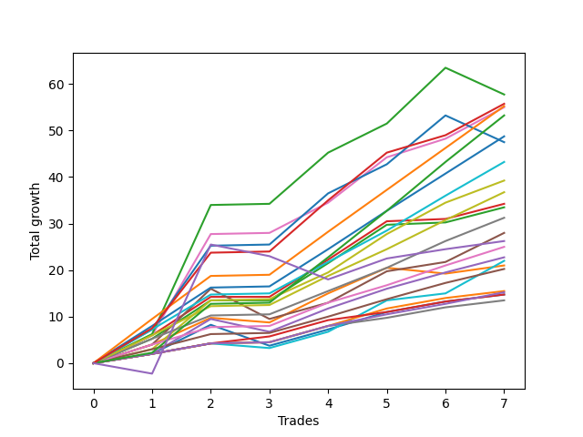

# Short Labrador 006 
- Symbol: ES_830-1130
- Date Range: 03/18/2022 - 12/30/2022
- Trading Period: 8:30-11:30
- Number of Trades: 8



| Name | Win Percent | Profit | Avg Profit / Trade | Avg Time / Trade |      | Name | Win Percent | Profit | Avg Profit / Trade | Avg Time / Trade |
| ---- | ----------- | ------ | ------------------ | ---------------- | ---- | ---- | ----------- | ------ | ------------------ | ---------------- |
| Sorted By <br> Profit | | | | | | Sorted By <br> Win Percentage ||||
| BB-200 U/L 2SD | 87.50 | 34500.00 | 4312.50 | 47:43 |     | NEWFI 000 | 100.00 | 32125.00 | 4015.62 | 38:55 |
| NEWFI 000 | 100.00 | 32125.00 | 4015.62 | 38:55 |     | TP-9 | 100.00 | 32125.00 | 4015.62 | 36:10 |
| TP-9 | 100.00 | 32125.00 | 4015.62 | 36:10 |     | TP-10 | 100.00 | 31625.00 | 3953.12 | 43:16 |
| TP-10 | 100.00 | 31625.00 | 3953.12 | 43:16 |     | BB-50 U/L 2SD | 100.00 | 30375.00 | 3796.88 | 30:35 |
| BB-50 U/L 2SD | 100.00 | 30375.00 | 3796.88 | 30:35 |     | TP-8 | 100.00 | 28500.00 | 3562.50 | 27:08 |
| BB-100 U/L 2SD | 87.50 | 29125.00 | 3640.62 | 47:48 |     | TP-7 | 100.00 | 25125.00 | 3140.62 | 24:03 |
| TP-8 | 100.00 | 28500.00 | 3562.50 | 27:08 |     | V U/L 1SD | 100.00 | 22500.00 | 2812.50 | 24:28 |
| TP-7 | 100.00 | 25125.00 | 3140.62 | 24:03 |     | TP-6 | 100.00 | 21750.00 | 2718.75 | 22:46 |
| V U/L 1SD | 100.00 | 22500.00 | 2812.50 | 24:28 |     | TP-5 | 100.00 | 18125.00 | 2265.62 | 17:50 |
| TP-6 | 100.00 | 21750.00 | 2718.75 | 22:46 |     | TP-4 | 100.00 | 15000.00 | 1875.00 | 16:31 |
| TP-5 | 100.00 | 18125.00 | 2265.62 | 17:50 |     | TP-3 | 100.00 | 11875.00 | 1484.38 | 12:00 |
| BB-20 U/L 2SD C | 75.00 | 16500.00 | 2062.50 | 15:54 |     | TP-2 | 100.00 | 8875.00 | 1109.38 | 09:16 |
| BB-20 U/L 2SD | 75.00 | 16125.00 | 2015.62 | 15:53 |     | BB-200 Mid | 100.00 | 8125.00 | 1015.62 | 08:47 |
| BB-50 U/L 1SD | 87.50 | 16000.00 | 2000.00 | 26:19 |     | TP-1 | 100.00 | 7875.00 | 984.38 | 03:18 |
| TP-4 | 100.00 | 15000.00 | 1875.00 | 16:31 |     | V Mid | 100.00 | 7125.00 | 890.62 | 08:45 |
| BB-50 Mid | 87.50 | 13875.00 | 1734.38 | 08:48 |     | BB-200 U/L 2SD | 87.50 | 34500.00 | 4312.50 | 47:43 |
| BB-100 Mid | 87.50 | 12750.00 | 1593.75 | 18:20 |     | BB-100 U/L 2SD | 87.50 | 29125.00 | 3640.62 | 47:48 |
| BB-20 U/L 1SD | 75.00 | 12375.00 | 1546.88 | 09:31 |     | BB-50 U/L 1SD | 87.50 | 16000.00 | 2000.00 | 26:19 |
| TP-3 | 100.00 | 11875.00 | 1484.38 | 12:00 |     | BB-50 Mid | 87.50 | 13875.00 | 1734.38 | 08:48 |
| NEWFI 0000 | 50.00 | 11375.00 | 1421.88 | 24:03 |     | BB-100 Mid | 87.50 | 12750.00 | 1593.75 | 18:20 |
| TP-2 | 100.00 | 8875.00 | 1109.38 | 09:16 |     | BB-20 Mid | 87.50 | 8625.00 | 1078.12 | 03:17 |
| BB-20 Mid | 87.50 | 8625.00 | 1078.12 | 03:17 |     | BB-20 U/L 2SD C | 75.00 | 16500.00 | 2062.50 | 15:54 |
| BB-200 Mid | 100.00 | 8125.00 | 1015.62 | 08:47 |     | BB-20 U/L 2SD | 75.00 | 16125.00 | 2015.62 | 15:53 |
| TP-1 | 100.00 | 7875.00 | 984.38 | 03:18 |     | BB-20 U/L 1SD | 75.00 | 12375.00 | 1546.88 | 09:31 |
| V Mid | 100.00 | 7125.00 | 890.62 | 08:45 |     | NEWFI 0000 | 50.00 | 11375.00 | 1421.88 | 24:03 |

## NO STOPLOSS

### Test BB-20 Mid
* Sell when price hits the middle line of the 20p bollinger
* No Stoploss
* Results:
```
Total Trades: 8
Percent Up: 12.50
Percent Down: 87.50
Total Points Moved Down: 17.25
Potential Profit: 8625.00
Total Points Ups: 4.50 Count Ups: 1
Total Points Downs: 21.75 Count Downs: 7
```

<details><summary>Trades</summary>

<code>In: 2022-04-11 11:12:00		Out: 2022-04-11 11:13:10		Total Position Time: 01:10		Total Move Down: 2.00		Total to Date: 2.00</code> <br />
<code>In: 2022-05-02 09:25:00		Out: 2022-05-02 09:27:15		Total Position Time: 02:15		Total Move Down: 6.25		Total to Date: 8.25</code> <br />
<code>In: 2022-05-24 10:48:00		Out: 2022-05-24 11:01:15		Total Position Time: 13:15		Total Move Down: -4.50		Total to Date: 3.75</code> <br />
<code>In: 2022-06-16 09:54:00		Out: 2022-06-16 09:55:10		Total Position Time: 01:10		Total Move Down: 3.50		Total to Date: 7.25</code> <br />
<code>In: 2022-08-23 10:36:00		Out: 2022-08-23 10:37:25		Total Position Time: 01:25		Total Move Down: 3.75		Total to Date: 11.00</code> <br />
<code>In: 2022-09-13 10:18:00		Out: 2022-09-13 10:19:10		Total Position Time: 01:10		Total Move Down: 2.25		Total to Date: 13.25</code> <br />
<code>In: 2022-10-12 11:16:00		Out: 2022-10-12 11:20:40		Total Position Time: 04:40		Total Move Down: 2.50		Total to Date: 15.75</code> <br />
<code>In: 2022-10-19 11:20:00		Out: 2022-10-19 11:21:15		Total Position Time: 01:15		Total Move Down: 1.50		Total to Date: 17.25</code> <br />


</details>

### Test BB-20 U/L 1SD
* Sell when the price hits the lower line of the 20p 1std bollinger
* No Stoploss
* Results:
```
Total Trades: 8
Percent Up: 25.00
Percent Down: 75.00
Total Points Moved Down: 24.75
Potential Profit: 12375.00
Total Points Ups: 2.25 Count Ups: 2
Total Points Downs: 27.00 Count Downs: 6
```

<details><summary>Trades</summary>

<code>In: 2022-04-11 11:12:00		Out: 2022-04-11 11:14:25		Total Position Time: 02:25		Total Move Down: 4.00		Total to Date: 4.00</code> <br />
<code>In: 2022-05-02 09:25:00		Out: 2022-05-02 09:37:10		Total Position Time: 12:10		Total Move Down: 5.75		Total to Date: 9.75</code> <br />
<code>In: 2022-05-24 10:48:00		Out: 2022-05-24 11:01:40		Total Position Time: 13:40		Total Move Down: -1.00		Total to Date: 8.75</code> <br />
<code>In: 2022-06-16 09:54:00		Out: 2022-06-16 09:55:40		Total Position Time: 01:40		Total Move Down: 6.25		Total to Date: 15.00</code> <br />
<code>In: 2022-08-23 10:36:00		Out: 2022-08-23 10:43:05		Total Position Time: 07:05		Total Move Down: 5.50		Total to Date: 20.50</code> <br />
<code>In: 2022-09-13 10:18:00		Out: 2022-09-13 10:42:55		Total Position Time: 24:55		Total Move Down: -1.25		Total to Date: 19.25</code> <br />
<code>In: 2022-10-12 11:16:00		Out: 2022-10-12 11:22:10		Total Position Time: 06:10		Total Move Down: 3.75		Total to Date: 23.00</code> <br />
<code>In: 2022-10-19 11:20:00		Out: 2022-10-19 11:28:05		Total Position Time: 08:05		Total Move Down: 1.75		Total to Date: 24.75</code> <br />


</details>

### Test BB-20 U/L 2SD
* Sell when the price hits the lower line of the 20p 2std bollinger
* No Stoploss
* Results:
```
Total Trades: 8
Percent Up: 25.00
Percent Down: 75.00
Total Points Moved Down: 32.25
Potential Profit: 16125.00
Total Points Ups: 1.25 Count Ups: 2
Total Points Downs: 33.50 Count Downs: 6
```

<details><summary>Trades</summary>

<code>In: 2022-04-11 11:12:00		Out: 2022-04-11 11:14:30		Total Position Time: 02:30		Total Move Down: 5.25		Total to Date: 5.25</code> <br />
<code>In: 2022-05-02 09:25:00		Out: 2022-05-02 09:39:35		Total Position Time: 14:35		Total Move Down: 8.25		Total to Date: 13.50</code> <br />
<code>In: 2022-05-24 10:48:00		Out: 2022-05-24 11:01:50		Total Position Time: 13:50		Total Move Down: -0.00		Total to Date: 13.50</code> <br />
<code>In: 2022-06-16 09:54:00		Out: 2022-06-16 09:59:50		Total Position Time: 05:50		Total Move Down: 8.00		Total to Date: 21.50</code> <br />
<code>In: 2022-08-23 10:36:00		Out: 2022-08-23 10:48:35		Total Position Time: 12:35		Total Move Down: 8.25		Total to Date: 29.75</code> <br />
<code>In: 2022-09-13 10:18:00		Out: 2022-09-13 10:43:55		Total Position Time: 25:55		Total Move Down: 0.50		Total to Date: 30.25</code> <br />
<code>In: 2022-10-12 11:16:00		Out: 2022-10-12 11:47:05		Total Position Time: 31:05		Total Move Down: -1.25		Total to Date: 29.00</code> <br />
<code>In: 2022-10-19 11:20:00		Out: 2022-10-19 11:40:50		Total Position Time: 20:50		Total Move Down: 3.25		Total to Date: 32.25</code> <br />


</details>

### Test BB-20 U/L 2SD C
* Sell when the price hits the lower line of the 20p 2std bollinger
* No Stoploss
* Results:
```
Total Trades: 8
Percent Up: 25.00
Percent Down: 75.00
Total Points Moved Down: 33.00
Potential Profit: 16500.00
Total Points Ups: 1.25 Count Ups: 2
Total Points Downs: 34.25 Count Downs: 6
```

<details><summary>Trades</summary>

<code>In: 2022-04-11 11:12:00		Out: 2022-04-11 11:14:35		Total Position Time: 02:35		Total Move Down: 6.00		Total to Date: 6.00</code> <br />
<code>In: 2022-05-02 09:25:00		Out: 2022-05-02 09:39:35		Total Position Time: 14:35		Total Move Down: 8.25		Total to Date: 14.25</code> <br />
<code>In: 2022-05-24 10:48:00		Out: 2022-05-24 11:01:50		Total Position Time: 13:50		Total Move Down: -0.00		Total to Date: 14.25</code> <br />
<code>In: 2022-06-16 09:54:00		Out: 2022-06-16 09:59:50		Total Position Time: 05:50		Total Move Down: 8.00		Total to Date: 22.25</code> <br />
<code>In: 2022-08-23 10:36:00		Out: 2022-08-23 10:48:35		Total Position Time: 12:35		Total Move Down: 8.25		Total to Date: 30.50</code> <br />
<code>In: 2022-09-13 10:18:00		Out: 2022-09-13 10:43:55		Total Position Time: 25:55		Total Move Down: 0.50		Total to Date: 31.00</code> <br />
<code>In: 2022-10-12 11:16:00		Out: 2022-10-12 11:47:05		Total Position Time: 31:05		Total Move Down: -1.25		Total to Date: 29.75</code> <br />
<code>In: 2022-10-19 11:20:00		Out: 2022-10-19 11:40:50		Total Position Time: 20:50		Total Move Down: 3.25		Total to Date: 33.00</code> <br />


</details>

### Test BB-50 Mid
* Sell when price hits the middle line of the 50p bollinger
* No Stoploss
* Results:
```
Total Trades: 8
Percent Up: 12.50
Percent Down: 87.50
Total Points Moved Down: 27.75
Potential Profit: 13875.00
Total Points Ups: 2.75 Count Ups: 1
Total Points Downs: 30.50 Count Downs: 7
```

<details><summary>Trades</summary>

<code>In: 2022-04-11 11:12:00		Out: 2022-04-11 11:13:10		Total Position Time: 01:10		Total Move Down: 2.00		Total to Date: 2.00</code> <br />
<code>In: 2022-05-02 09:25:00		Out: 2022-05-02 09:27:20		Total Position Time: 02:20		Total Move Down: 7.50		Total to Date: 9.50</code> <br />
<code>In: 2022-05-24 10:48:00		Out: 2022-05-24 11:20:25		Total Position Time: 32:25		Total Move Down: -2.75		Total to Date: 6.75</code> <br />
<code>In: 2022-06-16 09:54:00		Out: 2022-06-16 09:55:20		Total Position Time: 01:20		Total Move Down: 5.00		Total to Date: 11.75</code> <br />
<code>In: 2022-08-23 10:36:00		Out: 2022-08-23 10:39:25		Total Position Time: 03:25		Total Move Down: 4.25		Total to Date: 16.00</code> <br />
<code>In: 2022-09-13 10:18:00		Out: 2022-09-13 10:21:05		Total Position Time: 03:05		Total Move Down: 3.50		Total to Date: 19.50</code> <br />
<code>In: 2022-10-12 11:16:00		Out: 2022-10-12 11:21:50		Total Position Time: 05:50		Total Move Down: 5.00		Total to Date: 24.50</code> <br />
<code>In: 2022-10-19 11:20:00		Out: 2022-10-19 11:40:50		Total Position Time: 20:50		Total Move Down: 3.25		Total to Date: 27.75</code> <br />


</details>

### Test BB-50 U/L 1SD
* Sell when the price hits the lower line of the 50p 1std bollinger
* No Stoploss
* Results:
```
Total Trades: 8
Percent Up: 12.50
Percent Down: 87.50
Total Points Moved Down: 32.00
Potential Profit: 16000.00
Total Points Ups: 6.50 Count Ups: 1
Total Points Downs: 38.50 Count Downs: 7
```

<details><summary>Trades</summary>

<code>In: 2022-04-11 11:12:00		Out: 2022-04-11 11:14:25		Total Position Time: 02:25		Total Move Down: 4.00		Total to Date: 4.00</code> <br />
<code>In: 2022-05-02 09:25:00		Out: 2022-05-02 09:43:15		Total Position Time: 18:15		Total Move Down: 12.00		Total to Date: 16.00</code> <br />
<code>In: 2022-05-24 10:48:00		Out: 2022-05-24 11:44:15		Total Position Time: 56:15		Total Move Down: -6.50		Total to Date: 9.50</code> <br />
<code>In: 2022-06-16 09:54:00		Out: 2022-06-16 10:21:15		Total Position Time: 27:15		Total Move Down: 3.50		Total to Date: 13.00</code> <br />
<code>In: 2022-08-23 10:36:00		Out: 2022-08-23 10:48:05		Total Position Time: 12:05		Total Move Down: 6.75		Total to Date: 19.75</code> <br />
<code>In: 2022-09-13 10:18:00		Out: 2022-09-13 10:52:05		Total Position Time: 34:05		Total Move Down: 2.00		Total to Date: 21.75</code> <br />
<code>In: 2022-10-12 11:16:00		Out: 2022-10-12 11:49:10		Total Position Time: 33:10		Total Move Down: 4.00		Total to Date: 25.75</code> <br />
<code>In: 2022-10-19 11:20:00		Out: 2022-10-19 11:47:05		Total Position Time: 27:05		Total Move Down: 6.25		Total to Date: 32.00</code> <br />


</details>

### Test BB-50 U/L 2SD
* Sell when the price hits the lower line of the 50p 2std bollinger
* No Stoploss
* Results:
```
Total Trades: 8
Percent Up: 0.00
Percent Down: 100.00
Total Points Moved Down: 60.75
Potential Profit: 30375.00
Total Points Ups: 0.00 Count Ups: 0
Total Points Downs: 60.75 Count Downs: 8
```

<details><summary>Trades</summary>

<code>In: 2022-04-11 11:12:00		Out: 2022-04-11 11:14:35		Total Position Time: 02:35		Total Move Down: 6.00		Total to Date: 6.00</code> <br />
<code>In: 2022-05-02 09:25:00		Out: 2022-05-02 09:54:10		Total Position Time: 29:10		Total Move Down: 21.75		Total to Date: 27.75</code> <br />
<code>In: 2022-05-24 10:48:00		Out: 2022-05-24 11:48:55		Total Position Time: 60:55		Total Move Down: 0.25		Total to Date: 28.00</code> <br />
<code>In: 2022-06-16 09:54:00		Out: 2022-06-16 10:24:10		Total Position Time: 30:10		Total Move Down: 6.50		Total to Date: 34.50</code> <br />
<code>In: 2022-08-23 10:36:00		Out: 2022-08-23 10:51:40		Total Position Time: 15:40		Total Move Down: 9.75		Total to Date: 44.25</code> <br />
<code>In: 2022-09-13 10:18:00		Out: 2022-09-13 10:54:00		Total Position Time: 36:00		Total Move Down: 4.00		Total to Date: 48.25</code> <br />
<code>In: 2022-10-12 11:16:00		Out: 2022-10-12 11:53:10		Total Position Time: 37:10		Total Move Down: 5.75		Total to Date: 54.00</code> <br />
<code>In: 2022-10-19 11:20:00		Out: 2022-10-19 11:53:05		Total Position Time: 33:05		Total Move Down: 6.75		Total to Date: 60.75</code> <br />


</details>

### Test V Mid
* Sell when the price hits the middle line of the 1std VWAP
* No Stoploss
* Results:
```
Total Trades: 8
Percent Up: 0.00
Percent Down: 100.00
Total Points Moved Down: 14.25
Potential Profit: 7125.00
Total Points Ups: 0.00 Count Ups: 0
Total Points Downs: 14.25 Count Downs: 8
```

<details><summary>Trades</summary>

<code>In: 2022-04-11 11:12:00		Out: 2022-04-11 11:13:10		Total Position Time: 01:10		Total Move Down: 2.00		Total to Date: 2.00</code> <br />
<code>In: 2022-05-02 09:25:00		Out: 2022-05-02 09:26:10		Total Position Time: 01:10		Total Move Down: 2.25		Total to Date: 4.25</code> <br />
<code>In: 2022-05-24 10:48:00		Out: 2022-05-24 11:48:55		Total Position Time: 60:55		Total Move Down: 0.25		Total to Date: 4.50</code> <br />
<code>In: 2022-06-16 09:54:00		Out: 2022-06-16 09:55:10		Total Position Time: 01:10		Total Move Down: 3.50		Total to Date: 8.00</code> <br />
<code>In: 2022-08-23 10:36:00		Out: 2022-08-23 10:37:10		Total Position Time: 01:10		Total Move Down: 1.75		Total to Date: 9.75</code> <br />
<code>In: 2022-09-13 10:18:00		Out: 2022-09-13 10:19:10		Total Position Time: 01:10		Total Move Down: 2.25		Total to Date: 12.00</code> <br />
<code>In: 2022-10-12 11:16:00		Out: 2022-10-12 11:18:10		Total Position Time: 02:10		Total Move Down: 0.75		Total to Date: 12.75</code> <br />
<code>In: 2022-10-19 11:20:00		Out: 2022-10-19 11:21:10		Total Position Time: 01:10		Total Move Down: 1.50		Total to Date: 14.25</code> <br />


</details>

### Test V U/L 1SD
* Sell when the price hits the lower line of the 1std VWAP
* No Stoploss
* Results:
```
Total Trades: 8
Percent Up: 0.00
Percent Down: 100.00
Total Points Moved Down: 45.00
Potential Profit: 22500.00
Total Points Ups: 0.00 Count Ups: 0
Total Points Downs: 45.00 Count Downs: 8
```

<details><summary>Trades</summary>

<code>In: 2022-04-11 11:12:00		Out: 2022-04-11 11:13:30		Total Position Time: 01:30		Total Move Down: 3.00		Total to Date: 3.00</code> <br />
<code>In: 2022-05-02 09:25:00		Out: 2022-05-02 09:42:40		Total Position Time: 17:40		Total Move Down: 10.50		Total to Date: 13.50</code> <br />
<code>In: 2022-05-24 10:48:00		Out: 2022-05-24 11:48:55		Total Position Time: 60:55		Total Move Down: 0.25		Total to Date: 13.75</code> <br />
<code>In: 2022-06-16 09:54:00		Out: 2022-06-16 09:56:00		Total Position Time: 02:00		Total Move Down: 5.75		Total to Date: 19.50</code> <br />
<code>In: 2022-08-23 10:36:00		Out: 2022-08-23 10:48:35		Total Position Time: 12:35		Total Move Down: 8.25		Total to Date: 27.75</code> <br />
<code>In: 2022-09-13 10:18:00		Out: 2022-09-13 11:01:20		Total Position Time: 43:20		Total Move Down: 6.75		Total to Date: 34.50</code> <br />
<code>In: 2022-10-12 11:16:00		Out: 2022-10-12 11:52:25		Total Position Time: 36:25		Total Move Down: 5.75		Total to Date: 40.25</code> <br />
<code>In: 2022-10-19 11:20:00		Out: 2022-10-19 11:41:20		Total Position Time: 21:20		Total Move Down: 4.75		Total to Date: 45.00</code> <br />


</details>

### Test BB-100 Mid
* Move to BB100 Mid
* No Stoploss
* Results:
```
Total Trades: 8
Percent Up: 12.50
Percent Down: 87.50
Total Points Moved Down: 25.50
Potential Profit: 12750.00
Total Points Ups: 1.00 Count Ups: 1
Total Points Downs: 26.50 Count Downs: 7
```

<details><summary>Trades</summary>

<code>In: 2022-04-11 11:12:00		Out: 2022-04-11 11:13:10		Total Position Time: 01:10		Total Move Down: 2.00		Total to Date: 2.00</code> <br />
<code>In: 2022-05-02 09:25:00		Out: 2022-05-02 09:26:10		Total Position Time: 01:10		Total Move Down: 2.25		Total to Date: 4.25</code> <br />
<code>In: 2022-05-24 10:48:00		Out: 2022-05-24 11:48:35		Total Position Time: 60:35		Total Move Down: -1.00		Total to Date: 3.25</code> <br />
<code>In: 2022-06-16 09:54:00		Out: 2022-06-16 09:55:10		Total Position Time: 01:10		Total Move Down: 3.50		Total to Date: 6.75</code> <br />
<code>In: 2022-08-23 10:36:00		Out: 2022-08-23 10:45:20		Total Position Time: 09:20		Total Move Down: 6.75		Total to Date: 13.50</code> <br />
<code>In: 2022-09-13 10:18:00		Out: 2022-09-13 10:51:30		Total Position Time: 33:30		Total Move Down: 1.50		Total to Date: 15.00</code> <br />
<code>In: 2022-10-12 11:16:00		Out: 2022-10-12 11:21:40		Total Position Time: 05:40		Total Move Down: 3.50		Total to Date: 18.50</code> <br />
<code>In: 2022-10-19 11:20:00		Out: 2022-10-19 11:54:05		Total Position Time: 34:05		Total Move Down: 7.00		Total to Date: 25.50</code> <br />


</details>

### Test BB-100 U/L 2SD
* Move to BB100 Upper Band
* No Stoploss
* Results:
```
Total Trades: 8
Percent Up: 12.50
Percent Down: 87.50
Total Points Moved Down: 58.25
Potential Profit: 29125.00
Total Points Ups: 5.75 Count Ups: 1
Total Points Downs: 64.00 Count Downs: 7
```

<details><summary>Trades</summary>

<code>In: 2022-04-11 11:12:00		Out: 2022-04-11 11:15:10		Total Position Time: 03:10		Total Move Down: 7.25		Total to Date: 7.25</code> <br />
<code>In: 2022-05-02 09:25:00		Out: 2022-05-02 09:53:45		Total Position Time: 28:45		Total Move Down: 18.00		Total to Date: 25.25</code> <br />
<code>In: 2022-05-24 10:48:00		Out: 2022-05-24 11:48:55		Total Position Time: 60:55		Total Move Down: 0.25		Total to Date: 25.50</code> <br />
<code>In: 2022-06-16 09:54:00		Out: 2022-06-16 10:54:55		Total Position Time: 60:55		Total Move Down: 11.00		Total to Date: 36.50</code> <br />
<code>In: 2022-08-23 10:36:00		Out: 2022-08-23 11:36:55		Total Position Time: 60:55		Total Move Down: 6.25		Total to Date: 42.75</code> <br />
<code>In: 2022-09-13 10:18:00		Out: 2022-09-13 11:03:55		Total Position Time: 45:55		Total Move Down: 10.50		Total to Date: 53.25</code> <br />
<code>In: 2022-10-12 11:16:00		Out: 2022-10-12 12:16:55		Total Position Time: 60:55		Total Move Down: 10.75		Total to Date: 64.00</code> <br />
<code>In: 2022-10-19 11:20:00		Out: 2022-10-19 12:20:55		Total Position Time: 60:55		Total Move Down: -5.75		Total to Date: 58.25</code> <br />


</details>

### Test BB-200 Mid
* Move to BB200 Mid
* No Stoploss
* Results:
```
Total Trades: 8
Percent Up: 0.00
Percent Down: 100.00
Total Points Moved Down: 16.25
Potential Profit: 8125.00
Total Points Ups: 0.00 Count Ups: 0
Total Points Downs: 16.25 Count Downs: 8
```

<details><summary>Trades</summary>

<code>In: 2022-04-11 11:12:00		Out: 2022-04-11 11:13:10		Total Position Time: 01:10		Total Move Down: 2.00		Total to Date: 2.00</code> <br />
<code>In: 2022-05-02 09:25:00		Out: 2022-05-02 09:26:10		Total Position Time: 01:10		Total Move Down: 2.25		Total to Date: 4.25</code> <br />
<code>In: 2022-05-24 10:48:00		Out: 2022-05-24 11:48:55		Total Position Time: 60:55		Total Move Down: 0.25		Total to Date: 4.50</code> <br />
<code>In: 2022-06-16 09:54:00		Out: 2022-06-16 09:55:10		Total Position Time: 01:10		Total Move Down: 3.50		Total to Date: 8.00</code> <br />
<code>In: 2022-08-23 10:36:00		Out: 2022-08-23 10:37:25		Total Position Time: 01:25		Total Move Down: 3.75		Total to Date: 11.75</code> <br />
<code>In: 2022-09-13 10:18:00		Out: 2022-09-13 10:19:10		Total Position Time: 01:10		Total Move Down: 2.25		Total to Date: 14.00</code> <br />
<code>In: 2022-10-12 11:16:00		Out: 2022-10-12 11:18:10		Total Position Time: 02:10		Total Move Down: 0.75		Total to Date: 14.75</code> <br />
<code>In: 2022-10-19 11:20:00		Out: 2022-10-19 11:21:10		Total Position Time: 01:10		Total Move Down: 1.50		Total to Date: 16.25</code> <br />


</details>

### Test BB-200 U/L 2SD
* Move to BB200 Upper Band
* No Stoploss
* Results:
```
Total Trades: 8
Percent Up: 12.50
Percent Down: 87.50
Total Points Moved Down: 69.00
Potential Profit: 34500.00
Total Points Ups: 5.75 Count Ups: 1
Total Points Downs: 74.75 Count Downs: 7
```

<details><summary>Trades</summary>

<code>In: 2022-04-11 11:12:00		Out: 2022-04-11 11:14:45		Total Position Time: 02:45		Total Move Down: 6.25		Total to Date: 6.25</code> <br />
<code>In: 2022-05-02 09:25:00		Out: 2022-05-02 09:59:05		Total Position Time: 34:05		Total Move Down: 27.75		Total to Date: 34.00</code> <br />
<code>In: 2022-05-24 10:48:00		Out: 2022-05-24 11:48:55		Total Position Time: 60:55		Total Move Down: 0.25		Total to Date: 34.25</code> <br />
<code>In: 2022-06-16 09:54:00		Out: 2022-06-16 10:54:55		Total Position Time: 60:55		Total Move Down: 11.00		Total to Date: 45.25</code> <br />
<code>In: 2022-08-23 10:36:00		Out: 2022-08-23 11:36:55		Total Position Time: 60:55		Total Move Down: 6.25		Total to Date: 51.50</code> <br />
<code>In: 2022-09-13 10:18:00		Out: 2022-09-13 11:11:55		Total Position Time: 53:55		Total Move Down: 12.00		Total to Date: 63.50</code> <br />
<code>In: 2022-10-12 11:16:00		Out: 2022-10-12 12:03:20		Total Position Time: 47:20		Total Move Down: 11.25		Total to Date: 74.75</code> <br />
<code>In: 2022-10-19 11:20:00		Out: 2022-10-19 12:20:55		Total Position Time: 60:55		Total Move Down: -5.75		Total to Date: 69.00</code> <br />


</details>

## TAKE PROFIT

### Test TP-1
* Take Profit of 1 Point
* No Stoploss
* Results:
```
Total Trades: 8
Percent Up: 0.00
Percent Down: 100.00
Total Points Moved Down: 15.75
Potential Profit: 7875.00
Total Points Ups: 0.00 Count Ups: 0
Total Points Downs: 15.75 Count Downs: 8
```

<details><summary>Trades</summary>

<code>In: 2022-04-11 11:12:00		Out: 2022-04-11 11:13:10		Total Position Time: 01:10		Total Move Down: 2.00		Total to Date: 2.00</code> <br />
<code>In: 2022-05-02 09:25:00		Out: 2022-05-02 09:26:10		Total Position Time: 01:10		Total Move Down: 2.25		Total to Date: 4.25</code> <br />
<code>In: 2022-05-24 10:48:00		Out: 2022-05-24 11:05:00		Total Position Time: 17:00		Total Move Down: 1.50		Total to Date: 5.75</code> <br />
<code>In: 2022-06-16 09:54:00		Out: 2022-06-16 09:55:10		Total Position Time: 01:10		Total Move Down: 3.50		Total to Date: 9.25</code> <br />
<code>In: 2022-08-23 10:36:00		Out: 2022-08-23 10:37:10		Total Position Time: 01:10		Total Move Down: 1.75		Total to Date: 11.00</code> <br />
<code>In: 2022-09-13 10:18:00		Out: 2022-09-13 10:19:10		Total Position Time: 01:10		Total Move Down: 2.25		Total to Date: 13.25</code> <br />
<code>In: 2022-10-12 11:16:00		Out: 2022-10-12 11:18:30		Total Position Time: 02:30		Total Move Down: 1.00		Total to Date: 14.25</code> <br />
<code>In: 2022-10-19 11:20:00		Out: 2022-10-19 11:21:10		Total Position Time: 01:10		Total Move Down: 1.50		Total to Date: 15.75</code> <br />


</details>

### Test TP-2
* Take Profit of 2 Point
* No Stoploss
* Results:
```
Total Trades: 8
Percent Up: 0.00
Percent Down: 100.00
Total Points Moved Down: 17.75
Potential Profit: 8875.00
Total Points Ups: 0.00 Count Ups: 0
Total Points Downs: 17.75 Count Downs: 8
```

<details><summary>Trades</summary>

<code>In: 2022-04-11 11:12:00		Out: 2022-04-11 11:13:10		Total Position Time: 01:10		Total Move Down: 2.00		Total to Date: 2.00</code> <br />
<code>In: 2022-05-02 09:25:00		Out: 2022-05-02 09:26:10		Total Position Time: 01:10		Total Move Down: 2.25		Total to Date: 4.25</code> <br />
<code>In: 2022-05-24 10:48:00		Out: 2022-05-24 11:48:55		Total Position Time: 60:55		Total Move Down: 0.25		Total to Date: 4.50</code> <br />
<code>In: 2022-06-16 09:54:00		Out: 2022-06-16 09:55:10		Total Position Time: 01:10		Total Move Down: 3.50		Total to Date: 8.00</code> <br />
<code>In: 2022-08-23 10:36:00		Out: 2022-08-23 10:37:20		Total Position Time: 01:20		Total Move Down: 2.50		Total to Date: 10.50</code> <br />
<code>In: 2022-09-13 10:18:00		Out: 2022-09-13 10:19:10		Total Position Time: 01:10		Total Move Down: 2.25		Total to Date: 12.75</code> <br />
<code>In: 2022-10-12 11:16:00		Out: 2022-10-12 11:20:40		Total Position Time: 04:40		Total Move Down: 2.50		Total to Date: 15.25</code> <br />
<code>In: 2022-10-19 11:20:00		Out: 2022-10-19 11:22:35		Total Position Time: 02:35		Total Move Down: 2.50		Total to Date: 17.75</code> <br />


</details>

### Test TP-3
* Take Profit of 3 Point
* No Stoploss
* Results:
```
Total Trades: 8
Percent Up: 0.00
Percent Down: 100.00
Total Points Moved Down: 23.75
Potential Profit: 11875.00
Total Points Ups: 0.00 Count Ups: 0
Total Points Downs: 23.75 Count Downs: 8
```

<details><summary>Trades</summary>

<code>In: 2022-04-11 11:12:00		Out: 2022-04-11 11:13:30		Total Position Time: 01:30		Total Move Down: 3.00		Total to Date: 3.00</code> <br />
<code>In: 2022-05-02 09:25:00		Out: 2022-05-02 09:26:35		Total Position Time: 01:35		Total Move Down: 3.25		Total to Date: 6.25</code> <br />
<code>In: 2022-05-24 10:48:00		Out: 2022-05-24 11:48:55		Total Position Time: 60:55		Total Move Down: 0.25		Total to Date: 6.50</code> <br />
<code>In: 2022-06-16 09:54:00		Out: 2022-06-16 09:55:10		Total Position Time: 01:10		Total Move Down: 3.50		Total to Date: 10.00</code> <br />
<code>In: 2022-08-23 10:36:00		Out: 2022-08-23 10:37:25		Total Position Time: 01:25		Total Move Down: 3.75		Total to Date: 13.75</code> <br />
<code>In: 2022-09-13 10:18:00		Out: 2022-09-13 10:21:05		Total Position Time: 03:05		Total Move Down: 3.50		Total to Date: 17.25</code> <br />
<code>In: 2022-10-12 11:16:00		Out: 2022-10-12 11:21:40		Total Position Time: 05:40		Total Move Down: 3.50		Total to Date: 20.75</code> <br />
<code>In: 2022-10-19 11:20:00		Out: 2022-10-19 11:40:45		Total Position Time: 20:45		Total Move Down: 3.00		Total to Date: 23.75</code> <br />


</details>

### Test TP-4
* Take Profit of 4 Point
* No Stoploss
* Results:
```
Total Trades: 8
Percent Up: 0.00
Percent Down: 100.00
Total Points Moved Down: 30.00
Potential Profit: 15000.00
Total Points Ups: 0.00 Count Ups: 0
Total Points Downs: 30.00 Count Downs: 8
```

<details><summary>Trades</summary>

<code>In: 2022-04-11 11:12:00		Out: 2022-04-11 11:14:25		Total Position Time: 02:25		Total Move Down: 4.00		Total to Date: 4.00</code> <br />
<code>In: 2022-05-02 09:25:00		Out: 2022-05-02 09:26:50		Total Position Time: 01:50		Total Move Down: 3.75		Total to Date: 7.75</code> <br />
<code>In: 2022-05-24 10:48:00		Out: 2022-05-24 11:48:55		Total Position Time: 60:55		Total Move Down: 0.25		Total to Date: 8.00</code> <br />
<code>In: 2022-06-16 09:54:00		Out: 2022-06-16 09:55:15		Total Position Time: 01:15		Total Move Down: 5.00		Total to Date: 13.00</code> <br />
<code>In: 2022-08-23 10:36:00		Out: 2022-08-23 10:39:15		Total Position Time: 03:15		Total Move Down: 3.75		Total to Date: 16.75</code> <br />
<code>In: 2022-09-13 10:18:00		Out: 2022-09-13 10:53:55		Total Position Time: 35:55		Total Move Down: 4.25		Total to Date: 21.00</code> <br />
<code>In: 2022-10-12 11:16:00		Out: 2022-10-12 11:21:45		Total Position Time: 05:45		Total Move Down: 5.00		Total to Date: 26.00</code> <br />
<code>In: 2022-10-19 11:20:00		Out: 2022-10-19 11:40:55		Total Position Time: 20:55		Total Move Down: 4.00		Total to Date: 30.00</code> <br />


</details>

### Test TP-5
* Take Profit of 5 Point
* No Stoploss
* Results:
```
Total Trades: 8
Percent Up: 0.00
Percent Down: 100.00
Total Points Moved Down: 36.25
Potential Profit: 18125.00
Total Points Ups: 0.00 Count Ups: 0
Total Points Downs: 36.25 Count Downs: 8
```

<details><summary>Trades</summary>

<code>In: 2022-04-11 11:12:00		Out: 2022-04-11 11:14:30		Total Position Time: 02:30		Total Move Down: 5.25		Total to Date: 5.25</code> <br />
<code>In: 2022-05-02 09:25:00		Out: 2022-05-02 09:27:10		Total Position Time: 02:10		Total Move Down: 5.00		Total to Date: 10.25</code> <br />
<code>In: 2022-05-24 10:48:00		Out: 2022-05-24 11:48:55		Total Position Time: 60:55		Total Move Down: 0.25		Total to Date: 10.50</code> <br />
<code>In: 2022-06-16 09:54:00		Out: 2022-06-16 09:55:15		Total Position Time: 01:15		Total Move Down: 5.00		Total to Date: 15.50</code> <br />
<code>In: 2022-08-23 10:36:00		Out: 2022-08-23 10:42:10		Total Position Time: 06:10		Total Move Down: 5.00		Total to Date: 20.50</code> <br />
<code>In: 2022-09-13 10:18:00		Out: 2022-09-13 11:00:45		Total Position Time: 42:45		Total Move Down: 5.75		Total to Date: 26.25</code> <br />
<code>In: 2022-10-12 11:16:00		Out: 2022-10-12 11:21:45		Total Position Time: 05:45		Total Move Down: 5.00		Total to Date: 31.25</code> <br />
<code>In: 2022-10-19 11:20:00		Out: 2022-10-19 11:41:15		Total Position Time: 21:15		Total Move Down: 5.00		Total to Date: 36.25</code> <br />


</details>

### Test TP-6
* Take Profit of 6 Point
* No Stoploss
* Results:
```
Total Trades: 8
Percent Up: 0.00
Percent Down: 100.00
Total Points Moved Down: 43.50
Potential Profit: 21750.00
Total Points Ups: 0.00 Count Ups: 0
Total Points Downs: 43.50 Count Downs: 8
```

<details><summary>Trades</summary>

<code>In: 2022-04-11 11:12:00		Out: 2022-04-11 11:14:35		Total Position Time: 02:35		Total Move Down: 6.00		Total to Date: 6.00</code> <br />
<code>In: 2022-05-02 09:25:00		Out: 2022-05-02 09:27:15		Total Position Time: 02:15		Total Move Down: 6.25		Total to Date: 12.25</code> <br />
<code>In: 2022-05-24 10:48:00		Out: 2022-05-24 11:48:55		Total Position Time: 60:55		Total Move Down: 0.25		Total to Date: 12.50</code> <br />
<code>In: 2022-06-16 09:54:00		Out: 2022-06-16 09:55:40		Total Position Time: 01:40		Total Move Down: 6.25		Total to Date: 18.75</code> <br />
<code>In: 2022-08-23 10:36:00		Out: 2022-08-23 10:43:55		Total Position Time: 07:55		Total Move Down: 5.75		Total to Date: 24.50</code> <br />
<code>In: 2022-09-13 10:18:00		Out: 2022-09-13 11:00:50		Total Position Time: 42:50		Total Move Down: 6.25		Total to Date: 30.75</code> <br />
<code>In: 2022-10-12 11:16:00		Out: 2022-10-12 11:53:05		Total Position Time: 37:05		Total Move Down: 6.75		Total to Date: 37.50</code> <br />
<code>In: 2022-10-19 11:20:00		Out: 2022-10-19 11:47:00		Total Position Time: 27:00		Total Move Down: 6.00		Total to Date: 43.50</code> <br />


</details>

### Test TP-7
* Take Profit of 7 Point
* No Stoploss
* Results:
```
Total Trades: 8
Percent Up: 0.00
Percent Down: 100.00
Total Points Moved Down: 50.25
Potential Profit: 25125.00
Total Points Ups: 0.00 Count Ups: 0
Total Points Downs: 50.25 Count Downs: 8
```

<details><summary>Trades</summary>

<code>In: 2022-04-11 11:12:00		Out: 2022-04-11 11:15:10		Total Position Time: 03:10		Total Move Down: 7.25		Total to Date: 7.25</code> <br />
<code>In: 2022-05-02 09:25:00		Out: 2022-05-02 09:27:20		Total Position Time: 02:20		Total Move Down: 7.50		Total to Date: 14.75</code> <br />
<code>In: 2022-05-24 10:48:00		Out: 2022-05-24 11:48:55		Total Position Time: 60:55		Total Move Down: 0.25		Total to Date: 15.00</code> <br />
<code>In: 2022-06-16 09:54:00		Out: 2022-06-16 09:56:50		Total Position Time: 02:50		Total Move Down: 6.75		Total to Date: 21.75</code> <br />
<code>In: 2022-08-23 10:36:00		Out: 2022-08-23 10:48:05		Total Position Time: 12:05		Total Move Down: 6.75		Total to Date: 28.50</code> <br />
<code>In: 2022-09-13 10:18:00		Out: 2022-09-13 11:01:30		Total Position Time: 43:30		Total Move Down: 7.50		Total to Date: 36.00</code> <br />
<code>In: 2022-10-12 11:16:00		Out: 2022-10-12 11:54:25		Total Position Time: 38:25		Total Move Down: 7.00		Total to Date: 43.00</code> <br />
<code>In: 2022-10-19 11:20:00		Out: 2022-10-19 11:49:15		Total Position Time: 29:15		Total Move Down: 7.25		Total to Date: 50.25</code> <br />


</details>

### Test TP-8
* Take Profit of 8 Point
* No Stoploss
* Results:
```
Total Trades: 8
Percent Up: 0.00
Percent Down: 100.00
Total Points Moved Down: 57.00
Potential Profit: 28500.00
Total Points Ups: 0.00 Count Ups: 0
Total Points Downs: 57.00 Count Downs: 8
```

<details><summary>Trades</summary>

<code>In: 2022-04-11 11:12:00		Out: 2022-04-11 11:15:50		Total Position Time: 03:50		Total Move Down: 8.00		Total to Date: 8.00</code> <br />
<code>In: 2022-05-02 09:25:00		Out: 2022-05-02 09:39:35		Total Position Time: 14:35		Total Move Down: 8.25		Total to Date: 16.25</code> <br />
<code>In: 2022-05-24 10:48:00		Out: 2022-05-24 11:48:55		Total Position Time: 60:55		Total Move Down: 0.25		Total to Date: 16.50</code> <br />
<code>In: 2022-06-16 09:54:00		Out: 2022-06-16 09:59:50		Total Position Time: 05:50		Total Move Down: 8.00		Total to Date: 24.50</code> <br />
<code>In: 2022-08-23 10:36:00		Out: 2022-08-23 10:48:35		Total Position Time: 12:35		Total Move Down: 8.25		Total to Date: 32.75</code> <br />
<code>In: 2022-09-13 10:18:00		Out: 2022-09-13 11:01:55		Total Position Time: 43:55		Total Move Down: 8.00		Total to Date: 40.75</code> <br />
<code>In: 2022-10-12 11:16:00		Out: 2022-10-12 11:57:00		Total Position Time: 41:00		Total Move Down: 8.25		Total to Date: 49.00</code> <br />
<code>In: 2022-10-19 11:20:00		Out: 2022-10-19 11:54:30		Total Position Time: 34:30		Total Move Down: 8.00		Total to Date: 57.00</code> <br />


</details>

### Test TP-9
* Take Profit of 9 Point
* No Stoploss
* Results:
```
Total Trades: 8
Percent Up: 0.00
Percent Down: 100.00
Total Points Moved Down: 64.25
Potential Profit: 32125.00
Total Points Ups: 0.00 Count Ups: 0
Total Points Downs: 64.25 Count Downs: 8
```

<details><summary>Trades</summary>

<code>In: 2022-04-11 11:12:00		Out: 2022-04-11 11:31:10		Total Position Time: 19:10		Total Move Down: 9.50		Total to Date: 9.50</code> <br />
<code>In: 2022-05-02 09:25:00		Out: 2022-05-02 09:39:55		Total Position Time: 14:55		Total Move Down: 9.25		Total to Date: 18.75</code> <br />
<code>In: 2022-05-24 10:48:00		Out: 2022-05-24 11:48:55		Total Position Time: 60:55		Total Move Down: 0.25		Total to Date: 19.00</code> <br />
<code>In: 2022-06-16 09:54:00		Out: 2022-06-16 10:45:15		Total Position Time: 51:15		Total Move Down: 9.25		Total to Date: 28.25</code> <br />
<code>In: 2022-08-23 10:36:00		Out: 2022-08-23 10:50:50		Total Position Time: 14:50		Total Move Down: 9.00		Total to Date: 37.25</code> <br />
<code>In: 2022-09-13 10:18:00		Out: 2022-09-13 11:03:30		Total Position Time: 45:30		Total Move Down: 9.00		Total to Date: 46.25</code> <br />
<code>In: 2022-10-12 11:16:00		Out: 2022-10-12 11:57:35		Total Position Time: 41:35		Total Move Down: 9.00		Total to Date: 55.25</code> <br />
<code>In: 2022-10-19 11:20:00		Out: 2022-10-19 12:01:15		Total Position Time: 41:15		Total Move Down: 9.00		Total to Date: 64.25</code> <br />


</details>

### Test TP-10
* Take Profit of 10 Point
* No Stoploss
* Results:
```
Total Trades: 8
Percent Up: 0.00
Percent Down: 100.00
Total Points Moved Down: 63.25
Potential Profit: 31625.00
Total Points Ups: 0.00 Count Ups: 0
Total Points Downs: 63.25 Count Downs: 8
```

<details><summary>Trades</summary>

<code>In: 2022-04-11 11:12:00		Out: 2022-04-11 12:12:55		Total Position Time: 60:55		Total Move Down: 2.25		Total to Date: 2.25</code> <br />
<code>In: 2022-05-02 09:25:00		Out: 2022-05-02 09:41:40		Total Position Time: 16:40		Total Move Down: 10.50		Total to Date: 12.75</code> <br />
<code>In: 2022-05-24 10:48:00		Out: 2022-05-24 11:48:55		Total Position Time: 60:55		Total Move Down: 0.25		Total to Date: 13.00</code> <br />
<code>In: 2022-06-16 09:54:00		Out: 2022-06-16 10:47:00		Total Position Time: 53:00		Total Move Down: 9.75		Total to Date: 22.75</code> <br />
<code>In: 2022-08-23 10:36:00		Out: 2022-08-23 10:51:55		Total Position Time: 15:55		Total Move Down: 10.00		Total to Date: 32.75</code> <br />
<code>In: 2022-09-13 10:18:00		Out: 2022-09-13 11:03:55		Total Position Time: 45:55		Total Move Down: 10.50		Total to Date: 43.25</code> <br />
<code>In: 2022-10-12 11:16:00		Out: 2022-10-12 12:01:05		Total Position Time: 45:05		Total Move Down: 10.00		Total to Date: 53.25</code> <br />
<code>In: 2022-10-19 11:20:00		Out: 2022-10-19 12:07:45		Total Position Time: 47:45		Total Move Down: 10.00		Total to Date: 63.25</code> <br />


</details>

## Indicator Exits

### Test NEWFI 000
* Newfi 0000
* No Stoploss
* Results:
```
Total Trades: 8
Percent Up: 0.00
Percent Down: 100.00
Total Points Moved Down: 64.25
Potential Profit: 32125.00
Total Points Ups: 0.00 Count Ups: 0
Total Points Downs: 64.25 Count Downs: 8
```

<details><summary>Trades</summary>

<code>In: 2022-04-11 11:12:00		Out: 2022-04-11 11:23:05		Total Position Time: 11:05		Total Move Down: 7.50		Total to Date: 7.50</code> <br />
<code>In: 2022-05-02 09:25:00		Out: 2022-05-02 09:53:05		Total Position Time: 28:05		Total Move Down: 16.25		Total to Date: 23.75</code> <br />
<code>In: 2022-05-24 10:48:00		Out: 2022-05-24 11:48:55		Total Position Time: 60:55		Total Move Down: 0.25		Total to Date: 24.00</code> <br />
<code>In: 2022-06-16 09:54:00		Out: 2022-06-16 10:54:55		Total Position Time: 60:55		Total Move Down: 11.00		Total to Date: 35.00</code> <br />
<code>In: 2022-08-23 10:36:00		Out: 2022-08-23 10:57:05		Total Position Time: 21:05		Total Move Down: 10.25		Total to Date: 45.25</code> <br />
<code>In: 2022-09-13 10:18:00		Out: 2022-09-13 10:58:05		Total Position Time: 40:05		Total Move Down: 3.75		Total to Date: 49.00</code> <br />
<code>In: 2022-10-12 11:16:00		Out: 2022-10-12 12:08:05		Total Position Time: 52:05		Total Move Down: 8.50		Total to Date: 57.50</code> <br />
<code>In: 2022-10-19 11:20:00		Out: 2022-10-19 11:57:05		Total Position Time: 37:05		Total Move Down: 6.75		Total to Date: 64.25</code> <br />


</details>

### Test NEWFI 0000
* Newfi 0000
* No Stoploss
* Results:
```
Total Trades: 8
Percent Up: 50.00
Percent Down: 50.00
Total Points Moved Down: 22.75
Potential Profit: 11375.00
Total Points Ups: 13.25 Count Ups: 4
Total Points Downs: 36.00 Count Downs: 4
```

<details><summary>Trades</summary>

<code>In: 2022-04-11 11:12:00		Out: 2022-04-11 11:55:05		Total Position Time: 43:05		Total Move Down: -2.25		Total to Date: -2.25</code> <br />
<code>In: 2022-05-02 09:25:00		Out: 2022-05-02 10:25:55		Total Position Time: 60:55		Total Move Down: 27.75		Total to Date: 25.50</code> <br />
<code>In: 2022-05-24 10:48:00		Out: 2022-05-24 10:49:05		Total Position Time: 01:05		Total Move Down: -2.50		Total to Date: 23.00</code> <br />
<code>In: 2022-06-16 09:54:00		Out: 2022-06-16 10:12:05		Total Position Time: 18:05		Total Move Down: -5.00		Total to Date: 18.00</code> <br />
<code>In: 2022-08-23 10:36:00		Out: 2022-08-23 11:27:05		Total Position Time: 51:05		Total Move Down: 4.50		Total to Date: 22.50</code> <br />
<code>In: 2022-09-13 10:18:00		Out: 2022-09-13 10:19:05		Total Position Time: 01:05		Total Move Down: 2.00		Total to Date: 24.50</code> <br />
<code>In: 2022-10-12 11:16:00		Out: 2022-10-12 11:32:05		Total Position Time: 16:05		Total Move Down: -3.50		Total to Date: 21.00</code> <br />
<code>In: 2022-10-19 11:20:00		Out: 2022-10-19 11:21:05		Total Position Time: 01:05		Total Move Down: 1.75		Total to Date: 22.75</code> <br />


</details>