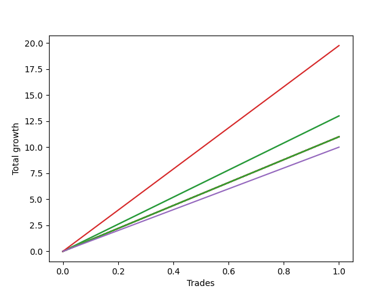

# Short Labrador 007 
- Symbol: ES_830-1130
- Date Range: 03/18/2022 - 12/30/2022
- Trading Period: 8:30-11:30
- Number of Trades: 1



| Name | Win Percent | Profit | Avg Profit / Trade | Avg Time / Trade |      | Name | Win Percent | Profit | Avg Profit / Trade | Avg Time / Trade |
| ---- | ----------- | ------ | ------------------ | ---------------- | ---- | ---- | ----------- | ------ | ------------------ | ---------------- |
| Sorted By <br> Profit | | | | | | Sorted By <br> Win Percentage ||||
| NEWFI 000 | 100.00 | 9875.00 | 9875.00 | 08:05 |     | NEWFI 000 | 100.00 | 9875.00 | 9875.00 | 08:05 |
| BB-200 U/L 2SD | 100.00 | 6500.00 | 6500.00 | 01:15 |     | BB-200 U/L 2SD | 100.00 | 6500.00 | 6500.00 | 01:15 |
| BB-100 U/L 2SD | 100.00 | 6500.00 | 6500.00 | 01:15 |     | BB-100 U/L 2SD | 100.00 | 6500.00 | 6500.00 | 01:15 |
| TP-10 | 100.00 | 5500.00 | 5500.00 | 01:10 |     | TP-10 | 100.00 | 5500.00 | 5500.00 | 01:10 |
| TP-9 | 100.00 | 5500.00 | 5500.00 | 01:10 |     | TP-9 | 100.00 | 5500.00 | 5500.00 | 01:10 |
| TP-8 | 100.00 | 5500.00 | 5500.00 | 01:10 |     | TP-8 | 100.00 | 5500.00 | 5500.00 | 01:10 |
| TP-7 | 100.00 | 5500.00 | 5500.00 | 01:10 |     | TP-7 | 100.00 | 5500.00 | 5500.00 | 01:10 |
| TP-6 | 100.00 | 5500.00 | 5500.00 | 01:10 |     | TP-6 | 100.00 | 5500.00 | 5500.00 | 01:10 |
| TP-5 | 100.00 | 5500.00 | 5500.00 | 01:10 |     | TP-5 | 100.00 | 5500.00 | 5500.00 | 01:10 |
| TP-4 | 100.00 | 5500.00 | 5500.00 | 01:10 |     | TP-4 | 100.00 | 5500.00 | 5500.00 | 01:10 |
| TP-3 | 100.00 | 5500.00 | 5500.00 | 01:10 |     | TP-3 | 100.00 | 5500.00 | 5500.00 | 01:10 |
| TP-2 | 100.00 | 5500.00 | 5500.00 | 01:10 |     | TP-2 | 100.00 | 5500.00 | 5500.00 | 01:10 |
| TP-1 | 100.00 | 5500.00 | 5500.00 | 01:10 |     | TP-1 | 100.00 | 5500.00 | 5500.00 | 01:10 |
| BB-200 Mid | 100.00 | 5500.00 | 5500.00 | 01:10 |     | BB-200 Mid | 100.00 | 5500.00 | 5500.00 | 01:10 |
| BB-100 Mid | 100.00 | 5500.00 | 5500.00 | 01:10 |     | BB-100 Mid | 100.00 | 5500.00 | 5500.00 | 01:10 |
| V U/L 1SD | 100.00 | 5500.00 | 5500.00 | 01:10 |     | V U/L 1SD | 100.00 | 5500.00 | 5500.00 | 01:10 |
| V Mid | 100.00 | 5500.00 | 5500.00 | 01:10 |     | V Mid | 100.00 | 5500.00 | 5500.00 | 01:10 |
| BB-50 U/L 2SD | 100.00 | 5500.00 | 5500.00 | 01:10 |     | BB-50 U/L 2SD | 100.00 | 5500.00 | 5500.00 | 01:10 |
| BB-50 U/L 1SD | 100.00 | 5500.00 | 5500.00 | 01:10 |     | BB-50 U/L 1SD | 100.00 | 5500.00 | 5500.00 | 01:10 |
| BB-50 Mid | 100.00 | 5500.00 | 5500.00 | 01:10 |     | BB-50 Mid | 100.00 | 5500.00 | 5500.00 | 01:10 |
| BB-20 U/L 2SD C | 100.00 | 5500.00 | 5500.00 | 01:10 |     | BB-20 U/L 2SD C | 100.00 | 5500.00 | 5500.00 | 01:10 |
| BB-20 U/L 2SD | 100.00 | 5500.00 | 5500.00 | 01:10 |     | BB-20 U/L 2SD | 100.00 | 5500.00 | 5500.00 | 01:10 |
| BB-20 U/L 1SD | 100.00 | 5500.00 | 5500.00 | 01:10 |     | BB-20 U/L 1SD | 100.00 | 5500.00 | 5500.00 | 01:10 |
| BB-20 Mid | 100.00 | 5500.00 | 5500.00 | 01:10 |     | BB-20 Mid | 100.00 | 5500.00 | 5500.00 | 01:10 |
| NEWFI 0000 | 100.00 | 5000.00 | 5000.00 | 01:05 |     | NEWFI 0000 | 100.00 | 5000.00 | 5000.00 | 01:05 |

## NO STOPLOSS

### Test BB-20 Mid
* Sell when price hits the middle line of the 20p bollinger
* No Stoploss
* Results:
```
Total Trades: 1
Percent Up: 0.00
Percent Down: 100.00
Total Points Moved Down: 11.00
Potential Profit: 5500.00
Total Points Ups: 0.00 Count Ups: 0
Total Points Downs: 11.00 Count Downs: 1
```

<details><summary>Trades</summary>

<code>In: 2022-06-15 11:02:00		Out: 2022-06-15 11:03:10		Total Position Time: 01:10		Total Move Down: 11.00		Total to Date: 11.00</code> <br />


</details>

### Test BB-20 U/L 1SD
* Sell when the price hits the lower line of the 20p 1std bollinger
* No Stoploss
* Results:
```
Total Trades: 1
Percent Up: 0.00
Percent Down: 100.00
Total Points Moved Down: 11.00
Potential Profit: 5500.00
Total Points Ups: 0.00 Count Ups: 0
Total Points Downs: 11.00 Count Downs: 1
```

<details><summary>Trades</summary>

<code>In: 2022-06-15 11:02:00		Out: 2022-06-15 11:03:10		Total Position Time: 01:10		Total Move Down: 11.00		Total to Date: 11.00</code> <br />


</details>

### Test BB-20 U/L 2SD
* Sell when the price hits the lower line of the 20p 2std bollinger
* No Stoploss
* Results:
```
Total Trades: 1
Percent Up: 0.00
Percent Down: 100.00
Total Points Moved Down: 11.00
Potential Profit: 5500.00
Total Points Ups: 0.00 Count Ups: 0
Total Points Downs: 11.00 Count Downs: 1
```

<details><summary>Trades</summary>

<code>In: 2022-06-15 11:02:00		Out: 2022-06-15 11:03:10		Total Position Time: 01:10		Total Move Down: 11.00		Total to Date: 11.00</code> <br />


</details>

### Test BB-20 U/L 2SD C
* Sell when the price hits the lower line of the 20p 2std bollinger
* No Stoploss
* Results:
```
Total Trades: 1
Percent Up: 0.00
Percent Down: 100.00
Total Points Moved Down: 11.00
Potential Profit: 5500.00
Total Points Ups: 0.00 Count Ups: 0
Total Points Downs: 11.00 Count Downs: 1
```

<details><summary>Trades</summary>

<code>In: 2022-06-15 11:02:00		Out: 2022-06-15 11:03:10		Total Position Time: 01:10		Total Move Down: 11.00		Total to Date: 11.00</code> <br />


</details>

### Test BB-50 Mid
* Sell when price hits the middle line of the 50p bollinger
* No Stoploss
* Results:
```
Total Trades: 1
Percent Up: 0.00
Percent Down: 100.00
Total Points Moved Down: 11.00
Potential Profit: 5500.00
Total Points Ups: 0.00 Count Ups: 0
Total Points Downs: 11.00 Count Downs: 1
```

<details><summary>Trades</summary>

<code>In: 2022-06-15 11:02:00		Out: 2022-06-15 11:03:10		Total Position Time: 01:10		Total Move Down: 11.00		Total to Date: 11.00</code> <br />


</details>

### Test BB-50 U/L 1SD
* Sell when the price hits the lower line of the 50p 1std bollinger
* No Stoploss
* Results:
```
Total Trades: 1
Percent Up: 0.00
Percent Down: 100.00
Total Points Moved Down: 11.00
Potential Profit: 5500.00
Total Points Ups: 0.00 Count Ups: 0
Total Points Downs: 11.00 Count Downs: 1
```

<details><summary>Trades</summary>

<code>In: 2022-06-15 11:02:00		Out: 2022-06-15 11:03:10		Total Position Time: 01:10		Total Move Down: 11.00		Total to Date: 11.00</code> <br />


</details>

### Test BB-50 U/L 2SD
* Sell when the price hits the lower line of the 50p 2std bollinger
* No Stoploss
* Results:
```
Total Trades: 1
Percent Up: 0.00
Percent Down: 100.00
Total Points Moved Down: 11.00
Potential Profit: 5500.00
Total Points Ups: 0.00 Count Ups: 0
Total Points Downs: 11.00 Count Downs: 1
```

<details><summary>Trades</summary>

<code>In: 2022-06-15 11:02:00		Out: 2022-06-15 11:03:10		Total Position Time: 01:10		Total Move Down: 11.00		Total to Date: 11.00</code> <br />


</details>

### Test V Mid
* Sell when the price hits the middle line of the 1std VWAP
* No Stoploss
* Results:
```
Total Trades: 1
Percent Up: 0.00
Percent Down: 100.00
Total Points Moved Down: 11.00
Potential Profit: 5500.00
Total Points Ups: 0.00 Count Ups: 0
Total Points Downs: 11.00 Count Downs: 1
```

<details><summary>Trades</summary>

<code>In: 2022-06-15 11:02:00		Out: 2022-06-15 11:03:10		Total Position Time: 01:10		Total Move Down: 11.00		Total to Date: 11.00</code> <br />


</details>

### Test V U/L 1SD
* Sell when the price hits the lower line of the 1std VWAP
* No Stoploss
* Results:
```
Total Trades: 1
Percent Up: 0.00
Percent Down: 100.00
Total Points Moved Down: 11.00
Potential Profit: 5500.00
Total Points Ups: 0.00 Count Ups: 0
Total Points Downs: 11.00 Count Downs: 1
```

<details><summary>Trades</summary>

<code>In: 2022-06-15 11:02:00		Out: 2022-06-15 11:03:10		Total Position Time: 01:10		Total Move Down: 11.00		Total to Date: 11.00</code> <br />


</details>

### Test BB-100 Mid
* Move to BB100 Mid
* No Stoploss
* Results:
```
Total Trades: 1
Percent Up: 0.00
Percent Down: 100.00
Total Points Moved Down: 11.00
Potential Profit: 5500.00
Total Points Ups: 0.00 Count Ups: 0
Total Points Downs: 11.00 Count Downs: 1
```

<details><summary>Trades</summary>

<code>In: 2022-06-15 11:02:00		Out: 2022-06-15 11:03:10		Total Position Time: 01:10		Total Move Down: 11.00		Total to Date: 11.00</code> <br />


</details>

### Test BB-100 U/L 2SD
* Move to BB100 Upper Band
* No Stoploss
* Results:
```
Total Trades: 1
Percent Up: 0.00
Percent Down: 100.00
Total Points Moved Down: 13.00
Potential Profit: 6500.00
Total Points Ups: 0.00 Count Ups: 0
Total Points Downs: 13.00 Count Downs: 1
```

<details><summary>Trades</summary>

<code>In: 2022-06-15 11:02:00		Out: 2022-06-15 11:03:15		Total Position Time: 01:15		Total Move Down: 13.00		Total to Date: 13.00</code> <br />


</details>

### Test BB-200 Mid
* Move to BB200 Mid
* No Stoploss
* Results:
```
Total Trades: 1
Percent Up: 0.00
Percent Down: 100.00
Total Points Moved Down: 11.00
Potential Profit: 5500.00
Total Points Ups: 0.00 Count Ups: 0
Total Points Downs: 11.00 Count Downs: 1
```

<details><summary>Trades</summary>

<code>In: 2022-06-15 11:02:00		Out: 2022-06-15 11:03:10		Total Position Time: 01:10		Total Move Down: 11.00		Total to Date: 11.00</code> <br />


</details>

### Test BB-200 U/L 2SD
* Move to BB200 Upper Band
* No Stoploss
* Results:
```
Total Trades: 1
Percent Up: 0.00
Percent Down: 100.00
Total Points Moved Down: 13.00
Potential Profit: 6500.00
Total Points Ups: 0.00 Count Ups: 0
Total Points Downs: 13.00 Count Downs: 1
```

<details><summary>Trades</summary>

<code>In: 2022-06-15 11:02:00		Out: 2022-06-15 11:03:15		Total Position Time: 01:15		Total Move Down: 13.00		Total to Date: 13.00</code> <br />


</details>

## TAKE PROFIT

### Test TP-1
* Take Profit of 1 Point
* No Stoploss
* Results:
```
Total Trades: 1
Percent Up: 0.00
Percent Down: 100.00
Total Points Moved Down: 11.00
Potential Profit: 5500.00
Total Points Ups: 0.00 Count Ups: 0
Total Points Downs: 11.00 Count Downs: 1
```

<details><summary>Trades</summary>

<code>In: 2022-06-15 11:02:00		Out: 2022-06-15 11:03:10		Total Position Time: 01:10		Total Move Down: 11.00		Total to Date: 11.00</code> <br />


</details>

### Test TP-2
* Take Profit of 2 Point
* No Stoploss
* Results:
```
Total Trades: 1
Percent Up: 0.00
Percent Down: 100.00
Total Points Moved Down: 11.00
Potential Profit: 5500.00
Total Points Ups: 0.00 Count Ups: 0
Total Points Downs: 11.00 Count Downs: 1
```

<details><summary>Trades</summary>

<code>In: 2022-06-15 11:02:00		Out: 2022-06-15 11:03:10		Total Position Time: 01:10		Total Move Down: 11.00		Total to Date: 11.00</code> <br />


</details>

### Test TP-3
* Take Profit of 3 Point
* No Stoploss
* Results:
```
Total Trades: 1
Percent Up: 0.00
Percent Down: 100.00
Total Points Moved Down: 11.00
Potential Profit: 5500.00
Total Points Ups: 0.00 Count Ups: 0
Total Points Downs: 11.00 Count Downs: 1
```

<details><summary>Trades</summary>

<code>In: 2022-06-15 11:02:00		Out: 2022-06-15 11:03:10		Total Position Time: 01:10		Total Move Down: 11.00		Total to Date: 11.00</code> <br />


</details>

### Test TP-4
* Take Profit of 4 Point
* No Stoploss
* Results:
```
Total Trades: 1
Percent Up: 0.00
Percent Down: 100.00
Total Points Moved Down: 11.00
Potential Profit: 5500.00
Total Points Ups: 0.00 Count Ups: 0
Total Points Downs: 11.00 Count Downs: 1
```

<details><summary>Trades</summary>

<code>In: 2022-06-15 11:02:00		Out: 2022-06-15 11:03:10		Total Position Time: 01:10		Total Move Down: 11.00		Total to Date: 11.00</code> <br />


</details>

### Test TP-5
* Take Profit of 5 Point
* No Stoploss
* Results:
```
Total Trades: 1
Percent Up: 0.00
Percent Down: 100.00
Total Points Moved Down: 11.00
Potential Profit: 5500.00
Total Points Ups: 0.00 Count Ups: 0
Total Points Downs: 11.00 Count Downs: 1
```

<details><summary>Trades</summary>

<code>In: 2022-06-15 11:02:00		Out: 2022-06-15 11:03:10		Total Position Time: 01:10		Total Move Down: 11.00		Total to Date: 11.00</code> <br />


</details>

### Test TP-6
* Take Profit of 6 Point
* No Stoploss
* Results:
```
Total Trades: 1
Percent Up: 0.00
Percent Down: 100.00
Total Points Moved Down: 11.00
Potential Profit: 5500.00
Total Points Ups: 0.00 Count Ups: 0
Total Points Downs: 11.00 Count Downs: 1
```

<details><summary>Trades</summary>

<code>In: 2022-06-15 11:02:00		Out: 2022-06-15 11:03:10		Total Position Time: 01:10		Total Move Down: 11.00		Total to Date: 11.00</code> <br />


</details>

### Test TP-7
* Take Profit of 7 Point
* No Stoploss
* Results:
```
Total Trades: 1
Percent Up: 0.00
Percent Down: 100.00
Total Points Moved Down: 11.00
Potential Profit: 5500.00
Total Points Ups: 0.00 Count Ups: 0
Total Points Downs: 11.00 Count Downs: 1
```

<details><summary>Trades</summary>

<code>In: 2022-06-15 11:02:00		Out: 2022-06-15 11:03:10		Total Position Time: 01:10		Total Move Down: 11.00		Total to Date: 11.00</code> <br />


</details>

### Test TP-8
* Take Profit of 8 Point
* No Stoploss
* Results:
```
Total Trades: 1
Percent Up: 0.00
Percent Down: 100.00
Total Points Moved Down: 11.00
Potential Profit: 5500.00
Total Points Ups: 0.00 Count Ups: 0
Total Points Downs: 11.00 Count Downs: 1
```

<details><summary>Trades</summary>

<code>In: 2022-06-15 11:02:00		Out: 2022-06-15 11:03:10		Total Position Time: 01:10		Total Move Down: 11.00		Total to Date: 11.00</code> <br />


</details>

### Test TP-9
* Take Profit of 9 Point
* No Stoploss
* Results:
```
Total Trades: 1
Percent Up: 0.00
Percent Down: 100.00
Total Points Moved Down: 11.00
Potential Profit: 5500.00
Total Points Ups: 0.00 Count Ups: 0
Total Points Downs: 11.00 Count Downs: 1
```

<details><summary>Trades</summary>

<code>In: 2022-06-15 11:02:00		Out: 2022-06-15 11:03:10		Total Position Time: 01:10		Total Move Down: 11.00		Total to Date: 11.00</code> <br />


</details>

### Test TP-10
* Take Profit of 10 Point
* No Stoploss
* Results:
```
Total Trades: 1
Percent Up: 0.00
Percent Down: 100.00
Total Points Moved Down: 11.00
Potential Profit: 5500.00
Total Points Ups: 0.00 Count Ups: 0
Total Points Downs: 11.00 Count Downs: 1
```

<details><summary>Trades</summary>

<code>In: 2022-06-15 11:02:00		Out: 2022-06-15 11:03:10		Total Position Time: 01:10		Total Move Down: 11.00		Total to Date: 11.00</code> <br />


</details>

## Indicator Exits

### Test NEWFI 000
* Newfi 0000
* No Stoploss
* Results:
```
Total Trades: 1
Percent Up: 0.00
Percent Down: 100.00
Total Points Moved Down: 19.75
Potential Profit: 9875.00
Total Points Ups: 0.00 Count Ups: 0
Total Points Downs: 19.75 Count Downs: 1
```

<details><summary>Trades</summary>

<code>In: 2022-06-15 11:02:00		Out: 2022-06-15 11:10:05		Total Position Time: 08:05		Total Move Down: 19.75		Total to Date: 19.75</code> <br />


</details>

### Test NEWFI 0000
* Newfi 0000
* No Stoploss
* Results:
```
Total Trades: 1
Percent Up: 0.00
Percent Down: 100.00
Total Points Moved Down: 10.00
Potential Profit: 5000.00
Total Points Ups: 0.00 Count Ups: 0
Total Points Downs: 10.00 Count Downs: 1
```

<details><summary>Trades</summary>

<code>In: 2022-06-15 11:02:00		Out: 2022-06-15 11:03:05		Total Position Time: 01:05		Total Move Down: 10.00		Total to Date: 10.00</code> <br />


</details>