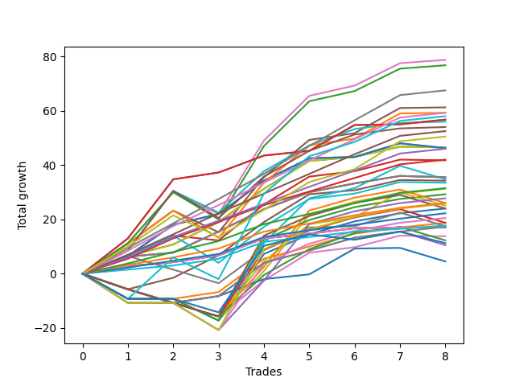

# Short Labrador 009 
- Symbol: ES_830-1130
- Date Range: 03/18/2022 - 12/30/2022
- Trading Period: 8:30-11:30
- Number of Trades: 8



| Name | Win Percent | Profit | Avg Profit / Trade | Avg Time / Trade |      | Name | Win Percent | Profit | Avg Profit / Trade | Avg Time / Trade |
| ---- | ----------- | ------ | ------------------ | ---------------- | ---- | ---- | ----------- | ------ | ------------------ | ---------------- |
| Sorted By <br> Profit | | | | | | Sorted By <br> Win Percentage ||||
| BB-50 U/L 2SD | 87.50 | 39375.00 | 4921.88 | 36:40 |     | TP-9 | 100.00 | 33750.00 | 4218.75 | 22:18 |
| BB-50 U/L 2SD SL-10 | 87.50 | 38375.00 | 4796.88 | 32:18 |     | TP-8 | 100.00 | 29625.00 | 3703.12 | 21:51 |
| TP-9 | 100.00 | 33750.00 | 4218.75 | 22:18 |     | V Mid SL-10 | 100.00 | 28375.00 | 3546.88 | 23:15 |
| BB-50 U/L 1SD | 87.50 | 30625.00 | 3828.12 | 27:52 |     | V Mid | 100.00 | 28375.00 | 3546.88 | 23:15 |
| TP-8 | 100.00 | 29625.00 | 3703.12 | 21:51 |     | TP-7 | 100.00 | 26250.00 | 3281.25 | 18:43 |
| BB-50 U/L 1SD SL-10 | 87.50 | 29625.00 | 3703.12 | 23:30 |     | TP-6 | 100.00 | 23000.00 | 2875.00 | 17:03 |
| NEWFI 000 | 75.00 | 29000.00 | 3625.00 | 43:01 |     | TP-5 | 100.00 | 21000.00 | 2625.00 | 16:53 |
| V Mid SL-10 | 100.00 | 28375.00 | 3546.88 | 23:15 |     | TP-4 | 100.00 | 15750.00 | 1968.75 | 16:06 |
| V Mid | 100.00 | 28375.00 | 3546.88 | 23:15 |     | TP-3 | 100.00 | 13000.00 | 1625.00 | 10:16 |
| BB-100 Mid | 87.50 | 28000.00 | 3500.00 | 30:36 |     | TP-2 | 100.00 | 11125.00 | 1390.62 | 09:15 |
| BB-100 Mid SL-10 | 87.50 | 27000.00 | 3375.00 | 26:14 |     | TP-1 | 100.00 | 8875.00 | 1109.38 | 08:46 |
| TP-7 | 100.00 | 26250.00 | 3281.25 | 18:43 |     | BB-50 U/L 2SD | 87.50 | 39375.00 | 4921.88 | 36:40 |
| TP-10 | 87.50 | 25250.00 | 3156.25 | 30:08 |     | BB-50 U/L 2SD SL-10 | 87.50 | 38375.00 | 4796.88 | 32:18 |
| BB-20 U/L 2SD SL-10 | 87.50 | 23250.00 | 2906.25 | 11:28 |     | BB-50 U/L 1SD | 87.50 | 30625.00 | 3828.12 | 27:52 |
| BB-20 U/L 2SD | 87.50 | 23250.00 | 2906.25 | 11:28 |     | BB-50 U/L 1SD SL-10 | 87.50 | 29625.00 | 3703.12 | 23:30 |
| BB-50 Mid SL-10 | 87.50 | 23125.00 | 2890.62 | 15:23 |     | BB-100 Mid | 87.50 | 28000.00 | 3500.00 | 30:36 |
| BB-50 Mid | 87.50 | 23125.00 | 2890.62 | 15:23 |     | BB-100 Mid SL-10 | 87.50 | 27000.00 | 3375.00 | 26:14 |
| TP-6 | 100.00 | 23000.00 | 2875.00 | 17:03 |     | TP-10 | 87.50 | 25250.00 | 3156.25 | 30:08 |
| TP-5 | 100.00 | 21000.00 | 2625.00 | 16:53 |     | BB-20 U/L 2SD SL-10 | 87.50 | 23250.00 | 2906.25 | 11:28 |
| BB-20 U/L 2SD C | 75.00 | 20875.00 | 2609.38 | 16:41 |     | BB-20 U/L 2SD | 87.50 | 23250.00 | 2906.25 | 11:28 |
| BB-20 U/L 1SD SL-10 | 87.50 | 17750.00 | 2218.75 | 05:05 |     | BB-50 Mid SL-10 | 87.50 | 23125.00 | 2890.62 | 15:23 |
| BB-20 U/L 1SD SL-5 | 87.50 | 17750.00 | 2218.75 | 05:05 |     | BB-50 Mid | 87.50 | 23125.00 | 2890.62 | 15:23 |
| BB-20 U/L 1SD | 87.50 | 17750.00 | 2218.75 | 05:05 |     | BB-20 U/L 1SD SL-10 | 87.50 | 17750.00 | 2218.75 | 05:05 |
| BB-50 U/L 2SD SL-5 | 50.00 | 17375.00 | 2171.88 | 19:55 |     | BB-20 U/L 1SD SL-5 | 87.50 | 17750.00 | 2218.75 | 05:05 |
| BB-20 U/L 2SD SL-5 | 75.00 | 17125.00 | 2140.62 | 11:06 |     | BB-20 U/L 1SD | 87.50 | 17750.00 | 2218.75 | 05:05 |
| BB-20 U/L 2SD C SL-10 | 75.00 | 16750.00 | 2093.75 | 14:28 |     | BB-20 Mid SL-10 | 87.50 | 8500.00 | 1062.50 | 02:31 |
| TP-4 | 100.00 | 15750.00 | 1968.75 | 16:06 |     | BB-20 Mid SL-5 | 87.50 | 8500.00 | 1062.50 | 02:31 |
| V U/L 1SD | 62.50 | 15625.00 | 1953.12 | 50:21 |     | BB-20 Mid | 87.50 | 8500.00 | 1062.50 | 02:31 |
| BB-200 U/L 2SD | 62.50 | 14625.00 | 1828.12 | 55:31 |     | NEWFI 000 | 75.00 | 29000.00 | 3625.00 | 43:01 |
| V U/L 1SD SL-10 | 62.50 | 13875.00 | 1734.38 | 45:45 |     | BB-20 U/L 2SD C | 75.00 | 20875.00 | 2609.38 | 16:41 |
| TP-3 | 100.00 | 13000.00 | 1625.00 | 10:16 |     | BB-20 U/L 2SD SL-5 | 75.00 | 17125.00 | 2140.62 | 11:06 |
| V U/L 1SD SL-5 | 50.00 | 13000.00 | 1625.00 | 25:51 |     | BB-20 U/L 2SD C SL-10 | 75.00 | 16750.00 | 2093.75 | 14:28 |
| BB-200 U/L 2SD SL-10 | 62.50 | 12875.00 | 1609.38 | 50:55 |     | BB-200 Mid | 75.00 | 9375.00 | 1171.88 | 32:15 |
| BB-50 U/L 1SD SL-5 | 50.00 | 12500.00 | 1562.50 | 15:34 |     | BB-200 Mid SL-10 | 75.00 | 8625.00 | 1078.12 | 32:01 |
| NEWFI 06 | 62.50 | 12000.00 | 1500.00 | 60:55 |     | V U/L 1SD | 62.50 | 15625.00 | 1953.12 | 50:21 |
| BB-100 U/L 2SD | 62.50 | 12000.00 | 1500.00 | 60:55 |     | BB-200 U/L 2SD | 62.50 | 14625.00 | 1828.12 | 55:31 |
| BB-200 U/L 2SD SL-5 | 50.00 | 12000.00 | 1500.00 | 31:01 |     | V U/L 1SD SL-10 | 62.50 | 13875.00 | 1734.38 | 45:45 |
| TP-2 | 100.00 | 11125.00 | 1390.62 | 09:15 |     | BB-200 U/L 2SD SL-10 | 62.50 | 12875.00 | 1609.38 | 50:55 |
| BB-100 U/L 2SD SL-10 | 62.50 | 10250.00 | 1281.25 | 56:19 |     | NEWFI 06 | 62.50 | 12000.00 | 1500.00 | 60:55 |
| BB-200 Mid | 75.00 | 9375.00 | 1171.88 | 32:15 |     | BB-100 U/L 2SD | 62.50 | 12000.00 | 1500.00 | 60:55 |
| BB-100 U/L 2SD SL-5 | 50.00 | 9375.00 | 1171.88 | 36:25 |     | BB-100 U/L 2SD SL-10 | 62.50 | 10250.00 | 1281.25 | 56:19 |
| TP-1 | 100.00 | 8875.00 | 1109.38 | 08:46 |     | BB-50 Mid SL-5 | 62.50 | 8750.00 | 1093.75 | 12:24 |
| BB-50 Mid SL-5 | 62.50 | 8750.00 | 1093.75 | 12:24 |     | BB-200 Mid SL-5 | 62.50 | 5250.00 | 656.25 | 13:24 |
| BB-200 Mid SL-10 | 75.00 | 8625.00 | 1078.12 | 32:01 |     | V Mid SL-5 | 62.50 | 2250.00 | 281.25 | 11:25 |
| BB-20 Mid SL-10 | 87.50 | 8500.00 | 1062.50 | 02:31 |     | BB-50 U/L 2SD SL-5 | 50.00 | 17375.00 | 2171.88 | 19:55 |
| BB-20 Mid SL-5 | 87.50 | 8500.00 | 1062.50 | 02:31 |     | V U/L 1SD SL-5 | 50.00 | 13000.00 | 1625.00 | 25:51 |
| BB-20 Mid | 87.50 | 8500.00 | 1062.50 | 02:31 |     | BB-50 U/L 1SD SL-5 | 50.00 | 12500.00 | 1562.50 | 15:34 |
| BB-20 U/L 2SD C SL-5 | 50.00 | 6875.00 | 859.38 | 12:36 |     | BB-200 U/L 2SD SL-5 | 50.00 | 12000.00 | 1500.00 | 31:01 |
| BB-100 Mid SL-5 | 50.00 | 6125.00 | 765.62 | 13:29 |     | BB-100 U/L 2SD SL-5 | 50.00 | 9375.00 | 1171.88 | 36:25 |
| NEWFI 0000 | 37.50 | 5625.00 | 703.12 | 45:07 |     | BB-20 U/L 2SD C SL-5 | 50.00 | 6875.00 | 859.38 | 12:36 |
| BB-200 Mid SL-5 | 62.50 | 5250.00 | 656.25 | 13:24 |     | BB-100 Mid SL-5 | 50.00 | 6125.00 | 765.62 | 13:29 |
| V Mid SL-5 | 62.50 | 2250.00 | 281.25 | 11:25 |     | NEWFI 0000 | 37.50 | 5625.00 | 703.12 | 45:07 |

## NO STOPLOSS

### Test BB-20 Mid
* Sell when price hits the middle line of the 20p bollinger
* No Stoploss
* Results:
```
Total Trades: 8
Percent Up: 12.50
Percent Down: 87.50
Total Points Moved Down: 17.00
Potential Profit: 8500.00
Total Points Ups: 0.00 Count Ups: 1
Total Points Downs: 17.00 Count Downs: 7
```

<details><summary>Trades</summary>

<code>In: 2022-04-25 10:19:00		Out: 2022-04-25 10:26:50		Total Position Time: 07:50		Total Move Down: 2.75		Total to Date: 2.75</code> <br />
<code>In: 2022-05-10 11:07:00		Out: 2022-05-10 11:08:10		Total Position Time: 01:10		Total Move Down: 1.50		Total to Date: 4.25</code> <br />
<code>In: 2022-06-13 08:47:00		Out: 2022-06-13 08:48:10		Total Position Time: 01:10		Total Move Down: 2.50		Total to Date: 6.75</code> <br />
<code>In: 2022-06-14 10:26:00		Out: 2022-06-14 10:27:10		Total Position Time: 01:10		Total Move Down: 6.25		Total to Date: 13.00</code> <br />
<code>In: 2022-06-17 08:35:00		Out: 2022-06-17 08:36:10		Total Position Time: 01:10		Total Move Down: 1.75		Total to Date: 14.75</code> <br />
<code>In: 2022-08-05 10:19:00		Out: 2022-08-05 10:20:10		Total Position Time: 01:10		Total Move Down: 2.00		Total to Date: 16.75</code> <br />
<code>In: 2022-10-06 09:52:00		Out: 2022-10-06 09:55:05		Total Position Time: 03:05		Total Move Down: 0.25		Total to Date: 17.00</code> <br />
<code>In: 2022-11-21 10:24:00		Out: 2022-11-21 10:27:25		Total Position Time: 03:25		Total Move Down: -0.00		Total to Date: 17.00</code> <br />


</details>

### Test BB-20 U/L 1SD
* Sell when the price hits the lower line of the 20p 1std bollinger
* No Stoploss
* Results:
```
Total Trades: 8
Percent Up: 12.50
Percent Down: 87.50
Total Points Moved Down: 35.50
Potential Profit: 17750.00
Total Points Ups: 0.50 Count Ups: 1
Total Points Downs: 36.00 Count Downs: 7
```

<details><summary>Trades</summary>

<code>In: 2022-04-25 10:19:00		Out: 2022-04-25 10:27:55		Total Position Time: 08:55		Total Move Down: 6.25		Total to Date: 6.25</code> <br />
<code>In: 2022-05-10 11:07:00		Out: 2022-05-10 11:08:10		Total Position Time: 01:10		Total Move Down: 1.50		Total to Date: 7.75</code> <br />
<code>In: 2022-06-13 08:47:00		Out: 2022-06-13 08:52:05		Total Position Time: 05:05		Total Move Down: 7.75		Total to Date: 15.50</code> <br />
<code>In: 2022-06-14 10:26:00		Out: 2022-06-14 10:29:05		Total Position Time: 03:05		Total Move Down: 8.25		Total to Date: 23.75</code> <br />
<code>In: 2022-06-17 08:35:00		Out: 2022-06-17 08:39:05		Total Position Time: 04:05		Total Move Down: 6.25		Total to Date: 30.00</code> <br />
<code>In: 2022-08-05 10:19:00		Out: 2022-08-05 10:23:15		Total Position Time: 04:15		Total Move Down: 3.25		Total to Date: 33.25</code> <br />
<code>In: 2022-10-06 09:52:00		Out: 2022-10-06 09:57:05		Total Position Time: 05:05		Total Move Down: 2.75		Total to Date: 36.00</code> <br />
<code>In: 2022-11-21 10:24:00		Out: 2022-11-21 10:33:00		Total Position Time: 09:00		Total Move Down: -0.50		Total to Date: 35.50</code> <br />


</details>

### Test BB-20 U/L 2SD
* Sell when the price hits the lower line of the 20p 2std bollinger
* No Stoploss
* Results:
```
Total Trades: 8
Percent Up: 12.50
Percent Down: 87.50
Total Points Moved Down: 46.50
Potential Profit: 23250.00
Total Points Ups: 0.25 Count Ups: 1
Total Points Downs: 46.75 Count Downs: 7
```

<details><summary>Trades</summary>

<code>In: 2022-04-25 10:19:00		Out: 2022-04-25 10:33:35		Total Position Time: 14:35		Total Move Down: 6.50		Total to Date: 6.50</code> <br />
<code>In: 2022-05-10 11:07:00		Out: 2022-05-10 11:11:10		Total Position Time: 04:10		Total Move Down: 4.25		Total to Date: 10.75</code> <br />
<code>In: 2022-06-13 08:47:00		Out: 2022-06-13 08:55:10		Total Position Time: 08:10		Total Move Down: 8.25		Total to Date: 19.00</code> <br />
<code>In: 2022-06-14 10:26:00		Out: 2022-06-14 10:31:00		Total Position Time: 05:00		Total Move Down: 12.25		Total to Date: 31.25</code> <br />
<code>In: 2022-06-17 08:35:00		Out: 2022-06-17 08:45:15		Total Position Time: 10:15		Total Move Down: 10.25		Total to Date: 41.50</code> <br />
<code>In: 2022-08-05 10:19:00		Out: 2022-08-05 10:49:30		Total Position Time: 30:30		Total Move Down: 1.50		Total to Date: 43.00</code> <br />
<code>In: 2022-10-06 09:52:00		Out: 2022-10-06 10:02:00		Total Position Time: 10:00		Total Move Down: 3.75		Total to Date: 46.75</code> <br />
<code>In: 2022-11-21 10:24:00		Out: 2022-11-21 10:33:10		Total Position Time: 09:10		Total Move Down: -0.25		Total to Date: 46.50</code> <br />


</details>

### Test BB-20 U/L 2SD C
* Sell when the price hits the lower line of the 20p 2std bollinger
* No Stoploss
* Results:
```
Total Trades: 8
Percent Up: 25.00
Percent Down: 75.00
Total Points Moved Down: 41.75
Potential Profit: 20875.00
Total Points Ups: 2.00 Count Ups: 2
Total Points Downs: 43.75 Count Downs: 6
```

<details><summary>Trades</summary>

<code>In: 2022-04-25 10:19:00		Out: 2022-04-25 10:33:35		Total Position Time: 14:35		Total Move Down: 6.50		Total to Date: 6.50</code> <br />
<code>In: 2022-05-10 11:07:00		Out: 2022-05-10 11:16:05		Total Position Time: 09:05		Total Move Down: 7.50		Total to Date: 14.00</code> <br />
<code>In: 2022-06-13 08:47:00		Out: 2022-06-13 09:30:35		Total Position Time: 43:35		Total Move Down: -1.75		Total to Date: 12.25</code> <br />
<code>In: 2022-06-14 10:26:00		Out: 2022-06-14 10:31:10		Total Position Time: 05:10		Total Move Down: 13.25		Total to Date: 25.50</code> <br />
<code>In: 2022-06-17 08:35:00		Out: 2022-06-17 08:45:15		Total Position Time: 10:15		Total Move Down: 10.25		Total to Date: 35.75</code> <br />
<code>In: 2022-08-05 10:19:00		Out: 2022-08-05 10:50:35		Total Position Time: 31:35		Total Move Down: 2.00		Total to Date: 37.75</code> <br />
<code>In: 2022-10-06 09:52:00		Out: 2022-10-06 10:02:05		Total Position Time: 10:05		Total Move Down: 4.25		Total to Date: 42.00</code> <br />
<code>In: 2022-11-21 10:24:00		Out: 2022-11-21 10:33:10		Total Position Time: 09:10		Total Move Down: -0.25		Total to Date: 41.75</code> <br />


</details>

### Test BB-50 Mid
* Sell when price hits the middle line of the 50p bollinger
* No Stoploss
* Results:
```
Total Trades: 8
Percent Up: 12.50
Percent Down: 87.50
Total Points Moved Down: 46.25
Potential Profit: 23125.00
Total Points Ups: 1.75 Count Ups: 1
Total Points Downs: 48.00 Count Downs: 7
```

<details><summary>Trades</summary>

<code>In: 2022-04-25 10:19:00		Out: 2022-04-25 10:28:15		Total Position Time: 09:15		Total Move Down: 6.50		Total to Date: 6.50</code> <br />
<code>In: 2022-05-10 11:07:00		Out: 2022-05-10 11:16:20		Total Position Time: 09:20		Total Move Down: 11.50		Total to Date: 18.00</code> <br />
<code>In: 2022-06-13 08:47:00		Out: 2022-06-13 09:07:15		Total Position Time: 20:15		Total Move Down: 4.00		Total to Date: 22.00</code> <br />
<code>In: 2022-06-14 10:26:00		Out: 2022-06-14 10:31:00		Total Position Time: 05:00		Total Move Down: 12.25		Total to Date: 34.25</code> <br />
<code>In: 2022-06-17 08:35:00		Out: 2022-06-17 08:45:05		Total Position Time: 10:05		Total Move Down: 8.25		Total to Date: 42.50</code> <br />
<code>In: 2022-08-05 10:19:00		Out: 2022-08-05 10:47:35		Total Position Time: 28:35		Total Move Down: 0.50		Total to Date: 43.00</code> <br />
<code>In: 2022-10-06 09:52:00		Out: 2022-10-06 10:02:10		Total Position Time: 10:10		Total Move Down: 5.00		Total to Date: 48.00</code> <br />
<code>In: 2022-11-21 10:24:00		Out: 2022-11-21 10:54:25		Total Position Time: 30:25		Total Move Down: -1.75		Total to Date: 46.25</code> <br />


</details>

### Test BB-50 U/L 1SD
* Sell when the price hits the lower line of the 50p 1std bollinger
* No Stoploss
* Results:
```
Total Trades: 8
Percent Up: 12.50
Percent Down: 87.50
Total Points Moved Down: 61.25
Potential Profit: 30625.00
Total Points Ups: 8.00 Count Ups: 1
Total Points Downs: 69.25 Count Downs: 7
```

<details><summary>Trades</summary>

<code>In: 2022-04-25 10:19:00		Out: 2022-04-25 10:51:45		Total Position Time: 32:45		Total Move Down: 11.00		Total to Date: 11.00</code> <br />
<code>In: 2022-05-10 11:07:00		Out: 2022-05-10 11:24:05		Total Position Time: 17:05		Total Move Down: 12.25		Total to Date: 23.25</code> <br />
<code>In: 2022-06-13 08:47:00		Out: 2022-06-13 09:47:55		Total Position Time: 60:55		Total Move Down: -8.00		Total to Date: 15.25</code> <br />
<code>In: 2022-06-14 10:26:00		Out: 2022-06-14 10:36:10		Total Position Time: 10:10		Total Move Down: 20.25		Total to Date: 35.50</code> <br />
<code>In: 2022-06-17 08:35:00		Out: 2022-06-17 08:51:25		Total Position Time: 16:25		Total Move Down: 13.75		Total to Date: 49.25</code> <br />
<code>In: 2022-08-05 10:19:00		Out: 2022-08-05 10:52:05		Total Position Time: 33:05		Total Move Down: 2.50		Total to Date: 51.75</code> <br />
<code>In: 2022-10-06 09:52:00		Out: 2022-10-06 10:09:10		Total Position Time: 17:10		Total Move Down: 9.25		Total to Date: 61.00</code> <br />
<code>In: 2022-11-21 10:24:00		Out: 2022-11-21 10:59:25		Total Position Time: 35:25		Total Move Down: 0.25		Total to Date: 61.25</code> <br />


</details>

### Test BB-50 U/L 2SD
* Sell when the price hits the lower line of the 50p 2std bollinger
* No Stoploss
* Results:
```
Total Trades: 8
Percent Up: 12.50
Percent Down: 87.50
Total Points Moved Down: 78.75
Potential Profit: 39375.00
Total Points Ups: 8.00 Count Ups: 1
Total Points Downs: 86.75 Count Downs: 7
```

<details><summary>Trades</summary>

<code>In: 2022-04-25 10:19:00		Out: 2022-04-25 11:01:35		Total Position Time: 42:35		Total Move Down: 11.25		Total to Date: 11.25</code> <br />
<code>In: 2022-05-10 11:07:00		Out: 2022-05-10 11:27:05		Total Position Time: 20:05		Total Move Down: 18.75		Total to Date: 30.00</code> <br />
<code>In: 2022-06-13 08:47:00		Out: 2022-06-13 09:47:55		Total Position Time: 60:55		Total Move Down: -8.00		Total to Date: 22.00</code> <br />
<code>In: 2022-06-14 10:26:00		Out: 2022-06-14 10:43:05		Total Position Time: 17:05		Total Move Down: 27.00		Total to Date: 49.00</code> <br />
<code>In: 2022-06-17 08:35:00		Out: 2022-06-17 08:52:10		Total Position Time: 17:10		Total Move Down: 16.50		Total to Date: 65.50</code> <br />
<code>In: 2022-08-05 10:19:00		Out: 2022-08-05 10:55:40		Total Position Time: 36:40		Total Move Down: 3.75		Total to Date: 69.25</code> <br />
<code>In: 2022-10-06 09:52:00		Out: 2022-10-06 10:32:45		Total Position Time: 40:45		Total Move Down: 8.25		Total to Date: 77.50</code> <br />
<code>In: 2022-11-21 10:24:00		Out: 2022-11-21 11:22:10		Total Position Time: 58:10		Total Move Down: 1.25		Total to Date: 78.75</code> <br />


</details>

### Test V Mid
* Sell when the price hits the middle line of the 1std VWAP
* No Stoploss
* Results:
```
Total Trades: 8
Percent Up: 0.00
Percent Down: 100.00
Total Points Moved Down: 56.75
Potential Profit: 28375.00
Total Points Ups: 0.00 Count Ups: 0
Total Points Downs: 56.75 Count Downs: 8
```

<details><summary>Trades</summary>

<code>In: 2022-04-25 10:19:00		Out: 2022-04-25 11:04:10		Total Position Time: 45:10		Total Move Down: 13.00		Total to Date: 13.00</code> <br />
<code>In: 2022-05-10 11:07:00		Out: 2022-05-10 11:27:40		Total Position Time: 20:40		Total Move Down: 21.75		Total to Date: 34.75</code> <br />
<code>In: 2022-06-13 08:47:00		Out: 2022-06-13 08:48:10		Total Position Time: 01:10		Total Move Down: 2.50		Total to Date: 37.25</code> <br />
<code>In: 2022-06-14 10:26:00		Out: 2022-06-14 10:27:10		Total Position Time: 01:10		Total Move Down: 6.25		Total to Date: 43.50</code> <br />
<code>In: 2022-06-17 08:35:00		Out: 2022-06-17 08:36:10		Total Position Time: 01:10		Total Move Down: 1.75		Total to Date: 45.25</code> <br />
<code>In: 2022-08-05 10:19:00		Out: 2022-08-05 11:11:45		Total Position Time: 52:45		Total Move Down: 9.50		Total to Date: 54.75</code> <br />
<code>In: 2022-10-06 09:52:00		Out: 2022-10-06 09:55:05		Total Position Time: 03:05		Total Move Down: 0.25		Total to Date: 55.00</code> <br />
<code>In: 2022-11-21 10:24:00		Out: 2022-11-21 11:24:55		Total Position Time: 60:55		Total Move Down: 1.75		Total to Date: 56.75</code> <br />


</details>

### Test V U/L 1SD
* Sell when the price hits the lower line of the 1std VWAP
* No Stoploss
* Results:
```
Total Trades: 8
Percent Up: 37.50
Percent Down: 62.50
Total Points Moved Down: 31.25
Potential Profit: 15625.00
Total Points Ups: 17.25 Count Ups: 3
Total Points Downs: 48.50 Count Downs: 5
```

<details><summary>Trades</summary>

<code>In: 2022-04-25 10:19:00		Out: 2022-04-25 11:19:55		Total Position Time: 60:55		Total Move Down: -9.25		Total to Date: -9.25</code> <br />
<code>In: 2022-05-10 11:07:00		Out: 2022-05-10 12:07:55		Total Position Time: 60:55		Total Move Down: -0.00		Total to Date: -9.25</code> <br />
<code>In: 2022-06-13 08:47:00		Out: 2022-06-13 09:47:55		Total Position Time: 60:55		Total Move Down: -8.00		Total to Date: -17.25</code> <br />
<code>In: 2022-06-14 10:26:00		Out: 2022-06-14 10:35:05		Total Position Time: 09:05		Total Move Down: 18.25		Total to Date: 1.00</code> <br />
<code>In: 2022-06-17 08:35:00		Out: 2022-06-17 09:03:15		Total Position Time: 28:15		Total Move Down: 20.75		Total to Date: 21.75</code> <br />
<code>In: 2022-08-05 10:19:00		Out: 2022-08-05 11:19:55		Total Position Time: 60:55		Total Move Down: 4.75		Total to Date: 26.50</code> <br />
<code>In: 2022-10-06 09:52:00		Out: 2022-10-06 10:52:55		Total Position Time: 60:55		Total Move Down: 3.00		Total to Date: 29.50</code> <br />
<code>In: 2022-11-21 10:24:00		Out: 2022-11-21 11:24:55		Total Position Time: 60:55		Total Move Down: 1.75		Total to Date: 31.25</code> <br />


</details>

### Test BB-100 Mid
* Move to BB100 Mid
* No Stoploss
* Results:
```
Total Trades: 8
Percent Up: 12.50
Percent Down: 87.50
Total Points Moved Down: 56.00
Potential Profit: 28000.00
Total Points Ups: 8.00 Count Ups: 1
Total Points Downs: 64.00 Count Downs: 7
```

<details><summary>Trades</summary>

<code>In: 2022-04-25 10:19:00		Out: 2022-04-25 10:51:15		Total Position Time: 32:15		Total Move Down: 8.50		Total to Date: 8.50</code> <br />
<code>In: 2022-05-10 11:07:00		Out: 2022-05-10 11:40:30		Total Position Time: 33:30		Total Move Down: 22.00		Total to Date: 30.50</code> <br />
<code>In: 2022-06-13 08:47:00		Out: 2022-06-13 09:47:55		Total Position Time: 60:55		Total Move Down: -8.00		Total to Date: 22.50</code> <br />
<code>In: 2022-06-14 10:26:00		Out: 2022-06-14 10:34:00		Total Position Time: 08:00		Total Move Down: 15.25		Total to Date: 37.75</code> <br />
<code>In: 2022-06-17 08:35:00		Out: 2022-06-17 08:45:25		Total Position Time: 10:25		Total Move Down: 9.50		Total to Date: 47.25</code> <br />
<code>In: 2022-08-05 10:19:00		Out: 2022-08-05 10:56:25		Total Position Time: 37:25		Total Move Down: 6.00		Total to Date: 53.25</code> <br />
<code>In: 2022-10-06 09:52:00		Out: 2022-10-06 09:56:20		Total Position Time: 04:20		Total Move Down: 2.25		Total to Date: 55.50</code> <br />
<code>In: 2022-11-21 10:24:00		Out: 2022-11-21 11:22:05		Total Position Time: 58:05		Total Move Down: 0.50		Total to Date: 56.00</code> <br />


</details>

### Test BB-100 U/L 2SD
* Move to BB100 Upper Band
* No Stoploss
* Results:
```
Total Trades: 8
Percent Up: 37.50
Percent Down: 62.50
Total Points Moved Down: 24.00
Potential Profit: 12000.00
Total Points Ups: 17.25 Count Ups: 3
Total Points Downs: 41.25 Count Downs: 5
```

<details><summary>Trades</summary>

<code>In: 2022-04-25 10:19:00		Out: 2022-04-25 11:19:55		Total Position Time: 60:55		Total Move Down: -9.25		Total to Date: -9.25</code> <br />
<code>In: 2022-05-10 11:07:00		Out: 2022-05-10 12:07:55		Total Position Time: 60:55		Total Move Down: -0.00		Total to Date: -9.25</code> <br />
<code>In: 2022-06-13 08:47:00		Out: 2022-06-13 09:47:55		Total Position Time: 60:55		Total Move Down: -8.00		Total to Date: -17.25</code> <br />
<code>In: 2022-06-14 10:26:00		Out: 2022-06-14 11:26:55		Total Position Time: 60:55		Total Move Down: 24.50		Total to Date: 7.25</code> <br />
<code>In: 2022-06-17 08:35:00		Out: 2022-06-17 09:35:55		Total Position Time: 60:55		Total Move Down: 7.25		Total to Date: 14.50</code> <br />
<code>In: 2022-08-05 10:19:00		Out: 2022-08-05 11:19:55		Total Position Time: 60:55		Total Move Down: 4.75		Total to Date: 19.25</code> <br />
<code>In: 2022-10-06 09:52:00		Out: 2022-10-06 10:52:55		Total Position Time: 60:55		Total Move Down: 3.00		Total to Date: 22.25</code> <br />
<code>In: 2022-11-21 10:24:00		Out: 2022-11-21 11:24:55		Total Position Time: 60:55		Total Move Down: 1.75		Total to Date: 24.00</code> <br />


</details>

### Test BB-200 Mid
* Move to BB200 Mid
* No Stoploss
* Results:
```
Total Trades: 8
Percent Up: 25.00
Percent Down: 75.00
Total Points Moved Down: 18.75
Potential Profit: 9375.00
Total Points Ups: 9.25 Count Ups: 2
Total Points Downs: 28.00 Count Downs: 6
```

<details><summary>Trades</summary>

<code>In: 2022-04-25 10:19:00		Out: 2022-04-25 11:19:55		Total Position Time: 60:55		Total Move Down: -9.25		Total to Date: -9.25</code> <br />
<code>In: 2022-05-10 11:07:00		Out: 2022-05-10 12:07:55		Total Position Time: 60:55		Total Move Down: -0.00		Total to Date: -9.25</code> <br />
<code>In: 2022-06-13 08:47:00		Out: 2022-06-13 08:48:10		Total Position Time: 01:10		Total Move Down: 2.50		Total to Date: -6.75</code> <br />
<code>In: 2022-06-14 10:26:00		Out: 2022-06-14 10:31:00		Total Position Time: 05:00		Total Move Down: 12.25		Total to Date: 5.50</code> <br />
<code>In: 2022-06-17 08:35:00		Out: 2022-06-17 08:38:50		Total Position Time: 03:50		Total Move Down: 4.50		Total to Date: 10.00</code> <br />
<code>In: 2022-08-05 10:19:00		Out: 2022-08-05 11:19:55		Total Position Time: 60:55		Total Move Down: 4.75		Total to Date: 14.75</code> <br />
<code>In: 2022-10-06 09:52:00		Out: 2022-10-06 09:56:20		Total Position Time: 04:20		Total Move Down: 2.25		Total to Date: 17.00</code> <br />
<code>In: 2022-11-21 10:24:00		Out: 2022-11-21 11:24:55		Total Position Time: 60:55		Total Move Down: 1.75		Total to Date: 18.75</code> <br />


</details>

### Test BB-200 U/L 2SD
* Move to BB200 Upper Band
* No Stoploss
* Results:
```
Total Trades: 8
Percent Up: 37.50
Percent Down: 62.50
Total Points Moved Down: 29.25
Potential Profit: 14625.00
Total Points Ups: 17.25 Count Ups: 3
Total Points Downs: 46.50 Count Downs: 5
```

<details><summary>Trades</summary>

<code>In: 2022-04-25 10:19:00		Out: 2022-04-25 11:19:55		Total Position Time: 60:55		Total Move Down: -9.25		Total to Date: -9.25</code> <br />
<code>In: 2022-05-10 11:07:00		Out: 2022-05-10 12:07:55		Total Position Time: 60:55		Total Move Down: -0.00		Total to Date: -9.25</code> <br />
<code>In: 2022-06-13 08:47:00		Out: 2022-06-13 09:47:55		Total Position Time: 60:55		Total Move Down: -8.00		Total to Date: -17.25</code> <br />
<code>In: 2022-06-14 10:26:00		Out: 2022-06-14 10:43:45		Total Position Time: 17:45		Total Move Down: 29.75		Total to Date: 12.50</code> <br />
<code>In: 2022-06-17 08:35:00		Out: 2022-06-17 09:35:55		Total Position Time: 60:55		Total Move Down: 7.25		Total to Date: 19.75</code> <br />
<code>In: 2022-08-05 10:19:00		Out: 2022-08-05 11:19:55		Total Position Time: 60:55		Total Move Down: 4.75		Total to Date: 24.50</code> <br />
<code>In: 2022-10-06 09:52:00		Out: 2022-10-06 10:52:55		Total Position Time: 60:55		Total Move Down: 3.00		Total to Date: 27.50</code> <br />
<code>In: 2022-11-21 10:24:00		Out: 2022-11-21 11:24:55		Total Position Time: 60:55		Total Move Down: 1.75		Total to Date: 29.25</code> <br />


</details>

## STOPLOSS OF 5

### Test BB-20 Mid SL-5
* Sell when price hits the middle line of the 20p bollinger
* Stoploss is -5 points
* Results:
```
Total Trades: 8
Percent Up: 12.50
Percent Down: 87.50
Total Points Moved Down: 17.00
Potential Profit: 8500.00
Total Points Ups: 0.00 Count Ups: 1
Total Points Downs: 17.00 Count Downs: 7
```

<details><summary>Trades</summary>

<code>In: 2022-04-25 10:19:00		Out: 2022-04-25 10:26:50		Total Position Time: 07:50		Total Move Down: 2.75		Total to Date: 2.75</code> <br />
<code>In: 2022-05-10 11:07:00		Out: 2022-05-10 11:08:10		Total Position Time: 01:10		Total Move Down: 1.50		Total to Date: 4.25</code> <br />
<code>In: 2022-06-13 08:47:00		Out: 2022-06-13 08:48:10		Total Position Time: 01:10		Total Move Down: 2.50		Total to Date: 6.75</code> <br />
<code>In: 2022-06-14 10:26:00		Out: 2022-06-14 10:27:10		Total Position Time: 01:10		Total Move Down: 6.25		Total to Date: 13.00</code> <br />
<code>In: 2022-06-17 08:35:00		Out: 2022-06-17 08:36:10		Total Position Time: 01:10		Total Move Down: 1.75		Total to Date: 14.75</code> <br />
<code>In: 2022-08-05 10:19:00		Out: 2022-08-05 10:20:10		Total Position Time: 01:10		Total Move Down: 2.00		Total to Date: 16.75</code> <br />
<code>In: 2022-10-06 09:52:00		Out: 2022-10-06 09:55:05		Total Position Time: 03:05		Total Move Down: 0.25		Total to Date: 17.00</code> <br />
<code>In: 2022-11-21 10:24:00		Out: 2022-11-21 10:27:25		Total Position Time: 03:25		Total Move Down: -0.00		Total to Date: 17.00</code> <br />


</details>

### Test BB-20 U/L 1SD SL-5
* Sell when the price hits the lower line of the 20p 1std bollinger
* Stoploss is -5 points
* Results:
```
Total Trades: 8
Percent Up: 12.50
Percent Down: 87.50
Total Points Moved Down: 35.50
Potential Profit: 17750.00
Total Points Ups: 0.50 Count Ups: 1
Total Points Downs: 36.00 Count Downs: 7
```

<details><summary>Trades</summary>

<code>In: 2022-04-25 10:19:00		Out: 2022-04-25 10:27:55		Total Position Time: 08:55		Total Move Down: 6.25		Total to Date: 6.25</code> <br />
<code>In: 2022-05-10 11:07:00		Out: 2022-05-10 11:08:10		Total Position Time: 01:10		Total Move Down: 1.50		Total to Date: 7.75</code> <br />
<code>In: 2022-06-13 08:47:00		Out: 2022-06-13 08:52:05		Total Position Time: 05:05		Total Move Down: 7.75		Total to Date: 15.50</code> <br />
<code>In: 2022-06-14 10:26:00		Out: 2022-06-14 10:29:05		Total Position Time: 03:05		Total Move Down: 8.25		Total to Date: 23.75</code> <br />
<code>In: 2022-06-17 08:35:00		Out: 2022-06-17 08:39:05		Total Position Time: 04:05		Total Move Down: 6.25		Total to Date: 30.00</code> <br />
<code>In: 2022-08-05 10:19:00		Out: 2022-08-05 10:23:15		Total Position Time: 04:15		Total Move Down: 3.25		Total to Date: 33.25</code> <br />
<code>In: 2022-10-06 09:52:00		Out: 2022-10-06 09:57:05		Total Position Time: 05:05		Total Move Down: 2.75		Total to Date: 36.00</code> <br />
<code>In: 2022-11-21 10:24:00		Out: 2022-11-21 10:33:00		Total Position Time: 09:00		Total Move Down: -0.50		Total to Date: 35.50</code> <br />


</details>

### Test BB-20 U/L 2SD SL-5
* Sell when the price hits the lower line of the 20p 2std bollinger
* Stoploss is -5 points
* Results:
```
Total Trades: 8
Percent Up: 25.00
Percent Down: 75.00
Total Points Moved Down: 34.25
Potential Profit: 17125.00
Total Points Ups: 6.00 Count Ups: 2
Total Points Downs: 40.25 Count Downs: 6
```

<details><summary>Trades</summary>

<code>In: 2022-04-25 10:19:00		Out: 2022-04-25 10:30:35		Total Position Time: 11:35		Total Move Down: -5.75		Total to Date: -5.75</code> <br />
<code>In: 2022-05-10 11:07:00		Out: 2022-05-10 11:11:10		Total Position Time: 04:10		Total Move Down: 4.25		Total to Date: -1.50</code> <br />
<code>In: 2022-06-13 08:47:00		Out: 2022-06-13 08:55:10		Total Position Time: 08:10		Total Move Down: 8.25		Total to Date: 6.75</code> <br />
<code>In: 2022-06-14 10:26:00		Out: 2022-06-14 10:31:00		Total Position Time: 05:00		Total Move Down: 12.25		Total to Date: 19.00</code> <br />
<code>In: 2022-06-17 08:35:00		Out: 2022-06-17 08:45:15		Total Position Time: 10:15		Total Move Down: 10.25		Total to Date: 29.25</code> <br />
<code>In: 2022-08-05 10:19:00		Out: 2022-08-05 10:49:30		Total Position Time: 30:30		Total Move Down: 1.50		Total to Date: 30.75</code> <br />
<code>In: 2022-10-06 09:52:00		Out: 2022-10-06 10:02:00		Total Position Time: 10:00		Total Move Down: 3.75		Total to Date: 34.50</code> <br />
<code>In: 2022-11-21 10:24:00		Out: 2022-11-21 10:33:10		Total Position Time: 09:10		Total Move Down: -0.25		Total to Date: 34.25</code> <br />


</details>

### Test BB-20 U/L 2SD C SL-5
* Sell when the price hits the lower line of the 20p 2std bollinger
* Stoploss is -5 points
* Results:
```
Total Trades: 8
Percent Up: 50.00
Percent Down: 50.00
Total Points Moved Down: 13.75
Potential Profit: 6875.00
Total Points Ups: 16.00 Count Ups: 4
Total Points Downs: 29.75 Count Downs: 4
```

<details><summary>Trades</summary>

<code>In: 2022-04-25 10:19:00		Out: 2022-04-25 10:30:35		Total Position Time: 11:35		Total Move Down: -5.75		Total to Date: -5.75</code> <br />
<code>In: 2022-05-10 11:07:00		Out: 2022-05-10 11:14:15		Total Position Time: 07:15		Total Move Down: -5.00		Total to Date: -10.75</code> <br />
<code>In: 2022-06-13 08:47:00		Out: 2022-06-13 09:02:45		Total Position Time: 15:45		Total Move Down: -5.00		Total to Date: -15.75</code> <br />
<code>In: 2022-06-14 10:26:00		Out: 2022-06-14 10:31:10		Total Position Time: 05:10		Total Move Down: 13.25		Total to Date: -2.50</code> <br />
<code>In: 2022-06-17 08:35:00		Out: 2022-06-17 08:45:15		Total Position Time: 10:15		Total Move Down: 10.25		Total to Date: 7.75</code> <br />
<code>In: 2022-08-05 10:19:00		Out: 2022-08-05 10:50:35		Total Position Time: 31:35		Total Move Down: 2.00		Total to Date: 9.75</code> <br />
<code>In: 2022-10-06 09:52:00		Out: 2022-10-06 10:02:05		Total Position Time: 10:05		Total Move Down: 4.25		Total to Date: 14.00</code> <br />
<code>In: 2022-11-21 10:24:00		Out: 2022-11-21 10:33:10		Total Position Time: 09:10		Total Move Down: -0.25		Total to Date: 13.75</code> <br />


</details>

### Test BB-50 Mid SL-5
* Sell when price hits the middle line of the 50p bollinger
* Stoploss is -5 points
* Results:
```
Total Trades: 8
Percent Up: 37.50
Percent Down: 62.50
Total Points Moved Down: 17.50
Potential Profit: 8750.00
Total Points Ups: 15.00 Count Ups: 3
Total Points Downs: 32.50 Count Downs: 5
```

<details><summary>Trades</summary>

<code>In: 2022-04-25 10:19:00		Out: 2022-04-25 10:28:15		Total Position Time: 09:15		Total Move Down: 6.50		Total to Date: 6.50</code> <br />
<code>In: 2022-05-10 11:07:00		Out: 2022-05-10 11:14:15		Total Position Time: 07:15		Total Move Down: -5.00		Total to Date: 1.50</code> <br />
<code>In: 2022-06-13 08:47:00		Out: 2022-06-13 09:02:45		Total Position Time: 15:45		Total Move Down: -5.00		Total to Date: -3.50</code> <br />
<code>In: 2022-06-14 10:26:00		Out: 2022-06-14 10:31:00		Total Position Time: 05:00		Total Move Down: 12.25		Total to Date: 8.75</code> <br />
<code>In: 2022-06-17 08:35:00		Out: 2022-06-17 08:45:05		Total Position Time: 10:05		Total Move Down: 8.25		Total to Date: 17.00</code> <br />
<code>In: 2022-08-05 10:19:00		Out: 2022-08-05 10:47:35		Total Position Time: 28:35		Total Move Down: 0.50		Total to Date: 17.50</code> <br />
<code>In: 2022-10-06 09:52:00		Out: 2022-10-06 10:02:10		Total Position Time: 10:10		Total Move Down: 5.00		Total to Date: 22.50</code> <br />
<code>In: 2022-11-21 10:24:00		Out: 2022-11-21 10:37:10		Total Position Time: 13:10		Total Move Down: -5.00		Total to Date: 17.50</code> <br />


</details>

### Test BB-50 U/L 1SD SL-5
* Sell when the price hits the lower line of the 50p 1std bollinger
* Stoploss is -5 points
* Results:
```
Total Trades: 8
Percent Up: 50.00
Percent Down: 50.00
Total Points Moved Down: 25.00
Potential Profit: 12500.00
Total Points Ups: 20.75 Count Ups: 4
Total Points Downs: 45.75 Count Downs: 4
```

<details><summary>Trades</summary>

<code>In: 2022-04-25 10:19:00		Out: 2022-04-25 10:30:35		Total Position Time: 11:35		Total Move Down: -5.75		Total to Date: -5.75</code> <br />
<code>In: 2022-05-10 11:07:00		Out: 2022-05-10 11:14:15		Total Position Time: 07:15		Total Move Down: -5.00		Total to Date: -10.75</code> <br />
<code>In: 2022-06-13 08:47:00		Out: 2022-06-13 09:02:45		Total Position Time: 15:45		Total Move Down: -5.00		Total to Date: -15.75</code> <br />
<code>In: 2022-06-14 10:26:00		Out: 2022-06-14 10:36:10		Total Position Time: 10:10		Total Move Down: 20.25		Total to Date: 4.50</code> <br />
<code>In: 2022-06-17 08:35:00		Out: 2022-06-17 08:51:25		Total Position Time: 16:25		Total Move Down: 13.75		Total to Date: 18.25</code> <br />
<code>In: 2022-08-05 10:19:00		Out: 2022-08-05 10:52:05		Total Position Time: 33:05		Total Move Down: 2.50		Total to Date: 20.75</code> <br />
<code>In: 2022-10-06 09:52:00		Out: 2022-10-06 10:09:10		Total Position Time: 17:10		Total Move Down: 9.25		Total to Date: 30.00</code> <br />
<code>In: 2022-11-21 10:24:00		Out: 2022-11-21 10:37:10		Total Position Time: 13:10		Total Move Down: -5.00		Total to Date: 25.00</code> <br />


</details>

### Test BB-50 U/L 2SD SL-5
* Sell when the price hits the lower line of the 50p 2std bollinger
* Stoploss is -5 points
* Results:
```
Total Trades: 8
Percent Up: 50.00
Percent Down: 50.00
Total Points Moved Down: 34.75
Potential Profit: 17375.00
Total Points Ups: 20.75 Count Ups: 4
Total Points Downs: 55.50 Count Downs: 4
```

<details><summary>Trades</summary>

<code>In: 2022-04-25 10:19:00		Out: 2022-04-25 10:30:35		Total Position Time: 11:35		Total Move Down: -5.75		Total to Date: -5.75</code> <br />
<code>In: 2022-05-10 11:07:00		Out: 2022-05-10 11:14:15		Total Position Time: 07:15		Total Move Down: -5.00		Total to Date: -10.75</code> <br />
<code>In: 2022-06-13 08:47:00		Out: 2022-06-13 09:02:45		Total Position Time: 15:45		Total Move Down: -5.00		Total to Date: -15.75</code> <br />
<code>In: 2022-06-14 10:26:00		Out: 2022-06-14 10:43:05		Total Position Time: 17:05		Total Move Down: 27.00		Total to Date: 11.25</code> <br />
<code>In: 2022-06-17 08:35:00		Out: 2022-06-17 08:52:10		Total Position Time: 17:10		Total Move Down: 16.50		Total to Date: 27.75</code> <br />
<code>In: 2022-08-05 10:19:00		Out: 2022-08-05 10:55:40		Total Position Time: 36:40		Total Move Down: 3.75		Total to Date: 31.50</code> <br />
<code>In: 2022-10-06 09:52:00		Out: 2022-10-06 10:32:45		Total Position Time: 40:45		Total Move Down: 8.25		Total to Date: 39.75</code> <br />
<code>In: 2022-11-21 10:24:00		Out: 2022-11-21 10:37:10		Total Position Time: 13:10		Total Move Down: -5.00		Total to Date: 34.75</code> <br />


</details>

### Test V Mid SL-5
* Sell when the price hits the middle line of the 1std VWAP
* Stoploss is -5 points
* Results:
```
Total Trades: 8
Percent Up: 37.50
Percent Down: 62.50
Total Points Moved Down: 4.50
Potential Profit: 2250.00
Total Points Ups: 15.75 Count Ups: 3
Total Points Downs: 20.25 Count Downs: 5
```

<details><summary>Trades</summary>

<code>In: 2022-04-25 10:19:00		Out: 2022-04-25 10:30:35		Total Position Time: 11:35		Total Move Down: -5.75		Total to Date: -5.75</code> <br />
<code>In: 2022-05-10 11:07:00		Out: 2022-05-10 11:14:15		Total Position Time: 07:15		Total Move Down: -5.00		Total to Date: -10.75</code> <br />
<code>In: 2022-06-13 08:47:00		Out: 2022-06-13 08:48:10		Total Position Time: 01:10		Total Move Down: 2.50		Total to Date: -8.25</code> <br />
<code>In: 2022-06-14 10:26:00		Out: 2022-06-14 10:27:10		Total Position Time: 01:10		Total Move Down: 6.25		Total to Date: -2.00</code> <br />
<code>In: 2022-06-17 08:35:00		Out: 2022-06-17 08:36:10		Total Position Time: 01:10		Total Move Down: 1.75		Total to Date: -0.25</code> <br />
<code>In: 2022-08-05 10:19:00		Out: 2022-08-05 11:11:45		Total Position Time: 52:45		Total Move Down: 9.50		Total to Date: 9.25</code> <br />
<code>In: 2022-10-06 09:52:00		Out: 2022-10-06 09:55:05		Total Position Time: 03:05		Total Move Down: 0.25		Total to Date: 9.50</code> <br />
<code>In: 2022-11-21 10:24:00		Out: 2022-11-21 10:37:10		Total Position Time: 13:10		Total Move Down: -5.00		Total to Date: 4.50</code> <br />


</details>

### Test V U/L 1SD SL-5
* Sell when the price hits the lower line of the 1std VWAP
* Stoploss is -5 points
* Results:
```
Total Trades: 8
Percent Up: 50.00
Percent Down: 50.00
Total Points Moved Down: 26.00
Potential Profit: 13000.00
Total Points Ups: 20.75 Count Ups: 4
Total Points Downs: 46.75 Count Downs: 4
```

<details><summary>Trades</summary>

<code>In: 2022-04-25 10:19:00		Out: 2022-04-25 10:30:35		Total Position Time: 11:35		Total Move Down: -5.75		Total to Date: -5.75</code> <br />
<code>In: 2022-05-10 11:07:00		Out: 2022-05-10 11:14:15		Total Position Time: 07:15		Total Move Down: -5.00		Total to Date: -10.75</code> <br />
<code>In: 2022-06-13 08:47:00		Out: 2022-06-13 09:02:45		Total Position Time: 15:45		Total Move Down: -5.00		Total to Date: -15.75</code> <br />
<code>In: 2022-06-14 10:26:00		Out: 2022-06-14 10:35:05		Total Position Time: 09:05		Total Move Down: 18.25		Total to Date: 2.50</code> <br />
<code>In: 2022-06-17 08:35:00		Out: 2022-06-17 09:03:15		Total Position Time: 28:15		Total Move Down: 20.75		Total to Date: 23.25</code> <br />
<code>In: 2022-08-05 10:19:00		Out: 2022-08-05 11:19:55		Total Position Time: 60:55		Total Move Down: 4.75		Total to Date: 28.00</code> <br />
<code>In: 2022-10-06 09:52:00		Out: 2022-10-06 10:52:55		Total Position Time: 60:55		Total Move Down: 3.00		Total to Date: 31.00</code> <br />
<code>In: 2022-11-21 10:24:00		Out: 2022-11-21 10:37:10		Total Position Time: 13:10		Total Move Down: -5.00		Total to Date: 26.00</code> <br />


</details>

### Test BB-100 Mid SL-5
* Move to BB100 Mid
* Stoploss is -5 points
* Results:
```
Total Trades: 8
Percent Up: 50.00
Percent Down: 50.00
Total Points Moved Down: 12.25
Potential Profit: 6125.00
Total Points Ups: 20.75 Count Ups: 4
Total Points Downs: 33.00 Count Downs: 4
```

<details><summary>Trades</summary>

<code>In: 2022-04-25 10:19:00		Out: 2022-04-25 10:30:35		Total Position Time: 11:35		Total Move Down: -5.75		Total to Date: -5.75</code> <br />
<code>In: 2022-05-10 11:07:00		Out: 2022-05-10 11:14:15		Total Position Time: 07:15		Total Move Down: -5.00		Total to Date: -10.75</code> <br />
<code>In: 2022-06-13 08:47:00		Out: 2022-06-13 09:02:45		Total Position Time: 15:45		Total Move Down: -5.00		Total to Date: -15.75</code> <br />
<code>In: 2022-06-14 10:26:00		Out: 2022-06-14 10:34:00		Total Position Time: 08:00		Total Move Down: 15.25		Total to Date: -0.50</code> <br />
<code>In: 2022-06-17 08:35:00		Out: 2022-06-17 08:45:25		Total Position Time: 10:25		Total Move Down: 9.50		Total to Date: 9.00</code> <br />
<code>In: 2022-08-05 10:19:00		Out: 2022-08-05 10:56:25		Total Position Time: 37:25		Total Move Down: 6.00		Total to Date: 15.00</code> <br />
<code>In: 2022-10-06 09:52:00		Out: 2022-10-06 09:56:20		Total Position Time: 04:20		Total Move Down: 2.25		Total to Date: 17.25</code> <br />
<code>In: 2022-11-21 10:24:00		Out: 2022-11-21 10:37:10		Total Position Time: 13:10		Total Move Down: -5.00		Total to Date: 12.25</code> <br />


</details>

### Test BB-100 U/L 2SD SL-5
* Move to BB100 Upper Band
* Stoploss is -5 points
* Results:
```
Total Trades: 8
Percent Up: 50.00
Percent Down: 50.00
Total Points Moved Down: 18.75
Potential Profit: 9375.00
Total Points Ups: 20.75 Count Ups: 4
Total Points Downs: 39.50 Count Downs: 4
```

<details><summary>Trades</summary>

<code>In: 2022-04-25 10:19:00		Out: 2022-04-25 10:30:35		Total Position Time: 11:35		Total Move Down: -5.75		Total to Date: -5.75</code> <br />
<code>In: 2022-05-10 11:07:00		Out: 2022-05-10 11:14:15		Total Position Time: 07:15		Total Move Down: -5.00		Total to Date: -10.75</code> <br />
<code>In: 2022-06-13 08:47:00		Out: 2022-06-13 09:02:45		Total Position Time: 15:45		Total Move Down: -5.00		Total to Date: -15.75</code> <br />
<code>In: 2022-06-14 10:26:00		Out: 2022-06-14 11:26:55		Total Position Time: 60:55		Total Move Down: 24.50		Total to Date: 8.75</code> <br />
<code>In: 2022-06-17 08:35:00		Out: 2022-06-17 09:35:55		Total Position Time: 60:55		Total Move Down: 7.25		Total to Date: 16.00</code> <br />
<code>In: 2022-08-05 10:19:00		Out: 2022-08-05 11:19:55		Total Position Time: 60:55		Total Move Down: 4.75		Total to Date: 20.75</code> <br />
<code>In: 2022-10-06 09:52:00		Out: 2022-10-06 10:52:55		Total Position Time: 60:55		Total Move Down: 3.00		Total to Date: 23.75</code> <br />
<code>In: 2022-11-21 10:24:00		Out: 2022-11-21 10:37:10		Total Position Time: 13:10		Total Move Down: -5.00		Total to Date: 18.75</code> <br />


</details>

### Test BB-200 Mid SL-5
* Move to BB200 Mid
* Stoploss is -5 points
* Results:
```
Total Trades: 8
Percent Up: 37.50
Percent Down: 62.50
Total Points Moved Down: 10.50
Potential Profit: 5250.00
Total Points Ups: 15.75 Count Ups: 3
Total Points Downs: 26.25 Count Downs: 5
```

<details><summary>Trades</summary>

<code>In: 2022-04-25 10:19:00		Out: 2022-04-25 10:30:35		Total Position Time: 11:35		Total Move Down: -5.75		Total to Date: -5.75</code> <br />
<code>In: 2022-05-10 11:07:00		Out: 2022-05-10 11:14:15		Total Position Time: 07:15		Total Move Down: -5.00		Total to Date: -10.75</code> <br />
<code>In: 2022-06-13 08:47:00		Out: 2022-06-13 08:48:10		Total Position Time: 01:10		Total Move Down: 2.50		Total to Date: -8.25</code> <br />
<code>In: 2022-06-14 10:26:00		Out: 2022-06-14 10:31:00		Total Position Time: 05:00		Total Move Down: 12.25		Total to Date: 4.00</code> <br />
<code>In: 2022-06-17 08:35:00		Out: 2022-06-17 08:38:50		Total Position Time: 03:50		Total Move Down: 4.50		Total to Date: 8.50</code> <br />
<code>In: 2022-08-05 10:19:00		Out: 2022-08-05 11:19:55		Total Position Time: 60:55		Total Move Down: 4.75		Total to Date: 13.25</code> <br />
<code>In: 2022-10-06 09:52:00		Out: 2022-10-06 09:56:20		Total Position Time: 04:20		Total Move Down: 2.25		Total to Date: 15.50</code> <br />
<code>In: 2022-11-21 10:24:00		Out: 2022-11-21 10:37:10		Total Position Time: 13:10		Total Move Down: -5.00		Total to Date: 10.50</code> <br />


</details>

### Test BB-200 U/L 2SD SL-5
* Move to BB200 Upper Band
* Stoploss is -5 points
* Results:
```
Total Trades: 8
Percent Up: 50.00
Percent Down: 50.00
Total Points Moved Down: 24.00
Potential Profit: 12000.00
Total Points Ups: 20.75 Count Ups: 4
Total Points Downs: 44.75 Count Downs: 4
```

<details><summary>Trades</summary>

<code>In: 2022-04-25 10:19:00		Out: 2022-04-25 10:30:35		Total Position Time: 11:35		Total Move Down: -5.75		Total to Date: -5.75</code> <br />
<code>In: 2022-05-10 11:07:00		Out: 2022-05-10 11:14:15		Total Position Time: 07:15		Total Move Down: -5.00		Total to Date: -10.75</code> <br />
<code>In: 2022-06-13 08:47:00		Out: 2022-06-13 09:02:45		Total Position Time: 15:45		Total Move Down: -5.00		Total to Date: -15.75</code> <br />
<code>In: 2022-06-14 10:26:00		Out: 2022-06-14 10:43:45		Total Position Time: 17:45		Total Move Down: 29.75		Total to Date: 14.00</code> <br />
<code>In: 2022-06-17 08:35:00		Out: 2022-06-17 09:35:55		Total Position Time: 60:55		Total Move Down: 7.25		Total to Date: 21.25</code> <br />
<code>In: 2022-08-05 10:19:00		Out: 2022-08-05 11:19:55		Total Position Time: 60:55		Total Move Down: 4.75		Total to Date: 26.00</code> <br />
<code>In: 2022-10-06 09:52:00		Out: 2022-10-06 10:52:55		Total Position Time: 60:55		Total Move Down: 3.00		Total to Date: 29.00</code> <br />
<code>In: 2022-11-21 10:24:00		Out: 2022-11-21 10:37:10		Total Position Time: 13:10		Total Move Down: -5.00		Total to Date: 24.00</code> <br />


</details>

## STOPLOSS OF 10

### Test BB-20 Mid SL-10
* Sell when price hits the middle line of the 20p bollinger
* Stoploss is -10 points
* Results:
```
Total Trades: 8
Percent Up: 12.50
Percent Down: 87.50
Total Points Moved Down: 17.00
Potential Profit: 8500.00
Total Points Ups: 0.00 Count Ups: 1
Total Points Downs: 17.00 Count Downs: 7
```

<details><summary>Trades</summary>

<code>In: 2022-04-25 10:19:00		Out: 2022-04-25 10:26:50		Total Position Time: 07:50		Total Move Down: 2.75		Total to Date: 2.75</code> <br />
<code>In: 2022-05-10 11:07:00		Out: 2022-05-10 11:08:10		Total Position Time: 01:10		Total Move Down: 1.50		Total to Date: 4.25</code> <br />
<code>In: 2022-06-13 08:47:00		Out: 2022-06-13 08:48:10		Total Position Time: 01:10		Total Move Down: 2.50		Total to Date: 6.75</code> <br />
<code>In: 2022-06-14 10:26:00		Out: 2022-06-14 10:27:10		Total Position Time: 01:10		Total Move Down: 6.25		Total to Date: 13.00</code> <br />
<code>In: 2022-06-17 08:35:00		Out: 2022-06-17 08:36:10		Total Position Time: 01:10		Total Move Down: 1.75		Total to Date: 14.75</code> <br />
<code>In: 2022-08-05 10:19:00		Out: 2022-08-05 10:20:10		Total Position Time: 01:10		Total Move Down: 2.00		Total to Date: 16.75</code> <br />
<code>In: 2022-10-06 09:52:00		Out: 2022-10-06 09:55:05		Total Position Time: 03:05		Total Move Down: 0.25		Total to Date: 17.00</code> <br />
<code>In: 2022-11-21 10:24:00		Out: 2022-11-21 10:27:25		Total Position Time: 03:25		Total Move Down: -0.00		Total to Date: 17.00</code> <br />


</details>

### Test BB-20 U/L 1SD SL-10
* Sell when the price hits the lower line of the 20p 1std bollinger
* Stoploss is -10 points
* Results:
```
Total Trades: 8
Percent Up: 12.50
Percent Down: 87.50
Total Points Moved Down: 35.50
Potential Profit: 17750.00
Total Points Ups: 0.50 Count Ups: 1
Total Points Downs: 36.00 Count Downs: 7
```

<details><summary>Trades</summary>

<code>In: 2022-04-25 10:19:00		Out: 2022-04-25 10:27:55		Total Position Time: 08:55		Total Move Down: 6.25		Total to Date: 6.25</code> <br />
<code>In: 2022-05-10 11:07:00		Out: 2022-05-10 11:08:10		Total Position Time: 01:10		Total Move Down: 1.50		Total to Date: 7.75</code> <br />
<code>In: 2022-06-13 08:47:00		Out: 2022-06-13 08:52:05		Total Position Time: 05:05		Total Move Down: 7.75		Total to Date: 15.50</code> <br />
<code>In: 2022-06-14 10:26:00		Out: 2022-06-14 10:29:05		Total Position Time: 03:05		Total Move Down: 8.25		Total to Date: 23.75</code> <br />
<code>In: 2022-06-17 08:35:00		Out: 2022-06-17 08:39:05		Total Position Time: 04:05		Total Move Down: 6.25		Total to Date: 30.00</code> <br />
<code>In: 2022-08-05 10:19:00		Out: 2022-08-05 10:23:15		Total Position Time: 04:15		Total Move Down: 3.25		Total to Date: 33.25</code> <br />
<code>In: 2022-10-06 09:52:00		Out: 2022-10-06 09:57:05		Total Position Time: 05:05		Total Move Down: 2.75		Total to Date: 36.00</code> <br />
<code>In: 2022-11-21 10:24:00		Out: 2022-11-21 10:33:00		Total Position Time: 09:00		Total Move Down: -0.50		Total to Date: 35.50</code> <br />


</details>

### Test BB-20 U/L 2SD SL-10
* Sell when the price hits the lower line of the 20p 2std bollinger
* Stoploss is -10 points
* Results:
```
Total Trades: 8
Percent Up: 12.50
Percent Down: 87.50
Total Points Moved Down: 46.50
Potential Profit: 23250.00
Total Points Ups: 0.25 Count Ups: 1
Total Points Downs: 46.75 Count Downs: 7
```

<details><summary>Trades</summary>

<code>In: 2022-04-25 10:19:00		Out: 2022-04-25 10:33:35		Total Position Time: 14:35		Total Move Down: 6.50		Total to Date: 6.50</code> <br />
<code>In: 2022-05-10 11:07:00		Out: 2022-05-10 11:11:10		Total Position Time: 04:10		Total Move Down: 4.25		Total to Date: 10.75</code> <br />
<code>In: 2022-06-13 08:47:00		Out: 2022-06-13 08:55:10		Total Position Time: 08:10		Total Move Down: 8.25		Total to Date: 19.00</code> <br />
<code>In: 2022-06-14 10:26:00		Out: 2022-06-14 10:31:00		Total Position Time: 05:00		Total Move Down: 12.25		Total to Date: 31.25</code> <br />
<code>In: 2022-06-17 08:35:00		Out: 2022-06-17 08:45:15		Total Position Time: 10:15		Total Move Down: 10.25		Total to Date: 41.50</code> <br />
<code>In: 2022-08-05 10:19:00		Out: 2022-08-05 10:49:30		Total Position Time: 30:30		Total Move Down: 1.50		Total to Date: 43.00</code> <br />
<code>In: 2022-10-06 09:52:00		Out: 2022-10-06 10:02:00		Total Position Time: 10:00		Total Move Down: 3.75		Total to Date: 46.75</code> <br />
<code>In: 2022-11-21 10:24:00		Out: 2022-11-21 10:33:10		Total Position Time: 09:10		Total Move Down: -0.25		Total to Date: 46.50</code> <br />


</details>

### Test BB-20 U/L 2SD C SL-10
* Sell when the price hits the lower line of the 20p 2std bollinger
* Stoploss is -10 points
* Results:
```
Total Trades: 8
Percent Up: 25.00
Percent Down: 75.00
Total Points Moved Down: 33.50
Potential Profit: 16750.00
Total Points Ups: 10.25 Count Ups: 2
Total Points Downs: 43.75 Count Downs: 6
```

<details><summary>Trades</summary>

<code>In: 2022-04-25 10:19:00		Out: 2022-04-25 10:33:35		Total Position Time: 14:35		Total Move Down: 6.50		Total to Date: 6.50</code> <br />
<code>In: 2022-05-10 11:07:00		Out: 2022-05-10 11:16:05		Total Position Time: 09:05		Total Move Down: 7.50		Total to Date: 14.00</code> <br />
<code>In: 2022-06-13 08:47:00		Out: 2022-06-13 09:12:55		Total Position Time: 25:55		Total Move Down: -10.00		Total to Date: 4.00</code> <br />
<code>In: 2022-06-14 10:26:00		Out: 2022-06-14 10:31:10		Total Position Time: 05:10		Total Move Down: 13.25		Total to Date: 17.25</code> <br />
<code>In: 2022-06-17 08:35:00		Out: 2022-06-17 08:45:15		Total Position Time: 10:15		Total Move Down: 10.25		Total to Date: 27.50</code> <br />
<code>In: 2022-08-05 10:19:00		Out: 2022-08-05 10:50:35		Total Position Time: 31:35		Total Move Down: 2.00		Total to Date: 29.50</code> <br />
<code>In: 2022-10-06 09:52:00		Out: 2022-10-06 10:02:05		Total Position Time: 10:05		Total Move Down: 4.25		Total to Date: 33.75</code> <br />
<code>In: 2022-11-21 10:24:00		Out: 2022-11-21 10:33:10		Total Position Time: 09:10		Total Move Down: -0.25		Total to Date: 33.50</code> <br />


</details>

### Test BB-50 Mid SL-10
* Sell when price hits the middle line of the 50p bollinger
* Stoploss is -10 points
* Results:
```
Total Trades: 8
Percent Up: 12.50
Percent Down: 87.50
Total Points Moved Down: 46.25
Potential Profit: 23125.00
Total Points Ups: 1.75 Count Ups: 1
Total Points Downs: 48.00 Count Downs: 7
```

<details><summary>Trades</summary>

<code>In: 2022-04-25 10:19:00		Out: 2022-04-25 10:28:15		Total Position Time: 09:15		Total Move Down: 6.50		Total to Date: 6.50</code> <br />
<code>In: 2022-05-10 11:07:00		Out: 2022-05-10 11:16:20		Total Position Time: 09:20		Total Move Down: 11.50		Total to Date: 18.00</code> <br />
<code>In: 2022-06-13 08:47:00		Out: 2022-06-13 09:07:15		Total Position Time: 20:15		Total Move Down: 4.00		Total to Date: 22.00</code> <br />
<code>In: 2022-06-14 10:26:00		Out: 2022-06-14 10:31:00		Total Position Time: 05:00		Total Move Down: 12.25		Total to Date: 34.25</code> <br />
<code>In: 2022-06-17 08:35:00		Out: 2022-06-17 08:45:05		Total Position Time: 10:05		Total Move Down: 8.25		Total to Date: 42.50</code> <br />
<code>In: 2022-08-05 10:19:00		Out: 2022-08-05 10:47:35		Total Position Time: 28:35		Total Move Down: 0.50		Total to Date: 43.00</code> <br />
<code>In: 2022-10-06 09:52:00		Out: 2022-10-06 10:02:10		Total Position Time: 10:10		Total Move Down: 5.00		Total to Date: 48.00</code> <br />
<code>In: 2022-11-21 10:24:00		Out: 2022-11-21 10:54:25		Total Position Time: 30:25		Total Move Down: -1.75		Total to Date: 46.25</code> <br />


</details>

### Test BB-50 U/L 1SD SL-10
* Sell when the price hits the lower line of the 50p 1std bollinger
* Stoploss is -10 points
* Results:
```
Total Trades: 8
Percent Up: 12.50
Percent Down: 87.50
Total Points Moved Down: 59.25
Potential Profit: 29625.00
Total Points Ups: 10.00 Count Ups: 1
Total Points Downs: 69.25 Count Downs: 7
```

<details><summary>Trades</summary>

<code>In: 2022-04-25 10:19:00		Out: 2022-04-25 10:51:45		Total Position Time: 32:45		Total Move Down: 11.00		Total to Date: 11.00</code> <br />
<code>In: 2022-05-10 11:07:00		Out: 2022-05-10 11:24:05		Total Position Time: 17:05		Total Move Down: 12.25		Total to Date: 23.25</code> <br />
<code>In: 2022-06-13 08:47:00		Out: 2022-06-13 09:12:55		Total Position Time: 25:55		Total Move Down: -10.00		Total to Date: 13.25</code> <br />
<code>In: 2022-06-14 10:26:00		Out: 2022-06-14 10:36:10		Total Position Time: 10:10		Total Move Down: 20.25		Total to Date: 33.50</code> <br />
<code>In: 2022-06-17 08:35:00		Out: 2022-06-17 08:51:25		Total Position Time: 16:25		Total Move Down: 13.75		Total to Date: 47.25</code> <br />
<code>In: 2022-08-05 10:19:00		Out: 2022-08-05 10:52:05		Total Position Time: 33:05		Total Move Down: 2.50		Total to Date: 49.75</code> <br />
<code>In: 2022-10-06 09:52:00		Out: 2022-10-06 10:09:10		Total Position Time: 17:10		Total Move Down: 9.25		Total to Date: 59.00</code> <br />
<code>In: 2022-11-21 10:24:00		Out: 2022-11-21 10:59:25		Total Position Time: 35:25		Total Move Down: 0.25		Total to Date: 59.25</code> <br />


</details>

### Test BB-50 U/L 2SD SL-10
* Sell when the price hits the lower line of the 50p 2std bollinger
* Stoploss is -10 points
* Results:
```
Total Trades: 8
Percent Up: 12.50
Percent Down: 87.50
Total Points Moved Down: 76.75
Potential Profit: 38375.00
Total Points Ups: 10.00 Count Ups: 1
Total Points Downs: 86.75 Count Downs: 7
```

<details><summary>Trades</summary>

<code>In: 2022-04-25 10:19:00		Out: 2022-04-25 11:01:35		Total Position Time: 42:35		Total Move Down: 11.25		Total to Date: 11.25</code> <br />
<code>In: 2022-05-10 11:07:00		Out: 2022-05-10 11:27:05		Total Position Time: 20:05		Total Move Down: 18.75		Total to Date: 30.00</code> <br />
<code>In: 2022-06-13 08:47:00		Out: 2022-06-13 09:12:55		Total Position Time: 25:55		Total Move Down: -10.00		Total to Date: 20.00</code> <br />
<code>In: 2022-06-14 10:26:00		Out: 2022-06-14 10:43:05		Total Position Time: 17:05		Total Move Down: 27.00		Total to Date: 47.00</code> <br />
<code>In: 2022-06-17 08:35:00		Out: 2022-06-17 08:52:10		Total Position Time: 17:10		Total Move Down: 16.50		Total to Date: 63.50</code> <br />
<code>In: 2022-08-05 10:19:00		Out: 2022-08-05 10:55:40		Total Position Time: 36:40		Total Move Down: 3.75		Total to Date: 67.25</code> <br />
<code>In: 2022-10-06 09:52:00		Out: 2022-10-06 10:32:45		Total Position Time: 40:45		Total Move Down: 8.25		Total to Date: 75.50</code> <br />
<code>In: 2022-11-21 10:24:00		Out: 2022-11-21 11:22:10		Total Position Time: 58:10		Total Move Down: 1.25		Total to Date: 76.75</code> <br />


</details>

### Test V Mid SL-10
* Sell when the price hits the middle line of the 1std VWAP
* Stoploss is -10 points
* Results:
```
Total Trades: 8
Percent Up: 0.00
Percent Down: 100.00
Total Points Moved Down: 56.75
Potential Profit: 28375.00
Total Points Ups: 0.00 Count Ups: 0
Total Points Downs: 56.75 Count Downs: 8
```

<details><summary>Trades</summary>

<code>In: 2022-04-25 10:19:00		Out: 2022-04-25 11:04:10		Total Position Time: 45:10		Total Move Down: 13.00		Total to Date: 13.00</code> <br />
<code>In: 2022-05-10 11:07:00		Out: 2022-05-10 11:27:40		Total Position Time: 20:40		Total Move Down: 21.75		Total to Date: 34.75</code> <br />
<code>In: 2022-06-13 08:47:00		Out: 2022-06-13 08:48:10		Total Position Time: 01:10		Total Move Down: 2.50		Total to Date: 37.25</code> <br />
<code>In: 2022-06-14 10:26:00		Out: 2022-06-14 10:27:10		Total Position Time: 01:10		Total Move Down: 6.25		Total to Date: 43.50</code> <br />
<code>In: 2022-06-17 08:35:00		Out: 2022-06-17 08:36:10		Total Position Time: 01:10		Total Move Down: 1.75		Total to Date: 45.25</code> <br />
<code>In: 2022-08-05 10:19:00		Out: 2022-08-05 11:11:45		Total Position Time: 52:45		Total Move Down: 9.50		Total to Date: 54.75</code> <br />
<code>In: 2022-10-06 09:52:00		Out: 2022-10-06 09:55:05		Total Position Time: 03:05		Total Move Down: 0.25		Total to Date: 55.00</code> <br />
<code>In: 2022-11-21 10:24:00		Out: 2022-11-21 11:24:55		Total Position Time: 60:55		Total Move Down: 1.75		Total to Date: 56.75</code> <br />


</details>

### Test V U/L 1SD SL-10
* Sell when the price hits the lower line of the 1std VWAP
* Stoploss is -10 points
* Results:
```
Total Trades: 8
Percent Up: 37.50
Percent Down: 62.50
Total Points Moved Down: 27.75
Potential Profit: 13875.00
Total Points Ups: 20.75 Count Ups: 3
Total Points Downs: 48.50 Count Downs: 5
```

<details><summary>Trades</summary>

<code>In: 2022-04-25 10:19:00		Out: 2022-04-25 11:18:10		Total Position Time: 59:10		Total Move Down: -10.75		Total to Date: -10.75</code> <br />
<code>In: 2022-05-10 11:07:00		Out: 2022-05-10 12:07:55		Total Position Time: 60:55		Total Move Down: -0.00		Total to Date: -10.75</code> <br />
<code>In: 2022-06-13 08:47:00		Out: 2022-06-13 09:12:55		Total Position Time: 25:55		Total Move Down: -10.00		Total to Date: -20.75</code> <br />
<code>In: 2022-06-14 10:26:00		Out: 2022-06-14 10:35:05		Total Position Time: 09:05		Total Move Down: 18.25		Total to Date: -2.50</code> <br />
<code>In: 2022-06-17 08:35:00		Out: 2022-06-17 09:03:15		Total Position Time: 28:15		Total Move Down: 20.75		Total to Date: 18.25</code> <br />
<code>In: 2022-08-05 10:19:00		Out: 2022-08-05 11:19:55		Total Position Time: 60:55		Total Move Down: 4.75		Total to Date: 23.00</code> <br />
<code>In: 2022-10-06 09:52:00		Out: 2022-10-06 10:52:55		Total Position Time: 60:55		Total Move Down: 3.00		Total to Date: 26.00</code> <br />
<code>In: 2022-11-21 10:24:00		Out: 2022-11-21 11:24:55		Total Position Time: 60:55		Total Move Down: 1.75		Total to Date: 27.75</code> <br />


</details>

### Test BB-100 Mid SL-10
* Move to BB100 Mid
* Stoploss is -10 points
* Results:
```
Total Trades: 8
Percent Up: 12.50
Percent Down: 87.50
Total Points Moved Down: 54.00
Potential Profit: 27000.00
Total Points Ups: 10.00 Count Ups: 1
Total Points Downs: 64.00 Count Downs: 7
```

<details><summary>Trades</summary>

<code>In: 2022-04-25 10:19:00		Out: 2022-04-25 10:51:15		Total Position Time: 32:15		Total Move Down: 8.50		Total to Date: 8.50</code> <br />
<code>In: 2022-05-10 11:07:00		Out: 2022-05-10 11:40:30		Total Position Time: 33:30		Total Move Down: 22.00		Total to Date: 30.50</code> <br />
<code>In: 2022-06-13 08:47:00		Out: 2022-06-13 09:12:55		Total Position Time: 25:55		Total Move Down: -10.00		Total to Date: 20.50</code> <br />
<code>In: 2022-06-14 10:26:00		Out: 2022-06-14 10:34:00		Total Position Time: 08:00		Total Move Down: 15.25		Total to Date: 35.75</code> <br />
<code>In: 2022-06-17 08:35:00		Out: 2022-06-17 08:45:25		Total Position Time: 10:25		Total Move Down: 9.50		Total to Date: 45.25</code> <br />
<code>In: 2022-08-05 10:19:00		Out: 2022-08-05 10:56:25		Total Position Time: 37:25		Total Move Down: 6.00		Total to Date: 51.25</code> <br />
<code>In: 2022-10-06 09:52:00		Out: 2022-10-06 09:56:20		Total Position Time: 04:20		Total Move Down: 2.25		Total to Date: 53.50</code> <br />
<code>In: 2022-11-21 10:24:00		Out: 2022-11-21 11:22:05		Total Position Time: 58:05		Total Move Down: 0.50		Total to Date: 54.00</code> <br />


</details>

### Test BB-100 U/L 2SD SL-10
* Move to BB100 Upper Band
* Stoploss is -10 points
* Results:
```
Total Trades: 8
Percent Up: 37.50
Percent Down: 62.50
Total Points Moved Down: 20.50
Potential Profit: 10250.00
Total Points Ups: 20.75 Count Ups: 3
Total Points Downs: 41.25 Count Downs: 5
```

<details><summary>Trades</summary>

<code>In: 2022-04-25 10:19:00		Out: 2022-04-25 11:18:10		Total Position Time: 59:10		Total Move Down: -10.75		Total to Date: -10.75</code> <br />
<code>In: 2022-05-10 11:07:00		Out: 2022-05-10 12:07:55		Total Position Time: 60:55		Total Move Down: -0.00		Total to Date: -10.75</code> <br />
<code>In: 2022-06-13 08:47:00		Out: 2022-06-13 09:12:55		Total Position Time: 25:55		Total Move Down: -10.00		Total to Date: -20.75</code> <br />
<code>In: 2022-06-14 10:26:00		Out: 2022-06-14 11:26:55		Total Position Time: 60:55		Total Move Down: 24.50		Total to Date: 3.75</code> <br />
<code>In: 2022-06-17 08:35:00		Out: 2022-06-17 09:35:55		Total Position Time: 60:55		Total Move Down: 7.25		Total to Date: 11.00</code> <br />
<code>In: 2022-08-05 10:19:00		Out: 2022-08-05 11:19:55		Total Position Time: 60:55		Total Move Down: 4.75		Total to Date: 15.75</code> <br />
<code>In: 2022-10-06 09:52:00		Out: 2022-10-06 10:52:55		Total Position Time: 60:55		Total Move Down: 3.00		Total to Date: 18.75</code> <br />
<code>In: 2022-11-21 10:24:00		Out: 2022-11-21 11:24:55		Total Position Time: 60:55		Total Move Down: 1.75		Total to Date: 20.50</code> <br />


</details>

### Test BB-200 Mid SL-10
* Move to BB200 Mid
* Stoploss is -10 points
* Results:
```
Total Trades: 8
Percent Up: 25.00
Percent Down: 75.00
Total Points Moved Down: 17.25
Potential Profit: 8625.00
Total Points Ups: 10.75 Count Ups: 2
Total Points Downs: 28.00 Count Downs: 6
```

<details><summary>Trades</summary>

<code>In: 2022-04-25 10:19:00		Out: 2022-04-25 11:18:10		Total Position Time: 59:10		Total Move Down: -10.75		Total to Date: -10.75</code> <br />
<code>In: 2022-05-10 11:07:00		Out: 2022-05-10 12:07:55		Total Position Time: 60:55		Total Move Down: -0.00		Total to Date: -10.75</code> <br />
<code>In: 2022-06-13 08:47:00		Out: 2022-06-13 08:48:10		Total Position Time: 01:10		Total Move Down: 2.50		Total to Date: -8.25</code> <br />
<code>In: 2022-06-14 10:26:00		Out: 2022-06-14 10:31:00		Total Position Time: 05:00		Total Move Down: 12.25		Total to Date: 4.00</code> <br />
<code>In: 2022-06-17 08:35:00		Out: 2022-06-17 08:38:50		Total Position Time: 03:50		Total Move Down: 4.50		Total to Date: 8.50</code> <br />
<code>In: 2022-08-05 10:19:00		Out: 2022-08-05 11:19:55		Total Position Time: 60:55		Total Move Down: 4.75		Total to Date: 13.25</code> <br />
<code>In: 2022-10-06 09:52:00		Out: 2022-10-06 09:56:20		Total Position Time: 04:20		Total Move Down: 2.25		Total to Date: 15.50</code> <br />
<code>In: 2022-11-21 10:24:00		Out: 2022-11-21 11:24:55		Total Position Time: 60:55		Total Move Down: 1.75		Total to Date: 17.25</code> <br />


</details>

### Test BB-200 U/L 2SD SL-10
* Move to BB200 Upper Band
* Stoploss is -10 points
* Results:
```
Total Trades: 8
Percent Up: 37.50
Percent Down: 62.50
Total Points Moved Down: 25.75
Potential Profit: 12875.00
Total Points Ups: 20.75 Count Ups: 3
Total Points Downs: 46.50 Count Downs: 5
```

<details><summary>Trades</summary>

<code>In: 2022-04-25 10:19:00		Out: 2022-04-25 11:18:10		Total Position Time: 59:10		Total Move Down: -10.75		Total to Date: -10.75</code> <br />
<code>In: 2022-05-10 11:07:00		Out: 2022-05-10 12:07:55		Total Position Time: 60:55		Total Move Down: -0.00		Total to Date: -10.75</code> <br />
<code>In: 2022-06-13 08:47:00		Out: 2022-06-13 09:12:55		Total Position Time: 25:55		Total Move Down: -10.00		Total to Date: -20.75</code> <br />
<code>In: 2022-06-14 10:26:00		Out: 2022-06-14 10:43:45		Total Position Time: 17:45		Total Move Down: 29.75		Total to Date: 9.00</code> <br />
<code>In: 2022-06-17 08:35:00		Out: 2022-06-17 09:35:55		Total Position Time: 60:55		Total Move Down: 7.25		Total to Date: 16.25</code> <br />
<code>In: 2022-08-05 10:19:00		Out: 2022-08-05 11:19:55		Total Position Time: 60:55		Total Move Down: 4.75		Total to Date: 21.00</code> <br />
<code>In: 2022-10-06 09:52:00		Out: 2022-10-06 10:52:55		Total Position Time: 60:55		Total Move Down: 3.00		Total to Date: 24.00</code> <br />
<code>In: 2022-11-21 10:24:00		Out: 2022-11-21 11:24:55		Total Position Time: 60:55		Total Move Down: 1.75		Total to Date: 25.75</code> <br />


</details>

## TAKE PROFIT

### Test TP-1
* Take Profit of 1 Point
* No Stoploss
* Results:
```
Total Trades: 8
Percent Up: 0.00
Percent Down: 100.00
Total Points Moved Down: 17.75
Potential Profit: 8875.00
Total Points Ups: 0.00 Count Ups: 0
Total Points Downs: 17.75 Count Downs: 8
```

<details><summary>Trades</summary>

<code>In: 2022-04-25 10:19:00		Out: 2022-04-25 10:22:15		Total Position Time: 03:15		Total Move Down: 1.50		Total to Date: 1.50</code> <br />
<code>In: 2022-05-10 11:07:00		Out: 2022-05-10 11:08:10		Total Position Time: 01:10		Total Move Down: 1.50		Total to Date: 3.00</code> <br />
<code>In: 2022-06-13 08:47:00		Out: 2022-06-13 08:48:10		Total Position Time: 01:10		Total Move Down: 2.50		Total to Date: 5.50</code> <br />
<code>In: 2022-06-14 10:26:00		Out: 2022-06-14 10:27:10		Total Position Time: 01:10		Total Move Down: 6.25		Total to Date: 11.75</code> <br />
<code>In: 2022-06-17 08:35:00		Out: 2022-06-17 08:36:10		Total Position Time: 01:10		Total Move Down: 1.75		Total to Date: 13.50</code> <br />
<code>In: 2022-08-05 10:19:00		Out: 2022-08-05 10:20:10		Total Position Time: 01:10		Total Move Down: 2.00		Total to Date: 15.50</code> <br />
<code>In: 2022-10-06 09:52:00		Out: 2022-10-06 09:55:00		Total Position Time: 03:00		Total Move Down: 1.00		Total to Date: 16.50</code> <br />
<code>In: 2022-11-21 10:24:00		Out: 2022-11-21 11:22:10		Total Position Time: 58:10		Total Move Down: 1.25		Total to Date: 17.75</code> <br />


</details>

### Test TP-2
* Take Profit of 2 Point
* No Stoploss
* Results:
```
Total Trades: 8
Percent Up: 0.00
Percent Down: 100.00
Total Points Moved Down: 22.25
Potential Profit: 11125.00
Total Points Ups: 0.00 Count Ups: 0
Total Points Downs: 22.25 Count Downs: 8
```

<details><summary>Trades</summary>

<code>In: 2022-04-25 10:19:00		Out: 2022-04-25 10:22:40		Total Position Time: 03:40		Total Move Down: 2.25		Total to Date: 2.25</code> <br />
<code>In: 2022-05-10 11:07:00		Out: 2022-05-10 11:09:55		Total Position Time: 02:55		Total Move Down: 2.50		Total to Date: 4.75</code> <br />
<code>In: 2022-06-13 08:47:00		Out: 2022-06-13 08:48:10		Total Position Time: 01:10		Total Move Down: 2.50		Total to Date: 7.25</code> <br />
<code>In: 2022-06-14 10:26:00		Out: 2022-06-14 10:27:10		Total Position Time: 01:10		Total Move Down: 6.25		Total to Date: 13.50</code> <br />
<code>In: 2022-06-17 08:35:00		Out: 2022-06-17 08:36:15		Total Position Time: 01:15		Total Move Down: 2.50		Total to Date: 16.00</code> <br />
<code>In: 2022-08-05 10:19:00		Out: 2022-08-05 10:20:10		Total Position Time: 01:10		Total Move Down: 2.00		Total to Date: 18.00</code> <br />
<code>In: 2022-10-06 09:52:00		Out: 2022-10-06 09:56:15		Total Position Time: 04:15		Total Move Down: 2.25		Total to Date: 20.25</code> <br />
<code>In: 2022-11-21 10:24:00		Out: 2022-11-21 11:22:25		Total Position Time: 58:25		Total Move Down: 2.00		Total to Date: 22.25</code> <br />


</details>

### Test TP-3
* Take Profit of 3 Point
* No Stoploss
* Results:
```
Total Trades: 8
Percent Up: 0.00
Percent Down: 100.00
Total Points Moved Down: 26.00
Potential Profit: 13000.00
Total Points Ups: 0.00 Count Ups: 0
Total Points Downs: 26.00 Count Downs: 8
```

<details><summary>Trades</summary>

<code>In: 2022-04-25 10:19:00		Out: 2022-04-25 10:23:05		Total Position Time: 04:05		Total Move Down: 3.25		Total to Date: 3.25</code> <br />
<code>In: 2022-05-10 11:07:00		Out: 2022-05-10 11:10:15		Total Position Time: 03:15		Total Move Down: 2.75		Total to Date: 6.00</code> <br />
<code>In: 2022-06-13 08:47:00		Out: 2022-06-13 08:51:10		Total Position Time: 04:10		Total Move Down: 3.25		Total to Date: 9.25</code> <br />
<code>In: 2022-06-14 10:26:00		Out: 2022-06-14 10:27:10		Total Position Time: 01:10		Total Move Down: 6.25		Total to Date: 15.50</code> <br />
<code>In: 2022-06-17 08:35:00		Out: 2022-06-17 08:36:55		Total Position Time: 01:55		Total Move Down: 3.00		Total to Date: 18.50</code> <br />
<code>In: 2022-08-05 10:19:00		Out: 2022-08-05 10:20:45		Total Position Time: 01:45		Total Move Down: 3.00		Total to Date: 21.50</code> <br />
<code>In: 2022-10-06 09:52:00		Out: 2022-10-06 09:57:00		Total Position Time: 05:00		Total Move Down: 2.75		Total to Date: 24.25</code> <br />
<code>In: 2022-11-21 10:24:00		Out: 2022-11-21 11:24:55		Total Position Time: 60:55		Total Move Down: 1.75		Total to Date: 26.00</code> <br />


</details>

### Test TP-4
* Take Profit of 4 Point
* No Stoploss
* Results:
```
Total Trades: 8
Percent Up: 0.00
Percent Down: 100.00
Total Points Moved Down: 31.50
Potential Profit: 15750.00
Total Points Ups: 0.00 Count Ups: 0
Total Points Downs: 31.50 Count Downs: 8
```

<details><summary>Trades</summary>

<code>In: 2022-04-25 10:19:00		Out: 2022-04-25 10:27:00		Total Position Time: 08:00		Total Move Down: 3.75		Total to Date: 3.75</code> <br />
<code>In: 2022-05-10 11:07:00		Out: 2022-05-10 11:11:10		Total Position Time: 04:10		Total Move Down: 4.25		Total to Date: 8.00</code> <br />
<code>In: 2022-06-13 08:47:00		Out: 2022-06-13 08:51:15		Total Position Time: 04:15		Total Move Down: 4.00		Total to Date: 12.00</code> <br />
<code>In: 2022-06-14 10:26:00		Out: 2022-06-14 10:27:10		Total Position Time: 01:10		Total Move Down: 6.25		Total to Date: 18.25</code> <br />
<code>In: 2022-06-17 08:35:00		Out: 2022-06-17 08:38:35		Total Position Time: 03:35		Total Move Down: 3.75		Total to Date: 22.00</code> <br />
<code>In: 2022-08-05 10:19:00		Out: 2022-08-05 10:55:45		Total Position Time: 36:45		Total Move Down: 4.00		Total to Date: 26.00</code> <br />
<code>In: 2022-10-06 09:52:00		Out: 2022-10-06 10:02:00		Total Position Time: 10:00		Total Move Down: 3.75		Total to Date: 29.75</code> <br />
<code>In: 2022-11-21 10:24:00		Out: 2022-11-21 11:24:55		Total Position Time: 60:55		Total Move Down: 1.75		Total to Date: 31.50</code> <br />


</details>

### Test TP-5
* Take Profit of 5 Point
* No Stoploss
* Results:
```
Total Trades: 8
Percent Up: 0.00
Percent Down: 100.00
Total Points Moved Down: 42.00
Potential Profit: 21000.00
Total Points Ups: 0.00 Count Ups: 0
Total Points Downs: 42.00 Count Downs: 8
```

<details><summary>Trades</summary>

<code>In: 2022-04-25 10:19:00		Out: 2022-04-25 10:27:10		Total Position Time: 08:10		Total Move Down: 5.50		Total to Date: 5.50</code> <br />
<code>In: 2022-05-10 11:07:00		Out: 2022-05-10 11:16:05		Total Position Time: 09:05		Total Move Down: 7.50		Total to Date: 13.00</code> <br />
<code>In: 2022-06-13 08:47:00		Out: 2022-06-13 08:51:35		Total Position Time: 04:35		Total Move Down: 6.00		Total to Date: 19.00</code> <br />
<code>In: 2022-06-14 10:26:00		Out: 2022-06-14 10:27:10		Total Position Time: 01:10		Total Move Down: 6.25		Total to Date: 25.25</code> <br />
<code>In: 2022-06-17 08:35:00		Out: 2022-06-17 08:39:00		Total Position Time: 04:00		Total Move Down: 5.00		Total to Date: 30.25</code> <br />
<code>In: 2022-08-05 10:19:00		Out: 2022-08-05 10:56:05		Total Position Time: 37:05		Total Move Down: 5.00		Total to Date: 35.25</code> <br />
<code>In: 2022-10-06 09:52:00		Out: 2022-10-06 10:02:10		Total Position Time: 10:10		Total Move Down: 5.00		Total to Date: 40.25</code> <br />
<code>In: 2022-11-21 10:24:00		Out: 2022-11-21 11:24:55		Total Position Time: 60:55		Total Move Down: 1.75		Total to Date: 42.00</code> <br />


</details>

### Test TP-6
* Take Profit of 6 Point
* No Stoploss
* Results:
```
Total Trades: 8
Percent Up: 0.00
Percent Down: 100.00
Total Points Moved Down: 46.00
Potential Profit: 23000.00
Total Points Ups: 0.00 Count Ups: 0
Total Points Downs: 46.00 Count Downs: 8
```

<details><summary>Trades</summary>

<code>In: 2022-04-25 10:19:00		Out: 2022-04-25 10:27:25		Total Position Time: 08:25		Total Move Down: 6.00		Total to Date: 6.00</code> <br />
<code>In: 2022-05-10 11:07:00		Out: 2022-05-10 11:16:05		Total Position Time: 09:05		Total Move Down: 7.50		Total to Date: 13.50</code> <br />
<code>In: 2022-06-13 08:47:00		Out: 2022-06-13 08:51:35		Total Position Time: 04:35		Total Move Down: 6.00		Total to Date: 19.50</code> <br />
<code>In: 2022-06-14 10:26:00		Out: 2022-06-14 10:27:10		Total Position Time: 01:10		Total Move Down: 6.25		Total to Date: 25.75</code> <br />
<code>In: 2022-06-17 08:35:00		Out: 2022-06-17 08:39:05		Total Position Time: 04:05		Total Move Down: 6.25		Total to Date: 32.00</code> <br />
<code>In: 2022-08-05 10:19:00		Out: 2022-08-05 10:56:20		Total Position Time: 37:20		Total Move Down: 6.00		Total to Date: 38.00</code> <br />
<code>In: 2022-10-06 09:52:00		Out: 2022-10-06 10:02:50		Total Position Time: 10:50		Total Move Down: 6.25		Total to Date: 44.25</code> <br />
<code>In: 2022-11-21 10:24:00		Out: 2022-11-21 11:24:55		Total Position Time: 60:55		Total Move Down: 1.75		Total to Date: 46.00</code> <br />


</details>

### Test TP-7
* Take Profit of 7 Point
* No Stoploss
* Results:
```
Total Trades: 8
Percent Up: 0.00
Percent Down: 100.00
Total Points Moved Down: 52.50
Potential Profit: 26250.00
Total Points Ups: 0.00 Count Ups: 0
Total Points Downs: 52.50 Count Downs: 8
```

<details><summary>Trades</summary>

<code>In: 2022-04-25 10:19:00		Out: 2022-04-25 10:28:20		Total Position Time: 09:20		Total Move Down: 7.00		Total to Date: 7.00</code> <br />
<code>In: 2022-05-10 11:07:00		Out: 2022-05-10 11:16:05		Total Position Time: 09:05		Total Move Down: 7.50		Total to Date: 14.50</code> <br />
<code>In: 2022-06-13 08:47:00		Out: 2022-06-13 08:52:05		Total Position Time: 05:05		Total Move Down: 7.75		Total to Date: 22.25</code> <br />
<code>In: 2022-06-14 10:26:00		Out: 2022-06-14 10:27:25		Total Position Time: 01:25		Total Move Down: 7.25		Total to Date: 29.50</code> <br />
<code>In: 2022-06-17 08:35:00		Out: 2022-06-17 08:45:00		Total Position Time: 10:00		Total Move Down: 7.25		Total to Date: 36.75</code> <br />
<code>In: 2022-08-05 10:19:00		Out: 2022-08-05 10:56:50		Total Position Time: 37:50		Total Move Down: 7.25		Total to Date: 44.00</code> <br />
<code>In: 2022-10-06 09:52:00		Out: 2022-10-06 10:08:10		Total Position Time: 16:10		Total Move Down: 6.75		Total to Date: 50.75</code> <br />
<code>In: 2022-11-21 10:24:00		Out: 2022-11-21 11:24:55		Total Position Time: 60:55		Total Move Down: 1.75		Total to Date: 52.50</code> <br />


</details>

### Test TP-8
* Take Profit of 8 Point
* No Stoploss
* Results:
```
Total Trades: 8
Percent Up: 0.00
Percent Down: 100.00
Total Points Moved Down: 59.25
Potential Profit: 29625.00
Total Points Ups: 0.00 Count Ups: 0
Total Points Downs: 59.25 Count Downs: 8
```

<details><summary>Trades</summary>

<code>In: 2022-04-25 10:19:00		Out: 2022-04-25 10:35:45		Total Position Time: 16:45		Total Move Down: 8.50		Total to Date: 8.50</code> <br />
<code>In: 2022-05-10 11:07:00		Out: 2022-05-10 11:16:15		Total Position Time: 09:15		Total Move Down: 9.00		Total to Date: 17.50</code> <br />
<code>In: 2022-06-13 08:47:00		Out: 2022-06-13 08:53:05		Total Position Time: 06:05		Total Move Down: 7.75		Total to Date: 25.25</code> <br />
<code>In: 2022-06-14 10:26:00		Out: 2022-06-14 10:29:05		Total Position Time: 03:05		Total Move Down: 8.25		Total to Date: 33.50</code> <br />
<code>In: 2022-06-17 08:35:00		Out: 2022-06-17 08:45:05		Total Position Time: 10:05		Total Move Down: 8.25		Total to Date: 41.75</code> <br />
<code>In: 2022-08-05 10:19:00		Out: 2022-08-05 11:10:50		Total Position Time: 51:50		Total Move Down: 7.75		Total to Date: 49.50</code> <br />
<code>In: 2022-10-06 09:52:00		Out: 2022-10-06 10:08:50		Total Position Time: 16:50		Total Move Down: 8.00		Total to Date: 57.50</code> <br />
<code>In: 2022-11-21 10:24:00		Out: 2022-11-21 11:24:55		Total Position Time: 60:55		Total Move Down: 1.75		Total to Date: 59.25</code> <br />


</details>

### Test TP-9
* Take Profit of 9 Point
* No Stoploss
* Results:
```
Total Trades: 8
Percent Up: 0.00
Percent Down: 100.00
Total Points Moved Down: 67.50
Potential Profit: 33750.00
Total Points Ups: 0.00 Count Ups: 0
Total Points Downs: 67.50 Count Downs: 8
```

<details><summary>Trades</summary>

<code>In: 2022-04-25 10:19:00		Out: 2022-04-25 10:36:35		Total Position Time: 17:35		Total Move Down: 9.50		Total to Date: 9.50</code> <br />
<code>In: 2022-05-10 11:07:00		Out: 2022-05-10 11:16:15		Total Position Time: 09:15		Total Move Down: 9.00		Total to Date: 18.50</code> <br />
<code>In: 2022-06-13 08:47:00		Out: 2022-06-13 08:54:20		Total Position Time: 07:20		Total Move Down: 9.00		Total to Date: 27.50</code> <br />
<code>In: 2022-06-14 10:26:00		Out: 2022-06-14 10:29:10		Total Position Time: 03:10		Total Move Down: 9.25		Total to Date: 36.75</code> <br />
<code>In: 2022-06-17 08:35:00		Out: 2022-06-17 08:45:15		Total Position Time: 10:15		Total Move Down: 10.25		Total to Date: 47.00</code> <br />
<code>In: 2022-08-05 10:19:00		Out: 2022-08-05 11:11:45		Total Position Time: 52:45		Total Move Down: 9.50		Total to Date: 56.50</code> <br />
<code>In: 2022-10-06 09:52:00		Out: 2022-10-06 10:09:10		Total Position Time: 17:10		Total Move Down: 9.25		Total to Date: 65.75</code> <br />
<code>In: 2022-11-21 10:24:00		Out: 2022-11-21 11:24:55		Total Position Time: 60:55		Total Move Down: 1.75		Total to Date: 67.50</code> <br />


</details>

### Test TP-10
* Take Profit of 10 Point
* No Stoploss
* Results:
```
Total Trades: 8
Percent Up: 12.50
Percent Down: 87.50
Total Points Moved Down: 50.50
Potential Profit: 25250.00
Total Points Ups: 8.00 Count Ups: 1
Total Points Downs: 58.50 Count Downs: 7
```

<details><summary>Trades</summary>

<code>In: 2022-04-25 10:19:00		Out: 2022-04-25 10:36:45		Total Position Time: 17:45		Total Move Down: 10.00		Total to Date: 10.00</code> <br />
<code>In: 2022-05-10 11:07:00		Out: 2022-05-10 11:16:20		Total Position Time: 09:20		Total Move Down: 11.50		Total to Date: 21.50</code> <br />
<code>In: 2022-06-13 08:47:00		Out: 2022-06-13 09:47:55		Total Position Time: 60:55		Total Move Down: -8.00		Total to Date: 13.50</code> <br />
<code>In: 2022-06-14 10:26:00		Out: 2022-06-14 10:29:40		Total Position Time: 03:40		Total Move Down: 10.00		Total to Date: 23.50</code> <br />
<code>In: 2022-06-17 08:35:00		Out: 2022-06-17 08:45:15		Total Position Time: 10:15		Total Move Down: 10.25		Total to Date: 33.75</code> <br />
<code>In: 2022-08-05 10:19:00		Out: 2022-08-05 11:19:55		Total Position Time: 60:55		Total Move Down: 4.75		Total to Date: 38.50</code> <br />
<code>In: 2022-10-06 09:52:00		Out: 2022-10-06 10:09:20		Total Position Time: 17:20		Total Move Down: 10.25		Total to Date: 48.75</code> <br />
<code>In: 2022-11-21 10:24:00		Out: 2022-11-21 11:24:55		Total Position Time: 60:55		Total Move Down: 1.75		Total to Date: 50.50</code> <br />


</details>

## Indicator Exits

### Test NEWFI 000
* Newfi 0000
* No Stoploss
* Results:
```
Total Trades: 8
Percent Up: 25.00
Percent Down: 75.00
Total Points Moved Down: 58.00
Potential Profit: 29000.00
Total Points Ups: 17.25 Count Ups: 2
Total Points Downs: 75.25 Count Downs: 6
```

<details><summary>Trades</summary>

<code>In: 2022-04-25 10:19:00		Out: 2022-04-25 11:19:55		Total Position Time: 60:55		Total Move Down: -9.25		Total to Date: -9.25</code> <br />
<code>In: 2022-05-10 11:07:00		Out: 2022-05-10 11:31:05		Total Position Time: 24:05		Total Move Down: 15.25		Total to Date: 6.00</code> <br />
<code>In: 2022-06-13 08:47:00		Out: 2022-06-13 09:47:55		Total Position Time: 60:55		Total Move Down: -8.00		Total to Date: -2.00</code> <br />
<code>In: 2022-06-14 10:26:00		Out: 2022-06-14 10:48:05		Total Position Time: 22:05		Total Move Down: 31.50		Total to Date: 29.50</code> <br />
<code>In: 2022-06-17 08:35:00		Out: 2022-06-17 09:00:05		Total Position Time: 25:05		Total Move Down: 13.75		Total to Date: 43.25</code> <br />
<code>In: 2022-08-05 10:19:00		Out: 2022-08-05 11:00:05		Total Position Time: 41:05		Total Move Down: 5.25		Total to Date: 48.50</code> <br />
<code>In: 2022-10-06 09:52:00		Out: 2022-10-06 10:41:05		Total Position Time: 49:05		Total Move Down: 7.75		Total to Date: 56.25</code> <br />
<code>In: 2022-11-21 10:24:00		Out: 2022-11-21 11:24:55		Total Position Time: 60:55		Total Move Down: 1.75		Total to Date: 58.00</code> <br />


</details>

### Test NEWFI 0000
* Newfi 0000
* No Stoploss
* Results:
```
Total Trades: 8
Percent Up: 62.50
Percent Down: 37.50
Total Points Moved Down: 11.25
Potential Profit: 5625.00
Total Points Ups: 20.50 Count Ups: 5
Total Points Downs: 31.75 Count Downs: 3
```

<details><summary>Trades</summary>

<code>In: 2022-04-25 10:19:00		Out: 2022-04-25 11:19:55		Total Position Time: 60:55		Total Move Down: -9.25		Total to Date: -9.25</code> <br />
<code>In: 2022-05-10 11:07:00		Out: 2022-05-10 12:07:55		Total Position Time: 60:55		Total Move Down: -0.00		Total to Date: -9.25</code> <br />
<code>In: 2022-06-13 08:47:00		Out: 2022-06-13 09:11:05		Total Position Time: 24:05		Total Move Down: -5.00		Total to Date: -14.25</code> <br />
<code>In: 2022-06-14 10:26:00		Out: 2022-06-14 11:26:55		Total Position Time: 60:55		Total Move Down: 24.50		Total to Date: 10.25</code> <br />
<code>In: 2022-06-17 08:35:00		Out: 2022-06-17 09:30:05		Total Position Time: 55:05		Total Move Down: 4.25		Total to Date: 14.50</code> <br />
<code>In: 2022-08-05 10:19:00		Out: 2022-08-05 10:39:05		Total Position Time: 20:05		Total Move Down: -2.00		Total to Date: 12.50</code> <br />
<code>In: 2022-10-06 09:52:00		Out: 2022-10-06 10:52:55		Total Position Time: 60:55		Total Move Down: 3.00		Total to Date: 15.50</code> <br />
<code>In: 2022-11-21 10:24:00		Out: 2022-11-21 10:42:05		Total Position Time: 18:05		Total Move Down: -4.25		Total to Date: 11.25</code> <br />


</details>

### Test NEWFI 06
* Newfi 06
* No Stoploss
* Results:
```
Total Trades: 8
Percent Up: 37.50
Percent Down: 62.50
Total Points Moved Down: 24.00
Potential Profit: 12000.00
Total Points Ups: 17.25 Count Ups: 3
Total Points Downs: 41.25 Count Downs: 5
```

<details><summary>Trades</summary>

<code>In: 2022-04-25 10:19:00		Out: 2022-04-25 11:19:55		Total Position Time: 60:55		Total Move Down: -9.25		Total to Date: -9.25</code> <br />
<code>In: 2022-05-10 11:07:00		Out: 2022-05-10 12:07:55		Total Position Time: 60:55		Total Move Down: -0.00		Total to Date: -9.25</code> <br />
<code>In: 2022-06-13 08:47:00		Out: 2022-06-13 09:47:55		Total Position Time: 60:55		Total Move Down: -8.00		Total to Date: -17.25</code> <br />
<code>In: 2022-06-14 10:26:00		Out: 2022-06-14 11:26:55		Total Position Time: 60:55		Total Move Down: 24.50		Total to Date: 7.25</code> <br />
<code>In: 2022-06-17 08:35:00		Out: 2022-06-17 09:35:55		Total Position Time: 60:55		Total Move Down: 7.25		Total to Date: 14.50</code> <br />
<code>In: 2022-08-05 10:19:00		Out: 2022-08-05 11:19:55		Total Position Time: 60:55		Total Move Down: 4.75		Total to Date: 19.25</code> <br />
<code>In: 2022-10-06 09:52:00		Out: 2022-10-06 10:52:55		Total Position Time: 60:55		Total Move Down: 3.00		Total to Date: 22.25</code> <br />
<code>In: 2022-11-21 10:24:00		Out: 2022-11-21 11:24:55		Total Position Time: 60:55		Total Move Down: 1.75		Total to Date: 24.00</code> <br />


</details>