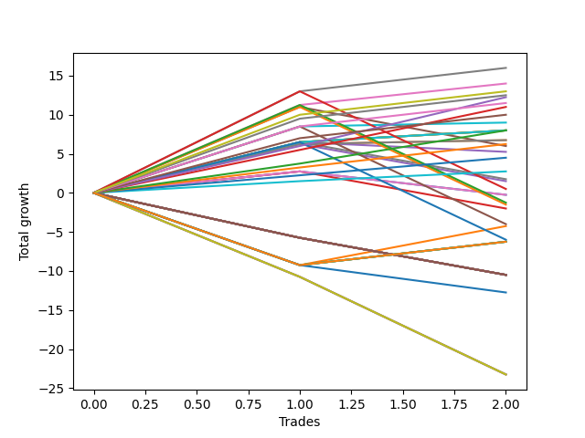

# Short Labrador 010 
- Symbol: ES_830-1130
- Date Range: 03/18/2022 - 12/30/2022
- Trading Period: 8:30-11:30
- Number of Trades: 2



| Name | Win Percent | Profit | Avg Profit / Trade | Avg Time / Trade |      | Name | Win Percent | Profit | Avg Profit / Trade | Avg Time / Trade |
| ---- | ----------- | ------ | ------------------ | ---------------- | ---- | ---- | ----------- | ------ | ------------------ | ---------------- |
| Sorted By <br> Profit | | | | | | Sorted By <br> Win Percentage ||||
| V Mid | 100.00 | 8000.00 | 4000.00 | 53:02 |     | V Mid | 100.00 | 8000.00 | 4000.00 | 53:02 |
| BB-50 U/L 2SD | 100.00 | 7000.00 | 3500.00 | 51:22 |     | BB-50 U/L 2SD | 100.00 | 7000.00 | 3500.00 | 51:22 |
| TP-10 | 100.00 | 6500.00 | 3250.00 | 39:20 |     | TP-10 | 100.00 | 6500.00 | 3250.00 | 39:20 |
| TP-9 | 100.00 | 6250.00 | 3125.00 | 39:15 |     | TP-9 | 100.00 | 6250.00 | 3125.00 | 39:15 |
| TP-6 | 100.00 | 6125.00 | 3062.50 | 34:30 |     | TP-6 | 100.00 | 6125.00 | 3062.50 | 34:30 |
| TP-8 | 100.00 | 5750.00 | 2875.00 | 38:50 |     | TP-8 | 100.00 | 5750.00 | 2875.00 | 38:50 |
| TP-5 | 100.00 | 5500.00 | 2750.00 | 34:20 |     | TP-5 | 100.00 | 5500.00 | 2750.00 | 34:20 |
| TP-7 | 100.00 | 5000.00 | 2500.00 | 35:07 |     | TP-7 | 100.00 | 5000.00 | 2500.00 | 35:07 |
| BB-100 Mid | 100.00 | 4500.00 | 2250.00 | 45:55 |     | BB-100 Mid | 100.00 | 4500.00 | 2250.00 | 45:55 |
| TP-4 | 100.00 | 4000.00 | 2000.00 | 34:10 |     | TP-4 | 100.00 | 4000.00 | 2000.00 | 34:10 |
| BB-20 U/L 2SD C SL-10 | 100.00 | 4000.00 | 2000.00 | 13:42 |     | BB-20 U/L 2SD C SL-10 | 100.00 | 4000.00 | 2000.00 | 13:42 |
| BB-20 U/L 2SD SL-10 | 100.00 | 4000.00 | 2000.00 | 13:42 |     | BB-20 U/L 2SD SL-10 | 100.00 | 4000.00 | 2000.00 | 13:42 |
| BB-20 U/L 2SD C | 100.00 | 4000.00 | 2000.00 | 13:42 |     | BB-20 U/L 2SD C | 100.00 | 4000.00 | 2000.00 | 13:42 |
| BB-20 U/L 2SD | 100.00 | 4000.00 | 2000.00 | 13:42 |     | BB-20 U/L 2SD | 100.00 | 4000.00 | 2000.00 | 13:42 |
| BB-20 U/L 1SD SL-10 | 100.00 | 3375.00 | 1687.50 | 10:47 |     | BB-20 U/L 1SD SL-10 | 100.00 | 3375.00 | 1687.50 | 10:47 |
| BB-20 U/L 1SD | 100.00 | 3375.00 | 1687.50 | 10:47 |     | BB-20 U/L 1SD | 100.00 | 3375.00 | 1687.50 | 10:47 |
| TP-3 | 100.00 | 3125.00 | 1562.50 | 10:02 |     | TP-3 | 100.00 | 3125.00 | 1562.50 | 10:02 |
| BB-50 U/L 1SD | 50.00 | 3000.00 | 1500.00 | 44:00 |     | TP-2 | 100.00 | 2250.00 | 1125.00 | 09:47 |
| BB-50 Mid | 50.00 | 2625.00 | 1312.50 | 20:20 |     | TP-1 | 100.00 | 1375.00 | 687.50 | 08:00 |
| TP-2 | 100.00 | 2250.00 | 1125.00 | 09:47 |     | BB-50 U/L 1SD | 50.00 | 3000.00 | 1500.00 | 44:00 |
| TP-1 | 100.00 | 1375.00 | 687.50 | 08:00 |     | BB-50 Mid | 50.00 | 2625.00 | 1312.50 | 20:20 |
| BB-50 Mid SL-5 | 50.00 | 875.00 | 437.50 | 05:50 |     | BB-50 Mid SL-5 | 50.00 | 875.00 | 437.50 | 05:50 |
| BB-20 U/L 1SD SL-5 | 50.00 | 750.00 | 375.00 | 05:40 |     | BB-20 U/L 1SD SL-5 | 50.00 | 750.00 | 375.00 | 05:40 |
| V Mid SL-10 | 50.00 | 250.00 | 125.00 | 32:50 |     | V Mid SL-10 | 50.00 | 250.00 | 125.00 | 32:50 |
| BB-20 Mid SL-10 | 50.00 | -125.00 | -62.50 | 10:02 |     | BB-20 Mid SL-10 | 50.00 | -125.00 | -62.50 | 10:02 |
| BB-20 Mid | 50.00 | -125.00 | -62.50 | 10:02 |     | BB-20 Mid | 50.00 | -125.00 | -62.50 | 10:02 |
| BB-50 U/L 2SD SL-10 | 50.00 | -625.00 | -312.50 | 31:32 |     | BB-50 U/L 2SD SL-10 | 50.00 | -625.00 | -312.50 | 31:32 |
| BB-50 U/L 1SD SL-10 | 50.00 | -750.00 | -375.00 | 26:37 |     | BB-50 U/L 1SD SL-10 | 50.00 | -750.00 | -375.00 | 26:37 |
| BB-20 Mid SL-5 | 50.00 | -1000.00 | -500.00 | 05:07 |     | BB-20 Mid SL-5 | 50.00 | -1000.00 | -500.00 | 05:07 |
| BB-100 Mid SL-10 | 50.00 | -2000.00 | -1000.00 | 26:22 |     | BB-100 Mid SL-10 | 50.00 | -2000.00 | -1000.00 | 26:22 |
| BB-200 Mid | 50.00 | -2125.00 | -1062.50 | 60:40 |     | BB-200 Mid | 50.00 | -2125.00 | -1062.50 | 60:40 |
| BB-50 Mid SL-10 | 50.00 | -3000.00 | -1500.00 | 14:52 |     | BB-50 Mid SL-10 | 50.00 | -3000.00 | -1500.00 | 14:52 |
| NEWFI 000 | 50.00 | -3125.00 | -1562.50 | 60:55 |     | NEWFI 000 | 50.00 | -3125.00 | -1562.50 | 60:55 |
| BB-200 U/L 2SD | 50.00 | -3125.00 | -1562.50 | 60:55 |     | BB-200 U/L 2SD | 50.00 | -3125.00 | -1562.50 | 60:55 |
| BB-100 U/L 2SD | 50.00 | -3125.00 | -1562.50 | 60:55 |     | BB-100 U/L 2SD | 50.00 | -3125.00 | -1562.50 | 60:55 |
| V U/L 1SD | 50.00 | -3125.00 | -1562.50 | 60:55 |     | V U/L 1SD | 50.00 | -3125.00 | -1562.50 | 60:55 |
| BB-200 U/L 2SD SL-5 | 0.00 | -5250.00 | -2625.00 | 07:00 |     | BB-200 U/L 2SD SL-5 | 0.00 | -5250.00 | -2625.00 | 07:00 |
| BB-200 Mid SL-5 | 0.00 | -5250.00 | -2625.00 | 07:00 |     | BB-200 Mid SL-5 | 0.00 | -5250.00 | -2625.00 | 07:00 |
| BB-100 U/L 2SD SL-5 | 0.00 | -5250.00 | -2625.00 | 07:00 |     | BB-100 U/L 2SD SL-5 | 0.00 | -5250.00 | -2625.00 | 07:00 |
| BB-100 Mid SL-5 | 0.00 | -5250.00 | -2625.00 | 07:00 |     | BB-100 Mid SL-5 | 0.00 | -5250.00 | -2625.00 | 07:00 |
| V U/L 1SD SL-5 | 0.00 | -5250.00 | -2625.00 | 07:00 |     | V U/L 1SD SL-5 | 0.00 | -5250.00 | -2625.00 | 07:00 |
| V Mid SL-5 | 0.00 | -5250.00 | -2625.00 | 07:00 |     | V Mid SL-5 | 0.00 | -5250.00 | -2625.00 | 07:00 |
| BB-50 U/L 2SD SL-5 | 0.00 | -5250.00 | -2625.00 | 07:00 |     | BB-50 U/L 2SD SL-5 | 0.00 | -5250.00 | -2625.00 | 07:00 |
| BB-50 U/L 1SD SL-5 | 0.00 | -5250.00 | -2625.00 | 07:00 |     | BB-50 U/L 1SD SL-5 | 0.00 | -5250.00 | -2625.00 | 07:00 |
| BB-20 U/L 2SD C SL-5 | 0.00 | -5250.00 | -2625.00 | 07:00 |     | BB-20 U/L 2SD C SL-5 | 0.00 | -5250.00 | -2625.00 | 07:00 |
| BB-20 U/L 2SD SL-5 | 0.00 | -5250.00 | -2625.00 | 07:00 |     | BB-20 U/L 2SD SL-5 | 0.00 | -5250.00 | -2625.00 | 07:00 |
| NEWFI 0000 | 0.00 | -6375.00 | -3187.50 | 35:00 |     | NEWFI 0000 | 0.00 | -6375.00 | -3187.50 | 35:00 |
| BB-200 U/L 2SD SL-10 | 0.00 | -11625.00 | -5812.50 | 39:50 |     | BB-200 U/L 2SD SL-10 | 0.00 | -11625.00 | -5812.50 | 39:50 |
| BB-200 Mid SL-10 | 0.00 | -11625.00 | -5812.50 | 39:50 |     | BB-200 Mid SL-10 | 0.00 | -11625.00 | -5812.50 | 39:50 |
| BB-100 U/L 2SD SL-10 | 0.00 | -11625.00 | -5812.50 | 39:50 |     | BB-100 U/L 2SD SL-10 | 0.00 | -11625.00 | -5812.50 | 39:50 |
| V U/L 1SD SL-10 | 0.00 | -11625.00 | -5812.50 | 39:50 |     | V U/L 1SD SL-10 | 0.00 | -11625.00 | -5812.50 | 39:50 |

## NO STOPLOSS

### Test BB-20 Mid
* Sell when price hits the middle line of the 20p bollinger
* No Stoploss
* Results:
```
Total Trades: 2
Percent Up: 50.00
Percent Down: 50.00
Total Points Moved Down: -0.25
Potential Profit: -125.00
Total Points Ups: 3.00 Count Ups: 1
Total Points Downs: 2.75 Count Downs: 1
```

<details><summary>Trades</summary>

<code>In: 2022-04-25 10:19:00		Out: 2022-04-25 10:26:50		Total Position Time: 07:50		Total Move Down: 2.75		Total to Date: 2.75</code> <br />
<code>In: 2022-05-24 10:49:00		Out: 2022-05-24 11:01:15		Total Position Time: 12:15		Total Move Down: -3.00		Total to Date: -0.25</code> <br />


</details>

### Test BB-20 U/L 1SD
* Sell when the price hits the lower line of the 20p 1std bollinger
* No Stoploss
* Results:
```
Total Trades: 2
Percent Up: 0.00
Percent Down: 100.00
Total Points Moved Down: 6.75
Potential Profit: 3375.00
Total Points Ups: 0.00 Count Ups: 0
Total Points Downs: 6.75 Count Downs: 2
```

<details><summary>Trades</summary>

<code>In: 2022-04-25 10:19:00		Out: 2022-04-25 10:27:55		Total Position Time: 08:55		Total Move Down: 6.25		Total to Date: 6.25</code> <br />
<code>In: 2022-05-24 10:49:00		Out: 2022-05-24 11:01:40		Total Position Time: 12:40		Total Move Down: 0.50		Total to Date: 6.75</code> <br />


</details>

### Test BB-20 U/L 2SD
* Sell when the price hits the lower line of the 20p 2std bollinger
* No Stoploss
* Results:
```
Total Trades: 2
Percent Up: 0.00
Percent Down: 100.00
Total Points Moved Down: 8.00
Potential Profit: 4000.00
Total Points Ups: 0.00 Count Ups: 0
Total Points Downs: 8.00 Count Downs: 2
```

<details><summary>Trades</summary>

<code>In: 2022-04-25 10:19:00		Out: 2022-04-25 10:33:35		Total Position Time: 14:35		Total Move Down: 6.50		Total to Date: 6.50</code> <br />
<code>In: 2022-05-24 10:49:00		Out: 2022-05-24 11:01:50		Total Position Time: 12:50		Total Move Down: 1.50		Total to Date: 8.00</code> <br />


</details>

### Test BB-20 U/L 2SD C
* Sell when the price hits the lower line of the 20p 2std bollinger
* No Stoploss
* Results:
```
Total Trades: 2
Percent Up: 0.00
Percent Down: 100.00
Total Points Moved Down: 8.00
Potential Profit: 4000.00
Total Points Ups: 0.00 Count Ups: 0
Total Points Downs: 8.00 Count Downs: 2
```

<details><summary>Trades</summary>

<code>In: 2022-04-25 10:19:00		Out: 2022-04-25 10:33:35		Total Position Time: 14:35		Total Move Down: 6.50		Total to Date: 6.50</code> <br />
<code>In: 2022-05-24 10:49:00		Out: 2022-05-24 11:01:50		Total Position Time: 12:50		Total Move Down: 1.50		Total to Date: 8.00</code> <br />


</details>

### Test BB-50 Mid
* Sell when price hits the middle line of the 50p bollinger
* No Stoploss
* Results:
```
Total Trades: 2
Percent Up: 50.00
Percent Down: 50.00
Total Points Moved Down: 5.25
Potential Profit: 2625.00
Total Points Ups: 1.25 Count Ups: 1
Total Points Downs: 6.50 Count Downs: 1
```

<details><summary>Trades</summary>

<code>In: 2022-04-25 10:19:00		Out: 2022-04-25 10:28:15		Total Position Time: 09:15		Total Move Down: 6.50		Total to Date: 6.50</code> <br />
<code>In: 2022-05-24 10:49:00		Out: 2022-05-24 11:20:25		Total Position Time: 31:25		Total Move Down: -1.25		Total to Date: 5.25</code> <br />


</details>

### Test BB-50 U/L 1SD
* Sell when the price hits the lower line of the 50p 1std bollinger
* No Stoploss
* Results:
```
Total Trades: 2
Percent Up: 50.00
Percent Down: 50.00
Total Points Moved Down: 6.00
Potential Profit: 3000.00
Total Points Ups: 5.00 Count Ups: 1
Total Points Downs: 11.00 Count Downs: 1
```

<details><summary>Trades</summary>

<code>In: 2022-04-25 10:19:00		Out: 2022-04-25 10:51:45		Total Position Time: 32:45		Total Move Down: 11.00		Total to Date: 11.00</code> <br />
<code>In: 2022-05-24 10:49:00		Out: 2022-05-24 11:44:15		Total Position Time: 55:15		Total Move Down: -5.00		Total to Date: 6.00</code> <br />


</details>

### Test BB-50 U/L 2SD
* Sell when the price hits the lower line of the 50p 2std bollinger
* No Stoploss
* Results:
```
Total Trades: 2
Percent Up: 0.00
Percent Down: 100.00
Total Points Moved Down: 14.00
Potential Profit: 7000.00
Total Points Ups: 0.00 Count Ups: 0
Total Points Downs: 14.00 Count Downs: 2
```

<details><summary>Trades</summary>

<code>In: 2022-04-25 10:19:00		Out: 2022-04-25 11:01:35		Total Position Time: 42:35		Total Move Down: 11.25		Total to Date: 11.25</code> <br />
<code>In: 2022-05-24 10:49:00		Out: 2022-05-24 11:49:10		Total Position Time: 60:10		Total Move Down: 2.75		Total to Date: 14.00</code> <br />


</details>

### Test V Mid
* Sell when the price hits the middle line of the 1std VWAP
* No Stoploss
* Results:
```
Total Trades: 2
Percent Up: 0.00
Percent Down: 100.00
Total Points Moved Down: 16.00
Potential Profit: 8000.00
Total Points Ups: 0.00 Count Ups: 0
Total Points Downs: 16.00 Count Downs: 2
```

<details><summary>Trades</summary>

<code>In: 2022-04-25 10:19:00		Out: 2022-04-25 11:04:10		Total Position Time: 45:10		Total Move Down: 13.00		Total to Date: 13.00</code> <br />
<code>In: 2022-05-24 10:49:00		Out: 2022-05-24 11:49:55		Total Position Time: 60:55		Total Move Down: 3.00		Total to Date: 16.00</code> <br />


</details>

### Test V U/L 1SD
* Sell when the price hits the lower line of the 1std VWAP
* No Stoploss
* Results:
```
Total Trades: 2
Percent Up: 50.00
Percent Down: 50.00
Total Points Moved Down: -6.25
Potential Profit: -3125.00
Total Points Ups: 9.25 Count Ups: 1
Total Points Downs: 3.00 Count Downs: 1
```

<details><summary>Trades</summary>

<code>In: 2022-04-25 10:19:00		Out: 2022-04-25 11:19:55		Total Position Time: 60:55		Total Move Down: -9.25		Total to Date: -9.25</code> <br />
<code>In: 2022-05-24 10:49:00		Out: 2022-05-24 11:49:55		Total Position Time: 60:55		Total Move Down: 3.00		Total to Date: -6.25</code> <br />


</details>

### Test BB-100 Mid
* Move to BB100 Mid
* No Stoploss
* Results:
```
Total Trades: 2
Percent Up: 0.00
Percent Down: 100.00
Total Points Moved Down: 9.00
Potential Profit: 4500.00
Total Points Ups: 0.00 Count Ups: 0
Total Points Downs: 9.00 Count Downs: 2
```

<details><summary>Trades</summary>

<code>In: 2022-04-25 10:19:00		Out: 2022-04-25 10:51:15		Total Position Time: 32:15		Total Move Down: 8.50		Total to Date: 8.50</code> <br />
<code>In: 2022-05-24 10:49:00		Out: 2022-05-24 11:48:35		Total Position Time: 59:35		Total Move Down: 0.50		Total to Date: 9.00</code> <br />


</details>

### Test BB-100 U/L 2SD
* Move to BB100 Upper Band
* No Stoploss
* Results:
```
Total Trades: 2
Percent Up: 50.00
Percent Down: 50.00
Total Points Moved Down: -6.25
Potential Profit: -3125.00
Total Points Ups: 9.25 Count Ups: 1
Total Points Downs: 3.00 Count Downs: 1
```

<details><summary>Trades</summary>

<code>In: 2022-04-25 10:19:00		Out: 2022-04-25 11:19:55		Total Position Time: 60:55		Total Move Down: -9.25		Total to Date: -9.25</code> <br />
<code>In: 2022-05-24 10:49:00		Out: 2022-05-24 11:49:55		Total Position Time: 60:55		Total Move Down: 3.00		Total to Date: -6.25</code> <br />


</details>

### Test BB-200 Mid
* Move to BB200 Mid
* No Stoploss
* Results:
```
Total Trades: 2
Percent Up: 50.00
Percent Down: 50.00
Total Points Moved Down: -4.25
Potential Profit: -2125.00
Total Points Ups: 9.25 Count Ups: 1
Total Points Downs: 5.00 Count Downs: 1
```

<details><summary>Trades</summary>

<code>In: 2022-04-25 10:19:00		Out: 2022-04-25 11:19:55		Total Position Time: 60:55		Total Move Down: -9.25		Total to Date: -9.25</code> <br />
<code>In: 2022-05-24 10:49:00		Out: 2022-05-24 11:49:25		Total Position Time: 60:25		Total Move Down: 5.00		Total to Date: -4.25</code> <br />


</details>

### Test BB-200 U/L 2SD
* Move to BB200 Upper Band
* No Stoploss
* Results:
```
Total Trades: 2
Percent Up: 50.00
Percent Down: 50.00
Total Points Moved Down: -6.25
Potential Profit: -3125.00
Total Points Ups: 9.25 Count Ups: 1
Total Points Downs: 3.00 Count Downs: 1
```

<details><summary>Trades</summary>

<code>In: 2022-04-25 10:19:00		Out: 2022-04-25 11:19:55		Total Position Time: 60:55		Total Move Down: -9.25		Total to Date: -9.25</code> <br />
<code>In: 2022-05-24 10:49:00		Out: 2022-05-24 11:49:55		Total Position Time: 60:55		Total Move Down: 3.00		Total to Date: -6.25</code> <br />


</details>

## STOPLOSS OF 5

### Test BB-20 Mid SL-5
* Sell when price hits the middle line of the 20p bollinger
* Stoploss is -5 points
* Results:
```
Total Trades: 2
Percent Up: 50.00
Percent Down: 50.00
Total Points Moved Down: -2.00
Potential Profit: -1000.00
Total Points Ups: 4.75 Count Ups: 1
Total Points Downs: 2.75 Count Downs: 1
```

<details><summary>Trades</summary>

<code>In: 2022-04-25 10:19:00		Out: 2022-04-25 10:26:50		Total Position Time: 07:50		Total Move Down: 2.75		Total to Date: 2.75</code> <br />
<code>In: 2022-05-24 10:49:00		Out: 2022-05-24 10:51:25		Total Position Time: 02:25		Total Move Down: -4.75		Total to Date: -2.00</code> <br />


</details>

### Test BB-20 U/L 1SD SL-5
* Sell when the price hits the lower line of the 20p 1std bollinger
* Stoploss is -5 points
* Results:
```
Total Trades: 2
Percent Up: 50.00
Percent Down: 50.00
Total Points Moved Down: 1.50
Potential Profit: 750.00
Total Points Ups: 4.75 Count Ups: 1
Total Points Downs: 6.25 Count Downs: 1
```

<details><summary>Trades</summary>

<code>In: 2022-04-25 10:19:00		Out: 2022-04-25 10:27:55		Total Position Time: 08:55		Total Move Down: 6.25		Total to Date: 6.25</code> <br />
<code>In: 2022-05-24 10:49:00		Out: 2022-05-24 10:51:25		Total Position Time: 02:25		Total Move Down: -4.75		Total to Date: 1.50</code> <br />


</details>

### Test BB-20 U/L 2SD SL-5
* Sell when the price hits the lower line of the 20p 2std bollinger
* Stoploss is -5 points
* Results:
```
Total Trades: 2
Percent Up: 100.00
Percent Down: 0.00
Total Points Moved Down: -10.50
Potential Profit: -5250.00
Total Points Ups: 10.50 Count Ups: 2
Total Points Downs: 0.00 Count Downs: 0
```

<details><summary>Trades</summary>

<code>In: 2022-04-25 10:19:00		Out: 2022-04-25 10:30:35		Total Position Time: 11:35		Total Move Down: -5.75		Total to Date: -5.75</code> <br />
<code>In: 2022-05-24 10:49:00		Out: 2022-05-24 10:51:25		Total Position Time: 02:25		Total Move Down: -4.75		Total to Date: -10.50</code> <br />


</details>

### Test BB-20 U/L 2SD C SL-5
* Sell when the price hits the lower line of the 20p 2std bollinger
* Stoploss is -5 points
* Results:
```
Total Trades: 2
Percent Up: 100.00
Percent Down: 0.00
Total Points Moved Down: -10.50
Potential Profit: -5250.00
Total Points Ups: 10.50 Count Ups: 2
Total Points Downs: 0.00 Count Downs: 0
```

<details><summary>Trades</summary>

<code>In: 2022-04-25 10:19:00		Out: 2022-04-25 10:30:35		Total Position Time: 11:35		Total Move Down: -5.75		Total to Date: -5.75</code> <br />
<code>In: 2022-05-24 10:49:00		Out: 2022-05-24 10:51:25		Total Position Time: 02:25		Total Move Down: -4.75		Total to Date: -10.50</code> <br />


</details>

### Test BB-50 Mid SL-5
* Sell when price hits the middle line of the 50p bollinger
* Stoploss is -5 points
* Results:
```
Total Trades: 2
Percent Up: 50.00
Percent Down: 50.00
Total Points Moved Down: 1.75
Potential Profit: 875.00
Total Points Ups: 4.75 Count Ups: 1
Total Points Downs: 6.50 Count Downs: 1
```

<details><summary>Trades</summary>

<code>In: 2022-04-25 10:19:00		Out: 2022-04-25 10:28:15		Total Position Time: 09:15		Total Move Down: 6.50		Total to Date: 6.50</code> <br />
<code>In: 2022-05-24 10:49:00		Out: 2022-05-24 10:51:25		Total Position Time: 02:25		Total Move Down: -4.75		Total to Date: 1.75</code> <br />


</details>

### Test BB-50 U/L 1SD SL-5
* Sell when the price hits the lower line of the 50p 1std bollinger
* Stoploss is -5 points
* Results:
```
Total Trades: 2
Percent Up: 100.00
Percent Down: 0.00
Total Points Moved Down: -10.50
Potential Profit: -5250.00
Total Points Ups: 10.50 Count Ups: 2
Total Points Downs: 0.00 Count Downs: 0
```

<details><summary>Trades</summary>

<code>In: 2022-04-25 10:19:00		Out: 2022-04-25 10:30:35		Total Position Time: 11:35		Total Move Down: -5.75		Total to Date: -5.75</code> <br />
<code>In: 2022-05-24 10:49:00		Out: 2022-05-24 10:51:25		Total Position Time: 02:25		Total Move Down: -4.75		Total to Date: -10.50</code> <br />


</details>

### Test BB-50 U/L 2SD SL-5
* Sell when the price hits the lower line of the 50p 2std bollinger
* Stoploss is -5 points
* Results:
```
Total Trades: 2
Percent Up: 100.00
Percent Down: 0.00
Total Points Moved Down: -10.50
Potential Profit: -5250.00
Total Points Ups: 10.50 Count Ups: 2
Total Points Downs: 0.00 Count Downs: 0
```

<details><summary>Trades</summary>

<code>In: 2022-04-25 10:19:00		Out: 2022-04-25 10:30:35		Total Position Time: 11:35		Total Move Down: -5.75		Total to Date: -5.75</code> <br />
<code>In: 2022-05-24 10:49:00		Out: 2022-05-24 10:51:25		Total Position Time: 02:25		Total Move Down: -4.75		Total to Date: -10.50</code> <br />


</details>

### Test V Mid SL-5
* Sell when the price hits the middle line of the 1std VWAP
* Stoploss is -5 points
* Results:
```
Total Trades: 2
Percent Up: 100.00
Percent Down: 0.00
Total Points Moved Down: -10.50
Potential Profit: -5250.00
Total Points Ups: 10.50 Count Ups: 2
Total Points Downs: 0.00 Count Downs: 0
```

<details><summary>Trades</summary>

<code>In: 2022-04-25 10:19:00		Out: 2022-04-25 10:30:35		Total Position Time: 11:35		Total Move Down: -5.75		Total to Date: -5.75</code> <br />
<code>In: 2022-05-24 10:49:00		Out: 2022-05-24 10:51:25		Total Position Time: 02:25		Total Move Down: -4.75		Total to Date: -10.50</code> <br />


</details>

### Test V U/L 1SD SL-5
* Sell when the price hits the lower line of the 1std VWAP
* Stoploss is -5 points
* Results:
```
Total Trades: 2
Percent Up: 100.00
Percent Down: 0.00
Total Points Moved Down: -10.50
Potential Profit: -5250.00
Total Points Ups: 10.50 Count Ups: 2
Total Points Downs: 0.00 Count Downs: 0
```

<details><summary>Trades</summary>

<code>In: 2022-04-25 10:19:00		Out: 2022-04-25 10:30:35		Total Position Time: 11:35		Total Move Down: -5.75		Total to Date: -5.75</code> <br />
<code>In: 2022-05-24 10:49:00		Out: 2022-05-24 10:51:25		Total Position Time: 02:25		Total Move Down: -4.75		Total to Date: -10.50</code> <br />


</details>

### Test BB-100 Mid SL-5
* Move to BB100 Mid
* Stoploss is -5 points
* Results:
```
Total Trades: 2
Percent Up: 100.00
Percent Down: 0.00
Total Points Moved Down: -10.50
Potential Profit: -5250.00
Total Points Ups: 10.50 Count Ups: 2
Total Points Downs: 0.00 Count Downs: 0
```

<details><summary>Trades</summary>

<code>In: 2022-04-25 10:19:00		Out: 2022-04-25 10:30:35		Total Position Time: 11:35		Total Move Down: -5.75		Total to Date: -5.75</code> <br />
<code>In: 2022-05-24 10:49:00		Out: 2022-05-24 10:51:25		Total Position Time: 02:25		Total Move Down: -4.75		Total to Date: -10.50</code> <br />


</details>

### Test BB-100 U/L 2SD SL-5
* Move to BB100 Upper Band
* Stoploss is -5 points
* Results:
```
Total Trades: 2
Percent Up: 100.00
Percent Down: 0.00
Total Points Moved Down: -10.50
Potential Profit: -5250.00
Total Points Ups: 10.50 Count Ups: 2
Total Points Downs: 0.00 Count Downs: 0
```

<details><summary>Trades</summary>

<code>In: 2022-04-25 10:19:00		Out: 2022-04-25 10:30:35		Total Position Time: 11:35		Total Move Down: -5.75		Total to Date: -5.75</code> <br />
<code>In: 2022-05-24 10:49:00		Out: 2022-05-24 10:51:25		Total Position Time: 02:25		Total Move Down: -4.75		Total to Date: -10.50</code> <br />


</details>

### Test BB-200 Mid SL-5
* Move to BB200 Mid
* Stoploss is -5 points
* Results:
```
Total Trades: 2
Percent Up: 100.00
Percent Down: 0.00
Total Points Moved Down: -10.50
Potential Profit: -5250.00
Total Points Ups: 10.50 Count Ups: 2
Total Points Downs: 0.00 Count Downs: 0
```

<details><summary>Trades</summary>

<code>In: 2022-04-25 10:19:00		Out: 2022-04-25 10:30:35		Total Position Time: 11:35		Total Move Down: -5.75		Total to Date: -5.75</code> <br />
<code>In: 2022-05-24 10:49:00		Out: 2022-05-24 10:51:25		Total Position Time: 02:25		Total Move Down: -4.75		Total to Date: -10.50</code> <br />


</details>

### Test BB-200 U/L 2SD SL-5
* Move to BB200 Upper Band
* Stoploss is -5 points
* Results:
```
Total Trades: 2
Percent Up: 100.00
Percent Down: 0.00
Total Points Moved Down: -10.50
Potential Profit: -5250.00
Total Points Ups: 10.50 Count Ups: 2
Total Points Downs: 0.00 Count Downs: 0
```

<details><summary>Trades</summary>

<code>In: 2022-04-25 10:19:00		Out: 2022-04-25 10:30:35		Total Position Time: 11:35		Total Move Down: -5.75		Total to Date: -5.75</code> <br />
<code>In: 2022-05-24 10:49:00		Out: 2022-05-24 10:51:25		Total Position Time: 02:25		Total Move Down: -4.75		Total to Date: -10.50</code> <br />


</details>

## STOPLOSS OF 10

### Test BB-20 Mid SL-10
* Sell when price hits the middle line of the 20p bollinger
* Stoploss is -10 points
* Results:
```
Total Trades: 2
Percent Up: 50.00
Percent Down: 50.00
Total Points Moved Down: -0.25
Potential Profit: -125.00
Total Points Ups: 3.00 Count Ups: 1
Total Points Downs: 2.75 Count Downs: 1
```

<details><summary>Trades</summary>

<code>In: 2022-04-25 10:19:00		Out: 2022-04-25 10:26:50		Total Position Time: 07:50		Total Move Down: 2.75		Total to Date: 2.75</code> <br />
<code>In: 2022-05-24 10:49:00		Out: 2022-05-24 11:01:15		Total Position Time: 12:15		Total Move Down: -3.00		Total to Date: -0.25</code> <br />


</details>

### Test BB-20 U/L 1SD SL-10
* Sell when the price hits the lower line of the 20p 1std bollinger
* Stoploss is -10 points
* Results:
```
Total Trades: 2
Percent Up: 0.00
Percent Down: 100.00
Total Points Moved Down: 6.75
Potential Profit: 3375.00
Total Points Ups: 0.00 Count Ups: 0
Total Points Downs: 6.75 Count Downs: 2
```

<details><summary>Trades</summary>

<code>In: 2022-04-25 10:19:00		Out: 2022-04-25 10:27:55		Total Position Time: 08:55		Total Move Down: 6.25		Total to Date: 6.25</code> <br />
<code>In: 2022-05-24 10:49:00		Out: 2022-05-24 11:01:40		Total Position Time: 12:40		Total Move Down: 0.50		Total to Date: 6.75</code> <br />


</details>

### Test BB-20 U/L 2SD SL-10
* Sell when the price hits the lower line of the 20p 2std bollinger
* Stoploss is -10 points
* Results:
```
Total Trades: 2
Percent Up: 0.00
Percent Down: 100.00
Total Points Moved Down: 8.00
Potential Profit: 4000.00
Total Points Ups: 0.00 Count Ups: 0
Total Points Downs: 8.00 Count Downs: 2
```

<details><summary>Trades</summary>

<code>In: 2022-04-25 10:19:00		Out: 2022-04-25 10:33:35		Total Position Time: 14:35		Total Move Down: 6.50		Total to Date: 6.50</code> <br />
<code>In: 2022-05-24 10:49:00		Out: 2022-05-24 11:01:50		Total Position Time: 12:50		Total Move Down: 1.50		Total to Date: 8.00</code> <br />


</details>

### Test BB-20 U/L 2SD C SL-10
* Sell when the price hits the lower line of the 20p 2std bollinger
* Stoploss is -10 points
* Results:
```
Total Trades: 2
Percent Up: 0.00
Percent Down: 100.00
Total Points Moved Down: 8.00
Potential Profit: 4000.00
Total Points Ups: 0.00 Count Ups: 0
Total Points Downs: 8.00 Count Downs: 2
```

<details><summary>Trades</summary>

<code>In: 2022-04-25 10:19:00		Out: 2022-04-25 10:33:35		Total Position Time: 14:35		Total Move Down: 6.50		Total to Date: 6.50</code> <br />
<code>In: 2022-05-24 10:49:00		Out: 2022-05-24 11:01:50		Total Position Time: 12:50		Total Move Down: 1.50		Total to Date: 8.00</code> <br />


</details>

### Test BB-50 Mid SL-10
* Sell when price hits the middle line of the 50p bollinger
* Stoploss is -10 points
* Results:
```
Total Trades: 2
Percent Up: 50.00
Percent Down: 50.00
Total Points Moved Down: -6.00
Potential Profit: -3000.00
Total Points Ups: 12.50 Count Ups: 1
Total Points Downs: 6.50 Count Downs: 1
```

<details><summary>Trades</summary>

<code>In: 2022-04-25 10:19:00		Out: 2022-04-25 10:28:15		Total Position Time: 09:15		Total Move Down: 6.50		Total to Date: 6.50</code> <br />
<code>In: 2022-05-24 10:49:00		Out: 2022-05-24 11:09:30		Total Position Time: 20:30		Total Move Down: -12.50		Total to Date: -6.00</code> <br />


</details>

### Test BB-50 U/L 1SD SL-10
* Sell when the price hits the lower line of the 50p 1std bollinger
* Stoploss is -10 points
* Results:
```
Total Trades: 2
Percent Up: 50.00
Percent Down: 50.00
Total Points Moved Down: -1.50
Potential Profit: -750.00
Total Points Ups: 12.50 Count Ups: 1
Total Points Downs: 11.00 Count Downs: 1
```

<details><summary>Trades</summary>

<code>In: 2022-04-25 10:19:00		Out: 2022-04-25 10:51:45		Total Position Time: 32:45		Total Move Down: 11.00		Total to Date: 11.00</code> <br />
<code>In: 2022-05-24 10:49:00		Out: 2022-05-24 11:09:30		Total Position Time: 20:30		Total Move Down: -12.50		Total to Date: -1.50</code> <br />


</details>

### Test BB-50 U/L 2SD SL-10
* Sell when the price hits the lower line of the 50p 2std bollinger
* Stoploss is -10 points
* Results:
```
Total Trades: 2
Percent Up: 50.00
Percent Down: 50.00
Total Points Moved Down: -1.25
Potential Profit: -625.00
Total Points Ups: 12.50 Count Ups: 1
Total Points Downs: 11.25 Count Downs: 1
```

<details><summary>Trades</summary>

<code>In: 2022-04-25 10:19:00		Out: 2022-04-25 11:01:35		Total Position Time: 42:35		Total Move Down: 11.25		Total to Date: 11.25</code> <br />
<code>In: 2022-05-24 10:49:00		Out: 2022-05-24 11:09:30		Total Position Time: 20:30		Total Move Down: -12.50		Total to Date: -1.25</code> <br />


</details>

### Test V Mid SL-10
* Sell when the price hits the middle line of the 1std VWAP
* Stoploss is -10 points
* Results:
```
Total Trades: 2
Percent Up: 50.00
Percent Down: 50.00
Total Points Moved Down: 0.50
Potential Profit: 250.00
Total Points Ups: 12.50 Count Ups: 1
Total Points Downs: 13.00 Count Downs: 1
```

<details><summary>Trades</summary>

<code>In: 2022-04-25 10:19:00		Out: 2022-04-25 11:04:10		Total Position Time: 45:10		Total Move Down: 13.00		Total to Date: 13.00</code> <br />
<code>In: 2022-05-24 10:49:00		Out: 2022-05-24 11:09:30		Total Position Time: 20:30		Total Move Down: -12.50		Total to Date: 0.50</code> <br />


</details>

### Test V U/L 1SD SL-10
* Sell when the price hits the lower line of the 1std VWAP
* Stoploss is -10 points
* Results:
```
Total Trades: 2
Percent Up: 100.00
Percent Down: 0.00
Total Points Moved Down: -23.25
Potential Profit: -11625.00
Total Points Ups: 23.25 Count Ups: 2
Total Points Downs: 0.00 Count Downs: 0
```

<details><summary>Trades</summary>

<code>In: 2022-04-25 10:19:00		Out: 2022-04-25 11:18:10		Total Position Time: 59:10		Total Move Down: -10.75		Total to Date: -10.75</code> <br />
<code>In: 2022-05-24 10:49:00		Out: 2022-05-24 11:09:30		Total Position Time: 20:30		Total Move Down: -12.50		Total to Date: -23.25</code> <br />


</details>

### Test BB-100 Mid SL-10
* Move to BB100 Mid
* Stoploss is -10 points
* Results:
```
Total Trades: 2
Percent Up: 50.00
Percent Down: 50.00
Total Points Moved Down: -4.00
Potential Profit: -2000.00
Total Points Ups: 12.50 Count Ups: 1
Total Points Downs: 8.50 Count Downs: 1
```

<details><summary>Trades</summary>

<code>In: 2022-04-25 10:19:00		Out: 2022-04-25 10:51:15		Total Position Time: 32:15		Total Move Down: 8.50		Total to Date: 8.50</code> <br />
<code>In: 2022-05-24 10:49:00		Out: 2022-05-24 11:09:30		Total Position Time: 20:30		Total Move Down: -12.50		Total to Date: -4.00</code> <br />


</details>

### Test BB-100 U/L 2SD SL-10
* Move to BB100 Upper Band
* Stoploss is -10 points
* Results:
```
Total Trades: 2
Percent Up: 100.00
Percent Down: 0.00
Total Points Moved Down: -23.25
Potential Profit: -11625.00
Total Points Ups: 23.25 Count Ups: 2
Total Points Downs: 0.00 Count Downs: 0
```

<details><summary>Trades</summary>

<code>In: 2022-04-25 10:19:00		Out: 2022-04-25 11:18:10		Total Position Time: 59:10		Total Move Down: -10.75		Total to Date: -10.75</code> <br />
<code>In: 2022-05-24 10:49:00		Out: 2022-05-24 11:09:30		Total Position Time: 20:30		Total Move Down: -12.50		Total to Date: -23.25</code> <br />


</details>

### Test BB-200 Mid SL-10
* Move to BB200 Mid
* Stoploss is -10 points
* Results:
```
Total Trades: 2
Percent Up: 100.00
Percent Down: 0.00
Total Points Moved Down: -23.25
Potential Profit: -11625.00
Total Points Ups: 23.25 Count Ups: 2
Total Points Downs: 0.00 Count Downs: 0
```

<details><summary>Trades</summary>

<code>In: 2022-04-25 10:19:00		Out: 2022-04-25 11:18:10		Total Position Time: 59:10		Total Move Down: -10.75		Total to Date: -10.75</code> <br />
<code>In: 2022-05-24 10:49:00		Out: 2022-05-24 11:09:30		Total Position Time: 20:30		Total Move Down: -12.50		Total to Date: -23.25</code> <br />


</details>

### Test BB-200 U/L 2SD SL-10
* Move to BB200 Upper Band
* Stoploss is -10 points
* Results:
```
Total Trades: 2
Percent Up: 100.00
Percent Down: 0.00
Total Points Moved Down: -23.25
Potential Profit: -11625.00
Total Points Ups: 23.25 Count Ups: 2
Total Points Downs: 0.00 Count Downs: 0
```

<details><summary>Trades</summary>

<code>In: 2022-04-25 10:19:00		Out: 2022-04-25 11:18:10		Total Position Time: 59:10		Total Move Down: -10.75		Total to Date: -10.75</code> <br />
<code>In: 2022-05-24 10:49:00		Out: 2022-05-24 11:09:30		Total Position Time: 20:30		Total Move Down: -12.50		Total to Date: -23.25</code> <br />


</details>

## TAKE PROFIT

### Test TP-1
* Take Profit of 1 Point
* No Stoploss
* Results:
```
Total Trades: 2
Percent Up: 0.00
Percent Down: 100.00
Total Points Moved Down: 2.75
Potential Profit: 1375.00
Total Points Ups: 0.00 Count Ups: 0
Total Points Downs: 2.75 Count Downs: 2
```

<details><summary>Trades</summary>

<code>In: 2022-04-25 10:19:00		Out: 2022-04-25 10:22:15		Total Position Time: 03:15		Total Move Down: 1.50		Total to Date: 1.50</code> <br />
<code>In: 2022-05-24 10:49:00		Out: 2022-05-24 11:01:45		Total Position Time: 12:45		Total Move Down: 1.25		Total to Date: 2.75</code> <br />


</details>

### Test TP-2
* Take Profit of 2 Point
* No Stoploss
* Results:
```
Total Trades: 2
Percent Up: 0.00
Percent Down: 100.00
Total Points Moved Down: 4.50
Potential Profit: 2250.00
Total Points Ups: 0.00 Count Ups: 0
Total Points Downs: 4.50 Count Downs: 2
```

<details><summary>Trades</summary>

<code>In: 2022-04-25 10:19:00		Out: 2022-04-25 10:22:40		Total Position Time: 03:40		Total Move Down: 2.25		Total to Date: 2.25</code> <br />
<code>In: 2022-05-24 10:49:00		Out: 2022-05-24 11:04:55		Total Position Time: 15:55		Total Move Down: 2.25		Total to Date: 4.50</code> <br />


</details>

### Test TP-3
* Take Profit of 3 Point
* No Stoploss
* Results:
```
Total Trades: 2
Percent Up: 0.00
Percent Down: 100.00
Total Points Moved Down: 6.25
Potential Profit: 3125.00
Total Points Ups: 0.00 Count Ups: 0
Total Points Downs: 6.25 Count Downs: 2
```

<details><summary>Trades</summary>

<code>In: 2022-04-25 10:19:00		Out: 2022-04-25 10:23:05		Total Position Time: 04:05		Total Move Down: 3.25		Total to Date: 3.25</code> <br />
<code>In: 2022-05-24 10:49:00		Out: 2022-05-24 11:05:00		Total Position Time: 16:00		Total Move Down: 3.00		Total to Date: 6.25</code> <br />


</details>

### Test TP-4
* Take Profit of 4 Point
* No Stoploss
* Results:
```
Total Trades: 2
Percent Up: 0.00
Percent Down: 100.00
Total Points Moved Down: 8.00
Potential Profit: 4000.00
Total Points Ups: 0.00 Count Ups: 0
Total Points Downs: 8.00 Count Downs: 2
```

<details><summary>Trades</summary>

<code>In: 2022-04-25 10:19:00		Out: 2022-04-25 10:27:00		Total Position Time: 08:00		Total Move Down: 3.75		Total to Date: 3.75</code> <br />
<code>In: 2022-05-24 10:49:00		Out: 2022-05-24 11:49:20		Total Position Time: 60:20		Total Move Down: 4.25		Total to Date: 8.00</code> <br />


</details>

### Test TP-5
* Take Profit of 5 Point
* No Stoploss
* Results:
```
Total Trades: 2
Percent Up: 0.00
Percent Down: 100.00
Total Points Moved Down: 11.00
Potential Profit: 5500.00
Total Points Ups: 0.00 Count Ups: 0
Total Points Downs: 11.00 Count Downs: 2
```

<details><summary>Trades</summary>

<code>In: 2022-04-25 10:19:00		Out: 2022-04-25 10:27:10		Total Position Time: 08:10		Total Move Down: 5.50		Total to Date: 5.50</code> <br />
<code>In: 2022-05-24 10:49:00		Out: 2022-05-24 11:49:30		Total Position Time: 60:30		Total Move Down: 5.50		Total to Date: 11.00</code> <br />


</details>

### Test TP-6
* Take Profit of 6 Point
* No Stoploss
* Results:
```
Total Trades: 2
Percent Up: 0.00
Percent Down: 100.00
Total Points Moved Down: 12.25
Potential Profit: 6125.00
Total Points Ups: 0.00 Count Ups: 0
Total Points Downs: 12.25 Count Downs: 2
```

<details><summary>Trades</summary>

<code>In: 2022-04-25 10:19:00		Out: 2022-04-25 10:27:25		Total Position Time: 08:25		Total Move Down: 6.00		Total to Date: 6.00</code> <br />
<code>In: 2022-05-24 10:49:00		Out: 2022-05-24 11:49:35		Total Position Time: 60:35		Total Move Down: 6.25		Total to Date: 12.25</code> <br />


</details>

### Test TP-7
* Take Profit of 7 Point
* No Stoploss
* Results:
```
Total Trades: 2
Percent Up: 0.00
Percent Down: 100.00
Total Points Moved Down: 10.00
Potential Profit: 5000.00
Total Points Ups: 0.00 Count Ups: 0
Total Points Downs: 10.00 Count Downs: 2
```

<details><summary>Trades</summary>

<code>In: 2022-04-25 10:19:00		Out: 2022-04-25 10:28:20		Total Position Time: 09:20		Total Move Down: 7.00		Total to Date: 7.00</code> <br />
<code>In: 2022-05-24 10:49:00		Out: 2022-05-24 11:49:55		Total Position Time: 60:55		Total Move Down: 3.00		Total to Date: 10.00</code> <br />


</details>

### Test TP-8
* Take Profit of 8 Point
* No Stoploss
* Results:
```
Total Trades: 2
Percent Up: 0.00
Percent Down: 100.00
Total Points Moved Down: 11.50
Potential Profit: 5750.00
Total Points Ups: 0.00 Count Ups: 0
Total Points Downs: 11.50 Count Downs: 2
```

<details><summary>Trades</summary>

<code>In: 2022-04-25 10:19:00		Out: 2022-04-25 10:35:45		Total Position Time: 16:45		Total Move Down: 8.50		Total to Date: 8.50</code> <br />
<code>In: 2022-05-24 10:49:00		Out: 2022-05-24 11:49:55		Total Position Time: 60:55		Total Move Down: 3.00		Total to Date: 11.50</code> <br />


</details>

### Test TP-9
* Take Profit of 9 Point
* No Stoploss
* Results:
```
Total Trades: 2
Percent Up: 0.00
Percent Down: 100.00
Total Points Moved Down: 12.50
Potential Profit: 6250.00
Total Points Ups: 0.00 Count Ups: 0
Total Points Downs: 12.50 Count Downs: 2
```

<details><summary>Trades</summary>

<code>In: 2022-04-25 10:19:00		Out: 2022-04-25 10:36:35		Total Position Time: 17:35		Total Move Down: 9.50		Total to Date: 9.50</code> <br />
<code>In: 2022-05-24 10:49:00		Out: 2022-05-24 11:49:55		Total Position Time: 60:55		Total Move Down: 3.00		Total to Date: 12.50</code> <br />


</details>

### Test TP-10
* Take Profit of 10 Point
* No Stoploss
* Results:
```
Total Trades: 2
Percent Up: 0.00
Percent Down: 100.00
Total Points Moved Down: 13.00
Potential Profit: 6500.00
Total Points Ups: 0.00 Count Ups: 0
Total Points Downs: 13.00 Count Downs: 2
```

<details><summary>Trades</summary>

<code>In: 2022-04-25 10:19:00		Out: 2022-04-25 10:36:45		Total Position Time: 17:45		Total Move Down: 10.00		Total to Date: 10.00</code> <br />
<code>In: 2022-05-24 10:49:00		Out: 2022-05-24 11:49:55		Total Position Time: 60:55		Total Move Down: 3.00		Total to Date: 13.00</code> <br />


</details>

## Indicator Exits

### Test NEWFI 000
* Newfi 0000
* No Stoploss
* Results:
```
Total Trades: 2
Percent Up: 50.00
Percent Down: 50.00
Total Points Moved Down: -6.25
Potential Profit: -3125.00
Total Points Ups: 9.25 Count Ups: 1
Total Points Downs: 3.00 Count Downs: 1
```

<details><summary>Trades</summary>

<code>In: 2022-04-25 10:19:00		Out: 2022-04-25 11:19:55		Total Position Time: 60:55		Total Move Down: -9.25		Total to Date: -9.25</code> <br />
<code>In: 2022-05-24 10:49:00		Out: 2022-05-24 11:49:55		Total Position Time: 60:55		Total Move Down: 3.00		Total to Date: -6.25</code> <br />


</details>

### Test NEWFI 0000
* Newfi 0000
* No Stoploss
* Results:
```
Total Trades: 2
Percent Up: 100.00
Percent Down: 0.00
Total Points Moved Down: -12.75
Potential Profit: -6375.00
Total Points Ups: 12.75 Count Ups: 2
Total Points Downs: 0.00 Count Downs: 0
```

<details><summary>Trades</summary>

<code>In: 2022-04-25 10:19:00		Out: 2022-04-25 11:19:55		Total Position Time: 60:55		Total Move Down: -9.25		Total to Date: -9.25</code> <br />
<code>In: 2022-05-24 10:49:00		Out: 2022-05-24 10:58:05		Total Position Time: 09:05		Total Move Down: -3.50		Total to Date: -12.75</code> <br />


</details>