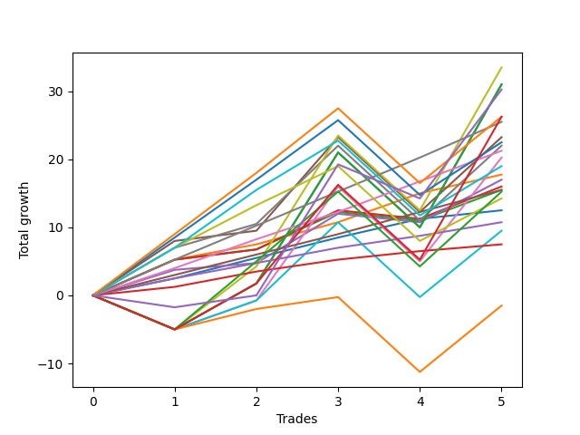

# Short Labrador 011 
- Symbol: ES_830-1130
- Date Range: 03/18/2022 - 12/30/2022
- Trading Period: 8:30-11:30
- Number of Trades: 5



| Name | Win Percent | Profit | Avg Profit / Trade | Avg Time / Trade |      | Name | Win Percent | Profit | Avg Profit / Trade | Avg Time / Trade |
| ---- | ----------- | ------ | ------------------ | ---------------- | ---- | ---- | ----------- | ------ | ------------------ | ---------------- |
| Sorted By <br> Profit | | | | | | Sorted By <br> Win Percentage ||||
| V U/L 1SD | 60.00 | 16750.00 | 3350.00 | 49:00 |     | TP-5 | 100.00 | 12750.00 | 2550.00 | 13:01 |
| BB-200 U/L 2SD | 60.00 | 15500.00 | 3100.00 | 52:07 |     | TP-4 | 100.00 | 10625.00 | 2125.00 | 11:47 |
| BB-100 U/L 2SD | 60.00 | 15500.00 | 3100.00 | 52:07 |     | BB-20 U/L 1SD | 100.00 | 8875.00 | 1775.00 | 08:07 |
| NEWFI 0000 | 60.00 | 15125.00 | 3025.00 | 39:13 |     | TP-3 | 100.00 | 7750.00 | 1550.00 | 03:09 |
| TP-9 | 80.00 | 13125.00 | 2625.00 | 33:01 |     | BB-20 Mid | 100.00 | 6250.00 | 1250.00 | 02:50 |
| NEWFI 000 | 60.00 | 13125.00 | 2625.00 | 46:23 |     | TP-2 | 100.00 | 5375.00 | 1075.00 | 02:41 |
| TP-5 | 100.00 | 12750.00 | 2550.00 | 13:01 |     | TP-1 | 100.00 | 3750.00 | 750.00 | 01:51 |
| BB-50 U/L 1SD | 80.00 | 11625.00 | 2325.00 | 31:38 |     | TP-9 | 80.00 | 13125.00 | 2625.00 | 33:01 |
| TP-8 | 80.00 | 11250.00 | 2250.00 | 32:51 |     | BB-50 U/L 1SD | 80.00 | 11625.00 | 2325.00 | 31:38 |
| V Mid | 80.00 | 11000.00 | 2200.00 | 24:51 |     | TP-8 | 80.00 | 11250.00 | 2250.00 | 32:51 |
| TP-4 | 100.00 | 10625.00 | 2125.00 | 11:47 |     | V Mid | 80.00 | 11000.00 | 2200.00 | 24:51 |
| BB-50 U/L 2SD | 60.00 | 10125.00 | 2025.00 | 40:15 |     | TP-7 | 80.00 | 9500.00 | 1900.00 | 32:39 |
| TP-7 | 80.00 | 9500.00 | 1900.00 | 32:39 |     | BB-50 Mid | 80.00 | 8500.00 | 1700.00 | 25:36 |
| BB-20 U/L 1SD | 100.00 | 8875.00 | 1775.00 | 08:07 |     | BB-20 U/L 2SD C | 80.00 | 8000.00 | 1600.00 | 24:38 |
| BB-50 Mid | 80.00 | 8500.00 | 1700.00 | 25:36 |     | BB-20 U/L 2SD | 80.00 | 7750.00 | 1550.00 | 24:32 |
| BB-20 U/L 2SD C | 80.00 | 8000.00 | 1600.00 | 24:38 |     | TP-6 | 80.00 | 7125.00 | 1425.00 | 30:44 |
| TP-3 | 100.00 | 7750.00 | 1550.00 | 03:09 |     | V U/L 1SD | 60.00 | 16750.00 | 3350.00 | 49:00 |
| BB-20 U/L 2SD | 80.00 | 7750.00 | 1550.00 | 24:32 |     | BB-200 U/L 2SD | 60.00 | 15500.00 | 3100.00 | 52:07 |
| TP-10 | 60.00 | 7625.00 | 1525.00 | 39:41 |     | BB-100 U/L 2SD | 60.00 | 15500.00 | 3100.00 | 52:07 |
| TP-6 | 80.00 | 7125.00 | 1425.00 | 30:44 |     | NEWFI 0000 | 60.00 | 15125.00 | 3025.00 | 39:13 |
| BB-20 Mid | 100.00 | 6250.00 | 1250.00 | 02:50 |     | NEWFI 000 | 60.00 | 13125.00 | 2625.00 | 46:23 |
| TP-2 | 100.00 | 5375.00 | 1075.00 | 02:41 |     | BB-50 U/L 2SD | 60.00 | 10125.00 | 2025.00 | 40:15 |
| BB-100 Mid | 60.00 | 4750.00 | 950.00 | 38:40 |     | TP-10 | 60.00 | 7625.00 | 1525.00 | 39:41 |
| TP-1 | 100.00 | 3750.00 | 750.00 | 01:51 |     | BB-100 Mid | 60.00 | 4750.00 | 950.00 | 38:40 |
| BB-200 Mid | 60.00 | -750.00 | -150.00 | 27:26 |     | BB-200 Mid | 60.00 | -750.00 | -150.00 | 27:26 |

## NO STOPLOSS

### Test BB-20 Mid
* Sell when price hits the middle line of the 20p bollinger
* No Stoploss
* Results:
```
Total Trades: 5
Percent Up: 0.00
Percent Down: 100.00
Total Points Moved Down: 12.50
Potential Profit: 6250.00
Total Points Ups: 0.00 Count Ups: 0
Total Points Downs: 12.50 Count Downs: 5
```

<details><summary>Trades</summary>

<code>In: 2022-05-17 08:39:00		Out: 2022-05-17 08:44:50		Total Position Time: 05:50		Total Move Down: 2.50		Total to Date: 2.50</code> <br />
<code>In: 2022-08-04 09:02:00		Out: 2022-08-04 09:03:25		Total Position Time: 01:25		Total Move Down: 3.00		Total to Date: 5.50</code> <br />
<code>In: 2022-09-29 08:59:00		Out: 2022-09-29 09:02:05		Total Position Time: 03:05		Total Move Down: 3.00		Total to Date: 8.50</code> <br />
<code>In: 2022-11-11 10:36:00		Out: 2022-11-11 10:37:50		Total Position Time: 01:50		Total Move Down: 2.75		Total to Date: 11.25</code> <br />
<code>In: 2022-12-08 10:49:00		Out: 2022-12-08 10:51:00		Total Position Time: 02:00		Total Move Down: 1.25		Total to Date: 12.50</code> <br />


</details>

### Test BB-20 U/L 1SD
* Sell when the price hits the lower line of the 20p 1std bollinger
* No Stoploss
* Results:
```
Total Trades: 5
Percent Up: 0.00
Percent Down: 100.00
Total Points Moved Down: 17.75
Potential Profit: 8875.00
Total Points Ups: 0.00 Count Ups: 0
Total Points Downs: 17.75 Count Downs: 5
```

<details><summary>Trades</summary>

<code>In: 2022-05-17 08:39:00		Out: 2022-05-17 08:47:25		Total Position Time: 08:25		Total Move Down: 5.25		Total to Date: 5.25</code> <br />
<code>In: 2022-08-04 09:02:00		Out: 2022-08-04 09:16:05		Total Position Time: 14:05		Total Move Down: 2.25		Total to Date: 7.50</code> <br />
<code>In: 2022-09-29 08:59:00		Out: 2022-09-29 09:10:55		Total Position Time: 11:55		Total Move Down: 3.25		Total to Date: 10.75</code> <br />
<code>In: 2022-11-11 10:36:00		Out: 2022-11-11 10:38:10		Total Position Time: 02:10		Total Move Down: 4.25		Total to Date: 15.00</code> <br />
<code>In: 2022-12-08 10:49:00		Out: 2022-12-08 10:53:00		Total Position Time: 04:00		Total Move Down: 2.75		Total to Date: 17.75</code> <br />


</details>

### Test BB-20 U/L 2SD
* Sell when the price hits the lower line of the 20p 2std bollinger
* No Stoploss
* Results:
```
Total Trades: 5
Percent Up: 20.00
Percent Down: 80.00
Total Points Moved Down: 15.50
Potential Profit: 7750.00
Total Points Ups: 1.25 Count Ups: 1
Total Points Downs: 16.75 Count Downs: 4
```

<details><summary>Trades</summary>

<code>In: 2022-05-17 08:39:00		Out: 2022-05-17 09:06:00		Total Position Time: 27:00		Total Move Down: 5.25		Total to Date: 5.25</code> <br />
<code>In: 2022-08-04 09:02:00		Out: 2022-08-04 09:38:50		Total Position Time: 36:50		Total Move Down: 1.50		Total to Date: 6.75</code> <br />
<code>In: 2022-09-29 08:59:00		Out: 2022-09-29 09:11:30		Total Position Time: 12:30		Total Move Down: 5.50		Total to Date: 12.25</code> <br />
<code>In: 2022-11-11 10:36:00		Out: 2022-11-11 11:17:05		Total Position Time: 41:05		Total Move Down: -1.25		Total to Date: 11.00</code> <br />
<code>In: 2022-12-08 10:49:00		Out: 2022-12-08 10:54:15		Total Position Time: 05:15		Total Move Down: 4.50		Total to Date: 15.50</code> <br />


</details>

### Test BB-20 U/L 2SD C
* Sell when the price hits the lower line of the 20p 2std bollinger
* No Stoploss
* Results:
```
Total Trades: 5
Percent Up: 20.00
Percent Down: 80.00
Total Points Moved Down: 16.00
Potential Profit: 8000.00
Total Points Ups: 1.25 Count Ups: 1
Total Points Downs: 17.25 Count Downs: 4
```

<details><summary>Trades</summary>

<code>In: 2022-05-17 08:39:00		Out: 2022-05-17 09:06:00		Total Position Time: 27:00		Total Move Down: 5.25		Total to Date: 5.25</code> <br />
<code>In: 2022-08-04 09:02:00		Out: 2022-08-04 09:38:50		Total Position Time: 36:50		Total Move Down: 1.50		Total to Date: 6.75</code> <br />
<code>In: 2022-09-29 08:59:00		Out: 2022-09-29 09:11:40		Total Position Time: 12:40		Total Move Down: 5.75		Total to Date: 12.50</code> <br />
<code>In: 2022-11-11 10:36:00		Out: 2022-11-11 11:17:05		Total Position Time: 41:05		Total Move Down: -1.25		Total to Date: 11.25</code> <br />
<code>In: 2022-12-08 10:49:00		Out: 2022-12-08 10:54:35		Total Position Time: 05:35		Total Move Down: 4.75		Total to Date: 16.00</code> <br />


</details>

### Test BB-50 Mid
* Sell when price hits the middle line of the 50p bollinger
* No Stoploss
* Results:
```
Total Trades: 5
Percent Up: 20.00
Percent Down: 80.00
Total Points Moved Down: 17.00
Potential Profit: 8500.00
Total Points Ups: 1.25 Count Ups: 1
Total Points Downs: 18.25 Count Downs: 4
```

<details><summary>Trades</summary>

<code>In: 2022-05-17 08:39:00		Out: 2022-05-17 09:05:55		Total Position Time: 26:55		Total Move Down: 3.75		Total to Date: 3.75</code> <br />
<code>In: 2022-08-04 09:02:00		Out: 2022-08-04 09:36:55		Total Position Time: 34:55		Total Move Down: 1.00		Total to Date: 4.75</code> <br />
<code>In: 2022-09-29 08:59:00		Out: 2022-09-29 09:16:35		Total Position Time: 17:35		Total Move Down: 7.25		Total to Date: 12.00</code> <br />
<code>In: 2022-11-11 10:36:00		Out: 2022-11-11 11:17:05		Total Position Time: 41:05		Total Move Down: -1.25		Total to Date: 10.75</code> <br />
<code>In: 2022-12-08 10:49:00		Out: 2022-12-08 10:56:30		Total Position Time: 07:30		Total Move Down: 6.25		Total to Date: 17.00</code> <br />


</details>

### Test BB-50 U/L 1SD
* Sell when the price hits the lower line of the 50p 1std bollinger
* No Stoploss
* Results:
```
Total Trades: 5
Percent Up: 20.00
Percent Down: 80.00
Total Points Moved Down: 23.25
Potential Profit: 11625.00
Total Points Ups: 11.00 Count Ups: 1
Total Points Downs: 34.25 Count Downs: 4
```

<details><summary>Trades</summary>

<code>In: 2022-05-17 08:39:00		Out: 2022-05-17 09:07:05		Total Position Time: 28:05		Total Move Down: 8.00		Total to Date: 8.00</code> <br />
<code>In: 2022-08-04 09:02:00		Out: 2022-08-04 09:38:50		Total Position Time: 36:50		Total Move Down: 1.50		Total to Date: 9.50</code> <br />
<code>In: 2022-09-29 08:59:00		Out: 2022-09-29 09:19:05		Total Position Time: 20:05		Total Move Down: 13.75		Total to Date: 23.25</code> <br />
<code>In: 2022-11-11 10:36:00		Out: 2022-11-11 11:36:55		Total Position Time: 60:55		Total Move Down: -11.00		Total to Date: 12.25</code> <br />
<code>In: 2022-12-08 10:49:00		Out: 2022-12-08 11:01:15		Total Position Time: 12:15		Total Move Down: 11.00		Total to Date: 23.25</code> <br />


</details>

### Test BB-50 U/L 2SD
* Sell when the price hits the lower line of the 50p 2std bollinger
* No Stoploss
* Results:
```
Total Trades: 5
Percent Up: 40.00
Percent Down: 60.00
Total Points Moved Down: 20.25
Potential Profit: 10125.00
Total Points Ups: 16.00 Count Ups: 2
Total Points Downs: 36.25 Count Downs: 3
```

<details><summary>Trades</summary>

<code>In: 2022-05-17 08:39:00		Out: 2022-05-17 09:39:55		Total Position Time: 60:55		Total Move Down: -5.00		Total to Date: -5.00</code> <br />
<code>In: 2022-08-04 09:02:00		Out: 2022-08-04 09:42:00		Total Position Time: 40:00		Total Move Down: 4.25		Total to Date: -0.75</code> <br />
<code>In: 2022-09-29 08:59:00		Out: 2022-09-29 09:22:45		Total Position Time: 23:45		Total Move Down: 16.75		Total to Date: 16.00</code> <br />
<code>In: 2022-11-11 10:36:00		Out: 2022-11-11 11:36:55		Total Position Time: 60:55		Total Move Down: -11.00		Total to Date: 5.00</code> <br />
<code>In: 2022-12-08 10:49:00		Out: 2022-12-08 11:04:40		Total Position Time: 15:40		Total Move Down: 15.25		Total to Date: 20.25</code> <br />


</details>

### Test V Mid
* Sell when the price hits the middle line of the 1std VWAP
* No Stoploss
* Results:
```
Total Trades: 5
Percent Up: 20.00
Percent Down: 80.00
Total Points Moved Down: 22.00
Potential Profit: 11000.00
Total Points Ups: 11.00 Count Ups: 1
Total Points Downs: 33.00 Count Downs: 4
```

<details><summary>Trades</summary>

<code>In: 2022-05-17 08:39:00		Out: 2022-05-17 09:06:45		Total Position Time: 27:45		Total Move Down: 7.00		Total to Date: 7.00</code> <br />
<code>In: 2022-08-04 09:02:00		Out: 2022-08-04 09:06:00		Total Position Time: 04:00		Total Move Down: 3.50		Total to Date: 10.50</code> <br />
<code>In: 2022-09-29 08:59:00		Out: 2022-09-29 09:18:20		Total Position Time: 19:20		Total Move Down: 11.50		Total to Date: 22.00</code> <br />
<code>In: 2022-11-11 10:36:00		Out: 2022-11-11 11:36:55		Total Position Time: 60:55		Total Move Down: -11.00		Total to Date: 11.00</code> <br />
<code>In: 2022-12-08 10:49:00		Out: 2022-12-08 11:01:15		Total Position Time: 12:15		Total Move Down: 11.00		Total to Date: 22.00</code> <br />


</details>

### Test V U/L 1SD
* Sell when the price hits the lower line of the 1std VWAP
* No Stoploss
* Results:
```
Total Trades: 5
Percent Up: 40.00
Percent Down: 60.00
Total Points Moved Down: 33.50
Potential Profit: 16750.00
Total Points Ups: 16.00 Count Ups: 2
Total Points Downs: 49.50 Count Downs: 3
```

<details><summary>Trades</summary>

<code>In: 2022-05-17 08:39:00		Out: 2022-05-17 09:39:55		Total Position Time: 60:55		Total Move Down: -5.00		Total to Date: -5.00</code> <br />
<code>In: 2022-08-04 09:02:00		Out: 2022-08-04 09:47:20		Total Position Time: 45:20		Total Move Down: 9.25		Total to Date: 4.25</code> <br />
<code>In: 2022-09-29 08:59:00		Out: 2022-09-29 09:59:55		Total Position Time: 60:55		Total Move Down: 19.25		Total to Date: 23.50</code> <br />
<code>In: 2022-11-11 10:36:00		Out: 2022-11-11 11:36:55		Total Position Time: 60:55		Total Move Down: -11.00		Total to Date: 12.50</code> <br />
<code>In: 2022-12-08 10:49:00		Out: 2022-12-08 11:05:55		Total Position Time: 16:55		Total Move Down: 21.00		Total to Date: 33.50</code> <br />


</details>

### Test BB-100 Mid
* Move to BB100 Mid
* No Stoploss
* Results:
```
Total Trades: 5
Percent Up: 40.00
Percent Down: 60.00
Total Points Moved Down: 9.50
Potential Profit: 4750.00
Total Points Ups: 16.00 Count Ups: 2
Total Points Downs: 25.50 Count Downs: 3
```

<details><summary>Trades</summary>

<code>In: 2022-05-17 08:39:00		Out: 2022-05-17 09:39:55		Total Position Time: 60:55		Total Move Down: -5.00		Total to Date: -5.00</code> <br />
<code>In: 2022-08-04 09:02:00		Out: 2022-08-04 09:42:00		Total Position Time: 40:00		Total Move Down: 4.25		Total to Date: -0.75</code> <br />
<code>In: 2022-09-29 08:59:00		Out: 2022-09-29 09:18:20		Total Position Time: 19:20		Total Move Down: 11.50		Total to Date: 10.75</code> <br />
<code>In: 2022-11-11 10:36:00		Out: 2022-11-11 11:36:55		Total Position Time: 60:55		Total Move Down: -11.00		Total to Date: -0.25</code> <br />
<code>In: 2022-12-08 10:49:00		Out: 2022-12-08 11:01:10		Total Position Time: 12:10		Total Move Down: 9.75		Total to Date: 9.50</code> <br />


</details>

### Test BB-100 U/L 2SD
* Move to BB100 Upper Band
* No Stoploss
* Results:
```
Total Trades: 5
Percent Up: 40.00
Percent Down: 60.00
Total Points Moved Down: 31.00
Potential Profit: 15500.00
Total Points Ups: 16.00 Count Ups: 2
Total Points Downs: 47.00 Count Downs: 3
```

<details><summary>Trades</summary>

<code>In: 2022-05-17 08:39:00		Out: 2022-05-17 09:39:55		Total Position Time: 60:55		Total Move Down: -5.00		Total to Date: -5.00</code> <br />
<code>In: 2022-08-04 09:02:00		Out: 2022-08-04 10:02:55		Total Position Time: 60:55		Total Move Down: 6.75		Total to Date: 1.75</code> <br />
<code>In: 2022-09-29 08:59:00		Out: 2022-09-29 09:59:55		Total Position Time: 60:55		Total Move Down: 19.25		Total to Date: 21.00</code> <br />
<code>In: 2022-11-11 10:36:00		Out: 2022-11-11 11:36:55		Total Position Time: 60:55		Total Move Down: -11.00		Total to Date: 10.00</code> <br />
<code>In: 2022-12-08 10:49:00		Out: 2022-12-08 11:05:55		Total Position Time: 16:55		Total Move Down: 21.00		Total to Date: 31.00</code> <br />


</details>

### Test BB-200 Mid
* Move to BB200 Mid
* No Stoploss
* Results:
```
Total Trades: 5
Percent Up: 40.00
Percent Down: 60.00
Total Points Moved Down: -1.50
Potential Profit: -750.00
Total Points Ups: 16.00 Count Ups: 2
Total Points Downs: 14.50 Count Downs: 3
```

<details><summary>Trades</summary>

<code>In: 2022-05-17 08:39:00		Out: 2022-05-17 09:39:55		Total Position Time: 60:55		Total Move Down: -5.00		Total to Date: -5.00</code> <br />
<code>In: 2022-08-04 09:02:00		Out: 2022-08-04 09:04:00		Total Position Time: 02:00		Total Move Down: 3.00		Total to Date: -2.00</code> <br />
<code>In: 2022-09-29 08:59:00		Out: 2022-09-29 09:00:10		Total Position Time: 01:10		Total Move Down: 1.75		Total to Date: -0.25</code> <br />
<code>In: 2022-11-11 10:36:00		Out: 2022-11-11 11:36:55		Total Position Time: 60:55		Total Move Down: -11.00		Total to Date: -11.25</code> <br />
<code>In: 2022-12-08 10:49:00		Out: 2022-12-08 11:01:10		Total Position Time: 12:10		Total Move Down: 9.75		Total to Date: -1.50</code> <br />


</details>

### Test BB-200 U/L 2SD
* Move to BB200 Upper Band
* No Stoploss
* Results:
```
Total Trades: 5
Percent Up: 40.00
Percent Down: 60.00
Total Points Moved Down: 31.00
Potential Profit: 15500.00
Total Points Ups: 16.00 Count Ups: 2
Total Points Downs: 47.00 Count Downs: 3
```

<details><summary>Trades</summary>

<code>In: 2022-05-17 08:39:00		Out: 2022-05-17 09:39:55		Total Position Time: 60:55		Total Move Down: -5.00		Total to Date: -5.00</code> <br />
<code>In: 2022-08-04 09:02:00		Out: 2022-08-04 10:02:55		Total Position Time: 60:55		Total Move Down: 6.75		Total to Date: 1.75</code> <br />
<code>In: 2022-09-29 08:59:00		Out: 2022-09-29 09:59:55		Total Position Time: 60:55		Total Move Down: 19.25		Total to Date: 21.00</code> <br />
<code>In: 2022-11-11 10:36:00		Out: 2022-11-11 11:36:55		Total Position Time: 60:55		Total Move Down: -11.00		Total to Date: 10.00</code> <br />
<code>In: 2022-12-08 10:49:00		Out: 2022-12-08 11:05:55		Total Position Time: 16:55		Total Move Down: 21.00		Total to Date: 31.00</code> <br />


</details>

## TAKE PROFIT

### Test TP-1
* Take Profit of 1 Point
* No Stoploss
* Results:
```
Total Trades: 5
Percent Up: 0.00
Percent Down: 100.00
Total Points Moved Down: 7.50
Potential Profit: 3750.00
Total Points Ups: 0.00 Count Ups: 0
Total Points Downs: 7.50 Count Downs: 5
```

<details><summary>Trades</summary>

<code>In: 2022-05-17 08:39:00		Out: 2022-05-17 08:42:50		Total Position Time: 03:50		Total Move Down: 1.25		Total to Date: 1.25</code> <br />
<code>In: 2022-08-04 09:02:00		Out: 2022-08-04 09:03:10		Total Position Time: 01:10		Total Move Down: 2.25		Total to Date: 3.50</code> <br />
<code>In: 2022-09-29 08:59:00		Out: 2022-09-29 09:00:10		Total Position Time: 01:10		Total Move Down: 1.75		Total to Date: 5.25</code> <br />
<code>In: 2022-11-11 10:36:00		Out: 2022-11-11 10:37:10		Total Position Time: 01:10		Total Move Down: 1.25		Total to Date: 6.50</code> <br />
<code>In: 2022-12-08 10:49:00		Out: 2022-12-08 10:50:55		Total Position Time: 01:55		Total Move Down: 1.00		Total to Date: 7.50</code> <br />


</details>

### Test TP-2
* Take Profit of 2 Point
* No Stoploss
* Results:
```
Total Trades: 5
Percent Up: 0.00
Percent Down: 100.00
Total Points Moved Down: 10.75
Potential Profit: 5375.00
Total Points Ups: 0.00 Count Ups: 0
Total Points Downs: 10.75 Count Downs: 5
```

<details><summary>Trades</summary>

<code>In: 2022-05-17 08:39:00		Out: 2022-05-17 08:44:50		Total Position Time: 05:50		Total Move Down: 2.50		Total to Date: 2.50</code> <br />
<code>In: 2022-08-04 09:02:00		Out: 2022-08-04 09:03:10		Total Position Time: 01:10		Total Move Down: 2.25		Total to Date: 4.75</code> <br />
<code>In: 2022-09-29 08:59:00		Out: 2022-09-29 09:00:15		Total Position Time: 01:15		Total Move Down: 2.25		Total to Date: 7.00</code> <br />
<code>In: 2022-11-11 10:36:00		Out: 2022-11-11 10:37:40		Total Position Time: 01:40		Total Move Down: 1.75		Total to Date: 8.75</code> <br />
<code>In: 2022-12-08 10:49:00		Out: 2022-12-08 10:52:30		Total Position Time: 03:30		Total Move Down: 2.00		Total to Date: 10.75</code> <br />


</details>

### Test TP-3
* Take Profit of 3 Point
* No Stoploss
* Results:
```
Total Trades: 5
Percent Up: 0.00
Percent Down: 100.00
Total Points Moved Down: 15.50
Potential Profit: 7750.00
Total Points Ups: 0.00 Count Ups: 0
Total Points Downs: 15.50 Count Downs: 5
```

<details><summary>Trades</summary>

<code>In: 2022-05-17 08:39:00		Out: 2022-05-17 08:46:00		Total Position Time: 07:00		Total Move Down: 3.00		Total to Date: 3.00</code> <br />
<code>In: 2022-08-04 09:02:00		Out: 2022-08-04 09:03:25		Total Position Time: 01:25		Total Move Down: 3.00		Total to Date: 6.00</code> <br />
<code>In: 2022-09-29 08:59:00		Out: 2022-09-29 09:00:20		Total Position Time: 01:20		Total Move Down: 3.00		Total to Date: 9.00</code> <br />
<code>In: 2022-11-11 10:36:00		Out: 2022-11-11 10:37:55		Total Position Time: 01:55		Total Move Down: 3.25		Total to Date: 12.25</code> <br />
<code>In: 2022-12-08 10:49:00		Out: 2022-12-08 10:53:05		Total Position Time: 04:05		Total Move Down: 3.25		Total to Date: 15.50</code> <br />


</details>

### Test TP-4
* Take Profit of 4 Point
* No Stoploss
* Results:
```
Total Trades: 5
Percent Up: 0.00
Percent Down: 100.00
Total Points Moved Down: 21.25
Potential Profit: 10625.00
Total Points Ups: 0.00 Count Ups: 0
Total Points Downs: 21.25 Count Downs: 5
```

<details><summary>Trades</summary>

<code>In: 2022-05-17 08:39:00		Out: 2022-05-17 08:47:20		Total Position Time: 08:20		Total Move Down: 4.00		Total to Date: 4.00</code> <br />
<code>In: 2022-08-04 09:02:00		Out: 2022-08-04 09:42:00		Total Position Time: 40:00		Total Move Down: 4.25		Total to Date: 8.25</code> <br />
<code>In: 2022-09-29 08:59:00		Out: 2022-09-29 09:02:20		Total Position Time: 03:20		Total Move Down: 4.00		Total to Date: 12.25</code> <br />
<code>In: 2022-11-11 10:36:00		Out: 2022-11-11 10:38:05		Total Position Time: 02:05		Total Move Down: 4.50		Total to Date: 16.75</code> <br />
<code>In: 2022-12-08 10:49:00		Out: 2022-12-08 10:54:10		Total Position Time: 05:10		Total Move Down: 4.50		Total to Date: 21.25</code> <br />


</details>

### Test TP-5
* Take Profit of 5 Point
* No Stoploss
* Results:
```
Total Trades: 5
Percent Up: 0.00
Percent Down: 100.00
Total Points Moved Down: 25.50
Potential Profit: 12750.00
Total Points Ups: 0.00 Count Ups: 0
Total Points Downs: 25.50 Count Downs: 5
```

<details><summary>Trades</summary>

<code>In: 2022-05-17 08:39:00		Out: 2022-05-17 08:47:25		Total Position Time: 08:25		Total Move Down: 5.25		Total to Date: 5.25</code> <br />
<code>In: 2022-08-04 09:02:00		Out: 2022-08-04 09:46:45		Total Position Time: 44:45		Total Move Down: 5.00		Total to Date: 10.25</code> <br />
<code>In: 2022-09-29 08:59:00		Out: 2022-09-29 09:02:40		Total Position Time: 03:40		Total Move Down: 5.00		Total to Date: 15.25</code> <br />
<code>In: 2022-11-11 10:36:00		Out: 2022-11-11 10:38:30		Total Position Time: 02:30		Total Move Down: 5.00		Total to Date: 20.25</code> <br />
<code>In: 2022-12-08 10:49:00		Out: 2022-12-08 10:54:45		Total Position Time: 05:45		Total Move Down: 5.25		Total to Date: 25.50</code> <br />


</details>

### Test TP-6
* Take Profit of 6 Point
* No Stoploss
* Results:
```
Total Trades: 5
Percent Up: 20.00
Percent Down: 80.00
Total Points Moved Down: 14.25
Potential Profit: 7125.00
Total Points Ups: 11.00 Count Ups: 1
Total Points Downs: 25.25 Count Downs: 4
```

<details><summary>Trades</summary>

<code>In: 2022-05-17 08:39:00		Out: 2022-05-17 09:06:45		Total Position Time: 27:45		Total Move Down: 7.00		Total to Date: 7.00</code> <br />
<code>In: 2022-08-04 09:02:00		Out: 2022-08-04 09:46:50		Total Position Time: 44:50		Total Move Down: 6.25		Total to Date: 13.25</code> <br />
<code>In: 2022-09-29 08:59:00		Out: 2022-09-29 09:11:40		Total Position Time: 12:40		Total Move Down: 5.75		Total to Date: 19.00</code> <br />
<code>In: 2022-11-11 10:36:00		Out: 2022-11-11 11:36:55		Total Position Time: 60:55		Total Move Down: -11.00		Total to Date: 8.00</code> <br />
<code>In: 2022-12-08 10:49:00		Out: 2022-12-08 10:56:30		Total Position Time: 07:30		Total Move Down: 6.25		Total to Date: 14.25</code> <br />


</details>

### Test TP-7
* Take Profit of 7 Point
* No Stoploss
* Results:
```
Total Trades: 5
Percent Up: 20.00
Percent Down: 80.00
Total Points Moved Down: 19.00
Potential Profit: 9500.00
Total Points Ups: 11.00 Count Ups: 1
Total Points Downs: 30.00 Count Downs: 4
```

<details><summary>Trades</summary>

<code>In: 2022-05-17 08:39:00		Out: 2022-05-17 09:06:45		Total Position Time: 27:45		Total Move Down: 7.00		Total to Date: 7.00</code> <br />
<code>In: 2022-08-04 09:02:00		Out: 2022-08-04 09:47:10		Total Position Time: 45:10		Total Move Down: 8.50		Total to Date: 15.50</code> <br />
<code>In: 2022-09-29 08:59:00		Out: 2022-09-29 09:16:35		Total Position Time: 17:35		Total Move Down: 7.25		Total to Date: 22.75</code> <br />
<code>In: 2022-11-11 10:36:00		Out: 2022-11-11 11:36:55		Total Position Time: 60:55		Total Move Down: -11.00		Total to Date: 11.75</code> <br />
<code>In: 2022-12-08 10:49:00		Out: 2022-12-08 11:00:50		Total Position Time: 11:50		Total Move Down: 7.25		Total to Date: 19.00</code> <br />


</details>

### Test TP-8
* Take Profit of 8 Point
* No Stoploss
* Results:
```
Total Trades: 5
Percent Up: 20.00
Percent Down: 80.00
Total Points Moved Down: 22.50
Potential Profit: 11250.00
Total Points Ups: 11.00 Count Ups: 1
Total Points Downs: 33.50 Count Downs: 4
```

<details><summary>Trades</summary>

<code>In: 2022-05-17 08:39:00		Out: 2022-05-17 09:06:50		Total Position Time: 27:50		Total Move Down: 8.50		Total to Date: 8.50</code> <br />
<code>In: 2022-08-04 09:02:00		Out: 2022-08-04 09:47:10		Total Position Time: 45:10		Total Move Down: 8.50		Total to Date: 17.00</code> <br />
<code>In: 2022-09-29 08:59:00		Out: 2022-09-29 09:17:25		Total Position Time: 18:25		Total Move Down: 8.75		Total to Date: 25.75</code> <br />
<code>In: 2022-11-11 10:36:00		Out: 2022-11-11 11:36:55		Total Position Time: 60:55		Total Move Down: -11.00		Total to Date: 14.75</code> <br />
<code>In: 2022-12-08 10:49:00		Out: 2022-12-08 11:00:55		Total Position Time: 11:55		Total Move Down: 7.75		Total to Date: 22.50</code> <br />


</details>

### Test TP-9
* Take Profit of 9 Point
* No Stoploss
* Results:
```
Total Trades: 5
Percent Up: 20.00
Percent Down: 80.00
Total Points Moved Down: 26.25
Potential Profit: 13125.00
Total Points Ups: 11.00 Count Ups: 1
Total Points Downs: 37.25 Count Downs: 4
```

<details><summary>Trades</summary>

<code>In: 2022-05-17 08:39:00		Out: 2022-05-17 09:07:15		Total Position Time: 28:15		Total Move Down: 9.00		Total to Date: 9.00</code> <br />
<code>In: 2022-08-04 09:02:00		Out: 2022-08-04 09:47:15		Total Position Time: 45:15		Total Move Down: 9.00		Total to Date: 18.00</code> <br />
<code>In: 2022-09-29 08:59:00		Out: 2022-09-29 09:17:30		Total Position Time: 18:30		Total Move Down: 9.50		Total to Date: 27.50</code> <br />
<code>In: 2022-11-11 10:36:00		Out: 2022-11-11 11:36:55		Total Position Time: 60:55		Total Move Down: -11.00		Total to Date: 16.50</code> <br />
<code>In: 2022-12-08 10:49:00		Out: 2022-12-08 11:01:10		Total Position Time: 12:10		Total Move Down: 9.75		Total to Date: 26.25</code> <br />


</details>

### Test TP-10
* Take Profit of 10 Point
* No Stoploss
* Results:
```
Total Trades: 5
Percent Up: 40.00
Percent Down: 60.00
Total Points Moved Down: 15.25
Potential Profit: 7625.00
Total Points Ups: 16.00 Count Ups: 2
Total Points Downs: 31.25 Count Downs: 3
```

<details><summary>Trades</summary>

<code>In: 2022-05-17 08:39:00		Out: 2022-05-17 09:39:55		Total Position Time: 60:55		Total Move Down: -5.00		Total to Date: -5.00</code> <br />
<code>In: 2022-08-04 09:02:00		Out: 2022-08-04 09:47:45		Total Position Time: 45:45		Total Move Down: 10.00		Total to Date: 5.00</code> <br />
<code>In: 2022-09-29 08:59:00		Out: 2022-09-29 09:17:35		Total Position Time: 18:35		Total Move Down: 10.25		Total to Date: 15.25</code> <br />
<code>In: 2022-11-11 10:36:00		Out: 2022-11-11 11:36:55		Total Position Time: 60:55		Total Move Down: -11.00		Total to Date: 4.25</code> <br />
<code>In: 2022-12-08 10:49:00		Out: 2022-12-08 11:01:15		Total Position Time: 12:15		Total Move Down: 11.00		Total to Date: 15.25</code> <br />


</details>

## Indicator Exits

### Test NEWFI 000
* Newfi 0000
* No Stoploss
* Results:
```
Total Trades: 5
Percent Up: 40.00
Percent Down: 60.00
Total Points Moved Down: 26.25
Potential Profit: 13125.00
Total Points Ups: 16.00 Count Ups: 2
Total Points Downs: 42.25 Count Downs: 3
```

<details><summary>Trades</summary>

<code>In: 2022-05-17 08:39:00		Out: 2022-05-17 09:39:55		Total Position Time: 60:55		Total Move Down: -5.00		Total to Date: -5.00</code> <br />
<code>In: 2022-08-04 09:02:00		Out: 2022-08-04 10:02:55		Total Position Time: 60:55		Total Move Down: 6.75		Total to Date: 1.75</code> <br />
<code>In: 2022-09-29 08:59:00		Out: 2022-09-29 09:26:05		Total Position Time: 27:05		Total Move Down: 14.50		Total to Date: 16.25</code> <br />
<code>In: 2022-11-11 10:36:00		Out: 2022-11-11 11:36:55		Total Position Time: 60:55		Total Move Down: -11.00		Total to Date: 5.25</code> <br />
<code>In: 2022-12-08 10:49:00		Out: 2022-12-08 11:11:05		Total Position Time: 22:05		Total Move Down: 21.00		Total to Date: 26.25</code> <br />


</details>

### Test NEWFI 0000
* Newfi 0000
* No Stoploss
* Results:
```
Total Trades: 5
Percent Up: 40.00
Percent Down: 60.00
Total Points Moved Down: 30.25
Potential Profit: 15125.00
Total Points Ups: 6.75 Count Ups: 2
Total Points Downs: 37.00 Count Downs: 3
```

<details><summary>Trades</summary>

<code>In: 2022-05-17 08:39:00		Out: 2022-05-17 09:31:05		Total Position Time: 52:05		Total Move Down: -1.75		Total to Date: -1.75</code> <br />
<code>In: 2022-08-04 09:02:00		Out: 2022-08-04 09:03:05		Total Position Time: 01:05		Total Move Down: 1.75		Total to Date: 0.00</code> <br />
<code>In: 2022-09-29 08:59:00		Out: 2022-09-29 09:59:55		Total Position Time: 60:55		Total Move Down: 19.25		Total to Date: 19.25</code> <br />
<code>In: 2022-11-11 10:36:00		Out: 2022-11-11 10:57:05		Total Position Time: 21:05		Total Move Down: -5.00		Total to Date: 14.25</code> <br />
<code>In: 2022-12-08 10:49:00		Out: 2022-12-08 11:49:55		Total Position Time: 60:55		Total Move Down: 16.00		Total to Date: 30.25</code> <br />


</details>