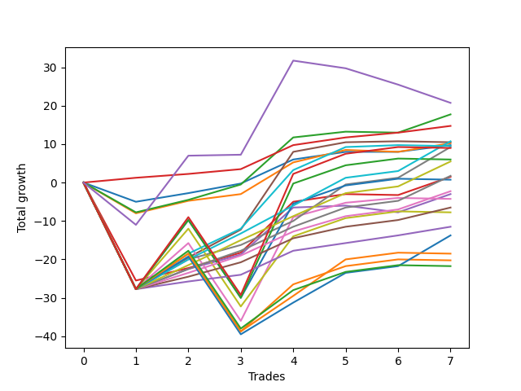

# Short Labrador 013 
- Symbol: ES_830-1130
- Date Range: 03/18/2022 - 12/30/2022
- Trading Period: 8:30-11:30
- Number of Trades: 7



| Name | Win Percent | Profit | Avg Profit / Trade | Avg Time / Trade |      | Name | Win Percent | Profit | Avg Profit / Trade | Avg Time / Trade |
| ---- | ----------- | ------ | ------------------ | ---------------- | ---- | ---- | ----------- | ------ | ------------------ | ---------------- |
| Sorted By <br> Profit | | | | | | Sorted By <br> Win Percentage ||||
| NEWFI 0000 | 42.86 | 10375.00 | 1482.14 | 31:36 |     | TP-1 | 100.00 | 7375.00 | 1053.57 | 09:19 |
| BB-20 U/L 2SD | 71.43 | 8875.00 | 1267.86 | 14:00 |     | TP-7 | 85.71 | 5375.00 | 767.86 | 28:04 |
| TP-1 | 100.00 | 7375.00 | 1053.57 | 09:19 |     | V Mid | 85.71 | 4625.00 | 660.71 | 28:17 |
| TP-7 | 85.71 | 5375.00 | 767.86 | 28:04 |     | TP-6 | 85.71 | 2750.00 | 392.86 | 27:30 |
| BB-50 U/L 1SD | 71.43 | 5250.00 | 750.00 | 32:54 |     | TP-5 | 85.71 | 875.00 | 125.00 | 25:35 |
| BB-20 U/L 1SD | 71.43 | 5125.00 | 732.14 | 09:33 |     | TP-4 | 85.71 | -1125.00 | -160.71 | 25:25 |
| BB-20 Mid | 71.43 | 4875.00 | 696.43 | 04:28 |     | TP-3 | 85.71 | -3250.00 | -464.29 | 19:58 |
| BB-100 Mid | 71.43 | 4750.00 | 678.57 | 36:33 |     | TP-2 | 85.71 | -5750.00 | -821.43 | 18:18 |
| V Mid | 85.71 | 4625.00 | 660.71 | 28:17 |     | BB-20 U/L 2SD | 71.43 | 8875.00 | 1267.86 | 14:00 |
| NEWFI 000 | 57.14 | 4500.00 | 642.86 | 49:25 |     | BB-50 U/L 1SD | 71.43 | 5250.00 | 750.00 | 32:54 |
| BB-200 U/L 2SD | 57.14 | 3000.00 | 428.57 | 54:45 |     | BB-20 U/L 1SD | 71.43 | 5125.00 | 732.14 | 09:33 |
| TP-6 | 85.71 | 2750.00 | 392.86 | 27:30 |     | BB-20 Mid | 71.43 | 4875.00 | 696.43 | 04:28 |
| TP-5 | 85.71 | 875.00 | 125.00 | 25:35 |     | BB-100 Mid | 71.43 | 4750.00 | 678.57 | 36:33 |
| BB-20 U/L 2SD C | 71.43 | 750.00 | 107.14 | 19:11 |     | BB-20 U/L 2SD C | 71.43 | 750.00 | 107.14 | 19:11 |
| BB-100 U/L 2SD | 57.14 | 375.00 | 53.57 | 60:55 |     | BB-50 Mid | 71.43 | -1500.00 | -214.29 | 20:30 |
| TP-4 | 85.71 | -1125.00 | -160.71 | 25:25 |     | TP-8 | 71.43 | -6875.00 | -982.14 | 36:56 |
| BB-50 Mid | 71.43 | -1500.00 | -214.29 | 20:30 |     | NEWFI 000 | 57.14 | 4500.00 | 642.86 | 49:25 |
| BB-50 U/L 2SD | 57.14 | -2125.00 | -303.57 | 44:42 |     | BB-200 U/L 2SD | 57.14 | 3000.00 | 428.57 | 54:45 |
| TP-3 | 85.71 | -3250.00 | -464.29 | 19:58 |     | BB-100 U/L 2SD | 57.14 | 375.00 | 53.57 | 60:55 |
| V U/L 1SD | 57.14 | -3875.00 | -553.57 | 47:52 |     | BB-50 U/L 2SD | 57.14 | -2125.00 | -303.57 | 44:42 |
| TP-2 | 85.71 | -5750.00 | -821.43 | 18:18 |     | V U/L 1SD | 57.14 | -3875.00 | -553.57 | 47:52 |
| TP-8 | 71.43 | -6875.00 | -982.14 | 36:56 |     | TP-9 | 57.14 | -9250.00 | -1321.43 | 45:05 |
| TP-9 | 57.14 | -9250.00 | -1321.43 | 45:05 |     | BB-200 Mid | 57.14 | -10125.00 | -1446.43 | 46:32 |
| BB-200 Mid | 57.14 | -10125.00 | -1446.43 | 46:32 |     | TP-10 | 57.14 | -10875.00 | -1553.57 | 46:32 |
| TP-10 | 57.14 | -10875.00 | -1553.57 | 46:32 |     | NEWFI 0000 | 42.86 | 10375.00 | 1482.14 | 31:36 |

## NO STOPLOSS

### Test BB-20 Mid
* Sell when price hits the middle line of the 20p bollinger
* No Stoploss
* Results:
```
Total Trades: 7
Percent Up: 28.57
Percent Down: 71.43
Total Points Moved Down: 9.75
Potential Profit: 4875.00
Total Points Ups: 5.00 Count Ups: 2
Total Points Downs: 14.75 Count Downs: 5
```

<details><summary>Trades</summary>

<code>In: 2022-05-25 11:24:00		Out: 2022-05-25 11:39:10		Total Position Time: 15:10		Total Move Down: -5.00		Total to Date: -5.00</code> <br />
<code>In: 2022-06-09 10:09:00		Out: 2022-06-09 10:16:50		Total Position Time: 07:50		Total Move Down: 2.25		Total to Date: -2.75</code> <br />
<code>In: 2022-06-10 11:27:00		Out: 2022-06-10 11:28:25		Total Position Time: 01:25		Total Move Down: 2.50		Total to Date: -0.25</code> <br />
<code>In: 2022-06-14 10:26:00		Out: 2022-06-14 10:27:10		Total Position Time: 01:10		Total Move Down: 6.25		Total to Date: 6.00</code> <br />
<code>In: 2022-08-05 10:19:00		Out: 2022-08-05 10:20:10		Total Position Time: 01:10		Total Move Down: 2.00		Total to Date: 8.00</code> <br />
<code>In: 2022-11-21 10:24:00		Out: 2022-11-21 10:27:25		Total Position Time: 03:25		Total Move Down: -0.00		Total to Date: 8.00</code> <br />
<code>In: 2022-11-23 11:31:00		Out: 2022-11-23 11:32:10		Total Position Time: 01:10		Total Move Down: 1.75		Total to Date: 9.75</code> <br />


</details>

### Test BB-20 U/L 1SD
* Sell when the price hits the lower line of the 20p 1std bollinger
* No Stoploss
* Results:
```
Total Trades: 7
Percent Up: 28.57
Percent Down: 71.43
Total Points Moved Down: 10.25
Potential Profit: 5125.00
Total Points Ups: 8.50 Count Ups: 2
Total Points Downs: 18.75 Count Downs: 5
```

<details><summary>Trades</summary>

<code>In: 2022-05-25 11:24:00		Out: 2022-05-25 11:49:55		Total Position Time: 25:55		Total Move Down: -8.00		Total to Date: -8.00</code> <br />
<code>In: 2022-06-09 10:09:00		Out: 2022-06-09 10:18:50		Total Position Time: 09:50		Total Move Down: 3.25		Total to Date: -4.75</code> <br />
<code>In: 2022-06-10 11:27:00		Out: 2022-06-10 11:38:10		Total Position Time: 11:10		Total Move Down: 1.75		Total to Date: -3.00</code> <br />
<code>In: 2022-06-14 10:26:00		Out: 2022-06-14 10:29:05		Total Position Time: 03:05		Total Move Down: 8.25		Total to Date: 5.25</code> <br />
<code>In: 2022-08-05 10:19:00		Out: 2022-08-05 10:23:15		Total Position Time: 04:15		Total Move Down: 3.25		Total to Date: 8.50</code> <br />
<code>In: 2022-11-21 10:24:00		Out: 2022-11-21 10:33:00		Total Position Time: 09:00		Total Move Down: -0.50		Total to Date: 8.00</code> <br />
<code>In: 2022-11-23 11:31:00		Out: 2022-11-23 11:34:40		Total Position Time: 03:40		Total Move Down: 2.25		Total to Date: 10.25</code> <br />


</details>

### Test BB-20 U/L 2SD
* Sell when the price hits the lower line of the 20p 2std bollinger
* No Stoploss
* Results:
```
Total Trades: 7
Percent Up: 28.57
Percent Down: 71.43
Total Points Moved Down: 17.75
Potential Profit: 8875.00
Total Points Ups: 8.00 Count Ups: 2
Total Points Downs: 25.75 Count Downs: 5
```

<details><summary>Trades</summary>

<code>In: 2022-05-25 11:24:00		Out: 2022-05-25 11:50:00		Total Position Time: 26:00		Total Move Down: -7.75		Total to Date: -7.75</code> <br />
<code>In: 2022-06-09 10:09:00		Out: 2022-06-09 10:19:05		Total Position Time: 10:05		Total Move Down: 3.25		Total to Date: -4.50</code> <br />
<code>In: 2022-06-10 11:27:00		Out: 2022-06-10 11:40:10		Total Position Time: 13:10		Total Move Down: 4.00		Total to Date: -0.50</code> <br />
<code>In: 2022-06-14 10:26:00		Out: 2022-06-14 10:31:00		Total Position Time: 05:00		Total Move Down: 12.25		Total to Date: 11.75</code> <br />
<code>In: 2022-08-05 10:19:00		Out: 2022-08-05 10:49:30		Total Position Time: 30:30		Total Move Down: 1.50		Total to Date: 13.25</code> <br />
<code>In: 2022-11-21 10:24:00		Out: 2022-11-21 10:33:10		Total Position Time: 09:10		Total Move Down: -0.25		Total to Date: 13.00</code> <br />
<code>In: 2022-11-23 11:31:00		Out: 2022-11-23 11:35:05		Total Position Time: 04:05		Total Move Down: 4.75		Total to Date: 17.75</code> <br />


</details>

### Test BB-20 U/L 2SD C
* Sell when the price hits the lower line of the 20p 2std bollinger
* No Stoploss
* Results:
```
Total Trades: 7
Percent Up: 28.57
Percent Down: 71.43
Total Points Moved Down: 1.50
Potential Profit: 750.00
Total Points Ups: 25.75 Count Ups: 2
Total Points Downs: 27.25 Count Downs: 5
```

<details><summary>Trades</summary>

<code>In: 2022-05-25 11:24:00		Out: 2022-05-25 12:23:00		Total Position Time: 59:00		Total Move Down: -25.50		Total to Date: -25.50</code> <br />
<code>In: 2022-06-09 10:09:00		Out: 2022-06-09 10:21:10		Total Position Time: 12:10		Total Move Down: 3.25		Total to Date: -22.25</code> <br />
<code>In: 2022-06-10 11:27:00		Out: 2022-06-10 11:40:10		Total Position Time: 13:10		Total Move Down: 4.00		Total to Date: -18.25</code> <br />
<code>In: 2022-06-14 10:26:00		Out: 2022-06-14 10:31:10		Total Position Time: 05:10		Total Move Down: 13.25		Total to Date: -5.00</code> <br />
<code>In: 2022-08-05 10:19:00		Out: 2022-08-05 10:50:35		Total Position Time: 31:35		Total Move Down: 2.00		Total to Date: -3.00</code> <br />
<code>In: 2022-11-21 10:24:00		Out: 2022-11-21 10:33:10		Total Position Time: 09:10		Total Move Down: -0.25		Total to Date: -3.25</code> <br />
<code>In: 2022-11-23 11:31:00		Out: 2022-11-23 11:35:05		Total Position Time: 04:05		Total Move Down: 4.75		Total to Date: 1.50</code> <br />


</details>

### Test BB-50 Mid
* Sell when price hits the middle line of the 50p bollinger
* No Stoploss
* Results:
```
Total Trades: 7
Percent Up: 28.57
Percent Down: 71.43
Total Points Moved Down: -3.00
Potential Profit: -1500.00
Total Points Ups: 29.50 Count Ups: 2
Total Points Downs: 26.50 Count Downs: 5
```

<details><summary>Trades</summary>

<code>In: 2022-05-25 11:24:00		Out: 2022-05-25 12:24:55		Total Position Time: 60:55		Total Move Down: -27.75		Total to Date: -27.75</code> <br />
<code>In: 2022-06-09 10:09:00		Out: 2022-06-09 10:22:05		Total Position Time: 13:05		Total Move Down: 5.25		Total to Date: -22.50</code> <br />
<code>In: 2022-06-10 11:27:00		Out: 2022-06-10 11:28:30		Total Position Time: 01:30		Total Move Down: 3.75		Total to Date: -18.75</code> <br />
<code>In: 2022-06-14 10:26:00		Out: 2022-06-14 10:31:00		Total Position Time: 05:00		Total Move Down: 12.25		Total to Date: -6.50</code> <br />
<code>In: 2022-08-05 10:19:00		Out: 2022-08-05 10:47:35		Total Position Time: 28:35		Total Move Down: 0.50		Total to Date: -6.00</code> <br />
<code>In: 2022-11-21 10:24:00		Out: 2022-11-21 10:54:25		Total Position Time: 30:25		Total Move Down: -1.75		Total to Date: -7.75</code> <br />
<code>In: 2022-11-23 11:31:00		Out: 2022-11-23 11:35:05		Total Position Time: 04:05		Total Move Down: 4.75		Total to Date: -3.00</code> <br />


</details>

### Test BB-50 U/L 1SD
* Sell when the price hits the lower line of the 50p 1std bollinger
* No Stoploss
* Results:
```
Total Trades: 7
Percent Up: 28.57
Percent Down: 71.43
Total Points Moved Down: 10.50
Potential Profit: 5250.00
Total Points Ups: 28.00 Count Ups: 2
Total Points Downs: 38.50 Count Downs: 5
```

<details><summary>Trades</summary>

<code>In: 2022-05-25 11:24:00		Out: 2022-05-25 12:24:55		Total Position Time: 60:55		Total Move Down: -27.75		Total to Date: -27.75</code> <br />
<code>In: 2022-06-09 10:09:00		Out: 2022-06-09 10:24:05		Total Position Time: 15:05		Total Move Down: 8.25		Total to Date: -19.50</code> <br />
<code>In: 2022-06-10 11:27:00		Out: 2022-06-10 11:41:45		Total Position Time: 14:45		Total Move Down: 7.25		Total to Date: -12.25</code> <br />
<code>In: 2022-06-14 10:26:00		Out: 2022-06-14 10:36:10		Total Position Time: 10:10		Total Move Down: 20.25		Total to Date: 8.00</code> <br />
<code>In: 2022-08-05 10:19:00		Out: 2022-08-05 10:52:05		Total Position Time: 33:05		Total Move Down: 2.50		Total to Date: 10.50</code> <br />
<code>In: 2022-11-21 10:24:00		Out: 2022-11-21 10:59:25		Total Position Time: 35:25		Total Move Down: 0.25		Total to Date: 10.75</code> <br />
<code>In: 2022-11-23 11:31:00		Out: 2022-11-23 12:31:55		Total Position Time: 60:55		Total Move Down: -0.25		Total to Date: 10.50</code> <br />


</details>

### Test BB-50 U/L 2SD
* Sell when the price hits the lower line of the 50p 2std bollinger
* No Stoploss
* Results:
```
Total Trades: 7
Percent Up: 42.86
Percent Down: 57.14
Total Points Moved Down: -4.25
Potential Profit: -2125.00
Total Points Ups: 48.25 Count Ups: 3
Total Points Downs: 44.00 Count Downs: 4
```

<details><summary>Trades</summary>

<code>In: 2022-05-25 11:24:00		Out: 2022-05-25 12:24:55		Total Position Time: 60:55		Total Move Down: -27.75		Total to Date: -27.75</code> <br />
<code>In: 2022-06-09 10:09:00		Out: 2022-06-09 10:27:20		Total Position Time: 18:20		Total Move Down: 12.00		Total to Date: -15.75</code> <br />
<code>In: 2022-06-10 11:27:00		Out: 2022-06-10 12:27:55		Total Position Time: 60:55		Total Move Down: -20.25		Total to Date: -36.00</code> <br />
<code>In: 2022-06-14 10:26:00		Out: 2022-06-14 10:43:05		Total Position Time: 17:05		Total Move Down: 27.00		Total to Date: -9.00</code> <br />
<code>In: 2022-08-05 10:19:00		Out: 2022-08-05 10:55:40		Total Position Time: 36:40		Total Move Down: 3.75		Total to Date: -5.25</code> <br />
<code>In: 2022-11-21 10:24:00		Out: 2022-11-21 11:22:10		Total Position Time: 58:10		Total Move Down: 1.25		Total to Date: -4.00</code> <br />
<code>In: 2022-11-23 11:31:00		Out: 2022-11-23 12:31:55		Total Position Time: 60:55		Total Move Down: -0.25		Total to Date: -4.25</code> <br />


</details>

### Test V Mid
* Sell when the price hits the middle line of the 1std VWAP
* No Stoploss
* Results:
```
Total Trades: 7
Percent Up: 14.29
Percent Down: 85.71
Total Points Moved Down: 9.25
Potential Profit: 4625.00
Total Points Ups: 27.75 Count Ups: 1
Total Points Downs: 37.00 Count Downs: 6
```

<details><summary>Trades</summary>

<code>In: 2022-05-25 11:24:00		Out: 2022-05-25 12:24:55		Total Position Time: 60:55		Total Move Down: -27.75		Total to Date: -27.75</code> <br />
<code>In: 2022-06-09 10:09:00		Out: 2022-06-09 10:23:45		Total Position Time: 14:45		Total Move Down: 7.75		Total to Date: -20.00</code> <br />
<code>In: 2022-06-10 11:27:00		Out: 2022-06-10 11:28:30		Total Position Time: 01:30		Total Move Down: 3.75		Total to Date: -16.25</code> <br />
<code>In: 2022-06-14 10:26:00		Out: 2022-06-14 10:27:10		Total Position Time: 01:10		Total Move Down: 6.25		Total to Date: -10.00</code> <br />
<code>In: 2022-08-05 10:19:00		Out: 2022-08-05 11:11:45		Total Position Time: 52:45		Total Move Down: 9.50		Total to Date: -0.50</code> <br />
<code>In: 2022-11-21 10:24:00		Out: 2022-11-21 11:24:55		Total Position Time: 60:55		Total Move Down: 1.75		Total to Date: 1.25</code> <br />
<code>In: 2022-11-23 11:31:00		Out: 2022-11-23 11:37:05		Total Position Time: 06:05		Total Move Down: 8.00		Total to Date: 9.25</code> <br />


</details>

### Test V U/L 1SD
* Sell when the price hits the lower line of the 1std VWAP
* No Stoploss
* Results:
```
Total Trades: 7
Percent Up: 42.86
Percent Down: 57.14
Total Points Moved Down: -7.75
Potential Profit: -3875.00
Total Points Ups: 48.25 Count Ups: 3
Total Points Downs: 40.50 Count Downs: 4
```

<details><summary>Trades</summary>

<code>In: 2022-05-25 11:24:00		Out: 2022-05-25 12:24:55		Total Position Time: 60:55		Total Move Down: -27.75		Total to Date: -27.75</code> <br />
<code>In: 2022-06-09 10:09:00		Out: 2022-06-09 10:30:30		Total Position Time: 21:30		Total Move Down: 15.75		Total to Date: -12.00</code> <br />
<code>In: 2022-06-10 11:27:00		Out: 2022-06-10 12:27:55		Total Position Time: 60:55		Total Move Down: -20.25		Total to Date: -32.25</code> <br />
<code>In: 2022-06-14 10:26:00		Out: 2022-06-14 10:35:05		Total Position Time: 09:05		Total Move Down: 18.25		Total to Date: -14.00</code> <br />
<code>In: 2022-08-05 10:19:00		Out: 2022-08-05 11:19:55		Total Position Time: 60:55		Total Move Down: 4.75		Total to Date: -9.25</code> <br />
<code>In: 2022-11-21 10:24:00		Out: 2022-11-21 11:24:55		Total Position Time: 60:55		Total Move Down: 1.75		Total to Date: -7.50</code> <br />
<code>In: 2022-11-23 11:31:00		Out: 2022-11-23 12:31:55		Total Position Time: 60:55		Total Move Down: -0.25		Total to Date: -7.75</code> <br />


</details>

### Test BB-100 Mid
* Move to BB100 Mid
* No Stoploss
* Results:
```
Total Trades: 7
Percent Up: 28.57
Percent Down: 71.43
Total Points Moved Down: 9.50
Potential Profit: 4750.00
Total Points Ups: 28.00 Count Ups: 2
Total Points Downs: 37.50 Count Downs: 5
```

<details><summary>Trades</summary>

<code>In: 2022-05-25 11:24:00		Out: 2022-05-25 12:24:55		Total Position Time: 60:55		Total Move Down: -27.75		Total to Date: -27.75</code> <br />
<code>In: 2022-06-09 10:09:00		Out: 2022-06-09 10:25:10		Total Position Time: 16:10		Total Move Down: 9.25		Total to Date: -18.50</code> <br />
<code>In: 2022-06-10 11:27:00		Out: 2022-06-10 11:41:25		Total Position Time: 14:25		Total Move Down: 6.50		Total to Date: -12.00</code> <br />
<code>In: 2022-06-14 10:26:00		Out: 2022-06-14 10:34:00		Total Position Time: 08:00		Total Move Down: 15.25		Total to Date: 3.25</code> <br />
<code>In: 2022-08-05 10:19:00		Out: 2022-08-05 10:56:25		Total Position Time: 37:25		Total Move Down: 6.00		Total to Date: 9.25</code> <br />
<code>In: 2022-11-21 10:24:00		Out: 2022-11-21 11:22:05		Total Position Time: 58:05		Total Move Down: 0.50		Total to Date: 9.75</code> <br />
<code>In: 2022-11-23 11:31:00		Out: 2022-11-23 12:31:55		Total Position Time: 60:55		Total Move Down: -0.25		Total to Date: 9.50</code> <br />


</details>

### Test BB-100 U/L 2SD
* Move to BB100 Upper Band
* No Stoploss
* Results:
```
Total Trades: 7
Percent Up: 42.86
Percent Down: 57.14
Total Points Moved Down: 0.75
Potential Profit: 375.00
Total Points Ups: 48.25 Count Ups: 3
Total Points Downs: 49.00 Count Downs: 4
```

<details><summary>Trades</summary>

<code>In: 2022-05-25 11:24:00		Out: 2022-05-25 12:24:55		Total Position Time: 60:55		Total Move Down: -27.75		Total to Date: -27.75</code> <br />
<code>In: 2022-06-09 10:09:00		Out: 2022-06-09 11:09:55		Total Position Time: 60:55		Total Move Down: 18.00		Total to Date: -9.75</code> <br />
<code>In: 2022-06-10 11:27:00		Out: 2022-06-10 12:27:55		Total Position Time: 60:55		Total Move Down: -20.25		Total to Date: -30.00</code> <br />
<code>In: 2022-06-14 10:26:00		Out: 2022-06-14 11:26:55		Total Position Time: 60:55		Total Move Down: 24.50		Total to Date: -5.50</code> <br />
<code>In: 2022-08-05 10:19:00		Out: 2022-08-05 11:19:55		Total Position Time: 60:55		Total Move Down: 4.75		Total to Date: -0.75</code> <br />
<code>In: 2022-11-21 10:24:00		Out: 2022-11-21 11:24:55		Total Position Time: 60:55		Total Move Down: 1.75		Total to Date: 1.00</code> <br />
<code>In: 2022-11-23 11:31:00		Out: 2022-11-23 12:31:55		Total Position Time: 60:55		Total Move Down: -0.25		Total to Date: 0.75</code> <br />


</details>

### Test BB-200 Mid
* Move to BB200 Mid
* No Stoploss
* Results:
```
Total Trades: 7
Percent Up: 42.86
Percent Down: 57.14
Total Points Moved Down: -20.25
Potential Profit: -10125.00
Total Points Ups: 48.25 Count Ups: 3
Total Points Downs: 28.00 Count Downs: 4
```

<details><summary>Trades</summary>

<code>In: 2022-05-25 11:24:00		Out: 2022-05-25 12:24:55		Total Position Time: 60:55		Total Move Down: -27.75		Total to Date: -27.75</code> <br />
<code>In: 2022-06-09 10:09:00		Out: 2022-06-09 10:25:10		Total Position Time: 16:10		Total Move Down: 9.25		Total to Date: -18.50</code> <br />
<code>In: 2022-06-10 11:27:00		Out: 2022-06-10 12:27:55		Total Position Time: 60:55		Total Move Down: -20.25		Total to Date: -38.75</code> <br />
<code>In: 2022-06-14 10:26:00		Out: 2022-06-14 10:31:00		Total Position Time: 05:00		Total Move Down: 12.25		Total to Date: -26.50</code> <br />
<code>In: 2022-08-05 10:19:00		Out: 2022-08-05 11:19:55		Total Position Time: 60:55		Total Move Down: 4.75		Total to Date: -21.75</code> <br />
<code>In: 2022-11-21 10:24:00		Out: 2022-11-21 11:24:55		Total Position Time: 60:55		Total Move Down: 1.75		Total to Date: -20.00</code> <br />
<code>In: 2022-11-23 11:31:00		Out: 2022-11-23 12:31:55		Total Position Time: 60:55		Total Move Down: -0.25		Total to Date: -20.25</code> <br />


</details>

### Test BB-200 U/L 2SD
* Move to BB200 Upper Band
* No Stoploss
* Results:
```
Total Trades: 7
Percent Up: 42.86
Percent Down: 57.14
Total Points Moved Down: 6.00
Potential Profit: 3000.00
Total Points Ups: 48.25 Count Ups: 3
Total Points Downs: 54.25 Count Downs: 4
```

<details><summary>Trades</summary>

<code>In: 2022-05-25 11:24:00		Out: 2022-05-25 12:24:55		Total Position Time: 60:55		Total Move Down: -27.75		Total to Date: -27.75</code> <br />
<code>In: 2022-06-09 10:09:00		Out: 2022-06-09 11:09:55		Total Position Time: 60:55		Total Move Down: 18.00		Total to Date: -9.75</code> <br />
<code>In: 2022-06-10 11:27:00		Out: 2022-06-10 12:27:55		Total Position Time: 60:55		Total Move Down: -20.25		Total to Date: -30.00</code> <br />
<code>In: 2022-06-14 10:26:00		Out: 2022-06-14 10:43:45		Total Position Time: 17:45		Total Move Down: 29.75		Total to Date: -0.25</code> <br />
<code>In: 2022-08-05 10:19:00		Out: 2022-08-05 11:19:55		Total Position Time: 60:55		Total Move Down: 4.75		Total to Date: 4.50</code> <br />
<code>In: 2022-11-21 10:24:00		Out: 2022-11-21 11:24:55		Total Position Time: 60:55		Total Move Down: 1.75		Total to Date: 6.25</code> <br />
<code>In: 2022-11-23 11:31:00		Out: 2022-11-23 12:31:55		Total Position Time: 60:55		Total Move Down: -0.25		Total to Date: 6.00</code> <br />


</details>

## TAKE PROFIT

### Test TP-1
* Take Profit of 1 Point
* No Stoploss
* Results:
```
Total Trades: 7
Percent Up: 0.00
Percent Down: 100.00
Total Points Moved Down: 14.75
Potential Profit: 7375.00
Total Points Ups: 0.00 Count Ups: 0
Total Points Downs: 14.75 Count Downs: 7
```

<details><summary>Trades</summary>

<code>In: 2022-05-25 11:24:00		Out: 2022-05-25 11:25:15		Total Position Time: 01:15		Total Move Down: 1.25		Total to Date: 1.25</code> <br />
<code>In: 2022-06-09 10:09:00		Out: 2022-06-09 10:10:10		Total Position Time: 01:10		Total Move Down: 1.00		Total to Date: 2.25</code> <br />
<code>In: 2022-06-10 11:27:00		Out: 2022-06-10 11:28:10		Total Position Time: 01:10		Total Move Down: 1.25		Total to Date: 3.50</code> <br />
<code>In: 2022-06-14 10:26:00		Out: 2022-06-14 10:27:10		Total Position Time: 01:10		Total Move Down: 6.25		Total to Date: 9.75</code> <br />
<code>In: 2022-08-05 10:19:00		Out: 2022-08-05 10:20:10		Total Position Time: 01:10		Total Move Down: 2.00		Total to Date: 11.75</code> <br />
<code>In: 2022-11-21 10:24:00		Out: 2022-11-21 11:22:10		Total Position Time: 58:10		Total Move Down: 1.25		Total to Date: 13.00</code> <br />
<code>In: 2022-11-23 11:31:00		Out: 2022-11-23 11:32:10		Total Position Time: 01:10		Total Move Down: 1.75		Total to Date: 14.75</code> <br />


</details>

### Test TP-2
* Take Profit of 2 Point
* No Stoploss
* Results:
```
Total Trades: 7
Percent Up: 14.29
Percent Down: 85.71
Total Points Moved Down: -11.50
Potential Profit: -5750.00
Total Points Ups: 27.75 Count Ups: 1
Total Points Downs: 16.25 Count Downs: 6
```

<details><summary>Trades</summary>

<code>In: 2022-05-25 11:24:00		Out: 2022-05-25 12:24:55		Total Position Time: 60:55		Total Move Down: -27.75		Total to Date: -27.75</code> <br />
<code>In: 2022-06-09 10:09:00		Out: 2022-06-09 10:10:30		Total Position Time: 01:30		Total Move Down: 2.00		Total to Date: -25.75</code> <br />
<code>In: 2022-06-10 11:27:00		Out: 2022-06-10 11:28:20		Total Position Time: 01:20		Total Move Down: 1.75		Total to Date: -24.00</code> <br />
<code>In: 2022-06-14 10:26:00		Out: 2022-06-14 10:27:10		Total Position Time: 01:10		Total Move Down: 6.25		Total to Date: -17.75</code> <br />
<code>In: 2022-08-05 10:19:00		Out: 2022-08-05 10:20:10		Total Position Time: 01:10		Total Move Down: 2.00		Total to Date: -15.75</code> <br />
<code>In: 2022-11-21 10:24:00		Out: 2022-11-21 11:22:25		Total Position Time: 58:25		Total Move Down: 2.00		Total to Date: -13.75</code> <br />
<code>In: 2022-11-23 11:31:00		Out: 2022-11-23 11:34:40		Total Position Time: 03:40		Total Move Down: 2.25		Total to Date: -11.50</code> <br />


</details>

### Test TP-3
* Take Profit of 3 Point
* No Stoploss
* Results:
```
Total Trades: 7
Percent Up: 14.29
Percent Down: 85.71
Total Points Moved Down: -6.50
Potential Profit: -3250.00
Total Points Ups: 27.75 Count Ups: 1
Total Points Downs: 21.25 Count Downs: 6
```

<details><summary>Trades</summary>

<code>In: 2022-05-25 11:24:00		Out: 2022-05-25 12:24:55		Total Position Time: 60:55		Total Move Down: -27.75		Total to Date: -27.75</code> <br />
<code>In: 2022-06-09 10:09:00		Out: 2022-06-09 10:18:50		Total Position Time: 09:50		Total Move Down: 3.25		Total to Date: -24.50</code> <br />
<code>In: 2022-06-10 11:27:00		Out: 2022-06-10 11:28:30		Total Position Time: 01:30		Total Move Down: 3.75		Total to Date: -20.75</code> <br />
<code>In: 2022-06-14 10:26:00		Out: 2022-06-14 10:27:10		Total Position Time: 01:10		Total Move Down: 6.25		Total to Date: -14.50</code> <br />
<code>In: 2022-08-05 10:19:00		Out: 2022-08-05 10:20:45		Total Position Time: 01:45		Total Move Down: 3.00		Total to Date: -11.50</code> <br />
<code>In: 2022-11-21 10:24:00		Out: 2022-11-21 11:24:55		Total Position Time: 60:55		Total Move Down: 1.75		Total to Date: -9.75</code> <br />
<code>In: 2022-11-23 11:31:00		Out: 2022-11-23 11:34:45		Total Position Time: 03:45		Total Move Down: 3.25		Total to Date: -6.50</code> <br />


</details>

### Test TP-4
* Take Profit of 4 Point
* No Stoploss
* Results:
```
Total Trades: 7
Percent Up: 14.29
Percent Down: 85.71
Total Points Moved Down: -2.25
Potential Profit: -1125.00
Total Points Ups: 27.75 Count Ups: 1
Total Points Downs: 25.50 Count Downs: 6
```

<details><summary>Trades</summary>

<code>In: 2022-05-25 11:24:00		Out: 2022-05-25 12:24:55		Total Position Time: 60:55		Total Move Down: -27.75		Total to Date: -27.75</code> <br />
<code>In: 2022-06-09 10:09:00		Out: 2022-06-09 10:21:30		Total Position Time: 12:30		Total Move Down: 4.25		Total to Date: -23.50</code> <br />
<code>In: 2022-06-10 11:27:00		Out: 2022-06-10 11:28:35		Total Position Time: 01:35		Total Move Down: 4.50		Total to Date: -19.00</code> <br />
<code>In: 2022-06-14 10:26:00		Out: 2022-06-14 10:27:10		Total Position Time: 01:10		Total Move Down: 6.25		Total to Date: -12.75</code> <br />
<code>In: 2022-08-05 10:19:00		Out: 2022-08-05 10:55:45		Total Position Time: 36:45		Total Move Down: 4.00		Total to Date: -8.75</code> <br />
<code>In: 2022-11-21 10:24:00		Out: 2022-11-21 11:24:55		Total Position Time: 60:55		Total Move Down: 1.75		Total to Date: -7.00</code> <br />
<code>In: 2022-11-23 11:31:00		Out: 2022-11-23 11:35:05		Total Position Time: 04:05		Total Move Down: 4.75		Total to Date: -2.25</code> <br />


</details>

### Test TP-5
* Take Profit of 5 Point
* No Stoploss
* Results:
```
Total Trades: 7
Percent Up: 14.29
Percent Down: 85.71
Total Points Moved Down: 1.75
Potential Profit: 875.00
Total Points Ups: 27.75 Count Ups: 1
Total Points Downs: 29.50 Count Downs: 6
```

<details><summary>Trades</summary>

<code>In: 2022-05-25 11:24:00		Out: 2022-05-25 12:24:55		Total Position Time: 60:55		Total Move Down: -27.75		Total to Date: -27.75</code> <br />
<code>In: 2022-06-09 10:09:00		Out: 2022-06-09 10:22:05		Total Position Time: 13:05		Total Move Down: 5.25		Total to Date: -22.50</code> <br />
<code>In: 2022-06-10 11:27:00		Out: 2022-06-10 11:28:50		Total Position Time: 01:50		Total Move Down: 4.75		Total to Date: -17.75</code> <br />
<code>In: 2022-06-14 10:26:00		Out: 2022-06-14 10:27:10		Total Position Time: 01:10		Total Move Down: 6.25		Total to Date: -11.50</code> <br />
<code>In: 2022-08-05 10:19:00		Out: 2022-08-05 10:56:05		Total Position Time: 37:05		Total Move Down: 5.00		Total to Date: -6.50</code> <br />
<code>In: 2022-11-21 10:24:00		Out: 2022-11-21 11:24:55		Total Position Time: 60:55		Total Move Down: 1.75		Total to Date: -4.75</code> <br />
<code>In: 2022-11-23 11:31:00		Out: 2022-11-23 11:35:10		Total Position Time: 04:10		Total Move Down: 6.50		Total to Date: 1.75</code> <br />


</details>

### Test TP-6
* Take Profit of 6 Point
* No Stoploss
* Results:
```
Total Trades: 7
Percent Up: 14.29
Percent Down: 85.71
Total Points Moved Down: 5.50
Potential Profit: 2750.00
Total Points Ups: 27.75 Count Ups: 1
Total Points Downs: 33.25 Count Downs: 6
```

<details><summary>Trades</summary>

<code>In: 2022-05-25 11:24:00		Out: 2022-05-25 12:24:55		Total Position Time: 60:55		Total Move Down: -27.75		Total to Date: -27.75</code> <br />
<code>In: 2022-06-09 10:09:00		Out: 2022-06-09 10:22:35		Total Position Time: 13:35		Total Move Down: 6.25		Total to Date: -21.50</code> <br />
<code>In: 2022-06-10 11:27:00		Out: 2022-06-10 11:41:25		Total Position Time: 14:25		Total Move Down: 6.50		Total to Date: -15.00</code> <br />
<code>In: 2022-06-14 10:26:00		Out: 2022-06-14 10:27:10		Total Position Time: 01:10		Total Move Down: 6.25		Total to Date: -8.75</code> <br />
<code>In: 2022-08-05 10:19:00		Out: 2022-08-05 10:56:20		Total Position Time: 37:20		Total Move Down: 6.00		Total to Date: -2.75</code> <br />
<code>In: 2022-11-21 10:24:00		Out: 2022-11-21 11:24:55		Total Position Time: 60:55		Total Move Down: 1.75		Total to Date: -1.00</code> <br />
<code>In: 2022-11-23 11:31:00		Out: 2022-11-23 11:35:10		Total Position Time: 04:10		Total Move Down: 6.50		Total to Date: 5.50</code> <br />


</details>

### Test TP-7
* Take Profit of 7 Point
* No Stoploss
* Results:
```
Total Trades: 7
Percent Up: 14.29
Percent Down: 85.71
Total Points Moved Down: 10.75
Potential Profit: 5375.00
Total Points Ups: 27.75 Count Ups: 1
Total Points Downs: 38.50 Count Downs: 6
```

<details><summary>Trades</summary>

<code>In: 2022-05-25 11:24:00		Out: 2022-05-25 12:24:55		Total Position Time: 60:55		Total Move Down: -27.75		Total to Date: -27.75</code> <br />
<code>In: 2022-06-09 10:09:00		Out: 2022-06-09 10:23:45		Total Position Time: 14:45		Total Move Down: 7.75		Total to Date: -20.00</code> <br />
<code>In: 2022-06-10 11:27:00		Out: 2022-06-10 11:41:40		Total Position Time: 14:40		Total Move Down: 6.75		Total to Date: -13.25</code> <br />
<code>In: 2022-06-14 10:26:00		Out: 2022-06-14 10:27:25		Total Position Time: 01:25		Total Move Down: 7.25		Total to Date: -6.00</code> <br />
<code>In: 2022-08-05 10:19:00		Out: 2022-08-05 10:56:50		Total Position Time: 37:50		Total Move Down: 7.25		Total to Date: 1.25</code> <br />
<code>In: 2022-11-21 10:24:00		Out: 2022-11-21 11:24:55		Total Position Time: 60:55		Total Move Down: 1.75		Total to Date: 3.00</code> <br />
<code>In: 2022-11-23 11:31:00		Out: 2022-11-23 11:37:00		Total Position Time: 06:00		Total Move Down: 7.75		Total to Date: 10.75</code> <br />


</details>

### Test TP-8
* Take Profit of 8 Point
* No Stoploss
* Results:
```
Total Trades: 7
Percent Up: 28.57
Percent Down: 71.43
Total Points Moved Down: -13.75
Potential Profit: -6875.00
Total Points Ups: 48.00 Count Ups: 2
Total Points Downs: 34.25 Count Downs: 5
```

<details><summary>Trades</summary>

<code>In: 2022-05-25 11:24:00		Out: 2022-05-25 12:24:55		Total Position Time: 60:55		Total Move Down: -27.75		Total to Date: -27.75</code> <br />
<code>In: 2022-06-09 10:09:00		Out: 2022-06-09 10:23:50		Total Position Time: 14:50		Total Move Down: 8.50		Total to Date: -19.25</code> <br />
<code>In: 2022-06-10 11:27:00		Out: 2022-06-10 12:27:55		Total Position Time: 60:55		Total Move Down: -20.25		Total to Date: -39.50</code> <br />
<code>In: 2022-06-14 10:26:00		Out: 2022-06-14 10:29:05		Total Position Time: 03:05		Total Move Down: 8.25		Total to Date: -31.25</code> <br />
<code>In: 2022-08-05 10:19:00		Out: 2022-08-05 11:10:50		Total Position Time: 51:50		Total Move Down: 7.75		Total to Date: -23.50</code> <br />
<code>In: 2022-11-21 10:24:00		Out: 2022-11-21 11:24:55		Total Position Time: 60:55		Total Move Down: 1.75		Total to Date: -21.75</code> <br />
<code>In: 2022-11-23 11:31:00		Out: 2022-11-23 11:37:05		Total Position Time: 06:05		Total Move Down: 8.00		Total to Date: -13.75</code> <br />


</details>

### Test TP-9
* Take Profit of 9 Point
* No Stoploss
* Results:
```
Total Trades: 7
Percent Up: 42.86
Percent Down: 57.14
Total Points Moved Down: -18.50
Potential Profit: -9250.00
Total Points Ups: 48.25 Count Ups: 3
Total Points Downs: 29.75 Count Downs: 4
```

<details><summary>Trades</summary>

<code>In: 2022-05-25 11:24:00		Out: 2022-05-25 12:24:55		Total Position Time: 60:55		Total Move Down: -27.75		Total to Date: -27.75</code> <br />
<code>In: 2022-06-09 10:09:00		Out: 2022-06-09 10:25:05		Total Position Time: 16:05		Total Move Down: 9.25		Total to Date: -18.50</code> <br />
<code>In: 2022-06-10 11:27:00		Out: 2022-06-10 12:27:55		Total Position Time: 60:55		Total Move Down: -20.25		Total to Date: -38.75</code> <br />
<code>In: 2022-06-14 10:26:00		Out: 2022-06-14 10:29:10		Total Position Time: 03:10		Total Move Down: 9.25		Total to Date: -29.50</code> <br />
<code>In: 2022-08-05 10:19:00		Out: 2022-08-05 11:11:45		Total Position Time: 52:45		Total Move Down: 9.50		Total to Date: -20.00</code> <br />
<code>In: 2022-11-21 10:24:00		Out: 2022-11-21 11:24:55		Total Position Time: 60:55		Total Move Down: 1.75		Total to Date: -18.25</code> <br />
<code>In: 2022-11-23 11:31:00		Out: 2022-11-23 12:31:55		Total Position Time: 60:55		Total Move Down: -0.25		Total to Date: -18.50</code> <br />


</details>

### Test TP-10
* Take Profit of 10 Point
* No Stoploss
* Results:
```
Total Trades: 7
Percent Up: 42.86
Percent Down: 57.14
Total Points Moved Down: -21.75
Potential Profit: -10875.00
Total Points Ups: 48.25 Count Ups: 3
Total Points Downs: 26.50 Count Downs: 4
```

<details><summary>Trades</summary>

<code>In: 2022-05-25 11:24:00		Out: 2022-05-25 12:24:55		Total Position Time: 60:55		Total Move Down: -27.75		Total to Date: -27.75</code> <br />
<code>In: 2022-06-09 10:09:00		Out: 2022-06-09 10:26:30		Total Position Time: 17:30		Total Move Down: 10.00		Total to Date: -17.75</code> <br />
<code>In: 2022-06-10 11:27:00		Out: 2022-06-10 12:27:55		Total Position Time: 60:55		Total Move Down: -20.25		Total to Date: -38.00</code> <br />
<code>In: 2022-06-14 10:26:00		Out: 2022-06-14 10:29:40		Total Position Time: 03:40		Total Move Down: 10.00		Total to Date: -28.00</code> <br />
<code>In: 2022-08-05 10:19:00		Out: 2022-08-05 11:19:55		Total Position Time: 60:55		Total Move Down: 4.75		Total to Date: -23.25</code> <br />
<code>In: 2022-11-21 10:24:00		Out: 2022-11-21 11:24:55		Total Position Time: 60:55		Total Move Down: 1.75		Total to Date: -21.50</code> <br />
<code>In: 2022-11-23 11:31:00		Out: 2022-11-23 12:31:55		Total Position Time: 60:55		Total Move Down: -0.25		Total to Date: -21.75</code> <br />


</details>

## Indicator Exits

### Test NEWFI 000
* Newfi 0000
* No Stoploss
* Results:
```
Total Trades: 7
Percent Up: 42.86
Percent Down: 57.14
Total Points Moved Down: 9.00
Potential Profit: 4500.00
Total Points Ups: 48.25 Count Ups: 3
Total Points Downs: 57.25 Count Downs: 4
```

<details><summary>Trades</summary>

<code>In: 2022-05-25 11:24:00		Out: 2022-05-25 12:24:55		Total Position Time: 60:55		Total Move Down: -27.75		Total to Date: -27.75</code> <br />
<code>In: 2022-06-09 10:09:00		Out: 2022-06-09 10:48:05		Total Position Time: 39:05		Total Move Down: 18.75		Total to Date: -9.00</code> <br />
<code>In: 2022-06-10 11:27:00		Out: 2022-06-10 12:27:55		Total Position Time: 60:55		Total Move Down: -20.25		Total to Date: -29.25</code> <br />
<code>In: 2022-06-14 10:26:00		Out: 2022-06-14 10:48:05		Total Position Time: 22:05		Total Move Down: 31.50		Total to Date: 2.25</code> <br />
<code>In: 2022-08-05 10:19:00		Out: 2022-08-05 11:00:05		Total Position Time: 41:05		Total Move Down: 5.25		Total to Date: 7.50</code> <br />
<code>In: 2022-11-21 10:24:00		Out: 2022-11-21 11:24:55		Total Position Time: 60:55		Total Move Down: 1.75		Total to Date: 9.25</code> <br />
<code>In: 2022-11-23 11:31:00		Out: 2022-11-23 12:31:55		Total Position Time: 60:55		Total Move Down: -0.25		Total to Date: 9.00</code> <br />


</details>

### Test NEWFI 0000
* Newfi 0000
* No Stoploss
* Results:
```
Total Trades: 7
Percent Up: 57.14
Percent Down: 42.86
Total Points Moved Down: 20.75
Potential Profit: 10375.00
Total Points Ups: 22.00 Count Ups: 4
Total Points Downs: 42.75 Count Downs: 3
```

<details><summary>Trades</summary>

<code>In: 2022-05-25 11:24:00		Out: 2022-05-25 11:30:05		Total Position Time: 06:05		Total Move Down: -11.00		Total to Date: -11.00</code> <br />
<code>In: 2022-06-09 10:09:00		Out: 2022-06-09 11:09:55		Total Position Time: 60:55		Total Move Down: 18.00		Total to Date: 7.00</code> <br />
<code>In: 2022-06-10 11:27:00		Out: 2022-06-10 11:36:05		Total Position Time: 09:05		Total Move Down: 0.25		Total to Date: 7.25</code> <br />
<code>In: 2022-06-14 10:26:00		Out: 2022-06-14 11:26:55		Total Position Time: 60:55		Total Move Down: 24.50		Total to Date: 31.75</code> <br />
<code>In: 2022-08-05 10:19:00		Out: 2022-08-05 10:39:05		Total Position Time: 20:05		Total Move Down: -2.00		Total to Date: 29.75</code> <br />
<code>In: 2022-11-21 10:24:00		Out: 2022-11-21 10:42:05		Total Position Time: 18:05		Total Move Down: -4.25		Total to Date: 25.50</code> <br />
<code>In: 2022-11-23 11:31:00		Out: 2022-11-23 12:17:05		Total Position Time: 46:05		Total Move Down: -4.75		Total to Date: 20.75</code> <br />


</details>