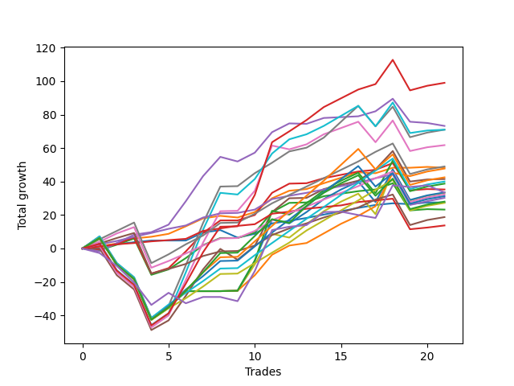

# Short Labrador 014 
- Symbol: ES_830-1130
- Date Range: 03/18/2022 - 12/30/2022
- Trading Period: 8:30-11:30
- Number of Trades: 28



| Name | Win Percent | Profit | Avg Profit / Trade | Avg Time / Trade |      | Name | Win Percent | Profit | Avg Profit / Trade | Avg Time / Trade |
| ---- | ----------- | ------ | ------------------ | ---------------- | ---- | ---- | ----------- | ------ | ------------------ | ---------------- |
| Sorted By <br> Profit | | | | | | Sorted By <br> Win Percentage ||||
| NEWFI 000 | 75.00 | 78500.00 | 2803.57 | 44:32 |     | TP-1 | 96.43 | 22750.00 | 812.50 | 06:56 |
| BB-50 Mid | 78.57 | 63500.00 | 2267.86 | 15:48 |     | TP-2 | 92.86 | 21500.00 | 767.86 | 15:29 |
| BB-50 U/L 2SD | 71.43 | 61500.00 | 2196.43 | 37:35 |     | TP-5 | 89.29 | 39750.00 | 1419.64 | 24:39 |
| BB-100 Mid | 71.43 | 59500.00 | 2125.00 | 36:06 |     | TP-4 | 89.29 | 26375.00 | 941.96 | 23:39 |
| V Mid | 78.57 | 52500.00 | 1875.00 | 33:21 |     | TP-3 | 89.29 | 16875.00 | 602.68 | 19:28 |
| BB-20 U/L 1SD | 85.71 | 41000.00 | 1464.29 | 05:18 |     | BB-20 U/L 1SD | 85.71 | 41000.00 | 1464.29 | 05:18 |
| TP-7 | 82.14 | 40125.00 | 1433.04 | 29:28 |     | TP-7 | 82.14 | 40125.00 | 1433.04 | 29:28 |
| TP-5 | 89.29 | 39750.00 | 1419.64 | 24:39 |     | TP-6 | 82.14 | 32875.00 | 1174.11 | 28:28 |
| TP-9 | 75.00 | 38375.00 | 1370.54 | 37:22 |     | BB-50 Mid | 78.57 | 63500.00 | 2267.86 | 15:48 |
| BB-20 U/L 2SD C | 78.57 | 37375.00 | 1334.82 | 16:19 |     | V Mid | 78.57 | 52500.00 | 1875.00 | 33:21 |
| BB-200 Mid | 67.86 | 37250.00 | 1330.36 | 37:16 |     | BB-20 U/L 2SD C | 78.57 | 37375.00 | 1334.82 | 16:19 |
| V U/L 1SD | 64.29 | 37000.00 | 1321.43 | 47:08 |     | TP-8 | 78.57 | 36375.00 | 1299.11 | 32:48 |
| BB-50 U/L 1SD | 71.43 | 36625.00 | 1308.04 | 29:34 |     | BB-20 U/L 2SD | 78.57 | 31375.00 | 1120.54 | 15:15 |
| TP-8 | 78.57 | 36375.00 | 1299.11 | 32:48 |     | NEWFI 000 | 75.00 | 78500.00 | 2803.57 | 44:32 |
| TP-6 | 82.14 | 32875.00 | 1174.11 | 28:28 |     | TP-9 | 75.00 | 38375.00 | 1370.54 | 37:22 |
| TP-10 | 71.43 | 31625.00 | 1129.46 | 40:43 |     | BB-20 Mid | 75.00 | 21375.00 | 763.39 | 03:03 |
| BB-20 U/L 2SD | 78.57 | 31375.00 | 1120.54 | 15:15 |     | BB-50 U/L 2SD | 71.43 | 61500.00 | 2196.43 | 37:35 |
| BB-200 U/L 2SD | 60.71 | 30125.00 | 1075.89 | 53:48 |     | BB-100 Mid | 71.43 | 59500.00 | 2125.00 | 36:06 |
| TP-4 | 89.29 | 26375.00 | 941.96 | 23:39 |     | BB-50 U/L 1SD | 71.43 | 36625.00 | 1308.04 | 29:34 |
| BB-100 U/L 2SD | 60.71 | 24750.00 | 883.93 | 54:21 |     | TP-10 | 71.43 | 31625.00 | 1129.46 | 40:43 |
| TP-1 | 96.43 | 22750.00 | 812.50 | 06:56 |     | BB-200 Mid | 67.86 | 37250.00 | 1330.36 | 37:16 |
| TP-2 | 92.86 | 21500.00 | 767.86 | 15:29 |     | V U/L 1SD | 64.29 | 37000.00 | 1321.43 | 47:08 |
| BB-20 Mid | 75.00 | 21375.00 | 763.39 | 03:03 |     | BB-200 U/L 2SD | 60.71 | 30125.00 | 1075.89 | 53:48 |
| TP-3 | 89.29 | 16875.00 | 602.68 | 19:28 |     | BB-100 U/L 2SD | 60.71 | 24750.00 | 883.93 | 54:21 |
| NEWFI 0000 | 42.86 | 15375.00 | 549.11 | 26:38 |     | NEWFI 0000 | 42.86 | 15375.00 | 549.11 | 26:38 |

## NO STOPLOSS

### Test BB-20 Mid
* Sell when price hits the middle line of the 20p bollinger
* No Stoploss
* Results:
```
Total Trades: 28
Percent Up: 25.00
Percent Down: 75.00
Total Points Moved Down: 42.75
Potential Profit: 21375.00
Total Points Ups: 6.25 Count Ups: 7
Total Points Downs: 49.00 Count Downs: 21
```

<details><summary>Trades</summary>

<code>In: 2022-03-25 11:19:00		Out: 2022-03-25 11:20:10		Total Position Time: 01:10		Total Move Down: 1.25		Total to Date: 1.25</code> <br />
<code>In: 2022-03-29 11:16:00		Out: 2022-03-29 11:17:10		Total Position Time: 01:10		Total Move Down: 1.25		Total to Date: 2.50</code> <br />
<code>In: 2022-04-06 10:55:00		Out: 2022-04-06 10:56:20		Total Position Time: 01:20		Total Move Down: 0.50		Total to Date: 3.00</code> <br />
<code>In: 2022-04-06 10:56:00		Out: 2022-04-06 10:57:10		Total Position Time: 01:10		Total Move Down: 2.50		Total to Date: 5.50</code> <br />
<code>In: 2022-04-07 10:34:00		Out: 2022-04-07 10:37:30		Total Position Time: 03:30		Total Move Down: 1.25		Total to Date: 6.75</code> <br />
<code>In: 2022-04-07 11:30:00		Out: 2022-04-07 11:31:10		Total Position Time: 01:10		Total Move Down: 1.00		Total to Date: 7.75</code> <br />
<code>In: 2022-04-18 11:00:00		Out: 2022-04-18 11:01:10		Total Position Time: 01:10		Total Move Down: -0.00		Total to Date: 7.75</code> <br />
<code>In: 2022-05-10 11:02:00		Out: 2022-05-10 11:06:15		Total Position Time: 04:15		Total Move Down: -0.00		Total to Date: 7.75</code> <br />
<code>In: 2022-05-10 11:06:00		Out: 2022-05-10 11:07:10		Total Position Time: 01:10		Total Move Down: 4.75		Total to Date: 12.50</code> <br />
<code>In: 2022-05-10 11:07:00		Out: 2022-05-10 11:08:10		Total Position Time: 01:10		Total Move Down: 1.50		Total to Date: 14.00</code> <br />
<code>In: 2022-05-24 10:48:00		Out: 2022-05-24 11:01:15		Total Position Time: 13:15		Total Move Down: -4.50		Total to Date: 9.50</code> <br />
<code>In: 2022-06-09 10:09:00		Out: 2022-06-09 10:16:50		Total Position Time: 07:50		Total Move Down: 2.25		Total to Date: 11.75</code> <br />
<code>In: 2022-06-14 10:26:00		Out: 2022-06-14 10:27:10		Total Position Time: 01:10		Total Move Down: 6.25		Total to Date: 18.00</code> <br />
<code>In: 2022-07-06 11:11:00		Out: 2022-07-06 11:12:10		Total Position Time: 01:10		Total Move Down: 10.25		Total to Date: 28.25</code> <br />
<code>In: 2022-07-12 08:34:00		Out: 2022-07-12 08:37:00		Total Position Time: 03:00		Total Move Down: 1.50		Total to Date: 29.75</code> <br />
<code>In: 2022-08-04 09:03:00		Out: 2022-08-04 09:04:10		Total Position Time: 01:10		Total Move Down: 1.75		Total to Date: 31.50</code> <br />
<code>In: 2022-08-04 10:40:00		Out: 2022-08-04 10:43:05		Total Position Time: 03:05		Total Move Down: 2.00		Total to Date: 33.50</code> <br />
<code>In: 2022-08-05 10:18:00		Out: 2022-08-05 10:20:05		Total Position Time: 02:05		Total Move Down: 2.00		Total to Date: 35.50</code> <br />
<code>In: 2022-08-05 10:19:00		Out: 2022-08-05 10:20:10		Total Position Time: 01:10		Total Move Down: 2.00		Total to Date: 37.50</code> <br />
<code>In: 2022-08-17 10:19:00		Out: 2022-08-17 10:20:10		Total Position Time: 01:10		Total Move Down: 1.50		Total to Date: 39.00</code> <br />
<code>In: 2022-08-29 09:08:00		Out: 2022-08-29 09:14:10		Total Position Time: 06:10		Total Move Down: 1.75		Total to Date: 40.75</code> <br />
<code>In: 2022-09-15 10:30:00		Out: 2022-09-15 10:31:30		Total Position Time: 01:30		Total Move Down: 1.00		Total to Date: 41.75</code> <br />
<code>In: 2022-09-21 10:55:00		Out: 2022-09-21 10:59:05		Total Position Time: 04:05		Total Move Down: -1.25		Total to Date: 40.50</code> <br />
<code>In: 2022-11-02 08:52:00		Out: 2022-11-02 08:56:45		Total Position Time: 04:45		Total Move Down: -0.00		Total to Date: 40.50</code> <br />
<code>In: 2022-11-17 08:42:00		Out: 2022-11-17 08:49:45		Total Position Time: 07:45		Total Move Down: -0.50		Total to Date: 40.00</code> <br />
<code>In: 2022-11-21 10:23:00		Out: 2022-11-21 10:27:25		Total Position Time: 04:25		Total Move Down: 1.00		Total to Date: 41.00</code> <br />
<code>In: 2022-11-21 10:24:00		Out: 2022-11-21 10:27:25		Total Position Time: 03:25		Total Move Down: -0.00		Total to Date: 41.00</code> <br />
<code>In: 2022-11-23 11:31:00		Out: 2022-11-23 11:32:10		Total Position Time: 01:10		Total Move Down: 1.75		Total to Date: 42.75</code> <br />


</details>

### Test BB-20 U/L 1SD
* Sell when the price hits the lower line of the 20p 1std bollinger
* No Stoploss
* Results:
```
Total Trades: 28
Percent Up: 14.29
Percent Down: 85.71
Total Points Moved Down: 82.00
Potential Profit: 41000.00
Total Points Ups: 2.00 Count Ups: 4
Total Points Downs: 84.00 Count Downs: 24
```

<details><summary>Trades</summary>

<code>In: 2022-03-25 11:19:00		Out: 2022-03-25 11:20:10		Total Position Time: 01:10		Total Move Down: 1.25		Total to Date: 1.25</code> <br />
<code>In: 2022-03-29 11:16:00		Out: 2022-03-29 11:18:30		Total Position Time: 02:30		Total Move Down: 1.75		Total to Date: 3.00</code> <br />
<code>In: 2022-04-06 10:55:00		Out: 2022-04-06 10:57:05		Total Position Time: 02:05		Total Move Down: 2.50		Total to Date: 5.50</code> <br />
<code>In: 2022-04-06 10:56:00		Out: 2022-04-06 10:57:10		Total Position Time: 01:10		Total Move Down: 2.50		Total to Date: 8.00</code> <br />
<code>In: 2022-04-07 10:34:00		Out: 2022-04-07 10:40:00		Total Position Time: 06:00		Total Move Down: 3.00		Total to Date: 11.00</code> <br />
<code>In: 2022-04-07 11:30:00		Out: 2022-04-07 11:31:10		Total Position Time: 01:10		Total Move Down: 1.00		Total to Date: 12.00</code> <br />
<code>In: 2022-04-18 11:00:00		Out: 2022-04-18 11:06:35		Total Position Time: 06:35		Total Move Down: 1.75		Total to Date: 13.75</code> <br />
<code>In: 2022-05-10 11:02:00		Out: 2022-05-10 11:06:45		Total Position Time: 04:45		Total Move Down: 4.50		Total to Date: 18.25</code> <br />
<code>In: 2022-05-10 11:06:00		Out: 2022-05-10 11:07:10		Total Position Time: 01:10		Total Move Down: 4.75		Total to Date: 23.00</code> <br />
<code>In: 2022-05-10 11:07:00		Out: 2022-05-10 11:08:10		Total Position Time: 01:10		Total Move Down: 1.50		Total to Date: 24.50</code> <br />
<code>In: 2022-05-24 10:48:00		Out: 2022-05-24 11:01:40		Total Position Time: 13:40		Total Move Down: -1.00		Total to Date: 23.50</code> <br />
<code>In: 2022-06-09 10:09:00		Out: 2022-06-09 10:18:50		Total Position Time: 09:50		Total Move Down: 3.25		Total to Date: 26.75</code> <br />
<code>In: 2022-06-14 10:26:00		Out: 2022-06-14 10:29:05		Total Position Time: 03:05		Total Move Down: 8.25		Total to Date: 35.00</code> <br />
<code>In: 2022-07-06 11:11:00		Out: 2022-07-06 11:12:10		Total Position Time: 01:10		Total Move Down: 10.25		Total to Date: 45.25</code> <br />
<code>In: 2022-07-12 08:34:00		Out: 2022-07-12 08:38:10		Total Position Time: 04:10		Total Move Down: 4.50		Total to Date: 49.75</code> <br />
<code>In: 2022-08-04 09:03:00		Out: 2022-08-04 09:16:05		Total Position Time: 13:05		Total Move Down: 1.00		Total to Date: 50.75</code> <br />
<code>In: 2022-08-04 10:40:00		Out: 2022-08-04 10:43:15		Total Position Time: 03:15		Total Move Down: 3.50		Total to Date: 54.25</code> <br />
<code>In: 2022-08-05 10:18:00		Out: 2022-08-05 10:23:15		Total Position Time: 05:15		Total Move Down: 3.25		Total to Date: 57.50</code> <br />
<code>In: 2022-08-05 10:19:00		Out: 2022-08-05 10:23:15		Total Position Time: 04:15		Total Move Down: 3.25		Total to Date: 60.75</code> <br />
<code>In: 2022-08-17 10:19:00		Out: 2022-08-17 10:20:10		Total Position Time: 01:10		Total Move Down: 1.50		Total to Date: 62.25</code> <br />
<code>In: 2022-08-29 09:08:00		Out: 2022-08-29 09:24:15		Total Position Time: 16:15		Total Move Down: -0.50		Total to Date: 61.75</code> <br />
<code>In: 2022-09-15 10:30:00		Out: 2022-09-15 10:32:20		Total Position Time: 02:20		Total Move Down: 3.25		Total to Date: 65.00</code> <br />
<code>In: 2022-09-21 10:55:00		Out: 2022-09-21 11:00:05		Total Position Time: 05:05		Total Move Down: 13.75		Total to Date: 78.75</code> <br />
<code>In: 2022-11-02 08:52:00		Out: 2022-11-02 08:57:05		Total Position Time: 05:05		Total Move Down: 1.00		Total to Date: 79.75</code> <br />
<code>In: 2022-11-17 08:42:00		Out: 2022-11-17 08:52:30		Total Position Time: 10:30		Total Move Down: -0.00		Total to Date: 79.75</code> <br />
<code>In: 2022-11-21 10:23:00		Out: 2022-11-21 10:33:00		Total Position Time: 10:00		Total Move Down: 0.50		Total to Date: 80.25</code> <br />
<code>In: 2022-11-21 10:24:00		Out: 2022-11-21 10:33:00		Total Position Time: 09:00		Total Move Down: -0.50		Total to Date: 79.75</code> <br />
<code>In: 2022-11-23 11:31:00		Out: 2022-11-23 11:34:40		Total Position Time: 03:40		Total Move Down: 2.25		Total to Date: 82.00</code> <br />


</details>

### Test BB-20 U/L 2SD
* Sell when the price hits the lower line of the 20p 2std bollinger
* No Stoploss
* Results:
```
Total Trades: 28
Percent Up: 21.43
Percent Down: 78.57
Total Points Moved Down: 62.75
Potential Profit: 31375.00
Total Points Ups: 39.50 Count Ups: 6
Total Points Downs: 102.25 Count Downs: 22
```

<details><summary>Trades</summary>

<code>In: 2022-03-25 11:19:00		Out: 2022-03-25 12:00:55		Total Position Time: 41:55		Total Move Down: -1.00		Total to Date: -1.00</code> <br />
<code>In: 2022-03-29 11:16:00		Out: 2022-03-29 11:18:50		Total Position Time: 02:50		Total Move Down: 3.25		Total to Date: 2.25</code> <br />
<code>In: 2022-04-06 10:55:00		Out: 2022-04-06 10:58:00		Total Position Time: 03:00		Total Move Down: 4.50		Total to Date: 6.75</code> <br />
<code>In: 2022-04-06 10:56:00		Out: 2022-04-06 10:58:00		Total Position Time: 02:00		Total Move Down: 3.75		Total to Date: 10.50</code> <br />
<code>In: 2022-04-07 10:34:00		Out: 2022-04-07 10:45:15		Total Position Time: 11:15		Total Move Down: 3.75		Total to Date: 14.25</code> <br />
<code>In: 2022-04-07 11:30:00		Out: 2022-04-07 12:22:45		Total Position Time: 52:45		Total Move Down: -21.75		Total to Date: -7.50</code> <br />
<code>In: 2022-04-18 11:00:00		Out: 2022-04-18 11:10:40		Total Position Time: 10:40		Total Move Down: 3.25		Total to Date: -4.25</code> <br />
<code>In: 2022-05-10 11:02:00		Out: 2022-05-10 11:11:10		Total Position Time: 09:10		Total Move Down: 6.75		Total to Date: 2.50</code> <br />
<code>In: 2022-05-10 11:06:00		Out: 2022-05-10 11:11:10		Total Position Time: 05:10		Total Move Down: 7.75		Total to Date: 10.25</code> <br />
<code>In: 2022-05-10 11:07:00		Out: 2022-05-10 11:11:10		Total Position Time: 04:10		Total Move Down: 4.25		Total to Date: 14.50</code> <br />
<code>In: 2022-05-24 10:48:00		Out: 2022-05-24 11:01:50		Total Position Time: 13:50		Total Move Down: -0.00		Total to Date: 14.50</code> <br />
<code>In: 2022-06-09 10:09:00		Out: 2022-06-09 10:19:05		Total Position Time: 10:05		Total Move Down: 3.25		Total to Date: 17.75</code> <br />
<code>In: 2022-06-14 10:26:00		Out: 2022-06-14 10:31:00		Total Position Time: 05:00		Total Move Down: 12.25		Total to Date: 30.00</code> <br />
<code>In: 2022-07-06 11:11:00		Out: 2022-07-06 11:12:10		Total Position Time: 01:10		Total Move Down: 10.25		Total to Date: 40.25</code> <br />
<code>In: 2022-07-12 08:34:00		Out: 2022-07-12 08:41:10		Total Position Time: 07:10		Total Move Down: 5.50		Total to Date: 45.75</code> <br />
<code>In: 2022-08-04 09:03:00		Out: 2022-08-04 09:38:50		Total Position Time: 35:50		Total Move Down: 0.25		Total to Date: 46.00</code> <br />
<code>In: 2022-08-04 10:40:00		Out: 2022-08-04 10:45:30		Total Position Time: 05:30		Total Move Down: 3.75		Total to Date: 49.75</code> <br />
<code>In: 2022-08-05 10:18:00		Out: 2022-08-05 10:49:30		Total Position Time: 31:30		Total Move Down: 1.50		Total to Date: 51.25</code> <br />
<code>In: 2022-08-05 10:19:00		Out: 2022-08-05 10:49:30		Total Position Time: 30:30		Total Move Down: 1.50		Total to Date: 52.75</code> <br />
<code>In: 2022-08-17 10:19:00		Out: 2022-08-17 11:00:50		Total Position Time: 41:50		Total Move Down: -0.25		Total to Date: 52.50</code> <br />
<code>In: 2022-08-29 09:08:00		Out: 2022-08-29 09:24:35		Total Position Time: 16:35		Total Move Down: 1.00		Total to Date: 53.50</code> <br />
<code>In: 2022-09-15 10:30:00		Out: 2022-09-15 10:36:30		Total Position Time: 06:30		Total Move Down: 3.75		Total to Date: 57.25</code> <br />
<code>In: 2022-09-21 10:55:00		Out: 2022-09-21 11:00:05		Total Position Time: 05:05		Total Move Down: 13.75		Total to Date: 71.00</code> <br />
<code>In: 2022-11-02 08:52:00		Out: 2022-11-02 09:00:15		Total Position Time: 08:15		Total Move Down: 2.75		Total to Date: 73.75</code> <br />
<code>In: 2022-11-17 08:42:00		Out: 2022-11-17 09:23:55		Total Position Time: 41:55		Total Move Down: -16.25		Total to Date: 57.50</code> <br />
<code>In: 2022-11-21 10:23:00		Out: 2022-11-21 10:33:10		Total Position Time: 10:10		Total Move Down: 0.75		Total to Date: 58.25</code> <br />
<code>In: 2022-11-21 10:24:00		Out: 2022-11-21 10:33:10		Total Position Time: 09:10		Total Move Down: -0.25		Total to Date: 58.00</code> <br />
<code>In: 2022-11-23 11:31:00		Out: 2022-11-23 11:35:05		Total Position Time: 04:05		Total Move Down: 4.75		Total to Date: 62.75</code> <br />


</details>

### Test BB-20 U/L 2SD C
* Sell when the price hits the lower line of the 20p 2std bollinger
* No Stoploss
* Results:
```
Total Trades: 28
Percent Up: 21.43
Percent Down: 78.57
Total Points Moved Down: 74.75
Potential Profit: 37375.00
Total Points Ups: 39.00 Count Ups: 6
Total Points Downs: 113.75 Count Downs: 22
```

<details><summary>Trades</summary>

<code>In: 2022-03-25 11:19:00		Out: 2022-03-25 12:01:15		Total Position Time: 42:15		Total Move Down: -0.50		Total to Date: -0.50</code> <br />
<code>In: 2022-03-29 11:16:00		Out: 2022-03-29 11:18:50		Total Position Time: 02:50		Total Move Down: 3.25		Total to Date: 2.75</code> <br />
<code>In: 2022-04-06 10:55:00		Out: 2022-04-06 10:58:05		Total Position Time: 03:05		Total Move Down: 4.50		Total to Date: 7.25</code> <br />
<code>In: 2022-04-06 10:56:00		Out: 2022-04-06 10:58:05		Total Position Time: 02:05		Total Move Down: 3.75		Total to Date: 11.00</code> <br />
<code>In: 2022-04-07 10:34:00		Out: 2022-04-07 10:48:00		Total Position Time: 14:00		Total Move Down: 4.00		Total to Date: 15.00</code> <br />
<code>In: 2022-04-07 11:30:00		Out: 2022-04-07 12:22:45		Total Position Time: 52:45		Total Move Down: -21.75		Total to Date: -6.75</code> <br />
<code>In: 2022-04-18 11:00:00		Out: 2022-04-18 11:10:40		Total Position Time: 10:40		Total Move Down: 3.25		Total to Date: -3.50</code> <br />
<code>In: 2022-05-10 11:02:00		Out: 2022-05-10 11:16:05		Total Position Time: 14:05		Total Move Down: 10.00		Total to Date: 6.50</code> <br />
<code>In: 2022-05-10 11:06:00		Out: 2022-05-10 11:16:05		Total Position Time: 10:05		Total Move Down: 11.00		Total to Date: 17.50</code> <br />
<code>In: 2022-05-10 11:07:00		Out: 2022-05-10 11:16:05		Total Position Time: 09:05		Total Move Down: 7.50		Total to Date: 25.00</code> <br />
<code>In: 2022-05-24 10:48:00		Out: 2022-05-24 11:01:50		Total Position Time: 13:50		Total Move Down: -0.00		Total to Date: 25.00</code> <br />
<code>In: 2022-06-09 10:09:00		Out: 2022-06-09 10:21:10		Total Position Time: 12:10		Total Move Down: 3.25		Total to Date: 28.25</code> <br />
<code>In: 2022-06-14 10:26:00		Out: 2022-06-14 10:31:10		Total Position Time: 05:10		Total Move Down: 13.25		Total to Date: 41.50</code> <br />
<code>In: 2022-07-06 11:11:00		Out: 2022-07-06 11:12:10		Total Position Time: 01:10		Total Move Down: 10.25		Total to Date: 51.75</code> <br />
<code>In: 2022-07-12 08:34:00		Out: 2022-07-12 08:41:10		Total Position Time: 07:10		Total Move Down: 5.50		Total to Date: 57.25</code> <br />
<code>In: 2022-08-04 09:03:00		Out: 2022-08-04 09:38:50		Total Position Time: 35:50		Total Move Down: 0.25		Total to Date: 57.50</code> <br />
<code>In: 2022-08-04 10:40:00		Out: 2022-08-04 10:52:45		Total Position Time: 12:45		Total Move Down: 3.00		Total to Date: 60.50</code> <br />
<code>In: 2022-08-05 10:18:00		Out: 2022-08-05 10:50:35		Total Position Time: 32:35		Total Move Down: 2.00		Total to Date: 62.50</code> <br />
<code>In: 2022-08-05 10:19:00		Out: 2022-08-05 10:50:35		Total Position Time: 31:35		Total Move Down: 2.00		Total to Date: 64.50</code> <br />
<code>In: 2022-08-17 10:19:00		Out: 2022-08-17 11:00:50		Total Position Time: 41:50		Total Move Down: -0.25		Total to Date: 64.25</code> <br />
<code>In: 2022-08-29 09:08:00		Out: 2022-08-29 09:24:35		Total Position Time: 16:35		Total Move Down: 1.00		Total to Date: 65.25</code> <br />
<code>In: 2022-09-15 10:30:00		Out: 2022-09-15 10:36:35		Total Position Time: 06:35		Total Move Down: 4.00		Total to Date: 69.25</code> <br />
<code>In: 2022-09-21 10:55:00		Out: 2022-09-21 11:00:05		Total Position Time: 05:05		Total Move Down: 13.75		Total to Date: 83.00</code> <br />
<code>In: 2022-11-02 08:52:00		Out: 2022-11-02 09:00:30		Total Position Time: 08:30		Total Move Down: 2.75		Total to Date: 85.75</code> <br />
<code>In: 2022-11-17 08:42:00		Out: 2022-11-17 09:23:55		Total Position Time: 41:55		Total Move Down: -16.25		Total to Date: 69.50</code> <br />
<code>In: 2022-11-21 10:23:00		Out: 2022-11-21 10:33:10		Total Position Time: 10:10		Total Move Down: 0.75		Total to Date: 70.25</code> <br />
<code>In: 2022-11-21 10:24:00		Out: 2022-11-21 10:33:10		Total Position Time: 09:10		Total Move Down: -0.25		Total to Date: 70.00</code> <br />
<code>In: 2022-11-23 11:31:00		Out: 2022-11-23 11:35:05		Total Position Time: 04:05		Total Move Down: 4.75		Total to Date: 74.75</code> <br />


</details>

### Test BB-50 Mid
* Sell when price hits the middle line of the 50p bollinger
* No Stoploss
* Results:
```
Total Trades: 28
Percent Up: 21.43
Percent Down: 78.57
Total Points Moved Down: 127.00
Potential Profit: 63500.00
Total Points Ups: 21.00 Count Ups: 6
Total Points Downs: 148.00 Count Downs: 22
```

<details><summary>Trades</summary>

<code>In: 2022-03-25 11:19:00		Out: 2022-03-25 11:49:30		Total Position Time: 30:30		Total Move Down: -1.75		Total to Date: -1.75</code> <br />
<code>In: 2022-03-29 11:16:00		Out: 2022-03-29 11:21:20		Total Position Time: 05:20		Total Move Down: 5.00		Total to Date: 3.25</code> <br />
<code>In: 2022-04-06 10:55:00		Out: 2022-04-06 11:00:10		Total Position Time: 05:10		Total Move Down: 11.50		Total to Date: 14.75</code> <br />
<code>In: 2022-04-06 10:56:00		Out: 2022-04-06 11:00:10		Total Position Time: 04:10		Total Move Down: 10.75		Total to Date: 25.50</code> <br />
<code>In: 2022-04-07 10:34:00		Out: 2022-04-07 10:52:05		Total Position Time: 18:05		Total Move Down: 5.00		Total to Date: 30.50</code> <br />
<code>In: 2022-04-07 11:30:00		Out: 2022-04-07 11:33:40		Total Position Time: 03:40		Total Move Down: 1.50		Total to Date: 32.00</code> <br />
<code>In: 2022-04-18 11:00:00		Out: 2022-04-18 11:16:45		Total Position Time: 16:45		Total Move Down: 4.50		Total to Date: 36.50</code> <br />
<code>In: 2022-05-10 11:02:00		Out: 2022-05-10 11:16:20		Total Position Time: 14:20		Total Move Down: 14.00		Total to Date: 50.50</code> <br />
<code>In: 2022-05-10 11:06:00		Out: 2022-05-10 11:16:20		Total Position Time: 10:20		Total Move Down: 15.00		Total to Date: 65.50</code> <br />
<code>In: 2022-05-10 11:07:00		Out: 2022-05-10 11:16:20		Total Position Time: 09:20		Total Move Down: 11.50		Total to Date: 77.00</code> <br />
<code>In: 2022-05-24 10:48:00		Out: 2022-05-24 11:20:25		Total Position Time: 32:25		Total Move Down: -2.75		Total to Date: 74.25</code> <br />
<code>In: 2022-06-09 10:09:00		Out: 2022-06-09 10:22:05		Total Position Time: 13:05		Total Move Down: 5.25		Total to Date: 79.50</code> <br />
<code>In: 2022-06-14 10:26:00		Out: 2022-06-14 10:31:00		Total Position Time: 05:00		Total Move Down: 12.25		Total to Date: 91.75</code> <br />
<code>In: 2022-07-06 11:11:00		Out: 2022-07-06 11:12:10		Total Position Time: 01:10		Total Move Down: 10.25		Total to Date: 102.00</code> <br />
<code>In: 2022-07-12 08:34:00		Out: 2022-07-12 08:38:20		Total Position Time: 04:20		Total Move Down: 5.25		Total to Date: 107.25</code> <br />
<code>In: 2022-08-04 09:03:00		Out: 2022-08-04 09:36:55		Total Position Time: 33:55		Total Move Down: -0.25		Total to Date: 107.00</code> <br />
<code>In: 2022-08-04 10:40:00		Out: 2022-08-04 10:55:50		Total Position Time: 15:50		Total Move Down: 3.50		Total to Date: 110.50</code> <br />
<code>In: 2022-08-05 10:18:00		Out: 2022-08-05 10:47:35		Total Position Time: 29:35		Total Move Down: 0.50		Total to Date: 111.00</code> <br />
<code>In: 2022-08-05 10:19:00		Out: 2022-08-05 10:47:35		Total Position Time: 28:35		Total Move Down: 0.50		Total to Date: 111.50</code> <br />
<code>In: 2022-08-17 10:19:00		Out: 2022-08-17 10:20:10		Total Position Time: 01:10		Total Move Down: 1.50		Total to Date: 113.00</code> <br />
<code>In: 2022-08-29 09:08:00		Out: 2022-08-29 09:31:25		Total Position Time: 23:25		Total Move Down: 3.00		Total to Date: 116.00</code> <br />
<code>In: 2022-09-15 10:30:00		Out: 2022-09-15 10:38:35		Total Position Time: 08:35		Total Move Down: 7.50		Total to Date: 123.50</code> <br />
<code>In: 2022-09-21 10:55:00		Out: 2022-09-21 11:00:05		Total Position Time: 05:05		Total Move Down: 13.75		Total to Date: 137.25</code> <br />
<code>In: 2022-11-02 08:52:00		Out: 2022-11-02 08:57:25		Total Position Time: 05:25		Total Move Down: 1.25		Total to Date: 138.50</code> <br />
<code>In: 2022-11-17 08:42:00		Out: 2022-11-17 09:33:35		Total Position Time: 51:35		Total Move Down: -13.75		Total to Date: 124.75</code> <br />
<code>In: 2022-11-21 10:23:00		Out: 2022-11-21 10:54:25		Total Position Time: 31:25		Total Move Down: -0.75		Total to Date: 124.00</code> <br />
<code>In: 2022-11-21 10:24:00		Out: 2022-11-21 10:54:25		Total Position Time: 30:25		Total Move Down: -1.75		Total to Date: 122.25</code> <br />
<code>In: 2022-11-23 11:31:00		Out: 2022-11-23 11:35:05		Total Position Time: 04:05		Total Move Down: 4.75		Total to Date: 127.00</code> <br />


</details>

### Test BB-50 U/L 1SD
* Sell when the price hits the lower line of the 50p 1std bollinger
* No Stoploss
* Results:
```
Total Trades: 28
Percent Up: 28.57
Percent Down: 71.43
Total Points Moved Down: 73.25
Potential Profit: 36625.00
Total Points Ups: 74.00 Count Ups: 8
Total Points Downs: 147.25 Count Downs: 20
```

<details><summary>Trades</summary>

<code>In: 2022-03-25 11:19:00		Out: 2022-03-25 12:01:35		Total Position Time: 42:35		Total Move Down: -0.00		Total to Date: 0.00</code> <br />
<code>In: 2022-03-29 11:16:00		Out: 2022-03-29 12:16:55		Total Position Time: 60:55		Total Move Down: -16.00		Total to Date: -16.00</code> <br />
<code>In: 2022-04-06 10:55:00		Out: 2022-04-06 11:00:15		Total Position Time: 05:15		Total Move Down: 2.75		Total to Date: -13.25</code> <br />
<code>In: 2022-04-06 10:56:00		Out: 2022-04-06 11:00:15		Total Position Time: 04:15		Total Move Down: 2.00		Total to Date: -11.25</code> <br />
<code>In: 2022-04-07 10:34:00		Out: 2022-04-07 11:34:55		Total Position Time: 60:55		Total Move Down: -8.50		Total to Date: -19.75</code> <br />
<code>In: 2022-04-07 11:30:00		Out: 2022-04-07 12:30:55		Total Position Time: 60:55		Total Move Down: -24.25		Total to Date: -44.00</code> <br />
<code>In: 2022-04-18 11:00:00		Out: 2022-04-18 11:22:10		Total Position Time: 22:10		Total Move Down: 5.75		Total to Date: -38.25</code> <br />
<code>In: 2022-05-10 11:02:00		Out: 2022-05-10 11:24:05		Total Position Time: 22:05		Total Move Down: 14.75		Total to Date: -23.50</code> <br />
<code>In: 2022-05-10 11:06:00		Out: 2022-05-10 11:24:05		Total Position Time: 18:05		Total Move Down: 15.75		Total to Date: -7.75</code> <br />
<code>In: 2022-05-10 11:07:00		Out: 2022-05-10 11:24:05		Total Position Time: 17:05		Total Move Down: 12.25		Total to Date: 4.50</code> <br />
<code>In: 2022-05-24 10:48:00		Out: 2022-05-24 11:44:15		Total Position Time: 56:15		Total Move Down: -6.50		Total to Date: -2.00</code> <br />
<code>In: 2022-06-09 10:09:00		Out: 2022-06-09 10:24:05		Total Position Time: 15:05		Total Move Down: 8.25		Total to Date: 6.25</code> <br />
<code>In: 2022-06-14 10:26:00		Out: 2022-06-14 10:36:10		Total Position Time: 10:10		Total Move Down: 20.25		Total to Date: 26.50</code> <br />
<code>In: 2022-07-06 11:11:00		Out: 2022-07-06 11:12:10		Total Position Time: 01:10		Total Move Down: 10.25		Total to Date: 36.75</code> <br />
<code>In: 2022-07-12 08:34:00		Out: 2022-07-12 08:43:55		Total Position Time: 09:55		Total Move Down: 8.25		Total to Date: 45.00</code> <br />
<code>In: 2022-08-04 09:03:00		Out: 2022-08-04 09:38:50		Total Position Time: 35:50		Total Move Down: 0.25		Total to Date: 45.25</code> <br />
<code>In: 2022-08-04 10:40:00		Out: 2022-08-04 11:02:05		Total Position Time: 22:05		Total Move Down: 5.25		Total to Date: 50.50</code> <br />
<code>In: 2022-08-05 10:18:00		Out: 2022-08-05 10:52:05		Total Position Time: 34:05		Total Move Down: 2.50		Total to Date: 53.00</code> <br />
<code>In: 2022-08-05 10:19:00		Out: 2022-08-05 10:52:05		Total Position Time: 33:05		Total Move Down: 2.50		Total to Date: 55.50</code> <br />
<code>In: 2022-08-17 10:19:00		Out: 2022-08-17 11:00:50		Total Position Time: 41:50		Total Move Down: -0.25		Total to Date: 55.25</code> <br />
<code>In: 2022-08-29 09:08:00		Out: 2022-08-29 09:36:50		Total Position Time: 28:50		Total Move Down: 6.75		Total to Date: 62.00</code> <br />
<code>In: 2022-09-15 10:30:00		Out: 2022-09-15 10:47:25		Total Position Time: 17:25		Total Move Down: 11.00		Total to Date: 73.00</code> <br />
<code>In: 2022-09-21 10:55:00		Out: 2022-09-21 11:00:05		Total Position Time: 05:05		Total Move Down: 13.75		Total to Date: 86.75</code> <br />
<code>In: 2022-11-02 08:52:00		Out: 2022-11-02 09:01:25		Total Position Time: 09:25		Total Move Down: 3.50		Total to Date: 90.25</code> <br />
<code>In: 2022-11-17 08:42:00		Out: 2022-11-17 09:42:55		Total Position Time: 60:55		Total Move Down: -18.25		Total to Date: 72.00</code> <br />
<code>In: 2022-11-21 10:23:00		Out: 2022-11-21 10:59:25		Total Position Time: 36:25		Total Move Down: 1.25		Total to Date: 73.25</code> <br />
<code>In: 2022-11-21 10:24:00		Out: 2022-11-21 10:59:25		Total Position Time: 35:25		Total Move Down: 0.25		Total to Date: 73.50</code> <br />
<code>In: 2022-11-23 11:31:00		Out: 2022-11-23 12:31:55		Total Position Time: 60:55		Total Move Down: -0.25		Total to Date: 73.25</code> <br />


</details>

### Test BB-50 U/L 2SD
* Sell when the price hits the lower line of the 50p 2std bollinger
* No Stoploss
* Results:
```
Total Trades: 28
Percent Up: 28.57
Percent Down: 71.43
Total Points Moved Down: 123.00
Potential Profit: 61500.00
Total Points Ups: 82.00 Count Ups: 8
Total Points Downs: 205.00 Count Downs: 20
```

<details><summary>Trades</summary>

<code>In: 2022-03-25 11:19:00		Out: 2022-03-25 12:01:55		Total Position Time: 42:55		Total Move Down: 1.50		Total to Date: 1.50</code> <br />
<code>In: 2022-03-29 11:16:00		Out: 2022-03-29 12:16:55		Total Position Time: 60:55		Total Move Down: -16.00		Total to Date: -14.50</code> <br />
<code>In: 2022-04-06 10:55:00		Out: 2022-04-06 11:09:40		Total Position Time: 14:40		Total Move Down: 15.75		Total to Date: 1.25</code> <br />
<code>In: 2022-04-06 10:56:00		Out: 2022-04-06 11:09:40		Total Position Time: 13:40		Total Move Down: 15.00		Total to Date: 16.25</code> <br />
<code>In: 2022-04-07 10:34:00		Out: 2022-04-07 11:34:55		Total Position Time: 60:55		Total Move Down: -8.50		Total to Date: 7.75</code> <br />
<code>In: 2022-04-07 11:30:00		Out: 2022-04-07 12:30:55		Total Position Time: 60:55		Total Move Down: -24.25		Total to Date: -16.50</code> <br />
<code>In: 2022-04-18 11:00:00		Out: 2022-04-18 11:47:00		Total Position Time: 47:00		Total Move Down: 7.25		Total to Date: -9.25</code> <br />
<code>In: 2022-05-10 11:02:00		Out: 2022-05-10 11:27:05		Total Position Time: 25:05		Total Move Down: 21.25		Total to Date: 12.00</code> <br />
<code>In: 2022-05-10 11:06:00		Out: 2022-05-10 11:27:05		Total Position Time: 21:05		Total Move Down: 22.25		Total to Date: 34.25</code> <br />
<code>In: 2022-05-10 11:07:00		Out: 2022-05-10 11:27:05		Total Position Time: 20:05		Total Move Down: 18.75		Total to Date: 53.00</code> <br />
<code>In: 2022-05-24 10:48:00		Out: 2022-05-24 11:48:55		Total Position Time: 60:55		Total Move Down: 0.25		Total to Date: 53.25</code> <br />
<code>In: 2022-06-09 10:09:00		Out: 2022-06-09 10:27:20		Total Position Time: 18:20		Total Move Down: 12.00		Total to Date: 65.25</code> <br />
<code>In: 2022-06-14 10:26:00		Out: 2022-06-14 10:43:05		Total Position Time: 17:05		Total Move Down: 27.00		Total to Date: 92.25</code> <br />
<code>In: 2022-07-06 11:11:00		Out: 2022-07-06 11:12:15		Total Position Time: 01:15		Total Move Down: 13.00		Total to Date: 105.25</code> <br />
<code>In: 2022-07-12 08:34:00		Out: 2022-07-12 09:34:55		Total Position Time: 60:55		Total Move Down: -2.25		Total to Date: 103.00</code> <br />
<code>In: 2022-08-04 09:03:00		Out: 2022-08-04 09:42:00		Total Position Time: 39:00		Total Move Down: 3.00		Total to Date: 106.00</code> <br />
<code>In: 2022-08-04 10:40:00		Out: 2022-08-04 11:10:15		Total Position Time: 30:15		Total Move Down: 6.00		Total to Date: 112.00</code> <br />
<code>In: 2022-08-05 10:18:00		Out: 2022-08-05 10:55:40		Total Position Time: 37:40		Total Move Down: 3.75		Total to Date: 115.75</code> <br />
<code>In: 2022-08-05 10:19:00		Out: 2022-08-05 10:55:40		Total Position Time: 36:40		Total Move Down: 3.75		Total to Date: 119.50</code> <br />
<code>In: 2022-08-17 10:19:00		Out: 2022-08-17 11:01:00		Total Position Time: 42:00		Total Move Down: -0.25		Total to Date: 119.25</code> <br />
<code>In: 2022-08-29 09:08:00		Out: 2022-08-29 10:08:55		Total Position Time: 60:55		Total Move Down: -12.25		Total to Date: 107.00</code> <br />
<code>In: 2022-09-15 10:30:00		Out: 2022-09-15 10:50:20		Total Position Time: 20:20		Total Move Down: 13.00		Total to Date: 120.00</code> <br />
<code>In: 2022-09-21 10:55:00		Out: 2022-09-21 11:00:05		Total Position Time: 05:05		Total Move Down: 13.75		Total to Date: 133.75</code> <br />
<code>In: 2022-11-02 08:52:00		Out: 2022-11-02 09:07:30		Total Position Time: 15:30		Total Move Down: 4.25		Total to Date: 138.00</code> <br />
<code>In: 2022-11-17 08:42:00		Out: 2022-11-17 09:42:55		Total Position Time: 60:55		Total Move Down: -18.25		Total to Date: 119.75</code> <br />
<code>In: 2022-11-21 10:23:00		Out: 2022-11-21 11:22:10		Total Position Time: 59:10		Total Move Down: 2.25		Total to Date: 122.00</code> <br />
<code>In: 2022-11-21 10:24:00		Out: 2022-11-21 11:22:10		Total Position Time: 58:10		Total Move Down: 1.25		Total to Date: 123.25</code> <br />
<code>In: 2022-11-23 11:31:00		Out: 2022-11-23 12:31:55		Total Position Time: 60:55		Total Move Down: -0.25		Total to Date: 123.00</code> <br />


</details>

### Test V Mid
* Sell when the price hits the middle line of the 1std VWAP
* No Stoploss
* Results:
```
Total Trades: 28
Percent Up: 21.43
Percent Down: 78.57
Total Points Moved Down: 105.00
Potential Profit: 52500.00
Total Points Ups: 100.00 Count Ups: 6
Total Points Downs: 205.00 Count Downs: 22
```

<details><summary>Trades</summary>

<code>In: 2022-03-25 11:19:00		Out: 2022-03-25 12:07:35		Total Position Time: 48:35		Total Move Down: 7.25		Total to Date: 7.25</code> <br />
<code>In: 2022-03-29 11:16:00		Out: 2022-03-29 12:16:55		Total Position Time: 60:55		Total Move Down: -16.00		Total to Date: -8.75</code> <br />
<code>In: 2022-04-06 10:55:00		Out: 2022-04-06 11:00:10		Total Position Time: 05:10		Total Move Down: 11.50		Total to Date: 2.75</code> <br />
<code>In: 2022-04-06 10:56:00		Out: 2022-04-06 11:00:10		Total Position Time: 04:10		Total Move Down: 10.75		Total to Date: 13.50</code> <br />
<code>In: 2022-04-07 10:34:00		Out: 2022-04-07 11:34:55		Total Position Time: 60:55		Total Move Down: -8.50		Total to Date: 5.00</code> <br />
<code>In: 2022-04-07 11:30:00		Out: 2022-04-07 12:30:55		Total Position Time: 60:55		Total Move Down: -24.25		Total to Date: -19.25</code> <br />
<code>In: 2022-04-18 11:00:00		Out: 2022-04-18 12:00:55		Total Position Time: 60:55		Total Move Down: 7.25		Total to Date: -12.00</code> <br />
<code>In: 2022-05-10 11:02:00		Out: 2022-05-10 11:27:40		Total Position Time: 25:40		Total Move Down: 24.25		Total to Date: 12.25</code> <br />
<code>In: 2022-05-10 11:06:00		Out: 2022-05-10 11:27:40		Total Position Time: 21:40		Total Move Down: 25.25		Total to Date: 37.50</code> <br />
<code>In: 2022-05-10 11:07:00		Out: 2022-05-10 11:27:40		Total Position Time: 20:40		Total Move Down: 21.75		Total to Date: 59.25</code> <br />
<code>In: 2022-05-24 10:48:00		Out: 2022-05-24 11:48:55		Total Position Time: 60:55		Total Move Down: 0.25		Total to Date: 59.50</code> <br />
<code>In: 2022-06-09 10:09:00		Out: 2022-06-09 10:23:45		Total Position Time: 14:45		Total Move Down: 7.75		Total to Date: 67.25</code> <br />
<code>In: 2022-06-14 10:26:00		Out: 2022-06-14 10:27:10		Total Position Time: 01:10		Total Move Down: 6.25		Total to Date: 73.50</code> <br />
<code>In: 2022-07-06 11:11:00		Out: 2022-07-06 11:12:10		Total Position Time: 01:10		Total Move Down: 10.25		Total to Date: 83.75</code> <br />
<code>In: 2022-07-12 08:34:00		Out: 2022-07-12 08:41:50		Total Position Time: 07:50		Total Move Down: 6.75		Total to Date: 90.50</code> <br />
<code>In: 2022-08-04 09:03:00		Out: 2022-08-04 09:06:00		Total Position Time: 03:00		Total Move Down: 2.25		Total to Date: 92.75</code> <br />
<code>In: 2022-08-04 10:40:00		Out: 2022-08-04 11:10:15		Total Position Time: 30:15		Total Move Down: 6.00		Total to Date: 98.75</code> <br />
<code>In: 2022-08-05 10:18:00		Out: 2022-08-05 11:11:45		Total Position Time: 53:45		Total Move Down: 9.50		Total to Date: 108.25</code> <br />
<code>In: 2022-08-05 10:19:00		Out: 2022-08-05 11:11:45		Total Position Time: 52:45		Total Move Down: 9.50		Total to Date: 117.75</code> <br />
<code>In: 2022-08-17 10:19:00		Out: 2022-08-17 11:19:55		Total Position Time: 60:55		Total Move Down: -20.75		Total to Date: 97.00</code> <br />
<code>In: 2022-08-29 09:08:00		Out: 2022-08-29 10:08:55		Total Position Time: 60:55		Total Move Down: -12.25		Total to Date: 84.75</code> <br />
<code>In: 2022-09-15 10:30:00		Out: 2022-09-15 10:48:25		Total Position Time: 18:25		Total Move Down: 11.75		Total to Date: 96.50</code> <br />
<code>In: 2022-09-21 10:55:00		Out: 2022-09-21 11:00:05		Total Position Time: 05:05		Total Move Down: 13.75		Total to Date: 110.25</code> <br />
<code>In: 2022-11-02 08:52:00		Out: 2022-11-02 08:56:55		Total Position Time: 04:55		Total Move Down: 0.50		Total to Date: 110.75</code> <br />
<code>In: 2022-11-17 08:42:00		Out: 2022-11-17 09:42:55		Total Position Time: 60:55		Total Move Down: -18.25		Total to Date: 92.50</code> <br />
<code>In: 2022-11-21 10:23:00		Out: 2022-11-21 11:23:55		Total Position Time: 60:55		Total Move Down: 2.75		Total to Date: 95.25</code> <br />
<code>In: 2022-11-21 10:24:00		Out: 2022-11-21 11:24:55		Total Position Time: 60:55		Total Move Down: 1.75		Total to Date: 97.00</code> <br />
<code>In: 2022-11-23 11:31:00		Out: 2022-11-23 11:37:05		Total Position Time: 06:05		Total Move Down: 8.00		Total to Date: 105.00</code> <br />


</details>

### Test V U/L 1SD
* Sell when the price hits the lower line of the 1std VWAP
* No Stoploss
* Results:
```
Total Trades: 28
Percent Up: 35.71
Percent Down: 64.29
Total Points Moved Down: 74.00
Potential Profit: 37000.00
Total Points Ups: 102.50 Count Ups: 10
Total Points Downs: 176.50 Count Downs: 18
```

<details><summary>Trades</summary>

<code>In: 2022-03-25 11:19:00		Out: 2022-03-25 12:19:55		Total Position Time: 60:55		Total Move Down: 6.25		Total to Date: 6.25</code> <br />
<code>In: 2022-03-29 11:16:00		Out: 2022-03-29 12:16:55		Total Position Time: 60:55		Total Move Down: -16.00		Total to Date: -9.75</code> <br />
<code>In: 2022-04-06 10:55:00		Out: 2022-04-06 11:09:40		Total Position Time: 14:40		Total Move Down: 15.75		Total to Date: 6.00</code> <br />
<code>In: 2022-04-06 10:56:00		Out: 2022-04-06 11:09:40		Total Position Time: 13:40		Total Move Down: 15.00		Total to Date: 21.00</code> <br />
<code>In: 2022-04-07 10:34:00		Out: 2022-04-07 11:34:55		Total Position Time: 60:55		Total Move Down: -8.50		Total to Date: 12.50</code> <br />
<code>In: 2022-04-07 11:30:00		Out: 2022-04-07 12:30:55		Total Position Time: 60:55		Total Move Down: -24.25		Total to Date: -11.75</code> <br />
<code>In: 2022-04-18 11:00:00		Out: 2022-04-18 12:00:55		Total Position Time: 60:55		Total Move Down: 7.25		Total to Date: -4.50</code> <br />
<code>In: 2022-05-10 11:02:00		Out: 2022-05-10 12:02:55		Total Position Time: 60:55		Total Move Down: 9.75		Total to Date: 5.25</code> <br />
<code>In: 2022-05-10 11:06:00		Out: 2022-05-10 12:06:55		Total Position Time: 60:55		Total Move Down: -0.00		Total to Date: 5.25</code> <br />
<code>In: 2022-05-10 11:07:00		Out: 2022-05-10 12:07:55		Total Position Time: 60:55		Total Move Down: -0.00		Total to Date: 5.25</code> <br />
<code>In: 2022-05-24 10:48:00		Out: 2022-05-24 11:48:55		Total Position Time: 60:55		Total Move Down: 0.25		Total to Date: 5.50</code> <br />
<code>In: 2022-06-09 10:09:00		Out: 2022-06-09 10:30:30		Total Position Time: 21:30		Total Move Down: 15.75		Total to Date: 21.25</code> <br />
<code>In: 2022-06-14 10:26:00		Out: 2022-06-14 10:35:05		Total Position Time: 09:05		Total Move Down: 18.25		Total to Date: 39.50</code> <br />
<code>In: 2022-07-06 11:11:00		Out: 2022-07-06 11:12:20		Total Position Time: 01:20		Total Move Down: 13.25		Total to Date: 52.75</code> <br />
<code>In: 2022-07-12 08:34:00		Out: 2022-07-12 09:34:55		Total Position Time: 60:55		Total Move Down: -2.25		Total to Date: 50.50</code> <br />
<code>In: 2022-08-04 09:03:00		Out: 2022-08-04 09:47:20		Total Position Time: 44:20		Total Move Down: 8.00		Total to Date: 58.50</code> <br />
<code>In: 2022-08-04 10:40:00		Out: 2022-08-04 11:40:55		Total Position Time: 60:55		Total Move Down: 7.75		Total to Date: 66.25</code> <br />
<code>In: 2022-08-05 10:18:00		Out: 2022-08-05 11:18:55		Total Position Time: 60:55		Total Move Down: 5.75		Total to Date: 72.00</code> <br />
<code>In: 2022-08-05 10:19:00		Out: 2022-08-05 11:19:55		Total Position Time: 60:55		Total Move Down: 4.75		Total to Date: 76.75</code> <br />
<code>In: 2022-08-17 10:19:00		Out: 2022-08-17 11:19:55		Total Position Time: 60:55		Total Move Down: -20.75		Total to Date: 56.00</code> <br />
<code>In: 2022-08-29 09:08:00		Out: 2022-08-29 10:08:55		Total Position Time: 60:55		Total Move Down: -12.25		Total to Date: 43.75</code> <br />
<code>In: 2022-09-15 10:30:00		Out: 2022-09-15 11:07:45		Total Position Time: 37:45		Total Move Down: 26.50		Total to Date: 70.25</code> <br />
<code>In: 2022-09-21 10:55:00		Out: 2022-09-21 11:00:05		Total Position Time: 05:05		Total Move Down: 13.75		Total to Date: 84.00</code> <br />
<code>In: 2022-11-02 08:52:00		Out: 2022-11-02 09:07:20		Total Position Time: 15:20		Total Move Down: 4.00		Total to Date: 88.00</code> <br />
<code>In: 2022-11-17 08:42:00		Out: 2022-11-17 09:42:55		Total Position Time: 60:55		Total Move Down: -18.25		Total to Date: 69.75</code> <br />
<code>In: 2022-11-21 10:23:00		Out: 2022-11-21 11:23:55		Total Position Time: 60:55		Total Move Down: 2.75		Total to Date: 72.50</code> <br />
<code>In: 2022-11-21 10:24:00		Out: 2022-11-21 11:24:55		Total Position Time: 60:55		Total Move Down: 1.75		Total to Date: 74.25</code> <br />
<code>In: 2022-11-23 11:31:00		Out: 2022-11-23 12:31:55		Total Position Time: 60:55		Total Move Down: -0.25		Total to Date: 74.00</code> <br />


</details>

### Test BB-100 Mid
* Move to BB100 Mid
* No Stoploss
* Results:
```
Total Trades: 28
Percent Up: 28.57
Percent Down: 71.43
Total Points Moved Down: 119.00
Potential Profit: 59500.00
Total Points Ups: 80.75 Count Ups: 8
Total Points Downs: 199.75 Count Downs: 20
```

<details><summary>Trades</summary>

<code>In: 2022-03-25 11:19:00		Out: 2022-03-25 12:02:30		Total Position Time: 43:30		Total Move Down: 3.00		Total to Date: 3.00</code> <br />
<code>In: 2022-03-29 11:16:00		Out: 2022-03-29 12:16:55		Total Position Time: 60:55		Total Move Down: -16.00		Total to Date: -13.00</code> <br />
<code>In: 2022-04-06 10:55:00		Out: 2022-04-06 11:00:10		Total Position Time: 05:10		Total Move Down: 11.50		Total to Date: -1.50</code> <br />
<code>In: 2022-04-06 10:56:00		Out: 2022-04-06 11:00:10		Total Position Time: 04:10		Total Move Down: 10.75		Total to Date: 9.25</code> <br />
<code>In: 2022-04-07 10:34:00		Out: 2022-04-07 11:34:55		Total Position Time: 60:55		Total Move Down: -8.50		Total to Date: 0.75</code> <br />
<code>In: 2022-04-07 11:30:00		Out: 2022-04-07 12:30:55		Total Position Time: 60:55		Total Move Down: -24.25		Total to Date: -23.50</code> <br />
<code>In: 2022-04-18 11:00:00		Out: 2022-04-18 11:46:55		Total Position Time: 46:55		Total Move Down: 7.00		Total to Date: -16.50</code> <br />
<code>In: 2022-05-10 11:02:00		Out: 2022-05-10 11:40:30		Total Position Time: 38:30		Total Move Down: 24.50		Total to Date: 8.00</code> <br />
<code>In: 2022-05-10 11:06:00		Out: 2022-05-10 11:40:30		Total Position Time: 34:30		Total Move Down: 25.50		Total to Date: 33.50</code> <br />
<code>In: 2022-05-10 11:07:00		Out: 2022-05-10 11:40:30		Total Position Time: 33:30		Total Move Down: 22.00		Total to Date: 55.50</code> <br />
<code>In: 2022-05-24 10:48:00		Out: 2022-05-24 11:48:35		Total Position Time: 60:35		Total Move Down: -1.00		Total to Date: 54.50</code> <br />
<code>In: 2022-06-09 10:09:00		Out: 2022-06-09 10:25:10		Total Position Time: 16:10		Total Move Down: 9.25		Total to Date: 63.75</code> <br />
<code>In: 2022-06-14 10:26:00		Out: 2022-06-14 10:34:00		Total Position Time: 08:00		Total Move Down: 15.25		Total to Date: 79.00</code> <br />
<code>In: 2022-07-06 11:11:00		Out: 2022-07-06 11:12:10		Total Position Time: 01:10		Total Move Down: 10.25		Total to Date: 89.25</code> <br />
<code>In: 2022-07-12 08:34:00		Out: 2022-07-12 08:54:25		Total Position Time: 20:25		Total Move Down: 8.50		Total to Date: 97.75</code> <br />
<code>In: 2022-08-04 09:03:00		Out: 2022-08-04 09:42:00		Total Position Time: 39:00		Total Move Down: 3.00		Total to Date: 100.75</code> <br />
<code>In: 2022-08-04 10:40:00		Out: 2022-08-04 10:56:30		Total Position Time: 16:30		Total Move Down: 5.00		Total to Date: 105.75</code> <br />
<code>In: 2022-08-05 10:18:00		Out: 2022-08-05 10:56:25		Total Position Time: 38:25		Total Move Down: 6.00		Total to Date: 111.75</code> <br />
<code>In: 2022-08-05 10:19:00		Out: 2022-08-05 10:56:25		Total Position Time: 37:25		Total Move Down: 6.00		Total to Date: 117.75</code> <br />
<code>In: 2022-08-17 10:19:00		Out: 2022-08-17 11:00:50		Total Position Time: 41:50		Total Move Down: -0.25		Total to Date: 117.50</code> <br />
<code>In: 2022-08-29 09:08:00		Out: 2022-08-29 10:08:55		Total Position Time: 60:55		Total Move Down: -12.25		Total to Date: 105.25</code> <br />
<code>In: 2022-09-15 10:30:00		Out: 2022-09-15 11:00:20		Total Position Time: 30:20		Total Move Down: 14.25		Total to Date: 119.50</code> <br />
<code>In: 2022-09-21 10:55:00		Out: 2022-09-21 11:00:05		Total Position Time: 05:05		Total Move Down: 13.75		Total to Date: 133.25</code> <br />
<code>In: 2022-11-02 08:52:00		Out: 2022-11-02 08:59:15		Total Position Time: 07:15		Total Move Down: 2.25		Total to Date: 135.50</code> <br />
<code>In: 2022-11-17 08:42:00		Out: 2022-11-17 09:42:55		Total Position Time: 60:55		Total Move Down: -18.25		Total to Date: 117.25</code> <br />
<code>In: 2022-11-21 10:23:00		Out: 2022-11-21 11:22:05		Total Position Time: 59:05		Total Move Down: 1.50		Total to Date: 118.75</code> <br />
<code>In: 2022-11-21 10:24:00		Out: 2022-11-21 11:22:05		Total Position Time: 58:05		Total Move Down: 0.50		Total to Date: 119.25</code> <br />
<code>In: 2022-11-23 11:31:00		Out: 2022-11-23 12:31:55		Total Position Time: 60:55		Total Move Down: -0.25		Total to Date: 119.00</code> <br />


</details>

### Test BB-100 U/L 2SD
* Move to BB100 Upper Band
* No Stoploss
* Results:
```
Total Trades: 28
Percent Up: 39.29
Percent Down: 60.71
Total Points Moved Down: 49.50
Potential Profit: 24750.00
Total Points Ups: 130.00 Count Ups: 11
Total Points Downs: 179.50 Count Downs: 17
```

<details><summary>Trades</summary>

<code>In: 2022-03-25 11:19:00		Out: 2022-03-25 12:19:55		Total Position Time: 60:55		Total Move Down: 6.25		Total to Date: 6.25</code> <br />
<code>In: 2022-03-29 11:16:00		Out: 2022-03-29 12:16:55		Total Position Time: 60:55		Total Move Down: -16.00		Total to Date: -9.75</code> <br />
<code>In: 2022-04-06 10:55:00		Out: 2022-04-06 11:14:55		Total Position Time: 19:55		Total Move Down: 22.50		Total to Date: 12.75</code> <br />
<code>In: 2022-04-06 10:56:00		Out: 2022-04-06 11:14:55		Total Position Time: 18:55		Total Move Down: 21.75		Total to Date: 34.50</code> <br />
<code>In: 2022-04-07 10:34:00		Out: 2022-04-07 11:34:55		Total Position Time: 60:55		Total Move Down: -8.50		Total to Date: 26.00</code> <br />
<code>In: 2022-04-07 11:30:00		Out: 2022-04-07 12:30:55		Total Position Time: 60:55		Total Move Down: -24.25		Total to Date: 1.75</code> <br />
<code>In: 2022-04-18 11:00:00		Out: 2022-04-18 12:00:55		Total Position Time: 60:55		Total Move Down: 7.25		Total to Date: 9.00</code> <br />
<code>In: 2022-05-10 11:02:00		Out: 2022-05-10 12:02:55		Total Position Time: 60:55		Total Move Down: 9.75		Total to Date: 18.75</code> <br />
<code>In: 2022-05-10 11:06:00		Out: 2022-05-10 12:06:55		Total Position Time: 60:55		Total Move Down: -0.00		Total to Date: 18.75</code> <br />
<code>In: 2022-05-10 11:07:00		Out: 2022-05-10 12:07:55		Total Position Time: 60:55		Total Move Down: -0.00		Total to Date: 18.75</code> <br />
<code>In: 2022-05-24 10:48:00		Out: 2022-05-24 11:48:55		Total Position Time: 60:55		Total Move Down: 0.25		Total to Date: 19.00</code> <br />
<code>In: 2022-06-09 10:09:00		Out: 2022-06-09 11:09:55		Total Position Time: 60:55		Total Move Down: 18.00		Total to Date: 37.00</code> <br />
<code>In: 2022-06-14 10:26:00		Out: 2022-06-14 11:26:55		Total Position Time: 60:55		Total Move Down: 24.50		Total to Date: 61.50</code> <br />
<code>In: 2022-07-06 11:11:00		Out: 2022-07-06 12:11:55		Total Position Time: 60:55		Total Move Down: -27.50		Total to Date: 34.00</code> <br />
<code>In: 2022-07-12 08:34:00		Out: 2022-07-12 09:34:55		Total Position Time: 60:55		Total Move Down: -2.25		Total to Date: 31.75</code> <br />
<code>In: 2022-08-04 09:03:00		Out: 2022-08-04 10:03:55		Total Position Time: 60:55		Total Move Down: 6.75		Total to Date: 38.50</code> <br />
<code>In: 2022-08-04 10:40:00		Out: 2022-08-04 11:40:55		Total Position Time: 60:55		Total Move Down: 7.75		Total to Date: 46.25</code> <br />
<code>In: 2022-08-05 10:18:00		Out: 2022-08-05 11:18:55		Total Position Time: 60:55		Total Move Down: 5.75		Total to Date: 52.00</code> <br />
<code>In: 2022-08-05 10:19:00		Out: 2022-08-05 11:19:55		Total Position Time: 60:55		Total Move Down: 4.75		Total to Date: 56.75</code> <br />
<code>In: 2022-08-17 10:19:00		Out: 2022-08-17 11:19:55		Total Position Time: 60:55		Total Move Down: -20.75		Total to Date: 36.00</code> <br />
<code>In: 2022-08-29 09:08:00		Out: 2022-08-29 10:08:55		Total Position Time: 60:55		Total Move Down: -12.25		Total to Date: 23.75</code> <br />
<code>In: 2022-09-15 10:30:00		Out: 2022-09-15 11:30:55		Total Position Time: 60:55		Total Move Down: 19.50		Total to Date: 43.25</code> <br />
<code>In: 2022-09-21 10:55:00		Out: 2022-09-21 11:00:05		Total Position Time: 05:05		Total Move Down: 13.75		Total to Date: 57.00</code> <br />
<code>In: 2022-11-02 08:52:00		Out: 2022-11-02 09:08:20		Total Position Time: 16:20		Total Move Down: 6.50		Total to Date: 63.50</code> <br />
<code>In: 2022-11-17 08:42:00		Out: 2022-11-17 09:42:55		Total Position Time: 60:55		Total Move Down: -18.25		Total to Date: 45.25</code> <br />
<code>In: 2022-11-21 10:23:00		Out: 2022-11-21 11:23:55		Total Position Time: 60:55		Total Move Down: 2.75		Total to Date: 48.00</code> <br />
<code>In: 2022-11-21 10:24:00		Out: 2022-11-21 11:24:55		Total Position Time: 60:55		Total Move Down: 1.75		Total to Date: 49.75</code> <br />
<code>In: 2022-11-23 11:31:00		Out: 2022-11-23 12:31:55		Total Position Time: 60:55		Total Move Down: -0.25		Total to Date: 49.50</code> <br />


</details>

### Test BB-200 Mid
* Move to BB200 Mid
* No Stoploss
* Results:
```
Total Trades: 28
Percent Up: 32.14
Percent Down: 67.86
Total Points Moved Down: 74.50
Potential Profit: 37250.00
Total Points Ups: 73.00 Count Ups: 9
Total Points Downs: 147.50 Count Downs: 19
```

<details><summary>Trades</summary>

<code>In: 2022-03-25 11:19:00		Out: 2022-03-25 12:19:55		Total Position Time: 60:55		Total Move Down: 6.25		Total to Date: 6.25</code> <br />
<code>In: 2022-03-29 11:16:00		Out: 2022-03-29 12:16:55		Total Position Time: 60:55		Total Move Down: -16.00		Total to Date: -9.75</code> <br />
<code>In: 2022-04-06 10:55:00		Out: 2022-04-06 11:00:10		Total Position Time: 05:10		Total Move Down: 11.50		Total to Date: 1.75</code> <br />
<code>In: 2022-04-06 10:56:00		Out: 2022-04-06 11:00:10		Total Position Time: 04:10		Total Move Down: 10.75		Total to Date: 12.50</code> <br />
<code>In: 2022-04-07 10:34:00		Out: 2022-04-07 11:34:55		Total Position Time: 60:55		Total Move Down: -8.50		Total to Date: 4.00</code> <br />
<code>In: 2022-04-07 11:30:00		Out: 2022-04-07 12:30:55		Total Position Time: 60:55		Total Move Down: -24.25		Total to Date: -20.25</code> <br />
<code>In: 2022-04-18 11:00:00		Out: 2022-04-18 12:00:55		Total Position Time: 60:55		Total Move Down: 7.25		Total to Date: -13.00</code> <br />
<code>In: 2022-05-10 11:02:00		Out: 2022-05-10 12:02:55		Total Position Time: 60:55		Total Move Down: 9.75		Total to Date: -3.25</code> <br />
<code>In: 2022-05-10 11:06:00		Out: 2022-05-10 12:06:55		Total Position Time: 60:55		Total Move Down: -0.00		Total to Date: -3.25</code> <br />
<code>In: 2022-05-10 11:07:00		Out: 2022-05-10 12:07:55		Total Position Time: 60:55		Total Move Down: -0.00		Total to Date: -3.25</code> <br />
<code>In: 2022-05-24 10:48:00		Out: 2022-05-24 11:48:55		Total Position Time: 60:55		Total Move Down: 0.25		Total to Date: -3.00</code> <br />
<code>In: 2022-06-09 10:09:00		Out: 2022-06-09 10:25:10		Total Position Time: 16:10		Total Move Down: 9.25		Total to Date: 6.25</code> <br />
<code>In: 2022-06-14 10:26:00		Out: 2022-06-14 10:31:00		Total Position Time: 05:00		Total Move Down: 12.25		Total to Date: 18.50</code> <br />
<code>In: 2022-07-06 11:11:00		Out: 2022-07-06 11:12:15		Total Position Time: 01:15		Total Move Down: 13.00		Total to Date: 31.50</code> <br />
<code>In: 2022-07-12 08:34:00		Out: 2022-07-12 08:38:25		Total Position Time: 04:25		Total Move Down: 5.50		Total to Date: 37.00</code> <br />
<code>In: 2022-08-04 09:03:00		Out: 2022-08-04 09:04:15		Total Position Time: 01:15		Total Move Down: 1.50		Total to Date: 38.50</code> <br />
<code>In: 2022-08-04 10:40:00		Out: 2022-08-04 11:09:45		Total Position Time: 29:45		Total Move Down: 5.75		Total to Date: 44.25</code> <br />
<code>In: 2022-08-05 10:18:00		Out: 2022-08-05 11:18:55		Total Position Time: 60:55		Total Move Down: 5.75		Total to Date: 50.00</code> <br />
<code>In: 2022-08-05 10:19:00		Out: 2022-08-05 11:19:55		Total Position Time: 60:55		Total Move Down: 4.75		Total to Date: 54.75</code> <br />
<code>In: 2022-08-17 10:19:00		Out: 2022-08-17 11:19:55		Total Position Time: 60:55		Total Move Down: -20.75		Total to Date: 34.00</code> <br />
<code>In: 2022-08-29 09:08:00		Out: 2022-08-29 09:31:35		Total Position Time: 23:35		Total Move Down: 5.75		Total to Date: 39.75</code> <br />
<code>In: 2022-09-15 10:30:00		Out: 2022-09-15 11:01:35		Total Position Time: 31:35		Total Move Down: 20.00		Total to Date: 59.75</code> <br />
<code>In: 2022-09-21 10:55:00		Out: 2022-09-21 11:00:05		Total Position Time: 05:05		Total Move Down: 13.75		Total to Date: 73.50</code> <br />
<code>In: 2022-11-02 08:52:00		Out: 2022-11-02 08:53:10		Total Position Time: 01:10		Total Move Down: -1.25		Total to Date: 72.25</code> <br />
<code>In: 2022-11-17 08:42:00		Out: 2022-11-17 08:43:10		Total Position Time: 01:10		Total Move Down: -2.00		Total to Date: 70.25</code> <br />
<code>In: 2022-11-21 10:23:00		Out: 2022-11-21 11:23:55		Total Position Time: 60:55		Total Move Down: 2.75		Total to Date: 73.00</code> <br />
<code>In: 2022-11-21 10:24:00		Out: 2022-11-21 11:24:55		Total Position Time: 60:55		Total Move Down: 1.75		Total to Date: 74.75</code> <br />
<code>In: 2022-11-23 11:31:00		Out: 2022-11-23 12:31:55		Total Position Time: 60:55		Total Move Down: -0.25		Total to Date: 74.50</code> <br />


</details>

### Test BB-200 U/L 2SD
* Move to BB200 Upper Band
* No Stoploss
* Results:
```
Total Trades: 28
Percent Up: 39.29
Percent Down: 60.71
Total Points Moved Down: 60.25
Potential Profit: 30125.00
Total Points Ups: 130.00 Count Ups: 11
Total Points Downs: 190.25 Count Downs: 17
```

<details><summary>Trades</summary>

<code>In: 2022-03-25 11:19:00		Out: 2022-03-25 12:19:55		Total Position Time: 60:55		Total Move Down: 6.25		Total to Date: 6.25</code> <br />
<code>In: 2022-03-29 11:16:00		Out: 2022-03-29 12:16:55		Total Position Time: 60:55		Total Move Down: -16.00		Total to Date: -9.75</code> <br />
<code>In: 2022-04-06 10:55:00		Out: 2022-04-06 11:14:55		Total Position Time: 19:55		Total Move Down: 22.50		Total to Date: 12.75</code> <br />
<code>In: 2022-04-06 10:56:00		Out: 2022-04-06 11:14:55		Total Position Time: 18:55		Total Move Down: 21.75		Total to Date: 34.50</code> <br />
<code>In: 2022-04-07 10:34:00		Out: 2022-04-07 11:34:55		Total Position Time: 60:55		Total Move Down: -8.50		Total to Date: 26.00</code> <br />
<code>In: 2022-04-07 11:30:00		Out: 2022-04-07 12:30:55		Total Position Time: 60:55		Total Move Down: -24.25		Total to Date: 1.75</code> <br />
<code>In: 2022-04-18 11:00:00		Out: 2022-04-18 12:00:55		Total Position Time: 60:55		Total Move Down: 7.25		Total to Date: 9.00</code> <br />
<code>In: 2022-05-10 11:02:00		Out: 2022-05-10 12:02:55		Total Position Time: 60:55		Total Move Down: 9.75		Total to Date: 18.75</code> <br />
<code>In: 2022-05-10 11:06:00		Out: 2022-05-10 12:06:55		Total Position Time: 60:55		Total Move Down: -0.00		Total to Date: 18.75</code> <br />
<code>In: 2022-05-10 11:07:00		Out: 2022-05-10 12:07:55		Total Position Time: 60:55		Total Move Down: -0.00		Total to Date: 18.75</code> <br />
<code>In: 2022-05-24 10:48:00		Out: 2022-05-24 11:48:55		Total Position Time: 60:55		Total Move Down: 0.25		Total to Date: 19.00</code> <br />
<code>In: 2022-06-09 10:09:00		Out: 2022-06-09 11:09:55		Total Position Time: 60:55		Total Move Down: 18.00		Total to Date: 37.00</code> <br />
<code>In: 2022-06-14 10:26:00		Out: 2022-06-14 10:43:45		Total Position Time: 17:45		Total Move Down: 29.75		Total to Date: 66.75</code> <br />
<code>In: 2022-07-06 11:11:00		Out: 2022-07-06 12:11:55		Total Position Time: 60:55		Total Move Down: -27.50		Total to Date: 39.25</code> <br />
<code>In: 2022-07-12 08:34:00		Out: 2022-07-12 09:34:55		Total Position Time: 60:55		Total Move Down: -2.25		Total to Date: 37.00</code> <br />
<code>In: 2022-08-04 09:03:00		Out: 2022-08-04 10:03:55		Total Position Time: 60:55		Total Move Down: 6.75		Total to Date: 43.75</code> <br />
<code>In: 2022-08-04 10:40:00		Out: 2022-08-04 11:40:55		Total Position Time: 60:55		Total Move Down: 7.75		Total to Date: 51.50</code> <br />
<code>In: 2022-08-05 10:18:00		Out: 2022-08-05 11:18:55		Total Position Time: 60:55		Total Move Down: 5.75		Total to Date: 57.25</code> <br />
<code>In: 2022-08-05 10:19:00		Out: 2022-08-05 11:19:55		Total Position Time: 60:55		Total Move Down: 4.75		Total to Date: 62.00</code> <br />
<code>In: 2022-08-17 10:19:00		Out: 2022-08-17 11:19:55		Total Position Time: 60:55		Total Move Down: -20.75		Total to Date: 41.25</code> <br />
<code>In: 2022-08-29 09:08:00		Out: 2022-08-29 10:08:55		Total Position Time: 60:55		Total Move Down: -12.25		Total to Date: 29.00</code> <br />
<code>In: 2022-09-15 10:30:00		Out: 2022-09-15 11:30:55		Total Position Time: 60:55		Total Move Down: 19.50		Total to Date: 48.50</code> <br />
<code>In: 2022-09-21 10:55:00		Out: 2022-09-21 11:00:05		Total Position Time: 05:05		Total Move Down: 13.75		Total to Date: 62.25</code> <br />
<code>In: 2022-11-02 08:52:00		Out: 2022-11-02 09:35:45		Total Position Time: 43:45		Total Move Down: 12.00		Total to Date: 74.25</code> <br />
<code>In: 2022-11-17 08:42:00		Out: 2022-11-17 09:42:55		Total Position Time: 60:55		Total Move Down: -18.25		Total to Date: 56.00</code> <br />
<code>In: 2022-11-21 10:23:00		Out: 2022-11-21 11:23:55		Total Position Time: 60:55		Total Move Down: 2.75		Total to Date: 58.75</code> <br />
<code>In: 2022-11-21 10:24:00		Out: 2022-11-21 11:24:55		Total Position Time: 60:55		Total Move Down: 1.75		Total to Date: 60.50</code> <br />
<code>In: 2022-11-23 11:31:00		Out: 2022-11-23 12:31:55		Total Position Time: 60:55		Total Move Down: -0.25		Total to Date: 60.25</code> <br />


</details>

## TAKE PROFIT

### Test TP-1
* Take Profit of 1 Point
* No Stoploss
* Results:
```
Total Trades: 28
Percent Up: 3.57
Percent Down: 96.43
Total Points Moved Down: 45.50
Potential Profit: 22750.00
Total Points Ups: 18.25 Count Ups: 1
Total Points Downs: 63.75 Count Downs: 27
```

<details><summary>Trades</summary>

<code>In: 2022-03-25 11:19:00		Out: 2022-03-25 11:20:10		Total Position Time: 01:10		Total Move Down: 1.25		Total to Date: 1.25</code> <br />
<code>In: 2022-03-29 11:16:00		Out: 2022-03-29 11:17:10		Total Position Time: 01:10		Total Move Down: 1.25		Total to Date: 2.50</code> <br />
<code>In: 2022-04-06 10:55:00		Out: 2022-04-06 10:56:30		Total Position Time: 01:30		Total Move Down: 1.00		Total to Date: 3.50</code> <br />
<code>In: 2022-04-06 10:56:00		Out: 2022-04-06 10:57:10		Total Position Time: 01:10		Total Move Down: 2.50		Total to Date: 6.00</code> <br />
<code>In: 2022-04-07 10:34:00		Out: 2022-04-07 10:35:15		Total Position Time: 01:15		Total Move Down: 0.75		Total to Date: 6.75</code> <br />
<code>In: 2022-04-07 11:30:00		Out: 2022-04-07 11:31:10		Total Position Time: 01:10		Total Move Down: 1.00		Total to Date: 7.75</code> <br />
<code>In: 2022-04-18 11:00:00		Out: 2022-04-18 11:06:30		Total Position Time: 06:30		Total Move Down: 0.75		Total to Date: 8.50</code> <br />
<code>In: 2022-05-10 11:02:00		Out: 2022-05-10 11:06:30		Total Position Time: 04:30		Total Move Down: 0.75		Total to Date: 9.25</code> <br />
<code>In: 2022-05-10 11:06:00		Out: 2022-05-10 11:07:10		Total Position Time: 01:10		Total Move Down: 4.75		Total to Date: 14.00</code> <br />
<code>In: 2022-05-10 11:07:00		Out: 2022-05-10 11:08:10		Total Position Time: 01:10		Total Move Down: 1.50		Total to Date: 15.50</code> <br />
<code>In: 2022-05-24 10:48:00		Out: 2022-05-24 11:05:00		Total Position Time: 17:00		Total Move Down: 1.50		Total to Date: 17.00</code> <br />
<code>In: 2022-06-09 10:09:00		Out: 2022-06-09 10:10:10		Total Position Time: 01:10		Total Move Down: 1.00		Total to Date: 18.00</code> <br />
<code>In: 2022-06-14 10:26:00		Out: 2022-06-14 10:27:10		Total Position Time: 01:10		Total Move Down: 6.25		Total to Date: 24.25</code> <br />
<code>In: 2022-07-06 11:11:00		Out: 2022-07-06 11:12:10		Total Position Time: 01:10		Total Move Down: 10.25		Total to Date: 34.50</code> <br />
<code>In: 2022-07-12 08:34:00		Out: 2022-07-12 08:36:55		Total Position Time: 02:55		Total Move Down: 1.25		Total to Date: 35.75</code> <br />
<code>In: 2022-08-04 09:03:00		Out: 2022-08-04 09:04:10		Total Position Time: 01:10		Total Move Down: 1.75		Total to Date: 37.50</code> <br />
<code>In: 2022-08-04 10:40:00		Out: 2022-08-04 10:42:50		Total Position Time: 02:50		Total Move Down: 1.00		Total to Date: 38.50</code> <br />
<code>In: 2022-08-05 10:18:00		Out: 2022-08-05 10:19:55		Total Position Time: 01:55		Total Move Down: 1.00		Total to Date: 39.50</code> <br />
<code>In: 2022-08-05 10:19:00		Out: 2022-08-05 10:20:10		Total Position Time: 01:10		Total Move Down: 2.00		Total to Date: 41.50</code> <br />
<code>In: 2022-08-17 10:19:00		Out: 2022-08-17 10:20:10		Total Position Time: 01:10		Total Move Down: 1.50		Total to Date: 43.00</code> <br />
<code>In: 2022-08-29 09:08:00		Out: 2022-08-29 09:13:50		Total Position Time: 05:50		Total Move Down: 1.00		Total to Date: 44.00</code> <br />
<code>In: 2022-09-15 10:30:00		Out: 2022-09-15 10:31:30		Total Position Time: 01:30		Total Move Down: 1.00		Total to Date: 45.00</code> <br />
<code>In: 2022-09-21 10:55:00		Out: 2022-09-21 11:00:05		Total Position Time: 05:05		Total Move Down: 13.75		Total to Date: 58.75</code> <br />
<code>In: 2022-11-02 08:52:00		Out: 2022-11-02 08:57:05		Total Position Time: 05:05		Total Move Down: 1.00		Total to Date: 59.75</code> <br />
<code>In: 2022-11-17 08:42:00		Out: 2022-11-17 09:42:55		Total Position Time: 60:55		Total Move Down: -18.25		Total to Date: 41.50</code> <br />
<code>In: 2022-11-21 10:23:00		Out: 2022-11-21 10:27:25		Total Position Time: 04:25		Total Move Down: 1.00		Total to Date: 42.50</code> <br />
<code>In: 2022-11-21 10:24:00		Out: 2022-11-21 11:22:10		Total Position Time: 58:10		Total Move Down: 1.25		Total to Date: 43.75</code> <br />
<code>In: 2022-11-23 11:31:00		Out: 2022-11-23 11:32:10		Total Position Time: 01:10		Total Move Down: 1.75		Total to Date: 45.50</code> <br />


</details>

### Test TP-2
* Take Profit of 2 Point
* No Stoploss
* Results:
```
Total Trades: 28
Percent Up: 7.14
Percent Down: 92.86
Total Points Moved Down: 43.00
Potential Profit: 21500.00
Total Points Ups: 39.00 Count Ups: 2
Total Points Downs: 82.00 Count Downs: 26
```

<details><summary>Trades</summary>

<code>In: 2022-03-25 11:19:00		Out: 2022-03-25 12:02:00		Total Position Time: 43:00		Total Move Down: 2.50		Total to Date: 2.50</code> <br />
<code>In: 2022-03-29 11:16:00		Out: 2022-03-29 11:18:35		Total Position Time: 02:35		Total Move Down: 2.00		Total to Date: 4.50</code> <br />
<code>In: 2022-04-06 10:55:00		Out: 2022-04-06 10:56:55		Total Position Time: 01:55		Total Move Down: 2.75		Total to Date: 7.25</code> <br />
<code>In: 2022-04-06 10:56:00		Out: 2022-04-06 10:57:10		Total Position Time: 01:10		Total Move Down: 2.50		Total to Date: 9.75</code> <br />
<code>In: 2022-04-07 10:34:00		Out: 2022-04-07 10:39:50		Total Position Time: 05:50		Total Move Down: 2.50		Total to Date: 12.25</code> <br />
<code>In: 2022-04-07 11:30:00		Out: 2022-04-07 11:37:15		Total Position Time: 07:15		Total Move Down: 2.25		Total to Date: 14.50</code> <br />
<code>In: 2022-04-18 11:00:00		Out: 2022-04-18 11:06:40		Total Position Time: 06:40		Total Move Down: 2.50		Total to Date: 17.00</code> <br />
<code>In: 2022-05-10 11:02:00		Out: 2022-05-10 11:06:35		Total Position Time: 04:35		Total Move Down: 2.00		Total to Date: 19.00</code> <br />
<code>In: 2022-05-10 11:06:00		Out: 2022-05-10 11:07:10		Total Position Time: 01:10		Total Move Down: 4.75		Total to Date: 23.75</code> <br />
<code>In: 2022-05-10 11:07:00		Out: 2022-05-10 11:09:55		Total Position Time: 02:55		Total Move Down: 2.50		Total to Date: 26.25</code> <br />
<code>In: 2022-05-24 10:48:00		Out: 2022-05-24 11:48:55		Total Position Time: 60:55		Total Move Down: 0.25		Total to Date: 26.50</code> <br />
<code>In: 2022-06-09 10:09:00		Out: 2022-06-09 10:10:30		Total Position Time: 01:30		Total Move Down: 2.00		Total to Date: 28.50</code> <br />
<code>In: 2022-06-14 10:26:00		Out: 2022-06-14 10:27:10		Total Position Time: 01:10		Total Move Down: 6.25		Total to Date: 34.75</code> <br />
<code>In: 2022-07-06 11:11:00		Out: 2022-07-06 11:12:10		Total Position Time: 01:10		Total Move Down: 10.25		Total to Date: 45.00</code> <br />
<code>In: 2022-07-12 08:34:00		Out: 2022-07-12 08:37:05		Total Position Time: 03:05		Total Move Down: 2.00		Total to Date: 47.00</code> <br />
<code>In: 2022-08-04 09:03:00		Out: 2022-08-04 09:05:00		Total Position Time: 02:00		Total Move Down: 1.75		Total to Date: 48.75</code> <br />
<code>In: 2022-08-04 10:40:00		Out: 2022-08-04 10:43:05		Total Position Time: 03:05		Total Move Down: 2.00		Total to Date: 50.75</code> <br />
<code>In: 2022-08-05 10:18:00		Out: 2022-08-05 10:20:05		Total Position Time: 02:05		Total Move Down: 2.00		Total to Date: 52.75</code> <br />
<code>In: 2022-08-05 10:19:00		Out: 2022-08-05 10:20:10		Total Position Time: 01:10		Total Move Down: 2.00		Total to Date: 54.75</code> <br />
<code>In: 2022-08-17 10:19:00		Out: 2022-08-17 11:19:55		Total Position Time: 60:55		Total Move Down: -20.75		Total to Date: 34.00</code> <br />
<code>In: 2022-08-29 09:08:00		Out: 2022-08-29 09:31:20		Total Position Time: 23:20		Total Move Down: 2.75		Total to Date: 36.75</code> <br />
<code>In: 2022-09-15 10:30:00		Out: 2022-09-15 10:31:40		Total Position Time: 01:40		Total Move Down: 2.25		Total to Date: 39.00</code> <br />
<code>In: 2022-09-21 10:55:00		Out: 2022-09-21 11:00:05		Total Position Time: 05:05		Total Move Down: 13.75		Total to Date: 52.75</code> <br />
<code>In: 2022-11-02 08:52:00		Out: 2022-11-02 08:59:10		Total Position Time: 07:10		Total Move Down: 2.00		Total to Date: 54.75</code> <br />
<code>In: 2022-11-17 08:42:00		Out: 2022-11-17 09:42:55		Total Position Time: 60:55		Total Move Down: -18.25		Total to Date: 36.50</code> <br />
<code>In: 2022-11-21 10:23:00		Out: 2022-11-21 11:22:10		Total Position Time: 59:10		Total Move Down: 2.25		Total to Date: 38.75</code> <br />
<code>In: 2022-11-21 10:24:00		Out: 2022-11-21 11:22:25		Total Position Time: 58:25		Total Move Down: 2.00		Total to Date: 40.75</code> <br />
<code>In: 2022-11-23 11:31:00		Out: 2022-11-23 11:34:40		Total Position Time: 03:40		Total Move Down: 2.25		Total to Date: 43.00</code> <br />


</details>

### Test TP-3
* Take Profit of 3 Point
* No Stoploss
* Results:
```
Total Trades: 28
Percent Up: 10.71
Percent Down: 89.29
Total Points Moved Down: 33.75
Potential Profit: 16875.00
Total Points Ups: 63.25 Count Ups: 3
Total Points Downs: 97.00 Count Downs: 25
```

<details><summary>Trades</summary>

<code>In: 2022-03-25 11:19:00		Out: 2022-03-25 12:02:30		Total Position Time: 43:30		Total Move Down: 3.00		Total to Date: 3.00</code> <br />
<code>In: 2022-03-29 11:16:00		Out: 2022-03-29 11:18:50		Total Position Time: 02:50		Total Move Down: 3.25		Total to Date: 6.25</code> <br />
<code>In: 2022-04-06 10:55:00		Out: 2022-04-06 10:56:55		Total Position Time: 01:55		Total Move Down: 2.75		Total to Date: 9.00</code> <br />
<code>In: 2022-04-06 10:56:00		Out: 2022-04-06 10:57:20		Total Position Time: 01:20		Total Move Down: 3.00		Total to Date: 12.00</code> <br />
<code>In: 2022-04-07 10:34:00		Out: 2022-04-07 10:40:00		Total Position Time: 06:00		Total Move Down: 3.00		Total to Date: 15.00</code> <br />
<code>In: 2022-04-07 11:30:00		Out: 2022-04-07 12:30:55		Total Position Time: 60:55		Total Move Down: -24.25		Total to Date: -9.25</code> <br />
<code>In: 2022-04-18 11:00:00		Out: 2022-04-18 11:10:35		Total Position Time: 10:35		Total Move Down: 2.75		Total to Date: -6.50</code> <br />
<code>In: 2022-05-10 11:02:00		Out: 2022-05-10 11:06:40		Total Position Time: 04:40		Total Move Down: 3.00		Total to Date: -3.50</code> <br />
<code>In: 2022-05-10 11:06:00		Out: 2022-05-10 11:07:10		Total Position Time: 01:10		Total Move Down: 4.75		Total to Date: 1.25</code> <br />
<code>In: 2022-05-10 11:07:00		Out: 2022-05-10 11:10:15		Total Position Time: 03:15		Total Move Down: 2.75		Total to Date: 4.00</code> <br />
<code>In: 2022-05-24 10:48:00		Out: 2022-05-24 11:48:55		Total Position Time: 60:55		Total Move Down: 0.25		Total to Date: 4.25</code> <br />
<code>In: 2022-06-09 10:09:00		Out: 2022-06-09 10:18:50		Total Position Time: 09:50		Total Move Down: 3.25		Total to Date: 7.50</code> <br />
<code>In: 2022-06-14 10:26:00		Out: 2022-06-14 10:27:10		Total Position Time: 01:10		Total Move Down: 6.25		Total to Date: 13.75</code> <br />
<code>In: 2022-07-06 11:11:00		Out: 2022-07-06 11:12:10		Total Position Time: 01:10		Total Move Down: 10.25		Total to Date: 24.00</code> <br />
<code>In: 2022-07-12 08:34:00		Out: 2022-07-12 08:38:05		Total Position Time: 04:05		Total Move Down: 4.00		Total to Date: 28.00</code> <br />
<code>In: 2022-08-04 09:03:00		Out: 2022-08-04 09:42:00		Total Position Time: 39:00		Total Move Down: 3.00		Total to Date: 31.00</code> <br />
<code>In: 2022-08-04 10:40:00		Out: 2022-08-04 10:43:15		Total Position Time: 03:15		Total Move Down: 3.50		Total to Date: 34.50</code> <br />
<code>In: 2022-08-05 10:18:00		Out: 2022-08-05 10:20:45		Total Position Time: 02:45		Total Move Down: 3.00		Total to Date: 37.50</code> <br />
<code>In: 2022-08-05 10:19:00		Out: 2022-08-05 10:20:45		Total Position Time: 01:45		Total Move Down: 3.00		Total to Date: 40.50</code> <br />
<code>In: 2022-08-17 10:19:00		Out: 2022-08-17 11:19:55		Total Position Time: 60:55		Total Move Down: -20.75		Total to Date: 19.75</code> <br />
<code>In: 2022-08-29 09:08:00		Out: 2022-08-29 09:31:30		Total Position Time: 23:30		Total Move Down: 4.75		Total to Date: 24.50</code> <br />
<code>In: 2022-09-15 10:30:00		Out: 2022-09-15 10:32:10		Total Position Time: 02:10		Total Move Down: 3.00		Total to Date: 27.50</code> <br />
<code>In: 2022-09-21 10:55:00		Out: 2022-09-21 11:00:05		Total Position Time: 05:05		Total Move Down: 13.75		Total to Date: 41.25</code> <br />
<code>In: 2022-11-02 08:52:00		Out: 2022-11-02 09:00:30		Total Position Time: 08:30		Total Move Down: 2.75		Total to Date: 44.00</code> <br />
<code>In: 2022-11-17 08:42:00		Out: 2022-11-17 09:42:55		Total Position Time: 60:55		Total Move Down: -18.25		Total to Date: 25.75</code> <br />
<code>In: 2022-11-21 10:23:00		Out: 2022-11-21 11:22:25		Total Position Time: 59:25		Total Move Down: 3.00		Total to Date: 28.75</code> <br />
<code>In: 2022-11-21 10:24:00		Out: 2022-11-21 11:24:55		Total Position Time: 60:55		Total Move Down: 1.75		Total to Date: 30.50</code> <br />
<code>In: 2022-11-23 11:31:00		Out: 2022-11-23 11:34:45		Total Position Time: 03:45		Total Move Down: 3.25		Total to Date: 33.75</code> <br />


</details>

### Test TP-4
* Take Profit of 4 Point
* No Stoploss
* Results:
```
Total Trades: 28
Percent Up: 10.71
Percent Down: 89.29
Total Points Moved Down: 52.75
Potential Profit: 26375.00
Total Points Ups: 63.25 Count Ups: 3
Total Points Downs: 116.00 Count Downs: 25
```

<details><summary>Trades</summary>

<code>In: 2022-03-25 11:19:00		Out: 2022-03-25 12:03:00		Total Position Time: 44:00		Total Move Down: 4.00		Total to Date: 4.00</code> <br />
<code>In: 2022-03-29 11:16:00		Out: 2022-03-29 11:21:20		Total Position Time: 05:20		Total Move Down: 5.00		Total to Date: 9.00</code> <br />
<code>In: 2022-04-06 10:55:00		Out: 2022-04-06 10:58:00		Total Position Time: 03:00		Total Move Down: 4.50		Total to Date: 13.50</code> <br />
<code>In: 2022-04-06 10:56:00		Out: 2022-04-06 10:59:55		Total Position Time: 03:55		Total Move Down: 4.00		Total to Date: 17.50</code> <br />
<code>In: 2022-04-07 10:34:00		Out: 2022-04-07 10:45:15		Total Position Time: 11:15		Total Move Down: 3.75		Total to Date: 21.25</code> <br />
<code>In: 2022-04-07 11:30:00		Out: 2022-04-07 12:30:55		Total Position Time: 60:55		Total Move Down: -24.25		Total to Date: -3.00</code> <br />
<code>In: 2022-04-18 11:00:00		Out: 2022-04-18 11:11:10		Total Position Time: 11:10		Total Move Down: 4.00		Total to Date: 1.00</code> <br />
<code>In: 2022-05-10 11:02:00		Out: 2022-05-10 11:06:45		Total Position Time: 04:45		Total Move Down: 4.50		Total to Date: 5.50</code> <br />
<code>In: 2022-05-10 11:06:00		Out: 2022-05-10 11:07:10		Total Position Time: 01:10		Total Move Down: 4.75		Total to Date: 10.25</code> <br />
<code>In: 2022-05-10 11:07:00		Out: 2022-05-10 11:11:10		Total Position Time: 04:10		Total Move Down: 4.25		Total to Date: 14.50</code> <br />
<code>In: 2022-05-24 10:48:00		Out: 2022-05-24 11:48:55		Total Position Time: 60:55		Total Move Down: 0.25		Total to Date: 14.75</code> <br />
<code>In: 2022-06-09 10:09:00		Out: 2022-06-09 10:21:30		Total Position Time: 12:30		Total Move Down: 4.25		Total to Date: 19.00</code> <br />
<code>In: 2022-06-14 10:26:00		Out: 2022-06-14 10:27:10		Total Position Time: 01:10		Total Move Down: 6.25		Total to Date: 25.25</code> <br />
<code>In: 2022-07-06 11:11:00		Out: 2022-07-06 11:12:10		Total Position Time: 01:10		Total Move Down: 10.25		Total to Date: 35.50</code> <br />
<code>In: 2022-07-12 08:34:00		Out: 2022-07-12 08:38:10		Total Position Time: 04:10		Total Move Down: 4.50		Total to Date: 40.00</code> <br />
<code>In: 2022-08-04 09:03:00		Out: 2022-08-04 09:46:45		Total Position Time: 43:45		Total Move Down: 3.75		Total to Date: 43.75</code> <br />
<code>In: 2022-08-04 10:40:00		Out: 2022-08-04 10:56:25		Total Position Time: 16:25		Total Move Down: 4.25		Total to Date: 48.00</code> <br />
<code>In: 2022-08-05 10:18:00		Out: 2022-08-05 10:55:45		Total Position Time: 37:45		Total Move Down: 4.00		Total to Date: 52.00</code> <br />
<code>In: 2022-08-05 10:19:00		Out: 2022-08-05 10:55:45		Total Position Time: 36:45		Total Move Down: 4.00		Total to Date: 56.00</code> <br />
<code>In: 2022-08-17 10:19:00		Out: 2022-08-17 11:19:55		Total Position Time: 60:55		Total Move Down: -20.75		Total to Date: 35.25</code> <br />
<code>In: 2022-08-29 09:08:00		Out: 2022-08-29 09:31:30		Total Position Time: 23:30		Total Move Down: 4.75		Total to Date: 40.00</code> <br />
<code>In: 2022-09-15 10:30:00		Out: 2022-09-15 10:36:35		Total Position Time: 06:35		Total Move Down: 4.00		Total to Date: 44.00</code> <br />
<code>In: 2022-09-21 10:55:00		Out: 2022-09-21 11:00:05		Total Position Time: 05:05		Total Move Down: 13.75		Total to Date: 57.75</code> <br />
<code>In: 2022-11-02 08:52:00		Out: 2022-11-02 09:07:20		Total Position Time: 15:20		Total Move Down: 4.00		Total to Date: 61.75</code> <br />
<code>In: 2022-11-17 08:42:00		Out: 2022-11-17 09:42:55		Total Position Time: 60:55		Total Move Down: -18.25		Total to Date: 43.50</code> <br />
<code>In: 2022-11-21 10:23:00		Out: 2022-11-21 11:23:55		Total Position Time: 60:55		Total Move Down: 2.75		Total to Date: 46.25</code> <br />
<code>In: 2022-11-21 10:24:00		Out: 2022-11-21 11:24:55		Total Position Time: 60:55		Total Move Down: 1.75		Total to Date: 48.00</code> <br />
<code>In: 2022-11-23 11:31:00		Out: 2022-11-23 11:35:05		Total Position Time: 04:05		Total Move Down: 4.75		Total to Date: 52.75</code> <br />


</details>

### Test TP-5
* Take Profit of 5 Point
* No Stoploss
* Results:
```
Total Trades: 28
Percent Up: 10.71
Percent Down: 89.29
Total Points Moved Down: 79.50
Potential Profit: 39750.00
Total Points Ups: 63.25 Count Ups: 3
Total Points Downs: 142.75 Count Downs: 25
```

<details><summary>Trades</summary>

<code>In: 2022-03-25 11:19:00		Out: 2022-03-25 12:07:20		Total Position Time: 48:20		Total Move Down: 5.50		Total to Date: 5.50</code> <br />
<code>In: 2022-03-29 11:16:00		Out: 2022-03-29 11:21:20		Total Position Time: 05:20		Total Move Down: 5.00		Total to Date: 10.50</code> <br />
<code>In: 2022-04-06 10:55:00		Out: 2022-04-06 11:00:00		Total Position Time: 05:00		Total Move Down: 5.00		Total to Date: 15.50</code> <br />
<code>In: 2022-04-06 10:56:00		Out: 2022-04-06 11:00:10		Total Position Time: 04:10		Total Move Down: 10.75		Total to Date: 26.25</code> <br />
<code>In: 2022-04-07 10:34:00		Out: 2022-04-07 10:52:05		Total Position Time: 18:05		Total Move Down: 5.00		Total to Date: 31.25</code> <br />
<code>In: 2022-04-07 11:30:00		Out: 2022-04-07 12:30:55		Total Position Time: 60:55		Total Move Down: -24.25		Total to Date: 7.00</code> <br />
<code>In: 2022-04-18 11:00:00		Out: 2022-04-18 11:16:50		Total Position Time: 16:50		Total Move Down: 5.25		Total to Date: 12.25</code> <br />
<code>In: 2022-05-10 11:02:00		Out: 2022-05-10 11:07:25		Total Position Time: 05:25		Total Move Down: 6.00		Total to Date: 18.25</code> <br />
<code>In: 2022-05-10 11:06:00		Out: 2022-05-10 11:07:15		Total Position Time: 01:15		Total Move Down: 5.25		Total to Date: 23.50</code> <br />
<code>In: 2022-05-10 11:07:00		Out: 2022-05-10 11:16:05		Total Position Time: 09:05		Total Move Down: 7.50		Total to Date: 31.00</code> <br />
<code>In: 2022-05-24 10:48:00		Out: 2022-05-24 11:48:55		Total Position Time: 60:55		Total Move Down: 0.25		Total to Date: 31.25</code> <br />
<code>In: 2022-06-09 10:09:00		Out: 2022-06-09 10:22:05		Total Position Time: 13:05		Total Move Down: 5.25		Total to Date: 36.50</code> <br />
<code>In: 2022-06-14 10:26:00		Out: 2022-06-14 10:27:10		Total Position Time: 01:10		Total Move Down: 6.25		Total to Date: 42.75</code> <br />
<code>In: 2022-07-06 11:11:00		Out: 2022-07-06 11:12:10		Total Position Time: 01:10		Total Move Down: 10.25		Total to Date: 53.00</code> <br />
<code>In: 2022-07-12 08:34:00		Out: 2022-07-12 08:38:15		Total Position Time: 04:15		Total Move Down: 5.00		Total to Date: 58.00</code> <br />
<code>In: 2022-08-04 09:03:00		Out: 2022-08-04 09:47:00		Total Position Time: 44:00		Total Move Down: 5.00		Total to Date: 63.00</code> <br />
<code>In: 2022-08-04 10:40:00		Out: 2022-08-04 10:56:30		Total Position Time: 16:30		Total Move Down: 5.00		Total to Date: 68.00</code> <br />
<code>In: 2022-08-05 10:18:00		Out: 2022-08-05 10:56:05		Total Position Time: 38:05		Total Move Down: 5.00		Total to Date: 73.00</code> <br />
<code>In: 2022-08-05 10:19:00		Out: 2022-08-05 10:56:05		Total Position Time: 37:05		Total Move Down: 5.00		Total to Date: 78.00</code> <br />
<code>In: 2022-08-17 10:19:00		Out: 2022-08-17 11:19:55		Total Position Time: 60:55		Total Move Down: -20.75		Total to Date: 57.25</code> <br />
<code>In: 2022-08-29 09:08:00		Out: 2022-08-29 09:31:35		Total Position Time: 23:35		Total Move Down: 5.75		Total to Date: 63.00</code> <br />
<code>In: 2022-09-15 10:30:00		Out: 2022-09-15 10:37:10		Total Position Time: 07:10		Total Move Down: 5.00		Total to Date: 68.00</code> <br />
<code>In: 2022-09-21 10:55:00		Out: 2022-09-21 11:00:05		Total Position Time: 05:05		Total Move Down: 13.75		Total to Date: 81.75</code> <br />
<code>In: 2022-11-02 08:52:00		Out: 2022-11-02 09:07:55		Total Position Time: 15:55		Total Move Down: 5.00		Total to Date: 86.75</code> <br />
<code>In: 2022-11-17 08:42:00		Out: 2022-11-17 09:42:55		Total Position Time: 60:55		Total Move Down: -18.25		Total to Date: 68.50</code> <br />
<code>In: 2022-11-21 10:23:00		Out: 2022-11-21 11:23:55		Total Position Time: 60:55		Total Move Down: 2.75		Total to Date: 71.25</code> <br />
<code>In: 2022-11-21 10:24:00		Out: 2022-11-21 11:24:55		Total Position Time: 60:55		Total Move Down: 1.75		Total to Date: 73.00</code> <br />
<code>In: 2022-11-23 11:31:00		Out: 2022-11-23 11:35:10		Total Position Time: 04:10		Total Move Down: 6.50		Total to Date: 79.50</code> <br />


</details>

### Test TP-6
* Take Profit of 6 Point
* No Stoploss
* Results:
```
Total Trades: 28
Percent Up: 17.86
Percent Down: 82.14
Total Points Moved Down: 65.75
Potential Profit: 32875.00
Total Points Ups: 87.75 Count Ups: 5
Total Points Downs: 153.50 Count Downs: 23
```

<details><summary>Trades</summary>

<code>In: 2022-03-25 11:19:00		Out: 2022-03-25 12:07:25		Total Position Time: 48:25		Total Move Down: 6.00		Total to Date: 6.00</code> <br />
<code>In: 2022-03-29 11:16:00		Out: 2022-03-29 12:16:55		Total Position Time: 60:55		Total Move Down: -16.00		Total to Date: -10.00</code> <br />
<code>In: 2022-04-06 10:55:00		Out: 2022-04-06 11:00:10		Total Position Time: 05:10		Total Move Down: 11.50		Total to Date: 1.50</code> <br />
<code>In: 2022-04-06 10:56:00		Out: 2022-04-06 11:00:10		Total Position Time: 04:10		Total Move Down: 10.75		Total to Date: 12.25</code> <br />
<code>In: 2022-04-07 10:34:00		Out: 2022-04-07 11:34:55		Total Position Time: 60:55		Total Move Down: -8.50		Total to Date: 3.75</code> <br />
<code>In: 2022-04-07 11:30:00		Out: 2022-04-07 12:30:55		Total Position Time: 60:55		Total Move Down: -24.25		Total to Date: -20.50</code> <br />
<code>In: 2022-04-18 11:00:00		Out: 2022-04-18 11:17:05		Total Position Time: 17:05		Total Move Down: 7.00		Total to Date: -13.50</code> <br />
<code>In: 2022-05-10 11:02:00		Out: 2022-05-10 11:07:25		Total Position Time: 05:25		Total Move Down: 6.00		Total to Date: -7.50</code> <br />
<code>In: 2022-05-10 11:06:00		Out: 2022-05-10 11:07:25		Total Position Time: 01:25		Total Move Down: 7.00		Total to Date: -0.50</code> <br />
<code>In: 2022-05-10 11:07:00		Out: 2022-05-10 11:16:05		Total Position Time: 09:05		Total Move Down: 7.50		Total to Date: 7.00</code> <br />
<code>In: 2022-05-24 10:48:00		Out: 2022-05-24 11:48:55		Total Position Time: 60:55		Total Move Down: 0.25		Total to Date: 7.25</code> <br />
<code>In: 2022-06-09 10:09:00		Out: 2022-06-09 10:22:35		Total Position Time: 13:35		Total Move Down: 6.25		Total to Date: 13.50</code> <br />
<code>In: 2022-06-14 10:26:00		Out: 2022-06-14 10:27:10		Total Position Time: 01:10		Total Move Down: 6.25		Total to Date: 19.75</code> <br />
<code>In: 2022-07-06 11:11:00		Out: 2022-07-06 11:12:10		Total Position Time: 01:10		Total Move Down: 10.25		Total to Date: 30.00</code> <br />
<code>In: 2022-07-12 08:34:00		Out: 2022-07-12 08:41:15		Total Position Time: 07:15		Total Move Down: 6.00		Total to Date: 36.00</code> <br />
<code>In: 2022-08-04 09:03:00		Out: 2022-08-04 09:47:10		Total Position Time: 44:10		Total Move Down: 7.25		Total to Date: 43.25</code> <br />
<code>In: 2022-08-04 10:40:00		Out: 2022-08-04 10:57:00		Total Position Time: 17:00		Total Move Down: 6.00		Total to Date: 49.25</code> <br />
<code>In: 2022-08-05 10:18:00		Out: 2022-08-05 10:56:20		Total Position Time: 38:20		Total Move Down: 6.00		Total to Date: 55.25</code> <br />
<code>In: 2022-08-05 10:19:00		Out: 2022-08-05 10:56:20		Total Position Time: 37:20		Total Move Down: 6.00		Total to Date: 61.25</code> <br />
<code>In: 2022-08-17 10:19:00		Out: 2022-08-17 11:19:55		Total Position Time: 60:55		Total Move Down: -20.75		Total to Date: 40.50</code> <br />
<code>In: 2022-08-29 09:08:00		Out: 2022-08-29 09:34:20		Total Position Time: 26:20		Total Move Down: 6.25		Total to Date: 46.75</code> <br />
<code>In: 2022-09-15 10:30:00		Out: 2022-09-15 10:37:20		Total Position Time: 07:20		Total Move Down: 6.00		Total to Date: 52.75</code> <br />
<code>In: 2022-09-21 10:55:00		Out: 2022-09-21 11:00:05		Total Position Time: 05:05		Total Move Down: 13.75		Total to Date: 66.50</code> <br />
<code>In: 2022-11-02 08:52:00		Out: 2022-11-02 09:08:20		Total Position Time: 16:20		Total Move Down: 6.50		Total to Date: 73.00</code> <br />
<code>In: 2022-11-17 08:42:00		Out: 2022-11-17 09:42:55		Total Position Time: 60:55		Total Move Down: -18.25		Total to Date: 54.75</code> <br />
<code>In: 2022-11-21 10:23:00		Out: 2022-11-21 11:23:55		Total Position Time: 60:55		Total Move Down: 2.75		Total to Date: 57.50</code> <br />
<code>In: 2022-11-21 10:24:00		Out: 2022-11-21 11:24:55		Total Position Time: 60:55		Total Move Down: 1.75		Total to Date: 59.25</code> <br />
<code>In: 2022-11-23 11:31:00		Out: 2022-11-23 11:35:10		Total Position Time: 04:10		Total Move Down: 6.50		Total to Date: 65.75</code> <br />


</details>

### Test TP-7
* Take Profit of 7 Point
* No Stoploss
* Results:
```
Total Trades: 28
Percent Up: 17.86
Percent Down: 82.14
Total Points Moved Down: 80.25
Potential Profit: 40125.00
Total Points Ups: 87.75 Count Ups: 5
Total Points Downs: 168.00 Count Downs: 23
```

<details><summary>Trades</summary>

<code>In: 2022-03-25 11:19:00		Out: 2022-03-25 12:07:35		Total Position Time: 48:35		Total Move Down: 7.25		Total to Date: 7.25</code> <br />
<code>In: 2022-03-29 11:16:00		Out: 2022-03-29 12:16:55		Total Position Time: 60:55		Total Move Down: -16.00		Total to Date: -8.75</code> <br />
<code>In: 2022-04-06 10:55:00		Out: 2022-04-06 11:00:10		Total Position Time: 05:10		Total Move Down: 11.50		Total to Date: 2.75</code> <br />
<code>In: 2022-04-06 10:56:00		Out: 2022-04-06 11:00:10		Total Position Time: 04:10		Total Move Down: 10.75		Total to Date: 13.50</code> <br />
<code>In: 2022-04-07 10:34:00		Out: 2022-04-07 11:34:55		Total Position Time: 60:55		Total Move Down: -8.50		Total to Date: 5.00</code> <br />
<code>In: 2022-04-07 11:30:00		Out: 2022-04-07 12:30:55		Total Position Time: 60:55		Total Move Down: -24.25		Total to Date: -19.25</code> <br />
<code>In: 2022-04-18 11:00:00		Out: 2022-04-18 11:17:10		Total Position Time: 17:10		Total Move Down: 8.00		Total to Date: -11.25</code> <br />
<code>In: 2022-05-10 11:02:00		Out: 2022-05-10 11:11:40		Total Position Time: 09:40		Total Move Down: 7.00		Total to Date: -4.25</code> <br />
<code>In: 2022-05-10 11:06:00		Out: 2022-05-10 11:07:25		Total Position Time: 01:25		Total Move Down: 7.00		Total to Date: 2.75</code> <br />
<code>In: 2022-05-10 11:07:00		Out: 2022-05-10 11:16:05		Total Position Time: 09:05		Total Move Down: 7.50		Total to Date: 10.25</code> <br />
<code>In: 2022-05-24 10:48:00		Out: 2022-05-24 11:48:55		Total Position Time: 60:55		Total Move Down: 0.25		Total to Date: 10.50</code> <br />
<code>In: 2022-06-09 10:09:00		Out: 2022-06-09 10:23:45		Total Position Time: 14:45		Total Move Down: 7.75		Total to Date: 18.25</code> <br />
<code>In: 2022-06-14 10:26:00		Out: 2022-06-14 10:27:25		Total Position Time: 01:25		Total Move Down: 7.25		Total to Date: 25.50</code> <br />
<code>In: 2022-07-06 11:11:00		Out: 2022-07-06 11:12:10		Total Position Time: 01:10		Total Move Down: 10.25		Total to Date: 35.75</code> <br />
<code>In: 2022-07-12 08:34:00		Out: 2022-07-12 08:42:20		Total Position Time: 08:20		Total Move Down: 7.25		Total to Date: 43.00</code> <br />
<code>In: 2022-08-04 09:03:00		Out: 2022-08-04 09:47:10		Total Position Time: 44:10		Total Move Down: 7.25		Total to Date: 50.25</code> <br />
<code>In: 2022-08-04 10:40:00		Out: 2022-08-04 11:11:05		Total Position Time: 31:05		Total Move Down: 7.00		Total to Date: 57.25</code> <br />
<code>In: 2022-08-05 10:18:00		Out: 2022-08-05 10:56:50		Total Position Time: 38:50		Total Move Down: 7.25		Total to Date: 64.50</code> <br />
<code>In: 2022-08-05 10:19:00		Out: 2022-08-05 10:56:50		Total Position Time: 37:50		Total Move Down: 7.25		Total to Date: 71.75</code> <br />
<code>In: 2022-08-17 10:19:00		Out: 2022-08-17 11:19:55		Total Position Time: 60:55		Total Move Down: -20.75		Total to Date: 51.00</code> <br />
<code>In: 2022-08-29 09:08:00		Out: 2022-08-29 09:37:00		Total Position Time: 29:00		Total Move Down: 7.25		Total to Date: 58.25</code> <br />
<code>In: 2022-09-15 10:30:00		Out: 2022-09-15 10:38:30		Total Position Time: 08:30		Total Move Down: 7.25		Total to Date: 65.50</code> <br />
<code>In: 2022-09-21 10:55:00		Out: 2022-09-21 11:00:05		Total Position Time: 05:05		Total Move Down: 13.75		Total to Date: 79.25</code> <br />
<code>In: 2022-11-02 08:52:00		Out: 2022-11-02 09:08:25		Total Position Time: 16:25		Total Move Down: 7.00		Total to Date: 86.25</code> <br />
<code>In: 2022-11-17 08:42:00		Out: 2022-11-17 09:42:55		Total Position Time: 60:55		Total Move Down: -18.25		Total to Date: 68.00</code> <br />
<code>In: 2022-11-21 10:23:00		Out: 2022-11-21 11:23:55		Total Position Time: 60:55		Total Move Down: 2.75		Total to Date: 70.75</code> <br />
<code>In: 2022-11-21 10:24:00		Out: 2022-11-21 11:24:55		Total Position Time: 60:55		Total Move Down: 1.75		Total to Date: 72.50</code> <br />
<code>In: 2022-11-23 11:31:00		Out: 2022-11-23 11:37:00		Total Position Time: 06:00		Total Move Down: 7.75		Total to Date: 80.25</code> <br />


</details>

### Test TP-8
* Take Profit of 8 Point
* No Stoploss
* Results:
```
Total Trades: 28
Percent Up: 21.43
Percent Down: 78.57
Total Points Moved Down: 72.75
Potential Profit: 36375.00
Total Points Ups: 100.00 Count Ups: 6
Total Points Downs: 172.75 Count Downs: 22
```

<details><summary>Trades</summary>

<code>In: 2022-03-25 11:19:00		Out: 2022-03-25 12:19:55		Total Position Time: 60:55		Total Move Down: 6.25		Total to Date: 6.25</code> <br />
<code>In: 2022-03-29 11:16:00		Out: 2022-03-29 12:16:55		Total Position Time: 60:55		Total Move Down: -16.00		Total to Date: -9.75</code> <br />
<code>In: 2022-04-06 10:55:00		Out: 2022-04-06 11:00:10		Total Position Time: 05:10		Total Move Down: 11.50		Total to Date: 1.75</code> <br />
<code>In: 2022-04-06 10:56:00		Out: 2022-04-06 11:00:10		Total Position Time: 04:10		Total Move Down: 10.75		Total to Date: 12.50</code> <br />
<code>In: 2022-04-07 10:34:00		Out: 2022-04-07 11:34:55		Total Position Time: 60:55		Total Move Down: -8.50		Total to Date: 4.00</code> <br />
<code>In: 2022-04-07 11:30:00		Out: 2022-04-07 12:30:55		Total Position Time: 60:55		Total Move Down: -24.25		Total to Date: -20.25</code> <br />
<code>In: 2022-04-18 11:00:00		Out: 2022-04-18 11:18:00		Total Position Time: 18:00		Total Move Down: 8.00		Total to Date: -12.25</code> <br />
<code>In: 2022-05-10 11:02:00		Out: 2022-05-10 11:16:05		Total Position Time: 14:05		Total Move Down: 10.00		Total to Date: -2.25</code> <br />
<code>In: 2022-05-10 11:06:00		Out: 2022-05-10 11:11:40		Total Position Time: 05:40		Total Move Down: 8.00		Total to Date: 5.75</code> <br />
<code>In: 2022-05-10 11:07:00		Out: 2022-05-10 11:16:15		Total Position Time: 09:15		Total Move Down: 9.00		Total to Date: 14.75</code> <br />
<code>In: 2022-05-24 10:48:00		Out: 2022-05-24 11:48:55		Total Position Time: 60:55		Total Move Down: 0.25		Total to Date: 15.00</code> <br />
<code>In: 2022-06-09 10:09:00		Out: 2022-06-09 10:23:50		Total Position Time: 14:50		Total Move Down: 8.50		Total to Date: 23.50</code> <br />
<code>In: 2022-06-14 10:26:00		Out: 2022-06-14 10:29:05		Total Position Time: 03:05		Total Move Down: 8.25		Total to Date: 31.75</code> <br />
<code>In: 2022-07-06 11:11:00		Out: 2022-07-06 11:12:10		Total Position Time: 01:10		Total Move Down: 10.25		Total to Date: 42.00</code> <br />
<code>In: 2022-07-12 08:34:00		Out: 2022-07-12 08:43:30		Total Position Time: 09:30		Total Move Down: 7.75		Total to Date: 49.75</code> <br />
<code>In: 2022-08-04 09:03:00		Out: 2022-08-04 09:47:20		Total Position Time: 44:20		Total Move Down: 8.00		Total to Date: 57.75</code> <br />
<code>In: 2022-08-04 10:40:00		Out: 2022-08-04 11:11:15		Total Position Time: 31:15		Total Move Down: 8.50		Total to Date: 66.25</code> <br />
<code>In: 2022-08-05 10:18:00		Out: 2022-08-05 11:10:50		Total Position Time: 52:50		Total Move Down: 7.75		Total to Date: 74.00</code> <br />
<code>In: 2022-08-05 10:19:00		Out: 2022-08-05 11:10:50		Total Position Time: 51:50		Total Move Down: 7.75		Total to Date: 81.75</code> <br />
<code>In: 2022-08-17 10:19:00		Out: 2022-08-17 11:19:55		Total Position Time: 60:55		Total Move Down: -20.75		Total to Date: 61.00</code> <br />
<code>In: 2022-08-29 09:08:00		Out: 2022-08-29 10:08:55		Total Position Time: 60:55		Total Move Down: -12.25		Total to Date: 48.75</code> <br />
<code>In: 2022-09-15 10:30:00		Out: 2022-09-15 10:38:40		Total Position Time: 08:40		Total Move Down: 8.00		Total to Date: 56.75</code> <br />
<code>In: 2022-09-21 10:55:00		Out: 2022-09-21 11:00:05		Total Position Time: 05:05		Total Move Down: 13.75		Total to Date: 70.50</code> <br />
<code>In: 2022-11-02 08:52:00		Out: 2022-11-02 09:16:40		Total Position Time: 24:40		Total Move Down: 8.00		Total to Date: 78.50</code> <br />
<code>In: 2022-11-17 08:42:00		Out: 2022-11-17 09:42:55		Total Position Time: 60:55		Total Move Down: -18.25		Total to Date: 60.25</code> <br />
<code>In: 2022-11-21 10:23:00		Out: 2022-11-21 11:23:55		Total Position Time: 60:55		Total Move Down: 2.75		Total to Date: 63.00</code> <br />
<code>In: 2022-11-21 10:24:00		Out: 2022-11-21 11:24:55		Total Position Time: 60:55		Total Move Down: 1.75		Total to Date: 64.75</code> <br />
<code>In: 2022-11-23 11:31:00		Out: 2022-11-23 11:37:05		Total Position Time: 06:05		Total Move Down: 8.00		Total to Date: 72.75</code> <br />


</details>

### Test TP-9
* Take Profit of 9 Point
* No Stoploss
* Results:
```
Total Trades: 28
Percent Up: 25.00
Percent Down: 75.00
Total Points Moved Down: 76.75
Potential Profit: 38375.00
Total Points Ups: 100.25 Count Ups: 7
Total Points Downs: 177.00 Count Downs: 21
```

<details><summary>Trades</summary>

<code>In: 2022-03-25 11:19:00		Out: 2022-03-25 12:19:55		Total Position Time: 60:55		Total Move Down: 6.25		Total to Date: 6.25</code> <br />
<code>In: 2022-03-29 11:16:00		Out: 2022-03-29 12:16:55		Total Position Time: 60:55		Total Move Down: -16.00		Total to Date: -9.75</code> <br />
<code>In: 2022-04-06 10:55:00		Out: 2022-04-06 11:00:10		Total Position Time: 05:10		Total Move Down: 11.50		Total to Date: 1.75</code> <br />
<code>In: 2022-04-06 10:56:00		Out: 2022-04-06 11:00:10		Total Position Time: 04:10		Total Move Down: 10.75		Total to Date: 12.50</code> <br />
<code>In: 2022-04-07 10:34:00		Out: 2022-04-07 11:34:55		Total Position Time: 60:55		Total Move Down: -8.50		Total to Date: 4.00</code> <br />
<code>In: 2022-04-07 11:30:00		Out: 2022-04-07 12:30:55		Total Position Time: 60:55		Total Move Down: -24.25		Total to Date: -20.25</code> <br />
<code>In: 2022-04-18 11:00:00		Out: 2022-04-18 12:00:55		Total Position Time: 60:55		Total Move Down: 7.25		Total to Date: -13.00</code> <br />
<code>In: 2022-05-10 11:02:00		Out: 2022-05-10 11:16:05		Total Position Time: 14:05		Total Move Down: 10.00		Total to Date: -3.00</code> <br />
<code>In: 2022-05-10 11:06:00		Out: 2022-05-10 11:16:05		Total Position Time: 10:05		Total Move Down: 11.00		Total to Date: 8.00</code> <br />
<code>In: 2022-05-10 11:07:00		Out: 2022-05-10 11:16:15		Total Position Time: 09:15		Total Move Down: 9.00		Total to Date: 17.00</code> <br />
<code>In: 2022-05-24 10:48:00		Out: 2022-05-24 11:48:55		Total Position Time: 60:55		Total Move Down: 0.25		Total to Date: 17.25</code> <br />
<code>In: 2022-06-09 10:09:00		Out: 2022-06-09 10:25:05		Total Position Time: 16:05		Total Move Down: 9.25		Total to Date: 26.50</code> <br />
<code>In: 2022-06-14 10:26:00		Out: 2022-06-14 10:29:10		Total Position Time: 03:10		Total Move Down: 9.25		Total to Date: 35.75</code> <br />
<code>In: 2022-07-06 11:11:00		Out: 2022-07-06 11:12:10		Total Position Time: 01:10		Total Move Down: 10.25		Total to Date: 46.00</code> <br />
<code>In: 2022-07-12 08:34:00		Out: 2022-07-12 08:55:10		Total Position Time: 21:10		Total Move Down: 9.00		Total to Date: 55.00</code> <br />
<code>In: 2022-08-04 09:03:00		Out: 2022-08-04 09:48:45		Total Position Time: 45:45		Total Move Down: 9.00		Total to Date: 64.00</code> <br />
<code>In: 2022-08-04 10:40:00		Out: 2022-08-04 11:11:35		Total Position Time: 31:35		Total Move Down: 9.00		Total to Date: 73.00</code> <br />
<code>In: 2022-08-05 10:18:00		Out: 2022-08-05 11:11:45		Total Position Time: 53:45		Total Move Down: 9.50		Total to Date: 82.50</code> <br />
<code>In: 2022-08-05 10:19:00		Out: 2022-08-05 11:11:45		Total Position Time: 52:45		Total Move Down: 9.50		Total to Date: 92.00</code> <br />
<code>In: 2022-08-17 10:19:00		Out: 2022-08-17 11:19:55		Total Position Time: 60:55		Total Move Down: -20.75		Total to Date: 71.25</code> <br />
<code>In: 2022-08-29 09:08:00		Out: 2022-08-29 10:08:55		Total Position Time: 60:55		Total Move Down: -12.25		Total to Date: 59.00</code> <br />
<code>In: 2022-09-15 10:30:00		Out: 2022-09-15 10:46:05		Total Position Time: 16:05		Total Move Down: 9.00		Total to Date: 68.00</code> <br />
<code>In: 2022-09-21 10:55:00		Out: 2022-09-21 11:00:05		Total Position Time: 05:05		Total Move Down: 13.75		Total to Date: 81.75</code> <br />
<code>In: 2022-11-02 08:52:00		Out: 2022-11-02 09:18:00		Total Position Time: 26:00		Total Move Down: 9.00		Total to Date: 90.75</code> <br />
<code>In: 2022-11-17 08:42:00		Out: 2022-11-17 09:42:55		Total Position Time: 60:55		Total Move Down: -18.25		Total to Date: 72.50</code> <br />
<code>In: 2022-11-21 10:23:00		Out: 2022-11-21 11:23:55		Total Position Time: 60:55		Total Move Down: 2.75		Total to Date: 75.25</code> <br />
<code>In: 2022-11-21 10:24:00		Out: 2022-11-21 11:24:55		Total Position Time: 60:55		Total Move Down: 1.75		Total to Date: 77.00</code> <br />
<code>In: 2022-11-23 11:31:00		Out: 2022-11-23 12:31:55		Total Position Time: 60:55		Total Move Down: -0.25		Total to Date: 76.75</code> <br />


</details>

### Test TP-10
* Take Profit of 10 Point
* No Stoploss
* Results:
```
Total Trades: 28
Percent Up: 28.57
Percent Down: 71.43
Total Points Moved Down: 63.25
Potential Profit: 31625.00
Total Points Ups: 102.50 Count Ups: 8
Total Points Downs: 165.75 Count Downs: 20
```

<details><summary>Trades</summary>

<code>In: 2022-03-25 11:19:00		Out: 2022-03-25 12:19:55		Total Position Time: 60:55		Total Move Down: 6.25		Total to Date: 6.25</code> <br />
<code>In: 2022-03-29 11:16:00		Out: 2022-03-29 12:16:55		Total Position Time: 60:55		Total Move Down: -16.00		Total to Date: -9.75</code> <br />
<code>In: 2022-04-06 10:55:00		Out: 2022-04-06 11:00:10		Total Position Time: 05:10		Total Move Down: 11.50		Total to Date: 1.75</code> <br />
<code>In: 2022-04-06 10:56:00		Out: 2022-04-06 11:00:10		Total Position Time: 04:10		Total Move Down: 10.75		Total to Date: 12.50</code> <br />
<code>In: 2022-04-07 10:34:00		Out: 2022-04-07 11:34:55		Total Position Time: 60:55		Total Move Down: -8.50		Total to Date: 4.00</code> <br />
<code>In: 2022-04-07 11:30:00		Out: 2022-04-07 12:30:55		Total Position Time: 60:55		Total Move Down: -24.25		Total to Date: -20.25</code> <br />
<code>In: 2022-04-18 11:00:00		Out: 2022-04-18 12:00:55		Total Position Time: 60:55		Total Move Down: 7.25		Total to Date: -13.00</code> <br />
<code>In: 2022-05-10 11:02:00		Out: 2022-05-10 11:16:05		Total Position Time: 14:05		Total Move Down: 10.00		Total to Date: -3.00</code> <br />
<code>In: 2022-05-10 11:06:00		Out: 2022-05-10 11:16:05		Total Position Time: 10:05		Total Move Down: 11.00		Total to Date: 8.00</code> <br />
<code>In: 2022-05-10 11:07:00		Out: 2022-05-10 11:16:20		Total Position Time: 09:20		Total Move Down: 11.50		Total to Date: 19.50</code> <br />
<code>In: 2022-05-24 10:48:00		Out: 2022-05-24 11:48:55		Total Position Time: 60:55		Total Move Down: 0.25		Total to Date: 19.75</code> <br />
<code>In: 2022-06-09 10:09:00		Out: 2022-06-09 10:26:30		Total Position Time: 17:30		Total Move Down: 10.00		Total to Date: 29.75</code> <br />
<code>In: 2022-06-14 10:26:00		Out: 2022-06-14 10:29:40		Total Position Time: 03:40		Total Move Down: 10.00		Total to Date: 39.75</code> <br />
<code>In: 2022-07-06 11:11:00		Out: 2022-07-06 11:12:10		Total Position Time: 01:10		Total Move Down: 10.25		Total to Date: 50.00</code> <br />
<code>In: 2022-07-12 08:34:00		Out: 2022-07-12 09:34:55		Total Position Time: 60:55		Total Move Down: -2.25		Total to Date: 47.75</code> <br />
<code>In: 2022-08-04 09:03:00		Out: 2022-08-04 09:49:15		Total Position Time: 46:15		Total Move Down: 10.25		Total to Date: 58.00</code> <br />
<code>In: 2022-08-04 10:40:00		Out: 2022-08-04 11:40:55		Total Position Time: 60:55		Total Move Down: 7.75		Total to Date: 65.75</code> <br />
<code>In: 2022-08-05 10:18:00		Out: 2022-08-05 11:18:55		Total Position Time: 60:55		Total Move Down: 5.75		Total to Date: 71.50</code> <br />
<code>In: 2022-08-05 10:19:00		Out: 2022-08-05 11:19:55		Total Position Time: 60:55		Total Move Down: 4.75		Total to Date: 76.25</code> <br />
<code>In: 2022-08-17 10:19:00		Out: 2022-08-17 11:19:55		Total Position Time: 60:55		Total Move Down: -20.75		Total to Date: 55.50</code> <br />
<code>In: 2022-08-29 09:08:00		Out: 2022-08-29 10:08:55		Total Position Time: 60:55		Total Move Down: -12.25		Total to Date: 43.25</code> <br />
<code>In: 2022-09-15 10:30:00		Out: 2022-09-15 10:46:35		Total Position Time: 16:35		Total Move Down: 10.25		Total to Date: 53.50</code> <br />
<code>In: 2022-09-21 10:55:00		Out: 2022-09-21 11:00:05		Total Position Time: 05:05		Total Move Down: 13.75		Total to Date: 67.25</code> <br />
<code>In: 2022-11-02 08:52:00		Out: 2022-11-02 09:24:20		Total Position Time: 32:20		Total Move Down: 10.00		Total to Date: 77.25</code> <br />
<code>In: 2022-11-17 08:42:00		Out: 2022-11-17 09:42:55		Total Position Time: 60:55		Total Move Down: -18.25		Total to Date: 59.00</code> <br />
<code>In: 2022-11-21 10:23:00		Out: 2022-11-21 11:23:55		Total Position Time: 60:55		Total Move Down: 2.75		Total to Date: 61.75</code> <br />
<code>In: 2022-11-21 10:24:00		Out: 2022-11-21 11:24:55		Total Position Time: 60:55		Total Move Down: 1.75		Total to Date: 63.50</code> <br />
<code>In: 2022-11-23 11:31:00		Out: 2022-11-23 12:31:55		Total Position Time: 60:55		Total Move Down: -0.25		Total to Date: 63.25</code> <br />


</details>

## Indicator Exits

### Test NEWFI 000
* Newfi 0000
* No Stoploss
* Results:
```
Total Trades: 28
Percent Up: 25.00
Percent Down: 75.00
Total Points Moved Down: 157.00
Potential Profit: 78500.00
Total Points Ups: 115.50 Count Ups: 7
Total Points Downs: 272.50 Count Downs: 21
```

<details><summary>Trades</summary>

<code>In: 2022-03-25 11:19:00		Out: 2022-03-25 12:13:05		Total Position Time: 54:05		Total Move Down: 2.75		Total to Date: 2.75</code> <br />
<code>In: 2022-03-29 11:16:00		Out: 2022-03-29 12:16:55		Total Position Time: 60:55		Total Move Down: -16.00		Total to Date: -13.25</code> <br />
<code>In: 2022-04-06 10:55:00		Out: 2022-04-06 11:22:05		Total Position Time: 27:05		Total Move Down: 20.75		Total to Date: 7.50</code> <br />
<code>In: 2022-04-06 10:56:00		Out: 2022-04-06 11:22:05		Total Position Time: 26:05		Total Move Down: 20.00		Total to Date: 27.50</code> <br />
<code>In: 2022-04-07 10:34:00		Out: 2022-04-07 11:34:55		Total Position Time: 60:55		Total Move Down: -8.50		Total to Date: 19.00</code> <br />
<code>In: 2022-04-07 11:30:00		Out: 2022-04-07 12:30:55		Total Position Time: 60:55		Total Move Down: -24.25		Total to Date: -5.25</code> <br />
<code>In: 2022-04-18 11:00:00		Out: 2022-04-18 12:00:55		Total Position Time: 60:55		Total Move Down: 7.25		Total to Date: 2.00</code> <br />
<code>In: 2022-05-10 11:02:00		Out: 2022-05-10 11:31:05		Total Position Time: 29:05		Total Move Down: 17.75		Total to Date: 19.75</code> <br />
<code>In: 2022-05-10 11:06:00		Out: 2022-05-10 11:31:05		Total Position Time: 25:05		Total Move Down: 18.75		Total to Date: 38.50</code> <br />
<code>In: 2022-05-10 11:07:00		Out: 2022-05-10 11:31:05		Total Position Time: 24:05		Total Move Down: 15.25		Total to Date: 53.75</code> <br />
<code>In: 2022-05-24 10:48:00		Out: 2022-05-24 11:48:55		Total Position Time: 60:55		Total Move Down: 0.25		Total to Date: 54.00</code> <br />
<code>In: 2022-06-09 10:09:00		Out: 2022-06-09 10:48:05		Total Position Time: 39:05		Total Move Down: 18.75		Total to Date: 72.75</code> <br />
<code>In: 2022-06-14 10:26:00		Out: 2022-06-14 10:48:05		Total Position Time: 22:05		Total Move Down: 31.50		Total to Date: 104.25</code> <br />
<code>In: 2022-07-06 11:11:00		Out: 2022-07-06 12:11:55		Total Position Time: 60:55		Total Move Down: -27.50		Total to Date: 76.75</code> <br />
<code>In: 2022-07-12 08:34:00		Out: 2022-07-12 08:58:05		Total Position Time: 24:05		Total Move Down: 6.50		Total to Date: 83.25</code> <br />
<code>In: 2022-08-04 09:03:00		Out: 2022-08-04 10:03:55		Total Position Time: 60:55		Total Move Down: 6.75		Total to Date: 90.00</code> <br />
<code>In: 2022-08-04 10:40:00		Out: 2022-08-04 11:40:55		Total Position Time: 60:55		Total Move Down: 7.75		Total to Date: 97.75</code> <br />
<code>In: 2022-08-05 10:18:00		Out: 2022-08-05 11:00:05		Total Position Time: 42:05		Total Move Down: 5.25		Total to Date: 103.00</code> <br />
<code>In: 2022-08-05 10:19:00		Out: 2022-08-05 11:00:05		Total Position Time: 41:05		Total Move Down: 5.25		Total to Date: 108.25</code> <br />
<code>In: 2022-08-17 10:19:00		Out: 2022-08-17 11:19:55		Total Position Time: 60:55		Total Move Down: -20.75		Total to Date: 87.50</code> <br />
<code>In: 2022-08-29 09:08:00		Out: 2022-08-29 09:41:05		Total Position Time: 33:05		Total Move Down: 3.25		Total to Date: 90.75</code> <br />
<code>In: 2022-09-15 10:30:00		Out: 2022-09-15 10:52:05		Total Position Time: 22:05		Total Move Down: 14.50		Total to Date: 105.25</code> <br />
<code>In: 2022-09-21 10:55:00		Out: 2022-09-21 11:18:05		Total Position Time: 23:05		Total Move Down: 58.75		Total to Date: 164.00</code> <br />
<code>In: 2022-11-02 08:52:00		Out: 2022-11-02 09:15:05		Total Position Time: 23:05		Total Move Down: 7.00		Total to Date: 171.00</code> <br />
<code>In: 2022-11-17 08:42:00		Out: 2022-11-17 09:42:55		Total Position Time: 60:55		Total Move Down: -18.25		Total to Date: 152.75</code> <br />
<code>In: 2022-11-21 10:23:00		Out: 2022-11-21 11:23:55		Total Position Time: 60:55		Total Move Down: 2.75		Total to Date: 155.50</code> <br />
<code>In: 2022-11-21 10:24:00		Out: 2022-11-21 11:24:55		Total Position Time: 60:55		Total Move Down: 1.75		Total to Date: 157.25</code> <br />
<code>In: 2022-11-23 11:31:00		Out: 2022-11-23 12:31:55		Total Position Time: 60:55		Total Move Down: -0.25		Total to Date: 157.00</code> <br />


</details>

### Test NEWFI 0000
* Newfi 0000
* No Stoploss
* Results:
```
Total Trades: 28
Percent Up: 57.14
Percent Down: 42.86
Total Points Moved Down: 30.75
Potential Profit: 15375.00
Total Points Ups: 75.25 Count Ups: 16
Total Points Downs: 106.00 Count Downs: 12
```

<details><summary>Trades</summary>

<code>In: 2022-03-25 11:19:00		Out: 2022-03-25 11:34:05		Total Position Time: 15:05		Total Move Down: -2.75		Total to Date: -2.75</code> <br />
<code>In: 2022-03-29 11:16:00		Out: 2022-03-29 11:41:05		Total Position Time: 25:05		Total Move Down: -7.75		Total to Date: -10.50</code> <br />
<code>In: 2022-04-06 10:55:00		Out: 2022-04-06 10:56:05		Total Position Time: 01:05		Total Move Down: -0.00		Total to Date: -10.50</code> <br />
<code>In: 2022-04-06 10:56:00		Out: 2022-04-06 11:06:05		Total Position Time: 10:05		Total Move Down: -1.00		Total to Date: -11.50</code> <br />
<code>In: 2022-04-07 10:34:00		Out: 2022-04-07 11:05:05		Total Position Time: 31:05		Total Move Down: -9.75		Total to Date: -21.25</code> <br />
<code>In: 2022-04-07 11:30:00		Out: 2022-04-07 11:55:05		Total Position Time: 25:05		Total Move Down: -13.50		Total to Date: -34.75</code> <br />
<code>In: 2022-04-18 11:00:00		Out: 2022-04-18 12:00:55		Total Position Time: 60:55		Total Move Down: 7.25		Total to Date: -27.50</code> <br />
<code>In: 2022-05-10 11:02:00		Out: 2022-05-10 11:03:05		Total Position Time: 01:05		Total Move Down: -6.25		Total to Date: -33.75</code> <br />
<code>In: 2022-05-10 11:06:00		Out: 2022-05-10 11:07:05		Total Position Time: 01:05		Total Move Down: 3.75		Total to Date: -30.00</code> <br />
<code>In: 2022-05-10 11:07:00		Out: 2022-05-10 12:07:55		Total Position Time: 60:55		Total Move Down: -0.00		Total to Date: -30.00</code> <br />
<code>In: 2022-05-24 10:48:00		Out: 2022-05-24 10:49:05		Total Position Time: 01:05		Total Move Down: -2.50		Total to Date: -32.50</code> <br />
<code>In: 2022-06-09 10:09:00		Out: 2022-06-09 11:09:55		Total Position Time: 60:55		Total Move Down: 18.00		Total to Date: -14.50</code> <br />
<code>In: 2022-06-14 10:26:00		Out: 2022-06-14 11:26:55		Total Position Time: 60:55		Total Move Down: 24.50		Total to Date: 10.00</code> <br />
<code>In: 2022-07-06 11:11:00		Out: 2022-07-06 11:38:05		Total Position Time: 27:05		Total Move Down: -16.00		Total to Date: -6.00</code> <br />
<code>In: 2022-07-12 08:34:00		Out: 2022-07-12 09:29:05		Total Position Time: 55:05		Total Move Down: 2.00		Total to Date: -4.00</code> <br />
<code>In: 2022-08-04 09:03:00		Out: 2022-08-04 09:16:05		Total Position Time: 13:05		Total Move Down: 1.00		Total to Date: -3.00</code> <br />
<code>In: 2022-08-04 10:40:00		Out: 2022-08-04 11:40:55		Total Position Time: 60:55		Total Move Down: 7.75		Total to Date: 4.75</code> <br />
<code>In: 2022-08-05 10:18:00		Out: 2022-08-05 10:19:05		Total Position Time: 01:05		Total Move Down: 0.25		Total to Date: 5.00</code> <br />
<code>In: 2022-08-05 10:19:00		Out: 2022-08-05 10:39:05		Total Position Time: 20:05		Total Move Down: -2.00		Total to Date: 3.00</code> <br />
<code>In: 2022-08-17 10:19:00		Out: 2022-08-17 10:33:05		Total Position Time: 14:05		Total Move Down: -2.00		Total to Date: 1.00</code> <br />
<code>In: 2022-08-29 09:08:00		Out: 2022-08-29 09:09:05		Total Position Time: 01:05		Total Move Down: -1.75		Total to Date: -0.75</code> <br />
<code>In: 2022-09-15 10:30:00		Out: 2022-09-15 11:30:55		Total Position Time: 60:55		Total Move Down: 19.50		Total to Date: 18.75</code> <br />
<code>In: 2022-09-21 10:55:00		Out: 2022-09-21 11:00:05		Total Position Time: 05:05		Total Move Down: 13.75		Total to Date: 32.50</code> <br />
<code>In: 2022-11-02 08:52:00		Out: 2022-11-02 09:52:55		Total Position Time: 60:55		Total Move Down: 7.25		Total to Date: 39.75</code> <br />
<code>In: 2022-11-17 08:42:00		Out: 2022-11-17 08:49:05		Total Position Time: 07:05		Total Move Down: -1.00		Total to Date: 38.75</code> <br />
<code>In: 2022-11-21 10:23:00		Out: 2022-11-21 10:24:05		Total Position Time: 01:05		Total Move Down: 1.00		Total to Date: 39.75</code> <br />
<code>In: 2022-11-21 10:24:00		Out: 2022-11-21 10:42:05		Total Position Time: 18:05		Total Move Down: -4.25		Total to Date: 35.50</code> <br />
<code>In: 2022-11-23 11:31:00		Out: 2022-11-23 12:17:05		Total Position Time: 46:05		Total Move Down: -4.75		Total to Date: 30.75</code> <br />


</details>