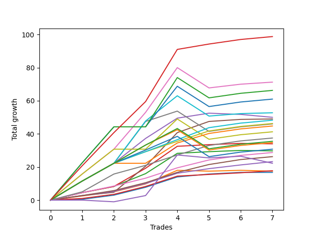

# Short Labrador 016 
- Symbol: ES_830-1130
- Date Range: 03/18/2022 - 12/30/2022
- Trading Period: 8:30-11:30
- Number of Trades: 5



| Name | Win Percent | Profit | Avg Profit / Trade | Avg Time / Trade |      | Name | Win Percent | Profit | Avg Profit / Trade | Avg Time / Trade |
| ---- | ----------- | ------ | ------------------ | ---------------- | ---- | ---- | ----------- | ------ | ------------------ | ---------------- |
| Sorted By <br> Profit | | | | | | Sorted By <br> Win Percentage ||||
| NEWFI 000 | 100.00 | 29000.00 | 5800.00 | 40:25 |     | NEWFI 000 | 100.00 | 29000.00 | 5800.00 | 40:25 |
| BB-50 U/L 1SD SL-10 | 100.00 | 22125.00 | 4425.00 | 25:47 |     | BB-50 U/L 1SD SL-10 | 100.00 | 22125.00 | 4425.00 | 25:47 |
| BB-50 U/L 1SD | 100.00 | 22125.00 | 4425.00 | 25:47 |     | BB-50 U/L 1SD | 100.00 | 22125.00 | 4425.00 | 25:47 |
| BB-50 U/L 2SD SL-10 | 80.00 | 21125.00 | 4225.00 | 39:35 |     | TP-7 | 100.00 | 13000.00 | 2600.00 | 30:44 |
| BB-50 U/L 2SD | 80.00 | 20250.00 | 4050.00 | 43:17 |     | TP-6 | 100.00 | 12000.00 | 2400.00 | 30:09 |
| BB-100 Mid SL-10 | 80.00 | 16125.00 | 3225.00 | 40:25 |     | TP-5 | 100.00 | 10875.00 | 2175.00 | 29:34 |
| BB-100 Mid | 80.00 | 15250.00 | 3050.00 | 44:07 |     | TP-3 | 100.00 | 10250.00 | 2050.00 | 29:14 |
| BB-50 Mid SL-10 | 60.00 | 13875.00 | 2775.00 | 20:07 |     | TP-4 | 100.00 | 10125.00 | 2025.00 | 29:32 |
| BB-50 Mid | 60.00 | 13875.00 | 2775.00 | 20:07 |     | TP-2 | 100.00 | 9000.00 | 1800.00 | 28:39 |
| TP-7 | 100.00 | 13000.00 | 2600.00 | 30:44 |     | TP-1 | 100.00 | 7125.00 | 1425.00 | 14:09 |
| BB-20 U/L 2SD C SL-10 | 80.00 | 12875.00 | 2575.00 | 10:14 |     | BB-50 U/L 2SD SL-10 | 80.00 | 21125.00 | 4225.00 | 39:35 |
| BB-20 U/L 2SD C | 80.00 | 12875.00 | 2575.00 | 10:14 |     | BB-50 U/L 2SD | 80.00 | 20250.00 | 4050.00 | 43:17 |
| V Mid SL-10 | 80.00 | 12750.00 | 2550.00 | 37:25 |     | BB-100 Mid SL-10 | 80.00 | 16125.00 | 3225.00 | 40:25 |
| TP-6 | 100.00 | 12000.00 | 2400.00 | 30:09 |     | BB-100 Mid | 80.00 | 15250.00 | 3050.00 | 44:07 |
| V Mid | 80.00 | 11875.00 | 2375.00 | 41:07 |     | BB-20 U/L 2SD C SL-10 | 80.00 | 12875.00 | 2575.00 | 10:14 |
| BB-200 U/L 2SD SL-10 | 60.00 | 11875.00 | 2375.00 | 48:35 |     | BB-20 U/L 2SD C | 80.00 | 12875.00 | 2575.00 | 10:14 |
| NEWFI 0000 | 60.00 | 11625.00 | 2325.00 | 16:27 |     | V Mid SL-10 | 80.00 | 12750.00 | 2550.00 | 37:25 |
| BB-200 Mid SL-10 | 80.00 | 11250.00 | 2250.00 | 42:16 |     | V Mid | 80.00 | 11875.00 | 2375.00 | 41:07 |
| BB-200 Mid | 80.00 | 11250.00 | 2250.00 | 42:16 |     | BB-200 Mid SL-10 | 80.00 | 11250.00 | 2250.00 | 42:16 |
| BB-200 U/L 2SD | 60.00 | 11000.00 | 2200.00 | 52:17 |     | BB-200 Mid | 80.00 | 11250.00 | 2250.00 | 42:16 |
| TP-5 | 100.00 | 10875.00 | 2175.00 | 29:34 |     | BB-20 U/L 2SD SL-10 | 80.00 | 10750.00 | 2150.00 | 09:13 |
| BB-20 U/L 2SD SL-10 | 80.00 | 10750.00 | 2150.00 | 09:13 |     | BB-20 U/L 2SD | 80.00 | 10750.00 | 2150.00 | 09:13 |
| BB-20 U/L 2SD | 80.00 | 10750.00 | 2150.00 | 09:13 |     | BB-20 Mid SL-10 | 80.00 | 6875.00 | 1375.00 | 03:16 |
| TP-3 | 100.00 | 10250.00 | 2050.00 | 29:14 |     | BB-20 Mid SL-5 | 80.00 | 6875.00 | 1375.00 | 03:16 |
| TP-4 | 100.00 | 10125.00 | 2025.00 | 29:32 |     | BB-20 Mid | 80.00 | 6875.00 | 1375.00 | 03:16 |
| BB-100 U/L 2SD SL-10 | 60.00 | 9250.00 | 1850.00 | 57:13 |     | TP-10 | 80.00 | 6625.00 | 1325.00 | 39:18 |
| TP-2 | 100.00 | 9000.00 | 1800.00 | 28:39 |     | TP-9 | 80.00 | 6250.00 | 1250.00 | 39:12 |
| BB-100 U/L 2SD | 60.00 | 8375.00 | 1675.00 | 60:55 |     | TP-8 | 80.00 | 4250.00 | 850.00 | 38:18 |
| BB-20 U/L 2SD SL-5 | 60.00 | 7750.00 | 1550.00 | 08:06 |     | BB-50 Mid SL-10 | 60.00 | 13875.00 | 2775.00 | 20:07 |
| TP-1 | 100.00 | 7125.00 | 1425.00 | 14:09 |     | BB-50 Mid | 60.00 | 13875.00 | 2775.00 | 20:07 |
| BB-20 Mid SL-10 | 80.00 | 6875.00 | 1375.00 | 03:16 |     | BB-200 U/L 2SD SL-10 | 60.00 | 11875.00 | 2375.00 | 48:35 |
| BB-20 Mid SL-5 | 80.00 | 6875.00 | 1375.00 | 03:16 |     | NEWFI 0000 | 60.00 | 11625.00 | 2325.00 | 16:27 |
| BB-20 Mid | 80.00 | 6875.00 | 1375.00 | 03:16 |     | BB-200 U/L 2SD | 60.00 | 11000.00 | 2200.00 | 52:17 |
| TP-10 | 80.00 | 6625.00 | 1325.00 | 39:18 |     | BB-100 U/L 2SD SL-10 | 60.00 | 9250.00 | 1850.00 | 57:13 |
| TP-9 | 80.00 | 6250.00 | 1250.00 | 39:12 |     | BB-100 U/L 2SD | 60.00 | 8375.00 | 1675.00 | 60:55 |
| BB-20 U/L 1SD SL-10 | 60.00 | 6250.00 | 1250.00 | 07:54 |     | BB-20 U/L 2SD SL-5 | 60.00 | 7750.00 | 1550.00 | 08:06 |
| BB-20 U/L 1SD | 60.00 | 6250.00 | 1250.00 | 07:54 |     | BB-20 U/L 1SD SL-10 | 60.00 | 6250.00 | 1250.00 | 07:54 |
| V U/L 1SD SL-10 | 60.00 | 6125.00 | 1225.00 | 46:51 |     | BB-20 U/L 1SD | 60.00 | 6250.00 | 1250.00 | 07:54 |
| V U/L 1SD | 60.00 | 5250.00 | 1050.00 | 50:33 |     | V U/L 1SD SL-10 | 60.00 | 6125.00 | 1225.00 | 46:51 |
| BB-200 U/L 2SD SL-5 | 20.00 | 4750.00 | 950.00 | 13:14 |     | V U/L 1SD | 60.00 | 5250.00 | 1050.00 | 50:33 |
| TP-8 | 80.00 | 4250.00 | 850.00 | 38:18 |     | BB-20 U/L 1SD SL-5 | 60.00 | 4000.00 | 800.00 | 06:51 |
| BB-20 U/L 1SD SL-5 | 60.00 | 4000.00 | 800.00 | 06:51 |     | BB-20 U/L 2SD C SL-5 | 40.00 | 1625.00 | 325.00 | 08:51 |
| BB-50 U/L 2SD SL-5 | 20.00 | 3375.00 | 675.00 | 13:06 |     | BB-200 U/L 2SD SL-5 | 20.00 | 4750.00 | 950.00 | 13:14 |
| BB-100 U/L 2SD SL-5 | 20.00 | 2125.00 | 425.00 | 21:52 |     | BB-50 U/L 2SD SL-5 | 20.00 | 3375.00 | 675.00 | 13:06 |
| BB-20 U/L 2SD C SL-5 | 40.00 | 1625.00 | 325.00 | 08:51 |     | BB-100 U/L 2SD SL-5 | 20.00 | 2125.00 | 425.00 | 21:52 |
| BB-50 U/L 1SD SL-5 | 20.00 | -0.00 | -0.00 | 11:43 |     | BB-50 U/L 1SD SL-5 | 20.00 | -0.00 | -0.00 | 11:43 |
| V U/L 1SD SL-5 | 20.00 | -1000.00 | -200.00 | 11:30 |     | V U/L 1SD SL-5 | 20.00 | -1000.00 | -200.00 | 11:30 |
| BB-100 Mid SL-5 | 20.00 | -2500.00 | -500.00 | 11:17 |     | BB-100 Mid SL-5 | 20.00 | -2500.00 | -500.00 | 11:17 |
| BB-200 Mid SL-5 | 20.00 | -4000.00 | -800.00 | 10:41 |     | BB-200 Mid SL-5 | 20.00 | -4000.00 | -800.00 | 10:41 |
| BB-50 Mid SL-5 | 20.00 | -4000.00 | -800.00 | 10:41 |     | BB-50 Mid SL-5 | 20.00 | -4000.00 | -800.00 | 10:41 |
| V Mid SL-5 | 20.00 | -7000.00 | -1400.00 | 09:55 |     | V Mid SL-5 | 20.00 | -7000.00 | -1400.00 | 09:55 |

## NO STOPLOSS

### Test BB-20 Mid
* Sell when price hits the middle line of the 20p bollinger
* No Stoploss
* Results:
```
Total Trades: 5
Percent Up: 20.00
Percent Down: 80.00
Total Points Moved Down: 13.75
Potential Profit: 6875.00
Total Points Ups: 0.00 Count Ups: 1
Total Points Downs: 13.75 Count Downs: 4
```

<details><summary>Trades</summary>

<code>In: 2022-05-10 11:06:00		Out: 2022-05-10 11:07:10		Total Position Time: 01:10		Total Move Down: 4.75		Total to Date: 4.75</code> <br />
<code>In: 2022-06-14 10:26:00		Out: 2022-06-14 10:27:10		Total Position Time: 01:10		Total Move Down: 6.25		Total to Date: 11.00</code> <br />
<code>In: 2022-08-29 09:08:00		Out: 2022-08-29 09:14:10		Total Position Time: 06:10		Total Move Down: 1.75		Total to Date: 12.75</code> <br />
<code>In: 2022-11-21 10:23:00		Out: 2022-11-21 10:27:25		Total Position Time: 04:25		Total Move Down: 1.00		Total to Date: 13.75</code> <br />
<code>In: 2022-11-21 10:24:00		Out: 2022-11-21 10:27:25		Total Position Time: 03:25		Total Move Down: -0.00		Total to Date: 13.75</code> <br />


</details>

### Test BB-20 U/L 1SD
* Sell when the price hits the lower line of the 20p 1std bollinger
* No Stoploss
* Results:
```
Total Trades: 5
Percent Up: 40.00
Percent Down: 60.00
Total Points Moved Down: 12.50
Potential Profit: 6250.00
Total Points Ups: 1.00 Count Ups: 2
Total Points Downs: 13.50 Count Downs: 3
```

<details><summary>Trades</summary>

<code>In: 2022-05-10 11:06:00		Out: 2022-05-10 11:07:10		Total Position Time: 01:10		Total Move Down: 4.75		Total to Date: 4.75</code> <br />
<code>In: 2022-06-14 10:26:00		Out: 2022-06-14 10:29:05		Total Position Time: 03:05		Total Move Down: 8.25		Total to Date: 13.00</code> <br />
<code>In: 2022-08-29 09:08:00		Out: 2022-08-29 09:24:15		Total Position Time: 16:15		Total Move Down: -0.50		Total to Date: 12.50</code> <br />
<code>In: 2022-11-21 10:23:00		Out: 2022-11-21 10:33:00		Total Position Time: 10:00		Total Move Down: 0.50		Total to Date: 13.00</code> <br />
<code>In: 2022-11-21 10:24:00		Out: 2022-11-21 10:33:00		Total Position Time: 09:00		Total Move Down: -0.50		Total to Date: 12.50</code> <br />


</details>

### Test BB-20 U/L 2SD
* Sell when the price hits the lower line of the 20p 2std bollinger
* No Stoploss
* Results:
```
Total Trades: 5
Percent Up: 20.00
Percent Down: 80.00
Total Points Moved Down: 21.50
Potential Profit: 10750.00
Total Points Ups: 0.25 Count Ups: 1
Total Points Downs: 21.75 Count Downs: 4
```

<details><summary>Trades</summary>

<code>In: 2022-05-10 11:06:00		Out: 2022-05-10 11:11:10		Total Position Time: 05:10		Total Move Down: 7.75		Total to Date: 7.75</code> <br />
<code>In: 2022-06-14 10:26:00		Out: 2022-06-14 10:31:00		Total Position Time: 05:00		Total Move Down: 12.25		Total to Date: 20.00</code> <br />
<code>In: 2022-08-29 09:08:00		Out: 2022-08-29 09:24:35		Total Position Time: 16:35		Total Move Down: 1.00		Total to Date: 21.00</code> <br />
<code>In: 2022-11-21 10:23:00		Out: 2022-11-21 10:33:10		Total Position Time: 10:10		Total Move Down: 0.75		Total to Date: 21.75</code> <br />
<code>In: 2022-11-21 10:24:00		Out: 2022-11-21 10:33:10		Total Position Time: 09:10		Total Move Down: -0.25		Total to Date: 21.50</code> <br />


</details>

### Test BB-20 U/L 2SD C
* Sell when the price hits the lower line of the 20p 2std bollinger
* No Stoploss
* Results:
```
Total Trades: 5
Percent Up: 20.00
Percent Down: 80.00
Total Points Moved Down: 25.75
Potential Profit: 12875.00
Total Points Ups: 0.25 Count Ups: 1
Total Points Downs: 26.00 Count Downs: 4
```

<details><summary>Trades</summary>

<code>In: 2022-05-10 11:06:00		Out: 2022-05-10 11:16:05		Total Position Time: 10:05		Total Move Down: 11.00		Total to Date: 11.00</code> <br />
<code>In: 2022-06-14 10:26:00		Out: 2022-06-14 10:31:10		Total Position Time: 05:10		Total Move Down: 13.25		Total to Date: 24.25</code> <br />
<code>In: 2022-08-29 09:08:00		Out: 2022-08-29 09:24:35		Total Position Time: 16:35		Total Move Down: 1.00		Total to Date: 25.25</code> <br />
<code>In: 2022-11-21 10:23:00		Out: 2022-11-21 10:33:10		Total Position Time: 10:10		Total Move Down: 0.75		Total to Date: 26.00</code> <br />
<code>In: 2022-11-21 10:24:00		Out: 2022-11-21 10:33:10		Total Position Time: 09:10		Total Move Down: -0.25		Total to Date: 25.75</code> <br />


</details>

### Test BB-50 Mid
* Sell when price hits the middle line of the 50p bollinger
* No Stoploss
* Results:
```
Total Trades: 5
Percent Up: 40.00
Percent Down: 60.00
Total Points Moved Down: 27.75
Potential Profit: 13875.00
Total Points Ups: 2.50 Count Ups: 2
Total Points Downs: 30.25 Count Downs: 3
```

<details><summary>Trades</summary>

<code>In: 2022-05-10 11:06:00		Out: 2022-05-10 11:16:20		Total Position Time: 10:20		Total Move Down: 15.00		Total to Date: 15.00</code> <br />
<code>In: 2022-06-14 10:26:00		Out: 2022-06-14 10:31:00		Total Position Time: 05:00		Total Move Down: 12.25		Total to Date: 27.25</code> <br />
<code>In: 2022-08-29 09:08:00		Out: 2022-08-29 09:31:25		Total Position Time: 23:25		Total Move Down: 3.00		Total to Date: 30.25</code> <br />
<code>In: 2022-11-21 10:23:00		Out: 2022-11-21 10:54:25		Total Position Time: 31:25		Total Move Down: -0.75		Total to Date: 29.50</code> <br />
<code>In: 2022-11-21 10:24:00		Out: 2022-11-21 10:54:25		Total Position Time: 30:25		Total Move Down: -1.75		Total to Date: 27.75</code> <br />


</details>

### Test BB-50 U/L 1SD
* Sell when the price hits the lower line of the 50p 1std bollinger
* No Stoploss
* Results:
```
Total Trades: 5
Percent Up: 0.00
Percent Down: 100.00
Total Points Moved Down: 44.25
Potential Profit: 22125.00
Total Points Ups: 0.00 Count Ups: 0
Total Points Downs: 44.25 Count Downs: 5
```

<details><summary>Trades</summary>

<code>In: 2022-05-10 11:06:00		Out: 2022-05-10 11:24:05		Total Position Time: 18:05		Total Move Down: 15.75		Total to Date: 15.75</code> <br />
<code>In: 2022-06-14 10:26:00		Out: 2022-06-14 10:36:10		Total Position Time: 10:10		Total Move Down: 20.25		Total to Date: 36.00</code> <br />
<code>In: 2022-08-29 09:08:00		Out: 2022-08-29 09:36:50		Total Position Time: 28:50		Total Move Down: 6.75		Total to Date: 42.75</code> <br />
<code>In: 2022-11-21 10:23:00		Out: 2022-11-21 10:59:25		Total Position Time: 36:25		Total Move Down: 1.25		Total to Date: 44.00</code> <br />
<code>In: 2022-11-21 10:24:00		Out: 2022-11-21 10:59:25		Total Position Time: 35:25		Total Move Down: 0.25		Total to Date: 44.25</code> <br />


</details>

### Test BB-50 U/L 2SD
* Sell when the price hits the lower line of the 50p 2std bollinger
* No Stoploss
* Results:
```
Total Trades: 5
Percent Up: 20.00
Percent Down: 80.00
Total Points Moved Down: 40.50
Potential Profit: 20250.00
Total Points Ups: 12.25 Count Ups: 1
Total Points Downs: 52.75 Count Downs: 4
```

<details><summary>Trades</summary>

<code>In: 2022-05-10 11:06:00		Out: 2022-05-10 11:27:05		Total Position Time: 21:05		Total Move Down: 22.25		Total to Date: 22.25</code> <br />
<code>In: 2022-06-14 10:26:00		Out: 2022-06-14 10:43:05		Total Position Time: 17:05		Total Move Down: 27.00		Total to Date: 49.25</code> <br />
<code>In: 2022-08-29 09:08:00		Out: 2022-08-29 10:08:55		Total Position Time: 60:55		Total Move Down: -12.25		Total to Date: 37.00</code> <br />
<code>In: 2022-11-21 10:23:00		Out: 2022-11-21 11:22:10		Total Position Time: 59:10		Total Move Down: 2.25		Total to Date: 39.25</code> <br />
<code>In: 2022-11-21 10:24:00		Out: 2022-11-21 11:22:10		Total Position Time: 58:10		Total Move Down: 1.25		Total to Date: 40.50</code> <br />


</details>

### Test V Mid
* Sell when the price hits the middle line of the 1std VWAP
* No Stoploss
* Results:
```
Total Trades: 5
Percent Up: 20.00
Percent Down: 80.00
Total Points Moved Down: 23.75
Potential Profit: 11875.00
Total Points Ups: 12.25 Count Ups: 1
Total Points Downs: 36.00 Count Downs: 4
```

<details><summary>Trades</summary>

<code>In: 2022-05-10 11:06:00		Out: 2022-05-10 11:27:40		Total Position Time: 21:40		Total Move Down: 25.25		Total to Date: 25.25</code> <br />
<code>In: 2022-06-14 10:26:00		Out: 2022-06-14 10:27:10		Total Position Time: 01:10		Total Move Down: 6.25		Total to Date: 31.50</code> <br />
<code>In: 2022-08-29 09:08:00		Out: 2022-08-29 10:08:55		Total Position Time: 60:55		Total Move Down: -12.25		Total to Date: 19.25</code> <br />
<code>In: 2022-11-21 10:23:00		Out: 2022-11-21 11:23:55		Total Position Time: 60:55		Total Move Down: 2.75		Total to Date: 22.00</code> <br />
<code>In: 2022-11-21 10:24:00		Out: 2022-11-21 11:24:55		Total Position Time: 60:55		Total Move Down: 1.75		Total to Date: 23.75</code> <br />


</details>

### Test V U/L 1SD
* Sell when the price hits the lower line of the 1std VWAP
* No Stoploss
* Results:
```
Total Trades: 5
Percent Up: 40.00
Percent Down: 60.00
Total Points Moved Down: 10.50
Potential Profit: 5250.00
Total Points Ups: 12.25 Count Ups: 2
Total Points Downs: 22.75 Count Downs: 3
```

<details><summary>Trades</summary>

<code>In: 2022-05-10 11:06:00		Out: 2022-05-10 12:06:55		Total Position Time: 60:55		Total Move Down: -0.00		Total to Date: 0.00</code> <br />
<code>In: 2022-06-14 10:26:00		Out: 2022-06-14 10:35:05		Total Position Time: 09:05		Total Move Down: 18.25		Total to Date: 18.25</code> <br />
<code>In: 2022-08-29 09:08:00		Out: 2022-08-29 10:08:55		Total Position Time: 60:55		Total Move Down: -12.25		Total to Date: 6.00</code> <br />
<code>In: 2022-11-21 10:23:00		Out: 2022-11-21 11:23:55		Total Position Time: 60:55		Total Move Down: 2.75		Total to Date: 8.75</code> <br />
<code>In: 2022-11-21 10:24:00		Out: 2022-11-21 11:24:55		Total Position Time: 60:55		Total Move Down: 1.75		Total to Date: 10.50</code> <br />


</details>

### Test BB-100 Mid
* Move to BB100 Mid
* No Stoploss
* Results:
```
Total Trades: 5
Percent Up: 20.00
Percent Down: 80.00
Total Points Moved Down: 30.50
Potential Profit: 15250.00
Total Points Ups: 12.25 Count Ups: 1
Total Points Downs: 42.75 Count Downs: 4
```

<details><summary>Trades</summary>

<code>In: 2022-05-10 11:06:00		Out: 2022-05-10 11:40:30		Total Position Time: 34:30		Total Move Down: 25.50		Total to Date: 25.50</code> <br />
<code>In: 2022-06-14 10:26:00		Out: 2022-06-14 10:34:00		Total Position Time: 08:00		Total Move Down: 15.25		Total to Date: 40.75</code> <br />
<code>In: 2022-08-29 09:08:00		Out: 2022-08-29 10:08:55		Total Position Time: 60:55		Total Move Down: -12.25		Total to Date: 28.50</code> <br />
<code>In: 2022-11-21 10:23:00		Out: 2022-11-21 11:22:05		Total Position Time: 59:05		Total Move Down: 1.50		Total to Date: 30.00</code> <br />
<code>In: 2022-11-21 10:24:00		Out: 2022-11-21 11:22:05		Total Position Time: 58:05		Total Move Down: 0.50		Total to Date: 30.50</code> <br />


</details>

### Test BB-100 U/L 2SD
* Move to BB100 Upper Band
* No Stoploss
* Results:
```
Total Trades: 5
Percent Up: 40.00
Percent Down: 60.00
Total Points Moved Down: 16.75
Potential Profit: 8375.00
Total Points Ups: 12.25 Count Ups: 2
Total Points Downs: 29.00 Count Downs: 3
```

<details><summary>Trades</summary>

<code>In: 2022-05-10 11:06:00		Out: 2022-05-10 12:06:55		Total Position Time: 60:55		Total Move Down: -0.00		Total to Date: 0.00</code> <br />
<code>In: 2022-06-14 10:26:00		Out: 2022-06-14 11:26:55		Total Position Time: 60:55		Total Move Down: 24.50		Total to Date: 24.50</code> <br />
<code>In: 2022-08-29 09:08:00		Out: 2022-08-29 10:08:55		Total Position Time: 60:55		Total Move Down: -12.25		Total to Date: 12.25</code> <br />
<code>In: 2022-11-21 10:23:00		Out: 2022-11-21 11:23:55		Total Position Time: 60:55		Total Move Down: 2.75		Total to Date: 15.00</code> <br />
<code>In: 2022-11-21 10:24:00		Out: 2022-11-21 11:24:55		Total Position Time: 60:55		Total Move Down: 1.75		Total to Date: 16.75</code> <br />


</details>

### Test BB-200 Mid
* Move to BB200 Mid
* No Stoploss
* Results:
```
Total Trades: 5
Percent Up: 20.00
Percent Down: 80.00
Total Points Moved Down: 22.50
Potential Profit: 11250.00
Total Points Ups: 0.00 Count Ups: 1
Total Points Downs: 22.50 Count Downs: 4
```

<details><summary>Trades</summary>

<code>In: 2022-05-10 11:06:00		Out: 2022-05-10 12:06:55		Total Position Time: 60:55		Total Move Down: -0.00		Total to Date: 0.00</code> <br />
<code>In: 2022-06-14 10:26:00		Out: 2022-06-14 10:31:00		Total Position Time: 05:00		Total Move Down: 12.25		Total to Date: 12.25</code> <br />
<code>In: 2022-08-29 09:08:00		Out: 2022-08-29 09:31:35		Total Position Time: 23:35		Total Move Down: 5.75		Total to Date: 18.00</code> <br />
<code>In: 2022-11-21 10:23:00		Out: 2022-11-21 11:23:55		Total Position Time: 60:55		Total Move Down: 2.75		Total to Date: 20.75</code> <br />
<code>In: 2022-11-21 10:24:00		Out: 2022-11-21 11:24:55		Total Position Time: 60:55		Total Move Down: 1.75		Total to Date: 22.50</code> <br />


</details>

### Test BB-200 U/L 2SD
* Move to BB200 Upper Band
* No Stoploss
* Results:
```
Total Trades: 5
Percent Up: 40.00
Percent Down: 60.00
Total Points Moved Down: 22.00
Potential Profit: 11000.00
Total Points Ups: 12.25 Count Ups: 2
Total Points Downs: 34.25 Count Downs: 3
```

<details><summary>Trades</summary>

<code>In: 2022-05-10 11:06:00		Out: 2022-05-10 12:06:55		Total Position Time: 60:55		Total Move Down: -0.00		Total to Date: 0.00</code> <br />
<code>In: 2022-06-14 10:26:00		Out: 2022-06-14 10:43:45		Total Position Time: 17:45		Total Move Down: 29.75		Total to Date: 29.75</code> <br />
<code>In: 2022-08-29 09:08:00		Out: 2022-08-29 10:08:55		Total Position Time: 60:55		Total Move Down: -12.25		Total to Date: 17.50</code> <br />
<code>In: 2022-11-21 10:23:00		Out: 2022-11-21 11:23:55		Total Position Time: 60:55		Total Move Down: 2.75		Total to Date: 20.25</code> <br />
<code>In: 2022-11-21 10:24:00		Out: 2022-11-21 11:24:55		Total Position Time: 60:55		Total Move Down: 1.75		Total to Date: 22.00</code> <br />


</details>

## STOPLOSS OF 5

### Test BB-20 Mid SL-5
* Sell when price hits the middle line of the 20p bollinger
* Stoploss is -5 points
* Results:
```
Total Trades: 5
Percent Up: 20.00
Percent Down: 80.00
Total Points Moved Down: 13.75
Potential Profit: 6875.00
Total Points Ups: 0.00 Count Ups: 1
Total Points Downs: 13.75 Count Downs: 4
```

<details><summary>Trades</summary>

<code>In: 2022-05-10 11:06:00		Out: 2022-05-10 11:07:10		Total Position Time: 01:10		Total Move Down: 4.75		Total to Date: 4.75</code> <br />
<code>In: 2022-06-14 10:26:00		Out: 2022-06-14 10:27:10		Total Position Time: 01:10		Total Move Down: 6.25		Total to Date: 11.00</code> <br />
<code>In: 2022-08-29 09:08:00		Out: 2022-08-29 09:14:10		Total Position Time: 06:10		Total Move Down: 1.75		Total to Date: 12.75</code> <br />
<code>In: 2022-11-21 10:23:00		Out: 2022-11-21 10:27:25		Total Position Time: 04:25		Total Move Down: 1.00		Total to Date: 13.75</code> <br />
<code>In: 2022-11-21 10:24:00		Out: 2022-11-21 10:27:25		Total Position Time: 03:25		Total Move Down: -0.00		Total to Date: 13.75</code> <br />


</details>

### Test BB-20 U/L 1SD SL-5
* Sell when the price hits the lower line of the 20p 1std bollinger
* Stoploss is -5 points
* Results:
```
Total Trades: 5
Percent Up: 40.00
Percent Down: 60.00
Total Points Moved Down: 8.00
Potential Profit: 4000.00
Total Points Ups: 5.50 Count Ups: 2
Total Points Downs: 13.50 Count Downs: 3
```

<details><summary>Trades</summary>

<code>In: 2022-05-10 11:06:00		Out: 2022-05-10 11:07:10		Total Position Time: 01:10		Total Move Down: 4.75		Total to Date: 4.75</code> <br />
<code>In: 2022-06-14 10:26:00		Out: 2022-06-14 10:29:05		Total Position Time: 03:05		Total Move Down: 8.25		Total to Date: 13.00</code> <br />
<code>In: 2022-08-29 09:08:00		Out: 2022-08-29 09:19:00		Total Position Time: 11:00		Total Move Down: -5.00		Total to Date: 8.00</code> <br />
<code>In: 2022-11-21 10:23:00		Out: 2022-11-21 10:33:00		Total Position Time: 10:00		Total Move Down: 0.50		Total to Date: 8.50</code> <br />
<code>In: 2022-11-21 10:24:00		Out: 2022-11-21 10:33:00		Total Position Time: 09:00		Total Move Down: -0.50		Total to Date: 8.00</code> <br />


</details>

### Test BB-20 U/L 2SD SL-5
* Sell when the price hits the lower line of the 20p 2std bollinger
* Stoploss is -5 points
* Results:
```
Total Trades: 5
Percent Up: 40.00
Percent Down: 60.00
Total Points Moved Down: 15.50
Potential Profit: 7750.00
Total Points Ups: 5.25 Count Ups: 2
Total Points Downs: 20.75 Count Downs: 3
```

<details><summary>Trades</summary>

<code>In: 2022-05-10 11:06:00		Out: 2022-05-10 11:11:10		Total Position Time: 05:10		Total Move Down: 7.75		Total to Date: 7.75</code> <br />
<code>In: 2022-06-14 10:26:00		Out: 2022-06-14 10:31:00		Total Position Time: 05:00		Total Move Down: 12.25		Total to Date: 20.00</code> <br />
<code>In: 2022-08-29 09:08:00		Out: 2022-08-29 09:19:00		Total Position Time: 11:00		Total Move Down: -5.00		Total to Date: 15.00</code> <br />
<code>In: 2022-11-21 10:23:00		Out: 2022-11-21 10:33:10		Total Position Time: 10:10		Total Move Down: 0.75		Total to Date: 15.75</code> <br />
<code>In: 2022-11-21 10:24:00		Out: 2022-11-21 10:33:10		Total Position Time: 09:10		Total Move Down: -0.25		Total to Date: 15.50</code> <br />


</details>

### Test BB-20 U/L 2SD C SL-5
* Sell when the price hits the lower line of the 20p 2std bollinger
* Stoploss is -5 points
* Results:
```
Total Trades: 5
Percent Up: 60.00
Percent Down: 40.00
Total Points Moved Down: 3.25
Potential Profit: 1625.00
Total Points Ups: 10.75 Count Ups: 3
Total Points Downs: 14.00 Count Downs: 2
```

<details><summary>Trades</summary>

<code>In: 2022-05-10 11:06:00		Out: 2022-05-10 11:14:45		Total Position Time: 08:45		Total Move Down: -5.50		Total to Date: -5.50</code> <br />
<code>In: 2022-06-14 10:26:00		Out: 2022-06-14 10:31:10		Total Position Time: 05:10		Total Move Down: 13.25		Total to Date: 7.75</code> <br />
<code>In: 2022-08-29 09:08:00		Out: 2022-08-29 09:19:00		Total Position Time: 11:00		Total Move Down: -5.00		Total to Date: 2.75</code> <br />
<code>In: 2022-11-21 10:23:00		Out: 2022-11-21 10:33:10		Total Position Time: 10:10		Total Move Down: 0.75		Total to Date: 3.50</code> <br />
<code>In: 2022-11-21 10:24:00		Out: 2022-11-21 10:33:10		Total Position Time: 09:10		Total Move Down: -0.25		Total to Date: 3.25</code> <br />


</details>

### Test BB-50 Mid SL-5
* Sell when price hits the middle line of the 50p bollinger
* Stoploss is -5 points
* Results:
```
Total Trades: 5
Percent Up: 80.00
Percent Down: 20.00
Total Points Moved Down: -8.00
Potential Profit: -4000.00
Total Points Ups: 20.25 Count Ups: 4
Total Points Downs: 12.25 Count Downs: 1
```

<details><summary>Trades</summary>

<code>In: 2022-05-10 11:06:00		Out: 2022-05-10 11:14:45		Total Position Time: 08:45		Total Move Down: -5.50		Total to Date: -5.50</code> <br />
<code>In: 2022-06-14 10:26:00		Out: 2022-06-14 10:31:00		Total Position Time: 05:00		Total Move Down: 12.25		Total to Date: 6.75</code> <br />
<code>In: 2022-08-29 09:08:00		Out: 2022-08-29 09:19:00		Total Position Time: 11:00		Total Move Down: -5.00		Total to Date: 1.75</code> <br />
<code>In: 2022-11-21 10:23:00		Out: 2022-11-21 10:38:30		Total Position Time: 15:30		Total Move Down: -4.75		Total to Date: -3.00</code> <br />
<code>In: 2022-11-21 10:24:00		Out: 2022-11-21 10:37:10		Total Position Time: 13:10		Total Move Down: -5.00		Total to Date: -8.00</code> <br />


</details>

### Test BB-50 U/L 1SD SL-5
* Sell when the price hits the lower line of the 50p 1std bollinger
* Stoploss is -5 points
* Results:
```
Total Trades: 5
Percent Up: 80.00
Percent Down: 20.00
Total Points Moved Down: -0.00
Potential Profit: -0.00
Total Points Ups: 20.25 Count Ups: 4
Total Points Downs: 20.25 Count Downs: 1
```

<details><summary>Trades</summary>

<code>In: 2022-05-10 11:06:00		Out: 2022-05-10 11:14:45		Total Position Time: 08:45		Total Move Down: -5.50		Total to Date: -5.50</code> <br />
<code>In: 2022-06-14 10:26:00		Out: 2022-06-14 10:36:10		Total Position Time: 10:10		Total Move Down: 20.25		Total to Date: 14.75</code> <br />
<code>In: 2022-08-29 09:08:00		Out: 2022-08-29 09:19:00		Total Position Time: 11:00		Total Move Down: -5.00		Total to Date: 9.75</code> <br />
<code>In: 2022-11-21 10:23:00		Out: 2022-11-21 10:38:30		Total Position Time: 15:30		Total Move Down: -4.75		Total to Date: 5.00</code> <br />
<code>In: 2022-11-21 10:24:00		Out: 2022-11-21 10:37:10		Total Position Time: 13:10		Total Move Down: -5.00		Total to Date: 0.00</code> <br />


</details>

### Test BB-50 U/L 2SD SL-5
* Sell when the price hits the lower line of the 50p 2std bollinger
* Stoploss is -5 points
* Results:
```
Total Trades: 5
Percent Up: 80.00
Percent Down: 20.00
Total Points Moved Down: 6.75
Potential Profit: 3375.00
Total Points Ups: 20.25 Count Ups: 4
Total Points Downs: 27.00 Count Downs: 1
```

<details><summary>Trades</summary>

<code>In: 2022-05-10 11:06:00		Out: 2022-05-10 11:14:45		Total Position Time: 08:45		Total Move Down: -5.50		Total to Date: -5.50</code> <br />
<code>In: 2022-06-14 10:26:00		Out: 2022-06-14 10:43:05		Total Position Time: 17:05		Total Move Down: 27.00		Total to Date: 21.50</code> <br />
<code>In: 2022-08-29 09:08:00		Out: 2022-08-29 09:19:00		Total Position Time: 11:00		Total Move Down: -5.00		Total to Date: 16.50</code> <br />
<code>In: 2022-11-21 10:23:00		Out: 2022-11-21 10:38:30		Total Position Time: 15:30		Total Move Down: -4.75		Total to Date: 11.75</code> <br />
<code>In: 2022-11-21 10:24:00		Out: 2022-11-21 10:37:10		Total Position Time: 13:10		Total Move Down: -5.00		Total to Date: 6.75</code> <br />


</details>

### Test V Mid SL-5
* Sell when the price hits the middle line of the 1std VWAP
* Stoploss is -5 points
* Results:
```
Total Trades: 5
Percent Up: 80.00
Percent Down: 20.00
Total Points Moved Down: -14.00
Potential Profit: -7000.00
Total Points Ups: 20.25 Count Ups: 4
Total Points Downs: 6.25 Count Downs: 1
```

<details><summary>Trades</summary>

<code>In: 2022-05-10 11:06:00		Out: 2022-05-10 11:14:45		Total Position Time: 08:45		Total Move Down: -5.50		Total to Date: -5.50</code> <br />
<code>In: 2022-06-14 10:26:00		Out: 2022-06-14 10:27:10		Total Position Time: 01:10		Total Move Down: 6.25		Total to Date: 0.75</code> <br />
<code>In: 2022-08-29 09:08:00		Out: 2022-08-29 09:19:00		Total Position Time: 11:00		Total Move Down: -5.00		Total to Date: -4.25</code> <br />
<code>In: 2022-11-21 10:23:00		Out: 2022-11-21 10:38:30		Total Position Time: 15:30		Total Move Down: -4.75		Total to Date: -9.00</code> <br />
<code>In: 2022-11-21 10:24:00		Out: 2022-11-21 10:37:10		Total Position Time: 13:10		Total Move Down: -5.00		Total to Date: -14.00</code> <br />


</details>

### Test V U/L 1SD SL-5
* Sell when the price hits the lower line of the 1std VWAP
* Stoploss is -5 points
* Results:
```
Total Trades: 5
Percent Up: 80.00
Percent Down: 20.00
Total Points Moved Down: -2.00
Potential Profit: -1000.00
Total Points Ups: 20.25 Count Ups: 4
Total Points Downs: 18.25 Count Downs: 1
```

<details><summary>Trades</summary>

<code>In: 2022-05-10 11:06:00		Out: 2022-05-10 11:14:45		Total Position Time: 08:45		Total Move Down: -5.50		Total to Date: -5.50</code> <br />
<code>In: 2022-06-14 10:26:00		Out: 2022-06-14 10:35:05		Total Position Time: 09:05		Total Move Down: 18.25		Total to Date: 12.75</code> <br />
<code>In: 2022-08-29 09:08:00		Out: 2022-08-29 09:19:00		Total Position Time: 11:00		Total Move Down: -5.00		Total to Date: 7.75</code> <br />
<code>In: 2022-11-21 10:23:00		Out: 2022-11-21 10:38:30		Total Position Time: 15:30		Total Move Down: -4.75		Total to Date: 3.00</code> <br />
<code>In: 2022-11-21 10:24:00		Out: 2022-11-21 10:37:10		Total Position Time: 13:10		Total Move Down: -5.00		Total to Date: -2.00</code> <br />


</details>

### Test BB-100 Mid SL-5
* Move to BB100 Mid
* Stoploss is -5 points
* Results:
```
Total Trades: 5
Percent Up: 80.00
Percent Down: 20.00
Total Points Moved Down: -5.00
Potential Profit: -2500.00
Total Points Ups: 20.25 Count Ups: 4
Total Points Downs: 15.25 Count Downs: 1
```

<details><summary>Trades</summary>

<code>In: 2022-05-10 11:06:00		Out: 2022-05-10 11:14:45		Total Position Time: 08:45		Total Move Down: -5.50		Total to Date: -5.50</code> <br />
<code>In: 2022-06-14 10:26:00		Out: 2022-06-14 10:34:00		Total Position Time: 08:00		Total Move Down: 15.25		Total to Date: 9.75</code> <br />
<code>In: 2022-08-29 09:08:00		Out: 2022-08-29 09:19:00		Total Position Time: 11:00		Total Move Down: -5.00		Total to Date: 4.75</code> <br />
<code>In: 2022-11-21 10:23:00		Out: 2022-11-21 10:38:30		Total Position Time: 15:30		Total Move Down: -4.75		Total to Date: 0.00</code> <br />
<code>In: 2022-11-21 10:24:00		Out: 2022-11-21 10:37:10		Total Position Time: 13:10		Total Move Down: -5.00		Total to Date: -5.00</code> <br />


</details>

### Test BB-100 U/L 2SD SL-5
* Move to BB100 Upper Band
* Stoploss is -5 points
* Results:
```
Total Trades: 5
Percent Up: 80.00
Percent Down: 20.00
Total Points Moved Down: 4.25
Potential Profit: 2125.00
Total Points Ups: 20.25 Count Ups: 4
Total Points Downs: 24.50 Count Downs: 1
```

<details><summary>Trades</summary>

<code>In: 2022-05-10 11:06:00		Out: 2022-05-10 11:14:45		Total Position Time: 08:45		Total Move Down: -5.50		Total to Date: -5.50</code> <br />
<code>In: 2022-06-14 10:26:00		Out: 2022-06-14 11:26:55		Total Position Time: 60:55		Total Move Down: 24.50		Total to Date: 19.00</code> <br />
<code>In: 2022-08-29 09:08:00		Out: 2022-08-29 09:19:00		Total Position Time: 11:00		Total Move Down: -5.00		Total to Date: 14.00</code> <br />
<code>In: 2022-11-21 10:23:00		Out: 2022-11-21 10:38:30		Total Position Time: 15:30		Total Move Down: -4.75		Total to Date: 9.25</code> <br />
<code>In: 2022-11-21 10:24:00		Out: 2022-11-21 10:37:10		Total Position Time: 13:10		Total Move Down: -5.00		Total to Date: 4.25</code> <br />


</details>

### Test BB-200 Mid SL-5
* Move to BB200 Mid
* Stoploss is -5 points
* Results:
```
Total Trades: 5
Percent Up: 80.00
Percent Down: 20.00
Total Points Moved Down: -8.00
Potential Profit: -4000.00
Total Points Ups: 20.25 Count Ups: 4
Total Points Downs: 12.25 Count Downs: 1
```

<details><summary>Trades</summary>

<code>In: 2022-05-10 11:06:00		Out: 2022-05-10 11:14:45		Total Position Time: 08:45		Total Move Down: -5.50		Total to Date: -5.50</code> <br />
<code>In: 2022-06-14 10:26:00		Out: 2022-06-14 10:31:00		Total Position Time: 05:00		Total Move Down: 12.25		Total to Date: 6.75</code> <br />
<code>In: 2022-08-29 09:08:00		Out: 2022-08-29 09:19:00		Total Position Time: 11:00		Total Move Down: -5.00		Total to Date: 1.75</code> <br />
<code>In: 2022-11-21 10:23:00		Out: 2022-11-21 10:38:30		Total Position Time: 15:30		Total Move Down: -4.75		Total to Date: -3.00</code> <br />
<code>In: 2022-11-21 10:24:00		Out: 2022-11-21 10:37:10		Total Position Time: 13:10		Total Move Down: -5.00		Total to Date: -8.00</code> <br />


</details>

### Test BB-200 U/L 2SD SL-5
* Move to BB200 Upper Band
* Stoploss is -5 points
* Results:
```
Total Trades: 5
Percent Up: 80.00
Percent Down: 20.00
Total Points Moved Down: 9.50
Potential Profit: 4750.00
Total Points Ups: 20.25 Count Ups: 4
Total Points Downs: 29.75 Count Downs: 1
```

<details><summary>Trades</summary>

<code>In: 2022-05-10 11:06:00		Out: 2022-05-10 11:14:45		Total Position Time: 08:45		Total Move Down: -5.50		Total to Date: -5.50</code> <br />
<code>In: 2022-06-14 10:26:00		Out: 2022-06-14 10:43:45		Total Position Time: 17:45		Total Move Down: 29.75		Total to Date: 24.25</code> <br />
<code>In: 2022-08-29 09:08:00		Out: 2022-08-29 09:19:00		Total Position Time: 11:00		Total Move Down: -5.00		Total to Date: 19.25</code> <br />
<code>In: 2022-11-21 10:23:00		Out: 2022-11-21 10:38:30		Total Position Time: 15:30		Total Move Down: -4.75		Total to Date: 14.50</code> <br />
<code>In: 2022-11-21 10:24:00		Out: 2022-11-21 10:37:10		Total Position Time: 13:10		Total Move Down: -5.00		Total to Date: 9.50</code> <br />


</details>

## STOPLOSS OF 10

### Test BB-20 Mid SL-10
* Sell when price hits the middle line of the 20p bollinger
* Stoploss is -10 points
* Results:
```
Total Trades: 5
Percent Up: 20.00
Percent Down: 80.00
Total Points Moved Down: 13.75
Potential Profit: 6875.00
Total Points Ups: 0.00 Count Ups: 1
Total Points Downs: 13.75 Count Downs: 4
```

<details><summary>Trades</summary>

<code>In: 2022-05-10 11:06:00		Out: 2022-05-10 11:07:10		Total Position Time: 01:10		Total Move Down: 4.75		Total to Date: 4.75</code> <br />
<code>In: 2022-06-14 10:26:00		Out: 2022-06-14 10:27:10		Total Position Time: 01:10		Total Move Down: 6.25		Total to Date: 11.00</code> <br />
<code>In: 2022-08-29 09:08:00		Out: 2022-08-29 09:14:10		Total Position Time: 06:10		Total Move Down: 1.75		Total to Date: 12.75</code> <br />
<code>In: 2022-11-21 10:23:00		Out: 2022-11-21 10:27:25		Total Position Time: 04:25		Total Move Down: 1.00		Total to Date: 13.75</code> <br />
<code>In: 2022-11-21 10:24:00		Out: 2022-11-21 10:27:25		Total Position Time: 03:25		Total Move Down: -0.00		Total to Date: 13.75</code> <br />


</details>

### Test BB-20 U/L 1SD SL-10
* Sell when the price hits the lower line of the 20p 1std bollinger
* Stoploss is -10 points
* Results:
```
Total Trades: 5
Percent Up: 40.00
Percent Down: 60.00
Total Points Moved Down: 12.50
Potential Profit: 6250.00
Total Points Ups: 1.00 Count Ups: 2
Total Points Downs: 13.50 Count Downs: 3
```

<details><summary>Trades</summary>

<code>In: 2022-05-10 11:06:00		Out: 2022-05-10 11:07:10		Total Position Time: 01:10		Total Move Down: 4.75		Total to Date: 4.75</code> <br />
<code>In: 2022-06-14 10:26:00		Out: 2022-06-14 10:29:05		Total Position Time: 03:05		Total Move Down: 8.25		Total to Date: 13.00</code> <br />
<code>In: 2022-08-29 09:08:00		Out: 2022-08-29 09:24:15		Total Position Time: 16:15		Total Move Down: -0.50		Total to Date: 12.50</code> <br />
<code>In: 2022-11-21 10:23:00		Out: 2022-11-21 10:33:00		Total Position Time: 10:00		Total Move Down: 0.50		Total to Date: 13.00</code> <br />
<code>In: 2022-11-21 10:24:00		Out: 2022-11-21 10:33:00		Total Position Time: 09:00		Total Move Down: -0.50		Total to Date: 12.50</code> <br />


</details>

### Test BB-20 U/L 2SD SL-10
* Sell when the price hits the lower line of the 20p 2std bollinger
* Stoploss is -10 points
* Results:
```
Total Trades: 5
Percent Up: 20.00
Percent Down: 80.00
Total Points Moved Down: 21.50
Potential Profit: 10750.00
Total Points Ups: 0.25 Count Ups: 1
Total Points Downs: 21.75 Count Downs: 4
```

<details><summary>Trades</summary>

<code>In: 2022-05-10 11:06:00		Out: 2022-05-10 11:11:10		Total Position Time: 05:10		Total Move Down: 7.75		Total to Date: 7.75</code> <br />
<code>In: 2022-06-14 10:26:00		Out: 2022-06-14 10:31:00		Total Position Time: 05:00		Total Move Down: 12.25		Total to Date: 20.00</code> <br />
<code>In: 2022-08-29 09:08:00		Out: 2022-08-29 09:24:35		Total Position Time: 16:35		Total Move Down: 1.00		Total to Date: 21.00</code> <br />
<code>In: 2022-11-21 10:23:00		Out: 2022-11-21 10:33:10		Total Position Time: 10:10		Total Move Down: 0.75		Total to Date: 21.75</code> <br />
<code>In: 2022-11-21 10:24:00		Out: 2022-11-21 10:33:10		Total Position Time: 09:10		Total Move Down: -0.25		Total to Date: 21.50</code> <br />


</details>

### Test BB-20 U/L 2SD C SL-10
* Sell when the price hits the lower line of the 20p 2std bollinger
* Stoploss is -10 points
* Results:
```
Total Trades: 5
Percent Up: 20.00
Percent Down: 80.00
Total Points Moved Down: 25.75
Potential Profit: 12875.00
Total Points Ups: 0.25 Count Ups: 1
Total Points Downs: 26.00 Count Downs: 4
```

<details><summary>Trades</summary>

<code>In: 2022-05-10 11:06:00		Out: 2022-05-10 11:16:05		Total Position Time: 10:05		Total Move Down: 11.00		Total to Date: 11.00</code> <br />
<code>In: 2022-06-14 10:26:00		Out: 2022-06-14 10:31:10		Total Position Time: 05:10		Total Move Down: 13.25		Total to Date: 24.25</code> <br />
<code>In: 2022-08-29 09:08:00		Out: 2022-08-29 09:24:35		Total Position Time: 16:35		Total Move Down: 1.00		Total to Date: 25.25</code> <br />
<code>In: 2022-11-21 10:23:00		Out: 2022-11-21 10:33:10		Total Position Time: 10:10		Total Move Down: 0.75		Total to Date: 26.00</code> <br />
<code>In: 2022-11-21 10:24:00		Out: 2022-11-21 10:33:10		Total Position Time: 09:10		Total Move Down: -0.25		Total to Date: 25.75</code> <br />


</details>

### Test BB-50 Mid SL-10
* Sell when price hits the middle line of the 50p bollinger
* Stoploss is -10 points
* Results:
```
Total Trades: 5
Percent Up: 40.00
Percent Down: 60.00
Total Points Moved Down: 27.75
Potential Profit: 13875.00
Total Points Ups: 2.50 Count Ups: 2
Total Points Downs: 30.25 Count Downs: 3
```

<details><summary>Trades</summary>

<code>In: 2022-05-10 11:06:00		Out: 2022-05-10 11:16:20		Total Position Time: 10:20		Total Move Down: 15.00		Total to Date: 15.00</code> <br />
<code>In: 2022-06-14 10:26:00		Out: 2022-06-14 10:31:00		Total Position Time: 05:00		Total Move Down: 12.25		Total to Date: 27.25</code> <br />
<code>In: 2022-08-29 09:08:00		Out: 2022-08-29 09:31:25		Total Position Time: 23:25		Total Move Down: 3.00		Total to Date: 30.25</code> <br />
<code>In: 2022-11-21 10:23:00		Out: 2022-11-21 10:54:25		Total Position Time: 31:25		Total Move Down: -0.75		Total to Date: 29.50</code> <br />
<code>In: 2022-11-21 10:24:00		Out: 2022-11-21 10:54:25		Total Position Time: 30:25		Total Move Down: -1.75		Total to Date: 27.75</code> <br />


</details>

### Test BB-50 U/L 1SD SL-10
* Sell when the price hits the lower line of the 50p 1std bollinger
* Stoploss is -10 points
* Results:
```
Total Trades: 5
Percent Up: 0.00
Percent Down: 100.00
Total Points Moved Down: 44.25
Potential Profit: 22125.00
Total Points Ups: 0.00 Count Ups: 0
Total Points Downs: 44.25 Count Downs: 5
```

<details><summary>Trades</summary>

<code>In: 2022-05-10 11:06:00		Out: 2022-05-10 11:24:05		Total Position Time: 18:05		Total Move Down: 15.75		Total to Date: 15.75</code> <br />
<code>In: 2022-06-14 10:26:00		Out: 2022-06-14 10:36:10		Total Position Time: 10:10		Total Move Down: 20.25		Total to Date: 36.00</code> <br />
<code>In: 2022-08-29 09:08:00		Out: 2022-08-29 09:36:50		Total Position Time: 28:50		Total Move Down: 6.75		Total to Date: 42.75</code> <br />
<code>In: 2022-11-21 10:23:00		Out: 2022-11-21 10:59:25		Total Position Time: 36:25		Total Move Down: 1.25		Total to Date: 44.00</code> <br />
<code>In: 2022-11-21 10:24:00		Out: 2022-11-21 10:59:25		Total Position Time: 35:25		Total Move Down: 0.25		Total to Date: 44.25</code> <br />


</details>

### Test BB-50 U/L 2SD SL-10
* Sell when the price hits the lower line of the 50p 2std bollinger
* Stoploss is -10 points
* Results:
```
Total Trades: 5
Percent Up: 20.00
Percent Down: 80.00
Total Points Moved Down: 42.25
Potential Profit: 21125.00
Total Points Ups: 10.50 Count Ups: 1
Total Points Downs: 52.75 Count Downs: 4
```

<details><summary>Trades</summary>

<code>In: 2022-05-10 11:06:00		Out: 2022-05-10 11:27:05		Total Position Time: 21:05		Total Move Down: 22.25		Total to Date: 22.25</code> <br />
<code>In: 2022-06-14 10:26:00		Out: 2022-06-14 10:43:05		Total Position Time: 17:05		Total Move Down: 27.00		Total to Date: 49.25</code> <br />
<code>In: 2022-08-29 09:08:00		Out: 2022-08-29 09:50:25		Total Position Time: 42:25		Total Move Down: -10.50		Total to Date: 38.75</code> <br />
<code>In: 2022-11-21 10:23:00		Out: 2022-11-21 11:22:10		Total Position Time: 59:10		Total Move Down: 2.25		Total to Date: 41.00</code> <br />
<code>In: 2022-11-21 10:24:00		Out: 2022-11-21 11:22:10		Total Position Time: 58:10		Total Move Down: 1.25		Total to Date: 42.25</code> <br />


</details>

### Test V Mid SL-10
* Sell when the price hits the middle line of the 1std VWAP
* Stoploss is -10 points
* Results:
```
Total Trades: 5
Percent Up: 20.00
Percent Down: 80.00
Total Points Moved Down: 25.50
Potential Profit: 12750.00
Total Points Ups: 10.50 Count Ups: 1
Total Points Downs: 36.00 Count Downs: 4
```

<details><summary>Trades</summary>

<code>In: 2022-05-10 11:06:00		Out: 2022-05-10 11:27:40		Total Position Time: 21:40		Total Move Down: 25.25		Total to Date: 25.25</code> <br />
<code>In: 2022-06-14 10:26:00		Out: 2022-06-14 10:27:10		Total Position Time: 01:10		Total Move Down: 6.25		Total to Date: 31.50</code> <br />
<code>In: 2022-08-29 09:08:00		Out: 2022-08-29 09:50:25		Total Position Time: 42:25		Total Move Down: -10.50		Total to Date: 21.00</code> <br />
<code>In: 2022-11-21 10:23:00		Out: 2022-11-21 11:23:55		Total Position Time: 60:55		Total Move Down: 2.75		Total to Date: 23.75</code> <br />
<code>In: 2022-11-21 10:24:00		Out: 2022-11-21 11:24:55		Total Position Time: 60:55		Total Move Down: 1.75		Total to Date: 25.50</code> <br />


</details>

### Test V U/L 1SD SL-10
* Sell when the price hits the lower line of the 1std VWAP
* Stoploss is -10 points
* Results:
```
Total Trades: 5
Percent Up: 40.00
Percent Down: 60.00
Total Points Moved Down: 12.25
Potential Profit: 6125.00
Total Points Ups: 10.50 Count Ups: 2
Total Points Downs: 22.75 Count Downs: 3
```

<details><summary>Trades</summary>

<code>In: 2022-05-10 11:06:00		Out: 2022-05-10 12:06:55		Total Position Time: 60:55		Total Move Down: -0.00		Total to Date: 0.00</code> <br />
<code>In: 2022-06-14 10:26:00		Out: 2022-06-14 10:35:05		Total Position Time: 09:05		Total Move Down: 18.25		Total to Date: 18.25</code> <br />
<code>In: 2022-08-29 09:08:00		Out: 2022-08-29 09:50:25		Total Position Time: 42:25		Total Move Down: -10.50		Total to Date: 7.75</code> <br />
<code>In: 2022-11-21 10:23:00		Out: 2022-11-21 11:23:55		Total Position Time: 60:55		Total Move Down: 2.75		Total to Date: 10.50</code> <br />
<code>In: 2022-11-21 10:24:00		Out: 2022-11-21 11:24:55		Total Position Time: 60:55		Total Move Down: 1.75		Total to Date: 12.25</code> <br />


</details>

### Test BB-100 Mid SL-10
* Move to BB100 Mid
* Stoploss is -10 points
* Results:
```
Total Trades: 5
Percent Up: 20.00
Percent Down: 80.00
Total Points Moved Down: 32.25
Potential Profit: 16125.00
Total Points Ups: 10.50 Count Ups: 1
Total Points Downs: 42.75 Count Downs: 4
```

<details><summary>Trades</summary>

<code>In: 2022-05-10 11:06:00		Out: 2022-05-10 11:40:30		Total Position Time: 34:30		Total Move Down: 25.50		Total to Date: 25.50</code> <br />
<code>In: 2022-06-14 10:26:00		Out: 2022-06-14 10:34:00		Total Position Time: 08:00		Total Move Down: 15.25		Total to Date: 40.75</code> <br />
<code>In: 2022-08-29 09:08:00		Out: 2022-08-29 09:50:25		Total Position Time: 42:25		Total Move Down: -10.50		Total to Date: 30.25</code> <br />
<code>In: 2022-11-21 10:23:00		Out: 2022-11-21 11:22:05		Total Position Time: 59:05		Total Move Down: 1.50		Total to Date: 31.75</code> <br />
<code>In: 2022-11-21 10:24:00		Out: 2022-11-21 11:22:05		Total Position Time: 58:05		Total Move Down: 0.50		Total to Date: 32.25</code> <br />


</details>

### Test BB-100 U/L 2SD SL-10
* Move to BB100 Upper Band
* Stoploss is -10 points
* Results:
```
Total Trades: 5
Percent Up: 40.00
Percent Down: 60.00
Total Points Moved Down: 18.50
Potential Profit: 9250.00
Total Points Ups: 10.50 Count Ups: 2
Total Points Downs: 29.00 Count Downs: 3
```

<details><summary>Trades</summary>

<code>In: 2022-05-10 11:06:00		Out: 2022-05-10 12:06:55		Total Position Time: 60:55		Total Move Down: -0.00		Total to Date: 0.00</code> <br />
<code>In: 2022-06-14 10:26:00		Out: 2022-06-14 11:26:55		Total Position Time: 60:55		Total Move Down: 24.50		Total to Date: 24.50</code> <br />
<code>In: 2022-08-29 09:08:00		Out: 2022-08-29 09:50:25		Total Position Time: 42:25		Total Move Down: -10.50		Total to Date: 14.00</code> <br />
<code>In: 2022-11-21 10:23:00		Out: 2022-11-21 11:23:55		Total Position Time: 60:55		Total Move Down: 2.75		Total to Date: 16.75</code> <br />
<code>In: 2022-11-21 10:24:00		Out: 2022-11-21 11:24:55		Total Position Time: 60:55		Total Move Down: 1.75		Total to Date: 18.50</code> <br />


</details>

### Test BB-200 Mid SL-10
* Move to BB200 Mid
* Stoploss is -10 points
* Results:
```
Total Trades: 5
Percent Up: 20.00
Percent Down: 80.00
Total Points Moved Down: 22.50
Potential Profit: 11250.00
Total Points Ups: 0.00 Count Ups: 1
Total Points Downs: 22.50 Count Downs: 4
```

<details><summary>Trades</summary>

<code>In: 2022-05-10 11:06:00		Out: 2022-05-10 12:06:55		Total Position Time: 60:55		Total Move Down: -0.00		Total to Date: 0.00</code> <br />
<code>In: 2022-06-14 10:26:00		Out: 2022-06-14 10:31:00		Total Position Time: 05:00		Total Move Down: 12.25		Total to Date: 12.25</code> <br />
<code>In: 2022-08-29 09:08:00		Out: 2022-08-29 09:31:35		Total Position Time: 23:35		Total Move Down: 5.75		Total to Date: 18.00</code> <br />
<code>In: 2022-11-21 10:23:00		Out: 2022-11-21 11:23:55		Total Position Time: 60:55		Total Move Down: 2.75		Total to Date: 20.75</code> <br />
<code>In: 2022-11-21 10:24:00		Out: 2022-11-21 11:24:55		Total Position Time: 60:55		Total Move Down: 1.75		Total to Date: 22.50</code> <br />


</details>

### Test BB-200 U/L 2SD SL-10
* Move to BB200 Upper Band
* Stoploss is -10 points
* Results:
```
Total Trades: 5
Percent Up: 40.00
Percent Down: 60.00
Total Points Moved Down: 23.75
Potential Profit: 11875.00
Total Points Ups: 10.50 Count Ups: 2
Total Points Downs: 34.25 Count Downs: 3
```

<details><summary>Trades</summary>

<code>In: 2022-05-10 11:06:00		Out: 2022-05-10 12:06:55		Total Position Time: 60:55		Total Move Down: -0.00		Total to Date: 0.00</code> <br />
<code>In: 2022-06-14 10:26:00		Out: 2022-06-14 10:43:45		Total Position Time: 17:45		Total Move Down: 29.75		Total to Date: 29.75</code> <br />
<code>In: 2022-08-29 09:08:00		Out: 2022-08-29 09:50:25		Total Position Time: 42:25		Total Move Down: -10.50		Total to Date: 19.25</code> <br />
<code>In: 2022-11-21 10:23:00		Out: 2022-11-21 11:23:55		Total Position Time: 60:55		Total Move Down: 2.75		Total to Date: 22.00</code> <br />
<code>In: 2022-11-21 10:24:00		Out: 2022-11-21 11:24:55		Total Position Time: 60:55		Total Move Down: 1.75		Total to Date: 23.75</code> <br />


</details>

## TAKE PROFIT

### Test TP-1
* Take Profit of 1 Point
* No Stoploss
* Results:
```
Total Trades: 5
Percent Up: 0.00
Percent Down: 100.00
Total Points Moved Down: 14.25
Potential Profit: 7125.00
Total Points Ups: 0.00 Count Ups: 0
Total Points Downs: 14.25 Count Downs: 5
```

<details><summary>Trades</summary>

<code>In: 2022-05-10 11:06:00		Out: 2022-05-10 11:07:10		Total Position Time: 01:10		Total Move Down: 4.75		Total to Date: 4.75</code> <br />
<code>In: 2022-06-14 10:26:00		Out: 2022-06-14 10:27:10		Total Position Time: 01:10		Total Move Down: 6.25		Total to Date: 11.00</code> <br />
<code>In: 2022-08-29 09:08:00		Out: 2022-08-29 09:13:50		Total Position Time: 05:50		Total Move Down: 1.00		Total to Date: 12.00</code> <br />
<code>In: 2022-11-21 10:23:00		Out: 2022-11-21 10:27:25		Total Position Time: 04:25		Total Move Down: 1.00		Total to Date: 13.00</code> <br />
<code>In: 2022-11-21 10:24:00		Out: 2022-11-21 11:22:10		Total Position Time: 58:10		Total Move Down: 1.25		Total to Date: 14.25</code> <br />


</details>

### Test TP-2
* Take Profit of 2 Point
* No Stoploss
* Results:
```
Total Trades: 5
Percent Up: 0.00
Percent Down: 100.00
Total Points Moved Down: 18.00
Potential Profit: 9000.00
Total Points Ups: 0.00 Count Ups: 0
Total Points Downs: 18.00 Count Downs: 5
```

<details><summary>Trades</summary>

<code>In: 2022-05-10 11:06:00		Out: 2022-05-10 11:07:10		Total Position Time: 01:10		Total Move Down: 4.75		Total to Date: 4.75</code> <br />
<code>In: 2022-06-14 10:26:00		Out: 2022-06-14 10:27:10		Total Position Time: 01:10		Total Move Down: 6.25		Total to Date: 11.00</code> <br />
<code>In: 2022-08-29 09:08:00		Out: 2022-08-29 09:31:20		Total Position Time: 23:20		Total Move Down: 2.75		Total to Date: 13.75</code> <br />
<code>In: 2022-11-21 10:23:00		Out: 2022-11-21 11:22:10		Total Position Time: 59:10		Total Move Down: 2.25		Total to Date: 16.00</code> <br />
<code>In: 2022-11-21 10:24:00		Out: 2022-11-21 11:22:25		Total Position Time: 58:25		Total Move Down: 2.00		Total to Date: 18.00</code> <br />


</details>

### Test TP-3
* Take Profit of 3 Point
* No Stoploss
* Results:
```
Total Trades: 5
Percent Up: 0.00
Percent Down: 100.00
Total Points Moved Down: 20.50
Potential Profit: 10250.00
Total Points Ups: 0.00 Count Ups: 0
Total Points Downs: 20.50 Count Downs: 5
```

<details><summary>Trades</summary>

<code>In: 2022-05-10 11:06:00		Out: 2022-05-10 11:07:10		Total Position Time: 01:10		Total Move Down: 4.75		Total to Date: 4.75</code> <br />
<code>In: 2022-06-14 10:26:00		Out: 2022-06-14 10:27:10		Total Position Time: 01:10		Total Move Down: 6.25		Total to Date: 11.00</code> <br />
<code>In: 2022-08-29 09:08:00		Out: 2022-08-29 09:31:30		Total Position Time: 23:30		Total Move Down: 4.75		Total to Date: 15.75</code> <br />
<code>In: 2022-11-21 10:23:00		Out: 2022-11-21 11:22:25		Total Position Time: 59:25		Total Move Down: 3.00		Total to Date: 18.75</code> <br />
<code>In: 2022-11-21 10:24:00		Out: 2022-11-21 11:24:55		Total Position Time: 60:55		Total Move Down: 1.75		Total to Date: 20.50</code> <br />


</details>

### Test TP-4
* Take Profit of 4 Point
* No Stoploss
* Results:
```
Total Trades: 5
Percent Up: 0.00
Percent Down: 100.00
Total Points Moved Down: 20.25
Potential Profit: 10125.00
Total Points Ups: 0.00 Count Ups: 0
Total Points Downs: 20.25 Count Downs: 5
```

<details><summary>Trades</summary>

<code>In: 2022-05-10 11:06:00		Out: 2022-05-10 11:07:10		Total Position Time: 01:10		Total Move Down: 4.75		Total to Date: 4.75</code> <br />
<code>In: 2022-06-14 10:26:00		Out: 2022-06-14 10:27:10		Total Position Time: 01:10		Total Move Down: 6.25		Total to Date: 11.00</code> <br />
<code>In: 2022-08-29 09:08:00		Out: 2022-08-29 09:31:30		Total Position Time: 23:30		Total Move Down: 4.75		Total to Date: 15.75</code> <br />
<code>In: 2022-11-21 10:23:00		Out: 2022-11-21 11:23:55		Total Position Time: 60:55		Total Move Down: 2.75		Total to Date: 18.50</code> <br />
<code>In: 2022-11-21 10:24:00		Out: 2022-11-21 11:24:55		Total Position Time: 60:55		Total Move Down: 1.75		Total to Date: 20.25</code> <br />


</details>

### Test TP-5
* Take Profit of 5 Point
* No Stoploss
* Results:
```
Total Trades: 5
Percent Up: 0.00
Percent Down: 100.00
Total Points Moved Down: 21.75
Potential Profit: 10875.00
Total Points Ups: 0.00 Count Ups: 0
Total Points Downs: 21.75 Count Downs: 5
```

<details><summary>Trades</summary>

<code>In: 2022-05-10 11:06:00		Out: 2022-05-10 11:07:15		Total Position Time: 01:15		Total Move Down: 5.25		Total to Date: 5.25</code> <br />
<code>In: 2022-06-14 10:26:00		Out: 2022-06-14 10:27:10		Total Position Time: 01:10		Total Move Down: 6.25		Total to Date: 11.50</code> <br />
<code>In: 2022-08-29 09:08:00		Out: 2022-08-29 09:31:35		Total Position Time: 23:35		Total Move Down: 5.75		Total to Date: 17.25</code> <br />
<code>In: 2022-11-21 10:23:00		Out: 2022-11-21 11:23:55		Total Position Time: 60:55		Total Move Down: 2.75		Total to Date: 20.00</code> <br />
<code>In: 2022-11-21 10:24:00		Out: 2022-11-21 11:24:55		Total Position Time: 60:55		Total Move Down: 1.75		Total to Date: 21.75</code> <br />


</details>

### Test TP-6
* Take Profit of 6 Point
* No Stoploss
* Results:
```
Total Trades: 5
Percent Up: 0.00
Percent Down: 100.00
Total Points Moved Down: 24.00
Potential Profit: 12000.00
Total Points Ups: 0.00 Count Ups: 0
Total Points Downs: 24.00 Count Downs: 5
```

<details><summary>Trades</summary>

<code>In: 2022-05-10 11:06:00		Out: 2022-05-10 11:07:25		Total Position Time: 01:25		Total Move Down: 7.00		Total to Date: 7.00</code> <br />
<code>In: 2022-06-14 10:26:00		Out: 2022-06-14 10:27:10		Total Position Time: 01:10		Total Move Down: 6.25		Total to Date: 13.25</code> <br />
<code>In: 2022-08-29 09:08:00		Out: 2022-08-29 09:34:20		Total Position Time: 26:20		Total Move Down: 6.25		Total to Date: 19.50</code> <br />
<code>In: 2022-11-21 10:23:00		Out: 2022-11-21 11:23:55		Total Position Time: 60:55		Total Move Down: 2.75		Total to Date: 22.25</code> <br />
<code>In: 2022-11-21 10:24:00		Out: 2022-11-21 11:24:55		Total Position Time: 60:55		Total Move Down: 1.75		Total to Date: 24.00</code> <br />


</details>

### Test TP-7
* Take Profit of 7 Point
* No Stoploss
* Results:
```
Total Trades: 5
Percent Up: 0.00
Percent Down: 100.00
Total Points Moved Down: 26.00
Potential Profit: 13000.00
Total Points Ups: 0.00 Count Ups: 0
Total Points Downs: 26.00 Count Downs: 5
```

<details><summary>Trades</summary>

<code>In: 2022-05-10 11:06:00		Out: 2022-05-10 11:07:25		Total Position Time: 01:25		Total Move Down: 7.00		Total to Date: 7.00</code> <br />
<code>In: 2022-06-14 10:26:00		Out: 2022-06-14 10:27:25		Total Position Time: 01:25		Total Move Down: 7.25		Total to Date: 14.25</code> <br />
<code>In: 2022-08-29 09:08:00		Out: 2022-08-29 09:37:00		Total Position Time: 29:00		Total Move Down: 7.25		Total to Date: 21.50</code> <br />
<code>In: 2022-11-21 10:23:00		Out: 2022-11-21 11:23:55		Total Position Time: 60:55		Total Move Down: 2.75		Total to Date: 24.25</code> <br />
<code>In: 2022-11-21 10:24:00		Out: 2022-11-21 11:24:55		Total Position Time: 60:55		Total Move Down: 1.75		Total to Date: 26.00</code> <br />


</details>

### Test TP-8
* Take Profit of 8 Point
* No Stoploss
* Results:
```
Total Trades: 5
Percent Up: 20.00
Percent Down: 80.00
Total Points Moved Down: 8.50
Potential Profit: 4250.00
Total Points Ups: 12.25 Count Ups: 1
Total Points Downs: 20.75 Count Downs: 4
```

<details><summary>Trades</summary>

<code>In: 2022-05-10 11:06:00		Out: 2022-05-10 11:11:40		Total Position Time: 05:40		Total Move Down: 8.00		Total to Date: 8.00</code> <br />
<code>In: 2022-06-14 10:26:00		Out: 2022-06-14 10:29:05		Total Position Time: 03:05		Total Move Down: 8.25		Total to Date: 16.25</code> <br />
<code>In: 2022-08-29 09:08:00		Out: 2022-08-29 10:08:55		Total Position Time: 60:55		Total Move Down: -12.25		Total to Date: 4.00</code> <br />
<code>In: 2022-11-21 10:23:00		Out: 2022-11-21 11:23:55		Total Position Time: 60:55		Total Move Down: 2.75		Total to Date: 6.75</code> <br />
<code>In: 2022-11-21 10:24:00		Out: 2022-11-21 11:24:55		Total Position Time: 60:55		Total Move Down: 1.75		Total to Date: 8.50</code> <br />


</details>

### Test TP-9
* Take Profit of 9 Point
* No Stoploss
* Results:
```
Total Trades: 5
Percent Up: 20.00
Percent Down: 80.00
Total Points Moved Down: 12.50
Potential Profit: 6250.00
Total Points Ups: 12.25 Count Ups: 1
Total Points Downs: 24.75 Count Downs: 4
```

<details><summary>Trades</summary>

<code>In: 2022-05-10 11:06:00		Out: 2022-05-10 11:16:05		Total Position Time: 10:05		Total Move Down: 11.00		Total to Date: 11.00</code> <br />
<code>In: 2022-06-14 10:26:00		Out: 2022-06-14 10:29:10		Total Position Time: 03:10		Total Move Down: 9.25		Total to Date: 20.25</code> <br />
<code>In: 2022-08-29 09:08:00		Out: 2022-08-29 10:08:55		Total Position Time: 60:55		Total Move Down: -12.25		Total to Date: 8.00</code> <br />
<code>In: 2022-11-21 10:23:00		Out: 2022-11-21 11:23:55		Total Position Time: 60:55		Total Move Down: 2.75		Total to Date: 10.75</code> <br />
<code>In: 2022-11-21 10:24:00		Out: 2022-11-21 11:24:55		Total Position Time: 60:55		Total Move Down: 1.75		Total to Date: 12.50</code> <br />


</details>

### Test TP-10
* Take Profit of 10 Point
* No Stoploss
* Results:
```
Total Trades: 5
Percent Up: 20.00
Percent Down: 80.00
Total Points Moved Down: 13.25
Potential Profit: 6625.00
Total Points Ups: 12.25 Count Ups: 1
Total Points Downs: 25.50 Count Downs: 4
```

<details><summary>Trades</summary>

<code>In: 2022-05-10 11:06:00		Out: 2022-05-10 11:16:05		Total Position Time: 10:05		Total Move Down: 11.00		Total to Date: 11.00</code> <br />
<code>In: 2022-06-14 10:26:00		Out: 2022-06-14 10:29:40		Total Position Time: 03:40		Total Move Down: 10.00		Total to Date: 21.00</code> <br />
<code>In: 2022-08-29 09:08:00		Out: 2022-08-29 10:08:55		Total Position Time: 60:55		Total Move Down: -12.25		Total to Date: 8.75</code> <br />
<code>In: 2022-11-21 10:23:00		Out: 2022-11-21 11:23:55		Total Position Time: 60:55		Total Move Down: 2.75		Total to Date: 11.50</code> <br />
<code>In: 2022-11-21 10:24:00		Out: 2022-11-21 11:24:55		Total Position Time: 60:55		Total Move Down: 1.75		Total to Date: 13.25</code> <br />


</details>

## Indicator Exits

### Test NEWFI 000
* Newfi 0000
* No Stoploss
* Results:
```
Total Trades: 5
Percent Up: 0.00
Percent Down: 100.00
Total Points Moved Down: 58.00
Potential Profit: 29000.00
Total Points Ups: 0.00 Count Ups: 0
Total Points Downs: 58.00 Count Downs: 5
```

<details><summary>Trades</summary>

<code>In: 2022-05-10 11:06:00		Out: 2022-05-10 11:31:05		Total Position Time: 25:05		Total Move Down: 18.75		Total to Date: 18.75</code> <br />
<code>In: 2022-06-14 10:26:00		Out: 2022-06-14 10:48:05		Total Position Time: 22:05		Total Move Down: 31.50		Total to Date: 50.25</code> <br />
<code>In: 2022-08-29 09:08:00		Out: 2022-08-29 09:41:05		Total Position Time: 33:05		Total Move Down: 3.25		Total to Date: 53.50</code> <br />
<code>In: 2022-11-21 10:23:00		Out: 2022-11-21 11:23:55		Total Position Time: 60:55		Total Move Down: 2.75		Total to Date: 56.25</code> <br />
<code>In: 2022-11-21 10:24:00		Out: 2022-11-21 11:24:55		Total Position Time: 60:55		Total Move Down: 1.75		Total to Date: 58.00</code> <br />


</details>

### Test NEWFI 0000
* Newfi 0000
* No Stoploss
* Results:
```
Total Trades: 5
Percent Up: 40.00
Percent Down: 60.00
Total Points Moved Down: 23.25
Potential Profit: 11625.00
Total Points Ups: 6.00 Count Ups: 2
Total Points Downs: 29.25 Count Downs: 3
```

<details><summary>Trades</summary>

<code>In: 2022-05-10 11:06:00		Out: 2022-05-10 11:07:05		Total Position Time: 01:05		Total Move Down: 3.75		Total to Date: 3.75</code> <br />
<code>In: 2022-06-14 10:26:00		Out: 2022-06-14 11:26:55		Total Position Time: 60:55		Total Move Down: 24.50		Total to Date: 28.25</code> <br />
<code>In: 2022-08-29 09:08:00		Out: 2022-08-29 09:09:05		Total Position Time: 01:05		Total Move Down: -1.75		Total to Date: 26.50</code> <br />
<code>In: 2022-11-21 10:23:00		Out: 2022-11-21 10:24:05		Total Position Time: 01:05		Total Move Down: 1.00		Total to Date: 27.50</code> <br />
<code>In: 2022-11-21 10:24:00		Out: 2022-11-21 10:42:05		Total Position Time: 18:05		Total Move Down: -4.25		Total to Date: 23.25</code> <br />


</details>