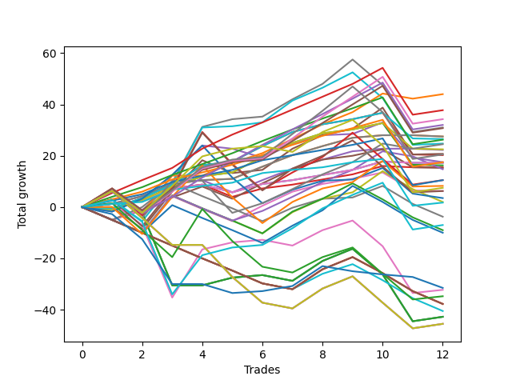

# Short Labrador 017 
- Symbol: ES_830-1130
- Date Range: 03/18/2022 - 12/30/2022
- Trading Period: 8:30-11:30
- Number of Trades: 12



| Name | Win Percent | Profit | Avg Profit / Trade | Avg Time / Trade |      | Name | Win Percent | Profit | Avg Profit / Trade | Avg Time / Trade |
| ---- | ----------- | ------ | ------------------ | ---------------- | ---- | ---- | ----------- | ------ | ------------------ | ---------------- |
| Sorted By <br> Profit | | | | | | Sorted By <br> Win Percentage ||||
| BB-200 Mid | 75.00 | 22000.00 | 1833.33 | 36:10 |     | TP-5 | 91.67 | 18875.00 | 1572.92 | 28:40 |
| TP-5 | 91.67 | 18875.00 | 1572.92 | 28:40 |     | TP-4 | 91.67 | 13125.00 | 1093.75 | 27:14 |
| TP-8 | 83.33 | 17125.00 | 1427.08 | 41:16 |     | TP-3 | 91.67 | 8750.00 | 729.17 | 17:15 |
| TP-6 | 83.33 | 16000.00 | 1333.33 | 32:40 |     | TP-2 | 91.67 | 5250.00 | 437.50 | 16:47 |
| V Mid | 75.00 | 15500.00 | 1291.67 | 44:27 |     | TP-1 | 91.67 | 875.00 | 72.92 | 12:24 |
| TP-7 | 83.33 | 15375.00 | 1281.25 | 38:43 |     | TP-8 | 83.33 | 17125.00 | 1427.08 | 41:16 |
| BB-20 U/L 1SD SL-10 | 83.33 | 13750.00 | 1145.83 | 06:05 |     | TP-6 | 83.33 | 16000.00 | 1333.33 | 32:40 |
| BB-20 U/L 1SD | 83.33 | 13750.00 | 1145.83 | 06:05 |     | TP-7 | 83.33 | 15375.00 | 1281.25 | 38:43 |
| BB-20 U/L 2SD C SL-10 | 75.00 | 13250.00 | 1104.17 | 14:45 |     | BB-20 U/L 1SD SL-10 | 83.33 | 13750.00 | 1145.83 | 06:05 |
| TP-4 | 91.67 | 13125.00 | 1093.75 | 27:14 |     | BB-20 U/L 1SD | 83.33 | 13750.00 | 1145.83 | 06:05 |
| BB-100 Mid | 75.00 | 12375.00 | 1031.25 | 43:25 |     | BB-200 Mid | 75.00 | 22000.00 | 1833.33 | 36:10 |
| BB-200 Mid SL-10 | 66.67 | 12250.00 | 1020.83 | 29:53 |     | V Mid | 75.00 | 15500.00 | 1291.67 | 44:27 |
| BB-20 U/L 2SD SL-10 | 75.00 | 11250.00 | 937.50 | 13:22 |     | BB-20 U/L 2SD C SL-10 | 75.00 | 13250.00 | 1104.17 | 14:45 |
| BB-20 U/L 1SD SL-5 | 75.00 | 11125.00 | 927.08 | 05:14 |     | BB-100 Mid | 75.00 | 12375.00 | 1031.25 | 43:25 |
| BB-50 U/L 1SD | 66.67 | 10375.00 | 864.58 | 35:12 |     | BB-20 U/L 2SD SL-10 | 75.00 | 11250.00 | 937.50 | 13:22 |
| TP-9 | 75.00 | 10250.00 | 854.17 | 45:20 |     | BB-20 U/L 1SD SL-5 | 75.00 | 11125.00 | 927.08 | 05:14 |
| BB-20 U/L 2SD C | 75.00 | 10125.00 | 843.75 | 17:07 |     | TP-9 | 75.00 | 10250.00 | 854.17 | 45:20 |
| TP-3 | 91.67 | 8750.00 | 729.17 | 17:15 |     | BB-20 U/L 2SD C | 75.00 | 10125.00 | 843.75 | 17:07 |
| BB-50 Mid | 58.33 | 8750.00 | 729.17 | 24:12 |     | BB-20 Mid SL-10 | 75.00 | 8625.00 | 718.75 | 03:54 |
| BB-20 Mid SL-10 | 75.00 | 8625.00 | 718.75 | 03:54 |     | BB-20 Mid | 75.00 | 8625.00 | 718.75 | 03:54 |
| BB-20 Mid | 75.00 | 8625.00 | 718.75 | 03:54 |     | BB-20 U/L 2SD | 75.00 | 8125.00 | 677.08 | 15:43 |
| BB-20 U/L 2SD | 75.00 | 8125.00 | 677.08 | 15:43 |     | BB-20 Mid SL-5 | 75.00 | 7750.00 | 645.83 | 03:05 |
| BB-20 Mid SL-5 | 75.00 | 7750.00 | 645.83 | 03:05 |     | NEWFI 000 | 75.00 | -3500.00 | -291.67 | 50:09 |
| BB-20 U/L 2SD SL-5 | 66.67 | 7625.00 | 635.42 | 10:00 |     | BB-200 Mid SL-10 | 66.67 | 12250.00 | 1020.83 | 29:53 |
| BB-200 Mid SL-5 | 50.00 | 7375.00 | 614.58 | 15:35 |     | BB-50 U/L 1SD | 66.67 | 10375.00 | 864.58 | 35:12 |
| TP-2 | 91.67 | 5250.00 | 437.50 | 16:47 |     | BB-20 U/L 2SD SL-5 | 66.67 | 7625.00 | 635.42 | 10:00 |
| V Mid SL-10 | 58.33 | 5250.00 | 437.50 | 29:35 |     | TP-10 | 66.67 | 3750.00 | 312.50 | 52:10 |
| BB-50 U/L 1SD SL-10 | 58.33 | 4125.00 | 343.75 | 23:26 |     | BB-50 Mid | 58.33 | 8750.00 | 729.17 | 24:12 |
| TP-10 | 66.67 | 3750.00 | 312.50 | 52:10 |     | V Mid SL-10 | 58.33 | 5250.00 | 437.50 | 29:35 |
| BB-100 Mid SL-10 | 58.33 | 3125.00 | 260.42 | 28:44 |     | BB-50 U/L 1SD SL-10 | 58.33 | 4125.00 | 343.75 | 23:26 |
| BB-20 U/L 2SD C SL-5 | 58.33 | 3125.00 | 260.42 | 11:13 |     | BB-100 Mid SL-10 | 58.33 | 3125.00 | 260.42 | 28:44 |
| BB-50 Mid SL-10 | 58.33 | 1750.00 | 145.83 | 18:27 |     | BB-20 U/L 2SD C SL-5 | 58.33 | 3125.00 | 260.42 | 11:13 |
| BB-50 U/L 1SD SL-5 | 41.67 | 1000.00 | 83.33 | 15:23 |     | BB-50 Mid SL-10 | 58.33 | 1750.00 | 145.83 | 18:27 |
| TP-1 | 91.67 | 875.00 | 72.92 | 12:24 |     | BB-50 U/L 2SD | 58.33 | -16125.00 | -1343.75 | 51:08 |
| BB-50 Mid SL-5 | 50.00 | -1875.00 | -156.25 | 12:45 |     | BB-200 Mid SL-5 | 50.00 | 7375.00 | 614.58 | 15:35 |
| NEWFI 000 | 75.00 | -3500.00 | -291.67 | 50:09 |     | BB-50 Mid SL-5 | 50.00 | -1875.00 | -156.25 | 12:45 |
| BB-100 Mid SL-5 | 33.33 | -4500.00 | -375.00 | 17:06 |     | NEWFI 06 | 50.00 | -21375.00 | -1781.25 | 60:55 |
| V Mid SL-5 | 33.33 | -5000.00 | -416.67 | 18:22 |     | BB-200 U/L 2SD | 50.00 | -21375.00 | -1781.25 | 60:55 |
| NEWFI 0000 | 25.00 | -15750.00 | -1312.50 | 29:33 |     | BB-100 U/L 2SD | 50.00 | -21375.00 | -1781.25 | 60:55 |
| BB-50 U/L 2SD | 58.33 | -16125.00 | -1343.75 | 51:08 |     | V U/L 1SD | 50.00 | -21375.00 | -1781.25 | 60:55 |
| BB-50 U/L 2SD SL-10 | 41.67 | -17375.00 | -1447.92 | 34:56 |     | BB-50 U/L 1SD SL-5 | 41.67 | 1000.00 | 83.33 | 15:23 |
| BB-200 U/L 2SD SL-5 | 16.67 | -18875.00 | -1572.92 | 28:43 |     | BB-50 U/L 2SD SL-10 | 41.67 | -17375.00 | -1447.92 | 34:56 |
| BB-100 U/L 2SD SL-5 | 16.67 | -18875.00 | -1572.92 | 28:43 |     | BB-100 Mid SL-5 | 33.33 | -4500.00 | -375.00 | 17:06 |
| V U/L 1SD SL-5 | 16.67 | -18875.00 | -1572.92 | 28:43 |     | V Mid SL-5 | 33.33 | -5000.00 | -416.67 | 18:22 |
| BB-50 U/L 2SD SL-5 | 16.67 | -20250.00 | -1687.50 | 24:08 |     | BB-200 U/L 2SD SL-10 | 33.33 | -22750.00 | -1895.83 | 44:39 |
| NEWFI 06 | 50.00 | -21375.00 | -1781.25 | 60:55 |     | BB-100 U/L 2SD SL-10 | 33.33 | -22750.00 | -1895.83 | 44:39 |
| BB-200 U/L 2SD | 50.00 | -21375.00 | -1781.25 | 60:55 |     | V U/L 1SD SL-10 | 33.33 | -22750.00 | -1895.83 | 44:39 |
| BB-100 U/L 2SD | 50.00 | -21375.00 | -1781.25 | 60:55 |     | NEWFI 0000 | 25.00 | -15750.00 | -1312.50 | 29:33 |
| V U/L 1SD | 50.00 | -21375.00 | -1781.25 | 60:55 |     | BB-200 U/L 2SD SL-5 | 16.67 | -18875.00 | -1572.92 | 28:43 |
| BB-200 U/L 2SD SL-10 | 33.33 | -22750.00 | -1895.83 | 44:39 |     | BB-100 U/L 2SD SL-5 | 16.67 | -18875.00 | -1572.92 | 28:43 |
| BB-100 U/L 2SD SL-10 | 33.33 | -22750.00 | -1895.83 | 44:39 |     | V U/L 1SD SL-5 | 16.67 | -18875.00 | -1572.92 | 28:43 |
| V U/L 1SD SL-10 | 33.33 | -22750.00 | -1895.83 | 44:39 |     | BB-50 U/L 2SD SL-5 | 16.67 | -20250.00 | -1687.50 | 24:08 |

## NO STOPLOSS

### Test BB-20 Mid
* Sell when price hits the middle line of the 20p bollinger
* No Stoploss
* Results:
```
Total Trades: 12
Percent Up: 25.00
Percent Down: 75.00
Total Points Moved Down: 17.25
Potential Profit: 8625.00
Total Points Ups: 3.50 Count Ups: 3
Total Points Downs: 20.75 Count Downs: 9
```

<details><summary>Trades</summary>

<code>In: 2022-03-25 11:19:00		Out: 2022-03-25 11:20:10		Total Position Time: 01:10		Total Move Down: 1.25		Total to Date: 1.25</code> <br />
<code>In: 2022-04-07 10:34:00		Out: 2022-04-07 10:37:30		Total Position Time: 03:30		Total Move Down: 1.25		Total to Date: 2.50</code> <br />
<code>In: 2022-04-28 08:37:00		Out: 2022-04-28 08:38:10		Total Position Time: 01:10		Total Move Down: 4.75		Total to Date: 7.25</code> <br />
<code>In: 2022-05-10 11:07:00		Out: 2022-05-10 11:08:10		Total Position Time: 01:10		Total Move Down: 1.50		Total to Date: 8.75</code> <br />
<code>In: 2022-05-24 10:49:00		Out: 2022-05-24 11:01:15		Total Position Time: 12:15		Total Move Down: -3.00		Total to Date: 5.75</code> <br />
<code>In: 2022-07-05 08:59:00		Out: 2022-07-05 09:03:00		Total Position Time: 04:00		Total Move Down: 3.25		Total to Date: 9.00</code> <br />
<code>In: 2022-07-12 08:34:00		Out: 2022-07-12 08:37:00		Total Position Time: 03:00		Total Move Down: 1.50		Total to Date: 10.50</code> <br />
<code>In: 2022-08-04 10:40:00		Out: 2022-08-04 10:43:05		Total Position Time: 03:05		Total Move Down: 2.00		Total to Date: 12.50</code> <br />
<code>In: 2022-08-05 10:19:00		Out: 2022-08-05 10:20:10		Total Position Time: 01:10		Total Move Down: 2.00		Total to Date: 14.50</code> <br />
<code>In: 2022-08-29 09:09:00		Out: 2022-08-29 09:14:10		Total Position Time: 05:10		Total Move Down: 3.25		Total to Date: 17.75</code> <br />
<code>In: 2022-11-17 08:42:00		Out: 2022-11-17 08:49:45		Total Position Time: 07:45		Total Move Down: -0.50		Total to Date: 17.25</code> <br />
<code>In: 2022-11-21 10:24:00		Out: 2022-11-21 10:27:25		Total Position Time: 03:25		Total Move Down: -0.00		Total to Date: 17.25</code> <br />


</details>

### Test BB-20 U/L 1SD
* Sell when the price hits the lower line of the 20p 1std bollinger
* No Stoploss
* Results:
```
Total Trades: 12
Percent Up: 16.67
Percent Down: 83.33
Total Points Moved Down: 27.50
Potential Profit: 13750.00
Total Points Ups: 0.50 Count Ups: 2
Total Points Downs: 28.00 Count Downs: 10
```

<details><summary>Trades</summary>

<code>In: 2022-03-25 11:19:00		Out: 2022-03-25 11:20:10		Total Position Time: 01:10		Total Move Down: 1.25		Total to Date: 1.25</code> <br />
<code>In: 2022-04-07 10:34:00		Out: 2022-04-07 10:40:00		Total Position Time: 06:00		Total Move Down: 3.00		Total to Date: 4.25</code> <br />
<code>In: 2022-04-28 08:37:00		Out: 2022-04-28 08:38:10		Total Position Time: 01:10		Total Move Down: 4.75		Total to Date: 9.00</code> <br />
<code>In: 2022-05-10 11:07:00		Out: 2022-05-10 11:08:10		Total Position Time: 01:10		Total Move Down: 1.50		Total to Date: 10.50</code> <br />
<code>In: 2022-05-24 10:49:00		Out: 2022-05-24 11:01:40		Total Position Time: 12:40		Total Move Down: 0.50		Total to Date: 11.00</code> <br />
<code>In: 2022-07-05 08:59:00		Out: 2022-07-05 09:03:30		Total Position Time: 04:30		Total Move Down: 4.75		Total to Date: 15.75</code> <br />
<code>In: 2022-07-12 08:34:00		Out: 2022-07-12 08:38:10		Total Position Time: 04:10		Total Move Down: 4.50		Total to Date: 20.25</code> <br />
<code>In: 2022-08-04 10:40:00		Out: 2022-08-04 10:43:15		Total Position Time: 03:15		Total Move Down: 3.50		Total to Date: 23.75</code> <br />
<code>In: 2022-08-05 10:19:00		Out: 2022-08-05 10:23:15		Total Position Time: 04:15		Total Move Down: 3.25		Total to Date: 27.00</code> <br />
<code>In: 2022-08-29 09:09:00		Out: 2022-08-29 09:24:15		Total Position Time: 15:15		Total Move Down: 1.00		Total to Date: 28.00</code> <br />
<code>In: 2022-11-17 08:42:00		Out: 2022-11-17 08:52:30		Total Position Time: 10:30		Total Move Down: -0.00		Total to Date: 28.00</code> <br />
<code>In: 2022-11-21 10:24:00		Out: 2022-11-21 10:33:00		Total Position Time: 09:00		Total Move Down: -0.50		Total to Date: 27.50</code> <br />


</details>

### Test BB-20 U/L 2SD
* Sell when the price hits the lower line of the 20p 2std bollinger
* No Stoploss
* Results:
```
Total Trades: 12
Percent Up: 25.00
Percent Down: 75.00
Total Points Moved Down: 16.25
Potential Profit: 8125.00
Total Points Ups: 17.50 Count Ups: 3
Total Points Downs: 33.75 Count Downs: 9
```

<details><summary>Trades</summary>

<code>In: 2022-03-25 11:19:00		Out: 2022-03-25 12:00:55		Total Position Time: 41:55		Total Move Down: -1.00		Total to Date: -1.00</code> <br />
<code>In: 2022-04-07 10:34:00		Out: 2022-04-07 10:45:15		Total Position Time: 11:15		Total Move Down: 3.75		Total to Date: 2.75</code> <br />
<code>In: 2022-04-28 08:37:00		Out: 2022-04-28 08:38:55		Total Position Time: 01:55		Total Move Down: 5.00		Total to Date: 7.75</code> <br />
<code>In: 2022-05-10 11:07:00		Out: 2022-05-10 11:11:10		Total Position Time: 04:10		Total Move Down: 4.25		Total to Date: 12.00</code> <br />
<code>In: 2022-05-24 10:49:00		Out: 2022-05-24 11:01:50		Total Position Time: 12:50		Total Move Down: 1.50		Total to Date: 13.50</code> <br />
<code>In: 2022-07-05 08:59:00		Out: 2022-07-05 09:05:50		Total Position Time: 06:50		Total Move Down: 6.00		Total to Date: 19.50</code> <br />
<code>In: 2022-07-12 08:34:00		Out: 2022-07-12 08:41:10		Total Position Time: 07:10		Total Move Down: 5.50		Total to Date: 25.00</code> <br />
<code>In: 2022-08-04 10:40:00		Out: 2022-08-04 10:45:30		Total Position Time: 05:30		Total Move Down: 3.75		Total to Date: 28.75</code> <br />
<code>In: 2022-08-05 10:19:00		Out: 2022-08-05 10:49:30		Total Position Time: 30:30		Total Move Down: 1.50		Total to Date: 30.25</code> <br />
<code>In: 2022-08-29 09:09:00		Out: 2022-08-29 09:24:35		Total Position Time: 15:35		Total Move Down: 2.50		Total to Date: 32.75</code> <br />
<code>In: 2022-11-17 08:42:00		Out: 2022-11-17 09:23:55		Total Position Time: 41:55		Total Move Down: -16.25		Total to Date: 16.50</code> <br />
<code>In: 2022-11-21 10:24:00		Out: 2022-11-21 10:33:10		Total Position Time: 09:10		Total Move Down: -0.25		Total to Date: 16.25</code> <br />


</details>

### Test BB-20 U/L 2SD C
* Sell when the price hits the lower line of the 20p 2std bollinger
* No Stoploss
* Results:
```
Total Trades: 12
Percent Up: 25.00
Percent Down: 75.00
Total Points Moved Down: 20.25
Potential Profit: 10125.00
Total Points Ups: 17.00 Count Ups: 3
Total Points Downs: 37.25 Count Downs: 9
```

<details><summary>Trades</summary>

<code>In: 2022-03-25 11:19:00		Out: 2022-03-25 12:01:15		Total Position Time: 42:15		Total Move Down: -0.50		Total to Date: -0.50</code> <br />
<code>In: 2022-04-07 10:34:00		Out: 2022-04-07 10:48:00		Total Position Time: 14:00		Total Move Down: 4.00		Total to Date: 3.50</code> <br />
<code>In: 2022-04-28 08:37:00		Out: 2022-04-28 08:39:20		Total Position Time: 02:20		Total Move Down: 5.25		Total to Date: 8.75</code> <br />
<code>In: 2022-05-10 11:07:00		Out: 2022-05-10 11:16:05		Total Position Time: 09:05		Total Move Down: 7.50		Total to Date: 16.25</code> <br />
<code>In: 2022-05-24 10:49:00		Out: 2022-05-24 11:01:50		Total Position Time: 12:50		Total Move Down: 1.50		Total to Date: 17.75</code> <br />
<code>In: 2022-07-05 08:59:00		Out: 2022-07-05 09:05:50		Total Position Time: 06:50		Total Move Down: 6.00		Total to Date: 23.75</code> <br />
<code>In: 2022-07-12 08:34:00		Out: 2022-07-12 08:41:10		Total Position Time: 07:10		Total Move Down: 5.50		Total to Date: 29.25</code> <br />
<code>In: 2022-08-04 10:40:00		Out: 2022-08-04 10:52:45		Total Position Time: 12:45		Total Move Down: 3.00		Total to Date: 32.25</code> <br />
<code>In: 2022-08-05 10:19:00		Out: 2022-08-05 10:50:35		Total Position Time: 31:35		Total Move Down: 2.00		Total to Date: 34.25</code> <br />
<code>In: 2022-08-29 09:09:00		Out: 2022-08-29 09:24:35		Total Position Time: 15:35		Total Move Down: 2.50		Total to Date: 36.75</code> <br />
<code>In: 2022-11-17 08:42:00		Out: 2022-11-17 09:23:55		Total Position Time: 41:55		Total Move Down: -16.25		Total to Date: 20.50</code> <br />
<code>In: 2022-11-21 10:24:00		Out: 2022-11-21 10:33:10		Total Position Time: 09:10		Total Move Down: -0.25		Total to Date: 20.25</code> <br />


</details>

### Test BB-50 Mid
* Sell when price hits the middle line of the 50p bollinger
* No Stoploss
* Results:
```
Total Trades: 12
Percent Up: 41.67
Percent Down: 58.33
Total Points Moved Down: 17.50
Potential Profit: 8750.00
Total Points Ups: 22.00 Count Ups: 5
Total Points Downs: 39.50 Count Downs: 7
```

<details><summary>Trades</summary>

<code>In: 2022-03-25 11:19:00		Out: 2022-03-25 11:49:30		Total Position Time: 30:30		Total Move Down: -1.75		Total to Date: -1.75</code> <br />
<code>In: 2022-04-07 10:34:00		Out: 2022-04-07 10:52:05		Total Position Time: 18:05		Total Move Down: 5.00		Total to Date: 3.25</code> <br />
<code>In: 2022-04-28 08:37:00		Out: 2022-04-28 08:40:20		Total Position Time: 03:20		Total Move Down: 9.25		Total to Date: 12.50</code> <br />
<code>In: 2022-05-10 11:07:00		Out: 2022-05-10 11:16:20		Total Position Time: 09:20		Total Move Down: 11.50		Total to Date: 24.00</code> <br />
<code>In: 2022-05-24 10:49:00		Out: 2022-05-24 11:20:25		Total Position Time: 31:25		Total Move Down: -1.25		Total to Date: 22.75</code> <br />
<code>In: 2022-07-05 08:59:00		Out: 2022-07-05 09:43:40		Total Position Time: 44:40		Total Move Down: -3.50		Total to Date: 19.25</code> <br />
<code>In: 2022-07-12 08:34:00		Out: 2022-07-12 08:38:20		Total Position Time: 04:20		Total Move Down: 5.25		Total to Date: 24.50</code> <br />
<code>In: 2022-08-04 10:40:00		Out: 2022-08-04 10:55:50		Total Position Time: 15:50		Total Move Down: 3.50		Total to Date: 28.00</code> <br />
<code>In: 2022-08-05 10:19:00		Out: 2022-08-05 10:47:35		Total Position Time: 28:35		Total Move Down: 0.50		Total to Date: 28.50</code> <br />
<code>In: 2022-08-29 09:09:00		Out: 2022-08-29 09:31:25		Total Position Time: 22:25		Total Move Down: 4.50		Total to Date: 33.00</code> <br />
<code>In: 2022-11-17 08:42:00		Out: 2022-11-17 09:33:35		Total Position Time: 51:35		Total Move Down: -13.75		Total to Date: 19.25</code> <br />
<code>In: 2022-11-21 10:24:00		Out: 2022-11-21 10:54:25		Total Position Time: 30:25		Total Move Down: -1.75		Total to Date: 17.50</code> <br />


</details>

### Test BB-50 U/L 1SD
* Sell when the price hits the lower line of the 50p 1std bollinger
* No Stoploss
* Results:
```
Total Trades: 12
Percent Up: 33.33
Percent Down: 66.67
Total Points Moved Down: 20.75
Potential Profit: 10375.00
Total Points Ups: 31.75 Count Ups: 4
Total Points Downs: 52.50 Count Downs: 8
```

<details><summary>Trades</summary>

<code>In: 2022-03-25 11:19:00		Out: 2022-03-25 12:01:35		Total Position Time: 42:35		Total Move Down: -0.00		Total to Date: 0.00</code> <br />
<code>In: 2022-04-07 10:34:00		Out: 2022-04-07 11:34:55		Total Position Time: 60:55		Total Move Down: -8.50		Total to Date: -8.50</code> <br />
<code>In: 2022-04-28 08:37:00		Out: 2022-04-28 08:46:10		Total Position Time: 09:10		Total Move Down: 14.50		Total to Date: 6.00</code> <br />
<code>In: 2022-05-10 11:07:00		Out: 2022-05-10 11:24:05		Total Position Time: 17:05		Total Move Down: 12.25		Total to Date: 18.25</code> <br />
<code>In: 2022-05-24 10:49:00		Out: 2022-05-24 11:44:15		Total Position Time: 55:15		Total Move Down: -5.00		Total to Date: 13.25</code> <br />
<code>In: 2022-07-05 08:59:00		Out: 2022-07-05 09:47:10		Total Position Time: 48:10		Total Move Down: 1.25		Total to Date: 14.50</code> <br />
<code>In: 2022-07-12 08:34:00		Out: 2022-07-12 08:43:55		Total Position Time: 09:55		Total Move Down: 8.25		Total to Date: 22.75</code> <br />
<code>In: 2022-08-04 10:40:00		Out: 2022-08-04 11:02:05		Total Position Time: 22:05		Total Move Down: 5.25		Total to Date: 28.00</code> <br />
<code>In: 2022-08-05 10:19:00		Out: 2022-08-05 10:52:05		Total Position Time: 33:05		Total Move Down: 2.50		Total to Date: 30.50</code> <br />
<code>In: 2022-08-29 09:09:00		Out: 2022-08-29 09:36:50		Total Position Time: 27:50		Total Move Down: 8.25		Total to Date: 38.75</code> <br />
<code>In: 2022-11-17 08:42:00		Out: 2022-11-17 09:42:55		Total Position Time: 60:55		Total Move Down: -18.25		Total to Date: 20.50</code> <br />
<code>In: 2022-11-21 10:24:00		Out: 2022-11-21 10:59:25		Total Position Time: 35:25		Total Move Down: 0.25		Total to Date: 20.75</code> <br />


</details>

### Test BB-50 U/L 2SD
* Sell when the price hits the lower line of the 50p 2std bollinger
* No Stoploss
* Results:
```
Total Trades: 12
Percent Up: 41.67
Percent Down: 58.33
Total Points Moved Down: -32.25
Potential Profit: -16125.00
Total Points Ups: 67.25 Count Ups: 5
Total Points Downs: 35.00 Count Downs: 7
```

<details><summary>Trades</summary>

<code>In: 2022-03-25 11:19:00		Out: 2022-03-25 12:01:55		Total Position Time: 42:55		Total Move Down: 1.50		Total to Date: 1.50</code> <br />
<code>In: 2022-04-07 10:34:00		Out: 2022-04-07 11:34:55		Total Position Time: 60:55		Total Move Down: -8.50		Total to Date: -7.00</code> <br />
<code>In: 2022-04-28 08:37:00		Out: 2022-04-28 09:37:55		Total Position Time: 60:55		Total Move Down: -28.25		Total to Date: -35.25</code> <br />
<code>In: 2022-05-10 11:07:00		Out: 2022-05-10 11:27:05		Total Position Time: 20:05		Total Move Down: 18.75		Total to Date: -16.50</code> <br />
<code>In: 2022-05-24 10:49:00		Out: 2022-05-24 11:49:10		Total Position Time: 60:10		Total Move Down: 2.75		Total to Date: -13.75</code> <br />
<code>In: 2022-07-05 08:59:00		Out: 2022-07-05 09:59:55		Total Position Time: 60:55		Total Move Down: 1.00		Total to Date: -12.75</code> <br />
<code>In: 2022-07-12 08:34:00		Out: 2022-07-12 09:34:55		Total Position Time: 60:55		Total Move Down: -2.25		Total to Date: -15.00</code> <br />
<code>In: 2022-08-04 10:40:00		Out: 2022-08-04 11:10:15		Total Position Time: 30:15		Total Move Down: 6.00		Total to Date: -9.00</code> <br />
<code>In: 2022-08-05 10:19:00		Out: 2022-08-05 10:55:40		Total Position Time: 36:40		Total Move Down: 3.75		Total to Date: -5.25</code> <br />
<code>In: 2022-08-29 09:09:00		Out: 2022-08-29 10:09:55		Total Position Time: 60:55		Total Move Down: -10.00		Total to Date: -15.25</code> <br />
<code>In: 2022-11-17 08:42:00		Out: 2022-11-17 09:42:55		Total Position Time: 60:55		Total Move Down: -18.25		Total to Date: -33.50</code> <br />
<code>In: 2022-11-21 10:24:00		Out: 2022-11-21 11:22:10		Total Position Time: 58:10		Total Move Down: 1.25		Total to Date: -32.25</code> <br />


</details>

### Test V Mid
* Sell when the price hits the middle line of the 1std VWAP
* No Stoploss
* Results:
```
Total Trades: 12
Percent Up: 25.00
Percent Down: 75.00
Total Points Moved Down: 31.00
Potential Profit: 15500.00
Total Points Ups: 36.75 Count Ups: 3
Total Points Downs: 67.75 Count Downs: 9
```

<details><summary>Trades</summary>

<code>In: 2022-03-25 11:19:00		Out: 2022-03-25 12:07:35		Total Position Time: 48:35		Total Move Down: 7.25		Total to Date: 7.25</code> <br />
<code>In: 2022-04-07 10:34:00		Out: 2022-04-07 11:34:55		Total Position Time: 60:55		Total Move Down: -8.50		Total to Date: -1.25</code> <br />
<code>In: 2022-04-28 08:37:00		Out: 2022-04-28 08:44:50		Total Position Time: 07:50		Total Move Down: 10.75		Total to Date: 9.50</code> <br />
<code>In: 2022-05-10 11:07:00		Out: 2022-05-10 11:27:40		Total Position Time: 20:40		Total Move Down: 21.75		Total to Date: 31.25</code> <br />
<code>In: 2022-05-24 10:49:00		Out: 2022-05-24 11:49:55		Total Position Time: 60:55		Total Move Down: 3.00		Total to Date: 34.25</code> <br />
<code>In: 2022-07-05 08:59:00		Out: 2022-07-05 09:59:55		Total Position Time: 60:55		Total Move Down: 1.00		Total to Date: 35.25</code> <br />
<code>In: 2022-07-12 08:34:00		Out: 2022-07-12 08:41:50		Total Position Time: 07:50		Total Move Down: 6.75		Total to Date: 42.00</code> <br />
<code>In: 2022-08-04 10:40:00		Out: 2022-08-04 11:10:15		Total Position Time: 30:15		Total Move Down: 6.00		Total to Date: 48.00</code> <br />
<code>In: 2022-08-05 10:19:00		Out: 2022-08-05 11:11:45		Total Position Time: 52:45		Total Move Down: 9.50		Total to Date: 57.50</code> <br />
<code>In: 2022-08-29 09:09:00		Out: 2022-08-29 10:09:55		Total Position Time: 60:55		Total Move Down: -10.00		Total to Date: 47.50</code> <br />
<code>In: 2022-11-17 08:42:00		Out: 2022-11-17 09:42:55		Total Position Time: 60:55		Total Move Down: -18.25		Total to Date: 29.25</code> <br />
<code>In: 2022-11-21 10:24:00		Out: 2022-11-21 11:24:55		Total Position Time: 60:55		Total Move Down: 1.75		Total to Date: 31.00</code> <br />


</details>

### Test V U/L 1SD
* Sell when the price hits the lower line of the 1std VWAP
* No Stoploss
* Results:
```
Total Trades: 12
Percent Up: 50.00
Percent Down: 50.00
Total Points Moved Down: -42.75
Potential Profit: -21375.00
Total Points Ups: 67.25 Count Ups: 6
Total Points Downs: 24.50 Count Downs: 6
```

<details><summary>Trades</summary>

<code>In: 2022-03-25 11:19:00		Out: 2022-03-25 12:19:55		Total Position Time: 60:55		Total Move Down: 6.25		Total to Date: 6.25</code> <br />
<code>In: 2022-04-07 10:34:00		Out: 2022-04-07 11:34:55		Total Position Time: 60:55		Total Move Down: -8.50		Total to Date: -2.25</code> <br />
<code>In: 2022-04-28 08:37:00		Out: 2022-04-28 09:37:55		Total Position Time: 60:55		Total Move Down: -28.25		Total to Date: -30.50</code> <br />
<code>In: 2022-05-10 11:07:00		Out: 2022-05-10 12:07:55		Total Position Time: 60:55		Total Move Down: -0.00		Total to Date: -30.50</code> <br />
<code>In: 2022-05-24 10:49:00		Out: 2022-05-24 11:49:55		Total Position Time: 60:55		Total Move Down: 3.00		Total to Date: -27.50</code> <br />
<code>In: 2022-07-05 08:59:00		Out: 2022-07-05 09:59:55		Total Position Time: 60:55		Total Move Down: 1.00		Total to Date: -26.50</code> <br />
<code>In: 2022-07-12 08:34:00		Out: 2022-07-12 09:34:55		Total Position Time: 60:55		Total Move Down: -2.25		Total to Date: -28.75</code> <br />
<code>In: 2022-08-04 10:40:00		Out: 2022-08-04 11:40:55		Total Position Time: 60:55		Total Move Down: 7.75		Total to Date: -21.00</code> <br />
<code>In: 2022-08-05 10:19:00		Out: 2022-08-05 11:19:55		Total Position Time: 60:55		Total Move Down: 4.75		Total to Date: -16.25</code> <br />
<code>In: 2022-08-29 09:09:00		Out: 2022-08-29 10:09:55		Total Position Time: 60:55		Total Move Down: -10.00		Total to Date: -26.25</code> <br />
<code>In: 2022-11-17 08:42:00		Out: 2022-11-17 09:42:55		Total Position Time: 60:55		Total Move Down: -18.25		Total to Date: -44.50</code> <br />
<code>In: 2022-11-21 10:24:00		Out: 2022-11-21 11:24:55		Total Position Time: 60:55		Total Move Down: 1.75		Total to Date: -42.75</code> <br />


</details>

### Test BB-100 Mid
* Move to BB100 Mid
* No Stoploss
* Results:
```
Total Trades: 12
Percent Up: 25.00
Percent Down: 75.00
Total Points Moved Down: 24.75
Potential Profit: 12375.00
Total Points Ups: 36.75 Count Ups: 3
Total Points Downs: 61.50 Count Downs: 9
```

<details><summary>Trades</summary>

<code>In: 2022-03-25 11:19:00		Out: 2022-03-25 12:02:30		Total Position Time: 43:30		Total Move Down: 3.00		Total to Date: 3.00</code> <br />
<code>In: 2022-04-07 10:34:00		Out: 2022-04-07 11:34:55		Total Position Time: 60:55		Total Move Down: -8.50		Total to Date: -5.50</code> <br />
<code>In: 2022-04-28 08:37:00		Out: 2022-04-28 08:46:10		Total Position Time: 09:10		Total Move Down: 14.50		Total to Date: 9.00</code> <br />
<code>In: 2022-05-10 11:07:00		Out: 2022-05-10 11:40:30		Total Position Time: 33:30		Total Move Down: 22.00		Total to Date: 31.00</code> <br />
<code>In: 2022-05-24 10:49:00		Out: 2022-05-24 11:48:35		Total Position Time: 59:35		Total Move Down: 0.50		Total to Date: 31.50</code> <br />
<code>In: 2022-07-05 08:59:00		Out: 2022-07-05 09:59:05		Total Position Time: 60:05		Total Move Down: 1.50		Total to Date: 33.00</code> <br />
<code>In: 2022-07-12 08:34:00		Out: 2022-07-12 08:54:25		Total Position Time: 20:25		Total Move Down: 8.50		Total to Date: 41.50</code> <br />
<code>In: 2022-08-04 10:40:00		Out: 2022-08-04 10:56:30		Total Position Time: 16:30		Total Move Down: 5.00		Total to Date: 46.50</code> <br />
<code>In: 2022-08-05 10:19:00		Out: 2022-08-05 10:56:25		Total Position Time: 37:25		Total Move Down: 6.00		Total to Date: 52.50</code> <br />
<code>In: 2022-08-29 09:09:00		Out: 2022-08-29 10:09:55		Total Position Time: 60:55		Total Move Down: -10.00		Total to Date: 42.50</code> <br />
<code>In: 2022-11-17 08:42:00		Out: 2022-11-17 09:42:55		Total Position Time: 60:55		Total Move Down: -18.25		Total to Date: 24.25</code> <br />
<code>In: 2022-11-21 10:24:00		Out: 2022-11-21 11:22:05		Total Position Time: 58:05		Total Move Down: 0.50		Total to Date: 24.75</code> <br />


</details>

### Test BB-100 U/L 2SD
* Move to BB100 Upper Band
* No Stoploss
* Results:
```
Total Trades: 12
Percent Up: 50.00
Percent Down: 50.00
Total Points Moved Down: -42.75
Potential Profit: -21375.00
Total Points Ups: 67.25 Count Ups: 6
Total Points Downs: 24.50 Count Downs: 6
```

<details><summary>Trades</summary>

<code>In: 2022-03-25 11:19:00		Out: 2022-03-25 12:19:55		Total Position Time: 60:55		Total Move Down: 6.25		Total to Date: 6.25</code> <br />
<code>In: 2022-04-07 10:34:00		Out: 2022-04-07 11:34:55		Total Position Time: 60:55		Total Move Down: -8.50		Total to Date: -2.25</code> <br />
<code>In: 2022-04-28 08:37:00		Out: 2022-04-28 09:37:55		Total Position Time: 60:55		Total Move Down: -28.25		Total to Date: -30.50</code> <br />
<code>In: 2022-05-10 11:07:00		Out: 2022-05-10 12:07:55		Total Position Time: 60:55		Total Move Down: -0.00		Total to Date: -30.50</code> <br />
<code>In: 2022-05-24 10:49:00		Out: 2022-05-24 11:49:55		Total Position Time: 60:55		Total Move Down: 3.00		Total to Date: -27.50</code> <br />
<code>In: 2022-07-05 08:59:00		Out: 2022-07-05 09:59:55		Total Position Time: 60:55		Total Move Down: 1.00		Total to Date: -26.50</code> <br />
<code>In: 2022-07-12 08:34:00		Out: 2022-07-12 09:34:55		Total Position Time: 60:55		Total Move Down: -2.25		Total to Date: -28.75</code> <br />
<code>In: 2022-08-04 10:40:00		Out: 2022-08-04 11:40:55		Total Position Time: 60:55		Total Move Down: 7.75		Total to Date: -21.00</code> <br />
<code>In: 2022-08-05 10:19:00		Out: 2022-08-05 11:19:55		Total Position Time: 60:55		Total Move Down: 4.75		Total to Date: -16.25</code> <br />
<code>In: 2022-08-29 09:09:00		Out: 2022-08-29 10:09:55		Total Position Time: 60:55		Total Move Down: -10.00		Total to Date: -26.25</code> <br />
<code>In: 2022-11-17 08:42:00		Out: 2022-11-17 09:42:55		Total Position Time: 60:55		Total Move Down: -18.25		Total to Date: -44.50</code> <br />
<code>In: 2022-11-21 10:24:00		Out: 2022-11-21 11:24:55		Total Position Time: 60:55		Total Move Down: 1.75		Total to Date: -42.75</code> <br />


</details>

### Test BB-200 Mid
* Move to BB200 Mid
* No Stoploss
* Results:
```
Total Trades: 12
Percent Up: 25.00
Percent Down: 75.00
Total Points Moved Down: 44.00
Potential Profit: 22000.00
Total Points Ups: 10.50 Count Ups: 3
Total Points Downs: 54.50 Count Downs: 9
```

<details><summary>Trades</summary>

<code>In: 2022-03-25 11:19:00		Out: 2022-03-25 12:19:55		Total Position Time: 60:55		Total Move Down: 6.25		Total to Date: 6.25</code> <br />
<code>In: 2022-04-07 10:34:00		Out: 2022-04-07 11:34:55		Total Position Time: 60:55		Total Move Down: -8.50		Total to Date: -2.25</code> <br />
<code>In: 2022-04-28 08:37:00		Out: 2022-04-28 08:46:55		Total Position Time: 09:55		Total Move Down: 14.50		Total to Date: 12.25</code> <br />
<code>In: 2022-05-10 11:07:00		Out: 2022-05-10 12:07:55		Total Position Time: 60:55		Total Move Down: -0.00		Total to Date: 12.25</code> <br />
<code>In: 2022-05-24 10:49:00		Out: 2022-05-24 11:49:25		Total Position Time: 60:25		Total Move Down: 5.00		Total to Date: 17.25</code> <br />
<code>In: 2022-07-05 08:59:00		Out: 2022-07-05 09:00:10		Total Position Time: 01:10		Total Move Down: 3.75		Total to Date: 21.00</code> <br />
<code>In: 2022-07-12 08:34:00		Out: 2022-07-12 08:38:25		Total Position Time: 04:25		Total Move Down: 5.50		Total to Date: 26.50</code> <br />
<code>In: 2022-08-04 10:40:00		Out: 2022-08-04 11:09:45		Total Position Time: 29:45		Total Move Down: 5.75		Total to Date: 32.25</code> <br />
<code>In: 2022-08-05 10:19:00		Out: 2022-08-05 11:19:55		Total Position Time: 60:55		Total Move Down: 4.75		Total to Date: 37.00</code> <br />
<code>In: 2022-08-29 09:09:00		Out: 2022-08-29 09:31:35		Total Position Time: 22:35		Total Move Down: 7.25		Total to Date: 44.25</code> <br />
<code>In: 2022-11-17 08:42:00		Out: 2022-11-17 08:43:10		Total Position Time: 01:10		Total Move Down: -2.00		Total to Date: 42.25</code> <br />
<code>In: 2022-11-21 10:24:00		Out: 2022-11-21 11:24:55		Total Position Time: 60:55		Total Move Down: 1.75		Total to Date: 44.00</code> <br />


</details>

### Test BB-200 U/L 2SD
* Move to BB200 Upper Band
* No Stoploss
* Results:
```
Total Trades: 12
Percent Up: 50.00
Percent Down: 50.00
Total Points Moved Down: -42.75
Potential Profit: -21375.00
Total Points Ups: 67.25 Count Ups: 6
Total Points Downs: 24.50 Count Downs: 6
```

<details><summary>Trades</summary>

<code>In: 2022-03-25 11:19:00		Out: 2022-03-25 12:19:55		Total Position Time: 60:55		Total Move Down: 6.25		Total to Date: 6.25</code> <br />
<code>In: 2022-04-07 10:34:00		Out: 2022-04-07 11:34:55		Total Position Time: 60:55		Total Move Down: -8.50		Total to Date: -2.25</code> <br />
<code>In: 2022-04-28 08:37:00		Out: 2022-04-28 09:37:55		Total Position Time: 60:55		Total Move Down: -28.25		Total to Date: -30.50</code> <br />
<code>In: 2022-05-10 11:07:00		Out: 2022-05-10 12:07:55		Total Position Time: 60:55		Total Move Down: -0.00		Total to Date: -30.50</code> <br />
<code>In: 2022-05-24 10:49:00		Out: 2022-05-24 11:49:55		Total Position Time: 60:55		Total Move Down: 3.00		Total to Date: -27.50</code> <br />
<code>In: 2022-07-05 08:59:00		Out: 2022-07-05 09:59:55		Total Position Time: 60:55		Total Move Down: 1.00		Total to Date: -26.50</code> <br />
<code>In: 2022-07-12 08:34:00		Out: 2022-07-12 09:34:55		Total Position Time: 60:55		Total Move Down: -2.25		Total to Date: -28.75</code> <br />
<code>In: 2022-08-04 10:40:00		Out: 2022-08-04 11:40:55		Total Position Time: 60:55		Total Move Down: 7.75		Total to Date: -21.00</code> <br />
<code>In: 2022-08-05 10:19:00		Out: 2022-08-05 11:19:55		Total Position Time: 60:55		Total Move Down: 4.75		Total to Date: -16.25</code> <br />
<code>In: 2022-08-29 09:09:00		Out: 2022-08-29 10:09:55		Total Position Time: 60:55		Total Move Down: -10.00		Total to Date: -26.25</code> <br />
<code>In: 2022-11-17 08:42:00		Out: 2022-11-17 09:42:55		Total Position Time: 60:55		Total Move Down: -18.25		Total to Date: -44.50</code> <br />
<code>In: 2022-11-21 10:24:00		Out: 2022-11-21 11:24:55		Total Position Time: 60:55		Total Move Down: 1.75		Total to Date: -42.75</code> <br />


</details>

## STOPLOSS OF 5

### Test BB-20 Mid SL-5
* Sell when price hits the middle line of the 20p bollinger
* Stoploss is -5 points
* Results:
```
Total Trades: 12
Percent Up: 25.00
Percent Down: 75.00
Total Points Moved Down: 15.50
Potential Profit: 7750.00
Total Points Ups: 5.25 Count Ups: 3
Total Points Downs: 20.75 Count Downs: 9
```

<details><summary>Trades</summary>

<code>In: 2022-03-25 11:19:00		Out: 2022-03-25 11:20:10		Total Position Time: 01:10		Total Move Down: 1.25		Total to Date: 1.25</code> <br />
<code>In: 2022-04-07 10:34:00		Out: 2022-04-07 10:37:30		Total Position Time: 03:30		Total Move Down: 1.25		Total to Date: 2.50</code> <br />
<code>In: 2022-04-28 08:37:00		Out: 2022-04-28 08:38:10		Total Position Time: 01:10		Total Move Down: 4.75		Total to Date: 7.25</code> <br />
<code>In: 2022-05-10 11:07:00		Out: 2022-05-10 11:08:10		Total Position Time: 01:10		Total Move Down: 1.50		Total to Date: 8.75</code> <br />
<code>In: 2022-05-24 10:49:00		Out: 2022-05-24 10:51:25		Total Position Time: 02:25		Total Move Down: -4.75		Total to Date: 4.00</code> <br />
<code>In: 2022-07-05 08:59:00		Out: 2022-07-05 09:03:00		Total Position Time: 04:00		Total Move Down: 3.25		Total to Date: 7.25</code> <br />
<code>In: 2022-07-12 08:34:00		Out: 2022-07-12 08:37:00		Total Position Time: 03:00		Total Move Down: 1.50		Total to Date: 8.75</code> <br />
<code>In: 2022-08-04 10:40:00		Out: 2022-08-04 10:43:05		Total Position Time: 03:05		Total Move Down: 2.00		Total to Date: 10.75</code> <br />
<code>In: 2022-08-05 10:19:00		Out: 2022-08-05 10:20:10		Total Position Time: 01:10		Total Move Down: 2.00		Total to Date: 12.75</code> <br />
<code>In: 2022-08-29 09:09:00		Out: 2022-08-29 09:14:10		Total Position Time: 05:10		Total Move Down: 3.25		Total to Date: 16.00</code> <br />
<code>In: 2022-11-17 08:42:00		Out: 2022-11-17 08:49:45		Total Position Time: 07:45		Total Move Down: -0.50		Total to Date: 15.50</code> <br />
<code>In: 2022-11-21 10:24:00		Out: 2022-11-21 10:27:25		Total Position Time: 03:25		Total Move Down: -0.00		Total to Date: 15.50</code> <br />


</details>

### Test BB-20 U/L 1SD SL-5
* Sell when the price hits the lower line of the 20p 1std bollinger
* Stoploss is -5 points
* Results:
```
Total Trades: 12
Percent Up: 25.00
Percent Down: 75.00
Total Points Moved Down: 22.25
Potential Profit: 11125.00
Total Points Ups: 5.25 Count Ups: 3
Total Points Downs: 27.50 Count Downs: 9
```

<details><summary>Trades</summary>

<code>In: 2022-03-25 11:19:00		Out: 2022-03-25 11:20:10		Total Position Time: 01:10		Total Move Down: 1.25		Total to Date: 1.25</code> <br />
<code>In: 2022-04-07 10:34:00		Out: 2022-04-07 10:40:00		Total Position Time: 06:00		Total Move Down: 3.00		Total to Date: 4.25</code> <br />
<code>In: 2022-04-28 08:37:00		Out: 2022-04-28 08:38:10		Total Position Time: 01:10		Total Move Down: 4.75		Total to Date: 9.00</code> <br />
<code>In: 2022-05-10 11:07:00		Out: 2022-05-10 11:08:10		Total Position Time: 01:10		Total Move Down: 1.50		Total to Date: 10.50</code> <br />
<code>In: 2022-05-24 10:49:00		Out: 2022-05-24 10:51:25		Total Position Time: 02:25		Total Move Down: -4.75		Total to Date: 5.75</code> <br />
<code>In: 2022-07-05 08:59:00		Out: 2022-07-05 09:03:30		Total Position Time: 04:30		Total Move Down: 4.75		Total to Date: 10.50</code> <br />
<code>In: 2022-07-12 08:34:00		Out: 2022-07-12 08:38:10		Total Position Time: 04:10		Total Move Down: 4.50		Total to Date: 15.00</code> <br />
<code>In: 2022-08-04 10:40:00		Out: 2022-08-04 10:43:15		Total Position Time: 03:15		Total Move Down: 3.50		Total to Date: 18.50</code> <br />
<code>In: 2022-08-05 10:19:00		Out: 2022-08-05 10:23:15		Total Position Time: 04:15		Total Move Down: 3.25		Total to Date: 21.75</code> <br />
<code>In: 2022-08-29 09:09:00		Out: 2022-08-29 09:24:15		Total Position Time: 15:15		Total Move Down: 1.00		Total to Date: 22.75</code> <br />
<code>In: 2022-11-17 08:42:00		Out: 2022-11-17 08:52:30		Total Position Time: 10:30		Total Move Down: -0.00		Total to Date: 22.75</code> <br />
<code>In: 2022-11-21 10:24:00		Out: 2022-11-21 10:33:00		Total Position Time: 09:00		Total Move Down: -0.50		Total to Date: 22.25</code> <br />


</details>

### Test BB-20 U/L 2SD SL-5
* Sell when the price hits the lower line of the 20p 2std bollinger
* Stoploss is -5 points
* Results:
```
Total Trades: 12
Percent Up: 33.33
Percent Down: 66.67
Total Points Moved Down: 15.25
Potential Profit: 7625.00
Total Points Ups: 17.00 Count Ups: 4
Total Points Downs: 32.25 Count Downs: 8
```

<details><summary>Trades</summary>

<code>In: 2022-03-25 11:19:00		Out: 2022-03-25 11:31:15		Total Position Time: 12:15		Total Move Down: -5.00		Total to Date: -5.00</code> <br />
<code>In: 2022-04-07 10:34:00		Out: 2022-04-07 10:45:15		Total Position Time: 11:15		Total Move Down: 3.75		Total to Date: -1.25</code> <br />
<code>In: 2022-04-28 08:37:00		Out: 2022-04-28 08:38:55		Total Position Time: 01:55		Total Move Down: 5.00		Total to Date: 3.75</code> <br />
<code>In: 2022-05-10 11:07:00		Out: 2022-05-10 11:11:10		Total Position Time: 04:10		Total Move Down: 4.25		Total to Date: 8.00</code> <br />
<code>In: 2022-05-24 10:49:00		Out: 2022-05-24 10:51:25		Total Position Time: 02:25		Total Move Down: -4.75		Total to Date: 3.25</code> <br />
<code>In: 2022-07-05 08:59:00		Out: 2022-07-05 09:05:50		Total Position Time: 06:50		Total Move Down: 6.00		Total to Date: 9.25</code> <br />
<code>In: 2022-07-12 08:34:00		Out: 2022-07-12 08:41:10		Total Position Time: 07:10		Total Move Down: 5.50		Total to Date: 14.75</code> <br />
<code>In: 2022-08-04 10:40:00		Out: 2022-08-04 10:45:30		Total Position Time: 05:30		Total Move Down: 3.75		Total to Date: 18.50</code> <br />
<code>In: 2022-08-05 10:19:00		Out: 2022-08-05 10:49:30		Total Position Time: 30:30		Total Move Down: 1.50		Total to Date: 20.00</code> <br />
<code>In: 2022-08-29 09:09:00		Out: 2022-08-29 09:24:35		Total Position Time: 15:35		Total Move Down: 2.50		Total to Date: 22.50</code> <br />
<code>In: 2022-11-17 08:42:00		Out: 2022-11-17 08:55:25		Total Position Time: 13:25		Total Move Down: -7.00		Total to Date: 15.50</code> <br />
<code>In: 2022-11-21 10:24:00		Out: 2022-11-21 10:33:10		Total Position Time: 09:10		Total Move Down: -0.25		Total to Date: 15.25</code> <br />


</details>

### Test BB-20 U/L 2SD C SL-5
* Sell when the price hits the lower line of the 20p 2std bollinger
* Stoploss is -5 points
* Results:
```
Total Trades: 12
Percent Up: 41.67
Percent Down: 58.33
Total Points Moved Down: 6.25
Potential Profit: 3125.00
Total Points Ups: 22.00 Count Ups: 5
Total Points Downs: 28.25 Count Downs: 7
```

<details><summary>Trades</summary>

<code>In: 2022-03-25 11:19:00		Out: 2022-03-25 11:31:15		Total Position Time: 12:15		Total Move Down: -5.00		Total to Date: -5.00</code> <br />
<code>In: 2022-04-07 10:34:00		Out: 2022-04-07 10:48:00		Total Position Time: 14:00		Total Move Down: 4.00		Total to Date: -1.00</code> <br />
<code>In: 2022-04-28 08:37:00		Out: 2022-04-28 08:39:20		Total Position Time: 02:20		Total Move Down: 5.25		Total to Date: 4.25</code> <br />
<code>In: 2022-05-10 11:07:00		Out: 2022-05-10 11:14:15		Total Position Time: 07:15		Total Move Down: -5.00		Total to Date: -0.75</code> <br />
<code>In: 2022-05-24 10:49:00		Out: 2022-05-24 10:51:25		Total Position Time: 02:25		Total Move Down: -4.75		Total to Date: -5.50</code> <br />
<code>In: 2022-07-05 08:59:00		Out: 2022-07-05 09:05:50		Total Position Time: 06:50		Total Move Down: 6.00		Total to Date: 0.50</code> <br />
<code>In: 2022-07-12 08:34:00		Out: 2022-07-12 08:41:10		Total Position Time: 07:10		Total Move Down: 5.50		Total to Date: 6.00</code> <br />
<code>In: 2022-08-04 10:40:00		Out: 2022-08-04 10:52:45		Total Position Time: 12:45		Total Move Down: 3.00		Total to Date: 9.00</code> <br />
<code>In: 2022-08-05 10:19:00		Out: 2022-08-05 10:50:35		Total Position Time: 31:35		Total Move Down: 2.00		Total to Date: 11.00</code> <br />
<code>In: 2022-08-29 09:09:00		Out: 2022-08-29 09:24:35		Total Position Time: 15:35		Total Move Down: 2.50		Total to Date: 13.50</code> <br />
<code>In: 2022-11-17 08:42:00		Out: 2022-11-17 08:55:25		Total Position Time: 13:25		Total Move Down: -7.00		Total to Date: 6.50</code> <br />
<code>In: 2022-11-21 10:24:00		Out: 2022-11-21 10:33:10		Total Position Time: 09:10		Total Move Down: -0.25		Total to Date: 6.25</code> <br />


</details>

### Test BB-50 Mid SL-5
* Sell when price hits the middle line of the 50p bollinger
* Stoploss is -5 points
* Results:
```
Total Trades: 12
Percent Up: 50.00
Percent Down: 50.00
Total Points Moved Down: -3.75
Potential Profit: -1875.00
Total Points Ups: 31.75 Count Ups: 6
Total Points Downs: 28.00 Count Downs: 6
```

<details><summary>Trades</summary>

<code>In: 2022-03-25 11:19:00		Out: 2022-03-25 11:31:15		Total Position Time: 12:15		Total Move Down: -5.00		Total to Date: -5.00</code> <br />
<code>In: 2022-04-07 10:34:00		Out: 2022-04-07 10:52:05		Total Position Time: 18:05		Total Move Down: 5.00		Total to Date: 0.00</code> <br />
<code>In: 2022-04-28 08:37:00		Out: 2022-04-28 08:40:20		Total Position Time: 03:20		Total Move Down: 9.25		Total to Date: 9.25</code> <br />
<code>In: 2022-05-10 11:07:00		Out: 2022-05-10 11:14:15		Total Position Time: 07:15		Total Move Down: -5.00		Total to Date: 4.25</code> <br />
<code>In: 2022-05-24 10:49:00		Out: 2022-05-24 10:51:25		Total Position Time: 02:25		Total Move Down: -4.75		Total to Date: -0.50</code> <br />
<code>In: 2022-07-05 08:59:00		Out: 2022-07-05 09:11:00		Total Position Time: 12:00		Total Move Down: -5.00		Total to Date: -5.50</code> <br />
<code>In: 2022-07-12 08:34:00		Out: 2022-07-12 08:38:20		Total Position Time: 04:20		Total Move Down: 5.25		Total to Date: -0.25</code> <br />
<code>In: 2022-08-04 10:40:00		Out: 2022-08-04 10:55:50		Total Position Time: 15:50		Total Move Down: 3.50		Total to Date: 3.25</code> <br />
<code>In: 2022-08-05 10:19:00		Out: 2022-08-05 10:47:35		Total Position Time: 28:35		Total Move Down: 0.50		Total to Date: 3.75</code> <br />
<code>In: 2022-08-29 09:09:00		Out: 2022-08-29 09:31:25		Total Position Time: 22:25		Total Move Down: 4.50		Total to Date: 8.25</code> <br />
<code>In: 2022-11-17 08:42:00		Out: 2022-11-17 08:55:25		Total Position Time: 13:25		Total Move Down: -7.00		Total to Date: 1.25</code> <br />
<code>In: 2022-11-21 10:24:00		Out: 2022-11-21 10:37:10		Total Position Time: 13:10		Total Move Down: -5.00		Total to Date: -3.75</code> <br />


</details>

### Test BB-50 U/L 1SD SL-5
* Sell when the price hits the lower line of the 50p 1std bollinger
* Stoploss is -5 points
* Results:
```
Total Trades: 12
Percent Up: 58.33
Percent Down: 41.67
Total Points Moved Down: 2.00
Potential Profit: 1000.00
Total Points Ups: 36.75 Count Ups: 7
Total Points Downs: 38.75 Count Downs: 5
```

<details><summary>Trades</summary>

<code>In: 2022-03-25 11:19:00		Out: 2022-03-25 11:31:15		Total Position Time: 12:15		Total Move Down: -5.00		Total to Date: -5.00</code> <br />
<code>In: 2022-04-07 10:34:00		Out: 2022-04-07 10:56:05		Total Position Time: 22:05		Total Move Down: -5.00		Total to Date: -10.00</code> <br />
<code>In: 2022-04-28 08:37:00		Out: 2022-04-28 08:46:10		Total Position Time: 09:10		Total Move Down: 14.50		Total to Date: 4.50</code> <br />
<code>In: 2022-05-10 11:07:00		Out: 2022-05-10 11:14:15		Total Position Time: 07:15		Total Move Down: -5.00		Total to Date: -0.50</code> <br />
<code>In: 2022-05-24 10:49:00		Out: 2022-05-24 10:51:25		Total Position Time: 02:25		Total Move Down: -4.75		Total to Date: -5.25</code> <br />
<code>In: 2022-07-05 08:59:00		Out: 2022-07-05 09:11:00		Total Position Time: 12:00		Total Move Down: -5.00		Total to Date: -10.25</code> <br />
<code>In: 2022-07-12 08:34:00		Out: 2022-07-12 08:43:55		Total Position Time: 09:55		Total Move Down: 8.25		Total to Date: -2.00</code> <br />
<code>In: 2022-08-04 10:40:00		Out: 2022-08-04 11:02:05		Total Position Time: 22:05		Total Move Down: 5.25		Total to Date: 3.25</code> <br />
<code>In: 2022-08-05 10:19:00		Out: 2022-08-05 10:52:05		Total Position Time: 33:05		Total Move Down: 2.50		Total to Date: 5.75</code> <br />
<code>In: 2022-08-29 09:09:00		Out: 2022-08-29 09:36:50		Total Position Time: 27:50		Total Move Down: 8.25		Total to Date: 14.00</code> <br />
<code>In: 2022-11-17 08:42:00		Out: 2022-11-17 08:55:25		Total Position Time: 13:25		Total Move Down: -7.00		Total to Date: 7.00</code> <br />
<code>In: 2022-11-21 10:24:00		Out: 2022-11-21 10:37:10		Total Position Time: 13:10		Total Move Down: -5.00		Total to Date: 2.00</code> <br />


</details>

### Test BB-50 U/L 2SD SL-5
* Sell when the price hits the lower line of the 50p 2std bollinger
* Stoploss is -5 points
* Results:
```
Total Trades: 12
Percent Up: 83.33
Percent Down: 16.67
Total Points Moved Down: -40.50
Potential Profit: -20250.00
Total Points Ups: 50.25 Count Ups: 10
Total Points Downs: 9.75 Count Downs: 2
```

<details><summary>Trades</summary>

<code>In: 2022-03-25 11:19:00		Out: 2022-03-25 11:31:15		Total Position Time: 12:15		Total Move Down: -5.00		Total to Date: -5.00</code> <br />
<code>In: 2022-04-07 10:34:00		Out: 2022-04-07 10:56:05		Total Position Time: 22:05		Total Move Down: -5.00		Total to Date: -10.00</code> <br />
<code>In: 2022-04-28 08:37:00		Out: 2022-04-28 09:17:05		Total Position Time: 40:05		Total Move Down: -5.00		Total to Date: -15.00</code> <br />
<code>In: 2022-05-10 11:07:00		Out: 2022-05-10 11:14:15		Total Position Time: 07:15		Total Move Down: -5.00		Total to Date: -20.00</code> <br />
<code>In: 2022-05-24 10:49:00		Out: 2022-05-24 10:51:25		Total Position Time: 02:25		Total Move Down: -4.75		Total to Date: -24.75</code> <br />
<code>In: 2022-07-05 08:59:00		Out: 2022-07-05 09:11:00		Total Position Time: 12:00		Total Move Down: -5.00		Total to Date: -29.75</code> <br />
<code>In: 2022-07-12 08:34:00		Out: 2022-07-12 09:34:55		Total Position Time: 60:55		Total Move Down: -2.25		Total to Date: -32.00</code> <br />
<code>In: 2022-08-04 10:40:00		Out: 2022-08-04 11:10:15		Total Position Time: 30:15		Total Move Down: 6.00		Total to Date: -26.00</code> <br />
<code>In: 2022-08-05 10:19:00		Out: 2022-08-05 10:55:40		Total Position Time: 36:40		Total Move Down: 3.75		Total to Date: -22.25</code> <br />
<code>In: 2022-08-29 09:09:00		Out: 2022-08-29 09:48:15		Total Position Time: 39:15		Total Move Down: -6.25		Total to Date: -28.50</code> <br />
<code>In: 2022-11-17 08:42:00		Out: 2022-11-17 08:55:25		Total Position Time: 13:25		Total Move Down: -7.00		Total to Date: -35.50</code> <br />
<code>In: 2022-11-21 10:24:00		Out: 2022-11-21 10:37:10		Total Position Time: 13:10		Total Move Down: -5.00		Total to Date: -40.50</code> <br />


</details>

### Test V Mid SL-5
* Sell when the price hits the middle line of the 1std VWAP
* Stoploss is -5 points
* Results:
```
Total Trades: 12
Percent Up: 66.67
Percent Down: 33.33
Total Points Moved Down: -10.00
Potential Profit: -5000.00
Total Points Ups: 43.00 Count Ups: 8
Total Points Downs: 33.00 Count Downs: 4
```

<details><summary>Trades</summary>

<code>In: 2022-03-25 11:19:00		Out: 2022-03-25 11:31:15		Total Position Time: 12:15		Total Move Down: -5.00		Total to Date: -5.00</code> <br />
<code>In: 2022-04-07 10:34:00		Out: 2022-04-07 10:56:05		Total Position Time: 22:05		Total Move Down: -5.00		Total to Date: -10.00</code> <br />
<code>In: 2022-04-28 08:37:00		Out: 2022-04-28 08:44:50		Total Position Time: 07:50		Total Move Down: 10.75		Total to Date: 0.75</code> <br />
<code>In: 2022-05-10 11:07:00		Out: 2022-05-10 11:14:15		Total Position Time: 07:15		Total Move Down: -5.00		Total to Date: -4.25</code> <br />
<code>In: 2022-05-24 10:49:00		Out: 2022-05-24 10:51:25		Total Position Time: 02:25		Total Move Down: -4.75		Total to Date: -9.00</code> <br />
<code>In: 2022-07-05 08:59:00		Out: 2022-07-05 09:11:00		Total Position Time: 12:00		Total Move Down: -5.00		Total to Date: -14.00</code> <br />
<code>In: 2022-07-12 08:34:00		Out: 2022-07-12 08:41:50		Total Position Time: 07:50		Total Move Down: 6.75		Total to Date: -7.25</code> <br />
<code>In: 2022-08-04 10:40:00		Out: 2022-08-04 11:10:15		Total Position Time: 30:15		Total Move Down: 6.00		Total to Date: -1.25</code> <br />
<code>In: 2022-08-05 10:19:00		Out: 2022-08-05 11:11:45		Total Position Time: 52:45		Total Move Down: 9.50		Total to Date: 8.25</code> <br />
<code>In: 2022-08-29 09:09:00		Out: 2022-08-29 09:48:15		Total Position Time: 39:15		Total Move Down: -6.25		Total to Date: 2.00</code> <br />
<code>In: 2022-11-17 08:42:00		Out: 2022-11-17 08:55:25		Total Position Time: 13:25		Total Move Down: -7.00		Total to Date: -5.00</code> <br />
<code>In: 2022-11-21 10:24:00		Out: 2022-11-21 10:37:10		Total Position Time: 13:10		Total Move Down: -5.00		Total to Date: -10.00</code> <br />


</details>

### Test V U/L 1SD SL-5
* Sell when the price hits the lower line of the 1std VWAP
* Stoploss is -5 points
* Results:
```
Total Trades: 12
Percent Up: 83.33
Percent Down: 16.67
Total Points Moved Down: -37.75
Potential Profit: -18875.00
Total Points Ups: 50.25 Count Ups: 10
Total Points Downs: 12.50 Count Downs: 2
```

<details><summary>Trades</summary>

<code>In: 2022-03-25 11:19:00		Out: 2022-03-25 11:31:15		Total Position Time: 12:15		Total Move Down: -5.00		Total to Date: -5.00</code> <br />
<code>In: 2022-04-07 10:34:00		Out: 2022-04-07 10:56:05		Total Position Time: 22:05		Total Move Down: -5.00		Total to Date: -10.00</code> <br />
<code>In: 2022-04-28 08:37:00		Out: 2022-04-28 09:17:05		Total Position Time: 40:05		Total Move Down: -5.00		Total to Date: -15.00</code> <br />
<code>In: 2022-05-10 11:07:00		Out: 2022-05-10 11:14:15		Total Position Time: 07:15		Total Move Down: -5.00		Total to Date: -20.00</code> <br />
<code>In: 2022-05-24 10:49:00		Out: 2022-05-24 10:51:25		Total Position Time: 02:25		Total Move Down: -4.75		Total to Date: -24.75</code> <br />
<code>In: 2022-07-05 08:59:00		Out: 2022-07-05 09:11:00		Total Position Time: 12:00		Total Move Down: -5.00		Total to Date: -29.75</code> <br />
<code>In: 2022-07-12 08:34:00		Out: 2022-07-12 09:34:55		Total Position Time: 60:55		Total Move Down: -2.25		Total to Date: -32.00</code> <br />
<code>In: 2022-08-04 10:40:00		Out: 2022-08-04 11:40:55		Total Position Time: 60:55		Total Move Down: 7.75		Total to Date: -24.25</code> <br />
<code>In: 2022-08-05 10:19:00		Out: 2022-08-05 11:19:55		Total Position Time: 60:55		Total Move Down: 4.75		Total to Date: -19.50</code> <br />
<code>In: 2022-08-29 09:09:00		Out: 2022-08-29 09:48:15		Total Position Time: 39:15		Total Move Down: -6.25		Total to Date: -25.75</code> <br />
<code>In: 2022-11-17 08:42:00		Out: 2022-11-17 08:55:25		Total Position Time: 13:25		Total Move Down: -7.00		Total to Date: -32.75</code> <br />
<code>In: 2022-11-21 10:24:00		Out: 2022-11-21 10:37:10		Total Position Time: 13:10		Total Move Down: -5.00		Total to Date: -37.75</code> <br />


</details>

### Test BB-100 Mid SL-5
* Move to BB100 Mid
* Stoploss is -5 points
* Results:
```
Total Trades: 12
Percent Up: 66.67
Percent Down: 33.33
Total Points Moved Down: -9.00
Potential Profit: -4500.00
Total Points Ups: 43.00 Count Ups: 8
Total Points Downs: 34.00 Count Downs: 4
```

<details><summary>Trades</summary>

<code>In: 2022-03-25 11:19:00		Out: 2022-03-25 11:31:15		Total Position Time: 12:15		Total Move Down: -5.00		Total to Date: -5.00</code> <br />
<code>In: 2022-04-07 10:34:00		Out: 2022-04-07 10:56:05		Total Position Time: 22:05		Total Move Down: -5.00		Total to Date: -10.00</code> <br />
<code>In: 2022-04-28 08:37:00		Out: 2022-04-28 08:46:10		Total Position Time: 09:10		Total Move Down: 14.50		Total to Date: 4.50</code> <br />
<code>In: 2022-05-10 11:07:00		Out: 2022-05-10 11:14:15		Total Position Time: 07:15		Total Move Down: -5.00		Total to Date: -0.50</code> <br />
<code>In: 2022-05-24 10:49:00		Out: 2022-05-24 10:51:25		Total Position Time: 02:25		Total Move Down: -4.75		Total to Date: -5.25</code> <br />
<code>In: 2022-07-05 08:59:00		Out: 2022-07-05 09:11:00		Total Position Time: 12:00		Total Move Down: -5.00		Total to Date: -10.25</code> <br />
<code>In: 2022-07-12 08:34:00		Out: 2022-07-12 08:54:25		Total Position Time: 20:25		Total Move Down: 8.50		Total to Date: -1.75</code> <br />
<code>In: 2022-08-04 10:40:00		Out: 2022-08-04 10:56:30		Total Position Time: 16:30		Total Move Down: 5.00		Total to Date: 3.25</code> <br />
<code>In: 2022-08-05 10:19:00		Out: 2022-08-05 10:56:25		Total Position Time: 37:25		Total Move Down: 6.00		Total to Date: 9.25</code> <br />
<code>In: 2022-08-29 09:09:00		Out: 2022-08-29 09:48:15		Total Position Time: 39:15		Total Move Down: -6.25		Total to Date: 3.00</code> <br />
<code>In: 2022-11-17 08:42:00		Out: 2022-11-17 08:55:25		Total Position Time: 13:25		Total Move Down: -7.00		Total to Date: -4.00</code> <br />
<code>In: 2022-11-21 10:24:00		Out: 2022-11-21 10:37:10		Total Position Time: 13:10		Total Move Down: -5.00		Total to Date: -9.00</code> <br />


</details>

### Test BB-100 U/L 2SD SL-5
* Move to BB100 Upper Band
* Stoploss is -5 points
* Results:
```
Total Trades: 12
Percent Up: 83.33
Percent Down: 16.67
Total Points Moved Down: -37.75
Potential Profit: -18875.00
Total Points Ups: 50.25 Count Ups: 10
Total Points Downs: 12.50 Count Downs: 2
```

<details><summary>Trades</summary>

<code>In: 2022-03-25 11:19:00		Out: 2022-03-25 11:31:15		Total Position Time: 12:15		Total Move Down: -5.00		Total to Date: -5.00</code> <br />
<code>In: 2022-04-07 10:34:00		Out: 2022-04-07 10:56:05		Total Position Time: 22:05		Total Move Down: -5.00		Total to Date: -10.00</code> <br />
<code>In: 2022-04-28 08:37:00		Out: 2022-04-28 09:17:05		Total Position Time: 40:05		Total Move Down: -5.00		Total to Date: -15.00</code> <br />
<code>In: 2022-05-10 11:07:00		Out: 2022-05-10 11:14:15		Total Position Time: 07:15		Total Move Down: -5.00		Total to Date: -20.00</code> <br />
<code>In: 2022-05-24 10:49:00		Out: 2022-05-24 10:51:25		Total Position Time: 02:25		Total Move Down: -4.75		Total to Date: -24.75</code> <br />
<code>In: 2022-07-05 08:59:00		Out: 2022-07-05 09:11:00		Total Position Time: 12:00		Total Move Down: -5.00		Total to Date: -29.75</code> <br />
<code>In: 2022-07-12 08:34:00		Out: 2022-07-12 09:34:55		Total Position Time: 60:55		Total Move Down: -2.25		Total to Date: -32.00</code> <br />
<code>In: 2022-08-04 10:40:00		Out: 2022-08-04 11:40:55		Total Position Time: 60:55		Total Move Down: 7.75		Total to Date: -24.25</code> <br />
<code>In: 2022-08-05 10:19:00		Out: 2022-08-05 11:19:55		Total Position Time: 60:55		Total Move Down: 4.75		Total to Date: -19.50</code> <br />
<code>In: 2022-08-29 09:09:00		Out: 2022-08-29 09:48:15		Total Position Time: 39:15		Total Move Down: -6.25		Total to Date: -25.75</code> <br />
<code>In: 2022-11-17 08:42:00		Out: 2022-11-17 08:55:25		Total Position Time: 13:25		Total Move Down: -7.00		Total to Date: -32.75</code> <br />
<code>In: 2022-11-21 10:24:00		Out: 2022-11-21 10:37:10		Total Position Time: 13:10		Total Move Down: -5.00		Total to Date: -37.75</code> <br />


</details>

### Test BB-200 Mid SL-5
* Move to BB200 Mid
* Stoploss is -5 points
* Results:
```
Total Trades: 12
Percent Up: 50.00
Percent Down: 50.00
Total Points Moved Down: 14.75
Potential Profit: 7375.00
Total Points Ups: 26.75 Count Ups: 6
Total Points Downs: 41.50 Count Downs: 6
```

<details><summary>Trades</summary>

<code>In: 2022-03-25 11:19:00		Out: 2022-03-25 11:31:15		Total Position Time: 12:15		Total Move Down: -5.00		Total to Date: -5.00</code> <br />
<code>In: 2022-04-07 10:34:00		Out: 2022-04-07 10:56:05		Total Position Time: 22:05		Total Move Down: -5.00		Total to Date: -10.00</code> <br />
<code>In: 2022-04-28 08:37:00		Out: 2022-04-28 08:46:55		Total Position Time: 09:55		Total Move Down: 14.50		Total to Date: 4.50</code> <br />
<code>In: 2022-05-10 11:07:00		Out: 2022-05-10 11:14:15		Total Position Time: 07:15		Total Move Down: -5.00		Total to Date: -0.50</code> <br />
<code>In: 2022-05-24 10:49:00		Out: 2022-05-24 10:51:25		Total Position Time: 02:25		Total Move Down: -4.75		Total to Date: -5.25</code> <br />
<code>In: 2022-07-05 08:59:00		Out: 2022-07-05 09:00:10		Total Position Time: 01:10		Total Move Down: 3.75		Total to Date: -1.50</code> <br />
<code>In: 2022-07-12 08:34:00		Out: 2022-07-12 08:38:25		Total Position Time: 04:25		Total Move Down: 5.50		Total to Date: 4.00</code> <br />
<code>In: 2022-08-04 10:40:00		Out: 2022-08-04 11:09:45		Total Position Time: 29:45		Total Move Down: 5.75		Total to Date: 9.75</code> <br />
<code>In: 2022-08-05 10:19:00		Out: 2022-08-05 11:19:55		Total Position Time: 60:55		Total Move Down: 4.75		Total to Date: 14.50</code> <br />
<code>In: 2022-08-29 09:09:00		Out: 2022-08-29 09:31:35		Total Position Time: 22:35		Total Move Down: 7.25		Total to Date: 21.75</code> <br />
<code>In: 2022-11-17 08:42:00		Out: 2022-11-17 08:43:10		Total Position Time: 01:10		Total Move Down: -2.00		Total to Date: 19.75</code> <br />
<code>In: 2022-11-21 10:24:00		Out: 2022-11-21 10:37:10		Total Position Time: 13:10		Total Move Down: -5.00		Total to Date: 14.75</code> <br />


</details>

### Test BB-200 U/L 2SD SL-5
* Move to BB200 Upper Band
* Stoploss is -5 points
* Results:
```
Total Trades: 12
Percent Up: 83.33
Percent Down: 16.67
Total Points Moved Down: -37.75
Potential Profit: -18875.00
Total Points Ups: 50.25 Count Ups: 10
Total Points Downs: 12.50 Count Downs: 2
```

<details><summary>Trades</summary>

<code>In: 2022-03-25 11:19:00		Out: 2022-03-25 11:31:15		Total Position Time: 12:15		Total Move Down: -5.00		Total to Date: -5.00</code> <br />
<code>In: 2022-04-07 10:34:00		Out: 2022-04-07 10:56:05		Total Position Time: 22:05		Total Move Down: -5.00		Total to Date: -10.00</code> <br />
<code>In: 2022-04-28 08:37:00		Out: 2022-04-28 09:17:05		Total Position Time: 40:05		Total Move Down: -5.00		Total to Date: -15.00</code> <br />
<code>In: 2022-05-10 11:07:00		Out: 2022-05-10 11:14:15		Total Position Time: 07:15		Total Move Down: -5.00		Total to Date: -20.00</code> <br />
<code>In: 2022-05-24 10:49:00		Out: 2022-05-24 10:51:25		Total Position Time: 02:25		Total Move Down: -4.75		Total to Date: -24.75</code> <br />
<code>In: 2022-07-05 08:59:00		Out: 2022-07-05 09:11:00		Total Position Time: 12:00		Total Move Down: -5.00		Total to Date: -29.75</code> <br />
<code>In: 2022-07-12 08:34:00		Out: 2022-07-12 09:34:55		Total Position Time: 60:55		Total Move Down: -2.25		Total to Date: -32.00</code> <br />
<code>In: 2022-08-04 10:40:00		Out: 2022-08-04 11:40:55		Total Position Time: 60:55		Total Move Down: 7.75		Total to Date: -24.25</code> <br />
<code>In: 2022-08-05 10:19:00		Out: 2022-08-05 11:19:55		Total Position Time: 60:55		Total Move Down: 4.75		Total to Date: -19.50</code> <br />
<code>In: 2022-08-29 09:09:00		Out: 2022-08-29 09:48:15		Total Position Time: 39:15		Total Move Down: -6.25		Total to Date: -25.75</code> <br />
<code>In: 2022-11-17 08:42:00		Out: 2022-11-17 08:55:25		Total Position Time: 13:25		Total Move Down: -7.00		Total to Date: -32.75</code> <br />
<code>In: 2022-11-21 10:24:00		Out: 2022-11-21 10:37:10		Total Position Time: 13:10		Total Move Down: -5.00		Total to Date: -37.75</code> <br />


</details>

## STOPLOSS OF 10

### Test BB-20 Mid SL-10
* Sell when price hits the middle line of the 20p bollinger
* Stoploss is -10 points
* Results:
```
Total Trades: 12
Percent Up: 25.00
Percent Down: 75.00
Total Points Moved Down: 17.25
Potential Profit: 8625.00
Total Points Ups: 3.50 Count Ups: 3
Total Points Downs: 20.75 Count Downs: 9
```

<details><summary>Trades</summary>

<code>In: 2022-03-25 11:19:00		Out: 2022-03-25 11:20:10		Total Position Time: 01:10		Total Move Down: 1.25		Total to Date: 1.25</code> <br />
<code>In: 2022-04-07 10:34:00		Out: 2022-04-07 10:37:30		Total Position Time: 03:30		Total Move Down: 1.25		Total to Date: 2.50</code> <br />
<code>In: 2022-04-28 08:37:00		Out: 2022-04-28 08:38:10		Total Position Time: 01:10		Total Move Down: 4.75		Total to Date: 7.25</code> <br />
<code>In: 2022-05-10 11:07:00		Out: 2022-05-10 11:08:10		Total Position Time: 01:10		Total Move Down: 1.50		Total to Date: 8.75</code> <br />
<code>In: 2022-05-24 10:49:00		Out: 2022-05-24 11:01:15		Total Position Time: 12:15		Total Move Down: -3.00		Total to Date: 5.75</code> <br />
<code>In: 2022-07-05 08:59:00		Out: 2022-07-05 09:03:00		Total Position Time: 04:00		Total Move Down: 3.25		Total to Date: 9.00</code> <br />
<code>In: 2022-07-12 08:34:00		Out: 2022-07-12 08:37:00		Total Position Time: 03:00		Total Move Down: 1.50		Total to Date: 10.50</code> <br />
<code>In: 2022-08-04 10:40:00		Out: 2022-08-04 10:43:05		Total Position Time: 03:05		Total Move Down: 2.00		Total to Date: 12.50</code> <br />
<code>In: 2022-08-05 10:19:00		Out: 2022-08-05 10:20:10		Total Position Time: 01:10		Total Move Down: 2.00		Total to Date: 14.50</code> <br />
<code>In: 2022-08-29 09:09:00		Out: 2022-08-29 09:14:10		Total Position Time: 05:10		Total Move Down: 3.25		Total to Date: 17.75</code> <br />
<code>In: 2022-11-17 08:42:00		Out: 2022-11-17 08:49:45		Total Position Time: 07:45		Total Move Down: -0.50		Total to Date: 17.25</code> <br />
<code>In: 2022-11-21 10:24:00		Out: 2022-11-21 10:27:25		Total Position Time: 03:25		Total Move Down: -0.00		Total to Date: 17.25</code> <br />


</details>

### Test BB-20 U/L 1SD SL-10
* Sell when the price hits the lower line of the 20p 1std bollinger
* Stoploss is -10 points
* Results:
```
Total Trades: 12
Percent Up: 16.67
Percent Down: 83.33
Total Points Moved Down: 27.50
Potential Profit: 13750.00
Total Points Ups: 0.50 Count Ups: 2
Total Points Downs: 28.00 Count Downs: 10
```

<details><summary>Trades</summary>

<code>In: 2022-03-25 11:19:00		Out: 2022-03-25 11:20:10		Total Position Time: 01:10		Total Move Down: 1.25		Total to Date: 1.25</code> <br />
<code>In: 2022-04-07 10:34:00		Out: 2022-04-07 10:40:00		Total Position Time: 06:00		Total Move Down: 3.00		Total to Date: 4.25</code> <br />
<code>In: 2022-04-28 08:37:00		Out: 2022-04-28 08:38:10		Total Position Time: 01:10		Total Move Down: 4.75		Total to Date: 9.00</code> <br />
<code>In: 2022-05-10 11:07:00		Out: 2022-05-10 11:08:10		Total Position Time: 01:10		Total Move Down: 1.50		Total to Date: 10.50</code> <br />
<code>In: 2022-05-24 10:49:00		Out: 2022-05-24 11:01:40		Total Position Time: 12:40		Total Move Down: 0.50		Total to Date: 11.00</code> <br />
<code>In: 2022-07-05 08:59:00		Out: 2022-07-05 09:03:30		Total Position Time: 04:30		Total Move Down: 4.75		Total to Date: 15.75</code> <br />
<code>In: 2022-07-12 08:34:00		Out: 2022-07-12 08:38:10		Total Position Time: 04:10		Total Move Down: 4.50		Total to Date: 20.25</code> <br />
<code>In: 2022-08-04 10:40:00		Out: 2022-08-04 10:43:15		Total Position Time: 03:15		Total Move Down: 3.50		Total to Date: 23.75</code> <br />
<code>In: 2022-08-05 10:19:00		Out: 2022-08-05 10:23:15		Total Position Time: 04:15		Total Move Down: 3.25		Total to Date: 27.00</code> <br />
<code>In: 2022-08-29 09:09:00		Out: 2022-08-29 09:24:15		Total Position Time: 15:15		Total Move Down: 1.00		Total to Date: 28.00</code> <br />
<code>In: 2022-11-17 08:42:00		Out: 2022-11-17 08:52:30		Total Position Time: 10:30		Total Move Down: -0.00		Total to Date: 28.00</code> <br />
<code>In: 2022-11-21 10:24:00		Out: 2022-11-21 10:33:00		Total Position Time: 09:00		Total Move Down: -0.50		Total to Date: 27.50</code> <br />


</details>

### Test BB-20 U/L 2SD SL-10
* Sell when the price hits the lower line of the 20p 2std bollinger
* Stoploss is -10 points
* Results:
```
Total Trades: 12
Percent Up: 25.00
Percent Down: 75.00
Total Points Moved Down: 22.50
Potential Profit: 11250.00
Total Points Ups: 11.25 Count Ups: 3
Total Points Downs: 33.75 Count Downs: 9
```

<details><summary>Trades</summary>

<code>In: 2022-03-25 11:19:00		Out: 2022-03-25 12:00:55		Total Position Time: 41:55		Total Move Down: -1.00		Total to Date: -1.00</code> <br />
<code>In: 2022-04-07 10:34:00		Out: 2022-04-07 10:45:15		Total Position Time: 11:15		Total Move Down: 3.75		Total to Date: 2.75</code> <br />
<code>In: 2022-04-28 08:37:00		Out: 2022-04-28 08:38:55		Total Position Time: 01:55		Total Move Down: 5.00		Total to Date: 7.75</code> <br />
<code>In: 2022-05-10 11:07:00		Out: 2022-05-10 11:11:10		Total Position Time: 04:10		Total Move Down: 4.25		Total to Date: 12.00</code> <br />
<code>In: 2022-05-24 10:49:00		Out: 2022-05-24 11:01:50		Total Position Time: 12:50		Total Move Down: 1.50		Total to Date: 13.50</code> <br />
<code>In: 2022-07-05 08:59:00		Out: 2022-07-05 09:05:50		Total Position Time: 06:50		Total Move Down: 6.00		Total to Date: 19.50</code> <br />
<code>In: 2022-07-12 08:34:00		Out: 2022-07-12 08:41:10		Total Position Time: 07:10		Total Move Down: 5.50		Total to Date: 25.00</code> <br />
<code>In: 2022-08-04 10:40:00		Out: 2022-08-04 10:45:30		Total Position Time: 05:30		Total Move Down: 3.75		Total to Date: 28.75</code> <br />
<code>In: 2022-08-05 10:19:00		Out: 2022-08-05 10:49:30		Total Position Time: 30:30		Total Move Down: 1.50		Total to Date: 30.25</code> <br />
<code>In: 2022-08-29 09:09:00		Out: 2022-08-29 09:24:35		Total Position Time: 15:35		Total Move Down: 2.50		Total to Date: 32.75</code> <br />
<code>In: 2022-11-17 08:42:00		Out: 2022-11-17 08:55:35		Total Position Time: 13:35		Total Move Down: -10.00		Total to Date: 22.75</code> <br />
<code>In: 2022-11-21 10:24:00		Out: 2022-11-21 10:33:10		Total Position Time: 09:10		Total Move Down: -0.25		Total to Date: 22.50</code> <br />


</details>

### Test BB-20 U/L 2SD C SL-10
* Sell when the price hits the lower line of the 20p 2std bollinger
* Stoploss is -10 points
* Results:
```
Total Trades: 12
Percent Up: 25.00
Percent Down: 75.00
Total Points Moved Down: 26.50
Potential Profit: 13250.00
Total Points Ups: 10.75 Count Ups: 3
Total Points Downs: 37.25 Count Downs: 9
```

<details><summary>Trades</summary>

<code>In: 2022-03-25 11:19:00		Out: 2022-03-25 12:01:15		Total Position Time: 42:15		Total Move Down: -0.50		Total to Date: -0.50</code> <br />
<code>In: 2022-04-07 10:34:00		Out: 2022-04-07 10:48:00		Total Position Time: 14:00		Total Move Down: 4.00		Total to Date: 3.50</code> <br />
<code>In: 2022-04-28 08:37:00		Out: 2022-04-28 08:39:20		Total Position Time: 02:20		Total Move Down: 5.25		Total to Date: 8.75</code> <br />
<code>In: 2022-05-10 11:07:00		Out: 2022-05-10 11:16:05		Total Position Time: 09:05		Total Move Down: 7.50		Total to Date: 16.25</code> <br />
<code>In: 2022-05-24 10:49:00		Out: 2022-05-24 11:01:50		Total Position Time: 12:50		Total Move Down: 1.50		Total to Date: 17.75</code> <br />
<code>In: 2022-07-05 08:59:00		Out: 2022-07-05 09:05:50		Total Position Time: 06:50		Total Move Down: 6.00		Total to Date: 23.75</code> <br />
<code>In: 2022-07-12 08:34:00		Out: 2022-07-12 08:41:10		Total Position Time: 07:10		Total Move Down: 5.50		Total to Date: 29.25</code> <br />
<code>In: 2022-08-04 10:40:00		Out: 2022-08-04 10:52:45		Total Position Time: 12:45		Total Move Down: 3.00		Total to Date: 32.25</code> <br />
<code>In: 2022-08-05 10:19:00		Out: 2022-08-05 10:50:35		Total Position Time: 31:35		Total Move Down: 2.00		Total to Date: 34.25</code> <br />
<code>In: 2022-08-29 09:09:00		Out: 2022-08-29 09:24:35		Total Position Time: 15:35		Total Move Down: 2.50		Total to Date: 36.75</code> <br />
<code>In: 2022-11-17 08:42:00		Out: 2022-11-17 08:55:35		Total Position Time: 13:35		Total Move Down: -10.00		Total to Date: 26.75</code> <br />
<code>In: 2022-11-21 10:24:00		Out: 2022-11-21 10:33:10		Total Position Time: 09:10		Total Move Down: -0.25		Total to Date: 26.50</code> <br />


</details>

### Test BB-50 Mid SL-10
* Sell when price hits the middle line of the 50p bollinger
* Stoploss is -10 points
* Results:
```
Total Trades: 12
Percent Up: 41.67
Percent Down: 58.33
Total Points Moved Down: 3.50
Potential Profit: 1750.00
Total Points Ups: 36.00 Count Ups: 5
Total Points Downs: 39.50 Count Downs: 7
```

<details><summary>Trades</summary>

<code>In: 2022-03-25 11:19:00		Out: 2022-03-25 11:49:30		Total Position Time: 30:30		Total Move Down: -1.75		Total to Date: -1.75</code> <br />
<code>In: 2022-04-07 10:34:00		Out: 2022-04-07 10:52:05		Total Position Time: 18:05		Total Move Down: 5.00		Total to Date: 3.25</code> <br />
<code>In: 2022-04-28 08:37:00		Out: 2022-04-28 08:40:20		Total Position Time: 03:20		Total Move Down: 9.25		Total to Date: 12.50</code> <br />
<code>In: 2022-05-10 11:07:00		Out: 2022-05-10 11:16:20		Total Position Time: 09:20		Total Move Down: 11.50		Total to Date: 24.00</code> <br />
<code>In: 2022-05-24 10:49:00		Out: 2022-05-24 11:09:30		Total Position Time: 20:30		Total Move Down: -12.50		Total to Date: 11.50</code> <br />
<code>In: 2022-07-05 08:59:00		Out: 2022-07-05 09:23:30		Total Position Time: 24:30		Total Move Down: -10.00		Total to Date: 1.50</code> <br />
<code>In: 2022-07-12 08:34:00		Out: 2022-07-12 08:38:20		Total Position Time: 04:20		Total Move Down: 5.25		Total to Date: 6.75</code> <br />
<code>In: 2022-08-04 10:40:00		Out: 2022-08-04 10:55:50		Total Position Time: 15:50		Total Move Down: 3.50		Total to Date: 10.25</code> <br />
<code>In: 2022-08-05 10:19:00		Out: 2022-08-05 10:47:35		Total Position Time: 28:35		Total Move Down: 0.50		Total to Date: 10.75</code> <br />
<code>In: 2022-08-29 09:09:00		Out: 2022-08-29 09:31:25		Total Position Time: 22:25		Total Move Down: 4.50		Total to Date: 15.25</code> <br />
<code>In: 2022-11-17 08:42:00		Out: 2022-11-17 08:55:35		Total Position Time: 13:35		Total Move Down: -10.00		Total to Date: 5.25</code> <br />
<code>In: 2022-11-21 10:24:00		Out: 2022-11-21 10:54:25		Total Position Time: 30:25		Total Move Down: -1.75		Total to Date: 3.50</code> <br />


</details>

### Test BB-50 U/L 1SD SL-10
* Sell when the price hits the lower line of the 50p 1std bollinger
* Stoploss is -10 points
* Results:
```
Total Trades: 12
Percent Up: 41.67
Percent Down: 58.33
Total Points Moved Down: 8.25
Potential Profit: 4125.00
Total Points Ups: 43.00 Count Ups: 5
Total Points Downs: 51.25 Count Downs: 7
```

<details><summary>Trades</summary>

<code>In: 2022-03-25 11:19:00		Out: 2022-03-25 12:01:35		Total Position Time: 42:35		Total Move Down: -0.00		Total to Date: 0.00</code> <br />
<code>In: 2022-04-07 10:34:00		Out: 2022-04-07 10:59:35		Total Position Time: 25:35		Total Move Down: -10.50		Total to Date: -10.50</code> <br />
<code>In: 2022-04-28 08:37:00		Out: 2022-04-28 08:46:10		Total Position Time: 09:10		Total Move Down: 14.50		Total to Date: 4.00</code> <br />
<code>In: 2022-05-10 11:07:00		Out: 2022-05-10 11:24:05		Total Position Time: 17:05		Total Move Down: 12.25		Total to Date: 16.25</code> <br />
<code>In: 2022-05-24 10:49:00		Out: 2022-05-24 11:09:30		Total Position Time: 20:30		Total Move Down: -12.50		Total to Date: 3.75</code> <br />
<code>In: 2022-07-05 08:59:00		Out: 2022-07-05 09:23:30		Total Position Time: 24:30		Total Move Down: -10.00		Total to Date: -6.25</code> <br />
<code>In: 2022-07-12 08:34:00		Out: 2022-07-12 08:43:55		Total Position Time: 09:55		Total Move Down: 8.25		Total to Date: 2.00</code> <br />
<code>In: 2022-08-04 10:40:00		Out: 2022-08-04 11:02:05		Total Position Time: 22:05		Total Move Down: 5.25		Total to Date: 7.25</code> <br />
<code>In: 2022-08-05 10:19:00		Out: 2022-08-05 10:52:05		Total Position Time: 33:05		Total Move Down: 2.50		Total to Date: 9.75</code> <br />
<code>In: 2022-08-29 09:09:00		Out: 2022-08-29 09:36:50		Total Position Time: 27:50		Total Move Down: 8.25		Total to Date: 18.00</code> <br />
<code>In: 2022-11-17 08:42:00		Out: 2022-11-17 08:55:35		Total Position Time: 13:35		Total Move Down: -10.00		Total to Date: 8.00</code> <br />
<code>In: 2022-11-21 10:24:00		Out: 2022-11-21 10:59:25		Total Position Time: 35:25		Total Move Down: 0.25		Total to Date: 8.25</code> <br />


</details>

### Test BB-50 U/L 2SD SL-10
* Sell when the price hits the lower line of the 50p 2std bollinger
* Stoploss is -10 points
* Results:
```
Total Trades: 12
Percent Up: 58.33
Percent Down: 41.67
Total Points Moved Down: -34.75
Potential Profit: -17375.00
Total Points Ups: 66.00 Count Ups: 7
Total Points Downs: 31.25 Count Downs: 5
```

<details><summary>Trades</summary>

<code>In: 2022-03-25 11:19:00		Out: 2022-03-25 12:01:55		Total Position Time: 42:55		Total Move Down: 1.50		Total to Date: 1.50</code> <br />
<code>In: 2022-04-07 10:34:00		Out: 2022-04-07 10:59:35		Total Position Time: 25:35		Total Move Down: -10.50		Total to Date: -9.00</code> <br />
<code>In: 2022-04-28 08:37:00		Out: 2022-04-28 09:21:00		Total Position Time: 44:00		Total Move Down: -10.50		Total to Date: -19.50</code> <br />
<code>In: 2022-05-10 11:07:00		Out: 2022-05-10 11:27:05		Total Position Time: 20:05		Total Move Down: 18.75		Total to Date: -0.75</code> <br />
<code>In: 2022-05-24 10:49:00		Out: 2022-05-24 11:09:30		Total Position Time: 20:30		Total Move Down: -12.50		Total to Date: -13.25</code> <br />
<code>In: 2022-07-05 08:59:00		Out: 2022-07-05 09:23:30		Total Position Time: 24:30		Total Move Down: -10.00		Total to Date: -23.25</code> <br />
<code>In: 2022-07-12 08:34:00		Out: 2022-07-12 09:34:55		Total Position Time: 60:55		Total Move Down: -2.25		Total to Date: -25.50</code> <br />
<code>In: 2022-08-04 10:40:00		Out: 2022-08-04 11:10:15		Total Position Time: 30:15		Total Move Down: 6.00		Total to Date: -19.50</code> <br />
<code>In: 2022-08-05 10:19:00		Out: 2022-08-05 10:55:40		Total Position Time: 36:40		Total Move Down: 3.75		Total to Date: -15.75</code> <br />
<code>In: 2022-08-29 09:09:00		Out: 2022-08-29 09:51:10		Total Position Time: 42:10		Total Move Down: -10.25		Total to Date: -26.00</code> <br />
<code>In: 2022-11-17 08:42:00		Out: 2022-11-17 08:55:35		Total Position Time: 13:35		Total Move Down: -10.00		Total to Date: -36.00</code> <br />
<code>In: 2022-11-21 10:24:00		Out: 2022-11-21 11:22:10		Total Position Time: 58:10		Total Move Down: 1.25		Total to Date: -34.75</code> <br />


</details>

### Test V Mid SL-10
* Sell when the price hits the middle line of the 1std VWAP
* Stoploss is -10 points
* Results:
```
Total Trades: 12
Percent Up: 41.67
Percent Down: 58.33
Total Points Moved Down: 10.50
Potential Profit: 5250.00
Total Points Ups: 53.25 Count Ups: 5
Total Points Downs: 63.75 Count Downs: 7
```

<details><summary>Trades</summary>

<code>In: 2022-03-25 11:19:00		Out: 2022-03-25 12:07:35		Total Position Time: 48:35		Total Move Down: 7.25		Total to Date: 7.25</code> <br />
<code>In: 2022-04-07 10:34:00		Out: 2022-04-07 10:59:35		Total Position Time: 25:35		Total Move Down: -10.50		Total to Date: -3.25</code> <br />
<code>In: 2022-04-28 08:37:00		Out: 2022-04-28 08:44:50		Total Position Time: 07:50		Total Move Down: 10.75		Total to Date: 7.50</code> <br />
<code>In: 2022-05-10 11:07:00		Out: 2022-05-10 11:27:40		Total Position Time: 20:40		Total Move Down: 21.75		Total to Date: 29.25</code> <br />
<code>In: 2022-05-24 10:49:00		Out: 2022-05-24 11:09:30		Total Position Time: 20:30		Total Move Down: -12.50		Total to Date: 16.75</code> <br />
<code>In: 2022-07-05 08:59:00		Out: 2022-07-05 09:23:30		Total Position Time: 24:30		Total Move Down: -10.00		Total to Date: 6.75</code> <br />
<code>In: 2022-07-12 08:34:00		Out: 2022-07-12 08:41:50		Total Position Time: 07:50		Total Move Down: 6.75		Total to Date: 13.50</code> <br />
<code>In: 2022-08-04 10:40:00		Out: 2022-08-04 11:10:15		Total Position Time: 30:15		Total Move Down: 6.00		Total to Date: 19.50</code> <br />
<code>In: 2022-08-05 10:19:00		Out: 2022-08-05 11:11:45		Total Position Time: 52:45		Total Move Down: 9.50		Total to Date: 29.00</code> <br />
<code>In: 2022-08-29 09:09:00		Out: 2022-08-29 09:51:10		Total Position Time: 42:10		Total Move Down: -10.25		Total to Date: 18.75</code> <br />
<code>In: 2022-11-17 08:42:00		Out: 2022-11-17 08:55:35		Total Position Time: 13:35		Total Move Down: -10.00		Total to Date: 8.75</code> <br />
<code>In: 2022-11-21 10:24:00		Out: 2022-11-21 11:24:55		Total Position Time: 60:55		Total Move Down: 1.75		Total to Date: 10.50</code> <br />


</details>

### Test V U/L 1SD SL-10
* Sell when the price hits the lower line of the 1std VWAP
* Stoploss is -10 points
* Results:
```
Total Trades: 12
Percent Up: 66.67
Percent Down: 33.33
Total Points Moved Down: -45.50
Potential Profit: -22750.00
Total Points Ups: 66.00 Count Ups: 8
Total Points Downs: 20.50 Count Downs: 4
```

<details><summary>Trades</summary>

<code>In: 2022-03-25 11:19:00		Out: 2022-03-25 12:19:55		Total Position Time: 60:55		Total Move Down: 6.25		Total to Date: 6.25</code> <br />
<code>In: 2022-04-07 10:34:00		Out: 2022-04-07 10:59:35		Total Position Time: 25:35		Total Move Down: -10.50		Total to Date: -4.25</code> <br />
<code>In: 2022-04-28 08:37:00		Out: 2022-04-28 09:21:00		Total Position Time: 44:00		Total Move Down: -10.50		Total to Date: -14.75</code> <br />
<code>In: 2022-05-10 11:07:00		Out: 2022-05-10 12:07:55		Total Position Time: 60:55		Total Move Down: -0.00		Total to Date: -14.75</code> <br />
<code>In: 2022-05-24 10:49:00		Out: 2022-05-24 11:09:30		Total Position Time: 20:30		Total Move Down: -12.50		Total to Date: -27.25</code> <br />
<code>In: 2022-07-05 08:59:00		Out: 2022-07-05 09:23:30		Total Position Time: 24:30		Total Move Down: -10.00		Total to Date: -37.25</code> <br />
<code>In: 2022-07-12 08:34:00		Out: 2022-07-12 09:34:55		Total Position Time: 60:55		Total Move Down: -2.25		Total to Date: -39.50</code> <br />
<code>In: 2022-08-04 10:40:00		Out: 2022-08-04 11:40:55		Total Position Time: 60:55		Total Move Down: 7.75		Total to Date: -31.75</code> <br />
<code>In: 2022-08-05 10:19:00		Out: 2022-08-05 11:19:55		Total Position Time: 60:55		Total Move Down: 4.75		Total to Date: -27.00</code> <br />
<code>In: 2022-08-29 09:09:00		Out: 2022-08-29 09:51:10		Total Position Time: 42:10		Total Move Down: -10.25		Total to Date: -37.25</code> <br />
<code>In: 2022-11-17 08:42:00		Out: 2022-11-17 08:55:35		Total Position Time: 13:35		Total Move Down: -10.00		Total to Date: -47.25</code> <br />
<code>In: 2022-11-21 10:24:00		Out: 2022-11-21 11:24:55		Total Position Time: 60:55		Total Move Down: 1.75		Total to Date: -45.50</code> <br />


</details>

### Test BB-100 Mid SL-10
* Move to BB100 Mid
* Stoploss is -10 points
* Results:
```
Total Trades: 12
Percent Up: 41.67
Percent Down: 58.33
Total Points Moved Down: 6.25
Potential Profit: 3125.00
Total Points Ups: 53.25 Count Ups: 5
Total Points Downs: 59.50 Count Downs: 7
```

<details><summary>Trades</summary>

<code>In: 2022-03-25 11:19:00		Out: 2022-03-25 12:02:30		Total Position Time: 43:30		Total Move Down: 3.00		Total to Date: 3.00</code> <br />
<code>In: 2022-04-07 10:34:00		Out: 2022-04-07 10:59:35		Total Position Time: 25:35		Total Move Down: -10.50		Total to Date: -7.50</code> <br />
<code>In: 2022-04-28 08:37:00		Out: 2022-04-28 08:46:10		Total Position Time: 09:10		Total Move Down: 14.50		Total to Date: 7.00</code> <br />
<code>In: 2022-05-10 11:07:00		Out: 2022-05-10 11:40:30		Total Position Time: 33:30		Total Move Down: 22.00		Total to Date: 29.00</code> <br />
<code>In: 2022-05-24 10:49:00		Out: 2022-05-24 11:09:30		Total Position Time: 20:30		Total Move Down: -12.50		Total to Date: 16.50</code> <br />
<code>In: 2022-07-05 08:59:00		Out: 2022-07-05 09:23:30		Total Position Time: 24:30		Total Move Down: -10.00		Total to Date: 6.50</code> <br />
<code>In: 2022-07-12 08:34:00		Out: 2022-07-12 08:54:25		Total Position Time: 20:25		Total Move Down: 8.50		Total to Date: 15.00</code> <br />
<code>In: 2022-08-04 10:40:00		Out: 2022-08-04 10:56:30		Total Position Time: 16:30		Total Move Down: 5.00		Total to Date: 20.00</code> <br />
<code>In: 2022-08-05 10:19:00		Out: 2022-08-05 10:56:25		Total Position Time: 37:25		Total Move Down: 6.00		Total to Date: 26.00</code> <br />
<code>In: 2022-08-29 09:09:00		Out: 2022-08-29 09:51:10		Total Position Time: 42:10		Total Move Down: -10.25		Total to Date: 15.75</code> <br />
<code>In: 2022-11-17 08:42:00		Out: 2022-11-17 08:55:35		Total Position Time: 13:35		Total Move Down: -10.00		Total to Date: 5.75</code> <br />
<code>In: 2022-11-21 10:24:00		Out: 2022-11-21 11:22:05		Total Position Time: 58:05		Total Move Down: 0.50		Total to Date: 6.25</code> <br />


</details>

### Test BB-100 U/L 2SD SL-10
* Move to BB100 Upper Band
* Stoploss is -10 points
* Results:
```
Total Trades: 12
Percent Up: 66.67
Percent Down: 33.33
Total Points Moved Down: -45.50
Potential Profit: -22750.00
Total Points Ups: 66.00 Count Ups: 8
Total Points Downs: 20.50 Count Downs: 4
```

<details><summary>Trades</summary>

<code>In: 2022-03-25 11:19:00		Out: 2022-03-25 12:19:55		Total Position Time: 60:55		Total Move Down: 6.25		Total to Date: 6.25</code> <br />
<code>In: 2022-04-07 10:34:00		Out: 2022-04-07 10:59:35		Total Position Time: 25:35		Total Move Down: -10.50		Total to Date: -4.25</code> <br />
<code>In: 2022-04-28 08:37:00		Out: 2022-04-28 09:21:00		Total Position Time: 44:00		Total Move Down: -10.50		Total to Date: -14.75</code> <br />
<code>In: 2022-05-10 11:07:00		Out: 2022-05-10 12:07:55		Total Position Time: 60:55		Total Move Down: -0.00		Total to Date: -14.75</code> <br />
<code>In: 2022-05-24 10:49:00		Out: 2022-05-24 11:09:30		Total Position Time: 20:30		Total Move Down: -12.50		Total to Date: -27.25</code> <br />
<code>In: 2022-07-05 08:59:00		Out: 2022-07-05 09:23:30		Total Position Time: 24:30		Total Move Down: -10.00		Total to Date: -37.25</code> <br />
<code>In: 2022-07-12 08:34:00		Out: 2022-07-12 09:34:55		Total Position Time: 60:55		Total Move Down: -2.25		Total to Date: -39.50</code> <br />
<code>In: 2022-08-04 10:40:00		Out: 2022-08-04 11:40:55		Total Position Time: 60:55		Total Move Down: 7.75		Total to Date: -31.75</code> <br />
<code>In: 2022-08-05 10:19:00		Out: 2022-08-05 11:19:55		Total Position Time: 60:55		Total Move Down: 4.75		Total to Date: -27.00</code> <br />
<code>In: 2022-08-29 09:09:00		Out: 2022-08-29 09:51:10		Total Position Time: 42:10		Total Move Down: -10.25		Total to Date: -37.25</code> <br />
<code>In: 2022-11-17 08:42:00		Out: 2022-11-17 08:55:35		Total Position Time: 13:35		Total Move Down: -10.00		Total to Date: -47.25</code> <br />
<code>In: 2022-11-21 10:24:00		Out: 2022-11-21 11:24:55		Total Position Time: 60:55		Total Move Down: 1.75		Total to Date: -45.50</code> <br />


</details>

### Test BB-200 Mid SL-10
* Move to BB200 Mid
* Stoploss is -10 points
* Results:
```
Total Trades: 12
Percent Up: 33.33
Percent Down: 66.67
Total Points Moved Down: 24.50
Potential Profit: 12250.00
Total Points Ups: 25.00 Count Ups: 4
Total Points Downs: 49.50 Count Downs: 8
```

<details><summary>Trades</summary>

<code>In: 2022-03-25 11:19:00		Out: 2022-03-25 12:19:55		Total Position Time: 60:55		Total Move Down: 6.25		Total to Date: 6.25</code> <br />
<code>In: 2022-04-07 10:34:00		Out: 2022-04-07 10:59:35		Total Position Time: 25:35		Total Move Down: -10.50		Total to Date: -4.25</code> <br />
<code>In: 2022-04-28 08:37:00		Out: 2022-04-28 08:46:55		Total Position Time: 09:55		Total Move Down: 14.50		Total to Date: 10.25</code> <br />
<code>In: 2022-05-10 11:07:00		Out: 2022-05-10 12:07:55		Total Position Time: 60:55		Total Move Down: -0.00		Total to Date: 10.25</code> <br />
<code>In: 2022-05-24 10:49:00		Out: 2022-05-24 11:09:30		Total Position Time: 20:30		Total Move Down: -12.50		Total to Date: -2.25</code> <br />
<code>In: 2022-07-05 08:59:00		Out: 2022-07-05 09:00:10		Total Position Time: 01:10		Total Move Down: 3.75		Total to Date: 1.50</code> <br />
<code>In: 2022-07-12 08:34:00		Out: 2022-07-12 08:38:25		Total Position Time: 04:25		Total Move Down: 5.50		Total to Date: 7.00</code> <br />
<code>In: 2022-08-04 10:40:00		Out: 2022-08-04 11:09:45		Total Position Time: 29:45		Total Move Down: 5.75		Total to Date: 12.75</code> <br />
<code>In: 2022-08-05 10:19:00		Out: 2022-08-05 11:19:55		Total Position Time: 60:55		Total Move Down: 4.75		Total to Date: 17.50</code> <br />
<code>In: 2022-08-29 09:09:00		Out: 2022-08-29 09:31:35		Total Position Time: 22:35		Total Move Down: 7.25		Total to Date: 24.75</code> <br />
<code>In: 2022-11-17 08:42:00		Out: 2022-11-17 08:43:10		Total Position Time: 01:10		Total Move Down: -2.00		Total to Date: 22.75</code> <br />
<code>In: 2022-11-21 10:24:00		Out: 2022-11-21 11:24:55		Total Position Time: 60:55		Total Move Down: 1.75		Total to Date: 24.50</code> <br />


</details>

### Test BB-200 U/L 2SD SL-10
* Move to BB200 Upper Band
* Stoploss is -10 points
* Results:
```
Total Trades: 12
Percent Up: 66.67
Percent Down: 33.33
Total Points Moved Down: -45.50
Potential Profit: -22750.00
Total Points Ups: 66.00 Count Ups: 8
Total Points Downs: 20.50 Count Downs: 4
```

<details><summary>Trades</summary>

<code>In: 2022-03-25 11:19:00		Out: 2022-03-25 12:19:55		Total Position Time: 60:55		Total Move Down: 6.25		Total to Date: 6.25</code> <br />
<code>In: 2022-04-07 10:34:00		Out: 2022-04-07 10:59:35		Total Position Time: 25:35		Total Move Down: -10.50		Total to Date: -4.25</code> <br />
<code>In: 2022-04-28 08:37:00		Out: 2022-04-28 09:21:00		Total Position Time: 44:00		Total Move Down: -10.50		Total to Date: -14.75</code> <br />
<code>In: 2022-05-10 11:07:00		Out: 2022-05-10 12:07:55		Total Position Time: 60:55		Total Move Down: -0.00		Total to Date: -14.75</code> <br />
<code>In: 2022-05-24 10:49:00		Out: 2022-05-24 11:09:30		Total Position Time: 20:30		Total Move Down: -12.50		Total to Date: -27.25</code> <br />
<code>In: 2022-07-05 08:59:00		Out: 2022-07-05 09:23:30		Total Position Time: 24:30		Total Move Down: -10.00		Total to Date: -37.25</code> <br />
<code>In: 2022-07-12 08:34:00		Out: 2022-07-12 09:34:55		Total Position Time: 60:55		Total Move Down: -2.25		Total to Date: -39.50</code> <br />
<code>In: 2022-08-04 10:40:00		Out: 2022-08-04 11:40:55		Total Position Time: 60:55		Total Move Down: 7.75		Total to Date: -31.75</code> <br />
<code>In: 2022-08-05 10:19:00		Out: 2022-08-05 11:19:55		Total Position Time: 60:55		Total Move Down: 4.75		Total to Date: -27.00</code> <br />
<code>In: 2022-08-29 09:09:00		Out: 2022-08-29 09:51:10		Total Position Time: 42:10		Total Move Down: -10.25		Total to Date: -37.25</code> <br />
<code>In: 2022-11-17 08:42:00		Out: 2022-11-17 08:55:35		Total Position Time: 13:35		Total Move Down: -10.00		Total to Date: -47.25</code> <br />
<code>In: 2022-11-21 10:24:00		Out: 2022-11-21 11:24:55		Total Position Time: 60:55		Total Move Down: 1.75		Total to Date: -45.50</code> <br />


</details>

## TAKE PROFIT

### Test TP-1
* Take Profit of 1 Point
* No Stoploss
* Results:
```
Total Trades: 12
Percent Up: 8.33
Percent Down: 91.67
Total Points Moved Down: 1.75
Potential Profit: 875.00
Total Points Ups: 18.25 Count Ups: 1
Total Points Downs: 20.00 Count Downs: 11
```

<details><summary>Trades</summary>

<code>In: 2022-03-25 11:19:00		Out: 2022-03-25 11:20:10		Total Position Time: 01:10		Total Move Down: 1.25		Total to Date: 1.25</code> <br />
<code>In: 2022-04-07 10:34:00		Out: 2022-04-07 10:35:15		Total Position Time: 01:15		Total Move Down: 0.75		Total to Date: 2.00</code> <br />
<code>In: 2022-04-28 08:37:00		Out: 2022-04-28 08:38:10		Total Position Time: 01:10		Total Move Down: 4.75		Total to Date: 6.75</code> <br />
<code>In: 2022-05-10 11:07:00		Out: 2022-05-10 11:08:10		Total Position Time: 01:10		Total Move Down: 1.50		Total to Date: 8.25</code> <br />
<code>In: 2022-05-24 10:49:00		Out: 2022-05-24 11:01:45		Total Position Time: 12:45		Total Move Down: 1.25		Total to Date: 9.50</code> <br />
<code>In: 2022-07-05 08:59:00		Out: 2022-07-05 09:00:10		Total Position Time: 01:10		Total Move Down: 3.75		Total to Date: 13.25</code> <br />
<code>In: 2022-07-12 08:34:00		Out: 2022-07-12 08:36:55		Total Position Time: 02:55		Total Move Down: 1.25		Total to Date: 14.50</code> <br />
<code>In: 2022-08-04 10:40:00		Out: 2022-08-04 10:42:50		Total Position Time: 02:50		Total Move Down: 1.00		Total to Date: 15.50</code> <br />
<code>In: 2022-08-05 10:19:00		Out: 2022-08-05 10:20:10		Total Position Time: 01:10		Total Move Down: 2.00		Total to Date: 17.50</code> <br />
<code>In: 2022-08-29 09:09:00		Out: 2022-08-29 09:13:15		Total Position Time: 04:15		Total Move Down: 1.25		Total to Date: 18.75</code> <br />
<code>In: 2022-11-17 08:42:00		Out: 2022-11-17 09:42:55		Total Position Time: 60:55		Total Move Down: -18.25		Total to Date: 0.50</code> <br />
<code>In: 2022-11-21 10:24:00		Out: 2022-11-21 11:22:10		Total Position Time: 58:10		Total Move Down: 1.25		Total to Date: 1.75</code> <br />


</details>

### Test TP-2
* Take Profit of 2 Point
* No Stoploss
* Results:
```
Total Trades: 12
Percent Up: 8.33
Percent Down: 91.67
Total Points Moved Down: 10.50
Potential Profit: 5250.00
Total Points Ups: 18.25 Count Ups: 1
Total Points Downs: 28.75 Count Downs: 11
```

<details><summary>Trades</summary>

<code>In: 2022-03-25 11:19:00		Out: 2022-03-25 12:02:00		Total Position Time: 43:00		Total Move Down: 2.50		Total to Date: 2.50</code> <br />
<code>In: 2022-04-07 10:34:00		Out: 2022-04-07 10:39:50		Total Position Time: 05:50		Total Move Down: 2.50		Total to Date: 5.00</code> <br />
<code>In: 2022-04-28 08:37:00		Out: 2022-04-28 08:38:10		Total Position Time: 01:10		Total Move Down: 4.75		Total to Date: 9.75</code> <br />
<code>In: 2022-05-10 11:07:00		Out: 2022-05-10 11:09:55		Total Position Time: 02:55		Total Move Down: 2.50		Total to Date: 12.25</code> <br />
<code>In: 2022-05-24 10:49:00		Out: 2022-05-24 11:04:55		Total Position Time: 15:55		Total Move Down: 2.25		Total to Date: 14.50</code> <br />
<code>In: 2022-07-05 08:59:00		Out: 2022-07-05 09:00:10		Total Position Time: 01:10		Total Move Down: 3.75		Total to Date: 18.25</code> <br />
<code>In: 2022-07-12 08:34:00		Out: 2022-07-12 08:37:05		Total Position Time: 03:05		Total Move Down: 2.00		Total to Date: 20.25</code> <br />
<code>In: 2022-08-04 10:40:00		Out: 2022-08-04 10:43:05		Total Position Time: 03:05		Total Move Down: 2.00		Total to Date: 22.25</code> <br />
<code>In: 2022-08-05 10:19:00		Out: 2022-08-05 10:20:10		Total Position Time: 01:10		Total Move Down: 2.00		Total to Date: 24.25</code> <br />
<code>In: 2022-08-29 09:09:00		Out: 2022-08-29 09:13:50		Total Position Time: 04:50		Total Move Down: 2.50		Total to Date: 26.75</code> <br />
<code>In: 2022-11-17 08:42:00		Out: 2022-11-17 09:42:55		Total Position Time: 60:55		Total Move Down: -18.25		Total to Date: 8.50</code> <br />
<code>In: 2022-11-21 10:24:00		Out: 2022-11-21 11:22:25		Total Position Time: 58:25		Total Move Down: 2.00		Total to Date: 10.50</code> <br />


</details>

### Test TP-3
* Take Profit of 3 Point
* No Stoploss
* Results:
```
Total Trades: 12
Percent Up: 8.33
Percent Down: 91.67
Total Points Moved Down: 17.50
Potential Profit: 8750.00
Total Points Ups: 18.25 Count Ups: 1
Total Points Downs: 35.75 Count Downs: 11
```

<details><summary>Trades</summary>

<code>In: 2022-03-25 11:19:00		Out: 2022-03-25 12:02:30		Total Position Time: 43:30		Total Move Down: 3.00		Total to Date: 3.00</code> <br />
<code>In: 2022-04-07 10:34:00		Out: 2022-04-07 10:40:00		Total Position Time: 06:00		Total Move Down: 3.00		Total to Date: 6.00</code> <br />
<code>In: 2022-04-28 08:37:00		Out: 2022-04-28 08:38:10		Total Position Time: 01:10		Total Move Down: 4.75		Total to Date: 10.75</code> <br />
<code>In: 2022-05-10 11:07:00		Out: 2022-05-10 11:10:15		Total Position Time: 03:15		Total Move Down: 2.75		Total to Date: 13.50</code> <br />
<code>In: 2022-05-24 10:49:00		Out: 2022-05-24 11:05:00		Total Position Time: 16:00		Total Move Down: 3.00		Total to Date: 16.50</code> <br />
<code>In: 2022-07-05 08:59:00		Out: 2022-07-05 09:00:10		Total Position Time: 01:10		Total Move Down: 3.75		Total to Date: 20.25</code> <br />
<code>In: 2022-07-12 08:34:00		Out: 2022-07-12 08:38:05		Total Position Time: 04:05		Total Move Down: 4.00		Total to Date: 24.25</code> <br />
<code>In: 2022-08-04 10:40:00		Out: 2022-08-04 10:43:15		Total Position Time: 03:15		Total Move Down: 3.50		Total to Date: 27.75</code> <br />
<code>In: 2022-08-05 10:19:00		Out: 2022-08-05 10:20:45		Total Position Time: 01:45		Total Move Down: 3.00		Total to Date: 30.75</code> <br />
<code>In: 2022-08-29 09:09:00		Out: 2022-08-29 09:14:10		Total Position Time: 05:10		Total Move Down: 3.25		Total to Date: 34.00</code> <br />
<code>In: 2022-11-17 08:42:00		Out: 2022-11-17 09:42:55		Total Position Time: 60:55		Total Move Down: -18.25		Total to Date: 15.75</code> <br />
<code>In: 2022-11-21 10:24:00		Out: 2022-11-21 11:24:55		Total Position Time: 60:55		Total Move Down: 1.75		Total to Date: 17.50</code> <br />


</details>

### Test TP-4
* Take Profit of 4 Point
* No Stoploss
* Results:
```
Total Trades: 12
Percent Up: 8.33
Percent Down: 91.67
Total Points Moved Down: 26.25
Potential Profit: 13125.00
Total Points Ups: 18.25 Count Ups: 1
Total Points Downs: 44.50 Count Downs: 11
```

<details><summary>Trades</summary>

<code>In: 2022-03-25 11:19:00		Out: 2022-03-25 12:03:00		Total Position Time: 44:00		Total Move Down: 4.00		Total to Date: 4.00</code> <br />
<code>In: 2022-04-07 10:34:00		Out: 2022-04-07 10:45:15		Total Position Time: 11:15		Total Move Down: 3.75		Total to Date: 7.75</code> <br />
<code>In: 2022-04-28 08:37:00		Out: 2022-04-28 08:38:10		Total Position Time: 01:10		Total Move Down: 4.75		Total to Date: 12.50</code> <br />
<code>In: 2022-05-10 11:07:00		Out: 2022-05-10 11:11:10		Total Position Time: 04:10		Total Move Down: 4.25		Total to Date: 16.75</code> <br />
<code>In: 2022-05-24 10:49:00		Out: 2022-05-24 11:49:20		Total Position Time: 60:20		Total Move Down: 4.25		Total to Date: 21.00</code> <br />
<code>In: 2022-07-05 08:59:00		Out: 2022-07-05 09:03:30		Total Position Time: 04:30		Total Move Down: 4.75		Total to Date: 25.75</code> <br />
<code>In: 2022-07-12 08:34:00		Out: 2022-07-12 08:38:10		Total Position Time: 04:10		Total Move Down: 4.50		Total to Date: 30.25</code> <br />
<code>In: 2022-08-04 10:40:00		Out: 2022-08-04 10:56:25		Total Position Time: 16:25		Total Move Down: 4.25		Total to Date: 34.50</code> <br />
<code>In: 2022-08-05 10:19:00		Out: 2022-08-05 10:55:45		Total Position Time: 36:45		Total Move Down: 4.00		Total to Date: 38.50</code> <br />
<code>In: 2022-08-29 09:09:00		Out: 2022-08-29 09:31:20		Total Position Time: 22:20		Total Move Down: 4.25		Total to Date: 42.75</code> <br />
<code>In: 2022-11-17 08:42:00		Out: 2022-11-17 09:42:55		Total Position Time: 60:55		Total Move Down: -18.25		Total to Date: 24.50</code> <br />
<code>In: 2022-11-21 10:24:00		Out: 2022-11-21 11:24:55		Total Position Time: 60:55		Total Move Down: 1.75		Total to Date: 26.25</code> <br />


</details>

### Test TP-5
* Take Profit of 5 Point
* No Stoploss
* Results:
```
Total Trades: 12
Percent Up: 8.33
Percent Down: 91.67
Total Points Moved Down: 37.75
Potential Profit: 18875.00
Total Points Ups: 18.25 Count Ups: 1
Total Points Downs: 56.00 Count Downs: 11
```

<details><summary>Trades</summary>

<code>In: 2022-03-25 11:19:00		Out: 2022-03-25 12:07:20		Total Position Time: 48:20		Total Move Down: 5.50		Total to Date: 5.50</code> <br />
<code>In: 2022-04-07 10:34:00		Out: 2022-04-07 10:52:05		Total Position Time: 18:05		Total Move Down: 5.00		Total to Date: 10.50</code> <br />
<code>In: 2022-04-28 08:37:00		Out: 2022-04-28 08:38:10		Total Position Time: 01:10		Total Move Down: 4.75		Total to Date: 15.25</code> <br />
<code>In: 2022-05-10 11:07:00		Out: 2022-05-10 11:16:05		Total Position Time: 09:05		Total Move Down: 7.50		Total to Date: 22.75</code> <br />
<code>In: 2022-05-24 10:49:00		Out: 2022-05-24 11:49:30		Total Position Time: 60:30		Total Move Down: 5.50		Total to Date: 28.25</code> <br />
<code>In: 2022-07-05 08:59:00		Out: 2022-07-05 09:03:45		Total Position Time: 04:45		Total Move Down: 4.75		Total to Date: 33.00</code> <br />
<code>In: 2022-07-12 08:34:00		Out: 2022-07-12 08:38:15		Total Position Time: 04:15		Total Move Down: 5.00		Total to Date: 38.00</code> <br />
<code>In: 2022-08-04 10:40:00		Out: 2022-08-04 10:56:30		Total Position Time: 16:30		Total Move Down: 5.00		Total to Date: 43.00</code> <br />
<code>In: 2022-08-05 10:19:00		Out: 2022-08-05 10:56:05		Total Position Time: 37:05		Total Move Down: 5.00		Total to Date: 48.00</code> <br />
<code>In: 2022-08-29 09:09:00		Out: 2022-08-29 09:31:30		Total Position Time: 22:30		Total Move Down: 6.25		Total to Date: 54.25</code> <br />
<code>In: 2022-11-17 08:42:00		Out: 2022-11-17 09:42:55		Total Position Time: 60:55		Total Move Down: -18.25		Total to Date: 36.00</code> <br />
<code>In: 2022-11-21 10:24:00		Out: 2022-11-21 11:24:55		Total Position Time: 60:55		Total Move Down: 1.75		Total to Date: 37.75</code> <br />


</details>

### Test TP-6
* Take Profit of 6 Point
* No Stoploss
* Results:
```
Total Trades: 12
Percent Up: 16.67
Percent Down: 83.33
Total Points Moved Down: 32.00
Potential Profit: 16000.00
Total Points Ups: 26.75 Count Ups: 2
Total Points Downs: 58.75 Count Downs: 10
```

<details><summary>Trades</summary>

<code>In: 2022-03-25 11:19:00		Out: 2022-03-25 12:07:25		Total Position Time: 48:25		Total Move Down: 6.00		Total to Date: 6.00</code> <br />
<code>In: 2022-04-07 10:34:00		Out: 2022-04-07 11:34:55		Total Position Time: 60:55		Total Move Down: -8.50		Total to Date: -2.50</code> <br />
<code>In: 2022-04-28 08:37:00		Out: 2022-04-28 08:39:25		Total Position Time: 02:25		Total Move Down: 6.50		Total to Date: 4.00</code> <br />
<code>In: 2022-05-10 11:07:00		Out: 2022-05-10 11:16:05		Total Position Time: 09:05		Total Move Down: 7.50		Total to Date: 11.50</code> <br />
<code>In: 2022-05-24 10:49:00		Out: 2022-05-24 11:49:35		Total Position Time: 60:35		Total Move Down: 6.25		Total to Date: 17.75</code> <br />
<code>In: 2022-07-05 08:59:00		Out: 2022-07-05 09:03:50		Total Position Time: 04:50		Total Move Down: 6.50		Total to Date: 24.25</code> <br />
<code>In: 2022-07-12 08:34:00		Out: 2022-07-12 08:41:15		Total Position Time: 07:15		Total Move Down: 6.00		Total to Date: 30.25</code> <br />
<code>In: 2022-08-04 10:40:00		Out: 2022-08-04 10:57:00		Total Position Time: 17:00		Total Move Down: 6.00		Total to Date: 36.25</code> <br />
<code>In: 2022-08-05 10:19:00		Out: 2022-08-05 10:56:20		Total Position Time: 37:20		Total Move Down: 6.00		Total to Date: 42.25</code> <br />
<code>In: 2022-08-29 09:09:00		Out: 2022-08-29 09:31:30		Total Position Time: 22:30		Total Move Down: 6.25		Total to Date: 48.50</code> <br />
<code>In: 2022-11-17 08:42:00		Out: 2022-11-17 09:42:55		Total Position Time: 60:55		Total Move Down: -18.25		Total to Date: 30.25</code> <br />
<code>In: 2022-11-21 10:24:00		Out: 2022-11-21 11:24:55		Total Position Time: 60:55		Total Move Down: 1.75		Total to Date: 32.00</code> <br />


</details>

### Test TP-7
* Take Profit of 7 Point
* No Stoploss
* Results:
```
Total Trades: 12
Percent Up: 16.67
Percent Down: 83.33
Total Points Moved Down: 30.75
Potential Profit: 15375.00
Total Points Ups: 26.75 Count Ups: 2
Total Points Downs: 57.50 Count Downs: 10
```

<details><summary>Trades</summary>

<code>In: 2022-03-25 11:19:00		Out: 2022-03-25 12:07:35		Total Position Time: 48:35		Total Move Down: 7.25		Total to Date: 7.25</code> <br />
<code>In: 2022-04-07 10:34:00		Out: 2022-04-07 11:34:55		Total Position Time: 60:55		Total Move Down: -8.50		Total to Date: -1.25</code> <br />
<code>In: 2022-04-28 08:37:00		Out: 2022-04-28 08:39:35		Total Position Time: 02:35		Total Move Down: 8.25		Total to Date: 7.00</code> <br />
<code>In: 2022-05-10 11:07:00		Out: 2022-05-10 11:16:05		Total Position Time: 09:05		Total Move Down: 7.50		Total to Date: 14.50</code> <br />
<code>In: 2022-05-24 10:49:00		Out: 2022-05-24 11:49:55		Total Position Time: 60:55		Total Move Down: 3.00		Total to Date: 17.50</code> <br />
<code>In: 2022-07-05 08:59:00		Out: 2022-07-05 09:59:55		Total Position Time: 60:55		Total Move Down: 1.00		Total to Date: 18.50</code> <br />
<code>In: 2022-07-12 08:34:00		Out: 2022-07-12 08:42:20		Total Position Time: 08:20		Total Move Down: 7.25		Total to Date: 25.75</code> <br />
<code>In: 2022-08-04 10:40:00		Out: 2022-08-04 11:11:05		Total Position Time: 31:05		Total Move Down: 7.00		Total to Date: 32.75</code> <br />
<code>In: 2022-08-05 10:19:00		Out: 2022-08-05 10:56:50		Total Position Time: 37:50		Total Move Down: 7.25		Total to Date: 40.00</code> <br />
<code>In: 2022-08-29 09:09:00		Out: 2022-08-29 09:31:35		Total Position Time: 22:35		Total Move Down: 7.25		Total to Date: 47.25</code> <br />
<code>In: 2022-11-17 08:42:00		Out: 2022-11-17 09:42:55		Total Position Time: 60:55		Total Move Down: -18.25		Total to Date: 29.00</code> <br />
<code>In: 2022-11-21 10:24:00		Out: 2022-11-21 11:24:55		Total Position Time: 60:55		Total Move Down: 1.75		Total to Date: 30.75</code> <br />


</details>

### Test TP-8
* Take Profit of 8 Point
* No Stoploss
* Results:
```
Total Trades: 12
Percent Up: 16.67
Percent Down: 83.33
Total Points Moved Down: 34.25
Potential Profit: 17125.00
Total Points Ups: 26.75 Count Ups: 2
Total Points Downs: 61.00 Count Downs: 10
```

<details><summary>Trades</summary>

<code>In: 2022-03-25 11:19:00		Out: 2022-03-25 12:19:55		Total Position Time: 60:55		Total Move Down: 6.25		Total to Date: 6.25</code> <br />
<code>In: 2022-04-07 10:34:00		Out: 2022-04-07 11:34:55		Total Position Time: 60:55		Total Move Down: -8.50		Total to Date: -2.25</code> <br />
<code>In: 2022-04-28 08:37:00		Out: 2022-04-28 08:39:35		Total Position Time: 02:35		Total Move Down: 8.25		Total to Date: 6.00</code> <br />
<code>In: 2022-05-10 11:07:00		Out: 2022-05-10 11:16:15		Total Position Time: 09:15		Total Move Down: 9.00		Total to Date: 15.00</code> <br />
<code>In: 2022-05-24 10:49:00		Out: 2022-05-24 11:49:55		Total Position Time: 60:55		Total Move Down: 3.00		Total to Date: 18.00</code> <br />
<code>In: 2022-07-05 08:59:00		Out: 2022-07-05 09:59:55		Total Position Time: 60:55		Total Move Down: 1.00		Total to Date: 19.00</code> <br />
<code>In: 2022-07-12 08:34:00		Out: 2022-07-12 08:43:30		Total Position Time: 09:30		Total Move Down: 7.75		Total to Date: 26.75</code> <br />
<code>In: 2022-08-04 10:40:00		Out: 2022-08-04 11:11:15		Total Position Time: 31:15		Total Move Down: 8.50		Total to Date: 35.25</code> <br />
<code>In: 2022-08-05 10:19:00		Out: 2022-08-05 11:10:50		Total Position Time: 51:50		Total Move Down: 7.75		Total to Date: 43.00</code> <br />
<code>In: 2022-08-29 09:09:00		Out: 2022-08-29 09:34:25		Total Position Time: 25:25		Total Move Down: 7.75		Total to Date: 50.75</code> <br />
<code>In: 2022-11-17 08:42:00		Out: 2022-11-17 09:42:55		Total Position Time: 60:55		Total Move Down: -18.25		Total to Date: 32.50</code> <br />
<code>In: 2022-11-21 10:24:00		Out: 2022-11-21 11:24:55		Total Position Time: 60:55		Total Move Down: 1.75		Total to Date: 34.25</code> <br />


</details>

### Test TP-9
* Take Profit of 9 Point
* No Stoploss
* Results:
```
Total Trades: 12
Percent Up: 25.00
Percent Down: 75.00
Total Points Moved Down: 20.50
Potential Profit: 10250.00
Total Points Ups: 36.75 Count Ups: 3
Total Points Downs: 57.25 Count Downs: 9
```

<details><summary>Trades</summary>

<code>In: 2022-03-25 11:19:00		Out: 2022-03-25 12:19:55		Total Position Time: 60:55		Total Move Down: 6.25		Total to Date: 6.25</code> <br />
<code>In: 2022-04-07 10:34:00		Out: 2022-04-07 11:34:55		Total Position Time: 60:55		Total Move Down: -8.50		Total to Date: -2.25</code> <br />
<code>In: 2022-04-28 08:37:00		Out: 2022-04-28 08:39:55		Total Position Time: 02:55		Total Move Down: 8.75		Total to Date: 6.50</code> <br />
<code>In: 2022-05-10 11:07:00		Out: 2022-05-10 11:16:15		Total Position Time: 09:15		Total Move Down: 9.00		Total to Date: 15.50</code> <br />
<code>In: 2022-05-24 10:49:00		Out: 2022-05-24 11:49:55		Total Position Time: 60:55		Total Move Down: 3.00		Total to Date: 18.50</code> <br />
<code>In: 2022-07-05 08:59:00		Out: 2022-07-05 09:59:55		Total Position Time: 60:55		Total Move Down: 1.00		Total to Date: 19.50</code> <br />
<code>In: 2022-07-12 08:34:00		Out: 2022-07-12 08:55:10		Total Position Time: 21:10		Total Move Down: 9.00		Total to Date: 28.50</code> <br />
<code>In: 2022-08-04 10:40:00		Out: 2022-08-04 11:11:35		Total Position Time: 31:35		Total Move Down: 9.00		Total to Date: 37.50</code> <br />
<code>In: 2022-08-05 10:19:00		Out: 2022-08-05 11:11:45		Total Position Time: 52:45		Total Move Down: 9.50		Total to Date: 47.00</code> <br />
<code>In: 2022-08-29 09:09:00		Out: 2022-08-29 10:09:55		Total Position Time: 60:55		Total Move Down: -10.00		Total to Date: 37.00</code> <br />
<code>In: 2022-11-17 08:42:00		Out: 2022-11-17 09:42:55		Total Position Time: 60:55		Total Move Down: -18.25		Total to Date: 18.75</code> <br />
<code>In: 2022-11-21 10:24:00		Out: 2022-11-21 11:24:55		Total Position Time: 60:55		Total Move Down: 1.75		Total to Date: 20.50</code> <br />


</details>

### Test TP-10
* Take Profit of 10 Point
* No Stoploss
* Results:
```
Total Trades: 12
Percent Up: 33.33
Percent Down: 66.67
Total Points Moved Down: 7.50
Potential Profit: 3750.00
Total Points Ups: 39.00 Count Ups: 4
Total Points Downs: 46.50 Count Downs: 8
```

<details><summary>Trades</summary>

<code>In: 2022-03-25 11:19:00		Out: 2022-03-25 12:19:55		Total Position Time: 60:55		Total Move Down: 6.25		Total to Date: 6.25</code> <br />
<code>In: 2022-04-07 10:34:00		Out: 2022-04-07 11:34:55		Total Position Time: 60:55		Total Move Down: -8.50		Total to Date: -2.25</code> <br />
<code>In: 2022-04-28 08:37:00		Out: 2022-04-28 08:44:30		Total Position Time: 07:30		Total Move Down: 10.50		Total to Date: 8.25</code> <br />
<code>In: 2022-05-10 11:07:00		Out: 2022-05-10 11:16:20		Total Position Time: 09:20		Total Move Down: 11.50		Total to Date: 19.75</code> <br />
<code>In: 2022-05-24 10:49:00		Out: 2022-05-24 11:49:55		Total Position Time: 60:55		Total Move Down: 3.00		Total to Date: 22.75</code> <br />
<code>In: 2022-07-05 08:59:00		Out: 2022-07-05 09:59:55		Total Position Time: 60:55		Total Move Down: 1.00		Total to Date: 23.75</code> <br />
<code>In: 2022-07-12 08:34:00		Out: 2022-07-12 09:34:55		Total Position Time: 60:55		Total Move Down: -2.25		Total to Date: 21.50</code> <br />
<code>In: 2022-08-04 10:40:00		Out: 2022-08-04 11:40:55		Total Position Time: 60:55		Total Move Down: 7.75		Total to Date: 29.25</code> <br />
<code>In: 2022-08-05 10:19:00		Out: 2022-08-05 11:19:55		Total Position Time: 60:55		Total Move Down: 4.75		Total to Date: 34.00</code> <br />
<code>In: 2022-08-29 09:09:00		Out: 2022-08-29 10:09:55		Total Position Time: 60:55		Total Move Down: -10.00		Total to Date: 24.00</code> <br />
<code>In: 2022-11-17 08:42:00		Out: 2022-11-17 09:42:55		Total Position Time: 60:55		Total Move Down: -18.25		Total to Date: 5.75</code> <br />
<code>In: 2022-11-21 10:24:00		Out: 2022-11-21 11:24:55		Total Position Time: 60:55		Total Move Down: 1.75		Total to Date: 7.50</code> <br />


</details>

## Indicator Exits

### Test NEWFI 000
* Newfi 0000
* No Stoploss
* Results:
```
Total Trades: 12
Percent Up: 25.00
Percent Down: 75.00
Total Points Moved Down: -7.00
Potential Profit: -3500.00
Total Points Ups: 55.00 Count Ups: 3
Total Points Downs: 48.00 Count Downs: 9
```

<details><summary>Trades</summary>

<code>In: 2022-03-25 11:19:00		Out: 2022-03-25 12:13:05		Total Position Time: 54:05		Total Move Down: 2.75		Total to Date: 2.75</code> <br />
<code>In: 2022-04-07 10:34:00		Out: 2022-04-07 11:34:55		Total Position Time: 60:55		Total Move Down: -8.50		Total to Date: -5.75</code> <br />
<code>In: 2022-04-28 08:37:00		Out: 2022-04-28 09:37:55		Total Position Time: 60:55		Total Move Down: -28.25		Total to Date: -34.00</code> <br />
<code>In: 2022-05-10 11:07:00		Out: 2022-05-10 11:31:05		Total Position Time: 24:05		Total Move Down: 15.25		Total to Date: -18.75</code> <br />
<code>In: 2022-05-24 10:49:00		Out: 2022-05-24 11:49:55		Total Position Time: 60:55		Total Move Down: 3.00		Total to Date: -15.75</code> <br />
<code>In: 2022-07-05 08:59:00		Out: 2022-07-05 09:59:55		Total Position Time: 60:55		Total Move Down: 1.00		Total to Date: -14.75</code> <br />
<code>In: 2022-07-12 08:34:00		Out: 2022-07-12 08:58:05		Total Position Time: 24:05		Total Move Down: 6.50		Total to Date: -8.25</code> <br />
<code>In: 2022-08-04 10:40:00		Out: 2022-08-04 11:40:55		Total Position Time: 60:55		Total Move Down: 7.75		Total to Date: -0.50</code> <br />
<code>In: 2022-08-05 10:19:00		Out: 2022-08-05 11:00:05		Total Position Time: 41:05		Total Move Down: 5.25		Total to Date: 4.75</code> <br />
<code>In: 2022-08-29 09:09:00		Out: 2022-08-29 09:41:05		Total Position Time: 32:05		Total Move Down: 4.75		Total to Date: 9.50</code> <br />
<code>In: 2022-11-17 08:42:00		Out: 2022-11-17 09:42:55		Total Position Time: 60:55		Total Move Down: -18.25		Total to Date: -8.75</code> <br />
<code>In: 2022-11-21 10:24:00		Out: 2022-11-21 11:24:55		Total Position Time: 60:55		Total Move Down: 1.75		Total to Date: -7.00</code> <br />


</details>

### Test NEWFI 0000
* Newfi 0000
* No Stoploss
* Results:
```
Total Trades: 12
Percent Up: 75.00
Percent Down: 25.00
Total Points Moved Down: -31.50
Potential Profit: -15750.00
Total Points Ups: 42.00 Count Ups: 9
Total Points Downs: 10.50 Count Downs: 3
```

<details><summary>Trades</summary>

<code>In: 2022-03-25 11:19:00		Out: 2022-03-25 11:34:05		Total Position Time: 15:05		Total Move Down: -2.75		Total to Date: -2.75</code> <br />
<code>In: 2022-04-07 10:34:00		Out: 2022-04-07 11:05:05		Total Position Time: 31:05		Total Move Down: -9.75		Total to Date: -12.50</code> <br />
<code>In: 2022-04-28 08:37:00		Out: 2022-04-28 09:26:05		Total Position Time: 49:05		Total Move Down: -17.50		Total to Date: -30.00</code> <br />
<code>In: 2022-05-10 11:07:00		Out: 2022-05-10 12:07:55		Total Position Time: 60:55		Total Move Down: -0.00		Total to Date: -30.00</code> <br />
<code>In: 2022-05-24 10:49:00		Out: 2022-05-24 10:58:05		Total Position Time: 09:05		Total Move Down: -3.50		Total to Date: -33.50</code> <br />
<code>In: 2022-07-05 08:59:00		Out: 2022-07-05 09:15:05		Total Position Time: 16:05		Total Move Down: 0.75		Total to Date: -32.75</code> <br />
<code>In: 2022-07-12 08:34:00		Out: 2022-07-12 09:29:05		Total Position Time: 55:05		Total Move Down: 2.00		Total to Date: -30.75</code> <br />
<code>In: 2022-08-04 10:40:00		Out: 2022-08-04 11:40:55		Total Position Time: 60:55		Total Move Down: 7.75		Total to Date: -23.00</code> <br />
<code>In: 2022-08-05 10:19:00		Out: 2022-08-05 10:39:05		Total Position Time: 20:05		Total Move Down: -2.00		Total to Date: -25.00</code> <br />
<code>In: 2022-08-29 09:09:00		Out: 2022-08-29 09:21:05		Total Position Time: 12:05		Total Move Down: -1.25		Total to Date: -26.25</code> <br />
<code>In: 2022-11-17 08:42:00		Out: 2022-11-17 08:49:05		Total Position Time: 07:05		Total Move Down: -1.00		Total to Date: -27.25</code> <br />
<code>In: 2022-11-21 10:24:00		Out: 2022-11-21 10:42:05		Total Position Time: 18:05		Total Move Down: -4.25		Total to Date: -31.50</code> <br />


</details>

### Test NEWFI 06
* Newfi 06
* No Stoploss
* Results:
```
Total Trades: 12
Percent Up: 50.00
Percent Down: 50.00
Total Points Moved Down: -42.75
Potential Profit: -21375.00
Total Points Ups: 67.25 Count Ups: 6
Total Points Downs: 24.50 Count Downs: 6
```

<details><summary>Trades</summary>

<code>In: 2022-03-25 11:19:00		Out: 2022-03-25 12:19:55		Total Position Time: 60:55		Total Move Down: 6.25		Total to Date: 6.25</code> <br />
<code>In: 2022-04-07 10:34:00		Out: 2022-04-07 11:34:55		Total Position Time: 60:55		Total Move Down: -8.50		Total to Date: -2.25</code> <br />
<code>In: 2022-04-28 08:37:00		Out: 2022-04-28 09:37:55		Total Position Time: 60:55		Total Move Down: -28.25		Total to Date: -30.50</code> <br />
<code>In: 2022-05-10 11:07:00		Out: 2022-05-10 12:07:55		Total Position Time: 60:55		Total Move Down: -0.00		Total to Date: -30.50</code> <br />
<code>In: 2022-05-24 10:49:00		Out: 2022-05-24 11:49:55		Total Position Time: 60:55		Total Move Down: 3.00		Total to Date: -27.50</code> <br />
<code>In: 2022-07-05 08:59:00		Out: 2022-07-05 09:59:55		Total Position Time: 60:55		Total Move Down: 1.00		Total to Date: -26.50</code> <br />
<code>In: 2022-07-12 08:34:00		Out: 2022-07-12 09:34:55		Total Position Time: 60:55		Total Move Down: -2.25		Total to Date: -28.75</code> <br />
<code>In: 2022-08-04 10:40:00		Out: 2022-08-04 11:40:55		Total Position Time: 60:55		Total Move Down: 7.75		Total to Date: -21.00</code> <br />
<code>In: 2022-08-05 10:19:00		Out: 2022-08-05 11:19:55		Total Position Time: 60:55		Total Move Down: 4.75		Total to Date: -16.25</code> <br />
<code>In: 2022-08-29 09:09:00		Out: 2022-08-29 10:09:55		Total Position Time: 60:55		Total Move Down: -10.00		Total to Date: -26.25</code> <br />
<code>In: 2022-11-17 08:42:00		Out: 2022-11-17 09:42:55		Total Position Time: 60:55		Total Move Down: -18.25		Total to Date: -44.50</code> <br />
<code>In: 2022-11-21 10:24:00		Out: 2022-11-21 11:24:55		Total Position Time: 60:55		Total Move Down: 1.75		Total to Date: -42.75</code> <br />


</details>