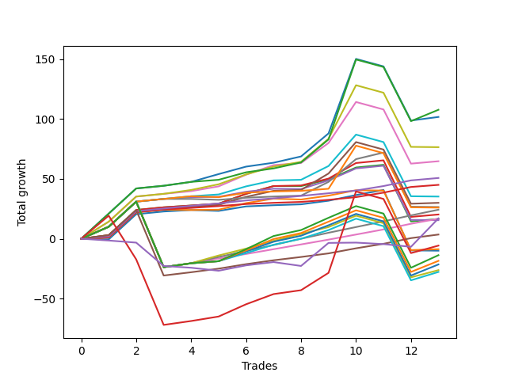

# Short Malinois 001 
- Symbol: ES_830-1130
- Date Range: 03/18/2022 - 12/30/2022
- Trading Period: 8:30-11:30
- Number of Trades: 6



| Name | Win Percent | Profit | Avg Profit / Trade | Avg Time / Trade |      | Name | Win Percent | Profit | Avg Profit / Trade | Avg Time / Trade |
| ---- | ----------- | ------ | ------------------ | ---------------- | ---- | ---- | ----------- | ------ | ------------------ | ---------------- |
| Sorted By <br> Profit | | | | | | Sorted By <br> Win Percentage ||||
| TP-10 | 100.00 | 23375.00 | 3895.83 | 31:28 |     | TP-10 | 100.00 | 23375.00 | 3895.83 | 31:28 |
| NEWFI 000 | 100.00 | 23250.00 | 3875.00 | 32:13 |     | NEWFI 000 | 100.00 | 23250.00 | 3875.00 | 32:13 |
| NEWFI 0000 | 66.67 | 23125.00 | 3854.17 | 40:31 |     | BB-200 U/L 2SD SL-10 | 100.00 | 21625.00 | 3604.17 | 53:26 |
| BB-200 U/L 2SD SL-10 | 100.00 | 21625.00 | 3604.17 | 53:26 |     | BB-200 U/L 2SD SL-5 | 100.00 | 21625.00 | 3604.17 | 53:26 |
| BB-200 U/L 2SD SL-5 | 100.00 | 21625.00 | 3604.17 | 53:26 |     | BB-200 U/L 2SD | 100.00 | 21625.00 | 3604.17 | 53:26 |
| BB-200 U/L 2SD | 100.00 | 21625.00 | 3604.17 | 53:26 |     | BB-50 U/L 2SD SL-10 | 100.00 | 21375.00 | 3562.50 | 18:26 |
| BB-50 U/L 2SD SL-10 | 100.00 | 21375.00 | 3562.50 | 18:26 |     | BB-50 U/L 2SD SL-5 | 100.00 | 21375.00 | 3562.50 | 18:26 |
| BB-50 U/L 2SD SL-5 | 100.00 | 21375.00 | 3562.50 | 18:26 |     | BB-50 U/L 2SD | 100.00 | 21375.00 | 3562.50 | 18:26 |
| BB-50 U/L 2SD | 100.00 | 21375.00 | 3562.50 | 18:26 |     | TP-9 | 100.00 | 21125.00 | 3520.83 | 31:05 |
| TP-9 | 100.00 | 21125.00 | 3520.83 | 31:05 |     | BB-100 U/L 2SD SL-10 | 100.00 | 20750.00 | 3458.33 | 49:09 |
| V U/L 1SD SL-10 | 83.33 | 20875.00 | 3479.17 | 32:10 |     | BB-100 U/L 2SD SL-5 | 100.00 | 20750.00 | 3458.33 | 49:09 |
| V U/L 1SD SL-5 | 83.33 | 20875.00 | 3479.17 | 32:10 |     | BB-100 U/L 2SD | 100.00 | 20750.00 | 3458.33 | 49:09 |
| V U/L 1SD | 83.33 | 20875.00 | 3479.17 | 32:10 |     | TP-8 | 100.00 | 19625.00 | 3270.83 | 30:25 |
| BB-100 U/L 2SD SL-10 | 100.00 | 20750.00 | 3458.33 | 49:09 |     | TP-6 | 100.00 | 16875.00 | 2812.50 | 24:54 |
| BB-100 U/L 2SD SL-5 | 100.00 | 20750.00 | 3458.33 | 49:09 |     | TP-7 | 100.00 | 16500.00 | 2750.00 | 30:00 |
| BB-100 U/L 2SD | 100.00 | 20750.00 | 3458.33 | 49:09 |     | BB-50 U/L 1SD SL-10 | 100.00 | 15000.00 | 2500.00 | 14:13 |
| TP-8 | 100.00 | 19625.00 | 3270.83 | 30:25 |     | BB-50 U/L 1SD SL-5 | 100.00 | 15000.00 | 2500.00 | 14:13 |
| TP-6 | 100.00 | 16875.00 | 2812.50 | 24:54 |     | BB-50 U/L 1SD | 100.00 | 15000.00 | 2500.00 | 14:13 |
| TP-7 | 100.00 | 16500.00 | 2750.00 | 30:00 |     | TP-5 | 100.00 | 14125.00 | 2354.17 | 22:03 |
| BB-50 U/L 1SD SL-10 | 100.00 | 15000.00 | 2500.00 | 14:13 |     | BB-20 U/L 2SD C SL-10 | 100.00 | 12750.00 | 2125.00 | 11:48 |
| BB-50 U/L 1SD SL-5 | 100.00 | 15000.00 | 2500.00 | 14:13 |     | BB-20 U/L 2SD C SL-5 | 100.00 | 12750.00 | 2125.00 | 11:48 |
| BB-50 U/L 1SD | 100.00 | 15000.00 | 2500.00 | 14:13 |     | BB-20 U/L 2SD C | 100.00 | 12750.00 | 2125.00 | 11:48 |
| TP-5 | 100.00 | 14125.00 | 2354.17 | 22:03 |     | BB-20 U/L 2SD SL-10 | 100.00 | 12625.00 | 2104.17 | 11:46 |
| BB-100 Mid SL-10 | 83.33 | 13375.00 | 2229.17 | 13:09 |     | BB-20 U/L 2SD SL-5 | 100.00 | 12625.00 | 2104.17 | 11:46 |
| BB-100 Mid SL-5 | 83.33 | 13375.00 | 2229.17 | 13:09 |     | BB-20 U/L 2SD | 100.00 | 12625.00 | 2104.17 | 11:46 |
| BB-100 Mid | 83.33 | 13375.00 | 2229.17 | 13:09 |     | TP-4 | 100.00 | 11625.00 | 1937.50 | 15:32 |
| BB-20 U/L 2SD C SL-10 | 100.00 | 12750.00 | 2125.00 | 11:48 |     | TP-3 | 100.00 | 9375.00 | 1562.50 | 13:16 |
| BB-20 U/L 2SD C SL-5 | 100.00 | 12750.00 | 2125.00 | 11:48 |     | TP-2 | 100.00 | 6375.00 | 1062.50 | 08:20 |
| BB-20 U/L 2SD C | 100.00 | 12750.00 | 2125.00 | 11:48 |     | TP-1 | 100.00 | 4500.00 | 750.00 | 02:45 |
| BB-20 U/L 2SD SL-10 | 100.00 | 12625.00 | 2104.17 | 11:46 |     | V U/L 1SD SL-10 | 83.33 | 20875.00 | 3479.17 | 32:10 |
| BB-20 U/L 2SD SL-5 | 100.00 | 12625.00 | 2104.17 | 11:46 |     | V U/L 1SD SL-5 | 83.33 | 20875.00 | 3479.17 | 32:10 |
| BB-20 U/L 2SD | 100.00 | 12625.00 | 2104.17 | 11:46 |     | V U/L 1SD | 83.33 | 20875.00 | 3479.17 | 32:10 |
| TP-4 | 100.00 | 11625.00 | 1937.50 | 15:32 |     | BB-100 Mid SL-10 | 83.33 | 13375.00 | 2229.17 | 13:09 |
| TP-3 | 100.00 | 9375.00 | 1562.50 | 13:16 |     | BB-100 Mid SL-5 | 83.33 | 13375.00 | 2229.17 | 13:09 |
| BB-50 Mid SL-10 | 83.33 | 7750.00 | 1291.67 | 08:57 |     | BB-100 Mid | 83.33 | 13375.00 | 2229.17 | 13:09 |
| BB-50 Mid SL-5 | 83.33 | 7750.00 | 1291.67 | 08:57 |     | BB-50 Mid SL-10 | 83.33 | 7750.00 | 1291.67 | 08:57 |
| BB-50 Mid | 83.33 | 7750.00 | 1291.67 | 08:57 |     | BB-50 Mid SL-5 | 83.33 | 7750.00 | 1291.67 | 08:57 |
| BB-20 U/L 1SD SL-10 | 83.33 | 6625.00 | 1104.17 | 08:45 |     | BB-50 Mid | 83.33 | 7750.00 | 1291.67 | 08:57 |
| BB-20 U/L 1SD SL-5 | 83.33 | 6625.00 | 1104.17 | 08:45 |     | BB-20 U/L 1SD SL-10 | 83.33 | 6625.00 | 1104.17 | 08:45 |
| BB-20 U/L 1SD | 83.33 | 6625.00 | 1104.17 | 08:45 |     | BB-20 U/L 1SD SL-5 | 83.33 | 6625.00 | 1104.17 | 08:45 |
| V Mid SL-10 | 50.00 | 6625.00 | 1104.17 | 04:14 |     | BB-20 U/L 1SD | 83.33 | 6625.00 | 1104.17 | 08:45 |
| V Mid SL-5 | 50.00 | 6625.00 | 1104.17 | 04:14 |     | NEWFI 0000 | 66.67 | 23125.00 | 3854.17 | 40:31 |
| V Mid | 50.00 | 6625.00 | 1104.17 | 04:14 |     | BB-20 Mid SL-10 | 66.67 | 4000.00 | 666.67 | 01:41 |
| TP-2 | 100.00 | 6375.00 | 1062.50 | 08:20 |     | BB-20 Mid SL-5 | 66.67 | 4000.00 | 666.67 | 01:41 |
| TP-1 | 100.00 | 4500.00 | 750.00 | 02:45 |     | BB-20 Mid | 66.67 | 4000.00 | 666.67 | 01:41 |
| BB-20 Mid SL-10 | 66.67 | 4000.00 | 666.67 | 01:41 |     | BB-200 Mid SL-10 | 66.67 | 3875.00 | 645.83 | 10:35 |
| BB-20 Mid SL-5 | 66.67 | 4000.00 | 666.67 | 01:41 |     | BB-200 Mid SL-5 | 66.67 | 3875.00 | 645.83 | 10:35 |
| BB-20 Mid | 66.67 | 4000.00 | 666.67 | 01:41 |     | BB-200 Mid | 66.67 | 3875.00 | 645.83 | 10:35 |
| BB-200 Mid SL-10 | 66.67 | 3875.00 | 645.83 | 10:35 |     | V Mid SL-10 | 50.00 | 6625.00 | 1104.17 | 04:14 |
| BB-200 Mid SL-5 | 66.67 | 3875.00 | 645.83 | 10:35 |     | V Mid SL-5 | 50.00 | 6625.00 | 1104.17 | 04:14 |
| BB-200 Mid | 66.67 | 3875.00 | 645.83 | 10:35 |     | V Mid | 50.00 | 6625.00 | 1104.17 | 04:14 |

## NO STOPLOSS

### Test BB-20 Mid
* Sell when price hits the middle line of the 20p bollinger
* No Stoploss
* Results:
```
Total Trades: 6
Percent Up: 33.33
Percent Down: 66.67
Total Points Moved Down: 8.00
Potential Profit: 4000.00
Total Points Ups: 1.00 Count Ups: 2
Total Points Downs: 9.00 Count Downs: 4
```

<details><summary>Trades</summary>

<code>In: 2022-07-18 08:48:00		Out: 2022-07-18 08:50:10		Total Position Time: 02:10		Total Move Down: 1.25		Total to Date: 1.25</code> <br />
<code>In: 2022-08-22 08:59:00		Out: 2022-08-22 09:00:10		Total Position Time: 01:10		Total Move Down: -0.75		Total to Date: 0.50</code> <br />
<code>In: 2022-08-23 10:36:00		Out: 2022-08-23 10:37:25		Total Position Time: 01:25		Total Move Down: 3.75		Total to Date: 4.25</code> <br />
<code>In: 2022-08-23 10:37:00		Out: 2022-08-23 10:38:10		Total Position Time: 01:10		Total Move Down: 1.00		Total to Date: 5.25</code> <br />
<code>In: 2022-09-29 08:59:00		Out: 2022-09-29 09:02:05		Total Position Time: 03:05		Total Move Down: 3.00		Total to Date: 8.25</code> <br />
<code>In: 2022-12-19 10:28:00		Out: 2022-12-19 10:29:10		Total Position Time: 01:10		Total Move Down: -0.25		Total to Date: 8.00</code> <br />


</details>

### Test BB-20 U/L 1SD
* Sell when the price hits the lower line of the 20p 1std bollinger
* No Stoploss
* Results:
```
Total Trades: 6
Percent Up: 16.67
Percent Down: 83.33
Total Points Moved Down: 13.25
Potential Profit: 6625.00
Total Points Ups: 0.25 Count Ups: 1
Total Points Downs: 13.50 Count Downs: 5
```

<details><summary>Trades</summary>

<code>In: 2022-07-18 08:48:00		Out: 2022-07-18 09:05:10		Total Position Time: 17:10		Total Move Down: -0.25		Total to Date: -0.25</code> <br />
<code>In: 2022-08-22 08:59:00		Out: 2022-08-22 09:07:55		Total Position Time: 08:55		Total Move Down: 0.25		Total to Date: 0.00</code> <br />
<code>In: 2022-08-23 10:36:00		Out: 2022-08-23 10:43:05		Total Position Time: 07:05		Total Move Down: 5.50		Total to Date: 5.50</code> <br />
<code>In: 2022-08-23 10:37:00		Out: 2022-08-23 10:43:05		Total Position Time: 06:05		Total Move Down: 3.75		Total to Date: 9.25</code> <br />
<code>In: 2022-09-29 08:59:00		Out: 2022-09-29 09:10:55		Total Position Time: 11:55		Total Move Down: 3.25		Total to Date: 12.50</code> <br />
<code>In: 2022-12-19 10:28:00		Out: 2022-12-19 10:29:20		Total Position Time: 01:20		Total Move Down: 0.75		Total to Date: 13.25</code> <br />


</details>

### Test BB-20 U/L 2SD
* Sell when the price hits the lower line of the 20p 2std bollinger
* No Stoploss
* Results:
```
Total Trades: 6
Percent Up: 0.00
Percent Down: 100.00
Total Points Moved Down: 25.25
Potential Profit: 12625.00
Total Points Ups: 0.00 Count Ups: 0
Total Points Downs: 25.25 Count Downs: 6
```

<details><summary>Trades</summary>

<code>In: 2022-07-18 08:48:00		Out: 2022-07-18 09:08:15		Total Position Time: 20:15		Total Move Down: 1.50		Total to Date: 1.50</code> <br />
<code>In: 2022-08-22 08:59:00		Out: 2022-08-22 09:08:15		Total Position Time: 09:15		Total Move Down: 1.50		Total to Date: 3.00</code> <br />
<code>In: 2022-08-23 10:36:00		Out: 2022-08-23 10:48:35		Total Position Time: 12:35		Total Move Down: 8.25		Total to Date: 11.25</code> <br />
<code>In: 2022-08-23 10:37:00		Out: 2022-08-23 10:48:35		Total Position Time: 11:35		Total Move Down: 6.50		Total to Date: 17.75</code> <br />
<code>In: 2022-09-29 08:59:00		Out: 2022-09-29 09:11:30		Total Position Time: 12:30		Total Move Down: 5.50		Total to Date: 23.25</code> <br />
<code>In: 2022-12-19 10:28:00		Out: 2022-12-19 10:32:30		Total Position Time: 04:30		Total Move Down: 2.00		Total to Date: 25.25</code> <br />


</details>

### Test BB-20 U/L 2SD C
* Sell when the price hits the lower line of the 20p 2std bollinger
* No Stoploss
* Results:
```
Total Trades: 6
Percent Up: 0.00
Percent Down: 100.00
Total Points Moved Down: 25.50
Potential Profit: 12750.00
Total Points Ups: 0.00 Count Ups: 0
Total Points Downs: 25.50 Count Downs: 6
```

<details><summary>Trades</summary>

<code>In: 2022-07-18 08:48:00		Out: 2022-07-18 09:08:15		Total Position Time: 20:15		Total Move Down: 1.50		Total to Date: 1.50</code> <br />
<code>In: 2022-08-22 08:59:00		Out: 2022-08-22 09:08:15		Total Position Time: 09:15		Total Move Down: 1.50		Total to Date: 3.00</code> <br />
<code>In: 2022-08-23 10:36:00		Out: 2022-08-23 10:48:35		Total Position Time: 12:35		Total Move Down: 8.25		Total to Date: 11.25</code> <br />
<code>In: 2022-08-23 10:37:00		Out: 2022-08-23 10:48:35		Total Position Time: 11:35		Total Move Down: 6.50		Total to Date: 17.75</code> <br />
<code>In: 2022-09-29 08:59:00		Out: 2022-09-29 09:11:40		Total Position Time: 12:40		Total Move Down: 5.75		Total to Date: 23.50</code> <br />
<code>In: 2022-12-19 10:28:00		Out: 2022-12-19 10:32:30		Total Position Time: 04:30		Total Move Down: 2.00		Total to Date: 25.50</code> <br />


</details>

### Test BB-50 Mid
* Sell when price hits the middle line of the 50p bollinger
* No Stoploss
* Results:
```
Total Trades: 6
Percent Up: 16.67
Percent Down: 83.33
Total Points Moved Down: 15.50
Potential Profit: 7750.00
Total Points Ups: 0.25 Count Ups: 1
Total Points Downs: 15.75 Count Downs: 5
```

<details><summary>Trades</summary>

<code>In: 2022-07-18 08:48:00		Out: 2022-07-18 09:08:15		Total Position Time: 20:15		Total Move Down: 1.50		Total to Date: 1.50</code> <br />
<code>In: 2022-08-22 08:59:00		Out: 2022-08-22 09:07:55		Total Position Time: 08:55		Total Move Down: 0.25		Total to Date: 1.75</code> <br />
<code>In: 2022-08-23 10:36:00		Out: 2022-08-23 10:39:25		Total Position Time: 03:25		Total Move Down: 4.25		Total to Date: 6.00</code> <br />
<code>In: 2022-08-23 10:37:00		Out: 2022-08-23 10:39:25		Total Position Time: 02:25		Total Move Down: 2.50		Total to Date: 8.50</code> <br />
<code>In: 2022-09-29 08:59:00		Out: 2022-09-29 09:16:35		Total Position Time: 17:35		Total Move Down: 7.25		Total to Date: 15.75</code> <br />
<code>In: 2022-12-19 10:28:00		Out: 2022-12-19 10:29:10		Total Position Time: 01:10		Total Move Down: -0.25		Total to Date: 15.50</code> <br />


</details>

### Test BB-50 U/L 1SD
* Sell when the price hits the lower line of the 50p 1std bollinger
* No Stoploss
* Results:
```
Total Trades: 6
Percent Up: 0.00
Percent Down: 100.00
Total Points Moved Down: 30.00
Potential Profit: 15000.00
Total Points Ups: 0.00 Count Ups: 0
Total Points Downs: 30.00 Count Downs: 6
```

<details><summary>Trades</summary>

<code>In: 2022-07-18 08:48:00		Out: 2022-07-18 09:19:25		Total Position Time: 31:25		Total Move Down: 2.25		Total to Date: 2.25</code> <br />
<code>In: 2022-08-22 08:59:00		Out: 2022-08-22 09:08:20		Total Position Time: 09:20		Total Move Down: 1.50		Total to Date: 3.75</code> <br />
<code>In: 2022-08-23 10:36:00		Out: 2022-08-23 10:48:05		Total Position Time: 12:05		Total Move Down: 6.75		Total to Date: 10.50</code> <br />
<code>In: 2022-08-23 10:37:00		Out: 2022-08-23 10:48:05		Total Position Time: 11:05		Total Move Down: 5.00		Total to Date: 15.50</code> <br />
<code>In: 2022-09-29 08:59:00		Out: 2022-09-29 09:19:05		Total Position Time: 20:05		Total Move Down: 13.75		Total to Date: 29.25</code> <br />
<code>In: 2022-12-19 10:28:00		Out: 2022-12-19 10:29:20		Total Position Time: 01:20		Total Move Down: 0.75		Total to Date: 30.00</code> <br />


</details>

### Test BB-50 U/L 2SD
* Sell when the price hits the lower line of the 50p 2std bollinger
* No Stoploss
* Results:
```
Total Trades: 6
Percent Up: 0.00
Percent Down: 100.00
Total Points Moved Down: 42.75
Potential Profit: 21375.00
Total Points Ups: 0.00 Count Ups: 0
Total Points Downs: 42.75 Count Downs: 6
```

<details><summary>Trades</summary>

<code>In: 2022-07-18 08:48:00		Out: 2022-07-18 09:26:30		Total Position Time: 38:30		Total Move Down: 2.25		Total to Date: 2.25</code> <br />
<code>In: 2022-08-22 08:59:00		Out: 2022-08-22 09:12:35		Total Position Time: 13:35		Total Move Down: 4.00		Total to Date: 6.25</code> <br />
<code>In: 2022-08-23 10:36:00		Out: 2022-08-23 10:51:40		Total Position Time: 15:40		Total Move Down: 9.75		Total to Date: 16.00</code> <br />
<code>In: 2022-08-23 10:37:00		Out: 2022-08-23 10:51:40		Total Position Time: 14:40		Total Move Down: 8.00		Total to Date: 24.00</code> <br />
<code>In: 2022-09-29 08:59:00		Out: 2022-09-29 09:22:45		Total Position Time: 23:45		Total Move Down: 16.75		Total to Date: 40.75</code> <br />
<code>In: 2022-12-19 10:28:00		Out: 2022-12-19 10:32:30		Total Position Time: 04:30		Total Move Down: 2.00		Total to Date: 42.75</code> <br />


</details>

### Test V Mid
* Sell when the price hits the middle line of the 1std VWAP
* No Stoploss
* Results:
```
Total Trades: 6
Percent Up: 50.00
Percent Down: 50.00
Total Points Moved Down: 13.25
Potential Profit: 6625.00
Total Points Ups: 1.00 Count Ups: 3
Total Points Downs: 14.25 Count Downs: 3
```

<details><summary>Trades</summary>

<code>In: 2022-07-18 08:48:00		Out: 2022-07-18 08:49:25		Total Position Time: 01:25		Total Move Down: -0.00		Total to Date: 0.00</code> <br />
<code>In: 2022-08-22 08:59:00		Out: 2022-08-22 09:00:10		Total Position Time: 01:10		Total Move Down: -0.75		Total to Date: -0.75</code> <br />
<code>In: 2022-08-23 10:36:00		Out: 2022-08-23 10:37:10		Total Position Time: 01:10		Total Move Down: 1.75		Total to Date: 1.00</code> <br />
<code>In: 2022-08-23 10:37:00		Out: 2022-08-23 10:38:10		Total Position Time: 01:10		Total Move Down: 1.00		Total to Date: 2.00</code> <br />
<code>In: 2022-09-29 08:59:00		Out: 2022-09-29 09:18:20		Total Position Time: 19:20		Total Move Down: 11.50		Total to Date: 13.50</code> <br />
<code>In: 2022-12-19 10:28:00		Out: 2022-12-19 10:29:10		Total Position Time: 01:10		Total Move Down: -0.25		Total to Date: 13.25</code> <br />


</details>

### Test V U/L 1SD
* Sell when the price hits the lower line of the 1std VWAP
* No Stoploss
* Results:
```
Total Trades: 6
Percent Up: 16.67
Percent Down: 83.33
Total Points Moved Down: 41.75
Potential Profit: 20875.00
Total Points Ups: 0.25 Count Ups: 1
Total Points Downs: 42.00 Count Downs: 5
```

<details><summary>Trades</summary>

<code>In: 2022-07-18 08:48:00		Out: 2022-07-18 09:48:55		Total Position Time: 60:55		Total Move Down: 3.25		Total to Date: 3.25</code> <br />
<code>In: 2022-08-22 08:59:00		Out: 2022-08-22 09:44:55		Total Position Time: 45:55		Total Move Down: 4.75		Total to Date: 8.00</code> <br />
<code>In: 2022-08-23 10:36:00		Out: 2022-08-23 10:48:35		Total Position Time: 12:35		Total Move Down: 8.25		Total to Date: 16.25</code> <br />
<code>In: 2022-08-23 10:37:00		Out: 2022-08-23 10:48:35		Total Position Time: 11:35		Total Move Down: 6.50		Total to Date: 22.75</code> <br />
<code>In: 2022-09-29 08:59:00		Out: 2022-09-29 09:59:55		Total Position Time: 60:55		Total Move Down: 19.25		Total to Date: 42.00</code> <br />
<code>In: 2022-12-19 10:28:00		Out: 2022-12-19 10:29:10		Total Position Time: 01:10		Total Move Down: -0.25		Total to Date: 41.75</code> <br />


</details>

### Test BB-100 Mid
* Move to BB100 Mid
* No Stoploss
* Results:
```
Total Trades: 6
Percent Up: 16.67
Percent Down: 83.33
Total Points Moved Down: 26.75
Potential Profit: 13375.00
Total Points Ups: 0.25 Count Ups: 1
Total Points Downs: 27.00 Count Downs: 5
```

<details><summary>Trades</summary>

<code>In: 2022-07-18 08:48:00		Out: 2022-07-18 09:19:25		Total Position Time: 31:25		Total Move Down: 2.25		Total to Date: 2.25</code> <br />
<code>In: 2022-08-22 08:59:00		Out: 2022-08-22 09:08:20		Total Position Time: 09:20		Total Move Down: 1.50		Total to Date: 3.75</code> <br />
<code>In: 2022-08-23 10:36:00		Out: 2022-08-23 10:45:20		Total Position Time: 09:20		Total Move Down: 6.75		Total to Date: 10.50</code> <br />
<code>In: 2022-08-23 10:37:00		Out: 2022-08-23 10:45:20		Total Position Time: 08:20		Total Move Down: 5.00		Total to Date: 15.50</code> <br />
<code>In: 2022-09-29 08:59:00		Out: 2022-09-29 09:18:20		Total Position Time: 19:20		Total Move Down: 11.50		Total to Date: 27.00</code> <br />
<code>In: 2022-12-19 10:28:00		Out: 2022-12-19 10:29:10		Total Position Time: 01:10		Total Move Down: -0.25		Total to Date: 26.75</code> <br />


</details>

### Test BB-100 U/L 2SD
* Move to BB100 Upper Band
* No Stoploss
* Results:
```
Total Trades: 6
Percent Up: 0.00
Percent Down: 100.00
Total Points Moved Down: 41.50
Potential Profit: 20750.00
Total Points Ups: 0.00 Count Ups: 0
Total Points Downs: 41.50 Count Downs: 6
```

<details><summary>Trades</summary>

<code>In: 2022-07-18 08:48:00		Out: 2022-07-18 09:48:55		Total Position Time: 60:55		Total Move Down: 3.25		Total to Date: 3.25</code> <br />
<code>In: 2022-08-22 08:59:00		Out: 2022-08-22 09:45:25		Total Position Time: 46:25		Total Move Down: 6.50		Total to Date: 9.75</code> <br />
<code>In: 2022-08-23 10:36:00		Out: 2022-08-23 11:36:55		Total Position Time: 60:55		Total Move Down: 6.25		Total to Date: 16.00</code> <br />
<code>In: 2022-08-23 10:37:00		Out: 2022-08-23 11:37:55		Total Position Time: 60:55		Total Move Down: 3.25		Total to Date: 19.25</code> <br />
<code>In: 2022-09-29 08:59:00		Out: 2022-09-29 09:59:55		Total Position Time: 60:55		Total Move Down: 19.25		Total to Date: 38.50</code> <br />
<code>In: 2022-12-19 10:28:00		Out: 2022-12-19 10:32:50		Total Position Time: 04:50		Total Move Down: 3.00		Total to Date: 41.50</code> <br />


</details>

### Test BB-200 Mid
* Move to BB200 Mid
* No Stoploss
* Results:
```
Total Trades: 6
Percent Up: 33.33
Percent Down: 66.67
Total Points Moved Down: 7.75
Potential Profit: 3875.00
Total Points Ups: 1.00 Count Ups: 2
Total Points Downs: 8.75 Count Downs: 4
```

<details><summary>Trades</summary>

<code>In: 2022-07-18 08:48:00		Out: 2022-07-18 09:45:30		Total Position Time: 57:30		Total Move Down: 2.25		Total to Date: 2.25</code> <br />
<code>In: 2022-08-22 08:59:00		Out: 2022-08-22 09:00:10		Total Position Time: 01:10		Total Move Down: -0.75		Total to Date: 1.50</code> <br />
<code>In: 2022-08-23 10:36:00		Out: 2022-08-23 10:37:25		Total Position Time: 01:25		Total Move Down: 3.75		Total to Date: 5.25</code> <br />
<code>In: 2022-08-23 10:37:00		Out: 2022-08-23 10:38:10		Total Position Time: 01:10		Total Move Down: 1.00		Total to Date: 6.25</code> <br />
<code>In: 2022-09-29 08:59:00		Out: 2022-09-29 09:00:10		Total Position Time: 01:10		Total Move Down: 1.75		Total to Date: 8.00</code> <br />
<code>In: 2022-12-19 10:28:00		Out: 2022-12-19 10:29:10		Total Position Time: 01:10		Total Move Down: -0.25		Total to Date: 7.75</code> <br />


</details>

### Test BB-200 U/L 2SD
* Move to BB200 Upper Band
* No Stoploss
* Results:
```
Total Trades: 6
Percent Up: 0.00
Percent Down: 100.00
Total Points Moved Down: 43.25
Potential Profit: 21625.00
Total Points Ups: 0.00 Count Ups: 0
Total Points Downs: 43.25 Count Downs: 6
```

<details><summary>Trades</summary>

<code>In: 2022-07-18 08:48:00		Out: 2022-07-18 09:48:55		Total Position Time: 60:55		Total Move Down: 3.25		Total to Date: 3.25</code> <br />
<code>In: 2022-08-22 08:59:00		Out: 2022-08-22 09:59:55		Total Position Time: 60:55		Total Move Down: 1.75		Total to Date: 5.00</code> <br />
<code>In: 2022-08-23 10:36:00		Out: 2022-08-23 11:36:55		Total Position Time: 60:55		Total Move Down: 6.25		Total to Date: 11.25</code> <br />
<code>In: 2022-08-23 10:37:00		Out: 2022-08-23 11:37:55		Total Position Time: 60:55		Total Move Down: 3.25		Total to Date: 14.50</code> <br />
<code>In: 2022-09-29 08:59:00		Out: 2022-09-29 09:59:55		Total Position Time: 60:55		Total Move Down: 19.25		Total to Date: 33.75</code> <br />
<code>In: 2022-12-19 10:28:00		Out: 2022-12-19 10:44:05		Total Position Time: 16:05		Total Move Down: 9.50		Total to Date: 43.25</code> <br />


</details>

## STOPLOSS OF 5

### Test BB-20 Mid SL-5
* Sell when price hits the middle line of the 20p bollinger
* Stoploss is -5 points
* Results:
```
Total Trades: 6
Percent Up: 33.33
Percent Down: 66.67
Total Points Moved Down: 8.00
Potential Profit: 4000.00
Total Points Ups: 1.00 Count Ups: 2
Total Points Downs: 9.00 Count Downs: 4
```

<details><summary>Trades</summary>

<code>In: 2022-07-18 08:48:00		Out: 2022-07-18 08:50:10		Total Position Time: 02:10		Total Move Down: 1.25		Total to Date: 1.25</code> <br />
<code>In: 2022-08-22 08:59:00		Out: 2022-08-22 09:00:10		Total Position Time: 01:10		Total Move Down: -0.75		Total to Date: 0.50</code> <br />
<code>In: 2022-08-23 10:36:00		Out: 2022-08-23 10:37:25		Total Position Time: 01:25		Total Move Down: 3.75		Total to Date: 4.25</code> <br />
<code>In: 2022-08-23 10:37:00		Out: 2022-08-23 10:38:10		Total Position Time: 01:10		Total Move Down: 1.00		Total to Date: 5.25</code> <br />
<code>In: 2022-09-29 08:59:00		Out: 2022-09-29 09:02:05		Total Position Time: 03:05		Total Move Down: 3.00		Total to Date: 8.25</code> <br />
<code>In: 2022-12-19 10:28:00		Out: 2022-12-19 10:29:10		Total Position Time: 01:10		Total Move Down: -0.25		Total to Date: 8.00</code> <br />


</details>

### Test BB-20 U/L 1SD SL-5
* Sell when the price hits the lower line of the 20p 1std bollinger
* Stoploss is -5 points
* Results:
```
Total Trades: 6
Percent Up: 16.67
Percent Down: 83.33
Total Points Moved Down: 13.25
Potential Profit: 6625.00
Total Points Ups: 0.25 Count Ups: 1
Total Points Downs: 13.50 Count Downs: 5
```

<details><summary>Trades</summary>

<code>In: 2022-07-18 08:48:00		Out: 2022-07-18 09:05:10		Total Position Time: 17:10		Total Move Down: -0.25		Total to Date: -0.25</code> <br />
<code>In: 2022-08-22 08:59:00		Out: 2022-08-22 09:07:55		Total Position Time: 08:55		Total Move Down: 0.25		Total to Date: 0.00</code> <br />
<code>In: 2022-08-23 10:36:00		Out: 2022-08-23 10:43:05		Total Position Time: 07:05		Total Move Down: 5.50		Total to Date: 5.50</code> <br />
<code>In: 2022-08-23 10:37:00		Out: 2022-08-23 10:43:05		Total Position Time: 06:05		Total Move Down: 3.75		Total to Date: 9.25</code> <br />
<code>In: 2022-09-29 08:59:00		Out: 2022-09-29 09:10:55		Total Position Time: 11:55		Total Move Down: 3.25		Total to Date: 12.50</code> <br />
<code>In: 2022-12-19 10:28:00		Out: 2022-12-19 10:29:20		Total Position Time: 01:20		Total Move Down: 0.75		Total to Date: 13.25</code> <br />


</details>

### Test BB-20 U/L 2SD SL-5
* Sell when the price hits the lower line of the 20p 2std bollinger
* Stoploss is -5 points
* Results:
```
Total Trades: 6
Percent Up: 0.00
Percent Down: 100.00
Total Points Moved Down: 25.25
Potential Profit: 12625.00
Total Points Ups: 0.00 Count Ups: 0
Total Points Downs: 25.25 Count Downs: 6
```

<details><summary>Trades</summary>

<code>In: 2022-07-18 08:48:00		Out: 2022-07-18 09:08:15		Total Position Time: 20:15		Total Move Down: 1.50		Total to Date: 1.50</code> <br />
<code>In: 2022-08-22 08:59:00		Out: 2022-08-22 09:08:15		Total Position Time: 09:15		Total Move Down: 1.50		Total to Date: 3.00</code> <br />
<code>In: 2022-08-23 10:36:00		Out: 2022-08-23 10:48:35		Total Position Time: 12:35		Total Move Down: 8.25		Total to Date: 11.25</code> <br />
<code>In: 2022-08-23 10:37:00		Out: 2022-08-23 10:48:35		Total Position Time: 11:35		Total Move Down: 6.50		Total to Date: 17.75</code> <br />
<code>In: 2022-09-29 08:59:00		Out: 2022-09-29 09:11:30		Total Position Time: 12:30		Total Move Down: 5.50		Total to Date: 23.25</code> <br />
<code>In: 2022-12-19 10:28:00		Out: 2022-12-19 10:32:30		Total Position Time: 04:30		Total Move Down: 2.00		Total to Date: 25.25</code> <br />


</details>

### Test BB-20 U/L 2SD C SL-5
* Sell when the price hits the lower line of the 20p 2std bollinger
* Stoploss is -5 points
* Results:
```
Total Trades: 6
Percent Up: 0.00
Percent Down: 100.00
Total Points Moved Down: 25.50
Potential Profit: 12750.00
Total Points Ups: 0.00 Count Ups: 0
Total Points Downs: 25.50 Count Downs: 6
```

<details><summary>Trades</summary>

<code>In: 2022-07-18 08:48:00		Out: 2022-07-18 09:08:15		Total Position Time: 20:15		Total Move Down: 1.50		Total to Date: 1.50</code> <br />
<code>In: 2022-08-22 08:59:00		Out: 2022-08-22 09:08:15		Total Position Time: 09:15		Total Move Down: 1.50		Total to Date: 3.00</code> <br />
<code>In: 2022-08-23 10:36:00		Out: 2022-08-23 10:48:35		Total Position Time: 12:35		Total Move Down: 8.25		Total to Date: 11.25</code> <br />
<code>In: 2022-08-23 10:37:00		Out: 2022-08-23 10:48:35		Total Position Time: 11:35		Total Move Down: 6.50		Total to Date: 17.75</code> <br />
<code>In: 2022-09-29 08:59:00		Out: 2022-09-29 09:11:40		Total Position Time: 12:40		Total Move Down: 5.75		Total to Date: 23.50</code> <br />
<code>In: 2022-12-19 10:28:00		Out: 2022-12-19 10:32:30		Total Position Time: 04:30		Total Move Down: 2.00		Total to Date: 25.50</code> <br />


</details>

### Test BB-50 Mid SL-5
* Sell when price hits the middle line of the 50p bollinger
* Stoploss is -5 points
* Results:
```
Total Trades: 6
Percent Up: 16.67
Percent Down: 83.33
Total Points Moved Down: 15.50
Potential Profit: 7750.00
Total Points Ups: 0.25 Count Ups: 1
Total Points Downs: 15.75 Count Downs: 5
```

<details><summary>Trades</summary>

<code>In: 2022-07-18 08:48:00		Out: 2022-07-18 09:08:15		Total Position Time: 20:15		Total Move Down: 1.50		Total to Date: 1.50</code> <br />
<code>In: 2022-08-22 08:59:00		Out: 2022-08-22 09:07:55		Total Position Time: 08:55		Total Move Down: 0.25		Total to Date: 1.75</code> <br />
<code>In: 2022-08-23 10:36:00		Out: 2022-08-23 10:39:25		Total Position Time: 03:25		Total Move Down: 4.25		Total to Date: 6.00</code> <br />
<code>In: 2022-08-23 10:37:00		Out: 2022-08-23 10:39:25		Total Position Time: 02:25		Total Move Down: 2.50		Total to Date: 8.50</code> <br />
<code>In: 2022-09-29 08:59:00		Out: 2022-09-29 09:16:35		Total Position Time: 17:35		Total Move Down: 7.25		Total to Date: 15.75</code> <br />
<code>In: 2022-12-19 10:28:00		Out: 2022-12-19 10:29:10		Total Position Time: 01:10		Total Move Down: -0.25		Total to Date: 15.50</code> <br />


</details>

### Test BB-50 U/L 1SD SL-5
* Sell when the price hits the lower line of the 50p 1std bollinger
* Stoploss is -5 points
* Results:
```
Total Trades: 6
Percent Up: 0.00
Percent Down: 100.00
Total Points Moved Down: 30.00
Potential Profit: 15000.00
Total Points Ups: 0.00 Count Ups: 0
Total Points Downs: 30.00 Count Downs: 6
```

<details><summary>Trades</summary>

<code>In: 2022-07-18 08:48:00		Out: 2022-07-18 09:19:25		Total Position Time: 31:25		Total Move Down: 2.25		Total to Date: 2.25</code> <br />
<code>In: 2022-08-22 08:59:00		Out: 2022-08-22 09:08:20		Total Position Time: 09:20		Total Move Down: 1.50		Total to Date: 3.75</code> <br />
<code>In: 2022-08-23 10:36:00		Out: 2022-08-23 10:48:05		Total Position Time: 12:05		Total Move Down: 6.75		Total to Date: 10.50</code> <br />
<code>In: 2022-08-23 10:37:00		Out: 2022-08-23 10:48:05		Total Position Time: 11:05		Total Move Down: 5.00		Total to Date: 15.50</code> <br />
<code>In: 2022-09-29 08:59:00		Out: 2022-09-29 09:19:05		Total Position Time: 20:05		Total Move Down: 13.75		Total to Date: 29.25</code> <br />
<code>In: 2022-12-19 10:28:00		Out: 2022-12-19 10:29:20		Total Position Time: 01:20		Total Move Down: 0.75		Total to Date: 30.00</code> <br />


</details>

### Test BB-50 U/L 2SD SL-5
* Sell when the price hits the lower line of the 50p 2std bollinger
* Stoploss is -5 points
* Results:
```
Total Trades: 6
Percent Up: 0.00
Percent Down: 100.00
Total Points Moved Down: 42.75
Potential Profit: 21375.00
Total Points Ups: 0.00 Count Ups: 0
Total Points Downs: 42.75 Count Downs: 6
```

<details><summary>Trades</summary>

<code>In: 2022-07-18 08:48:00		Out: 2022-07-18 09:26:30		Total Position Time: 38:30		Total Move Down: 2.25		Total to Date: 2.25</code> <br />
<code>In: 2022-08-22 08:59:00		Out: 2022-08-22 09:12:35		Total Position Time: 13:35		Total Move Down: 4.00		Total to Date: 6.25</code> <br />
<code>In: 2022-08-23 10:36:00		Out: 2022-08-23 10:51:40		Total Position Time: 15:40		Total Move Down: 9.75		Total to Date: 16.00</code> <br />
<code>In: 2022-08-23 10:37:00		Out: 2022-08-23 10:51:40		Total Position Time: 14:40		Total Move Down: 8.00		Total to Date: 24.00</code> <br />
<code>In: 2022-09-29 08:59:00		Out: 2022-09-29 09:22:45		Total Position Time: 23:45		Total Move Down: 16.75		Total to Date: 40.75</code> <br />
<code>In: 2022-12-19 10:28:00		Out: 2022-12-19 10:32:30		Total Position Time: 04:30		Total Move Down: 2.00		Total to Date: 42.75</code> <br />


</details>

### Test V Mid SL-5
* Sell when the price hits the middle line of the 1std VWAP
* Stoploss is -5 points
* Results:
```
Total Trades: 6
Percent Up: 50.00
Percent Down: 50.00
Total Points Moved Down: 13.25
Potential Profit: 6625.00
Total Points Ups: 1.00 Count Ups: 3
Total Points Downs: 14.25 Count Downs: 3
```

<details><summary>Trades</summary>

<code>In: 2022-07-18 08:48:00		Out: 2022-07-18 08:49:25		Total Position Time: 01:25		Total Move Down: -0.00		Total to Date: 0.00</code> <br />
<code>In: 2022-08-22 08:59:00		Out: 2022-08-22 09:00:10		Total Position Time: 01:10		Total Move Down: -0.75		Total to Date: -0.75</code> <br />
<code>In: 2022-08-23 10:36:00		Out: 2022-08-23 10:37:10		Total Position Time: 01:10		Total Move Down: 1.75		Total to Date: 1.00</code> <br />
<code>In: 2022-08-23 10:37:00		Out: 2022-08-23 10:38:10		Total Position Time: 01:10		Total Move Down: 1.00		Total to Date: 2.00</code> <br />
<code>In: 2022-09-29 08:59:00		Out: 2022-09-29 09:18:20		Total Position Time: 19:20		Total Move Down: 11.50		Total to Date: 13.50</code> <br />
<code>In: 2022-12-19 10:28:00		Out: 2022-12-19 10:29:10		Total Position Time: 01:10		Total Move Down: -0.25		Total to Date: 13.25</code> <br />


</details>

### Test V U/L 1SD SL-5
* Sell when the price hits the lower line of the 1std VWAP
* Stoploss is -5 points
* Results:
```
Total Trades: 6
Percent Up: 16.67
Percent Down: 83.33
Total Points Moved Down: 41.75
Potential Profit: 20875.00
Total Points Ups: 0.25 Count Ups: 1
Total Points Downs: 42.00 Count Downs: 5
```

<details><summary>Trades</summary>

<code>In: 2022-07-18 08:48:00		Out: 2022-07-18 09:48:55		Total Position Time: 60:55		Total Move Down: 3.25		Total to Date: 3.25</code> <br />
<code>In: 2022-08-22 08:59:00		Out: 2022-08-22 09:44:55		Total Position Time: 45:55		Total Move Down: 4.75		Total to Date: 8.00</code> <br />
<code>In: 2022-08-23 10:36:00		Out: 2022-08-23 10:48:35		Total Position Time: 12:35		Total Move Down: 8.25		Total to Date: 16.25</code> <br />
<code>In: 2022-08-23 10:37:00		Out: 2022-08-23 10:48:35		Total Position Time: 11:35		Total Move Down: 6.50		Total to Date: 22.75</code> <br />
<code>In: 2022-09-29 08:59:00		Out: 2022-09-29 09:59:55		Total Position Time: 60:55		Total Move Down: 19.25		Total to Date: 42.00</code> <br />
<code>In: 2022-12-19 10:28:00		Out: 2022-12-19 10:29:10		Total Position Time: 01:10		Total Move Down: -0.25		Total to Date: 41.75</code> <br />


</details>

### Test BB-100 Mid SL-5
* Move to BB100 Mid
* Stoploss is -5 points
* Results:
```
Total Trades: 6
Percent Up: 16.67
Percent Down: 83.33
Total Points Moved Down: 26.75
Potential Profit: 13375.00
Total Points Ups: 0.25 Count Ups: 1
Total Points Downs: 27.00 Count Downs: 5
```

<details><summary>Trades</summary>

<code>In: 2022-07-18 08:48:00		Out: 2022-07-18 09:19:25		Total Position Time: 31:25		Total Move Down: 2.25		Total to Date: 2.25</code> <br />
<code>In: 2022-08-22 08:59:00		Out: 2022-08-22 09:08:20		Total Position Time: 09:20		Total Move Down: 1.50		Total to Date: 3.75</code> <br />
<code>In: 2022-08-23 10:36:00		Out: 2022-08-23 10:45:20		Total Position Time: 09:20		Total Move Down: 6.75		Total to Date: 10.50</code> <br />
<code>In: 2022-08-23 10:37:00		Out: 2022-08-23 10:45:20		Total Position Time: 08:20		Total Move Down: 5.00		Total to Date: 15.50</code> <br />
<code>In: 2022-09-29 08:59:00		Out: 2022-09-29 09:18:20		Total Position Time: 19:20		Total Move Down: 11.50		Total to Date: 27.00</code> <br />
<code>In: 2022-12-19 10:28:00		Out: 2022-12-19 10:29:10		Total Position Time: 01:10		Total Move Down: -0.25		Total to Date: 26.75</code> <br />


</details>

### Test BB-100 U/L 2SD SL-5
* Move to BB100 Upper Band
* Stoploss is -5 points
* Results:
```
Total Trades: 6
Percent Up: 0.00
Percent Down: 100.00
Total Points Moved Down: 41.50
Potential Profit: 20750.00
Total Points Ups: 0.00 Count Ups: 0
Total Points Downs: 41.50 Count Downs: 6
```

<details><summary>Trades</summary>

<code>In: 2022-07-18 08:48:00		Out: 2022-07-18 09:48:55		Total Position Time: 60:55		Total Move Down: 3.25		Total to Date: 3.25</code> <br />
<code>In: 2022-08-22 08:59:00		Out: 2022-08-22 09:45:25		Total Position Time: 46:25		Total Move Down: 6.50		Total to Date: 9.75</code> <br />
<code>In: 2022-08-23 10:36:00		Out: 2022-08-23 11:36:55		Total Position Time: 60:55		Total Move Down: 6.25		Total to Date: 16.00</code> <br />
<code>In: 2022-08-23 10:37:00		Out: 2022-08-23 11:37:55		Total Position Time: 60:55		Total Move Down: 3.25		Total to Date: 19.25</code> <br />
<code>In: 2022-09-29 08:59:00		Out: 2022-09-29 09:59:55		Total Position Time: 60:55		Total Move Down: 19.25		Total to Date: 38.50</code> <br />
<code>In: 2022-12-19 10:28:00		Out: 2022-12-19 10:32:50		Total Position Time: 04:50		Total Move Down: 3.00		Total to Date: 41.50</code> <br />


</details>

### Test BB-200 Mid SL-5
* Move to BB200 Mid
* Stoploss is -5 points
* Results:
```
Total Trades: 6
Percent Up: 33.33
Percent Down: 66.67
Total Points Moved Down: 7.75
Potential Profit: 3875.00
Total Points Ups: 1.00 Count Ups: 2
Total Points Downs: 8.75 Count Downs: 4
```

<details><summary>Trades</summary>

<code>In: 2022-07-18 08:48:00		Out: 2022-07-18 09:45:30		Total Position Time: 57:30		Total Move Down: 2.25		Total to Date: 2.25</code> <br />
<code>In: 2022-08-22 08:59:00		Out: 2022-08-22 09:00:10		Total Position Time: 01:10		Total Move Down: -0.75		Total to Date: 1.50</code> <br />
<code>In: 2022-08-23 10:36:00		Out: 2022-08-23 10:37:25		Total Position Time: 01:25		Total Move Down: 3.75		Total to Date: 5.25</code> <br />
<code>In: 2022-08-23 10:37:00		Out: 2022-08-23 10:38:10		Total Position Time: 01:10		Total Move Down: 1.00		Total to Date: 6.25</code> <br />
<code>In: 2022-09-29 08:59:00		Out: 2022-09-29 09:00:10		Total Position Time: 01:10		Total Move Down: 1.75		Total to Date: 8.00</code> <br />
<code>In: 2022-12-19 10:28:00		Out: 2022-12-19 10:29:10		Total Position Time: 01:10		Total Move Down: -0.25		Total to Date: 7.75</code> <br />


</details>

### Test BB-200 U/L 2SD SL-5
* Move to BB200 Upper Band
* Stoploss is -5 points
* Results:
```
Total Trades: 6
Percent Up: 0.00
Percent Down: 100.00
Total Points Moved Down: 43.25
Potential Profit: 21625.00
Total Points Ups: 0.00 Count Ups: 0
Total Points Downs: 43.25 Count Downs: 6
```

<details><summary>Trades</summary>

<code>In: 2022-07-18 08:48:00		Out: 2022-07-18 09:48:55		Total Position Time: 60:55		Total Move Down: 3.25		Total to Date: 3.25</code> <br />
<code>In: 2022-08-22 08:59:00		Out: 2022-08-22 09:59:55		Total Position Time: 60:55		Total Move Down: 1.75		Total to Date: 5.00</code> <br />
<code>In: 2022-08-23 10:36:00		Out: 2022-08-23 11:36:55		Total Position Time: 60:55		Total Move Down: 6.25		Total to Date: 11.25</code> <br />
<code>In: 2022-08-23 10:37:00		Out: 2022-08-23 11:37:55		Total Position Time: 60:55		Total Move Down: 3.25		Total to Date: 14.50</code> <br />
<code>In: 2022-09-29 08:59:00		Out: 2022-09-29 09:59:55		Total Position Time: 60:55		Total Move Down: 19.25		Total to Date: 33.75</code> <br />
<code>In: 2022-12-19 10:28:00		Out: 2022-12-19 10:44:05		Total Position Time: 16:05		Total Move Down: 9.50		Total to Date: 43.25</code> <br />


</details>

## STOPLOSS OF 10

### Test BB-20 Mid SL-10
* Sell when price hits the middle line of the 20p bollinger
* Stoploss is -10 points
* Results:
```
Total Trades: 6
Percent Up: 33.33
Percent Down: 66.67
Total Points Moved Down: 8.00
Potential Profit: 4000.00
Total Points Ups: 1.00 Count Ups: 2
Total Points Downs: 9.00 Count Downs: 4
```

<details><summary>Trades</summary>

<code>In: 2022-07-18 08:48:00		Out: 2022-07-18 08:50:10		Total Position Time: 02:10		Total Move Down: 1.25		Total to Date: 1.25</code> <br />
<code>In: 2022-08-22 08:59:00		Out: 2022-08-22 09:00:10		Total Position Time: 01:10		Total Move Down: -0.75		Total to Date: 0.50</code> <br />
<code>In: 2022-08-23 10:36:00		Out: 2022-08-23 10:37:25		Total Position Time: 01:25		Total Move Down: 3.75		Total to Date: 4.25</code> <br />
<code>In: 2022-08-23 10:37:00		Out: 2022-08-23 10:38:10		Total Position Time: 01:10		Total Move Down: 1.00		Total to Date: 5.25</code> <br />
<code>In: 2022-09-29 08:59:00		Out: 2022-09-29 09:02:05		Total Position Time: 03:05		Total Move Down: 3.00		Total to Date: 8.25</code> <br />
<code>In: 2022-12-19 10:28:00		Out: 2022-12-19 10:29:10		Total Position Time: 01:10		Total Move Down: -0.25		Total to Date: 8.00</code> <br />


</details>

### Test BB-20 U/L 1SD SL-10
* Sell when the price hits the lower line of the 20p 1std bollinger
* Stoploss is -10 points
* Results:
```
Total Trades: 6
Percent Up: 16.67
Percent Down: 83.33
Total Points Moved Down: 13.25
Potential Profit: 6625.00
Total Points Ups: 0.25 Count Ups: 1
Total Points Downs: 13.50 Count Downs: 5
```

<details><summary>Trades</summary>

<code>In: 2022-07-18 08:48:00		Out: 2022-07-18 09:05:10		Total Position Time: 17:10		Total Move Down: -0.25		Total to Date: -0.25</code> <br />
<code>In: 2022-08-22 08:59:00		Out: 2022-08-22 09:07:55		Total Position Time: 08:55		Total Move Down: 0.25		Total to Date: 0.00</code> <br />
<code>In: 2022-08-23 10:36:00		Out: 2022-08-23 10:43:05		Total Position Time: 07:05		Total Move Down: 5.50		Total to Date: 5.50</code> <br />
<code>In: 2022-08-23 10:37:00		Out: 2022-08-23 10:43:05		Total Position Time: 06:05		Total Move Down: 3.75		Total to Date: 9.25</code> <br />
<code>In: 2022-09-29 08:59:00		Out: 2022-09-29 09:10:55		Total Position Time: 11:55		Total Move Down: 3.25		Total to Date: 12.50</code> <br />
<code>In: 2022-12-19 10:28:00		Out: 2022-12-19 10:29:20		Total Position Time: 01:20		Total Move Down: 0.75		Total to Date: 13.25</code> <br />


</details>

### Test BB-20 U/L 2SD SL-10
* Sell when the price hits the lower line of the 20p 2std bollinger
* Stoploss is -10 points
* Results:
```
Total Trades: 6
Percent Up: 0.00
Percent Down: 100.00
Total Points Moved Down: 25.25
Potential Profit: 12625.00
Total Points Ups: 0.00 Count Ups: 0
Total Points Downs: 25.25 Count Downs: 6
```

<details><summary>Trades</summary>

<code>In: 2022-07-18 08:48:00		Out: 2022-07-18 09:08:15		Total Position Time: 20:15		Total Move Down: 1.50		Total to Date: 1.50</code> <br />
<code>In: 2022-08-22 08:59:00		Out: 2022-08-22 09:08:15		Total Position Time: 09:15		Total Move Down: 1.50		Total to Date: 3.00</code> <br />
<code>In: 2022-08-23 10:36:00		Out: 2022-08-23 10:48:35		Total Position Time: 12:35		Total Move Down: 8.25		Total to Date: 11.25</code> <br />
<code>In: 2022-08-23 10:37:00		Out: 2022-08-23 10:48:35		Total Position Time: 11:35		Total Move Down: 6.50		Total to Date: 17.75</code> <br />
<code>In: 2022-09-29 08:59:00		Out: 2022-09-29 09:11:30		Total Position Time: 12:30		Total Move Down: 5.50		Total to Date: 23.25</code> <br />
<code>In: 2022-12-19 10:28:00		Out: 2022-12-19 10:32:30		Total Position Time: 04:30		Total Move Down: 2.00		Total to Date: 25.25</code> <br />


</details>

### Test BB-20 U/L 2SD C SL-10
* Sell when the price hits the lower line of the 20p 2std bollinger
* Stoploss is -10 points
* Results:
```
Total Trades: 6
Percent Up: 0.00
Percent Down: 100.00
Total Points Moved Down: 25.50
Potential Profit: 12750.00
Total Points Ups: 0.00 Count Ups: 0
Total Points Downs: 25.50 Count Downs: 6
```

<details><summary>Trades</summary>

<code>In: 2022-07-18 08:48:00		Out: 2022-07-18 09:08:15		Total Position Time: 20:15		Total Move Down: 1.50		Total to Date: 1.50</code> <br />
<code>In: 2022-08-22 08:59:00		Out: 2022-08-22 09:08:15		Total Position Time: 09:15		Total Move Down: 1.50		Total to Date: 3.00</code> <br />
<code>In: 2022-08-23 10:36:00		Out: 2022-08-23 10:48:35		Total Position Time: 12:35		Total Move Down: 8.25		Total to Date: 11.25</code> <br />
<code>In: 2022-08-23 10:37:00		Out: 2022-08-23 10:48:35		Total Position Time: 11:35		Total Move Down: 6.50		Total to Date: 17.75</code> <br />
<code>In: 2022-09-29 08:59:00		Out: 2022-09-29 09:11:40		Total Position Time: 12:40		Total Move Down: 5.75		Total to Date: 23.50</code> <br />
<code>In: 2022-12-19 10:28:00		Out: 2022-12-19 10:32:30		Total Position Time: 04:30		Total Move Down: 2.00		Total to Date: 25.50</code> <br />


</details>

### Test BB-50 Mid SL-10
* Sell when price hits the middle line of the 50p bollinger
* Stoploss is -10 points
* Results:
```
Total Trades: 6
Percent Up: 16.67
Percent Down: 83.33
Total Points Moved Down: 15.50
Potential Profit: 7750.00
Total Points Ups: 0.25 Count Ups: 1
Total Points Downs: 15.75 Count Downs: 5
```

<details><summary>Trades</summary>

<code>In: 2022-07-18 08:48:00		Out: 2022-07-18 09:08:15		Total Position Time: 20:15		Total Move Down: 1.50		Total to Date: 1.50</code> <br />
<code>In: 2022-08-22 08:59:00		Out: 2022-08-22 09:07:55		Total Position Time: 08:55		Total Move Down: 0.25		Total to Date: 1.75</code> <br />
<code>In: 2022-08-23 10:36:00		Out: 2022-08-23 10:39:25		Total Position Time: 03:25		Total Move Down: 4.25		Total to Date: 6.00</code> <br />
<code>In: 2022-08-23 10:37:00		Out: 2022-08-23 10:39:25		Total Position Time: 02:25		Total Move Down: 2.50		Total to Date: 8.50</code> <br />
<code>In: 2022-09-29 08:59:00		Out: 2022-09-29 09:16:35		Total Position Time: 17:35		Total Move Down: 7.25		Total to Date: 15.75</code> <br />
<code>In: 2022-12-19 10:28:00		Out: 2022-12-19 10:29:10		Total Position Time: 01:10		Total Move Down: -0.25		Total to Date: 15.50</code> <br />


</details>

### Test BB-50 U/L 1SD SL-10
* Sell when the price hits the lower line of the 50p 1std bollinger
* Stoploss is -10 points
* Results:
```
Total Trades: 6
Percent Up: 0.00
Percent Down: 100.00
Total Points Moved Down: 30.00
Potential Profit: 15000.00
Total Points Ups: 0.00 Count Ups: 0
Total Points Downs: 30.00 Count Downs: 6
```

<details><summary>Trades</summary>

<code>In: 2022-07-18 08:48:00		Out: 2022-07-18 09:19:25		Total Position Time: 31:25		Total Move Down: 2.25		Total to Date: 2.25</code> <br />
<code>In: 2022-08-22 08:59:00		Out: 2022-08-22 09:08:20		Total Position Time: 09:20		Total Move Down: 1.50		Total to Date: 3.75</code> <br />
<code>In: 2022-08-23 10:36:00		Out: 2022-08-23 10:48:05		Total Position Time: 12:05		Total Move Down: 6.75		Total to Date: 10.50</code> <br />
<code>In: 2022-08-23 10:37:00		Out: 2022-08-23 10:48:05		Total Position Time: 11:05		Total Move Down: 5.00		Total to Date: 15.50</code> <br />
<code>In: 2022-09-29 08:59:00		Out: 2022-09-29 09:19:05		Total Position Time: 20:05		Total Move Down: 13.75		Total to Date: 29.25</code> <br />
<code>In: 2022-12-19 10:28:00		Out: 2022-12-19 10:29:20		Total Position Time: 01:20		Total Move Down: 0.75		Total to Date: 30.00</code> <br />


</details>

### Test BB-50 U/L 2SD SL-10
* Sell when the price hits the lower line of the 50p 2std bollinger
* Stoploss is -10 points
* Results:
```
Total Trades: 6
Percent Up: 0.00
Percent Down: 100.00
Total Points Moved Down: 42.75
Potential Profit: 21375.00
Total Points Ups: 0.00 Count Ups: 0
Total Points Downs: 42.75 Count Downs: 6
```

<details><summary>Trades</summary>

<code>In: 2022-07-18 08:48:00		Out: 2022-07-18 09:26:30		Total Position Time: 38:30		Total Move Down: 2.25		Total to Date: 2.25</code> <br />
<code>In: 2022-08-22 08:59:00		Out: 2022-08-22 09:12:35		Total Position Time: 13:35		Total Move Down: 4.00		Total to Date: 6.25</code> <br />
<code>In: 2022-08-23 10:36:00		Out: 2022-08-23 10:51:40		Total Position Time: 15:40		Total Move Down: 9.75		Total to Date: 16.00</code> <br />
<code>In: 2022-08-23 10:37:00		Out: 2022-08-23 10:51:40		Total Position Time: 14:40		Total Move Down: 8.00		Total to Date: 24.00</code> <br />
<code>In: 2022-09-29 08:59:00		Out: 2022-09-29 09:22:45		Total Position Time: 23:45		Total Move Down: 16.75		Total to Date: 40.75</code> <br />
<code>In: 2022-12-19 10:28:00		Out: 2022-12-19 10:32:30		Total Position Time: 04:30		Total Move Down: 2.00		Total to Date: 42.75</code> <br />


</details>

### Test V Mid SL-10
* Sell when the price hits the middle line of the 1std VWAP
* Stoploss is -10 points
* Results:
```
Total Trades: 6
Percent Up: 50.00
Percent Down: 50.00
Total Points Moved Down: 13.25
Potential Profit: 6625.00
Total Points Ups: 1.00 Count Ups: 3
Total Points Downs: 14.25 Count Downs: 3
```

<details><summary>Trades</summary>

<code>In: 2022-07-18 08:48:00		Out: 2022-07-18 08:49:25		Total Position Time: 01:25		Total Move Down: -0.00		Total to Date: 0.00</code> <br />
<code>In: 2022-08-22 08:59:00		Out: 2022-08-22 09:00:10		Total Position Time: 01:10		Total Move Down: -0.75		Total to Date: -0.75</code> <br />
<code>In: 2022-08-23 10:36:00		Out: 2022-08-23 10:37:10		Total Position Time: 01:10		Total Move Down: 1.75		Total to Date: 1.00</code> <br />
<code>In: 2022-08-23 10:37:00		Out: 2022-08-23 10:38:10		Total Position Time: 01:10		Total Move Down: 1.00		Total to Date: 2.00</code> <br />
<code>In: 2022-09-29 08:59:00		Out: 2022-09-29 09:18:20		Total Position Time: 19:20		Total Move Down: 11.50		Total to Date: 13.50</code> <br />
<code>In: 2022-12-19 10:28:00		Out: 2022-12-19 10:29:10		Total Position Time: 01:10		Total Move Down: -0.25		Total to Date: 13.25</code> <br />


</details>

### Test V U/L 1SD SL-10
* Sell when the price hits the lower line of the 1std VWAP
* Stoploss is -10 points
* Results:
```
Total Trades: 6
Percent Up: 16.67
Percent Down: 83.33
Total Points Moved Down: 41.75
Potential Profit: 20875.00
Total Points Ups: 0.25 Count Ups: 1
Total Points Downs: 42.00 Count Downs: 5
```

<details><summary>Trades</summary>

<code>In: 2022-07-18 08:48:00		Out: 2022-07-18 09:48:55		Total Position Time: 60:55		Total Move Down: 3.25		Total to Date: 3.25</code> <br />
<code>In: 2022-08-22 08:59:00		Out: 2022-08-22 09:44:55		Total Position Time: 45:55		Total Move Down: 4.75		Total to Date: 8.00</code> <br />
<code>In: 2022-08-23 10:36:00		Out: 2022-08-23 10:48:35		Total Position Time: 12:35		Total Move Down: 8.25		Total to Date: 16.25</code> <br />
<code>In: 2022-08-23 10:37:00		Out: 2022-08-23 10:48:35		Total Position Time: 11:35		Total Move Down: 6.50		Total to Date: 22.75</code> <br />
<code>In: 2022-09-29 08:59:00		Out: 2022-09-29 09:59:55		Total Position Time: 60:55		Total Move Down: 19.25		Total to Date: 42.00</code> <br />
<code>In: 2022-12-19 10:28:00		Out: 2022-12-19 10:29:10		Total Position Time: 01:10		Total Move Down: -0.25		Total to Date: 41.75</code> <br />


</details>

### Test BB-100 Mid SL-10
* Move to BB100 Mid
* Stoploss is -10 points
* Results:
```
Total Trades: 6
Percent Up: 16.67
Percent Down: 83.33
Total Points Moved Down: 26.75
Potential Profit: 13375.00
Total Points Ups: 0.25 Count Ups: 1
Total Points Downs: 27.00 Count Downs: 5
```

<details><summary>Trades</summary>

<code>In: 2022-07-18 08:48:00		Out: 2022-07-18 09:19:25		Total Position Time: 31:25		Total Move Down: 2.25		Total to Date: 2.25</code> <br />
<code>In: 2022-08-22 08:59:00		Out: 2022-08-22 09:08:20		Total Position Time: 09:20		Total Move Down: 1.50		Total to Date: 3.75</code> <br />
<code>In: 2022-08-23 10:36:00		Out: 2022-08-23 10:45:20		Total Position Time: 09:20		Total Move Down: 6.75		Total to Date: 10.50</code> <br />
<code>In: 2022-08-23 10:37:00		Out: 2022-08-23 10:45:20		Total Position Time: 08:20		Total Move Down: 5.00		Total to Date: 15.50</code> <br />
<code>In: 2022-09-29 08:59:00		Out: 2022-09-29 09:18:20		Total Position Time: 19:20		Total Move Down: 11.50		Total to Date: 27.00</code> <br />
<code>In: 2022-12-19 10:28:00		Out: 2022-12-19 10:29:10		Total Position Time: 01:10		Total Move Down: -0.25		Total to Date: 26.75</code> <br />


</details>

### Test BB-100 U/L 2SD SL-10
* Move to BB100 Upper Band
* Stoploss is -10 points
* Results:
```
Total Trades: 6
Percent Up: 0.00
Percent Down: 100.00
Total Points Moved Down: 41.50
Potential Profit: 20750.00
Total Points Ups: 0.00 Count Ups: 0
Total Points Downs: 41.50 Count Downs: 6
```

<details><summary>Trades</summary>

<code>In: 2022-07-18 08:48:00		Out: 2022-07-18 09:48:55		Total Position Time: 60:55		Total Move Down: 3.25		Total to Date: 3.25</code> <br />
<code>In: 2022-08-22 08:59:00		Out: 2022-08-22 09:45:25		Total Position Time: 46:25		Total Move Down: 6.50		Total to Date: 9.75</code> <br />
<code>In: 2022-08-23 10:36:00		Out: 2022-08-23 11:36:55		Total Position Time: 60:55		Total Move Down: 6.25		Total to Date: 16.00</code> <br />
<code>In: 2022-08-23 10:37:00		Out: 2022-08-23 11:37:55		Total Position Time: 60:55		Total Move Down: 3.25		Total to Date: 19.25</code> <br />
<code>In: 2022-09-29 08:59:00		Out: 2022-09-29 09:59:55		Total Position Time: 60:55		Total Move Down: 19.25		Total to Date: 38.50</code> <br />
<code>In: 2022-12-19 10:28:00		Out: 2022-12-19 10:32:50		Total Position Time: 04:50		Total Move Down: 3.00		Total to Date: 41.50</code> <br />


</details>

### Test BB-200 Mid SL-10
* Move to BB200 Mid
* Stoploss is -10 points
* Results:
```
Total Trades: 6
Percent Up: 33.33
Percent Down: 66.67
Total Points Moved Down: 7.75
Potential Profit: 3875.00
Total Points Ups: 1.00 Count Ups: 2
Total Points Downs: 8.75 Count Downs: 4
```

<details><summary>Trades</summary>

<code>In: 2022-07-18 08:48:00		Out: 2022-07-18 09:45:30		Total Position Time: 57:30		Total Move Down: 2.25		Total to Date: 2.25</code> <br />
<code>In: 2022-08-22 08:59:00		Out: 2022-08-22 09:00:10		Total Position Time: 01:10		Total Move Down: -0.75		Total to Date: 1.50</code> <br />
<code>In: 2022-08-23 10:36:00		Out: 2022-08-23 10:37:25		Total Position Time: 01:25		Total Move Down: 3.75		Total to Date: 5.25</code> <br />
<code>In: 2022-08-23 10:37:00		Out: 2022-08-23 10:38:10		Total Position Time: 01:10		Total Move Down: 1.00		Total to Date: 6.25</code> <br />
<code>In: 2022-09-29 08:59:00		Out: 2022-09-29 09:00:10		Total Position Time: 01:10		Total Move Down: 1.75		Total to Date: 8.00</code> <br />
<code>In: 2022-12-19 10:28:00		Out: 2022-12-19 10:29:10		Total Position Time: 01:10		Total Move Down: -0.25		Total to Date: 7.75</code> <br />


</details>

### Test BB-200 U/L 2SD SL-10
* Move to BB200 Upper Band
* Stoploss is -10 points
* Results:
```
Total Trades: 6
Percent Up: 0.00
Percent Down: 100.00
Total Points Moved Down: 43.25
Potential Profit: 21625.00
Total Points Ups: 0.00 Count Ups: 0
Total Points Downs: 43.25 Count Downs: 6
```

<details><summary>Trades</summary>

<code>In: 2022-07-18 08:48:00		Out: 2022-07-18 09:48:55		Total Position Time: 60:55		Total Move Down: 3.25		Total to Date: 3.25</code> <br />
<code>In: 2022-08-22 08:59:00		Out: 2022-08-22 09:59:55		Total Position Time: 60:55		Total Move Down: 1.75		Total to Date: 5.00</code> <br />
<code>In: 2022-08-23 10:36:00		Out: 2022-08-23 11:36:55		Total Position Time: 60:55		Total Move Down: 6.25		Total to Date: 11.25</code> <br />
<code>In: 2022-08-23 10:37:00		Out: 2022-08-23 11:37:55		Total Position Time: 60:55		Total Move Down: 3.25		Total to Date: 14.50</code> <br />
<code>In: 2022-09-29 08:59:00		Out: 2022-09-29 09:59:55		Total Position Time: 60:55		Total Move Down: 19.25		Total to Date: 33.75</code> <br />
<code>In: 2022-12-19 10:28:00		Out: 2022-12-19 10:44:05		Total Position Time: 16:05		Total Move Down: 9.50		Total to Date: 43.25</code> <br />


</details>

## TAKE PROFIT

### Test TP-1
* Take Profit of 1 Point
* No Stoploss
* Results:
```
Total Trades: 6
Percent Up: 0.00
Percent Down: 100.00
Total Points Moved Down: 9.00
Potential Profit: 4500.00
Total Points Ups: 0.00 Count Ups: 0
Total Points Downs: 9.00 Count Downs: 6
```

<details><summary>Trades</summary>

<code>In: 2022-07-18 08:48:00		Out: 2022-07-18 08:50:10		Total Position Time: 02:10		Total Move Down: 1.25		Total to Date: 1.25</code> <br />
<code>In: 2022-08-22 08:59:00		Out: 2022-08-22 09:08:15		Total Position Time: 09:15		Total Move Down: 1.50		Total to Date: 2.75</code> <br />
<code>In: 2022-08-23 10:36:00		Out: 2022-08-23 10:37:10		Total Position Time: 01:10		Total Move Down: 1.75		Total to Date: 4.50</code> <br />
<code>In: 2022-08-23 10:37:00		Out: 2022-08-23 10:38:10		Total Position Time: 01:10		Total Move Down: 1.00		Total to Date: 5.50</code> <br />
<code>In: 2022-09-29 08:59:00		Out: 2022-09-29 09:00:10		Total Position Time: 01:10		Total Move Down: 1.75		Total to Date: 7.25</code> <br />
<code>In: 2022-12-19 10:28:00		Out: 2022-12-19 10:29:35		Total Position Time: 01:35		Total Move Down: 1.75		Total to Date: 9.00</code> <br />


</details>

### Test TP-2
* Take Profit of 2 Point
* No Stoploss
* Results:
```
Total Trades: 6
Percent Up: 0.00
Percent Down: 100.00
Total Points Moved Down: 12.75
Potential Profit: 6375.00
Total Points Ups: 0.00 Count Ups: 0
Total Points Downs: 12.75 Count Downs: 6
```

<details><summary>Trades</summary>

<code>In: 2022-07-18 08:48:00		Out: 2022-07-18 09:19:25		Total Position Time: 31:25		Total Move Down: 2.25		Total to Date: 2.25</code> <br />
<code>In: 2022-08-22 08:59:00		Out: 2022-08-22 09:09:10		Total Position Time: 10:10		Total Move Down: 2.00		Total to Date: 4.25</code> <br />
<code>In: 2022-08-23 10:36:00		Out: 2022-08-23 10:37:20		Total Position Time: 01:20		Total Move Down: 2.50		Total to Date: 6.75</code> <br />
<code>In: 2022-08-23 10:37:00		Out: 2022-08-23 10:38:25		Total Position Time: 01:25		Total Move Down: 1.75		Total to Date: 8.50</code> <br />
<code>In: 2022-09-29 08:59:00		Out: 2022-09-29 09:00:15		Total Position Time: 01:15		Total Move Down: 2.25		Total to Date: 10.75</code> <br />
<code>In: 2022-12-19 10:28:00		Out: 2022-12-19 10:32:30		Total Position Time: 04:30		Total Move Down: 2.00		Total to Date: 12.75</code> <br />


</details>

### Test TP-3
* Take Profit of 3 Point
* No Stoploss
* Results:
```
Total Trades: 6
Percent Up: 0.00
Percent Down: 100.00
Total Points Moved Down: 18.75
Potential Profit: 9375.00
Total Points Ups: 0.00 Count Ups: 0
Total Points Downs: 18.75 Count Downs: 6
```

<details><summary>Trades</summary>

<code>In: 2022-07-18 08:48:00		Out: 2022-07-18 09:46:15		Total Position Time: 58:15		Total Move Down: 2.75		Total to Date: 2.75</code> <br />
<code>In: 2022-08-22 08:59:00		Out: 2022-08-22 09:10:05		Total Position Time: 11:05		Total Move Down: 3.00		Total to Date: 5.75</code> <br />
<code>In: 2022-08-23 10:36:00		Out: 2022-08-23 10:37:25		Total Position Time: 01:25		Total Move Down: 3.75		Total to Date: 9.50</code> <br />
<code>In: 2022-08-23 10:37:00		Out: 2022-08-23 10:39:45		Total Position Time: 02:45		Total Move Down: 3.25		Total to Date: 12.75</code> <br />
<code>In: 2022-09-29 08:59:00		Out: 2022-09-29 09:00:20		Total Position Time: 01:20		Total Move Down: 3.00		Total to Date: 15.75</code> <br />
<code>In: 2022-12-19 10:28:00		Out: 2022-12-19 10:32:50		Total Position Time: 04:50		Total Move Down: 3.00		Total to Date: 18.75</code> <br />


</details>

### Test TP-4
* Take Profit of 4 Point
* No Stoploss
* Results:
```
Total Trades: 6
Percent Up: 0.00
Percent Down: 100.00
Total Points Moved Down: 23.25
Potential Profit: 11625.00
Total Points Ups: 0.00 Count Ups: 0
Total Points Downs: 23.25 Count Downs: 6
```

<details><summary>Trades</summary>

<code>In: 2022-07-18 08:48:00		Out: 2022-07-18 09:48:55		Total Position Time: 60:55		Total Move Down: 3.25		Total to Date: 3.25</code> <br />
<code>In: 2022-08-22 08:59:00		Out: 2022-08-22 09:12:35		Total Position Time: 13:35		Total Move Down: 4.00		Total to Date: 7.25</code> <br />
<code>In: 2022-08-23 10:36:00		Out: 2022-08-23 10:39:15		Total Position Time: 03:15		Total Move Down: 3.75		Total to Date: 11.00</code> <br />
<code>In: 2022-08-23 10:37:00		Out: 2022-08-23 10:43:50		Total Position Time: 06:50		Total Move Down: 4.00		Total to Date: 15.00</code> <br />
<code>In: 2022-09-29 08:59:00		Out: 2022-09-29 09:02:20		Total Position Time: 03:20		Total Move Down: 4.00		Total to Date: 19.00</code> <br />
<code>In: 2022-12-19 10:28:00		Out: 2022-12-19 10:33:20		Total Position Time: 05:20		Total Move Down: 4.25		Total to Date: 23.25</code> <br />


</details>

### Test TP-5
* Take Profit of 5 Point
* No Stoploss
* Results:
```
Total Trades: 6
Percent Up: 0.00
Percent Down: 100.00
Total Points Moved Down: 28.25
Potential Profit: 14125.00
Total Points Ups: 0.00 Count Ups: 0
Total Points Downs: 28.25 Count Downs: 6
```

<details><summary>Trades</summary>

<code>In: 2022-07-18 08:48:00		Out: 2022-07-18 09:48:55		Total Position Time: 60:55		Total Move Down: 3.25		Total to Date: 3.25</code> <br />
<code>In: 2022-08-22 08:59:00		Out: 2022-08-22 09:45:15		Total Position Time: 46:15		Total Move Down: 5.25		Total to Date: 8.50</code> <br />
<code>In: 2022-08-23 10:36:00		Out: 2022-08-23 10:42:10		Total Position Time: 06:10		Total Move Down: 5.00		Total to Date: 13.50</code> <br />
<code>In: 2022-08-23 10:37:00		Out: 2022-08-23 10:45:20		Total Position Time: 08:20		Total Move Down: 5.00		Total to Date: 18.50</code> <br />
<code>In: 2022-09-29 08:59:00		Out: 2022-09-29 09:02:40		Total Position Time: 03:40		Total Move Down: 5.00		Total to Date: 23.50</code> <br />
<code>In: 2022-12-19 10:28:00		Out: 2022-12-19 10:35:00		Total Position Time: 07:00		Total Move Down: 4.75		Total to Date: 28.25</code> <br />


</details>

### Test TP-6
* Take Profit of 6 Point
* No Stoploss
* Results:
```
Total Trades: 6
Percent Up: 0.00
Percent Down: 100.00
Total Points Moved Down: 33.75
Potential Profit: 16875.00
Total Points Ups: 0.00 Count Ups: 0
Total Points Downs: 33.75 Count Downs: 6
```

<details><summary>Trades</summary>

<code>In: 2022-07-18 08:48:00		Out: 2022-07-18 09:48:55		Total Position Time: 60:55		Total Move Down: 3.25		Total to Date: 3.25</code> <br />
<code>In: 2022-08-22 08:59:00		Out: 2022-08-22 09:45:25		Total Position Time: 46:25		Total Move Down: 6.50		Total to Date: 9.75</code> <br />
<code>In: 2022-08-23 10:36:00		Out: 2022-08-23 10:43:55		Total Position Time: 07:55		Total Move Down: 5.75		Total to Date: 15.50</code> <br />
<code>In: 2022-08-23 10:37:00		Out: 2022-08-23 10:48:35		Total Position Time: 11:35		Total Move Down: 6.50		Total to Date: 22.00</code> <br />
<code>In: 2022-09-29 08:59:00		Out: 2022-09-29 09:11:40		Total Position Time: 12:40		Total Move Down: 5.75		Total to Date: 27.75</code> <br />
<code>In: 2022-12-19 10:28:00		Out: 2022-12-19 10:37:55		Total Position Time: 09:55		Total Move Down: 6.00		Total to Date: 33.75</code> <br />


</details>

### Test TP-7
* Take Profit of 7 Point
* No Stoploss
* Results:
```
Total Trades: 6
Percent Up: 0.00
Percent Down: 100.00
Total Points Moved Down: 33.00
Potential Profit: 16500.00
Total Points Ups: 0.00 Count Ups: 0
Total Points Downs: 33.00 Count Downs: 6
```

<details><summary>Trades</summary>

<code>In: 2022-07-18 08:48:00		Out: 2022-07-18 09:48:55		Total Position Time: 60:55		Total Move Down: 3.25		Total to Date: 3.25</code> <br />
<code>In: 2022-08-22 08:59:00		Out: 2022-08-22 09:59:55		Total Position Time: 60:55		Total Move Down: 1.75		Total to Date: 5.00</code> <br />
<code>In: 2022-08-23 10:36:00		Out: 2022-08-23 10:48:05		Total Position Time: 12:05		Total Move Down: 6.75		Total to Date: 11.75</code> <br />
<code>In: 2022-08-23 10:37:00		Out: 2022-08-23 10:50:45		Total Position Time: 13:45		Total Move Down: 7.00		Total to Date: 18.75</code> <br />
<code>In: 2022-09-29 08:59:00		Out: 2022-09-29 09:16:35		Total Position Time: 17:35		Total Move Down: 7.25		Total to Date: 26.00</code> <br />
<code>In: 2022-12-19 10:28:00		Out: 2022-12-19 10:42:50		Total Position Time: 14:50		Total Move Down: 7.00		Total to Date: 33.00</code> <br />


</details>

### Test TP-8
* Take Profit of 8 Point
* No Stoploss
* Results:
```
Total Trades: 6
Percent Up: 0.00
Percent Down: 100.00
Total Points Moved Down: 39.25
Potential Profit: 19625.00
Total Points Ups: 0.00 Count Ups: 0
Total Points Downs: 39.25 Count Downs: 6
```

<details><summary>Trades</summary>

<code>In: 2022-07-18 08:48:00		Out: 2022-07-18 09:48:55		Total Position Time: 60:55		Total Move Down: 3.25		Total to Date: 3.25</code> <br />
<code>In: 2022-08-22 08:59:00		Out: 2022-08-22 09:59:55		Total Position Time: 60:55		Total Move Down: 1.75		Total to Date: 5.00</code> <br />
<code>In: 2022-08-23 10:36:00		Out: 2022-08-23 10:48:35		Total Position Time: 12:35		Total Move Down: 8.25		Total to Date: 13.25</code> <br />
<code>In: 2022-08-23 10:37:00		Out: 2022-08-23 10:51:20		Total Position Time: 14:20		Total Move Down: 8.00		Total to Date: 21.25</code> <br />
<code>In: 2022-09-29 08:59:00		Out: 2022-09-29 09:17:25		Total Position Time: 18:25		Total Move Down: 8.75		Total to Date: 30.00</code> <br />
<code>In: 2022-12-19 10:28:00		Out: 2022-12-19 10:43:20		Total Position Time: 15:20		Total Move Down: 9.25		Total to Date: 39.25</code> <br />


</details>

### Test TP-9
* Take Profit of 9 Point
* No Stoploss
* Results:
```
Total Trades: 6
Percent Up: 0.00
Percent Down: 100.00
Total Points Moved Down: 42.25
Potential Profit: 21125.00
Total Points Ups: 0.00 Count Ups: 0
Total Points Downs: 42.25 Count Downs: 6
```

<details><summary>Trades</summary>

<code>In: 2022-07-18 08:48:00		Out: 2022-07-18 09:48:55		Total Position Time: 60:55		Total Move Down: 3.25		Total to Date: 3.25</code> <br />
<code>In: 2022-08-22 08:59:00		Out: 2022-08-22 09:59:55		Total Position Time: 60:55		Total Move Down: 1.75		Total to Date: 5.00</code> <br />
<code>In: 2022-08-23 10:36:00		Out: 2022-08-23 10:50:50		Total Position Time: 14:50		Total Move Down: 9.00		Total to Date: 14.00</code> <br />
<code>In: 2022-08-23 10:37:00		Out: 2022-08-23 10:53:00		Total Position Time: 16:00		Total Move Down: 9.50		Total to Date: 23.50</code> <br />
<code>In: 2022-09-29 08:59:00		Out: 2022-09-29 09:17:30		Total Position Time: 18:30		Total Move Down: 9.50		Total to Date: 33.00</code> <br />
<code>In: 2022-12-19 10:28:00		Out: 2022-12-19 10:43:20		Total Position Time: 15:20		Total Move Down: 9.25		Total to Date: 42.25</code> <br />


</details>

### Test TP-10
* Take Profit of 10 Point
* No Stoploss
* Results:
```
Total Trades: 6
Percent Up: 0.00
Percent Down: 100.00
Total Points Moved Down: 46.75
Potential Profit: 23375.00
Total Points Ups: 0.00 Count Ups: 0
Total Points Downs: 46.75 Count Downs: 6
```

<details><summary>Trades</summary>

<code>In: 2022-07-18 08:48:00		Out: 2022-07-18 09:48:55		Total Position Time: 60:55		Total Move Down: 3.25		Total to Date: 3.25</code> <br />
<code>In: 2022-08-22 08:59:00		Out: 2022-08-22 09:59:55		Total Position Time: 60:55		Total Move Down: 1.75		Total to Date: 5.00</code> <br />
<code>In: 2022-08-23 10:36:00		Out: 2022-08-23 10:51:55		Total Position Time: 15:55		Total Move Down: 10.00		Total to Date: 15.00</code> <br />
<code>In: 2022-08-23 10:37:00		Out: 2022-08-23 10:53:05		Total Position Time: 16:05		Total Move Down: 11.00		Total to Date: 26.00</code> <br />
<code>In: 2022-09-29 08:59:00		Out: 2022-09-29 09:17:35		Total Position Time: 18:35		Total Move Down: 10.25		Total to Date: 36.25</code> <br />
<code>In: 2022-12-19 10:28:00		Out: 2022-12-19 10:44:25		Total Position Time: 16:25		Total Move Down: 10.50		Total to Date: 46.75</code> <br />


</details>

## Indicator Exits

### Test NEWFI 000
* Newfi 0000
* No Stoploss
* Results:
```
Total Trades: 6
Percent Up: 0.00
Percent Down: 100.00
Total Points Moved Down: 46.50
Potential Profit: 23250.00
Total Points Ups: 0.00 Count Ups: 0
Total Points Downs: 46.50 Count Downs: 6
```

<details><summary>Trades</summary>

<code>In: 2022-07-18 08:48:00		Out: 2022-07-18 09:48:55		Total Position Time: 60:55		Total Move Down: 3.25		Total to Date: 3.25</code> <br />
<code>In: 2022-08-22 08:59:00		Out: 2022-08-22 09:50:05		Total Position Time: 51:05		Total Move Down: 3.75		Total to Date: 7.00</code> <br />
<code>In: 2022-08-23 10:36:00		Out: 2022-08-23 10:57:05		Total Position Time: 21:05		Total Move Down: 10.25		Total to Date: 17.25</code> <br />
<code>In: 2022-08-23 10:37:00		Out: 2022-08-23 10:57:05		Total Position Time: 20:05		Total Move Down: 8.50		Total to Date: 25.75</code> <br />
<code>In: 2022-09-29 08:59:00		Out: 2022-09-29 09:26:05		Total Position Time: 27:05		Total Move Down: 14.50		Total to Date: 40.25</code> <br />
<code>In: 2022-12-19 10:28:00		Out: 2022-12-19 10:41:05		Total Position Time: 13:05		Total Move Down: 6.25		Total to Date: 46.50</code> <br />


</details>

### Test NEWFI 0000
* Newfi 0000
* No Stoploss
* Results:
```
Total Trades: 6
Percent Up: 33.33
Percent Down: 66.67
Total Points Moved Down: 46.25
Potential Profit: 23125.00
Total Points Ups: 4.00 Count Ups: 2
Total Points Downs: 50.25 Count Downs: 4
```

<details><summary>Trades</summary>

<code>In: 2022-07-18 08:48:00		Out: 2022-07-18 09:01:05		Total Position Time: 13:05		Total Move Down: -1.50		Total to Date: -1.50</code> <br />
<code>In: 2022-08-22 08:59:00		Out: 2022-08-22 09:06:05		Total Position Time: 07:05		Total Move Down: -2.50		Total to Date: -4.00</code> <br />
<code>In: 2022-08-23 10:36:00		Out: 2022-08-23 11:27:05		Total Position Time: 51:05		Total Move Down: 4.50		Total to Date: 0.50</code> <br />
<code>In: 2022-08-23 10:37:00		Out: 2022-08-23 11:27:05		Total Position Time: 50:05		Total Move Down: 2.75		Total to Date: 3.25</code> <br />
<code>In: 2022-09-29 08:59:00		Out: 2022-09-29 09:59:55		Total Position Time: 60:55		Total Move Down: 19.25		Total to Date: 22.50</code> <br />
<code>In: 2022-12-19 10:28:00		Out: 2022-12-19 11:28:55		Total Position Time: 60:55		Total Move Down: 23.75		Total to Date: 46.25</code> <br />


</details>