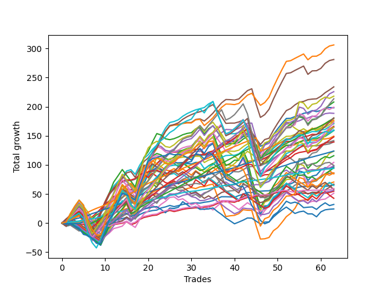

# Short Malinois 003 
- Symbol: ES_830-1130
- Date Range: 03/18/2022 - 12/30/2022
- Trading Period: 8:30-11:30
- Number of Trades: 63



| Name | Win Percent | Profit | Avg Profit / Trade | Avg Time / Trade |      | Name | Win Percent | Profit | Avg Profit / Trade | Avg Time / Trade |
| ---- | ----------- | ------ | ------------------ | ---------------- | ---- | ---- | ----------- | ------ | ------------------ | ---------------- |
| Sorted By <br> Profit | | | | | | Sorted By <br> Win Percentage ||||
| BB-50 U/L 1SD SL-10 | 80.95 | 153000.00 | 2428.57 | 22:35 |     | TP-1 | 100.00 | 47000.00 | 746.03 | 06:18 |
| BB-50 U/L 1SD | 82.54 | 140500.00 | 2230.16 | 26:48 |     | TP-3 | 98.41 | 88375.00 | 1402.78 | 13:36 |
| BB-100 Mid SL-10 | 80.95 | 117000.00 | 1857.14 | 24:43 |     | TP-2 | 98.41 | 61875.00 | 982.14 | 10:24 |
| V U/L 1SD SL-10 | 66.67 | 112875.00 | 1791.67 | 41:46 |     | TP-4 | 95.24 | 90000.00 | 1428.57 | 17:33 |
| BB-200 U/L 2SD SL-10 | 63.49 | 109000.00 | 1730.16 | 51:24 |     | TP-5 | 88.89 | 74000.00 | 1174.60 | 23:42 |
| TP-9 | 80.95 | 106750.00 | 1694.44 | 35:21 |     | TP-6 | 85.71 | 82250.00 | 1305.56 | 27:06 |
| BB-50 U/L 2SD SL-10 | 69.84 | 104000.00 | 1650.79 | 34:53 |     | TP-7 | 84.13 | 90375.00 | 1434.52 | 30:14 |
| BB-100 U/L 2SD SL-10 | 65.08 | 99500.00 | 1579.37 | 51:20 |     | BB-20 U/L 2SD C | 84.13 | 83125.00 | 1319.44 | 17:15 |
| BB-50 Mid SL-10 | 74.60 | 99000.00 | 1571.43 | 14:24 |     | BB-20 U/L 2SD | 84.13 | 79500.00 | 1261.90 | 16:13 |
| BB-50 Mid | 76.19 | 94250.00 | 1496.03 | 15:59 |     | BB-50 U/L 1SD | 82.54 | 140500.00 | 2230.16 | 26:48 |
| TP-7 | 84.13 | 90375.00 | 1434.52 | 30:14 |     | BB-20 U/L 2SD SL-10 | 82.54 | 87250.00 | 1384.92 | 14:17 |
| TP-4 | 95.24 | 90000.00 | 1428.57 | 17:33 |     | BB-20 U/L 2SD C SL-10 | 82.54 | 85500.00 | 1357.14 | 15:01 |
| TP-3 | 98.41 | 88375.00 | 1402.78 | 13:36 |     | BB-100 Mid | 82.54 | 80000.00 | 1269.84 | 29:57 |
| BB-20 U/L 2SD SL-10 | 82.54 | 87250.00 | 1384.92 | 14:17 |     | BB-50 U/L 1SD SL-10 | 80.95 | 153000.00 | 2428.57 | 22:35 |
| TP-8 | 80.95 | 86625.00 | 1375.00 | 33:33 |     | BB-100 Mid SL-10 | 80.95 | 117000.00 | 1857.14 | 24:43 |
| BB-20 U/L 2SD C SL-10 | 82.54 | 85500.00 | 1357.14 | 15:01 |     | TP-9 | 80.95 | 106750.00 | 1694.44 | 35:21 |
| BB-50 U/L 1SD SL-5 | 53.97 | 85250.00 | 1353.17 | 15:18 |     | TP-8 | 80.95 | 86625.00 | 1375.00 | 33:33 |
| BB-20 U/L 2SD C | 84.13 | 83125.00 | 1319.44 | 17:15 |     | BB-20 U/L 1SD | 77.78 | 74625.00 | 1184.52 | 07:27 |
| TP-6 | 85.71 | 82250.00 | 1305.56 | 27:06 |     | BB-20 U/L 1SD SL-10 | 77.78 | 69750.00 | 1107.14 | 07:21 |
| TP-10 | 76.19 | 82250.00 | 1305.56 | 39:56 |     | V Mid | 77.78 | 43000.00 | 682.54 | 22:30 |
| BB-100 Mid | 82.54 | 80000.00 | 1269.84 | 29:57 |     | BB-50 Mid | 76.19 | 94250.00 | 1496.03 | 15:59 |
| BB-20 U/L 2SD | 84.13 | 79500.00 | 1261.90 | 16:13 |     | TP-10 | 76.19 | 82250.00 | 1305.56 | 39:56 |
| NEWFI 000 | 71.43 | 79500.00 | 1261.90 | 45:41 |     | V Mid SL-10 | 76.19 | 69625.00 | 1105.16 | 19:03 |
| BB-20 U/L 1SD | 77.78 | 74625.00 | 1184.52 | 07:27 |     | BB-20 U/L 1SD SL-5 | 76.19 | 49125.00 | 779.76 | 05:53 |
| TP-5 | 88.89 | 74000.00 | 1174.60 | 23:42 |     | BB-50 Mid SL-10 | 74.60 | 99000.00 | 1571.43 | 14:24 |
| BB-200 Mid SL-10 | 74.60 | 70875.00 | 1125.00 | 27:15 |     | BB-200 Mid SL-10 | 74.60 | 70875.00 | 1125.00 | 27:15 |
| BB-20 U/L 1SD SL-10 | 77.78 | 69750.00 | 1107.14 | 07:21 |     | BB-200 Mid | 74.60 | 35250.00 | 559.52 | 30:55 |
| V Mid SL-10 | 76.19 | 69625.00 | 1105.16 | 19:03 |     | NEWFI 000 | 71.43 | 79500.00 | 1261.90 | 45:41 |
| TP-2 | 98.41 | 61875.00 | 982.14 | 10:24 |     | BB-20 Mid | 71.43 | 33125.00 | 525.79 | 03:12 |
| V U/L 1SD | 66.67 | 61750.00 | 980.16 | 49:02 |     | BB-20 Mid SL-10 | 71.43 | 29750.00 | 472.22 | 03:08 |
| BB-200 U/L 2SD | 63.49 | 57875.00 | 918.65 | 58:40 |     | BB-20 Mid SL-5 | 71.43 | 27375.00 | 434.52 | 02:40 |
| BB-50 U/L 2SD | 69.84 | 52125.00 | 827.38 | 42:07 |     | BB-50 U/L 2SD SL-10 | 69.84 | 104000.00 | 1650.79 | 34:53 |
| BB-50 Mid SL-5 | 61.90 | 49500.00 | 785.71 | 10:21 |     | BB-50 U/L 2SD | 69.84 | 52125.00 | 827.38 | 42:07 |
| BB-20 U/L 1SD SL-5 | 76.19 | 49125.00 | 779.76 | 05:53 |     | V U/L 1SD SL-10 | 66.67 | 112875.00 | 1791.67 | 41:46 |
| BB-100 U/L 2SD | 65.08 | 48375.00 | 767.86 | 58:36 |     | V U/L 1SD | 66.67 | 61750.00 | 980.16 | 49:02 |
| BB-100 Mid SL-5 | 50.79 | 47375.00 | 751.98 | 16:52 |     | BB-100 U/L 2SD SL-10 | 65.08 | 99500.00 | 1579.37 | 51:20 |
| TP-1 | 100.00 | 47000.00 | 746.03 | 06:18 |     | BB-100 U/L 2SD | 65.08 | 48375.00 | 767.86 | 58:36 |
| V Mid | 77.78 | 43000.00 | 682.54 | 22:30 |     | BB-200 U/L 2SD SL-10 | 63.49 | 109000.00 | 1730.16 | 51:24 |
| NEWFI 06 | 61.90 | 43000.00 | 682.54 | 59:59 |     | BB-200 U/L 2SD | 63.49 | 57875.00 | 918.65 | 58:40 |
| V U/L 1SD SL-5 | 39.68 | 42250.00 | 670.63 | 26:18 |     | BB-50 Mid SL-5 | 61.90 | 49500.00 | 785.71 | 10:21 |
| BB-200 Mid | 74.60 | 35250.00 | 559.52 | 30:55 |     | NEWFI 06 | 61.90 | 43000.00 | 682.54 | 59:59 |
| BB-20 U/L 2SD SL-5 | 60.32 | 33375.00 | 529.76 | 10:01 |     | BB-20 U/L 2SD SL-5 | 60.32 | 33375.00 | 529.76 | 10:01 |
| BB-20 Mid | 71.43 | 33125.00 | 525.79 | 03:12 |     | BB-20 U/L 2SD C SL-5 | 57.14 | 25625.00 | 406.75 | 10:30 |
| BB-50 U/L 2SD SL-5 | 38.10 | 32250.00 | 511.90 | 23:46 |     | V Mid SL-5 | 55.56 | 12125.00 | 192.46 | 12:00 |
| BB-20 Mid SL-10 | 71.43 | 29750.00 | 472.22 | 03:08 |     | BB-50 U/L 1SD SL-5 | 53.97 | 85250.00 | 1353.17 | 15:18 |
| BB-200 U/L 2SD SL-5 | 34.92 | 29125.00 | 462.30 | 32:22 |     | BB-200 Mid SL-5 | 53.97 | 28250.00 | 448.41 | 17:41 |
| BB-200 Mid SL-5 | 53.97 | 28250.00 | 448.41 | 17:41 |     | BB-100 Mid SL-5 | 50.79 | 47375.00 | 751.98 | 16:52 |
| BB-20 Mid SL-5 | 71.43 | 27375.00 | 434.52 | 02:40 |     | NEWFI 0000 | 42.86 | 16000.00 | 253.97 | 36:28 |
| BB-20 U/L 2SD C SL-5 | 57.14 | 25625.00 | 406.75 | 10:30 |     | V U/L 1SD SL-5 | 39.68 | 42250.00 | 670.63 | 26:18 |
| BB-100 U/L 2SD SL-5 | 34.92 | 21250.00 | 337.30 | 33:25 |     | BB-50 U/L 2SD SL-5 | 38.10 | 32250.00 | 511.90 | 23:46 |
| NEWFI 0000 | 42.86 | 16000.00 | 253.97 | 36:28 |     | BB-200 U/L 2SD SL-5 | 34.92 | 29125.00 | 462.30 | 32:22 |
| V Mid SL-5 | 55.56 | 12125.00 | 192.46 | 12:00 |     | BB-100 U/L 2SD SL-5 | 34.92 | 21250.00 | 337.30 | 33:25 |

## NO STOPLOSS

### Test BB-20 Mid
* Sell when price hits the middle line of the 20p bollinger
* No Stoploss
* Results:
```
Total Trades: 63
Percent Up: 28.57
Percent Down: 71.43
Total Points Moved Down: 66.25
Potential Profit: 33125.00
Total Points Ups: 21.75 Count Ups: 18
Total Points Downs: 88.00 Count Downs: 45
```

<details><summary>Trades</summary>

<code>In: 2022-03-25 11:12:00		Out: 2022-03-25 11:18:15		Total Position Time: 06:15		Total Move Down: -0.25		Total to Date: -0.25</code> <br />
<code>In: 2022-03-29 08:37:00		Out: 2022-03-29 08:41:05		Total Position Time: 04:05		Total Move Down: 2.25		Total to Date: 2.00</code> <br />
<code>In: 2022-03-29 08:41:00		Out: 2022-03-29 08:42:10		Total Position Time: 01:10		Total Move Down: 0.50		Total to Date: 2.50</code> <br />
<code>In: 2022-03-29 08:42:00		Out: 2022-03-29 08:56:20		Total Position Time: 14:20		Total Move Down: -2.50		Total to Date: 0.00</code> <br />
<code>In: 2022-04-07 10:35:00		Out: 2022-04-07 10:37:30		Total Position Time: 02:30		Total Move Down: 0.25		Total to Date: 0.25</code> <br />
<code>In: 2022-04-07 11:07:00		Out: 2022-04-07 11:15:20		Total Position Time: 08:20		Total Move Down: -1.00		Total to Date: -0.75</code> <br />
<code>In: 2022-04-25 09:31:00		Out: 2022-04-25 09:40:45		Total Position Time: 09:45		Total Move Down: -4.00		Total to Date: -4.75</code> <br />
<code>In: 2022-04-25 10:19:00		Out: 2022-04-25 10:26:50		Total Position Time: 07:50		Total Move Down: 2.75		Total to Date: -2.00</code> <br />
<code>In: 2022-05-10 11:07:00		Out: 2022-05-10 11:08:10		Total Position Time: 01:10		Total Move Down: 1.50		Total to Date: -0.50</code> <br />
<code>In: 2022-05-24 09:21:00		Out: 2022-05-24 09:22:10		Total Position Time: 01:10		Total Move Down: 3.00		Total to Date: 2.50</code> <br />
<code>In: 2022-05-24 09:22:00		Out: 2022-05-24 09:23:10		Total Position Time: 01:10		Total Move Down: -1.00		Total to Date: 1.50</code> <br />
<code>In: 2022-06-03 10:14:00		Out: 2022-06-03 10:15:10		Total Position Time: 01:10		Total Move Down: 3.75		Total to Date: 5.25</code> <br />
<code>In: 2022-06-09 10:10:00		Out: 2022-06-09 10:16:50		Total Position Time: 06:50		Total Move Down: 1.00		Total to Date: 6.25</code> <br />
<code>In: 2022-06-09 10:15:00		Out: 2022-06-09 10:16:50		Total Position Time: 01:50		Total Move Down: 1.25		Total to Date: 7.50</code> <br />
<code>In: 2022-06-10 10:55:00		Out: 2022-06-10 10:56:10		Total Position Time: 01:10		Total Move Down: 2.50		Total to Date: 10.00</code> <br />
<code>In: 2022-06-10 11:29:00		Out: 2022-06-10 11:35:40		Total Position Time: 06:40		Total Move Down: -4.25		Total to Date: 5.75</code> <br />
<code>In: 2022-06-13 08:47:00		Out: 2022-06-13 08:48:10		Total Position Time: 01:10		Total Move Down: 2.50		Total to Date: 8.25</code> <br />
<code>In: 2022-06-14 10:26:00		Out: 2022-06-14 10:27:10		Total Position Time: 01:10		Total Move Down: 6.25		Total to Date: 14.50</code> <br />
<code>In: 2022-06-14 10:27:00		Out: 2022-06-14 10:28:10		Total Position Time: 01:10		Total Move Down: 3.50		Total to Date: 18.00</code> <br />
<code>In: 2022-06-16 10:14:00		Out: 2022-06-16 10:15:15		Total Position Time: 01:15		Total Move Down: 1.75		Total to Date: 19.75</code> <br />
<code>In: 2022-06-17 08:35:00		Out: 2022-06-17 08:36:10		Total Position Time: 01:10		Total Move Down: 1.75		Total to Date: 21.50</code> <br />
<code>In: 2022-06-17 08:36:00		Out: 2022-06-17 08:37:10		Total Position Time: 01:10		Total Move Down: 0.75		Total to Date: 22.25</code> <br />
<code>In: 2022-06-17 10:19:00		Out: 2022-06-17 10:22:55		Total Position Time: 03:55		Total Move Down: 3.75		Total to Date: 26.00</code> <br />
<code>In: 2022-06-17 10:21:00		Out: 2022-06-17 10:22:55		Total Position Time: 01:55		Total Move Down: 1.75		Total to Date: 27.75</code> <br />
<code>In: 2022-07-12 08:36:00		Out: 2022-07-12 08:37:10		Total Position Time: 01:10		Total Move Down: 2.50		Total to Date: 30.25</code> <br />
<code>In: 2022-07-18 08:50:00		Out: 2022-07-18 09:01:05		Total Position Time: 11:05		Total Move Down: -2.00		Total to Date: 28.25</code> <br />
<code>In: 2022-08-04 09:03:00		Out: 2022-08-04 09:04:10		Total Position Time: 01:10		Total Move Down: 1.75		Total to Date: 30.00</code> <br />
<code>In: 2022-08-05 10:19:00		Out: 2022-08-05 10:20:10		Total Position Time: 01:10		Total Move Down: 2.00		Total to Date: 32.00</code> <br />
<code>In: 2022-08-05 10:20:00		Out: 2022-08-05 10:21:10		Total Position Time: 01:10		Total Move Down: 1.25		Total to Date: 33.25</code> <br />
<code>In: 2022-08-05 10:21:00		Out: 2022-08-05 10:22:10		Total Position Time: 01:10		Total Move Down: 0.75		Total to Date: 34.00</code> <br />
<code>In: 2022-08-09 08:31:00		Out: 2022-08-09 08:32:35		Total Position Time: 01:35		Total Move Down: 0.75		Total to Date: 34.75</code> <br />
<code>In: 2022-08-19 09:50:00		Out: 2022-08-19 09:52:15		Total Position Time: 02:15		Total Move Down: -0.50		Total to Date: 34.25</code> <br />
<code>In: 2022-08-29 08:41:00		Out: 2022-08-29 08:42:25		Total Position Time: 01:25		Total Move Down: 1.50		Total to Date: 35.75</code> <br />
<code>In: 2022-08-31 09:02:00		Out: 2022-08-31 09:04:15		Total Position Time: 02:15		Total Move Down: 1.00		Total to Date: 36.75</code> <br />
<code>In: 2022-09-01 08:41:00		Out: 2022-09-01 08:42:10		Total Position Time: 01:10		Total Move Down: 1.75		Total to Date: 38.50</code> <br />
<code>In: 2022-09-01 10:35:00		Out: 2022-09-01 10:36:40		Total Position Time: 01:40		Total Move Down: 3.50		Total to Date: 42.00</code> <br />
<code>In: 2022-09-01 10:36:00		Out: 2022-09-01 10:37:15		Total Position Time: 01:15		Total Move Down: 3.25		Total to Date: 45.25</code> <br />
<code>In: 2022-09-01 10:37:00		Out: 2022-09-01 10:38:10		Total Position Time: 01:10		Total Move Down: -0.00		Total to Date: 45.25</code> <br />
<code>In: 2022-09-12 10:21:00		Out: 2022-09-12 10:24:45		Total Position Time: 03:45		Total Move Down: -0.25		Total to Date: 45.00</code> <br />
<code>In: 2022-09-12 10:22:00		Out: 2022-09-12 10:24:45		Total Position Time: 02:45		Total Move Down: -0.75		Total to Date: 44.25</code> <br />
<code>In: 2022-09-22 09:30:00		Out: 2022-09-22 09:31:10		Total Position Time: 01:10		Total Move Down: 3.00		Total to Date: 47.25</code> <br />
<code>In: 2022-09-22 11:00:00		Out: 2022-09-22 11:01:30		Total Position Time: 01:30		Total Move Down: 2.50		Total to Date: 49.75</code> <br />
<code>In: 2022-10-05 08:45:00		Out: 2022-10-05 08:48:40		Total Position Time: 03:40		Total Move Down: 2.75		Total to Date: 52.50</code> <br />
<code>In: 2022-10-05 08:49:00		Out: 2022-10-05 08:50:10		Total Position Time: 01:10		Total Move Down: -0.25		Total to Date: 52.25</code> <br />
<code>In: 2022-10-05 09:23:00		Out: 2022-10-05 09:26:50		Total Position Time: 03:50		Total Move Down: 3.00		Total to Date: 55.25</code> <br />
<code>In: 2022-10-05 09:27:00		Out: 2022-10-05 09:28:10		Total Position Time: 01:10		Total Move Down: -0.50		Total to Date: 54.75</code> <br />
<code>In: 2022-10-06 08:32:00		Out: 2022-10-06 08:33:10		Total Position Time: 01:10		Total Move Down: 0.50		Total to Date: 55.25</code> <br />
<code>In: 2022-10-06 09:52:00		Out: 2022-10-06 09:55:05		Total Position Time: 03:05		Total Move Down: 0.25		Total to Date: 55.50</code> <br />
<code>In: 2022-10-10 10:59:00		Out: 2022-10-10 11:04:05		Total Position Time: 05:05		Total Move Down: 3.75		Total to Date: 59.25</code> <br />
<code>In: 2022-10-10 11:00:00		Out: 2022-10-10 11:04:05		Total Position Time: 04:05		Total Move Down: 2.00		Total to Date: 61.25</code> <br />
<code>In: 2022-10-10 11:01:00		Out: 2022-10-10 11:04:05		Total Position Time: 03:05		Total Move Down: 1.25		Total to Date: 62.50</code> <br />
<code>In: 2022-10-10 11:02:00		Out: 2022-10-10 11:04:05		Total Position Time: 02:05		Total Move Down: 0.50		Total to Date: 63.00</code> <br />
<code>In: 2022-10-17 08:47:00		Out: 2022-10-17 08:59:05		Total Position Time: 12:05		Total Move Down: -2.25		Total to Date: 60.75</code> <br />
<code>In: 2022-10-17 08:59:00		Out: 2022-10-17 09:03:00		Total Position Time: 04:00		Total Move Down: -1.00		Total to Date: 59.75</code> <br />
<code>In: 2022-10-18 10:44:00		Out: 2022-10-18 10:46:40		Total Position Time: 02:40		Total Move Down: 2.00		Total to Date: 61.75</code> <br />
<code>In: 2022-11-07 09:37:00		Out: 2022-11-07 09:38:10		Total Position Time: 01:10		Total Move Down: 1.25		Total to Date: 63.00</code> <br />
<code>In: 2022-11-11 09:22:00		Out: 2022-11-11 09:29:30		Total Position Time: 07:30		Total Move Down: -0.75		Total to Date: 62.25</code> <br />
<code>In: 2022-11-15 08:39:00		Out: 2022-11-15 08:44:10		Total Position Time: 05:10		Total Move Down: 1.00		Total to Date: 63.25</code> <br />
<code>In: 2022-11-21 10:24:00		Out: 2022-11-21 10:27:25		Total Position Time: 03:25		Total Move Down: -0.00		Total to Date: 63.25</code> <br />
<code>In: 2022-11-21 10:48:00		Out: 2022-11-21 10:49:10		Total Position Time: 01:10		Total Move Down: 0.25		Total to Date: 63.50</code> <br />
<code>In: 2022-11-29 11:14:00		Out: 2022-11-29 11:17:35		Total Position Time: 03:35		Total Move Down: -0.50		Total to Date: 63.00</code> <br />
<code>In: 2022-12-01 08:48:00		Out: 2022-12-01 08:49:10		Total Position Time: 01:10		Total Move Down: 1.00		Total to Date: 64.00</code> <br />
<code>In: 2022-12-01 09:37:00		Out: 2022-12-01 09:41:40		Total Position Time: 04:40		Total Move Down: 2.25		Total to Date: 66.25</code> <br />


</details>

### Test BB-20 U/L 1SD
* Sell when the price hits the lower line of the 20p 1std bollinger
* No Stoploss
* Results:
```
Total Trades: 63
Percent Up: 22.22
Percent Down: 77.78
Total Points Moved Down: 149.25
Potential Profit: 74625.00
Total Points Ups: 13.25 Count Ups: 14
Total Points Downs: 162.50 Count Downs: 49
```

<details><summary>Trades</summary>

<code>In: 2022-03-25 11:12:00		Out: 2022-03-25 11:19:45		Total Position Time: 07:45		Total Move Down: 0.75		Total to Date: 0.75</code> <br />
<code>In: 2022-03-29 08:37:00		Out: 2022-03-29 08:58:40		Total Position Time: 21:40		Total Move Down: 1.00		Total to Date: 1.75</code> <br />
<code>In: 2022-03-29 08:41:00		Out: 2022-03-29 08:58:40		Total Position Time: 17:40		Total Move Down: -0.75		Total to Date: 1.00</code> <br />
<code>In: 2022-03-29 08:42:00		Out: 2022-03-29 08:58:40		Total Position Time: 16:40		Total Move Down: -1.00		Total to Date: 0.00</code> <br />
<code>In: 2022-04-07 10:35:00		Out: 2022-04-07 10:40:00		Total Position Time: 05:00		Total Move Down: 2.00		Total to Date: 2.00</code> <br />
<code>In: 2022-04-07 11:07:00		Out: 2022-04-07 11:18:00		Total Position Time: 11:00		Total Move Down: -0.25		Total to Date: 1.75</code> <br />
<code>In: 2022-04-25 09:31:00		Out: 2022-04-25 09:42:45		Total Position Time: 11:45		Total Move Down: -1.00		Total to Date: 0.75</code> <br />
<code>In: 2022-04-25 10:19:00		Out: 2022-04-25 10:27:55		Total Position Time: 08:55		Total Move Down: 6.25		Total to Date: 7.00</code> <br />
<code>In: 2022-05-10 11:07:00		Out: 2022-05-10 11:08:10		Total Position Time: 01:10		Total Move Down: 1.50		Total to Date: 8.50</code> <br />
<code>In: 2022-05-24 09:21:00		Out: 2022-05-24 09:29:20		Total Position Time: 08:20		Total Move Down: 3.75		Total to Date: 12.25</code> <br />
<code>In: 2022-05-24 09:22:00		Out: 2022-05-24 09:29:20		Total Position Time: 07:20		Total Move Down: 1.50		Total to Date: 13.75</code> <br />
<code>In: 2022-06-03 10:14:00		Out: 2022-06-03 10:15:10		Total Position Time: 01:10		Total Move Down: 3.75		Total to Date: 17.50</code> <br />
<code>In: 2022-06-09 10:10:00		Out: 2022-06-09 10:18:50		Total Position Time: 08:50		Total Move Down: 2.00		Total to Date: 19.50</code> <br />
<code>In: 2022-06-09 10:15:00		Out: 2022-06-09 10:18:50		Total Position Time: 03:50		Total Move Down: 2.25		Total to Date: 21.75</code> <br />
<code>In: 2022-06-10 10:55:00		Out: 2022-06-10 10:56:15		Total Position Time: 01:15		Total Move Down: 3.25		Total to Date: 25.00</code> <br />
<code>In: 2022-06-10 11:29:00		Out: 2022-06-10 11:38:10		Total Position Time: 09:10		Total Move Down: -2.50		Total to Date: 22.50</code> <br />
<code>In: 2022-06-13 08:47:00		Out: 2022-06-13 08:52:05		Total Position Time: 05:05		Total Move Down: 7.75		Total to Date: 30.25</code> <br />
<code>In: 2022-06-14 10:26:00		Out: 2022-06-14 10:29:05		Total Position Time: 03:05		Total Move Down: 8.25		Total to Date: 38.50</code> <br />
<code>In: 2022-06-14 10:27:00		Out: 2022-06-14 10:29:05		Total Position Time: 02:05		Total Move Down: 4.75		Total to Date: 43.25</code> <br />
<code>In: 2022-06-16 10:14:00		Out: 2022-06-16 10:19:25		Total Position Time: 05:25		Total Move Down: 3.25		Total to Date: 46.50</code> <br />
<code>In: 2022-06-17 08:35:00		Out: 2022-06-17 08:39:05		Total Position Time: 04:05		Total Move Down: 6.25		Total to Date: 52.75</code> <br />
<code>In: 2022-06-17 08:36:00		Out: 2022-06-17 08:39:05		Total Position Time: 03:05		Total Move Down: 4.00		Total to Date: 56.75</code> <br />
<code>In: 2022-06-17 10:19:00		Out: 2022-06-17 10:26:20		Total Position Time: 07:20		Total Move Down: 4.75		Total to Date: 61.50</code> <br />
<code>In: 2022-06-17 10:21:00		Out: 2022-06-17 10:26:20		Total Position Time: 05:20		Total Move Down: 2.75		Total to Date: 64.25</code> <br />
<code>In: 2022-07-12 08:36:00		Out: 2022-07-12 08:38:10		Total Position Time: 02:10		Total Move Down: 5.75		Total to Date: 70.00</code> <br />
<code>In: 2022-07-18 08:50:00		Out: 2022-07-18 09:05:10		Total Position Time: 15:10		Total Move Down: -0.75		Total to Date: 69.25</code> <br />
<code>In: 2022-08-04 09:03:00		Out: 2022-08-04 09:16:05		Total Position Time: 13:05		Total Move Down: 1.00		Total to Date: 70.25</code> <br />
<code>In: 2022-08-05 10:19:00		Out: 2022-08-05 10:23:15		Total Position Time: 04:15		Total Move Down: 3.25		Total to Date: 73.50</code> <br />
<code>In: 2022-08-05 10:20:00		Out: 2022-08-05 10:23:15		Total Position Time: 03:15		Total Move Down: 1.75		Total to Date: 75.25</code> <br />
<code>In: 2022-08-05 10:21:00		Out: 2022-08-05 10:23:15		Total Position Time: 02:15		Total Move Down: 0.75		Total to Date: 76.00</code> <br />
<code>In: 2022-08-09 08:31:00		Out: 2022-08-09 08:34:05		Total Position Time: 03:05		Total Move Down: 2.00		Total to Date: 78.00</code> <br />
<code>In: 2022-08-19 09:50:00		Out: 2022-08-19 10:01:10		Total Position Time: 11:10		Total Move Down: -1.25		Total to Date: 76.75</code> <br />
<code>In: 2022-08-29 08:41:00		Out: 2022-08-29 08:43:30		Total Position Time: 02:30		Total Move Down: 5.25		Total to Date: 82.00</code> <br />
<code>In: 2022-08-31 09:02:00		Out: 2022-08-31 09:06:20		Total Position Time: 04:20		Total Move Down: 2.25		Total to Date: 84.25</code> <br />
<code>In: 2022-09-01 08:41:00		Out: 2022-09-01 08:44:15		Total Position Time: 03:15		Total Move Down: 4.75		Total to Date: 89.00</code> <br />
<code>In: 2022-09-01 10:35:00		Out: 2022-09-01 10:41:50		Total Position Time: 06:50		Total Move Down: 5.25		Total to Date: 94.25</code> <br />
<code>In: 2022-09-01 10:36:00		Out: 2022-09-01 10:41:50		Total Position Time: 05:50		Total Move Down: 4.50		Total to Date: 98.75</code> <br />
<code>In: 2022-09-01 10:37:00		Out: 2022-09-01 10:41:50		Total Position Time: 04:50		Total Move Down: 1.75		Total to Date: 100.50</code> <br />
<code>In: 2022-09-12 10:21:00		Out: 2022-09-12 10:41:30		Total Position Time: 20:30		Total Move Down: -1.00		Total to Date: 99.50</code> <br />
<code>In: 2022-09-12 10:22:00		Out: 2022-09-12 10:41:30		Total Position Time: 19:30		Total Move Down: -1.50		Total to Date: 98.00</code> <br />
<code>In: 2022-09-22 09:30:00		Out: 2022-09-22 09:59:15		Total Position Time: 29:15		Total Move Down: -0.25		Total to Date: 97.75</code> <br />
<code>In: 2022-09-22 11:00:00		Out: 2022-09-22 11:03:35		Total Position Time: 03:35		Total Move Down: 3.50		Total to Date: 101.25</code> <br />
<code>In: 2022-10-05 08:45:00		Out: 2022-10-05 08:51:05		Total Position Time: 06:05		Total Move Down: 4.75		Total to Date: 106.00</code> <br />
<code>In: 2022-10-05 08:49:00		Out: 2022-10-05 08:51:05		Total Position Time: 02:05		Total Move Down: 1.00		Total to Date: 107.00</code> <br />
<code>In: 2022-10-05 09:23:00		Out: 2022-10-05 09:33:20		Total Position Time: 10:20		Total Move Down: 2.00		Total to Date: 109.00</code> <br />
<code>In: 2022-10-05 09:27:00		Out: 2022-10-05 09:33:20		Total Position Time: 06:20		Total Move Down: -0.75		Total to Date: 108.25</code> <br />
<code>In: 2022-10-06 08:32:00		Out: 2022-10-06 08:37:35		Total Position Time: 05:35		Total Move Down: 3.25		Total to Date: 111.50</code> <br />
<code>In: 2022-10-06 09:52:00		Out: 2022-10-06 09:57:05		Total Position Time: 05:05		Total Move Down: 2.75		Total to Date: 114.25</code> <br />
<code>In: 2022-10-10 10:59:00		Out: 2022-10-10 11:06:05		Total Position Time: 07:05		Total Move Down: 6.75		Total to Date: 121.00</code> <br />
<code>In: 2022-10-10 11:00:00		Out: 2022-10-10 11:06:05		Total Position Time: 06:05		Total Move Down: 5.00		Total to Date: 126.00</code> <br />
<code>In: 2022-10-10 11:01:00		Out: 2022-10-10 11:06:05		Total Position Time: 05:05		Total Move Down: 4.25		Total to Date: 130.25</code> <br />
<code>In: 2022-10-10 11:02:00		Out: 2022-10-10 11:06:05		Total Position Time: 04:05		Total Move Down: 3.50		Total to Date: 133.75</code> <br />
<code>In: 2022-10-17 08:47:00		Out: 2022-10-17 09:04:15		Total Position Time: 17:15		Total Move Down: -1.00		Total to Date: 132.75</code> <br />
<code>In: 2022-10-17 08:59:00		Out: 2022-10-17 09:04:15		Total Position Time: 05:15		Total Move Down: 1.75		Total to Date: 134.50</code> <br />
<code>In: 2022-10-18 10:44:00		Out: 2022-10-18 10:47:10		Total Position Time: 03:10		Total Move Down: 5.00		Total to Date: 139.50</code> <br />
<code>In: 2022-11-07 09:37:00		Out: 2022-11-07 09:39:30		Total Position Time: 02:30		Total Move Down: 2.50		Total to Date: 142.00</code> <br />
<code>In: 2022-11-11 09:22:00		Out: 2022-11-11 09:33:25		Total Position Time: 11:25		Total Move Down: -0.75		Total to Date: 141.25</code> <br />
<code>In: 2022-11-15 08:39:00		Out: 2022-11-15 08:50:50		Total Position Time: 11:50		Total Move Down: 1.50		Total to Date: 142.75</code> <br />
<code>In: 2022-11-21 10:24:00		Out: 2022-11-21 10:33:00		Total Position Time: 09:00		Total Move Down: -0.50		Total to Date: 142.25</code> <br />
<code>In: 2022-11-21 10:48:00		Out: 2022-11-21 10:54:00		Total Position Time: 06:00		Total Move Down: 1.75		Total to Date: 144.00</code> <br />
<code>In: 2022-11-29 11:14:00		Out: 2022-11-29 11:20:15		Total Position Time: 06:15		Total Move Down: 0.50		Total to Date: 144.50</code> <br />
<code>In: 2022-12-01 08:48:00		Out: 2022-12-01 08:49:35		Total Position Time: 01:35		Total Move Down: 1.25		Total to Date: 145.75</code> <br />
<code>In: 2022-12-01 09:37:00		Out: 2022-12-01 09:42:30		Total Position Time: 05:30		Total Move Down: 3.50		Total to Date: 149.25</code> <br />


</details>

### Test BB-20 U/L 2SD
* Sell when the price hits the lower line of the 20p 2std bollinger
* No Stoploss
* Results:
```
Total Trades: 63
Percent Up: 15.87
Percent Down: 84.13
Total Points Moved Down: 159.00
Potential Profit: 79500.00
Total Points Ups: 61.75 Count Ups: 10
Total Points Downs: 220.75 Count Downs: 53
```

<details><summary>Trades</summary>

<code>In: 2022-03-25 11:12:00		Out: 2022-03-25 12:00:55		Total Position Time: 48:55		Total Move Down: -1.25		Total to Date: -1.25</code> <br />
<code>In: 2022-03-29 08:37:00		Out: 2022-03-29 09:01:40		Total Position Time: 24:40		Total Move Down: 2.50		Total to Date: 1.25</code> <br />
<code>In: 2022-03-29 08:41:00		Out: 2022-03-29 09:01:40		Total Position Time: 20:40		Total Move Down: 0.75		Total to Date: 2.00</code> <br />
<code>In: 2022-03-29 08:42:00		Out: 2022-03-29 09:01:40		Total Position Time: 19:40		Total Move Down: 0.50		Total to Date: 2.50</code> <br />
<code>In: 2022-04-07 10:35:00		Out: 2022-04-07 10:45:15		Total Position Time: 10:15		Total Move Down: 2.75		Total to Date: 5.25</code> <br />
<code>In: 2022-04-07 11:07:00		Out: 2022-04-07 11:18:20		Total Position Time: 11:20		Total Move Down: 1.00		Total to Date: 6.25</code> <br />
<code>In: 2022-04-25 09:31:00		Out: 2022-04-25 10:01:15		Total Position Time: 30:15		Total Move Down: 1.00		Total to Date: 7.25</code> <br />
<code>In: 2022-04-25 10:19:00		Out: 2022-04-25 10:33:35		Total Position Time: 14:35		Total Move Down: 6.50		Total to Date: 13.75</code> <br />
<code>In: 2022-05-10 11:07:00		Out: 2022-05-10 11:11:10		Total Position Time: 04:10		Total Move Down: 4.25		Total to Date: 18.00</code> <br />
<code>In: 2022-05-24 09:21:00		Out: 2022-05-24 09:31:20		Total Position Time: 10:20		Total Move Down: 8.00		Total to Date: 26.00</code> <br />
<code>In: 2022-05-24 09:22:00		Out: 2022-05-24 09:31:20		Total Position Time: 09:20		Total Move Down: 5.75		Total to Date: 31.75</code> <br />
<code>In: 2022-06-03 10:14:00		Out: 2022-06-03 10:17:55		Total Position Time: 03:55		Total Move Down: 7.50		Total to Date: 39.25</code> <br />
<code>In: 2022-06-09 10:10:00		Out: 2022-06-09 10:19:05		Total Position Time: 09:05		Total Move Down: 2.00		Total to Date: 41.25</code> <br />
<code>In: 2022-06-09 10:15:00		Out: 2022-06-09 10:19:05		Total Position Time: 04:05		Total Move Down: 2.25		Total to Date: 43.50</code> <br />
<code>In: 2022-06-10 10:55:00		Out: 2022-06-10 11:01:00		Total Position Time: 06:00		Total Move Down: 6.75		Total to Date: 50.25</code> <br />
<code>In: 2022-06-10 11:29:00		Out: 2022-06-10 11:40:10		Total Position Time: 11:10		Total Move Down: -0.25		Total to Date: 50.00</code> <br />
<code>In: 2022-06-13 08:47:00		Out: 2022-06-13 08:55:10		Total Position Time: 08:10		Total Move Down: 8.25		Total to Date: 58.25</code> <br />
<code>In: 2022-06-14 10:26:00		Out: 2022-06-14 10:31:00		Total Position Time: 05:00		Total Move Down: 12.25		Total to Date: 70.50</code> <br />
<code>In: 2022-06-14 10:27:00		Out: 2022-06-14 10:31:00		Total Position Time: 04:00		Total Move Down: 8.75		Total to Date: 79.25</code> <br />
<code>In: 2022-06-16 10:14:00		Out: 2022-06-16 10:20:20		Total Position Time: 06:20		Total Move Down: 4.50		Total to Date: 83.75</code> <br />
<code>In: 2022-06-17 08:35:00		Out: 2022-06-17 08:45:15		Total Position Time: 10:15		Total Move Down: 10.25		Total to Date: 94.00</code> <br />
<code>In: 2022-06-17 08:36:00		Out: 2022-06-17 08:45:15		Total Position Time: 09:15		Total Move Down: 8.00		Total to Date: 102.00</code> <br />
<code>In: 2022-06-17 10:19:00		Out: 2022-06-17 10:27:15		Total Position Time: 08:15		Total Move Down: 7.75		Total to Date: 109.75</code> <br />
<code>In: 2022-06-17 10:21:00		Out: 2022-06-17 10:27:15		Total Position Time: 06:15		Total Move Down: 5.75		Total to Date: 115.50</code> <br />
<code>In: 2022-07-12 08:36:00		Out: 2022-07-12 08:41:10		Total Position Time: 05:10		Total Move Down: 6.75		Total to Date: 122.25</code> <br />
<code>In: 2022-07-18 08:50:00		Out: 2022-07-18 09:08:15		Total Position Time: 18:15		Total Move Down: 1.00		Total to Date: 123.25</code> <br />
<code>In: 2022-08-04 09:03:00		Out: 2022-08-04 09:38:50		Total Position Time: 35:50		Total Move Down: 0.25		Total to Date: 123.50</code> <br />
<code>In: 2022-08-05 10:19:00		Out: 2022-08-05 10:49:30		Total Position Time: 30:30		Total Move Down: 1.50		Total to Date: 125.00</code> <br />
<code>In: 2022-08-05 10:20:00		Out: 2022-08-05 10:49:30		Total Position Time: 29:30		Total Move Down: -0.00		Total to Date: 125.00</code> <br />
<code>In: 2022-08-05 10:21:00		Out: 2022-08-05 10:49:30		Total Position Time: 28:30		Total Move Down: -1.00		Total to Date: 124.00</code> <br />
<code>In: 2022-08-09 08:31:00		Out: 2022-08-09 08:36:20		Total Position Time: 05:20		Total Move Down: 2.50		Total to Date: 126.50</code> <br />
<code>In: 2022-08-19 09:50:00		Out: 2022-08-19 10:13:40		Total Position Time: 23:40		Total Move Down: -0.00		Total to Date: 126.50</code> <br />
<code>In: 2022-08-29 08:41:00		Out: 2022-08-29 09:24:35		Total Position Time: 43:35		Total Move Down: -9.50		Total to Date: 117.00</code> <br />
<code>In: 2022-08-31 09:02:00		Out: 2022-08-31 09:07:00		Total Position Time: 05:00		Total Move Down: 4.25		Total to Date: 121.25</code> <br />
<code>In: 2022-09-01 08:41:00		Out: 2022-09-01 09:36:10		Total Position Time: 55:10		Total Move Down: 2.00		Total to Date: 123.25</code> <br />
<code>In: 2022-09-01 10:35:00		Out: 2022-09-01 10:45:10		Total Position Time: 10:10		Total Move Down: 5.75		Total to Date: 129.00</code> <br />
<code>In: 2022-09-01 10:36:00		Out: 2022-09-01 10:45:10		Total Position Time: 09:10		Total Move Down: 5.00		Total to Date: 134.00</code> <br />
<code>In: 2022-09-01 10:37:00		Out: 2022-09-01 10:45:10		Total Position Time: 08:10		Total Move Down: 2.25		Total to Date: 136.25</code> <br />
<code>In: 2022-09-12 10:21:00		Out: 2022-09-12 10:43:35		Total Position Time: 22:35		Total Move Down: 0.25		Total to Date: 136.50</code> <br />
<code>In: 2022-09-12 10:22:00		Out: 2022-09-12 10:43:35		Total Position Time: 21:35		Total Move Down: -0.25		Total to Date: 136.25</code> <br />
<code>In: 2022-09-22 09:30:00		Out: 2022-09-22 10:03:25		Total Position Time: 33:25		Total Move Down: 2.00		Total to Date: 138.25</code> <br />
<code>In: 2022-09-22 11:00:00		Out: 2022-09-22 11:07:55		Total Position Time: 07:55		Total Move Down: 6.00		Total to Date: 144.25</code> <br />
<code>In: 2022-10-05 08:45:00		Out: 2022-10-05 09:02:25		Total Position Time: 17:25		Total Move Down: 4.75		Total to Date: 149.00</code> <br />
<code>In: 2022-10-05 08:49:00		Out: 2022-10-05 09:02:25		Total Position Time: 13:25		Total Move Down: 1.00		Total to Date: 150.00</code> <br />
<code>In: 2022-10-05 09:23:00		Out: 2022-10-05 10:23:55		Total Position Time: 60:55		Total Move Down: -26.25		Total to Date: 123.75</code> <br />
<code>In: 2022-10-05 09:27:00		Out: 2022-10-05 10:27:55		Total Position Time: 60:55		Total Move Down: -23.00		Total to Date: 100.75</code> <br />
<code>In: 2022-10-06 08:32:00		Out: 2022-10-06 08:39:05		Total Position Time: 07:05		Total Move Down: 2.50		Total to Date: 103.25</code> <br />
<code>In: 2022-10-06 09:52:00		Out: 2022-10-06 10:02:00		Total Position Time: 10:00		Total Move Down: 3.75		Total to Date: 107.00</code> <br />
<code>In: 2022-10-10 10:59:00		Out: 2022-10-10 11:07:05		Total Position Time: 08:05		Total Move Down: 8.50		Total to Date: 115.50</code> <br />
<code>In: 2022-10-10 11:00:00		Out: 2022-10-10 11:07:05		Total Position Time: 07:05		Total Move Down: 6.75		Total to Date: 122.25</code> <br />
<code>In: 2022-10-10 11:01:00		Out: 2022-10-10 11:07:05		Total Position Time: 06:05		Total Move Down: 6.00		Total to Date: 128.25</code> <br />
<code>In: 2022-10-10 11:02:00		Out: 2022-10-10 11:07:05		Total Position Time: 05:05		Total Move Down: 5.25		Total to Date: 133.50</code> <br />
<code>In: 2022-10-17 08:47:00		Out: 2022-10-17 09:12:25		Total Position Time: 25:25		Total Move Down: 0.25		Total to Date: 133.75</code> <br />
<code>In: 2022-10-17 08:59:00		Out: 2022-10-17 09:12:25		Total Position Time: 13:25		Total Move Down: 3.00		Total to Date: 136.75</code> <br />
<code>In: 2022-10-18 10:44:00		Out: 2022-10-18 11:04:45		Total Position Time: 20:45		Total Move Down: 2.25		Total to Date: 139.00</code> <br />
<code>In: 2022-11-07 09:37:00		Out: 2022-11-07 09:42:05		Total Position Time: 05:05		Total Move Down: 2.75		Total to Date: 141.75</code> <br />
<code>In: 2022-11-11 09:22:00		Out: 2022-11-11 09:33:30		Total Position Time: 11:30		Total Move Down: 0.50		Total to Date: 142.25</code> <br />
<code>In: 2022-11-15 08:39:00		Out: 2022-11-15 09:01:30		Total Position Time: 22:30		Total Move Down: 3.00		Total to Date: 145.25</code> <br />
<code>In: 2022-11-21 10:24:00		Out: 2022-11-21 10:33:10		Total Position Time: 09:10		Total Move Down: -0.25		Total to Date: 145.00</code> <br />
<code>In: 2022-11-21 10:48:00		Out: 2022-11-21 10:56:50		Total Position Time: 08:50		Total Move Down: 3.00		Total to Date: 148.00</code> <br />
<code>In: 2022-11-29 11:14:00		Out: 2022-11-29 11:22:05		Total Position Time: 08:05		Total Move Down: 1.00		Total to Date: 149.00</code> <br />
<code>In: 2022-12-01 08:48:00		Out: 2022-12-01 08:50:25		Total Position Time: 02:25		Total Move Down: 4.75		Total to Date: 153.75</code> <br />
<code>In: 2022-12-01 09:37:00		Out: 2022-12-01 09:46:55		Total Position Time: 09:55		Total Move Down: 5.25		Total to Date: 159.00</code> <br />


</details>

### Test BB-20 U/L 2SD C
* Sell when the price hits the lower line of the 20p 2std bollinger
* No Stoploss
* Results:
```
Total Trades: 63
Percent Up: 15.87
Percent Down: 84.13
Total Points Moved Down: 166.25
Potential Profit: 83125.00
Total Points Ups: 62.25 Count Ups: 10
Total Points Downs: 228.50 Count Downs: 53
```

<details><summary>Trades</summary>

<code>In: 2022-03-25 11:12:00		Out: 2022-03-25 12:01:15		Total Position Time: 49:15		Total Move Down: -0.75		Total to Date: -0.75</code> <br />
<code>In: 2022-03-29 08:37:00		Out: 2022-03-29 09:01:40		Total Position Time: 24:40		Total Move Down: 2.50		Total to Date: 1.75</code> <br />
<code>In: 2022-03-29 08:41:00		Out: 2022-03-29 09:01:40		Total Position Time: 20:40		Total Move Down: 0.75		Total to Date: 2.50</code> <br />
<code>In: 2022-03-29 08:42:00		Out: 2022-03-29 09:01:40		Total Position Time: 19:40		Total Move Down: 0.50		Total to Date: 3.00</code> <br />
<code>In: 2022-04-07 10:35:00		Out: 2022-04-07 10:48:00		Total Position Time: 13:00		Total Move Down: 3.00		Total to Date: 6.00</code> <br />
<code>In: 2022-04-07 11:07:00		Out: 2022-04-07 11:18:20		Total Position Time: 11:20		Total Move Down: 1.00		Total to Date: 7.00</code> <br />
<code>In: 2022-04-25 09:31:00		Out: 2022-04-25 10:01:20		Total Position Time: 30:20		Total Move Down: 3.50		Total to Date: 10.50</code> <br />
<code>In: 2022-04-25 10:19:00		Out: 2022-04-25 10:33:35		Total Position Time: 14:35		Total Move Down: 6.50		Total to Date: 17.00</code> <br />
<code>In: 2022-05-10 11:07:00		Out: 2022-05-10 11:16:05		Total Position Time: 09:05		Total Move Down: 7.50		Total to Date: 24.50</code> <br />
<code>In: 2022-05-24 09:21:00		Out: 2022-05-24 09:31:25		Total Position Time: 10:25		Total Move Down: 8.00		Total to Date: 32.50</code> <br />
<code>In: 2022-05-24 09:22:00		Out: 2022-05-24 09:31:25		Total Position Time: 09:25		Total Move Down: 5.75		Total to Date: 38.25</code> <br />
<code>In: 2022-06-03 10:14:00		Out: 2022-06-03 10:17:55		Total Position Time: 03:55		Total Move Down: 7.50		Total to Date: 45.75</code> <br />
<code>In: 2022-06-09 10:10:00		Out: 2022-06-09 10:21:10		Total Position Time: 11:10		Total Move Down: 2.00		Total to Date: 47.75</code> <br />
<code>In: 2022-06-09 10:15:00		Out: 2022-06-09 10:21:10		Total Position Time: 06:10		Total Move Down: 2.25		Total to Date: 50.00</code> <br />
<code>In: 2022-06-10 10:55:00		Out: 2022-06-10 11:01:10		Total Position Time: 06:10		Total Move Down: 7.75		Total to Date: 57.75</code> <br />
<code>In: 2022-06-10 11:29:00		Out: 2022-06-10 11:40:10		Total Position Time: 11:10		Total Move Down: -0.25		Total to Date: 57.50</code> <br />
<code>In: 2022-06-13 08:47:00		Out: 2022-06-13 09:30:35		Total Position Time: 43:35		Total Move Down: -1.75		Total to Date: 55.75</code> <br />
<code>In: 2022-06-14 10:26:00		Out: 2022-06-14 10:31:10		Total Position Time: 05:10		Total Move Down: 13.25		Total to Date: 69.00</code> <br />
<code>In: 2022-06-14 10:27:00		Out: 2022-06-14 10:31:10		Total Position Time: 04:10		Total Move Down: 9.75		Total to Date: 78.75</code> <br />
<code>In: 2022-06-16 10:14:00		Out: 2022-06-16 10:20:25		Total Position Time: 06:25		Total Move Down: 5.00		Total to Date: 83.75</code> <br />
<code>In: 2022-06-17 08:35:00		Out: 2022-06-17 08:45:15		Total Position Time: 10:15		Total Move Down: 10.25		Total to Date: 94.00</code> <br />
<code>In: 2022-06-17 08:36:00		Out: 2022-06-17 08:45:15		Total Position Time: 09:15		Total Move Down: 8.00		Total to Date: 102.00</code> <br />
<code>In: 2022-06-17 10:19:00		Out: 2022-06-17 10:28:15		Total Position Time: 09:15		Total Move Down: 7.00		Total to Date: 109.00</code> <br />
<code>In: 2022-06-17 10:21:00		Out: 2022-06-17 10:28:15		Total Position Time: 07:15		Total Move Down: 5.00		Total to Date: 114.00</code> <br />
<code>In: 2022-07-12 08:36:00		Out: 2022-07-12 08:41:10		Total Position Time: 05:10		Total Move Down: 6.75		Total to Date: 120.75</code> <br />
<code>In: 2022-07-18 08:50:00		Out: 2022-07-18 09:08:15		Total Position Time: 18:15		Total Move Down: 1.00		Total to Date: 121.75</code> <br />
<code>In: 2022-08-04 09:03:00		Out: 2022-08-04 09:38:50		Total Position Time: 35:50		Total Move Down: 0.25		Total to Date: 122.00</code> <br />
<code>In: 2022-08-05 10:19:00		Out: 2022-08-05 10:50:35		Total Position Time: 31:35		Total Move Down: 2.00		Total to Date: 124.00</code> <br />
<code>In: 2022-08-05 10:20:00		Out: 2022-08-05 10:50:35		Total Position Time: 30:35		Total Move Down: 0.50		Total to Date: 124.50</code> <br />
<code>In: 2022-08-05 10:21:00		Out: 2022-08-05 10:50:35		Total Position Time: 29:35		Total Move Down: -0.50		Total to Date: 124.00</code> <br />
<code>In: 2022-08-09 08:31:00		Out: 2022-08-09 08:36:40		Total Position Time: 05:40		Total Move Down: 2.75		Total to Date: 126.75</code> <br />
<code>In: 2022-08-19 09:50:00		Out: 2022-08-19 10:13:40		Total Position Time: 23:40		Total Move Down: -0.00		Total to Date: 126.75</code> <br />
<code>In: 2022-08-29 08:41:00		Out: 2022-08-29 09:24:35		Total Position Time: 43:35		Total Move Down: -9.50		Total to Date: 117.25</code> <br />
<code>In: 2022-08-31 09:02:00		Out: 2022-08-31 09:07:05		Total Position Time: 05:05		Total Move Down: 4.50		Total to Date: 121.75</code> <br />
<code>In: 2022-09-01 08:41:00		Out: 2022-09-01 09:36:10		Total Position Time: 55:10		Total Move Down: 2.00		Total to Date: 123.75</code> <br />
<code>In: 2022-09-01 10:35:00		Out: 2022-09-01 10:45:15		Total Position Time: 10:15		Total Move Down: 6.75		Total to Date: 130.50</code> <br />
<code>In: 2022-09-01 10:36:00		Out: 2022-09-01 10:45:15		Total Position Time: 09:15		Total Move Down: 6.00		Total to Date: 136.50</code> <br />
<code>In: 2022-09-01 10:37:00		Out: 2022-09-01 10:45:15		Total Position Time: 08:15		Total Move Down: 3.25		Total to Date: 139.75</code> <br />
<code>In: 2022-09-12 10:21:00		Out: 2022-09-12 10:44:05		Total Position Time: 23:05		Total Move Down: 0.50		Total to Date: 140.25</code> <br />
<code>In: 2022-09-12 10:22:00		Out: 2022-09-12 10:44:05		Total Position Time: 22:05		Total Move Down: -0.00		Total to Date: 140.25</code> <br />
<code>In: 2022-09-22 09:30:00		Out: 2022-09-22 10:03:30		Total Position Time: 33:30		Total Move Down: 2.50		Total to Date: 142.75</code> <br />
<code>In: 2022-09-22 11:00:00		Out: 2022-09-22 11:07:55		Total Position Time: 07:55		Total Move Down: 6.00		Total to Date: 148.75</code> <br />
<code>In: 2022-10-05 08:45:00		Out: 2022-10-05 09:02:30		Total Position Time: 17:30		Total Move Down: 6.00		Total to Date: 154.75</code> <br />
<code>In: 2022-10-05 08:49:00		Out: 2022-10-05 09:02:30		Total Position Time: 13:30		Total Move Down: 2.25		Total to Date: 157.00</code> <br />
<code>In: 2022-10-05 09:23:00		Out: 2022-10-05 10:23:55		Total Position Time: 60:55		Total Move Down: -26.25		Total to Date: 130.75</code> <br />
<code>In: 2022-10-05 09:27:00		Out: 2022-10-05 10:27:55		Total Position Time: 60:55		Total Move Down: -23.00		Total to Date: 107.75</code> <br />
<code>In: 2022-10-06 08:32:00		Out: 2022-10-06 08:39:10		Total Position Time: 07:10		Total Move Down: 3.50		Total to Date: 111.25</code> <br />
<code>In: 2022-10-06 09:52:00		Out: 2022-10-06 10:02:05		Total Position Time: 10:05		Total Move Down: 4.25		Total to Date: 115.50</code> <br />
<code>In: 2022-10-10 10:59:00		Out: 2022-10-10 11:09:10		Total Position Time: 10:10		Total Move Down: 8.00		Total to Date: 123.50</code> <br />
<code>In: 2022-10-10 11:00:00		Out: 2022-10-10 11:09:10		Total Position Time: 09:10		Total Move Down: 6.25		Total to Date: 129.75</code> <br />
<code>In: 2022-10-10 11:01:00		Out: 2022-10-10 11:09:10		Total Position Time: 08:10		Total Move Down: 5.50		Total to Date: 135.25</code> <br />
<code>In: 2022-10-10 11:02:00		Out: 2022-10-10 11:09:10		Total Position Time: 07:10		Total Move Down: 4.75		Total to Date: 140.00</code> <br />
<code>In: 2022-10-17 08:47:00		Out: 2022-10-17 09:12:25		Total Position Time: 25:25		Total Move Down: 0.25		Total to Date: 140.25</code> <br />
<code>In: 2022-10-17 08:59:00		Out: 2022-10-17 09:12:25		Total Position Time: 13:25		Total Move Down: 3.00		Total to Date: 143.25</code> <br />
<code>In: 2022-10-18 10:44:00		Out: 2022-10-18 11:04:50		Total Position Time: 20:50		Total Move Down: 2.25		Total to Date: 145.50</code> <br />
<code>In: 2022-11-07 09:37:00		Out: 2022-11-07 09:42:05		Total Position Time: 05:05		Total Move Down: 2.75		Total to Date: 148.25</code> <br />
<code>In: 2022-11-11 09:22:00		Out: 2022-11-11 09:33:35		Total Position Time: 11:35		Total Move Down: 1.25		Total to Date: 149.50</code> <br />
<code>In: 2022-11-15 08:39:00		Out: 2022-11-15 09:01:30		Total Position Time: 22:30		Total Move Down: 3.00		Total to Date: 152.50</code> <br />
<code>In: 2022-11-21 10:24:00		Out: 2022-11-21 10:33:10		Total Position Time: 09:10		Total Move Down: -0.25		Total to Date: 152.25</code> <br />
<code>In: 2022-11-21 10:48:00		Out: 2022-11-21 10:56:50		Total Position Time: 08:50		Total Move Down: 3.00		Total to Date: 155.25</code> <br />
<code>In: 2022-11-29 11:14:00		Out: 2022-11-29 11:22:05		Total Position Time: 08:05		Total Move Down: 1.00		Total to Date: 156.25</code> <br />
<code>In: 2022-12-01 08:48:00		Out: 2022-12-01 08:50:25		Total Position Time: 02:25		Total Move Down: 4.75		Total to Date: 161.00</code> <br />
<code>In: 2022-12-01 09:37:00		Out: 2022-12-01 09:46:55		Total Position Time: 09:55		Total Move Down: 5.25		Total to Date: 166.25</code> <br />


</details>

### Test BB-50 Mid
* Sell when price hits the middle line of the 50p bollinger
* No Stoploss
* Results:
```
Total Trades: 63
Percent Up: 23.81
Percent Down: 76.19
Total Points Moved Down: 188.50
Potential Profit: 94250.00
Total Points Ups: 63.25 Count Ups: 15
Total Points Downs: 251.75 Count Downs: 48
```

<details><summary>Trades</summary>

<code>In: 2022-03-25 11:12:00		Out: 2022-03-25 11:49:30		Total Position Time: 37:30		Total Move Down: -2.00		Total to Date: -2.00</code> <br />
<code>In: 2022-03-29 08:37:00		Out: 2022-03-29 09:01:25		Total Position Time: 24:25		Total Move Down: 1.50		Total to Date: -0.50</code> <br />
<code>In: 2022-03-29 08:41:00		Out: 2022-03-29 09:01:25		Total Position Time: 20:25		Total Move Down: -0.25		Total to Date: -0.75</code> <br />
<code>In: 2022-03-29 08:42:00		Out: 2022-03-29 09:01:25		Total Position Time: 19:25		Total Move Down: -0.50		Total to Date: -1.25</code> <br />
<code>In: 2022-04-07 10:35:00		Out: 2022-04-07 10:52:05		Total Position Time: 17:05		Total Move Down: 4.00		Total to Date: 2.75</code> <br />
<code>In: 2022-04-07 11:07:00		Out: 2022-04-07 11:33:40		Total Position Time: 26:40		Total Move Down: 1.25		Total to Date: 4.00</code> <br />
<code>In: 2022-04-25 09:31:00		Out: 2022-04-25 09:55:05		Total Position Time: 24:05		Total Move Down: -3.00		Total to Date: 1.00</code> <br />
<code>In: 2022-04-25 10:19:00		Out: 2022-04-25 10:28:15		Total Position Time: 09:15		Total Move Down: 6.50		Total to Date: 7.50</code> <br />
<code>In: 2022-05-10 11:07:00		Out: 2022-05-10 11:16:20		Total Position Time: 09:20		Total Move Down: 11.50		Total to Date: 19.00</code> <br />
<code>In: 2022-05-24 09:21:00		Out: 2022-05-24 09:31:20		Total Position Time: 10:20		Total Move Down: 8.00		Total to Date: 27.00</code> <br />
<code>In: 2022-05-24 09:22:00		Out: 2022-05-24 09:31:20		Total Position Time: 09:20		Total Move Down: 5.75		Total to Date: 32.75</code> <br />
<code>In: 2022-06-03 10:14:00		Out: 2022-06-03 10:17:55		Total Position Time: 03:55		Total Move Down: 7.50		Total to Date: 40.25</code> <br />
<code>In: 2022-06-09 10:10:00		Out: 2022-06-09 10:22:05		Total Position Time: 12:05		Total Move Down: 4.00		Total to Date: 44.25</code> <br />
<code>In: 2022-06-09 10:15:00		Out: 2022-06-09 10:22:05		Total Position Time: 07:05		Total Move Down: 4.25		Total to Date: 48.50</code> <br />
<code>In: 2022-06-10 10:55:00		Out: 2022-06-10 10:58:20		Total Position Time: 03:20		Total Move Down: 5.75		Total to Date: 54.25</code> <br />
<code>In: 2022-06-10 11:29:00		Out: 2022-06-10 11:38:20		Total Position Time: 09:20		Total Move Down: -1.75		Total to Date: 52.50</code> <br />
<code>In: 2022-06-13 08:47:00		Out: 2022-06-13 09:07:15		Total Position Time: 20:15		Total Move Down: 4.00		Total to Date: 56.50</code> <br />
<code>In: 2022-06-14 10:26:00		Out: 2022-06-14 10:31:00		Total Position Time: 05:00		Total Move Down: 12.25		Total to Date: 68.75</code> <br />
<code>In: 2022-06-14 10:27:00		Out: 2022-06-14 10:31:00		Total Position Time: 04:00		Total Move Down: 8.75		Total to Date: 77.50</code> <br />
<code>In: 2022-06-16 10:14:00		Out: 2022-06-16 10:16:50		Total Position Time: 02:50		Total Move Down: 3.50		Total to Date: 81.00</code> <br />
<code>In: 2022-06-17 08:35:00		Out: 2022-06-17 08:45:05		Total Position Time: 10:05		Total Move Down: 8.25		Total to Date: 89.25</code> <br />
<code>In: 2022-06-17 08:36:00		Out: 2022-06-17 08:45:05		Total Position Time: 09:05		Total Move Down: 6.00		Total to Date: 95.25</code> <br />
<code>In: 2022-06-17 10:19:00		Out: 2022-06-17 10:32:20		Total Position Time: 13:20		Total Move Down: 11.00		Total to Date: 106.25</code> <br />
<code>In: 2022-06-17 10:21:00		Out: 2022-06-17 10:32:20		Total Position Time: 11:20		Total Move Down: 9.00		Total to Date: 115.25</code> <br />
<code>In: 2022-07-12 08:36:00		Out: 2022-07-12 08:38:20		Total Position Time: 02:20		Total Move Down: 6.50		Total to Date: 121.75</code> <br />
<code>In: 2022-07-18 08:50:00		Out: 2022-07-18 09:08:15		Total Position Time: 18:15		Total Move Down: 1.00		Total to Date: 122.75</code> <br />
<code>In: 2022-08-04 09:03:00		Out: 2022-08-04 09:36:55		Total Position Time: 33:55		Total Move Down: -0.25		Total to Date: 122.50</code> <br />
<code>In: 2022-08-05 10:19:00		Out: 2022-08-05 10:47:35		Total Position Time: 28:35		Total Move Down: 0.50		Total to Date: 123.00</code> <br />
<code>In: 2022-08-05 10:20:00		Out: 2022-08-05 10:47:35		Total Position Time: 27:35		Total Move Down: -1.00		Total to Date: 122.00</code> <br />
<code>In: 2022-08-05 10:21:00		Out: 2022-08-05 10:47:35		Total Position Time: 26:35		Total Move Down: -2.00		Total to Date: 120.00</code> <br />
<code>In: 2022-08-09 08:31:00		Out: 2022-08-09 08:50:40		Total Position Time: 19:40		Total Move Down: 3.00		Total to Date: 123.00</code> <br />
<code>In: 2022-08-19 09:50:00		Out: 2022-08-19 10:13:40		Total Position Time: 23:40		Total Move Down: -0.00		Total to Date: 123.00</code> <br />
<code>In: 2022-08-29 08:41:00		Out: 2022-08-29 08:45:00		Total Position Time: 04:00		Total Move Down: 6.50		Total to Date: 129.50</code> <br />
<code>In: 2022-08-31 09:02:00		Out: 2022-08-31 09:10:55		Total Position Time: 08:55		Total Move Down: 4.50		Total to Date: 134.00</code> <br />
<code>In: 2022-09-01 08:41:00		Out: 2022-09-01 08:43:50		Total Position Time: 02:50		Total Move Down: 4.00		Total to Date: 138.00</code> <br />
<code>In: 2022-09-01 10:35:00		Out: 2022-09-01 10:47:15		Total Position Time: 12:15		Total Move Down: 9.00		Total to Date: 147.00</code> <br />
<code>In: 2022-09-01 10:36:00		Out: 2022-09-01 10:47:15		Total Position Time: 11:15		Total Move Down: 8.25		Total to Date: 155.25</code> <br />
<code>In: 2022-09-01 10:37:00		Out: 2022-09-01 10:47:15		Total Position Time: 10:15		Total Move Down: 5.50		Total to Date: 160.75</code> <br />
<code>In: 2022-09-12 10:21:00		Out: 2022-09-12 10:42:15		Total Position Time: 21:15		Total Move Down: -0.25		Total to Date: 160.50</code> <br />
<code>In: 2022-09-12 10:22:00		Out: 2022-09-12 10:42:15		Total Position Time: 20:15		Total Move Down: -0.75		Total to Date: 159.75</code> <br />
<code>In: 2022-09-22 09:30:00		Out: 2022-09-22 09:31:10		Total Position Time: 01:10		Total Move Down: 3.00		Total to Date: 162.75</code> <br />
<code>In: 2022-09-22 11:00:00		Out: 2022-09-22 11:04:15		Total Position Time: 04:15		Total Move Down: 4.75		Total to Date: 167.50</code> <br />
<code>In: 2022-10-05 08:45:00		Out: 2022-10-05 09:01:45		Total Position Time: 16:45		Total Move Down: 4.00		Total to Date: 171.50</code> <br />
<code>In: 2022-10-05 08:49:00		Out: 2022-10-05 09:01:45		Total Position Time: 12:45		Total Move Down: 0.25		Total to Date: 171.75</code> <br />
<code>In: 2022-10-05 09:23:00		Out: 2022-10-05 10:23:55		Total Position Time: 60:55		Total Move Down: -26.25		Total to Date: 145.50</code> <br />
<code>In: 2022-10-05 09:27:00		Out: 2022-10-05 10:27:55		Total Position Time: 60:55		Total Move Down: -23.00		Total to Date: 122.50</code> <br />
<code>In: 2022-10-06 08:32:00		Out: 2022-10-06 08:37:35		Total Position Time: 05:35		Total Move Down: 3.25		Total to Date: 125.75</code> <br />
<code>In: 2022-10-06 09:52:00		Out: 2022-10-06 10:02:10		Total Position Time: 10:10		Total Move Down: 5.00		Total to Date: 130.75</code> <br />
<code>In: 2022-10-10 10:59:00		Out: 2022-10-10 11:14:55		Total Position Time: 15:55		Total Move Down: 11.75		Total to Date: 142.50</code> <br />
<code>In: 2022-10-10 11:00:00		Out: 2022-10-10 11:14:55		Total Position Time: 14:55		Total Move Down: 10.00		Total to Date: 152.50</code> <br />
<code>In: 2022-10-10 11:01:00		Out: 2022-10-10 11:14:55		Total Position Time: 13:55		Total Move Down: 9.25		Total to Date: 161.75</code> <br />
<code>In: 2022-10-10 11:02:00		Out: 2022-10-10 11:14:55		Total Position Time: 12:55		Total Move Down: 8.50		Total to Date: 170.25</code> <br />
<code>In: 2022-10-17 08:47:00		Out: 2022-10-17 09:12:25		Total Position Time: 25:25		Total Move Down: 0.25		Total to Date: 170.50</code> <br />
<code>In: 2022-10-17 08:59:00		Out: 2022-10-17 09:12:25		Total Position Time: 13:25		Total Move Down: 3.00		Total to Date: 173.50</code> <br />
<code>In: 2022-10-18 10:44:00		Out: 2022-10-18 11:04:45		Total Position Time: 20:45		Total Move Down: 2.25		Total to Date: 175.75</code> <br />
<code>In: 2022-11-07 09:37:00		Out: 2022-11-07 09:48:05		Total Position Time: 11:05		Total Move Down: 3.25		Total to Date: 179.00</code> <br />
<code>In: 2022-11-11 09:22:00		Out: 2022-11-11 09:40:05		Total Position Time: 18:05		Total Move Down: 1.50		Total to Date: 180.50</code> <br />
<code>In: 2022-11-15 08:39:00		Out: 2022-11-15 08:47:20		Total Position Time: 08:20		Total Move Down: 3.25		Total to Date: 183.75</code> <br />
<code>In: 2022-11-21 10:24:00		Out: 2022-11-21 10:54:25		Total Position Time: 30:25		Total Move Down: -1.75		Total to Date: 182.00</code> <br />
<code>In: 2022-11-21 10:48:00		Out: 2022-11-21 10:54:25		Total Position Time: 06:25		Total Move Down: 2.00		Total to Date: 184.00</code> <br />
<code>In: 2022-11-29 11:14:00		Out: 2022-11-29 11:24:55		Total Position Time: 10:55		Total Move Down: 4.00		Total to Date: 188.00</code> <br />
<code>In: 2022-12-01 08:48:00		Out: 2022-12-01 08:49:10		Total Position Time: 01:10		Total Move Down: 1.00		Total to Date: 189.00</code> <br />
<code>In: 2022-12-01 09:37:00		Out: 2022-12-01 10:17:00		Total Position Time: 40:00		Total Move Down: -0.50		Total to Date: 188.50</code> <br />


</details>

### Test BB-50 U/L 1SD
* Sell when the price hits the lower line of the 50p 1std bollinger
* No Stoploss
* Results:
```
Total Trades: 63
Percent Up: 17.46
Percent Down: 82.54
Total Points Moved Down: 281.00
Potential Profit: 140500.00
Total Points Ups: 109.50 Count Ups: 11
Total Points Downs: 390.50 Count Downs: 52
```

<details><summary>Trades</summary>

<code>In: 2022-03-25 11:12:00		Out: 2022-03-25 12:01:35		Total Position Time: 49:35		Total Move Down: -0.25		Total to Date: -0.25</code> <br />
<code>In: 2022-03-29 08:37:00		Out: 2022-03-29 09:02:15		Total Position Time: 25:15		Total Move Down: 5.50		Total to Date: 5.25</code> <br />
<code>In: 2022-03-29 08:41:00		Out: 2022-03-29 09:02:15		Total Position Time: 21:15		Total Move Down: 3.75		Total to Date: 9.00</code> <br />
<code>In: 2022-03-29 08:42:00		Out: 2022-03-29 09:02:15		Total Position Time: 20:15		Total Move Down: 3.50		Total to Date: 12.50</code> <br />
<code>In: 2022-04-07 10:35:00		Out: 2022-04-07 11:35:55		Total Position Time: 60:55		Total Move Down: -8.25		Total to Date: 4.25</code> <br />
<code>In: 2022-04-07 11:07:00		Out: 2022-04-07 12:07:55		Total Position Time: 60:55		Total Move Down: -24.75		Total to Date: -20.50</code> <br />
<code>In: 2022-04-25 09:31:00		Out: 2022-04-25 10:01:15		Total Position Time: 30:15		Total Move Down: 1.00		Total to Date: -19.50</code> <br />
<code>In: 2022-04-25 10:19:00		Out: 2022-04-25 10:51:45		Total Position Time: 32:45		Total Move Down: 11.00		Total to Date: -8.50</code> <br />
<code>In: 2022-05-10 11:07:00		Out: 2022-05-10 11:24:05		Total Position Time: 17:05		Total Move Down: 12.25		Total to Date: 3.75</code> <br />
<code>In: 2022-05-24 09:21:00		Out: 2022-05-24 09:34:40		Total Position Time: 13:40		Total Move Down: 13.50		Total to Date: 17.25</code> <br />
<code>In: 2022-05-24 09:22:00		Out: 2022-05-24 09:34:40		Total Position Time: 12:40		Total Move Down: 11.25		Total to Date: 28.50</code> <br />
<code>In: 2022-06-03 10:14:00		Out: 2022-06-03 10:19:00		Total Position Time: 05:00		Total Move Down: 13.25		Total to Date: 41.75</code> <br />
<code>In: 2022-06-09 10:10:00		Out: 2022-06-09 10:24:05		Total Position Time: 14:05		Total Move Down: 7.00		Total to Date: 48.75</code> <br />
<code>In: 2022-06-09 10:15:00		Out: 2022-06-09 10:24:05		Total Position Time: 09:05		Total Move Down: 7.25		Total to Date: 56.00</code> <br />
<code>In: 2022-06-10 10:55:00		Out: 2022-06-10 11:15:25		Total Position Time: 20:25		Total Move Down: 8.00		Total to Date: 64.00</code> <br />
<code>In: 2022-06-10 11:29:00		Out: 2022-06-10 11:41:45		Total Position Time: 12:45		Total Move Down: 3.00		Total to Date: 67.00</code> <br />
<code>In: 2022-06-13 08:47:00		Out: 2022-06-13 09:47:55		Total Position Time: 60:55		Total Move Down: -8.00		Total to Date: 59.00</code> <br />
<code>In: 2022-06-14 10:26:00		Out: 2022-06-14 10:36:10		Total Position Time: 10:10		Total Move Down: 20.25		Total to Date: 79.25</code> <br />
<code>In: 2022-06-14 10:27:00		Out: 2022-06-14 10:36:10		Total Position Time: 09:10		Total Move Down: 16.75		Total to Date: 96.00</code> <br />
<code>In: 2022-06-16 10:14:00		Out: 2022-06-16 10:21:15		Total Position Time: 07:15		Total Move Down: 7.50		Total to Date: 103.50</code> <br />
<code>In: 2022-06-17 08:35:00		Out: 2022-06-17 08:51:25		Total Position Time: 16:25		Total Move Down: 13.75		Total to Date: 117.25</code> <br />
<code>In: 2022-06-17 08:36:00		Out: 2022-06-17 08:51:25		Total Position Time: 15:25		Total Move Down: 11.50		Total to Date: 128.75</code> <br />
<code>In: 2022-06-17 10:19:00		Out: 2022-06-17 10:47:05		Total Position Time: 28:05		Total Move Down: 15.50		Total to Date: 144.25</code> <br />
<code>In: 2022-06-17 10:21:00		Out: 2022-06-17 10:47:05		Total Position Time: 26:05		Total Move Down: 13.50		Total to Date: 157.75</code> <br />
<code>In: 2022-07-12 08:36:00		Out: 2022-07-12 08:43:55		Total Position Time: 07:55		Total Move Down: 9.50		Total to Date: 167.25</code> <br />
<code>In: 2022-07-18 08:50:00		Out: 2022-07-18 09:19:25		Total Position Time: 29:25		Total Move Down: 1.75		Total to Date: 169.00</code> <br />
<code>In: 2022-08-04 09:03:00		Out: 2022-08-04 09:38:50		Total Position Time: 35:50		Total Move Down: 0.25		Total to Date: 169.25</code> <br />
<code>In: 2022-08-05 10:19:00		Out: 2022-08-05 10:52:05		Total Position Time: 33:05		Total Move Down: 2.50		Total to Date: 171.75</code> <br />
<code>In: 2022-08-05 10:20:00		Out: 2022-08-05 10:52:05		Total Position Time: 32:05		Total Move Down: 1.00		Total to Date: 172.75</code> <br />
<code>In: 2022-08-05 10:21:00		Out: 2022-08-05 10:52:05		Total Position Time: 31:05		Total Move Down: -0.00		Total to Date: 172.75</code> <br />
<code>In: 2022-08-09 08:31:00		Out: 2022-08-09 08:59:45		Total Position Time: 28:45		Total Move Down: 5.25		Total to Date: 178.00</code> <br />
<code>In: 2022-08-19 09:50:00		Out: 2022-08-19 10:22:05		Total Position Time: 32:05		Total Move Down: 1.00		Total to Date: 179.00</code> <br />
<code>In: 2022-08-29 08:41:00		Out: 2022-08-29 09:36:50		Total Position Time: 55:50		Total Move Down: -3.75		Total to Date: 175.25</code> <br />
<code>In: 2022-08-31 09:02:00		Out: 2022-08-31 09:22:45		Total Position Time: 20:45		Total Move Down: 6.25		Total to Date: 181.50</code> <br />
<code>In: 2022-09-01 08:41:00		Out: 2022-09-01 08:53:20		Total Position Time: 12:20		Total Move Down: 7.25		Total to Date: 188.75</code> <br />
<code>In: 2022-09-01 10:35:00		Out: 2022-09-01 11:02:50		Total Position Time: 27:50		Total Move Down: 9.25		Total to Date: 198.00</code> <br />
<code>In: 2022-09-01 10:36:00		Out: 2022-09-01 11:02:50		Total Position Time: 26:50		Total Move Down: 8.50		Total to Date: 206.50</code> <br />
<code>In: 2022-09-01 10:37:00		Out: 2022-09-01 11:02:50		Total Position Time: 25:50		Total Move Down: 5.75		Total to Date: 212.25</code> <br />
<code>In: 2022-09-12 10:21:00		Out: 2022-09-12 11:03:10		Total Position Time: 42:10		Total Move Down: -0.25		Total to Date: 212.00</code> <br />
<code>In: 2022-09-12 10:22:00		Out: 2022-09-12 11:03:10		Total Position Time: 41:10		Total Move Down: -0.75		Total to Date: 211.25</code> <br />
<code>In: 2022-09-22 09:30:00		Out: 2022-09-22 10:07:35		Total Position Time: 37:35		Total Move Down: 2.00		Total to Date: 213.25</code> <br />
<code>In: 2022-09-22 11:00:00		Out: 2022-09-22 11:09:10		Total Position Time: 09:10		Total Move Down: 7.25		Total to Date: 220.50</code> <br />
<code>In: 2022-10-05 08:45:00		Out: 2022-10-05 09:03:05		Total Position Time: 18:05		Total Move Down: 7.00		Total to Date: 227.50</code> <br />
<code>In: 2022-10-05 08:49:00		Out: 2022-10-05 09:03:05		Total Position Time: 14:05		Total Move Down: 3.25		Total to Date: 230.75</code> <br />
<code>In: 2022-10-05 09:23:00		Out: 2022-10-05 10:23:55		Total Position Time: 60:55		Total Move Down: -26.25		Total to Date: 204.50</code> <br />
<code>In: 2022-10-05 09:27:00		Out: 2022-10-05 10:27:55		Total Position Time: 60:55		Total Move Down: -23.00		Total to Date: 181.50</code> <br />
<code>In: 2022-10-06 08:32:00		Out: 2022-10-06 08:56:25		Total Position Time: 24:25		Total Move Down: 4.75		Total to Date: 186.25</code> <br />
<code>In: 2022-10-06 09:52:00		Out: 2022-10-06 10:09:10		Total Position Time: 17:10		Total Move Down: 9.25		Total to Date: 195.50</code> <br />
<code>In: 2022-10-10 10:59:00		Out: 2022-10-10 11:23:05		Total Position Time: 24:05		Total Move Down: 17.25		Total to Date: 212.75</code> <br />
<code>In: 2022-10-10 11:00:00		Out: 2022-10-10 11:23:05		Total Position Time: 23:05		Total Move Down: 15.50		Total to Date: 228.25</code> <br />
<code>In: 2022-10-10 11:01:00		Out: 2022-10-10 11:23:05		Total Position Time: 22:05		Total Move Down: 14.75		Total to Date: 243.00</code> <br />
<code>In: 2022-10-10 11:02:00		Out: 2022-10-10 11:23:05		Total Position Time: 21:05		Total Move Down: 14.00		Total to Date: 257.00</code> <br />
<code>In: 2022-10-17 08:47:00		Out: 2022-10-17 09:19:00		Total Position Time: 32:00		Total Move Down: 1.25		Total to Date: 258.25</code> <br />
<code>In: 2022-10-17 08:59:00		Out: 2022-10-17 09:19:00		Total Position Time: 20:00		Total Move Down: 4.00		Total to Date: 262.25</code> <br />
<code>In: 2022-10-18 10:44:00		Out: 2022-10-18 11:15:50		Total Position Time: 31:50		Total Move Down: 3.75		Total to Date: 266.00</code> <br />
<code>In: 2022-11-07 09:37:00		Out: 2022-11-07 09:55:50		Total Position Time: 18:50		Total Move Down: 3.75		Total to Date: 269.75</code> <br />
<code>In: 2022-11-11 09:22:00		Out: 2022-11-11 10:22:55		Total Position Time: 60:55		Total Move Down: -14.25		Total to Date: 255.50</code> <br />
<code>In: 2022-11-15 08:39:00		Out: 2022-11-15 09:01:50		Total Position Time: 22:50		Total Move Down: 6.00		Total to Date: 261.50</code> <br />
<code>In: 2022-11-21 10:24:00		Out: 2022-11-21 10:59:25		Total Position Time: 35:25		Total Move Down: 0.25		Total to Date: 261.75</code> <br />
<code>In: 2022-11-21 10:48:00		Out: 2022-11-21 10:59:25		Total Position Time: 11:25		Total Move Down: 4.00		Total to Date: 265.75</code> <br />
<code>In: 2022-11-29 11:14:00		Out: 2022-11-29 11:30:35		Total Position Time: 16:35		Total Move Down: 8.75		Total to Date: 274.50</code> <br />
<code>In: 2022-12-01 08:48:00		Out: 2022-12-01 08:50:25		Total Position Time: 02:25		Total Move Down: 4.75		Total to Date: 279.25</code> <br />
<code>In: 2022-12-01 09:37:00		Out: 2022-12-01 10:18:10		Total Position Time: 41:10		Total Move Down: 1.75		Total to Date: 281.00</code> <br />


</details>

### Test BB-50 U/L 2SD
* Sell when the price hits the lower line of the 50p 2std bollinger
* No Stoploss
* Results:
```
Total Trades: 63
Percent Up: 30.16
Percent Down: 69.84
Total Points Moved Down: 104.25
Potential Profit: 52125.00
Total Points Ups: 272.25 Count Ups: 19
Total Points Downs: 376.50 Count Downs: 44
```

<details><summary>Trades</summary>

<code>In: 2022-03-25 11:12:00		Out: 2022-03-25 12:01:55		Total Position Time: 49:55		Total Move Down: 1.25		Total to Date: 1.25</code> <br />
<code>In: 2022-03-29 08:37:00		Out: 2022-03-29 09:10:45		Total Position Time: 33:45		Total Move Down: 7.25		Total to Date: 8.50</code> <br />
<code>In: 2022-03-29 08:41:00		Out: 2022-03-29 09:10:45		Total Position Time: 29:45		Total Move Down: 5.50		Total to Date: 14.00</code> <br />
<code>In: 2022-03-29 08:42:00		Out: 2022-03-29 09:10:45		Total Position Time: 28:45		Total Move Down: 5.25		Total to Date: 19.25</code> <br />
<code>In: 2022-04-07 10:35:00		Out: 2022-04-07 11:35:55		Total Position Time: 60:55		Total Move Down: -8.25		Total to Date: 11.00</code> <br />
<code>In: 2022-04-07 11:07:00		Out: 2022-04-07 12:07:55		Total Position Time: 60:55		Total Move Down: -24.75		Total to Date: -13.75</code> <br />
<code>In: 2022-04-25 09:31:00		Out: 2022-04-25 10:31:55		Total Position Time: 60:55		Total Move Down: -17.25		Total to Date: -31.00</code> <br />
<code>In: 2022-04-25 10:19:00		Out: 2022-04-25 11:01:35		Total Position Time: 42:35		Total Move Down: 11.25		Total to Date: -19.75</code> <br />
<code>In: 2022-05-10 11:07:00		Out: 2022-05-10 11:27:05		Total Position Time: 20:05		Total Move Down: 18.75		Total to Date: -1.00</code> <br />
<code>In: 2022-05-24 09:21:00		Out: 2022-05-24 09:36:50		Total Position Time: 15:50		Total Move Down: 17.75		Total to Date: 16.75</code> <br />
<code>In: 2022-05-24 09:22:00		Out: 2022-05-24 09:36:50		Total Position Time: 14:50		Total Move Down: 15.50		Total to Date: 32.25</code> <br />
<code>In: 2022-06-03 10:14:00		Out: 2022-06-03 10:42:55		Total Position Time: 28:55		Total Move Down: 18.50		Total to Date: 50.75</code> <br />
<code>In: 2022-06-09 10:10:00		Out: 2022-06-09 10:27:20		Total Position Time: 17:20		Total Move Down: 10.75		Total to Date: 61.50</code> <br />
<code>In: 2022-06-09 10:15:00		Out: 2022-06-09 10:27:20		Total Position Time: 12:20		Total Move Down: 11.00		Total to Date: 72.50</code> <br />
<code>In: 2022-06-10 10:55:00		Out: 2022-06-10 11:55:55		Total Position Time: 60:55		Total Move Down: -7.25		Total to Date: 65.25</code> <br />
<code>In: 2022-06-10 11:29:00		Out: 2022-06-10 12:29:55		Total Position Time: 60:55		Total Move Down: -17.75		Total to Date: 47.50</code> <br />
<code>In: 2022-06-13 08:47:00		Out: 2022-06-13 09:47:55		Total Position Time: 60:55		Total Move Down: -8.00		Total to Date: 39.50</code> <br />
<code>In: 2022-06-14 10:26:00		Out: 2022-06-14 10:43:05		Total Position Time: 17:05		Total Move Down: 27.00		Total to Date: 66.50</code> <br />
<code>In: 2022-06-14 10:27:00		Out: 2022-06-14 10:43:05		Total Position Time: 16:05		Total Move Down: 23.50		Total to Date: 90.00</code> <br />
<code>In: 2022-06-16 10:14:00		Out: 2022-06-16 10:24:10		Total Position Time: 10:10		Total Move Down: 10.50		Total to Date: 100.50</code> <br />
<code>In: 2022-06-17 08:35:00		Out: 2022-06-17 08:52:10		Total Position Time: 17:10		Total Move Down: 16.50		Total to Date: 117.00</code> <br />
<code>In: 2022-06-17 08:36:00		Out: 2022-06-17 08:52:10		Total Position Time: 16:10		Total Move Down: 14.25		Total to Date: 131.25</code> <br />
<code>In: 2022-06-17 10:19:00		Out: 2022-06-17 11:19:55		Total Position Time: 60:55		Total Move Down: -2.50		Total to Date: 128.75</code> <br />
<code>In: 2022-06-17 10:21:00		Out: 2022-06-17 11:21:55		Total Position Time: 60:55		Total Move Down: -6.50		Total to Date: 122.25</code> <br />
<code>In: 2022-07-12 08:36:00		Out: 2022-07-12 09:36:55		Total Position Time: 60:55		Total Move Down: -1.50		Total to Date: 120.75</code> <br />
<code>In: 2022-07-18 08:50:00		Out: 2022-07-18 09:26:30		Total Position Time: 36:30		Total Move Down: 1.75		Total to Date: 122.50</code> <br />
<code>In: 2022-08-04 09:03:00		Out: 2022-08-04 09:42:00		Total Position Time: 39:00		Total Move Down: 3.00		Total to Date: 125.50</code> <br />
<code>In: 2022-08-05 10:19:00		Out: 2022-08-05 10:55:40		Total Position Time: 36:40		Total Move Down: 3.75		Total to Date: 129.25</code> <br />
<code>In: 2022-08-05 10:20:00		Out: 2022-08-05 10:55:40		Total Position Time: 35:40		Total Move Down: 2.25		Total to Date: 131.50</code> <br />
<code>In: 2022-08-05 10:21:00		Out: 2022-08-05 10:55:40		Total Position Time: 34:40		Total Move Down: 1.25		Total to Date: 132.75</code> <br />
<code>In: 2022-08-09 08:31:00		Out: 2022-08-09 09:03:05		Total Position Time: 32:05		Total Move Down: 6.50		Total to Date: 139.25</code> <br />
<code>In: 2022-08-19 09:50:00		Out: 2022-08-19 10:25:50		Total Position Time: 35:50		Total Move Down: 2.00		Total to Date: 141.25</code> <br />
<code>In: 2022-08-29 08:41:00		Out: 2022-08-29 09:41:55		Total Position Time: 60:55		Total Move Down: -8.50		Total to Date: 132.75</code> <br />
<code>In: 2022-08-31 09:02:00		Out: 2022-08-31 09:24:25		Total Position Time: 22:25		Total Move Down: 9.00		Total to Date: 141.75</code> <br />
<code>In: 2022-09-01 08:41:00		Out: 2022-09-01 09:41:55		Total Position Time: 60:55		Total Move Down: 5.00		Total to Date: 146.75</code> <br />
<code>In: 2022-09-01 10:35:00		Out: 2022-09-01 11:35:55		Total Position Time: 60:55		Total Move Down: -20.00		Total to Date: 126.75</code> <br />
<code>In: 2022-09-01 10:36:00		Out: 2022-09-01 11:36:55		Total Position Time: 60:55		Total Move Down: -18.00		Total to Date: 108.75</code> <br />
<code>In: 2022-09-01 10:37:00		Out: 2022-09-01 11:37:55		Total Position Time: 60:55		Total Move Down: -17.75		Total to Date: 91.00</code> <br />
<code>In: 2022-09-12 10:21:00		Out: 2022-09-12 11:17:45		Total Position Time: 56:45		Total Move Down: 1.75		Total to Date: 92.75</code> <br />
<code>In: 2022-09-12 10:22:00		Out: 2022-09-12 11:17:45		Total Position Time: 55:45		Total Move Down: 1.25		Total to Date: 94.00</code> <br />
<code>In: 2022-09-22 09:30:00		Out: 2022-09-22 10:10:05		Total Position Time: 40:05		Total Move Down: 5.50		Total to Date: 99.50</code> <br />
<code>In: 2022-09-22 11:00:00		Out: 2022-09-22 11:13:10		Total Position Time: 13:10		Total Move Down: 10.00		Total to Date: 109.50</code> <br />
<code>In: 2022-10-05 08:45:00		Out: 2022-10-05 09:45:55		Total Position Time: 60:55		Total Move Down: -17.25		Total to Date: 92.25</code> <br />
<code>In: 2022-10-05 08:49:00		Out: 2022-10-05 09:49:55		Total Position Time: 60:55		Total Move Down: -31.25		Total to Date: 61.00</code> <br />
<code>In: 2022-10-05 09:23:00		Out: 2022-10-05 10:23:55		Total Position Time: 60:55		Total Move Down: -26.25		Total to Date: 34.75</code> <br />
<code>In: 2022-10-05 09:27:00		Out: 2022-10-05 10:27:55		Total Position Time: 60:55		Total Move Down: -23.00		Total to Date: 11.75</code> <br />
<code>In: 2022-10-06 08:32:00		Out: 2022-10-06 08:57:05		Total Position Time: 25:05		Total Move Down: 9.50		Total to Date: 21.25</code> <br />
<code>In: 2022-10-06 09:52:00		Out: 2022-10-06 10:32:45		Total Position Time: 40:45		Total Move Down: 8.25		Total to Date: 29.50</code> <br />
<code>In: 2022-10-10 10:59:00		Out: 2022-10-10 11:59:55		Total Position Time: 60:55		Total Move Down: 11.50		Total to Date: 41.00</code> <br />
<code>In: 2022-10-10 11:00:00		Out: 2022-10-10 12:00:55		Total Position Time: 60:55		Total Move Down: 5.50		Total to Date: 46.50</code> <br />
<code>In: 2022-10-10 11:01:00		Out: 2022-10-10 12:01:55		Total Position Time: 60:55		Total Move Down: 9.00		Total to Date: 55.50</code> <br />
<code>In: 2022-10-10 11:02:00		Out: 2022-10-10 12:02:55		Total Position Time: 60:55		Total Move Down: 9.75		Total to Date: 65.25</code> <br />
<code>In: 2022-10-17 08:47:00		Out: 2022-10-17 09:22:05		Total Position Time: 35:05		Total Move Down: 4.75		Total to Date: 70.00</code> <br />
<code>In: 2022-10-17 08:59:00		Out: 2022-10-17 09:22:05		Total Position Time: 23:05		Total Move Down: 7.50		Total to Date: 77.50</code> <br />
<code>In: 2022-10-18 10:44:00		Out: 2022-10-18 11:20:25		Total Position Time: 36:25		Total Move Down: 5.50		Total to Date: 83.00</code> <br />
<code>In: 2022-11-07 09:37:00		Out: 2022-11-07 10:37:55		Total Position Time: 60:55		Total Move Down: -2.25		Total to Date: 80.75</code> <br />
<code>In: 2022-11-11 09:22:00		Out: 2022-11-11 10:22:55		Total Position Time: 60:55		Total Move Down: -14.25		Total to Date: 66.50</code> <br />
<code>In: 2022-11-15 08:39:00		Out: 2022-11-15 09:23:10		Total Position Time: 44:10		Total Move Down: 7.75		Total to Date: 74.25</code> <br />
<code>In: 2022-11-21 10:24:00		Out: 2022-11-21 11:22:10		Total Position Time: 58:10		Total Move Down: 1.25		Total to Date: 75.50</code> <br />
<code>In: 2022-11-21 10:48:00		Out: 2022-11-21 11:22:10		Total Position Time: 34:10		Total Move Down: 5.00		Total to Date: 80.50</code> <br />
<code>In: 2022-11-29 11:14:00		Out: 2022-11-29 11:44:20		Total Position Time: 30:20		Total Move Down: 12.75		Total to Date: 93.25</code> <br />
<code>In: 2022-12-01 08:48:00		Out: 2022-12-01 09:02:05		Total Position Time: 14:05		Total Move Down: 5.75		Total to Date: 99.00</code> <br />
<code>In: 2022-12-01 09:37:00		Out: 2022-12-01 10:18:30		Total Position Time: 41:30		Total Move Down: 5.25		Total to Date: 104.25</code> <br />


</details>

### Test V Mid
* Sell when the price hits the middle line of the 1std VWAP
* No Stoploss
* Results:
```
Total Trades: 63
Percent Up: 22.22
Percent Down: 77.78
Total Points Moved Down: 86.00
Potential Profit: 43000.00
Total Points Ups: 148.75 Count Ups: 14
Total Points Downs: 234.75 Count Downs: 49
```

<details><summary>Trades</summary>

<code>In: 2022-03-25 11:12:00		Out: 2022-03-25 12:07:35		Total Position Time: 55:35		Total Move Down: 7.00		Total to Date: 7.00</code> <br />
<code>In: 2022-03-29 08:37:00		Out: 2022-03-29 09:02:10		Total Position Time: 25:10		Total Move Down: 4.00		Total to Date: 11.00</code> <br />
<code>In: 2022-03-29 08:41:00		Out: 2022-03-29 09:02:10		Total Position Time: 21:10		Total Move Down: 2.25		Total to Date: 13.25</code> <br />
<code>In: 2022-03-29 08:42:00		Out: 2022-03-29 09:02:10		Total Position Time: 20:10		Total Move Down: 2.00		Total to Date: 15.25</code> <br />
<code>In: 2022-04-07 10:35:00		Out: 2022-04-07 11:35:55		Total Position Time: 60:55		Total Move Down: -8.25		Total to Date: 7.00</code> <br />
<code>In: 2022-04-07 11:07:00		Out: 2022-04-07 12:07:55		Total Position Time: 60:55		Total Move Down: -24.75		Total to Date: -17.75</code> <br />
<code>In: 2022-04-25 09:31:00		Out: 2022-04-25 10:01:15		Total Position Time: 30:15		Total Move Down: 1.00		Total to Date: -16.75</code> <br />
<code>In: 2022-04-25 10:19:00		Out: 2022-04-25 11:04:10		Total Position Time: 45:10		Total Move Down: 13.00		Total to Date: -3.75</code> <br />
<code>In: 2022-05-10 11:07:00		Out: 2022-05-10 11:27:40		Total Position Time: 20:40		Total Move Down: 21.75		Total to Date: 18.00</code> <br />
<code>In: 2022-05-24 09:21:00		Out: 2022-05-24 09:36:45		Total Position Time: 15:45		Total Move Down: 17.00		Total to Date: 35.00</code> <br />
<code>In: 2022-05-24 09:22:00		Out: 2022-05-24 09:36:45		Total Position Time: 14:45		Total Move Down: 14.75		Total to Date: 49.75</code> <br />
<code>In: 2022-06-03 10:14:00		Out: 2022-06-03 10:17:55		Total Position Time: 03:55		Total Move Down: 7.50		Total to Date: 57.25</code> <br />
<code>In: 2022-06-09 10:10:00		Out: 2022-06-09 10:23:45		Total Position Time: 13:45		Total Move Down: 6.50		Total to Date: 63.75</code> <br />
<code>In: 2022-06-09 10:15:00		Out: 2022-06-09 10:23:45		Total Position Time: 08:45		Total Move Down: 6.75		Total to Date: 70.50</code> <br />
<code>In: 2022-06-10 10:55:00		Out: 2022-06-10 10:56:10		Total Position Time: 01:10		Total Move Down: 2.50		Total to Date: 73.00</code> <br />
<code>In: 2022-06-10 11:29:00		Out: 2022-06-10 11:40:10		Total Position Time: 11:10		Total Move Down: -0.25		Total to Date: 72.75</code> <br />
<code>In: 2022-06-13 08:47:00		Out: 2022-06-13 08:48:10		Total Position Time: 01:10		Total Move Down: 2.50		Total to Date: 75.25</code> <br />
<code>In: 2022-06-14 10:26:00		Out: 2022-06-14 10:27:10		Total Position Time: 01:10		Total Move Down: 6.25		Total to Date: 81.50</code> <br />
<code>In: 2022-06-14 10:27:00		Out: 2022-06-14 10:28:15		Total Position Time: 01:15		Total Move Down: 3.75		Total to Date: 85.25</code> <br />
<code>In: 2022-06-16 10:14:00		Out: 2022-06-16 10:15:10		Total Position Time: 01:10		Total Move Down: 1.50		Total to Date: 86.75</code> <br />
<code>In: 2022-06-17 08:35:00		Out: 2022-06-17 08:36:10		Total Position Time: 01:10		Total Move Down: 1.75		Total to Date: 88.50</code> <br />
<code>In: 2022-06-17 08:36:00		Out: 2022-06-17 08:37:10		Total Position Time: 01:10		Total Move Down: 0.75		Total to Date: 89.25</code> <br />
<code>In: 2022-06-17 10:19:00		Out: 2022-06-17 11:19:55		Total Position Time: 60:55		Total Move Down: -2.50		Total to Date: 86.75</code> <br />
<code>In: 2022-06-17 10:21:00		Out: 2022-06-17 11:21:55		Total Position Time: 60:55		Total Move Down: -6.50		Total to Date: 80.25</code> <br />
<code>In: 2022-07-12 08:36:00		Out: 2022-07-12 08:41:50		Total Position Time: 05:50		Total Move Down: 8.00		Total to Date: 88.25</code> <br />
<code>In: 2022-07-18 08:50:00		Out: 2022-07-18 09:05:10		Total Position Time: 15:10		Total Move Down: -0.75		Total to Date: 87.50</code> <br />
<code>In: 2022-08-04 09:03:00		Out: 2022-08-04 09:06:00		Total Position Time: 03:00		Total Move Down: 2.25		Total to Date: 89.75</code> <br />
<code>In: 2022-08-05 10:19:00		Out: 2022-08-05 11:11:45		Total Position Time: 52:45		Total Move Down: 9.50		Total to Date: 99.25</code> <br />
<code>In: 2022-08-05 10:20:00		Out: 2022-08-05 11:11:45		Total Position Time: 51:45		Total Move Down: 8.00		Total to Date: 107.25</code> <br />
<code>In: 2022-08-05 10:21:00		Out: 2022-08-05 11:11:45		Total Position Time: 50:45		Total Move Down: 7.00		Total to Date: 114.25</code> <br />
<code>In: 2022-08-09 08:31:00		Out: 2022-08-09 08:34:10		Total Position Time: 03:10		Total Move Down: 2.50		Total to Date: 116.75</code> <br />
<code>In: 2022-08-19 09:50:00		Out: 2022-08-19 10:09:15		Total Position Time: 19:15		Total Move Down: -0.50		Total to Date: 116.25</code> <br />
<code>In: 2022-08-29 08:41:00		Out: 2022-08-29 08:42:10		Total Position Time: 01:10		Total Move Down: 0.50		Total to Date: 116.75</code> <br />
<code>In: 2022-08-31 09:02:00		Out: 2022-08-31 09:04:00		Total Position Time: 02:00		Total Move Down: 0.25		Total to Date: 117.00</code> <br />
<code>In: 2022-09-01 08:41:00		Out: 2022-09-01 08:42:10		Total Position Time: 01:10		Total Move Down: 1.75		Total to Date: 118.75</code> <br />
<code>In: 2022-09-01 10:35:00		Out: 2022-09-01 11:35:55		Total Position Time: 60:55		Total Move Down: -20.00		Total to Date: 98.75</code> <br />
<code>In: 2022-09-01 10:36:00		Out: 2022-09-01 11:36:55		Total Position Time: 60:55		Total Move Down: -18.00		Total to Date: 80.75</code> <br />
<code>In: 2022-09-01 10:37:00		Out: 2022-09-01 11:37:55		Total Position Time: 60:55		Total Move Down: -17.75		Total to Date: 63.00</code> <br />
<code>In: 2022-09-12 10:21:00		Out: 2022-09-12 11:17:45		Total Position Time: 56:45		Total Move Down: 1.75		Total to Date: 64.75</code> <br />
<code>In: 2022-09-12 10:22:00		Out: 2022-09-12 11:17:45		Total Position Time: 55:45		Total Move Down: 1.25		Total to Date: 66.00</code> <br />
<code>In: 2022-09-22 09:30:00		Out: 2022-09-22 09:31:10		Total Position Time: 01:10		Total Move Down: 3.00		Total to Date: 69.00</code> <br />
<code>In: 2022-09-22 11:00:00		Out: 2022-09-22 11:03:25		Total Position Time: 03:25		Total Move Down: 3.25		Total to Date: 72.25</code> <br />
<code>In: 2022-10-05 08:45:00		Out: 2022-10-05 08:49:00		Total Position Time: 04:00		Total Move Down: 3.75		Total to Date: 76.00</code> <br />
<code>In: 2022-10-05 08:49:00		Out: 2022-10-05 08:50:15		Total Position Time: 01:15		Total Move Down: -0.25		Total to Date: 75.75</code> <br />
<code>In: 2022-10-05 09:23:00		Out: 2022-10-05 10:23:55		Total Position Time: 60:55		Total Move Down: -26.25		Total to Date: 49.50</code> <br />
<code>In: 2022-10-05 09:27:00		Out: 2022-10-05 10:27:55		Total Position Time: 60:55		Total Move Down: -23.00		Total to Date: 26.50</code> <br />
<code>In: 2022-10-06 08:32:00		Out: 2022-10-06 08:37:35		Total Position Time: 05:35		Total Move Down: 3.25		Total to Date: 29.75</code> <br />
<code>In: 2022-10-06 09:52:00		Out: 2022-10-06 09:55:05		Total Position Time: 03:05		Total Move Down: 0.25		Total to Date: 30.00</code> <br />
<code>In: 2022-10-10 10:59:00		Out: 2022-10-10 11:06:50		Total Position Time: 07:50		Total Move Down: 8.25		Total to Date: 38.25</code> <br />
<code>In: 2022-10-10 11:00:00		Out: 2022-10-10 11:06:50		Total Position Time: 06:50		Total Move Down: 6.50		Total to Date: 44.75</code> <br />
<code>In: 2022-10-10 11:01:00		Out: 2022-10-10 11:06:50		Total Position Time: 05:50		Total Move Down: 5.75		Total to Date: 50.50</code> <br />
<code>In: 2022-10-10 11:02:00		Out: 2022-10-10 11:06:50		Total Position Time: 04:50		Total Move Down: 5.00		Total to Date: 55.50</code> <br />
<code>In: 2022-10-17 08:47:00		Out: 2022-10-17 09:20:40		Total Position Time: 33:40		Total Move Down: 3.50		Total to Date: 59.00</code> <br />
<code>In: 2022-10-17 08:59:00		Out: 2022-10-17 09:20:40		Total Position Time: 21:40		Total Move Down: 6.25		Total to Date: 65.25</code> <br />
<code>In: 2022-10-18 10:44:00		Out: 2022-10-18 10:46:45		Total Position Time: 02:45		Total Move Down: 2.75		Total to Date: 68.00</code> <br />
<code>In: 2022-11-07 09:37:00		Out: 2022-11-07 09:38:10		Total Position Time: 01:10		Total Move Down: 1.25		Total to Date: 69.25</code> <br />
<code>In: 2022-11-11 09:22:00		Out: 2022-11-11 09:40:10		Total Position Time: 18:10		Total Move Down: 1.50		Total to Date: 70.75</code> <br />
<code>In: 2022-11-15 08:39:00		Out: 2022-11-15 08:44:00		Total Position Time: 05:00		Total Move Down: -0.00		Total to Date: 70.75</code> <br />
<code>In: 2022-11-21 10:24:00		Out: 2022-11-21 11:24:55		Total Position Time: 60:55		Total Move Down: 1.75		Total to Date: 72.50</code> <br />
<code>In: 2022-11-21 10:48:00		Out: 2022-11-21 11:44:25		Total Position Time: 56:25		Total Move Down: 8.50		Total to Date: 81.00</code> <br />
<code>In: 2022-11-29 11:14:00		Out: 2022-11-29 11:24:25		Total Position Time: 10:25		Total Move Down: 3.50		Total to Date: 84.50</code> <br />
<code>In: 2022-12-01 08:48:00		Out: 2022-12-01 08:49:10		Total Position Time: 01:10		Total Move Down: 1.00		Total to Date: 85.50</code> <br />
<code>In: 2022-12-01 09:37:00		Out: 2022-12-01 09:38:25		Total Position Time: 01:25		Total Move Down: 0.50		Total to Date: 86.00</code> <br />


</details>

### Test V U/L 1SD
* Sell when the price hits the lower line of the 1std VWAP
* No Stoploss
* Results:
```
Total Trades: 63
Percent Up: 33.33
Percent Down: 66.67
Total Points Moved Down: 123.50
Potential Profit: 61750.00
Total Points Ups: 281.50 Count Ups: 21
Total Points Downs: 405.00 Count Downs: 42
```

<details><summary>Trades</summary>

<code>In: 2022-03-25 11:12:00		Out: 2022-03-25 12:12:55		Total Position Time: 60:55		Total Move Down: 1.75		Total to Date: 1.75</code> <br />
<code>In: 2022-03-29 08:37:00		Out: 2022-03-29 09:27:55		Total Position Time: 50:55		Total Move Down: 12.25		Total to Date: 14.00</code> <br />
<code>In: 2022-03-29 08:41:00		Out: 2022-03-29 09:27:55		Total Position Time: 46:55		Total Move Down: 10.50		Total to Date: 24.50</code> <br />
<code>In: 2022-03-29 08:42:00		Out: 2022-03-29 09:27:55		Total Position Time: 45:55		Total Move Down: 10.25		Total to Date: 34.75</code> <br />
<code>In: 2022-04-07 10:35:00		Out: 2022-04-07 11:35:55		Total Position Time: 60:55		Total Move Down: -8.25		Total to Date: 26.50</code> <br />
<code>In: 2022-04-07 11:07:00		Out: 2022-04-07 12:07:55		Total Position Time: 60:55		Total Move Down: -24.75		Total to Date: 1.75</code> <br />
<code>In: 2022-04-25 09:31:00		Out: 2022-04-25 10:31:55		Total Position Time: 60:55		Total Move Down: -17.25		Total to Date: -15.50</code> <br />
<code>In: 2022-04-25 10:19:00		Out: 2022-04-25 11:19:55		Total Position Time: 60:55		Total Move Down: -9.25		Total to Date: -24.75</code> <br />
<code>In: 2022-05-10 11:07:00		Out: 2022-05-10 12:07:55		Total Position Time: 60:55		Total Move Down: -0.00		Total to Date: -24.75</code> <br />
<code>In: 2022-05-24 09:21:00		Out: 2022-05-24 10:21:55		Total Position Time: 60:55		Total Move Down: 20.50		Total to Date: -4.25</code> <br />
<code>In: 2022-05-24 09:22:00		Out: 2022-05-24 10:22:55		Total Position Time: 60:55		Total Move Down: 19.75		Total to Date: 15.50</code> <br />
<code>In: 2022-06-03 10:14:00		Out: 2022-06-03 10:42:15		Total Position Time: 28:15		Total Move Down: 18.50		Total to Date: 34.00</code> <br />
<code>In: 2022-06-09 10:10:00		Out: 2022-06-09 10:30:30		Total Position Time: 20:30		Total Move Down: 14.50		Total to Date: 48.50</code> <br />
<code>In: 2022-06-09 10:15:00		Out: 2022-06-09 10:30:30		Total Position Time: 15:30		Total Move Down: 14.75		Total to Date: 63.25</code> <br />
<code>In: 2022-06-10 10:55:00		Out: 2022-06-10 11:55:55		Total Position Time: 60:55		Total Move Down: -7.25		Total to Date: 56.00</code> <br />
<code>In: 2022-06-10 11:29:00		Out: 2022-06-10 12:29:55		Total Position Time: 60:55		Total Move Down: -17.75		Total to Date: 38.25</code> <br />
<code>In: 2022-06-13 08:47:00		Out: 2022-06-13 09:47:55		Total Position Time: 60:55		Total Move Down: -8.00		Total to Date: 30.25</code> <br />
<code>In: 2022-06-14 10:26:00		Out: 2022-06-14 10:35:05		Total Position Time: 09:05		Total Move Down: 18.25		Total to Date: 48.50</code> <br />
<code>In: 2022-06-14 10:27:00		Out: 2022-06-14 10:35:05		Total Position Time: 08:05		Total Move Down: 14.75		Total to Date: 63.25</code> <br />
<code>In: 2022-06-16 10:14:00		Out: 2022-06-16 10:22:05		Total Position Time: 08:05		Total Move Down: 10.50		Total to Date: 73.75</code> <br />
<code>In: 2022-06-17 08:35:00		Out: 2022-06-17 09:03:15		Total Position Time: 28:15		Total Move Down: 20.75		Total to Date: 94.50</code> <br />
<code>In: 2022-06-17 08:36:00		Out: 2022-06-17 09:03:15		Total Position Time: 27:15		Total Move Down: 18.50		Total to Date: 113.00</code> <br />
<code>In: 2022-06-17 10:19:00		Out: 2022-06-17 11:19:55		Total Position Time: 60:55		Total Move Down: -2.50		Total to Date: 110.50</code> <br />
<code>In: 2022-06-17 10:21:00		Out: 2022-06-17 11:21:55		Total Position Time: 60:55		Total Move Down: -6.50		Total to Date: 104.00</code> <br />
<code>In: 2022-07-12 08:36:00		Out: 2022-07-12 09:36:55		Total Position Time: 60:55		Total Move Down: -1.50		Total to Date: 102.50</code> <br />
<code>In: 2022-07-18 08:50:00		Out: 2022-07-18 09:49:15		Total Position Time: 59:15		Total Move Down: 3.75		Total to Date: 106.25</code> <br />
<code>In: 2022-08-04 09:03:00		Out: 2022-08-04 09:47:20		Total Position Time: 44:20		Total Move Down: 8.00		Total to Date: 114.25</code> <br />
<code>In: 2022-08-05 10:19:00		Out: 2022-08-05 11:19:55		Total Position Time: 60:55		Total Move Down: 4.75		Total to Date: 119.00</code> <br />
<code>In: 2022-08-05 10:20:00		Out: 2022-08-05 11:20:55		Total Position Time: 60:55		Total Move Down: 3.25		Total to Date: 122.25</code> <br />
<code>In: 2022-08-05 10:21:00		Out: 2022-08-05 11:21:55		Total Position Time: 60:55		Total Move Down: 1.75		Total to Date: 124.00</code> <br />
<code>In: 2022-08-09 08:31:00		Out: 2022-08-09 09:03:15		Total Position Time: 32:15		Total Move Down: 7.50		Total to Date: 131.50</code> <br />
<code>In: 2022-08-19 09:50:00		Out: 2022-08-19 10:31:35		Total Position Time: 41:35		Total Move Down: 8.75		Total to Date: 140.25</code> <br />
<code>In: 2022-08-29 08:41:00		Out: 2022-08-29 09:41:55		Total Position Time: 60:55		Total Move Down: -8.50		Total to Date: 131.75</code> <br />
<code>In: 2022-08-31 09:02:00		Out: 2022-08-31 09:24:30		Total Position Time: 22:30		Total Move Down: 9.75		Total to Date: 141.50</code> <br />
<code>In: 2022-09-01 08:41:00		Out: 2022-09-01 08:53:20		Total Position Time: 12:20		Total Move Down: 7.25		Total to Date: 148.75</code> <br />
<code>In: 2022-09-01 10:35:00		Out: 2022-09-01 11:35:55		Total Position Time: 60:55		Total Move Down: -20.00		Total to Date: 128.75</code> <br />
<code>In: 2022-09-01 10:36:00		Out: 2022-09-01 11:36:55		Total Position Time: 60:55		Total Move Down: -18.00		Total to Date: 110.75</code> <br />
<code>In: 2022-09-01 10:37:00		Out: 2022-09-01 11:37:55		Total Position Time: 60:55		Total Move Down: -17.75		Total to Date: 93.00</code> <br />
<code>In: 2022-09-12 10:21:00		Out: 2022-09-12 11:21:55		Total Position Time: 60:55		Total Move Down: 3.50		Total to Date: 96.50</code> <br />
<code>In: 2022-09-12 10:22:00		Out: 2022-09-12 11:22:55		Total Position Time: 60:55		Total Move Down: 5.75		Total to Date: 102.25</code> <br />
<code>In: 2022-09-22 09:30:00		Out: 2022-09-22 10:13:20		Total Position Time: 43:20		Total Move Down: 7.00		Total to Date: 109.25</code> <br />
<code>In: 2022-09-22 11:00:00		Out: 2022-09-22 11:13:10		Total Position Time: 13:10		Total Move Down: 10.00		Total to Date: 119.25</code> <br />
<code>In: 2022-10-05 08:45:00		Out: 2022-10-05 09:45:55		Total Position Time: 60:55		Total Move Down: -17.25		Total to Date: 102.00</code> <br />
<code>In: 2022-10-05 08:49:00		Out: 2022-10-05 09:49:55		Total Position Time: 60:55		Total Move Down: -31.25		Total to Date: 70.75</code> <br />
<code>In: 2022-10-05 09:23:00		Out: 2022-10-05 10:23:55		Total Position Time: 60:55		Total Move Down: -26.25		Total to Date: 44.50</code> <br />
<code>In: 2022-10-05 09:27:00		Out: 2022-10-05 10:27:55		Total Position Time: 60:55		Total Move Down: -23.00		Total to Date: 21.50</code> <br />
<code>In: 2022-10-06 08:32:00		Out: 2022-10-06 08:59:15		Total Position Time: 27:15		Total Move Down: 14.50		Total to Date: 36.00</code> <br />
<code>In: 2022-10-06 09:52:00		Out: 2022-10-06 10:52:55		Total Position Time: 60:55		Total Move Down: 3.00		Total to Date: 39.00</code> <br />
<code>In: 2022-10-10 10:59:00		Out: 2022-10-10 11:59:55		Total Position Time: 60:55		Total Move Down: 11.50		Total to Date: 50.50</code> <br />
<code>In: 2022-10-10 11:00:00		Out: 2022-10-10 12:00:55		Total Position Time: 60:55		Total Move Down: 5.50		Total to Date: 56.00</code> <br />
<code>In: 2022-10-10 11:01:00		Out: 2022-10-10 12:01:55		Total Position Time: 60:55		Total Move Down: 9.00		Total to Date: 65.00</code> <br />
<code>In: 2022-10-10 11:02:00		Out: 2022-10-10 12:02:55		Total Position Time: 60:55		Total Move Down: 9.75		Total to Date: 74.75</code> <br />
<code>In: 2022-10-17 08:47:00		Out: 2022-10-17 09:47:55		Total Position Time: 60:55		Total Move Down: 0.50		Total to Date: 75.25</code> <br />
<code>In: 2022-10-17 08:59:00		Out: 2022-10-17 09:59:55		Total Position Time: 60:55		Total Move Down: 3.75		Total to Date: 79.00</code> <br />
<code>In: 2022-10-18 10:44:00		Out: 2022-10-18 11:44:05		Total Position Time: 60:05		Total Move Down: 22.25		Total to Date: 101.25</code> <br />
<code>In: 2022-11-07 09:37:00		Out: 2022-11-07 10:37:55		Total Position Time: 60:55		Total Move Down: -2.25		Total to Date: 99.00</code> <br />
<code>In: 2022-11-11 09:22:00		Out: 2022-11-11 10:22:55		Total Position Time: 60:55		Total Move Down: -14.25		Total to Date: 84.75</code> <br />
<code>In: 2022-11-15 08:39:00		Out: 2022-11-15 09:01:45		Total Position Time: 22:45		Total Move Down: 5.50		Total to Date: 90.25</code> <br />
<code>In: 2022-11-21 10:24:00		Out: 2022-11-21 11:24:55		Total Position Time: 60:55		Total Move Down: 1.75		Total to Date: 92.00</code> <br />
<code>In: 2022-11-21 10:48:00		Out: 2022-11-21 11:48:55		Total Position Time: 60:55		Total Move Down: 6.50		Total to Date: 98.50</code> <br />
<code>In: 2022-11-29 11:14:00		Out: 2022-11-29 11:44:15		Total Position Time: 30:15		Total Move Down: 12.50		Total to Date: 111.00</code> <br />
<code>In: 2022-12-01 08:48:00		Out: 2022-12-01 09:03:40		Total Position Time: 15:40		Total Move Down: 8.75		Total to Date: 119.75</code> <br />
<code>In: 2022-12-01 09:37:00		Out: 2022-12-01 10:37:55		Total Position Time: 60:55		Total Move Down: 3.75		Total to Date: 123.50</code> <br />


</details>

### Test BB-100 Mid
* Move to BB100 Mid
* No Stoploss
* Results:
```
Total Trades: 63
Percent Up: 17.46
Percent Down: 82.54
Total Points Moved Down: 160.00
Potential Profit: 80000.00
Total Points Ups: 194.50 Count Ups: 11
Total Points Downs: 354.50 Count Downs: 52
```

<details><summary>Trades</summary>

<code>In: 2022-03-25 11:12:00		Out: 2022-03-25 12:02:30		Total Position Time: 50:30		Total Move Down: 2.75		Total to Date: 2.75</code> <br />
<code>In: 2022-03-29 08:37:00		Out: 2022-03-29 09:02:15		Total Position Time: 25:15		Total Move Down: 5.50		Total to Date: 8.25</code> <br />
<code>In: 2022-03-29 08:41:00		Out: 2022-03-29 09:02:15		Total Position Time: 21:15		Total Move Down: 3.75		Total to Date: 12.00</code> <br />
<code>In: 2022-03-29 08:42:00		Out: 2022-03-29 09:02:15		Total Position Time: 20:15		Total Move Down: 3.50		Total to Date: 15.50</code> <br />
<code>In: 2022-04-07 10:35:00		Out: 2022-04-07 11:35:55		Total Position Time: 60:55		Total Move Down: -8.25		Total to Date: 7.25</code> <br />
<code>In: 2022-04-07 11:07:00		Out: 2022-04-07 12:07:55		Total Position Time: 60:55		Total Move Down: -24.75		Total to Date: -17.50</code> <br />
<code>In: 2022-04-25 09:31:00		Out: 2022-04-25 10:01:50		Total Position Time: 30:50		Total Move Down: 5.50		Total to Date: -12.00</code> <br />
<code>In: 2022-04-25 10:19:00		Out: 2022-04-25 10:51:15		Total Position Time: 32:15		Total Move Down: 8.50		Total to Date: -3.50</code> <br />
<code>In: 2022-05-10 11:07:00		Out: 2022-05-10 11:40:30		Total Position Time: 33:30		Total Move Down: 22.00		Total to Date: 18.50</code> <br />
<code>In: 2022-05-24 09:21:00		Out: 2022-05-24 09:36:55		Total Position Time: 15:55		Total Move Down: 17.75		Total to Date: 36.25</code> <br />
<code>In: 2022-05-24 09:22:00		Out: 2022-05-24 09:36:55		Total Position Time: 14:55		Total Move Down: 15.50		Total to Date: 51.75</code> <br />
<code>In: 2022-06-03 10:14:00		Out: 2022-06-03 10:18:30		Total Position Time: 04:30		Total Move Down: 11.75		Total to Date: 63.50</code> <br />
<code>In: 2022-06-09 10:10:00		Out: 2022-06-09 10:25:10		Total Position Time: 15:10		Total Move Down: 8.00		Total to Date: 71.50</code> <br />
<code>In: 2022-06-09 10:15:00		Out: 2022-06-09 10:25:10		Total Position Time: 10:10		Total Move Down: 8.25		Total to Date: 79.75</code> <br />
<code>In: 2022-06-10 10:55:00		Out: 2022-06-10 11:04:35		Total Position Time: 09:35		Total Move Down: 9.75		Total to Date: 89.50</code> <br />
<code>In: 2022-06-10 11:29:00		Out: 2022-06-10 11:41:25		Total Position Time: 12:25		Total Move Down: 2.25		Total to Date: 91.75</code> <br />
<code>In: 2022-06-13 08:47:00		Out: 2022-06-13 09:47:55		Total Position Time: 60:55		Total Move Down: -8.00		Total to Date: 83.75</code> <br />
<code>In: 2022-06-14 10:26:00		Out: 2022-06-14 10:34:00		Total Position Time: 08:00		Total Move Down: 15.25		Total to Date: 99.00</code> <br />
<code>In: 2022-06-14 10:27:00		Out: 2022-06-14 10:34:00		Total Position Time: 07:00		Total Move Down: 11.75		Total to Date: 110.75</code> <br />
<code>In: 2022-06-16 10:14:00		Out: 2022-06-16 10:20:50		Total Position Time: 06:50		Total Move Down: 6.50		Total to Date: 117.25</code> <br />
<code>In: 2022-06-17 08:35:00		Out: 2022-06-17 08:45:25		Total Position Time: 10:25		Total Move Down: 9.50		Total to Date: 126.75</code> <br />
<code>In: 2022-06-17 08:36:00		Out: 2022-06-17 08:45:25		Total Position Time: 09:25		Total Move Down: 7.25		Total to Date: 134.00</code> <br />
<code>In: 2022-06-17 10:19:00		Out: 2022-06-17 10:47:05		Total Position Time: 28:05		Total Move Down: 15.50		Total to Date: 149.50</code> <br />
<code>In: 2022-06-17 10:21:00		Out: 2022-06-17 10:47:05		Total Position Time: 26:05		Total Move Down: 13.50		Total to Date: 163.00</code> <br />
<code>In: 2022-07-12 08:36:00		Out: 2022-07-12 08:54:25		Total Position Time: 18:25		Total Move Down: 9.75		Total to Date: 172.75</code> <br />
<code>In: 2022-07-18 08:50:00		Out: 2022-07-18 09:19:25		Total Position Time: 29:25		Total Move Down: 1.75		Total to Date: 174.50</code> <br />
<code>In: 2022-08-04 09:03:00		Out: 2022-08-04 09:42:00		Total Position Time: 39:00		Total Move Down: 3.00		Total to Date: 177.50</code> <br />
<code>In: 2022-08-05 10:19:00		Out: 2022-08-05 10:56:25		Total Position Time: 37:25		Total Move Down: 6.00		Total to Date: 183.50</code> <br />
<code>In: 2022-08-05 10:20:00		Out: 2022-08-05 10:56:25		Total Position Time: 36:25		Total Move Down: 4.50		Total to Date: 188.00</code> <br />
<code>In: 2022-08-05 10:21:00		Out: 2022-08-05 10:56:25		Total Position Time: 35:25		Total Move Down: 3.50		Total to Date: 191.50</code> <br />
<code>In: 2022-08-09 08:31:00		Out: 2022-08-09 08:50:40		Total Position Time: 19:40		Total Move Down: 3.00		Total to Date: 194.50</code> <br />
<code>In: 2022-08-19 09:50:00		Out: 2022-08-19 10:23:35		Total Position Time: 33:35		Total Move Down: 2.00		Total to Date: 196.50</code> <br />
<code>In: 2022-08-29 08:41:00		Out: 2022-08-29 08:42:30		Total Position Time: 01:30		Total Move Down: 2.00		Total to Date: 198.50</code> <br />
<code>In: 2022-08-31 09:02:00		Out: 2022-08-31 09:11:05		Total Position Time: 09:05		Total Move Down: 6.25		Total to Date: 204.75</code> <br />
<code>In: 2022-09-01 08:41:00		Out: 2022-09-01 08:43:50		Total Position Time: 02:50		Total Move Down: 4.00		Total to Date: 208.75</code> <br />
<code>In: 2022-09-01 10:35:00		Out: 2022-09-01 11:35:55		Total Position Time: 60:55		Total Move Down: -20.00		Total to Date: 188.75</code> <br />
<code>In: 2022-09-01 10:36:00		Out: 2022-09-01 11:36:55		Total Position Time: 60:55		Total Move Down: -18.00		Total to Date: 170.75</code> <br />
<code>In: 2022-09-01 10:37:00		Out: 2022-09-01 11:37:55		Total Position Time: 60:55		Total Move Down: -17.75		Total to Date: 153.00</code> <br />
<code>In: 2022-09-12 10:21:00		Out: 2022-09-12 11:10:15		Total Position Time: 49:15		Total Move Down: 0.50		Total to Date: 153.50</code> <br />
<code>In: 2022-09-12 10:22:00		Out: 2022-09-12 11:10:15		Total Position Time: 48:15		Total Move Down: -0.00		Total to Date: 153.50</code> <br />
<code>In: 2022-09-22 09:30:00		Out: 2022-09-22 10:03:25		Total Position Time: 33:25		Total Move Down: 2.00		Total to Date: 155.50</code> <br />
<code>In: 2022-09-22 11:00:00		Out: 2022-09-22 11:03:25		Total Position Time: 03:25		Total Move Down: 3.25		Total to Date: 158.75</code> <br />
<code>In: 2022-10-05 08:45:00		Out: 2022-10-05 09:45:55		Total Position Time: 60:55		Total Move Down: -17.25		Total to Date: 141.50</code> <br />
<code>In: 2022-10-05 08:49:00		Out: 2022-10-05 09:49:55		Total Position Time: 60:55		Total Move Down: -31.25		Total to Date: 110.25</code> <br />
<code>In: 2022-10-05 09:23:00		Out: 2022-10-05 10:23:55		Total Position Time: 60:55		Total Move Down: -26.25		Total to Date: 84.00</code> <br />
<code>In: 2022-10-05 09:27:00		Out: 2022-10-05 10:27:55		Total Position Time: 60:55		Total Move Down: -23.00		Total to Date: 61.00</code> <br />
<code>In: 2022-10-06 08:32:00		Out: 2022-10-06 08:56:40		Total Position Time: 24:40		Total Move Down: 8.50		Total to Date: 69.50</code> <br />
<code>In: 2022-10-06 09:52:00		Out: 2022-10-06 09:56:20		Total Position Time: 04:20		Total Move Down: 2.25		Total to Date: 71.75</code> <br />
<code>In: 2022-10-10 10:59:00		Out: 2022-10-10 11:57:05		Total Position Time: 58:05		Total Move Down: 13.75		Total to Date: 85.50</code> <br />
<code>In: 2022-10-10 11:00:00		Out: 2022-10-10 11:57:05		Total Position Time: 57:05		Total Move Down: 12.00		Total to Date: 97.50</code> <br />
<code>In: 2022-10-10 11:01:00		Out: 2022-10-10 11:57:05		Total Position Time: 56:05		Total Move Down: 11.25		Total to Date: 108.75</code> <br />
<code>In: 2022-10-10 11:02:00		Out: 2022-10-10 11:57:05		Total Position Time: 55:05		Total Move Down: 10.50		Total to Date: 119.25</code> <br />
<code>In: 2022-10-17 08:47:00		Out: 2022-10-17 09:20:45		Total Position Time: 33:45		Total Move Down: 3.50		Total to Date: 122.75</code> <br />
<code>In: 2022-10-17 08:59:00		Out: 2022-10-17 09:20:45		Total Position Time: 21:45		Total Move Down: 6.25		Total to Date: 129.00</code> <br />
<code>In: 2022-10-18 10:44:00		Out: 2022-10-18 11:19:55		Total Position Time: 35:55		Total Move Down: 4.75		Total to Date: 133.75</code> <br />
<code>In: 2022-11-07 09:37:00		Out: 2022-11-07 09:38:10		Total Position Time: 01:10		Total Move Down: 1.25		Total to Date: 135.00</code> <br />
<code>In: 2022-11-11 09:22:00		Out: 2022-11-11 09:40:25		Total Position Time: 18:25		Total Move Down: 3.00		Total to Date: 138.00</code> <br />
<code>In: 2022-11-15 08:39:00		Out: 2022-11-15 08:44:10		Total Position Time: 05:10		Total Move Down: 1.00		Total to Date: 139.00</code> <br />
<code>In: 2022-11-21 10:24:00		Out: 2022-11-21 11:22:05		Total Position Time: 58:05		Total Move Down: 0.50		Total to Date: 139.50</code> <br />
<code>In: 2022-11-21 10:48:00		Out: 2022-11-21 11:22:05		Total Position Time: 34:05		Total Move Down: 4.25		Total to Date: 143.75</code> <br />
<code>In: 2022-11-29 11:14:00		Out: 2022-11-29 11:27:15		Total Position Time: 13:15		Total Move Down: 6.25		Total to Date: 150.00</code> <br />
<code>In: 2022-12-01 08:48:00		Out: 2022-12-01 08:50:25		Total Position Time: 02:25		Total Move Down: 4.75		Total to Date: 154.75</code> <br />
<code>In: 2022-12-01 09:37:00		Out: 2022-12-01 09:46:55		Total Position Time: 09:55		Total Move Down: 5.25		Total to Date: 160.00</code> <br />


</details>

### Test BB-100 U/L 2SD
* Move to BB100 Upper Band
* No Stoploss
* Results:
```
Total Trades: 63
Percent Up: 34.92
Percent Down: 65.08
Total Points Moved Down: 96.75
Potential Profit: 48375.00
Total Points Ups: 283.75 Count Ups: 22
Total Points Downs: 380.50 Count Downs: 41
```

<details><summary>Trades</summary>

<code>In: 2022-03-25 11:12:00		Out: 2022-03-25 12:12:55		Total Position Time: 60:55		Total Move Down: 1.75		Total to Date: 1.75</code> <br />
<code>In: 2022-03-29 08:37:00		Out: 2022-03-29 09:26:35		Total Position Time: 49:35		Total Move Down: 10.75		Total to Date: 12.50</code> <br />
<code>In: 2022-03-29 08:41:00		Out: 2022-03-29 09:26:35		Total Position Time: 45:35		Total Move Down: 9.00		Total to Date: 21.50</code> <br />
<code>In: 2022-03-29 08:42:00		Out: 2022-03-29 09:26:35		Total Position Time: 44:35		Total Move Down: 8.75		Total to Date: 30.25</code> <br />
<code>In: 2022-04-07 10:35:00		Out: 2022-04-07 11:35:55		Total Position Time: 60:55		Total Move Down: -8.25		Total to Date: 22.00</code> <br />
<code>In: 2022-04-07 11:07:00		Out: 2022-04-07 12:07:55		Total Position Time: 60:55		Total Move Down: -24.75		Total to Date: -2.75</code> <br />
<code>In: 2022-04-25 09:31:00		Out: 2022-04-25 10:31:55		Total Position Time: 60:55		Total Move Down: -17.25		Total to Date: -20.00</code> <br />
<code>In: 2022-04-25 10:19:00		Out: 2022-04-25 11:19:55		Total Position Time: 60:55		Total Move Down: -9.25		Total to Date: -29.25</code> <br />
<code>In: 2022-05-10 11:07:00		Out: 2022-05-10 12:07:55		Total Position Time: 60:55		Total Move Down: -0.00		Total to Date: -29.25</code> <br />
<code>In: 2022-05-24 09:21:00		Out: 2022-05-24 10:21:55		Total Position Time: 60:55		Total Move Down: 20.50		Total to Date: -8.75</code> <br />
<code>In: 2022-05-24 09:22:00		Out: 2022-05-24 10:22:55		Total Position Time: 60:55		Total Move Down: 19.75		Total to Date: 11.00</code> <br />
<code>In: 2022-06-03 10:14:00		Out: 2022-06-03 11:14:55		Total Position Time: 60:55		Total Move Down: 11.75		Total to Date: 22.75</code> <br />
<code>In: 2022-06-09 10:10:00		Out: 2022-06-09 11:10:55		Total Position Time: 60:55		Total Move Down: 18.00		Total to Date: 40.75</code> <br />
<code>In: 2022-06-09 10:15:00		Out: 2022-06-09 11:15:55		Total Position Time: 60:55		Total Move Down: 16.25		Total to Date: 57.00</code> <br />
<code>In: 2022-06-10 10:55:00		Out: 2022-06-10 11:55:55		Total Position Time: 60:55		Total Move Down: -7.25		Total to Date: 49.75</code> <br />
<code>In: 2022-06-10 11:29:00		Out: 2022-06-10 12:29:55		Total Position Time: 60:55		Total Move Down: -17.75		Total to Date: 32.00</code> <br />
<code>In: 2022-06-13 08:47:00		Out: 2022-06-13 09:47:55		Total Position Time: 60:55		Total Move Down: -8.00		Total to Date: 24.00</code> <br />
<code>In: 2022-06-14 10:26:00		Out: 2022-06-14 11:26:55		Total Position Time: 60:55		Total Move Down: 24.50		Total to Date: 48.50</code> <br />
<code>In: 2022-06-14 10:27:00		Out: 2022-06-14 11:27:55		Total Position Time: 60:55		Total Move Down: 19.25		Total to Date: 67.75</code> <br />
<code>In: 2022-06-16 10:14:00		Out: 2022-06-16 10:56:00		Total Position Time: 42:00		Total Move Down: 16.00		Total to Date: 83.75</code> <br />
<code>In: 2022-06-17 08:35:00		Out: 2022-06-17 09:35:55		Total Position Time: 60:55		Total Move Down: 7.25		Total to Date: 91.00</code> <br />
<code>In: 2022-06-17 08:36:00		Out: 2022-06-17 09:36:55		Total Position Time: 60:55		Total Move Down: 4.25		Total to Date: 95.25</code> <br />
<code>In: 2022-06-17 10:19:00		Out: 2022-06-17 11:19:55		Total Position Time: 60:55		Total Move Down: -2.50		Total to Date: 92.75</code> <br />
<code>In: 2022-06-17 10:21:00		Out: 2022-06-17 11:21:55		Total Position Time: 60:55		Total Move Down: -6.50		Total to Date: 86.25</code> <br />
<code>In: 2022-07-12 08:36:00		Out: 2022-07-12 09:36:55		Total Position Time: 60:55		Total Move Down: -1.50		Total to Date: 84.75</code> <br />
<code>In: 2022-07-18 08:50:00		Out: 2022-07-18 09:50:55		Total Position Time: 60:55		Total Move Down: 4.50		Total to Date: 89.25</code> <br />
<code>In: 2022-08-04 09:03:00		Out: 2022-08-04 10:03:55		Total Position Time: 60:55		Total Move Down: 6.75		Total to Date: 96.00</code> <br />
<code>In: 2022-08-05 10:19:00		Out: 2022-08-05 11:19:55		Total Position Time: 60:55		Total Move Down: 4.75		Total to Date: 100.75</code> <br />
<code>In: 2022-08-05 10:20:00		Out: 2022-08-05 11:20:55		Total Position Time: 60:55		Total Move Down: 3.25		Total to Date: 104.00</code> <br />
<code>In: 2022-08-05 10:21:00		Out: 2022-08-05 11:21:55		Total Position Time: 60:55		Total Move Down: 1.75		Total to Date: 105.75</code> <br />
<code>In: 2022-08-09 08:31:00		Out: 2022-08-09 09:29:10		Total Position Time: 58:10		Total Move Down: 13.00		Total to Date: 118.75</code> <br />
<code>In: 2022-08-19 09:50:00		Out: 2022-08-19 10:31:45		Total Position Time: 41:45		Total Move Down: 9.50		Total to Date: 128.25</code> <br />
<code>In: 2022-08-29 08:41:00		Out: 2022-08-29 09:41:55		Total Position Time: 60:55		Total Move Down: -8.50		Total to Date: 119.75</code> <br />
<code>In: 2022-08-31 09:02:00		Out: 2022-08-31 10:02:55		Total Position Time: 60:55		Total Move Down: 11.75		Total to Date: 131.50</code> <br />
<code>In: 2022-09-01 08:41:00		Out: 2022-09-01 09:41:55		Total Position Time: 60:55		Total Move Down: 5.00		Total to Date: 136.50</code> <br />
<code>In: 2022-09-01 10:35:00		Out: 2022-09-01 11:35:55		Total Position Time: 60:55		Total Move Down: -20.00		Total to Date: 116.50</code> <br />
<code>In: 2022-09-01 10:36:00		Out: 2022-09-01 11:36:55		Total Position Time: 60:55		Total Move Down: -18.00		Total to Date: 98.50</code> <br />
<code>In: 2022-09-01 10:37:00		Out: 2022-09-01 11:37:55		Total Position Time: 60:55		Total Move Down: -17.75		Total to Date: 80.75</code> <br />
<code>In: 2022-09-12 10:21:00		Out: 2022-09-12 11:21:55		Total Position Time: 60:55		Total Move Down: 3.50		Total to Date: 84.25</code> <br />
<code>In: 2022-09-12 10:22:00		Out: 2022-09-12 11:22:55		Total Position Time: 60:55		Total Move Down: 5.75		Total to Date: 90.00</code> <br />
<code>In: 2022-09-22 09:30:00		Out: 2022-09-22 10:17:15		Total Position Time: 47:15		Total Move Down: 10.00		Total to Date: 100.00</code> <br />
<code>In: 2022-09-22 11:00:00		Out: 2022-09-22 11:21:05		Total Position Time: 21:05		Total Move Down: 13.00		Total to Date: 113.00</code> <br />
<code>In: 2022-10-05 08:45:00		Out: 2022-10-05 09:45:55		Total Position Time: 60:55		Total Move Down: -17.25		Total to Date: 95.75</code> <br />
<code>In: 2022-10-05 08:49:00		Out: 2022-10-05 09:49:55		Total Position Time: 60:55		Total Move Down: -31.25		Total to Date: 64.50</code> <br />
<code>In: 2022-10-05 09:23:00		Out: 2022-10-05 10:23:55		Total Position Time: 60:55		Total Move Down: -26.25		Total to Date: 38.25</code> <br />
<code>In: 2022-10-05 09:27:00		Out: 2022-10-05 10:27:55		Total Position Time: 60:55		Total Move Down: -23.00		Total to Date: 15.25</code> <br />
<code>In: 2022-10-06 08:32:00		Out: 2022-10-06 09:32:55		Total Position Time: 60:55		Total Move Down: 12.75		Total to Date: 28.00</code> <br />
<code>In: 2022-10-06 09:52:00		Out: 2022-10-06 10:52:55		Total Position Time: 60:55		Total Move Down: 3.00		Total to Date: 31.00</code> <br />
<code>In: 2022-10-10 10:59:00		Out: 2022-10-10 11:59:55		Total Position Time: 60:55		Total Move Down: 11.50		Total to Date: 42.50</code> <br />
<code>In: 2022-10-10 11:00:00		Out: 2022-10-10 12:00:55		Total Position Time: 60:55		Total Move Down: 5.50		Total to Date: 48.00</code> <br />
<code>In: 2022-10-10 11:01:00		Out: 2022-10-10 12:01:55		Total Position Time: 60:55		Total Move Down: 9.00		Total to Date: 57.00</code> <br />
<code>In: 2022-10-10 11:02:00		Out: 2022-10-10 12:02:55		Total Position Time: 60:55		Total Move Down: 9.75		Total to Date: 66.75</code> <br />
<code>In: 2022-10-17 08:47:00		Out: 2022-10-17 09:47:55		Total Position Time: 60:55		Total Move Down: 0.50		Total to Date: 67.25</code> <br />
<code>In: 2022-10-17 08:59:00		Out: 2022-10-17 09:59:55		Total Position Time: 60:55		Total Move Down: 3.75		Total to Date: 71.00</code> <br />
<code>In: 2022-10-18 10:44:00		Out: 2022-10-18 11:41:10		Total Position Time: 57:10		Total Move Down: 18.50		Total to Date: 89.50</code> <br />
<code>In: 2022-11-07 09:37:00		Out: 2022-11-07 10:37:55		Total Position Time: 60:55		Total Move Down: -2.25		Total to Date: 87.25</code> <br />
<code>In: 2022-11-11 09:22:00		Out: 2022-11-11 10:22:55		Total Position Time: 60:55		Total Move Down: -14.25		Total to Date: 73.00</code> <br />
<code>In: 2022-11-15 08:39:00		Out: 2022-11-15 09:39:55		Total Position Time: 60:55		Total Move Down: 7.75		Total to Date: 80.75</code> <br />
<code>In: 2022-11-21 10:24:00		Out: 2022-11-21 11:24:55		Total Position Time: 60:55		Total Move Down: 1.75		Total to Date: 82.50</code> <br />
<code>In: 2022-11-21 10:48:00		Out: 2022-11-21 11:44:25		Total Position Time: 56:25		Total Move Down: 8.50		Total to Date: 91.00</code> <br />
<code>In: 2022-11-29 11:14:00		Out: 2022-11-29 12:14:55		Total Position Time: 60:55		Total Move Down: 4.25		Total to Date: 95.25</code> <br />
<code>In: 2022-12-01 08:48:00		Out: 2022-12-01 09:48:55		Total Position Time: 60:55		Total Move Down: -2.25		Total to Date: 93.00</code> <br />
<code>In: 2022-12-01 09:37:00		Out: 2022-12-01 10:37:55		Total Position Time: 60:55		Total Move Down: 3.75		Total to Date: 96.75</code> <br />


</details>

### Test BB-200 Mid
* Move to BB200 Mid
* No Stoploss
* Results:
```
Total Trades: 63
Percent Up: 25.40
Percent Down: 74.60
Total Points Moved Down: 70.50
Potential Profit: 35250.00
Total Points Ups: 182.25 Count Ups: 16
Total Points Downs: 252.75 Count Downs: 47
```

<details><summary>Trades</summary>

<code>In: 2022-03-25 11:12:00		Out: 2022-03-25 12:12:55		Total Position Time: 60:55		Total Move Down: 1.75		Total to Date: 1.75</code> <br />
<code>In: 2022-03-29 08:37:00		Out: 2022-03-29 09:21:50		Total Position Time: 44:50		Total Move Down: 9.25		Total to Date: 11.00</code> <br />
<code>In: 2022-03-29 08:41:00		Out: 2022-03-29 09:21:50		Total Position Time: 40:50		Total Move Down: 7.50		Total to Date: 18.50</code> <br />
<code>In: 2022-03-29 08:42:00		Out: 2022-03-29 09:21:50		Total Position Time: 39:50		Total Move Down: 7.25		Total to Date: 25.75</code> <br />
<code>In: 2022-04-07 10:35:00		Out: 2022-04-07 11:35:55		Total Position Time: 60:55		Total Move Down: -8.25		Total to Date: 17.50</code> <br />
<code>In: 2022-04-07 11:07:00		Out: 2022-04-07 12:07:55		Total Position Time: 60:55		Total Move Down: -24.75		Total to Date: -7.25</code> <br />
<code>In: 2022-04-25 09:31:00		Out: 2022-04-25 09:32:10		Total Position Time: 01:10		Total Move Down: -5.25		Total to Date: -12.50</code> <br />
<code>In: 2022-04-25 10:19:00		Out: 2022-04-25 11:19:55		Total Position Time: 60:55		Total Move Down: -9.25		Total to Date: -21.75</code> <br />
<code>In: 2022-05-10 11:07:00		Out: 2022-05-10 12:07:55		Total Position Time: 60:55		Total Move Down: -0.00		Total to Date: -21.75</code> <br />
<code>In: 2022-05-24 09:21:00		Out: 2022-05-24 09:32:30		Total Position Time: 11:30		Total Move Down: 10.00		Total to Date: -11.75</code> <br />
<code>In: 2022-05-24 09:22:00		Out: 2022-05-24 09:32:30		Total Position Time: 10:30		Total Move Down: 7.75		Total to Date: -4.00</code> <br />
<code>In: 2022-06-03 10:14:00		Out: 2022-06-03 10:18:10		Total Position Time: 04:10		Total Move Down: 10.50		Total to Date: 6.50</code> <br />
<code>In: 2022-06-09 10:10:00		Out: 2022-06-09 10:25:10		Total Position Time: 15:10		Total Move Down: 8.00		Total to Date: 14.50</code> <br />
<code>In: 2022-06-09 10:15:00		Out: 2022-06-09 10:25:10		Total Position Time: 10:10		Total Move Down: 8.25		Total to Date: 22.75</code> <br />
<code>In: 2022-06-10 10:55:00		Out: 2022-06-10 11:04:35		Total Position Time: 09:35		Total Move Down: 9.75		Total to Date: 32.50</code> <br />
<code>In: 2022-06-10 11:29:00		Out: 2022-06-10 12:29:55		Total Position Time: 60:55		Total Move Down: -17.75		Total to Date: 14.75</code> <br />
<code>In: 2022-06-13 08:47:00		Out: 2022-06-13 08:48:10		Total Position Time: 01:10		Total Move Down: 2.50		Total to Date: 17.25</code> <br />
<code>In: 2022-06-14 10:26:00		Out: 2022-06-14 10:31:00		Total Position Time: 05:00		Total Move Down: 12.25		Total to Date: 29.50</code> <br />
<code>In: 2022-06-14 10:27:00		Out: 2022-06-14 10:31:00		Total Position Time: 04:00		Total Move Down: 8.75		Total to Date: 38.25</code> <br />
<code>In: 2022-06-16 10:14:00		Out: 2022-06-16 10:20:30		Total Position Time: 06:30		Total Move Down: 5.25		Total to Date: 43.50</code> <br />
<code>In: 2022-06-17 08:35:00		Out: 2022-06-17 08:38:50		Total Position Time: 03:50		Total Move Down: 4.50		Total to Date: 48.00</code> <br />
<code>In: 2022-06-17 08:36:00		Out: 2022-06-17 08:38:50		Total Position Time: 02:50		Total Move Down: 2.25		Total to Date: 50.25</code> <br />
<code>In: 2022-06-17 10:19:00		Out: 2022-06-17 11:19:55		Total Position Time: 60:55		Total Move Down: -2.50		Total to Date: 47.75</code> <br />
<code>In: 2022-06-17 10:21:00		Out: 2022-06-17 11:21:55		Total Position Time: 60:55		Total Move Down: -6.50		Total to Date: 41.25</code> <br />
<code>In: 2022-07-12 08:36:00		Out: 2022-07-12 08:38:25		Total Position Time: 02:25		Total Move Down: 6.75		Total to Date: 48.00</code> <br />
<code>In: 2022-07-18 08:50:00		Out: 2022-07-18 09:45:30		Total Position Time: 55:30		Total Move Down: 1.75		Total to Date: 49.75</code> <br />
<code>In: 2022-08-04 09:03:00		Out: 2022-08-04 09:04:15		Total Position Time: 01:15		Total Move Down: 1.50		Total to Date: 51.25</code> <br />
<code>In: 2022-08-05 10:19:00		Out: 2022-08-05 11:19:55		Total Position Time: 60:55		Total Move Down: 4.75		Total to Date: 56.00</code> <br />
<code>In: 2022-08-05 10:20:00		Out: 2022-08-05 11:20:55		Total Position Time: 60:55		Total Move Down: 3.25		Total to Date: 59.25</code> <br />
<code>In: 2022-08-05 10:21:00		Out: 2022-08-05 11:21:55		Total Position Time: 60:55		Total Move Down: 1.75		Total to Date: 61.00</code> <br />
<code>In: 2022-08-09 08:31:00		Out: 2022-08-09 08:32:10		Total Position Time: 01:10		Total Move Down: -1.75		Total to Date: 59.25</code> <br />
<code>In: 2022-08-19 09:50:00		Out: 2022-08-19 10:26:35		Total Position Time: 36:35		Total Move Down: 3.00		Total to Date: 62.25</code> <br />
<code>In: 2022-08-29 08:41:00		Out: 2022-08-29 08:42:10		Total Position Time: 01:10		Total Move Down: 0.50		Total to Date: 62.75</code> <br />
<code>In: 2022-08-31 09:02:00		Out: 2022-08-31 09:06:15		Total Position Time: 04:15		Total Move Down: 2.50		Total to Date: 65.25</code> <br />
<code>In: 2022-09-01 08:41:00		Out: 2022-09-01 08:42:10		Total Position Time: 01:10		Total Move Down: 1.75		Total to Date: 67.00</code> <br />
<code>In: 2022-09-01 10:35:00		Out: 2022-09-01 11:35:55		Total Position Time: 60:55		Total Move Down: -20.00		Total to Date: 47.00</code> <br />
<code>In: 2022-09-01 10:36:00		Out: 2022-09-01 11:36:55		Total Position Time: 60:55		Total Move Down: -18.00		Total to Date: 29.00</code> <br />
<code>In: 2022-09-01 10:37:00		Out: 2022-09-01 11:37:55		Total Position Time: 60:55		Total Move Down: -17.75		Total to Date: 11.25</code> <br />
<code>In: 2022-09-12 10:21:00		Out: 2022-09-12 10:44:25		Total Position Time: 23:25		Total Move Down: 1.25		Total to Date: 12.50</code> <br />
<code>In: 2022-09-12 10:22:00		Out: 2022-09-12 10:44:25		Total Position Time: 22:25		Total Move Down: 0.75		Total to Date: 13.25</code> <br />
<code>In: 2022-09-22 09:30:00		Out: 2022-09-22 09:31:10		Total Position Time: 01:10		Total Move Down: 3.00		Total to Date: 16.25</code> <br />
<code>In: 2022-09-22 11:00:00		Out: 2022-09-22 11:08:05		Total Position Time: 08:05		Total Move Down: 6.75		Total to Date: 23.00</code> <br />
<code>In: 2022-10-05 08:45:00		Out: 2022-10-05 08:46:10		Total Position Time: 01:10		Total Move Down: -1.00		Total to Date: 22.00</code> <br />
<code>In: 2022-10-05 08:49:00		Out: 2022-10-05 08:50:10		Total Position Time: 01:10		Total Move Down: -0.25		Total to Date: 21.75</code> <br />
<code>In: 2022-10-05 09:23:00		Out: 2022-10-05 10:23:55		Total Position Time: 60:55		Total Move Down: -26.25		Total to Date: -4.50</code> <br />
<code>In: 2022-10-05 09:27:00		Out: 2022-10-05 10:27:55		Total Position Time: 60:55		Total Move Down: -23.00		Total to Date: -27.50</code> <br />
<code>In: 2022-10-06 08:32:00		Out: 2022-10-06 08:33:10		Total Position Time: 01:10		Total Move Down: 0.50		Total to Date: -27.00</code> <br />
<code>In: 2022-10-06 09:52:00		Out: 2022-10-06 09:56:20		Total Position Time: 04:20		Total Move Down: 2.25		Total to Date: -24.75</code> <br />
<code>In: 2022-10-10 10:59:00		Out: 2022-10-10 11:59:55		Total Position Time: 60:55		Total Move Down: 11.50		Total to Date: -13.25</code> <br />
<code>In: 2022-10-10 11:00:00		Out: 2022-10-10 12:00:55		Total Position Time: 60:55		Total Move Down: 5.50		Total to Date: -7.75</code> <br />
<code>In: 2022-10-10 11:01:00		Out: 2022-10-10 12:01:55		Total Position Time: 60:55		Total Move Down: 9.00		Total to Date: 1.25</code> <br />
<code>In: 2022-10-10 11:02:00		Out: 2022-10-10 12:02:55		Total Position Time: 60:55		Total Move Down: 9.75		Total to Date: 11.00</code> <br />
<code>In: 2022-10-17 08:47:00		Out: 2022-10-17 09:43:35		Total Position Time: 56:35		Total Move Down: 5.75		Total to Date: 16.75</code> <br />
<code>In: 2022-10-17 08:59:00		Out: 2022-10-17 09:43:35		Total Position Time: 44:35		Total Move Down: 8.50		Total to Date: 25.25</code> <br />
<code>In: 2022-10-18 10:44:00		Out: 2022-10-18 11:37:30		Total Position Time: 53:30		Total Move Down: 13.25		Total to Date: 38.50</code> <br />
<code>In: 2022-11-07 09:37:00		Out: 2022-11-07 09:39:05		Total Position Time: 02:05		Total Move Down: 1.00		Total to Date: 39.50</code> <br />
<code>In: 2022-11-11 09:22:00		Out: 2022-11-11 09:33:35		Total Position Time: 11:35		Total Move Down: 1.25		Total to Date: 40.75</code> <br />
<code>In: 2022-11-15 08:39:00		Out: 2022-11-15 09:23:05		Total Position Time: 44:05		Total Move Down: 8.00		Total to Date: 48.75</code> <br />
<code>In: 2022-11-21 10:24:00		Out: 2022-11-21 11:24:55		Total Position Time: 60:55		Total Move Down: 1.75		Total to Date: 50.50</code> <br />
<code>In: 2022-11-21 10:48:00		Out: 2022-11-21 11:44:15		Total Position Time: 56:15		Total Move Down: 8.00		Total to Date: 58.50</code> <br />
<code>In: 2022-11-29 11:14:00		Out: 2022-11-29 11:30:35		Total Position Time: 16:35		Total Move Down: 8.75		Total to Date: 67.25</code> <br />
<code>In: 2022-12-01 08:48:00		Out: 2022-12-01 08:49:10		Total Position Time: 01:10		Total Move Down: 1.00		Total to Date: 68.25</code> <br />
<code>In: 2022-12-01 09:37:00		Out: 2022-12-01 09:41:40		Total Position Time: 04:40		Total Move Down: 2.25		Total to Date: 70.50</code> <br />


</details>

### Test BB-200 U/L 2SD
* Move to BB200 Upper Band
* No Stoploss
* Results:
```
Total Trades: 63
Percent Up: 36.51
Percent Down: 63.49
Total Points Moved Down: 115.75
Potential Profit: 57875.00
Total Points Ups: 283.75 Count Ups: 23
Total Points Downs: 399.50 Count Downs: 40
```

<details><summary>Trades</summary>

<code>In: 2022-03-25 11:12:00		Out: 2022-03-25 12:12:55		Total Position Time: 60:55		Total Move Down: 1.75		Total to Date: 1.75</code> <br />
<code>In: 2022-03-29 08:37:00		Out: 2022-03-29 09:37:55		Total Position Time: 60:55		Total Move Down: 14.75		Total to Date: 16.50</code> <br />
<code>In: 2022-03-29 08:41:00		Out: 2022-03-29 09:41:55		Total Position Time: 60:55		Total Move Down: 12.25		Total to Date: 28.75</code> <br />
<code>In: 2022-03-29 08:42:00		Out: 2022-03-29 09:42:55		Total Position Time: 60:55		Total Move Down: 10.50		Total to Date: 39.25</code> <br />
<code>In: 2022-04-07 10:35:00		Out: 2022-04-07 11:35:55		Total Position Time: 60:55		Total Move Down: -8.25		Total to Date: 31.00</code> <br />
<code>In: 2022-04-07 11:07:00		Out: 2022-04-07 12:07:55		Total Position Time: 60:55		Total Move Down: -24.75		Total to Date: 6.25</code> <br />
<code>In: 2022-04-25 09:31:00		Out: 2022-04-25 10:31:55		Total Position Time: 60:55		Total Move Down: -17.25		Total to Date: -11.00</code> <br />
<code>In: 2022-04-25 10:19:00		Out: 2022-04-25 11:19:55		Total Position Time: 60:55		Total Move Down: -9.25		Total to Date: -20.25</code> <br />
<code>In: 2022-05-10 11:07:00		Out: 2022-05-10 12:07:55		Total Position Time: 60:55		Total Move Down: -0.00		Total to Date: -20.25</code> <br />
<code>In: 2022-05-24 09:21:00		Out: 2022-05-24 10:21:55		Total Position Time: 60:55		Total Move Down: 20.50		Total to Date: 0.25</code> <br />
<code>In: 2022-05-24 09:22:00		Out: 2022-05-24 10:22:55		Total Position Time: 60:55		Total Move Down: 19.75		Total to Date: 20.00</code> <br />
<code>In: 2022-06-03 10:14:00		Out: 2022-06-03 11:14:55		Total Position Time: 60:55		Total Move Down: 11.75		Total to Date: 31.75</code> <br />
<code>In: 2022-06-09 10:10:00		Out: 2022-06-09 11:10:55		Total Position Time: 60:55		Total Move Down: 18.00		Total to Date: 49.75</code> <br />
<code>In: 2022-06-09 10:15:00		Out: 2022-06-09 11:15:55		Total Position Time: 60:55		Total Move Down: 16.25		Total to Date: 66.00</code> <br />
<code>In: 2022-06-10 10:55:00		Out: 2022-06-10 11:55:55		Total Position Time: 60:55		Total Move Down: -7.25		Total to Date: 58.75</code> <br />
<code>In: 2022-06-10 11:29:00		Out: 2022-06-10 12:29:55		Total Position Time: 60:55		Total Move Down: -17.75		Total to Date: 41.00</code> <br />
<code>In: 2022-06-13 08:47:00		Out: 2022-06-13 09:47:55		Total Position Time: 60:55		Total Move Down: -8.00		Total to Date: 33.00</code> <br />
<code>In: 2022-06-14 10:26:00		Out: 2022-06-14 10:43:45		Total Position Time: 17:45		Total Move Down: 29.75		Total to Date: 62.75</code> <br />
<code>In: 2022-06-14 10:27:00		Out: 2022-06-14 10:43:45		Total Position Time: 16:45		Total Move Down: 26.25		Total to Date: 89.00</code> <br />
<code>In: 2022-06-16 10:14:00		Out: 2022-06-16 10:58:15		Total Position Time: 44:15		Total Move Down: 19.00		Total to Date: 108.00</code> <br />
<code>In: 2022-06-17 08:35:00		Out: 2022-06-17 09:35:55		Total Position Time: 60:55		Total Move Down: 7.25		Total to Date: 115.25</code> <br />
<code>In: 2022-06-17 08:36:00		Out: 2022-06-17 09:36:55		Total Position Time: 60:55		Total Move Down: 4.25		Total to Date: 119.50</code> <br />
<code>In: 2022-06-17 10:19:00		Out: 2022-06-17 11:19:55		Total Position Time: 60:55		Total Move Down: -2.50		Total to Date: 117.00</code> <br />
<code>In: 2022-06-17 10:21:00		Out: 2022-06-17 11:21:55		Total Position Time: 60:55		Total Move Down: -6.50		Total to Date: 110.50</code> <br />
<code>In: 2022-07-12 08:36:00		Out: 2022-07-12 09:36:55		Total Position Time: 60:55		Total Move Down: -1.50		Total to Date: 109.00</code> <br />
<code>In: 2022-07-18 08:50:00		Out: 2022-07-18 09:50:55		Total Position Time: 60:55		Total Move Down: 4.50		Total to Date: 113.50</code> <br />
<code>In: 2022-08-04 09:03:00		Out: 2022-08-04 10:03:55		Total Position Time: 60:55		Total Move Down: 6.75		Total to Date: 120.25</code> <br />
<code>In: 2022-08-05 10:19:00		Out: 2022-08-05 11:19:55		Total Position Time: 60:55		Total Move Down: 4.75		Total to Date: 125.00</code> <br />
<code>In: 2022-08-05 10:20:00		Out: 2022-08-05 11:20:55		Total Position Time: 60:55		Total Move Down: 3.25		Total to Date: 128.25</code> <br />
<code>In: 2022-08-05 10:21:00		Out: 2022-08-05 11:21:55		Total Position Time: 60:55		Total Move Down: 1.75		Total to Date: 130.00</code> <br />
<code>In: 2022-08-09 08:31:00		Out: 2022-08-09 09:31:55		Total Position Time: 60:55		Total Move Down: 10.75		Total to Date: 140.75</code> <br />
<code>In: 2022-08-19 09:50:00		Out: 2022-08-19 10:50:55		Total Position Time: 60:55		Total Move Down: 5.50		Total to Date: 146.25</code> <br />
<code>In: 2022-08-29 08:41:00		Out: 2022-08-29 09:41:55		Total Position Time: 60:55		Total Move Down: -8.50		Total to Date: 137.75</code> <br />
<code>In: 2022-08-31 09:02:00		Out: 2022-08-31 10:02:55		Total Position Time: 60:55		Total Move Down: 11.75		Total to Date: 149.50</code> <br />
<code>In: 2022-09-01 08:41:00		Out: 2022-09-01 09:41:55		Total Position Time: 60:55		Total Move Down: 5.00		Total to Date: 154.50</code> <br />
<code>In: 2022-09-01 10:35:00		Out: 2022-09-01 11:35:55		Total Position Time: 60:55		Total Move Down: -20.00		Total to Date: 134.50</code> <br />
<code>In: 2022-09-01 10:36:00		Out: 2022-09-01 11:36:55		Total Position Time: 60:55		Total Move Down: -18.00		Total to Date: 116.50</code> <br />
<code>In: 2022-09-01 10:37:00		Out: 2022-09-01 11:37:55		Total Position Time: 60:55		Total Move Down: -17.75		Total to Date: 98.75</code> <br />
<code>In: 2022-09-12 10:21:00		Out: 2022-09-12 11:21:55		Total Position Time: 60:55		Total Move Down: 3.50		Total to Date: 102.25</code> <br />
<code>In: 2022-09-12 10:22:00		Out: 2022-09-12 11:22:55		Total Position Time: 60:55		Total Move Down: 5.75		Total to Date: 108.00</code> <br />
<code>In: 2022-09-22 09:30:00		Out: 2022-09-22 10:30:55		Total Position Time: 60:55		Total Move Down: -0.00		Total to Date: 108.00</code> <br />
<code>In: 2022-09-22 11:00:00		Out: 2022-09-22 11:23:25		Total Position Time: 23:25		Total Move Down: 16.75		Total to Date: 124.75</code> <br />
<code>In: 2022-10-05 08:45:00		Out: 2022-10-05 09:45:55		Total Position Time: 60:55		Total Move Down: -17.25		Total to Date: 107.50</code> <br />
<code>In: 2022-10-05 08:49:00		Out: 2022-10-05 09:49:55		Total Position Time: 60:55		Total Move Down: -31.25		Total to Date: 76.25</code> <br />
<code>In: 2022-10-05 09:23:00		Out: 2022-10-05 10:23:55		Total Position Time: 60:55		Total Move Down: -26.25		Total to Date: 50.00</code> <br />
<code>In: 2022-10-05 09:27:00		Out: 2022-10-05 10:27:55		Total Position Time: 60:55		Total Move Down: -23.00		Total to Date: 27.00</code> <br />
<code>In: 2022-10-06 08:32:00		Out: 2022-10-06 09:32:55		Total Position Time: 60:55		Total Move Down: 12.75		Total to Date: 39.75</code> <br />
<code>In: 2022-10-06 09:52:00		Out: 2022-10-06 10:52:55		Total Position Time: 60:55		Total Move Down: 3.00		Total to Date: 42.75</code> <br />
<code>In: 2022-10-10 10:59:00		Out: 2022-10-10 11:59:55		Total Position Time: 60:55		Total Move Down: 11.50		Total to Date: 54.25</code> <br />
<code>In: 2022-10-10 11:00:00		Out: 2022-10-10 12:00:55		Total Position Time: 60:55		Total Move Down: 5.50		Total to Date: 59.75</code> <br />
<code>In: 2022-10-10 11:01:00		Out: 2022-10-10 12:01:55		Total Position Time: 60:55		Total Move Down: 9.00		Total to Date: 68.75</code> <br />
<code>In: 2022-10-10 11:02:00		Out: 2022-10-10 12:02:55		Total Position Time: 60:55		Total Move Down: 9.75		Total to Date: 78.50</code> <br />
<code>In: 2022-10-17 08:47:00		Out: 2022-10-17 09:47:55		Total Position Time: 60:55		Total Move Down: 0.50		Total to Date: 79.00</code> <br />
<code>In: 2022-10-17 08:59:00		Out: 2022-10-17 09:59:55		Total Position Time: 60:55		Total Move Down: 3.75		Total to Date: 82.75</code> <br />
<code>In: 2022-10-18 10:44:00		Out: 2022-10-18 11:44:55		Total Position Time: 60:55		Total Move Down: 27.75		Total to Date: 110.50</code> <br />
<code>In: 2022-11-07 09:37:00		Out: 2022-11-07 10:37:55		Total Position Time: 60:55		Total Move Down: -2.25		Total to Date: 108.25</code> <br />
<code>In: 2022-11-11 09:22:00		Out: 2022-11-11 10:22:55		Total Position Time: 60:55		Total Move Down: -14.25		Total to Date: 94.00</code> <br />
<code>In: 2022-11-15 08:39:00		Out: 2022-11-15 09:39:55		Total Position Time: 60:55		Total Move Down: 7.75		Total to Date: 101.75</code> <br />
<code>In: 2022-11-21 10:24:00		Out: 2022-11-21 11:24:55		Total Position Time: 60:55		Total Move Down: 1.75		Total to Date: 103.50</code> <br />
<code>In: 2022-11-21 10:48:00		Out: 2022-11-21 11:48:55		Total Position Time: 60:55		Total Move Down: 6.50		Total to Date: 110.00</code> <br />
<code>In: 2022-11-29 11:14:00		Out: 2022-11-29 12:14:55		Total Position Time: 60:55		Total Move Down: 4.25		Total to Date: 114.25</code> <br />
<code>In: 2022-12-01 08:48:00		Out: 2022-12-01 09:48:55		Total Position Time: 60:55		Total Move Down: -2.25		Total to Date: 112.00</code> <br />
<code>In: 2022-12-01 09:37:00		Out: 2022-12-01 10:37:55		Total Position Time: 60:55		Total Move Down: 3.75		Total to Date: 115.75</code> <br />


</details>

## STOPLOSS OF 5

### Test BB-20 Mid SL-5
* Sell when price hits the middle line of the 20p bollinger
* Stoploss is -5 points
* Results:
```
Total Trades: 63
Percent Up: 28.57
Percent Down: 71.43
Total Points Moved Down: 54.75
Potential Profit: 27375.00
Total Points Ups: 33.25 Count Ups: 18
Total Points Downs: 88.00 Count Downs: 45
```

<details><summary>Trades</summary>

<code>In: 2022-03-25 11:12:00		Out: 2022-03-25 11:18:15		Total Position Time: 06:15		Total Move Down: -0.25		Total to Date: -0.25</code> <br />
<code>In: 2022-03-29 08:37:00		Out: 2022-03-29 08:41:05		Total Position Time: 04:05		Total Move Down: 2.25		Total to Date: 2.00</code> <br />
<code>In: 2022-03-29 08:41:00		Out: 2022-03-29 08:42:10		Total Position Time: 01:10		Total Move Down: 0.50		Total to Date: 2.50</code> <br />
<code>In: 2022-03-29 08:42:00		Out: 2022-03-29 08:48:40		Total Position Time: 06:40		Total Move Down: -5.00		Total to Date: -2.50</code> <br />
<code>In: 2022-04-07 10:35:00		Out: 2022-04-07 10:37:30		Total Position Time: 02:30		Total Move Down: 0.25		Total to Date: -2.25</code> <br />
<code>In: 2022-04-07 11:07:00		Out: 2022-04-07 11:09:55		Total Position Time: 02:55		Total Move Down: -5.00		Total to Date: -7.25</code> <br />
<code>In: 2022-04-25 09:31:00		Out: 2022-04-25 09:32:10		Total Position Time: 01:10		Total Move Down: -5.25		Total to Date: -12.50</code> <br />
<code>In: 2022-04-25 10:19:00		Out: 2022-04-25 10:26:50		Total Position Time: 07:50		Total Move Down: 2.75		Total to Date: -9.75</code> <br />
<code>In: 2022-05-10 11:07:00		Out: 2022-05-10 11:08:10		Total Position Time: 01:10		Total Move Down: 1.50		Total to Date: -8.25</code> <br />
<code>In: 2022-05-24 09:21:00		Out: 2022-05-24 09:22:10		Total Position Time: 01:10		Total Move Down: 3.00		Total to Date: -5.25</code> <br />
<code>In: 2022-05-24 09:22:00		Out: 2022-05-24 09:23:10		Total Position Time: 01:10		Total Move Down: -1.00		Total to Date: -6.25</code> <br />
<code>In: 2022-06-03 10:14:00		Out: 2022-06-03 10:15:10		Total Position Time: 01:10		Total Move Down: 3.75		Total to Date: -2.50</code> <br />
<code>In: 2022-06-09 10:10:00		Out: 2022-06-09 10:16:50		Total Position Time: 06:50		Total Move Down: 1.00		Total to Date: -1.50</code> <br />
<code>In: 2022-06-09 10:15:00		Out: 2022-06-09 10:16:50		Total Position Time: 01:50		Total Move Down: 1.25		Total to Date: -0.25</code> <br />
<code>In: 2022-06-10 10:55:00		Out: 2022-06-10 10:56:10		Total Position Time: 01:10		Total Move Down: 2.50		Total to Date: 2.25</code> <br />
<code>In: 2022-06-10 11:29:00		Out: 2022-06-10 11:30:15		Total Position Time: 01:15		Total Move Down: -5.00		Total to Date: -2.75</code> <br />
<code>In: 2022-06-13 08:47:00		Out: 2022-06-13 08:48:10		Total Position Time: 01:10		Total Move Down: 2.50		Total to Date: -0.25</code> <br />
<code>In: 2022-06-14 10:26:00		Out: 2022-06-14 10:27:10		Total Position Time: 01:10		Total Move Down: 6.25		Total to Date: 6.00</code> <br />
<code>In: 2022-06-14 10:27:00		Out: 2022-06-14 10:28:10		Total Position Time: 01:10		Total Move Down: 3.50		Total to Date: 9.50</code> <br />
<code>In: 2022-06-16 10:14:00		Out: 2022-06-16 10:15:15		Total Position Time: 01:15		Total Move Down: 1.75		Total to Date: 11.25</code> <br />
<code>In: 2022-06-17 08:35:00		Out: 2022-06-17 08:36:10		Total Position Time: 01:10		Total Move Down: 1.75		Total to Date: 13.00</code> <br />
<code>In: 2022-06-17 08:36:00		Out: 2022-06-17 08:37:10		Total Position Time: 01:10		Total Move Down: 0.75		Total to Date: 13.75</code> <br />
<code>In: 2022-06-17 10:19:00		Out: 2022-06-17 10:22:55		Total Position Time: 03:55		Total Move Down: 3.75		Total to Date: 17.50</code> <br />
<code>In: 2022-06-17 10:21:00		Out: 2022-06-17 10:22:55		Total Position Time: 01:55		Total Move Down: 1.75		Total to Date: 19.25</code> <br />
<code>In: 2022-07-12 08:36:00		Out: 2022-07-12 08:37:10		Total Position Time: 01:10		Total Move Down: 2.50		Total to Date: 21.75</code> <br />
<code>In: 2022-07-18 08:50:00		Out: 2022-07-18 09:01:05		Total Position Time: 11:05		Total Move Down: -2.00		Total to Date: 19.75</code> <br />
<code>In: 2022-08-04 09:03:00		Out: 2022-08-04 09:04:10		Total Position Time: 01:10		Total Move Down: 1.75		Total to Date: 21.50</code> <br />
<code>In: 2022-08-05 10:19:00		Out: 2022-08-05 10:20:10		Total Position Time: 01:10		Total Move Down: 2.00		Total to Date: 23.50</code> <br />
<code>In: 2022-08-05 10:20:00		Out: 2022-08-05 10:21:10		Total Position Time: 01:10		Total Move Down: 1.25		Total to Date: 24.75</code> <br />
<code>In: 2022-08-05 10:21:00		Out: 2022-08-05 10:22:10		Total Position Time: 01:10		Total Move Down: 0.75		Total to Date: 25.50</code> <br />
<code>In: 2022-08-09 08:31:00		Out: 2022-08-09 08:32:35		Total Position Time: 01:35		Total Move Down: 0.75		Total to Date: 26.25</code> <br />
<code>In: 2022-08-19 09:50:00		Out: 2022-08-19 09:52:15		Total Position Time: 02:15		Total Move Down: -0.50		Total to Date: 25.75</code> <br />
<code>In: 2022-08-29 08:41:00		Out: 2022-08-29 08:42:25		Total Position Time: 01:25		Total Move Down: 1.50		Total to Date: 27.25</code> <br />
<code>In: 2022-08-31 09:02:00		Out: 2022-08-31 09:04:15		Total Position Time: 02:15		Total Move Down: 1.00		Total to Date: 28.25</code> <br />
<code>In: 2022-09-01 08:41:00		Out: 2022-09-01 08:42:10		Total Position Time: 01:10		Total Move Down: 1.75		Total to Date: 30.00</code> <br />
<code>In: 2022-09-01 10:35:00		Out: 2022-09-01 10:36:40		Total Position Time: 01:40		Total Move Down: 3.50		Total to Date: 33.50</code> <br />
<code>In: 2022-09-01 10:36:00		Out: 2022-09-01 10:37:15		Total Position Time: 01:15		Total Move Down: 3.25		Total to Date: 36.75</code> <br />
<code>In: 2022-09-01 10:37:00		Out: 2022-09-01 10:38:10		Total Position Time: 01:10		Total Move Down: -0.00		Total to Date: 36.75</code> <br />
<code>In: 2022-09-12 10:21:00		Out: 2022-09-12 10:24:45		Total Position Time: 03:45		Total Move Down: -0.25		Total to Date: 36.50</code> <br />
<code>In: 2022-09-12 10:22:00		Out: 2022-09-12 10:24:45		Total Position Time: 02:45		Total Move Down: -0.75		Total to Date: 35.75</code> <br />
<code>In: 2022-09-22 09:30:00		Out: 2022-09-22 09:31:10		Total Position Time: 01:10		Total Move Down: 3.00		Total to Date: 38.75</code> <br />
<code>In: 2022-09-22 11:00:00		Out: 2022-09-22 11:01:30		Total Position Time: 01:30		Total Move Down: 2.50		Total to Date: 41.25</code> <br />
<code>In: 2022-10-05 08:45:00		Out: 2022-10-05 08:48:40		Total Position Time: 03:40		Total Move Down: 2.75		Total to Date: 44.00</code> <br />
<code>In: 2022-10-05 08:49:00		Out: 2022-10-05 08:50:10		Total Position Time: 01:10		Total Move Down: -0.25		Total to Date: 43.75</code> <br />
<code>In: 2022-10-05 09:23:00		Out: 2022-10-05 09:26:50		Total Position Time: 03:50		Total Move Down: 3.00		Total to Date: 46.75</code> <br />
<code>In: 2022-10-05 09:27:00		Out: 2022-10-05 09:28:10		Total Position Time: 01:10		Total Move Down: -0.50		Total to Date: 46.25</code> <br />
<code>In: 2022-10-06 08:32:00		Out: 2022-10-06 08:33:10		Total Position Time: 01:10		Total Move Down: 0.50		Total to Date: 46.75</code> <br />
<code>In: 2022-10-06 09:52:00		Out: 2022-10-06 09:55:05		Total Position Time: 03:05		Total Move Down: 0.25		Total to Date: 47.00</code> <br />
<code>In: 2022-10-10 10:59:00		Out: 2022-10-10 11:04:05		Total Position Time: 05:05		Total Move Down: 3.75		Total to Date: 50.75</code> <br />
<code>In: 2022-10-10 11:00:00		Out: 2022-10-10 11:04:05		Total Position Time: 04:05		Total Move Down: 2.00		Total to Date: 52.75</code> <br />
<code>In: 2022-10-10 11:01:00		Out: 2022-10-10 11:04:05		Total Position Time: 03:05		Total Move Down: 1.25		Total to Date: 54.00</code> <br />
<code>In: 2022-10-10 11:02:00		Out: 2022-10-10 11:04:05		Total Position Time: 02:05		Total Move Down: 0.50		Total to Date: 54.50</code> <br />
<code>In: 2022-10-17 08:47:00		Out: 2022-10-17 08:52:50		Total Position Time: 05:50		Total Move Down: -5.25		Total to Date: 49.25</code> <br />
<code>In: 2022-10-17 08:59:00		Out: 2022-10-17 09:03:00		Total Position Time: 04:00		Total Move Down: -1.00		Total to Date: 48.25</code> <br />
<code>In: 2022-10-18 10:44:00		Out: 2022-10-18 10:46:40		Total Position Time: 02:40		Total Move Down: 2.00		Total to Date: 50.25</code> <br />
<code>In: 2022-11-07 09:37:00		Out: 2022-11-07 09:38:10		Total Position Time: 01:10		Total Move Down: 1.25		Total to Date: 51.50</code> <br />
<code>In: 2022-11-11 09:22:00		Out: 2022-11-11 09:29:30		Total Position Time: 07:30		Total Move Down: -0.75		Total to Date: 50.75</code> <br />
<code>In: 2022-11-15 08:39:00		Out: 2022-11-15 08:44:10		Total Position Time: 05:10		Total Move Down: 1.00		Total to Date: 51.75</code> <br />
<code>In: 2022-11-21 10:24:00		Out: 2022-11-21 10:27:25		Total Position Time: 03:25		Total Move Down: -0.00		Total to Date: 51.75</code> <br />
<code>In: 2022-11-21 10:48:00		Out: 2022-11-21 10:49:10		Total Position Time: 01:10		Total Move Down: 0.25		Total to Date: 52.00</code> <br />
<code>In: 2022-11-29 11:14:00		Out: 2022-11-29 11:17:35		Total Position Time: 03:35		Total Move Down: -0.50		Total to Date: 51.50</code> <br />
<code>In: 2022-12-01 08:48:00		Out: 2022-12-01 08:49:10		Total Position Time: 01:10		Total Move Down: 1.00		Total to Date: 52.50</code> <br />
<code>In: 2022-12-01 09:37:00		Out: 2022-12-01 09:41:40		Total Position Time: 04:40		Total Move Down: 2.25		Total to Date: 54.75</code> <br />


</details>

### Test BB-20 U/L 1SD SL-5
* Sell when the price hits the lower line of the 20p 1std bollinger
* Stoploss is -5 points
* Results:
```
Total Trades: 63
Percent Up: 23.81
Percent Down: 76.19
Total Points Moved Down: 98.25
Potential Profit: 49125.00
Total Points Ups: 63.25 Count Ups: 15
Total Points Downs: 161.50 Count Downs: 48
```

<details><summary>Trades</summary>

<code>In: 2022-03-25 11:12:00		Out: 2022-03-25 11:19:45		Total Position Time: 07:45		Total Move Down: 0.75		Total to Date: 0.75</code> <br />
<code>In: 2022-03-29 08:37:00		Out: 2022-03-29 08:58:40		Total Position Time: 21:40		Total Move Down: 1.00		Total to Date: 1.75</code> <br />
<code>In: 2022-03-29 08:41:00		Out: 2022-03-29 08:48:45		Total Position Time: 07:45		Total Move Down: -5.00		Total to Date: -3.25</code> <br />
<code>In: 2022-03-29 08:42:00		Out: 2022-03-29 08:48:40		Total Position Time: 06:40		Total Move Down: -5.00		Total to Date: -8.25</code> <br />
<code>In: 2022-04-07 10:35:00		Out: 2022-04-07 10:40:00		Total Position Time: 05:00		Total Move Down: 2.00		Total to Date: -6.25</code> <br />
<code>In: 2022-04-07 11:07:00		Out: 2022-04-07 11:09:55		Total Position Time: 02:55		Total Move Down: -5.00		Total to Date: -11.25</code> <br />
<code>In: 2022-04-25 09:31:00		Out: 2022-04-25 09:32:10		Total Position Time: 01:10		Total Move Down: -5.25		Total to Date: -16.50</code> <br />
<code>In: 2022-04-25 10:19:00		Out: 2022-04-25 10:27:55		Total Position Time: 08:55		Total Move Down: 6.25		Total to Date: -10.25</code> <br />
<code>In: 2022-05-10 11:07:00		Out: 2022-05-10 11:08:10		Total Position Time: 01:10		Total Move Down: 1.50		Total to Date: -8.75</code> <br />
<code>In: 2022-05-24 09:21:00		Out: 2022-05-24 09:29:20		Total Position Time: 08:20		Total Move Down: 3.75		Total to Date: -5.00</code> <br />
<code>In: 2022-05-24 09:22:00		Out: 2022-05-24 09:29:20		Total Position Time: 07:20		Total Move Down: 1.50		Total to Date: -3.50</code> <br />
<code>In: 2022-06-03 10:14:00		Out: 2022-06-03 10:15:10		Total Position Time: 01:10		Total Move Down: 3.75		Total to Date: 0.25</code> <br />
<code>In: 2022-06-09 10:10:00		Out: 2022-06-09 10:18:50		Total Position Time: 08:50		Total Move Down: 2.00		Total to Date: 2.25</code> <br />
<code>In: 2022-06-09 10:15:00		Out: 2022-06-09 10:18:50		Total Position Time: 03:50		Total Move Down: 2.25		Total to Date: 4.50</code> <br />
<code>In: 2022-06-10 10:55:00		Out: 2022-06-10 10:56:15		Total Position Time: 01:15		Total Move Down: 3.25		Total to Date: 7.75</code> <br />
<code>In: 2022-06-10 11:29:00		Out: 2022-06-10 11:30:15		Total Position Time: 01:15		Total Move Down: -5.00		Total to Date: 2.75</code> <br />
<code>In: 2022-06-13 08:47:00		Out: 2022-06-13 08:52:05		Total Position Time: 05:05		Total Move Down: 7.75		Total to Date: 10.50</code> <br />
<code>In: 2022-06-14 10:26:00		Out: 2022-06-14 10:29:05		Total Position Time: 03:05		Total Move Down: 8.25		Total to Date: 18.75</code> <br />
<code>In: 2022-06-14 10:27:00		Out: 2022-06-14 10:29:05		Total Position Time: 02:05		Total Move Down: 4.75		Total to Date: 23.50</code> <br />
<code>In: 2022-06-16 10:14:00		Out: 2022-06-16 10:19:25		Total Position Time: 05:25		Total Move Down: 3.25		Total to Date: 26.75</code> <br />
<code>In: 2022-06-17 08:35:00		Out: 2022-06-17 08:39:05		Total Position Time: 04:05		Total Move Down: 6.25		Total to Date: 33.00</code> <br />
<code>In: 2022-06-17 08:36:00		Out: 2022-06-17 08:39:05		Total Position Time: 03:05		Total Move Down: 4.00		Total to Date: 37.00</code> <br />
<code>In: 2022-06-17 10:19:00		Out: 2022-06-17 10:26:20		Total Position Time: 07:20		Total Move Down: 4.75		Total to Date: 41.75</code> <br />
<code>In: 2022-06-17 10:21:00		Out: 2022-06-17 10:26:20		Total Position Time: 05:20		Total Move Down: 2.75		Total to Date: 44.50</code> <br />
<code>In: 2022-07-12 08:36:00		Out: 2022-07-12 08:38:10		Total Position Time: 02:10		Total Move Down: 5.75		Total to Date: 50.25</code> <br />
<code>In: 2022-07-18 08:50:00		Out: 2022-07-18 09:05:10		Total Position Time: 15:10		Total Move Down: -0.75		Total to Date: 49.50</code> <br />
<code>In: 2022-08-04 09:03:00		Out: 2022-08-04 09:13:45		Total Position Time: 10:45		Total Move Down: -5.25		Total to Date: 44.25</code> <br />
<code>In: 2022-08-05 10:19:00		Out: 2022-08-05 10:23:15		Total Position Time: 04:15		Total Move Down: 3.25		Total to Date: 47.50</code> <br />
<code>In: 2022-08-05 10:20:00		Out: 2022-08-05 10:23:15		Total Position Time: 03:15		Total Move Down: 1.75		Total to Date: 49.25</code> <br />
<code>In: 2022-08-05 10:21:00		Out: 2022-08-05 10:23:15		Total Position Time: 02:15		Total Move Down: 0.75		Total to Date: 50.00</code> <br />
<code>In: 2022-08-09 08:31:00		Out: 2022-08-09 08:34:05		Total Position Time: 03:05		Total Move Down: 2.00		Total to Date: 52.00</code> <br />
<code>In: 2022-08-19 09:50:00		Out: 2022-08-19 09:57:30		Total Position Time: 07:30		Total Move Down: -5.25		Total to Date: 46.75</code> <br />
<code>In: 2022-08-29 08:41:00		Out: 2022-08-29 08:43:30		Total Position Time: 02:30		Total Move Down: 5.25		Total to Date: 52.00</code> <br />
<code>In: 2022-08-31 09:02:00		Out: 2022-08-31 09:06:20		Total Position Time: 04:20		Total Move Down: 2.25		Total to Date: 54.25</code> <br />
<code>In: 2022-09-01 08:41:00		Out: 2022-09-01 08:44:15		Total Position Time: 03:15		Total Move Down: 4.75		Total to Date: 59.00</code> <br />
<code>In: 2022-09-01 10:35:00		Out: 2022-09-01 10:41:50		Total Position Time: 06:50		Total Move Down: 5.25		Total to Date: 64.25</code> <br />
<code>In: 2022-09-01 10:36:00		Out: 2022-09-01 10:41:50		Total Position Time: 05:50		Total Move Down: 4.50		Total to Date: 68.75</code> <br />
<code>In: 2022-09-01 10:37:00		Out: 2022-09-01 10:41:50		Total Position Time: 04:50		Total Move Down: 1.75		Total to Date: 70.50</code> <br />
<code>In: 2022-09-12 10:21:00		Out: 2022-09-12 10:29:25		Total Position Time: 08:25		Total Move Down: -5.00		Total to Date: 65.50</code> <br />
<code>In: 2022-09-12 10:22:00		Out: 2022-09-12 10:27:50		Total Position Time: 05:50		Total Move Down: -5.00		Total to Date: 60.50</code> <br />
<code>In: 2022-09-22 09:30:00		Out: 2022-09-22 09:52:45		Total Position Time: 22:45		Total Move Down: -5.50		Total to Date: 55.00</code> <br />
<code>In: 2022-09-22 11:00:00		Out: 2022-09-22 11:03:35		Total Position Time: 03:35		Total Move Down: 3.50		Total to Date: 58.50</code> <br />
<code>In: 2022-10-05 08:45:00		Out: 2022-10-05 08:51:05		Total Position Time: 06:05		Total Move Down: 4.75		Total to Date: 63.25</code> <br />
<code>In: 2022-10-05 08:49:00		Out: 2022-10-05 08:51:05		Total Position Time: 02:05		Total Move Down: 1.00		Total to Date: 64.25</code> <br />
<code>In: 2022-10-05 09:23:00		Out: 2022-10-05 09:33:20		Total Position Time: 10:20		Total Move Down: 2.00		Total to Date: 66.25</code> <br />
<code>In: 2022-10-05 09:27:00		Out: 2022-10-05 09:33:20		Total Position Time: 06:20		Total Move Down: -0.75		Total to Date: 65.50</code> <br />
<code>In: 2022-10-06 08:32:00		Out: 2022-10-06 08:37:35		Total Position Time: 05:35		Total Move Down: 3.25		Total to Date: 68.75</code> <br />
<code>In: 2022-10-06 09:52:00		Out: 2022-10-06 09:57:05		Total Position Time: 05:05		Total Move Down: 2.75		Total to Date: 71.50</code> <br />
<code>In: 2022-10-10 10:59:00		Out: 2022-10-10 11:06:05		Total Position Time: 07:05		Total Move Down: 6.75		Total to Date: 78.25</code> <br />
<code>In: 2022-10-10 11:00:00		Out: 2022-10-10 11:06:05		Total Position Time: 06:05		Total Move Down: 5.00		Total to Date: 83.25</code> <br />
<code>In: 2022-10-10 11:01:00		Out: 2022-10-10 11:06:05		Total Position Time: 05:05		Total Move Down: 4.25		Total to Date: 87.50</code> <br />
<code>In: 2022-10-10 11:02:00		Out: 2022-10-10 11:06:05		Total Position Time: 04:05		Total Move Down: 3.50		Total to Date: 91.00</code> <br />
<code>In: 2022-10-17 08:47:00		Out: 2022-10-17 08:52:50		Total Position Time: 05:50		Total Move Down: -5.25		Total to Date: 85.75</code> <br />
<code>In: 2022-10-17 08:59:00		Out: 2022-10-17 09:04:15		Total Position Time: 05:15		Total Move Down: 1.75		Total to Date: 87.50</code> <br />
<code>In: 2022-10-18 10:44:00		Out: 2022-10-18 10:47:10		Total Position Time: 03:10		Total Move Down: 5.00		Total to Date: 92.50</code> <br />
<code>In: 2022-11-07 09:37:00		Out: 2022-11-07 09:39:30		Total Position Time: 02:30		Total Move Down: 2.50		Total to Date: 95.00</code> <br />
<code>In: 2022-11-11 09:22:00		Out: 2022-11-11 09:31:40		Total Position Time: 09:40		Total Move Down: -4.75		Total to Date: 90.25</code> <br />
<code>In: 2022-11-15 08:39:00		Out: 2022-11-15 08:50:50		Total Position Time: 11:50		Total Move Down: 1.50		Total to Date: 91.75</code> <br />
<code>In: 2022-11-21 10:24:00		Out: 2022-11-21 10:33:00		Total Position Time: 09:00		Total Move Down: -0.50		Total to Date: 91.25</code> <br />
<code>In: 2022-11-21 10:48:00		Out: 2022-11-21 10:54:00		Total Position Time: 06:00		Total Move Down: 1.75		Total to Date: 93.00</code> <br />
<code>In: 2022-11-29 11:14:00		Out: 2022-11-29 11:20:15		Total Position Time: 06:15		Total Move Down: 0.50		Total to Date: 93.50</code> <br />
<code>In: 2022-12-01 08:48:00		Out: 2022-12-01 08:49:35		Total Position Time: 01:35		Total Move Down: 1.25		Total to Date: 94.75</code> <br />
<code>In: 2022-12-01 09:37:00		Out: 2022-12-01 09:42:30		Total Position Time: 05:30		Total Move Down: 3.50		Total to Date: 98.25</code> <br />


</details>

### Test BB-20 U/L 2SD SL-5
* Sell when the price hits the lower line of the 20p 2std bollinger
* Stoploss is -5 points
* Results:
```
Total Trades: 63
Percent Up: 39.68
Percent Down: 60.32
Total Points Moved Down: 66.75
Potential Profit: 33375.00
Total Points Ups: 124.75 Count Ups: 25
Total Points Downs: 191.50 Count Downs: 38
```

<details><summary>Trades</summary>

<code>In: 2022-03-25 11:12:00		Out: 2022-03-25 11:31:15		Total Position Time: 19:15		Total Move Down: -5.25		Total to Date: -5.25</code> <br />
<code>In: 2022-03-29 08:37:00		Out: 2022-03-29 09:01:40		Total Position Time: 24:40		Total Move Down: 2.50		Total to Date: -2.75</code> <br />
<code>In: 2022-03-29 08:41:00		Out: 2022-03-29 08:48:45		Total Position Time: 07:45		Total Move Down: -5.00		Total to Date: -7.75</code> <br />
<code>In: 2022-03-29 08:42:00		Out: 2022-03-29 08:48:40		Total Position Time: 06:40		Total Move Down: -5.00		Total to Date: -12.75</code> <br />
<code>In: 2022-04-07 10:35:00		Out: 2022-04-07 10:45:15		Total Position Time: 10:15		Total Move Down: 2.75		Total to Date: -10.00</code> <br />
<code>In: 2022-04-07 11:07:00		Out: 2022-04-07 11:09:55		Total Position Time: 02:55		Total Move Down: -5.00		Total to Date: -15.00</code> <br />
<code>In: 2022-04-25 09:31:00		Out: 2022-04-25 09:32:10		Total Position Time: 01:10		Total Move Down: -5.25		Total to Date: -20.25</code> <br />
<code>In: 2022-04-25 10:19:00		Out: 2022-04-25 10:30:35		Total Position Time: 11:35		Total Move Down: -5.75		Total to Date: -26.00</code> <br />
<code>In: 2022-05-10 11:07:00		Out: 2022-05-10 11:11:10		Total Position Time: 04:10		Total Move Down: 4.25		Total to Date: -21.75</code> <br />
<code>In: 2022-05-24 09:21:00		Out: 2022-05-24 09:31:20		Total Position Time: 10:20		Total Move Down: 8.00		Total to Date: -13.75</code> <br />
<code>In: 2022-05-24 09:22:00		Out: 2022-05-24 09:31:20		Total Position Time: 09:20		Total Move Down: 5.75		Total to Date: -8.00</code> <br />
<code>In: 2022-06-03 10:14:00		Out: 2022-06-03 10:17:55		Total Position Time: 03:55		Total Move Down: 7.50		Total to Date: -0.50</code> <br />
<code>In: 2022-06-09 10:10:00		Out: 2022-06-09 10:19:05		Total Position Time: 09:05		Total Move Down: 2.00		Total to Date: 1.50</code> <br />
<code>In: 2022-06-09 10:15:00		Out: 2022-06-09 10:19:05		Total Position Time: 04:05		Total Move Down: 2.25		Total to Date: 3.75</code> <br />
<code>In: 2022-06-10 10:55:00		Out: 2022-06-10 11:01:00		Total Position Time: 06:00		Total Move Down: 6.75		Total to Date: 10.50</code> <br />
<code>In: 2022-06-10 11:29:00		Out: 2022-06-10 11:30:15		Total Position Time: 01:15		Total Move Down: -5.00		Total to Date: 5.50</code> <br />
<code>In: 2022-06-13 08:47:00		Out: 2022-06-13 08:55:10		Total Position Time: 08:10		Total Move Down: 8.25		Total to Date: 13.75</code> <br />
<code>In: 2022-06-14 10:26:00		Out: 2022-06-14 10:31:00		Total Position Time: 05:00		Total Move Down: 12.25		Total to Date: 26.00</code> <br />
<code>In: 2022-06-14 10:27:00		Out: 2022-06-14 10:31:00		Total Position Time: 04:00		Total Move Down: 8.75		Total to Date: 34.75</code> <br />
<code>In: 2022-06-16 10:14:00		Out: 2022-06-16 10:20:20		Total Position Time: 06:20		Total Move Down: 4.50		Total to Date: 39.25</code> <br />
<code>In: 2022-06-17 08:35:00		Out: 2022-06-17 08:45:15		Total Position Time: 10:15		Total Move Down: 10.25		Total to Date: 49.50</code> <br />
<code>In: 2022-06-17 08:36:00		Out: 2022-06-17 08:40:15		Total Position Time: 04:15		Total Move Down: -5.50		Total to Date: 44.00</code> <br />
<code>In: 2022-06-17 10:19:00		Out: 2022-06-17 10:27:15		Total Position Time: 08:15		Total Move Down: 7.75		Total to Date: 51.75</code> <br />
<code>In: 2022-06-17 10:21:00		Out: 2022-06-17 10:27:15		Total Position Time: 06:15		Total Move Down: 5.75		Total to Date: 57.50</code> <br />
<code>In: 2022-07-12 08:36:00		Out: 2022-07-12 08:41:10		Total Position Time: 05:10		Total Move Down: 6.75		Total to Date: 64.25</code> <br />
<code>In: 2022-07-18 08:50:00		Out: 2022-07-18 09:08:15		Total Position Time: 18:15		Total Move Down: 1.00		Total to Date: 65.25</code> <br />
<code>In: 2022-08-04 09:03:00		Out: 2022-08-04 09:13:45		Total Position Time: 10:45		Total Move Down: -5.25		Total to Date: 60.00</code> <br />
<code>In: 2022-08-05 10:19:00		Out: 2022-08-05 10:49:30		Total Position Time: 30:30		Total Move Down: 1.50		Total to Date: 61.50</code> <br />
<code>In: 2022-08-05 10:20:00		Out: 2022-08-05 10:35:20		Total Position Time: 15:20		Total Move Down: -5.25		Total to Date: 56.25</code> <br />
<code>In: 2022-08-05 10:21:00		Out: 2022-08-05 10:35:15		Total Position Time: 14:15		Total Move Down: -5.25		Total to Date: 51.00</code> <br />
<code>In: 2022-08-09 08:31:00		Out: 2022-08-09 08:36:20		Total Position Time: 05:20		Total Move Down: 2.50		Total to Date: 53.50</code> <br />
<code>In: 2022-08-19 09:50:00		Out: 2022-08-19 09:57:30		Total Position Time: 07:30		Total Move Down: -5.25		Total to Date: 48.25</code> <br />
<code>In: 2022-08-29 08:41:00		Out: 2022-08-29 08:55:20		Total Position Time: 14:20		Total Move Down: -5.75		Total to Date: 42.50</code> <br />
<code>In: 2022-08-31 09:02:00		Out: 2022-08-31 09:07:00		Total Position Time: 05:00		Total Move Down: 4.25		Total to Date: 46.75</code> <br />
<code>In: 2022-09-01 08:41:00		Out: 2022-09-01 09:15:25		Total Position Time: 34:25		Total Move Down: -5.00		Total to Date: 41.75</code> <br />
<code>In: 2022-09-01 10:35:00		Out: 2022-09-01 10:45:10		Total Position Time: 10:10		Total Move Down: 5.75		Total to Date: 47.50</code> <br />
<code>In: 2022-09-01 10:36:00		Out: 2022-09-01 10:45:10		Total Position Time: 09:10		Total Move Down: 5.00		Total to Date: 52.50</code> <br />
<code>In: 2022-09-01 10:37:00		Out: 2022-09-01 10:45:10		Total Position Time: 08:10		Total Move Down: 2.25		Total to Date: 54.75</code> <br />
<code>In: 2022-09-12 10:21:00		Out: 2022-09-12 10:29:25		Total Position Time: 08:25		Total Move Down: -5.00		Total to Date: 49.75</code> <br />
<code>In: 2022-09-12 10:22:00		Out: 2022-09-12 10:27:50		Total Position Time: 05:50		Total Move Down: -5.00		Total to Date: 44.75</code> <br />
<code>In: 2022-09-22 09:30:00		Out: 2022-09-22 09:52:45		Total Position Time: 22:45		Total Move Down: -5.50		Total to Date: 39.25</code> <br />
<code>In: 2022-09-22 11:00:00		Out: 2022-09-22 11:07:55		Total Position Time: 07:55		Total Move Down: 6.00		Total to Date: 45.25</code> <br />
<code>In: 2022-10-05 08:45:00		Out: 2022-10-05 09:02:25		Total Position Time: 17:25		Total Move Down: 4.75		Total to Date: 50.00</code> <br />
<code>In: 2022-10-05 08:49:00		Out: 2022-10-05 08:56:20		Total Position Time: 07:20		Total Move Down: -5.00		Total to Date: 45.00</code> <br />
<code>In: 2022-10-05 09:23:00		Out: 2022-10-05 09:47:10		Total Position Time: 24:10		Total Move Down: -5.25		Total to Date: 39.75</code> <br />
<code>In: 2022-10-05 09:27:00		Out: 2022-10-05 09:46:15		Total Position Time: 19:15		Total Move Down: -4.75		Total to Date: 35.00</code> <br />
<code>In: 2022-10-06 08:32:00		Out: 2022-10-06 08:39:05		Total Position Time: 07:05		Total Move Down: 2.50		Total to Date: 37.50</code> <br />
<code>In: 2022-10-06 09:52:00		Out: 2022-10-06 10:02:00		Total Position Time: 10:00		Total Move Down: 3.75		Total to Date: 41.25</code> <br />
<code>In: 2022-10-10 10:59:00		Out: 2022-10-10 11:07:05		Total Position Time: 08:05		Total Move Down: 8.50		Total to Date: 49.75</code> <br />
<code>In: 2022-10-10 11:00:00		Out: 2022-10-10 11:07:05		Total Position Time: 07:05		Total Move Down: 6.75		Total to Date: 56.50</code> <br />
<code>In: 2022-10-10 11:01:00		Out: 2022-10-10 11:07:05		Total Position Time: 06:05		Total Move Down: 6.00		Total to Date: 62.50</code> <br />
<code>In: 2022-10-10 11:02:00		Out: 2022-10-10 11:07:05		Total Position Time: 05:05		Total Move Down: 5.25		Total to Date: 67.75</code> <br />
<code>In: 2022-10-17 08:47:00		Out: 2022-10-17 08:52:50		Total Position Time: 05:50		Total Move Down: -5.25		Total to Date: 62.50</code> <br />
<code>In: 2022-10-17 08:59:00		Out: 2022-10-17 09:07:55		Total Position Time: 08:55		Total Move Down: -5.75		Total to Date: 56.75</code> <br />
<code>In: 2022-10-18 10:44:00		Out: 2022-10-18 10:55:25		Total Position Time: 11:25		Total Move Down: -4.75		Total to Date: 52.00</code> <br />
<code>In: 2022-11-07 09:37:00		Out: 2022-11-07 09:42:05		Total Position Time: 05:05		Total Move Down: 2.75		Total to Date: 54.75</code> <br />
<code>In: 2022-11-11 09:22:00		Out: 2022-11-11 09:31:40		Total Position Time: 09:40		Total Move Down: -4.75		Total to Date: 50.00</code> <br />
<code>In: 2022-11-15 08:39:00		Out: 2022-11-15 09:01:30		Total Position Time: 22:30		Total Move Down: 3.00		Total to Date: 53.00</code> <br />
<code>In: 2022-11-21 10:24:00		Out: 2022-11-21 10:33:10		Total Position Time: 09:10		Total Move Down: -0.25		Total to Date: 52.75</code> <br />
<code>In: 2022-11-21 10:48:00		Out: 2022-11-21 10:56:50		Total Position Time: 08:50		Total Move Down: 3.00		Total to Date: 55.75</code> <br />
<code>In: 2022-11-29 11:14:00		Out: 2022-11-29 11:22:05		Total Position Time: 08:05		Total Move Down: 1.00		Total to Date: 56.75</code> <br />
<code>In: 2022-12-01 08:48:00		Out: 2022-12-01 08:50:25		Total Position Time: 02:25		Total Move Down: 4.75		Total to Date: 61.50</code> <br />
<code>In: 2022-12-01 09:37:00		Out: 2022-12-01 09:46:55		Total Position Time: 09:55		Total Move Down: 5.25		Total to Date: 66.75</code> <br />


</details>

### Test BB-20 U/L 2SD C SL-5
* Sell when the price hits the lower line of the 20p 2std bollinger
* Stoploss is -5 points
* Results:
```
Total Trades: 63
Percent Up: 42.86
Percent Down: 57.14
Total Points Moved Down: 51.25
Potential Profit: 25625.00
Total Points Ups: 134.75 Count Ups: 27
Total Points Downs: 186.00 Count Downs: 36
```

<details><summary>Trades</summary>

<code>In: 2022-03-25 11:12:00		Out: 2022-03-25 11:31:15		Total Position Time: 19:15		Total Move Down: -5.25		Total to Date: -5.25</code> <br />
<code>In: 2022-03-29 08:37:00		Out: 2022-03-29 09:01:40		Total Position Time: 24:40		Total Move Down: 2.50		Total to Date: -2.75</code> <br />
<code>In: 2022-03-29 08:41:00		Out: 2022-03-29 08:48:45		Total Position Time: 07:45		Total Move Down: -5.00		Total to Date: -7.75</code> <br />
<code>In: 2022-03-29 08:42:00		Out: 2022-03-29 08:48:40		Total Position Time: 06:40		Total Move Down: -5.00		Total to Date: -12.75</code> <br />
<code>In: 2022-04-07 10:35:00		Out: 2022-04-07 10:48:00		Total Position Time: 13:00		Total Move Down: 3.00		Total to Date: -9.75</code> <br />
<code>In: 2022-04-07 11:07:00		Out: 2022-04-07 11:09:55		Total Position Time: 02:55		Total Move Down: -5.00		Total to Date: -14.75</code> <br />
<code>In: 2022-04-25 09:31:00		Out: 2022-04-25 09:32:10		Total Position Time: 01:10		Total Move Down: -5.25		Total to Date: -20.00</code> <br />
<code>In: 2022-04-25 10:19:00		Out: 2022-04-25 10:30:35		Total Position Time: 11:35		Total Move Down: -5.75		Total to Date: -25.75</code> <br />
<code>In: 2022-05-10 11:07:00		Out: 2022-05-10 11:14:15		Total Position Time: 07:15		Total Move Down: -5.00		Total to Date: -30.75</code> <br />
<code>In: 2022-05-24 09:21:00		Out: 2022-05-24 09:31:25		Total Position Time: 10:25		Total Move Down: 8.00		Total to Date: -22.75</code> <br />
<code>In: 2022-05-24 09:22:00		Out: 2022-05-24 09:31:25		Total Position Time: 09:25		Total Move Down: 5.75		Total to Date: -17.00</code> <br />
<code>In: 2022-06-03 10:14:00		Out: 2022-06-03 10:17:55		Total Position Time: 03:55		Total Move Down: 7.50		Total to Date: -9.50</code> <br />
<code>In: 2022-06-09 10:10:00		Out: 2022-06-09 10:21:10		Total Position Time: 11:10		Total Move Down: 2.00		Total to Date: -7.50</code> <br />
<code>In: 2022-06-09 10:15:00		Out: 2022-06-09 10:21:10		Total Position Time: 06:10		Total Move Down: 2.25		Total to Date: -5.25</code> <br />
<code>In: 2022-06-10 10:55:00		Out: 2022-06-10 11:01:10		Total Position Time: 06:10		Total Move Down: 7.75		Total to Date: 2.50</code> <br />
<code>In: 2022-06-10 11:29:00		Out: 2022-06-10 11:30:15		Total Position Time: 01:15		Total Move Down: -5.00		Total to Date: -2.50</code> <br />
<code>In: 2022-06-13 08:47:00		Out: 2022-06-13 09:02:45		Total Position Time: 15:45		Total Move Down: -5.00		Total to Date: -7.50</code> <br />
<code>In: 2022-06-14 10:26:00		Out: 2022-06-14 10:31:10		Total Position Time: 05:10		Total Move Down: 13.25		Total to Date: 5.75</code> <br />
<code>In: 2022-06-14 10:27:00		Out: 2022-06-14 10:31:10		Total Position Time: 04:10		Total Move Down: 9.75		Total to Date: 15.50</code> <br />
<code>In: 2022-06-16 10:14:00		Out: 2022-06-16 10:20:25		Total Position Time: 06:25		Total Move Down: 5.00		Total to Date: 20.50</code> <br />
<code>In: 2022-06-17 08:35:00		Out: 2022-06-17 08:45:15		Total Position Time: 10:15		Total Move Down: 10.25		Total to Date: 30.75</code> <br />
<code>In: 2022-06-17 08:36:00		Out: 2022-06-17 08:40:15		Total Position Time: 04:15		Total Move Down: -5.50		Total to Date: 25.25</code> <br />
<code>In: 2022-06-17 10:19:00		Out: 2022-06-17 10:28:15		Total Position Time: 09:15		Total Move Down: 7.00		Total to Date: 32.25</code> <br />
<code>In: 2022-06-17 10:21:00		Out: 2022-06-17 10:28:15		Total Position Time: 07:15		Total Move Down: 5.00		Total to Date: 37.25</code> <br />
<code>In: 2022-07-12 08:36:00		Out: 2022-07-12 08:41:10		Total Position Time: 05:10		Total Move Down: 6.75		Total to Date: 44.00</code> <br />
<code>In: 2022-07-18 08:50:00		Out: 2022-07-18 09:08:15		Total Position Time: 18:15		Total Move Down: 1.00		Total to Date: 45.00</code> <br />
<code>In: 2022-08-04 09:03:00		Out: 2022-08-04 09:13:45		Total Position Time: 10:45		Total Move Down: -5.25		Total to Date: 39.75</code> <br />
<code>In: 2022-08-05 10:19:00		Out: 2022-08-05 10:50:35		Total Position Time: 31:35		Total Move Down: 2.00		Total to Date: 41.75</code> <br />
<code>In: 2022-08-05 10:20:00		Out: 2022-08-05 10:35:20		Total Position Time: 15:20		Total Move Down: -5.25		Total to Date: 36.50</code> <br />
<code>In: 2022-08-05 10:21:00		Out: 2022-08-05 10:35:15		Total Position Time: 14:15		Total Move Down: -5.25		Total to Date: 31.25</code> <br />
<code>In: 2022-08-09 08:31:00		Out: 2022-08-09 08:36:40		Total Position Time: 05:40		Total Move Down: 2.75		Total to Date: 34.00</code> <br />
<code>In: 2022-08-19 09:50:00		Out: 2022-08-19 09:57:30		Total Position Time: 07:30		Total Move Down: -5.25		Total to Date: 28.75</code> <br />
<code>In: 2022-08-29 08:41:00		Out: 2022-08-29 08:55:20		Total Position Time: 14:20		Total Move Down: -5.75		Total to Date: 23.00</code> <br />
<code>In: 2022-08-31 09:02:00		Out: 2022-08-31 09:07:05		Total Position Time: 05:05		Total Move Down: 4.50		Total to Date: 27.50</code> <br />
<code>In: 2022-09-01 08:41:00		Out: 2022-09-01 09:15:25		Total Position Time: 34:25		Total Move Down: -5.00		Total to Date: 22.50</code> <br />
<code>In: 2022-09-01 10:35:00		Out: 2022-09-01 10:45:15		Total Position Time: 10:15		Total Move Down: 6.75		Total to Date: 29.25</code> <br />
<code>In: 2022-09-01 10:36:00		Out: 2022-09-01 10:45:15		Total Position Time: 09:15		Total Move Down: 6.00		Total to Date: 35.25</code> <br />
<code>In: 2022-09-01 10:37:00		Out: 2022-09-01 10:45:15		Total Position Time: 08:15		Total Move Down: 3.25		Total to Date: 38.50</code> <br />
<code>In: 2022-09-12 10:21:00		Out: 2022-09-12 10:29:25		Total Position Time: 08:25		Total Move Down: -5.00		Total to Date: 33.50</code> <br />
<code>In: 2022-09-12 10:22:00		Out: 2022-09-12 10:27:50		Total Position Time: 05:50		Total Move Down: -5.00		Total to Date: 28.50</code> <br />
<code>In: 2022-09-22 09:30:00		Out: 2022-09-22 09:52:45		Total Position Time: 22:45		Total Move Down: -5.50		Total to Date: 23.00</code> <br />
<code>In: 2022-09-22 11:00:00		Out: 2022-09-22 11:07:55		Total Position Time: 07:55		Total Move Down: 6.00		Total to Date: 29.00</code> <br />
<code>In: 2022-10-05 08:45:00		Out: 2022-10-05 09:02:30		Total Position Time: 17:30		Total Move Down: 6.00		Total to Date: 35.00</code> <br />
<code>In: 2022-10-05 08:49:00		Out: 2022-10-05 08:56:20		Total Position Time: 07:20		Total Move Down: -5.00		Total to Date: 30.00</code> <br />
<code>In: 2022-10-05 09:23:00		Out: 2022-10-05 09:47:10		Total Position Time: 24:10		Total Move Down: -5.25		Total to Date: 24.75</code> <br />
<code>In: 2022-10-05 09:27:00		Out: 2022-10-05 09:46:15		Total Position Time: 19:15		Total Move Down: -4.75		Total to Date: 20.00</code> <br />
<code>In: 2022-10-06 08:32:00		Out: 2022-10-06 08:39:10		Total Position Time: 07:10		Total Move Down: 3.50		Total to Date: 23.50</code> <br />
<code>In: 2022-10-06 09:52:00		Out: 2022-10-06 10:02:05		Total Position Time: 10:05		Total Move Down: 4.25		Total to Date: 27.75</code> <br />
<code>In: 2022-10-10 10:59:00		Out: 2022-10-10 11:09:10		Total Position Time: 10:10		Total Move Down: 8.00		Total to Date: 35.75</code> <br />
<code>In: 2022-10-10 11:00:00		Out: 2022-10-10 11:09:10		Total Position Time: 09:10		Total Move Down: 6.25		Total to Date: 42.00</code> <br />
<code>In: 2022-10-10 11:01:00		Out: 2022-10-10 11:09:10		Total Position Time: 08:10		Total Move Down: 5.50		Total to Date: 47.50</code> <br />
<code>In: 2022-10-10 11:02:00		Out: 2022-10-10 11:09:10		Total Position Time: 07:10		Total Move Down: 4.75		Total to Date: 52.25</code> <br />
<code>In: 2022-10-17 08:47:00		Out: 2022-10-17 08:52:50		Total Position Time: 05:50		Total Move Down: -5.25		Total to Date: 47.00</code> <br />
<code>In: 2022-10-17 08:59:00		Out: 2022-10-17 09:07:55		Total Position Time: 08:55		Total Move Down: -5.75		Total to Date: 41.25</code> <br />
<code>In: 2022-10-18 10:44:00		Out: 2022-10-18 10:55:25		Total Position Time: 11:25		Total Move Down: -4.75		Total to Date: 36.50</code> <br />
<code>In: 2022-11-07 09:37:00		Out: 2022-11-07 09:42:05		Total Position Time: 05:05		Total Move Down: 2.75		Total to Date: 39.25</code> <br />
<code>In: 2022-11-11 09:22:00		Out: 2022-11-11 09:31:40		Total Position Time: 09:40		Total Move Down: -4.75		Total to Date: 34.50</code> <br />
<code>In: 2022-11-15 08:39:00		Out: 2022-11-15 09:01:30		Total Position Time: 22:30		Total Move Down: 3.00		Total to Date: 37.50</code> <br />
<code>In: 2022-11-21 10:24:00		Out: 2022-11-21 10:33:10		Total Position Time: 09:10		Total Move Down: -0.25		Total to Date: 37.25</code> <br />
<code>In: 2022-11-21 10:48:00		Out: 2022-11-21 10:56:50		Total Position Time: 08:50		Total Move Down: 3.00		Total to Date: 40.25</code> <br />
<code>In: 2022-11-29 11:14:00		Out: 2022-11-29 11:22:05		Total Position Time: 08:05		Total Move Down: 1.00		Total to Date: 41.25</code> <br />
<code>In: 2022-12-01 08:48:00		Out: 2022-12-01 08:50:25		Total Position Time: 02:25		Total Move Down: 4.75		Total to Date: 46.00</code> <br />
<code>In: 2022-12-01 09:37:00		Out: 2022-12-01 09:46:55		Total Position Time: 09:55		Total Move Down: 5.25		Total to Date: 51.25</code> <br />


</details>

### Test BB-50 Mid SL-5
* Sell when price hits the middle line of the 50p bollinger
* Stoploss is -5 points
* Results:
```
Total Trades: 63
Percent Up: 38.10
Percent Down: 61.90
Total Points Moved Down: 99.00
Potential Profit: 49500.00
Total Points Ups: 122.75 Count Ups: 24
Total Points Downs: 221.75 Count Downs: 39
```

<details><summary>Trades</summary>

<code>In: 2022-03-25 11:12:00		Out: 2022-03-25 11:31:15		Total Position Time: 19:15		Total Move Down: -5.25		Total to Date: -5.25</code> <br />
<code>In: 2022-03-29 08:37:00		Out: 2022-03-29 09:01:25		Total Position Time: 24:25		Total Move Down: 1.50		Total to Date: -3.75</code> <br />
<code>In: 2022-03-29 08:41:00		Out: 2022-03-29 08:48:45		Total Position Time: 07:45		Total Move Down: -5.00		Total to Date: -8.75</code> <br />
<code>In: 2022-03-29 08:42:00		Out: 2022-03-29 08:48:40		Total Position Time: 06:40		Total Move Down: -5.00		Total to Date: -13.75</code> <br />
<code>In: 2022-04-07 10:35:00		Out: 2022-04-07 10:52:05		Total Position Time: 17:05		Total Move Down: 4.00		Total to Date: -9.75</code> <br />
<code>In: 2022-04-07 11:07:00		Out: 2022-04-07 11:09:55		Total Position Time: 02:55		Total Move Down: -5.00		Total to Date: -14.75</code> <br />
<code>In: 2022-04-25 09:31:00		Out: 2022-04-25 09:32:10		Total Position Time: 01:10		Total Move Down: -5.25		Total to Date: -20.00</code> <br />
<code>In: 2022-04-25 10:19:00		Out: 2022-04-25 10:28:15		Total Position Time: 09:15		Total Move Down: 6.50		Total to Date: -13.50</code> <br />
<code>In: 2022-05-10 11:07:00		Out: 2022-05-10 11:14:15		Total Position Time: 07:15		Total Move Down: -5.00		Total to Date: -18.50</code> <br />
<code>In: 2022-05-24 09:21:00		Out: 2022-05-24 09:31:20		Total Position Time: 10:20		Total Move Down: 8.00		Total to Date: -10.50</code> <br />
<code>In: 2022-05-24 09:22:00		Out: 2022-05-24 09:31:20		Total Position Time: 09:20		Total Move Down: 5.75		Total to Date: -4.75</code> <br />
<code>In: 2022-06-03 10:14:00		Out: 2022-06-03 10:17:55		Total Position Time: 03:55		Total Move Down: 7.50		Total to Date: 2.75</code> <br />
<code>In: 2022-06-09 10:10:00		Out: 2022-06-09 10:22:05		Total Position Time: 12:05		Total Move Down: 4.00		Total to Date: 6.75</code> <br />
<code>In: 2022-06-09 10:15:00		Out: 2022-06-09 10:22:05		Total Position Time: 07:05		Total Move Down: 4.25		Total to Date: 11.00</code> <br />
<code>In: 2022-06-10 10:55:00		Out: 2022-06-10 10:58:20		Total Position Time: 03:20		Total Move Down: 5.75		Total to Date: 16.75</code> <br />
<code>In: 2022-06-10 11:29:00		Out: 2022-06-10 11:30:15		Total Position Time: 01:15		Total Move Down: -5.00		Total to Date: 11.75</code> <br />
<code>In: 2022-06-13 08:47:00		Out: 2022-06-13 09:02:45		Total Position Time: 15:45		Total Move Down: -5.00		Total to Date: 6.75</code> <br />
<code>In: 2022-06-14 10:26:00		Out: 2022-06-14 10:31:00		Total Position Time: 05:00		Total Move Down: 12.25		Total to Date: 19.00</code> <br />
<code>In: 2022-06-14 10:27:00		Out: 2022-06-14 10:31:00		Total Position Time: 04:00		Total Move Down: 8.75		Total to Date: 27.75</code> <br />
<code>In: 2022-06-16 10:14:00		Out: 2022-06-16 10:16:50		Total Position Time: 02:50		Total Move Down: 3.50		Total to Date: 31.25</code> <br />
<code>In: 2022-06-17 08:35:00		Out: 2022-06-17 08:45:05		Total Position Time: 10:05		Total Move Down: 8.25		Total to Date: 39.50</code> <br />
<code>In: 2022-06-17 08:36:00		Out: 2022-06-17 08:40:15		Total Position Time: 04:15		Total Move Down: -5.50		Total to Date: 34.00</code> <br />
<code>In: 2022-06-17 10:19:00		Out: 2022-06-17 10:32:20		Total Position Time: 13:20		Total Move Down: 11.00		Total to Date: 45.00</code> <br />
<code>In: 2022-06-17 10:21:00		Out: 2022-06-17 10:32:20		Total Position Time: 11:20		Total Move Down: 9.00		Total to Date: 54.00</code> <br />
<code>In: 2022-07-12 08:36:00		Out: 2022-07-12 08:38:20		Total Position Time: 02:20		Total Move Down: 6.50		Total to Date: 60.50</code> <br />
<code>In: 2022-07-18 08:50:00		Out: 2022-07-18 09:08:15		Total Position Time: 18:15		Total Move Down: 1.00		Total to Date: 61.50</code> <br />
<code>In: 2022-08-04 09:03:00		Out: 2022-08-04 09:13:45		Total Position Time: 10:45		Total Move Down: -5.25		Total to Date: 56.25</code> <br />
<code>In: 2022-08-05 10:19:00		Out: 2022-08-05 10:47:35		Total Position Time: 28:35		Total Move Down: 0.50		Total to Date: 56.75</code> <br />
<code>In: 2022-08-05 10:20:00		Out: 2022-08-05 10:35:20		Total Position Time: 15:20		Total Move Down: -5.25		Total to Date: 51.50</code> <br />
<code>In: 2022-08-05 10:21:00		Out: 2022-08-05 10:35:15		Total Position Time: 14:15		Total Move Down: -5.25		Total to Date: 46.25</code> <br />
<code>In: 2022-08-09 08:31:00		Out: 2022-08-09 08:50:40		Total Position Time: 19:40		Total Move Down: 3.00		Total to Date: 49.25</code> <br />
<code>In: 2022-08-19 09:50:00		Out: 2022-08-19 09:57:30		Total Position Time: 07:30		Total Move Down: -5.25		Total to Date: 44.00</code> <br />
<code>In: 2022-08-29 08:41:00		Out: 2022-08-29 08:45:00		Total Position Time: 04:00		Total Move Down: 6.50		Total to Date: 50.50</code> <br />
<code>In: 2022-08-31 09:02:00		Out: 2022-08-31 09:10:55		Total Position Time: 08:55		Total Move Down: 4.50		Total to Date: 55.00</code> <br />
<code>In: 2022-09-01 08:41:00		Out: 2022-09-01 08:43:50		Total Position Time: 02:50		Total Move Down: 4.00		Total to Date: 59.00</code> <br />
<code>In: 2022-09-01 10:35:00		Out: 2022-09-01 10:47:15		Total Position Time: 12:15		Total Move Down: 9.00		Total to Date: 68.00</code> <br />
<code>In: 2022-09-01 10:36:00		Out: 2022-09-01 10:47:15		Total Position Time: 11:15		Total Move Down: 8.25		Total to Date: 76.25</code> <br />
<code>In: 2022-09-01 10:37:00		Out: 2022-09-01 10:47:15		Total Position Time: 10:15		Total Move Down: 5.50		Total to Date: 81.75</code> <br />
<code>In: 2022-09-12 10:21:00		Out: 2022-09-12 10:29:25		Total Position Time: 08:25		Total Move Down: -5.00		Total to Date: 76.75</code> <br />
<code>In: 2022-09-12 10:22:00		Out: 2022-09-12 10:27:50		Total Position Time: 05:50		Total Move Down: -5.00		Total to Date: 71.75</code> <br />
<code>In: 2022-09-22 09:30:00		Out: 2022-09-22 09:31:10		Total Position Time: 01:10		Total Move Down: 3.00		Total to Date: 74.75</code> <br />
<code>In: 2022-09-22 11:00:00		Out: 2022-09-22 11:04:15		Total Position Time: 04:15		Total Move Down: 4.75		Total to Date: 79.50</code> <br />
<code>In: 2022-10-05 08:45:00		Out: 2022-10-05 09:01:45		Total Position Time: 16:45		Total Move Down: 4.00		Total to Date: 83.50</code> <br />
<code>In: 2022-10-05 08:49:00		Out: 2022-10-05 08:56:20		Total Position Time: 07:20		Total Move Down: -5.00		Total to Date: 78.50</code> <br />
<code>In: 2022-10-05 09:23:00		Out: 2022-10-05 09:47:10		Total Position Time: 24:10		Total Move Down: -5.25		Total to Date: 73.25</code> <br />
<code>In: 2022-10-05 09:27:00		Out: 2022-10-05 09:46:15		Total Position Time: 19:15		Total Move Down: -4.75		Total to Date: 68.50</code> <br />
<code>In: 2022-10-06 08:32:00		Out: 2022-10-06 08:37:35		Total Position Time: 05:35		Total Move Down: 3.25		Total to Date: 71.75</code> <br />
<code>In: 2022-10-06 09:52:00		Out: 2022-10-06 10:02:10		Total Position Time: 10:10		Total Move Down: 5.00		Total to Date: 76.75</code> <br />
<code>In: 2022-10-10 10:59:00		Out: 2022-10-10 11:14:55		Total Position Time: 15:55		Total Move Down: 11.75		Total to Date: 88.50</code> <br />
<code>In: 2022-10-10 11:00:00		Out: 2022-10-10 11:14:55		Total Position Time: 14:55		Total Move Down: 10.00		Total to Date: 98.50</code> <br />
<code>In: 2022-10-10 11:01:00		Out: 2022-10-10 11:14:55		Total Position Time: 13:55		Total Move Down: 9.25		Total to Date: 107.75</code> <br />
<code>In: 2022-10-10 11:02:00		Out: 2022-10-10 11:14:55		Total Position Time: 12:55		Total Move Down: 8.50		Total to Date: 116.25</code> <br />
<code>In: 2022-10-17 08:47:00		Out: 2022-10-17 08:52:50		Total Position Time: 05:50		Total Move Down: -5.25		Total to Date: 111.00</code> <br />
<code>In: 2022-10-17 08:59:00		Out: 2022-10-17 09:07:55		Total Position Time: 08:55		Total Move Down: -5.75		Total to Date: 105.25</code> <br />
<code>In: 2022-10-18 10:44:00		Out: 2022-10-18 10:55:25		Total Position Time: 11:25		Total Move Down: -4.75		Total to Date: 100.50</code> <br />
<code>In: 2022-11-07 09:37:00		Out: 2022-11-07 09:48:05		Total Position Time: 11:05		Total Move Down: 3.25		Total to Date: 103.75</code> <br />
<code>In: 2022-11-11 09:22:00		Out: 2022-11-11 09:31:40		Total Position Time: 09:40		Total Move Down: -4.75		Total to Date: 99.00</code> <br />
<code>In: 2022-11-15 08:39:00		Out: 2022-11-15 08:47:20		Total Position Time: 08:20		Total Move Down: 3.25		Total to Date: 102.25</code> <br />
<code>In: 2022-11-21 10:24:00		Out: 2022-11-21 10:37:10		Total Position Time: 13:10		Total Move Down: -5.00		Total to Date: 97.25</code> <br />
<code>In: 2022-11-21 10:48:00		Out: 2022-11-21 10:54:25		Total Position Time: 06:25		Total Move Down: 2.00		Total to Date: 99.25</code> <br />
<code>In: 2022-11-29 11:14:00		Out: 2022-11-29 11:24:55		Total Position Time: 10:55		Total Move Down: 4.00		Total to Date: 103.25</code> <br />
<code>In: 2022-12-01 08:48:00		Out: 2022-12-01 08:49:10		Total Position Time: 01:10		Total Move Down: 1.00		Total to Date: 104.25</code> <br />
<code>In: 2022-12-01 09:37:00		Out: 2022-12-01 10:05:50		Total Position Time: 28:50		Total Move Down: -5.25		Total to Date: 99.00</code> <br />


</details>

### Test BB-50 U/L 1SD SL-5
* Sell when the price hits the lower line of the 50p 1std bollinger
* Stoploss is -5 points
* Results:
```
Total Trades: 63
Percent Up: 46.03
Percent Down: 53.97
Total Points Moved Down: 170.50
Potential Profit: 85250.00
Total Points Ups: 150.75 Count Ups: 29
Total Points Downs: 321.25 Count Downs: 34
```

<details><summary>Trades</summary>

<code>In: 2022-03-25 11:12:00		Out: 2022-03-25 11:31:15		Total Position Time: 19:15		Total Move Down: -5.25		Total to Date: -5.25</code> <br />
<code>In: 2022-03-29 08:37:00		Out: 2022-03-29 09:02:15		Total Position Time: 25:15		Total Move Down: 5.50		Total to Date: 0.25</code> <br />
<code>In: 2022-03-29 08:41:00		Out: 2022-03-29 08:48:45		Total Position Time: 07:45		Total Move Down: -5.00		Total to Date: -4.75</code> <br />
<code>In: 2022-03-29 08:42:00		Out: 2022-03-29 08:48:40		Total Position Time: 06:40		Total Move Down: -5.00		Total to Date: -9.75</code> <br />
<code>In: 2022-04-07 10:35:00		Out: 2022-04-07 10:56:05		Total Position Time: 21:05		Total Move Down: -6.00		Total to Date: -15.75</code> <br />
<code>In: 2022-04-07 11:07:00		Out: 2022-04-07 11:09:55		Total Position Time: 02:55		Total Move Down: -5.00		Total to Date: -20.75</code> <br />
<code>In: 2022-04-25 09:31:00		Out: 2022-04-25 09:32:10		Total Position Time: 01:10		Total Move Down: -5.25		Total to Date: -26.00</code> <br />
<code>In: 2022-04-25 10:19:00		Out: 2022-04-25 10:30:35		Total Position Time: 11:35		Total Move Down: -5.75		Total to Date: -31.75</code> <br />
<code>In: 2022-05-10 11:07:00		Out: 2022-05-10 11:14:15		Total Position Time: 07:15		Total Move Down: -5.00		Total to Date: -36.75</code> <br />
<code>In: 2022-05-24 09:21:00		Out: 2022-05-24 09:34:40		Total Position Time: 13:40		Total Move Down: 13.50		Total to Date: -23.25</code> <br />
<code>In: 2022-05-24 09:22:00		Out: 2022-05-24 09:34:40		Total Position Time: 12:40		Total Move Down: 11.25		Total to Date: -12.00</code> <br />
<code>In: 2022-06-03 10:14:00		Out: 2022-06-03 10:19:00		Total Position Time: 05:00		Total Move Down: 13.25		Total to Date: 1.25</code> <br />
<code>In: 2022-06-09 10:10:00		Out: 2022-06-09 10:24:05		Total Position Time: 14:05		Total Move Down: 7.00		Total to Date: 8.25</code> <br />
<code>In: 2022-06-09 10:15:00		Out: 2022-06-09 10:24:05		Total Position Time: 09:05		Total Move Down: 7.25		Total to Date: 15.50</code> <br />
<code>In: 2022-06-10 10:55:00		Out: 2022-06-10 11:15:25		Total Position Time: 20:25		Total Move Down: 8.00		Total to Date: 23.50</code> <br />
<code>In: 2022-06-10 11:29:00		Out: 2022-06-10 11:30:15		Total Position Time: 01:15		Total Move Down: -5.00		Total to Date: 18.50</code> <br />
<code>In: 2022-06-13 08:47:00		Out: 2022-06-13 09:02:45		Total Position Time: 15:45		Total Move Down: -5.00		Total to Date: 13.50</code> <br />
<code>In: 2022-06-14 10:26:00		Out: 2022-06-14 10:36:10		Total Position Time: 10:10		Total Move Down: 20.25		Total to Date: 33.75</code> <br />
<code>In: 2022-06-14 10:27:00		Out: 2022-06-14 10:36:10		Total Position Time: 09:10		Total Move Down: 16.75		Total to Date: 50.50</code> <br />
<code>In: 2022-06-16 10:14:00		Out: 2022-06-16 10:21:15		Total Position Time: 07:15		Total Move Down: 7.50		Total to Date: 58.00</code> <br />
<code>In: 2022-06-17 08:35:00		Out: 2022-06-17 08:51:25		Total Position Time: 16:25		Total Move Down: 13.75		Total to Date: 71.75</code> <br />
<code>In: 2022-06-17 08:36:00		Out: 2022-06-17 08:40:15		Total Position Time: 04:15		Total Move Down: -5.50		Total to Date: 66.25</code> <br />
<code>In: 2022-06-17 10:19:00		Out: 2022-06-17 10:47:05		Total Position Time: 28:05		Total Move Down: 15.50		Total to Date: 81.75</code> <br />
<code>In: 2022-06-17 10:21:00		Out: 2022-06-17 10:47:05		Total Position Time: 26:05		Total Move Down: 13.50		Total to Date: 95.25</code> <br />
<code>In: 2022-07-12 08:36:00		Out: 2022-07-12 08:43:55		Total Position Time: 07:55		Total Move Down: 9.50		Total to Date: 104.75</code> <br />
<code>In: 2022-07-18 08:50:00		Out: 2022-07-18 09:19:25		Total Position Time: 29:25		Total Move Down: 1.75		Total to Date: 106.50</code> <br />
<code>In: 2022-08-04 09:03:00		Out: 2022-08-04 09:13:45		Total Position Time: 10:45		Total Move Down: -5.25		Total to Date: 101.25</code> <br />
<code>In: 2022-08-05 10:19:00		Out: 2022-08-05 10:52:05		Total Position Time: 33:05		Total Move Down: 2.50		Total to Date: 103.75</code> <br />
<code>In: 2022-08-05 10:20:00		Out: 2022-08-05 10:35:20		Total Position Time: 15:20		Total Move Down: -5.25		Total to Date: 98.50</code> <br />
<code>In: 2022-08-05 10:21:00		Out: 2022-08-05 10:35:15		Total Position Time: 14:15		Total Move Down: -5.25		Total to Date: 93.25</code> <br />
<code>In: 2022-08-09 08:31:00		Out: 2022-08-09 08:59:45		Total Position Time: 28:45		Total Move Down: 5.25		Total to Date: 98.50</code> <br />
<code>In: 2022-08-19 09:50:00		Out: 2022-08-19 09:57:30		Total Position Time: 07:30		Total Move Down: -5.25		Total to Date: 93.25</code> <br />
<code>In: 2022-08-29 08:41:00		Out: 2022-08-29 08:55:20		Total Position Time: 14:20		Total Move Down: -5.75		Total to Date: 87.50</code> <br />
<code>In: 2022-08-31 09:02:00		Out: 2022-08-31 09:22:45		Total Position Time: 20:45		Total Move Down: 6.25		Total to Date: 93.75</code> <br />
<code>In: 2022-09-01 08:41:00		Out: 2022-09-01 08:53:20		Total Position Time: 12:20		Total Move Down: 7.25		Total to Date: 101.00</code> <br />
<code>In: 2022-09-01 10:35:00		Out: 2022-09-01 11:02:50		Total Position Time: 27:50		Total Move Down: 9.25		Total to Date: 110.25</code> <br />
<code>In: 2022-09-01 10:36:00		Out: 2022-09-01 11:02:50		Total Position Time: 26:50		Total Move Down: 8.50		Total to Date: 118.75</code> <br />
<code>In: 2022-09-01 10:37:00		Out: 2022-09-01 11:02:50		Total Position Time: 25:50		Total Move Down: 5.75		Total to Date: 124.50</code> <br />
<code>In: 2022-09-12 10:21:00		Out: 2022-09-12 10:29:25		Total Position Time: 08:25		Total Move Down: -5.00		Total to Date: 119.50</code> <br />
<code>In: 2022-09-12 10:22:00		Out: 2022-09-12 10:27:50		Total Position Time: 05:50		Total Move Down: -5.00		Total to Date: 114.50</code> <br />
<code>In: 2022-09-22 09:30:00		Out: 2022-09-22 09:52:45		Total Position Time: 22:45		Total Move Down: -5.50		Total to Date: 109.00</code> <br />
<code>In: 2022-09-22 11:00:00		Out: 2022-09-22 11:09:10		Total Position Time: 09:10		Total Move Down: 7.25		Total to Date: 116.25</code> <br />
<code>In: 2022-10-05 08:45:00		Out: 2022-10-05 09:03:05		Total Position Time: 18:05		Total Move Down: 7.00		Total to Date: 123.25</code> <br />
<code>In: 2022-10-05 08:49:00		Out: 2022-10-05 08:56:20		Total Position Time: 07:20		Total Move Down: -5.00		Total to Date: 118.25</code> <br />
<code>In: 2022-10-05 09:23:00		Out: 2022-10-05 09:47:10		Total Position Time: 24:10		Total Move Down: -5.25		Total to Date: 113.00</code> <br />
<code>In: 2022-10-05 09:27:00		Out: 2022-10-05 09:46:15		Total Position Time: 19:15		Total Move Down: -4.75		Total to Date: 108.25</code> <br />
<code>In: 2022-10-06 08:32:00		Out: 2022-10-06 08:52:30		Total Position Time: 20:30		Total Move Down: -5.00		Total to Date: 103.25</code> <br />
<code>In: 2022-10-06 09:52:00		Out: 2022-10-06 10:09:10		Total Position Time: 17:10		Total Move Down: 9.25		Total to Date: 112.50</code> <br />
<code>In: 2022-10-10 10:59:00		Out: 2022-10-10 11:23:05		Total Position Time: 24:05		Total Move Down: 17.25		Total to Date: 129.75</code> <br />
<code>In: 2022-10-10 11:00:00		Out: 2022-10-10 11:23:05		Total Position Time: 23:05		Total Move Down: 15.50		Total to Date: 145.25</code> <br />
<code>In: 2022-10-10 11:01:00		Out: 2022-10-10 11:23:05		Total Position Time: 22:05		Total Move Down: 14.75		Total to Date: 160.00</code> <br />
<code>In: 2022-10-10 11:02:00		Out: 2022-10-10 11:23:05		Total Position Time: 21:05		Total Move Down: 14.00		Total to Date: 174.00</code> <br />
<code>In: 2022-10-17 08:47:00		Out: 2022-10-17 08:52:50		Total Position Time: 05:50		Total Move Down: -5.25		Total to Date: 168.75</code> <br />
<code>In: 2022-10-17 08:59:00		Out: 2022-10-17 09:07:55		Total Position Time: 08:55		Total Move Down: -5.75		Total to Date: 163.00</code> <br />
<code>In: 2022-10-18 10:44:00		Out: 2022-10-18 10:55:25		Total Position Time: 11:25		Total Move Down: -4.75		Total to Date: 158.25</code> <br />
<code>In: 2022-11-07 09:37:00		Out: 2022-11-07 09:55:50		Total Position Time: 18:50		Total Move Down: 3.75		Total to Date: 162.00</code> <br />
<code>In: 2022-11-11 09:22:00		Out: 2022-11-11 09:31:40		Total Position Time: 09:40		Total Move Down: -4.75		Total to Date: 157.25</code> <br />
<code>In: 2022-11-15 08:39:00		Out: 2022-11-15 09:01:50		Total Position Time: 22:50		Total Move Down: 6.00		Total to Date: 163.25</code> <br />
<code>In: 2022-11-21 10:24:00		Out: 2022-11-21 10:37:10		Total Position Time: 13:10		Total Move Down: -5.00		Total to Date: 158.25</code> <br />
<code>In: 2022-11-21 10:48:00		Out: 2022-11-21 10:59:25		Total Position Time: 11:25		Total Move Down: 4.00		Total to Date: 162.25</code> <br />
<code>In: 2022-11-29 11:14:00		Out: 2022-11-29 11:30:35		Total Position Time: 16:35		Total Move Down: 8.75		Total to Date: 171.00</code> <br />
<code>In: 2022-12-01 08:48:00		Out: 2022-12-01 08:50:25		Total Position Time: 02:25		Total Move Down: 4.75		Total to Date: 175.75</code> <br />
<code>In: 2022-12-01 09:37:00		Out: 2022-12-01 10:05:50		Total Position Time: 28:50		Total Move Down: -5.25		Total to Date: 170.50</code> <br />


</details>

### Test BB-50 U/L 2SD SL-5
* Sell when the price hits the lower line of the 50p 2std bollinger
* Stoploss is -5 points
* Results:
```
Total Trades: 63
Percent Up: 61.90
Percent Down: 38.10
Total Points Moved Down: 64.50
Potential Profit: 32250.00
Total Points Ups: 200.00 Count Ups: 39
Total Points Downs: 264.50 Count Downs: 24
```

<details><summary>Trades</summary>

<code>In: 2022-03-25 11:12:00		Out: 2022-03-25 11:31:15		Total Position Time: 19:15		Total Move Down: -5.25		Total to Date: -5.25</code> <br />
<code>In: 2022-03-29 08:37:00		Out: 2022-03-29 09:10:45		Total Position Time: 33:45		Total Move Down: 7.25		Total to Date: 2.00</code> <br />
<code>In: 2022-03-29 08:41:00		Out: 2022-03-29 08:48:45		Total Position Time: 07:45		Total Move Down: -5.00		Total to Date: -3.00</code> <br />
<code>In: 2022-03-29 08:42:00		Out: 2022-03-29 08:48:40		Total Position Time: 06:40		Total Move Down: -5.00		Total to Date: -8.00</code> <br />
<code>In: 2022-04-07 10:35:00		Out: 2022-04-07 10:56:05		Total Position Time: 21:05		Total Move Down: -6.00		Total to Date: -14.00</code> <br />
<code>In: 2022-04-07 11:07:00		Out: 2022-04-07 11:09:55		Total Position Time: 02:55		Total Move Down: -5.00		Total to Date: -19.00</code> <br />
<code>In: 2022-04-25 09:31:00		Out: 2022-04-25 09:32:10		Total Position Time: 01:10		Total Move Down: -5.25		Total to Date: -24.25</code> <br />
<code>In: 2022-04-25 10:19:00		Out: 2022-04-25 10:30:35		Total Position Time: 11:35		Total Move Down: -5.75		Total to Date: -30.00</code> <br />
<code>In: 2022-05-10 11:07:00		Out: 2022-05-10 11:14:15		Total Position Time: 07:15		Total Move Down: -5.00		Total to Date: -35.00</code> <br />
<code>In: 2022-05-24 09:21:00		Out: 2022-05-24 09:36:50		Total Position Time: 15:50		Total Move Down: 17.75		Total to Date: -17.25</code> <br />
<code>In: 2022-05-24 09:22:00		Out: 2022-05-24 09:36:50		Total Position Time: 14:50		Total Move Down: 15.50		Total to Date: -1.75</code> <br />
<code>In: 2022-06-03 10:14:00		Out: 2022-06-03 10:42:55		Total Position Time: 28:55		Total Move Down: 18.50		Total to Date: 16.75</code> <br />
<code>In: 2022-06-09 10:10:00		Out: 2022-06-09 10:27:20		Total Position Time: 17:20		Total Move Down: 10.75		Total to Date: 27.50</code> <br />
<code>In: 2022-06-09 10:15:00		Out: 2022-06-09 10:27:20		Total Position Time: 12:20		Total Move Down: 11.00		Total to Date: 38.50</code> <br />
<code>In: 2022-06-10 10:55:00		Out: 2022-06-10 11:20:40		Total Position Time: 25:40		Total Move Down: -5.00		Total to Date: 33.50</code> <br />
<code>In: 2022-06-10 11:29:00		Out: 2022-06-10 11:30:15		Total Position Time: 01:15		Total Move Down: -5.00		Total to Date: 28.50</code> <br />
<code>In: 2022-06-13 08:47:00		Out: 2022-06-13 09:02:45		Total Position Time: 15:45		Total Move Down: -5.00		Total to Date: 23.50</code> <br />
<code>In: 2022-06-14 10:26:00		Out: 2022-06-14 10:43:05		Total Position Time: 17:05		Total Move Down: 27.00		Total to Date: 50.50</code> <br />
<code>In: 2022-06-14 10:27:00		Out: 2022-06-14 10:43:05		Total Position Time: 16:05		Total Move Down: 23.50		Total to Date: 74.00</code> <br />
<code>In: 2022-06-16 10:14:00		Out: 2022-06-16 10:24:10		Total Position Time: 10:10		Total Move Down: 10.50		Total to Date: 84.50</code> <br />
<code>In: 2022-06-17 08:35:00		Out: 2022-06-17 08:52:10		Total Position Time: 17:10		Total Move Down: 16.50		Total to Date: 101.00</code> <br />
<code>In: 2022-06-17 08:36:00		Out: 2022-06-17 08:40:15		Total Position Time: 04:15		Total Move Down: -5.50		Total to Date: 95.50</code> <br />
<code>In: 2022-06-17 10:19:00		Out: 2022-06-17 11:16:25		Total Position Time: 57:25		Total Move Down: -5.00		Total to Date: 90.50</code> <br />
<code>In: 2022-06-17 10:21:00		Out: 2022-06-17 11:16:05		Total Position Time: 55:05		Total Move Down: -5.50		Total to Date: 85.00</code> <br />
<code>In: 2022-07-12 08:36:00		Out: 2022-07-12 09:36:55		Total Position Time: 60:55		Total Move Down: -1.50		Total to Date: 83.50</code> <br />
<code>In: 2022-07-18 08:50:00		Out: 2022-07-18 09:26:30		Total Position Time: 36:30		Total Move Down: 1.75		Total to Date: 85.25</code> <br />
<code>In: 2022-08-04 09:03:00		Out: 2022-08-04 09:13:45		Total Position Time: 10:45		Total Move Down: -5.25		Total to Date: 80.00</code> <br />
<code>In: 2022-08-05 10:19:00		Out: 2022-08-05 10:55:40		Total Position Time: 36:40		Total Move Down: 3.75		Total to Date: 83.75</code> <br />
<code>In: 2022-08-05 10:20:00		Out: 2022-08-05 10:35:20		Total Position Time: 15:20		Total Move Down: -5.25		Total to Date: 78.50</code> <br />
<code>In: 2022-08-05 10:21:00		Out: 2022-08-05 10:35:15		Total Position Time: 14:15		Total Move Down: -5.25		Total to Date: 73.25</code> <br />
<code>In: 2022-08-09 08:31:00		Out: 2022-08-09 09:03:05		Total Position Time: 32:05		Total Move Down: 6.50		Total to Date: 79.75</code> <br />
<code>In: 2022-08-19 09:50:00		Out: 2022-08-19 09:57:30		Total Position Time: 07:30		Total Move Down: -5.25		Total to Date: 74.50</code> <br />
<code>In: 2022-08-29 08:41:00		Out: 2022-08-29 08:55:20		Total Position Time: 14:20		Total Move Down: -5.75		Total to Date: 68.75</code> <br />
<code>In: 2022-08-31 09:02:00		Out: 2022-08-31 09:24:25		Total Position Time: 22:25		Total Move Down: 9.00		Total to Date: 77.75</code> <br />
<code>In: 2022-09-01 08:41:00		Out: 2022-09-01 09:15:25		Total Position Time: 34:25		Total Move Down: -5.00		Total to Date: 72.75</code> <br />
<code>In: 2022-09-01 10:35:00		Out: 2022-09-01 11:22:00		Total Position Time: 47:00		Total Move Down: -6.00		Total to Date: 66.75</code> <br />
<code>In: 2022-09-01 10:36:00		Out: 2022-09-01 11:21:45		Total Position Time: 45:45		Total Move Down: -5.25		Total to Date: 61.50</code> <br />
<code>In: 2022-09-01 10:37:00		Out: 2022-09-01 11:20:40		Total Position Time: 43:40		Total Move Down: -6.00		Total to Date: 55.50</code> <br />
<code>In: 2022-09-12 10:21:00		Out: 2022-09-12 10:29:25		Total Position Time: 08:25		Total Move Down: -5.00		Total to Date: 50.50</code> <br />
<code>In: 2022-09-12 10:22:00		Out: 2022-09-12 10:27:50		Total Position Time: 05:50		Total Move Down: -5.00		Total to Date: 45.50</code> <br />
<code>In: 2022-09-22 09:30:00		Out: 2022-09-22 09:52:45		Total Position Time: 22:45		Total Move Down: -5.50		Total to Date: 40.00</code> <br />
<code>In: 2022-09-22 11:00:00		Out: 2022-09-22 11:13:10		Total Position Time: 13:10		Total Move Down: 10.00		Total to Date: 50.00</code> <br />
<code>In: 2022-10-05 08:45:00		Out: 2022-10-05 09:07:25		Total Position Time: 22:25		Total Move Down: -5.25		Total to Date: 44.75</code> <br />
<code>In: 2022-10-05 08:49:00		Out: 2022-10-05 08:56:20		Total Position Time: 07:20		Total Move Down: -5.00		Total to Date: 39.75</code> <br />
<code>In: 2022-10-05 09:23:00		Out: 2022-10-05 09:47:10		Total Position Time: 24:10		Total Move Down: -5.25		Total to Date: 34.50</code> <br />
<code>In: 2022-10-05 09:27:00		Out: 2022-10-05 09:46:15		Total Position Time: 19:15		Total Move Down: -4.75		Total to Date: 29.75</code> <br />
<code>In: 2022-10-06 08:32:00		Out: 2022-10-06 08:52:30		Total Position Time: 20:30		Total Move Down: -5.00		Total to Date: 24.75</code> <br />
<code>In: 2022-10-06 09:52:00		Out: 2022-10-06 10:32:45		Total Position Time: 40:45		Total Move Down: 8.25		Total to Date: 33.00</code> <br />
<code>In: 2022-10-10 10:59:00		Out: 2022-10-10 11:59:55		Total Position Time: 60:55		Total Move Down: 11.50		Total to Date: 44.50</code> <br />
<code>In: 2022-10-10 11:00:00		Out: 2022-10-10 12:00:55		Total Position Time: 60:55		Total Move Down: 5.50		Total to Date: 50.00</code> <br />
<code>In: 2022-10-10 11:01:00		Out: 2022-10-10 12:01:55		Total Position Time: 60:55		Total Move Down: 9.00		Total to Date: 59.00</code> <br />
<code>In: 2022-10-10 11:02:00		Out: 2022-10-10 12:02:55		Total Position Time: 60:55		Total Move Down: 9.75		Total to Date: 68.75</code> <br />
<code>In: 2022-10-17 08:47:00		Out: 2022-10-17 08:52:50		Total Position Time: 05:50		Total Move Down: -5.25		Total to Date: 63.50</code> <br />
<code>In: 2022-10-17 08:59:00		Out: 2022-10-17 09:07:55		Total Position Time: 08:55		Total Move Down: -5.75		Total to Date: 57.75</code> <br />
<code>In: 2022-10-18 10:44:00		Out: 2022-10-18 10:55:25		Total Position Time: 11:25		Total Move Down: -4.75		Total to Date: 53.00</code> <br />
<code>In: 2022-11-07 09:37:00		Out: 2022-11-07 10:03:50		Total Position Time: 26:50		Total Move Down: -4.75		Total to Date: 48.25</code> <br />
<code>In: 2022-11-11 09:22:00		Out: 2022-11-11 09:31:40		Total Position Time: 09:40		Total Move Down: -4.75		Total to Date: 43.50</code> <br />
<code>In: 2022-11-15 08:39:00		Out: 2022-11-15 09:23:10		Total Position Time: 44:10		Total Move Down: 7.75		Total to Date: 51.25</code> <br />
<code>In: 2022-11-21 10:24:00		Out: 2022-11-21 10:37:10		Total Position Time: 13:10		Total Move Down: -5.00		Total to Date: 46.25</code> <br />
<code>In: 2022-11-21 10:48:00		Out: 2022-11-21 11:22:10		Total Position Time: 34:10		Total Move Down: 5.00		Total to Date: 51.25</code> <br />
<code>In: 2022-11-29 11:14:00		Out: 2022-11-29 11:44:20		Total Position Time: 30:20		Total Move Down: 12.75		Total to Date: 64.00</code> <br />
<code>In: 2022-12-01 08:48:00		Out: 2022-12-01 09:02:05		Total Position Time: 14:05		Total Move Down: 5.75		Total to Date: 69.75</code> <br />
<code>In: 2022-12-01 09:37:00		Out: 2022-12-01 10:05:50		Total Position Time: 28:50		Total Move Down: -5.25		Total to Date: 64.50</code> <br />


</details>

### Test V Mid SL-5
* Sell when the price hits the middle line of the 1std VWAP
* Stoploss is -5 points
* Results:
```
Total Trades: 63
Percent Up: 44.44
Percent Down: 55.56
Total Points Moved Down: 24.25
Potential Profit: 12125.00
Total Points Ups: 132.50 Count Ups: 28
Total Points Downs: 156.75 Count Downs: 35
```

<details><summary>Trades</summary>

<code>In: 2022-03-25 11:12:00		Out: 2022-03-25 11:31:15		Total Position Time: 19:15		Total Move Down: -5.25		Total to Date: -5.25</code> <br />
<code>In: 2022-03-29 08:37:00		Out: 2022-03-29 09:02:10		Total Position Time: 25:10		Total Move Down: 4.00		Total to Date: -1.25</code> <br />
<code>In: 2022-03-29 08:41:00		Out: 2022-03-29 08:48:45		Total Position Time: 07:45		Total Move Down: -5.00		Total to Date: -6.25</code> <br />
<code>In: 2022-03-29 08:42:00		Out: 2022-03-29 08:48:40		Total Position Time: 06:40		Total Move Down: -5.00		Total to Date: -11.25</code> <br />
<code>In: 2022-04-07 10:35:00		Out: 2022-04-07 10:56:05		Total Position Time: 21:05		Total Move Down: -6.00		Total to Date: -17.25</code> <br />
<code>In: 2022-04-07 11:07:00		Out: 2022-04-07 11:09:55		Total Position Time: 02:55		Total Move Down: -5.00		Total to Date: -22.25</code> <br />
<code>In: 2022-04-25 09:31:00		Out: 2022-04-25 09:32:10		Total Position Time: 01:10		Total Move Down: -5.25		Total to Date: -27.50</code> <br />
<code>In: 2022-04-25 10:19:00		Out: 2022-04-25 10:30:35		Total Position Time: 11:35		Total Move Down: -5.75		Total to Date: -33.25</code> <br />
<code>In: 2022-05-10 11:07:00		Out: 2022-05-10 11:14:15		Total Position Time: 07:15		Total Move Down: -5.00		Total to Date: -38.25</code> <br />
<code>In: 2022-05-24 09:21:00		Out: 2022-05-24 09:36:45		Total Position Time: 15:45		Total Move Down: 17.00		Total to Date: -21.25</code> <br />
<code>In: 2022-05-24 09:22:00		Out: 2022-05-24 09:36:45		Total Position Time: 14:45		Total Move Down: 14.75		Total to Date: -6.50</code> <br />
<code>In: 2022-06-03 10:14:00		Out: 2022-06-03 10:17:55		Total Position Time: 03:55		Total Move Down: 7.50		Total to Date: 1.00</code> <br />
<code>In: 2022-06-09 10:10:00		Out: 2022-06-09 10:23:45		Total Position Time: 13:45		Total Move Down: 6.50		Total to Date: 7.50</code> <br />
<code>In: 2022-06-09 10:15:00		Out: 2022-06-09 10:23:45		Total Position Time: 08:45		Total Move Down: 6.75		Total to Date: 14.25</code> <br />
<code>In: 2022-06-10 10:55:00		Out: 2022-06-10 10:56:10		Total Position Time: 01:10		Total Move Down: 2.50		Total to Date: 16.75</code> <br />
<code>In: 2022-06-10 11:29:00		Out: 2022-06-10 11:30:15		Total Position Time: 01:15		Total Move Down: -5.00		Total to Date: 11.75</code> <br />
<code>In: 2022-06-13 08:47:00		Out: 2022-06-13 08:48:10		Total Position Time: 01:10		Total Move Down: 2.50		Total to Date: 14.25</code> <br />
<code>In: 2022-06-14 10:26:00		Out: 2022-06-14 10:27:10		Total Position Time: 01:10		Total Move Down: 6.25		Total to Date: 20.50</code> <br />
<code>In: 2022-06-14 10:27:00		Out: 2022-06-14 10:28:15		Total Position Time: 01:15		Total Move Down: 3.75		Total to Date: 24.25</code> <br />
<code>In: 2022-06-16 10:14:00		Out: 2022-06-16 10:15:10		Total Position Time: 01:10		Total Move Down: 1.50		Total to Date: 25.75</code> <br />
<code>In: 2022-06-17 08:35:00		Out: 2022-06-17 08:36:10		Total Position Time: 01:10		Total Move Down: 1.75		Total to Date: 27.50</code> <br />
<code>In: 2022-06-17 08:36:00		Out: 2022-06-17 08:37:10		Total Position Time: 01:10		Total Move Down: 0.75		Total to Date: 28.25</code> <br />
<code>In: 2022-06-17 10:19:00		Out: 2022-06-17 11:16:25		Total Position Time: 57:25		Total Move Down: -5.00		Total to Date: 23.25</code> <br />
<code>In: 2022-06-17 10:21:00		Out: 2022-06-17 11:16:05		Total Position Time: 55:05		Total Move Down: -5.50		Total to Date: 17.75</code> <br />
<code>In: 2022-07-12 08:36:00		Out: 2022-07-12 08:41:50		Total Position Time: 05:50		Total Move Down: 8.00		Total to Date: 25.75</code> <br />
<code>In: 2022-07-18 08:50:00		Out: 2022-07-18 09:05:10		Total Position Time: 15:10		Total Move Down: -0.75		Total to Date: 25.00</code> <br />
<code>In: 2022-08-04 09:03:00		Out: 2022-08-04 09:06:00		Total Position Time: 03:00		Total Move Down: 2.25		Total to Date: 27.25</code> <br />
<code>In: 2022-08-05 10:19:00		Out: 2022-08-05 11:11:45		Total Position Time: 52:45		Total Move Down: 9.50		Total to Date: 36.75</code> <br />
<code>In: 2022-08-05 10:20:00		Out: 2022-08-05 10:35:20		Total Position Time: 15:20		Total Move Down: -5.25		Total to Date: 31.50</code> <br />
<code>In: 2022-08-05 10:21:00		Out: 2022-08-05 10:35:15		Total Position Time: 14:15		Total Move Down: -5.25		Total to Date: 26.25</code> <br />
<code>In: 2022-08-09 08:31:00		Out: 2022-08-09 08:34:10		Total Position Time: 03:10		Total Move Down: 2.50		Total to Date: 28.75</code> <br />
<code>In: 2022-08-19 09:50:00		Out: 2022-08-19 09:57:30		Total Position Time: 07:30		Total Move Down: -5.25		Total to Date: 23.50</code> <br />
<code>In: 2022-08-29 08:41:00		Out: 2022-08-29 08:42:10		Total Position Time: 01:10		Total Move Down: 0.50		Total to Date: 24.00</code> <br />
<code>In: 2022-08-31 09:02:00		Out: 2022-08-31 09:04:00		Total Position Time: 02:00		Total Move Down: 0.25		Total to Date: 24.25</code> <br />
<code>In: 2022-09-01 08:41:00		Out: 2022-09-01 08:42:10		Total Position Time: 01:10		Total Move Down: 1.75		Total to Date: 26.00</code> <br />
<code>In: 2022-09-01 10:35:00		Out: 2022-09-01 11:22:00		Total Position Time: 47:00		Total Move Down: -6.00		Total to Date: 20.00</code> <br />
<code>In: 2022-09-01 10:36:00		Out: 2022-09-01 11:21:45		Total Position Time: 45:45		Total Move Down: -5.25		Total to Date: 14.75</code> <br />
<code>In: 2022-09-01 10:37:00		Out: 2022-09-01 11:20:40		Total Position Time: 43:40		Total Move Down: -6.00		Total to Date: 8.75</code> <br />
<code>In: 2022-09-12 10:21:00		Out: 2022-09-12 10:29:25		Total Position Time: 08:25		Total Move Down: -5.00		Total to Date: 3.75</code> <br />
<code>In: 2022-09-12 10:22:00		Out: 2022-09-12 10:27:50		Total Position Time: 05:50		Total Move Down: -5.00		Total to Date: -1.25</code> <br />
<code>In: 2022-09-22 09:30:00		Out: 2022-09-22 09:31:10		Total Position Time: 01:10		Total Move Down: 3.00		Total to Date: 1.75</code> <br />
<code>In: 2022-09-22 11:00:00		Out: 2022-09-22 11:03:25		Total Position Time: 03:25		Total Move Down: 3.25		Total to Date: 5.00</code> <br />
<code>In: 2022-10-05 08:45:00		Out: 2022-10-05 08:49:00		Total Position Time: 04:00		Total Move Down: 3.75		Total to Date: 8.75</code> <br />
<code>In: 2022-10-05 08:49:00		Out: 2022-10-05 08:50:15		Total Position Time: 01:15		Total Move Down: -0.25		Total to Date: 8.50</code> <br />
<code>In: 2022-10-05 09:23:00		Out: 2022-10-05 09:47:10		Total Position Time: 24:10		Total Move Down: -5.25		Total to Date: 3.25</code> <br />
<code>In: 2022-10-05 09:27:00		Out: 2022-10-05 09:46:15		Total Position Time: 19:15		Total Move Down: -4.75		Total to Date: -1.50</code> <br />
<code>In: 2022-10-06 08:32:00		Out: 2022-10-06 08:37:35		Total Position Time: 05:35		Total Move Down: 3.25		Total to Date: 1.75</code> <br />
<code>In: 2022-10-06 09:52:00		Out: 2022-10-06 09:55:05		Total Position Time: 03:05		Total Move Down: 0.25		Total to Date: 2.00</code> <br />
<code>In: 2022-10-10 10:59:00		Out: 2022-10-10 11:06:50		Total Position Time: 07:50		Total Move Down: 8.25		Total to Date: 10.25</code> <br />
<code>In: 2022-10-10 11:00:00		Out: 2022-10-10 11:06:50		Total Position Time: 06:50		Total Move Down: 6.50		Total to Date: 16.75</code> <br />
<code>In: 2022-10-10 11:01:00		Out: 2022-10-10 11:06:50		Total Position Time: 05:50		Total Move Down: 5.75		Total to Date: 22.50</code> <br />
<code>In: 2022-10-10 11:02:00		Out: 2022-10-10 11:06:50		Total Position Time: 04:50		Total Move Down: 5.00		Total to Date: 27.50</code> <br />
<code>In: 2022-10-17 08:47:00		Out: 2022-10-17 08:52:50		Total Position Time: 05:50		Total Move Down: -5.25		Total to Date: 22.25</code> <br />
<code>In: 2022-10-17 08:59:00		Out: 2022-10-17 09:07:55		Total Position Time: 08:55		Total Move Down: -5.75		Total to Date: 16.50</code> <br />
<code>In: 2022-10-18 10:44:00		Out: 2022-10-18 10:46:45		Total Position Time: 02:45		Total Move Down: 2.75		Total to Date: 19.25</code> <br />
<code>In: 2022-11-07 09:37:00		Out: 2022-11-07 09:38:10		Total Position Time: 01:10		Total Move Down: 1.25		Total to Date: 20.50</code> <br />
<code>In: 2022-11-11 09:22:00		Out: 2022-11-11 09:31:40		Total Position Time: 09:40		Total Move Down: -4.75		Total to Date: 15.75</code> <br />
<code>In: 2022-11-15 08:39:00		Out: 2022-11-15 08:44:00		Total Position Time: 05:00		Total Move Down: -0.00		Total to Date: 15.75</code> <br />
<code>In: 2022-11-21 10:24:00		Out: 2022-11-21 10:37:10		Total Position Time: 13:10		Total Move Down: -5.00		Total to Date: 10.75</code> <br />
<code>In: 2022-11-21 10:48:00		Out: 2022-11-21 11:44:25		Total Position Time: 56:25		Total Move Down: 8.50		Total to Date: 19.25</code> <br />
<code>In: 2022-11-29 11:14:00		Out: 2022-11-29 11:24:25		Total Position Time: 10:25		Total Move Down: 3.50		Total to Date: 22.75</code> <br />
<code>In: 2022-12-01 08:48:00		Out: 2022-12-01 08:49:10		Total Position Time: 01:10		Total Move Down: 1.00		Total to Date: 23.75</code> <br />
<code>In: 2022-12-01 09:37:00		Out: 2022-12-01 09:38:25		Total Position Time: 01:25		Total Move Down: 0.50		Total to Date: 24.25</code> <br />


</details>

### Test V U/L 1SD SL-5
* Sell when the price hits the lower line of the 1std VWAP
* Stoploss is -5 points
* Results:
```
Total Trades: 63
Percent Up: 60.32
Percent Down: 39.68
Total Points Moved Down: 84.50
Potential Profit: 42250.00
Total Points Ups: 195.00 Count Ups: 38
Total Points Downs: 279.50 Count Downs: 25
```

<details><summary>Trades</summary>

<code>In: 2022-03-25 11:12:00		Out: 2022-03-25 11:31:15		Total Position Time: 19:15		Total Move Down: -5.25		Total to Date: -5.25</code> <br />
<code>In: 2022-03-29 08:37:00		Out: 2022-03-29 09:27:55		Total Position Time: 50:55		Total Move Down: 12.25		Total to Date: 7.00</code> <br />
<code>In: 2022-03-29 08:41:00		Out: 2022-03-29 08:48:45		Total Position Time: 07:45		Total Move Down: -5.00		Total to Date: 2.00</code> <br />
<code>In: 2022-03-29 08:42:00		Out: 2022-03-29 08:48:40		Total Position Time: 06:40		Total Move Down: -5.00		Total to Date: -3.00</code> <br />
<code>In: 2022-04-07 10:35:00		Out: 2022-04-07 10:56:05		Total Position Time: 21:05		Total Move Down: -6.00		Total to Date: -9.00</code> <br />
<code>In: 2022-04-07 11:07:00		Out: 2022-04-07 11:09:55		Total Position Time: 02:55		Total Move Down: -5.00		Total to Date: -14.00</code> <br />
<code>In: 2022-04-25 09:31:00		Out: 2022-04-25 09:32:10		Total Position Time: 01:10		Total Move Down: -5.25		Total to Date: -19.25</code> <br />
<code>In: 2022-04-25 10:19:00		Out: 2022-04-25 10:30:35		Total Position Time: 11:35		Total Move Down: -5.75		Total to Date: -25.00</code> <br />
<code>In: 2022-05-10 11:07:00		Out: 2022-05-10 11:14:15		Total Position Time: 07:15		Total Move Down: -5.00		Total to Date: -30.00</code> <br />
<code>In: 2022-05-24 09:21:00		Out: 2022-05-24 10:21:55		Total Position Time: 60:55		Total Move Down: 20.50		Total to Date: -9.50</code> <br />
<code>In: 2022-05-24 09:22:00		Out: 2022-05-24 10:22:55		Total Position Time: 60:55		Total Move Down: 19.75		Total to Date: 10.25</code> <br />
<code>In: 2022-06-03 10:14:00		Out: 2022-06-03 10:42:15		Total Position Time: 28:15		Total Move Down: 18.50		Total to Date: 28.75</code> <br />
<code>In: 2022-06-09 10:10:00		Out: 2022-06-09 10:30:30		Total Position Time: 20:30		Total Move Down: 14.50		Total to Date: 43.25</code> <br />
<code>In: 2022-06-09 10:15:00		Out: 2022-06-09 10:30:30		Total Position Time: 15:30		Total Move Down: 14.75		Total to Date: 58.00</code> <br />
<code>In: 2022-06-10 10:55:00		Out: 2022-06-10 11:20:40		Total Position Time: 25:40		Total Move Down: -5.00		Total to Date: 53.00</code> <br />
<code>In: 2022-06-10 11:29:00		Out: 2022-06-10 11:30:15		Total Position Time: 01:15		Total Move Down: -5.00		Total to Date: 48.00</code> <br />
<code>In: 2022-06-13 08:47:00		Out: 2022-06-13 09:02:45		Total Position Time: 15:45		Total Move Down: -5.00		Total to Date: 43.00</code> <br />
<code>In: 2022-06-14 10:26:00		Out: 2022-06-14 10:35:05		Total Position Time: 09:05		Total Move Down: 18.25		Total to Date: 61.25</code> <br />
<code>In: 2022-06-14 10:27:00		Out: 2022-06-14 10:35:05		Total Position Time: 08:05		Total Move Down: 14.75		Total to Date: 76.00</code> <br />
<code>In: 2022-06-16 10:14:00		Out: 2022-06-16 10:22:05		Total Position Time: 08:05		Total Move Down: 10.50		Total to Date: 86.50</code> <br />
<code>In: 2022-06-17 08:35:00		Out: 2022-06-17 09:03:15		Total Position Time: 28:15		Total Move Down: 20.75		Total to Date: 107.25</code> <br />
<code>In: 2022-06-17 08:36:00		Out: 2022-06-17 08:40:15		Total Position Time: 04:15		Total Move Down: -5.50		Total to Date: 101.75</code> <br />
<code>In: 2022-06-17 10:19:00		Out: 2022-06-17 11:16:25		Total Position Time: 57:25		Total Move Down: -5.00		Total to Date: 96.75</code> <br />
<code>In: 2022-06-17 10:21:00		Out: 2022-06-17 11:16:05		Total Position Time: 55:05		Total Move Down: -5.50		Total to Date: 91.25</code> <br />
<code>In: 2022-07-12 08:36:00		Out: 2022-07-12 09:36:55		Total Position Time: 60:55		Total Move Down: -1.50		Total to Date: 89.75</code> <br />
<code>In: 2022-07-18 08:50:00		Out: 2022-07-18 09:49:15		Total Position Time: 59:15		Total Move Down: 3.75		Total to Date: 93.50</code> <br />
<code>In: 2022-08-04 09:03:00		Out: 2022-08-04 09:13:45		Total Position Time: 10:45		Total Move Down: -5.25		Total to Date: 88.25</code> <br />
<code>In: 2022-08-05 10:19:00		Out: 2022-08-05 11:19:55		Total Position Time: 60:55		Total Move Down: 4.75		Total to Date: 93.00</code> <br />
<code>In: 2022-08-05 10:20:00		Out: 2022-08-05 10:35:20		Total Position Time: 15:20		Total Move Down: -5.25		Total to Date: 87.75</code> <br />
<code>In: 2022-08-05 10:21:00		Out: 2022-08-05 10:35:15		Total Position Time: 14:15		Total Move Down: -5.25		Total to Date: 82.50</code> <br />
<code>In: 2022-08-09 08:31:00		Out: 2022-08-09 09:03:15		Total Position Time: 32:15		Total Move Down: 7.50		Total to Date: 90.00</code> <br />
<code>In: 2022-08-19 09:50:00		Out: 2022-08-19 09:57:30		Total Position Time: 07:30		Total Move Down: -5.25		Total to Date: 84.75</code> <br />
<code>In: 2022-08-29 08:41:00		Out: 2022-08-29 08:55:20		Total Position Time: 14:20		Total Move Down: -5.75		Total to Date: 79.00</code> <br />
<code>In: 2022-08-31 09:02:00		Out: 2022-08-31 09:24:30		Total Position Time: 22:30		Total Move Down: 9.75		Total to Date: 88.75</code> <br />
<code>In: 2022-09-01 08:41:00		Out: 2022-09-01 08:53:20		Total Position Time: 12:20		Total Move Down: 7.25		Total to Date: 96.00</code> <br />
<code>In: 2022-09-01 10:35:00		Out: 2022-09-01 11:22:00		Total Position Time: 47:00		Total Move Down: -6.00		Total to Date: 90.00</code> <br />
<code>In: 2022-09-01 10:36:00		Out: 2022-09-01 11:21:45		Total Position Time: 45:45		Total Move Down: -5.25		Total to Date: 84.75</code> <br />
<code>In: 2022-09-01 10:37:00		Out: 2022-09-01 11:20:40		Total Position Time: 43:40		Total Move Down: -6.00		Total to Date: 78.75</code> <br />
<code>In: 2022-09-12 10:21:00		Out: 2022-09-12 10:29:25		Total Position Time: 08:25		Total Move Down: -5.00		Total to Date: 73.75</code> <br />
<code>In: 2022-09-12 10:22:00		Out: 2022-09-12 10:27:50		Total Position Time: 05:50		Total Move Down: -5.00		Total to Date: 68.75</code> <br />
<code>In: 2022-09-22 09:30:00		Out: 2022-09-22 09:52:45		Total Position Time: 22:45		Total Move Down: -5.50		Total to Date: 63.25</code> <br />
<code>In: 2022-09-22 11:00:00		Out: 2022-09-22 11:13:10		Total Position Time: 13:10		Total Move Down: 10.00		Total to Date: 73.25</code> <br />
<code>In: 2022-10-05 08:45:00		Out: 2022-10-05 09:07:25		Total Position Time: 22:25		Total Move Down: -5.25		Total to Date: 68.00</code> <br />
<code>In: 2022-10-05 08:49:00		Out: 2022-10-05 08:56:20		Total Position Time: 07:20		Total Move Down: -5.00		Total to Date: 63.00</code> <br />
<code>In: 2022-10-05 09:23:00		Out: 2022-10-05 09:47:10		Total Position Time: 24:10		Total Move Down: -5.25		Total to Date: 57.75</code> <br />
<code>In: 2022-10-05 09:27:00		Out: 2022-10-05 09:46:15		Total Position Time: 19:15		Total Move Down: -4.75		Total to Date: 53.00</code> <br />
<code>In: 2022-10-06 08:32:00		Out: 2022-10-06 08:52:30		Total Position Time: 20:30		Total Move Down: -5.00		Total to Date: 48.00</code> <br />
<code>In: 2022-10-06 09:52:00		Out: 2022-10-06 10:52:55		Total Position Time: 60:55		Total Move Down: 3.00		Total to Date: 51.00</code> <br />
<code>In: 2022-10-10 10:59:00		Out: 2022-10-10 11:59:55		Total Position Time: 60:55		Total Move Down: 11.50		Total to Date: 62.50</code> <br />
<code>In: 2022-10-10 11:00:00		Out: 2022-10-10 12:00:55		Total Position Time: 60:55		Total Move Down: 5.50		Total to Date: 68.00</code> <br />
<code>In: 2022-10-10 11:01:00		Out: 2022-10-10 12:01:55		Total Position Time: 60:55		Total Move Down: 9.00		Total to Date: 77.00</code> <br />
<code>In: 2022-10-10 11:02:00		Out: 2022-10-10 12:02:55		Total Position Time: 60:55		Total Move Down: 9.75		Total to Date: 86.75</code> <br />
<code>In: 2022-10-17 08:47:00		Out: 2022-10-17 08:52:50		Total Position Time: 05:50		Total Move Down: -5.25		Total to Date: 81.50</code> <br />
<code>In: 2022-10-17 08:59:00		Out: 2022-10-17 09:07:55		Total Position Time: 08:55		Total Move Down: -5.75		Total to Date: 75.75</code> <br />
<code>In: 2022-10-18 10:44:00		Out: 2022-10-18 10:55:25		Total Position Time: 11:25		Total Move Down: -4.75		Total to Date: 71.00</code> <br />
<code>In: 2022-11-07 09:37:00		Out: 2022-11-07 10:03:50		Total Position Time: 26:50		Total Move Down: -4.75		Total to Date: 66.25</code> <br />
<code>In: 2022-11-11 09:22:00		Out: 2022-11-11 09:31:40		Total Position Time: 09:40		Total Move Down: -4.75		Total to Date: 61.50</code> <br />
<code>In: 2022-11-15 08:39:00		Out: 2022-11-15 09:01:45		Total Position Time: 22:45		Total Move Down: 5.50		Total to Date: 67.00</code> <br />
<code>In: 2022-11-21 10:24:00		Out: 2022-11-21 10:37:10		Total Position Time: 13:10		Total Move Down: -5.00		Total to Date: 62.00</code> <br />
<code>In: 2022-11-21 10:48:00		Out: 2022-11-21 11:48:55		Total Position Time: 60:55		Total Move Down: 6.50		Total to Date: 68.50</code> <br />
<code>In: 2022-11-29 11:14:00		Out: 2022-11-29 11:44:15		Total Position Time: 30:15		Total Move Down: 12.50		Total to Date: 81.00</code> <br />
<code>In: 2022-12-01 08:48:00		Out: 2022-12-01 09:03:40		Total Position Time: 15:40		Total Move Down: 8.75		Total to Date: 89.75</code> <br />
<code>In: 2022-12-01 09:37:00		Out: 2022-12-01 10:05:50		Total Position Time: 28:50		Total Move Down: -5.25		Total to Date: 84.50</code> <br />


</details>

### Test BB-100 Mid SL-5
* Move to BB100 Mid
* Stoploss is -5 points
* Results:
```
Total Trades: 63
Percent Up: 49.21
Percent Down: 50.79
Total Points Moved Down: 94.75
Potential Profit: 47375.00
Total Points Ups: 162.25 Count Ups: 31
Total Points Downs: 257.00 Count Downs: 32
```

<details><summary>Trades</summary>

<code>In: 2022-03-25 11:12:00		Out: 2022-03-25 11:31:15		Total Position Time: 19:15		Total Move Down: -5.25		Total to Date: -5.25</code> <br />
<code>In: 2022-03-29 08:37:00		Out: 2022-03-29 09:02:15		Total Position Time: 25:15		Total Move Down: 5.50		Total to Date: 0.25</code> <br />
<code>In: 2022-03-29 08:41:00		Out: 2022-03-29 08:48:45		Total Position Time: 07:45		Total Move Down: -5.00		Total to Date: -4.75</code> <br />
<code>In: 2022-03-29 08:42:00		Out: 2022-03-29 08:48:40		Total Position Time: 06:40		Total Move Down: -5.00		Total to Date: -9.75</code> <br />
<code>In: 2022-04-07 10:35:00		Out: 2022-04-07 10:56:05		Total Position Time: 21:05		Total Move Down: -6.00		Total to Date: -15.75</code> <br />
<code>In: 2022-04-07 11:07:00		Out: 2022-04-07 11:09:55		Total Position Time: 02:55		Total Move Down: -5.00		Total to Date: -20.75</code> <br />
<code>In: 2022-04-25 09:31:00		Out: 2022-04-25 09:32:10		Total Position Time: 01:10		Total Move Down: -5.25		Total to Date: -26.00</code> <br />
<code>In: 2022-04-25 10:19:00		Out: 2022-04-25 10:30:35		Total Position Time: 11:35		Total Move Down: -5.75		Total to Date: -31.75</code> <br />
<code>In: 2022-05-10 11:07:00		Out: 2022-05-10 11:14:15		Total Position Time: 07:15		Total Move Down: -5.00		Total to Date: -36.75</code> <br />
<code>In: 2022-05-24 09:21:00		Out: 2022-05-24 09:36:55		Total Position Time: 15:55		Total Move Down: 17.75		Total to Date: -19.00</code> <br />
<code>In: 2022-05-24 09:22:00		Out: 2022-05-24 09:36:55		Total Position Time: 14:55		Total Move Down: 15.50		Total to Date: -3.50</code> <br />
<code>In: 2022-06-03 10:14:00		Out: 2022-06-03 10:18:30		Total Position Time: 04:30		Total Move Down: 11.75		Total to Date: 8.25</code> <br />
<code>In: 2022-06-09 10:10:00		Out: 2022-06-09 10:25:10		Total Position Time: 15:10		Total Move Down: 8.00		Total to Date: 16.25</code> <br />
<code>In: 2022-06-09 10:15:00		Out: 2022-06-09 10:25:10		Total Position Time: 10:10		Total Move Down: 8.25		Total to Date: 24.50</code> <br />
<code>In: 2022-06-10 10:55:00		Out: 2022-06-10 11:04:35		Total Position Time: 09:35		Total Move Down: 9.75		Total to Date: 34.25</code> <br />
<code>In: 2022-06-10 11:29:00		Out: 2022-06-10 11:30:15		Total Position Time: 01:15		Total Move Down: -5.00		Total to Date: 29.25</code> <br />
<code>In: 2022-06-13 08:47:00		Out: 2022-06-13 09:02:45		Total Position Time: 15:45		Total Move Down: -5.00		Total to Date: 24.25</code> <br />
<code>In: 2022-06-14 10:26:00		Out: 2022-06-14 10:34:00		Total Position Time: 08:00		Total Move Down: 15.25		Total to Date: 39.50</code> <br />
<code>In: 2022-06-14 10:27:00		Out: 2022-06-14 10:34:00		Total Position Time: 07:00		Total Move Down: 11.75		Total to Date: 51.25</code> <br />
<code>In: 2022-06-16 10:14:00		Out: 2022-06-16 10:20:50		Total Position Time: 06:50		Total Move Down: 6.50		Total to Date: 57.75</code> <br />
<code>In: 2022-06-17 08:35:00		Out: 2022-06-17 08:45:25		Total Position Time: 10:25		Total Move Down: 9.50		Total to Date: 67.25</code> <br />
<code>In: 2022-06-17 08:36:00		Out: 2022-06-17 08:40:15		Total Position Time: 04:15		Total Move Down: -5.50		Total to Date: 61.75</code> <br />
<code>In: 2022-06-17 10:19:00		Out: 2022-06-17 10:47:05		Total Position Time: 28:05		Total Move Down: 15.50		Total to Date: 77.25</code> <br />
<code>In: 2022-06-17 10:21:00		Out: 2022-06-17 10:47:05		Total Position Time: 26:05		Total Move Down: 13.50		Total to Date: 90.75</code> <br />
<code>In: 2022-07-12 08:36:00		Out: 2022-07-12 08:54:25		Total Position Time: 18:25		Total Move Down: 9.75		Total to Date: 100.50</code> <br />
<code>In: 2022-07-18 08:50:00		Out: 2022-07-18 09:19:25		Total Position Time: 29:25		Total Move Down: 1.75		Total to Date: 102.25</code> <br />
<code>In: 2022-08-04 09:03:00		Out: 2022-08-04 09:13:45		Total Position Time: 10:45		Total Move Down: -5.25		Total to Date: 97.00</code> <br />
<code>In: 2022-08-05 10:19:00		Out: 2022-08-05 10:56:25		Total Position Time: 37:25		Total Move Down: 6.00		Total to Date: 103.00</code> <br />
<code>In: 2022-08-05 10:20:00		Out: 2022-08-05 10:35:20		Total Position Time: 15:20		Total Move Down: -5.25		Total to Date: 97.75</code> <br />
<code>In: 2022-08-05 10:21:00		Out: 2022-08-05 10:35:15		Total Position Time: 14:15		Total Move Down: -5.25		Total to Date: 92.50</code> <br />
<code>In: 2022-08-09 08:31:00		Out: 2022-08-09 08:50:40		Total Position Time: 19:40		Total Move Down: 3.00		Total to Date: 95.50</code> <br />
<code>In: 2022-08-19 09:50:00		Out: 2022-08-19 09:57:30		Total Position Time: 07:30		Total Move Down: -5.25		Total to Date: 90.25</code> <br />
<code>In: 2022-08-29 08:41:00		Out: 2022-08-29 08:42:30		Total Position Time: 01:30		Total Move Down: 2.00		Total to Date: 92.25</code> <br />
<code>In: 2022-08-31 09:02:00		Out: 2022-08-31 09:11:05		Total Position Time: 09:05		Total Move Down: 6.25		Total to Date: 98.50</code> <br />
<code>In: 2022-09-01 08:41:00		Out: 2022-09-01 08:43:50		Total Position Time: 02:50		Total Move Down: 4.00		Total to Date: 102.50</code> <br />
<code>In: 2022-09-01 10:35:00		Out: 2022-09-01 11:22:00		Total Position Time: 47:00		Total Move Down: -6.00		Total to Date: 96.50</code> <br />
<code>In: 2022-09-01 10:36:00		Out: 2022-09-01 11:21:45		Total Position Time: 45:45		Total Move Down: -5.25		Total to Date: 91.25</code> <br />
<code>In: 2022-09-01 10:37:00		Out: 2022-09-01 11:20:40		Total Position Time: 43:40		Total Move Down: -6.00		Total to Date: 85.25</code> <br />
<code>In: 2022-09-12 10:21:00		Out: 2022-09-12 10:29:25		Total Position Time: 08:25		Total Move Down: -5.00		Total to Date: 80.25</code> <br />
<code>In: 2022-09-12 10:22:00		Out: 2022-09-12 10:27:50		Total Position Time: 05:50		Total Move Down: -5.00		Total to Date: 75.25</code> <br />
<code>In: 2022-09-22 09:30:00		Out: 2022-09-22 09:52:45		Total Position Time: 22:45		Total Move Down: -5.50		Total to Date: 69.75</code> <br />
<code>In: 2022-09-22 11:00:00		Out: 2022-09-22 11:03:25		Total Position Time: 03:25		Total Move Down: 3.25		Total to Date: 73.00</code> <br />
<code>In: 2022-10-05 08:45:00		Out: 2022-10-05 09:07:25		Total Position Time: 22:25		Total Move Down: -5.25		Total to Date: 67.75</code> <br />
<code>In: 2022-10-05 08:49:00		Out: 2022-10-05 08:56:20		Total Position Time: 07:20		Total Move Down: -5.00		Total to Date: 62.75</code> <br />
<code>In: 2022-10-05 09:23:00		Out: 2022-10-05 09:47:10		Total Position Time: 24:10		Total Move Down: -5.25		Total to Date: 57.50</code> <br />
<code>In: 2022-10-05 09:27:00		Out: 2022-10-05 09:46:15		Total Position Time: 19:15		Total Move Down: -4.75		Total to Date: 52.75</code> <br />
<code>In: 2022-10-06 08:32:00		Out: 2022-10-06 08:52:30		Total Position Time: 20:30		Total Move Down: -5.00		Total to Date: 47.75</code> <br />
<code>In: 2022-10-06 09:52:00		Out: 2022-10-06 09:56:20		Total Position Time: 04:20		Total Move Down: 2.25		Total to Date: 50.00</code> <br />
<code>In: 2022-10-10 10:59:00		Out: 2022-10-10 11:57:05		Total Position Time: 58:05		Total Move Down: 13.75		Total to Date: 63.75</code> <br />
<code>In: 2022-10-10 11:00:00		Out: 2022-10-10 11:57:05		Total Position Time: 57:05		Total Move Down: 12.00		Total to Date: 75.75</code> <br />
<code>In: 2022-10-10 11:01:00		Out: 2022-10-10 11:57:05		Total Position Time: 56:05		Total Move Down: 11.25		Total to Date: 87.00</code> <br />
<code>In: 2022-10-10 11:02:00		Out: 2022-10-10 11:57:05		Total Position Time: 55:05		Total Move Down: 10.50		Total to Date: 97.50</code> <br />
<code>In: 2022-10-17 08:47:00		Out: 2022-10-17 08:52:50		Total Position Time: 05:50		Total Move Down: -5.25		Total to Date: 92.25</code> <br />
<code>In: 2022-10-17 08:59:00		Out: 2022-10-17 09:07:55		Total Position Time: 08:55		Total Move Down: -5.75		Total to Date: 86.50</code> <br />
<code>In: 2022-10-18 10:44:00		Out: 2022-10-18 10:55:25		Total Position Time: 11:25		Total Move Down: -4.75		Total to Date: 81.75</code> <br />
<code>In: 2022-11-07 09:37:00		Out: 2022-11-07 09:38:10		Total Position Time: 01:10		Total Move Down: 1.25		Total to Date: 83.00</code> <br />
<code>In: 2022-11-11 09:22:00		Out: 2022-11-11 09:31:40		Total Position Time: 09:40		Total Move Down: -4.75		Total to Date: 78.25</code> <br />
<code>In: 2022-11-15 08:39:00		Out: 2022-11-15 08:44:10		Total Position Time: 05:10		Total Move Down: 1.00		Total to Date: 79.25</code> <br />
<code>In: 2022-11-21 10:24:00		Out: 2022-11-21 10:37:10		Total Position Time: 13:10		Total Move Down: -5.00		Total to Date: 74.25</code> <br />
<code>In: 2022-11-21 10:48:00		Out: 2022-11-21 11:22:05		Total Position Time: 34:05		Total Move Down: 4.25		Total to Date: 78.50</code> <br />
<code>In: 2022-11-29 11:14:00		Out: 2022-11-29 11:27:15		Total Position Time: 13:15		Total Move Down: 6.25		Total to Date: 84.75</code> <br />
<code>In: 2022-12-01 08:48:00		Out: 2022-12-01 08:50:25		Total Position Time: 02:25		Total Move Down: 4.75		Total to Date: 89.50</code> <br />
<code>In: 2022-12-01 09:37:00		Out: 2022-12-01 09:46:55		Total Position Time: 09:55		Total Move Down: 5.25		Total to Date: 94.75</code> <br />


</details>

### Test BB-100 U/L 2SD SL-5
* Move to BB100 Upper Band
* Stoploss is -5 points
* Results:
```
Total Trades: 63
Percent Up: 65.08
Percent Down: 34.92
Total Points Moved Down: 42.50
Potential Profit: 21250.00
Total Points Ups: 211.75 Count Ups: 41
Total Points Downs: 254.25 Count Downs: 22
```

<details><summary>Trades</summary>

<code>In: 2022-03-25 11:12:00		Out: 2022-03-25 11:31:15		Total Position Time: 19:15		Total Move Down: -5.25		Total to Date: -5.25</code> <br />
<code>In: 2022-03-29 08:37:00		Out: 2022-03-29 09:26:35		Total Position Time: 49:35		Total Move Down: 10.75		Total to Date: 5.50</code> <br />
<code>In: 2022-03-29 08:41:00		Out: 2022-03-29 08:48:45		Total Position Time: 07:45		Total Move Down: -5.00		Total to Date: 0.50</code> <br />
<code>In: 2022-03-29 08:42:00		Out: 2022-03-29 08:48:40		Total Position Time: 06:40		Total Move Down: -5.00		Total to Date: -4.50</code> <br />
<code>In: 2022-04-07 10:35:00		Out: 2022-04-07 10:56:05		Total Position Time: 21:05		Total Move Down: -6.00		Total to Date: -10.50</code> <br />
<code>In: 2022-04-07 11:07:00		Out: 2022-04-07 11:09:55		Total Position Time: 02:55		Total Move Down: -5.00		Total to Date: -15.50</code> <br />
<code>In: 2022-04-25 09:31:00		Out: 2022-04-25 09:32:10		Total Position Time: 01:10		Total Move Down: -5.25		Total to Date: -20.75</code> <br />
<code>In: 2022-04-25 10:19:00		Out: 2022-04-25 10:30:35		Total Position Time: 11:35		Total Move Down: -5.75		Total to Date: -26.50</code> <br />
<code>In: 2022-05-10 11:07:00		Out: 2022-05-10 11:14:15		Total Position Time: 07:15		Total Move Down: -5.00		Total to Date: -31.50</code> <br />
<code>In: 2022-05-24 09:21:00		Out: 2022-05-24 10:21:55		Total Position Time: 60:55		Total Move Down: 20.50		Total to Date: -11.00</code> <br />
<code>In: 2022-05-24 09:22:00		Out: 2022-05-24 10:22:55		Total Position Time: 60:55		Total Move Down: 19.75		Total to Date: 8.75</code> <br />
<code>In: 2022-06-03 10:14:00		Out: 2022-06-03 11:14:55		Total Position Time: 60:55		Total Move Down: 11.75		Total to Date: 20.50</code> <br />
<code>In: 2022-06-09 10:10:00		Out: 2022-06-09 11:10:55		Total Position Time: 60:55		Total Move Down: 18.00		Total to Date: 38.50</code> <br />
<code>In: 2022-06-09 10:15:00		Out: 2022-06-09 11:15:55		Total Position Time: 60:55		Total Move Down: 16.25		Total to Date: 54.75</code> <br />
<code>In: 2022-06-10 10:55:00		Out: 2022-06-10 11:20:40		Total Position Time: 25:40		Total Move Down: -5.00		Total to Date: 49.75</code> <br />
<code>In: 2022-06-10 11:29:00		Out: 2022-06-10 11:30:15		Total Position Time: 01:15		Total Move Down: -5.00		Total to Date: 44.75</code> <br />
<code>In: 2022-06-13 08:47:00		Out: 2022-06-13 09:02:45		Total Position Time: 15:45		Total Move Down: -5.00		Total to Date: 39.75</code> <br />
<code>In: 2022-06-14 10:26:00		Out: 2022-06-14 11:26:55		Total Position Time: 60:55		Total Move Down: 24.50		Total to Date: 64.25</code> <br />
<code>In: 2022-06-14 10:27:00		Out: 2022-06-14 11:27:55		Total Position Time: 60:55		Total Move Down: 19.25		Total to Date: 83.50</code> <br />
<code>In: 2022-06-16 10:14:00		Out: 2022-06-16 10:28:50		Total Position Time: 14:50		Total Move Down: -5.25		Total to Date: 78.25</code> <br />
<code>In: 2022-06-17 08:35:00		Out: 2022-06-17 09:35:55		Total Position Time: 60:55		Total Move Down: 7.25		Total to Date: 85.50</code> <br />
<code>In: 2022-06-17 08:36:00		Out: 2022-06-17 08:40:15		Total Position Time: 04:15		Total Move Down: -5.50		Total to Date: 80.00</code> <br />
<code>In: 2022-06-17 10:19:00		Out: 2022-06-17 11:16:25		Total Position Time: 57:25		Total Move Down: -5.00		Total to Date: 75.00</code> <br />
<code>In: 2022-06-17 10:21:00		Out: 2022-06-17 11:16:05		Total Position Time: 55:05		Total Move Down: -5.50		Total to Date: 69.50</code> <br />
<code>In: 2022-07-12 08:36:00		Out: 2022-07-12 09:36:55		Total Position Time: 60:55		Total Move Down: -1.50		Total to Date: 68.00</code> <br />
<code>In: 2022-07-18 08:50:00		Out: 2022-07-18 09:50:55		Total Position Time: 60:55		Total Move Down: 4.50		Total to Date: 72.50</code> <br />
<code>In: 2022-08-04 09:03:00		Out: 2022-08-04 09:13:45		Total Position Time: 10:45		Total Move Down: -5.25		Total to Date: 67.25</code> <br />
<code>In: 2022-08-05 10:19:00		Out: 2022-08-05 11:19:55		Total Position Time: 60:55		Total Move Down: 4.75		Total to Date: 72.00</code> <br />
<code>In: 2022-08-05 10:20:00		Out: 2022-08-05 10:35:20		Total Position Time: 15:20		Total Move Down: -5.25		Total to Date: 66.75</code> <br />
<code>In: 2022-08-05 10:21:00		Out: 2022-08-05 10:35:15		Total Position Time: 14:15		Total Move Down: -5.25		Total to Date: 61.50</code> <br />
<code>In: 2022-08-09 08:31:00		Out: 2022-08-09 09:29:10		Total Position Time: 58:10		Total Move Down: 13.00		Total to Date: 74.50</code> <br />
<code>In: 2022-08-19 09:50:00		Out: 2022-08-19 09:57:30		Total Position Time: 07:30		Total Move Down: -5.25		Total to Date: 69.25</code> <br />
<code>In: 2022-08-29 08:41:00		Out: 2022-08-29 08:55:20		Total Position Time: 14:20		Total Move Down: -5.75		Total to Date: 63.50</code> <br />
<code>In: 2022-08-31 09:02:00		Out: 2022-08-31 10:02:55		Total Position Time: 60:55		Total Move Down: 11.75		Total to Date: 75.25</code> <br />
<code>In: 2022-09-01 08:41:00		Out: 2022-09-01 09:15:25		Total Position Time: 34:25		Total Move Down: -5.00		Total to Date: 70.25</code> <br />
<code>In: 2022-09-01 10:35:00		Out: 2022-09-01 11:22:00		Total Position Time: 47:00		Total Move Down: -6.00		Total to Date: 64.25</code> <br />
<code>In: 2022-09-01 10:36:00		Out: 2022-09-01 11:21:45		Total Position Time: 45:45		Total Move Down: -5.25		Total to Date: 59.00</code> <br />
<code>In: 2022-09-01 10:37:00		Out: 2022-09-01 11:20:40		Total Position Time: 43:40		Total Move Down: -6.00		Total to Date: 53.00</code> <br />
<code>In: 2022-09-12 10:21:00		Out: 2022-09-12 10:29:25		Total Position Time: 08:25		Total Move Down: -5.00		Total to Date: 48.00</code> <br />
<code>In: 2022-09-12 10:22:00		Out: 2022-09-12 10:27:50		Total Position Time: 05:50		Total Move Down: -5.00		Total to Date: 43.00</code> <br />
<code>In: 2022-09-22 09:30:00		Out: 2022-09-22 09:52:45		Total Position Time: 22:45		Total Move Down: -5.50		Total to Date: 37.50</code> <br />
<code>In: 2022-09-22 11:00:00		Out: 2022-09-22 11:21:05		Total Position Time: 21:05		Total Move Down: 13.00		Total to Date: 50.50</code> <br />
<code>In: 2022-10-05 08:45:00		Out: 2022-10-05 09:07:25		Total Position Time: 22:25		Total Move Down: -5.25		Total to Date: 45.25</code> <br />
<code>In: 2022-10-05 08:49:00		Out: 2022-10-05 08:56:20		Total Position Time: 07:20		Total Move Down: -5.00		Total to Date: 40.25</code> <br />
<code>In: 2022-10-05 09:23:00		Out: 2022-10-05 09:47:10		Total Position Time: 24:10		Total Move Down: -5.25		Total to Date: 35.00</code> <br />
<code>In: 2022-10-05 09:27:00		Out: 2022-10-05 09:46:15		Total Position Time: 19:15		Total Move Down: -4.75		Total to Date: 30.25</code> <br />
<code>In: 2022-10-06 08:32:00		Out: 2022-10-06 08:52:30		Total Position Time: 20:30		Total Move Down: -5.00		Total to Date: 25.25</code> <br />
<code>In: 2022-10-06 09:52:00		Out: 2022-10-06 10:52:55		Total Position Time: 60:55		Total Move Down: 3.00		Total to Date: 28.25</code> <br />
<code>In: 2022-10-10 10:59:00		Out: 2022-10-10 11:59:55		Total Position Time: 60:55		Total Move Down: 11.50		Total to Date: 39.75</code> <br />
<code>In: 2022-10-10 11:00:00		Out: 2022-10-10 12:00:55		Total Position Time: 60:55		Total Move Down: 5.50		Total to Date: 45.25</code> <br />
<code>In: 2022-10-10 11:01:00		Out: 2022-10-10 12:01:55		Total Position Time: 60:55		Total Move Down: 9.00		Total to Date: 54.25</code> <br />
<code>In: 2022-10-10 11:02:00		Out: 2022-10-10 12:02:55		Total Position Time: 60:55		Total Move Down: 9.75		Total to Date: 64.00</code> <br />
<code>In: 2022-10-17 08:47:00		Out: 2022-10-17 08:52:50		Total Position Time: 05:50		Total Move Down: -5.25		Total to Date: 58.75</code> <br />
<code>In: 2022-10-17 08:59:00		Out: 2022-10-17 09:07:55		Total Position Time: 08:55		Total Move Down: -5.75		Total to Date: 53.00</code> <br />
<code>In: 2022-10-18 10:44:00		Out: 2022-10-18 10:55:25		Total Position Time: 11:25		Total Move Down: -4.75		Total to Date: 48.25</code> <br />
<code>In: 2022-11-07 09:37:00		Out: 2022-11-07 10:03:50		Total Position Time: 26:50		Total Move Down: -4.75		Total to Date: 43.50</code> <br />
<code>In: 2022-11-11 09:22:00		Out: 2022-11-11 09:31:40		Total Position Time: 09:40		Total Move Down: -4.75		Total to Date: 38.75</code> <br />
<code>In: 2022-11-15 08:39:00		Out: 2022-11-15 09:39:55		Total Position Time: 60:55		Total Move Down: 7.75		Total to Date: 46.50</code> <br />
<code>In: 2022-11-21 10:24:00		Out: 2022-11-21 10:37:10		Total Position Time: 13:10		Total Move Down: -5.00		Total to Date: 41.50</code> <br />
<code>In: 2022-11-21 10:48:00		Out: 2022-11-21 11:44:25		Total Position Time: 56:25		Total Move Down: 8.50		Total to Date: 50.00</code> <br />
<code>In: 2022-11-29 11:14:00		Out: 2022-11-29 12:14:55		Total Position Time: 60:55		Total Move Down: 4.25		Total to Date: 54.25</code> <br />
<code>In: 2022-12-01 08:48:00		Out: 2022-12-01 09:31:05		Total Position Time: 43:05		Total Move Down: -6.50		Total to Date: 47.75</code> <br />
<code>In: 2022-12-01 09:37:00		Out: 2022-12-01 10:05:50		Total Position Time: 28:50		Total Move Down: -5.25		Total to Date: 42.50</code> <br />


</details>

### Test BB-200 Mid SL-5
* Move to BB200 Mid
* Stoploss is -5 points
* Results:
```
Total Trades: 63
Percent Up: 46.03
Percent Down: 53.97
Total Points Moved Down: 56.50
Potential Profit: 28250.00
Total Points Ups: 139.25 Count Ups: 29
Total Points Downs: 195.75 Count Downs: 34
```

<details><summary>Trades</summary>

<code>In: 2022-03-25 11:12:00		Out: 2022-03-25 11:31:15		Total Position Time: 19:15		Total Move Down: -5.25		Total to Date: -5.25</code> <br />
<code>In: 2022-03-29 08:37:00		Out: 2022-03-29 09:21:50		Total Position Time: 44:50		Total Move Down: 9.25		Total to Date: 4.00</code> <br />
<code>In: 2022-03-29 08:41:00		Out: 2022-03-29 08:48:45		Total Position Time: 07:45		Total Move Down: -5.00		Total to Date: -1.00</code> <br />
<code>In: 2022-03-29 08:42:00		Out: 2022-03-29 08:48:40		Total Position Time: 06:40		Total Move Down: -5.00		Total to Date: -6.00</code> <br />
<code>In: 2022-04-07 10:35:00		Out: 2022-04-07 10:56:05		Total Position Time: 21:05		Total Move Down: -6.00		Total to Date: -12.00</code> <br />
<code>In: 2022-04-07 11:07:00		Out: 2022-04-07 11:09:55		Total Position Time: 02:55		Total Move Down: -5.00		Total to Date: -17.00</code> <br />
<code>In: 2022-04-25 09:31:00		Out: 2022-04-25 09:32:10		Total Position Time: 01:10		Total Move Down: -5.25		Total to Date: -22.25</code> <br />
<code>In: 2022-04-25 10:19:00		Out: 2022-04-25 10:30:35		Total Position Time: 11:35		Total Move Down: -5.75		Total to Date: -28.00</code> <br />
<code>In: 2022-05-10 11:07:00		Out: 2022-05-10 11:14:15		Total Position Time: 07:15		Total Move Down: -5.00		Total to Date: -33.00</code> <br />
<code>In: 2022-05-24 09:21:00		Out: 2022-05-24 09:32:30		Total Position Time: 11:30		Total Move Down: 10.00		Total to Date: -23.00</code> <br />
<code>In: 2022-05-24 09:22:00		Out: 2022-05-24 09:32:30		Total Position Time: 10:30		Total Move Down: 7.75		Total to Date: -15.25</code> <br />
<code>In: 2022-06-03 10:14:00		Out: 2022-06-03 10:18:10		Total Position Time: 04:10		Total Move Down: 10.50		Total to Date: -4.75</code> <br />
<code>In: 2022-06-09 10:10:00		Out: 2022-06-09 10:25:10		Total Position Time: 15:10		Total Move Down: 8.00		Total to Date: 3.25</code> <br />
<code>In: 2022-06-09 10:15:00		Out: 2022-06-09 10:25:10		Total Position Time: 10:10		Total Move Down: 8.25		Total to Date: 11.50</code> <br />
<code>In: 2022-06-10 10:55:00		Out: 2022-06-10 11:04:35		Total Position Time: 09:35		Total Move Down: 9.75		Total to Date: 21.25</code> <br />
<code>In: 2022-06-10 11:29:00		Out: 2022-06-10 11:30:15		Total Position Time: 01:15		Total Move Down: -5.00		Total to Date: 16.25</code> <br />
<code>In: 2022-06-13 08:47:00		Out: 2022-06-13 08:48:10		Total Position Time: 01:10		Total Move Down: 2.50		Total to Date: 18.75</code> <br />
<code>In: 2022-06-14 10:26:00		Out: 2022-06-14 10:31:00		Total Position Time: 05:00		Total Move Down: 12.25		Total to Date: 31.00</code> <br />
<code>In: 2022-06-14 10:27:00		Out: 2022-06-14 10:31:00		Total Position Time: 04:00		Total Move Down: 8.75		Total to Date: 39.75</code> <br />
<code>In: 2022-06-16 10:14:00		Out: 2022-06-16 10:20:30		Total Position Time: 06:30		Total Move Down: 5.25		Total to Date: 45.00</code> <br />
<code>In: 2022-06-17 08:35:00		Out: 2022-06-17 08:38:50		Total Position Time: 03:50		Total Move Down: 4.50		Total to Date: 49.50</code> <br />
<code>In: 2022-06-17 08:36:00		Out: 2022-06-17 08:38:50		Total Position Time: 02:50		Total Move Down: 2.25		Total to Date: 51.75</code> <br />
<code>In: 2022-06-17 10:19:00		Out: 2022-06-17 11:16:25		Total Position Time: 57:25		Total Move Down: -5.00		Total to Date: 46.75</code> <br />
<code>In: 2022-06-17 10:21:00		Out: 2022-06-17 11:16:05		Total Position Time: 55:05		Total Move Down: -5.50		Total to Date: 41.25</code> <br />
<code>In: 2022-07-12 08:36:00		Out: 2022-07-12 08:38:25		Total Position Time: 02:25		Total Move Down: 6.75		Total to Date: 48.00</code> <br />
<code>In: 2022-07-18 08:50:00		Out: 2022-07-18 09:45:30		Total Position Time: 55:30		Total Move Down: 1.75		Total to Date: 49.75</code> <br />
<code>In: 2022-08-04 09:03:00		Out: 2022-08-04 09:04:15		Total Position Time: 01:15		Total Move Down: 1.50		Total to Date: 51.25</code> <br />
<code>In: 2022-08-05 10:19:00		Out: 2022-08-05 11:19:55		Total Position Time: 60:55		Total Move Down: 4.75		Total to Date: 56.00</code> <br />
<code>In: 2022-08-05 10:20:00		Out: 2022-08-05 10:35:20		Total Position Time: 15:20		Total Move Down: -5.25		Total to Date: 50.75</code> <br />
<code>In: 2022-08-05 10:21:00		Out: 2022-08-05 10:35:15		Total Position Time: 14:15		Total Move Down: -5.25		Total to Date: 45.50</code> <br />
<code>In: 2022-08-09 08:31:00		Out: 2022-08-09 08:32:10		Total Position Time: 01:10		Total Move Down: -1.75		Total to Date: 43.75</code> <br />
<code>In: 2022-08-19 09:50:00		Out: 2022-08-19 09:57:30		Total Position Time: 07:30		Total Move Down: -5.25		Total to Date: 38.50</code> <br />
<code>In: 2022-08-29 08:41:00		Out: 2022-08-29 08:42:10		Total Position Time: 01:10		Total Move Down: 0.50		Total to Date: 39.00</code> <br />
<code>In: 2022-08-31 09:02:00		Out: 2022-08-31 09:06:15		Total Position Time: 04:15		Total Move Down: 2.50		Total to Date: 41.50</code> <br />
<code>In: 2022-09-01 08:41:00		Out: 2022-09-01 08:42:10		Total Position Time: 01:10		Total Move Down: 1.75		Total to Date: 43.25</code> <br />
<code>In: 2022-09-01 10:35:00		Out: 2022-09-01 11:22:00		Total Position Time: 47:00		Total Move Down: -6.00		Total to Date: 37.25</code> <br />
<code>In: 2022-09-01 10:36:00		Out: 2022-09-01 11:21:45		Total Position Time: 45:45		Total Move Down: -5.25		Total to Date: 32.00</code> <br />
<code>In: 2022-09-01 10:37:00		Out: 2022-09-01 11:20:40		Total Position Time: 43:40		Total Move Down: -6.00		Total to Date: 26.00</code> <br />
<code>In: 2022-09-12 10:21:00		Out: 2022-09-12 10:29:25		Total Position Time: 08:25		Total Move Down: -5.00		Total to Date: 21.00</code> <br />
<code>In: 2022-09-12 10:22:00		Out: 2022-09-12 10:27:50		Total Position Time: 05:50		Total Move Down: -5.00		Total to Date: 16.00</code> <br />
<code>In: 2022-09-22 09:30:00		Out: 2022-09-22 09:31:10		Total Position Time: 01:10		Total Move Down: 3.00		Total to Date: 19.00</code> <br />
<code>In: 2022-09-22 11:00:00		Out: 2022-09-22 11:08:05		Total Position Time: 08:05		Total Move Down: 6.75		Total to Date: 25.75</code> <br />
<code>In: 2022-10-05 08:45:00		Out: 2022-10-05 08:46:10		Total Position Time: 01:10		Total Move Down: -1.00		Total to Date: 24.75</code> <br />
<code>In: 2022-10-05 08:49:00		Out: 2022-10-05 08:50:10		Total Position Time: 01:10		Total Move Down: -0.25		Total to Date: 24.50</code> <br />
<code>In: 2022-10-05 09:23:00		Out: 2022-10-05 09:47:10		Total Position Time: 24:10		Total Move Down: -5.25		Total to Date: 19.25</code> <br />
<code>In: 2022-10-05 09:27:00		Out: 2022-10-05 09:46:15		Total Position Time: 19:15		Total Move Down: -4.75		Total to Date: 14.50</code> <br />
<code>In: 2022-10-06 08:32:00		Out: 2022-10-06 08:33:10		Total Position Time: 01:10		Total Move Down: 0.50		Total to Date: 15.00</code> <br />
<code>In: 2022-10-06 09:52:00		Out: 2022-10-06 09:56:20		Total Position Time: 04:20		Total Move Down: 2.25		Total to Date: 17.25</code> <br />
<code>In: 2022-10-10 10:59:00		Out: 2022-10-10 11:59:55		Total Position Time: 60:55		Total Move Down: 11.50		Total to Date: 28.75</code> <br />
<code>In: 2022-10-10 11:00:00		Out: 2022-10-10 12:00:55		Total Position Time: 60:55		Total Move Down: 5.50		Total to Date: 34.25</code> <br />
<code>In: 2022-10-10 11:01:00		Out: 2022-10-10 12:01:55		Total Position Time: 60:55		Total Move Down: 9.00		Total to Date: 43.25</code> <br />
<code>In: 2022-10-10 11:02:00		Out: 2022-10-10 12:02:55		Total Position Time: 60:55		Total Move Down: 9.75		Total to Date: 53.00</code> <br />
<code>In: 2022-10-17 08:47:00		Out: 2022-10-17 08:52:50		Total Position Time: 05:50		Total Move Down: -5.25		Total to Date: 47.75</code> <br />
<code>In: 2022-10-17 08:59:00		Out: 2022-10-17 09:07:55		Total Position Time: 08:55		Total Move Down: -5.75		Total to Date: 42.00</code> <br />
<code>In: 2022-10-18 10:44:00		Out: 2022-10-18 10:55:25		Total Position Time: 11:25		Total Move Down: -4.75		Total to Date: 37.25</code> <br />
<code>In: 2022-11-07 09:37:00		Out: 2022-11-07 09:39:05		Total Position Time: 02:05		Total Move Down: 1.00		Total to Date: 38.25</code> <br />
<code>In: 2022-11-11 09:22:00		Out: 2022-11-11 09:31:40		Total Position Time: 09:40		Total Move Down: -4.75		Total to Date: 33.50</code> <br />
<code>In: 2022-11-15 08:39:00		Out: 2022-11-15 09:23:05		Total Position Time: 44:05		Total Move Down: 8.00		Total to Date: 41.50</code> <br />
<code>In: 2022-11-21 10:24:00		Out: 2022-11-21 10:37:10		Total Position Time: 13:10		Total Move Down: -5.00		Total to Date: 36.50</code> <br />
<code>In: 2022-11-21 10:48:00		Out: 2022-11-21 11:44:15		Total Position Time: 56:15		Total Move Down: 8.00		Total to Date: 44.50</code> <br />
<code>In: 2022-11-29 11:14:00		Out: 2022-11-29 11:30:35		Total Position Time: 16:35		Total Move Down: 8.75		Total to Date: 53.25</code> <br />
<code>In: 2022-12-01 08:48:00		Out: 2022-12-01 08:49:10		Total Position Time: 01:10		Total Move Down: 1.00		Total to Date: 54.25</code> <br />
<code>In: 2022-12-01 09:37:00		Out: 2022-12-01 09:41:40		Total Position Time: 04:40		Total Move Down: 2.25		Total to Date: 56.50</code> <br />


</details>

### Test BB-200 U/L 2SD SL-5
* Move to BB200 Upper Band
* Stoploss is -5 points
* Results:
```
Total Trades: 63
Percent Up: 65.08
Percent Down: 34.92
Total Points Moved Down: 58.25
Potential Profit: 29125.00
Total Points Ups: 211.75 Count Ups: 41
Total Points Downs: 270.00 Count Downs: 22
```

<details><summary>Trades</summary>

<code>In: 2022-03-25 11:12:00		Out: 2022-03-25 11:31:15		Total Position Time: 19:15		Total Move Down: -5.25		Total to Date: -5.25</code> <br />
<code>In: 2022-03-29 08:37:00		Out: 2022-03-29 09:37:55		Total Position Time: 60:55		Total Move Down: 14.75		Total to Date: 9.50</code> <br />
<code>In: 2022-03-29 08:41:00		Out: 2022-03-29 08:48:45		Total Position Time: 07:45		Total Move Down: -5.00		Total to Date: 4.50</code> <br />
<code>In: 2022-03-29 08:42:00		Out: 2022-03-29 08:48:40		Total Position Time: 06:40		Total Move Down: -5.00		Total to Date: -0.50</code> <br />
<code>In: 2022-04-07 10:35:00		Out: 2022-04-07 10:56:05		Total Position Time: 21:05		Total Move Down: -6.00		Total to Date: -6.50</code> <br />
<code>In: 2022-04-07 11:07:00		Out: 2022-04-07 11:09:55		Total Position Time: 02:55		Total Move Down: -5.00		Total to Date: -11.50</code> <br />
<code>In: 2022-04-25 09:31:00		Out: 2022-04-25 09:32:10		Total Position Time: 01:10		Total Move Down: -5.25		Total to Date: -16.75</code> <br />
<code>In: 2022-04-25 10:19:00		Out: 2022-04-25 10:30:35		Total Position Time: 11:35		Total Move Down: -5.75		Total to Date: -22.50</code> <br />
<code>In: 2022-05-10 11:07:00		Out: 2022-05-10 11:14:15		Total Position Time: 07:15		Total Move Down: -5.00		Total to Date: -27.50</code> <br />
<code>In: 2022-05-24 09:21:00		Out: 2022-05-24 10:21:55		Total Position Time: 60:55		Total Move Down: 20.50		Total to Date: -7.00</code> <br />
<code>In: 2022-05-24 09:22:00		Out: 2022-05-24 10:22:55		Total Position Time: 60:55		Total Move Down: 19.75		Total to Date: 12.75</code> <br />
<code>In: 2022-06-03 10:14:00		Out: 2022-06-03 11:14:55		Total Position Time: 60:55		Total Move Down: 11.75		Total to Date: 24.50</code> <br />
<code>In: 2022-06-09 10:10:00		Out: 2022-06-09 11:10:55		Total Position Time: 60:55		Total Move Down: 18.00		Total to Date: 42.50</code> <br />
<code>In: 2022-06-09 10:15:00		Out: 2022-06-09 11:15:55		Total Position Time: 60:55		Total Move Down: 16.25		Total to Date: 58.75</code> <br />
<code>In: 2022-06-10 10:55:00		Out: 2022-06-10 11:20:40		Total Position Time: 25:40		Total Move Down: -5.00		Total to Date: 53.75</code> <br />
<code>In: 2022-06-10 11:29:00		Out: 2022-06-10 11:30:15		Total Position Time: 01:15		Total Move Down: -5.00		Total to Date: 48.75</code> <br />
<code>In: 2022-06-13 08:47:00		Out: 2022-06-13 09:02:45		Total Position Time: 15:45		Total Move Down: -5.00		Total to Date: 43.75</code> <br />
<code>In: 2022-06-14 10:26:00		Out: 2022-06-14 10:43:45		Total Position Time: 17:45		Total Move Down: 29.75		Total to Date: 73.50</code> <br />
<code>In: 2022-06-14 10:27:00		Out: 2022-06-14 10:43:45		Total Position Time: 16:45		Total Move Down: 26.25		Total to Date: 99.75</code> <br />
<code>In: 2022-06-16 10:14:00		Out: 2022-06-16 10:28:50		Total Position Time: 14:50		Total Move Down: -5.25		Total to Date: 94.50</code> <br />
<code>In: 2022-06-17 08:35:00		Out: 2022-06-17 09:35:55		Total Position Time: 60:55		Total Move Down: 7.25		Total to Date: 101.75</code> <br />
<code>In: 2022-06-17 08:36:00		Out: 2022-06-17 08:40:15		Total Position Time: 04:15		Total Move Down: -5.50		Total to Date: 96.25</code> <br />
<code>In: 2022-06-17 10:19:00		Out: 2022-06-17 11:16:25		Total Position Time: 57:25		Total Move Down: -5.00		Total to Date: 91.25</code> <br />
<code>In: 2022-06-17 10:21:00		Out: 2022-06-17 11:16:05		Total Position Time: 55:05		Total Move Down: -5.50		Total to Date: 85.75</code> <br />
<code>In: 2022-07-12 08:36:00		Out: 2022-07-12 09:36:55		Total Position Time: 60:55		Total Move Down: -1.50		Total to Date: 84.25</code> <br />
<code>In: 2022-07-18 08:50:00		Out: 2022-07-18 09:50:55		Total Position Time: 60:55		Total Move Down: 4.50		Total to Date: 88.75</code> <br />
<code>In: 2022-08-04 09:03:00		Out: 2022-08-04 09:13:45		Total Position Time: 10:45		Total Move Down: -5.25		Total to Date: 83.50</code> <br />
<code>In: 2022-08-05 10:19:00		Out: 2022-08-05 11:19:55		Total Position Time: 60:55		Total Move Down: 4.75		Total to Date: 88.25</code> <br />
<code>In: 2022-08-05 10:20:00		Out: 2022-08-05 10:35:20		Total Position Time: 15:20		Total Move Down: -5.25		Total to Date: 83.00</code> <br />
<code>In: 2022-08-05 10:21:00		Out: 2022-08-05 10:35:15		Total Position Time: 14:15		Total Move Down: -5.25		Total to Date: 77.75</code> <br />
<code>In: 2022-08-09 08:31:00		Out: 2022-08-09 09:31:55		Total Position Time: 60:55		Total Move Down: 10.75		Total to Date: 88.50</code> <br />
<code>In: 2022-08-19 09:50:00		Out: 2022-08-19 09:57:30		Total Position Time: 07:30		Total Move Down: -5.25		Total to Date: 83.25</code> <br />
<code>In: 2022-08-29 08:41:00		Out: 2022-08-29 08:55:20		Total Position Time: 14:20		Total Move Down: -5.75		Total to Date: 77.50</code> <br />
<code>In: 2022-08-31 09:02:00		Out: 2022-08-31 10:02:55		Total Position Time: 60:55		Total Move Down: 11.75		Total to Date: 89.25</code> <br />
<code>In: 2022-09-01 08:41:00		Out: 2022-09-01 09:15:25		Total Position Time: 34:25		Total Move Down: -5.00		Total to Date: 84.25</code> <br />
<code>In: 2022-09-01 10:35:00		Out: 2022-09-01 11:22:00		Total Position Time: 47:00		Total Move Down: -6.00		Total to Date: 78.25</code> <br />
<code>In: 2022-09-01 10:36:00		Out: 2022-09-01 11:21:45		Total Position Time: 45:45		Total Move Down: -5.25		Total to Date: 73.00</code> <br />
<code>In: 2022-09-01 10:37:00		Out: 2022-09-01 11:20:40		Total Position Time: 43:40		Total Move Down: -6.00		Total to Date: 67.00</code> <br />
<code>In: 2022-09-12 10:21:00		Out: 2022-09-12 10:29:25		Total Position Time: 08:25		Total Move Down: -5.00		Total to Date: 62.00</code> <br />
<code>In: 2022-09-12 10:22:00		Out: 2022-09-12 10:27:50		Total Position Time: 05:50		Total Move Down: -5.00		Total to Date: 57.00</code> <br />
<code>In: 2022-09-22 09:30:00		Out: 2022-09-22 09:52:45		Total Position Time: 22:45		Total Move Down: -5.50		Total to Date: 51.50</code> <br />
<code>In: 2022-09-22 11:00:00		Out: 2022-09-22 11:23:25		Total Position Time: 23:25		Total Move Down: 16.75		Total to Date: 68.25</code> <br />
<code>In: 2022-10-05 08:45:00		Out: 2022-10-05 09:07:25		Total Position Time: 22:25		Total Move Down: -5.25		Total to Date: 63.00</code> <br />
<code>In: 2022-10-05 08:49:00		Out: 2022-10-05 08:56:20		Total Position Time: 07:20		Total Move Down: -5.00		Total to Date: 58.00</code> <br />
<code>In: 2022-10-05 09:23:00		Out: 2022-10-05 09:47:10		Total Position Time: 24:10		Total Move Down: -5.25		Total to Date: 52.75</code> <br />
<code>In: 2022-10-05 09:27:00		Out: 2022-10-05 09:46:15		Total Position Time: 19:15		Total Move Down: -4.75		Total to Date: 48.00</code> <br />
<code>In: 2022-10-06 08:32:00		Out: 2022-10-06 08:52:30		Total Position Time: 20:30		Total Move Down: -5.00		Total to Date: 43.00</code> <br />
<code>In: 2022-10-06 09:52:00		Out: 2022-10-06 10:52:55		Total Position Time: 60:55		Total Move Down: 3.00		Total to Date: 46.00</code> <br />
<code>In: 2022-10-10 10:59:00		Out: 2022-10-10 11:59:55		Total Position Time: 60:55		Total Move Down: 11.50		Total to Date: 57.50</code> <br />
<code>In: 2022-10-10 11:00:00		Out: 2022-10-10 12:00:55		Total Position Time: 60:55		Total Move Down: 5.50		Total to Date: 63.00</code> <br />
<code>In: 2022-10-10 11:01:00		Out: 2022-10-10 12:01:55		Total Position Time: 60:55		Total Move Down: 9.00		Total to Date: 72.00</code> <br />
<code>In: 2022-10-10 11:02:00		Out: 2022-10-10 12:02:55		Total Position Time: 60:55		Total Move Down: 9.75		Total to Date: 81.75</code> <br />
<code>In: 2022-10-17 08:47:00		Out: 2022-10-17 08:52:50		Total Position Time: 05:50		Total Move Down: -5.25		Total to Date: 76.50</code> <br />
<code>In: 2022-10-17 08:59:00		Out: 2022-10-17 09:07:55		Total Position Time: 08:55		Total Move Down: -5.75		Total to Date: 70.75</code> <br />
<code>In: 2022-10-18 10:44:00		Out: 2022-10-18 10:55:25		Total Position Time: 11:25		Total Move Down: -4.75		Total to Date: 66.00</code> <br />
<code>In: 2022-11-07 09:37:00		Out: 2022-11-07 10:03:50		Total Position Time: 26:50		Total Move Down: -4.75		Total to Date: 61.25</code> <br />
<code>In: 2022-11-11 09:22:00		Out: 2022-11-11 09:31:40		Total Position Time: 09:40		Total Move Down: -4.75		Total to Date: 56.50</code> <br />
<code>In: 2022-11-15 08:39:00		Out: 2022-11-15 09:39:55		Total Position Time: 60:55		Total Move Down: 7.75		Total to Date: 64.25</code> <br />
<code>In: 2022-11-21 10:24:00		Out: 2022-11-21 10:37:10		Total Position Time: 13:10		Total Move Down: -5.00		Total to Date: 59.25</code> <br />
<code>In: 2022-11-21 10:48:00		Out: 2022-11-21 11:48:55		Total Position Time: 60:55		Total Move Down: 6.50		Total to Date: 65.75</code> <br />
<code>In: 2022-11-29 11:14:00		Out: 2022-11-29 12:14:55		Total Position Time: 60:55		Total Move Down: 4.25		Total to Date: 70.00</code> <br />
<code>In: 2022-12-01 08:48:00		Out: 2022-12-01 09:31:05		Total Position Time: 43:05		Total Move Down: -6.50		Total to Date: 63.50</code> <br />
<code>In: 2022-12-01 09:37:00		Out: 2022-12-01 10:05:50		Total Position Time: 28:50		Total Move Down: -5.25		Total to Date: 58.25</code> <br />


</details>

## STOPLOSS OF 10

### Test BB-20 Mid SL-10
* Sell when price hits the middle line of the 20p bollinger
* Stoploss is -10 points
* Results:
```
Total Trades: 63
Percent Up: 28.57
Percent Down: 71.43
Total Points Moved Down: 59.50
Potential Profit: 29750.00
Total Points Ups: 28.50 Count Ups: 18
Total Points Downs: 88.00 Count Downs: 45
```

<details><summary>Trades</summary>

<code>In: 2022-03-25 11:12:00		Out: 2022-03-25 11:18:15		Total Position Time: 06:15		Total Move Down: -0.25		Total to Date: -0.25</code> <br />
<code>In: 2022-03-29 08:37:00		Out: 2022-03-29 08:41:05		Total Position Time: 04:05		Total Move Down: 2.25		Total to Date: 2.00</code> <br />
<code>In: 2022-03-29 08:41:00		Out: 2022-03-29 08:42:10		Total Position Time: 01:10		Total Move Down: 0.50		Total to Date: 2.50</code> <br />
<code>In: 2022-03-29 08:42:00		Out: 2022-03-29 08:56:20		Total Position Time: 14:20		Total Move Down: -2.50		Total to Date: 0.00</code> <br />
<code>In: 2022-04-07 10:35:00		Out: 2022-04-07 10:37:30		Total Position Time: 02:30		Total Move Down: 0.25		Total to Date: 0.25</code> <br />
<code>In: 2022-04-07 11:07:00		Out: 2022-04-07 11:15:20		Total Position Time: 08:20		Total Move Down: -1.00		Total to Date: -0.75</code> <br />
<code>In: 2022-04-25 09:31:00		Out: 2022-04-25 09:36:35		Total Position Time: 05:35		Total Move Down: -10.75		Total to Date: -11.50</code> <br />
<code>In: 2022-04-25 10:19:00		Out: 2022-04-25 10:26:50		Total Position Time: 07:50		Total Move Down: 2.75		Total to Date: -8.75</code> <br />
<code>In: 2022-05-10 11:07:00		Out: 2022-05-10 11:08:10		Total Position Time: 01:10		Total Move Down: 1.50		Total to Date: -7.25</code> <br />
<code>In: 2022-05-24 09:21:00		Out: 2022-05-24 09:22:10		Total Position Time: 01:10		Total Move Down: 3.00		Total to Date: -4.25</code> <br />
<code>In: 2022-05-24 09:22:00		Out: 2022-05-24 09:23:10		Total Position Time: 01:10		Total Move Down: -1.00		Total to Date: -5.25</code> <br />
<code>In: 2022-06-03 10:14:00		Out: 2022-06-03 10:15:10		Total Position Time: 01:10		Total Move Down: 3.75		Total to Date: -1.50</code> <br />
<code>In: 2022-06-09 10:10:00		Out: 2022-06-09 10:16:50		Total Position Time: 06:50		Total Move Down: 1.00		Total to Date: -0.50</code> <br />
<code>In: 2022-06-09 10:15:00		Out: 2022-06-09 10:16:50		Total Position Time: 01:50		Total Move Down: 1.25		Total to Date: 0.75</code> <br />
<code>In: 2022-06-10 10:55:00		Out: 2022-06-10 10:56:10		Total Position Time: 01:10		Total Move Down: 2.50		Total to Date: 3.25</code> <br />
<code>In: 2022-06-10 11:29:00		Out: 2022-06-10 11:35:40		Total Position Time: 06:40		Total Move Down: -4.25		Total to Date: -1.00</code> <br />
<code>In: 2022-06-13 08:47:00		Out: 2022-06-13 08:48:10		Total Position Time: 01:10		Total Move Down: 2.50		Total to Date: 1.50</code> <br />
<code>In: 2022-06-14 10:26:00		Out: 2022-06-14 10:27:10		Total Position Time: 01:10		Total Move Down: 6.25		Total to Date: 7.75</code> <br />
<code>In: 2022-06-14 10:27:00		Out: 2022-06-14 10:28:10		Total Position Time: 01:10		Total Move Down: 3.50		Total to Date: 11.25</code> <br />
<code>In: 2022-06-16 10:14:00		Out: 2022-06-16 10:15:15		Total Position Time: 01:15		Total Move Down: 1.75		Total to Date: 13.00</code> <br />
<code>In: 2022-06-17 08:35:00		Out: 2022-06-17 08:36:10		Total Position Time: 01:10		Total Move Down: 1.75		Total to Date: 14.75</code> <br />
<code>In: 2022-06-17 08:36:00		Out: 2022-06-17 08:37:10		Total Position Time: 01:10		Total Move Down: 0.75		Total to Date: 15.50</code> <br />
<code>In: 2022-06-17 10:19:00		Out: 2022-06-17 10:22:55		Total Position Time: 03:55		Total Move Down: 3.75		Total to Date: 19.25</code> <br />
<code>In: 2022-06-17 10:21:00		Out: 2022-06-17 10:22:55		Total Position Time: 01:55		Total Move Down: 1.75		Total to Date: 21.00</code> <br />
<code>In: 2022-07-12 08:36:00		Out: 2022-07-12 08:37:10		Total Position Time: 01:10		Total Move Down: 2.50		Total to Date: 23.50</code> <br />
<code>In: 2022-07-18 08:50:00		Out: 2022-07-18 09:01:05		Total Position Time: 11:05		Total Move Down: -2.00		Total to Date: 21.50</code> <br />
<code>In: 2022-08-04 09:03:00		Out: 2022-08-04 09:04:10		Total Position Time: 01:10		Total Move Down: 1.75		Total to Date: 23.25</code> <br />
<code>In: 2022-08-05 10:19:00		Out: 2022-08-05 10:20:10		Total Position Time: 01:10		Total Move Down: 2.00		Total to Date: 25.25</code> <br />
<code>In: 2022-08-05 10:20:00		Out: 2022-08-05 10:21:10		Total Position Time: 01:10		Total Move Down: 1.25		Total to Date: 26.50</code> <br />
<code>In: 2022-08-05 10:21:00		Out: 2022-08-05 10:22:10		Total Position Time: 01:10		Total Move Down: 0.75		Total to Date: 27.25</code> <br />
<code>In: 2022-08-09 08:31:00		Out: 2022-08-09 08:32:35		Total Position Time: 01:35		Total Move Down: 0.75		Total to Date: 28.00</code> <br />
<code>In: 2022-08-19 09:50:00		Out: 2022-08-19 09:52:15		Total Position Time: 02:15		Total Move Down: -0.50		Total to Date: 27.50</code> <br />
<code>In: 2022-08-29 08:41:00		Out: 2022-08-29 08:42:25		Total Position Time: 01:25		Total Move Down: 1.50		Total to Date: 29.00</code> <br />
<code>In: 2022-08-31 09:02:00		Out: 2022-08-31 09:04:15		Total Position Time: 02:15		Total Move Down: 1.00		Total to Date: 30.00</code> <br />
<code>In: 2022-09-01 08:41:00		Out: 2022-09-01 08:42:10		Total Position Time: 01:10		Total Move Down: 1.75		Total to Date: 31.75</code> <br />
<code>In: 2022-09-01 10:35:00		Out: 2022-09-01 10:36:40		Total Position Time: 01:40		Total Move Down: 3.50		Total to Date: 35.25</code> <br />
<code>In: 2022-09-01 10:36:00		Out: 2022-09-01 10:37:15		Total Position Time: 01:15		Total Move Down: 3.25		Total to Date: 38.50</code> <br />
<code>In: 2022-09-01 10:37:00		Out: 2022-09-01 10:38:10		Total Position Time: 01:10		Total Move Down: -0.00		Total to Date: 38.50</code> <br />
<code>In: 2022-09-12 10:21:00		Out: 2022-09-12 10:24:45		Total Position Time: 03:45		Total Move Down: -0.25		Total to Date: 38.25</code> <br />
<code>In: 2022-09-12 10:22:00		Out: 2022-09-12 10:24:45		Total Position Time: 02:45		Total Move Down: -0.75		Total to Date: 37.50</code> <br />
<code>In: 2022-09-22 09:30:00		Out: 2022-09-22 09:31:10		Total Position Time: 01:10		Total Move Down: 3.00		Total to Date: 40.50</code> <br />
<code>In: 2022-09-22 11:00:00		Out: 2022-09-22 11:01:30		Total Position Time: 01:30		Total Move Down: 2.50		Total to Date: 43.00</code> <br />
<code>In: 2022-10-05 08:45:00		Out: 2022-10-05 08:48:40		Total Position Time: 03:40		Total Move Down: 2.75		Total to Date: 45.75</code> <br />
<code>In: 2022-10-05 08:49:00		Out: 2022-10-05 08:50:10		Total Position Time: 01:10		Total Move Down: -0.25		Total to Date: 45.50</code> <br />
<code>In: 2022-10-05 09:23:00		Out: 2022-10-05 09:26:50		Total Position Time: 03:50		Total Move Down: 3.00		Total to Date: 48.50</code> <br />
<code>In: 2022-10-05 09:27:00		Out: 2022-10-05 09:28:10		Total Position Time: 01:10		Total Move Down: -0.50		Total to Date: 48.00</code> <br />
<code>In: 2022-10-06 08:32:00		Out: 2022-10-06 08:33:10		Total Position Time: 01:10		Total Move Down: 0.50		Total to Date: 48.50</code> <br />
<code>In: 2022-10-06 09:52:00		Out: 2022-10-06 09:55:05		Total Position Time: 03:05		Total Move Down: 0.25		Total to Date: 48.75</code> <br />
<code>In: 2022-10-10 10:59:00		Out: 2022-10-10 11:04:05		Total Position Time: 05:05		Total Move Down: 3.75		Total to Date: 52.50</code> <br />
<code>In: 2022-10-10 11:00:00		Out: 2022-10-10 11:04:05		Total Position Time: 04:05		Total Move Down: 2.00		Total to Date: 54.50</code> <br />
<code>In: 2022-10-10 11:01:00		Out: 2022-10-10 11:04:05		Total Position Time: 03:05		Total Move Down: 1.25		Total to Date: 55.75</code> <br />
<code>In: 2022-10-10 11:02:00		Out: 2022-10-10 11:04:05		Total Position Time: 02:05		Total Move Down: 0.50		Total to Date: 56.25</code> <br />
<code>In: 2022-10-17 08:47:00		Out: 2022-10-17 08:59:05		Total Position Time: 12:05		Total Move Down: -2.25		Total to Date: 54.00</code> <br />
<code>In: 2022-10-17 08:59:00		Out: 2022-10-17 09:03:00		Total Position Time: 04:00		Total Move Down: -1.00		Total to Date: 53.00</code> <br />
<code>In: 2022-10-18 10:44:00		Out: 2022-10-18 10:46:40		Total Position Time: 02:40		Total Move Down: 2.00		Total to Date: 55.00</code> <br />
<code>In: 2022-11-07 09:37:00		Out: 2022-11-07 09:38:10		Total Position Time: 01:10		Total Move Down: 1.25		Total to Date: 56.25</code> <br />
<code>In: 2022-11-11 09:22:00		Out: 2022-11-11 09:29:30		Total Position Time: 07:30		Total Move Down: -0.75		Total to Date: 55.50</code> <br />
<code>In: 2022-11-15 08:39:00		Out: 2022-11-15 08:44:10		Total Position Time: 05:10		Total Move Down: 1.00		Total to Date: 56.50</code> <br />
<code>In: 2022-11-21 10:24:00		Out: 2022-11-21 10:27:25		Total Position Time: 03:25		Total Move Down: -0.00		Total to Date: 56.50</code> <br />
<code>In: 2022-11-21 10:48:00		Out: 2022-11-21 10:49:10		Total Position Time: 01:10		Total Move Down: 0.25		Total to Date: 56.75</code> <br />
<code>In: 2022-11-29 11:14:00		Out: 2022-11-29 11:17:35		Total Position Time: 03:35		Total Move Down: -0.50		Total to Date: 56.25</code> <br />
<code>In: 2022-12-01 08:48:00		Out: 2022-12-01 08:49:10		Total Position Time: 01:10		Total Move Down: 1.00		Total to Date: 57.25</code> <br />
<code>In: 2022-12-01 09:37:00		Out: 2022-12-01 09:41:40		Total Position Time: 04:40		Total Move Down: 2.25		Total to Date: 59.50</code> <br />


</details>

### Test BB-20 U/L 1SD SL-10
* Sell when the price hits the lower line of the 20p 1std bollinger
* Stoploss is -10 points
* Results:
```
Total Trades: 63
Percent Up: 22.22
Percent Down: 77.78
Total Points Moved Down: 139.50
Potential Profit: 69750.00
Total Points Ups: 23.00 Count Ups: 14
Total Points Downs: 162.50 Count Downs: 49
```

<details><summary>Trades</summary>

<code>In: 2022-03-25 11:12:00		Out: 2022-03-25 11:19:45		Total Position Time: 07:45		Total Move Down: 0.75		Total to Date: 0.75</code> <br />
<code>In: 2022-03-29 08:37:00		Out: 2022-03-29 08:58:40		Total Position Time: 21:40		Total Move Down: 1.00		Total to Date: 1.75</code> <br />
<code>In: 2022-03-29 08:41:00		Out: 2022-03-29 08:58:40		Total Position Time: 17:40		Total Move Down: -0.75		Total to Date: 1.00</code> <br />
<code>In: 2022-03-29 08:42:00		Out: 2022-03-29 08:58:40		Total Position Time: 16:40		Total Move Down: -1.00		Total to Date: 0.00</code> <br />
<code>In: 2022-04-07 10:35:00		Out: 2022-04-07 10:40:00		Total Position Time: 05:00		Total Move Down: 2.00		Total to Date: 2.00</code> <br />
<code>In: 2022-04-07 11:07:00		Out: 2022-04-07 11:18:00		Total Position Time: 11:00		Total Move Down: -0.25		Total to Date: 1.75</code> <br />
<code>In: 2022-04-25 09:31:00		Out: 2022-04-25 09:36:35		Total Position Time: 05:35		Total Move Down: -10.75		Total to Date: -9.00</code> <br />
<code>In: 2022-04-25 10:19:00		Out: 2022-04-25 10:27:55		Total Position Time: 08:55		Total Move Down: 6.25		Total to Date: -2.75</code> <br />
<code>In: 2022-05-10 11:07:00		Out: 2022-05-10 11:08:10		Total Position Time: 01:10		Total Move Down: 1.50		Total to Date: -1.25</code> <br />
<code>In: 2022-05-24 09:21:00		Out: 2022-05-24 09:29:20		Total Position Time: 08:20		Total Move Down: 3.75		Total to Date: 2.50</code> <br />
<code>In: 2022-05-24 09:22:00		Out: 2022-05-24 09:29:20		Total Position Time: 07:20		Total Move Down: 1.50		Total to Date: 4.00</code> <br />
<code>In: 2022-06-03 10:14:00		Out: 2022-06-03 10:15:10		Total Position Time: 01:10		Total Move Down: 3.75		Total to Date: 7.75</code> <br />
<code>In: 2022-06-09 10:10:00		Out: 2022-06-09 10:18:50		Total Position Time: 08:50		Total Move Down: 2.00		Total to Date: 9.75</code> <br />
<code>In: 2022-06-09 10:15:00		Out: 2022-06-09 10:18:50		Total Position Time: 03:50		Total Move Down: 2.25		Total to Date: 12.00</code> <br />
<code>In: 2022-06-10 10:55:00		Out: 2022-06-10 10:56:15		Total Position Time: 01:15		Total Move Down: 3.25		Total to Date: 15.25</code> <br />
<code>In: 2022-06-10 11:29:00		Out: 2022-06-10 11:38:10		Total Position Time: 09:10		Total Move Down: -2.50		Total to Date: 12.75</code> <br />
<code>In: 2022-06-13 08:47:00		Out: 2022-06-13 08:52:05		Total Position Time: 05:05		Total Move Down: 7.75		Total to Date: 20.50</code> <br />
<code>In: 2022-06-14 10:26:00		Out: 2022-06-14 10:29:05		Total Position Time: 03:05		Total Move Down: 8.25		Total to Date: 28.75</code> <br />
<code>In: 2022-06-14 10:27:00		Out: 2022-06-14 10:29:05		Total Position Time: 02:05		Total Move Down: 4.75		Total to Date: 33.50</code> <br />
<code>In: 2022-06-16 10:14:00		Out: 2022-06-16 10:19:25		Total Position Time: 05:25		Total Move Down: 3.25		Total to Date: 36.75</code> <br />
<code>In: 2022-06-17 08:35:00		Out: 2022-06-17 08:39:05		Total Position Time: 04:05		Total Move Down: 6.25		Total to Date: 43.00</code> <br />
<code>In: 2022-06-17 08:36:00		Out: 2022-06-17 08:39:05		Total Position Time: 03:05		Total Move Down: 4.00		Total to Date: 47.00</code> <br />
<code>In: 2022-06-17 10:19:00		Out: 2022-06-17 10:26:20		Total Position Time: 07:20		Total Move Down: 4.75		Total to Date: 51.75</code> <br />
<code>In: 2022-06-17 10:21:00		Out: 2022-06-17 10:26:20		Total Position Time: 05:20		Total Move Down: 2.75		Total to Date: 54.50</code> <br />
<code>In: 2022-07-12 08:36:00		Out: 2022-07-12 08:38:10		Total Position Time: 02:10		Total Move Down: 5.75		Total to Date: 60.25</code> <br />
<code>In: 2022-07-18 08:50:00		Out: 2022-07-18 09:05:10		Total Position Time: 15:10		Total Move Down: -0.75		Total to Date: 59.50</code> <br />
<code>In: 2022-08-04 09:03:00		Out: 2022-08-04 09:16:05		Total Position Time: 13:05		Total Move Down: 1.00		Total to Date: 60.50</code> <br />
<code>In: 2022-08-05 10:19:00		Out: 2022-08-05 10:23:15		Total Position Time: 04:15		Total Move Down: 3.25		Total to Date: 63.75</code> <br />
<code>In: 2022-08-05 10:20:00		Out: 2022-08-05 10:23:15		Total Position Time: 03:15		Total Move Down: 1.75		Total to Date: 65.50</code> <br />
<code>In: 2022-08-05 10:21:00		Out: 2022-08-05 10:23:15		Total Position Time: 02:15		Total Move Down: 0.75		Total to Date: 66.25</code> <br />
<code>In: 2022-08-09 08:31:00		Out: 2022-08-09 08:34:05		Total Position Time: 03:05		Total Move Down: 2.00		Total to Date: 68.25</code> <br />
<code>In: 2022-08-19 09:50:00		Out: 2022-08-19 10:01:10		Total Position Time: 11:10		Total Move Down: -1.25		Total to Date: 67.00</code> <br />
<code>In: 2022-08-29 08:41:00		Out: 2022-08-29 08:43:30		Total Position Time: 02:30		Total Move Down: 5.25		Total to Date: 72.25</code> <br />
<code>In: 2022-08-31 09:02:00		Out: 2022-08-31 09:06:20		Total Position Time: 04:20		Total Move Down: 2.25		Total to Date: 74.50</code> <br />
<code>In: 2022-09-01 08:41:00		Out: 2022-09-01 08:44:15		Total Position Time: 03:15		Total Move Down: 4.75		Total to Date: 79.25</code> <br />
<code>In: 2022-09-01 10:35:00		Out: 2022-09-01 10:41:50		Total Position Time: 06:50		Total Move Down: 5.25		Total to Date: 84.50</code> <br />
<code>In: 2022-09-01 10:36:00		Out: 2022-09-01 10:41:50		Total Position Time: 05:50		Total Move Down: 4.50		Total to Date: 89.00</code> <br />
<code>In: 2022-09-01 10:37:00		Out: 2022-09-01 10:41:50		Total Position Time: 04:50		Total Move Down: 1.75		Total to Date: 90.75</code> <br />
<code>In: 2022-09-12 10:21:00		Out: 2022-09-12 10:41:30		Total Position Time: 20:30		Total Move Down: -1.00		Total to Date: 89.75</code> <br />
<code>In: 2022-09-12 10:22:00		Out: 2022-09-12 10:41:30		Total Position Time: 19:30		Total Move Down: -1.50		Total to Date: 88.25</code> <br />
<code>In: 2022-09-22 09:30:00		Out: 2022-09-22 09:59:15		Total Position Time: 29:15		Total Move Down: -0.25		Total to Date: 88.00</code> <br />
<code>In: 2022-09-22 11:00:00		Out: 2022-09-22 11:03:35		Total Position Time: 03:35		Total Move Down: 3.50		Total to Date: 91.50</code> <br />
<code>In: 2022-10-05 08:45:00		Out: 2022-10-05 08:51:05		Total Position Time: 06:05		Total Move Down: 4.75		Total to Date: 96.25</code> <br />
<code>In: 2022-10-05 08:49:00		Out: 2022-10-05 08:51:05		Total Position Time: 02:05		Total Move Down: 1.00		Total to Date: 97.25</code> <br />
<code>In: 2022-10-05 09:23:00		Out: 2022-10-05 09:33:20		Total Position Time: 10:20		Total Move Down: 2.00		Total to Date: 99.25</code> <br />
<code>In: 2022-10-05 09:27:00		Out: 2022-10-05 09:33:20		Total Position Time: 06:20		Total Move Down: -0.75		Total to Date: 98.50</code> <br />
<code>In: 2022-10-06 08:32:00		Out: 2022-10-06 08:37:35		Total Position Time: 05:35		Total Move Down: 3.25		Total to Date: 101.75</code> <br />
<code>In: 2022-10-06 09:52:00		Out: 2022-10-06 09:57:05		Total Position Time: 05:05		Total Move Down: 2.75		Total to Date: 104.50</code> <br />
<code>In: 2022-10-10 10:59:00		Out: 2022-10-10 11:06:05		Total Position Time: 07:05		Total Move Down: 6.75		Total to Date: 111.25</code> <br />
<code>In: 2022-10-10 11:00:00		Out: 2022-10-10 11:06:05		Total Position Time: 06:05		Total Move Down: 5.00		Total to Date: 116.25</code> <br />
<code>In: 2022-10-10 11:01:00		Out: 2022-10-10 11:06:05		Total Position Time: 05:05		Total Move Down: 4.25		Total to Date: 120.50</code> <br />
<code>In: 2022-10-10 11:02:00		Out: 2022-10-10 11:06:05		Total Position Time: 04:05		Total Move Down: 3.50		Total to Date: 124.00</code> <br />
<code>In: 2022-10-17 08:47:00		Out: 2022-10-17 09:04:15		Total Position Time: 17:15		Total Move Down: -1.00		Total to Date: 123.00</code> <br />
<code>In: 2022-10-17 08:59:00		Out: 2022-10-17 09:04:15		Total Position Time: 05:15		Total Move Down: 1.75		Total to Date: 124.75</code> <br />
<code>In: 2022-10-18 10:44:00		Out: 2022-10-18 10:47:10		Total Position Time: 03:10		Total Move Down: 5.00		Total to Date: 129.75</code> <br />
<code>In: 2022-11-07 09:37:00		Out: 2022-11-07 09:39:30		Total Position Time: 02:30		Total Move Down: 2.50		Total to Date: 132.25</code> <br />
<code>In: 2022-11-11 09:22:00		Out: 2022-11-11 09:33:25		Total Position Time: 11:25		Total Move Down: -0.75		Total to Date: 131.50</code> <br />
<code>In: 2022-11-15 08:39:00		Out: 2022-11-15 08:50:50		Total Position Time: 11:50		Total Move Down: 1.50		Total to Date: 133.00</code> <br />
<code>In: 2022-11-21 10:24:00		Out: 2022-11-21 10:33:00		Total Position Time: 09:00		Total Move Down: -0.50		Total to Date: 132.50</code> <br />
<code>In: 2022-11-21 10:48:00		Out: 2022-11-21 10:54:00		Total Position Time: 06:00		Total Move Down: 1.75		Total to Date: 134.25</code> <br />
<code>In: 2022-11-29 11:14:00		Out: 2022-11-29 11:20:15		Total Position Time: 06:15		Total Move Down: 0.50		Total to Date: 134.75</code> <br />
<code>In: 2022-12-01 08:48:00		Out: 2022-12-01 08:49:35		Total Position Time: 01:35		Total Move Down: 1.25		Total to Date: 136.00</code> <br />
<code>In: 2022-12-01 09:37:00		Out: 2022-12-01 09:42:30		Total Position Time: 05:30		Total Move Down: 3.50		Total to Date: 139.50</code> <br />


</details>

### Test BB-20 U/L 2SD SL-10
* Sell when the price hits the lower line of the 20p 2std bollinger
* Stoploss is -10 points
* Results:
```
Total Trades: 63
Percent Up: 17.46
Percent Down: 82.54
Total Points Moved Down: 174.50
Potential Profit: 87250.00
Total Points Ups: 45.25 Count Ups: 11
Total Points Downs: 219.75 Count Downs: 52
```

<details><summary>Trades</summary>

<code>In: 2022-03-25 11:12:00		Out: 2022-03-25 12:00:55		Total Position Time: 48:55		Total Move Down: -1.25		Total to Date: -1.25</code> <br />
<code>In: 2022-03-29 08:37:00		Out: 2022-03-29 09:01:40		Total Position Time: 24:40		Total Move Down: 2.50		Total to Date: 1.25</code> <br />
<code>In: 2022-03-29 08:41:00		Out: 2022-03-29 09:01:40		Total Position Time: 20:40		Total Move Down: 0.75		Total to Date: 2.00</code> <br />
<code>In: 2022-03-29 08:42:00		Out: 2022-03-29 09:01:40		Total Position Time: 19:40		Total Move Down: 0.50		Total to Date: 2.50</code> <br />
<code>In: 2022-04-07 10:35:00		Out: 2022-04-07 10:45:15		Total Position Time: 10:15		Total Move Down: 2.75		Total to Date: 5.25</code> <br />
<code>In: 2022-04-07 11:07:00		Out: 2022-04-07 11:18:20		Total Position Time: 11:20		Total Move Down: 1.00		Total to Date: 6.25</code> <br />
<code>In: 2022-04-25 09:31:00		Out: 2022-04-25 09:36:35		Total Position Time: 05:35		Total Move Down: -10.75		Total to Date: -4.50</code> <br />
<code>In: 2022-04-25 10:19:00		Out: 2022-04-25 10:33:35		Total Position Time: 14:35		Total Move Down: 6.50		Total to Date: 2.00</code> <br />
<code>In: 2022-05-10 11:07:00		Out: 2022-05-10 11:11:10		Total Position Time: 04:10		Total Move Down: 4.25		Total to Date: 6.25</code> <br />
<code>In: 2022-05-24 09:21:00		Out: 2022-05-24 09:31:20		Total Position Time: 10:20		Total Move Down: 8.00		Total to Date: 14.25</code> <br />
<code>In: 2022-05-24 09:22:00		Out: 2022-05-24 09:31:20		Total Position Time: 09:20		Total Move Down: 5.75		Total to Date: 20.00</code> <br />
<code>In: 2022-06-03 10:14:00		Out: 2022-06-03 10:17:55		Total Position Time: 03:55		Total Move Down: 7.50		Total to Date: 27.50</code> <br />
<code>In: 2022-06-09 10:10:00		Out: 2022-06-09 10:19:05		Total Position Time: 09:05		Total Move Down: 2.00		Total to Date: 29.50</code> <br />
<code>In: 2022-06-09 10:15:00		Out: 2022-06-09 10:19:05		Total Position Time: 04:05		Total Move Down: 2.25		Total to Date: 31.75</code> <br />
<code>In: 2022-06-10 10:55:00		Out: 2022-06-10 11:01:00		Total Position Time: 06:00		Total Move Down: 6.75		Total to Date: 38.50</code> <br />
<code>In: 2022-06-10 11:29:00		Out: 2022-06-10 11:40:10		Total Position Time: 11:10		Total Move Down: -0.25		Total to Date: 38.25</code> <br />
<code>In: 2022-06-13 08:47:00		Out: 2022-06-13 08:55:10		Total Position Time: 08:10		Total Move Down: 8.25		Total to Date: 46.50</code> <br />
<code>In: 2022-06-14 10:26:00		Out: 2022-06-14 10:31:00		Total Position Time: 05:00		Total Move Down: 12.25		Total to Date: 58.75</code> <br />
<code>In: 2022-06-14 10:27:00		Out: 2022-06-14 10:31:00		Total Position Time: 04:00		Total Move Down: 8.75		Total to Date: 67.50</code> <br />
<code>In: 2022-06-16 10:14:00		Out: 2022-06-16 10:20:20		Total Position Time: 06:20		Total Move Down: 4.50		Total to Date: 72.00</code> <br />
<code>In: 2022-06-17 08:35:00		Out: 2022-06-17 08:45:15		Total Position Time: 10:15		Total Move Down: 10.25		Total to Date: 82.25</code> <br />
<code>In: 2022-06-17 08:36:00		Out: 2022-06-17 08:45:15		Total Position Time: 09:15		Total Move Down: 8.00		Total to Date: 90.25</code> <br />
<code>In: 2022-06-17 10:19:00		Out: 2022-06-17 10:27:15		Total Position Time: 08:15		Total Move Down: 7.75		Total to Date: 98.00</code> <br />
<code>In: 2022-06-17 10:21:00		Out: 2022-06-17 10:27:15		Total Position Time: 06:15		Total Move Down: 5.75		Total to Date: 103.75</code> <br />
<code>In: 2022-07-12 08:36:00		Out: 2022-07-12 08:41:10		Total Position Time: 05:10		Total Move Down: 6.75		Total to Date: 110.50</code> <br />
<code>In: 2022-07-18 08:50:00		Out: 2022-07-18 09:08:15		Total Position Time: 18:15		Total Move Down: 1.00		Total to Date: 111.50</code> <br />
<code>In: 2022-08-04 09:03:00		Out: 2022-08-04 09:38:50		Total Position Time: 35:50		Total Move Down: 0.25		Total to Date: 111.75</code> <br />
<code>In: 2022-08-05 10:19:00		Out: 2022-08-05 10:49:30		Total Position Time: 30:30		Total Move Down: 1.50		Total to Date: 113.25</code> <br />
<code>In: 2022-08-05 10:20:00		Out: 2022-08-05 10:49:30		Total Position Time: 29:30		Total Move Down: -0.00		Total to Date: 113.25</code> <br />
<code>In: 2022-08-05 10:21:00		Out: 2022-08-05 10:49:30		Total Position Time: 28:30		Total Move Down: -1.00		Total to Date: 112.25</code> <br />
<code>In: 2022-08-09 08:31:00		Out: 2022-08-09 08:36:20		Total Position Time: 05:20		Total Move Down: 2.50		Total to Date: 114.75</code> <br />
<code>In: 2022-08-19 09:50:00		Out: 2022-08-19 10:13:40		Total Position Time: 23:40		Total Move Down: -0.00		Total to Date: 114.75</code> <br />
<code>In: 2022-08-29 08:41:00		Out: 2022-08-29 09:02:00		Total Position Time: 21:00		Total Move Down: -10.75		Total to Date: 104.00</code> <br />
<code>In: 2022-08-31 09:02:00		Out: 2022-08-31 09:07:00		Total Position Time: 05:00		Total Move Down: 4.25		Total to Date: 108.25</code> <br />
<code>In: 2022-09-01 08:41:00		Out: 2022-09-01 09:36:10		Total Position Time: 55:10		Total Move Down: 2.00		Total to Date: 110.25</code> <br />
<code>In: 2022-09-01 10:35:00		Out: 2022-09-01 10:45:10		Total Position Time: 10:10		Total Move Down: 5.75		Total to Date: 116.00</code> <br />
<code>In: 2022-09-01 10:36:00		Out: 2022-09-01 10:45:10		Total Position Time: 09:10		Total Move Down: 5.00		Total to Date: 121.00</code> <br />
<code>In: 2022-09-01 10:37:00		Out: 2022-09-01 10:45:10		Total Position Time: 08:10		Total Move Down: 2.25		Total to Date: 123.25</code> <br />
<code>In: 2022-09-12 10:21:00		Out: 2022-09-12 10:43:35		Total Position Time: 22:35		Total Move Down: 0.25		Total to Date: 123.50</code> <br />
<code>In: 2022-09-12 10:22:00		Out: 2022-09-12 10:43:35		Total Position Time: 21:35		Total Move Down: -0.25		Total to Date: 123.25</code> <br />
<code>In: 2022-09-22 09:30:00		Out: 2022-09-22 10:03:25		Total Position Time: 33:25		Total Move Down: 2.00		Total to Date: 125.25</code> <br />
<code>In: 2022-09-22 11:00:00		Out: 2022-09-22 11:07:55		Total Position Time: 07:55		Total Move Down: 6.00		Total to Date: 131.25</code> <br />
<code>In: 2022-10-05 08:45:00		Out: 2022-10-05 09:02:25		Total Position Time: 17:25		Total Move Down: 4.75		Total to Date: 136.00</code> <br />
<code>In: 2022-10-05 08:49:00		Out: 2022-10-05 09:02:25		Total Position Time: 13:25		Total Move Down: 1.00		Total to Date: 137.00</code> <br />
<code>In: 2022-10-05 09:23:00		Out: 2022-10-05 09:49:25		Total Position Time: 26:25		Total Move Down: -10.75		Total to Date: 126.25</code> <br />
<code>In: 2022-10-05 09:27:00		Out: 2022-10-05 09:47:40		Total Position Time: 20:40		Total Move Down: -10.00		Total to Date: 116.25</code> <br />
<code>In: 2022-10-06 08:32:00		Out: 2022-10-06 08:39:05		Total Position Time: 07:05		Total Move Down: 2.50		Total to Date: 118.75</code> <br />
<code>In: 2022-10-06 09:52:00		Out: 2022-10-06 10:02:00		Total Position Time: 10:00		Total Move Down: 3.75		Total to Date: 122.50</code> <br />
<code>In: 2022-10-10 10:59:00		Out: 2022-10-10 11:07:05		Total Position Time: 08:05		Total Move Down: 8.50		Total to Date: 131.00</code> <br />
<code>In: 2022-10-10 11:00:00		Out: 2022-10-10 11:07:05		Total Position Time: 07:05		Total Move Down: 6.75		Total to Date: 137.75</code> <br />
<code>In: 2022-10-10 11:01:00		Out: 2022-10-10 11:07:05		Total Position Time: 06:05		Total Move Down: 6.00		Total to Date: 143.75</code> <br />
<code>In: 2022-10-10 11:02:00		Out: 2022-10-10 11:07:05		Total Position Time: 05:05		Total Move Down: 5.25		Total to Date: 149.00</code> <br />
<code>In: 2022-10-17 08:47:00		Out: 2022-10-17 09:12:25		Total Position Time: 25:25		Total Move Down: 0.25		Total to Date: 149.25</code> <br />
<code>In: 2022-10-17 08:59:00		Out: 2022-10-17 09:12:25		Total Position Time: 13:25		Total Move Down: 3.00		Total to Date: 152.25</code> <br />
<code>In: 2022-10-18 10:44:00		Out: 2022-10-18 11:04:45		Total Position Time: 20:45		Total Move Down: 2.25		Total to Date: 154.50</code> <br />
<code>In: 2022-11-07 09:37:00		Out: 2022-11-07 09:42:05		Total Position Time: 05:05		Total Move Down: 2.75		Total to Date: 157.25</code> <br />
<code>In: 2022-11-11 09:22:00		Out: 2022-11-11 09:33:30		Total Position Time: 11:30		Total Move Down: 0.50		Total to Date: 157.75</code> <br />
<code>In: 2022-11-15 08:39:00		Out: 2022-11-15 09:01:30		Total Position Time: 22:30		Total Move Down: 3.00		Total to Date: 160.75</code> <br />
<code>In: 2022-11-21 10:24:00		Out: 2022-11-21 10:33:10		Total Position Time: 09:10		Total Move Down: -0.25		Total to Date: 160.50</code> <br />
<code>In: 2022-11-21 10:48:00		Out: 2022-11-21 10:56:50		Total Position Time: 08:50		Total Move Down: 3.00		Total to Date: 163.50</code> <br />
<code>In: 2022-11-29 11:14:00		Out: 2022-11-29 11:22:05		Total Position Time: 08:05		Total Move Down: 1.00		Total to Date: 164.50</code> <br />
<code>In: 2022-12-01 08:48:00		Out: 2022-12-01 08:50:25		Total Position Time: 02:25		Total Move Down: 4.75		Total to Date: 169.25</code> <br />
<code>In: 2022-12-01 09:37:00		Out: 2022-12-01 09:46:55		Total Position Time: 09:55		Total Move Down: 5.25		Total to Date: 174.50</code> <br />


</details>

### Test BB-20 U/L 2SD C SL-10
* Sell when the price hits the lower line of the 20p 2std bollinger
* Stoploss is -10 points
* Results:
```
Total Trades: 63
Percent Up: 17.46
Percent Down: 82.54
Total Points Moved Down: 171.00
Potential Profit: 85500.00
Total Points Ups: 54.00 Count Ups: 11
Total Points Downs: 225.00 Count Downs: 52
```

<details><summary>Trades</summary>

<code>In: 2022-03-25 11:12:00		Out: 2022-03-25 12:01:15		Total Position Time: 49:15		Total Move Down: -0.75		Total to Date: -0.75</code> <br />
<code>In: 2022-03-29 08:37:00		Out: 2022-03-29 09:01:40		Total Position Time: 24:40		Total Move Down: 2.50		Total to Date: 1.75</code> <br />
<code>In: 2022-03-29 08:41:00		Out: 2022-03-29 09:01:40		Total Position Time: 20:40		Total Move Down: 0.75		Total to Date: 2.50</code> <br />
<code>In: 2022-03-29 08:42:00		Out: 2022-03-29 09:01:40		Total Position Time: 19:40		Total Move Down: 0.50		Total to Date: 3.00</code> <br />
<code>In: 2022-04-07 10:35:00		Out: 2022-04-07 10:48:00		Total Position Time: 13:00		Total Move Down: 3.00		Total to Date: 6.00</code> <br />
<code>In: 2022-04-07 11:07:00		Out: 2022-04-07 11:18:20		Total Position Time: 11:20		Total Move Down: 1.00		Total to Date: 7.00</code> <br />
<code>In: 2022-04-25 09:31:00		Out: 2022-04-25 09:36:35		Total Position Time: 05:35		Total Move Down: -10.75		Total to Date: -3.75</code> <br />
<code>In: 2022-04-25 10:19:00		Out: 2022-04-25 10:33:35		Total Position Time: 14:35		Total Move Down: 6.50		Total to Date: 2.75</code> <br />
<code>In: 2022-05-10 11:07:00		Out: 2022-05-10 11:16:05		Total Position Time: 09:05		Total Move Down: 7.50		Total to Date: 10.25</code> <br />
<code>In: 2022-05-24 09:21:00		Out: 2022-05-24 09:31:25		Total Position Time: 10:25		Total Move Down: 8.00		Total to Date: 18.25</code> <br />
<code>In: 2022-05-24 09:22:00		Out: 2022-05-24 09:31:25		Total Position Time: 09:25		Total Move Down: 5.75		Total to Date: 24.00</code> <br />
<code>In: 2022-06-03 10:14:00		Out: 2022-06-03 10:17:55		Total Position Time: 03:55		Total Move Down: 7.50		Total to Date: 31.50</code> <br />
<code>In: 2022-06-09 10:10:00		Out: 2022-06-09 10:21:10		Total Position Time: 11:10		Total Move Down: 2.00		Total to Date: 33.50</code> <br />
<code>In: 2022-06-09 10:15:00		Out: 2022-06-09 10:21:10		Total Position Time: 06:10		Total Move Down: 2.25		Total to Date: 35.75</code> <br />
<code>In: 2022-06-10 10:55:00		Out: 2022-06-10 11:01:10		Total Position Time: 06:10		Total Move Down: 7.75		Total to Date: 43.50</code> <br />
<code>In: 2022-06-10 11:29:00		Out: 2022-06-10 11:40:10		Total Position Time: 11:10		Total Move Down: -0.25		Total to Date: 43.25</code> <br />
<code>In: 2022-06-13 08:47:00		Out: 2022-06-13 09:12:55		Total Position Time: 25:55		Total Move Down: -10.00		Total to Date: 33.25</code> <br />
<code>In: 2022-06-14 10:26:00		Out: 2022-06-14 10:31:10		Total Position Time: 05:10		Total Move Down: 13.25		Total to Date: 46.50</code> <br />
<code>In: 2022-06-14 10:27:00		Out: 2022-06-14 10:31:10		Total Position Time: 04:10		Total Move Down: 9.75		Total to Date: 56.25</code> <br />
<code>In: 2022-06-16 10:14:00		Out: 2022-06-16 10:20:25		Total Position Time: 06:25		Total Move Down: 5.00		Total to Date: 61.25</code> <br />
<code>In: 2022-06-17 08:35:00		Out: 2022-06-17 08:45:15		Total Position Time: 10:15		Total Move Down: 10.25		Total to Date: 71.50</code> <br />
<code>In: 2022-06-17 08:36:00		Out: 2022-06-17 08:45:15		Total Position Time: 09:15		Total Move Down: 8.00		Total to Date: 79.50</code> <br />
<code>In: 2022-06-17 10:19:00		Out: 2022-06-17 10:28:15		Total Position Time: 09:15		Total Move Down: 7.00		Total to Date: 86.50</code> <br />
<code>In: 2022-06-17 10:21:00		Out: 2022-06-17 10:28:15		Total Position Time: 07:15		Total Move Down: 5.00		Total to Date: 91.50</code> <br />
<code>In: 2022-07-12 08:36:00		Out: 2022-07-12 08:41:10		Total Position Time: 05:10		Total Move Down: 6.75		Total to Date: 98.25</code> <br />
<code>In: 2022-07-18 08:50:00		Out: 2022-07-18 09:08:15		Total Position Time: 18:15		Total Move Down: 1.00		Total to Date: 99.25</code> <br />
<code>In: 2022-08-04 09:03:00		Out: 2022-08-04 09:38:50		Total Position Time: 35:50		Total Move Down: 0.25		Total to Date: 99.50</code> <br />
<code>In: 2022-08-05 10:19:00		Out: 2022-08-05 10:50:35		Total Position Time: 31:35		Total Move Down: 2.00		Total to Date: 101.50</code> <br />
<code>In: 2022-08-05 10:20:00		Out: 2022-08-05 10:50:35		Total Position Time: 30:35		Total Move Down: 0.50		Total to Date: 102.00</code> <br />
<code>In: 2022-08-05 10:21:00		Out: 2022-08-05 10:50:35		Total Position Time: 29:35		Total Move Down: -0.50		Total to Date: 101.50</code> <br />
<code>In: 2022-08-09 08:31:00		Out: 2022-08-09 08:36:40		Total Position Time: 05:40		Total Move Down: 2.75		Total to Date: 104.25</code> <br />
<code>In: 2022-08-19 09:50:00		Out: 2022-08-19 10:13:40		Total Position Time: 23:40		Total Move Down: -0.00		Total to Date: 104.25</code> <br />
<code>In: 2022-08-29 08:41:00		Out: 2022-08-29 09:02:00		Total Position Time: 21:00		Total Move Down: -10.75		Total to Date: 93.50</code> <br />
<code>In: 2022-08-31 09:02:00		Out: 2022-08-31 09:07:05		Total Position Time: 05:05		Total Move Down: 4.50		Total to Date: 98.00</code> <br />
<code>In: 2022-09-01 08:41:00		Out: 2022-09-01 09:36:10		Total Position Time: 55:10		Total Move Down: 2.00		Total to Date: 100.00</code> <br />
<code>In: 2022-09-01 10:35:00		Out: 2022-09-01 10:45:15		Total Position Time: 10:15		Total Move Down: 6.75		Total to Date: 106.75</code> <br />
<code>In: 2022-09-01 10:36:00		Out: 2022-09-01 10:45:15		Total Position Time: 09:15		Total Move Down: 6.00		Total to Date: 112.75</code> <br />
<code>In: 2022-09-01 10:37:00		Out: 2022-09-01 10:45:15		Total Position Time: 08:15		Total Move Down: 3.25		Total to Date: 116.00</code> <br />
<code>In: 2022-09-12 10:21:00		Out: 2022-09-12 10:44:05		Total Position Time: 23:05		Total Move Down: 0.50		Total to Date: 116.50</code> <br />
<code>In: 2022-09-12 10:22:00		Out: 2022-09-12 10:44:05		Total Position Time: 22:05		Total Move Down: -0.00		Total to Date: 116.50</code> <br />
<code>In: 2022-09-22 09:30:00		Out: 2022-09-22 10:03:30		Total Position Time: 33:30		Total Move Down: 2.50		Total to Date: 119.00</code> <br />
<code>In: 2022-09-22 11:00:00		Out: 2022-09-22 11:07:55		Total Position Time: 07:55		Total Move Down: 6.00		Total to Date: 125.00</code> <br />
<code>In: 2022-10-05 08:45:00		Out: 2022-10-05 09:02:30		Total Position Time: 17:30		Total Move Down: 6.00		Total to Date: 131.00</code> <br />
<code>In: 2022-10-05 08:49:00		Out: 2022-10-05 09:02:30		Total Position Time: 13:30		Total Move Down: 2.25		Total to Date: 133.25</code> <br />
<code>In: 2022-10-05 09:23:00		Out: 2022-10-05 09:49:25		Total Position Time: 26:25		Total Move Down: -10.75		Total to Date: 122.50</code> <br />
<code>In: 2022-10-05 09:27:00		Out: 2022-10-05 09:47:40		Total Position Time: 20:40		Total Move Down: -10.00		Total to Date: 112.50</code> <br />
<code>In: 2022-10-06 08:32:00		Out: 2022-10-06 08:39:10		Total Position Time: 07:10		Total Move Down: 3.50		Total to Date: 116.00</code> <br />
<code>In: 2022-10-06 09:52:00		Out: 2022-10-06 10:02:05		Total Position Time: 10:05		Total Move Down: 4.25		Total to Date: 120.25</code> <br />
<code>In: 2022-10-10 10:59:00		Out: 2022-10-10 11:09:10		Total Position Time: 10:10		Total Move Down: 8.00		Total to Date: 128.25</code> <br />
<code>In: 2022-10-10 11:00:00		Out: 2022-10-10 11:09:10		Total Position Time: 09:10		Total Move Down: 6.25		Total to Date: 134.50</code> <br />
<code>In: 2022-10-10 11:01:00		Out: 2022-10-10 11:09:10		Total Position Time: 08:10		Total Move Down: 5.50		Total to Date: 140.00</code> <br />
<code>In: 2022-10-10 11:02:00		Out: 2022-10-10 11:09:10		Total Position Time: 07:10		Total Move Down: 4.75		Total to Date: 144.75</code> <br />
<code>In: 2022-10-17 08:47:00		Out: 2022-10-17 09:12:25		Total Position Time: 25:25		Total Move Down: 0.25		Total to Date: 145.00</code> <br />
<code>In: 2022-10-17 08:59:00		Out: 2022-10-17 09:12:25		Total Position Time: 13:25		Total Move Down: 3.00		Total to Date: 148.00</code> <br />
<code>In: 2022-10-18 10:44:00		Out: 2022-10-18 11:04:50		Total Position Time: 20:50		Total Move Down: 2.25		Total to Date: 150.25</code> <br />
<code>In: 2022-11-07 09:37:00		Out: 2022-11-07 09:42:05		Total Position Time: 05:05		Total Move Down: 2.75		Total to Date: 153.00</code> <br />
<code>In: 2022-11-11 09:22:00		Out: 2022-11-11 09:33:35		Total Position Time: 11:35		Total Move Down: 1.25		Total to Date: 154.25</code> <br />
<code>In: 2022-11-15 08:39:00		Out: 2022-11-15 09:01:30		Total Position Time: 22:30		Total Move Down: 3.00		Total to Date: 157.25</code> <br />
<code>In: 2022-11-21 10:24:00		Out: 2022-11-21 10:33:10		Total Position Time: 09:10		Total Move Down: -0.25		Total to Date: 157.00</code> <br />
<code>In: 2022-11-21 10:48:00		Out: 2022-11-21 10:56:50		Total Position Time: 08:50		Total Move Down: 3.00		Total to Date: 160.00</code> <br />
<code>In: 2022-11-29 11:14:00		Out: 2022-11-29 11:22:05		Total Position Time: 08:05		Total Move Down: 1.00		Total to Date: 161.00</code> <br />
<code>In: 2022-12-01 08:48:00		Out: 2022-12-01 08:50:25		Total Position Time: 02:25		Total Move Down: 4.75		Total to Date: 165.75</code> <br />
<code>In: 2022-12-01 09:37:00		Out: 2022-12-01 09:46:55		Total Position Time: 09:55		Total Move Down: 5.25		Total to Date: 171.00</code> <br />


</details>

### Test BB-50 Mid SL-10
* Sell when price hits the middle line of the 50p bollinger
* Stoploss is -10 points
* Results:
```
Total Trades: 63
Percent Up: 25.40
Percent Down: 74.60
Total Points Moved Down: 198.00
Potential Profit: 99000.00
Total Points Ups: 52.50 Count Ups: 16
Total Points Downs: 250.50 Count Downs: 47
```

<details><summary>Trades</summary>

<code>In: 2022-03-25 11:12:00		Out: 2022-03-25 11:49:30		Total Position Time: 37:30		Total Move Down: -2.00		Total to Date: -2.00</code> <br />
<code>In: 2022-03-29 08:37:00		Out: 2022-03-29 09:01:25		Total Position Time: 24:25		Total Move Down: 1.50		Total to Date: -0.50</code> <br />
<code>In: 2022-03-29 08:41:00		Out: 2022-03-29 09:01:25		Total Position Time: 20:25		Total Move Down: -0.25		Total to Date: -0.75</code> <br />
<code>In: 2022-03-29 08:42:00		Out: 2022-03-29 09:01:25		Total Position Time: 19:25		Total Move Down: -0.50		Total to Date: -1.25</code> <br />
<code>In: 2022-04-07 10:35:00		Out: 2022-04-07 10:52:05		Total Position Time: 17:05		Total Move Down: 4.00		Total to Date: 2.75</code> <br />
<code>In: 2022-04-07 11:07:00		Out: 2022-04-07 11:27:05		Total Position Time: 20:05		Total Move Down: -10.00		Total to Date: -7.25</code> <br />
<code>In: 2022-04-25 09:31:00		Out: 2022-04-25 09:36:35		Total Position Time: 05:35		Total Move Down: -10.75		Total to Date: -18.00</code> <br />
<code>In: 2022-04-25 10:19:00		Out: 2022-04-25 10:28:15		Total Position Time: 09:15		Total Move Down: 6.50		Total to Date: -11.50</code> <br />
<code>In: 2022-05-10 11:07:00		Out: 2022-05-10 11:16:20		Total Position Time: 09:20		Total Move Down: 11.50		Total to Date: 0.00</code> <br />
<code>In: 2022-05-24 09:21:00		Out: 2022-05-24 09:31:20		Total Position Time: 10:20		Total Move Down: 8.00		Total to Date: 8.00</code> <br />
<code>In: 2022-05-24 09:22:00		Out: 2022-05-24 09:31:20		Total Position Time: 09:20		Total Move Down: 5.75		Total to Date: 13.75</code> <br />
<code>In: 2022-06-03 10:14:00		Out: 2022-06-03 10:17:55		Total Position Time: 03:55		Total Move Down: 7.50		Total to Date: 21.25</code> <br />
<code>In: 2022-06-09 10:10:00		Out: 2022-06-09 10:22:05		Total Position Time: 12:05		Total Move Down: 4.00		Total to Date: 25.25</code> <br />
<code>In: 2022-06-09 10:15:00		Out: 2022-06-09 10:22:05		Total Position Time: 07:05		Total Move Down: 4.25		Total to Date: 29.50</code> <br />
<code>In: 2022-06-10 10:55:00		Out: 2022-06-10 10:58:20		Total Position Time: 03:20		Total Move Down: 5.75		Total to Date: 35.25</code> <br />
<code>In: 2022-06-10 11:29:00		Out: 2022-06-10 11:38:20		Total Position Time: 09:20		Total Move Down: -1.75		Total to Date: 33.50</code> <br />
<code>In: 2022-06-13 08:47:00		Out: 2022-06-13 09:07:15		Total Position Time: 20:15		Total Move Down: 4.00		Total to Date: 37.50</code> <br />
<code>In: 2022-06-14 10:26:00		Out: 2022-06-14 10:31:00		Total Position Time: 05:00		Total Move Down: 12.25		Total to Date: 49.75</code> <br />
<code>In: 2022-06-14 10:27:00		Out: 2022-06-14 10:31:00		Total Position Time: 04:00		Total Move Down: 8.75		Total to Date: 58.50</code> <br />
<code>In: 2022-06-16 10:14:00		Out: 2022-06-16 10:16:50		Total Position Time: 02:50		Total Move Down: 3.50		Total to Date: 62.00</code> <br />
<code>In: 2022-06-17 08:35:00		Out: 2022-06-17 08:45:05		Total Position Time: 10:05		Total Move Down: 8.25		Total to Date: 70.25</code> <br />
<code>In: 2022-06-17 08:36:00		Out: 2022-06-17 08:45:05		Total Position Time: 09:05		Total Move Down: 6.00		Total to Date: 76.25</code> <br />
<code>In: 2022-06-17 10:19:00		Out: 2022-06-17 10:32:20		Total Position Time: 13:20		Total Move Down: 11.00		Total to Date: 87.25</code> <br />
<code>In: 2022-06-17 10:21:00		Out: 2022-06-17 10:32:20		Total Position Time: 11:20		Total Move Down: 9.00		Total to Date: 96.25</code> <br />
<code>In: 2022-07-12 08:36:00		Out: 2022-07-12 08:38:20		Total Position Time: 02:20		Total Move Down: 6.50		Total to Date: 102.75</code> <br />
<code>In: 2022-07-18 08:50:00		Out: 2022-07-18 09:08:15		Total Position Time: 18:15		Total Move Down: 1.00		Total to Date: 103.75</code> <br />
<code>In: 2022-08-04 09:03:00		Out: 2022-08-04 09:36:55		Total Position Time: 33:55		Total Move Down: -0.25		Total to Date: 103.50</code> <br />
<code>In: 2022-08-05 10:19:00		Out: 2022-08-05 10:47:35		Total Position Time: 28:35		Total Move Down: 0.50		Total to Date: 104.00</code> <br />
<code>In: 2022-08-05 10:20:00		Out: 2022-08-05 10:47:35		Total Position Time: 27:35		Total Move Down: -1.00		Total to Date: 103.00</code> <br />
<code>In: 2022-08-05 10:21:00		Out: 2022-08-05 10:47:35		Total Position Time: 26:35		Total Move Down: -2.00		Total to Date: 101.00</code> <br />
<code>In: 2022-08-09 08:31:00		Out: 2022-08-09 08:50:40		Total Position Time: 19:40		Total Move Down: 3.00		Total to Date: 104.00</code> <br />
<code>In: 2022-08-19 09:50:00		Out: 2022-08-19 10:13:40		Total Position Time: 23:40		Total Move Down: -0.00		Total to Date: 104.00</code> <br />
<code>In: 2022-08-29 08:41:00		Out: 2022-08-29 08:45:00		Total Position Time: 04:00		Total Move Down: 6.50		Total to Date: 110.50</code> <br />
<code>In: 2022-08-31 09:02:00		Out: 2022-08-31 09:10:55		Total Position Time: 08:55		Total Move Down: 4.50		Total to Date: 115.00</code> <br />
<code>In: 2022-09-01 08:41:00		Out: 2022-09-01 08:43:50		Total Position Time: 02:50		Total Move Down: 4.00		Total to Date: 119.00</code> <br />
<code>In: 2022-09-01 10:35:00		Out: 2022-09-01 10:47:15		Total Position Time: 12:15		Total Move Down: 9.00		Total to Date: 128.00</code> <br />
<code>In: 2022-09-01 10:36:00		Out: 2022-09-01 10:47:15		Total Position Time: 11:15		Total Move Down: 8.25		Total to Date: 136.25</code> <br />
<code>In: 2022-09-01 10:37:00		Out: 2022-09-01 10:47:15		Total Position Time: 10:15		Total Move Down: 5.50		Total to Date: 141.75</code> <br />
<code>In: 2022-09-12 10:21:00		Out: 2022-09-12 10:42:15		Total Position Time: 21:15		Total Move Down: -0.25		Total to Date: 141.50</code> <br />
<code>In: 2022-09-12 10:22:00		Out: 2022-09-12 10:42:15		Total Position Time: 20:15		Total Move Down: -0.75		Total to Date: 140.75</code> <br />
<code>In: 2022-09-22 09:30:00		Out: 2022-09-22 09:31:10		Total Position Time: 01:10		Total Move Down: 3.00		Total to Date: 143.75</code> <br />
<code>In: 2022-09-22 11:00:00		Out: 2022-09-22 11:04:15		Total Position Time: 04:15		Total Move Down: 4.75		Total to Date: 148.50</code> <br />
<code>In: 2022-10-05 08:45:00		Out: 2022-10-05 09:01:45		Total Position Time: 16:45		Total Move Down: 4.00		Total to Date: 152.50</code> <br />
<code>In: 2022-10-05 08:49:00		Out: 2022-10-05 09:01:45		Total Position Time: 12:45		Total Move Down: 0.25		Total to Date: 152.75</code> <br />
<code>In: 2022-10-05 09:23:00		Out: 2022-10-05 09:49:25		Total Position Time: 26:25		Total Move Down: -10.75		Total to Date: 142.00</code> <br />
<code>In: 2022-10-05 09:27:00		Out: 2022-10-05 09:47:40		Total Position Time: 20:40		Total Move Down: -10.00		Total to Date: 132.00</code> <br />
<code>In: 2022-10-06 08:32:00		Out: 2022-10-06 08:37:35		Total Position Time: 05:35		Total Move Down: 3.25		Total to Date: 135.25</code> <br />
<code>In: 2022-10-06 09:52:00		Out: 2022-10-06 10:02:10		Total Position Time: 10:10		Total Move Down: 5.00		Total to Date: 140.25</code> <br />
<code>In: 2022-10-10 10:59:00		Out: 2022-10-10 11:14:55		Total Position Time: 15:55		Total Move Down: 11.75		Total to Date: 152.00</code> <br />
<code>In: 2022-10-10 11:00:00		Out: 2022-10-10 11:14:55		Total Position Time: 14:55		Total Move Down: 10.00		Total to Date: 162.00</code> <br />
<code>In: 2022-10-10 11:01:00		Out: 2022-10-10 11:14:55		Total Position Time: 13:55		Total Move Down: 9.25		Total to Date: 171.25</code> <br />
<code>In: 2022-10-10 11:02:00		Out: 2022-10-10 11:14:55		Total Position Time: 12:55		Total Move Down: 8.50		Total to Date: 179.75</code> <br />
<code>In: 2022-10-17 08:47:00		Out: 2022-10-17 09:12:25		Total Position Time: 25:25		Total Move Down: 0.25		Total to Date: 180.00</code> <br />
<code>In: 2022-10-17 08:59:00		Out: 2022-10-17 09:12:25		Total Position Time: 13:25		Total Move Down: 3.00		Total to Date: 183.00</code> <br />
<code>In: 2022-10-18 10:44:00		Out: 2022-10-18 11:04:45		Total Position Time: 20:45		Total Move Down: 2.25		Total to Date: 185.25</code> <br />
<code>In: 2022-11-07 09:37:00		Out: 2022-11-07 09:48:05		Total Position Time: 11:05		Total Move Down: 3.25		Total to Date: 188.50</code> <br />
<code>In: 2022-11-11 09:22:00		Out: 2022-11-11 09:40:05		Total Position Time: 18:05		Total Move Down: 1.50		Total to Date: 190.00</code> <br />
<code>In: 2022-11-15 08:39:00		Out: 2022-11-15 08:47:20		Total Position Time: 08:20		Total Move Down: 3.25		Total to Date: 193.25</code> <br />
<code>In: 2022-11-21 10:24:00		Out: 2022-11-21 10:54:25		Total Position Time: 30:25		Total Move Down: -1.75		Total to Date: 191.50</code> <br />
<code>In: 2022-11-21 10:48:00		Out: 2022-11-21 10:54:25		Total Position Time: 06:25		Total Move Down: 2.00		Total to Date: 193.50</code> <br />
<code>In: 2022-11-29 11:14:00		Out: 2022-11-29 11:24:55		Total Position Time: 10:55		Total Move Down: 4.00		Total to Date: 197.50</code> <br />
<code>In: 2022-12-01 08:48:00		Out: 2022-12-01 08:49:10		Total Position Time: 01:10		Total Move Down: 1.00		Total to Date: 198.50</code> <br />
<code>In: 2022-12-01 09:37:00		Out: 2022-12-01 10:17:00		Total Position Time: 40:00		Total Move Down: -0.50		Total to Date: 198.00</code> <br />


</details>

### Test BB-50 U/L 1SD SL-10
* Sell when the price hits the lower line of the 50p 1std bollinger
* Stoploss is -10 points
* Results:
```
Total Trades: 63
Percent Up: 19.05
Percent Down: 80.95
Total Points Moved Down: 306.00
Potential Profit: 153000.00
Total Points Ups: 83.50 Count Ups: 12
Total Points Downs: 389.50 Count Downs: 51
```

<details><summary>Trades</summary>

<code>In: 2022-03-25 11:12:00		Out: 2022-03-25 12:01:35		Total Position Time: 49:35		Total Move Down: -0.25		Total to Date: -0.25</code> <br />
<code>In: 2022-03-29 08:37:00		Out: 2022-03-29 09:02:15		Total Position Time: 25:15		Total Move Down: 5.50		Total to Date: 5.25</code> <br />
<code>In: 2022-03-29 08:41:00		Out: 2022-03-29 09:02:15		Total Position Time: 21:15		Total Move Down: 3.75		Total to Date: 9.00</code> <br />
<code>In: 2022-03-29 08:42:00		Out: 2022-03-29 09:02:15		Total Position Time: 20:15		Total Move Down: 3.50		Total to Date: 12.50</code> <br />
<code>In: 2022-04-07 10:35:00		Out: 2022-04-07 10:59:25		Total Position Time: 24:25		Total Move Down: -10.00		Total to Date: 2.50</code> <br />
<code>In: 2022-04-07 11:07:00		Out: 2022-04-07 11:27:05		Total Position Time: 20:05		Total Move Down: -10.00		Total to Date: -7.50</code> <br />
<code>In: 2022-04-25 09:31:00		Out: 2022-04-25 09:36:35		Total Position Time: 05:35		Total Move Down: -10.75		Total to Date: -18.25</code> <br />
<code>In: 2022-04-25 10:19:00		Out: 2022-04-25 10:51:45		Total Position Time: 32:45		Total Move Down: 11.00		Total to Date: -7.25</code> <br />
<code>In: 2022-05-10 11:07:00		Out: 2022-05-10 11:24:05		Total Position Time: 17:05		Total Move Down: 12.25		Total to Date: 5.00</code> <br />
<code>In: 2022-05-24 09:21:00		Out: 2022-05-24 09:34:40		Total Position Time: 13:40		Total Move Down: 13.50		Total to Date: 18.50</code> <br />
<code>In: 2022-05-24 09:22:00		Out: 2022-05-24 09:34:40		Total Position Time: 12:40		Total Move Down: 11.25		Total to Date: 29.75</code> <br />
<code>In: 2022-06-03 10:14:00		Out: 2022-06-03 10:19:00		Total Position Time: 05:00		Total Move Down: 13.25		Total to Date: 43.00</code> <br />
<code>In: 2022-06-09 10:10:00		Out: 2022-06-09 10:24:05		Total Position Time: 14:05		Total Move Down: 7.00		Total to Date: 50.00</code> <br />
<code>In: 2022-06-09 10:15:00		Out: 2022-06-09 10:24:05		Total Position Time: 09:05		Total Move Down: 7.25		Total to Date: 57.25</code> <br />
<code>In: 2022-06-10 10:55:00		Out: 2022-06-10 11:15:25		Total Position Time: 20:25		Total Move Down: 8.00		Total to Date: 65.25</code> <br />
<code>In: 2022-06-10 11:29:00		Out: 2022-06-10 11:41:45		Total Position Time: 12:45		Total Move Down: 3.00		Total to Date: 68.25</code> <br />
<code>In: 2022-06-13 08:47:00		Out: 2022-06-13 09:12:55		Total Position Time: 25:55		Total Move Down: -10.00		Total to Date: 58.25</code> <br />
<code>In: 2022-06-14 10:26:00		Out: 2022-06-14 10:36:10		Total Position Time: 10:10		Total Move Down: 20.25		Total to Date: 78.50</code> <br />
<code>In: 2022-06-14 10:27:00		Out: 2022-06-14 10:36:10		Total Position Time: 09:10		Total Move Down: 16.75		Total to Date: 95.25</code> <br />
<code>In: 2022-06-16 10:14:00		Out: 2022-06-16 10:21:15		Total Position Time: 07:15		Total Move Down: 7.50		Total to Date: 102.75</code> <br />
<code>In: 2022-06-17 08:35:00		Out: 2022-06-17 08:51:25		Total Position Time: 16:25		Total Move Down: 13.75		Total to Date: 116.50</code> <br />
<code>In: 2022-06-17 08:36:00		Out: 2022-06-17 08:51:25		Total Position Time: 15:25		Total Move Down: 11.50		Total to Date: 128.00</code> <br />
<code>In: 2022-06-17 10:19:00		Out: 2022-06-17 10:47:05		Total Position Time: 28:05		Total Move Down: 15.50		Total to Date: 143.50</code> <br />
<code>In: 2022-06-17 10:21:00		Out: 2022-06-17 10:47:05		Total Position Time: 26:05		Total Move Down: 13.50		Total to Date: 157.00</code> <br />
<code>In: 2022-07-12 08:36:00		Out: 2022-07-12 08:43:55		Total Position Time: 07:55		Total Move Down: 9.50		Total to Date: 166.50</code> <br />
<code>In: 2022-07-18 08:50:00		Out: 2022-07-18 09:19:25		Total Position Time: 29:25		Total Move Down: 1.75		Total to Date: 168.25</code> <br />
<code>In: 2022-08-04 09:03:00		Out: 2022-08-04 09:38:50		Total Position Time: 35:50		Total Move Down: 0.25		Total to Date: 168.50</code> <br />
<code>In: 2022-08-05 10:19:00		Out: 2022-08-05 10:52:05		Total Position Time: 33:05		Total Move Down: 2.50		Total to Date: 171.00</code> <br />
<code>In: 2022-08-05 10:20:00		Out: 2022-08-05 10:52:05		Total Position Time: 32:05		Total Move Down: 1.00		Total to Date: 172.00</code> <br />
<code>In: 2022-08-05 10:21:00		Out: 2022-08-05 10:52:05		Total Position Time: 31:05		Total Move Down: -0.00		Total to Date: 172.00</code> <br />
<code>In: 2022-08-09 08:31:00		Out: 2022-08-09 08:59:45		Total Position Time: 28:45		Total Move Down: 5.25		Total to Date: 177.25</code> <br />
<code>In: 2022-08-19 09:50:00		Out: 2022-08-19 10:22:05		Total Position Time: 32:05		Total Move Down: 1.00		Total to Date: 178.25</code> <br />
<code>In: 2022-08-29 08:41:00		Out: 2022-08-29 09:02:00		Total Position Time: 21:00		Total Move Down: -10.75		Total to Date: 167.50</code> <br />
<code>In: 2022-08-31 09:02:00		Out: 2022-08-31 09:22:45		Total Position Time: 20:45		Total Move Down: 6.25		Total to Date: 173.75</code> <br />
<code>In: 2022-09-01 08:41:00		Out: 2022-09-01 08:53:20		Total Position Time: 12:20		Total Move Down: 7.25		Total to Date: 181.00</code> <br />
<code>In: 2022-09-01 10:35:00		Out: 2022-09-01 11:02:50		Total Position Time: 27:50		Total Move Down: 9.25		Total to Date: 190.25</code> <br />
<code>In: 2022-09-01 10:36:00		Out: 2022-09-01 11:02:50		Total Position Time: 26:50		Total Move Down: 8.50		Total to Date: 198.75</code> <br />
<code>In: 2022-09-01 10:37:00		Out: 2022-09-01 11:02:50		Total Position Time: 25:50		Total Move Down: 5.75		Total to Date: 204.50</code> <br />
<code>In: 2022-09-12 10:21:00		Out: 2022-09-12 11:03:10		Total Position Time: 42:10		Total Move Down: -0.25		Total to Date: 204.25</code> <br />
<code>In: 2022-09-12 10:22:00		Out: 2022-09-12 11:03:10		Total Position Time: 41:10		Total Move Down: -0.75		Total to Date: 203.50</code> <br />
<code>In: 2022-09-22 09:30:00		Out: 2022-09-22 10:07:35		Total Position Time: 37:35		Total Move Down: 2.00		Total to Date: 205.50</code> <br />
<code>In: 2022-09-22 11:00:00		Out: 2022-09-22 11:09:10		Total Position Time: 09:10		Total Move Down: 7.25		Total to Date: 212.75</code> <br />
<code>In: 2022-10-05 08:45:00		Out: 2022-10-05 09:03:05		Total Position Time: 18:05		Total Move Down: 7.00		Total to Date: 219.75</code> <br />
<code>In: 2022-10-05 08:49:00		Out: 2022-10-05 09:03:05		Total Position Time: 14:05		Total Move Down: 3.25		Total to Date: 223.00</code> <br />
<code>In: 2022-10-05 09:23:00		Out: 2022-10-05 09:49:25		Total Position Time: 26:25		Total Move Down: -10.75		Total to Date: 212.25</code> <br />
<code>In: 2022-10-05 09:27:00		Out: 2022-10-05 09:47:40		Total Position Time: 20:40		Total Move Down: -10.00		Total to Date: 202.25</code> <br />
<code>In: 2022-10-06 08:32:00		Out: 2022-10-06 08:56:25		Total Position Time: 24:25		Total Move Down: 4.75		Total to Date: 207.00</code> <br />
<code>In: 2022-10-06 09:52:00		Out: 2022-10-06 10:09:10		Total Position Time: 17:10		Total Move Down: 9.25		Total to Date: 216.25</code> <br />
<code>In: 2022-10-10 10:59:00		Out: 2022-10-10 11:23:05		Total Position Time: 24:05		Total Move Down: 17.25		Total to Date: 233.50</code> <br />
<code>In: 2022-10-10 11:00:00		Out: 2022-10-10 11:23:05		Total Position Time: 23:05		Total Move Down: 15.50		Total to Date: 249.00</code> <br />
<code>In: 2022-10-10 11:01:00		Out: 2022-10-10 11:23:05		Total Position Time: 22:05		Total Move Down: 14.75		Total to Date: 263.75</code> <br />
<code>In: 2022-10-10 11:02:00		Out: 2022-10-10 11:23:05		Total Position Time: 21:05		Total Move Down: 14.00		Total to Date: 277.75</code> <br />
<code>In: 2022-10-17 08:47:00		Out: 2022-10-17 09:19:00		Total Position Time: 32:00		Total Move Down: 1.25		Total to Date: 279.00</code> <br />
<code>In: 2022-10-17 08:59:00		Out: 2022-10-17 09:19:00		Total Position Time: 20:00		Total Move Down: 4.00		Total to Date: 283.00</code> <br />
<code>In: 2022-10-18 10:44:00		Out: 2022-10-18 11:15:50		Total Position Time: 31:50		Total Move Down: 3.75		Total to Date: 286.75</code> <br />
<code>In: 2022-11-07 09:37:00		Out: 2022-11-07 09:55:50		Total Position Time: 18:50		Total Move Down: 3.75		Total to Date: 290.50</code> <br />
<code>In: 2022-11-11 09:22:00		Out: 2022-11-11 10:04:35		Total Position Time: 42:35		Total Move Down: -10.00		Total to Date: 280.50</code> <br />
<code>In: 2022-11-15 08:39:00		Out: 2022-11-15 09:01:50		Total Position Time: 22:50		Total Move Down: 6.00		Total to Date: 286.50</code> <br />
<code>In: 2022-11-21 10:24:00		Out: 2022-11-21 10:59:25		Total Position Time: 35:25		Total Move Down: 0.25		Total to Date: 286.75</code> <br />
<code>In: 2022-11-21 10:48:00		Out: 2022-11-21 10:59:25		Total Position Time: 11:25		Total Move Down: 4.00		Total to Date: 290.75</code> <br />
<code>In: 2022-11-29 11:14:00		Out: 2022-11-29 11:30:35		Total Position Time: 16:35		Total Move Down: 8.75		Total to Date: 299.50</code> <br />
<code>In: 2022-12-01 08:48:00		Out: 2022-12-01 08:50:25		Total Position Time: 02:25		Total Move Down: 4.75		Total to Date: 304.25</code> <br />
<code>In: 2022-12-01 09:37:00		Out: 2022-12-01 10:18:10		Total Position Time: 41:10		Total Move Down: 1.75		Total to Date: 306.00</code> <br />


</details>

### Test BB-50 U/L 2SD SL-10
* Sell when the price hits the lower line of the 50p 2std bollinger
* Stoploss is -10 points
* Results:
```
Total Trades: 63
Percent Up: 30.16
Percent Down: 69.84
Total Points Moved Down: 208.00
Potential Profit: 104000.00
Total Points Ups: 168.50 Count Ups: 19
Total Points Downs: 376.50 Count Downs: 44
```

<details><summary>Trades</summary>

<code>In: 2022-03-25 11:12:00		Out: 2022-03-25 12:01:55		Total Position Time: 49:55		Total Move Down: 1.25		Total to Date: 1.25</code> <br />
<code>In: 2022-03-29 08:37:00		Out: 2022-03-29 09:10:45		Total Position Time: 33:45		Total Move Down: 7.25		Total to Date: 8.50</code> <br />
<code>In: 2022-03-29 08:41:00		Out: 2022-03-29 09:10:45		Total Position Time: 29:45		Total Move Down: 5.50		Total to Date: 14.00</code> <br />
<code>In: 2022-03-29 08:42:00		Out: 2022-03-29 09:10:45		Total Position Time: 28:45		Total Move Down: 5.25		Total to Date: 19.25</code> <br />
<code>In: 2022-04-07 10:35:00		Out: 2022-04-07 10:59:25		Total Position Time: 24:25		Total Move Down: -10.00		Total to Date: 9.25</code> <br />
<code>In: 2022-04-07 11:07:00		Out: 2022-04-07 11:27:05		Total Position Time: 20:05		Total Move Down: -10.00		Total to Date: -0.75</code> <br />
<code>In: 2022-04-25 09:31:00		Out: 2022-04-25 09:36:35		Total Position Time: 05:35		Total Move Down: -10.75		Total to Date: -11.50</code> <br />
<code>In: 2022-04-25 10:19:00		Out: 2022-04-25 11:01:35		Total Position Time: 42:35		Total Move Down: 11.25		Total to Date: -0.25</code> <br />
<code>In: 2022-05-10 11:07:00		Out: 2022-05-10 11:27:05		Total Position Time: 20:05		Total Move Down: 18.75		Total to Date: 18.50</code> <br />
<code>In: 2022-05-24 09:21:00		Out: 2022-05-24 09:36:50		Total Position Time: 15:50		Total Move Down: 17.75		Total to Date: 36.25</code> <br />
<code>In: 2022-05-24 09:22:00		Out: 2022-05-24 09:36:50		Total Position Time: 14:50		Total Move Down: 15.50		Total to Date: 51.75</code> <br />
<code>In: 2022-06-03 10:14:00		Out: 2022-06-03 10:42:55		Total Position Time: 28:55		Total Move Down: 18.50		Total to Date: 70.25</code> <br />
<code>In: 2022-06-09 10:10:00		Out: 2022-06-09 10:27:20		Total Position Time: 17:20		Total Move Down: 10.75		Total to Date: 81.00</code> <br />
<code>In: 2022-06-09 10:15:00		Out: 2022-06-09 10:27:20		Total Position Time: 12:20		Total Move Down: 11.00		Total to Date: 92.00</code> <br />
<code>In: 2022-06-10 10:55:00		Out: 2022-06-10 11:55:35		Total Position Time: 60:35		Total Move Down: -10.00		Total to Date: 82.00</code> <br />
<code>In: 2022-06-10 11:29:00		Out: 2022-06-10 11:52:45		Total Position Time: 23:45		Total Move Down: -10.00		Total to Date: 72.00</code> <br />
<code>In: 2022-06-13 08:47:00		Out: 2022-06-13 09:12:55		Total Position Time: 25:55		Total Move Down: -10.00		Total to Date: 62.00</code> <br />
<code>In: 2022-06-14 10:26:00		Out: 2022-06-14 10:43:05		Total Position Time: 17:05		Total Move Down: 27.00		Total to Date: 89.00</code> <br />
<code>In: 2022-06-14 10:27:00		Out: 2022-06-14 10:43:05		Total Position Time: 16:05		Total Move Down: 23.50		Total to Date: 112.50</code> <br />
<code>In: 2022-06-16 10:14:00		Out: 2022-06-16 10:24:10		Total Position Time: 10:10		Total Move Down: 10.50		Total to Date: 123.00</code> <br />
<code>In: 2022-06-17 08:35:00		Out: 2022-06-17 08:52:10		Total Position Time: 17:10		Total Move Down: 16.50		Total to Date: 139.50</code> <br />
<code>In: 2022-06-17 08:36:00		Out: 2022-06-17 08:52:10		Total Position Time: 16:10		Total Move Down: 14.25		Total to Date: 153.75</code> <br />
<code>In: 2022-06-17 10:19:00		Out: 2022-06-17 11:19:55		Total Position Time: 60:55		Total Move Down: -2.50		Total to Date: 151.25</code> <br />
<code>In: 2022-06-17 10:21:00		Out: 2022-06-17 11:21:55		Total Position Time: 60:55		Total Move Down: -6.50		Total to Date: 144.75</code> <br />
<code>In: 2022-07-12 08:36:00		Out: 2022-07-12 09:36:55		Total Position Time: 60:55		Total Move Down: -1.50		Total to Date: 143.25</code> <br />
<code>In: 2022-07-18 08:50:00		Out: 2022-07-18 09:26:30		Total Position Time: 36:30		Total Move Down: 1.75		Total to Date: 145.00</code> <br />
<code>In: 2022-08-04 09:03:00		Out: 2022-08-04 09:42:00		Total Position Time: 39:00		Total Move Down: 3.00		Total to Date: 148.00</code> <br />
<code>In: 2022-08-05 10:19:00		Out: 2022-08-05 10:55:40		Total Position Time: 36:40		Total Move Down: 3.75		Total to Date: 151.75</code> <br />
<code>In: 2022-08-05 10:20:00		Out: 2022-08-05 10:55:40		Total Position Time: 35:40		Total Move Down: 2.25		Total to Date: 154.00</code> <br />
<code>In: 2022-08-05 10:21:00		Out: 2022-08-05 10:55:40		Total Position Time: 34:40		Total Move Down: 1.25		Total to Date: 155.25</code> <br />
<code>In: 2022-08-09 08:31:00		Out: 2022-08-09 09:03:05		Total Position Time: 32:05		Total Move Down: 6.50		Total to Date: 161.75</code> <br />
<code>In: 2022-08-19 09:50:00		Out: 2022-08-19 10:25:50		Total Position Time: 35:50		Total Move Down: 2.00		Total to Date: 163.75</code> <br />
<code>In: 2022-08-29 08:41:00		Out: 2022-08-29 09:02:00		Total Position Time: 21:00		Total Move Down: -10.75		Total to Date: 153.00</code> <br />
<code>In: 2022-08-31 09:02:00		Out: 2022-08-31 09:24:25		Total Position Time: 22:25		Total Move Down: 9.00		Total to Date: 162.00</code> <br />
<code>In: 2022-09-01 08:41:00		Out: 2022-09-01 09:41:55		Total Position Time: 60:55		Total Move Down: 5.00		Total to Date: 167.00</code> <br />
<code>In: 2022-09-01 10:35:00		Out: 2022-09-01 11:24:35		Total Position Time: 49:35		Total Move Down: -10.00		Total to Date: 157.00</code> <br />
<code>In: 2022-09-01 10:36:00		Out: 2022-09-01 11:23:05		Total Position Time: 47:05		Total Move Down: -10.50		Total to Date: 146.50</code> <br />
<code>In: 2022-09-01 10:37:00		Out: 2022-09-01 11:23:00		Total Position Time: 46:00		Total Move Down: -11.75		Total to Date: 134.75</code> <br />
<code>In: 2022-09-12 10:21:00		Out: 2022-09-12 11:17:45		Total Position Time: 56:45		Total Move Down: 1.75		Total to Date: 136.50</code> <br />
<code>In: 2022-09-12 10:22:00		Out: 2022-09-12 11:17:45		Total Position Time: 55:45		Total Move Down: 1.25		Total to Date: 137.75</code> <br />
<code>In: 2022-09-22 09:30:00		Out: 2022-09-22 10:10:05		Total Position Time: 40:05		Total Move Down: 5.50		Total to Date: 143.25</code> <br />
<code>In: 2022-09-22 11:00:00		Out: 2022-09-22 11:13:10		Total Position Time: 13:10		Total Move Down: 10.00		Total to Date: 153.25</code> <br />
<code>In: 2022-10-05 08:45:00		Out: 2022-10-05 09:11:00		Total Position Time: 26:00		Total Move Down: -11.00		Total to Date: 142.25</code> <br />
<code>In: 2022-10-05 08:49:00		Out: 2022-10-05 09:07:35		Total Position Time: 18:35		Total Move Down: -10.25		Total to Date: 132.00</code> <br />
<code>In: 2022-10-05 09:23:00		Out: 2022-10-05 09:49:25		Total Position Time: 26:25		Total Move Down: -10.75		Total to Date: 121.25</code> <br />
<code>In: 2022-10-05 09:27:00		Out: 2022-10-05 09:47:40		Total Position Time: 20:40		Total Move Down: -10.00		Total to Date: 111.25</code> <br />
<code>In: 2022-10-06 08:32:00		Out: 2022-10-06 08:57:05		Total Position Time: 25:05		Total Move Down: 9.50		Total to Date: 120.75</code> <br />
<code>In: 2022-10-06 09:52:00		Out: 2022-10-06 10:32:45		Total Position Time: 40:45		Total Move Down: 8.25		Total to Date: 129.00</code> <br />
<code>In: 2022-10-10 10:59:00		Out: 2022-10-10 11:59:55		Total Position Time: 60:55		Total Move Down: 11.50		Total to Date: 140.50</code> <br />
<code>In: 2022-10-10 11:00:00		Out: 2022-10-10 12:00:55		Total Position Time: 60:55		Total Move Down: 5.50		Total to Date: 146.00</code> <br />
<code>In: 2022-10-10 11:01:00		Out: 2022-10-10 12:01:55		Total Position Time: 60:55		Total Move Down: 9.00		Total to Date: 155.00</code> <br />
<code>In: 2022-10-10 11:02:00		Out: 2022-10-10 12:02:55		Total Position Time: 60:55		Total Move Down: 9.75		Total to Date: 164.75</code> <br />
<code>In: 2022-10-17 08:47:00		Out: 2022-10-17 09:22:05		Total Position Time: 35:05		Total Move Down: 4.75		Total to Date: 169.50</code> <br />
<code>In: 2022-10-17 08:59:00		Out: 2022-10-17 09:22:05		Total Position Time: 23:05		Total Move Down: 7.50		Total to Date: 177.00</code> <br />
<code>In: 2022-10-18 10:44:00		Out: 2022-10-18 11:20:25		Total Position Time: 36:25		Total Move Down: 5.50		Total to Date: 182.50</code> <br />
<code>In: 2022-11-07 09:37:00		Out: 2022-11-07 10:37:55		Total Position Time: 60:55		Total Move Down: -2.25		Total to Date: 180.25</code> <br />
<code>In: 2022-11-11 09:22:00		Out: 2022-11-11 10:04:35		Total Position Time: 42:35		Total Move Down: -10.00		Total to Date: 170.25</code> <br />
<code>In: 2022-11-15 08:39:00		Out: 2022-11-15 09:23:10		Total Position Time: 44:10		Total Move Down: 7.75		Total to Date: 178.00</code> <br />
<code>In: 2022-11-21 10:24:00		Out: 2022-11-21 11:22:10		Total Position Time: 58:10		Total Move Down: 1.25		Total to Date: 179.25</code> <br />
<code>In: 2022-11-21 10:48:00		Out: 2022-11-21 11:22:10		Total Position Time: 34:10		Total Move Down: 5.00		Total to Date: 184.25</code> <br />
<code>In: 2022-11-29 11:14:00		Out: 2022-11-29 11:44:20		Total Position Time: 30:20		Total Move Down: 12.75		Total to Date: 197.00</code> <br />
<code>In: 2022-12-01 08:48:00		Out: 2022-12-01 09:02:05		Total Position Time: 14:05		Total Move Down: 5.75		Total to Date: 202.75</code> <br />
<code>In: 2022-12-01 09:37:00		Out: 2022-12-01 10:18:30		Total Position Time: 41:30		Total Move Down: 5.25		Total to Date: 208.00</code> <br />


</details>

### Test V Mid SL-10
* Sell when the price hits the middle line of the 1std VWAP
* Stoploss is -10 points
* Results:
```
Total Trades: 63
Percent Up: 23.81
Percent Down: 76.19
Total Points Moved Down: 139.25
Potential Profit: 69625.00
Total Points Ups: 94.50 Count Ups: 15
Total Points Downs: 233.75 Count Downs: 48
```

<details><summary>Trades</summary>

<code>In: 2022-03-25 11:12:00		Out: 2022-03-25 12:07:35		Total Position Time: 55:35		Total Move Down: 7.00		Total to Date: 7.00</code> <br />
<code>In: 2022-03-29 08:37:00		Out: 2022-03-29 09:02:10		Total Position Time: 25:10		Total Move Down: 4.00		Total to Date: 11.00</code> <br />
<code>In: 2022-03-29 08:41:00		Out: 2022-03-29 09:02:10		Total Position Time: 21:10		Total Move Down: 2.25		Total to Date: 13.25</code> <br />
<code>In: 2022-03-29 08:42:00		Out: 2022-03-29 09:02:10		Total Position Time: 20:10		Total Move Down: 2.00		Total to Date: 15.25</code> <br />
<code>In: 2022-04-07 10:35:00		Out: 2022-04-07 10:59:25		Total Position Time: 24:25		Total Move Down: -10.00		Total to Date: 5.25</code> <br />
<code>In: 2022-04-07 11:07:00		Out: 2022-04-07 11:27:05		Total Position Time: 20:05		Total Move Down: -10.00		Total to Date: -4.75</code> <br />
<code>In: 2022-04-25 09:31:00		Out: 2022-04-25 09:36:35		Total Position Time: 05:35		Total Move Down: -10.75		Total to Date: -15.50</code> <br />
<code>In: 2022-04-25 10:19:00		Out: 2022-04-25 11:04:10		Total Position Time: 45:10		Total Move Down: 13.00		Total to Date: -2.50</code> <br />
<code>In: 2022-05-10 11:07:00		Out: 2022-05-10 11:27:40		Total Position Time: 20:40		Total Move Down: 21.75		Total to Date: 19.25</code> <br />
<code>In: 2022-05-24 09:21:00		Out: 2022-05-24 09:36:45		Total Position Time: 15:45		Total Move Down: 17.00		Total to Date: 36.25</code> <br />
<code>In: 2022-05-24 09:22:00		Out: 2022-05-24 09:36:45		Total Position Time: 14:45		Total Move Down: 14.75		Total to Date: 51.00</code> <br />
<code>In: 2022-06-03 10:14:00		Out: 2022-06-03 10:17:55		Total Position Time: 03:55		Total Move Down: 7.50		Total to Date: 58.50</code> <br />
<code>In: 2022-06-09 10:10:00		Out: 2022-06-09 10:23:45		Total Position Time: 13:45		Total Move Down: 6.50		Total to Date: 65.00</code> <br />
<code>In: 2022-06-09 10:15:00		Out: 2022-06-09 10:23:45		Total Position Time: 08:45		Total Move Down: 6.75		Total to Date: 71.75</code> <br />
<code>In: 2022-06-10 10:55:00		Out: 2022-06-10 10:56:10		Total Position Time: 01:10		Total Move Down: 2.50		Total to Date: 74.25</code> <br />
<code>In: 2022-06-10 11:29:00		Out: 2022-06-10 11:40:10		Total Position Time: 11:10		Total Move Down: -0.25		Total to Date: 74.00</code> <br />
<code>In: 2022-06-13 08:47:00		Out: 2022-06-13 08:48:10		Total Position Time: 01:10		Total Move Down: 2.50		Total to Date: 76.50</code> <br />
<code>In: 2022-06-14 10:26:00		Out: 2022-06-14 10:27:10		Total Position Time: 01:10		Total Move Down: 6.25		Total to Date: 82.75</code> <br />
<code>In: 2022-06-14 10:27:00		Out: 2022-06-14 10:28:15		Total Position Time: 01:15		Total Move Down: 3.75		Total to Date: 86.50</code> <br />
<code>In: 2022-06-16 10:14:00		Out: 2022-06-16 10:15:10		Total Position Time: 01:10		Total Move Down: 1.50		Total to Date: 88.00</code> <br />
<code>In: 2022-06-17 08:35:00		Out: 2022-06-17 08:36:10		Total Position Time: 01:10		Total Move Down: 1.75		Total to Date: 89.75</code> <br />
<code>In: 2022-06-17 08:36:00		Out: 2022-06-17 08:37:10		Total Position Time: 01:10		Total Move Down: 0.75		Total to Date: 90.50</code> <br />
<code>In: 2022-06-17 10:19:00		Out: 2022-06-17 11:19:55		Total Position Time: 60:55		Total Move Down: -2.50		Total to Date: 88.00</code> <br />
<code>In: 2022-06-17 10:21:00		Out: 2022-06-17 11:21:55		Total Position Time: 60:55		Total Move Down: -6.50		Total to Date: 81.50</code> <br />
<code>In: 2022-07-12 08:36:00		Out: 2022-07-12 08:41:50		Total Position Time: 05:50		Total Move Down: 8.00		Total to Date: 89.50</code> <br />
<code>In: 2022-07-18 08:50:00		Out: 2022-07-18 09:05:10		Total Position Time: 15:10		Total Move Down: -0.75		Total to Date: 88.75</code> <br />
<code>In: 2022-08-04 09:03:00		Out: 2022-08-04 09:06:00		Total Position Time: 03:00		Total Move Down: 2.25		Total to Date: 91.00</code> <br />
<code>In: 2022-08-05 10:19:00		Out: 2022-08-05 11:11:45		Total Position Time: 52:45		Total Move Down: 9.50		Total to Date: 100.50</code> <br />
<code>In: 2022-08-05 10:20:00		Out: 2022-08-05 11:11:45		Total Position Time: 51:45		Total Move Down: 8.00		Total to Date: 108.50</code> <br />
<code>In: 2022-08-05 10:21:00		Out: 2022-08-05 11:11:45		Total Position Time: 50:45		Total Move Down: 7.00		Total to Date: 115.50</code> <br />
<code>In: 2022-08-09 08:31:00		Out: 2022-08-09 08:34:10		Total Position Time: 03:10		Total Move Down: 2.50		Total to Date: 118.00</code> <br />
<code>In: 2022-08-19 09:50:00		Out: 2022-08-19 10:09:15		Total Position Time: 19:15		Total Move Down: -0.50		Total to Date: 117.50</code> <br />
<code>In: 2022-08-29 08:41:00		Out: 2022-08-29 08:42:10		Total Position Time: 01:10		Total Move Down: 0.50		Total to Date: 118.00</code> <br />
<code>In: 2022-08-31 09:02:00		Out: 2022-08-31 09:04:00		Total Position Time: 02:00		Total Move Down: 0.25		Total to Date: 118.25</code> <br />
<code>In: 2022-09-01 08:41:00		Out: 2022-09-01 08:42:10		Total Position Time: 01:10		Total Move Down: 1.75		Total to Date: 120.00</code> <br />
<code>In: 2022-09-01 10:35:00		Out: 2022-09-01 11:24:35		Total Position Time: 49:35		Total Move Down: -10.00		Total to Date: 110.00</code> <br />
<code>In: 2022-09-01 10:36:00		Out: 2022-09-01 11:23:05		Total Position Time: 47:05		Total Move Down: -10.50		Total to Date: 99.50</code> <br />
<code>In: 2022-09-01 10:37:00		Out: 2022-09-01 11:23:00		Total Position Time: 46:00		Total Move Down: -11.75		Total to Date: 87.75</code> <br />
<code>In: 2022-09-12 10:21:00		Out: 2022-09-12 11:17:45		Total Position Time: 56:45		Total Move Down: 1.75		Total to Date: 89.50</code> <br />
<code>In: 2022-09-12 10:22:00		Out: 2022-09-12 11:17:45		Total Position Time: 55:45		Total Move Down: 1.25		Total to Date: 90.75</code> <br />
<code>In: 2022-09-22 09:30:00		Out: 2022-09-22 09:31:10		Total Position Time: 01:10		Total Move Down: 3.00		Total to Date: 93.75</code> <br />
<code>In: 2022-09-22 11:00:00		Out: 2022-09-22 11:03:25		Total Position Time: 03:25		Total Move Down: 3.25		Total to Date: 97.00</code> <br />
<code>In: 2022-10-05 08:45:00		Out: 2022-10-05 08:49:00		Total Position Time: 04:00		Total Move Down: 3.75		Total to Date: 100.75</code> <br />
<code>In: 2022-10-05 08:49:00		Out: 2022-10-05 08:50:15		Total Position Time: 01:15		Total Move Down: -0.25		Total to Date: 100.50</code> <br />
<code>In: 2022-10-05 09:23:00		Out: 2022-10-05 09:49:25		Total Position Time: 26:25		Total Move Down: -10.75		Total to Date: 89.75</code> <br />
<code>In: 2022-10-05 09:27:00		Out: 2022-10-05 09:47:40		Total Position Time: 20:40		Total Move Down: -10.00		Total to Date: 79.75</code> <br />
<code>In: 2022-10-06 08:32:00		Out: 2022-10-06 08:37:35		Total Position Time: 05:35		Total Move Down: 3.25		Total to Date: 83.00</code> <br />
<code>In: 2022-10-06 09:52:00		Out: 2022-10-06 09:55:05		Total Position Time: 03:05		Total Move Down: 0.25		Total to Date: 83.25</code> <br />
<code>In: 2022-10-10 10:59:00		Out: 2022-10-10 11:06:50		Total Position Time: 07:50		Total Move Down: 8.25		Total to Date: 91.50</code> <br />
<code>In: 2022-10-10 11:00:00		Out: 2022-10-10 11:06:50		Total Position Time: 06:50		Total Move Down: 6.50		Total to Date: 98.00</code> <br />
<code>In: 2022-10-10 11:01:00		Out: 2022-10-10 11:06:50		Total Position Time: 05:50		Total Move Down: 5.75		Total to Date: 103.75</code> <br />
<code>In: 2022-10-10 11:02:00		Out: 2022-10-10 11:06:50		Total Position Time: 04:50		Total Move Down: 5.00		Total to Date: 108.75</code> <br />
<code>In: 2022-10-17 08:47:00		Out: 2022-10-17 09:20:40		Total Position Time: 33:40		Total Move Down: 3.50		Total to Date: 112.25</code> <br />
<code>In: 2022-10-17 08:59:00		Out: 2022-10-17 09:20:40		Total Position Time: 21:40		Total Move Down: 6.25		Total to Date: 118.50</code> <br />
<code>In: 2022-10-18 10:44:00		Out: 2022-10-18 10:46:45		Total Position Time: 02:45		Total Move Down: 2.75		Total to Date: 121.25</code> <br />
<code>In: 2022-11-07 09:37:00		Out: 2022-11-07 09:38:10		Total Position Time: 01:10		Total Move Down: 1.25		Total to Date: 122.50</code> <br />
<code>In: 2022-11-11 09:22:00		Out: 2022-11-11 09:40:10		Total Position Time: 18:10		Total Move Down: 1.50		Total to Date: 124.00</code> <br />
<code>In: 2022-11-15 08:39:00		Out: 2022-11-15 08:44:00		Total Position Time: 05:00		Total Move Down: -0.00		Total to Date: 124.00</code> <br />
<code>In: 2022-11-21 10:24:00		Out: 2022-11-21 11:24:55		Total Position Time: 60:55		Total Move Down: 1.75		Total to Date: 125.75</code> <br />
<code>In: 2022-11-21 10:48:00		Out: 2022-11-21 11:44:25		Total Position Time: 56:25		Total Move Down: 8.50		Total to Date: 134.25</code> <br />
<code>In: 2022-11-29 11:14:00		Out: 2022-11-29 11:24:25		Total Position Time: 10:25		Total Move Down: 3.50		Total to Date: 137.75</code> <br />
<code>In: 2022-12-01 08:48:00		Out: 2022-12-01 08:49:10		Total Position Time: 01:10		Total Move Down: 1.00		Total to Date: 138.75</code> <br />
<code>In: 2022-12-01 09:37:00		Out: 2022-12-01 09:38:25		Total Position Time: 01:25		Total Move Down: 0.50		Total to Date: 139.25</code> <br />


</details>

### Test V U/L 1SD SL-10
* Sell when the price hits the lower line of the 1std VWAP
* Stoploss is -10 points
* Results:
```
Total Trades: 63
Percent Up: 33.33
Percent Down: 66.67
Total Points Moved Down: 225.75
Potential Profit: 112875.00
Total Points Ups: 179.25 Count Ups: 21
Total Points Downs: 405.00 Count Downs: 42
```

<details><summary>Trades</summary>

<code>In: 2022-03-25 11:12:00		Out: 2022-03-25 12:12:55		Total Position Time: 60:55		Total Move Down: 1.75		Total to Date: 1.75</code> <br />
<code>In: 2022-03-29 08:37:00		Out: 2022-03-29 09:27:55		Total Position Time: 50:55		Total Move Down: 12.25		Total to Date: 14.00</code> <br />
<code>In: 2022-03-29 08:41:00		Out: 2022-03-29 09:27:55		Total Position Time: 46:55		Total Move Down: 10.50		Total to Date: 24.50</code> <br />
<code>In: 2022-03-29 08:42:00		Out: 2022-03-29 09:27:55		Total Position Time: 45:55		Total Move Down: 10.25		Total to Date: 34.75</code> <br />
<code>In: 2022-04-07 10:35:00		Out: 2022-04-07 10:59:25		Total Position Time: 24:25		Total Move Down: -10.00		Total to Date: 24.75</code> <br />
<code>In: 2022-04-07 11:07:00		Out: 2022-04-07 11:27:05		Total Position Time: 20:05		Total Move Down: -10.00		Total to Date: 14.75</code> <br />
<code>In: 2022-04-25 09:31:00		Out: 2022-04-25 09:36:35		Total Position Time: 05:35		Total Move Down: -10.75		Total to Date: 4.00</code> <br />
<code>In: 2022-04-25 10:19:00		Out: 2022-04-25 11:18:10		Total Position Time: 59:10		Total Move Down: -10.75		Total to Date: -6.75</code> <br />
<code>In: 2022-05-10 11:07:00		Out: 2022-05-10 12:07:55		Total Position Time: 60:55		Total Move Down: -0.00		Total to Date: -6.75</code> <br />
<code>In: 2022-05-24 09:21:00		Out: 2022-05-24 10:21:55		Total Position Time: 60:55		Total Move Down: 20.50		Total to Date: 13.75</code> <br />
<code>In: 2022-05-24 09:22:00		Out: 2022-05-24 10:22:55		Total Position Time: 60:55		Total Move Down: 19.75		Total to Date: 33.50</code> <br />
<code>In: 2022-06-03 10:14:00		Out: 2022-06-03 10:42:15		Total Position Time: 28:15		Total Move Down: 18.50		Total to Date: 52.00</code> <br />
<code>In: 2022-06-09 10:10:00		Out: 2022-06-09 10:30:30		Total Position Time: 20:30		Total Move Down: 14.50		Total to Date: 66.50</code> <br />
<code>In: 2022-06-09 10:15:00		Out: 2022-06-09 10:30:30		Total Position Time: 15:30		Total Move Down: 14.75		Total to Date: 81.25</code> <br />
<code>In: 2022-06-10 10:55:00		Out: 2022-06-10 11:55:35		Total Position Time: 60:35		Total Move Down: -10.00		Total to Date: 71.25</code> <br />
<code>In: 2022-06-10 11:29:00		Out: 2022-06-10 11:52:45		Total Position Time: 23:45		Total Move Down: -10.00		Total to Date: 61.25</code> <br />
<code>In: 2022-06-13 08:47:00		Out: 2022-06-13 09:12:55		Total Position Time: 25:55		Total Move Down: -10.00		Total to Date: 51.25</code> <br />
<code>In: 2022-06-14 10:26:00		Out: 2022-06-14 10:35:05		Total Position Time: 09:05		Total Move Down: 18.25		Total to Date: 69.50</code> <br />
<code>In: 2022-06-14 10:27:00		Out: 2022-06-14 10:35:05		Total Position Time: 08:05		Total Move Down: 14.75		Total to Date: 84.25</code> <br />
<code>In: 2022-06-16 10:14:00		Out: 2022-06-16 10:22:05		Total Position Time: 08:05		Total Move Down: 10.50		Total to Date: 94.75</code> <br />
<code>In: 2022-06-17 08:35:00		Out: 2022-06-17 09:03:15		Total Position Time: 28:15		Total Move Down: 20.75		Total to Date: 115.50</code> <br />
<code>In: 2022-06-17 08:36:00		Out: 2022-06-17 09:03:15		Total Position Time: 27:15		Total Move Down: 18.50		Total to Date: 134.00</code> <br />
<code>In: 2022-06-17 10:19:00		Out: 2022-06-17 11:19:55		Total Position Time: 60:55		Total Move Down: -2.50		Total to Date: 131.50</code> <br />
<code>In: 2022-06-17 10:21:00		Out: 2022-06-17 11:21:55		Total Position Time: 60:55		Total Move Down: -6.50		Total to Date: 125.00</code> <br />
<code>In: 2022-07-12 08:36:00		Out: 2022-07-12 09:36:55		Total Position Time: 60:55		Total Move Down: -1.50		Total to Date: 123.50</code> <br />
<code>In: 2022-07-18 08:50:00		Out: 2022-07-18 09:49:15		Total Position Time: 59:15		Total Move Down: 3.75		Total to Date: 127.25</code> <br />
<code>In: 2022-08-04 09:03:00		Out: 2022-08-04 09:47:20		Total Position Time: 44:20		Total Move Down: 8.00		Total to Date: 135.25</code> <br />
<code>In: 2022-08-05 10:19:00		Out: 2022-08-05 11:19:55		Total Position Time: 60:55		Total Move Down: 4.75		Total to Date: 140.00</code> <br />
<code>In: 2022-08-05 10:20:00		Out: 2022-08-05 11:20:55		Total Position Time: 60:55		Total Move Down: 3.25		Total to Date: 143.25</code> <br />
<code>In: 2022-08-05 10:21:00		Out: 2022-08-05 11:21:55		Total Position Time: 60:55		Total Move Down: 1.75		Total to Date: 145.00</code> <br />
<code>In: 2022-08-09 08:31:00		Out: 2022-08-09 09:03:15		Total Position Time: 32:15		Total Move Down: 7.50		Total to Date: 152.50</code> <br />
<code>In: 2022-08-19 09:50:00		Out: 2022-08-19 10:31:35		Total Position Time: 41:35		Total Move Down: 8.75		Total to Date: 161.25</code> <br />
<code>In: 2022-08-29 08:41:00		Out: 2022-08-29 09:02:00		Total Position Time: 21:00		Total Move Down: -10.75		Total to Date: 150.50</code> <br />
<code>In: 2022-08-31 09:02:00		Out: 2022-08-31 09:24:30		Total Position Time: 22:30		Total Move Down: 9.75		Total to Date: 160.25</code> <br />
<code>In: 2022-09-01 08:41:00		Out: 2022-09-01 08:53:20		Total Position Time: 12:20		Total Move Down: 7.25		Total to Date: 167.50</code> <br />
<code>In: 2022-09-01 10:35:00		Out: 2022-09-01 11:24:35		Total Position Time: 49:35		Total Move Down: -10.00		Total to Date: 157.50</code> <br />
<code>In: 2022-09-01 10:36:00		Out: 2022-09-01 11:23:05		Total Position Time: 47:05		Total Move Down: -10.50		Total to Date: 147.00</code> <br />
<code>In: 2022-09-01 10:37:00		Out: 2022-09-01 11:23:00		Total Position Time: 46:00		Total Move Down: -11.75		Total to Date: 135.25</code> <br />
<code>In: 2022-09-12 10:21:00		Out: 2022-09-12 11:21:55		Total Position Time: 60:55		Total Move Down: 3.50		Total to Date: 138.75</code> <br />
<code>In: 2022-09-12 10:22:00		Out: 2022-09-12 11:22:55		Total Position Time: 60:55		Total Move Down: 5.75		Total to Date: 144.50</code> <br />
<code>In: 2022-09-22 09:30:00		Out: 2022-09-22 10:13:20		Total Position Time: 43:20		Total Move Down: 7.00		Total to Date: 151.50</code> <br />
<code>In: 2022-09-22 11:00:00		Out: 2022-09-22 11:13:10		Total Position Time: 13:10		Total Move Down: 10.00		Total to Date: 161.50</code> <br />
<code>In: 2022-10-05 08:45:00		Out: 2022-10-05 09:11:00		Total Position Time: 26:00		Total Move Down: -11.00		Total to Date: 150.50</code> <br />
<code>In: 2022-10-05 08:49:00		Out: 2022-10-05 09:07:35		Total Position Time: 18:35		Total Move Down: -10.25		Total to Date: 140.25</code> <br />
<code>In: 2022-10-05 09:23:00		Out: 2022-10-05 09:49:25		Total Position Time: 26:25		Total Move Down: -10.75		Total to Date: 129.50</code> <br />
<code>In: 2022-10-05 09:27:00		Out: 2022-10-05 09:47:40		Total Position Time: 20:40		Total Move Down: -10.00		Total to Date: 119.50</code> <br />
<code>In: 2022-10-06 08:32:00		Out: 2022-10-06 08:59:15		Total Position Time: 27:15		Total Move Down: 14.50		Total to Date: 134.00</code> <br />
<code>In: 2022-10-06 09:52:00		Out: 2022-10-06 10:52:55		Total Position Time: 60:55		Total Move Down: 3.00		Total to Date: 137.00</code> <br />
<code>In: 2022-10-10 10:59:00		Out: 2022-10-10 11:59:55		Total Position Time: 60:55		Total Move Down: 11.50		Total to Date: 148.50</code> <br />
<code>In: 2022-10-10 11:00:00		Out: 2022-10-10 12:00:55		Total Position Time: 60:55		Total Move Down: 5.50		Total to Date: 154.00</code> <br />
<code>In: 2022-10-10 11:01:00		Out: 2022-10-10 12:01:55		Total Position Time: 60:55		Total Move Down: 9.00		Total to Date: 163.00</code> <br />
<code>In: 2022-10-10 11:02:00		Out: 2022-10-10 12:02:55		Total Position Time: 60:55		Total Move Down: 9.75		Total to Date: 172.75</code> <br />
<code>In: 2022-10-17 08:47:00		Out: 2022-10-17 09:47:55		Total Position Time: 60:55		Total Move Down: 0.50		Total to Date: 173.25</code> <br />
<code>In: 2022-10-17 08:59:00		Out: 2022-10-17 09:59:55		Total Position Time: 60:55		Total Move Down: 3.75		Total to Date: 177.00</code> <br />
<code>In: 2022-10-18 10:44:00		Out: 2022-10-18 11:44:05		Total Position Time: 60:05		Total Move Down: 22.25		Total to Date: 199.25</code> <br />
<code>In: 2022-11-07 09:37:00		Out: 2022-11-07 10:37:55		Total Position Time: 60:55		Total Move Down: -2.25		Total to Date: 197.00</code> <br />
<code>In: 2022-11-11 09:22:00		Out: 2022-11-11 10:04:35		Total Position Time: 42:35		Total Move Down: -10.00		Total to Date: 187.00</code> <br />
<code>In: 2022-11-15 08:39:00		Out: 2022-11-15 09:01:45		Total Position Time: 22:45		Total Move Down: 5.50		Total to Date: 192.50</code> <br />
<code>In: 2022-11-21 10:24:00		Out: 2022-11-21 11:24:55		Total Position Time: 60:55		Total Move Down: 1.75		Total to Date: 194.25</code> <br />
<code>In: 2022-11-21 10:48:00		Out: 2022-11-21 11:48:55		Total Position Time: 60:55		Total Move Down: 6.50		Total to Date: 200.75</code> <br />
<code>In: 2022-11-29 11:14:00		Out: 2022-11-29 11:44:15		Total Position Time: 30:15		Total Move Down: 12.50		Total to Date: 213.25</code> <br />
<code>In: 2022-12-01 08:48:00		Out: 2022-12-01 09:03:40		Total Position Time: 15:40		Total Move Down: 8.75		Total to Date: 222.00</code> <br />
<code>In: 2022-12-01 09:37:00		Out: 2022-12-01 10:37:55		Total Position Time: 60:55		Total Move Down: 3.75		Total to Date: 225.75</code> <br />


</details>

### Test BB-100 Mid SL-10
* Move to BB100 Mid
* Stoploss is -10 points
* Results:
```
Total Trades: 63
Percent Up: 19.05
Percent Down: 80.95
Total Points Moved Down: 234.00
Potential Profit: 117000.00
Total Points Ups: 115.00 Count Ups: 12
Total Points Downs: 349.00 Count Downs: 51
```

<details><summary>Trades</summary>

<code>In: 2022-03-25 11:12:00		Out: 2022-03-25 12:02:30		Total Position Time: 50:30		Total Move Down: 2.75		Total to Date: 2.75</code> <br />
<code>In: 2022-03-29 08:37:00		Out: 2022-03-29 09:02:15		Total Position Time: 25:15		Total Move Down: 5.50		Total to Date: 8.25</code> <br />
<code>In: 2022-03-29 08:41:00		Out: 2022-03-29 09:02:15		Total Position Time: 21:15		Total Move Down: 3.75		Total to Date: 12.00</code> <br />
<code>In: 2022-03-29 08:42:00		Out: 2022-03-29 09:02:15		Total Position Time: 20:15		Total Move Down: 3.50		Total to Date: 15.50</code> <br />
<code>In: 2022-04-07 10:35:00		Out: 2022-04-07 10:59:25		Total Position Time: 24:25		Total Move Down: -10.00		Total to Date: 5.50</code> <br />
<code>In: 2022-04-07 11:07:00		Out: 2022-04-07 11:27:05		Total Position Time: 20:05		Total Move Down: -10.00		Total to Date: -4.50</code> <br />
<code>In: 2022-04-25 09:31:00		Out: 2022-04-25 09:36:35		Total Position Time: 05:35		Total Move Down: -10.75		Total to Date: -15.25</code> <br />
<code>In: 2022-04-25 10:19:00		Out: 2022-04-25 10:51:15		Total Position Time: 32:15		Total Move Down: 8.50		Total to Date: -6.75</code> <br />
<code>In: 2022-05-10 11:07:00		Out: 2022-05-10 11:40:30		Total Position Time: 33:30		Total Move Down: 22.00		Total to Date: 15.25</code> <br />
<code>In: 2022-05-24 09:21:00		Out: 2022-05-24 09:36:55		Total Position Time: 15:55		Total Move Down: 17.75		Total to Date: 33.00</code> <br />
<code>In: 2022-05-24 09:22:00		Out: 2022-05-24 09:36:55		Total Position Time: 14:55		Total Move Down: 15.50		Total to Date: 48.50</code> <br />
<code>In: 2022-06-03 10:14:00		Out: 2022-06-03 10:18:30		Total Position Time: 04:30		Total Move Down: 11.75		Total to Date: 60.25</code> <br />
<code>In: 2022-06-09 10:10:00		Out: 2022-06-09 10:25:10		Total Position Time: 15:10		Total Move Down: 8.00		Total to Date: 68.25</code> <br />
<code>In: 2022-06-09 10:15:00		Out: 2022-06-09 10:25:10		Total Position Time: 10:10		Total Move Down: 8.25		Total to Date: 76.50</code> <br />
<code>In: 2022-06-10 10:55:00		Out: 2022-06-10 11:04:35		Total Position Time: 09:35		Total Move Down: 9.75		Total to Date: 86.25</code> <br />
<code>In: 2022-06-10 11:29:00		Out: 2022-06-10 11:41:25		Total Position Time: 12:25		Total Move Down: 2.25		Total to Date: 88.50</code> <br />
<code>In: 2022-06-13 08:47:00		Out: 2022-06-13 09:12:55		Total Position Time: 25:55		Total Move Down: -10.00		Total to Date: 78.50</code> <br />
<code>In: 2022-06-14 10:26:00		Out: 2022-06-14 10:34:00		Total Position Time: 08:00		Total Move Down: 15.25		Total to Date: 93.75</code> <br />
<code>In: 2022-06-14 10:27:00		Out: 2022-06-14 10:34:00		Total Position Time: 07:00		Total Move Down: 11.75		Total to Date: 105.50</code> <br />
<code>In: 2022-06-16 10:14:00		Out: 2022-06-16 10:20:50		Total Position Time: 06:50		Total Move Down: 6.50		Total to Date: 112.00</code> <br />
<code>In: 2022-06-17 08:35:00		Out: 2022-06-17 08:45:25		Total Position Time: 10:25		Total Move Down: 9.50		Total to Date: 121.50</code> <br />
<code>In: 2022-06-17 08:36:00		Out: 2022-06-17 08:45:25		Total Position Time: 09:25		Total Move Down: 7.25		Total to Date: 128.75</code> <br />
<code>In: 2022-06-17 10:19:00		Out: 2022-06-17 10:47:05		Total Position Time: 28:05		Total Move Down: 15.50		Total to Date: 144.25</code> <br />
<code>In: 2022-06-17 10:21:00		Out: 2022-06-17 10:47:05		Total Position Time: 26:05		Total Move Down: 13.50		Total to Date: 157.75</code> <br />
<code>In: 2022-07-12 08:36:00		Out: 2022-07-12 08:54:25		Total Position Time: 18:25		Total Move Down: 9.75		Total to Date: 167.50</code> <br />
<code>In: 2022-07-18 08:50:00		Out: 2022-07-18 09:19:25		Total Position Time: 29:25		Total Move Down: 1.75		Total to Date: 169.25</code> <br />
<code>In: 2022-08-04 09:03:00		Out: 2022-08-04 09:42:00		Total Position Time: 39:00		Total Move Down: 3.00		Total to Date: 172.25</code> <br />
<code>In: 2022-08-05 10:19:00		Out: 2022-08-05 10:56:25		Total Position Time: 37:25		Total Move Down: 6.00		Total to Date: 178.25</code> <br />
<code>In: 2022-08-05 10:20:00		Out: 2022-08-05 10:56:25		Total Position Time: 36:25		Total Move Down: 4.50		Total to Date: 182.75</code> <br />
<code>In: 2022-08-05 10:21:00		Out: 2022-08-05 10:56:25		Total Position Time: 35:25		Total Move Down: 3.50		Total to Date: 186.25</code> <br />
<code>In: 2022-08-09 08:31:00		Out: 2022-08-09 08:50:40		Total Position Time: 19:40		Total Move Down: 3.00		Total to Date: 189.25</code> <br />
<code>In: 2022-08-19 09:50:00		Out: 2022-08-19 10:23:35		Total Position Time: 33:35		Total Move Down: 2.00		Total to Date: 191.25</code> <br />
<code>In: 2022-08-29 08:41:00		Out: 2022-08-29 08:42:30		Total Position Time: 01:30		Total Move Down: 2.00		Total to Date: 193.25</code> <br />
<code>In: 2022-08-31 09:02:00		Out: 2022-08-31 09:11:05		Total Position Time: 09:05		Total Move Down: 6.25		Total to Date: 199.50</code> <br />
<code>In: 2022-09-01 08:41:00		Out: 2022-09-01 08:43:50		Total Position Time: 02:50		Total Move Down: 4.00		Total to Date: 203.50</code> <br />
<code>In: 2022-09-01 10:35:00		Out: 2022-09-01 11:24:35		Total Position Time: 49:35		Total Move Down: -10.00		Total to Date: 193.50</code> <br />
<code>In: 2022-09-01 10:36:00		Out: 2022-09-01 11:23:05		Total Position Time: 47:05		Total Move Down: -10.50		Total to Date: 183.00</code> <br />
<code>In: 2022-09-01 10:37:00		Out: 2022-09-01 11:23:00		Total Position Time: 46:00		Total Move Down: -11.75		Total to Date: 171.25</code> <br />
<code>In: 2022-09-12 10:21:00		Out: 2022-09-12 11:10:15		Total Position Time: 49:15		Total Move Down: 0.50		Total to Date: 171.75</code> <br />
<code>In: 2022-09-12 10:22:00		Out: 2022-09-12 11:10:15		Total Position Time: 48:15		Total Move Down: -0.00		Total to Date: 171.75</code> <br />
<code>In: 2022-09-22 09:30:00		Out: 2022-09-22 10:03:25		Total Position Time: 33:25		Total Move Down: 2.00		Total to Date: 173.75</code> <br />
<code>In: 2022-09-22 11:00:00		Out: 2022-09-22 11:03:25		Total Position Time: 03:25		Total Move Down: 3.25		Total to Date: 177.00</code> <br />
<code>In: 2022-10-05 08:45:00		Out: 2022-10-05 09:11:00		Total Position Time: 26:00		Total Move Down: -11.00		Total to Date: 166.00</code> <br />
<code>In: 2022-10-05 08:49:00		Out: 2022-10-05 09:07:35		Total Position Time: 18:35		Total Move Down: -10.25		Total to Date: 155.75</code> <br />
<code>In: 2022-10-05 09:23:00		Out: 2022-10-05 09:49:25		Total Position Time: 26:25		Total Move Down: -10.75		Total to Date: 145.00</code> <br />
<code>In: 2022-10-05 09:27:00		Out: 2022-10-05 09:47:40		Total Position Time: 20:40		Total Move Down: -10.00		Total to Date: 135.00</code> <br />
<code>In: 2022-10-06 08:32:00		Out: 2022-10-06 08:56:40		Total Position Time: 24:40		Total Move Down: 8.50		Total to Date: 143.50</code> <br />
<code>In: 2022-10-06 09:52:00		Out: 2022-10-06 09:56:20		Total Position Time: 04:20		Total Move Down: 2.25		Total to Date: 145.75</code> <br />
<code>In: 2022-10-10 10:59:00		Out: 2022-10-10 11:57:05		Total Position Time: 58:05		Total Move Down: 13.75		Total to Date: 159.50</code> <br />
<code>In: 2022-10-10 11:00:00		Out: 2022-10-10 11:57:05		Total Position Time: 57:05		Total Move Down: 12.00		Total to Date: 171.50</code> <br />
<code>In: 2022-10-10 11:01:00		Out: 2022-10-10 11:57:05		Total Position Time: 56:05		Total Move Down: 11.25		Total to Date: 182.75</code> <br />
<code>In: 2022-10-10 11:02:00		Out: 2022-10-10 11:57:05		Total Position Time: 55:05		Total Move Down: 10.50		Total to Date: 193.25</code> <br />
<code>In: 2022-10-17 08:47:00		Out: 2022-10-17 09:20:45		Total Position Time: 33:45		Total Move Down: 3.50		Total to Date: 196.75</code> <br />
<code>In: 2022-10-17 08:59:00		Out: 2022-10-17 09:20:45		Total Position Time: 21:45		Total Move Down: 6.25		Total to Date: 203.00</code> <br />
<code>In: 2022-10-18 10:44:00		Out: 2022-10-18 11:19:55		Total Position Time: 35:55		Total Move Down: 4.75		Total to Date: 207.75</code> <br />
<code>In: 2022-11-07 09:37:00		Out: 2022-11-07 09:38:10		Total Position Time: 01:10		Total Move Down: 1.25		Total to Date: 209.00</code> <br />
<code>In: 2022-11-11 09:22:00		Out: 2022-11-11 09:40:25		Total Position Time: 18:25		Total Move Down: 3.00		Total to Date: 212.00</code> <br />
<code>In: 2022-11-15 08:39:00		Out: 2022-11-15 08:44:10		Total Position Time: 05:10		Total Move Down: 1.00		Total to Date: 213.00</code> <br />
<code>In: 2022-11-21 10:24:00		Out: 2022-11-21 11:22:05		Total Position Time: 58:05		Total Move Down: 0.50		Total to Date: 213.50</code> <br />
<code>In: 2022-11-21 10:48:00		Out: 2022-11-21 11:22:05		Total Position Time: 34:05		Total Move Down: 4.25		Total to Date: 217.75</code> <br />
<code>In: 2022-11-29 11:14:00		Out: 2022-11-29 11:27:15		Total Position Time: 13:15		Total Move Down: 6.25		Total to Date: 224.00</code> <br />
<code>In: 2022-12-01 08:48:00		Out: 2022-12-01 08:50:25		Total Position Time: 02:25		Total Move Down: 4.75		Total to Date: 228.75</code> <br />
<code>In: 2022-12-01 09:37:00		Out: 2022-12-01 09:46:55		Total Position Time: 09:55		Total Move Down: 5.25		Total to Date: 234.00</code> <br />


</details>

### Test BB-100 U/L 2SD SL-10
* Move to BB100 Upper Band
* Stoploss is -10 points
* Results:
```
Total Trades: 63
Percent Up: 34.92
Percent Down: 65.08
Total Points Moved Down: 199.00
Potential Profit: 99500.00
Total Points Ups: 181.50 Count Ups: 22
Total Points Downs: 380.50 Count Downs: 41
```

<details><summary>Trades</summary>

<code>In: 2022-03-25 11:12:00		Out: 2022-03-25 12:12:55		Total Position Time: 60:55		Total Move Down: 1.75		Total to Date: 1.75</code> <br />
<code>In: 2022-03-29 08:37:00		Out: 2022-03-29 09:26:35		Total Position Time: 49:35		Total Move Down: 10.75		Total to Date: 12.50</code> <br />
<code>In: 2022-03-29 08:41:00		Out: 2022-03-29 09:26:35		Total Position Time: 45:35		Total Move Down: 9.00		Total to Date: 21.50</code> <br />
<code>In: 2022-03-29 08:42:00		Out: 2022-03-29 09:26:35		Total Position Time: 44:35		Total Move Down: 8.75		Total to Date: 30.25</code> <br />
<code>In: 2022-04-07 10:35:00		Out: 2022-04-07 10:59:25		Total Position Time: 24:25		Total Move Down: -10.00		Total to Date: 20.25</code> <br />
<code>In: 2022-04-07 11:07:00		Out: 2022-04-07 11:27:05		Total Position Time: 20:05		Total Move Down: -10.00		Total to Date: 10.25</code> <br />
<code>In: 2022-04-25 09:31:00		Out: 2022-04-25 09:36:35		Total Position Time: 05:35		Total Move Down: -10.75		Total to Date: -0.50</code> <br />
<code>In: 2022-04-25 10:19:00		Out: 2022-04-25 11:18:10		Total Position Time: 59:10		Total Move Down: -10.75		Total to Date: -11.25</code> <br />
<code>In: 2022-05-10 11:07:00		Out: 2022-05-10 12:07:55		Total Position Time: 60:55		Total Move Down: -0.00		Total to Date: -11.25</code> <br />
<code>In: 2022-05-24 09:21:00		Out: 2022-05-24 10:21:55		Total Position Time: 60:55		Total Move Down: 20.50		Total to Date: 9.25</code> <br />
<code>In: 2022-05-24 09:22:00		Out: 2022-05-24 10:22:55		Total Position Time: 60:55		Total Move Down: 19.75		Total to Date: 29.00</code> <br />
<code>In: 2022-06-03 10:14:00		Out: 2022-06-03 11:14:55		Total Position Time: 60:55		Total Move Down: 11.75		Total to Date: 40.75</code> <br />
<code>In: 2022-06-09 10:10:00		Out: 2022-06-09 11:10:55		Total Position Time: 60:55		Total Move Down: 18.00		Total to Date: 58.75</code> <br />
<code>In: 2022-06-09 10:15:00		Out: 2022-06-09 11:15:55		Total Position Time: 60:55		Total Move Down: 16.25		Total to Date: 75.00</code> <br />
<code>In: 2022-06-10 10:55:00		Out: 2022-06-10 11:55:35		Total Position Time: 60:35		Total Move Down: -10.00		Total to Date: 65.00</code> <br />
<code>In: 2022-06-10 11:29:00		Out: 2022-06-10 11:52:45		Total Position Time: 23:45		Total Move Down: -10.00		Total to Date: 55.00</code> <br />
<code>In: 2022-06-13 08:47:00		Out: 2022-06-13 09:12:55		Total Position Time: 25:55		Total Move Down: -10.00		Total to Date: 45.00</code> <br />
<code>In: 2022-06-14 10:26:00		Out: 2022-06-14 11:26:55		Total Position Time: 60:55		Total Move Down: 24.50		Total to Date: 69.50</code> <br />
<code>In: 2022-06-14 10:27:00		Out: 2022-06-14 11:27:55		Total Position Time: 60:55		Total Move Down: 19.25		Total to Date: 88.75</code> <br />
<code>In: 2022-06-16 10:14:00		Out: 2022-06-16 10:56:00		Total Position Time: 42:00		Total Move Down: 16.00		Total to Date: 104.75</code> <br />
<code>In: 2022-06-17 08:35:00		Out: 2022-06-17 09:35:55		Total Position Time: 60:55		Total Move Down: 7.25		Total to Date: 112.00</code> <br />
<code>In: 2022-06-17 08:36:00		Out: 2022-06-17 09:36:55		Total Position Time: 60:55		Total Move Down: 4.25		Total to Date: 116.25</code> <br />
<code>In: 2022-06-17 10:19:00		Out: 2022-06-17 11:19:55		Total Position Time: 60:55		Total Move Down: -2.50		Total to Date: 113.75</code> <br />
<code>In: 2022-06-17 10:21:00		Out: 2022-06-17 11:21:55		Total Position Time: 60:55		Total Move Down: -6.50		Total to Date: 107.25</code> <br />
<code>In: 2022-07-12 08:36:00		Out: 2022-07-12 09:36:55		Total Position Time: 60:55		Total Move Down: -1.50		Total to Date: 105.75</code> <br />
<code>In: 2022-07-18 08:50:00		Out: 2022-07-18 09:50:55		Total Position Time: 60:55		Total Move Down: 4.50		Total to Date: 110.25</code> <br />
<code>In: 2022-08-04 09:03:00		Out: 2022-08-04 10:03:55		Total Position Time: 60:55		Total Move Down: 6.75		Total to Date: 117.00</code> <br />
<code>In: 2022-08-05 10:19:00		Out: 2022-08-05 11:19:55		Total Position Time: 60:55		Total Move Down: 4.75		Total to Date: 121.75</code> <br />
<code>In: 2022-08-05 10:20:00		Out: 2022-08-05 11:20:55		Total Position Time: 60:55		Total Move Down: 3.25		Total to Date: 125.00</code> <br />
<code>In: 2022-08-05 10:21:00		Out: 2022-08-05 11:21:55		Total Position Time: 60:55		Total Move Down: 1.75		Total to Date: 126.75</code> <br />
<code>In: 2022-08-09 08:31:00		Out: 2022-08-09 09:29:10		Total Position Time: 58:10		Total Move Down: 13.00		Total to Date: 139.75</code> <br />
<code>In: 2022-08-19 09:50:00		Out: 2022-08-19 10:31:45		Total Position Time: 41:45		Total Move Down: 9.50		Total to Date: 149.25</code> <br />
<code>In: 2022-08-29 08:41:00		Out: 2022-08-29 09:02:00		Total Position Time: 21:00		Total Move Down: -10.75		Total to Date: 138.50</code> <br />
<code>In: 2022-08-31 09:02:00		Out: 2022-08-31 10:02:55		Total Position Time: 60:55		Total Move Down: 11.75		Total to Date: 150.25</code> <br />
<code>In: 2022-09-01 08:41:00		Out: 2022-09-01 09:41:55		Total Position Time: 60:55		Total Move Down: 5.00		Total to Date: 155.25</code> <br />
<code>In: 2022-09-01 10:35:00		Out: 2022-09-01 11:24:35		Total Position Time: 49:35		Total Move Down: -10.00		Total to Date: 145.25</code> <br />
<code>In: 2022-09-01 10:36:00		Out: 2022-09-01 11:23:05		Total Position Time: 47:05		Total Move Down: -10.50		Total to Date: 134.75</code> <br />
<code>In: 2022-09-01 10:37:00		Out: 2022-09-01 11:23:00		Total Position Time: 46:00		Total Move Down: -11.75		Total to Date: 123.00</code> <br />
<code>In: 2022-09-12 10:21:00		Out: 2022-09-12 11:21:55		Total Position Time: 60:55		Total Move Down: 3.50		Total to Date: 126.50</code> <br />
<code>In: 2022-09-12 10:22:00		Out: 2022-09-12 11:22:55		Total Position Time: 60:55		Total Move Down: 5.75		Total to Date: 132.25</code> <br />
<code>In: 2022-09-22 09:30:00		Out: 2022-09-22 10:17:15		Total Position Time: 47:15		Total Move Down: 10.00		Total to Date: 142.25</code> <br />
<code>In: 2022-09-22 11:00:00		Out: 2022-09-22 11:21:05		Total Position Time: 21:05		Total Move Down: 13.00		Total to Date: 155.25</code> <br />
<code>In: 2022-10-05 08:45:00		Out: 2022-10-05 09:11:00		Total Position Time: 26:00		Total Move Down: -11.00		Total to Date: 144.25</code> <br />
<code>In: 2022-10-05 08:49:00		Out: 2022-10-05 09:07:35		Total Position Time: 18:35		Total Move Down: -10.25		Total to Date: 134.00</code> <br />
<code>In: 2022-10-05 09:23:00		Out: 2022-10-05 09:49:25		Total Position Time: 26:25		Total Move Down: -10.75		Total to Date: 123.25</code> <br />
<code>In: 2022-10-05 09:27:00		Out: 2022-10-05 09:47:40		Total Position Time: 20:40		Total Move Down: -10.00		Total to Date: 113.25</code> <br />
<code>In: 2022-10-06 08:32:00		Out: 2022-10-06 09:32:55		Total Position Time: 60:55		Total Move Down: 12.75		Total to Date: 126.00</code> <br />
<code>In: 2022-10-06 09:52:00		Out: 2022-10-06 10:52:55		Total Position Time: 60:55		Total Move Down: 3.00		Total to Date: 129.00</code> <br />
<code>In: 2022-10-10 10:59:00		Out: 2022-10-10 11:59:55		Total Position Time: 60:55		Total Move Down: 11.50		Total to Date: 140.50</code> <br />
<code>In: 2022-10-10 11:00:00		Out: 2022-10-10 12:00:55		Total Position Time: 60:55		Total Move Down: 5.50		Total to Date: 146.00</code> <br />
<code>In: 2022-10-10 11:01:00		Out: 2022-10-10 12:01:55		Total Position Time: 60:55		Total Move Down: 9.00		Total to Date: 155.00</code> <br />
<code>In: 2022-10-10 11:02:00		Out: 2022-10-10 12:02:55		Total Position Time: 60:55		Total Move Down: 9.75		Total to Date: 164.75</code> <br />
<code>In: 2022-10-17 08:47:00		Out: 2022-10-17 09:47:55		Total Position Time: 60:55		Total Move Down: 0.50		Total to Date: 165.25</code> <br />
<code>In: 2022-10-17 08:59:00		Out: 2022-10-17 09:59:55		Total Position Time: 60:55		Total Move Down: 3.75		Total to Date: 169.00</code> <br />
<code>In: 2022-10-18 10:44:00		Out: 2022-10-18 11:41:10		Total Position Time: 57:10		Total Move Down: 18.50		Total to Date: 187.50</code> <br />
<code>In: 2022-11-07 09:37:00		Out: 2022-11-07 10:37:55		Total Position Time: 60:55		Total Move Down: -2.25		Total to Date: 185.25</code> <br />
<code>In: 2022-11-11 09:22:00		Out: 2022-11-11 10:04:35		Total Position Time: 42:35		Total Move Down: -10.00		Total to Date: 175.25</code> <br />
<code>In: 2022-11-15 08:39:00		Out: 2022-11-15 09:39:55		Total Position Time: 60:55		Total Move Down: 7.75		Total to Date: 183.00</code> <br />
<code>In: 2022-11-21 10:24:00		Out: 2022-11-21 11:24:55		Total Position Time: 60:55		Total Move Down: 1.75		Total to Date: 184.75</code> <br />
<code>In: 2022-11-21 10:48:00		Out: 2022-11-21 11:44:25		Total Position Time: 56:25		Total Move Down: 8.50		Total to Date: 193.25</code> <br />
<code>In: 2022-11-29 11:14:00		Out: 2022-11-29 12:14:55		Total Position Time: 60:55		Total Move Down: 4.25		Total to Date: 197.50</code> <br />
<code>In: 2022-12-01 08:48:00		Out: 2022-12-01 09:48:55		Total Position Time: 60:55		Total Move Down: -2.25		Total to Date: 195.25</code> <br />
<code>In: 2022-12-01 09:37:00		Out: 2022-12-01 10:37:55		Total Position Time: 60:55		Total Move Down: 3.75		Total to Date: 199.00</code> <br />


</details>

### Test BB-200 Mid SL-10
* Move to BB200 Mid
* Stoploss is -10 points
* Results:
```
Total Trades: 63
Percent Up: 25.40
Percent Down: 74.60
Total Points Moved Down: 141.75
Potential Profit: 70875.00
Total Points Ups: 111.00 Count Ups: 16
Total Points Downs: 252.75 Count Downs: 47
```

<details><summary>Trades</summary>

<code>In: 2022-03-25 11:12:00		Out: 2022-03-25 12:12:55		Total Position Time: 60:55		Total Move Down: 1.75		Total to Date: 1.75</code> <br />
<code>In: 2022-03-29 08:37:00		Out: 2022-03-29 09:21:50		Total Position Time: 44:50		Total Move Down: 9.25		Total to Date: 11.00</code> <br />
<code>In: 2022-03-29 08:41:00		Out: 2022-03-29 09:21:50		Total Position Time: 40:50		Total Move Down: 7.50		Total to Date: 18.50</code> <br />
<code>In: 2022-03-29 08:42:00		Out: 2022-03-29 09:21:50		Total Position Time: 39:50		Total Move Down: 7.25		Total to Date: 25.75</code> <br />
<code>In: 2022-04-07 10:35:00		Out: 2022-04-07 10:59:25		Total Position Time: 24:25		Total Move Down: -10.00		Total to Date: 15.75</code> <br />
<code>In: 2022-04-07 11:07:00		Out: 2022-04-07 11:27:05		Total Position Time: 20:05		Total Move Down: -10.00		Total to Date: 5.75</code> <br />
<code>In: 2022-04-25 09:31:00		Out: 2022-04-25 09:32:10		Total Position Time: 01:10		Total Move Down: -5.25		Total to Date: 0.50</code> <br />
<code>In: 2022-04-25 10:19:00		Out: 2022-04-25 11:18:10		Total Position Time: 59:10		Total Move Down: -10.75		Total to Date: -10.25</code> <br />
<code>In: 2022-05-10 11:07:00		Out: 2022-05-10 12:07:55		Total Position Time: 60:55		Total Move Down: -0.00		Total to Date: -10.25</code> <br />
<code>In: 2022-05-24 09:21:00		Out: 2022-05-24 09:32:30		Total Position Time: 11:30		Total Move Down: 10.00		Total to Date: -0.25</code> <br />
<code>In: 2022-05-24 09:22:00		Out: 2022-05-24 09:32:30		Total Position Time: 10:30		Total Move Down: 7.75		Total to Date: 7.50</code> <br />
<code>In: 2022-06-03 10:14:00		Out: 2022-06-03 10:18:10		Total Position Time: 04:10		Total Move Down: 10.50		Total to Date: 18.00</code> <br />
<code>In: 2022-06-09 10:10:00		Out: 2022-06-09 10:25:10		Total Position Time: 15:10		Total Move Down: 8.00		Total to Date: 26.00</code> <br />
<code>In: 2022-06-09 10:15:00		Out: 2022-06-09 10:25:10		Total Position Time: 10:10		Total Move Down: 8.25		Total to Date: 34.25</code> <br />
<code>In: 2022-06-10 10:55:00		Out: 2022-06-10 11:04:35		Total Position Time: 09:35		Total Move Down: 9.75		Total to Date: 44.00</code> <br />
<code>In: 2022-06-10 11:29:00		Out: 2022-06-10 11:52:45		Total Position Time: 23:45		Total Move Down: -10.00		Total to Date: 34.00</code> <br />
<code>In: 2022-06-13 08:47:00		Out: 2022-06-13 08:48:10		Total Position Time: 01:10		Total Move Down: 2.50		Total to Date: 36.50</code> <br />
<code>In: 2022-06-14 10:26:00		Out: 2022-06-14 10:31:00		Total Position Time: 05:00		Total Move Down: 12.25		Total to Date: 48.75</code> <br />
<code>In: 2022-06-14 10:27:00		Out: 2022-06-14 10:31:00		Total Position Time: 04:00		Total Move Down: 8.75		Total to Date: 57.50</code> <br />
<code>In: 2022-06-16 10:14:00		Out: 2022-06-16 10:20:30		Total Position Time: 06:30		Total Move Down: 5.25		Total to Date: 62.75</code> <br />
<code>In: 2022-06-17 08:35:00		Out: 2022-06-17 08:38:50		Total Position Time: 03:50		Total Move Down: 4.50		Total to Date: 67.25</code> <br />
<code>In: 2022-06-17 08:36:00		Out: 2022-06-17 08:38:50		Total Position Time: 02:50		Total Move Down: 2.25		Total to Date: 69.50</code> <br />
<code>In: 2022-06-17 10:19:00		Out: 2022-06-17 11:19:55		Total Position Time: 60:55		Total Move Down: -2.50		Total to Date: 67.00</code> <br />
<code>In: 2022-06-17 10:21:00		Out: 2022-06-17 11:21:55		Total Position Time: 60:55		Total Move Down: -6.50		Total to Date: 60.50</code> <br />
<code>In: 2022-07-12 08:36:00		Out: 2022-07-12 08:38:25		Total Position Time: 02:25		Total Move Down: 6.75		Total to Date: 67.25</code> <br />
<code>In: 2022-07-18 08:50:00		Out: 2022-07-18 09:45:30		Total Position Time: 55:30		Total Move Down: 1.75		Total to Date: 69.00</code> <br />
<code>In: 2022-08-04 09:03:00		Out: 2022-08-04 09:04:15		Total Position Time: 01:15		Total Move Down: 1.50		Total to Date: 70.50</code> <br />
<code>In: 2022-08-05 10:19:00		Out: 2022-08-05 11:19:55		Total Position Time: 60:55		Total Move Down: 4.75		Total to Date: 75.25</code> <br />
<code>In: 2022-08-05 10:20:00		Out: 2022-08-05 11:20:55		Total Position Time: 60:55		Total Move Down: 3.25		Total to Date: 78.50</code> <br />
<code>In: 2022-08-05 10:21:00		Out: 2022-08-05 11:21:55		Total Position Time: 60:55		Total Move Down: 1.75		Total to Date: 80.25</code> <br />
<code>In: 2022-08-09 08:31:00		Out: 2022-08-09 08:32:10		Total Position Time: 01:10		Total Move Down: -1.75		Total to Date: 78.50</code> <br />
<code>In: 2022-08-19 09:50:00		Out: 2022-08-19 10:26:35		Total Position Time: 36:35		Total Move Down: 3.00		Total to Date: 81.50</code> <br />
<code>In: 2022-08-29 08:41:00		Out: 2022-08-29 08:42:10		Total Position Time: 01:10		Total Move Down: 0.50		Total to Date: 82.00</code> <br />
<code>In: 2022-08-31 09:02:00		Out: 2022-08-31 09:06:15		Total Position Time: 04:15		Total Move Down: 2.50		Total to Date: 84.50</code> <br />
<code>In: 2022-09-01 08:41:00		Out: 2022-09-01 08:42:10		Total Position Time: 01:10		Total Move Down: 1.75		Total to Date: 86.25</code> <br />
<code>In: 2022-09-01 10:35:00		Out: 2022-09-01 11:24:35		Total Position Time: 49:35		Total Move Down: -10.00		Total to Date: 76.25</code> <br />
<code>In: 2022-09-01 10:36:00		Out: 2022-09-01 11:23:05		Total Position Time: 47:05		Total Move Down: -10.50		Total to Date: 65.75</code> <br />
<code>In: 2022-09-01 10:37:00		Out: 2022-09-01 11:23:00		Total Position Time: 46:00		Total Move Down: -11.75		Total to Date: 54.00</code> <br />
<code>In: 2022-09-12 10:21:00		Out: 2022-09-12 10:44:25		Total Position Time: 23:25		Total Move Down: 1.25		Total to Date: 55.25</code> <br />
<code>In: 2022-09-12 10:22:00		Out: 2022-09-12 10:44:25		Total Position Time: 22:25		Total Move Down: 0.75		Total to Date: 56.00</code> <br />
<code>In: 2022-09-22 09:30:00		Out: 2022-09-22 09:31:10		Total Position Time: 01:10		Total Move Down: 3.00		Total to Date: 59.00</code> <br />
<code>In: 2022-09-22 11:00:00		Out: 2022-09-22 11:08:05		Total Position Time: 08:05		Total Move Down: 6.75		Total to Date: 65.75</code> <br />
<code>In: 2022-10-05 08:45:00		Out: 2022-10-05 08:46:10		Total Position Time: 01:10		Total Move Down: -1.00		Total to Date: 64.75</code> <br />
<code>In: 2022-10-05 08:49:00		Out: 2022-10-05 08:50:10		Total Position Time: 01:10		Total Move Down: -0.25		Total to Date: 64.50</code> <br />
<code>In: 2022-10-05 09:23:00		Out: 2022-10-05 09:49:25		Total Position Time: 26:25		Total Move Down: -10.75		Total to Date: 53.75</code> <br />
<code>In: 2022-10-05 09:27:00		Out: 2022-10-05 09:47:40		Total Position Time: 20:40		Total Move Down: -10.00		Total to Date: 43.75</code> <br />
<code>In: 2022-10-06 08:32:00		Out: 2022-10-06 08:33:10		Total Position Time: 01:10		Total Move Down: 0.50		Total to Date: 44.25</code> <br />
<code>In: 2022-10-06 09:52:00		Out: 2022-10-06 09:56:20		Total Position Time: 04:20		Total Move Down: 2.25		Total to Date: 46.50</code> <br />
<code>In: 2022-10-10 10:59:00		Out: 2022-10-10 11:59:55		Total Position Time: 60:55		Total Move Down: 11.50		Total to Date: 58.00</code> <br />
<code>In: 2022-10-10 11:00:00		Out: 2022-10-10 12:00:55		Total Position Time: 60:55		Total Move Down: 5.50		Total to Date: 63.50</code> <br />
<code>In: 2022-10-10 11:01:00		Out: 2022-10-10 12:01:55		Total Position Time: 60:55		Total Move Down: 9.00		Total to Date: 72.50</code> <br />
<code>In: 2022-10-10 11:02:00		Out: 2022-10-10 12:02:55		Total Position Time: 60:55		Total Move Down: 9.75		Total to Date: 82.25</code> <br />
<code>In: 2022-10-17 08:47:00		Out: 2022-10-17 09:43:35		Total Position Time: 56:35		Total Move Down: 5.75		Total to Date: 88.00</code> <br />
<code>In: 2022-10-17 08:59:00		Out: 2022-10-17 09:43:35		Total Position Time: 44:35		Total Move Down: 8.50		Total to Date: 96.50</code> <br />
<code>In: 2022-10-18 10:44:00		Out: 2022-10-18 11:37:30		Total Position Time: 53:30		Total Move Down: 13.25		Total to Date: 109.75</code> <br />
<code>In: 2022-11-07 09:37:00		Out: 2022-11-07 09:39:05		Total Position Time: 02:05		Total Move Down: 1.00		Total to Date: 110.75</code> <br />
<code>In: 2022-11-11 09:22:00		Out: 2022-11-11 09:33:35		Total Position Time: 11:35		Total Move Down: 1.25		Total to Date: 112.00</code> <br />
<code>In: 2022-11-15 08:39:00		Out: 2022-11-15 09:23:05		Total Position Time: 44:05		Total Move Down: 8.00		Total to Date: 120.00</code> <br />
<code>In: 2022-11-21 10:24:00		Out: 2022-11-21 11:24:55		Total Position Time: 60:55		Total Move Down: 1.75		Total to Date: 121.75</code> <br />
<code>In: 2022-11-21 10:48:00		Out: 2022-11-21 11:44:15		Total Position Time: 56:15		Total Move Down: 8.00		Total to Date: 129.75</code> <br />
<code>In: 2022-11-29 11:14:00		Out: 2022-11-29 11:30:35		Total Position Time: 16:35		Total Move Down: 8.75		Total to Date: 138.50</code> <br />
<code>In: 2022-12-01 08:48:00		Out: 2022-12-01 08:49:10		Total Position Time: 01:10		Total Move Down: 1.00		Total to Date: 139.50</code> <br />
<code>In: 2022-12-01 09:37:00		Out: 2022-12-01 09:41:40		Total Position Time: 04:40		Total Move Down: 2.25		Total to Date: 141.75</code> <br />


</details>

### Test BB-200 U/L 2SD SL-10
* Move to BB200 Upper Band
* Stoploss is -10 points
* Results:
```
Total Trades: 63
Percent Up: 36.51
Percent Down: 63.49
Total Points Moved Down: 218.00
Potential Profit: 109000.00
Total Points Ups: 181.50 Count Ups: 23
Total Points Downs: 399.50 Count Downs: 40
```

<details><summary>Trades</summary>

<code>In: 2022-03-25 11:12:00		Out: 2022-03-25 12:12:55		Total Position Time: 60:55		Total Move Down: 1.75		Total to Date: 1.75</code> <br />
<code>In: 2022-03-29 08:37:00		Out: 2022-03-29 09:37:55		Total Position Time: 60:55		Total Move Down: 14.75		Total to Date: 16.50</code> <br />
<code>In: 2022-03-29 08:41:00		Out: 2022-03-29 09:41:55		Total Position Time: 60:55		Total Move Down: 12.25		Total to Date: 28.75</code> <br />
<code>In: 2022-03-29 08:42:00		Out: 2022-03-29 09:42:55		Total Position Time: 60:55		Total Move Down: 10.50		Total to Date: 39.25</code> <br />
<code>In: 2022-04-07 10:35:00		Out: 2022-04-07 10:59:25		Total Position Time: 24:25		Total Move Down: -10.00		Total to Date: 29.25</code> <br />
<code>In: 2022-04-07 11:07:00		Out: 2022-04-07 11:27:05		Total Position Time: 20:05		Total Move Down: -10.00		Total to Date: 19.25</code> <br />
<code>In: 2022-04-25 09:31:00		Out: 2022-04-25 09:36:35		Total Position Time: 05:35		Total Move Down: -10.75		Total to Date: 8.50</code> <br />
<code>In: 2022-04-25 10:19:00		Out: 2022-04-25 11:18:10		Total Position Time: 59:10		Total Move Down: -10.75		Total to Date: -2.25</code> <br />
<code>In: 2022-05-10 11:07:00		Out: 2022-05-10 12:07:55		Total Position Time: 60:55		Total Move Down: -0.00		Total to Date: -2.25</code> <br />
<code>In: 2022-05-24 09:21:00		Out: 2022-05-24 10:21:55		Total Position Time: 60:55		Total Move Down: 20.50		Total to Date: 18.25</code> <br />
<code>In: 2022-05-24 09:22:00		Out: 2022-05-24 10:22:55		Total Position Time: 60:55		Total Move Down: 19.75		Total to Date: 38.00</code> <br />
<code>In: 2022-06-03 10:14:00		Out: 2022-06-03 11:14:55		Total Position Time: 60:55		Total Move Down: 11.75		Total to Date: 49.75</code> <br />
<code>In: 2022-06-09 10:10:00		Out: 2022-06-09 11:10:55		Total Position Time: 60:55		Total Move Down: 18.00		Total to Date: 67.75</code> <br />
<code>In: 2022-06-09 10:15:00		Out: 2022-06-09 11:15:55		Total Position Time: 60:55		Total Move Down: 16.25		Total to Date: 84.00</code> <br />
<code>In: 2022-06-10 10:55:00		Out: 2022-06-10 11:55:35		Total Position Time: 60:35		Total Move Down: -10.00		Total to Date: 74.00</code> <br />
<code>In: 2022-06-10 11:29:00		Out: 2022-06-10 11:52:45		Total Position Time: 23:45		Total Move Down: -10.00		Total to Date: 64.00</code> <br />
<code>In: 2022-06-13 08:47:00		Out: 2022-06-13 09:12:55		Total Position Time: 25:55		Total Move Down: -10.00		Total to Date: 54.00</code> <br />
<code>In: 2022-06-14 10:26:00		Out: 2022-06-14 10:43:45		Total Position Time: 17:45		Total Move Down: 29.75		Total to Date: 83.75</code> <br />
<code>In: 2022-06-14 10:27:00		Out: 2022-06-14 10:43:45		Total Position Time: 16:45		Total Move Down: 26.25		Total to Date: 110.00</code> <br />
<code>In: 2022-06-16 10:14:00		Out: 2022-06-16 10:58:15		Total Position Time: 44:15		Total Move Down: 19.00		Total to Date: 129.00</code> <br />
<code>In: 2022-06-17 08:35:00		Out: 2022-06-17 09:35:55		Total Position Time: 60:55		Total Move Down: 7.25		Total to Date: 136.25</code> <br />
<code>In: 2022-06-17 08:36:00		Out: 2022-06-17 09:36:55		Total Position Time: 60:55		Total Move Down: 4.25		Total to Date: 140.50</code> <br />
<code>In: 2022-06-17 10:19:00		Out: 2022-06-17 11:19:55		Total Position Time: 60:55		Total Move Down: -2.50		Total to Date: 138.00</code> <br />
<code>In: 2022-06-17 10:21:00		Out: 2022-06-17 11:21:55		Total Position Time: 60:55		Total Move Down: -6.50		Total to Date: 131.50</code> <br />
<code>In: 2022-07-12 08:36:00		Out: 2022-07-12 09:36:55		Total Position Time: 60:55		Total Move Down: -1.50		Total to Date: 130.00</code> <br />
<code>In: 2022-07-18 08:50:00		Out: 2022-07-18 09:50:55		Total Position Time: 60:55		Total Move Down: 4.50		Total to Date: 134.50</code> <br />
<code>In: 2022-08-04 09:03:00		Out: 2022-08-04 10:03:55		Total Position Time: 60:55		Total Move Down: 6.75		Total to Date: 141.25</code> <br />
<code>In: 2022-08-05 10:19:00		Out: 2022-08-05 11:19:55		Total Position Time: 60:55		Total Move Down: 4.75		Total to Date: 146.00</code> <br />
<code>In: 2022-08-05 10:20:00		Out: 2022-08-05 11:20:55		Total Position Time: 60:55		Total Move Down: 3.25		Total to Date: 149.25</code> <br />
<code>In: 2022-08-05 10:21:00		Out: 2022-08-05 11:21:55		Total Position Time: 60:55		Total Move Down: 1.75		Total to Date: 151.00</code> <br />
<code>In: 2022-08-09 08:31:00		Out: 2022-08-09 09:31:55		Total Position Time: 60:55		Total Move Down: 10.75		Total to Date: 161.75</code> <br />
<code>In: 2022-08-19 09:50:00		Out: 2022-08-19 10:50:55		Total Position Time: 60:55		Total Move Down: 5.50		Total to Date: 167.25</code> <br />
<code>In: 2022-08-29 08:41:00		Out: 2022-08-29 09:02:00		Total Position Time: 21:00		Total Move Down: -10.75		Total to Date: 156.50</code> <br />
<code>In: 2022-08-31 09:02:00		Out: 2022-08-31 10:02:55		Total Position Time: 60:55		Total Move Down: 11.75		Total to Date: 168.25</code> <br />
<code>In: 2022-09-01 08:41:00		Out: 2022-09-01 09:41:55		Total Position Time: 60:55		Total Move Down: 5.00		Total to Date: 173.25</code> <br />
<code>In: 2022-09-01 10:35:00		Out: 2022-09-01 11:24:35		Total Position Time: 49:35		Total Move Down: -10.00		Total to Date: 163.25</code> <br />
<code>In: 2022-09-01 10:36:00		Out: 2022-09-01 11:23:05		Total Position Time: 47:05		Total Move Down: -10.50		Total to Date: 152.75</code> <br />
<code>In: 2022-09-01 10:37:00		Out: 2022-09-01 11:23:00		Total Position Time: 46:00		Total Move Down: -11.75		Total to Date: 141.00</code> <br />
<code>In: 2022-09-12 10:21:00		Out: 2022-09-12 11:21:55		Total Position Time: 60:55		Total Move Down: 3.50		Total to Date: 144.50</code> <br />
<code>In: 2022-09-12 10:22:00		Out: 2022-09-12 11:22:55		Total Position Time: 60:55		Total Move Down: 5.75		Total to Date: 150.25</code> <br />
<code>In: 2022-09-22 09:30:00		Out: 2022-09-22 10:30:55		Total Position Time: 60:55		Total Move Down: -0.00		Total to Date: 150.25</code> <br />
<code>In: 2022-09-22 11:00:00		Out: 2022-09-22 11:23:25		Total Position Time: 23:25		Total Move Down: 16.75		Total to Date: 167.00</code> <br />
<code>In: 2022-10-05 08:45:00		Out: 2022-10-05 09:11:00		Total Position Time: 26:00		Total Move Down: -11.00		Total to Date: 156.00</code> <br />
<code>In: 2022-10-05 08:49:00		Out: 2022-10-05 09:07:35		Total Position Time: 18:35		Total Move Down: -10.25		Total to Date: 145.75</code> <br />
<code>In: 2022-10-05 09:23:00		Out: 2022-10-05 09:49:25		Total Position Time: 26:25		Total Move Down: -10.75		Total to Date: 135.00</code> <br />
<code>In: 2022-10-05 09:27:00		Out: 2022-10-05 09:47:40		Total Position Time: 20:40		Total Move Down: -10.00		Total to Date: 125.00</code> <br />
<code>In: 2022-10-06 08:32:00		Out: 2022-10-06 09:32:55		Total Position Time: 60:55		Total Move Down: 12.75		Total to Date: 137.75</code> <br />
<code>In: 2022-10-06 09:52:00		Out: 2022-10-06 10:52:55		Total Position Time: 60:55		Total Move Down: 3.00		Total to Date: 140.75</code> <br />
<code>In: 2022-10-10 10:59:00		Out: 2022-10-10 11:59:55		Total Position Time: 60:55		Total Move Down: 11.50		Total to Date: 152.25</code> <br />
<code>In: 2022-10-10 11:00:00		Out: 2022-10-10 12:00:55		Total Position Time: 60:55		Total Move Down: 5.50		Total to Date: 157.75</code> <br />
<code>In: 2022-10-10 11:01:00		Out: 2022-10-10 12:01:55		Total Position Time: 60:55		Total Move Down: 9.00		Total to Date: 166.75</code> <br />
<code>In: 2022-10-10 11:02:00		Out: 2022-10-10 12:02:55		Total Position Time: 60:55		Total Move Down: 9.75		Total to Date: 176.50</code> <br />
<code>In: 2022-10-17 08:47:00		Out: 2022-10-17 09:47:55		Total Position Time: 60:55		Total Move Down: 0.50		Total to Date: 177.00</code> <br />
<code>In: 2022-10-17 08:59:00		Out: 2022-10-17 09:59:55		Total Position Time: 60:55		Total Move Down: 3.75		Total to Date: 180.75</code> <br />
<code>In: 2022-10-18 10:44:00		Out: 2022-10-18 11:44:55		Total Position Time: 60:55		Total Move Down: 27.75		Total to Date: 208.50</code> <br />
<code>In: 2022-11-07 09:37:00		Out: 2022-11-07 10:37:55		Total Position Time: 60:55		Total Move Down: -2.25		Total to Date: 206.25</code> <br />
<code>In: 2022-11-11 09:22:00		Out: 2022-11-11 10:04:35		Total Position Time: 42:35		Total Move Down: -10.00		Total to Date: 196.25</code> <br />
<code>In: 2022-11-15 08:39:00		Out: 2022-11-15 09:39:55		Total Position Time: 60:55		Total Move Down: 7.75		Total to Date: 204.00</code> <br />
<code>In: 2022-11-21 10:24:00		Out: 2022-11-21 11:24:55		Total Position Time: 60:55		Total Move Down: 1.75		Total to Date: 205.75</code> <br />
<code>In: 2022-11-21 10:48:00		Out: 2022-11-21 11:48:55		Total Position Time: 60:55		Total Move Down: 6.50		Total to Date: 212.25</code> <br />
<code>In: 2022-11-29 11:14:00		Out: 2022-11-29 12:14:55		Total Position Time: 60:55		Total Move Down: 4.25		Total to Date: 216.50</code> <br />
<code>In: 2022-12-01 08:48:00		Out: 2022-12-01 09:48:55		Total Position Time: 60:55		Total Move Down: -2.25		Total to Date: 214.25</code> <br />
<code>In: 2022-12-01 09:37:00		Out: 2022-12-01 10:37:55		Total Position Time: 60:55		Total Move Down: 3.75		Total to Date: 218.00</code> <br />


</details>

## TAKE PROFIT

### Test TP-1
* Take Profit of 1 Point
* No Stoploss
* Results:
```
Total Trades: 63
Percent Up: 0.00
Percent Down: 100.00
Total Points Moved Down: 94.00
Potential Profit: 47000.00
Total Points Ups: 0.00 Count Ups: 0
Total Points Downs: 94.00 Count Downs: 63
```

<details><summary>Trades</summary>

<code>In: 2022-03-25 11:12:00		Out: 2022-03-25 11:19:45		Total Position Time: 07:45		Total Move Down: 0.75		Total to Date: 0.75</code> <br />
<code>In: 2022-03-29 08:37:00		Out: 2022-03-29 08:38:45		Total Position Time: 01:45		Total Move Down: 1.25		Total to Date: 2.00</code> <br />
<code>In: 2022-03-29 08:41:00		Out: 2022-03-29 09:01:40		Total Position Time: 20:40		Total Move Down: 0.75		Total to Date: 2.75</code> <br />
<code>In: 2022-03-29 08:42:00		Out: 2022-03-29 09:01:45		Total Position Time: 19:45		Total Move Down: 1.00		Total to Date: 3.75</code> <br />
<code>In: 2022-04-07 10:35:00		Out: 2022-04-07 10:39:50		Total Position Time: 04:50		Total Move Down: 1.50		Total to Date: 5.25</code> <br />
<code>In: 2022-04-07 11:07:00		Out: 2022-04-07 11:18:20		Total Position Time: 11:20		Total Move Down: 1.00		Total to Date: 6.25</code> <br />
<code>In: 2022-04-25 09:31:00		Out: 2022-04-25 10:01:15		Total Position Time: 30:15		Total Move Down: 1.00		Total to Date: 7.25</code> <br />
<code>In: 2022-04-25 10:19:00		Out: 2022-04-25 10:22:15		Total Position Time: 03:15		Total Move Down: 1.50		Total to Date: 8.75</code> <br />
<code>In: 2022-05-10 11:07:00		Out: 2022-05-10 11:08:10		Total Position Time: 01:10		Total Move Down: 1.50		Total to Date: 10.25</code> <br />
<code>In: 2022-05-24 09:21:00		Out: 2022-05-24 09:22:10		Total Position Time: 01:10		Total Move Down: 3.00		Total to Date: 13.25</code> <br />
<code>In: 2022-05-24 09:22:00		Out: 2022-05-24 09:26:40		Total Position Time: 04:40		Total Move Down: 1.25		Total to Date: 14.50</code> <br />
<code>In: 2022-06-03 10:14:00		Out: 2022-06-03 10:15:10		Total Position Time: 01:10		Total Move Down: 3.75		Total to Date: 18.25</code> <br />
<code>In: 2022-06-09 10:10:00		Out: 2022-06-09 10:16:50		Total Position Time: 06:50		Total Move Down: 1.00		Total to Date: 19.25</code> <br />
<code>In: 2022-06-09 10:15:00		Out: 2022-06-09 10:16:50		Total Position Time: 01:50		Total Move Down: 1.25		Total to Date: 20.50</code> <br />
<code>In: 2022-06-10 10:55:00		Out: 2022-06-10 10:56:10		Total Position Time: 01:10		Total Move Down: 2.50		Total to Date: 23.00</code> <br />
<code>In: 2022-06-10 11:29:00		Out: 2022-06-10 11:41:20		Total Position Time: 12:20		Total Move Down: 1.50		Total to Date: 24.50</code> <br />
<code>In: 2022-06-13 08:47:00		Out: 2022-06-13 08:48:10		Total Position Time: 01:10		Total Move Down: 2.50		Total to Date: 27.00</code> <br />
<code>In: 2022-06-14 10:26:00		Out: 2022-06-14 10:27:10		Total Position Time: 01:10		Total Move Down: 6.25		Total to Date: 33.25</code> <br />
<code>In: 2022-06-14 10:27:00		Out: 2022-06-14 10:28:10		Total Position Time: 01:10		Total Move Down: 3.50		Total to Date: 36.75</code> <br />
<code>In: 2022-06-16 10:14:00		Out: 2022-06-16 10:15:15		Total Position Time: 01:15		Total Move Down: 1.75		Total to Date: 38.50</code> <br />
<code>In: 2022-06-17 08:35:00		Out: 2022-06-17 08:36:10		Total Position Time: 01:10		Total Move Down: 1.75		Total to Date: 40.25</code> <br />
<code>In: 2022-06-17 08:36:00		Out: 2022-06-17 08:37:15		Total Position Time: 01:15		Total Move Down: 1.75		Total to Date: 42.00</code> <br />
<code>In: 2022-06-17 10:19:00		Out: 2022-06-17 10:20:45		Total Position Time: 01:45		Total Move Down: 1.75		Total to Date: 43.75</code> <br />
<code>In: 2022-06-17 10:21:00		Out: 2022-06-17 10:22:10		Total Position Time: 01:10		Total Move Down: 1.25		Total to Date: 45.00</code> <br />
<code>In: 2022-07-12 08:36:00		Out: 2022-07-12 08:37:10		Total Position Time: 01:10		Total Move Down: 2.50		Total to Date: 47.50</code> <br />
<code>In: 2022-07-18 08:50:00		Out: 2022-07-18 09:08:15		Total Position Time: 18:15		Total Move Down: 1.00		Total to Date: 48.50</code> <br />
<code>In: 2022-08-04 09:03:00		Out: 2022-08-04 09:04:10		Total Position Time: 01:10		Total Move Down: 1.75		Total to Date: 50.25</code> <br />
<code>In: 2022-08-05 10:19:00		Out: 2022-08-05 10:20:10		Total Position Time: 01:10		Total Move Down: 2.00		Total to Date: 52.25</code> <br />
<code>In: 2022-08-05 10:20:00		Out: 2022-08-05 10:21:10		Total Position Time: 01:10		Total Move Down: 1.25		Total to Date: 53.50</code> <br />
<code>In: 2022-08-05 10:21:00		Out: 2022-08-05 10:23:25		Total Position Time: 02:25		Total Move Down: 1.00		Total to Date: 54.50</code> <br />
<code>In: 2022-08-09 08:31:00		Out: 2022-08-09 08:32:35		Total Position Time: 01:35		Total Move Down: 0.75		Total to Date: 55.25</code> <br />
<code>In: 2022-08-19 09:50:00		Out: 2022-08-19 10:14:20		Total Position Time: 24:20		Total Move Down: 1.25		Total to Date: 56.50</code> <br />
<code>In: 2022-08-29 08:41:00		Out: 2022-08-29 08:42:25		Total Position Time: 01:25		Total Move Down: 1.50		Total to Date: 58.00</code> <br />
<code>In: 2022-08-31 09:02:00		Out: 2022-08-31 09:04:20		Total Position Time: 02:20		Total Move Down: 1.00		Total to Date: 59.00</code> <br />
<code>In: 2022-09-01 08:41:00		Out: 2022-09-01 08:42:10		Total Position Time: 01:10		Total Move Down: 1.75		Total to Date: 60.75</code> <br />
<code>In: 2022-09-01 10:35:00		Out: 2022-09-01 10:36:10		Total Position Time: 01:10		Total Move Down: 1.00		Total to Date: 61.75</code> <br />
<code>In: 2022-09-01 10:36:00		Out: 2022-09-01 10:37:10		Total Position Time: 01:10		Total Move Down: 2.25		Total to Date: 64.00</code> <br />
<code>In: 2022-09-01 10:37:00		Out: 2022-09-01 10:38:25		Total Position Time: 01:25		Total Move Down: 0.75		Total to Date: 64.75</code> <br />
<code>In: 2022-09-12 10:21:00		Out: 2022-09-12 10:44:20		Total Position Time: 23:20		Total Move Down: 1.25		Total to Date: 66.00</code> <br />
<code>In: 2022-09-12 10:22:00		Out: 2022-09-12 10:44:25		Total Position Time: 22:25		Total Move Down: 0.75		Total to Date: 66.75</code> <br />
<code>In: 2022-09-22 09:30:00		Out: 2022-09-22 09:31:10		Total Position Time: 01:10		Total Move Down: 3.00		Total to Date: 69.75</code> <br />
<code>In: 2022-09-22 11:00:00		Out: 2022-09-22 11:01:25		Total Position Time: 01:25		Total Move Down: 1.00		Total to Date: 70.75</code> <br />
<code>In: 2022-10-05 08:45:00		Out: 2022-10-05 08:47:05		Total Position Time: 02:05		Total Move Down: 1.00		Total to Date: 71.75</code> <br />
<code>In: 2022-10-05 08:49:00		Out: 2022-10-05 08:51:05		Total Position Time: 02:05		Total Move Down: 1.00		Total to Date: 72.75</code> <br />
<code>In: 2022-10-05 09:23:00		Out: 2022-10-05 09:25:50		Total Position Time: 02:50		Total Move Down: 1.00		Total to Date: 73.75</code> <br />
<code>In: 2022-10-05 09:27:00		Out: 2022-10-05 09:33:30		Total Position Time: 06:30		Total Move Down: 1.00		Total to Date: 74.75</code> <br />
<code>In: 2022-10-06 08:32:00		Out: 2022-10-06 08:33:55		Total Position Time: 01:55		Total Move Down: 1.00		Total to Date: 75.75</code> <br />
<code>In: 2022-10-06 09:52:00		Out: 2022-10-06 09:55:00		Total Position Time: 03:00		Total Move Down: 1.00		Total to Date: 76.75</code> <br />
<code>In: 2022-10-10 10:59:00		Out: 2022-10-10 11:00:15		Total Position Time: 01:15		Total Move Down: 1.25		Total to Date: 78.00</code> <br />
<code>In: 2022-10-10 11:00:00		Out: 2022-10-10 11:01:10		Total Position Time: 01:10		Total Move Down: 1.50		Total to Date: 79.50</code> <br />
<code>In: 2022-10-10 11:01:00		Out: 2022-10-10 11:02:35		Total Position Time: 01:35		Total Move Down: 1.25		Total to Date: 80.75</code> <br />
<code>In: 2022-10-10 11:02:00		Out: 2022-10-10 11:05:15		Total Position Time: 03:15		Total Move Down: 2.00		Total to Date: 82.75</code> <br />
<code>In: 2022-10-17 08:47:00		Out: 2022-10-17 09:12:30		Total Position Time: 25:30		Total Move Down: 1.00		Total to Date: 83.75</code> <br />
<code>In: 2022-10-17 08:59:00		Out: 2022-10-17 09:03:25		Total Position Time: 04:25		Total Move Down: 1.00		Total to Date: 84.75</code> <br />
<code>In: 2022-10-18 10:44:00		Out: 2022-10-18 10:45:55		Total Position Time: 01:55		Total Move Down: 1.00		Total to Date: 85.75</code> <br />
<code>In: 2022-11-07 09:37:00		Out: 2022-11-07 09:38:10		Total Position Time: 01:10		Total Move Down: 1.25		Total to Date: 87.00</code> <br />
<code>In: 2022-11-11 09:22:00		Out: 2022-11-11 09:33:35		Total Position Time: 11:35		Total Move Down: 1.25		Total to Date: 88.25</code> <br />
<code>In: 2022-11-15 08:39:00		Out: 2022-11-15 08:44:10		Total Position Time: 05:10		Total Move Down: 1.00		Total to Date: 89.25</code> <br />
<code>In: 2022-11-21 10:24:00		Out: 2022-11-21 11:22:10		Total Position Time: 58:10		Total Move Down: 1.25		Total to Date: 90.50</code> <br />
<code>In: 2022-11-21 10:48:00		Out: 2022-11-21 10:50:05		Total Position Time: 02:05		Total Move Down: 0.75		Total to Date: 91.25</code> <br />
<code>In: 2022-11-29 11:14:00		Out: 2022-11-29 11:22:05		Total Position Time: 08:05		Total Move Down: 1.00		Total to Date: 92.25</code> <br />
<code>In: 2022-12-01 08:48:00		Out: 2022-12-01 08:49:10		Total Position Time: 01:10		Total Move Down: 1.00		Total to Date: 93.25</code> <br />
<code>In: 2022-12-01 09:37:00		Out: 2022-12-01 09:41:00		Total Position Time: 04:00		Total Move Down: 0.75		Total to Date: 94.00</code> <br />


</details>

### Test TP-2
* Take Profit of 2 Point
* No Stoploss
* Results:
```
Total Trades: 63
Percent Up: 1.59
Percent Down: 98.41
Total Points Moved Down: 123.75
Potential Profit: 61875.00
Total Points Ups: 23.00 Count Ups: 1
Total Points Downs: 146.75 Count Downs: 62
```

<details><summary>Trades</summary>

<code>In: 2022-03-25 11:12:00		Out: 2022-03-25 12:02:00		Total Position Time: 50:00		Total Move Down: 2.25		Total to Date: 2.25</code> <br />
<code>In: 2022-03-29 08:37:00		Out: 2022-03-29 08:41:05		Total Position Time: 04:05		Total Move Down: 2.25		Total to Date: 4.50</code> <br />
<code>In: 2022-03-29 08:41:00		Out: 2022-03-29 09:02:10		Total Position Time: 21:10		Total Move Down: 2.25		Total to Date: 6.75</code> <br />
<code>In: 2022-03-29 08:42:00		Out: 2022-03-29 09:02:10		Total Position Time: 20:10		Total Move Down: 2.00		Total to Date: 8.75</code> <br />
<code>In: 2022-04-07 10:35:00		Out: 2022-04-07 10:40:00		Total Position Time: 05:00		Total Move Down: 2.00		Total to Date: 10.75</code> <br />
<code>In: 2022-04-07 11:07:00		Out: 2022-04-07 11:18:40		Total Position Time: 11:40		Total Move Down: 2.00		Total to Date: 12.75</code> <br />
<code>In: 2022-04-25 09:31:00		Out: 2022-04-25 10:01:20		Total Position Time: 30:20		Total Move Down: 3.50		Total to Date: 16.25</code> <br />
<code>In: 2022-04-25 10:19:00		Out: 2022-04-25 10:22:40		Total Position Time: 03:40		Total Move Down: 2.25		Total to Date: 18.50</code> <br />
<code>In: 2022-05-10 11:07:00		Out: 2022-05-10 11:09:55		Total Position Time: 02:55		Total Move Down: 2.50		Total to Date: 21.00</code> <br />
<code>In: 2022-05-24 09:21:00		Out: 2022-05-24 09:22:10		Total Position Time: 01:10		Total Move Down: 3.00		Total to Date: 24.00</code> <br />
<code>In: 2022-05-24 09:22:00		Out: 2022-05-24 09:29:30		Total Position Time: 07:30		Total Move Down: 2.00		Total to Date: 26.00</code> <br />
<code>In: 2022-06-03 10:14:00		Out: 2022-06-03 10:15:10		Total Position Time: 01:10		Total Move Down: 3.75		Total to Date: 29.75</code> <br />
<code>In: 2022-06-09 10:10:00		Out: 2022-06-09 10:18:50		Total Position Time: 08:50		Total Move Down: 2.00		Total to Date: 31.75</code> <br />
<code>In: 2022-06-09 10:15:00		Out: 2022-06-09 10:18:50		Total Position Time: 03:50		Total Move Down: 2.25		Total to Date: 34.00</code> <br />
<code>In: 2022-06-10 10:55:00		Out: 2022-06-10 10:56:10		Total Position Time: 01:10		Total Move Down: 2.50		Total to Date: 36.50</code> <br />
<code>In: 2022-06-10 11:29:00		Out: 2022-06-10 11:41:25		Total Position Time: 12:25		Total Move Down: 2.25		Total to Date: 38.75</code> <br />
<code>In: 2022-06-13 08:47:00		Out: 2022-06-13 08:48:10		Total Position Time: 01:10		Total Move Down: 2.50		Total to Date: 41.25</code> <br />
<code>In: 2022-06-14 10:26:00		Out: 2022-06-14 10:27:10		Total Position Time: 01:10		Total Move Down: 6.25		Total to Date: 47.50</code> <br />
<code>In: 2022-06-14 10:27:00		Out: 2022-06-14 10:28:10		Total Position Time: 01:10		Total Move Down: 3.50		Total to Date: 51.00</code> <br />
<code>In: 2022-06-16 10:14:00		Out: 2022-06-16 10:15:40		Total Position Time: 01:40		Total Move Down: 2.00		Total to Date: 53.00</code> <br />
<code>In: 2022-06-17 08:35:00		Out: 2022-06-17 08:36:15		Total Position Time: 01:15		Total Move Down: 2.50		Total to Date: 55.50</code> <br />
<code>In: 2022-06-17 08:36:00		Out: 2022-06-17 08:38:40		Total Position Time: 02:40		Total Move Down: 2.50		Total to Date: 58.00</code> <br />
<code>In: 2022-06-17 10:19:00		Out: 2022-06-17 10:20:55		Total Position Time: 01:55		Total Move Down: 2.25		Total to Date: 60.25</code> <br />
<code>In: 2022-06-17 10:21:00		Out: 2022-06-17 10:23:05		Total Position Time: 02:05		Total Move Down: 2.25		Total to Date: 62.50</code> <br />
<code>In: 2022-07-12 08:36:00		Out: 2022-07-12 08:37:10		Total Position Time: 01:10		Total Move Down: 2.50		Total to Date: 65.00</code> <br />
<code>In: 2022-07-18 08:50:00		Out: 2022-07-18 09:26:40		Total Position Time: 36:40		Total Move Down: 2.00		Total to Date: 67.00</code> <br />
<code>In: 2022-08-04 09:03:00		Out: 2022-08-04 09:05:00		Total Position Time: 02:00		Total Move Down: 1.75		Total to Date: 68.75</code> <br />
<code>In: 2022-08-05 10:19:00		Out: 2022-08-05 10:20:10		Total Position Time: 01:10		Total Move Down: 2.00		Total to Date: 70.75</code> <br />
<code>In: 2022-08-05 10:20:00		Out: 2022-08-05 10:21:45		Total Position Time: 01:45		Total Move Down: 2.25		Total to Date: 73.00</code> <br />
<code>In: 2022-08-05 10:21:00		Out: 2022-08-05 10:56:00		Total Position Time: 35:00		Total Move Down: 2.00		Total to Date: 75.00</code> <br />
<code>In: 2022-08-09 08:31:00		Out: 2022-08-09 08:33:55		Total Position Time: 02:55		Total Move Down: 2.00		Total to Date: 77.00</code> <br />
<code>In: 2022-08-19 09:50:00		Out: 2022-08-19 10:23:30		Total Position Time: 33:30		Total Move Down: 2.00		Total to Date: 79.00</code> <br />
<code>In: 2022-08-29 08:41:00		Out: 2022-08-29 08:42:30		Total Position Time: 01:30		Total Move Down: 2.00		Total to Date: 81.00</code> <br />
<code>In: 2022-08-31 09:02:00		Out: 2022-08-31 09:06:15		Total Position Time: 04:15		Total Move Down: 2.50		Total to Date: 83.50</code> <br />
<code>In: 2022-09-01 08:41:00		Out: 2022-09-01 08:43:20		Total Position Time: 02:20		Total Move Down: 2.00		Total to Date: 85.50</code> <br />
<code>In: 2022-09-01 10:35:00		Out: 2022-09-01 10:36:25		Total Position Time: 01:25		Total Move Down: 2.00		Total to Date: 87.50</code> <br />
<code>In: 2022-09-01 10:36:00		Out: 2022-09-01 10:37:10		Total Position Time: 01:10		Total Move Down: 2.25		Total to Date: 89.75</code> <br />
<code>In: 2022-09-01 10:37:00		Out: 2022-09-01 10:43:15		Total Position Time: 06:15		Total Move Down: 1.75		Total to Date: 91.50</code> <br />
<code>In: 2022-09-12 10:21:00		Out: 2022-09-12 10:46:05		Total Position Time: 25:05		Total Move Down: 1.75		Total to Date: 93.25</code> <br />
<code>In: 2022-09-12 10:22:00		Out: 2022-09-12 11:18:00		Total Position Time: 56:00		Total Move Down: 2.00		Total to Date: 95.25</code> <br />
<code>In: 2022-09-22 09:30:00		Out: 2022-09-22 09:31:10		Total Position Time: 01:10		Total Move Down: 3.00		Total to Date: 98.25</code> <br />
<code>In: 2022-09-22 11:00:00		Out: 2022-09-22 11:01:30		Total Position Time: 01:30		Total Move Down: 2.50		Total to Date: 100.75</code> <br />
<code>In: 2022-10-05 08:45:00		Out: 2022-10-05 08:48:35		Total Position Time: 03:35		Total Move Down: 2.00		Total to Date: 102.75</code> <br />
<code>In: 2022-10-05 08:49:00		Out: 2022-10-05 09:02:30		Total Position Time: 13:30		Total Move Down: 2.25		Total to Date: 105.00</code> <br />
<code>In: 2022-10-05 09:23:00		Out: 2022-10-05 09:26:50		Total Position Time: 03:50		Total Move Down: 3.00		Total to Date: 108.00</code> <br />
<code>In: 2022-10-05 09:27:00		Out: 2022-10-05 10:27:55		Total Position Time: 60:55		Total Move Down: -23.00		Total to Date: 85.00</code> <br />
<code>In: 2022-10-06 08:32:00		Out: 2022-10-06 08:37:35		Total Position Time: 05:35		Total Move Down: 3.25		Total to Date: 88.25</code> <br />
<code>In: 2022-10-06 09:52:00		Out: 2022-10-06 09:56:15		Total Position Time: 04:15		Total Move Down: 2.25		Total to Date: 90.50</code> <br />
<code>In: 2022-10-10 10:59:00		Out: 2022-10-10 11:00:20		Total Position Time: 01:20		Total Move Down: 2.50		Total to Date: 93.00</code> <br />
<code>In: 2022-10-10 11:00:00		Out: 2022-10-10 11:01:20		Total Position Time: 01:20		Total Move Down: 1.75		Total to Date: 94.75</code> <br />
<code>In: 2022-10-10 11:01:00		Out: 2022-10-10 11:05:15		Total Position Time: 04:15		Total Move Down: 2.75		Total to Date: 97.50</code> <br />
<code>In: 2022-10-10 11:02:00		Out: 2022-10-10 11:05:15		Total Position Time: 03:15		Total Move Down: 2.00		Total to Date: 99.50</code> <br />
<code>In: 2022-10-17 08:47:00		Out: 2022-10-17 09:12:40		Total Position Time: 25:40		Total Move Down: 3.00		Total to Date: 102.50</code> <br />
<code>In: 2022-10-17 08:59:00		Out: 2022-10-17 09:04:15		Total Position Time: 05:15		Total Move Down: 1.75		Total to Date: 104.25</code> <br />
<code>In: 2022-10-18 10:44:00		Out: 2022-10-18 10:46:40		Total Position Time: 02:40		Total Move Down: 2.00		Total to Date: 106.25</code> <br />
<code>In: 2022-11-07 09:37:00		Out: 2022-11-07 09:39:30		Total Position Time: 02:30		Total Move Down: 2.50		Total to Date: 108.75</code> <br />
<code>In: 2022-11-11 09:22:00		Out: 2022-11-11 09:40:25		Total Position Time: 18:25		Total Move Down: 3.00		Total to Date: 111.75</code> <br />
<code>In: 2022-11-15 08:39:00		Out: 2022-11-15 08:44:30		Total Position Time: 05:30		Total Move Down: 1.75		Total to Date: 113.50</code> <br />
<code>In: 2022-11-21 10:24:00		Out: 2022-11-21 11:22:25		Total Position Time: 58:25		Total Move Down: 2.00		Total to Date: 115.50</code> <br />
<code>In: 2022-11-21 10:48:00		Out: 2022-11-21 10:54:25		Total Position Time: 06:25		Total Move Down: 2.00		Total to Date: 117.50</code> <br />
<code>In: 2022-11-29 11:14:00		Out: 2022-11-29 11:23:15		Total Position Time: 09:15		Total Move Down: 2.00		Total to Date: 119.50</code> <br />
<code>In: 2022-12-01 08:48:00		Out: 2022-12-01 08:49:40		Total Position Time: 01:40		Total Move Down: 2.00		Total to Date: 121.50</code> <br />
<code>In: 2022-12-01 09:37:00		Out: 2022-12-01 09:41:40		Total Position Time: 04:40		Total Move Down: 2.25		Total to Date: 123.75</code> <br />


</details>

### Test TP-3
* Take Profit of 3 Point
* No Stoploss
* Results:
```
Total Trades: 63
Percent Up: 1.59
Percent Down: 98.41
Total Points Moved Down: 176.75
Potential Profit: 88375.00
Total Points Ups: 23.00 Count Ups: 1
Total Points Downs: 199.75 Count Downs: 62
```

<details><summary>Trades</summary>

<code>In: 2022-03-25 11:12:00		Out: 2022-03-25 12:02:30		Total Position Time: 50:30		Total Move Down: 2.75		Total to Date: 2.75</code> <br />
<code>In: 2022-03-29 08:37:00		Out: 2022-03-29 08:41:45		Total Position Time: 04:45		Total Move Down: 3.00		Total to Date: 5.75</code> <br />
<code>In: 2022-03-29 08:41:00		Out: 2022-03-29 09:02:15		Total Position Time: 21:15		Total Move Down: 3.75		Total to Date: 9.50</code> <br />
<code>In: 2022-03-29 08:42:00		Out: 2022-03-29 09:02:15		Total Position Time: 20:15		Total Move Down: 3.50		Total to Date: 13.00</code> <br />
<code>In: 2022-04-07 10:35:00		Out: 2022-04-07 10:45:15		Total Position Time: 10:15		Total Move Down: 2.75		Total to Date: 15.75</code> <br />
<code>In: 2022-04-07 11:07:00		Out: 2022-04-07 11:19:10		Total Position Time: 12:10		Total Move Down: 2.75		Total to Date: 18.50</code> <br />
<code>In: 2022-04-25 09:31:00		Out: 2022-04-25 10:01:20		Total Position Time: 30:20		Total Move Down: 3.50		Total to Date: 22.00</code> <br />
<code>In: 2022-04-25 10:19:00		Out: 2022-04-25 10:23:05		Total Position Time: 04:05		Total Move Down: 3.25		Total to Date: 25.25</code> <br />
<code>In: 2022-05-10 11:07:00		Out: 2022-05-10 11:10:15		Total Position Time: 03:15		Total Move Down: 2.75		Total to Date: 28.00</code> <br />
<code>In: 2022-05-24 09:21:00		Out: 2022-05-24 09:22:10		Total Position Time: 01:10		Total Move Down: 3.00		Total to Date: 31.00</code> <br />
<code>In: 2022-05-24 09:22:00		Out: 2022-05-24 09:29:45		Total Position Time: 07:45		Total Move Down: 3.75		Total to Date: 34.75</code> <br />
<code>In: 2022-06-03 10:14:00		Out: 2022-06-03 10:15:10		Total Position Time: 01:10		Total Move Down: 3.75		Total to Date: 38.50</code> <br />
<code>In: 2022-06-09 10:10:00		Out: 2022-06-09 10:21:50		Total Position Time: 11:50		Total Move Down: 3.00		Total to Date: 41.50</code> <br />
<code>In: 2022-06-09 10:15:00		Out: 2022-06-09 10:21:30		Total Position Time: 06:30		Total Move Down: 3.25		Total to Date: 44.75</code> <br />
<code>In: 2022-06-10 10:55:00		Out: 2022-06-10 10:56:15		Total Position Time: 01:15		Total Move Down: 3.25		Total to Date: 48.00</code> <br />
<code>In: 2022-06-10 11:29:00		Out: 2022-06-10 11:41:45		Total Position Time: 12:45		Total Move Down: 3.00		Total to Date: 51.00</code> <br />
<code>In: 2022-06-13 08:47:00		Out: 2022-06-13 08:51:10		Total Position Time: 04:10		Total Move Down: 3.25		Total to Date: 54.25</code> <br />
<code>In: 2022-06-14 10:26:00		Out: 2022-06-14 10:27:10		Total Position Time: 01:10		Total Move Down: 6.25		Total to Date: 60.50</code> <br />
<code>In: 2022-06-14 10:27:00		Out: 2022-06-14 10:28:10		Total Position Time: 01:10		Total Move Down: 3.50		Total to Date: 64.00</code> <br />
<code>In: 2022-06-16 10:14:00		Out: 2022-06-16 10:16:35		Total Position Time: 02:35		Total Move Down: 4.25		Total to Date: 68.25</code> <br />
<code>In: 2022-06-17 08:35:00		Out: 2022-06-17 08:36:55		Total Position Time: 01:55		Total Move Down: 3.00		Total to Date: 71.25</code> <br />
<code>In: 2022-06-17 08:36:00		Out: 2022-06-17 08:39:05		Total Position Time: 03:05		Total Move Down: 4.00		Total to Date: 75.25</code> <br />
<code>In: 2022-06-17 10:19:00		Out: 2022-06-17 10:22:10		Total Position Time: 03:10		Total Move Down: 3.25		Total to Date: 78.50</code> <br />
<code>In: 2022-06-17 10:21:00		Out: 2022-06-17 10:26:30		Total Position Time: 05:30		Total Move Down: 3.75		Total to Date: 82.25</code> <br />
<code>In: 2022-07-12 08:36:00		Out: 2022-07-12 08:37:15		Total Position Time: 01:15		Total Move Down: 2.75		Total to Date: 85.00</code> <br />
<code>In: 2022-07-18 08:50:00		Out: 2022-07-18 09:49:10		Total Position Time: 59:10		Total Move Down: 3.00		Total to Date: 88.00</code> <br />
<code>In: 2022-08-04 09:03:00		Out: 2022-08-04 09:42:00		Total Position Time: 39:00		Total Move Down: 3.00		Total to Date: 91.00</code> <br />
<code>In: 2022-08-05 10:19:00		Out: 2022-08-05 10:20:45		Total Position Time: 01:45		Total Move Down: 3.00		Total to Date: 94.00</code> <br />
<code>In: 2022-08-05 10:20:00		Out: 2022-08-05 10:56:00		Total Position Time: 36:00		Total Move Down: 3.00		Total to Date: 97.00</code> <br />
<code>In: 2022-08-05 10:21:00		Out: 2022-08-05 10:56:15		Total Position Time: 35:15		Total Move Down: 2.75		Total to Date: 99.75</code> <br />
<code>In: 2022-08-09 08:31:00		Out: 2022-08-09 08:34:15		Total Position Time: 03:15		Total Move Down: 2.75		Total to Date: 102.50</code> <br />
<code>In: 2022-08-19 09:50:00		Out: 2022-08-19 10:26:35		Total Position Time: 36:35		Total Move Down: 3.00		Total to Date: 105.50</code> <br />
<code>In: 2022-08-29 08:41:00		Out: 2022-08-29 08:43:05		Total Position Time: 02:05		Total Move Down: 3.50		Total to Date: 109.00</code> <br />
<code>In: 2022-08-31 09:02:00		Out: 2022-08-31 09:06:35		Total Position Time: 04:35		Total Move Down: 2.75		Total to Date: 111.75</code> <br />
<code>In: 2022-09-01 08:41:00		Out: 2022-09-01 08:43:50		Total Position Time: 02:50		Total Move Down: 4.00		Total to Date: 115.75</code> <br />
<code>In: 2022-09-01 10:35:00		Out: 2022-09-01 10:36:30		Total Position Time: 01:30		Total Move Down: 3.00		Total to Date: 118.75</code> <br />
<code>In: 2022-09-01 10:36:00		Out: 2022-09-01 10:37:15		Total Position Time: 01:15		Total Move Down: 3.25		Total to Date: 122.00</code> <br />
<code>In: 2022-09-01 10:37:00		Out: 2022-09-01 10:45:15		Total Position Time: 08:15		Total Move Down: 3.25		Total to Date: 125.25</code> <br />
<code>In: 2022-09-12 10:21:00		Out: 2022-09-12 11:18:10		Total Position Time: 57:10		Total Move Down: 3.25		Total to Date: 128.50</code> <br />
<code>In: 2022-09-12 10:22:00		Out: 2022-09-12 11:18:20		Total Position Time: 56:20		Total Move Down: 3.00		Total to Date: 131.50</code> <br />
<code>In: 2022-09-22 09:30:00		Out: 2022-09-22 09:31:10		Total Position Time: 01:10		Total Move Down: 3.00		Total to Date: 134.50</code> <br />
<code>In: 2022-09-22 11:00:00		Out: 2022-09-22 11:03:25		Total Position Time: 03:25		Total Move Down: 3.25		Total to Date: 137.75</code> <br />
<code>In: 2022-10-05 08:45:00		Out: 2022-10-05 08:48:45		Total Position Time: 03:45		Total Move Down: 2.75		Total to Date: 140.50</code> <br />
<code>In: 2022-10-05 08:49:00		Out: 2022-10-05 09:02:50		Total Position Time: 13:50		Total Move Down: 3.00		Total to Date: 143.50</code> <br />
<code>In: 2022-10-05 09:23:00		Out: 2022-10-05 09:26:50		Total Position Time: 03:50		Total Move Down: 3.00		Total to Date: 146.50</code> <br />
<code>In: 2022-10-05 09:27:00		Out: 2022-10-05 10:27:55		Total Position Time: 60:55		Total Move Down: -23.00		Total to Date: 123.50</code> <br />
<code>In: 2022-10-06 08:32:00		Out: 2022-10-06 08:37:35		Total Position Time: 05:35		Total Move Down: 3.25		Total to Date: 126.75</code> <br />
<code>In: 2022-10-06 09:52:00		Out: 2022-10-06 09:57:00		Total Position Time: 05:00		Total Move Down: 2.75		Total to Date: 129.50</code> <br />
<code>In: 2022-10-10 10:59:00		Out: 2022-10-10 11:01:05		Total Position Time: 02:05		Total Move Down: 3.25		Total to Date: 132.75</code> <br />
<code>In: 2022-10-10 11:00:00		Out: 2022-10-10 11:05:15		Total Position Time: 05:15		Total Move Down: 3.50		Total to Date: 136.25</code> <br />
<code>In: 2022-10-10 11:01:00		Out: 2022-10-10 11:05:40		Total Position Time: 04:40		Total Move Down: 3.00		Total to Date: 139.25</code> <br />
<code>In: 2022-10-10 11:02:00		Out: 2022-10-10 11:06:05		Total Position Time: 04:05		Total Move Down: 3.50		Total to Date: 142.75</code> <br />
<code>In: 2022-10-17 08:47:00		Out: 2022-10-17 09:20:25		Total Position Time: 33:25		Total Move Down: 3.25		Total to Date: 146.00</code> <br />
<code>In: 2022-10-17 08:59:00		Out: 2022-10-17 09:12:25		Total Position Time: 13:25		Total Move Down: 3.00		Total to Date: 149.00</code> <br />
<code>In: 2022-10-18 10:44:00		Out: 2022-10-18 10:46:50		Total Position Time: 02:50		Total Move Down: 3.25		Total to Date: 152.25</code> <br />
<code>In: 2022-11-07 09:37:00		Out: 2022-11-07 09:48:05		Total Position Time: 11:05		Total Move Down: 3.25		Total to Date: 155.50</code> <br />
<code>In: 2022-11-11 09:22:00		Out: 2022-11-11 09:40:25		Total Position Time: 18:25		Total Move Down: 3.00		Total to Date: 158.50</code> <br />
<code>In: 2022-11-15 08:39:00		Out: 2022-11-15 08:47:20		Total Position Time: 08:20		Total Move Down: 3.25		Total to Date: 161.75</code> <br />
<code>In: 2022-11-21 10:24:00		Out: 2022-11-21 11:24:55		Total Position Time: 60:55		Total Move Down: 1.75		Total to Date: 163.50</code> <br />
<code>In: 2022-11-21 10:48:00		Out: 2022-11-21 10:56:50		Total Position Time: 08:50		Total Move Down: 3.00		Total to Date: 166.50</code> <br />
<code>In: 2022-11-29 11:14:00		Out: 2022-11-29 11:24:25		Total Position Time: 10:25		Total Move Down: 3.50		Total to Date: 170.00</code> <br />
<code>In: 2022-12-01 08:48:00		Out: 2022-12-01 08:50:00		Total Position Time: 02:00		Total Move Down: 3.00		Total to Date: 173.00</code> <br />
<code>In: 2022-12-01 09:37:00		Out: 2022-12-01 09:42:25		Total Position Time: 05:25		Total Move Down: 3.75		Total to Date: 176.75</code> <br />


</details>

### Test TP-4
* Take Profit of 4 Point
* No Stoploss
* Results:
```
Total Trades: 63
Percent Up: 4.76
Percent Down: 95.24
Total Points Moved Down: 180.00
Potential Profit: 90000.00
Total Points Ups: 65.50 Count Ups: 3
Total Points Downs: 245.50 Count Downs: 60
```

<details><summary>Trades</summary>

<code>In: 2022-03-25 11:12:00		Out: 2022-03-25 12:03:05		Total Position Time: 51:05		Total Move Down: 4.50		Total to Date: 4.50</code> <br />
<code>In: 2022-03-29 08:37:00		Out: 2022-03-29 09:02:10		Total Position Time: 25:10		Total Move Down: 4.00		Total to Date: 8.50</code> <br />
<code>In: 2022-03-29 08:41:00		Out: 2022-03-29 09:02:15		Total Position Time: 21:15		Total Move Down: 3.75		Total to Date: 12.25</code> <br />
<code>In: 2022-03-29 08:42:00		Out: 2022-03-29 09:02:20		Total Position Time: 20:20		Total Move Down: 4.25		Total to Date: 16.50</code> <br />
<code>In: 2022-04-07 10:35:00		Out: 2022-04-07 10:52:05		Total Position Time: 17:05		Total Move Down: 4.00		Total to Date: 20.50</code> <br />
<code>In: 2022-04-07 11:07:00		Out: 2022-04-07 12:07:55		Total Position Time: 60:55		Total Move Down: -24.75		Total to Date: -4.25</code> <br />
<code>In: 2022-04-25 09:31:00		Out: 2022-04-25 10:01:40		Total Position Time: 30:40		Total Move Down: 4.50		Total to Date: 0.25</code> <br />
<code>In: 2022-04-25 10:19:00		Out: 2022-04-25 10:27:00		Total Position Time: 08:00		Total Move Down: 3.75		Total to Date: 4.00</code> <br />
<code>In: 2022-05-10 11:07:00		Out: 2022-05-10 11:11:10		Total Position Time: 04:10		Total Move Down: 4.25		Total to Date: 8.25</code> <br />
<code>In: 2022-05-24 09:21:00		Out: 2022-05-24 09:26:55		Total Position Time: 05:55		Total Move Down: 4.25		Total to Date: 12.50</code> <br />
<code>In: 2022-05-24 09:22:00		Out: 2022-05-24 09:31:10		Total Position Time: 09:10		Total Move Down: 4.25		Total to Date: 16.75</code> <br />
<code>In: 2022-06-03 10:14:00		Out: 2022-06-03 10:15:15		Total Position Time: 01:15		Total Move Down: 4.00		Total to Date: 20.75</code> <br />
<code>In: 2022-06-09 10:10:00		Out: 2022-06-09 10:22:35		Total Position Time: 12:35		Total Move Down: 5.00		Total to Date: 25.75</code> <br />
<code>In: 2022-06-09 10:15:00		Out: 2022-06-09 10:22:05		Total Position Time: 07:05		Total Move Down: 4.25		Total to Date: 30.00</code> <br />
<code>In: 2022-06-10 10:55:00		Out: 2022-06-10 10:57:15		Total Position Time: 02:15		Total Move Down: 4.00		Total to Date: 34.00</code> <br />
<code>In: 2022-06-10 11:29:00		Out: 2022-06-10 12:29:55		Total Position Time: 60:55		Total Move Down: -17.75		Total to Date: 16.25</code> <br />
<code>In: 2022-06-13 08:47:00		Out: 2022-06-13 08:51:15		Total Position Time: 04:15		Total Move Down: 4.00		Total to Date: 20.25</code> <br />
<code>In: 2022-06-14 10:26:00		Out: 2022-06-14 10:27:10		Total Position Time: 01:10		Total Move Down: 6.25		Total to Date: 26.50</code> <br />
<code>In: 2022-06-14 10:27:00		Out: 2022-06-14 10:28:55		Total Position Time: 01:55		Total Move Down: 4.00		Total to Date: 30.50</code> <br />
<code>In: 2022-06-16 10:14:00		Out: 2022-06-16 10:16:35		Total Position Time: 02:35		Total Move Down: 4.25		Total to Date: 34.75</code> <br />
<code>In: 2022-06-17 08:35:00		Out: 2022-06-17 08:38:35		Total Position Time: 03:35		Total Move Down: 3.75		Total to Date: 38.50</code> <br />
<code>In: 2022-06-17 08:36:00		Out: 2022-06-17 08:39:15		Total Position Time: 03:15		Total Move Down: 4.25		Total to Date: 42.75</code> <br />
<code>In: 2022-06-17 10:19:00		Out: 2022-06-17 10:23:05		Total Position Time: 04:05		Total Move Down: 4.25		Total to Date: 47.00</code> <br />
<code>In: 2022-06-17 10:21:00		Out: 2022-06-17 10:26:30		Total Position Time: 05:30		Total Move Down: 3.75		Total to Date: 50.75</code> <br />
<code>In: 2022-07-12 08:36:00		Out: 2022-07-12 08:37:40		Total Position Time: 01:40		Total Move Down: 3.75		Total to Date: 54.50</code> <br />
<code>In: 2022-07-18 08:50:00		Out: 2022-07-18 09:50:20		Total Position Time: 60:20		Total Move Down: 4.00		Total to Date: 58.50</code> <br />
<code>In: 2022-08-04 09:03:00		Out: 2022-08-04 09:46:45		Total Position Time: 43:45		Total Move Down: 3.75		Total to Date: 62.25</code> <br />
<code>In: 2022-08-05 10:19:00		Out: 2022-08-05 10:55:45		Total Position Time: 36:45		Total Move Down: 4.00		Total to Date: 66.25</code> <br />
<code>In: 2022-08-05 10:20:00		Out: 2022-08-05 10:56:15		Total Position Time: 36:15		Total Move Down: 3.75		Total to Date: 70.00</code> <br />
<code>In: 2022-08-05 10:21:00		Out: 2022-08-05 10:56:40		Total Position Time: 35:40		Total Move Down: 3.75		Total to Date: 73.75</code> <br />
<code>In: 2022-08-09 08:31:00		Out: 2022-08-09 08:50:55		Total Position Time: 19:55		Total Move Down: 4.50		Total to Date: 78.25</code> <br />
<code>In: 2022-08-19 09:50:00		Out: 2022-08-19 10:27:10		Total Position Time: 37:10		Total Move Down: 3.75		Total to Date: 82.00</code> <br />
<code>In: 2022-08-29 08:41:00		Out: 2022-08-29 08:43:15		Total Position Time: 02:15		Total Move Down: 4.50		Total to Date: 86.50</code> <br />
<code>In: 2022-08-31 09:02:00		Out: 2022-08-31 09:07:00		Total Position Time: 05:00		Total Move Down: 4.25		Total to Date: 90.75</code> <br />
<code>In: 2022-09-01 08:41:00		Out: 2022-09-01 08:43:50		Total Position Time: 02:50		Total Move Down: 4.00		Total to Date: 94.75</code> <br />
<code>In: 2022-09-01 10:35:00		Out: 2022-09-01 10:37:25		Total Position Time: 02:25		Total Move Down: 3.75		Total to Date: 98.50</code> <br />
<code>In: 2022-09-01 10:36:00		Out: 2022-09-01 10:37:35		Total Position Time: 01:35		Total Move Down: 4.00		Total to Date: 102.50</code> <br />
<code>In: 2022-09-01 10:37:00		Out: 2022-09-01 10:46:45		Total Position Time: 09:45		Total Move Down: 4.00		Total to Date: 106.50</code> <br />
<code>In: 2022-09-12 10:21:00		Out: 2022-09-12 11:18:30		Total Position Time: 57:30		Total Move Down: 3.75		Total to Date: 110.25</code> <br />
<code>In: 2022-09-12 10:22:00		Out: 2022-09-12 11:18:50		Total Position Time: 56:50		Total Move Down: 4.00		Total to Date: 114.25</code> <br />
<code>In: 2022-09-22 09:30:00		Out: 2022-09-22 09:33:10		Total Position Time: 03:10		Total Move Down: 3.75		Total to Date: 118.00</code> <br />
<code>In: 2022-09-22 11:00:00		Out: 2022-09-22 11:04:15		Total Position Time: 04:15		Total Move Down: 4.75		Total to Date: 122.75</code> <br />
<code>In: 2022-10-05 08:45:00		Out: 2022-10-05 08:49:05		Total Position Time: 04:05		Total Move Down: 3.75		Total to Date: 126.50</code> <br />
<code>In: 2022-10-05 08:49:00		Out: 2022-10-05 09:03:10		Total Position Time: 14:10		Total Move Down: 4.00		Total to Date: 130.50</code> <br />
<code>In: 2022-10-05 09:23:00		Out: 2022-10-05 09:36:45		Total Position Time: 13:45		Total Move Down: 4.00		Total to Date: 134.50</code> <br />
<code>In: 2022-10-05 09:27:00		Out: 2022-10-05 10:27:55		Total Position Time: 60:55		Total Move Down: -23.00		Total to Date: 111.50</code> <br />
<code>In: 2022-10-06 08:32:00		Out: 2022-10-06 08:39:25		Total Position Time: 07:25		Total Move Down: 4.00		Total to Date: 115.50</code> <br />
<code>In: 2022-10-06 09:52:00		Out: 2022-10-06 10:02:00		Total Position Time: 10:00		Total Move Down: 3.75		Total to Date: 119.25</code> <br />
<code>In: 2022-10-10 10:59:00		Out: 2022-10-10 11:01:25		Total Position Time: 02:25		Total Move Down: 4.50		Total to Date: 123.75</code> <br />
<code>In: 2022-10-10 11:00:00		Out: 2022-10-10 11:06:05		Total Position Time: 06:05		Total Move Down: 5.00		Total to Date: 128.75</code> <br />
<code>In: 2022-10-10 11:01:00		Out: 2022-10-10 11:06:05		Total Position Time: 05:05		Total Move Down: 4.25		Total to Date: 133.00</code> <br />
<code>In: 2022-10-10 11:02:00		Out: 2022-10-10 11:06:10		Total Position Time: 04:10		Total Move Down: 3.75		Total to Date: 136.75</code> <br />
<code>In: 2022-10-17 08:47:00		Out: 2022-10-17 09:21:25		Total Position Time: 34:25		Total Move Down: 3.75		Total to Date: 140.50</code> <br />
<code>In: 2022-10-17 08:59:00		Out: 2022-10-17 09:12:30		Total Position Time: 13:30		Total Move Down: 3.75		Total to Date: 144.25</code> <br />
<code>In: 2022-10-18 10:44:00		Out: 2022-10-18 10:47:05		Total Position Time: 03:05		Total Move Down: 4.50		Total to Date: 148.75</code> <br />
<code>In: 2022-11-07 09:37:00		Out: 2022-11-07 09:50:50		Total Position Time: 13:50		Total Move Down: 3.75		Total to Date: 152.50</code> <br />
<code>In: 2022-11-11 09:22:00		Out: 2022-11-11 09:41:50		Total Position Time: 19:50		Total Move Down: 4.50		Total to Date: 157.00</code> <br />
<code>In: 2022-11-15 08:39:00		Out: 2022-11-15 09:01:35		Total Position Time: 22:35		Total Move Down: 4.25		Total to Date: 161.25</code> <br />
<code>In: 2022-11-21 10:24:00		Out: 2022-11-21 11:24:55		Total Position Time: 60:55		Total Move Down: 1.75		Total to Date: 163.00</code> <br />
<code>In: 2022-11-21 10:48:00		Out: 2022-11-21 10:57:55		Total Position Time: 09:55		Total Move Down: 4.00		Total to Date: 167.00</code> <br />
<code>In: 2022-11-29 11:14:00		Out: 2022-11-29 11:24:55		Total Position Time: 10:55		Total Move Down: 4.00		Total to Date: 171.00</code> <br />
<code>In: 2022-12-01 08:48:00		Out: 2022-12-01 08:50:25		Total Position Time: 02:25		Total Move Down: 4.75		Total to Date: 175.75</code> <br />
<code>In: 2022-12-01 09:37:00		Out: 2022-12-01 09:42:35		Total Position Time: 05:35		Total Move Down: 4.25		Total to Date: 180.00</code> <br />


</details>

### Test TP-5
* Take Profit of 5 Point
* No Stoploss
* Results:
```
Total Trades: 63
Percent Up: 11.11
Percent Down: 88.89
Total Points Moved Down: 148.00
Potential Profit: 74000.00
Total Points Ups: 145.50 Count Ups: 7
Total Points Downs: 293.50 Count Downs: 56
```

<details><summary>Trades</summary>

<code>In: 2022-03-25 11:12:00		Out: 2022-03-25 12:07:20		Total Position Time: 55:20		Total Move Down: 5.25		Total to Date: 5.25</code> <br />
<code>In: 2022-03-29 08:37:00		Out: 2022-03-29 09:02:15		Total Position Time: 25:15		Total Move Down: 5.50		Total to Date: 10.75</code> <br />
<code>In: 2022-03-29 08:41:00		Out: 2022-03-29 09:10:20		Total Position Time: 29:20		Total Move Down: 4.75		Total to Date: 15.50</code> <br />
<code>In: 2022-03-29 08:42:00		Out: 2022-03-29 09:10:25		Total Position Time: 28:25		Total Move Down: 5.00		Total to Date: 20.50</code> <br />
<code>In: 2022-04-07 10:35:00		Out: 2022-04-07 11:35:55		Total Position Time: 60:55		Total Move Down: -8.25		Total to Date: 12.25</code> <br />
<code>In: 2022-04-07 11:07:00		Out: 2022-04-07 12:07:55		Total Position Time: 60:55		Total Move Down: -24.75		Total to Date: -12.50</code> <br />
<code>In: 2022-04-25 09:31:00		Out: 2022-04-25 10:01:50		Total Position Time: 30:50		Total Move Down: 5.50		Total to Date: -7.00</code> <br />
<code>In: 2022-04-25 10:19:00		Out: 2022-04-25 10:27:10		Total Position Time: 08:10		Total Move Down: 5.50		Total to Date: -1.50</code> <br />
<code>In: 2022-05-10 11:07:00		Out: 2022-05-10 11:16:05		Total Position Time: 09:05		Total Move Down: 7.50		Total to Date: 6.00</code> <br />
<code>In: 2022-05-24 09:21:00		Out: 2022-05-24 09:29:45		Total Position Time: 08:45		Total Move Down: 6.00		Total to Date: 12.00</code> <br />
<code>In: 2022-05-24 09:22:00		Out: 2022-05-24 09:31:20		Total Position Time: 09:20		Total Move Down: 5.75		Total to Date: 17.75</code> <br />
<code>In: 2022-06-03 10:14:00		Out: 2022-06-03 10:15:55		Total Position Time: 01:55		Total Move Down: 5.00		Total to Date: 22.75</code> <br />
<code>In: 2022-06-09 10:10:00		Out: 2022-06-09 10:22:35		Total Position Time: 12:35		Total Move Down: 5.00		Total to Date: 27.75</code> <br />
<code>In: 2022-06-09 10:15:00		Out: 2022-06-09 10:22:35		Total Position Time: 07:35		Total Move Down: 5.25		Total to Date: 33.00</code> <br />
<code>In: 2022-06-10 10:55:00		Out: 2022-06-10 10:57:35		Total Position Time: 02:35		Total Move Down: 4.75		Total to Date: 37.75</code> <br />
<code>In: 2022-06-10 11:29:00		Out: 2022-06-10 12:29:55		Total Position Time: 60:55		Total Move Down: -17.75		Total to Date: 20.00</code> <br />
<code>In: 2022-06-13 08:47:00		Out: 2022-06-13 08:51:35		Total Position Time: 04:35		Total Move Down: 6.00		Total to Date: 26.00</code> <br />
<code>In: 2022-06-14 10:26:00		Out: 2022-06-14 10:27:10		Total Position Time: 01:10		Total Move Down: 6.25		Total to Date: 32.25</code> <br />
<code>In: 2022-06-14 10:27:00		Out: 2022-06-14 10:29:10		Total Position Time: 02:10		Total Move Down: 5.75		Total to Date: 38.00</code> <br />
<code>In: 2022-06-16 10:14:00		Out: 2022-06-16 10:20:25		Total Position Time: 06:25		Total Move Down: 5.00		Total to Date: 43.00</code> <br />
<code>In: 2022-06-17 08:35:00		Out: 2022-06-17 08:39:00		Total Position Time: 04:00		Total Move Down: 5.00		Total to Date: 48.00</code> <br />
<code>In: 2022-06-17 08:36:00		Out: 2022-06-17 08:45:05		Total Position Time: 09:05		Total Move Down: 6.00		Total to Date: 54.00</code> <br />
<code>In: 2022-06-17 10:19:00		Out: 2022-06-17 10:26:30		Total Position Time: 07:30		Total Move Down: 5.75		Total to Date: 59.75</code> <br />
<code>In: 2022-06-17 10:21:00		Out: 2022-06-17 10:27:15		Total Position Time: 06:15		Total Move Down: 5.75		Total to Date: 65.50</code> <br />
<code>In: 2022-07-12 08:36:00		Out: 2022-07-12 08:38:05		Total Position Time: 02:05		Total Move Down: 5.25		Total to Date: 70.75</code> <br />
<code>In: 2022-07-18 08:50:00		Out: 2022-07-18 09:50:55		Total Position Time: 60:55		Total Move Down: 4.50		Total to Date: 75.25</code> <br />
<code>In: 2022-08-04 09:03:00		Out: 2022-08-04 09:47:00		Total Position Time: 44:00		Total Move Down: 5.00		Total to Date: 80.25</code> <br />
<code>In: 2022-08-05 10:19:00		Out: 2022-08-05 10:56:05		Total Position Time: 37:05		Total Move Down: 5.00		Total to Date: 85.25</code> <br />
<code>In: 2022-08-05 10:20:00		Out: 2022-08-05 10:56:40		Total Position Time: 36:40		Total Move Down: 4.75		Total to Date: 90.00</code> <br />
<code>In: 2022-08-05 10:21:00		Out: 2022-08-05 11:08:50		Total Position Time: 47:50		Total Move Down: 4.75		Total to Date: 94.75</code> <br />
<code>In: 2022-08-09 08:31:00		Out: 2022-08-09 08:51:05		Total Position Time: 20:05		Total Move Down: 5.00		Total to Date: 99.75</code> <br />
<code>In: 2022-08-19 09:50:00		Out: 2022-08-19 10:30:25		Total Position Time: 40:25		Total Move Down: 5.25		Total to Date: 105.00</code> <br />
<code>In: 2022-08-29 08:41:00		Out: 2022-08-29 08:43:20		Total Position Time: 02:20		Total Move Down: 5.00		Total to Date: 110.00</code> <br />
<code>In: 2022-08-31 09:02:00		Out: 2022-08-31 09:11:05		Total Position Time: 09:05		Total Move Down: 6.25		Total to Date: 116.25</code> <br />
<code>In: 2022-09-01 08:41:00		Out: 2022-09-01 08:44:25		Total Position Time: 03:25		Total Move Down: 4.75		Total to Date: 121.00</code> <br />
<code>In: 2022-09-01 10:35:00		Out: 2022-09-01 10:41:40		Total Position Time: 06:40		Total Move Down: 4.75		Total to Date: 125.75</code> <br />
<code>In: 2022-09-01 10:36:00		Out: 2022-09-01 10:45:10		Total Position Time: 09:10		Total Move Down: 5.00		Total to Date: 130.75</code> <br />
<code>In: 2022-09-01 10:37:00		Out: 2022-09-01 10:46:55		Total Position Time: 09:55		Total Move Down: 5.25		Total to Date: 136.00</code> <br />
<code>In: 2022-09-12 10:21:00		Out: 2022-09-12 11:19:05		Total Position Time: 58:05		Total Move Down: 5.00		Total to Date: 141.00</code> <br />
<code>In: 2022-09-12 10:22:00		Out: 2022-09-12 11:22:35		Total Position Time: 60:35		Total Move Down: 5.25		Total to Date: 146.25</code> <br />
<code>In: 2022-09-22 09:30:00		Out: 2022-09-22 10:08:20		Total Position Time: 38:20		Total Move Down: 5.00		Total to Date: 151.25</code> <br />
<code>In: 2022-09-22 11:00:00		Out: 2022-09-22 11:04:20		Total Position Time: 04:20		Total Move Down: 5.00		Total to Date: 156.25</code> <br />
<code>In: 2022-10-05 08:45:00		Out: 2022-10-05 09:02:30		Total Position Time: 17:30		Total Move Down: 6.00		Total to Date: 162.25</code> <br />
<code>In: 2022-10-05 08:49:00		Out: 2022-10-05 09:49:55		Total Position Time: 60:55		Total Move Down: -31.25		Total to Date: 131.00</code> <br />
<code>In: 2022-10-05 09:23:00		Out: 2022-10-05 10:23:55		Total Position Time: 60:55		Total Move Down: -26.25		Total to Date: 104.75</code> <br />
<code>In: 2022-10-05 09:27:00		Out: 2022-10-05 10:27:55		Total Position Time: 60:55		Total Move Down: -23.00		Total to Date: 81.75</code> <br />
<code>In: 2022-10-06 08:32:00		Out: 2022-10-06 08:40:15		Total Position Time: 08:15		Total Move Down: 5.50		Total to Date: 87.25</code> <br />
<code>In: 2022-10-06 09:52:00		Out: 2022-10-06 10:02:10		Total Position Time: 10:10		Total Move Down: 5.00		Total to Date: 92.25</code> <br />
<code>In: 2022-10-10 10:59:00		Out: 2022-10-10 11:05:15		Total Position Time: 06:15		Total Move Down: 5.25		Total to Date: 97.50</code> <br />
<code>In: 2022-10-10 11:00:00		Out: 2022-10-10 11:06:05		Total Position Time: 06:05		Total Move Down: 5.00		Total to Date: 102.50</code> <br />
<code>In: 2022-10-10 11:01:00		Out: 2022-10-10 11:06:20		Total Position Time: 05:20		Total Move Down: 5.25		Total to Date: 107.75</code> <br />
<code>In: 2022-10-10 11:02:00		Out: 2022-10-10 11:06:35		Total Position Time: 04:35		Total Move Down: 4.75		Total to Date: 112.50</code> <br />
<code>In: 2022-10-17 08:47:00		Out: 2022-10-17 09:43:35		Total Position Time: 56:35		Total Move Down: 5.75		Total to Date: 118.25</code> <br />
<code>In: 2022-10-17 08:59:00		Out: 2022-10-17 09:12:40		Total Position Time: 13:40		Total Move Down: 5.75		Total to Date: 124.00</code> <br />
<code>In: 2022-10-18 10:44:00		Out: 2022-10-18 10:47:10		Total Position Time: 03:10		Total Move Down: 5.00		Total to Date: 129.00</code> <br />
<code>In: 2022-11-07 09:37:00		Out: 2022-11-07 09:57:00		Total Position Time: 20:00		Total Move Down: 5.25		Total to Date: 134.25</code> <br />
<code>In: 2022-11-11 09:22:00		Out: 2022-11-11 10:22:55		Total Position Time: 60:55		Total Move Down: -14.25		Total to Date: 120.00</code> <br />
<code>In: 2022-11-15 08:39:00		Out: 2022-11-15 09:01:40		Total Position Time: 22:40		Total Move Down: 5.00		Total to Date: 125.00</code> <br />
<code>In: 2022-11-21 10:24:00		Out: 2022-11-21 11:24:55		Total Position Time: 60:55		Total Move Down: 1.75		Total to Date: 126.75</code> <br />
<code>In: 2022-11-21 10:48:00		Out: 2022-11-21 11:22:15		Total Position Time: 34:15		Total Move Down: 5.00		Total to Date: 131.75</code> <br />
<code>In: 2022-11-29 11:14:00		Out: 2022-11-29 11:26:20		Total Position Time: 12:20		Total Move Down: 5.25		Total to Date: 137.00</code> <br />
<code>In: 2022-12-01 08:48:00		Out: 2022-12-01 09:02:00		Total Position Time: 14:00		Total Move Down: 5.75		Total to Date: 142.75</code> <br />
<code>In: 2022-12-01 09:37:00		Out: 2022-12-01 09:46:55		Total Position Time: 09:55		Total Move Down: 5.25		Total to Date: 148.00</code> <br />


</details>

### Test TP-6
* Take Profit of 6 Point
* No Stoploss
* Results:
```
Total Trades: 63
Percent Up: 14.29
Percent Down: 85.71
Total Points Moved Down: 164.50
Potential Profit: 82250.00
Total Points Ups: 165.00 Count Ups: 9
Total Points Downs: 329.50 Count Downs: 54
```

<details><summary>Trades</summary>

<code>In: 2022-03-25 11:12:00		Out: 2022-03-25 12:07:30		Total Position Time: 55:30		Total Move Down: 6.00		Total to Date: 6.00</code> <br />
<code>In: 2022-03-29 08:37:00		Out: 2022-03-29 09:02:20		Total Position Time: 25:20		Total Move Down: 6.25		Total to Date: 12.25</code> <br />
<code>In: 2022-03-29 08:41:00		Out: 2022-03-29 09:10:50		Total Position Time: 29:50		Total Move Down: 6.00		Total to Date: 18.25</code> <br />
<code>In: 2022-03-29 08:42:00		Out: 2022-03-29 09:11:40		Total Position Time: 29:40		Total Move Down: 5.75		Total to Date: 24.00</code> <br />
<code>In: 2022-04-07 10:35:00		Out: 2022-04-07 11:35:55		Total Position Time: 60:55		Total Move Down: -8.25		Total to Date: 15.75</code> <br />
<code>In: 2022-04-07 11:07:00		Out: 2022-04-07 12:07:55		Total Position Time: 60:55		Total Move Down: -24.75		Total to Date: -9.00</code> <br />
<code>In: 2022-04-25 09:31:00		Out: 2022-04-25 10:31:55		Total Position Time: 60:55		Total Move Down: -17.25		Total to Date: -26.25</code> <br />
<code>In: 2022-04-25 10:19:00		Out: 2022-04-25 10:27:25		Total Position Time: 08:25		Total Move Down: 6.00		Total to Date: -20.25</code> <br />
<code>In: 2022-05-10 11:07:00		Out: 2022-05-10 11:16:05		Total Position Time: 09:05		Total Move Down: 7.50		Total to Date: -12.75</code> <br />
<code>In: 2022-05-24 09:21:00		Out: 2022-05-24 09:29:45		Total Position Time: 08:45		Total Move Down: 6.00		Total to Date: -6.75</code> <br />
<code>In: 2022-05-24 09:22:00		Out: 2022-05-24 09:31:35		Total Position Time: 09:35		Total Move Down: 5.75		Total to Date: -1.00</code> <br />
<code>In: 2022-06-03 10:14:00		Out: 2022-06-03 10:17:30		Total Position Time: 03:30		Total Move Down: 5.75		Total to Date: 4.75</code> <br />
<code>In: 2022-06-09 10:10:00		Out: 2022-06-09 10:23:45		Total Position Time: 13:45		Total Move Down: 6.50		Total to Date: 11.25</code> <br />
<code>In: 2022-06-09 10:15:00		Out: 2022-06-09 10:23:45		Total Position Time: 08:45		Total Move Down: 6.75		Total to Date: 18.00</code> <br />
<code>In: 2022-06-10 10:55:00		Out: 2022-06-10 11:00:50		Total Position Time: 05:50		Total Move Down: 6.00		Total to Date: 24.00</code> <br />
<code>In: 2022-06-10 11:29:00		Out: 2022-06-10 12:29:55		Total Position Time: 60:55		Total Move Down: -17.75		Total to Date: 6.25</code> <br />
<code>In: 2022-06-13 08:47:00		Out: 2022-06-13 08:51:35		Total Position Time: 04:35		Total Move Down: 6.00		Total to Date: 12.25</code> <br />
<code>In: 2022-06-14 10:26:00		Out: 2022-06-14 10:27:10		Total Position Time: 01:10		Total Move Down: 6.25		Total to Date: 18.50</code> <br />
<code>In: 2022-06-14 10:27:00		Out: 2022-06-14 10:29:25		Total Position Time: 02:25		Total Move Down: 6.25		Total to Date: 24.75</code> <br />
<code>In: 2022-06-16 10:14:00		Out: 2022-06-16 10:20:35		Total Position Time: 06:35		Total Move Down: 6.50		Total to Date: 31.25</code> <br />
<code>In: 2022-06-17 08:35:00		Out: 2022-06-17 08:39:05		Total Position Time: 04:05		Total Move Down: 6.25		Total to Date: 37.50</code> <br />
<code>In: 2022-06-17 08:36:00		Out: 2022-06-17 08:45:10		Total Position Time: 09:10		Total Move Down: 6.50		Total to Date: 44.00</code> <br />
<code>In: 2022-06-17 10:19:00		Out: 2022-06-17 10:26:30		Total Position Time: 07:30		Total Move Down: 5.75		Total to Date: 49.75</code> <br />
<code>In: 2022-06-17 10:21:00		Out: 2022-06-17 10:29:40		Total Position Time: 08:40		Total Move Down: 6.25		Total to Date: 56.00</code> <br />
<code>In: 2022-07-12 08:36:00		Out: 2022-07-12 08:38:15		Total Position Time: 02:15		Total Move Down: 6.25		Total to Date: 62.25</code> <br />
<code>In: 2022-07-18 08:50:00		Out: 2022-07-18 09:50:55		Total Position Time: 60:55		Total Move Down: 4.50		Total to Date: 66.75</code> <br />
<code>In: 2022-08-04 09:03:00		Out: 2022-08-04 09:47:10		Total Position Time: 44:10		Total Move Down: 7.25		Total to Date: 74.00</code> <br />
<code>In: 2022-08-05 10:19:00		Out: 2022-08-05 10:56:20		Total Position Time: 37:20		Total Move Down: 6.00		Total to Date: 80.00</code> <br />
<code>In: 2022-08-05 10:20:00		Out: 2022-08-05 11:08:50		Total Position Time: 48:50		Total Move Down: 5.75		Total to Date: 85.75</code> <br />
<code>In: 2022-08-05 10:21:00		Out: 2022-08-05 11:11:30		Total Position Time: 50:30		Total Move Down: 6.25		Total to Date: 92.00</code> <br />
<code>In: 2022-08-09 08:31:00		Out: 2022-08-09 08:51:10		Total Position Time: 20:10		Total Move Down: 5.75		Total to Date: 97.75</code> <br />
<code>In: 2022-08-19 09:50:00		Out: 2022-08-19 10:31:00		Total Position Time: 41:00		Total Move Down: 6.25		Total to Date: 104.00</code> <br />
<code>In: 2022-08-29 08:41:00		Out: 2022-08-29 08:44:05		Total Position Time: 03:05		Total Move Down: 5.75		Total to Date: 109.75</code> <br />
<code>In: 2022-08-31 09:02:00		Out: 2022-08-31 09:11:05		Total Position Time: 09:05		Total Move Down: 6.25		Total to Date: 116.00</code> <br />
<code>In: 2022-09-01 08:41:00		Out: 2022-09-01 08:45:55		Total Position Time: 04:55		Total Move Down: 6.25		Total to Date: 122.25</code> <br />
<code>In: 2022-09-01 10:35:00		Out: 2022-09-01 10:45:15		Total Position Time: 10:15		Total Move Down: 6.75		Total to Date: 129.00</code> <br />
<code>In: 2022-09-01 10:36:00		Out: 2022-09-01 10:45:15		Total Position Time: 09:15		Total Move Down: 6.00		Total to Date: 135.00</code> <br />
<code>In: 2022-09-01 10:37:00		Out: 2022-09-01 10:47:20		Total Position Time: 10:20		Total Move Down: 6.00		Total to Date: 141.00</code> <br />
<code>In: 2022-09-12 10:21:00		Out: 2022-09-12 11:21:55		Total Position Time: 60:55		Total Move Down: 3.50		Total to Date: 144.50</code> <br />
<code>In: 2022-09-12 10:22:00		Out: 2022-09-12 11:22:55		Total Position Time: 60:55		Total Move Down: 5.75		Total to Date: 150.25</code> <br />
<code>In: 2022-09-22 09:30:00		Out: 2022-09-22 10:10:15		Total Position Time: 40:15		Total Move Down: 6.25		Total to Date: 156.50</code> <br />
<code>In: 2022-09-22 11:00:00		Out: 2022-09-22 11:06:50		Total Position Time: 06:50		Total Move Down: 6.00		Total to Date: 162.50</code> <br />
<code>In: 2022-10-05 08:45:00		Out: 2022-10-05 09:02:30		Total Position Time: 17:30		Total Move Down: 6.00		Total to Date: 168.50</code> <br />
<code>In: 2022-10-05 08:49:00		Out: 2022-10-05 09:49:55		Total Position Time: 60:55		Total Move Down: -31.25		Total to Date: 137.25</code> <br />
<code>In: 2022-10-05 09:23:00		Out: 2022-10-05 10:23:55		Total Position Time: 60:55		Total Move Down: -26.25		Total to Date: 111.00</code> <br />
<code>In: 2022-10-05 09:27:00		Out: 2022-10-05 10:27:55		Total Position Time: 60:55		Total Move Down: -23.00		Total to Date: 88.00</code> <br />
<code>In: 2022-10-06 08:32:00		Out: 2022-10-06 08:56:40		Total Position Time: 24:40		Total Move Down: 8.50		Total to Date: 96.50</code> <br />
<code>In: 2022-10-06 09:52:00		Out: 2022-10-06 10:02:50		Total Position Time: 10:50		Total Move Down: 6.25		Total to Date: 102.75</code> <br />
<code>In: 2022-10-10 10:59:00		Out: 2022-10-10 11:06:05		Total Position Time: 07:05		Total Move Down: 6.75		Total to Date: 109.50</code> <br />
<code>In: 2022-10-10 11:00:00		Out: 2022-10-10 11:06:35		Total Position Time: 06:35		Total Move Down: 6.25		Total to Date: 115.75</code> <br />
<code>In: 2022-10-10 11:01:00		Out: 2022-10-10 11:07:00		Total Position Time: 06:00		Total Move Down: 5.75		Total to Date: 121.50</code> <br />
<code>In: 2022-10-10 11:02:00		Out: 2022-10-10 11:13:15		Total Position Time: 11:15		Total Move Down: 7.25		Total to Date: 128.75</code> <br />
<code>In: 2022-10-17 08:47:00		Out: 2022-10-17 09:43:55		Total Position Time: 56:55		Total Move Down: 6.25		Total to Date: 135.00</code> <br />
<code>In: 2022-10-17 08:59:00		Out: 2022-10-17 09:20:35		Total Position Time: 21:35		Total Move Down: 6.00		Total to Date: 141.00</code> <br />
<code>In: 2022-10-18 10:44:00		Out: 2022-10-18 11:20:50		Total Position Time: 36:50		Total Move Down: 6.50		Total to Date: 147.50</code> <br />
<code>In: 2022-11-07 09:37:00		Out: 2022-11-07 10:37:55		Total Position Time: 60:55		Total Move Down: -2.25		Total to Date: 145.25</code> <br />
<code>In: 2022-11-11 09:22:00		Out: 2022-11-11 10:22:55		Total Position Time: 60:55		Total Move Down: -14.25		Total to Date: 131.00</code> <br />
<code>In: 2022-11-15 08:39:00		Out: 2022-11-15 09:01:50		Total Position Time: 22:50		Total Move Down: 6.00		Total to Date: 137.00</code> <br />
<code>In: 2022-11-21 10:24:00		Out: 2022-11-21 11:24:55		Total Position Time: 60:55		Total Move Down: 1.75		Total to Date: 138.75</code> <br />
<code>In: 2022-11-21 10:48:00		Out: 2022-11-21 11:22:30		Total Position Time: 34:30		Total Move Down: 6.50		Total to Date: 145.25</code> <br />
<code>In: 2022-11-29 11:14:00		Out: 2022-11-29 11:27:15		Total Position Time: 13:15		Total Move Down: 6.25		Total to Date: 151.50</code> <br />
<code>In: 2022-12-01 08:48:00		Out: 2022-12-01 09:02:05		Total Position Time: 14:05		Total Move Down: 5.75		Total to Date: 157.25</code> <br />
<code>In: 2022-12-01 09:37:00		Out: 2022-12-01 10:18:40		Total Position Time: 41:40		Total Move Down: 7.25		Total to Date: 164.50</code> <br />


</details>

### Test TP-7
* Take Profit of 7 Point
* No Stoploss
* Results:
```
Total Trades: 63
Percent Up: 15.87
Percent Down: 84.13
Total Points Moved Down: 180.75
Potential Profit: 90375.00
Total Points Ups: 182.75 Count Ups: 10
Total Points Downs: 363.50 Count Downs: 53
```

<details><summary>Trades</summary>

<code>In: 2022-03-25 11:12:00		Out: 2022-03-25 12:07:35		Total Position Time: 55:35		Total Move Down: 7.00		Total to Date: 7.00</code> <br />
<code>In: 2022-03-29 08:37:00		Out: 2022-03-29 09:10:25		Total Position Time: 33:25		Total Move Down: 7.00		Total to Date: 14.00</code> <br />
<code>In: 2022-03-29 08:41:00		Out: 2022-03-29 09:21:45		Total Position Time: 40:45		Total Move Down: 7.00		Total to Date: 21.00</code> <br />
<code>In: 2022-03-29 08:42:00		Out: 2022-03-29 09:21:50		Total Position Time: 39:50		Total Move Down: 7.25		Total to Date: 28.25</code> <br />
<code>In: 2022-04-07 10:35:00		Out: 2022-04-07 11:35:55		Total Position Time: 60:55		Total Move Down: -8.25		Total to Date: 20.00</code> <br />
<code>In: 2022-04-07 11:07:00		Out: 2022-04-07 12:07:55		Total Position Time: 60:55		Total Move Down: -24.75		Total to Date: -4.75</code> <br />
<code>In: 2022-04-25 09:31:00		Out: 2022-04-25 10:31:55		Total Position Time: 60:55		Total Move Down: -17.25		Total to Date: -22.00</code> <br />
<code>In: 2022-04-25 10:19:00		Out: 2022-04-25 10:28:20		Total Position Time: 09:20		Total Move Down: 7.00		Total to Date: -15.00</code> <br />
<code>In: 2022-05-10 11:07:00		Out: 2022-05-10 11:16:05		Total Position Time: 09:05		Total Move Down: 7.50		Total to Date: -7.50</code> <br />
<code>In: 2022-05-24 09:21:00		Out: 2022-05-24 09:31:20		Total Position Time: 10:20		Total Move Down: 8.00		Total to Date: 0.50</code> <br />
<code>In: 2022-05-24 09:22:00		Out: 2022-05-24 09:32:20		Total Position Time: 10:20		Total Move Down: 7.00		Total to Date: 7.50</code> <br />
<code>In: 2022-06-03 10:14:00		Out: 2022-06-03 10:17:55		Total Position Time: 03:55		Total Move Down: 7.50		Total to Date: 15.00</code> <br />
<code>In: 2022-06-09 10:10:00		Out: 2022-06-09 10:23:50		Total Position Time: 13:50		Total Move Down: 7.25		Total to Date: 22.25</code> <br />
<code>In: 2022-06-09 10:15:00		Out: 2022-06-09 10:23:50		Total Position Time: 08:50		Total Move Down: 7.50		Total to Date: 29.75</code> <br />
<code>In: 2022-06-10 10:55:00		Out: 2022-06-10 11:01:00		Total Position Time: 06:00		Total Move Down: 6.75		Total to Date: 36.50</code> <br />
<code>In: 2022-06-10 11:29:00		Out: 2022-06-10 12:29:55		Total Position Time: 60:55		Total Move Down: -17.75		Total to Date: 18.75</code> <br />
<code>In: 2022-06-13 08:47:00		Out: 2022-06-13 08:52:05		Total Position Time: 05:05		Total Move Down: 7.75		Total to Date: 26.50</code> <br />
<code>In: 2022-06-14 10:26:00		Out: 2022-06-14 10:27:25		Total Position Time: 01:25		Total Move Down: 7.25		Total to Date: 33.75</code> <br />
<code>In: 2022-06-14 10:27:00		Out: 2022-06-14 10:29:50		Total Position Time: 02:50		Total Move Down: 7.25		Total to Date: 41.00</code> <br />
<code>In: 2022-06-16 10:14:00		Out: 2022-06-16 10:20:50		Total Position Time: 06:50		Total Move Down: 6.50		Total to Date: 47.50</code> <br />
<code>In: 2022-06-17 08:35:00		Out: 2022-06-17 08:45:00		Total Position Time: 10:00		Total Move Down: 7.25		Total to Date: 54.75</code> <br />
<code>In: 2022-06-17 08:36:00		Out: 2022-06-17 08:45:15		Total Position Time: 09:15		Total Move Down: 8.00		Total to Date: 62.75</code> <br />
<code>In: 2022-06-17 10:19:00		Out: 2022-06-17 10:27:15		Total Position Time: 08:15		Total Move Down: 7.75		Total to Date: 70.50</code> <br />
<code>In: 2022-06-17 10:21:00		Out: 2022-06-17 10:31:50		Total Position Time: 10:50		Total Move Down: 7.00		Total to Date: 77.50</code> <br />
<code>In: 2022-07-12 08:36:00		Out: 2022-07-12 08:41:10		Total Position Time: 05:10		Total Move Down: 6.75		Total to Date: 84.25</code> <br />
<code>In: 2022-07-18 08:50:00		Out: 2022-07-18 09:50:55		Total Position Time: 60:55		Total Move Down: 4.50		Total to Date: 88.75</code> <br />
<code>In: 2022-08-04 09:03:00		Out: 2022-08-04 09:47:10		Total Position Time: 44:10		Total Move Down: 7.25		Total to Date: 96.00</code> <br />
<code>In: 2022-08-05 10:19:00		Out: 2022-08-05 10:56:50		Total Position Time: 37:50		Total Move Down: 7.25		Total to Date: 103.25</code> <br />
<code>In: 2022-08-05 10:20:00		Out: 2022-08-05 11:11:30		Total Position Time: 51:30		Total Move Down: 7.25		Total to Date: 110.50</code> <br />
<code>In: 2022-08-05 10:21:00		Out: 2022-08-05 11:11:45		Total Position Time: 50:45		Total Move Down: 7.00		Total to Date: 117.50</code> <br />
<code>In: 2022-08-09 08:31:00		Out: 2022-08-09 09:03:15		Total Position Time: 32:15		Total Move Down: 7.50		Total to Date: 125.00</code> <br />
<code>In: 2022-08-19 09:50:00		Out: 2022-08-19 10:31:30		Total Position Time: 41:30		Total Move Down: 7.75		Total to Date: 132.75</code> <br />
<code>In: 2022-08-29 08:41:00		Out: 2022-08-29 08:46:30		Total Position Time: 05:30		Total Move Down: 7.25		Total to Date: 140.00</code> <br />
<code>In: 2022-08-31 09:02:00		Out: 2022-08-31 09:23:00		Total Position Time: 21:00		Total Move Down: 7.00		Total to Date: 147.00</code> <br />
<code>In: 2022-09-01 08:41:00		Out: 2022-09-01 08:53:20		Total Position Time: 12:20		Total Move Down: 7.25		Total to Date: 154.25</code> <br />
<code>In: 2022-09-01 10:35:00		Out: 2022-09-01 10:45:25		Total Position Time: 10:25		Total Move Down: 6.75		Total to Date: 161.00</code> <br />
<code>In: 2022-09-01 10:36:00		Out: 2022-09-01 10:46:45		Total Position Time: 10:45		Total Move Down: 6.75		Total to Date: 167.75</code> <br />
<code>In: 2022-09-01 10:37:00		Out: 2022-09-01 11:37:55		Total Position Time: 60:55		Total Move Down: -17.75		Total to Date: 150.00</code> <br />
<code>In: 2022-09-12 10:21:00		Out: 2022-09-12 11:21:55		Total Position Time: 60:55		Total Move Down: 3.50		Total to Date: 153.50</code> <br />
<code>In: 2022-09-12 10:22:00		Out: 2022-09-12 11:22:55		Total Position Time: 60:55		Total Move Down: 5.75		Total to Date: 159.25</code> <br />
<code>In: 2022-09-22 09:30:00		Out: 2022-09-22 10:13:20		Total Position Time: 43:20		Total Move Down: 7.00		Total to Date: 166.25</code> <br />
<code>In: 2022-09-22 11:00:00		Out: 2022-09-22 11:08:05		Total Position Time: 08:05		Total Move Down: 6.75		Total to Date: 173.00</code> <br />
<code>In: 2022-10-05 08:45:00		Out: 2022-10-05 09:02:55		Total Position Time: 17:55		Total Move Down: 6.75		Total to Date: 179.75</code> <br />
<code>In: 2022-10-05 08:49:00		Out: 2022-10-05 09:49:55		Total Position Time: 60:55		Total Move Down: -31.25		Total to Date: 148.50</code> <br />
<code>In: 2022-10-05 09:23:00		Out: 2022-10-05 10:23:55		Total Position Time: 60:55		Total Move Down: -26.25		Total to Date: 122.25</code> <br />
<code>In: 2022-10-05 09:27:00		Out: 2022-10-05 10:27:55		Total Position Time: 60:55		Total Move Down: -23.00		Total to Date: 99.25</code> <br />
<code>In: 2022-10-06 08:32:00		Out: 2022-10-06 08:56:40		Total Position Time: 24:40		Total Move Down: 8.50		Total to Date: 107.75</code> <br />
<code>In: 2022-10-06 09:52:00		Out: 2022-10-06 10:08:10		Total Position Time: 16:10		Total Move Down: 6.75		Total to Date: 114.50</code> <br />
<code>In: 2022-10-10 10:59:00		Out: 2022-10-10 11:06:10		Total Position Time: 07:10		Total Move Down: 7.00		Total to Date: 121.50</code> <br />
<code>In: 2022-10-10 11:00:00		Out: 2022-10-10 11:13:00		Total Position Time: 13:00		Total Move Down: 6.75		Total to Date: 128.25</code> <br />
<code>In: 2022-10-10 11:01:00		Out: 2022-10-10 11:13:15		Total Position Time: 12:15		Total Move Down: 8.00		Total to Date: 136.25</code> <br />
<code>In: 2022-10-10 11:02:00		Out: 2022-10-10 11:13:15		Total Position Time: 11:15		Total Move Down: 7.25		Total to Date: 143.50</code> <br />
<code>In: 2022-10-17 08:47:00		Out: 2022-10-17 09:47:55		Total Position Time: 60:55		Total Move Down: 0.50		Total to Date: 144.00</code> <br />
<code>In: 2022-10-17 08:59:00		Out: 2022-10-17 09:22:05		Total Position Time: 23:05		Total Move Down: 7.50		Total to Date: 151.50</code> <br />
<code>In: 2022-10-18 10:44:00		Out: 2022-10-18 11:36:55		Total Position Time: 52:55		Total Move Down: 7.25		Total to Date: 158.75</code> <br />
<code>In: 2022-11-07 09:37:00		Out: 2022-11-07 10:37:55		Total Position Time: 60:55		Total Move Down: -2.25		Total to Date: 156.50</code> <br />
<code>In: 2022-11-11 09:22:00		Out: 2022-11-11 10:22:55		Total Position Time: 60:55		Total Move Down: -14.25		Total to Date: 142.25</code> <br />
<code>In: 2022-11-15 08:39:00		Out: 2022-11-15 09:03:10		Total Position Time: 24:10		Total Move Down: 8.00		Total to Date: 150.25</code> <br />
<code>In: 2022-11-21 10:24:00		Out: 2022-11-21 11:24:55		Total Position Time: 60:55		Total Move Down: 1.75		Total to Date: 152.00</code> <br />
<code>In: 2022-11-21 10:48:00		Out: 2022-11-21 11:35:35		Total Position Time: 47:35		Total Move Down: 7.00		Total to Date: 159.00</code> <br />
<code>In: 2022-11-29 11:14:00		Out: 2022-11-29 11:27:55		Total Position Time: 13:55		Total Move Down: 7.25		Total to Date: 166.25</code> <br />
<code>In: 2022-12-01 08:48:00		Out: 2022-12-01 09:03:10		Total Position Time: 15:10		Total Move Down: 7.25		Total to Date: 173.50</code> <br />
<code>In: 2022-12-01 09:37:00		Out: 2022-12-01 10:18:40		Total Position Time: 41:40		Total Move Down: 7.25		Total to Date: 180.75</code> <br />


</details>

### Test TP-8
* Take Profit of 8 Point
* No Stoploss
* Results:
```
Total Trades: 63
Percent Up: 19.05
Percent Down: 80.95
Total Points Moved Down: 173.25
Potential Profit: 86625.00
Total Points Ups: 208.50 Count Ups: 12
Total Points Downs: 381.75 Count Downs: 51
```

<details><summary>Trades</summary>

<code>In: 2022-03-25 11:12:00		Out: 2022-03-25 12:12:55		Total Position Time: 60:55		Total Move Down: 1.75		Total to Date: 1.75</code> <br />
<code>In: 2022-03-29 08:37:00		Out: 2022-03-29 09:11:40		Total Position Time: 34:40		Total Move Down: 7.75		Total to Date: 9.50</code> <br />
<code>In: 2022-03-29 08:41:00		Out: 2022-03-29 09:22:05		Total Position Time: 41:05		Total Move Down: 8.00		Total to Date: 17.50</code> <br />
<code>In: 2022-03-29 08:42:00		Out: 2022-03-29 09:25:05		Total Position Time: 43:05		Total Move Down: 8.00		Total to Date: 25.50</code> <br />
<code>In: 2022-04-07 10:35:00		Out: 2022-04-07 11:35:55		Total Position Time: 60:55		Total Move Down: -8.25		Total to Date: 17.25</code> <br />
<code>In: 2022-04-07 11:07:00		Out: 2022-04-07 12:07:55		Total Position Time: 60:55		Total Move Down: -24.75		Total to Date: -7.50</code> <br />
<code>In: 2022-04-25 09:31:00		Out: 2022-04-25 10:31:55		Total Position Time: 60:55		Total Move Down: -17.25		Total to Date: -24.75</code> <br />
<code>In: 2022-04-25 10:19:00		Out: 2022-04-25 10:35:45		Total Position Time: 16:45		Total Move Down: 8.50		Total to Date: -16.25</code> <br />
<code>In: 2022-05-10 11:07:00		Out: 2022-05-10 11:16:15		Total Position Time: 09:15		Total Move Down: 9.00		Total to Date: -7.25</code> <br />
<code>In: 2022-05-24 09:21:00		Out: 2022-05-24 09:31:25		Total Position Time: 10:25		Total Move Down: 8.00		Total to Date: 0.75</code> <br />
<code>In: 2022-05-24 09:22:00		Out: 2022-05-24 09:32:30		Total Position Time: 10:30		Total Move Down: 7.75		Total to Date: 8.50</code> <br />
<code>In: 2022-06-03 10:14:00		Out: 2022-06-03 10:18:00		Total Position Time: 04:00		Total Move Down: 8.00		Total to Date: 16.50</code> <br />
<code>In: 2022-06-09 10:10:00		Out: 2022-06-09 10:25:05		Total Position Time: 15:05		Total Move Down: 8.00		Total to Date: 24.50</code> <br />
<code>In: 2022-06-09 10:15:00		Out: 2022-06-09 10:25:05		Total Position Time: 10:05		Total Move Down: 8.25		Total to Date: 32.75</code> <br />
<code>In: 2022-06-10 10:55:00		Out: 2022-06-10 11:01:15		Total Position Time: 06:15		Total Move Down: 8.50		Total to Date: 41.25</code> <br />
<code>In: 2022-06-10 11:29:00		Out: 2022-06-10 12:29:55		Total Position Time: 60:55		Total Move Down: -17.75		Total to Date: 23.50</code> <br />
<code>In: 2022-06-13 08:47:00		Out: 2022-06-13 08:53:05		Total Position Time: 06:05		Total Move Down: 7.75		Total to Date: 31.25</code> <br />
<code>In: 2022-06-14 10:26:00		Out: 2022-06-14 10:29:05		Total Position Time: 03:05		Total Move Down: 8.25		Total to Date: 39.50</code> <br />
<code>In: 2022-06-14 10:27:00		Out: 2022-06-14 10:30:05		Total Position Time: 03:05		Total Move Down: 9.25		Total to Date: 48.75</code> <br />
<code>In: 2022-06-16 10:14:00		Out: 2022-06-16 10:21:25		Total Position Time: 07:25		Total Move Down: 9.25		Total to Date: 58.00</code> <br />
<code>In: 2022-06-17 08:35:00		Out: 2022-06-17 08:45:05		Total Position Time: 10:05		Total Move Down: 8.25		Total to Date: 66.25</code> <br />
<code>In: 2022-06-17 08:36:00		Out: 2022-06-17 08:45:15		Total Position Time: 09:15		Total Move Down: 8.00		Total to Date: 74.25</code> <br />
<code>In: 2022-06-17 10:19:00		Out: 2022-06-17 10:29:40		Total Position Time: 10:40		Total Move Down: 8.25		Total to Date: 82.50</code> <br />
<code>In: 2022-06-17 10:21:00		Out: 2022-06-17 10:32:05		Total Position Time: 11:05		Total Move Down: 8.75		Total to Date: 91.25</code> <br />
<code>In: 2022-07-12 08:36:00		Out: 2022-07-12 08:41:50		Total Position Time: 05:50		Total Move Down: 8.00		Total to Date: 99.25</code> <br />
<code>In: 2022-07-18 08:50:00		Out: 2022-07-18 09:50:55		Total Position Time: 60:55		Total Move Down: 4.50		Total to Date: 103.75</code> <br />
<code>In: 2022-08-04 09:03:00		Out: 2022-08-04 09:47:20		Total Position Time: 44:20		Total Move Down: 8.00		Total to Date: 111.75</code> <br />
<code>In: 2022-08-05 10:19:00		Out: 2022-08-05 11:10:50		Total Position Time: 51:50		Total Move Down: 7.75		Total to Date: 119.50</code> <br />
<code>In: 2022-08-05 10:20:00		Out: 2022-08-05 11:11:45		Total Position Time: 51:45		Total Move Down: 8.00		Total to Date: 127.50</code> <br />
<code>In: 2022-08-05 10:21:00		Out: 2022-08-05 11:21:55		Total Position Time: 60:55		Total Move Down: 1.75		Total to Date: 129.25</code> <br />
<code>In: 2022-08-09 08:31:00		Out: 2022-08-09 09:03:25		Total Position Time: 32:25		Total Move Down: 8.50		Total to Date: 137.75</code> <br />
<code>In: 2022-08-19 09:50:00		Out: 2022-08-19 10:31:35		Total Position Time: 41:35		Total Move Down: 8.75		Total to Date: 146.50</code> <br />
<code>In: 2022-08-29 08:41:00		Out: 2022-08-29 09:41:55		Total Position Time: 60:55		Total Move Down: -8.50		Total to Date: 138.00</code> <br />
<code>In: 2022-08-31 09:02:00		Out: 2022-08-31 09:23:40		Total Position Time: 21:40		Total Move Down: 8.00		Total to Date: 146.00</code> <br />
<code>In: 2022-09-01 08:41:00		Out: 2022-09-01 08:56:45		Total Position Time: 15:45		Total Move Down: 8.50		Total to Date: 154.50</code> <br />
<code>In: 2022-09-01 10:35:00		Out: 2022-09-01 10:46:50		Total Position Time: 11:50		Total Move Down: 8.00		Total to Date: 162.50</code> <br />
<code>In: 2022-09-01 10:36:00		Out: 2022-09-01 10:46:55		Total Position Time: 10:55		Total Move Down: 8.00		Total to Date: 170.50</code> <br />
<code>In: 2022-09-01 10:37:00		Out: 2022-09-01 11:37:55		Total Position Time: 60:55		Total Move Down: -17.75		Total to Date: 152.75</code> <br />
<code>In: 2022-09-12 10:21:00		Out: 2022-09-12 11:21:55		Total Position Time: 60:55		Total Move Down: 3.50		Total to Date: 156.25</code> <br />
<code>In: 2022-09-12 10:22:00		Out: 2022-09-12 11:22:55		Total Position Time: 60:55		Total Move Down: 5.75		Total to Date: 162.00</code> <br />
<code>In: 2022-09-22 09:30:00		Out: 2022-09-22 10:14:30		Total Position Time: 44:30		Total Move Down: 8.00		Total to Date: 170.00</code> <br />
<code>In: 2022-09-22 11:00:00		Out: 2022-09-22 11:09:40		Total Position Time: 09:40		Total Move Down: 8.00		Total to Date: 178.00</code> <br />
<code>In: 2022-10-05 08:45:00		Out: 2022-10-05 09:45:55		Total Position Time: 60:55		Total Move Down: -17.25		Total to Date: 160.75</code> <br />
<code>In: 2022-10-05 08:49:00		Out: 2022-10-05 09:49:55		Total Position Time: 60:55		Total Move Down: -31.25		Total to Date: 129.50</code> <br />
<code>In: 2022-10-05 09:23:00		Out: 2022-10-05 10:23:55		Total Position Time: 60:55		Total Move Down: -26.25		Total to Date: 103.25</code> <br />
<code>In: 2022-10-05 09:27:00		Out: 2022-10-05 10:27:55		Total Position Time: 60:55		Total Move Down: -23.00		Total to Date: 80.25</code> <br />
<code>In: 2022-10-06 08:32:00		Out: 2022-10-06 08:56:40		Total Position Time: 24:40		Total Move Down: 8.50		Total to Date: 88.75</code> <br />
<code>In: 2022-10-06 09:52:00		Out: 2022-10-06 10:08:50		Total Position Time: 16:50		Total Move Down: 8.00		Total to Date: 96.75</code> <br />
<code>In: 2022-10-10 10:59:00		Out: 2022-10-10 11:06:35		Total Position Time: 07:35		Total Move Down: 8.00		Total to Date: 104.75</code> <br />
<code>In: 2022-10-10 11:00:00		Out: 2022-10-10 11:13:15		Total Position Time: 13:15		Total Move Down: 8.75		Total to Date: 113.50</code> <br />
<code>In: 2022-10-10 11:01:00		Out: 2022-10-10 11:13:15		Total Position Time: 12:15		Total Move Down: 8.00		Total to Date: 121.50</code> <br />
<code>In: 2022-10-10 11:02:00		Out: 2022-10-10 11:14:35		Total Position Time: 12:35		Total Move Down: 8.00		Total to Date: 129.50</code> <br />
<code>In: 2022-10-17 08:47:00		Out: 2022-10-17 09:47:55		Total Position Time: 60:55		Total Move Down: 0.50		Total to Date: 130.00</code> <br />
<code>In: 2022-10-17 08:59:00		Out: 2022-10-17 09:43:35		Total Position Time: 44:35		Total Move Down: 8.50		Total to Date: 138.50</code> <br />
<code>In: 2022-10-18 10:44:00		Out: 2022-10-18 11:37:00		Total Position Time: 53:00		Total Move Down: 8.00		Total to Date: 146.50</code> <br />
<code>In: 2022-11-07 09:37:00		Out: 2022-11-07 10:37:55		Total Position Time: 60:55		Total Move Down: -2.25		Total to Date: 144.25</code> <br />
<code>In: 2022-11-11 09:22:00		Out: 2022-11-11 10:22:55		Total Position Time: 60:55		Total Move Down: -14.25		Total to Date: 130.00</code> <br />
<code>In: 2022-11-15 08:39:00		Out: 2022-11-15 09:03:15		Total Position Time: 24:15		Total Move Down: 7.75		Total to Date: 137.75</code> <br />
<code>In: 2022-11-21 10:24:00		Out: 2022-11-21 11:24:55		Total Position Time: 60:55		Total Move Down: 1.75		Total to Date: 139.50</code> <br />
<code>In: 2022-11-21 10:48:00		Out: 2022-11-21 11:44:15		Total Position Time: 56:15		Total Move Down: 8.00		Total to Date: 147.50</code> <br />
<code>In: 2022-11-29 11:14:00		Out: 2022-11-29 11:28:40		Total Position Time: 14:40		Total Move Down: 8.00		Total to Date: 155.50</code> <br />
<code>In: 2022-12-01 08:48:00		Out: 2022-12-01 09:03:30		Total Position Time: 15:30		Total Move Down: 8.75		Total to Date: 164.25</code> <br />
<code>In: 2022-12-01 09:37:00		Out: 2022-12-01 10:33:55		Total Position Time: 56:55		Total Move Down: 9.00		Total to Date: 173.25</code> <br />


</details>

### Test TP-9
* Take Profit of 9 Point
* No Stoploss
* Results:
```
Total Trades: 63
Percent Up: 19.05
Percent Down: 80.95
Total Points Moved Down: 213.50
Potential Profit: 106750.00
Total Points Ups: 208.50 Count Ups: 12
Total Points Downs: 422.00 Count Downs: 51
```

<details><summary>Trades</summary>

<code>In: 2022-03-25 11:12:00		Out: 2022-03-25 12:12:55		Total Position Time: 60:55		Total Move Down: 1.75		Total to Date: 1.75</code> <br />
<code>In: 2022-03-29 08:37:00		Out: 2022-03-29 09:21:50		Total Position Time: 44:50		Total Move Down: 9.25		Total to Date: 11.00</code> <br />
<code>In: 2022-03-29 08:41:00		Out: 2022-03-29 09:26:35		Total Position Time: 45:35		Total Move Down: 9.00		Total to Date: 20.00</code> <br />
<code>In: 2022-03-29 08:42:00		Out: 2022-03-29 09:27:15		Total Position Time: 45:15		Total Move Down: 9.25		Total to Date: 29.25</code> <br />
<code>In: 2022-04-07 10:35:00		Out: 2022-04-07 11:35:55		Total Position Time: 60:55		Total Move Down: -8.25		Total to Date: 21.00</code> <br />
<code>In: 2022-04-07 11:07:00		Out: 2022-04-07 12:07:55		Total Position Time: 60:55		Total Move Down: -24.75		Total to Date: -3.75</code> <br />
<code>In: 2022-04-25 09:31:00		Out: 2022-04-25 10:31:55		Total Position Time: 60:55		Total Move Down: -17.25		Total to Date: -21.00</code> <br />
<code>In: 2022-04-25 10:19:00		Out: 2022-04-25 10:36:35		Total Position Time: 17:35		Total Move Down: 9.50		Total to Date: -11.50</code> <br />
<code>In: 2022-05-10 11:07:00		Out: 2022-05-10 11:16:15		Total Position Time: 09:15		Total Move Down: 9.00		Total to Date: -2.50</code> <br />
<code>In: 2022-05-24 09:21:00		Out: 2022-05-24 09:32:20		Total Position Time: 11:20		Total Move Down: 9.25		Total to Date: 6.75</code> <br />
<code>In: 2022-05-24 09:22:00		Out: 2022-05-24 09:33:05		Total Position Time: 11:05		Total Move Down: 9.50		Total to Date: 16.25</code> <br />
<code>In: 2022-06-03 10:14:00		Out: 2022-06-03 10:18:05		Total Position Time: 04:05		Total Move Down: 9.25		Total to Date: 25.50</code> <br />
<code>In: 2022-06-09 10:10:00		Out: 2022-06-09 10:26:35		Total Position Time: 16:35		Total Move Down: 9.25		Total to Date: 34.75</code> <br />
<code>In: 2022-06-09 10:15:00		Out: 2022-06-09 10:26:30		Total Position Time: 11:30		Total Move Down: 9.00		Total to Date: 43.75</code> <br />
<code>In: 2022-06-10 10:55:00		Out: 2022-06-10 11:04:35		Total Position Time: 09:35		Total Move Down: 9.75		Total to Date: 53.50</code> <br />
<code>In: 2022-06-10 11:29:00		Out: 2022-06-10 12:29:55		Total Position Time: 60:55		Total Move Down: -17.75		Total to Date: 35.75</code> <br />
<code>In: 2022-06-13 08:47:00		Out: 2022-06-13 08:54:20		Total Position Time: 07:20		Total Move Down: 9.00		Total to Date: 44.75</code> <br />
<code>In: 2022-06-14 10:26:00		Out: 2022-06-14 10:29:10		Total Position Time: 03:10		Total Move Down: 9.25		Total to Date: 54.00</code> <br />
<code>In: 2022-06-14 10:27:00		Out: 2022-06-14 10:30:05		Total Position Time: 03:05		Total Move Down: 9.25		Total to Date: 63.25</code> <br />
<code>In: 2022-06-16 10:14:00		Out: 2022-06-16 10:21:25		Total Position Time: 07:25		Total Move Down: 9.25		Total to Date: 72.50</code> <br />
<code>In: 2022-06-17 08:35:00		Out: 2022-06-17 08:45:15		Total Position Time: 10:15		Total Move Down: 10.25		Total to Date: 82.75</code> <br />
<code>In: 2022-06-17 08:36:00		Out: 2022-06-17 08:51:25		Total Position Time: 15:25		Total Move Down: 11.50		Total to Date: 94.25</code> <br />
<code>In: 2022-06-17 10:19:00		Out: 2022-06-17 10:31:50		Total Position Time: 12:50		Total Move Down: 9.00		Total to Date: 103.25</code> <br />
<code>In: 2022-06-17 10:21:00		Out: 2022-06-17 10:32:10		Total Position Time: 11:10		Total Move Down: 8.75		Total to Date: 112.00</code> <br />
<code>In: 2022-07-12 08:36:00		Out: 2022-07-12 08:43:30		Total Position Time: 07:30		Total Move Down: 9.00		Total to Date: 121.00</code> <br />
<code>In: 2022-07-18 08:50:00		Out: 2022-07-18 09:50:55		Total Position Time: 60:55		Total Move Down: 4.50		Total to Date: 125.50</code> <br />
<code>In: 2022-08-04 09:03:00		Out: 2022-08-04 09:48:45		Total Position Time: 45:45		Total Move Down: 9.00		Total to Date: 134.50</code> <br />
<code>In: 2022-08-05 10:19:00		Out: 2022-08-05 11:11:45		Total Position Time: 52:45		Total Move Down: 9.50		Total to Date: 144.00</code> <br />
<code>In: 2022-08-05 10:20:00		Out: 2022-08-05 11:20:55		Total Position Time: 60:55		Total Move Down: 3.25		Total to Date: 147.25</code> <br />
<code>In: 2022-08-05 10:21:00		Out: 2022-08-05 11:21:55		Total Position Time: 60:55		Total Move Down: 1.75		Total to Date: 149.00</code> <br />
<code>In: 2022-08-09 08:31:00		Out: 2022-08-09 09:23:05		Total Position Time: 52:05		Total Move Down: 9.25		Total to Date: 158.25</code> <br />
<code>In: 2022-08-19 09:50:00		Out: 2022-08-19 10:31:40		Total Position Time: 41:40		Total Move Down: 9.25		Total to Date: 167.50</code> <br />
<code>In: 2022-08-29 08:41:00		Out: 2022-08-29 09:41:55		Total Position Time: 60:55		Total Move Down: -8.50		Total to Date: 159.00</code> <br />
<code>In: 2022-08-31 09:02:00		Out: 2022-08-31 09:24:25		Total Position Time: 22:25		Total Move Down: 9.00		Total to Date: 168.00</code> <br />
<code>In: 2022-09-01 08:41:00		Out: 2022-09-01 08:56:50		Total Position Time: 15:50		Total Move Down: 9.00		Total to Date: 177.00</code> <br />
<code>In: 2022-09-01 10:35:00		Out: 2022-09-01 10:47:15		Total Position Time: 12:15		Total Move Down: 9.00		Total to Date: 186.00</code> <br />
<code>In: 2022-09-01 10:36:00		Out: 2022-09-01 10:47:25		Total Position Time: 11:25		Total Move Down: 8.75		Total to Date: 194.75</code> <br />
<code>In: 2022-09-01 10:37:00		Out: 2022-09-01 11:37:55		Total Position Time: 60:55		Total Move Down: -17.75		Total to Date: 177.00</code> <br />
<code>In: 2022-09-12 10:21:00		Out: 2022-09-12 11:21:55		Total Position Time: 60:55		Total Move Down: 3.50		Total to Date: 180.50</code> <br />
<code>In: 2022-09-12 10:22:00		Out: 2022-09-12 11:22:55		Total Position Time: 60:55		Total Move Down: 5.75		Total to Date: 186.25</code> <br />
<code>In: 2022-09-22 09:30:00		Out: 2022-09-22 10:16:55		Total Position Time: 46:55		Total Move Down: 9.00		Total to Date: 195.25</code> <br />
<code>In: 2022-09-22 11:00:00		Out: 2022-09-22 11:12:35		Total Position Time: 12:35		Total Move Down: 9.50		Total to Date: 204.75</code> <br />
<code>In: 2022-10-05 08:45:00		Out: 2022-10-05 09:45:55		Total Position Time: 60:55		Total Move Down: -17.25		Total to Date: 187.50</code> <br />
<code>In: 2022-10-05 08:49:00		Out: 2022-10-05 09:49:55		Total Position Time: 60:55		Total Move Down: -31.25		Total to Date: 156.25</code> <br />
<code>In: 2022-10-05 09:23:00		Out: 2022-10-05 10:23:55		Total Position Time: 60:55		Total Move Down: -26.25		Total to Date: 130.00</code> <br />
<code>In: 2022-10-05 09:27:00		Out: 2022-10-05 10:27:55		Total Position Time: 60:55		Total Move Down: -23.00		Total to Date: 107.00</code> <br />
<code>In: 2022-10-06 08:32:00		Out: 2022-10-06 08:57:05		Total Position Time: 25:05		Total Move Down: 9.50		Total to Date: 116.50</code> <br />
<code>In: 2022-10-06 09:52:00		Out: 2022-10-06 10:09:10		Total Position Time: 17:10		Total Move Down: 9.25		Total to Date: 125.75</code> <br />
<code>In: 2022-10-10 10:59:00		Out: 2022-10-10 11:13:15		Total Position Time: 14:15		Total Move Down: 10.50		Total to Date: 136.25</code> <br />
<code>In: 2022-10-10 11:00:00		Out: 2022-10-10 11:13:15		Total Position Time: 13:15		Total Move Down: 8.75		Total to Date: 145.00</code> <br />
<code>In: 2022-10-10 11:01:00		Out: 2022-10-10 11:14:50		Total Position Time: 13:50		Total Move Down: 9.00		Total to Date: 154.00</code> <br />
<code>In: 2022-10-10 11:02:00		Out: 2022-10-10 11:15:40		Total Position Time: 13:40		Total Move Down: 9.50		Total to Date: 163.50</code> <br />
<code>In: 2022-10-17 08:47:00		Out: 2022-10-17 09:47:55		Total Position Time: 60:55		Total Move Down: 0.50		Total to Date: 164.00</code> <br />
<code>In: 2022-10-17 08:59:00		Out: 2022-10-17 09:44:10		Total Position Time: 45:10		Total Move Down: 9.25		Total to Date: 173.25</code> <br />
<code>In: 2022-10-18 10:44:00		Out: 2022-10-18 11:37:20		Total Position Time: 53:20		Total Move Down: 11.00		Total to Date: 184.25</code> <br />
<code>In: 2022-11-07 09:37:00		Out: 2022-11-07 10:37:55		Total Position Time: 60:55		Total Move Down: -2.25		Total to Date: 182.00</code> <br />
<code>In: 2022-11-11 09:22:00		Out: 2022-11-11 10:22:55		Total Position Time: 60:55		Total Move Down: -14.25		Total to Date: 167.75</code> <br />
<code>In: 2022-11-15 08:39:00		Out: 2022-11-15 09:23:35		Total Position Time: 44:35		Total Move Down: 9.25		Total to Date: 177.00</code> <br />
<code>In: 2022-11-21 10:24:00		Out: 2022-11-21 11:24:55		Total Position Time: 60:55		Total Move Down: 1.75		Total to Date: 178.75</code> <br />
<code>In: 2022-11-21 10:48:00		Out: 2022-11-21 11:48:55		Total Position Time: 60:55		Total Move Down: 6.50		Total to Date: 185.25</code> <br />
<code>In: 2022-11-29 11:14:00		Out: 2022-11-29 11:30:40		Total Position Time: 16:40		Total Move Down: 9.25		Total to Date: 194.50</code> <br />
<code>In: 2022-12-01 08:48:00		Out: 2022-12-01 09:04:15		Total Position Time: 16:15		Total Move Down: 10.00		Total to Date: 204.50</code> <br />
<code>In: 2022-12-01 09:37:00		Out: 2022-12-01 10:33:55		Total Position Time: 56:55		Total Move Down: 9.00		Total to Date: 213.50</code> <br />


</details>

### Test TP-10
* Take Profit of 10 Point
* No Stoploss
* Results:
```
Total Trades: 63
Percent Up: 23.81
Percent Down: 76.19
Total Points Moved Down: 164.50
Potential Profit: 82250.00
Total Points Ups: 241.75 Count Ups: 15
Total Points Downs: 406.25 Count Downs: 48
```

<details><summary>Trades</summary>

<code>In: 2022-03-25 11:12:00		Out: 2022-03-25 12:12:55		Total Position Time: 60:55		Total Move Down: 1.75		Total to Date: 1.75</code> <br />
<code>In: 2022-03-29 08:37:00		Out: 2022-03-29 09:25:05		Total Position Time: 48:05		Total Move Down: 10.00		Total to Date: 11.75</code> <br />
<code>In: 2022-03-29 08:41:00		Out: 2022-03-29 09:27:55		Total Position Time: 46:55		Total Move Down: 10.50		Total to Date: 22.25</code> <br />
<code>In: 2022-03-29 08:42:00		Out: 2022-03-29 09:27:55		Total Position Time: 45:55		Total Move Down: 10.25		Total to Date: 32.50</code> <br />
<code>In: 2022-04-07 10:35:00		Out: 2022-04-07 11:35:55		Total Position Time: 60:55		Total Move Down: -8.25		Total to Date: 24.25</code> <br />
<code>In: 2022-04-07 11:07:00		Out: 2022-04-07 12:07:55		Total Position Time: 60:55		Total Move Down: -24.75		Total to Date: -0.50</code> <br />
<code>In: 2022-04-25 09:31:00		Out: 2022-04-25 10:31:55		Total Position Time: 60:55		Total Move Down: -17.25		Total to Date: -17.75</code> <br />
<code>In: 2022-04-25 10:19:00		Out: 2022-04-25 10:36:45		Total Position Time: 17:45		Total Move Down: 10.00		Total to Date: -7.75</code> <br />
<code>In: 2022-05-10 11:07:00		Out: 2022-05-10 11:16:20		Total Position Time: 09:20		Total Move Down: 11.50		Total to Date: 3.75</code> <br />
<code>In: 2022-05-24 09:21:00		Out: 2022-05-24 09:32:30		Total Position Time: 11:30		Total Move Down: 10.00		Total to Date: 13.75</code> <br />
<code>In: 2022-05-24 09:22:00		Out: 2022-05-24 09:33:15		Total Position Time: 11:15		Total Move Down: 10.25		Total to Date: 24.00</code> <br />
<code>In: 2022-06-03 10:14:00		Out: 2022-06-03 10:18:10		Total Position Time: 04:10		Total Move Down: 10.50		Total to Date: 34.50</code> <br />
<code>In: 2022-06-09 10:10:00		Out: 2022-06-09 10:27:10		Total Position Time: 17:10		Total Move Down: 10.00		Total to Date: 44.50</code> <br />
<code>In: 2022-06-09 10:15:00		Out: 2022-06-09 10:26:40		Total Position Time: 11:40		Total Move Down: 10.00		Total to Date: 54.50</code> <br />
<code>In: 2022-06-10 10:55:00		Out: 2022-06-10 11:55:55		Total Position Time: 60:55		Total Move Down: -7.25		Total to Date: 47.25</code> <br />
<code>In: 2022-06-10 11:29:00		Out: 2022-06-10 12:29:55		Total Position Time: 60:55		Total Move Down: -17.75		Total to Date: 29.50</code> <br />
<code>In: 2022-06-13 08:47:00		Out: 2022-06-13 09:47:55		Total Position Time: 60:55		Total Move Down: -8.00		Total to Date: 21.50</code> <br />
<code>In: 2022-06-14 10:26:00		Out: 2022-06-14 10:29:40		Total Position Time: 03:40		Total Move Down: 10.00		Total to Date: 31.50</code> <br />
<code>In: 2022-06-14 10:27:00		Out: 2022-06-14 10:31:15		Total Position Time: 04:15		Total Move Down: 10.25		Total to Date: 41.75</code> <br />
<code>In: 2022-06-16 10:14:00		Out: 2022-06-16 10:22:00		Total Position Time: 08:00		Total Move Down: 10.25		Total to Date: 52.00</code> <br />
<code>In: 2022-06-17 08:35:00		Out: 2022-06-17 08:45:15		Total Position Time: 10:15		Total Move Down: 10.25		Total to Date: 62.25</code> <br />
<code>In: 2022-06-17 08:36:00		Out: 2022-06-17 08:51:25		Total Position Time: 15:25		Total Move Down: 11.50		Total to Date: 73.75</code> <br />
<code>In: 2022-06-17 10:19:00		Out: 2022-06-17 10:32:05		Total Position Time: 13:05		Total Move Down: 10.75		Total to Date: 84.50</code> <br />
<code>In: 2022-06-17 10:21:00		Out: 2022-06-17 10:46:35		Total Position Time: 25:35		Total Move Down: 10.00		Total to Date: 94.50</code> <br />
<code>In: 2022-07-12 08:36:00		Out: 2022-07-12 08:54:50		Total Position Time: 18:50		Total Move Down: 9.75		Total to Date: 104.25</code> <br />
<code>In: 2022-07-18 08:50:00		Out: 2022-07-18 09:50:55		Total Position Time: 60:55		Total Move Down: 4.50		Total to Date: 108.75</code> <br />
<code>In: 2022-08-04 09:03:00		Out: 2022-08-04 09:49:15		Total Position Time: 46:15		Total Move Down: 10.25		Total to Date: 119.00</code> <br />
<code>In: 2022-08-05 10:19:00		Out: 2022-08-05 11:19:55		Total Position Time: 60:55		Total Move Down: 4.75		Total to Date: 123.75</code> <br />
<code>In: 2022-08-05 10:20:00		Out: 2022-08-05 11:20:55		Total Position Time: 60:55		Total Move Down: 3.25		Total to Date: 127.00</code> <br />
<code>In: 2022-08-05 10:21:00		Out: 2022-08-05 11:21:55		Total Position Time: 60:55		Total Move Down: 1.75		Total to Date: 128.75</code> <br />
<code>In: 2022-08-09 08:31:00		Out: 2022-08-09 09:23:55		Total Position Time: 52:55		Total Move Down: 10.00		Total to Date: 138.75</code> <br />
<code>In: 2022-08-19 09:50:00		Out: 2022-08-19 10:32:00		Total Position Time: 42:00		Total Move Down: 10.25		Total to Date: 149.00</code> <br />
<code>In: 2022-08-29 08:41:00		Out: 2022-08-29 09:41:55		Total Position Time: 60:55		Total Move Down: -8.50		Total to Date: 140.50</code> <br />
<code>In: 2022-08-31 09:02:00		Out: 2022-08-31 09:38:50		Total Position Time: 36:50		Total Move Down: 10.50		Total to Date: 151.00</code> <br />
<code>In: 2022-09-01 08:41:00		Out: 2022-09-01 09:41:55		Total Position Time: 60:55		Total Move Down: 5.00		Total to Date: 156.00</code> <br />
<code>In: 2022-09-01 10:35:00		Out: 2022-09-01 10:48:55		Total Position Time: 13:55		Total Move Down: 10.00		Total to Date: 166.00</code> <br />
<code>In: 2022-09-01 10:36:00		Out: 2022-09-01 11:36:55		Total Position Time: 60:55		Total Move Down: -18.00		Total to Date: 148.00</code> <br />
<code>In: 2022-09-01 10:37:00		Out: 2022-09-01 11:37:55		Total Position Time: 60:55		Total Move Down: -17.75		Total to Date: 130.25</code> <br />
<code>In: 2022-09-12 10:21:00		Out: 2022-09-12 11:21:55		Total Position Time: 60:55		Total Move Down: 3.50		Total to Date: 133.75</code> <br />
<code>In: 2022-09-12 10:22:00		Out: 2022-09-12 11:22:55		Total Position Time: 60:55		Total Move Down: 5.75		Total to Date: 139.50</code> <br />
<code>In: 2022-09-22 09:30:00		Out: 2022-09-22 10:17:15		Total Position Time: 47:15		Total Move Down: 10.00		Total to Date: 149.50</code> <br />
<code>In: 2022-09-22 11:00:00		Out: 2022-09-22 11:12:40		Total Position Time: 12:40		Total Move Down: 10.00		Total to Date: 159.50</code> <br />
<code>In: 2022-10-05 08:45:00		Out: 2022-10-05 09:45:55		Total Position Time: 60:55		Total Move Down: -17.25		Total to Date: 142.25</code> <br />
<code>In: 2022-10-05 08:49:00		Out: 2022-10-05 09:49:55		Total Position Time: 60:55		Total Move Down: -31.25		Total to Date: 111.00</code> <br />
<code>In: 2022-10-05 09:23:00		Out: 2022-10-05 10:23:55		Total Position Time: 60:55		Total Move Down: -26.25		Total to Date: 84.75</code> <br />
<code>In: 2022-10-05 09:27:00		Out: 2022-10-05 10:27:55		Total Position Time: 60:55		Total Move Down: -23.00		Total to Date: 61.75</code> <br />
<code>In: 2022-10-06 08:32:00		Out: 2022-10-06 08:57:10		Total Position Time: 25:10		Total Move Down: 10.25		Total to Date: 72.00</code> <br />
<code>In: 2022-10-06 09:52:00		Out: 2022-10-06 10:09:20		Total Position Time: 17:20		Total Move Down: 10.25		Total to Date: 82.25</code> <br />
<code>In: 2022-10-10 10:59:00		Out: 2022-10-10 11:13:15		Total Position Time: 14:15		Total Move Down: 10.50		Total to Date: 92.75</code> <br />
<code>In: 2022-10-10 11:00:00		Out: 2022-10-10 11:14:55		Total Position Time: 14:55		Total Move Down: 10.00		Total to Date: 102.75</code> <br />
<code>In: 2022-10-10 11:01:00		Out: 2022-10-10 11:15:40		Total Position Time: 14:40		Total Move Down: 10.25		Total to Date: 113.00</code> <br />
<code>In: 2022-10-10 11:02:00		Out: 2022-10-10 11:16:05		Total Position Time: 14:05		Total Move Down: 10.50		Total to Date: 123.50</code> <br />
<code>In: 2022-10-17 08:47:00		Out: 2022-10-17 09:47:55		Total Position Time: 60:55		Total Move Down: 0.50		Total to Date: 124.00</code> <br />
<code>In: 2022-10-17 08:59:00		Out: 2022-10-17 09:59:55		Total Position Time: 60:55		Total Move Down: 3.75		Total to Date: 127.75</code> <br />
<code>In: 2022-10-18 10:44:00		Out: 2022-10-18 11:37:20		Total Position Time: 53:20		Total Move Down: 11.00		Total to Date: 138.75</code> <br />
<code>In: 2022-11-07 09:37:00		Out: 2022-11-07 10:37:55		Total Position Time: 60:55		Total Move Down: -2.25		Total to Date: 136.50</code> <br />
<code>In: 2022-11-11 09:22:00		Out: 2022-11-11 10:22:55		Total Position Time: 60:55		Total Move Down: -14.25		Total to Date: 122.25</code> <br />
<code>In: 2022-11-15 08:39:00		Out: 2022-11-15 09:28:15		Total Position Time: 49:15		Total Move Down: 10.00		Total to Date: 132.25</code> <br />
<code>In: 2022-11-21 10:24:00		Out: 2022-11-21 11:24:55		Total Position Time: 60:55		Total Move Down: 1.75		Total to Date: 134.00</code> <br />
<code>In: 2022-11-21 10:48:00		Out: 2022-11-21 11:48:55		Total Position Time: 60:55		Total Move Down: 6.50		Total to Date: 140.50</code> <br />
<code>In: 2022-11-29 11:14:00		Out: 2022-11-29 11:30:45		Total Position Time: 16:45		Total Move Down: 10.25		Total to Date: 150.75</code> <br />
<code>In: 2022-12-01 08:48:00		Out: 2022-12-01 09:04:15		Total Position Time: 16:15		Total Move Down: 10.00		Total to Date: 160.75</code> <br />
<code>In: 2022-12-01 09:37:00		Out: 2022-12-01 10:37:55		Total Position Time: 60:55		Total Move Down: 3.75		Total to Date: 164.50</code> <br />


</details>

## Indicator Exits

### Test NEWFI 000
* Newfi 0000
* No Stoploss
* Results:
```
Total Trades: 63
Percent Up: 28.57
Percent Down: 71.43
Total Points Moved Down: 159.00
Potential Profit: 79500.00
Total Points Ups: 272.00 Count Ups: 18
Total Points Downs: 431.00 Count Downs: 45
```

<details><summary>Trades</summary>

<code>In: 2022-03-25 11:12:00		Out: 2022-03-25 12:12:55		Total Position Time: 60:55		Total Move Down: 1.75		Total to Date: 1.75</code> <br />
<code>In: 2022-03-29 08:37:00		Out: 2022-03-29 09:14:05		Total Position Time: 37:05		Total Move Down: 6.25		Total to Date: 8.00</code> <br />
<code>In: 2022-03-29 08:41:00		Out: 2022-03-29 09:14:05		Total Position Time: 33:05		Total Move Down: 4.50		Total to Date: 12.50</code> <br />
<code>In: 2022-03-29 08:42:00		Out: 2022-03-29 09:14:05		Total Position Time: 32:05		Total Move Down: 4.25		Total to Date: 16.75</code> <br />
<code>In: 2022-04-07 10:35:00		Out: 2022-04-07 11:35:55		Total Position Time: 60:55		Total Move Down: -8.25		Total to Date: 8.50</code> <br />
<code>In: 2022-04-07 11:07:00		Out: 2022-04-07 12:07:55		Total Position Time: 60:55		Total Move Down: -24.75		Total to Date: -16.25</code> <br />
<code>In: 2022-04-25 09:31:00		Out: 2022-04-25 10:31:55		Total Position Time: 60:55		Total Move Down: -17.25		Total to Date: -33.50</code> <br />
<code>In: 2022-04-25 10:19:00		Out: 2022-04-25 11:19:55		Total Position Time: 60:55		Total Move Down: -9.25		Total to Date: -42.75</code> <br />
<code>In: 2022-05-10 11:07:00		Out: 2022-05-10 11:31:05		Total Position Time: 24:05		Total Move Down: 15.25		Total to Date: -27.50</code> <br />
<code>In: 2022-05-24 09:21:00		Out: 2022-05-24 09:49:05		Total Position Time: 28:05		Total Move Down: 17.50		Total to Date: -10.00</code> <br />
<code>In: 2022-05-24 09:22:00		Out: 2022-05-24 09:49:05		Total Position Time: 27:05		Total Move Down: 15.25		Total to Date: 5.25</code> <br />
<code>In: 2022-06-03 10:14:00		Out: 2022-06-03 10:47:05		Total Position Time: 33:05		Total Move Down: 15.75		Total to Date: 21.00</code> <br />
<code>In: 2022-06-09 10:10:00		Out: 2022-06-09 10:48:05		Total Position Time: 38:05		Total Move Down: 17.50		Total to Date: 38.50</code> <br />
<code>In: 2022-06-09 10:15:00		Out: 2022-06-09 10:48:05		Total Position Time: 33:05		Total Move Down: 17.75		Total to Date: 56.25</code> <br />
<code>In: 2022-06-10 10:55:00		Out: 2022-06-10 11:55:55		Total Position Time: 60:55		Total Move Down: -7.25		Total to Date: 49.00</code> <br />
<code>In: 2022-06-10 11:29:00		Out: 2022-06-10 12:29:55		Total Position Time: 60:55		Total Move Down: -17.75		Total to Date: 31.25</code> <br />
<code>In: 2022-06-13 08:47:00		Out: 2022-06-13 09:47:55		Total Position Time: 60:55		Total Move Down: -8.00		Total to Date: 23.25</code> <br />
<code>In: 2022-06-14 10:26:00		Out: 2022-06-14 10:48:05		Total Position Time: 22:05		Total Move Down: 31.50		Total to Date: 54.75</code> <br />
<code>In: 2022-06-14 10:27:00		Out: 2022-06-14 10:48:05		Total Position Time: 21:05		Total Move Down: 28.00		Total to Date: 82.75</code> <br />
<code>In: 2022-06-16 10:14:00		Out: 2022-06-16 11:12:05		Total Position Time: 58:05		Total Move Down: 26.25		Total to Date: 109.00</code> <br />
<code>In: 2022-06-17 08:35:00		Out: 2022-06-17 09:00:05		Total Position Time: 25:05		Total Move Down: 13.75		Total to Date: 122.75</code> <br />
<code>In: 2022-06-17 08:36:00		Out: 2022-06-17 09:00:05		Total Position Time: 24:05		Total Move Down: 11.50		Total to Date: 134.25</code> <br />
<code>In: 2022-06-17 10:19:00		Out: 2022-06-17 10:52:05		Total Position Time: 33:05		Total Move Down: 7.75		Total to Date: 142.00</code> <br />
<code>In: 2022-06-17 10:21:00		Out: 2022-06-17 10:52:05		Total Position Time: 31:05		Total Move Down: 5.75		Total to Date: 147.75</code> <br />
<code>In: 2022-07-12 08:36:00		Out: 2022-07-12 08:58:05		Total Position Time: 22:05		Total Move Down: 7.75		Total to Date: 155.50</code> <br />
<code>In: 2022-07-18 08:50:00		Out: 2022-07-18 09:50:55		Total Position Time: 60:55		Total Move Down: 4.50		Total to Date: 160.00</code> <br />
<code>In: 2022-08-04 09:03:00		Out: 2022-08-04 10:03:55		Total Position Time: 60:55		Total Move Down: 6.75		Total to Date: 166.75</code> <br />
<code>In: 2022-08-05 10:19:00		Out: 2022-08-05 11:00:05		Total Position Time: 41:05		Total Move Down: 5.25		Total to Date: 172.00</code> <br />
<code>In: 2022-08-05 10:20:00		Out: 2022-08-05 11:00:05		Total Position Time: 40:05		Total Move Down: 3.75		Total to Date: 175.75</code> <br />
<code>In: 2022-08-05 10:21:00		Out: 2022-08-05 11:00:05		Total Position Time: 39:05		Total Move Down: 2.75		Total to Date: 178.50</code> <br />
<code>In: 2022-08-09 08:31:00		Out: 2022-08-09 09:31:55		Total Position Time: 60:55		Total Move Down: 10.75		Total to Date: 189.25</code> <br />
<code>In: 2022-08-19 09:50:00		Out: 2022-08-19 10:42:05		Total Position Time: 52:05		Total Move Down: 7.25		Total to Date: 196.50</code> <br />
<code>In: 2022-08-29 08:41:00		Out: 2022-08-29 09:41:05		Total Position Time: 60:05		Total Move Down: -7.25		Total to Date: 189.25</code> <br />
<code>In: 2022-08-31 09:02:00		Out: 2022-08-31 10:02:55		Total Position Time: 60:55		Total Move Down: 11.75		Total to Date: 201.00</code> <br />
<code>In: 2022-09-01 08:41:00		Out: 2022-09-01 08:57:05		Total Position Time: 16:05		Total Move Down: 8.00		Total to Date: 209.00</code> <br />
<code>In: 2022-09-01 10:35:00		Out: 2022-09-01 11:35:55		Total Position Time: 60:55		Total Move Down: -20.00		Total to Date: 189.00</code> <br />
<code>In: 2022-09-01 10:36:00		Out: 2022-09-01 11:36:55		Total Position Time: 60:55		Total Move Down: -18.00		Total to Date: 171.00</code> <br />
<code>In: 2022-09-01 10:37:00		Out: 2022-09-01 11:37:55		Total Position Time: 60:55		Total Move Down: -17.75		Total to Date: 153.25</code> <br />
<code>In: 2022-09-12 10:21:00		Out: 2022-09-12 11:21:55		Total Position Time: 60:55		Total Move Down: 3.50		Total to Date: 156.75</code> <br />
<code>In: 2022-09-12 10:22:00		Out: 2022-09-12 11:22:55		Total Position Time: 60:55		Total Move Down: 5.75		Total to Date: 162.50</code> <br />
<code>In: 2022-09-22 09:30:00		Out: 2022-09-22 10:21:05		Total Position Time: 51:05		Total Move Down: 5.75		Total to Date: 168.25</code> <br />
<code>In: 2022-09-22 11:00:00		Out: 2022-09-22 11:19:05		Total Position Time: 19:05		Total Move Down: 9.25		Total to Date: 177.50</code> <br />
<code>In: 2022-10-05 08:45:00		Out: 2022-10-05 09:45:55		Total Position Time: 60:55		Total Move Down: -17.25		Total to Date: 160.25</code> <br />
<code>In: 2022-10-05 08:49:00		Out: 2022-10-05 09:49:55		Total Position Time: 60:55		Total Move Down: -31.25		Total to Date: 129.00</code> <br />
<code>In: 2022-10-05 09:23:00		Out: 2022-10-05 10:23:55		Total Position Time: 60:55		Total Move Down: -26.25		Total to Date: 102.75</code> <br />
<code>In: 2022-10-05 09:27:00		Out: 2022-10-05 10:27:55		Total Position Time: 60:55		Total Move Down: -23.00		Total to Date: 79.75</code> <br />
<code>In: 2022-10-06 08:32:00		Out: 2022-10-06 09:04:05		Total Position Time: 32:05		Total Move Down: 15.75		Total to Date: 95.50</code> <br />
<code>In: 2022-10-06 09:52:00		Out: 2022-10-06 10:41:05		Total Position Time: 49:05		Total Move Down: 7.75		Total to Date: 103.25</code> <br />
<code>In: 2022-10-10 10:59:00		Out: 2022-10-10 11:27:05		Total Position Time: 28:05		Total Move Down: 11.75		Total to Date: 115.00</code> <br />
<code>In: 2022-10-10 11:00:00		Out: 2022-10-10 11:27:05		Total Position Time: 27:05		Total Move Down: 10.00		Total to Date: 125.00</code> <br />
<code>In: 2022-10-10 11:01:00		Out: 2022-10-10 11:27:05		Total Position Time: 26:05		Total Move Down: 9.25		Total to Date: 134.25</code> <br />
<code>In: 2022-10-10 11:02:00		Out: 2022-10-10 11:27:05		Total Position Time: 25:05		Total Move Down: 8.50		Total to Date: 142.75</code> <br />
<code>In: 2022-10-17 08:47:00		Out: 2022-10-17 09:25:05		Total Position Time: 38:05		Total Move Down: 1.25		Total to Date: 144.00</code> <br />
<code>In: 2022-10-17 08:59:00		Out: 2022-10-17 09:25:05		Total Position Time: 26:05		Total Move Down: 4.00		Total to Date: 148.00</code> <br />
<code>In: 2022-10-18 10:44:00		Out: 2022-10-18 11:20:05		Total Position Time: 36:05		Total Move Down: 4.25		Total to Date: 152.25</code> <br />
<code>In: 2022-11-07 09:37:00		Out: 2022-11-07 10:37:55		Total Position Time: 60:55		Total Move Down: -2.25		Total to Date: 150.00</code> <br />
<code>In: 2022-11-11 09:22:00		Out: 2022-11-11 10:22:55		Total Position Time: 60:55		Total Move Down: -14.25		Total to Date: 135.75</code> <br />
<code>In: 2022-11-15 08:39:00		Out: 2022-11-15 09:31:05		Total Position Time: 52:05		Total Move Down: 10.25		Total to Date: 146.00</code> <br />
<code>In: 2022-11-21 10:24:00		Out: 2022-11-21 11:24:55		Total Position Time: 60:55		Total Move Down: 1.75		Total to Date: 147.75</code> <br />
<code>In: 2022-11-21 10:48:00		Out: 2022-11-21 11:41:05		Total Position Time: 53:05		Total Move Down: 5.50		Total to Date: 153.25</code> <br />
<code>In: 2022-11-29 11:14:00		Out: 2022-11-29 12:14:55		Total Position Time: 60:55		Total Move Down: 4.25		Total to Date: 157.50</code> <br />
<code>In: 2022-12-01 08:48:00		Out: 2022-12-01 09:48:55		Total Position Time: 60:55		Total Move Down: -2.25		Total to Date: 155.25</code> <br />
<code>In: 2022-12-01 09:37:00		Out: 2022-12-01 10:37:55		Total Position Time: 60:55		Total Move Down: 3.75		Total to Date: 159.00</code> <br />


</details>

### Test NEWFI 0000
* Newfi 0000
* No Stoploss
* Results:
```
Total Trades: 63
Percent Up: 57.14
Percent Down: 42.86
Total Points Moved Down: 32.00
Potential Profit: 16000.00
Total Points Ups: 212.75 Count Ups: 36
Total Points Downs: 244.75 Count Downs: 27
```

<details><summary>Trades</summary>

<code>In: 2022-03-25 11:12:00		Out: 2022-03-25 11:18:05		Total Position Time: 06:05		Total Move Down: -0.50		Total to Date: -0.50</code> <br />
<code>In: 2022-03-29 08:37:00		Out: 2022-03-29 08:53:05		Total Position Time: 16:05		Total Move Down: -1.50		Total to Date: -2.00</code> <br />
<code>In: 2022-03-29 08:41:00		Out: 2022-03-29 08:53:05		Total Position Time: 12:05		Total Move Down: -3.25		Total to Date: -5.25</code> <br />
<code>In: 2022-03-29 08:42:00		Out: 2022-03-29 08:53:05		Total Position Time: 11:05		Total Move Down: -3.50		Total to Date: -8.75</code> <br />
<code>In: 2022-04-07 10:35:00		Out: 2022-04-07 11:05:05		Total Position Time: 30:05		Total Move Down: -10.75		Total to Date: -19.50</code> <br />
<code>In: 2022-04-07 11:07:00		Out: 2022-04-07 11:13:05		Total Position Time: 06:05		Total Move Down: -1.75		Total to Date: -21.25</code> <br />
<code>In: 2022-04-25 09:31:00		Out: 2022-04-25 09:41:05		Total Position Time: 10:05		Total Move Down: -4.25		Total to Date: -25.50</code> <br />
<code>In: 2022-04-25 10:19:00		Out: 2022-04-25 11:19:55		Total Position Time: 60:55		Total Move Down: -9.25		Total to Date: -34.75</code> <br />
<code>In: 2022-05-10 11:07:00		Out: 2022-05-10 12:07:55		Total Position Time: 60:55		Total Move Down: -0.00		Total to Date: -34.75</code> <br />
<code>In: 2022-05-24 09:21:00		Out: 2022-05-24 10:21:55		Total Position Time: 60:55		Total Move Down: 20.50		Total to Date: -14.25</code> <br />
<code>In: 2022-05-24 09:22:00		Out: 2022-05-24 10:22:55		Total Position Time: 60:55		Total Move Down: 19.75		Total to Date: 5.50</code> <br />
<code>In: 2022-06-03 10:14:00		Out: 2022-06-03 11:14:55		Total Position Time: 60:55		Total Move Down: 11.75		Total to Date: 17.25</code> <br />
<code>In: 2022-06-09 10:10:00		Out: 2022-06-09 11:10:55		Total Position Time: 60:55		Total Move Down: 18.00		Total to Date: 35.25</code> <br />
<code>In: 2022-06-09 10:15:00		Out: 2022-06-09 11:15:55		Total Position Time: 60:55		Total Move Down: 16.25		Total to Date: 51.50</code> <br />
<code>In: 2022-06-10 10:55:00		Out: 2022-06-10 11:27:05		Total Position Time: 32:05		Total Move Down: -3.00		Total to Date: 48.50</code> <br />
<code>In: 2022-06-10 11:29:00		Out: 2022-06-10 11:36:05		Total Position Time: 07:05		Total Move Down: -4.00		Total to Date: 44.50</code> <br />
<code>In: 2022-06-13 08:47:00		Out: 2022-06-13 09:11:05		Total Position Time: 24:05		Total Move Down: -5.00		Total to Date: 39.50</code> <br />
<code>In: 2022-06-14 10:26:00		Out: 2022-06-14 11:26:55		Total Position Time: 60:55		Total Move Down: 24.50		Total to Date: 64.00</code> <br />
<code>In: 2022-06-14 10:27:00		Out: 2022-06-14 11:27:55		Total Position Time: 60:55		Total Move Down: 19.25		Total to Date: 83.25</code> <br />
<code>In: 2022-06-16 10:14:00		Out: 2022-06-16 11:14:55		Total Position Time: 60:55		Total Move Down: 23.00		Total to Date: 106.25</code> <br />
<code>In: 2022-06-17 08:35:00		Out: 2022-06-17 09:30:05		Total Position Time: 55:05		Total Move Down: 4.25		Total to Date: 110.50</code> <br />
<code>In: 2022-06-17 08:36:00		Out: 2022-06-17 09:30:05		Total Position Time: 54:05		Total Move Down: 2.00		Total to Date: 112.50</code> <br />
<code>In: 2022-06-17 10:19:00		Out: 2022-06-17 11:13:05		Total Position Time: 54:05		Total Move Down: 2.75		Total to Date: 115.25</code> <br />
<code>In: 2022-06-17 10:21:00		Out: 2022-06-17 11:13:05		Total Position Time: 52:05		Total Move Down: 0.75		Total to Date: 116.00</code> <br />
<code>In: 2022-07-12 08:36:00		Out: 2022-07-12 09:29:05		Total Position Time: 53:05		Total Move Down: 3.25		Total to Date: 119.25</code> <br />
<code>In: 2022-07-18 08:50:00		Out: 2022-07-18 09:01:05		Total Position Time: 11:05		Total Move Down: -2.00		Total to Date: 117.25</code> <br />
<code>In: 2022-08-04 09:03:00		Out: 2022-08-04 09:16:05		Total Position Time: 13:05		Total Move Down: 1.00		Total to Date: 118.25</code> <br />
<code>In: 2022-08-05 10:19:00		Out: 2022-08-05 10:39:05		Total Position Time: 20:05		Total Move Down: -2.00		Total to Date: 116.25</code> <br />
<code>In: 2022-08-05 10:20:00		Out: 2022-08-05 10:39:05		Total Position Time: 19:05		Total Move Down: -3.50		Total to Date: 112.75</code> <br />
<code>In: 2022-08-05 10:21:00		Out: 2022-08-05 10:39:05		Total Position Time: 18:05		Total Move Down: -4.50		Total to Date: 108.25</code> <br />
<code>In: 2022-08-09 08:31:00		Out: 2022-08-09 09:31:55		Total Position Time: 60:55		Total Move Down: 10.75		Total to Date: 119.00</code> <br />
<code>In: 2022-08-19 09:50:00		Out: 2022-08-19 10:00:05		Total Position Time: 10:05		Total Move Down: -1.75		Total to Date: 117.25</code> <br />
<code>In: 2022-08-29 08:41:00		Out: 2022-08-29 08:59:05		Total Position Time: 18:05		Total Move Down: -7.25		Total to Date: 110.00</code> <br />
<code>In: 2022-08-31 09:02:00		Out: 2022-08-31 10:02:55		Total Position Time: 60:55		Total Move Down: 11.75		Total to Date: 121.75</code> <br />
<code>In: 2022-09-01 08:41:00		Out: 2022-09-01 09:18:05		Total Position Time: 37:05		Total Move Down: -6.00		Total to Date: 115.75</code> <br />
<code>In: 2022-09-01 10:35:00		Out: 2022-09-01 11:29:05		Total Position Time: 54:05		Total Move Down: -12.00		Total to Date: 103.75</code> <br />
<code>In: 2022-09-01 10:36:00		Out: 2022-09-01 11:29:05		Total Position Time: 53:05		Total Move Down: -12.75		Total to Date: 91.00</code> <br />
<code>In: 2022-09-01 10:37:00		Out: 2022-09-01 11:29:05		Total Position Time: 52:05		Total Move Down: -15.50		Total to Date: 75.50</code> <br />
<code>In: 2022-09-12 10:21:00		Out: 2022-09-12 10:33:05		Total Position Time: 12:05		Total Move Down: -3.25		Total to Date: 72.25</code> <br />
<code>In: 2022-09-12 10:22:00		Out: 2022-09-12 10:33:05		Total Position Time: 11:05		Total Move Down: -3.75		Total to Date: 68.50</code> <br />
<code>In: 2022-09-22 09:30:00		Out: 2022-09-22 09:56:05		Total Position Time: 26:05		Total Move Down: -5.25		Total to Date: 63.25</code> <br />
<code>In: 2022-09-22 11:00:00		Out: 2022-09-22 11:57:05		Total Position Time: 57:05		Total Move Down: -0.75		Total to Date: 62.50</code> <br />
<code>In: 2022-10-05 08:45:00		Out: 2022-10-05 09:16:05		Total Position Time: 31:05		Total Move Down: -14.25		Total to Date: 48.25</code> <br />
<code>In: 2022-10-05 08:49:00		Out: 2022-10-05 09:16:05		Total Position Time: 27:05		Total Move Down: -18.00		Total to Date: 30.25</code> <br />
<code>In: 2022-10-05 09:23:00		Out: 2022-10-05 09:53:05		Total Position Time: 30:05		Total Move Down: -11.50		Total to Date: 18.75</code> <br />
<code>In: 2022-10-05 09:27:00		Out: 2022-10-05 09:53:05		Total Position Time: 26:05		Total Move Down: -14.25		Total to Date: 4.50</code> <br />
<code>In: 2022-10-06 08:32:00		Out: 2022-10-06 08:53:05		Total Position Time: 21:05		Total Move Down: -5.75		Total to Date: -1.25</code> <br />
<code>In: 2022-10-06 09:52:00		Out: 2022-10-06 10:52:55		Total Position Time: 60:55		Total Move Down: 3.00		Total to Date: 1.75</code> <br />
<code>In: 2022-10-10 10:59:00		Out: 2022-10-10 11:59:55		Total Position Time: 60:55		Total Move Down: 11.50		Total to Date: 13.25</code> <br />
<code>In: 2022-10-10 11:00:00		Out: 2022-10-10 12:00:55		Total Position Time: 60:55		Total Move Down: 5.50		Total to Date: 18.75</code> <br />
<code>In: 2022-10-10 11:01:00		Out: 2022-10-10 12:01:55		Total Position Time: 60:55		Total Move Down: 9.00		Total to Date: 27.75</code> <br />
<code>In: 2022-10-10 11:02:00		Out: 2022-10-10 12:02:55		Total Position Time: 60:55		Total Move Down: 9.75		Total to Date: 37.50</code> <br />
<code>In: 2022-10-17 08:47:00		Out: 2022-10-17 08:57:05		Total Position Time: 10:05		Total Move Down: -3.50		Total to Date: 34.00</code> <br />
<code>In: 2022-10-17 08:59:00		Out: 2022-10-17 09:12:05		Total Position Time: 13:05		Total Move Down: 2.00		Total to Date: 36.00</code> <br />
<code>In: 2022-10-18 10:44:00		Out: 2022-10-18 10:58:05		Total Position Time: 14:05		Total Move Down: -3.00		Total to Date: 33.00</code> <br />
<code>In: 2022-11-07 09:37:00		Out: 2022-11-07 10:09:05		Total Position Time: 32:05		Total Move Down: -6.50		Total to Date: 26.50</code> <br />
<code>In: 2022-11-11 09:22:00		Out: 2022-11-11 09:35:05		Total Position Time: 13:05		Total Move Down: 0.75		Total to Date: 27.25</code> <br />
<code>In: 2022-11-15 08:39:00		Out: 2022-11-15 08:45:05		Total Position Time: 06:05		Total Move Down: 0.50		Total to Date: 27.75</code> <br />
<code>In: 2022-11-21 10:24:00		Out: 2022-11-21 10:42:05		Total Position Time: 18:05		Total Move Down: -4.25		Total to Date: 23.50</code> <br />
<code>In: 2022-11-21 10:48:00		Out: 2022-11-21 11:48:55		Total Position Time: 60:55		Total Move Down: 6.50		Total to Date: 30.00</code> <br />
<code>In: 2022-11-29 11:14:00		Out: 2022-11-29 12:12:05		Total Position Time: 58:05		Total Move Down: 4.75		Total to Date: 34.75</code> <br />
<code>In: 2022-12-01 08:48:00		Out: 2022-12-01 09:35:05		Total Position Time: 47:05		Total Move Down: -4.75		Total to Date: 30.00</code> <br />
<code>In: 2022-12-01 09:37:00		Out: 2022-12-01 09:56:05		Total Position Time: 19:05		Total Move Down: 2.00		Total to Date: 32.00</code> <br />


</details>

### Test NEWFI 06
* Newfi 06
* No Stoploss
* Results:
```
Total Trades: 63
Percent Up: 38.10
Percent Down: 61.90
Total Points Moved Down: 86.00
Potential Profit: 43000.00
Total Points Ups: 285.75 Count Ups: 24
Total Points Downs: 371.75 Count Downs: 39
```

<details><summary>Trades</summary>

<code>In: 2022-03-25 11:12:00		Out: 2022-03-25 12:12:55		Total Position Time: 60:55		Total Move Down: 1.75		Total to Date: 1.75</code> <br />
<code>In: 2022-03-29 08:37:00		Out: 2022-03-29 09:37:55		Total Position Time: 60:55		Total Move Down: 14.75		Total to Date: 16.50</code> <br />
<code>In: 2022-03-29 08:41:00		Out: 2022-03-29 09:41:55		Total Position Time: 60:55		Total Move Down: 12.25		Total to Date: 28.75</code> <br />
<code>In: 2022-03-29 08:42:00		Out: 2022-03-29 09:42:55		Total Position Time: 60:55		Total Move Down: 10.50		Total to Date: 39.25</code> <br />
<code>In: 2022-04-07 10:35:00		Out: 2022-04-07 11:35:55		Total Position Time: 60:55		Total Move Down: -8.25		Total to Date: 31.00</code> <br />
<code>In: 2022-04-07 11:07:00		Out: 2022-04-07 12:07:55		Total Position Time: 60:55		Total Move Down: -24.75		Total to Date: 6.25</code> <br />
<code>In: 2022-04-25 09:31:00		Out: 2022-04-25 10:31:55		Total Position Time: 60:55		Total Move Down: -17.25		Total to Date: -11.00</code> <br />
<code>In: 2022-04-25 10:19:00		Out: 2022-04-25 11:19:55		Total Position Time: 60:55		Total Move Down: -9.25		Total to Date: -20.25</code> <br />
<code>In: 2022-05-10 11:07:00		Out: 2022-05-10 12:07:55		Total Position Time: 60:55		Total Move Down: -0.00		Total to Date: -20.25</code> <br />
<code>In: 2022-05-24 09:21:00		Out: 2022-05-24 10:21:55		Total Position Time: 60:55		Total Move Down: 20.50		Total to Date: 0.25</code> <br />
<code>In: 2022-05-24 09:22:00		Out: 2022-05-24 10:22:55		Total Position Time: 60:55		Total Move Down: 19.75		Total to Date: 20.00</code> <br />
<code>In: 2022-06-03 10:14:00		Out: 2022-06-03 11:14:55		Total Position Time: 60:55		Total Move Down: 11.75		Total to Date: 31.75</code> <br />
<code>In: 2022-06-09 10:10:00		Out: 2022-06-09 11:10:55		Total Position Time: 60:55		Total Move Down: 18.00		Total to Date: 49.75</code> <br />
<code>In: 2022-06-09 10:15:00		Out: 2022-06-09 11:15:55		Total Position Time: 60:55		Total Move Down: 16.25		Total to Date: 66.00</code> <br />
<code>In: 2022-06-10 10:55:00		Out: 2022-06-10 11:55:55		Total Position Time: 60:55		Total Move Down: -7.25		Total to Date: 58.75</code> <br />
<code>In: 2022-06-10 11:29:00		Out: 2022-06-10 12:29:55		Total Position Time: 60:55		Total Move Down: -17.75		Total to Date: 41.00</code> <br />
<code>In: 2022-06-13 08:47:00		Out: 2022-06-13 09:47:55		Total Position Time: 60:55		Total Move Down: -8.00		Total to Date: 33.00</code> <br />
<code>In: 2022-06-14 10:26:00		Out: 2022-06-14 11:26:55		Total Position Time: 60:55		Total Move Down: 24.50		Total to Date: 57.50</code> <br />
<code>In: 2022-06-14 10:27:00		Out: 2022-06-14 11:27:55		Total Position Time: 60:55		Total Move Down: 19.25		Total to Date: 76.75</code> <br />
<code>In: 2022-06-16 10:14:00		Out: 2022-06-16 11:14:55		Total Position Time: 60:55		Total Move Down: 23.00		Total to Date: 99.75</code> <br />
<code>In: 2022-06-17 08:35:00		Out: 2022-06-17 09:35:55		Total Position Time: 60:55		Total Move Down: 7.25		Total to Date: 107.00</code> <br />
<code>In: 2022-06-17 08:36:00		Out: 2022-06-17 09:36:55		Total Position Time: 60:55		Total Move Down: 4.25		Total to Date: 111.25</code> <br />
<code>In: 2022-06-17 10:19:00		Out: 2022-06-17 11:19:55		Total Position Time: 60:55		Total Move Down: -2.50		Total to Date: 108.75</code> <br />
<code>In: 2022-06-17 10:21:00		Out: 2022-06-17 11:21:55		Total Position Time: 60:55		Total Move Down: -6.50		Total to Date: 102.25</code> <br />
<code>In: 2022-07-12 08:36:00		Out: 2022-07-12 09:36:55		Total Position Time: 60:55		Total Move Down: -1.50		Total to Date: 100.75</code> <br />
<code>In: 2022-07-18 08:50:00		Out: 2022-07-18 09:50:55		Total Position Time: 60:55		Total Move Down: 4.50		Total to Date: 105.25</code> <br />
<code>In: 2022-08-04 09:03:00		Out: 2022-08-04 10:03:55		Total Position Time: 60:55		Total Move Down: 6.75		Total to Date: 112.00</code> <br />
<code>In: 2022-08-05 10:19:00		Out: 2022-08-05 11:19:55		Total Position Time: 60:55		Total Move Down: 4.75		Total to Date: 116.75</code> <br />
<code>In: 2022-08-05 10:20:00		Out: 2022-08-05 11:20:55		Total Position Time: 60:55		Total Move Down: 3.25		Total to Date: 120.00</code> <br />
<code>In: 2022-08-05 10:21:00		Out: 2022-08-05 11:21:55		Total Position Time: 60:55		Total Move Down: 1.75		Total to Date: 121.75</code> <br />
<code>In: 2022-08-09 08:31:00		Out: 2022-08-09 09:23:05		Total Position Time: 52:05		Total Move Down: 9.25		Total to Date: 131.00</code> <br />
<code>In: 2022-08-19 09:50:00		Out: 2022-08-19 10:50:55		Total Position Time: 60:55		Total Move Down: 5.50		Total to Date: 136.50</code> <br />
<code>In: 2022-08-29 08:41:00		Out: 2022-08-29 09:41:55		Total Position Time: 60:55		Total Move Down: -8.50		Total to Date: 128.00</code> <br />
<code>In: 2022-08-31 09:02:00		Out: 2022-08-31 10:02:55		Total Position Time: 60:55		Total Move Down: 11.75		Total to Date: 139.75</code> <br />
<code>In: 2022-09-01 08:41:00		Out: 2022-09-01 09:01:05		Total Position Time: 20:05		Total Move Down: 1.25		Total to Date: 141.00</code> <br />
<code>In: 2022-09-01 10:35:00		Out: 2022-09-01 11:35:55		Total Position Time: 60:55		Total Move Down: -20.00		Total to Date: 121.00</code> <br />
<code>In: 2022-09-01 10:36:00		Out: 2022-09-01 11:36:55		Total Position Time: 60:55		Total Move Down: -18.00		Total to Date: 103.00</code> <br />
<code>In: 2022-09-01 10:37:00		Out: 2022-09-01 11:37:55		Total Position Time: 60:55		Total Move Down: -17.75		Total to Date: 85.25</code> <br />
<code>In: 2022-09-12 10:21:00		Out: 2022-09-12 11:21:55		Total Position Time: 60:55		Total Move Down: 3.50		Total to Date: 88.75</code> <br />
<code>In: 2022-09-12 10:22:00		Out: 2022-09-12 11:22:55		Total Position Time: 60:55		Total Move Down: 5.75		Total to Date: 94.50</code> <br />
<code>In: 2022-09-22 09:30:00		Out: 2022-09-22 10:30:55		Total Position Time: 60:55		Total Move Down: -0.00		Total to Date: 94.50</code> <br />
<code>In: 2022-09-22 11:00:00		Out: 2022-09-22 12:00:55		Total Position Time: 60:55		Total Move Down: -2.00		Total to Date: 92.50</code> <br />
<code>In: 2022-10-05 08:45:00		Out: 2022-10-05 09:45:55		Total Position Time: 60:55		Total Move Down: -17.25		Total to Date: 75.25</code> <br />
<code>In: 2022-10-05 08:49:00		Out: 2022-10-05 09:49:55		Total Position Time: 60:55		Total Move Down: -31.25		Total to Date: 44.00</code> <br />
<code>In: 2022-10-05 09:23:00		Out: 2022-10-05 10:23:55		Total Position Time: 60:55		Total Move Down: -26.25		Total to Date: 17.75</code> <br />
<code>In: 2022-10-05 09:27:00		Out: 2022-10-05 10:27:55		Total Position Time: 60:55		Total Move Down: -23.00		Total to Date: -5.25</code> <br />
<code>In: 2022-10-06 08:32:00		Out: 2022-10-06 09:32:55		Total Position Time: 60:55		Total Move Down: 12.75		Total to Date: 7.50</code> <br />
<code>In: 2022-10-06 09:52:00		Out: 2022-10-06 10:52:55		Total Position Time: 60:55		Total Move Down: 3.00		Total to Date: 10.50</code> <br />
<code>In: 2022-10-10 10:59:00		Out: 2022-10-10 11:59:55		Total Position Time: 60:55		Total Move Down: 11.50		Total to Date: 22.00</code> <br />
<code>In: 2022-10-10 11:00:00		Out: 2022-10-10 12:00:55		Total Position Time: 60:55		Total Move Down: 5.50		Total to Date: 27.50</code> <br />
<code>In: 2022-10-10 11:01:00		Out: 2022-10-10 12:01:55		Total Position Time: 60:55		Total Move Down: 9.00		Total to Date: 36.50</code> <br />
<code>In: 2022-10-10 11:02:00		Out: 2022-10-10 12:02:55		Total Position Time: 60:55		Total Move Down: 9.75		Total to Date: 46.25</code> <br />
<code>In: 2022-10-17 08:47:00		Out: 2022-10-17 09:47:55		Total Position Time: 60:55		Total Move Down: 0.50		Total to Date: 46.75</code> <br />
<code>In: 2022-10-17 08:59:00		Out: 2022-10-17 09:59:55		Total Position Time: 60:55		Total Move Down: 3.75		Total to Date: 50.50</code> <br />
<code>In: 2022-10-18 10:44:00		Out: 2022-10-18 11:44:55		Total Position Time: 60:55		Total Move Down: 27.75		Total to Date: 78.25</code> <br />
<code>In: 2022-11-07 09:37:00		Out: 2022-11-07 10:37:55		Total Position Time: 60:55		Total Move Down: -2.25		Total to Date: 76.00</code> <br />
<code>In: 2022-11-11 09:22:00		Out: 2022-11-11 10:22:55		Total Position Time: 60:55		Total Move Down: -14.25		Total to Date: 61.75</code> <br />
<code>In: 2022-11-15 08:39:00		Out: 2022-11-15 09:31:05		Total Position Time: 52:05		Total Move Down: 10.25		Total to Date: 72.00</code> <br />
<code>In: 2022-11-21 10:24:00		Out: 2022-11-21 11:24:55		Total Position Time: 60:55		Total Move Down: 1.75		Total to Date: 73.75</code> <br />
<code>In: 2022-11-21 10:48:00		Out: 2022-11-21 11:48:55		Total Position Time: 60:55		Total Move Down: 6.50		Total to Date: 80.25</code> <br />
<code>In: 2022-11-29 11:14:00		Out: 2022-11-29 12:14:55		Total Position Time: 60:55		Total Move Down: 4.25		Total to Date: 84.50</code> <br />
<code>In: 2022-12-01 08:48:00		Out: 2022-12-01 09:48:55		Total Position Time: 60:55		Total Move Down: -2.25		Total to Date: 82.25</code> <br />
<code>In: 2022-12-01 09:37:00		Out: 2022-12-01 10:37:55		Total Position Time: 60:55		Total Move Down: 3.75		Total to Date: 86.00</code> <br />


</details>