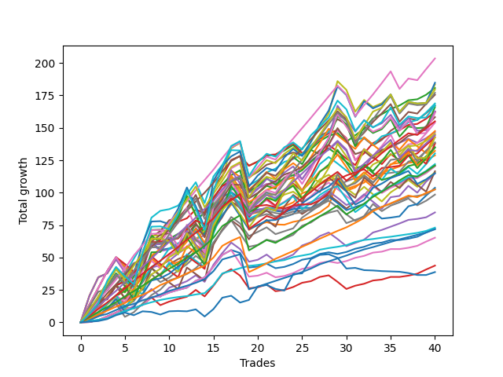

# Short Pointer 001 DB 
- Symbol: ES_830-1130
- Date Range: 03/18/2022 - 12/30/2022
- Trading Period: 8:30-11:30
- Number of Trades: 40



| Name | Win Percent | Profit | Avg Profit / Trade | Avg Time / Trade |      | Name | Win Percent | Profit | Avg Profit / Trade | Avg Time / Trade |
| ---- | ----------- | ------ | ------------------ | ---------------- | ---- | ---- | ----------- | ------ | ------------------ | ---------------- |
| Sorted By <br> Profit | | | | | | Sorted By <br> Win Percentage ||||
| TP-8 | 85.00 | 101750.00 | 2543.75 | 27:20 |     | TP-1 | 100.00 | 36500.00 | 912.50 | 03:36 |
| BB-100 U/L 2SD | 67.50 | 92375.00 | 2309.38 | 50:02 |     | TP-2 | 97.50 | 35875.00 | 896.88 | 06:23 |
| V U/L 1SD | 70.00 | 91750.00 | 2293.75 | 41:32 |     | TP-3 | 95.00 | 51250.00 | 1281.25 | 09:27 |
| BB-20 U/L 2SD | 92.50 | 90375.00 | 2259.38 | 15:52 |     | BB-20 U/L 2SD | 92.50 | 90375.00 | 2259.38 | 15:52 |
| TP-10 | 77.50 | 89750.00 | 2243.75 | 34:25 |     | BB-20 U/L 1SD | 92.50 | 64375.00 | 1609.38 | 10:09 |
| TP-9 | 80.00 | 88500.00 | 2212.50 | 31:40 |     | TP-5 | 90.00 | 77500.00 | 1937.50 | 15:44 |
| TP-7 | 85.00 | 87750.00 | 2193.75 | 24:26 |     | TP-4 | 90.00 | 60500.00 | 1512.50 | 13:28 |
| BB-100 Mid | 85.00 | 84375.00 | 2109.38 | 21:49 |     | BB-20 U/L 2SD C | 87.50 | 81125.00 | 2028.12 | 18:09 |
| BB-50 U/L 1SD | 82.50 | 83625.00 | 2090.62 | 24:40 |     | BB-50 Mid | 87.50 | 73375.00 | 1834.38 | 14:25 |
| NEWFI 000 | 67.50 | 83625.00 | 2090.62 | 44:26 |     | BB-20 U/L 2SD SL-10 | 87.50 | 72625.00 | 1815.62 | 12:57 |
| BB-200 U/L 2SD | 65.00 | 83000.00 | 2075.00 | 54:14 |     | BB-20 U/L 1SD SL-10 | 87.50 | 51250.00 | 1281.25 | 08:43 |
| V U/L 1SD SL-10 | 65.00 | 81375.00 | 2034.38 | 32:22 |     | TP-8 | 85.00 | 101750.00 | 2543.75 | 27:20 |
| BB-20 U/L 2SD C | 87.50 | 81125.00 | 2028.12 | 18:09 |     | TP-7 | 85.00 | 87750.00 | 2193.75 | 24:26 |
| BB-100 U/L 2SD SL-10 | 62.50 | 80750.00 | 2018.75 | 40:28 |     | BB-100 Mid | 85.00 | 84375.00 | 2109.38 | 21:49 |
| BB-100 Mid SL-10 | 80.00 | 79125.00 | 1978.12 | 17:10 |     | TP-6 | 85.00 | 72125.00 | 1803.12 | 21:51 |
| TP-5 | 90.00 | 77500.00 | 1937.50 | 15:44 |     | V Mid | 85.00 | 69125.00 | 1728.12 | 13:26 |
| BB-50 U/L 2SD | 72.50 | 77000.00 | 1925.00 | 36:09 |     | BB-50 Mid SL-10 | 85.00 | 57500.00 | 1437.50 | 11:48 |
| BB-200 Mid | 82.50 | 73750.00 | 1843.75 | 21:06 |     | BB-20 Mid | 85.00 | 36125.00 | 903.12 | 05:15 |
| BB-50 Mid | 87.50 | 73375.00 | 1834.38 | 14:25 |     | BB-20 Mid SL-10 | 85.00 | 32625.00 | 815.62 | 04:38 |
| BB-20 U/L 2SD SL-10 | 87.50 | 72625.00 | 1815.62 | 12:57 |     | BB-50 U/L 1SD | 82.50 | 83625.00 | 2090.62 | 24:40 |
| V U/L 1SD SL-5 | 52.50 | 72500.00 | 1812.50 | 24:59 |     | BB-200 Mid | 82.50 | 73750.00 | 1843.75 | 21:06 |
| TP-6 | 85.00 | 72125.00 | 1803.12 | 21:51 |     | V Mid SL-10 | 82.50 | 71375.00 | 1784.38 | 11:57 |
| V Mid SL-10 | 82.50 | 71375.00 | 1784.38 | 11:57 |     | BB-20 U/L 2SD C SL-10 | 82.50 | 61000.00 | 1525.00 | 14:20 |
| BB-200 U/L 2SD SL-10 | 60.00 | 71375.00 | 1784.38 | 44:40 |     | TP-9 | 80.00 | 88500.00 | 2212.50 | 31:40 |
| BB-200 Mid SL-10 | 77.50 | 69375.00 | 1734.38 | 17:23 |     | BB-100 Mid SL-10 | 80.00 | 79125.00 | 1978.12 | 17:10 |
| V Mid | 85.00 | 69125.00 | 1728.12 | 13:26 |     | BB-20 U/L 1SD SL-5 | 80.00 | 42375.00 | 1059.38 | 07:11 |
| BB-100 U/L 2SD SL-5 | 50.00 | 68875.00 | 1721.88 | 32:23 |     | TP-10 | 77.50 | 89750.00 | 2243.75 | 34:25 |
| BB-100 Mid SL-5 | 70.00 | 67500.00 | 1687.50 | 13:05 |     | BB-200 Mid SL-10 | 77.50 | 69375.00 | 1734.38 | 17:23 |
| BB-50 U/L 2SD SL-10 | 65.00 | 67375.00 | 1684.38 | 27:18 |     | BB-20 Mid SL-5 | 77.50 | 21875.00 | 546.88 | 03:46 |
| BB-50 U/L 1SD SL-10 | 75.00 | 66125.00 | 1653.12 | 18:45 |     | BB-50 U/L 1SD SL-10 | 75.00 | 66125.00 | 1653.12 | 18:45 |
| BB-50 U/L 2SD SL-5 | 55.00 | 65125.00 | 1628.12 | 21:16 |     | BB-20 U/L 2SD SL-5 | 75.00 | 60250.00 | 1506.25 | 10:59 |
| BB-20 U/L 1SD | 92.50 | 64375.00 | 1609.38 | 10:09 |     | BB-50 U/L 2SD | 72.50 | 77000.00 | 1925.00 | 36:09 |
| BB-20 U/L 2SD C SL-10 | 82.50 | 61000.00 | 1525.00 | 14:20 |     | BB-20 U/L 2SD C SL-5 | 72.50 | 60250.00 | 1506.25 | 11:44 |
| TP-4 | 90.00 | 60500.00 | 1512.50 | 13:28 |     | V Mid SL-5 | 72.50 | 51875.00 | 1296.88 | 10:05 |
| BB-20 U/L 2SD SL-5 | 75.00 | 60250.00 | 1506.25 | 10:59 |     | BB-50 Mid SL-5 | 72.50 | 49250.00 | 1231.25 | 09:02 |
| BB-20 U/L 2SD C SL-5 | 72.50 | 60250.00 | 1506.25 | 11:44 |     | V U/L 1SD | 70.00 | 91750.00 | 2293.75 | 41:32 |
| BB-200 U/L 2SD SL-5 | 47.50 | 58250.00 | 1456.25 | 36:27 |     | BB-100 Mid SL-5 | 70.00 | 67500.00 | 1687.50 | 13:05 |
| BB-50 U/L 1SD SL-5 | 62.50 | 57875.00 | 1446.88 | 14:22 |     | BB-200 Mid SL-5 | 70.00 | 57375.00 | 1434.38 | 13:58 |
| BB-50 Mid SL-10 | 85.00 | 57500.00 | 1437.50 | 11:48 |     | BB-100 U/L 2SD | 67.50 | 92375.00 | 2309.38 | 50:02 |
| BB-200 Mid SL-5 | 70.00 | 57375.00 | 1434.38 | 13:58 |     | NEWFI 000 | 67.50 | 83625.00 | 2090.62 | 44:26 |
| V Mid SL-5 | 72.50 | 51875.00 | 1296.88 | 10:05 |     | BB-200 U/L 2SD | 65.00 | 83000.00 | 2075.00 | 54:14 |
| TP-3 | 95.00 | 51250.00 | 1281.25 | 09:27 |     | V U/L 1SD SL-10 | 65.00 | 81375.00 | 2034.38 | 32:22 |
| BB-20 U/L 1SD SL-10 | 87.50 | 51250.00 | 1281.25 | 08:43 |     | BB-50 U/L 2SD SL-10 | 65.00 | 67375.00 | 1684.38 | 27:18 |
| BB-50 Mid SL-5 | 72.50 | 49250.00 | 1231.25 | 09:02 |     | BB-100 U/L 2SD SL-10 | 62.50 | 80750.00 | 2018.75 | 40:28 |
| BB-20 U/L 1SD SL-5 | 80.00 | 42375.00 | 1059.38 | 07:11 |     | BB-50 U/L 1SD SL-5 | 62.50 | 57875.00 | 1446.88 | 14:22 |
| TP-1 | 100.00 | 36500.00 | 912.50 | 03:36 |     | BB-200 U/L 2SD SL-10 | 60.00 | 71375.00 | 1784.38 | 44:40 |
| BB-20 Mid | 85.00 | 36125.00 | 903.12 | 05:15 |     | BB-50 U/L 2SD SL-5 | 55.00 | 65125.00 | 1628.12 | 21:16 |
| TP-2 | 97.50 | 35875.00 | 896.88 | 06:23 |     | NEWFI 0000 | 55.00 | 19375.00 | 484.38 | 09:17 |
| BB-20 Mid SL-10 | 85.00 | 32625.00 | 815.62 | 04:38 |     | V U/L 1SD SL-5 | 52.50 | 72500.00 | 1812.50 | 24:59 |
| BB-20 Mid SL-5 | 77.50 | 21875.00 | 546.88 | 03:46 |     | BB-100 U/L 2SD SL-5 | 50.00 | 68875.00 | 1721.88 | 32:23 |
| NEWFI 0000 | 55.00 | 19375.00 | 484.38 | 09:17 |     | BB-200 U/L 2SD SL-5 | 47.50 | 58250.00 | 1456.25 | 36:27 |

## NO STOPLOSS

### Test BB-20 Mid
* Sell when price hits the middle line of the 20p bollinger
* No Stoploss
* Results:
```
Total Trades: 40
Percent Up: 15.00
Percent Down: 85.00
Total Points Moved Down: 72.25
Potential Profit: 36125.00
Total Points Ups: 18.25 Count Ups: 6
Total Points Downs: 90.50 Count Downs: 34
```

<details><summary>Trades</summary>

<code>In: 2022-03-25 11:57:00		Out: 2022-03-25 11:58:10		Total Position Time: 01:10		Total Move Down: 0.25		Total to Date: 0.25</code> <br />
<code>In: 2022-03-29 08:52:00		Out: 2022-03-29 08:56:20		Total Position Time: 04:20		Total Move Down: 1.50		Total to Date: 1.75</code> <br />
<code>In: 2022-03-31 12:05:00		Out: 2022-03-31 12:11:40		Total Position Time: 06:40		Total Move Down: 2.75		Total to Date: 4.50</code> <br />
<code>In: 2022-04-18 10:59:00		Out: 2022-04-18 11:00:10		Total Position Time: 01:10		Total Move Down: 3.00		Total to Date: 7.50</code> <br />
<code>In: 2022-04-25 09:28:00		Out: 2022-04-25 09:31:05		Total Position Time: 03:05		Total Move Down: 3.25		Total to Date: 10.75</code> <br />
<code>In: 2022-04-25 09:53:00		Out: 2022-04-25 09:54:25		Total Position Time: 01:25		Total Move Down: -0.00		Total to Date: 10.75</code> <br />
<code>In: 2022-04-26 09:31:00		Out: 2022-04-26 09:37:15		Total Position Time: 06:15		Total Move Down: 2.75		Total to Date: 13.50</code> <br />
<code>In: 2022-05-24 09:18:00		Out: 2022-05-24 09:21:55		Total Position Time: 03:55		Total Move Down: 5.75		Total to Date: 19.25</code> <br />
<code>In: 2022-06-01 12:19:00		Out: 2022-06-01 12:25:25		Total Position Time: 06:25		Total Move Down: 1.00		Total to Date: 20.25</code> <br />
<code>In: 2022-06-09 08:47:00		Out: 2022-06-09 08:48:20		Total Position Time: 01:20		Total Move Down: 2.75		Total to Date: 23.00</code> <br />
<code>In: 2022-06-09 09:46:00		Out: 2022-06-09 09:49:20		Total Position Time: 03:20		Total Move Down: 2.00		Total to Date: 25.00</code> <br />
<code>In: 2022-06-09 10:08:00		Out: 2022-06-09 10:16:50		Total Position Time: 08:50		Total Move Down: 1.75		Total to Date: 26.75</code> <br />
<code>In: 2022-06-10 11:26:00		Out: 2022-06-10 11:28:25		Total Position Time: 02:25		Total Move Down: 5.25		Total to Date: 32.00</code> <br />
<code>In: 2022-06-13 08:42:00		Out: 2022-06-13 08:47:40		Total Position Time: 05:40		Total Move Down: 2.75		Total to Date: 34.75</code> <br />
<code>In: 2022-06-13 09:41:00		Out: 2022-06-13 09:43:25		Total Position Time: 02:25		Total Move Down: 8.25		Total to Date: 43.00</code> <br />
<code>In: 2022-06-16 08:30:00		Out: 2022-06-16 08:31:10		Total Position Time: 01:10		Total Move Down: 9.00		Total to Date: 52.00</code> <br />
<code>In: 2022-06-17 08:34:00		Out: 2022-06-17 08:35:45		Total Position Time: 01:45		Total Move Down: 3.75		Total to Date: 55.75</code> <br />
<code>In: 2022-06-29 12:20:00		Out: 2022-06-29 12:33:20		Total Position Time: 13:20		Total Move Down: -2.25		Total to Date: 53.50</code> <br />
<code>In: 2022-07-01 10:35:00		Out: 2022-07-01 11:02:15		Total Position Time: 27:15		Total Move Down: -11.25		Total to Date: 42.25</code> <br />
<code>In: 2022-07-18 09:01:00		Out: 2022-07-18 09:02:10		Total Position Time: 01:10		Total Move Down: 0.75		Total to Date: 43.00</code> <br />
<code>In: 2022-07-26 10:13:00		Out: 2022-07-26 10:15:10		Total Position Time: 02:10		Total Move Down: 2.25		Total to Date: 45.25</code> <br />
<code>In: 2022-08-01 12:01:00		Out: 2022-08-01 12:20:15		Total Position Time: 19:15		Total Move Down: -3.50		Total to Date: 41.75</code> <br />
<code>In: 2022-08-11 10:21:00		Out: 2022-08-11 10:27:30		Total Position Time: 06:30		Total Move Down: 1.00		Total to Date: 42.75</code> <br />
<code>In: 2022-08-22 09:28:00		Out: 2022-08-22 09:29:10		Total Position Time: 01:10		Total Move Down: 2.25		Total to Date: 45.00</code> <br />
<code>In: 2022-08-29 08:39:00		Out: 2022-08-29 08:42:25		Total Position Time: 03:25		Total Move Down: 3.25		Total to Date: 48.25</code> <br />
<code>In: 2022-08-31 09:01:00		Out: 2022-08-31 09:04:15		Total Position Time: 03:15		Total Move Down: 1.25		Total to Date: 49.50</code> <br />
<code>In: 2022-09-01 09:20:00		Out: 2022-09-01 09:21:10		Total Position Time: 01:10		Total Move Down: 3.25		Total to Date: 52.75</code> <br />
<code>In: 2022-09-12 10:32:00		Out: 2022-09-12 10:36:35		Total Position Time: 04:35		Total Move Down: 1.25		Total to Date: 54.00</code> <br />
<code>In: 2022-09-15 10:21:00		Out: 2022-09-15 10:30:05		Total Position Time: 09:05		Total Move Down: -1.25		Total to Date: 52.75</code> <br />
<code>In: 2022-09-16 11:31:00		Out: 2022-09-16 11:41:10		Total Position Time: 10:10		Total Move Down: 1.50		Total to Date: 54.25</code> <br />
<code>In: 2022-09-20 12:05:00		Out: 2022-09-20 12:06:10		Total Position Time: 01:10		Total Move Down: 2.50		Total to Date: 56.75</code> <br />
<code>In: 2022-09-22 10:57:00		Out: 2022-09-22 11:01:30		Total Position Time: 04:30		Total Move Down: 1.50		Total to Date: 58.25</code> <br />
<code>In: 2022-09-22 12:16:00		Out: 2022-09-22 12:19:50		Total Position Time: 03:50		Total Move Down: 2.50		Total to Date: 60.75</code> <br />
<code>In: 2022-10-17 08:56:00		Out: 2022-10-17 08:59:05		Total Position Time: 03:05		Total Move Down: 0.75		Total to Date: 61.50</code> <br />
<code>In: 2022-11-15 08:36:00		Out: 2022-11-15 08:44:10		Total Position Time: 08:10		Total Move Down: 2.00		Total to Date: 63.50</code> <br />
<code>In: 2022-11-21 09:39:00		Out: 2022-11-21 09:49:20		Total Position Time: 10:20		Total Move Down: -0.00		Total to Date: 63.50</code> <br />
<code>In: 2022-11-21 10:42:00		Out: 2022-11-21 10:47:25		Total Position Time: 05:25		Total Move Down: 1.00		Total to Date: 64.50</code> <br />
<code>In: 2022-12-01 11:28:00		Out: 2022-12-01 11:31:05		Total Position Time: 03:05		Total Move Down: 1.50		Total to Date: 66.00</code> <br />
<code>In: 2022-12-01 11:55:00		Out: 2022-12-01 11:56:50		Total Position Time: 01:50		Total Move Down: 3.25		Total to Date: 69.25</code> <br />
<code>In: 2022-12-07 10:21:00		Out: 2022-12-07 10:25:55		Total Position Time: 04:55		Total Move Down: 3.00		Total to Date: 72.25</code> <br />


</details>

### Test BB-20 U/L 1SD
* Sell when the price hits the lower line of the 20p 1std bollinger
* No Stoploss
* Results:
```
Total Trades: 40
Percent Up: 7.50
Percent Down: 92.50
Total Points Moved Down: 128.75
Potential Profit: 64375.00
Total Points Ups: 19.50 Count Ups: 3
Total Points Downs: 148.25 Count Downs: 37
```

<details><summary>Trades</summary>

<code>In: 2022-03-25 11:57:00		Out: 2022-03-25 12:00:45		Total Position Time: 03:45		Total Move Down: 1.75		Total to Date: 1.75</code> <br />
<code>In: 2022-03-29 08:52:00		Out: 2022-03-29 08:58:40		Total Position Time: 06:40		Total Move Down: 3.00		Total to Date: 4.75</code> <br />
<code>In: 2022-03-31 12:05:00		Out: 2022-03-31 12:16:00		Total Position Time: 11:00		Total Move Down: 4.75		Total to Date: 9.50</code> <br />
<code>In: 2022-04-18 10:59:00		Out: 2022-04-18 11:06:35		Total Position Time: 07:35		Total Move Down: 4.75		Total to Date: 14.25</code> <br />
<code>In: 2022-04-25 09:28:00		Out: 2022-04-25 09:42:45		Total Position Time: 14:45		Total Move Down: 2.00		Total to Date: 16.25</code> <br />
<code>In: 2022-04-25 09:53:00		Out: 2022-04-25 09:55:05		Total Position Time: 02:05		Total Move Down: 3.50		Total to Date: 19.75</code> <br />
<code>In: 2022-04-26 09:31:00		Out: 2022-04-26 09:38:05		Total Position Time: 07:05		Total Move Down: 6.75		Total to Date: 26.50</code> <br />
<code>In: 2022-05-24 09:18:00		Out: 2022-05-24 09:29:20		Total Position Time: 11:20		Total Move Down: 6.50		Total to Date: 33.00</code> <br />
<code>In: 2022-06-01 12:19:00		Out: 2022-06-01 12:30:05		Total Position Time: 11:05		Total Move Down: 4.25		Total to Date: 37.25</code> <br />
<code>In: 2022-06-09 08:47:00		Out: 2022-06-09 08:49:35		Total Position Time: 02:35		Total Move Down: 7.00		Total to Date: 44.25</code> <br />
<code>In: 2022-06-09 09:46:00		Out: 2022-06-09 09:54:45		Total Position Time: 08:45		Total Move Down: 2.25		Total to Date: 46.50</code> <br />
<code>In: 2022-06-09 10:08:00		Out: 2022-06-09 10:18:50		Total Position Time: 10:50		Total Move Down: 2.75		Total to Date: 49.25</code> <br />
<code>In: 2022-06-10 11:26:00		Out: 2022-06-10 11:38:10		Total Position Time: 12:10		Total Move Down: 4.50		Total to Date: 53.75</code> <br />
<code>In: 2022-06-13 08:42:00		Out: 2022-06-13 08:52:05		Total Position Time: 10:05		Total Move Down: 6.75		Total to Date: 60.50</code> <br />
<code>In: 2022-06-13 09:41:00		Out: 2022-06-13 09:47:50		Total Position Time: 06:50		Total Move Down: 13.25		Total to Date: 73.75</code> <br />
<code>In: 2022-06-16 08:30:00		Out: 2022-06-16 08:31:10		Total Position Time: 01:10		Total Move Down: 9.00		Total to Date: 82.75</code> <br />
<code>In: 2022-06-17 08:34:00		Out: 2022-06-17 08:39:05		Total Position Time: 05:05		Total Move Down: 8.00		Total to Date: 90.75</code> <br />
<code>In: 2022-06-29 12:20:00		Out: 2022-06-29 12:34:15		Total Position Time: 14:15		Total Move Down: 2.00		Total to Date: 92.75</code> <br />
<code>In: 2022-07-01 10:35:00		Out: 2022-07-01 11:04:30		Total Position Time: 29:30		Total Move Down: -9.50		Total to Date: 83.25</code> <br />
<code>In: 2022-07-18 09:01:00		Out: 2022-07-18 09:05:10		Total Position Time: 04:10		Total Move Down: 1.50		Total to Date: 84.75</code> <br />
<code>In: 2022-07-26 10:13:00		Out: 2022-07-26 10:19:10		Total Position Time: 06:10		Total Move Down: 4.00		Total to Date: 88.75</code> <br />
<code>In: 2022-08-01 12:01:00		Out: 2022-08-01 12:21:45		Total Position Time: 20:45		Total Move Down: -1.50		Total to Date: 87.25</code> <br />
<code>In: 2022-08-11 10:21:00		Out: 2022-08-11 10:31:50		Total Position Time: 10:50		Total Move Down: 2.25		Total to Date: 89.50</code> <br />
<code>In: 2022-08-22 09:28:00		Out: 2022-08-22 09:32:05		Total Position Time: 04:05		Total Move Down: 3.00		Total to Date: 92.50</code> <br />
<code>In: 2022-08-29 08:39:00		Out: 2022-08-29 08:43:30		Total Position Time: 04:30		Total Move Down: 7.00		Total to Date: 99.50</code> <br />
<code>In: 2022-08-31 09:01:00		Out: 2022-08-31 09:06:20		Total Position Time: 05:20		Total Move Down: 2.50		Total to Date: 102.00</code> <br />
<code>In: 2022-09-01 09:20:00		Out: 2022-09-01 09:25:40		Total Position Time: 05:40		Total Move Down: 4.75		Total to Date: 106.75</code> <br />
<code>In: 2022-09-12 10:32:00		Out: 2022-09-12 10:41:30		Total Position Time: 09:30		Total Move Down: 2.75		Total to Date: 109.50</code> <br />
<code>In: 2022-09-15 10:21:00		Out: 2022-09-15 10:32:20		Total Position Time: 11:20		Total Move Down: 1.75		Total to Date: 111.25</code> <br />
<code>In: 2022-09-16 11:31:00		Out: 2022-09-16 12:14:25		Total Position Time: 43:25		Total Move Down: -8.50		Total to Date: 102.75</code> <br />
<code>In: 2022-09-20 12:05:00		Out: 2022-09-20 12:06:10		Total Position Time: 01:10		Total Move Down: 2.50		Total to Date: 105.25</code> <br />
<code>In: 2022-09-22 10:57:00		Out: 2022-09-22 11:03:35		Total Position Time: 06:35		Total Move Down: 2.50		Total to Date: 107.75</code> <br />
<code>In: 2022-09-22 12:16:00		Out: 2022-09-22 12:20:20		Total Position Time: 04:20		Total Move Down: 5.50		Total to Date: 113.25</code> <br />
<code>In: 2022-10-17 08:56:00		Out: 2022-10-17 09:04:15		Total Position Time: 08:15		Total Move Down: 2.00		Total to Date: 115.25</code> <br />
<code>In: 2022-11-15 08:36:00		Out: 2022-11-15 08:50:50		Total Position Time: 14:50		Total Move Down: 2.50		Total to Date: 117.75</code> <br />
<code>In: 2022-11-21 09:39:00		Out: 2022-11-21 09:50:20		Total Position Time: 11:20		Total Move Down: 2.50		Total to Date: 120.25</code> <br />
<code>In: 2022-11-21 10:42:00		Out: 2022-11-21 10:54:00		Total Position Time: 12:00		Total Move Down: 2.75		Total to Date: 123.00</code> <br />
<code>In: 2022-12-01 11:28:00		Out: 2022-12-01 11:45:05		Total Position Time: 17:05		Total Move Down: 0.75		Total to Date: 123.75</code> <br />
<code>In: 2022-12-01 11:55:00		Out: 2022-12-01 12:13:50		Total Position Time: 18:50		Total Move Down: 1.25		Total to Date: 125.00</code> <br />
<code>In: 2022-12-07 10:21:00		Out: 2022-12-07 10:30:45		Total Position Time: 09:45		Total Move Down: 3.75		Total to Date: 128.75</code> <br />


</details>

### Test BB-20 U/L 2SD
* Sell when the price hits the lower line of the 20p 2std bollinger
* No Stoploss
* Results:
```
Total Trades: 40
Percent Up: 7.50
Percent Down: 92.50
Total Points Moved Down: 180.75
Potential Profit: 90375.00
Total Points Ups: 22.00 Count Ups: 3
Total Points Downs: 202.75 Count Downs: 37
```

<details><summary>Trades</summary>

<code>In: 2022-03-25 11:57:00		Out: 2022-03-25 12:00:55		Total Position Time: 03:55		Total Move Down: 2.75		Total to Date: 2.75</code> <br />
<code>In: 2022-03-29 08:52:00		Out: 2022-03-29 09:01:40		Total Position Time: 09:40		Total Move Down: 4.50		Total to Date: 7.25</code> <br />
<code>In: 2022-03-31 12:05:00		Out: 2022-03-31 12:19:35		Total Position Time: 14:35		Total Move Down: 6.75		Total to Date: 14.00</code> <br />
<code>In: 2022-04-18 10:59:00		Out: 2022-04-18 11:10:40		Total Position Time: 11:40		Total Move Down: 6.25		Total to Date: 20.25</code> <br />
<code>In: 2022-04-25 09:28:00		Out: 2022-04-25 10:01:15		Total Position Time: 33:15		Total Move Down: 4.00		Total to Date: 24.25</code> <br />
<code>In: 2022-04-25 09:53:00		Out: 2022-04-25 10:01:15		Total Position Time: 08:15		Total Move Down: 7.50		Total to Date: 31.75</code> <br />
<code>In: 2022-04-26 09:31:00		Out: 2022-04-26 09:40:15		Total Position Time: 09:15		Total Move Down: 8.50		Total to Date: 40.25</code> <br />
<code>In: 2022-05-24 09:18:00		Out: 2022-05-24 09:31:20		Total Position Time: 13:20		Total Move Down: 10.75		Total to Date: 51.00</code> <br />
<code>In: 2022-06-01 12:19:00		Out: 2022-06-01 12:30:05		Total Position Time: 11:05		Total Move Down: 4.25		Total to Date: 55.25</code> <br />
<code>In: 2022-06-09 08:47:00		Out: 2022-06-09 09:11:05		Total Position Time: 24:05		Total Move Down: 9.00		Total to Date: 64.25</code> <br />
<code>In: 2022-06-09 09:46:00		Out: 2022-06-09 09:55:00		Total Position Time: 09:00		Total Move Down: 4.00		Total to Date: 68.25</code> <br />
<code>In: 2022-06-09 10:08:00		Out: 2022-06-09 10:19:05		Total Position Time: 11:05		Total Move Down: 2.75		Total to Date: 71.00</code> <br />
<code>In: 2022-06-10 11:26:00		Out: 2022-06-10 11:40:10		Total Position Time: 14:10		Total Move Down: 6.75		Total to Date: 77.75</code> <br />
<code>In: 2022-06-13 08:42:00		Out: 2022-06-13 08:55:10		Total Position Time: 13:10		Total Move Down: 7.25		Total to Date: 85.00</code> <br />
<code>In: 2022-06-13 09:41:00		Out: 2022-06-13 09:54:15		Total Position Time: 13:15		Total Move Down: 17.75		Total to Date: 102.75</code> <br />
<code>In: 2022-06-16 08:30:00		Out: 2022-06-16 08:36:10		Total Position Time: 06:10		Total Move Down: 10.25		Total to Date: 113.00</code> <br />
<code>In: 2022-06-17 08:34:00		Out: 2022-06-17 08:45:15		Total Position Time: 11:15		Total Move Down: 12.00		Total to Date: 125.00</code> <br />
<code>In: 2022-06-29 12:20:00		Out: 2022-06-29 12:36:35		Total Position Time: 16:35		Total Move Down: 3.25		Total to Date: 128.25</code> <br />
<code>In: 2022-07-01 10:35:00		Out: 2022-07-01 11:07:55		Total Position Time: 32:55		Total Move Down: -7.50		Total to Date: 120.75</code> <br />
<code>In: 2022-07-18 09:01:00		Out: 2022-07-18 09:08:15		Total Position Time: 07:15		Total Move Down: 3.25		Total to Date: 124.00</code> <br />
<code>In: 2022-07-26 10:13:00		Out: 2022-07-26 10:32:35		Total Position Time: 19:35		Total Move Down: 4.50		Total to Date: 128.50</code> <br />
<code>In: 2022-08-01 12:01:00		Out: 2022-08-01 12:22:35		Total Position Time: 21:35		Total Move Down: 0.50		Total to Date: 129.00</code> <br />
<code>In: 2022-08-11 10:21:00		Out: 2022-08-11 10:33:20		Total Position Time: 12:20		Total Move Down: 3.50		Total to Date: 132.50</code> <br />
<code>In: 2022-08-22 09:28:00		Out: 2022-08-22 09:44:50		Total Position Time: 16:50		Total Move Down: 4.25		Total to Date: 136.75</code> <br />
<code>In: 2022-08-29 08:39:00		Out: 2022-08-29 09:24:35		Total Position Time: 45:35		Total Move Down: -7.75		Total to Date: 129.00</code> <br />
<code>In: 2022-08-31 09:01:00		Out: 2022-08-31 09:07:00		Total Position Time: 06:00		Total Move Down: 4.50		Total to Date: 133.50</code> <br />
<code>In: 2022-09-01 09:20:00		Out: 2022-09-01 09:36:10		Total Position Time: 16:10		Total Move Down: 6.25		Total to Date: 139.75</code> <br />
<code>In: 2022-09-12 10:32:00		Out: 2022-09-12 10:43:35		Total Position Time: 11:35		Total Move Down: 4.00		Total to Date: 143.75</code> <br />
<code>In: 2022-09-15 10:21:00		Out: 2022-09-15 10:36:30		Total Position Time: 15:30		Total Move Down: 2.25		Total to Date: 146.00</code> <br />
<code>In: 2022-09-16 11:31:00		Out: 2022-09-16 12:28:05		Total Position Time: 57:05		Total Move Down: -6.75		Total to Date: 139.25</code> <br />
<code>In: 2022-09-20 12:05:00		Out: 2022-09-20 12:07:45		Total Position Time: 02:45		Total Move Down: 5.00		Total to Date: 144.25</code> <br />
<code>In: 2022-09-22 10:57:00		Out: 2022-09-22 11:07:55		Total Position Time: 10:55		Total Move Down: 5.00		Total to Date: 149.25</code> <br />
<code>In: 2022-09-22 12:16:00		Out: 2022-09-22 12:22:20		Total Position Time: 06:20		Total Move Down: 8.00		Total to Date: 157.25</code> <br />
<code>In: 2022-10-17 08:56:00		Out: 2022-10-17 09:12:25		Total Position Time: 16:25		Total Move Down: 3.25		Total to Date: 160.50</code> <br />
<code>In: 2022-11-15 08:36:00		Out: 2022-11-15 09:01:30		Total Position Time: 25:30		Total Move Down: 4.00		Total to Date: 164.50</code> <br />
<code>In: 2022-11-21 09:39:00		Out: 2022-11-21 09:53:05		Total Position Time: 14:05		Total Move Down: 2.75		Total to Date: 167.25</code> <br />
<code>In: 2022-11-21 10:42:00		Out: 2022-11-21 10:56:50		Total Position Time: 14:50		Total Move Down: 4.00		Total to Date: 171.25</code> <br />
<code>In: 2022-12-01 11:28:00		Out: 2022-12-01 11:45:05		Total Position Time: 17:05		Total Move Down: 0.75		Total to Date: 172.00</code> <br />
<code>In: 2022-12-01 11:55:00		Out: 2022-12-01 12:14:30		Total Position Time: 19:30		Total Move Down: 3.50		Total to Date: 175.50</code> <br />
<code>In: 2022-12-07 10:21:00		Out: 2022-12-07 10:32:25		Total Position Time: 11:25		Total Move Down: 5.25		Total to Date: 180.75</code> <br />


</details>

### Test BB-20 U/L 2SD C
* Sell when the price hits the lower line of the 20p 2std bollinger
* No Stoploss
* Results:
```
Total Trades: 40
Percent Up: 12.50
Percent Down: 87.50
Total Points Moved Down: 162.25
Potential Profit: 81125.00
Total Points Ups: 41.00 Count Ups: 5
Total Points Downs: 203.25 Count Downs: 35
```

<details><summary>Trades</summary>

<code>In: 2022-03-25 11:57:00		Out: 2022-03-25 12:01:15		Total Position Time: 04:15		Total Move Down: 3.25		Total to Date: 3.25</code> <br />
<code>In: 2022-03-29 08:52:00		Out: 2022-03-29 09:01:40		Total Position Time: 09:40		Total Move Down: 4.50		Total to Date: 7.75</code> <br />
<code>In: 2022-03-31 12:05:00		Out: 2022-03-31 12:19:35		Total Position Time: 14:35		Total Move Down: 6.75		Total to Date: 14.50</code> <br />
<code>In: 2022-04-18 10:59:00		Out: 2022-04-18 11:10:40		Total Position Time: 11:40		Total Move Down: 6.25		Total to Date: 20.75</code> <br />
<code>In: 2022-04-25 09:28:00		Out: 2022-04-25 10:01:20		Total Position Time: 33:20		Total Move Down: 6.50		Total to Date: 27.25</code> <br />
<code>In: 2022-04-25 09:53:00		Out: 2022-04-25 10:01:20		Total Position Time: 08:20		Total Move Down: 10.00		Total to Date: 37.25</code> <br />
<code>In: 2022-04-26 09:31:00		Out: 2022-04-26 09:47:10		Total Position Time: 16:10		Total Move Down: 11.25		Total to Date: 48.50</code> <br />
<code>In: 2022-05-24 09:18:00		Out: 2022-05-24 09:31:25		Total Position Time: 13:25		Total Move Down: 10.75		Total to Date: 59.25</code> <br />
<code>In: 2022-06-01 12:19:00		Out: 2022-06-01 12:30:05		Total Position Time: 11:05		Total Move Down: 4.25		Total to Date: 63.50</code> <br />
<code>In: 2022-06-09 08:47:00		Out: 2022-06-09 09:11:10		Total Position Time: 24:10		Total Move Down: 10.00		Total to Date: 73.50</code> <br />
<code>In: 2022-06-09 09:46:00		Out: 2022-06-09 09:55:00		Total Position Time: 09:00		Total Move Down: 4.00		Total to Date: 77.50</code> <br />
<code>In: 2022-06-09 10:08:00		Out: 2022-06-09 10:21:10		Total Position Time: 13:10		Total Move Down: 2.75		Total to Date: 80.25</code> <br />
<code>In: 2022-06-10 11:26:00		Out: 2022-06-10 11:40:10		Total Position Time: 14:10		Total Move Down: 6.75		Total to Date: 87.00</code> <br />
<code>In: 2022-06-13 08:42:00		Out: 2022-06-13 09:30:35		Total Position Time: 48:35		Total Move Down: -2.75		Total to Date: 84.25</code> <br />
<code>In: 2022-06-13 09:41:00		Out: 2022-06-13 09:54:15		Total Position Time: 13:15		Total Move Down: 17.75		Total to Date: 102.00</code> <br />
<code>In: 2022-06-16 08:30:00		Out: 2022-06-16 08:41:35		Total Position Time: 11:35		Total Move Down: 11.00		Total to Date: 113.00</code> <br />
<code>In: 2022-06-17 08:34:00		Out: 2022-06-17 08:45:15		Total Position Time: 11:15		Total Move Down: 12.00		Total to Date: 125.00</code> <br />
<code>In: 2022-06-29 12:20:00		Out: 2022-06-29 12:36:35		Total Position Time: 16:35		Total Move Down: 3.25		Total to Date: 128.25</code> <br />
<code>In: 2022-07-01 10:35:00		Out: 2022-07-01 11:07:55		Total Position Time: 32:55		Total Move Down: -7.50		Total to Date: 120.75</code> <br />
<code>In: 2022-07-18 09:01:00		Out: 2022-07-18 09:08:15		Total Position Time: 07:15		Total Move Down: 3.25		Total to Date: 124.00</code> <br />
<code>In: 2022-07-26 10:13:00		Out: 2022-07-26 10:33:10		Total Position Time: 20:10		Total Move Down: 5.00		Total to Date: 129.00</code> <br />
<code>In: 2022-08-01 12:01:00		Out: 2022-08-01 12:22:35		Total Position Time: 21:35		Total Move Down: 0.50		Total to Date: 129.50</code> <br />
<code>In: 2022-08-11 10:21:00		Out: 2022-08-11 10:33:25		Total Position Time: 12:25		Total Move Down: 4.00		Total to Date: 133.50</code> <br />
<code>In: 2022-08-22 09:28:00		Out: 2022-08-22 09:44:55		Total Position Time: 16:55		Total Move Down: 4.75		Total to Date: 138.25</code> <br />
<code>In: 2022-08-29 08:39:00		Out: 2022-08-29 09:24:35		Total Position Time: 45:35		Total Move Down: -7.75		Total to Date: 130.50</code> <br />
<code>In: 2022-08-31 09:01:00		Out: 2022-08-31 09:07:05		Total Position Time: 06:05		Total Move Down: 4.75		Total to Date: 135.25</code> <br />
<code>In: 2022-09-01 09:20:00		Out: 2022-09-01 09:36:10		Total Position Time: 16:10		Total Move Down: 6.25		Total to Date: 141.50</code> <br />
<code>In: 2022-09-12 10:32:00		Out: 2022-09-12 10:44:05		Total Position Time: 12:05		Total Move Down: 4.25		Total to Date: 145.75</code> <br />
<code>In: 2022-09-15 10:21:00		Out: 2022-09-15 10:36:35		Total Position Time: 15:35		Total Move Down: 2.50		Total to Date: 148.25</code> <br />
<code>In: 2022-09-16 11:31:00		Out: 2022-09-16 12:28:15		Total Position Time: 57:15		Total Move Down: -6.25		Total to Date: 142.00</code> <br />
<code>In: 2022-09-20 12:05:00		Out: 2022-09-20 12:47:00		Total Position Time: 42:00		Total Move Down: -16.75		Total to Date: 125.25</code> <br />
<code>In: 2022-09-22 10:57:00		Out: 2022-09-22 11:07:55		Total Position Time: 10:55		Total Move Down: 5.00		Total to Date: 130.25</code> <br />
<code>In: 2022-09-22 12:16:00		Out: 2022-09-22 12:22:20		Total Position Time: 06:20		Total Move Down: 8.00		Total to Date: 138.25</code> <br />
<code>In: 2022-10-17 08:56:00		Out: 2022-10-17 09:12:25		Total Position Time: 16:25		Total Move Down: 3.25		Total to Date: 141.50</code> <br />
<code>In: 2022-11-15 08:36:00		Out: 2022-11-15 09:01:30		Total Position Time: 25:30		Total Move Down: 4.00		Total to Date: 145.50</code> <br />
<code>In: 2022-11-21 09:39:00		Out: 2022-11-21 09:53:05		Total Position Time: 14:05		Total Move Down: 2.75		Total to Date: 148.25</code> <br />
<code>In: 2022-11-21 10:42:00		Out: 2022-11-21 10:56:50		Total Position Time: 14:50		Total Move Down: 4.00		Total to Date: 152.25</code> <br />
<code>In: 2022-12-01 11:28:00		Out: 2022-12-01 11:45:05		Total Position Time: 17:05		Total Move Down: 0.75		Total to Date: 153.00</code> <br />
<code>In: 2022-12-01 11:55:00		Out: 2022-12-01 12:14:35		Total Position Time: 19:35		Total Move Down: 4.00		Total to Date: 157.00</code> <br />
<code>In: 2022-12-07 10:21:00		Out: 2022-12-07 10:32:25		Total Position Time: 11:25		Total Move Down: 5.25		Total to Date: 162.25</code> <br />


</details>

### Test BB-50 Mid
* Sell when price hits the middle line of the 50p bollinger
* No Stoploss
* Results:
```
Total Trades: 40
Percent Up: 12.50
Percent Down: 87.50
Total Points Moved Down: 146.75
Potential Profit: 73375.00
Total Points Ups: 30.75 Count Ups: 5
Total Points Downs: 177.50 Count Downs: 35
```

<details><summary>Trades</summary>

<code>In: 2022-03-25 11:57:00		Out: 2022-03-25 12:00:45		Total Position Time: 03:45		Total Move Down: 1.75		Total to Date: 1.75</code> <br />
<code>In: 2022-03-29 08:52:00		Out: 2022-03-29 09:01:25		Total Position Time: 09:25		Total Move Down: 3.50		Total to Date: 5.25</code> <br />
<code>In: 2022-03-31 12:05:00		Out: 2022-03-31 12:16:40		Total Position Time: 11:40		Total Move Down: 5.25		Total to Date: 10.50</code> <br />
<code>In: 2022-04-18 10:59:00		Out: 2022-04-18 11:16:45		Total Position Time: 17:45		Total Move Down: 7.50		Total to Date: 18.00</code> <br />
<code>In: 2022-04-25 09:28:00		Out: 2022-04-25 09:55:05		Total Position Time: 27:05		Total Move Down: -0.00		Total to Date: 18.00</code> <br />
<code>In: 2022-04-25 09:53:00		Out: 2022-04-25 09:55:05		Total Position Time: 02:05		Total Move Down: 3.50		Total to Date: 21.50</code> <br />
<code>In: 2022-04-26 09:31:00		Out: 2022-04-26 09:46:10		Total Position Time: 15:10		Total Move Down: 10.00		Total to Date: 31.50</code> <br />
<code>In: 2022-05-24 09:18:00		Out: 2022-05-24 09:31:20		Total Position Time: 13:20		Total Move Down: 10.75		Total to Date: 42.25</code> <br />
<code>In: 2022-06-01 12:19:00		Out: 2022-06-01 12:25:30		Total Position Time: 06:30		Total Move Down: 1.75		Total to Date: 44.00</code> <br />
<code>In: 2022-06-09 08:47:00		Out: 2022-06-09 08:48:40		Total Position Time: 01:40		Total Move Down: 3.50		Total to Date: 47.50</code> <br />
<code>In: 2022-06-09 09:46:00		Out: 2022-06-09 09:55:50		Total Position Time: 09:50		Total Move Down: 5.50		Total to Date: 53.00</code> <br />
<code>In: 2022-06-09 10:08:00		Out: 2022-06-09 10:22:05		Total Position Time: 14:05		Total Move Down: 4.75		Total to Date: 57.75</code> <br />
<code>In: 2022-06-10 11:26:00		Out: 2022-06-10 11:28:30		Total Position Time: 02:30		Total Move Down: 6.50		Total to Date: 64.25</code> <br />
<code>In: 2022-06-13 08:42:00		Out: 2022-06-13 09:07:15		Total Position Time: 25:15		Total Move Down: 3.00		Total to Date: 67.25</code> <br />
<code>In: 2022-06-13 09:41:00		Out: 2022-06-13 09:47:55		Total Position Time: 06:55		Total Move Down: 14.75		Total to Date: 82.00</code> <br />
<code>In: 2022-06-16 08:30:00		Out: 2022-06-16 08:36:10		Total Position Time: 06:10		Total Move Down: 10.25		Total to Date: 92.25</code> <br />
<code>In: 2022-06-17 08:34:00		Out: 2022-06-17 08:45:05		Total Position Time: 11:05		Total Move Down: 10.00		Total to Date: 102.25</code> <br />
<code>In: 2022-06-29 12:20:00		Out: 2022-06-29 12:34:15		Total Position Time: 14:15		Total Move Down: 2.00		Total to Date: 104.25</code> <br />
<code>In: 2022-07-01 10:35:00		Out: 2022-07-01 11:11:05		Total Position Time: 36:05		Total Move Down: -4.25		Total to Date: 100.00</code> <br />
<code>In: 2022-07-18 09:01:00		Out: 2022-07-18 09:08:15		Total Position Time: 07:15		Total Move Down: 3.25		Total to Date: 103.25</code> <br />
<code>In: 2022-07-26 10:13:00		Out: 2022-07-26 10:32:30		Total Position Time: 19:30		Total Move Down: 3.50		Total to Date: 106.75</code> <br />
<code>In: 2022-08-01 12:01:00		Out: 2022-08-01 12:22:40		Total Position Time: 21:40		Total Move Down: 0.50		Total to Date: 107.25</code> <br />
<code>In: 2022-08-11 10:21:00		Out: 2022-08-11 10:27:35		Total Position Time: 06:35		Total Move Down: 2.25		Total to Date: 109.50</code> <br />
<code>In: 2022-08-22 09:28:00		Out: 2022-08-22 09:29:10		Total Position Time: 01:10		Total Move Down: 2.25		Total to Date: 111.75</code> <br />
<code>In: 2022-08-29 08:39:00		Out: 2022-08-29 08:45:00		Total Position Time: 06:00		Total Move Down: 8.25		Total to Date: 120.00</code> <br />
<code>In: 2022-08-31 09:01:00		Out: 2022-08-31 09:10:55		Total Position Time: 09:55		Total Move Down: 4.75		Total to Date: 124.75</code> <br />
<code>In: 2022-09-01 09:20:00		Out: 2022-09-01 09:25:45		Total Position Time: 05:45		Total Move Down: 4.75		Total to Date: 129.50</code> <br />
<code>In: 2022-09-12 10:32:00		Out: 2022-09-12 10:42:15		Total Position Time: 10:15		Total Move Down: 3.50		Total to Date: 133.00</code> <br />
<code>In: 2022-09-15 10:21:00		Out: 2022-09-15 10:38:35		Total Position Time: 17:35		Total Move Down: 6.00		Total to Date: 139.00</code> <br />
<code>In: 2022-09-16 11:31:00		Out: 2022-09-16 12:19:05		Total Position Time: 48:05		Total Move Down: -6.75		Total to Date: 132.25</code> <br />
<code>In: 2022-09-20 12:05:00		Out: 2022-09-20 12:47:00		Total Position Time: 42:00		Total Move Down: -16.75		Total to Date: 115.50</code> <br />
<code>In: 2022-09-22 10:57:00		Out: 2022-09-22 11:04:15		Total Position Time: 07:15		Total Move Down: 3.75		Total to Date: 119.25</code> <br />
<code>In: 2022-09-22 12:16:00		Out: 2022-09-22 12:27:05		Total Position Time: 11:05		Total Move Down: 9.25		Total to Date: 128.50</code> <br />
<code>In: 2022-10-17 08:56:00		Out: 2022-10-17 09:12:25		Total Position Time: 16:25		Total Move Down: 3.25		Total to Date: 131.75</code> <br />
<code>In: 2022-11-15 08:36:00		Out: 2022-11-15 08:47:20		Total Position Time: 11:20		Total Move Down: 4.25		Total to Date: 136.00</code> <br />
<code>In: 2022-11-21 09:39:00		Out: 2022-11-21 09:50:20		Total Position Time: 11:20		Total Move Down: 2.50		Total to Date: 138.50</code> <br />
<code>In: 2022-11-21 10:42:00		Out: 2022-11-21 10:54:25		Total Position Time: 12:25		Total Move Down: 3.00		Total to Date: 141.50</code> <br />
<code>In: 2022-12-01 11:28:00		Out: 2022-12-01 12:14:25		Total Position Time: 46:25		Total Move Down: -3.00		Total to Date: 138.50</code> <br />
<code>In: 2022-12-01 11:55:00		Out: 2022-12-01 12:14:25		Total Position Time: 19:25		Total Move Down: 3.50		Total to Date: 142.00</code> <br />
<code>In: 2022-12-07 10:21:00		Out: 2022-12-07 10:32:05		Total Position Time: 11:05		Total Move Down: 4.75		Total to Date: 146.75</code> <br />


</details>

### Test BB-50 U/L 1SD
* Sell when the price hits the lower line of the 50p 1std bollinger
* No Stoploss
* Results:
```
Total Trades: 40
Percent Up: 17.50
Percent Down: 82.50
Total Points Moved Down: 167.25
Potential Profit: 83625.00
Total Points Ups: 72.75 Count Ups: 7
Total Points Downs: 240.00 Count Downs: 33
```

<details><summary>Trades</summary>

<code>In: 2022-03-25 11:57:00		Out: 2022-03-25 12:01:35		Total Position Time: 04:35		Total Move Down: 3.75		Total to Date: 3.75</code> <br />
<code>In: 2022-03-29 08:52:00		Out: 2022-03-29 09:02:15		Total Position Time: 10:15		Total Move Down: 7.50		Total to Date: 11.25</code> <br />
<code>In: 2022-03-31 12:05:00		Out: 2022-03-31 12:20:15		Total Position Time: 15:15		Total Move Down: 8.25		Total to Date: 19.50</code> <br />
<code>In: 2022-04-18 10:59:00		Out: 2022-04-18 11:22:10		Total Position Time: 23:10		Total Move Down: 8.75		Total to Date: 28.25</code> <br />
<code>In: 2022-04-25 09:28:00		Out: 2022-04-25 10:01:15		Total Position Time: 33:15		Total Move Down: 4.00		Total to Date: 32.25</code> <br />
<code>In: 2022-04-25 09:53:00		Out: 2022-04-25 10:01:15		Total Position Time: 08:15		Total Move Down: 7.50		Total to Date: 39.75</code> <br />
<code>In: 2022-04-26 09:31:00		Out: 2022-04-26 10:02:50		Total Position Time: 31:50		Total Move Down: 9.50		Total to Date: 49.25</code> <br />
<code>In: 2022-05-24 09:18:00		Out: 2022-05-24 09:34:40		Total Position Time: 16:40		Total Move Down: 16.25		Total to Date: 65.50</code> <br />
<code>In: 2022-06-01 12:19:00		Out: 2022-06-01 12:31:00		Total Position Time: 12:00		Total Move Down: 5.00		Total to Date: 70.50</code> <br />
<code>In: 2022-06-09 08:47:00		Out: 2022-06-09 08:50:20		Total Position Time: 03:20		Total Move Down: 8.25		Total to Date: 78.75</code> <br />
<code>In: 2022-06-09 09:46:00		Out: 2022-06-09 10:24:05		Total Position Time: 38:05		Total Move Down: 1.75		Total to Date: 80.50</code> <br />
<code>In: 2022-06-09 10:08:00		Out: 2022-06-09 10:24:05		Total Position Time: 16:05		Total Move Down: 7.75		Total to Date: 88.25</code> <br />
<code>In: 2022-06-10 11:26:00		Out: 2022-06-10 11:41:45		Total Position Time: 15:45		Total Move Down: 10.00		Total to Date: 98.25</code> <br />
<code>In: 2022-06-13 08:42:00		Out: 2022-06-13 09:42:55		Total Position Time: 60:55		Total Move Down: -16.00		Total to Date: 82.25</code> <br />
<code>In: 2022-06-13 09:41:00		Out: 2022-06-13 09:54:40		Total Position Time: 13:40		Total Move Down: 19.50		Total to Date: 101.75</code> <br />
<code>In: 2022-06-16 08:30:00		Out: 2022-06-16 08:42:25		Total Position Time: 12:25		Total Move Down: 17.00		Total to Date: 118.75</code> <br />
<code>In: 2022-06-17 08:34:00		Out: 2022-06-17 08:51:25		Total Position Time: 17:25		Total Move Down: 15.50		Total to Date: 134.25</code> <br />
<code>In: 2022-06-29 12:20:00		Out: 2022-06-29 12:41:00		Total Position Time: 21:00		Total Move Down: 4.75		Total to Date: 139.00</code> <br />
<code>In: 2022-07-01 10:35:00		Out: 2022-07-01 11:35:55		Total Position Time: 60:55		Total Move Down: -27.00		Total to Date: 112.00</code> <br />
<code>In: 2022-07-18 09:01:00		Out: 2022-07-18 09:19:25		Total Position Time: 18:25		Total Move Down: 4.00		Total to Date: 116.00</code> <br />
<code>In: 2022-07-26 10:13:00		Out: 2022-07-26 10:38:25		Total Position Time: 25:25		Total Move Down: 5.50		Total to Date: 121.50</code> <br />
<code>In: 2022-08-01 12:01:00		Out: 2022-08-01 12:43:55		Total Position Time: 42:55		Total Move Down: 2.00		Total to Date: 123.50</code> <br />
<code>In: 2022-08-11 10:21:00		Out: 2022-08-11 10:34:20		Total Position Time: 13:20		Total Move Down: 5.25		Total to Date: 128.75</code> <br />
<code>In: 2022-08-22 09:28:00		Out: 2022-08-22 09:29:10		Total Position Time: 01:10		Total Move Down: 2.25		Total to Date: 131.00</code> <br />
<code>In: 2022-08-29 08:39:00		Out: 2022-08-29 09:36:50		Total Position Time: 57:50		Total Move Down: -2.00		Total to Date: 129.00</code> <br />
<code>In: 2022-08-31 09:01:00		Out: 2022-08-31 09:22:45		Total Position Time: 21:45		Total Move Down: 6.50		Total to Date: 135.50</code> <br />
<code>In: 2022-09-01 09:20:00		Out: 2022-09-01 09:37:20		Total Position Time: 17:20		Total Move Down: 8.25		Total to Date: 143.75</code> <br />
<code>In: 2022-09-12 10:32:00		Out: 2022-09-12 11:03:10		Total Position Time: 31:10		Total Move Down: 3.50		Total to Date: 147.25</code> <br />
<code>In: 2022-09-15 10:21:00		Out: 2022-09-15 10:47:25		Total Position Time: 26:25		Total Move Down: 9.50		Total to Date: 156.75</code> <br />
<code>In: 2022-09-16 11:31:00		Out: 2022-09-16 12:30:25		Total Position Time: 59:25		Total Move Down: -4.25		Total to Date: 152.50</code> <br />
<code>In: 2022-09-20 12:05:00		Out: 2022-09-20 12:47:00		Total Position Time: 42:00		Total Move Down: -16.75		Total to Date: 135.75</code> <br />
<code>In: 2022-09-22 10:57:00		Out: 2022-09-22 11:09:10		Total Position Time: 12:10		Total Move Down: 6.25		Total to Date: 142.00</code> <br />
<code>In: 2022-09-22 12:16:00		Out: 2022-09-22 12:47:00		Total Position Time: 31:00		Total Move Down: -5.50		Total to Date: 136.50</code> <br />
<code>In: 2022-10-17 08:56:00		Out: 2022-10-17 09:19:00		Total Position Time: 23:00		Total Move Down: 4.25		Total to Date: 140.75</code> <br />
<code>In: 2022-11-15 08:36:00		Out: 2022-11-15 09:01:50		Total Position Time: 25:50		Total Move Down: 7.00		Total to Date: 147.75</code> <br />
<code>In: 2022-11-21 09:39:00		Out: 2022-11-21 09:57:20		Total Position Time: 18:20		Total Move Down: 4.50		Total to Date: 152.25</code> <br />
<code>In: 2022-11-21 10:42:00		Out: 2022-11-21 10:59:25		Total Position Time: 17:25		Total Move Down: 5.00		Total to Date: 157.25</code> <br />
<code>In: 2022-12-01 11:28:00		Out: 2022-12-01 12:16:55		Total Position Time: 48:55		Total Move Down: -1.25		Total to Date: 156.00</code> <br />
<code>In: 2022-12-01 11:55:00		Out: 2022-12-01 12:16:55		Total Position Time: 21:55		Total Move Down: 5.25		Total to Date: 161.25</code> <br />
<code>In: 2022-12-07 10:21:00		Out: 2022-12-07 10:37:40		Total Position Time: 16:40		Total Move Down: 6.00		Total to Date: 167.25</code> <br />


</details>

### Test BB-50 U/L 2SD
* Sell when the price hits the lower line of the 50p 2std bollinger
* No Stoploss
* Results:
```
Total Trades: 40
Percent Up: 27.50
Percent Down: 72.50
Total Points Moved Down: 154.00
Potential Profit: 77000.00
Total Points Ups: 121.00 Count Ups: 11
Total Points Downs: 275.00 Count Downs: 29
```

<details><summary>Trades</summary>

<code>In: 2022-03-25 11:57:00		Out: 2022-03-25 12:01:55		Total Position Time: 04:55		Total Move Down: 5.25		Total to Date: 5.25</code> <br />
<code>In: 2022-03-29 08:52:00		Out: 2022-03-29 09:10:45		Total Position Time: 18:45		Total Move Down: 9.25		Total to Date: 14.50</code> <br />
<code>In: 2022-03-31 12:05:00		Out: 2022-03-31 12:23:10		Total Position Time: 18:10		Total Move Down: 13.00		Total to Date: 27.50</code> <br />
<code>In: 2022-04-18 10:59:00		Out: 2022-04-18 11:47:00		Total Position Time: 48:00		Total Move Down: 10.25		Total to Date: 37.75</code> <br />
<code>In: 2022-04-25 09:28:00		Out: 2022-04-25 10:28:55		Total Position Time: 60:55		Total Move Down: -7.25		Total to Date: 30.50</code> <br />
<code>In: 2022-04-25 09:53:00		Out: 2022-04-25 10:53:55		Total Position Time: 60:55		Total Move Down: -6.00		Total to Date: 24.50</code> <br />
<code>In: 2022-04-26 09:31:00		Out: 2022-04-26 10:14:35		Total Position Time: 43:35		Total Move Down: 15.75		Total to Date: 40.25</code> <br />
<code>In: 2022-05-24 09:18:00		Out: 2022-05-24 09:36:50		Total Position Time: 18:50		Total Move Down: 20.50		Total to Date: 60.75</code> <br />
<code>In: 2022-06-01 12:19:00		Out: 2022-06-01 12:47:00		Total Position Time: 28:00		Total Move Down: 0.25		Total to Date: 61.00</code> <br />
<code>In: 2022-06-09 08:47:00		Out: 2022-06-09 09:11:10		Total Position Time: 24:10		Total Move Down: 10.00		Total to Date: 71.00</code> <br />
<code>In: 2022-06-09 09:46:00		Out: 2022-06-09 10:27:20		Total Position Time: 41:20		Total Move Down: 5.50		Total to Date: 76.50</code> <br />
<code>In: 2022-06-09 10:08:00		Out: 2022-06-09 10:27:20		Total Position Time: 19:20		Total Move Down: 11.50		Total to Date: 88.00</code> <br />
<code>In: 2022-06-10 11:26:00		Out: 2022-06-10 12:26:55		Total Position Time: 60:55		Total Move Down: -14.50		Total to Date: 73.50</code> <br />
<code>In: 2022-06-13 08:42:00		Out: 2022-06-13 09:42:55		Total Position Time: 60:55		Total Move Down: -16.00		Total to Date: 57.50</code> <br />
<code>In: 2022-06-13 09:41:00		Out: 2022-06-13 09:58:15		Total Position Time: 17:15		Total Move Down: 26.00		Total to Date: 83.50</code> <br />
<code>In: 2022-06-16 08:30:00		Out: 2022-06-16 09:07:40		Total Position Time: 37:40		Total Move Down: 17.00		Total to Date: 100.50</code> <br />
<code>In: 2022-06-17 08:34:00		Out: 2022-06-17 08:52:10		Total Position Time: 18:10		Total Move Down: 18.25		Total to Date: 118.75</code> <br />
<code>In: 2022-06-29 12:20:00		Out: 2022-06-29 12:47:00		Total Position Time: 27:00		Total Move Down: 3.75		Total to Date: 122.50</code> <br />
<code>In: 2022-07-01 10:35:00		Out: 2022-07-01 11:35:55		Total Position Time: 60:55		Total Move Down: -27.00		Total to Date: 95.50</code> <br />
<code>In: 2022-07-18 09:01:00		Out: 2022-07-18 09:26:30		Total Position Time: 25:30		Total Move Down: 4.00		Total to Date: 99.50</code> <br />
<code>In: 2022-07-26 10:13:00		Out: 2022-07-26 10:47:00		Total Position Time: 34:00		Total Move Down: 7.25		Total to Date: 106.75</code> <br />
<code>In: 2022-08-01 12:01:00		Out: 2022-08-01 12:47:00		Total Position Time: 46:00		Total Move Down: -2.25		Total to Date: 104.50</code> <br />
<code>In: 2022-08-11 10:21:00		Out: 2022-08-11 10:53:40		Total Position Time: 32:40		Total Move Down: 7.25		Total to Date: 111.75</code> <br />
<code>In: 2022-08-22 09:28:00		Out: 2022-08-22 09:44:50		Total Position Time: 16:50		Total Move Down: 4.25		Total to Date: 116.00</code> <br />
<code>In: 2022-08-29 08:39:00		Out: 2022-08-29 09:39:55		Total Position Time: 60:55		Total Move Down: -5.50		Total to Date: 110.50</code> <br />
<code>In: 2022-08-31 09:01:00		Out: 2022-08-31 09:24:25		Total Position Time: 23:25		Total Move Down: 9.25		Total to Date: 119.75</code> <br />
<code>In: 2022-09-01 09:20:00		Out: 2022-09-01 09:52:30		Total Position Time: 32:30		Total Move Down: 11.50		Total to Date: 131.25</code> <br />
<code>In: 2022-09-12 10:32:00		Out: 2022-09-12 11:17:45		Total Position Time: 45:45		Total Move Down: 5.50		Total to Date: 136.75</code> <br />
<code>In: 2022-09-15 10:21:00		Out: 2022-09-15 10:50:20		Total Position Time: 29:20		Total Move Down: 11.50		Total to Date: 148.25</code> <br />
<code>In: 2022-09-16 11:31:00		Out: 2022-09-16 12:31:55		Total Position Time: 60:55		Total Move Down: -6.75		Total to Date: 141.50</code> <br />
<code>In: 2022-09-20 12:05:00		Out: 2022-09-20 12:47:00		Total Position Time: 42:00		Total Move Down: -16.75		Total to Date: 124.75</code> <br />
<code>In: 2022-09-22 10:57:00		Out: 2022-09-22 11:13:10		Total Position Time: 16:10		Total Move Down: 9.00		Total to Date: 133.75</code> <br />
<code>In: 2022-09-22 12:16:00		Out: 2022-09-22 12:47:00		Total Position Time: 31:00		Total Move Down: -5.50		Total to Date: 128.25</code> <br />
<code>In: 2022-10-17 08:56:00		Out: 2022-10-17 09:22:05		Total Position Time: 26:05		Total Move Down: 7.75		Total to Date: 136.00</code> <br />
<code>In: 2022-11-15 08:36:00		Out: 2022-11-15 09:23:10		Total Position Time: 47:10		Total Move Down: 8.75		Total to Date: 144.75</code> <br />
<code>In: 2022-11-21 09:39:00		Out: 2022-11-21 10:39:55		Total Position Time: 60:55		Total Move Down: -13.50		Total to Date: 131.25</code> <br />
<code>In: 2022-11-21 10:42:00		Out: 2022-11-21 11:22:10		Total Position Time: 40:10		Total Move Down: 6.00		Total to Date: 137.25</code> <br />
<code>In: 2022-12-01 11:28:00		Out: 2022-12-01 12:19:10		Total Position Time: 51:10		Total Move Down: 1.00		Total to Date: 138.25</code> <br />
<code>In: 2022-12-01 11:55:00		Out: 2022-12-01 12:19:10		Total Position Time: 24:10		Total Move Down: 7.50		Total to Date: 145.75</code> <br />
<code>In: 2022-12-07 10:21:00		Out: 2022-12-07 10:50:45		Total Position Time: 29:45		Total Move Down: 8.25		Total to Date: 154.00</code> <br />


</details>

### Test V Mid
* Sell when the price hits the middle line of the 1std VWAP
* No Stoploss
* Results:
```
Total Trades: 40
Percent Up: 15.00
Percent Down: 85.00
Total Points Moved Down: 138.25
Potential Profit: 69125.00
Total Points Ups: 38.00 Count Ups: 6
Total Points Downs: 176.25 Count Downs: 34
```

<details><summary>Trades</summary>

<code>In: 2022-03-25 11:57:00		Out: 2022-03-25 12:07:35		Total Position Time: 10:35		Total Move Down: 11.00		Total to Date: 11.00</code> <br />
<code>In: 2022-03-29 08:52:00		Out: 2022-03-29 09:02:10		Total Position Time: 10:10		Total Move Down: 6.00		Total to Date: 17.00</code> <br />
<code>In: 2022-03-31 12:05:00		Out: 2022-03-31 12:06:10		Total Position Time: 01:10		Total Move Down: 0.75		Total to Date: 17.75</code> <br />
<code>In: 2022-04-18 10:59:00		Out: 2022-04-18 11:59:55		Total Position Time: 60:55		Total Move Down: 10.75		Total to Date: 28.50</code> <br />
<code>In: 2022-04-25 09:28:00		Out: 2022-04-25 09:31:05		Total Position Time: 03:05		Total Move Down: 3.25		Total to Date: 31.75</code> <br />
<code>In: 2022-04-25 09:53:00		Out: 2022-04-25 10:01:15		Total Position Time: 08:15		Total Move Down: 7.50		Total to Date: 39.25</code> <br />
<code>In: 2022-04-26 09:31:00		Out: 2022-04-26 09:32:10		Total Position Time: 01:10		Total Move Down: 2.75		Total to Date: 42.00</code> <br />
<code>In: 2022-05-24 09:18:00		Out: 2022-05-24 09:36:45		Total Position Time: 18:45		Total Move Down: 19.75		Total to Date: 61.75</code> <br />
<code>In: 2022-06-01 12:19:00		Out: 2022-06-01 12:47:00		Total Position Time: 28:00		Total Move Down: 0.25		Total to Date: 62.00</code> <br />
<code>In: 2022-06-09 08:47:00		Out: 2022-06-09 08:48:10		Total Position Time: 01:10		Total Move Down: 1.25		Total to Date: 63.25</code> <br />
<code>In: 2022-06-09 09:46:00		Out: 2022-06-09 09:48:20		Total Position Time: 02:20		Total Move Down: 1.50		Total to Date: 64.75</code> <br />
<code>In: 2022-06-09 10:08:00		Out: 2022-06-09 10:23:45		Total Position Time: 15:45		Total Move Down: 7.25		Total to Date: 72.00</code> <br />
<code>In: 2022-06-10 11:26:00		Out: 2022-06-10 11:28:30		Total Position Time: 02:30		Total Move Down: 6.50		Total to Date: 78.50</code> <br />
<code>In: 2022-06-13 08:42:00		Out: 2022-06-13 08:46:05		Total Position Time: 04:05		Total Move Down: -2.75		Total to Date: 75.75</code> <br />
<code>In: 2022-06-13 09:41:00		Out: 2022-06-13 09:54:45		Total Position Time: 13:45		Total Move Down: 20.50		Total to Date: 96.25</code> <br />
<code>In: 2022-06-16 08:30:00		Out: 2022-06-16 08:31:10		Total Position Time: 01:10		Total Move Down: 9.00		Total to Date: 105.25</code> <br />
<code>In: 2022-06-17 08:34:00		Out: 2022-06-17 08:36:10		Total Position Time: 02:10		Total Move Down: 3.50		Total to Date: 108.75</code> <br />
<code>In: 2022-06-29 12:20:00		Out: 2022-06-29 12:34:15		Total Position Time: 14:15		Total Move Down: 2.00		Total to Date: 110.75</code> <br />
<code>In: 2022-07-01 10:35:00		Out: 2022-07-01 11:35:55		Total Position Time: 60:55		Total Move Down: -27.00		Total to Date: 83.75</code> <br />
<code>In: 2022-07-18 09:01:00		Out: 2022-07-18 09:05:10		Total Position Time: 04:10		Total Move Down: 1.50		Total to Date: 85.25</code> <br />
<code>In: 2022-07-26 10:13:00		Out: 2022-07-26 10:14:10		Total Position Time: 01:10		Total Move Down: 0.75		Total to Date: 86.00</code> <br />
<code>In: 2022-08-01 12:01:00		Out: 2022-08-01 12:02:25		Total Position Time: 01:25		Total Move Down: -1.75		Total to Date: 84.25</code> <br />
<code>In: 2022-08-11 10:21:00		Out: 2022-08-11 10:22:10		Total Position Time: 01:10		Total Move Down: -1.00		Total to Date: 83.25</code> <br />
<code>In: 2022-08-22 09:28:00		Out: 2022-08-22 09:29:10		Total Position Time: 01:10		Total Move Down: 2.25		Total to Date: 85.50</code> <br />
<code>In: 2022-08-29 08:39:00		Out: 2022-08-29 08:40:20		Total Position Time: 01:20		Total Move Down: 1.00		Total to Date: 86.50</code> <br />
<code>In: 2022-08-31 09:01:00		Out: 2022-08-31 09:02:10		Total Position Time: 01:10		Total Move Down: -0.00		Total to Date: 86.50</code> <br />
<code>In: 2022-09-01 09:20:00		Out: 2022-09-01 09:21:10		Total Position Time: 01:10		Total Move Down: 3.25		Total to Date: 89.75</code> <br />
<code>In: 2022-09-12 10:32:00		Out: 2022-09-12 11:17:45		Total Position Time: 45:45		Total Move Down: 5.50		Total to Date: 95.25</code> <br />
<code>In: 2022-09-15 10:21:00		Out: 2022-09-15 10:48:25		Total Position Time: 27:25		Total Move Down: 10.25		Total to Date: 105.50</code> <br />
<code>In: 2022-09-16 11:31:00		Out: 2022-09-16 11:41:40		Total Position Time: 10:40		Total Move Down: 3.25		Total to Date: 108.75</code> <br />
<code>In: 2022-09-20 12:05:00		Out: 2022-09-20 12:06:10		Total Position Time: 01:10		Total Move Down: 2.50		Total to Date: 111.25</code> <br />
<code>In: 2022-09-22 10:57:00		Out: 2022-09-22 11:03:25		Total Position Time: 06:25		Total Move Down: 2.25		Total to Date: 113.50</code> <br />
<code>In: 2022-09-22 12:16:00		Out: 2022-09-22 12:47:00		Total Position Time: 31:00		Total Move Down: -5.50		Total to Date: 108.00</code> <br />
<code>In: 2022-10-17 08:56:00		Out: 2022-10-17 09:20:40		Total Position Time: 24:40		Total Move Down: 6.50		Total to Date: 114.50</code> <br />
<code>In: 2022-11-15 08:36:00		Out: 2022-11-15 08:37:55		Total Position Time: 01:55		Total Move Down: 0.75		Total to Date: 115.25</code> <br />
<code>In: 2022-11-21 09:39:00		Out: 2022-11-21 09:49:30		Total Position Time: 10:30		Total Move Down: 1.00		Total to Date: 116.25</code> <br />
<code>In: 2022-11-21 10:42:00		Out: 2022-11-21 11:42:55		Total Position Time: 60:55		Total Move Down: 7.75		Total to Date: 124.00</code> <br />
<code>In: 2022-12-01 11:28:00		Out: 2022-12-01 11:31:10		Total Position Time: 03:10		Total Move Down: 1.75		Total to Date: 125.75</code> <br />
<code>In: 2022-12-01 11:55:00		Out: 2022-12-01 12:19:15		Total Position Time: 24:15		Total Move Down: 6.50		Total to Date: 132.25</code> <br />
<code>In: 2022-12-07 10:21:00		Out: 2022-12-07 10:37:40		Total Position Time: 16:40		Total Move Down: 6.00		Total to Date: 138.25</code> <br />


</details>

### Test V U/L 1SD
* Sell when the price hits the lower line of the 1std VWAP
* No Stoploss
* Results:
```
Total Trades: 40
Percent Up: 30.00
Percent Down: 70.00
Total Points Moved Down: 183.50
Potential Profit: 91750.00
Total Points Ups: 122.25 Count Ups: 12
Total Points Downs: 305.75 Count Downs: 28
```

<details><summary>Trades</summary>

<code>In: 2022-03-25 11:57:00		Out: 2022-03-25 12:33:10		Total Position Time: 36:10		Total Move Down: 20.50		Total to Date: 20.50</code> <br />
<code>In: 2022-03-29 08:52:00		Out: 2022-03-29 09:27:55		Total Position Time: 35:55		Total Move Down: 14.25		Total to Date: 34.75</code> <br />
<code>In: 2022-03-31 12:05:00		Out: 2022-03-31 12:11:55		Total Position Time: 06:55		Total Move Down: 3.00		Total to Date: 37.75</code> <br />
<code>In: 2022-04-18 10:59:00		Out: 2022-04-18 11:59:55		Total Position Time: 60:55		Total Move Down: 10.75		Total to Date: 48.50</code> <br />
<code>In: 2022-04-25 09:28:00		Out: 2022-04-25 10:28:55		Total Position Time: 60:55		Total Move Down: -7.25		Total to Date: 41.25</code> <br />
<code>In: 2022-04-25 09:53:00		Out: 2022-04-25 10:53:55		Total Position Time: 60:55		Total Move Down: -6.00		Total to Date: 35.25</code> <br />
<code>In: 2022-04-26 09:31:00		Out: 2022-04-26 10:14:15		Total Position Time: 43:15		Total Move Down: 14.50		Total to Date: 49.75</code> <br />
<code>In: 2022-05-24 09:18:00		Out: 2022-05-24 10:18:55		Total Position Time: 60:55		Total Move Down: 17.00		Total to Date: 66.75</code> <br />
<code>In: 2022-06-01 12:19:00		Out: 2022-06-01 12:47:00		Total Position Time: 28:00		Total Move Down: 0.25		Total to Date: 67.00</code> <br />
<code>In: 2022-06-09 08:47:00		Out: 2022-06-09 08:48:50		Total Position Time: 01:50		Total Move Down: 5.25		Total to Date: 72.25</code> <br />
<code>In: 2022-06-09 09:46:00		Out: 2022-06-09 10:30:30		Total Position Time: 44:30		Total Move Down: 9.25		Total to Date: 81.50</code> <br />
<code>In: 2022-06-09 10:08:00		Out: 2022-06-09 10:30:30		Total Position Time: 22:30		Total Move Down: 15.25		Total to Date: 96.75</code> <br />
<code>In: 2022-06-10 11:26:00		Out: 2022-06-10 12:26:55		Total Position Time: 60:55		Total Move Down: -14.50		Total to Date: 82.25</code> <br />
<code>In: 2022-06-13 08:42:00		Out: 2022-06-13 09:42:55		Total Position Time: 60:55		Total Move Down: -16.00		Total to Date: 66.25</code> <br />
<code>In: 2022-06-13 09:41:00		Out: 2022-06-13 10:26:50		Total Position Time: 45:50		Total Move Down: 35.75		Total to Date: 102.00</code> <br />
<code>In: 2022-06-16 08:30:00		Out: 2022-06-16 08:35:30		Total Position Time: 05:30		Total Move Down: 10.00		Total to Date: 112.00</code> <br />
<code>In: 2022-06-17 08:34:00		Out: 2022-06-17 09:03:15		Total Position Time: 29:15		Total Move Down: 22.50		Total to Date: 134.50</code> <br />
<code>In: 2022-06-29 12:20:00		Out: 2022-06-29 12:47:00		Total Position Time: 27:00		Total Move Down: 3.75		Total to Date: 138.25</code> <br />
<code>In: 2022-07-01 10:35:00		Out: 2022-07-01 11:35:55		Total Position Time: 60:55		Total Move Down: -27.00		Total to Date: 111.25</code> <br />
<code>In: 2022-07-18 09:01:00		Out: 2022-07-18 09:49:15		Total Position Time: 48:15		Total Move Down: 6.00		Total to Date: 117.25</code> <br />
<code>In: 2022-07-26 10:13:00		Out: 2022-07-26 10:57:05		Total Position Time: 44:05		Total Move Down: 7.75		Total to Date: 125.00</code> <br />
<code>In: 2022-08-01 12:01:00		Out: 2022-08-01 12:47:00		Total Position Time: 46:00		Total Move Down: -2.25		Total to Date: 122.75</code> <br />
<code>In: 2022-08-11 10:21:00		Out: 2022-08-11 10:53:40		Total Position Time: 32:40		Total Move Down: 7.25		Total to Date: 130.00</code> <br />
<code>In: 2022-08-22 09:28:00		Out: 2022-08-22 09:44:55		Total Position Time: 16:55		Total Move Down: 4.75		Total to Date: 134.75</code> <br />
<code>In: 2022-08-29 08:39:00		Out: 2022-08-29 09:39:55		Total Position Time: 60:55		Total Move Down: -5.50		Total to Date: 129.25</code> <br />
<code>In: 2022-08-31 09:01:00		Out: 2022-08-31 09:24:30		Total Position Time: 23:30		Total Move Down: 10.00		Total to Date: 139.25</code> <br />
<code>In: 2022-09-01 09:20:00		Out: 2022-09-01 09:40:50		Total Position Time: 20:50		Total Move Down: 10.75		Total to Date: 150.00</code> <br />
<code>In: 2022-09-12 10:32:00		Out: 2022-09-12 11:32:55		Total Position Time: 60:55		Total Move Down: 11.00		Total to Date: 161.00</code> <br />
<code>In: 2022-09-15 10:21:00		Out: 2022-09-15 11:07:45		Total Position Time: 46:45		Total Move Down: 25.00		Total to Date: 186.00</code> <br />
<code>In: 2022-09-16 11:31:00		Out: 2022-09-16 12:31:55		Total Position Time: 60:55		Total Move Down: -6.75		Total to Date: 179.25</code> <br />
<code>In: 2022-09-20 12:05:00		Out: 2022-09-20 12:47:00		Total Position Time: 42:00		Total Move Down: -16.75		Total to Date: 162.50</code> <br />
<code>In: 2022-09-22 10:57:00		Out: 2022-09-22 11:13:10		Total Position Time: 16:10		Total Move Down: 9.00		Total to Date: 171.50</code> <br />
<code>In: 2022-09-22 12:16:00		Out: 2022-09-22 12:47:00		Total Position Time: 31:00		Total Move Down: -5.50		Total to Date: 166.00</code> <br />
<code>In: 2022-10-17 08:56:00		Out: 2022-10-17 09:56:55		Total Position Time: 60:55		Total Move Down: 3.00		Total to Date: 169.00</code> <br />
<code>In: 2022-11-15 08:36:00		Out: 2022-11-15 09:01:45		Total Position Time: 25:45		Total Move Down: 6.50		Total to Date: 175.50</code> <br />
<code>In: 2022-11-21 09:39:00		Out: 2022-11-21 10:39:55		Total Position Time: 60:55		Total Move Down: -13.50		Total to Date: 162.00</code> <br />
<code>In: 2022-11-21 10:42:00		Out: 2022-11-21 11:42:55		Total Position Time: 60:55		Total Move Down: 7.75		Total to Date: 169.75</code> <br />
<code>In: 2022-12-01 11:28:00		Out: 2022-12-01 12:28:55		Total Position Time: 60:55		Total Move Down: -1.25		Total to Date: 168.50</code> <br />
<code>In: 2022-12-01 11:55:00		Out: 2022-12-01 12:47:00		Total Position Time: 52:00		Total Move Down: 0.50		Total to Date: 169.00</code> <br />
<code>In: 2022-12-07 10:21:00		Out: 2022-12-07 10:57:20		Total Position Time: 36:20		Total Move Down: 14.50		Total to Date: 183.50</code> <br />


</details>

### Test BB-100 Mid
* Move to BB100 Mid
* No Stoploss
* Results:
```
Total Trades: 40
Percent Up: 15.00
Percent Down: 85.00
Total Points Moved Down: 168.75
Potential Profit: 84375.00
Total Points Ups: 68.00 Count Ups: 6
Total Points Downs: 236.75 Count Downs: 34
```

<details><summary>Trades</summary>

<code>In: 2022-03-25 11:57:00		Out: 2022-03-25 12:02:30		Total Position Time: 05:30		Total Move Down: 6.75		Total to Date: 6.75</code> <br />
<code>In: 2022-03-29 08:52:00		Out: 2022-03-29 09:02:15		Total Position Time: 10:15		Total Move Down: 7.50		Total to Date: 14.25</code> <br />
<code>In: 2022-03-31 12:05:00		Out: 2022-03-31 12:13:55		Total Position Time: 08:55		Total Move Down: 4.25		Total to Date: 18.50</code> <br />
<code>In: 2022-04-18 10:59:00		Out: 2022-04-18 11:46:55		Total Position Time: 47:55		Total Move Down: 10.00		Total to Date: 28.50</code> <br />
<code>In: 2022-04-25 09:28:00		Out: 2022-04-25 10:01:50		Total Position Time: 33:50		Total Move Down: 8.50		Total to Date: 37.00</code> <br />
<code>In: 2022-04-25 09:53:00		Out: 2022-04-25 10:01:50		Total Position Time: 08:50		Total Move Down: 12.00		Total to Date: 49.00</code> <br />
<code>In: 2022-04-26 09:31:00		Out: 2022-04-26 09:47:10		Total Position Time: 16:10		Total Move Down: 11.25		Total to Date: 60.25</code> <br />
<code>In: 2022-05-24 09:18:00		Out: 2022-05-24 09:36:55		Total Position Time: 18:55		Total Move Down: 20.50		Total to Date: 80.75</code> <br />
<code>In: 2022-06-01 12:19:00		Out: 2022-06-01 12:35:05		Total Position Time: 16:05		Total Move Down: 5.25		Total to Date: 86.00</code> <br />
<code>In: 2022-06-09 08:47:00		Out: 2022-06-09 08:48:10		Total Position Time: 01:10		Total Move Down: 1.25		Total to Date: 87.25</code> <br />
<code>In: 2022-06-09 09:46:00		Out: 2022-06-09 10:25:10		Total Position Time: 39:10		Total Move Down: 2.75		Total to Date: 90.00</code> <br />
<code>In: 2022-06-09 10:08:00		Out: 2022-06-09 10:25:10		Total Position Time: 17:10		Total Move Down: 8.75		Total to Date: 98.75</code> <br />
<code>In: 2022-06-10 11:26:00		Out: 2022-06-10 11:41:25		Total Position Time: 15:25		Total Move Down: 9.25		Total to Date: 108.00</code> <br />
<code>In: 2022-06-13 08:42:00		Out: 2022-06-13 09:42:55		Total Position Time: 60:55		Total Move Down: -16.00		Total to Date: 92.00</code> <br />
<code>In: 2022-06-13 09:41:00		Out: 2022-06-13 09:54:45		Total Position Time: 13:45		Total Move Down: 20.50		Total to Date: 112.50</code> <br />
<code>In: 2022-06-16 08:30:00		Out: 2022-06-16 08:31:10		Total Position Time: 01:10		Total Move Down: 9.00		Total to Date: 121.50</code> <br />
<code>In: 2022-06-17 08:34:00		Out: 2022-06-17 08:45:25		Total Position Time: 11:25		Total Move Down: 11.25		Total to Date: 132.75</code> <br />
<code>In: 2022-06-29 12:20:00		Out: 2022-06-29 12:21:10		Total Position Time: 01:10		Total Move Down: -0.25		Total to Date: 132.50</code> <br />
<code>In: 2022-07-01 10:35:00		Out: 2022-07-01 11:35:55		Total Position Time: 60:55		Total Move Down: -27.00		Total to Date: 105.50</code> <br />
<code>In: 2022-07-18 09:01:00		Out: 2022-07-18 09:19:25		Total Position Time: 18:25		Total Move Down: 4.00		Total to Date: 109.50</code> <br />
<code>In: 2022-07-26 10:13:00		Out: 2022-07-26 10:46:30		Total Position Time: 33:30		Total Move Down: 6.25		Total to Date: 115.75</code> <br />
<code>In: 2022-08-01 12:01:00		Out: 2022-08-01 12:44:35		Total Position Time: 43:35		Total Move Down: 2.75		Total to Date: 118.50</code> <br />
<code>In: 2022-08-11 10:21:00		Out: 2022-08-11 10:34:20		Total Position Time: 13:20		Total Move Down: 5.25		Total to Date: 123.75</code> <br />
<code>In: 2022-08-22 09:28:00		Out: 2022-08-22 09:29:10		Total Position Time: 01:10		Total Move Down: 2.25		Total to Date: 126.00</code> <br />
<code>In: 2022-08-29 08:39:00		Out: 2022-08-29 08:42:30		Total Position Time: 03:30		Total Move Down: 3.75		Total to Date: 129.75</code> <br />
<code>In: 2022-08-31 09:01:00		Out: 2022-08-31 09:11:05		Total Position Time: 10:05		Total Move Down: 6.50		Total to Date: 136.25</code> <br />
<code>In: 2022-09-01 09:20:00		Out: 2022-09-01 09:36:10		Total Position Time: 16:10		Total Move Down: 6.25		Total to Date: 142.50</code> <br />
<code>In: 2022-09-12 10:32:00		Out: 2022-09-12 11:10:15		Total Position Time: 38:15		Total Move Down: 4.25		Total to Date: 146.75</code> <br />
<code>In: 2022-09-15 10:21:00		Out: 2022-09-15 11:00:20		Total Position Time: 39:20		Total Move Down: 12.75		Total to Date: 159.50</code> <br />
<code>In: 2022-09-16 11:31:00		Out: 2022-09-16 12:31:10		Total Position Time: 60:10		Total Move Down: -2.50		Total to Date: 157.00</code> <br />
<code>In: 2022-09-20 12:05:00		Out: 2022-09-20 12:47:00		Total Position Time: 42:00		Total Move Down: -16.75		Total to Date: 140.25</code> <br />
<code>In: 2022-09-22 10:57:00		Out: 2022-09-22 11:03:25		Total Position Time: 06:25		Total Move Down: 2.25		Total to Date: 142.50</code> <br />
<code>In: 2022-09-22 12:16:00		Out: 2022-09-22 12:47:00		Total Position Time: 31:00		Total Move Down: -5.50		Total to Date: 137.00</code> <br />
<code>In: 2022-10-17 08:56:00		Out: 2022-10-17 09:20:45		Total Position Time: 24:45		Total Move Down: 6.50		Total to Date: 143.50</code> <br />
<code>In: 2022-11-15 08:36:00		Out: 2022-11-15 08:38:10		Total Position Time: 02:10		Total Move Down: 2.00		Total to Date: 145.50</code> <br />
<code>In: 2022-11-21 09:39:00		Out: 2022-11-21 09:56:35		Total Position Time: 17:35		Total Move Down: 3.50		Total to Date: 149.00</code> <br />
<code>In: 2022-11-21 10:42:00		Out: 2022-11-21 11:22:05		Total Position Time: 40:05		Total Move Down: 5.25		Total to Date: 154.25</code> <br />
<code>In: 2022-12-01 11:28:00		Out: 2022-12-01 11:31:10		Total Position Time: 03:10		Total Move Down: 1.75		Total to Date: 156.00</code> <br />
<code>In: 2022-12-01 11:55:00		Out: 2022-12-01 12:17:35		Total Position Time: 22:35		Total Move Down: 5.75		Total to Date: 161.75</code> <br />
<code>In: 2022-12-07 10:21:00		Out: 2022-12-07 10:38:00		Total Position Time: 17:00		Total Move Down: 7.00		Total to Date: 168.75</code> <br />


</details>

### Test BB-100 U/L 2SD
* Move to BB100 Upper Band
* No Stoploss
* Results:
```
Total Trades: 40
Percent Up: 32.50
Percent Down: 67.50
Total Points Moved Down: 184.75
Potential Profit: 92375.00
Total Points Ups: 124.50 Count Ups: 13
Total Points Downs: 309.25 Count Downs: 27
```

<details><summary>Trades</summary>

<code>In: 2022-03-25 11:57:00		Out: 2022-03-25 12:21:35		Total Position Time: 24:35		Total Move Down: 13.75		Total to Date: 13.75</code> <br />
<code>In: 2022-03-29 08:52:00		Out: 2022-03-29 09:26:35		Total Position Time: 34:35		Total Move Down: 12.75		Total to Date: 26.50</code> <br />
<code>In: 2022-03-31 12:05:00		Out: 2022-03-31 12:23:10		Total Position Time: 18:10		Total Move Down: 13.00		Total to Date: 39.50</code> <br />
<code>In: 2022-04-18 10:59:00		Out: 2022-04-18 11:59:55		Total Position Time: 60:55		Total Move Down: 10.75		Total to Date: 50.25</code> <br />
<code>In: 2022-04-25 09:28:00		Out: 2022-04-25 10:28:55		Total Position Time: 60:55		Total Move Down: -7.25		Total to Date: 43.00</code> <br />
<code>In: 2022-04-25 09:53:00		Out: 2022-04-25 10:53:55		Total Position Time: 60:55		Total Move Down: -6.00		Total to Date: 37.00</code> <br />
<code>In: 2022-04-26 09:31:00		Out: 2022-04-26 10:23:30		Total Position Time: 52:30		Total Move Down: 23.75		Total to Date: 60.75</code> <br />
<code>In: 2022-05-24 09:18:00		Out: 2022-05-24 10:18:55		Total Position Time: 60:55		Total Move Down: 17.00		Total to Date: 77.75</code> <br />
<code>In: 2022-06-01 12:19:00		Out: 2022-06-01 12:47:00		Total Position Time: 28:00		Total Move Down: 0.25		Total to Date: 78.00</code> <br />
<code>In: 2022-06-09 08:47:00		Out: 2022-06-09 09:47:55		Total Position Time: 60:55		Total Move Down: -2.25		Total to Date: 75.75</code> <br />
<code>In: 2022-06-09 09:46:00		Out: 2022-06-09 10:46:55		Total Position Time: 60:55		Total Move Down: 11.75		Total to Date: 87.50</code> <br />
<code>In: 2022-06-09 10:08:00		Out: 2022-06-09 11:08:55		Total Position Time: 60:55		Total Move Down: 16.50		Total to Date: 104.00</code> <br />
<code>In: 2022-06-10 11:26:00		Out: 2022-06-10 12:26:55		Total Position Time: 60:55		Total Move Down: -14.50		Total to Date: 89.50</code> <br />
<code>In: 2022-06-13 08:42:00		Out: 2022-06-13 09:42:55		Total Position Time: 60:55		Total Move Down: -16.00		Total to Date: 73.50</code> <br />
<code>In: 2022-06-13 09:41:00		Out: 2022-06-13 10:26:50		Total Position Time: 45:50		Total Move Down: 35.75		Total to Date: 109.25</code> <br />
<code>In: 2022-06-16 08:30:00		Out: 2022-06-16 09:30:55		Total Position Time: 60:55		Total Move Down: 11.50		Total to Date: 120.75</code> <br />
<code>In: 2022-06-17 08:34:00		Out: 2022-06-17 09:34:55		Total Position Time: 60:55		Total Move Down: 7.25		Total to Date: 128.00</code> <br />
<code>In: 2022-06-29 12:20:00		Out: 2022-06-29 12:47:00		Total Position Time: 27:00		Total Move Down: 3.75		Total to Date: 131.75</code> <br />
<code>In: 2022-07-01 10:35:00		Out: 2022-07-01 11:35:55		Total Position Time: 60:55		Total Move Down: -27.00		Total to Date: 104.75</code> <br />
<code>In: 2022-07-18 09:01:00		Out: 2022-07-18 09:52:55		Total Position Time: 51:55		Total Move Down: 8.50		Total to Date: 113.25</code> <br />
<code>In: 2022-07-26 10:13:00		Out: 2022-07-26 11:13:55		Total Position Time: 60:55		Total Move Down: 5.75		Total to Date: 119.00</code> <br />
<code>In: 2022-08-01 12:01:00		Out: 2022-08-01 12:47:00		Total Position Time: 46:00		Total Move Down: -2.25		Total to Date: 116.75</code> <br />
<code>In: 2022-08-11 10:21:00		Out: 2022-08-11 11:01:35		Total Position Time: 40:35		Total Move Down: 10.50		Total to Date: 127.25</code> <br />
<code>In: 2022-08-22 09:28:00		Out: 2022-08-22 09:45:25		Total Position Time: 17:25		Total Move Down: 6.50		Total to Date: 133.75</code> <br />
<code>In: 2022-08-29 08:39:00		Out: 2022-08-29 09:39:55		Total Position Time: 60:55		Total Move Down: -5.50		Total to Date: 128.25</code> <br />
<code>In: 2022-08-31 09:01:00		Out: 2022-08-31 10:01:55		Total Position Time: 60:55		Total Move Down: 11.00		Total to Date: 139.25</code> <br />
<code>In: 2022-09-01 09:20:00		Out: 2022-09-01 09:54:50		Total Position Time: 34:50		Total Move Down: 13.50		Total to Date: 152.75</code> <br />
<code>In: 2022-09-12 10:32:00		Out: 2022-09-12 11:23:00		Total Position Time: 51:00		Total Move Down: 10.50		Total to Date: 163.25</code> <br />
<code>In: 2022-09-15 10:21:00		Out: 2022-09-15 11:21:55		Total Position Time: 60:55		Total Move Down: 18.75		Total to Date: 182.00</code> <br />
<code>In: 2022-09-16 11:31:00		Out: 2022-09-16 12:31:55		Total Position Time: 60:55		Total Move Down: -6.75		Total to Date: 175.25</code> <br />
<code>In: 2022-09-20 12:05:00		Out: 2022-09-20 12:47:00		Total Position Time: 42:00		Total Move Down: -16.75		Total to Date: 158.50</code> <br />
<code>In: 2022-09-22 10:57:00		Out: 2022-09-22 11:21:05		Total Position Time: 24:05		Total Move Down: 12.00		Total to Date: 170.50</code> <br />
<code>In: 2022-09-22 12:16:00		Out: 2022-09-22 12:47:00		Total Position Time: 31:00		Total Move Down: -5.50		Total to Date: 165.00</code> <br />
<code>In: 2022-10-17 08:56:00		Out: 2022-10-17 09:56:55		Total Position Time: 60:55		Total Move Down: 3.00		Total to Date: 168.00</code> <br />
<code>In: 2022-11-15 08:36:00		Out: 2022-11-15 09:36:55		Total Position Time: 60:55		Total Move Down: 7.75		Total to Date: 175.75</code> <br />
<code>In: 2022-11-21 09:39:00		Out: 2022-11-21 10:39:55		Total Position Time: 60:55		Total Move Down: -13.50		Total to Date: 162.25</code> <br />
<code>In: 2022-11-21 10:42:00		Out: 2022-11-21 11:42:55		Total Position Time: 60:55		Total Move Down: 7.75		Total to Date: 170.00</code> <br />
<code>In: 2022-12-01 11:28:00		Out: 2022-12-01 12:28:55		Total Position Time: 60:55		Total Move Down: -1.25		Total to Date: 168.75</code> <br />
<code>In: 2022-12-01 11:55:00		Out: 2022-12-01 12:47:00		Total Position Time: 52:00		Total Move Down: 0.50		Total to Date: 169.25</code> <br />
<code>In: 2022-12-07 10:21:00		Out: 2022-12-07 11:01:15		Total Position Time: 40:15		Total Move Down: 15.50		Total to Date: 184.75</code> <br />


</details>

### Test BB-200 Mid
* Move to BB200 Mid
* No Stoploss
* Results:
```
Total Trades: 40
Percent Up: 17.50
Percent Down: 82.50
Total Points Moved Down: 147.50
Potential Profit: 73750.00
Total Points Ups: 60.75 Count Ups: 7
Total Points Downs: 208.25 Count Downs: 33
```

<details><summary>Trades</summary>

<code>In: 2022-03-25 11:57:00		Out: 2022-03-25 12:20:40		Total Position Time: 23:40		Total Move Down: 12.50		Total to Date: 12.50</code> <br />
<code>In: 2022-03-29 08:52:00		Out: 2022-03-29 09:21:50		Total Position Time: 29:50		Total Move Down: 11.25		Total to Date: 23.75</code> <br />
<code>In: 2022-03-31 12:05:00		Out: 2022-03-31 12:06:10		Total Position Time: 01:10		Total Move Down: 0.75		Total to Date: 24.50</code> <br />
<code>In: 2022-04-18 10:59:00		Out: 2022-04-18 11:59:55		Total Position Time: 60:55		Total Move Down: 10.75		Total to Date: 35.25</code> <br />
<code>In: 2022-04-25 09:28:00		Out: 2022-04-25 09:29:10		Total Position Time: 01:10		Total Move Down: 2.75		Total to Date: 38.00</code> <br />
<code>In: 2022-04-25 09:53:00		Out: 2022-04-25 10:01:15		Total Position Time: 08:15		Total Move Down: 7.50		Total to Date: 45.50</code> <br />
<code>In: 2022-04-26 09:31:00		Out: 2022-04-26 09:32:10		Total Position Time: 01:10		Total Move Down: 2.75		Total to Date: 48.25</code> <br />
<code>In: 2022-05-24 09:18:00		Out: 2022-05-24 09:32:30		Total Position Time: 14:30		Total Move Down: 12.75		Total to Date: 61.00</code> <br />
<code>In: 2022-06-01 12:19:00		Out: 2022-06-01 12:47:00		Total Position Time: 28:00		Total Move Down: 0.25		Total to Date: 61.25</code> <br />
<code>In: 2022-06-09 08:47:00		Out: 2022-06-09 08:48:10		Total Position Time: 01:10		Total Move Down: 1.25		Total to Date: 62.50</code> <br />
<code>In: 2022-06-09 09:46:00		Out: 2022-06-09 09:54:55		Total Position Time: 08:55		Total Move Down: 3.00		Total to Date: 65.50</code> <br />
<code>In: 2022-06-09 10:08:00		Out: 2022-06-09 10:25:10		Total Position Time: 17:10		Total Move Down: 8.75		Total to Date: 74.25</code> <br />
<code>In: 2022-06-10 11:26:00		Out: 2022-06-10 12:26:55		Total Position Time: 60:55		Total Move Down: -14.50		Total to Date: 59.75</code> <br />
<code>In: 2022-06-13 08:42:00		Out: 2022-06-13 08:43:10		Total Position Time: 01:10		Total Move Down: -5.00		Total to Date: 54.75</code> <br />
<code>In: 2022-06-13 09:41:00		Out: 2022-06-13 09:57:50		Total Position Time: 16:50		Total Move Down: 24.00		Total to Date: 78.75</code> <br />
<code>In: 2022-06-16 08:30:00		Out: 2022-06-16 08:31:10		Total Position Time: 01:10		Total Move Down: 9.00		Total to Date: 87.75</code> <br />
<code>In: 2022-06-17 08:34:00		Out: 2022-06-17 08:38:50		Total Position Time: 04:50		Total Move Down: 6.25		Total to Date: 94.00</code> <br />
<code>In: 2022-06-29 12:20:00		Out: 2022-06-29 12:37:10		Total Position Time: 17:10		Total Move Down: 4.25		Total to Date: 98.25</code> <br />
<code>In: 2022-07-01 10:35:00		Out: 2022-07-01 11:35:55		Total Position Time: 60:55		Total Move Down: -27.00		Total to Date: 71.25</code> <br />
<code>In: 2022-07-18 09:01:00		Out: 2022-07-18 09:45:30		Total Position Time: 44:30		Total Move Down: 4.00		Total to Date: 75.25</code> <br />
<code>In: 2022-07-26 10:13:00		Out: 2022-07-26 10:14:50		Total Position Time: 01:50		Total Move Down: 2.00		Total to Date: 77.25</code> <br />
<code>In: 2022-08-01 12:01:00		Out: 2022-08-01 12:02:25		Total Position Time: 01:25		Total Move Down: -1.75		Total to Date: 75.50</code> <br />
<code>In: 2022-08-11 10:21:00		Out: 2022-08-11 10:26:35		Total Position Time: 05:35		Total Move Down: -0.25		Total to Date: 75.25</code> <br />
<code>In: 2022-08-22 09:28:00		Out: 2022-08-22 09:29:10		Total Position Time: 01:10		Total Move Down: 2.25		Total to Date: 77.50</code> <br />
<code>In: 2022-08-29 08:39:00		Out: 2022-08-29 08:40:10		Total Position Time: 01:10		Total Move Down: 1.25		Total to Date: 78.75</code> <br />
<code>In: 2022-08-31 09:01:00		Out: 2022-08-31 09:06:15		Total Position Time: 05:15		Total Move Down: 2.75		Total to Date: 81.50</code> <br />
<code>In: 2022-09-01 09:20:00		Out: 2022-09-01 09:21:10		Total Position Time: 01:10		Total Move Down: 3.25		Total to Date: 84.75</code> <br />
<code>In: 2022-09-12 10:32:00		Out: 2022-09-12 10:44:25		Total Position Time: 12:25		Total Move Down: 5.00		Total to Date: 89.75</code> <br />
<code>In: 2022-09-15 10:21:00		Out: 2022-09-15 11:01:35		Total Position Time: 40:35		Total Move Down: 18.50		Total to Date: 108.25</code> <br />
<code>In: 2022-09-16 11:31:00		Out: 2022-09-16 12:31:55		Total Position Time: 60:55		Total Move Down: -6.75		Total to Date: 101.50</code> <br />
<code>In: 2022-09-20 12:05:00		Out: 2022-09-20 12:06:10		Total Position Time: 01:10		Total Move Down: 2.50		Total to Date: 104.00</code> <br />
<code>In: 2022-09-22 10:57:00		Out: 2022-09-22 11:08:05		Total Position Time: 11:05		Total Move Down: 5.75		Total to Date: 109.75</code> <br />
<code>In: 2022-09-22 12:16:00		Out: 2022-09-22 12:47:00		Total Position Time: 31:00		Total Move Down: -5.50		Total to Date: 104.25</code> <br />
<code>In: 2022-10-17 08:56:00		Out: 2022-10-17 09:43:35		Total Position Time: 47:35		Total Move Down: 8.75		Total to Date: 113.00</code> <br />
<code>In: 2022-11-15 08:36:00		Out: 2022-11-15 09:23:05		Total Position Time: 47:05		Total Move Down: 9.00		Total to Date: 122.00</code> <br />
<code>In: 2022-11-21 09:39:00		Out: 2022-11-21 09:49:30		Total Position Time: 10:30		Total Move Down: 1.00		Total to Date: 123.00</code> <br />
<code>In: 2022-11-21 10:42:00		Out: 2022-11-21 11:42:55		Total Position Time: 60:55		Total Move Down: 7.75		Total to Date: 130.75</code> <br />
<code>In: 2022-12-01 11:28:00		Out: 2022-12-01 12:23:05		Total Position Time: 55:05		Total Move Down: 2.00		Total to Date: 132.75</code> <br />
<code>In: 2022-12-01 11:55:00		Out: 2022-12-01 12:23:05		Total Position Time: 28:05		Total Move Down: 8.50		Total to Date: 141.25</code> <br />
<code>In: 2022-12-07 10:21:00		Out: 2022-12-07 10:37:35		Total Position Time: 16:35		Total Move Down: 6.25		Total to Date: 147.50</code> <br />


</details>

### Test BB-200 U/L 2SD
* Move to BB200 Upper Band
* No Stoploss
* Results:
```
Total Trades: 40
Percent Up: 35.00
Percent Down: 65.00
Total Points Moved Down: 166.00
Potential Profit: 83000.00
Total Points Ups: 128.00 Count Ups: 14
Total Points Downs: 294.00 Count Downs: 26
```

<details><summary>Trades</summary>

<code>In: 2022-03-25 11:57:00		Out: 2022-03-25 12:47:00		Total Position Time: 50:00		Total Move Down: 6.00		Total to Date: 6.00</code> <br />
<code>In: 2022-03-29 08:52:00		Out: 2022-03-29 09:52:55		Total Position Time: 60:55		Total Move Down: 13.75		Total to Date: 19.75</code> <br />
<code>In: 2022-03-31 12:05:00		Out: 2022-03-31 12:21:25		Total Position Time: 16:25		Total Move Down: 10.75		Total to Date: 30.50</code> <br />
<code>In: 2022-04-18 10:59:00		Out: 2022-04-18 11:59:55		Total Position Time: 60:55		Total Move Down: 10.75		Total to Date: 41.25</code> <br />
<code>In: 2022-04-25 09:28:00		Out: 2022-04-25 10:28:55		Total Position Time: 60:55		Total Move Down: -7.25		Total to Date: 34.00</code> <br />
<code>In: 2022-04-25 09:53:00		Out: 2022-04-25 10:53:55		Total Position Time: 60:55		Total Move Down: -6.00		Total to Date: 28.00</code> <br />
<code>In: 2022-04-26 09:31:00		Out: 2022-04-26 10:28:45		Total Position Time: 57:45		Total Move Down: 26.25		Total to Date: 54.25</code> <br />
<code>In: 2022-05-24 09:18:00		Out: 2022-05-24 10:18:55		Total Position Time: 60:55		Total Move Down: 17.00		Total to Date: 71.25</code> <br />
<code>In: 2022-06-01 12:19:00		Out: 2022-06-01 12:47:00		Total Position Time: 28:00		Total Move Down: 0.25		Total to Date: 71.50</code> <br />
<code>In: 2022-06-09 08:47:00		Out: 2022-06-09 09:47:55		Total Position Time: 60:55		Total Move Down: -2.25		Total to Date: 69.25</code> <br />
<code>In: 2022-06-09 09:46:00		Out: 2022-06-09 10:46:55		Total Position Time: 60:55		Total Move Down: 11.75		Total to Date: 81.00</code> <br />
<code>In: 2022-06-09 10:08:00		Out: 2022-06-09 11:08:55		Total Position Time: 60:55		Total Move Down: 16.50		Total to Date: 97.50</code> <br />
<code>In: 2022-06-10 11:26:00		Out: 2022-06-10 12:26:55		Total Position Time: 60:55		Total Move Down: -14.50		Total to Date: 83.00</code> <br />
<code>In: 2022-06-13 08:42:00		Out: 2022-06-13 09:42:55		Total Position Time: 60:55		Total Move Down: -16.00		Total to Date: 67.00</code> <br />
<code>In: 2022-06-13 09:41:00		Out: 2022-06-13 10:41:55		Total Position Time: 60:55		Total Move Down: 27.75		Total to Date: 94.75</code> <br />
<code>In: 2022-06-16 08:30:00		Out: 2022-06-16 09:30:55		Total Position Time: 60:55		Total Move Down: 11.50		Total to Date: 106.25</code> <br />
<code>In: 2022-06-17 08:34:00		Out: 2022-06-17 09:34:55		Total Position Time: 60:55		Total Move Down: 7.25		Total to Date: 113.50</code> <br />
<code>In: 2022-06-29 12:20:00		Out: 2022-06-29 12:47:00		Total Position Time: 27:00		Total Move Down: 3.75		Total to Date: 117.25</code> <br />
<code>In: 2022-07-01 10:35:00		Out: 2022-07-01 11:35:55		Total Position Time: 60:55		Total Move Down: -27.00		Total to Date: 90.25</code> <br />
<code>In: 2022-07-18 09:01:00		Out: 2022-07-18 09:54:05		Total Position Time: 53:05		Total Move Down: 9.25		Total to Date: 99.50</code> <br />
<code>In: 2022-07-26 10:13:00		Out: 2022-07-26 11:13:55		Total Position Time: 60:55		Total Move Down: 5.75		Total to Date: 105.25</code> <br />
<code>In: 2022-08-01 12:01:00		Out: 2022-08-01 12:47:00		Total Position Time: 46:00		Total Move Down: -2.25		Total to Date: 103.00</code> <br />
<code>In: 2022-08-11 10:21:00		Out: 2022-08-11 11:12:50		Total Position Time: 51:50		Total Move Down: 15.50		Total to Date: 118.50</code> <br />
<code>In: 2022-08-22 09:28:00		Out: 2022-08-22 10:11:20		Total Position Time: 43:20		Total Move Down: 9.00		Total to Date: 127.50</code> <br />
<code>In: 2022-08-29 08:39:00		Out: 2022-08-29 09:39:55		Total Position Time: 60:55		Total Move Down: -5.50		Total to Date: 122.00</code> <br />
<code>In: 2022-08-31 09:01:00		Out: 2022-08-31 10:01:55		Total Position Time: 60:55		Total Move Down: 11.00		Total to Date: 133.00</code> <br />
<code>In: 2022-09-01 09:20:00		Out: 2022-09-01 10:20:55		Total Position Time: 60:55		Total Move Down: -3.50		Total to Date: 129.50</code> <br />
<code>In: 2022-09-12 10:32:00		Out: 2022-09-12 11:32:55		Total Position Time: 60:55		Total Move Down: 11.00		Total to Date: 140.50</code> <br />
<code>In: 2022-09-15 10:21:00		Out: 2022-09-15 11:21:55		Total Position Time: 60:55		Total Move Down: 18.75		Total to Date: 159.25</code> <br />
<code>In: 2022-09-16 11:31:00		Out: 2022-09-16 12:31:55		Total Position Time: 60:55		Total Move Down: -6.75		Total to Date: 152.50</code> <br />
<code>In: 2022-09-20 12:05:00		Out: 2022-09-20 12:47:00		Total Position Time: 42:00		Total Move Down: -16.75		Total to Date: 135.75</code> <br />
<code>In: 2022-09-22 10:57:00		Out: 2022-09-22 11:23:25		Total Position Time: 26:25		Total Move Down: 15.75		Total to Date: 151.50</code> <br />
<code>In: 2022-09-22 12:16:00		Out: 2022-09-22 12:47:00		Total Position Time: 31:00		Total Move Down: -5.50		Total to Date: 146.00</code> <br />
<code>In: 2022-10-17 08:56:00		Out: 2022-10-17 09:56:55		Total Position Time: 60:55		Total Move Down: 3.00		Total to Date: 149.00</code> <br />
<code>In: 2022-11-15 08:36:00		Out: 2022-11-15 09:36:55		Total Position Time: 60:55		Total Move Down: 7.75		Total to Date: 156.75</code> <br />
<code>In: 2022-11-21 09:39:00		Out: 2022-11-21 10:39:55		Total Position Time: 60:55		Total Move Down: -13.50		Total to Date: 143.25</code> <br />
<code>In: 2022-11-21 10:42:00		Out: 2022-11-21 11:42:55		Total Position Time: 60:55		Total Move Down: 7.75		Total to Date: 151.00</code> <br />
<code>In: 2022-12-01 11:28:00		Out: 2022-12-01 12:28:55		Total Position Time: 60:55		Total Move Down: -1.25		Total to Date: 149.75</code> <br />
<code>In: 2022-12-01 11:55:00		Out: 2022-12-01 12:47:00		Total Position Time: 52:00		Total Move Down: 0.50		Total to Date: 150.25</code> <br />
<code>In: 2022-12-07 10:21:00		Out: 2022-12-07 11:21:55		Total Position Time: 60:55		Total Move Down: 15.75		Total to Date: 166.00</code> <br />


</details>

## STOPLOSS OF 5

### Test BB-20 Mid SL-5
* Sell when price hits the middle line of the 20p bollinger
* Stoploss is -5 points
* Results:
```
Total Trades: 40
Percent Up: 22.50
Percent Down: 77.50
Total Points Moved Down: 43.75
Potential Profit: 21875.00
Total Points Ups: 41.50 Count Ups: 9
Total Points Downs: 85.25 Count Downs: 31
```

<details><summary>Trades</summary>

<code>In: 2022-03-25 11:57:00		Out: 2022-03-25 11:58:10		Total Position Time: 01:10		Total Move Down: 0.25		Total to Date: 0.25</code> <br />
<code>In: 2022-03-29 08:52:00		Out: 2022-03-29 08:56:20		Total Position Time: 04:20		Total Move Down: 1.50		Total to Date: 1.75</code> <br />
<code>In: 2022-03-31 12:05:00		Out: 2022-03-31 12:11:40		Total Position Time: 06:40		Total Move Down: 2.75		Total to Date: 4.50</code> <br />
<code>In: 2022-04-18 10:59:00		Out: 2022-04-18 11:00:10		Total Position Time: 01:10		Total Move Down: 3.00		Total to Date: 7.50</code> <br />
<code>In: 2022-04-25 09:28:00		Out: 2022-04-25 09:31:05		Total Position Time: 03:05		Total Move Down: 3.25		Total to Date: 10.75</code> <br />
<code>In: 2022-04-25 09:53:00		Out: 2022-04-25 09:54:25		Total Position Time: 01:25		Total Move Down: -0.00		Total to Date: 10.75</code> <br />
<code>In: 2022-04-26 09:31:00		Out: 2022-04-26 09:37:15		Total Position Time: 06:15		Total Move Down: 2.75		Total to Date: 13.50</code> <br />
<code>In: 2022-05-24 09:18:00		Out: 2022-05-24 09:21:55		Total Position Time: 03:55		Total Move Down: 5.75		Total to Date: 19.25</code> <br />
<code>In: 2022-06-01 12:19:00		Out: 2022-06-01 12:23:05		Total Position Time: 04:05		Total Move Down: -6.00		Total to Date: 13.25</code> <br />
<code>In: 2022-06-09 08:47:00		Out: 2022-06-09 08:48:20		Total Position Time: 01:20		Total Move Down: 2.75		Total to Date: 16.00</code> <br />
<code>In: 2022-06-09 09:46:00		Out: 2022-06-09 09:49:20		Total Position Time: 03:20		Total Move Down: 2.00		Total to Date: 18.00</code> <br />
<code>In: 2022-06-09 10:08:00		Out: 2022-06-09 10:16:50		Total Position Time: 08:50		Total Move Down: 1.75		Total to Date: 19.75</code> <br />
<code>In: 2022-06-10 11:26:00		Out: 2022-06-10 11:28:25		Total Position Time: 02:25		Total Move Down: 5.25		Total to Date: 25.00</code> <br />
<code>In: 2022-06-13 08:42:00		Out: 2022-06-13 08:43:10		Total Position Time: 01:10		Total Move Down: -5.00		Total to Date: 20.00</code> <br />
<code>In: 2022-06-13 09:41:00		Out: 2022-06-13 09:43:25		Total Position Time: 02:25		Total Move Down: 8.25		Total to Date: 28.25</code> <br />
<code>In: 2022-06-16 08:30:00		Out: 2022-06-16 08:31:10		Total Position Time: 01:10		Total Move Down: 9.00		Total to Date: 37.25</code> <br />
<code>In: 2022-06-17 08:34:00		Out: 2022-06-17 08:35:45		Total Position Time: 01:45		Total Move Down: 3.75		Total to Date: 41.00</code> <br />
<code>In: 2022-06-29 12:20:00		Out: 2022-06-29 12:25:25		Total Position Time: 05:25		Total Move Down: -5.00		Total to Date: 36.00</code> <br />
<code>In: 2022-07-01 10:35:00		Out: 2022-07-01 10:38:45		Total Position Time: 03:45		Total Move Down: -9.75		Total to Date: 26.25</code> <br />
<code>In: 2022-07-18 09:01:00		Out: 2022-07-18 09:02:10		Total Position Time: 01:10		Total Move Down: 0.75		Total to Date: 27.00</code> <br />
<code>In: 2022-07-26 10:13:00		Out: 2022-07-26 10:15:10		Total Position Time: 02:10		Total Move Down: 2.25		Total to Date: 29.25</code> <br />
<code>In: 2022-08-01 12:01:00		Out: 2022-08-01 12:08:20		Total Position Time: 07:20		Total Move Down: -5.25		Total to Date: 24.00</code> <br />
<code>In: 2022-08-11 10:21:00		Out: 2022-08-11 10:27:30		Total Position Time: 06:30		Total Move Down: 1.00		Total to Date: 25.00</code> <br />
<code>In: 2022-08-22 09:28:00		Out: 2022-08-22 09:29:10		Total Position Time: 01:10		Total Move Down: 2.25		Total to Date: 27.25</code> <br />
<code>In: 2022-08-29 08:39:00		Out: 2022-08-29 08:42:25		Total Position Time: 03:25		Total Move Down: 3.25		Total to Date: 30.50</code> <br />
<code>In: 2022-08-31 09:01:00		Out: 2022-08-31 09:04:15		Total Position Time: 03:15		Total Move Down: 1.25		Total to Date: 31.75</code> <br />
<code>In: 2022-09-01 09:20:00		Out: 2022-09-01 09:21:10		Total Position Time: 01:10		Total Move Down: 3.25		Total to Date: 35.00</code> <br />
<code>In: 2022-09-12 10:32:00		Out: 2022-09-12 10:36:35		Total Position Time: 04:35		Total Move Down: 1.25		Total to Date: 36.25</code> <br />
<code>In: 2022-09-15 10:21:00		Out: 2022-09-15 10:26:45		Total Position Time: 05:45		Total Move Down: -5.00		Total to Date: 31.25</code> <br />
<code>In: 2022-09-16 11:31:00		Out: 2022-09-16 11:35:10		Total Position Time: 04:10		Total Move Down: -5.50		Total to Date: 25.75</code> <br />
<code>In: 2022-09-20 12:05:00		Out: 2022-09-20 12:06:10		Total Position Time: 01:10		Total Move Down: 2.50		Total to Date: 28.25</code> <br />
<code>In: 2022-09-22 10:57:00		Out: 2022-09-22 11:01:30		Total Position Time: 04:30		Total Move Down: 1.50		Total to Date: 29.75</code> <br />
<code>In: 2022-09-22 12:16:00		Out: 2022-09-22 12:19:50		Total Position Time: 03:50		Total Move Down: 2.50		Total to Date: 32.25</code> <br />
<code>In: 2022-10-17 08:56:00		Out: 2022-10-17 08:59:05		Total Position Time: 03:05		Total Move Down: 0.75		Total to Date: 33.00</code> <br />
<code>In: 2022-11-15 08:36:00		Out: 2022-11-15 08:44:10		Total Position Time: 08:10		Total Move Down: 2.00		Total to Date: 35.00</code> <br />
<code>In: 2022-11-21 09:39:00		Out: 2022-11-21 09:49:20		Total Position Time: 10:20		Total Move Down: -0.00		Total to Date: 35.00</code> <br />
<code>In: 2022-11-21 10:42:00		Out: 2022-11-21 10:47:25		Total Position Time: 05:25		Total Move Down: 1.00		Total to Date: 36.00</code> <br />
<code>In: 2022-12-01 11:28:00		Out: 2022-12-01 11:31:05		Total Position Time: 03:05		Total Move Down: 1.50		Total to Date: 37.50</code> <br />
<code>In: 2022-12-01 11:55:00		Out: 2022-12-01 11:56:50		Total Position Time: 01:50		Total Move Down: 3.25		Total to Date: 40.75</code> <br />
<code>In: 2022-12-07 10:21:00		Out: 2022-12-07 10:25:55		Total Position Time: 04:55		Total Move Down: 3.00		Total to Date: 43.75</code> <br />


</details>

### Test BB-20 U/L 1SD SL-5
* Sell when the price hits the lower line of the 20p 1std bollinger
* Stoploss is -5 points
* Results:
```
Total Trades: 40
Percent Up: 20.00
Percent Down: 80.00
Total Points Moved Down: 84.75
Potential Profit: 42375.00
Total Points Ups: 46.75 Count Ups: 8
Total Points Downs: 131.50 Count Downs: 32
```

<details><summary>Trades</summary>

<code>In: 2022-03-25 11:57:00		Out: 2022-03-25 12:00:45		Total Position Time: 03:45		Total Move Down: 1.75		Total to Date: 1.75</code> <br />
<code>In: 2022-03-29 08:52:00		Out: 2022-03-29 08:58:40		Total Position Time: 06:40		Total Move Down: 3.00		Total to Date: 4.75</code> <br />
<code>In: 2022-03-31 12:05:00		Out: 2022-03-31 12:16:00		Total Position Time: 11:00		Total Move Down: 4.75		Total to Date: 9.50</code> <br />
<code>In: 2022-04-18 10:59:00		Out: 2022-04-18 11:06:35		Total Position Time: 07:35		Total Move Down: 4.75		Total to Date: 14.25</code> <br />
<code>In: 2022-04-25 09:28:00		Out: 2022-04-25 09:32:30		Total Position Time: 04:30		Total Move Down: -5.25		Total to Date: 9.00</code> <br />
<code>In: 2022-04-25 09:53:00		Out: 2022-04-25 09:55:05		Total Position Time: 02:05		Total Move Down: 3.50		Total to Date: 12.50</code> <br />
<code>In: 2022-04-26 09:31:00		Out: 2022-04-26 09:38:05		Total Position Time: 07:05		Total Move Down: 6.75		Total to Date: 19.25</code> <br />
<code>In: 2022-05-24 09:18:00		Out: 2022-05-24 09:29:20		Total Position Time: 11:20		Total Move Down: 6.50		Total to Date: 25.75</code> <br />
<code>In: 2022-06-01 12:19:00		Out: 2022-06-01 12:23:05		Total Position Time: 04:05		Total Move Down: -6.00		Total to Date: 19.75</code> <br />
<code>In: 2022-06-09 08:47:00		Out: 2022-06-09 08:49:35		Total Position Time: 02:35		Total Move Down: 7.00		Total to Date: 26.75</code> <br />
<code>In: 2022-06-09 09:46:00		Out: 2022-06-09 09:54:45		Total Position Time: 08:45		Total Move Down: 2.25		Total to Date: 29.00</code> <br />
<code>In: 2022-06-09 10:08:00		Out: 2022-06-09 10:18:50		Total Position Time: 10:50		Total Move Down: 2.75		Total to Date: 31.75</code> <br />
<code>In: 2022-06-10 11:26:00		Out: 2022-06-10 11:38:10		Total Position Time: 12:10		Total Move Down: 4.50		Total to Date: 36.25</code> <br />
<code>In: 2022-06-13 08:42:00		Out: 2022-06-13 08:43:10		Total Position Time: 01:10		Total Move Down: -5.00		Total to Date: 31.25</code> <br />
<code>In: 2022-06-13 09:41:00		Out: 2022-06-13 09:47:50		Total Position Time: 06:50		Total Move Down: 13.25		Total to Date: 44.50</code> <br />
<code>In: 2022-06-16 08:30:00		Out: 2022-06-16 08:31:10		Total Position Time: 01:10		Total Move Down: 9.00		Total to Date: 53.50</code> <br />
<code>In: 2022-06-17 08:34:00		Out: 2022-06-17 08:39:05		Total Position Time: 05:05		Total Move Down: 8.00		Total to Date: 61.50</code> <br />
<code>In: 2022-06-29 12:20:00		Out: 2022-06-29 12:25:25		Total Position Time: 05:25		Total Move Down: -5.00		Total to Date: 56.50</code> <br />
<code>In: 2022-07-01 10:35:00		Out: 2022-07-01 10:38:45		Total Position Time: 03:45		Total Move Down: -9.75		Total to Date: 46.75</code> <br />
<code>In: 2022-07-18 09:01:00		Out: 2022-07-18 09:05:10		Total Position Time: 04:10		Total Move Down: 1.50		Total to Date: 48.25</code> <br />
<code>In: 2022-07-26 10:13:00		Out: 2022-07-26 10:19:10		Total Position Time: 06:10		Total Move Down: 4.00		Total to Date: 52.25</code> <br />
<code>In: 2022-08-01 12:01:00		Out: 2022-08-01 12:08:20		Total Position Time: 07:20		Total Move Down: -5.25		Total to Date: 47.00</code> <br />
<code>In: 2022-08-11 10:21:00		Out: 2022-08-11 10:31:50		Total Position Time: 10:50		Total Move Down: 2.25		Total to Date: 49.25</code> <br />
<code>In: 2022-08-22 09:28:00		Out: 2022-08-22 09:32:05		Total Position Time: 04:05		Total Move Down: 3.00		Total to Date: 52.25</code> <br />
<code>In: 2022-08-29 08:39:00		Out: 2022-08-29 08:43:30		Total Position Time: 04:30		Total Move Down: 7.00		Total to Date: 59.25</code> <br />
<code>In: 2022-08-31 09:01:00		Out: 2022-08-31 09:06:20		Total Position Time: 05:20		Total Move Down: 2.50		Total to Date: 61.75</code> <br />
<code>In: 2022-09-01 09:20:00		Out: 2022-09-01 09:25:40		Total Position Time: 05:40		Total Move Down: 4.75		Total to Date: 66.50</code> <br />
<code>In: 2022-09-12 10:32:00		Out: 2022-09-12 10:41:30		Total Position Time: 09:30		Total Move Down: 2.75		Total to Date: 69.25</code> <br />
<code>In: 2022-09-15 10:21:00		Out: 2022-09-15 10:26:45		Total Position Time: 05:45		Total Move Down: -5.00		Total to Date: 64.25</code> <br />
<code>In: 2022-09-16 11:31:00		Out: 2022-09-16 11:35:10		Total Position Time: 04:10		Total Move Down: -5.50		Total to Date: 58.75</code> <br />
<code>In: 2022-09-20 12:05:00		Out: 2022-09-20 12:06:10		Total Position Time: 01:10		Total Move Down: 2.50		Total to Date: 61.25</code> <br />
<code>In: 2022-09-22 10:57:00		Out: 2022-09-22 11:03:35		Total Position Time: 06:35		Total Move Down: 2.50		Total to Date: 63.75</code> <br />
<code>In: 2022-09-22 12:16:00		Out: 2022-09-22 12:20:20		Total Position Time: 04:20		Total Move Down: 5.50		Total to Date: 69.25</code> <br />
<code>In: 2022-10-17 08:56:00		Out: 2022-10-17 09:04:15		Total Position Time: 08:15		Total Move Down: 2.00		Total to Date: 71.25</code> <br />
<code>In: 2022-11-15 08:36:00		Out: 2022-11-15 08:50:50		Total Position Time: 14:50		Total Move Down: 2.50		Total to Date: 73.75</code> <br />
<code>In: 2022-11-21 09:39:00		Out: 2022-11-21 09:50:20		Total Position Time: 11:20		Total Move Down: 2.50		Total to Date: 76.25</code> <br />
<code>In: 2022-11-21 10:42:00		Out: 2022-11-21 10:54:00		Total Position Time: 12:00		Total Move Down: 2.75		Total to Date: 79.00</code> <br />
<code>In: 2022-12-01 11:28:00		Out: 2022-12-01 11:45:05		Total Position Time: 17:05		Total Move Down: 0.75		Total to Date: 79.75</code> <br />
<code>In: 2022-12-01 11:55:00		Out: 2022-12-01 12:13:50		Total Position Time: 18:50		Total Move Down: 1.25		Total to Date: 81.00</code> <br />
<code>In: 2022-12-07 10:21:00		Out: 2022-12-07 10:30:45		Total Position Time: 09:45		Total Move Down: 3.75		Total to Date: 84.75</code> <br />


</details>

### Test BB-20 U/L 2SD SL-5
* Sell when the price hits the lower line of the 20p 2std bollinger
* Stoploss is -5 points
* Results:
```
Total Trades: 40
Percent Up: 25.00
Percent Down: 75.00
Total Points Moved Down: 120.50
Potential Profit: 60250.00
Total Points Ups: 57.50 Count Ups: 10
Total Points Downs: 178.00 Count Downs: 30
```

<details><summary>Trades</summary>

<code>In: 2022-03-25 11:57:00		Out: 2022-03-25 12:00:55		Total Position Time: 03:55		Total Move Down: 2.75		Total to Date: 2.75</code> <br />
<code>In: 2022-03-29 08:52:00		Out: 2022-03-29 09:01:40		Total Position Time: 09:40		Total Move Down: 4.50		Total to Date: 7.25</code> <br />
<code>In: 2022-03-31 12:05:00		Out: 2022-03-31 12:19:35		Total Position Time: 14:35		Total Move Down: 6.75		Total to Date: 14.00</code> <br />
<code>In: 2022-04-18 10:59:00		Out: 2022-04-18 11:10:40		Total Position Time: 11:40		Total Move Down: 6.25		Total to Date: 20.25</code> <br />
<code>In: 2022-04-25 09:28:00		Out: 2022-04-25 09:32:30		Total Position Time: 04:30		Total Move Down: -5.25		Total to Date: 15.00</code> <br />
<code>In: 2022-04-25 09:53:00		Out: 2022-04-25 10:01:15		Total Position Time: 08:15		Total Move Down: 7.50		Total to Date: 22.50</code> <br />
<code>In: 2022-04-26 09:31:00		Out: 2022-04-26 09:40:15		Total Position Time: 09:15		Total Move Down: 8.50		Total to Date: 31.00</code> <br />
<code>In: 2022-05-24 09:18:00		Out: 2022-05-24 09:31:20		Total Position Time: 13:20		Total Move Down: 10.75		Total to Date: 41.75</code> <br />
<code>In: 2022-06-01 12:19:00		Out: 2022-06-01 12:23:05		Total Position Time: 04:05		Total Move Down: -6.00		Total to Date: 35.75</code> <br />
<code>In: 2022-06-09 08:47:00		Out: 2022-06-09 09:11:05		Total Position Time: 24:05		Total Move Down: 9.00		Total to Date: 44.75</code> <br />
<code>In: 2022-06-09 09:46:00		Out: 2022-06-09 09:55:00		Total Position Time: 09:00		Total Move Down: 4.00		Total to Date: 48.75</code> <br />
<code>In: 2022-06-09 10:08:00		Out: 2022-06-09 10:19:05		Total Position Time: 11:05		Total Move Down: 2.75		Total to Date: 51.50</code> <br />
<code>In: 2022-06-10 11:26:00		Out: 2022-06-10 11:40:10		Total Position Time: 14:10		Total Move Down: 6.75		Total to Date: 58.25</code> <br />
<code>In: 2022-06-13 08:42:00		Out: 2022-06-13 08:43:10		Total Position Time: 01:10		Total Move Down: -5.00		Total to Date: 53.25</code> <br />
<code>In: 2022-06-13 09:41:00		Out: 2022-06-13 09:54:15		Total Position Time: 13:15		Total Move Down: 17.75		Total to Date: 71.00</code> <br />
<code>In: 2022-06-16 08:30:00		Out: 2022-06-16 08:36:10		Total Position Time: 06:10		Total Move Down: 10.25		Total to Date: 81.25</code> <br />
<code>In: 2022-06-17 08:34:00		Out: 2022-06-17 08:45:15		Total Position Time: 11:15		Total Move Down: 12.00		Total to Date: 93.25</code> <br />
<code>In: 2022-06-29 12:20:00		Out: 2022-06-29 12:25:25		Total Position Time: 05:25		Total Move Down: -5.00		Total to Date: 88.25</code> <br />
<code>In: 2022-07-01 10:35:00		Out: 2022-07-01 10:38:45		Total Position Time: 03:45		Total Move Down: -9.75		Total to Date: 78.50</code> <br />
<code>In: 2022-07-18 09:01:00		Out: 2022-07-18 09:08:15		Total Position Time: 07:15		Total Move Down: 3.25		Total to Date: 81.75</code> <br />
<code>In: 2022-07-26 10:13:00		Out: 2022-07-26 10:32:35		Total Position Time: 19:35		Total Move Down: 4.50		Total to Date: 86.25</code> <br />
<code>In: 2022-08-01 12:01:00		Out: 2022-08-01 12:08:20		Total Position Time: 07:20		Total Move Down: -5.25		Total to Date: 81.00</code> <br />
<code>In: 2022-08-11 10:21:00		Out: 2022-08-11 10:33:20		Total Position Time: 12:20		Total Move Down: 3.50		Total to Date: 84.50</code> <br />
<code>In: 2022-08-22 09:28:00		Out: 2022-08-22 09:44:50		Total Position Time: 16:50		Total Move Down: 4.25		Total to Date: 88.75</code> <br />
<code>In: 2022-08-29 08:39:00		Out: 2022-08-29 08:59:00		Total Position Time: 20:00		Total Move Down: -5.25		Total to Date: 83.50</code> <br />
<code>In: 2022-08-31 09:01:00		Out: 2022-08-31 09:07:00		Total Position Time: 06:00		Total Move Down: 4.50		Total to Date: 88.00</code> <br />
<code>In: 2022-09-01 09:20:00		Out: 2022-09-01 09:36:10		Total Position Time: 16:10		Total Move Down: 6.25		Total to Date: 94.25</code> <br />
<code>In: 2022-09-12 10:32:00		Out: 2022-09-12 10:43:35		Total Position Time: 11:35		Total Move Down: 4.00		Total to Date: 98.25</code> <br />
<code>In: 2022-09-15 10:21:00		Out: 2022-09-15 10:26:45		Total Position Time: 05:45		Total Move Down: -5.00		Total to Date: 93.25</code> <br />
<code>In: 2022-09-16 11:31:00		Out: 2022-09-16 11:35:10		Total Position Time: 04:10		Total Move Down: -5.50		Total to Date: 87.75</code> <br />
<code>In: 2022-09-20 12:05:00		Out: 2022-09-20 12:07:45		Total Position Time: 02:45		Total Move Down: 5.00		Total to Date: 92.75</code> <br />
<code>In: 2022-09-22 10:57:00		Out: 2022-09-22 11:07:55		Total Position Time: 10:55		Total Move Down: 5.00		Total to Date: 97.75</code> <br />
<code>In: 2022-09-22 12:16:00		Out: 2022-09-22 12:22:20		Total Position Time: 06:20		Total Move Down: 8.00		Total to Date: 105.75</code> <br />
<code>In: 2022-10-17 08:56:00		Out: 2022-10-17 09:07:55		Total Position Time: 11:55		Total Move Down: -5.50		Total to Date: 100.25</code> <br />
<code>In: 2022-11-15 08:36:00		Out: 2022-11-15 09:01:30		Total Position Time: 25:30		Total Move Down: 4.00		Total to Date: 104.25</code> <br />
<code>In: 2022-11-21 09:39:00		Out: 2022-11-21 09:53:05		Total Position Time: 14:05		Total Move Down: 2.75		Total to Date: 107.00</code> <br />
<code>In: 2022-11-21 10:42:00		Out: 2022-11-21 10:56:50		Total Position Time: 14:50		Total Move Down: 4.00		Total to Date: 111.00</code> <br />
<code>In: 2022-12-01 11:28:00		Out: 2022-12-01 11:45:05		Total Position Time: 17:05		Total Move Down: 0.75		Total to Date: 111.75</code> <br />
<code>In: 2022-12-01 11:55:00		Out: 2022-12-01 12:14:30		Total Position Time: 19:30		Total Move Down: 3.50		Total to Date: 115.25</code> <br />
<code>In: 2022-12-07 10:21:00		Out: 2022-12-07 10:32:25		Total Position Time: 11:25		Total Move Down: 5.25		Total to Date: 120.50</code> <br />


</details>

### Test BB-20 U/L 2SD C SL-5
* Sell when the price hits the lower line of the 20p 2std bollinger
* Stoploss is -5 points
* Results:
```
Total Trades: 40
Percent Up: 27.50
Percent Down: 72.50
Total Points Moved Down: 120.50
Potential Profit: 60250.00
Total Points Ups: 62.50 Count Ups: 11
Total Points Downs: 183.00 Count Downs: 29
```

<details><summary>Trades</summary>

<code>In: 2022-03-25 11:57:00		Out: 2022-03-25 12:01:15		Total Position Time: 04:15		Total Move Down: 3.25		Total to Date: 3.25</code> <br />
<code>In: 2022-03-29 08:52:00		Out: 2022-03-29 09:01:40		Total Position Time: 09:40		Total Move Down: 4.50		Total to Date: 7.75</code> <br />
<code>In: 2022-03-31 12:05:00		Out: 2022-03-31 12:19:35		Total Position Time: 14:35		Total Move Down: 6.75		Total to Date: 14.50</code> <br />
<code>In: 2022-04-18 10:59:00		Out: 2022-04-18 11:10:40		Total Position Time: 11:40		Total Move Down: 6.25		Total to Date: 20.75</code> <br />
<code>In: 2022-04-25 09:28:00		Out: 2022-04-25 09:32:30		Total Position Time: 04:30		Total Move Down: -5.25		Total to Date: 15.50</code> <br />
<code>In: 2022-04-25 09:53:00		Out: 2022-04-25 10:01:20		Total Position Time: 08:20		Total Move Down: 10.00		Total to Date: 25.50</code> <br />
<code>In: 2022-04-26 09:31:00		Out: 2022-04-26 09:47:10		Total Position Time: 16:10		Total Move Down: 11.25		Total to Date: 36.75</code> <br />
<code>In: 2022-05-24 09:18:00		Out: 2022-05-24 09:31:25		Total Position Time: 13:25		Total Move Down: 10.75		Total to Date: 47.50</code> <br />
<code>In: 2022-06-01 12:19:00		Out: 2022-06-01 12:23:05		Total Position Time: 04:05		Total Move Down: -6.00		Total to Date: 41.50</code> <br />
<code>In: 2022-06-09 08:47:00		Out: 2022-06-09 09:11:10		Total Position Time: 24:10		Total Move Down: 10.00		Total to Date: 51.50</code> <br />
<code>In: 2022-06-09 09:46:00		Out: 2022-06-09 09:55:00		Total Position Time: 09:00		Total Move Down: 4.00		Total to Date: 55.50</code> <br />
<code>In: 2022-06-09 10:08:00		Out: 2022-06-09 10:21:10		Total Position Time: 13:10		Total Move Down: 2.75		Total to Date: 58.25</code> <br />
<code>In: 2022-06-10 11:26:00		Out: 2022-06-10 11:40:10		Total Position Time: 14:10		Total Move Down: 6.75		Total to Date: 65.00</code> <br />
<code>In: 2022-06-13 08:42:00		Out: 2022-06-13 08:43:10		Total Position Time: 01:10		Total Move Down: -5.00		Total to Date: 60.00</code> <br />
<code>In: 2022-06-13 09:41:00		Out: 2022-06-13 09:54:15		Total Position Time: 13:15		Total Move Down: 17.75		Total to Date: 77.75</code> <br />
<code>In: 2022-06-16 08:30:00		Out: 2022-06-16 08:41:35		Total Position Time: 11:35		Total Move Down: 11.00		Total to Date: 88.75</code> <br />
<code>In: 2022-06-17 08:34:00		Out: 2022-06-17 08:45:15		Total Position Time: 11:15		Total Move Down: 12.00		Total to Date: 100.75</code> <br />
<code>In: 2022-06-29 12:20:00		Out: 2022-06-29 12:25:25		Total Position Time: 05:25		Total Move Down: -5.00		Total to Date: 95.75</code> <br />
<code>In: 2022-07-01 10:35:00		Out: 2022-07-01 10:38:45		Total Position Time: 03:45		Total Move Down: -9.75		Total to Date: 86.00</code> <br />
<code>In: 2022-07-18 09:01:00		Out: 2022-07-18 09:08:15		Total Position Time: 07:15		Total Move Down: 3.25		Total to Date: 89.25</code> <br />
<code>In: 2022-07-26 10:13:00		Out: 2022-07-26 10:33:10		Total Position Time: 20:10		Total Move Down: 5.00		Total to Date: 94.25</code> <br />
<code>In: 2022-08-01 12:01:00		Out: 2022-08-01 12:08:20		Total Position Time: 07:20		Total Move Down: -5.25		Total to Date: 89.00</code> <br />
<code>In: 2022-08-11 10:21:00		Out: 2022-08-11 10:33:25		Total Position Time: 12:25		Total Move Down: 4.00		Total to Date: 93.00</code> <br />
<code>In: 2022-08-22 09:28:00		Out: 2022-08-22 09:44:55		Total Position Time: 16:55		Total Move Down: 4.75		Total to Date: 97.75</code> <br />
<code>In: 2022-08-29 08:39:00		Out: 2022-08-29 08:59:00		Total Position Time: 20:00		Total Move Down: -5.25		Total to Date: 92.50</code> <br />
<code>In: 2022-08-31 09:01:00		Out: 2022-08-31 09:07:05		Total Position Time: 06:05		Total Move Down: 4.75		Total to Date: 97.25</code> <br />
<code>In: 2022-09-01 09:20:00		Out: 2022-09-01 09:36:10		Total Position Time: 16:10		Total Move Down: 6.25		Total to Date: 103.50</code> <br />
<code>In: 2022-09-12 10:32:00		Out: 2022-09-12 10:44:05		Total Position Time: 12:05		Total Move Down: 4.25		Total to Date: 107.75</code> <br />
<code>In: 2022-09-15 10:21:00		Out: 2022-09-15 10:26:45		Total Position Time: 05:45		Total Move Down: -5.00		Total to Date: 102.75</code> <br />
<code>In: 2022-09-16 11:31:00		Out: 2022-09-16 11:35:10		Total Position Time: 04:10		Total Move Down: -5.50		Total to Date: 97.25</code> <br />
<code>In: 2022-09-20 12:05:00		Out: 2022-09-20 12:20:55		Total Position Time: 15:55		Total Move Down: -5.00		Total to Date: 92.25</code> <br />
<code>In: 2022-09-22 10:57:00		Out: 2022-09-22 11:07:55		Total Position Time: 10:55		Total Move Down: 5.00		Total to Date: 97.25</code> <br />
<code>In: 2022-09-22 12:16:00		Out: 2022-09-22 12:22:20		Total Position Time: 06:20		Total Move Down: 8.00		Total to Date: 105.25</code> <br />
<code>In: 2022-10-17 08:56:00		Out: 2022-10-17 09:07:55		Total Position Time: 11:55		Total Move Down: -5.50		Total to Date: 99.75</code> <br />
<code>In: 2022-11-15 08:36:00		Out: 2022-11-15 09:01:30		Total Position Time: 25:30		Total Move Down: 4.00		Total to Date: 103.75</code> <br />
<code>In: 2022-11-21 09:39:00		Out: 2022-11-21 09:53:05		Total Position Time: 14:05		Total Move Down: 2.75		Total to Date: 106.50</code> <br />
<code>In: 2022-11-21 10:42:00		Out: 2022-11-21 10:56:50		Total Position Time: 14:50		Total Move Down: 4.00		Total to Date: 110.50</code> <br />
<code>In: 2022-12-01 11:28:00		Out: 2022-12-01 11:45:05		Total Position Time: 17:05		Total Move Down: 0.75		Total to Date: 111.25</code> <br />
<code>In: 2022-12-01 11:55:00		Out: 2022-12-01 12:14:35		Total Position Time: 19:35		Total Move Down: 4.00		Total to Date: 115.25</code> <br />
<code>In: 2022-12-07 10:21:00		Out: 2022-12-07 10:32:25		Total Position Time: 11:25		Total Move Down: 5.25		Total to Date: 120.50</code> <br />


</details>

### Test BB-50 Mid SL-5
* Sell when price hits the middle line of the 50p bollinger
* Stoploss is -5 points
* Results:
```
Total Trades: 40
Percent Up: 27.50
Percent Down: 72.50
Total Points Moved Down: 98.50
Potential Profit: 49250.00
Total Points Ups: 62.50 Count Ups: 11
Total Points Downs: 161.00 Count Downs: 29
```

<details><summary>Trades</summary>

<code>In: 2022-03-25 11:57:00		Out: 2022-03-25 12:00:45		Total Position Time: 03:45		Total Move Down: 1.75		Total to Date: 1.75</code> <br />
<code>In: 2022-03-29 08:52:00		Out: 2022-03-29 09:01:25		Total Position Time: 09:25		Total Move Down: 3.50		Total to Date: 5.25</code> <br />
<code>In: 2022-03-31 12:05:00		Out: 2022-03-31 12:16:40		Total Position Time: 11:40		Total Move Down: 5.25		Total to Date: 10.50</code> <br />
<code>In: 2022-04-18 10:59:00		Out: 2022-04-18 11:16:45		Total Position Time: 17:45		Total Move Down: 7.50		Total to Date: 18.00</code> <br />
<code>In: 2022-04-25 09:28:00		Out: 2022-04-25 09:32:30		Total Position Time: 04:30		Total Move Down: -5.25		Total to Date: 12.75</code> <br />
<code>In: 2022-04-25 09:53:00		Out: 2022-04-25 09:55:05		Total Position Time: 02:05		Total Move Down: 3.50		Total to Date: 16.25</code> <br />
<code>In: 2022-04-26 09:31:00		Out: 2022-04-26 09:46:10		Total Position Time: 15:10		Total Move Down: 10.00		Total to Date: 26.25</code> <br />
<code>In: 2022-05-24 09:18:00		Out: 2022-05-24 09:31:20		Total Position Time: 13:20		Total Move Down: 10.75		Total to Date: 37.00</code> <br />
<code>In: 2022-06-01 12:19:00		Out: 2022-06-01 12:23:05		Total Position Time: 04:05		Total Move Down: -6.00		Total to Date: 31.00</code> <br />
<code>In: 2022-06-09 08:47:00		Out: 2022-06-09 08:48:40		Total Position Time: 01:40		Total Move Down: 3.50		Total to Date: 34.50</code> <br />
<code>In: 2022-06-09 09:46:00		Out: 2022-06-09 09:55:50		Total Position Time: 09:50		Total Move Down: 5.50		Total to Date: 40.00</code> <br />
<code>In: 2022-06-09 10:08:00		Out: 2022-06-09 10:22:05		Total Position Time: 14:05		Total Move Down: 4.75		Total to Date: 44.75</code> <br />
<code>In: 2022-06-10 11:26:00		Out: 2022-06-10 11:28:30		Total Position Time: 02:30		Total Move Down: 6.50		Total to Date: 51.25</code> <br />
<code>In: 2022-06-13 08:42:00		Out: 2022-06-13 08:43:10		Total Position Time: 01:10		Total Move Down: -5.00		Total to Date: 46.25</code> <br />
<code>In: 2022-06-13 09:41:00		Out: 2022-06-13 09:47:55		Total Position Time: 06:55		Total Move Down: 14.75		Total to Date: 61.00</code> <br />
<code>In: 2022-06-16 08:30:00		Out: 2022-06-16 08:36:10		Total Position Time: 06:10		Total Move Down: 10.25		Total to Date: 71.25</code> <br />
<code>In: 2022-06-17 08:34:00		Out: 2022-06-17 08:45:05		Total Position Time: 11:05		Total Move Down: 10.00		Total to Date: 81.25</code> <br />
<code>In: 2022-06-29 12:20:00		Out: 2022-06-29 12:25:25		Total Position Time: 05:25		Total Move Down: -5.00		Total to Date: 76.25</code> <br />
<code>In: 2022-07-01 10:35:00		Out: 2022-07-01 10:38:45		Total Position Time: 03:45		Total Move Down: -9.75		Total to Date: 66.50</code> <br />
<code>In: 2022-07-18 09:01:00		Out: 2022-07-18 09:08:15		Total Position Time: 07:15		Total Move Down: 3.25		Total to Date: 69.75</code> <br />
<code>In: 2022-07-26 10:13:00		Out: 2022-07-26 10:32:30		Total Position Time: 19:30		Total Move Down: 3.50		Total to Date: 73.25</code> <br />
<code>In: 2022-08-01 12:01:00		Out: 2022-08-01 12:08:20		Total Position Time: 07:20		Total Move Down: -5.25		Total to Date: 68.00</code> <br />
<code>In: 2022-08-11 10:21:00		Out: 2022-08-11 10:27:35		Total Position Time: 06:35		Total Move Down: 2.25		Total to Date: 70.25</code> <br />
<code>In: 2022-08-22 09:28:00		Out: 2022-08-22 09:29:10		Total Position Time: 01:10		Total Move Down: 2.25		Total to Date: 72.50</code> <br />
<code>In: 2022-08-29 08:39:00		Out: 2022-08-29 08:45:00		Total Position Time: 06:00		Total Move Down: 8.25		Total to Date: 80.75</code> <br />
<code>In: 2022-08-31 09:01:00		Out: 2022-08-31 09:10:55		Total Position Time: 09:55		Total Move Down: 4.75		Total to Date: 85.50</code> <br />
<code>In: 2022-09-01 09:20:00		Out: 2022-09-01 09:25:45		Total Position Time: 05:45		Total Move Down: 4.75		Total to Date: 90.25</code> <br />
<code>In: 2022-09-12 10:32:00		Out: 2022-09-12 10:42:15		Total Position Time: 10:15		Total Move Down: 3.50		Total to Date: 93.75</code> <br />
<code>In: 2022-09-15 10:21:00		Out: 2022-09-15 10:26:45		Total Position Time: 05:45		Total Move Down: -5.00		Total to Date: 88.75</code> <br />
<code>In: 2022-09-16 11:31:00		Out: 2022-09-16 11:35:10		Total Position Time: 04:10		Total Move Down: -5.50		Total to Date: 83.25</code> <br />
<code>In: 2022-09-20 12:05:00		Out: 2022-09-20 12:20:55		Total Position Time: 15:55		Total Move Down: -5.00		Total to Date: 78.25</code> <br />
<code>In: 2022-09-22 10:57:00		Out: 2022-09-22 11:04:15		Total Position Time: 07:15		Total Move Down: 3.75		Total to Date: 82.00</code> <br />
<code>In: 2022-09-22 12:16:00		Out: 2022-09-22 12:27:05		Total Position Time: 11:05		Total Move Down: 9.25		Total to Date: 91.25</code> <br />
<code>In: 2022-10-17 08:56:00		Out: 2022-10-17 09:07:55		Total Position Time: 11:55		Total Move Down: -5.50		Total to Date: 85.75</code> <br />
<code>In: 2022-11-15 08:36:00		Out: 2022-11-15 08:47:20		Total Position Time: 11:20		Total Move Down: 4.25		Total to Date: 90.00</code> <br />
<code>In: 2022-11-21 09:39:00		Out: 2022-11-21 09:50:20		Total Position Time: 11:20		Total Move Down: 2.50		Total to Date: 92.50</code> <br />
<code>In: 2022-11-21 10:42:00		Out: 2022-11-21 10:54:25		Total Position Time: 12:25		Total Move Down: 3.00		Total to Date: 95.50</code> <br />
<code>In: 2022-12-01 11:28:00		Out: 2022-12-01 11:49:45		Total Position Time: 21:45		Total Move Down: -5.25		Total to Date: 90.25</code> <br />
<code>In: 2022-12-01 11:55:00		Out: 2022-12-01 12:14:25		Total Position Time: 19:25		Total Move Down: 3.50		Total to Date: 93.75</code> <br />
<code>In: 2022-12-07 10:21:00		Out: 2022-12-07 10:32:05		Total Position Time: 11:05		Total Move Down: 4.75		Total to Date: 98.50</code> <br />


</details>

### Test BB-50 U/L 1SD SL-5
* Sell when the price hits the lower line of the 50p 1std bollinger
* Stoploss is -5 points
* Results:
```
Total Trades: 40
Percent Up: 37.50
Percent Down: 62.50
Total Points Moved Down: 115.75
Potential Profit: 57875.00
Total Points Ups: 83.50 Count Ups: 15
Total Points Downs: 199.25 Count Downs: 25
```

<details><summary>Trades</summary>

<code>In: 2022-03-25 11:57:00		Out: 2022-03-25 12:01:35		Total Position Time: 04:35		Total Move Down: 3.75		Total to Date: 3.75</code> <br />
<code>In: 2022-03-29 08:52:00		Out: 2022-03-29 09:02:15		Total Position Time: 10:15		Total Move Down: 7.50		Total to Date: 11.25</code> <br />
<code>In: 2022-03-31 12:05:00		Out: 2022-03-31 12:20:15		Total Position Time: 15:15		Total Move Down: 8.25		Total to Date: 19.50</code> <br />
<code>In: 2022-04-18 10:59:00		Out: 2022-04-18 11:22:10		Total Position Time: 23:10		Total Move Down: 8.75		Total to Date: 28.25</code> <br />
<code>In: 2022-04-25 09:28:00		Out: 2022-04-25 09:32:30		Total Position Time: 04:30		Total Move Down: -5.25		Total to Date: 23.00</code> <br />
<code>In: 2022-04-25 09:53:00		Out: 2022-04-25 10:01:15		Total Position Time: 08:15		Total Move Down: 7.50		Total to Date: 30.50</code> <br />
<code>In: 2022-04-26 09:31:00		Out: 2022-04-26 09:58:05		Total Position Time: 27:05		Total Move Down: -5.00		Total to Date: 25.50</code> <br />
<code>In: 2022-05-24 09:18:00		Out: 2022-05-24 09:34:40		Total Position Time: 16:40		Total Move Down: 16.25		Total to Date: 41.75</code> <br />
<code>In: 2022-06-01 12:19:00		Out: 2022-06-01 12:23:05		Total Position Time: 04:05		Total Move Down: -6.00		Total to Date: 35.75</code> <br />
<code>In: 2022-06-09 08:47:00		Out: 2022-06-09 08:50:20		Total Position Time: 03:20		Total Move Down: 8.25		Total to Date: 44.00</code> <br />
<code>In: 2022-06-09 09:46:00		Out: 2022-06-09 09:59:20		Total Position Time: 13:20		Total Move Down: -5.00		Total to Date: 39.00</code> <br />
<code>In: 2022-06-09 10:08:00		Out: 2022-06-09 10:24:05		Total Position Time: 16:05		Total Move Down: 7.75		Total to Date: 46.75</code> <br />
<code>In: 2022-06-10 11:26:00		Out: 2022-06-10 11:41:45		Total Position Time: 15:45		Total Move Down: 10.00		Total to Date: 56.75</code> <br />
<code>In: 2022-06-13 08:42:00		Out: 2022-06-13 08:43:10		Total Position Time: 01:10		Total Move Down: -5.00		Total to Date: 51.75</code> <br />
<code>In: 2022-06-13 09:41:00		Out: 2022-06-13 09:54:40		Total Position Time: 13:40		Total Move Down: 19.50		Total to Date: 71.25</code> <br />
<code>In: 2022-06-16 08:30:00		Out: 2022-06-16 08:42:25		Total Position Time: 12:25		Total Move Down: 17.00		Total to Date: 88.25</code> <br />
<code>In: 2022-06-17 08:34:00		Out: 2022-06-17 08:51:25		Total Position Time: 17:25		Total Move Down: 15.50		Total to Date: 103.75</code> <br />
<code>In: 2022-06-29 12:20:00		Out: 2022-06-29 12:25:25		Total Position Time: 05:25		Total Move Down: -5.00		Total to Date: 98.75</code> <br />
<code>In: 2022-07-01 10:35:00		Out: 2022-07-01 10:38:45		Total Position Time: 03:45		Total Move Down: -9.75		Total to Date: 89.00</code> <br />
<code>In: 2022-07-18 09:01:00		Out: 2022-07-18 09:19:25		Total Position Time: 18:25		Total Move Down: 4.00		Total to Date: 93.00</code> <br />
<code>In: 2022-07-26 10:13:00		Out: 2022-07-26 10:38:25		Total Position Time: 25:25		Total Move Down: 5.50		Total to Date: 98.50</code> <br />
<code>In: 2022-08-01 12:01:00		Out: 2022-08-01 12:08:20		Total Position Time: 07:20		Total Move Down: -5.25		Total to Date: 93.25</code> <br />
<code>In: 2022-08-11 10:21:00		Out: 2022-08-11 10:34:20		Total Position Time: 13:20		Total Move Down: 5.25		Total to Date: 98.50</code> <br />
<code>In: 2022-08-22 09:28:00		Out: 2022-08-22 09:29:10		Total Position Time: 01:10		Total Move Down: 2.25		Total to Date: 100.75</code> <br />
<code>In: 2022-08-29 08:39:00		Out: 2022-08-29 08:59:00		Total Position Time: 20:00		Total Move Down: -5.25		Total to Date: 95.50</code> <br />
<code>In: 2022-08-31 09:01:00		Out: 2022-08-31 09:22:45		Total Position Time: 21:45		Total Move Down: 6.50		Total to Date: 102.00</code> <br />
<code>In: 2022-09-01 09:20:00		Out: 2022-09-01 09:37:20		Total Position Time: 17:20		Total Move Down: 8.25		Total to Date: 110.25</code> <br />
<code>In: 2022-09-12 10:32:00		Out: 2022-09-12 11:03:10		Total Position Time: 31:10		Total Move Down: 3.50		Total to Date: 113.75</code> <br />
<code>In: 2022-09-15 10:21:00		Out: 2022-09-15 10:26:45		Total Position Time: 05:45		Total Move Down: -5.00		Total to Date: 108.75</code> <br />
<code>In: 2022-09-16 11:31:00		Out: 2022-09-16 11:35:10		Total Position Time: 04:10		Total Move Down: -5.50		Total to Date: 103.25</code> <br />
<code>In: 2022-09-20 12:05:00		Out: 2022-09-20 12:20:55		Total Position Time: 15:55		Total Move Down: -5.00		Total to Date: 98.25</code> <br />
<code>In: 2022-09-22 10:57:00		Out: 2022-09-22 11:09:10		Total Position Time: 12:10		Total Move Down: 6.25		Total to Date: 104.50</code> <br />
<code>In: 2022-09-22 12:16:00		Out: 2022-09-22 12:46:50		Total Position Time: 30:50		Total Move Down: -5.75		Total to Date: 98.75</code> <br />
<code>In: 2022-10-17 08:56:00		Out: 2022-10-17 09:07:55		Total Position Time: 11:55		Total Move Down: -5.50		Total to Date: 93.25</code> <br />
<code>In: 2022-11-15 08:36:00		Out: 2022-11-15 09:01:50		Total Position Time: 25:50		Total Move Down: 7.00		Total to Date: 100.25</code> <br />
<code>In: 2022-11-21 09:39:00		Out: 2022-11-21 09:57:20		Total Position Time: 18:20		Total Move Down: 4.50		Total to Date: 104.75</code> <br />
<code>In: 2022-11-21 10:42:00		Out: 2022-11-21 10:59:25		Total Position Time: 17:25		Total Move Down: 5.00		Total to Date: 109.75</code> <br />
<code>In: 2022-12-01 11:28:00		Out: 2022-12-01 11:49:45		Total Position Time: 21:45		Total Move Down: -5.25		Total to Date: 104.50</code> <br />
<code>In: 2022-12-01 11:55:00		Out: 2022-12-01 12:16:55		Total Position Time: 21:55		Total Move Down: 5.25		Total to Date: 109.75</code> <br />
<code>In: 2022-12-07 10:21:00		Out: 2022-12-07 10:37:40		Total Position Time: 16:40		Total Move Down: 6.00		Total to Date: 115.75</code> <br />


</details>

### Test BB-50 U/L 2SD SL-5
* Sell when the price hits the lower line of the 50p 2std bollinger
* Stoploss is -5 points
* Results:
```
Total Trades: 40
Percent Up: 45.00
Percent Down: 55.00
Total Points Moved Down: 130.25
Potential Profit: 65125.00
Total Points Ups: 99.25 Count Ups: 18
Total Points Downs: 229.50 Count Downs: 22
```

<details><summary>Trades</summary>

<code>In: 2022-03-25 11:57:00		Out: 2022-03-25 12:01:55		Total Position Time: 04:55		Total Move Down: 5.25		Total to Date: 5.25</code> <br />
<code>In: 2022-03-29 08:52:00		Out: 2022-03-29 09:10:45		Total Position Time: 18:45		Total Move Down: 9.25		Total to Date: 14.50</code> <br />
<code>In: 2022-03-31 12:05:00		Out: 2022-03-31 12:23:10		Total Position Time: 18:10		Total Move Down: 13.00		Total to Date: 27.50</code> <br />
<code>In: 2022-04-18 10:59:00		Out: 2022-04-18 11:47:00		Total Position Time: 48:00		Total Move Down: 10.25		Total to Date: 37.75</code> <br />
<code>In: 2022-04-25 09:28:00		Out: 2022-04-25 09:32:30		Total Position Time: 04:30		Total Move Down: -5.25		Total to Date: 32.50</code> <br />
<code>In: 2022-04-25 09:53:00		Out: 2022-04-25 10:11:50		Total Position Time: 18:50		Total Move Down: -6.00		Total to Date: 26.50</code> <br />
<code>In: 2022-04-26 09:31:00		Out: 2022-04-26 09:58:05		Total Position Time: 27:05		Total Move Down: -5.00		Total to Date: 21.50</code> <br />
<code>In: 2022-05-24 09:18:00		Out: 2022-05-24 09:36:50		Total Position Time: 18:50		Total Move Down: 20.50		Total to Date: 42.00</code> <br />
<code>In: 2022-06-01 12:19:00		Out: 2022-06-01 12:23:05		Total Position Time: 04:05		Total Move Down: -6.00		Total to Date: 36.00</code> <br />
<code>In: 2022-06-09 08:47:00		Out: 2022-06-09 09:11:10		Total Position Time: 24:10		Total Move Down: 10.00		Total to Date: 46.00</code> <br />
<code>In: 2022-06-09 09:46:00		Out: 2022-06-09 09:59:20		Total Position Time: 13:20		Total Move Down: -5.00		Total to Date: 41.00</code> <br />
<code>In: 2022-06-09 10:08:00		Out: 2022-06-09 10:27:20		Total Position Time: 19:20		Total Move Down: 11.50		Total to Date: 52.50</code> <br />
<code>In: 2022-06-10 11:26:00		Out: 2022-06-10 11:55:30		Total Position Time: 29:30		Total Move Down: -5.00		Total to Date: 47.50</code> <br />
<code>In: 2022-06-13 08:42:00		Out: 2022-06-13 08:43:10		Total Position Time: 01:10		Total Move Down: -5.00		Total to Date: 42.50</code> <br />
<code>In: 2022-06-13 09:41:00		Out: 2022-06-13 09:58:15		Total Position Time: 17:15		Total Move Down: 26.00		Total to Date: 68.50</code> <br />
<code>In: 2022-06-16 08:30:00		Out: 2022-06-16 09:07:40		Total Position Time: 37:40		Total Move Down: 17.00		Total to Date: 85.50</code> <br />
<code>In: 2022-06-17 08:34:00		Out: 2022-06-17 08:52:10		Total Position Time: 18:10		Total Move Down: 18.25		Total to Date: 103.75</code> <br />
<code>In: 2022-06-29 12:20:00		Out: 2022-06-29 12:25:25		Total Position Time: 05:25		Total Move Down: -5.00		Total to Date: 98.75</code> <br />
<code>In: 2022-07-01 10:35:00		Out: 2022-07-01 10:38:45		Total Position Time: 03:45		Total Move Down: -9.75		Total to Date: 89.00</code> <br />
<code>In: 2022-07-18 09:01:00		Out: 2022-07-18 09:26:30		Total Position Time: 25:30		Total Move Down: 4.00		Total to Date: 93.00</code> <br />
<code>In: 2022-07-26 10:13:00		Out: 2022-07-26 10:47:00		Total Position Time: 34:00		Total Move Down: 7.25		Total to Date: 100.25</code> <br />
<code>In: 2022-08-01 12:01:00		Out: 2022-08-01 12:08:20		Total Position Time: 07:20		Total Move Down: -5.25		Total to Date: 95.00</code> <br />
<code>In: 2022-08-11 10:21:00		Out: 2022-08-11 10:53:40		Total Position Time: 32:40		Total Move Down: 7.25		Total to Date: 102.25</code> <br />
<code>In: 2022-08-22 09:28:00		Out: 2022-08-22 09:44:50		Total Position Time: 16:50		Total Move Down: 4.25		Total to Date: 106.50</code> <br />
<code>In: 2022-08-29 08:39:00		Out: 2022-08-29 08:59:00		Total Position Time: 20:00		Total Move Down: -5.25		Total to Date: 101.25</code> <br />
<code>In: 2022-08-31 09:01:00		Out: 2022-08-31 09:24:25		Total Position Time: 23:25		Total Move Down: 9.25		Total to Date: 110.50</code> <br />
<code>In: 2022-09-01 09:20:00		Out: 2022-09-01 09:52:30		Total Position Time: 32:30		Total Move Down: 11.50		Total to Date: 122.00</code> <br />
<code>In: 2022-09-12 10:32:00		Out: 2022-09-12 11:17:45		Total Position Time: 45:45		Total Move Down: 5.50		Total to Date: 127.50</code> <br />
<code>In: 2022-09-15 10:21:00		Out: 2022-09-15 10:26:45		Total Position Time: 05:45		Total Move Down: -5.00		Total to Date: 122.50</code> <br />
<code>In: 2022-09-16 11:31:00		Out: 2022-09-16 11:35:10		Total Position Time: 04:10		Total Move Down: -5.50		Total to Date: 117.00</code> <br />
<code>In: 2022-09-20 12:05:00		Out: 2022-09-20 12:20:55		Total Position Time: 15:55		Total Move Down: -5.00		Total to Date: 112.00</code> <br />
<code>In: 2022-09-22 10:57:00		Out: 2022-09-22 11:13:10		Total Position Time: 16:10		Total Move Down: 9.00		Total to Date: 121.00</code> <br />
<code>In: 2022-09-22 12:16:00		Out: 2022-09-22 12:46:50		Total Position Time: 30:50		Total Move Down: -5.75		Total to Date: 115.25</code> <br />
<code>In: 2022-10-17 08:56:00		Out: 2022-10-17 09:07:55		Total Position Time: 11:55		Total Move Down: -5.50		Total to Date: 109.75</code> <br />
<code>In: 2022-11-15 08:36:00		Out: 2022-11-15 09:23:10		Total Position Time: 47:10		Total Move Down: 8.75		Total to Date: 118.50</code> <br />
<code>In: 2022-11-21 09:39:00		Out: 2022-11-21 10:11:30		Total Position Time: 32:30		Total Move Down: -4.75		Total to Date: 113.75</code> <br />
<code>In: 2022-11-21 10:42:00		Out: 2022-11-21 11:22:10		Total Position Time: 40:10		Total Move Down: 6.00		Total to Date: 119.75</code> <br />
<code>In: 2022-12-01 11:28:00		Out: 2022-12-01 11:49:45		Total Position Time: 21:45		Total Move Down: -5.25		Total to Date: 114.50</code> <br />
<code>In: 2022-12-01 11:55:00		Out: 2022-12-01 12:19:10		Total Position Time: 24:10		Total Move Down: 7.50		Total to Date: 122.00</code> <br />
<code>In: 2022-12-07 10:21:00		Out: 2022-12-07 10:50:45		Total Position Time: 29:45		Total Move Down: 8.25		Total to Date: 130.25</code> <br />


</details>

### Test V Mid SL-5
* Sell when the price hits the middle line of the 1std VWAP
* Stoploss is -5 points
* Results:
```
Total Trades: 40
Percent Up: 27.50
Percent Down: 72.50
Total Points Moved Down: 103.75
Potential Profit: 51875.00
Total Points Ups: 50.25 Count Ups: 11
Total Points Downs: 154.00 Count Downs: 29
```

<details><summary>Trades</summary>

<code>In: 2022-03-25 11:57:00		Out: 2022-03-25 12:07:35		Total Position Time: 10:35		Total Move Down: 11.00		Total to Date: 11.00</code> <br />
<code>In: 2022-03-29 08:52:00		Out: 2022-03-29 09:02:10		Total Position Time: 10:10		Total Move Down: 6.00		Total to Date: 17.00</code> <br />
<code>In: 2022-03-31 12:05:00		Out: 2022-03-31 12:06:10		Total Position Time: 01:10		Total Move Down: 0.75		Total to Date: 17.75</code> <br />
<code>In: 2022-04-18 10:59:00		Out: 2022-04-18 11:59:55		Total Position Time: 60:55		Total Move Down: 10.75		Total to Date: 28.50</code> <br />
<code>In: 2022-04-25 09:28:00		Out: 2022-04-25 09:31:05		Total Position Time: 03:05		Total Move Down: 3.25		Total to Date: 31.75</code> <br />
<code>In: 2022-04-25 09:53:00		Out: 2022-04-25 10:01:15		Total Position Time: 08:15		Total Move Down: 7.50		Total to Date: 39.25</code> <br />
<code>In: 2022-04-26 09:31:00		Out: 2022-04-26 09:32:10		Total Position Time: 01:10		Total Move Down: 2.75		Total to Date: 42.00</code> <br />
<code>In: 2022-05-24 09:18:00		Out: 2022-05-24 09:36:45		Total Position Time: 18:45		Total Move Down: 19.75		Total to Date: 61.75</code> <br />
<code>In: 2022-06-01 12:19:00		Out: 2022-06-01 12:23:05		Total Position Time: 04:05		Total Move Down: -6.00		Total to Date: 55.75</code> <br />
<code>In: 2022-06-09 08:47:00		Out: 2022-06-09 08:48:10		Total Position Time: 01:10		Total Move Down: 1.25		Total to Date: 57.00</code> <br />
<code>In: 2022-06-09 09:46:00		Out: 2022-06-09 09:48:20		Total Position Time: 02:20		Total Move Down: 1.50		Total to Date: 58.50</code> <br />
<code>In: 2022-06-09 10:08:00		Out: 2022-06-09 10:23:45		Total Position Time: 15:45		Total Move Down: 7.25		Total to Date: 65.75</code> <br />
<code>In: 2022-06-10 11:26:00		Out: 2022-06-10 11:28:30		Total Position Time: 02:30		Total Move Down: 6.50		Total to Date: 72.25</code> <br />
<code>In: 2022-06-13 08:42:00		Out: 2022-06-13 08:43:10		Total Position Time: 01:10		Total Move Down: -5.00		Total to Date: 67.25</code> <br />
<code>In: 2022-06-13 09:41:00		Out: 2022-06-13 09:54:45		Total Position Time: 13:45		Total Move Down: 20.50		Total to Date: 87.75</code> <br />
<code>In: 2022-06-16 08:30:00		Out: 2022-06-16 08:31:10		Total Position Time: 01:10		Total Move Down: 9.00		Total to Date: 96.75</code> <br />
<code>In: 2022-06-17 08:34:00		Out: 2022-06-17 08:36:10		Total Position Time: 02:10		Total Move Down: 3.50		Total to Date: 100.25</code> <br />
<code>In: 2022-06-29 12:20:00		Out: 2022-06-29 12:25:25		Total Position Time: 05:25		Total Move Down: -5.00		Total to Date: 95.25</code> <br />
<code>In: 2022-07-01 10:35:00		Out: 2022-07-01 10:38:45		Total Position Time: 03:45		Total Move Down: -9.75		Total to Date: 85.50</code> <br />
<code>In: 2022-07-18 09:01:00		Out: 2022-07-18 09:05:10		Total Position Time: 04:10		Total Move Down: 1.50		Total to Date: 87.00</code> <br />
<code>In: 2022-07-26 10:13:00		Out: 2022-07-26 10:14:10		Total Position Time: 01:10		Total Move Down: 0.75		Total to Date: 87.75</code> <br />
<code>In: 2022-08-01 12:01:00		Out: 2022-08-01 12:02:25		Total Position Time: 01:25		Total Move Down: -1.75		Total to Date: 86.00</code> <br />
<code>In: 2022-08-11 10:21:00		Out: 2022-08-11 10:22:10		Total Position Time: 01:10		Total Move Down: -1.00		Total to Date: 85.00</code> <br />
<code>In: 2022-08-22 09:28:00		Out: 2022-08-22 09:29:10		Total Position Time: 01:10		Total Move Down: 2.25		Total to Date: 87.25</code> <br />
<code>In: 2022-08-29 08:39:00		Out: 2022-08-29 08:40:20		Total Position Time: 01:20		Total Move Down: 1.00		Total to Date: 88.25</code> <br />
<code>In: 2022-08-31 09:01:00		Out: 2022-08-31 09:02:10		Total Position Time: 01:10		Total Move Down: -0.00		Total to Date: 88.25</code> <br />
<code>In: 2022-09-01 09:20:00		Out: 2022-09-01 09:21:10		Total Position Time: 01:10		Total Move Down: 3.25		Total to Date: 91.50</code> <br />
<code>In: 2022-09-12 10:32:00		Out: 2022-09-12 11:17:45		Total Position Time: 45:45		Total Move Down: 5.50		Total to Date: 97.00</code> <br />
<code>In: 2022-09-15 10:21:00		Out: 2022-09-15 10:26:45		Total Position Time: 05:45		Total Move Down: -5.00		Total to Date: 92.00</code> <br />
<code>In: 2022-09-16 11:31:00		Out: 2022-09-16 11:35:10		Total Position Time: 04:10		Total Move Down: -5.50		Total to Date: 86.50</code> <br />
<code>In: 2022-09-20 12:05:00		Out: 2022-09-20 12:06:10		Total Position Time: 01:10		Total Move Down: 2.50		Total to Date: 89.00</code> <br />
<code>In: 2022-09-22 10:57:00		Out: 2022-09-22 11:03:25		Total Position Time: 06:25		Total Move Down: 2.25		Total to Date: 91.25</code> <br />
<code>In: 2022-09-22 12:16:00		Out: 2022-09-22 12:46:50		Total Position Time: 30:50		Total Move Down: -5.75		Total to Date: 85.50</code> <br />
<code>In: 2022-10-17 08:56:00		Out: 2022-10-17 09:07:55		Total Position Time: 11:55		Total Move Down: -5.50		Total to Date: 80.00</code> <br />
<code>In: 2022-11-15 08:36:00		Out: 2022-11-15 08:37:55		Total Position Time: 01:55		Total Move Down: 0.75		Total to Date: 80.75</code> <br />
<code>In: 2022-11-21 09:39:00		Out: 2022-11-21 09:49:30		Total Position Time: 10:30		Total Move Down: 1.00		Total to Date: 81.75</code> <br />
<code>In: 2022-11-21 10:42:00		Out: 2022-11-21 11:42:55		Total Position Time: 60:55		Total Move Down: 7.75		Total to Date: 89.50</code> <br />
<code>In: 2022-12-01 11:28:00		Out: 2022-12-01 11:31:10		Total Position Time: 03:10		Total Move Down: 1.75		Total to Date: 91.25</code> <br />
<code>In: 2022-12-01 11:55:00		Out: 2022-12-01 12:19:15		Total Position Time: 24:15		Total Move Down: 6.50		Total to Date: 97.75</code> <br />
<code>In: 2022-12-07 10:21:00		Out: 2022-12-07 10:37:40		Total Position Time: 16:40		Total Move Down: 6.00		Total to Date: 103.75</code> <br />


</details>

### Test V U/L 1SD SL-5
* Sell when the price hits the lower line of the 1std VWAP
* Stoploss is -5 points
* Results:
```
Total Trades: 40
Percent Up: 47.50
Percent Down: 52.50
Total Points Moved Down: 145.00
Potential Profit: 72500.00
Total Points Ups: 104.50 Count Ups: 19
Total Points Downs: 249.50 Count Downs: 21
```

<details><summary>Trades</summary>

<code>In: 2022-03-25 11:57:00		Out: 2022-03-25 12:33:10		Total Position Time: 36:10		Total Move Down: 20.50		Total to Date: 20.50</code> <br />
<code>In: 2022-03-29 08:52:00		Out: 2022-03-29 09:27:55		Total Position Time: 35:55		Total Move Down: 14.25		Total to Date: 34.75</code> <br />
<code>In: 2022-03-31 12:05:00		Out: 2022-03-31 12:11:55		Total Position Time: 06:55		Total Move Down: 3.00		Total to Date: 37.75</code> <br />
<code>In: 2022-04-18 10:59:00		Out: 2022-04-18 11:59:55		Total Position Time: 60:55		Total Move Down: 10.75		Total to Date: 48.50</code> <br />
<code>In: 2022-04-25 09:28:00		Out: 2022-04-25 09:32:30		Total Position Time: 04:30		Total Move Down: -5.25		Total to Date: 43.25</code> <br />
<code>In: 2022-04-25 09:53:00		Out: 2022-04-25 10:11:50		Total Position Time: 18:50		Total Move Down: -6.00		Total to Date: 37.25</code> <br />
<code>In: 2022-04-26 09:31:00		Out: 2022-04-26 09:58:05		Total Position Time: 27:05		Total Move Down: -5.00		Total to Date: 32.25</code> <br />
<code>In: 2022-05-24 09:18:00		Out: 2022-05-24 10:18:55		Total Position Time: 60:55		Total Move Down: 17.00		Total to Date: 49.25</code> <br />
<code>In: 2022-06-01 12:19:00		Out: 2022-06-01 12:23:05		Total Position Time: 04:05		Total Move Down: -6.00		Total to Date: 43.25</code> <br />
<code>In: 2022-06-09 08:47:00		Out: 2022-06-09 08:48:50		Total Position Time: 01:50		Total Move Down: 5.25		Total to Date: 48.50</code> <br />
<code>In: 2022-06-09 09:46:00		Out: 2022-06-09 09:59:20		Total Position Time: 13:20		Total Move Down: -5.00		Total to Date: 43.50</code> <br />
<code>In: 2022-06-09 10:08:00		Out: 2022-06-09 10:30:30		Total Position Time: 22:30		Total Move Down: 15.25		Total to Date: 58.75</code> <br />
<code>In: 2022-06-10 11:26:00		Out: 2022-06-10 11:55:30		Total Position Time: 29:30		Total Move Down: -5.00		Total to Date: 53.75</code> <br />
<code>In: 2022-06-13 08:42:00		Out: 2022-06-13 08:43:10		Total Position Time: 01:10		Total Move Down: -5.00		Total to Date: 48.75</code> <br />
<code>In: 2022-06-13 09:41:00		Out: 2022-06-13 10:26:50		Total Position Time: 45:50		Total Move Down: 35.75		Total to Date: 84.50</code> <br />
<code>In: 2022-06-16 08:30:00		Out: 2022-06-16 08:35:30		Total Position Time: 05:30		Total Move Down: 10.00		Total to Date: 94.50</code> <br />
<code>In: 2022-06-17 08:34:00		Out: 2022-06-17 09:03:15		Total Position Time: 29:15		Total Move Down: 22.50		Total to Date: 117.00</code> <br />
<code>In: 2022-06-29 12:20:00		Out: 2022-06-29 12:25:25		Total Position Time: 05:25		Total Move Down: -5.00		Total to Date: 112.00</code> <br />
<code>In: 2022-07-01 10:35:00		Out: 2022-07-01 10:38:45		Total Position Time: 03:45		Total Move Down: -9.75		Total to Date: 102.25</code> <br />
<code>In: 2022-07-18 09:01:00		Out: 2022-07-18 09:49:15		Total Position Time: 48:15		Total Move Down: 6.00		Total to Date: 108.25</code> <br />
<code>In: 2022-07-26 10:13:00		Out: 2022-07-26 10:57:05		Total Position Time: 44:05		Total Move Down: 7.75		Total to Date: 116.00</code> <br />
<code>In: 2022-08-01 12:01:00		Out: 2022-08-01 12:08:20		Total Position Time: 07:20		Total Move Down: -5.25		Total to Date: 110.75</code> <br />
<code>In: 2022-08-11 10:21:00		Out: 2022-08-11 10:53:40		Total Position Time: 32:40		Total Move Down: 7.25		Total to Date: 118.00</code> <br />
<code>In: 2022-08-22 09:28:00		Out: 2022-08-22 09:44:55		Total Position Time: 16:55		Total Move Down: 4.75		Total to Date: 122.75</code> <br />
<code>In: 2022-08-29 08:39:00		Out: 2022-08-29 08:59:00		Total Position Time: 20:00		Total Move Down: -5.25		Total to Date: 117.50</code> <br />
<code>In: 2022-08-31 09:01:00		Out: 2022-08-31 09:24:30		Total Position Time: 23:30		Total Move Down: 10.00		Total to Date: 127.50</code> <br />
<code>In: 2022-09-01 09:20:00		Out: 2022-09-01 09:40:50		Total Position Time: 20:50		Total Move Down: 10.75		Total to Date: 138.25</code> <br />
<code>In: 2022-09-12 10:32:00		Out: 2022-09-12 11:32:55		Total Position Time: 60:55		Total Move Down: 11.00		Total to Date: 149.25</code> <br />
<code>In: 2022-09-15 10:21:00		Out: 2022-09-15 10:26:45		Total Position Time: 05:45		Total Move Down: -5.00		Total to Date: 144.25</code> <br />
<code>In: 2022-09-16 11:31:00		Out: 2022-09-16 11:35:10		Total Position Time: 04:10		Total Move Down: -5.50		Total to Date: 138.75</code> <br />
<code>In: 2022-09-20 12:05:00		Out: 2022-09-20 12:20:55		Total Position Time: 15:55		Total Move Down: -5.00		Total to Date: 133.75</code> <br />
<code>In: 2022-09-22 10:57:00		Out: 2022-09-22 11:13:10		Total Position Time: 16:10		Total Move Down: 9.00		Total to Date: 142.75</code> <br />
<code>In: 2022-09-22 12:16:00		Out: 2022-09-22 12:46:50		Total Position Time: 30:50		Total Move Down: -5.75		Total to Date: 137.00</code> <br />
<code>In: 2022-10-17 08:56:00		Out: 2022-10-17 09:07:55		Total Position Time: 11:55		Total Move Down: -5.50		Total to Date: 131.50</code> <br />
<code>In: 2022-11-15 08:36:00		Out: 2022-11-15 09:01:45		Total Position Time: 25:45		Total Move Down: 6.50		Total to Date: 138.00</code> <br />
<code>In: 2022-11-21 09:39:00		Out: 2022-11-21 10:11:30		Total Position Time: 32:30		Total Move Down: -4.75		Total to Date: 133.25</code> <br />
<code>In: 2022-11-21 10:42:00		Out: 2022-11-21 11:42:55		Total Position Time: 60:55		Total Move Down: 7.75		Total to Date: 141.00</code> <br />
<code>In: 2022-12-01 11:28:00		Out: 2022-12-01 11:49:45		Total Position Time: 21:45		Total Move Down: -5.25		Total to Date: 135.75</code> <br />
<code>In: 2022-12-01 11:55:00		Out: 2022-12-01 12:45:00		Total Position Time: 50:00		Total Move Down: -5.25		Total to Date: 130.50</code> <br />
<code>In: 2022-12-07 10:21:00		Out: 2022-12-07 10:57:20		Total Position Time: 36:20		Total Move Down: 14.50		Total to Date: 145.00</code> <br />


</details>

### Test BB-100 Mid SL-5
* Move to BB100 Mid
* Stoploss is -5 points
* Results:
```
Total Trades: 40
Percent Up: 30.00
Percent Down: 70.00
Total Points Moved Down: 135.00
Potential Profit: 67500.00
Total Points Ups: 63.25 Count Ups: 12
Total Points Downs: 198.25 Count Downs: 28
```

<details><summary>Trades</summary>

<code>In: 2022-03-25 11:57:00		Out: 2022-03-25 12:02:30		Total Position Time: 05:30		Total Move Down: 6.75		Total to Date: 6.75</code> <br />
<code>In: 2022-03-29 08:52:00		Out: 2022-03-29 09:02:15		Total Position Time: 10:15		Total Move Down: 7.50		Total to Date: 14.25</code> <br />
<code>In: 2022-03-31 12:05:00		Out: 2022-03-31 12:13:55		Total Position Time: 08:55		Total Move Down: 4.25		Total to Date: 18.50</code> <br />
<code>In: 2022-04-18 10:59:00		Out: 2022-04-18 11:46:55		Total Position Time: 47:55		Total Move Down: 10.00		Total to Date: 28.50</code> <br />
<code>In: 2022-04-25 09:28:00		Out: 2022-04-25 09:32:30		Total Position Time: 04:30		Total Move Down: -5.25		Total to Date: 23.25</code> <br />
<code>In: 2022-04-25 09:53:00		Out: 2022-04-25 10:01:50		Total Position Time: 08:50		Total Move Down: 12.00		Total to Date: 35.25</code> <br />
<code>In: 2022-04-26 09:31:00		Out: 2022-04-26 09:47:10		Total Position Time: 16:10		Total Move Down: 11.25		Total to Date: 46.50</code> <br />
<code>In: 2022-05-24 09:18:00		Out: 2022-05-24 09:36:55		Total Position Time: 18:55		Total Move Down: 20.50		Total to Date: 67.00</code> <br />
<code>In: 2022-06-01 12:19:00		Out: 2022-06-01 12:23:05		Total Position Time: 04:05		Total Move Down: -6.00		Total to Date: 61.00</code> <br />
<code>In: 2022-06-09 08:47:00		Out: 2022-06-09 08:48:10		Total Position Time: 01:10		Total Move Down: 1.25		Total to Date: 62.25</code> <br />
<code>In: 2022-06-09 09:46:00		Out: 2022-06-09 09:59:20		Total Position Time: 13:20		Total Move Down: -5.00		Total to Date: 57.25</code> <br />
<code>In: 2022-06-09 10:08:00		Out: 2022-06-09 10:25:10		Total Position Time: 17:10		Total Move Down: 8.75		Total to Date: 66.00</code> <br />
<code>In: 2022-06-10 11:26:00		Out: 2022-06-10 11:41:25		Total Position Time: 15:25		Total Move Down: 9.25		Total to Date: 75.25</code> <br />
<code>In: 2022-06-13 08:42:00		Out: 2022-06-13 08:43:10		Total Position Time: 01:10		Total Move Down: -5.00		Total to Date: 70.25</code> <br />
<code>In: 2022-06-13 09:41:00		Out: 2022-06-13 09:54:45		Total Position Time: 13:45		Total Move Down: 20.50		Total to Date: 90.75</code> <br />
<code>In: 2022-06-16 08:30:00		Out: 2022-06-16 08:31:10		Total Position Time: 01:10		Total Move Down: 9.00		Total to Date: 99.75</code> <br />
<code>In: 2022-06-17 08:34:00		Out: 2022-06-17 08:45:25		Total Position Time: 11:25		Total Move Down: 11.25		Total to Date: 111.00</code> <br />
<code>In: 2022-06-29 12:20:00		Out: 2022-06-29 12:21:10		Total Position Time: 01:10		Total Move Down: -0.25		Total to Date: 110.75</code> <br />
<code>In: 2022-07-01 10:35:00		Out: 2022-07-01 10:38:45		Total Position Time: 03:45		Total Move Down: -9.75		Total to Date: 101.00</code> <br />
<code>In: 2022-07-18 09:01:00		Out: 2022-07-18 09:19:25		Total Position Time: 18:25		Total Move Down: 4.00		Total to Date: 105.00</code> <br />
<code>In: 2022-07-26 10:13:00		Out: 2022-07-26 10:46:30		Total Position Time: 33:30		Total Move Down: 6.25		Total to Date: 111.25</code> <br />
<code>In: 2022-08-01 12:01:00		Out: 2022-08-01 12:08:20		Total Position Time: 07:20		Total Move Down: -5.25		Total to Date: 106.00</code> <br />
<code>In: 2022-08-11 10:21:00		Out: 2022-08-11 10:34:20		Total Position Time: 13:20		Total Move Down: 5.25		Total to Date: 111.25</code> <br />
<code>In: 2022-08-22 09:28:00		Out: 2022-08-22 09:29:10		Total Position Time: 01:10		Total Move Down: 2.25		Total to Date: 113.50</code> <br />
<code>In: 2022-08-29 08:39:00		Out: 2022-08-29 08:42:30		Total Position Time: 03:30		Total Move Down: 3.75		Total to Date: 117.25</code> <br />
<code>In: 2022-08-31 09:01:00		Out: 2022-08-31 09:11:05		Total Position Time: 10:05		Total Move Down: 6.50		Total to Date: 123.75</code> <br />
<code>In: 2022-09-01 09:20:00		Out: 2022-09-01 09:36:10		Total Position Time: 16:10		Total Move Down: 6.25		Total to Date: 130.00</code> <br />
<code>In: 2022-09-12 10:32:00		Out: 2022-09-12 11:10:15		Total Position Time: 38:15		Total Move Down: 4.25		Total to Date: 134.25</code> <br />
<code>In: 2022-09-15 10:21:00		Out: 2022-09-15 10:26:45		Total Position Time: 05:45		Total Move Down: -5.00		Total to Date: 129.25</code> <br />
<code>In: 2022-09-16 11:31:00		Out: 2022-09-16 11:35:10		Total Position Time: 04:10		Total Move Down: -5.50		Total to Date: 123.75</code> <br />
<code>In: 2022-09-20 12:05:00		Out: 2022-09-20 12:20:55		Total Position Time: 15:55		Total Move Down: -5.00		Total to Date: 118.75</code> <br />
<code>In: 2022-09-22 10:57:00		Out: 2022-09-22 11:03:25		Total Position Time: 06:25		Total Move Down: 2.25		Total to Date: 121.00</code> <br />
<code>In: 2022-09-22 12:16:00		Out: 2022-09-22 12:46:50		Total Position Time: 30:50		Total Move Down: -5.75		Total to Date: 115.25</code> <br />
<code>In: 2022-10-17 08:56:00		Out: 2022-10-17 09:07:55		Total Position Time: 11:55		Total Move Down: -5.50		Total to Date: 109.75</code> <br />
<code>In: 2022-11-15 08:36:00		Out: 2022-11-15 08:38:10		Total Position Time: 02:10		Total Move Down: 2.00		Total to Date: 111.75</code> <br />
<code>In: 2022-11-21 09:39:00		Out: 2022-11-21 09:56:35		Total Position Time: 17:35		Total Move Down: 3.50		Total to Date: 115.25</code> <br />
<code>In: 2022-11-21 10:42:00		Out: 2022-11-21 11:22:05		Total Position Time: 40:05		Total Move Down: 5.25		Total to Date: 120.50</code> <br />
<code>In: 2022-12-01 11:28:00		Out: 2022-12-01 11:31:10		Total Position Time: 03:10		Total Move Down: 1.75		Total to Date: 122.25</code> <br />
<code>In: 2022-12-01 11:55:00		Out: 2022-12-01 12:17:35		Total Position Time: 22:35		Total Move Down: 5.75		Total to Date: 128.00</code> <br />
<code>In: 2022-12-07 10:21:00		Out: 2022-12-07 10:38:00		Total Position Time: 17:00		Total Move Down: 7.00		Total to Date: 135.00</code> <br />


</details>

### Test BB-100 U/L 2SD SL-5
* Move to BB100 Upper Band
* Stoploss is -5 points
* Results:
```
Total Trades: 40
Percent Up: 50.00
Percent Down: 50.00
Total Points Moved Down: 137.75
Potential Profit: 68875.00
Total Points Ups: 109.75 Count Ups: 20
Total Points Downs: 247.50 Count Downs: 20
```

<details><summary>Trades</summary>

<code>In: 2022-03-25 11:57:00		Out: 2022-03-25 12:21:35		Total Position Time: 24:35		Total Move Down: 13.75		Total to Date: 13.75</code> <br />
<code>In: 2022-03-29 08:52:00		Out: 2022-03-29 09:26:35		Total Position Time: 34:35		Total Move Down: 12.75		Total to Date: 26.50</code> <br />
<code>In: 2022-03-31 12:05:00		Out: 2022-03-31 12:23:10		Total Position Time: 18:10		Total Move Down: 13.00		Total to Date: 39.50</code> <br />
<code>In: 2022-04-18 10:59:00		Out: 2022-04-18 11:59:55		Total Position Time: 60:55		Total Move Down: 10.75		Total to Date: 50.25</code> <br />
<code>In: 2022-04-25 09:28:00		Out: 2022-04-25 09:32:30		Total Position Time: 04:30		Total Move Down: -5.25		Total to Date: 45.00</code> <br />
<code>In: 2022-04-25 09:53:00		Out: 2022-04-25 10:11:50		Total Position Time: 18:50		Total Move Down: -6.00		Total to Date: 39.00</code> <br />
<code>In: 2022-04-26 09:31:00		Out: 2022-04-26 09:58:05		Total Position Time: 27:05		Total Move Down: -5.00		Total to Date: 34.00</code> <br />
<code>In: 2022-05-24 09:18:00		Out: 2022-05-24 10:18:55		Total Position Time: 60:55		Total Move Down: 17.00		Total to Date: 51.00</code> <br />
<code>In: 2022-06-01 12:19:00		Out: 2022-06-01 12:23:05		Total Position Time: 04:05		Total Move Down: -6.00		Total to Date: 45.00</code> <br />
<code>In: 2022-06-09 08:47:00		Out: 2022-06-09 09:43:25		Total Position Time: 56:25		Total Move Down: -5.25		Total to Date: 39.75</code> <br />
<code>In: 2022-06-09 09:46:00		Out: 2022-06-09 09:59:20		Total Position Time: 13:20		Total Move Down: -5.00		Total to Date: 34.75</code> <br />
<code>In: 2022-06-09 10:08:00		Out: 2022-06-09 11:08:55		Total Position Time: 60:55		Total Move Down: 16.50		Total to Date: 51.25</code> <br />
<code>In: 2022-06-10 11:26:00		Out: 2022-06-10 11:55:30		Total Position Time: 29:30		Total Move Down: -5.00		Total to Date: 46.25</code> <br />
<code>In: 2022-06-13 08:42:00		Out: 2022-06-13 08:43:10		Total Position Time: 01:10		Total Move Down: -5.00		Total to Date: 41.25</code> <br />
<code>In: 2022-06-13 09:41:00		Out: 2022-06-13 10:26:50		Total Position Time: 45:50		Total Move Down: 35.75		Total to Date: 77.00</code> <br />
<code>In: 2022-06-16 08:30:00		Out: 2022-06-16 09:30:55		Total Position Time: 60:55		Total Move Down: 11.50		Total to Date: 88.50</code> <br />
<code>In: 2022-06-17 08:34:00		Out: 2022-06-17 09:34:55		Total Position Time: 60:55		Total Move Down: 7.25		Total to Date: 95.75</code> <br />
<code>In: 2022-06-29 12:20:00		Out: 2022-06-29 12:25:25		Total Position Time: 05:25		Total Move Down: -5.00		Total to Date: 90.75</code> <br />
<code>In: 2022-07-01 10:35:00		Out: 2022-07-01 10:38:45		Total Position Time: 03:45		Total Move Down: -9.75		Total to Date: 81.00</code> <br />
<code>In: 2022-07-18 09:01:00		Out: 2022-07-18 09:52:55		Total Position Time: 51:55		Total Move Down: 8.50		Total to Date: 89.50</code> <br />
<code>In: 2022-07-26 10:13:00		Out: 2022-07-26 11:13:55		Total Position Time: 60:55		Total Move Down: 5.75		Total to Date: 95.25</code> <br />
<code>In: 2022-08-01 12:01:00		Out: 2022-08-01 12:08:20		Total Position Time: 07:20		Total Move Down: -5.25		Total to Date: 90.00</code> <br />
<code>In: 2022-08-11 10:21:00		Out: 2022-08-11 11:01:35		Total Position Time: 40:35		Total Move Down: 10.50		Total to Date: 100.50</code> <br />
<code>In: 2022-08-22 09:28:00		Out: 2022-08-22 09:45:25		Total Position Time: 17:25		Total Move Down: 6.50		Total to Date: 107.00</code> <br />
<code>In: 2022-08-29 08:39:00		Out: 2022-08-29 08:59:00		Total Position Time: 20:00		Total Move Down: -5.25		Total to Date: 101.75</code> <br />
<code>In: 2022-08-31 09:01:00		Out: 2022-08-31 10:01:55		Total Position Time: 60:55		Total Move Down: 11.00		Total to Date: 112.75</code> <br />
<code>In: 2022-09-01 09:20:00		Out: 2022-09-01 09:54:50		Total Position Time: 34:50		Total Move Down: 13.50		Total to Date: 126.25</code> <br />
<code>In: 2022-09-12 10:32:00		Out: 2022-09-12 11:23:00		Total Position Time: 51:00		Total Move Down: 10.50		Total to Date: 136.75</code> <br />
<code>In: 2022-09-15 10:21:00		Out: 2022-09-15 10:26:45		Total Position Time: 05:45		Total Move Down: -5.00		Total to Date: 131.75</code> <br />
<code>In: 2022-09-16 11:31:00		Out: 2022-09-16 11:35:10		Total Position Time: 04:10		Total Move Down: -5.50		Total to Date: 126.25</code> <br />
<code>In: 2022-09-20 12:05:00		Out: 2022-09-20 12:20:55		Total Position Time: 15:55		Total Move Down: -5.00		Total to Date: 121.25</code> <br />
<code>In: 2022-09-22 10:57:00		Out: 2022-09-22 11:21:05		Total Position Time: 24:05		Total Move Down: 12.00		Total to Date: 133.25</code> <br />
<code>In: 2022-09-22 12:16:00		Out: 2022-09-22 12:46:50		Total Position Time: 30:50		Total Move Down: -5.75		Total to Date: 127.50</code> <br />
<code>In: 2022-10-17 08:56:00		Out: 2022-10-17 09:07:55		Total Position Time: 11:55		Total Move Down: -5.50		Total to Date: 122.00</code> <br />
<code>In: 2022-11-15 08:36:00		Out: 2022-11-15 09:36:55		Total Position Time: 60:55		Total Move Down: 7.75		Total to Date: 129.75</code> <br />
<code>In: 2022-11-21 09:39:00		Out: 2022-11-21 10:11:30		Total Position Time: 32:30		Total Move Down: -4.75		Total to Date: 125.00</code> <br />
<code>In: 2022-11-21 10:42:00		Out: 2022-11-21 11:42:55		Total Position Time: 60:55		Total Move Down: 7.75		Total to Date: 132.75</code> <br />
<code>In: 2022-12-01 11:28:00		Out: 2022-12-01 11:49:45		Total Position Time: 21:45		Total Move Down: -5.25		Total to Date: 127.50</code> <br />
<code>In: 2022-12-01 11:55:00		Out: 2022-12-01 12:45:00		Total Position Time: 50:00		Total Move Down: -5.25		Total to Date: 122.25</code> <br />
<code>In: 2022-12-07 10:21:00		Out: 2022-12-07 11:01:15		Total Position Time: 40:15		Total Move Down: 15.50		Total to Date: 137.75</code> <br />


</details>

### Test BB-200 Mid SL-5
* Move to BB200 Mid
* Stoploss is -5 points
* Results:
```
Total Trades: 40
Percent Up: 30.00
Percent Down: 70.00
Total Points Moved Down: 114.75
Potential Profit: 57375.00
Total Points Ups: 59.75 Count Ups: 12
Total Points Downs: 174.50 Count Downs: 28
```

<details><summary>Trades</summary>

<code>In: 2022-03-25 11:57:00		Out: 2022-03-25 12:20:40		Total Position Time: 23:40		Total Move Down: 12.50		Total to Date: 12.50</code> <br />
<code>In: 2022-03-29 08:52:00		Out: 2022-03-29 09:21:50		Total Position Time: 29:50		Total Move Down: 11.25		Total to Date: 23.75</code> <br />
<code>In: 2022-03-31 12:05:00		Out: 2022-03-31 12:06:10		Total Position Time: 01:10		Total Move Down: 0.75		Total to Date: 24.50</code> <br />
<code>In: 2022-04-18 10:59:00		Out: 2022-04-18 11:59:55		Total Position Time: 60:55		Total Move Down: 10.75		Total to Date: 35.25</code> <br />
<code>In: 2022-04-25 09:28:00		Out: 2022-04-25 09:29:10		Total Position Time: 01:10		Total Move Down: 2.75		Total to Date: 38.00</code> <br />
<code>In: 2022-04-25 09:53:00		Out: 2022-04-25 10:01:15		Total Position Time: 08:15		Total Move Down: 7.50		Total to Date: 45.50</code> <br />
<code>In: 2022-04-26 09:31:00		Out: 2022-04-26 09:32:10		Total Position Time: 01:10		Total Move Down: 2.75		Total to Date: 48.25</code> <br />
<code>In: 2022-05-24 09:18:00		Out: 2022-05-24 09:32:30		Total Position Time: 14:30		Total Move Down: 12.75		Total to Date: 61.00</code> <br />
<code>In: 2022-06-01 12:19:00		Out: 2022-06-01 12:23:05		Total Position Time: 04:05		Total Move Down: -6.00		Total to Date: 55.00</code> <br />
<code>In: 2022-06-09 08:47:00		Out: 2022-06-09 08:48:10		Total Position Time: 01:10		Total Move Down: 1.25		Total to Date: 56.25</code> <br />
<code>In: 2022-06-09 09:46:00		Out: 2022-06-09 09:54:55		Total Position Time: 08:55		Total Move Down: 3.00		Total to Date: 59.25</code> <br />
<code>In: 2022-06-09 10:08:00		Out: 2022-06-09 10:25:10		Total Position Time: 17:10		Total Move Down: 8.75		Total to Date: 68.00</code> <br />
<code>In: 2022-06-10 11:26:00		Out: 2022-06-10 11:55:30		Total Position Time: 29:30		Total Move Down: -5.00		Total to Date: 63.00</code> <br />
<code>In: 2022-06-13 08:42:00		Out: 2022-06-13 08:43:10		Total Position Time: 01:10		Total Move Down: -5.00		Total to Date: 58.00</code> <br />
<code>In: 2022-06-13 09:41:00		Out: 2022-06-13 09:57:50		Total Position Time: 16:50		Total Move Down: 24.00		Total to Date: 82.00</code> <br />
<code>In: 2022-06-16 08:30:00		Out: 2022-06-16 08:31:10		Total Position Time: 01:10		Total Move Down: 9.00		Total to Date: 91.00</code> <br />
<code>In: 2022-06-17 08:34:00		Out: 2022-06-17 08:38:50		Total Position Time: 04:50		Total Move Down: 6.25		Total to Date: 97.25</code> <br />
<code>In: 2022-06-29 12:20:00		Out: 2022-06-29 12:25:25		Total Position Time: 05:25		Total Move Down: -5.00		Total to Date: 92.25</code> <br />
<code>In: 2022-07-01 10:35:00		Out: 2022-07-01 10:38:45		Total Position Time: 03:45		Total Move Down: -9.75		Total to Date: 82.50</code> <br />
<code>In: 2022-07-18 09:01:00		Out: 2022-07-18 09:45:30		Total Position Time: 44:30		Total Move Down: 4.00		Total to Date: 86.50</code> <br />
<code>In: 2022-07-26 10:13:00		Out: 2022-07-26 10:14:50		Total Position Time: 01:50		Total Move Down: 2.00		Total to Date: 88.50</code> <br />
<code>In: 2022-08-01 12:01:00		Out: 2022-08-01 12:02:25		Total Position Time: 01:25		Total Move Down: -1.75		Total to Date: 86.75</code> <br />
<code>In: 2022-08-11 10:21:00		Out: 2022-08-11 10:26:35		Total Position Time: 05:35		Total Move Down: -0.25		Total to Date: 86.50</code> <br />
<code>In: 2022-08-22 09:28:00		Out: 2022-08-22 09:29:10		Total Position Time: 01:10		Total Move Down: 2.25		Total to Date: 88.75</code> <br />
<code>In: 2022-08-29 08:39:00		Out: 2022-08-29 08:40:10		Total Position Time: 01:10		Total Move Down: 1.25		Total to Date: 90.00</code> <br />
<code>In: 2022-08-31 09:01:00		Out: 2022-08-31 09:06:15		Total Position Time: 05:15		Total Move Down: 2.75		Total to Date: 92.75</code> <br />
<code>In: 2022-09-01 09:20:00		Out: 2022-09-01 09:21:10		Total Position Time: 01:10		Total Move Down: 3.25		Total to Date: 96.00</code> <br />
<code>In: 2022-09-12 10:32:00		Out: 2022-09-12 10:44:25		Total Position Time: 12:25		Total Move Down: 5.00		Total to Date: 101.00</code> <br />
<code>In: 2022-09-15 10:21:00		Out: 2022-09-15 10:26:45		Total Position Time: 05:45		Total Move Down: -5.00		Total to Date: 96.00</code> <br />
<code>In: 2022-09-16 11:31:00		Out: 2022-09-16 11:35:10		Total Position Time: 04:10		Total Move Down: -5.50		Total to Date: 90.50</code> <br />
<code>In: 2022-09-20 12:05:00		Out: 2022-09-20 12:06:10		Total Position Time: 01:10		Total Move Down: 2.50		Total to Date: 93.00</code> <br />
<code>In: 2022-09-22 10:57:00		Out: 2022-09-22 11:08:05		Total Position Time: 11:05		Total Move Down: 5.75		Total to Date: 98.75</code> <br />
<code>In: 2022-09-22 12:16:00		Out: 2022-09-22 12:46:50		Total Position Time: 30:50		Total Move Down: -5.75		Total to Date: 93.00</code> <br />
<code>In: 2022-10-17 08:56:00		Out: 2022-10-17 09:07:55		Total Position Time: 11:55		Total Move Down: -5.50		Total to Date: 87.50</code> <br />
<code>In: 2022-11-15 08:36:00		Out: 2022-11-15 09:23:05		Total Position Time: 47:05		Total Move Down: 9.00		Total to Date: 96.50</code> <br />
<code>In: 2022-11-21 09:39:00		Out: 2022-11-21 09:49:30		Total Position Time: 10:30		Total Move Down: 1.00		Total to Date: 97.50</code> <br />
<code>In: 2022-11-21 10:42:00		Out: 2022-11-21 11:42:55		Total Position Time: 60:55		Total Move Down: 7.75		Total to Date: 105.25</code> <br />
<code>In: 2022-12-01 11:28:00		Out: 2022-12-01 11:49:45		Total Position Time: 21:45		Total Move Down: -5.25		Total to Date: 100.00</code> <br />
<code>In: 2022-12-01 11:55:00		Out: 2022-12-01 12:23:05		Total Position Time: 28:05		Total Move Down: 8.50		Total to Date: 108.50</code> <br />
<code>In: 2022-12-07 10:21:00		Out: 2022-12-07 10:37:35		Total Position Time: 16:35		Total Move Down: 6.25		Total to Date: 114.75</code> <br />


</details>

### Test BB-200 U/L 2SD SL-5
* Move to BB200 Upper Band
* Stoploss is -5 points
* Results:
```
Total Trades: 40
Percent Up: 52.50
Percent Down: 47.50
Total Points Moved Down: 116.50
Potential Profit: 58250.00
Total Points Ups: 113.25 Count Ups: 21
Total Points Downs: 229.75 Count Downs: 19
```

<details><summary>Trades</summary>

<code>In: 2022-03-25 11:57:00		Out: 2022-03-25 12:47:00		Total Position Time: 50:00		Total Move Down: 6.00		Total to Date: 6.00</code> <br />
<code>In: 2022-03-29 08:52:00		Out: 2022-03-29 09:52:55		Total Position Time: 60:55		Total Move Down: 13.75		Total to Date: 19.75</code> <br />
<code>In: 2022-03-31 12:05:00		Out: 2022-03-31 12:21:25		Total Position Time: 16:25		Total Move Down: 10.75		Total to Date: 30.50</code> <br />
<code>In: 2022-04-18 10:59:00		Out: 2022-04-18 11:59:55		Total Position Time: 60:55		Total Move Down: 10.75		Total to Date: 41.25</code> <br />
<code>In: 2022-04-25 09:28:00		Out: 2022-04-25 09:32:30		Total Position Time: 04:30		Total Move Down: -5.25		Total to Date: 36.00</code> <br />
<code>In: 2022-04-25 09:53:00		Out: 2022-04-25 10:11:50		Total Position Time: 18:50		Total Move Down: -6.00		Total to Date: 30.00</code> <br />
<code>In: 2022-04-26 09:31:00		Out: 2022-04-26 09:58:05		Total Position Time: 27:05		Total Move Down: -5.00		Total to Date: 25.00</code> <br />
<code>In: 2022-05-24 09:18:00		Out: 2022-05-24 10:18:55		Total Position Time: 60:55		Total Move Down: 17.00		Total to Date: 42.00</code> <br />
<code>In: 2022-06-01 12:19:00		Out: 2022-06-01 12:23:05		Total Position Time: 04:05		Total Move Down: -6.00		Total to Date: 36.00</code> <br />
<code>In: 2022-06-09 08:47:00		Out: 2022-06-09 09:43:25		Total Position Time: 56:25		Total Move Down: -5.25		Total to Date: 30.75</code> <br />
<code>In: 2022-06-09 09:46:00		Out: 2022-06-09 09:59:20		Total Position Time: 13:20		Total Move Down: -5.00		Total to Date: 25.75</code> <br />
<code>In: 2022-06-09 10:08:00		Out: 2022-06-09 11:08:55		Total Position Time: 60:55		Total Move Down: 16.50		Total to Date: 42.25</code> <br />
<code>In: 2022-06-10 11:26:00		Out: 2022-06-10 11:55:30		Total Position Time: 29:30		Total Move Down: -5.00		Total to Date: 37.25</code> <br />
<code>In: 2022-06-13 08:42:00		Out: 2022-06-13 08:43:10		Total Position Time: 01:10		Total Move Down: -5.00		Total to Date: 32.25</code> <br />
<code>In: 2022-06-13 09:41:00		Out: 2022-06-13 10:41:55		Total Position Time: 60:55		Total Move Down: 27.75		Total to Date: 60.00</code> <br />
<code>In: 2022-06-16 08:30:00		Out: 2022-06-16 09:30:55		Total Position Time: 60:55		Total Move Down: 11.50		Total to Date: 71.50</code> <br />
<code>In: 2022-06-17 08:34:00		Out: 2022-06-17 09:34:55		Total Position Time: 60:55		Total Move Down: 7.25		Total to Date: 78.75</code> <br />
<code>In: 2022-06-29 12:20:00		Out: 2022-06-29 12:25:25		Total Position Time: 05:25		Total Move Down: -5.00		Total to Date: 73.75</code> <br />
<code>In: 2022-07-01 10:35:00		Out: 2022-07-01 10:38:45		Total Position Time: 03:45		Total Move Down: -9.75		Total to Date: 64.00</code> <br />
<code>In: 2022-07-18 09:01:00		Out: 2022-07-18 09:54:05		Total Position Time: 53:05		Total Move Down: 9.25		Total to Date: 73.25</code> <br />
<code>In: 2022-07-26 10:13:00		Out: 2022-07-26 11:13:55		Total Position Time: 60:55		Total Move Down: 5.75		Total to Date: 79.00</code> <br />
<code>In: 2022-08-01 12:01:00		Out: 2022-08-01 12:08:20		Total Position Time: 07:20		Total Move Down: -5.25		Total to Date: 73.75</code> <br />
<code>In: 2022-08-11 10:21:00		Out: 2022-08-11 11:12:50		Total Position Time: 51:50		Total Move Down: 15.50		Total to Date: 89.25</code> <br />
<code>In: 2022-08-22 09:28:00		Out: 2022-08-22 10:11:20		Total Position Time: 43:20		Total Move Down: 9.00		Total to Date: 98.25</code> <br />
<code>In: 2022-08-29 08:39:00		Out: 2022-08-29 08:59:00		Total Position Time: 20:00		Total Move Down: -5.25		Total to Date: 93.00</code> <br />
<code>In: 2022-08-31 09:01:00		Out: 2022-08-31 10:01:55		Total Position Time: 60:55		Total Move Down: 11.00		Total to Date: 104.00</code> <br />
<code>In: 2022-09-01 09:20:00		Out: 2022-09-01 10:20:55		Total Position Time: 60:55		Total Move Down: -3.50		Total to Date: 100.50</code> <br />
<code>In: 2022-09-12 10:32:00		Out: 2022-09-12 11:32:55		Total Position Time: 60:55		Total Move Down: 11.00		Total to Date: 111.50</code> <br />
<code>In: 2022-09-15 10:21:00		Out: 2022-09-15 10:26:45		Total Position Time: 05:45		Total Move Down: -5.00		Total to Date: 106.50</code> <br />
<code>In: 2022-09-16 11:31:00		Out: 2022-09-16 11:35:10		Total Position Time: 04:10		Total Move Down: -5.50		Total to Date: 101.00</code> <br />
<code>In: 2022-09-20 12:05:00		Out: 2022-09-20 12:20:55		Total Position Time: 15:55		Total Move Down: -5.00		Total to Date: 96.00</code> <br />
<code>In: 2022-09-22 10:57:00		Out: 2022-09-22 11:23:25		Total Position Time: 26:25		Total Move Down: 15.75		Total to Date: 111.75</code> <br />
<code>In: 2022-09-22 12:16:00		Out: 2022-09-22 12:46:50		Total Position Time: 30:50		Total Move Down: -5.75		Total to Date: 106.00</code> <br />
<code>In: 2022-10-17 08:56:00		Out: 2022-10-17 09:07:55		Total Position Time: 11:55		Total Move Down: -5.50		Total to Date: 100.50</code> <br />
<code>In: 2022-11-15 08:36:00		Out: 2022-11-15 09:36:55		Total Position Time: 60:55		Total Move Down: 7.75		Total to Date: 108.25</code> <br />
<code>In: 2022-11-21 09:39:00		Out: 2022-11-21 10:11:30		Total Position Time: 32:30		Total Move Down: -4.75		Total to Date: 103.50</code> <br />
<code>In: 2022-11-21 10:42:00		Out: 2022-11-21 11:42:55		Total Position Time: 60:55		Total Move Down: 7.75		Total to Date: 111.25</code> <br />
<code>In: 2022-12-01 11:28:00		Out: 2022-12-01 11:49:45		Total Position Time: 21:45		Total Move Down: -5.25		Total to Date: 106.00</code> <br />
<code>In: 2022-12-01 11:55:00		Out: 2022-12-01 12:45:00		Total Position Time: 50:00		Total Move Down: -5.25		Total to Date: 100.75</code> <br />
<code>In: 2022-12-07 10:21:00		Out: 2022-12-07 11:21:55		Total Position Time: 60:55		Total Move Down: 15.75		Total to Date: 116.50</code> <br />


</details>

## STOPLOSS OF 10

### Test BB-20 Mid SL-10
* Sell when price hits the middle line of the 20p bollinger
* Stoploss is -10 points
* Results:
```
Total Trades: 40
Percent Up: 15.00
Percent Down: 85.00
Total Points Moved Down: 65.25
Potential Profit: 32625.00
Total Points Ups: 25.25 Count Ups: 6
Total Points Downs: 90.50 Count Downs: 34
```

<details><summary>Trades</summary>

<code>In: 2022-03-25 11:57:00		Out: 2022-03-25 11:58:10		Total Position Time: 01:10		Total Move Down: 0.25		Total to Date: 0.25</code> <br />
<code>In: 2022-03-29 08:52:00		Out: 2022-03-29 08:56:20		Total Position Time: 04:20		Total Move Down: 1.50		Total to Date: 1.75</code> <br />
<code>In: 2022-03-31 12:05:00		Out: 2022-03-31 12:11:40		Total Position Time: 06:40		Total Move Down: 2.75		Total to Date: 4.50</code> <br />
<code>In: 2022-04-18 10:59:00		Out: 2022-04-18 11:00:10		Total Position Time: 01:10		Total Move Down: 3.00		Total to Date: 7.50</code> <br />
<code>In: 2022-04-25 09:28:00		Out: 2022-04-25 09:31:05		Total Position Time: 03:05		Total Move Down: 3.25		Total to Date: 10.75</code> <br />
<code>In: 2022-04-25 09:53:00		Out: 2022-04-25 09:54:25		Total Position Time: 01:25		Total Move Down: -0.00		Total to Date: 10.75</code> <br />
<code>In: 2022-04-26 09:31:00		Out: 2022-04-26 09:37:15		Total Position Time: 06:15		Total Move Down: 2.75		Total to Date: 13.50</code> <br />
<code>In: 2022-05-24 09:18:00		Out: 2022-05-24 09:21:55		Total Position Time: 03:55		Total Move Down: 5.75		Total to Date: 19.25</code> <br />
<code>In: 2022-06-01 12:19:00		Out: 2022-06-01 12:25:25		Total Position Time: 06:25		Total Move Down: 1.00		Total to Date: 20.25</code> <br />
<code>In: 2022-06-09 08:47:00		Out: 2022-06-09 08:48:20		Total Position Time: 01:20		Total Move Down: 2.75		Total to Date: 23.00</code> <br />
<code>In: 2022-06-09 09:46:00		Out: 2022-06-09 09:49:20		Total Position Time: 03:20		Total Move Down: 2.00		Total to Date: 25.00</code> <br />
<code>In: 2022-06-09 10:08:00		Out: 2022-06-09 10:16:50		Total Position Time: 08:50		Total Move Down: 1.75		Total to Date: 26.75</code> <br />
<code>In: 2022-06-10 11:26:00		Out: 2022-06-10 11:28:25		Total Position Time: 02:25		Total Move Down: 5.25		Total to Date: 32.00</code> <br />
<code>In: 2022-06-13 08:42:00		Out: 2022-06-13 08:47:40		Total Position Time: 05:40		Total Move Down: 2.75		Total to Date: 34.75</code> <br />
<code>In: 2022-06-13 09:41:00		Out: 2022-06-13 09:43:25		Total Position Time: 02:25		Total Move Down: 8.25		Total to Date: 43.00</code> <br />
<code>In: 2022-06-16 08:30:00		Out: 2022-06-16 08:31:10		Total Position Time: 01:10		Total Move Down: 9.00		Total to Date: 52.00</code> <br />
<code>In: 2022-06-17 08:34:00		Out: 2022-06-17 08:35:45		Total Position Time: 01:45		Total Move Down: 3.75		Total to Date: 55.75</code> <br />
<code>In: 2022-06-29 12:20:00		Out: 2022-06-29 12:29:35		Total Position Time: 09:35		Total Move Down: -10.25		Total to Date: 45.50</code> <br />
<code>In: 2022-07-01 10:35:00		Out: 2022-07-01 10:41:25		Total Position Time: 06:25		Total Move Down: -10.25		Total to Date: 35.25</code> <br />
<code>In: 2022-07-18 09:01:00		Out: 2022-07-18 09:02:10		Total Position Time: 01:10		Total Move Down: 0.75		Total to Date: 36.00</code> <br />
<code>In: 2022-07-26 10:13:00		Out: 2022-07-26 10:15:10		Total Position Time: 02:10		Total Move Down: 2.25		Total to Date: 38.25</code> <br />
<code>In: 2022-08-01 12:01:00		Out: 2022-08-01 12:20:15		Total Position Time: 19:15		Total Move Down: -3.50		Total to Date: 34.75</code> <br />
<code>In: 2022-08-11 10:21:00		Out: 2022-08-11 10:27:30		Total Position Time: 06:30		Total Move Down: 1.00		Total to Date: 35.75</code> <br />
<code>In: 2022-08-22 09:28:00		Out: 2022-08-22 09:29:10		Total Position Time: 01:10		Total Move Down: 2.25		Total to Date: 38.00</code> <br />
<code>In: 2022-08-29 08:39:00		Out: 2022-08-29 08:42:25		Total Position Time: 03:25		Total Move Down: 3.25		Total to Date: 41.25</code> <br />
<code>In: 2022-08-31 09:01:00		Out: 2022-08-31 09:04:15		Total Position Time: 03:15		Total Move Down: 1.25		Total to Date: 42.50</code> <br />
<code>In: 2022-09-01 09:20:00		Out: 2022-09-01 09:21:10		Total Position Time: 01:10		Total Move Down: 3.25		Total to Date: 45.75</code> <br />
<code>In: 2022-09-12 10:32:00		Out: 2022-09-12 10:36:35		Total Position Time: 04:35		Total Move Down: 1.25		Total to Date: 47.00</code> <br />
<code>In: 2022-09-15 10:21:00		Out: 2022-09-15 10:30:05		Total Position Time: 09:05		Total Move Down: -1.25		Total to Date: 45.75</code> <br />
<code>In: 2022-09-16 11:31:00		Out: 2022-09-16 11:41:10		Total Position Time: 10:10		Total Move Down: 1.50		Total to Date: 47.25</code> <br />
<code>In: 2022-09-20 12:05:00		Out: 2022-09-20 12:06:10		Total Position Time: 01:10		Total Move Down: 2.50		Total to Date: 49.75</code> <br />
<code>In: 2022-09-22 10:57:00		Out: 2022-09-22 11:01:30		Total Position Time: 04:30		Total Move Down: 1.50		Total to Date: 51.25</code> <br />
<code>In: 2022-09-22 12:16:00		Out: 2022-09-22 12:19:50		Total Position Time: 03:50		Total Move Down: 2.50		Total to Date: 53.75</code> <br />
<code>In: 2022-10-17 08:56:00		Out: 2022-10-17 08:59:05		Total Position Time: 03:05		Total Move Down: 0.75		Total to Date: 54.50</code> <br />
<code>In: 2022-11-15 08:36:00		Out: 2022-11-15 08:44:10		Total Position Time: 08:10		Total Move Down: 2.00		Total to Date: 56.50</code> <br />
<code>In: 2022-11-21 09:39:00		Out: 2022-11-21 09:49:20		Total Position Time: 10:20		Total Move Down: -0.00		Total to Date: 56.50</code> <br />
<code>In: 2022-11-21 10:42:00		Out: 2022-11-21 10:47:25		Total Position Time: 05:25		Total Move Down: 1.00		Total to Date: 57.50</code> <br />
<code>In: 2022-12-01 11:28:00		Out: 2022-12-01 11:31:05		Total Position Time: 03:05		Total Move Down: 1.50		Total to Date: 59.00</code> <br />
<code>In: 2022-12-01 11:55:00		Out: 2022-12-01 11:56:50		Total Position Time: 01:50		Total Move Down: 3.25		Total to Date: 62.25</code> <br />
<code>In: 2022-12-07 10:21:00		Out: 2022-12-07 10:25:55		Total Position Time: 04:55		Total Move Down: 3.00		Total to Date: 65.25</code> <br />


</details>

### Test BB-20 U/L 1SD SL-10
* Sell when the price hits the lower line of the 20p 1std bollinger
* Stoploss is -10 points
* Results:
```
Total Trades: 40
Percent Up: 12.50
Percent Down: 87.50
Total Points Moved Down: 102.50
Potential Profit: 51250.00
Total Points Ups: 41.75 Count Ups: 5
Total Points Downs: 144.25 Count Downs: 35
```

<details><summary>Trades</summary>

<code>In: 2022-03-25 11:57:00		Out: 2022-03-25 12:00:45		Total Position Time: 03:45		Total Move Down: 1.75		Total to Date: 1.75</code> <br />
<code>In: 2022-03-29 08:52:00		Out: 2022-03-29 08:58:40		Total Position Time: 06:40		Total Move Down: 3.00		Total to Date: 4.75</code> <br />
<code>In: 2022-03-31 12:05:00		Out: 2022-03-31 12:16:00		Total Position Time: 11:00		Total Move Down: 4.75		Total to Date: 9.50</code> <br />
<code>In: 2022-04-18 10:59:00		Out: 2022-04-18 11:06:35		Total Position Time: 07:35		Total Move Down: 4.75		Total to Date: 14.25</code> <br />
<code>In: 2022-04-25 09:28:00		Out: 2022-04-25 09:38:50		Total Position Time: 10:50		Total Move Down: -10.00		Total to Date: 4.25</code> <br />
<code>In: 2022-04-25 09:53:00		Out: 2022-04-25 09:55:05		Total Position Time: 02:05		Total Move Down: 3.50		Total to Date: 7.75</code> <br />
<code>In: 2022-04-26 09:31:00		Out: 2022-04-26 09:38:05		Total Position Time: 07:05		Total Move Down: 6.75		Total to Date: 14.50</code> <br />
<code>In: 2022-05-24 09:18:00		Out: 2022-05-24 09:29:20		Total Position Time: 11:20		Total Move Down: 6.50		Total to Date: 21.00</code> <br />
<code>In: 2022-06-01 12:19:00		Out: 2022-06-01 12:30:05		Total Position Time: 11:05		Total Move Down: 4.25		Total to Date: 25.25</code> <br />
<code>In: 2022-06-09 08:47:00		Out: 2022-06-09 08:49:35		Total Position Time: 02:35		Total Move Down: 7.00		Total to Date: 32.25</code> <br />
<code>In: 2022-06-09 09:46:00		Out: 2022-06-09 09:54:45		Total Position Time: 08:45		Total Move Down: 2.25		Total to Date: 34.50</code> <br />
<code>In: 2022-06-09 10:08:00		Out: 2022-06-09 10:18:50		Total Position Time: 10:50		Total Move Down: 2.75		Total to Date: 37.25</code> <br />
<code>In: 2022-06-10 11:26:00		Out: 2022-06-10 11:38:10		Total Position Time: 12:10		Total Move Down: 4.50		Total to Date: 41.75</code> <br />
<code>In: 2022-06-13 08:42:00		Out: 2022-06-13 08:52:05		Total Position Time: 10:05		Total Move Down: 6.75		Total to Date: 48.50</code> <br />
<code>In: 2022-06-13 09:41:00		Out: 2022-06-13 09:47:50		Total Position Time: 06:50		Total Move Down: 13.25		Total to Date: 61.75</code> <br />
<code>In: 2022-06-16 08:30:00		Out: 2022-06-16 08:31:10		Total Position Time: 01:10		Total Move Down: 9.00		Total to Date: 70.75</code> <br />
<code>In: 2022-06-17 08:34:00		Out: 2022-06-17 08:39:05		Total Position Time: 05:05		Total Move Down: 8.00		Total to Date: 78.75</code> <br />
<code>In: 2022-06-29 12:20:00		Out: 2022-06-29 12:29:35		Total Position Time: 09:35		Total Move Down: -10.25		Total to Date: 68.50</code> <br />
<code>In: 2022-07-01 10:35:00		Out: 2022-07-01 10:41:25		Total Position Time: 06:25		Total Move Down: -10.25		Total to Date: 58.25</code> <br />
<code>In: 2022-07-18 09:01:00		Out: 2022-07-18 09:05:10		Total Position Time: 04:10		Total Move Down: 1.50		Total to Date: 59.75</code> <br />
<code>In: 2022-07-26 10:13:00		Out: 2022-07-26 10:19:10		Total Position Time: 06:10		Total Move Down: 4.00		Total to Date: 63.75</code> <br />
<code>In: 2022-08-01 12:01:00		Out: 2022-08-01 12:21:45		Total Position Time: 20:45		Total Move Down: -1.50		Total to Date: 62.25</code> <br />
<code>In: 2022-08-11 10:21:00		Out: 2022-08-11 10:31:50		Total Position Time: 10:50		Total Move Down: 2.25		Total to Date: 64.50</code> <br />
<code>In: 2022-08-22 09:28:00		Out: 2022-08-22 09:32:05		Total Position Time: 04:05		Total Move Down: 3.00		Total to Date: 67.50</code> <br />
<code>In: 2022-08-29 08:39:00		Out: 2022-08-29 08:43:30		Total Position Time: 04:30		Total Move Down: 7.00		Total to Date: 74.50</code> <br />
<code>In: 2022-08-31 09:01:00		Out: 2022-08-31 09:06:20		Total Position Time: 05:20		Total Move Down: 2.50		Total to Date: 77.00</code> <br />
<code>In: 2022-09-01 09:20:00		Out: 2022-09-01 09:25:40		Total Position Time: 05:40		Total Move Down: 4.75		Total to Date: 81.75</code> <br />
<code>In: 2022-09-12 10:32:00		Out: 2022-09-12 10:41:30		Total Position Time: 09:30		Total Move Down: 2.75		Total to Date: 84.50</code> <br />
<code>In: 2022-09-15 10:21:00		Out: 2022-09-15 10:32:20		Total Position Time: 11:20		Total Move Down: 1.75		Total to Date: 86.25</code> <br />
<code>In: 2022-09-16 11:31:00		Out: 2022-09-16 11:48:45		Total Position Time: 17:45		Total Move Down: -9.75		Total to Date: 76.50</code> <br />
<code>In: 2022-09-20 12:05:00		Out: 2022-09-20 12:06:10		Total Position Time: 01:10		Total Move Down: 2.50		Total to Date: 79.00</code> <br />
<code>In: 2022-09-22 10:57:00		Out: 2022-09-22 11:03:35		Total Position Time: 06:35		Total Move Down: 2.50		Total to Date: 81.50</code> <br />
<code>In: 2022-09-22 12:16:00		Out: 2022-09-22 12:20:20		Total Position Time: 04:20		Total Move Down: 5.50		Total to Date: 87.00</code> <br />
<code>In: 2022-10-17 08:56:00		Out: 2022-10-17 09:04:15		Total Position Time: 08:15		Total Move Down: 2.00		Total to Date: 89.00</code> <br />
<code>In: 2022-11-15 08:36:00		Out: 2022-11-15 08:50:50		Total Position Time: 14:50		Total Move Down: 2.50		Total to Date: 91.50</code> <br />
<code>In: 2022-11-21 09:39:00		Out: 2022-11-21 09:50:20		Total Position Time: 11:20		Total Move Down: 2.50		Total to Date: 94.00</code> <br />
<code>In: 2022-11-21 10:42:00		Out: 2022-11-21 10:54:00		Total Position Time: 12:00		Total Move Down: 2.75		Total to Date: 96.75</code> <br />
<code>In: 2022-12-01 11:28:00		Out: 2022-12-01 11:45:05		Total Position Time: 17:05		Total Move Down: 0.75		Total to Date: 97.50</code> <br />
<code>In: 2022-12-01 11:55:00		Out: 2022-12-01 12:13:50		Total Position Time: 18:50		Total Move Down: 1.25		Total to Date: 98.75</code> <br />
<code>In: 2022-12-07 10:21:00		Out: 2022-12-07 10:30:45		Total Position Time: 09:45		Total Move Down: 3.75		Total to Date: 102.50</code> <br />


</details>

### Test BB-20 U/L 2SD SL-10
* Sell when the price hits the lower line of the 20p 2std bollinger
* Stoploss is -10 points
* Results:
```
Total Trades: 40
Percent Up: 12.50
Percent Down: 87.50
Total Points Moved Down: 145.25
Potential Profit: 72625.00
Total Points Ups: 50.25 Count Ups: 5
Total Points Downs: 195.50 Count Downs: 35
```

<details><summary>Trades</summary>

<code>In: 2022-03-25 11:57:00		Out: 2022-03-25 12:00:55		Total Position Time: 03:55		Total Move Down: 2.75		Total to Date: 2.75</code> <br />
<code>In: 2022-03-29 08:52:00		Out: 2022-03-29 09:01:40		Total Position Time: 09:40		Total Move Down: 4.50		Total to Date: 7.25</code> <br />
<code>In: 2022-03-31 12:05:00		Out: 2022-03-31 12:19:35		Total Position Time: 14:35		Total Move Down: 6.75		Total to Date: 14.00</code> <br />
<code>In: 2022-04-18 10:59:00		Out: 2022-04-18 11:10:40		Total Position Time: 11:40		Total Move Down: 6.25		Total to Date: 20.25</code> <br />
<code>In: 2022-04-25 09:28:00		Out: 2022-04-25 09:38:50		Total Position Time: 10:50		Total Move Down: -10.00		Total to Date: 10.25</code> <br />
<code>In: 2022-04-25 09:53:00		Out: 2022-04-25 10:01:15		Total Position Time: 08:15		Total Move Down: 7.50		Total to Date: 17.75</code> <br />
<code>In: 2022-04-26 09:31:00		Out: 2022-04-26 09:40:15		Total Position Time: 09:15		Total Move Down: 8.50		Total to Date: 26.25</code> <br />
<code>In: 2022-05-24 09:18:00		Out: 2022-05-24 09:31:20		Total Position Time: 13:20		Total Move Down: 10.75		Total to Date: 37.00</code> <br />
<code>In: 2022-06-01 12:19:00		Out: 2022-06-01 12:30:05		Total Position Time: 11:05		Total Move Down: 4.25		Total to Date: 41.25</code> <br />
<code>In: 2022-06-09 08:47:00		Out: 2022-06-09 09:11:05		Total Position Time: 24:05		Total Move Down: 9.00		Total to Date: 50.25</code> <br />
<code>In: 2022-06-09 09:46:00		Out: 2022-06-09 09:55:00		Total Position Time: 09:00		Total Move Down: 4.00		Total to Date: 54.25</code> <br />
<code>In: 2022-06-09 10:08:00		Out: 2022-06-09 10:19:05		Total Position Time: 11:05		Total Move Down: 2.75		Total to Date: 57.00</code> <br />
<code>In: 2022-06-10 11:26:00		Out: 2022-06-10 11:40:10		Total Position Time: 14:10		Total Move Down: 6.75		Total to Date: 63.75</code> <br />
<code>In: 2022-06-13 08:42:00		Out: 2022-06-13 08:55:10		Total Position Time: 13:10		Total Move Down: 7.25		Total to Date: 71.00</code> <br />
<code>In: 2022-06-13 09:41:00		Out: 2022-06-13 09:54:15		Total Position Time: 13:15		Total Move Down: 17.75		Total to Date: 88.75</code> <br />
<code>In: 2022-06-16 08:30:00		Out: 2022-06-16 08:36:10		Total Position Time: 06:10		Total Move Down: 10.25		Total to Date: 99.00</code> <br />
<code>In: 2022-06-17 08:34:00		Out: 2022-06-17 08:45:15		Total Position Time: 11:15		Total Move Down: 12.00		Total to Date: 111.00</code> <br />
<code>In: 2022-06-29 12:20:00		Out: 2022-06-29 12:29:35		Total Position Time: 09:35		Total Move Down: -10.25		Total to Date: 100.75</code> <br />
<code>In: 2022-07-01 10:35:00		Out: 2022-07-01 10:41:25		Total Position Time: 06:25		Total Move Down: -10.25		Total to Date: 90.50</code> <br />
<code>In: 2022-07-18 09:01:00		Out: 2022-07-18 09:08:15		Total Position Time: 07:15		Total Move Down: 3.25		Total to Date: 93.75</code> <br />
<code>In: 2022-07-26 10:13:00		Out: 2022-07-26 10:32:35		Total Position Time: 19:35		Total Move Down: 4.50		Total to Date: 98.25</code> <br />
<code>In: 2022-08-01 12:01:00		Out: 2022-08-01 12:22:35		Total Position Time: 21:35		Total Move Down: 0.50		Total to Date: 98.75</code> <br />
<code>In: 2022-08-11 10:21:00		Out: 2022-08-11 10:33:20		Total Position Time: 12:20		Total Move Down: 3.50		Total to Date: 102.25</code> <br />
<code>In: 2022-08-22 09:28:00		Out: 2022-08-22 09:44:50		Total Position Time: 16:50		Total Move Down: 4.25		Total to Date: 106.50</code> <br />
<code>In: 2022-08-29 08:39:00		Out: 2022-08-29 09:03:00		Total Position Time: 24:00		Total Move Down: -10.00		Total to Date: 96.50</code> <br />
<code>In: 2022-08-31 09:01:00		Out: 2022-08-31 09:07:00		Total Position Time: 06:00		Total Move Down: 4.50		Total to Date: 101.00</code> <br />
<code>In: 2022-09-01 09:20:00		Out: 2022-09-01 09:36:10		Total Position Time: 16:10		Total Move Down: 6.25		Total to Date: 107.25</code> <br />
<code>In: 2022-09-12 10:32:00		Out: 2022-09-12 10:43:35		Total Position Time: 11:35		Total Move Down: 4.00		Total to Date: 111.25</code> <br />
<code>In: 2022-09-15 10:21:00		Out: 2022-09-15 10:36:30		Total Position Time: 15:30		Total Move Down: 2.25		Total to Date: 113.50</code> <br />
<code>In: 2022-09-16 11:31:00		Out: 2022-09-16 11:48:45		Total Position Time: 17:45		Total Move Down: -9.75		Total to Date: 103.75</code> <br />
<code>In: 2022-09-20 12:05:00		Out: 2022-09-20 12:07:45		Total Position Time: 02:45		Total Move Down: 5.00		Total to Date: 108.75</code> <br />
<code>In: 2022-09-22 10:57:00		Out: 2022-09-22 11:07:55		Total Position Time: 10:55		Total Move Down: 5.00		Total to Date: 113.75</code> <br />
<code>In: 2022-09-22 12:16:00		Out: 2022-09-22 12:22:20		Total Position Time: 06:20		Total Move Down: 8.00		Total to Date: 121.75</code> <br />
<code>In: 2022-10-17 08:56:00		Out: 2022-10-17 09:12:25		Total Position Time: 16:25		Total Move Down: 3.25		Total to Date: 125.00</code> <br />
<code>In: 2022-11-15 08:36:00		Out: 2022-11-15 09:01:30		Total Position Time: 25:30		Total Move Down: 4.00		Total to Date: 129.00</code> <br />
<code>In: 2022-11-21 09:39:00		Out: 2022-11-21 09:53:05		Total Position Time: 14:05		Total Move Down: 2.75		Total to Date: 131.75</code> <br />
<code>In: 2022-11-21 10:42:00		Out: 2022-11-21 10:56:50		Total Position Time: 14:50		Total Move Down: 4.00		Total to Date: 135.75</code> <br />
<code>In: 2022-12-01 11:28:00		Out: 2022-12-01 11:45:05		Total Position Time: 17:05		Total Move Down: 0.75		Total to Date: 136.50</code> <br />
<code>In: 2022-12-01 11:55:00		Out: 2022-12-01 12:14:30		Total Position Time: 19:30		Total Move Down: 3.50		Total to Date: 140.00</code> <br />
<code>In: 2022-12-07 10:21:00		Out: 2022-12-07 10:32:25		Total Position Time: 11:25		Total Move Down: 5.25		Total to Date: 145.25</code> <br />


</details>

### Test BB-20 U/L 2SD C SL-10
* Sell when the price hits the lower line of the 20p 2std bollinger
* Stoploss is -10 points
* Results:
```
Total Trades: 40
Percent Up: 17.50
Percent Down: 82.50
Total Points Moved Down: 122.00
Potential Profit: 61000.00
Total Points Ups: 71.50 Count Ups: 7
Total Points Downs: 193.50 Count Downs: 33
```

<details><summary>Trades</summary>

<code>In: 2022-03-25 11:57:00		Out: 2022-03-25 12:01:15		Total Position Time: 04:15		Total Move Down: 3.25		Total to Date: 3.25</code> <br />
<code>In: 2022-03-29 08:52:00		Out: 2022-03-29 09:01:40		Total Position Time: 09:40		Total Move Down: 4.50		Total to Date: 7.75</code> <br />
<code>In: 2022-03-31 12:05:00		Out: 2022-03-31 12:19:35		Total Position Time: 14:35		Total Move Down: 6.75		Total to Date: 14.50</code> <br />
<code>In: 2022-04-18 10:59:00		Out: 2022-04-18 11:10:40		Total Position Time: 11:40		Total Move Down: 6.25		Total to Date: 20.75</code> <br />
<code>In: 2022-04-25 09:28:00		Out: 2022-04-25 09:38:50		Total Position Time: 10:50		Total Move Down: -10.00		Total to Date: 10.75</code> <br />
<code>In: 2022-04-25 09:53:00		Out: 2022-04-25 10:01:20		Total Position Time: 08:20		Total Move Down: 10.00		Total to Date: 20.75</code> <br />
<code>In: 2022-04-26 09:31:00		Out: 2022-04-26 09:47:10		Total Position Time: 16:10		Total Move Down: 11.25		Total to Date: 32.00</code> <br />
<code>In: 2022-05-24 09:18:00		Out: 2022-05-24 09:31:25		Total Position Time: 13:25		Total Move Down: 10.75		Total to Date: 42.75</code> <br />
<code>In: 2022-06-01 12:19:00		Out: 2022-06-01 12:30:05		Total Position Time: 11:05		Total Move Down: 4.25		Total to Date: 47.00</code> <br />
<code>In: 2022-06-09 08:47:00		Out: 2022-06-09 09:11:10		Total Position Time: 24:10		Total Move Down: 10.00		Total to Date: 57.00</code> <br />
<code>In: 2022-06-09 09:46:00		Out: 2022-06-09 09:55:00		Total Position Time: 09:00		Total Move Down: 4.00		Total to Date: 61.00</code> <br />
<code>In: 2022-06-09 10:08:00		Out: 2022-06-09 10:21:10		Total Position Time: 13:10		Total Move Down: 2.75		Total to Date: 63.75</code> <br />
<code>In: 2022-06-10 11:26:00		Out: 2022-06-10 11:40:10		Total Position Time: 14:10		Total Move Down: 6.75		Total to Date: 70.50</code> <br />
<code>In: 2022-06-13 08:42:00		Out: 2022-06-13 09:12:55		Total Position Time: 30:55		Total Move Down: -11.00		Total to Date: 59.50</code> <br />
<code>In: 2022-06-13 09:41:00		Out: 2022-06-13 09:54:15		Total Position Time: 13:15		Total Move Down: 17.75		Total to Date: 77.25</code> <br />
<code>In: 2022-06-16 08:30:00		Out: 2022-06-16 08:41:35		Total Position Time: 11:35		Total Move Down: 11.00		Total to Date: 88.25</code> <br />
<code>In: 2022-06-17 08:34:00		Out: 2022-06-17 08:45:15		Total Position Time: 11:15		Total Move Down: 12.00		Total to Date: 100.25</code> <br />
<code>In: 2022-06-29 12:20:00		Out: 2022-06-29 12:29:35		Total Position Time: 09:35		Total Move Down: -10.25		Total to Date: 90.00</code> <br />
<code>In: 2022-07-01 10:35:00		Out: 2022-07-01 10:41:25		Total Position Time: 06:25		Total Move Down: -10.25		Total to Date: 79.75</code> <br />
<code>In: 2022-07-18 09:01:00		Out: 2022-07-18 09:08:15		Total Position Time: 07:15		Total Move Down: 3.25		Total to Date: 83.00</code> <br />
<code>In: 2022-07-26 10:13:00		Out: 2022-07-26 10:33:10		Total Position Time: 20:10		Total Move Down: 5.00		Total to Date: 88.00</code> <br />
<code>In: 2022-08-01 12:01:00		Out: 2022-08-01 12:22:35		Total Position Time: 21:35		Total Move Down: 0.50		Total to Date: 88.50</code> <br />
<code>In: 2022-08-11 10:21:00		Out: 2022-08-11 10:33:25		Total Position Time: 12:25		Total Move Down: 4.00		Total to Date: 92.50</code> <br />
<code>In: 2022-08-22 09:28:00		Out: 2022-08-22 09:44:55		Total Position Time: 16:55		Total Move Down: 4.75		Total to Date: 97.25</code> <br />
<code>In: 2022-08-29 08:39:00		Out: 2022-08-29 09:03:00		Total Position Time: 24:00		Total Move Down: -10.00		Total to Date: 87.25</code> <br />
<code>In: 2022-08-31 09:01:00		Out: 2022-08-31 09:07:05		Total Position Time: 06:05		Total Move Down: 4.75		Total to Date: 92.00</code> <br />
<code>In: 2022-09-01 09:20:00		Out: 2022-09-01 09:36:10		Total Position Time: 16:10		Total Move Down: 6.25		Total to Date: 98.25</code> <br />
<code>In: 2022-09-12 10:32:00		Out: 2022-09-12 10:44:05		Total Position Time: 12:05		Total Move Down: 4.25		Total to Date: 102.50</code> <br />
<code>In: 2022-09-15 10:21:00		Out: 2022-09-15 10:36:35		Total Position Time: 15:35		Total Move Down: 2.50		Total to Date: 105.00</code> <br />
<code>In: 2022-09-16 11:31:00		Out: 2022-09-16 11:48:45		Total Position Time: 17:45		Total Move Down: -9.75		Total to Date: 95.25</code> <br />
<code>In: 2022-09-20 12:05:00		Out: 2022-09-20 12:28:50		Total Position Time: 23:50		Total Move Down: -10.25		Total to Date: 85.00</code> <br />
<code>In: 2022-09-22 10:57:00		Out: 2022-09-22 11:07:55		Total Position Time: 10:55		Total Move Down: 5.00		Total to Date: 90.00</code> <br />
<code>In: 2022-09-22 12:16:00		Out: 2022-09-22 12:22:20		Total Position Time: 06:20		Total Move Down: 8.00		Total to Date: 98.00</code> <br />
<code>In: 2022-10-17 08:56:00		Out: 2022-10-17 09:12:25		Total Position Time: 16:25		Total Move Down: 3.25		Total to Date: 101.25</code> <br />
<code>In: 2022-11-15 08:36:00		Out: 2022-11-15 09:01:30		Total Position Time: 25:30		Total Move Down: 4.00		Total to Date: 105.25</code> <br />
<code>In: 2022-11-21 09:39:00		Out: 2022-11-21 09:53:05		Total Position Time: 14:05		Total Move Down: 2.75		Total to Date: 108.00</code> <br />
<code>In: 2022-11-21 10:42:00		Out: 2022-11-21 10:56:50		Total Position Time: 14:50		Total Move Down: 4.00		Total to Date: 112.00</code> <br />
<code>In: 2022-12-01 11:28:00		Out: 2022-12-01 11:45:05		Total Position Time: 17:05		Total Move Down: 0.75		Total to Date: 112.75</code> <br />
<code>In: 2022-12-01 11:55:00		Out: 2022-12-01 12:14:35		Total Position Time: 19:35		Total Move Down: 4.00		Total to Date: 116.75</code> <br />
<code>In: 2022-12-07 10:21:00		Out: 2022-12-07 10:32:25		Total Position Time: 11:25		Total Move Down: 5.25		Total to Date: 122.00</code> <br />


</details>

### Test BB-50 Mid SL-10
* Sell when price hits the middle line of the 50p bollinger
* Stoploss is -10 points
* Results:
```
Total Trades: 40
Percent Up: 15.00
Percent Down: 85.00
Total Points Moved Down: 115.00
Potential Profit: 57500.00
Total Points Ups: 60.50 Count Ups: 6
Total Points Downs: 175.50 Count Downs: 34
```

<details><summary>Trades</summary>

<code>In: 2022-03-25 11:57:00		Out: 2022-03-25 12:00:45		Total Position Time: 03:45		Total Move Down: 1.75		Total to Date: 1.75</code> <br />
<code>In: 2022-03-29 08:52:00		Out: 2022-03-29 09:01:25		Total Position Time: 09:25		Total Move Down: 3.50		Total to Date: 5.25</code> <br />
<code>In: 2022-03-31 12:05:00		Out: 2022-03-31 12:16:40		Total Position Time: 11:40		Total Move Down: 5.25		Total to Date: 10.50</code> <br />
<code>In: 2022-04-18 10:59:00		Out: 2022-04-18 11:16:45		Total Position Time: 17:45		Total Move Down: 7.50		Total to Date: 18.00</code> <br />
<code>In: 2022-04-25 09:28:00		Out: 2022-04-25 09:38:50		Total Position Time: 10:50		Total Move Down: -10.00		Total to Date: 8.00</code> <br />
<code>In: 2022-04-25 09:53:00		Out: 2022-04-25 09:55:05		Total Position Time: 02:05		Total Move Down: 3.50		Total to Date: 11.50</code> <br />
<code>In: 2022-04-26 09:31:00		Out: 2022-04-26 09:46:10		Total Position Time: 15:10		Total Move Down: 10.00		Total to Date: 21.50</code> <br />
<code>In: 2022-05-24 09:18:00		Out: 2022-05-24 09:31:20		Total Position Time: 13:20		Total Move Down: 10.75		Total to Date: 32.25</code> <br />
<code>In: 2022-06-01 12:19:00		Out: 2022-06-01 12:25:30		Total Position Time: 06:30		Total Move Down: 1.75		Total to Date: 34.00</code> <br />
<code>In: 2022-06-09 08:47:00		Out: 2022-06-09 08:48:40		Total Position Time: 01:40		Total Move Down: 3.50		Total to Date: 37.50</code> <br />
<code>In: 2022-06-09 09:46:00		Out: 2022-06-09 09:55:50		Total Position Time: 09:50		Total Move Down: 5.50		Total to Date: 43.00</code> <br />
<code>In: 2022-06-09 10:08:00		Out: 2022-06-09 10:22:05		Total Position Time: 14:05		Total Move Down: 4.75		Total to Date: 47.75</code> <br />
<code>In: 2022-06-10 11:26:00		Out: 2022-06-10 11:28:30		Total Position Time: 02:30		Total Move Down: 6.50		Total to Date: 54.25</code> <br />
<code>In: 2022-06-13 08:42:00		Out: 2022-06-13 09:07:15		Total Position Time: 25:15		Total Move Down: 3.00		Total to Date: 57.25</code> <br />
<code>In: 2022-06-13 09:41:00		Out: 2022-06-13 09:47:55		Total Position Time: 06:55		Total Move Down: 14.75		Total to Date: 72.00</code> <br />
<code>In: 2022-06-16 08:30:00		Out: 2022-06-16 08:36:10		Total Position Time: 06:10		Total Move Down: 10.25		Total to Date: 82.25</code> <br />
<code>In: 2022-06-17 08:34:00		Out: 2022-06-17 08:45:05		Total Position Time: 11:05		Total Move Down: 10.00		Total to Date: 92.25</code> <br />
<code>In: 2022-06-29 12:20:00		Out: 2022-06-29 12:29:35		Total Position Time: 09:35		Total Move Down: -10.25		Total to Date: 82.00</code> <br />
<code>In: 2022-07-01 10:35:00		Out: 2022-07-01 10:41:25		Total Position Time: 06:25		Total Move Down: -10.25		Total to Date: 71.75</code> <br />
<code>In: 2022-07-18 09:01:00		Out: 2022-07-18 09:08:15		Total Position Time: 07:15		Total Move Down: 3.25		Total to Date: 75.00</code> <br />
<code>In: 2022-07-26 10:13:00		Out: 2022-07-26 10:32:30		Total Position Time: 19:30		Total Move Down: 3.50		Total to Date: 78.50</code> <br />
<code>In: 2022-08-01 12:01:00		Out: 2022-08-01 12:22:40		Total Position Time: 21:40		Total Move Down: 0.50		Total to Date: 79.00</code> <br />
<code>In: 2022-08-11 10:21:00		Out: 2022-08-11 10:27:35		Total Position Time: 06:35		Total Move Down: 2.25		Total to Date: 81.25</code> <br />
<code>In: 2022-08-22 09:28:00		Out: 2022-08-22 09:29:10		Total Position Time: 01:10		Total Move Down: 2.25		Total to Date: 83.50</code> <br />
<code>In: 2022-08-29 08:39:00		Out: 2022-08-29 08:45:00		Total Position Time: 06:00		Total Move Down: 8.25		Total to Date: 91.75</code> <br />
<code>In: 2022-08-31 09:01:00		Out: 2022-08-31 09:10:55		Total Position Time: 09:55		Total Move Down: 4.75		Total to Date: 96.50</code> <br />
<code>In: 2022-09-01 09:20:00		Out: 2022-09-01 09:25:45		Total Position Time: 05:45		Total Move Down: 4.75		Total to Date: 101.25</code> <br />
<code>In: 2022-09-12 10:32:00		Out: 2022-09-12 10:42:15		Total Position Time: 10:15		Total Move Down: 3.50		Total to Date: 104.75</code> <br />
<code>In: 2022-09-15 10:21:00		Out: 2022-09-15 10:38:35		Total Position Time: 17:35		Total Move Down: 6.00		Total to Date: 110.75</code> <br />
<code>In: 2022-09-16 11:31:00		Out: 2022-09-16 11:48:45		Total Position Time: 17:45		Total Move Down: -9.75		Total to Date: 101.00</code> <br />
<code>In: 2022-09-20 12:05:00		Out: 2022-09-20 12:28:50		Total Position Time: 23:50		Total Move Down: -10.25		Total to Date: 90.75</code> <br />
<code>In: 2022-09-22 10:57:00		Out: 2022-09-22 11:04:15		Total Position Time: 07:15		Total Move Down: 3.75		Total to Date: 94.50</code> <br />
<code>In: 2022-09-22 12:16:00		Out: 2022-09-22 12:27:05		Total Position Time: 11:05		Total Move Down: 9.25		Total to Date: 103.75</code> <br />
<code>In: 2022-10-17 08:56:00		Out: 2022-10-17 09:12:25		Total Position Time: 16:25		Total Move Down: 3.25		Total to Date: 107.00</code> <br />
<code>In: 2022-11-15 08:36:00		Out: 2022-11-15 08:47:20		Total Position Time: 11:20		Total Move Down: 4.25		Total to Date: 111.25</code> <br />
<code>In: 2022-11-21 09:39:00		Out: 2022-11-21 09:50:20		Total Position Time: 11:20		Total Move Down: 2.50		Total to Date: 113.75</code> <br />
<code>In: 2022-11-21 10:42:00		Out: 2022-11-21 10:54:25		Total Position Time: 12:25		Total Move Down: 3.00		Total to Date: 116.75</code> <br />
<code>In: 2022-12-01 11:28:00		Out: 2022-12-01 12:08:30		Total Position Time: 40:30		Total Move Down: -10.00		Total to Date: 106.75</code> <br />
<code>In: 2022-12-01 11:55:00		Out: 2022-12-01 12:14:25		Total Position Time: 19:25		Total Move Down: 3.50		Total to Date: 110.25</code> <br />
<code>In: 2022-12-07 10:21:00		Out: 2022-12-07 10:32:05		Total Position Time: 11:05		Total Move Down: 4.75		Total to Date: 115.00</code> <br />


</details>

### Test BB-50 U/L 1SD SL-10
* Sell when the price hits the lower line of the 50p 1std bollinger
* Stoploss is -10 points
* Results:
```
Total Trades: 40
Percent Up: 25.00
Percent Down: 75.00
Total Points Moved Down: 132.25
Potential Profit: 66125.00
Total Points Ups: 97.25 Count Ups: 10
Total Points Downs: 229.50 Count Downs: 30
```

<details><summary>Trades</summary>

<code>In: 2022-03-25 11:57:00		Out: 2022-03-25 12:01:35		Total Position Time: 04:35		Total Move Down: 3.75		Total to Date: 3.75</code> <br />
<code>In: 2022-03-29 08:52:00		Out: 2022-03-29 09:02:15		Total Position Time: 10:15		Total Move Down: 7.50		Total to Date: 11.25</code> <br />
<code>In: 2022-03-31 12:05:00		Out: 2022-03-31 12:20:15		Total Position Time: 15:15		Total Move Down: 8.25		Total to Date: 19.50</code> <br />
<code>In: 2022-04-18 10:59:00		Out: 2022-04-18 11:22:10		Total Position Time: 23:10		Total Move Down: 8.75		Total to Date: 28.25</code> <br />
<code>In: 2022-04-25 09:28:00		Out: 2022-04-25 09:38:50		Total Position Time: 10:50		Total Move Down: -10.00		Total to Date: 18.25</code> <br />
<code>In: 2022-04-25 09:53:00		Out: 2022-04-25 10:01:15		Total Position Time: 08:15		Total Move Down: 7.50		Total to Date: 25.75</code> <br />
<code>In: 2022-04-26 09:31:00		Out: 2022-04-26 10:02:50		Total Position Time: 31:50		Total Move Down: 9.50		Total to Date: 35.25</code> <br />
<code>In: 2022-05-24 09:18:00		Out: 2022-05-24 09:34:40		Total Position Time: 16:40		Total Move Down: 16.25		Total to Date: 51.50</code> <br />
<code>In: 2022-06-01 12:19:00		Out: 2022-06-01 12:31:00		Total Position Time: 12:00		Total Move Down: 5.00		Total to Date: 56.50</code> <br />
<code>In: 2022-06-09 08:47:00		Out: 2022-06-09 08:50:20		Total Position Time: 03:20		Total Move Down: 8.25		Total to Date: 64.75</code> <br />
<code>In: 2022-06-09 09:46:00		Out: 2022-06-09 10:07:20		Total Position Time: 21:20		Total Move Down: -10.25		Total to Date: 54.50</code> <br />
<code>In: 2022-06-09 10:08:00		Out: 2022-06-09 10:24:05		Total Position Time: 16:05		Total Move Down: 7.75		Total to Date: 62.25</code> <br />
<code>In: 2022-06-10 11:26:00		Out: 2022-06-10 11:41:45		Total Position Time: 15:45		Total Move Down: 10.00		Total to Date: 72.25</code> <br />
<code>In: 2022-06-13 08:42:00		Out: 2022-06-13 09:12:55		Total Position Time: 30:55		Total Move Down: -11.00		Total to Date: 61.25</code> <br />
<code>In: 2022-06-13 09:41:00		Out: 2022-06-13 09:54:40		Total Position Time: 13:40		Total Move Down: 19.50		Total to Date: 80.75</code> <br />
<code>In: 2022-06-16 08:30:00		Out: 2022-06-16 08:42:25		Total Position Time: 12:25		Total Move Down: 17.00		Total to Date: 97.75</code> <br />
<code>In: 2022-06-17 08:34:00		Out: 2022-06-17 08:51:25		Total Position Time: 17:25		Total Move Down: 15.50		Total to Date: 113.25</code> <br />
<code>In: 2022-06-29 12:20:00		Out: 2022-06-29 12:29:35		Total Position Time: 09:35		Total Move Down: -10.25		Total to Date: 103.00</code> <br />
<code>In: 2022-07-01 10:35:00		Out: 2022-07-01 10:41:25		Total Position Time: 06:25		Total Move Down: -10.25		Total to Date: 92.75</code> <br />
<code>In: 2022-07-18 09:01:00		Out: 2022-07-18 09:19:25		Total Position Time: 18:25		Total Move Down: 4.00		Total to Date: 96.75</code> <br />
<code>In: 2022-07-26 10:13:00		Out: 2022-07-26 10:38:25		Total Position Time: 25:25		Total Move Down: 5.50		Total to Date: 102.25</code> <br />
<code>In: 2022-08-01 12:01:00		Out: 2022-08-01 12:43:55		Total Position Time: 42:55		Total Move Down: 2.00		Total to Date: 104.25</code> <br />
<code>In: 2022-08-11 10:21:00		Out: 2022-08-11 10:34:20		Total Position Time: 13:20		Total Move Down: 5.25		Total to Date: 109.50</code> <br />
<code>In: 2022-08-22 09:28:00		Out: 2022-08-22 09:29:10		Total Position Time: 01:10		Total Move Down: 2.25		Total to Date: 111.75</code> <br />
<code>In: 2022-08-29 08:39:00		Out: 2022-08-29 09:03:00		Total Position Time: 24:00		Total Move Down: -10.00		Total to Date: 101.75</code> <br />
<code>In: 2022-08-31 09:01:00		Out: 2022-08-31 09:22:45		Total Position Time: 21:45		Total Move Down: 6.50		Total to Date: 108.25</code> <br />
<code>In: 2022-09-01 09:20:00		Out: 2022-09-01 09:37:20		Total Position Time: 17:20		Total Move Down: 8.25		Total to Date: 116.50</code> <br />
<code>In: 2022-09-12 10:32:00		Out: 2022-09-12 11:03:10		Total Position Time: 31:10		Total Move Down: 3.50		Total to Date: 120.00</code> <br />
<code>In: 2022-09-15 10:21:00		Out: 2022-09-15 10:47:25		Total Position Time: 26:25		Total Move Down: 9.50		Total to Date: 129.50</code> <br />
<code>In: 2022-09-16 11:31:00		Out: 2022-09-16 11:48:45		Total Position Time: 17:45		Total Move Down: -9.75		Total to Date: 119.75</code> <br />
<code>In: 2022-09-20 12:05:00		Out: 2022-09-20 12:28:50		Total Position Time: 23:50		Total Move Down: -10.25		Total to Date: 109.50</code> <br />
<code>In: 2022-09-22 10:57:00		Out: 2022-09-22 11:09:10		Total Position Time: 12:10		Total Move Down: 6.25		Total to Date: 115.75</code> <br />
<code>In: 2022-09-22 12:16:00		Out: 2022-09-22 12:47:00		Total Position Time: 31:00		Total Move Down: -5.50		Total to Date: 110.25</code> <br />
<code>In: 2022-10-17 08:56:00		Out: 2022-10-17 09:19:00		Total Position Time: 23:00		Total Move Down: 4.25		Total to Date: 114.50</code> <br />
<code>In: 2022-11-15 08:36:00		Out: 2022-11-15 09:01:50		Total Position Time: 25:50		Total Move Down: 7.00		Total to Date: 121.50</code> <br />
<code>In: 2022-11-21 09:39:00		Out: 2022-11-21 09:57:20		Total Position Time: 18:20		Total Move Down: 4.50		Total to Date: 126.00</code> <br />
<code>In: 2022-11-21 10:42:00		Out: 2022-11-21 10:59:25		Total Position Time: 17:25		Total Move Down: 5.00		Total to Date: 131.00</code> <br />
<code>In: 2022-12-01 11:28:00		Out: 2022-12-01 12:08:30		Total Position Time: 40:30		Total Move Down: -10.00		Total to Date: 121.00</code> <br />
<code>In: 2022-12-01 11:55:00		Out: 2022-12-01 12:16:55		Total Position Time: 21:55		Total Move Down: 5.25		Total to Date: 126.25</code> <br />
<code>In: 2022-12-07 10:21:00		Out: 2022-12-07 10:37:40		Total Position Time: 16:40		Total Move Down: 6.00		Total to Date: 132.25</code> <br />


</details>

### Test BB-50 U/L 2SD SL-10
* Sell when the price hits the lower line of the 50p 2std bollinger
* Stoploss is -10 points
* Results:
```
Total Trades: 40
Percent Up: 35.00
Percent Down: 65.00
Total Points Moved Down: 134.75
Potential Profit: 67375.00
Total Points Ups: 130.00 Count Ups: 14
Total Points Downs: 264.75 Count Downs: 26
```

<details><summary>Trades</summary>

<code>In: 2022-03-25 11:57:00		Out: 2022-03-25 12:01:55		Total Position Time: 04:55		Total Move Down: 5.25		Total to Date: 5.25</code> <br />
<code>In: 2022-03-29 08:52:00		Out: 2022-03-29 09:10:45		Total Position Time: 18:45		Total Move Down: 9.25		Total to Date: 14.50</code> <br />
<code>In: 2022-03-31 12:05:00		Out: 2022-03-31 12:23:10		Total Position Time: 18:10		Total Move Down: 13.00		Total to Date: 27.50</code> <br />
<code>In: 2022-04-18 10:59:00		Out: 2022-04-18 11:47:00		Total Position Time: 48:00		Total Move Down: 10.25		Total to Date: 37.75</code> <br />
<code>In: 2022-04-25 09:28:00		Out: 2022-04-25 09:38:50		Total Position Time: 10:50		Total Move Down: -10.00		Total to Date: 27.75</code> <br />
<code>In: 2022-04-25 09:53:00		Out: 2022-04-25 10:12:45		Total Position Time: 19:45		Total Move Down: -10.00		Total to Date: 17.75</code> <br />
<code>In: 2022-04-26 09:31:00		Out: 2022-04-26 10:14:35		Total Position Time: 43:35		Total Move Down: 15.75		Total to Date: 33.50</code> <br />
<code>In: 2022-05-24 09:18:00		Out: 2022-05-24 09:36:50		Total Position Time: 18:50		Total Move Down: 20.50		Total to Date: 54.00</code> <br />
<code>In: 2022-06-01 12:19:00		Out: 2022-06-01 12:47:00		Total Position Time: 28:00		Total Move Down: 0.25		Total to Date: 54.25</code> <br />
<code>In: 2022-06-09 08:47:00		Out: 2022-06-09 09:11:10		Total Position Time: 24:10		Total Move Down: 10.00		Total to Date: 64.25</code> <br />
<code>In: 2022-06-09 09:46:00		Out: 2022-06-09 10:07:20		Total Position Time: 21:20		Total Move Down: -10.25		Total to Date: 54.00</code> <br />
<code>In: 2022-06-09 10:08:00		Out: 2022-06-09 10:27:20		Total Position Time: 19:20		Total Move Down: 11.50		Total to Date: 65.50</code> <br />
<code>In: 2022-06-10 11:26:00		Out: 2022-06-10 11:58:30		Total Position Time: 32:30		Total Move Down: -10.50		Total to Date: 55.00</code> <br />
<code>In: 2022-06-13 08:42:00		Out: 2022-06-13 09:12:55		Total Position Time: 30:55		Total Move Down: -11.00		Total to Date: 44.00</code> <br />
<code>In: 2022-06-13 09:41:00		Out: 2022-06-13 09:58:15		Total Position Time: 17:15		Total Move Down: 26.00		Total to Date: 70.00</code> <br />
<code>In: 2022-06-16 08:30:00		Out: 2022-06-16 09:07:40		Total Position Time: 37:40		Total Move Down: 17.00		Total to Date: 87.00</code> <br />
<code>In: 2022-06-17 08:34:00		Out: 2022-06-17 08:52:10		Total Position Time: 18:10		Total Move Down: 18.25		Total to Date: 105.25</code> <br />
<code>In: 2022-06-29 12:20:00		Out: 2022-06-29 12:29:35		Total Position Time: 09:35		Total Move Down: -10.25		Total to Date: 95.00</code> <br />
<code>In: 2022-07-01 10:35:00		Out: 2022-07-01 10:41:25		Total Position Time: 06:25		Total Move Down: -10.25		Total to Date: 84.75</code> <br />
<code>In: 2022-07-18 09:01:00		Out: 2022-07-18 09:26:30		Total Position Time: 25:30		Total Move Down: 4.00		Total to Date: 88.75</code> <br />
<code>In: 2022-07-26 10:13:00		Out: 2022-07-26 10:47:00		Total Position Time: 34:00		Total Move Down: 7.25		Total to Date: 96.00</code> <br />
<code>In: 2022-08-01 12:01:00		Out: 2022-08-01 12:47:00		Total Position Time: 46:00		Total Move Down: -2.25		Total to Date: 93.75</code> <br />
<code>In: 2022-08-11 10:21:00		Out: 2022-08-11 10:53:40		Total Position Time: 32:40		Total Move Down: 7.25		Total to Date: 101.00</code> <br />
<code>In: 2022-08-22 09:28:00		Out: 2022-08-22 09:44:50		Total Position Time: 16:50		Total Move Down: 4.25		Total to Date: 105.25</code> <br />
<code>In: 2022-08-29 08:39:00		Out: 2022-08-29 09:03:00		Total Position Time: 24:00		Total Move Down: -10.00		Total to Date: 95.25</code> <br />
<code>In: 2022-08-31 09:01:00		Out: 2022-08-31 09:24:25		Total Position Time: 23:25		Total Move Down: 9.25		Total to Date: 104.50</code> <br />
<code>In: 2022-09-01 09:20:00		Out: 2022-09-01 09:52:30		Total Position Time: 32:30		Total Move Down: 11.50		Total to Date: 116.00</code> <br />
<code>In: 2022-09-12 10:32:00		Out: 2022-09-12 11:17:45		Total Position Time: 45:45		Total Move Down: 5.50		Total to Date: 121.50</code> <br />
<code>In: 2022-09-15 10:21:00		Out: 2022-09-15 10:50:20		Total Position Time: 29:20		Total Move Down: 11.50		Total to Date: 133.00</code> <br />
<code>In: 2022-09-16 11:31:00		Out: 2022-09-16 11:48:45		Total Position Time: 17:45		Total Move Down: -9.75		Total to Date: 123.25</code> <br />
<code>In: 2022-09-20 12:05:00		Out: 2022-09-20 12:28:50		Total Position Time: 23:50		Total Move Down: -10.25		Total to Date: 113.00</code> <br />
<code>In: 2022-09-22 10:57:00		Out: 2022-09-22 11:13:10		Total Position Time: 16:10		Total Move Down: 9.00		Total to Date: 122.00</code> <br />
<code>In: 2022-09-22 12:16:00		Out: 2022-09-22 12:47:00		Total Position Time: 31:00		Total Move Down: -5.50		Total to Date: 116.50</code> <br />
<code>In: 2022-10-17 08:56:00		Out: 2022-10-17 09:22:05		Total Position Time: 26:05		Total Move Down: 7.75		Total to Date: 124.25</code> <br />
<code>In: 2022-11-15 08:36:00		Out: 2022-11-15 09:23:10		Total Position Time: 47:10		Total Move Down: 8.75		Total to Date: 133.00</code> <br />
<code>In: 2022-11-21 09:39:00		Out: 2022-11-21 10:36:50		Total Position Time: 57:50		Total Move Down: -10.00		Total to Date: 123.00</code> <br />
<code>In: 2022-11-21 10:42:00		Out: 2022-11-21 11:22:10		Total Position Time: 40:10		Total Move Down: 6.00		Total to Date: 129.00</code> <br />
<code>In: 2022-12-01 11:28:00		Out: 2022-12-01 12:08:30		Total Position Time: 40:30		Total Move Down: -10.00		Total to Date: 119.00</code> <br />
<code>In: 2022-12-01 11:55:00		Out: 2022-12-01 12:19:10		Total Position Time: 24:10		Total Move Down: 7.50		Total to Date: 126.50</code> <br />
<code>In: 2022-12-07 10:21:00		Out: 2022-12-07 10:50:45		Total Position Time: 29:45		Total Move Down: 8.25		Total to Date: 134.75</code> <br />


</details>

### Test V Mid SL-10
* Sell when the price hits the middle line of the 1std VWAP
* Stoploss is -10 points
* Results:
```
Total Trades: 40
Percent Up: 17.50
Percent Down: 82.50
Total Points Moved Down: 142.75
Potential Profit: 71375.00
Total Points Ups: 31.50 Count Ups: 7
Total Points Downs: 174.25 Count Downs: 33
```

<details><summary>Trades</summary>

<code>In: 2022-03-25 11:57:00		Out: 2022-03-25 12:07:35		Total Position Time: 10:35		Total Move Down: 11.00		Total to Date: 11.00</code> <br />
<code>In: 2022-03-29 08:52:00		Out: 2022-03-29 09:02:10		Total Position Time: 10:10		Total Move Down: 6.00		Total to Date: 17.00</code> <br />
<code>In: 2022-03-31 12:05:00		Out: 2022-03-31 12:06:10		Total Position Time: 01:10		Total Move Down: 0.75		Total to Date: 17.75</code> <br />
<code>In: 2022-04-18 10:59:00		Out: 2022-04-18 11:59:55		Total Position Time: 60:55		Total Move Down: 10.75		Total to Date: 28.50</code> <br />
<code>In: 2022-04-25 09:28:00		Out: 2022-04-25 09:31:05		Total Position Time: 03:05		Total Move Down: 3.25		Total to Date: 31.75</code> <br />
<code>In: 2022-04-25 09:53:00		Out: 2022-04-25 10:01:15		Total Position Time: 08:15		Total Move Down: 7.50		Total to Date: 39.25</code> <br />
<code>In: 2022-04-26 09:31:00		Out: 2022-04-26 09:32:10		Total Position Time: 01:10		Total Move Down: 2.75		Total to Date: 42.00</code> <br />
<code>In: 2022-05-24 09:18:00		Out: 2022-05-24 09:36:45		Total Position Time: 18:45		Total Move Down: 19.75		Total to Date: 61.75</code> <br />
<code>In: 2022-06-01 12:19:00		Out: 2022-06-01 12:47:00		Total Position Time: 28:00		Total Move Down: 0.25		Total to Date: 62.00</code> <br />
<code>In: 2022-06-09 08:47:00		Out: 2022-06-09 08:48:10		Total Position Time: 01:10		Total Move Down: 1.25		Total to Date: 63.25</code> <br />
<code>In: 2022-06-09 09:46:00		Out: 2022-06-09 09:48:20		Total Position Time: 02:20		Total Move Down: 1.50		Total to Date: 64.75</code> <br />
<code>In: 2022-06-09 10:08:00		Out: 2022-06-09 10:23:45		Total Position Time: 15:45		Total Move Down: 7.25		Total to Date: 72.00</code> <br />
<code>In: 2022-06-10 11:26:00		Out: 2022-06-10 11:28:30		Total Position Time: 02:30		Total Move Down: 6.50		Total to Date: 78.50</code> <br />
<code>In: 2022-06-13 08:42:00		Out: 2022-06-13 08:46:05		Total Position Time: 04:05		Total Move Down: -2.75		Total to Date: 75.75</code> <br />
<code>In: 2022-06-13 09:41:00		Out: 2022-06-13 09:54:45		Total Position Time: 13:45		Total Move Down: 20.50		Total to Date: 96.25</code> <br />
<code>In: 2022-06-16 08:30:00		Out: 2022-06-16 08:31:10		Total Position Time: 01:10		Total Move Down: 9.00		Total to Date: 105.25</code> <br />
<code>In: 2022-06-17 08:34:00		Out: 2022-06-17 08:36:10		Total Position Time: 02:10		Total Move Down: 3.50		Total to Date: 108.75</code> <br />
<code>In: 2022-06-29 12:20:00		Out: 2022-06-29 12:29:35		Total Position Time: 09:35		Total Move Down: -10.25		Total to Date: 98.50</code> <br />
<code>In: 2022-07-01 10:35:00		Out: 2022-07-01 10:41:25		Total Position Time: 06:25		Total Move Down: -10.25		Total to Date: 88.25</code> <br />
<code>In: 2022-07-18 09:01:00		Out: 2022-07-18 09:05:10		Total Position Time: 04:10		Total Move Down: 1.50		Total to Date: 89.75</code> <br />
<code>In: 2022-07-26 10:13:00		Out: 2022-07-26 10:14:10		Total Position Time: 01:10		Total Move Down: 0.75		Total to Date: 90.50</code> <br />
<code>In: 2022-08-01 12:01:00		Out: 2022-08-01 12:02:25		Total Position Time: 01:25		Total Move Down: -1.75		Total to Date: 88.75</code> <br />
<code>In: 2022-08-11 10:21:00		Out: 2022-08-11 10:22:10		Total Position Time: 01:10		Total Move Down: -1.00		Total to Date: 87.75</code> <br />
<code>In: 2022-08-22 09:28:00		Out: 2022-08-22 09:29:10		Total Position Time: 01:10		Total Move Down: 2.25		Total to Date: 90.00</code> <br />
<code>In: 2022-08-29 08:39:00		Out: 2022-08-29 08:40:20		Total Position Time: 01:20		Total Move Down: 1.00		Total to Date: 91.00</code> <br />
<code>In: 2022-08-31 09:01:00		Out: 2022-08-31 09:02:10		Total Position Time: 01:10		Total Move Down: -0.00		Total to Date: 91.00</code> <br />
<code>In: 2022-09-01 09:20:00		Out: 2022-09-01 09:21:10		Total Position Time: 01:10		Total Move Down: 3.25		Total to Date: 94.25</code> <br />
<code>In: 2022-09-12 10:32:00		Out: 2022-09-12 11:17:45		Total Position Time: 45:45		Total Move Down: 5.50		Total to Date: 99.75</code> <br />
<code>In: 2022-09-15 10:21:00		Out: 2022-09-15 10:48:25		Total Position Time: 27:25		Total Move Down: 10.25		Total to Date: 110.00</code> <br />
<code>In: 2022-09-16 11:31:00		Out: 2022-09-16 11:41:40		Total Position Time: 10:40		Total Move Down: 3.25		Total to Date: 113.25</code> <br />
<code>In: 2022-09-20 12:05:00		Out: 2022-09-20 12:06:10		Total Position Time: 01:10		Total Move Down: 2.50		Total to Date: 115.75</code> <br />
<code>In: 2022-09-22 10:57:00		Out: 2022-09-22 11:03:25		Total Position Time: 06:25		Total Move Down: 2.25		Total to Date: 118.00</code> <br />
<code>In: 2022-09-22 12:16:00		Out: 2022-09-22 12:47:00		Total Position Time: 31:00		Total Move Down: -5.50		Total to Date: 112.50</code> <br />
<code>In: 2022-10-17 08:56:00		Out: 2022-10-17 09:20:40		Total Position Time: 24:40		Total Move Down: 6.50		Total to Date: 119.00</code> <br />
<code>In: 2022-11-15 08:36:00		Out: 2022-11-15 08:37:55		Total Position Time: 01:55		Total Move Down: 0.75		Total to Date: 119.75</code> <br />
<code>In: 2022-11-21 09:39:00		Out: 2022-11-21 09:49:30		Total Position Time: 10:30		Total Move Down: 1.00		Total to Date: 120.75</code> <br />
<code>In: 2022-11-21 10:42:00		Out: 2022-11-21 11:42:55		Total Position Time: 60:55		Total Move Down: 7.75		Total to Date: 128.50</code> <br />
<code>In: 2022-12-01 11:28:00		Out: 2022-12-01 11:31:10		Total Position Time: 03:10		Total Move Down: 1.75		Total to Date: 130.25</code> <br />
<code>In: 2022-12-01 11:55:00		Out: 2022-12-01 12:19:15		Total Position Time: 24:15		Total Move Down: 6.50		Total to Date: 136.75</code> <br />
<code>In: 2022-12-07 10:21:00		Out: 2022-12-07 10:37:40		Total Position Time: 16:40		Total Move Down: 6.00		Total to Date: 142.75</code> <br />


</details>

### Test V U/L 1SD SL-10
* Sell when the price hits the lower line of the 1std VWAP
* Stoploss is -10 points
* Results:
```
Total Trades: 40
Percent Up: 35.00
Percent Down: 65.00
Total Points Moved Down: 162.75
Potential Profit: 81375.00
Total Points Ups: 130.00 Count Ups: 14
Total Points Downs: 292.75 Count Downs: 26
```

<details><summary>Trades</summary>

<code>In: 2022-03-25 11:57:00		Out: 2022-03-25 12:33:10		Total Position Time: 36:10		Total Move Down: 20.50		Total to Date: 20.50</code> <br />
<code>In: 2022-03-29 08:52:00		Out: 2022-03-29 09:27:55		Total Position Time: 35:55		Total Move Down: 14.25		Total to Date: 34.75</code> <br />
<code>In: 2022-03-31 12:05:00		Out: 2022-03-31 12:11:55		Total Position Time: 06:55		Total Move Down: 3.00		Total to Date: 37.75</code> <br />
<code>In: 2022-04-18 10:59:00		Out: 2022-04-18 11:59:55		Total Position Time: 60:55		Total Move Down: 10.75		Total to Date: 48.50</code> <br />
<code>In: 2022-04-25 09:28:00		Out: 2022-04-25 09:38:50		Total Position Time: 10:50		Total Move Down: -10.00		Total to Date: 38.50</code> <br />
<code>In: 2022-04-25 09:53:00		Out: 2022-04-25 10:12:45		Total Position Time: 19:45		Total Move Down: -10.00		Total to Date: 28.50</code> <br />
<code>In: 2022-04-26 09:31:00		Out: 2022-04-26 10:14:15		Total Position Time: 43:15		Total Move Down: 14.50		Total to Date: 43.00</code> <br />
<code>In: 2022-05-24 09:18:00		Out: 2022-05-24 10:18:55		Total Position Time: 60:55		Total Move Down: 17.00		Total to Date: 60.00</code> <br />
<code>In: 2022-06-01 12:19:00		Out: 2022-06-01 12:47:00		Total Position Time: 28:00		Total Move Down: 0.25		Total to Date: 60.25</code> <br />
<code>In: 2022-06-09 08:47:00		Out: 2022-06-09 08:48:50		Total Position Time: 01:50		Total Move Down: 5.25		Total to Date: 65.50</code> <br />
<code>In: 2022-06-09 09:46:00		Out: 2022-06-09 10:07:20		Total Position Time: 21:20		Total Move Down: -10.25		Total to Date: 55.25</code> <br />
<code>In: 2022-06-09 10:08:00		Out: 2022-06-09 10:30:30		Total Position Time: 22:30		Total Move Down: 15.25		Total to Date: 70.50</code> <br />
<code>In: 2022-06-10 11:26:00		Out: 2022-06-10 11:58:30		Total Position Time: 32:30		Total Move Down: -10.50		Total to Date: 60.00</code> <br />
<code>In: 2022-06-13 08:42:00		Out: 2022-06-13 09:12:55		Total Position Time: 30:55		Total Move Down: -11.00		Total to Date: 49.00</code> <br />
<code>In: 2022-06-13 09:41:00		Out: 2022-06-13 10:26:50		Total Position Time: 45:50		Total Move Down: 35.75		Total to Date: 84.75</code> <br />
<code>In: 2022-06-16 08:30:00		Out: 2022-06-16 08:35:30		Total Position Time: 05:30		Total Move Down: 10.00		Total to Date: 94.75</code> <br />
<code>In: 2022-06-17 08:34:00		Out: 2022-06-17 09:03:15		Total Position Time: 29:15		Total Move Down: 22.50		Total to Date: 117.25</code> <br />
<code>In: 2022-06-29 12:20:00		Out: 2022-06-29 12:29:35		Total Position Time: 09:35		Total Move Down: -10.25		Total to Date: 107.00</code> <br />
<code>In: 2022-07-01 10:35:00		Out: 2022-07-01 10:41:25		Total Position Time: 06:25		Total Move Down: -10.25		Total to Date: 96.75</code> <br />
<code>In: 2022-07-18 09:01:00		Out: 2022-07-18 09:49:15		Total Position Time: 48:15		Total Move Down: 6.00		Total to Date: 102.75</code> <br />
<code>In: 2022-07-26 10:13:00		Out: 2022-07-26 10:57:05		Total Position Time: 44:05		Total Move Down: 7.75		Total to Date: 110.50</code> <br />
<code>In: 2022-08-01 12:01:00		Out: 2022-08-01 12:47:00		Total Position Time: 46:00		Total Move Down: -2.25		Total to Date: 108.25</code> <br />
<code>In: 2022-08-11 10:21:00		Out: 2022-08-11 10:53:40		Total Position Time: 32:40		Total Move Down: 7.25		Total to Date: 115.50</code> <br />
<code>In: 2022-08-22 09:28:00		Out: 2022-08-22 09:44:55		Total Position Time: 16:55		Total Move Down: 4.75		Total to Date: 120.25</code> <br />
<code>In: 2022-08-29 08:39:00		Out: 2022-08-29 09:03:00		Total Position Time: 24:00		Total Move Down: -10.00		Total to Date: 110.25</code> <br />
<code>In: 2022-08-31 09:01:00		Out: 2022-08-31 09:24:30		Total Position Time: 23:30		Total Move Down: 10.00		Total to Date: 120.25</code> <br />
<code>In: 2022-09-01 09:20:00		Out: 2022-09-01 09:40:50		Total Position Time: 20:50		Total Move Down: 10.75		Total to Date: 131.00</code> <br />
<code>In: 2022-09-12 10:32:00		Out: 2022-09-12 11:32:55		Total Position Time: 60:55		Total Move Down: 11.00		Total to Date: 142.00</code> <br />
<code>In: 2022-09-15 10:21:00		Out: 2022-09-15 11:07:45		Total Position Time: 46:45		Total Move Down: 25.00		Total to Date: 167.00</code> <br />
<code>In: 2022-09-16 11:31:00		Out: 2022-09-16 11:48:45		Total Position Time: 17:45		Total Move Down: -9.75		Total to Date: 157.25</code> <br />
<code>In: 2022-09-20 12:05:00		Out: 2022-09-20 12:28:50		Total Position Time: 23:50		Total Move Down: -10.25		Total to Date: 147.00</code> <br />
<code>In: 2022-09-22 10:57:00		Out: 2022-09-22 11:13:10		Total Position Time: 16:10		Total Move Down: 9.00		Total to Date: 156.00</code> <br />
<code>In: 2022-09-22 12:16:00		Out: 2022-09-22 12:47:00		Total Position Time: 31:00		Total Move Down: -5.50		Total to Date: 150.50</code> <br />
<code>In: 2022-10-17 08:56:00		Out: 2022-10-17 09:56:55		Total Position Time: 60:55		Total Move Down: 3.00		Total to Date: 153.50</code> <br />
<code>In: 2022-11-15 08:36:00		Out: 2022-11-15 09:01:45		Total Position Time: 25:45		Total Move Down: 6.50		Total to Date: 160.00</code> <br />
<code>In: 2022-11-21 09:39:00		Out: 2022-11-21 10:36:50		Total Position Time: 57:50		Total Move Down: -10.00		Total to Date: 150.00</code> <br />
<code>In: 2022-11-21 10:42:00		Out: 2022-11-21 11:42:55		Total Position Time: 60:55		Total Move Down: 7.75		Total to Date: 157.75</code> <br />
<code>In: 2022-12-01 11:28:00		Out: 2022-12-01 12:08:30		Total Position Time: 40:30		Total Move Down: -10.00		Total to Date: 147.75</code> <br />
<code>In: 2022-12-01 11:55:00		Out: 2022-12-01 12:47:00		Total Position Time: 52:00		Total Move Down: 0.50		Total to Date: 148.25</code> <br />
<code>In: 2022-12-07 10:21:00		Out: 2022-12-07 10:57:20		Total Position Time: 36:20		Total Move Down: 14.50		Total to Date: 162.75</code> <br />


</details>

### Test BB-100 Mid SL-10
* Move to BB100 Mid
* Stoploss is -10 points
* Results:
```
Total Trades: 40
Percent Up: 20.00
Percent Down: 80.00
Total Points Moved Down: 158.25
Potential Profit: 79125.00
Total Points Ups: 67.25 Count Ups: 8
Total Points Downs: 225.50 Count Downs: 32
```

<details><summary>Trades</summary>

<code>In: 2022-03-25 11:57:00		Out: 2022-03-25 12:02:30		Total Position Time: 05:30		Total Move Down: 6.75		Total to Date: 6.75</code> <br />
<code>In: 2022-03-29 08:52:00		Out: 2022-03-29 09:02:15		Total Position Time: 10:15		Total Move Down: 7.50		Total to Date: 14.25</code> <br />
<code>In: 2022-03-31 12:05:00		Out: 2022-03-31 12:13:55		Total Position Time: 08:55		Total Move Down: 4.25		Total to Date: 18.50</code> <br />
<code>In: 2022-04-18 10:59:00		Out: 2022-04-18 11:46:55		Total Position Time: 47:55		Total Move Down: 10.00		Total to Date: 28.50</code> <br />
<code>In: 2022-04-25 09:28:00		Out: 2022-04-25 09:38:50		Total Position Time: 10:50		Total Move Down: -10.00		Total to Date: 18.50</code> <br />
<code>In: 2022-04-25 09:53:00		Out: 2022-04-25 10:01:50		Total Position Time: 08:50		Total Move Down: 12.00		Total to Date: 30.50</code> <br />
<code>In: 2022-04-26 09:31:00		Out: 2022-04-26 09:47:10		Total Position Time: 16:10		Total Move Down: 11.25		Total to Date: 41.75</code> <br />
<code>In: 2022-05-24 09:18:00		Out: 2022-05-24 09:36:55		Total Position Time: 18:55		Total Move Down: 20.50		Total to Date: 62.25</code> <br />
<code>In: 2022-06-01 12:19:00		Out: 2022-06-01 12:35:05		Total Position Time: 16:05		Total Move Down: 5.25		Total to Date: 67.50</code> <br />
<code>In: 2022-06-09 08:47:00		Out: 2022-06-09 08:48:10		Total Position Time: 01:10		Total Move Down: 1.25		Total to Date: 68.75</code> <br />
<code>In: 2022-06-09 09:46:00		Out: 2022-06-09 10:07:20		Total Position Time: 21:20		Total Move Down: -10.25		Total to Date: 58.50</code> <br />
<code>In: 2022-06-09 10:08:00		Out: 2022-06-09 10:25:10		Total Position Time: 17:10		Total Move Down: 8.75		Total to Date: 67.25</code> <br />
<code>In: 2022-06-10 11:26:00		Out: 2022-06-10 11:41:25		Total Position Time: 15:25		Total Move Down: 9.25		Total to Date: 76.50</code> <br />
<code>In: 2022-06-13 08:42:00		Out: 2022-06-13 09:12:55		Total Position Time: 30:55		Total Move Down: -11.00		Total to Date: 65.50</code> <br />
<code>In: 2022-06-13 09:41:00		Out: 2022-06-13 09:54:45		Total Position Time: 13:45		Total Move Down: 20.50		Total to Date: 86.00</code> <br />
<code>In: 2022-06-16 08:30:00		Out: 2022-06-16 08:31:10		Total Position Time: 01:10		Total Move Down: 9.00		Total to Date: 95.00</code> <br />
<code>In: 2022-06-17 08:34:00		Out: 2022-06-17 08:45:25		Total Position Time: 11:25		Total Move Down: 11.25		Total to Date: 106.25</code> <br />
<code>In: 2022-06-29 12:20:00		Out: 2022-06-29 12:21:10		Total Position Time: 01:10		Total Move Down: -0.25		Total to Date: 106.00</code> <br />
<code>In: 2022-07-01 10:35:00		Out: 2022-07-01 10:41:25		Total Position Time: 06:25		Total Move Down: -10.25		Total to Date: 95.75</code> <br />
<code>In: 2022-07-18 09:01:00		Out: 2022-07-18 09:19:25		Total Position Time: 18:25		Total Move Down: 4.00		Total to Date: 99.75</code> <br />
<code>In: 2022-07-26 10:13:00		Out: 2022-07-26 10:46:30		Total Position Time: 33:30		Total Move Down: 6.25		Total to Date: 106.00</code> <br />
<code>In: 2022-08-01 12:01:00		Out: 2022-08-01 12:44:35		Total Position Time: 43:35		Total Move Down: 2.75		Total to Date: 108.75</code> <br />
<code>In: 2022-08-11 10:21:00		Out: 2022-08-11 10:34:20		Total Position Time: 13:20		Total Move Down: 5.25		Total to Date: 114.00</code> <br />
<code>In: 2022-08-22 09:28:00		Out: 2022-08-22 09:29:10		Total Position Time: 01:10		Total Move Down: 2.25		Total to Date: 116.25</code> <br />
<code>In: 2022-08-29 08:39:00		Out: 2022-08-29 08:42:30		Total Position Time: 03:30		Total Move Down: 3.75		Total to Date: 120.00</code> <br />
<code>In: 2022-08-31 09:01:00		Out: 2022-08-31 09:11:05		Total Position Time: 10:05		Total Move Down: 6.50		Total to Date: 126.50</code> <br />
<code>In: 2022-09-01 09:20:00		Out: 2022-09-01 09:36:10		Total Position Time: 16:10		Total Move Down: 6.25		Total to Date: 132.75</code> <br />
<code>In: 2022-09-12 10:32:00		Out: 2022-09-12 11:10:15		Total Position Time: 38:15		Total Move Down: 4.25		Total to Date: 137.00</code> <br />
<code>In: 2022-09-15 10:21:00		Out: 2022-09-15 11:00:20		Total Position Time: 39:20		Total Move Down: 12.75		Total to Date: 149.75</code> <br />
<code>In: 2022-09-16 11:31:00		Out: 2022-09-16 11:48:45		Total Position Time: 17:45		Total Move Down: -9.75		Total to Date: 140.00</code> <br />
<code>In: 2022-09-20 12:05:00		Out: 2022-09-20 12:28:50		Total Position Time: 23:50		Total Move Down: -10.25		Total to Date: 129.75</code> <br />
<code>In: 2022-09-22 10:57:00		Out: 2022-09-22 11:03:25		Total Position Time: 06:25		Total Move Down: 2.25		Total to Date: 132.00</code> <br />
<code>In: 2022-09-22 12:16:00		Out: 2022-09-22 12:47:00		Total Position Time: 31:00		Total Move Down: -5.50		Total to Date: 126.50</code> <br />
<code>In: 2022-10-17 08:56:00		Out: 2022-10-17 09:20:45		Total Position Time: 24:45		Total Move Down: 6.50		Total to Date: 133.00</code> <br />
<code>In: 2022-11-15 08:36:00		Out: 2022-11-15 08:38:10		Total Position Time: 02:10		Total Move Down: 2.00		Total to Date: 135.00</code> <br />
<code>In: 2022-11-21 09:39:00		Out: 2022-11-21 09:56:35		Total Position Time: 17:35		Total Move Down: 3.50		Total to Date: 138.50</code> <br />
<code>In: 2022-11-21 10:42:00		Out: 2022-11-21 11:22:05		Total Position Time: 40:05		Total Move Down: 5.25		Total to Date: 143.75</code> <br />
<code>In: 2022-12-01 11:28:00		Out: 2022-12-01 11:31:10		Total Position Time: 03:10		Total Move Down: 1.75		Total to Date: 145.50</code> <br />
<code>In: 2022-12-01 11:55:00		Out: 2022-12-01 12:17:35		Total Position Time: 22:35		Total Move Down: 5.75		Total to Date: 151.25</code> <br />
<code>In: 2022-12-07 10:21:00		Out: 2022-12-07 10:38:00		Total Position Time: 17:00		Total Move Down: 7.00		Total to Date: 158.25</code> <br />


</details>

### Test BB-100 U/L 2SD SL-10
* Move to BB100 Upper Band
* Stoploss is -10 points
* Results:
```
Total Trades: 40
Percent Up: 37.50
Percent Down: 62.50
Total Points Moved Down: 161.50
Potential Profit: 80750.00
Total Points Ups: 132.25 Count Ups: 15
Total Points Downs: 293.75 Count Downs: 25
```

<details><summary>Trades</summary>

<code>In: 2022-03-25 11:57:00		Out: 2022-03-25 12:21:35		Total Position Time: 24:35		Total Move Down: 13.75		Total to Date: 13.75</code> <br />
<code>In: 2022-03-29 08:52:00		Out: 2022-03-29 09:26:35		Total Position Time: 34:35		Total Move Down: 12.75		Total to Date: 26.50</code> <br />
<code>In: 2022-03-31 12:05:00		Out: 2022-03-31 12:23:10		Total Position Time: 18:10		Total Move Down: 13.00		Total to Date: 39.50</code> <br />
<code>In: 2022-04-18 10:59:00		Out: 2022-04-18 11:59:55		Total Position Time: 60:55		Total Move Down: 10.75		Total to Date: 50.25</code> <br />
<code>In: 2022-04-25 09:28:00		Out: 2022-04-25 09:38:50		Total Position Time: 10:50		Total Move Down: -10.00		Total to Date: 40.25</code> <br />
<code>In: 2022-04-25 09:53:00		Out: 2022-04-25 10:12:45		Total Position Time: 19:45		Total Move Down: -10.00		Total to Date: 30.25</code> <br />
<code>In: 2022-04-26 09:31:00		Out: 2022-04-26 10:23:30		Total Position Time: 52:30		Total Move Down: 23.75		Total to Date: 54.00</code> <br />
<code>In: 2022-05-24 09:18:00		Out: 2022-05-24 10:18:55		Total Position Time: 60:55		Total Move Down: 17.00		Total to Date: 71.00</code> <br />
<code>In: 2022-06-01 12:19:00		Out: 2022-06-01 12:47:00		Total Position Time: 28:00		Total Move Down: 0.25		Total to Date: 71.25</code> <br />
<code>In: 2022-06-09 08:47:00		Out: 2022-06-09 09:47:55		Total Position Time: 60:55		Total Move Down: -2.25		Total to Date: 69.00</code> <br />
<code>In: 2022-06-09 09:46:00		Out: 2022-06-09 10:07:20		Total Position Time: 21:20		Total Move Down: -10.25		Total to Date: 58.75</code> <br />
<code>In: 2022-06-09 10:08:00		Out: 2022-06-09 11:08:55		Total Position Time: 60:55		Total Move Down: 16.50		Total to Date: 75.25</code> <br />
<code>In: 2022-06-10 11:26:00		Out: 2022-06-10 11:58:30		Total Position Time: 32:30		Total Move Down: -10.50		Total to Date: 64.75</code> <br />
<code>In: 2022-06-13 08:42:00		Out: 2022-06-13 09:12:55		Total Position Time: 30:55		Total Move Down: -11.00		Total to Date: 53.75</code> <br />
<code>In: 2022-06-13 09:41:00		Out: 2022-06-13 10:26:50		Total Position Time: 45:50		Total Move Down: 35.75		Total to Date: 89.50</code> <br />
<code>In: 2022-06-16 08:30:00		Out: 2022-06-16 09:30:55		Total Position Time: 60:55		Total Move Down: 11.50		Total to Date: 101.00</code> <br />
<code>In: 2022-06-17 08:34:00		Out: 2022-06-17 09:34:55		Total Position Time: 60:55		Total Move Down: 7.25		Total to Date: 108.25</code> <br />
<code>In: 2022-06-29 12:20:00		Out: 2022-06-29 12:29:35		Total Position Time: 09:35		Total Move Down: -10.25		Total to Date: 98.00</code> <br />
<code>In: 2022-07-01 10:35:00		Out: 2022-07-01 10:41:25		Total Position Time: 06:25		Total Move Down: -10.25		Total to Date: 87.75</code> <br />
<code>In: 2022-07-18 09:01:00		Out: 2022-07-18 09:52:55		Total Position Time: 51:55		Total Move Down: 8.50		Total to Date: 96.25</code> <br />
<code>In: 2022-07-26 10:13:00		Out: 2022-07-26 11:13:55		Total Position Time: 60:55		Total Move Down: 5.75		Total to Date: 102.00</code> <br />
<code>In: 2022-08-01 12:01:00		Out: 2022-08-01 12:47:00		Total Position Time: 46:00		Total Move Down: -2.25		Total to Date: 99.75</code> <br />
<code>In: 2022-08-11 10:21:00		Out: 2022-08-11 11:01:35		Total Position Time: 40:35		Total Move Down: 10.50		Total to Date: 110.25</code> <br />
<code>In: 2022-08-22 09:28:00		Out: 2022-08-22 09:45:25		Total Position Time: 17:25		Total Move Down: 6.50		Total to Date: 116.75</code> <br />
<code>In: 2022-08-29 08:39:00		Out: 2022-08-29 09:03:00		Total Position Time: 24:00		Total Move Down: -10.00		Total to Date: 106.75</code> <br />
<code>In: 2022-08-31 09:01:00		Out: 2022-08-31 10:01:55		Total Position Time: 60:55		Total Move Down: 11.00		Total to Date: 117.75</code> <br />
<code>In: 2022-09-01 09:20:00		Out: 2022-09-01 09:54:50		Total Position Time: 34:50		Total Move Down: 13.50		Total to Date: 131.25</code> <br />
<code>In: 2022-09-12 10:32:00		Out: 2022-09-12 11:23:00		Total Position Time: 51:00		Total Move Down: 10.50		Total to Date: 141.75</code> <br />
<code>In: 2022-09-15 10:21:00		Out: 2022-09-15 11:21:55		Total Position Time: 60:55		Total Move Down: 18.75		Total to Date: 160.50</code> <br />
<code>In: 2022-09-16 11:31:00		Out: 2022-09-16 11:48:45		Total Position Time: 17:45		Total Move Down: -9.75		Total to Date: 150.75</code> <br />
<code>In: 2022-09-20 12:05:00		Out: 2022-09-20 12:28:50		Total Position Time: 23:50		Total Move Down: -10.25		Total to Date: 140.50</code> <br />
<code>In: 2022-09-22 10:57:00		Out: 2022-09-22 11:21:05		Total Position Time: 24:05		Total Move Down: 12.00		Total to Date: 152.50</code> <br />
<code>In: 2022-09-22 12:16:00		Out: 2022-09-22 12:47:00		Total Position Time: 31:00		Total Move Down: -5.50		Total to Date: 147.00</code> <br />
<code>In: 2022-10-17 08:56:00		Out: 2022-10-17 09:56:55		Total Position Time: 60:55		Total Move Down: 3.00		Total to Date: 150.00</code> <br />
<code>In: 2022-11-15 08:36:00		Out: 2022-11-15 09:36:55		Total Position Time: 60:55		Total Move Down: 7.75		Total to Date: 157.75</code> <br />
<code>In: 2022-11-21 09:39:00		Out: 2022-11-21 10:36:50		Total Position Time: 57:50		Total Move Down: -10.00		Total to Date: 147.75</code> <br />
<code>In: 2022-11-21 10:42:00		Out: 2022-11-21 11:42:55		Total Position Time: 60:55		Total Move Down: 7.75		Total to Date: 155.50</code> <br />
<code>In: 2022-12-01 11:28:00		Out: 2022-12-01 12:08:30		Total Position Time: 40:30		Total Move Down: -10.00		Total to Date: 145.50</code> <br />
<code>In: 2022-12-01 11:55:00		Out: 2022-12-01 12:47:00		Total Position Time: 52:00		Total Move Down: 0.50		Total to Date: 146.00</code> <br />
<code>In: 2022-12-07 10:21:00		Out: 2022-12-07 11:01:15		Total Position Time: 40:15		Total Move Down: 15.50		Total to Date: 161.50</code> <br />


</details>

### Test BB-200 Mid SL-10
* Move to BB200 Mid
* Stoploss is -10 points
* Results:
```
Total Trades: 40
Percent Up: 22.50
Percent Down: 77.50
Total Points Moved Down: 138.75
Potential Profit: 69375.00
Total Points Ups: 63.25 Count Ups: 9
Total Points Downs: 202.00 Count Downs: 31
```

<details><summary>Trades</summary>

<code>In: 2022-03-25 11:57:00		Out: 2022-03-25 12:20:40		Total Position Time: 23:40		Total Move Down: 12.50		Total to Date: 12.50</code> <br />
<code>In: 2022-03-29 08:52:00		Out: 2022-03-29 09:21:50		Total Position Time: 29:50		Total Move Down: 11.25		Total to Date: 23.75</code> <br />
<code>In: 2022-03-31 12:05:00		Out: 2022-03-31 12:06:10		Total Position Time: 01:10		Total Move Down: 0.75		Total to Date: 24.50</code> <br />
<code>In: 2022-04-18 10:59:00		Out: 2022-04-18 11:59:55		Total Position Time: 60:55		Total Move Down: 10.75		Total to Date: 35.25</code> <br />
<code>In: 2022-04-25 09:28:00		Out: 2022-04-25 09:29:10		Total Position Time: 01:10		Total Move Down: 2.75		Total to Date: 38.00</code> <br />
<code>In: 2022-04-25 09:53:00		Out: 2022-04-25 10:01:15		Total Position Time: 08:15		Total Move Down: 7.50		Total to Date: 45.50</code> <br />
<code>In: 2022-04-26 09:31:00		Out: 2022-04-26 09:32:10		Total Position Time: 01:10		Total Move Down: 2.75		Total to Date: 48.25</code> <br />
<code>In: 2022-05-24 09:18:00		Out: 2022-05-24 09:32:30		Total Position Time: 14:30		Total Move Down: 12.75		Total to Date: 61.00</code> <br />
<code>In: 2022-06-01 12:19:00		Out: 2022-06-01 12:47:00		Total Position Time: 28:00		Total Move Down: 0.25		Total to Date: 61.25</code> <br />
<code>In: 2022-06-09 08:47:00		Out: 2022-06-09 08:48:10		Total Position Time: 01:10		Total Move Down: 1.25		Total to Date: 62.50</code> <br />
<code>In: 2022-06-09 09:46:00		Out: 2022-06-09 09:54:55		Total Position Time: 08:55		Total Move Down: 3.00		Total to Date: 65.50</code> <br />
<code>In: 2022-06-09 10:08:00		Out: 2022-06-09 10:25:10		Total Position Time: 17:10		Total Move Down: 8.75		Total to Date: 74.25</code> <br />
<code>In: 2022-06-10 11:26:00		Out: 2022-06-10 11:58:30		Total Position Time: 32:30		Total Move Down: -10.50		Total to Date: 63.75</code> <br />
<code>In: 2022-06-13 08:42:00		Out: 2022-06-13 08:43:10		Total Position Time: 01:10		Total Move Down: -5.00		Total to Date: 58.75</code> <br />
<code>In: 2022-06-13 09:41:00		Out: 2022-06-13 09:57:50		Total Position Time: 16:50		Total Move Down: 24.00		Total to Date: 82.75</code> <br />
<code>In: 2022-06-16 08:30:00		Out: 2022-06-16 08:31:10		Total Position Time: 01:10		Total Move Down: 9.00		Total to Date: 91.75</code> <br />
<code>In: 2022-06-17 08:34:00		Out: 2022-06-17 08:38:50		Total Position Time: 04:50		Total Move Down: 6.25		Total to Date: 98.00</code> <br />
<code>In: 2022-06-29 12:20:00		Out: 2022-06-29 12:29:35		Total Position Time: 09:35		Total Move Down: -10.25		Total to Date: 87.75</code> <br />
<code>In: 2022-07-01 10:35:00		Out: 2022-07-01 10:41:25		Total Position Time: 06:25		Total Move Down: -10.25		Total to Date: 77.50</code> <br />
<code>In: 2022-07-18 09:01:00		Out: 2022-07-18 09:45:30		Total Position Time: 44:30		Total Move Down: 4.00		Total to Date: 81.50</code> <br />
<code>In: 2022-07-26 10:13:00		Out: 2022-07-26 10:14:50		Total Position Time: 01:50		Total Move Down: 2.00		Total to Date: 83.50</code> <br />
<code>In: 2022-08-01 12:01:00		Out: 2022-08-01 12:02:25		Total Position Time: 01:25		Total Move Down: -1.75		Total to Date: 81.75</code> <br />
<code>In: 2022-08-11 10:21:00		Out: 2022-08-11 10:26:35		Total Position Time: 05:35		Total Move Down: -0.25		Total to Date: 81.50</code> <br />
<code>In: 2022-08-22 09:28:00		Out: 2022-08-22 09:29:10		Total Position Time: 01:10		Total Move Down: 2.25		Total to Date: 83.75</code> <br />
<code>In: 2022-08-29 08:39:00		Out: 2022-08-29 08:40:10		Total Position Time: 01:10		Total Move Down: 1.25		Total to Date: 85.00</code> <br />
<code>In: 2022-08-31 09:01:00		Out: 2022-08-31 09:06:15		Total Position Time: 05:15		Total Move Down: 2.75		Total to Date: 87.75</code> <br />
<code>In: 2022-09-01 09:20:00		Out: 2022-09-01 09:21:10		Total Position Time: 01:10		Total Move Down: 3.25		Total to Date: 91.00</code> <br />
<code>In: 2022-09-12 10:32:00		Out: 2022-09-12 10:44:25		Total Position Time: 12:25		Total Move Down: 5.00		Total to Date: 96.00</code> <br />
<code>In: 2022-09-15 10:21:00		Out: 2022-09-15 11:01:35		Total Position Time: 40:35		Total Move Down: 18.50		Total to Date: 114.50</code> <br />
<code>In: 2022-09-16 11:31:00		Out: 2022-09-16 11:48:45		Total Position Time: 17:45		Total Move Down: -9.75		Total to Date: 104.75</code> <br />
<code>In: 2022-09-20 12:05:00		Out: 2022-09-20 12:06:10		Total Position Time: 01:10		Total Move Down: 2.50		Total to Date: 107.25</code> <br />
<code>In: 2022-09-22 10:57:00		Out: 2022-09-22 11:08:05		Total Position Time: 11:05		Total Move Down: 5.75		Total to Date: 113.00</code> <br />
<code>In: 2022-09-22 12:16:00		Out: 2022-09-22 12:47:00		Total Position Time: 31:00		Total Move Down: -5.50		Total to Date: 107.50</code> <br />
<code>In: 2022-10-17 08:56:00		Out: 2022-10-17 09:43:35		Total Position Time: 47:35		Total Move Down: 8.75		Total to Date: 116.25</code> <br />
<code>In: 2022-11-15 08:36:00		Out: 2022-11-15 09:23:05		Total Position Time: 47:05		Total Move Down: 9.00		Total to Date: 125.25</code> <br />
<code>In: 2022-11-21 09:39:00		Out: 2022-11-21 09:49:30		Total Position Time: 10:30		Total Move Down: 1.00		Total to Date: 126.25</code> <br />
<code>In: 2022-11-21 10:42:00		Out: 2022-11-21 11:42:55		Total Position Time: 60:55		Total Move Down: 7.75		Total to Date: 134.00</code> <br />
<code>In: 2022-12-01 11:28:00		Out: 2022-12-01 12:08:30		Total Position Time: 40:30		Total Move Down: -10.00		Total to Date: 124.00</code> <br />
<code>In: 2022-12-01 11:55:00		Out: 2022-12-01 12:23:05		Total Position Time: 28:05		Total Move Down: 8.50		Total to Date: 132.50</code> <br />
<code>In: 2022-12-07 10:21:00		Out: 2022-12-07 10:37:35		Total Position Time: 16:35		Total Move Down: 6.25		Total to Date: 138.75</code> <br />


</details>

### Test BB-200 U/L 2SD SL-10
* Move to BB200 Upper Band
* Stoploss is -10 points
* Results:
```
Total Trades: 40
Percent Up: 40.00
Percent Down: 60.00
Total Points Moved Down: 142.75
Potential Profit: 71375.00
Total Points Ups: 135.75 Count Ups: 16
Total Points Downs: 278.50 Count Downs: 24
```

<details><summary>Trades</summary>

<code>In: 2022-03-25 11:57:00		Out: 2022-03-25 12:47:00		Total Position Time: 50:00		Total Move Down: 6.00		Total to Date: 6.00</code> <br />
<code>In: 2022-03-29 08:52:00		Out: 2022-03-29 09:52:55		Total Position Time: 60:55		Total Move Down: 13.75		Total to Date: 19.75</code> <br />
<code>In: 2022-03-31 12:05:00		Out: 2022-03-31 12:21:25		Total Position Time: 16:25		Total Move Down: 10.75		Total to Date: 30.50</code> <br />
<code>In: 2022-04-18 10:59:00		Out: 2022-04-18 11:59:55		Total Position Time: 60:55		Total Move Down: 10.75		Total to Date: 41.25</code> <br />
<code>In: 2022-04-25 09:28:00		Out: 2022-04-25 09:38:50		Total Position Time: 10:50		Total Move Down: -10.00		Total to Date: 31.25</code> <br />
<code>In: 2022-04-25 09:53:00		Out: 2022-04-25 10:12:45		Total Position Time: 19:45		Total Move Down: -10.00		Total to Date: 21.25</code> <br />
<code>In: 2022-04-26 09:31:00		Out: 2022-04-26 10:28:45		Total Position Time: 57:45		Total Move Down: 26.25		Total to Date: 47.50</code> <br />
<code>In: 2022-05-24 09:18:00		Out: 2022-05-24 10:18:55		Total Position Time: 60:55		Total Move Down: 17.00		Total to Date: 64.50</code> <br />
<code>In: 2022-06-01 12:19:00		Out: 2022-06-01 12:47:00		Total Position Time: 28:00		Total Move Down: 0.25		Total to Date: 64.75</code> <br />
<code>In: 2022-06-09 08:47:00		Out: 2022-06-09 09:47:55		Total Position Time: 60:55		Total Move Down: -2.25		Total to Date: 62.50</code> <br />
<code>In: 2022-06-09 09:46:00		Out: 2022-06-09 10:07:20		Total Position Time: 21:20		Total Move Down: -10.25		Total to Date: 52.25</code> <br />
<code>In: 2022-06-09 10:08:00		Out: 2022-06-09 11:08:55		Total Position Time: 60:55		Total Move Down: 16.50		Total to Date: 68.75</code> <br />
<code>In: 2022-06-10 11:26:00		Out: 2022-06-10 11:58:30		Total Position Time: 32:30		Total Move Down: -10.50		Total to Date: 58.25</code> <br />
<code>In: 2022-06-13 08:42:00		Out: 2022-06-13 09:12:55		Total Position Time: 30:55		Total Move Down: -11.00		Total to Date: 47.25</code> <br />
<code>In: 2022-06-13 09:41:00		Out: 2022-06-13 10:41:55		Total Position Time: 60:55		Total Move Down: 27.75		Total to Date: 75.00</code> <br />
<code>In: 2022-06-16 08:30:00		Out: 2022-06-16 09:30:55		Total Position Time: 60:55		Total Move Down: 11.50		Total to Date: 86.50</code> <br />
<code>In: 2022-06-17 08:34:00		Out: 2022-06-17 09:34:55		Total Position Time: 60:55		Total Move Down: 7.25		Total to Date: 93.75</code> <br />
<code>In: 2022-06-29 12:20:00		Out: 2022-06-29 12:29:35		Total Position Time: 09:35		Total Move Down: -10.25		Total to Date: 83.50</code> <br />
<code>In: 2022-07-01 10:35:00		Out: 2022-07-01 10:41:25		Total Position Time: 06:25		Total Move Down: -10.25		Total to Date: 73.25</code> <br />
<code>In: 2022-07-18 09:01:00		Out: 2022-07-18 09:54:05		Total Position Time: 53:05		Total Move Down: 9.25		Total to Date: 82.50</code> <br />
<code>In: 2022-07-26 10:13:00		Out: 2022-07-26 11:13:55		Total Position Time: 60:55		Total Move Down: 5.75		Total to Date: 88.25</code> <br />
<code>In: 2022-08-01 12:01:00		Out: 2022-08-01 12:47:00		Total Position Time: 46:00		Total Move Down: -2.25		Total to Date: 86.00</code> <br />
<code>In: 2022-08-11 10:21:00		Out: 2022-08-11 11:12:50		Total Position Time: 51:50		Total Move Down: 15.50		Total to Date: 101.50</code> <br />
<code>In: 2022-08-22 09:28:00		Out: 2022-08-22 10:11:20		Total Position Time: 43:20		Total Move Down: 9.00		Total to Date: 110.50</code> <br />
<code>In: 2022-08-29 08:39:00		Out: 2022-08-29 09:03:00		Total Position Time: 24:00		Total Move Down: -10.00		Total to Date: 100.50</code> <br />
<code>In: 2022-08-31 09:01:00		Out: 2022-08-31 10:01:55		Total Position Time: 60:55		Total Move Down: 11.00		Total to Date: 111.50</code> <br />
<code>In: 2022-09-01 09:20:00		Out: 2022-09-01 10:20:55		Total Position Time: 60:55		Total Move Down: -3.50		Total to Date: 108.00</code> <br />
<code>In: 2022-09-12 10:32:00		Out: 2022-09-12 11:32:55		Total Position Time: 60:55		Total Move Down: 11.00		Total to Date: 119.00</code> <br />
<code>In: 2022-09-15 10:21:00		Out: 2022-09-15 11:21:55		Total Position Time: 60:55		Total Move Down: 18.75		Total to Date: 137.75</code> <br />
<code>In: 2022-09-16 11:31:00		Out: 2022-09-16 11:48:45		Total Position Time: 17:45		Total Move Down: -9.75		Total to Date: 128.00</code> <br />
<code>In: 2022-09-20 12:05:00		Out: 2022-09-20 12:28:50		Total Position Time: 23:50		Total Move Down: -10.25		Total to Date: 117.75</code> <br />
<code>In: 2022-09-22 10:57:00		Out: 2022-09-22 11:23:25		Total Position Time: 26:25		Total Move Down: 15.75		Total to Date: 133.50</code> <br />
<code>In: 2022-09-22 12:16:00		Out: 2022-09-22 12:47:00		Total Position Time: 31:00		Total Move Down: -5.50		Total to Date: 128.00</code> <br />
<code>In: 2022-10-17 08:56:00		Out: 2022-10-17 09:56:55		Total Position Time: 60:55		Total Move Down: 3.00		Total to Date: 131.00</code> <br />
<code>In: 2022-11-15 08:36:00		Out: 2022-11-15 09:36:55		Total Position Time: 60:55		Total Move Down: 7.75		Total to Date: 138.75</code> <br />
<code>In: 2022-11-21 09:39:00		Out: 2022-11-21 10:36:50		Total Position Time: 57:50		Total Move Down: -10.00		Total to Date: 128.75</code> <br />
<code>In: 2022-11-21 10:42:00		Out: 2022-11-21 11:42:55		Total Position Time: 60:55		Total Move Down: 7.75		Total to Date: 136.50</code> <br />
<code>In: 2022-12-01 11:28:00		Out: 2022-12-01 12:08:30		Total Position Time: 40:30		Total Move Down: -10.00		Total to Date: 126.50</code> <br />
<code>In: 2022-12-01 11:55:00		Out: 2022-12-01 12:47:00		Total Position Time: 52:00		Total Move Down: 0.50		Total to Date: 127.00</code> <br />
<code>In: 2022-12-07 10:21:00		Out: 2022-12-07 11:21:55		Total Position Time: 60:55		Total Move Down: 15.75		Total to Date: 142.75</code> <br />


</details>

## TAKE PROFIT

### Test TP-1
* Take Profit of 1 Point
* No Stoploss
* Results:
```
Total Trades: 40
Percent Up: 0.00
Percent Down: 100.00
Total Points Moved Down: 73.00
Potential Profit: 36500.00
Total Points Ups: 0.00 Count Ups: 0
Total Points Downs: 73.00 Count Downs: 40
```

<details><summary>Trades</summary>

<code>In: 2022-03-25 11:57:00		Out: 2022-03-25 11:58:45		Total Position Time: 01:45		Total Move Down: 1.00		Total to Date: 1.00</code> <br />
<code>In: 2022-03-29 08:52:00		Out: 2022-03-29 08:56:10		Total Position Time: 04:10		Total Move Down: 1.00		Total to Date: 2.00</code> <br />
<code>In: 2022-03-31 12:05:00		Out: 2022-03-31 12:09:15		Total Position Time: 04:15		Total Move Down: 1.00		Total to Date: 3.00</code> <br />
<code>In: 2022-04-18 10:59:00		Out: 2022-04-18 11:00:10		Total Position Time: 01:10		Total Move Down: 3.00		Total to Date: 6.00</code> <br />
<code>In: 2022-04-25 09:28:00		Out: 2022-04-25 09:29:10		Total Position Time: 01:10		Total Move Down: 2.75		Total to Date: 8.75</code> <br />
<code>In: 2022-04-25 09:53:00		Out: 2022-04-25 09:54:40		Total Position Time: 01:40		Total Move Down: 2.00		Total to Date: 10.75</code> <br />
<code>In: 2022-04-26 09:31:00		Out: 2022-04-26 09:32:10		Total Position Time: 01:10		Total Move Down: 2.75		Total to Date: 13.50</code> <br />
<code>In: 2022-05-24 09:18:00		Out: 2022-05-24 09:20:10		Total Position Time: 02:10		Total Move Down: 2.00		Total to Date: 15.50</code> <br />
<code>In: 2022-06-01 12:19:00		Out: 2022-06-01 12:25:30		Total Position Time: 06:30		Total Move Down: 1.75		Total to Date: 17.25</code> <br />
<code>In: 2022-06-09 08:47:00		Out: 2022-06-09 08:48:10		Total Position Time: 01:10		Total Move Down: 1.25		Total to Date: 18.50</code> <br />
<code>In: 2022-06-09 09:46:00		Out: 2022-06-09 09:47:25		Total Position Time: 01:25		Total Move Down: 1.00		Total to Date: 19.50</code> <br />
<code>In: 2022-06-09 10:08:00		Out: 2022-06-09 10:10:15		Total Position Time: 02:15		Total Move Down: 0.75		Total to Date: 20.25</code> <br />
<code>In: 2022-06-10 11:26:00		Out: 2022-06-10 11:27:10		Total Position Time: 01:10		Total Move Down: 1.25		Total to Date: 21.50</code> <br />
<code>In: 2022-06-13 08:42:00		Out: 2022-06-13 08:47:05		Total Position Time: 05:05		Total Move Down: 1.00		Total to Date: 22.50</code> <br />
<code>In: 2022-06-13 09:41:00		Out: 2022-06-13 09:42:10		Total Position Time: 01:10		Total Move Down: 6.25		Total to Date: 28.75</code> <br />
<code>In: 2022-06-16 08:30:00		Out: 2022-06-16 08:31:10		Total Position Time: 01:10		Total Move Down: 9.00		Total to Date: 37.75</code> <br />
<code>In: 2022-06-17 08:34:00		Out: 2022-06-17 08:35:15		Total Position Time: 01:15		Total Move Down: 2.00		Total to Date: 39.75</code> <br />
<code>In: 2022-06-29 12:20:00		Out: 2022-06-29 12:34:15		Total Position Time: 14:15		Total Move Down: 2.00		Total to Date: 41.75</code> <br />
<code>In: 2022-07-01 10:35:00		Out: 2022-07-01 10:36:10		Total Position Time: 01:10		Total Move Down: 1.75		Total to Date: 43.50</code> <br />
<code>In: 2022-07-18 09:01:00		Out: 2022-07-18 09:04:20		Total Position Time: 03:20		Total Move Down: 0.75		Total to Date: 44.25</code> <br />
<code>In: 2022-07-26 10:13:00		Out: 2022-07-26 10:14:15		Total Position Time: 01:15		Total Move Down: 1.25		Total to Date: 45.50</code> <br />
<code>In: 2022-08-01 12:01:00		Out: 2022-08-01 12:22:55		Total Position Time: 21:55		Total Move Down: 1.50		Total to Date: 47.00</code> <br />
<code>In: 2022-08-11 10:21:00		Out: 2022-08-11 10:27:30		Total Position Time: 06:30		Total Move Down: 1.00		Total to Date: 48.00</code> <br />
<code>In: 2022-08-22 09:28:00		Out: 2022-08-22 09:29:10		Total Position Time: 01:10		Total Move Down: 2.25		Total to Date: 50.25</code> <br />
<code>In: 2022-08-29 08:39:00		Out: 2022-08-29 08:40:10		Total Position Time: 01:10		Total Move Down: 1.25		Total to Date: 51.50</code> <br />
<code>In: 2022-08-31 09:01:00		Out: 2022-08-31 09:04:15		Total Position Time: 03:15		Total Move Down: 1.25		Total to Date: 52.75</code> <br />
<code>In: 2022-09-01 09:20:00		Out: 2022-09-01 09:21:10		Total Position Time: 01:10		Total Move Down: 3.25		Total to Date: 56.00</code> <br />
<code>In: 2022-09-12 10:32:00		Out: 2022-09-12 10:36:35		Total Position Time: 04:35		Total Move Down: 1.25		Total to Date: 57.25</code> <br />
<code>In: 2022-09-15 10:21:00		Out: 2022-09-15 10:31:50		Total Position Time: 10:50		Total Move Down: 1.00		Total to Date: 58.25</code> <br />
<code>In: 2022-09-16 11:31:00		Out: 2022-09-16 11:32:10		Total Position Time: 01:10		Total Move Down: 1.25		Total to Date: 59.50</code> <br />
<code>In: 2022-09-20 12:05:00		Out: 2022-09-20 12:06:10		Total Position Time: 01:10		Total Move Down: 2.50		Total to Date: 62.00</code> <br />
<code>In: 2022-09-22 10:57:00		Out: 2022-09-22 11:01:30		Total Position Time: 04:30		Total Move Down: 1.50		Total to Date: 63.50</code> <br />
<code>In: 2022-09-22 12:16:00		Out: 2022-09-22 12:18:10		Total Position Time: 02:10		Total Move Down: 0.75		Total to Date: 64.25</code> <br />
<code>In: 2022-10-17 08:56:00		Out: 2022-10-17 08:59:10		Total Position Time: 03:10		Total Move Down: 1.00		Total to Date: 65.25</code> <br />
<code>In: 2022-11-15 08:36:00		Out: 2022-11-15 08:37:55		Total Position Time: 01:55		Total Move Down: 0.75		Total to Date: 66.00</code> <br />
<code>In: 2022-11-21 09:39:00		Out: 2022-11-21 09:49:30		Total Position Time: 10:30		Total Move Down: 1.00		Total to Date: 67.00</code> <br />
<code>In: 2022-11-21 10:42:00		Out: 2022-11-21 10:47:25		Total Position Time: 05:25		Total Move Down: 1.00		Total to Date: 68.00</code> <br />
<code>In: 2022-12-01 11:28:00		Out: 2022-12-01 11:30:55		Total Position Time: 02:55		Total Move Down: 1.00		Total to Date: 69.00</code> <br />
<code>In: 2022-12-01 11:55:00		Out: 2022-12-01 11:56:10		Total Position Time: 01:10		Total Move Down: 1.50		Total to Date: 70.50</code> <br />
<code>In: 2022-12-07 10:21:00		Out: 2022-12-07 10:22:10		Total Position Time: 01:10		Total Move Down: 2.50		Total to Date: 73.00</code> <br />


</details>

### Test TP-2
* Take Profit of 2 Point
* No Stoploss
* Results:
```
Total Trades: 40
Percent Up: 2.50
Percent Down: 97.50
Total Points Moved Down: 71.75
Potential Profit: 35875.00
Total Points Ups: 27.00 Count Ups: 1
Total Points Downs: 98.75 Count Downs: 39
```

<details><summary>Trades</summary>

<code>In: 2022-03-25 11:57:00		Out: 2022-03-25 12:00:50		Total Position Time: 03:50		Total Move Down: 2.75		Total to Date: 2.75</code> <br />
<code>In: 2022-03-29 08:52:00		Out: 2022-03-29 08:57:40		Total Position Time: 05:40		Total Move Down: 2.00		Total to Date: 4.75</code> <br />
<code>In: 2022-03-31 12:05:00		Out: 2022-03-31 12:11:15		Total Position Time: 06:15		Total Move Down: 1.75		Total to Date: 6.50</code> <br />
<code>In: 2022-04-18 10:59:00		Out: 2022-04-18 11:00:10		Total Position Time: 01:10		Total Move Down: 3.00		Total to Date: 9.50</code> <br />
<code>In: 2022-04-25 09:28:00		Out: 2022-04-25 09:29:10		Total Position Time: 01:10		Total Move Down: 2.75		Total to Date: 12.25</code> <br />
<code>In: 2022-04-25 09:53:00		Out: 2022-04-25 09:54:45		Total Position Time: 01:45		Total Move Down: 2.00		Total to Date: 14.25</code> <br />
<code>In: 2022-04-26 09:31:00		Out: 2022-04-26 09:32:10		Total Position Time: 01:10		Total Move Down: 2.75		Total to Date: 17.00</code> <br />
<code>In: 2022-05-24 09:18:00		Out: 2022-05-24 09:20:10		Total Position Time: 02:10		Total Move Down: 2.00		Total to Date: 19.00</code> <br />
<code>In: 2022-06-01 12:19:00		Out: 2022-06-01 12:25:40		Total Position Time: 06:40		Total Move Down: 2.50		Total to Date: 21.50</code> <br />
<code>In: 2022-06-09 08:47:00		Out: 2022-06-09 08:48:20		Total Position Time: 01:20		Total Move Down: 2.75		Total to Date: 24.25</code> <br />
<code>In: 2022-06-09 09:46:00		Out: 2022-06-09 09:49:20		Total Position Time: 03:20		Total Move Down: 2.00		Total to Date: 26.25</code> <br />
<code>In: 2022-06-09 10:08:00		Out: 2022-06-09 10:16:55		Total Position Time: 08:55		Total Move Down: 2.00		Total to Date: 28.25</code> <br />
<code>In: 2022-06-10 11:26:00		Out: 2022-06-10 11:27:35		Total Position Time: 01:35		Total Move Down: 2.25		Total to Date: 30.50</code> <br />
<code>In: 2022-06-13 08:42:00		Out: 2022-06-13 08:47:40		Total Position Time: 05:40		Total Move Down: 2.75		Total to Date: 33.25</code> <br />
<code>In: 2022-06-13 09:41:00		Out: 2022-06-13 09:42:10		Total Position Time: 01:10		Total Move Down: 6.25		Total to Date: 39.50</code> <br />
<code>In: 2022-06-16 08:30:00		Out: 2022-06-16 08:31:10		Total Position Time: 01:10		Total Move Down: 9.00		Total to Date: 48.50</code> <br />
<code>In: 2022-06-17 08:34:00		Out: 2022-06-17 08:35:15		Total Position Time: 01:15		Total Move Down: 2.00		Total to Date: 50.50</code> <br />
<code>In: 2022-06-29 12:20:00		Out: 2022-06-29 12:34:15		Total Position Time: 14:15		Total Move Down: 2.00		Total to Date: 52.50</code> <br />
<code>In: 2022-07-01 10:35:00		Out: 2022-07-01 11:35:55		Total Position Time: 60:55		Total Move Down: -27.00		Total to Date: 25.50</code> <br />
<code>In: 2022-07-18 09:01:00		Out: 2022-07-18 09:07:55		Total Position Time: 06:55		Total Move Down: 2.00		Total to Date: 27.50</code> <br />
<code>In: 2022-07-26 10:13:00		Out: 2022-07-26 10:15:10		Total Position Time: 02:10		Total Move Down: 2.25		Total to Date: 29.75</code> <br />
<code>In: 2022-08-01 12:01:00		Out: 2022-08-01 12:25:10		Total Position Time: 24:10		Total Move Down: 2.25		Total to Date: 32.00</code> <br />
<code>In: 2022-08-11 10:21:00		Out: 2022-08-11 10:27:35		Total Position Time: 06:35		Total Move Down: 2.25		Total to Date: 34.25</code> <br />
<code>In: 2022-08-22 09:28:00		Out: 2022-08-22 09:29:10		Total Position Time: 01:10		Total Move Down: 2.25		Total to Date: 36.50</code> <br />
<code>In: 2022-08-29 08:39:00		Out: 2022-08-29 08:41:15		Total Position Time: 02:15		Total Move Down: 2.25		Total to Date: 38.75</code> <br />
<code>In: 2022-08-31 09:01:00		Out: 2022-08-31 09:06:15		Total Position Time: 05:15		Total Move Down: 2.75		Total to Date: 41.50</code> <br />
<code>In: 2022-09-01 09:20:00		Out: 2022-09-01 09:21:10		Total Position Time: 01:10		Total Move Down: 3.25		Total to Date: 44.75</code> <br />
<code>In: 2022-09-12 10:32:00		Out: 2022-09-12 10:39:50		Total Position Time: 07:50		Total Move Down: 2.25		Total to Date: 47.00</code> <br />
<code>In: 2022-09-15 10:21:00		Out: 2022-09-15 10:36:30		Total Position Time: 15:30		Total Move Down: 2.25		Total to Date: 49.25</code> <br />
<code>In: 2022-09-16 11:31:00		Out: 2022-09-16 11:41:15		Total Position Time: 10:15		Total Move Down: 2.25		Total to Date: 51.50</code> <br />
<code>In: 2022-09-20 12:05:00		Out: 2022-09-20 12:06:10		Total Position Time: 01:10		Total Move Down: 2.50		Total to Date: 54.00</code> <br />
<code>In: 2022-09-22 10:57:00		Out: 2022-09-22 11:03:25		Total Position Time: 06:25		Total Move Down: 2.25		Total to Date: 56.25</code> <br />
<code>In: 2022-09-22 12:16:00		Out: 2022-09-22 12:18:25		Total Position Time: 02:25		Total Move Down: 1.75		Total to Date: 58.00</code> <br />
<code>In: 2022-10-17 08:56:00		Out: 2022-10-17 09:04:15		Total Position Time: 08:15		Total Move Down: 2.00		Total to Date: 60.00</code> <br />
<code>In: 2022-11-15 08:36:00		Out: 2022-11-15 08:38:10		Total Position Time: 02:10		Total Move Down: 2.00		Total to Date: 62.00</code> <br />
<code>In: 2022-11-21 09:39:00		Out: 2022-11-21 09:50:15		Total Position Time: 11:15		Total Move Down: 2.00		Total to Date: 64.00</code> <br />
<code>In: 2022-11-21 10:42:00		Out: 2022-11-21 10:47:35		Total Position Time: 05:35		Total Move Down: 1.75		Total to Date: 65.75</code> <br />
<code>In: 2022-12-01 11:28:00		Out: 2022-12-01 11:31:10		Total Position Time: 03:10		Total Move Down: 1.75		Total to Date: 67.50</code> <br />
<code>In: 2022-12-01 11:55:00		Out: 2022-12-01 11:56:15		Total Position Time: 01:15		Total Move Down: 1.75		Total to Date: 69.25</code> <br />
<code>In: 2022-12-07 10:21:00		Out: 2022-12-07 10:22:10		Total Position Time: 01:10		Total Move Down: 2.50		Total to Date: 71.75</code> <br />


</details>

### Test TP-3
* Take Profit of 3 Point
* No Stoploss
* Results:
```
Total Trades: 40
Percent Up: 5.00
Percent Down: 95.00
Total Points Moved Down: 102.50
Potential Profit: 51250.00
Total Points Ups: 28.25 Count Ups: 2
Total Points Downs: 130.75 Count Downs: 38
```

<details><summary>Trades</summary>

<code>In: 2022-03-25 11:57:00		Out: 2022-03-25 12:01:00		Total Position Time: 04:00		Total Move Down: 3.00		Total to Date: 3.00</code> <br />
<code>In: 2022-03-29 08:52:00		Out: 2022-03-29 08:58:40		Total Position Time: 06:40		Total Move Down: 3.00		Total to Date: 6.00</code> <br />
<code>In: 2022-03-31 12:05:00		Out: 2022-03-31 12:11:35		Total Position Time: 06:35		Total Move Down: 3.00		Total to Date: 9.00</code> <br />
<code>In: 2022-04-18 10:59:00		Out: 2022-04-18 11:00:10		Total Position Time: 01:10		Total Move Down: 3.00		Total to Date: 12.00</code> <br />
<code>In: 2022-04-25 09:28:00		Out: 2022-04-25 09:31:00		Total Position Time: 03:00		Total Move Down: 3.00		Total to Date: 15.00</code> <br />
<code>In: 2022-04-25 09:53:00		Out: 2022-04-25 09:55:05		Total Position Time: 02:05		Total Move Down: 3.50		Total to Date: 18.50</code> <br />
<code>In: 2022-04-26 09:31:00		Out: 2022-04-26 09:37:20		Total Position Time: 06:20		Total Move Down: 2.75		Total to Date: 21.25</code> <br />
<code>In: 2022-05-24 09:18:00		Out: 2022-05-24 09:21:05		Total Position Time: 03:05		Total Move Down: 3.25		Total to Date: 24.50</code> <br />
<code>In: 2022-06-01 12:19:00		Out: 2022-06-01 12:30:05		Total Position Time: 11:05		Total Move Down: 4.25		Total to Date: 28.75</code> <br />
<code>In: 2022-06-09 08:47:00		Out: 2022-06-09 08:48:20		Total Position Time: 01:20		Total Move Down: 2.75		Total to Date: 31.50</code> <br />
<code>In: 2022-06-09 09:46:00		Out: 2022-06-09 09:54:55		Total Position Time: 08:55		Total Move Down: 3.00		Total to Date: 34.50</code> <br />
<code>In: 2022-06-09 10:08:00		Out: 2022-06-09 10:18:55		Total Position Time: 10:55		Total Move Down: 3.25		Total to Date: 37.75</code> <br />
<code>In: 2022-06-10 11:26:00		Out: 2022-06-10 11:28:05		Total Position Time: 02:05		Total Move Down: 3.00		Total to Date: 40.75</code> <br />
<code>In: 2022-06-13 08:42:00		Out: 2022-06-13 08:47:50		Total Position Time: 05:50		Total Move Down: 3.00		Total to Date: 43.75</code> <br />
<code>In: 2022-06-13 09:41:00		Out: 2022-06-13 09:42:10		Total Position Time: 01:10		Total Move Down: 6.25		Total to Date: 50.00</code> <br />
<code>In: 2022-06-16 08:30:00		Out: 2022-06-16 08:31:10		Total Position Time: 01:10		Total Move Down: 9.00		Total to Date: 59.00</code> <br />
<code>In: 2022-06-17 08:34:00		Out: 2022-06-17 08:35:45		Total Position Time: 01:45		Total Move Down: 3.75		Total to Date: 62.75</code> <br />
<code>In: 2022-06-29 12:20:00		Out: 2022-06-29 12:35:15		Total Position Time: 15:15		Total Move Down: 3.00		Total to Date: 65.75</code> <br />
<code>In: 2022-07-01 10:35:00		Out: 2022-07-01 11:35:55		Total Position Time: 60:55		Total Move Down: -27.00		Total to Date: 38.75</code> <br />
<code>In: 2022-07-18 09:01:00		Out: 2022-07-18 09:08:15		Total Position Time: 07:15		Total Move Down: 3.25		Total to Date: 42.00</code> <br />
<code>In: 2022-07-26 10:13:00		Out: 2022-07-26 10:16:35		Total Position Time: 03:35		Total Move Down: 3.50		Total to Date: 45.50</code> <br />
<code>In: 2022-08-01 12:01:00		Out: 2022-08-01 12:28:05		Total Position Time: 27:05		Total Move Down: 3.50		Total to Date: 49.00</code> <br />
<code>In: 2022-08-11 10:21:00		Out: 2022-08-11 10:32:10		Total Position Time: 11:10		Total Move Down: 3.00		Total to Date: 52.00</code> <br />
<code>In: 2022-08-22 09:28:00		Out: 2022-08-22 09:32:05		Total Position Time: 04:05		Total Move Down: 3.00		Total to Date: 55.00</code> <br />
<code>In: 2022-08-29 08:39:00		Out: 2022-08-29 08:42:25		Total Position Time: 03:25		Total Move Down: 3.25		Total to Date: 58.25</code> <br />
<code>In: 2022-08-31 09:01:00		Out: 2022-08-31 09:06:25		Total Position Time: 05:25		Total Move Down: 3.00		Total to Date: 61.25</code> <br />
<code>In: 2022-09-01 09:20:00		Out: 2022-09-01 09:21:10		Total Position Time: 01:10		Total Move Down: 3.25		Total to Date: 64.50</code> <br />
<code>In: 2022-09-12 10:32:00		Out: 2022-09-12 10:42:10		Total Position Time: 10:10		Total Move Down: 3.00		Total to Date: 67.50</code> <br />
<code>In: 2022-09-15 10:21:00		Out: 2022-09-15 10:36:45		Total Position Time: 15:45		Total Move Down: 3.00		Total to Date: 70.50</code> <br />
<code>In: 2022-09-16 11:31:00		Out: 2022-09-16 11:41:20		Total Position Time: 10:20		Total Move Down: 2.75		Total to Date: 73.25</code> <br />
<code>In: 2022-09-20 12:05:00		Out: 2022-09-20 12:06:15		Total Position Time: 01:15		Total Move Down: 3.50		Total to Date: 76.75</code> <br />
<code>In: 2022-09-22 10:57:00		Out: 2022-09-22 11:04:15		Total Position Time: 07:15		Total Move Down: 3.75		Total to Date: 80.50</code> <br />
<code>In: 2022-09-22 12:16:00		Out: 2022-09-22 12:20:15		Total Position Time: 04:15		Total Move Down: 5.25		Total to Date: 85.75</code> <br />
<code>In: 2022-10-17 08:56:00		Out: 2022-10-17 09:12:25		Total Position Time: 16:25		Total Move Down: 3.25		Total to Date: 89.00</code> <br />
<code>In: 2022-11-15 08:36:00		Out: 2022-11-15 08:44:30		Total Position Time: 08:30		Total Move Down: 2.75		Total to Date: 91.75</code> <br />
<code>In: 2022-11-21 09:39:00		Out: 2022-11-21 09:50:35		Total Position Time: 11:35		Total Move Down: 3.00		Total to Date: 94.75</code> <br />
<code>In: 2022-11-21 10:42:00		Out: 2022-11-21 10:54:25		Total Position Time: 12:25		Total Move Down: 3.00		Total to Date: 97.75</code> <br />
<code>In: 2022-12-01 11:28:00		Out: 2022-12-01 12:28:55		Total Position Time: 60:55		Total Move Down: -1.25		Total to Date: 96.50</code> <br />
<code>In: 2022-12-01 11:55:00		Out: 2022-12-01 11:56:50		Total Position Time: 01:50		Total Move Down: 3.25		Total to Date: 99.75</code> <br />
<code>In: 2022-12-07 10:21:00		Out: 2022-12-07 10:22:20		Total Position Time: 01:20		Total Move Down: 2.75		Total to Date: 102.50</code> <br />


</details>

### Test TP-4
* Take Profit of 4 Point
* No Stoploss
* Results:
```
Total Trades: 40
Percent Up: 10.00
Percent Down: 90.00
Total Points Moved Down: 121.00
Potential Profit: 60500.00
Total Points Ups: 37.25 Count Ups: 4
Total Points Downs: 158.25 Count Downs: 36
```

<details><summary>Trades</summary>

<code>In: 2022-03-25 11:57:00		Out: 2022-03-25 12:01:45		Total Position Time: 04:45		Total Move Down: 4.00		Total to Date: 4.00</code> <br />
<code>In: 2022-03-29 08:52:00		Out: 2022-03-29 09:01:35		Total Position Time: 09:35		Total Move Down: 4.00		Total to Date: 8.00</code> <br />
<code>In: 2022-03-31 12:05:00		Out: 2022-03-31 12:12:45		Total Position Time: 07:45		Total Move Down: 3.75		Total to Date: 11.75</code> <br />
<code>In: 2022-04-18 10:59:00		Out: 2022-04-18 11:06:30		Total Position Time: 07:30		Total Move Down: 3.75		Total to Date: 15.50</code> <br />
<code>In: 2022-04-25 09:28:00		Out: 2022-04-25 09:31:10		Total Position Time: 03:10		Total Move Down: 4.50		Total to Date: 20.00</code> <br />
<code>In: 2022-04-25 09:53:00		Out: 2022-04-25 09:55:10		Total Position Time: 02:10		Total Move Down: 4.00		Total to Date: 24.00</code> <br />
<code>In: 2022-04-26 09:31:00		Out: 2022-04-26 09:37:35		Total Position Time: 06:35		Total Move Down: 4.25		Total to Date: 28.25</code> <br />
<code>In: 2022-05-24 09:18:00		Out: 2022-05-24 09:21:15		Total Position Time: 03:15		Total Move Down: 4.50		Total to Date: 32.75</code> <br />
<code>In: 2022-06-01 12:19:00		Out: 2022-06-01 12:30:05		Total Position Time: 11:05		Total Move Down: 4.25		Total to Date: 37.00</code> <br />
<code>In: 2022-06-09 08:47:00		Out: 2022-06-09 08:48:35		Total Position Time: 01:35		Total Move Down: 4.25		Total to Date: 41.25</code> <br />
<code>In: 2022-06-09 09:46:00		Out: 2022-06-09 09:55:00		Total Position Time: 09:00		Total Move Down: 4.00		Total to Date: 45.25</code> <br />
<code>In: 2022-06-09 10:08:00		Out: 2022-06-09 10:22:05		Total Position Time: 14:05		Total Move Down: 4.75		Total to Date: 50.00</code> <br />
<code>In: 2022-06-10 11:26:00		Out: 2022-06-10 11:28:10		Total Position Time: 02:10		Total Move Down: 4.00		Total to Date: 54.00</code> <br />
<code>In: 2022-06-13 08:42:00		Out: 2022-06-13 08:51:35		Total Position Time: 09:35		Total Move Down: 5.00		Total to Date: 59.00</code> <br />
<code>In: 2022-06-13 09:41:00		Out: 2022-06-13 09:42:10		Total Position Time: 01:10		Total Move Down: 6.25		Total to Date: 65.25</code> <br />
<code>In: 2022-06-16 08:30:00		Out: 2022-06-16 08:31:10		Total Position Time: 01:10		Total Move Down: 9.00		Total to Date: 74.25</code> <br />
<code>In: 2022-06-17 08:34:00		Out: 2022-06-17 08:35:50		Total Position Time: 01:50		Total Move Down: 4.25		Total to Date: 78.50</code> <br />
<code>In: 2022-06-29 12:20:00		Out: 2022-06-29 12:37:05		Total Position Time: 17:05		Total Move Down: 4.00		Total to Date: 82.50</code> <br />
<code>In: 2022-07-01 10:35:00		Out: 2022-07-01 11:35:55		Total Position Time: 60:55		Total Move Down: -27.00		Total to Date: 55.50</code> <br />
<code>In: 2022-07-18 09:01:00		Out: 2022-07-18 09:19:25		Total Position Time: 18:25		Total Move Down: 4.00		Total to Date: 59.50</code> <br />
<code>In: 2022-07-26 10:13:00		Out: 2022-07-26 10:17:00		Total Position Time: 04:00		Total Move Down: 4.00		Total to Date: 63.50</code> <br />
<code>In: 2022-08-01 12:01:00		Out: 2022-08-01 12:47:00		Total Position Time: 46:00		Total Move Down: -2.25		Total to Date: 61.25</code> <br />
<code>In: 2022-08-11 10:21:00		Out: 2022-08-11 10:33:25		Total Position Time: 12:25		Total Move Down: 4.00		Total to Date: 65.25</code> <br />
<code>In: 2022-08-22 09:28:00		Out: 2022-08-22 09:44:40		Total Position Time: 16:40		Total Move Down: 3.75		Total to Date: 69.00</code> <br />
<code>In: 2022-08-29 08:39:00		Out: 2022-08-29 08:42:55		Total Position Time: 03:55		Total Move Down: 4.25		Total to Date: 73.25</code> <br />
<code>In: 2022-08-31 09:01:00		Out: 2022-08-31 09:07:00		Total Position Time: 06:00		Total Move Down: 4.50		Total to Date: 77.75</code> <br />
<code>In: 2022-09-01 09:20:00		Out: 2022-09-01 09:22:15		Total Position Time: 02:15		Total Move Down: 4.00		Total to Date: 81.75</code> <br />
<code>In: 2022-09-12 10:32:00		Out: 2022-09-12 10:43:30		Total Position Time: 11:30		Total Move Down: 4.00		Total to Date: 85.75</code> <br />
<code>In: 2022-09-15 10:21:00		Out: 2022-09-15 10:37:15		Total Position Time: 16:15		Total Move Down: 4.25		Total to Date: 90.00</code> <br />
<code>In: 2022-09-16 11:31:00		Out: 2022-09-16 12:31:55		Total Position Time: 60:55		Total Move Down: -6.75		Total to Date: 83.25</code> <br />
<code>In: 2022-09-20 12:05:00		Out: 2022-09-20 12:06:45		Total Position Time: 01:45		Total Move Down: 4.25		Total to Date: 87.50</code> <br />
<code>In: 2022-09-22 10:57:00		Out: 2022-09-22 11:04:20		Total Position Time: 07:20		Total Move Down: 4.00		Total to Date: 91.50</code> <br />
<code>In: 2022-09-22 12:16:00		Out: 2022-09-22 12:20:15		Total Position Time: 04:15		Total Move Down: 5.25		Total to Date: 96.75</code> <br />
<code>In: 2022-10-17 08:56:00		Out: 2022-10-17 09:12:30		Total Position Time: 16:30		Total Move Down: 4.00		Total to Date: 100.75</code> <br />
<code>In: 2022-11-15 08:36:00		Out: 2022-11-15 08:47:20		Total Position Time: 11:20		Total Move Down: 4.25		Total to Date: 105.00</code> <br />
<code>In: 2022-11-21 09:39:00		Out: 2022-11-21 09:57:20		Total Position Time: 18:20		Total Move Down: 4.50		Total to Date: 109.50</code> <br />
<code>In: 2022-11-21 10:42:00		Out: 2022-11-21 10:56:50		Total Position Time: 14:50		Total Move Down: 4.00		Total to Date: 113.50</code> <br />
<code>In: 2022-12-01 11:28:00		Out: 2022-12-01 12:28:55		Total Position Time: 60:55		Total Move Down: -1.25		Total to Date: 112.25</code> <br />
<code>In: 2022-12-01 11:55:00		Out: 2022-12-01 12:14:35		Total Position Time: 19:35		Total Move Down: 4.00		Total to Date: 116.25</code> <br />
<code>In: 2022-12-07 10:21:00		Out: 2022-12-07 10:32:05		Total Position Time: 11:05		Total Move Down: 4.75		Total to Date: 121.00</code> <br />


</details>

### Test TP-5
* Take Profit of 5 Point
* No Stoploss
* Results:
```
Total Trades: 40
Percent Up: 10.00
Percent Down: 90.00
Total Points Moved Down: 155.00
Potential Profit: 77500.00
Total Points Ups: 37.25 Count Ups: 4
Total Points Downs: 192.25 Count Downs: 36
```

<details><summary>Trades</summary>

<code>In: 2022-03-25 11:57:00		Out: 2022-03-25 12:01:55		Total Position Time: 04:55		Total Move Down: 5.25		Total to Date: 5.25</code> <br />
<code>In: 2022-03-29 08:52:00		Out: 2022-03-29 09:01:45		Total Position Time: 09:45		Total Move Down: 5.00		Total to Date: 10.25</code> <br />
<code>In: 2022-03-31 12:05:00		Out: 2022-03-31 12:16:25		Total Position Time: 11:25		Total Move Down: 5.00		Total to Date: 15.25</code> <br />
<code>In: 2022-04-18 10:59:00		Out: 2022-04-18 11:06:40		Total Position Time: 07:40		Total Move Down: 5.50		Total to Date: 20.75</code> <br />
<code>In: 2022-04-25 09:28:00		Out: 2022-04-25 09:31:15		Total Position Time: 03:15		Total Move Down: 5.25		Total to Date: 26.00</code> <br />
<code>In: 2022-04-25 09:53:00		Out: 2022-04-25 09:56:20		Total Position Time: 03:20		Total Move Down: 6.00		Total to Date: 32.00</code> <br />
<code>In: 2022-04-26 09:31:00		Out: 2022-04-26 09:37:40		Total Position Time: 06:40		Total Move Down: 5.50		Total to Date: 37.50</code> <br />
<code>In: 2022-05-24 09:18:00		Out: 2022-05-24 09:21:30		Total Position Time: 03:30		Total Move Down: 5.00		Total to Date: 42.50</code> <br />
<code>In: 2022-06-01 12:19:00		Out: 2022-06-01 12:32:50		Total Position Time: 13:50		Total Move Down: 5.00		Total to Date: 47.50</code> <br />
<code>In: 2022-06-09 08:47:00		Out: 2022-06-09 08:48:50		Total Position Time: 01:50		Total Move Down: 5.25		Total to Date: 52.75</code> <br />
<code>In: 2022-06-09 09:46:00		Out: 2022-06-09 09:55:45		Total Position Time: 09:45		Total Move Down: 5.25		Total to Date: 58.00</code> <br />
<code>In: 2022-06-09 10:08:00		Out: 2022-06-09 10:22:35		Total Position Time: 14:35		Total Move Down: 5.75		Total to Date: 63.75</code> <br />
<code>In: 2022-06-10 11:26:00		Out: 2022-06-10 11:28:25		Total Position Time: 02:25		Total Move Down: 5.25		Total to Date: 69.00</code> <br />
<code>In: 2022-06-13 08:42:00		Out: 2022-06-13 08:51:35		Total Position Time: 09:35		Total Move Down: 5.00		Total to Date: 74.00</code> <br />
<code>In: 2022-06-13 09:41:00		Out: 2022-06-13 09:42:10		Total Position Time: 01:10		Total Move Down: 6.25		Total to Date: 80.25</code> <br />
<code>In: 2022-06-16 08:30:00		Out: 2022-06-16 08:31:10		Total Position Time: 01:10		Total Move Down: 9.00		Total to Date: 89.25</code> <br />
<code>In: 2022-06-17 08:34:00		Out: 2022-06-17 08:37:00		Total Position Time: 03:00		Total Move Down: 5.00		Total to Date: 94.25</code> <br />
<code>In: 2022-06-29 12:20:00		Out: 2022-06-29 12:41:05		Total Position Time: 21:05		Total Move Down: 4.75		Total to Date: 99.00</code> <br />
<code>In: 2022-07-01 10:35:00		Out: 2022-07-01 11:35:55		Total Position Time: 60:55		Total Move Down: -27.00		Total to Date: 72.00</code> <br />
<code>In: 2022-07-18 09:01:00		Out: 2022-07-18 09:48:55		Total Position Time: 47:55		Total Move Down: 5.00		Total to Date: 77.00</code> <br />
<code>In: 2022-07-26 10:13:00		Out: 2022-07-26 10:33:10		Total Position Time: 20:10		Total Move Down: 5.00		Total to Date: 82.00</code> <br />
<code>In: 2022-08-01 12:01:00		Out: 2022-08-01 12:47:00		Total Position Time: 46:00		Total Move Down: -2.25		Total to Date: 79.75</code> <br />
<code>In: 2022-08-11 10:21:00		Out: 2022-08-11 10:34:20		Total Position Time: 13:20		Total Move Down: 5.25		Total to Date: 85.00</code> <br />
<code>In: 2022-08-22 09:28:00		Out: 2022-08-22 09:45:15		Total Position Time: 17:15		Total Move Down: 5.25		Total to Date: 90.25</code> <br />
<code>In: 2022-08-29 08:39:00		Out: 2022-08-29 08:43:05		Total Position Time: 04:05		Total Move Down: 5.25		Total to Date: 95.50</code> <br />
<code>In: 2022-08-31 09:01:00		Out: 2022-08-31 09:07:10		Total Position Time: 06:10		Total Move Down: 5.00		Total to Date: 100.50</code> <br />
<code>In: 2022-09-01 09:20:00		Out: 2022-09-01 09:26:00		Total Position Time: 06:00		Total Move Down: 5.75		Total to Date: 106.25</code> <br />
<code>In: 2022-09-12 10:32:00		Out: 2022-09-12 10:44:20		Total Position Time: 12:20		Total Move Down: 5.00		Total to Date: 111.25</code> <br />
<code>In: 2022-09-15 10:21:00		Out: 2022-09-15 10:38:10		Total Position Time: 17:10		Total Move Down: 4.75		Total to Date: 116.00</code> <br />
<code>In: 2022-09-16 11:31:00		Out: 2022-09-16 12:31:55		Total Position Time: 60:55		Total Move Down: -6.75		Total to Date: 109.25</code> <br />
<code>In: 2022-09-20 12:05:00		Out: 2022-09-20 12:07:45		Total Position Time: 02:45		Total Move Down: 5.00		Total to Date: 114.25</code> <br />
<code>In: 2022-09-22 10:57:00		Out: 2022-09-22 11:06:50		Total Position Time: 09:50		Total Move Down: 5.00		Total to Date: 119.25</code> <br />
<code>In: 2022-09-22 12:16:00		Out: 2022-09-22 12:20:15		Total Position Time: 04:15		Total Move Down: 5.25		Total to Date: 124.50</code> <br />
<code>In: 2022-10-17 08:56:00		Out: 2022-10-17 09:12:40		Total Position Time: 16:40		Total Move Down: 6.00		Total to Date: 130.50</code> <br />
<code>In: 2022-11-15 08:36:00		Out: 2022-11-15 09:01:35		Total Position Time: 25:35		Total Move Down: 5.25		Total to Date: 135.75</code> <br />
<code>In: 2022-11-21 09:39:00		Out: 2022-11-21 09:58:10		Total Position Time: 19:10		Total Move Down: 5.00		Total to Date: 140.75</code> <br />
<code>In: 2022-11-21 10:42:00		Out: 2022-11-21 10:57:55		Total Position Time: 15:55		Total Move Down: 5.00		Total to Date: 145.75</code> <br />
<code>In: 2022-12-01 11:28:00		Out: 2022-12-01 12:28:55		Total Position Time: 60:55		Total Move Down: -1.25		Total to Date: 144.50</code> <br />
<code>In: 2022-12-01 11:55:00		Out: 2022-12-01 12:16:50		Total Position Time: 21:50		Total Move Down: 5.25		Total to Date: 149.75</code> <br />
<code>In: 2022-12-07 10:21:00		Out: 2022-12-07 10:32:25		Total Position Time: 11:25		Total Move Down: 5.25		Total to Date: 155.00</code> <br />


</details>

### Test TP-6
* Take Profit of 6 Point
* No Stoploss
* Results:
```
Total Trades: 40
Percent Up: 15.00
Percent Down: 85.00
Total Points Moved Down: 144.25
Potential Profit: 72125.00
Total Points Ups: 67.50 Count Ups: 6
Total Points Downs: 211.75 Count Downs: 34
```

<details><summary>Trades</summary>

<code>In: 2022-03-25 11:57:00		Out: 2022-03-25 12:02:00		Total Position Time: 05:00		Total Move Down: 6.25		Total to Date: 6.25</code> <br />
<code>In: 2022-03-29 08:52:00		Out: 2022-03-29 09:02:10		Total Position Time: 10:10		Total Move Down: 6.00		Total to Date: 12.25</code> <br />
<code>In: 2022-03-31 12:05:00		Out: 2022-03-31 12:18:10		Total Position Time: 13:10		Total Move Down: 6.25		Total to Date: 18.50</code> <br />
<code>In: 2022-04-18 10:59:00		Out: 2022-04-18 11:10:35		Total Position Time: 11:35		Total Move Down: 5.75		Total to Date: 24.25</code> <br />
<code>In: 2022-04-25 09:28:00		Out: 2022-04-25 10:01:20		Total Position Time: 33:20		Total Move Down: 6.50		Total to Date: 30.75</code> <br />
<code>In: 2022-04-25 09:53:00		Out: 2022-04-25 09:56:20		Total Position Time: 03:20		Total Move Down: 6.00		Total to Date: 36.75</code> <br />
<code>In: 2022-04-26 09:31:00		Out: 2022-04-26 09:38:00		Total Position Time: 07:00		Total Move Down: 6.25		Total to Date: 43.00</code> <br />
<code>In: 2022-05-24 09:18:00		Out: 2022-05-24 09:26:40		Total Position Time: 08:40		Total Move Down: 6.25		Total to Date: 49.25</code> <br />
<code>In: 2022-06-01 12:19:00		Out: 2022-06-01 12:35:10		Total Position Time: 16:10		Total Move Down: 6.50		Total to Date: 55.75</code> <br />
<code>In: 2022-06-09 08:47:00		Out: 2022-06-09 08:49:10		Total Position Time: 02:10		Total Move Down: 6.25		Total to Date: 62.00</code> <br />
<code>In: 2022-06-09 09:46:00		Out: 2022-06-09 10:28:40		Total Position Time: 42:40		Total Move Down: 6.00		Total to Date: 68.00</code> <br />
<code>In: 2022-06-09 10:08:00		Out: 2022-06-09 10:22:50		Total Position Time: 14:50		Total Move Down: 6.25		Total to Date: 74.25</code> <br />
<code>In: 2022-06-10 11:26:00		Out: 2022-06-10 11:28:30		Total Position Time: 02:30		Total Move Down: 6.50		Total to Date: 80.75</code> <br />
<code>In: 2022-06-13 08:42:00		Out: 2022-06-13 08:52:05		Total Position Time: 10:05		Total Move Down: 6.75		Total to Date: 87.50</code> <br />
<code>In: 2022-06-13 09:41:00		Out: 2022-06-13 09:42:10		Total Position Time: 01:10		Total Move Down: 6.25		Total to Date: 93.75</code> <br />
<code>In: 2022-06-16 08:30:00		Out: 2022-06-16 08:31:10		Total Position Time: 01:10		Total Move Down: 9.00		Total to Date: 102.75</code> <br />
<code>In: 2022-06-17 08:34:00		Out: 2022-06-17 08:38:40		Total Position Time: 04:40		Total Move Down: 6.50		Total to Date: 109.25</code> <br />
<code>In: 2022-06-29 12:20:00		Out: 2022-06-29 12:47:00		Total Position Time: 27:00		Total Move Down: 3.75		Total to Date: 113.00</code> <br />
<code>In: 2022-07-01 10:35:00		Out: 2022-07-01 11:35:55		Total Position Time: 60:55		Total Move Down: -27.00		Total to Date: 86.00</code> <br />
<code>In: 2022-07-18 09:01:00		Out: 2022-07-18 09:49:25		Total Position Time: 48:25		Total Move Down: 6.00		Total to Date: 92.00</code> <br />
<code>In: 2022-07-26 10:13:00		Out: 2022-07-26 10:40:10		Total Position Time: 27:10		Total Move Down: 6.25		Total to Date: 98.25</code> <br />
<code>In: 2022-08-01 12:01:00		Out: 2022-08-01 12:47:00		Total Position Time: 46:00		Total Move Down: -2.25		Total to Date: 96.00</code> <br />
<code>In: 2022-08-11 10:21:00		Out: 2022-08-11 10:47:50		Total Position Time: 26:50		Total Move Down: 6.00		Total to Date: 102.00</code> <br />
<code>In: 2022-08-22 09:28:00		Out: 2022-08-22 09:45:25		Total Position Time: 17:25		Total Move Down: 6.50		Total to Date: 108.50</code> <br />
<code>In: 2022-08-29 08:39:00		Out: 2022-08-29 08:43:15		Total Position Time: 04:15		Total Move Down: 6.25		Total to Date: 114.75</code> <br />
<code>In: 2022-08-31 09:01:00		Out: 2022-08-31 09:11:05		Total Position Time: 10:05		Total Move Down: 6.50		Total to Date: 121.25</code> <br />
<code>In: 2022-09-01 09:20:00		Out: 2022-09-01 09:36:10		Total Position Time: 16:10		Total Move Down: 6.25		Total to Date: 127.50</code> <br />
<code>In: 2022-09-12 10:32:00		Out: 2022-09-12 10:46:10		Total Position Time: 14:10		Total Move Down: 6.00		Total to Date: 133.50</code> <br />
<code>In: 2022-09-15 10:21:00		Out: 2022-09-15 10:38:40		Total Position Time: 17:40		Total Move Down: 6.50		Total to Date: 140.00</code> <br />
<code>In: 2022-09-16 11:31:00		Out: 2022-09-16 12:31:55		Total Position Time: 60:55		Total Move Down: -6.75		Total to Date: 133.25</code> <br />
<code>In: 2022-09-20 12:05:00		Out: 2022-09-20 12:47:00		Total Position Time: 42:00		Total Move Down: -16.75		Total to Date: 116.50</code> <br />
<code>In: 2022-09-22 10:57:00		Out: 2022-09-22 11:08:05		Total Position Time: 11:05		Total Move Down: 5.75		Total to Date: 122.25</code> <br />
<code>In: 2022-09-22 12:16:00		Out: 2022-09-22 12:20:30		Total Position Time: 04:30		Total Move Down: 6.25		Total to Date: 128.50</code> <br />
<code>In: 2022-10-17 08:56:00		Out: 2022-10-17 09:20:25		Total Position Time: 24:25		Total Move Down: 6.25		Total to Date: 134.75</code> <br />
<code>In: 2022-11-15 08:36:00		Out: 2022-11-15 09:01:40		Total Position Time: 25:40		Total Move Down: 6.00		Total to Date: 140.75</code> <br />
<code>In: 2022-11-21 09:39:00		Out: 2022-11-21 10:39:55		Total Position Time: 60:55		Total Move Down: -13.50		Total to Date: 127.25</code> <br />
<code>In: 2022-11-21 10:42:00		Out: 2022-11-21 11:22:15		Total Position Time: 40:15		Total Move Down: 6.00		Total to Date: 133.25</code> <br />
<code>In: 2022-12-01 11:28:00		Out: 2022-12-01 12:28:55		Total Position Time: 60:55		Total Move Down: -1.25		Total to Date: 132.00</code> <br />
<code>In: 2022-12-01 11:55:00		Out: 2022-12-01 12:18:25		Total Position Time: 23:25		Total Move Down: 6.00		Total to Date: 138.00</code> <br />
<code>In: 2022-12-07 10:21:00		Out: 2022-12-07 10:37:35		Total Position Time: 16:35		Total Move Down: 6.25		Total to Date: 144.25</code> <br />


</details>

### Test TP-7
* Take Profit of 7 Point
* No Stoploss
* Results:
```
Total Trades: 40
Percent Up: 15.00
Percent Down: 85.00
Total Points Moved Down: 175.50
Potential Profit: 87750.00
Total Points Ups: 67.50 Count Ups: 6
Total Points Downs: 243.00 Count Downs: 34
```

<details><summary>Trades</summary>

<code>In: 2022-03-25 11:57:00		Out: 2022-03-25 12:02:30		Total Position Time: 05:30		Total Move Down: 6.75		Total to Date: 6.75</code> <br />
<code>In: 2022-03-29 08:52:00		Out: 2022-03-29 09:02:15		Total Position Time: 10:15		Total Move Down: 7.50		Total to Date: 14.25</code> <br />
<code>In: 2022-03-31 12:05:00		Out: 2022-03-31 12:19:40		Total Position Time: 14:40		Total Move Down: 8.00		Total to Date: 22.25</code> <br />
<code>In: 2022-04-18 10:59:00		Out: 2022-04-18 11:11:10		Total Position Time: 12:10		Total Move Down: 7.00		Total to Date: 29.25</code> <br />
<code>In: 2022-04-25 09:28:00		Out: 2022-04-25 10:01:40		Total Position Time: 33:40		Total Move Down: 7.50		Total to Date: 36.75</code> <br />
<code>In: 2022-04-25 09:53:00		Out: 2022-04-25 10:01:15		Total Position Time: 08:15		Total Move Down: 7.50		Total to Date: 44.25</code> <br />
<code>In: 2022-04-26 09:31:00		Out: 2022-04-26 09:38:10		Total Position Time: 07:10		Total Move Down: 6.75		Total to Date: 51.00</code> <br />
<code>In: 2022-05-24 09:18:00		Out: 2022-05-24 09:29:30		Total Position Time: 11:30		Total Move Down: 7.00		Total to Date: 58.00</code> <br />
<code>In: 2022-06-01 12:19:00		Out: 2022-06-01 12:35:30		Total Position Time: 16:30		Total Move Down: 6.75		Total to Date: 64.75</code> <br />
<code>In: 2022-06-09 08:47:00		Out: 2022-06-09 08:49:35		Total Position Time: 02:35		Total Move Down: 7.00		Total to Date: 71.75</code> <br />
<code>In: 2022-06-09 09:46:00		Out: 2022-06-09 10:29:15		Total Position Time: 43:15		Total Move Down: 7.00		Total to Date: 78.75</code> <br />
<code>In: 2022-06-09 10:08:00		Out: 2022-06-09 10:23:45		Total Position Time: 15:45		Total Move Down: 7.25		Total to Date: 86.00</code> <br />
<code>In: 2022-06-10 11:26:00		Out: 2022-06-10 11:28:35		Total Position Time: 02:35		Total Move Down: 7.25		Total to Date: 93.25</code> <br />
<code>In: 2022-06-13 08:42:00		Out: 2022-06-13 08:53:05		Total Position Time: 11:05		Total Move Down: 6.75		Total to Date: 100.00</code> <br />
<code>In: 2022-06-13 09:41:00		Out: 2022-06-13 09:42:50		Total Position Time: 01:50		Total Move Down: 7.50		Total to Date: 107.50</code> <br />
<code>In: 2022-06-16 08:30:00		Out: 2022-06-16 08:31:10		Total Position Time: 01:10		Total Move Down: 9.00		Total to Date: 116.50</code> <br />
<code>In: 2022-06-17 08:34:00		Out: 2022-06-17 08:39:05		Total Position Time: 05:05		Total Move Down: 8.00		Total to Date: 124.50</code> <br />
<code>In: 2022-06-29 12:20:00		Out: 2022-06-29 12:47:00		Total Position Time: 27:00		Total Move Down: 3.75		Total to Date: 128.25</code> <br />
<code>In: 2022-07-01 10:35:00		Out: 2022-07-01 11:35:55		Total Position Time: 60:55		Total Move Down: -27.00		Total to Date: 101.25</code> <br />
<code>In: 2022-07-18 09:01:00		Out: 2022-07-18 09:50:40		Total Position Time: 49:40		Total Move Down: 7.00		Total to Date: 108.25</code> <br />
<code>In: 2022-07-26 10:13:00		Out: 2022-07-26 10:46:55		Total Position Time: 33:55		Total Move Down: 7.00		Total to Date: 115.25</code> <br />
<code>In: 2022-08-01 12:01:00		Out: 2022-08-01 12:47:00		Total Position Time: 46:00		Total Move Down: -2.25		Total to Date: 113.00</code> <br />
<code>In: 2022-08-11 10:21:00		Out: 2022-08-11 10:53:30		Total Position Time: 32:30		Total Move Down: 7.00		Total to Date: 120.00</code> <br />
<code>In: 2022-08-22 09:28:00		Out: 2022-08-22 10:05:50		Total Position Time: 37:50		Total Move Down: 6.75		Total to Date: 126.75</code> <br />
<code>In: 2022-08-29 08:39:00		Out: 2022-08-29 08:43:25		Total Position Time: 04:25		Total Move Down: 7.25		Total to Date: 134.00</code> <br />
<code>In: 2022-08-31 09:01:00		Out: 2022-08-31 09:23:00		Total Position Time: 22:00		Total Move Down: 7.25		Total to Date: 141.25</code> <br />
<code>In: 2022-09-01 09:20:00		Out: 2022-09-01 09:37:10		Total Position Time: 17:10		Total Move Down: 7.50		Total to Date: 148.75</code> <br />
<code>In: 2022-09-12 10:32:00		Out: 2022-09-12 11:18:10		Total Position Time: 46:10		Total Move Down: 7.00		Total to Date: 155.75</code> <br />
<code>In: 2022-09-15 10:21:00		Out: 2022-09-15 10:42:55		Total Position Time: 21:55		Total Move Down: 7.00		Total to Date: 162.75</code> <br />
<code>In: 2022-09-16 11:31:00		Out: 2022-09-16 12:31:55		Total Position Time: 60:55		Total Move Down: -6.75		Total to Date: 156.00</code> <br />
<code>In: 2022-09-20 12:05:00		Out: 2022-09-20 12:47:00		Total Position Time: 42:00		Total Move Down: -16.75		Total to Date: 139.25</code> <br />
<code>In: 2022-09-22 10:57:00		Out: 2022-09-22 11:09:40		Total Position Time: 12:40		Total Move Down: 7.00		Total to Date: 146.25</code> <br />
<code>In: 2022-09-22 12:16:00		Out: 2022-09-22 12:20:40		Total Position Time: 04:40		Total Move Down: 8.25		Total to Date: 154.50</code> <br />
<code>In: 2022-10-17 08:56:00		Out: 2022-10-17 09:21:25		Total Position Time: 25:25		Total Move Down: 6.75		Total to Date: 161.25</code> <br />
<code>In: 2022-11-15 08:36:00		Out: 2022-11-15 09:01:50		Total Position Time: 25:50		Total Move Down: 7.00		Total to Date: 168.25</code> <br />
<code>In: 2022-11-21 09:39:00		Out: 2022-11-21 10:39:55		Total Position Time: 60:55		Total Move Down: -13.50		Total to Date: 154.75</code> <br />
<code>In: 2022-11-21 10:42:00		Out: 2022-11-21 11:22:30		Total Position Time: 40:30		Total Move Down: 7.50		Total to Date: 162.25</code> <br />
<code>In: 2022-12-01 11:28:00		Out: 2022-12-01 12:28:55		Total Position Time: 60:55		Total Move Down: -1.25		Total to Date: 161.00</code> <br />
<code>In: 2022-12-01 11:55:00		Out: 2022-12-01 12:19:10		Total Position Time: 24:10		Total Move Down: 7.50		Total to Date: 168.50</code> <br />
<code>In: 2022-12-07 10:21:00		Out: 2022-12-07 10:37:55		Total Position Time: 16:55		Total Move Down: 7.00		Total to Date: 175.50</code> <br />


</details>

### Test TP-8
* Take Profit of 8 Point
* No Stoploss
* Results:
```
Total Trades: 40
Percent Up: 15.00
Percent Down: 85.00
Total Points Moved Down: 203.50
Potential Profit: 101750.00
Total Points Ups: 67.50 Count Ups: 6
Total Points Downs: 271.00 Count Downs: 34
```

<details><summary>Trades</summary>

<code>In: 2022-03-25 11:57:00		Out: 2022-03-25 12:03:05		Total Position Time: 06:05		Total Move Down: 8.50		Total to Date: 8.50</code> <br />
<code>In: 2022-03-29 08:52:00		Out: 2022-03-29 09:02:20		Total Position Time: 10:20		Total Move Down: 8.25		Total to Date: 16.75</code> <br />
<code>In: 2022-03-31 12:05:00		Out: 2022-03-31 12:19:40		Total Position Time: 14:40		Total Move Down: 8.00		Total to Date: 24.75</code> <br />
<code>In: 2022-04-18 10:59:00		Out: 2022-04-18 11:16:50		Total Position Time: 17:50		Total Move Down: 8.25		Total to Date: 33.00</code> <br />
<code>In: 2022-04-25 09:28:00		Out: 2022-04-25 10:01:50		Total Position Time: 33:50		Total Move Down: 8.50		Total to Date: 41.50</code> <br />
<code>In: 2022-04-25 09:53:00		Out: 2022-04-25 10:01:20		Total Position Time: 08:20		Total Move Down: 10.00		Total to Date: 51.50</code> <br />
<code>In: 2022-04-26 09:31:00		Out: 2022-04-26 09:38:50		Total Position Time: 07:50		Total Move Down: 8.00		Total to Date: 59.50</code> <br />
<code>In: 2022-05-24 09:18:00		Out: 2022-05-24 09:29:45		Total Position Time: 11:45		Total Move Down: 8.75		Total to Date: 68.25</code> <br />
<code>In: 2022-06-01 12:19:00		Out: 2022-06-01 12:47:00		Total Position Time: 28:00		Total Move Down: 0.25		Total to Date: 68.50</code> <br />
<code>In: 2022-06-09 08:47:00		Out: 2022-06-09 08:50:20		Total Position Time: 03:20		Total Move Down: 8.25		Total to Date: 76.75</code> <br />
<code>In: 2022-06-09 09:46:00		Out: 2022-06-09 10:30:10		Total Position Time: 44:10		Total Move Down: 8.50		Total to Date: 85.25</code> <br />
<code>In: 2022-06-09 10:08:00		Out: 2022-06-09 10:23:50		Total Position Time: 15:50		Total Move Down: 8.00		Total to Date: 93.25</code> <br />
<code>In: 2022-06-10 11:26:00		Out: 2022-06-10 11:41:20		Total Position Time: 15:20		Total Move Down: 8.50		Total to Date: 101.75</code> <br />
<code>In: 2022-06-13 08:42:00		Out: 2022-06-13 08:54:20		Total Position Time: 12:20		Total Move Down: 8.00		Total to Date: 109.75</code> <br />
<code>In: 2022-06-13 09:41:00		Out: 2022-06-13 09:43:20		Total Position Time: 02:20		Total Move Down: 8.00		Total to Date: 117.75</code> <br />
<code>In: 2022-06-16 08:30:00		Out: 2022-06-16 08:31:10		Total Position Time: 01:10		Total Move Down: 9.00		Total to Date: 126.75</code> <br />
<code>In: 2022-06-17 08:34:00		Out: 2022-06-17 08:39:15		Total Position Time: 05:15		Total Move Down: 8.25		Total to Date: 135.00</code> <br />
<code>In: 2022-06-29 12:20:00		Out: 2022-06-29 12:47:00		Total Position Time: 27:00		Total Move Down: 3.75		Total to Date: 138.75</code> <br />
<code>In: 2022-07-01 10:35:00		Out: 2022-07-01 11:35:55		Total Position Time: 60:55		Total Move Down: -27.00		Total to Date: 111.75</code> <br />
<code>In: 2022-07-18 09:01:00		Out: 2022-07-18 09:52:45		Total Position Time: 51:45		Total Move Down: 8.00		Total to Date: 119.75</code> <br />
<code>In: 2022-07-26 10:13:00		Out: 2022-07-26 10:57:10		Total Position Time: 44:10		Total Move Down: 8.00		Total to Date: 127.75</code> <br />
<code>In: 2022-08-01 12:01:00		Out: 2022-08-01 12:47:00		Total Position Time: 46:00		Total Move Down: -2.25		Total to Date: 125.50</code> <br />
<code>In: 2022-08-11 10:21:00		Out: 2022-08-11 10:54:05		Total Position Time: 33:05		Total Move Down: 8.25		Total to Date: 133.75</code> <br />
<code>In: 2022-08-22 09:28:00		Out: 2022-08-22 10:11:10		Total Position Time: 43:10		Total Move Down: 8.00		Total to Date: 141.75</code> <br />
<code>In: 2022-08-29 08:39:00		Out: 2022-08-29 08:44:55		Total Position Time: 05:55		Total Move Down: 8.00		Total to Date: 149.75</code> <br />
<code>In: 2022-08-31 09:01:00		Out: 2022-08-31 09:23:30		Total Position Time: 22:30		Total Move Down: 8.00		Total to Date: 157.75</code> <br />
<code>In: 2022-09-01 09:20:00		Out: 2022-09-01 09:37:20		Total Position Time: 17:20		Total Move Down: 8.25		Total to Date: 166.00</code> <br />
<code>In: 2022-09-12 10:32:00		Out: 2022-09-12 11:18:50		Total Position Time: 46:50		Total Move Down: 8.25		Total to Date: 174.25</code> <br />
<code>In: 2022-09-15 10:21:00		Out: 2022-09-15 10:46:30		Total Position Time: 25:30		Total Move Down: 8.25		Total to Date: 182.50</code> <br />
<code>In: 2022-09-16 11:31:00		Out: 2022-09-16 12:31:55		Total Position Time: 60:55		Total Move Down: -6.75		Total to Date: 175.75</code> <br />
<code>In: 2022-09-20 12:05:00		Out: 2022-09-20 12:47:00		Total Position Time: 42:00		Total Move Down: -16.75		Total to Date: 159.00</code> <br />
<code>In: 2022-09-22 10:57:00		Out: 2022-09-22 11:12:35		Total Position Time: 15:35		Total Move Down: 8.50		Total to Date: 167.50</code> <br />
<code>In: 2022-09-22 12:16:00		Out: 2022-09-22 12:20:40		Total Position Time: 04:40		Total Move Down: 8.25		Total to Date: 175.75</code> <br />
<code>In: 2022-10-17 08:56:00		Out: 2022-10-17 09:43:35		Total Position Time: 47:35		Total Move Down: 8.75		Total to Date: 184.50</code> <br />
<code>In: 2022-11-15 08:36:00		Out: 2022-11-15 09:03:10		Total Position Time: 27:10		Total Move Down: 9.00		Total to Date: 193.50</code> <br />
<code>In: 2022-11-21 09:39:00		Out: 2022-11-21 10:39:55		Total Position Time: 60:55		Total Move Down: -13.50		Total to Date: 180.00</code> <br />
<code>In: 2022-11-21 10:42:00		Out: 2022-11-21 11:35:35		Total Position Time: 53:35		Total Move Down: 8.00		Total to Date: 188.00</code> <br />
<code>In: 2022-12-01 11:28:00		Out: 2022-12-01 12:28:55		Total Position Time: 60:55		Total Move Down: -1.25		Total to Date: 186.75</code> <br />
<code>In: 2022-12-01 11:55:00		Out: 2022-12-01 12:23:05		Total Position Time: 28:05		Total Move Down: 8.50		Total to Date: 195.25</code> <br />
<code>In: 2022-12-07 10:21:00		Out: 2022-12-07 10:50:45		Total Position Time: 29:45		Total Move Down: 8.25		Total to Date: 203.50</code> <br />


</details>

### Test TP-9
* Take Profit of 9 Point
* No Stoploss
* Results:
```
Total Trades: 40
Percent Up: 20.00
Percent Down: 80.00
Total Points Moved Down: 177.00
Potential Profit: 88500.00
Total Points Ups: 90.75 Count Ups: 8
Total Points Downs: 267.75 Count Downs: 32
```

<details><summary>Trades</summary>

<code>In: 2022-03-25 11:57:00		Out: 2022-03-25 12:07:20		Total Position Time: 10:20		Total Move Down: 9.25		Total to Date: 9.25</code> <br />
<code>In: 2022-03-29 08:52:00		Out: 2022-03-29 09:10:25		Total Position Time: 18:25		Total Move Down: 9.00		Total to Date: 18.25</code> <br />
<code>In: 2022-03-31 12:05:00		Out: 2022-03-31 12:20:30		Total Position Time: 15:30		Total Move Down: 8.75		Total to Date: 27.00</code> <br />
<code>In: 2022-04-18 10:59:00		Out: 2022-04-18 11:17:05		Total Position Time: 18:05		Total Move Down: 10.00		Total to Date: 37.00</code> <br />
<code>In: 2022-04-25 09:28:00		Out: 2022-04-25 10:28:55		Total Position Time: 60:55		Total Move Down: -7.25		Total to Date: 29.75</code> <br />
<code>In: 2022-04-25 09:53:00		Out: 2022-04-25 10:01:20		Total Position Time: 08:20		Total Move Down: 10.00		Total to Date: 39.75</code> <br />
<code>In: 2022-04-26 09:31:00		Out: 2022-04-26 09:41:20		Total Position Time: 10:20		Total Move Down: 8.75		Total to Date: 48.50</code> <br />
<code>In: 2022-05-24 09:18:00		Out: 2022-05-24 09:31:10		Total Position Time: 13:10		Total Move Down: 9.25		Total to Date: 57.75</code> <br />
<code>In: 2022-06-01 12:19:00		Out: 2022-06-01 12:47:00		Total Position Time: 28:00		Total Move Down: 0.25		Total to Date: 58.00</code> <br />
<code>In: 2022-06-09 08:47:00		Out: 2022-06-09 08:50:35		Total Position Time: 03:35		Total Move Down: 9.75		Total to Date: 67.75</code> <br />
<code>In: 2022-06-09 09:46:00		Out: 2022-06-09 10:30:30		Total Position Time: 44:30		Total Move Down: 9.25		Total to Date: 77.00</code> <br />
<code>In: 2022-06-09 10:08:00		Out: 2022-06-09 10:26:30		Total Position Time: 18:30		Total Move Down: 9.50		Total to Date: 86.50</code> <br />
<code>In: 2022-06-10 11:26:00		Out: 2022-06-10 11:41:25		Total Position Time: 15:25		Total Move Down: 9.25		Total to Date: 95.75</code> <br />
<code>In: 2022-06-13 08:42:00		Out: 2022-06-13 09:42:55		Total Position Time: 60:55		Total Move Down: -16.00		Total to Date: 79.75</code> <br />
<code>In: 2022-06-13 09:41:00		Out: 2022-06-13 09:44:15		Total Position Time: 03:15		Total Move Down: 9.75		Total to Date: 89.50</code> <br />
<code>In: 2022-06-16 08:30:00		Out: 2022-06-16 08:31:10		Total Position Time: 01:10		Total Move Down: 9.00		Total to Date: 98.50</code> <br />
<code>In: 2022-06-17 08:34:00		Out: 2022-06-17 08:45:05		Total Position Time: 11:05		Total Move Down: 10.00		Total to Date: 108.50</code> <br />
<code>In: 2022-06-29 12:20:00		Out: 2022-06-29 12:47:00		Total Position Time: 27:00		Total Move Down: 3.75		Total to Date: 112.25</code> <br />
<code>In: 2022-07-01 10:35:00		Out: 2022-07-01 11:35:55		Total Position Time: 60:55		Total Move Down: -27.00		Total to Date: 85.25</code> <br />
<code>In: 2022-07-18 09:01:00		Out: 2022-07-18 09:54:05		Total Position Time: 53:05		Total Move Down: 9.25		Total to Date: 94.50</code> <br />
<code>In: 2022-07-26 10:13:00		Out: 2022-07-26 11:13:55		Total Position Time: 60:55		Total Move Down: 5.75		Total to Date: 100.25</code> <br />
<code>In: 2022-08-01 12:01:00		Out: 2022-08-01 12:47:00		Total Position Time: 46:00		Total Move Down: -2.25		Total to Date: 98.00</code> <br />
<code>In: 2022-08-11 10:21:00		Out: 2022-08-11 11:00:55		Total Position Time: 39:55		Total Move Down: 9.50		Total to Date: 107.50</code> <br />
<code>In: 2022-08-22 09:28:00		Out: 2022-08-22 10:11:20		Total Position Time: 43:20		Total Move Down: 9.00		Total to Date: 116.50</code> <br />
<code>In: 2022-08-29 08:39:00		Out: 2022-08-29 08:46:30		Total Position Time: 07:30		Total Move Down: 9.00		Total to Date: 125.50</code> <br />
<code>In: 2022-08-31 09:01:00		Out: 2022-08-31 09:24:25		Total Position Time: 23:25		Total Move Down: 9.25		Total to Date: 134.75</code> <br />
<code>In: 2022-09-01 09:20:00		Out: 2022-09-01 09:38:35		Total Position Time: 18:35		Total Move Down: 9.00		Total to Date: 143.75</code> <br />
<code>In: 2022-09-12 10:32:00		Out: 2022-09-12 11:22:30		Total Position Time: 50:30		Total Move Down: 9.00		Total to Date: 152.75</code> <br />
<code>In: 2022-09-15 10:21:00		Out: 2022-09-15 10:47:20		Total Position Time: 26:20		Total Move Down: 9.00		Total to Date: 161.75</code> <br />
<code>In: 2022-09-16 11:31:00		Out: 2022-09-16 12:31:55		Total Position Time: 60:55		Total Move Down: -6.75		Total to Date: 155.00</code> <br />
<code>In: 2022-09-20 12:05:00		Out: 2022-09-20 12:47:00		Total Position Time: 42:00		Total Move Down: -16.75		Total to Date: 138.25</code> <br />
<code>In: 2022-09-22 10:57:00		Out: 2022-09-22 11:12:40		Total Position Time: 15:40		Total Move Down: 9.00		Total to Date: 147.25</code> <br />
<code>In: 2022-09-22 12:16:00		Out: 2022-09-22 12:25:10		Total Position Time: 09:10		Total Move Down: 9.25		Total to Date: 156.50</code> <br />
<code>In: 2022-10-17 08:56:00		Out: 2022-10-17 09:43:55		Total Position Time: 47:55		Total Move Down: 9.25		Total to Date: 165.75</code> <br />
<code>In: 2022-11-15 08:36:00		Out: 2022-11-15 09:03:15		Total Position Time: 27:15		Total Move Down: 8.75		Total to Date: 174.50</code> <br />
<code>In: 2022-11-21 09:39:00		Out: 2022-11-21 10:39:55		Total Position Time: 60:55		Total Move Down: -13.50		Total to Date: 161.00</code> <br />
<code>In: 2022-11-21 10:42:00		Out: 2022-11-21 11:42:55		Total Position Time: 60:55		Total Move Down: 7.75		Total to Date: 168.75</code> <br />
<code>In: 2022-12-01 11:28:00		Out: 2022-12-01 12:28:55		Total Position Time: 60:55		Total Move Down: -1.25		Total to Date: 167.50</code> <br />
<code>In: 2022-12-01 11:55:00		Out: 2022-12-01 12:47:00		Total Position Time: 52:00		Total Move Down: 0.50		Total to Date: 168.00</code> <br />
<code>In: 2022-12-07 10:21:00		Out: 2022-12-07 10:51:35		Total Position Time: 30:35		Total Move Down: 9.00		Total to Date: 177.00</code> <br />


</details>

### Test TP-10
* Take Profit of 10 Point
* No Stoploss
* Results:
```
Total Trades: 40
Percent Up: 22.50
Percent Down: 77.50
Total Points Moved Down: 179.50
Potential Profit: 89750.00
Total Points Ups: 96.25 Count Ups: 9
Total Points Downs: 275.75 Count Downs: 31
```

<details><summary>Trades</summary>

<code>In: 2022-03-25 11:57:00		Out: 2022-03-25 12:07:30		Total Position Time: 10:30		Total Move Down: 10.00		Total to Date: 10.00</code> <br />
<code>In: 2022-03-29 08:52:00		Out: 2022-03-29 09:11:40		Total Position Time: 19:40		Total Move Down: 9.75		Total to Date: 19.75</code> <br />
<code>In: 2022-03-31 12:05:00		Out: 2022-03-31 12:21:10		Total Position Time: 16:10		Total Move Down: 10.00		Total to Date: 29.75</code> <br />
<code>In: 2022-04-18 10:59:00		Out: 2022-04-18 11:17:10		Total Position Time: 18:10		Total Move Down: 11.00		Total to Date: 40.75</code> <br />
<code>In: 2022-04-25 09:28:00		Out: 2022-04-25 10:28:55		Total Position Time: 60:55		Total Move Down: -7.25		Total to Date: 33.50</code> <br />
<code>In: 2022-04-25 09:53:00		Out: 2022-04-25 10:01:20		Total Position Time: 08:20		Total Move Down: 10.00		Total to Date: 43.50</code> <br />
<code>In: 2022-04-26 09:31:00		Out: 2022-04-26 09:46:15		Total Position Time: 15:15		Total Move Down: 10.00		Total to Date: 53.50</code> <br />
<code>In: 2022-05-24 09:18:00		Out: 2022-05-24 09:31:20		Total Position Time: 13:20		Total Move Down: 10.75		Total to Date: 64.25</code> <br />
<code>In: 2022-06-01 12:19:00		Out: 2022-06-01 12:47:00		Total Position Time: 28:00		Total Move Down: 0.25		Total to Date: 64.50</code> <br />
<code>In: 2022-06-09 08:47:00		Out: 2022-06-09 08:50:40		Total Position Time: 03:40		Total Move Down: 10.25		Total to Date: 74.75</code> <br />
<code>In: 2022-06-09 09:46:00		Out: 2022-06-09 10:31:30		Total Position Time: 45:30		Total Move Down: 10.00		Total to Date: 84.75</code> <br />
<code>In: 2022-06-09 10:08:00		Out: 2022-06-09 10:26:35		Total Position Time: 18:35		Total Move Down: 10.00		Total to Date: 94.75</code> <br />
<code>In: 2022-06-10 11:26:00		Out: 2022-06-10 11:41:45		Total Position Time: 15:45		Total Move Down: 10.00		Total to Date: 104.75</code> <br />
<code>In: 2022-06-13 08:42:00		Out: 2022-06-13 09:42:55		Total Position Time: 60:55		Total Move Down: -16.00		Total to Date: 88.75</code> <br />
<code>In: 2022-06-13 09:41:00		Out: 2022-06-13 09:44:30		Total Position Time: 03:30		Total Move Down: 10.50		Total to Date: 99.25</code> <br />
<code>In: 2022-06-16 08:30:00		Out: 2022-06-16 08:35:30		Total Position Time: 05:30		Total Move Down: 10.00		Total to Date: 109.25</code> <br />
<code>In: 2022-06-17 08:34:00		Out: 2022-06-17 08:45:10		Total Position Time: 11:10		Total Move Down: 10.50		Total to Date: 119.75</code> <br />
<code>In: 2022-06-29 12:20:00		Out: 2022-06-29 12:47:00		Total Position Time: 27:00		Total Move Down: 3.75		Total to Date: 123.50</code> <br />
<code>In: 2022-07-01 10:35:00		Out: 2022-07-01 11:35:55		Total Position Time: 60:55		Total Move Down: -27.00		Total to Date: 96.50</code> <br />
<code>In: 2022-07-18 09:01:00		Out: 2022-07-18 09:55:10		Total Position Time: 54:10		Total Move Down: 10.00		Total to Date: 106.50</code> <br />
<code>In: 2022-07-26 10:13:00		Out: 2022-07-26 11:13:55		Total Position Time: 60:55		Total Move Down: 5.75		Total to Date: 112.25</code> <br />
<code>In: 2022-08-01 12:01:00		Out: 2022-08-01 12:47:00		Total Position Time: 46:00		Total Move Down: -2.25		Total to Date: 110.00</code> <br />
<code>In: 2022-08-11 10:21:00		Out: 2022-08-11 11:01:35		Total Position Time: 40:35		Total Move Down: 10.50		Total to Date: 120.50</code> <br />
<code>In: 2022-08-22 09:28:00		Out: 2022-08-22 10:11:35		Total Position Time: 43:35		Total Move Down: 9.75		Total to Date: 130.25</code> <br />
<code>In: 2022-08-29 08:39:00		Out: 2022-08-29 09:39:55		Total Position Time: 60:55		Total Move Down: -5.50		Total to Date: 124.75</code> <br />
<code>In: 2022-08-31 09:01:00		Out: 2022-08-31 09:24:45		Total Position Time: 23:45		Total Move Down: 10.00		Total to Date: 134.75</code> <br />
<code>In: 2022-09-01 09:20:00		Out: 2022-09-01 09:39:50		Total Position Time: 19:50		Total Move Down: 10.00		Total to Date: 144.75</code> <br />
<code>In: 2022-09-12 10:32:00		Out: 2022-09-12 11:22:55		Total Position Time: 50:55		Total Move Down: 10.00		Total to Date: 154.75</code> <br />
<code>In: 2022-09-15 10:21:00		Out: 2022-09-15 10:47:45		Total Position Time: 26:45		Total Move Down: 10.25		Total to Date: 165.00</code> <br />
<code>In: 2022-09-16 11:31:00		Out: 2022-09-16 12:31:55		Total Position Time: 60:55		Total Move Down: -6.75		Total to Date: 158.25</code> <br />
<code>In: 2022-09-20 12:05:00		Out: 2022-09-20 12:47:00		Total Position Time: 42:00		Total Move Down: -16.75		Total to Date: 141.50</code> <br />
<code>In: 2022-09-22 10:57:00		Out: 2022-09-22 11:15:45		Total Position Time: 18:45		Total Move Down: 10.25		Total to Date: 151.75</code> <br />
<code>In: 2022-09-22 12:16:00		Out: 2022-09-22 12:27:15		Total Position Time: 11:15		Total Move Down: 10.75		Total to Date: 162.50</code> <br />
<code>In: 2022-10-17 08:56:00		Out: 2022-10-17 09:56:55		Total Position Time: 60:55		Total Move Down: 3.00		Total to Date: 165.50</code> <br />
<code>In: 2022-11-15 08:36:00		Out: 2022-11-15 09:23:35		Total Position Time: 47:35		Total Move Down: 10.25		Total to Date: 175.75</code> <br />
<code>In: 2022-11-21 09:39:00		Out: 2022-11-21 10:39:55		Total Position Time: 60:55		Total Move Down: -13.50		Total to Date: 162.25</code> <br />
<code>In: 2022-11-21 10:42:00		Out: 2022-11-21 11:42:55		Total Position Time: 60:55		Total Move Down: 7.75		Total to Date: 170.00</code> <br />
<code>In: 2022-12-01 11:28:00		Out: 2022-12-01 12:28:55		Total Position Time: 60:55		Total Move Down: -1.25		Total to Date: 168.75</code> <br />
<code>In: 2022-12-01 11:55:00		Out: 2022-12-01 12:47:00		Total Position Time: 52:00		Total Move Down: 0.50		Total to Date: 169.25</code> <br />
<code>In: 2022-12-07 10:21:00		Out: 2022-12-07 10:51:50		Total Position Time: 30:50		Total Move Down: 10.25		Total to Date: 179.50</code> <br />


</details>

## Indicator Exits

### Test NEWFI 000
* Newfi 0000
* No Stoploss
* Results:
```
Total Trades: 40
Percent Up: 32.50
Percent Down: 67.50
Total Points Moved Down: 167.25
Potential Profit: 83625.00
Total Points Ups: 124.50 Count Ups: 13
Total Points Downs: 291.75 Count Downs: 27
```

<details><summary>Trades</summary>

<code>In: 2022-03-25 11:57:00		Out: 2022-03-25 12:13:05		Total Position Time: 16:05		Total Move Down: 6.50		Total to Date: 6.50</code> <br />
<code>In: 2022-03-29 08:52:00		Out: 2022-03-29 09:14:05		Total Position Time: 22:05		Total Move Down: 8.25		Total to Date: 14.75</code> <br />
<code>In: 2022-03-31 12:05:00		Out: 2022-03-31 12:32:05		Total Position Time: 27:05		Total Move Down: 17.25		Total to Date: 32.00</code> <br />
<code>In: 2022-04-18 10:59:00		Out: 2022-04-18 11:59:55		Total Position Time: 60:55		Total Move Down: 10.75		Total to Date: 42.75</code> <br />
<code>In: 2022-04-25 09:28:00		Out: 2022-04-25 10:28:55		Total Position Time: 60:55		Total Move Down: -7.25		Total to Date: 35.50</code> <br />
<code>In: 2022-04-25 09:53:00		Out: 2022-04-25 10:53:55		Total Position Time: 60:55		Total Move Down: -6.00		Total to Date: 29.50</code> <br />
<code>In: 2022-04-26 09:31:00		Out: 2022-04-26 10:28:05		Total Position Time: 57:05		Total Move Down: 24.00		Total to Date: 53.50</code> <br />
<code>In: 2022-05-24 09:18:00		Out: 2022-05-24 09:49:05		Total Position Time: 31:05		Total Move Down: 20.25		Total to Date: 73.75</code> <br />
<code>In: 2022-06-01 12:19:00		Out: 2022-06-01 12:47:00		Total Position Time: 28:00		Total Move Down: 0.25		Total to Date: 74.00</code> <br />
<code>In: 2022-06-09 08:47:00		Out: 2022-06-09 09:47:55		Total Position Time: 60:55		Total Move Down: -2.25		Total to Date: 71.75</code> <br />
<code>In: 2022-06-09 09:46:00		Out: 2022-06-09 10:46:55		Total Position Time: 60:55		Total Move Down: 11.75		Total to Date: 83.50</code> <br />
<code>In: 2022-06-09 10:08:00		Out: 2022-06-09 10:48:05		Total Position Time: 40:05		Total Move Down: 18.25		Total to Date: 101.75</code> <br />
<code>In: 2022-06-10 11:26:00		Out: 2022-06-10 12:26:55		Total Position Time: 60:55		Total Move Down: -14.50		Total to Date: 87.25</code> <br />
<code>In: 2022-06-13 08:42:00		Out: 2022-06-13 09:42:55		Total Position Time: 60:55		Total Move Down: -16.00		Total to Date: 71.25</code> <br />
<code>In: 2022-06-13 09:41:00		Out: 2022-06-13 10:09:05		Total Position Time: 28:05		Total Move Down: 30.25		Total to Date: 101.50</code> <br />
<code>In: 2022-06-16 08:30:00		Out: 2022-06-16 09:13:05		Total Position Time: 43:05		Total Move Down: 19.00		Total to Date: 120.50</code> <br />
<code>In: 2022-06-17 08:34:00		Out: 2022-06-17 09:00:05		Total Position Time: 26:05		Total Move Down: 15.50		Total to Date: 136.00</code> <br />
<code>In: 2022-06-29 12:20:00		Out: 2022-06-29 12:47:00		Total Position Time: 27:00		Total Move Down: 3.75		Total to Date: 139.75</code> <br />
<code>In: 2022-07-01 10:35:00		Out: 2022-07-01 11:35:55		Total Position Time: 60:55		Total Move Down: -27.00		Total to Date: 112.75</code> <br />
<code>In: 2022-07-18 09:01:00		Out: 2022-07-18 10:01:55		Total Position Time: 60:55		Total Move Down: 10.50		Total to Date: 123.25</code> <br />
<code>In: 2022-07-26 10:13:00		Out: 2022-07-26 10:50:05		Total Position Time: 37:05		Total Move Down: 6.75		Total to Date: 130.00</code> <br />
<code>In: 2022-08-01 12:01:00		Out: 2022-08-01 12:47:00		Total Position Time: 46:00		Total Move Down: -2.25		Total to Date: 127.75</code> <br />
<code>In: 2022-08-11 10:21:00		Out: 2022-08-11 11:00:05		Total Position Time: 39:05		Total Move Down: 7.25		Total to Date: 135.00</code> <br />
<code>In: 2022-08-22 09:28:00		Out: 2022-08-22 09:50:05		Total Position Time: 22:05		Total Move Down: 3.75		Total to Date: 138.75</code> <br />
<code>In: 2022-08-29 08:39:00		Out: 2022-08-29 09:39:55		Total Position Time: 60:55		Total Move Down: -5.50		Total to Date: 133.25</code> <br />
<code>In: 2022-08-31 09:01:00		Out: 2022-08-31 10:01:55		Total Position Time: 60:55		Total Move Down: 11.00		Total to Date: 144.25</code> <br />
<code>In: 2022-09-01 09:20:00		Out: 2022-09-01 09:45:05		Total Position Time: 25:05		Total Move Down: 6.75		Total to Date: 151.00</code> <br />
<code>In: 2022-09-12 10:32:00		Out: 2022-09-12 11:26:05		Total Position Time: 54:05		Total Move Down: 7.00		Total to Date: 158.00</code> <br />
<code>In: 2022-09-15 10:21:00		Out: 2022-09-15 10:52:05		Total Position Time: 31:05		Total Move Down: 13.00		Total to Date: 171.00</code> <br />
<code>In: 2022-09-16 11:31:00		Out: 2022-09-16 12:31:55		Total Position Time: 60:55		Total Move Down: -6.75		Total to Date: 164.25</code> <br />
<code>In: 2022-09-20 12:05:00		Out: 2022-09-20 12:47:00		Total Position Time: 42:00		Total Move Down: -16.75		Total to Date: 147.50</code> <br />
<code>In: 2022-09-22 10:57:00		Out: 2022-09-22 11:19:05		Total Position Time: 22:05		Total Move Down: 8.25		Total to Date: 155.75</code> <br />
<code>In: 2022-09-22 12:16:00		Out: 2022-09-22 12:47:00		Total Position Time: 31:00		Total Move Down: -5.50		Total to Date: 150.25</code> <br />
<code>In: 2022-10-17 08:56:00		Out: 2022-10-17 09:25:05		Total Position Time: 29:05		Total Move Down: 4.25		Total to Date: 154.50</code> <br />
<code>In: 2022-11-15 08:36:00		Out: 2022-11-15 09:31:05		Total Position Time: 55:05		Total Move Down: 11.25		Total to Date: 165.75</code> <br />
<code>In: 2022-11-21 09:39:00		Out: 2022-11-21 10:39:55		Total Position Time: 60:55		Total Move Down: -13.50		Total to Date: 152.25</code> <br />
<code>In: 2022-11-21 10:42:00		Out: 2022-11-21 11:41:05		Total Position Time: 59:05		Total Move Down: 6.50		Total to Date: 158.75</code> <br />
<code>In: 2022-12-01 11:28:00		Out: 2022-12-01 12:28:55		Total Position Time: 60:55		Total Move Down: -1.25		Total to Date: 157.50</code> <br />
<code>In: 2022-12-01 11:55:00		Out: 2022-12-01 12:47:00		Total Position Time: 52:00		Total Move Down: 0.50		Total to Date: 158.00</code> <br />
<code>In: 2022-12-07 10:21:00		Out: 2022-12-07 10:55:05		Total Position Time: 34:05		Total Move Down: 9.25		Total to Date: 167.25</code> <br />


</details>

### Test NEWFI 0000
* Newfi 0000
* No Stoploss
* Results:
```
Total Trades: 40
Percent Up: 45.00
Percent Down: 55.00
Total Points Moved Down: 38.75
Potential Profit: 19375.00
Total Points Ups: 36.25 Count Ups: 18
Total Points Downs: 75.00 Count Downs: 22
```

<details><summary>Trades</summary>

<code>In: 2022-03-25 11:57:00		Out: 2022-03-25 11:58:05		Total Position Time: 01:05		Total Move Down: 0.50		Total to Date: 0.50</code> <br />
<code>In: 2022-03-29 08:52:00		Out: 2022-03-29 08:53:05		Total Position Time: 01:05		Total Move Down: 0.50		Total to Date: 1.00</code> <br />
<code>In: 2022-03-31 12:05:00		Out: 2022-03-31 12:06:05		Total Position Time: 01:05		Total Move Down: 1.50		Total to Date: 2.50</code> <br />
<code>In: 2022-04-18 10:59:00		Out: 2022-04-18 11:00:05		Total Position Time: 01:05		Total Move Down: 3.00		Total to Date: 5.50</code> <br />
<code>In: 2022-04-25 09:28:00		Out: 2022-04-25 09:29:05		Total Position Time: 01:05		Total Move Down: 2.00		Total to Date: 7.50</code> <br />
<code>In: 2022-04-25 09:53:00		Out: 2022-04-25 09:54:05		Total Position Time: 01:05		Total Move Down: -2.00		Total to Date: 5.50</code> <br />
<code>In: 2022-04-26 09:31:00		Out: 2022-04-26 09:32:05		Total Position Time: 01:05		Total Move Down: 3.00		Total to Date: 8.50</code> <br />
<code>In: 2022-05-24 09:18:00		Out: 2022-05-24 09:19:05		Total Position Time: 01:05		Total Move Down: -0.50		Total to Date: 8.00</code> <br />
<code>In: 2022-06-01 12:19:00		Out: 2022-06-01 12:25:05		Total Position Time: 06:05		Total Move Down: -2.00		Total to Date: 6.00</code> <br />
<code>In: 2022-06-09 08:47:00		Out: 2022-06-09 09:04:05		Total Position Time: 17:05		Total Move Down: 2.50		Total to Date: 8.50</code> <br />
<code>In: 2022-06-09 09:46:00		Out: 2022-06-09 09:47:05		Total Position Time: 01:05		Total Move Down: 0.25		Total to Date: 8.75</code> <br />
<code>In: 2022-06-09 10:08:00		Out: 2022-06-09 10:09:05		Total Position Time: 01:05		Total Move Down: -0.25		Total to Date: 8.50</code> <br />
<code>In: 2022-06-10 11:26:00		Out: 2022-06-10 11:27:05		Total Position Time: 01:05		Total Move Down: 1.50		Total to Date: 10.00</code> <br />
<code>In: 2022-06-13 08:42:00		Out: 2022-06-13 08:43:05		Total Position Time: 01:05		Total Move Down: -5.50		Total to Date: 4.50</code> <br />
<code>In: 2022-06-13 09:41:00		Out: 2022-06-13 09:42:05		Total Position Time: 01:05		Total Move Down: 5.75		Total to Date: 10.25</code> <br />
<code>In: 2022-06-16 08:30:00		Out: 2022-06-16 08:31:05		Total Position Time: 01:05		Total Move Down: 8.75		Total to Date: 19.00</code> <br />
<code>In: 2022-06-17 08:34:00		Out: 2022-06-17 08:35:05		Total Position Time: 01:05		Total Move Down: 1.50		Total to Date: 20.50</code> <br />
<code>In: 2022-06-29 12:20:00		Out: 2022-06-29 12:32:05		Total Position Time: 12:05		Total Move Down: -5.25		Total to Date: 15.25</code> <br />
<code>In: 2022-07-01 10:35:00		Out: 2022-07-01 10:36:05		Total Position Time: 01:05		Total Move Down: 2.00		Total to Date: 17.25</code> <br />
<code>In: 2022-07-18 09:01:00		Out: 2022-07-18 10:01:55		Total Position Time: 60:55		Total Move Down: 10.50		Total to Date: 27.75</code> <br />
<code>In: 2022-07-26 10:13:00		Out: 2022-07-26 10:14:05		Total Position Time: 01:05		Total Move Down: 1.00		Total to Date: 28.75</code> <br />
<code>In: 2022-08-01 12:01:00		Out: 2022-08-01 12:12:05		Total Position Time: 11:05		Total Move Down: -3.00		Total to Date: 25.75</code> <br />
<code>In: 2022-08-11 10:21:00		Out: 2022-08-11 10:22:05		Total Position Time: 01:05		Total Move Down: -1.25		Total to Date: 24.50</code> <br />
<code>In: 2022-08-22 09:28:00		Out: 2022-08-22 10:28:55		Total Position Time: 60:55		Total Move Down: 12.75		Total to Date: 37.25</code> <br />
<code>In: 2022-08-29 08:39:00		Out: 2022-08-29 08:40:05		Total Position Time: 01:05		Total Move Down: 0.50		Total to Date: 37.75</code> <br />
<code>In: 2022-08-31 09:01:00		Out: 2022-08-31 10:01:55		Total Position Time: 60:55		Total Move Down: 11.00		Total to Date: 48.75</code> <br />
<code>In: 2022-09-01 09:20:00		Out: 2022-09-01 09:21:05		Total Position Time: 01:05		Total Move Down: 3.25		Total to Date: 52.00</code> <br />
<code>In: 2022-09-12 10:32:00		Out: 2022-09-12 10:33:05		Total Position Time: 01:05		Total Move Down: 0.50		Total to Date: 52.50</code> <br />
<code>In: 2022-09-15 10:21:00		Out: 2022-09-15 10:22:05		Total Position Time: 01:05		Total Move Down: -2.75		Total to Date: 49.75</code> <br />
<code>In: 2022-09-16 11:31:00		Out: 2022-09-16 11:52:05		Total Position Time: 21:05		Total Move Down: -8.25		Total to Date: 41.50</code> <br />
<code>In: 2022-09-20 12:05:00		Out: 2022-09-20 12:19:05		Total Position Time: 14:05		Total Move Down: 0.50		Total to Date: 42.00</code> <br />
<code>In: 2022-09-22 10:57:00		Out: 2022-09-22 11:57:05		Total Position Time: 60:05		Total Move Down: -1.75		Total to Date: 40.25</code> <br />
<code>In: 2022-09-22 12:16:00		Out: 2022-09-22 12:17:05		Total Position Time: 01:05		Total Move Down: -0.25		Total to Date: 40.00</code> <br />
<code>In: 2022-10-17 08:56:00		Out: 2022-10-17 08:57:05		Total Position Time: 01:05		Total Move Down: -0.50		Total to Date: 39.50</code> <br />
<code>In: 2022-11-15 08:36:00		Out: 2022-11-15 08:37:05		Total Position Time: 01:05		Total Move Down: -0.25		Total to Date: 39.25</code> <br />
<code>In: 2022-11-21 09:39:00		Out: 2022-11-21 09:40:05		Total Position Time: 01:05		Total Move Down: -0.25		Total to Date: 39.00</code> <br />
<code>In: 2022-11-21 10:42:00		Out: 2022-11-21 10:43:05		Total Position Time: 01:05		Total Move Down: -1.00		Total to Date: 38.00</code> <br />
<code>In: 2022-12-01 11:28:00		Out: 2022-12-01 11:29:05		Total Position Time: 01:05		Total Move Down: -1.50		Total to Date: 36.50</code> <br />
<code>In: 2022-12-01 11:55:00		Out: 2022-12-01 12:11:05		Total Position Time: 16:05		Total Move Down: -0.00		Total to Date: 36.50</code> <br />
<code>In: 2022-12-07 10:21:00		Out: 2022-12-07 10:22:05		Total Position Time: 01:05		Total Move Down: 2.25		Total to Date: 38.75</code> <br />


</details>