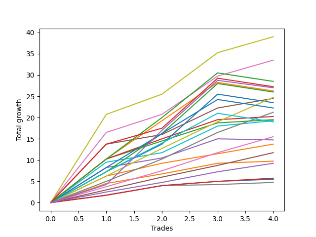

# Short Pointer 003 DB 
- Symbol: ES_830-1130
- Date Range: 03/18/2022 - 12/30/2022
- Trading Period: 8:30-11:30
- Number of Trades: 101



| Name | Win Percent | Profit | Avg Profit / Trade | Avg Time / Trade |      | Name | Win Percent | Profit | Avg Profit / Trade | Avg Time / Trade |
| ---- | ----------- | ------ | ------------------ | ---------------- | ---- | ---- | ----------- | ------ | ------------------ | ---------------- |
| Sorted By <br> Profit | | | | | | Sorted By <br> Win Percentage ||||
| TP-8 | 74.26 | 171125.00 | 1694.31 | 32:42 |     | TP-1 | 96.04 | 57250.00 | 566.83 | 07:13 |
| V U/L 1SD | 63.37 | 163000.00 | 1613.86 | 45:31 |     | TP-2 | 92.08 | 68875.00 | 681.93 | 10:45 |
| TP-7 | 75.25 | 157000.00 | 1554.46 | 30:34 |     | TP-3 | 88.12 | 92250.00 | 913.37 | 15:24 |
| BB-50 U/L 1SD | 76.24 | 155000.00 | 1534.65 | 29:23 |     | BB-20 U/L 2SD | 82.18 | 153750.00 | 1522.28 | 19:48 |
| BB-20 U/L 2SD C | 80.20 | 154875.00 | 1533.42 | 20:58 |     | TP-4 | 81.19 | 101500.00 | 1004.95 | 20:51 |
| BB-20 U/L 2SD | 82.18 | 153750.00 | 1522.28 | 19:48 |     | BB-20 U/L 2SD C | 80.20 | 154875.00 | 1533.42 | 20:58 |
| BB-100 U/L 2SD | 61.39 | 152500.00 | 1509.90 | 50:43 |     | TP-5 | 80.20 | 132375.00 | 1310.64 | 23:01 |
| TP-9 | 69.31 | 149625.00 | 1481.44 | 35:34 |     | BB-20 U/L 1SD | 80.20 | 115500.00 | 1143.56 | 12:04 |
| TP-10 | 67.33 | 149500.00 | 1480.20 | 37:53 |     | TP-6 | 78.22 | 146125.00 | 1446.78 | 26:43 |
| TP-6 | 78.22 | 146125.00 | 1446.78 | 26:43 |     | BB-20 U/L 2SD SL-10 | 78.22 | 103125.00 | 1021.04 | 15:52 |
| BB-50 Mid | 75.25 | 142875.00 | 1414.60 | 18:19 |     | BB-20 U/L 1SD SL-10 | 78.22 | 77125.00 | 763.61 | 09:56 |
| BB-100 Mid | 76.24 | 138500.00 | 1371.29 | 26:18 |     | BB-20 Mid | 77.23 | 55375.00 | 548.27 | 07:25 |
| NEWFI 000 | 63.37 | 137000.00 | 1356.44 | 45:05 |     | BB-20 Mid SL-10 | 77.23 | 36875.00 | 365.10 | 06:13 |
| NEWFI 06 | 58.42 | 136750.00 | 1353.96 | 54:29 |     | BB-50 U/L 1SD | 76.24 | 155000.00 | 1534.65 | 29:23 |
| BB-200 U/L 2SD | 59.41 | 135875.00 | 1345.30 | 54:17 |     | BB-100 Mid | 76.24 | 138500.00 | 1371.29 | 26:18 |
| TP-5 | 80.20 | 132375.00 | 1310.64 | 23:01 |     | TP-7 | 75.25 | 157000.00 | 1554.46 | 30:34 |
| BB-50 U/L 2SD | 66.34 | 119625.00 | 1184.41 | 40:03 |     | BB-50 Mid | 75.25 | 142875.00 | 1414.60 | 18:19 |
| BB-20 U/L 1SD | 80.20 | 115500.00 | 1143.56 | 12:04 |     | BB-20 U/L 2SD C SL-10 | 75.25 | 97250.00 | 962.87 | 16:40 |
| V U/L 1SD SL-10 | 56.44 | 109875.00 | 1087.87 | 34:30 |     | TP-8 | 74.26 | 171125.00 | 1694.31 | 32:42 |
| V U/L 1SD SL-5 | 43.56 | 107375.00 | 1063.12 | 25:03 |     | V Mid | 73.27 | 89000.00 | 881.19 | 18:03 |
| BB-200 Mid | 67.33 | 104625.00 | 1035.89 | 22:17 |     | BB-50 Mid SL-10 | 73.27 | 81125.00 | 803.22 | 14:17 |
| BB-20 U/L 2SD SL-10 | 78.22 | 103125.00 | 1021.04 | 15:52 |     | BB-20 Mid SL-5 | 72.28 | 31250.00 | 309.41 | 04:41 |
| TP-4 | 81.19 | 101500.00 | 1004.95 | 20:51 |     | V Mid SL-10 | 70.30 | 73750.00 | 730.20 | 14:05 |
| BB-100 U/L 2SD SL-10 | 54.46 | 98125.00 | 971.53 | 39:32 |     | TP-9 | 69.31 | 149625.00 | 1481.44 | 35:34 |
| BB-20 U/L 2SD C SL-10 | 75.25 | 97250.00 | 962.87 | 16:40 |     | BB-20 U/L 1SD SL-5 | 69.31 | 65125.00 | 644.80 | 07:41 |
| BB-200 Mid SL-10 | 64.36 | 94750.00 | 938.12 | 17:33 |     | TP-10 | 67.33 | 149500.00 | 1480.20 | 37:53 |
| TP-3 | 88.12 | 92250.00 | 913.37 | 15:24 |     | BB-200 Mid | 67.33 | 104625.00 | 1035.89 | 22:17 |
| BB-20 U/L 2SD C SL-5 | 63.37 | 89875.00 | 889.85 | 13:02 |     | BB-100 Mid SL-10 | 67.33 | 79000.00 | 782.18 | 19:26 |
| V Mid | 73.27 | 89000.00 | 881.19 | 18:03 |     | BB-50 U/L 2SD | 66.34 | 119625.00 | 1184.41 | 40:03 |
| BB-100 U/L 2SD SL-5 | 41.58 | 87125.00 | 862.62 | 29:23 |     | BB-50 U/L 1SD SL-10 | 66.34 | 80750.00 | 799.50 | 22:03 |
| BB-20 U/L 2SD SL-5 | 65.35 | 85125.00 | 842.82 | 12:30 |     | BB-20 U/L 2SD SL-5 | 65.35 | 85125.00 | 842.82 | 12:30 |
| BB-200 U/L 2SD SL-10 | 52.48 | 81500.00 | 806.93 | 43:06 |     | BB-200 Mid SL-10 | 64.36 | 94750.00 | 938.12 | 17:33 |
| BB-50 Mid SL-10 | 73.27 | 81125.00 | 803.22 | 14:17 |     | V U/L 1SD | 63.37 | 163000.00 | 1613.86 | 45:31 |
| BB-50 U/L 1SD SL-10 | 66.34 | 80750.00 | 799.50 | 22:03 |     | NEWFI 000 | 63.37 | 137000.00 | 1356.44 | 45:05 |
| BB-100 Mid SL-10 | 67.33 | 79000.00 | 782.18 | 19:26 |     | BB-20 U/L 2SD C SL-5 | 63.37 | 89875.00 | 889.85 | 13:02 |
| BB-200 U/L 2SD SL-5 | 39.60 | 78000.00 | 772.28 | 32:40 |     | BB-50 Mid SL-5 | 63.37 | 70750.00 | 700.50 | 10:20 |
| BB-200 Mid SL-5 | 55.45 | 77375.00 | 766.09 | 12:19 |     | V Mid SL-5 | 63.37 | 65625.00 | 649.75 | 09:45 |
| BB-20 U/L 1SD SL-10 | 78.22 | 77125.00 | 763.61 | 09:56 |     | BB-100 U/L 2SD | 61.39 | 152500.00 | 1509.90 | 50:43 |
| BB-100 Mid SL-5 | 56.44 | 75250.00 | 745.05 | 13:12 |     | BB-200 U/L 2SD | 59.41 | 135875.00 | 1345.30 | 54:17 |
| V Mid SL-10 | 70.30 | 73750.00 | 730.20 | 14:05 |     | NEWFI 06 | 58.42 | 136750.00 | 1353.96 | 54:29 |
| BB-50 Mid SL-5 | 63.37 | 70750.00 | 700.50 | 10:20 |     | BB-50 U/L 2SD SL-10 | 58.42 | 68750.00 | 680.69 | 29:55 |
| BB-50 U/L 1SD SL-5 | 51.49 | 69750.00 | 690.59 | 15:29 |     | V U/L 1SD SL-10 | 56.44 | 109875.00 | 1087.87 | 34:30 |
| TP-2 | 92.08 | 68875.00 | 681.93 | 10:45 |     | BB-100 Mid SL-5 | 56.44 | 75250.00 | 745.05 | 13:12 |
| BB-50 U/L 2SD SL-10 | 58.42 | 68750.00 | 680.69 | 29:55 |     | BB-200 Mid SL-5 | 55.45 | 77375.00 | 766.09 | 12:19 |
| BB-50 U/L 2SD SL-5 | 45.54 | 68250.00 | 675.74 | 21:11 |     | BB-100 U/L 2SD SL-10 | 54.46 | 98125.00 | 971.53 | 39:32 |
| V Mid SL-5 | 63.37 | 65625.00 | 649.75 | 09:45 |     | BB-200 U/L 2SD SL-10 | 52.48 | 81500.00 | 806.93 | 43:06 |
| BB-20 U/L 1SD SL-5 | 69.31 | 65125.00 | 644.80 | 07:41 |     | BB-50 U/L 1SD SL-5 | 51.49 | 69750.00 | 690.59 | 15:29 |
| TP-1 | 96.04 | 57250.00 | 566.83 | 07:13 |     | NEWFI 0000 | 46.53 | 43375.00 | 429.46 | 08:26 |
| BB-20 Mid | 77.23 | 55375.00 | 548.27 | 07:25 |     | BB-50 U/L 2SD SL-5 | 45.54 | 68250.00 | 675.74 | 21:11 |
| NEWFI 0000 | 46.53 | 43375.00 | 429.46 | 08:26 |     | V U/L 1SD SL-5 | 43.56 | 107375.00 | 1063.12 | 25:03 |
| BB-20 Mid SL-10 | 77.23 | 36875.00 | 365.10 | 06:13 |     | BB-100 U/L 2SD SL-5 | 41.58 | 87125.00 | 862.62 | 29:23 |
| BB-20 Mid SL-5 | 72.28 | 31250.00 | 309.41 | 04:41 |     | BB-200 U/L 2SD SL-5 | 39.60 | 78000.00 | 772.28 | 32:40 |

## NO STOPLOSS

### Test BB-20 Mid
* Sell when price hits the middle line of the 20p bollinger
* No Stoploss
* Results:
```
Total Trades: 101
Percent Up: 22.77
Percent Down: 77.23
Total Points Moved Down: 110.75
Potential Profit: 55375.00
Total Points Ups: 101.25 Count Ups: 23
Total Points Downs: 212.00 Count Downs: 78
```

<details><summary>Trades</summary>

<code>In: 2022-03-25 10:53:00		Out: 2022-03-25 11:18:15		Total Position Time: 25:15		Total Move Down: -8.50		Total to Date: -8.50</code> <br />
<code>In: 2022-03-25 11:34:00		Out: 2022-03-25 11:40:25		Total Position Time: 06:25		Total Move Down: 2.00		Total to Date: -6.50</code> <br />
<code>In: 2022-03-25 11:57:00		Out: 2022-03-25 11:58:10		Total Position Time: 01:10		Total Move Down: 0.25		Total to Date: -6.25</code> <br />
<code>In: 2022-03-29 08:52:00		Out: 2022-03-29 08:56:20		Total Position Time: 04:20		Total Move Down: 1.50		Total to Date: -4.75</code> <br />
<code>In: 2022-03-29 08:53:00		Out: 2022-03-29 08:56:20		Total Position Time: 03:20		Total Move Down: 0.75		Total to Date: -4.00</code> <br />
<code>In: 2022-03-31 12:05:00		Out: 2022-03-31 12:11:40		Total Position Time: 06:40		Total Move Down: 2.75		Total to Date: -1.25</code> <br />
<code>In: 2022-04-01 11:08:00		Out: 2022-04-01 11:25:25		Total Position Time: 17:25		Total Move Down: -2.25		Total to Date: -3.50</code> <br />
<code>In: 2022-04-07 11:04:00		Out: 2022-04-07 11:15:20		Total Position Time: 11:20		Total Move Down: 3.25		Total to Date: -0.25</code> <br />
<code>In: 2022-04-18 10:59:00		Out: 2022-04-18 11:00:10		Total Position Time: 01:10		Total Move Down: 3.00		Total to Date: 2.75</code> <br />
<code>In: 2022-04-20 09:55:00		Out: 2022-04-20 09:59:15		Total Position Time: 04:15		Total Move Down: 2.25		Total to Date: 5.00</code> <br />
<code>In: 2022-04-25 09:13:00		Out: 2022-04-25 09:31:05		Total Position Time: 18:05		Total Move Down: -6.75		Total to Date: -1.75</code> <br />
<code>In: 2022-04-25 09:28:00		Out: 2022-04-25 09:31:05		Total Position Time: 03:05		Total Move Down: 3.25		Total to Date: 1.50</code> <br />
<code>In: 2022-04-25 09:29:00		Out: 2022-04-25 09:31:05		Total Position Time: 02:05		Total Move Down: 1.00		Total to Date: 2.50</code> <br />
<code>In: 2022-04-25 09:53:00		Out: 2022-04-25 09:54:25		Total Position Time: 01:25		Total Move Down: -0.00		Total to Date: 2.50</code> <br />
<code>In: 2022-04-26 09:31:00		Out: 2022-04-26 09:37:15		Total Position Time: 06:15		Total Move Down: 2.75		Total to Date: 5.25</code> <br />
<code>In: 2022-04-26 10:02:00		Out: 2022-04-26 10:03:10		Total Position Time: 01:10		Total Move Down: 7.00		Total to Date: 12.25</code> <br />
<code>In: 2022-05-24 08:51:00		Out: 2022-05-24 09:01:05		Total Position Time: 10:05		Total Move Down: 4.25		Total to Date: 16.50</code> <br />
<code>In: 2022-05-24 09:18:00		Out: 2022-05-24 09:21:55		Total Position Time: 03:55		Total Move Down: 5.75		Total to Date: 22.25</code> <br />
<code>In: 2022-05-24 10:44:00		Out: 2022-05-24 11:01:15		Total Position Time: 17:15		Total Move Down: -3.00		Total to Date: 19.25</code> <br />
<code>In: 2022-06-01 11:30:00		Out: 2022-06-01 11:40:05		Total Position Time: 10:05		Total Move Down: 2.75		Total to Date: 22.00</code> <br />
<code>In: 2022-06-01 12:19:00		Out: 2022-06-01 12:25:25		Total Position Time: 06:25		Total Move Down: 1.00		Total to Date: 23.00</code> <br />
<code>In: 2022-06-03 11:31:00		Out: 2022-06-03 11:33:25		Total Position Time: 02:25		Total Move Down: 3.50		Total to Date: 26.50</code> <br />
<code>In: 2022-06-09 08:47:00		Out: 2022-06-09 08:48:20		Total Position Time: 01:20		Total Move Down: 2.75		Total to Date: 29.25</code> <br />
<code>In: 2022-06-09 09:46:00		Out: 2022-06-09 09:49:20		Total Position Time: 03:20		Total Move Down: 2.00		Total to Date: 31.25</code> <br />
<code>In: 2022-06-09 10:08:00		Out: 2022-06-09 10:16:50		Total Position Time: 08:50		Total Move Down: 1.75		Total to Date: 33.00</code> <br />
<code>In: 2022-06-10 10:42:00		Out: 2022-06-10 10:55:05		Total Position Time: 13:05		Total Move Down: -2.25		Total to Date: 30.75</code> <br />
<code>In: 2022-06-10 10:53:00		Out: 2022-06-10 10:55:05		Total Position Time: 02:05		Total Move Down: 5.50		Total to Date: 36.25</code> <br />
<code>In: 2022-06-10 11:26:00		Out: 2022-06-10 11:28:25		Total Position Time: 02:25		Total Move Down: 5.25		Total to Date: 41.50</code> <br />
<code>In: 2022-06-13 08:42:00		Out: 2022-06-13 08:47:40		Total Position Time: 05:40		Total Move Down: 2.75		Total to Date: 44.25</code> <br />
<code>In: 2022-06-13 09:14:00		Out: 2022-06-13 09:17:05		Total Position Time: 03:05		Total Move Down: 6.00		Total to Date: 50.25</code> <br />
<code>In: 2022-06-13 09:15:00		Out: 2022-06-13 09:17:05		Total Position Time: 02:05		Total Move Down: 5.50		Total to Date: 55.75</code> <br />
<code>In: 2022-06-13 09:41:00		Out: 2022-06-13 09:43:25		Total Position Time: 02:25		Total Move Down: 8.25		Total to Date: 64.00</code> <br />
<code>In: 2022-06-16 08:30:00		Out: 2022-06-16 08:31:10		Total Position Time: 01:10		Total Move Down: 9.00		Total to Date: 73.00</code> <br />
<code>In: 2022-06-17 08:34:00		Out: 2022-06-17 08:35:45		Total Position Time: 01:45		Total Move Down: 3.75		Total to Date: 76.75</code> <br />
<code>In: 2022-06-17 08:35:00		Out: 2022-06-17 08:36:10		Total Position Time: 01:10		Total Move Down: 1.75		Total to Date: 78.50</code> <br />
<code>In: 2022-06-29 12:20:00		Out: 2022-06-29 12:33:20		Total Position Time: 13:20		Total Move Down: -2.25		Total to Date: 76.25</code> <br />
<code>In: 2022-07-01 10:35:00		Out: 2022-07-01 11:02:15		Total Position Time: 27:15		Total Move Down: -11.25		Total to Date: 65.00</code> <br />
<code>In: 2022-07-05 08:49:00		Out: 2022-07-05 09:03:00		Total Position Time: 14:00		Total Move Down: 0.50		Total to Date: 65.50</code> <br />
<code>In: 2022-07-18 08:46:00		Out: 2022-07-18 08:50:10		Total Position Time: 04:10		Total Move Down: 2.50		Total to Date: 68.00</code> <br />
<code>In: 2022-07-18 09:01:00		Out: 2022-07-18 09:02:10		Total Position Time: 01:10		Total Move Down: 0.75		Total to Date: 68.75</code> <br />
<code>In: 2022-07-26 10:13:00		Out: 2022-07-26 10:15:10		Total Position Time: 02:10		Total Move Down: 2.25		Total to Date: 71.00</code> <br />
<code>In: 2022-08-01 12:01:00		Out: 2022-08-01 12:20:15		Total Position Time: 19:15		Total Move Down: -3.50		Total to Date: 67.50</code> <br />
<code>In: 2022-08-01 12:18:00		Out: 2022-08-01 12:20:15		Total Position Time: 02:15		Total Move Down: 3.25		Total to Date: 70.75</code> <br />
<code>In: 2022-08-04 10:31:00		Out: 2022-08-04 10:43:05		Total Position Time: 12:05		Total Move Down: -1.00		Total to Date: 69.75</code> <br />
<code>In: 2022-08-05 10:10:00		Out: 2022-08-05 10:20:05		Total Position Time: 10:05		Total Move Down: -0.25		Total to Date: 69.50</code> <br />
<code>In: 2022-08-05 10:18:00		Out: 2022-08-05 10:20:05		Total Position Time: 02:05		Total Move Down: 2.00		Total to Date: 71.50</code> <br />
<code>In: 2022-08-09 11:56:00		Out: 2022-08-09 12:04:10		Total Position Time: 08:10		Total Move Down: 1.00		Total to Date: 72.50</code> <br />
<code>In: 2022-08-09 12:26:00		Out: 2022-08-09 12:35:40		Total Position Time: 09:40		Total Move Down: 1.00		Total to Date: 73.50</code> <br />
<code>In: 2022-08-09 12:29:00		Out: 2022-08-09 12:35:40		Total Position Time: 06:40		Total Move Down: 1.75		Total to Date: 75.25</code> <br />
<code>In: 2022-08-11 10:21:00		Out: 2022-08-11 10:27:30		Total Position Time: 06:30		Total Move Down: 1.00		Total to Date: 76.25</code> <br />
<code>In: 2022-08-22 09:28:00		Out: 2022-08-22 09:29:10		Total Position Time: 01:10		Total Move Down: 2.25		Total to Date: 78.50</code> <br />
<code>In: 2022-08-25 10:26:00		Out: 2022-08-25 10:56:00		Total Position Time: 30:00		Total Move Down: -7.25		Total to Date: 71.25</code> <br />
<code>In: 2022-08-25 10:37:00		Out: 2022-08-25 10:56:00		Total Position Time: 19:00		Total Move Down: -3.50		Total to Date: 67.75</code> <br />
<code>In: 2022-08-29 08:39:00		Out: 2022-08-29 08:42:25		Total Position Time: 03:25		Total Move Down: 3.25		Total to Date: 71.00</code> <br />
<code>In: 2022-08-29 09:07:00		Out: 2022-08-29 09:14:10		Total Position Time: 07:10		Total Move Down: 3.00		Total to Date: 74.00</code> <br />
<code>In: 2022-08-30 09:18:00		Out: 2022-08-30 09:19:10		Total Position Time: 01:10		Total Move Down: 4.25		Total to Date: 78.25</code> <br />
<code>In: 2022-08-31 09:01:00		Out: 2022-08-31 09:04:15		Total Position Time: 03:15		Total Move Down: 1.25		Total to Date: 79.50</code> <br />
<code>In: 2022-08-31 09:02:00		Out: 2022-08-31 09:04:15		Total Position Time: 02:15		Total Move Down: 1.00		Total to Date: 80.50</code> <br />
<code>In: 2022-09-01 08:38:00		Out: 2022-09-01 08:42:00		Total Position Time: 04:00		Total Move Down: 5.75		Total to Date: 86.25</code> <br />
<code>In: 2022-09-01 08:39:00		Out: 2022-09-01 08:42:00		Total Position Time: 03:00		Total Move Down: 3.25		Total to Date: 89.50</code> <br />
<code>In: 2022-09-01 09:20:00		Out: 2022-09-01 09:21:10		Total Position Time: 01:10		Total Move Down: 3.25		Total to Date: 92.75</code> <br />
<code>In: 2022-09-01 10:17:00		Out: 2022-09-01 10:36:40		Total Position Time: 19:40		Total Move Down: -6.00		Total to Date: 86.75</code> <br />
<code>In: 2022-09-06 12:15:00		Out: 2022-09-06 12:20:45		Total Position Time: 05:45		Total Move Down: 2.25		Total to Date: 89.00</code> <br />
<code>In: 2022-09-12 09:47:00		Out: 2022-09-12 09:48:40		Total Position Time: 01:40		Total Move Down: 1.75		Total to Date: 90.75</code> <br />
<code>In: 2022-09-12 10:32:00		Out: 2022-09-12 10:36:35		Total Position Time: 04:35		Total Move Down: 1.25		Total to Date: 92.00</code> <br />
<code>In: 2022-09-12 10:33:00		Out: 2022-09-12 10:36:35		Total Position Time: 03:35		Total Move Down: 0.50		Total to Date: 92.50</code> <br />
<code>In: 2022-09-15 10:21:00		Out: 2022-09-15 10:30:05		Total Position Time: 09:05		Total Move Down: -1.25		Total to Date: 91.25</code> <br />
<code>In: 2022-09-15 10:29:00		Out: 2022-09-15 10:30:15		Total Position Time: 01:15		Total Move Down: 3.50		Total to Date: 94.75</code> <br />
<code>In: 2022-09-16 11:31:00		Out: 2022-09-16 11:41:10		Total Position Time: 10:10		Total Move Down: 1.50		Total to Date: 96.25</code> <br />
<code>In: 2022-09-16 11:51:00		Out: 2022-09-16 12:11:10		Total Position Time: 20:10		Total Move Down: -5.25		Total to Date: 91.00</code> <br />
<code>In: 2022-09-20 12:05:00		Out: 2022-09-20 12:06:10		Total Position Time: 01:10		Total Move Down: 2.50		Total to Date: 93.50</code> <br />
<code>In: 2022-09-22 09:28:00		Out: 2022-09-22 09:30:30		Total Position Time: 02:30		Total Move Down: 4.50		Total to Date: 98.00</code> <br />
<code>In: 2022-09-22 09:55:00		Out: 2022-09-22 09:58:35		Total Position Time: 03:35		Total Move Down: 1.50		Total to Date: 99.50</code> <br />
<code>In: 2022-09-22 10:57:00		Out: 2022-09-22 11:01:30		Total Position Time: 04:30		Total Move Down: 1.50		Total to Date: 101.00</code> <br />
<code>In: 2022-09-22 11:59:00		Out: 2022-09-22 12:19:50		Total Position Time: 20:50		Total Move Down: -9.50		Total to Date: 91.50</code> <br />
<code>In: 2022-09-22 12:16:00		Out: 2022-09-22 12:19:50		Total Position Time: 03:50		Total Move Down: 2.50		Total to Date: 94.00</code> <br />
<code>In: 2022-09-22 12:17:00		Out: 2022-09-22 12:19:50		Total Position Time: 02:50		Total Move Down: 2.25		Total to Date: 96.25</code> <br />
<code>In: 2022-09-29 08:48:00		Out: 2022-09-29 09:02:05		Total Position Time: 14:05		Total Move Down: -4.50		Total to Date: 91.75</code> <br />
<code>In: 2022-09-29 08:57:00		Out: 2022-09-29 09:02:05		Total Position Time: 05:05		Total Move Down: 4.50		Total to Date: 96.25</code> <br />
<code>In: 2022-10-05 08:42:00		Out: 2022-10-05 08:48:40		Total Position Time: 06:40		Total Move Down: 4.25		Total to Date: 100.50</code> <br />
<code>In: 2022-10-06 09:50:00		Out: 2022-10-06 09:55:05		Total Position Time: 05:05		Total Move Down: 2.75		Total to Date: 103.25</code> <br />
<code>In: 2022-10-06 09:51:00		Out: 2022-10-06 09:55:05		Total Position Time: 04:05		Total Move Down: 1.00		Total to Date: 104.25</code> <br />
<code>In: 2022-10-10 12:19:00		Out: 2022-10-10 12:26:10		Total Position Time: 07:10		Total Move Down: 4.50		Total to Date: 108.75</code> <br />
<code>In: 2022-10-17 08:44:00		Out: 2022-10-17 08:59:05		Total Position Time: 15:05		Total Move Down: -2.00		Total to Date: 106.75</code> <br />
<code>In: 2022-10-17 08:56:00		Out: 2022-10-17 08:59:05		Total Position Time: 03:05		Total Move Down: 0.75		Total to Date: 107.50</code> <br />
<code>In: 2022-11-04 12:14:00		Out: 2022-11-04 12:20:25		Total Position Time: 06:25		Total Move Down: 4.00		Total to Date: 111.50</code> <br />
<code>In: 2022-11-15 08:36:00		Out: 2022-11-15 08:44:10		Total Position Time: 08:10		Total Move Down: 2.00		Total to Date: 113.50</code> <br />
<code>In: 2022-11-15 12:26:00		Out: 2022-11-15 12:28:20		Total Position Time: 02:20		Total Move Down: 3.50		Total to Date: 117.00</code> <br />
<code>In: 2022-11-16 08:35:00		Out: 2022-11-16 08:36:10		Total Position Time: 01:10		Total Move Down: 0.50		Total to Date: 117.50</code> <br />
<code>In: 2022-11-21 09:39:00		Out: 2022-11-21 09:49:20		Total Position Time: 10:20		Total Move Down: -0.00		Total to Date: 117.50</code> <br />
<code>In: 2022-11-21 10:16:00		Out: 2022-11-21 10:27:25		Total Position Time: 11:25		Total Move Down: 0.50		Total to Date: 118.00</code> <br />
<code>In: 2022-11-21 10:42:00		Out: 2022-11-21 10:47:25		Total Position Time: 05:25		Total Move Down: 1.00		Total to Date: 119.00</code> <br />
<code>In: 2022-12-01 10:10:00		Out: 2022-12-01 10:15:35		Total Position Time: 05:35		Total Move Down: 3.00		Total to Date: 122.00</code> <br />
<code>In: 2022-12-01 11:28:00		Out: 2022-12-01 11:31:05		Total Position Time: 03:05		Total Move Down: 1.50		Total to Date: 123.50</code> <br />
<code>In: 2022-12-01 11:55:00		Out: 2022-12-01 11:56:50		Total Position Time: 01:50		Total Move Down: 3.25		Total to Date: 126.75</code> <br />
<code>In: 2022-12-07 09:47:00		Out: 2022-12-07 09:58:55		Total Position Time: 11:55		Total Move Down: -0.75		Total to Date: 126.00</code> <br />
<code>In: 2022-12-07 10:16:00		Out: 2022-12-07 10:25:55		Total Position Time: 09:55		Total Move Down: 0.50		Total to Date: 126.50</code> <br />
<code>In: 2022-12-07 10:21:00		Out: 2022-12-07 10:25:55		Total Position Time: 04:55		Total Move Down: 3.00		Total to Date: 129.50</code> <br />
<code>In: 2022-12-16 12:19:00		Out: 2022-12-16 12:45:00		Total Position Time: 26:00		Total Move Down: -5.00		Total to Date: 124.50</code> <br />
<code>In: 2022-12-22 12:01:00		Out: 2022-12-22 12:35:15		Total Position Time: 34:15		Total Move Down: -15.25		Total to Date: 109.25</code> <br />
<code>In: 2022-12-30 09:01:00		Out: 2022-12-30 09:05:45		Total Position Time: 04:45		Total Move Down: 1.50		Total to Date: 110.75</code> <br />


</details>

### Test BB-20 U/L 1SD
* Sell when the price hits the lower line of the 20p 1std bollinger
* No Stoploss
* Results:
```
Total Trades: 101
Percent Up: 19.80
Percent Down: 80.20
Total Points Moved Down: 231.00
Potential Profit: 115500.00
Total Points Ups: 92.00 Count Ups: 20
Total Points Downs: 323.00 Count Downs: 81
```

<details><summary>Trades</summary>

<code>In: 2022-03-25 10:53:00		Out: 2022-03-25 11:19:45		Total Position Time: 26:45		Total Move Down: -7.50		Total to Date: -7.50</code> <br />
<code>In: 2022-03-25 11:34:00		Out: 2022-03-25 11:41:25		Total Position Time: 07:25		Total Move Down: 2.50		Total to Date: -5.00</code> <br />
<code>In: 2022-03-25 11:57:00		Out: 2022-03-25 12:00:45		Total Position Time: 03:45		Total Move Down: 1.75		Total to Date: -3.25</code> <br />
<code>In: 2022-03-29 08:52:00		Out: 2022-03-29 08:58:40		Total Position Time: 06:40		Total Move Down: 3.00		Total to Date: -0.25</code> <br />
<code>In: 2022-03-29 08:53:00		Out: 2022-03-29 08:58:40		Total Position Time: 05:40		Total Move Down: 2.25		Total to Date: 2.00</code> <br />
<code>In: 2022-03-31 12:05:00		Out: 2022-03-31 12:16:00		Total Position Time: 11:00		Total Move Down: 4.75		Total to Date: 6.75</code> <br />
<code>In: 2022-04-01 11:08:00		Out: 2022-04-01 11:50:15		Total Position Time: 42:15		Total Move Down: -8.50		Total to Date: -1.75</code> <br />
<code>In: 2022-04-07 11:04:00		Out: 2022-04-07 11:18:00		Total Position Time: 14:00		Total Move Down: 4.00		Total to Date: 2.25</code> <br />
<code>In: 2022-04-18 10:59:00		Out: 2022-04-18 11:06:35		Total Position Time: 07:35		Total Move Down: 4.75		Total to Date: 7.00</code> <br />
<code>In: 2022-04-20 09:55:00		Out: 2022-04-20 10:08:15		Total Position Time: 13:15		Total Move Down: 3.25		Total to Date: 10.25</code> <br />
<code>In: 2022-04-25 09:13:00		Out: 2022-04-25 09:42:45		Total Position Time: 29:45		Total Move Down: -8.00		Total to Date: 2.25</code> <br />
<code>In: 2022-04-25 09:28:00		Out: 2022-04-25 09:42:45		Total Position Time: 14:45		Total Move Down: 2.00		Total to Date: 4.25</code> <br />
<code>In: 2022-04-25 09:29:00		Out: 2022-04-25 09:42:45		Total Position Time: 13:45		Total Move Down: -0.25		Total to Date: 4.00</code> <br />
<code>In: 2022-04-25 09:53:00		Out: 2022-04-25 09:55:05		Total Position Time: 02:05		Total Move Down: 3.50		Total to Date: 7.50</code> <br />
<code>In: 2022-04-26 09:31:00		Out: 2022-04-26 09:38:05		Total Position Time: 07:05		Total Move Down: 6.75		Total to Date: 14.25</code> <br />
<code>In: 2022-04-26 10:02:00		Out: 2022-04-26 10:03:20		Total Position Time: 01:20		Total Move Down: 7.75		Total to Date: 22.00</code> <br />
<code>In: 2022-05-24 08:51:00		Out: 2022-05-24 09:06:20		Total Position Time: 15:20		Total Move Down: 2.25		Total to Date: 24.25</code> <br />
<code>In: 2022-05-24 09:18:00		Out: 2022-05-24 09:29:20		Total Position Time: 11:20		Total Move Down: 6.50		Total to Date: 30.75</code> <br />
<code>In: 2022-05-24 10:44:00		Out: 2022-05-24 11:01:40		Total Position Time: 17:40		Total Move Down: 0.50		Total to Date: 31.25</code> <br />
<code>In: 2022-06-01 11:30:00		Out: 2022-06-01 11:46:40		Total Position Time: 16:40		Total Move Down: -0.25		Total to Date: 31.00</code> <br />
<code>In: 2022-06-01 12:19:00		Out: 2022-06-01 12:30:05		Total Position Time: 11:05		Total Move Down: 4.25		Total to Date: 35.25</code> <br />
<code>In: 2022-06-03 11:31:00		Out: 2022-06-03 11:37:05		Total Position Time: 06:05		Total Move Down: 5.00		Total to Date: 40.25</code> <br />
<code>In: 2022-06-09 08:47:00		Out: 2022-06-09 08:49:35		Total Position Time: 02:35		Total Move Down: 7.00		Total to Date: 47.25</code> <br />
<code>In: 2022-06-09 09:46:00		Out: 2022-06-09 09:54:45		Total Position Time: 08:45		Total Move Down: 2.25		Total to Date: 49.50</code> <br />
<code>In: 2022-06-09 10:08:00		Out: 2022-06-09 10:18:50		Total Position Time: 10:50		Total Move Down: 2.75		Total to Date: 52.25</code> <br />
<code>In: 2022-06-10 10:42:00		Out: 2022-06-10 10:56:05		Total Position Time: 14:05		Total Move Down: -1.50		Total to Date: 50.75</code> <br />
<code>In: 2022-06-10 10:53:00		Out: 2022-06-10 10:56:05		Total Position Time: 03:05		Total Move Down: 6.25		Total to Date: 57.00</code> <br />
<code>In: 2022-06-10 11:26:00		Out: 2022-06-10 11:38:10		Total Position Time: 12:10		Total Move Down: 4.50		Total to Date: 61.50</code> <br />
<code>In: 2022-06-13 08:42:00		Out: 2022-06-13 08:52:05		Total Position Time: 10:05		Total Move Down: 6.75		Total to Date: 68.25</code> <br />
<code>In: 2022-06-13 09:14:00		Out: 2022-06-13 09:24:05		Total Position Time: 10:05		Total Move Down: 5.50		Total to Date: 73.75</code> <br />
<code>In: 2022-06-13 09:15:00		Out: 2022-06-13 09:24:05		Total Position Time: 09:05		Total Move Down: 5.00		Total to Date: 78.75</code> <br />
<code>In: 2022-06-13 09:41:00		Out: 2022-06-13 09:47:50		Total Position Time: 06:50		Total Move Down: 13.25		Total to Date: 92.00</code> <br />
<code>In: 2022-06-16 08:30:00		Out: 2022-06-16 08:31:10		Total Position Time: 01:10		Total Move Down: 9.00		Total to Date: 101.00</code> <br />
<code>In: 2022-06-17 08:34:00		Out: 2022-06-17 08:39:05		Total Position Time: 05:05		Total Move Down: 8.00		Total to Date: 109.00</code> <br />
<code>In: 2022-06-17 08:35:00		Out: 2022-06-17 08:39:05		Total Position Time: 04:05		Total Move Down: 6.25		Total to Date: 115.25</code> <br />
<code>In: 2022-06-29 12:20:00		Out: 2022-06-29 12:34:15		Total Position Time: 14:15		Total Move Down: 2.00		Total to Date: 117.25</code> <br />
<code>In: 2022-07-01 10:35:00		Out: 2022-07-01 11:04:30		Total Position Time: 29:30		Total Move Down: -9.50		Total to Date: 107.75</code> <br />
<code>In: 2022-07-05 08:49:00		Out: 2022-07-05 09:03:30		Total Position Time: 14:30		Total Move Down: 2.00		Total to Date: 109.75</code> <br />
<code>In: 2022-07-18 08:46:00		Out: 2022-07-18 09:05:10		Total Position Time: 19:10		Total Move Down: 1.00		Total to Date: 110.75</code> <br />
<code>In: 2022-07-18 09:01:00		Out: 2022-07-18 09:05:10		Total Position Time: 04:10		Total Move Down: 1.50		Total to Date: 112.25</code> <br />
<code>In: 2022-07-26 10:13:00		Out: 2022-07-26 10:19:10		Total Position Time: 06:10		Total Move Down: 4.00		Total to Date: 116.25</code> <br />
<code>In: 2022-08-01 12:01:00		Out: 2022-08-01 12:21:45		Total Position Time: 20:45		Total Move Down: -1.50		Total to Date: 114.75</code> <br />
<code>In: 2022-08-01 12:18:00		Out: 2022-08-01 12:21:45		Total Position Time: 03:45		Total Move Down: 5.25		Total to Date: 120.00</code> <br />
<code>In: 2022-08-04 10:31:00		Out: 2022-08-04 10:43:15		Total Position Time: 12:15		Total Move Down: 0.50		Total to Date: 120.50</code> <br />
<code>In: 2022-08-05 10:10:00		Out: 2022-08-05 10:23:15		Total Position Time: 13:15		Total Move Down: 1.00		Total to Date: 121.50</code> <br />
<code>In: 2022-08-05 10:18:00		Out: 2022-08-05 10:23:15		Total Position Time: 05:15		Total Move Down: 3.25		Total to Date: 124.75</code> <br />
<code>In: 2022-08-09 11:56:00		Out: 2022-08-09 12:06:05		Total Position Time: 10:05		Total Move Down: 2.50		Total to Date: 127.25</code> <br />
<code>In: 2022-08-09 12:26:00		Out: 2022-08-09 12:38:50		Total Position Time: 12:50		Total Move Down: 2.00		Total to Date: 129.25</code> <br />
<code>In: 2022-08-09 12:29:00		Out: 2022-08-09 12:38:50		Total Position Time: 09:50		Total Move Down: 2.75		Total to Date: 132.00</code> <br />
<code>In: 2022-08-11 10:21:00		Out: 2022-08-11 10:31:50		Total Position Time: 10:50		Total Move Down: 2.25		Total to Date: 134.25</code> <br />
<code>In: 2022-08-22 09:28:00		Out: 2022-08-22 09:32:05		Total Position Time: 04:05		Total Move Down: 3.00		Total to Date: 137.25</code> <br />
<code>In: 2022-08-25 10:26:00		Out: 2022-08-25 11:00:45		Total Position Time: 34:45		Total Move Down: -6.25		Total to Date: 131.00</code> <br />
<code>In: 2022-08-25 10:37:00		Out: 2022-08-25 11:00:45		Total Position Time: 23:45		Total Move Down: -2.50		Total to Date: 128.50</code> <br />
<code>In: 2022-08-29 08:39:00		Out: 2022-08-29 08:43:30		Total Position Time: 04:30		Total Move Down: 7.00		Total to Date: 135.50</code> <br />
<code>In: 2022-08-29 09:07:00		Out: 2022-08-29 09:24:15		Total Position Time: 17:15		Total Move Down: 0.75		Total to Date: 136.25</code> <br />
<code>In: 2022-08-30 09:18:00		Out: 2022-08-30 09:21:05		Total Position Time: 03:05		Total Move Down: 4.75		Total to Date: 141.00</code> <br />
<code>In: 2022-08-31 09:01:00		Out: 2022-08-31 09:06:20		Total Position Time: 05:20		Total Move Down: 2.50		Total to Date: 143.50</code> <br />
<code>In: 2022-08-31 09:02:00		Out: 2022-08-31 09:06:20		Total Position Time: 04:20		Total Move Down: 2.25		Total to Date: 145.75</code> <br />
<code>In: 2022-09-01 08:38:00		Out: 2022-09-01 08:44:15		Total Position Time: 06:15		Total Move Down: 9.50		Total to Date: 155.25</code> <br />
<code>In: 2022-09-01 08:39:00		Out: 2022-09-01 08:44:15		Total Position Time: 05:15		Total Move Down: 7.00		Total to Date: 162.25</code> <br />
<code>In: 2022-09-01 09:20:00		Out: 2022-09-01 09:25:40		Total Position Time: 05:40		Total Move Down: 4.75		Total to Date: 167.00</code> <br />
<code>In: 2022-09-01 10:17:00		Out: 2022-09-01 10:41:50		Total Position Time: 24:50		Total Move Down: -4.25		Total to Date: 162.75</code> <br />
<code>In: 2022-09-06 12:15:00		Out: 2022-09-06 12:22:20		Total Position Time: 07:20		Total Move Down: 6.75		Total to Date: 169.50</code> <br />
<code>In: 2022-09-12 09:47:00		Out: 2022-09-12 09:48:40		Total Position Time: 01:40		Total Move Down: 1.75		Total to Date: 171.25</code> <br />
<code>In: 2022-09-12 10:32:00		Out: 2022-09-12 10:41:30		Total Position Time: 09:30		Total Move Down: 2.75		Total to Date: 174.00</code> <br />
<code>In: 2022-09-12 10:33:00		Out: 2022-09-12 10:41:30		Total Position Time: 08:30		Total Move Down: 2.00		Total to Date: 176.00</code> <br />
<code>In: 2022-09-15 10:21:00		Out: 2022-09-15 10:32:20		Total Position Time: 11:20		Total Move Down: 1.75		Total to Date: 177.75</code> <br />
<code>In: 2022-09-15 10:29:00		Out: 2022-09-15 10:32:20		Total Position Time: 03:20		Total Move Down: 5.75		Total to Date: 183.50</code> <br />
<code>In: 2022-09-16 11:31:00		Out: 2022-09-16 12:14:25		Total Position Time: 43:25		Total Move Down: -8.50		Total to Date: 175.00</code> <br />
<code>In: 2022-09-16 11:51:00		Out: 2022-09-16 12:14:25		Total Position Time: 23:25		Total Move Down: -1.75		Total to Date: 173.25</code> <br />
<code>In: 2022-09-20 12:05:00		Out: 2022-09-20 12:06:10		Total Position Time: 01:10		Total Move Down: 2.50		Total to Date: 175.75</code> <br />
<code>In: 2022-09-22 09:28:00		Out: 2022-09-22 09:59:15		Total Position Time: 31:15		Total Move Down: 2.00		Total to Date: 177.75</code> <br />
<code>In: 2022-09-22 09:55:00		Out: 2022-09-22 09:59:15		Total Position Time: 04:15		Total Move Down: 3.25		Total to Date: 181.00</code> <br />
<code>In: 2022-09-22 10:57:00		Out: 2022-09-22 11:03:35		Total Position Time: 06:35		Total Move Down: 2.50		Total to Date: 183.50</code> <br />
<code>In: 2022-09-22 11:59:00		Out: 2022-09-22 12:20:20		Total Position Time: 21:20		Total Move Down: -6.50		Total to Date: 177.00</code> <br />
<code>In: 2022-09-22 12:16:00		Out: 2022-09-22 12:20:20		Total Position Time: 04:20		Total Move Down: 5.50		Total to Date: 182.50</code> <br />
<code>In: 2022-09-22 12:17:00		Out: 2022-09-22 12:20:20		Total Position Time: 03:20		Total Move Down: 5.25		Total to Date: 187.75</code> <br />
<code>In: 2022-09-29 08:48:00		Out: 2022-09-29 09:10:55		Total Position Time: 22:55		Total Move Down: -4.25		Total to Date: 183.50</code> <br />
<code>In: 2022-09-29 08:57:00		Out: 2022-09-29 09:10:55		Total Position Time: 13:55		Total Move Down: 4.75		Total to Date: 188.25</code> <br />
<code>In: 2022-10-05 08:42:00		Out: 2022-10-05 08:51:05		Total Position Time: 09:05		Total Move Down: 6.25		Total to Date: 194.50</code> <br />
<code>In: 2022-10-06 09:50:00		Out: 2022-10-06 09:57:05		Total Position Time: 07:05		Total Move Down: 5.25		Total to Date: 199.75</code> <br />
<code>In: 2022-10-06 09:51:00		Out: 2022-10-06 09:57:05		Total Position Time: 06:05		Total Move Down: 3.50		Total to Date: 203.25</code> <br />
<code>In: 2022-10-10 12:19:00		Out: 2022-10-10 12:28:05		Total Position Time: 09:05		Total Move Down: 7.25		Total to Date: 210.50</code> <br />
<code>In: 2022-10-17 08:44:00		Out: 2022-10-17 09:04:15		Total Position Time: 20:15		Total Move Down: -0.75		Total to Date: 209.75</code> <br />
<code>In: 2022-10-17 08:56:00		Out: 2022-10-17 09:04:15		Total Position Time: 08:15		Total Move Down: 2.00		Total to Date: 211.75</code> <br />
<code>In: 2022-11-04 12:14:00		Out: 2022-11-04 12:22:20		Total Position Time: 08:20		Total Move Down: 6.50		Total to Date: 218.25</code> <br />
<code>In: 2022-11-15 08:36:00		Out: 2022-11-15 08:50:50		Total Position Time: 14:50		Total Move Down: 2.50		Total to Date: 220.75</code> <br />
<code>In: 2022-11-15 12:26:00		Out: 2022-11-15 12:30:20		Total Position Time: 04:20		Total Move Down: 8.00		Total to Date: 228.75</code> <br />
<code>In: 2022-11-16 08:35:00		Out: 2022-11-16 08:38:25		Total Position Time: 03:25		Total Move Down: 2.25		Total to Date: 231.00</code> <br />
<code>In: 2022-11-21 09:39:00		Out: 2022-11-21 09:50:20		Total Position Time: 11:20		Total Move Down: 2.50		Total to Date: 233.50</code> <br />
<code>In: 2022-11-21 10:16:00		Out: 2022-11-21 10:33:00		Total Position Time: 17:00		Total Move Down: -0.00		Total to Date: 233.50</code> <br />
<code>In: 2022-11-21 10:42:00		Out: 2022-11-21 10:54:00		Total Position Time: 12:00		Total Move Down: 2.75		Total to Date: 236.25</code> <br />
<code>In: 2022-12-01 10:10:00		Out: 2022-12-01 10:17:00		Total Position Time: 07:00		Total Move Down: 5.75		Total to Date: 242.00</code> <br />
<code>In: 2022-12-01 11:28:00		Out: 2022-12-01 11:45:05		Total Position Time: 17:05		Total Move Down: 0.75		Total to Date: 242.75</code> <br />
<code>In: 2022-12-01 11:55:00		Out: 2022-12-01 12:13:50		Total Position Time: 18:50		Total Move Down: 1.25		Total to Date: 244.00</code> <br />
<code>In: 2022-12-07 09:47:00		Out: 2022-12-07 10:03:30		Total Position Time: 16:30		Total Move Down: -0.25		Total to Date: 243.75</code> <br />
<code>In: 2022-12-07 10:16:00		Out: 2022-12-07 10:30:45		Total Position Time: 14:45		Total Move Down: 1.25		Total to Date: 245.00</code> <br />
<code>In: 2022-12-07 10:21:00		Out: 2022-12-07 10:30:45		Total Position Time: 09:45		Total Move Down: 3.75		Total to Date: 248.75</code> <br />
<code>In: 2022-12-16 12:19:00		Out: 2022-12-16 12:47:00		Total Position Time: 28:00		Total Move Down: -7.75		Total to Date: 241.00</code> <br />
<code>In: 2022-12-22 12:01:00		Out: 2022-12-22 12:37:50		Total Position Time: 36:50		Total Move Down: -12.25		Total to Date: 228.75</code> <br />
<code>In: 2022-12-30 09:01:00		Out: 2022-12-30 09:14:10		Total Position Time: 13:10		Total Move Down: 2.25		Total to Date: 231.00</code> <br />


</details>

### Test BB-20 U/L 2SD
* Sell when the price hits the lower line of the 20p 2std bollinger
* No Stoploss
* Results:
```
Total Trades: 101
Percent Up: 17.82
Percent Down: 82.18
Total Points Moved Down: 307.50
Potential Profit: 153750.00
Total Points Ups: 103.75 Count Ups: 18
Total Points Downs: 411.25 Count Downs: 83
```

<details><summary>Trades</summary>

<code>In: 2022-03-25 10:53:00		Out: 2022-03-25 11:53:55		Total Position Time: 60:55		Total Move Down: -13.75		Total to Date: -13.75</code> <br />
<code>In: 2022-03-25 11:34:00		Out: 2022-03-25 12:00:55		Total Position Time: 26:55		Total Move Down: 1.75		Total to Date: -12.00</code> <br />
<code>In: 2022-03-25 11:57:00		Out: 2022-03-25 12:00:55		Total Position Time: 03:55		Total Move Down: 2.75		Total to Date: -9.25</code> <br />
<code>In: 2022-03-29 08:52:00		Out: 2022-03-29 09:01:40		Total Position Time: 09:40		Total Move Down: 4.50		Total to Date: -4.75</code> <br />
<code>In: 2022-03-29 08:53:00		Out: 2022-03-29 09:01:40		Total Position Time: 08:40		Total Move Down: 3.75		Total to Date: -1.00</code> <br />
<code>In: 2022-03-31 12:05:00		Out: 2022-03-31 12:19:35		Total Position Time: 14:35		Total Move Down: 6.75		Total to Date: 5.75</code> <br />
<code>In: 2022-04-01 11:08:00		Out: 2022-04-01 11:50:20		Total Position Time: 42:20		Total Move Down: -8.00		Total to Date: -2.25</code> <br />
<code>In: 2022-04-07 11:04:00		Out: 2022-04-07 11:18:20		Total Position Time: 14:20		Total Move Down: 5.25		Total to Date: 3.00</code> <br />
<code>In: 2022-04-18 10:59:00		Out: 2022-04-18 11:10:40		Total Position Time: 11:40		Total Move Down: 6.25		Total to Date: 9.25</code> <br />
<code>In: 2022-04-20 09:55:00		Out: 2022-04-20 10:08:15		Total Position Time: 13:15		Total Move Down: 3.25		Total to Date: 12.50</code> <br />
<code>In: 2022-04-25 09:13:00		Out: 2022-04-25 10:01:15		Total Position Time: 48:15		Total Move Down: -6.00		Total to Date: 6.50</code> <br />
<code>In: 2022-04-25 09:28:00		Out: 2022-04-25 10:01:15		Total Position Time: 33:15		Total Move Down: 4.00		Total to Date: 10.50</code> <br />
<code>In: 2022-04-25 09:29:00		Out: 2022-04-25 10:01:15		Total Position Time: 32:15		Total Move Down: 1.75		Total to Date: 12.25</code> <br />
<code>In: 2022-04-25 09:53:00		Out: 2022-04-25 10:01:15		Total Position Time: 08:15		Total Move Down: 7.50		Total to Date: 19.75</code> <br />
<code>In: 2022-04-26 09:31:00		Out: 2022-04-26 09:40:15		Total Position Time: 09:15		Total Move Down: 8.50		Total to Date: 28.25</code> <br />
<code>In: 2022-04-26 10:02:00		Out: 2022-04-26 10:22:20		Total Position Time: 20:20		Total Move Down: 19.50		Total to Date: 47.75</code> <br />
<code>In: 2022-05-24 08:51:00		Out: 2022-05-24 09:31:20		Total Position Time: 40:20		Total Move Down: -2.00		Total to Date: 45.75</code> <br />
<code>In: 2022-05-24 09:18:00		Out: 2022-05-24 09:31:20		Total Position Time: 13:20		Total Move Down: 10.75		Total to Date: 56.50</code> <br />
<code>In: 2022-05-24 10:44:00		Out: 2022-05-24 11:01:50		Total Position Time: 17:50		Total Move Down: 1.50		Total to Date: 58.00</code> <br />
<code>In: 2022-06-01 11:30:00		Out: 2022-06-01 11:51:10		Total Position Time: 21:10		Total Move Down: 2.75		Total to Date: 60.75</code> <br />
<code>In: 2022-06-01 12:19:00		Out: 2022-06-01 12:30:05		Total Position Time: 11:05		Total Move Down: 4.25		Total to Date: 65.00</code> <br />
<code>In: 2022-06-03 11:31:00		Out: 2022-06-03 11:37:20		Total Position Time: 06:20		Total Move Down: 7.00		Total to Date: 72.00</code> <br />
<code>In: 2022-06-09 08:47:00		Out: 2022-06-09 09:11:05		Total Position Time: 24:05		Total Move Down: 9.00		Total to Date: 81.00</code> <br />
<code>In: 2022-06-09 09:46:00		Out: 2022-06-09 09:55:00		Total Position Time: 09:00		Total Move Down: 4.00		Total to Date: 85.00</code> <br />
<code>In: 2022-06-09 10:08:00		Out: 2022-06-09 10:19:05		Total Position Time: 11:05		Total Move Down: 2.75		Total to Date: 87.75</code> <br />
<code>In: 2022-06-10 10:42:00		Out: 2022-06-10 11:01:00		Total Position Time: 19:00		Total Move Down: 3.25		Total to Date: 91.00</code> <br />
<code>In: 2022-06-10 10:53:00		Out: 2022-06-10 11:01:00		Total Position Time: 08:00		Total Move Down: 11.00		Total to Date: 102.00</code> <br />
<code>In: 2022-06-10 11:26:00		Out: 2022-06-10 11:40:10		Total Position Time: 14:10		Total Move Down: 6.75		Total to Date: 108.75</code> <br />
<code>In: 2022-06-13 08:42:00		Out: 2022-06-13 08:55:10		Total Position Time: 13:10		Total Move Down: 7.25		Total to Date: 116.00</code> <br />
<code>In: 2022-06-13 09:14:00		Out: 2022-06-13 09:30:20		Total Position Time: 16:20		Total Move Down: 4.25		Total to Date: 120.25</code> <br />
<code>In: 2022-06-13 09:15:00		Out: 2022-06-13 09:30:20		Total Position Time: 15:20		Total Move Down: 3.75		Total to Date: 124.00</code> <br />
<code>In: 2022-06-13 09:41:00		Out: 2022-06-13 09:54:15		Total Position Time: 13:15		Total Move Down: 17.75		Total to Date: 141.75</code> <br />
<code>In: 2022-06-16 08:30:00		Out: 2022-06-16 08:36:10		Total Position Time: 06:10		Total Move Down: 10.25		Total to Date: 152.00</code> <br />
<code>In: 2022-06-17 08:34:00		Out: 2022-06-17 08:45:15		Total Position Time: 11:15		Total Move Down: 12.00		Total to Date: 164.00</code> <br />
<code>In: 2022-06-17 08:35:00		Out: 2022-06-17 08:45:15		Total Position Time: 10:15		Total Move Down: 10.25		Total to Date: 174.25</code> <br />
<code>In: 2022-06-29 12:20:00		Out: 2022-06-29 12:36:35		Total Position Time: 16:35		Total Move Down: 3.25		Total to Date: 177.50</code> <br />
<code>In: 2022-07-01 10:35:00		Out: 2022-07-01 11:07:55		Total Position Time: 32:55		Total Move Down: -7.50		Total to Date: 170.00</code> <br />
<code>In: 2022-07-05 08:49:00		Out: 2022-07-05 09:05:50		Total Position Time: 16:50		Total Move Down: 3.25		Total to Date: 173.25</code> <br />
<code>In: 2022-07-18 08:46:00		Out: 2022-07-18 09:08:15		Total Position Time: 22:15		Total Move Down: 2.75		Total to Date: 176.00</code> <br />
<code>In: 2022-07-18 09:01:00		Out: 2022-07-18 09:08:15		Total Position Time: 07:15		Total Move Down: 3.25		Total to Date: 179.25</code> <br />
<code>In: 2022-07-26 10:13:00		Out: 2022-07-26 10:32:35		Total Position Time: 19:35		Total Move Down: 4.50		Total to Date: 183.75</code> <br />
<code>In: 2022-08-01 12:01:00		Out: 2022-08-01 12:22:35		Total Position Time: 21:35		Total Move Down: 0.50		Total to Date: 184.25</code> <br />
<code>In: 2022-08-01 12:18:00		Out: 2022-08-01 12:22:35		Total Position Time: 04:35		Total Move Down: 7.25		Total to Date: 191.50</code> <br />
<code>In: 2022-08-04 10:31:00		Out: 2022-08-04 10:45:30		Total Position Time: 14:30		Total Move Down: 0.75		Total to Date: 192.25</code> <br />
<code>In: 2022-08-05 10:10:00		Out: 2022-08-05 10:49:30		Total Position Time: 39:30		Total Move Down: -0.75		Total to Date: 191.50</code> <br />
<code>In: 2022-08-05 10:18:00		Out: 2022-08-05 10:49:30		Total Position Time: 31:30		Total Move Down: 1.50		Total to Date: 193.00</code> <br />
<code>In: 2022-08-09 11:56:00		Out: 2022-08-09 12:13:35		Total Position Time: 17:35		Total Move Down: 2.75		Total to Date: 195.75</code> <br />
<code>In: 2022-08-09 12:26:00		Out: 2022-08-09 12:42:35		Total Position Time: 16:35		Total Move Down: 1.75		Total to Date: 197.50</code> <br />
<code>In: 2022-08-09 12:29:00		Out: 2022-08-09 12:42:35		Total Position Time: 13:35		Total Move Down: 2.50		Total to Date: 200.00</code> <br />
<code>In: 2022-08-11 10:21:00		Out: 2022-08-11 10:33:20		Total Position Time: 12:20		Total Move Down: 3.50		Total to Date: 203.50</code> <br />
<code>In: 2022-08-22 09:28:00		Out: 2022-08-22 09:44:50		Total Position Time: 16:50		Total Move Down: 4.25		Total to Date: 207.75</code> <br />
<code>In: 2022-08-25 10:26:00		Out: 2022-08-25 11:04:40		Total Position Time: 38:40		Total Move Down: -5.50		Total to Date: 202.25</code> <br />
<code>In: 2022-08-25 10:37:00		Out: 2022-08-25 11:04:40		Total Position Time: 27:40		Total Move Down: -1.75		Total to Date: 200.50</code> <br />
<code>In: 2022-08-29 08:39:00		Out: 2022-08-29 09:24:35		Total Position Time: 45:35		Total Move Down: -7.75		Total to Date: 192.75</code> <br />
<code>In: 2022-08-29 09:07:00		Out: 2022-08-29 09:24:35		Total Position Time: 17:35		Total Move Down: 2.25		Total to Date: 195.00</code> <br />
<code>In: 2022-08-30 09:18:00		Out: 2022-08-30 09:25:30		Total Position Time: 07:30		Total Move Down: 8.75		Total to Date: 203.75</code> <br />
<code>In: 2022-08-31 09:01:00		Out: 2022-08-31 09:07:00		Total Position Time: 06:00		Total Move Down: 4.50		Total to Date: 208.25</code> <br />
<code>In: 2022-08-31 09:02:00		Out: 2022-08-31 09:07:00		Total Position Time: 05:00		Total Move Down: 4.25		Total to Date: 212.50</code> <br />
<code>In: 2022-09-01 08:38:00		Out: 2022-09-01 09:36:10		Total Position Time: 58:10		Total Move Down: 6.75		Total to Date: 219.25</code> <br />
<code>In: 2022-09-01 08:39:00		Out: 2022-09-01 09:36:10		Total Position Time: 57:10		Total Move Down: 4.25		Total to Date: 223.50</code> <br />
<code>In: 2022-09-01 09:20:00		Out: 2022-09-01 09:36:10		Total Position Time: 16:10		Total Move Down: 6.25		Total to Date: 229.75</code> <br />
<code>In: 2022-09-01 10:17:00		Out: 2022-09-01 10:45:10		Total Position Time: 28:10		Total Move Down: -3.75		Total to Date: 226.00</code> <br />
<code>In: 2022-09-06 12:15:00		Out: 2022-09-06 12:30:20		Total Position Time: 15:20		Total Move Down: 4.50		Total to Date: 230.50</code> <br />
<code>In: 2022-09-12 09:47:00		Out: 2022-09-12 10:02:00		Total Position Time: 15:00		Total Move Down: 2.75		Total to Date: 233.25</code> <br />
<code>In: 2022-09-12 10:32:00		Out: 2022-09-12 10:43:35		Total Position Time: 11:35		Total Move Down: 4.00		Total to Date: 237.25</code> <br />
<code>In: 2022-09-12 10:33:00		Out: 2022-09-12 10:43:35		Total Position Time: 10:35		Total Move Down: 3.25		Total to Date: 240.50</code> <br />
<code>In: 2022-09-15 10:21:00		Out: 2022-09-15 10:36:30		Total Position Time: 15:30		Total Move Down: 2.25		Total to Date: 242.75</code> <br />
<code>In: 2022-09-15 10:29:00		Out: 2022-09-15 10:36:30		Total Position Time: 07:30		Total Move Down: 6.25		Total to Date: 249.00</code> <br />
<code>In: 2022-09-16 11:31:00		Out: 2022-09-16 12:28:05		Total Position Time: 57:05		Total Move Down: -6.75		Total to Date: 242.25</code> <br />
<code>In: 2022-09-16 11:51:00		Out: 2022-09-16 12:28:05		Total Position Time: 37:05		Total Move Down: -0.00		Total to Date: 242.25</code> <br />
<code>In: 2022-09-20 12:05:00		Out: 2022-09-20 12:07:45		Total Position Time: 02:45		Total Move Down: 5.00		Total to Date: 247.25</code> <br />
<code>In: 2022-09-22 09:28:00		Out: 2022-09-22 10:03:25		Total Position Time: 35:25		Total Move Down: 4.25		Total to Date: 251.50</code> <br />
<code>In: 2022-09-22 09:55:00		Out: 2022-09-22 10:03:25		Total Position Time: 08:25		Total Move Down: 5.50		Total to Date: 257.00</code> <br />
<code>In: 2022-09-22 10:57:00		Out: 2022-09-22 11:07:55		Total Position Time: 10:55		Total Move Down: 5.00		Total to Date: 262.00</code> <br />
<code>In: 2022-09-22 11:59:00		Out: 2022-09-22 12:22:20		Total Position Time: 23:20		Total Move Down: -4.00		Total to Date: 258.00</code> <br />
<code>In: 2022-09-22 12:16:00		Out: 2022-09-22 12:22:20		Total Position Time: 06:20		Total Move Down: 8.00		Total to Date: 266.00</code> <br />
<code>In: 2022-09-22 12:17:00		Out: 2022-09-22 12:22:20		Total Position Time: 05:20		Total Move Down: 7.75		Total to Date: 273.75</code> <br />
<code>In: 2022-09-29 08:48:00		Out: 2022-09-29 09:11:30		Total Position Time: 23:30		Total Move Down: -2.00		Total to Date: 271.75</code> <br />
<code>In: 2022-09-29 08:57:00		Out: 2022-09-29 09:11:30		Total Position Time: 14:30		Total Move Down: 7.00		Total to Date: 278.75</code> <br />
<code>In: 2022-10-05 08:42:00		Out: 2022-10-05 09:02:25		Total Position Time: 20:25		Total Move Down: 6.25		Total to Date: 285.00</code> <br />
<code>In: 2022-10-06 09:50:00		Out: 2022-10-06 10:02:00		Total Position Time: 12:00		Total Move Down: 6.25		Total to Date: 291.25</code> <br />
<code>In: 2022-10-06 09:51:00		Out: 2022-10-06 10:02:00		Total Position Time: 11:00		Total Move Down: 4.50		Total to Date: 295.75</code> <br />
<code>In: 2022-10-10 12:19:00		Out: 2022-10-10 12:47:00		Total Position Time: 28:00		Total Move Down: -1.00		Total to Date: 294.75</code> <br />
<code>In: 2022-10-17 08:44:00		Out: 2022-10-17 09:12:25		Total Position Time: 28:25		Total Move Down: 0.50		Total to Date: 295.25</code> <br />
<code>In: 2022-10-17 08:56:00		Out: 2022-10-17 09:12:25		Total Position Time: 16:25		Total Move Down: 3.25		Total to Date: 298.50</code> <br />
<code>In: 2022-11-04 12:14:00		Out: 2022-11-04 12:47:00		Total Position Time: 33:00		Total Move Down: -14.50		Total to Date: 284.00</code> <br />
<code>In: 2022-11-15 08:36:00		Out: 2022-11-15 09:01:30		Total Position Time: 25:30		Total Move Down: 4.00		Total to Date: 288.00</code> <br />
<code>In: 2022-11-15 12:26:00		Out: 2022-11-15 12:30:25		Total Position Time: 04:25		Total Move Down: 9.75		Total to Date: 297.75</code> <br />
<code>In: 2022-11-16 08:35:00		Out: 2022-11-16 09:01:40		Total Position Time: 26:40		Total Move Down: 0.75		Total to Date: 298.50</code> <br />
<code>In: 2022-11-21 09:39:00		Out: 2022-11-21 09:53:05		Total Position Time: 14:05		Total Move Down: 2.75		Total to Date: 301.25</code> <br />
<code>In: 2022-11-21 10:16:00		Out: 2022-11-21 10:33:10		Total Position Time: 17:10		Total Move Down: 0.25		Total to Date: 301.50</code> <br />
<code>In: 2022-11-21 10:42:00		Out: 2022-11-21 10:56:50		Total Position Time: 14:50		Total Move Down: 4.00		Total to Date: 305.50</code> <br />
<code>In: 2022-12-01 10:10:00		Out: 2022-12-01 10:18:10		Total Position Time: 08:10		Total Move Down: 8.00		Total to Date: 313.50</code> <br />
<code>In: 2022-12-01 11:28:00		Out: 2022-12-01 11:45:05		Total Position Time: 17:05		Total Move Down: 0.75		Total to Date: 314.25</code> <br />
<code>In: 2022-12-01 11:55:00		Out: 2022-12-01 12:14:30		Total Position Time: 19:30		Total Move Down: 3.50		Total to Date: 317.75</code> <br />
<code>In: 2022-12-07 09:47:00		Out: 2022-12-07 10:04:10		Total Position Time: 17:10		Total Move Down: 0.25		Total to Date: 318.00</code> <br />
<code>In: 2022-12-07 10:16:00		Out: 2022-12-07 10:32:25		Total Position Time: 16:25		Total Move Down: 2.75		Total to Date: 320.75</code> <br />
<code>In: 2022-12-07 10:21:00		Out: 2022-12-07 10:32:25		Total Position Time: 11:25		Total Move Down: 5.25		Total to Date: 326.00</code> <br />
<code>In: 2022-12-16 12:19:00		Out: 2022-12-16 12:47:00		Total Position Time: 28:00		Total Move Down: -7.75		Total to Date: 318.25</code> <br />
<code>In: 2022-12-22 12:01:00		Out: 2022-12-22 12:41:15		Total Position Time: 40:15		Total Move Down: -11.00		Total to Date: 307.25</code> <br />
<code>In: 2022-12-30 09:01:00		Out: 2022-12-30 09:41:10		Total Position Time: 40:10		Total Move Down: 0.25		Total to Date: 307.50</code> <br />


</details>

### Test BB-20 U/L 2SD C
* Sell when the price hits the lower line of the 20p 2std bollinger
* No Stoploss
* Results:
```
Total Trades: 101
Percent Up: 19.80
Percent Down: 80.20
Total Points Moved Down: 309.75
Potential Profit: 154875.00
Total Points Ups: 117.00 Count Ups: 20
Total Points Downs: 426.75 Count Downs: 81
```

<details><summary>Trades</summary>

<code>In: 2022-03-25 10:53:00		Out: 2022-03-25 11:53:55		Total Position Time: 60:55		Total Move Down: -13.75		Total to Date: -13.75</code> <br />
<code>In: 2022-03-25 11:34:00		Out: 2022-03-25 12:01:15		Total Position Time: 27:15		Total Move Down: 2.25		Total to Date: -11.50</code> <br />
<code>In: 2022-03-25 11:57:00		Out: 2022-03-25 12:01:15		Total Position Time: 04:15		Total Move Down: 3.25		Total to Date: -8.25</code> <br />
<code>In: 2022-03-29 08:52:00		Out: 2022-03-29 09:01:40		Total Position Time: 09:40		Total Move Down: 4.50		Total to Date: -3.75</code> <br />
<code>In: 2022-03-29 08:53:00		Out: 2022-03-29 09:01:40		Total Position Time: 08:40		Total Move Down: 3.75		Total to Date: 0.00</code> <br />
<code>In: 2022-03-31 12:05:00		Out: 2022-03-31 12:19:35		Total Position Time: 14:35		Total Move Down: 6.75		Total to Date: 6.75</code> <br />
<code>In: 2022-04-01 11:08:00		Out: 2022-04-01 11:50:45		Total Position Time: 42:45		Total Move Down: -7.50		Total to Date: -0.75</code> <br />
<code>In: 2022-04-07 11:04:00		Out: 2022-04-07 11:18:20		Total Position Time: 14:20		Total Move Down: 5.25		Total to Date: 4.50</code> <br />
<code>In: 2022-04-18 10:59:00		Out: 2022-04-18 11:10:40		Total Position Time: 11:40		Total Move Down: 6.25		Total to Date: 10.75</code> <br />
<code>In: 2022-04-20 09:55:00		Out: 2022-04-20 10:08:15		Total Position Time: 13:15		Total Move Down: 3.25		Total to Date: 14.00</code> <br />
<code>In: 2022-04-25 09:13:00		Out: 2022-04-25 10:01:20		Total Position Time: 48:20		Total Move Down: -3.50		Total to Date: 10.50</code> <br />
<code>In: 2022-04-25 09:28:00		Out: 2022-04-25 10:01:20		Total Position Time: 33:20		Total Move Down: 6.50		Total to Date: 17.00</code> <br />
<code>In: 2022-04-25 09:29:00		Out: 2022-04-25 10:01:20		Total Position Time: 32:20		Total Move Down: 4.25		Total to Date: 21.25</code> <br />
<code>In: 2022-04-25 09:53:00		Out: 2022-04-25 10:01:20		Total Position Time: 08:20		Total Move Down: 10.00		Total to Date: 31.25</code> <br />
<code>In: 2022-04-26 09:31:00		Out: 2022-04-26 09:47:10		Total Position Time: 16:10		Total Move Down: 11.25		Total to Date: 42.50</code> <br />
<code>In: 2022-04-26 10:02:00		Out: 2022-04-26 10:23:00		Total Position Time: 21:00		Total Move Down: 19.75		Total to Date: 62.25</code> <br />
<code>In: 2022-05-24 08:51:00		Out: 2022-05-24 09:31:25		Total Position Time: 40:25		Total Move Down: -2.00		Total to Date: 60.25</code> <br />
<code>In: 2022-05-24 09:18:00		Out: 2022-05-24 09:31:25		Total Position Time: 13:25		Total Move Down: 10.75		Total to Date: 71.00</code> <br />
<code>In: 2022-05-24 10:44:00		Out: 2022-05-24 11:01:50		Total Position Time: 17:50		Total Move Down: 1.50		Total to Date: 72.50</code> <br />
<code>In: 2022-06-01 11:30:00		Out: 2022-06-01 11:51:10		Total Position Time: 21:10		Total Move Down: 2.75		Total to Date: 75.25</code> <br />
<code>In: 2022-06-01 12:19:00		Out: 2022-06-01 12:30:05		Total Position Time: 11:05		Total Move Down: 4.25		Total to Date: 79.50</code> <br />
<code>In: 2022-06-03 11:31:00		Out: 2022-06-03 11:37:25		Total Position Time: 06:25		Total Move Down: 7.75		Total to Date: 87.25</code> <br />
<code>In: 2022-06-09 08:47:00		Out: 2022-06-09 09:11:10		Total Position Time: 24:10		Total Move Down: 10.00		Total to Date: 97.25</code> <br />
<code>In: 2022-06-09 09:46:00		Out: 2022-06-09 09:55:00		Total Position Time: 09:00		Total Move Down: 4.00		Total to Date: 101.25</code> <br />
<code>In: 2022-06-09 10:08:00		Out: 2022-06-09 10:21:10		Total Position Time: 13:10		Total Move Down: 2.75		Total to Date: 104.00</code> <br />
<code>In: 2022-06-10 10:42:00		Out: 2022-06-10 11:01:10		Total Position Time: 19:10		Total Move Down: 4.25		Total to Date: 108.25</code> <br />
<code>In: 2022-06-10 10:53:00		Out: 2022-06-10 11:01:10		Total Position Time: 08:10		Total Move Down: 12.00		Total to Date: 120.25</code> <br />
<code>In: 2022-06-10 11:26:00		Out: 2022-06-10 11:40:10		Total Position Time: 14:10		Total Move Down: 6.75		Total to Date: 127.00</code> <br />
<code>In: 2022-06-13 08:42:00		Out: 2022-06-13 09:30:35		Total Position Time: 48:35		Total Move Down: -2.75		Total to Date: 124.25</code> <br />
<code>In: 2022-06-13 09:14:00		Out: 2022-06-13 09:30:35		Total Position Time: 16:35		Total Move Down: 5.25		Total to Date: 129.50</code> <br />
<code>In: 2022-06-13 09:15:00		Out: 2022-06-13 09:30:35		Total Position Time: 15:35		Total Move Down: 4.75		Total to Date: 134.25</code> <br />
<code>In: 2022-06-13 09:41:00		Out: 2022-06-13 09:54:15		Total Position Time: 13:15		Total Move Down: 17.75		Total to Date: 152.00</code> <br />
<code>In: 2022-06-16 08:30:00		Out: 2022-06-16 08:41:35		Total Position Time: 11:35		Total Move Down: 11.00		Total to Date: 163.00</code> <br />
<code>In: 2022-06-17 08:34:00		Out: 2022-06-17 08:45:15		Total Position Time: 11:15		Total Move Down: 12.00		Total to Date: 175.00</code> <br />
<code>In: 2022-06-17 08:35:00		Out: 2022-06-17 08:45:15		Total Position Time: 10:15		Total Move Down: 10.25		Total to Date: 185.25</code> <br />
<code>In: 2022-06-29 12:20:00		Out: 2022-06-29 12:36:35		Total Position Time: 16:35		Total Move Down: 3.25		Total to Date: 188.50</code> <br />
<code>In: 2022-07-01 10:35:00		Out: 2022-07-01 11:07:55		Total Position Time: 32:55		Total Move Down: -7.50		Total to Date: 181.00</code> <br />
<code>In: 2022-07-05 08:49:00		Out: 2022-07-05 09:05:50		Total Position Time: 16:50		Total Move Down: 3.25		Total to Date: 184.25</code> <br />
<code>In: 2022-07-18 08:46:00		Out: 2022-07-18 09:08:15		Total Position Time: 22:15		Total Move Down: 2.75		Total to Date: 187.00</code> <br />
<code>In: 2022-07-18 09:01:00		Out: 2022-07-18 09:08:15		Total Position Time: 07:15		Total Move Down: 3.25		Total to Date: 190.25</code> <br />
<code>In: 2022-07-26 10:13:00		Out: 2022-07-26 10:33:10		Total Position Time: 20:10		Total Move Down: 5.00		Total to Date: 195.25</code> <br />
<code>In: 2022-08-01 12:01:00		Out: 2022-08-01 12:22:35		Total Position Time: 21:35		Total Move Down: 0.50		Total to Date: 195.75</code> <br />
<code>In: 2022-08-01 12:18:00		Out: 2022-08-01 12:22:35		Total Position Time: 04:35		Total Move Down: 7.25		Total to Date: 203.00</code> <br />
<code>In: 2022-08-04 10:31:00		Out: 2022-08-04 10:52:45		Total Position Time: 21:45		Total Move Down: -0.00		Total to Date: 203.00</code> <br />
<code>In: 2022-08-05 10:10:00		Out: 2022-08-05 10:50:35		Total Position Time: 40:35		Total Move Down: -0.25		Total to Date: 202.75</code> <br />
<code>In: 2022-08-05 10:18:00		Out: 2022-08-05 10:50:35		Total Position Time: 32:35		Total Move Down: 2.00		Total to Date: 204.75</code> <br />
<code>In: 2022-08-09 11:56:00		Out: 2022-08-09 12:13:35		Total Position Time: 17:35		Total Move Down: 2.75		Total to Date: 207.50</code> <br />
<code>In: 2022-08-09 12:26:00		Out: 2022-08-09 12:42:40		Total Position Time: 16:40		Total Move Down: 2.00		Total to Date: 209.50</code> <br />
<code>In: 2022-08-09 12:29:00		Out: 2022-08-09 12:42:40		Total Position Time: 13:40		Total Move Down: 2.75		Total to Date: 212.25</code> <br />
<code>In: 2022-08-11 10:21:00		Out: 2022-08-11 10:33:25		Total Position Time: 12:25		Total Move Down: 4.00		Total to Date: 216.25</code> <br />
<code>In: 2022-08-22 09:28:00		Out: 2022-08-22 09:44:55		Total Position Time: 16:55		Total Move Down: 4.75		Total to Date: 221.00</code> <br />
<code>In: 2022-08-25 10:26:00		Out: 2022-08-25 11:04:40		Total Position Time: 38:40		Total Move Down: -5.50		Total to Date: 215.50</code> <br />
<code>In: 2022-08-25 10:37:00		Out: 2022-08-25 11:04:40		Total Position Time: 27:40		Total Move Down: -1.75		Total to Date: 213.75</code> <br />
<code>In: 2022-08-29 08:39:00		Out: 2022-08-29 09:24:35		Total Position Time: 45:35		Total Move Down: -7.75		Total to Date: 206.00</code> <br />
<code>In: 2022-08-29 09:07:00		Out: 2022-08-29 09:24:35		Total Position Time: 17:35		Total Move Down: 2.25		Total to Date: 208.25</code> <br />
<code>In: 2022-08-30 09:18:00		Out: 2022-08-30 09:25:30		Total Position Time: 07:30		Total Move Down: 8.75		Total to Date: 217.00</code> <br />
<code>In: 2022-08-31 09:01:00		Out: 2022-08-31 09:07:05		Total Position Time: 06:05		Total Move Down: 4.75		Total to Date: 221.75</code> <br />
<code>In: 2022-08-31 09:02:00		Out: 2022-08-31 09:07:05		Total Position Time: 05:05		Total Move Down: 4.50		Total to Date: 226.25</code> <br />
<code>In: 2022-09-01 08:38:00		Out: 2022-09-01 09:36:10		Total Position Time: 58:10		Total Move Down: 6.75		Total to Date: 233.00</code> <br />
<code>In: 2022-09-01 08:39:00		Out: 2022-09-01 09:36:10		Total Position Time: 57:10		Total Move Down: 4.25		Total to Date: 237.25</code> <br />
<code>In: 2022-09-01 09:20:00		Out: 2022-09-01 09:36:10		Total Position Time: 16:10		Total Move Down: 6.25		Total to Date: 243.50</code> <br />
<code>In: 2022-09-01 10:17:00		Out: 2022-09-01 10:45:15		Total Position Time: 28:15		Total Move Down: -2.75		Total to Date: 240.75</code> <br />
<code>In: 2022-09-06 12:15:00		Out: 2022-09-06 12:30:25		Total Position Time: 15:25		Total Move Down: 5.50		Total to Date: 246.25</code> <br />
<code>In: 2022-09-12 09:47:00		Out: 2022-09-12 10:02:00		Total Position Time: 15:00		Total Move Down: 2.75		Total to Date: 249.00</code> <br />
<code>In: 2022-09-12 10:32:00		Out: 2022-09-12 10:44:05		Total Position Time: 12:05		Total Move Down: 4.25		Total to Date: 253.25</code> <br />
<code>In: 2022-09-12 10:33:00		Out: 2022-09-12 10:44:05		Total Position Time: 11:05		Total Move Down: 3.50		Total to Date: 256.75</code> <br />
<code>In: 2022-09-15 10:21:00		Out: 2022-09-15 10:36:35		Total Position Time: 15:35		Total Move Down: 2.50		Total to Date: 259.25</code> <br />
<code>In: 2022-09-15 10:29:00		Out: 2022-09-15 10:36:35		Total Position Time: 07:35		Total Move Down: 6.50		Total to Date: 265.75</code> <br />
<code>In: 2022-09-16 11:31:00		Out: 2022-09-16 12:28:15		Total Position Time: 57:15		Total Move Down: -6.25		Total to Date: 259.50</code> <br />
<code>In: 2022-09-16 11:51:00		Out: 2022-09-16 12:28:15		Total Position Time: 37:15		Total Move Down: 0.50		Total to Date: 260.00</code> <br />
<code>In: 2022-09-20 12:05:00		Out: 2022-09-20 12:47:00		Total Position Time: 42:00		Total Move Down: -16.75		Total to Date: 243.25</code> <br />
<code>In: 2022-09-22 09:28:00		Out: 2022-09-22 10:03:30		Total Position Time: 35:30		Total Move Down: 4.75		Total to Date: 248.00</code> <br />
<code>In: 2022-09-22 09:55:00		Out: 2022-09-22 10:03:30		Total Position Time: 08:30		Total Move Down: 6.00		Total to Date: 254.00</code> <br />
<code>In: 2022-09-22 10:57:00		Out: 2022-09-22 11:07:55		Total Position Time: 10:55		Total Move Down: 5.00		Total to Date: 259.00</code> <br />
<code>In: 2022-09-22 11:59:00		Out: 2022-09-22 12:22:20		Total Position Time: 23:20		Total Move Down: -4.00		Total to Date: 255.00</code> <br />
<code>In: 2022-09-22 12:16:00		Out: 2022-09-22 12:22:20		Total Position Time: 06:20		Total Move Down: 8.00		Total to Date: 263.00</code> <br />
<code>In: 2022-09-22 12:17:00		Out: 2022-09-22 12:22:20		Total Position Time: 05:20		Total Move Down: 7.75		Total to Date: 270.75</code> <br />
<code>In: 2022-09-29 08:48:00		Out: 2022-09-29 09:11:40		Total Position Time: 23:40		Total Move Down: -1.75		Total to Date: 269.00</code> <br />
<code>In: 2022-09-29 08:57:00		Out: 2022-09-29 09:11:40		Total Position Time: 14:40		Total Move Down: 7.25		Total to Date: 276.25</code> <br />
<code>In: 2022-10-05 08:42:00		Out: 2022-10-05 09:02:30		Total Position Time: 20:30		Total Move Down: 7.50		Total to Date: 283.75</code> <br />
<code>In: 2022-10-06 09:50:00		Out: 2022-10-06 10:02:05		Total Position Time: 12:05		Total Move Down: 6.75		Total to Date: 290.50</code> <br />
<code>In: 2022-10-06 09:51:00		Out: 2022-10-06 10:02:05		Total Position Time: 11:05		Total Move Down: 5.00		Total to Date: 295.50</code> <br />
<code>In: 2022-10-10 12:19:00		Out: 2022-10-10 12:47:00		Total Position Time: 28:00		Total Move Down: -1.00		Total to Date: 294.50</code> <br />
<code>In: 2022-10-17 08:44:00		Out: 2022-10-17 09:12:25		Total Position Time: 28:25		Total Move Down: 0.50		Total to Date: 295.00</code> <br />
<code>In: 2022-10-17 08:56:00		Out: 2022-10-17 09:12:25		Total Position Time: 16:25		Total Move Down: 3.25		Total to Date: 298.25</code> <br />
<code>In: 2022-11-04 12:14:00		Out: 2022-11-04 12:47:00		Total Position Time: 33:00		Total Move Down: -14.50		Total to Date: 283.75</code> <br />
<code>In: 2022-11-15 08:36:00		Out: 2022-11-15 09:01:30		Total Position Time: 25:30		Total Move Down: 4.00		Total to Date: 287.75</code> <br />
<code>In: 2022-11-15 12:26:00		Out: 2022-11-15 12:30:25		Total Position Time: 04:25		Total Move Down: 9.75		Total to Date: 297.50</code> <br />
<code>In: 2022-11-16 08:35:00		Out: 2022-11-16 09:01:40		Total Position Time: 26:40		Total Move Down: 0.75		Total to Date: 298.25</code> <br />
<code>In: 2022-11-21 09:39:00		Out: 2022-11-21 09:53:05		Total Position Time: 14:05		Total Move Down: 2.75		Total to Date: 301.00</code> <br />
<code>In: 2022-11-21 10:16:00		Out: 2022-11-21 10:33:10		Total Position Time: 17:10		Total Move Down: 0.25		Total to Date: 301.25</code> <br />
<code>In: 2022-11-21 10:42:00		Out: 2022-11-21 10:56:50		Total Position Time: 14:50		Total Move Down: 4.00		Total to Date: 305.25</code> <br />
<code>In: 2022-12-01 10:10:00		Out: 2022-12-01 10:18:10		Total Position Time: 08:10		Total Move Down: 8.00		Total to Date: 313.25</code> <br />
<code>In: 2022-12-01 11:28:00		Out: 2022-12-01 11:45:05		Total Position Time: 17:05		Total Move Down: 0.75		Total to Date: 314.00</code> <br />
<code>In: 2022-12-01 11:55:00		Out: 2022-12-01 12:14:35		Total Position Time: 19:35		Total Move Down: 4.00		Total to Date: 318.00</code> <br />
<code>In: 2022-12-07 09:47:00		Out: 2022-12-07 10:04:10		Total Position Time: 17:10		Total Move Down: 0.25		Total to Date: 318.25</code> <br />
<code>In: 2022-12-07 10:16:00		Out: 2022-12-07 10:32:25		Total Position Time: 16:25		Total Move Down: 2.75		Total to Date: 321.00</code> <br />
<code>In: 2022-12-07 10:21:00		Out: 2022-12-07 10:32:25		Total Position Time: 11:25		Total Move Down: 5.25		Total to Date: 326.25</code> <br />
<code>In: 2022-12-16 12:19:00		Out: 2022-12-16 12:47:00		Total Position Time: 28:00		Total Move Down: -7.75		Total to Date: 318.50</code> <br />
<code>In: 2022-12-22 12:01:00		Out: 2022-12-22 12:41:45		Total Position Time: 40:45		Total Move Down: -10.00		Total to Date: 308.50</code> <br />
<code>In: 2022-12-30 09:01:00		Out: 2022-12-30 09:53:25		Total Position Time: 52:25		Total Move Down: 1.25		Total to Date: 309.75</code> <br />


</details>

### Test BB-50 Mid
* Sell when price hits the middle line of the 50p bollinger
* No Stoploss
* Results:
```
Total Trades: 101
Percent Up: 24.75
Percent Down: 75.25
Total Points Moved Down: 285.75
Potential Profit: 142875.00
Total Points Ups: 97.25 Count Ups: 25
Total Points Downs: 383.00 Count Downs: 76
```

<details><summary>Trades</summary>

<code>In: 2022-03-25 10:53:00		Out: 2022-03-25 11:49:30		Total Position Time: 56:30		Total Move Down: -10.25		Total to Date: -10.25</code> <br />
<code>In: 2022-03-25 11:34:00		Out: 2022-03-25 11:49:30		Total Position Time: 15:30		Total Move Down: 1.00		Total to Date: -9.25</code> <br />
<code>In: 2022-03-25 11:57:00		Out: 2022-03-25 12:00:45		Total Position Time: 03:45		Total Move Down: 1.75		Total to Date: -7.50</code> <br />
<code>In: 2022-03-29 08:52:00		Out: 2022-03-29 09:01:25		Total Position Time: 09:25		Total Move Down: 3.50		Total to Date: -4.00</code> <br />
<code>In: 2022-03-29 08:53:00		Out: 2022-03-29 09:01:25		Total Position Time: 08:25		Total Move Down: 2.75		Total to Date: -1.25</code> <br />
<code>In: 2022-03-31 12:05:00		Out: 2022-03-31 12:16:40		Total Position Time: 11:40		Total Move Down: 5.25		Total to Date: 4.00</code> <br />
<code>In: 2022-04-01 11:08:00		Out: 2022-04-01 11:58:00		Total Position Time: 50:00		Total Move Down: -6.75		Total to Date: -2.75</code> <br />
<code>In: 2022-04-07 11:04:00		Out: 2022-04-07 11:33:40		Total Position Time: 29:40		Total Move Down: 5.50		Total to Date: 2.75</code> <br />
<code>In: 2022-04-18 10:59:00		Out: 2022-04-18 11:16:45		Total Position Time: 17:45		Total Move Down: 7.50		Total to Date: 10.25</code> <br />
<code>In: 2022-04-20 09:55:00		Out: 2022-04-20 10:08:35		Total Position Time: 13:35		Total Move Down: 4.75		Total to Date: 15.00</code> <br />
<code>In: 2022-04-25 09:13:00		Out: 2022-04-25 09:55:05		Total Position Time: 42:05		Total Move Down: -10.00		Total to Date: 5.00</code> <br />
<code>In: 2022-04-25 09:28:00		Out: 2022-04-25 09:55:05		Total Position Time: 27:05		Total Move Down: -0.00		Total to Date: 5.00</code> <br />
<code>In: 2022-04-25 09:29:00		Out: 2022-04-25 09:55:05		Total Position Time: 26:05		Total Move Down: -2.25		Total to Date: 2.75</code> <br />
<code>In: 2022-04-25 09:53:00		Out: 2022-04-25 09:55:05		Total Position Time: 02:05		Total Move Down: 3.50		Total to Date: 6.25</code> <br />
<code>In: 2022-04-26 09:31:00		Out: 2022-04-26 09:46:10		Total Position Time: 15:10		Total Move Down: 10.00		Total to Date: 16.25</code> <br />
<code>In: 2022-04-26 10:02:00		Out: 2022-04-26 10:03:10		Total Position Time: 01:10		Total Move Down: 7.00		Total to Date: 23.25</code> <br />
<code>In: 2022-05-24 08:51:00		Out: 2022-05-24 09:31:20		Total Position Time: 40:20		Total Move Down: -2.00		Total to Date: 21.25</code> <br />
<code>In: 2022-05-24 09:18:00		Out: 2022-05-24 09:31:20		Total Position Time: 13:20		Total Move Down: 10.75		Total to Date: 32.00</code> <br />
<code>In: 2022-05-24 10:44:00		Out: 2022-05-24 11:20:25		Total Position Time: 36:25		Total Move Down: -1.25		Total to Date: 30.75</code> <br />
<code>In: 2022-06-01 11:30:00		Out: 2022-06-01 11:54:50		Total Position Time: 24:50		Total Move Down: 5.50		Total to Date: 36.25</code> <br />
<code>In: 2022-06-01 12:19:00		Out: 2022-06-01 12:25:30		Total Position Time: 06:30		Total Move Down: 1.75		Total to Date: 38.00</code> <br />
<code>In: 2022-06-03 11:31:00		Out: 2022-06-03 11:37:10		Total Position Time: 06:10		Total Move Down: 6.25		Total to Date: 44.25</code> <br />
<code>In: 2022-06-09 08:47:00		Out: 2022-06-09 08:48:40		Total Position Time: 01:40		Total Move Down: 3.50		Total to Date: 47.75</code> <br />
<code>In: 2022-06-09 09:46:00		Out: 2022-06-09 09:55:50		Total Position Time: 09:50		Total Move Down: 5.50		Total to Date: 53.25</code> <br />
<code>In: 2022-06-09 10:08:00		Out: 2022-06-09 10:22:05		Total Position Time: 14:05		Total Move Down: 4.75		Total to Date: 58.00</code> <br />
<code>In: 2022-06-10 10:42:00		Out: 2022-06-10 10:58:20		Total Position Time: 16:20		Total Move Down: 2.25		Total to Date: 60.25</code> <br />
<code>In: 2022-06-10 10:53:00		Out: 2022-06-10 10:58:20		Total Position Time: 05:20		Total Move Down: 10.00		Total to Date: 70.25</code> <br />
<code>In: 2022-06-10 11:26:00		Out: 2022-06-10 11:28:30		Total Position Time: 02:30		Total Move Down: 6.50		Total to Date: 76.75</code> <br />
<code>In: 2022-06-13 08:42:00		Out: 2022-06-13 09:07:15		Total Position Time: 25:15		Total Move Down: 3.00		Total to Date: 79.75</code> <br />
<code>In: 2022-06-13 09:14:00		Out: 2022-06-13 09:24:05		Total Position Time: 10:05		Total Move Down: 5.50		Total to Date: 85.25</code> <br />
<code>In: 2022-06-13 09:15:00		Out: 2022-06-13 09:24:05		Total Position Time: 09:05		Total Move Down: 5.00		Total to Date: 90.25</code> <br />
<code>In: 2022-06-13 09:41:00		Out: 2022-06-13 09:47:55		Total Position Time: 06:55		Total Move Down: 14.75		Total to Date: 105.00</code> <br />
<code>In: 2022-06-16 08:30:00		Out: 2022-06-16 08:36:10		Total Position Time: 06:10		Total Move Down: 10.25		Total to Date: 115.25</code> <br />
<code>In: 2022-06-17 08:34:00		Out: 2022-06-17 08:45:05		Total Position Time: 11:05		Total Move Down: 10.00		Total to Date: 125.25</code> <br />
<code>In: 2022-06-17 08:35:00		Out: 2022-06-17 08:45:05		Total Position Time: 10:05		Total Move Down: 8.25		Total to Date: 133.50</code> <br />
<code>In: 2022-06-29 12:20:00		Out: 2022-06-29 12:34:15		Total Position Time: 14:15		Total Move Down: 2.00		Total to Date: 135.50</code> <br />
<code>In: 2022-07-01 10:35:00		Out: 2022-07-01 11:11:05		Total Position Time: 36:05		Total Move Down: -4.25		Total to Date: 131.25</code> <br />
<code>In: 2022-07-05 08:49:00		Out: 2022-07-05 09:43:40		Total Position Time: 54:40		Total Move Down: -6.25		Total to Date: 125.00</code> <br />
<code>In: 2022-07-18 08:46:00		Out: 2022-07-18 09:08:15		Total Position Time: 22:15		Total Move Down: 2.75		Total to Date: 127.75</code> <br />
<code>In: 2022-07-18 09:01:00		Out: 2022-07-18 09:08:15		Total Position Time: 07:15		Total Move Down: 3.25		Total to Date: 131.00</code> <br />
<code>In: 2022-07-26 10:13:00		Out: 2022-07-26 10:32:30		Total Position Time: 19:30		Total Move Down: 3.50		Total to Date: 134.50</code> <br />
<code>In: 2022-08-01 12:01:00		Out: 2022-08-01 12:22:40		Total Position Time: 21:40		Total Move Down: 0.50		Total to Date: 135.00</code> <br />
<code>In: 2022-08-01 12:18:00		Out: 2022-08-01 12:22:40		Total Position Time: 04:40		Total Move Down: 7.25		Total to Date: 142.25</code> <br />
<code>In: 2022-08-04 10:31:00		Out: 2022-08-04 10:55:50		Total Position Time: 24:50		Total Move Down: 0.50		Total to Date: 142.75</code> <br />
<code>In: 2022-08-05 10:10:00		Out: 2022-08-05 10:47:35		Total Position Time: 37:35		Total Move Down: -1.75		Total to Date: 141.00</code> <br />
<code>In: 2022-08-05 10:18:00		Out: 2022-08-05 10:47:35		Total Position Time: 29:35		Total Move Down: 0.50		Total to Date: 141.50</code> <br />
<code>In: 2022-08-09 11:56:00		Out: 2022-08-09 12:42:45		Total Position Time: 46:45		Total Move Down: -1.25		Total to Date: 140.25</code> <br />
<code>In: 2022-08-09 12:26:00		Out: 2022-08-09 12:42:45		Total Position Time: 16:45		Total Move Down: 2.50		Total to Date: 142.75</code> <br />
<code>In: 2022-08-09 12:29:00		Out: 2022-08-09 12:42:45		Total Position Time: 13:45		Total Move Down: 3.25		Total to Date: 146.00</code> <br />
<code>In: 2022-08-11 10:21:00		Out: 2022-08-11 10:27:35		Total Position Time: 06:35		Total Move Down: 2.25		Total to Date: 148.25</code> <br />
<code>In: 2022-08-22 09:28:00		Out: 2022-08-22 09:29:10		Total Position Time: 01:10		Total Move Down: 2.25		Total to Date: 150.50</code> <br />
<code>In: 2022-08-25 10:26:00		Out: 2022-08-25 11:04:55		Total Position Time: 38:55		Total Move Down: -3.75		Total to Date: 146.75</code> <br />
<code>In: 2022-08-25 10:37:00		Out: 2022-08-25 11:04:55		Total Position Time: 27:55		Total Move Down: -0.00		Total to Date: 146.75</code> <br />
<code>In: 2022-08-29 08:39:00		Out: 2022-08-29 08:45:00		Total Position Time: 06:00		Total Move Down: 8.25		Total to Date: 155.00</code> <br />
<code>In: 2022-08-29 09:07:00		Out: 2022-08-29 09:31:25		Total Position Time: 24:25		Total Move Down: 4.25		Total to Date: 159.25</code> <br />
<code>In: 2022-08-30 09:18:00		Out: 2022-08-30 09:21:00		Total Position Time: 03:00		Total Move Down: 5.00		Total to Date: 164.25</code> <br />
<code>In: 2022-08-31 09:01:00		Out: 2022-08-31 09:10:55		Total Position Time: 09:55		Total Move Down: 4.75		Total to Date: 169.00</code> <br />
<code>In: 2022-08-31 09:02:00		Out: 2022-08-31 09:10:55		Total Position Time: 08:55		Total Move Down: 4.50		Total to Date: 173.50</code> <br />
<code>In: 2022-09-01 08:38:00		Out: 2022-09-01 08:43:50		Total Position Time: 05:50		Total Move Down: 8.75		Total to Date: 182.25</code> <br />
<code>In: 2022-09-01 08:39:00		Out: 2022-09-01 08:43:50		Total Position Time: 04:50		Total Move Down: 6.25		Total to Date: 188.50</code> <br />
<code>In: 2022-09-01 09:20:00		Out: 2022-09-01 09:25:45		Total Position Time: 05:45		Total Move Down: 4.75		Total to Date: 193.25</code> <br />
<code>In: 2022-09-01 10:17:00		Out: 2022-09-01 10:47:15		Total Position Time: 30:15		Total Move Down: -0.50		Total to Date: 192.75</code> <br />
<code>In: 2022-09-06 12:15:00		Out: 2022-09-06 12:21:10		Total Position Time: 06:10		Total Move Down: 5.50		Total to Date: 198.25</code> <br />
<code>In: 2022-09-12 09:47:00		Out: 2022-09-12 10:02:00		Total Position Time: 15:00		Total Move Down: 2.75		Total to Date: 201.00</code> <br />
<code>In: 2022-09-12 10:32:00		Out: 2022-09-12 10:42:15		Total Position Time: 10:15		Total Move Down: 3.50		Total to Date: 204.50</code> <br />
<code>In: 2022-09-12 10:33:00		Out: 2022-09-12 10:42:15		Total Position Time: 09:15		Total Move Down: 2.75		Total to Date: 207.25</code> <br />
<code>In: 2022-09-15 10:21:00		Out: 2022-09-15 10:38:35		Total Position Time: 17:35		Total Move Down: 6.00		Total to Date: 213.25</code> <br />
<code>In: 2022-09-15 10:29:00		Out: 2022-09-15 10:38:35		Total Position Time: 09:35		Total Move Down: 10.00		Total to Date: 223.25</code> <br />
<code>In: 2022-09-16 11:31:00		Out: 2022-09-16 12:19:05		Total Position Time: 48:05		Total Move Down: -6.75		Total to Date: 216.50</code> <br />
<code>In: 2022-09-16 11:51:00		Out: 2022-09-16 12:19:05		Total Position Time: 28:05		Total Move Down: -0.00		Total to Date: 216.50</code> <br />
<code>In: 2022-09-20 12:05:00		Out: 2022-09-20 12:47:00		Total Position Time: 42:00		Total Move Down: -16.75		Total to Date: 199.75</code> <br />
<code>In: 2022-09-22 09:28:00		Out: 2022-09-22 09:30:45		Total Position Time: 02:45		Total Move Down: 5.00		Total to Date: 204.75</code> <br />
<code>In: 2022-09-22 09:55:00		Out: 2022-09-22 10:01:50		Total Position Time: 06:50		Total Move Down: 3.50		Total to Date: 208.25</code> <br />
<code>In: 2022-09-22 10:57:00		Out: 2022-09-22 11:04:15		Total Position Time: 07:15		Total Move Down: 3.75		Total to Date: 212.00</code> <br />
<code>In: 2022-09-22 11:59:00		Out: 2022-09-22 12:27:05		Total Position Time: 28:05		Total Move Down: -2.75		Total to Date: 209.25</code> <br />
<code>In: 2022-09-22 12:16:00		Out: 2022-09-22 12:27:05		Total Position Time: 11:05		Total Move Down: 9.25		Total to Date: 218.50</code> <br />
<code>In: 2022-09-22 12:17:00		Out: 2022-09-22 12:27:05		Total Position Time: 10:05		Total Move Down: 9.00		Total to Date: 227.50</code> <br />
<code>In: 2022-09-29 08:48:00		Out: 2022-09-29 09:16:35		Total Position Time: 28:35		Total Move Down: -0.25		Total to Date: 227.25</code> <br />
<code>In: 2022-09-29 08:57:00		Out: 2022-09-29 09:16:35		Total Position Time: 19:35		Total Move Down: 8.75		Total to Date: 236.00</code> <br />
<code>In: 2022-10-05 08:42:00		Out: 2022-10-05 09:01:45		Total Position Time: 19:45		Total Move Down: 5.50		Total to Date: 241.50</code> <br />
<code>In: 2022-10-06 09:50:00		Out: 2022-10-06 10:02:10		Total Position Time: 12:10		Total Move Down: 7.50		Total to Date: 249.00</code> <br />
<code>In: 2022-10-06 09:51:00		Out: 2022-10-06 10:02:10		Total Position Time: 11:10		Total Move Down: 5.75		Total to Date: 254.75</code> <br />
<code>In: 2022-10-10 12:19:00		Out: 2022-10-10 12:26:10		Total Position Time: 07:10		Total Move Down: 4.50		Total to Date: 259.25</code> <br />
<code>In: 2022-10-17 08:44:00		Out: 2022-10-17 09:12:25		Total Position Time: 28:25		Total Move Down: 0.50		Total to Date: 259.75</code> <br />
<code>In: 2022-10-17 08:56:00		Out: 2022-10-17 09:12:25		Total Position Time: 16:25		Total Move Down: 3.25		Total to Date: 263.00</code> <br />
<code>In: 2022-11-04 12:14:00		Out: 2022-11-04 12:30:40		Total Position Time: 16:40		Total Move Down: 7.75		Total to Date: 270.75</code> <br />
<code>In: 2022-11-15 08:36:00		Out: 2022-11-15 08:47:20		Total Position Time: 11:20		Total Move Down: 4.25		Total to Date: 275.00</code> <br />
<code>In: 2022-11-15 12:26:00		Out: 2022-11-15 12:30:20		Total Position Time: 04:20		Total Move Down: 8.00		Total to Date: 283.00</code> <br />
<code>In: 2022-11-16 08:35:00		Out: 2022-11-16 09:01:25		Total Position Time: 26:25		Total Move Down: -0.25		Total to Date: 282.75</code> <br />
<code>In: 2022-11-21 09:39:00		Out: 2022-11-21 09:50:20		Total Position Time: 11:20		Total Move Down: 2.50		Total to Date: 285.25</code> <br />
<code>In: 2022-11-21 10:16:00		Out: 2022-11-21 10:54:25		Total Position Time: 38:25		Total Move Down: -1.25		Total to Date: 284.00</code> <br />
<code>In: 2022-11-21 10:42:00		Out: 2022-11-21 10:54:25		Total Position Time: 12:25		Total Move Down: 3.00		Total to Date: 287.00</code> <br />
<code>In: 2022-12-01 10:10:00		Out: 2022-12-01 10:17:00		Total Position Time: 07:00		Total Move Down: 5.75		Total to Date: 292.75</code> <br />
<code>In: 2022-12-01 11:28:00		Out: 2022-12-01 12:14:25		Total Position Time: 46:25		Total Move Down: -3.00		Total to Date: 289.75</code> <br />
<code>In: 2022-12-01 11:55:00		Out: 2022-12-01 12:14:25		Total Position Time: 19:25		Total Move Down: 3.50		Total to Date: 293.25</code> <br />
<code>In: 2022-12-07 09:47:00		Out: 2022-12-07 10:05:10		Total Position Time: 18:10		Total Move Down: 1.50		Total to Date: 294.75</code> <br />
<code>In: 2022-12-07 10:16:00		Out: 2022-12-07 10:32:05		Total Position Time: 16:05		Total Move Down: 2.25		Total to Date: 297.00</code> <br />
<code>In: 2022-12-07 10:21:00		Out: 2022-12-07 10:32:05		Total Position Time: 11:05		Total Move Down: 4.75		Total to Date: 301.75</code> <br />
<code>In: 2022-12-16 12:19:00		Out: 2022-12-16 12:47:00		Total Position Time: 28:00		Total Move Down: -7.75		Total to Date: 294.00</code> <br />
<code>In: 2022-12-22 12:01:00		Out: 2022-12-22 12:42:50		Total Position Time: 41:50		Total Move Down: -8.00		Total to Date: 286.00</code> <br />
<code>In: 2022-12-30 09:01:00		Out: 2022-12-30 09:39:20		Total Position Time: 38:20		Total Move Down: -0.25		Total to Date: 285.75</code> <br />


</details>

### Test BB-50 U/L 1SD
* Sell when the price hits the lower line of the 50p 1std bollinger
* No Stoploss
* Results:
```
Total Trades: 101
Percent Up: 23.76
Percent Down: 76.24
Total Points Moved Down: 310.00
Potential Profit: 155000.00
Total Points Ups: 204.75 Count Ups: 24
Total Points Downs: 514.75 Count Downs: 77
```

<details><summary>Trades</summary>

<code>In: 2022-03-25 10:53:00		Out: 2022-03-25 11:53:55		Total Position Time: 60:55		Total Move Down: -13.75		Total to Date: -13.75</code> <br />
<code>In: 2022-03-25 11:34:00		Out: 2022-03-25 12:01:35		Total Position Time: 27:35		Total Move Down: 2.75		Total to Date: -11.00</code> <br />
<code>In: 2022-03-25 11:57:00		Out: 2022-03-25 12:01:35		Total Position Time: 04:35		Total Move Down: 3.75		Total to Date: -7.25</code> <br />
<code>In: 2022-03-29 08:52:00		Out: 2022-03-29 09:02:15		Total Position Time: 10:15		Total Move Down: 7.50		Total to Date: 0.25</code> <br />
<code>In: 2022-03-29 08:53:00		Out: 2022-03-29 09:02:15		Total Position Time: 09:15		Total Move Down: 6.75		Total to Date: 7.00</code> <br />
<code>In: 2022-03-31 12:05:00		Out: 2022-03-31 12:20:15		Total Position Time: 15:15		Total Move Down: 8.25		Total to Date: 15.25</code> <br />
<code>In: 2022-04-01 11:08:00		Out: 2022-04-01 12:08:55		Total Position Time: 60:55		Total Move Down: -8.75		Total to Date: 6.50</code> <br />
<code>In: 2022-04-07 11:04:00		Out: 2022-04-07 12:04:55		Total Position Time: 60:55		Total Move Down: -21.50		Total to Date: -15.00</code> <br />
<code>In: 2022-04-18 10:59:00		Out: 2022-04-18 11:22:10		Total Position Time: 23:10		Total Move Down: 8.75		Total to Date: -6.25</code> <br />
<code>In: 2022-04-20 09:55:00		Out: 2022-04-20 10:26:35		Total Position Time: 31:35		Total Move Down: 3.50		Total to Date: -2.75</code> <br />
<code>In: 2022-04-25 09:13:00		Out: 2022-04-25 10:01:15		Total Position Time: 48:15		Total Move Down: -6.00		Total to Date: -8.75</code> <br />
<code>In: 2022-04-25 09:28:00		Out: 2022-04-25 10:01:15		Total Position Time: 33:15		Total Move Down: 4.00		Total to Date: -4.75</code> <br />
<code>In: 2022-04-25 09:29:00		Out: 2022-04-25 10:01:15		Total Position Time: 32:15		Total Move Down: 1.75		Total to Date: -3.00</code> <br />
<code>In: 2022-04-25 09:53:00		Out: 2022-04-25 10:01:15		Total Position Time: 08:15		Total Move Down: 7.50		Total to Date: 4.50</code> <br />
<code>In: 2022-04-26 09:31:00		Out: 2022-04-26 10:02:50		Total Position Time: 31:50		Total Move Down: 9.50		Total to Date: 14.00</code> <br />
<code>In: 2022-04-26 10:02:00		Out: 2022-04-26 10:03:20		Total Position Time: 01:20		Total Move Down: 7.75		Total to Date: 21.75</code> <br />
<code>In: 2022-05-24 08:51:00		Out: 2022-05-24 09:34:40		Total Position Time: 43:40		Total Move Down: 3.50		Total to Date: 25.25</code> <br />
<code>In: 2022-05-24 09:18:00		Out: 2022-05-24 09:34:40		Total Position Time: 16:40		Total Move Down: 16.25		Total to Date: 41.50</code> <br />
<code>In: 2022-05-24 10:44:00		Out: 2022-05-24 11:44:15		Total Position Time: 60:15		Total Move Down: -5.00		Total to Date: 36.50</code> <br />
<code>In: 2022-06-01 11:30:00		Out: 2022-06-01 12:03:40		Total Position Time: 33:40		Total Move Down: 10.50		Total to Date: 47.00</code> <br />
<code>In: 2022-06-01 12:19:00		Out: 2022-06-01 12:31:00		Total Position Time: 12:00		Total Move Down: 5.00		Total to Date: 52.00</code> <br />
<code>In: 2022-06-03 11:31:00		Out: 2022-06-03 11:38:55		Total Position Time: 07:55		Total Move Down: 9.75		Total to Date: 61.75</code> <br />
<code>In: 2022-06-09 08:47:00		Out: 2022-06-09 08:50:20		Total Position Time: 03:20		Total Move Down: 8.25		Total to Date: 70.00</code> <br />
<code>In: 2022-06-09 09:46:00		Out: 2022-06-09 10:24:05		Total Position Time: 38:05		Total Move Down: 1.75		Total to Date: 71.75</code> <br />
<code>In: 2022-06-09 10:08:00		Out: 2022-06-09 10:24:05		Total Position Time: 16:05		Total Move Down: 7.75		Total to Date: 79.50</code> <br />
<code>In: 2022-06-10 10:42:00		Out: 2022-06-10 11:15:25		Total Position Time: 33:25		Total Move Down: 4.50		Total to Date: 84.00</code> <br />
<code>In: 2022-06-10 10:53:00		Out: 2022-06-10 11:15:25		Total Position Time: 22:25		Total Move Down: 12.25		Total to Date: 96.25</code> <br />
<code>In: 2022-06-10 11:26:00		Out: 2022-06-10 11:41:45		Total Position Time: 15:45		Total Move Down: 10.00		Total to Date: 106.25</code> <br />
<code>In: 2022-06-13 08:42:00		Out: 2022-06-13 09:42:55		Total Position Time: 60:55		Total Move Down: -16.00		Total to Date: 90.25</code> <br />
<code>In: 2022-06-13 09:14:00		Out: 2022-06-13 09:54:40		Total Position Time: 40:40		Total Move Down: 3.75		Total to Date: 94.00</code> <br />
<code>In: 2022-06-13 09:15:00		Out: 2022-06-13 09:54:40		Total Position Time: 39:40		Total Move Down: 3.25		Total to Date: 97.25</code> <br />
<code>In: 2022-06-13 09:41:00		Out: 2022-06-13 09:54:40		Total Position Time: 13:40		Total Move Down: 19.50		Total to Date: 116.75</code> <br />
<code>In: 2022-06-16 08:30:00		Out: 2022-06-16 08:42:25		Total Position Time: 12:25		Total Move Down: 17.00		Total to Date: 133.75</code> <br />
<code>In: 2022-06-17 08:34:00		Out: 2022-06-17 08:51:25		Total Position Time: 17:25		Total Move Down: 15.50		Total to Date: 149.25</code> <br />
<code>In: 2022-06-17 08:35:00		Out: 2022-06-17 08:51:25		Total Position Time: 16:25		Total Move Down: 13.75		Total to Date: 163.00</code> <br />
<code>In: 2022-06-29 12:20:00		Out: 2022-06-29 12:41:00		Total Position Time: 21:00		Total Move Down: 4.75		Total to Date: 167.75</code> <br />
<code>In: 2022-07-01 10:35:00		Out: 2022-07-01 11:35:55		Total Position Time: 60:55		Total Move Down: -27.00		Total to Date: 140.75</code> <br />
<code>In: 2022-07-05 08:49:00		Out: 2022-07-05 09:47:10		Total Position Time: 58:10		Total Move Down: -1.50		Total to Date: 139.25</code> <br />
<code>In: 2022-07-18 08:46:00		Out: 2022-07-18 09:19:25		Total Position Time: 33:25		Total Move Down: 3.50		Total to Date: 142.75</code> <br />
<code>In: 2022-07-18 09:01:00		Out: 2022-07-18 09:19:25		Total Position Time: 18:25		Total Move Down: 4.00		Total to Date: 146.75</code> <br />
<code>In: 2022-07-26 10:13:00		Out: 2022-07-26 10:38:25		Total Position Time: 25:25		Total Move Down: 5.50		Total to Date: 152.25</code> <br />
<code>In: 2022-08-01 12:01:00		Out: 2022-08-01 12:43:55		Total Position Time: 42:55		Total Move Down: 2.00		Total to Date: 154.25</code> <br />
<code>In: 2022-08-01 12:18:00		Out: 2022-08-01 12:43:55		Total Position Time: 25:55		Total Move Down: 8.75		Total to Date: 163.00</code> <br />
<code>In: 2022-08-04 10:31:00		Out: 2022-08-04 11:02:05		Total Position Time: 31:05		Total Move Down: 2.25		Total to Date: 165.25</code> <br />
<code>In: 2022-08-05 10:10:00		Out: 2022-08-05 10:52:05		Total Position Time: 42:05		Total Move Down: 0.25		Total to Date: 165.50</code> <br />
<code>In: 2022-08-05 10:18:00		Out: 2022-08-05 10:52:05		Total Position Time: 34:05		Total Move Down: 2.50		Total to Date: 168.00</code> <br />
<code>In: 2022-08-09 11:56:00		Out: 2022-08-09 12:44:50		Total Position Time: 48:50		Total Move Down: 1.25		Total to Date: 169.25</code> <br />
<code>In: 2022-08-09 12:26:00		Out: 2022-08-09 12:44:50		Total Position Time: 18:50		Total Move Down: 5.00		Total to Date: 174.25</code> <br />
<code>In: 2022-08-09 12:29:00		Out: 2022-08-09 12:44:50		Total Position Time: 15:50		Total Move Down: 5.75		Total to Date: 180.00</code> <br />
<code>In: 2022-08-11 10:21:00		Out: 2022-08-11 10:34:20		Total Position Time: 13:20		Total Move Down: 5.25		Total to Date: 185.25</code> <br />
<code>In: 2022-08-22 09:28:00		Out: 2022-08-22 09:29:10		Total Position Time: 01:10		Total Move Down: 2.25		Total to Date: 187.50</code> <br />
<code>In: 2022-08-25 10:26:00		Out: 2022-08-25 11:26:55		Total Position Time: 60:55		Total Move Down: -8.75		Total to Date: 178.75</code> <br />
<code>In: 2022-08-25 10:37:00		Out: 2022-08-25 11:37:55		Total Position Time: 60:55		Total Move Down: -2.75		Total to Date: 176.00</code> <br />
<code>In: 2022-08-29 08:39:00		Out: 2022-08-29 09:36:50		Total Position Time: 57:50		Total Move Down: -2.00		Total to Date: 174.00</code> <br />
<code>In: 2022-08-29 09:07:00		Out: 2022-08-29 09:36:50		Total Position Time: 29:50		Total Move Down: 8.00		Total to Date: 182.00</code> <br />
<code>In: 2022-08-30 09:18:00		Out: 2022-08-30 09:25:30		Total Position Time: 07:30		Total Move Down: 8.75		Total to Date: 190.75</code> <br />
<code>In: 2022-08-31 09:01:00		Out: 2022-08-31 09:22:45		Total Position Time: 21:45		Total Move Down: 6.50		Total to Date: 197.25</code> <br />
<code>In: 2022-08-31 09:02:00		Out: 2022-08-31 09:22:45		Total Position Time: 20:45		Total Move Down: 6.25		Total to Date: 203.50</code> <br />
<code>In: 2022-09-01 08:38:00		Out: 2022-09-01 08:53:20		Total Position Time: 15:20		Total Move Down: 12.00		Total to Date: 215.50</code> <br />
<code>In: 2022-09-01 08:39:00		Out: 2022-09-01 08:53:20		Total Position Time: 14:20		Total Move Down: 9.50		Total to Date: 225.00</code> <br />
<code>In: 2022-09-01 09:20:00		Out: 2022-09-01 09:37:20		Total Position Time: 17:20		Total Move Down: 8.25		Total to Date: 233.25</code> <br />
<code>In: 2022-09-01 10:17:00		Out: 2022-09-01 11:02:50		Total Position Time: 45:50		Total Move Down: -0.25		Total to Date: 233.00</code> <br />
<code>In: 2022-09-06 12:15:00		Out: 2022-09-06 12:31:20		Total Position Time: 16:20		Total Move Down: 7.50		Total to Date: 240.50</code> <br />
<code>In: 2022-09-12 09:47:00		Out: 2022-09-12 10:47:55		Total Position Time: 60:55		Total Move Down: -5.75		Total to Date: 234.75</code> <br />
<code>In: 2022-09-12 10:32:00		Out: 2022-09-12 11:03:10		Total Position Time: 31:10		Total Move Down: 3.50		Total to Date: 238.25</code> <br />
<code>In: 2022-09-12 10:33:00		Out: 2022-09-12 11:03:10		Total Position Time: 30:10		Total Move Down: 2.75		Total to Date: 241.00</code> <br />
<code>In: 2022-09-15 10:21:00		Out: 2022-09-15 10:47:25		Total Position Time: 26:25		Total Move Down: 9.50		Total to Date: 250.50</code> <br />
<code>In: 2022-09-15 10:29:00		Out: 2022-09-15 10:47:25		Total Position Time: 18:25		Total Move Down: 13.50		Total to Date: 264.00</code> <br />
<code>In: 2022-09-16 11:31:00		Out: 2022-09-16 12:30:25		Total Position Time: 59:25		Total Move Down: -4.25		Total to Date: 259.75</code> <br />
<code>In: 2022-09-16 11:51:00		Out: 2022-09-16 12:30:25		Total Position Time: 39:25		Total Move Down: 2.50		Total to Date: 262.25</code> <br />
<code>In: 2022-09-20 12:05:00		Out: 2022-09-20 12:47:00		Total Position Time: 42:00		Total Move Down: -16.75		Total to Date: 245.50</code> <br />
<code>In: 2022-09-22 09:28:00		Out: 2022-09-22 10:07:35		Total Position Time: 39:35		Total Move Down: 4.25		Total to Date: 249.75</code> <br />
<code>In: 2022-09-22 09:55:00		Out: 2022-09-22 10:07:35		Total Position Time: 12:35		Total Move Down: 5.50		Total to Date: 255.25</code> <br />
<code>In: 2022-09-22 10:57:00		Out: 2022-09-22 11:09:10		Total Position Time: 12:10		Total Move Down: 6.25		Total to Date: 261.50</code> <br />
<code>In: 2022-09-22 11:59:00		Out: 2022-09-22 12:47:00		Total Position Time: 48:00		Total Move Down: -17.50		Total to Date: 244.00</code> <br />
<code>In: 2022-09-22 12:16:00		Out: 2022-09-22 12:47:00		Total Position Time: 31:00		Total Move Down: -5.50		Total to Date: 238.50</code> <br />
<code>In: 2022-09-22 12:17:00		Out: 2022-09-22 12:47:00		Total Position Time: 30:00		Total Move Down: -5.75		Total to Date: 232.75</code> <br />
<code>In: 2022-09-29 08:48:00		Out: 2022-09-29 09:19:05		Total Position Time: 31:05		Total Move Down: 6.25		Total to Date: 239.00</code> <br />
<code>In: 2022-09-29 08:57:00		Out: 2022-09-29 09:19:05		Total Position Time: 22:05		Total Move Down: 15.25		Total to Date: 254.25</code> <br />
<code>In: 2022-10-05 08:42:00		Out: 2022-10-05 09:03:05		Total Position Time: 21:05		Total Move Down: 8.50		Total to Date: 262.75</code> <br />
<code>In: 2022-10-06 09:50:00		Out: 2022-10-06 10:09:10		Total Position Time: 19:10		Total Move Down: 11.75		Total to Date: 274.50</code> <br />
<code>In: 2022-10-06 09:51:00		Out: 2022-10-06 10:09:10		Total Position Time: 18:10		Total Move Down: 10.00		Total to Date: 284.50</code> <br />
<code>In: 2022-10-10 12:19:00		Out: 2022-10-10 12:47:00		Total Position Time: 28:00		Total Move Down: -1.00		Total to Date: 283.50</code> <br />
<code>In: 2022-10-17 08:44:00		Out: 2022-10-17 09:19:00		Total Position Time: 35:00		Total Move Down: 1.50		Total to Date: 285.00</code> <br />
<code>In: 2022-10-17 08:56:00		Out: 2022-10-17 09:19:00		Total Position Time: 23:00		Total Move Down: 4.25		Total to Date: 289.25</code> <br />
<code>In: 2022-11-04 12:14:00		Out: 2022-11-04 12:47:00		Total Position Time: 33:00		Total Move Down: -14.50		Total to Date: 274.75</code> <br />
<code>In: 2022-11-15 08:36:00		Out: 2022-11-15 09:01:50		Total Position Time: 25:50		Total Move Down: 7.00		Total to Date: 281.75</code> <br />
<code>In: 2022-11-15 12:26:00		Out: 2022-11-15 12:34:35		Total Position Time: 08:35		Total Move Down: 13.25		Total to Date: 295.00</code> <br />
<code>In: 2022-11-16 08:35:00		Out: 2022-11-16 09:04:10		Total Position Time: 29:10		Total Move Down: 2.25		Total to Date: 297.25</code> <br />
<code>In: 2022-11-21 09:39:00		Out: 2022-11-21 09:57:20		Total Position Time: 18:20		Total Move Down: 4.50		Total to Date: 301.75</code> <br />
<code>In: 2022-11-21 10:16:00		Out: 2022-11-21 10:59:25		Total Position Time: 43:25		Total Move Down: 0.75		Total to Date: 302.50</code> <br />
<code>In: 2022-11-21 10:42:00		Out: 2022-11-21 10:59:25		Total Position Time: 17:25		Total Move Down: 5.00		Total to Date: 307.50</code> <br />
<code>In: 2022-12-01 10:10:00		Out: 2022-12-01 10:18:10		Total Position Time: 08:10		Total Move Down: 8.00		Total to Date: 315.50</code> <br />
<code>In: 2022-12-01 11:28:00		Out: 2022-12-01 12:16:55		Total Position Time: 48:55		Total Move Down: -1.25		Total to Date: 314.25</code> <br />
<code>In: 2022-12-01 11:55:00		Out: 2022-12-01 12:16:55		Total Position Time: 21:55		Total Move Down: 5.25		Total to Date: 319.50</code> <br />
<code>In: 2022-12-07 09:47:00		Out: 2022-12-07 10:37:40		Total Position Time: 50:40		Total Move Down: -1.25		Total to Date: 318.25</code> <br />
<code>In: 2022-12-07 10:16:00		Out: 2022-12-07 10:37:40		Total Position Time: 21:40		Total Move Down: 3.50		Total to Date: 321.75</code> <br />
<code>In: 2022-12-07 10:21:00		Out: 2022-12-07 10:37:40		Total Position Time: 16:40		Total Move Down: 6.00		Total to Date: 327.75</code> <br />
<code>In: 2022-12-16 12:19:00		Out: 2022-12-16 12:47:00		Total Position Time: 28:00		Total Move Down: -7.75		Total to Date: 320.00</code> <br />
<code>In: 2022-12-22 12:01:00		Out: 2022-12-22 12:47:00		Total Position Time: 46:00		Total Move Down: -10.25		Total to Date: 309.75</code> <br />
<code>In: 2022-12-30 09:01:00		Out: 2022-12-30 09:49:40		Total Position Time: 48:40		Total Move Down: 0.25		Total to Date: 310.00</code> <br />


</details>

### Test BB-50 U/L 2SD
* Sell when the price hits the lower line of the 50p 2std bollinger
* No Stoploss
* Results:
```
Total Trades: 101
Percent Up: 33.66
Percent Down: 66.34
Total Points Moved Down: 239.25
Potential Profit: 119625.00
Total Points Ups: 319.75 Count Ups: 34
Total Points Downs: 559.00 Count Downs: 67
```

<details><summary>Trades</summary>

<code>In: 2022-03-25 10:53:00		Out: 2022-03-25 11:53:55		Total Position Time: 60:55		Total Move Down: -13.75		Total to Date: -13.75</code> <br />
<code>In: 2022-03-25 11:34:00		Out: 2022-03-25 12:01:55		Total Position Time: 27:55		Total Move Down: 4.25		Total to Date: -9.50</code> <br />
<code>In: 2022-03-25 11:57:00		Out: 2022-03-25 12:01:55		Total Position Time: 04:55		Total Move Down: 5.25		Total to Date: -4.25</code> <br />
<code>In: 2022-03-29 08:52:00		Out: 2022-03-29 09:10:45		Total Position Time: 18:45		Total Move Down: 9.25		Total to Date: 5.00</code> <br />
<code>In: 2022-03-29 08:53:00		Out: 2022-03-29 09:10:45		Total Position Time: 17:45		Total Move Down: 8.50		Total to Date: 13.50</code> <br />
<code>In: 2022-03-31 12:05:00		Out: 2022-03-31 12:23:10		Total Position Time: 18:10		Total Move Down: 13.00		Total to Date: 26.50</code> <br />
<code>In: 2022-04-01 11:08:00		Out: 2022-04-01 12:08:55		Total Position Time: 60:55		Total Move Down: -8.75		Total to Date: 17.75</code> <br />
<code>In: 2022-04-07 11:04:00		Out: 2022-04-07 12:04:55		Total Position Time: 60:55		Total Move Down: -21.50		Total to Date: -3.75</code> <br />
<code>In: 2022-04-18 10:59:00		Out: 2022-04-18 11:47:00		Total Position Time: 48:00		Total Move Down: 10.25		Total to Date: 6.50</code> <br />
<code>In: 2022-04-20 09:55:00		Out: 2022-04-20 10:55:55		Total Position Time: 60:55		Total Move Down: 1.50		Total to Date: 8.00</code> <br />
<code>In: 2022-04-25 09:13:00		Out: 2022-04-25 10:13:55		Total Position Time: 60:55		Total Move Down: -19.75		Total to Date: -11.75</code> <br />
<code>In: 2022-04-25 09:28:00		Out: 2022-04-25 10:28:55		Total Position Time: 60:55		Total Move Down: -7.25		Total to Date: -19.00</code> <br />
<code>In: 2022-04-25 09:29:00		Out: 2022-04-25 10:29:55		Total Position Time: 60:55		Total Move Down: -13.00		Total to Date: -32.00</code> <br />
<code>In: 2022-04-25 09:53:00		Out: 2022-04-25 10:53:55		Total Position Time: 60:55		Total Move Down: -6.00		Total to Date: -38.00</code> <br />
<code>In: 2022-04-26 09:31:00		Out: 2022-04-26 10:14:35		Total Position Time: 43:35		Total Move Down: 15.75		Total to Date: -22.25</code> <br />
<code>In: 2022-04-26 10:02:00		Out: 2022-04-26 10:14:35		Total Position Time: 12:35		Total Move Down: 13.00		Total to Date: -9.25</code> <br />
<code>In: 2022-05-24 08:51:00		Out: 2022-05-24 09:36:50		Total Position Time: 45:50		Total Move Down: 7.75		Total to Date: -1.50</code> <br />
<code>In: 2022-05-24 09:18:00		Out: 2022-05-24 09:36:50		Total Position Time: 18:50		Total Move Down: 20.50		Total to Date: 19.00</code> <br />
<code>In: 2022-05-24 10:44:00		Out: 2022-05-24 11:44:55		Total Position Time: 60:55		Total Move Down: -4.25		Total to Date: 14.75</code> <br />
<code>In: 2022-06-01 11:30:00		Out: 2022-06-01 12:30:55		Total Position Time: 60:55		Total Move Down: 3.75		Total to Date: 18.50</code> <br />
<code>In: 2022-06-01 12:19:00		Out: 2022-06-01 12:47:00		Total Position Time: 28:00		Total Move Down: 0.25		Total to Date: 18.75</code> <br />
<code>In: 2022-06-03 11:31:00		Out: 2022-06-03 12:07:45		Total Position Time: 36:45		Total Move Down: 9.50		Total to Date: 28.25</code> <br />
<code>In: 2022-06-09 08:47:00		Out: 2022-06-09 09:11:10		Total Position Time: 24:10		Total Move Down: 10.00		Total to Date: 38.25</code> <br />
<code>In: 2022-06-09 09:46:00		Out: 2022-06-09 10:27:20		Total Position Time: 41:20		Total Move Down: 5.50		Total to Date: 43.75</code> <br />
<code>In: 2022-06-09 10:08:00		Out: 2022-06-09 10:27:20		Total Position Time: 19:20		Total Move Down: 11.50		Total to Date: 55.25</code> <br />
<code>In: 2022-06-10 10:42:00		Out: 2022-06-10 11:42:55		Total Position Time: 60:55		Total Move Down: 0.50		Total to Date: 55.75</code> <br />
<code>In: 2022-06-10 10:53:00		Out: 2022-06-10 11:53:55		Total Position Time: 60:55		Total Move Down: -0.25		Total to Date: 55.50</code> <br />
<code>In: 2022-06-10 11:26:00		Out: 2022-06-10 12:26:55		Total Position Time: 60:55		Total Move Down: -14.50		Total to Date: 41.00</code> <br />
<code>In: 2022-06-13 08:42:00		Out: 2022-06-13 09:42:55		Total Position Time: 60:55		Total Move Down: -16.00		Total to Date: 25.00</code> <br />
<code>In: 2022-06-13 09:14:00		Out: 2022-06-13 09:58:15		Total Position Time: 44:15		Total Move Down: 10.25		Total to Date: 35.25</code> <br />
<code>In: 2022-06-13 09:15:00		Out: 2022-06-13 09:58:15		Total Position Time: 43:15		Total Move Down: 9.75		Total to Date: 45.00</code> <br />
<code>In: 2022-06-13 09:41:00		Out: 2022-06-13 09:58:15		Total Position Time: 17:15		Total Move Down: 26.00		Total to Date: 71.00</code> <br />
<code>In: 2022-06-16 08:30:00		Out: 2022-06-16 09:07:40		Total Position Time: 37:40		Total Move Down: 17.00		Total to Date: 88.00</code> <br />
<code>In: 2022-06-17 08:34:00		Out: 2022-06-17 08:52:10		Total Position Time: 18:10		Total Move Down: 18.25		Total to Date: 106.25</code> <br />
<code>In: 2022-06-17 08:35:00		Out: 2022-06-17 08:52:10		Total Position Time: 17:10		Total Move Down: 16.50		Total to Date: 122.75</code> <br />
<code>In: 2022-06-29 12:20:00		Out: 2022-06-29 12:47:00		Total Position Time: 27:00		Total Move Down: 3.75		Total to Date: 126.50</code> <br />
<code>In: 2022-07-01 10:35:00		Out: 2022-07-01 11:35:55		Total Position Time: 60:55		Total Move Down: -27.00		Total to Date: 99.50</code> <br />
<code>In: 2022-07-05 08:49:00		Out: 2022-07-05 09:49:55		Total Position Time: 60:55		Total Move Down: -2.50		Total to Date: 97.00</code> <br />
<code>In: 2022-07-18 08:46:00		Out: 2022-07-18 09:26:30		Total Position Time: 40:30		Total Move Down: 3.50		Total to Date: 100.50</code> <br />
<code>In: 2022-07-18 09:01:00		Out: 2022-07-18 09:26:30		Total Position Time: 25:30		Total Move Down: 4.00		Total to Date: 104.50</code> <br />
<code>In: 2022-07-26 10:13:00		Out: 2022-07-26 10:47:00		Total Position Time: 34:00		Total Move Down: 7.25		Total to Date: 111.75</code> <br />
<code>In: 2022-08-01 12:01:00		Out: 2022-08-01 12:47:00		Total Position Time: 46:00		Total Move Down: -2.25		Total to Date: 109.50</code> <br />
<code>In: 2022-08-01 12:18:00		Out: 2022-08-01 12:47:00		Total Position Time: 29:00		Total Move Down: 4.50		Total to Date: 114.00</code> <br />
<code>In: 2022-08-04 10:31:00		Out: 2022-08-04 11:10:15		Total Position Time: 39:15		Total Move Down: 3.00		Total to Date: 117.00</code> <br />
<code>In: 2022-08-05 10:10:00		Out: 2022-08-05 10:55:40		Total Position Time: 45:40		Total Move Down: 1.50		Total to Date: 118.50</code> <br />
<code>In: 2022-08-05 10:18:00		Out: 2022-08-05 10:55:40		Total Position Time: 37:40		Total Move Down: 3.75		Total to Date: 122.25</code> <br />
<code>In: 2022-08-09 11:56:00		Out: 2022-08-09 12:47:00		Total Position Time: 51:00		Total Move Down: 1.75		Total to Date: 124.00</code> <br />
<code>In: 2022-08-09 12:26:00		Out: 2022-08-09 12:47:00		Total Position Time: 21:00		Total Move Down: 5.50		Total to Date: 129.50</code> <br />
<code>In: 2022-08-09 12:29:00		Out: 2022-08-09 12:47:00		Total Position Time: 18:00		Total Move Down: 6.25		Total to Date: 135.75</code> <br />
<code>In: 2022-08-11 10:21:00		Out: 2022-08-11 10:53:40		Total Position Time: 32:40		Total Move Down: 7.25		Total to Date: 143.00</code> <br />
<code>In: 2022-08-22 09:28:00		Out: 2022-08-22 09:44:50		Total Position Time: 16:50		Total Move Down: 4.25		Total to Date: 147.25</code> <br />
<code>In: 2022-08-25 10:26:00		Out: 2022-08-25 11:26:55		Total Position Time: 60:55		Total Move Down: -8.75		Total to Date: 138.50</code> <br />
<code>In: 2022-08-25 10:37:00		Out: 2022-08-25 11:37:55		Total Position Time: 60:55		Total Move Down: -2.75		Total to Date: 135.75</code> <br />
<code>In: 2022-08-29 08:39:00		Out: 2022-08-29 09:39:55		Total Position Time: 60:55		Total Move Down: -5.50		Total to Date: 130.25</code> <br />
<code>In: 2022-08-29 09:07:00		Out: 2022-08-29 10:07:55		Total Position Time: 60:55		Total Move Down: -9.00		Total to Date: 121.25</code> <br />
<code>In: 2022-08-30 09:18:00		Out: 2022-08-30 09:33:20		Total Position Time: 15:20		Total Move Down: 12.75		Total to Date: 134.00</code> <br />
<code>In: 2022-08-31 09:01:00		Out: 2022-08-31 09:24:25		Total Position Time: 23:25		Total Move Down: 9.25		Total to Date: 143.25</code> <br />
<code>In: 2022-08-31 09:02:00		Out: 2022-08-31 09:24:25		Total Position Time: 22:25		Total Move Down: 9.00		Total to Date: 152.25</code> <br />
<code>In: 2022-09-01 08:38:00		Out: 2022-09-01 09:38:55		Total Position Time: 60:55		Total Move Down: 8.75		Total to Date: 161.00</code> <br />
<code>In: 2022-09-01 08:39:00		Out: 2022-09-01 09:39:55		Total Position Time: 60:55		Total Move Down: 7.25		Total to Date: 168.25</code> <br />
<code>In: 2022-09-01 09:20:00		Out: 2022-09-01 09:52:30		Total Position Time: 32:30		Total Move Down: 11.50		Total to Date: 179.75</code> <br />
<code>In: 2022-09-01 10:17:00		Out: 2022-09-01 11:17:55		Total Position Time: 60:55		Total Move Down: -6.00		Total to Date: 173.75</code> <br />
<code>In: 2022-09-06 12:15:00		Out: 2022-09-06 12:33:10		Total Position Time: 18:10		Total Move Down: 11.75		Total to Date: 185.50</code> <br />
<code>In: 2022-09-12 09:47:00		Out: 2022-09-12 10:47:55		Total Position Time: 60:55		Total Move Down: -5.75		Total to Date: 179.75</code> <br />
<code>In: 2022-09-12 10:32:00		Out: 2022-09-12 11:17:45		Total Position Time: 45:45		Total Move Down: 5.50		Total to Date: 185.25</code> <br />
<code>In: 2022-09-12 10:33:00		Out: 2022-09-12 11:17:45		Total Position Time: 44:45		Total Move Down: 4.75		Total to Date: 190.00</code> <br />
<code>In: 2022-09-15 10:21:00		Out: 2022-09-15 10:50:20		Total Position Time: 29:20		Total Move Down: 11.50		Total to Date: 201.50</code> <br />
<code>In: 2022-09-15 10:29:00		Out: 2022-09-15 10:50:20		Total Position Time: 21:20		Total Move Down: 15.50		Total to Date: 217.00</code> <br />
<code>In: 2022-09-16 11:31:00		Out: 2022-09-16 12:31:55		Total Position Time: 60:55		Total Move Down: -6.75		Total to Date: 210.25</code> <br />
<code>In: 2022-09-16 11:51:00		Out: 2022-09-16 12:47:00		Total Position Time: 56:00		Total Move Down: -7.25		Total to Date: 203.00</code> <br />
<code>In: 2022-09-20 12:05:00		Out: 2022-09-20 12:47:00		Total Position Time: 42:00		Total Move Down: -16.75		Total to Date: 186.25</code> <br />
<code>In: 2022-09-22 09:28:00		Out: 2022-09-22 10:10:05		Total Position Time: 42:05		Total Move Down: 7.75		Total to Date: 194.00</code> <br />
<code>In: 2022-09-22 09:55:00		Out: 2022-09-22 10:10:05		Total Position Time: 15:05		Total Move Down: 9.00		Total to Date: 203.00</code> <br />
<code>In: 2022-09-22 10:57:00		Out: 2022-09-22 11:13:10		Total Position Time: 16:10		Total Move Down: 9.00		Total to Date: 212.00</code> <br />
<code>In: 2022-09-22 11:59:00		Out: 2022-09-22 12:47:00		Total Position Time: 48:00		Total Move Down: -17.50		Total to Date: 194.50</code> <br />
<code>In: 2022-09-22 12:16:00		Out: 2022-09-22 12:47:00		Total Position Time: 31:00		Total Move Down: -5.50		Total to Date: 189.00</code> <br />
<code>In: 2022-09-22 12:17:00		Out: 2022-09-22 12:47:00		Total Position Time: 30:00		Total Move Down: -5.75		Total to Date: 183.25</code> <br />
<code>In: 2022-09-29 08:48:00		Out: 2022-09-29 09:22:45		Total Position Time: 34:45		Total Move Down: 9.25		Total to Date: 192.50</code> <br />
<code>In: 2022-09-29 08:57:00		Out: 2022-09-29 09:22:45		Total Position Time: 25:45		Total Move Down: 18.25		Total to Date: 210.75</code> <br />
<code>In: 2022-10-05 08:42:00		Out: 2022-10-05 09:42:55		Total Position Time: 60:55		Total Move Down: -13.75		Total to Date: 197.00</code> <br />
<code>In: 2022-10-06 09:50:00		Out: 2022-10-06 10:32:45		Total Position Time: 42:45		Total Move Down: 10.75		Total to Date: 207.75</code> <br />
<code>In: 2022-10-06 09:51:00		Out: 2022-10-06 10:32:45		Total Position Time: 41:45		Total Move Down: 9.00		Total to Date: 216.75</code> <br />
<code>In: 2022-10-10 12:19:00		Out: 2022-10-10 12:47:00		Total Position Time: 28:00		Total Move Down: -1.00		Total to Date: 215.75</code> <br />
<code>In: 2022-10-17 08:44:00		Out: 2022-10-17 09:22:05		Total Position Time: 38:05		Total Move Down: 5.00		Total to Date: 220.75</code> <br />
<code>In: 2022-10-17 08:56:00		Out: 2022-10-17 09:22:05		Total Position Time: 26:05		Total Move Down: 7.75		Total to Date: 228.50</code> <br />
<code>In: 2022-11-04 12:14:00		Out: 2022-11-04 12:47:00		Total Position Time: 33:00		Total Move Down: -14.50		Total to Date: 214.00</code> <br />
<code>In: 2022-11-15 08:36:00		Out: 2022-11-15 09:23:10		Total Position Time: 47:10		Total Move Down: 8.75		Total to Date: 222.75</code> <br />
<code>In: 2022-11-15 12:26:00		Out: 2022-11-15 12:47:00		Total Position Time: 21:00		Total Move Down: 7.50		Total to Date: 230.25</code> <br />
<code>In: 2022-11-16 08:35:00		Out: 2022-11-16 09:19:25		Total Position Time: 44:25		Total Move Down: 3.75		Total to Date: 234.00</code> <br />
<code>In: 2022-11-21 09:39:00		Out: 2022-11-21 10:39:55		Total Position Time: 60:55		Total Move Down: -13.50		Total to Date: 220.50</code> <br />
<code>In: 2022-11-21 10:16:00		Out: 2022-11-21 11:16:55		Total Position Time: 60:55		Total Move Down: -2.75		Total to Date: 217.75</code> <br />
<code>In: 2022-11-21 10:42:00		Out: 2022-11-21 11:22:10		Total Position Time: 40:10		Total Move Down: 6.00		Total to Date: 223.75</code> <br />
<code>In: 2022-12-01 10:10:00		Out: 2022-12-01 10:18:30		Total Position Time: 08:30		Total Move Down: 11.50		Total to Date: 235.25</code> <br />
<code>In: 2022-12-01 11:28:00		Out: 2022-12-01 12:19:10		Total Position Time: 51:10		Total Move Down: 1.00		Total to Date: 236.25</code> <br />
<code>In: 2022-12-01 11:55:00		Out: 2022-12-01 12:19:10		Total Position Time: 24:10		Total Move Down: 7.50		Total to Date: 243.75</code> <br />
<code>In: 2022-12-07 09:47:00		Out: 2022-12-07 10:47:55		Total Position Time: 60:55		Total Move Down: -2.25		Total to Date: 241.50</code> <br />
<code>In: 2022-12-07 10:16:00		Out: 2022-12-07 10:50:45		Total Position Time: 34:45		Total Move Down: 5.75		Total to Date: 247.25</code> <br />
<code>In: 2022-12-07 10:21:00		Out: 2022-12-07 10:50:45		Total Position Time: 29:45		Total Move Down: 8.25		Total to Date: 255.50</code> <br />
<code>In: 2022-12-16 12:19:00		Out: 2022-12-16 12:47:00		Total Position Time: 28:00		Total Move Down: -7.75		Total to Date: 247.75</code> <br />
<code>In: 2022-12-22 12:01:00		Out: 2022-12-22 12:47:00		Total Position Time: 46:00		Total Move Down: -10.25		Total to Date: 237.50</code> <br />
<code>In: 2022-12-30 09:01:00		Out: 2022-12-30 09:53:50		Total Position Time: 52:50		Total Move Down: 1.75		Total to Date: 239.25</code> <br />


</details>

### Test V Mid
* Sell when the price hits the middle line of the 1std VWAP
* No Stoploss
* Results:
```
Total Trades: 101
Percent Up: 26.73
Percent Down: 73.27
Total Points Moved Down: 178.00
Potential Profit: 89000.00
Total Points Ups: 167.75 Count Ups: 27
Total Points Downs: 345.75 Count Downs: 74
```

<details><summary>Trades</summary>

<code>In: 2022-03-25 10:53:00		Out: 2022-03-25 11:53:55		Total Position Time: 60:55		Total Move Down: -13.75		Total to Date: -13.75</code> <br />
<code>In: 2022-03-25 11:34:00		Out: 2022-03-25 12:07:35		Total Position Time: 33:35		Total Move Down: 10.00		Total to Date: -3.75</code> <br />
<code>In: 2022-03-25 11:57:00		Out: 2022-03-25 12:07:35		Total Position Time: 10:35		Total Move Down: 11.00		Total to Date: 7.25</code> <br />
<code>In: 2022-03-29 08:52:00		Out: 2022-03-29 09:02:10		Total Position Time: 10:10		Total Move Down: 6.00		Total to Date: 13.25</code> <br />
<code>In: 2022-03-29 08:53:00		Out: 2022-03-29 09:02:10		Total Position Time: 09:10		Total Move Down: 5.25		Total to Date: 18.50</code> <br />
<code>In: 2022-03-31 12:05:00		Out: 2022-03-31 12:06:10		Total Position Time: 01:10		Total Move Down: 0.75		Total to Date: 19.25</code> <br />
<code>In: 2022-04-01 11:08:00		Out: 2022-04-01 11:09:40		Total Position Time: 01:40		Total Move Down: 0.25		Total to Date: 19.50</code> <br />
<code>In: 2022-04-07 11:04:00		Out: 2022-04-07 12:04:55		Total Position Time: 60:55		Total Move Down: -21.50		Total to Date: -2.00</code> <br />
<code>In: 2022-04-18 10:59:00		Out: 2022-04-18 11:59:55		Total Position Time: 60:55		Total Move Down: 10.75		Total to Date: 8.75</code> <br />
<code>In: 2022-04-20 09:55:00		Out: 2022-04-20 10:08:35		Total Position Time: 13:35		Total Move Down: 4.75		Total to Date: 13.50</code> <br />
<code>In: 2022-04-25 09:13:00		Out: 2022-04-25 09:14:10		Total Position Time: 01:10		Total Move Down: -4.25		Total to Date: 9.25</code> <br />
<code>In: 2022-04-25 09:28:00		Out: 2022-04-25 09:31:05		Total Position Time: 03:05		Total Move Down: 3.25		Total to Date: 12.50</code> <br />
<code>In: 2022-04-25 09:29:00		Out: 2022-04-25 09:31:05		Total Position Time: 02:05		Total Move Down: 1.00		Total to Date: 13.50</code> <br />
<code>In: 2022-04-25 09:53:00		Out: 2022-04-25 10:01:15		Total Position Time: 08:15		Total Move Down: 7.50		Total to Date: 21.00</code> <br />
<code>In: 2022-04-26 09:31:00		Out: 2022-04-26 09:32:10		Total Position Time: 01:10		Total Move Down: 2.75		Total to Date: 23.75</code> <br />
<code>In: 2022-04-26 10:02:00		Out: 2022-04-26 10:03:10		Total Position Time: 01:10		Total Move Down: 7.00		Total to Date: 30.75</code> <br />
<code>In: 2022-05-24 08:51:00		Out: 2022-05-24 09:36:45		Total Position Time: 45:45		Total Move Down: 7.00		Total to Date: 37.75</code> <br />
<code>In: 2022-05-24 09:18:00		Out: 2022-05-24 09:36:45		Total Position Time: 18:45		Total Move Down: 19.75		Total to Date: 57.50</code> <br />
<code>In: 2022-05-24 10:44:00		Out: 2022-05-24 11:44:55		Total Position Time: 60:55		Total Move Down: -4.25		Total to Date: 53.25</code> <br />
<code>In: 2022-06-01 11:30:00		Out: 2022-06-01 12:30:55		Total Position Time: 60:55		Total Move Down: 3.75		Total to Date: 57.00</code> <br />
<code>In: 2022-06-01 12:19:00		Out: 2022-06-01 12:47:00		Total Position Time: 28:00		Total Move Down: 0.25		Total to Date: 57.25</code> <br />
<code>In: 2022-06-03 11:31:00		Out: 2022-06-03 11:32:25		Total Position Time: 01:25		Total Move Down: 0.25		Total to Date: 57.50</code> <br />
<code>In: 2022-06-09 08:47:00		Out: 2022-06-09 08:48:10		Total Position Time: 01:10		Total Move Down: 1.25		Total to Date: 58.75</code> <br />
<code>In: 2022-06-09 09:46:00		Out: 2022-06-09 09:48:20		Total Position Time: 02:20		Total Move Down: 1.50		Total to Date: 60.25</code> <br />
<code>In: 2022-06-09 10:08:00		Out: 2022-06-09 10:23:45		Total Position Time: 15:45		Total Move Down: 7.25		Total to Date: 67.50</code> <br />
<code>In: 2022-06-10 10:42:00		Out: 2022-06-10 10:43:10		Total Position Time: 01:10		Total Move Down: -2.25		Total to Date: 65.25</code> <br />
<code>In: 2022-06-10 10:53:00		Out: 2022-06-10 10:55:05		Total Position Time: 02:05		Total Move Down: 5.50		Total to Date: 70.75</code> <br />
<code>In: 2022-06-10 11:26:00		Out: 2022-06-10 11:28:30		Total Position Time: 02:30		Total Move Down: 6.50		Total to Date: 77.25</code> <br />
<code>In: 2022-06-13 08:42:00		Out: 2022-06-13 08:46:05		Total Position Time: 04:05		Total Move Down: -2.75		Total to Date: 74.50</code> <br />
<code>In: 2022-06-13 09:14:00		Out: 2022-06-13 09:17:15		Total Position Time: 03:15		Total Move Down: 5.25		Total to Date: 79.75</code> <br />
<code>In: 2022-06-13 09:15:00		Out: 2022-06-13 09:17:15		Total Position Time: 02:15		Total Move Down: 4.75		Total to Date: 84.50</code> <br />
<code>In: 2022-06-13 09:41:00		Out: 2022-06-13 09:54:45		Total Position Time: 13:45		Total Move Down: 20.50		Total to Date: 105.00</code> <br />
<code>In: 2022-06-16 08:30:00		Out: 2022-06-16 08:31:10		Total Position Time: 01:10		Total Move Down: 9.00		Total to Date: 114.00</code> <br />
<code>In: 2022-06-17 08:34:00		Out: 2022-06-17 08:36:10		Total Position Time: 02:10		Total Move Down: 3.50		Total to Date: 117.50</code> <br />
<code>In: 2022-06-17 08:35:00		Out: 2022-06-17 08:36:10		Total Position Time: 01:10		Total Move Down: 1.75		Total to Date: 119.25</code> <br />
<code>In: 2022-06-29 12:20:00		Out: 2022-06-29 12:34:15		Total Position Time: 14:15		Total Move Down: 2.00		Total to Date: 121.25</code> <br />
<code>In: 2022-07-01 10:35:00		Out: 2022-07-01 11:35:55		Total Position Time: 60:55		Total Move Down: -27.00		Total to Date: 94.25</code> <br />
<code>In: 2022-07-05 08:49:00		Out: 2022-07-05 09:49:55		Total Position Time: 60:55		Total Move Down: -2.50		Total to Date: 91.75</code> <br />
<code>In: 2022-07-18 08:46:00		Out: 2022-07-18 08:47:40		Total Position Time: 01:40		Total Move Down: 1.00		Total to Date: 92.75</code> <br />
<code>In: 2022-07-18 09:01:00		Out: 2022-07-18 09:05:10		Total Position Time: 04:10		Total Move Down: 1.50		Total to Date: 94.25</code> <br />
<code>In: 2022-07-26 10:13:00		Out: 2022-07-26 10:14:10		Total Position Time: 01:10		Total Move Down: 0.75		Total to Date: 95.00</code> <br />
<code>In: 2022-08-01 12:01:00		Out: 2022-08-01 12:02:25		Total Position Time: 01:25		Total Move Down: -1.75		Total to Date: 93.25</code> <br />
<code>In: 2022-08-01 12:18:00		Out: 2022-08-01 12:20:45		Total Position Time: 02:45		Total Move Down: 4.75		Total to Date: 98.00</code> <br />
<code>In: 2022-08-04 10:31:00		Out: 2022-08-04 11:10:15		Total Position Time: 39:15		Total Move Down: 3.00		Total to Date: 101.00</code> <br />
<code>In: 2022-08-05 10:10:00		Out: 2022-08-05 11:10:55		Total Position Time: 60:55		Total Move Down: 5.50		Total to Date: 106.50</code> <br />
<code>In: 2022-08-05 10:18:00		Out: 2022-08-05 11:11:45		Total Position Time: 53:45		Total Move Down: 9.50		Total to Date: 116.00</code> <br />
<code>In: 2022-08-09 11:56:00		Out: 2022-08-09 11:57:25		Total Position Time: 01:25		Total Move Down: -2.00		Total to Date: 114.00</code> <br />
<code>In: 2022-08-09 12:26:00		Out: 2022-08-09 12:37:30		Total Position Time: 11:30		Total Move Down: 1.75		Total to Date: 115.75</code> <br />
<code>In: 2022-08-09 12:29:00		Out: 2022-08-09 12:37:30		Total Position Time: 08:30		Total Move Down: 2.50		Total to Date: 118.25</code> <br />
<code>In: 2022-08-11 10:21:00		Out: 2022-08-11 10:22:10		Total Position Time: 01:10		Total Move Down: -1.00		Total to Date: 117.25</code> <br />
<code>In: 2022-08-22 09:28:00		Out: 2022-08-22 09:29:10		Total Position Time: 01:10		Total Move Down: 2.25		Total to Date: 119.50</code> <br />
<code>In: 2022-08-25 10:26:00		Out: 2022-08-25 10:27:20		Total Position Time: 01:20		Total Move Down: -0.00		Total to Date: 119.50</code> <br />
<code>In: 2022-08-25 10:37:00		Out: 2022-08-25 11:37:55		Total Position Time: 60:55		Total Move Down: -2.75		Total to Date: 116.75</code> <br />
<code>In: 2022-08-29 08:39:00		Out: 2022-08-29 08:40:20		Total Position Time: 01:20		Total Move Down: 1.00		Total to Date: 117.75</code> <br />
<code>In: 2022-08-29 09:07:00		Out: 2022-08-29 10:07:55		Total Position Time: 60:55		Total Move Down: -9.00		Total to Date: 108.75</code> <br />
<code>In: 2022-08-30 09:18:00		Out: 2022-08-30 09:19:10		Total Position Time: 01:10		Total Move Down: 4.25		Total to Date: 113.00</code> <br />
<code>In: 2022-08-31 09:01:00		Out: 2022-08-31 09:02:10		Total Position Time: 01:10		Total Move Down: -0.00		Total to Date: 113.00</code> <br />
<code>In: 2022-08-31 09:02:00		Out: 2022-08-31 09:04:00		Total Position Time: 02:00		Total Move Down: 0.25		Total to Date: 113.25</code> <br />
<code>In: 2022-09-01 08:38:00		Out: 2022-09-01 08:40:35		Total Position Time: 02:35		Total Move Down: 3.25		Total to Date: 116.50</code> <br />
<code>In: 2022-09-01 08:39:00		Out: 2022-09-01 08:40:35		Total Position Time: 01:35		Total Move Down: 0.75		Total to Date: 117.25</code> <br />
<code>In: 2022-09-01 09:20:00		Out: 2022-09-01 09:21:10		Total Position Time: 01:10		Total Move Down: 3.25		Total to Date: 120.50</code> <br />
<code>In: 2022-09-01 10:17:00		Out: 2022-09-01 11:17:55		Total Position Time: 60:55		Total Move Down: -6.00		Total to Date: 114.50</code> <br />
<code>In: 2022-09-06 12:15:00		Out: 2022-09-06 12:17:15		Total Position Time: 02:15		Total Move Down: -2.50		Total to Date: 112.00</code> <br />
<code>In: 2022-09-12 09:47:00		Out: 2022-09-12 09:48:10		Total Position Time: 01:10		Total Move Down: -0.50		Total to Date: 111.50</code> <br />
<code>In: 2022-09-12 10:32:00		Out: 2022-09-12 11:17:45		Total Position Time: 45:45		Total Move Down: 5.50		Total to Date: 117.00</code> <br />
<code>In: 2022-09-12 10:33:00		Out: 2022-09-12 11:17:45		Total Position Time: 44:45		Total Move Down: 4.75		Total to Date: 121.75</code> <br />
<code>In: 2022-09-15 10:21:00		Out: 2022-09-15 10:48:25		Total Position Time: 27:25		Total Move Down: 10.25		Total to Date: 132.00</code> <br />
<code>In: 2022-09-15 10:29:00		Out: 2022-09-15 10:48:25		Total Position Time: 19:25		Total Move Down: 14.25		Total to Date: 146.25</code> <br />
<code>In: 2022-09-16 11:31:00		Out: 2022-09-16 11:41:40		Total Position Time: 10:40		Total Move Down: 3.25		Total to Date: 149.50</code> <br />
<code>In: 2022-09-16 11:51:00		Out: 2022-09-16 12:47:00		Total Position Time: 56:00		Total Move Down: -7.25		Total to Date: 142.25</code> <br />
<code>In: 2022-09-20 12:05:00		Out: 2022-09-20 12:06:10		Total Position Time: 01:10		Total Move Down: 2.50		Total to Date: 144.75</code> <br />
<code>In: 2022-09-22 09:28:00		Out: 2022-09-22 09:29:40		Total Position Time: 01:40		Total Move Down: 1.50		Total to Date: 146.25</code> <br />
<code>In: 2022-09-22 09:55:00		Out: 2022-09-22 09:59:10		Total Position Time: 04:10		Total Move Down: 2.25		Total to Date: 148.50</code> <br />
<code>In: 2022-09-22 10:57:00		Out: 2022-09-22 11:03:25		Total Position Time: 06:25		Total Move Down: 2.25		Total to Date: 150.75</code> <br />
<code>In: 2022-09-22 11:59:00		Out: 2022-09-22 12:47:00		Total Position Time: 48:00		Total Move Down: -17.50		Total to Date: 133.25</code> <br />
<code>In: 2022-09-22 12:16:00		Out: 2022-09-22 12:47:00		Total Position Time: 31:00		Total Move Down: -5.50		Total to Date: 127.75</code> <br />
<code>In: 2022-09-22 12:17:00		Out: 2022-09-22 12:47:00		Total Position Time: 30:00		Total Move Down: -5.75		Total to Date: 122.00</code> <br />
<code>In: 2022-09-29 08:48:00		Out: 2022-09-29 09:18:20		Total Position Time: 30:20		Total Move Down: 4.00		Total to Date: 126.00</code> <br />
<code>In: 2022-09-29 08:57:00		Out: 2022-09-29 09:18:20		Total Position Time: 21:20		Total Move Down: 13.00		Total to Date: 139.00</code> <br />
<code>In: 2022-10-05 08:42:00		Out: 2022-10-05 08:49:00		Total Position Time: 07:00		Total Move Down: 5.25		Total to Date: 144.25</code> <br />
<code>In: 2022-10-06 09:50:00		Out: 2022-10-06 09:51:30		Total Position Time: 01:30		Total Move Down: 3.50		Total to Date: 147.75</code> <br />
<code>In: 2022-10-06 09:51:00		Out: 2022-10-06 09:52:10		Total Position Time: 01:10		Total Move Down: 1.75		Total to Date: 149.50</code> <br />
<code>In: 2022-10-10 12:19:00		Out: 2022-10-10 12:27:15		Total Position Time: 08:15		Total Move Down: 6.25		Total to Date: 155.75</code> <br />
<code>In: 2022-10-17 08:44:00		Out: 2022-10-17 09:20:40		Total Position Time: 36:40		Total Move Down: 3.75		Total to Date: 159.50</code> <br />
<code>In: 2022-10-17 08:56:00		Out: 2022-10-17 09:20:40		Total Position Time: 24:40		Total Move Down: 6.50		Total to Date: 166.00</code> <br />
<code>In: 2022-11-04 12:14:00		Out: 2022-11-04 12:47:00		Total Position Time: 33:00		Total Move Down: -14.50		Total to Date: 151.50</code> <br />
<code>In: 2022-11-15 08:36:00		Out: 2022-11-15 08:37:55		Total Position Time: 01:55		Total Move Down: 0.75		Total to Date: 152.25</code> <br />
<code>In: 2022-11-15 12:26:00		Out: 2022-11-15 12:27:10		Total Position Time: 01:10		Total Move Down: 2.75		Total to Date: 155.00</code> <br />
<code>In: 2022-11-16 08:35:00		Out: 2022-11-16 08:36:10		Total Position Time: 01:10		Total Move Down: 0.50		Total to Date: 155.50</code> <br />
<code>In: 2022-11-21 09:39:00		Out: 2022-11-21 09:49:30		Total Position Time: 10:30		Total Move Down: 1.00		Total to Date: 156.50</code> <br />
<code>In: 2022-11-21 10:16:00		Out: 2022-11-21 11:16:55		Total Position Time: 60:55		Total Move Down: -2.75		Total to Date: 153.75</code> <br />
<code>In: 2022-11-21 10:42:00		Out: 2022-11-21 11:42:55		Total Position Time: 60:55		Total Move Down: 7.75		Total to Date: 161.50</code> <br />
<code>In: 2022-12-01 10:10:00		Out: 2022-12-01 10:17:40		Total Position Time: 07:40		Total Move Down: 7.25		Total to Date: 168.75</code> <br />
<code>In: 2022-12-01 11:28:00		Out: 2022-12-01 11:31:10		Total Position Time: 03:10		Total Move Down: 1.75		Total to Date: 170.50</code> <br />
<code>In: 2022-12-01 11:55:00		Out: 2022-12-01 12:19:15		Total Position Time: 24:15		Total Move Down: 6.50		Total to Date: 177.00</code> <br />
<code>In: 2022-12-07 09:47:00		Out: 2022-12-07 09:57:15		Total Position Time: 10:15		Total Move Down: -1.00		Total to Date: 176.00</code> <br />
<code>In: 2022-12-07 10:16:00		Out: 2022-12-07 10:37:40		Total Position Time: 21:40		Total Move Down: 3.50		Total to Date: 179.50</code> <br />
<code>In: 2022-12-07 10:21:00		Out: 2022-12-07 10:37:40		Total Position Time: 16:40		Total Move Down: 6.00		Total to Date: 185.50</code> <br />
<code>In: 2022-12-16 12:19:00		Out: 2022-12-16 12:47:00		Total Position Time: 28:00		Total Move Down: -7.75		Total to Date: 177.75</code> <br />
<code>In: 2022-12-22 12:01:00		Out: 2022-12-22 12:02:10		Total Position Time: 01:10		Total Move Down: -2.00		Total to Date: 175.75</code> <br />
<code>In: 2022-12-30 09:01:00		Out: 2022-12-30 09:14:10		Total Position Time: 13:10		Total Move Down: 2.25		Total to Date: 178.00</code> <br />


</details>

### Test V U/L 1SD
* Sell when the price hits the lower line of the 1std VWAP
* No Stoploss
* Results:
```
Total Trades: 101
Percent Up: 36.63
Percent Down: 63.37
Total Points Moved Down: 326.00
Potential Profit: 163000.00
Total Points Ups: 321.00 Count Ups: 37
Total Points Downs: 647.00 Count Downs: 64
```

<details><summary>Trades</summary>

<code>In: 2022-03-25 10:53:00		Out: 2022-03-25 11:53:55		Total Position Time: 60:55		Total Move Down: -13.75		Total to Date: -13.75</code> <br />
<code>In: 2022-03-25 11:34:00		Out: 2022-03-25 12:33:10		Total Position Time: 59:10		Total Move Down: 19.50		Total to Date: 5.75</code> <br />
<code>In: 2022-03-25 11:57:00		Out: 2022-03-25 12:33:10		Total Position Time: 36:10		Total Move Down: 20.50		Total to Date: 26.25</code> <br />
<code>In: 2022-03-29 08:52:00		Out: 2022-03-29 09:27:55		Total Position Time: 35:55		Total Move Down: 14.25		Total to Date: 40.50</code> <br />
<code>In: 2022-03-29 08:53:00		Out: 2022-03-29 09:27:55		Total Position Time: 34:55		Total Move Down: 13.50		Total to Date: 54.00</code> <br />
<code>In: 2022-03-31 12:05:00		Out: 2022-03-31 12:11:55		Total Position Time: 06:55		Total Move Down: 3.00		Total to Date: 57.00</code> <br />
<code>In: 2022-04-01 11:08:00		Out: 2022-04-01 12:08:55		Total Position Time: 60:55		Total Move Down: -8.75		Total to Date: 48.25</code> <br />
<code>In: 2022-04-07 11:04:00		Out: 2022-04-07 12:04:55		Total Position Time: 60:55		Total Move Down: -21.50		Total to Date: 26.75</code> <br />
<code>In: 2022-04-18 10:59:00		Out: 2022-04-18 11:59:55		Total Position Time: 60:55		Total Move Down: 10.75		Total to Date: 37.50</code> <br />
<code>In: 2022-04-20 09:55:00		Out: 2022-04-20 10:55:55		Total Position Time: 60:55		Total Move Down: 1.50		Total to Date: 39.00</code> <br />
<code>In: 2022-04-25 09:13:00		Out: 2022-04-25 10:13:55		Total Position Time: 60:55		Total Move Down: -19.75		Total to Date: 19.25</code> <br />
<code>In: 2022-04-25 09:28:00		Out: 2022-04-25 10:28:55		Total Position Time: 60:55		Total Move Down: -7.25		Total to Date: 12.00</code> <br />
<code>In: 2022-04-25 09:29:00		Out: 2022-04-25 10:29:55		Total Position Time: 60:55		Total Move Down: -13.00		Total to Date: -1.00</code> <br />
<code>In: 2022-04-25 09:53:00		Out: 2022-04-25 10:53:55		Total Position Time: 60:55		Total Move Down: -6.00		Total to Date: -7.00</code> <br />
<code>In: 2022-04-26 09:31:00		Out: 2022-04-26 10:14:15		Total Position Time: 43:15		Total Move Down: 14.50		Total to Date: 7.50</code> <br />
<code>In: 2022-04-26 10:02:00		Out: 2022-04-26 10:14:15		Total Position Time: 12:15		Total Move Down: 11.75		Total to Date: 19.25</code> <br />
<code>In: 2022-05-24 08:51:00		Out: 2022-05-24 09:51:55		Total Position Time: 60:55		Total Move Down: 6.75		Total to Date: 26.00</code> <br />
<code>In: 2022-05-24 09:18:00		Out: 2022-05-24 10:18:55		Total Position Time: 60:55		Total Move Down: 17.00		Total to Date: 43.00</code> <br />
<code>In: 2022-05-24 10:44:00		Out: 2022-05-24 11:44:55		Total Position Time: 60:55		Total Move Down: -4.25		Total to Date: 38.75</code> <br />
<code>In: 2022-06-01 11:30:00		Out: 2022-06-01 12:30:55		Total Position Time: 60:55		Total Move Down: 3.75		Total to Date: 42.50</code> <br />
<code>In: 2022-06-01 12:19:00		Out: 2022-06-01 12:47:00		Total Position Time: 28:00		Total Move Down: 0.25		Total to Date: 42.75</code> <br />
<code>In: 2022-06-03 11:31:00		Out: 2022-06-03 12:08:05		Total Position Time: 37:05		Total Move Down: 11.50		Total to Date: 54.25</code> <br />
<code>In: 2022-06-09 08:47:00		Out: 2022-06-09 08:48:50		Total Position Time: 01:50		Total Move Down: 5.25		Total to Date: 59.50</code> <br />
<code>In: 2022-06-09 09:46:00		Out: 2022-06-09 10:30:30		Total Position Time: 44:30		Total Move Down: 9.25		Total to Date: 68.75</code> <br />
<code>In: 2022-06-09 10:08:00		Out: 2022-06-09 10:30:30		Total Position Time: 22:30		Total Move Down: 15.25		Total to Date: 84.00</code> <br />
<code>In: 2022-06-10 10:42:00		Out: 2022-06-10 11:42:55		Total Position Time: 60:55		Total Move Down: 0.50		Total to Date: 84.50</code> <br />
<code>In: 2022-06-10 10:53:00		Out: 2022-06-10 11:53:55		Total Position Time: 60:55		Total Move Down: -0.25		Total to Date: 84.25</code> <br />
<code>In: 2022-06-10 11:26:00		Out: 2022-06-10 12:26:55		Total Position Time: 60:55		Total Move Down: -14.50		Total to Date: 69.75</code> <br />
<code>In: 2022-06-13 08:42:00		Out: 2022-06-13 09:42:55		Total Position Time: 60:55		Total Move Down: -16.00		Total to Date: 53.75</code> <br />
<code>In: 2022-06-13 09:14:00		Out: 2022-06-13 10:14:55		Total Position Time: 60:55		Total Move Down: 13.25		Total to Date: 67.00</code> <br />
<code>In: 2022-06-13 09:15:00		Out: 2022-06-13 10:15:55		Total Position Time: 60:55		Total Move Down: 14.00		Total to Date: 81.00</code> <br />
<code>In: 2022-06-13 09:41:00		Out: 2022-06-13 10:26:50		Total Position Time: 45:50		Total Move Down: 35.75		Total to Date: 116.75</code> <br />
<code>In: 2022-06-16 08:30:00		Out: 2022-06-16 08:35:30		Total Position Time: 05:30		Total Move Down: 10.00		Total to Date: 126.75</code> <br />
<code>In: 2022-06-17 08:34:00		Out: 2022-06-17 09:03:15		Total Position Time: 29:15		Total Move Down: 22.50		Total to Date: 149.25</code> <br />
<code>In: 2022-06-17 08:35:00		Out: 2022-06-17 09:03:15		Total Position Time: 28:15		Total Move Down: 20.75		Total to Date: 170.00</code> <br />
<code>In: 2022-06-29 12:20:00		Out: 2022-06-29 12:47:00		Total Position Time: 27:00		Total Move Down: 3.75		Total to Date: 173.75</code> <br />
<code>In: 2022-07-01 10:35:00		Out: 2022-07-01 11:35:55		Total Position Time: 60:55		Total Move Down: -27.00		Total to Date: 146.75</code> <br />
<code>In: 2022-07-05 08:49:00		Out: 2022-07-05 09:49:55		Total Position Time: 60:55		Total Move Down: -2.50		Total to Date: 144.25</code> <br />
<code>In: 2022-07-18 08:46:00		Out: 2022-07-18 09:46:55		Total Position Time: 60:55		Total Move Down: 4.00		Total to Date: 148.25</code> <br />
<code>In: 2022-07-18 09:01:00		Out: 2022-07-18 09:49:15		Total Position Time: 48:15		Total Move Down: 6.00		Total to Date: 154.25</code> <br />
<code>In: 2022-07-26 10:13:00		Out: 2022-07-26 10:57:05		Total Position Time: 44:05		Total Move Down: 7.75		Total to Date: 162.00</code> <br />
<code>In: 2022-08-01 12:01:00		Out: 2022-08-01 12:47:00		Total Position Time: 46:00		Total Move Down: -2.25		Total to Date: 159.75</code> <br />
<code>In: 2022-08-01 12:18:00		Out: 2022-08-01 12:47:00		Total Position Time: 29:00		Total Move Down: 4.50		Total to Date: 164.25</code> <br />
<code>In: 2022-08-04 10:31:00		Out: 2022-08-04 11:31:55		Total Position Time: 60:55		Total Move Down: -0.00		Total to Date: 164.25</code> <br />
<code>In: 2022-08-05 10:10:00		Out: 2022-08-05 11:10:55		Total Position Time: 60:55		Total Move Down: 5.50		Total to Date: 169.75</code> <br />
<code>In: 2022-08-05 10:18:00		Out: 2022-08-05 11:18:55		Total Position Time: 60:55		Total Move Down: 5.75		Total to Date: 175.50</code> <br />
<code>In: 2022-08-09 11:56:00		Out: 2022-08-09 12:47:00		Total Position Time: 51:00		Total Move Down: 1.75		Total to Date: 177.25</code> <br />
<code>In: 2022-08-09 12:26:00		Out: 2022-08-09 12:47:00		Total Position Time: 21:00		Total Move Down: 5.50		Total to Date: 182.75</code> <br />
<code>In: 2022-08-09 12:29:00		Out: 2022-08-09 12:47:00		Total Position Time: 18:00		Total Move Down: 6.25		Total to Date: 189.00</code> <br />
<code>In: 2022-08-11 10:21:00		Out: 2022-08-11 10:53:40		Total Position Time: 32:40		Total Move Down: 7.25		Total to Date: 196.25</code> <br />
<code>In: 2022-08-22 09:28:00		Out: 2022-08-22 09:44:55		Total Position Time: 16:55		Total Move Down: 4.75		Total to Date: 201.00</code> <br />
<code>In: 2022-08-25 10:26:00		Out: 2022-08-25 11:26:55		Total Position Time: 60:55		Total Move Down: -8.75		Total to Date: 192.25</code> <br />
<code>In: 2022-08-25 10:37:00		Out: 2022-08-25 11:37:55		Total Position Time: 60:55		Total Move Down: -2.75		Total to Date: 189.50</code> <br />
<code>In: 2022-08-29 08:39:00		Out: 2022-08-29 09:39:55		Total Position Time: 60:55		Total Move Down: -5.50		Total to Date: 184.00</code> <br />
<code>In: 2022-08-29 09:07:00		Out: 2022-08-29 10:07:55		Total Position Time: 60:55		Total Move Down: -9.00		Total to Date: 175.00</code> <br />
<code>In: 2022-08-30 09:18:00		Out: 2022-08-30 09:44:30		Total Position Time: 26:30		Total Move Down: 16.75		Total to Date: 191.75</code> <br />
<code>In: 2022-08-31 09:01:00		Out: 2022-08-31 09:24:30		Total Position Time: 23:30		Total Move Down: 10.00		Total to Date: 201.75</code> <br />
<code>In: 2022-08-31 09:02:00		Out: 2022-08-31 09:24:30		Total Position Time: 22:30		Total Move Down: 9.75		Total to Date: 211.50</code> <br />
<code>In: 2022-09-01 08:38:00		Out: 2022-09-01 08:53:20		Total Position Time: 15:20		Total Move Down: 12.00		Total to Date: 223.50</code> <br />
<code>In: 2022-09-01 08:39:00		Out: 2022-09-01 08:53:20		Total Position Time: 14:20		Total Move Down: 9.50		Total to Date: 233.00</code> <br />
<code>In: 2022-09-01 09:20:00		Out: 2022-09-01 09:40:50		Total Position Time: 20:50		Total Move Down: 10.75		Total to Date: 243.75</code> <br />
<code>In: 2022-09-01 10:17:00		Out: 2022-09-01 11:17:55		Total Position Time: 60:55		Total Move Down: -6.00		Total to Date: 237.75</code> <br />
<code>In: 2022-09-06 12:15:00		Out: 2022-09-06 12:33:10		Total Position Time: 18:10		Total Move Down: 11.75		Total to Date: 249.50</code> <br />
<code>In: 2022-09-12 09:47:00		Out: 2022-09-12 10:47:55		Total Position Time: 60:55		Total Move Down: -5.75		Total to Date: 243.75</code> <br />
<code>In: 2022-09-12 10:32:00		Out: 2022-09-12 11:32:55		Total Position Time: 60:55		Total Move Down: 11.00		Total to Date: 254.75</code> <br />
<code>In: 2022-09-12 10:33:00		Out: 2022-09-12 11:33:55		Total Position Time: 60:55		Total Move Down: 11.25		Total to Date: 266.00</code> <br />
<code>In: 2022-09-15 10:21:00		Out: 2022-09-15 11:07:45		Total Position Time: 46:45		Total Move Down: 25.00		Total to Date: 291.00</code> <br />
<code>In: 2022-09-15 10:29:00		Out: 2022-09-15 11:07:45		Total Position Time: 38:45		Total Move Down: 29.00		Total to Date: 320.00</code> <br />
<code>In: 2022-09-16 11:31:00		Out: 2022-09-16 12:31:55		Total Position Time: 60:55		Total Move Down: -6.75		Total to Date: 313.25</code> <br />
<code>In: 2022-09-16 11:51:00		Out: 2022-09-16 12:47:00		Total Position Time: 56:00		Total Move Down: -7.25		Total to Date: 306.00</code> <br />
<code>In: 2022-09-20 12:05:00		Out: 2022-09-20 12:47:00		Total Position Time: 42:00		Total Move Down: -16.75		Total to Date: 289.25</code> <br />
<code>In: 2022-09-22 09:28:00		Out: 2022-09-22 10:13:20		Total Position Time: 45:20		Total Move Down: 9.25		Total to Date: 298.50</code> <br />
<code>In: 2022-09-22 09:55:00		Out: 2022-09-22 10:13:20		Total Position Time: 18:20		Total Move Down: 10.50		Total to Date: 309.00</code> <br />
<code>In: 2022-09-22 10:57:00		Out: 2022-09-22 11:13:10		Total Position Time: 16:10		Total Move Down: 9.00		Total to Date: 318.00</code> <br />
<code>In: 2022-09-22 11:59:00		Out: 2022-09-22 12:47:00		Total Position Time: 48:00		Total Move Down: -17.50		Total to Date: 300.50</code> <br />
<code>In: 2022-09-22 12:16:00		Out: 2022-09-22 12:47:00		Total Position Time: 31:00		Total Move Down: -5.50		Total to Date: 295.00</code> <br />
<code>In: 2022-09-22 12:17:00		Out: 2022-09-22 12:47:00		Total Position Time: 30:00		Total Move Down: -5.75		Total to Date: 289.25</code> <br />
<code>In: 2022-09-29 08:48:00		Out: 2022-09-29 09:48:55		Total Position Time: 60:55		Total Move Down: 6.00		Total to Date: 295.25</code> <br />
<code>In: 2022-09-29 08:57:00		Out: 2022-09-29 09:57:55		Total Position Time: 60:55		Total Move Down: 20.00		Total to Date: 315.25</code> <br />
<code>In: 2022-10-05 08:42:00		Out: 2022-10-05 09:42:55		Total Position Time: 60:55		Total Move Down: -13.75		Total to Date: 301.50</code> <br />
<code>In: 2022-10-06 09:50:00		Out: 2022-10-06 10:50:55		Total Position Time: 60:55		Total Move Down: 4.75		Total to Date: 306.25</code> <br />
<code>In: 2022-10-06 09:51:00		Out: 2022-10-06 10:51:55		Total Position Time: 60:55		Total Move Down: 3.50		Total to Date: 309.75</code> <br />
<code>In: 2022-10-10 12:19:00		Out: 2022-10-10 12:47:00		Total Position Time: 28:00		Total Move Down: -1.00		Total to Date: 308.75</code> <br />
<code>In: 2022-10-17 08:44:00		Out: 2022-10-17 09:44:55		Total Position Time: 60:55		Total Move Down: 2.75		Total to Date: 311.50</code> <br />
<code>In: 2022-10-17 08:56:00		Out: 2022-10-17 09:56:55		Total Position Time: 60:55		Total Move Down: 3.00		Total to Date: 314.50</code> <br />
<code>In: 2022-11-04 12:14:00		Out: 2022-11-04 12:47:00		Total Position Time: 33:00		Total Move Down: -14.50		Total to Date: 300.00</code> <br />
<code>In: 2022-11-15 08:36:00		Out: 2022-11-15 09:01:45		Total Position Time: 25:45		Total Move Down: 6.50		Total to Date: 306.50</code> <br />
<code>In: 2022-11-15 12:26:00		Out: 2022-11-15 12:47:00		Total Position Time: 21:00		Total Move Down: 7.50		Total to Date: 314.00</code> <br />
<code>In: 2022-11-16 08:35:00		Out: 2022-11-16 09:19:25		Total Position Time: 44:25		Total Move Down: 3.75		Total to Date: 317.75</code> <br />
<code>In: 2022-11-21 09:39:00		Out: 2022-11-21 10:39:55		Total Position Time: 60:55		Total Move Down: -13.50		Total to Date: 304.25</code> <br />
<code>In: 2022-11-21 10:16:00		Out: 2022-11-21 11:16:55		Total Position Time: 60:55		Total Move Down: -2.75		Total to Date: 301.50</code> <br />
<code>In: 2022-11-21 10:42:00		Out: 2022-11-21 11:42:55		Total Position Time: 60:55		Total Move Down: 7.75		Total to Date: 309.25</code> <br />
<code>In: 2022-12-01 10:10:00		Out: 2022-12-01 11:10:55		Total Position Time: 60:55		Total Move Down: 11.25		Total to Date: 320.50</code> <br />
<code>In: 2022-12-01 11:28:00		Out: 2022-12-01 12:28:55		Total Position Time: 60:55		Total Move Down: -1.25		Total to Date: 319.25</code> <br />
<code>In: 2022-12-01 11:55:00		Out: 2022-12-01 12:47:00		Total Position Time: 52:00		Total Move Down: 0.50		Total to Date: 319.75</code> <br />
<code>In: 2022-12-07 09:47:00		Out: 2022-12-07 10:47:55		Total Position Time: 60:55		Total Move Down: -2.25		Total to Date: 317.50</code> <br />
<code>In: 2022-12-07 10:16:00		Out: 2022-12-07 10:57:20		Total Position Time: 41:20		Total Move Down: 12.00		Total to Date: 329.50</code> <br />
<code>In: 2022-12-07 10:21:00		Out: 2022-12-07 10:57:20		Total Position Time: 36:20		Total Move Down: 14.50		Total to Date: 344.00</code> <br />
<code>In: 2022-12-16 12:19:00		Out: 2022-12-16 12:47:00		Total Position Time: 28:00		Total Move Down: -7.75		Total to Date: 336.25</code> <br />
<code>In: 2022-12-22 12:01:00		Out: 2022-12-22 12:47:00		Total Position Time: 46:00		Total Move Down: -10.25		Total to Date: 326.00</code> <br />
<code>In: 2022-12-30 09:01:00		Out: 2022-12-30 10:01:55		Total Position Time: 60:55		Total Move Down: -0.00		Total to Date: 326.00</code> <br />


</details>

### Test BB-100 Mid
* Move to BB100 Mid
* No Stoploss
* Results:
```
Total Trades: 101
Percent Up: 23.76
Percent Down: 76.24
Total Points Moved Down: 277.00
Potential Profit: 138500.00
Total Points Ups: 218.75 Count Ups: 24
Total Points Downs: 495.75 Count Downs: 77
```

<details><summary>Trades</summary>

<code>In: 2022-03-25 10:53:00		Out: 2022-03-25 11:53:55		Total Position Time: 60:55		Total Move Down: -13.75		Total to Date: -13.75</code> <br />
<code>In: 2022-03-25 11:34:00		Out: 2022-03-25 12:02:30		Total Position Time: 28:30		Total Move Down: 5.75		Total to Date: -8.00</code> <br />
<code>In: 2022-03-25 11:57:00		Out: 2022-03-25 12:02:30		Total Position Time: 05:30		Total Move Down: 6.75		Total to Date: -1.25</code> <br />
<code>In: 2022-03-29 08:52:00		Out: 2022-03-29 09:02:15		Total Position Time: 10:15		Total Move Down: 7.50		Total to Date: 6.25</code> <br />
<code>In: 2022-03-29 08:53:00		Out: 2022-03-29 09:02:15		Total Position Time: 09:15		Total Move Down: 6.75		Total to Date: 13.00</code> <br />
<code>In: 2022-03-31 12:05:00		Out: 2022-03-31 12:13:55		Total Position Time: 08:55		Total Move Down: 4.25		Total to Date: 17.25</code> <br />
<code>In: 2022-04-01 11:08:00		Out: 2022-04-01 12:08:55		Total Position Time: 60:55		Total Move Down: -8.75		Total to Date: 8.50</code> <br />
<code>In: 2022-04-07 11:04:00		Out: 2022-04-07 12:04:55		Total Position Time: 60:55		Total Move Down: -21.50		Total to Date: -13.00</code> <br />
<code>In: 2022-04-18 10:59:00		Out: 2022-04-18 11:46:55		Total Position Time: 47:55		Total Move Down: 10.00		Total to Date: -3.00</code> <br />
<code>In: 2022-04-20 09:55:00		Out: 2022-04-20 10:33:25		Total Position Time: 38:25		Total Move Down: 3.00		Total to Date: 0.00</code> <br />
<code>In: 2022-04-25 09:13:00		Out: 2022-04-25 09:18:15		Total Position Time: 05:15		Total Move Down: 0.50		Total to Date: 0.50</code> <br />
<code>In: 2022-04-25 09:28:00		Out: 2022-04-25 10:01:50		Total Position Time: 33:50		Total Move Down: 8.50		Total to Date: 9.00</code> <br />
<code>In: 2022-04-25 09:29:00		Out: 2022-04-25 10:01:50		Total Position Time: 32:50		Total Move Down: 6.25		Total to Date: 15.25</code> <br />
<code>In: 2022-04-25 09:53:00		Out: 2022-04-25 10:01:50		Total Position Time: 08:50		Total Move Down: 12.00		Total to Date: 27.25</code> <br />
<code>In: 2022-04-26 09:31:00		Out: 2022-04-26 09:47:10		Total Position Time: 16:10		Total Move Down: 11.25		Total to Date: 38.50</code> <br />
<code>In: 2022-04-26 10:02:00		Out: 2022-04-26 10:03:10		Total Position Time: 01:10		Total Move Down: 7.00		Total to Date: 45.50</code> <br />
<code>In: 2022-05-24 08:51:00		Out: 2022-05-24 09:36:55		Total Position Time: 45:55		Total Move Down: 7.75		Total to Date: 53.25</code> <br />
<code>In: 2022-05-24 09:18:00		Out: 2022-05-24 09:36:55		Total Position Time: 18:55		Total Move Down: 20.50		Total to Date: 73.75</code> <br />
<code>In: 2022-05-24 10:44:00		Out: 2022-05-24 11:44:55		Total Position Time: 60:55		Total Move Down: -4.25		Total to Date: 69.50</code> <br />
<code>In: 2022-06-01 11:30:00		Out: 2022-06-01 12:03:55		Total Position Time: 33:55		Total Move Down: 10.50		Total to Date: 80.00</code> <br />
<code>In: 2022-06-01 12:19:00		Out: 2022-06-01 12:35:05		Total Position Time: 16:05		Total Move Down: 5.25		Total to Date: 85.25</code> <br />
<code>In: 2022-06-03 11:31:00		Out: 2022-06-03 11:33:10		Total Position Time: 02:10		Total Move Down: 2.50		Total to Date: 87.75</code> <br />
<code>In: 2022-06-09 08:47:00		Out: 2022-06-09 08:48:10		Total Position Time: 01:10		Total Move Down: 1.25		Total to Date: 89.00</code> <br />
<code>In: 2022-06-09 09:46:00		Out: 2022-06-09 10:25:10		Total Position Time: 39:10		Total Move Down: 2.75		Total to Date: 91.75</code> <br />
<code>In: 2022-06-09 10:08:00		Out: 2022-06-09 10:25:10		Total Position Time: 17:10		Total Move Down: 8.75		Total to Date: 100.50</code> <br />
<code>In: 2022-06-10 10:42:00		Out: 2022-06-10 11:04:35		Total Position Time: 22:35		Total Move Down: 6.25		Total to Date: 106.75</code> <br />
<code>In: 2022-06-10 10:53:00		Out: 2022-06-10 11:04:35		Total Position Time: 11:35		Total Move Down: 14.00		Total to Date: 120.75</code> <br />
<code>In: 2022-06-10 11:26:00		Out: 2022-06-10 11:41:25		Total Position Time: 15:25		Total Move Down: 9.25		Total to Date: 130.00</code> <br />
<code>In: 2022-06-13 08:42:00		Out: 2022-06-13 09:42:55		Total Position Time: 60:55		Total Move Down: -16.00		Total to Date: 114.00</code> <br />
<code>In: 2022-06-13 09:14:00		Out: 2022-06-13 09:54:45		Total Position Time: 40:45		Total Move Down: 4.75		Total to Date: 118.75</code> <br />
<code>In: 2022-06-13 09:15:00		Out: 2022-06-13 09:54:45		Total Position Time: 39:45		Total Move Down: 4.25		Total to Date: 123.00</code> <br />
<code>In: 2022-06-13 09:41:00		Out: 2022-06-13 09:54:45		Total Position Time: 13:45		Total Move Down: 20.50		Total to Date: 143.50</code> <br />
<code>In: 2022-06-16 08:30:00		Out: 2022-06-16 08:31:10		Total Position Time: 01:10		Total Move Down: 9.00		Total to Date: 152.50</code> <br />
<code>In: 2022-06-17 08:34:00		Out: 2022-06-17 08:45:25		Total Position Time: 11:25		Total Move Down: 11.25		Total to Date: 163.75</code> <br />
<code>In: 2022-06-17 08:35:00		Out: 2022-06-17 08:45:25		Total Position Time: 10:25		Total Move Down: 9.50		Total to Date: 173.25</code> <br />
<code>In: 2022-06-29 12:20:00		Out: 2022-06-29 12:21:10		Total Position Time: 01:10		Total Move Down: -0.25		Total to Date: 173.00</code> <br />
<code>In: 2022-07-01 10:35:00		Out: 2022-07-01 11:35:55		Total Position Time: 60:55		Total Move Down: -27.00		Total to Date: 146.00</code> <br />
<code>In: 2022-07-05 08:49:00		Out: 2022-07-05 09:49:55		Total Position Time: 60:55		Total Move Down: -2.50		Total to Date: 143.50</code> <br />
<code>In: 2022-07-18 08:46:00		Out: 2022-07-18 09:19:25		Total Position Time: 33:25		Total Move Down: 3.50		Total to Date: 147.00</code> <br />
<code>In: 2022-07-18 09:01:00		Out: 2022-07-18 09:19:25		Total Position Time: 18:25		Total Move Down: 4.00		Total to Date: 151.00</code> <br />
<code>In: 2022-07-26 10:13:00		Out: 2022-07-26 10:46:30		Total Position Time: 33:30		Total Move Down: 6.25		Total to Date: 157.25</code> <br />
<code>In: 2022-08-01 12:01:00		Out: 2022-08-01 12:44:35		Total Position Time: 43:35		Total Move Down: 2.75		Total to Date: 160.00</code> <br />
<code>In: 2022-08-01 12:18:00		Out: 2022-08-01 12:44:35		Total Position Time: 26:35		Total Move Down: 9.50		Total to Date: 169.50</code> <br />
<code>In: 2022-08-04 10:31:00		Out: 2022-08-04 10:56:30		Total Position Time: 25:30		Total Move Down: 2.00		Total to Date: 171.50</code> <br />
<code>In: 2022-08-05 10:10:00		Out: 2022-08-05 10:56:25		Total Position Time: 46:25		Total Move Down: 3.75		Total to Date: 175.25</code> <br />
<code>In: 2022-08-05 10:18:00		Out: 2022-08-05 10:56:25		Total Position Time: 38:25		Total Move Down: 6.00		Total to Date: 181.25</code> <br />
<code>In: 2022-08-09 11:56:00		Out: 2022-08-09 12:06:05		Total Position Time: 10:05		Total Move Down: 2.50		Total to Date: 183.75</code> <br />
<code>In: 2022-08-09 12:26:00		Out: 2022-08-09 12:44:50		Total Position Time: 18:50		Total Move Down: 5.00		Total to Date: 188.75</code> <br />
<code>In: 2022-08-09 12:29:00		Out: 2022-08-09 12:44:50		Total Position Time: 15:50		Total Move Down: 5.75		Total to Date: 194.50</code> <br />
<code>In: 2022-08-11 10:21:00		Out: 2022-08-11 10:34:20		Total Position Time: 13:20		Total Move Down: 5.25		Total to Date: 199.75</code> <br />
<code>In: 2022-08-22 09:28:00		Out: 2022-08-22 09:29:10		Total Position Time: 01:10		Total Move Down: 2.25		Total to Date: 202.00</code> <br />
<code>In: 2022-08-25 10:26:00		Out: 2022-08-25 11:26:55		Total Position Time: 60:55		Total Move Down: -8.75		Total to Date: 193.25</code> <br />
<code>In: 2022-08-25 10:37:00		Out: 2022-08-25 11:37:55		Total Position Time: 60:55		Total Move Down: -2.75		Total to Date: 190.50</code> <br />
<code>In: 2022-08-29 08:39:00		Out: 2022-08-29 08:42:30		Total Position Time: 03:30		Total Move Down: 3.75		Total to Date: 194.25</code> <br />
<code>In: 2022-08-29 09:07:00		Out: 2022-08-29 10:07:55		Total Position Time: 60:55		Total Move Down: -9.00		Total to Date: 185.25</code> <br />
<code>In: 2022-08-30 09:18:00		Out: 2022-08-30 09:25:30		Total Position Time: 07:30		Total Move Down: 8.75		Total to Date: 194.00</code> <br />
<code>In: 2022-08-31 09:01:00		Out: 2022-08-31 09:11:05		Total Position Time: 10:05		Total Move Down: 6.50		Total to Date: 200.50</code> <br />
<code>In: 2022-08-31 09:02:00		Out: 2022-08-31 09:11:05		Total Position Time: 09:05		Total Move Down: 6.25		Total to Date: 206.75</code> <br />
<code>In: 2022-09-01 08:38:00		Out: 2022-09-01 08:43:50		Total Position Time: 05:50		Total Move Down: 8.75		Total to Date: 215.50</code> <br />
<code>In: 2022-09-01 08:39:00		Out: 2022-09-01 08:43:50		Total Position Time: 04:50		Total Move Down: 6.25		Total to Date: 221.75</code> <br />
<code>In: 2022-09-01 09:20:00		Out: 2022-09-01 09:36:10		Total Position Time: 16:10		Total Move Down: 6.25		Total to Date: 228.00</code> <br />
<code>In: 2022-09-01 10:17:00		Out: 2022-09-01 11:17:55		Total Position Time: 60:55		Total Move Down: -6.00		Total to Date: 222.00</code> <br />
<code>In: 2022-09-06 12:15:00		Out: 2022-09-06 12:21:10		Total Position Time: 06:10		Total Move Down: 5.50		Total to Date: 227.50</code> <br />
<code>In: 2022-09-12 09:47:00		Out: 2022-09-12 09:48:15		Total Position Time: 01:15		Total Move Down: -1.00		Total to Date: 226.50</code> <br />
<code>In: 2022-09-12 10:32:00		Out: 2022-09-12 11:10:15		Total Position Time: 38:15		Total Move Down: 4.25		Total to Date: 230.75</code> <br />
<code>In: 2022-09-12 10:33:00		Out: 2022-09-12 11:10:15		Total Position Time: 37:15		Total Move Down: 3.50		Total to Date: 234.25</code> <br />
<code>In: 2022-09-15 10:21:00		Out: 2022-09-15 11:00:20		Total Position Time: 39:20		Total Move Down: 12.75		Total to Date: 247.00</code> <br />
<code>In: 2022-09-15 10:29:00		Out: 2022-09-15 11:00:20		Total Position Time: 31:20		Total Move Down: 16.75		Total to Date: 263.75</code> <br />
<code>In: 2022-09-16 11:31:00		Out: 2022-09-16 12:31:10		Total Position Time: 60:10		Total Move Down: -2.50		Total to Date: 261.25</code> <br />
<code>In: 2022-09-16 11:51:00		Out: 2022-09-16 12:31:10		Total Position Time: 40:10		Total Move Down: 4.25		Total to Date: 265.50</code> <br />
<code>In: 2022-09-20 12:05:00		Out: 2022-09-20 12:47:00		Total Position Time: 42:00		Total Move Down: -16.75		Total to Date: 248.75</code> <br />
<code>In: 2022-09-22 09:28:00		Out: 2022-09-22 10:03:25		Total Position Time: 35:25		Total Move Down: 4.25		Total to Date: 253.00</code> <br />
<code>In: 2022-09-22 09:55:00		Out: 2022-09-22 10:03:25		Total Position Time: 08:25		Total Move Down: 5.50		Total to Date: 258.50</code> <br />
<code>In: 2022-09-22 10:57:00		Out: 2022-09-22 11:03:25		Total Position Time: 06:25		Total Move Down: 2.25		Total to Date: 260.75</code> <br />
<code>In: 2022-09-22 11:59:00		Out: 2022-09-22 12:47:00		Total Position Time: 48:00		Total Move Down: -17.50		Total to Date: 243.25</code> <br />
<code>In: 2022-09-22 12:16:00		Out: 2022-09-22 12:47:00		Total Position Time: 31:00		Total Move Down: -5.50		Total to Date: 237.75</code> <br />
<code>In: 2022-09-22 12:17:00		Out: 2022-09-22 12:47:00		Total Position Time: 30:00		Total Move Down: -5.75		Total to Date: 232.00</code> <br />
<code>In: 2022-09-29 08:48:00		Out: 2022-09-29 09:18:20		Total Position Time: 30:20		Total Move Down: 4.00		Total to Date: 236.00</code> <br />
<code>In: 2022-09-29 08:57:00		Out: 2022-09-29 09:18:20		Total Position Time: 21:20		Total Move Down: 13.00		Total to Date: 249.00</code> <br />
<code>In: 2022-10-05 08:42:00		Out: 2022-10-05 09:42:55		Total Position Time: 60:55		Total Move Down: -13.75		Total to Date: 235.25</code> <br />
<code>In: 2022-10-06 09:50:00		Out: 2022-10-06 09:56:20		Total Position Time: 06:20		Total Move Down: 4.75		Total to Date: 240.00</code> <br />
<code>In: 2022-10-06 09:51:00		Out: 2022-10-06 09:56:20		Total Position Time: 05:20		Total Move Down: 3.00		Total to Date: 243.00</code> <br />
<code>In: 2022-10-10 12:19:00		Out: 2022-10-10 12:26:10		Total Position Time: 07:10		Total Move Down: 4.50		Total to Date: 247.50</code> <br />
<code>In: 2022-10-17 08:44:00		Out: 2022-10-17 09:20:45		Total Position Time: 36:45		Total Move Down: 3.75		Total to Date: 251.25</code> <br />
<code>In: 2022-10-17 08:56:00		Out: 2022-10-17 09:20:45		Total Position Time: 24:45		Total Move Down: 6.50		Total to Date: 257.75</code> <br />
<code>In: 2022-11-04 12:14:00		Out: 2022-11-04 12:47:00		Total Position Time: 33:00		Total Move Down: -14.50		Total to Date: 243.25</code> <br />
<code>In: 2022-11-15 08:36:00		Out: 2022-11-15 08:38:10		Total Position Time: 02:10		Total Move Down: 2.00		Total to Date: 245.25</code> <br />
<code>In: 2022-11-15 12:26:00		Out: 2022-11-15 12:34:35		Total Position Time: 08:35		Total Move Down: 13.25		Total to Date: 258.50</code> <br />
<code>In: 2022-11-16 08:35:00		Out: 2022-11-16 08:36:40		Total Position Time: 01:40		Total Move Down: 1.25		Total to Date: 259.75</code> <br />
<code>In: 2022-11-21 09:39:00		Out: 2022-11-21 09:56:35		Total Position Time: 17:35		Total Move Down: 3.50		Total to Date: 263.25</code> <br />
<code>In: 2022-11-21 10:16:00		Out: 2022-11-21 11:16:55		Total Position Time: 60:55		Total Move Down: -2.75		Total to Date: 260.50</code> <br />
<code>In: 2022-11-21 10:42:00		Out: 2022-11-21 11:22:05		Total Position Time: 40:05		Total Move Down: 5.25		Total to Date: 265.75</code> <br />
<code>In: 2022-12-01 10:10:00		Out: 2022-12-01 10:18:15		Total Position Time: 08:15		Total Move Down: 9.00		Total to Date: 274.75</code> <br />
<code>In: 2022-12-01 11:28:00		Out: 2022-12-01 11:31:10		Total Position Time: 03:10		Total Move Down: 1.75		Total to Date: 276.50</code> <br />
<code>In: 2022-12-01 11:55:00		Out: 2022-12-01 12:17:35		Total Position Time: 22:35		Total Move Down: 5.75		Total to Date: 282.25</code> <br />
<code>In: 2022-12-07 09:47:00		Out: 2022-12-07 10:38:00		Total Position Time: 51:00		Total Move Down: -0.25		Total to Date: 282.00</code> <br />
<code>In: 2022-12-07 10:16:00		Out: 2022-12-07 10:38:00		Total Position Time: 22:00		Total Move Down: 4.50		Total to Date: 286.50</code> <br />
<code>In: 2022-12-07 10:21:00		Out: 2022-12-07 10:38:00		Total Position Time: 17:00		Total Move Down: 7.00		Total to Date: 293.50</code> <br />
<code>In: 2022-12-16 12:19:00		Out: 2022-12-16 12:47:00		Total Position Time: 28:00		Total Move Down: -7.75		Total to Date: 285.75</code> <br />
<code>In: 2022-12-22 12:01:00		Out: 2022-12-22 12:47:00		Total Position Time: 46:00		Total Move Down: -10.25		Total to Date: 275.50</code> <br />
<code>In: 2022-12-30 09:01:00		Out: 2022-12-30 09:05:45		Total Position Time: 04:45		Total Move Down: 1.50		Total to Date: 277.00</code> <br />


</details>

### Test BB-100 U/L 2SD
* Move to BB100 Upper Band
* No Stoploss
* Results:
```
Total Trades: 101
Percent Up: 38.61
Percent Down: 61.39
Total Points Moved Down: 305.00
Potential Profit: 152500.00
Total Points Ups: 325.25 Count Ups: 39
Total Points Downs: 630.25 Count Downs: 62
```

<details><summary>Trades</summary>

<code>In: 2022-03-25 10:53:00		Out: 2022-03-25 11:53:55		Total Position Time: 60:55		Total Move Down: -13.75		Total to Date: -13.75</code> <br />
<code>In: 2022-03-25 11:34:00		Out: 2022-03-25 12:21:35		Total Position Time: 47:35		Total Move Down: 12.75		Total to Date: -1.00</code> <br />
<code>In: 2022-03-25 11:57:00		Out: 2022-03-25 12:21:35		Total Position Time: 24:35		Total Move Down: 13.75		Total to Date: 12.75</code> <br />
<code>In: 2022-03-29 08:52:00		Out: 2022-03-29 09:26:35		Total Position Time: 34:35		Total Move Down: 12.75		Total to Date: 25.50</code> <br />
<code>In: 2022-03-29 08:53:00		Out: 2022-03-29 09:26:35		Total Position Time: 33:35		Total Move Down: 12.00		Total to Date: 37.50</code> <br />
<code>In: 2022-03-31 12:05:00		Out: 2022-03-31 12:23:10		Total Position Time: 18:10		Total Move Down: 13.00		Total to Date: 50.50</code> <br />
<code>In: 2022-04-01 11:08:00		Out: 2022-04-01 12:08:55		Total Position Time: 60:55		Total Move Down: -8.75		Total to Date: 41.75</code> <br />
<code>In: 2022-04-07 11:04:00		Out: 2022-04-07 12:04:55		Total Position Time: 60:55		Total Move Down: -21.50		Total to Date: 20.25</code> <br />
<code>In: 2022-04-18 10:59:00		Out: 2022-04-18 11:59:55		Total Position Time: 60:55		Total Move Down: 10.75		Total to Date: 31.00</code> <br />
<code>In: 2022-04-20 09:55:00		Out: 2022-04-20 10:55:55		Total Position Time: 60:55		Total Move Down: 1.50		Total to Date: 32.50</code> <br />
<code>In: 2022-04-25 09:13:00		Out: 2022-04-25 10:13:55		Total Position Time: 60:55		Total Move Down: -19.75		Total to Date: 12.75</code> <br />
<code>In: 2022-04-25 09:28:00		Out: 2022-04-25 10:28:55		Total Position Time: 60:55		Total Move Down: -7.25		Total to Date: 5.50</code> <br />
<code>In: 2022-04-25 09:29:00		Out: 2022-04-25 10:29:55		Total Position Time: 60:55		Total Move Down: -13.00		Total to Date: -7.50</code> <br />
<code>In: 2022-04-25 09:53:00		Out: 2022-04-25 10:53:55		Total Position Time: 60:55		Total Move Down: -6.00		Total to Date: -13.50</code> <br />
<code>In: 2022-04-26 09:31:00		Out: 2022-04-26 10:23:30		Total Position Time: 52:30		Total Move Down: 23.75		Total to Date: 10.25</code> <br />
<code>In: 2022-04-26 10:02:00		Out: 2022-04-26 10:23:30		Total Position Time: 21:30		Total Move Down: 21.00		Total to Date: 31.25</code> <br />
<code>In: 2022-05-24 08:51:00		Out: 2022-05-24 09:51:55		Total Position Time: 60:55		Total Move Down: 6.75		Total to Date: 38.00</code> <br />
<code>In: 2022-05-24 09:18:00		Out: 2022-05-24 10:18:55		Total Position Time: 60:55		Total Move Down: 17.00		Total to Date: 55.00</code> <br />
<code>In: 2022-05-24 10:44:00		Out: 2022-05-24 11:44:55		Total Position Time: 60:55		Total Move Down: -4.25		Total to Date: 50.75</code> <br />
<code>In: 2022-06-01 11:30:00		Out: 2022-06-01 12:30:55		Total Position Time: 60:55		Total Move Down: 3.75		Total to Date: 54.50</code> <br />
<code>In: 2022-06-01 12:19:00		Out: 2022-06-01 12:47:00		Total Position Time: 28:00		Total Move Down: 0.25		Total to Date: 54.75</code> <br />
<code>In: 2022-06-03 11:31:00		Out: 2022-06-03 12:08:10		Total Position Time: 37:10		Total Move Down: 11.25		Total to Date: 66.00</code> <br />
<code>In: 2022-06-09 08:47:00		Out: 2022-06-09 09:47:55		Total Position Time: 60:55		Total Move Down: -2.25		Total to Date: 63.75</code> <br />
<code>In: 2022-06-09 09:46:00		Out: 2022-06-09 10:46:55		Total Position Time: 60:55		Total Move Down: 11.75		Total to Date: 75.50</code> <br />
<code>In: 2022-06-09 10:08:00		Out: 2022-06-09 11:08:55		Total Position Time: 60:55		Total Move Down: 16.50		Total to Date: 92.00</code> <br />
<code>In: 2022-06-10 10:42:00		Out: 2022-06-10 11:42:55		Total Position Time: 60:55		Total Move Down: 0.50		Total to Date: 92.50</code> <br />
<code>In: 2022-06-10 10:53:00		Out: 2022-06-10 11:53:55		Total Position Time: 60:55		Total Move Down: -0.25		Total to Date: 92.25</code> <br />
<code>In: 2022-06-10 11:26:00		Out: 2022-06-10 12:26:55		Total Position Time: 60:55		Total Move Down: -14.50		Total to Date: 77.75</code> <br />
<code>In: 2022-06-13 08:42:00		Out: 2022-06-13 09:42:55		Total Position Time: 60:55		Total Move Down: -16.00		Total to Date: 61.75</code> <br />
<code>In: 2022-06-13 09:14:00		Out: 2022-06-13 10:14:55		Total Position Time: 60:55		Total Move Down: 13.25		Total to Date: 75.00</code> <br />
<code>In: 2022-06-13 09:15:00		Out: 2022-06-13 10:15:55		Total Position Time: 60:55		Total Move Down: 14.00		Total to Date: 89.00</code> <br />
<code>In: 2022-06-13 09:41:00		Out: 2022-06-13 10:26:50		Total Position Time: 45:50		Total Move Down: 35.75		Total to Date: 124.75</code> <br />
<code>In: 2022-06-16 08:30:00		Out: 2022-06-16 09:30:55		Total Position Time: 60:55		Total Move Down: 11.50		Total to Date: 136.25</code> <br />
<code>In: 2022-06-17 08:34:00		Out: 2022-06-17 09:34:55		Total Position Time: 60:55		Total Move Down: 7.25		Total to Date: 143.50</code> <br />
<code>In: 2022-06-17 08:35:00		Out: 2022-06-17 09:35:55		Total Position Time: 60:55		Total Move Down: 7.25		Total to Date: 150.75</code> <br />
<code>In: 2022-06-29 12:20:00		Out: 2022-06-29 12:47:00		Total Position Time: 27:00		Total Move Down: 3.75		Total to Date: 154.50</code> <br />
<code>In: 2022-07-01 10:35:00		Out: 2022-07-01 11:35:55		Total Position Time: 60:55		Total Move Down: -27.00		Total to Date: 127.50</code> <br />
<code>In: 2022-07-05 08:49:00		Out: 2022-07-05 09:49:55		Total Position Time: 60:55		Total Move Down: -2.50		Total to Date: 125.00</code> <br />
<code>In: 2022-07-18 08:46:00		Out: 2022-07-18 09:46:55		Total Position Time: 60:55		Total Move Down: 4.00		Total to Date: 129.00</code> <br />
<code>In: 2022-07-18 09:01:00		Out: 2022-07-18 09:52:55		Total Position Time: 51:55		Total Move Down: 8.50		Total to Date: 137.50</code> <br />
<code>In: 2022-07-26 10:13:00		Out: 2022-07-26 11:13:55		Total Position Time: 60:55		Total Move Down: 5.75		Total to Date: 143.25</code> <br />
<code>In: 2022-08-01 12:01:00		Out: 2022-08-01 12:47:00		Total Position Time: 46:00		Total Move Down: -2.25		Total to Date: 141.00</code> <br />
<code>In: 2022-08-01 12:18:00		Out: 2022-08-01 12:47:00		Total Position Time: 29:00		Total Move Down: 4.50		Total to Date: 145.50</code> <br />
<code>In: 2022-08-04 10:31:00		Out: 2022-08-04 11:31:55		Total Position Time: 60:55		Total Move Down: -0.00		Total to Date: 145.50</code> <br />
<code>In: 2022-08-05 10:10:00		Out: 2022-08-05 11:10:55		Total Position Time: 60:55		Total Move Down: 5.50		Total to Date: 151.00</code> <br />
<code>In: 2022-08-05 10:18:00		Out: 2022-08-05 11:18:55		Total Position Time: 60:55		Total Move Down: 5.75		Total to Date: 156.75</code> <br />
<code>In: 2022-08-09 11:56:00		Out: 2022-08-09 12:47:00		Total Position Time: 51:00		Total Move Down: 1.75		Total to Date: 158.50</code> <br />
<code>In: 2022-08-09 12:26:00		Out: 2022-08-09 12:47:00		Total Position Time: 21:00		Total Move Down: 5.50		Total to Date: 164.00</code> <br />
<code>In: 2022-08-09 12:29:00		Out: 2022-08-09 12:47:00		Total Position Time: 18:00		Total Move Down: 6.25		Total to Date: 170.25</code> <br />
<code>In: 2022-08-11 10:21:00		Out: 2022-08-11 11:01:35		Total Position Time: 40:35		Total Move Down: 10.50		Total to Date: 180.75</code> <br />
<code>In: 2022-08-22 09:28:00		Out: 2022-08-22 09:45:25		Total Position Time: 17:25		Total Move Down: 6.50		Total to Date: 187.25</code> <br />
<code>In: 2022-08-25 10:26:00		Out: 2022-08-25 11:26:55		Total Position Time: 60:55		Total Move Down: -8.75		Total to Date: 178.50</code> <br />
<code>In: 2022-08-25 10:37:00		Out: 2022-08-25 11:37:55		Total Position Time: 60:55		Total Move Down: -2.75		Total to Date: 175.75</code> <br />
<code>In: 2022-08-29 08:39:00		Out: 2022-08-29 09:39:55		Total Position Time: 60:55		Total Move Down: -5.50		Total to Date: 170.25</code> <br />
<code>In: 2022-08-29 09:07:00		Out: 2022-08-29 10:07:55		Total Position Time: 60:55		Total Move Down: -9.00		Total to Date: 161.25</code> <br />
<code>In: 2022-08-30 09:18:00		Out: 2022-08-30 09:35:05		Total Position Time: 17:05		Total Move Down: 15.50		Total to Date: 176.75</code> <br />
<code>In: 2022-08-31 09:01:00		Out: 2022-08-31 10:01:55		Total Position Time: 60:55		Total Move Down: 11.00		Total to Date: 187.75</code> <br />
<code>In: 2022-08-31 09:02:00		Out: 2022-08-31 10:02:55		Total Position Time: 60:55		Total Move Down: 11.75		Total to Date: 199.50</code> <br />
<code>In: 2022-09-01 08:38:00		Out: 2022-09-01 09:38:55		Total Position Time: 60:55		Total Move Down: 8.75		Total to Date: 208.25</code> <br />
<code>In: 2022-09-01 08:39:00		Out: 2022-09-01 09:39:55		Total Position Time: 60:55		Total Move Down: 7.25		Total to Date: 215.50</code> <br />
<code>In: 2022-09-01 09:20:00		Out: 2022-09-01 09:54:50		Total Position Time: 34:50		Total Move Down: 13.50		Total to Date: 229.00</code> <br />
<code>In: 2022-09-01 10:17:00		Out: 2022-09-01 11:17:55		Total Position Time: 60:55		Total Move Down: -6.00		Total to Date: 223.00</code> <br />
<code>In: 2022-09-06 12:15:00		Out: 2022-09-06 12:34:10		Total Position Time: 19:10		Total Move Down: 13.00		Total to Date: 236.00</code> <br />
<code>In: 2022-09-12 09:47:00		Out: 2022-09-12 10:47:55		Total Position Time: 60:55		Total Move Down: -5.75		Total to Date: 230.25</code> <br />
<code>In: 2022-09-12 10:32:00		Out: 2022-09-12 11:23:00		Total Position Time: 51:00		Total Move Down: 10.50		Total to Date: 240.75</code> <br />
<code>In: 2022-09-12 10:33:00		Out: 2022-09-12 11:23:00		Total Position Time: 50:00		Total Move Down: 9.75		Total to Date: 250.50</code> <br />
<code>In: 2022-09-15 10:21:00		Out: 2022-09-15 11:21:55		Total Position Time: 60:55		Total Move Down: 18.75		Total to Date: 269.25</code> <br />
<code>In: 2022-09-15 10:29:00		Out: 2022-09-15 11:29:55		Total Position Time: 60:55		Total Move Down: 20.50		Total to Date: 289.75</code> <br />
<code>In: 2022-09-16 11:31:00		Out: 2022-09-16 12:31:55		Total Position Time: 60:55		Total Move Down: -6.75		Total to Date: 283.00</code> <br />
<code>In: 2022-09-16 11:51:00		Out: 2022-09-16 12:47:00		Total Position Time: 56:00		Total Move Down: -7.25		Total to Date: 275.75</code> <br />
<code>In: 2022-09-20 12:05:00		Out: 2022-09-20 12:47:00		Total Position Time: 42:00		Total Move Down: -16.75		Total to Date: 259.00</code> <br />
<code>In: 2022-09-22 09:28:00		Out: 2022-09-22 10:17:15		Total Position Time: 49:15		Total Move Down: 12.25		Total to Date: 271.25</code> <br />
<code>In: 2022-09-22 09:55:00		Out: 2022-09-22 10:17:15		Total Position Time: 22:15		Total Move Down: 13.50		Total to Date: 284.75</code> <br />
<code>In: 2022-09-22 10:57:00		Out: 2022-09-22 11:21:05		Total Position Time: 24:05		Total Move Down: 12.00		Total to Date: 296.75</code> <br />
<code>In: 2022-09-22 11:59:00		Out: 2022-09-22 12:47:00		Total Position Time: 48:00		Total Move Down: -17.50		Total to Date: 279.25</code> <br />
<code>In: 2022-09-22 12:16:00		Out: 2022-09-22 12:47:00		Total Position Time: 31:00		Total Move Down: -5.50		Total to Date: 273.75</code> <br />
<code>In: 2022-09-22 12:17:00		Out: 2022-09-22 12:47:00		Total Position Time: 30:00		Total Move Down: -5.75		Total to Date: 268.00</code> <br />
<code>In: 2022-09-29 08:48:00		Out: 2022-09-29 09:48:55		Total Position Time: 60:55		Total Move Down: 6.00		Total to Date: 274.00</code> <br />
<code>In: 2022-09-29 08:57:00		Out: 2022-09-29 09:57:55		Total Position Time: 60:55		Total Move Down: 20.00		Total to Date: 294.00</code> <br />
<code>In: 2022-10-05 08:42:00		Out: 2022-10-05 09:42:55		Total Position Time: 60:55		Total Move Down: -13.75		Total to Date: 280.25</code> <br />
<code>In: 2022-10-06 09:50:00		Out: 2022-10-06 10:50:55		Total Position Time: 60:55		Total Move Down: 4.75		Total to Date: 285.00</code> <br />
<code>In: 2022-10-06 09:51:00		Out: 2022-10-06 10:51:55		Total Position Time: 60:55		Total Move Down: 3.50		Total to Date: 288.50</code> <br />
<code>In: 2022-10-10 12:19:00		Out: 2022-10-10 12:47:00		Total Position Time: 28:00		Total Move Down: -1.00		Total to Date: 287.50</code> <br />
<code>In: 2022-10-17 08:44:00		Out: 2022-10-17 09:44:55		Total Position Time: 60:55		Total Move Down: 2.75		Total to Date: 290.25</code> <br />
<code>In: 2022-10-17 08:56:00		Out: 2022-10-17 09:56:55		Total Position Time: 60:55		Total Move Down: 3.00		Total to Date: 293.25</code> <br />
<code>In: 2022-11-04 12:14:00		Out: 2022-11-04 12:47:00		Total Position Time: 33:00		Total Move Down: -14.50		Total to Date: 278.75</code> <br />
<code>In: 2022-11-15 08:36:00		Out: 2022-11-15 09:36:55		Total Position Time: 60:55		Total Move Down: 7.75		Total to Date: 286.50</code> <br />
<code>In: 2022-11-15 12:26:00		Out: 2022-11-15 12:47:00		Total Position Time: 21:00		Total Move Down: 7.50		Total to Date: 294.00</code> <br />
<code>In: 2022-11-16 08:35:00		Out: 2022-11-16 09:35:55		Total Position Time: 60:55		Total Move Down: -2.00		Total to Date: 292.00</code> <br />
<code>In: 2022-11-21 09:39:00		Out: 2022-11-21 10:39:55		Total Position Time: 60:55		Total Move Down: -13.50		Total to Date: 278.50</code> <br />
<code>In: 2022-11-21 10:16:00		Out: 2022-11-21 11:16:55		Total Position Time: 60:55		Total Move Down: -2.75		Total to Date: 275.75</code> <br />
<code>In: 2022-11-21 10:42:00		Out: 2022-11-21 11:42:55		Total Position Time: 60:55		Total Move Down: 7.75		Total to Date: 283.50</code> <br />
<code>In: 2022-12-01 10:10:00		Out: 2022-12-01 11:04:55		Total Position Time: 54:55		Total Move Down: 14.00		Total to Date: 297.50</code> <br />
<code>In: 2022-12-01 11:28:00		Out: 2022-12-01 12:28:55		Total Position Time: 60:55		Total Move Down: -1.25		Total to Date: 296.25</code> <br />
<code>In: 2022-12-01 11:55:00		Out: 2022-12-01 12:47:00		Total Position Time: 52:00		Total Move Down: 0.50		Total to Date: 296.75</code> <br />
<code>In: 2022-12-07 09:47:00		Out: 2022-12-07 10:47:55		Total Position Time: 60:55		Total Move Down: -2.25		Total to Date: 294.50</code> <br />
<code>In: 2022-12-07 10:16:00		Out: 2022-12-07 11:01:15		Total Position Time: 45:15		Total Move Down: 13.00		Total to Date: 307.50</code> <br />
<code>In: 2022-12-07 10:21:00		Out: 2022-12-07 11:01:15		Total Position Time: 40:15		Total Move Down: 15.50		Total to Date: 323.00</code> <br />
<code>In: 2022-12-16 12:19:00		Out: 2022-12-16 12:47:00		Total Position Time: 28:00		Total Move Down: -7.75		Total to Date: 315.25</code> <br />
<code>In: 2022-12-22 12:01:00		Out: 2022-12-22 12:47:00		Total Position Time: 46:00		Total Move Down: -10.25		Total to Date: 305.00</code> <br />
<code>In: 2022-12-30 09:01:00		Out: 2022-12-30 10:01:55		Total Position Time: 60:55		Total Move Down: -0.00		Total to Date: 305.00</code> <br />


</details>

### Test BB-200 Mid
* Move to BB200 Mid
* No Stoploss
* Results:
```
Total Trades: 101
Percent Up: 32.67
Percent Down: 67.33
Total Points Moved Down: 209.25
Potential Profit: 104625.00
Total Points Ups: 198.00 Count Ups: 33
Total Points Downs: 407.25 Count Downs: 68
```

<details><summary>Trades</summary>

<code>In: 2022-03-25 10:53:00		Out: 2022-03-25 11:53:55		Total Position Time: 60:55		Total Move Down: -13.75		Total to Date: -13.75</code> <br />
<code>In: 2022-03-25 11:34:00		Out: 2022-03-25 12:20:40		Total Position Time: 46:40		Total Move Down: 11.50		Total to Date: -2.25</code> <br />
<code>In: 2022-03-25 11:57:00		Out: 2022-03-25 12:20:40		Total Position Time: 23:40		Total Move Down: 12.50		Total to Date: 10.25</code> <br />
<code>In: 2022-03-29 08:52:00		Out: 2022-03-29 09:21:50		Total Position Time: 29:50		Total Move Down: 11.25		Total to Date: 21.50</code> <br />
<code>In: 2022-03-29 08:53:00		Out: 2022-03-29 09:21:50		Total Position Time: 28:50		Total Move Down: 10.50		Total to Date: 32.00</code> <br />
<code>In: 2022-03-31 12:05:00		Out: 2022-03-31 12:06:10		Total Position Time: 01:10		Total Move Down: 0.75		Total to Date: 32.75</code> <br />
<code>In: 2022-04-01 11:08:00		Out: 2022-04-01 12:08:55		Total Position Time: 60:55		Total Move Down: -8.75		Total to Date: 24.00</code> <br />
<code>In: 2022-04-07 11:04:00		Out: 2022-04-07 12:04:55		Total Position Time: 60:55		Total Move Down: -21.50		Total to Date: 2.50</code> <br />
<code>In: 2022-04-18 10:59:00		Out: 2022-04-18 11:59:55		Total Position Time: 60:55		Total Move Down: 10.75		Total to Date: 13.25</code> <br />
<code>In: 2022-04-20 09:55:00		Out: 2022-04-20 10:33:25		Total Position Time: 38:25		Total Move Down: 3.00		Total to Date: 16.25</code> <br />
<code>In: 2022-04-25 09:13:00		Out: 2022-04-25 09:14:10		Total Position Time: 01:10		Total Move Down: -4.25		Total to Date: 12.00</code> <br />
<code>In: 2022-04-25 09:28:00		Out: 2022-04-25 09:29:10		Total Position Time: 01:10		Total Move Down: 2.75		Total to Date: 14.75</code> <br />
<code>In: 2022-04-25 09:29:00		Out: 2022-04-25 09:30:10		Total Position Time: 01:10		Total Move Down: -1.50		Total to Date: 13.25</code> <br />
<code>In: 2022-04-25 09:53:00		Out: 2022-04-25 10:01:15		Total Position Time: 08:15		Total Move Down: 7.50		Total to Date: 20.75</code> <br />
<code>In: 2022-04-26 09:31:00		Out: 2022-04-26 09:32:10		Total Position Time: 01:10		Total Move Down: 2.75		Total to Date: 23.50</code> <br />
<code>In: 2022-04-26 10:02:00		Out: 2022-04-26 10:03:10		Total Position Time: 01:10		Total Move Down: 7.00		Total to Date: 30.50</code> <br />
<code>In: 2022-05-24 08:51:00		Out: 2022-05-24 08:52:10		Total Position Time: 01:10		Total Move Down: -0.00		Total to Date: 30.50</code> <br />
<code>In: 2022-05-24 09:18:00		Out: 2022-05-24 09:32:30		Total Position Time: 14:30		Total Move Down: 12.75		Total to Date: 43.25</code> <br />
<code>In: 2022-05-24 10:44:00		Out: 2022-05-24 11:44:55		Total Position Time: 60:55		Total Move Down: -4.25		Total to Date: 39.00</code> <br />
<code>In: 2022-06-01 11:30:00		Out: 2022-06-01 12:30:55		Total Position Time: 60:55		Total Move Down: 3.75		Total to Date: 42.75</code> <br />
<code>In: 2022-06-01 12:19:00		Out: 2022-06-01 12:47:00		Total Position Time: 28:00		Total Move Down: 0.25		Total to Date: 43.00</code> <br />
<code>In: 2022-06-03 11:31:00		Out: 2022-06-03 11:37:15		Total Position Time: 06:15		Total Move Down: 7.00		Total to Date: 50.00</code> <br />
<code>In: 2022-06-09 08:47:00		Out: 2022-06-09 08:48:10		Total Position Time: 01:10		Total Move Down: 1.25		Total to Date: 51.25</code> <br />
<code>In: 2022-06-09 09:46:00		Out: 2022-06-09 09:54:55		Total Position Time: 08:55		Total Move Down: 3.00		Total to Date: 54.25</code> <br />
<code>In: 2022-06-09 10:08:00		Out: 2022-06-09 10:25:10		Total Position Time: 17:10		Total Move Down: 8.75		Total to Date: 63.00</code> <br />
<code>In: 2022-06-10 10:42:00		Out: 2022-06-10 11:04:35		Total Position Time: 22:35		Total Move Down: 6.25		Total to Date: 69.25</code> <br />
<code>In: 2022-06-10 10:53:00		Out: 2022-06-10 11:04:35		Total Position Time: 11:35		Total Move Down: 14.00		Total to Date: 83.25</code> <br />
<code>In: 2022-06-10 11:26:00		Out: 2022-06-10 12:26:55		Total Position Time: 60:55		Total Move Down: -14.50		Total to Date: 68.75</code> <br />
<code>In: 2022-06-13 08:42:00		Out: 2022-06-13 08:43:10		Total Position Time: 01:10		Total Move Down: -5.00		Total to Date: 63.75</code> <br />
<code>In: 2022-06-13 09:14:00		Out: 2022-06-13 09:15:10		Total Position Time: 01:10		Total Move Down: 1.50		Total to Date: 65.25</code> <br />
<code>In: 2022-06-13 09:15:00		Out: 2022-06-13 09:16:10		Total Position Time: 01:10		Total Move Down: -1.75		Total to Date: 63.50</code> <br />
<code>In: 2022-06-13 09:41:00		Out: 2022-06-13 09:57:50		Total Position Time: 16:50		Total Move Down: 24.00		Total to Date: 87.50</code> <br />
<code>In: 2022-06-16 08:30:00		Out: 2022-06-16 08:31:10		Total Position Time: 01:10		Total Move Down: 9.00		Total to Date: 96.50</code> <br />
<code>In: 2022-06-17 08:34:00		Out: 2022-06-17 08:38:50		Total Position Time: 04:50		Total Move Down: 6.25		Total to Date: 102.75</code> <br />
<code>In: 2022-06-17 08:35:00		Out: 2022-06-17 08:38:50		Total Position Time: 03:50		Total Move Down: 4.50		Total to Date: 107.25</code> <br />
<code>In: 2022-06-29 12:20:00		Out: 2022-06-29 12:37:10		Total Position Time: 17:10		Total Move Down: 4.25		Total to Date: 111.50</code> <br />
<code>In: 2022-07-01 10:35:00		Out: 2022-07-01 11:35:55		Total Position Time: 60:55		Total Move Down: -27.00		Total to Date: 84.50</code> <br />
<code>In: 2022-07-05 08:49:00		Out: 2022-07-05 08:50:10		Total Position Time: 01:10		Total Move Down: -1.50		Total to Date: 83.00</code> <br />
<code>In: 2022-07-18 08:46:00		Out: 2022-07-18 09:45:30		Total Position Time: 59:30		Total Move Down: 3.50		Total to Date: 86.50</code> <br />
<code>In: 2022-07-18 09:01:00		Out: 2022-07-18 09:45:30		Total Position Time: 44:30		Total Move Down: 4.00		Total to Date: 90.50</code> <br />
<code>In: 2022-07-26 10:13:00		Out: 2022-07-26 10:14:50		Total Position Time: 01:50		Total Move Down: 2.00		Total to Date: 92.50</code> <br />
<code>In: 2022-08-01 12:01:00		Out: 2022-08-01 12:02:25		Total Position Time: 01:25		Total Move Down: -1.75		Total to Date: 90.75</code> <br />
<code>In: 2022-08-01 12:18:00		Out: 2022-08-01 12:22:35		Total Position Time: 04:35		Total Move Down: 7.25		Total to Date: 98.00</code> <br />
<code>In: 2022-08-04 10:31:00		Out: 2022-08-04 11:09:45		Total Position Time: 38:45		Total Move Down: 2.75		Total to Date: 100.75</code> <br />
<code>In: 2022-08-05 10:10:00		Out: 2022-08-05 11:10:55		Total Position Time: 60:55		Total Move Down: 5.50		Total to Date: 106.25</code> <br />
<code>In: 2022-08-05 10:18:00		Out: 2022-08-05 11:18:55		Total Position Time: 60:55		Total Move Down: 5.75		Total to Date: 112.00</code> <br />
<code>In: 2022-08-09 11:56:00		Out: 2022-08-09 12:00:05		Total Position Time: 04:05		Total Move Down: 0.50		Total to Date: 112.50</code> <br />
<code>In: 2022-08-09 12:26:00		Out: 2022-08-09 12:47:00		Total Position Time: 21:00		Total Move Down: 5.50		Total to Date: 118.00</code> <br />
<code>In: 2022-08-09 12:29:00		Out: 2022-08-09 12:47:00		Total Position Time: 18:00		Total Move Down: 6.25		Total to Date: 124.25</code> <br />
<code>In: 2022-08-11 10:21:00		Out: 2022-08-11 10:26:35		Total Position Time: 05:35		Total Move Down: -0.25		Total to Date: 124.00</code> <br />
<code>In: 2022-08-22 09:28:00		Out: 2022-08-22 09:29:10		Total Position Time: 01:10		Total Move Down: 2.25		Total to Date: 126.25</code> <br />
<code>In: 2022-08-25 10:26:00		Out: 2022-08-25 10:27:10		Total Position Time: 01:10		Total Move Down: -0.25		Total to Date: 126.00</code> <br />
<code>In: 2022-08-25 10:37:00		Out: 2022-08-25 11:37:55		Total Position Time: 60:55		Total Move Down: -2.75		Total to Date: 123.25</code> <br />
<code>In: 2022-08-29 08:39:00		Out: 2022-08-29 08:40:10		Total Position Time: 01:10		Total Move Down: 1.25		Total to Date: 124.50</code> <br />
<code>In: 2022-08-29 09:07:00		Out: 2022-08-29 09:31:35		Total Position Time: 24:35		Total Move Down: 7.00		Total to Date: 131.50</code> <br />
<code>In: 2022-08-30 09:18:00		Out: 2022-08-30 09:19:10		Total Position Time: 01:10		Total Move Down: 4.25		Total to Date: 135.75</code> <br />
<code>In: 2022-08-31 09:01:00		Out: 2022-08-31 09:06:15		Total Position Time: 05:15		Total Move Down: 2.75		Total to Date: 138.50</code> <br />
<code>In: 2022-08-31 09:02:00		Out: 2022-08-31 09:06:15		Total Position Time: 04:15		Total Move Down: 2.50		Total to Date: 141.00</code> <br />
<code>In: 2022-09-01 08:38:00		Out: 2022-09-01 08:39:10		Total Position Time: 01:10		Total Move Down: 1.75		Total to Date: 142.75</code> <br />
<code>In: 2022-09-01 08:39:00		Out: 2022-09-01 08:40:10		Total Position Time: 01:10		Total Move Down: -1.25		Total to Date: 141.50</code> <br />
<code>In: 2022-09-01 09:20:00		Out: 2022-09-01 09:21:10		Total Position Time: 01:10		Total Move Down: 3.25		Total to Date: 144.75</code> <br />
<code>In: 2022-09-01 10:17:00		Out: 2022-09-01 11:17:55		Total Position Time: 60:55		Total Move Down: -6.00		Total to Date: 138.75</code> <br />
<code>In: 2022-09-06 12:15:00		Out: 2022-09-06 12:21:10		Total Position Time: 06:10		Total Move Down: 5.50		Total to Date: 144.25</code> <br />
<code>In: 2022-09-12 09:47:00		Out: 2022-09-12 09:48:10		Total Position Time: 01:10		Total Move Down: -0.50		Total to Date: 143.75</code> <br />
<code>In: 2022-09-12 10:32:00		Out: 2022-09-12 10:44:25		Total Position Time: 12:25		Total Move Down: 5.00		Total to Date: 148.75</code> <br />
<code>In: 2022-09-12 10:33:00		Out: 2022-09-12 10:44:25		Total Position Time: 11:25		Total Move Down: 4.25		Total to Date: 153.00</code> <br />
<code>In: 2022-09-15 10:21:00		Out: 2022-09-15 11:01:35		Total Position Time: 40:35		Total Move Down: 18.50		Total to Date: 171.50</code> <br />
<code>In: 2022-09-15 10:29:00		Out: 2022-09-15 11:01:35		Total Position Time: 32:35		Total Move Down: 22.50		Total to Date: 194.00</code> <br />
<code>In: 2022-09-16 11:31:00		Out: 2022-09-16 12:31:55		Total Position Time: 60:55		Total Move Down: -6.75		Total to Date: 187.25</code> <br />
<code>In: 2022-09-16 11:51:00		Out: 2022-09-16 12:47:00		Total Position Time: 56:00		Total Move Down: -7.25		Total to Date: 180.00</code> <br />
<code>In: 2022-09-20 12:05:00		Out: 2022-09-20 12:06:10		Total Position Time: 01:10		Total Move Down: 2.50		Total to Date: 182.50</code> <br />
<code>In: 2022-09-22 09:28:00		Out: 2022-09-22 09:29:50		Total Position Time: 01:50		Total Move Down: 2.25		Total to Date: 184.75</code> <br />
<code>In: 2022-09-22 09:55:00		Out: 2022-09-22 10:03:25		Total Position Time: 08:25		Total Move Down: 5.50		Total to Date: 190.25</code> <br />
<code>In: 2022-09-22 10:57:00		Out: 2022-09-22 11:08:05		Total Position Time: 11:05		Total Move Down: 5.75		Total to Date: 196.00</code> <br />
<code>In: 2022-09-22 11:59:00		Out: 2022-09-22 12:47:00		Total Position Time: 48:00		Total Move Down: -17.50		Total to Date: 178.50</code> <br />
<code>In: 2022-09-22 12:16:00		Out: 2022-09-22 12:47:00		Total Position Time: 31:00		Total Move Down: -5.50		Total to Date: 173.00</code> <br />
<code>In: 2022-09-22 12:17:00		Out: 2022-09-22 12:47:00		Total Position Time: 30:00		Total Move Down: -5.75		Total to Date: 167.25</code> <br />
<code>In: 2022-09-29 08:48:00		Out: 2022-09-29 08:49:10		Total Position Time: 01:10		Total Move Down: -0.75		Total to Date: 166.50</code> <br />
<code>In: 2022-09-29 08:57:00		Out: 2022-09-29 08:58:10		Total Position Time: 01:10		Total Move Down: -0.50		Total to Date: 166.00</code> <br />
<code>In: 2022-10-05 08:42:00		Out: 2022-10-05 08:43:10		Total Position Time: 01:10		Total Move Down: 1.00		Total to Date: 167.00</code> <br />
<code>In: 2022-10-06 09:50:00		Out: 2022-10-06 09:56:20		Total Position Time: 06:20		Total Move Down: 4.75		Total to Date: 171.75</code> <br />
<code>In: 2022-10-06 09:51:00		Out: 2022-10-06 09:56:20		Total Position Time: 05:20		Total Move Down: 3.00		Total to Date: 174.75</code> <br />
<code>In: 2022-10-10 12:19:00		Out: 2022-10-10 12:47:00		Total Position Time: 28:00		Total Move Down: -1.00		Total to Date: 173.75</code> <br />
<code>In: 2022-10-17 08:44:00		Out: 2022-10-17 09:43:35		Total Position Time: 59:35		Total Move Down: 6.00		Total to Date: 179.75</code> <br />
<code>In: 2022-10-17 08:56:00		Out: 2022-10-17 09:43:35		Total Position Time: 47:35		Total Move Down: 8.75		Total to Date: 188.50</code> <br />
<code>In: 2022-11-04 12:14:00		Out: 2022-11-04 12:47:00		Total Position Time: 33:00		Total Move Down: -14.50		Total to Date: 174.00</code> <br />
<code>In: 2022-11-15 08:36:00		Out: 2022-11-15 09:23:05		Total Position Time: 47:05		Total Move Down: 9.00		Total to Date: 183.00</code> <br />
<code>In: 2022-11-15 12:26:00		Out: 2022-11-15 12:30:20		Total Position Time: 04:20		Total Move Down: 8.00		Total to Date: 191.00</code> <br />
<code>In: 2022-11-16 08:35:00		Out: 2022-11-16 08:36:10		Total Position Time: 01:10		Total Move Down: 0.50		Total to Date: 191.50</code> <br />
<code>In: 2022-11-21 09:39:00		Out: 2022-11-21 09:49:30		Total Position Time: 10:30		Total Move Down: 1.00		Total to Date: 192.50</code> <br />
<code>In: 2022-11-21 10:16:00		Out: 2022-11-21 11:16:55		Total Position Time: 60:55		Total Move Down: -2.75		Total to Date: 189.75</code> <br />
<code>In: 2022-11-21 10:42:00		Out: 2022-11-21 11:42:55		Total Position Time: 60:55		Total Move Down: 7.75		Total to Date: 197.50</code> <br />
<code>In: 2022-12-01 10:10:00		Out: 2022-12-01 10:18:25		Total Position Time: 08:25		Total Move Down: 10.50		Total to Date: 208.00</code> <br />
<code>In: 2022-12-01 11:28:00		Out: 2022-12-01 12:23:05		Total Position Time: 55:05		Total Move Down: 2.00		Total to Date: 210.00</code> <br />
<code>In: 2022-12-01 11:55:00		Out: 2022-12-01 12:23:05		Total Position Time: 28:05		Total Move Down: 8.50		Total to Date: 218.50</code> <br />
<code>In: 2022-12-07 09:47:00		Out: 2022-12-07 09:57:20		Total Position Time: 10:20		Total Move Down: -1.00		Total to Date: 217.50</code> <br />
<code>In: 2022-12-07 10:16:00		Out: 2022-12-07 10:37:35		Total Position Time: 21:35		Total Move Down: 3.75		Total to Date: 221.25</code> <br />
<code>In: 2022-12-07 10:21:00		Out: 2022-12-07 10:37:35		Total Position Time: 16:35		Total Move Down: 6.25		Total to Date: 227.50</code> <br />
<code>In: 2022-12-16 12:19:00		Out: 2022-12-16 12:47:00		Total Position Time: 28:00		Total Move Down: -7.75		Total to Date: 219.75</code> <br />
<code>In: 2022-12-22 12:01:00		Out: 2022-12-22 12:47:00		Total Position Time: 46:00		Total Move Down: -10.25		Total to Date: 209.50</code> <br />
<code>In: 2022-12-30 09:01:00		Out: 2022-12-30 09:02:10		Total Position Time: 01:10		Total Move Down: -0.25		Total to Date: 209.25</code> <br />


</details>

### Test BB-200 U/L 2SD
* Move to BB200 Upper Band
* No Stoploss
* Results:
```
Total Trades: 101
Percent Up: 40.59
Percent Down: 59.41
Total Points Moved Down: 271.75
Potential Profit: 135875.00
Total Points Ups: 329.50 Count Ups: 41
Total Points Downs: 601.25 Count Downs: 60
```

<details><summary>Trades</summary>

<code>In: 2022-03-25 10:53:00		Out: 2022-03-25 11:53:55		Total Position Time: 60:55		Total Move Down: -13.75		Total to Date: -13.75</code> <br />
<code>In: 2022-03-25 11:34:00		Out: 2022-03-25 12:34:55		Total Position Time: 60:55		Total Move Down: 16.50		Total to Date: 2.75</code> <br />
<code>In: 2022-03-25 11:57:00		Out: 2022-03-25 12:47:00		Total Position Time: 50:00		Total Move Down: 6.00		Total to Date: 8.75</code> <br />
<code>In: 2022-03-29 08:52:00		Out: 2022-03-29 09:52:55		Total Position Time: 60:55		Total Move Down: 13.75		Total to Date: 22.50</code> <br />
<code>In: 2022-03-29 08:53:00		Out: 2022-03-29 09:53:55		Total Position Time: 60:55		Total Move Down: 14.25		Total to Date: 36.75</code> <br />
<code>In: 2022-03-31 12:05:00		Out: 2022-03-31 12:21:25		Total Position Time: 16:25		Total Move Down: 10.75		Total to Date: 47.50</code> <br />
<code>In: 2022-04-01 11:08:00		Out: 2022-04-01 12:08:55		Total Position Time: 60:55		Total Move Down: -8.75		Total to Date: 38.75</code> <br />
<code>In: 2022-04-07 11:04:00		Out: 2022-04-07 12:04:55		Total Position Time: 60:55		Total Move Down: -21.50		Total to Date: 17.25</code> <br />
<code>In: 2022-04-18 10:59:00		Out: 2022-04-18 11:59:55		Total Position Time: 60:55		Total Move Down: 10.75		Total to Date: 28.00</code> <br />
<code>In: 2022-04-20 09:55:00		Out: 2022-04-20 10:55:55		Total Position Time: 60:55		Total Move Down: 1.50		Total to Date: 29.50</code> <br />
<code>In: 2022-04-25 09:13:00		Out: 2022-04-25 10:13:55		Total Position Time: 60:55		Total Move Down: -19.75		Total to Date: 9.75</code> <br />
<code>In: 2022-04-25 09:28:00		Out: 2022-04-25 10:28:55		Total Position Time: 60:55		Total Move Down: -7.25		Total to Date: 2.50</code> <br />
<code>In: 2022-04-25 09:29:00		Out: 2022-04-25 10:29:55		Total Position Time: 60:55		Total Move Down: -13.00		Total to Date: -10.50</code> <br />
<code>In: 2022-04-25 09:53:00		Out: 2022-04-25 10:53:55		Total Position Time: 60:55		Total Move Down: -6.00		Total to Date: -16.50</code> <br />
<code>In: 2022-04-26 09:31:00		Out: 2022-04-26 10:28:45		Total Position Time: 57:45		Total Move Down: 26.25		Total to Date: 9.75</code> <br />
<code>In: 2022-04-26 10:02:00		Out: 2022-04-26 10:28:45		Total Position Time: 26:45		Total Move Down: 23.50		Total to Date: 33.25</code> <br />
<code>In: 2022-05-24 08:51:00		Out: 2022-05-24 09:51:55		Total Position Time: 60:55		Total Move Down: 6.75		Total to Date: 40.00</code> <br />
<code>In: 2022-05-24 09:18:00		Out: 2022-05-24 10:18:55		Total Position Time: 60:55		Total Move Down: 17.00		Total to Date: 57.00</code> <br />
<code>In: 2022-05-24 10:44:00		Out: 2022-05-24 11:44:55		Total Position Time: 60:55		Total Move Down: -4.25		Total to Date: 52.75</code> <br />
<code>In: 2022-06-01 11:30:00		Out: 2022-06-01 12:30:55		Total Position Time: 60:55		Total Move Down: 3.75		Total to Date: 56.50</code> <br />
<code>In: 2022-06-01 12:19:00		Out: 2022-06-01 12:47:00		Total Position Time: 28:00		Total Move Down: 0.25		Total to Date: 56.75</code> <br />
<code>In: 2022-06-03 11:31:00		Out: 2022-06-03 12:15:15		Total Position Time: 44:15		Total Move Down: 17.25		Total to Date: 74.00</code> <br />
<code>In: 2022-06-09 08:47:00		Out: 2022-06-09 09:47:55		Total Position Time: 60:55		Total Move Down: -2.25		Total to Date: 71.75</code> <br />
<code>In: 2022-06-09 09:46:00		Out: 2022-06-09 10:46:55		Total Position Time: 60:55		Total Move Down: 11.75		Total to Date: 83.50</code> <br />
<code>In: 2022-06-09 10:08:00		Out: 2022-06-09 11:08:55		Total Position Time: 60:55		Total Move Down: 16.50		Total to Date: 100.00</code> <br />
<code>In: 2022-06-10 10:42:00		Out: 2022-06-10 11:42:55		Total Position Time: 60:55		Total Move Down: 0.50		Total to Date: 100.50</code> <br />
<code>In: 2022-06-10 10:53:00		Out: 2022-06-10 11:53:55		Total Position Time: 60:55		Total Move Down: -0.25		Total to Date: 100.25</code> <br />
<code>In: 2022-06-10 11:26:00		Out: 2022-06-10 12:26:55		Total Position Time: 60:55		Total Move Down: -14.50		Total to Date: 85.75</code> <br />
<code>In: 2022-06-13 08:42:00		Out: 2022-06-13 09:42:55		Total Position Time: 60:55		Total Move Down: -16.00		Total to Date: 69.75</code> <br />
<code>In: 2022-06-13 09:14:00		Out: 2022-06-13 10:14:55		Total Position Time: 60:55		Total Move Down: 13.25		Total to Date: 83.00</code> <br />
<code>In: 2022-06-13 09:15:00		Out: 2022-06-13 10:15:55		Total Position Time: 60:55		Total Move Down: 14.00		Total to Date: 97.00</code> <br />
<code>In: 2022-06-13 09:41:00		Out: 2022-06-13 10:41:55		Total Position Time: 60:55		Total Move Down: 27.75		Total to Date: 124.75</code> <br />
<code>In: 2022-06-16 08:30:00		Out: 2022-06-16 09:30:55		Total Position Time: 60:55		Total Move Down: 11.50		Total to Date: 136.25</code> <br />
<code>In: 2022-06-17 08:34:00		Out: 2022-06-17 09:34:55		Total Position Time: 60:55		Total Move Down: 7.25		Total to Date: 143.50</code> <br />
<code>In: 2022-06-17 08:35:00		Out: 2022-06-17 09:35:55		Total Position Time: 60:55		Total Move Down: 7.25		Total to Date: 150.75</code> <br />
<code>In: 2022-06-29 12:20:00		Out: 2022-06-29 12:47:00		Total Position Time: 27:00		Total Move Down: 3.75		Total to Date: 154.50</code> <br />
<code>In: 2022-07-01 10:35:00		Out: 2022-07-01 11:35:55		Total Position Time: 60:55		Total Move Down: -27.00		Total to Date: 127.50</code> <br />
<code>In: 2022-07-05 08:49:00		Out: 2022-07-05 09:49:55		Total Position Time: 60:55		Total Move Down: -2.50		Total to Date: 125.00</code> <br />
<code>In: 2022-07-18 08:46:00		Out: 2022-07-18 09:46:55		Total Position Time: 60:55		Total Move Down: 4.00		Total to Date: 129.00</code> <br />
<code>In: 2022-07-18 09:01:00		Out: 2022-07-18 09:54:05		Total Position Time: 53:05		Total Move Down: 9.25		Total to Date: 138.25</code> <br />
<code>In: 2022-07-26 10:13:00		Out: 2022-07-26 11:13:55		Total Position Time: 60:55		Total Move Down: 5.75		Total to Date: 144.00</code> <br />
<code>In: 2022-08-01 12:01:00		Out: 2022-08-01 12:47:00		Total Position Time: 46:00		Total Move Down: -2.25		Total to Date: 141.75</code> <br />
<code>In: 2022-08-01 12:18:00		Out: 2022-08-01 12:47:00		Total Position Time: 29:00		Total Move Down: 4.50		Total to Date: 146.25</code> <br />
<code>In: 2022-08-04 10:31:00		Out: 2022-08-04 11:31:55		Total Position Time: 60:55		Total Move Down: -0.00		Total to Date: 146.25</code> <br />
<code>In: 2022-08-05 10:10:00		Out: 2022-08-05 11:10:55		Total Position Time: 60:55		Total Move Down: 5.50		Total to Date: 151.75</code> <br />
<code>In: 2022-08-05 10:18:00		Out: 2022-08-05 11:18:55		Total Position Time: 60:55		Total Move Down: 5.75		Total to Date: 157.50</code> <br />
<code>In: 2022-08-09 11:56:00		Out: 2022-08-09 12:47:00		Total Position Time: 51:00		Total Move Down: 1.75		Total to Date: 159.25</code> <br />
<code>In: 2022-08-09 12:26:00		Out: 2022-08-09 12:47:00		Total Position Time: 21:00		Total Move Down: 5.50		Total to Date: 164.75</code> <br />
<code>In: 2022-08-09 12:29:00		Out: 2022-08-09 12:47:00		Total Position Time: 18:00		Total Move Down: 6.25		Total to Date: 171.00</code> <br />
<code>In: 2022-08-11 10:21:00		Out: 2022-08-11 11:12:50		Total Position Time: 51:50		Total Move Down: 15.50		Total to Date: 186.50</code> <br />
<code>In: 2022-08-22 09:28:00		Out: 2022-08-22 10:11:20		Total Position Time: 43:20		Total Move Down: 9.00		Total to Date: 195.50</code> <br />
<code>In: 2022-08-25 10:26:00		Out: 2022-08-25 11:26:55		Total Position Time: 60:55		Total Move Down: -8.75		Total to Date: 186.75</code> <br />
<code>In: 2022-08-25 10:37:00		Out: 2022-08-25 11:37:55		Total Position Time: 60:55		Total Move Down: -2.75		Total to Date: 184.00</code> <br />
<code>In: 2022-08-29 08:39:00		Out: 2022-08-29 09:39:55		Total Position Time: 60:55		Total Move Down: -5.50		Total to Date: 178.50</code> <br />
<code>In: 2022-08-29 09:07:00		Out: 2022-08-29 10:07:55		Total Position Time: 60:55		Total Move Down: -9.00		Total to Date: 169.50</code> <br />
<code>In: 2022-08-30 09:18:00		Out: 2022-08-30 10:18:55		Total Position Time: 60:55		Total Move Down: 25.00		Total to Date: 194.50</code> <br />
<code>In: 2022-08-31 09:01:00		Out: 2022-08-31 10:01:55		Total Position Time: 60:55		Total Move Down: 11.00		Total to Date: 205.50</code> <br />
<code>In: 2022-08-31 09:02:00		Out: 2022-08-31 10:02:55		Total Position Time: 60:55		Total Move Down: 11.75		Total to Date: 217.25</code> <br />
<code>In: 2022-09-01 08:38:00		Out: 2022-09-01 09:38:55		Total Position Time: 60:55		Total Move Down: 8.75		Total to Date: 226.00</code> <br />
<code>In: 2022-09-01 08:39:00		Out: 2022-09-01 09:39:55		Total Position Time: 60:55		Total Move Down: 7.25		Total to Date: 233.25</code> <br />
<code>In: 2022-09-01 09:20:00		Out: 2022-09-01 10:20:55		Total Position Time: 60:55		Total Move Down: -3.50		Total to Date: 229.75</code> <br />
<code>In: 2022-09-01 10:17:00		Out: 2022-09-01 11:17:55		Total Position Time: 60:55		Total Move Down: -6.00		Total to Date: 223.75</code> <br />
<code>In: 2022-09-06 12:15:00		Out: 2022-09-06 12:47:00		Total Position Time: 32:00		Total Move Down: 1.00		Total to Date: 224.75</code> <br />
<code>In: 2022-09-12 09:47:00		Out: 2022-09-12 10:47:55		Total Position Time: 60:55		Total Move Down: -5.75		Total to Date: 219.00</code> <br />
<code>In: 2022-09-12 10:32:00		Out: 2022-09-12 11:32:55		Total Position Time: 60:55		Total Move Down: 11.00		Total to Date: 230.00</code> <br />
<code>In: 2022-09-12 10:33:00		Out: 2022-09-12 11:33:55		Total Position Time: 60:55		Total Move Down: 11.25		Total to Date: 241.25</code> <br />
<code>In: 2022-09-15 10:21:00		Out: 2022-09-15 11:21:55		Total Position Time: 60:55		Total Move Down: 18.75		Total to Date: 260.00</code> <br />
<code>In: 2022-09-15 10:29:00		Out: 2022-09-15 11:29:55		Total Position Time: 60:55		Total Move Down: 20.50		Total to Date: 280.50</code> <br />
<code>In: 2022-09-16 11:31:00		Out: 2022-09-16 12:31:55		Total Position Time: 60:55		Total Move Down: -6.75		Total to Date: 273.75</code> <br />
<code>In: 2022-09-16 11:51:00		Out: 2022-09-16 12:47:00		Total Position Time: 56:00		Total Move Down: -7.25		Total to Date: 266.50</code> <br />
<code>In: 2022-09-20 12:05:00		Out: 2022-09-20 12:47:00		Total Position Time: 42:00		Total Move Down: -16.75		Total to Date: 249.75</code> <br />
<code>In: 2022-09-22 09:28:00		Out: 2022-09-22 10:28:55		Total Position Time: 60:55		Total Move Down: 6.75		Total to Date: 256.50</code> <br />
<code>In: 2022-09-22 09:55:00		Out: 2022-09-22 10:55:55		Total Position Time: 60:55		Total Move Down: -0.75		Total to Date: 255.75</code> <br />
<code>In: 2022-09-22 10:57:00		Out: 2022-09-22 11:23:25		Total Position Time: 26:25		Total Move Down: 15.75		Total to Date: 271.50</code> <br />
<code>In: 2022-09-22 11:59:00		Out: 2022-09-22 12:47:00		Total Position Time: 48:00		Total Move Down: -17.50		Total to Date: 254.00</code> <br />
<code>In: 2022-09-22 12:16:00		Out: 2022-09-22 12:47:00		Total Position Time: 31:00		Total Move Down: -5.50		Total to Date: 248.50</code> <br />
<code>In: 2022-09-22 12:17:00		Out: 2022-09-22 12:47:00		Total Position Time: 30:00		Total Move Down: -5.75		Total to Date: 242.75</code> <br />
<code>In: 2022-09-29 08:48:00		Out: 2022-09-29 09:48:55		Total Position Time: 60:55		Total Move Down: 6.00		Total to Date: 248.75</code> <br />
<code>In: 2022-09-29 08:57:00		Out: 2022-09-29 09:57:55		Total Position Time: 60:55		Total Move Down: 20.00		Total to Date: 268.75</code> <br />
<code>In: 2022-10-05 08:42:00		Out: 2022-10-05 09:42:55		Total Position Time: 60:55		Total Move Down: -13.75		Total to Date: 255.00</code> <br />
<code>In: 2022-10-06 09:50:00		Out: 2022-10-06 10:50:55		Total Position Time: 60:55		Total Move Down: 4.75		Total to Date: 259.75</code> <br />
<code>In: 2022-10-06 09:51:00		Out: 2022-10-06 10:51:55		Total Position Time: 60:55		Total Move Down: 3.50		Total to Date: 263.25</code> <br />
<code>In: 2022-10-10 12:19:00		Out: 2022-10-10 12:47:00		Total Position Time: 28:00		Total Move Down: -1.00		Total to Date: 262.25</code> <br />
<code>In: 2022-10-17 08:44:00		Out: 2022-10-17 09:44:55		Total Position Time: 60:55		Total Move Down: 2.75		Total to Date: 265.00</code> <br />
<code>In: 2022-10-17 08:56:00		Out: 2022-10-17 09:56:55		Total Position Time: 60:55		Total Move Down: 3.00		Total to Date: 268.00</code> <br />
<code>In: 2022-11-04 12:14:00		Out: 2022-11-04 12:47:00		Total Position Time: 33:00		Total Move Down: -14.50		Total to Date: 253.50</code> <br />
<code>In: 2022-11-15 08:36:00		Out: 2022-11-15 09:36:55		Total Position Time: 60:55		Total Move Down: 7.75		Total to Date: 261.25</code> <br />
<code>In: 2022-11-15 12:26:00		Out: 2022-11-15 12:47:00		Total Position Time: 21:00		Total Move Down: 7.50		Total to Date: 268.75</code> <br />
<code>In: 2022-11-16 08:35:00		Out: 2022-11-16 09:35:55		Total Position Time: 60:55		Total Move Down: -2.00		Total to Date: 266.75</code> <br />
<code>In: 2022-11-21 09:39:00		Out: 2022-11-21 10:39:55		Total Position Time: 60:55		Total Move Down: -13.50		Total to Date: 253.25</code> <br />
<code>In: 2022-11-21 10:16:00		Out: 2022-11-21 11:16:55		Total Position Time: 60:55		Total Move Down: -2.75		Total to Date: 250.50</code> <br />
<code>In: 2022-11-21 10:42:00		Out: 2022-11-21 11:42:55		Total Position Time: 60:55		Total Move Down: 7.75		Total to Date: 258.25</code> <br />
<code>In: 2022-12-01 10:10:00		Out: 2022-12-01 11:10:55		Total Position Time: 60:55		Total Move Down: 11.25		Total to Date: 269.50</code> <br />
<code>In: 2022-12-01 11:28:00		Out: 2022-12-01 12:28:55		Total Position Time: 60:55		Total Move Down: -1.25		Total to Date: 268.25</code> <br />
<code>In: 2022-12-01 11:55:00		Out: 2022-12-01 12:47:00		Total Position Time: 52:00		Total Move Down: 0.50		Total to Date: 268.75</code> <br />
<code>In: 2022-12-07 09:47:00		Out: 2022-12-07 10:47:55		Total Position Time: 60:55		Total Move Down: -2.25		Total to Date: 266.50</code> <br />
<code>In: 2022-12-07 10:16:00		Out: 2022-12-07 11:16:55		Total Position Time: 60:55		Total Move Down: 7.50		Total to Date: 274.00</code> <br />
<code>In: 2022-12-07 10:21:00		Out: 2022-12-07 11:21:55		Total Position Time: 60:55		Total Move Down: 15.75		Total to Date: 289.75</code> <br />
<code>In: 2022-12-16 12:19:00		Out: 2022-12-16 12:47:00		Total Position Time: 28:00		Total Move Down: -7.75		Total to Date: 282.00</code> <br />
<code>In: 2022-12-22 12:01:00		Out: 2022-12-22 12:47:00		Total Position Time: 46:00		Total Move Down: -10.25		Total to Date: 271.75</code> <br />
<code>In: 2022-12-30 09:01:00		Out: 2022-12-30 10:01:55		Total Position Time: 60:55		Total Move Down: -0.00		Total to Date: 271.75</code> <br />


</details>

## STOPLOSS OF 5

### Test BB-20 Mid SL-5
* Sell when price hits the middle line of the 20p bollinger
* Stoploss is -5 points
* Results:
```
Total Trades: 101
Percent Up: 27.72
Percent Down: 72.28
Total Points Moved Down: 62.50
Potential Profit: 31250.00
Total Points Ups: 137.75 Count Ups: 28
Total Points Downs: 200.25 Count Downs: 73
```

<details><summary>Trades</summary>

<code>In: 2022-03-25 10:53:00		Out: 2022-03-25 10:57:10		Total Position Time: 04:10		Total Move Down: -5.50		Total to Date: -5.50</code> <br />
<code>In: 2022-03-25 11:34:00		Out: 2022-03-25 11:40:25		Total Position Time: 06:25		Total Move Down: 2.00		Total to Date: -3.50</code> <br />
<code>In: 2022-03-25 11:57:00		Out: 2022-03-25 11:58:10		Total Position Time: 01:10		Total Move Down: 0.25		Total to Date: -3.25</code> <br />
<code>In: 2022-03-29 08:52:00		Out: 2022-03-29 08:56:20		Total Position Time: 04:20		Total Move Down: 1.50		Total to Date: -1.75</code> <br />
<code>In: 2022-03-29 08:53:00		Out: 2022-03-29 08:56:20		Total Position Time: 03:20		Total Move Down: 0.75		Total to Date: -1.00</code> <br />
<code>In: 2022-03-31 12:05:00		Out: 2022-03-31 12:11:40		Total Position Time: 06:40		Total Move Down: 2.75		Total to Date: 1.75</code> <br />
<code>In: 2022-04-01 11:08:00		Out: 2022-04-01 11:15:45		Total Position Time: 07:45		Total Move Down: -4.75		Total to Date: -3.00</code> <br />
<code>In: 2022-04-07 11:04:00		Out: 2022-04-07 11:15:20		Total Position Time: 11:20		Total Move Down: 3.25		Total to Date: 0.25</code> <br />
<code>In: 2022-04-18 10:59:00		Out: 2022-04-18 11:00:10		Total Position Time: 01:10		Total Move Down: 3.00		Total to Date: 3.25</code> <br />
<code>In: 2022-04-20 09:55:00		Out: 2022-04-20 09:59:15		Total Position Time: 04:15		Total Move Down: 2.25		Total to Date: 5.50</code> <br />
<code>In: 2022-04-25 09:13:00		Out: 2022-04-25 09:15:25		Total Position Time: 02:25		Total Move Down: -5.50		Total to Date: 0.00</code> <br />
<code>In: 2022-04-25 09:28:00		Out: 2022-04-25 09:31:05		Total Position Time: 03:05		Total Move Down: 3.25		Total to Date: 3.25</code> <br />
<code>In: 2022-04-25 09:29:00		Out: 2022-04-25 09:31:05		Total Position Time: 02:05		Total Move Down: 1.00		Total to Date: 4.25</code> <br />
<code>In: 2022-04-25 09:53:00		Out: 2022-04-25 09:54:25		Total Position Time: 01:25		Total Move Down: -0.00		Total to Date: 4.25</code> <br />
<code>In: 2022-04-26 09:31:00		Out: 2022-04-26 09:37:15		Total Position Time: 06:15		Total Move Down: 2.75		Total to Date: 7.00</code> <br />
<code>In: 2022-04-26 10:02:00		Out: 2022-04-26 10:03:10		Total Position Time: 01:10		Total Move Down: 7.00		Total to Date: 14.00</code> <br />
<code>In: 2022-05-24 08:51:00		Out: 2022-05-24 08:59:15		Total Position Time: 08:15		Total Move Down: -6.75		Total to Date: 7.25</code> <br />
<code>In: 2022-05-24 09:18:00		Out: 2022-05-24 09:21:55		Total Position Time: 03:55		Total Move Down: 5.75		Total to Date: 13.00</code> <br />
<code>In: 2022-05-24 10:44:00		Out: 2022-05-24 10:46:10		Total Position Time: 02:10		Total Move Down: -5.50		Total to Date: 7.50</code> <br />
<code>In: 2022-06-01 11:30:00		Out: 2022-06-01 11:40:05		Total Position Time: 10:05		Total Move Down: 2.75		Total to Date: 10.25</code> <br />
<code>In: 2022-06-01 12:19:00		Out: 2022-06-01 12:23:05		Total Position Time: 04:05		Total Move Down: -6.00		Total to Date: 4.25</code> <br />
<code>In: 2022-06-03 11:31:00		Out: 2022-06-03 11:33:25		Total Position Time: 02:25		Total Move Down: 3.50		Total to Date: 7.75</code> <br />
<code>In: 2022-06-09 08:47:00		Out: 2022-06-09 08:48:20		Total Position Time: 01:20		Total Move Down: 2.75		Total to Date: 10.50</code> <br />
<code>In: 2022-06-09 09:46:00		Out: 2022-06-09 09:49:20		Total Position Time: 03:20		Total Move Down: 2.00		Total to Date: 12.50</code> <br />
<code>In: 2022-06-09 10:08:00		Out: 2022-06-09 10:16:50		Total Position Time: 08:50		Total Move Down: 1.75		Total to Date: 14.25</code> <br />
<code>In: 2022-06-10 10:42:00		Out: 2022-06-10 10:46:40		Total Position Time: 04:40		Total Move Down: -5.50		Total to Date: 8.75</code> <br />
<code>In: 2022-06-10 10:53:00		Out: 2022-06-10 10:55:05		Total Position Time: 02:05		Total Move Down: 5.50		Total to Date: 14.25</code> <br />
<code>In: 2022-06-10 11:26:00		Out: 2022-06-10 11:28:25		Total Position Time: 02:25		Total Move Down: 5.25		Total to Date: 19.50</code> <br />
<code>In: 2022-06-13 08:42:00		Out: 2022-06-13 08:43:10		Total Position Time: 01:10		Total Move Down: -5.00		Total to Date: 14.50</code> <br />
<code>In: 2022-06-13 09:14:00		Out: 2022-06-13 09:17:05		Total Position Time: 03:05		Total Move Down: 6.00		Total to Date: 20.50</code> <br />
<code>In: 2022-06-13 09:15:00		Out: 2022-06-13 09:17:05		Total Position Time: 02:05		Total Move Down: 5.50		Total to Date: 26.00</code> <br />
<code>In: 2022-06-13 09:41:00		Out: 2022-06-13 09:43:25		Total Position Time: 02:25		Total Move Down: 8.25		Total to Date: 34.25</code> <br />
<code>In: 2022-06-16 08:30:00		Out: 2022-06-16 08:31:10		Total Position Time: 01:10		Total Move Down: 9.00		Total to Date: 43.25</code> <br />
<code>In: 2022-06-17 08:34:00		Out: 2022-06-17 08:35:45		Total Position Time: 01:45		Total Move Down: 3.75		Total to Date: 47.00</code> <br />
<code>In: 2022-06-17 08:35:00		Out: 2022-06-17 08:36:10		Total Position Time: 01:10		Total Move Down: 1.75		Total to Date: 48.75</code> <br />
<code>In: 2022-06-29 12:20:00		Out: 2022-06-29 12:25:25		Total Position Time: 05:25		Total Move Down: -5.00		Total to Date: 43.75</code> <br />
<code>In: 2022-07-01 10:35:00		Out: 2022-07-01 10:38:45		Total Position Time: 03:45		Total Move Down: -9.75		Total to Date: 34.00</code> <br />
<code>In: 2022-07-05 08:49:00		Out: 2022-07-05 09:03:00		Total Position Time: 14:00		Total Move Down: 0.50		Total to Date: 34.50</code> <br />
<code>In: 2022-07-18 08:46:00		Out: 2022-07-18 08:50:10		Total Position Time: 04:10		Total Move Down: 2.50		Total to Date: 37.00</code> <br />
<code>In: 2022-07-18 09:01:00		Out: 2022-07-18 09:02:10		Total Position Time: 01:10		Total Move Down: 0.75		Total to Date: 37.75</code> <br />
<code>In: 2022-07-26 10:13:00		Out: 2022-07-26 10:15:10		Total Position Time: 02:10		Total Move Down: 2.25		Total to Date: 40.00</code> <br />
<code>In: 2022-08-01 12:01:00		Out: 2022-08-01 12:08:20		Total Position Time: 07:20		Total Move Down: -5.25		Total to Date: 34.75</code> <br />
<code>In: 2022-08-01 12:18:00		Out: 2022-08-01 12:20:15		Total Position Time: 02:15		Total Move Down: 3.25		Total to Date: 38.00</code> <br />
<code>In: 2022-08-04 10:31:00		Out: 2022-08-04 10:43:05		Total Position Time: 12:05		Total Move Down: -1.00		Total to Date: 37.00</code> <br />
<code>In: 2022-08-05 10:10:00		Out: 2022-08-05 10:15:45		Total Position Time: 05:45		Total Move Down: -4.75		Total to Date: 32.25</code> <br />
<code>In: 2022-08-05 10:18:00		Out: 2022-08-05 10:20:05		Total Position Time: 02:05		Total Move Down: 2.00		Total to Date: 34.25</code> <br />
<code>In: 2022-08-09 11:56:00		Out: 2022-08-09 12:04:10		Total Position Time: 08:10		Total Move Down: 1.00		Total to Date: 35.25</code> <br />
<code>In: 2022-08-09 12:26:00		Out: 2022-08-09 12:35:40		Total Position Time: 09:40		Total Move Down: 1.00		Total to Date: 36.25</code> <br />
<code>In: 2022-08-09 12:29:00		Out: 2022-08-09 12:35:40		Total Position Time: 06:40		Total Move Down: 1.75		Total to Date: 38.00</code> <br />
<code>In: 2022-08-11 10:21:00		Out: 2022-08-11 10:27:30		Total Position Time: 06:30		Total Move Down: 1.00		Total to Date: 39.00</code> <br />
<code>In: 2022-08-22 09:28:00		Out: 2022-08-22 09:29:10		Total Position Time: 01:10		Total Move Down: 2.25		Total to Date: 41.25</code> <br />
<code>In: 2022-08-25 10:26:00		Out: 2022-08-25 10:35:15		Total Position Time: 09:15		Total Move Down: -5.50		Total to Date: 35.75</code> <br />
<code>In: 2022-08-25 10:37:00		Out: 2022-08-25 10:46:15		Total Position Time: 09:15		Total Move Down: -5.00		Total to Date: 30.75</code> <br />
<code>In: 2022-08-29 08:39:00		Out: 2022-08-29 08:42:25		Total Position Time: 03:25		Total Move Down: 3.25		Total to Date: 34.00</code> <br />
<code>In: 2022-08-29 09:07:00		Out: 2022-08-29 09:14:10		Total Position Time: 07:10		Total Move Down: 3.00		Total to Date: 37.00</code> <br />
<code>In: 2022-08-30 09:18:00		Out: 2022-08-30 09:19:10		Total Position Time: 01:10		Total Move Down: 4.25		Total to Date: 41.25</code> <br />
<code>In: 2022-08-31 09:01:00		Out: 2022-08-31 09:04:15		Total Position Time: 03:15		Total Move Down: 1.25		Total to Date: 42.50</code> <br />
<code>In: 2022-08-31 09:02:00		Out: 2022-08-31 09:04:15		Total Position Time: 02:15		Total Move Down: 1.00		Total to Date: 43.50</code> <br />
<code>In: 2022-09-01 08:38:00		Out: 2022-09-01 08:42:00		Total Position Time: 04:00		Total Move Down: 5.75		Total to Date: 49.25</code> <br />
<code>In: 2022-09-01 08:39:00		Out: 2022-09-01 08:42:00		Total Position Time: 03:00		Total Move Down: 3.25		Total to Date: 52.50</code> <br />
<code>In: 2022-09-01 09:20:00		Out: 2022-09-01 09:21:10		Total Position Time: 01:10		Total Move Down: 3.25		Total to Date: 55.75</code> <br />
<code>In: 2022-09-01 10:17:00		Out: 2022-09-01 10:24:35		Total Position Time: 07:35		Total Move Down: -7.25		Total to Date: 48.50</code> <br />
<code>In: 2022-09-06 12:15:00		Out: 2022-09-06 12:16:10		Total Position Time: 01:10		Total Move Down: -5.25		Total to Date: 43.25</code> <br />
<code>In: 2022-09-12 09:47:00		Out: 2022-09-12 09:48:40		Total Position Time: 01:40		Total Move Down: 1.75		Total to Date: 45.00</code> <br />
<code>In: 2022-09-12 10:32:00		Out: 2022-09-12 10:36:35		Total Position Time: 04:35		Total Move Down: 1.25		Total to Date: 46.25</code> <br />
<code>In: 2022-09-12 10:33:00		Out: 2022-09-12 10:36:35		Total Position Time: 03:35		Total Move Down: 0.50		Total to Date: 46.75</code> <br />
<code>In: 2022-09-15 10:21:00		Out: 2022-09-15 10:26:45		Total Position Time: 05:45		Total Move Down: -5.00		Total to Date: 41.75</code> <br />
<code>In: 2022-09-15 10:29:00		Out: 2022-09-15 10:30:15		Total Position Time: 01:15		Total Move Down: 3.50		Total to Date: 45.25</code> <br />
<code>In: 2022-09-16 11:31:00		Out: 2022-09-16 11:35:10		Total Position Time: 04:10		Total Move Down: -5.50		Total to Date: 39.75</code> <br />
<code>In: 2022-09-16 11:51:00		Out: 2022-09-16 11:55:40		Total Position Time: 04:40		Total Move Down: -5.50		Total to Date: 34.25</code> <br />
<code>In: 2022-09-20 12:05:00		Out: 2022-09-20 12:06:10		Total Position Time: 01:10		Total Move Down: 2.50		Total to Date: 36.75</code> <br />
<code>In: 2022-09-22 09:28:00		Out: 2022-09-22 09:30:30		Total Position Time: 02:30		Total Move Down: 4.50		Total to Date: 41.25</code> <br />
<code>In: 2022-09-22 09:55:00		Out: 2022-09-22 09:58:35		Total Position Time: 03:35		Total Move Down: 1.50		Total to Date: 42.75</code> <br />
<code>In: 2022-09-22 10:57:00		Out: 2022-09-22 11:01:30		Total Position Time: 04:30		Total Move Down: 1.50		Total to Date: 44.25</code> <br />
<code>In: 2022-09-22 11:59:00		Out: 2022-09-22 12:01:50		Total Position Time: 02:50		Total Move Down: -5.00		Total to Date: 39.25</code> <br />
<code>In: 2022-09-22 12:16:00		Out: 2022-09-22 12:19:50		Total Position Time: 03:50		Total Move Down: 2.50		Total to Date: 41.75</code> <br />
<code>In: 2022-09-22 12:17:00		Out: 2022-09-22 12:19:50		Total Position Time: 02:50		Total Move Down: 2.25		Total to Date: 44.00</code> <br />
<code>In: 2022-09-29 08:48:00		Out: 2022-09-29 08:51:45		Total Position Time: 03:45		Total Move Down: -5.50		Total to Date: 38.50</code> <br />
<code>In: 2022-09-29 08:57:00		Out: 2022-09-29 09:02:05		Total Position Time: 05:05		Total Move Down: 4.50		Total to Date: 43.00</code> <br />
<code>In: 2022-10-05 08:42:00		Out: 2022-10-05 08:48:40		Total Position Time: 06:40		Total Move Down: 4.25		Total to Date: 47.25</code> <br />
<code>In: 2022-10-06 09:50:00		Out: 2022-10-06 09:55:05		Total Position Time: 05:05		Total Move Down: 2.75		Total to Date: 50.00</code> <br />
<code>In: 2022-10-06 09:51:00		Out: 2022-10-06 09:55:05		Total Position Time: 04:05		Total Move Down: 1.00		Total to Date: 51.00</code> <br />
<code>In: 2022-10-10 12:19:00		Out: 2022-10-10 12:26:10		Total Position Time: 07:10		Total Move Down: 4.50		Total to Date: 55.50</code> <br />
<code>In: 2022-10-17 08:44:00		Out: 2022-10-17 08:52:50		Total Position Time: 08:50		Total Move Down: -5.00		Total to Date: 50.50</code> <br />
<code>In: 2022-10-17 08:56:00		Out: 2022-10-17 08:59:05		Total Position Time: 03:05		Total Move Down: 0.75		Total to Date: 51.25</code> <br />
<code>In: 2022-11-04 12:14:00		Out: 2022-11-04 12:20:25		Total Position Time: 06:25		Total Move Down: 4.00		Total to Date: 55.25</code> <br />
<code>In: 2022-11-15 08:36:00		Out: 2022-11-15 08:44:10		Total Position Time: 08:10		Total Move Down: 2.00		Total to Date: 57.25</code> <br />
<code>In: 2022-11-15 12:26:00		Out: 2022-11-15 12:28:20		Total Position Time: 02:20		Total Move Down: 3.50		Total to Date: 60.75</code> <br />
<code>In: 2022-11-16 08:35:00		Out: 2022-11-16 08:36:10		Total Position Time: 01:10		Total Move Down: 0.50		Total to Date: 61.25</code> <br />
<code>In: 2022-11-21 09:39:00		Out: 2022-11-21 09:49:20		Total Position Time: 10:20		Total Move Down: -0.00		Total to Date: 61.25</code> <br />
<code>In: 2022-11-21 10:16:00		Out: 2022-11-21 10:27:25		Total Position Time: 11:25		Total Move Down: 0.50		Total to Date: 61.75</code> <br />
<code>In: 2022-11-21 10:42:00		Out: 2022-11-21 10:47:25		Total Position Time: 05:25		Total Move Down: 1.00		Total to Date: 62.75</code> <br />
<code>In: 2022-12-01 10:10:00		Out: 2022-12-01 10:15:35		Total Position Time: 05:35		Total Move Down: 3.00		Total to Date: 65.75</code> <br />
<code>In: 2022-12-01 11:28:00		Out: 2022-12-01 11:31:05		Total Position Time: 03:05		Total Move Down: 1.50		Total to Date: 67.25</code> <br />
<code>In: 2022-12-01 11:55:00		Out: 2022-12-01 11:56:50		Total Position Time: 01:50		Total Move Down: 3.25		Total to Date: 70.50</code> <br />
<code>In: 2022-12-07 09:47:00		Out: 2022-12-07 09:58:55		Total Position Time: 11:55		Total Move Down: -0.75		Total to Date: 69.75</code> <br />
<code>In: 2022-12-07 10:16:00		Out: 2022-12-07 10:25:55		Total Position Time: 09:55		Total Move Down: 0.50		Total to Date: 70.25</code> <br />
<code>In: 2022-12-07 10:21:00		Out: 2022-12-07 10:25:55		Total Position Time: 04:55		Total Move Down: 3.00		Total to Date: 73.25</code> <br />
<code>In: 2022-12-16 12:19:00		Out: 2022-12-16 12:30:10		Total Position Time: 11:10		Total Move Down: -6.00		Total to Date: 67.25</code> <br />
<code>In: 2022-12-22 12:01:00		Out: 2022-12-22 12:06:45		Total Position Time: 05:45		Total Move Down: -6.25		Total to Date: 61.00</code> <br />
<code>In: 2022-12-30 09:01:00		Out: 2022-12-30 09:05:45		Total Position Time: 04:45		Total Move Down: 1.50		Total to Date: 62.50</code> <br />


</details>

### Test BB-20 U/L 1SD SL-5
* Sell when the price hits the lower line of the 20p 1std bollinger
* Stoploss is -5 points
* Results:
```
Total Trades: 101
Percent Up: 30.69
Percent Down: 69.31
Total Points Moved Down: 130.25
Potential Profit: 65125.00
Total Points Ups: 162.75 Count Ups: 31
Total Points Downs: 293.00 Count Downs: 70
```

<details><summary>Trades</summary>

<code>In: 2022-03-25 10:53:00		Out: 2022-03-25 10:57:10		Total Position Time: 04:10		Total Move Down: -5.50		Total to Date: -5.50</code> <br />
<code>In: 2022-03-25 11:34:00		Out: 2022-03-25 11:41:25		Total Position Time: 07:25		Total Move Down: 2.50		Total to Date: -3.00</code> <br />
<code>In: 2022-03-25 11:57:00		Out: 2022-03-25 12:00:45		Total Position Time: 03:45		Total Move Down: 1.75		Total to Date: -1.25</code> <br />
<code>In: 2022-03-29 08:52:00		Out: 2022-03-29 08:58:40		Total Position Time: 06:40		Total Move Down: 3.00		Total to Date: 1.75</code> <br />
<code>In: 2022-03-29 08:53:00		Out: 2022-03-29 08:58:40		Total Position Time: 05:40		Total Move Down: 2.25		Total to Date: 4.00</code> <br />
<code>In: 2022-03-31 12:05:00		Out: 2022-03-31 12:16:00		Total Position Time: 11:00		Total Move Down: 4.75		Total to Date: 8.75</code> <br />
<code>In: 2022-04-01 11:08:00		Out: 2022-04-01 11:15:45		Total Position Time: 07:45		Total Move Down: -4.75		Total to Date: 4.00</code> <br />
<code>In: 2022-04-07 11:04:00		Out: 2022-04-07 11:18:00		Total Position Time: 14:00		Total Move Down: 4.00		Total to Date: 8.00</code> <br />
<code>In: 2022-04-18 10:59:00		Out: 2022-04-18 11:06:35		Total Position Time: 07:35		Total Move Down: 4.75		Total to Date: 12.75</code> <br />
<code>In: 2022-04-20 09:55:00		Out: 2022-04-20 10:08:15		Total Position Time: 13:15		Total Move Down: 3.25		Total to Date: 16.00</code> <br />
<code>In: 2022-04-25 09:13:00		Out: 2022-04-25 09:15:25		Total Position Time: 02:25		Total Move Down: -5.50		Total to Date: 10.50</code> <br />
<code>In: 2022-04-25 09:28:00		Out: 2022-04-25 09:32:30		Total Position Time: 04:30		Total Move Down: -5.25		Total to Date: 5.25</code> <br />
<code>In: 2022-04-25 09:29:00		Out: 2022-04-25 09:32:20		Total Position Time: 03:20		Total Move Down: -5.25		Total to Date: 0.00</code> <br />
<code>In: 2022-04-25 09:53:00		Out: 2022-04-25 09:55:05		Total Position Time: 02:05		Total Move Down: 3.50		Total to Date: 3.50</code> <br />
<code>In: 2022-04-26 09:31:00		Out: 2022-04-26 09:38:05		Total Position Time: 07:05		Total Move Down: 6.75		Total to Date: 10.25</code> <br />
<code>In: 2022-04-26 10:02:00		Out: 2022-04-26 10:03:20		Total Position Time: 01:20		Total Move Down: 7.75		Total to Date: 18.00</code> <br />
<code>In: 2022-05-24 08:51:00		Out: 2022-05-24 08:59:15		Total Position Time: 08:15		Total Move Down: -6.75		Total to Date: 11.25</code> <br />
<code>In: 2022-05-24 09:18:00		Out: 2022-05-24 09:29:20		Total Position Time: 11:20		Total Move Down: 6.50		Total to Date: 17.75</code> <br />
<code>In: 2022-05-24 10:44:00		Out: 2022-05-24 10:46:10		Total Position Time: 02:10		Total Move Down: -5.50		Total to Date: 12.25</code> <br />
<code>In: 2022-06-01 11:30:00		Out: 2022-06-01 11:43:50		Total Position Time: 13:50		Total Move Down: -5.50		Total to Date: 6.75</code> <br />
<code>In: 2022-06-01 12:19:00		Out: 2022-06-01 12:23:05		Total Position Time: 04:05		Total Move Down: -6.00		Total to Date: 0.75</code> <br />
<code>In: 2022-06-03 11:31:00		Out: 2022-06-03 11:37:05		Total Position Time: 06:05		Total Move Down: 5.00		Total to Date: 5.75</code> <br />
<code>In: 2022-06-09 08:47:00		Out: 2022-06-09 08:49:35		Total Position Time: 02:35		Total Move Down: 7.00		Total to Date: 12.75</code> <br />
<code>In: 2022-06-09 09:46:00		Out: 2022-06-09 09:54:45		Total Position Time: 08:45		Total Move Down: 2.25		Total to Date: 15.00</code> <br />
<code>In: 2022-06-09 10:08:00		Out: 2022-06-09 10:18:50		Total Position Time: 10:50		Total Move Down: 2.75		Total to Date: 17.75</code> <br />
<code>In: 2022-06-10 10:42:00		Out: 2022-06-10 10:46:40		Total Position Time: 04:40		Total Move Down: -5.50		Total to Date: 12.25</code> <br />
<code>In: 2022-06-10 10:53:00		Out: 2022-06-10 10:56:05		Total Position Time: 03:05		Total Move Down: 6.25		Total to Date: 18.50</code> <br />
<code>In: 2022-06-10 11:26:00		Out: 2022-06-10 11:38:10		Total Position Time: 12:10		Total Move Down: 4.50		Total to Date: 23.00</code> <br />
<code>In: 2022-06-13 08:42:00		Out: 2022-06-13 08:43:10		Total Position Time: 01:10		Total Move Down: -5.00		Total to Date: 18.00</code> <br />
<code>In: 2022-06-13 09:14:00		Out: 2022-06-13 09:24:05		Total Position Time: 10:05		Total Move Down: 5.50		Total to Date: 23.50</code> <br />
<code>In: 2022-06-13 09:15:00		Out: 2022-06-13 09:24:05		Total Position Time: 09:05		Total Move Down: 5.00		Total to Date: 28.50</code> <br />
<code>In: 2022-06-13 09:41:00		Out: 2022-06-13 09:47:50		Total Position Time: 06:50		Total Move Down: 13.25		Total to Date: 41.75</code> <br />
<code>In: 2022-06-16 08:30:00		Out: 2022-06-16 08:31:10		Total Position Time: 01:10		Total Move Down: 9.00		Total to Date: 50.75</code> <br />
<code>In: 2022-06-17 08:34:00		Out: 2022-06-17 08:39:05		Total Position Time: 05:05		Total Move Down: 8.00		Total to Date: 58.75</code> <br />
<code>In: 2022-06-17 08:35:00		Out: 2022-06-17 08:39:05		Total Position Time: 04:05		Total Move Down: 6.25		Total to Date: 65.00</code> <br />
<code>In: 2022-06-29 12:20:00		Out: 2022-06-29 12:25:25		Total Position Time: 05:25		Total Move Down: -5.00		Total to Date: 60.00</code> <br />
<code>In: 2022-07-01 10:35:00		Out: 2022-07-01 10:38:45		Total Position Time: 03:45		Total Move Down: -9.75		Total to Date: 50.25</code> <br />
<code>In: 2022-07-05 08:49:00		Out: 2022-07-05 09:03:30		Total Position Time: 14:30		Total Move Down: 2.00		Total to Date: 52.25</code> <br />
<code>In: 2022-07-18 08:46:00		Out: 2022-07-18 09:05:10		Total Position Time: 19:10		Total Move Down: 1.00		Total to Date: 53.25</code> <br />
<code>In: 2022-07-18 09:01:00		Out: 2022-07-18 09:05:10		Total Position Time: 04:10		Total Move Down: 1.50		Total to Date: 54.75</code> <br />
<code>In: 2022-07-26 10:13:00		Out: 2022-07-26 10:19:10		Total Position Time: 06:10		Total Move Down: 4.00		Total to Date: 58.75</code> <br />
<code>In: 2022-08-01 12:01:00		Out: 2022-08-01 12:08:20		Total Position Time: 07:20		Total Move Down: -5.25		Total to Date: 53.50</code> <br />
<code>In: 2022-08-01 12:18:00		Out: 2022-08-01 12:21:45		Total Position Time: 03:45		Total Move Down: 5.25		Total to Date: 58.75</code> <br />
<code>In: 2022-08-04 10:31:00		Out: 2022-08-04 10:43:15		Total Position Time: 12:15		Total Move Down: 0.50		Total to Date: 59.25</code> <br />
<code>In: 2022-08-05 10:10:00		Out: 2022-08-05 10:15:45		Total Position Time: 05:45		Total Move Down: -4.75		Total to Date: 54.50</code> <br />
<code>In: 2022-08-05 10:18:00		Out: 2022-08-05 10:23:15		Total Position Time: 05:15		Total Move Down: 3.25		Total to Date: 57.75</code> <br />
<code>In: 2022-08-09 11:56:00		Out: 2022-08-09 12:06:05		Total Position Time: 10:05		Total Move Down: 2.50		Total to Date: 60.25</code> <br />
<code>In: 2022-08-09 12:26:00		Out: 2022-08-09 12:38:50		Total Position Time: 12:50		Total Move Down: 2.00		Total to Date: 62.25</code> <br />
<code>In: 2022-08-09 12:29:00		Out: 2022-08-09 12:38:50		Total Position Time: 09:50		Total Move Down: 2.75		Total to Date: 65.00</code> <br />
<code>In: 2022-08-11 10:21:00		Out: 2022-08-11 10:31:50		Total Position Time: 10:50		Total Move Down: 2.25		Total to Date: 67.25</code> <br />
<code>In: 2022-08-22 09:28:00		Out: 2022-08-22 09:32:05		Total Position Time: 04:05		Total Move Down: 3.00		Total to Date: 70.25</code> <br />
<code>In: 2022-08-25 10:26:00		Out: 2022-08-25 10:35:15		Total Position Time: 09:15		Total Move Down: -5.50		Total to Date: 64.75</code> <br />
<code>In: 2022-08-25 10:37:00		Out: 2022-08-25 10:46:15		Total Position Time: 09:15		Total Move Down: -5.00		Total to Date: 59.75</code> <br />
<code>In: 2022-08-29 08:39:00		Out: 2022-08-29 08:43:30		Total Position Time: 04:30		Total Move Down: 7.00		Total to Date: 66.75</code> <br />
<code>In: 2022-08-29 09:07:00		Out: 2022-08-29 09:19:10		Total Position Time: 12:10		Total Move Down: -4.75		Total to Date: 62.00</code> <br />
<code>In: 2022-08-30 09:18:00		Out: 2022-08-30 09:21:05		Total Position Time: 03:05		Total Move Down: 4.75		Total to Date: 66.75</code> <br />
<code>In: 2022-08-31 09:01:00		Out: 2022-08-31 09:06:20		Total Position Time: 05:20		Total Move Down: 2.50		Total to Date: 69.25</code> <br />
<code>In: 2022-08-31 09:02:00		Out: 2022-08-31 09:06:20		Total Position Time: 04:20		Total Move Down: 2.25		Total to Date: 71.50</code> <br />
<code>In: 2022-09-01 08:38:00		Out: 2022-09-01 08:44:15		Total Position Time: 06:15		Total Move Down: 9.50		Total to Date: 81.00</code> <br />
<code>In: 2022-09-01 08:39:00		Out: 2022-09-01 08:44:15		Total Position Time: 05:15		Total Move Down: 7.00		Total to Date: 88.00</code> <br />
<code>In: 2022-09-01 09:20:00		Out: 2022-09-01 09:25:40		Total Position Time: 05:40		Total Move Down: 4.75		Total to Date: 92.75</code> <br />
<code>In: 2022-09-01 10:17:00		Out: 2022-09-01 10:24:35		Total Position Time: 07:35		Total Move Down: -7.25		Total to Date: 85.50</code> <br />
<code>In: 2022-09-06 12:15:00		Out: 2022-09-06 12:16:10		Total Position Time: 01:10		Total Move Down: -5.25		Total to Date: 80.25</code> <br />
<code>In: 2022-09-12 09:47:00		Out: 2022-09-12 09:48:40		Total Position Time: 01:40		Total Move Down: 1.75		Total to Date: 82.00</code> <br />
<code>In: 2022-09-12 10:32:00		Out: 2022-09-12 10:41:30		Total Position Time: 09:30		Total Move Down: 2.75		Total to Date: 84.75</code> <br />
<code>In: 2022-09-12 10:33:00		Out: 2022-09-12 10:41:30		Total Position Time: 08:30		Total Move Down: 2.00		Total to Date: 86.75</code> <br />
<code>In: 2022-09-15 10:21:00		Out: 2022-09-15 10:26:45		Total Position Time: 05:45		Total Move Down: -5.00		Total to Date: 81.75</code> <br />
<code>In: 2022-09-15 10:29:00		Out: 2022-09-15 10:32:20		Total Position Time: 03:20		Total Move Down: 5.75		Total to Date: 87.50</code> <br />
<code>In: 2022-09-16 11:31:00		Out: 2022-09-16 11:35:10		Total Position Time: 04:10		Total Move Down: -5.50		Total to Date: 82.00</code> <br />
<code>In: 2022-09-16 11:51:00		Out: 2022-09-16 11:55:40		Total Position Time: 04:40		Total Move Down: -5.50		Total to Date: 76.50</code> <br />
<code>In: 2022-09-20 12:05:00		Out: 2022-09-20 12:06:10		Total Position Time: 01:10		Total Move Down: 2.50		Total to Date: 79.00</code> <br />
<code>In: 2022-09-22 09:28:00		Out: 2022-09-22 09:56:50		Total Position Time: 28:50		Total Move Down: -5.75		Total to Date: 73.25</code> <br />
<code>In: 2022-09-22 09:55:00		Out: 2022-09-22 09:59:15		Total Position Time: 04:15		Total Move Down: 3.25		Total to Date: 76.50</code> <br />
<code>In: 2022-09-22 10:57:00		Out: 2022-09-22 11:03:35		Total Position Time: 06:35		Total Move Down: 2.50		Total to Date: 79.00</code> <br />
<code>In: 2022-09-22 11:59:00		Out: 2022-09-22 12:01:50		Total Position Time: 02:50		Total Move Down: -5.00		Total to Date: 74.00</code> <br />
<code>In: 2022-09-22 12:16:00		Out: 2022-09-22 12:20:20		Total Position Time: 04:20		Total Move Down: 5.50		Total to Date: 79.50</code> <br />
<code>In: 2022-09-22 12:17:00		Out: 2022-09-22 12:20:20		Total Position Time: 03:20		Total Move Down: 5.25		Total to Date: 84.75</code> <br />
<code>In: 2022-09-29 08:48:00		Out: 2022-09-29 08:51:45		Total Position Time: 03:45		Total Move Down: -5.50		Total to Date: 79.25</code> <br />
<code>In: 2022-09-29 08:57:00		Out: 2022-09-29 09:10:55		Total Position Time: 13:55		Total Move Down: 4.75		Total to Date: 84.00</code> <br />
<code>In: 2022-10-05 08:42:00		Out: 2022-10-05 08:51:05		Total Position Time: 09:05		Total Move Down: 6.25		Total to Date: 90.25</code> <br />
<code>In: 2022-10-06 09:50:00		Out: 2022-10-06 09:57:05		Total Position Time: 07:05		Total Move Down: 5.25		Total to Date: 95.50</code> <br />
<code>In: 2022-10-06 09:51:00		Out: 2022-10-06 09:57:05		Total Position Time: 06:05		Total Move Down: 3.50		Total to Date: 99.00</code> <br />
<code>In: 2022-10-10 12:19:00		Out: 2022-10-10 12:28:05		Total Position Time: 09:05		Total Move Down: 7.25		Total to Date: 106.25</code> <br />
<code>In: 2022-10-17 08:44:00		Out: 2022-10-17 08:52:50		Total Position Time: 08:50		Total Move Down: -5.00		Total to Date: 101.25</code> <br />
<code>In: 2022-10-17 08:56:00		Out: 2022-10-17 09:04:15		Total Position Time: 08:15		Total Move Down: 2.00		Total to Date: 103.25</code> <br />
<code>In: 2022-11-04 12:14:00		Out: 2022-11-04 12:22:20		Total Position Time: 08:20		Total Move Down: 6.50		Total to Date: 109.75</code> <br />
<code>In: 2022-11-15 08:36:00		Out: 2022-11-15 08:50:50		Total Position Time: 14:50		Total Move Down: 2.50		Total to Date: 112.25</code> <br />
<code>In: 2022-11-15 12:26:00		Out: 2022-11-15 12:30:20		Total Position Time: 04:20		Total Move Down: 8.00		Total to Date: 120.25</code> <br />
<code>In: 2022-11-16 08:35:00		Out: 2022-11-16 08:38:25		Total Position Time: 03:25		Total Move Down: 2.25		Total to Date: 122.50</code> <br />
<code>In: 2022-11-21 09:39:00		Out: 2022-11-21 09:50:20		Total Position Time: 11:20		Total Move Down: 2.50		Total to Date: 125.00</code> <br />
<code>In: 2022-11-21 10:16:00		Out: 2022-11-21 10:33:00		Total Position Time: 17:00		Total Move Down: -0.00		Total to Date: 125.00</code> <br />
<code>In: 2022-11-21 10:42:00		Out: 2022-11-21 10:54:00		Total Position Time: 12:00		Total Move Down: 2.75		Total to Date: 127.75</code> <br />
<code>In: 2022-12-01 10:10:00		Out: 2022-12-01 10:17:00		Total Position Time: 07:00		Total Move Down: 5.75		Total to Date: 133.50</code> <br />
<code>In: 2022-12-01 11:28:00		Out: 2022-12-01 11:45:05		Total Position Time: 17:05		Total Move Down: 0.75		Total to Date: 134.25</code> <br />
<code>In: 2022-12-01 11:55:00		Out: 2022-12-01 12:13:50		Total Position Time: 18:50		Total Move Down: 1.25		Total to Date: 135.50</code> <br />
<code>In: 2022-12-07 09:47:00		Out: 2022-12-07 10:03:30		Total Position Time: 16:30		Total Move Down: -0.25		Total to Date: 135.25</code> <br />
<code>In: 2022-12-07 10:16:00		Out: 2022-12-07 10:30:45		Total Position Time: 14:45		Total Move Down: 1.25		Total to Date: 136.50</code> <br />
<code>In: 2022-12-07 10:21:00		Out: 2022-12-07 10:30:45		Total Position Time: 09:45		Total Move Down: 3.75		Total to Date: 140.25</code> <br />
<code>In: 2022-12-16 12:19:00		Out: 2022-12-16 12:30:10		Total Position Time: 11:10		Total Move Down: -6.00		Total to Date: 134.25</code> <br />
<code>In: 2022-12-22 12:01:00		Out: 2022-12-22 12:06:45		Total Position Time: 05:45		Total Move Down: -6.25		Total to Date: 128.00</code> <br />
<code>In: 2022-12-30 09:01:00		Out: 2022-12-30 09:14:10		Total Position Time: 13:10		Total Move Down: 2.25		Total to Date: 130.25</code> <br />


</details>

### Test BB-20 U/L 2SD SL-5
* Sell when the price hits the lower line of the 20p 2std bollinger
* Stoploss is -5 points
* Results:
```
Total Trades: 101
Percent Up: 34.65
Percent Down: 65.35
Total Points Moved Down: 170.25
Potential Profit: 85125.00
Total Points Ups: 190.50 Count Ups: 35
Total Points Downs: 360.75 Count Downs: 66
```

<details><summary>Trades</summary>

<code>In: 2022-03-25 10:53:00		Out: 2022-03-25 10:57:10		Total Position Time: 04:10		Total Move Down: -5.50		Total to Date: -5.50</code> <br />
<code>In: 2022-03-25 11:34:00		Out: 2022-03-25 12:00:55		Total Position Time: 26:55		Total Move Down: 1.75		Total to Date: -3.75</code> <br />
<code>In: 2022-03-25 11:57:00		Out: 2022-03-25 12:00:55		Total Position Time: 03:55		Total Move Down: 2.75		Total to Date: -1.00</code> <br />
<code>In: 2022-03-29 08:52:00		Out: 2022-03-29 09:01:40		Total Position Time: 09:40		Total Move Down: 4.50		Total to Date: 3.50</code> <br />
<code>In: 2022-03-29 08:53:00		Out: 2022-03-29 09:01:40		Total Position Time: 08:40		Total Move Down: 3.75		Total to Date: 7.25</code> <br />
<code>In: 2022-03-31 12:05:00		Out: 2022-03-31 12:19:35		Total Position Time: 14:35		Total Move Down: 6.75		Total to Date: 14.00</code> <br />
<code>In: 2022-04-01 11:08:00		Out: 2022-04-01 11:15:45		Total Position Time: 07:45		Total Move Down: -4.75		Total to Date: 9.25</code> <br />
<code>In: 2022-04-07 11:04:00		Out: 2022-04-07 11:18:20		Total Position Time: 14:20		Total Move Down: 5.25		Total to Date: 14.50</code> <br />
<code>In: 2022-04-18 10:59:00		Out: 2022-04-18 11:10:40		Total Position Time: 11:40		Total Move Down: 6.25		Total to Date: 20.75</code> <br />
<code>In: 2022-04-20 09:55:00		Out: 2022-04-20 10:08:15		Total Position Time: 13:15		Total Move Down: 3.25		Total to Date: 24.00</code> <br />
<code>In: 2022-04-25 09:13:00		Out: 2022-04-25 09:15:25		Total Position Time: 02:25		Total Move Down: -5.50		Total to Date: 18.50</code> <br />
<code>In: 2022-04-25 09:28:00		Out: 2022-04-25 09:32:30		Total Position Time: 04:30		Total Move Down: -5.25		Total to Date: 13.25</code> <br />
<code>In: 2022-04-25 09:29:00		Out: 2022-04-25 09:32:20		Total Position Time: 03:20		Total Move Down: -5.25		Total to Date: 8.00</code> <br />
<code>In: 2022-04-25 09:53:00		Out: 2022-04-25 10:01:15		Total Position Time: 08:15		Total Move Down: 7.50		Total to Date: 15.50</code> <br />
<code>In: 2022-04-26 09:31:00		Out: 2022-04-26 09:40:15		Total Position Time: 09:15		Total Move Down: 8.50		Total to Date: 24.00</code> <br />
<code>In: 2022-04-26 10:02:00		Out: 2022-04-26 10:22:20		Total Position Time: 20:20		Total Move Down: 19.50		Total to Date: 43.50</code> <br />
<code>In: 2022-05-24 08:51:00		Out: 2022-05-24 08:59:15		Total Position Time: 08:15		Total Move Down: -6.75		Total to Date: 36.75</code> <br />
<code>In: 2022-05-24 09:18:00		Out: 2022-05-24 09:31:20		Total Position Time: 13:20		Total Move Down: 10.75		Total to Date: 47.50</code> <br />
<code>In: 2022-05-24 10:44:00		Out: 2022-05-24 10:46:10		Total Position Time: 02:10		Total Move Down: -5.50		Total to Date: 42.00</code> <br />
<code>In: 2022-06-01 11:30:00		Out: 2022-06-01 11:43:50		Total Position Time: 13:50		Total Move Down: -5.50		Total to Date: 36.50</code> <br />
<code>In: 2022-06-01 12:19:00		Out: 2022-06-01 12:23:05		Total Position Time: 04:05		Total Move Down: -6.00		Total to Date: 30.50</code> <br />
<code>In: 2022-06-03 11:31:00		Out: 2022-06-03 11:37:20		Total Position Time: 06:20		Total Move Down: 7.00		Total to Date: 37.50</code> <br />
<code>In: 2022-06-09 08:47:00		Out: 2022-06-09 09:11:05		Total Position Time: 24:05		Total Move Down: 9.00		Total to Date: 46.50</code> <br />
<code>In: 2022-06-09 09:46:00		Out: 2022-06-09 09:55:00		Total Position Time: 09:00		Total Move Down: 4.00		Total to Date: 50.50</code> <br />
<code>In: 2022-06-09 10:08:00		Out: 2022-06-09 10:19:05		Total Position Time: 11:05		Total Move Down: 2.75		Total to Date: 53.25</code> <br />
<code>In: 2022-06-10 10:42:00		Out: 2022-06-10 10:46:40		Total Position Time: 04:40		Total Move Down: -5.50		Total to Date: 47.75</code> <br />
<code>In: 2022-06-10 10:53:00		Out: 2022-06-10 11:01:00		Total Position Time: 08:00		Total Move Down: 11.00		Total to Date: 58.75</code> <br />
<code>In: 2022-06-10 11:26:00		Out: 2022-06-10 11:40:10		Total Position Time: 14:10		Total Move Down: 6.75		Total to Date: 65.50</code> <br />
<code>In: 2022-06-13 08:42:00		Out: 2022-06-13 08:43:10		Total Position Time: 01:10		Total Move Down: -5.00		Total to Date: 60.50</code> <br />
<code>In: 2022-06-13 09:14:00		Out: 2022-06-13 09:30:20		Total Position Time: 16:20		Total Move Down: 4.25		Total to Date: 64.75</code> <br />
<code>In: 2022-06-13 09:15:00		Out: 2022-06-13 09:30:20		Total Position Time: 15:20		Total Move Down: 3.75		Total to Date: 68.50</code> <br />
<code>In: 2022-06-13 09:41:00		Out: 2022-06-13 09:54:15		Total Position Time: 13:15		Total Move Down: 17.75		Total to Date: 86.25</code> <br />
<code>In: 2022-06-16 08:30:00		Out: 2022-06-16 08:36:10		Total Position Time: 06:10		Total Move Down: 10.25		Total to Date: 96.50</code> <br />
<code>In: 2022-06-17 08:34:00		Out: 2022-06-17 08:45:15		Total Position Time: 11:15		Total Move Down: 12.00		Total to Date: 108.50</code> <br />
<code>In: 2022-06-17 08:35:00		Out: 2022-06-17 08:45:15		Total Position Time: 10:15		Total Move Down: 10.25		Total to Date: 118.75</code> <br />
<code>In: 2022-06-29 12:20:00		Out: 2022-06-29 12:25:25		Total Position Time: 05:25		Total Move Down: -5.00		Total to Date: 113.75</code> <br />
<code>In: 2022-07-01 10:35:00		Out: 2022-07-01 10:38:45		Total Position Time: 03:45		Total Move Down: -9.75		Total to Date: 104.00</code> <br />
<code>In: 2022-07-05 08:49:00		Out: 2022-07-05 09:05:50		Total Position Time: 16:50		Total Move Down: 3.25		Total to Date: 107.25</code> <br />
<code>In: 2022-07-18 08:46:00		Out: 2022-07-18 09:08:15		Total Position Time: 22:15		Total Move Down: 2.75		Total to Date: 110.00</code> <br />
<code>In: 2022-07-18 09:01:00		Out: 2022-07-18 09:08:15		Total Position Time: 07:15		Total Move Down: 3.25		Total to Date: 113.25</code> <br />
<code>In: 2022-07-26 10:13:00		Out: 2022-07-26 10:32:35		Total Position Time: 19:35		Total Move Down: 4.50		Total to Date: 117.75</code> <br />
<code>In: 2022-08-01 12:01:00		Out: 2022-08-01 12:08:20		Total Position Time: 07:20		Total Move Down: -5.25		Total to Date: 112.50</code> <br />
<code>In: 2022-08-01 12:18:00		Out: 2022-08-01 12:22:35		Total Position Time: 04:35		Total Move Down: 7.25		Total to Date: 119.75</code> <br />
<code>In: 2022-08-04 10:31:00		Out: 2022-08-04 10:45:30		Total Position Time: 14:30		Total Move Down: 0.75		Total to Date: 120.50</code> <br />
<code>In: 2022-08-05 10:10:00		Out: 2022-08-05 10:15:45		Total Position Time: 05:45		Total Move Down: -4.75		Total to Date: 115.75</code> <br />
<code>In: 2022-08-05 10:18:00		Out: 2022-08-05 10:49:30		Total Position Time: 31:30		Total Move Down: 1.50		Total to Date: 117.25</code> <br />
<code>In: 2022-08-09 11:56:00		Out: 2022-08-09 12:13:35		Total Position Time: 17:35		Total Move Down: 2.75		Total to Date: 120.00</code> <br />
<code>In: 2022-08-09 12:26:00		Out: 2022-08-09 12:42:35		Total Position Time: 16:35		Total Move Down: 1.75		Total to Date: 121.75</code> <br />
<code>In: 2022-08-09 12:29:00		Out: 2022-08-09 12:42:35		Total Position Time: 13:35		Total Move Down: 2.50		Total to Date: 124.25</code> <br />
<code>In: 2022-08-11 10:21:00		Out: 2022-08-11 10:33:20		Total Position Time: 12:20		Total Move Down: 3.50		Total to Date: 127.75</code> <br />
<code>In: 2022-08-22 09:28:00		Out: 2022-08-22 09:44:50		Total Position Time: 16:50		Total Move Down: 4.25		Total to Date: 132.00</code> <br />
<code>In: 2022-08-25 10:26:00		Out: 2022-08-25 10:35:15		Total Position Time: 09:15		Total Move Down: -5.50		Total to Date: 126.50</code> <br />
<code>In: 2022-08-25 10:37:00		Out: 2022-08-25 10:46:15		Total Position Time: 09:15		Total Move Down: -5.00		Total to Date: 121.50</code> <br />
<code>In: 2022-08-29 08:39:00		Out: 2022-08-29 08:59:00		Total Position Time: 20:00		Total Move Down: -5.25		Total to Date: 116.25</code> <br />
<code>In: 2022-08-29 09:07:00		Out: 2022-08-29 09:19:10		Total Position Time: 12:10		Total Move Down: -4.75		Total to Date: 111.50</code> <br />
<code>In: 2022-08-30 09:18:00		Out: 2022-08-30 09:25:30		Total Position Time: 07:30		Total Move Down: 8.75		Total to Date: 120.25</code> <br />
<code>In: 2022-08-31 09:01:00		Out: 2022-08-31 09:07:00		Total Position Time: 06:00		Total Move Down: 4.50		Total to Date: 124.75</code> <br />
<code>In: 2022-08-31 09:02:00		Out: 2022-08-31 09:07:00		Total Position Time: 05:00		Total Move Down: 4.25		Total to Date: 129.00</code> <br />
<code>In: 2022-09-01 08:38:00		Out: 2022-09-01 09:36:10		Total Position Time: 58:10		Total Move Down: 6.75		Total to Date: 135.75</code> <br />
<code>In: 2022-09-01 08:39:00		Out: 2022-09-01 09:18:40		Total Position Time: 39:40		Total Move Down: -5.25		Total to Date: 130.50</code> <br />
<code>In: 2022-09-01 09:20:00		Out: 2022-09-01 09:36:10		Total Position Time: 16:10		Total Move Down: 6.25		Total to Date: 136.75</code> <br />
<code>In: 2022-09-01 10:17:00		Out: 2022-09-01 10:24:35		Total Position Time: 07:35		Total Move Down: -7.25		Total to Date: 129.50</code> <br />
<code>In: 2022-09-06 12:15:00		Out: 2022-09-06 12:16:10		Total Position Time: 01:10		Total Move Down: -5.25		Total to Date: 124.25</code> <br />
<code>In: 2022-09-12 09:47:00		Out: 2022-09-12 10:02:00		Total Position Time: 15:00		Total Move Down: 2.75		Total to Date: 127.00</code> <br />
<code>In: 2022-09-12 10:32:00		Out: 2022-09-12 10:43:35		Total Position Time: 11:35		Total Move Down: 4.00		Total to Date: 131.00</code> <br />
<code>In: 2022-09-12 10:33:00		Out: 2022-09-12 10:43:35		Total Position Time: 10:35		Total Move Down: 3.25		Total to Date: 134.25</code> <br />
<code>In: 2022-09-15 10:21:00		Out: 2022-09-15 10:26:45		Total Position Time: 05:45		Total Move Down: -5.00		Total to Date: 129.25</code> <br />
<code>In: 2022-09-15 10:29:00		Out: 2022-09-15 10:36:30		Total Position Time: 07:30		Total Move Down: 6.25		Total to Date: 135.50</code> <br />
<code>In: 2022-09-16 11:31:00		Out: 2022-09-16 11:35:10		Total Position Time: 04:10		Total Move Down: -5.50		Total to Date: 130.00</code> <br />
<code>In: 2022-09-16 11:51:00		Out: 2022-09-16 11:55:40		Total Position Time: 04:40		Total Move Down: -5.50		Total to Date: 124.50</code> <br />
<code>In: 2022-09-20 12:05:00		Out: 2022-09-20 12:07:45		Total Position Time: 02:45		Total Move Down: 5.00		Total to Date: 129.50</code> <br />
<code>In: 2022-09-22 09:28:00		Out: 2022-09-22 09:56:50		Total Position Time: 28:50		Total Move Down: -5.75		Total to Date: 123.75</code> <br />
<code>In: 2022-09-22 09:55:00		Out: 2022-09-22 10:03:25		Total Position Time: 08:25		Total Move Down: 5.50		Total to Date: 129.25</code> <br />
<code>In: 2022-09-22 10:57:00		Out: 2022-09-22 11:07:55		Total Position Time: 10:55		Total Move Down: 5.00		Total to Date: 134.25</code> <br />
<code>In: 2022-09-22 11:59:00		Out: 2022-09-22 12:01:50		Total Position Time: 02:50		Total Move Down: -5.00		Total to Date: 129.25</code> <br />
<code>In: 2022-09-22 12:16:00		Out: 2022-09-22 12:22:20		Total Position Time: 06:20		Total Move Down: 8.00		Total to Date: 137.25</code> <br />
<code>In: 2022-09-22 12:17:00		Out: 2022-09-22 12:22:20		Total Position Time: 05:20		Total Move Down: 7.75		Total to Date: 145.00</code> <br />
<code>In: 2022-09-29 08:48:00		Out: 2022-09-29 08:51:45		Total Position Time: 03:45		Total Move Down: -5.50		Total to Date: 139.50</code> <br />
<code>In: 2022-09-29 08:57:00		Out: 2022-09-29 09:11:30		Total Position Time: 14:30		Total Move Down: 7.00		Total to Date: 146.50</code> <br />
<code>In: 2022-10-05 08:42:00		Out: 2022-10-05 09:02:25		Total Position Time: 20:25		Total Move Down: 6.25		Total to Date: 152.75</code> <br />
<code>In: 2022-10-06 09:50:00		Out: 2022-10-06 10:02:00		Total Position Time: 12:00		Total Move Down: 6.25		Total to Date: 159.00</code> <br />
<code>In: 2022-10-06 09:51:00		Out: 2022-10-06 10:02:00		Total Position Time: 11:00		Total Move Down: 4.50		Total to Date: 163.50</code> <br />
<code>In: 2022-10-10 12:19:00		Out: 2022-10-10 12:47:00		Total Position Time: 28:00		Total Move Down: -1.00		Total to Date: 162.50</code> <br />
<code>In: 2022-10-17 08:44:00		Out: 2022-10-17 08:52:50		Total Position Time: 08:50		Total Move Down: -5.00		Total to Date: 157.50</code> <br />
<code>In: 2022-10-17 08:56:00		Out: 2022-10-17 09:07:55		Total Position Time: 11:55		Total Move Down: -5.50		Total to Date: 152.00</code> <br />
<code>In: 2022-11-04 12:14:00		Out: 2022-11-04 12:35:00		Total Position Time: 21:00		Total Move Down: -5.25		Total to Date: 146.75</code> <br />
<code>In: 2022-11-15 08:36:00		Out: 2022-11-15 09:01:30		Total Position Time: 25:30		Total Move Down: 4.00		Total to Date: 150.75</code> <br />
<code>In: 2022-11-15 12:26:00		Out: 2022-11-15 12:30:25		Total Position Time: 04:25		Total Move Down: 9.75		Total to Date: 160.50</code> <br />
<code>In: 2022-11-16 08:35:00		Out: 2022-11-16 08:56:15		Total Position Time: 21:15		Total Move Down: -5.75		Total to Date: 154.75</code> <br />
<code>In: 2022-11-21 09:39:00		Out: 2022-11-21 09:53:05		Total Position Time: 14:05		Total Move Down: 2.75		Total to Date: 157.50</code> <br />
<code>In: 2022-11-21 10:16:00		Out: 2022-11-21 10:33:10		Total Position Time: 17:10		Total Move Down: 0.25		Total to Date: 157.75</code> <br />
<code>In: 2022-11-21 10:42:00		Out: 2022-11-21 10:56:50		Total Position Time: 14:50		Total Move Down: 4.00		Total to Date: 161.75</code> <br />
<code>In: 2022-12-01 10:10:00		Out: 2022-12-01 10:18:10		Total Position Time: 08:10		Total Move Down: 8.00		Total to Date: 169.75</code> <br />
<code>In: 2022-12-01 11:28:00		Out: 2022-12-01 11:45:05		Total Position Time: 17:05		Total Move Down: 0.75		Total to Date: 170.50</code> <br />
<code>In: 2022-12-01 11:55:00		Out: 2022-12-01 12:14:30		Total Position Time: 19:30		Total Move Down: 3.50		Total to Date: 174.00</code> <br />
<code>In: 2022-12-07 09:47:00		Out: 2022-12-07 10:04:10		Total Position Time: 17:10		Total Move Down: 0.25		Total to Date: 174.25</code> <br />
<code>In: 2022-12-07 10:16:00		Out: 2022-12-07 10:32:25		Total Position Time: 16:25		Total Move Down: 2.75		Total to Date: 177.00</code> <br />
<code>In: 2022-12-07 10:21:00		Out: 2022-12-07 10:32:25		Total Position Time: 11:25		Total Move Down: 5.25		Total to Date: 182.25</code> <br />
<code>In: 2022-12-16 12:19:00		Out: 2022-12-16 12:30:10		Total Position Time: 11:10		Total Move Down: -6.00		Total to Date: 176.25</code> <br />
<code>In: 2022-12-22 12:01:00		Out: 2022-12-22 12:06:45		Total Position Time: 05:45		Total Move Down: -6.25		Total to Date: 170.00</code> <br />
<code>In: 2022-12-30 09:01:00		Out: 2022-12-30 09:41:10		Total Position Time: 40:10		Total Move Down: 0.25		Total to Date: 170.25</code> <br />


</details>

### Test BB-20 U/L 2SD C SL-5
* Sell when the price hits the lower line of the 20p 2std bollinger
* Stoploss is -5 points
* Results:
```
Total Trades: 101
Percent Up: 36.63
Percent Down: 63.37
Total Points Moved Down: 179.75
Potential Profit: 89875.00
Total Points Ups: 195.50 Count Ups: 37
Total Points Downs: 375.25 Count Downs: 64
```

<details><summary>Trades</summary>

<code>In: 2022-03-25 10:53:00		Out: 2022-03-25 10:57:10		Total Position Time: 04:10		Total Move Down: -5.50		Total to Date: -5.50</code> <br />
<code>In: 2022-03-25 11:34:00		Out: 2022-03-25 12:01:15		Total Position Time: 27:15		Total Move Down: 2.25		Total to Date: -3.25</code> <br />
<code>In: 2022-03-25 11:57:00		Out: 2022-03-25 12:01:15		Total Position Time: 04:15		Total Move Down: 3.25		Total to Date: 0.00</code> <br />
<code>In: 2022-03-29 08:52:00		Out: 2022-03-29 09:01:40		Total Position Time: 09:40		Total Move Down: 4.50		Total to Date: 4.50</code> <br />
<code>In: 2022-03-29 08:53:00		Out: 2022-03-29 09:01:40		Total Position Time: 08:40		Total Move Down: 3.75		Total to Date: 8.25</code> <br />
<code>In: 2022-03-31 12:05:00		Out: 2022-03-31 12:19:35		Total Position Time: 14:35		Total Move Down: 6.75		Total to Date: 15.00</code> <br />
<code>In: 2022-04-01 11:08:00		Out: 2022-04-01 11:15:45		Total Position Time: 07:45		Total Move Down: -4.75		Total to Date: 10.25</code> <br />
<code>In: 2022-04-07 11:04:00		Out: 2022-04-07 11:18:20		Total Position Time: 14:20		Total Move Down: 5.25		Total to Date: 15.50</code> <br />
<code>In: 2022-04-18 10:59:00		Out: 2022-04-18 11:10:40		Total Position Time: 11:40		Total Move Down: 6.25		Total to Date: 21.75</code> <br />
<code>In: 2022-04-20 09:55:00		Out: 2022-04-20 10:08:15		Total Position Time: 13:15		Total Move Down: 3.25		Total to Date: 25.00</code> <br />
<code>In: 2022-04-25 09:13:00		Out: 2022-04-25 09:15:25		Total Position Time: 02:25		Total Move Down: -5.50		Total to Date: 19.50</code> <br />
<code>In: 2022-04-25 09:28:00		Out: 2022-04-25 09:32:30		Total Position Time: 04:30		Total Move Down: -5.25		Total to Date: 14.25</code> <br />
<code>In: 2022-04-25 09:29:00		Out: 2022-04-25 09:32:20		Total Position Time: 03:20		Total Move Down: -5.25		Total to Date: 9.00</code> <br />
<code>In: 2022-04-25 09:53:00		Out: 2022-04-25 10:01:20		Total Position Time: 08:20		Total Move Down: 10.00		Total to Date: 19.00</code> <br />
<code>In: 2022-04-26 09:31:00		Out: 2022-04-26 09:47:10		Total Position Time: 16:10		Total Move Down: 11.25		Total to Date: 30.25</code> <br />
<code>In: 2022-04-26 10:02:00		Out: 2022-04-26 10:23:00		Total Position Time: 21:00		Total Move Down: 19.75		Total to Date: 50.00</code> <br />
<code>In: 2022-05-24 08:51:00		Out: 2022-05-24 08:59:15		Total Position Time: 08:15		Total Move Down: -6.75		Total to Date: 43.25</code> <br />
<code>In: 2022-05-24 09:18:00		Out: 2022-05-24 09:31:25		Total Position Time: 13:25		Total Move Down: 10.75		Total to Date: 54.00</code> <br />
<code>In: 2022-05-24 10:44:00		Out: 2022-05-24 10:46:10		Total Position Time: 02:10		Total Move Down: -5.50		Total to Date: 48.50</code> <br />
<code>In: 2022-06-01 11:30:00		Out: 2022-06-01 11:43:50		Total Position Time: 13:50		Total Move Down: -5.50		Total to Date: 43.00</code> <br />
<code>In: 2022-06-01 12:19:00		Out: 2022-06-01 12:23:05		Total Position Time: 04:05		Total Move Down: -6.00		Total to Date: 37.00</code> <br />
<code>In: 2022-06-03 11:31:00		Out: 2022-06-03 11:37:25		Total Position Time: 06:25		Total Move Down: 7.75		Total to Date: 44.75</code> <br />
<code>In: 2022-06-09 08:47:00		Out: 2022-06-09 09:11:10		Total Position Time: 24:10		Total Move Down: 10.00		Total to Date: 54.75</code> <br />
<code>In: 2022-06-09 09:46:00		Out: 2022-06-09 09:55:00		Total Position Time: 09:00		Total Move Down: 4.00		Total to Date: 58.75</code> <br />
<code>In: 2022-06-09 10:08:00		Out: 2022-06-09 10:21:10		Total Position Time: 13:10		Total Move Down: 2.75		Total to Date: 61.50</code> <br />
<code>In: 2022-06-10 10:42:00		Out: 2022-06-10 10:46:40		Total Position Time: 04:40		Total Move Down: -5.50		Total to Date: 56.00</code> <br />
<code>In: 2022-06-10 10:53:00		Out: 2022-06-10 11:01:10		Total Position Time: 08:10		Total Move Down: 12.00		Total to Date: 68.00</code> <br />
<code>In: 2022-06-10 11:26:00		Out: 2022-06-10 11:40:10		Total Position Time: 14:10		Total Move Down: 6.75		Total to Date: 74.75</code> <br />
<code>In: 2022-06-13 08:42:00		Out: 2022-06-13 08:43:10		Total Position Time: 01:10		Total Move Down: -5.00		Total to Date: 69.75</code> <br />
<code>In: 2022-06-13 09:14:00		Out: 2022-06-13 09:30:35		Total Position Time: 16:35		Total Move Down: 5.25		Total to Date: 75.00</code> <br />
<code>In: 2022-06-13 09:15:00		Out: 2022-06-13 09:30:35		Total Position Time: 15:35		Total Move Down: 4.75		Total to Date: 79.75</code> <br />
<code>In: 2022-06-13 09:41:00		Out: 2022-06-13 09:54:15		Total Position Time: 13:15		Total Move Down: 17.75		Total to Date: 97.50</code> <br />
<code>In: 2022-06-16 08:30:00		Out: 2022-06-16 08:41:35		Total Position Time: 11:35		Total Move Down: 11.00		Total to Date: 108.50</code> <br />
<code>In: 2022-06-17 08:34:00		Out: 2022-06-17 08:45:15		Total Position Time: 11:15		Total Move Down: 12.00		Total to Date: 120.50</code> <br />
<code>In: 2022-06-17 08:35:00		Out: 2022-06-17 08:45:15		Total Position Time: 10:15		Total Move Down: 10.25		Total to Date: 130.75</code> <br />
<code>In: 2022-06-29 12:20:00		Out: 2022-06-29 12:25:25		Total Position Time: 05:25		Total Move Down: -5.00		Total to Date: 125.75</code> <br />
<code>In: 2022-07-01 10:35:00		Out: 2022-07-01 10:38:45		Total Position Time: 03:45		Total Move Down: -9.75		Total to Date: 116.00</code> <br />
<code>In: 2022-07-05 08:49:00		Out: 2022-07-05 09:05:50		Total Position Time: 16:50		Total Move Down: 3.25		Total to Date: 119.25</code> <br />
<code>In: 2022-07-18 08:46:00		Out: 2022-07-18 09:08:15		Total Position Time: 22:15		Total Move Down: 2.75		Total to Date: 122.00</code> <br />
<code>In: 2022-07-18 09:01:00		Out: 2022-07-18 09:08:15		Total Position Time: 07:15		Total Move Down: 3.25		Total to Date: 125.25</code> <br />
<code>In: 2022-07-26 10:13:00		Out: 2022-07-26 10:33:10		Total Position Time: 20:10		Total Move Down: 5.00		Total to Date: 130.25</code> <br />
<code>In: 2022-08-01 12:01:00		Out: 2022-08-01 12:08:20		Total Position Time: 07:20		Total Move Down: -5.25		Total to Date: 125.00</code> <br />
<code>In: 2022-08-01 12:18:00		Out: 2022-08-01 12:22:35		Total Position Time: 04:35		Total Move Down: 7.25		Total to Date: 132.25</code> <br />
<code>In: 2022-08-04 10:31:00		Out: 2022-08-04 10:52:45		Total Position Time: 21:45		Total Move Down: -0.00		Total to Date: 132.25</code> <br />
<code>In: 2022-08-05 10:10:00		Out: 2022-08-05 10:15:45		Total Position Time: 05:45		Total Move Down: -4.75		Total to Date: 127.50</code> <br />
<code>In: 2022-08-05 10:18:00		Out: 2022-08-05 10:50:35		Total Position Time: 32:35		Total Move Down: 2.00		Total to Date: 129.50</code> <br />
<code>In: 2022-08-09 11:56:00		Out: 2022-08-09 12:13:35		Total Position Time: 17:35		Total Move Down: 2.75		Total to Date: 132.25</code> <br />
<code>In: 2022-08-09 12:26:00		Out: 2022-08-09 12:42:40		Total Position Time: 16:40		Total Move Down: 2.00		Total to Date: 134.25</code> <br />
<code>In: 2022-08-09 12:29:00		Out: 2022-08-09 12:42:40		Total Position Time: 13:40		Total Move Down: 2.75		Total to Date: 137.00</code> <br />
<code>In: 2022-08-11 10:21:00		Out: 2022-08-11 10:33:25		Total Position Time: 12:25		Total Move Down: 4.00		Total to Date: 141.00</code> <br />
<code>In: 2022-08-22 09:28:00		Out: 2022-08-22 09:44:55		Total Position Time: 16:55		Total Move Down: 4.75		Total to Date: 145.75</code> <br />
<code>In: 2022-08-25 10:26:00		Out: 2022-08-25 10:35:15		Total Position Time: 09:15		Total Move Down: -5.50		Total to Date: 140.25</code> <br />
<code>In: 2022-08-25 10:37:00		Out: 2022-08-25 10:46:15		Total Position Time: 09:15		Total Move Down: -5.00		Total to Date: 135.25</code> <br />
<code>In: 2022-08-29 08:39:00		Out: 2022-08-29 08:59:00		Total Position Time: 20:00		Total Move Down: -5.25		Total to Date: 130.00</code> <br />
<code>In: 2022-08-29 09:07:00		Out: 2022-08-29 09:19:10		Total Position Time: 12:10		Total Move Down: -4.75		Total to Date: 125.25</code> <br />
<code>In: 2022-08-30 09:18:00		Out: 2022-08-30 09:25:30		Total Position Time: 07:30		Total Move Down: 8.75		Total to Date: 134.00</code> <br />
<code>In: 2022-08-31 09:01:00		Out: 2022-08-31 09:07:05		Total Position Time: 06:05		Total Move Down: 4.75		Total to Date: 138.75</code> <br />
<code>In: 2022-08-31 09:02:00		Out: 2022-08-31 09:07:05		Total Position Time: 05:05		Total Move Down: 4.50		Total to Date: 143.25</code> <br />
<code>In: 2022-09-01 08:38:00		Out: 2022-09-01 09:36:10		Total Position Time: 58:10		Total Move Down: 6.75		Total to Date: 150.00</code> <br />
<code>In: 2022-09-01 08:39:00		Out: 2022-09-01 09:18:40		Total Position Time: 39:40		Total Move Down: -5.25		Total to Date: 144.75</code> <br />
<code>In: 2022-09-01 09:20:00		Out: 2022-09-01 09:36:10		Total Position Time: 16:10		Total Move Down: 6.25		Total to Date: 151.00</code> <br />
<code>In: 2022-09-01 10:17:00		Out: 2022-09-01 10:24:35		Total Position Time: 07:35		Total Move Down: -7.25		Total to Date: 143.75</code> <br />
<code>In: 2022-09-06 12:15:00		Out: 2022-09-06 12:16:10		Total Position Time: 01:10		Total Move Down: -5.25		Total to Date: 138.50</code> <br />
<code>In: 2022-09-12 09:47:00		Out: 2022-09-12 10:02:00		Total Position Time: 15:00		Total Move Down: 2.75		Total to Date: 141.25</code> <br />
<code>In: 2022-09-12 10:32:00		Out: 2022-09-12 10:44:05		Total Position Time: 12:05		Total Move Down: 4.25		Total to Date: 145.50</code> <br />
<code>In: 2022-09-12 10:33:00		Out: 2022-09-12 10:44:05		Total Position Time: 11:05		Total Move Down: 3.50		Total to Date: 149.00</code> <br />
<code>In: 2022-09-15 10:21:00		Out: 2022-09-15 10:26:45		Total Position Time: 05:45		Total Move Down: -5.00		Total to Date: 144.00</code> <br />
<code>In: 2022-09-15 10:29:00		Out: 2022-09-15 10:36:35		Total Position Time: 07:35		Total Move Down: 6.50		Total to Date: 150.50</code> <br />
<code>In: 2022-09-16 11:31:00		Out: 2022-09-16 11:35:10		Total Position Time: 04:10		Total Move Down: -5.50		Total to Date: 145.00</code> <br />
<code>In: 2022-09-16 11:51:00		Out: 2022-09-16 11:55:40		Total Position Time: 04:40		Total Move Down: -5.50		Total to Date: 139.50</code> <br />
<code>In: 2022-09-20 12:05:00		Out: 2022-09-20 12:20:55		Total Position Time: 15:55		Total Move Down: -5.00		Total to Date: 134.50</code> <br />
<code>In: 2022-09-22 09:28:00		Out: 2022-09-22 09:56:50		Total Position Time: 28:50		Total Move Down: -5.75		Total to Date: 128.75</code> <br />
<code>In: 2022-09-22 09:55:00		Out: 2022-09-22 10:03:30		Total Position Time: 08:30		Total Move Down: 6.00		Total to Date: 134.75</code> <br />
<code>In: 2022-09-22 10:57:00		Out: 2022-09-22 11:07:55		Total Position Time: 10:55		Total Move Down: 5.00		Total to Date: 139.75</code> <br />
<code>In: 2022-09-22 11:59:00		Out: 2022-09-22 12:01:50		Total Position Time: 02:50		Total Move Down: -5.00		Total to Date: 134.75</code> <br />
<code>In: 2022-09-22 12:16:00		Out: 2022-09-22 12:22:20		Total Position Time: 06:20		Total Move Down: 8.00		Total to Date: 142.75</code> <br />
<code>In: 2022-09-22 12:17:00		Out: 2022-09-22 12:22:20		Total Position Time: 05:20		Total Move Down: 7.75		Total to Date: 150.50</code> <br />
<code>In: 2022-09-29 08:48:00		Out: 2022-09-29 08:51:45		Total Position Time: 03:45		Total Move Down: -5.50		Total to Date: 145.00</code> <br />
<code>In: 2022-09-29 08:57:00		Out: 2022-09-29 09:11:40		Total Position Time: 14:40		Total Move Down: 7.25		Total to Date: 152.25</code> <br />
<code>In: 2022-10-05 08:42:00		Out: 2022-10-05 09:02:30		Total Position Time: 20:30		Total Move Down: 7.50		Total to Date: 159.75</code> <br />
<code>In: 2022-10-06 09:50:00		Out: 2022-10-06 10:02:05		Total Position Time: 12:05		Total Move Down: 6.75		Total to Date: 166.50</code> <br />
<code>In: 2022-10-06 09:51:00		Out: 2022-10-06 10:02:05		Total Position Time: 11:05		Total Move Down: 5.00		Total to Date: 171.50</code> <br />
<code>In: 2022-10-10 12:19:00		Out: 2022-10-10 12:47:00		Total Position Time: 28:00		Total Move Down: -1.00		Total to Date: 170.50</code> <br />
<code>In: 2022-10-17 08:44:00		Out: 2022-10-17 08:52:50		Total Position Time: 08:50		Total Move Down: -5.00		Total to Date: 165.50</code> <br />
<code>In: 2022-10-17 08:56:00		Out: 2022-10-17 09:07:55		Total Position Time: 11:55		Total Move Down: -5.50		Total to Date: 160.00</code> <br />
<code>In: 2022-11-04 12:14:00		Out: 2022-11-04 12:35:00		Total Position Time: 21:00		Total Move Down: -5.25		Total to Date: 154.75</code> <br />
<code>In: 2022-11-15 08:36:00		Out: 2022-11-15 09:01:30		Total Position Time: 25:30		Total Move Down: 4.00		Total to Date: 158.75</code> <br />
<code>In: 2022-11-15 12:26:00		Out: 2022-11-15 12:30:25		Total Position Time: 04:25		Total Move Down: 9.75		Total to Date: 168.50</code> <br />
<code>In: 2022-11-16 08:35:00		Out: 2022-11-16 08:56:15		Total Position Time: 21:15		Total Move Down: -5.75		Total to Date: 162.75</code> <br />
<code>In: 2022-11-21 09:39:00		Out: 2022-11-21 09:53:05		Total Position Time: 14:05		Total Move Down: 2.75		Total to Date: 165.50</code> <br />
<code>In: 2022-11-21 10:16:00		Out: 2022-11-21 10:33:10		Total Position Time: 17:10		Total Move Down: 0.25		Total to Date: 165.75</code> <br />
<code>In: 2022-11-21 10:42:00		Out: 2022-11-21 10:56:50		Total Position Time: 14:50		Total Move Down: 4.00		Total to Date: 169.75</code> <br />
<code>In: 2022-12-01 10:10:00		Out: 2022-12-01 10:18:10		Total Position Time: 08:10		Total Move Down: 8.00		Total to Date: 177.75</code> <br />
<code>In: 2022-12-01 11:28:00		Out: 2022-12-01 11:45:05		Total Position Time: 17:05		Total Move Down: 0.75		Total to Date: 178.50</code> <br />
<code>In: 2022-12-01 11:55:00		Out: 2022-12-01 12:14:35		Total Position Time: 19:35		Total Move Down: 4.00		Total to Date: 182.50</code> <br />
<code>In: 2022-12-07 09:47:00		Out: 2022-12-07 10:04:10		Total Position Time: 17:10		Total Move Down: 0.25		Total to Date: 182.75</code> <br />
<code>In: 2022-12-07 10:16:00		Out: 2022-12-07 10:32:25		Total Position Time: 16:25		Total Move Down: 2.75		Total to Date: 185.50</code> <br />
<code>In: 2022-12-07 10:21:00		Out: 2022-12-07 10:32:25		Total Position Time: 11:25		Total Move Down: 5.25		Total to Date: 190.75</code> <br />
<code>In: 2022-12-16 12:19:00		Out: 2022-12-16 12:30:10		Total Position Time: 11:10		Total Move Down: -6.00		Total to Date: 184.75</code> <br />
<code>In: 2022-12-22 12:01:00		Out: 2022-12-22 12:06:45		Total Position Time: 05:45		Total Move Down: -6.25		Total to Date: 178.50</code> <br />
<code>In: 2022-12-30 09:01:00		Out: 2022-12-30 09:53:25		Total Position Time: 52:25		Total Move Down: 1.25		Total to Date: 179.75</code> <br />


</details>

### Test BB-50 Mid SL-5
* Sell when price hits the middle line of the 50p bollinger
* Stoploss is -5 points
* Results:
```
Total Trades: 101
Percent Up: 36.63
Percent Down: 63.37
Total Points Moved Down: 141.50
Potential Profit: 70750.00
Total Points Ups: 201.50 Count Ups: 37
Total Points Downs: 343.00 Count Downs: 64
```

<details><summary>Trades</summary>

<code>In: 2022-03-25 10:53:00		Out: 2022-03-25 10:57:10		Total Position Time: 04:10		Total Move Down: -5.50		Total to Date: -5.50</code> <br />
<code>In: 2022-03-25 11:34:00		Out: 2022-03-25 11:49:30		Total Position Time: 15:30		Total Move Down: 1.00		Total to Date: -4.50</code> <br />
<code>In: 2022-03-25 11:57:00		Out: 2022-03-25 12:00:45		Total Position Time: 03:45		Total Move Down: 1.75		Total to Date: -2.75</code> <br />
<code>In: 2022-03-29 08:52:00		Out: 2022-03-29 09:01:25		Total Position Time: 09:25		Total Move Down: 3.50		Total to Date: 0.75</code> <br />
<code>In: 2022-03-29 08:53:00		Out: 2022-03-29 09:01:25		Total Position Time: 08:25		Total Move Down: 2.75		Total to Date: 3.50</code> <br />
<code>In: 2022-03-31 12:05:00		Out: 2022-03-31 12:16:40		Total Position Time: 11:40		Total Move Down: 5.25		Total to Date: 8.75</code> <br />
<code>In: 2022-04-01 11:08:00		Out: 2022-04-01 11:15:45		Total Position Time: 07:45		Total Move Down: -4.75		Total to Date: 4.00</code> <br />
<code>In: 2022-04-07 11:04:00		Out: 2022-04-07 11:27:05		Total Position Time: 23:05		Total Move Down: -5.75		Total to Date: -1.75</code> <br />
<code>In: 2022-04-18 10:59:00		Out: 2022-04-18 11:16:45		Total Position Time: 17:45		Total Move Down: 7.50		Total to Date: 5.75</code> <br />
<code>In: 2022-04-20 09:55:00		Out: 2022-04-20 10:08:35		Total Position Time: 13:35		Total Move Down: 4.75		Total to Date: 10.50</code> <br />
<code>In: 2022-04-25 09:13:00		Out: 2022-04-25 09:15:25		Total Position Time: 02:25		Total Move Down: -5.50		Total to Date: 5.00</code> <br />
<code>In: 2022-04-25 09:28:00		Out: 2022-04-25 09:32:30		Total Position Time: 04:30		Total Move Down: -5.25		Total to Date: -0.25</code> <br />
<code>In: 2022-04-25 09:29:00		Out: 2022-04-25 09:32:20		Total Position Time: 03:20		Total Move Down: -5.25		Total to Date: -5.50</code> <br />
<code>In: 2022-04-25 09:53:00		Out: 2022-04-25 09:55:05		Total Position Time: 02:05		Total Move Down: 3.50		Total to Date: -2.00</code> <br />
<code>In: 2022-04-26 09:31:00		Out: 2022-04-26 09:46:10		Total Position Time: 15:10		Total Move Down: 10.00		Total to Date: 8.00</code> <br />
<code>In: 2022-04-26 10:02:00		Out: 2022-04-26 10:03:10		Total Position Time: 01:10		Total Move Down: 7.00		Total to Date: 15.00</code> <br />
<code>In: 2022-05-24 08:51:00		Out: 2022-05-24 08:59:15		Total Position Time: 08:15		Total Move Down: -6.75		Total to Date: 8.25</code> <br />
<code>In: 2022-05-24 09:18:00		Out: 2022-05-24 09:31:20		Total Position Time: 13:20		Total Move Down: 10.75		Total to Date: 19.00</code> <br />
<code>In: 2022-05-24 10:44:00		Out: 2022-05-24 10:46:10		Total Position Time: 02:10		Total Move Down: -5.50		Total to Date: 13.50</code> <br />
<code>In: 2022-06-01 11:30:00		Out: 2022-06-01 11:43:50		Total Position Time: 13:50		Total Move Down: -5.50		Total to Date: 8.00</code> <br />
<code>In: 2022-06-01 12:19:00		Out: 2022-06-01 12:23:05		Total Position Time: 04:05		Total Move Down: -6.00		Total to Date: 2.00</code> <br />
<code>In: 2022-06-03 11:31:00		Out: 2022-06-03 11:37:10		Total Position Time: 06:10		Total Move Down: 6.25		Total to Date: 8.25</code> <br />
<code>In: 2022-06-09 08:47:00		Out: 2022-06-09 08:48:40		Total Position Time: 01:40		Total Move Down: 3.50		Total to Date: 11.75</code> <br />
<code>In: 2022-06-09 09:46:00		Out: 2022-06-09 09:55:50		Total Position Time: 09:50		Total Move Down: 5.50		Total to Date: 17.25</code> <br />
<code>In: 2022-06-09 10:08:00		Out: 2022-06-09 10:22:05		Total Position Time: 14:05		Total Move Down: 4.75		Total to Date: 22.00</code> <br />
<code>In: 2022-06-10 10:42:00		Out: 2022-06-10 10:46:40		Total Position Time: 04:40		Total Move Down: -5.50		Total to Date: 16.50</code> <br />
<code>In: 2022-06-10 10:53:00		Out: 2022-06-10 10:58:20		Total Position Time: 05:20		Total Move Down: 10.00		Total to Date: 26.50</code> <br />
<code>In: 2022-06-10 11:26:00		Out: 2022-06-10 11:28:30		Total Position Time: 02:30		Total Move Down: 6.50		Total to Date: 33.00</code> <br />
<code>In: 2022-06-13 08:42:00		Out: 2022-06-13 08:43:10		Total Position Time: 01:10		Total Move Down: -5.00		Total to Date: 28.00</code> <br />
<code>In: 2022-06-13 09:14:00		Out: 2022-06-13 09:24:05		Total Position Time: 10:05		Total Move Down: 5.50		Total to Date: 33.50</code> <br />
<code>In: 2022-06-13 09:15:00		Out: 2022-06-13 09:24:05		Total Position Time: 09:05		Total Move Down: 5.00		Total to Date: 38.50</code> <br />
<code>In: 2022-06-13 09:41:00		Out: 2022-06-13 09:47:55		Total Position Time: 06:55		Total Move Down: 14.75		Total to Date: 53.25</code> <br />
<code>In: 2022-06-16 08:30:00		Out: 2022-06-16 08:36:10		Total Position Time: 06:10		Total Move Down: 10.25		Total to Date: 63.50</code> <br />
<code>In: 2022-06-17 08:34:00		Out: 2022-06-17 08:45:05		Total Position Time: 11:05		Total Move Down: 10.00		Total to Date: 73.50</code> <br />
<code>In: 2022-06-17 08:35:00		Out: 2022-06-17 08:45:05		Total Position Time: 10:05		Total Move Down: 8.25		Total to Date: 81.75</code> <br />
<code>In: 2022-06-29 12:20:00		Out: 2022-06-29 12:25:25		Total Position Time: 05:25		Total Move Down: -5.00		Total to Date: 76.75</code> <br />
<code>In: 2022-07-01 10:35:00		Out: 2022-07-01 10:38:45		Total Position Time: 03:45		Total Move Down: -9.75		Total to Date: 67.00</code> <br />
<code>In: 2022-07-05 08:49:00		Out: 2022-07-05 09:10:50		Total Position Time: 21:50		Total Move Down: -7.50		Total to Date: 59.50</code> <br />
<code>In: 2022-07-18 08:46:00		Out: 2022-07-18 09:08:15		Total Position Time: 22:15		Total Move Down: 2.75		Total to Date: 62.25</code> <br />
<code>In: 2022-07-18 09:01:00		Out: 2022-07-18 09:08:15		Total Position Time: 07:15		Total Move Down: 3.25		Total to Date: 65.50</code> <br />
<code>In: 2022-07-26 10:13:00		Out: 2022-07-26 10:32:30		Total Position Time: 19:30		Total Move Down: 3.50		Total to Date: 69.00</code> <br />
<code>In: 2022-08-01 12:01:00		Out: 2022-08-01 12:08:20		Total Position Time: 07:20		Total Move Down: -5.25		Total to Date: 63.75</code> <br />
<code>In: 2022-08-01 12:18:00		Out: 2022-08-01 12:22:40		Total Position Time: 04:40		Total Move Down: 7.25		Total to Date: 71.00</code> <br />
<code>In: 2022-08-04 10:31:00		Out: 2022-08-04 10:55:50		Total Position Time: 24:50		Total Move Down: 0.50		Total to Date: 71.50</code> <br />
<code>In: 2022-08-05 10:10:00		Out: 2022-08-05 10:15:45		Total Position Time: 05:45		Total Move Down: -4.75		Total to Date: 66.75</code> <br />
<code>In: 2022-08-05 10:18:00		Out: 2022-08-05 10:47:35		Total Position Time: 29:35		Total Move Down: 0.50		Total to Date: 67.25</code> <br />
<code>In: 2022-08-09 11:56:00		Out: 2022-08-09 12:23:35		Total Position Time: 27:35		Total Move Down: -4.75		Total to Date: 62.50</code> <br />
<code>In: 2022-08-09 12:26:00		Out: 2022-08-09 12:42:45		Total Position Time: 16:45		Total Move Down: 2.50		Total to Date: 65.00</code> <br />
<code>In: 2022-08-09 12:29:00		Out: 2022-08-09 12:42:45		Total Position Time: 13:45		Total Move Down: 3.25		Total to Date: 68.25</code> <br />
<code>In: 2022-08-11 10:21:00		Out: 2022-08-11 10:27:35		Total Position Time: 06:35		Total Move Down: 2.25		Total to Date: 70.50</code> <br />
<code>In: 2022-08-22 09:28:00		Out: 2022-08-22 09:29:10		Total Position Time: 01:10		Total Move Down: 2.25		Total to Date: 72.75</code> <br />
<code>In: 2022-08-25 10:26:00		Out: 2022-08-25 10:35:15		Total Position Time: 09:15		Total Move Down: -5.50		Total to Date: 67.25</code> <br />
<code>In: 2022-08-25 10:37:00		Out: 2022-08-25 10:46:15		Total Position Time: 09:15		Total Move Down: -5.00		Total to Date: 62.25</code> <br />
<code>In: 2022-08-29 08:39:00		Out: 2022-08-29 08:45:00		Total Position Time: 06:00		Total Move Down: 8.25		Total to Date: 70.50</code> <br />
<code>In: 2022-08-29 09:07:00		Out: 2022-08-29 09:19:10		Total Position Time: 12:10		Total Move Down: -4.75		Total to Date: 65.75</code> <br />
<code>In: 2022-08-30 09:18:00		Out: 2022-08-30 09:21:00		Total Position Time: 03:00		Total Move Down: 5.00		Total to Date: 70.75</code> <br />
<code>In: 2022-08-31 09:01:00		Out: 2022-08-31 09:10:55		Total Position Time: 09:55		Total Move Down: 4.75		Total to Date: 75.50</code> <br />
<code>In: 2022-08-31 09:02:00		Out: 2022-08-31 09:10:55		Total Position Time: 08:55		Total Move Down: 4.50		Total to Date: 80.00</code> <br />
<code>In: 2022-09-01 08:38:00		Out: 2022-09-01 08:43:50		Total Position Time: 05:50		Total Move Down: 8.75		Total to Date: 88.75</code> <br />
<code>In: 2022-09-01 08:39:00		Out: 2022-09-01 08:43:50		Total Position Time: 04:50		Total Move Down: 6.25		Total to Date: 95.00</code> <br />
<code>In: 2022-09-01 09:20:00		Out: 2022-09-01 09:25:45		Total Position Time: 05:45		Total Move Down: 4.75		Total to Date: 99.75</code> <br />
<code>In: 2022-09-01 10:17:00		Out: 2022-09-01 10:24:35		Total Position Time: 07:35		Total Move Down: -7.25		Total to Date: 92.50</code> <br />
<code>In: 2022-09-06 12:15:00		Out: 2022-09-06 12:16:10		Total Position Time: 01:10		Total Move Down: -5.25		Total to Date: 87.25</code> <br />
<code>In: 2022-09-12 09:47:00		Out: 2022-09-12 10:02:00		Total Position Time: 15:00		Total Move Down: 2.75		Total to Date: 90.00</code> <br />
<code>In: 2022-09-12 10:32:00		Out: 2022-09-12 10:42:15		Total Position Time: 10:15		Total Move Down: 3.50		Total to Date: 93.50</code> <br />
<code>In: 2022-09-12 10:33:00		Out: 2022-09-12 10:42:15		Total Position Time: 09:15		Total Move Down: 2.75		Total to Date: 96.25</code> <br />
<code>In: 2022-09-15 10:21:00		Out: 2022-09-15 10:26:45		Total Position Time: 05:45		Total Move Down: -5.00		Total to Date: 91.25</code> <br />
<code>In: 2022-09-15 10:29:00		Out: 2022-09-15 10:38:35		Total Position Time: 09:35		Total Move Down: 10.00		Total to Date: 101.25</code> <br />
<code>In: 2022-09-16 11:31:00		Out: 2022-09-16 11:35:10		Total Position Time: 04:10		Total Move Down: -5.50		Total to Date: 95.75</code> <br />
<code>In: 2022-09-16 11:51:00		Out: 2022-09-16 11:55:40		Total Position Time: 04:40		Total Move Down: -5.50		Total to Date: 90.25</code> <br />
<code>In: 2022-09-20 12:05:00		Out: 2022-09-20 12:20:55		Total Position Time: 15:55		Total Move Down: -5.00		Total to Date: 85.25</code> <br />
<code>In: 2022-09-22 09:28:00		Out: 2022-09-22 09:30:45		Total Position Time: 02:45		Total Move Down: 5.00		Total to Date: 90.25</code> <br />
<code>In: 2022-09-22 09:55:00		Out: 2022-09-22 10:01:50		Total Position Time: 06:50		Total Move Down: 3.50		Total to Date: 93.75</code> <br />
<code>In: 2022-09-22 10:57:00		Out: 2022-09-22 11:04:15		Total Position Time: 07:15		Total Move Down: 3.75		Total to Date: 97.50</code> <br />
<code>In: 2022-09-22 11:59:00		Out: 2022-09-22 12:01:50		Total Position Time: 02:50		Total Move Down: -5.00		Total to Date: 92.50</code> <br />
<code>In: 2022-09-22 12:16:00		Out: 2022-09-22 12:27:05		Total Position Time: 11:05		Total Move Down: 9.25		Total to Date: 101.75</code> <br />
<code>In: 2022-09-22 12:17:00		Out: 2022-09-22 12:27:05		Total Position Time: 10:05		Total Move Down: 9.00		Total to Date: 110.75</code> <br />
<code>In: 2022-09-29 08:48:00		Out: 2022-09-29 08:51:45		Total Position Time: 03:45		Total Move Down: -5.50		Total to Date: 105.25</code> <br />
<code>In: 2022-09-29 08:57:00		Out: 2022-09-29 09:16:35		Total Position Time: 19:35		Total Move Down: 8.75		Total to Date: 114.00</code> <br />
<code>In: 2022-10-05 08:42:00		Out: 2022-10-05 09:01:45		Total Position Time: 19:45		Total Move Down: 5.50		Total to Date: 119.50</code> <br />
<code>In: 2022-10-06 09:50:00		Out: 2022-10-06 10:02:10		Total Position Time: 12:10		Total Move Down: 7.50		Total to Date: 127.00</code> <br />
<code>In: 2022-10-06 09:51:00		Out: 2022-10-06 10:02:10		Total Position Time: 11:10		Total Move Down: 5.75		Total to Date: 132.75</code> <br />
<code>In: 2022-10-10 12:19:00		Out: 2022-10-10 12:26:10		Total Position Time: 07:10		Total Move Down: 4.50		Total to Date: 137.25</code> <br />
<code>In: 2022-10-17 08:44:00		Out: 2022-10-17 08:52:50		Total Position Time: 08:50		Total Move Down: -5.00		Total to Date: 132.25</code> <br />
<code>In: 2022-10-17 08:56:00		Out: 2022-10-17 09:07:55		Total Position Time: 11:55		Total Move Down: -5.50		Total to Date: 126.75</code> <br />
<code>In: 2022-11-04 12:14:00		Out: 2022-11-04 12:30:40		Total Position Time: 16:40		Total Move Down: 7.75		Total to Date: 134.50</code> <br />
<code>In: 2022-11-15 08:36:00		Out: 2022-11-15 08:47:20		Total Position Time: 11:20		Total Move Down: 4.25		Total to Date: 138.75</code> <br />
<code>In: 2022-11-15 12:26:00		Out: 2022-11-15 12:30:20		Total Position Time: 04:20		Total Move Down: 8.00		Total to Date: 146.75</code> <br />
<code>In: 2022-11-16 08:35:00		Out: 2022-11-16 08:56:15		Total Position Time: 21:15		Total Move Down: -5.75		Total to Date: 141.00</code> <br />
<code>In: 2022-11-21 09:39:00		Out: 2022-11-21 09:50:20		Total Position Time: 11:20		Total Move Down: 2.50		Total to Date: 143.50</code> <br />
<code>In: 2022-11-21 10:16:00		Out: 2022-11-21 10:38:25		Total Position Time: 22:25		Total Move Down: -5.00		Total to Date: 138.50</code> <br />
<code>In: 2022-11-21 10:42:00		Out: 2022-11-21 10:54:25		Total Position Time: 12:25		Total Move Down: 3.00		Total to Date: 141.50</code> <br />
<code>In: 2022-12-01 10:10:00		Out: 2022-12-01 10:17:00		Total Position Time: 07:00		Total Move Down: 5.75		Total to Date: 147.25</code> <br />
<code>In: 2022-12-01 11:28:00		Out: 2022-12-01 11:49:45		Total Position Time: 21:45		Total Move Down: -5.25		Total to Date: 142.00</code> <br />
<code>In: 2022-12-01 11:55:00		Out: 2022-12-01 12:14:25		Total Position Time: 19:25		Total Move Down: 3.50		Total to Date: 145.50</code> <br />
<code>In: 2022-12-07 09:47:00		Out: 2022-12-07 10:05:10		Total Position Time: 18:10		Total Move Down: 1.50		Total to Date: 147.00</code> <br />
<code>In: 2022-12-07 10:16:00		Out: 2022-12-07 10:32:05		Total Position Time: 16:05		Total Move Down: 2.25		Total to Date: 149.25</code> <br />
<code>In: 2022-12-07 10:21:00		Out: 2022-12-07 10:32:05		Total Position Time: 11:05		Total Move Down: 4.75		Total to Date: 154.00</code> <br />
<code>In: 2022-12-16 12:19:00		Out: 2022-12-16 12:30:10		Total Position Time: 11:10		Total Move Down: -6.00		Total to Date: 148.00</code> <br />
<code>In: 2022-12-22 12:01:00		Out: 2022-12-22 12:06:45		Total Position Time: 05:45		Total Move Down: -6.25		Total to Date: 141.75</code> <br />
<code>In: 2022-12-30 09:01:00		Out: 2022-12-30 09:39:20		Total Position Time: 38:20		Total Move Down: -0.25		Total to Date: 141.50</code> <br />


</details>

### Test BB-50 U/L 1SD SL-5
* Sell when the price hits the lower line of the 50p 1std bollinger
* Stoploss is -5 points
* Results:
```
Total Trades: 101
Percent Up: 48.51
Percent Down: 51.49
Total Points Moved Down: 139.50
Potential Profit: 69750.00
Total Points Ups: 269.25 Count Ups: 49
Total Points Downs: 408.75 Count Downs: 52
```

<details><summary>Trades</summary>

<code>In: 2022-03-25 10:53:00		Out: 2022-03-25 10:57:10		Total Position Time: 04:10		Total Move Down: -5.50		Total to Date: -5.50</code> <br />
<code>In: 2022-03-25 11:34:00		Out: 2022-03-25 12:01:35		Total Position Time: 27:35		Total Move Down: 2.75		Total to Date: -2.75</code> <br />
<code>In: 2022-03-25 11:57:00		Out: 2022-03-25 12:01:35		Total Position Time: 04:35		Total Move Down: 3.75		Total to Date: 1.00</code> <br />
<code>In: 2022-03-29 08:52:00		Out: 2022-03-29 09:02:15		Total Position Time: 10:15		Total Move Down: 7.50		Total to Date: 8.50</code> <br />
<code>In: 2022-03-29 08:53:00		Out: 2022-03-29 09:02:15		Total Position Time: 09:15		Total Move Down: 6.75		Total to Date: 15.25</code> <br />
<code>In: 2022-03-31 12:05:00		Out: 2022-03-31 12:20:15		Total Position Time: 15:15		Total Move Down: 8.25		Total to Date: 23.50</code> <br />
<code>In: 2022-04-01 11:08:00		Out: 2022-04-01 11:15:45		Total Position Time: 07:45		Total Move Down: -4.75		Total to Date: 18.75</code> <br />
<code>In: 2022-04-07 11:04:00		Out: 2022-04-07 11:27:05		Total Position Time: 23:05		Total Move Down: -5.75		Total to Date: 13.00</code> <br />
<code>In: 2022-04-18 10:59:00		Out: 2022-04-18 11:22:10		Total Position Time: 23:10		Total Move Down: 8.75		Total to Date: 21.75</code> <br />
<code>In: 2022-04-20 09:55:00		Out: 2022-04-20 10:16:00		Total Position Time: 21:00		Total Move Down: -4.75		Total to Date: 17.00</code> <br />
<code>In: 2022-04-25 09:13:00		Out: 2022-04-25 09:15:25		Total Position Time: 02:25		Total Move Down: -5.50		Total to Date: 11.50</code> <br />
<code>In: 2022-04-25 09:28:00		Out: 2022-04-25 09:32:30		Total Position Time: 04:30		Total Move Down: -5.25		Total to Date: 6.25</code> <br />
<code>In: 2022-04-25 09:29:00		Out: 2022-04-25 09:32:20		Total Position Time: 03:20		Total Move Down: -5.25		Total to Date: 1.00</code> <br />
<code>In: 2022-04-25 09:53:00		Out: 2022-04-25 10:01:15		Total Position Time: 08:15		Total Move Down: 7.50		Total to Date: 8.50</code> <br />
<code>In: 2022-04-26 09:31:00		Out: 2022-04-26 09:58:05		Total Position Time: 27:05		Total Move Down: -5.00		Total to Date: 3.50</code> <br />
<code>In: 2022-04-26 10:02:00		Out: 2022-04-26 10:03:20		Total Position Time: 01:20		Total Move Down: 7.75		Total to Date: 11.25</code> <br />
<code>In: 2022-05-24 08:51:00		Out: 2022-05-24 08:59:15		Total Position Time: 08:15		Total Move Down: -6.75		Total to Date: 4.50</code> <br />
<code>In: 2022-05-24 09:18:00		Out: 2022-05-24 09:34:40		Total Position Time: 16:40		Total Move Down: 16.25		Total to Date: 20.75</code> <br />
<code>In: 2022-05-24 10:44:00		Out: 2022-05-24 10:46:10		Total Position Time: 02:10		Total Move Down: -5.50		Total to Date: 15.25</code> <br />
<code>In: 2022-06-01 11:30:00		Out: 2022-06-01 11:43:50		Total Position Time: 13:50		Total Move Down: -5.50		Total to Date: 9.75</code> <br />
<code>In: 2022-06-01 12:19:00		Out: 2022-06-01 12:23:05		Total Position Time: 04:05		Total Move Down: -6.00		Total to Date: 3.75</code> <br />
<code>In: 2022-06-03 11:31:00		Out: 2022-06-03 11:38:55		Total Position Time: 07:55		Total Move Down: 9.75		Total to Date: 13.50</code> <br />
<code>In: 2022-06-09 08:47:00		Out: 2022-06-09 08:50:20		Total Position Time: 03:20		Total Move Down: 8.25		Total to Date: 21.75</code> <br />
<code>In: 2022-06-09 09:46:00		Out: 2022-06-09 09:59:20		Total Position Time: 13:20		Total Move Down: -5.00		Total to Date: 16.75</code> <br />
<code>In: 2022-06-09 10:08:00		Out: 2022-06-09 10:24:05		Total Position Time: 16:05		Total Move Down: 7.75		Total to Date: 24.50</code> <br />
<code>In: 2022-06-10 10:42:00		Out: 2022-06-10 10:46:40		Total Position Time: 04:40		Total Move Down: -5.50		Total to Date: 19.00</code> <br />
<code>In: 2022-06-10 10:53:00		Out: 2022-06-10 11:15:25		Total Position Time: 22:25		Total Move Down: 12.25		Total to Date: 31.25</code> <br />
<code>In: 2022-06-10 11:26:00		Out: 2022-06-10 11:41:45		Total Position Time: 15:45		Total Move Down: 10.00		Total to Date: 41.25</code> <br />
<code>In: 2022-06-13 08:42:00		Out: 2022-06-13 08:43:10		Total Position Time: 01:10		Total Move Down: -5.00		Total to Date: 36.25</code> <br />
<code>In: 2022-06-13 09:14:00		Out: 2022-06-13 09:33:50		Total Position Time: 19:50		Total Move Down: -7.00		Total to Date: 29.25</code> <br />
<code>In: 2022-06-13 09:15:00		Out: 2022-06-13 09:33:50		Total Position Time: 18:50		Total Move Down: -7.50		Total to Date: 21.75</code> <br />
<code>In: 2022-06-13 09:41:00		Out: 2022-06-13 09:54:40		Total Position Time: 13:40		Total Move Down: 19.50		Total to Date: 41.25</code> <br />
<code>In: 2022-06-16 08:30:00		Out: 2022-06-16 08:42:25		Total Position Time: 12:25		Total Move Down: 17.00		Total to Date: 58.25</code> <br />
<code>In: 2022-06-17 08:34:00		Out: 2022-06-17 08:51:25		Total Position Time: 17:25		Total Move Down: 15.50		Total to Date: 73.75</code> <br />
<code>In: 2022-06-17 08:35:00		Out: 2022-06-17 08:51:25		Total Position Time: 16:25		Total Move Down: 13.75		Total to Date: 87.50</code> <br />
<code>In: 2022-06-29 12:20:00		Out: 2022-06-29 12:25:25		Total Position Time: 05:25		Total Move Down: -5.00		Total to Date: 82.50</code> <br />
<code>In: 2022-07-01 10:35:00		Out: 2022-07-01 10:38:45		Total Position Time: 03:45		Total Move Down: -9.75		Total to Date: 72.75</code> <br />
<code>In: 2022-07-05 08:49:00		Out: 2022-07-05 09:10:50		Total Position Time: 21:50		Total Move Down: -7.50		Total to Date: 65.25</code> <br />
<code>In: 2022-07-18 08:46:00		Out: 2022-07-18 09:19:25		Total Position Time: 33:25		Total Move Down: 3.50		Total to Date: 68.75</code> <br />
<code>In: 2022-07-18 09:01:00		Out: 2022-07-18 09:19:25		Total Position Time: 18:25		Total Move Down: 4.00		Total to Date: 72.75</code> <br />
<code>In: 2022-07-26 10:13:00		Out: 2022-07-26 10:38:25		Total Position Time: 25:25		Total Move Down: 5.50		Total to Date: 78.25</code> <br />
<code>In: 2022-08-01 12:01:00		Out: 2022-08-01 12:08:20		Total Position Time: 07:20		Total Move Down: -5.25		Total to Date: 73.00</code> <br />
<code>In: 2022-08-01 12:18:00		Out: 2022-08-01 12:43:55		Total Position Time: 25:55		Total Move Down: 8.75		Total to Date: 81.75</code> <br />
<code>In: 2022-08-04 10:31:00		Out: 2022-08-04 11:02:05		Total Position Time: 31:05		Total Move Down: 2.25		Total to Date: 84.00</code> <br />
<code>In: 2022-08-05 10:10:00		Out: 2022-08-05 10:15:45		Total Position Time: 05:45		Total Move Down: -4.75		Total to Date: 79.25</code> <br />
<code>In: 2022-08-05 10:18:00		Out: 2022-08-05 10:52:05		Total Position Time: 34:05		Total Move Down: 2.50		Total to Date: 81.75</code> <br />
<code>In: 2022-08-09 11:56:00		Out: 2022-08-09 12:23:35		Total Position Time: 27:35		Total Move Down: -4.75		Total to Date: 77.00</code> <br />
<code>In: 2022-08-09 12:26:00		Out: 2022-08-09 12:44:50		Total Position Time: 18:50		Total Move Down: 5.00		Total to Date: 82.00</code> <br />
<code>In: 2022-08-09 12:29:00		Out: 2022-08-09 12:44:50		Total Position Time: 15:50		Total Move Down: 5.75		Total to Date: 87.75</code> <br />
<code>In: 2022-08-11 10:21:00		Out: 2022-08-11 10:34:20		Total Position Time: 13:20		Total Move Down: 5.25		Total to Date: 93.00</code> <br />
<code>In: 2022-08-22 09:28:00		Out: 2022-08-22 09:29:10		Total Position Time: 01:10		Total Move Down: 2.25		Total to Date: 95.25</code> <br />
<code>In: 2022-08-25 10:26:00		Out: 2022-08-25 10:35:15		Total Position Time: 09:15		Total Move Down: -5.50		Total to Date: 89.75</code> <br />
<code>In: 2022-08-25 10:37:00		Out: 2022-08-25 10:46:15		Total Position Time: 09:15		Total Move Down: -5.00		Total to Date: 84.75</code> <br />
<code>In: 2022-08-29 08:39:00		Out: 2022-08-29 08:59:00		Total Position Time: 20:00		Total Move Down: -5.25		Total to Date: 79.50</code> <br />
<code>In: 2022-08-29 09:07:00		Out: 2022-08-29 09:19:10		Total Position Time: 12:10		Total Move Down: -4.75		Total to Date: 74.75</code> <br />
<code>In: 2022-08-30 09:18:00		Out: 2022-08-30 09:25:30		Total Position Time: 07:30		Total Move Down: 8.75		Total to Date: 83.50</code> <br />
<code>In: 2022-08-31 09:01:00		Out: 2022-08-31 09:22:45		Total Position Time: 21:45		Total Move Down: 6.50		Total to Date: 90.00</code> <br />
<code>In: 2022-08-31 09:02:00		Out: 2022-08-31 09:22:45		Total Position Time: 20:45		Total Move Down: 6.25		Total to Date: 96.25</code> <br />
<code>In: 2022-09-01 08:38:00		Out: 2022-09-01 08:53:20		Total Position Time: 15:20		Total Move Down: 12.00		Total to Date: 108.25</code> <br />
<code>In: 2022-09-01 08:39:00		Out: 2022-09-01 08:53:20		Total Position Time: 14:20		Total Move Down: 9.50		Total to Date: 117.75</code> <br />
<code>In: 2022-09-01 09:20:00		Out: 2022-09-01 09:37:20		Total Position Time: 17:20		Total Move Down: 8.25		Total to Date: 126.00</code> <br />
<code>In: 2022-09-01 10:17:00		Out: 2022-09-01 10:24:35		Total Position Time: 07:35		Total Move Down: -7.25		Total to Date: 118.75</code> <br />
<code>In: 2022-09-06 12:15:00		Out: 2022-09-06 12:16:10		Total Position Time: 01:10		Total Move Down: -5.25		Total to Date: 113.50</code> <br />
<code>In: 2022-09-12 09:47:00		Out: 2022-09-12 10:07:35		Total Position Time: 20:35		Total Move Down: -5.50		Total to Date: 108.00</code> <br />
<code>In: 2022-09-12 10:32:00		Out: 2022-09-12 11:03:10		Total Position Time: 31:10		Total Move Down: 3.50		Total to Date: 111.50</code> <br />
<code>In: 2022-09-12 10:33:00		Out: 2022-09-12 11:03:10		Total Position Time: 30:10		Total Move Down: 2.75		Total to Date: 114.25</code> <br />
<code>In: 2022-09-15 10:21:00		Out: 2022-09-15 10:26:45		Total Position Time: 05:45		Total Move Down: -5.00		Total to Date: 109.25</code> <br />
<code>In: 2022-09-15 10:29:00		Out: 2022-09-15 10:47:25		Total Position Time: 18:25		Total Move Down: 13.50		Total to Date: 122.75</code> <br />
<code>In: 2022-09-16 11:31:00		Out: 2022-09-16 11:35:10		Total Position Time: 04:10		Total Move Down: -5.50		Total to Date: 117.25</code> <br />
<code>In: 2022-09-16 11:51:00		Out: 2022-09-16 11:55:40		Total Position Time: 04:40		Total Move Down: -5.50		Total to Date: 111.75</code> <br />
<code>In: 2022-09-20 12:05:00		Out: 2022-09-20 12:20:55		Total Position Time: 15:55		Total Move Down: -5.00		Total to Date: 106.75</code> <br />
<code>In: 2022-09-22 09:28:00		Out: 2022-09-22 09:56:50		Total Position Time: 28:50		Total Move Down: -5.75		Total to Date: 101.00</code> <br />
<code>In: 2022-09-22 09:55:00		Out: 2022-09-22 10:07:35		Total Position Time: 12:35		Total Move Down: 5.50		Total to Date: 106.50</code> <br />
<code>In: 2022-09-22 10:57:00		Out: 2022-09-22 11:09:10		Total Position Time: 12:10		Total Move Down: 6.25		Total to Date: 112.75</code> <br />
<code>In: 2022-09-22 11:59:00		Out: 2022-09-22 12:01:50		Total Position Time: 02:50		Total Move Down: -5.00		Total to Date: 107.75</code> <br />
<code>In: 2022-09-22 12:16:00		Out: 2022-09-22 12:46:50		Total Position Time: 30:50		Total Move Down: -5.75		Total to Date: 102.00</code> <br />
<code>In: 2022-09-22 12:17:00		Out: 2022-09-22 12:46:45		Total Position Time: 29:45		Total Move Down: -5.25		Total to Date: 96.75</code> <br />
<code>In: 2022-09-29 08:48:00		Out: 2022-09-29 08:51:45		Total Position Time: 03:45		Total Move Down: -5.50		Total to Date: 91.25</code> <br />
<code>In: 2022-09-29 08:57:00		Out: 2022-09-29 09:19:05		Total Position Time: 22:05		Total Move Down: 15.25		Total to Date: 106.50</code> <br />
<code>In: 2022-10-05 08:42:00		Out: 2022-10-05 09:03:05		Total Position Time: 21:05		Total Move Down: 8.50		Total to Date: 115.00</code> <br />
<code>In: 2022-10-06 09:50:00		Out: 2022-10-06 10:09:10		Total Position Time: 19:10		Total Move Down: 11.75		Total to Date: 126.75</code> <br />
<code>In: 2022-10-06 09:51:00		Out: 2022-10-06 10:09:10		Total Position Time: 18:10		Total Move Down: 10.00		Total to Date: 136.75</code> <br />
<code>In: 2022-10-10 12:19:00		Out: 2022-10-10 12:47:00		Total Position Time: 28:00		Total Move Down: -1.00		Total to Date: 135.75</code> <br />
<code>In: 2022-10-17 08:44:00		Out: 2022-10-17 08:52:50		Total Position Time: 08:50		Total Move Down: -5.00		Total to Date: 130.75</code> <br />
<code>In: 2022-10-17 08:56:00		Out: 2022-10-17 09:07:55		Total Position Time: 11:55		Total Move Down: -5.50		Total to Date: 125.25</code> <br />
<code>In: 2022-11-04 12:14:00		Out: 2022-11-04 12:35:00		Total Position Time: 21:00		Total Move Down: -5.25		Total to Date: 120.00</code> <br />
<code>In: 2022-11-15 08:36:00		Out: 2022-11-15 09:01:50		Total Position Time: 25:50		Total Move Down: 7.00		Total to Date: 127.00</code> <br />
<code>In: 2022-11-15 12:26:00		Out: 2022-11-15 12:34:35		Total Position Time: 08:35		Total Move Down: 13.25		Total to Date: 140.25</code> <br />
<code>In: 2022-11-16 08:35:00		Out: 2022-11-16 08:56:15		Total Position Time: 21:15		Total Move Down: -5.75		Total to Date: 134.50</code> <br />
<code>In: 2022-11-21 09:39:00		Out: 2022-11-21 09:57:20		Total Position Time: 18:20		Total Move Down: 4.50		Total to Date: 139.00</code> <br />
<code>In: 2022-11-21 10:16:00		Out: 2022-11-21 10:38:25		Total Position Time: 22:25		Total Move Down: -5.00		Total to Date: 134.00</code> <br />
<code>In: 2022-11-21 10:42:00		Out: 2022-11-21 10:59:25		Total Position Time: 17:25		Total Move Down: 5.00		Total to Date: 139.00</code> <br />
<code>In: 2022-12-01 10:10:00		Out: 2022-12-01 10:18:10		Total Position Time: 08:10		Total Move Down: 8.00		Total to Date: 147.00</code> <br />
<code>In: 2022-12-01 11:28:00		Out: 2022-12-01 11:49:45		Total Position Time: 21:45		Total Move Down: -5.25		Total to Date: 141.75</code> <br />
<code>In: 2022-12-01 11:55:00		Out: 2022-12-01 12:16:55		Total Position Time: 21:55		Total Move Down: 5.25		Total to Date: 147.00</code> <br />
<code>In: 2022-12-07 09:47:00		Out: 2022-12-07 10:12:45		Total Position Time: 25:45		Total Move Down: -5.00		Total to Date: 142.00</code> <br />
<code>In: 2022-12-07 10:16:00		Out: 2022-12-07 10:37:40		Total Position Time: 21:40		Total Move Down: 3.50		Total to Date: 145.50</code> <br />
<code>In: 2022-12-07 10:21:00		Out: 2022-12-07 10:37:40		Total Position Time: 16:40		Total Move Down: 6.00		Total to Date: 151.50</code> <br />
<code>In: 2022-12-16 12:19:00		Out: 2022-12-16 12:30:10		Total Position Time: 11:10		Total Move Down: -6.00		Total to Date: 145.50</code> <br />
<code>In: 2022-12-22 12:01:00		Out: 2022-12-22 12:06:45		Total Position Time: 05:45		Total Move Down: -6.25		Total to Date: 139.25</code> <br />
<code>In: 2022-12-30 09:01:00		Out: 2022-12-30 09:49:40		Total Position Time: 48:40		Total Move Down: 0.25		Total to Date: 139.50</code> <br />


</details>

### Test BB-50 U/L 2SD SL-5
* Sell when the price hits the lower line of the 50p 2std bollinger
* Stoploss is -5 points
* Results:
```
Total Trades: 101
Percent Up: 54.46
Percent Down: 45.54
Total Points Moved Down: 136.50
Potential Profit: 68250.00
Total Points Ups: 295.50 Count Ups: 55
Total Points Downs: 432.00 Count Downs: 46
```

<details><summary>Trades</summary>

<code>In: 2022-03-25 10:53:00		Out: 2022-03-25 10:57:10		Total Position Time: 04:10		Total Move Down: -5.50		Total to Date: -5.50</code> <br />
<code>In: 2022-03-25 11:34:00		Out: 2022-03-25 12:01:55		Total Position Time: 27:55		Total Move Down: 4.25		Total to Date: -1.25</code> <br />
<code>In: 2022-03-25 11:57:00		Out: 2022-03-25 12:01:55		Total Position Time: 04:55		Total Move Down: 5.25		Total to Date: 4.00</code> <br />
<code>In: 2022-03-29 08:52:00		Out: 2022-03-29 09:10:45		Total Position Time: 18:45		Total Move Down: 9.25		Total to Date: 13.25</code> <br />
<code>In: 2022-03-29 08:53:00		Out: 2022-03-29 09:10:45		Total Position Time: 17:45		Total Move Down: 8.50		Total to Date: 21.75</code> <br />
<code>In: 2022-03-31 12:05:00		Out: 2022-03-31 12:23:10		Total Position Time: 18:10		Total Move Down: 13.00		Total to Date: 34.75</code> <br />
<code>In: 2022-04-01 11:08:00		Out: 2022-04-01 11:15:45		Total Position Time: 07:45		Total Move Down: -4.75		Total to Date: 30.00</code> <br />
<code>In: 2022-04-07 11:04:00		Out: 2022-04-07 11:27:05		Total Position Time: 23:05		Total Move Down: -5.75		Total to Date: 24.25</code> <br />
<code>In: 2022-04-18 10:59:00		Out: 2022-04-18 11:47:00		Total Position Time: 48:00		Total Move Down: 10.25		Total to Date: 34.50</code> <br />
<code>In: 2022-04-20 09:55:00		Out: 2022-04-20 10:16:00		Total Position Time: 21:00		Total Move Down: -4.75		Total to Date: 29.75</code> <br />
<code>In: 2022-04-25 09:13:00		Out: 2022-04-25 09:15:25		Total Position Time: 02:25		Total Move Down: -5.50		Total to Date: 24.25</code> <br />
<code>In: 2022-04-25 09:28:00		Out: 2022-04-25 09:32:30		Total Position Time: 04:30		Total Move Down: -5.25		Total to Date: 19.00</code> <br />
<code>In: 2022-04-25 09:29:00		Out: 2022-04-25 09:32:20		Total Position Time: 03:20		Total Move Down: -5.25		Total to Date: 13.75</code> <br />
<code>In: 2022-04-25 09:53:00		Out: 2022-04-25 10:11:50		Total Position Time: 18:50		Total Move Down: -6.00		Total to Date: 7.75</code> <br />
<code>In: 2022-04-26 09:31:00		Out: 2022-04-26 09:58:05		Total Position Time: 27:05		Total Move Down: -5.00		Total to Date: 2.75</code> <br />
<code>In: 2022-04-26 10:02:00		Out: 2022-04-26 10:14:35		Total Position Time: 12:35		Total Move Down: 13.00		Total to Date: 15.75</code> <br />
<code>In: 2022-05-24 08:51:00		Out: 2022-05-24 08:59:15		Total Position Time: 08:15		Total Move Down: -6.75		Total to Date: 9.00</code> <br />
<code>In: 2022-05-24 09:18:00		Out: 2022-05-24 09:36:50		Total Position Time: 18:50		Total Move Down: 20.50		Total to Date: 29.50</code> <br />
<code>In: 2022-05-24 10:44:00		Out: 2022-05-24 10:46:10		Total Position Time: 02:10		Total Move Down: -5.50		Total to Date: 24.00</code> <br />
<code>In: 2022-06-01 11:30:00		Out: 2022-06-01 11:43:50		Total Position Time: 13:50		Total Move Down: -5.50		Total to Date: 18.50</code> <br />
<code>In: 2022-06-01 12:19:00		Out: 2022-06-01 12:23:05		Total Position Time: 04:05		Total Move Down: -6.00		Total to Date: 12.50</code> <br />
<code>In: 2022-06-03 11:31:00		Out: 2022-06-03 12:07:45		Total Position Time: 36:45		Total Move Down: 9.50		Total to Date: 22.00</code> <br />
<code>In: 2022-06-09 08:47:00		Out: 2022-06-09 09:11:10		Total Position Time: 24:10		Total Move Down: 10.00		Total to Date: 32.00</code> <br />
<code>In: 2022-06-09 09:46:00		Out: 2022-06-09 09:59:20		Total Position Time: 13:20		Total Move Down: -5.00		Total to Date: 27.00</code> <br />
<code>In: 2022-06-09 10:08:00		Out: 2022-06-09 10:27:20		Total Position Time: 19:20		Total Move Down: 11.50		Total to Date: 38.50</code> <br />
<code>In: 2022-06-10 10:42:00		Out: 2022-06-10 10:46:40		Total Position Time: 04:40		Total Move Down: -5.50		Total to Date: 33.00</code> <br />
<code>In: 2022-06-10 10:53:00		Out: 2022-06-10 11:53:55		Total Position Time: 60:55		Total Move Down: -0.25		Total to Date: 32.75</code> <br />
<code>In: 2022-06-10 11:26:00		Out: 2022-06-10 11:55:30		Total Position Time: 29:30		Total Move Down: -5.00		Total to Date: 27.75</code> <br />
<code>In: 2022-06-13 08:42:00		Out: 2022-06-13 08:43:10		Total Position Time: 01:10		Total Move Down: -5.00		Total to Date: 22.75</code> <br />
<code>In: 2022-06-13 09:14:00		Out: 2022-06-13 09:33:50		Total Position Time: 19:50		Total Move Down: -7.00		Total to Date: 15.75</code> <br />
<code>In: 2022-06-13 09:15:00		Out: 2022-06-13 09:33:50		Total Position Time: 18:50		Total Move Down: -7.50		Total to Date: 8.25</code> <br />
<code>In: 2022-06-13 09:41:00		Out: 2022-06-13 09:58:15		Total Position Time: 17:15		Total Move Down: 26.00		Total to Date: 34.25</code> <br />
<code>In: 2022-06-16 08:30:00		Out: 2022-06-16 09:07:40		Total Position Time: 37:40		Total Move Down: 17.00		Total to Date: 51.25</code> <br />
<code>In: 2022-06-17 08:34:00		Out: 2022-06-17 08:52:10		Total Position Time: 18:10		Total Move Down: 18.25		Total to Date: 69.50</code> <br />
<code>In: 2022-06-17 08:35:00		Out: 2022-06-17 08:52:10		Total Position Time: 17:10		Total Move Down: 16.50		Total to Date: 86.00</code> <br />
<code>In: 2022-06-29 12:20:00		Out: 2022-06-29 12:25:25		Total Position Time: 05:25		Total Move Down: -5.00		Total to Date: 81.00</code> <br />
<code>In: 2022-07-01 10:35:00		Out: 2022-07-01 10:38:45		Total Position Time: 03:45		Total Move Down: -9.75		Total to Date: 71.25</code> <br />
<code>In: 2022-07-05 08:49:00		Out: 2022-07-05 09:10:50		Total Position Time: 21:50		Total Move Down: -7.50		Total to Date: 63.75</code> <br />
<code>In: 2022-07-18 08:46:00		Out: 2022-07-18 09:26:30		Total Position Time: 40:30		Total Move Down: 3.50		Total to Date: 67.25</code> <br />
<code>In: 2022-07-18 09:01:00		Out: 2022-07-18 09:26:30		Total Position Time: 25:30		Total Move Down: 4.00		Total to Date: 71.25</code> <br />
<code>In: 2022-07-26 10:13:00		Out: 2022-07-26 10:47:00		Total Position Time: 34:00		Total Move Down: 7.25		Total to Date: 78.50</code> <br />
<code>In: 2022-08-01 12:01:00		Out: 2022-08-01 12:08:20		Total Position Time: 07:20		Total Move Down: -5.25		Total to Date: 73.25</code> <br />
<code>In: 2022-08-01 12:18:00		Out: 2022-08-01 12:47:00		Total Position Time: 29:00		Total Move Down: 4.50		Total to Date: 77.75</code> <br />
<code>In: 2022-08-04 10:31:00		Out: 2022-08-04 11:10:15		Total Position Time: 39:15		Total Move Down: 3.00		Total to Date: 80.75</code> <br />
<code>In: 2022-08-05 10:10:00		Out: 2022-08-05 10:15:45		Total Position Time: 05:45		Total Move Down: -4.75		Total to Date: 76.00</code> <br />
<code>In: 2022-08-05 10:18:00		Out: 2022-08-05 10:55:40		Total Position Time: 37:40		Total Move Down: 3.75		Total to Date: 79.75</code> <br />
<code>In: 2022-08-09 11:56:00		Out: 2022-08-09 12:23:35		Total Position Time: 27:35		Total Move Down: -4.75		Total to Date: 75.00</code> <br />
<code>In: 2022-08-09 12:26:00		Out: 2022-08-09 12:47:00		Total Position Time: 21:00		Total Move Down: 5.50		Total to Date: 80.50</code> <br />
<code>In: 2022-08-09 12:29:00		Out: 2022-08-09 12:47:00		Total Position Time: 18:00		Total Move Down: 6.25		Total to Date: 86.75</code> <br />
<code>In: 2022-08-11 10:21:00		Out: 2022-08-11 10:53:40		Total Position Time: 32:40		Total Move Down: 7.25		Total to Date: 94.00</code> <br />
<code>In: 2022-08-22 09:28:00		Out: 2022-08-22 09:44:50		Total Position Time: 16:50		Total Move Down: 4.25		Total to Date: 98.25</code> <br />
<code>In: 2022-08-25 10:26:00		Out: 2022-08-25 10:35:15		Total Position Time: 09:15		Total Move Down: -5.50		Total to Date: 92.75</code> <br />
<code>In: 2022-08-25 10:37:00		Out: 2022-08-25 10:46:15		Total Position Time: 09:15		Total Move Down: -5.00		Total to Date: 87.75</code> <br />
<code>In: 2022-08-29 08:39:00		Out: 2022-08-29 08:59:00		Total Position Time: 20:00		Total Move Down: -5.25		Total to Date: 82.50</code> <br />
<code>In: 2022-08-29 09:07:00		Out: 2022-08-29 09:19:10		Total Position Time: 12:10		Total Move Down: -4.75		Total to Date: 77.75</code> <br />
<code>In: 2022-08-30 09:18:00		Out: 2022-08-30 09:33:20		Total Position Time: 15:20		Total Move Down: 12.75		Total to Date: 90.50</code> <br />
<code>In: 2022-08-31 09:01:00		Out: 2022-08-31 09:24:25		Total Position Time: 23:25		Total Move Down: 9.25		Total to Date: 99.75</code> <br />
<code>In: 2022-08-31 09:02:00		Out: 2022-08-31 09:24:25		Total Position Time: 22:25		Total Move Down: 9.00		Total to Date: 108.75</code> <br />
<code>In: 2022-09-01 08:38:00		Out: 2022-09-01 09:38:55		Total Position Time: 60:55		Total Move Down: 8.75		Total to Date: 117.50</code> <br />
<code>In: 2022-09-01 08:39:00		Out: 2022-09-01 09:18:40		Total Position Time: 39:40		Total Move Down: -5.25		Total to Date: 112.25</code> <br />
<code>In: 2022-09-01 09:20:00		Out: 2022-09-01 09:52:30		Total Position Time: 32:30		Total Move Down: 11.50		Total to Date: 123.75</code> <br />
<code>In: 2022-09-01 10:17:00		Out: 2022-09-01 10:24:35		Total Position Time: 07:35		Total Move Down: -7.25		Total to Date: 116.50</code> <br />
<code>In: 2022-09-06 12:15:00		Out: 2022-09-06 12:16:10		Total Position Time: 01:10		Total Move Down: -5.25		Total to Date: 111.25</code> <br />
<code>In: 2022-09-12 09:47:00		Out: 2022-09-12 10:07:35		Total Position Time: 20:35		Total Move Down: -5.50		Total to Date: 105.75</code> <br />
<code>In: 2022-09-12 10:32:00		Out: 2022-09-12 11:17:45		Total Position Time: 45:45		Total Move Down: 5.50		Total to Date: 111.25</code> <br />
<code>In: 2022-09-12 10:33:00		Out: 2022-09-12 11:17:45		Total Position Time: 44:45		Total Move Down: 4.75		Total to Date: 116.00</code> <br />
<code>In: 2022-09-15 10:21:00		Out: 2022-09-15 10:26:45		Total Position Time: 05:45		Total Move Down: -5.00		Total to Date: 111.00</code> <br />
<code>In: 2022-09-15 10:29:00		Out: 2022-09-15 10:50:20		Total Position Time: 21:20		Total Move Down: 15.50		Total to Date: 126.50</code> <br />
<code>In: 2022-09-16 11:31:00		Out: 2022-09-16 11:35:10		Total Position Time: 04:10		Total Move Down: -5.50		Total to Date: 121.00</code> <br />
<code>In: 2022-09-16 11:51:00		Out: 2022-09-16 11:55:40		Total Position Time: 04:40		Total Move Down: -5.50		Total to Date: 115.50</code> <br />
<code>In: 2022-09-20 12:05:00		Out: 2022-09-20 12:20:55		Total Position Time: 15:55		Total Move Down: -5.00		Total to Date: 110.50</code> <br />
<code>In: 2022-09-22 09:28:00		Out: 2022-09-22 09:56:50		Total Position Time: 28:50		Total Move Down: -5.75		Total to Date: 104.75</code> <br />
<code>In: 2022-09-22 09:55:00		Out: 2022-09-22 10:10:05		Total Position Time: 15:05		Total Move Down: 9.00		Total to Date: 113.75</code> <br />
<code>In: 2022-09-22 10:57:00		Out: 2022-09-22 11:13:10		Total Position Time: 16:10		Total Move Down: 9.00		Total to Date: 122.75</code> <br />
<code>In: 2022-09-22 11:59:00		Out: 2022-09-22 12:01:50		Total Position Time: 02:50		Total Move Down: -5.00		Total to Date: 117.75</code> <br />
<code>In: 2022-09-22 12:16:00		Out: 2022-09-22 12:46:50		Total Position Time: 30:50		Total Move Down: -5.75		Total to Date: 112.00</code> <br />
<code>In: 2022-09-22 12:17:00		Out: 2022-09-22 12:46:45		Total Position Time: 29:45		Total Move Down: -5.25		Total to Date: 106.75</code> <br />
<code>In: 2022-09-29 08:48:00		Out: 2022-09-29 08:51:45		Total Position Time: 03:45		Total Move Down: -5.50		Total to Date: 101.25</code> <br />
<code>In: 2022-09-29 08:57:00		Out: 2022-09-29 09:22:45		Total Position Time: 25:45		Total Move Down: 18.25		Total to Date: 119.50</code> <br />
<code>In: 2022-10-05 08:42:00		Out: 2022-10-05 09:07:35		Total Position Time: 25:35		Total Move Down: -5.00		Total to Date: 114.50</code> <br />
<code>In: 2022-10-06 09:50:00		Out: 2022-10-06 10:32:45		Total Position Time: 42:45		Total Move Down: 10.75		Total to Date: 125.25</code> <br />
<code>In: 2022-10-06 09:51:00		Out: 2022-10-06 10:32:45		Total Position Time: 41:45		Total Move Down: 9.00		Total to Date: 134.25</code> <br />
<code>In: 2022-10-10 12:19:00		Out: 2022-10-10 12:47:00		Total Position Time: 28:00		Total Move Down: -1.00		Total to Date: 133.25</code> <br />
<code>In: 2022-10-17 08:44:00		Out: 2022-10-17 08:52:50		Total Position Time: 08:50		Total Move Down: -5.00		Total to Date: 128.25</code> <br />
<code>In: 2022-10-17 08:56:00		Out: 2022-10-17 09:07:55		Total Position Time: 11:55		Total Move Down: -5.50		Total to Date: 122.75</code> <br />
<code>In: 2022-11-04 12:14:00		Out: 2022-11-04 12:35:00		Total Position Time: 21:00		Total Move Down: -5.25		Total to Date: 117.50</code> <br />
<code>In: 2022-11-15 08:36:00		Out: 2022-11-15 09:23:10		Total Position Time: 47:10		Total Move Down: 8.75		Total to Date: 126.25</code> <br />
<code>In: 2022-11-15 12:26:00		Out: 2022-11-15 12:47:00		Total Position Time: 21:00		Total Move Down: 7.50		Total to Date: 133.75</code> <br />
<code>In: 2022-11-16 08:35:00		Out: 2022-11-16 08:56:15		Total Position Time: 21:15		Total Move Down: -5.75		Total to Date: 128.00</code> <br />
<code>In: 2022-11-21 09:39:00		Out: 2022-11-21 10:11:30		Total Position Time: 32:30		Total Move Down: -4.75		Total to Date: 123.25</code> <br />
<code>In: 2022-11-21 10:16:00		Out: 2022-11-21 10:38:25		Total Position Time: 22:25		Total Move Down: -5.00		Total to Date: 118.25</code> <br />
<code>In: 2022-11-21 10:42:00		Out: 2022-11-21 11:22:10		Total Position Time: 40:10		Total Move Down: 6.00		Total to Date: 124.25</code> <br />
<code>In: 2022-12-01 10:10:00		Out: 2022-12-01 10:18:30		Total Position Time: 08:30		Total Move Down: 11.50		Total to Date: 135.75</code> <br />
<code>In: 2022-12-01 11:28:00		Out: 2022-12-01 11:49:45		Total Position Time: 21:45		Total Move Down: -5.25		Total to Date: 130.50</code> <br />
<code>In: 2022-12-01 11:55:00		Out: 2022-12-01 12:19:10		Total Position Time: 24:10		Total Move Down: 7.50		Total to Date: 138.00</code> <br />
<code>In: 2022-12-07 09:47:00		Out: 2022-12-07 10:12:45		Total Position Time: 25:45		Total Move Down: -5.00		Total to Date: 133.00</code> <br />
<code>In: 2022-12-07 10:16:00		Out: 2022-12-07 10:50:45		Total Position Time: 34:45		Total Move Down: 5.75		Total to Date: 138.75</code> <br />
<code>In: 2022-12-07 10:21:00		Out: 2022-12-07 10:50:45		Total Position Time: 29:45		Total Move Down: 8.25		Total to Date: 147.00</code> <br />
<code>In: 2022-12-16 12:19:00		Out: 2022-12-16 12:30:10		Total Position Time: 11:10		Total Move Down: -6.00		Total to Date: 141.00</code> <br />
<code>In: 2022-12-22 12:01:00		Out: 2022-12-22 12:06:45		Total Position Time: 05:45		Total Move Down: -6.25		Total to Date: 134.75</code> <br />
<code>In: 2022-12-30 09:01:00		Out: 2022-12-30 09:53:50		Total Position Time: 52:50		Total Move Down: 1.75		Total to Date: 136.50</code> <br />


</details>

### Test V Mid SL-5
* Sell when the price hits the middle line of the 1std VWAP
* Stoploss is -5 points
* Results:
```
Total Trades: 101
Percent Up: 36.63
Percent Down: 63.37
Total Points Moved Down: 131.25
Potential Profit: 65625.00
Total Points Ups: 168.25 Count Ups: 37
Total Points Downs: 299.50 Count Downs: 64
```

<details><summary>Trades</summary>

<code>In: 2022-03-25 10:53:00		Out: 2022-03-25 10:57:10		Total Position Time: 04:10		Total Move Down: -5.50		Total to Date: -5.50</code> <br />
<code>In: 2022-03-25 11:34:00		Out: 2022-03-25 12:07:35		Total Position Time: 33:35		Total Move Down: 10.00		Total to Date: 4.50</code> <br />
<code>In: 2022-03-25 11:57:00		Out: 2022-03-25 12:07:35		Total Position Time: 10:35		Total Move Down: 11.00		Total to Date: 15.50</code> <br />
<code>In: 2022-03-29 08:52:00		Out: 2022-03-29 09:02:10		Total Position Time: 10:10		Total Move Down: 6.00		Total to Date: 21.50</code> <br />
<code>In: 2022-03-29 08:53:00		Out: 2022-03-29 09:02:10		Total Position Time: 09:10		Total Move Down: 5.25		Total to Date: 26.75</code> <br />
<code>In: 2022-03-31 12:05:00		Out: 2022-03-31 12:06:10		Total Position Time: 01:10		Total Move Down: 0.75		Total to Date: 27.50</code> <br />
<code>In: 2022-04-01 11:08:00		Out: 2022-04-01 11:09:40		Total Position Time: 01:40		Total Move Down: 0.25		Total to Date: 27.75</code> <br />
<code>In: 2022-04-07 11:04:00		Out: 2022-04-07 11:27:05		Total Position Time: 23:05		Total Move Down: -5.75		Total to Date: 22.00</code> <br />
<code>In: 2022-04-18 10:59:00		Out: 2022-04-18 11:59:55		Total Position Time: 60:55		Total Move Down: 10.75		Total to Date: 32.75</code> <br />
<code>In: 2022-04-20 09:55:00		Out: 2022-04-20 10:08:35		Total Position Time: 13:35		Total Move Down: 4.75		Total to Date: 37.50</code> <br />
<code>In: 2022-04-25 09:13:00		Out: 2022-04-25 09:14:10		Total Position Time: 01:10		Total Move Down: -4.25		Total to Date: 33.25</code> <br />
<code>In: 2022-04-25 09:28:00		Out: 2022-04-25 09:31:05		Total Position Time: 03:05		Total Move Down: 3.25		Total to Date: 36.50</code> <br />
<code>In: 2022-04-25 09:29:00		Out: 2022-04-25 09:31:05		Total Position Time: 02:05		Total Move Down: 1.00		Total to Date: 37.50</code> <br />
<code>In: 2022-04-25 09:53:00		Out: 2022-04-25 10:01:15		Total Position Time: 08:15		Total Move Down: 7.50		Total to Date: 45.00</code> <br />
<code>In: 2022-04-26 09:31:00		Out: 2022-04-26 09:32:10		Total Position Time: 01:10		Total Move Down: 2.75		Total to Date: 47.75</code> <br />
<code>In: 2022-04-26 10:02:00		Out: 2022-04-26 10:03:10		Total Position Time: 01:10		Total Move Down: 7.00		Total to Date: 54.75</code> <br />
<code>In: 2022-05-24 08:51:00		Out: 2022-05-24 08:59:15		Total Position Time: 08:15		Total Move Down: -6.75		Total to Date: 48.00</code> <br />
<code>In: 2022-05-24 09:18:00		Out: 2022-05-24 09:36:45		Total Position Time: 18:45		Total Move Down: 19.75		Total to Date: 67.75</code> <br />
<code>In: 2022-05-24 10:44:00		Out: 2022-05-24 10:46:10		Total Position Time: 02:10		Total Move Down: -5.50		Total to Date: 62.25</code> <br />
<code>In: 2022-06-01 11:30:00		Out: 2022-06-01 11:43:50		Total Position Time: 13:50		Total Move Down: -5.50		Total to Date: 56.75</code> <br />
<code>In: 2022-06-01 12:19:00		Out: 2022-06-01 12:23:05		Total Position Time: 04:05		Total Move Down: -6.00		Total to Date: 50.75</code> <br />
<code>In: 2022-06-03 11:31:00		Out: 2022-06-03 11:32:25		Total Position Time: 01:25		Total Move Down: 0.25		Total to Date: 51.00</code> <br />
<code>In: 2022-06-09 08:47:00		Out: 2022-06-09 08:48:10		Total Position Time: 01:10		Total Move Down: 1.25		Total to Date: 52.25</code> <br />
<code>In: 2022-06-09 09:46:00		Out: 2022-06-09 09:48:20		Total Position Time: 02:20		Total Move Down: 1.50		Total to Date: 53.75</code> <br />
<code>In: 2022-06-09 10:08:00		Out: 2022-06-09 10:23:45		Total Position Time: 15:45		Total Move Down: 7.25		Total to Date: 61.00</code> <br />
<code>In: 2022-06-10 10:42:00		Out: 2022-06-10 10:43:10		Total Position Time: 01:10		Total Move Down: -2.25		Total to Date: 58.75</code> <br />
<code>In: 2022-06-10 10:53:00		Out: 2022-06-10 10:55:05		Total Position Time: 02:05		Total Move Down: 5.50		Total to Date: 64.25</code> <br />
<code>In: 2022-06-10 11:26:00		Out: 2022-06-10 11:28:30		Total Position Time: 02:30		Total Move Down: 6.50		Total to Date: 70.75</code> <br />
<code>In: 2022-06-13 08:42:00		Out: 2022-06-13 08:43:10		Total Position Time: 01:10		Total Move Down: -5.00		Total to Date: 65.75</code> <br />
<code>In: 2022-06-13 09:14:00		Out: 2022-06-13 09:17:15		Total Position Time: 03:15		Total Move Down: 5.25		Total to Date: 71.00</code> <br />
<code>In: 2022-06-13 09:15:00		Out: 2022-06-13 09:17:15		Total Position Time: 02:15		Total Move Down: 4.75		Total to Date: 75.75</code> <br />
<code>In: 2022-06-13 09:41:00		Out: 2022-06-13 09:54:45		Total Position Time: 13:45		Total Move Down: 20.50		Total to Date: 96.25</code> <br />
<code>In: 2022-06-16 08:30:00		Out: 2022-06-16 08:31:10		Total Position Time: 01:10		Total Move Down: 9.00		Total to Date: 105.25</code> <br />
<code>In: 2022-06-17 08:34:00		Out: 2022-06-17 08:36:10		Total Position Time: 02:10		Total Move Down: 3.50		Total to Date: 108.75</code> <br />
<code>In: 2022-06-17 08:35:00		Out: 2022-06-17 08:36:10		Total Position Time: 01:10		Total Move Down: 1.75		Total to Date: 110.50</code> <br />
<code>In: 2022-06-29 12:20:00		Out: 2022-06-29 12:25:25		Total Position Time: 05:25		Total Move Down: -5.00		Total to Date: 105.50</code> <br />
<code>In: 2022-07-01 10:35:00		Out: 2022-07-01 10:38:45		Total Position Time: 03:45		Total Move Down: -9.75		Total to Date: 95.75</code> <br />
<code>In: 2022-07-05 08:49:00		Out: 2022-07-05 09:10:50		Total Position Time: 21:50		Total Move Down: -7.50		Total to Date: 88.25</code> <br />
<code>In: 2022-07-18 08:46:00		Out: 2022-07-18 08:47:40		Total Position Time: 01:40		Total Move Down: 1.00		Total to Date: 89.25</code> <br />
<code>In: 2022-07-18 09:01:00		Out: 2022-07-18 09:05:10		Total Position Time: 04:10		Total Move Down: 1.50		Total to Date: 90.75</code> <br />
<code>In: 2022-07-26 10:13:00		Out: 2022-07-26 10:14:10		Total Position Time: 01:10		Total Move Down: 0.75		Total to Date: 91.50</code> <br />
<code>In: 2022-08-01 12:01:00		Out: 2022-08-01 12:02:25		Total Position Time: 01:25		Total Move Down: -1.75		Total to Date: 89.75</code> <br />
<code>In: 2022-08-01 12:18:00		Out: 2022-08-01 12:20:45		Total Position Time: 02:45		Total Move Down: 4.75		Total to Date: 94.50</code> <br />
<code>In: 2022-08-04 10:31:00		Out: 2022-08-04 11:10:15		Total Position Time: 39:15		Total Move Down: 3.00		Total to Date: 97.50</code> <br />
<code>In: 2022-08-05 10:10:00		Out: 2022-08-05 10:15:45		Total Position Time: 05:45		Total Move Down: -4.75		Total to Date: 92.75</code> <br />
<code>In: 2022-08-05 10:18:00		Out: 2022-08-05 11:11:45		Total Position Time: 53:45		Total Move Down: 9.50		Total to Date: 102.25</code> <br />
<code>In: 2022-08-09 11:56:00		Out: 2022-08-09 11:57:25		Total Position Time: 01:25		Total Move Down: -2.00		Total to Date: 100.25</code> <br />
<code>In: 2022-08-09 12:26:00		Out: 2022-08-09 12:37:30		Total Position Time: 11:30		Total Move Down: 1.75		Total to Date: 102.00</code> <br />
<code>In: 2022-08-09 12:29:00		Out: 2022-08-09 12:37:30		Total Position Time: 08:30		Total Move Down: 2.50		Total to Date: 104.50</code> <br />
<code>In: 2022-08-11 10:21:00		Out: 2022-08-11 10:22:10		Total Position Time: 01:10		Total Move Down: -1.00		Total to Date: 103.50</code> <br />
<code>In: 2022-08-22 09:28:00		Out: 2022-08-22 09:29:10		Total Position Time: 01:10		Total Move Down: 2.25		Total to Date: 105.75</code> <br />
<code>In: 2022-08-25 10:26:00		Out: 2022-08-25 10:27:20		Total Position Time: 01:20		Total Move Down: -0.00		Total to Date: 105.75</code> <br />
<code>In: 2022-08-25 10:37:00		Out: 2022-08-25 10:46:15		Total Position Time: 09:15		Total Move Down: -5.00		Total to Date: 100.75</code> <br />
<code>In: 2022-08-29 08:39:00		Out: 2022-08-29 08:40:20		Total Position Time: 01:20		Total Move Down: 1.00		Total to Date: 101.75</code> <br />
<code>In: 2022-08-29 09:07:00		Out: 2022-08-29 09:19:10		Total Position Time: 12:10		Total Move Down: -4.75		Total to Date: 97.00</code> <br />
<code>In: 2022-08-30 09:18:00		Out: 2022-08-30 09:19:10		Total Position Time: 01:10		Total Move Down: 4.25		Total to Date: 101.25</code> <br />
<code>In: 2022-08-31 09:01:00		Out: 2022-08-31 09:02:10		Total Position Time: 01:10		Total Move Down: -0.00		Total to Date: 101.25</code> <br />
<code>In: 2022-08-31 09:02:00		Out: 2022-08-31 09:04:00		Total Position Time: 02:00		Total Move Down: 0.25		Total to Date: 101.50</code> <br />
<code>In: 2022-09-01 08:38:00		Out: 2022-09-01 08:40:35		Total Position Time: 02:35		Total Move Down: 3.25		Total to Date: 104.75</code> <br />
<code>In: 2022-09-01 08:39:00		Out: 2022-09-01 08:40:35		Total Position Time: 01:35		Total Move Down: 0.75		Total to Date: 105.50</code> <br />
<code>In: 2022-09-01 09:20:00		Out: 2022-09-01 09:21:10		Total Position Time: 01:10		Total Move Down: 3.25		Total to Date: 108.75</code> <br />
<code>In: 2022-09-01 10:17:00		Out: 2022-09-01 10:24:35		Total Position Time: 07:35		Total Move Down: -7.25		Total to Date: 101.50</code> <br />
<code>In: 2022-09-06 12:15:00		Out: 2022-09-06 12:16:10		Total Position Time: 01:10		Total Move Down: -5.25		Total to Date: 96.25</code> <br />
<code>In: 2022-09-12 09:47:00		Out: 2022-09-12 09:48:10		Total Position Time: 01:10		Total Move Down: -0.50		Total to Date: 95.75</code> <br />
<code>In: 2022-09-12 10:32:00		Out: 2022-09-12 11:17:45		Total Position Time: 45:45		Total Move Down: 5.50		Total to Date: 101.25</code> <br />
<code>In: 2022-09-12 10:33:00		Out: 2022-09-12 11:17:45		Total Position Time: 44:45		Total Move Down: 4.75		Total to Date: 106.00</code> <br />
<code>In: 2022-09-15 10:21:00		Out: 2022-09-15 10:26:45		Total Position Time: 05:45		Total Move Down: -5.00		Total to Date: 101.00</code> <br />
<code>In: 2022-09-15 10:29:00		Out: 2022-09-15 10:48:25		Total Position Time: 19:25		Total Move Down: 14.25		Total to Date: 115.25</code> <br />
<code>In: 2022-09-16 11:31:00		Out: 2022-09-16 11:35:10		Total Position Time: 04:10		Total Move Down: -5.50		Total to Date: 109.75</code> <br />
<code>In: 2022-09-16 11:51:00		Out: 2022-09-16 11:55:40		Total Position Time: 04:40		Total Move Down: -5.50		Total to Date: 104.25</code> <br />
<code>In: 2022-09-20 12:05:00		Out: 2022-09-20 12:06:10		Total Position Time: 01:10		Total Move Down: 2.50		Total to Date: 106.75</code> <br />
<code>In: 2022-09-22 09:28:00		Out: 2022-09-22 09:29:40		Total Position Time: 01:40		Total Move Down: 1.50		Total to Date: 108.25</code> <br />
<code>In: 2022-09-22 09:55:00		Out: 2022-09-22 09:59:10		Total Position Time: 04:10		Total Move Down: 2.25		Total to Date: 110.50</code> <br />
<code>In: 2022-09-22 10:57:00		Out: 2022-09-22 11:03:25		Total Position Time: 06:25		Total Move Down: 2.25		Total to Date: 112.75</code> <br />
<code>In: 2022-09-22 11:59:00		Out: 2022-09-22 12:01:50		Total Position Time: 02:50		Total Move Down: -5.00		Total to Date: 107.75</code> <br />
<code>In: 2022-09-22 12:16:00		Out: 2022-09-22 12:46:50		Total Position Time: 30:50		Total Move Down: -5.75		Total to Date: 102.00</code> <br />
<code>In: 2022-09-22 12:17:00		Out: 2022-09-22 12:46:45		Total Position Time: 29:45		Total Move Down: -5.25		Total to Date: 96.75</code> <br />
<code>In: 2022-09-29 08:48:00		Out: 2022-09-29 08:51:45		Total Position Time: 03:45		Total Move Down: -5.50		Total to Date: 91.25</code> <br />
<code>In: 2022-09-29 08:57:00		Out: 2022-09-29 09:18:20		Total Position Time: 21:20		Total Move Down: 13.00		Total to Date: 104.25</code> <br />
<code>In: 2022-10-05 08:42:00		Out: 2022-10-05 08:49:00		Total Position Time: 07:00		Total Move Down: 5.25		Total to Date: 109.50</code> <br />
<code>In: 2022-10-06 09:50:00		Out: 2022-10-06 09:51:30		Total Position Time: 01:30		Total Move Down: 3.50		Total to Date: 113.00</code> <br />
<code>In: 2022-10-06 09:51:00		Out: 2022-10-06 09:52:10		Total Position Time: 01:10		Total Move Down: 1.75		Total to Date: 114.75</code> <br />
<code>In: 2022-10-10 12:19:00		Out: 2022-10-10 12:27:15		Total Position Time: 08:15		Total Move Down: 6.25		Total to Date: 121.00</code> <br />
<code>In: 2022-10-17 08:44:00		Out: 2022-10-17 08:52:50		Total Position Time: 08:50		Total Move Down: -5.00		Total to Date: 116.00</code> <br />
<code>In: 2022-10-17 08:56:00		Out: 2022-10-17 09:07:55		Total Position Time: 11:55		Total Move Down: -5.50		Total to Date: 110.50</code> <br />
<code>In: 2022-11-04 12:14:00		Out: 2022-11-04 12:35:00		Total Position Time: 21:00		Total Move Down: -5.25		Total to Date: 105.25</code> <br />
<code>In: 2022-11-15 08:36:00		Out: 2022-11-15 08:37:55		Total Position Time: 01:55		Total Move Down: 0.75		Total to Date: 106.00</code> <br />
<code>In: 2022-11-15 12:26:00		Out: 2022-11-15 12:27:10		Total Position Time: 01:10		Total Move Down: 2.75		Total to Date: 108.75</code> <br />
<code>In: 2022-11-16 08:35:00		Out: 2022-11-16 08:36:10		Total Position Time: 01:10		Total Move Down: 0.50		Total to Date: 109.25</code> <br />
<code>In: 2022-11-21 09:39:00		Out: 2022-11-21 09:49:30		Total Position Time: 10:30		Total Move Down: 1.00		Total to Date: 110.25</code> <br />
<code>In: 2022-11-21 10:16:00		Out: 2022-11-21 10:38:25		Total Position Time: 22:25		Total Move Down: -5.00		Total to Date: 105.25</code> <br />
<code>In: 2022-11-21 10:42:00		Out: 2022-11-21 11:42:55		Total Position Time: 60:55		Total Move Down: 7.75		Total to Date: 113.00</code> <br />
<code>In: 2022-12-01 10:10:00		Out: 2022-12-01 10:17:40		Total Position Time: 07:40		Total Move Down: 7.25		Total to Date: 120.25</code> <br />
<code>In: 2022-12-01 11:28:00		Out: 2022-12-01 11:31:10		Total Position Time: 03:10		Total Move Down: 1.75		Total to Date: 122.00</code> <br />
<code>In: 2022-12-01 11:55:00		Out: 2022-12-01 12:19:15		Total Position Time: 24:15		Total Move Down: 6.50		Total to Date: 128.50</code> <br />
<code>In: 2022-12-07 09:47:00		Out: 2022-12-07 09:57:15		Total Position Time: 10:15		Total Move Down: -1.00		Total to Date: 127.50</code> <br />
<code>In: 2022-12-07 10:16:00		Out: 2022-12-07 10:37:40		Total Position Time: 21:40		Total Move Down: 3.50		Total to Date: 131.00</code> <br />
<code>In: 2022-12-07 10:21:00		Out: 2022-12-07 10:37:40		Total Position Time: 16:40		Total Move Down: 6.00		Total to Date: 137.00</code> <br />
<code>In: 2022-12-16 12:19:00		Out: 2022-12-16 12:30:10		Total Position Time: 11:10		Total Move Down: -6.00		Total to Date: 131.00</code> <br />
<code>In: 2022-12-22 12:01:00		Out: 2022-12-22 12:02:10		Total Position Time: 01:10		Total Move Down: -2.00		Total to Date: 129.00</code> <br />
<code>In: 2022-12-30 09:01:00		Out: 2022-12-30 09:14:10		Total Position Time: 13:10		Total Move Down: 2.25		Total to Date: 131.25</code> <br />


</details>

### Test V U/L 1SD SL-5
* Sell when the price hits the lower line of the 1std VWAP
* Stoploss is -5 points
* Results:
```
Total Trades: 101
Percent Up: 56.44
Percent Down: 43.56
Total Points Moved Down: 214.75
Potential Profit: 107375.00
Total Points Ups: 295.50 Count Ups: 57
Total Points Downs: 510.25 Count Downs: 44
```

<details><summary>Trades</summary>

<code>In: 2022-03-25 10:53:00		Out: 2022-03-25 10:57:10		Total Position Time: 04:10		Total Move Down: -5.50		Total to Date: -5.50</code> <br />
<code>In: 2022-03-25 11:34:00		Out: 2022-03-25 12:33:10		Total Position Time: 59:10		Total Move Down: 19.50		Total to Date: 14.00</code> <br />
<code>In: 2022-03-25 11:57:00		Out: 2022-03-25 12:33:10		Total Position Time: 36:10		Total Move Down: 20.50		Total to Date: 34.50</code> <br />
<code>In: 2022-03-29 08:52:00		Out: 2022-03-29 09:27:55		Total Position Time: 35:55		Total Move Down: 14.25		Total to Date: 48.75</code> <br />
<code>In: 2022-03-29 08:53:00		Out: 2022-03-29 09:27:55		Total Position Time: 34:55		Total Move Down: 13.50		Total to Date: 62.25</code> <br />
<code>In: 2022-03-31 12:05:00		Out: 2022-03-31 12:11:55		Total Position Time: 06:55		Total Move Down: 3.00		Total to Date: 65.25</code> <br />
<code>In: 2022-04-01 11:08:00		Out: 2022-04-01 11:15:45		Total Position Time: 07:45		Total Move Down: -4.75		Total to Date: 60.50</code> <br />
<code>In: 2022-04-07 11:04:00		Out: 2022-04-07 11:27:05		Total Position Time: 23:05		Total Move Down: -5.75		Total to Date: 54.75</code> <br />
<code>In: 2022-04-18 10:59:00		Out: 2022-04-18 11:59:55		Total Position Time: 60:55		Total Move Down: 10.75		Total to Date: 65.50</code> <br />
<code>In: 2022-04-20 09:55:00		Out: 2022-04-20 10:16:00		Total Position Time: 21:00		Total Move Down: -4.75		Total to Date: 60.75</code> <br />
<code>In: 2022-04-25 09:13:00		Out: 2022-04-25 09:15:25		Total Position Time: 02:25		Total Move Down: -5.50		Total to Date: 55.25</code> <br />
<code>In: 2022-04-25 09:28:00		Out: 2022-04-25 09:32:30		Total Position Time: 04:30		Total Move Down: -5.25		Total to Date: 50.00</code> <br />
<code>In: 2022-04-25 09:29:00		Out: 2022-04-25 09:32:20		Total Position Time: 03:20		Total Move Down: -5.25		Total to Date: 44.75</code> <br />
<code>In: 2022-04-25 09:53:00		Out: 2022-04-25 10:11:50		Total Position Time: 18:50		Total Move Down: -6.00		Total to Date: 38.75</code> <br />
<code>In: 2022-04-26 09:31:00		Out: 2022-04-26 09:58:05		Total Position Time: 27:05		Total Move Down: -5.00		Total to Date: 33.75</code> <br />
<code>In: 2022-04-26 10:02:00		Out: 2022-04-26 10:14:15		Total Position Time: 12:15		Total Move Down: 11.75		Total to Date: 45.50</code> <br />
<code>In: 2022-05-24 08:51:00		Out: 2022-05-24 08:59:15		Total Position Time: 08:15		Total Move Down: -6.75		Total to Date: 38.75</code> <br />
<code>In: 2022-05-24 09:18:00		Out: 2022-05-24 10:18:55		Total Position Time: 60:55		Total Move Down: 17.00		Total to Date: 55.75</code> <br />
<code>In: 2022-05-24 10:44:00		Out: 2022-05-24 10:46:10		Total Position Time: 02:10		Total Move Down: -5.50		Total to Date: 50.25</code> <br />
<code>In: 2022-06-01 11:30:00		Out: 2022-06-01 11:43:50		Total Position Time: 13:50		Total Move Down: -5.50		Total to Date: 44.75</code> <br />
<code>In: 2022-06-01 12:19:00		Out: 2022-06-01 12:23:05		Total Position Time: 04:05		Total Move Down: -6.00		Total to Date: 38.75</code> <br />
<code>In: 2022-06-03 11:31:00		Out: 2022-06-03 12:08:05		Total Position Time: 37:05		Total Move Down: 11.50		Total to Date: 50.25</code> <br />
<code>In: 2022-06-09 08:47:00		Out: 2022-06-09 08:48:50		Total Position Time: 01:50		Total Move Down: 5.25		Total to Date: 55.50</code> <br />
<code>In: 2022-06-09 09:46:00		Out: 2022-06-09 09:59:20		Total Position Time: 13:20		Total Move Down: -5.00		Total to Date: 50.50</code> <br />
<code>In: 2022-06-09 10:08:00		Out: 2022-06-09 10:30:30		Total Position Time: 22:30		Total Move Down: 15.25		Total to Date: 65.75</code> <br />
<code>In: 2022-06-10 10:42:00		Out: 2022-06-10 10:46:40		Total Position Time: 04:40		Total Move Down: -5.50		Total to Date: 60.25</code> <br />
<code>In: 2022-06-10 10:53:00		Out: 2022-06-10 11:53:55		Total Position Time: 60:55		Total Move Down: -0.25		Total to Date: 60.00</code> <br />
<code>In: 2022-06-10 11:26:00		Out: 2022-06-10 11:55:30		Total Position Time: 29:30		Total Move Down: -5.00		Total to Date: 55.00</code> <br />
<code>In: 2022-06-13 08:42:00		Out: 2022-06-13 08:43:10		Total Position Time: 01:10		Total Move Down: -5.00		Total to Date: 50.00</code> <br />
<code>In: 2022-06-13 09:14:00		Out: 2022-06-13 09:33:50		Total Position Time: 19:50		Total Move Down: -7.00		Total to Date: 43.00</code> <br />
<code>In: 2022-06-13 09:15:00		Out: 2022-06-13 09:33:50		Total Position Time: 18:50		Total Move Down: -7.50		Total to Date: 35.50</code> <br />
<code>In: 2022-06-13 09:41:00		Out: 2022-06-13 10:26:50		Total Position Time: 45:50		Total Move Down: 35.75		Total to Date: 71.25</code> <br />
<code>In: 2022-06-16 08:30:00		Out: 2022-06-16 08:35:30		Total Position Time: 05:30		Total Move Down: 10.00		Total to Date: 81.25</code> <br />
<code>In: 2022-06-17 08:34:00		Out: 2022-06-17 09:03:15		Total Position Time: 29:15		Total Move Down: 22.50		Total to Date: 103.75</code> <br />
<code>In: 2022-06-17 08:35:00		Out: 2022-06-17 09:03:15		Total Position Time: 28:15		Total Move Down: 20.75		Total to Date: 124.50</code> <br />
<code>In: 2022-06-29 12:20:00		Out: 2022-06-29 12:25:25		Total Position Time: 05:25		Total Move Down: -5.00		Total to Date: 119.50</code> <br />
<code>In: 2022-07-01 10:35:00		Out: 2022-07-01 10:38:45		Total Position Time: 03:45		Total Move Down: -9.75		Total to Date: 109.75</code> <br />
<code>In: 2022-07-05 08:49:00		Out: 2022-07-05 09:10:50		Total Position Time: 21:50		Total Move Down: -7.50		Total to Date: 102.25</code> <br />
<code>In: 2022-07-18 08:46:00		Out: 2022-07-18 09:46:55		Total Position Time: 60:55		Total Move Down: 4.00		Total to Date: 106.25</code> <br />
<code>In: 2022-07-18 09:01:00		Out: 2022-07-18 09:49:15		Total Position Time: 48:15		Total Move Down: 6.00		Total to Date: 112.25</code> <br />
<code>In: 2022-07-26 10:13:00		Out: 2022-07-26 10:57:05		Total Position Time: 44:05		Total Move Down: 7.75		Total to Date: 120.00</code> <br />
<code>In: 2022-08-01 12:01:00		Out: 2022-08-01 12:08:20		Total Position Time: 07:20		Total Move Down: -5.25		Total to Date: 114.75</code> <br />
<code>In: 2022-08-01 12:18:00		Out: 2022-08-01 12:47:00		Total Position Time: 29:00		Total Move Down: 4.50		Total to Date: 119.25</code> <br />
<code>In: 2022-08-04 10:31:00		Out: 2022-08-04 11:31:55		Total Position Time: 60:55		Total Move Down: -0.00		Total to Date: 119.25</code> <br />
<code>In: 2022-08-05 10:10:00		Out: 2022-08-05 10:15:45		Total Position Time: 05:45		Total Move Down: -4.75		Total to Date: 114.50</code> <br />
<code>In: 2022-08-05 10:18:00		Out: 2022-08-05 11:18:55		Total Position Time: 60:55		Total Move Down: 5.75		Total to Date: 120.25</code> <br />
<code>In: 2022-08-09 11:56:00		Out: 2022-08-09 12:23:35		Total Position Time: 27:35		Total Move Down: -4.75		Total to Date: 115.50</code> <br />
<code>In: 2022-08-09 12:26:00		Out: 2022-08-09 12:47:00		Total Position Time: 21:00		Total Move Down: 5.50		Total to Date: 121.00</code> <br />
<code>In: 2022-08-09 12:29:00		Out: 2022-08-09 12:47:00		Total Position Time: 18:00		Total Move Down: 6.25		Total to Date: 127.25</code> <br />
<code>In: 2022-08-11 10:21:00		Out: 2022-08-11 10:53:40		Total Position Time: 32:40		Total Move Down: 7.25		Total to Date: 134.50</code> <br />
<code>In: 2022-08-22 09:28:00		Out: 2022-08-22 09:44:55		Total Position Time: 16:55		Total Move Down: 4.75		Total to Date: 139.25</code> <br />
<code>In: 2022-08-25 10:26:00		Out: 2022-08-25 10:35:15		Total Position Time: 09:15		Total Move Down: -5.50		Total to Date: 133.75</code> <br />
<code>In: 2022-08-25 10:37:00		Out: 2022-08-25 10:46:15		Total Position Time: 09:15		Total Move Down: -5.00		Total to Date: 128.75</code> <br />
<code>In: 2022-08-29 08:39:00		Out: 2022-08-29 08:59:00		Total Position Time: 20:00		Total Move Down: -5.25		Total to Date: 123.50</code> <br />
<code>In: 2022-08-29 09:07:00		Out: 2022-08-29 09:19:10		Total Position Time: 12:10		Total Move Down: -4.75		Total to Date: 118.75</code> <br />
<code>In: 2022-08-30 09:18:00		Out: 2022-08-30 09:44:30		Total Position Time: 26:30		Total Move Down: 16.75		Total to Date: 135.50</code> <br />
<code>In: 2022-08-31 09:01:00		Out: 2022-08-31 09:24:30		Total Position Time: 23:30		Total Move Down: 10.00		Total to Date: 145.50</code> <br />
<code>In: 2022-08-31 09:02:00		Out: 2022-08-31 09:24:30		Total Position Time: 22:30		Total Move Down: 9.75		Total to Date: 155.25</code> <br />
<code>In: 2022-09-01 08:38:00		Out: 2022-09-01 08:53:20		Total Position Time: 15:20		Total Move Down: 12.00		Total to Date: 167.25</code> <br />
<code>In: 2022-09-01 08:39:00		Out: 2022-09-01 08:53:20		Total Position Time: 14:20		Total Move Down: 9.50		Total to Date: 176.75</code> <br />
<code>In: 2022-09-01 09:20:00		Out: 2022-09-01 09:40:50		Total Position Time: 20:50		Total Move Down: 10.75		Total to Date: 187.50</code> <br />
<code>In: 2022-09-01 10:17:00		Out: 2022-09-01 10:24:35		Total Position Time: 07:35		Total Move Down: -7.25		Total to Date: 180.25</code> <br />
<code>In: 2022-09-06 12:15:00		Out: 2022-09-06 12:16:10		Total Position Time: 01:10		Total Move Down: -5.25		Total to Date: 175.00</code> <br />
<code>In: 2022-09-12 09:47:00		Out: 2022-09-12 10:07:35		Total Position Time: 20:35		Total Move Down: -5.50		Total to Date: 169.50</code> <br />
<code>In: 2022-09-12 10:32:00		Out: 2022-09-12 11:32:55		Total Position Time: 60:55		Total Move Down: 11.00		Total to Date: 180.50</code> <br />
<code>In: 2022-09-12 10:33:00		Out: 2022-09-12 11:33:55		Total Position Time: 60:55		Total Move Down: 11.25		Total to Date: 191.75</code> <br />
<code>In: 2022-09-15 10:21:00		Out: 2022-09-15 10:26:45		Total Position Time: 05:45		Total Move Down: -5.00		Total to Date: 186.75</code> <br />
<code>In: 2022-09-15 10:29:00		Out: 2022-09-15 11:07:45		Total Position Time: 38:45		Total Move Down: 29.00		Total to Date: 215.75</code> <br />
<code>In: 2022-09-16 11:31:00		Out: 2022-09-16 11:35:10		Total Position Time: 04:10		Total Move Down: -5.50		Total to Date: 210.25</code> <br />
<code>In: 2022-09-16 11:51:00		Out: 2022-09-16 11:55:40		Total Position Time: 04:40		Total Move Down: -5.50		Total to Date: 204.75</code> <br />
<code>In: 2022-09-20 12:05:00		Out: 2022-09-20 12:20:55		Total Position Time: 15:55		Total Move Down: -5.00		Total to Date: 199.75</code> <br />
<code>In: 2022-09-22 09:28:00		Out: 2022-09-22 09:56:50		Total Position Time: 28:50		Total Move Down: -5.75		Total to Date: 194.00</code> <br />
<code>In: 2022-09-22 09:55:00		Out: 2022-09-22 10:13:20		Total Position Time: 18:20		Total Move Down: 10.50		Total to Date: 204.50</code> <br />
<code>In: 2022-09-22 10:57:00		Out: 2022-09-22 11:13:10		Total Position Time: 16:10		Total Move Down: 9.00		Total to Date: 213.50</code> <br />
<code>In: 2022-09-22 11:59:00		Out: 2022-09-22 12:01:50		Total Position Time: 02:50		Total Move Down: -5.00		Total to Date: 208.50</code> <br />
<code>In: 2022-09-22 12:16:00		Out: 2022-09-22 12:46:50		Total Position Time: 30:50		Total Move Down: -5.75		Total to Date: 202.75</code> <br />
<code>In: 2022-09-22 12:17:00		Out: 2022-09-22 12:46:45		Total Position Time: 29:45		Total Move Down: -5.25		Total to Date: 197.50</code> <br />
<code>In: 2022-09-29 08:48:00		Out: 2022-09-29 08:51:45		Total Position Time: 03:45		Total Move Down: -5.50		Total to Date: 192.00</code> <br />
<code>In: 2022-09-29 08:57:00		Out: 2022-09-29 09:57:55		Total Position Time: 60:55		Total Move Down: 20.00		Total to Date: 212.00</code> <br />
<code>In: 2022-10-05 08:42:00		Out: 2022-10-05 09:07:35		Total Position Time: 25:35		Total Move Down: -5.00		Total to Date: 207.00</code> <br />
<code>In: 2022-10-06 09:50:00		Out: 2022-10-06 10:50:55		Total Position Time: 60:55		Total Move Down: 4.75		Total to Date: 211.75</code> <br />
<code>In: 2022-10-06 09:51:00		Out: 2022-10-06 10:51:55		Total Position Time: 60:55		Total Move Down: 3.50		Total to Date: 215.25</code> <br />
<code>In: 2022-10-10 12:19:00		Out: 2022-10-10 12:47:00		Total Position Time: 28:00		Total Move Down: -1.00		Total to Date: 214.25</code> <br />
<code>In: 2022-10-17 08:44:00		Out: 2022-10-17 08:52:50		Total Position Time: 08:50		Total Move Down: -5.00		Total to Date: 209.25</code> <br />
<code>In: 2022-10-17 08:56:00		Out: 2022-10-17 09:07:55		Total Position Time: 11:55		Total Move Down: -5.50		Total to Date: 203.75</code> <br />
<code>In: 2022-11-04 12:14:00		Out: 2022-11-04 12:35:00		Total Position Time: 21:00		Total Move Down: -5.25		Total to Date: 198.50</code> <br />
<code>In: 2022-11-15 08:36:00		Out: 2022-11-15 09:01:45		Total Position Time: 25:45		Total Move Down: 6.50		Total to Date: 205.00</code> <br />
<code>In: 2022-11-15 12:26:00		Out: 2022-11-15 12:47:00		Total Position Time: 21:00		Total Move Down: 7.50		Total to Date: 212.50</code> <br />
<code>In: 2022-11-16 08:35:00		Out: 2022-11-16 08:56:15		Total Position Time: 21:15		Total Move Down: -5.75		Total to Date: 206.75</code> <br />
<code>In: 2022-11-21 09:39:00		Out: 2022-11-21 10:11:30		Total Position Time: 32:30		Total Move Down: -4.75		Total to Date: 202.00</code> <br />
<code>In: 2022-11-21 10:16:00		Out: 2022-11-21 10:38:25		Total Position Time: 22:25		Total Move Down: -5.00		Total to Date: 197.00</code> <br />
<code>In: 2022-11-21 10:42:00		Out: 2022-11-21 11:42:55		Total Position Time: 60:55		Total Move Down: 7.75		Total to Date: 204.75</code> <br />
<code>In: 2022-12-01 10:10:00		Out: 2022-12-01 11:10:55		Total Position Time: 60:55		Total Move Down: 11.25		Total to Date: 216.00</code> <br />
<code>In: 2022-12-01 11:28:00		Out: 2022-12-01 11:49:45		Total Position Time: 21:45		Total Move Down: -5.25		Total to Date: 210.75</code> <br />
<code>In: 2022-12-01 11:55:00		Out: 2022-12-01 12:45:00		Total Position Time: 50:00		Total Move Down: -5.25		Total to Date: 205.50</code> <br />
<code>In: 2022-12-07 09:47:00		Out: 2022-12-07 10:12:45		Total Position Time: 25:45		Total Move Down: -5.00		Total to Date: 200.50</code> <br />
<code>In: 2022-12-07 10:16:00		Out: 2022-12-07 10:57:20		Total Position Time: 41:20		Total Move Down: 12.00		Total to Date: 212.50</code> <br />
<code>In: 2022-12-07 10:21:00		Out: 2022-12-07 10:57:20		Total Position Time: 36:20		Total Move Down: 14.50		Total to Date: 227.00</code> <br />
<code>In: 2022-12-16 12:19:00		Out: 2022-12-16 12:30:10		Total Position Time: 11:10		Total Move Down: -6.00		Total to Date: 221.00</code> <br />
<code>In: 2022-12-22 12:01:00		Out: 2022-12-22 12:06:45		Total Position Time: 05:45		Total Move Down: -6.25		Total to Date: 214.75</code> <br />
<code>In: 2022-12-30 09:01:00		Out: 2022-12-30 10:01:55		Total Position Time: 60:55		Total Move Down: -0.00		Total to Date: 214.75</code> <br />


</details>

### Test BB-100 Mid SL-5
* Move to BB100 Mid
* Stoploss is -5 points
* Results:
```
Total Trades: 101
Percent Up: 43.56
Percent Down: 56.44
Total Points Moved Down: 150.50
Potential Profit: 75250.00
Total Points Ups: 238.00 Count Ups: 44
Total Points Downs: 388.50 Count Downs: 57
```

<details><summary>Trades</summary>

<code>In: 2022-03-25 10:53:00		Out: 2022-03-25 10:57:10		Total Position Time: 04:10		Total Move Down: -5.50		Total to Date: -5.50</code> <br />
<code>In: 2022-03-25 11:34:00		Out: 2022-03-25 12:02:30		Total Position Time: 28:30		Total Move Down: 5.75		Total to Date: 0.25</code> <br />
<code>In: 2022-03-25 11:57:00		Out: 2022-03-25 12:02:30		Total Position Time: 05:30		Total Move Down: 6.75		Total to Date: 7.00</code> <br />
<code>In: 2022-03-29 08:52:00		Out: 2022-03-29 09:02:15		Total Position Time: 10:15		Total Move Down: 7.50		Total to Date: 14.50</code> <br />
<code>In: 2022-03-29 08:53:00		Out: 2022-03-29 09:02:15		Total Position Time: 09:15		Total Move Down: 6.75		Total to Date: 21.25</code> <br />
<code>In: 2022-03-31 12:05:00		Out: 2022-03-31 12:13:55		Total Position Time: 08:55		Total Move Down: 4.25		Total to Date: 25.50</code> <br />
<code>In: 2022-04-01 11:08:00		Out: 2022-04-01 11:15:45		Total Position Time: 07:45		Total Move Down: -4.75		Total to Date: 20.75</code> <br />
<code>In: 2022-04-07 11:04:00		Out: 2022-04-07 11:27:05		Total Position Time: 23:05		Total Move Down: -5.75		Total to Date: 15.00</code> <br />
<code>In: 2022-04-18 10:59:00		Out: 2022-04-18 11:46:55		Total Position Time: 47:55		Total Move Down: 10.00		Total to Date: 25.00</code> <br />
<code>In: 2022-04-20 09:55:00		Out: 2022-04-20 10:16:00		Total Position Time: 21:00		Total Move Down: -4.75		Total to Date: 20.25</code> <br />
<code>In: 2022-04-25 09:13:00		Out: 2022-04-25 09:15:25		Total Position Time: 02:25		Total Move Down: -5.50		Total to Date: 14.75</code> <br />
<code>In: 2022-04-25 09:28:00		Out: 2022-04-25 09:32:30		Total Position Time: 04:30		Total Move Down: -5.25		Total to Date: 9.50</code> <br />
<code>In: 2022-04-25 09:29:00		Out: 2022-04-25 09:32:20		Total Position Time: 03:20		Total Move Down: -5.25		Total to Date: 4.25</code> <br />
<code>In: 2022-04-25 09:53:00		Out: 2022-04-25 10:01:50		Total Position Time: 08:50		Total Move Down: 12.00		Total to Date: 16.25</code> <br />
<code>In: 2022-04-26 09:31:00		Out: 2022-04-26 09:47:10		Total Position Time: 16:10		Total Move Down: 11.25		Total to Date: 27.50</code> <br />
<code>In: 2022-04-26 10:02:00		Out: 2022-04-26 10:03:10		Total Position Time: 01:10		Total Move Down: 7.00		Total to Date: 34.50</code> <br />
<code>In: 2022-05-24 08:51:00		Out: 2022-05-24 08:59:15		Total Position Time: 08:15		Total Move Down: -6.75		Total to Date: 27.75</code> <br />
<code>In: 2022-05-24 09:18:00		Out: 2022-05-24 09:36:55		Total Position Time: 18:55		Total Move Down: 20.50		Total to Date: 48.25</code> <br />
<code>In: 2022-05-24 10:44:00		Out: 2022-05-24 10:46:10		Total Position Time: 02:10		Total Move Down: -5.50		Total to Date: 42.75</code> <br />
<code>In: 2022-06-01 11:30:00		Out: 2022-06-01 11:43:50		Total Position Time: 13:50		Total Move Down: -5.50		Total to Date: 37.25</code> <br />
<code>In: 2022-06-01 12:19:00		Out: 2022-06-01 12:23:05		Total Position Time: 04:05		Total Move Down: -6.00		Total to Date: 31.25</code> <br />
<code>In: 2022-06-03 11:31:00		Out: 2022-06-03 11:33:10		Total Position Time: 02:10		Total Move Down: 2.50		Total to Date: 33.75</code> <br />
<code>In: 2022-06-09 08:47:00		Out: 2022-06-09 08:48:10		Total Position Time: 01:10		Total Move Down: 1.25		Total to Date: 35.00</code> <br />
<code>In: 2022-06-09 09:46:00		Out: 2022-06-09 09:59:20		Total Position Time: 13:20		Total Move Down: -5.00		Total to Date: 30.00</code> <br />
<code>In: 2022-06-09 10:08:00		Out: 2022-06-09 10:25:10		Total Position Time: 17:10		Total Move Down: 8.75		Total to Date: 38.75</code> <br />
<code>In: 2022-06-10 10:42:00		Out: 2022-06-10 10:46:40		Total Position Time: 04:40		Total Move Down: -5.50		Total to Date: 33.25</code> <br />
<code>In: 2022-06-10 10:53:00		Out: 2022-06-10 11:04:35		Total Position Time: 11:35		Total Move Down: 14.00		Total to Date: 47.25</code> <br />
<code>In: 2022-06-10 11:26:00		Out: 2022-06-10 11:41:25		Total Position Time: 15:25		Total Move Down: 9.25		Total to Date: 56.50</code> <br />
<code>In: 2022-06-13 08:42:00		Out: 2022-06-13 08:43:10		Total Position Time: 01:10		Total Move Down: -5.00		Total to Date: 51.50</code> <br />
<code>In: 2022-06-13 09:14:00		Out: 2022-06-13 09:33:50		Total Position Time: 19:50		Total Move Down: -7.00		Total to Date: 44.50</code> <br />
<code>In: 2022-06-13 09:15:00		Out: 2022-06-13 09:33:50		Total Position Time: 18:50		Total Move Down: -7.50		Total to Date: 37.00</code> <br />
<code>In: 2022-06-13 09:41:00		Out: 2022-06-13 09:54:45		Total Position Time: 13:45		Total Move Down: 20.50		Total to Date: 57.50</code> <br />
<code>In: 2022-06-16 08:30:00		Out: 2022-06-16 08:31:10		Total Position Time: 01:10		Total Move Down: 9.00		Total to Date: 66.50</code> <br />
<code>In: 2022-06-17 08:34:00		Out: 2022-06-17 08:45:25		Total Position Time: 11:25		Total Move Down: 11.25		Total to Date: 77.75</code> <br />
<code>In: 2022-06-17 08:35:00		Out: 2022-06-17 08:45:25		Total Position Time: 10:25		Total Move Down: 9.50		Total to Date: 87.25</code> <br />
<code>In: 2022-06-29 12:20:00		Out: 2022-06-29 12:21:10		Total Position Time: 01:10		Total Move Down: -0.25		Total to Date: 87.00</code> <br />
<code>In: 2022-07-01 10:35:00		Out: 2022-07-01 10:38:45		Total Position Time: 03:45		Total Move Down: -9.75		Total to Date: 77.25</code> <br />
<code>In: 2022-07-05 08:49:00		Out: 2022-07-05 09:10:50		Total Position Time: 21:50		Total Move Down: -7.50		Total to Date: 69.75</code> <br />
<code>In: 2022-07-18 08:46:00		Out: 2022-07-18 09:19:25		Total Position Time: 33:25		Total Move Down: 3.50		Total to Date: 73.25</code> <br />
<code>In: 2022-07-18 09:01:00		Out: 2022-07-18 09:19:25		Total Position Time: 18:25		Total Move Down: 4.00		Total to Date: 77.25</code> <br />
<code>In: 2022-07-26 10:13:00		Out: 2022-07-26 10:46:30		Total Position Time: 33:30		Total Move Down: 6.25		Total to Date: 83.50</code> <br />
<code>In: 2022-08-01 12:01:00		Out: 2022-08-01 12:08:20		Total Position Time: 07:20		Total Move Down: -5.25		Total to Date: 78.25</code> <br />
<code>In: 2022-08-01 12:18:00		Out: 2022-08-01 12:44:35		Total Position Time: 26:35		Total Move Down: 9.50		Total to Date: 87.75</code> <br />
<code>In: 2022-08-04 10:31:00		Out: 2022-08-04 10:56:30		Total Position Time: 25:30		Total Move Down: 2.00		Total to Date: 89.75</code> <br />
<code>In: 2022-08-05 10:10:00		Out: 2022-08-05 10:15:45		Total Position Time: 05:45		Total Move Down: -4.75		Total to Date: 85.00</code> <br />
<code>In: 2022-08-05 10:18:00		Out: 2022-08-05 10:56:25		Total Position Time: 38:25		Total Move Down: 6.00		Total to Date: 91.00</code> <br />
<code>In: 2022-08-09 11:56:00		Out: 2022-08-09 12:06:05		Total Position Time: 10:05		Total Move Down: 2.50		Total to Date: 93.50</code> <br />
<code>In: 2022-08-09 12:26:00		Out: 2022-08-09 12:44:50		Total Position Time: 18:50		Total Move Down: 5.00		Total to Date: 98.50</code> <br />
<code>In: 2022-08-09 12:29:00		Out: 2022-08-09 12:44:50		Total Position Time: 15:50		Total Move Down: 5.75		Total to Date: 104.25</code> <br />
<code>In: 2022-08-11 10:21:00		Out: 2022-08-11 10:34:20		Total Position Time: 13:20		Total Move Down: 5.25		Total to Date: 109.50</code> <br />
<code>In: 2022-08-22 09:28:00		Out: 2022-08-22 09:29:10		Total Position Time: 01:10		Total Move Down: 2.25		Total to Date: 111.75</code> <br />
<code>In: 2022-08-25 10:26:00		Out: 2022-08-25 10:35:15		Total Position Time: 09:15		Total Move Down: -5.50		Total to Date: 106.25</code> <br />
<code>In: 2022-08-25 10:37:00		Out: 2022-08-25 10:46:15		Total Position Time: 09:15		Total Move Down: -5.00		Total to Date: 101.25</code> <br />
<code>In: 2022-08-29 08:39:00		Out: 2022-08-29 08:42:30		Total Position Time: 03:30		Total Move Down: 3.75		Total to Date: 105.00</code> <br />
<code>In: 2022-08-29 09:07:00		Out: 2022-08-29 09:19:10		Total Position Time: 12:10		Total Move Down: -4.75		Total to Date: 100.25</code> <br />
<code>In: 2022-08-30 09:18:00		Out: 2022-08-30 09:25:30		Total Position Time: 07:30		Total Move Down: 8.75		Total to Date: 109.00</code> <br />
<code>In: 2022-08-31 09:01:00		Out: 2022-08-31 09:11:05		Total Position Time: 10:05		Total Move Down: 6.50		Total to Date: 115.50</code> <br />
<code>In: 2022-08-31 09:02:00		Out: 2022-08-31 09:11:05		Total Position Time: 09:05		Total Move Down: 6.25		Total to Date: 121.75</code> <br />
<code>In: 2022-09-01 08:38:00		Out: 2022-09-01 08:43:50		Total Position Time: 05:50		Total Move Down: 8.75		Total to Date: 130.50</code> <br />
<code>In: 2022-09-01 08:39:00		Out: 2022-09-01 08:43:50		Total Position Time: 04:50		Total Move Down: 6.25		Total to Date: 136.75</code> <br />
<code>In: 2022-09-01 09:20:00		Out: 2022-09-01 09:36:10		Total Position Time: 16:10		Total Move Down: 6.25		Total to Date: 143.00</code> <br />
<code>In: 2022-09-01 10:17:00		Out: 2022-09-01 10:24:35		Total Position Time: 07:35		Total Move Down: -7.25		Total to Date: 135.75</code> <br />
<code>In: 2022-09-06 12:15:00		Out: 2022-09-06 12:16:10		Total Position Time: 01:10		Total Move Down: -5.25		Total to Date: 130.50</code> <br />
<code>In: 2022-09-12 09:47:00		Out: 2022-09-12 09:48:15		Total Position Time: 01:15		Total Move Down: -1.00		Total to Date: 129.50</code> <br />
<code>In: 2022-09-12 10:32:00		Out: 2022-09-12 11:10:15		Total Position Time: 38:15		Total Move Down: 4.25		Total to Date: 133.75</code> <br />
<code>In: 2022-09-12 10:33:00		Out: 2022-09-12 11:10:15		Total Position Time: 37:15		Total Move Down: 3.50		Total to Date: 137.25</code> <br />
<code>In: 2022-09-15 10:21:00		Out: 2022-09-15 10:26:45		Total Position Time: 05:45		Total Move Down: -5.00		Total to Date: 132.25</code> <br />
<code>In: 2022-09-15 10:29:00		Out: 2022-09-15 11:00:20		Total Position Time: 31:20		Total Move Down: 16.75		Total to Date: 149.00</code> <br />
<code>In: 2022-09-16 11:31:00		Out: 2022-09-16 11:35:10		Total Position Time: 04:10		Total Move Down: -5.50		Total to Date: 143.50</code> <br />
<code>In: 2022-09-16 11:51:00		Out: 2022-09-16 11:55:40		Total Position Time: 04:40		Total Move Down: -5.50		Total to Date: 138.00</code> <br />
<code>In: 2022-09-20 12:05:00		Out: 2022-09-20 12:20:55		Total Position Time: 15:55		Total Move Down: -5.00		Total to Date: 133.00</code> <br />
<code>In: 2022-09-22 09:28:00		Out: 2022-09-22 09:56:50		Total Position Time: 28:50		Total Move Down: -5.75		Total to Date: 127.25</code> <br />
<code>In: 2022-09-22 09:55:00		Out: 2022-09-22 10:03:25		Total Position Time: 08:25		Total Move Down: 5.50		Total to Date: 132.75</code> <br />
<code>In: 2022-09-22 10:57:00		Out: 2022-09-22 11:03:25		Total Position Time: 06:25		Total Move Down: 2.25		Total to Date: 135.00</code> <br />
<code>In: 2022-09-22 11:59:00		Out: 2022-09-22 12:01:50		Total Position Time: 02:50		Total Move Down: -5.00		Total to Date: 130.00</code> <br />
<code>In: 2022-09-22 12:16:00		Out: 2022-09-22 12:46:50		Total Position Time: 30:50		Total Move Down: -5.75		Total to Date: 124.25</code> <br />
<code>In: 2022-09-22 12:17:00		Out: 2022-09-22 12:46:45		Total Position Time: 29:45		Total Move Down: -5.25		Total to Date: 119.00</code> <br />
<code>In: 2022-09-29 08:48:00		Out: 2022-09-29 08:51:45		Total Position Time: 03:45		Total Move Down: -5.50		Total to Date: 113.50</code> <br />
<code>In: 2022-09-29 08:57:00		Out: 2022-09-29 09:18:20		Total Position Time: 21:20		Total Move Down: 13.00		Total to Date: 126.50</code> <br />
<code>In: 2022-10-05 08:42:00		Out: 2022-10-05 09:07:35		Total Position Time: 25:35		Total Move Down: -5.00		Total to Date: 121.50</code> <br />
<code>In: 2022-10-06 09:50:00		Out: 2022-10-06 09:56:20		Total Position Time: 06:20		Total Move Down: 4.75		Total to Date: 126.25</code> <br />
<code>In: 2022-10-06 09:51:00		Out: 2022-10-06 09:56:20		Total Position Time: 05:20		Total Move Down: 3.00		Total to Date: 129.25</code> <br />
<code>In: 2022-10-10 12:19:00		Out: 2022-10-10 12:26:10		Total Position Time: 07:10		Total Move Down: 4.50		Total to Date: 133.75</code> <br />
<code>In: 2022-10-17 08:44:00		Out: 2022-10-17 08:52:50		Total Position Time: 08:50		Total Move Down: -5.00		Total to Date: 128.75</code> <br />
<code>In: 2022-10-17 08:56:00		Out: 2022-10-17 09:07:55		Total Position Time: 11:55		Total Move Down: -5.50		Total to Date: 123.25</code> <br />
<code>In: 2022-11-04 12:14:00		Out: 2022-11-04 12:35:00		Total Position Time: 21:00		Total Move Down: -5.25		Total to Date: 118.00</code> <br />
<code>In: 2022-11-15 08:36:00		Out: 2022-11-15 08:38:10		Total Position Time: 02:10		Total Move Down: 2.00		Total to Date: 120.00</code> <br />
<code>In: 2022-11-15 12:26:00		Out: 2022-11-15 12:34:35		Total Position Time: 08:35		Total Move Down: 13.25		Total to Date: 133.25</code> <br />
<code>In: 2022-11-16 08:35:00		Out: 2022-11-16 08:36:40		Total Position Time: 01:40		Total Move Down: 1.25		Total to Date: 134.50</code> <br />
<code>In: 2022-11-21 09:39:00		Out: 2022-11-21 09:56:35		Total Position Time: 17:35		Total Move Down: 3.50		Total to Date: 138.00</code> <br />
<code>In: 2022-11-21 10:16:00		Out: 2022-11-21 10:38:25		Total Position Time: 22:25		Total Move Down: -5.00		Total to Date: 133.00</code> <br />
<code>In: 2022-11-21 10:42:00		Out: 2022-11-21 11:22:05		Total Position Time: 40:05		Total Move Down: 5.25		Total to Date: 138.25</code> <br />
<code>In: 2022-12-01 10:10:00		Out: 2022-12-01 10:18:15		Total Position Time: 08:15		Total Move Down: 9.00		Total to Date: 147.25</code> <br />
<code>In: 2022-12-01 11:28:00		Out: 2022-12-01 11:31:10		Total Position Time: 03:10		Total Move Down: 1.75		Total to Date: 149.00</code> <br />
<code>In: 2022-12-01 11:55:00		Out: 2022-12-01 12:17:35		Total Position Time: 22:35		Total Move Down: 5.75		Total to Date: 154.75</code> <br />
<code>In: 2022-12-07 09:47:00		Out: 2022-12-07 10:12:45		Total Position Time: 25:45		Total Move Down: -5.00		Total to Date: 149.75</code> <br />
<code>In: 2022-12-07 10:16:00		Out: 2022-12-07 10:38:00		Total Position Time: 22:00		Total Move Down: 4.50		Total to Date: 154.25</code> <br />
<code>In: 2022-12-07 10:21:00		Out: 2022-12-07 10:38:00		Total Position Time: 17:00		Total Move Down: 7.00		Total to Date: 161.25</code> <br />
<code>In: 2022-12-16 12:19:00		Out: 2022-12-16 12:30:10		Total Position Time: 11:10		Total Move Down: -6.00		Total to Date: 155.25</code> <br />
<code>In: 2022-12-22 12:01:00		Out: 2022-12-22 12:06:45		Total Position Time: 05:45		Total Move Down: -6.25		Total to Date: 149.00</code> <br />
<code>In: 2022-12-30 09:01:00		Out: 2022-12-30 09:05:45		Total Position Time: 04:45		Total Move Down: 1.50		Total to Date: 150.50</code> <br />


</details>

### Test BB-100 U/L 2SD SL-5
* Move to BB100 Upper Band
* Stoploss is -5 points
* Results:
```
Total Trades: 101
Percent Up: 58.42
Percent Down: 41.58
Total Points Moved Down: 174.25
Potential Profit: 87125.00
Total Points Ups: 306.00 Count Ups: 59
Total Points Downs: 480.25 Count Downs: 42
```

<details><summary>Trades</summary>

<code>In: 2022-03-25 10:53:00		Out: 2022-03-25 10:57:10		Total Position Time: 04:10		Total Move Down: -5.50		Total to Date: -5.50</code> <br />
<code>In: 2022-03-25 11:34:00		Out: 2022-03-25 12:21:35		Total Position Time: 47:35		Total Move Down: 12.75		Total to Date: 7.25</code> <br />
<code>In: 2022-03-25 11:57:00		Out: 2022-03-25 12:21:35		Total Position Time: 24:35		Total Move Down: 13.75		Total to Date: 21.00</code> <br />
<code>In: 2022-03-29 08:52:00		Out: 2022-03-29 09:26:35		Total Position Time: 34:35		Total Move Down: 12.75		Total to Date: 33.75</code> <br />
<code>In: 2022-03-29 08:53:00		Out: 2022-03-29 09:26:35		Total Position Time: 33:35		Total Move Down: 12.00		Total to Date: 45.75</code> <br />
<code>In: 2022-03-31 12:05:00		Out: 2022-03-31 12:23:10		Total Position Time: 18:10		Total Move Down: 13.00		Total to Date: 58.75</code> <br />
<code>In: 2022-04-01 11:08:00		Out: 2022-04-01 11:15:45		Total Position Time: 07:45		Total Move Down: -4.75		Total to Date: 54.00</code> <br />
<code>In: 2022-04-07 11:04:00		Out: 2022-04-07 11:27:05		Total Position Time: 23:05		Total Move Down: -5.75		Total to Date: 48.25</code> <br />
<code>In: 2022-04-18 10:59:00		Out: 2022-04-18 11:59:55		Total Position Time: 60:55		Total Move Down: 10.75		Total to Date: 59.00</code> <br />
<code>In: 2022-04-20 09:55:00		Out: 2022-04-20 10:16:00		Total Position Time: 21:00		Total Move Down: -4.75		Total to Date: 54.25</code> <br />
<code>In: 2022-04-25 09:13:00		Out: 2022-04-25 09:15:25		Total Position Time: 02:25		Total Move Down: -5.50		Total to Date: 48.75</code> <br />
<code>In: 2022-04-25 09:28:00		Out: 2022-04-25 09:32:30		Total Position Time: 04:30		Total Move Down: -5.25		Total to Date: 43.50</code> <br />
<code>In: 2022-04-25 09:29:00		Out: 2022-04-25 09:32:20		Total Position Time: 03:20		Total Move Down: -5.25		Total to Date: 38.25</code> <br />
<code>In: 2022-04-25 09:53:00		Out: 2022-04-25 10:11:50		Total Position Time: 18:50		Total Move Down: -6.00		Total to Date: 32.25</code> <br />
<code>In: 2022-04-26 09:31:00		Out: 2022-04-26 09:58:05		Total Position Time: 27:05		Total Move Down: -5.00		Total to Date: 27.25</code> <br />
<code>In: 2022-04-26 10:02:00		Out: 2022-04-26 10:23:30		Total Position Time: 21:30		Total Move Down: 21.00		Total to Date: 48.25</code> <br />
<code>In: 2022-05-24 08:51:00		Out: 2022-05-24 08:59:15		Total Position Time: 08:15		Total Move Down: -6.75		Total to Date: 41.50</code> <br />
<code>In: 2022-05-24 09:18:00		Out: 2022-05-24 10:18:55		Total Position Time: 60:55		Total Move Down: 17.00		Total to Date: 58.50</code> <br />
<code>In: 2022-05-24 10:44:00		Out: 2022-05-24 10:46:10		Total Position Time: 02:10		Total Move Down: -5.50		Total to Date: 53.00</code> <br />
<code>In: 2022-06-01 11:30:00		Out: 2022-06-01 11:43:50		Total Position Time: 13:50		Total Move Down: -5.50		Total to Date: 47.50</code> <br />
<code>In: 2022-06-01 12:19:00		Out: 2022-06-01 12:23:05		Total Position Time: 04:05		Total Move Down: -6.00		Total to Date: 41.50</code> <br />
<code>In: 2022-06-03 11:31:00		Out: 2022-06-03 12:08:10		Total Position Time: 37:10		Total Move Down: 11.25		Total to Date: 52.75</code> <br />
<code>In: 2022-06-09 08:47:00		Out: 2022-06-09 09:43:25		Total Position Time: 56:25		Total Move Down: -5.25		Total to Date: 47.50</code> <br />
<code>In: 2022-06-09 09:46:00		Out: 2022-06-09 09:59:20		Total Position Time: 13:20		Total Move Down: -5.00		Total to Date: 42.50</code> <br />
<code>In: 2022-06-09 10:08:00		Out: 2022-06-09 11:08:55		Total Position Time: 60:55		Total Move Down: 16.50		Total to Date: 59.00</code> <br />
<code>In: 2022-06-10 10:42:00		Out: 2022-06-10 10:46:40		Total Position Time: 04:40		Total Move Down: -5.50		Total to Date: 53.50</code> <br />
<code>In: 2022-06-10 10:53:00		Out: 2022-06-10 11:53:55		Total Position Time: 60:55		Total Move Down: -0.25		Total to Date: 53.25</code> <br />
<code>In: 2022-06-10 11:26:00		Out: 2022-06-10 11:55:30		Total Position Time: 29:30		Total Move Down: -5.00		Total to Date: 48.25</code> <br />
<code>In: 2022-06-13 08:42:00		Out: 2022-06-13 08:43:10		Total Position Time: 01:10		Total Move Down: -5.00		Total to Date: 43.25</code> <br />
<code>In: 2022-06-13 09:14:00		Out: 2022-06-13 09:33:50		Total Position Time: 19:50		Total Move Down: -7.00		Total to Date: 36.25</code> <br />
<code>In: 2022-06-13 09:15:00		Out: 2022-06-13 09:33:50		Total Position Time: 18:50		Total Move Down: -7.50		Total to Date: 28.75</code> <br />
<code>In: 2022-06-13 09:41:00		Out: 2022-06-13 10:26:50		Total Position Time: 45:50		Total Move Down: 35.75		Total to Date: 64.50</code> <br />
<code>In: 2022-06-16 08:30:00		Out: 2022-06-16 09:30:55		Total Position Time: 60:55		Total Move Down: 11.50		Total to Date: 76.00</code> <br />
<code>In: 2022-06-17 08:34:00		Out: 2022-06-17 09:34:55		Total Position Time: 60:55		Total Move Down: 7.25		Total to Date: 83.25</code> <br />
<code>In: 2022-06-17 08:35:00		Out: 2022-06-17 09:35:55		Total Position Time: 60:55		Total Move Down: 7.25		Total to Date: 90.50</code> <br />
<code>In: 2022-06-29 12:20:00		Out: 2022-06-29 12:25:25		Total Position Time: 05:25		Total Move Down: -5.00		Total to Date: 85.50</code> <br />
<code>In: 2022-07-01 10:35:00		Out: 2022-07-01 10:38:45		Total Position Time: 03:45		Total Move Down: -9.75		Total to Date: 75.75</code> <br />
<code>In: 2022-07-05 08:49:00		Out: 2022-07-05 09:10:50		Total Position Time: 21:50		Total Move Down: -7.50		Total to Date: 68.25</code> <br />
<code>In: 2022-07-18 08:46:00		Out: 2022-07-18 09:46:55		Total Position Time: 60:55		Total Move Down: 4.00		Total to Date: 72.25</code> <br />
<code>In: 2022-07-18 09:01:00		Out: 2022-07-18 09:52:55		Total Position Time: 51:55		Total Move Down: 8.50		Total to Date: 80.75</code> <br />
<code>In: 2022-07-26 10:13:00		Out: 2022-07-26 11:13:55		Total Position Time: 60:55		Total Move Down: 5.75		Total to Date: 86.50</code> <br />
<code>In: 2022-08-01 12:01:00		Out: 2022-08-01 12:08:20		Total Position Time: 07:20		Total Move Down: -5.25		Total to Date: 81.25</code> <br />
<code>In: 2022-08-01 12:18:00		Out: 2022-08-01 12:47:00		Total Position Time: 29:00		Total Move Down: 4.50		Total to Date: 85.75</code> <br />
<code>In: 2022-08-04 10:31:00		Out: 2022-08-04 11:31:55		Total Position Time: 60:55		Total Move Down: -0.00		Total to Date: 85.75</code> <br />
<code>In: 2022-08-05 10:10:00		Out: 2022-08-05 10:15:45		Total Position Time: 05:45		Total Move Down: -4.75		Total to Date: 81.00</code> <br />
<code>In: 2022-08-05 10:18:00		Out: 2022-08-05 11:18:55		Total Position Time: 60:55		Total Move Down: 5.75		Total to Date: 86.75</code> <br />
<code>In: 2022-08-09 11:56:00		Out: 2022-08-09 12:23:35		Total Position Time: 27:35		Total Move Down: -4.75		Total to Date: 82.00</code> <br />
<code>In: 2022-08-09 12:26:00		Out: 2022-08-09 12:47:00		Total Position Time: 21:00		Total Move Down: 5.50		Total to Date: 87.50</code> <br />
<code>In: 2022-08-09 12:29:00		Out: 2022-08-09 12:47:00		Total Position Time: 18:00		Total Move Down: 6.25		Total to Date: 93.75</code> <br />
<code>In: 2022-08-11 10:21:00		Out: 2022-08-11 11:01:35		Total Position Time: 40:35		Total Move Down: 10.50		Total to Date: 104.25</code> <br />
<code>In: 2022-08-22 09:28:00		Out: 2022-08-22 09:45:25		Total Position Time: 17:25		Total Move Down: 6.50		Total to Date: 110.75</code> <br />
<code>In: 2022-08-25 10:26:00		Out: 2022-08-25 10:35:15		Total Position Time: 09:15		Total Move Down: -5.50		Total to Date: 105.25</code> <br />
<code>In: 2022-08-25 10:37:00		Out: 2022-08-25 10:46:15		Total Position Time: 09:15		Total Move Down: -5.00		Total to Date: 100.25</code> <br />
<code>In: 2022-08-29 08:39:00		Out: 2022-08-29 08:59:00		Total Position Time: 20:00		Total Move Down: -5.25		Total to Date: 95.00</code> <br />
<code>In: 2022-08-29 09:07:00		Out: 2022-08-29 09:19:10		Total Position Time: 12:10		Total Move Down: -4.75		Total to Date: 90.25</code> <br />
<code>In: 2022-08-30 09:18:00		Out: 2022-08-30 09:35:05		Total Position Time: 17:05		Total Move Down: 15.50		Total to Date: 105.75</code> <br />
<code>In: 2022-08-31 09:01:00		Out: 2022-08-31 10:01:55		Total Position Time: 60:55		Total Move Down: 11.00		Total to Date: 116.75</code> <br />
<code>In: 2022-08-31 09:02:00		Out: 2022-08-31 10:02:55		Total Position Time: 60:55		Total Move Down: 11.75		Total to Date: 128.50</code> <br />
<code>In: 2022-09-01 08:38:00		Out: 2022-09-01 09:38:55		Total Position Time: 60:55		Total Move Down: 8.75		Total to Date: 137.25</code> <br />
<code>In: 2022-09-01 08:39:00		Out: 2022-09-01 09:18:40		Total Position Time: 39:40		Total Move Down: -5.25		Total to Date: 132.00</code> <br />
<code>In: 2022-09-01 09:20:00		Out: 2022-09-01 09:54:50		Total Position Time: 34:50		Total Move Down: 13.50		Total to Date: 145.50</code> <br />
<code>In: 2022-09-01 10:17:00		Out: 2022-09-01 10:24:35		Total Position Time: 07:35		Total Move Down: -7.25		Total to Date: 138.25</code> <br />
<code>In: 2022-09-06 12:15:00		Out: 2022-09-06 12:16:10		Total Position Time: 01:10		Total Move Down: -5.25		Total to Date: 133.00</code> <br />
<code>In: 2022-09-12 09:47:00		Out: 2022-09-12 10:07:35		Total Position Time: 20:35		Total Move Down: -5.50		Total to Date: 127.50</code> <br />
<code>In: 2022-09-12 10:32:00		Out: 2022-09-12 11:23:00		Total Position Time: 51:00		Total Move Down: 10.50		Total to Date: 138.00</code> <br />
<code>In: 2022-09-12 10:33:00		Out: 2022-09-12 11:23:00		Total Position Time: 50:00		Total Move Down: 9.75		Total to Date: 147.75</code> <br />
<code>In: 2022-09-15 10:21:00		Out: 2022-09-15 10:26:45		Total Position Time: 05:45		Total Move Down: -5.00		Total to Date: 142.75</code> <br />
<code>In: 2022-09-15 10:29:00		Out: 2022-09-15 11:29:55		Total Position Time: 60:55		Total Move Down: 20.50		Total to Date: 163.25</code> <br />
<code>In: 2022-09-16 11:31:00		Out: 2022-09-16 11:35:10		Total Position Time: 04:10		Total Move Down: -5.50		Total to Date: 157.75</code> <br />
<code>In: 2022-09-16 11:51:00		Out: 2022-09-16 11:55:40		Total Position Time: 04:40		Total Move Down: -5.50		Total to Date: 152.25</code> <br />
<code>In: 2022-09-20 12:05:00		Out: 2022-09-20 12:20:55		Total Position Time: 15:55		Total Move Down: -5.00		Total to Date: 147.25</code> <br />
<code>In: 2022-09-22 09:28:00		Out: 2022-09-22 09:56:50		Total Position Time: 28:50		Total Move Down: -5.75		Total to Date: 141.50</code> <br />
<code>In: 2022-09-22 09:55:00		Out: 2022-09-22 10:17:15		Total Position Time: 22:15		Total Move Down: 13.50		Total to Date: 155.00</code> <br />
<code>In: 2022-09-22 10:57:00		Out: 2022-09-22 11:21:05		Total Position Time: 24:05		Total Move Down: 12.00		Total to Date: 167.00</code> <br />
<code>In: 2022-09-22 11:59:00		Out: 2022-09-22 12:01:50		Total Position Time: 02:50		Total Move Down: -5.00		Total to Date: 162.00</code> <br />
<code>In: 2022-09-22 12:16:00		Out: 2022-09-22 12:46:50		Total Position Time: 30:50		Total Move Down: -5.75		Total to Date: 156.25</code> <br />
<code>In: 2022-09-22 12:17:00		Out: 2022-09-22 12:46:45		Total Position Time: 29:45		Total Move Down: -5.25		Total to Date: 151.00</code> <br />
<code>In: 2022-09-29 08:48:00		Out: 2022-09-29 08:51:45		Total Position Time: 03:45		Total Move Down: -5.50		Total to Date: 145.50</code> <br />
<code>In: 2022-09-29 08:57:00		Out: 2022-09-29 09:57:55		Total Position Time: 60:55		Total Move Down: 20.00		Total to Date: 165.50</code> <br />
<code>In: 2022-10-05 08:42:00		Out: 2022-10-05 09:07:35		Total Position Time: 25:35		Total Move Down: -5.00		Total to Date: 160.50</code> <br />
<code>In: 2022-10-06 09:50:00		Out: 2022-10-06 10:50:55		Total Position Time: 60:55		Total Move Down: 4.75		Total to Date: 165.25</code> <br />
<code>In: 2022-10-06 09:51:00		Out: 2022-10-06 10:51:55		Total Position Time: 60:55		Total Move Down: 3.50		Total to Date: 168.75</code> <br />
<code>In: 2022-10-10 12:19:00		Out: 2022-10-10 12:47:00		Total Position Time: 28:00		Total Move Down: -1.00		Total to Date: 167.75</code> <br />
<code>In: 2022-10-17 08:44:00		Out: 2022-10-17 08:52:50		Total Position Time: 08:50		Total Move Down: -5.00		Total to Date: 162.75</code> <br />
<code>In: 2022-10-17 08:56:00		Out: 2022-10-17 09:07:55		Total Position Time: 11:55		Total Move Down: -5.50		Total to Date: 157.25</code> <br />
<code>In: 2022-11-04 12:14:00		Out: 2022-11-04 12:35:00		Total Position Time: 21:00		Total Move Down: -5.25		Total to Date: 152.00</code> <br />
<code>In: 2022-11-15 08:36:00		Out: 2022-11-15 09:36:55		Total Position Time: 60:55		Total Move Down: 7.75		Total to Date: 159.75</code> <br />
<code>In: 2022-11-15 12:26:00		Out: 2022-11-15 12:47:00		Total Position Time: 21:00		Total Move Down: 7.50		Total to Date: 167.25</code> <br />
<code>In: 2022-11-16 08:35:00		Out: 2022-11-16 08:56:15		Total Position Time: 21:15		Total Move Down: -5.75		Total to Date: 161.50</code> <br />
<code>In: 2022-11-21 09:39:00		Out: 2022-11-21 10:11:30		Total Position Time: 32:30		Total Move Down: -4.75		Total to Date: 156.75</code> <br />
<code>In: 2022-11-21 10:16:00		Out: 2022-11-21 10:38:25		Total Position Time: 22:25		Total Move Down: -5.00		Total to Date: 151.75</code> <br />
<code>In: 2022-11-21 10:42:00		Out: 2022-11-21 11:42:55		Total Position Time: 60:55		Total Move Down: 7.75		Total to Date: 159.50</code> <br />
<code>In: 2022-12-01 10:10:00		Out: 2022-12-01 11:04:55		Total Position Time: 54:55		Total Move Down: 14.00		Total to Date: 173.50</code> <br />
<code>In: 2022-12-01 11:28:00		Out: 2022-12-01 11:49:45		Total Position Time: 21:45		Total Move Down: -5.25		Total to Date: 168.25</code> <br />
<code>In: 2022-12-01 11:55:00		Out: 2022-12-01 12:45:00		Total Position Time: 50:00		Total Move Down: -5.25		Total to Date: 163.00</code> <br />
<code>In: 2022-12-07 09:47:00		Out: 2022-12-07 10:12:45		Total Position Time: 25:45		Total Move Down: -5.00		Total to Date: 158.00</code> <br />
<code>In: 2022-12-07 10:16:00		Out: 2022-12-07 11:01:15		Total Position Time: 45:15		Total Move Down: 13.00		Total to Date: 171.00</code> <br />
<code>In: 2022-12-07 10:21:00		Out: 2022-12-07 11:01:15		Total Position Time: 40:15		Total Move Down: 15.50		Total to Date: 186.50</code> <br />
<code>In: 2022-12-16 12:19:00		Out: 2022-12-16 12:30:10		Total Position Time: 11:10		Total Move Down: -6.00		Total to Date: 180.50</code> <br />
<code>In: 2022-12-22 12:01:00		Out: 2022-12-22 12:06:45		Total Position Time: 05:45		Total Move Down: -6.25		Total to Date: 174.25</code> <br />
<code>In: 2022-12-30 09:01:00		Out: 2022-12-30 10:01:55		Total Position Time: 60:55		Total Move Down: -0.00		Total to Date: 174.25</code> <br />


</details>

### Test BB-200 Mid SL-5
* Move to BB200 Mid
* Stoploss is -5 points
* Results:
```
Total Trades: 101
Percent Up: 44.55
Percent Down: 55.45
Total Points Moved Down: 154.75
Potential Profit: 77375.00
Total Points Ups: 181.75 Count Ups: 45
Total Points Downs: 336.50 Count Downs: 56
```

<details><summary>Trades</summary>

<code>In: 2022-03-25 10:53:00		Out: 2022-03-25 10:57:10		Total Position Time: 04:10		Total Move Down: -5.50		Total to Date: -5.50</code> <br />
<code>In: 2022-03-25 11:34:00		Out: 2022-03-25 12:20:40		Total Position Time: 46:40		Total Move Down: 11.50		Total to Date: 6.00</code> <br />
<code>In: 2022-03-25 11:57:00		Out: 2022-03-25 12:20:40		Total Position Time: 23:40		Total Move Down: 12.50		Total to Date: 18.50</code> <br />
<code>In: 2022-03-29 08:52:00		Out: 2022-03-29 09:21:50		Total Position Time: 29:50		Total Move Down: 11.25		Total to Date: 29.75</code> <br />
<code>In: 2022-03-29 08:53:00		Out: 2022-03-29 09:21:50		Total Position Time: 28:50		Total Move Down: 10.50		Total to Date: 40.25</code> <br />
<code>In: 2022-03-31 12:05:00		Out: 2022-03-31 12:06:10		Total Position Time: 01:10		Total Move Down: 0.75		Total to Date: 41.00</code> <br />
<code>In: 2022-04-01 11:08:00		Out: 2022-04-01 11:15:45		Total Position Time: 07:45		Total Move Down: -4.75		Total to Date: 36.25</code> <br />
<code>In: 2022-04-07 11:04:00		Out: 2022-04-07 11:27:05		Total Position Time: 23:05		Total Move Down: -5.75		Total to Date: 30.50</code> <br />
<code>In: 2022-04-18 10:59:00		Out: 2022-04-18 11:59:55		Total Position Time: 60:55		Total Move Down: 10.75		Total to Date: 41.25</code> <br />
<code>In: 2022-04-20 09:55:00		Out: 2022-04-20 10:16:00		Total Position Time: 21:00		Total Move Down: -4.75		Total to Date: 36.50</code> <br />
<code>In: 2022-04-25 09:13:00		Out: 2022-04-25 09:14:10		Total Position Time: 01:10		Total Move Down: -4.25		Total to Date: 32.25</code> <br />
<code>In: 2022-04-25 09:28:00		Out: 2022-04-25 09:29:10		Total Position Time: 01:10		Total Move Down: 2.75		Total to Date: 35.00</code> <br />
<code>In: 2022-04-25 09:29:00		Out: 2022-04-25 09:30:10		Total Position Time: 01:10		Total Move Down: -1.50		Total to Date: 33.50</code> <br />
<code>In: 2022-04-25 09:53:00		Out: 2022-04-25 10:01:15		Total Position Time: 08:15		Total Move Down: 7.50		Total to Date: 41.00</code> <br />
<code>In: 2022-04-26 09:31:00		Out: 2022-04-26 09:32:10		Total Position Time: 01:10		Total Move Down: 2.75		Total to Date: 43.75</code> <br />
<code>In: 2022-04-26 10:02:00		Out: 2022-04-26 10:03:10		Total Position Time: 01:10		Total Move Down: 7.00		Total to Date: 50.75</code> <br />
<code>In: 2022-05-24 08:51:00		Out: 2022-05-24 08:52:10		Total Position Time: 01:10		Total Move Down: -0.00		Total to Date: 50.75</code> <br />
<code>In: 2022-05-24 09:18:00		Out: 2022-05-24 09:32:30		Total Position Time: 14:30		Total Move Down: 12.75		Total to Date: 63.50</code> <br />
<code>In: 2022-05-24 10:44:00		Out: 2022-05-24 10:46:10		Total Position Time: 02:10		Total Move Down: -5.50		Total to Date: 58.00</code> <br />
<code>In: 2022-06-01 11:30:00		Out: 2022-06-01 11:43:50		Total Position Time: 13:50		Total Move Down: -5.50		Total to Date: 52.50</code> <br />
<code>In: 2022-06-01 12:19:00		Out: 2022-06-01 12:23:05		Total Position Time: 04:05		Total Move Down: -6.00		Total to Date: 46.50</code> <br />
<code>In: 2022-06-03 11:31:00		Out: 2022-06-03 11:37:15		Total Position Time: 06:15		Total Move Down: 7.00		Total to Date: 53.50</code> <br />
<code>In: 2022-06-09 08:47:00		Out: 2022-06-09 08:48:10		Total Position Time: 01:10		Total Move Down: 1.25		Total to Date: 54.75</code> <br />
<code>In: 2022-06-09 09:46:00		Out: 2022-06-09 09:54:55		Total Position Time: 08:55		Total Move Down: 3.00		Total to Date: 57.75</code> <br />
<code>In: 2022-06-09 10:08:00		Out: 2022-06-09 10:25:10		Total Position Time: 17:10		Total Move Down: 8.75		Total to Date: 66.50</code> <br />
<code>In: 2022-06-10 10:42:00		Out: 2022-06-10 10:46:40		Total Position Time: 04:40		Total Move Down: -5.50		Total to Date: 61.00</code> <br />
<code>In: 2022-06-10 10:53:00		Out: 2022-06-10 11:04:35		Total Position Time: 11:35		Total Move Down: 14.00		Total to Date: 75.00</code> <br />
<code>In: 2022-06-10 11:26:00		Out: 2022-06-10 11:55:30		Total Position Time: 29:30		Total Move Down: -5.00		Total to Date: 70.00</code> <br />
<code>In: 2022-06-13 08:42:00		Out: 2022-06-13 08:43:10		Total Position Time: 01:10		Total Move Down: -5.00		Total to Date: 65.00</code> <br />
<code>In: 2022-06-13 09:14:00		Out: 2022-06-13 09:15:10		Total Position Time: 01:10		Total Move Down: 1.50		Total to Date: 66.50</code> <br />
<code>In: 2022-06-13 09:15:00		Out: 2022-06-13 09:16:10		Total Position Time: 01:10		Total Move Down: -1.75		Total to Date: 64.75</code> <br />
<code>In: 2022-06-13 09:41:00		Out: 2022-06-13 09:57:50		Total Position Time: 16:50		Total Move Down: 24.00		Total to Date: 88.75</code> <br />
<code>In: 2022-06-16 08:30:00		Out: 2022-06-16 08:31:10		Total Position Time: 01:10		Total Move Down: 9.00		Total to Date: 97.75</code> <br />
<code>In: 2022-06-17 08:34:00		Out: 2022-06-17 08:38:50		Total Position Time: 04:50		Total Move Down: 6.25		Total to Date: 104.00</code> <br />
<code>In: 2022-06-17 08:35:00		Out: 2022-06-17 08:38:50		Total Position Time: 03:50		Total Move Down: 4.50		Total to Date: 108.50</code> <br />
<code>In: 2022-06-29 12:20:00		Out: 2022-06-29 12:25:25		Total Position Time: 05:25		Total Move Down: -5.00		Total to Date: 103.50</code> <br />
<code>In: 2022-07-01 10:35:00		Out: 2022-07-01 10:38:45		Total Position Time: 03:45		Total Move Down: -9.75		Total to Date: 93.75</code> <br />
<code>In: 2022-07-05 08:49:00		Out: 2022-07-05 08:50:10		Total Position Time: 01:10		Total Move Down: -1.50		Total to Date: 92.25</code> <br />
<code>In: 2022-07-18 08:46:00		Out: 2022-07-18 09:45:30		Total Position Time: 59:30		Total Move Down: 3.50		Total to Date: 95.75</code> <br />
<code>In: 2022-07-18 09:01:00		Out: 2022-07-18 09:45:30		Total Position Time: 44:30		Total Move Down: 4.00		Total to Date: 99.75</code> <br />
<code>In: 2022-07-26 10:13:00		Out: 2022-07-26 10:14:50		Total Position Time: 01:50		Total Move Down: 2.00		Total to Date: 101.75</code> <br />
<code>In: 2022-08-01 12:01:00		Out: 2022-08-01 12:02:25		Total Position Time: 01:25		Total Move Down: -1.75		Total to Date: 100.00</code> <br />
<code>In: 2022-08-01 12:18:00		Out: 2022-08-01 12:22:35		Total Position Time: 04:35		Total Move Down: 7.25		Total to Date: 107.25</code> <br />
<code>In: 2022-08-04 10:31:00		Out: 2022-08-04 11:09:45		Total Position Time: 38:45		Total Move Down: 2.75		Total to Date: 110.00</code> <br />
<code>In: 2022-08-05 10:10:00		Out: 2022-08-05 10:15:45		Total Position Time: 05:45		Total Move Down: -4.75		Total to Date: 105.25</code> <br />
<code>In: 2022-08-05 10:18:00		Out: 2022-08-05 11:18:55		Total Position Time: 60:55		Total Move Down: 5.75		Total to Date: 111.00</code> <br />
<code>In: 2022-08-09 11:56:00		Out: 2022-08-09 12:00:05		Total Position Time: 04:05		Total Move Down: 0.50		Total to Date: 111.50</code> <br />
<code>In: 2022-08-09 12:26:00		Out: 2022-08-09 12:47:00		Total Position Time: 21:00		Total Move Down: 5.50		Total to Date: 117.00</code> <br />
<code>In: 2022-08-09 12:29:00		Out: 2022-08-09 12:47:00		Total Position Time: 18:00		Total Move Down: 6.25		Total to Date: 123.25</code> <br />
<code>In: 2022-08-11 10:21:00		Out: 2022-08-11 10:26:35		Total Position Time: 05:35		Total Move Down: -0.25		Total to Date: 123.00</code> <br />
<code>In: 2022-08-22 09:28:00		Out: 2022-08-22 09:29:10		Total Position Time: 01:10		Total Move Down: 2.25		Total to Date: 125.25</code> <br />
<code>In: 2022-08-25 10:26:00		Out: 2022-08-25 10:27:10		Total Position Time: 01:10		Total Move Down: -0.25		Total to Date: 125.00</code> <br />
<code>In: 2022-08-25 10:37:00		Out: 2022-08-25 10:46:15		Total Position Time: 09:15		Total Move Down: -5.00		Total to Date: 120.00</code> <br />
<code>In: 2022-08-29 08:39:00		Out: 2022-08-29 08:40:10		Total Position Time: 01:10		Total Move Down: 1.25		Total to Date: 121.25</code> <br />
<code>In: 2022-08-29 09:07:00		Out: 2022-08-29 09:19:10		Total Position Time: 12:10		Total Move Down: -4.75		Total to Date: 116.50</code> <br />
<code>In: 2022-08-30 09:18:00		Out: 2022-08-30 09:19:10		Total Position Time: 01:10		Total Move Down: 4.25		Total to Date: 120.75</code> <br />
<code>In: 2022-08-31 09:01:00		Out: 2022-08-31 09:06:15		Total Position Time: 05:15		Total Move Down: 2.75		Total to Date: 123.50</code> <br />
<code>In: 2022-08-31 09:02:00		Out: 2022-08-31 09:06:15		Total Position Time: 04:15		Total Move Down: 2.50		Total to Date: 126.00</code> <br />
<code>In: 2022-09-01 08:38:00		Out: 2022-09-01 08:39:10		Total Position Time: 01:10		Total Move Down: 1.75		Total to Date: 127.75</code> <br />
<code>In: 2022-09-01 08:39:00		Out: 2022-09-01 08:40:10		Total Position Time: 01:10		Total Move Down: -1.25		Total to Date: 126.50</code> <br />
<code>In: 2022-09-01 09:20:00		Out: 2022-09-01 09:21:10		Total Position Time: 01:10		Total Move Down: 3.25		Total to Date: 129.75</code> <br />
<code>In: 2022-09-01 10:17:00		Out: 2022-09-01 10:24:35		Total Position Time: 07:35		Total Move Down: -7.25		Total to Date: 122.50</code> <br />
<code>In: 2022-09-06 12:15:00		Out: 2022-09-06 12:16:10		Total Position Time: 01:10		Total Move Down: -5.25		Total to Date: 117.25</code> <br />
<code>In: 2022-09-12 09:47:00		Out: 2022-09-12 09:48:10		Total Position Time: 01:10		Total Move Down: -0.50		Total to Date: 116.75</code> <br />
<code>In: 2022-09-12 10:32:00		Out: 2022-09-12 10:44:25		Total Position Time: 12:25		Total Move Down: 5.00		Total to Date: 121.75</code> <br />
<code>In: 2022-09-12 10:33:00		Out: 2022-09-12 10:44:25		Total Position Time: 11:25		Total Move Down: 4.25		Total to Date: 126.00</code> <br />
<code>In: 2022-09-15 10:21:00		Out: 2022-09-15 10:26:45		Total Position Time: 05:45		Total Move Down: -5.00		Total to Date: 121.00</code> <br />
<code>In: 2022-09-15 10:29:00		Out: 2022-09-15 11:01:35		Total Position Time: 32:35		Total Move Down: 22.50		Total to Date: 143.50</code> <br />
<code>In: 2022-09-16 11:31:00		Out: 2022-09-16 11:35:10		Total Position Time: 04:10		Total Move Down: -5.50		Total to Date: 138.00</code> <br />
<code>In: 2022-09-16 11:51:00		Out: 2022-09-16 11:55:40		Total Position Time: 04:40		Total Move Down: -5.50		Total to Date: 132.50</code> <br />
<code>In: 2022-09-20 12:05:00		Out: 2022-09-20 12:06:10		Total Position Time: 01:10		Total Move Down: 2.50		Total to Date: 135.00</code> <br />
<code>In: 2022-09-22 09:28:00		Out: 2022-09-22 09:29:50		Total Position Time: 01:50		Total Move Down: 2.25		Total to Date: 137.25</code> <br />
<code>In: 2022-09-22 09:55:00		Out: 2022-09-22 10:03:25		Total Position Time: 08:25		Total Move Down: 5.50		Total to Date: 142.75</code> <br />
<code>In: 2022-09-22 10:57:00		Out: 2022-09-22 11:08:05		Total Position Time: 11:05		Total Move Down: 5.75		Total to Date: 148.50</code> <br />
<code>In: 2022-09-22 11:59:00		Out: 2022-09-22 12:01:50		Total Position Time: 02:50		Total Move Down: -5.00		Total to Date: 143.50</code> <br />
<code>In: 2022-09-22 12:16:00		Out: 2022-09-22 12:46:50		Total Position Time: 30:50		Total Move Down: -5.75		Total to Date: 137.75</code> <br />
<code>In: 2022-09-22 12:17:00		Out: 2022-09-22 12:46:45		Total Position Time: 29:45		Total Move Down: -5.25		Total to Date: 132.50</code> <br />
<code>In: 2022-09-29 08:48:00		Out: 2022-09-29 08:49:10		Total Position Time: 01:10		Total Move Down: -0.75		Total to Date: 131.75</code> <br />
<code>In: 2022-09-29 08:57:00		Out: 2022-09-29 08:58:10		Total Position Time: 01:10		Total Move Down: -0.50		Total to Date: 131.25</code> <br />
<code>In: 2022-10-05 08:42:00		Out: 2022-10-05 08:43:10		Total Position Time: 01:10		Total Move Down: 1.00		Total to Date: 132.25</code> <br />
<code>In: 2022-10-06 09:50:00		Out: 2022-10-06 09:56:20		Total Position Time: 06:20		Total Move Down: 4.75		Total to Date: 137.00</code> <br />
<code>In: 2022-10-06 09:51:00		Out: 2022-10-06 09:56:20		Total Position Time: 05:20		Total Move Down: 3.00		Total to Date: 140.00</code> <br />
<code>In: 2022-10-10 12:19:00		Out: 2022-10-10 12:47:00		Total Position Time: 28:00		Total Move Down: -1.00		Total to Date: 139.00</code> <br />
<code>In: 2022-10-17 08:44:00		Out: 2022-10-17 08:52:50		Total Position Time: 08:50		Total Move Down: -5.00		Total to Date: 134.00</code> <br />
<code>In: 2022-10-17 08:56:00		Out: 2022-10-17 09:07:55		Total Position Time: 11:55		Total Move Down: -5.50		Total to Date: 128.50</code> <br />
<code>In: 2022-11-04 12:14:00		Out: 2022-11-04 12:35:00		Total Position Time: 21:00		Total Move Down: -5.25		Total to Date: 123.25</code> <br />
<code>In: 2022-11-15 08:36:00		Out: 2022-11-15 09:23:05		Total Position Time: 47:05		Total Move Down: 9.00		Total to Date: 132.25</code> <br />
<code>In: 2022-11-15 12:26:00		Out: 2022-11-15 12:30:20		Total Position Time: 04:20		Total Move Down: 8.00		Total to Date: 140.25</code> <br />
<code>In: 2022-11-16 08:35:00		Out: 2022-11-16 08:36:10		Total Position Time: 01:10		Total Move Down: 0.50		Total to Date: 140.75</code> <br />
<code>In: 2022-11-21 09:39:00		Out: 2022-11-21 09:49:30		Total Position Time: 10:30		Total Move Down: 1.00		Total to Date: 141.75</code> <br />
<code>In: 2022-11-21 10:16:00		Out: 2022-11-21 10:38:25		Total Position Time: 22:25		Total Move Down: -5.00		Total to Date: 136.75</code> <br />
<code>In: 2022-11-21 10:42:00		Out: 2022-11-21 11:42:55		Total Position Time: 60:55		Total Move Down: 7.75		Total to Date: 144.50</code> <br />
<code>In: 2022-12-01 10:10:00		Out: 2022-12-01 10:18:25		Total Position Time: 08:25		Total Move Down: 10.50		Total to Date: 155.00</code> <br />
<code>In: 2022-12-01 11:28:00		Out: 2022-12-01 11:49:45		Total Position Time: 21:45		Total Move Down: -5.25		Total to Date: 149.75</code> <br />
<code>In: 2022-12-01 11:55:00		Out: 2022-12-01 12:23:05		Total Position Time: 28:05		Total Move Down: 8.50		Total to Date: 158.25</code> <br />
<code>In: 2022-12-07 09:47:00		Out: 2022-12-07 09:57:20		Total Position Time: 10:20		Total Move Down: -1.00		Total to Date: 157.25</code> <br />
<code>In: 2022-12-07 10:16:00		Out: 2022-12-07 10:37:35		Total Position Time: 21:35		Total Move Down: 3.75		Total to Date: 161.00</code> <br />
<code>In: 2022-12-07 10:21:00		Out: 2022-12-07 10:37:35		Total Position Time: 16:35		Total Move Down: 6.25		Total to Date: 167.25</code> <br />
<code>In: 2022-12-16 12:19:00		Out: 2022-12-16 12:30:10		Total Position Time: 11:10		Total Move Down: -6.00		Total to Date: 161.25</code> <br />
<code>In: 2022-12-22 12:01:00		Out: 2022-12-22 12:06:45		Total Position Time: 05:45		Total Move Down: -6.25		Total to Date: 155.00</code> <br />
<code>In: 2022-12-30 09:01:00		Out: 2022-12-30 09:02:10		Total Position Time: 01:10		Total Move Down: -0.25		Total to Date: 154.75</code> <br />


</details>

### Test BB-200 U/L 2SD SL-5
* Move to BB200 Upper Band
* Stoploss is -5 points
* Results:
```
Total Trades: 101
Percent Up: 60.40
Percent Down: 39.60
Total Points Moved Down: 156.00
Potential Profit: 78000.00
Total Points Ups: 310.25 Count Ups: 61
Total Points Downs: 466.25 Count Downs: 40
```

<details><summary>Trades</summary>

<code>In: 2022-03-25 10:53:00		Out: 2022-03-25 10:57:10		Total Position Time: 04:10		Total Move Down: -5.50		Total to Date: -5.50</code> <br />
<code>In: 2022-03-25 11:34:00		Out: 2022-03-25 12:34:55		Total Position Time: 60:55		Total Move Down: 16.50		Total to Date: 11.00</code> <br />
<code>In: 2022-03-25 11:57:00		Out: 2022-03-25 12:47:00		Total Position Time: 50:00		Total Move Down: 6.00		Total to Date: 17.00</code> <br />
<code>In: 2022-03-29 08:52:00		Out: 2022-03-29 09:52:55		Total Position Time: 60:55		Total Move Down: 13.75		Total to Date: 30.75</code> <br />
<code>In: 2022-03-29 08:53:00		Out: 2022-03-29 09:53:55		Total Position Time: 60:55		Total Move Down: 14.25		Total to Date: 45.00</code> <br />
<code>In: 2022-03-31 12:05:00		Out: 2022-03-31 12:21:25		Total Position Time: 16:25		Total Move Down: 10.75		Total to Date: 55.75</code> <br />
<code>In: 2022-04-01 11:08:00		Out: 2022-04-01 11:15:45		Total Position Time: 07:45		Total Move Down: -4.75		Total to Date: 51.00</code> <br />
<code>In: 2022-04-07 11:04:00		Out: 2022-04-07 11:27:05		Total Position Time: 23:05		Total Move Down: -5.75		Total to Date: 45.25</code> <br />
<code>In: 2022-04-18 10:59:00		Out: 2022-04-18 11:59:55		Total Position Time: 60:55		Total Move Down: 10.75		Total to Date: 56.00</code> <br />
<code>In: 2022-04-20 09:55:00		Out: 2022-04-20 10:16:00		Total Position Time: 21:00		Total Move Down: -4.75		Total to Date: 51.25</code> <br />
<code>In: 2022-04-25 09:13:00		Out: 2022-04-25 09:15:25		Total Position Time: 02:25		Total Move Down: -5.50		Total to Date: 45.75</code> <br />
<code>In: 2022-04-25 09:28:00		Out: 2022-04-25 09:32:30		Total Position Time: 04:30		Total Move Down: -5.25		Total to Date: 40.50</code> <br />
<code>In: 2022-04-25 09:29:00		Out: 2022-04-25 09:32:20		Total Position Time: 03:20		Total Move Down: -5.25		Total to Date: 35.25</code> <br />
<code>In: 2022-04-25 09:53:00		Out: 2022-04-25 10:11:50		Total Position Time: 18:50		Total Move Down: -6.00		Total to Date: 29.25</code> <br />
<code>In: 2022-04-26 09:31:00		Out: 2022-04-26 09:58:05		Total Position Time: 27:05		Total Move Down: -5.00		Total to Date: 24.25</code> <br />
<code>In: 2022-04-26 10:02:00		Out: 2022-04-26 10:28:45		Total Position Time: 26:45		Total Move Down: 23.50		Total to Date: 47.75</code> <br />
<code>In: 2022-05-24 08:51:00		Out: 2022-05-24 08:59:15		Total Position Time: 08:15		Total Move Down: -6.75		Total to Date: 41.00</code> <br />
<code>In: 2022-05-24 09:18:00		Out: 2022-05-24 10:18:55		Total Position Time: 60:55		Total Move Down: 17.00		Total to Date: 58.00</code> <br />
<code>In: 2022-05-24 10:44:00		Out: 2022-05-24 10:46:10		Total Position Time: 02:10		Total Move Down: -5.50		Total to Date: 52.50</code> <br />
<code>In: 2022-06-01 11:30:00		Out: 2022-06-01 11:43:50		Total Position Time: 13:50		Total Move Down: -5.50		Total to Date: 47.00</code> <br />
<code>In: 2022-06-01 12:19:00		Out: 2022-06-01 12:23:05		Total Position Time: 04:05		Total Move Down: -6.00		Total to Date: 41.00</code> <br />
<code>In: 2022-06-03 11:31:00		Out: 2022-06-03 12:15:15		Total Position Time: 44:15		Total Move Down: 17.25		Total to Date: 58.25</code> <br />
<code>In: 2022-06-09 08:47:00		Out: 2022-06-09 09:43:25		Total Position Time: 56:25		Total Move Down: -5.25		Total to Date: 53.00</code> <br />
<code>In: 2022-06-09 09:46:00		Out: 2022-06-09 09:59:20		Total Position Time: 13:20		Total Move Down: -5.00		Total to Date: 48.00</code> <br />
<code>In: 2022-06-09 10:08:00		Out: 2022-06-09 11:08:55		Total Position Time: 60:55		Total Move Down: 16.50		Total to Date: 64.50</code> <br />
<code>In: 2022-06-10 10:42:00		Out: 2022-06-10 10:46:40		Total Position Time: 04:40		Total Move Down: -5.50		Total to Date: 59.00</code> <br />
<code>In: 2022-06-10 10:53:00		Out: 2022-06-10 11:53:55		Total Position Time: 60:55		Total Move Down: -0.25		Total to Date: 58.75</code> <br />
<code>In: 2022-06-10 11:26:00		Out: 2022-06-10 11:55:30		Total Position Time: 29:30		Total Move Down: -5.00		Total to Date: 53.75</code> <br />
<code>In: 2022-06-13 08:42:00		Out: 2022-06-13 08:43:10		Total Position Time: 01:10		Total Move Down: -5.00		Total to Date: 48.75</code> <br />
<code>In: 2022-06-13 09:14:00		Out: 2022-06-13 09:33:50		Total Position Time: 19:50		Total Move Down: -7.00		Total to Date: 41.75</code> <br />
<code>In: 2022-06-13 09:15:00		Out: 2022-06-13 09:33:50		Total Position Time: 18:50		Total Move Down: -7.50		Total to Date: 34.25</code> <br />
<code>In: 2022-06-13 09:41:00		Out: 2022-06-13 10:41:55		Total Position Time: 60:55		Total Move Down: 27.75		Total to Date: 62.00</code> <br />
<code>In: 2022-06-16 08:30:00		Out: 2022-06-16 09:30:55		Total Position Time: 60:55		Total Move Down: 11.50		Total to Date: 73.50</code> <br />
<code>In: 2022-06-17 08:34:00		Out: 2022-06-17 09:34:55		Total Position Time: 60:55		Total Move Down: 7.25		Total to Date: 80.75</code> <br />
<code>In: 2022-06-17 08:35:00		Out: 2022-06-17 09:35:55		Total Position Time: 60:55		Total Move Down: 7.25		Total to Date: 88.00</code> <br />
<code>In: 2022-06-29 12:20:00		Out: 2022-06-29 12:25:25		Total Position Time: 05:25		Total Move Down: -5.00		Total to Date: 83.00</code> <br />
<code>In: 2022-07-01 10:35:00		Out: 2022-07-01 10:38:45		Total Position Time: 03:45		Total Move Down: -9.75		Total to Date: 73.25</code> <br />
<code>In: 2022-07-05 08:49:00		Out: 2022-07-05 09:10:50		Total Position Time: 21:50		Total Move Down: -7.50		Total to Date: 65.75</code> <br />
<code>In: 2022-07-18 08:46:00		Out: 2022-07-18 09:46:55		Total Position Time: 60:55		Total Move Down: 4.00		Total to Date: 69.75</code> <br />
<code>In: 2022-07-18 09:01:00		Out: 2022-07-18 09:54:05		Total Position Time: 53:05		Total Move Down: 9.25		Total to Date: 79.00</code> <br />
<code>In: 2022-07-26 10:13:00		Out: 2022-07-26 11:13:55		Total Position Time: 60:55		Total Move Down: 5.75		Total to Date: 84.75</code> <br />
<code>In: 2022-08-01 12:01:00		Out: 2022-08-01 12:08:20		Total Position Time: 07:20		Total Move Down: -5.25		Total to Date: 79.50</code> <br />
<code>In: 2022-08-01 12:18:00		Out: 2022-08-01 12:47:00		Total Position Time: 29:00		Total Move Down: 4.50		Total to Date: 84.00</code> <br />
<code>In: 2022-08-04 10:31:00		Out: 2022-08-04 11:31:55		Total Position Time: 60:55		Total Move Down: -0.00		Total to Date: 84.00</code> <br />
<code>In: 2022-08-05 10:10:00		Out: 2022-08-05 10:15:45		Total Position Time: 05:45		Total Move Down: -4.75		Total to Date: 79.25</code> <br />
<code>In: 2022-08-05 10:18:00		Out: 2022-08-05 11:18:55		Total Position Time: 60:55		Total Move Down: 5.75		Total to Date: 85.00</code> <br />
<code>In: 2022-08-09 11:56:00		Out: 2022-08-09 12:23:35		Total Position Time: 27:35		Total Move Down: -4.75		Total to Date: 80.25</code> <br />
<code>In: 2022-08-09 12:26:00		Out: 2022-08-09 12:47:00		Total Position Time: 21:00		Total Move Down: 5.50		Total to Date: 85.75</code> <br />
<code>In: 2022-08-09 12:29:00		Out: 2022-08-09 12:47:00		Total Position Time: 18:00		Total Move Down: 6.25		Total to Date: 92.00</code> <br />
<code>In: 2022-08-11 10:21:00		Out: 2022-08-11 11:12:50		Total Position Time: 51:50		Total Move Down: 15.50		Total to Date: 107.50</code> <br />
<code>In: 2022-08-22 09:28:00		Out: 2022-08-22 10:11:20		Total Position Time: 43:20		Total Move Down: 9.00		Total to Date: 116.50</code> <br />
<code>In: 2022-08-25 10:26:00		Out: 2022-08-25 10:35:15		Total Position Time: 09:15		Total Move Down: -5.50		Total to Date: 111.00</code> <br />
<code>In: 2022-08-25 10:37:00		Out: 2022-08-25 10:46:15		Total Position Time: 09:15		Total Move Down: -5.00		Total to Date: 106.00</code> <br />
<code>In: 2022-08-29 08:39:00		Out: 2022-08-29 08:59:00		Total Position Time: 20:00		Total Move Down: -5.25		Total to Date: 100.75</code> <br />
<code>In: 2022-08-29 09:07:00		Out: 2022-08-29 09:19:10		Total Position Time: 12:10		Total Move Down: -4.75		Total to Date: 96.00</code> <br />
<code>In: 2022-08-30 09:18:00		Out: 2022-08-30 10:18:55		Total Position Time: 60:55		Total Move Down: 25.00		Total to Date: 121.00</code> <br />
<code>In: 2022-08-31 09:01:00		Out: 2022-08-31 10:01:55		Total Position Time: 60:55		Total Move Down: 11.00		Total to Date: 132.00</code> <br />
<code>In: 2022-08-31 09:02:00		Out: 2022-08-31 10:02:55		Total Position Time: 60:55		Total Move Down: 11.75		Total to Date: 143.75</code> <br />
<code>In: 2022-09-01 08:38:00		Out: 2022-09-01 09:38:55		Total Position Time: 60:55		Total Move Down: 8.75		Total to Date: 152.50</code> <br />
<code>In: 2022-09-01 08:39:00		Out: 2022-09-01 09:18:40		Total Position Time: 39:40		Total Move Down: -5.25		Total to Date: 147.25</code> <br />
<code>In: 2022-09-01 09:20:00		Out: 2022-09-01 10:20:55		Total Position Time: 60:55		Total Move Down: -3.50		Total to Date: 143.75</code> <br />
<code>In: 2022-09-01 10:17:00		Out: 2022-09-01 10:24:35		Total Position Time: 07:35		Total Move Down: -7.25		Total to Date: 136.50</code> <br />
<code>In: 2022-09-06 12:15:00		Out: 2022-09-06 12:16:10		Total Position Time: 01:10		Total Move Down: -5.25		Total to Date: 131.25</code> <br />
<code>In: 2022-09-12 09:47:00		Out: 2022-09-12 10:07:35		Total Position Time: 20:35		Total Move Down: -5.50		Total to Date: 125.75</code> <br />
<code>In: 2022-09-12 10:32:00		Out: 2022-09-12 11:32:55		Total Position Time: 60:55		Total Move Down: 11.00		Total to Date: 136.75</code> <br />
<code>In: 2022-09-12 10:33:00		Out: 2022-09-12 11:33:55		Total Position Time: 60:55		Total Move Down: 11.25		Total to Date: 148.00</code> <br />
<code>In: 2022-09-15 10:21:00		Out: 2022-09-15 10:26:45		Total Position Time: 05:45		Total Move Down: -5.00		Total to Date: 143.00</code> <br />
<code>In: 2022-09-15 10:29:00		Out: 2022-09-15 11:29:55		Total Position Time: 60:55		Total Move Down: 20.50		Total to Date: 163.50</code> <br />
<code>In: 2022-09-16 11:31:00		Out: 2022-09-16 11:35:10		Total Position Time: 04:10		Total Move Down: -5.50		Total to Date: 158.00</code> <br />
<code>In: 2022-09-16 11:51:00		Out: 2022-09-16 11:55:40		Total Position Time: 04:40		Total Move Down: -5.50		Total to Date: 152.50</code> <br />
<code>In: 2022-09-20 12:05:00		Out: 2022-09-20 12:20:55		Total Position Time: 15:55		Total Move Down: -5.00		Total to Date: 147.50</code> <br />
<code>In: 2022-09-22 09:28:00		Out: 2022-09-22 09:56:50		Total Position Time: 28:50		Total Move Down: -5.75		Total to Date: 141.75</code> <br />
<code>In: 2022-09-22 09:55:00		Out: 2022-09-22 10:55:55		Total Position Time: 60:55		Total Move Down: -0.75		Total to Date: 141.00</code> <br />
<code>In: 2022-09-22 10:57:00		Out: 2022-09-22 11:23:25		Total Position Time: 26:25		Total Move Down: 15.75		Total to Date: 156.75</code> <br />
<code>In: 2022-09-22 11:59:00		Out: 2022-09-22 12:01:50		Total Position Time: 02:50		Total Move Down: -5.00		Total to Date: 151.75</code> <br />
<code>In: 2022-09-22 12:16:00		Out: 2022-09-22 12:46:50		Total Position Time: 30:50		Total Move Down: -5.75		Total to Date: 146.00</code> <br />
<code>In: 2022-09-22 12:17:00		Out: 2022-09-22 12:46:45		Total Position Time: 29:45		Total Move Down: -5.25		Total to Date: 140.75</code> <br />
<code>In: 2022-09-29 08:48:00		Out: 2022-09-29 08:51:45		Total Position Time: 03:45		Total Move Down: -5.50		Total to Date: 135.25</code> <br />
<code>In: 2022-09-29 08:57:00		Out: 2022-09-29 09:57:55		Total Position Time: 60:55		Total Move Down: 20.00		Total to Date: 155.25</code> <br />
<code>In: 2022-10-05 08:42:00		Out: 2022-10-05 09:07:35		Total Position Time: 25:35		Total Move Down: -5.00		Total to Date: 150.25</code> <br />
<code>In: 2022-10-06 09:50:00		Out: 2022-10-06 10:50:55		Total Position Time: 60:55		Total Move Down: 4.75		Total to Date: 155.00</code> <br />
<code>In: 2022-10-06 09:51:00		Out: 2022-10-06 10:51:55		Total Position Time: 60:55		Total Move Down: 3.50		Total to Date: 158.50</code> <br />
<code>In: 2022-10-10 12:19:00		Out: 2022-10-10 12:47:00		Total Position Time: 28:00		Total Move Down: -1.00		Total to Date: 157.50</code> <br />
<code>In: 2022-10-17 08:44:00		Out: 2022-10-17 08:52:50		Total Position Time: 08:50		Total Move Down: -5.00		Total to Date: 152.50</code> <br />
<code>In: 2022-10-17 08:56:00		Out: 2022-10-17 09:07:55		Total Position Time: 11:55		Total Move Down: -5.50		Total to Date: 147.00</code> <br />
<code>In: 2022-11-04 12:14:00		Out: 2022-11-04 12:35:00		Total Position Time: 21:00		Total Move Down: -5.25		Total to Date: 141.75</code> <br />
<code>In: 2022-11-15 08:36:00		Out: 2022-11-15 09:36:55		Total Position Time: 60:55		Total Move Down: 7.75		Total to Date: 149.50</code> <br />
<code>In: 2022-11-15 12:26:00		Out: 2022-11-15 12:47:00		Total Position Time: 21:00		Total Move Down: 7.50		Total to Date: 157.00</code> <br />
<code>In: 2022-11-16 08:35:00		Out: 2022-11-16 08:56:15		Total Position Time: 21:15		Total Move Down: -5.75		Total to Date: 151.25</code> <br />
<code>In: 2022-11-21 09:39:00		Out: 2022-11-21 10:11:30		Total Position Time: 32:30		Total Move Down: -4.75		Total to Date: 146.50</code> <br />
<code>In: 2022-11-21 10:16:00		Out: 2022-11-21 10:38:25		Total Position Time: 22:25		Total Move Down: -5.00		Total to Date: 141.50</code> <br />
<code>In: 2022-11-21 10:42:00		Out: 2022-11-21 11:42:55		Total Position Time: 60:55		Total Move Down: 7.75		Total to Date: 149.25</code> <br />
<code>In: 2022-12-01 10:10:00		Out: 2022-12-01 11:10:55		Total Position Time: 60:55		Total Move Down: 11.25		Total to Date: 160.50</code> <br />
<code>In: 2022-12-01 11:28:00		Out: 2022-12-01 11:49:45		Total Position Time: 21:45		Total Move Down: -5.25		Total to Date: 155.25</code> <br />
<code>In: 2022-12-01 11:55:00		Out: 2022-12-01 12:45:00		Total Position Time: 50:00		Total Move Down: -5.25		Total to Date: 150.00</code> <br />
<code>In: 2022-12-07 09:47:00		Out: 2022-12-07 10:12:45		Total Position Time: 25:45		Total Move Down: -5.00		Total to Date: 145.00</code> <br />
<code>In: 2022-12-07 10:16:00		Out: 2022-12-07 11:16:55		Total Position Time: 60:55		Total Move Down: 7.50		Total to Date: 152.50</code> <br />
<code>In: 2022-12-07 10:21:00		Out: 2022-12-07 11:21:55		Total Position Time: 60:55		Total Move Down: 15.75		Total to Date: 168.25</code> <br />
<code>In: 2022-12-16 12:19:00		Out: 2022-12-16 12:30:10		Total Position Time: 11:10		Total Move Down: -6.00		Total to Date: 162.25</code> <br />
<code>In: 2022-12-22 12:01:00		Out: 2022-12-22 12:06:45		Total Position Time: 05:45		Total Move Down: -6.25		Total to Date: 156.00</code> <br />
<code>In: 2022-12-30 09:01:00		Out: 2022-12-30 10:01:55		Total Position Time: 60:55		Total Move Down: -0.00		Total to Date: 156.00</code> <br />


</details>

## STOPLOSS OF 10

### Test BB-20 Mid SL-10
* Sell when price hits the middle line of the 20p bollinger
* Stoploss is -10 points
* Results:
```
Total Trades: 101
Percent Up: 22.77
Percent Down: 77.23
Total Points Moved Down: 73.75
Potential Profit: 36875.00
Total Points Ups: 138.25 Count Ups: 23
Total Points Downs: 212.00 Count Downs: 78
```

<details><summary>Trades</summary>

<code>In: 2022-03-25 10:53:00		Out: 2022-03-25 11:04:10		Total Position Time: 11:10		Total Move Down: -9.75		Total to Date: -9.75</code> <br />
<code>In: 2022-03-25 11:34:00		Out: 2022-03-25 11:40:25		Total Position Time: 06:25		Total Move Down: 2.00		Total to Date: -7.75</code> <br />
<code>In: 2022-03-25 11:57:00		Out: 2022-03-25 11:58:10		Total Position Time: 01:10		Total Move Down: 0.25		Total to Date: -7.50</code> <br />
<code>In: 2022-03-29 08:52:00		Out: 2022-03-29 08:56:20		Total Position Time: 04:20		Total Move Down: 1.50		Total to Date: -6.00</code> <br />
<code>In: 2022-03-29 08:53:00		Out: 2022-03-29 08:56:20		Total Position Time: 03:20		Total Move Down: 0.75		Total to Date: -5.25</code> <br />
<code>In: 2022-03-31 12:05:00		Out: 2022-03-31 12:11:40		Total Position Time: 06:40		Total Move Down: 2.75		Total to Date: -2.50</code> <br />
<code>In: 2022-04-01 11:08:00		Out: 2022-04-01 11:25:25		Total Position Time: 17:25		Total Move Down: -2.25		Total to Date: -4.75</code> <br />
<code>In: 2022-04-07 11:04:00		Out: 2022-04-07 11:15:20		Total Position Time: 11:20		Total Move Down: 3.25		Total to Date: -1.50</code> <br />
<code>In: 2022-04-18 10:59:00		Out: 2022-04-18 11:00:10		Total Position Time: 01:10		Total Move Down: 3.00		Total to Date: 1.50</code> <br />
<code>In: 2022-04-20 09:55:00		Out: 2022-04-20 09:59:15		Total Position Time: 04:15		Total Move Down: 2.25		Total to Date: 3.75</code> <br />
<code>In: 2022-04-25 09:13:00		Out: 2022-04-25 09:23:40		Total Position Time: 10:40		Total Move Down: -9.75		Total to Date: -6.00</code> <br />
<code>In: 2022-04-25 09:28:00		Out: 2022-04-25 09:31:05		Total Position Time: 03:05		Total Move Down: 3.25		Total to Date: -2.75</code> <br />
<code>In: 2022-04-25 09:29:00		Out: 2022-04-25 09:31:05		Total Position Time: 02:05		Total Move Down: 1.00		Total to Date: -1.75</code> <br />
<code>In: 2022-04-25 09:53:00		Out: 2022-04-25 09:54:25		Total Position Time: 01:25		Total Move Down: -0.00		Total to Date: -1.75</code> <br />
<code>In: 2022-04-26 09:31:00		Out: 2022-04-26 09:37:15		Total Position Time: 06:15		Total Move Down: 2.75		Total to Date: 1.00</code> <br />
<code>In: 2022-04-26 10:02:00		Out: 2022-04-26 10:03:10		Total Position Time: 01:10		Total Move Down: 7.00		Total to Date: 8.00</code> <br />
<code>In: 2022-05-24 08:51:00		Out: 2022-05-24 09:01:05		Total Position Time: 10:05		Total Move Down: 4.25		Total to Date: 12.25</code> <br />
<code>In: 2022-05-24 09:18:00		Out: 2022-05-24 09:21:55		Total Position Time: 03:55		Total Move Down: 5.75		Total to Date: 18.00</code> <br />
<code>In: 2022-05-24 10:44:00		Out: 2022-05-24 11:01:15		Total Position Time: 17:15		Total Move Down: -3.00		Total to Date: 15.00</code> <br />
<code>In: 2022-06-01 11:30:00		Out: 2022-06-01 11:40:05		Total Position Time: 10:05		Total Move Down: 2.75		Total to Date: 17.75</code> <br />
<code>In: 2022-06-01 12:19:00		Out: 2022-06-01 12:25:25		Total Position Time: 06:25		Total Move Down: 1.00		Total to Date: 18.75</code> <br />
<code>In: 2022-06-03 11:31:00		Out: 2022-06-03 11:33:25		Total Position Time: 02:25		Total Move Down: 3.50		Total to Date: 22.25</code> <br />
<code>In: 2022-06-09 08:47:00		Out: 2022-06-09 08:48:20		Total Position Time: 01:20		Total Move Down: 2.75		Total to Date: 25.00</code> <br />
<code>In: 2022-06-09 09:46:00		Out: 2022-06-09 09:49:20		Total Position Time: 03:20		Total Move Down: 2.00		Total to Date: 27.00</code> <br />
<code>In: 2022-06-09 10:08:00		Out: 2022-06-09 10:16:50		Total Position Time: 08:50		Total Move Down: 1.75		Total to Date: 28.75</code> <br />
<code>In: 2022-06-10 10:42:00		Out: 2022-06-10 10:50:15		Total Position Time: 08:15		Total Move Down: -10.75		Total to Date: 18.00</code> <br />
<code>In: 2022-06-10 10:53:00		Out: 2022-06-10 10:55:05		Total Position Time: 02:05		Total Move Down: 5.50		Total to Date: 23.50</code> <br />
<code>In: 2022-06-10 11:26:00		Out: 2022-06-10 11:28:25		Total Position Time: 02:25		Total Move Down: 5.25		Total to Date: 28.75</code> <br />
<code>In: 2022-06-13 08:42:00		Out: 2022-06-13 08:47:40		Total Position Time: 05:40		Total Move Down: 2.75		Total to Date: 31.50</code> <br />
<code>In: 2022-06-13 09:14:00		Out: 2022-06-13 09:17:05		Total Position Time: 03:05		Total Move Down: 6.00		Total to Date: 37.50</code> <br />
<code>In: 2022-06-13 09:15:00		Out: 2022-06-13 09:17:05		Total Position Time: 02:05		Total Move Down: 5.50		Total to Date: 43.00</code> <br />
<code>In: 2022-06-13 09:41:00		Out: 2022-06-13 09:43:25		Total Position Time: 02:25		Total Move Down: 8.25		Total to Date: 51.25</code> <br />
<code>In: 2022-06-16 08:30:00		Out: 2022-06-16 08:31:10		Total Position Time: 01:10		Total Move Down: 9.00		Total to Date: 60.25</code> <br />
<code>In: 2022-06-17 08:34:00		Out: 2022-06-17 08:35:45		Total Position Time: 01:45		Total Move Down: 3.75		Total to Date: 64.00</code> <br />
<code>In: 2022-06-17 08:35:00		Out: 2022-06-17 08:36:10		Total Position Time: 01:10		Total Move Down: 1.75		Total to Date: 65.75</code> <br />
<code>In: 2022-06-29 12:20:00		Out: 2022-06-29 12:29:35		Total Position Time: 09:35		Total Move Down: -10.25		Total to Date: 55.50</code> <br />
<code>In: 2022-07-01 10:35:00		Out: 2022-07-01 10:41:25		Total Position Time: 06:25		Total Move Down: -10.25		Total to Date: 45.25</code> <br />
<code>In: 2022-07-05 08:49:00		Out: 2022-07-05 09:03:00		Total Position Time: 14:00		Total Move Down: 0.50		Total to Date: 45.75</code> <br />
<code>In: 2022-07-18 08:46:00		Out: 2022-07-18 08:50:10		Total Position Time: 04:10		Total Move Down: 2.50		Total to Date: 48.25</code> <br />
<code>In: 2022-07-18 09:01:00		Out: 2022-07-18 09:02:10		Total Position Time: 01:10		Total Move Down: 0.75		Total to Date: 49.00</code> <br />
<code>In: 2022-07-26 10:13:00		Out: 2022-07-26 10:15:10		Total Position Time: 02:10		Total Move Down: 2.25		Total to Date: 51.25</code> <br />
<code>In: 2022-08-01 12:01:00		Out: 2022-08-01 12:20:15		Total Position Time: 19:15		Total Move Down: -3.50		Total to Date: 47.75</code> <br />
<code>In: 2022-08-01 12:18:00		Out: 2022-08-01 12:20:15		Total Position Time: 02:15		Total Move Down: 3.25		Total to Date: 51.00</code> <br />
<code>In: 2022-08-04 10:31:00		Out: 2022-08-04 10:43:05		Total Position Time: 12:05		Total Move Down: -1.00		Total to Date: 50.00</code> <br />
<code>In: 2022-08-05 10:10:00		Out: 2022-08-05 10:20:05		Total Position Time: 10:05		Total Move Down: -0.25		Total to Date: 49.75</code> <br />
<code>In: 2022-08-05 10:18:00		Out: 2022-08-05 10:20:05		Total Position Time: 02:05		Total Move Down: 2.00		Total to Date: 51.75</code> <br />
<code>In: 2022-08-09 11:56:00		Out: 2022-08-09 12:04:10		Total Position Time: 08:10		Total Move Down: 1.00		Total to Date: 52.75</code> <br />
<code>In: 2022-08-09 12:26:00		Out: 2022-08-09 12:35:40		Total Position Time: 09:40		Total Move Down: 1.00		Total to Date: 53.75</code> <br />
<code>In: 2022-08-09 12:29:00		Out: 2022-08-09 12:35:40		Total Position Time: 06:40		Total Move Down: 1.75		Total to Date: 55.50</code> <br />
<code>In: 2022-08-11 10:21:00		Out: 2022-08-11 10:27:30		Total Position Time: 06:30		Total Move Down: 1.00		Total to Date: 56.50</code> <br />
<code>In: 2022-08-22 09:28:00		Out: 2022-08-22 09:29:10		Total Position Time: 01:10		Total Move Down: 2.25		Total to Date: 58.75</code> <br />
<code>In: 2022-08-25 10:26:00		Out: 2022-08-25 10:56:00		Total Position Time: 30:00		Total Move Down: -7.25		Total to Date: 51.50</code> <br />
<code>In: 2022-08-25 10:37:00		Out: 2022-08-25 10:56:00		Total Position Time: 19:00		Total Move Down: -3.50		Total to Date: 48.00</code> <br />
<code>In: 2022-08-29 08:39:00		Out: 2022-08-29 08:42:25		Total Position Time: 03:25		Total Move Down: 3.25		Total to Date: 51.25</code> <br />
<code>In: 2022-08-29 09:07:00		Out: 2022-08-29 09:14:10		Total Position Time: 07:10		Total Move Down: 3.00		Total to Date: 54.25</code> <br />
<code>In: 2022-08-30 09:18:00		Out: 2022-08-30 09:19:10		Total Position Time: 01:10		Total Move Down: 4.25		Total to Date: 58.50</code> <br />
<code>In: 2022-08-31 09:01:00		Out: 2022-08-31 09:04:15		Total Position Time: 03:15		Total Move Down: 1.25		Total to Date: 59.75</code> <br />
<code>In: 2022-08-31 09:02:00		Out: 2022-08-31 09:04:15		Total Position Time: 02:15		Total Move Down: 1.00		Total to Date: 60.75</code> <br />
<code>In: 2022-09-01 08:38:00		Out: 2022-09-01 08:42:00		Total Position Time: 04:00		Total Move Down: 5.75		Total to Date: 66.50</code> <br />
<code>In: 2022-09-01 08:39:00		Out: 2022-09-01 08:42:00		Total Position Time: 03:00		Total Move Down: 3.25		Total to Date: 69.75</code> <br />
<code>In: 2022-09-01 09:20:00		Out: 2022-09-01 09:21:10		Total Position Time: 01:10		Total Move Down: 3.25		Total to Date: 73.00</code> <br />
<code>In: 2022-09-01 10:17:00		Out: 2022-09-01 10:28:15		Total Position Time: 11:15		Total Move Down: -10.25		Total to Date: 62.75</code> <br />
<code>In: 2022-09-06 12:15:00		Out: 2022-09-06 12:20:45		Total Position Time: 05:45		Total Move Down: 2.25		Total to Date: 65.00</code> <br />
<code>In: 2022-09-12 09:47:00		Out: 2022-09-12 09:48:40		Total Position Time: 01:40		Total Move Down: 1.75		Total to Date: 66.75</code> <br />
<code>In: 2022-09-12 10:32:00		Out: 2022-09-12 10:36:35		Total Position Time: 04:35		Total Move Down: 1.25		Total to Date: 68.00</code> <br />
<code>In: 2022-09-12 10:33:00		Out: 2022-09-12 10:36:35		Total Position Time: 03:35		Total Move Down: 0.50		Total to Date: 68.50</code> <br />
<code>In: 2022-09-15 10:21:00		Out: 2022-09-15 10:30:05		Total Position Time: 09:05		Total Move Down: -1.25		Total to Date: 67.25</code> <br />
<code>In: 2022-09-15 10:29:00		Out: 2022-09-15 10:30:15		Total Position Time: 01:15		Total Move Down: 3.50		Total to Date: 70.75</code> <br />
<code>In: 2022-09-16 11:31:00		Out: 2022-09-16 11:41:10		Total Position Time: 10:10		Total Move Down: 1.50		Total to Date: 72.25</code> <br />
<code>In: 2022-09-16 11:51:00		Out: 2022-09-16 12:05:30		Total Position Time: 14:30		Total Move Down: -10.00		Total to Date: 62.25</code> <br />
<code>In: 2022-09-20 12:05:00		Out: 2022-09-20 12:06:10		Total Position Time: 01:10		Total Move Down: 2.50		Total to Date: 64.75</code> <br />
<code>In: 2022-09-22 09:28:00		Out: 2022-09-22 09:30:30		Total Position Time: 02:30		Total Move Down: 4.50		Total to Date: 69.25</code> <br />
<code>In: 2022-09-22 09:55:00		Out: 2022-09-22 09:58:35		Total Position Time: 03:35		Total Move Down: 1.50		Total to Date: 70.75</code> <br />
<code>In: 2022-09-22 10:57:00		Out: 2022-09-22 11:01:30		Total Position Time: 04:30		Total Move Down: 1.50		Total to Date: 72.25</code> <br />
<code>In: 2022-09-22 11:59:00		Out: 2022-09-22 12:03:00		Total Position Time: 04:00		Total Move Down: -10.00		Total to Date: 62.25</code> <br />
<code>In: 2022-09-22 12:16:00		Out: 2022-09-22 12:19:50		Total Position Time: 03:50		Total Move Down: 2.50		Total to Date: 64.75</code> <br />
<code>In: 2022-09-22 12:17:00		Out: 2022-09-22 12:19:50		Total Position Time: 02:50		Total Move Down: 2.25		Total to Date: 67.00</code> <br />
<code>In: 2022-09-29 08:48:00		Out: 2022-09-29 08:54:15		Total Position Time: 06:15		Total Move Down: -11.50		Total to Date: 55.50</code> <br />
<code>In: 2022-09-29 08:57:00		Out: 2022-09-29 09:02:05		Total Position Time: 05:05		Total Move Down: 4.50		Total to Date: 60.00</code> <br />
<code>In: 2022-10-05 08:42:00		Out: 2022-10-05 08:48:40		Total Position Time: 06:40		Total Move Down: 4.25		Total to Date: 64.25</code> <br />
<code>In: 2022-10-06 09:50:00		Out: 2022-10-06 09:55:05		Total Position Time: 05:05		Total Move Down: 2.75		Total to Date: 67.00</code> <br />
<code>In: 2022-10-06 09:51:00		Out: 2022-10-06 09:55:05		Total Position Time: 04:05		Total Move Down: 1.00		Total to Date: 68.00</code> <br />
<code>In: 2022-10-10 12:19:00		Out: 2022-10-10 12:26:10		Total Position Time: 07:10		Total Move Down: 4.50		Total to Date: 72.50</code> <br />
<code>In: 2022-10-17 08:44:00		Out: 2022-10-17 08:59:05		Total Position Time: 15:05		Total Move Down: -2.00		Total to Date: 70.50</code> <br />
<code>In: 2022-10-17 08:56:00		Out: 2022-10-17 08:59:05		Total Position Time: 03:05		Total Move Down: 0.75		Total to Date: 71.25</code> <br />
<code>In: 2022-11-04 12:14:00		Out: 2022-11-04 12:20:25		Total Position Time: 06:25		Total Move Down: 4.00		Total to Date: 75.25</code> <br />
<code>In: 2022-11-15 08:36:00		Out: 2022-11-15 08:44:10		Total Position Time: 08:10		Total Move Down: 2.00		Total to Date: 77.25</code> <br />
<code>In: 2022-11-15 12:26:00		Out: 2022-11-15 12:28:20		Total Position Time: 02:20		Total Move Down: 3.50		Total to Date: 80.75</code> <br />
<code>In: 2022-11-16 08:35:00		Out: 2022-11-16 08:36:10		Total Position Time: 01:10		Total Move Down: 0.50		Total to Date: 81.25</code> <br />
<code>In: 2022-11-21 09:39:00		Out: 2022-11-21 09:49:20		Total Position Time: 10:20		Total Move Down: -0.00		Total to Date: 81.25</code> <br />
<code>In: 2022-11-21 10:16:00		Out: 2022-11-21 10:27:25		Total Position Time: 11:25		Total Move Down: 0.50		Total to Date: 81.75</code> <br />
<code>In: 2022-11-21 10:42:00		Out: 2022-11-21 10:47:25		Total Position Time: 05:25		Total Move Down: 1.00		Total to Date: 82.75</code> <br />
<code>In: 2022-12-01 10:10:00		Out: 2022-12-01 10:15:35		Total Position Time: 05:35		Total Move Down: 3.00		Total to Date: 85.75</code> <br />
<code>In: 2022-12-01 11:28:00		Out: 2022-12-01 11:31:05		Total Position Time: 03:05		Total Move Down: 1.50		Total to Date: 87.25</code> <br />
<code>In: 2022-12-01 11:55:00		Out: 2022-12-01 11:56:50		Total Position Time: 01:50		Total Move Down: 3.25		Total to Date: 90.50</code> <br />
<code>In: 2022-12-07 09:47:00		Out: 2022-12-07 09:58:55		Total Position Time: 11:55		Total Move Down: -0.75		Total to Date: 89.75</code> <br />
<code>In: 2022-12-07 10:16:00		Out: 2022-12-07 10:25:55		Total Position Time: 09:55		Total Move Down: 0.50		Total to Date: 90.25</code> <br />
<code>In: 2022-12-07 10:21:00		Out: 2022-12-07 10:25:55		Total Position Time: 04:55		Total Move Down: 3.00		Total to Date: 93.25</code> <br />
<code>In: 2022-12-16 12:19:00		Out: 2022-12-16 12:30:50		Total Position Time: 11:50		Total Move Down: -10.25		Total to Date: 83.00</code> <br />
<code>In: 2022-12-22 12:01:00		Out: 2022-12-22 12:18:35		Total Position Time: 17:35		Total Move Down: -10.75		Total to Date: 72.25</code> <br />
<code>In: 2022-12-30 09:01:00		Out: 2022-12-30 09:05:45		Total Position Time: 04:45		Total Move Down: 1.50		Total to Date: 73.75</code> <br />


</details>

### Test BB-20 U/L 1SD SL-10
* Sell when the price hits the lower line of the 20p 1std bollinger
* Stoploss is -10 points
* Results:
```
Total Trades: 101
Percent Up: 21.78
Percent Down: 78.22
Total Points Moved Down: 154.25
Potential Profit: 77125.00
Total Points Ups: 164.75 Count Ups: 22
Total Points Downs: 319.00 Count Downs: 79
```

<details><summary>Trades</summary>

<code>In: 2022-03-25 10:53:00		Out: 2022-03-25 11:04:10		Total Position Time: 11:10		Total Move Down: -9.75		Total to Date: -9.75</code> <br />
<code>In: 2022-03-25 11:34:00		Out: 2022-03-25 11:41:25		Total Position Time: 07:25		Total Move Down: 2.50		Total to Date: -7.25</code> <br />
<code>In: 2022-03-25 11:57:00		Out: 2022-03-25 12:00:45		Total Position Time: 03:45		Total Move Down: 1.75		Total to Date: -5.50</code> <br />
<code>In: 2022-03-29 08:52:00		Out: 2022-03-29 08:58:40		Total Position Time: 06:40		Total Move Down: 3.00		Total to Date: -2.50</code> <br />
<code>In: 2022-03-29 08:53:00		Out: 2022-03-29 08:58:40		Total Position Time: 05:40		Total Move Down: 2.25		Total to Date: -0.25</code> <br />
<code>In: 2022-03-31 12:05:00		Out: 2022-03-31 12:16:00		Total Position Time: 11:00		Total Move Down: 4.75		Total to Date: 4.50</code> <br />
<code>In: 2022-04-01 11:08:00		Out: 2022-04-01 11:30:15		Total Position Time: 22:15		Total Move Down: -10.00		Total to Date: -5.50</code> <br />
<code>In: 2022-04-07 11:04:00		Out: 2022-04-07 11:18:00		Total Position Time: 14:00		Total Move Down: 4.00		Total to Date: -1.50</code> <br />
<code>In: 2022-04-18 10:59:00		Out: 2022-04-18 11:06:35		Total Position Time: 07:35		Total Move Down: 4.75		Total to Date: 3.25</code> <br />
<code>In: 2022-04-20 09:55:00		Out: 2022-04-20 10:08:15		Total Position Time: 13:15		Total Move Down: 3.25		Total to Date: 6.50</code> <br />
<code>In: 2022-04-25 09:13:00		Out: 2022-04-25 09:23:40		Total Position Time: 10:40		Total Move Down: -9.75		Total to Date: -3.25</code> <br />
<code>In: 2022-04-25 09:28:00		Out: 2022-04-25 09:38:50		Total Position Time: 10:50		Total Move Down: -10.00		Total to Date: -13.25</code> <br />
<code>In: 2022-04-25 09:29:00		Out: 2022-04-25 09:36:35		Total Position Time: 07:35		Total Move Down: -10.00		Total to Date: -23.25</code> <br />
<code>In: 2022-04-25 09:53:00		Out: 2022-04-25 09:55:05		Total Position Time: 02:05		Total Move Down: 3.50		Total to Date: -19.75</code> <br />
<code>In: 2022-04-26 09:31:00		Out: 2022-04-26 09:38:05		Total Position Time: 07:05		Total Move Down: 6.75		Total to Date: -13.00</code> <br />
<code>In: 2022-04-26 10:02:00		Out: 2022-04-26 10:03:20		Total Position Time: 01:20		Total Move Down: 7.75		Total to Date: -5.25</code> <br />
<code>In: 2022-05-24 08:51:00		Out: 2022-05-24 09:06:20		Total Position Time: 15:20		Total Move Down: 2.25		Total to Date: -3.00</code> <br />
<code>In: 2022-05-24 09:18:00		Out: 2022-05-24 09:29:20		Total Position Time: 11:20		Total Move Down: 6.50		Total to Date: 3.50</code> <br />
<code>In: 2022-05-24 10:44:00		Out: 2022-05-24 11:01:40		Total Position Time: 17:40		Total Move Down: 0.50		Total to Date: 4.00</code> <br />
<code>In: 2022-06-01 11:30:00		Out: 2022-06-01 11:46:40		Total Position Time: 16:40		Total Move Down: -0.25		Total to Date: 3.75</code> <br />
<code>In: 2022-06-01 12:19:00		Out: 2022-06-01 12:30:05		Total Position Time: 11:05		Total Move Down: 4.25		Total to Date: 8.00</code> <br />
<code>In: 2022-06-03 11:31:00		Out: 2022-06-03 11:37:05		Total Position Time: 06:05		Total Move Down: 5.00		Total to Date: 13.00</code> <br />
<code>In: 2022-06-09 08:47:00		Out: 2022-06-09 08:49:35		Total Position Time: 02:35		Total Move Down: 7.00		Total to Date: 20.00</code> <br />
<code>In: 2022-06-09 09:46:00		Out: 2022-06-09 09:54:45		Total Position Time: 08:45		Total Move Down: 2.25		Total to Date: 22.25</code> <br />
<code>In: 2022-06-09 10:08:00		Out: 2022-06-09 10:18:50		Total Position Time: 10:50		Total Move Down: 2.75		Total to Date: 25.00</code> <br />
<code>In: 2022-06-10 10:42:00		Out: 2022-06-10 10:50:15		Total Position Time: 08:15		Total Move Down: -10.75		Total to Date: 14.25</code> <br />
<code>In: 2022-06-10 10:53:00		Out: 2022-06-10 10:56:05		Total Position Time: 03:05		Total Move Down: 6.25		Total to Date: 20.50</code> <br />
<code>In: 2022-06-10 11:26:00		Out: 2022-06-10 11:38:10		Total Position Time: 12:10		Total Move Down: 4.50		Total to Date: 25.00</code> <br />
<code>In: 2022-06-13 08:42:00		Out: 2022-06-13 08:52:05		Total Position Time: 10:05		Total Move Down: 6.75		Total to Date: 31.75</code> <br />
<code>In: 2022-06-13 09:14:00		Out: 2022-06-13 09:24:05		Total Position Time: 10:05		Total Move Down: 5.50		Total to Date: 37.25</code> <br />
<code>In: 2022-06-13 09:15:00		Out: 2022-06-13 09:24:05		Total Position Time: 09:05		Total Move Down: 5.00		Total to Date: 42.25</code> <br />
<code>In: 2022-06-13 09:41:00		Out: 2022-06-13 09:47:50		Total Position Time: 06:50		Total Move Down: 13.25		Total to Date: 55.50</code> <br />
<code>In: 2022-06-16 08:30:00		Out: 2022-06-16 08:31:10		Total Position Time: 01:10		Total Move Down: 9.00		Total to Date: 64.50</code> <br />
<code>In: 2022-06-17 08:34:00		Out: 2022-06-17 08:39:05		Total Position Time: 05:05		Total Move Down: 8.00		Total to Date: 72.50</code> <br />
<code>In: 2022-06-17 08:35:00		Out: 2022-06-17 08:39:05		Total Position Time: 04:05		Total Move Down: 6.25		Total to Date: 78.75</code> <br />
<code>In: 2022-06-29 12:20:00		Out: 2022-06-29 12:29:35		Total Position Time: 09:35		Total Move Down: -10.25		Total to Date: 68.50</code> <br />
<code>In: 2022-07-01 10:35:00		Out: 2022-07-01 10:41:25		Total Position Time: 06:25		Total Move Down: -10.25		Total to Date: 58.25</code> <br />
<code>In: 2022-07-05 08:49:00		Out: 2022-07-05 09:03:30		Total Position Time: 14:30		Total Move Down: 2.00		Total to Date: 60.25</code> <br />
<code>In: 2022-07-18 08:46:00		Out: 2022-07-18 09:05:10		Total Position Time: 19:10		Total Move Down: 1.00		Total to Date: 61.25</code> <br />
<code>In: 2022-07-18 09:01:00		Out: 2022-07-18 09:05:10		Total Position Time: 04:10		Total Move Down: 1.50		Total to Date: 62.75</code> <br />
<code>In: 2022-07-26 10:13:00		Out: 2022-07-26 10:19:10		Total Position Time: 06:10		Total Move Down: 4.00		Total to Date: 66.75</code> <br />
<code>In: 2022-08-01 12:01:00		Out: 2022-08-01 12:21:45		Total Position Time: 20:45		Total Move Down: -1.50		Total to Date: 65.25</code> <br />
<code>In: 2022-08-01 12:18:00		Out: 2022-08-01 12:21:45		Total Position Time: 03:45		Total Move Down: 5.25		Total to Date: 70.50</code> <br />
<code>In: 2022-08-04 10:31:00		Out: 2022-08-04 10:43:15		Total Position Time: 12:15		Total Move Down: 0.50		Total to Date: 71.00</code> <br />
<code>In: 2022-08-05 10:10:00		Out: 2022-08-05 10:23:15		Total Position Time: 13:15		Total Move Down: 1.00		Total to Date: 72.00</code> <br />
<code>In: 2022-08-05 10:18:00		Out: 2022-08-05 10:23:15		Total Position Time: 05:15		Total Move Down: 3.25		Total to Date: 75.25</code> <br />
<code>In: 2022-08-09 11:56:00		Out: 2022-08-09 12:06:05		Total Position Time: 10:05		Total Move Down: 2.50		Total to Date: 77.75</code> <br />
<code>In: 2022-08-09 12:26:00		Out: 2022-08-09 12:38:50		Total Position Time: 12:50		Total Move Down: 2.00		Total to Date: 79.75</code> <br />
<code>In: 2022-08-09 12:29:00		Out: 2022-08-09 12:38:50		Total Position Time: 09:50		Total Move Down: 2.75		Total to Date: 82.50</code> <br />
<code>In: 2022-08-11 10:21:00		Out: 2022-08-11 10:31:50		Total Position Time: 10:50		Total Move Down: 2.25		Total to Date: 84.75</code> <br />
<code>In: 2022-08-22 09:28:00		Out: 2022-08-22 09:32:05		Total Position Time: 04:05		Total Move Down: 3.00		Total to Date: 87.75</code> <br />
<code>In: 2022-08-25 10:26:00		Out: 2022-08-25 11:00:45		Total Position Time: 34:45		Total Move Down: -6.25		Total to Date: 81.50</code> <br />
<code>In: 2022-08-25 10:37:00		Out: 2022-08-25 11:00:45		Total Position Time: 23:45		Total Move Down: -2.50		Total to Date: 79.00</code> <br />
<code>In: 2022-08-29 08:39:00		Out: 2022-08-29 08:43:30		Total Position Time: 04:30		Total Move Down: 7.00		Total to Date: 86.00</code> <br />
<code>In: 2022-08-29 09:07:00		Out: 2022-08-29 09:24:15		Total Position Time: 17:15		Total Move Down: 0.75		Total to Date: 86.75</code> <br />
<code>In: 2022-08-30 09:18:00		Out: 2022-08-30 09:21:05		Total Position Time: 03:05		Total Move Down: 4.75		Total to Date: 91.50</code> <br />
<code>In: 2022-08-31 09:01:00		Out: 2022-08-31 09:06:20		Total Position Time: 05:20		Total Move Down: 2.50		Total to Date: 94.00</code> <br />
<code>In: 2022-08-31 09:02:00		Out: 2022-08-31 09:06:20		Total Position Time: 04:20		Total Move Down: 2.25		Total to Date: 96.25</code> <br />
<code>In: 2022-09-01 08:38:00		Out: 2022-09-01 08:44:15		Total Position Time: 06:15		Total Move Down: 9.50		Total to Date: 105.75</code> <br />
<code>In: 2022-09-01 08:39:00		Out: 2022-09-01 08:44:15		Total Position Time: 05:15		Total Move Down: 7.00		Total to Date: 112.75</code> <br />
<code>In: 2022-09-01 09:20:00		Out: 2022-09-01 09:25:40		Total Position Time: 05:40		Total Move Down: 4.75		Total to Date: 117.50</code> <br />
<code>In: 2022-09-01 10:17:00		Out: 2022-09-01 10:28:15		Total Position Time: 11:15		Total Move Down: -10.25		Total to Date: 107.25</code> <br />
<code>In: 2022-09-06 12:15:00		Out: 2022-09-06 12:22:20		Total Position Time: 07:20		Total Move Down: 6.75		Total to Date: 114.00</code> <br />
<code>In: 2022-09-12 09:47:00		Out: 2022-09-12 09:48:40		Total Position Time: 01:40		Total Move Down: 1.75		Total to Date: 115.75</code> <br />
<code>In: 2022-09-12 10:32:00		Out: 2022-09-12 10:41:30		Total Position Time: 09:30		Total Move Down: 2.75		Total to Date: 118.50</code> <br />
<code>In: 2022-09-12 10:33:00		Out: 2022-09-12 10:41:30		Total Position Time: 08:30		Total Move Down: 2.00		Total to Date: 120.50</code> <br />
<code>In: 2022-09-15 10:21:00		Out: 2022-09-15 10:32:20		Total Position Time: 11:20		Total Move Down: 1.75		Total to Date: 122.25</code> <br />
<code>In: 2022-09-15 10:29:00		Out: 2022-09-15 10:32:20		Total Position Time: 03:20		Total Move Down: 5.75		Total to Date: 128.00</code> <br />
<code>In: 2022-09-16 11:31:00		Out: 2022-09-16 11:48:45		Total Position Time: 17:45		Total Move Down: -9.75		Total to Date: 118.25</code> <br />
<code>In: 2022-09-16 11:51:00		Out: 2022-09-16 12:05:30		Total Position Time: 14:30		Total Move Down: -10.00		Total to Date: 108.25</code> <br />
<code>In: 2022-09-20 12:05:00		Out: 2022-09-20 12:06:10		Total Position Time: 01:10		Total Move Down: 2.50		Total to Date: 110.75</code> <br />
<code>In: 2022-09-22 09:28:00		Out: 2022-09-22 09:59:15		Total Position Time: 31:15		Total Move Down: 2.00		Total to Date: 112.75</code> <br />
<code>In: 2022-09-22 09:55:00		Out: 2022-09-22 09:59:15		Total Position Time: 04:15		Total Move Down: 3.25		Total to Date: 116.00</code> <br />
<code>In: 2022-09-22 10:57:00		Out: 2022-09-22 11:03:35		Total Position Time: 06:35		Total Move Down: 2.50		Total to Date: 118.50</code> <br />
<code>In: 2022-09-22 11:59:00		Out: 2022-09-22 12:03:00		Total Position Time: 04:00		Total Move Down: -10.00		Total to Date: 108.50</code> <br />
<code>In: 2022-09-22 12:16:00		Out: 2022-09-22 12:20:20		Total Position Time: 04:20		Total Move Down: 5.50		Total to Date: 114.00</code> <br />
<code>In: 2022-09-22 12:17:00		Out: 2022-09-22 12:20:20		Total Position Time: 03:20		Total Move Down: 5.25		Total to Date: 119.25</code> <br />
<code>In: 2022-09-29 08:48:00		Out: 2022-09-29 08:54:15		Total Position Time: 06:15		Total Move Down: -11.50		Total to Date: 107.75</code> <br />
<code>In: 2022-09-29 08:57:00		Out: 2022-09-29 09:10:55		Total Position Time: 13:55		Total Move Down: 4.75		Total to Date: 112.50</code> <br />
<code>In: 2022-10-05 08:42:00		Out: 2022-10-05 08:51:05		Total Position Time: 09:05		Total Move Down: 6.25		Total to Date: 118.75</code> <br />
<code>In: 2022-10-06 09:50:00		Out: 2022-10-06 09:57:05		Total Position Time: 07:05		Total Move Down: 5.25		Total to Date: 124.00</code> <br />
<code>In: 2022-10-06 09:51:00		Out: 2022-10-06 09:57:05		Total Position Time: 06:05		Total Move Down: 3.50		Total to Date: 127.50</code> <br />
<code>In: 2022-10-10 12:19:00		Out: 2022-10-10 12:28:05		Total Position Time: 09:05		Total Move Down: 7.25		Total to Date: 134.75</code> <br />
<code>In: 2022-10-17 08:44:00		Out: 2022-10-17 09:04:15		Total Position Time: 20:15		Total Move Down: -0.75		Total to Date: 134.00</code> <br />
<code>In: 2022-10-17 08:56:00		Out: 2022-10-17 09:04:15		Total Position Time: 08:15		Total Move Down: 2.00		Total to Date: 136.00</code> <br />
<code>In: 2022-11-04 12:14:00		Out: 2022-11-04 12:22:20		Total Position Time: 08:20		Total Move Down: 6.50		Total to Date: 142.50</code> <br />
<code>In: 2022-11-15 08:36:00		Out: 2022-11-15 08:50:50		Total Position Time: 14:50		Total Move Down: 2.50		Total to Date: 145.00</code> <br />
<code>In: 2022-11-15 12:26:00		Out: 2022-11-15 12:30:20		Total Position Time: 04:20		Total Move Down: 8.00		Total to Date: 153.00</code> <br />
<code>In: 2022-11-16 08:35:00		Out: 2022-11-16 08:38:25		Total Position Time: 03:25		Total Move Down: 2.25		Total to Date: 155.25</code> <br />
<code>In: 2022-11-21 09:39:00		Out: 2022-11-21 09:50:20		Total Position Time: 11:20		Total Move Down: 2.50		Total to Date: 157.75</code> <br />
<code>In: 2022-11-21 10:16:00		Out: 2022-11-21 10:33:00		Total Position Time: 17:00		Total Move Down: -0.00		Total to Date: 157.75</code> <br />
<code>In: 2022-11-21 10:42:00		Out: 2022-11-21 10:54:00		Total Position Time: 12:00		Total Move Down: 2.75		Total to Date: 160.50</code> <br />
<code>In: 2022-12-01 10:10:00		Out: 2022-12-01 10:17:00		Total Position Time: 07:00		Total Move Down: 5.75		Total to Date: 166.25</code> <br />
<code>In: 2022-12-01 11:28:00		Out: 2022-12-01 11:45:05		Total Position Time: 17:05		Total Move Down: 0.75		Total to Date: 167.00</code> <br />
<code>In: 2022-12-01 11:55:00		Out: 2022-12-01 12:13:50		Total Position Time: 18:50		Total Move Down: 1.25		Total to Date: 168.25</code> <br />
<code>In: 2022-12-07 09:47:00		Out: 2022-12-07 10:03:30		Total Position Time: 16:30		Total Move Down: -0.25		Total to Date: 168.00</code> <br />
<code>In: 2022-12-07 10:16:00		Out: 2022-12-07 10:30:45		Total Position Time: 14:45		Total Move Down: 1.25		Total to Date: 169.25</code> <br />
<code>In: 2022-12-07 10:21:00		Out: 2022-12-07 10:30:45		Total Position Time: 09:45		Total Move Down: 3.75		Total to Date: 173.00</code> <br />
<code>In: 2022-12-16 12:19:00		Out: 2022-12-16 12:30:50		Total Position Time: 11:50		Total Move Down: -10.25		Total to Date: 162.75</code> <br />
<code>In: 2022-12-22 12:01:00		Out: 2022-12-22 12:18:35		Total Position Time: 17:35		Total Move Down: -10.75		Total to Date: 152.00</code> <br />
<code>In: 2022-12-30 09:01:00		Out: 2022-12-30 09:14:10		Total Position Time: 13:10		Total Move Down: 2.25		Total to Date: 154.25</code> <br />


</details>

### Test BB-20 U/L 2SD SL-10
* Sell when the price hits the lower line of the 20p 2std bollinger
* Stoploss is -10 points
* Results:
```
Total Trades: 101
Percent Up: 21.78
Percent Down: 78.22
Total Points Moved Down: 206.25
Potential Profit: 103125.00
Total Points Ups: 192.75 Count Ups: 22
Total Points Downs: 399.00 Count Downs: 79
```

<details><summary>Trades</summary>

<code>In: 2022-03-25 10:53:00		Out: 2022-03-25 11:04:10		Total Position Time: 11:10		Total Move Down: -9.75		Total to Date: -9.75</code> <br />
<code>In: 2022-03-25 11:34:00		Out: 2022-03-25 12:00:55		Total Position Time: 26:55		Total Move Down: 1.75		Total to Date: -8.00</code> <br />
<code>In: 2022-03-25 11:57:00		Out: 2022-03-25 12:00:55		Total Position Time: 03:55		Total Move Down: 2.75		Total to Date: -5.25</code> <br />
<code>In: 2022-03-29 08:52:00		Out: 2022-03-29 09:01:40		Total Position Time: 09:40		Total Move Down: 4.50		Total to Date: -0.75</code> <br />
<code>In: 2022-03-29 08:53:00		Out: 2022-03-29 09:01:40		Total Position Time: 08:40		Total Move Down: 3.75		Total to Date: 3.00</code> <br />
<code>In: 2022-03-31 12:05:00		Out: 2022-03-31 12:19:35		Total Position Time: 14:35		Total Move Down: 6.75		Total to Date: 9.75</code> <br />
<code>In: 2022-04-01 11:08:00		Out: 2022-04-01 11:30:15		Total Position Time: 22:15		Total Move Down: -10.00		Total to Date: -0.25</code> <br />
<code>In: 2022-04-07 11:04:00		Out: 2022-04-07 11:18:20		Total Position Time: 14:20		Total Move Down: 5.25		Total to Date: 5.00</code> <br />
<code>In: 2022-04-18 10:59:00		Out: 2022-04-18 11:10:40		Total Position Time: 11:40		Total Move Down: 6.25		Total to Date: 11.25</code> <br />
<code>In: 2022-04-20 09:55:00		Out: 2022-04-20 10:08:15		Total Position Time: 13:15		Total Move Down: 3.25		Total to Date: 14.50</code> <br />
<code>In: 2022-04-25 09:13:00		Out: 2022-04-25 09:23:40		Total Position Time: 10:40		Total Move Down: -9.75		Total to Date: 4.75</code> <br />
<code>In: 2022-04-25 09:28:00		Out: 2022-04-25 09:38:50		Total Position Time: 10:50		Total Move Down: -10.00		Total to Date: -5.25</code> <br />
<code>In: 2022-04-25 09:29:00		Out: 2022-04-25 09:36:35		Total Position Time: 07:35		Total Move Down: -10.00		Total to Date: -15.25</code> <br />
<code>In: 2022-04-25 09:53:00		Out: 2022-04-25 10:01:15		Total Position Time: 08:15		Total Move Down: 7.50		Total to Date: -7.75</code> <br />
<code>In: 2022-04-26 09:31:00		Out: 2022-04-26 09:40:15		Total Position Time: 09:15		Total Move Down: 8.50		Total to Date: 0.75</code> <br />
<code>In: 2022-04-26 10:02:00		Out: 2022-04-26 10:22:20		Total Position Time: 20:20		Total Move Down: 19.50		Total to Date: 20.25</code> <br />
<code>In: 2022-05-24 08:51:00		Out: 2022-05-24 09:10:40		Total Position Time: 19:40		Total Move Down: -10.25		Total to Date: 10.00</code> <br />
<code>In: 2022-05-24 09:18:00		Out: 2022-05-24 09:31:20		Total Position Time: 13:20		Total Move Down: 10.75		Total to Date: 20.75</code> <br />
<code>In: 2022-05-24 10:44:00		Out: 2022-05-24 11:01:50		Total Position Time: 17:50		Total Move Down: 1.50		Total to Date: 22.25</code> <br />
<code>In: 2022-06-01 11:30:00		Out: 2022-06-01 11:51:10		Total Position Time: 21:10		Total Move Down: 2.75		Total to Date: 25.00</code> <br />
<code>In: 2022-06-01 12:19:00		Out: 2022-06-01 12:30:05		Total Position Time: 11:05		Total Move Down: 4.25		Total to Date: 29.25</code> <br />
<code>In: 2022-06-03 11:31:00		Out: 2022-06-03 11:37:20		Total Position Time: 06:20		Total Move Down: 7.00		Total to Date: 36.25</code> <br />
<code>In: 2022-06-09 08:47:00		Out: 2022-06-09 09:11:05		Total Position Time: 24:05		Total Move Down: 9.00		Total to Date: 45.25</code> <br />
<code>In: 2022-06-09 09:46:00		Out: 2022-06-09 09:55:00		Total Position Time: 09:00		Total Move Down: 4.00		Total to Date: 49.25</code> <br />
<code>In: 2022-06-09 10:08:00		Out: 2022-06-09 10:19:05		Total Position Time: 11:05		Total Move Down: 2.75		Total to Date: 52.00</code> <br />
<code>In: 2022-06-10 10:42:00		Out: 2022-06-10 10:50:15		Total Position Time: 08:15		Total Move Down: -10.75		Total to Date: 41.25</code> <br />
<code>In: 2022-06-10 10:53:00		Out: 2022-06-10 11:01:00		Total Position Time: 08:00		Total Move Down: 11.00		Total to Date: 52.25</code> <br />
<code>In: 2022-06-10 11:26:00		Out: 2022-06-10 11:40:10		Total Position Time: 14:10		Total Move Down: 6.75		Total to Date: 59.00</code> <br />
<code>In: 2022-06-13 08:42:00		Out: 2022-06-13 08:55:10		Total Position Time: 13:10		Total Move Down: 7.25		Total to Date: 66.25</code> <br />
<code>In: 2022-06-13 09:14:00		Out: 2022-06-13 09:30:20		Total Position Time: 16:20		Total Move Down: 4.25		Total to Date: 70.50</code> <br />
<code>In: 2022-06-13 09:15:00		Out: 2022-06-13 09:30:20		Total Position Time: 15:20		Total Move Down: 3.75		Total to Date: 74.25</code> <br />
<code>In: 2022-06-13 09:41:00		Out: 2022-06-13 09:54:15		Total Position Time: 13:15		Total Move Down: 17.75		Total to Date: 92.00</code> <br />
<code>In: 2022-06-16 08:30:00		Out: 2022-06-16 08:36:10		Total Position Time: 06:10		Total Move Down: 10.25		Total to Date: 102.25</code> <br />
<code>In: 2022-06-17 08:34:00		Out: 2022-06-17 08:45:15		Total Position Time: 11:15		Total Move Down: 12.00		Total to Date: 114.25</code> <br />
<code>In: 2022-06-17 08:35:00		Out: 2022-06-17 08:45:15		Total Position Time: 10:15		Total Move Down: 10.25		Total to Date: 124.50</code> <br />
<code>In: 2022-06-29 12:20:00		Out: 2022-06-29 12:29:35		Total Position Time: 09:35		Total Move Down: -10.25		Total to Date: 114.25</code> <br />
<code>In: 2022-07-01 10:35:00		Out: 2022-07-01 10:41:25		Total Position Time: 06:25		Total Move Down: -10.25		Total to Date: 104.00</code> <br />
<code>In: 2022-07-05 08:49:00		Out: 2022-07-05 09:05:50		Total Position Time: 16:50		Total Move Down: 3.25		Total to Date: 107.25</code> <br />
<code>In: 2022-07-18 08:46:00		Out: 2022-07-18 09:08:15		Total Position Time: 22:15		Total Move Down: 2.75		Total to Date: 110.00</code> <br />
<code>In: 2022-07-18 09:01:00		Out: 2022-07-18 09:08:15		Total Position Time: 07:15		Total Move Down: 3.25		Total to Date: 113.25</code> <br />
<code>In: 2022-07-26 10:13:00		Out: 2022-07-26 10:32:35		Total Position Time: 19:35		Total Move Down: 4.50		Total to Date: 117.75</code> <br />
<code>In: 2022-08-01 12:01:00		Out: 2022-08-01 12:22:35		Total Position Time: 21:35		Total Move Down: 0.50		Total to Date: 118.25</code> <br />
<code>In: 2022-08-01 12:18:00		Out: 2022-08-01 12:22:35		Total Position Time: 04:35		Total Move Down: 7.25		Total to Date: 125.50</code> <br />
<code>In: 2022-08-04 10:31:00		Out: 2022-08-04 10:45:30		Total Position Time: 14:30		Total Move Down: 0.75		Total to Date: 126.25</code> <br />
<code>In: 2022-08-05 10:10:00		Out: 2022-08-05 10:49:30		Total Position Time: 39:30		Total Move Down: -0.75		Total to Date: 125.50</code> <br />
<code>In: 2022-08-05 10:18:00		Out: 2022-08-05 10:49:30		Total Position Time: 31:30		Total Move Down: 1.50		Total to Date: 127.00</code> <br />
<code>In: 2022-08-09 11:56:00		Out: 2022-08-09 12:13:35		Total Position Time: 17:35		Total Move Down: 2.75		Total to Date: 129.75</code> <br />
<code>In: 2022-08-09 12:26:00		Out: 2022-08-09 12:42:35		Total Position Time: 16:35		Total Move Down: 1.75		Total to Date: 131.50</code> <br />
<code>In: 2022-08-09 12:29:00		Out: 2022-08-09 12:42:35		Total Position Time: 13:35		Total Move Down: 2.50		Total to Date: 134.00</code> <br />
<code>In: 2022-08-11 10:21:00		Out: 2022-08-11 10:33:20		Total Position Time: 12:20		Total Move Down: 3.50		Total to Date: 137.50</code> <br />
<code>In: 2022-08-22 09:28:00		Out: 2022-08-22 09:44:50		Total Position Time: 16:50		Total Move Down: 4.25		Total to Date: 141.75</code> <br />
<code>In: 2022-08-25 10:26:00		Out: 2022-08-25 11:04:40		Total Position Time: 38:40		Total Move Down: -5.50		Total to Date: 136.25</code> <br />
<code>In: 2022-08-25 10:37:00		Out: 2022-08-25 11:04:40		Total Position Time: 27:40		Total Move Down: -1.75		Total to Date: 134.50</code> <br />
<code>In: 2022-08-29 08:39:00		Out: 2022-08-29 09:03:00		Total Position Time: 24:00		Total Move Down: -10.00		Total to Date: 124.50</code> <br />
<code>In: 2022-08-29 09:07:00		Out: 2022-08-29 09:24:35		Total Position Time: 17:35		Total Move Down: 2.25		Total to Date: 126.75</code> <br />
<code>In: 2022-08-30 09:18:00		Out: 2022-08-30 09:25:30		Total Position Time: 07:30		Total Move Down: 8.75		Total to Date: 135.50</code> <br />
<code>In: 2022-08-31 09:01:00		Out: 2022-08-31 09:07:00		Total Position Time: 06:00		Total Move Down: 4.50		Total to Date: 140.00</code> <br />
<code>In: 2022-08-31 09:02:00		Out: 2022-08-31 09:07:00		Total Position Time: 05:00		Total Move Down: 4.25		Total to Date: 144.25</code> <br />
<code>In: 2022-09-01 08:38:00		Out: 2022-09-01 09:36:10		Total Position Time: 58:10		Total Move Down: 6.75		Total to Date: 151.00</code> <br />
<code>In: 2022-09-01 08:39:00		Out: 2022-09-01 09:36:10		Total Position Time: 57:10		Total Move Down: 4.25		Total to Date: 155.25</code> <br />
<code>In: 2022-09-01 09:20:00		Out: 2022-09-01 09:36:10		Total Position Time: 16:10		Total Move Down: 6.25		Total to Date: 161.50</code> <br />
<code>In: 2022-09-01 10:17:00		Out: 2022-09-01 10:28:15		Total Position Time: 11:15		Total Move Down: -10.25		Total to Date: 151.25</code> <br />
<code>In: 2022-09-06 12:15:00		Out: 2022-09-06 12:30:20		Total Position Time: 15:20		Total Move Down: 4.50		Total to Date: 155.75</code> <br />
<code>In: 2022-09-12 09:47:00		Out: 2022-09-12 10:02:00		Total Position Time: 15:00		Total Move Down: 2.75		Total to Date: 158.50</code> <br />
<code>In: 2022-09-12 10:32:00		Out: 2022-09-12 10:43:35		Total Position Time: 11:35		Total Move Down: 4.00		Total to Date: 162.50</code> <br />
<code>In: 2022-09-12 10:33:00		Out: 2022-09-12 10:43:35		Total Position Time: 10:35		Total Move Down: 3.25		Total to Date: 165.75</code> <br />
<code>In: 2022-09-15 10:21:00		Out: 2022-09-15 10:36:30		Total Position Time: 15:30		Total Move Down: 2.25		Total to Date: 168.00</code> <br />
<code>In: 2022-09-15 10:29:00		Out: 2022-09-15 10:36:30		Total Position Time: 07:30		Total Move Down: 6.25		Total to Date: 174.25</code> <br />
<code>In: 2022-09-16 11:31:00		Out: 2022-09-16 11:48:45		Total Position Time: 17:45		Total Move Down: -9.75		Total to Date: 164.50</code> <br />
<code>In: 2022-09-16 11:51:00		Out: 2022-09-16 12:05:30		Total Position Time: 14:30		Total Move Down: -10.00		Total to Date: 154.50</code> <br />
<code>In: 2022-09-20 12:05:00		Out: 2022-09-20 12:07:45		Total Position Time: 02:45		Total Move Down: 5.00		Total to Date: 159.50</code> <br />
<code>In: 2022-09-22 09:28:00		Out: 2022-09-22 10:03:25		Total Position Time: 35:25		Total Move Down: 4.25		Total to Date: 163.75</code> <br />
<code>In: 2022-09-22 09:55:00		Out: 2022-09-22 10:03:25		Total Position Time: 08:25		Total Move Down: 5.50		Total to Date: 169.25</code> <br />
<code>In: 2022-09-22 10:57:00		Out: 2022-09-22 11:07:55		Total Position Time: 10:55		Total Move Down: 5.00		Total to Date: 174.25</code> <br />
<code>In: 2022-09-22 11:59:00		Out: 2022-09-22 12:03:00		Total Position Time: 04:00		Total Move Down: -10.00		Total to Date: 164.25</code> <br />
<code>In: 2022-09-22 12:16:00		Out: 2022-09-22 12:22:20		Total Position Time: 06:20		Total Move Down: 8.00		Total to Date: 172.25</code> <br />
<code>In: 2022-09-22 12:17:00		Out: 2022-09-22 12:22:20		Total Position Time: 05:20		Total Move Down: 7.75		Total to Date: 180.00</code> <br />
<code>In: 2022-09-29 08:48:00		Out: 2022-09-29 08:54:15		Total Position Time: 06:15		Total Move Down: -11.50		Total to Date: 168.50</code> <br />
<code>In: 2022-09-29 08:57:00		Out: 2022-09-29 09:11:30		Total Position Time: 14:30		Total Move Down: 7.00		Total to Date: 175.50</code> <br />
<code>In: 2022-10-05 08:42:00		Out: 2022-10-05 09:02:25		Total Position Time: 20:25		Total Move Down: 6.25		Total to Date: 181.75</code> <br />
<code>In: 2022-10-06 09:50:00		Out: 2022-10-06 10:02:00		Total Position Time: 12:00		Total Move Down: 6.25		Total to Date: 188.00</code> <br />
<code>In: 2022-10-06 09:51:00		Out: 2022-10-06 10:02:00		Total Position Time: 11:00		Total Move Down: 4.50		Total to Date: 192.50</code> <br />
<code>In: 2022-10-10 12:19:00		Out: 2022-10-10 12:47:00		Total Position Time: 28:00		Total Move Down: -1.00		Total to Date: 191.50</code> <br />
<code>In: 2022-10-17 08:44:00		Out: 2022-10-17 09:12:25		Total Position Time: 28:25		Total Move Down: 0.50		Total to Date: 192.00</code> <br />
<code>In: 2022-10-17 08:56:00		Out: 2022-10-17 09:12:25		Total Position Time: 16:25		Total Move Down: 3.25		Total to Date: 195.25</code> <br />
<code>In: 2022-11-04 12:14:00		Out: 2022-11-04 12:44:55		Total Position Time: 30:55		Total Move Down: -10.25		Total to Date: 185.00</code> <br />
<code>In: 2022-11-15 08:36:00		Out: 2022-11-15 09:01:30		Total Position Time: 25:30		Total Move Down: 4.00		Total to Date: 189.00</code> <br />
<code>In: 2022-11-15 12:26:00		Out: 2022-11-15 12:30:25		Total Position Time: 04:25		Total Move Down: 9.75		Total to Date: 198.75</code> <br />
<code>In: 2022-11-16 08:35:00		Out: 2022-11-16 09:01:40		Total Position Time: 26:40		Total Move Down: 0.75		Total to Date: 199.50</code> <br />
<code>In: 2022-11-21 09:39:00		Out: 2022-11-21 09:53:05		Total Position Time: 14:05		Total Move Down: 2.75		Total to Date: 202.25</code> <br />
<code>In: 2022-11-21 10:16:00		Out: 2022-11-21 10:33:10		Total Position Time: 17:10		Total Move Down: 0.25		Total to Date: 202.50</code> <br />
<code>In: 2022-11-21 10:42:00		Out: 2022-11-21 10:56:50		Total Position Time: 14:50		Total Move Down: 4.00		Total to Date: 206.50</code> <br />
<code>In: 2022-12-01 10:10:00		Out: 2022-12-01 10:18:10		Total Position Time: 08:10		Total Move Down: 8.00		Total to Date: 214.50</code> <br />
<code>In: 2022-12-01 11:28:00		Out: 2022-12-01 11:45:05		Total Position Time: 17:05		Total Move Down: 0.75		Total to Date: 215.25</code> <br />
<code>In: 2022-12-01 11:55:00		Out: 2022-12-01 12:14:30		Total Position Time: 19:30		Total Move Down: 3.50		Total to Date: 218.75</code> <br />
<code>In: 2022-12-07 09:47:00		Out: 2022-12-07 10:04:10		Total Position Time: 17:10		Total Move Down: 0.25		Total to Date: 219.00</code> <br />
<code>In: 2022-12-07 10:16:00		Out: 2022-12-07 10:32:25		Total Position Time: 16:25		Total Move Down: 2.75		Total to Date: 221.75</code> <br />
<code>In: 2022-12-07 10:21:00		Out: 2022-12-07 10:32:25		Total Position Time: 11:25		Total Move Down: 5.25		Total to Date: 227.00</code> <br />
<code>In: 2022-12-16 12:19:00		Out: 2022-12-16 12:30:50		Total Position Time: 11:50		Total Move Down: -10.25		Total to Date: 216.75</code> <br />
<code>In: 2022-12-22 12:01:00		Out: 2022-12-22 12:18:35		Total Position Time: 17:35		Total Move Down: -10.75		Total to Date: 206.00</code> <br />
<code>In: 2022-12-30 09:01:00		Out: 2022-12-30 09:41:10		Total Position Time: 40:10		Total Move Down: 0.25		Total to Date: 206.25</code> <br />


</details>

### Test BB-20 U/L 2SD C SL-10
* Sell when the price hits the lower line of the 20p 2std bollinger
* Stoploss is -10 points
* Results:
```
Total Trades: 101
Percent Up: 24.75
Percent Down: 75.25
Total Points Moved Down: 194.50
Potential Profit: 97250.00
Total Points Ups: 213.50 Count Ups: 25
Total Points Downs: 408.00 Count Downs: 76
```

<details><summary>Trades</summary>

<code>In: 2022-03-25 10:53:00		Out: 2022-03-25 11:04:10		Total Position Time: 11:10		Total Move Down: -9.75		Total to Date: -9.75</code> <br />
<code>In: 2022-03-25 11:34:00		Out: 2022-03-25 12:01:15		Total Position Time: 27:15		Total Move Down: 2.25		Total to Date: -7.50</code> <br />
<code>In: 2022-03-25 11:57:00		Out: 2022-03-25 12:01:15		Total Position Time: 04:15		Total Move Down: 3.25		Total to Date: -4.25</code> <br />
<code>In: 2022-03-29 08:52:00		Out: 2022-03-29 09:01:40		Total Position Time: 09:40		Total Move Down: 4.50		Total to Date: 0.25</code> <br />
<code>In: 2022-03-29 08:53:00		Out: 2022-03-29 09:01:40		Total Position Time: 08:40		Total Move Down: 3.75		Total to Date: 4.00</code> <br />
<code>In: 2022-03-31 12:05:00		Out: 2022-03-31 12:19:35		Total Position Time: 14:35		Total Move Down: 6.75		Total to Date: 10.75</code> <br />
<code>In: 2022-04-01 11:08:00		Out: 2022-04-01 11:30:15		Total Position Time: 22:15		Total Move Down: -10.00		Total to Date: 0.75</code> <br />
<code>In: 2022-04-07 11:04:00		Out: 2022-04-07 11:18:20		Total Position Time: 14:20		Total Move Down: 5.25		Total to Date: 6.00</code> <br />
<code>In: 2022-04-18 10:59:00		Out: 2022-04-18 11:10:40		Total Position Time: 11:40		Total Move Down: 6.25		Total to Date: 12.25</code> <br />
<code>In: 2022-04-20 09:55:00		Out: 2022-04-20 10:08:15		Total Position Time: 13:15		Total Move Down: 3.25		Total to Date: 15.50</code> <br />
<code>In: 2022-04-25 09:13:00		Out: 2022-04-25 09:23:40		Total Position Time: 10:40		Total Move Down: -9.75		Total to Date: 5.75</code> <br />
<code>In: 2022-04-25 09:28:00		Out: 2022-04-25 09:38:50		Total Position Time: 10:50		Total Move Down: -10.00		Total to Date: -4.25</code> <br />
<code>In: 2022-04-25 09:29:00		Out: 2022-04-25 09:36:35		Total Position Time: 07:35		Total Move Down: -10.00		Total to Date: -14.25</code> <br />
<code>In: 2022-04-25 09:53:00		Out: 2022-04-25 10:01:20		Total Position Time: 08:20		Total Move Down: 10.00		Total to Date: -4.25</code> <br />
<code>In: 2022-04-26 09:31:00		Out: 2022-04-26 09:47:10		Total Position Time: 16:10		Total Move Down: 11.25		Total to Date: 7.00</code> <br />
<code>In: 2022-04-26 10:02:00		Out: 2022-04-26 10:23:00		Total Position Time: 21:00		Total Move Down: 19.75		Total to Date: 26.75</code> <br />
<code>In: 2022-05-24 08:51:00		Out: 2022-05-24 09:10:40		Total Position Time: 19:40		Total Move Down: -10.25		Total to Date: 16.50</code> <br />
<code>In: 2022-05-24 09:18:00		Out: 2022-05-24 09:31:25		Total Position Time: 13:25		Total Move Down: 10.75		Total to Date: 27.25</code> <br />
<code>In: 2022-05-24 10:44:00		Out: 2022-05-24 11:01:50		Total Position Time: 17:50		Total Move Down: 1.50		Total to Date: 28.75</code> <br />
<code>In: 2022-06-01 11:30:00		Out: 2022-06-01 11:51:10		Total Position Time: 21:10		Total Move Down: 2.75		Total to Date: 31.50</code> <br />
<code>In: 2022-06-01 12:19:00		Out: 2022-06-01 12:30:05		Total Position Time: 11:05		Total Move Down: 4.25		Total to Date: 35.75</code> <br />
<code>In: 2022-06-03 11:31:00		Out: 2022-06-03 11:37:25		Total Position Time: 06:25		Total Move Down: 7.75		Total to Date: 43.50</code> <br />
<code>In: 2022-06-09 08:47:00		Out: 2022-06-09 09:11:10		Total Position Time: 24:10		Total Move Down: 10.00		Total to Date: 53.50</code> <br />
<code>In: 2022-06-09 09:46:00		Out: 2022-06-09 09:55:00		Total Position Time: 09:00		Total Move Down: 4.00		Total to Date: 57.50</code> <br />
<code>In: 2022-06-09 10:08:00		Out: 2022-06-09 10:21:10		Total Position Time: 13:10		Total Move Down: 2.75		Total to Date: 60.25</code> <br />
<code>In: 2022-06-10 10:42:00		Out: 2022-06-10 10:50:15		Total Position Time: 08:15		Total Move Down: -10.75		Total to Date: 49.50</code> <br />
<code>In: 2022-06-10 10:53:00		Out: 2022-06-10 11:01:10		Total Position Time: 08:10		Total Move Down: 12.00		Total to Date: 61.50</code> <br />
<code>In: 2022-06-10 11:26:00		Out: 2022-06-10 11:40:10		Total Position Time: 14:10		Total Move Down: 6.75		Total to Date: 68.25</code> <br />
<code>In: 2022-06-13 08:42:00		Out: 2022-06-13 09:12:55		Total Position Time: 30:55		Total Move Down: -11.00		Total to Date: 57.25</code> <br />
<code>In: 2022-06-13 09:14:00		Out: 2022-06-13 09:30:35		Total Position Time: 16:35		Total Move Down: 5.25		Total to Date: 62.50</code> <br />
<code>In: 2022-06-13 09:15:00		Out: 2022-06-13 09:30:35		Total Position Time: 15:35		Total Move Down: 4.75		Total to Date: 67.25</code> <br />
<code>In: 2022-06-13 09:41:00		Out: 2022-06-13 09:54:15		Total Position Time: 13:15		Total Move Down: 17.75		Total to Date: 85.00</code> <br />
<code>In: 2022-06-16 08:30:00		Out: 2022-06-16 08:41:35		Total Position Time: 11:35		Total Move Down: 11.00		Total to Date: 96.00</code> <br />
<code>In: 2022-06-17 08:34:00		Out: 2022-06-17 08:45:15		Total Position Time: 11:15		Total Move Down: 12.00		Total to Date: 108.00</code> <br />
<code>In: 2022-06-17 08:35:00		Out: 2022-06-17 08:45:15		Total Position Time: 10:15		Total Move Down: 10.25		Total to Date: 118.25</code> <br />
<code>In: 2022-06-29 12:20:00		Out: 2022-06-29 12:29:35		Total Position Time: 09:35		Total Move Down: -10.25		Total to Date: 108.00</code> <br />
<code>In: 2022-07-01 10:35:00		Out: 2022-07-01 10:41:25		Total Position Time: 06:25		Total Move Down: -10.25		Total to Date: 97.75</code> <br />
<code>In: 2022-07-05 08:49:00		Out: 2022-07-05 09:05:50		Total Position Time: 16:50		Total Move Down: 3.25		Total to Date: 101.00</code> <br />
<code>In: 2022-07-18 08:46:00		Out: 2022-07-18 09:08:15		Total Position Time: 22:15		Total Move Down: 2.75		Total to Date: 103.75</code> <br />
<code>In: 2022-07-18 09:01:00		Out: 2022-07-18 09:08:15		Total Position Time: 07:15		Total Move Down: 3.25		Total to Date: 107.00</code> <br />
<code>In: 2022-07-26 10:13:00		Out: 2022-07-26 10:33:10		Total Position Time: 20:10		Total Move Down: 5.00		Total to Date: 112.00</code> <br />
<code>In: 2022-08-01 12:01:00		Out: 2022-08-01 12:22:35		Total Position Time: 21:35		Total Move Down: 0.50		Total to Date: 112.50</code> <br />
<code>In: 2022-08-01 12:18:00		Out: 2022-08-01 12:22:35		Total Position Time: 04:35		Total Move Down: 7.25		Total to Date: 119.75</code> <br />
<code>In: 2022-08-04 10:31:00		Out: 2022-08-04 10:52:45		Total Position Time: 21:45		Total Move Down: -0.00		Total to Date: 119.75</code> <br />
<code>In: 2022-08-05 10:10:00		Out: 2022-08-05 10:50:35		Total Position Time: 40:35		Total Move Down: -0.25		Total to Date: 119.50</code> <br />
<code>In: 2022-08-05 10:18:00		Out: 2022-08-05 10:50:35		Total Position Time: 32:35		Total Move Down: 2.00		Total to Date: 121.50</code> <br />
<code>In: 2022-08-09 11:56:00		Out: 2022-08-09 12:13:35		Total Position Time: 17:35		Total Move Down: 2.75		Total to Date: 124.25</code> <br />
<code>In: 2022-08-09 12:26:00		Out: 2022-08-09 12:42:40		Total Position Time: 16:40		Total Move Down: 2.00		Total to Date: 126.25</code> <br />
<code>In: 2022-08-09 12:29:00		Out: 2022-08-09 12:42:40		Total Position Time: 13:40		Total Move Down: 2.75		Total to Date: 129.00</code> <br />
<code>In: 2022-08-11 10:21:00		Out: 2022-08-11 10:33:25		Total Position Time: 12:25		Total Move Down: 4.00		Total to Date: 133.00</code> <br />
<code>In: 2022-08-22 09:28:00		Out: 2022-08-22 09:44:55		Total Position Time: 16:55		Total Move Down: 4.75		Total to Date: 137.75</code> <br />
<code>In: 2022-08-25 10:26:00		Out: 2022-08-25 11:04:40		Total Position Time: 38:40		Total Move Down: -5.50		Total to Date: 132.25</code> <br />
<code>In: 2022-08-25 10:37:00		Out: 2022-08-25 11:04:40		Total Position Time: 27:40		Total Move Down: -1.75		Total to Date: 130.50</code> <br />
<code>In: 2022-08-29 08:39:00		Out: 2022-08-29 09:03:00		Total Position Time: 24:00		Total Move Down: -10.00		Total to Date: 120.50</code> <br />
<code>In: 2022-08-29 09:07:00		Out: 2022-08-29 09:24:35		Total Position Time: 17:35		Total Move Down: 2.25		Total to Date: 122.75</code> <br />
<code>In: 2022-08-30 09:18:00		Out: 2022-08-30 09:25:30		Total Position Time: 07:30		Total Move Down: 8.75		Total to Date: 131.50</code> <br />
<code>In: 2022-08-31 09:01:00		Out: 2022-08-31 09:07:05		Total Position Time: 06:05		Total Move Down: 4.75		Total to Date: 136.25</code> <br />
<code>In: 2022-08-31 09:02:00		Out: 2022-08-31 09:07:05		Total Position Time: 05:05		Total Move Down: 4.50		Total to Date: 140.75</code> <br />
<code>In: 2022-09-01 08:38:00		Out: 2022-09-01 09:36:10		Total Position Time: 58:10		Total Move Down: 6.75		Total to Date: 147.50</code> <br />
<code>In: 2022-09-01 08:39:00		Out: 2022-09-01 09:36:10		Total Position Time: 57:10		Total Move Down: 4.25		Total to Date: 151.75</code> <br />
<code>In: 2022-09-01 09:20:00		Out: 2022-09-01 09:36:10		Total Position Time: 16:10		Total Move Down: 6.25		Total to Date: 158.00</code> <br />
<code>In: 2022-09-01 10:17:00		Out: 2022-09-01 10:28:15		Total Position Time: 11:15		Total Move Down: -10.25		Total to Date: 147.75</code> <br />
<code>In: 2022-09-06 12:15:00		Out: 2022-09-06 12:30:25		Total Position Time: 15:25		Total Move Down: 5.50		Total to Date: 153.25</code> <br />
<code>In: 2022-09-12 09:47:00		Out: 2022-09-12 10:02:00		Total Position Time: 15:00		Total Move Down: 2.75		Total to Date: 156.00</code> <br />
<code>In: 2022-09-12 10:32:00		Out: 2022-09-12 10:44:05		Total Position Time: 12:05		Total Move Down: 4.25		Total to Date: 160.25</code> <br />
<code>In: 2022-09-12 10:33:00		Out: 2022-09-12 10:44:05		Total Position Time: 11:05		Total Move Down: 3.50		Total to Date: 163.75</code> <br />
<code>In: 2022-09-15 10:21:00		Out: 2022-09-15 10:36:35		Total Position Time: 15:35		Total Move Down: 2.50		Total to Date: 166.25</code> <br />
<code>In: 2022-09-15 10:29:00		Out: 2022-09-15 10:36:35		Total Position Time: 07:35		Total Move Down: 6.50		Total to Date: 172.75</code> <br />
<code>In: 2022-09-16 11:31:00		Out: 2022-09-16 11:48:45		Total Position Time: 17:45		Total Move Down: -9.75		Total to Date: 163.00</code> <br />
<code>In: 2022-09-16 11:51:00		Out: 2022-09-16 12:05:30		Total Position Time: 14:30		Total Move Down: -10.00		Total to Date: 153.00</code> <br />
<code>In: 2022-09-20 12:05:00		Out: 2022-09-20 12:28:50		Total Position Time: 23:50		Total Move Down: -10.25		Total to Date: 142.75</code> <br />
<code>In: 2022-09-22 09:28:00		Out: 2022-09-22 10:03:30		Total Position Time: 35:30		Total Move Down: 4.75		Total to Date: 147.50</code> <br />
<code>In: 2022-09-22 09:55:00		Out: 2022-09-22 10:03:30		Total Position Time: 08:30		Total Move Down: 6.00		Total to Date: 153.50</code> <br />
<code>In: 2022-09-22 10:57:00		Out: 2022-09-22 11:07:55		Total Position Time: 10:55		Total Move Down: 5.00		Total to Date: 158.50</code> <br />
<code>In: 2022-09-22 11:59:00		Out: 2022-09-22 12:03:00		Total Position Time: 04:00		Total Move Down: -10.00		Total to Date: 148.50</code> <br />
<code>In: 2022-09-22 12:16:00		Out: 2022-09-22 12:22:20		Total Position Time: 06:20		Total Move Down: 8.00		Total to Date: 156.50</code> <br />
<code>In: 2022-09-22 12:17:00		Out: 2022-09-22 12:22:20		Total Position Time: 05:20		Total Move Down: 7.75		Total to Date: 164.25</code> <br />
<code>In: 2022-09-29 08:48:00		Out: 2022-09-29 08:54:15		Total Position Time: 06:15		Total Move Down: -11.50		Total to Date: 152.75</code> <br />
<code>In: 2022-09-29 08:57:00		Out: 2022-09-29 09:11:40		Total Position Time: 14:40		Total Move Down: 7.25		Total to Date: 160.00</code> <br />
<code>In: 2022-10-05 08:42:00		Out: 2022-10-05 09:02:30		Total Position Time: 20:30		Total Move Down: 7.50		Total to Date: 167.50</code> <br />
<code>In: 2022-10-06 09:50:00		Out: 2022-10-06 10:02:05		Total Position Time: 12:05		Total Move Down: 6.75		Total to Date: 174.25</code> <br />
<code>In: 2022-10-06 09:51:00		Out: 2022-10-06 10:02:05		Total Position Time: 11:05		Total Move Down: 5.00		Total to Date: 179.25</code> <br />
<code>In: 2022-10-10 12:19:00		Out: 2022-10-10 12:47:00		Total Position Time: 28:00		Total Move Down: -1.00		Total to Date: 178.25</code> <br />
<code>In: 2022-10-17 08:44:00		Out: 2022-10-17 09:12:25		Total Position Time: 28:25		Total Move Down: 0.50		Total to Date: 178.75</code> <br />
<code>In: 2022-10-17 08:56:00		Out: 2022-10-17 09:12:25		Total Position Time: 16:25		Total Move Down: 3.25		Total to Date: 182.00</code> <br />
<code>In: 2022-11-04 12:14:00		Out: 2022-11-04 12:44:55		Total Position Time: 30:55		Total Move Down: -10.25		Total to Date: 171.75</code> <br />
<code>In: 2022-11-15 08:36:00		Out: 2022-11-15 09:01:30		Total Position Time: 25:30		Total Move Down: 4.00		Total to Date: 175.75</code> <br />
<code>In: 2022-11-15 12:26:00		Out: 2022-11-15 12:30:25		Total Position Time: 04:25		Total Move Down: 9.75		Total to Date: 185.50</code> <br />
<code>In: 2022-11-16 08:35:00		Out: 2022-11-16 09:01:40		Total Position Time: 26:40		Total Move Down: 0.75		Total to Date: 186.25</code> <br />
<code>In: 2022-11-21 09:39:00		Out: 2022-11-21 09:53:05		Total Position Time: 14:05		Total Move Down: 2.75		Total to Date: 189.00</code> <br />
<code>In: 2022-11-21 10:16:00		Out: 2022-11-21 10:33:10		Total Position Time: 17:10		Total Move Down: 0.25		Total to Date: 189.25</code> <br />
<code>In: 2022-11-21 10:42:00		Out: 2022-11-21 10:56:50		Total Position Time: 14:50		Total Move Down: 4.00		Total to Date: 193.25</code> <br />
<code>In: 2022-12-01 10:10:00		Out: 2022-12-01 10:18:10		Total Position Time: 08:10		Total Move Down: 8.00		Total to Date: 201.25</code> <br />
<code>In: 2022-12-01 11:28:00		Out: 2022-12-01 11:45:05		Total Position Time: 17:05		Total Move Down: 0.75		Total to Date: 202.00</code> <br />
<code>In: 2022-12-01 11:55:00		Out: 2022-12-01 12:14:35		Total Position Time: 19:35		Total Move Down: 4.00		Total to Date: 206.00</code> <br />
<code>In: 2022-12-07 09:47:00		Out: 2022-12-07 10:04:10		Total Position Time: 17:10		Total Move Down: 0.25		Total to Date: 206.25</code> <br />
<code>In: 2022-12-07 10:16:00		Out: 2022-12-07 10:32:25		Total Position Time: 16:25		Total Move Down: 2.75		Total to Date: 209.00</code> <br />
<code>In: 2022-12-07 10:21:00		Out: 2022-12-07 10:32:25		Total Position Time: 11:25		Total Move Down: 5.25		Total to Date: 214.25</code> <br />
<code>In: 2022-12-16 12:19:00		Out: 2022-12-16 12:30:50		Total Position Time: 11:50		Total Move Down: -10.25		Total to Date: 204.00</code> <br />
<code>In: 2022-12-22 12:01:00		Out: 2022-12-22 12:18:35		Total Position Time: 17:35		Total Move Down: -10.75		Total to Date: 193.25</code> <br />
<code>In: 2022-12-30 09:01:00		Out: 2022-12-30 09:53:25		Total Position Time: 52:25		Total Move Down: 1.25		Total to Date: 194.50</code> <br />


</details>

### Test BB-50 Mid SL-10
* Sell when price hits the middle line of the 50p bollinger
* Stoploss is -10 points
* Results:
```
Total Trades: 101
Percent Up: 26.73
Percent Down: 73.27
Total Points Moved Down: 162.25
Potential Profit: 81125.00
Total Points Ups: 216.50 Count Ups: 27
Total Points Downs: 378.75 Count Downs: 74
```

<details><summary>Trades</summary>

<code>In: 2022-03-25 10:53:00		Out: 2022-03-25 11:04:10		Total Position Time: 11:10		Total Move Down: -9.75		Total to Date: -9.75</code> <br />
<code>In: 2022-03-25 11:34:00		Out: 2022-03-25 11:49:30		Total Position Time: 15:30		Total Move Down: 1.00		Total to Date: -8.75</code> <br />
<code>In: 2022-03-25 11:57:00		Out: 2022-03-25 12:00:45		Total Position Time: 03:45		Total Move Down: 1.75		Total to Date: -7.00</code> <br />
<code>In: 2022-03-29 08:52:00		Out: 2022-03-29 09:01:25		Total Position Time: 09:25		Total Move Down: 3.50		Total to Date: -3.50</code> <br />
<code>In: 2022-03-29 08:53:00		Out: 2022-03-29 09:01:25		Total Position Time: 08:25		Total Move Down: 2.75		Total to Date: -0.75</code> <br />
<code>In: 2022-03-31 12:05:00		Out: 2022-03-31 12:16:40		Total Position Time: 11:40		Total Move Down: 5.25		Total to Date: 4.50</code> <br />
<code>In: 2022-04-01 11:08:00		Out: 2022-04-01 11:30:15		Total Position Time: 22:15		Total Move Down: -10.00		Total to Date: -5.50</code> <br />
<code>In: 2022-04-07 11:04:00		Out: 2022-04-07 11:33:40		Total Position Time: 29:40		Total Move Down: 5.50		Total to Date: 0.00</code> <br />
<code>In: 2022-04-18 10:59:00		Out: 2022-04-18 11:16:45		Total Position Time: 17:45		Total Move Down: 7.50		Total to Date: 7.50</code> <br />
<code>In: 2022-04-20 09:55:00		Out: 2022-04-20 10:08:35		Total Position Time: 13:35		Total Move Down: 4.75		Total to Date: 12.25</code> <br />
<code>In: 2022-04-25 09:13:00		Out: 2022-04-25 09:23:40		Total Position Time: 10:40		Total Move Down: -9.75		Total to Date: 2.50</code> <br />
<code>In: 2022-04-25 09:28:00		Out: 2022-04-25 09:38:50		Total Position Time: 10:50		Total Move Down: -10.00		Total to Date: -7.50</code> <br />
<code>In: 2022-04-25 09:29:00		Out: 2022-04-25 09:36:35		Total Position Time: 07:35		Total Move Down: -10.00		Total to Date: -17.50</code> <br />
<code>In: 2022-04-25 09:53:00		Out: 2022-04-25 09:55:05		Total Position Time: 02:05		Total Move Down: 3.50		Total to Date: -14.00</code> <br />
<code>In: 2022-04-26 09:31:00		Out: 2022-04-26 09:46:10		Total Position Time: 15:10		Total Move Down: 10.00		Total to Date: -4.00</code> <br />
<code>In: 2022-04-26 10:02:00		Out: 2022-04-26 10:03:10		Total Position Time: 01:10		Total Move Down: 7.00		Total to Date: 3.00</code> <br />
<code>In: 2022-05-24 08:51:00		Out: 2022-05-24 09:10:40		Total Position Time: 19:40		Total Move Down: -10.25		Total to Date: -7.25</code> <br />
<code>In: 2022-05-24 09:18:00		Out: 2022-05-24 09:31:20		Total Position Time: 13:20		Total Move Down: 10.75		Total to Date: 3.50</code> <br />
<code>In: 2022-05-24 10:44:00		Out: 2022-05-24 11:09:30		Total Position Time: 25:30		Total Move Down: -12.50		Total to Date: -9.00</code> <br />
<code>In: 2022-06-01 11:30:00		Out: 2022-06-01 11:54:50		Total Position Time: 24:50		Total Move Down: 5.50		Total to Date: -3.50</code> <br />
<code>In: 2022-06-01 12:19:00		Out: 2022-06-01 12:25:30		Total Position Time: 06:30		Total Move Down: 1.75		Total to Date: -1.75</code> <br />
<code>In: 2022-06-03 11:31:00		Out: 2022-06-03 11:37:10		Total Position Time: 06:10		Total Move Down: 6.25		Total to Date: 4.50</code> <br />
<code>In: 2022-06-09 08:47:00		Out: 2022-06-09 08:48:40		Total Position Time: 01:40		Total Move Down: 3.50		Total to Date: 8.00</code> <br />
<code>In: 2022-06-09 09:46:00		Out: 2022-06-09 09:55:50		Total Position Time: 09:50		Total Move Down: 5.50		Total to Date: 13.50</code> <br />
<code>In: 2022-06-09 10:08:00		Out: 2022-06-09 10:22:05		Total Position Time: 14:05		Total Move Down: 4.75		Total to Date: 18.25</code> <br />
<code>In: 2022-06-10 10:42:00		Out: 2022-06-10 10:50:15		Total Position Time: 08:15		Total Move Down: -10.75		Total to Date: 7.50</code> <br />
<code>In: 2022-06-10 10:53:00		Out: 2022-06-10 10:58:20		Total Position Time: 05:20		Total Move Down: 10.00		Total to Date: 17.50</code> <br />
<code>In: 2022-06-10 11:26:00		Out: 2022-06-10 11:28:30		Total Position Time: 02:30		Total Move Down: 6.50		Total to Date: 24.00</code> <br />
<code>In: 2022-06-13 08:42:00		Out: 2022-06-13 09:07:15		Total Position Time: 25:15		Total Move Down: 3.00		Total to Date: 27.00</code> <br />
<code>In: 2022-06-13 09:14:00		Out: 2022-06-13 09:24:05		Total Position Time: 10:05		Total Move Down: 5.50		Total to Date: 32.50</code> <br />
<code>In: 2022-06-13 09:15:00		Out: 2022-06-13 09:24:05		Total Position Time: 09:05		Total Move Down: 5.00		Total to Date: 37.50</code> <br />
<code>In: 2022-06-13 09:41:00		Out: 2022-06-13 09:47:55		Total Position Time: 06:55		Total Move Down: 14.75		Total to Date: 52.25</code> <br />
<code>In: 2022-06-16 08:30:00		Out: 2022-06-16 08:36:10		Total Position Time: 06:10		Total Move Down: 10.25		Total to Date: 62.50</code> <br />
<code>In: 2022-06-17 08:34:00		Out: 2022-06-17 08:45:05		Total Position Time: 11:05		Total Move Down: 10.00		Total to Date: 72.50</code> <br />
<code>In: 2022-06-17 08:35:00		Out: 2022-06-17 08:45:05		Total Position Time: 10:05		Total Move Down: 8.25		Total to Date: 80.75</code> <br />
<code>In: 2022-06-29 12:20:00		Out: 2022-06-29 12:29:35		Total Position Time: 09:35		Total Move Down: -10.25		Total to Date: 70.50</code> <br />
<code>In: 2022-07-01 10:35:00		Out: 2022-07-01 10:41:25		Total Position Time: 06:25		Total Move Down: -10.25		Total to Date: 60.25</code> <br />
<code>In: 2022-07-05 08:49:00		Out: 2022-07-05 09:23:20		Total Position Time: 34:20		Total Move Down: -11.75		Total to Date: 48.50</code> <br />
<code>In: 2022-07-18 08:46:00		Out: 2022-07-18 09:08:15		Total Position Time: 22:15		Total Move Down: 2.75		Total to Date: 51.25</code> <br />
<code>In: 2022-07-18 09:01:00		Out: 2022-07-18 09:08:15		Total Position Time: 07:15		Total Move Down: 3.25		Total to Date: 54.50</code> <br />
<code>In: 2022-07-26 10:13:00		Out: 2022-07-26 10:32:30		Total Position Time: 19:30		Total Move Down: 3.50		Total to Date: 58.00</code> <br />
<code>In: 2022-08-01 12:01:00		Out: 2022-08-01 12:22:40		Total Position Time: 21:40		Total Move Down: 0.50		Total to Date: 58.50</code> <br />
<code>In: 2022-08-01 12:18:00		Out: 2022-08-01 12:22:40		Total Position Time: 04:40		Total Move Down: 7.25		Total to Date: 65.75</code> <br />
<code>In: 2022-08-04 10:31:00		Out: 2022-08-04 10:55:50		Total Position Time: 24:50		Total Move Down: 0.50		Total to Date: 66.25</code> <br />
<code>In: 2022-08-05 10:10:00		Out: 2022-08-05 10:47:35		Total Position Time: 37:35		Total Move Down: -1.75		Total to Date: 64.50</code> <br />
<code>In: 2022-08-05 10:18:00		Out: 2022-08-05 10:47:35		Total Position Time: 29:35		Total Move Down: 0.50		Total to Date: 65.00</code> <br />
<code>In: 2022-08-09 11:56:00		Out: 2022-08-09 12:42:45		Total Position Time: 46:45		Total Move Down: -1.25		Total to Date: 63.75</code> <br />
<code>In: 2022-08-09 12:26:00		Out: 2022-08-09 12:42:45		Total Position Time: 16:45		Total Move Down: 2.50		Total to Date: 66.25</code> <br />
<code>In: 2022-08-09 12:29:00		Out: 2022-08-09 12:42:45		Total Position Time: 13:45		Total Move Down: 3.25		Total to Date: 69.50</code> <br />
<code>In: 2022-08-11 10:21:00		Out: 2022-08-11 10:27:35		Total Position Time: 06:35		Total Move Down: 2.25		Total to Date: 71.75</code> <br />
<code>In: 2022-08-22 09:28:00		Out: 2022-08-22 09:29:10		Total Position Time: 01:10		Total Move Down: 2.25		Total to Date: 74.00</code> <br />
<code>In: 2022-08-25 10:26:00		Out: 2022-08-25 11:04:55		Total Position Time: 38:55		Total Move Down: -3.75		Total to Date: 70.25</code> <br />
<code>In: 2022-08-25 10:37:00		Out: 2022-08-25 11:04:55		Total Position Time: 27:55		Total Move Down: -0.00		Total to Date: 70.25</code> <br />
<code>In: 2022-08-29 08:39:00		Out: 2022-08-29 08:45:00		Total Position Time: 06:00		Total Move Down: 8.25		Total to Date: 78.50</code> <br />
<code>In: 2022-08-29 09:07:00		Out: 2022-08-29 09:31:25		Total Position Time: 24:25		Total Move Down: 4.25		Total to Date: 82.75</code> <br />
<code>In: 2022-08-30 09:18:00		Out: 2022-08-30 09:21:00		Total Position Time: 03:00		Total Move Down: 5.00		Total to Date: 87.75</code> <br />
<code>In: 2022-08-31 09:01:00		Out: 2022-08-31 09:10:55		Total Position Time: 09:55		Total Move Down: 4.75		Total to Date: 92.50</code> <br />
<code>In: 2022-08-31 09:02:00		Out: 2022-08-31 09:10:55		Total Position Time: 08:55		Total Move Down: 4.50		Total to Date: 97.00</code> <br />
<code>In: 2022-09-01 08:38:00		Out: 2022-09-01 08:43:50		Total Position Time: 05:50		Total Move Down: 8.75		Total to Date: 105.75</code> <br />
<code>In: 2022-09-01 08:39:00		Out: 2022-09-01 08:43:50		Total Position Time: 04:50		Total Move Down: 6.25		Total to Date: 112.00</code> <br />
<code>In: 2022-09-01 09:20:00		Out: 2022-09-01 09:25:45		Total Position Time: 05:45		Total Move Down: 4.75		Total to Date: 116.75</code> <br />
<code>In: 2022-09-01 10:17:00		Out: 2022-09-01 10:28:15		Total Position Time: 11:15		Total Move Down: -10.25		Total to Date: 106.50</code> <br />
<code>In: 2022-09-06 12:15:00		Out: 2022-09-06 12:21:10		Total Position Time: 06:10		Total Move Down: 5.50		Total to Date: 112.00</code> <br />
<code>In: 2022-09-12 09:47:00		Out: 2022-09-12 10:02:00		Total Position Time: 15:00		Total Move Down: 2.75		Total to Date: 114.75</code> <br />
<code>In: 2022-09-12 10:32:00		Out: 2022-09-12 10:42:15		Total Position Time: 10:15		Total Move Down: 3.50		Total to Date: 118.25</code> <br />
<code>In: 2022-09-12 10:33:00		Out: 2022-09-12 10:42:15		Total Position Time: 09:15		Total Move Down: 2.75		Total to Date: 121.00</code> <br />
<code>In: 2022-09-15 10:21:00		Out: 2022-09-15 10:38:35		Total Position Time: 17:35		Total Move Down: 6.00		Total to Date: 127.00</code> <br />
<code>In: 2022-09-15 10:29:00		Out: 2022-09-15 10:38:35		Total Position Time: 09:35		Total Move Down: 10.00		Total to Date: 137.00</code> <br />
<code>In: 2022-09-16 11:31:00		Out: 2022-09-16 11:48:45		Total Position Time: 17:45		Total Move Down: -9.75		Total to Date: 127.25</code> <br />
<code>In: 2022-09-16 11:51:00		Out: 2022-09-16 12:05:30		Total Position Time: 14:30		Total Move Down: -10.00		Total to Date: 117.25</code> <br />
<code>In: 2022-09-20 12:05:00		Out: 2022-09-20 12:28:50		Total Position Time: 23:50		Total Move Down: -10.25		Total to Date: 107.00</code> <br />
<code>In: 2022-09-22 09:28:00		Out: 2022-09-22 09:30:45		Total Position Time: 02:45		Total Move Down: 5.00		Total to Date: 112.00</code> <br />
<code>In: 2022-09-22 09:55:00		Out: 2022-09-22 10:01:50		Total Position Time: 06:50		Total Move Down: 3.50		Total to Date: 115.50</code> <br />
<code>In: 2022-09-22 10:57:00		Out: 2022-09-22 11:04:15		Total Position Time: 07:15		Total Move Down: 3.75		Total to Date: 119.25</code> <br />
<code>In: 2022-09-22 11:59:00		Out: 2022-09-22 12:03:00		Total Position Time: 04:00		Total Move Down: -10.00		Total to Date: 109.25</code> <br />
<code>In: 2022-09-22 12:16:00		Out: 2022-09-22 12:27:05		Total Position Time: 11:05		Total Move Down: 9.25		Total to Date: 118.50</code> <br />
<code>In: 2022-09-22 12:17:00		Out: 2022-09-22 12:27:05		Total Position Time: 10:05		Total Move Down: 9.00		Total to Date: 127.50</code> <br />
<code>In: 2022-09-29 08:48:00		Out: 2022-09-29 08:54:15		Total Position Time: 06:15		Total Move Down: -11.50		Total to Date: 116.00</code> <br />
<code>In: 2022-09-29 08:57:00		Out: 2022-09-29 09:16:35		Total Position Time: 19:35		Total Move Down: 8.75		Total to Date: 124.75</code> <br />
<code>In: 2022-10-05 08:42:00		Out: 2022-10-05 09:01:45		Total Position Time: 19:45		Total Move Down: 5.50		Total to Date: 130.25</code> <br />
<code>In: 2022-10-06 09:50:00		Out: 2022-10-06 10:02:10		Total Position Time: 12:10		Total Move Down: 7.50		Total to Date: 137.75</code> <br />
<code>In: 2022-10-06 09:51:00		Out: 2022-10-06 10:02:10		Total Position Time: 11:10		Total Move Down: 5.75		Total to Date: 143.50</code> <br />
<code>In: 2022-10-10 12:19:00		Out: 2022-10-10 12:26:10		Total Position Time: 07:10		Total Move Down: 4.50		Total to Date: 148.00</code> <br />
<code>In: 2022-10-17 08:44:00		Out: 2022-10-17 09:12:25		Total Position Time: 28:25		Total Move Down: 0.50		Total to Date: 148.50</code> <br />
<code>In: 2022-10-17 08:56:00		Out: 2022-10-17 09:12:25		Total Position Time: 16:25		Total Move Down: 3.25		Total to Date: 151.75</code> <br />
<code>In: 2022-11-04 12:14:00		Out: 2022-11-04 12:30:40		Total Position Time: 16:40		Total Move Down: 7.75		Total to Date: 159.50</code> <br />
<code>In: 2022-11-15 08:36:00		Out: 2022-11-15 08:47:20		Total Position Time: 11:20		Total Move Down: 4.25		Total to Date: 163.75</code> <br />
<code>In: 2022-11-15 12:26:00		Out: 2022-11-15 12:30:20		Total Position Time: 04:20		Total Move Down: 8.00		Total to Date: 171.75</code> <br />
<code>In: 2022-11-16 08:35:00		Out: 2022-11-16 09:01:25		Total Position Time: 26:25		Total Move Down: -0.25		Total to Date: 171.50</code> <br />
<code>In: 2022-11-21 09:39:00		Out: 2022-11-21 09:50:20		Total Position Time: 11:20		Total Move Down: 2.50		Total to Date: 174.00</code> <br />
<code>In: 2022-11-21 10:16:00		Out: 2022-11-21 10:54:25		Total Position Time: 38:25		Total Move Down: -1.25		Total to Date: 172.75</code> <br />
<code>In: 2022-11-21 10:42:00		Out: 2022-11-21 10:54:25		Total Position Time: 12:25		Total Move Down: 3.00		Total to Date: 175.75</code> <br />
<code>In: 2022-12-01 10:10:00		Out: 2022-12-01 10:17:00		Total Position Time: 07:00		Total Move Down: 5.75		Total to Date: 181.50</code> <br />
<code>In: 2022-12-01 11:28:00		Out: 2022-12-01 12:08:30		Total Position Time: 40:30		Total Move Down: -10.00		Total to Date: 171.50</code> <br />
<code>In: 2022-12-01 11:55:00		Out: 2022-12-01 12:14:25		Total Position Time: 19:25		Total Move Down: 3.50		Total to Date: 175.00</code> <br />
<code>In: 2022-12-07 09:47:00		Out: 2022-12-07 10:05:10		Total Position Time: 18:10		Total Move Down: 1.50		Total to Date: 176.50</code> <br />
<code>In: 2022-12-07 10:16:00		Out: 2022-12-07 10:32:05		Total Position Time: 16:05		Total Move Down: 2.25		Total to Date: 178.75</code> <br />
<code>In: 2022-12-07 10:21:00		Out: 2022-12-07 10:32:05		Total Position Time: 11:05		Total Move Down: 4.75		Total to Date: 183.50</code> <br />
<code>In: 2022-12-16 12:19:00		Out: 2022-12-16 12:30:50		Total Position Time: 11:50		Total Move Down: -10.25		Total to Date: 173.25</code> <br />
<code>In: 2022-12-22 12:01:00		Out: 2022-12-22 12:18:35		Total Position Time: 17:35		Total Move Down: -10.75		Total to Date: 162.50</code> <br />
<code>In: 2022-12-30 09:01:00		Out: 2022-12-30 09:39:20		Total Position Time: 38:20		Total Move Down: -0.25		Total to Date: 162.25</code> <br />


</details>

### Test BB-50 U/L 1SD SL-10
* Sell when the price hits the lower line of the 50p 1std bollinger
* Stoploss is -10 points
* Results:
```
Total Trades: 101
Percent Up: 33.66
Percent Down: 66.34
Total Points Moved Down: 161.50
Potential Profit: 80750.00
Total Points Ups: 317.25 Count Ups: 34
Total Points Downs: 478.75 Count Downs: 67
```

<details><summary>Trades</summary>

<code>In: 2022-03-25 10:53:00		Out: 2022-03-25 11:04:10		Total Position Time: 11:10		Total Move Down: -9.75		Total to Date: -9.75</code> <br />
<code>In: 2022-03-25 11:34:00		Out: 2022-03-25 12:01:35		Total Position Time: 27:35		Total Move Down: 2.75		Total to Date: -7.00</code> <br />
<code>In: 2022-03-25 11:57:00		Out: 2022-03-25 12:01:35		Total Position Time: 04:35		Total Move Down: 3.75		Total to Date: -3.25</code> <br />
<code>In: 2022-03-29 08:52:00		Out: 2022-03-29 09:02:15		Total Position Time: 10:15		Total Move Down: 7.50		Total to Date: 4.25</code> <br />
<code>In: 2022-03-29 08:53:00		Out: 2022-03-29 09:02:15		Total Position Time: 09:15		Total Move Down: 6.75		Total to Date: 11.00</code> <br />
<code>In: 2022-03-31 12:05:00		Out: 2022-03-31 12:20:15		Total Position Time: 15:15		Total Move Down: 8.25		Total to Date: 19.25</code> <br />
<code>In: 2022-04-01 11:08:00		Out: 2022-04-01 11:30:15		Total Position Time: 22:15		Total Move Down: -10.00		Total to Date: 9.25</code> <br />
<code>In: 2022-04-07 11:04:00		Out: 2022-04-07 11:55:10		Total Position Time: 51:10		Total Move Down: -11.75		Total to Date: -2.50</code> <br />
<code>In: 2022-04-18 10:59:00		Out: 2022-04-18 11:22:10		Total Position Time: 23:10		Total Move Down: 8.75		Total to Date: 6.25</code> <br />
<code>In: 2022-04-20 09:55:00		Out: 2022-04-20 10:26:35		Total Position Time: 31:35		Total Move Down: 3.50		Total to Date: 9.75</code> <br />
<code>In: 2022-04-25 09:13:00		Out: 2022-04-25 09:23:40		Total Position Time: 10:40		Total Move Down: -9.75		Total to Date: 0.00</code> <br />
<code>In: 2022-04-25 09:28:00		Out: 2022-04-25 09:38:50		Total Position Time: 10:50		Total Move Down: -10.00		Total to Date: -10.00</code> <br />
<code>In: 2022-04-25 09:29:00		Out: 2022-04-25 09:36:35		Total Position Time: 07:35		Total Move Down: -10.00		Total to Date: -20.00</code> <br />
<code>In: 2022-04-25 09:53:00		Out: 2022-04-25 10:01:15		Total Position Time: 08:15		Total Move Down: 7.50		Total to Date: -12.50</code> <br />
<code>In: 2022-04-26 09:31:00		Out: 2022-04-26 10:02:50		Total Position Time: 31:50		Total Move Down: 9.50		Total to Date: -3.00</code> <br />
<code>In: 2022-04-26 10:02:00		Out: 2022-04-26 10:03:20		Total Position Time: 01:20		Total Move Down: 7.75		Total to Date: 4.75</code> <br />
<code>In: 2022-05-24 08:51:00		Out: 2022-05-24 09:10:40		Total Position Time: 19:40		Total Move Down: -10.25		Total to Date: -5.50</code> <br />
<code>In: 2022-05-24 09:18:00		Out: 2022-05-24 09:34:40		Total Position Time: 16:40		Total Move Down: 16.25		Total to Date: 10.75</code> <br />
<code>In: 2022-05-24 10:44:00		Out: 2022-05-24 11:09:30		Total Position Time: 25:30		Total Move Down: -12.50		Total to Date: -1.75</code> <br />
<code>In: 2022-06-01 11:30:00		Out: 2022-06-01 12:03:40		Total Position Time: 33:40		Total Move Down: 10.50		Total to Date: 8.75</code> <br />
<code>In: 2022-06-01 12:19:00		Out: 2022-06-01 12:31:00		Total Position Time: 12:00		Total Move Down: 5.00		Total to Date: 13.75</code> <br />
<code>In: 2022-06-03 11:31:00		Out: 2022-06-03 11:38:55		Total Position Time: 07:55		Total Move Down: 9.75		Total to Date: 23.50</code> <br />
<code>In: 2022-06-09 08:47:00		Out: 2022-06-09 08:50:20		Total Position Time: 03:20		Total Move Down: 8.25		Total to Date: 31.75</code> <br />
<code>In: 2022-06-09 09:46:00		Out: 2022-06-09 10:07:20		Total Position Time: 21:20		Total Move Down: -10.25		Total to Date: 21.50</code> <br />
<code>In: 2022-06-09 10:08:00		Out: 2022-06-09 10:24:05		Total Position Time: 16:05		Total Move Down: 7.75		Total to Date: 29.25</code> <br />
<code>In: 2022-06-10 10:42:00		Out: 2022-06-10 10:50:15		Total Position Time: 08:15		Total Move Down: -10.75		Total to Date: 18.50</code> <br />
<code>In: 2022-06-10 10:53:00		Out: 2022-06-10 11:15:25		Total Position Time: 22:25		Total Move Down: 12.25		Total to Date: 30.75</code> <br />
<code>In: 2022-06-10 11:26:00		Out: 2022-06-10 11:41:45		Total Position Time: 15:45		Total Move Down: 10.00		Total to Date: 40.75</code> <br />
<code>In: 2022-06-13 08:42:00		Out: 2022-06-13 09:12:55		Total Position Time: 30:55		Total Move Down: -11.00		Total to Date: 29.75</code> <br />
<code>In: 2022-06-13 09:14:00		Out: 2022-06-13 09:33:55		Total Position Time: 19:55		Total Move Down: -10.25		Total to Date: 19.50</code> <br />
<code>In: 2022-06-13 09:15:00		Out: 2022-06-13 09:33:55		Total Position Time: 18:55		Total Move Down: -10.75		Total to Date: 8.75</code> <br />
<code>In: 2022-06-13 09:41:00		Out: 2022-06-13 09:54:40		Total Position Time: 13:40		Total Move Down: 19.50		Total to Date: 28.25</code> <br />
<code>In: 2022-06-16 08:30:00		Out: 2022-06-16 08:42:25		Total Position Time: 12:25		Total Move Down: 17.00		Total to Date: 45.25</code> <br />
<code>In: 2022-06-17 08:34:00		Out: 2022-06-17 08:51:25		Total Position Time: 17:25		Total Move Down: 15.50		Total to Date: 60.75</code> <br />
<code>In: 2022-06-17 08:35:00		Out: 2022-06-17 08:51:25		Total Position Time: 16:25		Total Move Down: 13.75		Total to Date: 74.50</code> <br />
<code>In: 2022-06-29 12:20:00		Out: 2022-06-29 12:29:35		Total Position Time: 09:35		Total Move Down: -10.25		Total to Date: 64.25</code> <br />
<code>In: 2022-07-01 10:35:00		Out: 2022-07-01 10:41:25		Total Position Time: 06:25		Total Move Down: -10.25		Total to Date: 54.00</code> <br />
<code>In: 2022-07-05 08:49:00		Out: 2022-07-05 09:23:20		Total Position Time: 34:20		Total Move Down: -11.75		Total to Date: 42.25</code> <br />
<code>In: 2022-07-18 08:46:00		Out: 2022-07-18 09:19:25		Total Position Time: 33:25		Total Move Down: 3.50		Total to Date: 45.75</code> <br />
<code>In: 2022-07-18 09:01:00		Out: 2022-07-18 09:19:25		Total Position Time: 18:25		Total Move Down: 4.00		Total to Date: 49.75</code> <br />
<code>In: 2022-07-26 10:13:00		Out: 2022-07-26 10:38:25		Total Position Time: 25:25		Total Move Down: 5.50		Total to Date: 55.25</code> <br />
<code>In: 2022-08-01 12:01:00		Out: 2022-08-01 12:43:55		Total Position Time: 42:55		Total Move Down: 2.00		Total to Date: 57.25</code> <br />
<code>In: 2022-08-01 12:18:00		Out: 2022-08-01 12:43:55		Total Position Time: 25:55		Total Move Down: 8.75		Total to Date: 66.00</code> <br />
<code>In: 2022-08-04 10:31:00		Out: 2022-08-04 11:02:05		Total Position Time: 31:05		Total Move Down: 2.25		Total to Date: 68.25</code> <br />
<code>In: 2022-08-05 10:10:00		Out: 2022-08-05 10:52:05		Total Position Time: 42:05		Total Move Down: 0.25		Total to Date: 68.50</code> <br />
<code>In: 2022-08-05 10:18:00		Out: 2022-08-05 10:52:05		Total Position Time: 34:05		Total Move Down: 2.50		Total to Date: 71.00</code> <br />
<code>In: 2022-08-09 11:56:00		Out: 2022-08-09 12:44:50		Total Position Time: 48:50		Total Move Down: 1.25		Total to Date: 72.25</code> <br />
<code>In: 2022-08-09 12:26:00		Out: 2022-08-09 12:44:50		Total Position Time: 18:50		Total Move Down: 5.00		Total to Date: 77.25</code> <br />
<code>In: 2022-08-09 12:29:00		Out: 2022-08-09 12:44:50		Total Position Time: 15:50		Total Move Down: 5.75		Total to Date: 83.00</code> <br />
<code>In: 2022-08-11 10:21:00		Out: 2022-08-11 10:34:20		Total Position Time: 13:20		Total Move Down: 5.25		Total to Date: 88.25</code> <br />
<code>In: 2022-08-22 09:28:00		Out: 2022-08-22 09:29:10		Total Position Time: 01:10		Total Move Down: 2.25		Total to Date: 90.50</code> <br />
<code>In: 2022-08-25 10:26:00		Out: 2022-08-25 11:26:55		Total Position Time: 60:55		Total Move Down: -8.75		Total to Date: 81.75</code> <br />
<code>In: 2022-08-25 10:37:00		Out: 2022-08-25 11:37:55		Total Position Time: 60:55		Total Move Down: -2.75		Total to Date: 79.00</code> <br />
<code>In: 2022-08-29 08:39:00		Out: 2022-08-29 09:03:00		Total Position Time: 24:00		Total Move Down: -10.00		Total to Date: 69.00</code> <br />
<code>In: 2022-08-29 09:07:00		Out: 2022-08-29 09:36:50		Total Position Time: 29:50		Total Move Down: 8.00		Total to Date: 77.00</code> <br />
<code>In: 2022-08-30 09:18:00		Out: 2022-08-30 09:25:30		Total Position Time: 07:30		Total Move Down: 8.75		Total to Date: 85.75</code> <br />
<code>In: 2022-08-31 09:01:00		Out: 2022-08-31 09:22:45		Total Position Time: 21:45		Total Move Down: 6.50		Total to Date: 92.25</code> <br />
<code>In: 2022-08-31 09:02:00		Out: 2022-08-31 09:22:45		Total Position Time: 20:45		Total Move Down: 6.25		Total to Date: 98.50</code> <br />
<code>In: 2022-09-01 08:38:00		Out: 2022-09-01 08:53:20		Total Position Time: 15:20		Total Move Down: 12.00		Total to Date: 110.50</code> <br />
<code>In: 2022-09-01 08:39:00		Out: 2022-09-01 08:53:20		Total Position Time: 14:20		Total Move Down: 9.50		Total to Date: 120.00</code> <br />
<code>In: 2022-09-01 09:20:00		Out: 2022-09-01 09:37:20		Total Position Time: 17:20		Total Move Down: 8.25		Total to Date: 128.25</code> <br />
<code>In: 2022-09-01 10:17:00		Out: 2022-09-01 10:28:15		Total Position Time: 11:15		Total Move Down: -10.25		Total to Date: 118.00</code> <br />
<code>In: 2022-09-06 12:15:00		Out: 2022-09-06 12:31:20		Total Position Time: 16:20		Total Move Down: 7.50		Total to Date: 125.50</code> <br />
<code>In: 2022-09-12 09:47:00		Out: 2022-09-12 10:27:50		Total Position Time: 40:50		Total Move Down: -10.00		Total to Date: 115.50</code> <br />
<code>In: 2022-09-12 10:32:00		Out: 2022-09-12 11:03:10		Total Position Time: 31:10		Total Move Down: 3.50		Total to Date: 119.00</code> <br />
<code>In: 2022-09-12 10:33:00		Out: 2022-09-12 11:03:10		Total Position Time: 30:10		Total Move Down: 2.75		Total to Date: 121.75</code> <br />
<code>In: 2022-09-15 10:21:00		Out: 2022-09-15 10:47:25		Total Position Time: 26:25		Total Move Down: 9.50		Total to Date: 131.25</code> <br />
<code>In: 2022-09-15 10:29:00		Out: 2022-09-15 10:47:25		Total Position Time: 18:25		Total Move Down: 13.50		Total to Date: 144.75</code> <br />
<code>In: 2022-09-16 11:31:00		Out: 2022-09-16 11:48:45		Total Position Time: 17:45		Total Move Down: -9.75		Total to Date: 135.00</code> <br />
<code>In: 2022-09-16 11:51:00		Out: 2022-09-16 12:05:30		Total Position Time: 14:30		Total Move Down: -10.00		Total to Date: 125.00</code> <br />
<code>In: 2022-09-20 12:05:00		Out: 2022-09-20 12:28:50		Total Position Time: 23:50		Total Move Down: -10.25		Total to Date: 114.75</code> <br />
<code>In: 2022-09-22 09:28:00		Out: 2022-09-22 10:07:35		Total Position Time: 39:35		Total Move Down: 4.25		Total to Date: 119.00</code> <br />
<code>In: 2022-09-22 09:55:00		Out: 2022-09-22 10:07:35		Total Position Time: 12:35		Total Move Down: 5.50		Total to Date: 124.50</code> <br />
<code>In: 2022-09-22 10:57:00		Out: 2022-09-22 11:09:10		Total Position Time: 12:10		Total Move Down: 6.25		Total to Date: 130.75</code> <br />
<code>In: 2022-09-22 11:59:00		Out: 2022-09-22 12:03:00		Total Position Time: 04:00		Total Move Down: -10.00		Total to Date: 120.75</code> <br />
<code>In: 2022-09-22 12:16:00		Out: 2022-09-22 12:47:00		Total Position Time: 31:00		Total Move Down: -5.50		Total to Date: 115.25</code> <br />
<code>In: 2022-09-22 12:17:00		Out: 2022-09-22 12:47:00		Total Position Time: 30:00		Total Move Down: -5.75		Total to Date: 109.50</code> <br />
<code>In: 2022-09-29 08:48:00		Out: 2022-09-29 08:54:15		Total Position Time: 06:15		Total Move Down: -11.50		Total to Date: 98.00</code> <br />
<code>In: 2022-09-29 08:57:00		Out: 2022-09-29 09:19:05		Total Position Time: 22:05		Total Move Down: 15.25		Total to Date: 113.25</code> <br />
<code>In: 2022-10-05 08:42:00		Out: 2022-10-05 09:03:05		Total Position Time: 21:05		Total Move Down: 8.50		Total to Date: 121.75</code> <br />
<code>In: 2022-10-06 09:50:00		Out: 2022-10-06 10:09:10		Total Position Time: 19:10		Total Move Down: 11.75		Total to Date: 133.50</code> <br />
<code>In: 2022-10-06 09:51:00		Out: 2022-10-06 10:09:10		Total Position Time: 18:10		Total Move Down: 10.00		Total to Date: 143.50</code> <br />
<code>In: 2022-10-10 12:19:00		Out: 2022-10-10 12:47:00		Total Position Time: 28:00		Total Move Down: -1.00		Total to Date: 142.50</code> <br />
<code>In: 2022-10-17 08:44:00		Out: 2022-10-17 09:19:00		Total Position Time: 35:00		Total Move Down: 1.50		Total to Date: 144.00</code> <br />
<code>In: 2022-10-17 08:56:00		Out: 2022-10-17 09:19:00		Total Position Time: 23:00		Total Move Down: 4.25		Total to Date: 148.25</code> <br />
<code>In: 2022-11-04 12:14:00		Out: 2022-11-04 12:44:55		Total Position Time: 30:55		Total Move Down: -10.25		Total to Date: 138.00</code> <br />
<code>In: 2022-11-15 08:36:00		Out: 2022-11-15 09:01:50		Total Position Time: 25:50		Total Move Down: 7.00		Total to Date: 145.00</code> <br />
<code>In: 2022-11-15 12:26:00		Out: 2022-11-15 12:34:35		Total Position Time: 08:35		Total Move Down: 13.25		Total to Date: 158.25</code> <br />
<code>In: 2022-11-16 08:35:00		Out: 2022-11-16 09:04:10		Total Position Time: 29:10		Total Move Down: 2.25		Total to Date: 160.50</code> <br />
<code>In: 2022-11-21 09:39:00		Out: 2022-11-21 09:57:20		Total Position Time: 18:20		Total Move Down: 4.50		Total to Date: 165.00</code> <br />
<code>In: 2022-11-21 10:16:00		Out: 2022-11-21 10:59:25		Total Position Time: 43:25		Total Move Down: 0.75		Total to Date: 165.75</code> <br />
<code>In: 2022-11-21 10:42:00		Out: 2022-11-21 10:59:25		Total Position Time: 17:25		Total Move Down: 5.00		Total to Date: 170.75</code> <br />
<code>In: 2022-12-01 10:10:00		Out: 2022-12-01 10:18:10		Total Position Time: 08:10		Total Move Down: 8.00		Total to Date: 178.75</code> <br />
<code>In: 2022-12-01 11:28:00		Out: 2022-12-01 12:08:30		Total Position Time: 40:30		Total Move Down: -10.00		Total to Date: 168.75</code> <br />
<code>In: 2022-12-01 11:55:00		Out: 2022-12-01 12:16:55		Total Position Time: 21:55		Total Move Down: 5.25		Total to Date: 174.00</code> <br />
<code>In: 2022-12-07 09:47:00		Out: 2022-12-07 10:37:40		Total Position Time: 50:40		Total Move Down: -1.25		Total to Date: 172.75</code> <br />
<code>In: 2022-12-07 10:16:00		Out: 2022-12-07 10:37:40		Total Position Time: 21:40		Total Move Down: 3.50		Total to Date: 176.25</code> <br />
<code>In: 2022-12-07 10:21:00		Out: 2022-12-07 10:37:40		Total Position Time: 16:40		Total Move Down: 6.00		Total to Date: 182.25</code> <br />
<code>In: 2022-12-16 12:19:00		Out: 2022-12-16 12:30:50		Total Position Time: 11:50		Total Move Down: -10.25		Total to Date: 172.00</code> <br />
<code>In: 2022-12-22 12:01:00		Out: 2022-12-22 12:18:35		Total Position Time: 17:35		Total Move Down: -10.75		Total to Date: 161.25</code> <br />
<code>In: 2022-12-30 09:01:00		Out: 2022-12-30 09:49:40		Total Position Time: 48:40		Total Move Down: 0.25		Total to Date: 161.50</code> <br />


</details>

### Test BB-50 U/L 2SD SL-10
* Sell when the price hits the lower line of the 50p 2std bollinger
* Stoploss is -10 points
* Results:
```
Total Trades: 101
Percent Up: 41.58
Percent Down: 58.42
Total Points Moved Down: 137.50
Potential Profit: 68750.00
Total Points Ups: 373.75 Count Ups: 42
Total Points Downs: 511.25 Count Downs: 59
```

<details><summary>Trades</summary>

<code>In: 2022-03-25 10:53:00		Out: 2022-03-25 11:04:10		Total Position Time: 11:10		Total Move Down: -9.75		Total to Date: -9.75</code> <br />
<code>In: 2022-03-25 11:34:00		Out: 2022-03-25 12:01:55		Total Position Time: 27:55		Total Move Down: 4.25		Total to Date: -5.50</code> <br />
<code>In: 2022-03-25 11:57:00		Out: 2022-03-25 12:01:55		Total Position Time: 04:55		Total Move Down: 5.25		Total to Date: -0.25</code> <br />
<code>In: 2022-03-29 08:52:00		Out: 2022-03-29 09:10:45		Total Position Time: 18:45		Total Move Down: 9.25		Total to Date: 9.00</code> <br />
<code>In: 2022-03-29 08:53:00		Out: 2022-03-29 09:10:45		Total Position Time: 17:45		Total Move Down: 8.50		Total to Date: 17.50</code> <br />
<code>In: 2022-03-31 12:05:00		Out: 2022-03-31 12:23:10		Total Position Time: 18:10		Total Move Down: 13.00		Total to Date: 30.50</code> <br />
<code>In: 2022-04-01 11:08:00		Out: 2022-04-01 11:30:15		Total Position Time: 22:15		Total Move Down: -10.00		Total to Date: 20.50</code> <br />
<code>In: 2022-04-07 11:04:00		Out: 2022-04-07 11:55:10		Total Position Time: 51:10		Total Move Down: -11.75		Total to Date: 8.75</code> <br />
<code>In: 2022-04-18 10:59:00		Out: 2022-04-18 11:47:00		Total Position Time: 48:00		Total Move Down: 10.25		Total to Date: 19.00</code> <br />
<code>In: 2022-04-20 09:55:00		Out: 2022-04-20 10:55:55		Total Position Time: 60:55		Total Move Down: 1.50		Total to Date: 20.50</code> <br />
<code>In: 2022-04-25 09:13:00		Out: 2022-04-25 09:23:40		Total Position Time: 10:40		Total Move Down: -9.75		Total to Date: 10.75</code> <br />
<code>In: 2022-04-25 09:28:00		Out: 2022-04-25 09:38:50		Total Position Time: 10:50		Total Move Down: -10.00		Total to Date: 0.75</code> <br />
<code>In: 2022-04-25 09:29:00		Out: 2022-04-25 09:36:35		Total Position Time: 07:35		Total Move Down: -10.00		Total to Date: -9.25</code> <br />
<code>In: 2022-04-25 09:53:00		Out: 2022-04-25 10:12:45		Total Position Time: 19:45		Total Move Down: -10.00		Total to Date: -19.25</code> <br />
<code>In: 2022-04-26 09:31:00		Out: 2022-04-26 10:14:35		Total Position Time: 43:35		Total Move Down: 15.75		Total to Date: -3.50</code> <br />
<code>In: 2022-04-26 10:02:00		Out: 2022-04-26 10:14:35		Total Position Time: 12:35		Total Move Down: 13.00		Total to Date: 9.50</code> <br />
<code>In: 2022-05-24 08:51:00		Out: 2022-05-24 09:10:40		Total Position Time: 19:40		Total Move Down: -10.25		Total to Date: -0.75</code> <br />
<code>In: 2022-05-24 09:18:00		Out: 2022-05-24 09:36:50		Total Position Time: 18:50		Total Move Down: 20.50		Total to Date: 19.75</code> <br />
<code>In: 2022-05-24 10:44:00		Out: 2022-05-24 11:09:30		Total Position Time: 25:30		Total Move Down: -12.50		Total to Date: 7.25</code> <br />
<code>In: 2022-06-01 11:30:00		Out: 2022-06-01 12:30:55		Total Position Time: 60:55		Total Move Down: 3.75		Total to Date: 11.00</code> <br />
<code>In: 2022-06-01 12:19:00		Out: 2022-06-01 12:47:00		Total Position Time: 28:00		Total Move Down: 0.25		Total to Date: 11.25</code> <br />
<code>In: 2022-06-03 11:31:00		Out: 2022-06-03 12:07:45		Total Position Time: 36:45		Total Move Down: 9.50		Total to Date: 20.75</code> <br />
<code>In: 2022-06-09 08:47:00		Out: 2022-06-09 09:11:10		Total Position Time: 24:10		Total Move Down: 10.00		Total to Date: 30.75</code> <br />
<code>In: 2022-06-09 09:46:00		Out: 2022-06-09 10:07:20		Total Position Time: 21:20		Total Move Down: -10.25		Total to Date: 20.50</code> <br />
<code>In: 2022-06-09 10:08:00		Out: 2022-06-09 10:27:20		Total Position Time: 19:20		Total Move Down: 11.50		Total to Date: 32.00</code> <br />
<code>In: 2022-06-10 10:42:00		Out: 2022-06-10 10:50:15		Total Position Time: 08:15		Total Move Down: -10.75		Total to Date: 21.25</code> <br />
<code>In: 2022-06-10 10:53:00		Out: 2022-06-10 11:53:55		Total Position Time: 60:55		Total Move Down: -0.25		Total to Date: 21.00</code> <br />
<code>In: 2022-06-10 11:26:00		Out: 2022-06-10 11:58:30		Total Position Time: 32:30		Total Move Down: -10.50		Total to Date: 10.50</code> <br />
<code>In: 2022-06-13 08:42:00		Out: 2022-06-13 09:12:55		Total Position Time: 30:55		Total Move Down: -11.00		Total to Date: -0.50</code> <br />
<code>In: 2022-06-13 09:14:00		Out: 2022-06-13 09:33:55		Total Position Time: 19:55		Total Move Down: -10.25		Total to Date: -10.75</code> <br />
<code>In: 2022-06-13 09:15:00		Out: 2022-06-13 09:33:55		Total Position Time: 18:55		Total Move Down: -10.75		Total to Date: -21.50</code> <br />
<code>In: 2022-06-13 09:41:00		Out: 2022-06-13 09:58:15		Total Position Time: 17:15		Total Move Down: 26.00		Total to Date: 4.50</code> <br />
<code>In: 2022-06-16 08:30:00		Out: 2022-06-16 09:07:40		Total Position Time: 37:40		Total Move Down: 17.00		Total to Date: 21.50</code> <br />
<code>In: 2022-06-17 08:34:00		Out: 2022-06-17 08:52:10		Total Position Time: 18:10		Total Move Down: 18.25		Total to Date: 39.75</code> <br />
<code>In: 2022-06-17 08:35:00		Out: 2022-06-17 08:52:10		Total Position Time: 17:10		Total Move Down: 16.50		Total to Date: 56.25</code> <br />
<code>In: 2022-06-29 12:20:00		Out: 2022-06-29 12:29:35		Total Position Time: 09:35		Total Move Down: -10.25		Total to Date: 46.00</code> <br />
<code>In: 2022-07-01 10:35:00		Out: 2022-07-01 10:41:25		Total Position Time: 06:25		Total Move Down: -10.25		Total to Date: 35.75</code> <br />
<code>In: 2022-07-05 08:49:00		Out: 2022-07-05 09:23:20		Total Position Time: 34:20		Total Move Down: -11.75		Total to Date: 24.00</code> <br />
<code>In: 2022-07-18 08:46:00		Out: 2022-07-18 09:26:30		Total Position Time: 40:30		Total Move Down: 3.50		Total to Date: 27.50</code> <br />
<code>In: 2022-07-18 09:01:00		Out: 2022-07-18 09:26:30		Total Position Time: 25:30		Total Move Down: 4.00		Total to Date: 31.50</code> <br />
<code>In: 2022-07-26 10:13:00		Out: 2022-07-26 10:47:00		Total Position Time: 34:00		Total Move Down: 7.25		Total to Date: 38.75</code> <br />
<code>In: 2022-08-01 12:01:00		Out: 2022-08-01 12:47:00		Total Position Time: 46:00		Total Move Down: -2.25		Total to Date: 36.50</code> <br />
<code>In: 2022-08-01 12:18:00		Out: 2022-08-01 12:47:00		Total Position Time: 29:00		Total Move Down: 4.50		Total to Date: 41.00</code> <br />
<code>In: 2022-08-04 10:31:00		Out: 2022-08-04 11:10:15		Total Position Time: 39:15		Total Move Down: 3.00		Total to Date: 44.00</code> <br />
<code>In: 2022-08-05 10:10:00		Out: 2022-08-05 10:55:40		Total Position Time: 45:40		Total Move Down: 1.50		Total to Date: 45.50</code> <br />
<code>In: 2022-08-05 10:18:00		Out: 2022-08-05 10:55:40		Total Position Time: 37:40		Total Move Down: 3.75		Total to Date: 49.25</code> <br />
<code>In: 2022-08-09 11:56:00		Out: 2022-08-09 12:47:00		Total Position Time: 51:00		Total Move Down: 1.75		Total to Date: 51.00</code> <br />
<code>In: 2022-08-09 12:26:00		Out: 2022-08-09 12:47:00		Total Position Time: 21:00		Total Move Down: 5.50		Total to Date: 56.50</code> <br />
<code>In: 2022-08-09 12:29:00		Out: 2022-08-09 12:47:00		Total Position Time: 18:00		Total Move Down: 6.25		Total to Date: 62.75</code> <br />
<code>In: 2022-08-11 10:21:00		Out: 2022-08-11 10:53:40		Total Position Time: 32:40		Total Move Down: 7.25		Total to Date: 70.00</code> <br />
<code>In: 2022-08-22 09:28:00		Out: 2022-08-22 09:44:50		Total Position Time: 16:50		Total Move Down: 4.25		Total to Date: 74.25</code> <br />
<code>In: 2022-08-25 10:26:00		Out: 2022-08-25 11:26:55		Total Position Time: 60:55		Total Move Down: -8.75		Total to Date: 65.50</code> <br />
<code>In: 2022-08-25 10:37:00		Out: 2022-08-25 11:37:55		Total Position Time: 60:55		Total Move Down: -2.75		Total to Date: 62.75</code> <br />
<code>In: 2022-08-29 08:39:00		Out: 2022-08-29 09:03:00		Total Position Time: 24:00		Total Move Down: -10.00		Total to Date: 52.75</code> <br />
<code>In: 2022-08-29 09:07:00		Out: 2022-08-29 09:50:50		Total Position Time: 43:50		Total Move Down: -9.75		Total to Date: 43.00</code> <br />
<code>In: 2022-08-30 09:18:00		Out: 2022-08-30 09:33:20		Total Position Time: 15:20		Total Move Down: 12.75		Total to Date: 55.75</code> <br />
<code>In: 2022-08-31 09:01:00		Out: 2022-08-31 09:24:25		Total Position Time: 23:25		Total Move Down: 9.25		Total to Date: 65.00</code> <br />
<code>In: 2022-08-31 09:02:00		Out: 2022-08-31 09:24:25		Total Position Time: 22:25		Total Move Down: 9.00		Total to Date: 74.00</code> <br />
<code>In: 2022-09-01 08:38:00		Out: 2022-09-01 09:38:55		Total Position Time: 60:55		Total Move Down: 8.75		Total to Date: 82.75</code> <br />
<code>In: 2022-09-01 08:39:00		Out: 2022-09-01 09:39:55		Total Position Time: 60:55		Total Move Down: 7.25		Total to Date: 90.00</code> <br />
<code>In: 2022-09-01 09:20:00		Out: 2022-09-01 09:52:30		Total Position Time: 32:30		Total Move Down: 11.50		Total to Date: 101.50</code> <br />
<code>In: 2022-09-01 10:17:00		Out: 2022-09-01 10:28:15		Total Position Time: 11:15		Total Move Down: -10.25		Total to Date: 91.25</code> <br />
<code>In: 2022-09-06 12:15:00		Out: 2022-09-06 12:33:10		Total Position Time: 18:10		Total Move Down: 11.75		Total to Date: 103.00</code> <br />
<code>In: 2022-09-12 09:47:00		Out: 2022-09-12 10:27:50		Total Position Time: 40:50		Total Move Down: -10.00		Total to Date: 93.00</code> <br />
<code>In: 2022-09-12 10:32:00		Out: 2022-09-12 11:17:45		Total Position Time: 45:45		Total Move Down: 5.50		Total to Date: 98.50</code> <br />
<code>In: 2022-09-12 10:33:00		Out: 2022-09-12 11:17:45		Total Position Time: 44:45		Total Move Down: 4.75		Total to Date: 103.25</code> <br />
<code>In: 2022-09-15 10:21:00		Out: 2022-09-15 10:50:20		Total Position Time: 29:20		Total Move Down: 11.50		Total to Date: 114.75</code> <br />
<code>In: 2022-09-15 10:29:00		Out: 2022-09-15 10:50:20		Total Position Time: 21:20		Total Move Down: 15.50		Total to Date: 130.25</code> <br />
<code>In: 2022-09-16 11:31:00		Out: 2022-09-16 11:48:45		Total Position Time: 17:45		Total Move Down: -9.75		Total to Date: 120.50</code> <br />
<code>In: 2022-09-16 11:51:00		Out: 2022-09-16 12:05:30		Total Position Time: 14:30		Total Move Down: -10.00		Total to Date: 110.50</code> <br />
<code>In: 2022-09-20 12:05:00		Out: 2022-09-20 12:28:50		Total Position Time: 23:50		Total Move Down: -10.25		Total to Date: 100.25</code> <br />
<code>In: 2022-09-22 09:28:00		Out: 2022-09-22 10:10:05		Total Position Time: 42:05		Total Move Down: 7.75		Total to Date: 108.00</code> <br />
<code>In: 2022-09-22 09:55:00		Out: 2022-09-22 10:10:05		Total Position Time: 15:05		Total Move Down: 9.00		Total to Date: 117.00</code> <br />
<code>In: 2022-09-22 10:57:00		Out: 2022-09-22 11:13:10		Total Position Time: 16:10		Total Move Down: 9.00		Total to Date: 126.00</code> <br />
<code>In: 2022-09-22 11:59:00		Out: 2022-09-22 12:03:00		Total Position Time: 04:00		Total Move Down: -10.00		Total to Date: 116.00</code> <br />
<code>In: 2022-09-22 12:16:00		Out: 2022-09-22 12:47:00		Total Position Time: 31:00		Total Move Down: -5.50		Total to Date: 110.50</code> <br />
<code>In: 2022-09-22 12:17:00		Out: 2022-09-22 12:47:00		Total Position Time: 30:00		Total Move Down: -5.75		Total to Date: 104.75</code> <br />
<code>In: 2022-09-29 08:48:00		Out: 2022-09-29 08:54:15		Total Position Time: 06:15		Total Move Down: -11.50		Total to Date: 93.25</code> <br />
<code>In: 2022-09-29 08:57:00		Out: 2022-09-29 09:22:45		Total Position Time: 25:45		Total Move Down: 18.25		Total to Date: 111.50</code> <br />
<code>In: 2022-10-05 08:42:00		Out: 2022-10-05 09:11:05		Total Position Time: 29:05		Total Move Down: -10.00		Total to Date: 101.50</code> <br />
<code>In: 2022-10-06 09:50:00		Out: 2022-10-06 10:32:45		Total Position Time: 42:45		Total Move Down: 10.75		Total to Date: 112.25</code> <br />
<code>In: 2022-10-06 09:51:00		Out: 2022-10-06 10:32:45		Total Position Time: 41:45		Total Move Down: 9.00		Total to Date: 121.25</code> <br />
<code>In: 2022-10-10 12:19:00		Out: 2022-10-10 12:47:00		Total Position Time: 28:00		Total Move Down: -1.00		Total to Date: 120.25</code> <br />
<code>In: 2022-10-17 08:44:00		Out: 2022-10-17 09:22:05		Total Position Time: 38:05		Total Move Down: 5.00		Total to Date: 125.25</code> <br />
<code>In: 2022-10-17 08:56:00		Out: 2022-10-17 09:22:05		Total Position Time: 26:05		Total Move Down: 7.75		Total to Date: 133.00</code> <br />
<code>In: 2022-11-04 12:14:00		Out: 2022-11-04 12:44:55		Total Position Time: 30:55		Total Move Down: -10.25		Total to Date: 122.75</code> <br />
<code>In: 2022-11-15 08:36:00		Out: 2022-11-15 09:23:10		Total Position Time: 47:10		Total Move Down: 8.75		Total to Date: 131.50</code> <br />
<code>In: 2022-11-15 12:26:00		Out: 2022-11-15 12:47:00		Total Position Time: 21:00		Total Move Down: 7.50		Total to Date: 139.00</code> <br />
<code>In: 2022-11-16 08:35:00		Out: 2022-11-16 09:19:25		Total Position Time: 44:25		Total Move Down: 3.75		Total to Date: 142.75</code> <br />
<code>In: 2022-11-21 09:39:00		Out: 2022-11-21 10:36:50		Total Position Time: 57:50		Total Move Down: -10.00		Total to Date: 132.75</code> <br />
<code>In: 2022-11-21 10:16:00		Out: 2022-11-21 11:16:55		Total Position Time: 60:55		Total Move Down: -2.75		Total to Date: 130.00</code> <br />
<code>In: 2022-11-21 10:42:00		Out: 2022-11-21 11:22:10		Total Position Time: 40:10		Total Move Down: 6.00		Total to Date: 136.00</code> <br />
<code>In: 2022-12-01 10:10:00		Out: 2022-12-01 10:18:30		Total Position Time: 08:30		Total Move Down: 11.50		Total to Date: 147.50</code> <br />
<code>In: 2022-12-01 11:28:00		Out: 2022-12-01 12:08:30		Total Position Time: 40:30		Total Move Down: -10.00		Total to Date: 137.50</code> <br />
<code>In: 2022-12-01 11:55:00		Out: 2022-12-01 12:19:10		Total Position Time: 24:10		Total Move Down: 7.50		Total to Date: 145.00</code> <br />
<code>In: 2022-12-07 09:47:00		Out: 2022-12-07 10:47:55		Total Position Time: 60:55		Total Move Down: -2.25		Total to Date: 142.75</code> <br />
<code>In: 2022-12-07 10:16:00		Out: 2022-12-07 10:50:45		Total Position Time: 34:45		Total Move Down: 5.75		Total to Date: 148.50</code> <br />
<code>In: 2022-12-07 10:21:00		Out: 2022-12-07 10:50:45		Total Position Time: 29:45		Total Move Down: 8.25		Total to Date: 156.75</code> <br />
<code>In: 2022-12-16 12:19:00		Out: 2022-12-16 12:30:50		Total Position Time: 11:50		Total Move Down: -10.25		Total to Date: 146.50</code> <br />
<code>In: 2022-12-22 12:01:00		Out: 2022-12-22 12:18:35		Total Position Time: 17:35		Total Move Down: -10.75		Total to Date: 135.75</code> <br />
<code>In: 2022-12-30 09:01:00		Out: 2022-12-30 09:53:50		Total Position Time: 52:50		Total Move Down: 1.75		Total to Date: 137.50</code> <br />


</details>

### Test V Mid SL-10
* Sell when the price hits the middle line of the 1std VWAP
* Stoploss is -10 points
* Results:
```
Total Trades: 101
Percent Up: 29.70
Percent Down: 70.30
Total Points Moved Down: 147.50
Potential Profit: 73750.00
Total Points Ups: 185.25 Count Ups: 30
Total Points Downs: 332.75 Count Downs: 71
```

<details><summary>Trades</summary>

<code>In: 2022-03-25 10:53:00		Out: 2022-03-25 11:04:10		Total Position Time: 11:10		Total Move Down: -9.75		Total to Date: -9.75</code> <br />
<code>In: 2022-03-25 11:34:00		Out: 2022-03-25 12:07:35		Total Position Time: 33:35		Total Move Down: 10.00		Total to Date: 0.25</code> <br />
<code>In: 2022-03-25 11:57:00		Out: 2022-03-25 12:07:35		Total Position Time: 10:35		Total Move Down: 11.00		Total to Date: 11.25</code> <br />
<code>In: 2022-03-29 08:52:00		Out: 2022-03-29 09:02:10		Total Position Time: 10:10		Total Move Down: 6.00		Total to Date: 17.25</code> <br />
<code>In: 2022-03-29 08:53:00		Out: 2022-03-29 09:02:10		Total Position Time: 09:10		Total Move Down: 5.25		Total to Date: 22.50</code> <br />
<code>In: 2022-03-31 12:05:00		Out: 2022-03-31 12:06:10		Total Position Time: 01:10		Total Move Down: 0.75		Total to Date: 23.25</code> <br />
<code>In: 2022-04-01 11:08:00		Out: 2022-04-01 11:09:40		Total Position Time: 01:40		Total Move Down: 0.25		Total to Date: 23.50</code> <br />
<code>In: 2022-04-07 11:04:00		Out: 2022-04-07 11:55:10		Total Position Time: 51:10		Total Move Down: -11.75		Total to Date: 11.75</code> <br />
<code>In: 2022-04-18 10:59:00		Out: 2022-04-18 11:59:55		Total Position Time: 60:55		Total Move Down: 10.75		Total to Date: 22.50</code> <br />
<code>In: 2022-04-20 09:55:00		Out: 2022-04-20 10:08:35		Total Position Time: 13:35		Total Move Down: 4.75		Total to Date: 27.25</code> <br />
<code>In: 2022-04-25 09:13:00		Out: 2022-04-25 09:14:10		Total Position Time: 01:10		Total Move Down: -4.25		Total to Date: 23.00</code> <br />
<code>In: 2022-04-25 09:28:00		Out: 2022-04-25 09:31:05		Total Position Time: 03:05		Total Move Down: 3.25		Total to Date: 26.25</code> <br />
<code>In: 2022-04-25 09:29:00		Out: 2022-04-25 09:31:05		Total Position Time: 02:05		Total Move Down: 1.00		Total to Date: 27.25</code> <br />
<code>In: 2022-04-25 09:53:00		Out: 2022-04-25 10:01:15		Total Position Time: 08:15		Total Move Down: 7.50		Total to Date: 34.75</code> <br />
<code>In: 2022-04-26 09:31:00		Out: 2022-04-26 09:32:10		Total Position Time: 01:10		Total Move Down: 2.75		Total to Date: 37.50</code> <br />
<code>In: 2022-04-26 10:02:00		Out: 2022-04-26 10:03:10		Total Position Time: 01:10		Total Move Down: 7.00		Total to Date: 44.50</code> <br />
<code>In: 2022-05-24 08:51:00		Out: 2022-05-24 09:10:40		Total Position Time: 19:40		Total Move Down: -10.25		Total to Date: 34.25</code> <br />
<code>In: 2022-05-24 09:18:00		Out: 2022-05-24 09:36:45		Total Position Time: 18:45		Total Move Down: 19.75		Total to Date: 54.00</code> <br />
<code>In: 2022-05-24 10:44:00		Out: 2022-05-24 11:09:30		Total Position Time: 25:30		Total Move Down: -12.50		Total to Date: 41.50</code> <br />
<code>In: 2022-06-01 11:30:00		Out: 2022-06-01 12:30:55		Total Position Time: 60:55		Total Move Down: 3.75		Total to Date: 45.25</code> <br />
<code>In: 2022-06-01 12:19:00		Out: 2022-06-01 12:47:00		Total Position Time: 28:00		Total Move Down: 0.25		Total to Date: 45.50</code> <br />
<code>In: 2022-06-03 11:31:00		Out: 2022-06-03 11:32:25		Total Position Time: 01:25		Total Move Down: 0.25		Total to Date: 45.75</code> <br />
<code>In: 2022-06-09 08:47:00		Out: 2022-06-09 08:48:10		Total Position Time: 01:10		Total Move Down: 1.25		Total to Date: 47.00</code> <br />
<code>In: 2022-06-09 09:46:00		Out: 2022-06-09 09:48:20		Total Position Time: 02:20		Total Move Down: 1.50		Total to Date: 48.50</code> <br />
<code>In: 2022-06-09 10:08:00		Out: 2022-06-09 10:23:45		Total Position Time: 15:45		Total Move Down: 7.25		Total to Date: 55.75</code> <br />
<code>In: 2022-06-10 10:42:00		Out: 2022-06-10 10:43:10		Total Position Time: 01:10		Total Move Down: -2.25		Total to Date: 53.50</code> <br />
<code>In: 2022-06-10 10:53:00		Out: 2022-06-10 10:55:05		Total Position Time: 02:05		Total Move Down: 5.50		Total to Date: 59.00</code> <br />
<code>In: 2022-06-10 11:26:00		Out: 2022-06-10 11:28:30		Total Position Time: 02:30		Total Move Down: 6.50		Total to Date: 65.50</code> <br />
<code>In: 2022-06-13 08:42:00		Out: 2022-06-13 08:46:05		Total Position Time: 04:05		Total Move Down: -2.75		Total to Date: 62.75</code> <br />
<code>In: 2022-06-13 09:14:00		Out: 2022-06-13 09:17:15		Total Position Time: 03:15		Total Move Down: 5.25		Total to Date: 68.00</code> <br />
<code>In: 2022-06-13 09:15:00		Out: 2022-06-13 09:17:15		Total Position Time: 02:15		Total Move Down: 4.75		Total to Date: 72.75</code> <br />
<code>In: 2022-06-13 09:41:00		Out: 2022-06-13 09:54:45		Total Position Time: 13:45		Total Move Down: 20.50		Total to Date: 93.25</code> <br />
<code>In: 2022-06-16 08:30:00		Out: 2022-06-16 08:31:10		Total Position Time: 01:10		Total Move Down: 9.00		Total to Date: 102.25</code> <br />
<code>In: 2022-06-17 08:34:00		Out: 2022-06-17 08:36:10		Total Position Time: 02:10		Total Move Down: 3.50		Total to Date: 105.75</code> <br />
<code>In: 2022-06-17 08:35:00		Out: 2022-06-17 08:36:10		Total Position Time: 01:10		Total Move Down: 1.75		Total to Date: 107.50</code> <br />
<code>In: 2022-06-29 12:20:00		Out: 2022-06-29 12:29:35		Total Position Time: 09:35		Total Move Down: -10.25		Total to Date: 97.25</code> <br />
<code>In: 2022-07-01 10:35:00		Out: 2022-07-01 10:41:25		Total Position Time: 06:25		Total Move Down: -10.25		Total to Date: 87.00</code> <br />
<code>In: 2022-07-05 08:49:00		Out: 2022-07-05 09:23:20		Total Position Time: 34:20		Total Move Down: -11.75		Total to Date: 75.25</code> <br />
<code>In: 2022-07-18 08:46:00		Out: 2022-07-18 08:47:40		Total Position Time: 01:40		Total Move Down: 1.00		Total to Date: 76.25</code> <br />
<code>In: 2022-07-18 09:01:00		Out: 2022-07-18 09:05:10		Total Position Time: 04:10		Total Move Down: 1.50		Total to Date: 77.75</code> <br />
<code>In: 2022-07-26 10:13:00		Out: 2022-07-26 10:14:10		Total Position Time: 01:10		Total Move Down: 0.75		Total to Date: 78.50</code> <br />
<code>In: 2022-08-01 12:01:00		Out: 2022-08-01 12:02:25		Total Position Time: 01:25		Total Move Down: -1.75		Total to Date: 76.75</code> <br />
<code>In: 2022-08-01 12:18:00		Out: 2022-08-01 12:20:45		Total Position Time: 02:45		Total Move Down: 4.75		Total to Date: 81.50</code> <br />
<code>In: 2022-08-04 10:31:00		Out: 2022-08-04 11:10:15		Total Position Time: 39:15		Total Move Down: 3.00		Total to Date: 84.50</code> <br />
<code>In: 2022-08-05 10:10:00		Out: 2022-08-05 11:10:55		Total Position Time: 60:55		Total Move Down: 5.50		Total to Date: 90.00</code> <br />
<code>In: 2022-08-05 10:18:00		Out: 2022-08-05 11:11:45		Total Position Time: 53:45		Total Move Down: 9.50		Total to Date: 99.50</code> <br />
<code>In: 2022-08-09 11:56:00		Out: 2022-08-09 11:57:25		Total Position Time: 01:25		Total Move Down: -2.00		Total to Date: 97.50</code> <br />
<code>In: 2022-08-09 12:26:00		Out: 2022-08-09 12:37:30		Total Position Time: 11:30		Total Move Down: 1.75		Total to Date: 99.25</code> <br />
<code>In: 2022-08-09 12:29:00		Out: 2022-08-09 12:37:30		Total Position Time: 08:30		Total Move Down: 2.50		Total to Date: 101.75</code> <br />
<code>In: 2022-08-11 10:21:00		Out: 2022-08-11 10:22:10		Total Position Time: 01:10		Total Move Down: -1.00		Total to Date: 100.75</code> <br />
<code>In: 2022-08-22 09:28:00		Out: 2022-08-22 09:29:10		Total Position Time: 01:10		Total Move Down: 2.25		Total to Date: 103.00</code> <br />
<code>In: 2022-08-25 10:26:00		Out: 2022-08-25 10:27:20		Total Position Time: 01:20		Total Move Down: -0.00		Total to Date: 103.00</code> <br />
<code>In: 2022-08-25 10:37:00		Out: 2022-08-25 11:37:55		Total Position Time: 60:55		Total Move Down: -2.75		Total to Date: 100.25</code> <br />
<code>In: 2022-08-29 08:39:00		Out: 2022-08-29 08:40:20		Total Position Time: 01:20		Total Move Down: 1.00		Total to Date: 101.25</code> <br />
<code>In: 2022-08-29 09:07:00		Out: 2022-08-29 09:50:50		Total Position Time: 43:50		Total Move Down: -9.75		Total to Date: 91.50</code> <br />
<code>In: 2022-08-30 09:18:00		Out: 2022-08-30 09:19:10		Total Position Time: 01:10		Total Move Down: 4.25		Total to Date: 95.75</code> <br />
<code>In: 2022-08-31 09:01:00		Out: 2022-08-31 09:02:10		Total Position Time: 01:10		Total Move Down: -0.00		Total to Date: 95.75</code> <br />
<code>In: 2022-08-31 09:02:00		Out: 2022-08-31 09:04:00		Total Position Time: 02:00		Total Move Down: 0.25		Total to Date: 96.00</code> <br />
<code>In: 2022-09-01 08:38:00		Out: 2022-09-01 08:40:35		Total Position Time: 02:35		Total Move Down: 3.25		Total to Date: 99.25</code> <br />
<code>In: 2022-09-01 08:39:00		Out: 2022-09-01 08:40:35		Total Position Time: 01:35		Total Move Down: 0.75		Total to Date: 100.00</code> <br />
<code>In: 2022-09-01 09:20:00		Out: 2022-09-01 09:21:10		Total Position Time: 01:10		Total Move Down: 3.25		Total to Date: 103.25</code> <br />
<code>In: 2022-09-01 10:17:00		Out: 2022-09-01 10:28:15		Total Position Time: 11:15		Total Move Down: -10.25		Total to Date: 93.00</code> <br />
<code>In: 2022-09-06 12:15:00		Out: 2022-09-06 12:17:15		Total Position Time: 02:15		Total Move Down: -2.50		Total to Date: 90.50</code> <br />
<code>In: 2022-09-12 09:47:00		Out: 2022-09-12 09:48:10		Total Position Time: 01:10		Total Move Down: -0.50		Total to Date: 90.00</code> <br />
<code>In: 2022-09-12 10:32:00		Out: 2022-09-12 11:17:45		Total Position Time: 45:45		Total Move Down: 5.50		Total to Date: 95.50</code> <br />
<code>In: 2022-09-12 10:33:00		Out: 2022-09-12 11:17:45		Total Position Time: 44:45		Total Move Down: 4.75		Total to Date: 100.25</code> <br />
<code>In: 2022-09-15 10:21:00		Out: 2022-09-15 10:48:25		Total Position Time: 27:25		Total Move Down: 10.25		Total to Date: 110.50</code> <br />
<code>In: 2022-09-15 10:29:00		Out: 2022-09-15 10:48:25		Total Position Time: 19:25		Total Move Down: 14.25		Total to Date: 124.75</code> <br />
<code>In: 2022-09-16 11:31:00		Out: 2022-09-16 11:41:40		Total Position Time: 10:40		Total Move Down: 3.25		Total to Date: 128.00</code> <br />
<code>In: 2022-09-16 11:51:00		Out: 2022-09-16 12:05:30		Total Position Time: 14:30		Total Move Down: -10.00		Total to Date: 118.00</code> <br />
<code>In: 2022-09-20 12:05:00		Out: 2022-09-20 12:06:10		Total Position Time: 01:10		Total Move Down: 2.50		Total to Date: 120.50</code> <br />
<code>In: 2022-09-22 09:28:00		Out: 2022-09-22 09:29:40		Total Position Time: 01:40		Total Move Down: 1.50		Total to Date: 122.00</code> <br />
<code>In: 2022-09-22 09:55:00		Out: 2022-09-22 09:59:10		Total Position Time: 04:10		Total Move Down: 2.25		Total to Date: 124.25</code> <br />
<code>In: 2022-09-22 10:57:00		Out: 2022-09-22 11:03:25		Total Position Time: 06:25		Total Move Down: 2.25		Total to Date: 126.50</code> <br />
<code>In: 2022-09-22 11:59:00		Out: 2022-09-22 12:03:00		Total Position Time: 04:00		Total Move Down: -10.00		Total to Date: 116.50</code> <br />
<code>In: 2022-09-22 12:16:00		Out: 2022-09-22 12:47:00		Total Position Time: 31:00		Total Move Down: -5.50		Total to Date: 111.00</code> <br />
<code>In: 2022-09-22 12:17:00		Out: 2022-09-22 12:47:00		Total Position Time: 30:00		Total Move Down: -5.75		Total to Date: 105.25</code> <br />
<code>In: 2022-09-29 08:48:00		Out: 2022-09-29 08:54:15		Total Position Time: 06:15		Total Move Down: -11.50		Total to Date: 93.75</code> <br />
<code>In: 2022-09-29 08:57:00		Out: 2022-09-29 09:18:20		Total Position Time: 21:20		Total Move Down: 13.00		Total to Date: 106.75</code> <br />
<code>In: 2022-10-05 08:42:00		Out: 2022-10-05 08:49:00		Total Position Time: 07:00		Total Move Down: 5.25		Total to Date: 112.00</code> <br />
<code>In: 2022-10-06 09:50:00		Out: 2022-10-06 09:51:30		Total Position Time: 01:30		Total Move Down: 3.50		Total to Date: 115.50</code> <br />
<code>In: 2022-10-06 09:51:00		Out: 2022-10-06 09:52:10		Total Position Time: 01:10		Total Move Down: 1.75		Total to Date: 117.25</code> <br />
<code>In: 2022-10-10 12:19:00		Out: 2022-10-10 12:27:15		Total Position Time: 08:15		Total Move Down: 6.25		Total to Date: 123.50</code> <br />
<code>In: 2022-10-17 08:44:00		Out: 2022-10-17 09:20:40		Total Position Time: 36:40		Total Move Down: 3.75		Total to Date: 127.25</code> <br />
<code>In: 2022-10-17 08:56:00		Out: 2022-10-17 09:20:40		Total Position Time: 24:40		Total Move Down: 6.50		Total to Date: 133.75</code> <br />
<code>In: 2022-11-04 12:14:00		Out: 2022-11-04 12:44:55		Total Position Time: 30:55		Total Move Down: -10.25		Total to Date: 123.50</code> <br />
<code>In: 2022-11-15 08:36:00		Out: 2022-11-15 08:37:55		Total Position Time: 01:55		Total Move Down: 0.75		Total to Date: 124.25</code> <br />
<code>In: 2022-11-15 12:26:00		Out: 2022-11-15 12:27:10		Total Position Time: 01:10		Total Move Down: 2.75		Total to Date: 127.00</code> <br />
<code>In: 2022-11-16 08:35:00		Out: 2022-11-16 08:36:10		Total Position Time: 01:10		Total Move Down: 0.50		Total to Date: 127.50</code> <br />
<code>In: 2022-11-21 09:39:00		Out: 2022-11-21 09:49:30		Total Position Time: 10:30		Total Move Down: 1.00		Total to Date: 128.50</code> <br />
<code>In: 2022-11-21 10:16:00		Out: 2022-11-21 11:16:55		Total Position Time: 60:55		Total Move Down: -2.75		Total to Date: 125.75</code> <br />
<code>In: 2022-11-21 10:42:00		Out: 2022-11-21 11:42:55		Total Position Time: 60:55		Total Move Down: 7.75		Total to Date: 133.50</code> <br />
<code>In: 2022-12-01 10:10:00		Out: 2022-12-01 10:17:40		Total Position Time: 07:40		Total Move Down: 7.25		Total to Date: 140.75</code> <br />
<code>In: 2022-12-01 11:28:00		Out: 2022-12-01 11:31:10		Total Position Time: 03:10		Total Move Down: 1.75		Total to Date: 142.50</code> <br />
<code>In: 2022-12-01 11:55:00		Out: 2022-12-01 12:19:15		Total Position Time: 24:15		Total Move Down: 6.50		Total to Date: 149.00</code> <br />
<code>In: 2022-12-07 09:47:00		Out: 2022-12-07 09:57:15		Total Position Time: 10:15		Total Move Down: -1.00		Total to Date: 148.00</code> <br />
<code>In: 2022-12-07 10:16:00		Out: 2022-12-07 10:37:40		Total Position Time: 21:40		Total Move Down: 3.50		Total to Date: 151.50</code> <br />
<code>In: 2022-12-07 10:21:00		Out: 2022-12-07 10:37:40		Total Position Time: 16:40		Total Move Down: 6.00		Total to Date: 157.50</code> <br />
<code>In: 2022-12-16 12:19:00		Out: 2022-12-16 12:30:50		Total Position Time: 11:50		Total Move Down: -10.25		Total to Date: 147.25</code> <br />
<code>In: 2022-12-22 12:01:00		Out: 2022-12-22 12:02:10		Total Position Time: 01:10		Total Move Down: -2.00		Total to Date: 145.25</code> <br />
<code>In: 2022-12-30 09:01:00		Out: 2022-12-30 09:14:10		Total Position Time: 13:10		Total Move Down: 2.25		Total to Date: 147.50</code> <br />


</details>

### Test V U/L 1SD SL-10
* Sell when the price hits the lower line of the 1std VWAP
* Stoploss is -10 points
* Results:
```
Total Trades: 101
Percent Up: 43.56
Percent Down: 56.44
Total Points Moved Down: 219.75
Potential Profit: 109875.00
Total Points Ups: 373.75 Count Ups: 44
Total Points Downs: 593.50 Count Downs: 57
```

<details><summary>Trades</summary>

<code>In: 2022-03-25 10:53:00		Out: 2022-03-25 11:04:10		Total Position Time: 11:10		Total Move Down: -9.75		Total to Date: -9.75</code> <br />
<code>In: 2022-03-25 11:34:00		Out: 2022-03-25 12:33:10		Total Position Time: 59:10		Total Move Down: 19.50		Total to Date: 9.75</code> <br />
<code>In: 2022-03-25 11:57:00		Out: 2022-03-25 12:33:10		Total Position Time: 36:10		Total Move Down: 20.50		Total to Date: 30.25</code> <br />
<code>In: 2022-03-29 08:52:00		Out: 2022-03-29 09:27:55		Total Position Time: 35:55		Total Move Down: 14.25		Total to Date: 44.50</code> <br />
<code>In: 2022-03-29 08:53:00		Out: 2022-03-29 09:27:55		Total Position Time: 34:55		Total Move Down: 13.50		Total to Date: 58.00</code> <br />
<code>In: 2022-03-31 12:05:00		Out: 2022-03-31 12:11:55		Total Position Time: 06:55		Total Move Down: 3.00		Total to Date: 61.00</code> <br />
<code>In: 2022-04-01 11:08:00		Out: 2022-04-01 11:30:15		Total Position Time: 22:15		Total Move Down: -10.00		Total to Date: 51.00</code> <br />
<code>In: 2022-04-07 11:04:00		Out: 2022-04-07 11:55:10		Total Position Time: 51:10		Total Move Down: -11.75		Total to Date: 39.25</code> <br />
<code>In: 2022-04-18 10:59:00		Out: 2022-04-18 11:59:55		Total Position Time: 60:55		Total Move Down: 10.75		Total to Date: 50.00</code> <br />
<code>In: 2022-04-20 09:55:00		Out: 2022-04-20 10:55:55		Total Position Time: 60:55		Total Move Down: 1.50		Total to Date: 51.50</code> <br />
<code>In: 2022-04-25 09:13:00		Out: 2022-04-25 09:23:40		Total Position Time: 10:40		Total Move Down: -9.75		Total to Date: 41.75</code> <br />
<code>In: 2022-04-25 09:28:00		Out: 2022-04-25 09:38:50		Total Position Time: 10:50		Total Move Down: -10.00		Total to Date: 31.75</code> <br />
<code>In: 2022-04-25 09:29:00		Out: 2022-04-25 09:36:35		Total Position Time: 07:35		Total Move Down: -10.00		Total to Date: 21.75</code> <br />
<code>In: 2022-04-25 09:53:00		Out: 2022-04-25 10:12:45		Total Position Time: 19:45		Total Move Down: -10.00		Total to Date: 11.75</code> <br />
<code>In: 2022-04-26 09:31:00		Out: 2022-04-26 10:14:15		Total Position Time: 43:15		Total Move Down: 14.50		Total to Date: 26.25</code> <br />
<code>In: 2022-04-26 10:02:00		Out: 2022-04-26 10:14:15		Total Position Time: 12:15		Total Move Down: 11.75		Total to Date: 38.00</code> <br />
<code>In: 2022-05-24 08:51:00		Out: 2022-05-24 09:10:40		Total Position Time: 19:40		Total Move Down: -10.25		Total to Date: 27.75</code> <br />
<code>In: 2022-05-24 09:18:00		Out: 2022-05-24 10:18:55		Total Position Time: 60:55		Total Move Down: 17.00		Total to Date: 44.75</code> <br />
<code>In: 2022-05-24 10:44:00		Out: 2022-05-24 11:09:30		Total Position Time: 25:30		Total Move Down: -12.50		Total to Date: 32.25</code> <br />
<code>In: 2022-06-01 11:30:00		Out: 2022-06-01 12:30:55		Total Position Time: 60:55		Total Move Down: 3.75		Total to Date: 36.00</code> <br />
<code>In: 2022-06-01 12:19:00		Out: 2022-06-01 12:47:00		Total Position Time: 28:00		Total Move Down: 0.25		Total to Date: 36.25</code> <br />
<code>In: 2022-06-03 11:31:00		Out: 2022-06-03 12:08:05		Total Position Time: 37:05		Total Move Down: 11.50		Total to Date: 47.75</code> <br />
<code>In: 2022-06-09 08:47:00		Out: 2022-06-09 08:48:50		Total Position Time: 01:50		Total Move Down: 5.25		Total to Date: 53.00</code> <br />
<code>In: 2022-06-09 09:46:00		Out: 2022-06-09 10:07:20		Total Position Time: 21:20		Total Move Down: -10.25		Total to Date: 42.75</code> <br />
<code>In: 2022-06-09 10:08:00		Out: 2022-06-09 10:30:30		Total Position Time: 22:30		Total Move Down: 15.25		Total to Date: 58.00</code> <br />
<code>In: 2022-06-10 10:42:00		Out: 2022-06-10 10:50:15		Total Position Time: 08:15		Total Move Down: -10.75		Total to Date: 47.25</code> <br />
<code>In: 2022-06-10 10:53:00		Out: 2022-06-10 11:53:55		Total Position Time: 60:55		Total Move Down: -0.25		Total to Date: 47.00</code> <br />
<code>In: 2022-06-10 11:26:00		Out: 2022-06-10 11:58:30		Total Position Time: 32:30		Total Move Down: -10.50		Total to Date: 36.50</code> <br />
<code>In: 2022-06-13 08:42:00		Out: 2022-06-13 09:12:55		Total Position Time: 30:55		Total Move Down: -11.00		Total to Date: 25.50</code> <br />
<code>In: 2022-06-13 09:14:00		Out: 2022-06-13 09:33:55		Total Position Time: 19:55		Total Move Down: -10.25		Total to Date: 15.25</code> <br />
<code>In: 2022-06-13 09:15:00		Out: 2022-06-13 09:33:55		Total Position Time: 18:55		Total Move Down: -10.75		Total to Date: 4.50</code> <br />
<code>In: 2022-06-13 09:41:00		Out: 2022-06-13 10:26:50		Total Position Time: 45:50		Total Move Down: 35.75		Total to Date: 40.25</code> <br />
<code>In: 2022-06-16 08:30:00		Out: 2022-06-16 08:35:30		Total Position Time: 05:30		Total Move Down: 10.00		Total to Date: 50.25</code> <br />
<code>In: 2022-06-17 08:34:00		Out: 2022-06-17 09:03:15		Total Position Time: 29:15		Total Move Down: 22.50		Total to Date: 72.75</code> <br />
<code>In: 2022-06-17 08:35:00		Out: 2022-06-17 09:03:15		Total Position Time: 28:15		Total Move Down: 20.75		Total to Date: 93.50</code> <br />
<code>In: 2022-06-29 12:20:00		Out: 2022-06-29 12:29:35		Total Position Time: 09:35		Total Move Down: -10.25		Total to Date: 83.25</code> <br />
<code>In: 2022-07-01 10:35:00		Out: 2022-07-01 10:41:25		Total Position Time: 06:25		Total Move Down: -10.25		Total to Date: 73.00</code> <br />
<code>In: 2022-07-05 08:49:00		Out: 2022-07-05 09:23:20		Total Position Time: 34:20		Total Move Down: -11.75		Total to Date: 61.25</code> <br />
<code>In: 2022-07-18 08:46:00		Out: 2022-07-18 09:46:55		Total Position Time: 60:55		Total Move Down: 4.00		Total to Date: 65.25</code> <br />
<code>In: 2022-07-18 09:01:00		Out: 2022-07-18 09:49:15		Total Position Time: 48:15		Total Move Down: 6.00		Total to Date: 71.25</code> <br />
<code>In: 2022-07-26 10:13:00		Out: 2022-07-26 10:57:05		Total Position Time: 44:05		Total Move Down: 7.75		Total to Date: 79.00</code> <br />
<code>In: 2022-08-01 12:01:00		Out: 2022-08-01 12:47:00		Total Position Time: 46:00		Total Move Down: -2.25		Total to Date: 76.75</code> <br />
<code>In: 2022-08-01 12:18:00		Out: 2022-08-01 12:47:00		Total Position Time: 29:00		Total Move Down: 4.50		Total to Date: 81.25</code> <br />
<code>In: 2022-08-04 10:31:00		Out: 2022-08-04 11:31:55		Total Position Time: 60:55		Total Move Down: -0.00		Total to Date: 81.25</code> <br />
<code>In: 2022-08-05 10:10:00		Out: 2022-08-05 11:10:55		Total Position Time: 60:55		Total Move Down: 5.50		Total to Date: 86.75</code> <br />
<code>In: 2022-08-05 10:18:00		Out: 2022-08-05 11:18:55		Total Position Time: 60:55		Total Move Down: 5.75		Total to Date: 92.50</code> <br />
<code>In: 2022-08-09 11:56:00		Out: 2022-08-09 12:47:00		Total Position Time: 51:00		Total Move Down: 1.75		Total to Date: 94.25</code> <br />
<code>In: 2022-08-09 12:26:00		Out: 2022-08-09 12:47:00		Total Position Time: 21:00		Total Move Down: 5.50		Total to Date: 99.75</code> <br />
<code>In: 2022-08-09 12:29:00		Out: 2022-08-09 12:47:00		Total Position Time: 18:00		Total Move Down: 6.25		Total to Date: 106.00</code> <br />
<code>In: 2022-08-11 10:21:00		Out: 2022-08-11 10:53:40		Total Position Time: 32:40		Total Move Down: 7.25		Total to Date: 113.25</code> <br />
<code>In: 2022-08-22 09:28:00		Out: 2022-08-22 09:44:55		Total Position Time: 16:55		Total Move Down: 4.75		Total to Date: 118.00</code> <br />
<code>In: 2022-08-25 10:26:00		Out: 2022-08-25 11:26:55		Total Position Time: 60:55		Total Move Down: -8.75		Total to Date: 109.25</code> <br />
<code>In: 2022-08-25 10:37:00		Out: 2022-08-25 11:37:55		Total Position Time: 60:55		Total Move Down: -2.75		Total to Date: 106.50</code> <br />
<code>In: 2022-08-29 08:39:00		Out: 2022-08-29 09:03:00		Total Position Time: 24:00		Total Move Down: -10.00		Total to Date: 96.50</code> <br />
<code>In: 2022-08-29 09:07:00		Out: 2022-08-29 09:50:50		Total Position Time: 43:50		Total Move Down: -9.75		Total to Date: 86.75</code> <br />
<code>In: 2022-08-30 09:18:00		Out: 2022-08-30 09:44:30		Total Position Time: 26:30		Total Move Down: 16.75		Total to Date: 103.50</code> <br />
<code>In: 2022-08-31 09:01:00		Out: 2022-08-31 09:24:30		Total Position Time: 23:30		Total Move Down: 10.00		Total to Date: 113.50</code> <br />
<code>In: 2022-08-31 09:02:00		Out: 2022-08-31 09:24:30		Total Position Time: 22:30		Total Move Down: 9.75		Total to Date: 123.25</code> <br />
<code>In: 2022-09-01 08:38:00		Out: 2022-09-01 08:53:20		Total Position Time: 15:20		Total Move Down: 12.00		Total to Date: 135.25</code> <br />
<code>In: 2022-09-01 08:39:00		Out: 2022-09-01 08:53:20		Total Position Time: 14:20		Total Move Down: 9.50		Total to Date: 144.75</code> <br />
<code>In: 2022-09-01 09:20:00		Out: 2022-09-01 09:40:50		Total Position Time: 20:50		Total Move Down: 10.75		Total to Date: 155.50</code> <br />
<code>In: 2022-09-01 10:17:00		Out: 2022-09-01 10:28:15		Total Position Time: 11:15		Total Move Down: -10.25		Total to Date: 145.25</code> <br />
<code>In: 2022-09-06 12:15:00		Out: 2022-09-06 12:33:10		Total Position Time: 18:10		Total Move Down: 11.75		Total to Date: 157.00</code> <br />
<code>In: 2022-09-12 09:47:00		Out: 2022-09-12 10:27:50		Total Position Time: 40:50		Total Move Down: -10.00		Total to Date: 147.00</code> <br />
<code>In: 2022-09-12 10:32:00		Out: 2022-09-12 11:32:55		Total Position Time: 60:55		Total Move Down: 11.00		Total to Date: 158.00</code> <br />
<code>In: 2022-09-12 10:33:00		Out: 2022-09-12 11:33:55		Total Position Time: 60:55		Total Move Down: 11.25		Total to Date: 169.25</code> <br />
<code>In: 2022-09-15 10:21:00		Out: 2022-09-15 11:07:45		Total Position Time: 46:45		Total Move Down: 25.00		Total to Date: 194.25</code> <br />
<code>In: 2022-09-15 10:29:00		Out: 2022-09-15 11:07:45		Total Position Time: 38:45		Total Move Down: 29.00		Total to Date: 223.25</code> <br />
<code>In: 2022-09-16 11:31:00		Out: 2022-09-16 11:48:45		Total Position Time: 17:45		Total Move Down: -9.75		Total to Date: 213.50</code> <br />
<code>In: 2022-09-16 11:51:00		Out: 2022-09-16 12:05:30		Total Position Time: 14:30		Total Move Down: -10.00		Total to Date: 203.50</code> <br />
<code>In: 2022-09-20 12:05:00		Out: 2022-09-20 12:28:50		Total Position Time: 23:50		Total Move Down: -10.25		Total to Date: 193.25</code> <br />
<code>In: 2022-09-22 09:28:00		Out: 2022-09-22 10:13:20		Total Position Time: 45:20		Total Move Down: 9.25		Total to Date: 202.50</code> <br />
<code>In: 2022-09-22 09:55:00		Out: 2022-09-22 10:13:20		Total Position Time: 18:20		Total Move Down: 10.50		Total to Date: 213.00</code> <br />
<code>In: 2022-09-22 10:57:00		Out: 2022-09-22 11:13:10		Total Position Time: 16:10		Total Move Down: 9.00		Total to Date: 222.00</code> <br />
<code>In: 2022-09-22 11:59:00		Out: 2022-09-22 12:03:00		Total Position Time: 04:00		Total Move Down: -10.00		Total to Date: 212.00</code> <br />
<code>In: 2022-09-22 12:16:00		Out: 2022-09-22 12:47:00		Total Position Time: 31:00		Total Move Down: -5.50		Total to Date: 206.50</code> <br />
<code>In: 2022-09-22 12:17:00		Out: 2022-09-22 12:47:00		Total Position Time: 30:00		Total Move Down: -5.75		Total to Date: 200.75</code> <br />
<code>In: 2022-09-29 08:48:00		Out: 2022-09-29 08:54:15		Total Position Time: 06:15		Total Move Down: -11.50		Total to Date: 189.25</code> <br />
<code>In: 2022-09-29 08:57:00		Out: 2022-09-29 09:57:55		Total Position Time: 60:55		Total Move Down: 20.00		Total to Date: 209.25</code> <br />
<code>In: 2022-10-05 08:42:00		Out: 2022-10-05 09:11:05		Total Position Time: 29:05		Total Move Down: -10.00		Total to Date: 199.25</code> <br />
<code>In: 2022-10-06 09:50:00		Out: 2022-10-06 10:50:55		Total Position Time: 60:55		Total Move Down: 4.75		Total to Date: 204.00</code> <br />
<code>In: 2022-10-06 09:51:00		Out: 2022-10-06 10:51:55		Total Position Time: 60:55		Total Move Down: 3.50		Total to Date: 207.50</code> <br />
<code>In: 2022-10-10 12:19:00		Out: 2022-10-10 12:47:00		Total Position Time: 28:00		Total Move Down: -1.00		Total to Date: 206.50</code> <br />
<code>In: 2022-10-17 08:44:00		Out: 2022-10-17 09:44:55		Total Position Time: 60:55		Total Move Down: 2.75		Total to Date: 209.25</code> <br />
<code>In: 2022-10-17 08:56:00		Out: 2022-10-17 09:56:55		Total Position Time: 60:55		Total Move Down: 3.00		Total to Date: 212.25</code> <br />
<code>In: 2022-11-04 12:14:00		Out: 2022-11-04 12:44:55		Total Position Time: 30:55		Total Move Down: -10.25		Total to Date: 202.00</code> <br />
<code>In: 2022-11-15 08:36:00		Out: 2022-11-15 09:01:45		Total Position Time: 25:45		Total Move Down: 6.50		Total to Date: 208.50</code> <br />
<code>In: 2022-11-15 12:26:00		Out: 2022-11-15 12:47:00		Total Position Time: 21:00		Total Move Down: 7.50		Total to Date: 216.00</code> <br />
<code>In: 2022-11-16 08:35:00		Out: 2022-11-16 09:19:25		Total Position Time: 44:25		Total Move Down: 3.75		Total to Date: 219.75</code> <br />
<code>In: 2022-11-21 09:39:00		Out: 2022-11-21 10:36:50		Total Position Time: 57:50		Total Move Down: -10.00		Total to Date: 209.75</code> <br />
<code>In: 2022-11-21 10:16:00		Out: 2022-11-21 11:16:55		Total Position Time: 60:55		Total Move Down: -2.75		Total to Date: 207.00</code> <br />
<code>In: 2022-11-21 10:42:00		Out: 2022-11-21 11:42:55		Total Position Time: 60:55		Total Move Down: 7.75		Total to Date: 214.75</code> <br />
<code>In: 2022-12-01 10:10:00		Out: 2022-12-01 11:10:55		Total Position Time: 60:55		Total Move Down: 11.25		Total to Date: 226.00</code> <br />
<code>In: 2022-12-01 11:28:00		Out: 2022-12-01 12:08:30		Total Position Time: 40:30		Total Move Down: -10.00		Total to Date: 216.00</code> <br />
<code>In: 2022-12-01 11:55:00		Out: 2022-12-01 12:47:00		Total Position Time: 52:00		Total Move Down: 0.50		Total to Date: 216.50</code> <br />
<code>In: 2022-12-07 09:47:00		Out: 2022-12-07 10:47:55		Total Position Time: 60:55		Total Move Down: -2.25		Total to Date: 214.25</code> <br />
<code>In: 2022-12-07 10:16:00		Out: 2022-12-07 10:57:20		Total Position Time: 41:20		Total Move Down: 12.00		Total to Date: 226.25</code> <br />
<code>In: 2022-12-07 10:21:00		Out: 2022-12-07 10:57:20		Total Position Time: 36:20		Total Move Down: 14.50		Total to Date: 240.75</code> <br />
<code>In: 2022-12-16 12:19:00		Out: 2022-12-16 12:30:50		Total Position Time: 11:50		Total Move Down: -10.25		Total to Date: 230.50</code> <br />
<code>In: 2022-12-22 12:01:00		Out: 2022-12-22 12:18:35		Total Position Time: 17:35		Total Move Down: -10.75		Total to Date: 219.75</code> <br />
<code>In: 2022-12-30 09:01:00		Out: 2022-12-30 10:01:55		Total Position Time: 60:55		Total Move Down: -0.00		Total to Date: 219.75</code> <br />


</details>

### Test BB-100 Mid SL-10
* Move to BB100 Mid
* Stoploss is -10 points
* Results:
```
Total Trades: 101
Percent Up: 32.67
Percent Down: 67.33
Total Points Moved Down: 158.00
Potential Profit: 79000.00
Total Points Ups: 289.00 Count Ups: 33
Total Points Downs: 447.00 Count Downs: 68
```

<details><summary>Trades</summary>

<code>In: 2022-03-25 10:53:00		Out: 2022-03-25 11:04:10		Total Position Time: 11:10		Total Move Down: -9.75		Total to Date: -9.75</code> <br />
<code>In: 2022-03-25 11:34:00		Out: 2022-03-25 12:02:30		Total Position Time: 28:30		Total Move Down: 5.75		Total to Date: -4.00</code> <br />
<code>In: 2022-03-25 11:57:00		Out: 2022-03-25 12:02:30		Total Position Time: 05:30		Total Move Down: 6.75		Total to Date: 2.75</code> <br />
<code>In: 2022-03-29 08:52:00		Out: 2022-03-29 09:02:15		Total Position Time: 10:15		Total Move Down: 7.50		Total to Date: 10.25</code> <br />
<code>In: 2022-03-29 08:53:00		Out: 2022-03-29 09:02:15		Total Position Time: 09:15		Total Move Down: 6.75		Total to Date: 17.00</code> <br />
<code>In: 2022-03-31 12:05:00		Out: 2022-03-31 12:13:55		Total Position Time: 08:55		Total Move Down: 4.25		Total to Date: 21.25</code> <br />
<code>In: 2022-04-01 11:08:00		Out: 2022-04-01 11:30:15		Total Position Time: 22:15		Total Move Down: -10.00		Total to Date: 11.25</code> <br />
<code>In: 2022-04-07 11:04:00		Out: 2022-04-07 11:55:10		Total Position Time: 51:10		Total Move Down: -11.75		Total to Date: -0.50</code> <br />
<code>In: 2022-04-18 10:59:00		Out: 2022-04-18 11:46:55		Total Position Time: 47:55		Total Move Down: 10.00		Total to Date: 9.50</code> <br />
<code>In: 2022-04-20 09:55:00		Out: 2022-04-20 10:33:25		Total Position Time: 38:25		Total Move Down: 3.00		Total to Date: 12.50</code> <br />
<code>In: 2022-04-25 09:13:00		Out: 2022-04-25 09:18:15		Total Position Time: 05:15		Total Move Down: 0.50		Total to Date: 13.00</code> <br />
<code>In: 2022-04-25 09:28:00		Out: 2022-04-25 09:38:50		Total Position Time: 10:50		Total Move Down: -10.00		Total to Date: 3.00</code> <br />
<code>In: 2022-04-25 09:29:00		Out: 2022-04-25 09:36:35		Total Position Time: 07:35		Total Move Down: -10.00		Total to Date: -7.00</code> <br />
<code>In: 2022-04-25 09:53:00		Out: 2022-04-25 10:01:50		Total Position Time: 08:50		Total Move Down: 12.00		Total to Date: 5.00</code> <br />
<code>In: 2022-04-26 09:31:00		Out: 2022-04-26 09:47:10		Total Position Time: 16:10		Total Move Down: 11.25		Total to Date: 16.25</code> <br />
<code>In: 2022-04-26 10:02:00		Out: 2022-04-26 10:03:10		Total Position Time: 01:10		Total Move Down: 7.00		Total to Date: 23.25</code> <br />
<code>In: 2022-05-24 08:51:00		Out: 2022-05-24 09:10:40		Total Position Time: 19:40		Total Move Down: -10.25		Total to Date: 13.00</code> <br />
<code>In: 2022-05-24 09:18:00		Out: 2022-05-24 09:36:55		Total Position Time: 18:55		Total Move Down: 20.50		Total to Date: 33.50</code> <br />
<code>In: 2022-05-24 10:44:00		Out: 2022-05-24 11:09:30		Total Position Time: 25:30		Total Move Down: -12.50		Total to Date: 21.00</code> <br />
<code>In: 2022-06-01 11:30:00		Out: 2022-06-01 12:03:55		Total Position Time: 33:55		Total Move Down: 10.50		Total to Date: 31.50</code> <br />
<code>In: 2022-06-01 12:19:00		Out: 2022-06-01 12:35:05		Total Position Time: 16:05		Total Move Down: 5.25		Total to Date: 36.75</code> <br />
<code>In: 2022-06-03 11:31:00		Out: 2022-06-03 11:33:10		Total Position Time: 02:10		Total Move Down: 2.50		Total to Date: 39.25</code> <br />
<code>In: 2022-06-09 08:47:00		Out: 2022-06-09 08:48:10		Total Position Time: 01:10		Total Move Down: 1.25		Total to Date: 40.50</code> <br />
<code>In: 2022-06-09 09:46:00		Out: 2022-06-09 10:07:20		Total Position Time: 21:20		Total Move Down: -10.25		Total to Date: 30.25</code> <br />
<code>In: 2022-06-09 10:08:00		Out: 2022-06-09 10:25:10		Total Position Time: 17:10		Total Move Down: 8.75		Total to Date: 39.00</code> <br />
<code>In: 2022-06-10 10:42:00		Out: 2022-06-10 10:50:15		Total Position Time: 08:15		Total Move Down: -10.75		Total to Date: 28.25</code> <br />
<code>In: 2022-06-10 10:53:00		Out: 2022-06-10 11:04:35		Total Position Time: 11:35		Total Move Down: 14.00		Total to Date: 42.25</code> <br />
<code>In: 2022-06-10 11:26:00		Out: 2022-06-10 11:41:25		Total Position Time: 15:25		Total Move Down: 9.25		Total to Date: 51.50</code> <br />
<code>In: 2022-06-13 08:42:00		Out: 2022-06-13 09:12:55		Total Position Time: 30:55		Total Move Down: -11.00		Total to Date: 40.50</code> <br />
<code>In: 2022-06-13 09:14:00		Out: 2022-06-13 09:33:55		Total Position Time: 19:55		Total Move Down: -10.25		Total to Date: 30.25</code> <br />
<code>In: 2022-06-13 09:15:00		Out: 2022-06-13 09:33:55		Total Position Time: 18:55		Total Move Down: -10.75		Total to Date: 19.50</code> <br />
<code>In: 2022-06-13 09:41:00		Out: 2022-06-13 09:54:45		Total Position Time: 13:45		Total Move Down: 20.50		Total to Date: 40.00</code> <br />
<code>In: 2022-06-16 08:30:00		Out: 2022-06-16 08:31:10		Total Position Time: 01:10		Total Move Down: 9.00		Total to Date: 49.00</code> <br />
<code>In: 2022-06-17 08:34:00		Out: 2022-06-17 08:45:25		Total Position Time: 11:25		Total Move Down: 11.25		Total to Date: 60.25</code> <br />
<code>In: 2022-06-17 08:35:00		Out: 2022-06-17 08:45:25		Total Position Time: 10:25		Total Move Down: 9.50		Total to Date: 69.75</code> <br />
<code>In: 2022-06-29 12:20:00		Out: 2022-06-29 12:21:10		Total Position Time: 01:10		Total Move Down: -0.25		Total to Date: 69.50</code> <br />
<code>In: 2022-07-01 10:35:00		Out: 2022-07-01 10:41:25		Total Position Time: 06:25		Total Move Down: -10.25		Total to Date: 59.25</code> <br />
<code>In: 2022-07-05 08:49:00		Out: 2022-07-05 09:23:20		Total Position Time: 34:20		Total Move Down: -11.75		Total to Date: 47.50</code> <br />
<code>In: 2022-07-18 08:46:00		Out: 2022-07-18 09:19:25		Total Position Time: 33:25		Total Move Down: 3.50		Total to Date: 51.00</code> <br />
<code>In: 2022-07-18 09:01:00		Out: 2022-07-18 09:19:25		Total Position Time: 18:25		Total Move Down: 4.00		Total to Date: 55.00</code> <br />
<code>In: 2022-07-26 10:13:00		Out: 2022-07-26 10:46:30		Total Position Time: 33:30		Total Move Down: 6.25		Total to Date: 61.25</code> <br />
<code>In: 2022-08-01 12:01:00		Out: 2022-08-01 12:44:35		Total Position Time: 43:35		Total Move Down: 2.75		Total to Date: 64.00</code> <br />
<code>In: 2022-08-01 12:18:00		Out: 2022-08-01 12:44:35		Total Position Time: 26:35		Total Move Down: 9.50		Total to Date: 73.50</code> <br />
<code>In: 2022-08-04 10:31:00		Out: 2022-08-04 10:56:30		Total Position Time: 25:30		Total Move Down: 2.00		Total to Date: 75.50</code> <br />
<code>In: 2022-08-05 10:10:00		Out: 2022-08-05 10:56:25		Total Position Time: 46:25		Total Move Down: 3.75		Total to Date: 79.25</code> <br />
<code>In: 2022-08-05 10:18:00		Out: 2022-08-05 10:56:25		Total Position Time: 38:25		Total Move Down: 6.00		Total to Date: 85.25</code> <br />
<code>In: 2022-08-09 11:56:00		Out: 2022-08-09 12:06:05		Total Position Time: 10:05		Total Move Down: 2.50		Total to Date: 87.75</code> <br />
<code>In: 2022-08-09 12:26:00		Out: 2022-08-09 12:44:50		Total Position Time: 18:50		Total Move Down: 5.00		Total to Date: 92.75</code> <br />
<code>In: 2022-08-09 12:29:00		Out: 2022-08-09 12:44:50		Total Position Time: 15:50		Total Move Down: 5.75		Total to Date: 98.50</code> <br />
<code>In: 2022-08-11 10:21:00		Out: 2022-08-11 10:34:20		Total Position Time: 13:20		Total Move Down: 5.25		Total to Date: 103.75</code> <br />
<code>In: 2022-08-22 09:28:00		Out: 2022-08-22 09:29:10		Total Position Time: 01:10		Total Move Down: 2.25		Total to Date: 106.00</code> <br />
<code>In: 2022-08-25 10:26:00		Out: 2022-08-25 11:26:55		Total Position Time: 60:55		Total Move Down: -8.75		Total to Date: 97.25</code> <br />
<code>In: 2022-08-25 10:37:00		Out: 2022-08-25 11:37:55		Total Position Time: 60:55		Total Move Down: -2.75		Total to Date: 94.50</code> <br />
<code>In: 2022-08-29 08:39:00		Out: 2022-08-29 08:42:30		Total Position Time: 03:30		Total Move Down: 3.75		Total to Date: 98.25</code> <br />
<code>In: 2022-08-29 09:07:00		Out: 2022-08-29 09:50:50		Total Position Time: 43:50		Total Move Down: -9.75		Total to Date: 88.50</code> <br />
<code>In: 2022-08-30 09:18:00		Out: 2022-08-30 09:25:30		Total Position Time: 07:30		Total Move Down: 8.75		Total to Date: 97.25</code> <br />
<code>In: 2022-08-31 09:01:00		Out: 2022-08-31 09:11:05		Total Position Time: 10:05		Total Move Down: 6.50		Total to Date: 103.75</code> <br />
<code>In: 2022-08-31 09:02:00		Out: 2022-08-31 09:11:05		Total Position Time: 09:05		Total Move Down: 6.25		Total to Date: 110.00</code> <br />
<code>In: 2022-09-01 08:38:00		Out: 2022-09-01 08:43:50		Total Position Time: 05:50		Total Move Down: 8.75		Total to Date: 118.75</code> <br />
<code>In: 2022-09-01 08:39:00		Out: 2022-09-01 08:43:50		Total Position Time: 04:50		Total Move Down: 6.25		Total to Date: 125.00</code> <br />
<code>In: 2022-09-01 09:20:00		Out: 2022-09-01 09:36:10		Total Position Time: 16:10		Total Move Down: 6.25		Total to Date: 131.25</code> <br />
<code>In: 2022-09-01 10:17:00		Out: 2022-09-01 10:28:15		Total Position Time: 11:15		Total Move Down: -10.25		Total to Date: 121.00</code> <br />
<code>In: 2022-09-06 12:15:00		Out: 2022-09-06 12:21:10		Total Position Time: 06:10		Total Move Down: 5.50		Total to Date: 126.50</code> <br />
<code>In: 2022-09-12 09:47:00		Out: 2022-09-12 09:48:15		Total Position Time: 01:15		Total Move Down: -1.00		Total to Date: 125.50</code> <br />
<code>In: 2022-09-12 10:32:00		Out: 2022-09-12 11:10:15		Total Position Time: 38:15		Total Move Down: 4.25		Total to Date: 129.75</code> <br />
<code>In: 2022-09-12 10:33:00		Out: 2022-09-12 11:10:15		Total Position Time: 37:15		Total Move Down: 3.50		Total to Date: 133.25</code> <br />
<code>In: 2022-09-15 10:21:00		Out: 2022-09-15 11:00:20		Total Position Time: 39:20		Total Move Down: 12.75		Total to Date: 146.00</code> <br />
<code>In: 2022-09-15 10:29:00		Out: 2022-09-15 11:00:20		Total Position Time: 31:20		Total Move Down: 16.75		Total to Date: 162.75</code> <br />
<code>In: 2022-09-16 11:31:00		Out: 2022-09-16 11:48:45		Total Position Time: 17:45		Total Move Down: -9.75		Total to Date: 153.00</code> <br />
<code>In: 2022-09-16 11:51:00		Out: 2022-09-16 12:05:30		Total Position Time: 14:30		Total Move Down: -10.00		Total to Date: 143.00</code> <br />
<code>In: 2022-09-20 12:05:00		Out: 2022-09-20 12:28:50		Total Position Time: 23:50		Total Move Down: -10.25		Total to Date: 132.75</code> <br />
<code>In: 2022-09-22 09:28:00		Out: 2022-09-22 10:03:25		Total Position Time: 35:25		Total Move Down: 4.25		Total to Date: 137.00</code> <br />
<code>In: 2022-09-22 09:55:00		Out: 2022-09-22 10:03:25		Total Position Time: 08:25		Total Move Down: 5.50		Total to Date: 142.50</code> <br />
<code>In: 2022-09-22 10:57:00		Out: 2022-09-22 11:03:25		Total Position Time: 06:25		Total Move Down: 2.25		Total to Date: 144.75</code> <br />
<code>In: 2022-09-22 11:59:00		Out: 2022-09-22 12:03:00		Total Position Time: 04:00		Total Move Down: -10.00		Total to Date: 134.75</code> <br />
<code>In: 2022-09-22 12:16:00		Out: 2022-09-22 12:47:00		Total Position Time: 31:00		Total Move Down: -5.50		Total to Date: 129.25</code> <br />
<code>In: 2022-09-22 12:17:00		Out: 2022-09-22 12:47:00		Total Position Time: 30:00		Total Move Down: -5.75		Total to Date: 123.50</code> <br />
<code>In: 2022-09-29 08:48:00		Out: 2022-09-29 08:54:15		Total Position Time: 06:15		Total Move Down: -11.50		Total to Date: 112.00</code> <br />
<code>In: 2022-09-29 08:57:00		Out: 2022-09-29 09:18:20		Total Position Time: 21:20		Total Move Down: 13.00		Total to Date: 125.00</code> <br />
<code>In: 2022-10-05 08:42:00		Out: 2022-10-05 09:11:05		Total Position Time: 29:05		Total Move Down: -10.00		Total to Date: 115.00</code> <br />
<code>In: 2022-10-06 09:50:00		Out: 2022-10-06 09:56:20		Total Position Time: 06:20		Total Move Down: 4.75		Total to Date: 119.75</code> <br />
<code>In: 2022-10-06 09:51:00		Out: 2022-10-06 09:56:20		Total Position Time: 05:20		Total Move Down: 3.00		Total to Date: 122.75</code> <br />
<code>In: 2022-10-10 12:19:00		Out: 2022-10-10 12:26:10		Total Position Time: 07:10		Total Move Down: 4.50		Total to Date: 127.25</code> <br />
<code>In: 2022-10-17 08:44:00		Out: 2022-10-17 09:20:45		Total Position Time: 36:45		Total Move Down: 3.75		Total to Date: 131.00</code> <br />
<code>In: 2022-10-17 08:56:00		Out: 2022-10-17 09:20:45		Total Position Time: 24:45		Total Move Down: 6.50		Total to Date: 137.50</code> <br />
<code>In: 2022-11-04 12:14:00		Out: 2022-11-04 12:44:55		Total Position Time: 30:55		Total Move Down: -10.25		Total to Date: 127.25</code> <br />
<code>In: 2022-11-15 08:36:00		Out: 2022-11-15 08:38:10		Total Position Time: 02:10		Total Move Down: 2.00		Total to Date: 129.25</code> <br />
<code>In: 2022-11-15 12:26:00		Out: 2022-11-15 12:34:35		Total Position Time: 08:35		Total Move Down: 13.25		Total to Date: 142.50</code> <br />
<code>In: 2022-11-16 08:35:00		Out: 2022-11-16 08:36:40		Total Position Time: 01:40		Total Move Down: 1.25		Total to Date: 143.75</code> <br />
<code>In: 2022-11-21 09:39:00		Out: 2022-11-21 09:56:35		Total Position Time: 17:35		Total Move Down: 3.50		Total to Date: 147.25</code> <br />
<code>In: 2022-11-21 10:16:00		Out: 2022-11-21 11:16:55		Total Position Time: 60:55		Total Move Down: -2.75		Total to Date: 144.50</code> <br />
<code>In: 2022-11-21 10:42:00		Out: 2022-11-21 11:22:05		Total Position Time: 40:05		Total Move Down: 5.25		Total to Date: 149.75</code> <br />
<code>In: 2022-12-01 10:10:00		Out: 2022-12-01 10:18:15		Total Position Time: 08:15		Total Move Down: 9.00		Total to Date: 158.75</code> <br />
<code>In: 2022-12-01 11:28:00		Out: 2022-12-01 11:31:10		Total Position Time: 03:10		Total Move Down: 1.75		Total to Date: 160.50</code> <br />
<code>In: 2022-12-01 11:55:00		Out: 2022-12-01 12:17:35		Total Position Time: 22:35		Total Move Down: 5.75		Total to Date: 166.25</code> <br />
<code>In: 2022-12-07 09:47:00		Out: 2022-12-07 10:38:00		Total Position Time: 51:00		Total Move Down: -0.25		Total to Date: 166.00</code> <br />
<code>In: 2022-12-07 10:16:00		Out: 2022-12-07 10:38:00		Total Position Time: 22:00		Total Move Down: 4.50		Total to Date: 170.50</code> <br />
<code>In: 2022-12-07 10:21:00		Out: 2022-12-07 10:38:00		Total Position Time: 17:00		Total Move Down: 7.00		Total to Date: 177.50</code> <br />
<code>In: 2022-12-16 12:19:00		Out: 2022-12-16 12:30:50		Total Position Time: 11:50		Total Move Down: -10.25		Total to Date: 167.25</code> <br />
<code>In: 2022-12-22 12:01:00		Out: 2022-12-22 12:18:35		Total Position Time: 17:35		Total Move Down: -10.75		Total to Date: 156.50</code> <br />
<code>In: 2022-12-30 09:01:00		Out: 2022-12-30 09:05:45		Total Position Time: 04:45		Total Move Down: 1.50		Total to Date: 158.00</code> <br />


</details>

### Test BB-100 U/L 2SD SL-10
* Move to BB100 Upper Band
* Stoploss is -10 points
* Results:
```
Total Trades: 101
Percent Up: 45.54
Percent Down: 54.46
Total Points Moved Down: 196.25
Potential Profit: 98125.00
Total Points Ups: 378.00 Count Ups: 46
Total Points Downs: 574.25 Count Downs: 55
```

<details><summary>Trades</summary>

<code>In: 2022-03-25 10:53:00		Out: 2022-03-25 11:04:10		Total Position Time: 11:10		Total Move Down: -9.75		Total to Date: -9.75</code> <br />
<code>In: 2022-03-25 11:34:00		Out: 2022-03-25 12:21:35		Total Position Time: 47:35		Total Move Down: 12.75		Total to Date: 3.00</code> <br />
<code>In: 2022-03-25 11:57:00		Out: 2022-03-25 12:21:35		Total Position Time: 24:35		Total Move Down: 13.75		Total to Date: 16.75</code> <br />
<code>In: 2022-03-29 08:52:00		Out: 2022-03-29 09:26:35		Total Position Time: 34:35		Total Move Down: 12.75		Total to Date: 29.50</code> <br />
<code>In: 2022-03-29 08:53:00		Out: 2022-03-29 09:26:35		Total Position Time: 33:35		Total Move Down: 12.00		Total to Date: 41.50</code> <br />
<code>In: 2022-03-31 12:05:00		Out: 2022-03-31 12:23:10		Total Position Time: 18:10		Total Move Down: 13.00		Total to Date: 54.50</code> <br />
<code>In: 2022-04-01 11:08:00		Out: 2022-04-01 11:30:15		Total Position Time: 22:15		Total Move Down: -10.00		Total to Date: 44.50</code> <br />
<code>In: 2022-04-07 11:04:00		Out: 2022-04-07 11:55:10		Total Position Time: 51:10		Total Move Down: -11.75		Total to Date: 32.75</code> <br />
<code>In: 2022-04-18 10:59:00		Out: 2022-04-18 11:59:55		Total Position Time: 60:55		Total Move Down: 10.75		Total to Date: 43.50</code> <br />
<code>In: 2022-04-20 09:55:00		Out: 2022-04-20 10:55:55		Total Position Time: 60:55		Total Move Down: 1.50		Total to Date: 45.00</code> <br />
<code>In: 2022-04-25 09:13:00		Out: 2022-04-25 09:23:40		Total Position Time: 10:40		Total Move Down: -9.75		Total to Date: 35.25</code> <br />
<code>In: 2022-04-25 09:28:00		Out: 2022-04-25 09:38:50		Total Position Time: 10:50		Total Move Down: -10.00		Total to Date: 25.25</code> <br />
<code>In: 2022-04-25 09:29:00		Out: 2022-04-25 09:36:35		Total Position Time: 07:35		Total Move Down: -10.00		Total to Date: 15.25</code> <br />
<code>In: 2022-04-25 09:53:00		Out: 2022-04-25 10:12:45		Total Position Time: 19:45		Total Move Down: -10.00		Total to Date: 5.25</code> <br />
<code>In: 2022-04-26 09:31:00		Out: 2022-04-26 10:23:30		Total Position Time: 52:30		Total Move Down: 23.75		Total to Date: 29.00</code> <br />
<code>In: 2022-04-26 10:02:00		Out: 2022-04-26 10:23:30		Total Position Time: 21:30		Total Move Down: 21.00		Total to Date: 50.00</code> <br />
<code>In: 2022-05-24 08:51:00		Out: 2022-05-24 09:10:40		Total Position Time: 19:40		Total Move Down: -10.25		Total to Date: 39.75</code> <br />
<code>In: 2022-05-24 09:18:00		Out: 2022-05-24 10:18:55		Total Position Time: 60:55		Total Move Down: 17.00		Total to Date: 56.75</code> <br />
<code>In: 2022-05-24 10:44:00		Out: 2022-05-24 11:09:30		Total Position Time: 25:30		Total Move Down: -12.50		Total to Date: 44.25</code> <br />
<code>In: 2022-06-01 11:30:00		Out: 2022-06-01 12:30:55		Total Position Time: 60:55		Total Move Down: 3.75		Total to Date: 48.00</code> <br />
<code>In: 2022-06-01 12:19:00		Out: 2022-06-01 12:47:00		Total Position Time: 28:00		Total Move Down: 0.25		Total to Date: 48.25</code> <br />
<code>In: 2022-06-03 11:31:00		Out: 2022-06-03 12:08:10		Total Position Time: 37:10		Total Move Down: 11.25		Total to Date: 59.50</code> <br />
<code>In: 2022-06-09 08:47:00		Out: 2022-06-09 09:47:55		Total Position Time: 60:55		Total Move Down: -2.25		Total to Date: 57.25</code> <br />
<code>In: 2022-06-09 09:46:00		Out: 2022-06-09 10:07:20		Total Position Time: 21:20		Total Move Down: -10.25		Total to Date: 47.00</code> <br />
<code>In: 2022-06-09 10:08:00		Out: 2022-06-09 11:08:55		Total Position Time: 60:55		Total Move Down: 16.50		Total to Date: 63.50</code> <br />
<code>In: 2022-06-10 10:42:00		Out: 2022-06-10 10:50:15		Total Position Time: 08:15		Total Move Down: -10.75		Total to Date: 52.75</code> <br />
<code>In: 2022-06-10 10:53:00		Out: 2022-06-10 11:53:55		Total Position Time: 60:55		Total Move Down: -0.25		Total to Date: 52.50</code> <br />
<code>In: 2022-06-10 11:26:00		Out: 2022-06-10 11:58:30		Total Position Time: 32:30		Total Move Down: -10.50		Total to Date: 42.00</code> <br />
<code>In: 2022-06-13 08:42:00		Out: 2022-06-13 09:12:55		Total Position Time: 30:55		Total Move Down: -11.00		Total to Date: 31.00</code> <br />
<code>In: 2022-06-13 09:14:00		Out: 2022-06-13 09:33:55		Total Position Time: 19:55		Total Move Down: -10.25		Total to Date: 20.75</code> <br />
<code>In: 2022-06-13 09:15:00		Out: 2022-06-13 09:33:55		Total Position Time: 18:55		Total Move Down: -10.75		Total to Date: 10.00</code> <br />
<code>In: 2022-06-13 09:41:00		Out: 2022-06-13 10:26:50		Total Position Time: 45:50		Total Move Down: 35.75		Total to Date: 45.75</code> <br />
<code>In: 2022-06-16 08:30:00		Out: 2022-06-16 09:30:55		Total Position Time: 60:55		Total Move Down: 11.50		Total to Date: 57.25</code> <br />
<code>In: 2022-06-17 08:34:00		Out: 2022-06-17 09:34:55		Total Position Time: 60:55		Total Move Down: 7.25		Total to Date: 64.50</code> <br />
<code>In: 2022-06-17 08:35:00		Out: 2022-06-17 09:35:55		Total Position Time: 60:55		Total Move Down: 7.25		Total to Date: 71.75</code> <br />
<code>In: 2022-06-29 12:20:00		Out: 2022-06-29 12:29:35		Total Position Time: 09:35		Total Move Down: -10.25		Total to Date: 61.50</code> <br />
<code>In: 2022-07-01 10:35:00		Out: 2022-07-01 10:41:25		Total Position Time: 06:25		Total Move Down: -10.25		Total to Date: 51.25</code> <br />
<code>In: 2022-07-05 08:49:00		Out: 2022-07-05 09:23:20		Total Position Time: 34:20		Total Move Down: -11.75		Total to Date: 39.50</code> <br />
<code>In: 2022-07-18 08:46:00		Out: 2022-07-18 09:46:55		Total Position Time: 60:55		Total Move Down: 4.00		Total to Date: 43.50</code> <br />
<code>In: 2022-07-18 09:01:00		Out: 2022-07-18 09:52:55		Total Position Time: 51:55		Total Move Down: 8.50		Total to Date: 52.00</code> <br />
<code>In: 2022-07-26 10:13:00		Out: 2022-07-26 11:13:55		Total Position Time: 60:55		Total Move Down: 5.75		Total to Date: 57.75</code> <br />
<code>In: 2022-08-01 12:01:00		Out: 2022-08-01 12:47:00		Total Position Time: 46:00		Total Move Down: -2.25		Total to Date: 55.50</code> <br />
<code>In: 2022-08-01 12:18:00		Out: 2022-08-01 12:47:00		Total Position Time: 29:00		Total Move Down: 4.50		Total to Date: 60.00</code> <br />
<code>In: 2022-08-04 10:31:00		Out: 2022-08-04 11:31:55		Total Position Time: 60:55		Total Move Down: -0.00		Total to Date: 60.00</code> <br />
<code>In: 2022-08-05 10:10:00		Out: 2022-08-05 11:10:55		Total Position Time: 60:55		Total Move Down: 5.50		Total to Date: 65.50</code> <br />
<code>In: 2022-08-05 10:18:00		Out: 2022-08-05 11:18:55		Total Position Time: 60:55		Total Move Down: 5.75		Total to Date: 71.25</code> <br />
<code>In: 2022-08-09 11:56:00		Out: 2022-08-09 12:47:00		Total Position Time: 51:00		Total Move Down: 1.75		Total to Date: 73.00</code> <br />
<code>In: 2022-08-09 12:26:00		Out: 2022-08-09 12:47:00		Total Position Time: 21:00		Total Move Down: 5.50		Total to Date: 78.50</code> <br />
<code>In: 2022-08-09 12:29:00		Out: 2022-08-09 12:47:00		Total Position Time: 18:00		Total Move Down: 6.25		Total to Date: 84.75</code> <br />
<code>In: 2022-08-11 10:21:00		Out: 2022-08-11 11:01:35		Total Position Time: 40:35		Total Move Down: 10.50		Total to Date: 95.25</code> <br />
<code>In: 2022-08-22 09:28:00		Out: 2022-08-22 09:45:25		Total Position Time: 17:25		Total Move Down: 6.50		Total to Date: 101.75</code> <br />
<code>In: 2022-08-25 10:26:00		Out: 2022-08-25 11:26:55		Total Position Time: 60:55		Total Move Down: -8.75		Total to Date: 93.00</code> <br />
<code>In: 2022-08-25 10:37:00		Out: 2022-08-25 11:37:55		Total Position Time: 60:55		Total Move Down: -2.75		Total to Date: 90.25</code> <br />
<code>In: 2022-08-29 08:39:00		Out: 2022-08-29 09:03:00		Total Position Time: 24:00		Total Move Down: -10.00		Total to Date: 80.25</code> <br />
<code>In: 2022-08-29 09:07:00		Out: 2022-08-29 09:50:50		Total Position Time: 43:50		Total Move Down: -9.75		Total to Date: 70.50</code> <br />
<code>In: 2022-08-30 09:18:00		Out: 2022-08-30 09:35:05		Total Position Time: 17:05		Total Move Down: 15.50		Total to Date: 86.00</code> <br />
<code>In: 2022-08-31 09:01:00		Out: 2022-08-31 10:01:55		Total Position Time: 60:55		Total Move Down: 11.00		Total to Date: 97.00</code> <br />
<code>In: 2022-08-31 09:02:00		Out: 2022-08-31 10:02:55		Total Position Time: 60:55		Total Move Down: 11.75		Total to Date: 108.75</code> <br />
<code>In: 2022-09-01 08:38:00		Out: 2022-09-01 09:38:55		Total Position Time: 60:55		Total Move Down: 8.75		Total to Date: 117.50</code> <br />
<code>In: 2022-09-01 08:39:00		Out: 2022-09-01 09:39:55		Total Position Time: 60:55		Total Move Down: 7.25		Total to Date: 124.75</code> <br />
<code>In: 2022-09-01 09:20:00		Out: 2022-09-01 09:54:50		Total Position Time: 34:50		Total Move Down: 13.50		Total to Date: 138.25</code> <br />
<code>In: 2022-09-01 10:17:00		Out: 2022-09-01 10:28:15		Total Position Time: 11:15		Total Move Down: -10.25		Total to Date: 128.00</code> <br />
<code>In: 2022-09-06 12:15:00		Out: 2022-09-06 12:34:10		Total Position Time: 19:10		Total Move Down: 13.00		Total to Date: 141.00</code> <br />
<code>In: 2022-09-12 09:47:00		Out: 2022-09-12 10:27:50		Total Position Time: 40:50		Total Move Down: -10.00		Total to Date: 131.00</code> <br />
<code>In: 2022-09-12 10:32:00		Out: 2022-09-12 11:23:00		Total Position Time: 51:00		Total Move Down: 10.50		Total to Date: 141.50</code> <br />
<code>In: 2022-09-12 10:33:00		Out: 2022-09-12 11:23:00		Total Position Time: 50:00		Total Move Down: 9.75		Total to Date: 151.25</code> <br />
<code>In: 2022-09-15 10:21:00		Out: 2022-09-15 11:21:55		Total Position Time: 60:55		Total Move Down: 18.75		Total to Date: 170.00</code> <br />
<code>In: 2022-09-15 10:29:00		Out: 2022-09-15 11:29:55		Total Position Time: 60:55		Total Move Down: 20.50		Total to Date: 190.50</code> <br />
<code>In: 2022-09-16 11:31:00		Out: 2022-09-16 11:48:45		Total Position Time: 17:45		Total Move Down: -9.75		Total to Date: 180.75</code> <br />
<code>In: 2022-09-16 11:51:00		Out: 2022-09-16 12:05:30		Total Position Time: 14:30		Total Move Down: -10.00		Total to Date: 170.75</code> <br />
<code>In: 2022-09-20 12:05:00		Out: 2022-09-20 12:28:50		Total Position Time: 23:50		Total Move Down: -10.25		Total to Date: 160.50</code> <br />
<code>In: 2022-09-22 09:28:00		Out: 2022-09-22 10:17:15		Total Position Time: 49:15		Total Move Down: 12.25		Total to Date: 172.75</code> <br />
<code>In: 2022-09-22 09:55:00		Out: 2022-09-22 10:17:15		Total Position Time: 22:15		Total Move Down: 13.50		Total to Date: 186.25</code> <br />
<code>In: 2022-09-22 10:57:00		Out: 2022-09-22 11:21:05		Total Position Time: 24:05		Total Move Down: 12.00		Total to Date: 198.25</code> <br />
<code>In: 2022-09-22 11:59:00		Out: 2022-09-22 12:03:00		Total Position Time: 04:00		Total Move Down: -10.00		Total to Date: 188.25</code> <br />
<code>In: 2022-09-22 12:16:00		Out: 2022-09-22 12:47:00		Total Position Time: 31:00		Total Move Down: -5.50		Total to Date: 182.75</code> <br />
<code>In: 2022-09-22 12:17:00		Out: 2022-09-22 12:47:00		Total Position Time: 30:00		Total Move Down: -5.75		Total to Date: 177.00</code> <br />
<code>In: 2022-09-29 08:48:00		Out: 2022-09-29 08:54:15		Total Position Time: 06:15		Total Move Down: -11.50		Total to Date: 165.50</code> <br />
<code>In: 2022-09-29 08:57:00		Out: 2022-09-29 09:57:55		Total Position Time: 60:55		Total Move Down: 20.00		Total to Date: 185.50</code> <br />
<code>In: 2022-10-05 08:42:00		Out: 2022-10-05 09:11:05		Total Position Time: 29:05		Total Move Down: -10.00		Total to Date: 175.50</code> <br />
<code>In: 2022-10-06 09:50:00		Out: 2022-10-06 10:50:55		Total Position Time: 60:55		Total Move Down: 4.75		Total to Date: 180.25</code> <br />
<code>In: 2022-10-06 09:51:00		Out: 2022-10-06 10:51:55		Total Position Time: 60:55		Total Move Down: 3.50		Total to Date: 183.75</code> <br />
<code>In: 2022-10-10 12:19:00		Out: 2022-10-10 12:47:00		Total Position Time: 28:00		Total Move Down: -1.00		Total to Date: 182.75</code> <br />
<code>In: 2022-10-17 08:44:00		Out: 2022-10-17 09:44:55		Total Position Time: 60:55		Total Move Down: 2.75		Total to Date: 185.50</code> <br />
<code>In: 2022-10-17 08:56:00		Out: 2022-10-17 09:56:55		Total Position Time: 60:55		Total Move Down: 3.00		Total to Date: 188.50</code> <br />
<code>In: 2022-11-04 12:14:00		Out: 2022-11-04 12:44:55		Total Position Time: 30:55		Total Move Down: -10.25		Total to Date: 178.25</code> <br />
<code>In: 2022-11-15 08:36:00		Out: 2022-11-15 09:36:55		Total Position Time: 60:55		Total Move Down: 7.75		Total to Date: 186.00</code> <br />
<code>In: 2022-11-15 12:26:00		Out: 2022-11-15 12:47:00		Total Position Time: 21:00		Total Move Down: 7.50		Total to Date: 193.50</code> <br />
<code>In: 2022-11-16 08:35:00		Out: 2022-11-16 09:35:55		Total Position Time: 60:55		Total Move Down: -2.00		Total to Date: 191.50</code> <br />
<code>In: 2022-11-21 09:39:00		Out: 2022-11-21 10:36:50		Total Position Time: 57:50		Total Move Down: -10.00		Total to Date: 181.50</code> <br />
<code>In: 2022-11-21 10:16:00		Out: 2022-11-21 11:16:55		Total Position Time: 60:55		Total Move Down: -2.75		Total to Date: 178.75</code> <br />
<code>In: 2022-11-21 10:42:00		Out: 2022-11-21 11:42:55		Total Position Time: 60:55		Total Move Down: 7.75		Total to Date: 186.50</code> <br />
<code>In: 2022-12-01 10:10:00		Out: 2022-12-01 11:04:55		Total Position Time: 54:55		Total Move Down: 14.00		Total to Date: 200.50</code> <br />
<code>In: 2022-12-01 11:28:00		Out: 2022-12-01 12:08:30		Total Position Time: 40:30		Total Move Down: -10.00		Total to Date: 190.50</code> <br />
<code>In: 2022-12-01 11:55:00		Out: 2022-12-01 12:47:00		Total Position Time: 52:00		Total Move Down: 0.50		Total to Date: 191.00</code> <br />
<code>In: 2022-12-07 09:47:00		Out: 2022-12-07 10:47:55		Total Position Time: 60:55		Total Move Down: -2.25		Total to Date: 188.75</code> <br />
<code>In: 2022-12-07 10:16:00		Out: 2022-12-07 11:01:15		Total Position Time: 45:15		Total Move Down: 13.00		Total to Date: 201.75</code> <br />
<code>In: 2022-12-07 10:21:00		Out: 2022-12-07 11:01:15		Total Position Time: 40:15		Total Move Down: 15.50		Total to Date: 217.25</code> <br />
<code>In: 2022-12-16 12:19:00		Out: 2022-12-16 12:30:50		Total Position Time: 11:50		Total Move Down: -10.25		Total to Date: 207.00</code> <br />
<code>In: 2022-12-22 12:01:00		Out: 2022-12-22 12:18:35		Total Position Time: 17:35		Total Move Down: -10.75		Total to Date: 196.25</code> <br />
<code>In: 2022-12-30 09:01:00		Out: 2022-12-30 10:01:55		Total Position Time: 60:55		Total Move Down: -0.00		Total to Date: 196.25</code> <br />


</details>

### Test BB-200 Mid SL-10
* Move to BB200 Mid
* Stoploss is -10 points
* Results:
```
Total Trades: 101
Percent Up: 35.64
Percent Down: 64.36
Total Points Moved Down: 189.50
Potential Profit: 94750.00
Total Points Ups: 205.25 Count Ups: 36
Total Points Downs: 394.75 Count Downs: 65
```

<details><summary>Trades</summary>

<code>In: 2022-03-25 10:53:00		Out: 2022-03-25 11:04:10		Total Position Time: 11:10		Total Move Down: -9.75		Total to Date: -9.75</code> <br />
<code>In: 2022-03-25 11:34:00		Out: 2022-03-25 12:20:40		Total Position Time: 46:40		Total Move Down: 11.50		Total to Date: 1.75</code> <br />
<code>In: 2022-03-25 11:57:00		Out: 2022-03-25 12:20:40		Total Position Time: 23:40		Total Move Down: 12.50		Total to Date: 14.25</code> <br />
<code>In: 2022-03-29 08:52:00		Out: 2022-03-29 09:21:50		Total Position Time: 29:50		Total Move Down: 11.25		Total to Date: 25.50</code> <br />
<code>In: 2022-03-29 08:53:00		Out: 2022-03-29 09:21:50		Total Position Time: 28:50		Total Move Down: 10.50		Total to Date: 36.00</code> <br />
<code>In: 2022-03-31 12:05:00		Out: 2022-03-31 12:06:10		Total Position Time: 01:10		Total Move Down: 0.75		Total to Date: 36.75</code> <br />
<code>In: 2022-04-01 11:08:00		Out: 2022-04-01 11:30:15		Total Position Time: 22:15		Total Move Down: -10.00		Total to Date: 26.75</code> <br />
<code>In: 2022-04-07 11:04:00		Out: 2022-04-07 11:55:10		Total Position Time: 51:10		Total Move Down: -11.75		Total to Date: 15.00</code> <br />
<code>In: 2022-04-18 10:59:00		Out: 2022-04-18 11:59:55		Total Position Time: 60:55		Total Move Down: 10.75		Total to Date: 25.75</code> <br />
<code>In: 2022-04-20 09:55:00		Out: 2022-04-20 10:33:25		Total Position Time: 38:25		Total Move Down: 3.00		Total to Date: 28.75</code> <br />
<code>In: 2022-04-25 09:13:00		Out: 2022-04-25 09:14:10		Total Position Time: 01:10		Total Move Down: -4.25		Total to Date: 24.50</code> <br />
<code>In: 2022-04-25 09:28:00		Out: 2022-04-25 09:29:10		Total Position Time: 01:10		Total Move Down: 2.75		Total to Date: 27.25</code> <br />
<code>In: 2022-04-25 09:29:00		Out: 2022-04-25 09:30:10		Total Position Time: 01:10		Total Move Down: -1.50		Total to Date: 25.75</code> <br />
<code>In: 2022-04-25 09:53:00		Out: 2022-04-25 10:01:15		Total Position Time: 08:15		Total Move Down: 7.50		Total to Date: 33.25</code> <br />
<code>In: 2022-04-26 09:31:00		Out: 2022-04-26 09:32:10		Total Position Time: 01:10		Total Move Down: 2.75		Total to Date: 36.00</code> <br />
<code>In: 2022-04-26 10:02:00		Out: 2022-04-26 10:03:10		Total Position Time: 01:10		Total Move Down: 7.00		Total to Date: 43.00</code> <br />
<code>In: 2022-05-24 08:51:00		Out: 2022-05-24 08:52:10		Total Position Time: 01:10		Total Move Down: -0.00		Total to Date: 43.00</code> <br />
<code>In: 2022-05-24 09:18:00		Out: 2022-05-24 09:32:30		Total Position Time: 14:30		Total Move Down: 12.75		Total to Date: 55.75</code> <br />
<code>In: 2022-05-24 10:44:00		Out: 2022-05-24 11:09:30		Total Position Time: 25:30		Total Move Down: -12.50		Total to Date: 43.25</code> <br />
<code>In: 2022-06-01 11:30:00		Out: 2022-06-01 12:30:55		Total Position Time: 60:55		Total Move Down: 3.75		Total to Date: 47.00</code> <br />
<code>In: 2022-06-01 12:19:00		Out: 2022-06-01 12:47:00		Total Position Time: 28:00		Total Move Down: 0.25		Total to Date: 47.25</code> <br />
<code>In: 2022-06-03 11:31:00		Out: 2022-06-03 11:37:15		Total Position Time: 06:15		Total Move Down: 7.00		Total to Date: 54.25</code> <br />
<code>In: 2022-06-09 08:47:00		Out: 2022-06-09 08:48:10		Total Position Time: 01:10		Total Move Down: 1.25		Total to Date: 55.50</code> <br />
<code>In: 2022-06-09 09:46:00		Out: 2022-06-09 09:54:55		Total Position Time: 08:55		Total Move Down: 3.00		Total to Date: 58.50</code> <br />
<code>In: 2022-06-09 10:08:00		Out: 2022-06-09 10:25:10		Total Position Time: 17:10		Total Move Down: 8.75		Total to Date: 67.25</code> <br />
<code>In: 2022-06-10 10:42:00		Out: 2022-06-10 10:50:15		Total Position Time: 08:15		Total Move Down: -10.75		Total to Date: 56.50</code> <br />
<code>In: 2022-06-10 10:53:00		Out: 2022-06-10 11:04:35		Total Position Time: 11:35		Total Move Down: 14.00		Total to Date: 70.50</code> <br />
<code>In: 2022-06-10 11:26:00		Out: 2022-06-10 11:58:30		Total Position Time: 32:30		Total Move Down: -10.50		Total to Date: 60.00</code> <br />
<code>In: 2022-06-13 08:42:00		Out: 2022-06-13 08:43:10		Total Position Time: 01:10		Total Move Down: -5.00		Total to Date: 55.00</code> <br />
<code>In: 2022-06-13 09:14:00		Out: 2022-06-13 09:15:10		Total Position Time: 01:10		Total Move Down: 1.50		Total to Date: 56.50</code> <br />
<code>In: 2022-06-13 09:15:00		Out: 2022-06-13 09:16:10		Total Position Time: 01:10		Total Move Down: -1.75		Total to Date: 54.75</code> <br />
<code>In: 2022-06-13 09:41:00		Out: 2022-06-13 09:57:50		Total Position Time: 16:50		Total Move Down: 24.00		Total to Date: 78.75</code> <br />
<code>In: 2022-06-16 08:30:00		Out: 2022-06-16 08:31:10		Total Position Time: 01:10		Total Move Down: 9.00		Total to Date: 87.75</code> <br />
<code>In: 2022-06-17 08:34:00		Out: 2022-06-17 08:38:50		Total Position Time: 04:50		Total Move Down: 6.25		Total to Date: 94.00</code> <br />
<code>In: 2022-06-17 08:35:00		Out: 2022-06-17 08:38:50		Total Position Time: 03:50		Total Move Down: 4.50		Total to Date: 98.50</code> <br />
<code>In: 2022-06-29 12:20:00		Out: 2022-06-29 12:29:35		Total Position Time: 09:35		Total Move Down: -10.25		Total to Date: 88.25</code> <br />
<code>In: 2022-07-01 10:35:00		Out: 2022-07-01 10:41:25		Total Position Time: 06:25		Total Move Down: -10.25		Total to Date: 78.00</code> <br />
<code>In: 2022-07-05 08:49:00		Out: 2022-07-05 08:50:10		Total Position Time: 01:10		Total Move Down: -1.50		Total to Date: 76.50</code> <br />
<code>In: 2022-07-18 08:46:00		Out: 2022-07-18 09:45:30		Total Position Time: 59:30		Total Move Down: 3.50		Total to Date: 80.00</code> <br />
<code>In: 2022-07-18 09:01:00		Out: 2022-07-18 09:45:30		Total Position Time: 44:30		Total Move Down: 4.00		Total to Date: 84.00</code> <br />
<code>In: 2022-07-26 10:13:00		Out: 2022-07-26 10:14:50		Total Position Time: 01:50		Total Move Down: 2.00		Total to Date: 86.00</code> <br />
<code>In: 2022-08-01 12:01:00		Out: 2022-08-01 12:02:25		Total Position Time: 01:25		Total Move Down: -1.75		Total to Date: 84.25</code> <br />
<code>In: 2022-08-01 12:18:00		Out: 2022-08-01 12:22:35		Total Position Time: 04:35		Total Move Down: 7.25		Total to Date: 91.50</code> <br />
<code>In: 2022-08-04 10:31:00		Out: 2022-08-04 11:09:45		Total Position Time: 38:45		Total Move Down: 2.75		Total to Date: 94.25</code> <br />
<code>In: 2022-08-05 10:10:00		Out: 2022-08-05 11:10:55		Total Position Time: 60:55		Total Move Down: 5.50		Total to Date: 99.75</code> <br />
<code>In: 2022-08-05 10:18:00		Out: 2022-08-05 11:18:55		Total Position Time: 60:55		Total Move Down: 5.75		Total to Date: 105.50</code> <br />
<code>In: 2022-08-09 11:56:00		Out: 2022-08-09 12:00:05		Total Position Time: 04:05		Total Move Down: 0.50		Total to Date: 106.00</code> <br />
<code>In: 2022-08-09 12:26:00		Out: 2022-08-09 12:47:00		Total Position Time: 21:00		Total Move Down: 5.50		Total to Date: 111.50</code> <br />
<code>In: 2022-08-09 12:29:00		Out: 2022-08-09 12:47:00		Total Position Time: 18:00		Total Move Down: 6.25		Total to Date: 117.75</code> <br />
<code>In: 2022-08-11 10:21:00		Out: 2022-08-11 10:26:35		Total Position Time: 05:35		Total Move Down: -0.25		Total to Date: 117.50</code> <br />
<code>In: 2022-08-22 09:28:00		Out: 2022-08-22 09:29:10		Total Position Time: 01:10		Total Move Down: 2.25		Total to Date: 119.75</code> <br />
<code>In: 2022-08-25 10:26:00		Out: 2022-08-25 10:27:10		Total Position Time: 01:10		Total Move Down: -0.25		Total to Date: 119.50</code> <br />
<code>In: 2022-08-25 10:37:00		Out: 2022-08-25 11:37:55		Total Position Time: 60:55		Total Move Down: -2.75		Total to Date: 116.75</code> <br />
<code>In: 2022-08-29 08:39:00		Out: 2022-08-29 08:40:10		Total Position Time: 01:10		Total Move Down: 1.25		Total to Date: 118.00</code> <br />
<code>In: 2022-08-29 09:07:00		Out: 2022-08-29 09:31:35		Total Position Time: 24:35		Total Move Down: 7.00		Total to Date: 125.00</code> <br />
<code>In: 2022-08-30 09:18:00		Out: 2022-08-30 09:19:10		Total Position Time: 01:10		Total Move Down: 4.25		Total to Date: 129.25</code> <br />
<code>In: 2022-08-31 09:01:00		Out: 2022-08-31 09:06:15		Total Position Time: 05:15		Total Move Down: 2.75		Total to Date: 132.00</code> <br />
<code>In: 2022-08-31 09:02:00		Out: 2022-08-31 09:06:15		Total Position Time: 04:15		Total Move Down: 2.50		Total to Date: 134.50</code> <br />
<code>In: 2022-09-01 08:38:00		Out: 2022-09-01 08:39:10		Total Position Time: 01:10		Total Move Down: 1.75		Total to Date: 136.25</code> <br />
<code>In: 2022-09-01 08:39:00		Out: 2022-09-01 08:40:10		Total Position Time: 01:10		Total Move Down: -1.25		Total to Date: 135.00</code> <br />
<code>In: 2022-09-01 09:20:00		Out: 2022-09-01 09:21:10		Total Position Time: 01:10		Total Move Down: 3.25		Total to Date: 138.25</code> <br />
<code>In: 2022-09-01 10:17:00		Out: 2022-09-01 10:28:15		Total Position Time: 11:15		Total Move Down: -10.25		Total to Date: 128.00</code> <br />
<code>In: 2022-09-06 12:15:00		Out: 2022-09-06 12:21:10		Total Position Time: 06:10		Total Move Down: 5.50		Total to Date: 133.50</code> <br />
<code>In: 2022-09-12 09:47:00		Out: 2022-09-12 09:48:10		Total Position Time: 01:10		Total Move Down: -0.50		Total to Date: 133.00</code> <br />
<code>In: 2022-09-12 10:32:00		Out: 2022-09-12 10:44:25		Total Position Time: 12:25		Total Move Down: 5.00		Total to Date: 138.00</code> <br />
<code>In: 2022-09-12 10:33:00		Out: 2022-09-12 10:44:25		Total Position Time: 11:25		Total Move Down: 4.25		Total to Date: 142.25</code> <br />
<code>In: 2022-09-15 10:21:00		Out: 2022-09-15 11:01:35		Total Position Time: 40:35		Total Move Down: 18.50		Total to Date: 160.75</code> <br />
<code>In: 2022-09-15 10:29:00		Out: 2022-09-15 11:01:35		Total Position Time: 32:35		Total Move Down: 22.50		Total to Date: 183.25</code> <br />
<code>In: 2022-09-16 11:31:00		Out: 2022-09-16 11:48:45		Total Position Time: 17:45		Total Move Down: -9.75		Total to Date: 173.50</code> <br />
<code>In: 2022-09-16 11:51:00		Out: 2022-09-16 12:05:30		Total Position Time: 14:30		Total Move Down: -10.00		Total to Date: 163.50</code> <br />
<code>In: 2022-09-20 12:05:00		Out: 2022-09-20 12:06:10		Total Position Time: 01:10		Total Move Down: 2.50		Total to Date: 166.00</code> <br />
<code>In: 2022-09-22 09:28:00		Out: 2022-09-22 09:29:50		Total Position Time: 01:50		Total Move Down: 2.25		Total to Date: 168.25</code> <br />
<code>In: 2022-09-22 09:55:00		Out: 2022-09-22 10:03:25		Total Position Time: 08:25		Total Move Down: 5.50		Total to Date: 173.75</code> <br />
<code>In: 2022-09-22 10:57:00		Out: 2022-09-22 11:08:05		Total Position Time: 11:05		Total Move Down: 5.75		Total to Date: 179.50</code> <br />
<code>In: 2022-09-22 11:59:00		Out: 2022-09-22 12:03:00		Total Position Time: 04:00		Total Move Down: -10.00		Total to Date: 169.50</code> <br />
<code>In: 2022-09-22 12:16:00		Out: 2022-09-22 12:47:00		Total Position Time: 31:00		Total Move Down: -5.50		Total to Date: 164.00</code> <br />
<code>In: 2022-09-22 12:17:00		Out: 2022-09-22 12:47:00		Total Position Time: 30:00		Total Move Down: -5.75		Total to Date: 158.25</code> <br />
<code>In: 2022-09-29 08:48:00		Out: 2022-09-29 08:49:10		Total Position Time: 01:10		Total Move Down: -0.75		Total to Date: 157.50</code> <br />
<code>In: 2022-09-29 08:57:00		Out: 2022-09-29 08:58:10		Total Position Time: 01:10		Total Move Down: -0.50		Total to Date: 157.00</code> <br />
<code>In: 2022-10-05 08:42:00		Out: 2022-10-05 08:43:10		Total Position Time: 01:10		Total Move Down: 1.00		Total to Date: 158.00</code> <br />
<code>In: 2022-10-06 09:50:00		Out: 2022-10-06 09:56:20		Total Position Time: 06:20		Total Move Down: 4.75		Total to Date: 162.75</code> <br />
<code>In: 2022-10-06 09:51:00		Out: 2022-10-06 09:56:20		Total Position Time: 05:20		Total Move Down: 3.00		Total to Date: 165.75</code> <br />
<code>In: 2022-10-10 12:19:00		Out: 2022-10-10 12:47:00		Total Position Time: 28:00		Total Move Down: -1.00		Total to Date: 164.75</code> <br />
<code>In: 2022-10-17 08:44:00		Out: 2022-10-17 09:43:35		Total Position Time: 59:35		Total Move Down: 6.00		Total to Date: 170.75</code> <br />
<code>In: 2022-10-17 08:56:00		Out: 2022-10-17 09:43:35		Total Position Time: 47:35		Total Move Down: 8.75		Total to Date: 179.50</code> <br />
<code>In: 2022-11-04 12:14:00		Out: 2022-11-04 12:44:55		Total Position Time: 30:55		Total Move Down: -10.25		Total to Date: 169.25</code> <br />
<code>In: 2022-11-15 08:36:00		Out: 2022-11-15 09:23:05		Total Position Time: 47:05		Total Move Down: 9.00		Total to Date: 178.25</code> <br />
<code>In: 2022-11-15 12:26:00		Out: 2022-11-15 12:30:20		Total Position Time: 04:20		Total Move Down: 8.00		Total to Date: 186.25</code> <br />
<code>In: 2022-11-16 08:35:00		Out: 2022-11-16 08:36:10		Total Position Time: 01:10		Total Move Down: 0.50		Total to Date: 186.75</code> <br />
<code>In: 2022-11-21 09:39:00		Out: 2022-11-21 09:49:30		Total Position Time: 10:30		Total Move Down: 1.00		Total to Date: 187.75</code> <br />
<code>In: 2022-11-21 10:16:00		Out: 2022-11-21 11:16:55		Total Position Time: 60:55		Total Move Down: -2.75		Total to Date: 185.00</code> <br />
<code>In: 2022-11-21 10:42:00		Out: 2022-11-21 11:42:55		Total Position Time: 60:55		Total Move Down: 7.75		Total to Date: 192.75</code> <br />
<code>In: 2022-12-01 10:10:00		Out: 2022-12-01 10:18:25		Total Position Time: 08:25		Total Move Down: 10.50		Total to Date: 203.25</code> <br />
<code>In: 2022-12-01 11:28:00		Out: 2022-12-01 12:08:30		Total Position Time: 40:30		Total Move Down: -10.00		Total to Date: 193.25</code> <br />
<code>In: 2022-12-01 11:55:00		Out: 2022-12-01 12:23:05		Total Position Time: 28:05		Total Move Down: 8.50		Total to Date: 201.75</code> <br />
<code>In: 2022-12-07 09:47:00		Out: 2022-12-07 09:57:20		Total Position Time: 10:20		Total Move Down: -1.00		Total to Date: 200.75</code> <br />
<code>In: 2022-12-07 10:16:00		Out: 2022-12-07 10:37:35		Total Position Time: 21:35		Total Move Down: 3.75		Total to Date: 204.50</code> <br />
<code>In: 2022-12-07 10:21:00		Out: 2022-12-07 10:37:35		Total Position Time: 16:35		Total Move Down: 6.25		Total to Date: 210.75</code> <br />
<code>In: 2022-12-16 12:19:00		Out: 2022-12-16 12:30:50		Total Position Time: 11:50		Total Move Down: -10.25		Total to Date: 200.50</code> <br />
<code>In: 2022-12-22 12:01:00		Out: 2022-12-22 12:18:35		Total Position Time: 17:35		Total Move Down: -10.75		Total to Date: 189.75</code> <br />
<code>In: 2022-12-30 09:01:00		Out: 2022-12-30 09:02:10		Total Position Time: 01:10		Total Move Down: -0.25		Total to Date: 189.50</code> <br />


</details>

### Test BB-200 U/L 2SD SL-10
* Move to BB200 Upper Band
* Stoploss is -10 points
* Results:
```
Total Trades: 101
Percent Up: 47.52
Percent Down: 52.48
Total Points Moved Down: 163.00
Potential Profit: 81500.00
Total Points Ups: 382.25 Count Ups: 48
Total Points Downs: 545.25 Count Downs: 53
```

<details><summary>Trades</summary>

<code>In: 2022-03-25 10:53:00		Out: 2022-03-25 11:04:10		Total Position Time: 11:10		Total Move Down: -9.75		Total to Date: -9.75</code> <br />
<code>In: 2022-03-25 11:34:00		Out: 2022-03-25 12:34:55		Total Position Time: 60:55		Total Move Down: 16.50		Total to Date: 6.75</code> <br />
<code>In: 2022-03-25 11:57:00		Out: 2022-03-25 12:47:00		Total Position Time: 50:00		Total Move Down: 6.00		Total to Date: 12.75</code> <br />
<code>In: 2022-03-29 08:52:00		Out: 2022-03-29 09:52:55		Total Position Time: 60:55		Total Move Down: 13.75		Total to Date: 26.50</code> <br />
<code>In: 2022-03-29 08:53:00		Out: 2022-03-29 09:53:55		Total Position Time: 60:55		Total Move Down: 14.25		Total to Date: 40.75</code> <br />
<code>In: 2022-03-31 12:05:00		Out: 2022-03-31 12:21:25		Total Position Time: 16:25		Total Move Down: 10.75		Total to Date: 51.50</code> <br />
<code>In: 2022-04-01 11:08:00		Out: 2022-04-01 11:30:15		Total Position Time: 22:15		Total Move Down: -10.00		Total to Date: 41.50</code> <br />
<code>In: 2022-04-07 11:04:00		Out: 2022-04-07 11:55:10		Total Position Time: 51:10		Total Move Down: -11.75		Total to Date: 29.75</code> <br />
<code>In: 2022-04-18 10:59:00		Out: 2022-04-18 11:59:55		Total Position Time: 60:55		Total Move Down: 10.75		Total to Date: 40.50</code> <br />
<code>In: 2022-04-20 09:55:00		Out: 2022-04-20 10:55:55		Total Position Time: 60:55		Total Move Down: 1.50		Total to Date: 42.00</code> <br />
<code>In: 2022-04-25 09:13:00		Out: 2022-04-25 09:23:40		Total Position Time: 10:40		Total Move Down: -9.75		Total to Date: 32.25</code> <br />
<code>In: 2022-04-25 09:28:00		Out: 2022-04-25 09:38:50		Total Position Time: 10:50		Total Move Down: -10.00		Total to Date: 22.25</code> <br />
<code>In: 2022-04-25 09:29:00		Out: 2022-04-25 09:36:35		Total Position Time: 07:35		Total Move Down: -10.00		Total to Date: 12.25</code> <br />
<code>In: 2022-04-25 09:53:00		Out: 2022-04-25 10:12:45		Total Position Time: 19:45		Total Move Down: -10.00		Total to Date: 2.25</code> <br />
<code>In: 2022-04-26 09:31:00		Out: 2022-04-26 10:28:45		Total Position Time: 57:45		Total Move Down: 26.25		Total to Date: 28.50</code> <br />
<code>In: 2022-04-26 10:02:00		Out: 2022-04-26 10:28:45		Total Position Time: 26:45		Total Move Down: 23.50		Total to Date: 52.00</code> <br />
<code>In: 2022-05-24 08:51:00		Out: 2022-05-24 09:10:40		Total Position Time: 19:40		Total Move Down: -10.25		Total to Date: 41.75</code> <br />
<code>In: 2022-05-24 09:18:00		Out: 2022-05-24 10:18:55		Total Position Time: 60:55		Total Move Down: 17.00		Total to Date: 58.75</code> <br />
<code>In: 2022-05-24 10:44:00		Out: 2022-05-24 11:09:30		Total Position Time: 25:30		Total Move Down: -12.50		Total to Date: 46.25</code> <br />
<code>In: 2022-06-01 11:30:00		Out: 2022-06-01 12:30:55		Total Position Time: 60:55		Total Move Down: 3.75		Total to Date: 50.00</code> <br />
<code>In: 2022-06-01 12:19:00		Out: 2022-06-01 12:47:00		Total Position Time: 28:00		Total Move Down: 0.25		Total to Date: 50.25</code> <br />
<code>In: 2022-06-03 11:31:00		Out: 2022-06-03 12:15:15		Total Position Time: 44:15		Total Move Down: 17.25		Total to Date: 67.50</code> <br />
<code>In: 2022-06-09 08:47:00		Out: 2022-06-09 09:47:55		Total Position Time: 60:55		Total Move Down: -2.25		Total to Date: 65.25</code> <br />
<code>In: 2022-06-09 09:46:00		Out: 2022-06-09 10:07:20		Total Position Time: 21:20		Total Move Down: -10.25		Total to Date: 55.00</code> <br />
<code>In: 2022-06-09 10:08:00		Out: 2022-06-09 11:08:55		Total Position Time: 60:55		Total Move Down: 16.50		Total to Date: 71.50</code> <br />
<code>In: 2022-06-10 10:42:00		Out: 2022-06-10 10:50:15		Total Position Time: 08:15		Total Move Down: -10.75		Total to Date: 60.75</code> <br />
<code>In: 2022-06-10 10:53:00		Out: 2022-06-10 11:53:55		Total Position Time: 60:55		Total Move Down: -0.25		Total to Date: 60.50</code> <br />
<code>In: 2022-06-10 11:26:00		Out: 2022-06-10 11:58:30		Total Position Time: 32:30		Total Move Down: -10.50		Total to Date: 50.00</code> <br />
<code>In: 2022-06-13 08:42:00		Out: 2022-06-13 09:12:55		Total Position Time: 30:55		Total Move Down: -11.00		Total to Date: 39.00</code> <br />
<code>In: 2022-06-13 09:14:00		Out: 2022-06-13 09:33:55		Total Position Time: 19:55		Total Move Down: -10.25		Total to Date: 28.75</code> <br />
<code>In: 2022-06-13 09:15:00		Out: 2022-06-13 09:33:55		Total Position Time: 18:55		Total Move Down: -10.75		Total to Date: 18.00</code> <br />
<code>In: 2022-06-13 09:41:00		Out: 2022-06-13 10:41:55		Total Position Time: 60:55		Total Move Down: 27.75		Total to Date: 45.75</code> <br />
<code>In: 2022-06-16 08:30:00		Out: 2022-06-16 09:30:55		Total Position Time: 60:55		Total Move Down: 11.50		Total to Date: 57.25</code> <br />
<code>In: 2022-06-17 08:34:00		Out: 2022-06-17 09:34:55		Total Position Time: 60:55		Total Move Down: 7.25		Total to Date: 64.50</code> <br />
<code>In: 2022-06-17 08:35:00		Out: 2022-06-17 09:35:55		Total Position Time: 60:55		Total Move Down: 7.25		Total to Date: 71.75</code> <br />
<code>In: 2022-06-29 12:20:00		Out: 2022-06-29 12:29:35		Total Position Time: 09:35		Total Move Down: -10.25		Total to Date: 61.50</code> <br />
<code>In: 2022-07-01 10:35:00		Out: 2022-07-01 10:41:25		Total Position Time: 06:25		Total Move Down: -10.25		Total to Date: 51.25</code> <br />
<code>In: 2022-07-05 08:49:00		Out: 2022-07-05 09:23:20		Total Position Time: 34:20		Total Move Down: -11.75		Total to Date: 39.50</code> <br />
<code>In: 2022-07-18 08:46:00		Out: 2022-07-18 09:46:55		Total Position Time: 60:55		Total Move Down: 4.00		Total to Date: 43.50</code> <br />
<code>In: 2022-07-18 09:01:00		Out: 2022-07-18 09:54:05		Total Position Time: 53:05		Total Move Down: 9.25		Total to Date: 52.75</code> <br />
<code>In: 2022-07-26 10:13:00		Out: 2022-07-26 11:13:55		Total Position Time: 60:55		Total Move Down: 5.75		Total to Date: 58.50</code> <br />
<code>In: 2022-08-01 12:01:00		Out: 2022-08-01 12:47:00		Total Position Time: 46:00		Total Move Down: -2.25		Total to Date: 56.25</code> <br />
<code>In: 2022-08-01 12:18:00		Out: 2022-08-01 12:47:00		Total Position Time: 29:00		Total Move Down: 4.50		Total to Date: 60.75</code> <br />
<code>In: 2022-08-04 10:31:00		Out: 2022-08-04 11:31:55		Total Position Time: 60:55		Total Move Down: -0.00		Total to Date: 60.75</code> <br />
<code>In: 2022-08-05 10:10:00		Out: 2022-08-05 11:10:55		Total Position Time: 60:55		Total Move Down: 5.50		Total to Date: 66.25</code> <br />
<code>In: 2022-08-05 10:18:00		Out: 2022-08-05 11:18:55		Total Position Time: 60:55		Total Move Down: 5.75		Total to Date: 72.00</code> <br />
<code>In: 2022-08-09 11:56:00		Out: 2022-08-09 12:47:00		Total Position Time: 51:00		Total Move Down: 1.75		Total to Date: 73.75</code> <br />
<code>In: 2022-08-09 12:26:00		Out: 2022-08-09 12:47:00		Total Position Time: 21:00		Total Move Down: 5.50		Total to Date: 79.25</code> <br />
<code>In: 2022-08-09 12:29:00		Out: 2022-08-09 12:47:00		Total Position Time: 18:00		Total Move Down: 6.25		Total to Date: 85.50</code> <br />
<code>In: 2022-08-11 10:21:00		Out: 2022-08-11 11:12:50		Total Position Time: 51:50		Total Move Down: 15.50		Total to Date: 101.00</code> <br />
<code>In: 2022-08-22 09:28:00		Out: 2022-08-22 10:11:20		Total Position Time: 43:20		Total Move Down: 9.00		Total to Date: 110.00</code> <br />
<code>In: 2022-08-25 10:26:00		Out: 2022-08-25 11:26:55		Total Position Time: 60:55		Total Move Down: -8.75		Total to Date: 101.25</code> <br />
<code>In: 2022-08-25 10:37:00		Out: 2022-08-25 11:37:55		Total Position Time: 60:55		Total Move Down: -2.75		Total to Date: 98.50</code> <br />
<code>In: 2022-08-29 08:39:00		Out: 2022-08-29 09:03:00		Total Position Time: 24:00		Total Move Down: -10.00		Total to Date: 88.50</code> <br />
<code>In: 2022-08-29 09:07:00		Out: 2022-08-29 09:50:50		Total Position Time: 43:50		Total Move Down: -9.75		Total to Date: 78.75</code> <br />
<code>In: 2022-08-30 09:18:00		Out: 2022-08-30 10:18:55		Total Position Time: 60:55		Total Move Down: 25.00		Total to Date: 103.75</code> <br />
<code>In: 2022-08-31 09:01:00		Out: 2022-08-31 10:01:55		Total Position Time: 60:55		Total Move Down: 11.00		Total to Date: 114.75</code> <br />
<code>In: 2022-08-31 09:02:00		Out: 2022-08-31 10:02:55		Total Position Time: 60:55		Total Move Down: 11.75		Total to Date: 126.50</code> <br />
<code>In: 2022-09-01 08:38:00		Out: 2022-09-01 09:38:55		Total Position Time: 60:55		Total Move Down: 8.75		Total to Date: 135.25</code> <br />
<code>In: 2022-09-01 08:39:00		Out: 2022-09-01 09:39:55		Total Position Time: 60:55		Total Move Down: 7.25		Total to Date: 142.50</code> <br />
<code>In: 2022-09-01 09:20:00		Out: 2022-09-01 10:20:55		Total Position Time: 60:55		Total Move Down: -3.50		Total to Date: 139.00</code> <br />
<code>In: 2022-09-01 10:17:00		Out: 2022-09-01 10:28:15		Total Position Time: 11:15		Total Move Down: -10.25		Total to Date: 128.75</code> <br />
<code>In: 2022-09-06 12:15:00		Out: 2022-09-06 12:47:00		Total Position Time: 32:00		Total Move Down: 1.00		Total to Date: 129.75</code> <br />
<code>In: 2022-09-12 09:47:00		Out: 2022-09-12 10:27:50		Total Position Time: 40:50		Total Move Down: -10.00		Total to Date: 119.75</code> <br />
<code>In: 2022-09-12 10:32:00		Out: 2022-09-12 11:32:55		Total Position Time: 60:55		Total Move Down: 11.00		Total to Date: 130.75</code> <br />
<code>In: 2022-09-12 10:33:00		Out: 2022-09-12 11:33:55		Total Position Time: 60:55		Total Move Down: 11.25		Total to Date: 142.00</code> <br />
<code>In: 2022-09-15 10:21:00		Out: 2022-09-15 11:21:55		Total Position Time: 60:55		Total Move Down: 18.75		Total to Date: 160.75</code> <br />
<code>In: 2022-09-15 10:29:00		Out: 2022-09-15 11:29:55		Total Position Time: 60:55		Total Move Down: 20.50		Total to Date: 181.25</code> <br />
<code>In: 2022-09-16 11:31:00		Out: 2022-09-16 11:48:45		Total Position Time: 17:45		Total Move Down: -9.75		Total to Date: 171.50</code> <br />
<code>In: 2022-09-16 11:51:00		Out: 2022-09-16 12:05:30		Total Position Time: 14:30		Total Move Down: -10.00		Total to Date: 161.50</code> <br />
<code>In: 2022-09-20 12:05:00		Out: 2022-09-20 12:28:50		Total Position Time: 23:50		Total Move Down: -10.25		Total to Date: 151.25</code> <br />
<code>In: 2022-09-22 09:28:00		Out: 2022-09-22 10:28:55		Total Position Time: 60:55		Total Move Down: 6.75		Total to Date: 158.00</code> <br />
<code>In: 2022-09-22 09:55:00		Out: 2022-09-22 10:55:55		Total Position Time: 60:55		Total Move Down: -0.75		Total to Date: 157.25</code> <br />
<code>In: 2022-09-22 10:57:00		Out: 2022-09-22 11:23:25		Total Position Time: 26:25		Total Move Down: 15.75		Total to Date: 173.00</code> <br />
<code>In: 2022-09-22 11:59:00		Out: 2022-09-22 12:03:00		Total Position Time: 04:00		Total Move Down: -10.00		Total to Date: 163.00</code> <br />
<code>In: 2022-09-22 12:16:00		Out: 2022-09-22 12:47:00		Total Position Time: 31:00		Total Move Down: -5.50		Total to Date: 157.50</code> <br />
<code>In: 2022-09-22 12:17:00		Out: 2022-09-22 12:47:00		Total Position Time: 30:00		Total Move Down: -5.75		Total to Date: 151.75</code> <br />
<code>In: 2022-09-29 08:48:00		Out: 2022-09-29 08:54:15		Total Position Time: 06:15		Total Move Down: -11.50		Total to Date: 140.25</code> <br />
<code>In: 2022-09-29 08:57:00		Out: 2022-09-29 09:57:55		Total Position Time: 60:55		Total Move Down: 20.00		Total to Date: 160.25</code> <br />
<code>In: 2022-10-05 08:42:00		Out: 2022-10-05 09:11:05		Total Position Time: 29:05		Total Move Down: -10.00		Total to Date: 150.25</code> <br />
<code>In: 2022-10-06 09:50:00		Out: 2022-10-06 10:50:55		Total Position Time: 60:55		Total Move Down: 4.75		Total to Date: 155.00</code> <br />
<code>In: 2022-10-06 09:51:00		Out: 2022-10-06 10:51:55		Total Position Time: 60:55		Total Move Down: 3.50		Total to Date: 158.50</code> <br />
<code>In: 2022-10-10 12:19:00		Out: 2022-10-10 12:47:00		Total Position Time: 28:00		Total Move Down: -1.00		Total to Date: 157.50</code> <br />
<code>In: 2022-10-17 08:44:00		Out: 2022-10-17 09:44:55		Total Position Time: 60:55		Total Move Down: 2.75		Total to Date: 160.25</code> <br />
<code>In: 2022-10-17 08:56:00		Out: 2022-10-17 09:56:55		Total Position Time: 60:55		Total Move Down: 3.00		Total to Date: 163.25</code> <br />
<code>In: 2022-11-04 12:14:00		Out: 2022-11-04 12:44:55		Total Position Time: 30:55		Total Move Down: -10.25		Total to Date: 153.00</code> <br />
<code>In: 2022-11-15 08:36:00		Out: 2022-11-15 09:36:55		Total Position Time: 60:55		Total Move Down: 7.75		Total to Date: 160.75</code> <br />
<code>In: 2022-11-15 12:26:00		Out: 2022-11-15 12:47:00		Total Position Time: 21:00		Total Move Down: 7.50		Total to Date: 168.25</code> <br />
<code>In: 2022-11-16 08:35:00		Out: 2022-11-16 09:35:55		Total Position Time: 60:55		Total Move Down: -2.00		Total to Date: 166.25</code> <br />
<code>In: 2022-11-21 09:39:00		Out: 2022-11-21 10:36:50		Total Position Time: 57:50		Total Move Down: -10.00		Total to Date: 156.25</code> <br />
<code>In: 2022-11-21 10:16:00		Out: 2022-11-21 11:16:55		Total Position Time: 60:55		Total Move Down: -2.75		Total to Date: 153.50</code> <br />
<code>In: 2022-11-21 10:42:00		Out: 2022-11-21 11:42:55		Total Position Time: 60:55		Total Move Down: 7.75		Total to Date: 161.25</code> <br />
<code>In: 2022-12-01 10:10:00		Out: 2022-12-01 11:10:55		Total Position Time: 60:55		Total Move Down: 11.25		Total to Date: 172.50</code> <br />
<code>In: 2022-12-01 11:28:00		Out: 2022-12-01 12:08:30		Total Position Time: 40:30		Total Move Down: -10.00		Total to Date: 162.50</code> <br />
<code>In: 2022-12-01 11:55:00		Out: 2022-12-01 12:47:00		Total Position Time: 52:00		Total Move Down: 0.50		Total to Date: 163.00</code> <br />
<code>In: 2022-12-07 09:47:00		Out: 2022-12-07 10:47:55		Total Position Time: 60:55		Total Move Down: -2.25		Total to Date: 160.75</code> <br />
<code>In: 2022-12-07 10:16:00		Out: 2022-12-07 11:16:55		Total Position Time: 60:55		Total Move Down: 7.50		Total to Date: 168.25</code> <br />
<code>In: 2022-12-07 10:21:00		Out: 2022-12-07 11:21:55		Total Position Time: 60:55		Total Move Down: 15.75		Total to Date: 184.00</code> <br />
<code>In: 2022-12-16 12:19:00		Out: 2022-12-16 12:30:50		Total Position Time: 11:50		Total Move Down: -10.25		Total to Date: 173.75</code> <br />
<code>In: 2022-12-22 12:01:00		Out: 2022-12-22 12:18:35		Total Position Time: 17:35		Total Move Down: -10.75		Total to Date: 163.00</code> <br />
<code>In: 2022-12-30 09:01:00		Out: 2022-12-30 10:01:55		Total Position Time: 60:55		Total Move Down: -0.00		Total to Date: 163.00</code> <br />


</details>

## TAKE PROFIT

### Test TP-1
* Take Profit of 1 Point
* No Stoploss
* Results:
```
Total Trades: 101
Percent Up: 3.96
Percent Down: 96.04
Total Points Moved Down: 114.50
Potential Profit: 57250.00
Total Points Ups: 46.00 Count Ups: 4
Total Points Downs: 160.50 Count Downs: 97
```

<details><summary>Trades</summary>

<code>In: 2022-03-25 10:53:00		Out: 2022-03-25 11:53:55		Total Position Time: 60:55		Total Move Down: -13.75		Total to Date: -13.75</code> <br />
<code>In: 2022-03-25 11:34:00		Out: 2022-03-25 11:35:15		Total Position Time: 01:15		Total Move Down: 1.25		Total to Date: -12.50</code> <br />
<code>In: 2022-03-25 11:57:00		Out: 2022-03-25 11:58:45		Total Position Time: 01:45		Total Move Down: 1.00		Total to Date: -11.50</code> <br />
<code>In: 2022-03-29 08:52:00		Out: 2022-03-29 08:56:10		Total Position Time: 04:10		Total Move Down: 1.00		Total to Date: -10.50</code> <br />
<code>In: 2022-03-29 08:53:00		Out: 2022-03-29 08:57:35		Total Position Time: 04:35		Total Move Down: 1.00		Total to Date: -9.50</code> <br />
<code>In: 2022-03-31 12:05:00		Out: 2022-03-31 12:09:15		Total Position Time: 04:15		Total Move Down: 1.00		Total to Date: -8.50</code> <br />
<code>In: 2022-04-01 11:08:00		Out: 2022-04-01 11:11:15		Total Position Time: 03:15		Total Move Down: 1.75		Total to Date: -6.75</code> <br />
<code>In: 2022-04-07 11:04:00		Out: 2022-04-07 11:05:10		Total Position Time: 01:10		Total Move Down: 2.00		Total to Date: -4.75</code> <br />
<code>In: 2022-04-18 10:59:00		Out: 2022-04-18 11:00:10		Total Position Time: 01:10		Total Move Down: 3.00		Total to Date: -1.75</code> <br />
<code>In: 2022-04-20 09:55:00		Out: 2022-04-20 09:57:25		Total Position Time: 02:25		Total Move Down: 1.25		Total to Date: -0.50</code> <br />
<code>In: 2022-04-25 09:13:00		Out: 2022-04-25 09:18:20		Total Position Time: 05:20		Total Move Down: 1.25		Total to Date: 0.75</code> <br />
<code>In: 2022-04-25 09:28:00		Out: 2022-04-25 09:29:10		Total Position Time: 01:10		Total Move Down: 2.75		Total to Date: 3.50</code> <br />
<code>In: 2022-04-25 09:29:00		Out: 2022-04-25 09:31:05		Total Position Time: 02:05		Total Move Down: 1.00		Total to Date: 4.50</code> <br />
<code>In: 2022-04-25 09:53:00		Out: 2022-04-25 09:54:40		Total Position Time: 01:40		Total Move Down: 2.00		Total to Date: 6.50</code> <br />
<code>In: 2022-04-26 09:31:00		Out: 2022-04-26 09:32:10		Total Position Time: 01:10		Total Move Down: 2.75		Total to Date: 9.25</code> <br />
<code>In: 2022-04-26 10:02:00		Out: 2022-04-26 10:03:10		Total Position Time: 01:10		Total Move Down: 7.00		Total to Date: 16.25</code> <br />
<code>In: 2022-05-24 08:51:00		Out: 2022-05-24 08:52:30		Total Position Time: 01:30		Total Move Down: 1.50		Total to Date: 17.75</code> <br />
<code>In: 2022-05-24 09:18:00		Out: 2022-05-24 09:20:10		Total Position Time: 02:10		Total Move Down: 2.00		Total to Date: 19.75</code> <br />
<code>In: 2022-05-24 10:44:00		Out: 2022-05-24 10:47:50		Total Position Time: 03:50		Total Move Down: 1.50		Total to Date: 21.25</code> <br />
<code>In: 2022-06-01 11:30:00		Out: 2022-06-01 11:39:45		Total Position Time: 09:45		Total Move Down: 0.75		Total to Date: 22.00</code> <br />
<code>In: 2022-06-01 12:19:00		Out: 2022-06-01 12:25:30		Total Position Time: 06:30		Total Move Down: 1.75		Total to Date: 23.75</code> <br />
<code>In: 2022-06-03 11:31:00		Out: 2022-06-03 11:32:35		Total Position Time: 01:35		Total Move Down: 1.25		Total to Date: 25.00</code> <br />
<code>In: 2022-06-09 08:47:00		Out: 2022-06-09 08:48:10		Total Position Time: 01:10		Total Move Down: 1.25		Total to Date: 26.25</code> <br />
<code>In: 2022-06-09 09:46:00		Out: 2022-06-09 09:47:25		Total Position Time: 01:25		Total Move Down: 1.00		Total to Date: 27.25</code> <br />
<code>In: 2022-06-09 10:08:00		Out: 2022-06-09 10:10:15		Total Position Time: 02:15		Total Move Down: 0.75		Total to Date: 28.00</code> <br />
<code>In: 2022-06-10 10:42:00		Out: 2022-06-10 10:44:25		Total Position Time: 02:25		Total Move Down: 1.00		Total to Date: 29.00</code> <br />
<code>In: 2022-06-10 10:53:00		Out: 2022-06-10 10:54:10		Total Position Time: 01:10		Total Move Down: 3.25		Total to Date: 32.25</code> <br />
<code>In: 2022-06-10 11:26:00		Out: 2022-06-10 11:27:10		Total Position Time: 01:10		Total Move Down: 1.25		Total to Date: 33.50</code> <br />
<code>In: 2022-06-13 08:42:00		Out: 2022-06-13 08:47:05		Total Position Time: 05:05		Total Move Down: 1.00		Total to Date: 34.50</code> <br />
<code>In: 2022-06-13 09:14:00		Out: 2022-06-13 09:15:10		Total Position Time: 01:10		Total Move Down: 1.50		Total to Date: 36.00</code> <br />
<code>In: 2022-06-13 09:15:00		Out: 2022-06-13 09:16:40		Total Position Time: 01:40		Total Move Down: 1.25		Total to Date: 37.25</code> <br />
<code>In: 2022-06-13 09:41:00		Out: 2022-06-13 09:42:10		Total Position Time: 01:10		Total Move Down: 6.25		Total to Date: 43.50</code> <br />
<code>In: 2022-06-16 08:30:00		Out: 2022-06-16 08:31:10		Total Position Time: 01:10		Total Move Down: 9.00		Total to Date: 52.50</code> <br />
<code>In: 2022-06-17 08:34:00		Out: 2022-06-17 08:35:15		Total Position Time: 01:15		Total Move Down: 2.00		Total to Date: 54.50</code> <br />
<code>In: 2022-06-17 08:35:00		Out: 2022-06-17 08:36:10		Total Position Time: 01:10		Total Move Down: 1.75		Total to Date: 56.25</code> <br />
<code>In: 2022-06-29 12:20:00		Out: 2022-06-29 12:34:15		Total Position Time: 14:15		Total Move Down: 2.00		Total to Date: 58.25</code> <br />
<code>In: 2022-07-01 10:35:00		Out: 2022-07-01 10:36:10		Total Position Time: 01:10		Total Move Down: 1.75		Total to Date: 60.00</code> <br />
<code>In: 2022-07-05 08:49:00		Out: 2022-07-05 08:52:25		Total Position Time: 03:25		Total Move Down: 1.25		Total to Date: 61.25</code> <br />
<code>In: 2022-07-18 08:46:00		Out: 2022-07-18 08:47:35		Total Position Time: 01:35		Total Move Down: 1.25		Total to Date: 62.50</code> <br />
<code>In: 2022-07-18 09:01:00		Out: 2022-07-18 09:04:20		Total Position Time: 03:20		Total Move Down: 0.75		Total to Date: 63.25</code> <br />
<code>In: 2022-07-26 10:13:00		Out: 2022-07-26 10:14:15		Total Position Time: 01:15		Total Move Down: 1.25		Total to Date: 64.50</code> <br />
<code>In: 2022-08-01 12:01:00		Out: 2022-08-01 12:22:55		Total Position Time: 21:55		Total Move Down: 1.50		Total to Date: 66.00</code> <br />
<code>In: 2022-08-01 12:18:00		Out: 2022-08-01 12:19:15		Total Position Time: 01:15		Total Move Down: 2.00		Total to Date: 68.00</code> <br />
<code>In: 2022-08-04 10:31:00		Out: 2022-08-04 10:56:25		Total Position Time: 25:25		Total Move Down: 1.25		Total to Date: 69.25</code> <br />
<code>In: 2022-08-05 10:10:00		Out: 2022-08-05 10:21:25		Total Position Time: 11:25		Total Move Down: 1.00		Total to Date: 70.25</code> <br />
<code>In: 2022-08-05 10:18:00		Out: 2022-08-05 10:19:55		Total Position Time: 01:55		Total Move Down: 1.00		Total to Date: 71.25</code> <br />
<code>In: 2022-08-09 11:56:00		Out: 2022-08-09 12:01:40		Total Position Time: 05:40		Total Move Down: 1.25		Total to Date: 72.50</code> <br />
<code>In: 2022-08-09 12:26:00		Out: 2022-08-09 12:30:15		Total Position Time: 04:15		Total Move Down: 1.00		Total to Date: 73.50</code> <br />
<code>In: 2022-08-09 12:29:00		Out: 2022-08-09 12:30:10		Total Position Time: 01:10		Total Move Down: 1.50		Total to Date: 75.00</code> <br />
<code>In: 2022-08-11 10:21:00		Out: 2022-08-11 10:27:30		Total Position Time: 06:30		Total Move Down: 1.00		Total to Date: 76.00</code> <br />
<code>In: 2022-08-22 09:28:00		Out: 2022-08-22 09:29:10		Total Position Time: 01:10		Total Move Down: 2.25		Total to Date: 78.25</code> <br />
<code>In: 2022-08-25 10:26:00		Out: 2022-08-25 11:26:55		Total Position Time: 60:55		Total Move Down: -8.75		Total to Date: 69.50</code> <br />
<code>In: 2022-08-25 10:37:00		Out: 2022-08-25 11:08:40		Total Position Time: 31:40		Total Move Down: 1.00		Total to Date: 70.50</code> <br />
<code>In: 2022-08-29 08:39:00		Out: 2022-08-29 08:40:10		Total Position Time: 01:10		Total Move Down: 1.25		Total to Date: 71.75</code> <br />
<code>In: 2022-08-29 09:07:00		Out: 2022-08-29 09:08:50		Total Position Time: 01:50		Total Move Down: 0.75		Total to Date: 72.50</code> <br />
<code>In: 2022-08-30 09:18:00		Out: 2022-08-30 09:19:10		Total Position Time: 01:10		Total Move Down: 4.25		Total to Date: 76.75</code> <br />
<code>In: 2022-08-31 09:01:00		Out: 2022-08-31 09:04:15		Total Position Time: 03:15		Total Move Down: 1.25		Total to Date: 78.00</code> <br />
<code>In: 2022-08-31 09:02:00		Out: 2022-08-31 09:04:20		Total Position Time: 02:20		Total Move Down: 1.00		Total to Date: 79.00</code> <br />
<code>In: 2022-09-01 08:38:00		Out: 2022-09-01 08:39:10		Total Position Time: 01:10		Total Move Down: 1.75		Total to Date: 80.75</code> <br />
<code>In: 2022-09-01 08:39:00		Out: 2022-09-01 08:40:35		Total Position Time: 01:35		Total Move Down: 0.75		Total to Date: 81.50</code> <br />
<code>In: 2022-09-01 09:20:00		Out: 2022-09-01 09:21:10		Total Position Time: 01:10		Total Move Down: 3.25		Total to Date: 84.75</code> <br />
<code>In: 2022-09-01 10:17:00		Out: 2022-09-01 11:17:55		Total Position Time: 60:55		Total Move Down: -6.00		Total to Date: 78.75</code> <br />
<code>In: 2022-09-06 12:15:00		Out: 2022-09-06 12:20:40		Total Position Time: 05:40		Total Move Down: 1.75		Total to Date: 80.50</code> <br />
<code>In: 2022-09-12 09:47:00		Out: 2022-09-12 09:48:40		Total Position Time: 01:40		Total Move Down: 1.75		Total to Date: 82.25</code> <br />
<code>In: 2022-09-12 10:32:00		Out: 2022-09-12 10:36:35		Total Position Time: 04:35		Total Move Down: 1.25		Total to Date: 83.50</code> <br />
<code>In: 2022-09-12 10:33:00		Out: 2022-09-12 10:37:20		Total Position Time: 04:20		Total Move Down: 1.00		Total to Date: 84.50</code> <br />
<code>In: 2022-09-15 10:21:00		Out: 2022-09-15 10:31:50		Total Position Time: 10:50		Total Move Down: 1.00		Total to Date: 85.50</code> <br />
<code>In: 2022-09-15 10:29:00		Out: 2022-09-15 10:30:10		Total Position Time: 01:10		Total Move Down: 2.75		Total to Date: 88.25</code> <br />
<code>In: 2022-09-16 11:31:00		Out: 2022-09-16 11:32:10		Total Position Time: 01:10		Total Move Down: 1.25		Total to Date: 89.50</code> <br />
<code>In: 2022-09-16 11:51:00		Out: 2022-09-16 12:30:10		Total Position Time: 39:10		Total Move Down: 1.00		Total to Date: 90.50</code> <br />
<code>In: 2022-09-20 12:05:00		Out: 2022-09-20 12:06:10		Total Position Time: 01:10		Total Move Down: 2.50		Total to Date: 93.00</code> <br />
<code>In: 2022-09-22 09:28:00		Out: 2022-09-22 09:29:20		Total Position Time: 01:20		Total Move Down: 0.75		Total to Date: 93.75</code> <br />
<code>In: 2022-09-22 09:55:00		Out: 2022-09-22 09:58:30		Total Position Time: 03:30		Total Move Down: 1.25		Total to Date: 95.00</code> <br />
<code>In: 2022-09-22 10:57:00		Out: 2022-09-22 11:01:30		Total Position Time: 04:30		Total Move Down: 1.50		Total to Date: 96.50</code> <br />
<code>In: 2022-09-22 11:59:00		Out: 2022-09-22 12:47:00		Total Position Time: 48:00		Total Move Down: -17.50		Total to Date: 79.00</code> <br />
<code>In: 2022-09-22 12:16:00		Out: 2022-09-22 12:18:10		Total Position Time: 02:10		Total Move Down: 0.75		Total to Date: 79.75</code> <br />
<code>In: 2022-09-22 12:17:00		Out: 2022-09-22 12:18:25		Total Position Time: 01:25		Total Move Down: 1.50		Total to Date: 81.25</code> <br />
<code>In: 2022-09-29 08:48:00		Out: 2022-09-29 09:17:25		Total Position Time: 29:25		Total Move Down: 1.25		Total to Date: 82.50</code> <br />
<code>In: 2022-09-29 08:57:00		Out: 2022-09-29 08:58:40		Total Position Time: 01:40		Total Move Down: 1.50		Total to Date: 84.00</code> <br />
<code>In: 2022-10-05 08:42:00		Out: 2022-10-05 08:43:10		Total Position Time: 01:10		Total Move Down: 1.00		Total to Date: 85.00</code> <br />
<code>In: 2022-10-06 09:50:00		Out: 2022-10-06 09:51:10		Total Position Time: 01:10		Total Move Down: 3.25		Total to Date: 88.25</code> <br />
<code>In: 2022-10-06 09:51:00		Out: 2022-10-06 09:52:10		Total Position Time: 01:10		Total Move Down: 1.75		Total to Date: 90.00</code> <br />
<code>In: 2022-10-10 12:19:00		Out: 2022-10-10 12:22:10		Total Position Time: 03:10		Total Move Down: 0.75		Total to Date: 90.75</code> <br />
<code>In: 2022-10-17 08:44:00		Out: 2022-10-17 09:12:30		Total Position Time: 28:30		Total Move Down: 1.25		Total to Date: 92.00</code> <br />
<code>In: 2022-10-17 08:56:00		Out: 2022-10-17 08:59:10		Total Position Time: 03:10		Total Move Down: 1.00		Total to Date: 93.00</code> <br />
<code>In: 2022-11-04 12:14:00		Out: 2022-11-04 12:16:40		Total Position Time: 02:40		Total Move Down: 1.25		Total to Date: 94.25</code> <br />
<code>In: 2022-11-15 08:36:00		Out: 2022-11-15 08:37:55		Total Position Time: 01:55		Total Move Down: 0.75		Total to Date: 95.00</code> <br />
<code>In: 2022-11-15 12:26:00		Out: 2022-11-15 12:27:10		Total Position Time: 01:10		Total Move Down: 2.75		Total to Date: 97.75</code> <br />
<code>In: 2022-11-16 08:35:00		Out: 2022-11-16 08:36:25		Total Position Time: 01:25		Total Move Down: 0.75		Total to Date: 98.50</code> <br />
<code>In: 2022-11-21 09:39:00		Out: 2022-11-21 09:49:30		Total Position Time: 10:30		Total Move Down: 1.00		Total to Date: 99.50</code> <br />
<code>In: 2022-11-21 10:16:00		Out: 2022-11-21 10:59:30		Total Position Time: 43:30		Total Move Down: 1.00		Total to Date: 100.50</code> <br />
<code>In: 2022-11-21 10:42:00		Out: 2022-11-21 10:47:25		Total Position Time: 05:25		Total Move Down: 1.00		Total to Date: 101.50</code> <br />
<code>In: 2022-12-01 10:10:00		Out: 2022-12-01 10:11:35		Total Position Time: 01:35		Total Move Down: 1.00		Total to Date: 102.50</code> <br />
<code>In: 2022-12-01 11:28:00		Out: 2022-12-01 11:30:55		Total Position Time: 02:55		Total Move Down: 1.00		Total to Date: 103.50</code> <br />
<code>In: 2022-12-01 11:55:00		Out: 2022-12-01 11:56:10		Total Position Time: 01:10		Total Move Down: 1.50		Total to Date: 105.00</code> <br />
<code>In: 2022-12-07 09:47:00		Out: 2022-12-07 10:04:45		Total Position Time: 17:45		Total Move Down: 1.00		Total to Date: 106.00</code> <br />
<code>In: 2022-12-07 10:16:00		Out: 2022-12-07 10:26:10		Total Position Time: 10:10		Total Move Down: 1.25		Total to Date: 107.25</code> <br />
<code>In: 2022-12-07 10:21:00		Out: 2022-12-07 10:22:10		Total Position Time: 01:10		Total Move Down: 2.50		Total to Date: 109.75</code> <br />
<code>In: 2022-12-16 12:19:00		Out: 2022-12-16 12:20:10		Total Position Time: 01:10		Total Move Down: 2.50		Total to Date: 112.25</code> <br />
<code>In: 2022-12-22 12:01:00		Out: 2022-12-22 12:05:50		Total Position Time: 04:50		Total Move Down: 0.75		Total to Date: 113.00</code> <br />
<code>In: 2022-12-30 09:01:00		Out: 2022-12-30 09:05:30		Total Position Time: 04:30		Total Move Down: 1.50		Total to Date: 114.50</code> <br />


</details>

### Test TP-2
* Take Profit of 2 Point
* No Stoploss
* Results:
```
Total Trades: 101
Percent Up: 7.92
Percent Down: 92.08
Total Points Moved Down: 137.75
Potential Profit: 68875.00
Total Points Ups: 88.75 Count Ups: 8
Total Points Downs: 226.50 Count Downs: 93
```

<details><summary>Trades</summary>

<code>In: 2022-03-25 10:53:00		Out: 2022-03-25 11:53:55		Total Position Time: 60:55		Total Move Down: -13.75		Total to Date: -13.75</code> <br />
<code>In: 2022-03-25 11:34:00		Out: 2022-03-25 11:40:25		Total Position Time: 06:25		Total Move Down: 2.00		Total to Date: -11.75</code> <br />
<code>In: 2022-03-25 11:57:00		Out: 2022-03-25 12:00:50		Total Position Time: 03:50		Total Move Down: 2.75		Total to Date: -9.00</code> <br />
<code>In: 2022-03-29 08:52:00		Out: 2022-03-29 08:57:40		Total Position Time: 05:40		Total Move Down: 2.00		Total to Date: -7.00</code> <br />
<code>In: 2022-03-29 08:53:00		Out: 2022-03-29 08:58:35		Total Position Time: 05:35		Total Move Down: 2.00		Total to Date: -5.00</code> <br />
<code>In: 2022-03-31 12:05:00		Out: 2022-03-31 12:11:15		Total Position Time: 06:15		Total Move Down: 1.75		Total to Date: -3.25</code> <br />
<code>In: 2022-04-01 11:08:00		Out: 2022-04-01 11:11:20		Total Position Time: 03:20		Total Move Down: 2.00		Total to Date: -1.25</code> <br />
<code>In: 2022-04-07 11:04:00		Out: 2022-04-07 11:05:10		Total Position Time: 01:10		Total Move Down: 2.00		Total to Date: 0.75</code> <br />
<code>In: 2022-04-18 10:59:00		Out: 2022-04-18 11:00:10		Total Position Time: 01:10		Total Move Down: 3.00		Total to Date: 3.75</code> <br />
<code>In: 2022-04-20 09:55:00		Out: 2022-04-20 09:59:05		Total Position Time: 04:05		Total Move Down: 1.75		Total to Date: 5.50</code> <br />
<code>In: 2022-04-25 09:13:00		Out: 2022-04-25 09:18:55		Total Position Time: 05:55		Total Move Down: 2.25		Total to Date: 7.75</code> <br />
<code>In: 2022-04-25 09:28:00		Out: 2022-04-25 09:29:10		Total Position Time: 01:10		Total Move Down: 2.75		Total to Date: 10.50</code> <br />
<code>In: 2022-04-25 09:29:00		Out: 2022-04-25 09:31:10		Total Position Time: 02:10		Total Move Down: 2.25		Total to Date: 12.75</code> <br />
<code>In: 2022-04-25 09:53:00		Out: 2022-04-25 09:54:45		Total Position Time: 01:45		Total Move Down: 2.00		Total to Date: 14.75</code> <br />
<code>In: 2022-04-26 09:31:00		Out: 2022-04-26 09:32:10		Total Position Time: 01:10		Total Move Down: 2.75		Total to Date: 17.50</code> <br />
<code>In: 2022-04-26 10:02:00		Out: 2022-04-26 10:03:10		Total Position Time: 01:10		Total Move Down: 7.00		Total to Date: 24.50</code> <br />
<code>In: 2022-05-24 08:51:00		Out: 2022-05-24 08:54:45		Total Position Time: 03:45		Total Move Down: 2.25		Total to Date: 26.75</code> <br />
<code>In: 2022-05-24 09:18:00		Out: 2022-05-24 09:20:10		Total Position Time: 02:10		Total Move Down: 2.00		Total to Date: 28.75</code> <br />
<code>In: 2022-05-24 10:44:00		Out: 2022-05-24 11:04:55		Total Position Time: 20:55		Total Move Down: 2.25		Total to Date: 31.00</code> <br />
<code>In: 2022-06-01 11:30:00		Out: 2022-06-01 11:40:00		Total Position Time: 10:00		Total Move Down: 2.75		Total to Date: 33.75</code> <br />
<code>In: 2022-06-01 12:19:00		Out: 2022-06-01 12:25:40		Total Position Time: 06:40		Total Move Down: 2.50		Total to Date: 36.25</code> <br />
<code>In: 2022-06-03 11:31:00		Out: 2022-06-03 11:33:10		Total Position Time: 02:10		Total Move Down: 2.50		Total to Date: 38.75</code> <br />
<code>In: 2022-06-09 08:47:00		Out: 2022-06-09 08:48:20		Total Position Time: 01:20		Total Move Down: 2.75		Total to Date: 41.50</code> <br />
<code>In: 2022-06-09 09:46:00		Out: 2022-06-09 09:49:20		Total Position Time: 03:20		Total Move Down: 2.00		Total to Date: 43.50</code> <br />
<code>In: 2022-06-09 10:08:00		Out: 2022-06-09 10:16:55		Total Position Time: 08:55		Total Move Down: 2.00		Total to Date: 45.50</code> <br />
<code>In: 2022-06-10 10:42:00		Out: 2022-06-10 10:58:20		Total Position Time: 16:20		Total Move Down: 2.25		Total to Date: 47.75</code> <br />
<code>In: 2022-06-10 10:53:00		Out: 2022-06-10 10:54:10		Total Position Time: 01:10		Total Move Down: 3.25		Total to Date: 51.00</code> <br />
<code>In: 2022-06-10 11:26:00		Out: 2022-06-10 11:27:35		Total Position Time: 01:35		Total Move Down: 2.25		Total to Date: 53.25</code> <br />
<code>In: 2022-06-13 08:42:00		Out: 2022-06-13 08:47:40		Total Position Time: 05:40		Total Move Down: 2.75		Total to Date: 56.00</code> <br />
<code>In: 2022-06-13 09:14:00		Out: 2022-06-13 09:16:40		Total Position Time: 02:40		Total Move Down: 1.75		Total to Date: 57.75</code> <br />
<code>In: 2022-06-13 09:15:00		Out: 2022-06-13 09:16:45		Total Position Time: 01:45		Total Move Down: 2.25		Total to Date: 60.00</code> <br />
<code>In: 2022-06-13 09:41:00		Out: 2022-06-13 09:42:10		Total Position Time: 01:10		Total Move Down: 6.25		Total to Date: 66.25</code> <br />
<code>In: 2022-06-16 08:30:00		Out: 2022-06-16 08:31:10		Total Position Time: 01:10		Total Move Down: 9.00		Total to Date: 75.25</code> <br />
<code>In: 2022-06-17 08:34:00		Out: 2022-06-17 08:35:15		Total Position Time: 01:15		Total Move Down: 2.00		Total to Date: 77.25</code> <br />
<code>In: 2022-06-17 08:35:00		Out: 2022-06-17 08:36:15		Total Position Time: 01:15		Total Move Down: 2.50		Total to Date: 79.75</code> <br />
<code>In: 2022-06-29 12:20:00		Out: 2022-06-29 12:34:15		Total Position Time: 14:15		Total Move Down: 2.00		Total to Date: 81.75</code> <br />
<code>In: 2022-07-01 10:35:00		Out: 2022-07-01 11:35:55		Total Position Time: 60:55		Total Move Down: -27.00		Total to Date: 54.75</code> <br />
<code>In: 2022-07-05 08:49:00		Out: 2022-07-05 09:03:30		Total Position Time: 14:30		Total Move Down: 2.00		Total to Date: 56.75</code> <br />
<code>In: 2022-07-18 08:46:00		Out: 2022-07-18 08:49:35		Total Position Time: 03:35		Total Move Down: 2.00		Total to Date: 58.75</code> <br />
<code>In: 2022-07-18 09:01:00		Out: 2022-07-18 09:07:55		Total Position Time: 06:55		Total Move Down: 2.00		Total to Date: 60.75</code> <br />
<code>In: 2022-07-26 10:13:00		Out: 2022-07-26 10:15:10		Total Position Time: 02:10		Total Move Down: 2.25		Total to Date: 63.00</code> <br />
<code>In: 2022-08-01 12:01:00		Out: 2022-08-01 12:25:10		Total Position Time: 24:10		Total Move Down: 2.25		Total to Date: 65.25</code> <br />
<code>In: 2022-08-01 12:18:00		Out: 2022-08-01 12:19:30		Total Position Time: 01:30		Total Move Down: 2.00		Total to Date: 67.25</code> <br />
<code>In: 2022-08-04 10:31:00		Out: 2022-08-04 10:56:30		Total Position Time: 25:30		Total Move Down: 2.00		Total to Date: 69.25</code> <br />
<code>In: 2022-08-05 10:10:00		Out: 2022-08-05 10:55:55		Total Position Time: 45:55		Total Move Down: 2.00		Total to Date: 71.25</code> <br />
<code>In: 2022-08-05 10:18:00		Out: 2022-08-05 10:20:05		Total Position Time: 02:05		Total Move Down: 2.00		Total to Date: 73.25</code> <br />
<code>In: 2022-08-09 11:56:00		Out: 2022-08-09 12:06:05		Total Position Time: 10:05		Total Move Down: 2.50		Total to Date: 75.75</code> <br />
<code>In: 2022-08-09 12:26:00		Out: 2022-08-09 12:38:55		Total Position Time: 12:55		Total Move Down: 1.75		Total to Date: 77.50</code> <br />
<code>In: 2022-08-09 12:29:00		Out: 2022-08-09 12:37:05		Total Position Time: 08:05		Total Move Down: 2.00		Total to Date: 79.50</code> <br />
<code>In: 2022-08-11 10:21:00		Out: 2022-08-11 10:27:35		Total Position Time: 06:35		Total Move Down: 2.25		Total to Date: 81.75</code> <br />
<code>In: 2022-08-22 09:28:00		Out: 2022-08-22 09:29:10		Total Position Time: 01:10		Total Move Down: 2.25		Total to Date: 84.00</code> <br />
<code>In: 2022-08-25 10:26:00		Out: 2022-08-25 11:26:55		Total Position Time: 60:55		Total Move Down: -8.75		Total to Date: 75.25</code> <br />
<code>In: 2022-08-25 10:37:00		Out: 2022-08-25 11:37:55		Total Position Time: 60:55		Total Move Down: -2.75		Total to Date: 72.50</code> <br />
<code>In: 2022-08-29 08:39:00		Out: 2022-08-29 08:41:15		Total Position Time: 02:15		Total Move Down: 2.25		Total to Date: 74.75</code> <br />
<code>In: 2022-08-29 09:07:00		Out: 2022-08-29 09:13:50		Total Position Time: 06:50		Total Move Down: 2.25		Total to Date: 77.00</code> <br />
<code>In: 2022-08-30 09:18:00		Out: 2022-08-30 09:19:10		Total Position Time: 01:10		Total Move Down: 4.25		Total to Date: 81.25</code> <br />
<code>In: 2022-08-31 09:01:00		Out: 2022-08-31 09:06:15		Total Position Time: 05:15		Total Move Down: 2.75		Total to Date: 84.00</code> <br />
<code>In: 2022-08-31 09:02:00		Out: 2022-08-31 09:06:15		Total Position Time: 04:15		Total Move Down: 2.50		Total to Date: 86.50</code> <br />
<code>In: 2022-09-01 08:38:00		Out: 2022-09-01 08:39:25		Total Position Time: 01:25		Total Move Down: 1.75		Total to Date: 88.25</code> <br />
<code>In: 2022-09-01 08:39:00		Out: 2022-09-01 08:40:55		Total Position Time: 01:55		Total Move Down: 1.75		Total to Date: 90.00</code> <br />
<code>In: 2022-09-01 09:20:00		Out: 2022-09-01 09:21:10		Total Position Time: 01:10		Total Move Down: 3.25		Total to Date: 93.25</code> <br />
<code>In: 2022-09-01 10:17:00		Out: 2022-09-01 11:17:55		Total Position Time: 60:55		Total Move Down: -6.00		Total to Date: 87.25</code> <br />
<code>In: 2022-09-06 12:15:00		Out: 2022-09-06 12:20:45		Total Position Time: 05:45		Total Move Down: 2.25		Total to Date: 89.50</code> <br />
<code>In: 2022-09-12 09:47:00		Out: 2022-09-12 09:48:40		Total Position Time: 01:40		Total Move Down: 1.75		Total to Date: 91.25</code> <br />
<code>In: 2022-09-12 10:32:00		Out: 2022-09-12 10:39:50		Total Position Time: 07:50		Total Move Down: 2.25		Total to Date: 93.50</code> <br />
<code>In: 2022-09-12 10:33:00		Out: 2022-09-12 10:41:30		Total Position Time: 08:30		Total Move Down: 2.00		Total to Date: 95.50</code> <br />
<code>In: 2022-09-15 10:21:00		Out: 2022-09-15 10:36:30		Total Position Time: 15:30		Total Move Down: 2.25		Total to Date: 97.75</code> <br />
<code>In: 2022-09-15 10:29:00		Out: 2022-09-15 10:30:10		Total Position Time: 01:10		Total Move Down: 2.75		Total to Date: 100.50</code> <br />
<code>In: 2022-09-16 11:31:00		Out: 2022-09-16 11:41:15		Total Position Time: 10:15		Total Move Down: 2.25		Total to Date: 102.75</code> <br />
<code>In: 2022-09-16 11:51:00		Out: 2022-09-16 12:30:25		Total Position Time: 39:25		Total Move Down: 2.50		Total to Date: 105.25</code> <br />
<code>In: 2022-09-20 12:05:00		Out: 2022-09-20 12:06:10		Total Position Time: 01:10		Total Move Down: 2.50		Total to Date: 107.75</code> <br />
<code>In: 2022-09-22 09:28:00		Out: 2022-09-22 09:29:50		Total Position Time: 01:50		Total Move Down: 2.25		Total to Date: 110.00</code> <br />
<code>In: 2022-09-22 09:55:00		Out: 2022-09-22 09:58:50		Total Position Time: 03:50		Total Move Down: 1.75		Total to Date: 111.75</code> <br />
<code>In: 2022-09-22 10:57:00		Out: 2022-09-22 11:03:25		Total Position Time: 06:25		Total Move Down: 2.25		Total to Date: 114.00</code> <br />
<code>In: 2022-09-22 11:59:00		Out: 2022-09-22 12:47:00		Total Position Time: 48:00		Total Move Down: -17.50		Total to Date: 96.50</code> <br />
<code>In: 2022-09-22 12:16:00		Out: 2022-09-22 12:18:25		Total Position Time: 02:25		Total Move Down: 1.75		Total to Date: 98.25</code> <br />
<code>In: 2022-09-22 12:17:00		Out: 2022-09-22 12:18:40		Total Position Time: 01:40		Total Move Down: 2.00		Total to Date: 100.25</code> <br />
<code>In: 2022-09-29 08:48:00		Out: 2022-09-29 09:17:30		Total Position Time: 29:30		Total Move Down: 2.00		Total to Date: 102.25</code> <br />
<code>In: 2022-09-29 08:57:00		Out: 2022-09-29 08:59:15		Total Position Time: 02:15		Total Move Down: 2.00		Total to Date: 104.25</code> <br />
<code>In: 2022-10-05 08:42:00		Out: 2022-10-05 08:44:45		Total Position Time: 02:45		Total Move Down: 2.00		Total to Date: 106.25</code> <br />
<code>In: 2022-10-06 09:50:00		Out: 2022-10-06 09:51:10		Total Position Time: 01:10		Total Move Down: 3.25		Total to Date: 109.50</code> <br />
<code>In: 2022-10-06 09:51:00		Out: 2022-10-06 09:56:10		Total Position Time: 05:10		Total Move Down: 2.50		Total to Date: 112.00</code> <br />
<code>In: 2022-10-10 12:19:00		Out: 2022-10-10 12:26:05		Total Position Time: 07:05		Total Move Down: 3.25		Total to Date: 115.25</code> <br />
<code>In: 2022-10-17 08:44:00		Out: 2022-10-17 09:12:40		Total Position Time: 28:40		Total Move Down: 3.25		Total to Date: 118.50</code> <br />
<code>In: 2022-10-17 08:56:00		Out: 2022-10-17 09:04:15		Total Position Time: 08:15		Total Move Down: 2.00		Total to Date: 120.50</code> <br />
<code>In: 2022-11-04 12:14:00		Out: 2022-11-04 12:20:15		Total Position Time: 06:15		Total Move Down: 2.75		Total to Date: 123.25</code> <br />
<code>In: 2022-11-15 08:36:00		Out: 2022-11-15 08:38:10		Total Position Time: 02:10		Total Move Down: 2.00		Total to Date: 125.25</code> <br />
<code>In: 2022-11-15 12:26:00		Out: 2022-11-15 12:27:10		Total Position Time: 01:10		Total Move Down: 2.75		Total to Date: 128.00</code> <br />
<code>In: 2022-11-16 08:35:00		Out: 2022-11-16 08:37:00		Total Position Time: 02:00		Total Move Down: 2.00		Total to Date: 130.00</code> <br />
<code>In: 2022-11-21 09:39:00		Out: 2022-11-21 09:50:15		Total Position Time: 11:15		Total Move Down: 2.00		Total to Date: 132.00</code> <br />
<code>In: 2022-11-21 10:16:00		Out: 2022-11-21 11:16:55		Total Position Time: 60:55		Total Move Down: -2.75		Total to Date: 129.25</code> <br />
<code>In: 2022-11-21 10:42:00		Out: 2022-11-21 10:47:35		Total Position Time: 05:35		Total Move Down: 1.75		Total to Date: 131.00</code> <br />
<code>In: 2022-12-01 10:10:00		Out: 2022-12-01 10:14:45		Total Position Time: 04:45		Total Move Down: 2.00		Total to Date: 133.00</code> <br />
<code>In: 2022-12-01 11:28:00		Out: 2022-12-01 11:31:10		Total Position Time: 03:10		Total Move Down: 1.75		Total to Date: 134.75</code> <br />
<code>In: 2022-12-01 11:55:00		Out: 2022-12-01 11:56:15		Total Position Time: 01:15		Total Move Down: 1.75		Total to Date: 136.50</code> <br />
<code>In: 2022-12-07 09:47:00		Out: 2022-12-07 10:05:30		Total Position Time: 18:30		Total Move Down: 2.00		Total to Date: 138.50</code> <br />
<code>In: 2022-12-07 10:16:00		Out: 2022-12-07 10:32:05		Total Position Time: 16:05		Total Move Down: 2.25		Total to Date: 140.75</code> <br />
<code>In: 2022-12-07 10:21:00		Out: 2022-12-07 10:22:10		Total Position Time: 01:10		Total Move Down: 2.50		Total to Date: 143.25</code> <br />
<code>In: 2022-12-16 12:19:00		Out: 2022-12-16 12:20:10		Total Position Time: 01:10		Total Move Down: 2.50		Total to Date: 145.75</code> <br />
<code>In: 2022-12-22 12:01:00		Out: 2022-12-22 12:47:00		Total Position Time: 46:00		Total Move Down: -10.25		Total to Date: 135.50</code> <br />
<code>In: 2022-12-30 09:01:00		Out: 2022-12-30 09:14:10		Total Position Time: 13:10		Total Move Down: 2.25		Total to Date: 137.75</code> <br />


</details>

### Test TP-3
* Take Profit of 3 Point
* No Stoploss
* Results:
```
Total Trades: 101
Percent Up: 11.88
Percent Down: 88.12
Total Points Moved Down: 184.50
Potential Profit: 92250.00
Total Points Ups: 118.50 Count Ups: 12
Total Points Downs: 303.00 Count Downs: 89
```

<details><summary>Trades</summary>

<code>In: 2022-03-25 10:53:00		Out: 2022-03-25 11:53:55		Total Position Time: 60:55		Total Move Down: -13.75		Total to Date: -13.75</code> <br />
<code>In: 2022-03-25 11:34:00		Out: 2022-03-25 12:01:45		Total Position Time: 27:45		Total Move Down: 3.00		Total to Date: -10.75</code> <br />
<code>In: 2022-03-25 11:57:00		Out: 2022-03-25 12:01:00		Total Position Time: 04:00		Total Move Down: 3.00		Total to Date: -7.75</code> <br />
<code>In: 2022-03-29 08:52:00		Out: 2022-03-29 08:58:40		Total Position Time: 06:40		Total Move Down: 3.00		Total to Date: -4.75</code> <br />
<code>In: 2022-03-29 08:53:00		Out: 2022-03-29 09:01:35		Total Position Time: 08:35		Total Move Down: 3.25		Total to Date: -1.50</code> <br />
<code>In: 2022-03-31 12:05:00		Out: 2022-03-31 12:11:35		Total Position Time: 06:35		Total Move Down: 3.00		Total to Date: 1.50</code> <br />
<code>In: 2022-04-01 11:08:00		Out: 2022-04-01 12:08:55		Total Position Time: 60:55		Total Move Down: -8.75		Total to Date: -7.25</code> <br />
<code>In: 2022-04-07 11:04:00		Out: 2022-04-07 11:06:00		Total Position Time: 02:00		Total Move Down: 3.00		Total to Date: -4.25</code> <br />
<code>In: 2022-04-18 10:59:00		Out: 2022-04-18 11:00:10		Total Position Time: 01:10		Total Move Down: 3.00		Total to Date: -1.25</code> <br />
<code>In: 2022-04-20 09:55:00		Out: 2022-04-20 10:08:15		Total Position Time: 13:15		Total Move Down: 3.25		Total to Date: 2.00</code> <br />
<code>In: 2022-04-25 09:13:00		Out: 2022-04-25 10:13:55		Total Position Time: 60:55		Total Move Down: -19.75		Total to Date: -17.75</code> <br />
<code>In: 2022-04-25 09:28:00		Out: 2022-04-25 09:31:00		Total Position Time: 03:00		Total Move Down: 3.00		Total to Date: -14.75</code> <br />
<code>In: 2022-04-25 09:29:00		Out: 2022-04-25 10:01:20		Total Position Time: 32:20		Total Move Down: 4.25		Total to Date: -10.50</code> <br />
<code>In: 2022-04-25 09:53:00		Out: 2022-04-25 09:55:05		Total Position Time: 02:05		Total Move Down: 3.50		Total to Date: -7.00</code> <br />
<code>In: 2022-04-26 09:31:00		Out: 2022-04-26 09:37:20		Total Position Time: 06:20		Total Move Down: 2.75		Total to Date: -4.25</code> <br />
<code>In: 2022-04-26 10:02:00		Out: 2022-04-26 10:03:10		Total Position Time: 01:10		Total Move Down: 7.00		Total to Date: 2.75</code> <br />
<code>In: 2022-05-24 08:51:00		Out: 2022-05-24 08:54:50		Total Position Time: 03:50		Total Move Down: 3.00		Total to Date: 5.75</code> <br />
<code>In: 2022-05-24 09:18:00		Out: 2022-05-24 09:21:05		Total Position Time: 03:05		Total Move Down: 3.25		Total to Date: 9.00</code> <br />
<code>In: 2022-05-24 10:44:00		Out: 2022-05-24 11:05:00		Total Position Time: 21:00		Total Move Down: 3.00		Total to Date: 12.00</code> <br />
<code>In: 2022-06-01 11:30:00		Out: 2022-06-01 11:40:15		Total Position Time: 10:15		Total Move Down: 3.25		Total to Date: 15.25</code> <br />
<code>In: 2022-06-01 12:19:00		Out: 2022-06-01 12:30:05		Total Position Time: 11:05		Total Move Down: 4.25		Total to Date: 19.50</code> <br />
<code>In: 2022-06-03 11:31:00		Out: 2022-06-03 11:33:25		Total Position Time: 02:25		Total Move Down: 3.50		Total to Date: 23.00</code> <br />
<code>In: 2022-06-09 08:47:00		Out: 2022-06-09 08:48:20		Total Position Time: 01:20		Total Move Down: 2.75		Total to Date: 25.75</code> <br />
<code>In: 2022-06-09 09:46:00		Out: 2022-06-09 09:54:55		Total Position Time: 08:55		Total Move Down: 3.00		Total to Date: 28.75</code> <br />
<code>In: 2022-06-09 10:08:00		Out: 2022-06-09 10:18:55		Total Position Time: 10:55		Total Move Down: 3.25		Total to Date: 32.00</code> <br />
<code>In: 2022-06-10 10:42:00		Out: 2022-06-10 11:00:55		Total Position Time: 18:55		Total Move Down: 3.50		Total to Date: 35.50</code> <br />
<code>In: 2022-06-10 10:53:00		Out: 2022-06-10 10:54:10		Total Position Time: 01:10		Total Move Down: 3.25		Total to Date: 38.75</code> <br />
<code>In: 2022-06-10 11:26:00		Out: 2022-06-10 11:28:05		Total Position Time: 02:05		Total Move Down: 3.00		Total to Date: 41.75</code> <br />
<code>In: 2022-06-13 08:42:00		Out: 2022-06-13 08:47:50		Total Position Time: 05:50		Total Move Down: 3.00		Total to Date: 44.75</code> <br />
<code>In: 2022-06-13 09:14:00		Out: 2022-06-13 09:16:50		Total Position Time: 02:50		Total Move Down: 3.75		Total to Date: 48.50</code> <br />
<code>In: 2022-06-13 09:15:00		Out: 2022-06-13 09:16:50		Total Position Time: 01:50		Total Move Down: 3.25		Total to Date: 51.75</code> <br />
<code>In: 2022-06-13 09:41:00		Out: 2022-06-13 09:42:10		Total Position Time: 01:10		Total Move Down: 6.25		Total to Date: 58.00</code> <br />
<code>In: 2022-06-16 08:30:00		Out: 2022-06-16 08:31:10		Total Position Time: 01:10		Total Move Down: 9.00		Total to Date: 67.00</code> <br />
<code>In: 2022-06-17 08:34:00		Out: 2022-06-17 08:35:45		Total Position Time: 01:45		Total Move Down: 3.75		Total to Date: 70.75</code> <br />
<code>In: 2022-06-17 08:35:00		Out: 2022-06-17 08:36:55		Total Position Time: 01:55		Total Move Down: 3.00		Total to Date: 73.75</code> <br />
<code>In: 2022-06-29 12:20:00		Out: 2022-06-29 12:35:15		Total Position Time: 15:15		Total Move Down: 3.00		Total to Date: 76.75</code> <br />
<code>In: 2022-07-01 10:35:00		Out: 2022-07-01 11:35:55		Total Position Time: 60:55		Total Move Down: -27.00		Total to Date: 49.75</code> <br />
<code>In: 2022-07-05 08:49:00		Out: 2022-07-05 09:03:50		Total Position Time: 14:50		Total Move Down: 3.75		Total to Date: 53.50</code> <br />
<code>In: 2022-07-18 08:46:00		Out: 2022-07-18 09:08:15		Total Position Time: 22:15		Total Move Down: 2.75		Total to Date: 56.25</code> <br />
<code>In: 2022-07-18 09:01:00		Out: 2022-07-18 09:08:15		Total Position Time: 07:15		Total Move Down: 3.25		Total to Date: 59.50</code> <br />
<code>In: 2022-07-26 10:13:00		Out: 2022-07-26 10:16:35		Total Position Time: 03:35		Total Move Down: 3.50		Total to Date: 63.00</code> <br />
<code>In: 2022-08-01 12:01:00		Out: 2022-08-01 12:28:05		Total Position Time: 27:05		Total Move Down: 3.50		Total to Date: 66.50</code> <br />
<code>In: 2022-08-01 12:18:00		Out: 2022-08-01 12:20:15		Total Position Time: 02:15		Total Move Down: 3.25		Total to Date: 69.75</code> <br />
<code>In: 2022-08-04 10:31:00		Out: 2022-08-04 10:57:00		Total Position Time: 26:00		Total Move Down: 3.00		Total to Date: 72.75</code> <br />
<code>In: 2022-08-05 10:10:00		Out: 2022-08-05 10:56:10		Total Position Time: 46:10		Total Move Down: 3.00		Total to Date: 75.75</code> <br />
<code>In: 2022-08-05 10:18:00		Out: 2022-08-05 10:20:45		Total Position Time: 02:45		Total Move Down: 3.00		Total to Date: 78.75</code> <br />
<code>In: 2022-08-09 11:56:00		Out: 2022-08-09 12:13:35		Total Position Time: 17:35		Total Move Down: 2.75		Total to Date: 81.50</code> <br />
<code>In: 2022-08-09 12:26:00		Out: 2022-08-09 12:43:35		Total Position Time: 17:35		Total Move Down: 3.25		Total to Date: 84.75</code> <br />
<code>In: 2022-08-09 12:29:00		Out: 2022-08-09 12:42:40		Total Position Time: 13:40		Total Move Down: 2.75		Total to Date: 87.50</code> <br />
<code>In: 2022-08-11 10:21:00		Out: 2022-08-11 10:32:10		Total Position Time: 11:10		Total Move Down: 3.00		Total to Date: 90.50</code> <br />
<code>In: 2022-08-22 09:28:00		Out: 2022-08-22 09:32:05		Total Position Time: 04:05		Total Move Down: 3.00		Total to Date: 93.50</code> <br />
<code>In: 2022-08-25 10:26:00		Out: 2022-08-25 11:26:55		Total Position Time: 60:55		Total Move Down: -8.75		Total to Date: 84.75</code> <br />
<code>In: 2022-08-25 10:37:00		Out: 2022-08-25 11:37:55		Total Position Time: 60:55		Total Move Down: -2.75		Total to Date: 82.00</code> <br />
<code>In: 2022-08-29 08:39:00		Out: 2022-08-29 08:42:25		Total Position Time: 03:25		Total Move Down: 3.25		Total to Date: 85.25</code> <br />
<code>In: 2022-08-29 09:07:00		Out: 2022-08-29 09:30:45		Total Position Time: 23:45		Total Move Down: 2.75		Total to Date: 88.00</code> <br />
<code>In: 2022-08-30 09:18:00		Out: 2022-08-30 09:19:10		Total Position Time: 01:10		Total Move Down: 4.25		Total to Date: 92.25</code> <br />
<code>In: 2022-08-31 09:01:00		Out: 2022-08-31 09:06:25		Total Position Time: 05:25		Total Move Down: 3.00		Total to Date: 95.25</code> <br />
<code>In: 2022-08-31 09:02:00		Out: 2022-08-31 09:06:35		Total Position Time: 04:35		Total Move Down: 2.75		Total to Date: 98.00</code> <br />
<code>In: 2022-09-01 08:38:00		Out: 2022-09-01 08:40:30		Total Position Time: 02:30		Total Move Down: 3.00		Total to Date: 101.00</code> <br />
<code>In: 2022-09-01 08:39:00		Out: 2022-09-01 08:42:00		Total Position Time: 03:00		Total Move Down: 3.25		Total to Date: 104.25</code> <br />
<code>In: 2022-09-01 09:20:00		Out: 2022-09-01 09:21:10		Total Position Time: 01:10		Total Move Down: 3.25		Total to Date: 107.50</code> <br />
<code>In: 2022-09-01 10:17:00		Out: 2022-09-01 11:17:55		Total Position Time: 60:55		Total Move Down: -6.00		Total to Date: 101.50</code> <br />
<code>In: 2022-09-06 12:15:00		Out: 2022-09-06 12:21:10		Total Position Time: 06:10		Total Move Down: 5.50		Total to Date: 107.00</code> <br />
<code>In: 2022-09-12 09:47:00		Out: 2022-09-12 10:02:00		Total Position Time: 15:00		Total Move Down: 2.75		Total to Date: 109.75</code> <br />
<code>In: 2022-09-12 10:32:00		Out: 2022-09-12 10:42:10		Total Position Time: 10:10		Total Move Down: 3.00		Total to Date: 112.75</code> <br />
<code>In: 2022-09-12 10:33:00		Out: 2022-09-12 10:43:20		Total Position Time: 10:20		Total Move Down: 3.00		Total to Date: 115.75</code> <br />
<code>In: 2022-09-15 10:21:00		Out: 2022-09-15 10:36:45		Total Position Time: 15:45		Total Move Down: 3.00		Total to Date: 118.75</code> <br />
<code>In: 2022-09-15 10:29:00		Out: 2022-09-15 10:30:15		Total Position Time: 01:15		Total Move Down: 3.50		Total to Date: 122.25</code> <br />
<code>In: 2022-09-16 11:31:00		Out: 2022-09-16 11:41:20		Total Position Time: 10:20		Total Move Down: 2.75		Total to Date: 125.00</code> <br />
<code>In: 2022-09-16 11:51:00		Out: 2022-09-16 12:30:45		Total Position Time: 39:45		Total Move Down: 3.00		Total to Date: 128.00</code> <br />
<code>In: 2022-09-20 12:05:00		Out: 2022-09-20 12:06:15		Total Position Time: 01:15		Total Move Down: 3.50		Total to Date: 131.50</code> <br />
<code>In: 2022-09-22 09:28:00		Out: 2022-09-22 09:30:05		Total Position Time: 02:05		Total Move Down: 3.25		Total to Date: 134.75</code> <br />
<code>In: 2022-09-22 09:55:00		Out: 2022-09-22 09:59:15		Total Position Time: 04:15		Total Move Down: 3.25		Total to Date: 138.00</code> <br />
<code>In: 2022-09-22 10:57:00		Out: 2022-09-22 11:04:15		Total Position Time: 07:15		Total Move Down: 3.75		Total to Date: 141.75</code> <br />
<code>In: 2022-09-22 11:59:00		Out: 2022-09-22 12:47:00		Total Position Time: 48:00		Total Move Down: -17.50		Total to Date: 124.25</code> <br />
<code>In: 2022-09-22 12:16:00		Out: 2022-09-22 12:20:15		Total Position Time: 04:15		Total Move Down: 5.25		Total to Date: 129.50</code> <br />
<code>In: 2022-09-22 12:17:00		Out: 2022-09-22 12:20:15		Total Position Time: 03:15		Total Move Down: 5.00		Total to Date: 134.50</code> <br />
<code>In: 2022-09-29 08:48:00		Out: 2022-09-29 09:17:40		Total Position Time: 29:40		Total Move Down: 3.50		Total to Date: 138.00</code> <br />
<code>In: 2022-09-29 08:57:00		Out: 2022-09-29 08:59:35		Total Position Time: 02:35		Total Move Down: 3.75		Total to Date: 141.75</code> <br />
<code>In: 2022-10-05 08:42:00		Out: 2022-10-05 08:47:40		Total Position Time: 05:40		Total Move Down: 3.25		Total to Date: 145.00</code> <br />
<code>In: 2022-10-06 09:50:00		Out: 2022-10-06 09:51:10		Total Position Time: 01:10		Total Move Down: 3.25		Total to Date: 148.25</code> <br />
<code>In: 2022-10-06 09:51:00		Out: 2022-10-06 09:56:15		Total Position Time: 05:15		Total Move Down: 3.00		Total to Date: 151.25</code> <br />
<code>In: 2022-10-10 12:19:00		Out: 2022-10-10 12:26:05		Total Position Time: 07:05		Total Move Down: 3.25		Total to Date: 154.50</code> <br />
<code>In: 2022-10-17 08:44:00		Out: 2022-10-17 09:12:40		Total Position Time: 28:40		Total Move Down: 3.25		Total to Date: 157.75</code> <br />
<code>In: 2022-10-17 08:56:00		Out: 2022-10-17 09:12:25		Total Position Time: 16:25		Total Move Down: 3.25		Total to Date: 161.00</code> <br />
<code>In: 2022-11-04 12:14:00		Out: 2022-11-04 12:20:20		Total Position Time: 06:20		Total Move Down: 3.00		Total to Date: 164.00</code> <br />
<code>In: 2022-11-15 08:36:00		Out: 2022-11-15 08:44:30		Total Position Time: 08:30		Total Move Down: 2.75		Total to Date: 166.75</code> <br />
<code>In: 2022-11-15 12:26:00		Out: 2022-11-15 12:27:15		Total Position Time: 01:15		Total Move Down: 3.00		Total to Date: 169.75</code> <br />
<code>In: 2022-11-16 08:35:00		Out: 2022-11-16 09:07:00		Total Position Time: 32:00		Total Move Down: 3.00		Total to Date: 172.75</code> <br />
<code>In: 2022-11-21 09:39:00		Out: 2022-11-21 09:50:35		Total Position Time: 11:35		Total Move Down: 3.00		Total to Date: 175.75</code> <br />
<code>In: 2022-11-21 10:16:00		Out: 2022-11-21 11:16:55		Total Position Time: 60:55		Total Move Down: -2.75		Total to Date: 173.00</code> <br />
<code>In: 2022-11-21 10:42:00		Out: 2022-11-21 10:54:25		Total Position Time: 12:25		Total Move Down: 3.00		Total to Date: 176.00</code> <br />
<code>In: 2022-12-01 10:10:00		Out: 2022-12-01 10:15:40		Total Position Time: 05:40		Total Move Down: 3.50		Total to Date: 179.50</code> <br />
<code>In: 2022-12-01 11:28:00		Out: 2022-12-01 12:28:55		Total Position Time: 60:55		Total Move Down: -1.25		Total to Date: 178.25</code> <br />
<code>In: 2022-12-01 11:55:00		Out: 2022-12-01 11:56:50		Total Position Time: 01:50		Total Move Down: 3.25		Total to Date: 181.50</code> <br />
<code>In: 2022-12-07 09:47:00		Out: 2022-12-07 10:05:35		Total Position Time: 18:35		Total Move Down: 3.25		Total to Date: 184.75</code> <br />
<code>In: 2022-12-07 10:16:00		Out: 2022-12-07 10:37:35		Total Position Time: 21:35		Total Move Down: 3.75		Total to Date: 188.50</code> <br />
<code>In: 2022-12-07 10:21:00		Out: 2022-12-07 10:22:20		Total Position Time: 01:20		Total Move Down: 2.75		Total to Date: 191.25</code> <br />
<code>In: 2022-12-16 12:19:00		Out: 2022-12-16 12:20:15		Total Position Time: 01:15		Total Move Down: 3.50		Total to Date: 194.75</code> <br />
<code>In: 2022-12-22 12:01:00		Out: 2022-12-22 12:47:00		Total Position Time: 46:00		Total Move Down: -10.25		Total to Date: 184.50</code> <br />
<code>In: 2022-12-30 09:01:00		Out: 2022-12-30 10:01:55		Total Position Time: 60:55		Total Move Down: -0.00		Total to Date: 184.50</code> <br />


</details>

### Test TP-4
* Take Profit of 4 Point
* No Stoploss
* Results:
```
Total Trades: 101
Percent Up: 18.81
Percent Down: 81.19
Total Points Moved Down: 203.00
Potential Profit: 101500.00
Total Points Ups: 150.00 Count Ups: 19
Total Points Downs: 353.00 Count Downs: 82
```

<details><summary>Trades</summary>

<code>In: 2022-03-25 10:53:00		Out: 2022-03-25 11:53:55		Total Position Time: 60:55		Total Move Down: -13.75		Total to Date: -13.75</code> <br />
<code>In: 2022-03-25 11:34:00		Out: 2022-03-25 12:01:55		Total Position Time: 27:55		Total Move Down: 4.25		Total to Date: -9.50</code> <br />
<code>In: 2022-03-25 11:57:00		Out: 2022-03-25 12:01:45		Total Position Time: 04:45		Total Move Down: 4.00		Total to Date: -5.50</code> <br />
<code>In: 2022-03-29 08:52:00		Out: 2022-03-29 09:01:35		Total Position Time: 09:35		Total Move Down: 4.00		Total to Date: -1.50</code> <br />
<code>In: 2022-03-29 08:53:00		Out: 2022-03-29 09:01:40		Total Position Time: 08:40		Total Move Down: 3.75		Total to Date: 2.25</code> <br />
<code>In: 2022-03-31 12:05:00		Out: 2022-03-31 12:12:45		Total Position Time: 07:45		Total Move Down: 3.75		Total to Date: 6.00</code> <br />
<code>In: 2022-04-01 11:08:00		Out: 2022-04-01 12:08:55		Total Position Time: 60:55		Total Move Down: -8.75		Total to Date: -2.75</code> <br />
<code>In: 2022-04-07 11:04:00		Out: 2022-04-07 11:06:15		Total Position Time: 02:15		Total Move Down: 4.00		Total to Date: 1.25</code> <br />
<code>In: 2022-04-18 10:59:00		Out: 2022-04-18 11:06:30		Total Position Time: 07:30		Total Move Down: 3.75		Total to Date: 5.00</code> <br />
<code>In: 2022-04-20 09:55:00		Out: 2022-04-20 10:08:35		Total Position Time: 13:35		Total Move Down: 4.75		Total to Date: 9.75</code> <br />
<code>In: 2022-04-25 09:13:00		Out: 2022-04-25 10:13:55		Total Position Time: 60:55		Total Move Down: -19.75		Total to Date: -10.00</code> <br />
<code>In: 2022-04-25 09:28:00		Out: 2022-04-25 09:31:10		Total Position Time: 03:10		Total Move Down: 4.50		Total to Date: -5.50</code> <br />
<code>In: 2022-04-25 09:29:00		Out: 2022-04-25 10:01:20		Total Position Time: 32:20		Total Move Down: 4.25		Total to Date: -1.25</code> <br />
<code>In: 2022-04-25 09:53:00		Out: 2022-04-25 09:55:10		Total Position Time: 02:10		Total Move Down: 4.00		Total to Date: 2.75</code> <br />
<code>In: 2022-04-26 09:31:00		Out: 2022-04-26 09:37:35		Total Position Time: 06:35		Total Move Down: 4.25		Total to Date: 7.00</code> <br />
<code>In: 2022-04-26 10:02:00		Out: 2022-04-26 10:03:10		Total Position Time: 01:10		Total Move Down: 7.00		Total to Date: 14.00</code> <br />
<code>In: 2022-05-24 08:51:00		Out: 2022-05-24 09:01:05		Total Position Time: 10:05		Total Move Down: 4.25		Total to Date: 18.25</code> <br />
<code>In: 2022-05-24 09:18:00		Out: 2022-05-24 09:21:15		Total Position Time: 03:15		Total Move Down: 4.50		Total to Date: 22.75</code> <br />
<code>In: 2022-05-24 10:44:00		Out: 2022-05-24 11:44:55		Total Position Time: 60:55		Total Move Down: -4.25		Total to Date: 18.50</code> <br />
<code>In: 2022-06-01 11:30:00		Out: 2022-06-01 11:51:15		Total Position Time: 21:15		Total Move Down: 4.25		Total to Date: 22.75</code> <br />
<code>In: 2022-06-01 12:19:00		Out: 2022-06-01 12:30:05		Total Position Time: 11:05		Total Move Down: 4.25		Total to Date: 27.00</code> <br />
<code>In: 2022-06-03 11:31:00		Out: 2022-06-03 11:35:45		Total Position Time: 04:45		Total Move Down: 4.25		Total to Date: 31.25</code> <br />
<code>In: 2022-06-09 08:47:00		Out: 2022-06-09 08:48:35		Total Position Time: 01:35		Total Move Down: 4.25		Total to Date: 35.50</code> <br />
<code>In: 2022-06-09 09:46:00		Out: 2022-06-09 09:55:00		Total Position Time: 09:00		Total Move Down: 4.00		Total to Date: 39.50</code> <br />
<code>In: 2022-06-09 10:08:00		Out: 2022-06-09 10:22:05		Total Position Time: 14:05		Total Move Down: 4.75		Total to Date: 44.25</code> <br />
<code>In: 2022-06-10 10:42:00		Out: 2022-06-10 11:01:10		Total Position Time: 19:10		Total Move Down: 4.25		Total to Date: 48.50</code> <br />
<code>In: 2022-06-10 10:53:00		Out: 2022-06-10 10:54:30		Total Position Time: 01:30		Total Move Down: 4.00		Total to Date: 52.50</code> <br />
<code>In: 2022-06-10 11:26:00		Out: 2022-06-10 11:28:10		Total Position Time: 02:10		Total Move Down: 4.00		Total to Date: 56.50</code> <br />
<code>In: 2022-06-13 08:42:00		Out: 2022-06-13 08:51:35		Total Position Time: 09:35		Total Move Down: 5.00		Total to Date: 61.50</code> <br />
<code>In: 2022-06-13 09:14:00		Out: 2022-06-13 09:16:55		Total Position Time: 02:55		Total Move Down: 4.25		Total to Date: 65.75</code> <br />
<code>In: 2022-06-13 09:15:00		Out: 2022-06-13 09:17:05		Total Position Time: 02:05		Total Move Down: 5.50		Total to Date: 71.25</code> <br />
<code>In: 2022-06-13 09:41:00		Out: 2022-06-13 09:42:10		Total Position Time: 01:10		Total Move Down: 6.25		Total to Date: 77.50</code> <br />
<code>In: 2022-06-16 08:30:00		Out: 2022-06-16 08:31:10		Total Position Time: 01:10		Total Move Down: 9.00		Total to Date: 86.50</code> <br />
<code>In: 2022-06-17 08:34:00		Out: 2022-06-17 08:35:50		Total Position Time: 01:50		Total Move Down: 4.25		Total to Date: 90.75</code> <br />
<code>In: 2022-06-17 08:35:00		Out: 2022-06-17 08:38:35		Total Position Time: 03:35		Total Move Down: 3.75		Total to Date: 94.50</code> <br />
<code>In: 2022-06-29 12:20:00		Out: 2022-06-29 12:37:05		Total Position Time: 17:05		Total Move Down: 4.00		Total to Date: 98.50</code> <br />
<code>In: 2022-07-01 10:35:00		Out: 2022-07-01 11:35:55		Total Position Time: 60:55		Total Move Down: -27.00		Total to Date: 71.50</code> <br />
<code>In: 2022-07-05 08:49:00		Out: 2022-07-05 09:49:55		Total Position Time: 60:55		Total Move Down: -2.50		Total to Date: 69.00</code> <br />
<code>In: 2022-07-18 08:46:00		Out: 2022-07-18 09:46:10		Total Position Time: 60:10		Total Move Down: 4.00		Total to Date: 73.00</code> <br />
<code>In: 2022-07-18 09:01:00		Out: 2022-07-18 09:19:25		Total Position Time: 18:25		Total Move Down: 4.00		Total to Date: 77.00</code> <br />
<code>In: 2022-07-26 10:13:00		Out: 2022-07-26 10:17:00		Total Position Time: 04:00		Total Move Down: 4.00		Total to Date: 81.00</code> <br />
<code>In: 2022-08-01 12:01:00		Out: 2022-08-01 12:47:00		Total Position Time: 46:00		Total Move Down: -2.25		Total to Date: 78.75</code> <br />
<code>In: 2022-08-01 12:18:00		Out: 2022-08-01 12:20:40		Total Position Time: 02:40		Total Move Down: 4.25		Total to Date: 83.00</code> <br />
<code>In: 2022-08-04 10:31:00		Out: 2022-08-04 11:11:05		Total Position Time: 40:05		Total Move Down: 4.00		Total to Date: 87.00</code> <br />
<code>In: 2022-08-05 10:10:00		Out: 2022-08-05 10:56:30		Total Position Time: 46:30		Total Move Down: 4.25		Total to Date: 91.25</code> <br />
<code>In: 2022-08-05 10:18:00		Out: 2022-08-05 10:55:45		Total Position Time: 37:45		Total Move Down: 4.00		Total to Date: 95.25</code> <br />
<code>In: 2022-08-09 11:56:00		Out: 2022-08-09 12:47:00		Total Position Time: 51:00		Total Move Down: 1.75		Total to Date: 97.00</code> <br />
<code>In: 2022-08-09 12:26:00		Out: 2022-08-09 12:43:50		Total Position Time: 17:50		Total Move Down: 4.00		Total to Date: 101.00</code> <br />
<code>In: 2022-08-09 12:29:00		Out: 2022-08-09 12:43:35		Total Position Time: 14:35		Total Move Down: 4.00		Total to Date: 105.00</code> <br />
<code>In: 2022-08-11 10:21:00		Out: 2022-08-11 10:33:25		Total Position Time: 12:25		Total Move Down: 4.00		Total to Date: 109.00</code> <br />
<code>In: 2022-08-22 09:28:00		Out: 2022-08-22 09:44:40		Total Position Time: 16:40		Total Move Down: 3.75		Total to Date: 112.75</code> <br />
<code>In: 2022-08-25 10:26:00		Out: 2022-08-25 11:26:55		Total Position Time: 60:55		Total Move Down: -8.75		Total to Date: 104.00</code> <br />
<code>In: 2022-08-25 10:37:00		Out: 2022-08-25 11:37:55		Total Position Time: 60:55		Total Move Down: -2.75		Total to Date: 101.25</code> <br />
<code>In: 2022-08-29 08:39:00		Out: 2022-08-29 08:42:55		Total Position Time: 03:55		Total Move Down: 4.25		Total to Date: 105.50</code> <br />
<code>In: 2022-08-29 09:07:00		Out: 2022-08-29 09:31:25		Total Position Time: 24:25		Total Move Down: 4.25		Total to Date: 109.75</code> <br />
<code>In: 2022-08-30 09:18:00		Out: 2022-08-30 09:19:10		Total Position Time: 01:10		Total Move Down: 4.25		Total to Date: 114.00</code> <br />
<code>In: 2022-08-31 09:01:00		Out: 2022-08-31 09:07:00		Total Position Time: 06:00		Total Move Down: 4.50		Total to Date: 118.50</code> <br />
<code>In: 2022-08-31 09:02:00		Out: 2022-08-31 09:07:00		Total Position Time: 05:00		Total Move Down: 4.25		Total to Date: 122.75</code> <br />
<code>In: 2022-09-01 08:38:00		Out: 2022-09-01 08:40:55		Total Position Time: 02:55		Total Move Down: 4.25		Total to Date: 127.00</code> <br />
<code>In: 2022-09-01 08:39:00		Out: 2022-09-01 08:42:10		Total Position Time: 03:10		Total Move Down: 4.00		Total to Date: 131.00</code> <br />
<code>In: 2022-09-01 09:20:00		Out: 2022-09-01 09:22:15		Total Position Time: 02:15		Total Move Down: 4.00		Total to Date: 135.00</code> <br />
<code>In: 2022-09-01 10:17:00		Out: 2022-09-01 11:17:55		Total Position Time: 60:55		Total Move Down: -6.00		Total to Date: 129.00</code> <br />
<code>In: 2022-09-06 12:15:00		Out: 2022-09-06 12:21:10		Total Position Time: 06:10		Total Move Down: 5.50		Total to Date: 134.50</code> <br />
<code>In: 2022-09-12 09:47:00		Out: 2022-09-12 10:47:55		Total Position Time: 60:55		Total Move Down: -5.75		Total to Date: 128.75</code> <br />
<code>In: 2022-09-12 10:32:00		Out: 2022-09-12 10:43:30		Total Position Time: 11:30		Total Move Down: 4.00		Total to Date: 132.75</code> <br />
<code>In: 2022-09-12 10:33:00		Out: 2022-09-12 10:44:20		Total Position Time: 11:20		Total Move Down: 4.25		Total to Date: 137.00</code> <br />
<code>In: 2022-09-15 10:21:00		Out: 2022-09-15 10:37:15		Total Position Time: 16:15		Total Move Down: 4.25		Total to Date: 141.25</code> <br />
<code>In: 2022-09-15 10:29:00		Out: 2022-09-15 10:30:40		Total Position Time: 01:40		Total Move Down: 4.25		Total to Date: 145.50</code> <br />
<code>In: 2022-09-16 11:31:00		Out: 2022-09-16 12:31:55		Total Position Time: 60:55		Total Move Down: -6.75		Total to Date: 138.75</code> <br />
<code>In: 2022-09-16 11:51:00		Out: 2022-09-16 12:30:50		Total Position Time: 39:50		Total Move Down: 4.00		Total to Date: 142.75</code> <br />
<code>In: 2022-09-20 12:05:00		Out: 2022-09-20 12:06:45		Total Position Time: 01:45		Total Move Down: 4.25		Total to Date: 147.00</code> <br />
<code>In: 2022-09-22 09:28:00		Out: 2022-09-22 09:30:10		Total Position Time: 02:10		Total Move Down: 4.75		Total to Date: 151.75</code> <br />
<code>In: 2022-09-22 09:55:00		Out: 2022-09-22 10:03:15		Total Position Time: 08:15		Total Move Down: 4.00		Total to Date: 155.75</code> <br />
<code>In: 2022-09-22 10:57:00		Out: 2022-09-22 11:04:20		Total Position Time: 07:20		Total Move Down: 4.00		Total to Date: 159.75</code> <br />
<code>In: 2022-09-22 11:59:00		Out: 2022-09-22 12:47:00		Total Position Time: 48:00		Total Move Down: -17.50		Total to Date: 142.25</code> <br />
<code>In: 2022-09-22 12:16:00		Out: 2022-09-22 12:20:15		Total Position Time: 04:15		Total Move Down: 5.25		Total to Date: 147.50</code> <br />
<code>In: 2022-09-22 12:17:00		Out: 2022-09-22 12:20:15		Total Position Time: 03:15		Total Move Down: 5.00		Total to Date: 152.50</code> <br />
<code>In: 2022-09-29 08:48:00		Out: 2022-09-29 09:18:20		Total Position Time: 30:20		Total Move Down: 4.00		Total to Date: 156.50</code> <br />
<code>In: 2022-09-29 08:57:00		Out: 2022-09-29 09:00:15		Total Position Time: 03:15		Total Move Down: 3.75		Total to Date: 160.25</code> <br />
<code>In: 2022-10-05 08:42:00		Out: 2022-10-05 08:48:40		Total Position Time: 06:40		Total Move Down: 4.25		Total to Date: 164.50</code> <br />
<code>In: 2022-10-06 09:50:00		Out: 2022-10-06 09:56:10		Total Position Time: 06:10		Total Move Down: 4.25		Total to Date: 168.75</code> <br />
<code>In: 2022-10-06 09:51:00		Out: 2022-10-06 10:02:00		Total Position Time: 11:00		Total Move Down: 4.50		Total to Date: 173.25</code> <br />
<code>In: 2022-10-10 12:19:00		Out: 2022-10-10 12:26:10		Total Position Time: 07:10		Total Move Down: 4.50		Total to Date: 177.75</code> <br />
<code>In: 2022-10-17 08:44:00		Out: 2022-10-17 09:21:25		Total Position Time: 37:25		Total Move Down: 4.00		Total to Date: 181.75</code> <br />
<code>In: 2022-10-17 08:56:00		Out: 2022-10-17 09:12:30		Total Position Time: 16:30		Total Move Down: 4.00		Total to Date: 185.75</code> <br />
<code>In: 2022-11-04 12:14:00		Out: 2022-11-04 12:20:25		Total Position Time: 06:25		Total Move Down: 4.00		Total to Date: 189.75</code> <br />
<code>In: 2022-11-15 08:36:00		Out: 2022-11-15 08:47:20		Total Position Time: 11:20		Total Move Down: 4.25		Total to Date: 194.00</code> <br />
<code>In: 2022-11-15 12:26:00		Out: 2022-11-15 12:28:25		Total Position Time: 02:25		Total Move Down: 4.25		Total to Date: 198.25</code> <br />
<code>In: 2022-11-16 08:35:00		Out: 2022-11-16 09:21:00		Total Position Time: 46:00		Total Move Down: 3.75		Total to Date: 202.00</code> <br />
<code>In: 2022-11-21 09:39:00		Out: 2022-11-21 09:57:20		Total Position Time: 18:20		Total Move Down: 4.50		Total to Date: 206.50</code> <br />
<code>In: 2022-11-21 10:16:00		Out: 2022-11-21 11:16:55		Total Position Time: 60:55		Total Move Down: -2.75		Total to Date: 203.75</code> <br />
<code>In: 2022-11-21 10:42:00		Out: 2022-11-21 10:56:50		Total Position Time: 14:50		Total Move Down: 4.00		Total to Date: 207.75</code> <br />
<code>In: 2022-12-01 10:10:00		Out: 2022-12-01 10:15:50		Total Position Time: 05:50		Total Move Down: 4.25		Total to Date: 212.00</code> <br />
<code>In: 2022-12-01 11:28:00		Out: 2022-12-01 12:28:55		Total Position Time: 60:55		Total Move Down: -1.25		Total to Date: 210.75</code> <br />
<code>In: 2022-12-01 11:55:00		Out: 2022-12-01 12:14:35		Total Position Time: 19:35		Total Move Down: 4.00		Total to Date: 214.75</code> <br />
<code>In: 2022-12-07 09:47:00		Out: 2022-12-07 10:47:55		Total Position Time: 60:55		Total Move Down: -2.25		Total to Date: 212.50</code> <br />
<code>In: 2022-12-07 10:16:00		Out: 2022-12-07 10:37:45		Total Position Time: 21:45		Total Move Down: 3.75		Total to Date: 216.25</code> <br />
<code>In: 2022-12-07 10:21:00		Out: 2022-12-07 10:32:05		Total Position Time: 11:05		Total Move Down: 4.75		Total to Date: 221.00</code> <br />
<code>In: 2022-12-16 12:19:00		Out: 2022-12-16 12:47:00		Total Position Time: 28:00		Total Move Down: -7.75		Total to Date: 213.25</code> <br />
<code>In: 2022-12-22 12:01:00		Out: 2022-12-22 12:47:00		Total Position Time: 46:00		Total Move Down: -10.25		Total to Date: 203.00</code> <br />
<code>In: 2022-12-30 09:01:00		Out: 2022-12-30 10:01:55		Total Position Time: 60:55		Total Move Down: -0.00		Total to Date: 203.00</code> <br />


</details>

### Test TP-5
* Take Profit of 5 Point
* No Stoploss
* Results:
```
Total Trades: 101
Percent Up: 19.80
Percent Down: 80.20
Total Points Moved Down: 264.75
Potential Profit: 132375.00
Total Points Ups: 157.25 Count Ups: 20
Total Points Downs: 422.00 Count Downs: 81
```

<details><summary>Trades</summary>

<code>In: 2022-03-25 10:53:00		Out: 2022-03-25 11:53:55		Total Position Time: 60:55		Total Move Down: -13.75		Total to Date: -13.75</code> <br />
<code>In: 2022-03-25 11:34:00		Out: 2022-03-25 12:02:00		Total Position Time: 28:00		Total Move Down: 5.25		Total to Date: -8.50</code> <br />
<code>In: 2022-03-25 11:57:00		Out: 2022-03-25 12:01:55		Total Position Time: 04:55		Total Move Down: 5.25		Total to Date: -3.25</code> <br />
<code>In: 2022-03-29 08:52:00		Out: 2022-03-29 09:01:45		Total Position Time: 09:45		Total Move Down: 5.00		Total to Date: 1.75</code> <br />
<code>In: 2022-03-29 08:53:00		Out: 2022-03-29 09:02:10		Total Position Time: 09:10		Total Move Down: 5.25		Total to Date: 7.00</code> <br />
<code>In: 2022-03-31 12:05:00		Out: 2022-03-31 12:16:25		Total Position Time: 11:25		Total Move Down: 5.00		Total to Date: 12.00</code> <br />
<code>In: 2022-04-01 11:08:00		Out: 2022-04-01 12:08:55		Total Position Time: 60:55		Total Move Down: -8.75		Total to Date: 3.25</code> <br />
<code>In: 2022-04-07 11:04:00		Out: 2022-04-07 11:06:40		Total Position Time: 02:40		Total Move Down: 5.25		Total to Date: 8.50</code> <br />
<code>In: 2022-04-18 10:59:00		Out: 2022-04-18 11:06:40		Total Position Time: 07:40		Total Move Down: 5.50		Total to Date: 14.00</code> <br />
<code>In: 2022-04-20 09:55:00		Out: 2022-04-20 10:55:55		Total Position Time: 60:55		Total Move Down: 1.50		Total to Date: 15.50</code> <br />
<code>In: 2022-04-25 09:13:00		Out: 2022-04-25 10:13:55		Total Position Time: 60:55		Total Move Down: -19.75		Total to Date: -4.25</code> <br />
<code>In: 2022-04-25 09:28:00		Out: 2022-04-25 09:31:15		Total Position Time: 03:15		Total Move Down: 5.25		Total to Date: 1.00</code> <br />
<code>In: 2022-04-25 09:29:00		Out: 2022-04-25 10:01:40		Total Position Time: 32:40		Total Move Down: 5.25		Total to Date: 6.25</code> <br />
<code>In: 2022-04-25 09:53:00		Out: 2022-04-25 09:56:20		Total Position Time: 03:20		Total Move Down: 6.00		Total to Date: 12.25</code> <br />
<code>In: 2022-04-26 09:31:00		Out: 2022-04-26 09:37:40		Total Position Time: 06:40		Total Move Down: 5.50		Total to Date: 17.75</code> <br />
<code>In: 2022-04-26 10:02:00		Out: 2022-04-26 10:03:10		Total Position Time: 01:10		Total Move Down: 7.00		Total to Date: 24.75</code> <br />
<code>In: 2022-05-24 08:51:00		Out: 2022-05-24 09:01:15		Total Position Time: 10:15		Total Move Down: 5.25		Total to Date: 30.00</code> <br />
<code>In: 2022-05-24 09:18:00		Out: 2022-05-24 09:21:30		Total Position Time: 03:30		Total Move Down: 5.00		Total to Date: 35.00</code> <br />
<code>In: 2022-05-24 10:44:00		Out: 2022-05-24 11:44:55		Total Position Time: 60:55		Total Move Down: -4.25		Total to Date: 30.75</code> <br />
<code>In: 2022-06-01 11:30:00		Out: 2022-06-01 11:54:40		Total Position Time: 24:40		Total Move Down: 4.75		Total to Date: 35.50</code> <br />
<code>In: 2022-06-01 12:19:00		Out: 2022-06-01 12:32:50		Total Position Time: 13:50		Total Move Down: 5.00		Total to Date: 40.50</code> <br />
<code>In: 2022-06-03 11:31:00		Out: 2022-06-03 11:36:20		Total Position Time: 05:20		Total Move Down: 5.00		Total to Date: 45.50</code> <br />
<code>In: 2022-06-09 08:47:00		Out: 2022-06-09 08:48:50		Total Position Time: 01:50		Total Move Down: 5.25		Total to Date: 50.75</code> <br />
<code>In: 2022-06-09 09:46:00		Out: 2022-06-09 09:55:45		Total Position Time: 09:45		Total Move Down: 5.25		Total to Date: 56.00</code> <br />
<code>In: 2022-06-09 10:08:00		Out: 2022-06-09 10:22:35		Total Position Time: 14:35		Total Move Down: 5.75		Total to Date: 61.75</code> <br />
<code>In: 2022-06-10 10:42:00		Out: 2022-06-10 11:01:15		Total Position Time: 19:15		Total Move Down: 5.00		Total to Date: 66.75</code> <br />
<code>In: 2022-06-10 10:53:00		Out: 2022-06-10 10:55:05		Total Position Time: 02:05		Total Move Down: 5.50		Total to Date: 72.25</code> <br />
<code>In: 2022-06-10 11:26:00		Out: 2022-06-10 11:28:25		Total Position Time: 02:25		Total Move Down: 5.25		Total to Date: 77.50</code> <br />
<code>In: 2022-06-13 08:42:00		Out: 2022-06-13 08:51:35		Total Position Time: 09:35		Total Move Down: 5.00		Total to Date: 82.50</code> <br />
<code>In: 2022-06-13 09:14:00		Out: 2022-06-13 09:17:05		Total Position Time: 03:05		Total Move Down: 6.00		Total to Date: 88.50</code> <br />
<code>In: 2022-06-13 09:15:00		Out: 2022-06-13 09:17:05		Total Position Time: 02:05		Total Move Down: 5.50		Total to Date: 94.00</code> <br />
<code>In: 2022-06-13 09:41:00		Out: 2022-06-13 09:42:10		Total Position Time: 01:10		Total Move Down: 6.25		Total to Date: 100.25</code> <br />
<code>In: 2022-06-16 08:30:00		Out: 2022-06-16 08:31:10		Total Position Time: 01:10		Total Move Down: 9.00		Total to Date: 109.25</code> <br />
<code>In: 2022-06-17 08:34:00		Out: 2022-06-17 08:37:00		Total Position Time: 03:00		Total Move Down: 5.00		Total to Date: 114.25</code> <br />
<code>In: 2022-06-17 08:35:00		Out: 2022-06-17 08:39:00		Total Position Time: 04:00		Total Move Down: 5.00		Total to Date: 119.25</code> <br />
<code>In: 2022-06-29 12:20:00		Out: 2022-06-29 12:41:05		Total Position Time: 21:05		Total Move Down: 4.75		Total to Date: 124.00</code> <br />
<code>In: 2022-07-01 10:35:00		Out: 2022-07-01 11:35:55		Total Position Time: 60:55		Total Move Down: -27.00		Total to Date: 97.00</code> <br />
<code>In: 2022-07-05 08:49:00		Out: 2022-07-05 09:49:55		Total Position Time: 60:55		Total Move Down: -2.50		Total to Date: 94.50</code> <br />
<code>In: 2022-07-18 08:46:00		Out: 2022-07-18 09:46:55		Total Position Time: 60:55		Total Move Down: 4.00		Total to Date: 98.50</code> <br />
<code>In: 2022-07-18 09:01:00		Out: 2022-07-18 09:48:55		Total Position Time: 47:55		Total Move Down: 5.00		Total to Date: 103.50</code> <br />
<code>In: 2022-07-26 10:13:00		Out: 2022-07-26 10:33:10		Total Position Time: 20:10		Total Move Down: 5.00		Total to Date: 108.50</code> <br />
<code>In: 2022-08-01 12:01:00		Out: 2022-08-01 12:47:00		Total Position Time: 46:00		Total Move Down: -2.25		Total to Date: 106.25</code> <br />
<code>In: 2022-08-01 12:18:00		Out: 2022-08-01 12:21:40		Total Position Time: 03:40		Total Move Down: 4.75		Total to Date: 111.00</code> <br />
<code>In: 2022-08-04 10:31:00		Out: 2022-08-04 11:11:15		Total Position Time: 40:15		Total Move Down: 5.50		Total to Date: 116.50</code> <br />
<code>In: 2022-08-05 10:10:00		Out: 2022-08-05 10:56:50		Total Position Time: 46:50		Total Move Down: 5.00		Total to Date: 121.50</code> <br />
<code>In: 2022-08-05 10:18:00		Out: 2022-08-05 10:56:05		Total Position Time: 38:05		Total Move Down: 5.00		Total to Date: 126.50</code> <br />
<code>In: 2022-08-09 11:56:00		Out: 2022-08-09 12:47:00		Total Position Time: 51:00		Total Move Down: 1.75		Total to Date: 128.25</code> <br />
<code>In: 2022-08-09 12:26:00		Out: 2022-08-09 12:44:50		Total Position Time: 18:50		Total Move Down: 5.00		Total to Date: 133.25</code> <br />
<code>In: 2022-08-09 12:29:00		Out: 2022-08-09 12:44:20		Total Position Time: 15:20		Total Move Down: 5.00		Total to Date: 138.25</code> <br />
<code>In: 2022-08-11 10:21:00		Out: 2022-08-11 10:34:20		Total Position Time: 13:20		Total Move Down: 5.25		Total to Date: 143.50</code> <br />
<code>In: 2022-08-22 09:28:00		Out: 2022-08-22 09:45:15		Total Position Time: 17:15		Total Move Down: 5.25		Total to Date: 148.75</code> <br />
<code>In: 2022-08-25 10:26:00		Out: 2022-08-25 11:26:55		Total Position Time: 60:55		Total Move Down: -8.75		Total to Date: 140.00</code> <br />
<code>In: 2022-08-25 10:37:00		Out: 2022-08-25 11:37:55		Total Position Time: 60:55		Total Move Down: -2.75		Total to Date: 137.25</code> <br />
<code>In: 2022-08-29 08:39:00		Out: 2022-08-29 08:43:05		Total Position Time: 04:05		Total Move Down: 5.25		Total to Date: 142.50</code> <br />
<code>In: 2022-08-29 09:07:00		Out: 2022-08-29 09:31:30		Total Position Time: 24:30		Total Move Down: 6.00		Total to Date: 148.50</code> <br />
<code>In: 2022-08-30 09:18:00		Out: 2022-08-30 09:21:00		Total Position Time: 03:00		Total Move Down: 5.00		Total to Date: 153.50</code> <br />
<code>In: 2022-08-31 09:01:00		Out: 2022-08-31 09:07:10		Total Position Time: 06:10		Total Move Down: 5.00		Total to Date: 158.50</code> <br />
<code>In: 2022-08-31 09:02:00		Out: 2022-08-31 09:11:05		Total Position Time: 09:05		Total Move Down: 6.25		Total to Date: 164.75</code> <br />
<code>In: 2022-09-01 08:38:00		Out: 2022-09-01 08:41:20		Total Position Time: 03:20		Total Move Down: 5.25		Total to Date: 170.00</code> <br />
<code>In: 2022-09-01 08:39:00		Out: 2022-09-01 08:43:50		Total Position Time: 04:50		Total Move Down: 6.25		Total to Date: 176.25</code> <br />
<code>In: 2022-09-01 09:20:00		Out: 2022-09-01 09:26:00		Total Position Time: 06:00		Total Move Down: 5.75		Total to Date: 182.00</code> <br />
<code>In: 2022-09-01 10:17:00		Out: 2022-09-01 11:17:55		Total Position Time: 60:55		Total Move Down: -6.00		Total to Date: 176.00</code> <br />
<code>In: 2022-09-06 12:15:00		Out: 2022-09-06 12:21:10		Total Position Time: 06:10		Total Move Down: 5.50		Total to Date: 181.50</code> <br />
<code>In: 2022-09-12 09:47:00		Out: 2022-09-12 10:47:55		Total Position Time: 60:55		Total Move Down: -5.75		Total to Date: 175.75</code> <br />
<code>In: 2022-09-12 10:32:00		Out: 2022-09-12 10:44:20		Total Position Time: 12:20		Total Move Down: 5.00		Total to Date: 180.75</code> <br />
<code>In: 2022-09-12 10:33:00		Out: 2022-09-12 10:46:05		Total Position Time: 13:05		Total Move Down: 4.75		Total to Date: 185.50</code> <br />
<code>In: 2022-09-15 10:21:00		Out: 2022-09-15 10:38:10		Total Position Time: 17:10		Total Move Down: 4.75		Total to Date: 190.25</code> <br />
<code>In: 2022-09-15 10:29:00		Out: 2022-09-15 10:31:50		Total Position Time: 02:50		Total Move Down: 5.00		Total to Date: 195.25</code> <br />
<code>In: 2022-09-16 11:31:00		Out: 2022-09-16 12:31:55		Total Position Time: 60:55		Total Move Down: -6.75		Total to Date: 188.50</code> <br />
<code>In: 2022-09-16 11:51:00		Out: 2022-09-16 12:47:00		Total Position Time: 56:00		Total Move Down: -7.25		Total to Date: 181.25</code> <br />
<code>In: 2022-09-20 12:05:00		Out: 2022-09-20 12:07:45		Total Position Time: 02:45		Total Move Down: 5.00		Total to Date: 186.25</code> <br />
<code>In: 2022-09-22 09:28:00		Out: 2022-09-22 09:30:40		Total Position Time: 02:40		Total Move Down: 5.25		Total to Date: 191.50</code> <br />
<code>In: 2022-09-22 09:55:00		Out: 2022-09-22 10:03:20		Total Position Time: 08:20		Total Move Down: 5.25		Total to Date: 196.75</code> <br />
<code>In: 2022-09-22 10:57:00		Out: 2022-09-22 11:06:50		Total Position Time: 09:50		Total Move Down: 5.00		Total to Date: 201.75</code> <br />
<code>In: 2022-09-22 11:59:00		Out: 2022-09-22 12:47:00		Total Position Time: 48:00		Total Move Down: -17.50		Total to Date: 184.25</code> <br />
<code>In: 2022-09-22 12:16:00		Out: 2022-09-22 12:20:15		Total Position Time: 04:15		Total Move Down: 5.25		Total to Date: 189.50</code> <br />
<code>In: 2022-09-22 12:17:00		Out: 2022-09-22 12:20:15		Total Position Time: 03:15		Total Move Down: 5.00		Total to Date: 194.50</code> <br />
<code>In: 2022-09-29 08:48:00		Out: 2022-09-29 09:19:05		Total Position Time: 31:05		Total Move Down: 6.25		Total to Date: 200.75</code> <br />
<code>In: 2022-09-29 08:57:00		Out: 2022-09-29 09:02:15		Total Position Time: 05:15		Total Move Down: 4.75		Total to Date: 205.50</code> <br />
<code>In: 2022-10-05 08:42:00		Out: 2022-10-05 08:49:00		Total Position Time: 07:00		Total Move Down: 5.25		Total to Date: 210.75</code> <br />
<code>In: 2022-10-06 09:50:00		Out: 2022-10-06 09:56:20		Total Position Time: 06:20		Total Move Down: 4.75		Total to Date: 215.50</code> <br />
<code>In: 2022-10-06 09:51:00		Out: 2022-10-06 10:02:05		Total Position Time: 11:05		Total Move Down: 5.00		Total to Date: 220.50</code> <br />
<code>In: 2022-10-10 12:19:00		Out: 2022-10-10 12:26:30		Total Position Time: 07:30		Total Move Down: 5.25		Total to Date: 225.75</code> <br />
<code>In: 2022-10-17 08:44:00		Out: 2022-10-17 09:43:35		Total Position Time: 59:35		Total Move Down: 6.00		Total to Date: 231.75</code> <br />
<code>In: 2022-10-17 08:56:00		Out: 2022-10-17 09:12:40		Total Position Time: 16:40		Total Move Down: 6.00		Total to Date: 237.75</code> <br />
<code>In: 2022-11-04 12:14:00		Out: 2022-11-04 12:20:35		Total Position Time: 06:35		Total Move Down: 5.00		Total to Date: 242.75</code> <br />
<code>In: 2022-11-15 08:36:00		Out: 2022-11-15 09:01:35		Total Position Time: 25:35		Total Move Down: 5.25		Total to Date: 248.00</code> <br />
<code>In: 2022-11-15 12:26:00		Out: 2022-11-15 12:30:15		Total Position Time: 04:15		Total Move Down: 5.25		Total to Date: 253.25</code> <br />
<code>In: 2022-11-16 08:35:00		Out: 2022-11-16 09:21:20		Total Position Time: 46:20		Total Move Down: 4.75		Total to Date: 258.00</code> <br />
<code>In: 2022-11-21 09:39:00		Out: 2022-11-21 09:58:10		Total Position Time: 19:10		Total Move Down: 5.00		Total to Date: 263.00</code> <br />
<code>In: 2022-11-21 10:16:00		Out: 2022-11-21 11:16:55		Total Position Time: 60:55		Total Move Down: -2.75		Total to Date: 260.25</code> <br />
<code>In: 2022-11-21 10:42:00		Out: 2022-11-21 10:57:55		Total Position Time: 15:55		Total Move Down: 5.00		Total to Date: 265.25</code> <br />
<code>In: 2022-12-01 10:10:00		Out: 2022-12-01 10:16:20		Total Position Time: 06:20		Total Move Down: 4.75		Total to Date: 270.00</code> <br />
<code>In: 2022-12-01 11:28:00		Out: 2022-12-01 12:28:55		Total Position Time: 60:55		Total Move Down: -1.25		Total to Date: 268.75</code> <br />
<code>In: 2022-12-01 11:55:00		Out: 2022-12-01 12:16:50		Total Position Time: 21:50		Total Move Down: 5.25		Total to Date: 274.00</code> <br />
<code>In: 2022-12-07 09:47:00		Out: 2022-12-07 10:47:55		Total Position Time: 60:55		Total Move Down: -2.25		Total to Date: 271.75</code> <br />
<code>In: 2022-12-07 10:16:00		Out: 2022-12-07 10:50:45		Total Position Time: 34:45		Total Move Down: 5.75		Total to Date: 277.50</code> <br />
<code>In: 2022-12-07 10:21:00		Out: 2022-12-07 10:32:25		Total Position Time: 11:25		Total Move Down: 5.25		Total to Date: 282.75</code> <br />
<code>In: 2022-12-16 12:19:00		Out: 2022-12-16 12:47:00		Total Position Time: 28:00		Total Move Down: -7.75		Total to Date: 275.00</code> <br />
<code>In: 2022-12-22 12:01:00		Out: 2022-12-22 12:47:00		Total Position Time: 46:00		Total Move Down: -10.25		Total to Date: 264.75</code> <br />
<code>In: 2022-12-30 09:01:00		Out: 2022-12-30 10:01:55		Total Position Time: 60:55		Total Move Down: -0.00		Total to Date: 264.75</code> <br />


</details>

### Test TP-6
* Take Profit of 6 Point
* No Stoploss
* Results:
```
Total Trades: 101
Percent Up: 21.78
Percent Down: 78.22
Total Points Moved Down: 292.25
Potential Profit: 146125.00
Total Points Ups: 187.50 Count Ups: 22
Total Points Downs: 479.75 Count Downs: 79
```

<details><summary>Trades</summary>

<code>In: 2022-03-25 10:53:00		Out: 2022-03-25 11:53:55		Total Position Time: 60:55		Total Move Down: -13.75		Total to Date: -13.75</code> <br />
<code>In: 2022-03-25 11:34:00		Out: 2022-03-25 12:02:30		Total Position Time: 28:30		Total Move Down: 5.75		Total to Date: -8.00</code> <br />
<code>In: 2022-03-25 11:57:00		Out: 2022-03-25 12:02:00		Total Position Time: 05:00		Total Move Down: 6.25		Total to Date: -1.75</code> <br />
<code>In: 2022-03-29 08:52:00		Out: 2022-03-29 09:02:10		Total Position Time: 10:10		Total Move Down: 6.00		Total to Date: 4.25</code> <br />
<code>In: 2022-03-29 08:53:00		Out: 2022-03-29 09:02:15		Total Position Time: 09:15		Total Move Down: 6.75		Total to Date: 11.00</code> <br />
<code>In: 2022-03-31 12:05:00		Out: 2022-03-31 12:18:10		Total Position Time: 13:10		Total Move Down: 6.25		Total to Date: 17.25</code> <br />
<code>In: 2022-04-01 11:08:00		Out: 2022-04-01 12:08:55		Total Position Time: 60:55		Total Move Down: -8.75		Total to Date: 8.50</code> <br />
<code>In: 2022-04-07 11:04:00		Out: 2022-04-07 11:18:40		Total Position Time: 14:40		Total Move Down: 6.25		Total to Date: 14.75</code> <br />
<code>In: 2022-04-18 10:59:00		Out: 2022-04-18 11:10:35		Total Position Time: 11:35		Total Move Down: 5.75		Total to Date: 20.50</code> <br />
<code>In: 2022-04-20 09:55:00		Out: 2022-04-20 10:55:55		Total Position Time: 60:55		Total Move Down: 1.50		Total to Date: 22.00</code> <br />
<code>In: 2022-04-25 09:13:00		Out: 2022-04-25 10:13:55		Total Position Time: 60:55		Total Move Down: -19.75		Total to Date: 2.25</code> <br />
<code>In: 2022-04-25 09:28:00		Out: 2022-04-25 10:01:20		Total Position Time: 33:20		Total Move Down: 6.50		Total to Date: 8.75</code> <br />
<code>In: 2022-04-25 09:29:00		Out: 2022-04-25 10:01:50		Total Position Time: 32:50		Total Move Down: 6.25		Total to Date: 15.00</code> <br />
<code>In: 2022-04-25 09:53:00		Out: 2022-04-25 09:56:20		Total Position Time: 03:20		Total Move Down: 6.00		Total to Date: 21.00</code> <br />
<code>In: 2022-04-26 09:31:00		Out: 2022-04-26 09:38:00		Total Position Time: 07:00		Total Move Down: 6.25		Total to Date: 27.25</code> <br />
<code>In: 2022-04-26 10:02:00		Out: 2022-04-26 10:03:10		Total Position Time: 01:10		Total Move Down: 7.00		Total to Date: 34.25</code> <br />
<code>In: 2022-05-24 08:51:00		Out: 2022-05-24 09:36:30		Total Position Time: 45:30		Total Move Down: 5.75		Total to Date: 40.00</code> <br />
<code>In: 2022-05-24 09:18:00		Out: 2022-05-24 09:26:40		Total Position Time: 08:40		Total Move Down: 6.25		Total to Date: 46.25</code> <br />
<code>In: 2022-05-24 10:44:00		Out: 2022-05-24 11:44:55		Total Position Time: 60:55		Total Move Down: -4.25		Total to Date: 42.00</code> <br />
<code>In: 2022-06-01 11:30:00		Out: 2022-06-01 11:57:10		Total Position Time: 27:10		Total Move Down: 6.25		Total to Date: 48.25</code> <br />
<code>In: 2022-06-01 12:19:00		Out: 2022-06-01 12:35:10		Total Position Time: 16:10		Total Move Down: 6.50		Total to Date: 54.75</code> <br />
<code>In: 2022-06-03 11:31:00		Out: 2022-06-03 11:37:10		Total Position Time: 06:10		Total Move Down: 6.25		Total to Date: 61.00</code> <br />
<code>In: 2022-06-09 08:47:00		Out: 2022-06-09 08:49:10		Total Position Time: 02:10		Total Move Down: 6.25		Total to Date: 67.25</code> <br />
<code>In: 2022-06-09 09:46:00		Out: 2022-06-09 10:28:40		Total Position Time: 42:40		Total Move Down: 6.00		Total to Date: 73.25</code> <br />
<code>In: 2022-06-09 10:08:00		Out: 2022-06-09 10:22:50		Total Position Time: 14:50		Total Move Down: 6.25		Total to Date: 79.50</code> <br />
<code>In: 2022-06-10 10:42:00		Out: 2022-06-10 11:04:35		Total Position Time: 22:35		Total Move Down: 6.25		Total to Date: 85.75</code> <br />
<code>In: 2022-06-10 10:53:00		Out: 2022-06-10 10:55:15		Total Position Time: 02:15		Total Move Down: 6.50		Total to Date: 92.25</code> <br />
<code>In: 2022-06-10 11:26:00		Out: 2022-06-10 11:28:30		Total Position Time: 02:30		Total Move Down: 6.50		Total to Date: 98.75</code> <br />
<code>In: 2022-06-13 08:42:00		Out: 2022-06-13 08:52:05		Total Position Time: 10:05		Total Move Down: 6.75		Total to Date: 105.50</code> <br />
<code>In: 2022-06-13 09:14:00		Out: 2022-06-13 09:17:20		Total Position Time: 03:20		Total Move Down: 6.75		Total to Date: 112.25</code> <br />
<code>In: 2022-06-13 09:15:00		Out: 2022-06-13 09:17:20		Total Position Time: 02:20		Total Move Down: 6.25		Total to Date: 118.50</code> <br />
<code>In: 2022-06-13 09:41:00		Out: 2022-06-13 09:42:10		Total Position Time: 01:10		Total Move Down: 6.25		Total to Date: 124.75</code> <br />
<code>In: 2022-06-16 08:30:00		Out: 2022-06-16 08:31:10		Total Position Time: 01:10		Total Move Down: 9.00		Total to Date: 133.75</code> <br />
<code>In: 2022-06-17 08:34:00		Out: 2022-06-17 08:38:40		Total Position Time: 04:40		Total Move Down: 6.50		Total to Date: 140.25</code> <br />
<code>In: 2022-06-17 08:35:00		Out: 2022-06-17 08:39:05		Total Position Time: 04:05		Total Move Down: 6.25		Total to Date: 146.50</code> <br />
<code>In: 2022-06-29 12:20:00		Out: 2022-06-29 12:47:00		Total Position Time: 27:00		Total Move Down: 3.75		Total to Date: 150.25</code> <br />
<code>In: 2022-07-01 10:35:00		Out: 2022-07-01 11:35:55		Total Position Time: 60:55		Total Move Down: -27.00		Total to Date: 123.25</code> <br />
<code>In: 2022-07-05 08:49:00		Out: 2022-07-05 09:49:55		Total Position Time: 60:55		Total Move Down: -2.50		Total to Date: 120.75</code> <br />
<code>In: 2022-07-18 08:46:00		Out: 2022-07-18 09:46:55		Total Position Time: 60:55		Total Move Down: 4.00		Total to Date: 124.75</code> <br />
<code>In: 2022-07-18 09:01:00		Out: 2022-07-18 09:49:25		Total Position Time: 48:25		Total Move Down: 6.00		Total to Date: 130.75</code> <br />
<code>In: 2022-07-26 10:13:00		Out: 2022-07-26 10:40:10		Total Position Time: 27:10		Total Move Down: 6.25		Total to Date: 137.00</code> <br />
<code>In: 2022-08-01 12:01:00		Out: 2022-08-01 12:47:00		Total Position Time: 46:00		Total Move Down: -2.25		Total to Date: 134.75</code> <br />
<code>In: 2022-08-01 12:18:00		Out: 2022-08-01 12:22:00		Total Position Time: 04:00		Total Move Down: 6.00		Total to Date: 140.75</code> <br />
<code>In: 2022-08-04 10:31:00		Out: 2022-08-04 11:11:35		Total Position Time: 40:35		Total Move Down: 6.00		Total to Date: 146.75</code> <br />
<code>In: 2022-08-05 10:10:00		Out: 2022-08-05 11:10:55		Total Position Time: 60:55		Total Move Down: 5.50		Total to Date: 152.25</code> <br />
<code>In: 2022-08-05 10:18:00		Out: 2022-08-05 10:56:20		Total Position Time: 38:20		Total Move Down: 6.00		Total to Date: 158.25</code> <br />
<code>In: 2022-08-09 11:56:00		Out: 2022-08-09 12:47:00		Total Position Time: 51:00		Total Move Down: 1.75		Total to Date: 160.00</code> <br />
<code>In: 2022-08-09 12:26:00		Out: 2022-08-09 12:47:00		Total Position Time: 21:00		Total Move Down: 5.50		Total to Date: 165.50</code> <br />
<code>In: 2022-08-09 12:29:00		Out: 2022-08-09 12:46:55		Total Position Time: 17:55		Total Move Down: 5.75		Total to Date: 171.25</code> <br />
<code>In: 2022-08-11 10:21:00		Out: 2022-08-11 10:47:50		Total Position Time: 26:50		Total Move Down: 6.00		Total to Date: 177.25</code> <br />
<code>In: 2022-08-22 09:28:00		Out: 2022-08-22 09:45:25		Total Position Time: 17:25		Total Move Down: 6.50		Total to Date: 183.75</code> <br />
<code>In: 2022-08-25 10:26:00		Out: 2022-08-25 11:26:55		Total Position Time: 60:55		Total Move Down: -8.75		Total to Date: 175.00</code> <br />
<code>In: 2022-08-25 10:37:00		Out: 2022-08-25 11:37:55		Total Position Time: 60:55		Total Move Down: -2.75		Total to Date: 172.25</code> <br />
<code>In: 2022-08-29 08:39:00		Out: 2022-08-29 08:43:15		Total Position Time: 04:15		Total Move Down: 6.25		Total to Date: 178.50</code> <br />
<code>In: 2022-08-29 09:07:00		Out: 2022-08-29 09:31:30		Total Position Time: 24:30		Total Move Down: 6.00		Total to Date: 184.50</code> <br />
<code>In: 2022-08-30 09:18:00		Out: 2022-08-30 09:23:40		Total Position Time: 05:40		Total Move Down: 6.00		Total to Date: 190.50</code> <br />
<code>In: 2022-08-31 09:01:00		Out: 2022-08-31 09:11:05		Total Position Time: 10:05		Total Move Down: 6.50		Total to Date: 197.00</code> <br />
<code>In: 2022-08-31 09:02:00		Out: 2022-08-31 09:11:05		Total Position Time: 09:05		Total Move Down: 6.25		Total to Date: 203.25</code> <br />
<code>In: 2022-09-01 08:38:00		Out: 2022-09-01 08:42:10		Total Position Time: 04:10		Total Move Down: 6.50		Total to Date: 209.75</code> <br />
<code>In: 2022-09-01 08:39:00		Out: 2022-09-01 08:43:50		Total Position Time: 04:50		Total Move Down: 6.25		Total to Date: 216.00</code> <br />
<code>In: 2022-09-01 09:20:00		Out: 2022-09-01 09:36:10		Total Position Time: 16:10		Total Move Down: 6.25		Total to Date: 222.25</code> <br />
<code>In: 2022-09-01 10:17:00		Out: 2022-09-01 11:17:55		Total Position Time: 60:55		Total Move Down: -6.00		Total to Date: 216.25</code> <br />
<code>In: 2022-09-06 12:15:00		Out: 2022-09-06 12:21:20		Total Position Time: 06:20		Total Move Down: 6.25		Total to Date: 222.50</code> <br />
<code>In: 2022-09-12 09:47:00		Out: 2022-09-12 10:47:55		Total Position Time: 60:55		Total Move Down: -5.75		Total to Date: 216.75</code> <br />
<code>In: 2022-09-12 10:32:00		Out: 2022-09-12 10:46:10		Total Position Time: 14:10		Total Move Down: 6.00		Total to Date: 222.75</code> <br />
<code>In: 2022-09-12 10:33:00		Out: 2022-09-12 11:18:10		Total Position Time: 45:10		Total Move Down: 6.25		Total to Date: 229.00</code> <br />
<code>In: 2022-09-15 10:21:00		Out: 2022-09-15 10:38:40		Total Position Time: 17:40		Total Move Down: 6.50		Total to Date: 235.50</code> <br />
<code>In: 2022-09-15 10:29:00		Out: 2022-09-15 10:36:30		Total Position Time: 07:30		Total Move Down: 6.25		Total to Date: 241.75</code> <br />
<code>In: 2022-09-16 11:31:00		Out: 2022-09-16 12:31:55		Total Position Time: 60:55		Total Move Down: -6.75		Total to Date: 235.00</code> <br />
<code>In: 2022-09-16 11:51:00		Out: 2022-09-16 12:47:00		Total Position Time: 56:00		Total Move Down: -7.25		Total to Date: 227.75</code> <br />
<code>In: 2022-09-20 12:05:00		Out: 2022-09-20 12:47:00		Total Position Time: 42:00		Total Move Down: -16.75		Total to Date: 211.00</code> <br />
<code>In: 2022-09-22 09:28:00		Out: 2022-09-22 09:31:20		Total Position Time: 03:20		Total Move Down: 6.00		Total to Date: 217.00</code> <br />
<code>In: 2022-09-22 09:55:00		Out: 2022-09-22 10:03:35		Total Position Time: 08:35		Total Move Down: 6.00		Total to Date: 223.00</code> <br />
<code>In: 2022-09-22 10:57:00		Out: 2022-09-22 11:08:05		Total Position Time: 11:05		Total Move Down: 5.75		Total to Date: 228.75</code> <br />
<code>In: 2022-09-22 11:59:00		Out: 2022-09-22 12:47:00		Total Position Time: 48:00		Total Move Down: -17.50		Total to Date: 211.25</code> <br />
<code>In: 2022-09-22 12:16:00		Out: 2022-09-22 12:20:30		Total Position Time: 04:30		Total Move Down: 6.25		Total to Date: 217.50</code> <br />
<code>In: 2022-09-22 12:17:00		Out: 2022-09-22 12:20:30		Total Position Time: 03:30		Total Move Down: 6.00		Total to Date: 223.50</code> <br />
<code>In: 2022-09-29 08:48:00		Out: 2022-09-29 09:19:05		Total Position Time: 31:05		Total Move Down: 6.25		Total to Date: 229.75</code> <br />
<code>In: 2022-09-29 08:57:00		Out: 2022-09-29 09:02:40		Total Position Time: 05:40		Total Move Down: 6.50		Total to Date: 236.25</code> <br />
<code>In: 2022-10-05 08:42:00		Out: 2022-10-05 08:51:00		Total Position Time: 09:00		Total Move Down: 6.25		Total to Date: 242.50</code> <br />
<code>In: 2022-10-06 09:50:00		Out: 2022-10-06 10:02:00		Total Position Time: 12:00		Total Move Down: 6.25		Total to Date: 248.75</code> <br />
<code>In: 2022-10-06 09:51:00		Out: 2022-10-06 10:02:20		Total Position Time: 11:20		Total Move Down: 6.50		Total to Date: 255.25</code> <br />
<code>In: 2022-10-10 12:19:00		Out: 2022-10-10 12:27:15		Total Position Time: 08:15		Total Move Down: 6.25		Total to Date: 261.50</code> <br />
<code>In: 2022-10-17 08:44:00		Out: 2022-10-17 09:43:50		Total Position Time: 59:50		Total Move Down: 6.00		Total to Date: 267.50</code> <br />
<code>In: 2022-10-17 08:56:00		Out: 2022-10-17 09:20:25		Total Position Time: 24:25		Total Move Down: 6.25		Total to Date: 273.75</code> <br />
<code>In: 2022-11-04 12:14:00		Out: 2022-11-04 12:20:50		Total Position Time: 06:50		Total Move Down: 6.50		Total to Date: 280.25</code> <br />
<code>In: 2022-11-15 08:36:00		Out: 2022-11-15 09:01:40		Total Position Time: 25:40		Total Move Down: 6.00		Total to Date: 286.25</code> <br />
<code>In: 2022-11-15 12:26:00		Out: 2022-11-15 12:30:20		Total Position Time: 04:20		Total Move Down: 8.00		Total to Date: 294.25</code> <br />
<code>In: 2022-11-16 08:35:00		Out: 2022-11-16 09:22:15		Total Position Time: 47:15		Total Move Down: 5.75		Total to Date: 300.00</code> <br />
<code>In: 2022-11-21 09:39:00		Out: 2022-11-21 10:39:55		Total Position Time: 60:55		Total Move Down: -13.50		Total to Date: 286.50</code> <br />
<code>In: 2022-11-21 10:16:00		Out: 2022-11-21 11:16:55		Total Position Time: 60:55		Total Move Down: -2.75		Total to Date: 283.75</code> <br />
<code>In: 2022-11-21 10:42:00		Out: 2022-11-21 11:22:15		Total Position Time: 40:15		Total Move Down: 6.00		Total to Date: 289.75</code> <br />
<code>In: 2022-12-01 10:10:00		Out: 2022-12-01 10:17:05		Total Position Time: 07:05		Total Move Down: 5.75		Total to Date: 295.50</code> <br />
<code>In: 2022-12-01 11:28:00		Out: 2022-12-01 12:28:55		Total Position Time: 60:55		Total Move Down: -1.25		Total to Date: 294.25</code> <br />
<code>In: 2022-12-01 11:55:00		Out: 2022-12-01 12:18:25		Total Position Time: 23:25		Total Move Down: 6.00		Total to Date: 300.25</code> <br />
<code>In: 2022-12-07 09:47:00		Out: 2022-12-07 10:47:55		Total Position Time: 60:55		Total Move Down: -2.25		Total to Date: 298.00</code> <br />
<code>In: 2022-12-07 10:16:00		Out: 2022-12-07 10:51:00		Total Position Time: 35:00		Total Move Down: 6.00		Total to Date: 304.00</code> <br />
<code>In: 2022-12-07 10:21:00		Out: 2022-12-07 10:37:35		Total Position Time: 16:35		Total Move Down: 6.25		Total to Date: 310.25</code> <br />
<code>In: 2022-12-16 12:19:00		Out: 2022-12-16 12:47:00		Total Position Time: 28:00		Total Move Down: -7.75		Total to Date: 302.50</code> <br />
<code>In: 2022-12-22 12:01:00		Out: 2022-12-22 12:47:00		Total Position Time: 46:00		Total Move Down: -10.25		Total to Date: 292.25</code> <br />
<code>In: 2022-12-30 09:01:00		Out: 2022-12-30 10:01:55		Total Position Time: 60:55		Total Move Down: -0.00		Total to Date: 292.25</code> <br />


</details>

### Test TP-7
* Take Profit of 7 Point
* No Stoploss
* Results:
```
Total Trades: 101
Percent Up: 24.75
Percent Down: 75.25
Total Points Moved Down: 314.00
Potential Profit: 157000.00
Total Points Ups: 202.50 Count Ups: 25
Total Points Downs: 516.50 Count Downs: 76
```

<details><summary>Trades</summary>

<code>In: 2022-03-25 10:53:00		Out: 2022-03-25 11:53:55		Total Position Time: 60:55		Total Move Down: -13.75		Total to Date: -13.75</code> <br />
<code>In: 2022-03-25 11:34:00		Out: 2022-03-25 12:03:05		Total Position Time: 29:05		Total Move Down: 7.50		Total to Date: -6.25</code> <br />
<code>In: 2022-03-25 11:57:00		Out: 2022-03-25 12:02:30		Total Position Time: 05:30		Total Move Down: 6.75		Total to Date: 0.50</code> <br />
<code>In: 2022-03-29 08:52:00		Out: 2022-03-29 09:02:15		Total Position Time: 10:15		Total Move Down: 7.50		Total to Date: 8.00</code> <br />
<code>In: 2022-03-29 08:53:00		Out: 2022-03-29 09:02:15		Total Position Time: 09:15		Total Move Down: 6.75		Total to Date: 14.75</code> <br />
<code>In: 2022-03-31 12:05:00		Out: 2022-03-31 12:19:40		Total Position Time: 14:40		Total Move Down: 8.00		Total to Date: 22.75</code> <br />
<code>In: 2022-04-01 11:08:00		Out: 2022-04-01 12:08:55		Total Position Time: 60:55		Total Move Down: -8.75		Total to Date: 14.00</code> <br />
<code>In: 2022-04-07 11:04:00		Out: 2022-04-07 11:19:10		Total Position Time: 15:10		Total Move Down: 7.00		Total to Date: 21.00</code> <br />
<code>In: 2022-04-18 10:59:00		Out: 2022-04-18 11:11:10		Total Position Time: 12:10		Total Move Down: 7.00		Total to Date: 28.00</code> <br />
<code>In: 2022-04-20 09:55:00		Out: 2022-04-20 10:55:55		Total Position Time: 60:55		Total Move Down: 1.50		Total to Date: 29.50</code> <br />
<code>In: 2022-04-25 09:13:00		Out: 2022-04-25 10:13:55		Total Position Time: 60:55		Total Move Down: -19.75		Total to Date: 9.75</code> <br />
<code>In: 2022-04-25 09:28:00		Out: 2022-04-25 10:01:40		Total Position Time: 33:40		Total Move Down: 7.50		Total to Date: 17.25</code> <br />
<code>In: 2022-04-25 09:29:00		Out: 2022-04-25 10:29:55		Total Position Time: 60:55		Total Move Down: -13.00		Total to Date: 4.25</code> <br />
<code>In: 2022-04-25 09:53:00		Out: 2022-04-25 10:01:15		Total Position Time: 08:15		Total Move Down: 7.50		Total to Date: 11.75</code> <br />
<code>In: 2022-04-26 09:31:00		Out: 2022-04-26 09:38:10		Total Position Time: 07:10		Total Move Down: 6.75		Total to Date: 18.50</code> <br />
<code>In: 2022-04-26 10:02:00		Out: 2022-04-26 10:03:20		Total Position Time: 01:20		Total Move Down: 7.75		Total to Date: 26.25</code> <br />
<code>In: 2022-05-24 08:51:00		Out: 2022-05-24 09:36:45		Total Position Time: 45:45		Total Move Down: 7.00		Total to Date: 33.25</code> <br />
<code>In: 2022-05-24 09:18:00		Out: 2022-05-24 09:29:30		Total Position Time: 11:30		Total Move Down: 7.00		Total to Date: 40.25</code> <br />
<code>In: 2022-05-24 10:44:00		Out: 2022-05-24 11:44:55		Total Position Time: 60:55		Total Move Down: -4.25		Total to Date: 36.00</code> <br />
<code>In: 2022-06-01 11:30:00		Out: 2022-06-01 11:57:30		Total Position Time: 27:30		Total Move Down: 7.00		Total to Date: 43.00</code> <br />
<code>In: 2022-06-01 12:19:00		Out: 2022-06-01 12:35:30		Total Position Time: 16:30		Total Move Down: 6.75		Total to Date: 49.75</code> <br />
<code>In: 2022-06-03 11:31:00		Out: 2022-06-03 11:37:20		Total Position Time: 06:20		Total Move Down: 7.00		Total to Date: 56.75</code> <br />
<code>In: 2022-06-09 08:47:00		Out: 2022-06-09 08:49:35		Total Position Time: 02:35		Total Move Down: 7.00		Total to Date: 63.75</code> <br />
<code>In: 2022-06-09 09:46:00		Out: 2022-06-09 10:29:15		Total Position Time: 43:15		Total Move Down: 7.00		Total to Date: 70.75</code> <br />
<code>In: 2022-06-09 10:08:00		Out: 2022-06-09 10:23:45		Total Position Time: 15:45		Total Move Down: 7.25		Total to Date: 78.00</code> <br />
<code>In: 2022-06-10 10:42:00		Out: 2022-06-10 11:42:55		Total Position Time: 60:55		Total Move Down: 0.50		Total to Date: 78.50</code> <br />
<code>In: 2022-06-10 10:53:00		Out: 2022-06-10 10:55:20		Total Position Time: 02:20		Total Move Down: 6.75		Total to Date: 85.25</code> <br />
<code>In: 2022-06-10 11:26:00		Out: 2022-06-10 11:28:35		Total Position Time: 02:35		Total Move Down: 7.25		Total to Date: 92.50</code> <br />
<code>In: 2022-06-13 08:42:00		Out: 2022-06-13 08:53:05		Total Position Time: 11:05		Total Move Down: 6.75		Total to Date: 99.25</code> <br />
<code>In: 2022-06-13 09:14:00		Out: 2022-06-13 09:57:40		Total Position Time: 43:40		Total Move Down: 6.75		Total to Date: 106.00</code> <br />
<code>In: 2022-06-13 09:15:00		Out: 2022-06-13 09:57:50		Total Position Time: 42:50		Total Move Down: 7.75		Total to Date: 113.75</code> <br />
<code>In: 2022-06-13 09:41:00		Out: 2022-06-13 09:42:50		Total Position Time: 01:50		Total Move Down: 7.50		Total to Date: 121.25</code> <br />
<code>In: 2022-06-16 08:30:00		Out: 2022-06-16 08:31:10		Total Position Time: 01:10		Total Move Down: 9.00		Total to Date: 130.25</code> <br />
<code>In: 2022-06-17 08:34:00		Out: 2022-06-17 08:39:05		Total Position Time: 05:05		Total Move Down: 8.00		Total to Date: 138.25</code> <br />
<code>In: 2022-06-17 08:35:00		Out: 2022-06-17 08:45:00		Total Position Time: 10:00		Total Move Down: 7.25		Total to Date: 145.50</code> <br />
<code>In: 2022-06-29 12:20:00		Out: 2022-06-29 12:47:00		Total Position Time: 27:00		Total Move Down: 3.75		Total to Date: 149.25</code> <br />
<code>In: 2022-07-01 10:35:00		Out: 2022-07-01 11:35:55		Total Position Time: 60:55		Total Move Down: -27.00		Total to Date: 122.25</code> <br />
<code>In: 2022-07-05 08:49:00		Out: 2022-07-05 09:49:55		Total Position Time: 60:55		Total Move Down: -2.50		Total to Date: 119.75</code> <br />
<code>In: 2022-07-18 08:46:00		Out: 2022-07-18 09:46:55		Total Position Time: 60:55		Total Move Down: 4.00		Total to Date: 123.75</code> <br />
<code>In: 2022-07-18 09:01:00		Out: 2022-07-18 09:50:40		Total Position Time: 49:40		Total Move Down: 7.00		Total to Date: 130.75</code> <br />
<code>In: 2022-07-26 10:13:00		Out: 2022-07-26 10:46:55		Total Position Time: 33:55		Total Move Down: 7.00		Total to Date: 137.75</code> <br />
<code>In: 2022-08-01 12:01:00		Out: 2022-08-01 12:47:00		Total Position Time: 46:00		Total Move Down: -2.25		Total to Date: 135.50</code> <br />
<code>In: 2022-08-01 12:18:00		Out: 2022-08-01 12:22:35		Total Position Time: 04:35		Total Move Down: 7.25		Total to Date: 142.75</code> <br />
<code>In: 2022-08-04 10:31:00		Out: 2022-08-04 11:31:55		Total Position Time: 60:55		Total Move Down: -0.00		Total to Date: 142.75</code> <br />
<code>In: 2022-08-05 10:10:00		Out: 2022-08-05 11:10:55		Total Position Time: 60:55		Total Move Down: 5.50		Total to Date: 148.25</code> <br />
<code>In: 2022-08-05 10:18:00		Out: 2022-08-05 10:56:50		Total Position Time: 38:50		Total Move Down: 7.25		Total to Date: 155.50</code> <br />
<code>In: 2022-08-09 11:56:00		Out: 2022-08-09 12:47:00		Total Position Time: 51:00		Total Move Down: 1.75		Total to Date: 157.25</code> <br />
<code>In: 2022-08-09 12:26:00		Out: 2022-08-09 12:47:00		Total Position Time: 21:00		Total Move Down: 5.50		Total to Date: 162.75</code> <br />
<code>In: 2022-08-09 12:29:00		Out: 2022-08-09 12:47:00		Total Position Time: 18:00		Total Move Down: 6.25		Total to Date: 169.00</code> <br />
<code>In: 2022-08-11 10:21:00		Out: 2022-08-11 10:53:30		Total Position Time: 32:30		Total Move Down: 7.00		Total to Date: 176.00</code> <br />
<code>In: 2022-08-22 09:28:00		Out: 2022-08-22 10:05:50		Total Position Time: 37:50		Total Move Down: 6.75		Total to Date: 182.75</code> <br />
<code>In: 2022-08-25 10:26:00		Out: 2022-08-25 11:26:55		Total Position Time: 60:55		Total Move Down: -8.75		Total to Date: 174.00</code> <br />
<code>In: 2022-08-25 10:37:00		Out: 2022-08-25 11:37:55		Total Position Time: 60:55		Total Move Down: -2.75		Total to Date: 171.25</code> <br />
<code>In: 2022-08-29 08:39:00		Out: 2022-08-29 08:43:25		Total Position Time: 04:25		Total Move Down: 7.25		Total to Date: 178.50</code> <br />
<code>In: 2022-08-29 09:07:00		Out: 2022-08-29 09:31:35		Total Position Time: 24:35		Total Move Down: 7.00		Total to Date: 185.50</code> <br />
<code>In: 2022-08-30 09:18:00		Out: 2022-08-30 09:25:20		Total Position Time: 07:20		Total Move Down: 7.25		Total to Date: 192.75</code> <br />
<code>In: 2022-08-31 09:01:00		Out: 2022-08-31 09:23:00		Total Position Time: 22:00		Total Move Down: 7.25		Total to Date: 200.00</code> <br />
<code>In: 2022-08-31 09:02:00		Out: 2022-08-31 09:23:00		Total Position Time: 21:00		Total Move Down: 7.00		Total to Date: 207.00</code> <br />
<code>In: 2022-09-01 08:38:00		Out: 2022-09-01 08:43:50		Total Position Time: 05:50		Total Move Down: 8.75		Total to Date: 215.75</code> <br />
<code>In: 2022-09-01 08:39:00		Out: 2022-09-01 08:44:15		Total Position Time: 05:15		Total Move Down: 7.00		Total to Date: 222.75</code> <br />
<code>In: 2022-09-01 09:20:00		Out: 2022-09-01 09:37:10		Total Position Time: 17:10		Total Move Down: 7.50		Total to Date: 230.25</code> <br />
<code>In: 2022-09-01 10:17:00		Out: 2022-09-01 11:17:55		Total Position Time: 60:55		Total Move Down: -6.00		Total to Date: 224.25</code> <br />
<code>In: 2022-09-06 12:15:00		Out: 2022-09-06 12:31:15		Total Position Time: 16:15		Total Move Down: 7.00		Total to Date: 231.25</code> <br />
<code>In: 2022-09-12 09:47:00		Out: 2022-09-12 10:47:55		Total Position Time: 60:55		Total Move Down: -5.75		Total to Date: 225.50</code> <br />
<code>In: 2022-09-12 10:32:00		Out: 2022-09-12 11:18:10		Total Position Time: 46:10		Total Move Down: 7.00		Total to Date: 232.50</code> <br />
<code>In: 2022-09-12 10:33:00		Out: 2022-09-12 11:18:30		Total Position Time: 45:30		Total Move Down: 6.75		Total to Date: 239.25</code> <br />
<code>In: 2022-09-15 10:21:00		Out: 2022-09-15 10:42:55		Total Position Time: 21:55		Total Move Down: 7.00		Total to Date: 246.25</code> <br />
<code>In: 2022-09-15 10:29:00		Out: 2022-09-15 10:36:45		Total Position Time: 07:45		Total Move Down: 7.00		Total to Date: 253.25</code> <br />
<code>In: 2022-09-16 11:31:00		Out: 2022-09-16 12:31:55		Total Position Time: 60:55		Total Move Down: -6.75		Total to Date: 246.50</code> <br />
<code>In: 2022-09-16 11:51:00		Out: 2022-09-16 12:47:00		Total Position Time: 56:00		Total Move Down: -7.25		Total to Date: 239.25</code> <br />
<code>In: 2022-09-20 12:05:00		Out: 2022-09-20 12:47:00		Total Position Time: 42:00		Total Move Down: -16.75		Total to Date: 222.50</code> <br />
<code>In: 2022-09-22 09:28:00		Out: 2022-09-22 10:08:15		Total Position Time: 40:15		Total Move Down: 7.00		Total to Date: 229.50</code> <br />
<code>In: 2022-09-22 09:55:00		Out: 2022-09-22 10:07:50		Total Position Time: 12:50		Total Move Down: 6.75		Total to Date: 236.25</code> <br />
<code>In: 2022-09-22 10:57:00		Out: 2022-09-22 11:09:40		Total Position Time: 12:40		Total Move Down: 7.00		Total to Date: 243.25</code> <br />
<code>In: 2022-09-22 11:59:00		Out: 2022-09-22 12:47:00		Total Position Time: 48:00		Total Move Down: -17.50		Total to Date: 225.75</code> <br />
<code>In: 2022-09-22 12:16:00		Out: 2022-09-22 12:20:40		Total Position Time: 04:40		Total Move Down: 8.25		Total to Date: 234.00</code> <br />
<code>In: 2022-09-22 12:17:00		Out: 2022-09-22 12:20:40		Total Position Time: 03:40		Total Move Down: 8.00		Total to Date: 242.00</code> <br />
<code>In: 2022-09-29 08:48:00		Out: 2022-09-29 09:21:30		Total Position Time: 33:30		Total Move Down: 6.75		Total to Date: 248.75</code> <br />
<code>In: 2022-09-29 08:57:00		Out: 2022-09-29 09:11:30		Total Position Time: 14:30		Total Move Down: 7.00		Total to Date: 255.75</code> <br />
<code>In: 2022-10-05 08:42:00		Out: 2022-10-05 09:02:30		Total Position Time: 20:30		Total Move Down: 7.50		Total to Date: 263.25</code> <br />
<code>In: 2022-10-06 09:50:00		Out: 2022-10-06 10:02:05		Total Position Time: 12:05		Total Move Down: 6.75		Total to Date: 270.00</code> <br />
<code>In: 2022-10-06 09:51:00		Out: 2022-10-06 10:02:55		Total Position Time: 11:55		Total Move Down: 7.75		Total to Date: 277.75</code> <br />
<code>In: 2022-10-10 12:19:00		Out: 2022-10-10 12:28:05		Total Position Time: 09:05		Total Move Down: 7.25		Total to Date: 285.00</code> <br />
<code>In: 2022-10-17 08:44:00		Out: 2022-10-17 09:44:55		Total Position Time: 60:55		Total Move Down: 2.75		Total to Date: 287.75</code> <br />
<code>In: 2022-10-17 08:56:00		Out: 2022-10-17 09:21:25		Total Position Time: 25:25		Total Move Down: 6.75		Total to Date: 294.50</code> <br />
<code>In: 2022-11-04 12:14:00		Out: 2022-11-04 12:22:25		Total Position Time: 08:25		Total Move Down: 7.25		Total to Date: 301.75</code> <br />
<code>In: 2022-11-15 08:36:00		Out: 2022-11-15 09:01:50		Total Position Time: 25:50		Total Move Down: 7.00		Total to Date: 308.75</code> <br />
<code>In: 2022-11-15 12:26:00		Out: 2022-11-15 12:30:20		Total Position Time: 04:20		Total Move Down: 8.00		Total to Date: 316.75</code> <br />
<code>In: 2022-11-16 08:35:00		Out: 2022-11-16 09:35:55		Total Position Time: 60:55		Total Move Down: -2.00		Total to Date: 314.75</code> <br />
<code>In: 2022-11-21 09:39:00		Out: 2022-11-21 10:39:55		Total Position Time: 60:55		Total Move Down: -13.50		Total to Date: 301.25</code> <br />
<code>In: 2022-11-21 10:16:00		Out: 2022-11-21 11:16:55		Total Position Time: 60:55		Total Move Down: -2.75		Total to Date: 298.50</code> <br />
<code>In: 2022-11-21 10:42:00		Out: 2022-11-21 11:22:30		Total Position Time: 40:30		Total Move Down: 7.50		Total to Date: 306.00</code> <br />
<code>In: 2022-12-01 10:10:00		Out: 2022-12-01 10:17:40		Total Position Time: 07:40		Total Move Down: 7.25		Total to Date: 313.25</code> <br />
<code>In: 2022-12-01 11:28:00		Out: 2022-12-01 12:28:55		Total Position Time: 60:55		Total Move Down: -1.25		Total to Date: 312.00</code> <br />
<code>In: 2022-12-01 11:55:00		Out: 2022-12-01 12:19:10		Total Position Time: 24:10		Total Move Down: 7.50		Total to Date: 319.50</code> <br />
<code>In: 2022-12-07 09:47:00		Out: 2022-12-07 10:47:55		Total Position Time: 60:55		Total Move Down: -2.25		Total to Date: 317.25</code> <br />
<code>In: 2022-12-07 10:16:00		Out: 2022-12-07 10:51:50		Total Position Time: 35:50		Total Move Down: 7.75		Total to Date: 325.00</code> <br />
<code>In: 2022-12-07 10:21:00		Out: 2022-12-07 10:37:55		Total Position Time: 16:55		Total Move Down: 7.00		Total to Date: 332.00</code> <br />
<code>In: 2022-12-16 12:19:00		Out: 2022-12-16 12:47:00		Total Position Time: 28:00		Total Move Down: -7.75		Total to Date: 324.25</code> <br />
<code>In: 2022-12-22 12:01:00		Out: 2022-12-22 12:47:00		Total Position Time: 46:00		Total Move Down: -10.25		Total to Date: 314.00</code> <br />
<code>In: 2022-12-30 09:01:00		Out: 2022-12-30 10:01:55		Total Position Time: 60:55		Total Move Down: -0.00		Total to Date: 314.00</code> <br />


</details>

### Test TP-8
* Take Profit of 8 Point
* No Stoploss
* Results:
```
Total Trades: 101
Percent Up: 25.74
Percent Down: 74.26
Total Points Moved Down: 342.25
Potential Profit: 171125.00
Total Points Ups: 224.00 Count Ups: 26
Total Points Downs: 566.25 Count Downs: 75
```

<details><summary>Trades</summary>

<code>In: 2022-03-25 10:53:00		Out: 2022-03-25 11:53:55		Total Position Time: 60:55		Total Move Down: -13.75		Total to Date: -13.75</code> <br />
<code>In: 2022-03-25 11:34:00		Out: 2022-03-25 12:07:20		Total Position Time: 33:20		Total Move Down: 8.25		Total to Date: -5.50</code> <br />
<code>In: 2022-03-25 11:57:00		Out: 2022-03-25 12:03:05		Total Position Time: 06:05		Total Move Down: 8.50		Total to Date: 3.00</code> <br />
<code>In: 2022-03-29 08:52:00		Out: 2022-03-29 09:02:20		Total Position Time: 10:20		Total Move Down: 8.25		Total to Date: 11.25</code> <br />
<code>In: 2022-03-29 08:53:00		Out: 2022-03-29 09:10:20		Total Position Time: 17:20		Total Move Down: 7.75		Total to Date: 19.00</code> <br />
<code>In: 2022-03-31 12:05:00		Out: 2022-03-31 12:19:40		Total Position Time: 14:40		Total Move Down: 8.00		Total to Date: 27.00</code> <br />
<code>In: 2022-04-01 11:08:00		Out: 2022-04-01 12:08:55		Total Position Time: 60:55		Total Move Down: -8.75		Total to Date: 18.25</code> <br />
<code>In: 2022-04-07 11:04:00		Out: 2022-04-07 12:04:55		Total Position Time: 60:55		Total Move Down: -21.50		Total to Date: -3.25</code> <br />
<code>In: 2022-04-18 10:59:00		Out: 2022-04-18 11:16:50		Total Position Time: 17:50		Total Move Down: 8.25		Total to Date: 5.00</code> <br />
<code>In: 2022-04-20 09:55:00		Out: 2022-04-20 10:55:55		Total Position Time: 60:55		Total Move Down: 1.50		Total to Date: 6.50</code> <br />
<code>In: 2022-04-25 09:13:00		Out: 2022-04-25 10:13:55		Total Position Time: 60:55		Total Move Down: -19.75		Total to Date: -13.25</code> <br />
<code>In: 2022-04-25 09:28:00		Out: 2022-04-25 10:01:50		Total Position Time: 33:50		Total Move Down: 8.50		Total to Date: -4.75</code> <br />
<code>In: 2022-04-25 09:29:00		Out: 2022-04-25 10:29:55		Total Position Time: 60:55		Total Move Down: -13.00		Total to Date: -17.75</code> <br />
<code>In: 2022-04-25 09:53:00		Out: 2022-04-25 10:01:20		Total Position Time: 08:20		Total Move Down: 10.00		Total to Date: -7.75</code> <br />
<code>In: 2022-04-26 09:31:00		Out: 2022-04-26 09:38:50		Total Position Time: 07:50		Total Move Down: 8.00		Total to Date: 0.25</code> <br />
<code>In: 2022-04-26 10:02:00		Out: 2022-04-26 10:03:55		Total Position Time: 01:55		Total Move Down: 8.75		Total to Date: 9.00</code> <br />
<code>In: 2022-05-24 08:51:00		Out: 2022-05-24 09:37:00		Total Position Time: 46:00		Total Move Down: 8.00		Total to Date: 17.00</code> <br />
<code>In: 2022-05-24 09:18:00		Out: 2022-05-24 09:29:45		Total Position Time: 11:45		Total Move Down: 8.75		Total to Date: 25.75</code> <br />
<code>In: 2022-05-24 10:44:00		Out: 2022-05-24 11:44:55		Total Position Time: 60:55		Total Move Down: -4.25		Total to Date: 21.50</code> <br />
<code>In: 2022-06-01 11:30:00		Out: 2022-06-01 11:57:50		Total Position Time: 27:50		Total Move Down: 8.00		Total to Date: 29.50</code> <br />
<code>In: 2022-06-01 12:19:00		Out: 2022-06-01 12:47:00		Total Position Time: 28:00		Total Move Down: 0.25		Total to Date: 29.75</code> <br />
<code>In: 2022-06-03 11:31:00		Out: 2022-06-03 11:38:25		Total Position Time: 07:25		Total Move Down: 8.00		Total to Date: 37.75</code> <br />
<code>In: 2022-06-09 08:47:00		Out: 2022-06-09 08:50:20		Total Position Time: 03:20		Total Move Down: 8.25		Total to Date: 46.00</code> <br />
<code>In: 2022-06-09 09:46:00		Out: 2022-06-09 10:30:10		Total Position Time: 44:10		Total Move Down: 8.50		Total to Date: 54.50</code> <br />
<code>In: 2022-06-09 10:08:00		Out: 2022-06-09 10:23:50		Total Position Time: 15:50		Total Move Down: 8.00		Total to Date: 62.50</code> <br />
<code>In: 2022-06-10 10:42:00		Out: 2022-06-10 11:42:55		Total Position Time: 60:55		Total Move Down: 0.50		Total to Date: 63.00</code> <br />
<code>In: 2022-06-10 10:53:00		Out: 2022-06-10 10:56:40		Total Position Time: 03:40		Total Move Down: 7.75		Total to Date: 70.75</code> <br />
<code>In: 2022-06-10 11:26:00		Out: 2022-06-10 11:41:20		Total Position Time: 15:20		Total Move Down: 8.50		Total to Date: 79.25</code> <br />
<code>In: 2022-06-13 08:42:00		Out: 2022-06-13 08:54:20		Total Position Time: 12:20		Total Move Down: 8.00		Total to Date: 87.25</code> <br />
<code>In: 2022-06-13 09:14:00		Out: 2022-06-13 09:57:50		Total Position Time: 43:50		Total Move Down: 8.25		Total to Date: 95.50</code> <br />
<code>In: 2022-06-13 09:15:00		Out: 2022-06-13 09:57:55		Total Position Time: 42:55		Total Move Down: 8.00		Total to Date: 103.50</code> <br />
<code>In: 2022-06-13 09:41:00		Out: 2022-06-13 09:43:20		Total Position Time: 02:20		Total Move Down: 8.00		Total to Date: 111.50</code> <br />
<code>In: 2022-06-16 08:30:00		Out: 2022-06-16 08:31:10		Total Position Time: 01:10		Total Move Down: 9.00		Total to Date: 120.50</code> <br />
<code>In: 2022-06-17 08:34:00		Out: 2022-06-17 08:39:15		Total Position Time: 05:15		Total Move Down: 8.25		Total to Date: 128.75</code> <br />
<code>In: 2022-06-17 08:35:00		Out: 2022-06-17 08:45:05		Total Position Time: 10:05		Total Move Down: 8.25		Total to Date: 137.00</code> <br />
<code>In: 2022-06-29 12:20:00		Out: 2022-06-29 12:47:00		Total Position Time: 27:00		Total Move Down: 3.75		Total to Date: 140.75</code> <br />
<code>In: 2022-07-01 10:35:00		Out: 2022-07-01 11:35:55		Total Position Time: 60:55		Total Move Down: -27.00		Total to Date: 113.75</code> <br />
<code>In: 2022-07-05 08:49:00		Out: 2022-07-05 09:49:55		Total Position Time: 60:55		Total Move Down: -2.50		Total to Date: 111.25</code> <br />
<code>In: 2022-07-18 08:46:00		Out: 2022-07-18 09:46:55		Total Position Time: 60:55		Total Move Down: 4.00		Total to Date: 115.25</code> <br />
<code>In: 2022-07-18 09:01:00		Out: 2022-07-18 09:52:45		Total Position Time: 51:45		Total Move Down: 8.00		Total to Date: 123.25</code> <br />
<code>In: 2022-07-26 10:13:00		Out: 2022-07-26 10:57:10		Total Position Time: 44:10		Total Move Down: 8.00		Total to Date: 131.25</code> <br />
<code>In: 2022-08-01 12:01:00		Out: 2022-08-01 12:47:00		Total Position Time: 46:00		Total Move Down: -2.25		Total to Date: 129.00</code> <br />
<code>In: 2022-08-01 12:18:00		Out: 2022-08-01 12:22:55		Total Position Time: 04:55		Total Move Down: 8.25		Total to Date: 137.25</code> <br />
<code>In: 2022-08-04 10:31:00		Out: 2022-08-04 11:31:55		Total Position Time: 60:55		Total Move Down: -0.00		Total to Date: 137.25</code> <br />
<code>In: 2022-08-05 10:10:00		Out: 2022-08-05 11:10:55		Total Position Time: 60:55		Total Move Down: 5.50		Total to Date: 142.75</code> <br />
<code>In: 2022-08-05 10:18:00		Out: 2022-08-05 11:10:50		Total Position Time: 52:50		Total Move Down: 7.75		Total to Date: 150.50</code> <br />
<code>In: 2022-08-09 11:56:00		Out: 2022-08-09 12:47:00		Total Position Time: 51:00		Total Move Down: 1.75		Total to Date: 152.25</code> <br />
<code>In: 2022-08-09 12:26:00		Out: 2022-08-09 12:47:00		Total Position Time: 21:00		Total Move Down: 5.50		Total to Date: 157.75</code> <br />
<code>In: 2022-08-09 12:29:00		Out: 2022-08-09 12:47:00		Total Position Time: 18:00		Total Move Down: 6.25		Total to Date: 164.00</code> <br />
<code>In: 2022-08-11 10:21:00		Out: 2022-08-11 10:54:05		Total Position Time: 33:05		Total Move Down: 8.25		Total to Date: 172.25</code> <br />
<code>In: 2022-08-22 09:28:00		Out: 2022-08-22 10:11:10		Total Position Time: 43:10		Total Move Down: 8.00		Total to Date: 180.25</code> <br />
<code>In: 2022-08-25 10:26:00		Out: 2022-08-25 11:26:55		Total Position Time: 60:55		Total Move Down: -8.75		Total to Date: 171.50</code> <br />
<code>In: 2022-08-25 10:37:00		Out: 2022-08-25 11:37:55		Total Position Time: 60:55		Total Move Down: -2.75		Total to Date: 168.75</code> <br />
<code>In: 2022-08-29 08:39:00		Out: 2022-08-29 08:44:55		Total Position Time: 05:55		Total Move Down: 8.00		Total to Date: 176.75</code> <br />
<code>In: 2022-08-29 09:07:00		Out: 2022-08-29 09:36:25		Total Position Time: 29:25		Total Move Down: 7.75		Total to Date: 184.50</code> <br />
<code>In: 2022-08-30 09:18:00		Out: 2022-08-30 09:25:25		Total Position Time: 07:25		Total Move Down: 8.00		Total to Date: 192.50</code> <br />
<code>In: 2022-08-31 09:01:00		Out: 2022-08-31 09:23:30		Total Position Time: 22:30		Total Move Down: 8.00		Total to Date: 200.50</code> <br />
<code>In: 2022-08-31 09:02:00		Out: 2022-08-31 09:23:40		Total Position Time: 21:40		Total Move Down: 8.00		Total to Date: 208.50</code> <br />
<code>In: 2022-09-01 08:38:00		Out: 2022-09-01 08:43:50		Total Position Time: 05:50		Total Move Down: 8.75		Total to Date: 217.25</code> <br />
<code>In: 2022-09-01 08:39:00		Out: 2022-09-01 08:45:55		Total Position Time: 06:55		Total Move Down: 8.50		Total to Date: 225.75</code> <br />
<code>In: 2022-09-01 09:20:00		Out: 2022-09-01 09:37:20		Total Position Time: 17:20		Total Move Down: 8.25		Total to Date: 234.00</code> <br />
<code>In: 2022-09-01 10:17:00		Out: 2022-09-01 11:17:55		Total Position Time: 60:55		Total Move Down: -6.00		Total to Date: 228.00</code> <br />
<code>In: 2022-09-06 12:15:00		Out: 2022-09-06 12:31:30		Total Position Time: 16:30		Total Move Down: 8.25		Total to Date: 236.25</code> <br />
<code>In: 2022-09-12 09:47:00		Out: 2022-09-12 10:47:55		Total Position Time: 60:55		Total Move Down: -5.75		Total to Date: 230.50</code> <br />
<code>In: 2022-09-12 10:32:00		Out: 2022-09-12 11:18:50		Total Position Time: 46:50		Total Move Down: 8.25		Total to Date: 238.75</code> <br />
<code>In: 2022-09-12 10:33:00		Out: 2022-09-12 11:19:05		Total Position Time: 46:05		Total Move Down: 8.00		Total to Date: 246.75</code> <br />
<code>In: 2022-09-15 10:21:00		Out: 2022-09-15 10:46:30		Total Position Time: 25:30		Total Move Down: 8.25		Total to Date: 255.00</code> <br />
<code>In: 2022-09-15 10:29:00		Out: 2022-09-15 10:37:15		Total Position Time: 08:15		Total Move Down: 8.25		Total to Date: 263.25</code> <br />
<code>In: 2022-09-16 11:31:00		Out: 2022-09-16 12:31:55		Total Position Time: 60:55		Total Move Down: -6.75		Total to Date: 256.50</code> <br />
<code>In: 2022-09-16 11:51:00		Out: 2022-09-16 12:47:00		Total Position Time: 56:00		Total Move Down: -7.25		Total to Date: 249.25</code> <br />
<code>In: 2022-09-20 12:05:00		Out: 2022-09-20 12:47:00		Total Position Time: 42:00		Total Move Down: -16.75		Total to Date: 232.50</code> <br />
<code>In: 2022-09-22 09:28:00		Out: 2022-09-22 10:10:15		Total Position Time: 42:15		Total Move Down: 8.50		Total to Date: 241.00</code> <br />
<code>In: 2022-09-22 09:55:00		Out: 2022-09-22 10:08:15		Total Position Time: 13:15		Total Move Down: 8.25		Total to Date: 249.25</code> <br />
<code>In: 2022-09-22 10:57:00		Out: 2022-09-22 11:12:35		Total Position Time: 15:35		Total Move Down: 8.50		Total to Date: 257.75</code> <br />
<code>In: 2022-09-22 11:59:00		Out: 2022-09-22 12:47:00		Total Position Time: 48:00		Total Move Down: -17.50		Total to Date: 240.25</code> <br />
<code>In: 2022-09-22 12:16:00		Out: 2022-09-22 12:20:40		Total Position Time: 04:40		Total Move Down: 8.25		Total to Date: 248.50</code> <br />
<code>In: 2022-09-22 12:17:00		Out: 2022-09-22 12:20:40		Total Position Time: 03:40		Total Move Down: 8.00		Total to Date: 256.50</code> <br />
<code>In: 2022-09-29 08:48:00		Out: 2022-09-29 09:22:30		Total Position Time: 34:30		Total Move Down: 8.00		Total to Date: 264.50</code> <br />
<code>In: 2022-09-29 08:57:00		Out: 2022-09-29 09:14:55		Total Position Time: 17:55		Total Move Down: 8.00		Total to Date: 272.50</code> <br />
<code>In: 2022-10-05 08:42:00		Out: 2022-10-05 09:02:35		Total Position Time: 20:35		Total Move Down: 7.75		Total to Date: 280.25</code> <br />
<code>In: 2022-10-06 09:50:00		Out: 2022-10-06 10:02:20		Total Position Time: 12:20		Total Move Down: 8.25		Total to Date: 288.50</code> <br />
<code>In: 2022-10-06 09:51:00		Out: 2022-10-06 10:08:35		Total Position Time: 17:35		Total Move Down: 8.00		Total to Date: 296.50</code> <br />
<code>In: 2022-10-10 12:19:00		Out: 2022-10-10 12:28:25		Total Position Time: 09:25		Total Move Down: 8.25		Total to Date: 304.75</code> <br />
<code>In: 2022-10-17 08:44:00		Out: 2022-10-17 09:44:55		Total Position Time: 60:55		Total Move Down: 2.75		Total to Date: 307.50</code> <br />
<code>In: 2022-10-17 08:56:00		Out: 2022-10-17 09:43:35		Total Position Time: 47:35		Total Move Down: 8.75		Total to Date: 316.25</code> <br />
<code>In: 2022-11-04 12:14:00		Out: 2022-11-04 12:22:45		Total Position Time: 08:45		Total Move Down: 8.25		Total to Date: 324.50</code> <br />
<code>In: 2022-11-15 08:36:00		Out: 2022-11-15 09:03:10		Total Position Time: 27:10		Total Move Down: 9.00		Total to Date: 333.50</code> <br />
<code>In: 2022-11-15 12:26:00		Out: 2022-11-15 12:30:20		Total Position Time: 04:20		Total Move Down: 8.00		Total to Date: 341.50</code> <br />
<code>In: 2022-11-16 08:35:00		Out: 2022-11-16 09:35:55		Total Position Time: 60:55		Total Move Down: -2.00		Total to Date: 339.50</code> <br />
<code>In: 2022-11-21 09:39:00		Out: 2022-11-21 10:39:55		Total Position Time: 60:55		Total Move Down: -13.50		Total to Date: 326.00</code> <br />
<code>In: 2022-11-21 10:16:00		Out: 2022-11-21 11:16:55		Total Position Time: 60:55		Total Move Down: -2.75		Total to Date: 323.25</code> <br />
<code>In: 2022-11-21 10:42:00		Out: 2022-11-21 11:35:35		Total Position Time: 53:35		Total Move Down: 8.00		Total to Date: 331.25</code> <br />
<code>In: 2022-12-01 10:10:00		Out: 2022-12-01 10:18:10		Total Position Time: 08:10		Total Move Down: 8.00		Total to Date: 339.25</code> <br />
<code>In: 2022-12-01 11:28:00		Out: 2022-12-01 12:28:55		Total Position Time: 60:55		Total Move Down: -1.25		Total to Date: 338.00</code> <br />
<code>In: 2022-12-01 11:55:00		Out: 2022-12-01 12:23:05		Total Position Time: 28:05		Total Move Down: 8.50		Total to Date: 346.50</code> <br />
<code>In: 2022-12-07 09:47:00		Out: 2022-12-07 10:47:55		Total Position Time: 60:55		Total Move Down: -2.25		Total to Date: 344.25</code> <br />
<code>In: 2022-12-07 10:16:00		Out: 2022-12-07 10:51:50		Total Position Time: 35:50		Total Move Down: 7.75		Total to Date: 352.00</code> <br />
<code>In: 2022-12-07 10:21:00		Out: 2022-12-07 10:50:45		Total Position Time: 29:45		Total Move Down: 8.25		Total to Date: 360.25</code> <br />
<code>In: 2022-12-16 12:19:00		Out: 2022-12-16 12:47:00		Total Position Time: 28:00		Total Move Down: -7.75		Total to Date: 352.50</code> <br />
<code>In: 2022-12-22 12:01:00		Out: 2022-12-22 12:47:00		Total Position Time: 46:00		Total Move Down: -10.25		Total to Date: 342.25</code> <br />
<code>In: 2022-12-30 09:01:00		Out: 2022-12-30 10:01:55		Total Position Time: 60:55		Total Move Down: -0.00		Total to Date: 342.25</code> <br />


</details>

### Test TP-9
* Take Profit of 9 Point
* No Stoploss
* Results:
```
Total Trades: 101
Percent Up: 30.69
Percent Down: 69.31
Total Points Moved Down: 299.25
Potential Profit: 149625.00
Total Points Ups: 271.75 Count Ups: 31
Total Points Downs: 571.00 Count Downs: 70
```

<details><summary>Trades</summary>

<code>In: 2022-03-25 10:53:00		Out: 2022-03-25 11:53:55		Total Position Time: 60:55		Total Move Down: -13.75		Total to Date: -13.75</code> <br />
<code>In: 2022-03-25 11:34:00		Out: 2022-03-25 12:07:30		Total Position Time: 33:30		Total Move Down: 9.00		Total to Date: -4.75</code> <br />
<code>In: 2022-03-25 11:57:00		Out: 2022-03-25 12:07:20		Total Position Time: 10:20		Total Move Down: 9.25		Total to Date: 4.50</code> <br />
<code>In: 2022-03-29 08:52:00		Out: 2022-03-29 09:10:25		Total Position Time: 18:25		Total Move Down: 9.00		Total to Date: 13.50</code> <br />
<code>In: 2022-03-29 08:53:00		Out: 2022-03-29 09:10:50		Total Position Time: 17:50		Total Move Down: 9.00		Total to Date: 22.50</code> <br />
<code>In: 2022-03-31 12:05:00		Out: 2022-03-31 12:20:30		Total Position Time: 15:30		Total Move Down: 8.75		Total to Date: 31.25</code> <br />
<code>In: 2022-04-01 11:08:00		Out: 2022-04-01 12:08:55		Total Position Time: 60:55		Total Move Down: -8.75		Total to Date: 22.50</code> <br />
<code>In: 2022-04-07 11:04:00		Out: 2022-04-07 12:04:55		Total Position Time: 60:55		Total Move Down: -21.50		Total to Date: 1.00</code> <br />
<code>In: 2022-04-18 10:59:00		Out: 2022-04-18 11:17:05		Total Position Time: 18:05		Total Move Down: 10.00		Total to Date: 11.00</code> <br />
<code>In: 2022-04-20 09:55:00		Out: 2022-04-20 10:55:55		Total Position Time: 60:55		Total Move Down: 1.50		Total to Date: 12.50</code> <br />
<code>In: 2022-04-25 09:13:00		Out: 2022-04-25 10:13:55		Total Position Time: 60:55		Total Move Down: -19.75		Total to Date: -7.25</code> <br />
<code>In: 2022-04-25 09:28:00		Out: 2022-04-25 10:28:55		Total Position Time: 60:55		Total Move Down: -7.25		Total to Date: -14.50</code> <br />
<code>In: 2022-04-25 09:29:00		Out: 2022-04-25 10:29:55		Total Position Time: 60:55		Total Move Down: -13.00		Total to Date: -27.50</code> <br />
<code>In: 2022-04-25 09:53:00		Out: 2022-04-25 10:01:20		Total Position Time: 08:20		Total Move Down: 10.00		Total to Date: -17.50</code> <br />
<code>In: 2022-04-26 09:31:00		Out: 2022-04-26 09:41:20		Total Position Time: 10:20		Total Move Down: 8.75		Total to Date: -8.75</code> <br />
<code>In: 2022-04-26 10:02:00		Out: 2022-04-26 10:03:55		Total Position Time: 01:55		Total Move Down: 8.75		Total to Date: 0.00</code> <br />
<code>In: 2022-05-24 08:51:00		Out: 2022-05-24 09:37:10		Total Position Time: 46:10		Total Move Down: 9.00		Total to Date: 9.00</code> <br />
<code>In: 2022-05-24 09:18:00		Out: 2022-05-24 09:31:10		Total Position Time: 13:10		Total Move Down: 9.25		Total to Date: 18.25</code> <br />
<code>In: 2022-05-24 10:44:00		Out: 2022-05-24 11:44:55		Total Position Time: 60:55		Total Move Down: -4.25		Total to Date: 14.00</code> <br />
<code>In: 2022-06-01 11:30:00		Out: 2022-06-01 12:03:20		Total Position Time: 33:20		Total Move Down: 8.75		Total to Date: 22.75</code> <br />
<code>In: 2022-06-01 12:19:00		Out: 2022-06-01 12:47:00		Total Position Time: 28:00		Total Move Down: 0.25		Total to Date: 23.00</code> <br />
<code>In: 2022-06-03 11:31:00		Out: 2022-06-03 11:38:50		Total Position Time: 07:50		Total Move Down: 8.75		Total to Date: 31.75</code> <br />
<code>In: 2022-06-09 08:47:00		Out: 2022-06-09 08:50:35		Total Position Time: 03:35		Total Move Down: 9.75		Total to Date: 41.50</code> <br />
<code>In: 2022-06-09 09:46:00		Out: 2022-06-09 10:30:30		Total Position Time: 44:30		Total Move Down: 9.25		Total to Date: 50.75</code> <br />
<code>In: 2022-06-09 10:08:00		Out: 2022-06-09 10:26:30		Total Position Time: 18:30		Total Move Down: 9.50		Total to Date: 60.25</code> <br />
<code>In: 2022-06-10 10:42:00		Out: 2022-06-10 11:42:55		Total Position Time: 60:55		Total Move Down: 0.50		Total to Date: 60.75</code> <br />
<code>In: 2022-06-10 10:53:00		Out: 2022-06-10 10:57:35		Total Position Time: 04:35		Total Move Down: 9.00		Total to Date: 69.75</code> <br />
<code>In: 2022-06-10 11:26:00		Out: 2022-06-10 11:41:25		Total Position Time: 15:25		Total Move Down: 9.25		Total to Date: 79.00</code> <br />
<code>In: 2022-06-13 08:42:00		Out: 2022-06-13 09:42:55		Total Position Time: 60:55		Total Move Down: -16.00		Total to Date: 63.00</code> <br />
<code>In: 2022-06-13 09:14:00		Out: 2022-06-13 09:58:05		Total Position Time: 44:05		Total Move Down: 9.25		Total to Date: 72.25</code> <br />
<code>In: 2022-06-13 09:15:00		Out: 2022-06-13 09:58:15		Total Position Time: 43:15		Total Move Down: 9.75		Total to Date: 82.00</code> <br />
<code>In: 2022-06-13 09:41:00		Out: 2022-06-13 09:44:15		Total Position Time: 03:15		Total Move Down: 9.75		Total to Date: 91.75</code> <br />
<code>In: 2022-06-16 08:30:00		Out: 2022-06-16 08:31:10		Total Position Time: 01:10		Total Move Down: 9.00		Total to Date: 100.75</code> <br />
<code>In: 2022-06-17 08:34:00		Out: 2022-06-17 08:45:05		Total Position Time: 11:05		Total Move Down: 10.00		Total to Date: 110.75</code> <br />
<code>In: 2022-06-17 08:35:00		Out: 2022-06-17 08:45:15		Total Position Time: 10:15		Total Move Down: 10.25		Total to Date: 121.00</code> <br />
<code>In: 2022-06-29 12:20:00		Out: 2022-06-29 12:47:00		Total Position Time: 27:00		Total Move Down: 3.75		Total to Date: 124.75</code> <br />
<code>In: 2022-07-01 10:35:00		Out: 2022-07-01 11:35:55		Total Position Time: 60:55		Total Move Down: -27.00		Total to Date: 97.75</code> <br />
<code>In: 2022-07-05 08:49:00		Out: 2022-07-05 09:49:55		Total Position Time: 60:55		Total Move Down: -2.50		Total to Date: 95.25</code> <br />
<code>In: 2022-07-18 08:46:00		Out: 2022-07-18 09:46:55		Total Position Time: 60:55		Total Move Down: 4.00		Total to Date: 99.25</code> <br />
<code>In: 2022-07-18 09:01:00		Out: 2022-07-18 09:54:05		Total Position Time: 53:05		Total Move Down: 9.25		Total to Date: 108.50</code> <br />
<code>In: 2022-07-26 10:13:00		Out: 2022-07-26 11:13:55		Total Position Time: 60:55		Total Move Down: 5.75		Total to Date: 114.25</code> <br />
<code>In: 2022-08-01 12:01:00		Out: 2022-08-01 12:47:00		Total Position Time: 46:00		Total Move Down: -2.25		Total to Date: 112.00</code> <br />
<code>In: 2022-08-01 12:18:00		Out: 2022-08-01 12:25:10		Total Position Time: 07:10		Total Move Down: 9.00		Total to Date: 121.00</code> <br />
<code>In: 2022-08-04 10:31:00		Out: 2022-08-04 11:31:55		Total Position Time: 60:55		Total Move Down: -0.00		Total to Date: 121.00</code> <br />
<code>In: 2022-08-05 10:10:00		Out: 2022-08-05 11:10:55		Total Position Time: 60:55		Total Move Down: 5.50		Total to Date: 126.50</code> <br />
<code>In: 2022-08-05 10:18:00		Out: 2022-08-05 11:11:45		Total Position Time: 53:45		Total Move Down: 9.50		Total to Date: 136.00</code> <br />
<code>In: 2022-08-09 11:56:00		Out: 2022-08-09 12:47:00		Total Position Time: 51:00		Total Move Down: 1.75		Total to Date: 137.75</code> <br />
<code>In: 2022-08-09 12:26:00		Out: 2022-08-09 12:47:00		Total Position Time: 21:00		Total Move Down: 5.50		Total to Date: 143.25</code> <br />
<code>In: 2022-08-09 12:29:00		Out: 2022-08-09 12:47:00		Total Position Time: 18:00		Total Move Down: 6.25		Total to Date: 149.50</code> <br />
<code>In: 2022-08-11 10:21:00		Out: 2022-08-11 11:00:55		Total Position Time: 39:55		Total Move Down: 9.50		Total to Date: 159.00</code> <br />
<code>In: 2022-08-22 09:28:00		Out: 2022-08-22 10:11:20		Total Position Time: 43:20		Total Move Down: 9.00		Total to Date: 168.00</code> <br />
<code>In: 2022-08-25 10:26:00		Out: 2022-08-25 11:26:55		Total Position Time: 60:55		Total Move Down: -8.75		Total to Date: 159.25</code> <br />
<code>In: 2022-08-25 10:37:00		Out: 2022-08-25 11:37:55		Total Position Time: 60:55		Total Move Down: -2.75		Total to Date: 156.50</code> <br />
<code>In: 2022-08-29 08:39:00		Out: 2022-08-29 08:46:30		Total Position Time: 07:30		Total Move Down: 9.00		Total to Date: 165.50</code> <br />
<code>In: 2022-08-29 09:07:00		Out: 2022-08-29 10:07:55		Total Position Time: 60:55		Total Move Down: -9.00		Total to Date: 156.50</code> <br />
<code>In: 2022-08-30 09:18:00		Out: 2022-08-30 09:25:35		Total Position Time: 07:35		Total Move Down: 9.25		Total to Date: 165.75</code> <br />
<code>In: 2022-08-31 09:01:00		Out: 2022-08-31 09:24:25		Total Position Time: 23:25		Total Move Down: 9.25		Total to Date: 175.00</code> <br />
<code>In: 2022-08-31 09:02:00		Out: 2022-08-31 09:24:25		Total Position Time: 22:25		Total Move Down: 9.00		Total to Date: 184.00</code> <br />
<code>In: 2022-09-01 08:38:00		Out: 2022-09-01 08:44:00		Total Position Time: 06:00		Total Move Down: 9.00		Total to Date: 193.00</code> <br />
<code>In: 2022-09-01 08:39:00		Out: 2022-09-01 08:53:20		Total Position Time: 14:20		Total Move Down: 9.50		Total to Date: 202.50</code> <br />
<code>In: 2022-09-01 09:20:00		Out: 2022-09-01 09:38:35		Total Position Time: 18:35		Total Move Down: 9.00		Total to Date: 211.50</code> <br />
<code>In: 2022-09-01 10:17:00		Out: 2022-09-01 11:17:55		Total Position Time: 60:55		Total Move Down: -6.00		Total to Date: 205.50</code> <br />
<code>In: 2022-09-06 12:15:00		Out: 2022-09-06 12:32:20		Total Position Time: 17:20		Total Move Down: 9.25		Total to Date: 214.75</code> <br />
<code>In: 2022-09-12 09:47:00		Out: 2022-09-12 10:47:55		Total Position Time: 60:55		Total Move Down: -5.75		Total to Date: 209.00</code> <br />
<code>In: 2022-09-12 10:32:00		Out: 2022-09-12 11:22:30		Total Position Time: 50:30		Total Move Down: 9.00		Total to Date: 218.00</code> <br />
<code>In: 2022-09-12 10:33:00		Out: 2022-09-12 11:22:55		Total Position Time: 49:55		Total Move Down: 9.25		Total to Date: 227.25</code> <br />
<code>In: 2022-09-15 10:21:00		Out: 2022-09-15 10:47:20		Total Position Time: 26:20		Total Move Down: 9.00		Total to Date: 236.25</code> <br />
<code>In: 2022-09-15 10:29:00		Out: 2022-09-15 10:38:10		Total Position Time: 09:10		Total Move Down: 8.75		Total to Date: 245.00</code> <br />
<code>In: 2022-09-16 11:31:00		Out: 2022-09-16 12:31:55		Total Position Time: 60:55		Total Move Down: -6.75		Total to Date: 238.25</code> <br />
<code>In: 2022-09-16 11:51:00		Out: 2022-09-16 12:47:00		Total Position Time: 56:00		Total Move Down: -7.25		Total to Date: 231.00</code> <br />
<code>In: 2022-09-20 12:05:00		Out: 2022-09-20 12:47:00		Total Position Time: 42:00		Total Move Down: -16.75		Total to Date: 214.25</code> <br />
<code>In: 2022-09-22 09:28:00		Out: 2022-09-22 10:13:15		Total Position Time: 45:15		Total Move Down: 9.00		Total to Date: 223.25</code> <br />
<code>In: 2022-09-22 09:55:00		Out: 2022-09-22 10:08:35		Total Position Time: 13:35		Total Move Down: 8.75		Total to Date: 232.00</code> <br />
<code>In: 2022-09-22 10:57:00		Out: 2022-09-22 11:12:40		Total Position Time: 15:40		Total Move Down: 9.00		Total to Date: 241.00</code> <br />
<code>In: 2022-09-22 11:59:00		Out: 2022-09-22 12:47:00		Total Position Time: 48:00		Total Move Down: -17.50		Total to Date: 223.50</code> <br />
<code>In: 2022-09-22 12:16:00		Out: 2022-09-22 12:25:10		Total Position Time: 09:10		Total Move Down: 9.25		Total to Date: 232.75</code> <br />
<code>In: 2022-09-22 12:17:00		Out: 2022-09-22 12:25:10		Total Position Time: 08:10		Total Move Down: 9.00		Total to Date: 241.75</code> <br />
<code>In: 2022-09-29 08:48:00		Out: 2022-09-29 09:22:40		Total Position Time: 34:40		Total Move Down: 9.00		Total to Date: 250.75</code> <br />
<code>In: 2022-09-29 08:57:00		Out: 2022-09-29 09:17:00		Total Position Time: 20:00		Total Move Down: 8.75		Total to Date: 259.50</code> <br />
<code>In: 2022-10-05 08:42:00		Out: 2022-10-05 09:03:10		Total Position Time: 21:10		Total Move Down: 9.25		Total to Date: 268.75</code> <br />
<code>In: 2022-10-06 09:50:00		Out: 2022-10-06 10:02:55		Total Position Time: 12:55		Total Move Down: 9.50		Total to Date: 278.25</code> <br />
<code>In: 2022-10-06 09:51:00		Out: 2022-10-06 10:09:10		Total Position Time: 18:10		Total Move Down: 10.00		Total to Date: 288.25</code> <br />
<code>In: 2022-10-10 12:19:00		Out: 2022-10-10 12:47:00		Total Position Time: 28:00		Total Move Down: -1.00		Total to Date: 287.25</code> <br />
<code>In: 2022-10-17 08:44:00		Out: 2022-10-17 09:44:55		Total Position Time: 60:55		Total Move Down: 2.75		Total to Date: 290.00</code> <br />
<code>In: 2022-10-17 08:56:00		Out: 2022-10-17 09:43:55		Total Position Time: 47:55		Total Move Down: 9.25		Total to Date: 299.25</code> <br />
<code>In: 2022-11-04 12:14:00		Out: 2022-11-04 12:47:00		Total Position Time: 33:00		Total Move Down: -14.50		Total to Date: 284.75</code> <br />
<code>In: 2022-11-15 08:36:00		Out: 2022-11-15 09:03:15		Total Position Time: 27:15		Total Move Down: 8.75		Total to Date: 293.50</code> <br />
<code>In: 2022-11-15 12:26:00		Out: 2022-11-15 12:30:25		Total Position Time: 04:25		Total Move Down: 9.75		Total to Date: 303.25</code> <br />
<code>In: 2022-11-16 08:35:00		Out: 2022-11-16 09:35:55		Total Position Time: 60:55		Total Move Down: -2.00		Total to Date: 301.25</code> <br />
<code>In: 2022-11-21 09:39:00		Out: 2022-11-21 10:39:55		Total Position Time: 60:55		Total Move Down: -13.50		Total to Date: 287.75</code> <br />
<code>In: 2022-11-21 10:16:00		Out: 2022-11-21 11:16:55		Total Position Time: 60:55		Total Move Down: -2.75		Total to Date: 285.00</code> <br />
<code>In: 2022-11-21 10:42:00		Out: 2022-11-21 11:42:55		Total Position Time: 60:55		Total Move Down: 7.75		Total to Date: 292.75</code> <br />
<code>In: 2022-12-01 10:10:00		Out: 2022-12-01 10:18:20		Total Position Time: 08:20		Total Move Down: 9.50		Total to Date: 302.25</code> <br />
<code>In: 2022-12-01 11:28:00		Out: 2022-12-01 12:28:55		Total Position Time: 60:55		Total Move Down: -1.25		Total to Date: 301.00</code> <br />
<code>In: 2022-12-01 11:55:00		Out: 2022-12-01 12:47:00		Total Position Time: 52:00		Total Move Down: 0.50		Total to Date: 301.50</code> <br />
<code>In: 2022-12-07 09:47:00		Out: 2022-12-07 10:47:55		Total Position Time: 60:55		Total Move Down: -2.25		Total to Date: 299.25</code> <br />
<code>In: 2022-12-07 10:16:00		Out: 2022-12-07 10:56:05		Total Position Time: 40:05		Total Move Down: 9.00		Total to Date: 308.25</code> <br />
<code>In: 2022-12-07 10:21:00		Out: 2022-12-07 10:51:35		Total Position Time: 30:35		Total Move Down: 9.00		Total to Date: 317.25</code> <br />
<code>In: 2022-12-16 12:19:00		Out: 2022-12-16 12:47:00		Total Position Time: 28:00		Total Move Down: -7.75		Total to Date: 309.50</code> <br />
<code>In: 2022-12-22 12:01:00		Out: 2022-12-22 12:47:00		Total Position Time: 46:00		Total Move Down: -10.25		Total to Date: 299.25</code> <br />
<code>In: 2022-12-30 09:01:00		Out: 2022-12-30 10:01:55		Total Position Time: 60:55		Total Move Down: -0.00		Total to Date: 299.25</code> <br />


</details>

### Test TP-10
* Take Profit of 10 Point
* No Stoploss
* Results:
```
Total Trades: 101
Percent Up: 32.67
Percent Down: 67.33
Total Points Moved Down: 299.00
Potential Profit: 149500.00
Total Points Ups: 291.00 Count Ups: 33
Total Points Downs: 590.00 Count Downs: 68
```

<details><summary>Trades</summary>

<code>In: 2022-03-25 10:53:00		Out: 2022-03-25 11:53:55		Total Position Time: 60:55		Total Move Down: -13.75		Total to Date: -13.75</code> <br />
<code>In: 2022-03-25 11:34:00		Out: 2022-03-25 12:07:35		Total Position Time: 33:35		Total Move Down: 10.00		Total to Date: -3.75</code> <br />
<code>In: 2022-03-25 11:57:00		Out: 2022-03-25 12:07:30		Total Position Time: 10:30		Total Move Down: 10.00		Total to Date: 6.25</code> <br />
<code>In: 2022-03-29 08:52:00		Out: 2022-03-29 09:11:40		Total Position Time: 19:40		Total Move Down: 9.75		Total to Date: 16.00</code> <br />
<code>In: 2022-03-29 08:53:00		Out: 2022-03-29 09:21:45		Total Position Time: 28:45		Total Move Down: 10.00		Total to Date: 26.00</code> <br />
<code>In: 2022-03-31 12:05:00		Out: 2022-03-31 12:21:10		Total Position Time: 16:10		Total Move Down: 10.00		Total to Date: 36.00</code> <br />
<code>In: 2022-04-01 11:08:00		Out: 2022-04-01 12:08:55		Total Position Time: 60:55		Total Move Down: -8.75		Total to Date: 27.25</code> <br />
<code>In: 2022-04-07 11:04:00		Out: 2022-04-07 12:04:55		Total Position Time: 60:55		Total Move Down: -21.50		Total to Date: 5.75</code> <br />
<code>In: 2022-04-18 10:59:00		Out: 2022-04-18 11:17:10		Total Position Time: 18:10		Total Move Down: 11.00		Total to Date: 16.75</code> <br />
<code>In: 2022-04-20 09:55:00		Out: 2022-04-20 10:55:55		Total Position Time: 60:55		Total Move Down: 1.50		Total to Date: 18.25</code> <br />
<code>In: 2022-04-25 09:13:00		Out: 2022-04-25 10:13:55		Total Position Time: 60:55		Total Move Down: -19.75		Total to Date: -1.50</code> <br />
<code>In: 2022-04-25 09:28:00		Out: 2022-04-25 10:28:55		Total Position Time: 60:55		Total Move Down: -7.25		Total to Date: -8.75</code> <br />
<code>In: 2022-04-25 09:29:00		Out: 2022-04-25 10:29:55		Total Position Time: 60:55		Total Move Down: -13.00		Total to Date: -21.75</code> <br />
<code>In: 2022-04-25 09:53:00		Out: 2022-04-25 10:01:20		Total Position Time: 08:20		Total Move Down: 10.00		Total to Date: -11.75</code> <br />
<code>In: 2022-04-26 09:31:00		Out: 2022-04-26 09:46:15		Total Position Time: 15:15		Total Move Down: 10.00		Total to Date: -1.75</code> <br />
<code>In: 2022-04-26 10:02:00		Out: 2022-04-26 10:04:30		Total Position Time: 02:30		Total Move Down: 10.50		Total to Date: 8.75</code> <br />
<code>In: 2022-05-24 08:51:00		Out: 2022-05-24 09:39:10		Total Position Time: 48:10		Total Move Down: 10.25		Total to Date: 19.00</code> <br />
<code>In: 2022-05-24 09:18:00		Out: 2022-05-24 09:31:20		Total Position Time: 13:20		Total Move Down: 10.75		Total to Date: 29.75</code> <br />
<code>In: 2022-05-24 10:44:00		Out: 2022-05-24 11:44:55		Total Position Time: 60:55		Total Move Down: -4.25		Total to Date: 25.50</code> <br />
<code>In: 2022-06-01 11:30:00		Out: 2022-06-01 12:03:40		Total Position Time: 33:40		Total Move Down: 10.50		Total to Date: 36.00</code> <br />
<code>In: 2022-06-01 12:19:00		Out: 2022-06-01 12:47:00		Total Position Time: 28:00		Total Move Down: 0.25		Total to Date: 36.25</code> <br />
<code>In: 2022-06-03 11:31:00		Out: 2022-06-03 11:39:05		Total Position Time: 08:05		Total Move Down: 10.25		Total to Date: 46.50</code> <br />
<code>In: 2022-06-09 08:47:00		Out: 2022-06-09 08:50:40		Total Position Time: 03:40		Total Move Down: 10.25		Total to Date: 56.75</code> <br />
<code>In: 2022-06-09 09:46:00		Out: 2022-06-09 10:31:30		Total Position Time: 45:30		Total Move Down: 10.00		Total to Date: 66.75</code> <br />
<code>In: 2022-06-09 10:08:00		Out: 2022-06-09 10:26:35		Total Position Time: 18:35		Total Move Down: 10.00		Total to Date: 76.75</code> <br />
<code>In: 2022-06-10 10:42:00		Out: 2022-06-10 11:42:55		Total Position Time: 60:55		Total Move Down: 0.50		Total to Date: 77.25</code> <br />
<code>In: 2022-06-10 10:53:00		Out: 2022-06-10 10:58:20		Total Position Time: 05:20		Total Move Down: 10.00		Total to Date: 87.25</code> <br />
<code>In: 2022-06-10 11:26:00		Out: 2022-06-10 11:41:45		Total Position Time: 15:45		Total Move Down: 10.00		Total to Date: 97.25</code> <br />
<code>In: 2022-06-13 08:42:00		Out: 2022-06-13 09:42:55		Total Position Time: 60:55		Total Move Down: -16.00		Total to Date: 81.25</code> <br />
<code>In: 2022-06-13 09:14:00		Out: 2022-06-13 09:58:15		Total Position Time: 44:15		Total Move Down: 10.25		Total to Date: 91.50</code> <br />
<code>In: 2022-06-13 09:15:00		Out: 2022-06-13 09:58:15		Total Position Time: 43:15		Total Move Down: 9.75		Total to Date: 101.25</code> <br />
<code>In: 2022-06-13 09:41:00		Out: 2022-06-13 09:44:30		Total Position Time: 03:30		Total Move Down: 10.50		Total to Date: 111.75</code> <br />
<code>In: 2022-06-16 08:30:00		Out: 2022-06-16 08:35:30		Total Position Time: 05:30		Total Move Down: 10.00		Total to Date: 121.75</code> <br />
<code>In: 2022-06-17 08:34:00		Out: 2022-06-17 08:45:10		Total Position Time: 11:10		Total Move Down: 10.50		Total to Date: 132.25</code> <br />
<code>In: 2022-06-17 08:35:00		Out: 2022-06-17 08:45:15		Total Position Time: 10:15		Total Move Down: 10.25		Total to Date: 142.50</code> <br />
<code>In: 2022-06-29 12:20:00		Out: 2022-06-29 12:47:00		Total Position Time: 27:00		Total Move Down: 3.75		Total to Date: 146.25</code> <br />
<code>In: 2022-07-01 10:35:00		Out: 2022-07-01 11:35:55		Total Position Time: 60:55		Total Move Down: -27.00		Total to Date: 119.25</code> <br />
<code>In: 2022-07-05 08:49:00		Out: 2022-07-05 09:49:55		Total Position Time: 60:55		Total Move Down: -2.50		Total to Date: 116.75</code> <br />
<code>In: 2022-07-18 08:46:00		Out: 2022-07-18 09:46:55		Total Position Time: 60:55		Total Move Down: 4.00		Total to Date: 120.75</code> <br />
<code>In: 2022-07-18 09:01:00		Out: 2022-07-18 09:55:10		Total Position Time: 54:10		Total Move Down: 10.00		Total to Date: 130.75</code> <br />
<code>In: 2022-07-26 10:13:00		Out: 2022-07-26 11:13:55		Total Position Time: 60:55		Total Move Down: 5.75		Total to Date: 136.50</code> <br />
<code>In: 2022-08-01 12:01:00		Out: 2022-08-01 12:47:00		Total Position Time: 46:00		Total Move Down: -2.25		Total to Date: 134.25</code> <br />
<code>In: 2022-08-01 12:18:00		Out: 2022-08-01 12:28:05		Total Position Time: 10:05		Total Move Down: 10.25		Total to Date: 144.50</code> <br />
<code>In: 2022-08-04 10:31:00		Out: 2022-08-04 11:31:55		Total Position Time: 60:55		Total Move Down: -0.00		Total to Date: 144.50</code> <br />
<code>In: 2022-08-05 10:10:00		Out: 2022-08-05 11:10:55		Total Position Time: 60:55		Total Move Down: 5.50		Total to Date: 150.00</code> <br />
<code>In: 2022-08-05 10:18:00		Out: 2022-08-05 11:18:55		Total Position Time: 60:55		Total Move Down: 5.75		Total to Date: 155.75</code> <br />
<code>In: 2022-08-09 11:56:00		Out: 2022-08-09 12:47:00		Total Position Time: 51:00		Total Move Down: 1.75		Total to Date: 157.50</code> <br />
<code>In: 2022-08-09 12:26:00		Out: 2022-08-09 12:47:00		Total Position Time: 21:00		Total Move Down: 5.50		Total to Date: 163.00</code> <br />
<code>In: 2022-08-09 12:29:00		Out: 2022-08-09 12:47:00		Total Position Time: 18:00		Total Move Down: 6.25		Total to Date: 169.25</code> <br />
<code>In: 2022-08-11 10:21:00		Out: 2022-08-11 11:01:35		Total Position Time: 40:35		Total Move Down: 10.50		Total to Date: 179.75</code> <br />
<code>In: 2022-08-22 09:28:00		Out: 2022-08-22 10:11:35		Total Position Time: 43:35		Total Move Down: 9.75		Total to Date: 189.50</code> <br />
<code>In: 2022-08-25 10:26:00		Out: 2022-08-25 11:26:55		Total Position Time: 60:55		Total Move Down: -8.75		Total to Date: 180.75</code> <br />
<code>In: 2022-08-25 10:37:00		Out: 2022-08-25 11:37:55		Total Position Time: 60:55		Total Move Down: -2.75		Total to Date: 178.00</code> <br />
<code>In: 2022-08-29 08:39:00		Out: 2022-08-29 09:39:55		Total Position Time: 60:55		Total Move Down: -5.50		Total to Date: 172.50</code> <br />
<code>In: 2022-08-29 09:07:00		Out: 2022-08-29 10:07:55		Total Position Time: 60:55		Total Move Down: -9.00		Total to Date: 163.50</code> <br />
<code>In: 2022-08-30 09:18:00		Out: 2022-08-30 09:26:25		Total Position Time: 08:25		Total Move Down: 10.00		Total to Date: 173.50</code> <br />
<code>In: 2022-08-31 09:01:00		Out: 2022-08-31 09:24:45		Total Position Time: 23:45		Total Move Down: 10.00		Total to Date: 183.50</code> <br />
<code>In: 2022-08-31 09:02:00		Out: 2022-08-31 09:38:50		Total Position Time: 36:50		Total Move Down: 10.50		Total to Date: 194.00</code> <br />
<code>In: 2022-09-01 08:38:00		Out: 2022-09-01 08:45:00		Total Position Time: 07:00		Total Move Down: 10.00		Total to Date: 204.00</code> <br />
<code>In: 2022-09-01 08:39:00		Out: 2022-09-01 08:56:35		Total Position Time: 17:35		Total Move Down: 10.00		Total to Date: 214.00</code> <br />
<code>In: 2022-09-01 09:20:00		Out: 2022-09-01 09:39:50		Total Position Time: 19:50		Total Move Down: 10.00		Total to Date: 224.00</code> <br />
<code>In: 2022-09-01 10:17:00		Out: 2022-09-01 11:17:55		Total Position Time: 60:55		Total Move Down: -6.00		Total to Date: 218.00</code> <br />
<code>In: 2022-09-06 12:15:00		Out: 2022-09-06 12:32:45		Total Position Time: 17:45		Total Move Down: 10.00		Total to Date: 228.00</code> <br />
<code>In: 2022-09-12 09:47:00		Out: 2022-09-12 10:47:55		Total Position Time: 60:55		Total Move Down: -5.75		Total to Date: 222.25</code> <br />
<code>In: 2022-09-12 10:32:00		Out: 2022-09-12 11:22:55		Total Position Time: 50:55		Total Move Down: 10.00		Total to Date: 232.25</code> <br />
<code>In: 2022-09-12 10:33:00		Out: 2022-09-12 11:23:05		Total Position Time: 50:05		Total Move Down: 10.00		Total to Date: 242.25</code> <br />
<code>In: 2022-09-15 10:21:00		Out: 2022-09-15 10:47:45		Total Position Time: 26:45		Total Move Down: 10.25		Total to Date: 252.50</code> <br />
<code>In: 2022-09-15 10:29:00		Out: 2022-09-15 10:38:40		Total Position Time: 09:40		Total Move Down: 10.50		Total to Date: 263.00</code> <br />
<code>In: 2022-09-16 11:31:00		Out: 2022-09-16 12:31:55		Total Position Time: 60:55		Total Move Down: -6.75		Total to Date: 256.25</code> <br />
<code>In: 2022-09-16 11:51:00		Out: 2022-09-16 12:47:00		Total Position Time: 56:00		Total Move Down: -7.25		Total to Date: 249.00</code> <br />
<code>In: 2022-09-20 12:05:00		Out: 2022-09-20 12:47:00		Total Position Time: 42:00		Total Move Down: -16.75		Total to Date: 232.25</code> <br />
<code>In: 2022-09-22 09:28:00		Out: 2022-09-22 10:14:15		Total Position Time: 46:15		Total Move Down: 10.25		Total to Date: 242.50</code> <br />
<code>In: 2022-09-22 09:55:00		Out: 2022-09-22 10:10:15		Total Position Time: 15:15		Total Move Down: 9.75		Total to Date: 252.25</code> <br />
<code>In: 2022-09-22 10:57:00		Out: 2022-09-22 11:15:45		Total Position Time: 18:45		Total Move Down: 10.25		Total to Date: 262.50</code> <br />
<code>In: 2022-09-22 11:59:00		Out: 2022-09-22 12:47:00		Total Position Time: 48:00		Total Move Down: -17.50		Total to Date: 245.00</code> <br />
<code>In: 2022-09-22 12:16:00		Out: 2022-09-22 12:27:15		Total Position Time: 11:15		Total Move Down: 10.75		Total to Date: 255.75</code> <br />
<code>In: 2022-09-22 12:17:00		Out: 2022-09-22 12:27:15		Total Position Time: 10:15		Total Move Down: 10.50		Total to Date: 266.25</code> <br />
<code>In: 2022-09-29 08:48:00		Out: 2022-09-29 09:48:55		Total Position Time: 60:55		Total Move Down: 6.00		Total to Date: 272.25</code> <br />
<code>In: 2022-09-29 08:57:00		Out: 2022-09-29 09:17:25		Total Position Time: 20:25		Total Move Down: 10.25		Total to Date: 282.50</code> <br />
<code>In: 2022-10-05 08:42:00		Out: 2022-10-05 09:42:55		Total Position Time: 60:55		Total Move Down: -13.75		Total to Date: 268.75</code> <br />
<code>In: 2022-10-06 09:50:00		Out: 2022-10-06 10:08:45		Total Position Time: 18:45		Total Move Down: 10.00		Total to Date: 278.75</code> <br />
<code>In: 2022-10-06 09:51:00		Out: 2022-10-06 10:09:15		Total Position Time: 18:15		Total Move Down: 10.00		Total to Date: 288.75</code> <br />
<code>In: 2022-10-10 12:19:00		Out: 2022-10-10 12:47:00		Total Position Time: 28:00		Total Move Down: -1.00		Total to Date: 287.75</code> <br />
<code>In: 2022-10-17 08:44:00		Out: 2022-10-17 09:44:55		Total Position Time: 60:55		Total Move Down: 2.75		Total to Date: 290.50</code> <br />
<code>In: 2022-10-17 08:56:00		Out: 2022-10-17 09:56:55		Total Position Time: 60:55		Total Move Down: 3.00		Total to Date: 293.50</code> <br />
<code>In: 2022-11-04 12:14:00		Out: 2022-11-04 12:47:00		Total Position Time: 33:00		Total Move Down: -14.50		Total to Date: 279.00</code> <br />
<code>In: 2022-11-15 08:36:00		Out: 2022-11-15 09:23:35		Total Position Time: 47:35		Total Move Down: 10.25		Total to Date: 289.25</code> <br />
<code>In: 2022-11-15 12:26:00		Out: 2022-11-15 12:30:30		Total Position Time: 04:30		Total Move Down: 10.50		Total to Date: 299.75</code> <br />
<code>In: 2022-11-16 08:35:00		Out: 2022-11-16 09:35:55		Total Position Time: 60:55		Total Move Down: -2.00		Total to Date: 297.75</code> <br />
<code>In: 2022-11-21 09:39:00		Out: 2022-11-21 10:39:55		Total Position Time: 60:55		Total Move Down: -13.50		Total to Date: 284.25</code> <br />
<code>In: 2022-11-21 10:16:00		Out: 2022-11-21 11:16:55		Total Position Time: 60:55		Total Move Down: -2.75		Total to Date: 281.50</code> <br />
<code>In: 2022-11-21 10:42:00		Out: 2022-11-21 11:42:55		Total Position Time: 60:55		Total Move Down: 7.75		Total to Date: 289.25</code> <br />
<code>In: 2022-12-01 10:10:00		Out: 2022-12-01 10:18:25		Total Position Time: 08:25		Total Move Down: 10.50		Total to Date: 299.75</code> <br />
<code>In: 2022-12-01 11:28:00		Out: 2022-12-01 12:28:55		Total Position Time: 60:55		Total Move Down: -1.25		Total to Date: 298.50</code> <br />
<code>In: 2022-12-01 11:55:00		Out: 2022-12-01 12:47:00		Total Position Time: 52:00		Total Move Down: 0.50		Total to Date: 299.00</code> <br />
<code>In: 2022-12-07 09:47:00		Out: 2022-12-07 10:47:55		Total Position Time: 60:55		Total Move Down: -2.25		Total to Date: 296.75</code> <br />
<code>In: 2022-12-07 10:16:00		Out: 2022-12-07 10:56:40		Total Position Time: 40:40		Total Move Down: 10.00		Total to Date: 306.75</code> <br />
<code>In: 2022-12-07 10:21:00		Out: 2022-12-07 10:51:50		Total Position Time: 30:50		Total Move Down: 10.25		Total to Date: 317.00</code> <br />
<code>In: 2022-12-16 12:19:00		Out: 2022-12-16 12:47:00		Total Position Time: 28:00		Total Move Down: -7.75		Total to Date: 309.25</code> <br />
<code>In: 2022-12-22 12:01:00		Out: 2022-12-22 12:47:00		Total Position Time: 46:00		Total Move Down: -10.25		Total to Date: 299.00</code> <br />
<code>In: 2022-12-30 09:01:00		Out: 2022-12-30 10:01:55		Total Position Time: 60:55		Total Move Down: -0.00		Total to Date: 299.00</code> <br />


</details>

## Indicator Exits

### Test NEWFI 000
* Newfi 0000
* No Stoploss
* Results:
```
Total Trades: 101
Percent Up: 36.63
Percent Down: 63.37
Total Points Moved Down: 274.00
Potential Profit: 137000.00
Total Points Ups: 316.25 Count Ups: 37
Total Points Downs: 590.25 Count Downs: 64
```

<details><summary>Trades</summary>

<code>In: 2022-03-25 10:53:00		Out: 2022-03-25 11:53:55		Total Position Time: 60:55		Total Move Down: -13.75		Total to Date: -13.75</code> <br />
<code>In: 2022-03-25 11:34:00		Out: 2022-03-25 12:13:05		Total Position Time: 39:05		Total Move Down: 5.50		Total to Date: -8.25</code> <br />
<code>In: 2022-03-25 11:57:00		Out: 2022-03-25 12:13:05		Total Position Time: 16:05		Total Move Down: 6.50		Total to Date: -1.75</code> <br />
<code>In: 2022-03-29 08:52:00		Out: 2022-03-29 09:14:05		Total Position Time: 22:05		Total Move Down: 8.25		Total to Date: 6.50</code> <br />
<code>In: 2022-03-29 08:53:00		Out: 2022-03-29 09:14:05		Total Position Time: 21:05		Total Move Down: 7.50		Total to Date: 14.00</code> <br />
<code>In: 2022-03-31 12:05:00		Out: 2022-03-31 12:32:05		Total Position Time: 27:05		Total Move Down: 17.25		Total to Date: 31.25</code> <br />
<code>In: 2022-04-01 11:08:00		Out: 2022-04-01 12:08:55		Total Position Time: 60:55		Total Move Down: -8.75		Total to Date: 22.50</code> <br />
<code>In: 2022-04-07 11:04:00		Out: 2022-04-07 12:04:55		Total Position Time: 60:55		Total Move Down: -21.50		Total to Date: 1.00</code> <br />
<code>In: 2022-04-18 10:59:00		Out: 2022-04-18 11:59:55		Total Position Time: 60:55		Total Move Down: 10.75		Total to Date: 11.75</code> <br />
<code>In: 2022-04-20 09:55:00		Out: 2022-04-20 10:55:55		Total Position Time: 60:55		Total Move Down: 1.50		Total to Date: 13.25</code> <br />
<code>In: 2022-04-25 09:13:00		Out: 2022-04-25 10:13:55		Total Position Time: 60:55		Total Move Down: -19.75		Total to Date: -6.50</code> <br />
<code>In: 2022-04-25 09:28:00		Out: 2022-04-25 10:28:55		Total Position Time: 60:55		Total Move Down: -7.25		Total to Date: -13.75</code> <br />
<code>In: 2022-04-25 09:29:00		Out: 2022-04-25 10:29:55		Total Position Time: 60:55		Total Move Down: -13.00		Total to Date: -26.75</code> <br />
<code>In: 2022-04-25 09:53:00		Out: 2022-04-25 10:53:55		Total Position Time: 60:55		Total Move Down: -6.00		Total to Date: -32.75</code> <br />
<code>In: 2022-04-26 09:31:00		Out: 2022-04-26 10:28:05		Total Position Time: 57:05		Total Move Down: 24.00		Total to Date: -8.75</code> <br />
<code>In: 2022-04-26 10:02:00		Out: 2022-04-26 10:28:05		Total Position Time: 26:05		Total Move Down: 21.25		Total to Date: 12.50</code> <br />
<code>In: 2022-05-24 08:51:00		Out: 2022-05-24 09:49:05		Total Position Time: 58:05		Total Move Down: 7.50		Total to Date: 20.00</code> <br />
<code>In: 2022-05-24 09:18:00		Out: 2022-05-24 09:49:05		Total Position Time: 31:05		Total Move Down: 20.25		Total to Date: 40.25</code> <br />
<code>In: 2022-05-24 10:44:00		Out: 2022-05-24 11:44:55		Total Position Time: 60:55		Total Move Down: -4.25		Total to Date: 36.00</code> <br />
<code>In: 2022-06-01 11:30:00		Out: 2022-06-01 12:30:55		Total Position Time: 60:55		Total Move Down: 3.75		Total to Date: 39.75</code> <br />
<code>In: 2022-06-01 12:19:00		Out: 2022-06-01 12:47:00		Total Position Time: 28:00		Total Move Down: 0.25		Total to Date: 40.00</code> <br />
<code>In: 2022-06-03 11:31:00		Out: 2022-06-03 12:16:05		Total Position Time: 45:05		Total Move Down: 14.50		Total to Date: 54.50</code> <br />
<code>In: 2022-06-09 08:47:00		Out: 2022-06-09 09:47:55		Total Position Time: 60:55		Total Move Down: -2.25		Total to Date: 52.25</code> <br />
<code>In: 2022-06-09 09:46:00		Out: 2022-06-09 10:46:55		Total Position Time: 60:55		Total Move Down: 11.75		Total to Date: 64.00</code> <br />
<code>In: 2022-06-09 10:08:00		Out: 2022-06-09 10:48:05		Total Position Time: 40:05		Total Move Down: 18.25		Total to Date: 82.25</code> <br />
<code>In: 2022-06-10 10:42:00		Out: 2022-06-10 11:42:55		Total Position Time: 60:55		Total Move Down: 0.50		Total to Date: 82.75</code> <br />
<code>In: 2022-06-10 10:53:00		Out: 2022-06-10 11:53:55		Total Position Time: 60:55		Total Move Down: -0.25		Total to Date: 82.50</code> <br />
<code>In: 2022-06-10 11:26:00		Out: 2022-06-10 12:26:55		Total Position Time: 60:55		Total Move Down: -14.50		Total to Date: 68.00</code> <br />
<code>In: 2022-06-13 08:42:00		Out: 2022-06-13 09:42:55		Total Position Time: 60:55		Total Move Down: -16.00		Total to Date: 52.00</code> <br />
<code>In: 2022-06-13 09:14:00		Out: 2022-06-13 10:09:05		Total Position Time: 55:05		Total Move Down: 14.50		Total to Date: 66.50</code> <br />
<code>In: 2022-06-13 09:15:00		Out: 2022-06-13 10:09:05		Total Position Time: 54:05		Total Move Down: 14.00		Total to Date: 80.50</code> <br />
<code>In: 2022-06-13 09:41:00		Out: 2022-06-13 10:09:05		Total Position Time: 28:05		Total Move Down: 30.25		Total to Date: 110.75</code> <br />
<code>In: 2022-06-16 08:30:00		Out: 2022-06-16 09:13:05		Total Position Time: 43:05		Total Move Down: 19.00		Total to Date: 129.75</code> <br />
<code>In: 2022-06-17 08:34:00		Out: 2022-06-17 09:00:05		Total Position Time: 26:05		Total Move Down: 15.50		Total to Date: 145.25</code> <br />
<code>In: 2022-06-17 08:35:00		Out: 2022-06-17 09:00:05		Total Position Time: 25:05		Total Move Down: 13.75		Total to Date: 159.00</code> <br />
<code>In: 2022-06-29 12:20:00		Out: 2022-06-29 12:47:00		Total Position Time: 27:00		Total Move Down: 3.75		Total to Date: 162.75</code> <br />
<code>In: 2022-07-01 10:35:00		Out: 2022-07-01 11:35:55		Total Position Time: 60:55		Total Move Down: -27.00		Total to Date: 135.75</code> <br />
<code>In: 2022-07-05 08:49:00		Out: 2022-07-05 09:49:55		Total Position Time: 60:55		Total Move Down: -2.50		Total to Date: 133.25</code> <br />
<code>In: 2022-07-18 08:46:00		Out: 2022-07-18 09:46:55		Total Position Time: 60:55		Total Move Down: 4.00		Total to Date: 137.25</code> <br />
<code>In: 2022-07-18 09:01:00		Out: 2022-07-18 10:01:55		Total Position Time: 60:55		Total Move Down: 10.50		Total to Date: 147.75</code> <br />
<code>In: 2022-07-26 10:13:00		Out: 2022-07-26 10:50:05		Total Position Time: 37:05		Total Move Down: 6.75		Total to Date: 154.50</code> <br />
<code>In: 2022-08-01 12:01:00		Out: 2022-08-01 12:47:00		Total Position Time: 46:00		Total Move Down: -2.25		Total to Date: 152.25</code> <br />
<code>In: 2022-08-01 12:18:00		Out: 2022-08-01 12:47:00		Total Position Time: 29:00		Total Move Down: 4.50		Total to Date: 156.75</code> <br />
<code>In: 2022-08-04 10:31:00		Out: 2022-08-04 11:31:55		Total Position Time: 60:55		Total Move Down: -0.00		Total to Date: 156.75</code> <br />
<code>In: 2022-08-05 10:10:00		Out: 2022-08-05 11:00:05		Total Position Time: 50:05		Total Move Down: 3.00		Total to Date: 159.75</code> <br />
<code>In: 2022-08-05 10:18:00		Out: 2022-08-05 11:00:05		Total Position Time: 42:05		Total Move Down: 5.25		Total to Date: 165.00</code> <br />
<code>In: 2022-08-09 11:56:00		Out: 2022-08-09 12:47:00		Total Position Time: 51:00		Total Move Down: 1.75		Total to Date: 166.75</code> <br />
<code>In: 2022-08-09 12:26:00		Out: 2022-08-09 12:47:00		Total Position Time: 21:00		Total Move Down: 5.50		Total to Date: 172.25</code> <br />
<code>In: 2022-08-09 12:29:00		Out: 2022-08-09 12:47:00		Total Position Time: 18:00		Total Move Down: 6.25		Total to Date: 178.50</code> <br />
<code>In: 2022-08-11 10:21:00		Out: 2022-08-11 11:00:05		Total Position Time: 39:05		Total Move Down: 7.25		Total to Date: 185.75</code> <br />
<code>In: 2022-08-22 09:28:00		Out: 2022-08-22 09:50:05		Total Position Time: 22:05		Total Move Down: 3.75		Total to Date: 189.50</code> <br />
<code>In: 2022-08-25 10:26:00		Out: 2022-08-25 11:26:55		Total Position Time: 60:55		Total Move Down: -8.75		Total to Date: 180.75</code> <br />
<code>In: 2022-08-25 10:37:00		Out: 2022-08-25 11:37:55		Total Position Time: 60:55		Total Move Down: -2.75		Total to Date: 178.00</code> <br />
<code>In: 2022-08-29 08:39:00		Out: 2022-08-29 09:39:55		Total Position Time: 60:55		Total Move Down: -5.50		Total to Date: 172.50</code> <br />
<code>In: 2022-08-29 09:07:00		Out: 2022-08-29 09:41:05		Total Position Time: 34:05		Total Move Down: 4.50		Total to Date: 177.00</code> <br />
<code>In: 2022-08-30 09:18:00		Out: 2022-08-30 09:38:05		Total Position Time: 20:05		Total Move Down: 14.00		Total to Date: 191.00</code> <br />
<code>In: 2022-08-31 09:01:00		Out: 2022-08-31 10:01:55		Total Position Time: 60:55		Total Move Down: 11.00		Total to Date: 202.00</code> <br />
<code>In: 2022-08-31 09:02:00		Out: 2022-08-31 10:02:55		Total Position Time: 60:55		Total Move Down: 11.75		Total to Date: 213.75</code> <br />
<code>In: 2022-09-01 08:38:00		Out: 2022-09-01 08:57:05		Total Position Time: 19:05		Total Move Down: 12.75		Total to Date: 226.50</code> <br />
<code>In: 2022-09-01 08:39:00		Out: 2022-09-01 08:57:05		Total Position Time: 18:05		Total Move Down: 10.25		Total to Date: 236.75</code> <br />
<code>In: 2022-09-01 09:20:00		Out: 2022-09-01 09:45:05		Total Position Time: 25:05		Total Move Down: 6.75		Total to Date: 243.50</code> <br />
<code>In: 2022-09-01 10:17:00		Out: 2022-09-01 11:17:55		Total Position Time: 60:55		Total Move Down: -6.00		Total to Date: 237.50</code> <br />
<code>In: 2022-09-06 12:15:00		Out: 2022-09-06 12:47:00		Total Position Time: 32:00		Total Move Down: 1.00		Total to Date: 238.50</code> <br />
<code>In: 2022-09-12 09:47:00		Out: 2022-09-12 10:47:55		Total Position Time: 60:55		Total Move Down: -5.75		Total to Date: 232.75</code> <br />
<code>In: 2022-09-12 10:32:00		Out: 2022-09-12 11:26:05		Total Position Time: 54:05		Total Move Down: 7.00		Total to Date: 239.75</code> <br />
<code>In: 2022-09-12 10:33:00		Out: 2022-09-12 11:26:05		Total Position Time: 53:05		Total Move Down: 6.25		Total to Date: 246.00</code> <br />
<code>In: 2022-09-15 10:21:00		Out: 2022-09-15 10:52:05		Total Position Time: 31:05		Total Move Down: 13.00		Total to Date: 259.00</code> <br />
<code>In: 2022-09-15 10:29:00		Out: 2022-09-15 10:52:05		Total Position Time: 23:05		Total Move Down: 17.00		Total to Date: 276.00</code> <br />
<code>In: 2022-09-16 11:31:00		Out: 2022-09-16 12:31:55		Total Position Time: 60:55		Total Move Down: -6.75		Total to Date: 269.25</code> <br />
<code>In: 2022-09-16 11:51:00		Out: 2022-09-16 12:47:00		Total Position Time: 56:00		Total Move Down: -7.25		Total to Date: 262.00</code> <br />
<code>In: 2022-09-20 12:05:00		Out: 2022-09-20 12:47:00		Total Position Time: 42:00		Total Move Down: -16.75		Total to Date: 245.25</code> <br />
<code>In: 2022-09-22 09:28:00		Out: 2022-09-22 10:21:05		Total Position Time: 53:05		Total Move Down: 8.00		Total to Date: 253.25</code> <br />
<code>In: 2022-09-22 09:55:00		Out: 2022-09-22 10:21:05		Total Position Time: 26:05		Total Move Down: 9.25		Total to Date: 262.50</code> <br />
<code>In: 2022-09-22 10:57:00		Out: 2022-09-22 11:19:05		Total Position Time: 22:05		Total Move Down: 8.25		Total to Date: 270.75</code> <br />
<code>In: 2022-09-22 11:59:00		Out: 2022-09-22 12:47:00		Total Position Time: 48:00		Total Move Down: -17.50		Total to Date: 253.25</code> <br />
<code>In: 2022-09-22 12:16:00		Out: 2022-09-22 12:47:00		Total Position Time: 31:00		Total Move Down: -5.50		Total to Date: 247.75</code> <br />
<code>In: 2022-09-22 12:17:00		Out: 2022-09-22 12:47:00		Total Position Time: 30:00		Total Move Down: -5.75		Total to Date: 242.00</code> <br />
<code>In: 2022-09-29 08:48:00		Out: 2022-09-29 09:26:05		Total Position Time: 38:05		Total Move Down: 7.00		Total to Date: 249.00</code> <br />
<code>In: 2022-09-29 08:57:00		Out: 2022-09-29 09:26:05		Total Position Time: 29:05		Total Move Down: 16.00		Total to Date: 265.00</code> <br />
<code>In: 2022-10-05 08:42:00		Out: 2022-10-05 09:42:55		Total Position Time: 60:55		Total Move Down: -13.75		Total to Date: 251.25</code> <br />
<code>In: 2022-10-06 09:50:00		Out: 2022-10-06 10:41:05		Total Position Time: 51:05		Total Move Down: 10.25		Total to Date: 261.50</code> <br />
<code>In: 2022-10-06 09:51:00		Out: 2022-10-06 10:41:05		Total Position Time: 50:05		Total Move Down: 8.50		Total to Date: 270.00</code> <br />
<code>In: 2022-10-10 12:19:00		Out: 2022-10-10 12:47:00		Total Position Time: 28:00		Total Move Down: -1.00		Total to Date: 269.00</code> <br />
<code>In: 2022-10-17 08:44:00		Out: 2022-10-17 09:25:05		Total Position Time: 41:05		Total Move Down: 1.50		Total to Date: 270.50</code> <br />
<code>In: 2022-10-17 08:56:00		Out: 2022-10-17 09:25:05		Total Position Time: 29:05		Total Move Down: 4.25		Total to Date: 274.75</code> <br />
<code>In: 2022-11-04 12:14:00		Out: 2022-11-04 12:47:00		Total Position Time: 33:00		Total Move Down: -14.50		Total to Date: 260.25</code> <br />
<code>In: 2022-11-15 08:36:00		Out: 2022-11-15 09:31:05		Total Position Time: 55:05		Total Move Down: 11.25		Total to Date: 271.50</code> <br />
<code>In: 2022-11-15 12:26:00		Out: 2022-11-15 12:47:00		Total Position Time: 21:00		Total Move Down: 7.50		Total to Date: 279.00</code> <br />
<code>In: 2022-11-16 08:35:00		Out: 2022-11-16 09:35:55		Total Position Time: 60:55		Total Move Down: -2.00		Total to Date: 277.00</code> <br />
<code>In: 2022-11-21 09:39:00		Out: 2022-11-21 10:39:55		Total Position Time: 60:55		Total Move Down: -13.50		Total to Date: 263.50</code> <br />
<code>In: 2022-11-21 10:16:00		Out: 2022-11-21 11:16:55		Total Position Time: 60:55		Total Move Down: -2.75		Total to Date: 260.75</code> <br />
<code>In: 2022-11-21 10:42:00		Out: 2022-11-21 11:41:05		Total Position Time: 59:05		Total Move Down: 6.50		Total to Date: 267.25</code> <br />
<code>In: 2022-12-01 10:10:00		Out: 2022-12-01 10:38:05		Total Position Time: 28:05		Total Move Down: 10.00		Total to Date: 277.25</code> <br />
<code>In: 2022-12-01 11:28:00		Out: 2022-12-01 12:28:55		Total Position Time: 60:55		Total Move Down: -1.25		Total to Date: 276.00</code> <br />
<code>In: 2022-12-01 11:55:00		Out: 2022-12-01 12:47:00		Total Position Time: 52:00		Total Move Down: 0.50		Total to Date: 276.50</code> <br />
<code>In: 2022-12-07 09:47:00		Out: 2022-12-07 10:47:55		Total Position Time: 60:55		Total Move Down: -2.25		Total to Date: 274.25</code> <br />
<code>In: 2022-12-07 10:16:00		Out: 2022-12-07 10:55:05		Total Position Time: 39:05		Total Move Down: 6.75		Total to Date: 281.00</code> <br />
<code>In: 2022-12-07 10:21:00		Out: 2022-12-07 10:55:05		Total Position Time: 34:05		Total Move Down: 9.25		Total to Date: 290.25</code> <br />
<code>In: 2022-12-16 12:19:00		Out: 2022-12-16 12:47:00		Total Position Time: 28:00		Total Move Down: -7.75		Total to Date: 282.50</code> <br />
<code>In: 2022-12-22 12:01:00		Out: 2022-12-22 12:47:00		Total Position Time: 46:00		Total Move Down: -10.25		Total to Date: 272.25</code> <br />
<code>In: 2022-12-30 09:01:00		Out: 2022-12-30 09:58:05		Total Position Time: 57:05		Total Move Down: 1.75		Total to Date: 274.00</code> <br />


</details>

### Test NEWFI 0000
* Newfi 0000
* No Stoploss
* Results:
```
Total Trades: 101
Percent Up: 53.47
Percent Down: 46.53
Total Points Moved Down: 86.75
Potential Profit: 43375.00
Total Points Ups: 92.00 Count Ups: 54
Total Points Downs: 178.75 Count Downs: 47
```

<details><summary>Trades</summary>

<code>In: 2022-03-25 10:53:00		Out: 2022-03-25 10:54:05		Total Position Time: 01:05		Total Move Down: -1.25		Total to Date: -1.25</code> <br />
<code>In: 2022-03-25 11:34:00		Out: 2022-03-25 11:35:05		Total Position Time: 01:05		Total Move Down: -0.25		Total to Date: -1.50</code> <br />
<code>In: 2022-03-25 11:57:00		Out: 2022-03-25 11:58:05		Total Position Time: 01:05		Total Move Down: 0.50		Total to Date: -1.00</code> <br />
<code>In: 2022-03-29 08:52:00		Out: 2022-03-29 08:53:05		Total Position Time: 01:05		Total Move Down: 0.50		Total to Date: -0.50</code> <br />
<code>In: 2022-03-29 08:53:00		Out: 2022-03-29 09:53:55		Total Position Time: 60:55		Total Move Down: 14.25		Total to Date: 13.75</code> <br />
<code>In: 2022-03-31 12:05:00		Out: 2022-03-31 12:06:05		Total Position Time: 01:05		Total Move Down: 1.50		Total to Date: 15.25</code> <br />
<code>In: 2022-04-01 11:08:00		Out: 2022-04-01 11:09:05		Total Position Time: 01:05		Total Move Down: -1.75		Total to Date: 13.50</code> <br />
<code>In: 2022-04-07 11:04:00		Out: 2022-04-07 11:05:05		Total Position Time: 01:05		Total Move Down: 2.25		Total to Date: 15.75</code> <br />
<code>In: 2022-04-18 10:59:00		Out: 2022-04-18 11:00:05		Total Position Time: 01:05		Total Move Down: 3.00		Total to Date: 18.75</code> <br />
<code>In: 2022-04-20 09:55:00		Out: 2022-04-20 09:56:05		Total Position Time: 01:05		Total Move Down: -1.25		Total to Date: 17.50</code> <br />
<code>In: 2022-04-25 09:13:00		Out: 2022-04-25 09:18:05		Total Position Time: 05:05		Total Move Down: -0.75		Total to Date: 16.75</code> <br />
<code>In: 2022-04-25 09:28:00		Out: 2022-04-25 09:29:05		Total Position Time: 01:05		Total Move Down: 2.00		Total to Date: 18.75</code> <br />
<code>In: 2022-04-25 09:29:00		Out: 2022-04-25 09:41:05		Total Position Time: 12:05		Total Move Down: -3.50		Total to Date: 15.25</code> <br />
<code>In: 2022-04-25 09:53:00		Out: 2022-04-25 09:54:05		Total Position Time: 01:05		Total Move Down: -2.00		Total to Date: 13.25</code> <br />
<code>In: 2022-04-26 09:31:00		Out: 2022-04-26 09:32:05		Total Position Time: 01:05		Total Move Down: 3.00		Total to Date: 16.25</code> <br />
<code>In: 2022-04-26 10:02:00		Out: 2022-04-26 11:02:55		Total Position Time: 60:55		Total Move Down: 23.75		Total to Date: 40.00</code> <br />
<code>In: 2022-05-24 08:51:00		Out: 2022-05-24 08:52:05		Total Position Time: 01:05		Total Move Down: 0.25		Total to Date: 40.25</code> <br />
<code>In: 2022-05-24 09:18:00		Out: 2022-05-24 09:19:05		Total Position Time: 01:05		Total Move Down: -0.50		Total to Date: 39.75</code> <br />
<code>In: 2022-05-24 10:44:00		Out: 2022-05-24 10:45:05		Total Position Time: 01:05		Total Move Down: -1.25		Total to Date: 38.50</code> <br />
<code>In: 2022-06-01 11:30:00		Out: 2022-06-01 11:40:05		Total Position Time: 10:05		Total Move Down: 2.75		Total to Date: 41.25</code> <br />
<code>In: 2022-06-01 12:19:00		Out: 2022-06-01 12:25:05		Total Position Time: 06:05		Total Move Down: -2.00		Total to Date: 39.25</code> <br />
<code>In: 2022-06-03 11:31:00		Out: 2022-06-03 11:32:05		Total Position Time: 01:05		Total Move Down: -1.25		Total to Date: 38.00</code> <br />
<code>In: 2022-06-09 08:47:00		Out: 2022-06-09 09:04:05		Total Position Time: 17:05		Total Move Down: 2.50		Total to Date: 40.50</code> <br />
<code>In: 2022-06-09 09:46:00		Out: 2022-06-09 09:47:05		Total Position Time: 01:05		Total Move Down: 0.25		Total to Date: 40.75</code> <br />
<code>In: 2022-06-09 10:08:00		Out: 2022-06-09 10:09:05		Total Position Time: 01:05		Total Move Down: -0.25		Total to Date: 40.50</code> <br />
<code>In: 2022-06-10 10:42:00		Out: 2022-06-10 10:43:05		Total Position Time: 01:05		Total Move Down: -2.25		Total to Date: 38.25</code> <br />
<code>In: 2022-06-10 10:53:00		Out: 2022-06-10 10:54:05		Total Position Time: 01:05		Total Move Down: 3.25		Total to Date: 41.50</code> <br />
<code>In: 2022-06-10 11:26:00		Out: 2022-06-10 11:27:05		Total Position Time: 01:05		Total Move Down: 1.50		Total to Date: 43.00</code> <br />
<code>In: 2022-06-13 08:42:00		Out: 2022-06-13 08:43:05		Total Position Time: 01:05		Total Move Down: -5.50		Total to Date: 37.50</code> <br />
<code>In: 2022-06-13 09:14:00		Out: 2022-06-13 09:15:05		Total Position Time: 01:05		Total Move Down: 2.75		Total to Date: 40.25</code> <br />
<code>In: 2022-06-13 09:15:00		Out: 2022-06-13 09:16:05		Total Position Time: 01:05		Total Move Down: -2.75		Total to Date: 37.50</code> <br />
<code>In: 2022-06-13 09:41:00		Out: 2022-06-13 09:42:05		Total Position Time: 01:05		Total Move Down: 5.75		Total to Date: 43.25</code> <br />
<code>In: 2022-06-16 08:30:00		Out: 2022-06-16 08:31:05		Total Position Time: 01:05		Total Move Down: 8.75		Total to Date: 52.00</code> <br />
<code>In: 2022-06-17 08:34:00		Out: 2022-06-17 08:35:05		Total Position Time: 01:05		Total Move Down: 1.50		Total to Date: 53.50</code> <br />
<code>In: 2022-06-17 08:35:00		Out: 2022-06-17 09:30:05		Total Position Time: 55:05		Total Move Down: 4.25		Total to Date: 57.75</code> <br />
<code>In: 2022-06-29 12:20:00		Out: 2022-06-29 12:32:05		Total Position Time: 12:05		Total Move Down: -5.25		Total to Date: 52.50</code> <br />
<code>In: 2022-07-01 10:35:00		Out: 2022-07-01 10:36:05		Total Position Time: 01:05		Total Move Down: 2.00		Total to Date: 54.50</code> <br />
<code>In: 2022-07-05 08:49:00		Out: 2022-07-05 08:50:05		Total Position Time: 01:05		Total Move Down: -1.25		Total to Date: 53.25</code> <br />
<code>In: 2022-07-18 08:46:00		Out: 2022-07-18 08:47:05		Total Position Time: 01:05		Total Move Down: 0.25		Total to Date: 53.50</code> <br />
<code>In: 2022-07-18 09:01:00		Out: 2022-07-18 10:01:55		Total Position Time: 60:55		Total Move Down: 10.50		Total to Date: 64.00</code> <br />
<code>In: 2022-07-26 10:13:00		Out: 2022-07-26 10:14:05		Total Position Time: 01:05		Total Move Down: 1.00		Total to Date: 65.00</code> <br />
<code>In: 2022-08-01 12:01:00		Out: 2022-08-01 12:12:05		Total Position Time: 11:05		Total Move Down: -3.00		Total to Date: 62.00</code> <br />
<code>In: 2022-08-01 12:18:00		Out: 2022-08-01 12:19:05		Total Position Time: 01:05		Total Move Down: 1.00		Total to Date: 63.00</code> <br />
<code>In: 2022-08-04 10:31:00		Out: 2022-08-04 10:39:05		Total Position Time: 08:05		Total Move Down: -3.00		Total to Date: 60.00</code> <br />
<code>In: 2022-08-05 10:10:00		Out: 2022-08-05 10:11:05		Total Position Time: 01:05		Total Move Down: -2.50		Total to Date: 57.50</code> <br />
<code>In: 2022-08-05 10:18:00		Out: 2022-08-05 10:19:05		Total Position Time: 01:05		Total Move Down: 0.25		Total to Date: 57.75</code> <br />
<code>In: 2022-08-09 11:56:00		Out: 2022-08-09 11:57:05		Total Position Time: 01:05		Total Move Down: -2.50		Total to Date: 55.25</code> <br />
<code>In: 2022-08-09 12:26:00		Out: 2022-08-09 12:27:05		Total Position Time: 01:05		Total Move Down: -2.50		Total to Date: 52.75</code> <br />
<code>In: 2022-08-09 12:29:00		Out: 2022-08-09 12:30:05		Total Position Time: 01:05		Total Move Down: 1.00		Total to Date: 53.75</code> <br />
<code>In: 2022-08-11 10:21:00		Out: 2022-08-11 10:22:05		Total Position Time: 01:05		Total Move Down: -1.25		Total to Date: 52.50</code> <br />
<code>In: 2022-08-22 09:28:00		Out: 2022-08-22 10:28:55		Total Position Time: 60:55		Total Move Down: 12.75		Total to Date: 65.25</code> <br />
<code>In: 2022-08-25 10:26:00		Out: 2022-08-25 10:27:05		Total Position Time: 01:05		Total Move Down: -0.00		Total to Date: 65.25</code> <br />
<code>In: 2022-08-25 10:37:00		Out: 2022-08-25 10:38:05		Total Position Time: 01:05		Total Move Down: -1.25		Total to Date: 64.00</code> <br />
<code>In: 2022-08-29 08:39:00		Out: 2022-08-29 08:40:05		Total Position Time: 01:05		Total Move Down: 0.50		Total to Date: 64.50</code> <br />
<code>In: 2022-08-29 09:07:00		Out: 2022-08-29 09:08:05		Total Position Time: 01:05		Total Move Down: 0.50		Total to Date: 65.00</code> <br />
<code>In: 2022-08-30 09:18:00		Out: 2022-08-30 09:19:05		Total Position Time: 01:05		Total Move Down: 3.75		Total to Date: 68.75</code> <br />
<code>In: 2022-08-31 09:01:00		Out: 2022-08-31 10:01:55		Total Position Time: 60:55		Total Move Down: 11.00		Total to Date: 79.75</code> <br />
<code>In: 2022-08-31 09:02:00		Out: 2022-08-31 10:02:55		Total Position Time: 60:55		Total Move Down: 11.75		Total to Date: 91.50</code> <br />
<code>In: 2022-09-01 08:38:00		Out: 2022-09-01 08:39:05		Total Position Time: 01:05		Total Move Down: 2.00		Total to Date: 93.50</code> <br />
<code>In: 2022-09-01 08:39:00		Out: 2022-09-01 08:40:05		Total Position Time: 01:05		Total Move Down: -1.50		Total to Date: 92.00</code> <br />
<code>In: 2022-09-01 09:20:00		Out: 2022-09-01 09:21:05		Total Position Time: 01:05		Total Move Down: 3.25		Total to Date: 95.25</code> <br />
<code>In: 2022-09-01 10:17:00		Out: 2022-09-01 10:18:05		Total Position Time: 01:05		Total Move Down: -1.00		Total to Date: 94.25</code> <br />
<code>In: 2022-09-06 12:15:00		Out: 2022-09-06 12:18:05		Total Position Time: 03:05		Total Move Down: -3.75		Total to Date: 90.50</code> <br />
<code>In: 2022-09-12 09:47:00		Out: 2022-09-12 09:48:05		Total Position Time: 01:05		Total Move Down: -0.25		Total to Date: 90.25</code> <br />
<code>In: 2022-09-12 10:32:00		Out: 2022-09-12 10:33:05		Total Position Time: 01:05		Total Move Down: 0.50		Total to Date: 90.75</code> <br />
<code>In: 2022-09-12 10:33:00		Out: 2022-09-12 11:33:55		Total Position Time: 60:55		Total Move Down: 11.25		Total to Date: 102.00</code> <br />
<code>In: 2022-09-15 10:21:00		Out: 2022-09-15 10:22:05		Total Position Time: 01:05		Total Move Down: -2.75		Total to Date: 99.25</code> <br />
<code>In: 2022-09-15 10:29:00		Out: 2022-09-15 10:30:05		Total Position Time: 01:05		Total Move Down: 2.75		Total to Date: 102.00</code> <br />
<code>In: 2022-09-16 11:31:00		Out: 2022-09-16 11:52:05		Total Position Time: 21:05		Total Move Down: -8.25		Total to Date: 93.75</code> <br />
<code>In: 2022-09-16 11:51:00		Out: 2022-09-16 11:52:05		Total Position Time: 01:05		Total Move Down: -1.50		Total to Date: 92.25</code> <br />
<code>In: 2022-09-20 12:05:00		Out: 2022-09-20 12:19:05		Total Position Time: 14:05		Total Move Down: 0.50		Total to Date: 92.75</code> <br />
<code>In: 2022-09-22 09:28:00		Out: 2022-09-22 09:56:05		Total Position Time: 28:05		Total Move Down: -3.00		Total to Date: 89.75</code> <br />
<code>In: 2022-09-22 09:55:00		Out: 2022-09-22 09:56:05		Total Position Time: 01:05		Total Move Down: -1.75		Total to Date: 88.00</code> <br />
<code>In: 2022-09-22 10:57:00		Out: 2022-09-22 11:57:05		Total Position Time: 60:05		Total Move Down: -1.75		Total to Date: 86.25</code> <br />
<code>In: 2022-09-22 11:59:00		Out: 2022-09-22 12:00:05		Total Position Time: 01:05		Total Move Down: -1.75		Total to Date: 84.50</code> <br />
<code>In: 2022-09-22 12:16:00		Out: 2022-09-22 12:17:05		Total Position Time: 01:05		Total Move Down: -0.25		Total to Date: 84.25</code> <br />
<code>In: 2022-09-22 12:17:00		Out: 2022-09-22 12:40:05		Total Position Time: 23:05		Total Move Down: 1.50		Total to Date: 85.75</code> <br />
<code>In: 2022-09-29 08:48:00		Out: 2022-09-29 08:49:05		Total Position Time: 01:05		Total Move Down: -0.25		Total to Date: 85.50</code> <br />
<code>In: 2022-09-29 08:57:00		Out: 2022-09-29 08:58:05		Total Position Time: 01:05		Total Move Down: -1.00		Total to Date: 84.50</code> <br />
<code>In: 2022-10-05 08:42:00		Out: 2022-10-05 08:43:05		Total Position Time: 01:05		Total Move Down: 1.25		Total to Date: 85.75</code> <br />
<code>In: 2022-10-06 09:50:00		Out: 2022-10-06 09:51:05		Total Position Time: 01:05		Total Move Down: 1.75		Total to Date: 87.50</code> <br />
<code>In: 2022-10-06 09:51:00		Out: 2022-10-06 09:52:05		Total Position Time: 01:05		Total Move Down: 1.50		Total to Date: 89.00</code> <br />
<code>In: 2022-10-10 12:19:00		Out: 2022-10-10 12:42:05		Total Position Time: 23:05		Total Move Down: 5.50		Total to Date: 94.50</code> <br />
<code>In: 2022-10-17 08:44:00		Out: 2022-10-17 08:45:05		Total Position Time: 01:05		Total Move Down: -0.75		Total to Date: 93.75</code> <br />
<code>In: 2022-10-17 08:56:00		Out: 2022-10-17 08:57:05		Total Position Time: 01:05		Total Move Down: -0.50		Total to Date: 93.25</code> <br />
<code>In: 2022-11-04 12:14:00		Out: 2022-11-04 12:15:05		Total Position Time: 01:05		Total Move Down: -1.25		Total to Date: 92.00</code> <br />
<code>In: 2022-11-15 08:36:00		Out: 2022-11-15 08:37:05		Total Position Time: 01:05		Total Move Down: -0.25		Total to Date: 91.75</code> <br />
<code>In: 2022-11-15 12:26:00		Out: 2022-11-15 12:27:05		Total Position Time: 01:05		Total Move Down: 2.50		Total to Date: 94.25</code> <br />
<code>In: 2022-11-16 08:35:00		Out: 2022-11-16 08:50:05		Total Position Time: 15:05		Total Move Down: -1.75		Total to Date: 92.50</code> <br />
<code>In: 2022-11-21 09:39:00		Out: 2022-11-21 09:40:05		Total Position Time: 01:05		Total Move Down: -0.25		Total to Date: 92.25</code> <br />
<code>In: 2022-11-21 10:16:00		Out: 2022-11-21 10:17:05		Total Position Time: 01:05		Total Move Down: -1.25		Total to Date: 91.00</code> <br />
<code>In: 2022-11-21 10:42:00		Out: 2022-11-21 10:43:05		Total Position Time: 01:05		Total Move Down: -1.00		Total to Date: 90.00</code> <br />
<code>In: 2022-12-01 10:10:00		Out: 2022-12-01 10:11:05		Total Position Time: 01:05		Total Move Down: -0.50		Total to Date: 89.50</code> <br />
<code>In: 2022-12-01 11:28:00		Out: 2022-12-01 11:29:05		Total Position Time: 01:05		Total Move Down: -1.50		Total to Date: 88.00</code> <br />
<code>In: 2022-12-01 11:55:00		Out: 2022-12-01 12:11:05		Total Position Time: 16:05		Total Move Down: -0.00		Total to Date: 88.00</code> <br />
<code>In: 2022-12-07 09:47:00		Out: 2022-12-07 09:51:05		Total Position Time: 04:05		Total Move Down: -2.75		Total to Date: 85.25</code> <br />
<code>In: 2022-12-07 10:16:00		Out: 2022-12-07 10:17:05		Total Position Time: 01:05		Total Move Down: -1.50		Total to Date: 83.75</code> <br />
<code>In: 2022-12-07 10:21:00		Out: 2022-12-07 10:22:05		Total Position Time: 01:05		Total Move Down: 2.25		Total to Date: 86.00</code> <br />
<code>In: 2022-12-16 12:19:00		Out: 2022-12-16 12:20:05		Total Position Time: 01:05		Total Move Down: 1.75		Total to Date: 87.75</code> <br />
<code>In: 2022-12-22 12:01:00		Out: 2022-12-22 12:02:05		Total Position Time: 01:05		Total Move Down: -1.00		Total to Date: 86.75</code> <br />
<code>In: 2022-12-30 09:01:00		Out: 2022-12-30 09:02:05		Total Position Time: 01:05		Total Move Down: -0.00		Total to Date: 86.75</code> <br />


</details>

### Test NEWFI 06
* Newfi 06
* No Stoploss
* Results:
```
Total Trades: 101
Percent Up: 41.58
Percent Down: 58.42
Total Points Moved Down: 273.50
Potential Profit: 136750.00
Total Points Ups: 329.75 Count Ups: 42
Total Points Downs: 603.25 Count Downs: 59
```

<details><summary>Trades</summary>

<code>In: 2022-03-25 10:53:00		Out: 2022-03-25 11:53:55		Total Position Time: 60:55		Total Move Down: -13.75		Total to Date: -13.75</code> <br />
<code>In: 2022-03-25 11:34:00		Out: 2022-03-25 12:34:55		Total Position Time: 60:55		Total Move Down: 16.50		Total to Date: 2.75</code> <br />
<code>In: 2022-03-25 11:57:00		Out: 2022-03-25 12:47:00		Total Position Time: 50:00		Total Move Down: 6.00		Total to Date: 8.75</code> <br />
<code>In: 2022-03-29 08:52:00		Out: 2022-03-29 09:52:55		Total Position Time: 60:55		Total Move Down: 13.75		Total to Date: 22.50</code> <br />
<code>In: 2022-03-29 08:53:00		Out: 2022-03-29 09:53:55		Total Position Time: 60:55		Total Move Down: 14.25		Total to Date: 36.75</code> <br />
<code>In: 2022-03-31 12:05:00		Out: 2022-03-31 12:47:00		Total Position Time: 42:00		Total Move Down: 26.00		Total to Date: 62.75</code> <br />
<code>In: 2022-04-01 11:08:00		Out: 2022-04-01 12:08:55		Total Position Time: 60:55		Total Move Down: -8.75		Total to Date: 54.00</code> <br />
<code>In: 2022-04-07 11:04:00		Out: 2022-04-07 12:04:55		Total Position Time: 60:55		Total Move Down: -21.50		Total to Date: 32.50</code> <br />
<code>In: 2022-04-18 10:59:00		Out: 2022-04-18 11:59:55		Total Position Time: 60:55		Total Move Down: 10.75		Total to Date: 43.25</code> <br />
<code>In: 2022-04-20 09:55:00		Out: 2022-04-20 10:55:55		Total Position Time: 60:55		Total Move Down: 1.50		Total to Date: 44.75</code> <br />
<code>In: 2022-04-25 09:13:00		Out: 2022-04-25 10:13:55		Total Position Time: 60:55		Total Move Down: -19.75		Total to Date: 25.00</code> <br />
<code>In: 2022-04-25 09:28:00		Out: 2022-04-25 10:28:55		Total Position Time: 60:55		Total Move Down: -7.25		Total to Date: 17.75</code> <br />
<code>In: 2022-04-25 09:29:00		Out: 2022-04-25 10:29:55		Total Position Time: 60:55		Total Move Down: -13.00		Total to Date: 4.75</code> <br />
<code>In: 2022-04-25 09:53:00		Out: 2022-04-25 10:53:55		Total Position Time: 60:55		Total Move Down: -6.00		Total to Date: -1.25</code> <br />
<code>In: 2022-04-26 09:31:00		Out: 2022-04-26 10:31:55		Total Position Time: 60:55		Total Move Down: 27.25		Total to Date: 26.00</code> <br />
<code>In: 2022-04-26 10:02:00		Out: 2022-04-26 11:02:55		Total Position Time: 60:55		Total Move Down: 23.75		Total to Date: 49.75</code> <br />
<code>In: 2022-05-24 08:51:00		Out: 2022-05-24 09:51:55		Total Position Time: 60:55		Total Move Down: 6.75		Total to Date: 56.50</code> <br />
<code>In: 2022-05-24 09:18:00		Out: 2022-05-24 10:18:55		Total Position Time: 60:55		Total Move Down: 17.00		Total to Date: 73.50</code> <br />
<code>In: 2022-05-24 10:44:00		Out: 2022-05-24 11:44:55		Total Position Time: 60:55		Total Move Down: -4.25		Total to Date: 69.25</code> <br />
<code>In: 2022-06-01 11:30:00		Out: 2022-06-01 12:30:55		Total Position Time: 60:55		Total Move Down: 3.75		Total to Date: 73.00</code> <br />
<code>In: 2022-06-01 12:19:00		Out: 2022-06-01 12:47:00		Total Position Time: 28:00		Total Move Down: 0.25		Total to Date: 73.25</code> <br />
<code>In: 2022-06-03 11:31:00		Out: 2022-06-03 12:31:55		Total Position Time: 60:55		Total Move Down: 12.25		Total to Date: 85.50</code> <br />
<code>In: 2022-06-09 08:47:00		Out: 2022-06-09 09:47:55		Total Position Time: 60:55		Total Move Down: -2.25		Total to Date: 83.25</code> <br />
<code>In: 2022-06-09 09:46:00		Out: 2022-06-09 10:46:55		Total Position Time: 60:55		Total Move Down: 11.75		Total to Date: 95.00</code> <br />
<code>In: 2022-06-09 10:08:00		Out: 2022-06-09 11:08:55		Total Position Time: 60:55		Total Move Down: 16.50		Total to Date: 111.50</code> <br />
<code>In: 2022-06-10 10:42:00		Out: 2022-06-10 11:42:55		Total Position Time: 60:55		Total Move Down: 0.50		Total to Date: 112.00</code> <br />
<code>In: 2022-06-10 10:53:00		Out: 2022-06-10 11:53:55		Total Position Time: 60:55		Total Move Down: -0.25		Total to Date: 111.75</code> <br />
<code>In: 2022-06-10 11:26:00		Out: 2022-06-10 12:26:55		Total Position Time: 60:55		Total Move Down: -14.50		Total to Date: 97.25</code> <br />
<code>In: 2022-06-13 08:42:00		Out: 2022-06-13 09:42:55		Total Position Time: 60:55		Total Move Down: -16.00		Total to Date: 81.25</code> <br />
<code>In: 2022-06-13 09:14:00		Out: 2022-06-13 10:09:05		Total Position Time: 55:05		Total Move Down: 14.50		Total to Date: 95.75</code> <br />
<code>In: 2022-06-13 09:15:00		Out: 2022-06-13 10:09:05		Total Position Time: 54:05		Total Move Down: 14.00		Total to Date: 109.75</code> <br />
<code>In: 2022-06-13 09:41:00		Out: 2022-06-13 10:09:05		Total Position Time: 28:05		Total Move Down: 30.25		Total to Date: 140.00</code> <br />
<code>In: 2022-06-16 08:30:00		Out: 2022-06-16 09:30:55		Total Position Time: 60:55		Total Move Down: 11.50		Total to Date: 151.50</code> <br />
<code>In: 2022-06-17 08:34:00		Out: 2022-06-17 09:34:55		Total Position Time: 60:55		Total Move Down: 7.25		Total to Date: 158.75</code> <br />
<code>In: 2022-06-17 08:35:00		Out: 2022-06-17 09:35:55		Total Position Time: 60:55		Total Move Down: 7.25		Total to Date: 166.00</code> <br />
<code>In: 2022-06-29 12:20:00		Out: 2022-06-29 12:47:00		Total Position Time: 27:00		Total Move Down: 3.75		Total to Date: 169.75</code> <br />
<code>In: 2022-07-01 10:35:00		Out: 2022-07-01 11:35:55		Total Position Time: 60:55		Total Move Down: -27.00		Total to Date: 142.75</code> <br />
<code>In: 2022-07-05 08:49:00		Out: 2022-07-05 09:49:55		Total Position Time: 60:55		Total Move Down: -2.50		Total to Date: 140.25</code> <br />
<code>In: 2022-07-18 08:46:00		Out: 2022-07-18 09:46:55		Total Position Time: 60:55		Total Move Down: 4.00		Total to Date: 144.25</code> <br />
<code>In: 2022-07-18 09:01:00		Out: 2022-07-18 10:01:55		Total Position Time: 60:55		Total Move Down: 10.50		Total to Date: 154.75</code> <br />
<code>In: 2022-07-26 10:13:00		Out: 2022-07-26 11:13:55		Total Position Time: 60:55		Total Move Down: 5.75		Total to Date: 160.50</code> <br />
<code>In: 2022-08-01 12:01:00		Out: 2022-08-01 12:47:00		Total Position Time: 46:00		Total Move Down: -2.25		Total to Date: 158.25</code> <br />
<code>In: 2022-08-01 12:18:00		Out: 2022-08-01 12:47:00		Total Position Time: 29:00		Total Move Down: 4.50		Total to Date: 162.75</code> <br />
<code>In: 2022-08-04 10:31:00		Out: 2022-08-04 11:31:55		Total Position Time: 60:55		Total Move Down: -0.00		Total to Date: 162.75</code> <br />
<code>In: 2022-08-05 10:10:00		Out: 2022-08-05 11:10:55		Total Position Time: 60:55		Total Move Down: 5.50		Total to Date: 168.25</code> <br />
<code>In: 2022-08-05 10:18:00		Out: 2022-08-05 11:18:55		Total Position Time: 60:55		Total Move Down: 5.75		Total to Date: 174.00</code> <br />
<code>In: 2022-08-09 11:56:00		Out: 2022-08-09 12:47:00		Total Position Time: 51:00		Total Move Down: 1.75		Total to Date: 175.75</code> <br />
<code>In: 2022-08-09 12:26:00		Out: 2022-08-09 12:47:00		Total Position Time: 21:00		Total Move Down: 5.50		Total to Date: 181.25</code> <br />
<code>In: 2022-08-09 12:29:00		Out: 2022-08-09 12:47:00		Total Position Time: 18:00		Total Move Down: 6.25		Total to Date: 187.50</code> <br />
<code>In: 2022-08-11 10:21:00		Out: 2022-08-11 11:21:55		Total Position Time: 60:55		Total Move Down: 16.00		Total to Date: 203.50</code> <br />
<code>In: 2022-08-22 09:28:00		Out: 2022-08-22 10:28:55		Total Position Time: 60:55		Total Move Down: 12.75		Total to Date: 216.25</code> <br />
<code>In: 2022-08-25 10:26:00		Out: 2022-08-25 11:26:55		Total Position Time: 60:55		Total Move Down: -8.75		Total to Date: 207.50</code> <br />
<code>In: 2022-08-25 10:37:00		Out: 2022-08-25 11:37:55		Total Position Time: 60:55		Total Move Down: -2.75		Total to Date: 204.75</code> <br />
<code>In: 2022-08-29 08:39:00		Out: 2022-08-29 09:39:55		Total Position Time: 60:55		Total Move Down: -5.50		Total to Date: 199.25</code> <br />
<code>In: 2022-08-29 09:07:00		Out: 2022-08-29 10:07:55		Total Position Time: 60:55		Total Move Down: -9.00		Total to Date: 190.25</code> <br />
<code>In: 2022-08-30 09:18:00		Out: 2022-08-30 10:18:55		Total Position Time: 60:55		Total Move Down: 25.00		Total to Date: 215.25</code> <br />
<code>In: 2022-08-31 09:01:00		Out: 2022-08-31 10:01:55		Total Position Time: 60:55		Total Move Down: 11.00		Total to Date: 226.25</code> <br />
<code>In: 2022-08-31 09:02:00		Out: 2022-08-31 10:02:55		Total Position Time: 60:55		Total Move Down: 11.75		Total to Date: 238.00</code> <br />
<code>In: 2022-09-01 08:38:00		Out: 2022-09-01 09:01:05		Total Position Time: 23:05		Total Move Down: 6.00		Total to Date: 244.00</code> <br />
<code>In: 2022-09-01 08:39:00		Out: 2022-09-01 09:01:05		Total Position Time: 22:05		Total Move Down: 3.50		Total to Date: 247.50</code> <br />
<code>In: 2022-09-01 09:20:00		Out: 2022-09-01 10:20:55		Total Position Time: 60:55		Total Move Down: -3.50		Total to Date: 244.00</code> <br />
<code>In: 2022-09-01 10:17:00		Out: 2022-09-01 11:17:55		Total Position Time: 60:55		Total Move Down: -6.00		Total to Date: 238.00</code> <br />
<code>In: 2022-09-06 12:15:00		Out: 2022-09-06 12:47:00		Total Position Time: 32:00		Total Move Down: 1.00		Total to Date: 239.00</code> <br />
<code>In: 2022-09-12 09:47:00		Out: 2022-09-12 10:47:55		Total Position Time: 60:55		Total Move Down: -5.75		Total to Date: 233.25</code> <br />
<code>In: 2022-09-12 10:32:00		Out: 2022-09-12 11:32:55		Total Position Time: 60:55		Total Move Down: 11.00		Total to Date: 244.25</code> <br />
<code>In: 2022-09-12 10:33:00		Out: 2022-09-12 11:33:55		Total Position Time: 60:55		Total Move Down: 11.25		Total to Date: 255.50</code> <br />
<code>In: 2022-09-15 10:21:00		Out: 2022-09-15 11:21:55		Total Position Time: 60:55		Total Move Down: 18.75		Total to Date: 274.25</code> <br />
<code>In: 2022-09-15 10:29:00		Out: 2022-09-15 11:29:55		Total Position Time: 60:55		Total Move Down: 20.50		Total to Date: 294.75</code> <br />
<code>In: 2022-09-16 11:31:00		Out: 2022-09-16 12:31:55		Total Position Time: 60:55		Total Move Down: -6.75		Total to Date: 288.00</code> <br />
<code>In: 2022-09-16 11:51:00		Out: 2022-09-16 12:47:00		Total Position Time: 56:00		Total Move Down: -7.25		Total to Date: 280.75</code> <br />
<code>In: 2022-09-20 12:05:00		Out: 2022-09-20 12:47:00		Total Position Time: 42:00		Total Move Down: -16.75		Total to Date: 264.00</code> <br />
<code>In: 2022-09-22 09:28:00		Out: 2022-09-22 10:28:55		Total Position Time: 60:55		Total Move Down: 6.75		Total to Date: 270.75</code> <br />
<code>In: 2022-09-22 09:55:00		Out: 2022-09-22 10:55:55		Total Position Time: 60:55		Total Move Down: -0.75		Total to Date: 270.00</code> <br />
<code>In: 2022-09-22 10:57:00		Out: 2022-09-22 11:57:55		Total Position Time: 60:55		Total Move Down: -0.25		Total to Date: 269.75</code> <br />
<code>In: 2022-09-22 11:59:00		Out: 2022-09-22 12:47:00		Total Position Time: 48:00		Total Move Down: -17.50		Total to Date: 252.25</code> <br />
<code>In: 2022-09-22 12:16:00		Out: 2022-09-22 12:47:00		Total Position Time: 31:00		Total Move Down: -5.50		Total to Date: 246.75</code> <br />
<code>In: 2022-09-22 12:17:00		Out: 2022-09-22 12:47:00		Total Position Time: 30:00		Total Move Down: -5.75		Total to Date: 241.00</code> <br />
<code>In: 2022-09-29 08:48:00		Out: 2022-09-29 09:48:55		Total Position Time: 60:55		Total Move Down: 6.00		Total to Date: 247.00</code> <br />
<code>In: 2022-09-29 08:57:00		Out: 2022-09-29 09:57:55		Total Position Time: 60:55		Total Move Down: 20.00		Total to Date: 267.00</code> <br />
<code>In: 2022-10-05 08:42:00		Out: 2022-10-05 09:42:55		Total Position Time: 60:55		Total Move Down: -13.75		Total to Date: 253.25</code> <br />
<code>In: 2022-10-06 09:50:00		Out: 2022-10-06 10:50:55		Total Position Time: 60:55		Total Move Down: 4.75		Total to Date: 258.00</code> <br />
<code>In: 2022-10-06 09:51:00		Out: 2022-10-06 10:51:55		Total Position Time: 60:55		Total Move Down: 3.50		Total to Date: 261.50</code> <br />
<code>In: 2022-10-10 12:19:00		Out: 2022-10-10 12:47:00		Total Position Time: 28:00		Total Move Down: -1.00		Total to Date: 260.50</code> <br />
<code>In: 2022-10-17 08:44:00		Out: 2022-10-17 09:44:55		Total Position Time: 60:55		Total Move Down: 2.75		Total to Date: 263.25</code> <br />
<code>In: 2022-10-17 08:56:00		Out: 2022-10-17 09:56:55		Total Position Time: 60:55		Total Move Down: 3.00		Total to Date: 266.25</code> <br />
<code>In: 2022-11-04 12:14:00		Out: 2022-11-04 12:47:00		Total Position Time: 33:00		Total Move Down: -14.50		Total to Date: 251.75</code> <br />
<code>In: 2022-11-15 08:36:00		Out: 2022-11-15 09:31:05		Total Position Time: 55:05		Total Move Down: 11.25		Total to Date: 263.00</code> <br />
<code>In: 2022-11-15 12:26:00		Out: 2022-11-15 12:47:00		Total Position Time: 21:00		Total Move Down: 7.50		Total to Date: 270.50</code> <br />
<code>In: 2022-11-16 08:35:00		Out: 2022-11-16 09:35:55		Total Position Time: 60:55		Total Move Down: -2.00		Total to Date: 268.50</code> <br />
<code>In: 2022-11-21 09:39:00		Out: 2022-11-21 10:39:55		Total Position Time: 60:55		Total Move Down: -13.50		Total to Date: 255.00</code> <br />
<code>In: 2022-11-21 10:16:00		Out: 2022-11-21 11:16:55		Total Position Time: 60:55		Total Move Down: -2.75		Total to Date: 252.25</code> <br />
<code>In: 2022-11-21 10:42:00		Out: 2022-11-21 11:42:55		Total Position Time: 60:55		Total Move Down: 7.75		Total to Date: 260.00</code> <br />
<code>In: 2022-12-01 10:10:00		Out: 2022-12-01 11:10:55		Total Position Time: 60:55		Total Move Down: 11.25		Total to Date: 271.25</code> <br />
<code>In: 2022-12-01 11:28:00		Out: 2022-12-01 12:28:55		Total Position Time: 60:55		Total Move Down: -1.25		Total to Date: 270.00</code> <br />
<code>In: 2022-12-01 11:55:00		Out: 2022-12-01 12:47:00		Total Position Time: 52:00		Total Move Down: 0.50		Total to Date: 270.50</code> <br />
<code>In: 2022-12-07 09:47:00		Out: 2022-12-07 10:47:55		Total Position Time: 60:55		Total Move Down: -2.25		Total to Date: 268.25</code> <br />
<code>In: 2022-12-07 10:16:00		Out: 2022-12-07 11:16:55		Total Position Time: 60:55		Total Move Down: 7.50		Total to Date: 275.75</code> <br />
<code>In: 2022-12-07 10:21:00		Out: 2022-12-07 11:21:55		Total Position Time: 60:55		Total Move Down: 15.75		Total to Date: 291.50</code> <br />
<code>In: 2022-12-16 12:19:00		Out: 2022-12-16 12:47:00		Total Position Time: 28:00		Total Move Down: -7.75		Total to Date: 283.75</code> <br />
<code>In: 2022-12-22 12:01:00		Out: 2022-12-22 12:47:00		Total Position Time: 46:00		Total Move Down: -10.25		Total to Date: 273.50</code> <br />
<code>In: 2022-12-30 09:01:00		Out: 2022-12-30 10:01:55		Total Position Time: 60:55		Total Move Down: -0.00		Total to Date: 273.50</code> <br />


</details>