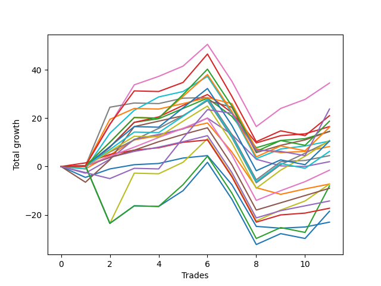

# Short Pointer 003 
- Symbol: ES_830-1130
- Date Range: 03/18/2022 - 12/30/2022
- Trading Period: 8:30-11:30
- Number of Trades: 11



| Name | Win Percent | Profit | Avg Profit / Trade | Avg Time / Trade |      | Name | Win Percent | Profit | Avg Profit / Trade | Avg Time / Trade |
| ---- | ----------- | ------ | ------------------ | ---------------- | ---- | ---- | ----------- | ------ | ------------------ | ---------------- |
| Sorted By <br> Profit | | | | | | Sorted By <br> Win Percentage ||||
| BB-50 U/L 2SD | 81.82 | 17250.00 | 1568.18 | 31:18 |     | BB-50 U/L 2SD | 81.82 | 17250.00 | 1568.18 | 31:18 |
| NEWFI 0000 | 36.36 | 11875.00 | 1079.55 | 34:40 |     | TP-5 | 81.82 | 5250.00 | 477.27 | 28:25 |
| NEWFI 000 | 63.64 | 10500.00 | 954.55 | 44:43 |     | TP-4 | 81.82 | -750.00 | -68.18 | 27:52 |
| TP-10 | 63.64 | 9375.00 | 852.27 | 42:31 |     | TP-3 | 81.82 | -4500.00 | -409.09 | 25:06 |
| BB-20 U/L 2SD C | 72.73 | 8250.00 | 750.00 | 16:56 |     | TP-2 | 81.82 | -7125.00 | -647.73 | 20:35 |
| TP-9 | 63.64 | 8125.00 | 738.64 | 40:50 |     | TP-1 | 81.82 | -8625.00 | -784.09 | 16:21 |
| BB-50 U/L 1SD | 72.73 | 7250.00 | 659.09 | 25:25 |     | BB-20 U/L 2SD C | 72.73 | 8250.00 | 750.00 | 16:56 |
| BB-20 U/L 2SD | 72.73 | 7250.00 | 659.09 | 16:48 |     | BB-50 U/L 1SD | 72.73 | 7250.00 | 659.09 | 25:25 |
| TP-6 | 72.73 | 5375.00 | 488.64 | 32:21 |     | BB-20 U/L 2SD | 72.73 | 7250.00 | 659.09 | 16:48 |
| TP-5 | 81.82 | 5250.00 | 477.27 | 28:25 |     | TP-6 | 72.73 | 5375.00 | 488.64 | 32:21 |
| BB-100 Mid | 72.73 | 5250.00 | 477.27 | 24:24 |     | BB-100 Mid | 72.73 | 5250.00 | 477.27 | 24:24 |
| TP-8 | 63.64 | 5250.00 | 477.27 | 40:43 |     | V Mid | 72.73 | 2250.00 | 204.55 | 26:30 |
| BB-200 Mid | 63.64 | 4125.00 | 375.00 | 18:33 |     | NEWFI 000 | 63.64 | 10500.00 | 954.55 | 44:43 |
| TP-7 | 63.64 | 3125.00 | 284.09 | 37:08 |     | TP-10 | 63.64 | 9375.00 | 852.27 | 42:31 |
| V Mid | 72.73 | 2250.00 | 204.55 | 26:30 |     | TP-9 | 63.64 | 8125.00 | 738.64 | 40:50 |
| BB-50 Mid | 54.55 | 1000.00 | 90.91 | 17:27 |     | TP-8 | 63.64 | 5250.00 | 477.27 | 40:43 |
| TP-4 | 81.82 | -750.00 | -68.18 | 27:52 |     | BB-200 Mid | 63.64 | 4125.00 | 375.00 | 18:33 |
| V U/L 1SD | 63.64 | -3625.00 | -329.55 | 43:54 |     | TP-7 | 63.64 | 3125.00 | 284.09 | 37:08 |
| BB-20 U/L 1SD | 63.64 | -3625.00 | -329.55 | 11:11 |     | V U/L 1SD | 63.64 | -3625.00 | -329.55 | 43:54 |
| BB-200 U/L 2SD | 54.55 | -4000.00 | -363.64 | 59:19 |     | BB-20 U/L 1SD | 63.64 | -3625.00 | -329.55 | 11:11 |
| TP-3 | 81.82 | -4500.00 | -409.09 | 25:06 |     | BB-20 Mid | 63.64 | -11500.00 | -1045.45 | 07:33 |
| TP-2 | 81.82 | -7125.00 | -647.73 | 20:35 |     | BB-50 Mid | 54.55 | 1000.00 | 90.91 | 17:27 |
| TP-1 | 81.82 | -8625.00 | -784.09 | 16:21 |     | BB-200 U/L 2SD | 54.55 | -4000.00 | -363.64 | 59:19 |
| BB-100 U/L 2SD | 54.55 | -9250.00 | -840.91 | 52:17 |     | BB-100 U/L 2SD | 54.55 | -9250.00 | -840.91 | 52:17 |
| BB-20 Mid | 63.64 | -11500.00 | -1045.45 | 07:33 |     | NEWFI 0000 | 36.36 | 11875.00 | 1079.55 | 34:40 |

## NO STOPLOSS

### Test BB-20 Mid
* Sell when price hits the middle line of the 20p bollinger
* No Stoploss
* Results:
```
Total Trades: 11
Percent Up: 36.36
Percent Down: 63.64
Total Points Moved Down: -23.00
Potential Profit: -11500.00
Total Points Ups: 34.50 Count Ups: 4
Total Points Downs: 11.50 Count Downs: 7
```

<details><summary>Trades</summary>

<code>In: 2022-05-24 10:48:00		Out: 2022-05-24 11:01:15		Total Position Time: 13:15		Total Move Down: -4.50		Total to Date: -4.50</code> <br />
<code>In: 2022-05-24 11:42:00		Out: 2022-05-24 11:43:10		Total Position Time: 01:10		Total Move Down: 3.50		Total to Date: -1.00</code> <br />
<code>In: 2022-06-17 08:35:00		Out: 2022-06-17 08:36:10		Total Position Time: 01:10		Total Move Down: 1.75		Total to Date: 0.75</code> <br />
<code>In: 2022-08-16 09:22:00		Out: 2022-08-16 09:23:10		Total Position Time: 01:10		Total Move Down: 0.50		Total to Date: 1.25</code> <br />
<code>In: 2022-08-22 09:28:00		Out: 2022-08-22 09:29:10		Total Position Time: 01:10		Total Move Down: 2.25		Total to Date: 3.50</code> <br />
<code>In: 2022-08-31 09:02:00		Out: 2022-08-31 09:04:15		Total Position Time: 02:15		Total Move Down: 1.00		Total to Date: 4.50</code> <br />
<code>In: 2022-09-06 07:47:00		Out: 2022-09-06 08:11:10		Total Position Time: 24:10		Total Move Down: -12.00		Total to Date: -7.50</code> <br />
<code>In: 2022-10-21 09:40:00		Out: 2022-10-21 10:08:55		Total Position Time: 28:55		Total Move Down: -17.25		Total to Date: -24.75</code> <br />
<code>In: 2022-10-31 08:31:00		Out: 2022-10-31 08:38:35		Total Position Time: 07:35		Total Move Down: -0.75		Total to Date: -25.50</code> <br />
<code>In: 2022-11-16 08:35:00		Out: 2022-11-16 08:36:10		Total Position Time: 01:10		Total Move Down: 0.50		Total to Date: -25.00</code> <br />
<code>In: 2022-12-05 08:16:00		Out: 2022-12-05 08:17:10		Total Position Time: 01:10		Total Move Down: 2.00		Total to Date: -23.00</code> <br />


</details>

### Test BB-20 U/L 1SD
* Sell when the price hits the lower line of the 20p 1std bollinger
* No Stoploss
* Results:
```
Total Trades: 11
Percent Up: 36.36
Percent Down: 63.64
Total Points Moved Down: -7.25
Potential Profit: -3625.00
Total Points Ups: 30.50 Count Ups: 4
Total Points Downs: 23.25 Count Downs: 7
```

<details><summary>Trades</summary>

<code>In: 2022-05-24 10:48:00		Out: 2022-05-24 11:01:40		Total Position Time: 13:40		Total Move Down: -1.00		Total to Date: -1.00</code> <br />
<code>In: 2022-05-24 11:42:00		Out: 2022-05-24 11:43:25		Total Position Time: 01:25		Total Move Down: 5.75		Total to Date: 4.75</code> <br />
<code>In: 2022-06-17 08:35:00		Out: 2022-06-17 08:39:05		Total Position Time: 04:05		Total Move Down: 6.25		Total to Date: 11.00</code> <br />
<code>In: 2022-08-16 09:22:00		Out: 2022-08-16 09:27:10		Total Position Time: 05:10		Total Move Down: 1.75		Total to Date: 12.75</code> <br />
<code>In: 2022-08-22 09:28:00		Out: 2022-08-22 09:32:05		Total Position Time: 04:05		Total Move Down: 3.00		Total to Date: 15.75</code> <br />
<code>In: 2022-08-31 09:02:00		Out: 2022-08-31 09:06:20		Total Position Time: 04:20		Total Move Down: 2.25		Total to Date: 18.00</code> <br />
<code>In: 2022-09-06 07:47:00		Out: 2022-09-06 08:16:05		Total Position Time: 29:05		Total Move Down: -12.00		Total to Date: 6.00</code> <br />
<code>In: 2022-10-21 09:40:00		Out: 2022-10-21 10:09:25		Total Position Time: 29:25		Total Move Down: -14.75		Total to Date: -8.75</code> <br />
<code>In: 2022-10-31 08:31:00		Out: 2022-10-31 08:58:20		Total Position Time: 27:20		Total Move Down: -2.75		Total to Date: -11.50</code> <br />
<code>In: 2022-11-16 08:35:00		Out: 2022-11-16 08:38:25		Total Position Time: 03:25		Total Move Down: 2.25		Total to Date: -9.25</code> <br />
<code>In: 2022-12-05 08:16:00		Out: 2022-12-05 08:17:10		Total Position Time: 01:10		Total Move Down: 2.00		Total to Date: -7.25</code> <br />


</details>

### Test BB-20 U/L 2SD
* Sell when the price hits the lower line of the 20p 2std bollinger
* No Stoploss
* Results:
```
Total Trades: 11
Percent Up: 27.27
Percent Down: 72.73
Total Points Moved Down: 14.50
Potential Profit: 7250.00
Total Points Ups: 20.50 Count Ups: 3
Total Points Downs: 35.00 Count Downs: 8
```

<details><summary>Trades</summary>

<code>In: 2022-05-24 10:48:00		Out: 2022-05-24 11:01:50		Total Position Time: 13:50		Total Move Down: -0.00		Total to Date: 0.00</code> <br />
<code>In: 2022-05-24 11:42:00		Out: 2022-05-24 11:44:00		Total Position Time: 02:00		Total Move Down: 8.00		Total to Date: 8.00</code> <br />
<code>In: 2022-06-17 08:35:00		Out: 2022-06-17 08:45:15		Total Position Time: 10:15		Total Move Down: 10.25		Total to Date: 18.25</code> <br />
<code>In: 2022-08-16 09:22:00		Out: 2022-08-16 09:41:15		Total Position Time: 19:15		Total Move Down: 1.50		Total to Date: 19.75</code> <br />
<code>In: 2022-08-22 09:28:00		Out: 2022-08-22 09:44:50		Total Position Time: 16:50		Total Move Down: 4.25		Total to Date: 24.00</code> <br />
<code>In: 2022-08-31 09:02:00		Out: 2022-08-31 09:07:00		Total Position Time: 05:00		Total Move Down: 4.25		Total to Date: 28.25</code> <br />
<code>In: 2022-09-06 07:47:00		Out: 2022-09-06 08:17:20		Total Position Time: 30:20		Total Move Down: -7.50		Total to Date: 20.75</code> <br />
<code>In: 2022-10-21 09:40:00		Out: 2022-10-21 10:11:30		Total Position Time: 31:30		Total Move Down: -13.00		Total to Date: 7.75</code> <br />
<code>In: 2022-10-31 08:31:00		Out: 2022-10-31 08:58:35		Total Position Time: 27:35		Total Move Down: 3.00		Total to Date: 10.75</code> <br />
<code>In: 2022-11-16 08:35:00		Out: 2022-11-16 09:01:40		Total Position Time: 26:40		Total Move Down: 0.75		Total to Date: 11.50</code> <br />
<code>In: 2022-12-05 08:16:00		Out: 2022-12-05 08:17:35		Total Position Time: 01:35		Total Move Down: 3.00		Total to Date: 14.50</code> <br />


</details>

### Test BB-20 U/L 2SD C
* Sell when the price hits the lower line of the 20p 2std bollinger
* No Stoploss
* Results:
```
Total Trades: 11
Percent Up: 27.27
Percent Down: 72.73
Total Points Moved Down: 16.50
Potential Profit: 8250.00
Total Points Ups: 20.00 Count Ups: 3
Total Points Downs: 36.50 Count Downs: 8
```

<details><summary>Trades</summary>

<code>In: 2022-05-24 10:48:00		Out: 2022-05-24 11:01:50		Total Position Time: 13:50		Total Move Down: -0.00		Total to Date: 0.00</code> <br />
<code>In: 2022-05-24 11:42:00		Out: 2022-05-24 11:44:00		Total Position Time: 02:00		Total Move Down: 8.00		Total to Date: 8.00</code> <br />
<code>In: 2022-06-17 08:35:00		Out: 2022-06-17 08:45:15		Total Position Time: 10:15		Total Move Down: 10.25		Total to Date: 18.25</code> <br />
<code>In: 2022-08-16 09:22:00		Out: 2022-08-16 09:42:10		Total Position Time: 20:10		Total Move Down: 2.25		Total to Date: 20.50</code> <br />
<code>In: 2022-08-22 09:28:00		Out: 2022-08-22 09:44:55		Total Position Time: 16:55		Total Move Down: 4.75		Total to Date: 25.25</code> <br />
<code>In: 2022-08-31 09:02:00		Out: 2022-08-31 09:07:05		Total Position Time: 05:05		Total Move Down: 4.50		Total to Date: 29.75</code> <br />
<code>In: 2022-09-06 07:47:00		Out: 2022-09-06 08:17:20		Total Position Time: 30:20		Total Move Down: -7.50		Total to Date: 22.25</code> <br />
<code>In: 2022-10-21 09:40:00		Out: 2022-10-21 10:12:00		Total Position Time: 32:00		Total Move Down: -12.50		Total to Date: 9.75</code> <br />
<code>In: 2022-10-31 08:31:00		Out: 2022-10-31 08:58:35		Total Position Time: 27:35		Total Move Down: 3.00		Total to Date: 12.75</code> <br />
<code>In: 2022-11-16 08:35:00		Out: 2022-11-16 09:01:40		Total Position Time: 26:40		Total Move Down: 0.75		Total to Date: 13.50</code> <br />
<code>In: 2022-12-05 08:16:00		Out: 2022-12-05 08:17:35		Total Position Time: 01:35		Total Move Down: 3.00		Total to Date: 16.50</code> <br />


</details>

### Test BB-50 Mid
* Sell when price hits the middle line of the 50p bollinger
* No Stoploss
* Results:
```
Total Trades: 11
Percent Up: 45.45
Percent Down: 54.55
Total Points Moved Down: 2.00
Potential Profit: 1000.00
Total Points Ups: 22.75 Count Ups: 5
Total Points Downs: 24.75 Count Downs: 6
```

<details><summary>Trades</summary>

<code>In: 2022-05-24 10:48:00		Out: 2022-05-24 11:20:25		Total Position Time: 32:25		Total Move Down: -2.75		Total to Date: -2.75</code> <br />
<code>In: 2022-05-24 11:42:00		Out: 2022-05-24 11:43:25		Total Position Time: 01:25		Total Move Down: 5.75		Total to Date: 3.00</code> <br />
<code>In: 2022-06-17 08:35:00		Out: 2022-06-17 08:45:05		Total Position Time: 10:05		Total Move Down: 8.25		Total to Date: 11.25</code> <br />
<code>In: 2022-08-16 09:22:00		Out: 2022-08-16 09:30:05		Total Position Time: 08:05		Total Move Down: 2.00		Total to Date: 13.25</code> <br />
<code>In: 2022-08-22 09:28:00		Out: 2022-08-22 09:29:10		Total Position Time: 01:10		Total Move Down: 2.25		Total to Date: 15.50</code> <br />
<code>In: 2022-08-31 09:02:00		Out: 2022-08-31 09:10:55		Total Position Time: 08:55		Total Move Down: 4.50		Total to Date: 20.00</code> <br />
<code>In: 2022-09-06 07:47:00		Out: 2022-09-06 08:26:15		Total Position Time: 39:15		Total Move Down: -6.75		Total to Date: 13.25</code> <br />
<code>In: 2022-10-21 09:40:00		Out: 2022-10-21 10:15:50		Total Position Time: 35:50		Total Move Down: -10.25		Total to Date: 3.00</code> <br />
<code>In: 2022-10-31 08:31:00		Out: 2022-10-31 08:58:20		Total Position Time: 27:20		Total Move Down: -2.75		Total to Date: 0.25</code> <br />
<code>In: 2022-11-16 08:35:00		Out: 2022-11-16 09:01:25		Total Position Time: 26:25		Total Move Down: -0.25		Total to Date: 0.00</code> <br />
<code>In: 2022-12-05 08:16:00		Out: 2022-12-05 08:17:10		Total Position Time: 01:10		Total Move Down: 2.00		Total to Date: 2.00</code> <br />


</details>

### Test BB-50 U/L 1SD
* Sell when the price hits the lower line of the 50p 1std bollinger
* No Stoploss
* Results:
```
Total Trades: 11
Percent Up: 27.27
Percent Down: 72.73
Total Points Moved Down: 14.50
Potential Profit: 7250.00
Total Points Ups: 28.00 Count Ups: 3
Total Points Downs: 42.50 Count Downs: 8
```

<details><summary>Trades</summary>

<code>In: 2022-05-24 10:48:00		Out: 2022-05-24 11:44:15		Total Position Time: 56:15		Total Move Down: -6.50		Total to Date: -6.50</code> <br />
<code>In: 2022-05-24 11:42:00		Out: 2022-05-24 11:44:15		Total Position Time: 02:15		Total Move Down: 9.25		Total to Date: 2.75</code> <br />
<code>In: 2022-06-17 08:35:00		Out: 2022-06-17 08:51:25		Total Position Time: 16:25		Total Move Down: 13.75		Total to Date: 16.50</code> <br />
<code>In: 2022-08-16 09:22:00		Out: 2022-08-16 09:42:10		Total Position Time: 20:10		Total Move Down: 2.25		Total to Date: 18.75</code> <br />
<code>In: 2022-08-22 09:28:00		Out: 2022-08-22 09:29:10		Total Position Time: 01:10		Total Move Down: 2.25		Total to Date: 21.00</code> <br />
<code>In: 2022-08-31 09:02:00		Out: 2022-08-31 09:22:45		Total Position Time: 20:45		Total Move Down: 6.25		Total to Date: 27.25</code> <br />
<code>In: 2022-09-06 07:47:00		Out: 2022-09-06 08:30:10		Total Position Time: 43:10		Total Move Down: -2.75		Total to Date: 24.50</code> <br />
<code>In: 2022-10-21 09:40:00		Out: 2022-10-21 10:40:55		Total Position Time: 60:55		Total Move Down: -18.75		Total to Date: 5.75</code> <br />
<code>In: 2022-10-31 08:31:00		Out: 2022-10-31 08:58:35		Total Position Time: 27:35		Total Move Down: 3.00		Total to Date: 8.75</code> <br />
<code>In: 2022-11-16 08:35:00		Out: 2022-11-16 09:04:10		Total Position Time: 29:10		Total Move Down: 2.25		Total to Date: 11.00</code> <br />
<code>In: 2022-12-05 08:16:00		Out: 2022-12-05 08:17:45		Total Position Time: 01:45		Total Move Down: 3.50		Total to Date: 14.50</code> <br />


</details>

### Test BB-50 U/L 2SD
* Sell when the price hits the lower line of the 50p 2std bollinger
* No Stoploss
* Results:
```
Total Trades: 11
Percent Up: 18.18
Percent Down: 81.82
Total Points Moved Down: 34.50
Potential Profit: 17250.00
Total Points Ups: 34.00 Count Ups: 2
Total Points Downs: 68.50 Count Downs: 9
```

<details><summary>Trades</summary>

<code>In: 2022-05-24 10:48:00		Out: 2022-05-24 11:48:55		Total Position Time: 60:55		Total Move Down: 0.25		Total to Date: 0.25</code> <br />
<code>In: 2022-05-24 11:42:00		Out: 2022-05-24 11:49:10		Total Position Time: 07:10		Total Move Down: 17.00		Total to Date: 17.25</code> <br />
<code>In: 2022-06-17 08:35:00		Out: 2022-06-17 08:52:10		Total Position Time: 17:10		Total Move Down: 16.50		Total to Date: 33.75</code> <br />
<code>In: 2022-08-16 09:22:00		Out: 2022-08-16 09:42:30		Total Position Time: 20:30		Total Move Down: 3.50		Total to Date: 37.25</code> <br />
<code>In: 2022-08-22 09:28:00		Out: 2022-08-22 09:44:50		Total Position Time: 16:50		Total Move Down: 4.25		Total to Date: 41.50</code> <br />
<code>In: 2022-08-31 09:02:00		Out: 2022-08-31 09:24:25		Total Position Time: 22:25		Total Move Down: 9.00		Total to Date: 50.50</code> <br />
<code>In: 2022-09-06 07:47:00		Out: 2022-09-06 08:47:55		Total Position Time: 60:55		Total Move Down: -15.25		Total to Date: 35.25</code> <br />
<code>In: 2022-10-21 09:40:00		Out: 2022-10-21 10:40:55		Total Position Time: 60:55		Total Move Down: -18.75		Total to Date: 16.50</code> <br />
<code>In: 2022-10-31 08:31:00		Out: 2022-10-31 08:58:50		Total Position Time: 27:50		Total Move Down: 7.50		Total to Date: 24.00</code> <br />
<code>In: 2022-11-16 08:35:00		Out: 2022-11-16 09:19:25		Total Position Time: 44:25		Total Move Down: 3.75		Total to Date: 27.75</code> <br />
<code>In: 2022-12-05 08:16:00		Out: 2022-12-05 08:21:20		Total Position Time: 05:20		Total Move Down: 6.75		Total to Date: 34.50</code> <br />


</details>

### Test V Mid
* Sell when the price hits the middle line of the 1std VWAP
* No Stoploss
* Results:
```
Total Trades: 11
Percent Up: 27.27
Percent Down: 72.73
Total Points Moved Down: 4.50
Potential Profit: 2250.00
Total Points Ups: 34.25 Count Ups: 3
Total Points Downs: 38.75 Count Downs: 8
```

<details><summary>Trades</summary>

<code>In: 2022-05-24 10:48:00		Out: 2022-05-24 11:48:55		Total Position Time: 60:55		Total Move Down: 0.25		Total to Date: 0.25</code> <br />
<code>In: 2022-05-24 11:42:00		Out: 2022-05-24 11:55:20		Total Position Time: 13:20		Total Move Down: 24.25		Total to Date: 24.50</code> <br />
<code>In: 2022-06-17 08:35:00		Out: 2022-06-17 08:36:10		Total Position Time: 01:10		Total Move Down: 1.75		Total to Date: 26.25</code> <br />
<code>In: 2022-08-16 09:22:00		Out: 2022-08-16 10:22:55		Total Position Time: 60:55		Total Move Down: -0.25		Total to Date: 26.00</code> <br />
<code>In: 2022-08-22 09:28:00		Out: 2022-08-22 09:29:10		Total Position Time: 01:10		Total Move Down: 2.25		Total to Date: 28.25</code> <br />
<code>In: 2022-08-31 09:02:00		Out: 2022-08-31 09:04:00		Total Position Time: 02:00		Total Move Down: 0.25		Total to Date: 28.50</code> <br />
<code>In: 2022-09-06 07:47:00		Out: 2022-09-06 08:47:55		Total Position Time: 60:55		Total Move Down: -15.25		Total to Date: 13.25</code> <br />
<code>In: 2022-10-21 09:40:00		Out: 2022-10-21 10:40:55		Total Position Time: 60:55		Total Move Down: -18.75		Total to Date: -5.50</code> <br />
<code>In: 2022-10-31 08:31:00		Out: 2022-10-31 08:58:50		Total Position Time: 27:50		Total Move Down: 7.50		Total to Date: 2.00</code> <br />
<code>In: 2022-11-16 08:35:00		Out: 2022-11-16 08:36:10		Total Position Time: 01:10		Total Move Down: 0.50		Total to Date: 2.50</code> <br />
<code>In: 2022-12-05 08:16:00		Out: 2022-12-05 08:17:10		Total Position Time: 01:10		Total Move Down: 2.00		Total to Date: 4.50</code> <br />


</details>

### Test V U/L 1SD
* Sell when the price hits the lower line of the 1std VWAP
* No Stoploss
* Results:
```
Total Trades: 11
Percent Up: 36.36
Percent Down: 63.64
Total Points Moved Down: -7.25
Potential Profit: -3625.00
Total Points Ups: 58.00 Count Ups: 4
Total Points Downs: 50.75 Count Downs: 7
```

<details><summary>Trades</summary>

<code>In: 2022-05-24 10:48:00		Out: 2022-05-24 11:48:55		Total Position Time: 60:55		Total Move Down: 0.25		Total to Date: 0.25</code> <br />
<code>In: 2022-05-24 11:42:00		Out: 2022-05-24 12:42:55		Total Position Time: 60:55		Total Move Down: -23.75		Total to Date: -23.50</code> <br />
<code>In: 2022-06-17 08:35:00		Out: 2022-06-17 09:03:15		Total Position Time: 28:15		Total Move Down: 20.75		Total to Date: -2.75</code> <br />
<code>In: 2022-08-16 09:22:00		Out: 2022-08-16 10:22:55		Total Position Time: 60:55		Total Move Down: -0.25		Total to Date: -3.00</code> <br />
<code>In: 2022-08-22 09:28:00		Out: 2022-08-22 09:44:55		Total Position Time: 16:55		Total Move Down: 4.75		Total to Date: 1.75</code> <br />
<code>In: 2022-08-31 09:02:00		Out: 2022-08-31 09:24:30		Total Position Time: 22:30		Total Move Down: 9.75		Total to Date: 11.50</code> <br />
<code>In: 2022-09-06 07:47:00		Out: 2022-09-06 08:47:55		Total Position Time: 60:55		Total Move Down: -15.25		Total to Date: -3.75</code> <br />
<code>In: 2022-10-21 09:40:00		Out: 2022-10-21 10:40:55		Total Position Time: 60:55		Total Move Down: -18.75		Total to Date: -22.50</code> <br />
<code>In: 2022-10-31 08:31:00		Out: 2022-10-31 09:31:55		Total Position Time: 60:55		Total Move Down: 4.50		Total to Date: -18.00</code> <br />
<code>In: 2022-11-16 08:35:00		Out: 2022-11-16 09:19:25		Total Position Time: 44:25		Total Move Down: 3.75		Total to Date: -14.25</code> <br />
<code>In: 2022-12-05 08:16:00		Out: 2022-12-05 08:21:25		Total Position Time: 05:25		Total Move Down: 7.00		Total to Date: -7.25</code> <br />


</details>

### Test BB-100 Mid
* Move to BB100 Mid
* No Stoploss
* Results:
```
Total Trades: 11
Percent Up: 27.27
Percent Down: 72.73
Total Points Moved Down: 10.50
Potential Profit: 5250.00
Total Points Ups: 35.00 Count Ups: 3
Total Points Downs: 45.50 Count Downs: 8
```

<details><summary>Trades</summary>

<code>In: 2022-05-24 10:48:00		Out: 2022-05-24 11:48:35		Total Position Time: 60:35		Total Move Down: -1.00		Total to Date: -1.00</code> <br />
<code>In: 2022-05-24 11:42:00		Out: 2022-05-24 11:48:35		Total Position Time: 06:35		Total Move Down: 14.75		Total to Date: 13.75</code> <br />
<code>In: 2022-06-17 08:35:00		Out: 2022-06-17 08:45:25		Total Position Time: 10:25		Total Move Down: 9.50		Total to Date: 23.25</code> <br />
<code>In: 2022-08-16 09:22:00		Out: 2022-08-16 09:50:15		Total Position Time: 28:15		Total Move Down: 5.50		Total to Date: 28.75</code> <br />
<code>In: 2022-08-22 09:28:00		Out: 2022-08-22 09:29:10		Total Position Time: 01:10		Total Move Down: 2.25		Total to Date: 31.00</code> <br />
<code>In: 2022-08-31 09:02:00		Out: 2022-08-31 09:11:05		Total Position Time: 09:05		Total Move Down: 6.25		Total to Date: 37.25</code> <br />
<code>In: 2022-09-06 07:47:00		Out: 2022-09-06 08:47:55		Total Position Time: 60:55		Total Move Down: -15.25		Total to Date: 22.00</code> <br />
<code>In: 2022-10-21 09:40:00		Out: 2022-10-21 10:40:55		Total Position Time: 60:55		Total Move Down: -18.75		Total to Date: 3.25</code> <br />
<code>In: 2022-10-31 08:31:00		Out: 2022-10-31 08:58:45		Total Position Time: 27:45		Total Move Down: 4.00		Total to Date: 7.25</code> <br />
<code>In: 2022-11-16 08:35:00		Out: 2022-11-16 08:36:40		Total Position Time: 01:40		Total Move Down: 1.25		Total to Date: 8.50</code> <br />
<code>In: 2022-12-05 08:16:00		Out: 2022-12-05 08:17:10		Total Position Time: 01:10		Total Move Down: 2.00		Total to Date: 10.50</code> <br />


</details>

### Test BB-100 U/L 2SD
* Move to BB100 Upper Band
* No Stoploss
* Results:
```
Total Trades: 11
Percent Up: 45.45
Percent Down: 54.55
Total Points Moved Down: -18.50
Potential Profit: -9250.00
Total Points Ups: 60.00 Count Ups: 5
Total Points Downs: 41.50 Count Downs: 6
```

<details><summary>Trades</summary>

<code>In: 2022-05-24 10:48:00		Out: 2022-05-24 11:48:55		Total Position Time: 60:55		Total Move Down: 0.25		Total to Date: 0.25</code> <br />
<code>In: 2022-05-24 11:42:00		Out: 2022-05-24 12:42:55		Total Position Time: 60:55		Total Move Down: -23.75		Total to Date: -23.50</code> <br />
<code>In: 2022-06-17 08:35:00		Out: 2022-06-17 09:35:55		Total Position Time: 60:55		Total Move Down: 7.25		Total to Date: -16.25</code> <br />
<code>In: 2022-08-16 09:22:00		Out: 2022-08-16 10:22:55		Total Position Time: 60:55		Total Move Down: -0.25		Total to Date: -16.50</code> <br />
<code>In: 2022-08-22 09:28:00		Out: 2022-08-22 09:45:25		Total Position Time: 17:25		Total Move Down: 6.50		Total to Date: -10.00</code> <br />
<code>In: 2022-08-31 09:02:00		Out: 2022-08-31 10:02:55		Total Position Time: 60:55		Total Move Down: 11.75		Total to Date: 1.75</code> <br />
<code>In: 2022-09-06 07:47:00		Out: 2022-09-06 08:47:55		Total Position Time: 60:55		Total Move Down: -15.25		Total to Date: -13.50</code> <br />
<code>In: 2022-10-21 09:40:00		Out: 2022-10-21 10:40:55		Total Position Time: 60:55		Total Move Down: -18.75		Total to Date: -32.25</code> <br />
<code>In: 2022-10-31 08:31:00		Out: 2022-10-31 09:31:55		Total Position Time: 60:55		Total Move Down: 4.50		Total to Date: -27.75</code> <br />
<code>In: 2022-11-16 08:35:00		Out: 2022-11-16 09:35:55		Total Position Time: 60:55		Total Move Down: -2.00		Total to Date: -29.75</code> <br />
<code>In: 2022-12-05 08:16:00		Out: 2022-12-05 08:25:35		Total Position Time: 09:35		Total Move Down: 11.25		Total to Date: -18.50</code> <br />


</details>

### Test BB-200 Mid
* Move to BB200 Mid
* No Stoploss
* Results:
```
Total Trades: 11
Percent Up: 36.36
Percent Down: 63.64
Total Points Moved Down: 8.25
Potential Profit: 4125.00
Total Points Ups: 23.00 Count Ups: 4
Total Points Downs: 31.25 Count Downs: 7
```

<details><summary>Trades</summary>

<code>In: 2022-05-24 10:48:00		Out: 2022-05-24 11:48:55		Total Position Time: 60:55		Total Move Down: 0.25		Total to Date: 0.25</code> <br />
<code>In: 2022-05-24 11:42:00		Out: 2022-05-24 11:49:25		Total Position Time: 07:25		Total Move Down: 19.25		Total to Date: 19.50</code> <br />
<code>In: 2022-06-17 08:35:00		Out: 2022-06-17 08:38:50		Total Position Time: 03:50		Total Move Down: 4.50		Total to Date: 24.00</code> <br />
<code>In: 2022-08-16 09:22:00		Out: 2022-08-16 10:22:55		Total Position Time: 60:55		Total Move Down: -0.25		Total to Date: 23.75</code> <br />
<code>In: 2022-08-22 09:28:00		Out: 2022-08-22 09:29:10		Total Position Time: 01:10		Total Move Down: 2.25		Total to Date: 26.00</code> <br />
<code>In: 2022-08-31 09:02:00		Out: 2022-08-31 09:06:15		Total Position Time: 04:15		Total Move Down: 2.50		Total to Date: 28.50</code> <br />
<code>In: 2022-09-06 07:47:00		Out: 2022-09-06 07:48:10		Total Position Time: 01:10		Total Move Down: -2.50		Total to Date: 26.00</code> <br />
<code>In: 2022-10-21 09:40:00		Out: 2022-10-21 10:40:55		Total Position Time: 60:55		Total Move Down: -18.75		Total to Date: 7.25</code> <br />
<code>In: 2022-10-31 08:31:00		Out: 2022-10-31 08:32:10		Total Position Time: 01:10		Total Move Down: -1.50		Total to Date: 5.75</code> <br />
<code>In: 2022-11-16 08:35:00		Out: 2022-11-16 08:36:10		Total Position Time: 01:10		Total Move Down: 0.50		Total to Date: 6.25</code> <br />
<code>In: 2022-12-05 08:16:00		Out: 2022-12-05 08:17:10		Total Position Time: 01:10		Total Move Down: 2.00		Total to Date: 8.25</code> <br />


</details>

### Test BB-200 U/L 2SD
* Move to BB200 Upper Band
* No Stoploss
* Results:
```
Total Trades: 11
Percent Up: 45.45
Percent Down: 54.55
Total Points Moved Down: -8.00
Potential Profit: -4000.00
Total Points Ups: 60.00 Count Ups: 5
Total Points Downs: 52.00 Count Downs: 6
```

<details><summary>Trades</summary>

<code>In: 2022-05-24 10:48:00		Out: 2022-05-24 11:48:55		Total Position Time: 60:55		Total Move Down: 0.25		Total to Date: 0.25</code> <br />
<code>In: 2022-05-24 11:42:00		Out: 2022-05-24 12:42:55		Total Position Time: 60:55		Total Move Down: -23.75		Total to Date: -23.50</code> <br />
<code>In: 2022-06-17 08:35:00		Out: 2022-06-17 09:35:55		Total Position Time: 60:55		Total Move Down: 7.25		Total to Date: -16.25</code> <br />
<code>In: 2022-08-16 09:22:00		Out: 2022-08-16 10:22:55		Total Position Time: 60:55		Total Move Down: -0.25		Total to Date: -16.50</code> <br />
<code>In: 2022-08-22 09:28:00		Out: 2022-08-22 10:11:20		Total Position Time: 43:20		Total Move Down: 9.00		Total to Date: -7.50</code> <br />
<code>In: 2022-08-31 09:02:00		Out: 2022-08-31 10:02:55		Total Position Time: 60:55		Total Move Down: 11.75		Total to Date: 4.25</code> <br />
<code>In: 2022-09-06 07:47:00		Out: 2022-09-06 08:47:55		Total Position Time: 60:55		Total Move Down: -15.25		Total to Date: -11.00</code> <br />
<code>In: 2022-10-21 09:40:00		Out: 2022-10-21 10:40:55		Total Position Time: 60:55		Total Move Down: -18.75		Total to Date: -29.75</code> <br />
<code>In: 2022-10-31 08:31:00		Out: 2022-10-31 09:31:55		Total Position Time: 60:55		Total Move Down: 4.50		Total to Date: -25.25</code> <br />
<code>In: 2022-11-16 08:35:00		Out: 2022-11-16 09:35:55		Total Position Time: 60:55		Total Move Down: -2.00		Total to Date: -27.25</code> <br />
<code>In: 2022-12-05 08:16:00		Out: 2022-12-05 09:16:55		Total Position Time: 60:55		Total Move Down: 19.25		Total to Date: -8.00</code> <br />


</details>

## TAKE PROFIT

### Test TP-1
* Take Profit of 1 Point
* No Stoploss
* Results:
```
Total Trades: 11
Percent Up: 18.18
Percent Down: 81.82
Total Points Moved Down: -17.25
Potential Profit: -8625.00
Total Points Ups: 34.00 Count Ups: 2
Total Points Downs: 16.75 Count Downs: 9
```

<details><summary>Trades</summary>

<code>In: 2022-05-24 10:48:00		Out: 2022-05-24 11:05:00		Total Position Time: 17:00		Total Move Down: 1.50		Total to Date: 1.50</code> <br />
<code>In: 2022-05-24 11:42:00		Out: 2022-05-24 11:43:10		Total Position Time: 01:10		Total Move Down: 3.50		Total to Date: 5.00</code> <br />
<code>In: 2022-06-17 08:35:00		Out: 2022-06-17 08:36:10		Total Position Time: 01:10		Total Move Down: 1.75		Total to Date: 6.75</code> <br />
<code>In: 2022-08-16 09:22:00		Out: 2022-08-16 09:27:05		Total Position Time: 05:05		Total Move Down: 1.00		Total to Date: 7.75</code> <br />
<code>In: 2022-08-22 09:28:00		Out: 2022-08-22 09:29:10		Total Position Time: 01:10		Total Move Down: 2.25		Total to Date: 10.00</code> <br />
<code>In: 2022-08-31 09:02:00		Out: 2022-08-31 09:04:20		Total Position Time: 02:20		Total Move Down: 1.00		Total to Date: 11.00</code> <br />
<code>In: 2022-09-06 07:47:00		Out: 2022-09-06 08:47:55		Total Position Time: 60:55		Total Move Down: -15.25		Total to Date: -4.25</code> <br />
<code>In: 2022-10-21 09:40:00		Out: 2022-10-21 10:40:55		Total Position Time: 60:55		Total Move Down: -18.75		Total to Date: -23.00</code> <br />
<code>In: 2022-10-31 08:31:00		Out: 2022-10-31 08:58:35		Total Position Time: 27:35		Total Move Down: 3.00		Total to Date: -20.00</code> <br />
<code>In: 2022-11-16 08:35:00		Out: 2022-11-16 08:36:25		Total Position Time: 01:25		Total Move Down: 0.75		Total to Date: -19.25</code> <br />
<code>In: 2022-12-05 08:16:00		Out: 2022-12-05 08:17:10		Total Position Time: 01:10		Total Move Down: 2.00		Total to Date: -17.25</code> <br />


</details>

### Test TP-2
* Take Profit of 2 Point
* No Stoploss
* Results:
```
Total Trades: 11
Percent Up: 18.18
Percent Down: 81.82
Total Points Moved Down: -14.25
Potential Profit: -7125.00
Total Points Ups: 34.00 Count Ups: 2
Total Points Downs: 19.75 Count Downs: 9
```

<details><summary>Trades</summary>

<code>In: 2022-05-24 10:48:00		Out: 2022-05-24 11:48:55		Total Position Time: 60:55		Total Move Down: 0.25		Total to Date: 0.25</code> <br />
<code>In: 2022-05-24 11:42:00		Out: 2022-05-24 11:43:10		Total Position Time: 01:10		Total Move Down: 3.50		Total to Date: 3.75</code> <br />
<code>In: 2022-06-17 08:35:00		Out: 2022-06-17 08:36:15		Total Position Time: 01:15		Total Move Down: 2.50		Total to Date: 6.25</code> <br />
<code>In: 2022-08-16 09:22:00		Out: 2022-08-16 09:27:10		Total Position Time: 05:10		Total Move Down: 1.75		Total to Date: 8.00</code> <br />
<code>In: 2022-08-22 09:28:00		Out: 2022-08-22 09:29:10		Total Position Time: 01:10		Total Move Down: 2.25		Total to Date: 10.25</code> <br />
<code>In: 2022-08-31 09:02:00		Out: 2022-08-31 09:06:15		Total Position Time: 04:15		Total Move Down: 2.50		Total to Date: 12.75</code> <br />
<code>In: 2022-09-06 07:47:00		Out: 2022-09-06 08:47:55		Total Position Time: 60:55		Total Move Down: -15.25		Total to Date: -2.50</code> <br />
<code>In: 2022-10-21 09:40:00		Out: 2022-10-21 10:40:55		Total Position Time: 60:55		Total Move Down: -18.75		Total to Date: -21.25</code> <br />
<code>In: 2022-10-31 08:31:00		Out: 2022-10-31 08:58:35		Total Position Time: 27:35		Total Move Down: 3.00		Total to Date: -18.25</code> <br />
<code>In: 2022-11-16 08:35:00		Out: 2022-11-16 08:37:00		Total Position Time: 02:00		Total Move Down: 2.00		Total to Date: -16.25</code> <br />
<code>In: 2022-12-05 08:16:00		Out: 2022-12-05 08:17:15		Total Position Time: 01:15		Total Move Down: 2.00		Total to Date: -14.25</code> <br />


</details>

### Test TP-3
* Take Profit of 3 Point
* No Stoploss
* Results:
```
Total Trades: 11
Percent Up: 18.18
Percent Down: 81.82
Total Points Moved Down: -9.00
Potential Profit: -4500.00
Total Points Ups: 34.00 Count Ups: 2
Total Points Downs: 25.00 Count Downs: 9
```

<details><summary>Trades</summary>

<code>In: 2022-05-24 10:48:00		Out: 2022-05-24 11:48:55		Total Position Time: 60:55		Total Move Down: 0.25		Total to Date: 0.25</code> <br />
<code>In: 2022-05-24 11:42:00		Out: 2022-05-24 11:43:10		Total Position Time: 01:10		Total Move Down: 3.50		Total to Date: 3.75</code> <br />
<code>In: 2022-06-17 08:35:00		Out: 2022-06-17 08:36:55		Total Position Time: 01:55		Total Move Down: 3.00		Total to Date: 6.75</code> <br />
<code>In: 2022-08-16 09:22:00		Out: 2022-08-16 09:42:30		Total Position Time: 20:30		Total Move Down: 3.50		Total to Date: 10.25</code> <br />
<code>In: 2022-08-22 09:28:00		Out: 2022-08-22 09:32:05		Total Position Time: 04:05		Total Move Down: 3.00		Total to Date: 13.25</code> <br />
<code>In: 2022-08-31 09:02:00		Out: 2022-08-31 09:06:35		Total Position Time: 04:35		Total Move Down: 2.75		Total to Date: 16.00</code> <br />
<code>In: 2022-09-06 07:47:00		Out: 2022-09-06 08:47:55		Total Position Time: 60:55		Total Move Down: -15.25		Total to Date: 0.75</code> <br />
<code>In: 2022-10-21 09:40:00		Out: 2022-10-21 10:40:55		Total Position Time: 60:55		Total Move Down: -18.75		Total to Date: -18.00</code> <br />
<code>In: 2022-10-31 08:31:00		Out: 2022-10-31 08:58:35		Total Position Time: 27:35		Total Move Down: 3.00		Total to Date: -15.00</code> <br />
<code>In: 2022-11-16 08:35:00		Out: 2022-11-16 09:07:00		Total Position Time: 32:00		Total Move Down: 3.00		Total to Date: -12.00</code> <br />
<code>In: 2022-12-05 08:16:00		Out: 2022-12-05 08:17:35		Total Position Time: 01:35		Total Move Down: 3.00		Total to Date: -9.00</code> <br />


</details>

### Test TP-4
* Take Profit of 4 Point
* No Stoploss
* Results:
```
Total Trades: 11
Percent Up: 18.18
Percent Down: 81.82
Total Points Moved Down: -1.50
Potential Profit: -750.00
Total Points Ups: 34.00 Count Ups: 2
Total Points Downs: 32.50 Count Downs: 9
```

<details><summary>Trades</summary>

<code>In: 2022-05-24 10:48:00		Out: 2022-05-24 11:48:55		Total Position Time: 60:55		Total Move Down: 0.25		Total to Date: 0.25</code> <br />
<code>In: 2022-05-24 11:42:00		Out: 2022-05-24 11:43:15		Total Position Time: 01:15		Total Move Down: 4.00		Total to Date: 4.25</code> <br />
<code>In: 2022-06-17 08:35:00		Out: 2022-06-17 08:38:35		Total Position Time: 03:35		Total Move Down: 3.75		Total to Date: 8.00</code> <br />
<code>In: 2022-08-16 09:22:00		Out: 2022-08-16 09:43:30		Total Position Time: 21:30		Total Move Down: 4.00		Total to Date: 12.00</code> <br />
<code>In: 2022-08-22 09:28:00		Out: 2022-08-22 09:44:40		Total Position Time: 16:40		Total Move Down: 3.75		Total to Date: 15.75</code> <br />
<code>In: 2022-08-31 09:02:00		Out: 2022-08-31 09:07:00		Total Position Time: 05:00		Total Move Down: 4.25		Total to Date: 20.00</code> <br />
<code>In: 2022-09-06 07:47:00		Out: 2022-09-06 08:47:55		Total Position Time: 60:55		Total Move Down: -15.25		Total to Date: 4.75</code> <br />
<code>In: 2022-10-21 09:40:00		Out: 2022-10-21 10:40:55		Total Position Time: 60:55		Total Move Down: -18.75		Total to Date: -14.00</code> <br />
<code>In: 2022-10-31 08:31:00		Out: 2022-10-31 08:58:45		Total Position Time: 27:45		Total Move Down: 4.00		Total to Date: -10.00</code> <br />
<code>In: 2022-11-16 08:35:00		Out: 2022-11-16 09:21:00		Total Position Time: 46:00		Total Move Down: 3.75		Total to Date: -6.25</code> <br />
<code>In: 2022-12-05 08:16:00		Out: 2022-12-05 08:18:05		Total Position Time: 02:05		Total Move Down: 4.75		Total to Date: -1.50</code> <br />


</details>

### Test TP-5
* Take Profit of 5 Point
* No Stoploss
* Results:
```
Total Trades: 11
Percent Up: 18.18
Percent Down: 81.82
Total Points Moved Down: 10.50
Potential Profit: 5250.00
Total Points Ups: 34.00 Count Ups: 2
Total Points Downs: 44.50 Count Downs: 9
```

<details><summary>Trades</summary>

<code>In: 2022-05-24 10:48:00		Out: 2022-05-24 11:48:55		Total Position Time: 60:55		Total Move Down: 0.25		Total to Date: 0.25</code> <br />
<code>In: 2022-05-24 11:42:00		Out: 2022-05-24 11:43:25		Total Position Time: 01:25		Total Move Down: 5.75		Total to Date: 6.00</code> <br />
<code>In: 2022-06-17 08:35:00		Out: 2022-06-17 08:39:00		Total Position Time: 04:00		Total Move Down: 5.00		Total to Date: 11.00</code> <br />
<code>In: 2022-08-16 09:22:00		Out: 2022-08-16 09:43:40		Total Position Time: 21:40		Total Move Down: 4.75		Total to Date: 15.75</code> <br />
<code>In: 2022-08-22 09:28:00		Out: 2022-08-22 09:45:15		Total Position Time: 17:15		Total Move Down: 5.25		Total to Date: 21.00</code> <br />
<code>In: 2022-08-31 09:02:00		Out: 2022-08-31 09:11:05		Total Position Time: 09:05		Total Move Down: 6.25		Total to Date: 27.25</code> <br />
<code>In: 2022-09-06 07:47:00		Out: 2022-09-06 08:47:55		Total Position Time: 60:55		Total Move Down: -15.25		Total to Date: 12.00</code> <br />
<code>In: 2022-10-21 09:40:00		Out: 2022-10-21 10:40:55		Total Position Time: 60:55		Total Move Down: -18.75		Total to Date: -6.75</code> <br />
<code>In: 2022-10-31 08:31:00		Out: 2022-10-31 08:58:50		Total Position Time: 27:50		Total Move Down: 7.50		Total to Date: 0.75</code> <br />
<code>In: 2022-11-16 08:35:00		Out: 2022-11-16 09:21:20		Total Position Time: 46:20		Total Move Down: 4.75		Total to Date: 5.50</code> <br />
<code>In: 2022-12-05 08:16:00		Out: 2022-12-05 08:18:15		Total Position Time: 02:15		Total Move Down: 5.00		Total to Date: 10.50</code> <br />


</details>

### Test TP-6
* Take Profit of 6 Point
* No Stoploss
* Results:
```
Total Trades: 11
Percent Up: 27.27
Percent Down: 72.73
Total Points Moved Down: 10.75
Potential Profit: 5375.00
Total Points Ups: 34.25 Count Ups: 3
Total Points Downs: 45.00 Count Downs: 8
```

<details><summary>Trades</summary>

<code>In: 2022-05-24 10:48:00		Out: 2022-05-24 11:48:55		Total Position Time: 60:55		Total Move Down: 0.25		Total to Date: 0.25</code> <br />
<code>In: 2022-05-24 11:42:00		Out: 2022-05-24 11:43:30		Total Position Time: 01:30		Total Move Down: 6.00		Total to Date: 6.25</code> <br />
<code>In: 2022-06-17 08:35:00		Out: 2022-06-17 08:39:05		Total Position Time: 04:05		Total Move Down: 6.25		Total to Date: 12.50</code> <br />
<code>In: 2022-08-16 09:22:00		Out: 2022-08-16 10:22:55		Total Position Time: 60:55		Total Move Down: -0.25		Total to Date: 12.25</code> <br />
<code>In: 2022-08-22 09:28:00		Out: 2022-08-22 09:45:25		Total Position Time: 17:25		Total Move Down: 6.50		Total to Date: 18.75</code> <br />
<code>In: 2022-08-31 09:02:00		Out: 2022-08-31 09:11:05		Total Position Time: 09:05		Total Move Down: 6.25		Total to Date: 25.00</code> <br />
<code>In: 2022-09-06 07:47:00		Out: 2022-09-06 08:47:55		Total Position Time: 60:55		Total Move Down: -15.25		Total to Date: 9.75</code> <br />
<code>In: 2022-10-21 09:40:00		Out: 2022-10-21 10:40:55		Total Position Time: 60:55		Total Move Down: -18.75		Total to Date: -9.00</code> <br />
<code>In: 2022-10-31 08:31:00		Out: 2022-10-31 08:58:50		Total Position Time: 27:50		Total Move Down: 7.50		Total to Date: -1.50</code> <br />
<code>In: 2022-11-16 08:35:00		Out: 2022-11-16 09:22:15		Total Position Time: 47:15		Total Move Down: 5.75		Total to Date: 4.25</code> <br />
<code>In: 2022-12-05 08:16:00		Out: 2022-12-05 08:21:10		Total Position Time: 05:10		Total Move Down: 6.50		Total to Date: 10.75</code> <br />


</details>

### Test TP-7
* Take Profit of 7 Point
* No Stoploss
* Results:
```
Total Trades: 11
Percent Up: 36.36
Percent Down: 63.64
Total Points Moved Down: 6.25
Potential Profit: 3125.00
Total Points Ups: 36.25 Count Ups: 4
Total Points Downs: 42.50 Count Downs: 7
```

<details><summary>Trades</summary>

<code>In: 2022-05-24 10:48:00		Out: 2022-05-24 11:48:55		Total Position Time: 60:55		Total Move Down: 0.25		Total to Date: 0.25</code> <br />
<code>In: 2022-05-24 11:42:00		Out: 2022-05-24 11:43:55		Total Position Time: 01:55		Total Move Down: 6.75		Total to Date: 7.00</code> <br />
<code>In: 2022-06-17 08:35:00		Out: 2022-06-17 08:45:00		Total Position Time: 10:00		Total Move Down: 7.25		Total to Date: 14.25</code> <br />
<code>In: 2022-08-16 09:22:00		Out: 2022-08-16 10:22:55		Total Position Time: 60:55		Total Move Down: -0.25		Total to Date: 14.00</code> <br />
<code>In: 2022-08-22 09:28:00		Out: 2022-08-22 10:05:50		Total Position Time: 37:50		Total Move Down: 6.75		Total to Date: 20.75</code> <br />
<code>In: 2022-08-31 09:02:00		Out: 2022-08-31 09:23:00		Total Position Time: 21:00		Total Move Down: 7.00		Total to Date: 27.75</code> <br />
<code>In: 2022-09-06 07:47:00		Out: 2022-09-06 08:47:55		Total Position Time: 60:55		Total Move Down: -15.25		Total to Date: 12.50</code> <br />
<code>In: 2022-10-21 09:40:00		Out: 2022-10-21 10:40:55		Total Position Time: 60:55		Total Move Down: -18.75		Total to Date: -6.25</code> <br />
<code>In: 2022-10-31 08:31:00		Out: 2022-10-31 08:58:50		Total Position Time: 27:50		Total Move Down: 7.50		Total to Date: 1.25</code> <br />
<code>In: 2022-11-16 08:35:00		Out: 2022-11-16 09:35:55		Total Position Time: 60:55		Total Move Down: -2.00		Total to Date: -0.75</code> <br />
<code>In: 2022-12-05 08:16:00		Out: 2022-12-05 08:21:25		Total Position Time: 05:25		Total Move Down: 7.00		Total to Date: 6.25</code> <br />


</details>

### Test TP-8
* Take Profit of 8 Point
* No Stoploss
* Results:
```
Total Trades: 11
Percent Up: 36.36
Percent Down: 63.64
Total Points Moved Down: 10.50
Potential Profit: 5250.00
Total Points Ups: 36.25 Count Ups: 4
Total Points Downs: 46.75 Count Downs: 7
```

<details><summary>Trades</summary>

<code>In: 2022-05-24 10:48:00		Out: 2022-05-24 11:48:55		Total Position Time: 60:55		Total Move Down: 0.25		Total to Date: 0.25</code> <br />
<code>In: 2022-05-24 11:42:00		Out: 2022-05-24 11:44:00		Total Position Time: 02:00		Total Move Down: 8.00		Total to Date: 8.25</code> <br />
<code>In: 2022-06-17 08:35:00		Out: 2022-06-17 08:45:05		Total Position Time: 10:05		Total Move Down: 8.25		Total to Date: 16.50</code> <br />
<code>In: 2022-08-16 09:22:00		Out: 2022-08-16 10:22:55		Total Position Time: 60:55		Total Move Down: -0.25		Total to Date: 16.25</code> <br />
<code>In: 2022-08-22 09:28:00		Out: 2022-08-22 10:11:10		Total Position Time: 43:10		Total Move Down: 8.00		Total to Date: 24.25</code> <br />
<code>In: 2022-08-31 09:02:00		Out: 2022-08-31 09:23:40		Total Position Time: 21:40		Total Move Down: 8.00		Total to Date: 32.25</code> <br />
<code>In: 2022-09-06 07:47:00		Out: 2022-09-06 08:47:55		Total Position Time: 60:55		Total Move Down: -15.25		Total to Date: 17.00</code> <br />
<code>In: 2022-10-21 09:40:00		Out: 2022-10-21 10:40:55		Total Position Time: 60:55		Total Move Down: -18.75		Total to Date: -1.75</code> <br />
<code>In: 2022-10-31 08:31:00		Out: 2022-10-31 09:31:55		Total Position Time: 60:55		Total Move Down: 4.50		Total to Date: 2.75</code> <br />
<code>In: 2022-11-16 08:35:00		Out: 2022-11-16 09:35:55		Total Position Time: 60:55		Total Move Down: -2.00		Total to Date: 0.75</code> <br />
<code>In: 2022-12-05 08:16:00		Out: 2022-12-05 08:21:35		Total Position Time: 05:35		Total Move Down: 9.75		Total to Date: 10.50</code> <br />


</details>

### Test TP-9
* Take Profit of 9 Point
* No Stoploss
* Results:
```
Total Trades: 11
Percent Up: 36.36
Percent Down: 63.64
Total Points Moved Down: 16.25
Potential Profit: 8125.00
Total Points Ups: 36.25 Count Ups: 4
Total Points Downs: 52.50 Count Downs: 7
```

<details><summary>Trades</summary>

<code>In: 2022-05-24 10:48:00		Out: 2022-05-24 11:48:55		Total Position Time: 60:55		Total Move Down: 0.25		Total to Date: 0.25</code> <br />
<code>In: 2022-05-24 11:42:00		Out: 2022-05-24 11:44:05		Total Position Time: 02:05		Total Move Down: 9.75		Total to Date: 10.00</code> <br />
<code>In: 2022-06-17 08:35:00		Out: 2022-06-17 08:45:15		Total Position Time: 10:15		Total Move Down: 10.25		Total to Date: 20.25</code> <br />
<code>In: 2022-08-16 09:22:00		Out: 2022-08-16 10:22:55		Total Position Time: 60:55		Total Move Down: -0.25		Total to Date: 20.00</code> <br />
<code>In: 2022-08-22 09:28:00		Out: 2022-08-22 10:11:20		Total Position Time: 43:20		Total Move Down: 9.00		Total to Date: 29.00</code> <br />
<code>In: 2022-08-31 09:02:00		Out: 2022-08-31 09:24:25		Total Position Time: 22:25		Total Move Down: 9.00		Total to Date: 38.00</code> <br />
<code>In: 2022-09-06 07:47:00		Out: 2022-09-06 08:47:55		Total Position Time: 60:55		Total Move Down: -15.25		Total to Date: 22.75</code> <br />
<code>In: 2022-10-21 09:40:00		Out: 2022-10-21 10:40:55		Total Position Time: 60:55		Total Move Down: -18.75		Total to Date: 4.00</code> <br />
<code>In: 2022-10-31 08:31:00		Out: 2022-10-31 09:31:55		Total Position Time: 60:55		Total Move Down: 4.50		Total to Date: 8.50</code> <br />
<code>In: 2022-11-16 08:35:00		Out: 2022-11-16 09:35:55		Total Position Time: 60:55		Total Move Down: -2.00		Total to Date: 6.50</code> <br />
<code>In: 2022-12-05 08:16:00		Out: 2022-12-05 08:21:35		Total Position Time: 05:35		Total Move Down: 9.75		Total to Date: 16.25</code> <br />


</details>

### Test TP-10
* Take Profit of 10 Point
* No Stoploss
* Results:
```
Total Trades: 11
Percent Up: 36.36
Percent Down: 63.64
Total Points Moved Down: 18.75
Potential Profit: 9375.00
Total Points Ups: 36.25 Count Ups: 4
Total Points Downs: 55.00 Count Downs: 7
```

<details><summary>Trades</summary>

<code>In: 2022-05-24 10:48:00		Out: 2022-05-24 11:48:55		Total Position Time: 60:55		Total Move Down: 0.25		Total to Date: 0.25</code> <br />
<code>In: 2022-05-24 11:42:00		Out: 2022-05-24 11:44:20		Total Position Time: 02:20		Total Move Down: 9.75		Total to Date: 10.00</code> <br />
<code>In: 2022-06-17 08:35:00		Out: 2022-06-17 08:45:15		Total Position Time: 10:15		Total Move Down: 10.25		Total to Date: 20.25</code> <br />
<code>In: 2022-08-16 09:22:00		Out: 2022-08-16 10:22:55		Total Position Time: 60:55		Total Move Down: -0.25		Total to Date: 20.00</code> <br />
<code>In: 2022-08-22 09:28:00		Out: 2022-08-22 10:11:35		Total Position Time: 43:35		Total Move Down: 9.75		Total to Date: 29.75</code> <br />
<code>In: 2022-08-31 09:02:00		Out: 2022-08-31 09:38:50		Total Position Time: 36:50		Total Move Down: 10.50		Total to Date: 40.25</code> <br />
<code>In: 2022-09-06 07:47:00		Out: 2022-09-06 08:47:55		Total Position Time: 60:55		Total Move Down: -15.25		Total to Date: 25.00</code> <br />
<code>In: 2022-10-21 09:40:00		Out: 2022-10-21 10:40:55		Total Position Time: 60:55		Total Move Down: -18.75		Total to Date: 6.25</code> <br />
<code>In: 2022-10-31 08:31:00		Out: 2022-10-31 09:31:55		Total Position Time: 60:55		Total Move Down: 4.50		Total to Date: 10.75</code> <br />
<code>In: 2022-11-16 08:35:00		Out: 2022-11-16 09:35:55		Total Position Time: 60:55		Total Move Down: -2.00		Total to Date: 8.75</code> <br />
<code>In: 2022-12-05 08:16:00		Out: 2022-12-05 08:25:20		Total Position Time: 09:20		Total Move Down: 10.00		Total to Date: 18.75</code> <br />


</details>

## Indicator Exits

### Test NEWFI 000
* Newfi 0000
* No Stoploss
* Results:
```
Total Trades: 11
Percent Up: 36.36
Percent Down: 63.64
Total Points Moved Down: 21.00
Potential Profit: 10500.00
Total Points Ups: 38.50 Count Ups: 4
Total Points Downs: 59.50 Count Downs: 7
```

<details><summary>Trades</summary>

<code>In: 2022-05-24 10:48:00		Out: 2022-05-24 11:48:55		Total Position Time: 60:55		Total Move Down: 0.25		Total to Date: 0.25</code> <br />
<code>In: 2022-05-24 11:42:00		Out: 2022-05-24 12:00:05		Total Position Time: 18:05		Total Move Down: 17.25		Total to Date: 17.50</code> <br />
<code>In: 2022-06-17 08:35:00		Out: 2022-06-17 09:00:05		Total Position Time: 25:05		Total Move Down: 13.75		Total to Date: 31.25</code> <br />
<code>In: 2022-08-16 09:22:00		Out: 2022-08-16 10:22:55		Total Position Time: 60:55		Total Move Down: -0.25		Total to Date: 31.00</code> <br />
<code>In: 2022-08-22 09:28:00		Out: 2022-08-22 09:50:05		Total Position Time: 22:05		Total Move Down: 3.75		Total to Date: 34.75</code> <br />
<code>In: 2022-08-31 09:02:00		Out: 2022-08-31 10:02:55		Total Position Time: 60:55		Total Move Down: 11.75		Total to Date: 46.50</code> <br />
<code>In: 2022-09-06 07:47:00		Out: 2022-09-06 08:34:05		Total Position Time: 47:05		Total Move Down: -17.50		Total to Date: 29.00</code> <br />
<code>In: 2022-10-21 09:40:00		Out: 2022-10-21 10:40:55		Total Position Time: 60:55		Total Move Down: -18.75		Total to Date: 10.25</code> <br />
<code>In: 2022-10-31 08:31:00		Out: 2022-10-31 09:31:55		Total Position Time: 60:55		Total Move Down: 4.50		Total to Date: 14.75</code> <br />
<code>In: 2022-11-16 08:35:00		Out: 2022-11-16 09:35:55		Total Position Time: 60:55		Total Move Down: -2.00		Total to Date: 12.75</code> <br />
<code>In: 2022-12-05 08:16:00		Out: 2022-12-05 08:30:05		Total Position Time: 14:05		Total Move Down: 8.25		Total to Date: 21.00</code> <br />


</details>

### Test NEWFI 0000
* Newfi 0000
* No Stoploss
* Results:
```
Total Trades: 11
Percent Up: 63.64
Percent Down: 36.36
Total Points Moved Down: 23.75
Potential Profit: 11875.00
Total Points Ups: 24.25 Count Ups: 7
Total Points Downs: 48.00 Count Downs: 4
```

<details><summary>Trades</summary>

<code>In: 2022-05-24 10:48:00		Out: 2022-05-24 10:49:05		Total Position Time: 01:05		Total Move Down: -2.50		Total to Date: -2.50</code> <br />
<code>In: 2022-05-24 11:42:00		Out: 2022-05-24 12:30:05		Total Position Time: 48:05		Total Move Down: -2.50		Total to Date: -5.00</code> <br />
<code>In: 2022-06-17 08:35:00		Out: 2022-06-17 09:30:05		Total Position Time: 55:05		Total Move Down: 4.25		Total to Date: -0.75</code> <br />
<code>In: 2022-08-16 09:22:00		Out: 2022-08-16 10:16:05		Total Position Time: 54:05		Total Move Down: -0.25		Total to Date: -1.00</code> <br />
<code>In: 2022-08-22 09:28:00		Out: 2022-08-22 10:28:55		Total Position Time: 60:55		Total Move Down: 12.75		Total to Date: 11.75</code> <br />
<code>In: 2022-08-31 09:02:00		Out: 2022-08-31 10:02:55		Total Position Time: 60:55		Total Move Down: 11.75		Total to Date: 23.50</code> <br />
<code>In: 2022-09-06 07:47:00		Out: 2022-09-06 07:48:05		Total Position Time: 01:05		Total Move Down: -1.50		Total to Date: 22.00</code> <br />
<code>In: 2022-10-21 09:40:00		Out: 2022-10-21 09:56:05		Total Position Time: 16:05		Total Move Down: -15.25		Total to Date: 6.75</code> <br />
<code>In: 2022-10-31 08:31:00		Out: 2022-10-31 08:39:05		Total Position Time: 08:05		Total Move Down: -0.50		Total to Date: 6.25</code> <br />
<code>In: 2022-11-16 08:35:00		Out: 2022-11-16 08:50:05		Total Position Time: 15:05		Total Move Down: -1.75		Total to Date: 4.50</code> <br />
<code>In: 2022-12-05 08:16:00		Out: 2022-12-05 09:16:55		Total Position Time: 60:55		Total Move Down: 19.25		Total to Date: 23.75</code> <br />


</details>