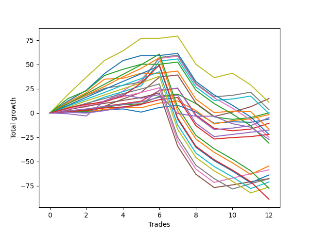

# Short Shepard 003 SD 
- Symbol: ES_830-1130
- Date Range: 03/18/2022 - 12/30/2022
- Trading Period: 8:30-11:30
- Number of Trades: 9



| Name | Win Percent | Profit | Avg Profit / Trade | Avg Time / Trade |      | Name | Win Percent | Profit | Avg Profit / Trade | Avg Time / Trade |
| ---- | ----------- | ------ | ------------------ | ---------------- | ---- | ---- | ----------- | ------ | ------------------ | ---------------- |
| Sorted By <br> Profit | | | | | | Sorted By <br> Win Percentage ||||
| BB-50 U/L 1SD | 88.89 | 17125.00 | 1902.78 | 22:00 |     | BB-50 U/L 1SD | 88.89 | 17125.00 | 1902.78 | 22:00 |
| V U/L 1SD | 55.56 | 14000.00 | 1555.56 | 45:47 |     | TP-4 | 88.89 | 10500.00 | 1166.67 | 16:47 |
| V Mid | 77.78 | 13625.00 | 1513.89 | 26:36 |     | TP-3 | 88.89 | 6625.00 | 736.11 | 16:16 |
| TP-4 | 88.89 | 10500.00 | 1166.67 | 16:47 |     | TP-2 | 88.89 | 3625.00 | 402.78 | 12:53 |
| BB-100 Mid | 77.78 | 10375.00 | 1152.78 | 27:26 |     | TP-1 | 88.89 | 1875.00 | 208.33 | 12:36 |
| TP-9 | 66.67 | 9750.00 | 1083.33 | 34:21 |     | V Mid | 77.78 | 13625.00 | 1513.89 | 26:36 |
| BB-50 Mid | 77.78 | 9375.00 | 1041.67 | 15:05 |     | BB-100 Mid | 77.78 | 10375.00 | 1152.78 | 27:26 |
| TP-3 | 88.89 | 6625.00 | 736.11 | 16:16 |     | BB-50 Mid | 77.78 | 9375.00 | 1041.67 | 15:05 |
| BB-20 U/L 2SD C | 77.78 | 6125.00 | 680.56 | 21:18 |     | BB-20 U/L 2SD C | 77.78 | 6125.00 | 680.56 | 21:18 |
| TP-8 | 66.67 | 6000.00 | 666.67 | 32:12 |     | TP-5 | 77.78 | 5500.00 | 611.11 | 24:10 |
| TP-5 | 77.78 | 5500.00 | 611.11 | 24:10 |     | TP-9 | 66.67 | 9750.00 | 1083.33 | 34:21 |
| BB-200 Mid | 55.56 | 4750.00 | 527.78 | 38:47 |     | TP-8 | 66.67 | 6000.00 | 666.67 | 32:12 |
| TP-2 | 88.89 | 3625.00 | 402.78 | 12:53 |     | TP-7 | 66.67 | 2625.00 | 291.67 | 30:31 |
| TP-7 | 66.67 | 2625.00 | 291.67 | 30:31 |     | BB-20 U/L 2SD | 66.67 | 2625.00 | 291.67 | 20:38 |
| BB-20 U/L 2SD | 66.67 | 2625.00 | 291.67 | 20:38 |     | BB-20 U/L 1SD | 66.67 | 2125.00 | 236.11 | 12:05 |
| BB-20 U/L 1SD | 66.67 | 2125.00 | 236.11 | 12:05 |     | TP-6 | 66.67 | 625.00 | 69.44 | 30:01 |
| TP-1 | 88.89 | 1875.00 | 208.33 | 12:36 |     | V U/L 1SD | 55.56 | 14000.00 | 1555.56 | 45:47 |
| TP-6 | 66.67 | 625.00 | 69.44 | 30:01 |     | BB-200 Mid | 55.56 | 4750.00 | 527.78 | 38:47 |
| BB-20 Mid | 55.56 | -1250.00 | -138.89 | 08:12 |     | BB-20 Mid | 55.56 | -1250.00 | -138.89 | 08:12 |
| TP-10 | 55.56 | -1875.00 | -208.33 | 40:18 |     | TP-10 | 55.56 | -1875.00 | -208.33 | 40:18 |
| BB-100 U/L 2SD | 44.44 | -4250.00 | -472.22 | 52:47 |     | BB-50 U/L 2SD | 55.56 | -4750.00 | -527.78 | 37:55 |
| BB-50 U/L 2SD | 55.56 | -4750.00 | -527.78 | 37:55 |     | NEWFI 000 | 55.56 | -5625.00 | -625.00 | 42:40 |
| BB-200 U/L 2SD | 44.44 | -5250.00 | -583.33 | 58:22 |     | BB-100 U/L 2SD | 44.44 | -4250.00 | -472.22 | 52:47 |
| NEWFI 000 | 55.56 | -5625.00 | -625.00 | 42:40 |     | BB-200 U/L 2SD | 44.44 | -5250.00 | -583.33 | 58:22 |
| NEWFI 0000 | 22.22 | -5625.00 | -625.00 | 18:57 |     | NEWFI 0000 | 22.22 | -5625.00 | -625.00 | 18:57 |

## NO STOPLOSS

### Test BB-20 Mid
* Sell when price hits the middle line of the 20p bollinger
* No Stoploss
* Results:
```
Total Trades: 9
Percent Up: 44.44
Percent Down: 55.56
Total Points Moved Down: -2.50
Potential Profit: -1250.00
Total Points Ups: 16.25 Count Ups: 4
Total Points Downs: 13.75 Count Downs: 5
```

<details><summary>Trades</summary>

<code>In: 2022-03-25 11:37:00		Out: 2022-03-25 11:40:25		Total Position Time: 03:25		Total Move Down: 1.75		Total to Date: 1.75</code> <br />
<code>In: 2022-03-25 11:41:00		Out: 2022-03-25 11:42:10		Total Position Time: 01:10		Total Move Down: -1.00		Total to Date: 0.75</code> <br />
<code>In: 2022-04-01 12:09:00		Out: 2022-04-01 12:10:10		Total Position Time: 01:10		Total Move Down: 2.50		Total to Date: 3.25</code> <br />
<code>In: 2022-04-20 07:48:00		Out: 2022-04-20 08:00:20		Total Position Time: 12:20		Total Move Down: -3.25		Total to Date: 0.00</code> <br />
<code>In: 2022-05-10 11:06:00		Out: 2022-05-10 11:07:10		Total Position Time: 01:10		Total Move Down: 4.75		Total to Date: 4.75</code> <br />
<code>In: 2022-08-16 08:25:00		Out: 2022-08-16 09:07:50		Total Position Time: 42:50		Total Move Down: -11.50		Total to Date: -6.75</code> <br />
<code>In: 2022-08-18 07:28:00		Out: 2022-08-18 07:29:10		Total Position Time: 01:10		Total Move Down: 1.50		Total to Date: -5.25</code> <br />
<code>In: 2022-08-18 07:47:00		Out: 2022-08-18 07:56:25		Total Position Time: 09:25		Total Move Down: -0.50		Total to Date: -5.75</code> <br />
<code>In: 2022-09-01 10:36:00		Out: 2022-09-01 10:37:15		Total Position Time: 01:15		Total Move Down: 3.25		Total to Date: -2.50</code> <br />


</details>

### Test BB-20 U/L 1SD
* Sell when the price hits the lower line of the 20p 1std bollinger
* No Stoploss
* Results:
```
Total Trades: 9
Percent Up: 33.33
Percent Down: 66.67
Total Points Moved Down: 4.25
Potential Profit: 2125.00
Total Points Ups: 15.00 Count Ups: 3
Total Points Downs: 19.25 Count Downs: 6
```

<details><summary>Trades</summary>

<code>In: 2022-03-25 11:37:00		Out: 2022-03-25 11:41:25		Total Position Time: 04:25		Total Move Down: 2.25		Total to Date: 2.25</code> <br />
<code>In: 2022-03-25 11:41:00		Out: 2022-03-25 11:48:45		Total Position Time: 07:45		Total Move Down: -1.00		Total to Date: 1.25</code> <br />
<code>In: 2022-04-01 12:09:00		Out: 2022-04-01 12:10:10		Total Position Time: 01:10		Total Move Down: 2.50		Total to Date: 3.75</code> <br />
<code>In: 2022-04-20 07:48:00		Out: 2022-04-20 08:00:40		Total Position Time: 12:40		Total Move Down: -0.25		Total to Date: 3.50</code> <br />
<code>In: 2022-05-10 11:06:00		Out: 2022-05-10 11:07:10		Total Position Time: 01:10		Total Move Down: 4.75		Total to Date: 8.25</code> <br />
<code>In: 2022-08-16 08:25:00		Out: 2022-08-16 09:25:55		Total Position Time: 60:55		Total Move Down: -13.75		Total to Date: -5.50</code> <br />
<code>In: 2022-08-18 07:28:00		Out: 2022-08-18 07:31:20		Total Position Time: 03:20		Total Move Down: 3.50		Total to Date: -2.00</code> <br />
<code>In: 2022-08-18 07:47:00		Out: 2022-08-18 07:58:30		Total Position Time: 11:30		Total Move Down: 1.75		Total to Date: -0.25</code> <br />
<code>In: 2022-09-01 10:36:00		Out: 2022-09-01 10:41:50		Total Position Time: 05:50		Total Move Down: 4.50		Total to Date: 4.25</code> <br />


</details>

### Test BB-20 U/L 2SD
* Sell when the price hits the lower line of the 20p 2std bollinger
* No Stoploss
* Results:
```
Total Trades: 9
Percent Up: 33.33
Percent Down: 66.67
Total Points Moved Down: 5.25
Potential Profit: 2625.00
Total Points Ups: 16.25 Count Ups: 3
Total Points Downs: 21.50 Count Downs: 6
```

<details><summary>Trades</summary>

<code>In: 2022-03-25 11:37:00		Out: 2022-03-25 12:00:55		Total Position Time: 23:55		Total Move Down: 1.50		Total to Date: 1.50</code> <br />
<code>In: 2022-03-25 11:41:00		Out: 2022-03-25 12:00:55		Total Position Time: 19:55		Total Move Down: -0.00		Total to Date: 1.50</code> <br />
<code>In: 2022-04-01 12:09:00		Out: 2022-04-01 12:11:10		Total Position Time: 02:10		Total Move Down: 4.50		Total to Date: 6.00</code> <br />
<code>In: 2022-04-20 07:48:00		Out: 2022-04-20 08:00:55		Total Position Time: 12:55		Total Move Down: 1.00		Total to Date: 7.00</code> <br />
<code>In: 2022-05-10 11:06:00		Out: 2022-05-10 11:11:10		Total Position Time: 05:10		Total Move Down: 7.75		Total to Date: 14.75</code> <br />
<code>In: 2022-08-16 08:25:00		Out: 2022-08-16 09:25:55		Total Position Time: 60:55		Total Move Down: -13.75		Total to Date: 1.00</code> <br />
<code>In: 2022-08-18 07:28:00		Out: 2022-08-18 08:03:20		Total Position Time: 35:20		Total Move Down: -2.50		Total to Date: -1.50</code> <br />
<code>In: 2022-08-18 07:47:00		Out: 2022-08-18 08:03:20		Total Position Time: 16:20		Total Move Down: 1.75		Total to Date: 0.25</code> <br />
<code>In: 2022-09-01 10:36:00		Out: 2022-09-01 10:45:10		Total Position Time: 09:10		Total Move Down: 5.00		Total to Date: 5.25</code> <br />


</details>

### Test BB-20 U/L 2SD C
* Sell when the price hits the lower line of the 20p 2std bollinger
* No Stoploss
* Results:
```
Total Trades: 9
Percent Up: 22.22
Percent Down: 77.78
Total Points Moved Down: 12.25
Potential Profit: 6125.00
Total Points Ups: 16.25 Count Ups: 2
Total Points Downs: 28.50 Count Downs: 7
```

<details><summary>Trades</summary>

<code>In: 2022-03-25 11:37:00		Out: 2022-03-25 12:01:15		Total Position Time: 24:15		Total Move Down: 2.00		Total to Date: 2.00</code> <br />
<code>In: 2022-03-25 11:41:00		Out: 2022-03-25 12:01:15		Total Position Time: 20:15		Total Move Down: 0.50		Total to Date: 2.50</code> <br />
<code>In: 2022-04-01 12:09:00		Out: 2022-04-01 12:11:10		Total Position Time: 02:10		Total Move Down: 4.50		Total to Date: 7.00</code> <br />
<code>In: 2022-04-20 07:48:00		Out: 2022-04-20 08:01:10		Total Position Time: 13:10		Total Move Down: 2.75		Total to Date: 9.75</code> <br />
<code>In: 2022-05-10 11:06:00		Out: 2022-05-10 11:16:05		Total Position Time: 10:05		Total Move Down: 11.00		Total to Date: 20.75</code> <br />
<code>In: 2022-08-16 08:25:00		Out: 2022-08-16 09:25:55		Total Position Time: 60:55		Total Move Down: -13.75		Total to Date: 7.00</code> <br />
<code>In: 2022-08-18 07:28:00		Out: 2022-08-18 08:03:20		Total Position Time: 35:20		Total Move Down: -2.50		Total to Date: 4.50</code> <br />
<code>In: 2022-08-18 07:47:00		Out: 2022-08-18 08:03:20		Total Position Time: 16:20		Total Move Down: 1.75		Total to Date: 6.25</code> <br />
<code>In: 2022-09-01 10:36:00		Out: 2022-09-01 10:45:15		Total Position Time: 09:15		Total Move Down: 6.00		Total to Date: 12.25</code> <br />


</details>

### Test BB-50 Mid
* Sell when price hits the middle line of the 50p bollinger
* No Stoploss
* Results:
```
Total Trades: 9
Percent Up: 22.22
Percent Down: 77.78
Total Points Moved Down: 18.75
Potential Profit: 9375.00
Total Points Ups: 14.50 Count Ups: 2
Total Points Downs: 33.25 Count Downs: 7
```

<details><summary>Trades</summary>

<code>In: 2022-03-25 11:37:00		Out: 2022-03-25 11:49:30		Total Position Time: 12:30		Total Move Down: 0.75		Total to Date: 0.75</code> <br />
<code>In: 2022-03-25 11:41:00		Out: 2022-03-25 11:49:30		Total Position Time: 08:30		Total Move Down: -0.75		Total to Date: 0.00</code> <br />
<code>In: 2022-04-01 12:09:00		Out: 2022-04-01 12:10:10		Total Position Time: 01:10		Total Move Down: 2.50		Total to Date: 2.50</code> <br />
<code>In: 2022-04-20 07:48:00		Out: 2022-04-20 08:01:10		Total Position Time: 13:10		Total Move Down: 2.75		Total to Date: 5.25</code> <br />
<code>In: 2022-05-10 11:06:00		Out: 2022-05-10 11:16:20		Total Position Time: 10:20		Total Move Down: 15.00		Total to Date: 20.25</code> <br />
<code>In: 2022-08-16 08:25:00		Out: 2022-08-16 09:25:55		Total Position Time: 60:55		Total Move Down: -13.75		Total to Date: 6.50</code> <br />
<code>In: 2022-08-18 07:28:00		Out: 2022-08-18 07:29:10		Total Position Time: 01:10		Total Move Down: 1.50		Total to Date: 8.00</code> <br />
<code>In: 2022-08-18 07:47:00		Out: 2022-08-18 08:03:45		Total Position Time: 16:45		Total Move Down: 2.50		Total to Date: 10.50</code> <br />
<code>In: 2022-09-01 10:36:00		Out: 2022-09-01 10:47:15		Total Position Time: 11:15		Total Move Down: 8.25		Total to Date: 18.75</code> <br />


</details>

### Test BB-50 U/L 1SD
* Sell when the price hits the lower line of the 50p 1std bollinger
* No Stoploss
* Results:
```
Total Trades: 9
Percent Up: 11.11
Percent Down: 88.89
Total Points Moved Down: 34.25
Potential Profit: 17125.00
Total Points Ups: 13.75 Count Ups: 1
Total Points Downs: 48.00 Count Downs: 8
```

<details><summary>Trades</summary>

<code>In: 2022-03-25 11:37:00		Out: 2022-03-25 12:01:35		Total Position Time: 24:35		Total Move Down: 2.50		Total to Date: 2.50</code> <br />
<code>In: 2022-03-25 11:41:00		Out: 2022-03-25 12:01:35		Total Position Time: 20:35		Total Move Down: 1.00		Total to Date: 3.50</code> <br />
<code>In: 2022-04-01 12:09:00		Out: 2022-04-01 12:11:05		Total Position Time: 02:05		Total Move Down: 3.50		Total to Date: 7.00</code> <br />
<code>In: 2022-04-20 07:48:00		Out: 2022-04-20 08:10:50		Total Position Time: 22:50		Total Move Down: 6.75		Total to Date: 13.75</code> <br />
<code>In: 2022-05-10 11:06:00		Out: 2022-05-10 11:24:05		Total Position Time: 18:05		Total Move Down: 15.75		Total to Date: 29.50</code> <br />
<code>In: 2022-08-16 08:25:00		Out: 2022-08-16 09:25:55		Total Position Time: 60:55		Total Move Down: -13.75		Total to Date: 15.75</code> <br />
<code>In: 2022-08-18 07:28:00		Out: 2022-08-18 07:31:30		Total Position Time: 03:30		Total Move Down: 4.50		Total to Date: 20.25</code> <br />
<code>In: 2022-08-18 07:47:00		Out: 2022-08-18 08:05:40		Total Position Time: 18:40		Total Move Down: 5.50		Total to Date: 25.75</code> <br />
<code>In: 2022-09-01 10:36:00		Out: 2022-09-01 11:02:50		Total Position Time: 26:50		Total Move Down: 8.50		Total to Date: 34.25</code> <br />


</details>

### Test BB-50 U/L 2SD
* Sell when the price hits the lower line of the 50p 2std bollinger
* No Stoploss
* Results:
```
Total Trades: 9
Percent Up: 44.44
Percent Down: 55.56
Total Points Moved Down: -9.50
Potential Profit: -4750.00
Total Points Ups: 54.50 Count Ups: 4
Total Points Downs: 45.00 Count Downs: 5
```

<details><summary>Trades</summary>

<code>In: 2022-03-25 11:37:00		Out: 2022-03-25 12:01:55		Total Position Time: 24:55		Total Move Down: 4.00		Total to Date: 4.00</code> <br />
<code>In: 2022-03-25 11:41:00		Out: 2022-03-25 12:01:55		Total Position Time: 20:55		Total Move Down: 2.50		Total to Date: 6.50</code> <br />
<code>In: 2022-04-01 12:09:00		Out: 2022-04-01 12:11:20		Total Position Time: 02:20		Total Move Down: 5.00		Total to Date: 11.50</code> <br />
<code>In: 2022-04-20 07:48:00		Out: 2022-04-20 08:16:20		Total Position Time: 28:20		Total Move Down: 11.25		Total to Date: 22.75</code> <br />
<code>In: 2022-05-10 11:06:00		Out: 2022-05-10 11:27:05		Total Position Time: 21:05		Total Move Down: 22.25		Total to Date: 45.00</code> <br />
<code>In: 2022-08-16 08:25:00		Out: 2022-08-16 09:25:55		Total Position Time: 60:55		Total Move Down: -13.75		Total to Date: 31.25</code> <br />
<code>In: 2022-08-18 07:28:00		Out: 2022-08-18 08:28:55		Total Position Time: 60:55		Total Move Down: -10.75		Total to Date: 20.50</code> <br />
<code>In: 2022-08-18 07:47:00		Out: 2022-08-18 08:47:55		Total Position Time: 60:55		Total Move Down: -12.00		Total to Date: 8.50</code> <br />
<code>In: 2022-09-01 10:36:00		Out: 2022-09-01 11:36:55		Total Position Time: 60:55		Total Move Down: -18.00		Total to Date: -9.50</code> <br />


</details>

### Test V Mid
* Sell when the price hits the middle line of the 1std VWAP
* No Stoploss
* Results:
```
Total Trades: 9
Percent Up: 22.22
Percent Down: 77.78
Total Points Moved Down: 27.25
Potential Profit: 13625.00
Total Points Ups: 31.75 Count Ups: 2
Total Points Downs: 59.00 Count Downs: 7
```

<details><summary>Trades</summary>

<code>In: 2022-03-25 11:37:00		Out: 2022-03-25 12:07:35		Total Position Time: 30:35		Total Move Down: 9.75		Total to Date: 9.75</code> <br />
<code>In: 2022-03-25 11:41:00		Out: 2022-03-25 12:07:35		Total Position Time: 26:35		Total Move Down: 8.25		Total to Date: 18.00</code> <br />
<code>In: 2022-04-01 12:09:00		Out: 2022-04-01 12:12:40		Total Position Time: 03:40		Total Move Down: 7.50		Total to Date: 25.50</code> <br />
<code>In: 2022-04-20 07:48:00		Out: 2022-04-20 08:05:05		Total Position Time: 17:05		Total Move Down: 3.50		Total to Date: 29.00</code> <br />
<code>In: 2022-05-10 11:06:00		Out: 2022-05-10 11:27:40		Total Position Time: 21:40		Total Move Down: 25.25		Total to Date: 54.25</code> <br />
<code>In: 2022-08-16 08:25:00		Out: 2022-08-16 09:25:55		Total Position Time: 60:55		Total Move Down: -13.75		Total to Date: 40.50</code> <br />
<code>In: 2022-08-18 07:28:00		Out: 2022-08-18 07:29:10		Total Position Time: 01:10		Total Move Down: 1.50		Total to Date: 42.00</code> <br />
<code>In: 2022-08-18 07:47:00		Out: 2022-08-18 08:03:55		Total Position Time: 16:55		Total Move Down: 3.25		Total to Date: 45.25</code> <br />
<code>In: 2022-09-01 10:36:00		Out: 2022-09-01 11:36:55		Total Position Time: 60:55		Total Move Down: -18.00		Total to Date: 27.25</code> <br />


</details>

### Test V U/L 1SD
* Sell when the price hits the lower line of the 1std VWAP
* No Stoploss
* Results:
```
Total Trades: 9
Percent Up: 44.44
Percent Down: 55.56
Total Points Moved Down: 28.00
Potential Profit: 14000.00
Total Points Ups: 43.75 Count Ups: 4
Total Points Downs: 71.75 Count Downs: 5
```

<details><summary>Trades</summary>

<code>In: 2022-03-25 11:37:00		Out: 2022-03-25 12:33:10		Total Position Time: 56:10		Total Move Down: 19.25		Total to Date: 19.25</code> <br />
<code>In: 2022-03-25 11:41:00		Out: 2022-03-25 12:33:10		Total Position Time: 52:10		Total Move Down: 17.75		Total to Date: 37.00</code> <br />
<code>In: 2022-04-01 12:09:00		Out: 2022-04-01 12:33:30		Total Position Time: 24:30		Total Move Down: 17.25		Total to Date: 54.25</code> <br />
<code>In: 2022-04-20 07:48:00		Out: 2022-04-20 08:20:10		Total Position Time: 32:10		Total Move Down: 13.00		Total to Date: 67.25</code> <br />
<code>In: 2022-05-10 11:06:00		Out: 2022-05-10 12:06:55		Total Position Time: 60:55		Total Move Down: -0.00		Total to Date: 67.25</code> <br />
<code>In: 2022-08-16 08:25:00		Out: 2022-08-16 09:25:55		Total Position Time: 60:55		Total Move Down: -13.75		Total to Date: 53.50</code> <br />
<code>In: 2022-08-18 07:28:00		Out: 2022-08-18 07:31:30		Total Position Time: 03:30		Total Move Down: 4.50		Total to Date: 58.00</code> <br />
<code>In: 2022-08-18 07:47:00		Out: 2022-08-18 08:47:55		Total Position Time: 60:55		Total Move Down: -12.00		Total to Date: 46.00</code> <br />
<code>In: 2022-09-01 10:36:00		Out: 2022-09-01 11:36:55		Total Position Time: 60:55		Total Move Down: -18.00		Total to Date: 28.00</code> <br />


</details>

### Test BB-100 Mid
* Move to BB100 Mid
* No Stoploss
* Results:
```
Total Trades: 9
Percent Up: 22.22
Percent Down: 77.78
Total Points Moved Down: 20.75
Potential Profit: 10375.00
Total Points Ups: 31.75 Count Ups: 2
Total Points Downs: 52.50 Count Downs: 7
```

<details><summary>Trades</summary>

<code>In: 2022-03-25 11:37:00		Out: 2022-03-25 12:02:30		Total Position Time: 25:30		Total Move Down: 5.50		Total to Date: 5.50</code> <br />
<code>In: 2022-03-25 11:41:00		Out: 2022-03-25 12:02:30		Total Position Time: 21:30		Total Move Down: 4.00		Total to Date: 9.50</code> <br />
<code>In: 2022-04-01 12:09:00		Out: 2022-04-01 12:12:25		Total Position Time: 03:25		Total Move Down: 7.00		Total to Date: 16.50</code> <br />
<code>In: 2022-04-20 07:48:00		Out: 2022-04-20 08:10:15		Total Position Time: 22:15		Total Move Down: 6.00		Total to Date: 22.50</code> <br />
<code>In: 2022-05-10 11:06:00		Out: 2022-05-10 11:40:30		Total Position Time: 34:30		Total Move Down: 25.50		Total to Date: 48.00</code> <br />
<code>In: 2022-08-16 08:25:00		Out: 2022-08-16 09:25:55		Total Position Time: 60:55		Total Move Down: -13.75		Total to Date: 34.25</code> <br />
<code>In: 2022-08-18 07:28:00		Out: 2022-08-18 07:29:10		Total Position Time: 01:10		Total Move Down: 1.50		Total to Date: 35.75</code> <br />
<code>In: 2022-08-18 07:47:00		Out: 2022-08-18 08:03:50		Total Position Time: 16:50		Total Move Down: 3.00		Total to Date: 38.75</code> <br />
<code>In: 2022-09-01 10:36:00		Out: 2022-09-01 11:36:55		Total Position Time: 60:55		Total Move Down: -18.00		Total to Date: 20.75</code> <br />


</details>

### Test BB-100 U/L 2SD
* Move to BB100 Upper Band
* No Stoploss
* Results:
```
Total Trades: 9
Percent Up: 55.56
Percent Down: 44.44
Total Points Moved Down: -8.50
Potential Profit: -4250.00
Total Points Ups: 54.50 Count Ups: 5
Total Points Downs: 46.00 Count Downs: 4
```

<details><summary>Trades</summary>

<code>In: 2022-03-25 11:37:00		Out: 2022-03-25 12:21:35		Total Position Time: 44:35		Total Move Down: 12.50		Total to Date: 12.50</code> <br />
<code>In: 2022-03-25 11:41:00		Out: 2022-03-25 12:21:35		Total Position Time: 40:35		Total Move Down: 11.00		Total to Date: 23.50</code> <br />
<code>In: 2022-04-01 12:09:00		Out: 2022-04-01 12:33:30		Total Position Time: 24:30		Total Move Down: 17.25		Total to Date: 40.75</code> <br />
<code>In: 2022-04-20 07:48:00		Out: 2022-04-20 08:48:55		Total Position Time: 60:55		Total Move Down: 5.25		Total to Date: 46.00</code> <br />
<code>In: 2022-05-10 11:06:00		Out: 2022-05-10 12:06:55		Total Position Time: 60:55		Total Move Down: -0.00		Total to Date: 46.00</code> <br />
<code>In: 2022-08-16 08:25:00		Out: 2022-08-16 09:25:55		Total Position Time: 60:55		Total Move Down: -13.75		Total to Date: 32.25</code> <br />
<code>In: 2022-08-18 07:28:00		Out: 2022-08-18 08:28:55		Total Position Time: 60:55		Total Move Down: -10.75		Total to Date: 21.50</code> <br />
<code>In: 2022-08-18 07:47:00		Out: 2022-08-18 08:47:55		Total Position Time: 60:55		Total Move Down: -12.00		Total to Date: 9.50</code> <br />
<code>In: 2022-09-01 10:36:00		Out: 2022-09-01 11:36:55		Total Position Time: 60:55		Total Move Down: -18.00		Total to Date: -8.50</code> <br />


</details>

### Test BB-200 Mid
* Move to BB200 Mid
* No Stoploss
* Results:
```
Total Trades: 9
Percent Up: 44.44
Percent Down: 55.56
Total Points Moved Down: 9.50
Potential Profit: 4750.00
Total Points Ups: 32.25 Count Ups: 4
Total Points Downs: 41.75 Count Downs: 5
```

<details><summary>Trades</summary>

<code>In: 2022-03-25 11:37:00		Out: 2022-03-25 12:20:40		Total Position Time: 43:40		Total Move Down: 11.25		Total to Date: 11.25</code> <br />
<code>In: 2022-03-25 11:41:00		Out: 2022-03-25 12:20:40		Total Position Time: 39:40		Total Move Down: 9.75		Total to Date: 21.00</code> <br />
<code>In: 2022-04-01 12:09:00		Out: 2022-04-01 12:20:35		Total Position Time: 11:35		Total Move Down: 14.00		Total to Date: 35.00</code> <br />
<code>In: 2022-04-20 07:48:00		Out: 2022-04-20 08:48:55		Total Position Time: 60:55		Total Move Down: 5.25		Total to Date: 40.25</code> <br />
<code>In: 2022-05-10 11:06:00		Out: 2022-05-10 12:06:55		Total Position Time: 60:55		Total Move Down: -0.00		Total to Date: 40.25</code> <br />
<code>In: 2022-08-16 08:25:00		Out: 2022-08-16 09:25:55		Total Position Time: 60:55		Total Move Down: -13.75		Total to Date: 26.50</code> <br />
<code>In: 2022-08-18 07:28:00		Out: 2022-08-18 07:29:10		Total Position Time: 01:10		Total Move Down: 1.50		Total to Date: 28.00</code> <br />
<code>In: 2022-08-18 07:47:00		Out: 2022-08-18 07:56:25		Total Position Time: 09:25		Total Move Down: -0.50		Total to Date: 27.50</code> <br />
<code>In: 2022-09-01 10:36:00		Out: 2022-09-01 11:36:55		Total Position Time: 60:55		Total Move Down: -18.00		Total to Date: 9.50</code> <br />


</details>

### Test BB-200 U/L 2SD
* Move to BB200 Upper Band
* No Stoploss
* Results:
```
Total Trades: 9
Percent Up: 55.56
Percent Down: 44.44
Total Points Moved Down: -10.50
Potential Profit: -5250.00
Total Points Ups: 54.50 Count Ups: 5
Total Points Downs: 44.00 Count Downs: 4
```

<details><summary>Trades</summary>

<code>In: 2022-03-25 11:37:00		Out: 2022-03-25 12:37:55		Total Position Time: 60:55		Total Move Down: 15.00		Total to Date: 15.00</code> <br />
<code>In: 2022-03-25 11:41:00		Out: 2022-03-25 12:41:55		Total Position Time: 60:55		Total Move Down: 8.00		Total to Date: 23.00</code> <br />
<code>In: 2022-04-01 12:09:00		Out: 2022-04-01 12:47:00		Total Position Time: 38:00		Total Move Down: 15.75		Total to Date: 38.75</code> <br />
<code>In: 2022-04-20 07:48:00		Out: 2022-04-20 08:48:55		Total Position Time: 60:55		Total Move Down: 5.25		Total to Date: 44.00</code> <br />
<code>In: 2022-05-10 11:06:00		Out: 2022-05-10 12:06:55		Total Position Time: 60:55		Total Move Down: -0.00		Total to Date: 44.00</code> <br />
<code>In: 2022-08-16 08:25:00		Out: 2022-08-16 09:25:55		Total Position Time: 60:55		Total Move Down: -13.75		Total to Date: 30.25</code> <br />
<code>In: 2022-08-18 07:28:00		Out: 2022-08-18 08:28:55		Total Position Time: 60:55		Total Move Down: -10.75		Total to Date: 19.50</code> <br />
<code>In: 2022-08-18 07:47:00		Out: 2022-08-18 08:47:55		Total Position Time: 60:55		Total Move Down: -12.00		Total to Date: 7.50</code> <br />
<code>In: 2022-09-01 10:36:00		Out: 2022-09-01 11:36:55		Total Position Time: 60:55		Total Move Down: -18.00		Total to Date: -10.50</code> <br />


</details>

## TAKE PROFIT

### Test TP-1
* Take Profit of 1 Point
* No Stoploss
* Results:
```
Total Trades: 9
Percent Up: 11.11
Percent Down: 88.89
Total Points Moved Down: 3.75
Potential Profit: 1875.00
Total Points Ups: 13.75 Count Ups: 1
Total Points Downs: 17.50 Count Downs: 8
```

<details><summary>Trades</summary>

<code>In: 2022-03-25 11:37:00		Out: 2022-03-25 11:40:25		Total Position Time: 03:25		Total Move Down: 1.75		Total to Date: 1.75</code> <br />
<code>In: 2022-03-25 11:41:00		Out: 2022-03-25 12:01:40		Total Position Time: 20:40		Total Move Down: 1.00		Total to Date: 2.75</code> <br />
<code>In: 2022-04-01 12:09:00		Out: 2022-04-01 12:10:10		Total Position Time: 01:10		Total Move Down: 2.50		Total to Date: 5.25</code> <br />
<code>In: 2022-04-20 07:48:00		Out: 2022-04-20 08:01:10		Total Position Time: 13:10		Total Move Down: 2.75		Total to Date: 8.00</code> <br />
<code>In: 2022-05-10 11:06:00		Out: 2022-05-10 11:07:10		Total Position Time: 01:10		Total Move Down: 4.75		Total to Date: 12.75</code> <br />
<code>In: 2022-08-16 08:25:00		Out: 2022-08-16 09:25:55		Total Position Time: 60:55		Total Move Down: -13.75		Total to Date: -1.00</code> <br />
<code>In: 2022-08-18 07:28:00		Out: 2022-08-18 07:29:10		Total Position Time: 01:10		Total Move Down: 1.50		Total to Date: 0.50</code> <br />
<code>In: 2022-08-18 07:47:00		Out: 2022-08-18 07:57:35		Total Position Time: 10:35		Total Move Down: 1.00		Total to Date: 1.50</code> <br />
<code>In: 2022-09-01 10:36:00		Out: 2022-09-01 10:37:10		Total Position Time: 01:10		Total Move Down: 2.25		Total to Date: 3.75</code> <br />


</details>

### Test TP-2
* Take Profit of 2 Point
* No Stoploss
* Results:
```
Total Trades: 9
Percent Up: 11.11
Percent Down: 88.89
Total Points Moved Down: 7.25
Potential Profit: 3625.00
Total Points Ups: 13.75 Count Ups: 1
Total Points Downs: 21.00 Count Downs: 8
```

<details><summary>Trades</summary>

<code>In: 2022-03-25 11:37:00		Out: 2022-03-25 11:40:50		Total Position Time: 03:50		Total Move Down: 2.25		Total to Date: 2.25</code> <br />
<code>In: 2022-03-25 11:41:00		Out: 2022-03-25 12:01:50		Total Position Time: 20:50		Total Move Down: 2.00		Total to Date: 4.25</code> <br />
<code>In: 2022-04-01 12:09:00		Out: 2022-04-01 12:10:10		Total Position Time: 01:10		Total Move Down: 2.50		Total to Date: 6.75</code> <br />
<code>In: 2022-04-20 07:48:00		Out: 2022-04-20 08:01:10		Total Position Time: 13:10		Total Move Down: 2.75		Total to Date: 9.50</code> <br />
<code>In: 2022-05-10 11:06:00		Out: 2022-05-10 11:07:10		Total Position Time: 01:10		Total Move Down: 4.75		Total to Date: 14.25</code> <br />
<code>In: 2022-08-16 08:25:00		Out: 2022-08-16 09:25:55		Total Position Time: 60:55		Total Move Down: -13.75		Total to Date: 0.50</code> <br />
<code>In: 2022-08-18 07:28:00		Out: 2022-08-18 07:31:10		Total Position Time: 03:10		Total Move Down: 2.25		Total to Date: 2.75</code> <br />
<code>In: 2022-08-18 07:47:00		Out: 2022-08-18 07:57:40		Total Position Time: 10:40		Total Move Down: 2.25		Total to Date: 5.00</code> <br />
<code>In: 2022-09-01 10:36:00		Out: 2022-09-01 10:37:10		Total Position Time: 01:10		Total Move Down: 2.25		Total to Date: 7.25</code> <br />


</details>

### Test TP-3
* Take Profit of 3 Point
* No Stoploss
* Results:
```
Total Trades: 9
Percent Up: 11.11
Percent Down: 88.89
Total Points Moved Down: 13.25
Potential Profit: 6625.00
Total Points Ups: 13.75 Count Ups: 1
Total Points Downs: 27.00 Count Downs: 8
```

<details><summary>Trades</summary>

<code>In: 2022-03-25 11:37:00		Out: 2022-03-25 12:01:50		Total Position Time: 24:50		Total Move Down: 3.50		Total to Date: 3.50</code> <br />
<code>In: 2022-03-25 11:41:00		Out: 2022-03-25 12:02:00		Total Position Time: 21:00		Total Move Down: 3.50		Total to Date: 7.00</code> <br />
<code>In: 2022-04-01 12:09:00		Out: 2022-04-01 12:11:00		Total Position Time: 02:00		Total Move Down: 3.00		Total to Date: 10.00</code> <br />
<code>In: 2022-04-20 07:48:00		Out: 2022-04-20 08:03:05		Total Position Time: 15:05		Total Move Down: 3.00		Total to Date: 13.00</code> <br />
<code>In: 2022-05-10 11:06:00		Out: 2022-05-10 11:07:10		Total Position Time: 01:10		Total Move Down: 4.75		Total to Date: 17.75</code> <br />
<code>In: 2022-08-16 08:25:00		Out: 2022-08-16 09:25:55		Total Position Time: 60:55		Total Move Down: -13.75		Total to Date: 4.00</code> <br />
<code>In: 2022-08-18 07:28:00		Out: 2022-08-18 07:31:15		Total Position Time: 03:15		Total Move Down: 2.75		Total to Date: 6.75</code> <br />
<code>In: 2022-08-18 07:47:00		Out: 2022-08-18 08:03:55		Total Position Time: 16:55		Total Move Down: 3.25		Total to Date: 10.00</code> <br />
<code>In: 2022-09-01 10:36:00		Out: 2022-09-01 10:37:15		Total Position Time: 01:15		Total Move Down: 3.25		Total to Date: 13.25</code> <br />


</details>

### Test TP-4
* Take Profit of 4 Point
* No Stoploss
* Results:
```
Total Trades: 9
Percent Up: 11.11
Percent Down: 88.89
Total Points Moved Down: 21.00
Potential Profit: 10500.00
Total Points Ups: 13.75 Count Ups: 1
Total Points Downs: 34.75 Count Downs: 8
```

<details><summary>Trades</summary>

<code>In: 2022-03-25 11:37:00		Out: 2022-03-25 12:01:55		Total Position Time: 24:55		Total Move Down: 4.00		Total to Date: 4.00</code> <br />
<code>In: 2022-03-25 11:41:00		Out: 2022-03-25 12:02:30		Total Position Time: 21:30		Total Move Down: 4.00		Total to Date: 8.00</code> <br />
<code>In: 2022-04-01 12:09:00		Out: 2022-04-01 12:11:10		Total Position Time: 02:10		Total Move Down: 4.50		Total to Date: 12.50</code> <br />
<code>In: 2022-04-20 07:48:00		Out: 2022-04-20 08:04:55		Total Position Time: 16:55		Total Move Down: 4.50		Total to Date: 17.00</code> <br />
<code>In: 2022-05-10 11:06:00		Out: 2022-05-10 11:07:10		Total Position Time: 01:10		Total Move Down: 4.75		Total to Date: 21.75</code> <br />
<code>In: 2022-08-16 08:25:00		Out: 2022-08-16 09:25:55		Total Position Time: 60:55		Total Move Down: -13.75		Total to Date: 8.00</code> <br />
<code>In: 2022-08-18 07:28:00		Out: 2022-08-18 07:31:30		Total Position Time: 03:30		Total Move Down: 4.50		Total to Date: 12.50</code> <br />
<code>In: 2022-08-18 07:47:00		Out: 2022-08-18 08:05:25		Total Position Time: 18:25		Total Move Down: 4.50		Total to Date: 17.00</code> <br />
<code>In: 2022-09-01 10:36:00		Out: 2022-09-01 10:37:35		Total Position Time: 01:35		Total Move Down: 4.00		Total to Date: 21.00</code> <br />


</details>

### Test TP-5
* Take Profit of 5 Point
* No Stoploss
* Results:
```
Total Trades: 9
Percent Up: 22.22
Percent Down: 77.78
Total Points Moved Down: 11.00
Potential Profit: 5500.00
Total Points Ups: 24.50 Count Ups: 2
Total Points Downs: 35.50 Count Downs: 7
```

<details><summary>Trades</summary>

<code>In: 2022-03-25 11:37:00		Out: 2022-03-25 12:02:15		Total Position Time: 25:15		Total Move Down: 5.00		Total to Date: 5.00</code> <br />
<code>In: 2022-03-25 11:41:00		Out: 2022-03-25 12:03:00		Total Position Time: 22:00		Total Move Down: 5.00		Total to Date: 10.00</code> <br />
<code>In: 2022-04-01 12:09:00		Out: 2022-04-01 12:11:20		Total Position Time: 02:20		Total Move Down: 5.00		Total to Date: 15.00</code> <br />
<code>In: 2022-04-20 07:48:00		Out: 2022-04-20 08:05:00		Total Position Time: 17:00		Total Move Down: 4.75		Total to Date: 19.75</code> <br />
<code>In: 2022-05-10 11:06:00		Out: 2022-05-10 11:07:15		Total Position Time: 01:15		Total Move Down: 5.25		Total to Date: 25.00</code> <br />
<code>In: 2022-08-16 08:25:00		Out: 2022-08-16 09:25:55		Total Position Time: 60:55		Total Move Down: -13.75		Total to Date: 11.25</code> <br />
<code>In: 2022-08-18 07:28:00		Out: 2022-08-18 08:28:55		Total Position Time: 60:55		Total Move Down: -10.75		Total to Date: 0.50</code> <br />
<code>In: 2022-08-18 07:47:00		Out: 2022-08-18 08:05:40		Total Position Time: 18:40		Total Move Down: 5.50		Total to Date: 6.00</code> <br />
<code>In: 2022-09-01 10:36:00		Out: 2022-09-01 10:45:10		Total Position Time: 09:10		Total Move Down: 5.00		Total to Date: 11.00</code> <br />


</details>

### Test TP-6
* Take Profit of 6 Point
* No Stoploss
* Results:
```
Total Trades: 9
Percent Up: 33.33
Percent Down: 66.67
Total Points Moved Down: 1.25
Potential Profit: 625.00
Total Points Ups: 36.50 Count Ups: 3
Total Points Downs: 37.75 Count Downs: 6
```

<details><summary>Trades</summary>

<code>In: 2022-03-25 11:37:00		Out: 2022-03-25 12:02:45		Total Position Time: 25:45		Total Move Down: 6.00		Total to Date: 6.00</code> <br />
<code>In: 2022-03-25 11:41:00		Out: 2022-03-25 12:07:20		Total Position Time: 26:20		Total Move Down: 6.50		Total to Date: 12.50</code> <br />
<code>In: 2022-04-01 12:09:00		Out: 2022-04-01 12:11:25		Total Position Time: 02:25		Total Move Down: 6.25		Total to Date: 18.75</code> <br />
<code>In: 2022-04-20 07:48:00		Out: 2022-04-20 08:10:15		Total Position Time: 22:15		Total Move Down: 6.00		Total to Date: 24.75</code> <br />
<code>In: 2022-05-10 11:06:00		Out: 2022-05-10 11:07:25		Total Position Time: 01:25		Total Move Down: 7.00		Total to Date: 31.75</code> <br />
<code>In: 2022-08-16 08:25:00		Out: 2022-08-16 09:25:55		Total Position Time: 60:55		Total Move Down: -13.75		Total to Date: 18.00</code> <br />
<code>In: 2022-08-18 07:28:00		Out: 2022-08-18 08:28:55		Total Position Time: 60:55		Total Move Down: -10.75		Total to Date: 7.25</code> <br />
<code>In: 2022-08-18 07:47:00		Out: 2022-08-18 08:47:55		Total Position Time: 60:55		Total Move Down: -12.00		Total to Date: -4.75</code> <br />
<code>In: 2022-09-01 10:36:00		Out: 2022-09-01 10:45:15		Total Position Time: 09:15		Total Move Down: 6.00		Total to Date: 1.25</code> <br />


</details>

### Test TP-7
* Take Profit of 7 Point
* No Stoploss
* Results:
```
Total Trades: 9
Percent Up: 33.33
Percent Down: 66.67
Total Points Moved Down: 5.25
Potential Profit: 2625.00
Total Points Ups: 36.50 Count Ups: 3
Total Points Downs: 41.75 Count Downs: 6
```

<details><summary>Trades</summary>

<code>In: 2022-03-25 11:37:00		Out: 2022-03-25 12:03:05		Total Position Time: 26:05		Total Move Down: 7.25		Total to Date: 7.25</code> <br />
<code>In: 2022-03-25 11:41:00		Out: 2022-03-25 12:07:25		Total Position Time: 26:25		Total Move Down: 7.00		Total to Date: 14.25</code> <br />
<code>In: 2022-04-01 12:09:00		Out: 2022-04-01 12:12:25		Total Position Time: 03:25		Total Move Down: 7.00		Total to Date: 21.25</code> <br />
<code>In: 2022-04-20 07:48:00		Out: 2022-04-20 08:11:55		Total Position Time: 23:55		Total Move Down: 6.75		Total to Date: 28.00</code> <br />
<code>In: 2022-05-10 11:06:00		Out: 2022-05-10 11:07:25		Total Position Time: 01:25		Total Move Down: 7.00		Total to Date: 35.00</code> <br />
<code>In: 2022-08-16 08:25:00		Out: 2022-08-16 09:25:55		Total Position Time: 60:55		Total Move Down: -13.75		Total to Date: 21.25</code> <br />
<code>In: 2022-08-18 07:28:00		Out: 2022-08-18 08:28:55		Total Position Time: 60:55		Total Move Down: -10.75		Total to Date: 10.50</code> <br />
<code>In: 2022-08-18 07:47:00		Out: 2022-08-18 08:47:55		Total Position Time: 60:55		Total Move Down: -12.00		Total to Date: -1.50</code> <br />
<code>In: 2022-09-01 10:36:00		Out: 2022-09-01 10:46:45		Total Position Time: 10:45		Total Move Down: 6.75		Total to Date: 5.25</code> <br />


</details>

### Test TP-8
* Take Profit of 8 Point
* No Stoploss
* Results:
```
Total Trades: 9
Percent Up: 33.33
Percent Down: 66.67
Total Points Moved Down: 12.00
Potential Profit: 6000.00
Total Points Ups: 36.50 Count Ups: 3
Total Points Downs: 48.50 Count Downs: 6
```

<details><summary>Trades</summary>

<code>In: 2022-03-25 11:37:00		Out: 2022-03-25 12:07:20		Total Position Time: 30:20		Total Move Down: 8.00		Total to Date: 8.00</code> <br />
<code>In: 2022-03-25 11:41:00		Out: 2022-03-25 12:07:35		Total Position Time: 26:35		Total Move Down: 8.25		Total to Date: 16.25</code> <br />
<code>In: 2022-04-01 12:09:00		Out: 2022-04-01 12:18:25		Total Position Time: 09:25		Total Move Down: 8.25		Total to Date: 24.50</code> <br />
<code>In: 2022-04-20 07:48:00		Out: 2022-04-20 08:12:15		Total Position Time: 24:15		Total Move Down: 8.00		Total to Date: 32.50</code> <br />
<code>In: 2022-05-10 11:06:00		Out: 2022-05-10 11:11:40		Total Position Time: 05:40		Total Move Down: 8.00		Total to Date: 40.50</code> <br />
<code>In: 2022-08-16 08:25:00		Out: 2022-08-16 09:25:55		Total Position Time: 60:55		Total Move Down: -13.75		Total to Date: 26.75</code> <br />
<code>In: 2022-08-18 07:28:00		Out: 2022-08-18 08:28:55		Total Position Time: 60:55		Total Move Down: -10.75		Total to Date: 16.00</code> <br />
<code>In: 2022-08-18 07:47:00		Out: 2022-08-18 08:47:55		Total Position Time: 60:55		Total Move Down: -12.00		Total to Date: 4.00</code> <br />
<code>In: 2022-09-01 10:36:00		Out: 2022-09-01 10:46:55		Total Position Time: 10:55		Total Move Down: 8.00		Total to Date: 12.00</code> <br />


</details>

### Test TP-9
* Take Profit of 9 Point
* No Stoploss
* Results:
```
Total Trades: 9
Percent Up: 33.33
Percent Down: 66.67
Total Points Moved Down: 19.50
Potential Profit: 9750.00
Total Points Ups: 36.50 Count Ups: 3
Total Points Downs: 56.00 Count Downs: 6
```

<details><summary>Trades</summary>

<code>In: 2022-03-25 11:37:00		Out: 2022-03-25 12:07:35		Total Position Time: 30:35		Total Move Down: 9.75		Total to Date: 9.75</code> <br />
<code>In: 2022-03-25 11:41:00		Out: 2022-03-25 12:20:30		Total Position Time: 39:30		Total Move Down: 8.75		Total to Date: 18.50</code> <br />
<code>In: 2022-04-01 12:09:00		Out: 2022-04-01 12:19:00		Total Position Time: 10:00		Total Move Down: 9.00		Total to Date: 27.50</code> <br />
<code>In: 2022-04-20 07:48:00		Out: 2022-04-20 08:12:50		Total Position Time: 24:50		Total Move Down: 8.75		Total to Date: 36.25</code> <br />
<code>In: 2022-05-10 11:06:00		Out: 2022-05-10 11:16:05		Total Position Time: 10:05		Total Move Down: 11.00		Total to Date: 47.25</code> <br />
<code>In: 2022-08-16 08:25:00		Out: 2022-08-16 09:25:55		Total Position Time: 60:55		Total Move Down: -13.75		Total to Date: 33.50</code> <br />
<code>In: 2022-08-18 07:28:00		Out: 2022-08-18 08:28:55		Total Position Time: 60:55		Total Move Down: -10.75		Total to Date: 22.75</code> <br />
<code>In: 2022-08-18 07:47:00		Out: 2022-08-18 08:47:55		Total Position Time: 60:55		Total Move Down: -12.00		Total to Date: 10.75</code> <br />
<code>In: 2022-09-01 10:36:00		Out: 2022-09-01 10:47:25		Total Position Time: 11:25		Total Move Down: 8.75		Total to Date: 19.50</code> <br />


</details>

### Test TP-10
* Take Profit of 10 Point
* No Stoploss
* Results:
```
Total Trades: 9
Percent Up: 44.44
Percent Down: 55.56
Total Points Moved Down: -3.75
Potential Profit: -1875.00
Total Points Ups: 54.50 Count Ups: 4
Total Points Downs: 50.75 Count Downs: 5
```

<details><summary>Trades</summary>

<code>In: 2022-03-25 11:37:00		Out: 2022-03-25 12:07:35		Total Position Time: 30:35		Total Move Down: 9.75		Total to Date: 9.75</code> <br />
<code>In: 2022-03-25 11:41:00		Out: 2022-03-25 12:21:05		Total Position Time: 40:05		Total Move Down: 10.00		Total to Date: 19.75</code> <br />
<code>In: 2022-04-01 12:09:00		Out: 2022-04-01 12:19:30		Total Position Time: 10:30		Total Move Down: 10.00		Total to Date: 29.75</code> <br />
<code>In: 2022-04-20 07:48:00		Out: 2022-04-20 08:15:50		Total Position Time: 27:50		Total Move Down: 10.00		Total to Date: 39.75</code> <br />
<code>In: 2022-05-10 11:06:00		Out: 2022-05-10 11:16:05		Total Position Time: 10:05		Total Move Down: 11.00		Total to Date: 50.75</code> <br />
<code>In: 2022-08-16 08:25:00		Out: 2022-08-16 09:25:55		Total Position Time: 60:55		Total Move Down: -13.75		Total to Date: 37.00</code> <br />
<code>In: 2022-08-18 07:28:00		Out: 2022-08-18 08:28:55		Total Position Time: 60:55		Total Move Down: -10.75		Total to Date: 26.25</code> <br />
<code>In: 2022-08-18 07:47:00		Out: 2022-08-18 08:47:55		Total Position Time: 60:55		Total Move Down: -12.00		Total to Date: 14.25</code> <br />
<code>In: 2022-09-01 10:36:00		Out: 2022-09-01 11:36:55		Total Position Time: 60:55		Total Move Down: -18.00		Total to Date: -3.75</code> <br />


</details>

## Indicator Exits

### Test NEWFI 000
* Newfi 0000
* No Stoploss
* Results:
```
Total Trades: 9
Percent Up: 44.44
Percent Down: 55.56
Total Points Moved Down: -11.25
Potential Profit: -5625.00
Total Points Ups: 54.50 Count Ups: 4
Total Points Downs: 43.25 Count Downs: 5
```

<details><summary>Trades</summary>

<code>In: 2022-03-25 11:37:00		Out: 2022-03-25 12:13:05		Total Position Time: 36:05		Total Move Down: 5.25		Total to Date: 5.25</code> <br />
<code>In: 2022-03-25 11:41:00		Out: 2022-03-25 12:13:05		Total Position Time: 32:05		Total Move Down: 3.75		Total to Date: 9.00</code> <br />
<code>In: 2022-04-01 12:09:00		Out: 2022-04-01 12:16:05		Total Position Time: 07:05		Total Move Down: 2.50		Total to Date: 11.50</code> <br />
<code>In: 2022-04-20 07:48:00		Out: 2022-04-20 08:28:05		Total Position Time: 40:05		Total Move Down: 13.00		Total to Date: 24.50</code> <br />
<code>In: 2022-05-10 11:06:00		Out: 2022-05-10 11:31:05		Total Position Time: 25:05		Total Move Down: 18.75		Total to Date: 43.25</code> <br />
<code>In: 2022-08-16 08:25:00		Out: 2022-08-16 09:25:55		Total Position Time: 60:55		Total Move Down: -13.75		Total to Date: 29.50</code> <br />
<code>In: 2022-08-18 07:28:00		Out: 2022-08-18 08:28:55		Total Position Time: 60:55		Total Move Down: -10.75		Total to Date: 18.75</code> <br />
<code>In: 2022-08-18 07:47:00		Out: 2022-08-18 08:47:55		Total Position Time: 60:55		Total Move Down: -12.00		Total to Date: 6.75</code> <br />
<code>In: 2022-09-01 10:36:00		Out: 2022-09-01 11:36:55		Total Position Time: 60:55		Total Move Down: -18.00		Total to Date: -11.25</code> <br />


</details>

### Test NEWFI 0000
* Newfi 0000
* No Stoploss
* Results:
```
Total Trades: 9
Percent Up: 77.78
Percent Down: 22.22
Total Points Moved Down: -11.25
Potential Profit: -5625.00
Total Points Ups: 30.75 Count Ups: 7
Total Points Downs: 19.50 Count Downs: 2
```

<details><summary>Trades</summary>

<code>In: 2022-03-25 11:37:00		Out: 2022-03-25 11:58:05		Total Position Time: 21:05		Total Move Down: -0.75		Total to Date: -0.75</code> <br />
<code>In: 2022-03-25 11:41:00		Out: 2022-03-25 11:58:05		Total Position Time: 17:05		Total Move Down: -2.25		Total to Date: -3.00</code> <br />
<code>In: 2022-04-01 12:09:00		Out: 2022-04-01 12:47:00		Total Position Time: 38:00		Total Move Down: 15.75		Total to Date: 12.75</code> <br />
<code>In: 2022-04-20 07:48:00		Out: 2022-04-20 07:58:05		Total Position Time: 10:05		Total Move Down: -3.75		Total to Date: 9.00</code> <br />
<code>In: 2022-05-10 11:06:00		Out: 2022-05-10 11:07:05		Total Position Time: 01:05		Total Move Down: 3.75		Total to Date: 12.75</code> <br />
<code>In: 2022-08-16 08:25:00		Out: 2022-08-16 08:26:05		Total Position Time: 01:05		Total Move Down: -0.00		Total to Date: 12.75</code> <br />
<code>In: 2022-08-18 07:28:00		Out: 2022-08-18 07:52:05		Total Position Time: 24:05		Total Move Down: -7.75		Total to Date: 5.00</code> <br />
<code>In: 2022-08-18 07:47:00		Out: 2022-08-18 07:52:05		Total Position Time: 05:05		Total Move Down: -3.50		Total to Date: 1.50</code> <br />
<code>In: 2022-09-01 10:36:00		Out: 2022-09-01 11:29:05		Total Position Time: 53:05		Total Move Down: -12.75		Total to Date: -11.25</code> <br />


</details>