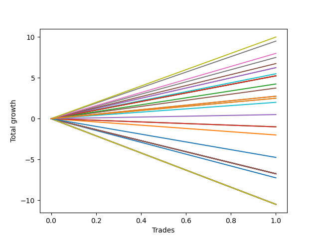

# Short Shepard 103 DB 
- Symbol: ES_830-1130
- Date Range: 03/18/2022 - 12/30/2022
- Trading Period: 8:30-11:30
- Number of Trades: 1



| Name | Win Percent | Profit | Avg Profit / Trade | Avg Time / Trade |      | Name | Win Percent | Profit | Avg Profit / Trade | Avg Time / Trade |
| ---- | ----------- | ------ | ------------------ | ---------------- | ---- | ---- | ----------- | ------ | ------------------ | ---------------- |
| Sorted By <br> Profit | | | | | | Sorted By <br> Win Percentage ||||
| TP-10 | 100.00 | 5000.00 | 5000.00 | 54:10 |     | TP-10 | 100.00 | 5000.00 | 5000.00 | 54:10 |
| TP-9 | 100.00 | 4750.00 | 4750.00 | 53:15 |     | TP-9 | 100.00 | 4750.00 | 4750.00 | 53:15 |
| TP-8 | 100.00 | 4000.00 | 4000.00 | 49:15 |     | TP-8 | 100.00 | 4000.00 | 4000.00 | 49:15 |
| V Mid | 100.00 | 3750.00 | 3750.00 | 49:05 |     | V Mid | 100.00 | 3750.00 | 3750.00 | 49:05 |
| TP-7 | 100.00 | 3375.00 | 3375.00 | 48:45 |     | TP-7 | 100.00 | 3375.00 | 3375.00 | 48:45 |
| TP-6 | 100.00 | 3125.00 | 3125.00 | 48:35 |     | TP-6 | 100.00 | 3125.00 | 3125.00 | 48:35 |
| BB-50 U/L 2SD | 100.00 | 3125.00 | 3125.00 | 48:35 |     | BB-50 U/L 2SD | 100.00 | 3125.00 | 3125.00 | 48:35 |
| BB-100 Mid | 100.00 | 2750.00 | 2750.00 | 48:05 |     | BB-100 Mid | 100.00 | 2750.00 | 2750.00 | 48:05 |
| TP-5 | 100.00 | 2625.00 | 2625.00 | 33:25 |     | TP-5 | 100.00 | 2625.00 | 2625.00 | 33:25 |
| BB-200 U/L 2SD | 100.00 | 2625.00 | 2625.00 | 60:55 |     | BB-200 U/L 2SD | 100.00 | 2625.00 | 2625.00 | 60:55 |
| BB-200 Mid | 100.00 | 2625.00 | 2625.00 | 33:25 |     | BB-200 Mid | 100.00 | 2625.00 | 2625.00 | 33:25 |
| BB-100 U/L 2SD | 100.00 | 2625.00 | 2625.00 | 60:55 |     | BB-100 U/L 2SD | 100.00 | 2625.00 | 2625.00 | 60:55 |
| V U/L 1SD | 100.00 | 2625.00 | 2625.00 | 60:55 |     | V U/L 1SD | 100.00 | 2625.00 | 2625.00 | 60:55 |
| TP-4 | 100.00 | 2125.00 | 2125.00 | 27:05 |     | TP-4 | 100.00 | 2125.00 | 2125.00 | 27:05 |
| BB-50 U/L 1SD | 100.00 | 1875.00 | 1875.00 | 39:55 |     | BB-50 U/L 1SD | 100.00 | 1875.00 | 1875.00 | 39:55 |
| TP-3 | 100.00 | 1375.00 | 1375.00 | 25:05 |     | TP-3 | 100.00 | 1375.00 | 1375.00 | 25:05 |
| TP-2 | 100.00 | 1375.00 | 1375.00 | 25:05 |     | TP-2 | 100.00 | 1375.00 | 1375.00 | 25:05 |
| NEWFI 06 | 100.00 | 1250.00 | 1250.00 | 58:05 |     | NEWFI 06 | 100.00 | 1250.00 | 1250.00 | 58:05 |
| NEWFI 000 | 100.00 | 1250.00 | 1250.00 | 58:05 |     | NEWFI 000 | 100.00 | 1250.00 | 1250.00 | 58:05 |
| TP-1 | 100.00 | 1000.00 | 1000.00 | 24:55 |     | TP-1 | 100.00 | 1000.00 | 1000.00 | 24:55 |
| BB-50 Mid | 100.00 | 250.00 | 250.00 | 24:30 |     | BB-50 Mid | 100.00 | 250.00 | 250.00 | 24:30 |
| BB-20 U/L 2SD C | 0.00 | -500.00 | -500.00 | 20:45 |     | BB-20 U/L 2SD C | 0.00 | -500.00 | -500.00 | 20:45 |
| BB-20 U/L 2SD | 0.00 | -500.00 | -500.00 | 20:45 |     | BB-20 U/L 2SD | 0.00 | -500.00 | -500.00 | 20:45 |
| BB-20 U/L 1SD | 0.00 | -1000.00 | -1000.00 | 15:25 |     | BB-20 U/L 1SD | 0.00 | -1000.00 | -1000.00 | 15:25 |
| NEWFI 0000 | 0.00 | -2375.00 | -2375.00 | 01:05 |     | NEWFI 0000 | 0.00 | -2375.00 | -2375.00 | 01:05 |
| BB-200 U/L 2SD SL-5 | 0.00 | -3375.00 | -3375.00 | 01:20 |     | BB-200 U/L 2SD SL-5 | 0.00 | -3375.00 | -3375.00 | 01:20 |
| BB-200 Mid SL-5 | 0.00 | -3375.00 | -3375.00 | 01:20 |     | BB-200 Mid SL-5 | 0.00 | -3375.00 | -3375.00 | 01:20 |
| BB-100 U/L 2SD SL-5 | 0.00 | -3375.00 | -3375.00 | 01:20 |     | BB-100 U/L 2SD SL-5 | 0.00 | -3375.00 | -3375.00 | 01:20 |
| BB-100 Mid SL-5 | 0.00 | -3375.00 | -3375.00 | 01:20 |     | BB-100 Mid SL-5 | 0.00 | -3375.00 | -3375.00 | 01:20 |
| V U/L 1SD SL-5 | 0.00 | -3375.00 | -3375.00 | 01:20 |     | V U/L 1SD SL-5 | 0.00 | -3375.00 | -3375.00 | 01:20 |
| V Mid SL-5 | 0.00 | -3375.00 | -3375.00 | 01:20 |     | V Mid SL-5 | 0.00 | -3375.00 | -3375.00 | 01:20 |
| BB-50 U/L 2SD SL-5 | 0.00 | -3375.00 | -3375.00 | 01:20 |     | BB-50 U/L 2SD SL-5 | 0.00 | -3375.00 | -3375.00 | 01:20 |
| BB-50 U/L 1SD SL-5 | 0.00 | -3375.00 | -3375.00 | 01:20 |     | BB-50 U/L 1SD SL-5 | 0.00 | -3375.00 | -3375.00 | 01:20 |
| BB-50 Mid SL-5 | 0.00 | -3375.00 | -3375.00 | 01:20 |     | BB-50 Mid SL-5 | 0.00 | -3375.00 | -3375.00 | 01:20 |
| BB-20 U/L 2SD C SL-5 | 0.00 | -3375.00 | -3375.00 | 01:20 |     | BB-20 U/L 2SD C SL-5 | 0.00 | -3375.00 | -3375.00 | 01:20 |
| BB-20 U/L 2SD SL-5 | 0.00 | -3375.00 | -3375.00 | 01:20 |     | BB-20 U/L 2SD SL-5 | 0.00 | -3375.00 | -3375.00 | 01:20 |
| BB-20 U/L 1SD SL-5 | 0.00 | -3375.00 | -3375.00 | 01:20 |     | BB-20 U/L 1SD SL-5 | 0.00 | -3375.00 | -3375.00 | 01:20 |
| BB-20 Mid SL-5 | 0.00 | -3375.00 | -3375.00 | 01:20 |     | BB-20 Mid SL-5 | 0.00 | -3375.00 | -3375.00 | 01:20 |
| BB-20 Mid | 0.00 | -3625.00 | -3625.00 | 14:50 |     | BB-20 Mid | 0.00 | -3625.00 | -3625.00 | 14:50 |
| BB-200 U/L 2SD SL-10 | 0.00 | -5250.00 | -5250.00 | 04:10 |     | BB-200 U/L 2SD SL-10 | 0.00 | -5250.00 | -5250.00 | 04:10 |
| BB-200 Mid SL-10 | 0.00 | -5250.00 | -5250.00 | 04:10 |     | BB-200 Mid SL-10 | 0.00 | -5250.00 | -5250.00 | 04:10 |
| BB-100 U/L 2SD SL-10 | 0.00 | -5250.00 | -5250.00 | 04:10 |     | BB-100 U/L 2SD SL-10 | 0.00 | -5250.00 | -5250.00 | 04:10 |
| BB-100 Mid SL-10 | 0.00 | -5250.00 | -5250.00 | 04:10 |     | BB-100 Mid SL-10 | 0.00 | -5250.00 | -5250.00 | 04:10 |
| V U/L 1SD SL-10 | 0.00 | -5250.00 | -5250.00 | 04:10 |     | V U/L 1SD SL-10 | 0.00 | -5250.00 | -5250.00 | 04:10 |
| V Mid SL-10 | 0.00 | -5250.00 | -5250.00 | 04:10 |     | V Mid SL-10 | 0.00 | -5250.00 | -5250.00 | 04:10 |
| BB-50 U/L 2SD SL-10 | 0.00 | -5250.00 | -5250.00 | 04:10 |     | BB-50 U/L 2SD SL-10 | 0.00 | -5250.00 | -5250.00 | 04:10 |
| BB-50 U/L 1SD SL-10 | 0.00 | -5250.00 | -5250.00 | 04:10 |     | BB-50 U/L 1SD SL-10 | 0.00 | -5250.00 | -5250.00 | 04:10 |
| BB-50 Mid SL-10 | 0.00 | -5250.00 | -5250.00 | 04:10 |     | BB-50 Mid SL-10 | 0.00 | -5250.00 | -5250.00 | 04:10 |
| BB-20 U/L 2SD C SL-10 | 0.00 | -5250.00 | -5250.00 | 04:10 |     | BB-20 U/L 2SD C SL-10 | 0.00 | -5250.00 | -5250.00 | 04:10 |
| BB-20 U/L 2SD SL-10 | 0.00 | -5250.00 | -5250.00 | 04:10 |     | BB-20 U/L 2SD SL-10 | 0.00 | -5250.00 | -5250.00 | 04:10 |
| BB-20 U/L 1SD SL-10 | 0.00 | -5250.00 | -5250.00 | 04:10 |     | BB-20 U/L 1SD SL-10 | 0.00 | -5250.00 | -5250.00 | 04:10 |
| BB-20 Mid SL-10 | 0.00 | -5250.00 | -5250.00 | 04:10 |     | BB-20 Mid SL-10 | 0.00 | -5250.00 | -5250.00 | 04:10 |

## NO STOPLOSS

### Test BB-20 Mid
* Sell when price hits the middle line of the 20p bollinger
* No Stoploss
* Results:
```
Total Trades: 1
Percent Up: 100.00
Percent Down: 0.00
Total Points Moved Down: -7.25
Potential Profit: -3625.00
Total Points Ups: 7.25 Count Ups: 1
Total Points Downs: 0.00 Count Downs: 0
```

<details><summary>Trades</summary>

<code>In: 2022-05-16 08:51:00		Out: 2022-05-16 09:05:50		Total Position Time: 14:50		Total Move Down: -7.25		Total to Date: -7.25</code> <br />


</details>

### Test BB-20 U/L 1SD
* Sell when the price hits the lower line of the 20p 1std bollinger
* No Stoploss
* Results:
```
Total Trades: 1
Percent Up: 100.00
Percent Down: 0.00
Total Points Moved Down: -2.00
Potential Profit: -1000.00
Total Points Ups: 2.00 Count Ups: 1
Total Points Downs: 0.00 Count Downs: 0
```

<details><summary>Trades</summary>

<code>In: 2022-05-16 08:51:00		Out: 2022-05-16 09:06:25		Total Position Time: 15:25		Total Move Down: -2.00		Total to Date: -2.00</code> <br />


</details>

### Test BB-20 U/L 2SD
* Sell when the price hits the lower line of the 20p 2std bollinger
* No Stoploss
* Results:
```
Total Trades: 1
Percent Up: 100.00
Percent Down: 0.00
Total Points Moved Down: -1.00
Potential Profit: -500.00
Total Points Ups: 1.00 Count Ups: 1
Total Points Downs: 0.00 Count Downs: 0
```

<details><summary>Trades</summary>

<code>In: 2022-05-16 08:51:00		Out: 2022-05-16 09:11:45		Total Position Time: 20:45		Total Move Down: -1.00		Total to Date: -1.00</code> <br />


</details>

### Test BB-20 U/L 2SD C
* Sell when the price hits the lower line of the 20p 2std bollinger
* No Stoploss
* Results:
```
Total Trades: 1
Percent Up: 100.00
Percent Down: 0.00
Total Points Moved Down: -1.00
Potential Profit: -500.00
Total Points Ups: 1.00 Count Ups: 1
Total Points Downs: 0.00 Count Downs: 0
```

<details><summary>Trades</summary>

<code>In: 2022-05-16 08:51:00		Out: 2022-05-16 09:11:45		Total Position Time: 20:45		Total Move Down: -1.00		Total to Date: -1.00</code> <br />


</details>

### Test BB-50 Mid
* Sell when price hits the middle line of the 50p bollinger
* No Stoploss
* Results:
```
Total Trades: 1
Percent Up: 0.00
Percent Down: 100.00
Total Points Moved Down: 0.50
Potential Profit: 250.00
Total Points Ups: 0.00 Count Ups: 0
Total Points Downs: 0.50 Count Downs: 1
```

<details><summary>Trades</summary>

<code>In: 2022-05-16 08:51:00		Out: 2022-05-16 09:15:30		Total Position Time: 24:30		Total Move Down: 0.50		Total to Date: 0.50</code> <br />


</details>

### Test BB-50 U/L 1SD
* Sell when the price hits the lower line of the 50p 1std bollinger
* No Stoploss
* Results:
```
Total Trades: 1
Percent Up: 0.00
Percent Down: 100.00
Total Points Moved Down: 3.75
Potential Profit: 1875.00
Total Points Ups: 0.00 Count Ups: 0
Total Points Downs: 3.75 Count Downs: 1
```

<details><summary>Trades</summary>

<code>In: 2022-05-16 08:51:00		Out: 2022-05-16 09:30:55		Total Position Time: 39:55		Total Move Down: 3.75		Total to Date: 3.75</code> <br />


</details>

### Test BB-50 U/L 2SD
* Sell when the price hits the lower line of the 50p 2std bollinger
* No Stoploss
* Results:
```
Total Trades: 1
Percent Up: 0.00
Percent Down: 100.00
Total Points Moved Down: 6.25
Potential Profit: 3125.00
Total Points Ups: 0.00 Count Ups: 0
Total Points Downs: 6.25 Count Downs: 1
```

<details><summary>Trades</summary>

<code>In: 2022-05-16 08:51:00		Out: 2022-05-16 09:39:35		Total Position Time: 48:35		Total Move Down: 6.25		Total to Date: 6.25</code> <br />


</details>

### Test V Mid
* Sell when the price hits the middle line of the 1std VWAP
* No Stoploss
* Results:
```
Total Trades: 1
Percent Up: 0.00
Percent Down: 100.00
Total Points Moved Down: 7.50
Potential Profit: 3750.00
Total Points Ups: 0.00 Count Ups: 0
Total Points Downs: 7.50 Count Downs: 1
```

<details><summary>Trades</summary>

<code>In: 2022-05-16 08:51:00		Out: 2022-05-16 09:40:05		Total Position Time: 49:05		Total Move Down: 7.50		Total to Date: 7.50</code> <br />


</details>

### Test V U/L 1SD
* Sell when the price hits the lower line of the 1std VWAP
* No Stoploss
* Results:
```
Total Trades: 1
Percent Up: 0.00
Percent Down: 100.00
Total Points Moved Down: 5.25
Potential Profit: 2625.00
Total Points Ups: 0.00 Count Ups: 0
Total Points Downs: 5.25 Count Downs: 1
```

<details><summary>Trades</summary>

<code>In: 2022-05-16 08:51:00		Out: 2022-05-16 09:51:55		Total Position Time: 60:55		Total Move Down: 5.25		Total to Date: 5.25</code> <br />


</details>

### Test BB-100 Mid
* Move to BB100 Mid
* No Stoploss
* Results:
```
Total Trades: 1
Percent Up: 0.00
Percent Down: 100.00
Total Points Moved Down: 5.50
Potential Profit: 2750.00
Total Points Ups: 0.00 Count Ups: 0
Total Points Downs: 5.50 Count Downs: 1
```

<details><summary>Trades</summary>

<code>In: 2022-05-16 08:51:00		Out: 2022-05-16 09:39:05		Total Position Time: 48:05		Total Move Down: 5.50		Total to Date: 5.50</code> <br />


</details>

### Test BB-100 U/L 2SD
* Move to BB100 Upper Band
* No Stoploss
* Results:
```
Total Trades: 1
Percent Up: 0.00
Percent Down: 100.00
Total Points Moved Down: 5.25
Potential Profit: 2625.00
Total Points Ups: 0.00 Count Ups: 0
Total Points Downs: 5.25 Count Downs: 1
```

<details><summary>Trades</summary>

<code>In: 2022-05-16 08:51:00		Out: 2022-05-16 09:51:55		Total Position Time: 60:55		Total Move Down: 5.25		Total to Date: 5.25</code> <br />


</details>

### Test BB-200 Mid
* Move to BB200 Mid
* No Stoploss
* Results:
```
Total Trades: 1
Percent Up: 0.00
Percent Down: 100.00
Total Points Moved Down: 5.25
Potential Profit: 2625.00
Total Points Ups: 0.00 Count Ups: 0
Total Points Downs: 5.25 Count Downs: 1
```

<details><summary>Trades</summary>

<code>In: 2022-05-16 08:51:00		Out: 2022-05-16 09:24:25		Total Position Time: 33:25		Total Move Down: 5.25		Total to Date: 5.25</code> <br />


</details>

### Test BB-200 U/L 2SD
* Move to BB200 Upper Band
* No Stoploss
* Results:
```
Total Trades: 1
Percent Up: 0.00
Percent Down: 100.00
Total Points Moved Down: 5.25
Potential Profit: 2625.00
Total Points Ups: 0.00 Count Ups: 0
Total Points Downs: 5.25 Count Downs: 1
```

<details><summary>Trades</summary>

<code>In: 2022-05-16 08:51:00		Out: 2022-05-16 09:51:55		Total Position Time: 60:55		Total Move Down: 5.25		Total to Date: 5.25</code> <br />


</details>

## STOPLOSS OF 5

### Test BB-20 Mid SL-5
* Sell when price hits the middle line of the 20p bollinger
* Stoploss is -5 points
* Results:
```
Total Trades: 1
Percent Up: 100.00
Percent Down: 0.00
Total Points Moved Down: -6.75
Potential Profit: -3375.00
Total Points Ups: 6.75 Count Ups: 1
Total Points Downs: 0.00 Count Downs: 0
```

<details><summary>Trades</summary>

<code>In: 2022-05-16 08:51:00		Out: 2022-05-16 08:52:20		Total Position Time: 01:20		Total Move Down: -6.75		Total to Date: -6.75</code> <br />


</details>

### Test BB-20 U/L 1SD SL-5
* Sell when the price hits the lower line of the 20p 1std bollinger
* Stoploss is -5 points
* Results:
```
Total Trades: 1
Percent Up: 100.00
Percent Down: 0.00
Total Points Moved Down: -6.75
Potential Profit: -3375.00
Total Points Ups: 6.75 Count Ups: 1
Total Points Downs: 0.00 Count Downs: 0
```

<details><summary>Trades</summary>

<code>In: 2022-05-16 08:51:00		Out: 2022-05-16 08:52:20		Total Position Time: 01:20		Total Move Down: -6.75		Total to Date: -6.75</code> <br />


</details>

### Test BB-20 U/L 2SD SL-5
* Sell when the price hits the lower line of the 20p 2std bollinger
* Stoploss is -5 points
* Results:
```
Total Trades: 1
Percent Up: 100.00
Percent Down: 0.00
Total Points Moved Down: -6.75
Potential Profit: -3375.00
Total Points Ups: 6.75 Count Ups: 1
Total Points Downs: 0.00 Count Downs: 0
```

<details><summary>Trades</summary>

<code>In: 2022-05-16 08:51:00		Out: 2022-05-16 08:52:20		Total Position Time: 01:20		Total Move Down: -6.75		Total to Date: -6.75</code> <br />


</details>

### Test BB-20 U/L 2SD C SL-5
* Sell when the price hits the lower line of the 20p 2std bollinger
* Stoploss is -5 points
* Results:
```
Total Trades: 1
Percent Up: 100.00
Percent Down: 0.00
Total Points Moved Down: -6.75
Potential Profit: -3375.00
Total Points Ups: 6.75 Count Ups: 1
Total Points Downs: 0.00 Count Downs: 0
```

<details><summary>Trades</summary>

<code>In: 2022-05-16 08:51:00		Out: 2022-05-16 08:52:20		Total Position Time: 01:20		Total Move Down: -6.75		Total to Date: -6.75</code> <br />


</details>

### Test BB-50 Mid SL-5
* Sell when price hits the middle line of the 50p bollinger
* Stoploss is -5 points
* Results:
```
Total Trades: 1
Percent Up: 100.00
Percent Down: 0.00
Total Points Moved Down: -6.75
Potential Profit: -3375.00
Total Points Ups: 6.75 Count Ups: 1
Total Points Downs: 0.00 Count Downs: 0
```

<details><summary>Trades</summary>

<code>In: 2022-05-16 08:51:00		Out: 2022-05-16 08:52:20		Total Position Time: 01:20		Total Move Down: -6.75		Total to Date: -6.75</code> <br />


</details>

### Test BB-50 U/L 1SD SL-5
* Sell when the price hits the lower line of the 50p 1std bollinger
* Stoploss is -5 points
* Results:
```
Total Trades: 1
Percent Up: 100.00
Percent Down: 0.00
Total Points Moved Down: -6.75
Potential Profit: -3375.00
Total Points Ups: 6.75 Count Ups: 1
Total Points Downs: 0.00 Count Downs: 0
```

<details><summary>Trades</summary>

<code>In: 2022-05-16 08:51:00		Out: 2022-05-16 08:52:20		Total Position Time: 01:20		Total Move Down: -6.75		Total to Date: -6.75</code> <br />


</details>

### Test BB-50 U/L 2SD SL-5
* Sell when the price hits the lower line of the 50p 2std bollinger
* Stoploss is -5 points
* Results:
```
Total Trades: 1
Percent Up: 100.00
Percent Down: 0.00
Total Points Moved Down: -6.75
Potential Profit: -3375.00
Total Points Ups: 6.75 Count Ups: 1
Total Points Downs: 0.00 Count Downs: 0
```

<details><summary>Trades</summary>

<code>In: 2022-05-16 08:51:00		Out: 2022-05-16 08:52:20		Total Position Time: 01:20		Total Move Down: -6.75		Total to Date: -6.75</code> <br />


</details>

### Test V Mid SL-5
* Sell when the price hits the middle line of the 1std VWAP
* Stoploss is -5 points
* Results:
```
Total Trades: 1
Percent Up: 100.00
Percent Down: 0.00
Total Points Moved Down: -6.75
Potential Profit: -3375.00
Total Points Ups: 6.75 Count Ups: 1
Total Points Downs: 0.00 Count Downs: 0
```

<details><summary>Trades</summary>

<code>In: 2022-05-16 08:51:00		Out: 2022-05-16 08:52:20		Total Position Time: 01:20		Total Move Down: -6.75		Total to Date: -6.75</code> <br />


</details>

### Test V U/L 1SD SL-5
* Sell when the price hits the lower line of the 1std VWAP
* Stoploss is -5 points
* Results:
```
Total Trades: 1
Percent Up: 100.00
Percent Down: 0.00
Total Points Moved Down: -6.75
Potential Profit: -3375.00
Total Points Ups: 6.75 Count Ups: 1
Total Points Downs: 0.00 Count Downs: 0
```

<details><summary>Trades</summary>

<code>In: 2022-05-16 08:51:00		Out: 2022-05-16 08:52:20		Total Position Time: 01:20		Total Move Down: -6.75		Total to Date: -6.75</code> <br />


</details>

### Test BB-100 Mid SL-5
* Move to BB100 Mid
* Stoploss is -5 points
* Results:
```
Total Trades: 1
Percent Up: 100.00
Percent Down: 0.00
Total Points Moved Down: -6.75
Potential Profit: -3375.00
Total Points Ups: 6.75 Count Ups: 1
Total Points Downs: 0.00 Count Downs: 0
```

<details><summary>Trades</summary>

<code>In: 2022-05-16 08:51:00		Out: 2022-05-16 08:52:20		Total Position Time: 01:20		Total Move Down: -6.75		Total to Date: -6.75</code> <br />


</details>

### Test BB-100 U/L 2SD SL-5
* Move to BB100 Upper Band
* Stoploss is -5 points
* Results:
```
Total Trades: 1
Percent Up: 100.00
Percent Down: 0.00
Total Points Moved Down: -6.75
Potential Profit: -3375.00
Total Points Ups: 6.75 Count Ups: 1
Total Points Downs: 0.00 Count Downs: 0
```

<details><summary>Trades</summary>

<code>In: 2022-05-16 08:51:00		Out: 2022-05-16 08:52:20		Total Position Time: 01:20		Total Move Down: -6.75		Total to Date: -6.75</code> <br />


</details>

### Test BB-200 Mid SL-5
* Move to BB200 Mid
* Stoploss is -5 points
* Results:
```
Total Trades: 1
Percent Up: 100.00
Percent Down: 0.00
Total Points Moved Down: -6.75
Potential Profit: -3375.00
Total Points Ups: 6.75 Count Ups: 1
Total Points Downs: 0.00 Count Downs: 0
```

<details><summary>Trades</summary>

<code>In: 2022-05-16 08:51:00		Out: 2022-05-16 08:52:20		Total Position Time: 01:20		Total Move Down: -6.75		Total to Date: -6.75</code> <br />


</details>

### Test BB-200 U/L 2SD SL-5
* Move to BB200 Upper Band
* Stoploss is -5 points
* Results:
```
Total Trades: 1
Percent Up: 100.00
Percent Down: 0.00
Total Points Moved Down: -6.75
Potential Profit: -3375.00
Total Points Ups: 6.75 Count Ups: 1
Total Points Downs: 0.00 Count Downs: 0
```

<details><summary>Trades</summary>

<code>In: 2022-05-16 08:51:00		Out: 2022-05-16 08:52:20		Total Position Time: 01:20		Total Move Down: -6.75		Total to Date: -6.75</code> <br />


</details>

## STOPLOSS OF 10

### Test BB-20 Mid SL-10
* Sell when price hits the middle line of the 20p bollinger
* Stoploss is -10 points
* Results:
```
Total Trades: 1
Percent Up: 100.00
Percent Down: 0.00
Total Points Moved Down: -10.50
Potential Profit: -5250.00
Total Points Ups: 10.50 Count Ups: 1
Total Points Downs: 0.00 Count Downs: 0
```

<details><summary>Trades</summary>

<code>In: 2022-05-16 08:51:00		Out: 2022-05-16 08:55:10		Total Position Time: 04:10		Total Move Down: -10.50		Total to Date: -10.50</code> <br />


</details>

### Test BB-20 U/L 1SD SL-10
* Sell when the price hits the lower line of the 20p 1std bollinger
* Stoploss is -10 points
* Results:
```
Total Trades: 1
Percent Up: 100.00
Percent Down: 0.00
Total Points Moved Down: -10.50
Potential Profit: -5250.00
Total Points Ups: 10.50 Count Ups: 1
Total Points Downs: 0.00 Count Downs: 0
```

<details><summary>Trades</summary>

<code>In: 2022-05-16 08:51:00		Out: 2022-05-16 08:55:10		Total Position Time: 04:10		Total Move Down: -10.50		Total to Date: -10.50</code> <br />


</details>

### Test BB-20 U/L 2SD SL-10
* Sell when the price hits the lower line of the 20p 2std bollinger
* Stoploss is -10 points
* Results:
```
Total Trades: 1
Percent Up: 100.00
Percent Down: 0.00
Total Points Moved Down: -10.50
Potential Profit: -5250.00
Total Points Ups: 10.50 Count Ups: 1
Total Points Downs: 0.00 Count Downs: 0
```

<details><summary>Trades</summary>

<code>In: 2022-05-16 08:51:00		Out: 2022-05-16 08:55:10		Total Position Time: 04:10		Total Move Down: -10.50		Total to Date: -10.50</code> <br />


</details>

### Test BB-20 U/L 2SD C SL-10
* Sell when the price hits the lower line of the 20p 2std bollinger
* Stoploss is -10 points
* Results:
```
Total Trades: 1
Percent Up: 100.00
Percent Down: 0.00
Total Points Moved Down: -10.50
Potential Profit: -5250.00
Total Points Ups: 10.50 Count Ups: 1
Total Points Downs: 0.00 Count Downs: 0
```

<details><summary>Trades</summary>

<code>In: 2022-05-16 08:51:00		Out: 2022-05-16 08:55:10		Total Position Time: 04:10		Total Move Down: -10.50		Total to Date: -10.50</code> <br />


</details>

### Test BB-50 Mid SL-10
* Sell when price hits the middle line of the 50p bollinger
* Stoploss is -10 points
* Results:
```
Total Trades: 1
Percent Up: 100.00
Percent Down: 0.00
Total Points Moved Down: -10.50
Potential Profit: -5250.00
Total Points Ups: 10.50 Count Ups: 1
Total Points Downs: 0.00 Count Downs: 0
```

<details><summary>Trades</summary>

<code>In: 2022-05-16 08:51:00		Out: 2022-05-16 08:55:10		Total Position Time: 04:10		Total Move Down: -10.50		Total to Date: -10.50</code> <br />


</details>

### Test BB-50 U/L 1SD SL-10
* Sell when the price hits the lower line of the 50p 1std bollinger
* Stoploss is -10 points
* Results:
```
Total Trades: 1
Percent Up: 100.00
Percent Down: 0.00
Total Points Moved Down: -10.50
Potential Profit: -5250.00
Total Points Ups: 10.50 Count Ups: 1
Total Points Downs: 0.00 Count Downs: 0
```

<details><summary>Trades</summary>

<code>In: 2022-05-16 08:51:00		Out: 2022-05-16 08:55:10		Total Position Time: 04:10		Total Move Down: -10.50		Total to Date: -10.50</code> <br />


</details>

### Test BB-50 U/L 2SD SL-10
* Sell when the price hits the lower line of the 50p 2std bollinger
* Stoploss is -10 points
* Results:
```
Total Trades: 1
Percent Up: 100.00
Percent Down: 0.00
Total Points Moved Down: -10.50
Potential Profit: -5250.00
Total Points Ups: 10.50 Count Ups: 1
Total Points Downs: 0.00 Count Downs: 0
```

<details><summary>Trades</summary>

<code>In: 2022-05-16 08:51:00		Out: 2022-05-16 08:55:10		Total Position Time: 04:10		Total Move Down: -10.50		Total to Date: -10.50</code> <br />


</details>

### Test V Mid SL-10
* Sell when the price hits the middle line of the 1std VWAP
* Stoploss is -10 points
* Results:
```
Total Trades: 1
Percent Up: 100.00
Percent Down: 0.00
Total Points Moved Down: -10.50
Potential Profit: -5250.00
Total Points Ups: 10.50 Count Ups: 1
Total Points Downs: 0.00 Count Downs: 0
```

<details><summary>Trades</summary>

<code>In: 2022-05-16 08:51:00		Out: 2022-05-16 08:55:10		Total Position Time: 04:10		Total Move Down: -10.50		Total to Date: -10.50</code> <br />


</details>

### Test V U/L 1SD SL-10
* Sell when the price hits the lower line of the 1std VWAP
* Stoploss is -10 points
* Results:
```
Total Trades: 1
Percent Up: 100.00
Percent Down: 0.00
Total Points Moved Down: -10.50
Potential Profit: -5250.00
Total Points Ups: 10.50 Count Ups: 1
Total Points Downs: 0.00 Count Downs: 0
```

<details><summary>Trades</summary>

<code>In: 2022-05-16 08:51:00		Out: 2022-05-16 08:55:10		Total Position Time: 04:10		Total Move Down: -10.50		Total to Date: -10.50</code> <br />


</details>

### Test BB-100 Mid SL-10
* Move to BB100 Mid
* Stoploss is -10 points
* Results:
```
Total Trades: 1
Percent Up: 100.00
Percent Down: 0.00
Total Points Moved Down: -10.50
Potential Profit: -5250.00
Total Points Ups: 10.50 Count Ups: 1
Total Points Downs: 0.00 Count Downs: 0
```

<details><summary>Trades</summary>

<code>In: 2022-05-16 08:51:00		Out: 2022-05-16 08:55:10		Total Position Time: 04:10		Total Move Down: -10.50		Total to Date: -10.50</code> <br />


</details>

### Test BB-100 U/L 2SD SL-10
* Move to BB100 Upper Band
* Stoploss is -10 points
* Results:
```
Total Trades: 1
Percent Up: 100.00
Percent Down: 0.00
Total Points Moved Down: -10.50
Potential Profit: -5250.00
Total Points Ups: 10.50 Count Ups: 1
Total Points Downs: 0.00 Count Downs: 0
```

<details><summary>Trades</summary>

<code>In: 2022-05-16 08:51:00		Out: 2022-05-16 08:55:10		Total Position Time: 04:10		Total Move Down: -10.50		Total to Date: -10.50</code> <br />


</details>

### Test BB-200 Mid SL-10
* Move to BB200 Mid
* Stoploss is -10 points
* Results:
```
Total Trades: 1
Percent Up: 100.00
Percent Down: 0.00
Total Points Moved Down: -10.50
Potential Profit: -5250.00
Total Points Ups: 10.50 Count Ups: 1
Total Points Downs: 0.00 Count Downs: 0
```

<details><summary>Trades</summary>

<code>In: 2022-05-16 08:51:00		Out: 2022-05-16 08:55:10		Total Position Time: 04:10		Total Move Down: -10.50		Total to Date: -10.50</code> <br />


</details>

### Test BB-200 U/L 2SD SL-10
* Move to BB200 Upper Band
* Stoploss is -10 points
* Results:
```
Total Trades: 1
Percent Up: 100.00
Percent Down: 0.00
Total Points Moved Down: -10.50
Potential Profit: -5250.00
Total Points Ups: 10.50 Count Ups: 1
Total Points Downs: 0.00 Count Downs: 0
```

<details><summary>Trades</summary>

<code>In: 2022-05-16 08:51:00		Out: 2022-05-16 08:55:10		Total Position Time: 04:10		Total Move Down: -10.50		Total to Date: -10.50</code> <br />


</details>

## TAKE PROFIT

### Test TP-1
* Take Profit of 1 Point
* No Stoploss
* Results:
```
Total Trades: 1
Percent Up: 0.00
Percent Down: 100.00
Total Points Moved Down: 2.00
Potential Profit: 1000.00
Total Points Ups: 0.00 Count Ups: 0
Total Points Downs: 2.00 Count Downs: 1
```

<details><summary>Trades</summary>

<code>In: 2022-05-16 08:51:00		Out: 2022-05-16 09:15:55		Total Position Time: 24:55		Total Move Down: 2.00		Total to Date: 2.00</code> <br />


</details>

### Test TP-2
* Take Profit of 2 Point
* No Stoploss
* Results:
```
Total Trades: 1
Percent Up: 0.00
Percent Down: 100.00
Total Points Moved Down: 2.75
Potential Profit: 1375.00
Total Points Ups: 0.00 Count Ups: 0
Total Points Downs: 2.75 Count Downs: 1
```

<details><summary>Trades</summary>

<code>In: 2022-05-16 08:51:00		Out: 2022-05-16 09:16:05		Total Position Time: 25:05		Total Move Down: 2.75		Total to Date: 2.75</code> <br />


</details>

### Test TP-3
* Take Profit of 3 Point
* No Stoploss
* Results:
```
Total Trades: 1
Percent Up: 0.00
Percent Down: 100.00
Total Points Moved Down: 2.75
Potential Profit: 1375.00
Total Points Ups: 0.00 Count Ups: 0
Total Points Downs: 2.75 Count Downs: 1
```

<details><summary>Trades</summary>

<code>In: 2022-05-16 08:51:00		Out: 2022-05-16 09:16:05		Total Position Time: 25:05		Total Move Down: 2.75		Total to Date: 2.75</code> <br />


</details>

### Test TP-4
* Take Profit of 4 Point
* No Stoploss
* Results:
```
Total Trades: 1
Percent Up: 0.00
Percent Down: 100.00
Total Points Moved Down: 4.25
Potential Profit: 2125.00
Total Points Ups: 0.00 Count Ups: 0
Total Points Downs: 4.25 Count Downs: 1
```

<details><summary>Trades</summary>

<code>In: 2022-05-16 08:51:00		Out: 2022-05-16 09:18:05		Total Position Time: 27:05		Total Move Down: 4.25		Total to Date: 4.25</code> <br />


</details>

### Test TP-5
* Take Profit of 5 Point
* No Stoploss
* Results:
```
Total Trades: 1
Percent Up: 0.00
Percent Down: 100.00
Total Points Moved Down: 5.25
Potential Profit: 2625.00
Total Points Ups: 0.00 Count Ups: 0
Total Points Downs: 5.25 Count Downs: 1
```

<details><summary>Trades</summary>

<code>In: 2022-05-16 08:51:00		Out: 2022-05-16 09:24:25		Total Position Time: 33:25		Total Move Down: 5.25		Total to Date: 5.25</code> <br />


</details>

### Test TP-6
* Take Profit of 6 Point
* No Stoploss
* Results:
```
Total Trades: 1
Percent Up: 0.00
Percent Down: 100.00
Total Points Moved Down: 6.25
Potential Profit: 3125.00
Total Points Ups: 0.00 Count Ups: 0
Total Points Downs: 6.25 Count Downs: 1
```

<details><summary>Trades</summary>

<code>In: 2022-05-16 08:51:00		Out: 2022-05-16 09:39:35		Total Position Time: 48:35		Total Move Down: 6.25		Total to Date: 6.25</code> <br />


</details>

### Test TP-7
* Take Profit of 7 Point
* No Stoploss
* Results:
```
Total Trades: 1
Percent Up: 0.00
Percent Down: 100.00
Total Points Moved Down: 6.75
Potential Profit: 3375.00
Total Points Ups: 0.00 Count Ups: 0
Total Points Downs: 6.75 Count Downs: 1
```

<details><summary>Trades</summary>

<code>In: 2022-05-16 08:51:00		Out: 2022-05-16 09:39:45		Total Position Time: 48:45		Total Move Down: 6.75		Total to Date: 6.75</code> <br />


</details>

### Test TP-8
* Take Profit of 8 Point
* No Stoploss
* Results:
```
Total Trades: 1
Percent Up: 0.00
Percent Down: 100.00
Total Points Moved Down: 8.00
Potential Profit: 4000.00
Total Points Ups: 0.00 Count Ups: 0
Total Points Downs: 8.00 Count Downs: 1
```

<details><summary>Trades</summary>

<code>In: 2022-05-16 08:51:00		Out: 2022-05-16 09:40:15		Total Position Time: 49:15		Total Move Down: 8.00		Total to Date: 8.00</code> <br />


</details>

### Test TP-9
* Take Profit of 9 Point
* No Stoploss
* Results:
```
Total Trades: 1
Percent Up: 0.00
Percent Down: 100.00
Total Points Moved Down: 9.50
Potential Profit: 4750.00
Total Points Ups: 0.00 Count Ups: 0
Total Points Downs: 9.50 Count Downs: 1
```

<details><summary>Trades</summary>

<code>In: 2022-05-16 08:51:00		Out: 2022-05-16 09:44:15		Total Position Time: 53:15		Total Move Down: 9.50		Total to Date: 9.50</code> <br />


</details>

### Test TP-10
* Take Profit of 10 Point
* No Stoploss
* Results:
```
Total Trades: 1
Percent Up: 0.00
Percent Down: 100.00
Total Points Moved Down: 10.00
Potential Profit: 5000.00
Total Points Ups: 0.00 Count Ups: 0
Total Points Downs: 10.00 Count Downs: 1
```

<details><summary>Trades</summary>

<code>In: 2022-05-16 08:51:00		Out: 2022-05-16 09:45:10		Total Position Time: 54:10		Total Move Down: 10.00		Total to Date: 10.00</code> <br />


</details>

## Indicator Exits

### Test NEWFI 000
* Newfi 0000
* No Stoploss
* Results:
```
Total Trades: 1
Percent Up: 0.00
Percent Down: 100.00
Total Points Moved Down: 2.50
Potential Profit: 1250.00
Total Points Ups: 0.00 Count Ups: 0
Total Points Downs: 2.50 Count Downs: 1
```

<details><summary>Trades</summary>

<code>In: 2022-05-16 08:51:00		Out: 2022-05-16 09:49:05		Total Position Time: 58:05		Total Move Down: 2.50		Total to Date: 2.50</code> <br />


</details>

### Test NEWFI 0000
* Newfi 0000
* No Stoploss
* Results:
```
Total Trades: 1
Percent Up: 100.00
Percent Down: 0.00
Total Points Moved Down: -4.75
Potential Profit: -2375.00
Total Points Ups: 4.75 Count Ups: 1
Total Points Downs: 0.00 Count Downs: 0
```

<details><summary>Trades</summary>

<code>In: 2022-05-16 08:51:00		Out: 2022-05-16 08:52:05		Total Position Time: 01:05		Total Move Down: -4.75		Total to Date: -4.75</code> <br />


</details>

### Test NEWFI 06
* Newfi 06
* No Stoploss
* Results:
```
Total Trades: 1
Percent Up: 0.00
Percent Down: 100.00
Total Points Moved Down: 2.50
Potential Profit: 1250.00
Total Points Ups: 0.00 Count Ups: 0
Total Points Downs: 2.50 Count Downs: 1
```

<details><summary>Trades</summary>

<code>In: 2022-05-16 08:51:00		Out: 2022-05-16 09:49:05		Total Position Time: 58:05		Total Move Down: 2.50		Total to Date: 2.50</code> <br />


</details>