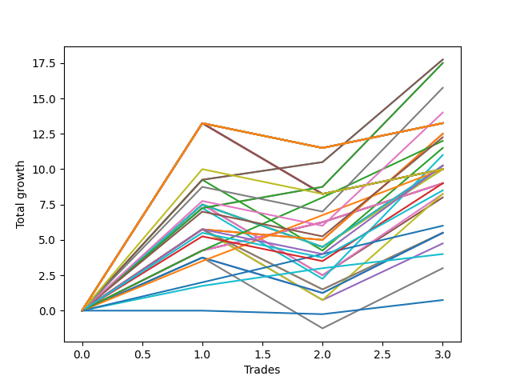

# Long Labrador 011 
- Symbol: ES_830-900
- Date Range: 11/29/2022 - 12/30/2022
- Trading Period: 8:30-9:0
- Number of Trades: 1



| Name | Win Percent | Profit | Avg Profit / Trade | Avg Time / Trade |      | Name | Win Percent | Profit | Avg Profit / Trade | Avg Time / Trade |
| ---- | ----------- | ------ | ------------------ | ---------------- | ---- | ---- | ----------- | ------ | ------------------ | ---------------- |
| Sorted By <br> Profit | | | | | | Sorted By <br> Win Percentage ||||
| TP-9 | 100.00 | 4375.00 | 4375.00 | 32:05 |     | TP-9 | 100.00 | 4375.00 | 4375.00 | 32:05 |
| BB-50 U/L 2SD | 100.00 | 4375.00 | 4375.00 | 31:55 |     | BB-50 U/L 2SD | 100.00 | 4375.00 | 4375.00 | 31:55 |
| TP-8 | 100.00 | 4000.00 | 4000.00 | 24:30 |     | TP-8 | 100.00 | 4000.00 | 4000.00 | 24:30 |
| BB-50 U/L 1SD | 100.00 | 3750.00 | 3750.00 | 24:05 |     | BB-50 U/L 1SD | 100.00 | 3750.00 | 3750.00 | 24:05 |
| BB-100 Mid | 100.00 | 3625.00 | 3625.00 | 31:15 |     | BB-100 Mid | 100.00 | 3625.00 | 3625.00 | 31:15 |
| TP-7 | 100.00 | 3500.00 | 3500.00 | 20:10 |     | TP-7 | 100.00 | 3500.00 | 3500.00 | 20:10 |
| TP-6 | 100.00 | 3125.00 | 3125.00 | 19:50 |     | TP-6 | 100.00 | 3125.00 | 3125.00 | 19:50 |
| BB-20 U/L 2SD C | 100.00 | 2875.00 | 2875.00 | 19:35 |     | BB-20 U/L 2SD C | 100.00 | 2875.00 | 2875.00 | 19:35 |
| TP-5 | 100.00 | 2750.00 | 2750.00 | 19:30 |     | TP-5 | 100.00 | 2750.00 | 2750.00 | 19:30 |
| BB-20 U/L 2SD | 100.00 | 2750.00 | 2750.00 | 19:30 |     | BB-20 U/L 2SD | 100.00 | 2750.00 | 2750.00 | 19:30 |
| NEWFI 000 | 100.00 | 2375.00 | 2375.00 | 28:05 |     | NEWFI 000 | 100.00 | 2375.00 | 2375.00 | 28:05 |
| BB-50 Mid | 100.00 | 2125.00 | 2125.00 | 11:45 |     | BB-50 Mid | 100.00 | 2125.00 | 2125.00 | 11:45 |
| TP-4 | 100.00 | 2000.00 | 2000.00 | 03:25 |     | TP-4 | 100.00 | 2000.00 | 2000.00 | 03:25 |
| BB-20 U/L 1SD | 100.00 | 2000.00 | 2000.00 | 09:05 |     | BB-20 U/L 1SD | 100.00 | 2000.00 | 2000.00 | 09:05 |
| TP-3 | 100.00 | 1625.00 | 1625.00 | 02:45 |     | TP-3 | 100.00 | 1625.00 | 1625.00 | 02:45 |
| BB-20 Mid | 100.00 | 1375.00 | 1375.00 | 02:40 |     | BB-20 Mid | 100.00 | 1375.00 | 1375.00 | 02:40 |
| TP-2 | 100.00 | 1000.00 | 1000.00 | 02:20 |     | TP-2 | 100.00 | 1000.00 | 1000.00 | 02:20 |
| TP-10 | 100.00 | 875.00 | 875.00 | 60:55 |     | TP-10 | 100.00 | 875.00 | 875.00 | 60:55 |
| BB-200 U/L 2SD | 100.00 | 875.00 | 875.00 | 60:55 |     | BB-200 U/L 2SD | 100.00 | 875.00 | 875.00 | 60:55 |
| BB-200 Mid | 100.00 | 875.00 | 875.00 | 60:55 |     | BB-200 Mid | 100.00 | 875.00 | 875.00 | 60:55 |
| BB-100 U/L 2SD | 100.00 | 875.00 | 875.00 | 60:55 |     | BB-100 U/L 2SD | 100.00 | 875.00 | 875.00 | 60:55 |
| V U/L 1SD | 100.00 | 875.00 | 875.00 | 60:55 |     | V U/L 1SD | 100.00 | 875.00 | 875.00 | 60:55 |
| V Mid | 100.00 | 875.00 | 875.00 | 60:55 |     | V Mid | 100.00 | 875.00 | 875.00 | 60:55 |
| NEWFI 0000 | 100.00 | 500.00 | 500.00 | 01:05 |     | NEWFI 0000 | 100.00 | 500.00 | 500.00 | 01:05 |
| TP-1 | 100.00 | 500.00 | 500.00 | 01:30 |     | TP-1 | 100.00 | 500.00 | 500.00 | 01:30 |

## NO STOPLOSS

### Test BB-20 Mid
* Sell when price hits the middle line of the 20p bollinger
* No Stoploss
* Results:
```
Total Trades: 1
Percent Up: 100.00
Percent Down: 0.00
Total Points Moved Up: 2.75
Potential Profit: 1375.00
Total Points Ups: 2.75 Count Ups: 1
Total Points Downs: 0.00 Count Downs: 0
```

<details><summary>Trades</summary>

<code>In: 2022-12-19 08:43:00		Out: 2022-12-19 08:45:40		Total Position Time: 02:40		Total Move Up: 2.75		Total to Date: 2.75</code> <br />


</details>

### Test BB-20 U/L 1SD
* Sell when the price hits the upper line of the 20p 1std bollinger
* No Stoploss
* Results:
```
Total Trades: 1
Percent Up: 100.00
Percent Down: 0.00
Total Points Moved Up: 4.00
Potential Profit: 2000.00
Total Points Ups: 4.00 Count Ups: 1
Total Points Downs: 0.00 Count Downs: 0
```

<details><summary>Trades</summary>

<code>In: 2022-12-19 08:43:00		Out: 2022-12-19 08:52:05		Total Position Time: 09:05		Total Move Up: 4.00		Total to Date: 4.00</code> <br />


</details>

### Test BB-20 U/L 2SD
* Sell when the price hits the upper line of the 20p 2std bollinger
* No Stoploss
* Results:
```
Total Trades: 1
Percent Up: 100.00
Percent Down: 0.00
Total Points Moved Up: 5.50
Potential Profit: 2750.00
Total Points Ups: 5.50 Count Ups: 1
Total Points Downs: 0.00 Count Downs: 0
```

<details><summary>Trades</summary>

<code>In: 2022-12-19 08:43:00		Out: 2022-12-19 09:02:30		Total Position Time: 19:30		Total Move Up: 5.50		Total to Date: 5.50</code> <br />


</details>

### Test BB-20 U/L 2SD C
* Sell when the price hits the upper line of the 20p 2std bollinger
* No Stoploss
* Results:
```
Total Trades: 1
Percent Up: 100.00
Percent Down: 0.00
Total Points Moved Up: 5.75
Potential Profit: 2875.00
Total Points Ups: 5.75 Count Ups: 1
Total Points Downs: 0.00 Count Downs: 0
```

<details><summary>Trades</summary>

<code>In: 2022-12-19 08:43:00		Out: 2022-12-19 09:02:35		Total Position Time: 19:35		Total Move Up: 5.75		Total to Date: 5.75</code> <br />


</details>

### Test BB-50 Mid
* Sell when price hits the middle line of the 50p bollinger
* No Stoploss
* Results:
```
Total Trades: 1
Percent Up: 100.00
Percent Down: 0.00
Total Points Moved Up: 4.25
Potential Profit: 2125.00
Total Points Ups: 4.25 Count Ups: 1
Total Points Downs: 0.00 Count Downs: 0
```

<details><summary>Trades</summary>

<code>In: 2022-12-19 08:43:00		Out: 2022-12-19 08:54:45		Total Position Time: 11:45		Total Move Up: 4.25		Total to Date: 4.25</code> <br />


</details>

### Test BB-50 U/L 1SD
* Sell when the price hits the upper line of the 50p 1std bollinger
* No Stoploss
* Results:
```
Total Trades: 1
Percent Up: 100.00
Percent Down: 0.00
Total Points Moved Up: 7.50
Potential Profit: 3750.00
Total Points Ups: 7.50 Count Ups: 1
Total Points Downs: 0.00 Count Downs: 0
```

<details><summary>Trades</summary>

<code>In: 2022-12-19 08:43:00		Out: 2022-12-19 09:07:05		Total Position Time: 24:05		Total Move Up: 7.50		Total to Date: 7.50</code> <br />


</details>

### Test BB-50 U/L 2SD
* Sell when the price hits the upper line of the 50p 2std bollinger
* No Stoploss
* Results:
```
Total Trades: 1
Percent Up: 100.00
Percent Down: 0.00
Total Points Moved Up: 8.75
Potential Profit: 4375.00
Total Points Ups: 8.75 Count Ups: 1
Total Points Downs: 0.00 Count Downs: 0
```

<details><summary>Trades</summary>

<code>In: 2022-12-19 08:43:00		Out: 2022-12-19 09:14:55		Total Position Time: 31:55		Total Move Up: 8.75		Total to Date: 8.75</code> <br />


</details>

### Test V Mid
* Sell when the price hits the middle line of the 1std VWAP
* No Stoploss
* Results:
```
Total Trades: 1
Percent Up: 100.00
Percent Down: 0.00
Total Points Moved Up: 1.75
Potential Profit: 875.00
Total Points Ups: 1.75 Count Ups: 1
Total Points Downs: 0.00 Count Downs: 0
```

<details><summary>Trades</summary>

<code>In: 2022-12-19 08:43:00		Out: 2022-12-19 09:43:55		Total Position Time: 60:55		Total Move Up: 1.75		Total to Date: 1.75</code> <br />


</details>

### Test V U/L 1SD
* Sell when the price hits the upper line of the 1std VWAP
* No Stoploss
* Results:
```
Total Trades: 1
Percent Up: 100.00
Percent Down: 0.00
Total Points Moved Up: 1.75
Potential Profit: 875.00
Total Points Ups: 1.75 Count Ups: 1
Total Points Downs: 0.00 Count Downs: 0
```

<details><summary>Trades</summary>

<code>In: 2022-12-19 08:43:00		Out: 2022-12-19 09:43:55		Total Position Time: 60:55		Total Move Up: 1.75		Total to Date: 1.75</code> <br />


</details>

### Test BB-100 Mid
* Move to BB100 Mid
* No Stoploss
* Results:
```
Total Trades: 1
Percent Up: 100.00
Percent Down: 0.00
Total Points Moved Up: 7.25
Potential Profit: 3625.00
Total Points Ups: 7.25 Count Ups: 1
Total Points Downs: 0.00 Count Downs: 0
```

<details><summary>Trades</summary>

<code>In: 2022-12-19 08:43:00		Out: 2022-12-19 09:14:15		Total Position Time: 31:15		Total Move Up: 7.25		Total to Date: 7.25</code> <br />


</details>

### Test BB-100 U/L 2SD
* Move to BB100 Upper Band
* No Stoploss
* Results:
```
Total Trades: 1
Percent Up: 100.00
Percent Down: 0.00
Total Points Moved Up: 1.75
Potential Profit: 875.00
Total Points Ups: 1.75 Count Ups: 1
Total Points Downs: 0.00 Count Downs: 0
```

<details><summary>Trades</summary>

<code>In: 2022-12-19 08:43:00		Out: 2022-12-19 09:43:55		Total Position Time: 60:55		Total Move Up: 1.75		Total to Date: 1.75</code> <br />


</details>

### Test BB-200 Mid
* Move to BB200 Mid
* No Stoploss
* Results:
```
Total Trades: 1
Percent Up: 100.00
Percent Down: 0.00
Total Points Moved Up: 1.75
Potential Profit: 875.00
Total Points Ups: 1.75 Count Ups: 1
Total Points Downs: 0.00 Count Downs: 0
```

<details><summary>Trades</summary>

<code>In: 2022-12-19 08:43:00		Out: 2022-12-19 09:43:55		Total Position Time: 60:55		Total Move Up: 1.75		Total to Date: 1.75</code> <br />


</details>

### Test BB-200 U/L 2SD
* Move to BB200 Upper Band
* No Stoploss
* Results:
```
Total Trades: 1
Percent Up: 100.00
Percent Down: 0.00
Total Points Moved Up: 1.75
Potential Profit: 875.00
Total Points Ups: 1.75 Count Ups: 1
Total Points Downs: 0.00 Count Downs: 0
```

<details><summary>Trades</summary>

<code>In: 2022-12-19 08:43:00		Out: 2022-12-19 09:43:55		Total Position Time: 60:55		Total Move Up: 1.75		Total to Date: 1.75</code> <br />


</details>

## TAKE PROFIT

### Test TP-1
* Take Profit of 1 Point
* No Stoploss
* Results:
```
Total Trades: 1
Percent Up: 100.00
Percent Down: 0.00
Total Points Moved Up: 1.00
Potential Profit: 500.00
Total Points Ups: 1.00 Count Ups: 1
Total Points Downs: 0.00 Count Downs: 0
```

<details><summary>Trades</summary>

<code>In: 2022-12-19 08:43:00		Out: 2022-12-19 08:44:30		Total Position Time: 01:30		Total Move Up: 1.00		Total to Date: 1.00</code> <br />


</details>

### Test TP-2
* Take Profit of 2 Point
* No Stoploss
* Results:
```
Total Trades: 1
Percent Up: 100.00
Percent Down: 0.00
Total Points Moved Up: 2.00
Potential Profit: 1000.00
Total Points Ups: 2.00 Count Ups: 1
Total Points Downs: 0.00 Count Downs: 0
```

<details><summary>Trades</summary>

<code>In: 2022-12-19 08:43:00		Out: 2022-12-19 08:45:20		Total Position Time: 02:20		Total Move Up: 2.00		Total to Date: 2.00</code> <br />


</details>

### Test TP-3
* Take Profit of 3 Point
* No Stoploss
* Results:
```
Total Trades: 1
Percent Up: 100.00
Percent Down: 0.00
Total Points Moved Up: 3.25
Potential Profit: 1625.00
Total Points Ups: 3.25 Count Ups: 1
Total Points Downs: 0.00 Count Downs: 0
```

<details><summary>Trades</summary>

<code>In: 2022-12-19 08:43:00		Out: 2022-12-19 08:45:45		Total Position Time: 02:45		Total Move Up: 3.25		Total to Date: 3.25</code> <br />


</details>

### Test TP-4
* Take Profit of 4 Point
* No Stoploss
* Results:
```
Total Trades: 1
Percent Up: 100.00
Percent Down: 0.00
Total Points Moved Up: 4.00
Potential Profit: 2000.00
Total Points Ups: 4.00 Count Ups: 1
Total Points Downs: 0.00 Count Downs: 0
```

<details><summary>Trades</summary>

<code>In: 2022-12-19 08:43:00		Out: 2022-12-19 08:46:25		Total Position Time: 03:25		Total Move Up: 4.00		Total to Date: 4.00</code> <br />


</details>

### Test TP-5
* Take Profit of 5 Point
* No Stoploss
* Results:
```
Total Trades: 1
Percent Up: 100.00
Percent Down: 0.00
Total Points Moved Up: 5.50
Potential Profit: 2750.00
Total Points Ups: 5.50 Count Ups: 1
Total Points Downs: 0.00 Count Downs: 0
```

<details><summary>Trades</summary>

<code>In: 2022-12-19 08:43:00		Out: 2022-12-19 09:02:30		Total Position Time: 19:30		Total Move Up: 5.50		Total to Date: 5.50</code> <br />


</details>

### Test TP-6
* Take Profit of 6 Point
* No Stoploss
* Results:
```
Total Trades: 1
Percent Up: 100.00
Percent Down: 0.00
Total Points Moved Up: 6.25
Potential Profit: 3125.00
Total Points Ups: 6.25 Count Ups: 1
Total Points Downs: 0.00 Count Downs: 0
```

<details><summary>Trades</summary>

<code>In: 2022-12-19 08:43:00		Out: 2022-12-19 09:02:50		Total Position Time: 19:50		Total Move Up: 6.25		Total to Date: 6.25</code> <br />


</details>

### Test TP-7
* Take Profit of 7 Point
* No Stoploss
* Results:
```
Total Trades: 1
Percent Up: 100.00
Percent Down: 0.00
Total Points Moved Up: 7.00
Potential Profit: 3500.00
Total Points Ups: 7.00 Count Ups: 1
Total Points Downs: 0.00 Count Downs: 0
```

<details><summary>Trades</summary>

<code>In: 2022-12-19 08:43:00		Out: 2022-12-19 09:03:10		Total Position Time: 20:10		Total Move Up: 7.00		Total to Date: 7.00</code> <br />


</details>

### Test TP-8
* Take Profit of 8 Point
* No Stoploss
* Results:
```
Total Trades: 1
Percent Up: 100.00
Percent Down: 0.00
Total Points Moved Up: 8.00
Potential Profit: 4000.00
Total Points Ups: 8.00 Count Ups: 1
Total Points Downs: 0.00 Count Downs: 0
```

<details><summary>Trades</summary>

<code>In: 2022-12-19 08:43:00		Out: 2022-12-19 09:07:30		Total Position Time: 24:30		Total Move Up: 8.00		Total to Date: 8.00</code> <br />


</details>

### Test TP-9
* Take Profit of 9 Point
* No Stoploss
* Results:
```
Total Trades: 1
Percent Up: 100.00
Percent Down: 0.00
Total Points Moved Up: 8.75
Potential Profit: 4375.00
Total Points Ups: 8.75 Count Ups: 1
Total Points Downs: 0.00 Count Downs: 0
```

<details><summary>Trades</summary>

<code>In: 2022-12-19 08:43:00		Out: 2022-12-19 09:15:05		Total Position Time: 32:05		Total Move Up: 8.75		Total to Date: 8.75</code> <br />


</details>

### Test TP-10
* Take Profit of 10 Point
* No Stoploss
* Results:
```
Total Trades: 1
Percent Up: 100.00
Percent Down: 0.00
Total Points Moved Up: 1.75
Potential Profit: 875.00
Total Points Ups: 1.75 Count Ups: 1
Total Points Downs: 0.00 Count Downs: 0
```

<details><summary>Trades</summary>

<code>In: 2022-12-19 08:43:00		Out: 2022-12-19 09:43:55		Total Position Time: 60:55		Total Move Up: 1.75		Total to Date: 1.75</code> <br />


</details>

## Indicator Exits

### Test NEWFI 000
* Newfi 0000
* No Stoploss
* Results:
```
Total Trades: 1
Percent Up: 100.00
Percent Down: 0.00
Total Points Moved Up: 4.75
Potential Profit: 2375.00
Total Points Ups: 4.75 Count Ups: 1
Total Points Downs: 0.00 Count Downs: 0
```

<details><summary>Trades</summary>

<code>In: 2022-12-19 08:43:00		Out: 2022-12-19 09:11:05		Total Position Time: 28:05		Total Move Up: 4.75		Total to Date: 4.75</code> <br />


</details>

### Test NEWFI 0000
* Newfi 0000
* No Stoploss
* Results:
```
Total Trades: 1
Percent Up: 100.00
Percent Down: 0.00
Total Points Moved Up: 1.00
Potential Profit: 500.00
Total Points Ups: 1.00 Count Ups: 1
Total Points Downs: 0.00 Count Downs: 0
```

<details><summary>Trades</summary>

<code>In: 2022-12-19 08:43:00		Out: 2022-12-19 08:44:05		Total Position Time: 01:05		Total Move Up: 1.00		Total to Date: 1.00</code> <br />


</details>