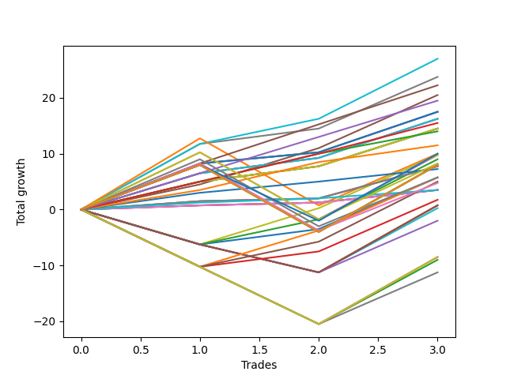

# Long Labrador 014 
- Symbol: ES_830-900
- Date Range: 03/18/2022 - 12/30/2022
- Trading Period: 8:30-9:0
- Number of Trades: 3



| Name | Win Percent | Profit | Avg Profit / Trade | Avg Time / Trade |      | Name | Win Percent | Profit | Avg Profit / Trade | Avg Time / Trade |
| ---- | ----------- | ------ | ------------------ | ---------------- | ---- | ---- | ----------- | ------ | ------------------ | ---------------- |
| Sorted By <br> Profit | | | | | | Sorted By <br> Win Percentage ||||
| BB-100 Mid | 100.00 | 13500.00 | 4500.00 | 25:33 |     | BB-100 Mid | 100.00 | 13500.00 | 4500.00 | 25:33 |
| V Mid | 100.00 | 11875.00 | 3958.33 | 17:28 |     | V Mid | 100.00 | 11875.00 | 3958.33 | 17:28 |
| TP-7 | 100.00 | 11125.00 | 3708.33 | 08:53 |     | TP-7 | 100.00 | 11125.00 | 3708.33 | 08:53 |
| BB-50 U/L 1SD | 100.00 | 10250.00 | 3416.67 | 19:46 |     | BB-50 U/L 1SD | 100.00 | 10250.00 | 3416.67 | 19:46 |
| TP-6 | 100.00 | 9750.00 | 3250.00 | 07:51 |     | TP-6 | 100.00 | 9750.00 | 3250.00 | 07:51 |
| BB-50 Mid SL-10 | 100.00 | 8750.00 | 2916.67 | 07:10 |     | BB-50 Mid SL-10 | 100.00 | 8750.00 | 2916.67 | 07:10 |
| BB-50 Mid SL-5 | 100.00 | 8750.00 | 2916.67 | 07:10 |     | BB-50 Mid SL-5 | 100.00 | 8750.00 | 2916.67 | 07:10 |
| BB-50 Mid | 100.00 | 8750.00 | 2916.67 | 07:10 |     | BB-50 Mid | 100.00 | 8750.00 | 2916.67 | 07:10 |
| BB-20 U/L 2SD C SL-10 | 100.00 | 8125.00 | 2708.33 | 09:23 |     | BB-20 U/L 2SD C SL-10 | 100.00 | 8125.00 | 2708.33 | 09:23 |
| BB-20 U/L 2SD C SL-5 | 100.00 | 8125.00 | 2708.33 | 09:23 |     | BB-20 U/L 2SD C SL-5 | 100.00 | 8125.00 | 2708.33 | 09:23 |
| BB-20 U/L 2SD C | 100.00 | 8125.00 | 2708.33 | 09:23 |     | BB-20 U/L 2SD C | 100.00 | 8125.00 | 2708.33 | 09:23 |
| TP-5 | 100.00 | 7750.00 | 2583.33 | 07:38 |     | TP-5 | 100.00 | 7750.00 | 2583.33 | 07:38 |
| BB-20 U/L 2SD SL-10 | 100.00 | 7250.00 | 2416.67 | 09:00 |     | BB-20 U/L 2SD SL-10 | 100.00 | 7250.00 | 2416.67 | 09:00 |
| BB-20 U/L 2SD SL-5 | 100.00 | 7250.00 | 2416.67 | 09:00 |     | BB-20 U/L 2SD SL-5 | 100.00 | 7250.00 | 2416.67 | 09:00 |
| BB-20 U/L 2SD | 100.00 | 7250.00 | 2416.67 | 09:00 |     | BB-20 U/L 2SD | 100.00 | 7250.00 | 2416.67 | 09:00 |
| TP-4 | 100.00 | 7000.00 | 2333.33 | 06:36 |     | TP-4 | 100.00 | 7000.00 | 2333.33 | 06:36 |
| TP-3 | 100.00 | 5750.00 | 1916.67 | 06:21 |     | TP-3 | 100.00 | 5750.00 | 1916.67 | 06:21 |
| NEWFI 0000 | 66.67 | 5000.00 | 1666.67 | 51:18 |     | BB-20 U/L 1SD SL-10 | 100.00 | 3875.00 | 1291.67 | 05:38 |
| BB-200 Mid | 66.67 | 5000.00 | 1666.67 | 41:15 |     | BB-20 U/L 1SD SL-5 | 100.00 | 3875.00 | 1291.67 | 05:38 |
| BB-50 U/L 1SD SL-5 | 66.67 | 4875.00 | 1625.00 | 14:15 |     | BB-20 U/L 1SD | 100.00 | 3875.00 | 1291.67 | 05:38 |
| BB-50 U/L 2SD | 66.67 | 4875.00 | 1625.00 | 41:33 |     | TP-2 | 100.00 | 3625.00 | 1208.33 | 02:03 |
| BB-100 Mid SL-5 | 66.67 | 4500.00 | 1500.00 | 18:21 |     | TP-1 | 100.00 | 1750.00 | 583.33 | 01:25 |
| TP-10 | 66.67 | 4125.00 | 1375.00 | 35:10 |     | BB-20 Mid SL-10 | 100.00 | 1750.00 | 583.33 | 01:35 |
| NEWFI 06 | 66.67 | 4000.00 | 1333.33 | 60:55 |     | BB-20 Mid SL-5 | 100.00 | 1750.00 | 583.33 | 01:35 |
| NEWFI 000 | 66.67 | 4000.00 | 1333.33 | 60:55 |     | BB-20 Mid | 100.00 | 1750.00 | 583.33 | 01:35 |
| BB-200 U/L 2SD | 66.67 | 4000.00 | 1333.33 | 60:55 |     | NEWFI 0000 | 66.67 | 5000.00 | 1666.67 | 51:18 |
| BB-100 U/L 2SD | 66.67 | 4000.00 | 1333.33 | 60:55 |     | BB-200 Mid | 66.67 | 5000.00 | 1666.67 | 41:15 |
| V U/L 1SD | 66.67 | 4000.00 | 1333.33 | 60:55 |     | BB-50 U/L 1SD SL-5 | 66.67 | 4875.00 | 1625.00 | 14:15 |
| BB-20 U/L 1SD SL-10 | 100.00 | 3875.00 | 1291.67 | 05:38 |     | BB-50 U/L 2SD | 66.67 | 4875.00 | 1625.00 | 41:33 |
| BB-20 U/L 1SD SL-5 | 100.00 | 3875.00 | 1291.67 | 05:38 |     | BB-100 Mid SL-5 | 66.67 | 4500.00 | 1500.00 | 18:21 |
| BB-20 U/L 1SD | 100.00 | 3875.00 | 1291.67 | 05:38 |     | TP-10 | 66.67 | 4125.00 | 1375.00 | 35:10 |
| TP-2 | 100.00 | 3625.00 | 1208.33 | 02:03 |     | NEWFI 06 | 66.67 | 4000.00 | 1333.33 | 60:55 |
| TP-9 | 66.67 | 2875.00 | 958.33 | 34:36 |     | NEWFI 000 | 66.67 | 4000.00 | 1333.33 | 60:55 |
| BB-50 U/L 1SD SL-10 | 66.67 | 2875.00 | 958.33 | 15:15 |     | BB-200 U/L 2SD | 66.67 | 4000.00 | 1333.33 | 60:55 |
| V Mid SL-5 | 66.67 | 2875.00 | 958.33 | 10:16 |     | BB-100 U/L 2SD | 66.67 | 4000.00 | 1333.33 | 60:55 |
| BB-100 Mid SL-10 | 66.67 | 2500.00 | 833.33 | 19:21 |     | V U/L 1SD | 66.67 | 4000.00 | 1333.33 | 60:55 |
| TP-8 | 66.67 | 2375.00 | 791.67 | 27:06 |     | TP-9 | 66.67 | 2875.00 | 958.33 | 34:36 |
| TP-1 | 100.00 | 1750.00 | 583.33 | 01:25 |     | BB-50 U/L 1SD SL-10 | 66.67 | 2875.00 | 958.33 | 15:15 |
| BB-20 Mid SL-10 | 100.00 | 1750.00 | 583.33 | 01:35 |     | V Mid SL-5 | 66.67 | 2875.00 | 958.33 | 10:16 |
| BB-20 Mid SL-5 | 100.00 | 1750.00 | 583.33 | 01:35 |     | BB-100 Mid SL-10 | 66.67 | 2500.00 | 833.33 | 19:21 |
| BB-20 Mid | 100.00 | 1750.00 | 583.33 | 01:35 |     | TP-8 | 66.67 | 2375.00 | 791.67 | 27:06 |
| V Mid SL-10 | 66.67 | 875.00 | 291.67 | 11:16 |     | V Mid SL-10 | 66.67 | 875.00 | 291.67 | 11:16 |
| BB-200 U/L 2SD SL-5 | 33.33 | 375.00 | 125.00 | 29:36 |     | BB-200 U/L 2SD SL-5 | 33.33 | 375.00 | 125.00 | 29:36 |
| BB-100 U/L 2SD SL-5 | 33.33 | 375.00 | 125.00 | 29:36 |     | BB-100 U/L 2SD SL-5 | 33.33 | 375.00 | 125.00 | 29:36 |
| V U/L 1SD SL-5 | 33.33 | 375.00 | 125.00 | 29:36 |     | V U/L 1SD SL-5 | 33.33 | 375.00 | 125.00 | 29:36 |
| BB-50 U/L 2SD SL-5 | 33.33 | 125.00 | 41.67 | 21:38 |     | BB-50 U/L 2SD SL-5 | 33.33 | 125.00 | 41.67 | 21:38 |
| BB-200 Mid SL-5 | 33.33 | -1000.00 | -333.33 | 14:48 |     | BB-200 Mid SL-5 | 33.33 | -1000.00 | -333.33 | 14:48 |
| BB-200 U/L 2SD SL-10 | 33.33 | -4250.00 | -1416.67 | 32:46 |     | BB-200 U/L 2SD SL-10 | 33.33 | -4250.00 | -1416.67 | 32:46 |
| BB-100 U/L 2SD SL-10 | 33.33 | -4250.00 | -1416.67 | 32:46 |     | BB-100 U/L 2SD SL-10 | 33.33 | -4250.00 | -1416.67 | 32:46 |
| V U/L 1SD SL-10 | 33.33 | -4250.00 | -1416.67 | 32:46 |     | V U/L 1SD SL-10 | 33.33 | -4250.00 | -1416.67 | 32:46 |
| BB-50 U/L 2SD SL-10 | 33.33 | -4500.00 | -1500.00 | 24:48 |     | BB-50 U/L 2SD SL-10 | 33.33 | -4500.00 | -1500.00 | 24:48 |
| BB-200 Mid SL-10 | 33.33 | -5625.00 | -1875.00 | 17:58 |     | BB-200 Mid SL-10 | 33.33 | -5625.00 | -1875.00 | 17:58 |

## NO STOPLOSS

### Test BB-20 Mid
* Sell when price hits the middle line of the 20p bollinger
* No Stoploss
* Results:
```
Total Trades: 3
Percent Up: 100.00
Percent Down: 0.00
Total Points Moved Up: 3.50
Potential Profit: 1750.00
Total Points Ups: 3.50 Count Ups: 3
Total Points Downs: 0.00 Count Downs: 0
```

<details><summary>Trades</summary>

<code>In: 2022-05-02 08:34:00		Out: 2022-05-02 08:35:10		Total Position Time: 01:10		Total Move Up: 0.75		Total to Date: 0.75</code> <br />
<code>In: 2022-10-19 08:39:00		Out: 2022-10-19 08:40:10		Total Position Time: 01:10		Total Move Up: 0.50		Total to Date: 1.25</code> <br />
<code>In: 2022-11-11 08:34:00		Out: 2022-11-11 08:36:25		Total Position Time: 02:25		Total Move Up: 2.25		Total to Date: 3.50</code> <br />


</details>

### Test BB-20 U/L 1SD
* Sell when the price hits the upper line of the 20p 1std bollinger
* No Stoploss
* Results:
```
Total Trades: 3
Percent Up: 100.00
Percent Down: 0.00
Total Points Moved Up: 7.75
Potential Profit: 3875.00
Total Points Ups: 7.75 Count Ups: 3
Total Points Downs: 0.00 Count Downs: 0
```

<details><summary>Trades</summary>

<code>In: 2022-05-02 08:34:00		Out: 2022-05-02 08:36:15		Total Position Time: 02:15		Total Move Up: 1.50		Total to Date: 1.50</code> <br />
<code>In: 2022-10-19 08:39:00		Out: 2022-10-19 08:46:05		Total Position Time: 07:05		Total Move Up: 0.50		Total to Date: 2.00</code> <br />
<code>In: 2022-11-11 08:34:00		Out: 2022-11-11 08:41:35		Total Position Time: 07:35		Total Move Up: 5.75		Total to Date: 7.75</code> <br />


</details>

### Test BB-20 U/L 2SD
* Sell when the price hits the upper line of the 20p 2std bollinger
* No Stoploss
* Results:
```
Total Trades: 3
Percent Up: 100.00
Percent Down: 0.00
Total Points Moved Up: 14.50
Potential Profit: 7250.00
Total Points Ups: 14.50 Count Ups: 3
Total Points Downs: 0.00 Count Downs: 0
```

<details><summary>Trades</summary>

<code>In: 2022-05-02 08:34:00		Out: 2022-05-02 08:36:35		Total Position Time: 02:35		Total Move Up: 5.00		Total to Date: 5.00</code> <br />
<code>In: 2022-10-19 08:39:00		Out: 2022-10-19 08:48:05		Total Position Time: 09:05		Total Move Up: 2.75		Total to Date: 7.75</code> <br />
<code>In: 2022-11-11 08:34:00		Out: 2022-11-11 08:49:20		Total Position Time: 15:20		Total Move Up: 6.75		Total to Date: 14.50</code> <br />


</details>

### Test BB-20 U/L 2SD C
* Sell when the price hits the upper line of the 20p 2std bollinger
* No Stoploss
* Results:
```
Total Trades: 3
Percent Up: 100.00
Percent Down: 0.00
Total Points Moved Up: 16.25
Potential Profit: 8125.00
Total Points Ups: 16.25 Count Ups: 3
Total Points Downs: 0.00 Count Downs: 0
```

<details><summary>Trades</summary>

<code>In: 2022-05-02 08:34:00		Out: 2022-05-02 08:36:45		Total Position Time: 02:45		Total Move Up: 6.50		Total to Date: 6.50</code> <br />
<code>In: 2022-10-19 08:39:00		Out: 2022-10-19 08:48:45		Total Position Time: 09:45		Total Move Up: 2.75		Total to Date: 9.25</code> <br />
<code>In: 2022-11-11 08:34:00		Out: 2022-11-11 08:49:40		Total Position Time: 15:40		Total Move Up: 7.00		Total to Date: 16.25</code> <br />


</details>

### Test BB-50 Mid
* Sell when price hits the middle line of the 50p bollinger
* No Stoploss
* Results:
```
Total Trades: 3
Percent Up: 100.00
Percent Down: 0.00
Total Points Moved Up: 17.50
Potential Profit: 8750.00
Total Points Ups: 17.50 Count Ups: 3
Total Points Downs: 0.00 Count Downs: 0
```

<details><summary>Trades</summary>

<code>In: 2022-05-02 08:34:00		Out: 2022-05-02 08:38:15		Total Position Time: 04:15		Total Move Up: 8.25		Total to Date: 8.25</code> <br />
<code>In: 2022-10-19 08:39:00		Out: 2022-10-19 08:40:30		Total Position Time: 01:30		Total Move Up: 2.00		Total to Date: 10.25</code> <br />
<code>In: 2022-11-11 08:34:00		Out: 2022-11-11 08:49:45		Total Position Time: 15:45		Total Move Up: 7.25		Total to Date: 17.50</code> <br />


</details>

### Test BB-50 U/L 1SD
* Sell when the price hits the upper line of the 50p 1std bollinger
* No Stoploss
* Results:
```
Total Trades: 3
Percent Up: 100.00
Percent Down: 0.00
Total Points Moved Up: 20.50
Potential Profit: 10250.00
Total Points Ups: 20.50 Count Ups: 3
Total Points Downs: 0.00 Count Downs: 0
```

<details><summary>Trades</summary>

<code>In: 2022-05-02 08:34:00		Out: 2022-05-02 08:55:50		Total Position Time: 21:50		Total Move Up: 4.50		Total to Date: 4.50</code> <br />
<code>In: 2022-10-19 08:39:00		Out: 2022-10-19 08:52:10		Total Position Time: 13:10		Total Move Up: 6.50		Total to Date: 11.00</code> <br />
<code>In: 2022-11-11 08:34:00		Out: 2022-11-11 08:58:20		Total Position Time: 24:20		Total Move Up: 9.50		Total to Date: 20.50</code> <br />


</details>

### Test BB-50 U/L 2SD
* Sell when the price hits the upper line of the 50p 2std bollinger
* No Stoploss
* Results:
```
Total Trades: 3
Percent Up: 66.67
Percent Down: 33.33
Total Points Moved Up: 9.75
Potential Profit: 4875.00
Total Points Ups: 21.75 Count Ups: 2
Total Points Downs: -12.00 Count Downs: 1
```

<details><summary>Trades</summary>

<code>In: 2022-05-02 08:34:00		Out: 2022-05-02 09:00:45		Total Position Time: 26:45		Total Move Up: 10.25		Total to Date: 10.25</code> <br />
<code>In: 2022-10-19 08:39:00		Out: 2022-10-19 09:39:55		Total Position Time: 60:55		Total Move Up: -12.00		Total to Date: -1.75</code> <br />
<code>In: 2022-11-11 08:34:00		Out: 2022-11-11 09:11:00		Total Position Time: 37:00		Total Move Up: 11.50		Total to Date: 9.75</code> <br />


</details>

### Test V Mid
* Sell when the price hits the middle line of the 1std VWAP
* No Stoploss
* Results:
```
Total Trades: 3
Percent Up: 100.00
Percent Down: 0.00
Total Points Moved Up: 23.75
Potential Profit: 11875.00
Total Points Ups: 23.75 Count Ups: 3
Total Points Downs: 0.00 Count Downs: 0
```

<details><summary>Trades</summary>

<code>In: 2022-05-02 08:34:00		Out: 2022-05-02 09:00:50		Total Position Time: 26:50		Total Move Up: 11.75		Total to Date: 11.75</code> <br />
<code>In: 2022-10-19 08:39:00		Out: 2022-10-19 08:48:05		Total Position Time: 09:05		Total Move Up: 2.75		Total to Date: 14.50</code> <br />
<code>In: 2022-11-11 08:34:00		Out: 2022-11-11 08:50:30		Total Position Time: 16:30		Total Move Up: 9.25		Total to Date: 23.75</code> <br />


</details>

### Test V U/L 1SD
* Sell when the price hits the upper line of the 1std VWAP
* No Stoploss
* Results:
```
Total Trades: 3
Percent Up: 66.67
Percent Down: 33.33
Total Points Moved Up: 8.00
Potential Profit: 4000.00
Total Points Ups: 20.00 Count Ups: 2
Total Points Downs: -12.00 Count Downs: 1
```

<details><summary>Trades</summary>

<code>In: 2022-05-02 08:34:00		Out: 2022-05-02 09:34:55		Total Position Time: 60:55		Total Move Up: 8.00		Total to Date: 8.00</code> <br />
<code>In: 2022-10-19 08:39:00		Out: 2022-10-19 09:39:55		Total Position Time: 60:55		Total Move Up: -12.00		Total to Date: -4.00</code> <br />
<code>In: 2022-11-11 08:34:00		Out: 2022-11-11 09:34:55		Total Position Time: 60:55		Total Move Up: 12.00		Total to Date: 8.00</code> <br />


</details>

### Test BB-100 Mid
* Move to BB100 Mid
* No Stoploss
* Results:
```
Total Trades: 3
Percent Up: 100.00
Percent Down: 0.00
Total Points Moved Up: 27.00
Potential Profit: 13500.00
Total Points Ups: 27.00 Count Ups: 3
Total Points Downs: 0.00 Count Downs: 0
```

<details><summary>Trades</summary>

<code>In: 2022-05-02 08:34:00		Out: 2022-05-02 09:00:50		Total Position Time: 26:50		Total Move Up: 11.75		Total to Date: 11.75</code> <br />
<code>In: 2022-10-19 08:39:00		Out: 2022-10-19 08:52:00		Total Position Time: 13:00		Total Move Up: 4.50		Total to Date: 16.25</code> <br />
<code>In: 2022-11-11 08:34:00		Out: 2022-11-11 09:10:50		Total Position Time: 36:50		Total Move Up: 10.75		Total to Date: 27.00</code> <br />


</details>

### Test BB-100 U/L 2SD
* Move to BB100 Upper Band
* No Stoploss
* Results:
```
Total Trades: 3
Percent Up: 66.67
Percent Down: 33.33
Total Points Moved Up: 8.00
Potential Profit: 4000.00
Total Points Ups: 20.00 Count Ups: 2
Total Points Downs: -12.00 Count Downs: 1
```

<details><summary>Trades</summary>

<code>In: 2022-05-02 08:34:00		Out: 2022-05-02 09:34:55		Total Position Time: 60:55		Total Move Up: 8.00		Total to Date: 8.00</code> <br />
<code>In: 2022-10-19 08:39:00		Out: 2022-10-19 09:39:55		Total Position Time: 60:55		Total Move Up: -12.00		Total to Date: -4.00</code> <br />
<code>In: 2022-11-11 08:34:00		Out: 2022-11-11 09:34:55		Total Position Time: 60:55		Total Move Up: 12.00		Total to Date: 8.00</code> <br />


</details>

### Test BB-200 Mid
* Move to BB200 Mid
* No Stoploss
* Results:
```
Total Trades: 3
Percent Up: 66.67
Percent Down: 33.33
Total Points Moved Up: 10.00
Potential Profit: 5000.00
Total Points Ups: 22.00 Count Ups: 2
Total Points Downs: -12.00 Count Downs: 1
```

<details><summary>Trades</summary>

<code>In: 2022-05-02 08:34:00		Out: 2022-05-02 09:20:20		Total Position Time: 46:20		Total Move Up: 12.75		Total to Date: 12.75</code> <br />
<code>In: 2022-10-19 08:39:00		Out: 2022-10-19 09:39:55		Total Position Time: 60:55		Total Move Up: -12.00		Total to Date: 0.75</code> <br />
<code>In: 2022-11-11 08:34:00		Out: 2022-11-11 08:50:30		Total Position Time: 16:30		Total Move Up: 9.25		Total to Date: 10.00</code> <br />


</details>

### Test BB-200 U/L 2SD
* Move to BB200 Upper Band
* No Stoploss
* Results:
```
Total Trades: 3
Percent Up: 66.67
Percent Down: 33.33
Total Points Moved Up: 8.00
Potential Profit: 4000.00
Total Points Ups: 20.00 Count Ups: 2
Total Points Downs: -12.00 Count Downs: 1
```

<details><summary>Trades</summary>

<code>In: 2022-05-02 08:34:00		Out: 2022-05-02 09:34:55		Total Position Time: 60:55		Total Move Up: 8.00		Total to Date: 8.00</code> <br />
<code>In: 2022-10-19 08:39:00		Out: 2022-10-19 09:39:55		Total Position Time: 60:55		Total Move Up: -12.00		Total to Date: -4.00</code> <br />
<code>In: 2022-11-11 08:34:00		Out: 2022-11-11 09:34:55		Total Position Time: 60:55		Total Move Up: 12.00		Total to Date: 8.00</code> <br />


</details>

## STOPLOSS OF 5

### Test BB-20 Mid SL-5
* Sell when price hits the middle line of the 20p bollinger
* Stoploss is 5 points
* Results:
```
Total Trades: 3
Percent Up: 100.00
Percent Down: 0.00
Total Points Moved Up: 3.50
Potential Profit: 1750.00
Total Points Ups: 3.50 Count Ups: 3
Total Points Downs: 0.00 Count Downs: 0
```

<details><summary>Trades</summary>

<code>In: 2022-05-02 08:34:00		Out: 2022-05-02 08:35:10		Total Position Time: 01:10		Total Move Up: 0.75		Total to Date: 0.75</code> <br />
<code>In: 2022-10-19 08:39:00		Out: 2022-10-19 08:40:10		Total Position Time: 01:10		Total Move Up: 0.50		Total to Date: 1.25</code> <br />
<code>In: 2022-11-11 08:34:00		Out: 2022-11-11 08:36:25		Total Position Time: 02:25		Total Move Up: 2.25		Total to Date: 3.50</code> <br />


</details>

### Test BB-20 U/L 1SD SL-5
* Sell when the price hits the upper line of the 20p 1std bollinger
* Stoploss is 5 points
* Results:
```
Total Trades: 3
Percent Up: 100.00
Percent Down: 0.00
Total Points Moved Up: 7.75
Potential Profit: 3875.00
Total Points Ups: 7.75 Count Ups: 3
Total Points Downs: 0.00 Count Downs: 0
```

<details><summary>Trades</summary>

<code>In: 2022-05-02 08:34:00		Out: 2022-05-02 08:36:15		Total Position Time: 02:15		Total Move Up: 1.50		Total to Date: 1.50</code> <br />
<code>In: 2022-10-19 08:39:00		Out: 2022-10-19 08:46:05		Total Position Time: 07:05		Total Move Up: 0.50		Total to Date: 2.00</code> <br />
<code>In: 2022-11-11 08:34:00		Out: 2022-11-11 08:41:35		Total Position Time: 07:35		Total Move Up: 5.75		Total to Date: 7.75</code> <br />


</details>

### Test BB-20 U/L 2SD SL-5
* Sell when the price hits the upper line of the 20p 2std bollinger
* Stoploss is 5 points
* Results:
```
Total Trades: 3
Percent Up: 100.00
Percent Down: 0.00
Total Points Moved Up: 14.50
Potential Profit: 7250.00
Total Points Ups: 14.50 Count Ups: 3
Total Points Downs: 0.00 Count Downs: 0
```

<details><summary>Trades</summary>

<code>In: 2022-05-02 08:34:00		Out: 2022-05-02 08:36:35		Total Position Time: 02:35		Total Move Up: 5.00		Total to Date: 5.00</code> <br />
<code>In: 2022-10-19 08:39:00		Out: 2022-10-19 08:48:05		Total Position Time: 09:05		Total Move Up: 2.75		Total to Date: 7.75</code> <br />
<code>In: 2022-11-11 08:34:00		Out: 2022-11-11 08:49:20		Total Position Time: 15:20		Total Move Up: 6.75		Total to Date: 14.50</code> <br />


</details>

### Test BB-20 U/L 2SD C SL-5
* Sell when the price hits the upper line of the 20p 2std bollinger
* Stoploss is 5 points
* Results:
```
Total Trades: 3
Percent Up: 100.00
Percent Down: 0.00
Total Points Moved Up: 16.25
Potential Profit: 8125.00
Total Points Ups: 16.25 Count Ups: 3
Total Points Downs: 0.00 Count Downs: 0
```

<details><summary>Trades</summary>

<code>In: 2022-05-02 08:34:00		Out: 2022-05-02 08:36:45		Total Position Time: 02:45		Total Move Up: 6.50		Total to Date: 6.50</code> <br />
<code>In: 2022-10-19 08:39:00		Out: 2022-10-19 08:48:45		Total Position Time: 09:45		Total Move Up: 2.75		Total to Date: 9.25</code> <br />
<code>In: 2022-11-11 08:34:00		Out: 2022-11-11 08:49:40		Total Position Time: 15:40		Total Move Up: 7.00		Total to Date: 16.25</code> <br />


</details>

### Test BB-50 Mid SL-5
* Sell when price hits the middle line of the 50p bollinger
* Stoploss is 5 points
* Results:
```
Total Trades: 3
Percent Up: 100.00
Percent Down: 0.00
Total Points Moved Up: 17.50
Potential Profit: 8750.00
Total Points Ups: 17.50 Count Ups: 3
Total Points Downs: 0.00 Count Downs: 0
```

<details><summary>Trades</summary>

<code>In: 2022-05-02 08:34:00		Out: 2022-05-02 08:38:15		Total Position Time: 04:15		Total Move Up: 8.25		Total to Date: 8.25</code> <br />
<code>In: 2022-10-19 08:39:00		Out: 2022-10-19 08:40:30		Total Position Time: 01:30		Total Move Up: 2.00		Total to Date: 10.25</code> <br />
<code>In: 2022-11-11 08:34:00		Out: 2022-11-11 08:49:45		Total Position Time: 15:45		Total Move Up: 7.25		Total to Date: 17.50</code> <br />


</details>

### Test BB-50 U/L 1SD SL-5
* Sell when the price hits the upper line of the 50p 1std bollinger
* Stoploss is 5 points
* Results:
```
Total Trades: 3
Percent Up: 66.67
Percent Down: 33.33
Total Points Moved Up: 9.75
Potential Profit: 4875.00
Total Points Ups: 16.00 Count Ups: 2
Total Points Downs: -6.25 Count Downs: 1
```

<details><summary>Trades</summary>

<code>In: 2022-05-02 08:34:00		Out: 2022-05-02 08:39:15		Total Position Time: 05:15		Total Move Up: -6.25		Total to Date: -6.25</code> <br />
<code>In: 2022-10-19 08:39:00		Out: 2022-10-19 08:52:10		Total Position Time: 13:10		Total Move Up: 6.50		Total to Date: 0.25</code> <br />
<code>In: 2022-11-11 08:34:00		Out: 2022-11-11 08:58:20		Total Position Time: 24:20		Total Move Up: 9.50		Total to Date: 9.75</code> <br />


</details>

### Test BB-50 U/L 2SD SL-5
* Sell when the price hits the upper line of the 50p 2std bollinger
* Stoploss is 5 points
* Results:
```
Total Trades: 3
Percent Up: 33.33
Percent Down: 66.67
Total Points Moved Up: 0.25
Potential Profit: 125.00
Total Points Ups: 11.50 Count Ups: 1
Total Points Downs: -11.25 Count Downs: 2
```

<details><summary>Trades</summary>

<code>In: 2022-05-02 08:34:00		Out: 2022-05-02 08:39:15		Total Position Time: 05:15		Total Move Up: -6.25		Total to Date: -6.25</code> <br />
<code>In: 2022-10-19 08:39:00		Out: 2022-10-19 09:01:40		Total Position Time: 22:40		Total Move Up: -5.00		Total to Date: -11.25</code> <br />
<code>In: 2022-11-11 08:34:00		Out: 2022-11-11 09:11:00		Total Position Time: 37:00		Total Move Up: 11.50		Total to Date: 0.25</code> <br />


</details>

### Test V Mid SL-5
* Sell when the price hits the middle line of the 1std VWAP
* Stoploss is 5 points
* Results:
```
Total Trades: 3
Percent Up: 66.67
Percent Down: 33.33
Total Points Moved Up: 5.75
Potential Profit: 2875.00
Total Points Ups: 12.00 Count Ups: 2
Total Points Downs: -6.25 Count Downs: 1
```

<details><summary>Trades</summary>

<code>In: 2022-05-02 08:34:00		Out: 2022-05-02 08:39:15		Total Position Time: 05:15		Total Move Up: -6.25		Total to Date: -6.25</code> <br />
<code>In: 2022-10-19 08:39:00		Out: 2022-10-19 08:48:05		Total Position Time: 09:05		Total Move Up: 2.75		Total to Date: -3.50</code> <br />
<code>In: 2022-11-11 08:34:00		Out: 2022-11-11 08:50:30		Total Position Time: 16:30		Total Move Up: 9.25		Total to Date: 5.75</code> <br />


</details>

### Test V U/L 1SD SL-5
* Sell when the price hits the upper line of the 1std VWAP
* Stoploss is 5 points
* Results:
```
Total Trades: 3
Percent Up: 33.33
Percent Down: 66.67
Total Points Moved Up: 0.75
Potential Profit: 375.00
Total Points Ups: 12.00 Count Ups: 1
Total Points Downs: -11.25 Count Downs: 2
```

<details><summary>Trades</summary>

<code>In: 2022-05-02 08:34:00		Out: 2022-05-02 08:39:15		Total Position Time: 05:15		Total Move Up: -6.25		Total to Date: -6.25</code> <br />
<code>In: 2022-10-19 08:39:00		Out: 2022-10-19 09:01:40		Total Position Time: 22:40		Total Move Up: -5.00		Total to Date: -11.25</code> <br />
<code>In: 2022-11-11 08:34:00		Out: 2022-11-11 09:34:55		Total Position Time: 60:55		Total Move Up: 12.00		Total to Date: 0.75</code> <br />


</details>

### Test BB-100 Mid SL-5
* Move to BB100 Mid
* Stoploss is 5 points
* Results:
```
Total Trades: 3
Percent Up: 66.67
Percent Down: 33.33
Total Points Moved Up: 9.00
Potential Profit: 4500.00
Total Points Ups: 15.25 Count Ups: 2
Total Points Downs: -6.25 Count Downs: 1
```

<details><summary>Trades</summary>

<code>In: 2022-05-02 08:34:00		Out: 2022-05-02 08:39:15		Total Position Time: 05:15		Total Move Up: -6.25		Total to Date: -6.25</code> <br />
<code>In: 2022-10-19 08:39:00		Out: 2022-10-19 08:52:00		Total Position Time: 13:00		Total Move Up: 4.50		Total to Date: -1.75</code> <br />
<code>In: 2022-11-11 08:34:00		Out: 2022-11-11 09:10:50		Total Position Time: 36:50		Total Move Up: 10.75		Total to Date: 9.00</code> <br />


</details>

### Test BB-100 U/L 2SD SL-5
* Move to BB100 Upper Band
* Stoploss is 5 points
* Results:
```
Total Trades: 3
Percent Up: 33.33
Percent Down: 66.67
Total Points Moved Up: 0.75
Potential Profit: 375.00
Total Points Ups: 12.00 Count Ups: 1
Total Points Downs: -11.25 Count Downs: 2
```

<details><summary>Trades</summary>

<code>In: 2022-05-02 08:34:00		Out: 2022-05-02 08:39:15		Total Position Time: 05:15		Total Move Up: -6.25		Total to Date: -6.25</code> <br />
<code>In: 2022-10-19 08:39:00		Out: 2022-10-19 09:01:40		Total Position Time: 22:40		Total Move Up: -5.00		Total to Date: -11.25</code> <br />
<code>In: 2022-11-11 08:34:00		Out: 2022-11-11 09:34:55		Total Position Time: 60:55		Total Move Up: 12.00		Total to Date: 0.75</code> <br />


</details>

### Test BB-200 Mid SL-5
* Move to BB200 Mid
* Stoploss is 5 points
* Results:
```
Total Trades: 3
Percent Up: 33.33
Percent Down: 66.67
Total Points Moved Up: -2.00
Potential Profit: -1000.00
Total Points Ups: 9.25 Count Ups: 1
Total Points Downs: -11.25 Count Downs: 2
```

<details><summary>Trades</summary>

<code>In: 2022-05-02 08:34:00		Out: 2022-05-02 08:39:15		Total Position Time: 05:15		Total Move Up: -6.25		Total to Date: -6.25</code> <br />
<code>In: 2022-10-19 08:39:00		Out: 2022-10-19 09:01:40		Total Position Time: 22:40		Total Move Up: -5.00		Total to Date: -11.25</code> <br />
<code>In: 2022-11-11 08:34:00		Out: 2022-11-11 08:50:30		Total Position Time: 16:30		Total Move Up: 9.25		Total to Date: -2.00</code> <br />


</details>

### Test BB-200 U/L 2SD SL-5
* Move to BB200 Upper Band
* Stoploss is 5 points
* Results:
```
Total Trades: 3
Percent Up: 33.33
Percent Down: 66.67
Total Points Moved Up: 0.75
Potential Profit: 375.00
Total Points Ups: 12.00 Count Ups: 1
Total Points Downs: -11.25 Count Downs: 2
```

<details><summary>Trades</summary>

<code>In: 2022-05-02 08:34:00		Out: 2022-05-02 08:39:15		Total Position Time: 05:15		Total Move Up: -6.25		Total to Date: -6.25</code> <br />
<code>In: 2022-10-19 08:39:00		Out: 2022-10-19 09:01:40		Total Position Time: 22:40		Total Move Up: -5.00		Total to Date: -11.25</code> <br />
<code>In: 2022-11-11 08:34:00		Out: 2022-11-11 09:34:55		Total Position Time: 60:55		Total Move Up: 12.00		Total to Date: 0.75</code> <br />


</details>

## STOPLOSS OF 10

### Test BB-20 Mid SL-10
* Sell when price hits the middle line of the 20p bollinger
* Stoploss is 10 points
* Results:
```
Total Trades: 3
Percent Up: 100.00
Percent Down: 0.00
Total Points Moved Up: 3.50
Potential Profit: 1750.00
Total Points Ups: 3.50 Count Ups: 3
Total Points Downs: 0.00 Count Downs: 0
```

<details><summary>Trades</summary>

<code>In: 2022-05-02 08:34:00		Out: 2022-05-02 08:35:10		Total Position Time: 01:10		Total Move Up: 0.75		Total to Date: 0.75</code> <br />
<code>In: 2022-10-19 08:39:00		Out: 2022-10-19 08:40:10		Total Position Time: 01:10		Total Move Up: 0.50		Total to Date: 1.25</code> <br />
<code>In: 2022-11-11 08:34:00		Out: 2022-11-11 08:36:25		Total Position Time: 02:25		Total Move Up: 2.25		Total to Date: 3.50</code> <br />


</details>

### Test BB-20 U/L 1SD SL-10
* Sell when the price hits the upper line of the 20p 1std bollinger
* Stoploss is 10 points
* Results:
```
Total Trades: 3
Percent Up: 100.00
Percent Down: 0.00
Total Points Moved Up: 7.75
Potential Profit: 3875.00
Total Points Ups: 7.75 Count Ups: 3
Total Points Downs: 0.00 Count Downs: 0
```

<details><summary>Trades</summary>

<code>In: 2022-05-02 08:34:00		Out: 2022-05-02 08:36:15		Total Position Time: 02:15		Total Move Up: 1.50		Total to Date: 1.50</code> <br />
<code>In: 2022-10-19 08:39:00		Out: 2022-10-19 08:46:05		Total Position Time: 07:05		Total Move Up: 0.50		Total to Date: 2.00</code> <br />
<code>In: 2022-11-11 08:34:00		Out: 2022-11-11 08:41:35		Total Position Time: 07:35		Total Move Up: 5.75		Total to Date: 7.75</code> <br />


</details>

### Test BB-20 U/L 2SD SL-10
* Sell when the price hits the upper line of the 20p 2std bollinger
* Stoploss is 10 points
* Results:
```
Total Trades: 3
Percent Up: 100.00
Percent Down: 0.00
Total Points Moved Up: 14.50
Potential Profit: 7250.00
Total Points Ups: 14.50 Count Ups: 3
Total Points Downs: 0.00 Count Downs: 0
```

<details><summary>Trades</summary>

<code>In: 2022-05-02 08:34:00		Out: 2022-05-02 08:36:35		Total Position Time: 02:35		Total Move Up: 5.00		Total to Date: 5.00</code> <br />
<code>In: 2022-10-19 08:39:00		Out: 2022-10-19 08:48:05		Total Position Time: 09:05		Total Move Up: 2.75		Total to Date: 7.75</code> <br />
<code>In: 2022-11-11 08:34:00		Out: 2022-11-11 08:49:20		Total Position Time: 15:20		Total Move Up: 6.75		Total to Date: 14.50</code> <br />


</details>

### Test BB-20 U/L 2SD C SL-10
* Sell when the price hits the upper line of the 20p 2std bollinger
* Stoploss is 10 points
* Results:
```
Total Trades: 3
Percent Up: 100.00
Percent Down: 0.00
Total Points Moved Up: 16.25
Potential Profit: 8125.00
Total Points Ups: 16.25 Count Ups: 3
Total Points Downs: 0.00 Count Downs: 0
```

<details><summary>Trades</summary>

<code>In: 2022-05-02 08:34:00		Out: 2022-05-02 08:36:45		Total Position Time: 02:45		Total Move Up: 6.50		Total to Date: 6.50</code> <br />
<code>In: 2022-10-19 08:39:00		Out: 2022-10-19 08:48:45		Total Position Time: 09:45		Total Move Up: 2.75		Total to Date: 9.25</code> <br />
<code>In: 2022-11-11 08:34:00		Out: 2022-11-11 08:49:40		Total Position Time: 15:40		Total Move Up: 7.00		Total to Date: 16.25</code> <br />


</details>

### Test BB-50 Mid SL-10
* Sell when price hits the middle line of the 50p bollinger
* Stoploss is 10 points
* Results:
```
Total Trades: 3
Percent Up: 100.00
Percent Down: 0.00
Total Points Moved Up: 17.50
Potential Profit: 8750.00
Total Points Ups: 17.50 Count Ups: 3
Total Points Downs: 0.00 Count Downs: 0
```

<details><summary>Trades</summary>

<code>In: 2022-05-02 08:34:00		Out: 2022-05-02 08:38:15		Total Position Time: 04:15		Total Move Up: 8.25		Total to Date: 8.25</code> <br />
<code>In: 2022-10-19 08:39:00		Out: 2022-10-19 08:40:30		Total Position Time: 01:30		Total Move Up: 2.00		Total to Date: 10.25</code> <br />
<code>In: 2022-11-11 08:34:00		Out: 2022-11-11 08:49:45		Total Position Time: 15:45		Total Move Up: 7.25		Total to Date: 17.50</code> <br />


</details>

### Test BB-50 U/L 1SD SL-10
* Sell when the price hits the upper line of the 50p 1std bollinger
* Stoploss is 10 points
* Results:
```
Total Trades: 3
Percent Up: 66.67
Percent Down: 33.33
Total Points Moved Up: 5.75
Potential Profit: 2875.00
Total Points Ups: 16.00 Count Ups: 2
Total Points Downs: -10.25 Count Downs: 1
```

<details><summary>Trades</summary>

<code>In: 2022-05-02 08:34:00		Out: 2022-05-02 08:42:15		Total Position Time: 08:15		Total Move Up: -10.25		Total to Date: -10.25</code> <br />
<code>In: 2022-10-19 08:39:00		Out: 2022-10-19 08:52:10		Total Position Time: 13:10		Total Move Up: 6.50		Total to Date: -3.75</code> <br />
<code>In: 2022-11-11 08:34:00		Out: 2022-11-11 08:58:20		Total Position Time: 24:20		Total Move Up: 9.50		Total to Date: 5.75</code> <br />


</details>

### Test BB-50 U/L 2SD SL-10
* Sell when the price hits the upper line of the 50p 2std bollinger
* Stoploss is 10 points
* Results:
```
Total Trades: 3
Percent Up: 33.33
Percent Down: 66.67
Total Points Moved Up: -9.00
Potential Profit: -4500.00
Total Points Ups: 11.50 Count Ups: 1
Total Points Downs: -20.50 Count Downs: 2
```

<details><summary>Trades</summary>

<code>In: 2022-05-02 08:34:00		Out: 2022-05-02 08:42:15		Total Position Time: 08:15		Total Move Up: -10.25		Total to Date: -10.25</code> <br />
<code>In: 2022-10-19 08:39:00		Out: 2022-10-19 09:08:10		Total Position Time: 29:10		Total Move Up: -10.25		Total to Date: -20.50</code> <br />
<code>In: 2022-11-11 08:34:00		Out: 2022-11-11 09:11:00		Total Position Time: 37:00		Total Move Up: 11.50		Total to Date: -9.00</code> <br />


</details>

### Test V Mid SL-10
* Sell when the price hits the middle line of the 1std VWAP
* Stoploss is 10 points
* Results:
```
Total Trades: 3
Percent Up: 66.67
Percent Down: 33.33
Total Points Moved Up: 1.75
Potential Profit: 875.00
Total Points Ups: 12.00 Count Ups: 2
Total Points Downs: -10.25 Count Downs: 1
```

<details><summary>Trades</summary>

<code>In: 2022-05-02 08:34:00		Out: 2022-05-02 08:42:15		Total Position Time: 08:15		Total Move Up: -10.25		Total to Date: -10.25</code> <br />
<code>In: 2022-10-19 08:39:00		Out: 2022-10-19 08:48:05		Total Position Time: 09:05		Total Move Up: 2.75		Total to Date: -7.50</code> <br />
<code>In: 2022-11-11 08:34:00		Out: 2022-11-11 08:50:30		Total Position Time: 16:30		Total Move Up: 9.25		Total to Date: 1.75</code> <br />


</details>

### Test V U/L 1SD SL-10
* Sell when the price hits the upper line of the 1std VWAP
* Stoploss is 10 points
* Results:
```
Total Trades: 3
Percent Up: 33.33
Percent Down: 66.67
Total Points Moved Up: -8.50
Potential Profit: -4250.00
Total Points Ups: 12.00 Count Ups: 1
Total Points Downs: -20.50 Count Downs: 2
```

<details><summary>Trades</summary>

<code>In: 2022-05-02 08:34:00		Out: 2022-05-02 08:42:15		Total Position Time: 08:15		Total Move Up: -10.25		Total to Date: -10.25</code> <br />
<code>In: 2022-10-19 08:39:00		Out: 2022-10-19 09:08:10		Total Position Time: 29:10		Total Move Up: -10.25		Total to Date: -20.50</code> <br />
<code>In: 2022-11-11 08:34:00		Out: 2022-11-11 09:34:55		Total Position Time: 60:55		Total Move Up: 12.00		Total to Date: -8.50</code> <br />


</details>

### Test BB-100 Mid SL-10
* Move to BB100 Mid
* Stoploss is 10 points
* Results:
```
Total Trades: 3
Percent Up: 66.67
Percent Down: 33.33
Total Points Moved Up: 5.00
Potential Profit: 2500.00
Total Points Ups: 15.25 Count Ups: 2
Total Points Downs: -10.25 Count Downs: 1
```

<details><summary>Trades</summary>

<code>In: 2022-05-02 08:34:00		Out: 2022-05-02 08:42:15		Total Position Time: 08:15		Total Move Up: -10.25		Total to Date: -10.25</code> <br />
<code>In: 2022-10-19 08:39:00		Out: 2022-10-19 08:52:00		Total Position Time: 13:00		Total Move Up: 4.50		Total to Date: -5.75</code> <br />
<code>In: 2022-11-11 08:34:00		Out: 2022-11-11 09:10:50		Total Position Time: 36:50		Total Move Up: 10.75		Total to Date: 5.00</code> <br />


</details>

### Test BB-100 U/L 2SD SL-10
* Move to BB100 Upper Band
* Stoploss is 10 points
* Results:
```
Total Trades: 3
Percent Up: 33.33
Percent Down: 66.67
Total Points Moved Up: -8.50
Potential Profit: -4250.00
Total Points Ups: 12.00 Count Ups: 1
Total Points Downs: -20.50 Count Downs: 2
```

<details><summary>Trades</summary>

<code>In: 2022-05-02 08:34:00		Out: 2022-05-02 08:42:15		Total Position Time: 08:15		Total Move Up: -10.25		Total to Date: -10.25</code> <br />
<code>In: 2022-10-19 08:39:00		Out: 2022-10-19 09:08:10		Total Position Time: 29:10		Total Move Up: -10.25		Total to Date: -20.50</code> <br />
<code>In: 2022-11-11 08:34:00		Out: 2022-11-11 09:34:55		Total Position Time: 60:55		Total Move Up: 12.00		Total to Date: -8.50</code> <br />


</details>

### Test BB-200 Mid SL-10
* Move to BB200 Mid
* Stoploss is 10 points
* Results:
```
Total Trades: 3
Percent Up: 33.33
Percent Down: 66.67
Total Points Moved Up: -11.25
Potential Profit: -5625.00
Total Points Ups: 9.25 Count Ups: 1
Total Points Downs: -20.50 Count Downs: 2
```

<details><summary>Trades</summary>

<code>In: 2022-05-02 08:34:00		Out: 2022-05-02 08:42:15		Total Position Time: 08:15		Total Move Up: -10.25		Total to Date: -10.25</code> <br />
<code>In: 2022-10-19 08:39:00		Out: 2022-10-19 09:08:10		Total Position Time: 29:10		Total Move Up: -10.25		Total to Date: -20.50</code> <br />
<code>In: 2022-11-11 08:34:00		Out: 2022-11-11 08:50:30		Total Position Time: 16:30		Total Move Up: 9.25		Total to Date: -11.25</code> <br />


</details>

### Test BB-200 U/L 2SD SL-10
* Move to BB200 Upper Band
* Stoploss is 10 points
* Results:
```
Total Trades: 3
Percent Up: 33.33
Percent Down: 66.67
Total Points Moved Up: -8.50
Potential Profit: -4250.00
Total Points Ups: 12.00 Count Ups: 1
Total Points Downs: -20.50 Count Downs: 2
```

<details><summary>Trades</summary>

<code>In: 2022-05-02 08:34:00		Out: 2022-05-02 08:42:15		Total Position Time: 08:15		Total Move Up: -10.25		Total to Date: -10.25</code> <br />
<code>In: 2022-10-19 08:39:00		Out: 2022-10-19 09:08:10		Total Position Time: 29:10		Total Move Up: -10.25		Total to Date: -20.50</code> <br />
<code>In: 2022-11-11 08:34:00		Out: 2022-11-11 09:34:55		Total Position Time: 60:55		Total Move Up: 12.00		Total to Date: -8.50</code> <br />


</details>

## TAKE PROFIT

### Test TP-1
* Take Profit of 1 Point
* No Stoploss
* Results:
```
Total Trades: 3
Percent Up: 100.00
Percent Down: 0.00
Total Points Moved Up: 3.50
Potential Profit: 1750.00
Total Points Ups: 3.50 Count Ups: 3
Total Points Downs: 0.00 Count Downs: 0
```

<details><summary>Trades</summary>

<code>In: 2022-05-02 08:34:00		Out: 2022-05-02 08:35:15		Total Position Time: 01:15		Total Move Up: 1.25		Total to Date: 1.25</code> <br />
<code>In: 2022-10-19 08:39:00		Out: 2022-10-19 08:40:25		Total Position Time: 01:25		Total Move Up: 0.75		Total to Date: 2.00</code> <br />
<code>In: 2022-11-11 08:34:00		Out: 2022-11-11 08:35:35		Total Position Time: 01:35		Total Move Up: 1.50		Total to Date: 3.50</code> <br />


</details>

### Test TP-2
* Take Profit of 2 Point
* No Stoploss
* Results:
```
Total Trades: 3
Percent Up: 100.00
Percent Down: 0.00
Total Points Moved Up: 7.25
Potential Profit: 3625.00
Total Points Ups: 7.25 Count Ups: 3
Total Points Downs: 0.00 Count Downs: 0
```

<details><summary>Trades</summary>

<code>In: 2022-05-02 08:34:00		Out: 2022-05-02 08:36:20		Total Position Time: 02:20		Total Move Up: 3.00		Total to Date: 3.00</code> <br />
<code>In: 2022-10-19 08:39:00		Out: 2022-10-19 08:40:30		Total Position Time: 01:30		Total Move Up: 2.00		Total to Date: 5.00</code> <br />
<code>In: 2022-11-11 08:34:00		Out: 2022-11-11 08:36:20		Total Position Time: 02:20		Total Move Up: 2.25		Total to Date: 7.25</code> <br />


</details>

### Test TP-3
* Take Profit of 3 Point
* No Stoploss
* Results:
```
Total Trades: 3
Percent Up: 100.00
Percent Down: 0.00
Total Points Moved Up: 11.50
Potential Profit: 5750.00
Total Points Ups: 11.50 Count Ups: 3
Total Points Downs: 0.00 Count Downs: 0
```

<details><summary>Trades</summary>

<code>In: 2022-05-02 08:34:00		Out: 2022-05-02 08:36:30		Total Position Time: 02:30		Total Move Up: 3.50		Total to Date: 3.50</code> <br />
<code>In: 2022-10-19 08:39:00		Out: 2022-10-19 08:51:50		Total Position Time: 12:50		Total Move Up: 5.00		Total to Date: 8.50</code> <br />
<code>In: 2022-11-11 08:34:00		Out: 2022-11-11 08:37:45		Total Position Time: 03:45		Total Move Up: 3.00		Total to Date: 11.50</code> <br />


</details>

### Test TP-4
* Take Profit of 4 Point
* No Stoploss
* Results:
```
Total Trades: 3
Percent Up: 100.00
Percent Down: 0.00
Total Points Moved Up: 14.00
Potential Profit: 7000.00
Total Points Ups: 14.00 Count Ups: 3
Total Points Downs: 0.00 Count Downs: 0
```

<details><summary>Trades</summary>

<code>In: 2022-05-02 08:34:00		Out: 2022-05-02 08:36:35		Total Position Time: 02:35		Total Move Up: 5.00		Total to Date: 5.00</code> <br />
<code>In: 2022-10-19 08:39:00		Out: 2022-10-19 08:51:50		Total Position Time: 12:50		Total Move Up: 5.00		Total to Date: 10.00</code> <br />
<code>In: 2022-11-11 08:34:00		Out: 2022-11-11 08:38:25		Total Position Time: 04:25		Total Move Up: 4.00		Total to Date: 14.00</code> <br />


</details>

### Test TP-5
* Take Profit of 5 Point
* No Stoploss
* Results:
```
Total Trades: 3
Percent Up: 100.00
Percent Down: 0.00
Total Points Moved Up: 15.50
Potential Profit: 7750.00
Total Points Ups: 15.50 Count Ups: 3
Total Points Downs: 0.00 Count Downs: 0
```

<details><summary>Trades</summary>

<code>In: 2022-05-02 08:34:00		Out: 2022-05-02 08:36:35		Total Position Time: 02:35		Total Move Up: 5.00		Total to Date: 5.00</code> <br />
<code>In: 2022-10-19 08:39:00		Out: 2022-10-19 08:51:50		Total Position Time: 12:50		Total Move Up: 5.00		Total to Date: 10.00</code> <br />
<code>In: 2022-11-11 08:34:00		Out: 2022-11-11 08:41:30		Total Position Time: 07:30		Total Move Up: 5.50		Total to Date: 15.50</code> <br />


</details>

### Test TP-6
* Take Profit of 6 Point
* No Stoploss
* Results:
```
Total Trades: 3
Percent Up: 100.00
Percent Down: 0.00
Total Points Moved Up: 19.50
Potential Profit: 9750.00
Total Points Ups: 19.50 Count Ups: 3
Total Points Downs: 0.00 Count Downs: 0
```

<details><summary>Trades</summary>

<code>In: 2022-05-02 08:34:00		Out: 2022-05-02 08:36:45		Total Position Time: 02:45		Total Move Up: 6.50		Total to Date: 6.50</code> <br />
<code>In: 2022-10-19 08:39:00		Out: 2022-10-19 08:52:10		Total Position Time: 13:10		Total Move Up: 6.50		Total to Date: 13.00</code> <br />
<code>In: 2022-11-11 08:34:00		Out: 2022-11-11 08:41:40		Total Position Time: 07:40		Total Move Up: 6.50		Total to Date: 19.50</code> <br />


</details>

### Test TP-7
* Take Profit of 7 Point
* No Stoploss
* Results:
```
Total Trades: 3
Percent Up: 100.00
Percent Down: 0.00
Total Points Moved Up: 22.25
Potential Profit: 11125.00
Total Points Ups: 22.25 Count Ups: 3
Total Points Downs: 0.00 Count Downs: 0
```

<details><summary>Trades</summary>

<code>In: 2022-05-02 08:34:00		Out: 2022-05-02 08:38:15		Total Position Time: 04:15		Total Move Up: 8.25		Total to Date: 8.25</code> <br />
<code>In: 2022-10-19 08:39:00		Out: 2022-10-19 08:52:15		Total Position Time: 13:15		Total Move Up: 7.00		Total to Date: 15.25</code> <br />
<code>In: 2022-11-11 08:34:00		Out: 2022-11-11 08:43:10		Total Position Time: 09:10		Total Move Up: 7.00		Total to Date: 22.25</code> <br />


</details>

### Test TP-8
* Take Profit of 8 Point
* No Stoploss
* Results:
```
Total Trades: 3
Percent Up: 66.67
Percent Down: 33.33
Total Points Moved Up: 4.75
Potential Profit: 2375.00
Total Points Ups: 16.75 Count Ups: 2
Total Points Downs: -12.00 Count Downs: 1
```

<details><summary>Trades</summary>

<code>In: 2022-05-02 08:34:00		Out: 2022-05-02 08:38:15		Total Position Time: 04:15		Total Move Up: 8.25		Total to Date: 8.25</code> <br />
<code>In: 2022-10-19 08:39:00		Out: 2022-10-19 09:39:55		Total Position Time: 60:55		Total Move Up: -12.00		Total to Date: -3.75</code> <br />
<code>In: 2022-11-11 08:34:00		Out: 2022-11-11 08:50:10		Total Position Time: 16:10		Total Move Up: 8.50		Total to Date: 4.75</code> <br />


</details>

### Test TP-9
* Take Profit of 9 Point
* No Stoploss
* Results:
```
Total Trades: 3
Percent Up: 66.67
Percent Down: 33.33
Total Points Moved Up: 5.75
Potential Profit: 2875.00
Total Points Ups: 17.75 Count Ups: 2
Total Points Downs: -12.00 Count Downs: 1
```

<details><summary>Trades</summary>

<code>In: 2022-05-02 08:34:00		Out: 2022-05-02 09:00:40		Total Position Time: 26:40		Total Move Up: 9.00		Total to Date: 9.00</code> <br />
<code>In: 2022-10-19 08:39:00		Out: 2022-10-19 09:39:55		Total Position Time: 60:55		Total Move Up: -12.00		Total to Date: -3.00</code> <br />
<code>In: 2022-11-11 08:34:00		Out: 2022-11-11 08:50:15		Total Position Time: 16:15		Total Move Up: 8.75		Total to Date: 5.75</code> <br />


</details>

### Test TP-10
* Take Profit of 10 Point
* No Stoploss
* Results:
```
Total Trades: 3
Percent Up: 66.67
Percent Down: 33.33
Total Points Moved Up: 8.25
Potential Profit: 4125.00
Total Points Ups: 20.25 Count Ups: 2
Total Points Downs: -12.00 Count Downs: 1
```

<details><summary>Trades</summary>

<code>In: 2022-05-02 08:34:00		Out: 2022-05-02 09:00:45		Total Position Time: 26:45		Total Move Up: 10.25		Total to Date: 10.25</code> <br />
<code>In: 2022-10-19 08:39:00		Out: 2022-10-19 09:39:55		Total Position Time: 60:55		Total Move Up: -12.00		Total to Date: -1.75</code> <br />
<code>In: 2022-11-11 08:34:00		Out: 2022-11-11 08:51:50		Total Position Time: 17:50		Total Move Up: 10.00		Total to Date: 8.25</code> <br />


</details>

## Indicator Exits

### Test NEWFI 000
* Newfi 0000
* No Stoploss
* Results:
```
Total Trades: 3
Percent Up: 66.67
Percent Down: 33.33
Total Points Moved Up: 8.00
Potential Profit: 4000.00
Total Points Ups: 20.00 Count Ups: 2
Total Points Downs: -12.00 Count Downs: 1
```

<details><summary>Trades</summary>

<code>In: 2022-05-02 08:34:00		Out: 2022-05-02 09:34:55		Total Position Time: 60:55		Total Move Up: 8.00		Total to Date: 8.00</code> <br />
<code>In: 2022-10-19 08:39:00		Out: 2022-10-19 09:39:55		Total Position Time: 60:55		Total Move Up: -12.00		Total to Date: -4.00</code> <br />
<code>In: 2022-11-11 08:34:00		Out: 2022-11-11 09:34:55		Total Position Time: 60:55		Total Move Up: 12.00		Total to Date: 8.00</code> <br />


</details>

### Test NEWFI 0000
* Newfi 0000
* No Stoploss
* Results:
```
Total Trades: 3
Percent Up: 66.67
Percent Down: 33.33
Total Points Moved Up: 10.00
Potential Profit: 5000.00
Total Points Ups: 20.00 Count Ups: 2
Total Points Downs: -10.00 Count Downs: 1
```

<details><summary>Trades</summary>

<code>In: 2022-05-02 08:34:00		Out: 2022-05-02 09:34:55		Total Position Time: 60:55		Total Move Up: 8.00		Total to Date: 8.00</code> <br />
<code>In: 2022-10-19 08:39:00		Out: 2022-10-19 09:11:05		Total Position Time: 32:05		Total Move Up: -10.00		Total to Date: -2.00</code> <br />
<code>In: 2022-11-11 08:34:00		Out: 2022-11-11 09:34:55		Total Position Time: 60:55		Total Move Up: 12.00		Total to Date: 10.00</code> <br />


</details>

### Test NEWFI 06
* Newfi 06
* No Stoploss
* Results:
```
Total Trades: 3
Percent Up: 66.67
Percent Down: 33.33
Total Points Moved Up: 8.00
Potential Profit: 4000.00
Total Points Ups: 20.00 Count Ups: 2
Total Points Downs: -12.00 Count Downs: 1
```

<details><summary>Trades</summary>

<code>In: 2022-05-02 08:34:00		Out: 2022-05-02 09:34:55		Total Position Time: 60:55		Total Move Up: 8.00		Total to Date: 8.00</code> <br />
<code>In: 2022-10-19 08:39:00		Out: 2022-10-19 09:39:55		Total Position Time: 60:55		Total Move Up: -12.00		Total to Date: -4.00</code> <br />
<code>In: 2022-11-11 08:34:00		Out: 2022-11-11 09:34:55		Total Position Time: 60:55		Total Move Up: 12.00		Total to Date: 8.00</code> <br />


</details>