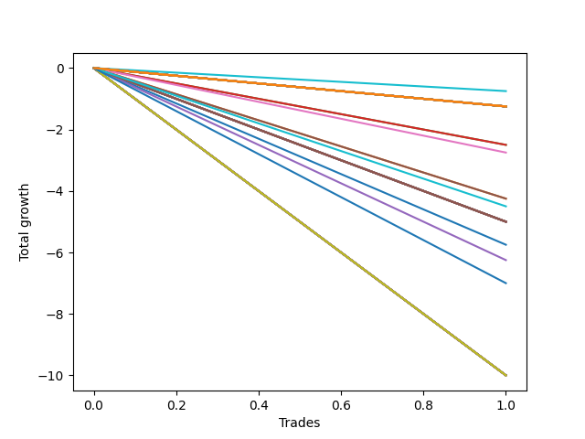

# Long Labrador 015 
- Symbol: ES_830-900
- Date Range: 03/18/2022 - 12/30/2022
- Trading Period: 8:30-9:0
- Number of Trades: 1



| Name | Win Percent | Profit | Avg Profit / Trade | Avg Time / Trade |      | Name | Win Percent | Profit | Avg Profit / Trade | Avg Time / Trade |
| ---- | ----------- | ------ | ------------------ | ---------------- | ---- | ---- | ----------- | ------ | ------------------ | ---------------- |
| Sorted By <br> Profit | | | | | | Sorted By <br> Win Percentage ||||
| BB-100 Mid | 0.00 | -375.00 | -375.00 | 60:30 |     | BB-100 Mid | 0.00 | -375.00 | -375.00 | 60:30 |
| NEWFI 06 | 0.00 | -625.00 | -625.00 | 60:55 |     | NEWFI 06 | 0.00 | -625.00 | -625.00 | 60:55 |
| TP-10 | 0.00 | -625.00 | -625.00 | 60:55 |     | TP-10 | 0.00 | -625.00 | -625.00 | 60:55 |
| TP-9 | 0.00 | -625.00 | -625.00 | 60:55 |     | TP-9 | 0.00 | -625.00 | -625.00 | 60:55 |
| TP-8 | 0.00 | -625.00 | -625.00 | 60:55 |     | TP-8 | 0.00 | -625.00 | -625.00 | 60:55 |
| TP-7 | 0.00 | -625.00 | -625.00 | 60:55 |     | TP-7 | 0.00 | -625.00 | -625.00 | 60:55 |
| TP-6 | 0.00 | -625.00 | -625.00 | 60:55 |     | TP-6 | 0.00 | -625.00 | -625.00 | 60:55 |
| TP-5 | 0.00 | -625.00 | -625.00 | 60:55 |     | TP-5 | 0.00 | -625.00 | -625.00 | 60:55 |
| TP-4 | 0.00 | -625.00 | -625.00 | 60:55 |     | TP-4 | 0.00 | -625.00 | -625.00 | 60:55 |
| TP-3 | 0.00 | -625.00 | -625.00 | 60:55 |     | TP-3 | 0.00 | -625.00 | -625.00 | 60:55 |
| TP-2 | 0.00 | -625.00 | -625.00 | 60:55 |     | TP-2 | 0.00 | -625.00 | -625.00 | 60:55 |
| TP-1 | 0.00 | -625.00 | -625.00 | 60:55 |     | TP-1 | 0.00 | -625.00 | -625.00 | 60:55 |
| BB-200 U/L 2SD | 0.00 | -625.00 | -625.00 | 60:55 |     | BB-200 U/L 2SD | 0.00 | -625.00 | -625.00 | 60:55 |
| BB-200 Mid | 0.00 | -625.00 | -625.00 | 60:55 |     | BB-200 Mid | 0.00 | -625.00 | -625.00 | 60:55 |
| BB-100 U/L 2SD | 0.00 | -625.00 | -625.00 | 60:55 |     | BB-100 U/L 2SD | 0.00 | -625.00 | -625.00 | 60:55 |
| V U/L 1SD | 0.00 | -625.00 | -625.00 | 60:55 |     | V U/L 1SD | 0.00 | -625.00 | -625.00 | 60:55 |
| V Mid | 0.00 | -625.00 | -625.00 | 60:55 |     | V Mid | 0.00 | -625.00 | -625.00 | 60:55 |
| BB-20 U/L 2SD C | 0.00 | -1250.00 | -1250.00 | 23:10 |     | BB-20 U/L 2SD C | 0.00 | -1250.00 | -1250.00 | 23:10 |
| BB-20 U/L 2SD | 0.00 | -1250.00 | -1250.00 | 23:10 |     | BB-20 U/L 2SD | 0.00 | -1250.00 | -1250.00 | 23:10 |
| BB-50 U/L 2SD | 0.00 | -1375.00 | -1375.00 | 55:50 |     | BB-50 U/L 2SD | 0.00 | -1375.00 | -1375.00 | 55:50 |
| BB-50 U/L 1SD | 0.00 | -2125.00 | -2125.00 | 51:05 |     | BB-50 U/L 1SD | 0.00 | -2125.00 | -2125.00 | 51:05 |
| BB-20 U/L 1SD | 0.00 | -2125.00 | -2125.00 | 21:15 |     | BB-20 U/L 1SD | 0.00 | -2125.00 | -2125.00 | 21:15 |
| NEWFI 000 | 0.00 | -2250.00 | -2250.00 | 55:05 |     | NEWFI 000 | 0.00 | -2250.00 | -2250.00 | 55:05 |
| BB-200 U/L 2SD SL-5 | 0.00 | -2500.00 | -2500.00 | 02:30 |     | BB-200 U/L 2SD SL-5 | 0.00 | -2500.00 | -2500.00 | 02:30 |
| BB-200 Mid SL-5 | 0.00 | -2500.00 | -2500.00 | 02:30 |     | BB-200 Mid SL-5 | 0.00 | -2500.00 | -2500.00 | 02:30 |
| BB-100 U/L 2SD SL-5 | 0.00 | -2500.00 | -2500.00 | 02:30 |     | BB-100 U/L 2SD SL-5 | 0.00 | -2500.00 | -2500.00 | 02:30 |
| BB-100 Mid SL-5 | 0.00 | -2500.00 | -2500.00 | 02:30 |     | BB-100 Mid SL-5 | 0.00 | -2500.00 | -2500.00 | 02:30 |
| V U/L 1SD SL-5 | 0.00 | -2500.00 | -2500.00 | 02:30 |     | V U/L 1SD SL-5 | 0.00 | -2500.00 | -2500.00 | 02:30 |
| V Mid SL-5 | 0.00 | -2500.00 | -2500.00 | 02:30 |     | V Mid SL-5 | 0.00 | -2500.00 | -2500.00 | 02:30 |
| BB-50 U/L 2SD SL-5 | 0.00 | -2500.00 | -2500.00 | 02:30 |     | BB-50 U/L 2SD SL-5 | 0.00 | -2500.00 | -2500.00 | 02:30 |
| BB-50 U/L 1SD SL-5 | 0.00 | -2500.00 | -2500.00 | 02:30 |     | BB-50 U/L 1SD SL-5 | 0.00 | -2500.00 | -2500.00 | 02:30 |
| BB-50 Mid SL-5 | 0.00 | -2500.00 | -2500.00 | 02:30 |     | BB-50 Mid SL-5 | 0.00 | -2500.00 | -2500.00 | 02:30 |
| BB-20 U/L 2SD C SL-5 | 0.00 | -2500.00 | -2500.00 | 02:30 |     | BB-20 U/L 2SD C SL-5 | 0.00 | -2500.00 | -2500.00 | 02:30 |
| BB-20 U/L 2SD SL-5 | 0.00 | -2500.00 | -2500.00 | 02:30 |     | BB-20 U/L 2SD SL-5 | 0.00 | -2500.00 | -2500.00 | 02:30 |
| BB-20 U/L 1SD SL-5 | 0.00 | -2500.00 | -2500.00 | 02:30 |     | BB-20 U/L 1SD SL-5 | 0.00 | -2500.00 | -2500.00 | 02:30 |
| BB-20 Mid SL-5 | 0.00 | -2500.00 | -2500.00 | 02:30 |     | BB-20 Mid SL-5 | 0.00 | -2500.00 | -2500.00 | 02:30 |
| BB-20 Mid | 0.00 | -2875.00 | -2875.00 | 17:50 |     | BB-20 Mid | 0.00 | -2875.00 | -2875.00 | 17:50 |
| BB-50 Mid | 0.00 | -3125.00 | -3125.00 | 40:15 |     | BB-50 Mid | 0.00 | -3125.00 | -3125.00 | 40:15 |
| NEWFI 0000 | 0.00 | -3500.00 | -3500.00 | 08:05 |     | NEWFI 0000 | 0.00 | -3500.00 | -3500.00 | 08:05 |
| BB-200 U/L 2SD SL-10 | 0.00 | -5000.00 | -5000.00 | 06:00 |     | BB-200 U/L 2SD SL-10 | 0.00 | -5000.00 | -5000.00 | 06:00 |
| BB-200 Mid SL-10 | 0.00 | -5000.00 | -5000.00 | 06:00 |     | BB-200 Mid SL-10 | 0.00 | -5000.00 | -5000.00 | 06:00 |
| BB-100 U/L 2SD SL-10 | 0.00 | -5000.00 | -5000.00 | 06:00 |     | BB-100 U/L 2SD SL-10 | 0.00 | -5000.00 | -5000.00 | 06:00 |
| BB-100 Mid SL-10 | 0.00 | -5000.00 | -5000.00 | 06:00 |     | BB-100 Mid SL-10 | 0.00 | -5000.00 | -5000.00 | 06:00 |
| V U/L 1SD SL-10 | 0.00 | -5000.00 | -5000.00 | 06:00 |     | V U/L 1SD SL-10 | 0.00 | -5000.00 | -5000.00 | 06:00 |
| V Mid SL-10 | 0.00 | -5000.00 | -5000.00 | 06:00 |     | V Mid SL-10 | 0.00 | -5000.00 | -5000.00 | 06:00 |
| BB-50 U/L 2SD SL-10 | 0.00 | -5000.00 | -5000.00 | 06:00 |     | BB-50 U/L 2SD SL-10 | 0.00 | -5000.00 | -5000.00 | 06:00 |
| BB-50 U/L 1SD SL-10 | 0.00 | -5000.00 | -5000.00 | 06:00 |     | BB-50 U/L 1SD SL-10 | 0.00 | -5000.00 | -5000.00 | 06:00 |
| BB-50 Mid SL-10 | 0.00 | -5000.00 | -5000.00 | 06:00 |     | BB-50 Mid SL-10 | 0.00 | -5000.00 | -5000.00 | 06:00 |
| BB-20 U/L 2SD C SL-10 | 0.00 | -5000.00 | -5000.00 | 06:00 |     | BB-20 U/L 2SD C SL-10 | 0.00 | -5000.00 | -5000.00 | 06:00 |
| BB-20 U/L 2SD SL-10 | 0.00 | -5000.00 | -5000.00 | 06:00 |     | BB-20 U/L 2SD SL-10 | 0.00 | -5000.00 | -5000.00 | 06:00 |
| BB-20 U/L 1SD SL-10 | 0.00 | -5000.00 | -5000.00 | 06:00 |     | BB-20 U/L 1SD SL-10 | 0.00 | -5000.00 | -5000.00 | 06:00 |
| BB-20 Mid SL-10 | 0.00 | -5000.00 | -5000.00 | 06:00 |     | BB-20 Mid SL-10 | 0.00 | -5000.00 | -5000.00 | 06:00 |

## NO STOPLOSS

### Test BB-20 Mid
* Sell when price hits the middle line of the 20p bollinger
* No Stoploss
* Results:
```
Total Trades: 1
Percent Up: 0.00
Percent Down: 100.00
Total Points Moved Up: -5.75
Potential Profit: -2875.00
Total Points Ups: 0.00 Count Ups: 0
Total Points Downs: -5.75 Count Downs: 1
```

<details><summary>Trades</summary>

<code>In: 2022-03-28 08:44:00		Out: 2022-03-28 09:01:50		Total Position Time: 17:50		Total Move Up: -5.75		Total to Date: -5.75</code> <br />


</details>

### Test BB-20 U/L 1SD
* Sell when the price hits the upper line of the 20p 1std bollinger
* No Stoploss
* Results:
```
Total Trades: 1
Percent Up: 0.00
Percent Down: 100.00
Total Points Moved Up: -4.25
Potential Profit: -2125.00
Total Points Ups: 0.00 Count Ups: 0
Total Points Downs: -4.25 Count Downs: 1
```

<details><summary>Trades</summary>

<code>In: 2022-03-28 08:44:00		Out: 2022-03-28 09:05:15		Total Position Time: 21:15		Total Move Up: -4.25		Total to Date: -4.25</code> <br />


</details>

### Test BB-20 U/L 2SD
* Sell when the price hits the upper line of the 20p 2std bollinger
* No Stoploss
* Results:
```
Total Trades: 1
Percent Up: 0.00
Percent Down: 100.00
Total Points Moved Up: -2.50
Potential Profit: -1250.00
Total Points Ups: 0.00 Count Ups: 0
Total Points Downs: -2.50 Count Downs: 1
```

<details><summary>Trades</summary>

<code>In: 2022-03-28 08:44:00		Out: 2022-03-28 09:07:10		Total Position Time: 23:10		Total Move Up: -2.50		Total to Date: -2.50</code> <br />


</details>

### Test BB-20 U/L 2SD C
* Sell when the price hits the upper line of the 20p 2std bollinger
* No Stoploss
* Results:
```
Total Trades: 1
Percent Up: 0.00
Percent Down: 100.00
Total Points Moved Up: -2.50
Potential Profit: -1250.00
Total Points Ups: 0.00 Count Ups: 0
Total Points Downs: -2.50 Count Downs: 1
```

<details><summary>Trades</summary>

<code>In: 2022-03-28 08:44:00		Out: 2022-03-28 09:07:10		Total Position Time: 23:10		Total Move Up: -2.50		Total to Date: -2.50</code> <br />


</details>

### Test BB-50 Mid
* Sell when price hits the middle line of the 50p bollinger
* No Stoploss
* Results:
```
Total Trades: 1
Percent Up: 0.00
Percent Down: 100.00
Total Points Moved Up: -6.25
Potential Profit: -3125.00
Total Points Ups: 0.00 Count Ups: 0
Total Points Downs: -6.25 Count Downs: 1
```

<details><summary>Trades</summary>

<code>In: 2022-03-28 08:44:00		Out: 2022-03-28 09:24:15		Total Position Time: 40:15		Total Move Up: -6.25		Total to Date: -6.25</code> <br />


</details>

### Test BB-50 U/L 1SD
* Sell when the price hits the upper line of the 50p 1std bollinger
* No Stoploss
* Results:
```
Total Trades: 1
Percent Up: 0.00
Percent Down: 100.00
Total Points Moved Up: -4.25
Potential Profit: -2125.00
Total Points Ups: 0.00 Count Ups: 0
Total Points Downs: -4.25 Count Downs: 1
```

<details><summary>Trades</summary>

<code>In: 2022-03-28 08:44:00		Out: 2022-03-28 09:35:05		Total Position Time: 51:05		Total Move Up: -4.25		Total to Date: -4.25</code> <br />


</details>

### Test BB-50 U/L 2SD
* Sell when the price hits the upper line of the 50p 2std bollinger
* No Stoploss
* Results:
```
Total Trades: 1
Percent Up: 0.00
Percent Down: 100.00
Total Points Moved Up: -2.75
Potential Profit: -1375.00
Total Points Ups: 0.00 Count Ups: 0
Total Points Downs: -2.75 Count Downs: 1
```

<details><summary>Trades</summary>

<code>In: 2022-03-28 08:44:00		Out: 2022-03-28 09:39:50		Total Position Time: 55:50		Total Move Up: -2.75		Total to Date: -2.75</code> <br />


</details>

### Test V Mid
* Sell when the price hits the middle line of the 1std VWAP
* No Stoploss
* Results:
```
Total Trades: 1
Percent Up: 0.00
Percent Down: 100.00
Total Points Moved Up: -1.25
Potential Profit: -625.00
Total Points Ups: 0.00 Count Ups: 0
Total Points Downs: -1.25 Count Downs: 1
```

<details><summary>Trades</summary>

<code>In: 2022-03-28 08:44:00		Out: 2022-03-28 09:44:55		Total Position Time: 60:55		Total Move Up: -1.25		Total to Date: -1.25</code> <br />


</details>

### Test V U/L 1SD
* Sell when the price hits the upper line of the 1std VWAP
* No Stoploss
* Results:
```
Total Trades: 1
Percent Up: 0.00
Percent Down: 100.00
Total Points Moved Up: -1.25
Potential Profit: -625.00
Total Points Ups: 0.00 Count Ups: 0
Total Points Downs: -1.25 Count Downs: 1
```

<details><summary>Trades</summary>

<code>In: 2022-03-28 08:44:00		Out: 2022-03-28 09:44:55		Total Position Time: 60:55		Total Move Up: -1.25		Total to Date: -1.25</code> <br />


</details>

### Test BB-100 Mid
* Move to BB100 Mid
* No Stoploss
* Results:
```
Total Trades: 1
Percent Up: 0.00
Percent Down: 100.00
Total Points Moved Up: -0.75
Potential Profit: -375.00
Total Points Ups: 0.00 Count Ups: 0
Total Points Downs: -0.75 Count Downs: 1
```

<details><summary>Trades</summary>

<code>In: 2022-03-28 08:44:00		Out: 2022-03-28 09:44:30		Total Position Time: 60:30		Total Move Up: -0.75		Total to Date: -0.75</code> <br />


</details>

### Test BB-100 U/L 2SD
* Move to BB100 Upper Band
* No Stoploss
* Results:
```
Total Trades: 1
Percent Up: 0.00
Percent Down: 100.00
Total Points Moved Up: -1.25
Potential Profit: -625.00
Total Points Ups: 0.00 Count Ups: 0
Total Points Downs: -1.25 Count Downs: 1
```

<details><summary>Trades</summary>

<code>In: 2022-03-28 08:44:00		Out: 2022-03-28 09:44:55		Total Position Time: 60:55		Total Move Up: -1.25		Total to Date: -1.25</code> <br />


</details>

### Test BB-200 Mid
* Move to BB200 Mid
* No Stoploss
* Results:
```
Total Trades: 1
Percent Up: 0.00
Percent Down: 100.00
Total Points Moved Up: -1.25
Potential Profit: -625.00
Total Points Ups: 0.00 Count Ups: 0
Total Points Downs: -1.25 Count Downs: 1
```

<details><summary>Trades</summary>

<code>In: 2022-03-28 08:44:00		Out: 2022-03-28 09:44:55		Total Position Time: 60:55		Total Move Up: -1.25		Total to Date: -1.25</code> <br />


</details>

### Test BB-200 U/L 2SD
* Move to BB200 Upper Band
* No Stoploss
* Results:
```
Total Trades: 1
Percent Up: 0.00
Percent Down: 100.00
Total Points Moved Up: -1.25
Potential Profit: -625.00
Total Points Ups: 0.00 Count Ups: 0
Total Points Downs: -1.25 Count Downs: 1
```

<details><summary>Trades</summary>

<code>In: 2022-03-28 08:44:00		Out: 2022-03-28 09:44:55		Total Position Time: 60:55		Total Move Up: -1.25		Total to Date: -1.25</code> <br />


</details>

## STOPLOSS OF 5

### Test BB-20 Mid SL-5
* Sell when price hits the middle line of the 20p bollinger
* Stoploss is 5 points
* Results:
```
Total Trades: 1
Percent Up: 0.00
Percent Down: 100.00
Total Points Moved Up: -5.00
Potential Profit: -2500.00
Total Points Ups: 0.00 Count Ups: 0
Total Points Downs: -5.00 Count Downs: 1
```

<details><summary>Trades</summary>

<code>In: 2022-03-28 08:44:00		Out: 2022-03-28 08:46:30		Total Position Time: 02:30		Total Move Up: -5.00		Total to Date: -5.00</code> <br />


</details>

### Test BB-20 U/L 1SD SL-5
* Sell when the price hits the upper line of the 20p 1std bollinger
* Stoploss is 5 points
* Results:
```
Total Trades: 1
Percent Up: 0.00
Percent Down: 100.00
Total Points Moved Up: -5.00
Potential Profit: -2500.00
Total Points Ups: 0.00 Count Ups: 0
Total Points Downs: -5.00 Count Downs: 1
```

<details><summary>Trades</summary>

<code>In: 2022-03-28 08:44:00		Out: 2022-03-28 08:46:30		Total Position Time: 02:30		Total Move Up: -5.00		Total to Date: -5.00</code> <br />


</details>

### Test BB-20 U/L 2SD SL-5
* Sell when the price hits the upper line of the 20p 2std bollinger
* Stoploss is 5 points
* Results:
```
Total Trades: 1
Percent Up: 0.00
Percent Down: 100.00
Total Points Moved Up: -5.00
Potential Profit: -2500.00
Total Points Ups: 0.00 Count Ups: 0
Total Points Downs: -5.00 Count Downs: 1
```

<details><summary>Trades</summary>

<code>In: 2022-03-28 08:44:00		Out: 2022-03-28 08:46:30		Total Position Time: 02:30		Total Move Up: -5.00		Total to Date: -5.00</code> <br />


</details>

### Test BB-20 U/L 2SD C SL-5
* Sell when the price hits the upper line of the 20p 2std bollinger
* Stoploss is 5 points
* Results:
```
Total Trades: 1
Percent Up: 0.00
Percent Down: 100.00
Total Points Moved Up: -5.00
Potential Profit: -2500.00
Total Points Ups: 0.00 Count Ups: 0
Total Points Downs: -5.00 Count Downs: 1
```

<details><summary>Trades</summary>

<code>In: 2022-03-28 08:44:00		Out: 2022-03-28 08:46:30		Total Position Time: 02:30		Total Move Up: -5.00		Total to Date: -5.00</code> <br />


</details>

### Test BB-50 Mid SL-5
* Sell when price hits the middle line of the 50p bollinger
* Stoploss is 5 points
* Results:
```
Total Trades: 1
Percent Up: 0.00
Percent Down: 100.00
Total Points Moved Up: -5.00
Potential Profit: -2500.00
Total Points Ups: 0.00 Count Ups: 0
Total Points Downs: -5.00 Count Downs: 1
```

<details><summary>Trades</summary>

<code>In: 2022-03-28 08:44:00		Out: 2022-03-28 08:46:30		Total Position Time: 02:30		Total Move Up: -5.00		Total to Date: -5.00</code> <br />


</details>

### Test BB-50 U/L 1SD SL-5
* Sell when the price hits the upper line of the 50p 1std bollinger
* Stoploss is 5 points
* Results:
```
Total Trades: 1
Percent Up: 0.00
Percent Down: 100.00
Total Points Moved Up: -5.00
Potential Profit: -2500.00
Total Points Ups: 0.00 Count Ups: 0
Total Points Downs: -5.00 Count Downs: 1
```

<details><summary>Trades</summary>

<code>In: 2022-03-28 08:44:00		Out: 2022-03-28 08:46:30		Total Position Time: 02:30		Total Move Up: -5.00		Total to Date: -5.00</code> <br />


</details>

### Test BB-50 U/L 2SD SL-5
* Sell when the price hits the upper line of the 50p 2std bollinger
* Stoploss is 5 points
* Results:
```
Total Trades: 1
Percent Up: 0.00
Percent Down: 100.00
Total Points Moved Up: -5.00
Potential Profit: -2500.00
Total Points Ups: 0.00 Count Ups: 0
Total Points Downs: -5.00 Count Downs: 1
```

<details><summary>Trades</summary>

<code>In: 2022-03-28 08:44:00		Out: 2022-03-28 08:46:30		Total Position Time: 02:30		Total Move Up: -5.00		Total to Date: -5.00</code> <br />


</details>

### Test V Mid SL-5
* Sell when the price hits the middle line of the 1std VWAP
* Stoploss is 5 points
* Results:
```
Total Trades: 1
Percent Up: 0.00
Percent Down: 100.00
Total Points Moved Up: -5.00
Potential Profit: -2500.00
Total Points Ups: 0.00 Count Ups: 0
Total Points Downs: -5.00 Count Downs: 1
```

<details><summary>Trades</summary>

<code>In: 2022-03-28 08:44:00		Out: 2022-03-28 08:46:30		Total Position Time: 02:30		Total Move Up: -5.00		Total to Date: -5.00</code> <br />


</details>

### Test V U/L 1SD SL-5
* Sell when the price hits the upper line of the 1std VWAP
* Stoploss is 5 points
* Results:
```
Total Trades: 1
Percent Up: 0.00
Percent Down: 100.00
Total Points Moved Up: -5.00
Potential Profit: -2500.00
Total Points Ups: 0.00 Count Ups: 0
Total Points Downs: -5.00 Count Downs: 1
```

<details><summary>Trades</summary>

<code>In: 2022-03-28 08:44:00		Out: 2022-03-28 08:46:30		Total Position Time: 02:30		Total Move Up: -5.00		Total to Date: -5.00</code> <br />


</details>

### Test BB-100 Mid SL-5
* Move to BB100 Mid
* Stoploss is 5 points
* Results:
```
Total Trades: 1
Percent Up: 0.00
Percent Down: 100.00
Total Points Moved Up: -5.00
Potential Profit: -2500.00
Total Points Ups: 0.00 Count Ups: 0
Total Points Downs: -5.00 Count Downs: 1
```

<details><summary>Trades</summary>

<code>In: 2022-03-28 08:44:00		Out: 2022-03-28 08:46:30		Total Position Time: 02:30		Total Move Up: -5.00		Total to Date: -5.00</code> <br />


</details>

### Test BB-100 U/L 2SD SL-5
* Move to BB100 Upper Band
* Stoploss is 5 points
* Results:
```
Total Trades: 1
Percent Up: 0.00
Percent Down: 100.00
Total Points Moved Up: -5.00
Potential Profit: -2500.00
Total Points Ups: 0.00 Count Ups: 0
Total Points Downs: -5.00 Count Downs: 1
```

<details><summary>Trades</summary>

<code>In: 2022-03-28 08:44:00		Out: 2022-03-28 08:46:30		Total Position Time: 02:30		Total Move Up: -5.00		Total to Date: -5.00</code> <br />


</details>

### Test BB-200 Mid SL-5
* Move to BB200 Mid
* Stoploss is 5 points
* Results:
```
Total Trades: 1
Percent Up: 0.00
Percent Down: 100.00
Total Points Moved Up: -5.00
Potential Profit: -2500.00
Total Points Ups: 0.00 Count Ups: 0
Total Points Downs: -5.00 Count Downs: 1
```

<details><summary>Trades</summary>

<code>In: 2022-03-28 08:44:00		Out: 2022-03-28 08:46:30		Total Position Time: 02:30		Total Move Up: -5.00		Total to Date: -5.00</code> <br />


</details>

### Test BB-200 U/L 2SD SL-5
* Move to BB200 Upper Band
* Stoploss is 5 points
* Results:
```
Total Trades: 1
Percent Up: 0.00
Percent Down: 100.00
Total Points Moved Up: -5.00
Potential Profit: -2500.00
Total Points Ups: 0.00 Count Ups: 0
Total Points Downs: -5.00 Count Downs: 1
```

<details><summary>Trades</summary>

<code>In: 2022-03-28 08:44:00		Out: 2022-03-28 08:46:30		Total Position Time: 02:30		Total Move Up: -5.00		Total to Date: -5.00</code> <br />


</details>

## STOPLOSS OF 10

### Test BB-20 Mid SL-10
* Sell when price hits the middle line of the 20p bollinger
* Stoploss is 10 points
* Results:
```
Total Trades: 1
Percent Up: 0.00
Percent Down: 100.00
Total Points Moved Up: -10.00
Potential Profit: -5000.00
Total Points Ups: 0.00 Count Ups: 0
Total Points Downs: -10.00 Count Downs: 1
```

<details><summary>Trades</summary>

<code>In: 2022-03-28 08:44:00		Out: 2022-03-28 08:50:00		Total Position Time: 06:00		Total Move Up: -10.00		Total to Date: -10.00</code> <br />


</details>

### Test BB-20 U/L 1SD SL-10
* Sell when the price hits the upper line of the 20p 1std bollinger
* Stoploss is 10 points
* Results:
```
Total Trades: 1
Percent Up: 0.00
Percent Down: 100.00
Total Points Moved Up: -10.00
Potential Profit: -5000.00
Total Points Ups: 0.00 Count Ups: 0
Total Points Downs: -10.00 Count Downs: 1
```

<details><summary>Trades</summary>

<code>In: 2022-03-28 08:44:00		Out: 2022-03-28 08:50:00		Total Position Time: 06:00		Total Move Up: -10.00		Total to Date: -10.00</code> <br />


</details>

### Test BB-20 U/L 2SD SL-10
* Sell when the price hits the upper line of the 20p 2std bollinger
* Stoploss is 10 points
* Results:
```
Total Trades: 1
Percent Up: 0.00
Percent Down: 100.00
Total Points Moved Up: -10.00
Potential Profit: -5000.00
Total Points Ups: 0.00 Count Ups: 0
Total Points Downs: -10.00 Count Downs: 1
```

<details><summary>Trades</summary>

<code>In: 2022-03-28 08:44:00		Out: 2022-03-28 08:50:00		Total Position Time: 06:00		Total Move Up: -10.00		Total to Date: -10.00</code> <br />


</details>

### Test BB-20 U/L 2SD C SL-10
* Sell when the price hits the upper line of the 20p 2std bollinger
* Stoploss is 10 points
* Results:
```
Total Trades: 1
Percent Up: 0.00
Percent Down: 100.00
Total Points Moved Up: -10.00
Potential Profit: -5000.00
Total Points Ups: 0.00 Count Ups: 0
Total Points Downs: -10.00 Count Downs: 1
```

<details><summary>Trades</summary>

<code>In: 2022-03-28 08:44:00		Out: 2022-03-28 08:50:00		Total Position Time: 06:00		Total Move Up: -10.00		Total to Date: -10.00</code> <br />


</details>

### Test BB-50 Mid SL-10
* Sell when price hits the middle line of the 50p bollinger
* Stoploss is 10 points
* Results:
```
Total Trades: 1
Percent Up: 0.00
Percent Down: 100.00
Total Points Moved Up: -10.00
Potential Profit: -5000.00
Total Points Ups: 0.00 Count Ups: 0
Total Points Downs: -10.00 Count Downs: 1
```

<details><summary>Trades</summary>

<code>In: 2022-03-28 08:44:00		Out: 2022-03-28 08:50:00		Total Position Time: 06:00		Total Move Up: -10.00		Total to Date: -10.00</code> <br />


</details>

### Test BB-50 U/L 1SD SL-10
* Sell when the price hits the upper line of the 50p 1std bollinger
* Stoploss is 10 points
* Results:
```
Total Trades: 1
Percent Up: 0.00
Percent Down: 100.00
Total Points Moved Up: -10.00
Potential Profit: -5000.00
Total Points Ups: 0.00 Count Ups: 0
Total Points Downs: -10.00 Count Downs: 1
```

<details><summary>Trades</summary>

<code>In: 2022-03-28 08:44:00		Out: 2022-03-28 08:50:00		Total Position Time: 06:00		Total Move Up: -10.00		Total to Date: -10.00</code> <br />


</details>

### Test BB-50 U/L 2SD SL-10
* Sell when the price hits the upper line of the 50p 2std bollinger
* Stoploss is 10 points
* Results:
```
Total Trades: 1
Percent Up: 0.00
Percent Down: 100.00
Total Points Moved Up: -10.00
Potential Profit: -5000.00
Total Points Ups: 0.00 Count Ups: 0
Total Points Downs: -10.00 Count Downs: 1
```

<details><summary>Trades</summary>

<code>In: 2022-03-28 08:44:00		Out: 2022-03-28 08:50:00		Total Position Time: 06:00		Total Move Up: -10.00		Total to Date: -10.00</code> <br />


</details>

### Test V Mid SL-10
* Sell when the price hits the middle line of the 1std VWAP
* Stoploss is 10 points
* Results:
```
Total Trades: 1
Percent Up: 0.00
Percent Down: 100.00
Total Points Moved Up: -10.00
Potential Profit: -5000.00
Total Points Ups: 0.00 Count Ups: 0
Total Points Downs: -10.00 Count Downs: 1
```

<details><summary>Trades</summary>

<code>In: 2022-03-28 08:44:00		Out: 2022-03-28 08:50:00		Total Position Time: 06:00		Total Move Up: -10.00		Total to Date: -10.00</code> <br />


</details>

### Test V U/L 1SD SL-10
* Sell when the price hits the upper line of the 1std VWAP
* Stoploss is 10 points
* Results:
```
Total Trades: 1
Percent Up: 0.00
Percent Down: 100.00
Total Points Moved Up: -10.00
Potential Profit: -5000.00
Total Points Ups: 0.00 Count Ups: 0
Total Points Downs: -10.00 Count Downs: 1
```

<details><summary>Trades</summary>

<code>In: 2022-03-28 08:44:00		Out: 2022-03-28 08:50:00		Total Position Time: 06:00		Total Move Up: -10.00		Total to Date: -10.00</code> <br />


</details>

### Test BB-100 Mid SL-10
* Move to BB100 Mid
* Stoploss is 10 points
* Results:
```
Total Trades: 1
Percent Up: 0.00
Percent Down: 100.00
Total Points Moved Up: -10.00
Potential Profit: -5000.00
Total Points Ups: 0.00 Count Ups: 0
Total Points Downs: -10.00 Count Downs: 1
```

<details><summary>Trades</summary>

<code>In: 2022-03-28 08:44:00		Out: 2022-03-28 08:50:00		Total Position Time: 06:00		Total Move Up: -10.00		Total to Date: -10.00</code> <br />


</details>

### Test BB-100 U/L 2SD SL-10
* Move to BB100 Upper Band
* Stoploss is 10 points
* Results:
```
Total Trades: 1
Percent Up: 0.00
Percent Down: 100.00
Total Points Moved Up: -10.00
Potential Profit: -5000.00
Total Points Ups: 0.00 Count Ups: 0
Total Points Downs: -10.00 Count Downs: 1
```

<details><summary>Trades</summary>

<code>In: 2022-03-28 08:44:00		Out: 2022-03-28 08:50:00		Total Position Time: 06:00		Total Move Up: -10.00		Total to Date: -10.00</code> <br />


</details>

### Test BB-200 Mid SL-10
* Move to BB200 Mid
* Stoploss is 10 points
* Results:
```
Total Trades: 1
Percent Up: 0.00
Percent Down: 100.00
Total Points Moved Up: -10.00
Potential Profit: -5000.00
Total Points Ups: 0.00 Count Ups: 0
Total Points Downs: -10.00 Count Downs: 1
```

<details><summary>Trades</summary>

<code>In: 2022-03-28 08:44:00		Out: 2022-03-28 08:50:00		Total Position Time: 06:00		Total Move Up: -10.00		Total to Date: -10.00</code> <br />


</details>

### Test BB-200 U/L 2SD SL-10
* Move to BB200 Upper Band
* Stoploss is 10 points
* Results:
```
Total Trades: 1
Percent Up: 0.00
Percent Down: 100.00
Total Points Moved Up: -10.00
Potential Profit: -5000.00
Total Points Ups: 0.00 Count Ups: 0
Total Points Downs: -10.00 Count Downs: 1
```

<details><summary>Trades</summary>

<code>In: 2022-03-28 08:44:00		Out: 2022-03-28 08:50:00		Total Position Time: 06:00		Total Move Up: -10.00		Total to Date: -10.00</code> <br />


</details>

## TAKE PROFIT

### Test TP-1
* Take Profit of 1 Point
* No Stoploss
* Results:
```
Total Trades: 1
Percent Up: 0.00
Percent Down: 100.00
Total Points Moved Up: -1.25
Potential Profit: -625.00
Total Points Ups: 0.00 Count Ups: 0
Total Points Downs: -1.25 Count Downs: 1
```

<details><summary>Trades</summary>

<code>In: 2022-03-28 08:44:00		Out: 2022-03-28 09:44:55		Total Position Time: 60:55		Total Move Up: -1.25		Total to Date: -1.25</code> <br />


</details>

### Test TP-2
* Take Profit of 2 Point
* No Stoploss
* Results:
```
Total Trades: 1
Percent Up: 0.00
Percent Down: 100.00
Total Points Moved Up: -1.25
Potential Profit: -625.00
Total Points Ups: 0.00 Count Ups: 0
Total Points Downs: -1.25 Count Downs: 1
```

<details><summary>Trades</summary>

<code>In: 2022-03-28 08:44:00		Out: 2022-03-28 09:44:55		Total Position Time: 60:55		Total Move Up: -1.25		Total to Date: -1.25</code> <br />


</details>

### Test TP-3
* Take Profit of 3 Point
* No Stoploss
* Results:
```
Total Trades: 1
Percent Up: 0.00
Percent Down: 100.00
Total Points Moved Up: -1.25
Potential Profit: -625.00
Total Points Ups: 0.00 Count Ups: 0
Total Points Downs: -1.25 Count Downs: 1
```

<details><summary>Trades</summary>

<code>In: 2022-03-28 08:44:00		Out: 2022-03-28 09:44:55		Total Position Time: 60:55		Total Move Up: -1.25		Total to Date: -1.25</code> <br />


</details>

### Test TP-4
* Take Profit of 4 Point
* No Stoploss
* Results:
```
Total Trades: 1
Percent Up: 0.00
Percent Down: 100.00
Total Points Moved Up: -1.25
Potential Profit: -625.00
Total Points Ups: 0.00 Count Ups: 0
Total Points Downs: -1.25 Count Downs: 1
```

<details><summary>Trades</summary>

<code>In: 2022-03-28 08:44:00		Out: 2022-03-28 09:44:55		Total Position Time: 60:55		Total Move Up: -1.25		Total to Date: -1.25</code> <br />


</details>

### Test TP-5
* Take Profit of 5 Point
* No Stoploss
* Results:
```
Total Trades: 1
Percent Up: 0.00
Percent Down: 100.00
Total Points Moved Up: -1.25
Potential Profit: -625.00
Total Points Ups: 0.00 Count Ups: 0
Total Points Downs: -1.25 Count Downs: 1
```

<details><summary>Trades</summary>

<code>In: 2022-03-28 08:44:00		Out: 2022-03-28 09:44:55		Total Position Time: 60:55		Total Move Up: -1.25		Total to Date: -1.25</code> <br />


</details>

### Test TP-6
* Take Profit of 6 Point
* No Stoploss
* Results:
```
Total Trades: 1
Percent Up: 0.00
Percent Down: 100.00
Total Points Moved Up: -1.25
Potential Profit: -625.00
Total Points Ups: 0.00 Count Ups: 0
Total Points Downs: -1.25 Count Downs: 1
```

<details><summary>Trades</summary>

<code>In: 2022-03-28 08:44:00		Out: 2022-03-28 09:44:55		Total Position Time: 60:55		Total Move Up: -1.25		Total to Date: -1.25</code> <br />


</details>

### Test TP-7
* Take Profit of 7 Point
* No Stoploss
* Results:
```
Total Trades: 1
Percent Up: 0.00
Percent Down: 100.00
Total Points Moved Up: -1.25
Potential Profit: -625.00
Total Points Ups: 0.00 Count Ups: 0
Total Points Downs: -1.25 Count Downs: 1
```

<details><summary>Trades</summary>

<code>In: 2022-03-28 08:44:00		Out: 2022-03-28 09:44:55		Total Position Time: 60:55		Total Move Up: -1.25		Total to Date: -1.25</code> <br />


</details>

### Test TP-8
* Take Profit of 8 Point
* No Stoploss
* Results:
```
Total Trades: 1
Percent Up: 0.00
Percent Down: 100.00
Total Points Moved Up: -1.25
Potential Profit: -625.00
Total Points Ups: 0.00 Count Ups: 0
Total Points Downs: -1.25 Count Downs: 1
```

<details><summary>Trades</summary>

<code>In: 2022-03-28 08:44:00		Out: 2022-03-28 09:44:55		Total Position Time: 60:55		Total Move Up: -1.25		Total to Date: -1.25</code> <br />


</details>

### Test TP-9
* Take Profit of 9 Point
* No Stoploss
* Results:
```
Total Trades: 1
Percent Up: 0.00
Percent Down: 100.00
Total Points Moved Up: -1.25
Potential Profit: -625.00
Total Points Ups: 0.00 Count Ups: 0
Total Points Downs: -1.25 Count Downs: 1
```

<details><summary>Trades</summary>

<code>In: 2022-03-28 08:44:00		Out: 2022-03-28 09:44:55		Total Position Time: 60:55		Total Move Up: -1.25		Total to Date: -1.25</code> <br />


</details>

### Test TP-10
* Take Profit of 10 Point
* No Stoploss
* Results:
```
Total Trades: 1
Percent Up: 0.00
Percent Down: 100.00
Total Points Moved Up: -1.25
Potential Profit: -625.00
Total Points Ups: 0.00 Count Ups: 0
Total Points Downs: -1.25 Count Downs: 1
```

<details><summary>Trades</summary>

<code>In: 2022-03-28 08:44:00		Out: 2022-03-28 09:44:55		Total Position Time: 60:55		Total Move Up: -1.25		Total to Date: -1.25</code> <br />


</details>

## Indicator Exits

### Test NEWFI 000
* Newfi 0000
* No Stoploss
* Results:
```
Total Trades: 1
Percent Up: 0.00
Percent Down: 100.00
Total Points Moved Up: -4.50
Potential Profit: -2250.00
Total Points Ups: 0.00 Count Ups: 0
Total Points Downs: -4.50 Count Downs: 1
```

<details><summary>Trades</summary>

<code>In: 2022-03-28 08:44:00		Out: 2022-03-28 09:39:05		Total Position Time: 55:05		Total Move Up: -4.50		Total to Date: -4.50</code> <br />


</details>

### Test NEWFI 0000
* Newfi 0000
* No Stoploss
* Results:
```
Total Trades: 1
Percent Up: 0.00
Percent Down: 100.00
Total Points Moved Up: -7.00
Potential Profit: -3500.00
Total Points Ups: 0.00 Count Ups: 0
Total Points Downs: -7.00 Count Downs: 1
```

<details><summary>Trades</summary>

<code>In: 2022-03-28 08:44:00		Out: 2022-03-28 08:52:05		Total Position Time: 08:05		Total Move Up: -7.00		Total to Date: -7.00</code> <br />


</details>

### Test NEWFI 06
* Newfi 06
* No Stoploss
* Results:
```
Total Trades: 1
Percent Up: 0.00
Percent Down: 100.00
Total Points Moved Up: -1.25
Potential Profit: -625.00
Total Points Ups: 0.00 Count Ups: 0
Total Points Downs: -1.25 Count Downs: 1
```

<details><summary>Trades</summary>

<code>In: 2022-03-28 08:44:00		Out: 2022-03-28 09:44:55		Total Position Time: 60:55		Total Move Up: -1.25		Total to Date: -1.25</code> <br />


</details>