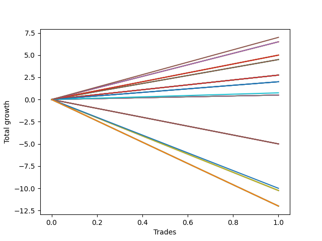

# Long Malinois 002 
- Symbol: ES_830-900
- Date Range: 03/18/2022 - 12/30/2022
- Trading Period: 8:30-9:0
- Number of Trades: 1



| Name | Win Percent | Profit | Avg Profit / Trade | Avg Time / Trade |      | Name | Win Percent | Profit | Avg Profit / Trade | Avg Time / Trade |
| ---- | ----------- | ------ | ------------------ | ---------------- | ---- | ---- | ----------- | ------ | ------------------ | ---------------- |
| Sorted By <br> Profit | | | | | | Sorted By <br> Win Percentage ||||
| TP-7 | 100.00 | 3500.00 | 3500.00 | 13:15 |     | TP-7 | 100.00 | 3500.00 | 3500.00 | 13:15 |
| TP-6 | 100.00 | 3250.00 | 3250.00 | 13:10 |     | TP-6 | 100.00 | 3250.00 | 3250.00 | 13:10 |
| BB-50 U/L 1SD SL-10 | 100.00 | 3250.00 | 3250.00 | 13:10 |     | BB-50 U/L 1SD SL-10 | 100.00 | 3250.00 | 3250.00 | 13:10 |
| BB-50 U/L 1SD SL-5 | 100.00 | 3250.00 | 3250.00 | 13:10 |     | BB-50 U/L 1SD SL-5 | 100.00 | 3250.00 | 3250.00 | 13:10 |
| BB-50 U/L 1SD | 100.00 | 3250.00 | 3250.00 | 13:10 |     | BB-50 U/L 1SD | 100.00 | 3250.00 | 3250.00 | 13:10 |
| TP-5 | 100.00 | 2500.00 | 2500.00 | 12:50 |     | TP-5 | 100.00 | 2500.00 | 2500.00 | 12:50 |
| TP-4 | 100.00 | 2500.00 | 2500.00 | 12:50 |     | TP-4 | 100.00 | 2500.00 | 2500.00 | 12:50 |
| TP-3 | 100.00 | 2500.00 | 2500.00 | 12:50 |     | TP-3 | 100.00 | 2500.00 | 2500.00 | 12:50 |
| BB-100 Mid SL-10 | 100.00 | 2250.00 | 2250.00 | 13:00 |     | BB-100 Mid SL-10 | 100.00 | 2250.00 | 2250.00 | 13:00 |
| BB-100 Mid SL-5 | 100.00 | 2250.00 | 2250.00 | 13:00 |     | BB-100 Mid SL-5 | 100.00 | 2250.00 | 2250.00 | 13:00 |
| BB-100 Mid | 100.00 | 2250.00 | 2250.00 | 13:00 |     | BB-100 Mid | 100.00 | 2250.00 | 2250.00 | 13:00 |
| V Mid SL-10 | 100.00 | 1375.00 | 1375.00 | 09:05 |     | V Mid SL-10 | 100.00 | 1375.00 | 1375.00 | 09:05 |
| BB-20 U/L 2SD C SL-10 | 100.00 | 1375.00 | 1375.00 | 09:45 |     | BB-20 U/L 2SD C SL-10 | 100.00 | 1375.00 | 1375.00 | 09:45 |
| BB-20 U/L 2SD SL-10 | 100.00 | 1375.00 | 1375.00 | 09:05 |     | BB-20 U/L 2SD SL-10 | 100.00 | 1375.00 | 1375.00 | 09:05 |
| V Mid SL-5 | 100.00 | 1375.00 | 1375.00 | 09:05 |     | V Mid SL-5 | 100.00 | 1375.00 | 1375.00 | 09:05 |
| BB-20 U/L 2SD C SL-5 | 100.00 | 1375.00 | 1375.00 | 09:45 |     | BB-20 U/L 2SD C SL-5 | 100.00 | 1375.00 | 1375.00 | 09:45 |
| BB-20 U/L 2SD SL-5 | 100.00 | 1375.00 | 1375.00 | 09:05 |     | BB-20 U/L 2SD SL-5 | 100.00 | 1375.00 | 1375.00 | 09:05 |
| V Mid | 100.00 | 1375.00 | 1375.00 | 09:05 |     | V Mid | 100.00 | 1375.00 | 1375.00 | 09:05 |
| BB-20 U/L 2SD C | 100.00 | 1375.00 | 1375.00 | 09:45 |     | BB-20 U/L 2SD C | 100.00 | 1375.00 | 1375.00 | 09:45 |
| BB-20 U/L 2SD | 100.00 | 1375.00 | 1375.00 | 09:05 |     | BB-20 U/L 2SD | 100.00 | 1375.00 | 1375.00 | 09:05 |
| TP-2 | 100.00 | 1000.00 | 1000.00 | 01:30 |     | TP-2 | 100.00 | 1000.00 | 1000.00 | 01:30 |
| BB-50 Mid SL-10 | 100.00 | 1000.00 | 1000.00 | 01:30 |     | BB-50 Mid SL-10 | 100.00 | 1000.00 | 1000.00 | 01:30 |
| BB-50 Mid SL-5 | 100.00 | 1000.00 | 1000.00 | 01:30 |     | BB-50 Mid SL-5 | 100.00 | 1000.00 | 1000.00 | 01:30 |
| BB-50 Mid | 100.00 | 1000.00 | 1000.00 | 01:30 |     | BB-50 Mid | 100.00 | 1000.00 | 1000.00 | 01:30 |
| TP-1 | 100.00 | 375.00 | 375.00 | 01:25 |     | TP-1 | 100.00 | 375.00 | 375.00 | 01:25 |
| BB-20 U/L 1SD SL-10 | 100.00 | 250.00 | 250.00 | 07:05 |     | BB-20 U/L 1SD SL-10 | 100.00 | 250.00 | 250.00 | 07:05 |
| BB-20 Mid SL-10 | 100.00 | 250.00 | 250.00 | 01:10 |     | BB-20 Mid SL-10 | 100.00 | 250.00 | 250.00 | 01:10 |
| BB-20 U/L 1SD SL-5 | 100.00 | 250.00 | 250.00 | 07:05 |     | BB-20 U/L 1SD SL-5 | 100.00 | 250.00 | 250.00 | 07:05 |
| BB-20 Mid SL-5 | 100.00 | 250.00 | 250.00 | 01:10 |     | BB-20 Mid SL-5 | 100.00 | 250.00 | 250.00 | 01:10 |
| BB-20 U/L 1SD | 100.00 | 250.00 | 250.00 | 07:05 |     | BB-20 U/L 1SD | 100.00 | 250.00 | 250.00 | 07:05 |
| BB-20 Mid | 100.00 | 250.00 | 250.00 | 01:10 |     | BB-20 Mid | 100.00 | 250.00 | 250.00 | 01:10 |
| BB-200 U/L 2SD SL-5 | 0.00 | -2500.00 | -2500.00 | 22:40 |     | BB-200 U/L 2SD SL-5 | 0.00 | -2500.00 | -2500.00 | 22:40 |
| BB-200 Mid SL-5 | 0.00 | -2500.00 | -2500.00 | 22:40 |     | BB-200 Mid SL-5 | 0.00 | -2500.00 | -2500.00 | 22:40 |
| BB-100 U/L 2SD SL-5 | 0.00 | -2500.00 | -2500.00 | 22:40 |     | BB-100 U/L 2SD SL-5 | 0.00 | -2500.00 | -2500.00 | 22:40 |
| V U/L 1SD SL-5 | 0.00 | -2500.00 | -2500.00 | 22:40 |     | V U/L 1SD SL-5 | 0.00 | -2500.00 | -2500.00 | 22:40 |
| BB-50 U/L 2SD SL-5 | 0.00 | -2500.00 | -2500.00 | 22:40 |     | BB-50 U/L 2SD SL-5 | 0.00 | -2500.00 | -2500.00 | 22:40 |
| NEWFI 0000 | 0.00 | -5000.00 | -5000.00 | 32:05 |     | NEWFI 0000 | 0.00 | -5000.00 | -5000.00 | 32:05 |
| BB-200 U/L 2SD SL-10 | 0.00 | -5125.00 | -5125.00 | 29:10 |     | BB-200 U/L 2SD SL-10 | 0.00 | -5125.00 | -5125.00 | 29:10 |
| BB-200 Mid SL-10 | 0.00 | -5125.00 | -5125.00 | 29:10 |     | BB-200 Mid SL-10 | 0.00 | -5125.00 | -5125.00 | 29:10 |
| BB-100 U/L 2SD SL-10 | 0.00 | -5125.00 | -5125.00 | 29:10 |     | BB-100 U/L 2SD SL-10 | 0.00 | -5125.00 | -5125.00 | 29:10 |
| V U/L 1SD SL-10 | 0.00 | -5125.00 | -5125.00 | 29:10 |     | V U/L 1SD SL-10 | 0.00 | -5125.00 | -5125.00 | 29:10 |
| BB-50 U/L 2SD SL-10 | 0.00 | -5125.00 | -5125.00 | 29:10 |     | BB-50 U/L 2SD SL-10 | 0.00 | -5125.00 | -5125.00 | 29:10 |
| NEWFI 06 | 0.00 | -6000.00 | -6000.00 | 60:55 |     | NEWFI 06 | 0.00 | -6000.00 | -6000.00 | 60:55 |
| NEWFI 000 | 0.00 | -6000.00 | -6000.00 | 60:55 |     | NEWFI 000 | 0.00 | -6000.00 | -6000.00 | 60:55 |
| TP-10 | 0.00 | -6000.00 | -6000.00 | 60:55 |     | TP-10 | 0.00 | -6000.00 | -6000.00 | 60:55 |
| TP-9 | 0.00 | -6000.00 | -6000.00 | 60:55 |     | TP-9 | 0.00 | -6000.00 | -6000.00 | 60:55 |
| TP-8 | 0.00 | -6000.00 | -6000.00 | 60:55 |     | TP-8 | 0.00 | -6000.00 | -6000.00 | 60:55 |
| BB-200 U/L 2SD | 0.00 | -6000.00 | -6000.00 | 60:55 |     | BB-200 U/L 2SD | 0.00 | -6000.00 | -6000.00 | 60:55 |
| BB-200 Mid | 0.00 | -6000.00 | -6000.00 | 60:55 |     | BB-200 Mid | 0.00 | -6000.00 | -6000.00 | 60:55 |
| BB-100 U/L 2SD | 0.00 | -6000.00 | -6000.00 | 60:55 |     | BB-100 U/L 2SD | 0.00 | -6000.00 | -6000.00 | 60:55 |
| V U/L 1SD | 0.00 | -6000.00 | -6000.00 | 60:55 |     | V U/L 1SD | 0.00 | -6000.00 | -6000.00 | 60:55 |
| BB-50 U/L 2SD | 0.00 | -6000.00 | -6000.00 | 60:55 |     | BB-50 U/L 2SD | 0.00 | -6000.00 | -6000.00 | 60:55 |

## NO STOPLOSS

### Test BB-20 Mid
* Sell when price hits the middle line of the 20p bollinger
* No Stoploss
* Results:
```
Total Trades: 1
Percent Up: 100.00
Percent Down: 0.00
Total Points Moved Up: 0.50
Potential Profit: 250.00
Total Points Ups: 0.50 Count Ups: 1
Total Points Downs: 0.00 Count Downs: 0
```

<details><summary>Trades</summary>

<code>In: 2022-10-19 08:39:00		Out: 2022-10-19 08:40:10		Total Position Time: 01:10		Total Move Up: 0.50		Total to Date: 0.50</code> <br />


</details>

### Test BB-20 U/L 1SD
* Sell when the price hits the upper line of the 20p 1std bollinger
* No Stoploss
* Results:
```
Total Trades: 1
Percent Up: 100.00
Percent Down: 0.00
Total Points Moved Up: 0.50
Potential Profit: 250.00
Total Points Ups: 0.50 Count Ups: 1
Total Points Downs: 0.00 Count Downs: 0
```

<details><summary>Trades</summary>

<code>In: 2022-10-19 08:39:00		Out: 2022-10-19 08:46:05		Total Position Time: 07:05		Total Move Up: 0.50		Total to Date: 0.50</code> <br />


</details>

### Test BB-20 U/L 2SD
* Sell when the price hits the upper line of the 20p 2std bollinger
* No Stoploss
* Results:
```
Total Trades: 1
Percent Up: 100.00
Percent Down: 0.00
Total Points Moved Up: 2.75
Potential Profit: 1375.00
Total Points Ups: 2.75 Count Ups: 1
Total Points Downs: 0.00 Count Downs: 0
```

<details><summary>Trades</summary>

<code>In: 2022-10-19 08:39:00		Out: 2022-10-19 08:48:05		Total Position Time: 09:05		Total Move Up: 2.75		Total to Date: 2.75</code> <br />


</details>

### Test BB-20 U/L 2SD C
* Sell when the price hits the upper line of the 20p 2std bollinger
* No Stoploss
* Results:
```
Total Trades: 1
Percent Up: 100.00
Percent Down: 0.00
Total Points Moved Up: 2.75
Potential Profit: 1375.00
Total Points Ups: 2.75 Count Ups: 1
Total Points Downs: 0.00 Count Downs: 0
```

<details><summary>Trades</summary>

<code>In: 2022-10-19 08:39:00		Out: 2022-10-19 08:48:45		Total Position Time: 09:45		Total Move Up: 2.75		Total to Date: 2.75</code> <br />


</details>

### Test BB-50 Mid
* Sell when price hits the middle line of the 50p bollinger
* No Stoploss
* Results:
```
Total Trades: 1
Percent Up: 100.00
Percent Down: 0.00
Total Points Moved Up: 2.00
Potential Profit: 1000.00
Total Points Ups: 2.00 Count Ups: 1
Total Points Downs: 0.00 Count Downs: 0
```

<details><summary>Trades</summary>

<code>In: 2022-10-19 08:39:00		Out: 2022-10-19 08:40:30		Total Position Time: 01:30		Total Move Up: 2.00		Total to Date: 2.00</code> <br />


</details>

### Test BB-50 U/L 1SD
* Sell when the price hits the upper line of the 50p 1std bollinger
* No Stoploss
* Results:
```
Total Trades: 1
Percent Up: 100.00
Percent Down: 0.00
Total Points Moved Up: 6.50
Potential Profit: 3250.00
Total Points Ups: 6.50 Count Ups: 1
Total Points Downs: 0.00 Count Downs: 0
```

<details><summary>Trades</summary>

<code>In: 2022-10-19 08:39:00		Out: 2022-10-19 08:52:10		Total Position Time: 13:10		Total Move Up: 6.50		Total to Date: 6.50</code> <br />


</details>

### Test BB-50 U/L 2SD
* Sell when the price hits the upper line of the 50p 2std bollinger
* No Stoploss
* Results:
```
Total Trades: 1
Percent Up: 0.00
Percent Down: 100.00
Total Points Moved Up: -12.00
Potential Profit: -6000.00
Total Points Ups: 0.00 Count Ups: 0
Total Points Downs: -12.00 Count Downs: 1
```

<details><summary>Trades</summary>

<code>In: 2022-10-19 08:39:00		Out: 2022-10-19 09:39:55		Total Position Time: 60:55		Total Move Up: -12.00		Total to Date: -12.00</code> <br />


</details>

### Test V Mid
* Sell when the price hits the middle line of the 1std VWAP
* No Stoploss
* Results:
```
Total Trades: 1
Percent Up: 100.00
Percent Down: 0.00
Total Points Moved Up: 2.75
Potential Profit: 1375.00
Total Points Ups: 2.75 Count Ups: 1
Total Points Downs: 0.00 Count Downs: 0
```

<details><summary>Trades</summary>

<code>In: 2022-10-19 08:39:00		Out: 2022-10-19 08:48:05		Total Position Time: 09:05		Total Move Up: 2.75		Total to Date: 2.75</code> <br />


</details>

### Test V U/L 1SD
* Sell when the price hits the upper line of the 1std VWAP
* No Stoploss
* Results:
```
Total Trades: 1
Percent Up: 0.00
Percent Down: 100.00
Total Points Moved Up: -12.00
Potential Profit: -6000.00
Total Points Ups: 0.00 Count Ups: 0
Total Points Downs: -12.00 Count Downs: 1
```

<details><summary>Trades</summary>

<code>In: 2022-10-19 08:39:00		Out: 2022-10-19 09:39:55		Total Position Time: 60:55		Total Move Up: -12.00		Total to Date: -12.00</code> <br />


</details>

### Test BB-100 Mid
* Move to BB100 Mid
* No Stoploss
* Results:
```
Total Trades: 1
Percent Up: 100.00
Percent Down: 0.00
Total Points Moved Up: 4.50
Potential Profit: 2250.00
Total Points Ups: 4.50 Count Ups: 1
Total Points Downs: 0.00 Count Downs: 0
```

<details><summary>Trades</summary>

<code>In: 2022-10-19 08:39:00		Out: 2022-10-19 08:52:00		Total Position Time: 13:00		Total Move Up: 4.50		Total to Date: 4.50</code> <br />


</details>

### Test BB-100 U/L 2SD
* Move to BB100 Upper Band
* No Stoploss
* Results:
```
Total Trades: 1
Percent Up: 0.00
Percent Down: 100.00
Total Points Moved Up: -12.00
Potential Profit: -6000.00
Total Points Ups: 0.00 Count Ups: 0
Total Points Downs: -12.00 Count Downs: 1
```

<details><summary>Trades</summary>

<code>In: 2022-10-19 08:39:00		Out: 2022-10-19 09:39:55		Total Position Time: 60:55		Total Move Up: -12.00		Total to Date: -12.00</code> <br />


</details>

### Test BB-200 Mid
* Move to BB200 Mid
* No Stoploss
* Results:
```
Total Trades: 1
Percent Up: 0.00
Percent Down: 100.00
Total Points Moved Up: -12.00
Potential Profit: -6000.00
Total Points Ups: 0.00 Count Ups: 0
Total Points Downs: -12.00 Count Downs: 1
```

<details><summary>Trades</summary>

<code>In: 2022-10-19 08:39:00		Out: 2022-10-19 09:39:55		Total Position Time: 60:55		Total Move Up: -12.00		Total to Date: -12.00</code> <br />


</details>

### Test BB-200 U/L 2SD
* Move to BB200 Upper Band
* No Stoploss
* Results:
```
Total Trades: 1
Percent Up: 0.00
Percent Down: 100.00
Total Points Moved Up: -12.00
Potential Profit: -6000.00
Total Points Ups: 0.00 Count Ups: 0
Total Points Downs: -12.00 Count Downs: 1
```

<details><summary>Trades</summary>

<code>In: 2022-10-19 08:39:00		Out: 2022-10-19 09:39:55		Total Position Time: 60:55		Total Move Up: -12.00		Total to Date: -12.00</code> <br />


</details>

## STOPLOSS OF 5

### Test BB-20 Mid SL-5
* Sell when price hits the middle line of the 20p bollinger
* Stoploss is 5 points
* Results:
```
Total Trades: 1
Percent Up: 100.00
Percent Down: 0.00
Total Points Moved Up: 0.50
Potential Profit: 250.00
Total Points Ups: 0.50 Count Ups: 1
Total Points Downs: 0.00 Count Downs: 0
```

<details><summary>Trades</summary>

<code>In: 2022-10-19 08:39:00		Out: 2022-10-19 08:40:10		Total Position Time: 01:10		Total Move Up: 0.50		Total to Date: 0.50</code> <br />


</details>

### Test BB-20 U/L 1SD SL-5
* Sell when the price hits the upper line of the 20p 1std bollinger
* Stoploss is 5 points
* Results:
```
Total Trades: 1
Percent Up: 100.00
Percent Down: 0.00
Total Points Moved Up: 0.50
Potential Profit: 250.00
Total Points Ups: 0.50 Count Ups: 1
Total Points Downs: 0.00 Count Downs: 0
```

<details><summary>Trades</summary>

<code>In: 2022-10-19 08:39:00		Out: 2022-10-19 08:46:05		Total Position Time: 07:05		Total Move Up: 0.50		Total to Date: 0.50</code> <br />


</details>

### Test BB-20 U/L 2SD SL-5
* Sell when the price hits the upper line of the 20p 2std bollinger
* Stoploss is 5 points
* Results:
```
Total Trades: 1
Percent Up: 100.00
Percent Down: 0.00
Total Points Moved Up: 2.75
Potential Profit: 1375.00
Total Points Ups: 2.75 Count Ups: 1
Total Points Downs: 0.00 Count Downs: 0
```

<details><summary>Trades</summary>

<code>In: 2022-10-19 08:39:00		Out: 2022-10-19 08:48:05		Total Position Time: 09:05		Total Move Up: 2.75		Total to Date: 2.75</code> <br />


</details>

### Test BB-20 U/L 2SD C SL-5
* Sell when the price hits the upper line of the 20p 2std bollinger
* Stoploss is 5 points
* Results:
```
Total Trades: 1
Percent Up: 100.00
Percent Down: 0.00
Total Points Moved Up: 2.75
Potential Profit: 1375.00
Total Points Ups: 2.75 Count Ups: 1
Total Points Downs: 0.00 Count Downs: 0
```

<details><summary>Trades</summary>

<code>In: 2022-10-19 08:39:00		Out: 2022-10-19 08:48:45		Total Position Time: 09:45		Total Move Up: 2.75		Total to Date: 2.75</code> <br />


</details>

### Test BB-50 Mid SL-5
* Sell when price hits the middle line of the 50p bollinger
* Stoploss is 5 points
* Results:
```
Total Trades: 1
Percent Up: 100.00
Percent Down: 0.00
Total Points Moved Up: 2.00
Potential Profit: 1000.00
Total Points Ups: 2.00 Count Ups: 1
Total Points Downs: 0.00 Count Downs: 0
```

<details><summary>Trades</summary>

<code>In: 2022-10-19 08:39:00		Out: 2022-10-19 08:40:30		Total Position Time: 01:30		Total Move Up: 2.00		Total to Date: 2.00</code> <br />


</details>

### Test BB-50 U/L 1SD SL-5
* Sell when the price hits the upper line of the 50p 1std bollinger
* Stoploss is 5 points
* Results:
```
Total Trades: 1
Percent Up: 100.00
Percent Down: 0.00
Total Points Moved Up: 6.50
Potential Profit: 3250.00
Total Points Ups: 6.50 Count Ups: 1
Total Points Downs: 0.00 Count Downs: 0
```

<details><summary>Trades</summary>

<code>In: 2022-10-19 08:39:00		Out: 2022-10-19 08:52:10		Total Position Time: 13:10		Total Move Up: 6.50		Total to Date: 6.50</code> <br />


</details>

### Test BB-50 U/L 2SD SL-5
* Sell when the price hits the upper line of the 50p 2std bollinger
* Stoploss is 5 points
* Results:
```
Total Trades: 1
Percent Up: 0.00
Percent Down: 100.00
Total Points Moved Up: -5.00
Potential Profit: -2500.00
Total Points Ups: 0.00 Count Ups: 0
Total Points Downs: -5.00 Count Downs: 1
```

<details><summary>Trades</summary>

<code>In: 2022-10-19 08:39:00		Out: 2022-10-19 09:01:40		Total Position Time: 22:40		Total Move Up: -5.00		Total to Date: -5.00</code> <br />


</details>

### Test V Mid SL-5
* Sell when the price hits the middle line of the 1std VWAP
* Stoploss is 5 points
* Results:
```
Total Trades: 1
Percent Up: 100.00
Percent Down: 0.00
Total Points Moved Up: 2.75
Potential Profit: 1375.00
Total Points Ups: 2.75 Count Ups: 1
Total Points Downs: 0.00 Count Downs: 0
```

<details><summary>Trades</summary>

<code>In: 2022-10-19 08:39:00		Out: 2022-10-19 08:48:05		Total Position Time: 09:05		Total Move Up: 2.75		Total to Date: 2.75</code> <br />


</details>

### Test V U/L 1SD SL-5
* Sell when the price hits the upper line of the 1std VWAP
* Stoploss is 5 points
* Results:
```
Total Trades: 1
Percent Up: 0.00
Percent Down: 100.00
Total Points Moved Up: -5.00
Potential Profit: -2500.00
Total Points Ups: 0.00 Count Ups: 0
Total Points Downs: -5.00 Count Downs: 1
```

<details><summary>Trades</summary>

<code>In: 2022-10-19 08:39:00		Out: 2022-10-19 09:01:40		Total Position Time: 22:40		Total Move Up: -5.00		Total to Date: -5.00</code> <br />


</details>

### Test BB-100 Mid SL-5
* Move to BB100 Mid
* Stoploss is 5 points
* Results:
```
Total Trades: 1
Percent Up: 100.00
Percent Down: 0.00
Total Points Moved Up: 4.50
Potential Profit: 2250.00
Total Points Ups: 4.50 Count Ups: 1
Total Points Downs: 0.00 Count Downs: 0
```

<details><summary>Trades</summary>

<code>In: 2022-10-19 08:39:00		Out: 2022-10-19 08:52:00		Total Position Time: 13:00		Total Move Up: 4.50		Total to Date: 4.50</code> <br />


</details>

### Test BB-100 U/L 2SD SL-5
* Move to BB100 Upper Band
* Stoploss is 5 points
* Results:
```
Total Trades: 1
Percent Up: 0.00
Percent Down: 100.00
Total Points Moved Up: -5.00
Potential Profit: -2500.00
Total Points Ups: 0.00 Count Ups: 0
Total Points Downs: -5.00 Count Downs: 1
```

<details><summary>Trades</summary>

<code>In: 2022-10-19 08:39:00		Out: 2022-10-19 09:01:40		Total Position Time: 22:40		Total Move Up: -5.00		Total to Date: -5.00</code> <br />


</details>

### Test BB-200 Mid SL-5
* Move to BB200 Mid
* Stoploss is 5 points
* Results:
```
Total Trades: 1
Percent Up: 0.00
Percent Down: 100.00
Total Points Moved Up: -5.00
Potential Profit: -2500.00
Total Points Ups: 0.00 Count Ups: 0
Total Points Downs: -5.00 Count Downs: 1
```

<details><summary>Trades</summary>

<code>In: 2022-10-19 08:39:00		Out: 2022-10-19 09:01:40		Total Position Time: 22:40		Total Move Up: -5.00		Total to Date: -5.00</code> <br />


</details>

### Test BB-200 U/L 2SD SL-5
* Move to BB200 Upper Band
* Stoploss is 5 points
* Results:
```
Total Trades: 1
Percent Up: 0.00
Percent Down: 100.00
Total Points Moved Up: -5.00
Potential Profit: -2500.00
Total Points Ups: 0.00 Count Ups: 0
Total Points Downs: -5.00 Count Downs: 1
```

<details><summary>Trades</summary>

<code>In: 2022-10-19 08:39:00		Out: 2022-10-19 09:01:40		Total Position Time: 22:40		Total Move Up: -5.00		Total to Date: -5.00</code> <br />


</details>

## STOPLOSS OF 10

### Test BB-20 Mid SL-10
* Sell when price hits the middle line of the 20p bollinger
* Stoploss is 10 points
* Results:
```
Total Trades: 1
Percent Up: 100.00
Percent Down: 0.00
Total Points Moved Up: 0.50
Potential Profit: 250.00
Total Points Ups: 0.50 Count Ups: 1
Total Points Downs: 0.00 Count Downs: 0
```

<details><summary>Trades</summary>

<code>In: 2022-10-19 08:39:00		Out: 2022-10-19 08:40:10		Total Position Time: 01:10		Total Move Up: 0.50		Total to Date: 0.50</code> <br />


</details>

### Test BB-20 U/L 1SD SL-10
* Sell when the price hits the upper line of the 20p 1std bollinger
* Stoploss is 10 points
* Results:
```
Total Trades: 1
Percent Up: 100.00
Percent Down: 0.00
Total Points Moved Up: 0.50
Potential Profit: 250.00
Total Points Ups: 0.50 Count Ups: 1
Total Points Downs: 0.00 Count Downs: 0
```

<details><summary>Trades</summary>

<code>In: 2022-10-19 08:39:00		Out: 2022-10-19 08:46:05		Total Position Time: 07:05		Total Move Up: 0.50		Total to Date: 0.50</code> <br />


</details>

### Test BB-20 U/L 2SD SL-10
* Sell when the price hits the upper line of the 20p 2std bollinger
* Stoploss is 10 points
* Results:
```
Total Trades: 1
Percent Up: 100.00
Percent Down: 0.00
Total Points Moved Up: 2.75
Potential Profit: 1375.00
Total Points Ups: 2.75 Count Ups: 1
Total Points Downs: 0.00 Count Downs: 0
```

<details><summary>Trades</summary>

<code>In: 2022-10-19 08:39:00		Out: 2022-10-19 08:48:05		Total Position Time: 09:05		Total Move Up: 2.75		Total to Date: 2.75</code> <br />


</details>

### Test BB-20 U/L 2SD C SL-10
* Sell when the price hits the upper line of the 20p 2std bollinger
* Stoploss is 10 points
* Results:
```
Total Trades: 1
Percent Up: 100.00
Percent Down: 0.00
Total Points Moved Up: 2.75
Potential Profit: 1375.00
Total Points Ups: 2.75 Count Ups: 1
Total Points Downs: 0.00 Count Downs: 0
```

<details><summary>Trades</summary>

<code>In: 2022-10-19 08:39:00		Out: 2022-10-19 08:48:45		Total Position Time: 09:45		Total Move Up: 2.75		Total to Date: 2.75</code> <br />


</details>

### Test BB-50 Mid SL-10
* Sell when price hits the middle line of the 50p bollinger
* Stoploss is 10 points
* Results:
```
Total Trades: 1
Percent Up: 100.00
Percent Down: 0.00
Total Points Moved Up: 2.00
Potential Profit: 1000.00
Total Points Ups: 2.00 Count Ups: 1
Total Points Downs: 0.00 Count Downs: 0
```

<details><summary>Trades</summary>

<code>In: 2022-10-19 08:39:00		Out: 2022-10-19 08:40:30		Total Position Time: 01:30		Total Move Up: 2.00		Total to Date: 2.00</code> <br />


</details>

### Test BB-50 U/L 1SD SL-10
* Sell when the price hits the upper line of the 50p 1std bollinger
* Stoploss is 10 points
* Results:
```
Total Trades: 1
Percent Up: 100.00
Percent Down: 0.00
Total Points Moved Up: 6.50
Potential Profit: 3250.00
Total Points Ups: 6.50 Count Ups: 1
Total Points Downs: 0.00 Count Downs: 0
```

<details><summary>Trades</summary>

<code>In: 2022-10-19 08:39:00		Out: 2022-10-19 08:52:10		Total Position Time: 13:10		Total Move Up: 6.50		Total to Date: 6.50</code> <br />


</details>

### Test BB-50 U/L 2SD SL-10
* Sell when the price hits the upper line of the 50p 2std bollinger
* Stoploss is 10 points
* Results:
```
Total Trades: 1
Percent Up: 0.00
Percent Down: 100.00
Total Points Moved Up: -10.25
Potential Profit: -5125.00
Total Points Ups: 0.00 Count Ups: 0
Total Points Downs: -10.25 Count Downs: 1
```

<details><summary>Trades</summary>

<code>In: 2022-10-19 08:39:00		Out: 2022-10-19 09:08:10		Total Position Time: 29:10		Total Move Up: -10.25		Total to Date: -10.25</code> <br />


</details>

### Test V Mid SL-10
* Sell when the price hits the middle line of the 1std VWAP
* Stoploss is 10 points
* Results:
```
Total Trades: 1
Percent Up: 100.00
Percent Down: 0.00
Total Points Moved Up: 2.75
Potential Profit: 1375.00
Total Points Ups: 2.75 Count Ups: 1
Total Points Downs: 0.00 Count Downs: 0
```

<details><summary>Trades</summary>

<code>In: 2022-10-19 08:39:00		Out: 2022-10-19 08:48:05		Total Position Time: 09:05		Total Move Up: 2.75		Total to Date: 2.75</code> <br />


</details>

### Test V U/L 1SD SL-10
* Sell when the price hits the upper line of the 1std VWAP
* Stoploss is 10 points
* Results:
```
Total Trades: 1
Percent Up: 0.00
Percent Down: 100.00
Total Points Moved Up: -10.25
Potential Profit: -5125.00
Total Points Ups: 0.00 Count Ups: 0
Total Points Downs: -10.25 Count Downs: 1
```

<details><summary>Trades</summary>

<code>In: 2022-10-19 08:39:00		Out: 2022-10-19 09:08:10		Total Position Time: 29:10		Total Move Up: -10.25		Total to Date: -10.25</code> <br />


</details>

### Test BB-100 Mid SL-10
* Move to BB100 Mid
* Stoploss is 10 points
* Results:
```
Total Trades: 1
Percent Up: 100.00
Percent Down: 0.00
Total Points Moved Up: 4.50
Potential Profit: 2250.00
Total Points Ups: 4.50 Count Ups: 1
Total Points Downs: 0.00 Count Downs: 0
```

<details><summary>Trades</summary>

<code>In: 2022-10-19 08:39:00		Out: 2022-10-19 08:52:00		Total Position Time: 13:00		Total Move Up: 4.50		Total to Date: 4.50</code> <br />


</details>

### Test BB-100 U/L 2SD SL-10
* Move to BB100 Upper Band
* Stoploss is 10 points
* Results:
```
Total Trades: 1
Percent Up: 0.00
Percent Down: 100.00
Total Points Moved Up: -10.25
Potential Profit: -5125.00
Total Points Ups: 0.00 Count Ups: 0
Total Points Downs: -10.25 Count Downs: 1
```

<details><summary>Trades</summary>

<code>In: 2022-10-19 08:39:00		Out: 2022-10-19 09:08:10		Total Position Time: 29:10		Total Move Up: -10.25		Total to Date: -10.25</code> <br />


</details>

### Test BB-200 Mid SL-10
* Move to BB200 Mid
* Stoploss is 10 points
* Results:
```
Total Trades: 1
Percent Up: 0.00
Percent Down: 100.00
Total Points Moved Up: -10.25
Potential Profit: -5125.00
Total Points Ups: 0.00 Count Ups: 0
Total Points Downs: -10.25 Count Downs: 1
```

<details><summary>Trades</summary>

<code>In: 2022-10-19 08:39:00		Out: 2022-10-19 09:08:10		Total Position Time: 29:10		Total Move Up: -10.25		Total to Date: -10.25</code> <br />


</details>

### Test BB-200 U/L 2SD SL-10
* Move to BB200 Upper Band
* Stoploss is 10 points
* Results:
```
Total Trades: 1
Percent Up: 0.00
Percent Down: 100.00
Total Points Moved Up: -10.25
Potential Profit: -5125.00
Total Points Ups: 0.00 Count Ups: 0
Total Points Downs: -10.25 Count Downs: 1
```

<details><summary>Trades</summary>

<code>In: 2022-10-19 08:39:00		Out: 2022-10-19 09:08:10		Total Position Time: 29:10		Total Move Up: -10.25		Total to Date: -10.25</code> <br />


</details>

## TAKE PROFIT

### Test TP-1
* Take Profit of 1 Point
* No Stoploss
* Results:
```
Total Trades: 1
Percent Up: 100.00
Percent Down: 0.00
Total Points Moved Up: 0.75
Potential Profit: 375.00
Total Points Ups: 0.75 Count Ups: 1
Total Points Downs: 0.00 Count Downs: 0
```

<details><summary>Trades</summary>

<code>In: 2022-10-19 08:39:00		Out: 2022-10-19 08:40:25		Total Position Time: 01:25		Total Move Up: 0.75		Total to Date: 0.75</code> <br />


</details>

### Test TP-2
* Take Profit of 2 Point
* No Stoploss
* Results:
```
Total Trades: 1
Percent Up: 100.00
Percent Down: 0.00
Total Points Moved Up: 2.00
Potential Profit: 1000.00
Total Points Ups: 2.00 Count Ups: 1
Total Points Downs: 0.00 Count Downs: 0
```

<details><summary>Trades</summary>

<code>In: 2022-10-19 08:39:00		Out: 2022-10-19 08:40:30		Total Position Time: 01:30		Total Move Up: 2.00		Total to Date: 2.00</code> <br />


</details>

### Test TP-3
* Take Profit of 3 Point
* No Stoploss
* Results:
```
Total Trades: 1
Percent Up: 100.00
Percent Down: 0.00
Total Points Moved Up: 5.00
Potential Profit: 2500.00
Total Points Ups: 5.00 Count Ups: 1
Total Points Downs: 0.00 Count Downs: 0
```

<details><summary>Trades</summary>

<code>In: 2022-10-19 08:39:00		Out: 2022-10-19 08:51:50		Total Position Time: 12:50		Total Move Up: 5.00		Total to Date: 5.00</code> <br />


</details>

### Test TP-4
* Take Profit of 4 Point
* No Stoploss
* Results:
```
Total Trades: 1
Percent Up: 100.00
Percent Down: 0.00
Total Points Moved Up: 5.00
Potential Profit: 2500.00
Total Points Ups: 5.00 Count Ups: 1
Total Points Downs: 0.00 Count Downs: 0
```

<details><summary>Trades</summary>

<code>In: 2022-10-19 08:39:00		Out: 2022-10-19 08:51:50		Total Position Time: 12:50		Total Move Up: 5.00		Total to Date: 5.00</code> <br />


</details>

### Test TP-5
* Take Profit of 5 Point
* No Stoploss
* Results:
```
Total Trades: 1
Percent Up: 100.00
Percent Down: 0.00
Total Points Moved Up: 5.00
Potential Profit: 2500.00
Total Points Ups: 5.00 Count Ups: 1
Total Points Downs: 0.00 Count Downs: 0
```

<details><summary>Trades</summary>

<code>In: 2022-10-19 08:39:00		Out: 2022-10-19 08:51:50		Total Position Time: 12:50		Total Move Up: 5.00		Total to Date: 5.00</code> <br />


</details>

### Test TP-6
* Take Profit of 6 Point
* No Stoploss
* Results:
```
Total Trades: 1
Percent Up: 100.00
Percent Down: 0.00
Total Points Moved Up: 6.50
Potential Profit: 3250.00
Total Points Ups: 6.50 Count Ups: 1
Total Points Downs: 0.00 Count Downs: 0
```

<details><summary>Trades</summary>

<code>In: 2022-10-19 08:39:00		Out: 2022-10-19 08:52:10		Total Position Time: 13:10		Total Move Up: 6.50		Total to Date: 6.50</code> <br />


</details>

### Test TP-7
* Take Profit of 7 Point
* No Stoploss
* Results:
```
Total Trades: 1
Percent Up: 100.00
Percent Down: 0.00
Total Points Moved Up: 7.00
Potential Profit: 3500.00
Total Points Ups: 7.00 Count Ups: 1
Total Points Downs: 0.00 Count Downs: 0
```

<details><summary>Trades</summary>

<code>In: 2022-10-19 08:39:00		Out: 2022-10-19 08:52:15		Total Position Time: 13:15		Total Move Up: 7.00		Total to Date: 7.00</code> <br />


</details>

### Test TP-8
* Take Profit of 8 Point
* No Stoploss
* Results:
```
Total Trades: 1
Percent Up: 0.00
Percent Down: 100.00
Total Points Moved Up: -12.00
Potential Profit: -6000.00
Total Points Ups: 0.00 Count Ups: 0
Total Points Downs: -12.00 Count Downs: 1
```

<details><summary>Trades</summary>

<code>In: 2022-10-19 08:39:00		Out: 2022-10-19 09:39:55		Total Position Time: 60:55		Total Move Up: -12.00		Total to Date: -12.00</code> <br />


</details>

### Test TP-9
* Take Profit of 9 Point
* No Stoploss
* Results:
```
Total Trades: 1
Percent Up: 0.00
Percent Down: 100.00
Total Points Moved Up: -12.00
Potential Profit: -6000.00
Total Points Ups: 0.00 Count Ups: 0
Total Points Downs: -12.00 Count Downs: 1
```

<details><summary>Trades</summary>

<code>In: 2022-10-19 08:39:00		Out: 2022-10-19 09:39:55		Total Position Time: 60:55		Total Move Up: -12.00		Total to Date: -12.00</code> <br />


</details>

### Test TP-10
* Take Profit of 10 Point
* No Stoploss
* Results:
```
Total Trades: 1
Percent Up: 0.00
Percent Down: 100.00
Total Points Moved Up: -12.00
Potential Profit: -6000.00
Total Points Ups: 0.00 Count Ups: 0
Total Points Downs: -12.00 Count Downs: 1
```

<details><summary>Trades</summary>

<code>In: 2022-10-19 08:39:00		Out: 2022-10-19 09:39:55		Total Position Time: 60:55		Total Move Up: -12.00		Total to Date: -12.00</code> <br />


</details>

## Indicator Exits

### Test NEWFI 000
* Newfi 0000
* No Stoploss
* Results:
```
Total Trades: 1
Percent Up: 0.00
Percent Down: 100.00
Total Points Moved Up: -12.00
Potential Profit: -6000.00
Total Points Ups: 0.00 Count Ups: 0
Total Points Downs: -12.00 Count Downs: 1
```

<details><summary>Trades</summary>

<code>In: 2022-10-19 08:39:00		Out: 2022-10-19 09:39:55		Total Position Time: 60:55		Total Move Up: -12.00		Total to Date: -12.00</code> <br />


</details>

### Test NEWFI 0000
* Newfi 0000
* No Stoploss
* Results:
```
Total Trades: 1
Percent Up: 0.00
Percent Down: 100.00
Total Points Moved Up: -10.00
Potential Profit: -5000.00
Total Points Ups: 0.00 Count Ups: 0
Total Points Downs: -10.00 Count Downs: 1
```

<details><summary>Trades</summary>

<code>In: 2022-10-19 08:39:00		Out: 2022-10-19 09:11:05		Total Position Time: 32:05		Total Move Up: -10.00		Total to Date: -10.00</code> <br />


</details>

### Test NEWFI 06
* Newfi 06
* No Stoploss
* Results:
```
Total Trades: 1
Percent Up: 0.00
Percent Down: 100.00
Total Points Moved Up: -12.00
Potential Profit: -6000.00
Total Points Ups: 0.00 Count Ups: 0
Total Points Downs: -12.00 Count Downs: 1
```

<details><summary>Trades</summary>

<code>In: 2022-10-19 08:39:00		Out: 2022-10-19 09:39:55		Total Position Time: 60:55		Total Move Up: -12.00		Total to Date: -12.00</code> <br />


</details>