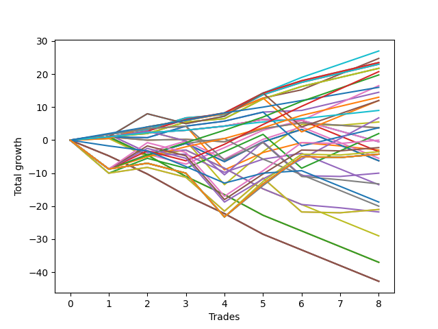

# Long Malinois 003 
- Symbol: ES_830-900
- Date Range: 03/18/2022 - 12/30/2022
- Trading Period: 8:30-9:0
- Number of Trades: 8



| Name | Win Percent | Profit | Avg Profit / Trade | Avg Time / Trade |      | Name | Win Percent | Profit | Avg Profit / Trade | Avg Time / Trade |
| ---- | ----------- | ------ | ------------------ | ---------------- | ---- | ---- | ----------- | ------ | ------------------ | ---------------- |
| Sorted By <br> Profit | | | | | | Sorted By <br> Win Percentage ||||
| BB-100 Mid | 87.50 | 13500.00 | 1687.50 | 34:04 |     | BB-50 U/L 1SD | 100.00 | 12375.00 | 1546.88 | 30:09 |
| BB-50 U/L 1SD | 100.00 | 12375.00 | 1546.88 | 30:09 |     | V Mid SL-10 | 100.00 | 11750.00 | 1468.75 | 19:00 |
| V Mid SL-10 | 100.00 | 11750.00 | 1468.75 | 19:00 |     | V Mid | 100.00 | 11750.00 | 1468.75 | 19:00 |
| V Mid | 100.00 | 11750.00 | 1468.75 | 19:00 |     | BB-20 U/L 2SD C SL-10 | 100.00 | 11500.00 | 1437.50 | 14:01 |
| BB-20 U/L 2SD C SL-10 | 100.00 | 11500.00 | 1437.50 | 14:01 |     | BB-20 U/L 2SD C | 100.00 | 11500.00 | 1437.50 | 14:01 |
| BB-20 U/L 2SD C | 100.00 | 11500.00 | 1437.50 | 14:01 |     | BB-20 U/L 2SD SL-10 | 100.00 | 10875.00 | 1359.38 | 13:51 |
| BB-20 U/L 2SD SL-10 | 100.00 | 10875.00 | 1359.38 | 13:51 |     | BB-20 U/L 2SD | 100.00 | 10875.00 | 1359.38 | 13:51 |
| BB-20 U/L 2SD | 100.00 | 10875.00 | 1359.38 | 13:51 |     | TP-2 | 100.00 | 8000.00 | 1000.00 | 13:20 |
| TP-5 | 75.00 | 10375.00 | 1296.88 | 38:18 |     | TP-1 | 100.00 | 4500.00 | 562.50 | 05:35 |
| TP-4 | 87.50 | 9875.00 | 1234.38 | 30:39 |     | BB-100 Mid | 87.50 | 13500.00 | 1687.50 | 34:04 |
| BB-50 U/L 2SD | 75.00 | 8250.00 | 1031.25 | 45:55 |     | TP-4 | 87.50 | 9875.00 | 1234.38 | 30:39 |
| TP-2 | 100.00 | 8000.00 | 1000.00 | 13:20 |     | BB-50 Mid | 87.50 | 7250.00 | 906.25 | 17:50 |
| BB-50 Mid | 87.50 | 7250.00 | 906.25 | 17:50 |     | TP-3 | 87.50 | 6500.00 | 812.50 | 23:00 |
| TP-3 | 87.50 | 6500.00 | 812.50 | 23:00 |     | BB-50 U/L 1SD SL-10 | 87.50 | 6000.00 | 750.00 | 28:36 |
| BB-50 U/L 1SD SL-10 | 87.50 | 6000.00 | 750.00 | 28:36 |     | TP-5 | 75.00 | 10375.00 | 1296.88 | 38:18 |
| BB-100 Mid SL-10 | 75.00 | 6000.00 | 750.00 | 30:28 |     | BB-50 U/L 2SD | 75.00 | 8250.00 | 1031.25 | 45:55 |
| TP-1 | 100.00 | 4500.00 | 562.50 | 05:35 |     | BB-100 Mid SL-10 | 75.00 | 6000.00 | 750.00 | 30:28 |
| TP-6 | 62.50 | 3375.00 | 421.88 | 51:01 |     | BB-50 Mid SL-10 | 75.00 | 1875.00 | 234.38 | 17:21 |
| V U/L 1SD | 62.50 | 2750.00 | 343.75 | 53:26 |     | TP-6 | 62.50 | 3375.00 | 421.88 | 51:01 |
| BB-50 Mid SL-10 | 75.00 | 1875.00 | 234.38 | 17:21 |     | V U/L 1SD | 62.50 | 2750.00 | 343.75 | 53:26 |
| BB-20 U/L 1SD SL-10 | 50.00 | 1875.00 | 234.38 | 10:19 |     | BB-50 U/L 2SD SL-10 | 62.50 | 1000.00 | 125.00 | 40:13 |
| BB-20 U/L 1SD | 50.00 | 1875.00 | 234.38 | 10:19 |     | BB-20 Mid SL-10 | 62.50 | -250.00 | -31.25 | 05:20 |
| BB-50 U/L 2SD SL-10 | 62.50 | 1000.00 | 125.00 | 40:13 |     | BB-20 Mid | 62.50 | -250.00 | -31.25 | 05:20 |
| TP-8 | 50.00 | 0.00 | 0.00 | 56:20 |     | BB-200 Mid | 62.50 | -1500.00 | -187.50 | 28:28 |
| BB-20 Mid SL-10 | 62.50 | -250.00 | -31.25 | 05:20 |     | BB-20 Mid SL-5 | 62.50 | -1750.00 | -218.75 | 03:33 |
| BB-20 Mid | 62.50 | -250.00 | -31.25 | 05:20 |     | BB-20 U/L 1SD SL-10 | 50.00 | 1875.00 | 234.38 | 10:19 |
| TP-7 | 50.00 | -1125.00 | -140.62 | 56:11 |     | BB-20 U/L 1SD | 50.00 | 1875.00 | 234.38 | 10:19 |
| BB-200 Mid | 62.50 | -1500.00 | -187.50 | 28:28 |     | TP-8 | 50.00 | 0.00 | 0.00 | 56:20 |
| BB-20 Mid SL-5 | 62.50 | -1750.00 | -218.75 | 03:33 |     | TP-7 | 50.00 | -1125.00 | -140.62 | 56:11 |
| TP-10 | 50.00 | -1750.00 | -218.75 | 59:50 |     | TP-10 | 50.00 | -1750.00 | -218.75 | 59:50 |
| NEWFI 06 | 50.00 | -2125.00 | -265.62 | 60:55 |     | NEWFI 06 | 50.00 | -2125.00 | -265.62 | 60:55 |
| NEWFI 000 | 50.00 | -2125.00 | -265.62 | 60:55 |     | NEWFI 000 | 50.00 | -2125.00 | -265.62 | 60:55 |
| TP-9 | 50.00 | -2125.00 | -265.62 | 59:36 |     | TP-9 | 50.00 | -2125.00 | -265.62 | 59:36 |
| BB-200 U/L 2SD | 50.00 | -2125.00 | -265.62 | 60:55 |     | BB-200 U/L 2SD | 50.00 | -2125.00 | -265.62 | 60:55 |
| BB-100 U/L 2SD | 50.00 | -2125.00 | -265.62 | 60:55 |     | BB-100 U/L 2SD | 50.00 | -2125.00 | -265.62 | 60:55 |
| BB-20 U/L 2SD C SL-5 | 50.00 | -2750.00 | -343.75 | 08:02 |     | BB-20 U/L 2SD C SL-5 | 50.00 | -2750.00 | -343.75 | 08:02 |
| V Mid SL-5 | 50.00 | -3125.00 | -390.62 | 07:56 |     | V Mid SL-5 | 50.00 | -3125.00 | -390.62 | 07:56 |
| BB-20 U/L 2SD SL-5 | 50.00 | -3125.00 | -390.62 | 07:56 |     | BB-20 U/L 2SD SL-5 | 50.00 | -3125.00 | -390.62 | 07:56 |
| V U/L 1SD SL-10 | 50.00 | -5000.00 | -625.00 | 46:18 |     | V U/L 1SD SL-10 | 50.00 | -5000.00 | -625.00 | 46:18 |
| BB-200 Mid SL-10 | 50.00 | -6625.00 | -828.12 | 22:45 |     | BB-200 Mid SL-10 | 50.00 | -6625.00 | -828.12 | 22:45 |
| BB-20 U/L 1SD SL-5 | 50.00 | -6750.00 | -843.75 | 06:05 |     | BB-20 U/L 1SD SL-5 | 50.00 | -6750.00 | -843.75 | 06:05 |
| NEWFI 0000 | 25.00 | -9375.00 | -1171.88 | 20:27 |     | BB-50 Mid SL-5 | 37.50 | -10000.00 | -1250.00 | 10:14 |
| BB-50 Mid SL-5 | 37.50 | -10000.00 | -1250.00 | 10:14 |     | BB-200 U/L 2SD SL-10 | 37.50 | -10500.00 | -1312.50 | 51:40 |
| BB-200 U/L 2SD SL-10 | 37.50 | -10500.00 | -1312.50 | 51:40 |     | BB-100 U/L 2SD SL-10 | 37.50 | -10500.00 | -1312.50 | 51:40 |
| BB-100 U/L 2SD SL-10 | 37.50 | -10500.00 | -1312.50 | 51:40 |     | NEWFI 0000 | 25.00 | -9375.00 | -1171.88 | 20:27 |
| BB-200 Mid SL-5 | 25.00 | -10875.00 | -1359.38 | 06:59 |     | BB-200 Mid SL-5 | 25.00 | -10875.00 | -1359.38 | 06:59 |
| BB-50 U/L 1SD SL-5 | 25.00 | -14500.00 | -1812.50 | 15:21 |     | BB-50 U/L 1SD SL-5 | 25.00 | -14500.00 | -1812.50 | 15:21 |
| BB-100 Mid SL-5 | 12.50 | -18500.00 | -2312.50 | 14:09 |     | BB-100 Mid SL-5 | 12.50 | -18500.00 | -2312.50 | 14:09 |
| V U/L 1SD SL-5 | 12.50 | -18500.00 | -2312.50 | 14:09 |     | V U/L 1SD SL-5 | 12.50 | -18500.00 | -2312.50 | 14:09 |
| BB-200 U/L 2SD SL-5 | 0.00 | -21375.00 | -2671.88 | 17:04 |     | BB-200 U/L 2SD SL-5 | 0.00 | -21375.00 | -2671.88 | 17:04 |
| BB-100 U/L 2SD SL-5 | 0.00 | -21375.00 | -2671.88 | 17:04 |     | BB-100 U/L 2SD SL-5 | 0.00 | -21375.00 | -2671.88 | 17:04 |
| BB-50 U/L 2SD SL-5 | 0.00 | -21375.00 | -2671.88 | 17:04 |     | BB-50 U/L 2SD SL-5 | 0.00 | -21375.00 | -2671.88 | 17:04 |

## NO STOPLOSS

### Test BB-20 Mid
* Sell when price hits the middle line of the 20p bollinger
* No Stoploss
* Results:
```
Total Trades: 8
Percent Up: 62.50
Percent Down: 37.50
Total Points Moved Up: -0.50
Potential Profit: -250.00
Total Points Ups: 6.25 Count Ups: 5
Total Points Downs: -6.75 Count Downs: 3
```

<details><summary>Trades</summary>

<code>In: 2022-03-31 08:41:00		Out: 2022-03-31 08:42:10		Total Position Time: 01:10		Total Move Up: 1.00		Total to Date: 1.00</code> <br />
<code>In: 2022-08-05 08:33:00		Out: 2022-08-05 08:37:00		Total Position Time: 04:00		Total Move Up: 1.25		Total to Date: 2.25</code> <br />
<code>In: 2022-08-25 08:31:00		Out: 2022-08-25 08:32:10		Total Position Time: 01:10		Total Move Up: 0.75		Total to Date: 3.00</code> <br />
<code>In: 2022-09-16 08:34:00		Out: 2022-09-16 08:35:10		Total Position Time: 01:10		Total Move Up: 1.25		Total to Date: 4.25</code> <br />
<code>In: 2022-09-19 08:44:00		Out: 2022-09-19 08:46:05		Total Position Time: 02:05		Total Move Up: 2.00		Total to Date: 6.25</code> <br />
<code>In: 2022-09-19 08:46:00		Out: 2022-09-19 08:47:10		Total Position Time: 01:10		Total Move Up: -0.25		Total to Date: 6.00</code> <br />
<code>In: 2022-11-07 08:50:00		Out: 2022-11-07 09:07:00		Total Position Time: 17:00		Total Move Up: -3.25		Total to Date: 2.75</code> <br />
<code>In: 2022-11-07 08:52:00		Out: 2022-11-07 09:07:00		Total Position Time: 15:00		Total Move Up: -3.25		Total to Date: -0.50</code> <br />


</details>

### Test BB-20 U/L 1SD
* Sell when the price hits the upper line of the 20p 1std bollinger
* No Stoploss
* Results:
```
Total Trades: 8
Percent Up: 50.00
Percent Down: 50.00
Total Points Moved Up: 3.75
Potential Profit: 1875.00
Total Points Ups: 7.00 Count Ups: 4
Total Points Downs: -3.25 Count Downs: 4
```

<details><summary>Trades</summary>

<code>In: 2022-03-31 08:41:00		Out: 2022-03-31 08:42:10		Total Position Time: 01:10		Total Move Up: 1.00		Total to Date: 1.00</code> <br />
<code>In: 2022-08-05 08:33:00		Out: 2022-08-05 08:51:30		Total Position Time: 18:30		Total Move Up: -1.00		Total to Date: 0.00</code> <br />
<code>In: 2022-08-25 08:31:00		Out: 2022-08-25 08:37:30		Total Position Time: 06:30		Total Move Up: 0.25		Total to Date: 0.25</code> <br />
<code>In: 2022-09-16 08:34:00		Out: 2022-09-16 08:51:25		Total Position Time: 17:25		Total Move Up: -0.75		Total to Date: -0.50</code> <br />
<code>In: 2022-09-19 08:44:00		Out: 2022-09-19 08:48:10		Total Position Time: 04:10		Total Move Up: 4.00		Total to Date: 3.50</code> <br />
<code>In: 2022-09-19 08:46:00		Out: 2022-09-19 08:48:10		Total Position Time: 02:10		Total Move Up: 1.75		Total to Date: 5.25</code> <br />
<code>In: 2022-11-07 08:50:00		Out: 2022-11-07 09:07:20		Total Position Time: 17:20		Total Move Up: -0.75		Total to Date: 4.50</code> <br />
<code>In: 2022-11-07 08:52:00		Out: 2022-11-07 09:07:20		Total Position Time: 15:20		Total Move Up: -0.75		Total to Date: 3.75</code> <br />


</details>

### Test BB-20 U/L 2SD
* Sell when the price hits the upper line of the 20p 2std bollinger
* No Stoploss
* Results:
```
Total Trades: 8
Percent Up: 100.00
Percent Down: 0.00
Total Points Moved Up: 21.75
Potential Profit: 10875.00
Total Points Ups: 21.75 Count Ups: 8
Total Points Downs: 0.00 Count Downs: 0
```

<details><summary>Trades</summary>

<code>In: 2022-03-31 08:41:00		Out: 2022-03-31 08:42:10		Total Position Time: 01:10		Total Move Up: 1.00		Total to Date: 1.00</code> <br />
<code>In: 2022-08-05 08:33:00		Out: 2022-08-05 08:53:30		Total Position Time: 20:30		Total Move Up: 1.00		Total to Date: 2.00</code> <br />
<code>In: 2022-08-25 08:31:00		Out: 2022-08-25 08:43:20		Total Position Time: 12:20		Total Move Up: 3.50		Total to Date: 5.50</code> <br />
<code>In: 2022-09-16 08:34:00		Out: 2022-09-16 08:51:35		Total Position Time: 17:35		Total Move Up: 1.00		Total to Date: 6.50</code> <br />
<code>In: 2022-09-19 08:44:00		Out: 2022-09-19 08:52:40		Total Position Time: 08:40		Total Move Up: 6.00		Total to Date: 12.50</code> <br />
<code>In: 2022-09-19 08:46:00		Out: 2022-09-19 08:52:40		Total Position Time: 06:40		Total Move Up: 3.75		Total to Date: 16.25</code> <br />
<code>In: 2022-11-07 08:50:00		Out: 2022-11-07 09:13:00		Total Position Time: 23:00		Total Move Up: 2.75		Total to Date: 19.00</code> <br />
<code>In: 2022-11-07 08:52:00		Out: 2022-11-07 09:13:00		Total Position Time: 21:00		Total Move Up: 2.75		Total to Date: 21.75</code> <br />


</details>

### Test BB-20 U/L 2SD C
* Sell when the price hits the upper line of the 20p 2std bollinger
* No Stoploss
* Results:
```
Total Trades: 8
Percent Up: 100.00
Percent Down: 0.00
Total Points Moved Up: 23.00
Potential Profit: 11500.00
Total Points Ups: 23.00 Count Ups: 8
Total Points Downs: 0.00 Count Downs: 0
```

<details><summary>Trades</summary>

<code>In: 2022-03-31 08:41:00		Out: 2022-03-31 08:42:25		Total Position Time: 01:25		Total Move Up: 1.75		Total to Date: 1.75</code> <br />
<code>In: 2022-08-05 08:33:00		Out: 2022-08-05 08:53:50		Total Position Time: 20:50		Total Move Up: 1.50		Total to Date: 3.25</code> <br />
<code>In: 2022-08-25 08:31:00		Out: 2022-08-25 08:43:50		Total Position Time: 12:50		Total Move Up: 3.50		Total to Date: 6.75</code> <br />
<code>In: 2022-09-16 08:34:00		Out: 2022-09-16 08:51:35		Total Position Time: 17:35		Total Move Up: 1.00		Total to Date: 7.75</code> <br />
<code>In: 2022-09-19 08:44:00		Out: 2022-09-19 08:52:40		Total Position Time: 08:40		Total Move Up: 6.00		Total to Date: 13.75</code> <br />
<code>In: 2022-09-19 08:46:00		Out: 2022-09-19 08:52:40		Total Position Time: 06:40		Total Move Up: 3.75		Total to Date: 17.50</code> <br />
<code>In: 2022-11-07 08:50:00		Out: 2022-11-07 09:13:05		Total Position Time: 23:05		Total Move Up: 2.75		Total to Date: 20.25</code> <br />
<code>In: 2022-11-07 08:52:00		Out: 2022-11-07 09:13:05		Total Position Time: 21:05		Total Move Up: 2.75		Total to Date: 23.00</code> <br />


</details>

### Test BB-50 Mid
* Sell when price hits the middle line of the 50p bollinger
* No Stoploss
* Results:
```
Total Trades: 8
Percent Up: 87.50
Percent Down: 12.50
Total Points Moved Up: 14.50
Potential Profit: 7250.00
Total Points Ups: 14.75 Count Ups: 7
Total Points Downs: -0.25 Count Downs: 1
```

<details><summary>Trades</summary>

<code>In: 2022-03-31 08:41:00		Out: 2022-03-31 08:42:10		Total Position Time: 01:10		Total Move Up: 1.00		Total to Date: 1.00</code> <br />
<code>In: 2022-08-05 08:33:00		Out: 2022-08-05 09:03:40		Total Position Time: 30:40		Total Move Up: -0.25		Total to Date: 0.75</code> <br />
<code>In: 2022-08-25 08:31:00		Out: 2022-08-25 08:45:10		Total Position Time: 14:10		Total Move Up: 3.50		Total to Date: 4.25</code> <br />
<code>In: 2022-09-16 08:34:00		Out: 2022-09-16 08:35:15		Total Position Time: 01:15		Total Move Up: 1.50		Total to Date: 5.75</code> <br />
<code>In: 2022-09-19 08:44:00		Out: 2022-09-19 09:10:45		Total Position Time: 26:45		Total Move Up: 2.75		Total to Date: 8.50</code> <br />
<code>In: 2022-09-19 08:46:00		Out: 2022-09-19 09:10:45		Total Position Time: 24:45		Total Move Up: 0.50		Total to Date: 9.00</code> <br />
<code>In: 2022-11-07 08:50:00		Out: 2022-11-07 09:13:00		Total Position Time: 23:00		Total Move Up: 2.75		Total to Date: 11.75</code> <br />
<code>In: 2022-11-07 08:52:00		Out: 2022-11-07 09:13:00		Total Position Time: 21:00		Total Move Up: 2.75		Total to Date: 14.50</code> <br />


</details>

### Test BB-50 U/L 1SD
* Sell when the price hits the upper line of the 50p 1std bollinger
* No Stoploss
* Results:
```
Total Trades: 8
Percent Up: 100.00
Percent Down: 0.00
Total Points Moved Up: 24.75
Potential Profit: 12375.00
Total Points Ups: 24.75 Count Ups: 8
Total Points Downs: 0.00 Count Downs: 0
```

<details><summary>Trades</summary>

<code>In: 2022-03-31 08:41:00		Out: 2022-03-31 09:00:15		Total Position Time: 19:15		Total Move Up: 0.50		Total to Date: 0.50</code> <br />
<code>In: 2022-08-05 08:33:00		Out: 2022-08-05 09:05:15		Total Position Time: 32:15		Total Move Up: 3.50		Total to Date: 4.00</code> <br />
<code>In: 2022-08-25 08:31:00		Out: 2022-08-25 09:06:00		Total Position Time: 35:00		Total Move Up: 2.00		Total to Date: 6.00</code> <br />
<code>In: 2022-09-16 08:34:00		Out: 2022-09-16 08:52:15		Total Position Time: 18:15		Total Move Up: 2.00		Total to Date: 8.00</code> <br />
<code>In: 2022-09-19 08:44:00		Out: 2022-09-19 09:19:20		Total Position Time: 35:20		Total Move Up: 4.75		Total to Date: 12.75</code> <br />
<code>In: 2022-09-19 08:46:00		Out: 2022-09-19 09:19:20		Total Position Time: 33:20		Total Move Up: 2.50		Total to Date: 15.25</code> <br />
<code>In: 2022-11-07 08:50:00		Out: 2022-11-07 09:24:55		Total Position Time: 34:55		Total Move Up: 4.75		Total to Date: 20.00</code> <br />
<code>In: 2022-11-07 08:52:00		Out: 2022-11-07 09:24:55		Total Position Time: 32:55		Total Move Up: 4.75		Total to Date: 24.75</code> <br />


</details>

### Test BB-50 U/L 2SD
* Sell when the price hits the upper line of the 50p 2std bollinger
* No Stoploss
* Results:
```
Total Trades: 8
Percent Up: 75.00
Percent Down: 25.00
Total Points Moved Up: 16.50
Potential Profit: 8250.00
Total Points Ups: 28.25 Count Ups: 6
Total Points Downs: -11.75 Count Downs: 2
```

<details><summary>Trades</summary>

<code>In: 2022-03-31 08:41:00		Out: 2022-03-31 09:41:55		Total Position Time: 60:55		Total Move Up: -8.75		Total to Date: -8.75</code> <br />
<code>In: 2022-08-05 08:33:00		Out: 2022-08-05 09:11:25		Total Position Time: 38:25		Total Move Up: 4.50		Total to Date: -4.25</code> <br />
<code>In: 2022-08-25 08:31:00		Out: 2022-08-25 09:31:55		Total Position Time: 60:55		Total Move Up: -3.00		Total to Date: -7.25</code> <br />
<code>In: 2022-09-16 08:34:00		Out: 2022-09-16 08:59:25		Total Position Time: 25:25		Total Move Up: 5.00		Total to Date: -2.25</code> <br />
<code>In: 2022-09-19 08:44:00		Out: 2022-09-19 09:35:30		Total Position Time: 51:30		Total Move Up: 5.25		Total to Date: 3.00</code> <br />
<code>In: 2022-09-19 08:46:00		Out: 2022-09-19 09:35:30		Total Position Time: 49:30		Total Move Up: 3.00		Total to Date: 6.00</code> <br />
<code>In: 2022-11-07 08:50:00		Out: 2022-11-07 09:31:20		Total Position Time: 41:20		Total Move Up: 5.25		Total to Date: 11.25</code> <br />
<code>In: 2022-11-07 08:52:00		Out: 2022-11-07 09:31:20		Total Position Time: 39:20		Total Move Up: 5.25		Total to Date: 16.50</code> <br />


</details>

### Test V Mid
* Sell when the price hits the middle line of the 1std VWAP
* No Stoploss
* Results:
```
Total Trades: 8
Percent Up: 100.00
Percent Down: 0.00
Total Points Moved Up: 23.50
Potential Profit: 11750.00
Total Points Ups: 23.50 Count Ups: 8
Total Points Downs: 0.00 Count Downs: 0
```

<details><summary>Trades</summary>

<code>In: 2022-03-31 08:41:00		Out: 2022-03-31 08:42:10		Total Position Time: 01:10		Total Move Up: 1.00		Total to Date: 1.00</code> <br />
<code>In: 2022-08-05 08:33:00		Out: 2022-08-05 09:33:55		Total Position Time: 60:55		Total Move Up: 1.75		Total to Date: 2.75</code> <br />
<code>In: 2022-08-25 08:31:00		Out: 2022-08-25 08:43:20		Total Position Time: 12:20		Total Move Up: 3.50		Total to Date: 6.25</code> <br />
<code>In: 2022-09-16 08:34:00		Out: 2022-09-16 08:52:15		Total Position Time: 18:15		Total Move Up: 2.00		Total to Date: 8.25</code> <br />
<code>In: 2022-09-19 08:44:00		Out: 2022-09-19 08:52:40		Total Position Time: 08:40		Total Move Up: 6.00		Total to Date: 14.25</code> <br />
<code>In: 2022-09-19 08:46:00		Out: 2022-09-19 08:52:40		Total Position Time: 06:40		Total Move Up: 3.75		Total to Date: 18.00</code> <br />
<code>In: 2022-11-07 08:50:00		Out: 2022-11-07 09:13:00		Total Position Time: 23:00		Total Move Up: 2.75		Total to Date: 20.75</code> <br />
<code>In: 2022-11-07 08:52:00		Out: 2022-11-07 09:13:00		Total Position Time: 21:00		Total Move Up: 2.75		Total to Date: 23.50</code> <br />


</details>

### Test V U/L 1SD
* Sell when the price hits the upper line of the 1std VWAP
* No Stoploss
* Results:
```
Total Trades: 8
Percent Up: 62.50
Percent Down: 37.50
Total Points Moved Up: 5.50
Potential Profit: 2750.00
Total Points Ups: 22.00 Count Ups: 5
Total Points Downs: -16.50 Count Downs: 3
```

<details><summary>Trades</summary>

<code>In: 2022-03-31 08:41:00		Out: 2022-03-31 08:42:10		Total Position Time: 01:10		Total Move Up: 1.00		Total to Date: 1.00</code> <br />
<code>In: 2022-08-05 08:33:00		Out: 2022-08-05 09:33:55		Total Position Time: 60:55		Total Move Up: 1.75		Total to Date: 2.75</code> <br />
<code>In: 2022-08-25 08:31:00		Out: 2022-08-25 09:31:55		Total Position Time: 60:55		Total Move Up: -3.00		Total to Date: -0.25</code> <br />
<code>In: 2022-09-16 08:34:00		Out: 2022-09-16 09:34:55		Total Position Time: 60:55		Total Move Up: -13.25		Total to Date: -13.50</code> <br />
<code>In: 2022-09-19 08:44:00		Out: 2022-09-19 09:44:55		Total Position Time: 60:55		Total Move Up: 10.00		Total to Date: -3.50</code> <br />
<code>In: 2022-09-19 08:46:00		Out: 2022-09-19 09:46:55		Total Position Time: 60:55		Total Move Up: 8.25		Total to Date: 4.75</code> <br />
<code>In: 2022-11-07 08:50:00		Out: 2022-11-07 09:50:55		Total Position Time: 60:55		Total Move Up: -0.25		Total to Date: 4.50</code> <br />
<code>In: 2022-11-07 08:52:00		Out: 2022-11-07 09:52:55		Total Position Time: 60:55		Total Move Up: 1.00		Total to Date: 5.50</code> <br />


</details>

### Test BB-100 Mid
* Move to BB100 Mid
* No Stoploss
* Results:
```
Total Trades: 8
Percent Up: 87.50
Percent Down: 12.50
Total Points Moved Up: 27.00
Potential Profit: 13500.00
Total Points Ups: 30.00 Count Ups: 7
Total Points Downs: -3.00 Count Downs: 1
```

<details><summary>Trades</summary>

<code>In: 2022-03-31 08:41:00		Out: 2022-03-31 08:42:10		Total Position Time: 01:10		Total Move Up: 1.00		Total to Date: 1.00</code> <br />
<code>In: 2022-08-05 08:33:00		Out: 2022-08-05 09:15:55		Total Position Time: 42:55		Total Move Up: 7.00		Total to Date: 8.00</code> <br />
<code>In: 2022-08-25 08:31:00		Out: 2022-08-25 09:31:55		Total Position Time: 60:55		Total Move Up: -3.00		Total to Date: 5.00</code> <br />
<code>In: 2022-09-16 08:34:00		Out: 2022-09-16 08:55:45		Total Position Time: 21:45		Total Move Up: 2.25		Total to Date: 7.25</code> <br />
<code>In: 2022-09-19 08:44:00		Out: 2022-09-19 09:35:40		Total Position Time: 51:40		Total Move Up: 7.00		Total to Date: 14.25</code> <br />
<code>In: 2022-09-19 08:46:00		Out: 2022-09-19 09:35:40		Total Position Time: 49:40		Total Move Up: 4.75		Total to Date: 19.00</code> <br />
<code>In: 2022-11-07 08:50:00		Out: 2022-11-07 09:13:15		Total Position Time: 23:15		Total Move Up: 4.00		Total to Date: 23.00</code> <br />
<code>In: 2022-11-07 08:52:00		Out: 2022-11-07 09:13:15		Total Position Time: 21:15		Total Move Up: 4.00		Total to Date: 27.00</code> <br />


</details>

### Test BB-100 U/L 2SD
* Move to BB100 Upper Band
* No Stoploss
* Results:
```
Total Trades: 8
Percent Up: 50.00
Percent Down: 50.00
Total Points Moved Up: -4.25
Potential Profit: -2125.00
Total Points Ups: 21.00 Count Ups: 4
Total Points Downs: -25.25 Count Downs: 4
```

<details><summary>Trades</summary>

<code>In: 2022-03-31 08:41:00		Out: 2022-03-31 09:41:55		Total Position Time: 60:55		Total Move Up: -8.75		Total to Date: -8.75</code> <br />
<code>In: 2022-08-05 08:33:00		Out: 2022-08-05 09:33:55		Total Position Time: 60:55		Total Move Up: 1.75		Total to Date: -7.00</code> <br />
<code>In: 2022-08-25 08:31:00		Out: 2022-08-25 09:31:55		Total Position Time: 60:55		Total Move Up: -3.00		Total to Date: -10.00</code> <br />
<code>In: 2022-09-16 08:34:00		Out: 2022-09-16 09:34:55		Total Position Time: 60:55		Total Move Up: -13.25		Total to Date: -23.25</code> <br />
<code>In: 2022-09-19 08:44:00		Out: 2022-09-19 09:44:55		Total Position Time: 60:55		Total Move Up: 10.00		Total to Date: -13.25</code> <br />
<code>In: 2022-09-19 08:46:00		Out: 2022-09-19 09:46:55		Total Position Time: 60:55		Total Move Up: 8.25		Total to Date: -5.00</code> <br />
<code>In: 2022-11-07 08:50:00		Out: 2022-11-07 09:50:55		Total Position Time: 60:55		Total Move Up: -0.25		Total to Date: -5.25</code> <br />
<code>In: 2022-11-07 08:52:00		Out: 2022-11-07 09:52:55		Total Position Time: 60:55		Total Move Up: 1.00		Total to Date: -4.25</code> <br />


</details>

### Test BB-200 Mid
* Move to BB200 Mid
* No Stoploss
* Results:
```
Total Trades: 8
Percent Up: 62.50
Percent Down: 37.50
Total Points Moved Up: -3.00
Potential Profit: -1500.00
Total Points Ups: 12.50 Count Ups: 5
Total Points Downs: -15.50 Count Downs: 3
```

<details><summary>Trades</summary>

<code>In: 2022-03-31 08:41:00		Out: 2022-03-31 08:42:25		Total Position Time: 01:25		Total Move Up: 1.75		Total to Date: 1.75</code> <br />
<code>In: 2022-08-05 08:33:00		Out: 2022-08-05 09:33:55		Total Position Time: 60:55		Total Move Up: 1.75		Total to Date: 3.50</code> <br />
<code>In: 2022-08-25 08:31:00		Out: 2022-08-25 08:32:10		Total Position Time: 01:10		Total Move Up: 0.75		Total to Date: 4.25</code> <br />
<code>In: 2022-09-16 08:34:00		Out: 2022-09-16 09:34:55		Total Position Time: 60:55		Total Move Up: -13.25		Total to Date: -9.00</code> <br />
<code>In: 2022-09-19 08:44:00		Out: 2022-09-19 09:35:30		Total Position Time: 51:30		Total Move Up: 5.25		Total to Date: -3.75</code> <br />
<code>In: 2022-09-19 08:46:00		Out: 2022-09-19 09:35:30		Total Position Time: 49:30		Total Move Up: 3.00		Total to Date: -0.75</code> <br />
<code>In: 2022-11-07 08:50:00		Out: 2022-11-07 08:51:10		Total Position Time: 01:10		Total Move Up: -1.00		Total to Date: -1.75</code> <br />
<code>In: 2022-11-07 08:52:00		Out: 2022-11-07 08:53:10		Total Position Time: 01:10		Total Move Up: -1.25		Total to Date: -3.00</code> <br />


</details>

### Test BB-200 U/L 2SD
* Move to BB200 Upper Band
* No Stoploss
* Results:
```
Total Trades: 8
Percent Up: 50.00
Percent Down: 50.00
Total Points Moved Up: -4.25
Potential Profit: -2125.00
Total Points Ups: 21.00 Count Ups: 4
Total Points Downs: -25.25 Count Downs: 4
```

<details><summary>Trades</summary>

<code>In: 2022-03-31 08:41:00		Out: 2022-03-31 09:41:55		Total Position Time: 60:55		Total Move Up: -8.75		Total to Date: -8.75</code> <br />
<code>In: 2022-08-05 08:33:00		Out: 2022-08-05 09:33:55		Total Position Time: 60:55		Total Move Up: 1.75		Total to Date: -7.00</code> <br />
<code>In: 2022-08-25 08:31:00		Out: 2022-08-25 09:31:55		Total Position Time: 60:55		Total Move Up: -3.00		Total to Date: -10.00</code> <br />
<code>In: 2022-09-16 08:34:00		Out: 2022-09-16 09:34:55		Total Position Time: 60:55		Total Move Up: -13.25		Total to Date: -23.25</code> <br />
<code>In: 2022-09-19 08:44:00		Out: 2022-09-19 09:44:55		Total Position Time: 60:55		Total Move Up: 10.00		Total to Date: -13.25</code> <br />
<code>In: 2022-09-19 08:46:00		Out: 2022-09-19 09:46:55		Total Position Time: 60:55		Total Move Up: 8.25		Total to Date: -5.00</code> <br />
<code>In: 2022-11-07 08:50:00		Out: 2022-11-07 09:50:55		Total Position Time: 60:55		Total Move Up: -0.25		Total to Date: -5.25</code> <br />
<code>In: 2022-11-07 08:52:00		Out: 2022-11-07 09:52:55		Total Position Time: 60:55		Total Move Up: 1.00		Total to Date: -4.25</code> <br />


</details>

## STOPLOSS OF 5

### Test BB-20 Mid SL-5
* Sell when price hits the middle line of the 20p bollinger
* Stoploss is 5 points
* Results:
```
Total Trades: 8
Percent Up: 62.50
Percent Down: 37.50
Total Points Moved Up: -3.50
Potential Profit: -1750.00
Total Points Ups: 6.25 Count Ups: 5
Total Points Downs: -9.75 Count Downs: 3
```

<details><summary>Trades</summary>

<code>In: 2022-03-31 08:41:00		Out: 2022-03-31 08:42:10		Total Position Time: 01:10		Total Move Up: 1.00		Total to Date: 1.00</code> <br />
<code>In: 2022-08-05 08:33:00		Out: 2022-08-05 08:37:00		Total Position Time: 04:00		Total Move Up: 1.25		Total to Date: 2.25</code> <br />
<code>In: 2022-08-25 08:31:00		Out: 2022-08-25 08:32:10		Total Position Time: 01:10		Total Move Up: 0.75		Total to Date: 3.00</code> <br />
<code>In: 2022-09-16 08:34:00		Out: 2022-09-16 08:35:10		Total Position Time: 01:10		Total Move Up: 1.25		Total to Date: 4.25</code> <br />
<code>In: 2022-09-19 08:44:00		Out: 2022-09-19 08:46:05		Total Position Time: 02:05		Total Move Up: 2.00		Total to Date: 6.25</code> <br />
<code>In: 2022-09-19 08:46:00		Out: 2022-09-19 08:47:10		Total Position Time: 01:10		Total Move Up: -0.25		Total to Date: 6.00</code> <br />
<code>In: 2022-11-07 08:50:00		Out: 2022-11-07 08:59:50		Total Position Time: 09:50		Total Move Up: -4.75		Total to Date: 1.25</code> <br />
<code>In: 2022-11-07 08:52:00		Out: 2022-11-07 08:59:50		Total Position Time: 07:50		Total Move Up: -4.75		Total to Date: -3.50</code> <br />


</details>

### Test BB-20 U/L 1SD SL-5
* Sell when the price hits the upper line of the 20p 1std bollinger
* Stoploss is 5 points
* Results:
```
Total Trades: 8
Percent Up: 50.00
Percent Down: 50.00
Total Points Moved Up: -13.50
Potential Profit: -6750.00
Total Points Ups: 7.00 Count Ups: 4
Total Points Downs: -20.50 Count Downs: 4
```

<details><summary>Trades</summary>

<code>In: 2022-03-31 08:41:00		Out: 2022-03-31 08:42:10		Total Position Time: 01:10		Total Move Up: 1.00		Total to Date: 1.00</code> <br />
<code>In: 2022-08-05 08:33:00		Out: 2022-08-05 08:46:45		Total Position Time: 13:45		Total Move Up: -5.50		Total to Date: -4.50</code> <br />
<code>In: 2022-08-25 08:31:00		Out: 2022-08-25 08:37:30		Total Position Time: 06:30		Total Move Up: 0.25		Total to Date: -4.25</code> <br />
<code>In: 2022-09-16 08:34:00		Out: 2022-09-16 08:37:20		Total Position Time: 03:20		Total Move Up: -5.50		Total to Date: -9.75</code> <br />
<code>In: 2022-09-19 08:44:00		Out: 2022-09-19 08:48:10		Total Position Time: 04:10		Total Move Up: 4.00		Total to Date: -5.75</code> <br />
<code>In: 2022-09-19 08:46:00		Out: 2022-09-19 08:48:10		Total Position Time: 02:10		Total Move Up: 1.75		Total to Date: -4.00</code> <br />
<code>In: 2022-11-07 08:50:00		Out: 2022-11-07 08:59:50		Total Position Time: 09:50		Total Move Up: -4.75		Total to Date: -8.75</code> <br />
<code>In: 2022-11-07 08:52:00		Out: 2022-11-07 08:59:50		Total Position Time: 07:50		Total Move Up: -4.75		Total to Date: -13.50</code> <br />


</details>

### Test BB-20 U/L 2SD SL-5
* Sell when the price hits the upper line of the 20p 2std bollinger
* Stoploss is 5 points
* Results:
```
Total Trades: 8
Percent Up: 50.00
Percent Down: 50.00
Total Points Moved Up: -6.25
Potential Profit: -3125.00
Total Points Ups: 14.25 Count Ups: 4
Total Points Downs: -20.50 Count Downs: 4
```

<details><summary>Trades</summary>

<code>In: 2022-03-31 08:41:00		Out: 2022-03-31 08:42:10		Total Position Time: 01:10		Total Move Up: 1.00		Total to Date: 1.00</code> <br />
<code>In: 2022-08-05 08:33:00		Out: 2022-08-05 08:46:45		Total Position Time: 13:45		Total Move Up: -5.50		Total to Date: -4.50</code> <br />
<code>In: 2022-08-25 08:31:00		Out: 2022-08-25 08:43:20		Total Position Time: 12:20		Total Move Up: 3.50		Total to Date: -1.00</code> <br />
<code>In: 2022-09-16 08:34:00		Out: 2022-09-16 08:37:20		Total Position Time: 03:20		Total Move Up: -5.50		Total to Date: -6.50</code> <br />
<code>In: 2022-09-19 08:44:00		Out: 2022-09-19 08:52:40		Total Position Time: 08:40		Total Move Up: 6.00		Total to Date: -0.50</code> <br />
<code>In: 2022-09-19 08:46:00		Out: 2022-09-19 08:52:40		Total Position Time: 06:40		Total Move Up: 3.75		Total to Date: 3.25</code> <br />
<code>In: 2022-11-07 08:50:00		Out: 2022-11-07 08:59:50		Total Position Time: 09:50		Total Move Up: -4.75		Total to Date: -1.50</code> <br />
<code>In: 2022-11-07 08:52:00		Out: 2022-11-07 08:59:50		Total Position Time: 07:50		Total Move Up: -4.75		Total to Date: -6.25</code> <br />


</details>

### Test BB-20 U/L 2SD C SL-5
* Sell when the price hits the upper line of the 20p 2std bollinger
* Stoploss is 5 points
* Results:
```
Total Trades: 8
Percent Up: 50.00
Percent Down: 50.00
Total Points Moved Up: -5.50
Potential Profit: -2750.00
Total Points Ups: 15.00 Count Ups: 4
Total Points Downs: -20.50 Count Downs: 4
```

<details><summary>Trades</summary>

<code>In: 2022-03-31 08:41:00		Out: 2022-03-31 08:42:25		Total Position Time: 01:25		Total Move Up: 1.75		Total to Date: 1.75</code> <br />
<code>In: 2022-08-05 08:33:00		Out: 2022-08-05 08:46:45		Total Position Time: 13:45		Total Move Up: -5.50		Total to Date: -3.75</code> <br />
<code>In: 2022-08-25 08:31:00		Out: 2022-08-25 08:43:50		Total Position Time: 12:50		Total Move Up: 3.50		Total to Date: -0.25</code> <br />
<code>In: 2022-09-16 08:34:00		Out: 2022-09-16 08:37:20		Total Position Time: 03:20		Total Move Up: -5.50		Total to Date: -5.75</code> <br />
<code>In: 2022-09-19 08:44:00		Out: 2022-09-19 08:52:40		Total Position Time: 08:40		Total Move Up: 6.00		Total to Date: 0.25</code> <br />
<code>In: 2022-09-19 08:46:00		Out: 2022-09-19 08:52:40		Total Position Time: 06:40		Total Move Up: 3.75		Total to Date: 4.00</code> <br />
<code>In: 2022-11-07 08:50:00		Out: 2022-11-07 08:59:50		Total Position Time: 09:50		Total Move Up: -4.75		Total to Date: -0.75</code> <br />
<code>In: 2022-11-07 08:52:00		Out: 2022-11-07 08:59:50		Total Position Time: 07:50		Total Move Up: -4.75		Total to Date: -5.50</code> <br />


</details>

### Test BB-50 Mid SL-5
* Sell when price hits the middle line of the 50p bollinger
* Stoploss is 5 points
* Results:
```
Total Trades: 8
Percent Up: 37.50
Percent Down: 62.50
Total Points Moved Up: -20.00
Potential Profit: -10000.00
Total Points Ups: 6.00 Count Ups: 3
Total Points Downs: -26.00 Count Downs: 5
```

<details><summary>Trades</summary>

<code>In: 2022-03-31 08:41:00		Out: 2022-03-31 08:42:10		Total Position Time: 01:10		Total Move Up: 1.00		Total to Date: 1.00</code> <br />
<code>In: 2022-08-05 08:33:00		Out: 2022-08-05 08:46:45		Total Position Time: 13:45		Total Move Up: -5.50		Total to Date: -4.50</code> <br />
<code>In: 2022-08-25 08:31:00		Out: 2022-08-25 08:45:10		Total Position Time: 14:10		Total Move Up: 3.50		Total to Date: -1.00</code> <br />
<code>In: 2022-09-16 08:34:00		Out: 2022-09-16 08:35:15		Total Position Time: 01:15		Total Move Up: 1.50		Total to Date: 0.50</code> <br />
<code>In: 2022-09-19 08:44:00		Out: 2022-09-19 09:06:35		Total Position Time: 22:35		Total Move Up: -6.25		Total to Date: -5.75</code> <br />
<code>In: 2022-09-19 08:46:00		Out: 2022-09-19 08:57:20		Total Position Time: 11:20		Total Move Up: -4.75		Total to Date: -10.50</code> <br />
<code>In: 2022-11-07 08:50:00		Out: 2022-11-07 08:59:50		Total Position Time: 09:50		Total Move Up: -4.75		Total to Date: -15.25</code> <br />
<code>In: 2022-11-07 08:52:00		Out: 2022-11-07 08:59:50		Total Position Time: 07:50		Total Move Up: -4.75		Total to Date: -20.00</code> <br />


</details>

### Test BB-50 U/L 1SD SL-5
* Sell when the price hits the upper line of the 50p 1std bollinger
* Stoploss is 5 points
* Results:
```
Total Trades: 8
Percent Up: 25.00
Percent Down: 75.00
Total Points Moved Up: -29.00
Potential Profit: -14500.00
Total Points Ups: 2.50 Count Ups: 2
Total Points Downs: -31.50 Count Downs: 6
```

<details><summary>Trades</summary>

<code>In: 2022-03-31 08:41:00		Out: 2022-03-31 09:00:15		Total Position Time: 19:15		Total Move Up: 0.50		Total to Date: 0.50</code> <br />
<code>In: 2022-08-05 08:33:00		Out: 2022-08-05 08:46:45		Total Position Time: 13:45		Total Move Up: -5.50		Total to Date: -5.00</code> <br />
<code>In: 2022-08-25 08:31:00		Out: 2022-08-25 09:06:00		Total Position Time: 35:00		Total Move Up: 2.00		Total to Date: -3.00</code> <br />
<code>In: 2022-09-16 08:34:00		Out: 2022-09-16 08:37:20		Total Position Time: 03:20		Total Move Up: -5.50		Total to Date: -8.50</code> <br />
<code>In: 2022-09-19 08:44:00		Out: 2022-09-19 09:06:35		Total Position Time: 22:35		Total Move Up: -6.25		Total to Date: -14.75</code> <br />
<code>In: 2022-09-19 08:46:00		Out: 2022-09-19 08:57:20		Total Position Time: 11:20		Total Move Up: -4.75		Total to Date: -19.50</code> <br />
<code>In: 2022-11-07 08:50:00		Out: 2022-11-07 08:59:50		Total Position Time: 09:50		Total Move Up: -4.75		Total to Date: -24.25</code> <br />
<code>In: 2022-11-07 08:52:00		Out: 2022-11-07 08:59:50		Total Position Time: 07:50		Total Move Up: -4.75		Total to Date: -29.00</code> <br />


</details>

### Test BB-50 U/L 2SD SL-5
* Sell when the price hits the upper line of the 50p 2std bollinger
* Stoploss is 5 points
* Results:
```
Total Trades: 8
Percent Up: 0.00
Percent Down: 100.00
Total Points Moved Up: -42.75
Potential Profit: -21375.00
Total Points Ups: 0.00 Count Ups: 0
Total Points Downs: -42.75 Count Downs: 8
```

<details><summary>Trades</summary>

<code>In: 2022-03-31 08:41:00		Out: 2022-03-31 09:05:30		Total Position Time: 24:30		Total Move Up: -4.75		Total to Date: -4.75</code> <br />
<code>In: 2022-08-05 08:33:00		Out: 2022-08-05 08:46:45		Total Position Time: 13:45		Total Move Up: -5.50		Total to Date: -10.25</code> <br />
<code>In: 2022-08-25 08:31:00		Out: 2022-08-25 09:14:25		Total Position Time: 43:25		Total Move Up: -6.50		Total to Date: -16.75</code> <br />
<code>In: 2022-09-16 08:34:00		Out: 2022-09-16 08:37:20		Total Position Time: 03:20		Total Move Up: -5.50		Total to Date: -22.25</code> <br />
<code>In: 2022-09-19 08:44:00		Out: 2022-09-19 09:06:35		Total Position Time: 22:35		Total Move Up: -6.25		Total to Date: -28.50</code> <br />
<code>In: 2022-09-19 08:46:00		Out: 2022-09-19 08:57:20		Total Position Time: 11:20		Total Move Up: -4.75		Total to Date: -33.25</code> <br />
<code>In: 2022-11-07 08:50:00		Out: 2022-11-07 08:59:50		Total Position Time: 09:50		Total Move Up: -4.75		Total to Date: -38.00</code> <br />
<code>In: 2022-11-07 08:52:00		Out: 2022-11-07 08:59:50		Total Position Time: 07:50		Total Move Up: -4.75		Total to Date: -42.75</code> <br />


</details>

### Test V Mid SL-5
* Sell when the price hits the middle line of the 1std VWAP
* Stoploss is 5 points
* Results:
```
Total Trades: 8
Percent Up: 50.00
Percent Down: 50.00
Total Points Moved Up: -6.25
Potential Profit: -3125.00
Total Points Ups: 14.25 Count Ups: 4
Total Points Downs: -20.50 Count Downs: 4
```

<details><summary>Trades</summary>

<code>In: 2022-03-31 08:41:00		Out: 2022-03-31 08:42:10		Total Position Time: 01:10		Total Move Up: 1.00		Total to Date: 1.00</code> <br />
<code>In: 2022-08-05 08:33:00		Out: 2022-08-05 08:46:45		Total Position Time: 13:45		Total Move Up: -5.50		Total to Date: -4.50</code> <br />
<code>In: 2022-08-25 08:31:00		Out: 2022-08-25 08:43:20		Total Position Time: 12:20		Total Move Up: 3.50		Total to Date: -1.00</code> <br />
<code>In: 2022-09-16 08:34:00		Out: 2022-09-16 08:37:20		Total Position Time: 03:20		Total Move Up: -5.50		Total to Date: -6.50</code> <br />
<code>In: 2022-09-19 08:44:00		Out: 2022-09-19 08:52:40		Total Position Time: 08:40		Total Move Up: 6.00		Total to Date: -0.50</code> <br />
<code>In: 2022-09-19 08:46:00		Out: 2022-09-19 08:52:40		Total Position Time: 06:40		Total Move Up: 3.75		Total to Date: 3.25</code> <br />
<code>In: 2022-11-07 08:50:00		Out: 2022-11-07 08:59:50		Total Position Time: 09:50		Total Move Up: -4.75		Total to Date: -1.50</code> <br />
<code>In: 2022-11-07 08:52:00		Out: 2022-11-07 08:59:50		Total Position Time: 07:50		Total Move Up: -4.75		Total to Date: -6.25</code> <br />


</details>

### Test V U/L 1SD SL-5
* Sell when the price hits the upper line of the 1std VWAP
* Stoploss is 5 points
* Results:
```
Total Trades: 8
Percent Up: 12.50
Percent Down: 87.50
Total Points Moved Up: -37.00
Potential Profit: -18500.00
Total Points Ups: 1.00 Count Ups: 1
Total Points Downs: -38.00 Count Downs: 7
```

<details><summary>Trades</summary>

<code>In: 2022-03-31 08:41:00		Out: 2022-03-31 08:42:10		Total Position Time: 01:10		Total Move Up: 1.00		Total to Date: 1.00</code> <br />
<code>In: 2022-08-05 08:33:00		Out: 2022-08-05 08:46:45		Total Position Time: 13:45		Total Move Up: -5.50		Total to Date: -4.50</code> <br />
<code>In: 2022-08-25 08:31:00		Out: 2022-08-25 09:14:25		Total Position Time: 43:25		Total Move Up: -6.50		Total to Date: -11.00</code> <br />
<code>In: 2022-09-16 08:34:00		Out: 2022-09-16 08:37:20		Total Position Time: 03:20		Total Move Up: -5.50		Total to Date: -16.50</code> <br />
<code>In: 2022-09-19 08:44:00		Out: 2022-09-19 09:06:35		Total Position Time: 22:35		Total Move Up: -6.25		Total to Date: -22.75</code> <br />
<code>In: 2022-09-19 08:46:00		Out: 2022-09-19 08:57:20		Total Position Time: 11:20		Total Move Up: -4.75		Total to Date: -27.50</code> <br />
<code>In: 2022-11-07 08:50:00		Out: 2022-11-07 08:59:50		Total Position Time: 09:50		Total Move Up: -4.75		Total to Date: -32.25</code> <br />
<code>In: 2022-11-07 08:52:00		Out: 2022-11-07 08:59:50		Total Position Time: 07:50		Total Move Up: -4.75		Total to Date: -37.00</code> <br />


</details>

### Test BB-100 Mid SL-5
* Move to BB100 Mid
* Stoploss is 5 points
* Results:
```
Total Trades: 8
Percent Up: 12.50
Percent Down: 87.50
Total Points Moved Up: -37.00
Potential Profit: -18500.00
Total Points Ups: 1.00 Count Ups: 1
Total Points Downs: -38.00 Count Downs: 7
```

<details><summary>Trades</summary>

<code>In: 2022-03-31 08:41:00		Out: 2022-03-31 08:42:10		Total Position Time: 01:10		Total Move Up: 1.00		Total to Date: 1.00</code> <br />
<code>In: 2022-08-05 08:33:00		Out: 2022-08-05 08:46:45		Total Position Time: 13:45		Total Move Up: -5.50		Total to Date: -4.50</code> <br />
<code>In: 2022-08-25 08:31:00		Out: 2022-08-25 09:14:25		Total Position Time: 43:25		Total Move Up: -6.50		Total to Date: -11.00</code> <br />
<code>In: 2022-09-16 08:34:00		Out: 2022-09-16 08:37:20		Total Position Time: 03:20		Total Move Up: -5.50		Total to Date: -16.50</code> <br />
<code>In: 2022-09-19 08:44:00		Out: 2022-09-19 09:06:35		Total Position Time: 22:35		Total Move Up: -6.25		Total to Date: -22.75</code> <br />
<code>In: 2022-09-19 08:46:00		Out: 2022-09-19 08:57:20		Total Position Time: 11:20		Total Move Up: -4.75		Total to Date: -27.50</code> <br />
<code>In: 2022-11-07 08:50:00		Out: 2022-11-07 08:59:50		Total Position Time: 09:50		Total Move Up: -4.75		Total to Date: -32.25</code> <br />
<code>In: 2022-11-07 08:52:00		Out: 2022-11-07 08:59:50		Total Position Time: 07:50		Total Move Up: -4.75		Total to Date: -37.00</code> <br />


</details>

### Test BB-100 U/L 2SD SL-5
* Move to BB100 Upper Band
* Stoploss is 5 points
* Results:
```
Total Trades: 8
Percent Up: 0.00
Percent Down: 100.00
Total Points Moved Up: -42.75
Potential Profit: -21375.00
Total Points Ups: 0.00 Count Ups: 0
Total Points Downs: -42.75 Count Downs: 8
```

<details><summary>Trades</summary>

<code>In: 2022-03-31 08:41:00		Out: 2022-03-31 09:05:30		Total Position Time: 24:30		Total Move Up: -4.75		Total to Date: -4.75</code> <br />
<code>In: 2022-08-05 08:33:00		Out: 2022-08-05 08:46:45		Total Position Time: 13:45		Total Move Up: -5.50		Total to Date: -10.25</code> <br />
<code>In: 2022-08-25 08:31:00		Out: 2022-08-25 09:14:25		Total Position Time: 43:25		Total Move Up: -6.50		Total to Date: -16.75</code> <br />
<code>In: 2022-09-16 08:34:00		Out: 2022-09-16 08:37:20		Total Position Time: 03:20		Total Move Up: -5.50		Total to Date: -22.25</code> <br />
<code>In: 2022-09-19 08:44:00		Out: 2022-09-19 09:06:35		Total Position Time: 22:35		Total Move Up: -6.25		Total to Date: -28.50</code> <br />
<code>In: 2022-09-19 08:46:00		Out: 2022-09-19 08:57:20		Total Position Time: 11:20		Total Move Up: -4.75		Total to Date: -33.25</code> <br />
<code>In: 2022-11-07 08:50:00		Out: 2022-11-07 08:59:50		Total Position Time: 09:50		Total Move Up: -4.75		Total to Date: -38.00</code> <br />
<code>In: 2022-11-07 08:52:00		Out: 2022-11-07 08:59:50		Total Position Time: 07:50		Total Move Up: -4.75		Total to Date: -42.75</code> <br />


</details>

### Test BB-200 Mid SL-5
* Move to BB200 Mid
* Stoploss is 5 points
* Results:
```
Total Trades: 8
Percent Up: 25.00
Percent Down: 75.00
Total Points Moved Up: -21.75
Potential Profit: -10875.00
Total Points Ups: 2.50 Count Ups: 2
Total Points Downs: -24.25 Count Downs: 6
```

<details><summary>Trades</summary>

<code>In: 2022-03-31 08:41:00		Out: 2022-03-31 08:42:25		Total Position Time: 01:25		Total Move Up: 1.75		Total to Date: 1.75</code> <br />
<code>In: 2022-08-05 08:33:00		Out: 2022-08-05 08:46:45		Total Position Time: 13:45		Total Move Up: -5.50		Total to Date: -3.75</code> <br />
<code>In: 2022-08-25 08:31:00		Out: 2022-08-25 08:32:10		Total Position Time: 01:10		Total Move Up: 0.75		Total to Date: -3.00</code> <br />
<code>In: 2022-09-16 08:34:00		Out: 2022-09-16 08:37:20		Total Position Time: 03:20		Total Move Up: -5.50		Total to Date: -8.50</code> <br />
<code>In: 2022-09-19 08:44:00		Out: 2022-09-19 09:06:35		Total Position Time: 22:35		Total Move Up: -6.25		Total to Date: -14.75</code> <br />
<code>In: 2022-09-19 08:46:00		Out: 2022-09-19 08:57:20		Total Position Time: 11:20		Total Move Up: -4.75		Total to Date: -19.50</code> <br />
<code>In: 2022-11-07 08:50:00		Out: 2022-11-07 08:51:10		Total Position Time: 01:10		Total Move Up: -1.00		Total to Date: -20.50</code> <br />
<code>In: 2022-11-07 08:52:00		Out: 2022-11-07 08:53:10		Total Position Time: 01:10		Total Move Up: -1.25		Total to Date: -21.75</code> <br />


</details>

### Test BB-200 U/L 2SD SL-5
* Move to BB200 Upper Band
* Stoploss is 5 points
* Results:
```
Total Trades: 8
Percent Up: 0.00
Percent Down: 100.00
Total Points Moved Up: -42.75
Potential Profit: -21375.00
Total Points Ups: 0.00 Count Ups: 0
Total Points Downs: -42.75 Count Downs: 8
```

<details><summary>Trades</summary>

<code>In: 2022-03-31 08:41:00		Out: 2022-03-31 09:05:30		Total Position Time: 24:30		Total Move Up: -4.75		Total to Date: -4.75</code> <br />
<code>In: 2022-08-05 08:33:00		Out: 2022-08-05 08:46:45		Total Position Time: 13:45		Total Move Up: -5.50		Total to Date: -10.25</code> <br />
<code>In: 2022-08-25 08:31:00		Out: 2022-08-25 09:14:25		Total Position Time: 43:25		Total Move Up: -6.50		Total to Date: -16.75</code> <br />
<code>In: 2022-09-16 08:34:00		Out: 2022-09-16 08:37:20		Total Position Time: 03:20		Total Move Up: -5.50		Total to Date: -22.25</code> <br />
<code>In: 2022-09-19 08:44:00		Out: 2022-09-19 09:06:35		Total Position Time: 22:35		Total Move Up: -6.25		Total to Date: -28.50</code> <br />
<code>In: 2022-09-19 08:46:00		Out: 2022-09-19 08:57:20		Total Position Time: 11:20		Total Move Up: -4.75		Total to Date: -33.25</code> <br />
<code>In: 2022-11-07 08:50:00		Out: 2022-11-07 08:59:50		Total Position Time: 09:50		Total Move Up: -4.75		Total to Date: -38.00</code> <br />
<code>In: 2022-11-07 08:52:00		Out: 2022-11-07 08:59:50		Total Position Time: 07:50		Total Move Up: -4.75		Total to Date: -42.75</code> <br />


</details>

## STOPLOSS OF 10

### Test BB-20 Mid SL-10
* Sell when price hits the middle line of the 20p bollinger
* Stoploss is 10 points
* Results:
```
Total Trades: 8
Percent Up: 62.50
Percent Down: 37.50
Total Points Moved Up: -0.50
Potential Profit: -250.00
Total Points Ups: 6.25 Count Ups: 5
Total Points Downs: -6.75 Count Downs: 3
```

<details><summary>Trades</summary>

<code>In: 2022-03-31 08:41:00		Out: 2022-03-31 08:42:10		Total Position Time: 01:10		Total Move Up: 1.00		Total to Date: 1.00</code> <br />
<code>In: 2022-08-05 08:33:00		Out: 2022-08-05 08:37:00		Total Position Time: 04:00		Total Move Up: 1.25		Total to Date: 2.25</code> <br />
<code>In: 2022-08-25 08:31:00		Out: 2022-08-25 08:32:10		Total Position Time: 01:10		Total Move Up: 0.75		Total to Date: 3.00</code> <br />
<code>In: 2022-09-16 08:34:00		Out: 2022-09-16 08:35:10		Total Position Time: 01:10		Total Move Up: 1.25		Total to Date: 4.25</code> <br />
<code>In: 2022-09-19 08:44:00		Out: 2022-09-19 08:46:05		Total Position Time: 02:05		Total Move Up: 2.00		Total to Date: 6.25</code> <br />
<code>In: 2022-09-19 08:46:00		Out: 2022-09-19 08:47:10		Total Position Time: 01:10		Total Move Up: -0.25		Total to Date: 6.00</code> <br />
<code>In: 2022-11-07 08:50:00		Out: 2022-11-07 09:07:00		Total Position Time: 17:00		Total Move Up: -3.25		Total to Date: 2.75</code> <br />
<code>In: 2022-11-07 08:52:00		Out: 2022-11-07 09:07:00		Total Position Time: 15:00		Total Move Up: -3.25		Total to Date: -0.50</code> <br />


</details>

### Test BB-20 U/L 1SD SL-10
* Sell when the price hits the upper line of the 20p 1std bollinger
* Stoploss is 10 points
* Results:
```
Total Trades: 8
Percent Up: 50.00
Percent Down: 50.00
Total Points Moved Up: 3.75
Potential Profit: 1875.00
Total Points Ups: 7.00 Count Ups: 4
Total Points Downs: -3.25 Count Downs: 4
```

<details><summary>Trades</summary>

<code>In: 2022-03-31 08:41:00		Out: 2022-03-31 08:42:10		Total Position Time: 01:10		Total Move Up: 1.00		Total to Date: 1.00</code> <br />
<code>In: 2022-08-05 08:33:00		Out: 2022-08-05 08:51:30		Total Position Time: 18:30		Total Move Up: -1.00		Total to Date: 0.00</code> <br />
<code>In: 2022-08-25 08:31:00		Out: 2022-08-25 08:37:30		Total Position Time: 06:30		Total Move Up: 0.25		Total to Date: 0.25</code> <br />
<code>In: 2022-09-16 08:34:00		Out: 2022-09-16 08:51:25		Total Position Time: 17:25		Total Move Up: -0.75		Total to Date: -0.50</code> <br />
<code>In: 2022-09-19 08:44:00		Out: 2022-09-19 08:48:10		Total Position Time: 04:10		Total Move Up: 4.00		Total to Date: 3.50</code> <br />
<code>In: 2022-09-19 08:46:00		Out: 2022-09-19 08:48:10		Total Position Time: 02:10		Total Move Up: 1.75		Total to Date: 5.25</code> <br />
<code>In: 2022-11-07 08:50:00		Out: 2022-11-07 09:07:20		Total Position Time: 17:20		Total Move Up: -0.75		Total to Date: 4.50</code> <br />
<code>In: 2022-11-07 08:52:00		Out: 2022-11-07 09:07:20		Total Position Time: 15:20		Total Move Up: -0.75		Total to Date: 3.75</code> <br />


</details>

### Test BB-20 U/L 2SD SL-10
* Sell when the price hits the upper line of the 20p 2std bollinger
* Stoploss is 10 points
* Results:
```
Total Trades: 8
Percent Up: 100.00
Percent Down: 0.00
Total Points Moved Up: 21.75
Potential Profit: 10875.00
Total Points Ups: 21.75 Count Ups: 8
Total Points Downs: 0.00 Count Downs: 0
```

<details><summary>Trades</summary>

<code>In: 2022-03-31 08:41:00		Out: 2022-03-31 08:42:10		Total Position Time: 01:10		Total Move Up: 1.00		Total to Date: 1.00</code> <br />
<code>In: 2022-08-05 08:33:00		Out: 2022-08-05 08:53:30		Total Position Time: 20:30		Total Move Up: 1.00		Total to Date: 2.00</code> <br />
<code>In: 2022-08-25 08:31:00		Out: 2022-08-25 08:43:20		Total Position Time: 12:20		Total Move Up: 3.50		Total to Date: 5.50</code> <br />
<code>In: 2022-09-16 08:34:00		Out: 2022-09-16 08:51:35		Total Position Time: 17:35		Total Move Up: 1.00		Total to Date: 6.50</code> <br />
<code>In: 2022-09-19 08:44:00		Out: 2022-09-19 08:52:40		Total Position Time: 08:40		Total Move Up: 6.00		Total to Date: 12.50</code> <br />
<code>In: 2022-09-19 08:46:00		Out: 2022-09-19 08:52:40		Total Position Time: 06:40		Total Move Up: 3.75		Total to Date: 16.25</code> <br />
<code>In: 2022-11-07 08:50:00		Out: 2022-11-07 09:13:00		Total Position Time: 23:00		Total Move Up: 2.75		Total to Date: 19.00</code> <br />
<code>In: 2022-11-07 08:52:00		Out: 2022-11-07 09:13:00		Total Position Time: 21:00		Total Move Up: 2.75		Total to Date: 21.75</code> <br />


</details>

### Test BB-20 U/L 2SD C SL-10
* Sell when the price hits the upper line of the 20p 2std bollinger
* Stoploss is 10 points
* Results:
```
Total Trades: 8
Percent Up: 100.00
Percent Down: 0.00
Total Points Moved Up: 23.00
Potential Profit: 11500.00
Total Points Ups: 23.00 Count Ups: 8
Total Points Downs: 0.00 Count Downs: 0
```

<details><summary>Trades</summary>

<code>In: 2022-03-31 08:41:00		Out: 2022-03-31 08:42:25		Total Position Time: 01:25		Total Move Up: 1.75		Total to Date: 1.75</code> <br />
<code>In: 2022-08-05 08:33:00		Out: 2022-08-05 08:53:50		Total Position Time: 20:50		Total Move Up: 1.50		Total to Date: 3.25</code> <br />
<code>In: 2022-08-25 08:31:00		Out: 2022-08-25 08:43:50		Total Position Time: 12:50		Total Move Up: 3.50		Total to Date: 6.75</code> <br />
<code>In: 2022-09-16 08:34:00		Out: 2022-09-16 08:51:35		Total Position Time: 17:35		Total Move Up: 1.00		Total to Date: 7.75</code> <br />
<code>In: 2022-09-19 08:44:00		Out: 2022-09-19 08:52:40		Total Position Time: 08:40		Total Move Up: 6.00		Total to Date: 13.75</code> <br />
<code>In: 2022-09-19 08:46:00		Out: 2022-09-19 08:52:40		Total Position Time: 06:40		Total Move Up: 3.75		Total to Date: 17.50</code> <br />
<code>In: 2022-11-07 08:50:00		Out: 2022-11-07 09:13:05		Total Position Time: 23:05		Total Move Up: 2.75		Total to Date: 20.25</code> <br />
<code>In: 2022-11-07 08:52:00		Out: 2022-11-07 09:13:05		Total Position Time: 21:05		Total Move Up: 2.75		Total to Date: 23.00</code> <br />


</details>

### Test BB-50 Mid SL-10
* Sell when price hits the middle line of the 50p bollinger
* Stoploss is 10 points
* Results:
```
Total Trades: 8
Percent Up: 75.00
Percent Down: 25.00
Total Points Moved Up: 3.75
Potential Profit: 1875.00
Total Points Ups: 14.25 Count Ups: 6
Total Points Downs: -10.50 Count Downs: 2
```

<details><summary>Trades</summary>

<code>In: 2022-03-31 08:41:00		Out: 2022-03-31 08:42:10		Total Position Time: 01:10		Total Move Up: 1.00		Total to Date: 1.00</code> <br />
<code>In: 2022-08-05 08:33:00		Out: 2022-08-05 09:03:40		Total Position Time: 30:40		Total Move Up: -0.25		Total to Date: 0.75</code> <br />
<code>In: 2022-08-25 08:31:00		Out: 2022-08-25 08:45:10		Total Position Time: 14:10		Total Move Up: 3.50		Total to Date: 4.25</code> <br />
<code>In: 2022-09-16 08:34:00		Out: 2022-09-16 08:35:15		Total Position Time: 01:15		Total Move Up: 1.50		Total to Date: 5.75</code> <br />
<code>In: 2022-09-19 08:44:00		Out: 2022-09-19 09:10:45		Total Position Time: 26:45		Total Move Up: 2.75		Total to Date: 8.50</code> <br />
<code>In: 2022-09-19 08:46:00		Out: 2022-09-19 09:06:55		Total Position Time: 20:55		Total Move Up: -10.25		Total to Date: -1.75</code> <br />
<code>In: 2022-11-07 08:50:00		Out: 2022-11-07 09:13:00		Total Position Time: 23:00		Total Move Up: 2.75		Total to Date: 1.00</code> <br />
<code>In: 2022-11-07 08:52:00		Out: 2022-11-07 09:13:00		Total Position Time: 21:00		Total Move Up: 2.75		Total to Date: 3.75</code> <br />


</details>

### Test BB-50 U/L 1SD SL-10
* Sell when the price hits the upper line of the 50p 1std bollinger
* Stoploss is 10 points
* Results:
```
Total Trades: 8
Percent Up: 87.50
Percent Down: 12.50
Total Points Moved Up: 12.00
Potential Profit: 6000.00
Total Points Ups: 22.25 Count Ups: 7
Total Points Downs: -10.25 Count Downs: 1
```

<details><summary>Trades</summary>

<code>In: 2022-03-31 08:41:00		Out: 2022-03-31 09:00:15		Total Position Time: 19:15		Total Move Up: 0.50		Total to Date: 0.50</code> <br />
<code>In: 2022-08-05 08:33:00		Out: 2022-08-05 09:05:15		Total Position Time: 32:15		Total Move Up: 3.50		Total to Date: 4.00</code> <br />
<code>In: 2022-08-25 08:31:00		Out: 2022-08-25 09:06:00		Total Position Time: 35:00		Total Move Up: 2.00		Total to Date: 6.00</code> <br />
<code>In: 2022-09-16 08:34:00		Out: 2022-09-16 08:52:15		Total Position Time: 18:15		Total Move Up: 2.00		Total to Date: 8.00</code> <br />
<code>In: 2022-09-19 08:44:00		Out: 2022-09-19 09:19:20		Total Position Time: 35:20		Total Move Up: 4.75		Total to Date: 12.75</code> <br />
<code>In: 2022-09-19 08:46:00		Out: 2022-09-19 09:06:55		Total Position Time: 20:55		Total Move Up: -10.25		Total to Date: 2.50</code> <br />
<code>In: 2022-11-07 08:50:00		Out: 2022-11-07 09:24:55		Total Position Time: 34:55		Total Move Up: 4.75		Total to Date: 7.25</code> <br />
<code>In: 2022-11-07 08:52:00		Out: 2022-11-07 09:24:55		Total Position Time: 32:55		Total Move Up: 4.75		Total to Date: 12.00</code> <br />


</details>

### Test BB-50 U/L 2SD SL-10
* Sell when the price hits the upper line of the 50p 2std bollinger
* Stoploss is 10 points
* Results:
```
Total Trades: 8
Percent Up: 62.50
Percent Down: 37.50
Total Points Moved Up: 2.00
Potential Profit: 1000.00
Total Points Ups: 25.25 Count Ups: 5
Total Points Downs: -23.25 Count Downs: 3
```

<details><summary>Trades</summary>

<code>In: 2022-03-31 08:41:00		Out: 2022-03-31 09:25:00		Total Position Time: 44:00		Total Move Up: -10.00		Total to Date: -10.00</code> <br />
<code>In: 2022-08-05 08:33:00		Out: 2022-08-05 09:11:25		Total Position Time: 38:25		Total Move Up: 4.50		Total to Date: -5.50</code> <br />
<code>In: 2022-08-25 08:31:00		Out: 2022-08-25 09:31:55		Total Position Time: 60:55		Total Move Up: -3.00		Total to Date: -8.50</code> <br />
<code>In: 2022-09-16 08:34:00		Out: 2022-09-16 08:59:25		Total Position Time: 25:25		Total Move Up: 5.00		Total to Date: -3.50</code> <br />
<code>In: 2022-09-19 08:44:00		Out: 2022-09-19 09:35:30		Total Position Time: 51:30		Total Move Up: 5.25		Total to Date: 1.75</code> <br />
<code>In: 2022-09-19 08:46:00		Out: 2022-09-19 09:06:55		Total Position Time: 20:55		Total Move Up: -10.25		Total to Date: -8.50</code> <br />
<code>In: 2022-11-07 08:50:00		Out: 2022-11-07 09:31:20		Total Position Time: 41:20		Total Move Up: 5.25		Total to Date: -3.25</code> <br />
<code>In: 2022-11-07 08:52:00		Out: 2022-11-07 09:31:20		Total Position Time: 39:20		Total Move Up: 5.25		Total to Date: 2.00</code> <br />


</details>

### Test V Mid SL-10
* Sell when the price hits the middle line of the 1std VWAP
* Stoploss is 10 points
* Results:
```
Total Trades: 8
Percent Up: 100.00
Percent Down: 0.00
Total Points Moved Up: 23.50
Potential Profit: 11750.00
Total Points Ups: 23.50 Count Ups: 8
Total Points Downs: 0.00 Count Downs: 0
```

<details><summary>Trades</summary>

<code>In: 2022-03-31 08:41:00		Out: 2022-03-31 08:42:10		Total Position Time: 01:10		Total Move Up: 1.00		Total to Date: 1.00</code> <br />
<code>In: 2022-08-05 08:33:00		Out: 2022-08-05 09:33:55		Total Position Time: 60:55		Total Move Up: 1.75		Total to Date: 2.75</code> <br />
<code>In: 2022-08-25 08:31:00		Out: 2022-08-25 08:43:20		Total Position Time: 12:20		Total Move Up: 3.50		Total to Date: 6.25</code> <br />
<code>In: 2022-09-16 08:34:00		Out: 2022-09-16 08:52:15		Total Position Time: 18:15		Total Move Up: 2.00		Total to Date: 8.25</code> <br />
<code>In: 2022-09-19 08:44:00		Out: 2022-09-19 08:52:40		Total Position Time: 08:40		Total Move Up: 6.00		Total to Date: 14.25</code> <br />
<code>In: 2022-09-19 08:46:00		Out: 2022-09-19 08:52:40		Total Position Time: 06:40		Total Move Up: 3.75		Total to Date: 18.00</code> <br />
<code>In: 2022-11-07 08:50:00		Out: 2022-11-07 09:13:00		Total Position Time: 23:00		Total Move Up: 2.75		Total to Date: 20.75</code> <br />
<code>In: 2022-11-07 08:52:00		Out: 2022-11-07 09:13:00		Total Position Time: 21:00		Total Move Up: 2.75		Total to Date: 23.50</code> <br />


</details>

### Test V U/L 1SD SL-10
* Sell when the price hits the upper line of the 1std VWAP
* Stoploss is 10 points
* Results:
```
Total Trades: 8
Percent Up: 50.00
Percent Down: 50.00
Total Points Moved Up: -10.00
Potential Profit: -5000.00
Total Points Ups: 13.75 Count Ups: 4
Total Points Downs: -23.75 Count Downs: 4
```

<details><summary>Trades</summary>

<code>In: 2022-03-31 08:41:00		Out: 2022-03-31 08:42:10		Total Position Time: 01:10		Total Move Up: 1.00		Total to Date: 1.00</code> <br />
<code>In: 2022-08-05 08:33:00		Out: 2022-08-05 09:33:55		Total Position Time: 60:55		Total Move Up: 1.75		Total to Date: 2.75</code> <br />
<code>In: 2022-08-25 08:31:00		Out: 2022-08-25 09:31:55		Total Position Time: 60:55		Total Move Up: -3.00		Total to Date: -0.25</code> <br />
<code>In: 2022-09-16 08:34:00		Out: 2022-09-16 09:17:50		Total Position Time: 43:50		Total Move Up: -10.25		Total to Date: -10.50</code> <br />
<code>In: 2022-09-19 08:44:00		Out: 2022-09-19 09:44:55		Total Position Time: 60:55		Total Move Up: 10.00		Total to Date: -0.50</code> <br />
<code>In: 2022-09-19 08:46:00		Out: 2022-09-19 09:06:55		Total Position Time: 20:55		Total Move Up: -10.25		Total to Date: -10.75</code> <br />
<code>In: 2022-11-07 08:50:00		Out: 2022-11-07 09:50:55		Total Position Time: 60:55		Total Move Up: -0.25		Total to Date: -11.00</code> <br />
<code>In: 2022-11-07 08:52:00		Out: 2022-11-07 09:52:55		Total Position Time: 60:55		Total Move Up: 1.00		Total to Date: -10.00</code> <br />


</details>

### Test BB-100 Mid SL-10
* Move to BB100 Mid
* Stoploss is 10 points
* Results:
```
Total Trades: 8
Percent Up: 75.00
Percent Down: 25.00
Total Points Moved Up: 12.00
Potential Profit: 6000.00
Total Points Ups: 25.25 Count Ups: 6
Total Points Downs: -13.25 Count Downs: 2
```

<details><summary>Trades</summary>

<code>In: 2022-03-31 08:41:00		Out: 2022-03-31 08:42:10		Total Position Time: 01:10		Total Move Up: 1.00		Total to Date: 1.00</code> <br />
<code>In: 2022-08-05 08:33:00		Out: 2022-08-05 09:15:55		Total Position Time: 42:55		Total Move Up: 7.00		Total to Date: 8.00</code> <br />
<code>In: 2022-08-25 08:31:00		Out: 2022-08-25 09:31:55		Total Position Time: 60:55		Total Move Up: -3.00		Total to Date: 5.00</code> <br />
<code>In: 2022-09-16 08:34:00		Out: 2022-09-16 08:55:45		Total Position Time: 21:45		Total Move Up: 2.25		Total to Date: 7.25</code> <br />
<code>In: 2022-09-19 08:44:00		Out: 2022-09-19 09:35:40		Total Position Time: 51:40		Total Move Up: 7.00		Total to Date: 14.25</code> <br />
<code>In: 2022-09-19 08:46:00		Out: 2022-09-19 09:06:55		Total Position Time: 20:55		Total Move Up: -10.25		Total to Date: 4.00</code> <br />
<code>In: 2022-11-07 08:50:00		Out: 2022-11-07 09:13:15		Total Position Time: 23:15		Total Move Up: 4.00		Total to Date: 8.00</code> <br />
<code>In: 2022-11-07 08:52:00		Out: 2022-11-07 09:13:15		Total Position Time: 21:15		Total Move Up: 4.00		Total to Date: 12.00</code> <br />


</details>

### Test BB-100 U/L 2SD SL-10
* Move to BB100 Upper Band
* Stoploss is 10 points
* Results:
```
Total Trades: 8
Percent Up: 37.50
Percent Down: 62.50
Total Points Moved Up: -21.00
Potential Profit: -10500.00
Total Points Ups: 12.75 Count Ups: 3
Total Points Downs: -33.75 Count Downs: 5
```

<details><summary>Trades</summary>

<code>In: 2022-03-31 08:41:00		Out: 2022-03-31 09:25:00		Total Position Time: 44:00		Total Move Up: -10.00		Total to Date: -10.00</code> <br />
<code>In: 2022-08-05 08:33:00		Out: 2022-08-05 09:33:55		Total Position Time: 60:55		Total Move Up: 1.75		Total to Date: -8.25</code> <br />
<code>In: 2022-08-25 08:31:00		Out: 2022-08-25 09:31:55		Total Position Time: 60:55		Total Move Up: -3.00		Total to Date: -11.25</code> <br />
<code>In: 2022-09-16 08:34:00		Out: 2022-09-16 09:17:50		Total Position Time: 43:50		Total Move Up: -10.25		Total to Date: -21.50</code> <br />
<code>In: 2022-09-19 08:44:00		Out: 2022-09-19 09:44:55		Total Position Time: 60:55		Total Move Up: 10.00		Total to Date: -11.50</code> <br />
<code>In: 2022-09-19 08:46:00		Out: 2022-09-19 09:06:55		Total Position Time: 20:55		Total Move Up: -10.25		Total to Date: -21.75</code> <br />
<code>In: 2022-11-07 08:50:00		Out: 2022-11-07 09:50:55		Total Position Time: 60:55		Total Move Up: -0.25		Total to Date: -22.00</code> <br />
<code>In: 2022-11-07 08:52:00		Out: 2022-11-07 09:52:55		Total Position Time: 60:55		Total Move Up: 1.00		Total to Date: -21.00</code> <br />


</details>

### Test BB-200 Mid SL-10
* Move to BB200 Mid
* Stoploss is 10 points
* Results:
```
Total Trades: 8
Percent Up: 50.00
Percent Down: 50.00
Total Points Moved Up: -13.25
Potential Profit: -6625.00
Total Points Ups: 9.50 Count Ups: 4
Total Points Downs: -22.75 Count Downs: 4
```

<details><summary>Trades</summary>

<code>In: 2022-03-31 08:41:00		Out: 2022-03-31 08:42:25		Total Position Time: 01:25		Total Move Up: 1.75		Total to Date: 1.75</code> <br />
<code>In: 2022-08-05 08:33:00		Out: 2022-08-05 09:33:55		Total Position Time: 60:55		Total Move Up: 1.75		Total to Date: 3.50</code> <br />
<code>In: 2022-08-25 08:31:00		Out: 2022-08-25 08:32:10		Total Position Time: 01:10		Total Move Up: 0.75		Total to Date: 4.25</code> <br />
<code>In: 2022-09-16 08:34:00		Out: 2022-09-16 09:17:50		Total Position Time: 43:50		Total Move Up: -10.25		Total to Date: -6.00</code> <br />
<code>In: 2022-09-19 08:44:00		Out: 2022-09-19 09:35:30		Total Position Time: 51:30		Total Move Up: 5.25		Total to Date: -0.75</code> <br />
<code>In: 2022-09-19 08:46:00		Out: 2022-09-19 09:06:55		Total Position Time: 20:55		Total Move Up: -10.25		Total to Date: -11.00</code> <br />
<code>In: 2022-11-07 08:50:00		Out: 2022-11-07 08:51:10		Total Position Time: 01:10		Total Move Up: -1.00		Total to Date: -12.00</code> <br />
<code>In: 2022-11-07 08:52:00		Out: 2022-11-07 08:53:10		Total Position Time: 01:10		Total Move Up: -1.25		Total to Date: -13.25</code> <br />


</details>

### Test BB-200 U/L 2SD SL-10
* Move to BB200 Upper Band
* Stoploss is 10 points
* Results:
```
Total Trades: 8
Percent Up: 37.50
Percent Down: 62.50
Total Points Moved Up: -21.00
Potential Profit: -10500.00
Total Points Ups: 12.75 Count Ups: 3
Total Points Downs: -33.75 Count Downs: 5
```

<details><summary>Trades</summary>

<code>In: 2022-03-31 08:41:00		Out: 2022-03-31 09:25:00		Total Position Time: 44:00		Total Move Up: -10.00		Total to Date: -10.00</code> <br />
<code>In: 2022-08-05 08:33:00		Out: 2022-08-05 09:33:55		Total Position Time: 60:55		Total Move Up: 1.75		Total to Date: -8.25</code> <br />
<code>In: 2022-08-25 08:31:00		Out: 2022-08-25 09:31:55		Total Position Time: 60:55		Total Move Up: -3.00		Total to Date: -11.25</code> <br />
<code>In: 2022-09-16 08:34:00		Out: 2022-09-16 09:17:50		Total Position Time: 43:50		Total Move Up: -10.25		Total to Date: -21.50</code> <br />
<code>In: 2022-09-19 08:44:00		Out: 2022-09-19 09:44:55		Total Position Time: 60:55		Total Move Up: 10.00		Total to Date: -11.50</code> <br />
<code>In: 2022-09-19 08:46:00		Out: 2022-09-19 09:06:55		Total Position Time: 20:55		Total Move Up: -10.25		Total to Date: -21.75</code> <br />
<code>In: 2022-11-07 08:50:00		Out: 2022-11-07 09:50:55		Total Position Time: 60:55		Total Move Up: -0.25		Total to Date: -22.00</code> <br />
<code>In: 2022-11-07 08:52:00		Out: 2022-11-07 09:52:55		Total Position Time: 60:55		Total Move Up: 1.00		Total to Date: -21.00</code> <br />


</details>

## TAKE PROFIT

### Test TP-1
* Take Profit of 1 Point
* No Stoploss
* Results:
```
Total Trades: 8
Percent Up: 100.00
Percent Down: 0.00
Total Points Moved Up: 9.00
Potential Profit: 4500.00
Total Points Ups: 9.00 Count Ups: 8
Total Points Downs: 0.00 Count Downs: 0
```

<details><summary>Trades</summary>

<code>In: 2022-03-31 08:41:00		Out: 2022-03-31 08:42:10		Total Position Time: 01:10		Total Move Up: 1.00		Total to Date: 1.00</code> <br />
<code>In: 2022-08-05 08:33:00		Out: 2022-08-05 08:37:00		Total Position Time: 04:00		Total Move Up: 1.25		Total to Date: 2.25</code> <br />
<code>In: 2022-08-25 08:31:00		Out: 2022-08-25 08:32:10		Total Position Time: 01:10		Total Move Up: 0.75		Total to Date: 3.00</code> <br />
<code>In: 2022-09-16 08:34:00		Out: 2022-09-16 08:35:10		Total Position Time: 01:10		Total Move Up: 1.25		Total to Date: 4.25</code> <br />
<code>In: 2022-09-19 08:44:00		Out: 2022-09-19 08:45:25		Total Position Time: 01:25		Total Move Up: 1.25		Total to Date: 5.50</code> <br />
<code>In: 2022-09-19 08:46:00		Out: 2022-09-19 08:47:35		Total Position Time: 01:35		Total Move Up: 1.00		Total to Date: 6.50</code> <br />
<code>In: 2022-11-07 08:50:00		Out: 2022-11-07 09:08:05		Total Position Time: 18:05		Total Move Up: 1.25		Total to Date: 7.75</code> <br />
<code>In: 2022-11-07 08:52:00		Out: 2022-11-07 09:08:05		Total Position Time: 16:05		Total Move Up: 1.25		Total to Date: 9.00</code> <br />


</details>

### Test TP-2
* Take Profit of 2 Point
* No Stoploss
* Results:
```
Total Trades: 8
Percent Up: 100.00
Percent Down: 0.00
Total Points Moved Up: 16.00
Potential Profit: 8000.00
Total Points Ups: 16.00 Count Ups: 8
Total Points Downs: 0.00 Count Downs: 0
```

<details><summary>Trades</summary>

<code>In: 2022-03-31 08:41:00		Out: 2022-03-31 08:42:35		Total Position Time: 01:35		Total Move Up: 2.00		Total to Date: 2.00</code> <br />
<code>In: 2022-08-05 08:33:00		Out: 2022-08-05 09:04:00		Total Position Time: 31:00		Total Move Up: 2.00		Total to Date: 4.00</code> <br />
<code>In: 2022-08-25 08:31:00		Out: 2022-08-25 08:42:50		Total Position Time: 11:50		Total Move Up: 2.00		Total to Date: 6.00</code> <br />
<code>In: 2022-09-16 08:34:00		Out: 2022-09-16 08:52:20		Total Position Time: 18:20		Total Move Up: 2.25		Total to Date: 8.25</code> <br />
<code>In: 2022-09-19 08:44:00		Out: 2022-09-19 08:45:45		Total Position Time: 01:45		Total Move Up: 1.75		Total to Date: 10.00</code> <br />
<code>In: 2022-09-19 08:46:00		Out: 2022-09-19 08:48:00		Total Position Time: 02:00		Total Move Up: 2.00		Total to Date: 12.00</code> <br />
<code>In: 2022-11-07 08:50:00		Out: 2022-11-07 09:11:05		Total Position Time: 21:05		Total Move Up: 2.00		Total to Date: 14.00</code> <br />
<code>In: 2022-11-07 08:52:00		Out: 2022-11-07 09:11:05		Total Position Time: 19:05		Total Move Up: 2.00		Total to Date: 16.00</code> <br />


</details>

### Test TP-3
* Take Profit of 3 Point
* No Stoploss
* Results:
```
Total Trades: 8
Percent Up: 87.50
Percent Down: 12.50
Total Points Moved Up: 13.00
Potential Profit: 6500.00
Total Points Ups: 21.75 Count Ups: 7
Total Points Downs: -8.75 Count Downs: 1
```

<details><summary>Trades</summary>

<code>In: 2022-03-31 08:41:00		Out: 2022-03-31 09:41:55		Total Position Time: 60:55		Total Move Up: -8.75		Total to Date: -8.75</code> <br />
<code>In: 2022-08-05 08:33:00		Out: 2022-08-05 09:04:25		Total Position Time: 31:25		Total Move Up: 3.75		Total to Date: -5.00</code> <br />
<code>In: 2022-08-25 08:31:00		Out: 2022-08-25 08:43:15		Total Position Time: 12:15		Total Move Up: 3.00		Total to Date: -2.00</code> <br />
<code>In: 2022-09-16 08:34:00		Out: 2022-09-16 08:59:05		Total Position Time: 25:05		Total Move Up: 2.50		Total to Date: 0.50</code> <br />
<code>In: 2022-09-19 08:44:00		Out: 2022-09-19 08:47:35		Total Position Time: 03:35		Total Move Up: 3.25		Total to Date: 3.75</code> <br />
<code>In: 2022-09-19 08:46:00		Out: 2022-09-19 08:52:40		Total Position Time: 06:40		Total Move Up: 3.75		Total to Date: 7.50</code> <br />
<code>In: 2022-11-07 08:50:00		Out: 2022-11-07 09:13:05		Total Position Time: 23:05		Total Move Up: 2.75		Total to Date: 10.25</code> <br />
<code>In: 2022-11-07 08:52:00		Out: 2022-11-07 09:13:05		Total Position Time: 21:05		Total Move Up: 2.75		Total to Date: 13.00</code> <br />


</details>

### Test TP-4
* Take Profit of 4 Point
* No Stoploss
* Results:
```
Total Trades: 8
Percent Up: 87.50
Percent Down: 12.50
Total Points Moved Up: 19.75
Potential Profit: 9875.00
Total Points Ups: 28.50 Count Ups: 7
Total Points Downs: -8.75 Count Downs: 1
```

<details><summary>Trades</summary>

<code>In: 2022-03-31 08:41:00		Out: 2022-03-31 09:41:55		Total Position Time: 60:55		Total Move Up: -8.75		Total to Date: -8.75</code> <br />
<code>In: 2022-08-05 08:33:00		Out: 2022-08-05 09:05:20		Total Position Time: 32:20		Total Move Up: 4.25		Total to Date: -4.50</code> <br />
<code>In: 2022-08-25 08:31:00		Out: 2022-08-25 08:59:40		Total Position Time: 28:40		Total Move Up: 3.75		Total to Date: -0.75</code> <br />
<code>In: 2022-09-16 08:34:00		Out: 2022-09-16 08:59:15		Total Position Time: 25:15		Total Move Up: 3.75		Total to Date: 3.00</code> <br />
<code>In: 2022-09-19 08:44:00		Out: 2022-09-19 08:47:55		Total Position Time: 03:55		Total Move Up: 4.00		Total to Date: 7.00</code> <br />
<code>In: 2022-09-19 08:46:00		Out: 2022-09-19 09:35:40		Total Position Time: 49:40		Total Move Up: 4.75		Total to Date: 11.75</code> <br />
<code>In: 2022-11-07 08:50:00		Out: 2022-11-07 09:13:15		Total Position Time: 23:15		Total Move Up: 4.00		Total to Date: 15.75</code> <br />
<code>In: 2022-11-07 08:52:00		Out: 2022-11-07 09:13:15		Total Position Time: 21:15		Total Move Up: 4.00		Total to Date: 19.75</code> <br />


</details>

### Test TP-5
* Take Profit of 5 Point
* No Stoploss
* Results:
```
Total Trades: 8
Percent Up: 75.00
Percent Down: 25.00
Total Points Moved Up: 20.75
Potential Profit: 10375.00
Total Points Ups: 32.50 Count Ups: 6
Total Points Downs: -11.75 Count Downs: 2
```

<details><summary>Trades</summary>

<code>In: 2022-03-31 08:41:00		Out: 2022-03-31 09:41:55		Total Position Time: 60:55		Total Move Up: -8.75		Total to Date: -8.75</code> <br />
<code>In: 2022-08-05 08:33:00		Out: 2022-08-05 09:05:45		Total Position Time: 32:45		Total Move Up: 5.50		Total to Date: -3.25</code> <br />
<code>In: 2022-08-25 08:31:00		Out: 2022-08-25 09:31:55		Total Position Time: 60:55		Total Move Up: -3.00		Total to Date: -6.25</code> <br />
<code>In: 2022-09-16 08:34:00		Out: 2022-09-16 08:59:25		Total Position Time: 25:25		Total Move Up: 5.00		Total to Date: -1.25</code> <br />
<code>In: 2022-09-19 08:44:00		Out: 2022-09-19 08:52:40		Total Position Time: 08:40		Total Move Up: 6.00		Total to Date: 4.75</code> <br />
<code>In: 2022-09-19 08:46:00		Out: 2022-09-19 09:35:45		Total Position Time: 49:45		Total Move Up: 5.50		Total to Date: 10.25</code> <br />
<code>In: 2022-11-07 08:50:00		Out: 2022-11-07 09:25:00		Total Position Time: 35:00		Total Move Up: 5.25		Total to Date: 15.50</code> <br />
<code>In: 2022-11-07 08:52:00		Out: 2022-11-07 09:25:00		Total Position Time: 33:00		Total Move Up: 5.25		Total to Date: 20.75</code> <br />


</details>

### Test TP-6
* Take Profit of 6 Point
* No Stoploss
* Results:
```
Total Trades: 8
Percent Up: 62.50
Percent Down: 37.50
Total Points Moved Up: 6.75
Potential Profit: 3375.00
Total Points Ups: 31.75 Count Ups: 5
Total Points Downs: -25.00 Count Downs: 3
```

<details><summary>Trades</summary>

<code>In: 2022-03-31 08:41:00		Out: 2022-03-31 09:41:55		Total Position Time: 60:55		Total Move Up: -8.75		Total to Date: -8.75</code> <br />
<code>In: 2022-08-05 08:33:00		Out: 2022-08-05 09:15:50		Total Position Time: 42:50		Total Move Up: 6.25		Total to Date: -2.50</code> <br />
<code>In: 2022-08-25 08:31:00		Out: 2022-08-25 09:31:55		Total Position Time: 60:55		Total Move Up: -3.00		Total to Date: -5.50</code> <br />
<code>In: 2022-09-16 08:34:00		Out: 2022-09-16 09:34:55		Total Position Time: 60:55		Total Move Up: -13.25		Total to Date: -18.75</code> <br />
<code>In: 2022-09-19 08:44:00		Out: 2022-09-19 09:35:40		Total Position Time: 51:40		Total Move Up: 7.00		Total to Date: -11.75</code> <br />
<code>In: 2022-09-19 08:46:00		Out: 2022-09-19 09:36:05		Total Position Time: 50:05		Total Move Up: 6.00		Total to Date: -5.75</code> <br />
<code>In: 2022-11-07 08:50:00		Out: 2022-11-07 09:31:25		Total Position Time: 41:25		Total Move Up: 6.25		Total to Date: 0.50</code> <br />
<code>In: 2022-11-07 08:52:00		Out: 2022-11-07 09:31:25		Total Position Time: 39:25		Total Move Up: 6.25		Total to Date: 6.75</code> <br />


</details>

### Test TP-7
* Take Profit of 7 Point
* No Stoploss
* Results:
```
Total Trades: 8
Percent Up: 50.00
Percent Down: 50.00
Total Points Moved Up: -2.25
Potential Profit: -1125.00
Total Points Ups: 23.00 Count Ups: 4
Total Points Downs: -25.25 Count Downs: 4
```

<details><summary>Trades</summary>

<code>In: 2022-03-31 08:41:00		Out: 2022-03-31 09:41:55		Total Position Time: 60:55		Total Move Up: -8.75		Total to Date: -8.75</code> <br />
<code>In: 2022-08-05 08:33:00		Out: 2022-08-05 09:15:55		Total Position Time: 42:55		Total Move Up: 7.00		Total to Date: -1.75</code> <br />
<code>In: 2022-08-25 08:31:00		Out: 2022-08-25 09:31:55		Total Position Time: 60:55		Total Move Up: -3.00		Total to Date: -4.75</code> <br />
<code>In: 2022-09-16 08:34:00		Out: 2022-09-16 09:34:55		Total Position Time: 60:55		Total Move Up: -13.25		Total to Date: -18.00</code> <br />
<code>In: 2022-09-19 08:44:00		Out: 2022-09-19 09:35:45		Total Position Time: 51:45		Total Move Up: 7.75		Total to Date: -10.25</code> <br />
<code>In: 2022-09-19 08:46:00		Out: 2022-09-19 09:36:15		Total Position Time: 50:15		Total Move Up: 7.25		Total to Date: -3.00</code> <br />
<code>In: 2022-11-07 08:50:00		Out: 2022-11-07 09:50:55		Total Position Time: 60:55		Total Move Up: -0.25		Total to Date: -3.25</code> <br />
<code>In: 2022-11-07 08:52:00		Out: 2022-11-07 09:52:55		Total Position Time: 60:55		Total Move Up: 1.00		Total to Date: -2.25</code> <br />


</details>

### Test TP-8
* Take Profit of 8 Point
* No Stoploss
* Results:
```
Total Trades: 8
Percent Up: 50.00
Percent Down: 50.00
Total Points Moved Up: 0.00
Potential Profit: 0.00
Total Points Ups: 25.25 Count Ups: 4
Total Points Downs: -25.25 Count Downs: 4
```

<details><summary>Trades</summary>

<code>In: 2022-03-31 08:41:00		Out: 2022-03-31 09:41:55		Total Position Time: 60:55		Total Move Up: -8.75		Total to Date: -8.75</code> <br />
<code>In: 2022-08-05 08:33:00		Out: 2022-08-05 09:17:05		Total Position Time: 44:05		Total Move Up: 8.00		Total to Date: -0.75</code> <br />
<code>In: 2022-08-25 08:31:00		Out: 2022-08-25 09:31:55		Total Position Time: 60:55		Total Move Up: -3.00		Total to Date: -3.75</code> <br />
<code>In: 2022-09-16 08:34:00		Out: 2022-09-16 09:34:55		Total Position Time: 60:55		Total Move Up: -13.25		Total to Date: -17.00</code> <br />
<code>In: 2022-09-19 08:44:00		Out: 2022-09-19 09:35:45		Total Position Time: 51:45		Total Move Up: 7.75		Total to Date: -9.25</code> <br />
<code>In: 2022-09-19 08:46:00		Out: 2022-09-19 09:36:20		Total Position Time: 50:20		Total Move Up: 8.50		Total to Date: -0.75</code> <br />
<code>In: 2022-11-07 08:50:00		Out: 2022-11-07 09:50:55		Total Position Time: 60:55		Total Move Up: -0.25		Total to Date: -1.00</code> <br />
<code>In: 2022-11-07 08:52:00		Out: 2022-11-07 09:52:55		Total Position Time: 60:55		Total Move Up: 1.00		Total to Date: 0.00</code> <br />


</details>

### Test TP-9
* Take Profit of 9 Point
* No Stoploss
* Results:
```
Total Trades: 8
Percent Up: 50.00
Percent Down: 50.00
Total Points Moved Up: -4.25
Potential Profit: -2125.00
Total Points Ups: 21.00 Count Ups: 4
Total Points Downs: -25.25 Count Downs: 4
```

<details><summary>Trades</summary>

<code>In: 2022-03-31 08:41:00		Out: 2022-03-31 09:41:55		Total Position Time: 60:55		Total Move Up: -8.75		Total to Date: -8.75</code> <br />
<code>In: 2022-08-05 08:33:00		Out: 2022-08-05 09:33:55		Total Position Time: 60:55		Total Move Up: 1.75		Total to Date: -7.00</code> <br />
<code>In: 2022-08-25 08:31:00		Out: 2022-08-25 09:31:55		Total Position Time: 60:55		Total Move Up: -3.00		Total to Date: -10.00</code> <br />
<code>In: 2022-09-16 08:34:00		Out: 2022-09-16 09:34:55		Total Position Time: 60:55		Total Move Up: -13.25		Total to Date: -23.25</code> <br />
<code>In: 2022-09-19 08:44:00		Out: 2022-09-19 09:36:15		Total Position Time: 52:15		Total Move Up: 9.50		Total to Date: -13.75</code> <br />
<code>In: 2022-09-19 08:46:00		Out: 2022-09-19 09:45:10		Total Position Time: 59:10		Total Move Up: 8.75		Total to Date: -5.00</code> <br />
<code>In: 2022-11-07 08:50:00		Out: 2022-11-07 09:50:55		Total Position Time: 60:55		Total Move Up: -0.25		Total to Date: -5.25</code> <br />
<code>In: 2022-11-07 08:52:00		Out: 2022-11-07 09:52:55		Total Position Time: 60:55		Total Move Up: 1.00		Total to Date: -4.25</code> <br />


</details>

### Test TP-10
* Take Profit of 10 Point
* No Stoploss
* Results:
```
Total Trades: 8
Percent Up: 50.00
Percent Down: 50.00
Total Points Moved Up: -3.50
Potential Profit: -1750.00
Total Points Ups: 21.75 Count Ups: 4
Total Points Downs: -25.25 Count Downs: 4
```

<details><summary>Trades</summary>

<code>In: 2022-03-31 08:41:00		Out: 2022-03-31 09:41:55		Total Position Time: 60:55		Total Move Up: -8.75		Total to Date: -8.75</code> <br />
<code>In: 2022-08-05 08:33:00		Out: 2022-08-05 09:33:55		Total Position Time: 60:55		Total Move Up: 1.75		Total to Date: -7.00</code> <br />
<code>In: 2022-08-25 08:31:00		Out: 2022-08-25 09:31:55		Total Position Time: 60:55		Total Move Up: -3.00		Total to Date: -10.00</code> <br />
<code>In: 2022-09-16 08:34:00		Out: 2022-09-16 09:34:55		Total Position Time: 60:55		Total Move Up: -13.25		Total to Date: -23.25</code> <br />
<code>In: 2022-09-19 08:44:00		Out: 2022-09-19 09:36:20		Total Position Time: 52:20		Total Move Up: 10.75		Total to Date: -12.50</code> <br />
<code>In: 2022-09-19 08:46:00		Out: 2022-09-19 09:46:55		Total Position Time: 60:55		Total Move Up: 8.25		Total to Date: -4.25</code> <br />
<code>In: 2022-11-07 08:50:00		Out: 2022-11-07 09:50:55		Total Position Time: 60:55		Total Move Up: -0.25		Total to Date: -4.50</code> <br />
<code>In: 2022-11-07 08:52:00		Out: 2022-11-07 09:52:55		Total Position Time: 60:55		Total Move Up: 1.00		Total to Date: -3.50</code> <br />


</details>

## Indicator Exits

### Test NEWFI 000
* Newfi 0000
* No Stoploss
* Results:
```
Total Trades: 8
Percent Up: 50.00
Percent Down: 50.00
Total Points Moved Up: -4.25
Potential Profit: -2125.00
Total Points Ups: 21.00 Count Ups: 4
Total Points Downs: -25.25 Count Downs: 4
```

<details><summary>Trades</summary>

<code>In: 2022-03-31 08:41:00		Out: 2022-03-31 09:41:55		Total Position Time: 60:55		Total Move Up: -8.75		Total to Date: -8.75</code> <br />
<code>In: 2022-08-05 08:33:00		Out: 2022-08-05 09:33:55		Total Position Time: 60:55		Total Move Up: 1.75		Total to Date: -7.00</code> <br />
<code>In: 2022-08-25 08:31:00		Out: 2022-08-25 09:31:55		Total Position Time: 60:55		Total Move Up: -3.00		Total to Date: -10.00</code> <br />
<code>In: 2022-09-16 08:34:00		Out: 2022-09-16 09:34:55		Total Position Time: 60:55		Total Move Up: -13.25		Total to Date: -23.25</code> <br />
<code>In: 2022-09-19 08:44:00		Out: 2022-09-19 09:44:55		Total Position Time: 60:55		Total Move Up: 10.00		Total to Date: -13.25</code> <br />
<code>In: 2022-09-19 08:46:00		Out: 2022-09-19 09:46:55		Total Position Time: 60:55		Total Move Up: 8.25		Total to Date: -5.00</code> <br />
<code>In: 2022-11-07 08:50:00		Out: 2022-11-07 09:50:55		Total Position Time: 60:55		Total Move Up: -0.25		Total to Date: -5.25</code> <br />
<code>In: 2022-11-07 08:52:00		Out: 2022-11-07 09:52:55		Total Position Time: 60:55		Total Move Up: 1.00		Total to Date: -4.25</code> <br />


</details>

### Test NEWFI 0000
* Newfi 0000
* No Stoploss
* Results:
```
Total Trades: 8
Percent Up: 25.00
Percent Down: 75.00
Total Points Moved Up: -18.75
Potential Profit: -9375.00
Total Points Ups: 3.75 Count Ups: 2
Total Points Downs: -22.50 Count Downs: 6
```

<details><summary>Trades</summary>

<code>In: 2022-03-31 08:41:00		Out: 2022-03-31 08:56:05		Total Position Time: 15:05		Total Move Up: -1.75		Total to Date: -1.75</code> <br />
<code>In: 2022-08-05 08:33:00		Out: 2022-08-05 08:51:05		Total Position Time: 18:05		Total Move Up: -1.50		Total to Date: -3.25</code> <br />
<code>In: 2022-08-25 08:31:00		Out: 2022-08-25 09:19:05		Total Position Time: 48:05		Total Move Up: -4.75		Total to Date: -8.00</code> <br />
<code>In: 2022-09-16 08:34:00		Out: 2022-09-16 08:42:05		Total Position Time: 08:05		Total Move Up: -5.00		Total to Date: -13.00</code> <br />
<code>In: 2022-09-19 08:44:00		Out: 2022-09-19 09:09:05		Total Position Time: 25:05		Total Move Up: 3.00		Total to Date: -10.00</code> <br />
<code>In: 2022-09-19 08:46:00		Out: 2022-09-19 09:09:05		Total Position Time: 23:05		Total Move Up: 0.75		Total to Date: -9.25</code> <br />
<code>In: 2022-11-07 08:50:00		Out: 2022-11-07 09:04:05		Total Position Time: 14:05		Total Move Up: -4.75		Total to Date: -14.00</code> <br />
<code>In: 2022-11-07 08:52:00		Out: 2022-11-07 09:04:05		Total Position Time: 12:05		Total Move Up: -4.75		Total to Date: -18.75</code> <br />


</details>

### Test NEWFI 06
* Newfi 06
* No Stoploss
* Results:
```
Total Trades: 8
Percent Up: 50.00
Percent Down: 50.00
Total Points Moved Up: -4.25
Potential Profit: -2125.00
Total Points Ups: 21.00 Count Ups: 4
Total Points Downs: -25.25 Count Downs: 4
```

<details><summary>Trades</summary>

<code>In: 2022-03-31 08:41:00		Out: 2022-03-31 09:41:55		Total Position Time: 60:55		Total Move Up: -8.75		Total to Date: -8.75</code> <br />
<code>In: 2022-08-05 08:33:00		Out: 2022-08-05 09:33:55		Total Position Time: 60:55		Total Move Up: 1.75		Total to Date: -7.00</code> <br />
<code>In: 2022-08-25 08:31:00		Out: 2022-08-25 09:31:55		Total Position Time: 60:55		Total Move Up: -3.00		Total to Date: -10.00</code> <br />
<code>In: 2022-09-16 08:34:00		Out: 2022-09-16 09:34:55		Total Position Time: 60:55		Total Move Up: -13.25		Total to Date: -23.25</code> <br />
<code>In: 2022-09-19 08:44:00		Out: 2022-09-19 09:44:55		Total Position Time: 60:55		Total Move Up: 10.00		Total to Date: -13.25</code> <br />
<code>In: 2022-09-19 08:46:00		Out: 2022-09-19 09:46:55		Total Position Time: 60:55		Total Move Up: 8.25		Total to Date: -5.00</code> <br />
<code>In: 2022-11-07 08:50:00		Out: 2022-11-07 09:50:55		Total Position Time: 60:55		Total Move Up: -0.25		Total to Date: -5.25</code> <br />
<code>In: 2022-11-07 08:52:00		Out: 2022-11-07 09:52:55		Total Position Time: 60:55		Total Move Up: 1.00		Total to Date: -4.25</code> <br />


</details>