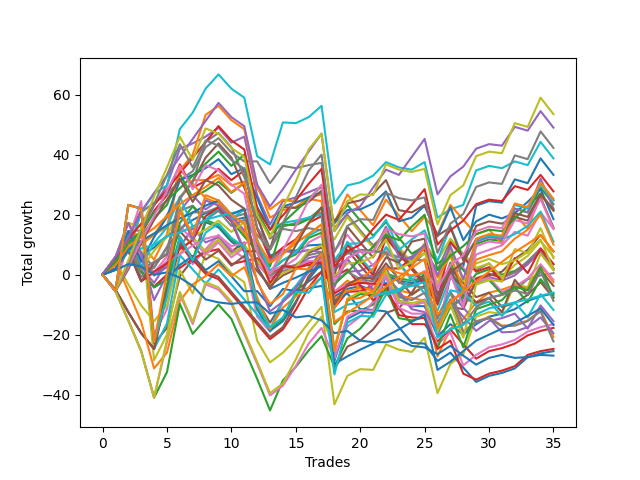

# Long Pointer 001 DB 
- Symbol: ES_830-900
- Date Range: 03/18/2022 - 12/30/2022
- Trading Period: 8:30-9:0
- Number of Trades: 35



| Name | Win Percent | Profit | Avg Profit / Trade | Avg Time / Trade |      | Name | Win Percent | Profit | Avg Profit / Trade | Avg Time / Trade |
| ---- | ----------- | ------ | ------------------ | ---------------- | ---- | ---- | ----------- | ------ | ------------------ | ---------------- |
| Sorted By <br> Profit | | | | | | Sorted By <br> Win Percentage ||||
| TP-10 | 57.14 | 26750.00 | 764.29 | 45:01 |     | TP-1 | 91.43 | -3000.00 | -85.71 | 10:17 |
| TP-6 | 71.43 | 24500.00 | 700.00 | 34:14 |     | TP-3 | 82.86 | 3875.00 | 110.71 | 23:58 |
| TP-9 | 57.14 | 21125.00 | 603.57 | 44:38 |     | TP-2 | 82.86 | -8375.00 | -239.29 | 20:22 |
| BB-100 Mid | 65.71 | 19375.00 | 553.57 | 29:36 |     | TP-4 | 77.14 | 10750.00 | 307.14 | 26:51 |
| BB-100 U/L 2SD | 51.43 | 16625.00 | 475.00 | 54:46 |     | BB-50 U/L 1SD | 77.14 | 3875.00 | 110.71 | 31:32 |
| TP-5 | 71.43 | 13875.00 | 396.43 | 32:04 |     | BB-50 Mid | 74.29 | 750.00 | 21.43 | 21:20 |
| NEWFI 06 | 51.43 | 12625.00 | 360.71 | 57:29 |     | TP-6 | 71.43 | 24500.00 | 700.00 | 34:14 |
| TP-8 | 57.14 | 12375.00 | 353.57 | 43:26 |     | TP-5 | 71.43 | 13875.00 | 396.43 | 32:04 |
| NEWFI 000 | 54.29 | 12375.00 | 353.57 | 53:39 |     | BB-50 Mid SL-10 | 71.43 | 9250.00 | 264.29 | 13:27 |
| BB-200 U/L 2SD | 51.43 | 11750.00 | 335.71 | 56:30 |     | BB-20 U/L 2SD C | 71.43 | 1000.00 | 28.57 | 24:56 |
| V U/L 1SD SL-10 | 51.43 | 11000.00 | 314.29 | 31:52 |     | BB-20 U/L 2SD | 71.43 | 1000.00 | 28.57 | 23:42 |
| TP-4 | 77.14 | 10750.00 | 307.14 | 26:51 |     | BB-20 Mid | 71.43 | -3125.00 | -89.29 | 07:43 |
| TP-7 | 60.00 | 10750.00 | 307.14 | 41:54 |     | BB-20 Mid SL-10 | 71.43 | -8250.00 | -235.71 | 05:15 |
| V U/L 1SD SL-5 | 42.86 | 10625.00 | 303.57 | 19:12 |     | BB-20 U/L 2SD C SL-10 | 68.57 | 5500.00 | 157.14 | 16:24 |
| BB-50 Mid SL-10 | 71.43 | 9250.00 | 264.29 | 13:27 |     | BB-50 U/L 1SD SL-10 | 68.57 | 5000.00 | 142.86 | 21:34 |
| BB-100 Mid SL-10 | 60.00 | 7875.00 | 225.00 | 19:51 |     | BB-20 U/L 2SD SL-10 | 68.57 | 875.00 | 25.00 | 15:47 |
| BB-50 U/L 2SD | 62.86 | 7625.00 | 217.86 | 42:47 |     | BB-100 Mid | 65.71 | 19375.00 | 553.57 | 29:36 |
| BB-100 U/L 2SD SL-10 | 45.71 | 7625.00 | 217.86 | 40:05 |     | V Mid | 65.71 | 250.00 | 7.14 | 18:02 |
| BB-20 U/L 2SD C SL-10 | 68.57 | 5500.00 | 157.14 | 16:24 |     | BB-20 U/L 1SD | 65.71 | -10375.00 | -296.43 | 16:40 |
| BB-50 U/L 1SD SL-10 | 68.57 | 5000.00 | 142.86 | 21:34 |     | BB-50 U/L 2SD | 62.86 | 7625.00 | 217.86 | 42:47 |
| TP-3 | 82.86 | 3875.00 | 110.71 | 23:58 |     | BB-20 Mid SL-5 | 62.86 | -8875.00 | -253.57 | 03:14 |
| BB-50 U/L 1SD | 77.14 | 3875.00 | 110.71 | 31:32 |     | BB-20 U/L 1SD SL-10 | 62.86 | -11125.00 | -317.86 | 11:28 |
| BB-50 U/L 1SD SL-5 | 51.43 | 3000.00 | 85.71 | 13:48 |     | TP-7 | 60.00 | 10750.00 | 307.14 | 41:54 |
| BB-200 U/L 2SD SL-10 | 45.71 | 2750.00 | 78.57 | 41:48 |     | BB-100 Mid SL-10 | 60.00 | 7875.00 | 225.00 | 19:51 |
| BB-50 Mid SL-5 | 54.29 | 1750.00 | 50.00 | 07:25 |     | V Mid SL-10 | 60.00 | -12375.00 | -353.57 | 10:01 |
| BB-100 U/L 2SD SL-5 | 34.29 | 1750.00 | 50.00 | 25:46 |     | TP-10 | 57.14 | 26750.00 | 764.29 | 45:01 |
| BB-20 U/L 2SD C | 71.43 | 1000.00 | 28.57 | 24:56 |     | TP-9 | 57.14 | 21125.00 | 603.57 | 44:38 |
| BB-20 U/L 2SD | 71.43 | 1000.00 | 28.57 | 23:42 |     | TP-8 | 57.14 | 12375.00 | 353.57 | 43:26 |
| BB-20 U/L 2SD SL-10 | 68.57 | 875.00 | 25.00 | 15:47 |     | NEWFI 000 | 54.29 | 12375.00 | 353.57 | 53:39 |
| BB-50 Mid | 74.29 | 750.00 | 21.43 | 21:20 |     | BB-50 Mid SL-5 | 54.29 | 1750.00 | 50.00 | 07:25 |
| V U/L 1SD | 54.29 | 750.00 | 21.43 | 45:10 |     | V U/L 1SD | 54.29 | 750.00 | 21.43 | 45:10 |
| V Mid | 65.71 | 250.00 | 7.14 | 18:02 |     | BB-200 Mid | 54.29 | -1250.00 | -35.71 | 27:50 |
| BB-20 U/L 2SD C SL-5 | 51.43 | -875.00 | -25.00 | 10:12 |     | BB-50 U/L 2SD SL-10 | 54.29 | -3750.00 | -107.14 | 30:14 |
| BB-200 Mid | 54.29 | -1250.00 | -35.71 | 27:50 |     | BB-20 U/L 1SD SL-5 | 54.29 | -9750.00 | -278.57 | 06:59 |
| BB-200 U/L 2SD SL-5 | 34.29 | -1875.00 | -53.57 | 27:11 |     | BB-100 U/L 2SD | 51.43 | 16625.00 | 475.00 | 54:46 |
| TP-1 | 91.43 | -3000.00 | -85.71 | 10:17 |     | NEWFI 06 | 51.43 | 12625.00 | 360.71 | 57:29 |
| BB-20 Mid | 71.43 | -3125.00 | -89.29 | 07:43 |     | BB-200 U/L 2SD | 51.43 | 11750.00 | 335.71 | 56:30 |
| BB-100 Mid SL-5 | 45.71 | -3375.00 | -96.43 | 11:42 |     | V U/L 1SD SL-10 | 51.43 | 11000.00 | 314.29 | 31:52 |
| BB-50 U/L 2SD SL-10 | 54.29 | -3750.00 | -107.14 | 30:14 |     | BB-50 U/L 1SD SL-5 | 51.43 | 3000.00 | 85.71 | 13:48 |
| BB-20 U/L 2SD SL-5 | 51.43 | -3875.00 | -110.71 | 09:36 |     | BB-20 U/L 2SD C SL-5 | 51.43 | -875.00 | -25.00 | 10:12 |
| BB-200 Mid SL-10 | 51.43 | -4375.00 | -125.00 | 16:33 |     | BB-20 U/L 2SD SL-5 | 51.43 | -3875.00 | -110.71 | 09:36 |
| BB-50 U/L 2SD SL-5 | 37.14 | -5875.00 | -167.86 | 18:52 |     | BB-200 Mid SL-10 | 51.43 | -4375.00 | -125.00 | 16:33 |
| BB-200 Mid SL-5 | 40.00 | -7750.00 | -221.43 | 09:22 |     | V Mid SL-5 | 51.43 | -12750.00 | -364.29 | 04:41 |
| BB-20 Mid SL-10 | 71.43 | -8250.00 | -235.71 | 05:15 |     | BB-100 U/L 2SD SL-10 | 45.71 | 7625.00 | 217.86 | 40:05 |
| TP-2 | 82.86 | -8375.00 | -239.29 | 20:22 |     | BB-200 U/L 2SD SL-10 | 45.71 | 2750.00 | 78.57 | 41:48 |
| BB-20 Mid SL-5 | 62.86 | -8875.00 | -253.57 | 03:14 |     | BB-100 Mid SL-5 | 45.71 | -3375.00 | -96.43 | 11:42 |
| BB-20 U/L 1SD SL-5 | 54.29 | -9750.00 | -278.57 | 06:59 |     | V U/L 1SD SL-5 | 42.86 | 10625.00 | 303.57 | 19:12 |
| BB-20 U/L 1SD | 65.71 | -10375.00 | -296.43 | 16:40 |     | NEWFI 0000 | 42.86 | -13500.00 | -385.71 | 05:06 |
| BB-20 U/L 1SD SL-10 | 62.86 | -11125.00 | -317.86 | 11:28 |     | BB-200 Mid SL-5 | 40.00 | -7750.00 | -221.43 | 09:22 |
| V Mid SL-10 | 60.00 | -12375.00 | -353.57 | 10:01 |     | BB-50 U/L 2SD SL-5 | 37.14 | -5875.00 | -167.86 | 18:52 |
| V Mid SL-5 | 51.43 | -12750.00 | -364.29 | 04:41 |     | BB-100 U/L 2SD SL-5 | 34.29 | 1750.00 | 50.00 | 25:46 |
| NEWFI 0000 | 42.86 | -13500.00 | -385.71 | 05:06 |     | BB-200 U/L 2SD SL-5 | 34.29 | -1875.00 | -53.57 | 27:11 |

## NO STOPLOSS

### Test BB-20 Mid
* Sell when price hits the middle line of the 20p bollinger
* No Stoploss
* Results:
```
Total Trades: 35
Percent Up: 71.43
Percent Down: 28.57
Total Points Moved Up: -6.25
Potential Profit: -3125.00
Total Points Ups: 53.00 Count Ups: 25
Total Points Downs: -59.25 Count Downs: 10
```

<details><summary>Trades</summary>

<code>In: 2022-03-31 08:37:00		Out: 2022-03-31 08:38:15		Total Position Time: 01:15		Total Move Up: 2.00		Total to Date: 2.00</code> <br />
<code>In: 2022-05-06 09:03:00		Out: 2022-05-06 09:04:10		Total Position Time: 01:10		Total Move Up: 6.25		Total to Date: 8.25</code> <br />
<code>In: 2022-05-06 11:28:00		Out: 2022-05-06 11:40:25		Total Position Time: 12:25		Total Move Up: -1.75		Total to Date: 6.50</code> <br />
<code>In: 2022-05-11 09:14:00		Out: 2022-05-11 09:21:05		Total Position Time: 07:05		Total Move Up: 2.50		Total to Date: 9.00</code> <br />
<code>In: 2022-05-16 09:47:00		Out: 2022-05-16 09:48:15		Total Position Time: 01:15		Total Move Up: 4.00		Total to Date: 13.00</code> <br />
<code>In: 2022-05-31 12:05:00		Out: 2022-05-31 12:07:20		Total Position Time: 02:20		Total Move Up: 2.25		Total to Date: 15.25</code> <br />
<code>In: 2022-06-27 10:10:00		Out: 2022-06-27 10:11:25		Total Position Time: 01:25		Total Move Up: 3.00		Total to Date: 18.25</code> <br />
<code>In: 2022-07-08 09:48:00		Out: 2022-07-08 09:49:10		Total Position Time: 01:10		Total Move Up: 2.25		Total to Date: 20.50</code> <br />
<code>In: 2022-07-12 10:28:00		Out: 2022-07-12 10:29:10		Total Position Time: 01:10		Total Move Up: 1.00		Total to Date: 21.50</code> <br />
<code>In: 2022-07-25 10:44:00		Out: 2022-07-25 11:06:25		Total Position Time: 22:25		Total Move Up: -3.50		Total to Date: 18.00</code> <br />
<code>In: 2022-07-25 11:23:00		Out: 2022-07-25 11:24:25		Total Position Time: 01:25		Total Move Up: 1.00		Total to Date: 19.00</code> <br />
<code>In: 2022-08-01 09:58:00		Out: 2022-08-01 09:59:45		Total Position Time: 01:45		Total Move Up: 1.00		Total to Date: 20.00</code> <br />
<code>In: 2022-08-01 10:23:00		Out: 2022-08-01 10:56:50		Total Position Time: 33:50		Total Move Up: -13.75		Total to Date: 6.25</code> <br />
<code>In: 2022-08-02 10:53:00		Out: 2022-08-02 10:54:10		Total Position Time: 01:10		Total Move Up: 2.00		Total to Date: 8.25</code> <br />
<code>In: 2022-08-04 11:13:00		Out: 2022-08-04 11:19:10		Total Position Time: 06:10		Total Move Up: -0.25		Total to Date: 8.00</code> <br />
<code>In: 2022-08-04 11:43:00		Out: 2022-08-04 11:44:20		Total Position Time: 01:20		Total Move Up: 1.75		Total to Date: 9.75</code> <br />
<code>In: 2022-08-05 11:32:00		Out: 2022-08-05 11:44:30		Total Position Time: 12:30		Total Move Up: 0.25		Total to Date: 10.00</code> <br />
<code>In: 2022-09-02 09:47:00		Out: 2022-09-02 10:18:10		Total Position Time: 31:10		Total Move Up: -17.25		Total to Date: -7.25</code> <br />
<code>In: 2022-09-09 09:27:00		Out: 2022-09-09 09:28:10		Total Position Time: 01:10		Total Move Up: 2.50		Total to Date: -4.75</code> <br />
<code>In: 2022-09-12 11:21:00		Out: 2022-09-12 11:24:10		Total Position Time: 03:10		Total Move Up: 1.00		Total to Date: -3.75</code> <br />
<code>In: 2022-09-12 11:25:00		Out: 2022-09-12 11:37:50		Total Position Time: 12:50		Total Move Up: -1.50		Total to Date: -5.25</code> <br />
<code>In: 2022-09-14 09:09:00		Out: 2022-09-14 09:13:20		Total Position Time: 04:20		Total Move Up: 2.50		Total to Date: -2.75</code> <br />
<code>In: 2022-09-14 10:51:00		Out: 2022-09-14 11:15:30		Total Position Time: 24:30		Total Move Up: -5.75		Total to Date: -8.50</code> <br />
<code>In: 2022-09-14 11:06:00		Out: 2022-09-14 11:15:30		Total Position Time: 09:30		Total Move Up: -2.00		Total to Date: -10.50</code> <br />
<code>In: 2022-10-17 11:28:00		Out: 2022-10-17 11:35:40		Total Position Time: 07:40		Total Move Up: 0.00		Total to Date: -10.50</code> <br />
<code>In: 2022-10-20 09:23:00		Out: 2022-10-20 09:57:05		Total Position Time: 34:05		Total Move Up: -10.00		Total to Date: -20.50</code> <br />
<code>In: 2022-11-03 08:36:00		Out: 2022-11-03 08:37:20		Total Position Time: 01:20		Total Move Up: 4.00		Total to Date: -16.50</code> <br />
<code>In: 2022-11-08 11:01:00		Out: 2022-11-08 11:15:05		Total Position Time: 14:05		Total Move Up: -3.50		Total to Date: -20.00</code> <br />
<code>In: 2022-11-10 09:58:00		Out: 2022-11-10 10:02:05		Total Position Time: 04:05		Total Move Up: 3.50		Total to Date: -16.50</code> <br />
<code>In: 2022-11-21 12:30:00		Out: 2022-11-21 12:31:25		Total Position Time: 01:25		Total Move Up: 2.50		Total to Date: -14.00</code> <br />
<code>In: 2022-12-08 09:23:00		Out: 2022-12-08 09:24:10		Total Position Time: 01:10		Total Move Up: 1.00		Total to Date: -13.00</code> <br />
<code>In: 2022-12-08 09:34:00		Out: 2022-12-08 09:36:00		Total Position Time: 02:00		Total Move Up: 1.50		Total to Date: -11.50</code> <br />
<code>In: 2022-12-09 10:14:00		Out: 2022-12-09 10:16:50		Total Position Time: 02:50		Total Move Up: 2.75		Total to Date: -8.75</code> <br />
<code>In: 2022-12-20 12:10:00		Out: 2022-12-20 12:13:45		Total Position Time: 03:45		Total Move Up: 1.50		Total to Date: -7.25</code> <br />
<code>In: 2022-12-27 10:48:00		Out: 2022-12-27 10:49:25		Total Position Time: 01:25		Total Move Up: 1.00		Total to Date: -6.25</code> <br />


</details>

### Test BB-20 U/L 1SD
* Sell when the price hits the upper line of the 20p 1std bollinger
* No Stoploss
* Results:
```
Total Trades: 35
Percent Up: 65.71
Percent Down: 34.29
Total Points Moved Up: -20.75
Potential Profit: -10375.00
Total Points Ups: 71.00 Count Ups: 23
Total Points Downs: -91.75 Count Downs: 12
```

<details><summary>Trades</summary>

<code>In: 2022-03-31 08:37:00		Out: 2022-03-31 08:40:35		Total Position Time: 03:35		Total Move Up: 3.25		Total to Date: 3.25</code> <br />
<code>In: 2022-05-06 09:03:00		Out: 2022-05-06 09:04:10		Total Position Time: 01:10		Total Move Up: 6.25		Total to Date: 9.50</code> <br />
<code>In: 2022-05-06 11:28:00		Out: 2022-05-06 11:49:10		Total Position Time: 21:10		Total Move Up: 0.50		Total to Date: 10.00</code> <br />
<code>In: 2022-05-11 09:14:00		Out: 2022-05-11 09:23:10		Total Position Time: 09:10		Total Move Up: 3.25		Total to Date: 13.25</code> <br />
<code>In: 2022-05-16 09:47:00		Out: 2022-05-16 09:50:05		Total Position Time: 03:05		Total Move Up: 6.75		Total to Date: 20.00</code> <br />
<code>In: 2022-05-31 12:05:00		Out: 2022-05-31 12:09:15		Total Position Time: 04:15		Total Move Up: 5.25		Total to Date: 25.25</code> <br />
<code>In: 2022-06-27 10:10:00		Out: 2022-06-27 10:16:10		Total Position Time: 06:10		Total Move Up: 6.25		Total to Date: 31.50</code> <br />
<code>In: 2022-07-08 09:48:00		Out: 2022-07-08 10:06:55		Total Position Time: 18:55		Total Move Up: 0.00		Total to Date: 31.50</code> <br />
<code>In: 2022-07-12 10:28:00		Out: 2022-07-12 10:30:05		Total Position Time: 02:05		Total Move Up: 1.75		Total to Date: 33.25</code> <br />
<code>In: 2022-07-25 10:44:00		Out: 2022-07-25 11:11:40		Total Position Time: 27:40		Total Move Up: -3.50		Total to Date: 29.75</code> <br />
<code>In: 2022-07-25 11:23:00		Out: 2022-07-25 11:35:25		Total Position Time: 12:25		Total Move Up: 1.25		Total to Date: 31.00</code> <br />
<code>In: 2022-08-01 09:58:00		Out: 2022-08-01 10:16:10		Total Position Time: 18:10		Total Move Up: -1.00		Total to Date: 30.00</code> <br />
<code>In: 2022-08-01 10:23:00		Out: 2022-08-01 10:59:05		Total Position Time: 36:05		Total Move Up: -11.00		Total to Date: 19.00</code> <br />
<code>In: 2022-08-02 10:53:00		Out: 2022-08-02 11:01:35		Total Position Time: 08:35		Total Move Up: 2.50		Total to Date: 21.50</code> <br />
<code>In: 2022-08-04 11:13:00		Out: 2022-08-04 11:26:30		Total Position Time: 13:30		Total Move Up: 1.00		Total to Date: 22.50</code> <br />
<code>In: 2022-08-04 11:43:00		Out: 2022-08-04 11:48:05		Total Position Time: 05:05		Total Move Up: 3.25		Total to Date: 25.75</code> <br />
<code>In: 2022-08-05 11:32:00		Out: 2022-08-05 11:46:50		Total Position Time: 14:50		Total Move Up: 1.00		Total to Date: 26.75</code> <br />
<code>In: 2022-09-02 09:47:00		Out: 2022-09-02 10:43:30		Total Position Time: 56:30		Total Move Up: -32.50		Total to Date: -5.75</code> <br />
<code>In: 2022-09-09 09:27:00		Out: 2022-09-09 09:33:25		Total Position Time: 06:25		Total Move Up: 3.75		Total to Date: -2.00</code> <br />
<code>In: 2022-09-12 11:21:00		Out: 2022-09-12 11:40:30		Total Position Time: 19:30		Total Move Up: -2.50		Total to Date: -4.50</code> <br />
<code>In: 2022-09-12 11:25:00		Out: 2022-09-12 11:40:30		Total Position Time: 15:30		Total Move Up: -0.75		Total to Date: -5.25</code> <br />
<code>In: 2022-09-14 09:09:00		Out: 2022-09-14 09:18:05		Total Position Time: 09:05		Total Move Up: 4.75		Total to Date: -0.50</code> <br />
<code>In: 2022-09-14 10:51:00		Out: 2022-09-14 11:19:10		Total Position Time: 28:10		Total Move Up: -4.75		Total to Date: -5.25</code> <br />
<code>In: 2022-09-14 11:06:00		Out: 2022-09-14 11:19:10		Total Position Time: 13:10		Total Move Up: -1.00		Total to Date: -6.25</code> <br />
<code>In: 2022-10-17 11:28:00		Out: 2022-10-17 11:36:10		Total Position Time: 08:10		Total Move Up: 2.50		Total to Date: -3.75</code> <br />
<code>In: 2022-10-20 09:23:00		Out: 2022-10-20 09:59:10		Total Position Time: 36:10		Total Move Up: -10.25		Total to Date: -14.00</code> <br />
<code>In: 2022-11-03 08:36:00		Out: 2022-11-03 08:40:30		Total Position Time: 04:30		Total Move Up: 8.00		Total to Date: -6.00</code> <br />
<code>In: 2022-11-08 11:01:00		Out: 2022-11-08 11:38:35		Total Position Time: 37:35		Total Move Up: -13.00		Total to Date: -19.00</code> <br />
<code>In: 2022-11-10 09:58:00		Out: 2022-11-10 10:02:05		Total Position Time: 04:05		Total Move Up: 3.50		Total to Date: -15.50</code> <br />
<code>In: 2022-11-21 12:30:00		Out: 2022-11-21 12:45:35		Total Position Time: 15:35		Total Move Up: 1.25		Total to Date: -14.25</code> <br />
<code>In: 2022-12-08 09:23:00		Out: 2022-12-08 09:50:15		Total Position Time: 27:15		Total Move Up: -2.75		Total to Date: -17.00</code> <br />
<code>In: 2022-12-08 09:34:00		Out: 2022-12-08 09:50:15		Total Position Time: 16:15		Total Move Up: 0.25		Total to Date: -16.75</code> <br />
<code>In: 2022-12-09 10:14:00		Out: 2022-12-09 10:30:40		Total Position Time: 16:40		Total Move Up: 1.50		Total to Date: -15.25</code> <br />
<code>In: 2022-12-20 12:10:00		Out: 2022-12-20 12:15:15		Total Position Time: 05:15		Total Move Up: 3.25		Total to Date: -12.00</code> <br />
<code>In: 2022-12-27 10:48:00		Out: 2022-12-27 11:45:40		Total Position Time: 57:40		Total Move Up: -8.75		Total to Date: -20.75</code> <br />


</details>

### Test BB-20 U/L 2SD
* Sell when the price hits the upper line of the 20p 2std bollinger
* No Stoploss
* Results:
```
Total Trades: 35
Percent Up: 71.43
Percent Down: 28.57
Total Points Moved Up: 2.00
Potential Profit: 1000.00
Total Points Ups: 100.00 Count Ups: 25
Total Points Downs: -98.00 Count Downs: 10
```

<details><summary>Trades</summary>

<code>In: 2022-03-31 08:37:00		Out: 2022-03-31 08:41:10		Total Position Time: 04:10		Total Move Up: 5.75		Total to Date: 5.75</code> <br />
<code>In: 2022-05-06 09:03:00		Out: 2022-05-06 09:04:10		Total Position Time: 01:10		Total Move Up: 6.25		Total to Date: 12.00</code> <br />
<code>In: 2022-05-06 11:28:00		Out: 2022-05-06 11:49:10		Total Position Time: 21:10		Total Move Up: 0.50		Total to Date: 12.50</code> <br />
<code>In: 2022-05-11 09:14:00		Out: 2022-05-11 09:23:35		Total Position Time: 09:35		Total Move Up: 6.25		Total to Date: 18.75</code> <br />
<code>In: 2022-05-16 09:47:00		Out: 2022-05-16 10:06:30		Total Position Time: 19:30		Total Move Up: 4.50		Total to Date: 23.25</code> <br />
<code>In: 2022-05-31 12:05:00		Out: 2022-05-31 12:15:05		Total Position Time: 10:05		Total Move Up: 10.25		Total to Date: 33.50</code> <br />
<code>In: 2022-06-27 10:10:00		Out: 2022-06-27 11:10:55		Total Position Time: 60:55		Total Move Up: -7.75		Total to Date: 25.75</code> <br />
<code>In: 2022-07-08 09:48:00		Out: 2022-07-08 10:11:05		Total Position Time: 23:05		Total Move Up: 2.25		Total to Date: 28.00</code> <br />
<code>In: 2022-07-12 10:28:00		Out: 2022-07-12 10:31:30		Total Position Time: 03:30		Total Move Up: 3.00		Total to Date: 31.00</code> <br />
<code>In: 2022-07-25 10:44:00		Out: 2022-07-25 11:35:50		Total Position Time: 51:50		Total Move Up: -3.75		Total to Date: 27.25</code> <br />
<code>In: 2022-07-25 11:23:00		Out: 2022-07-25 11:35:50		Total Position Time: 12:50		Total Move Up: 3.25		Total to Date: 30.50</code> <br />
<code>In: 2022-08-01 09:58:00		Out: 2022-08-01 10:58:55		Total Position Time: 60:55		Total Move Up: -19.50		Total to Date: 11.00</code> <br />
<code>In: 2022-08-01 10:23:00		Out: 2022-08-01 11:06:40		Total Position Time: 43:40		Total Move Up: -9.75		Total to Date: 1.25</code> <br />
<code>In: 2022-08-02 10:53:00		Out: 2022-08-02 11:06:45		Total Position Time: 13:45		Total Move Up: 3.50		Total to Date: 4.75</code> <br />
<code>In: 2022-08-04 11:13:00		Out: 2022-08-04 11:27:45		Total Position Time: 14:45		Total Move Up: 2.00		Total to Date: 6.75</code> <br />
<code>In: 2022-08-04 11:43:00		Out: 2022-08-04 11:52:05		Total Position Time: 09:05		Total Move Up: 5.50		Total to Date: 12.25</code> <br />
<code>In: 2022-08-05 11:32:00		Out: 2022-08-05 11:54:15		Total Position Time: 22:15		Total Move Up: 1.75		Total to Date: 14.00</code> <br />
<code>In: 2022-09-02 09:47:00		Out: 2022-09-02 10:43:50		Total Position Time: 56:50		Total Move Up: -30.50		Total to Date: -16.50</code> <br />
<code>In: 2022-09-09 09:27:00		Out: 2022-09-09 09:35:40		Total Position Time: 08:40		Total Move Up: 4.25		Total to Date: -12.25</code> <br />
<code>In: 2022-09-12 11:21:00		Out: 2022-09-12 11:46:40		Total Position Time: 25:40		Total Move Up: 0.25		Total to Date: -12.00</code> <br />
<code>In: 2022-09-12 11:25:00		Out: 2022-09-12 11:46:40		Total Position Time: 21:40		Total Move Up: 2.00		Total to Date: -10.00</code> <br />
<code>In: 2022-09-14 09:09:00		Out: 2022-09-14 09:25:55		Total Position Time: 16:55		Total Move Up: 5.75		Total to Date: -4.25</code> <br />
<code>In: 2022-09-14 10:51:00		Out: 2022-09-14 11:30:30		Total Position Time: 39:30		Total Move Up: -1.25		Total to Date: -5.50</code> <br />
<code>In: 2022-09-14 11:06:00		Out: 2022-09-14 11:30:30		Total Position Time: 24:30		Total Move Up: 2.50		Total to Date: -3.00</code> <br />
<code>In: 2022-10-17 11:28:00		Out: 2022-10-17 11:37:30		Total Position Time: 09:30		Total Move Up: 3.00		Total to Date: 0.00</code> <br />
<code>In: 2022-10-20 09:23:00		Out: 2022-10-20 10:03:25		Total Position Time: 40:25		Total Move Up: -7.75		Total to Date: -7.75</code> <br />
<code>In: 2022-11-03 08:36:00		Out: 2022-11-03 08:46:35		Total Position Time: 10:35		Total Move Up: 11.75		Total to Date: 4.00</code> <br />
<code>In: 2022-11-08 11:01:00		Out: 2022-11-08 11:42:10		Total Position Time: 41:10		Total Move Up: -9.75		Total to Date: -5.75</code> <br />
<code>In: 2022-11-10 09:58:00		Out: 2022-11-10 10:03:45		Total Position Time: 05:45		Total Move Up: 6.00		Total to Date: 0.25</code> <br />
<code>In: 2022-11-21 12:30:00		Out: 2022-11-21 12:47:00		Total Position Time: 17:00		Total Move Up: 1.50		Total to Date: 1.75</code> <br />
<code>In: 2022-12-08 09:23:00		Out: 2022-12-08 09:50:50		Total Position Time: 27:50		Total Move Up: -1.75		Total to Date: 0.00</code> <br />
<code>In: 2022-12-08 09:34:00		Out: 2022-12-08 09:50:50		Total Position Time: 16:50		Total Move Up: 1.25		Total to Date: 1.25</code> <br />
<code>In: 2022-12-09 10:14:00		Out: 2022-12-09 10:31:15		Total Position Time: 17:15		Total Move Up: 2.75		Total to Date: 4.00</code> <br />
<code>In: 2022-12-20 12:10:00		Out: 2022-12-20 12:19:10		Total Position Time: 09:10		Total Move Up: 4.25		Total to Date: 8.25</code> <br />
<code>In: 2022-12-27 10:48:00		Out: 2022-12-27 11:46:20		Total Position Time: 58:20		Total Move Up: -6.25		Total to Date: 2.00</code> <br />


</details>

### Test BB-20 U/L 2SD C
* Sell when the price hits the upper line of the 20p 2std bollinger
* No Stoploss
* Results:
```
Total Trades: 35
Percent Up: 71.43
Percent Down: 28.57
Total Points Moved Up: 2.00
Potential Profit: 1000.00
Total Points Ups: 108.75 Count Ups: 25
Total Points Downs: -106.75 Count Downs: 10
```

<details><summary>Trades</summary>

<code>In: 2022-03-31 08:37:00		Out: 2022-03-31 08:41:10		Total Position Time: 04:10		Total Move Up: 5.75		Total to Date: 5.75</code> <br />
<code>In: 2022-05-06 09:03:00		Out: 2022-05-06 09:05:00		Total Position Time: 02:00		Total Move Up: 7.25		Total to Date: 13.00</code> <br />
<code>In: 2022-05-06 11:28:00		Out: 2022-05-06 11:49:10		Total Position Time: 21:10		Total Move Up: 0.50		Total to Date: 13.50</code> <br />
<code>In: 2022-05-11 09:14:00		Out: 2022-05-11 09:23:40		Total Position Time: 09:40		Total Move Up: 7.75		Total to Date: 21.25</code> <br />
<code>In: 2022-05-16 09:47:00		Out: 2022-05-16 10:07:00		Total Position Time: 20:00		Total Move Up: 5.25		Total to Date: 26.50</code> <br />
<code>In: 2022-05-31 12:05:00		Out: 2022-05-31 12:15:05		Total Position Time: 10:05		Total Move Up: 10.25		Total to Date: 36.75</code> <br />
<code>In: 2022-06-27 10:10:00		Out: 2022-06-27 11:10:55		Total Position Time: 60:55		Total Move Up: -7.75		Total to Date: 29.00</code> <br />
<code>In: 2022-07-08 09:48:00		Out: 2022-07-08 10:11:05		Total Position Time: 23:05		Total Move Up: 2.25		Total to Date: 31.25</code> <br />
<code>In: 2022-07-12 10:28:00		Out: 2022-07-12 10:41:40		Total Position Time: 13:40		Total Move Up: 4.00		Total to Date: 35.25</code> <br />
<code>In: 2022-07-25 10:44:00		Out: 2022-07-25 11:35:50		Total Position Time: 51:50		Total Move Up: -3.75		Total to Date: 31.50</code> <br />
<code>In: 2022-07-25 11:23:00		Out: 2022-07-25 11:35:50		Total Position Time: 12:50		Total Move Up: 3.25		Total to Date: 34.75</code> <br />
<code>In: 2022-08-01 09:58:00		Out: 2022-08-01 10:58:55		Total Position Time: 60:55		Total Move Up: -19.50		Total to Date: 15.25</code> <br />
<code>In: 2022-08-01 10:23:00		Out: 2022-08-01 11:06:40		Total Position Time: 43:40		Total Move Up: -9.75		Total to Date: 5.50</code> <br />
<code>In: 2022-08-02 10:53:00		Out: 2022-08-02 11:06:45		Total Position Time: 13:45		Total Move Up: 3.50		Total to Date: 9.00</code> <br />
<code>In: 2022-08-04 11:13:00		Out: 2022-08-04 11:28:05		Total Position Time: 15:05		Total Move Up: 2.75		Total to Date: 11.75</code> <br />
<code>In: 2022-08-04 11:43:00		Out: 2022-08-04 11:52:05		Total Position Time: 09:05		Total Move Up: 5.50		Total to Date: 17.25</code> <br />
<code>In: 2022-08-05 11:32:00		Out: 2022-08-05 11:54:20		Total Position Time: 22:20		Total Move Up: 2.25		Total to Date: 19.50</code> <br />
<code>In: 2022-09-02 09:47:00		Out: 2022-09-02 10:43:50		Total Position Time: 56:50		Total Move Up: -30.50		Total to Date: -11.00</code> <br />
<code>In: 2022-09-09 09:27:00		Out: 2022-09-09 09:36:05		Total Position Time: 09:05		Total Move Up: 5.25		Total to Date: -5.75</code> <br />
<code>In: 2022-09-12 11:21:00		Out: 2022-09-12 11:46:40		Total Position Time: 25:40		Total Move Up: 0.25		Total to Date: -5.50</code> <br />
<code>In: 2022-09-12 11:25:00		Out: 2022-09-12 11:46:40		Total Position Time: 21:40		Total Move Up: 2.00		Total to Date: -3.50</code> <br />
<code>In: 2022-09-14 09:09:00		Out: 2022-09-14 09:25:55		Total Position Time: 16:55		Total Move Up: 5.75		Total to Date: 2.25</code> <br />
<code>In: 2022-09-14 10:51:00		Out: 2022-09-14 11:30:55		Total Position Time: 39:55		Total Move Up: -0.25		Total to Date: 2.00</code> <br />
<code>In: 2022-09-14 11:06:00		Out: 2022-09-14 11:30:55		Total Position Time: 24:55		Total Move Up: 3.50		Total to Date: 5.50</code> <br />
<code>In: 2022-10-17 11:28:00		Out: 2022-10-17 11:37:55		Total Position Time: 09:55		Total Move Up: 3.00		Total to Date: 8.50</code> <br />
<code>In: 2022-10-20 09:23:00		Out: 2022-10-20 10:23:55		Total Position Time: 60:55		Total Move Up: -18.50		Total to Date: -10.00</code> <br />
<code>In: 2022-11-03 08:36:00		Out: 2022-11-03 08:46:35		Total Position Time: 10:35		Total Move Up: 11.75		Total to Date: 1.75</code> <br />
<code>In: 2022-11-08 11:01:00		Out: 2022-11-08 11:42:15		Total Position Time: 41:15		Total Move Up: -9.25		Total to Date: -7.50</code> <br />
<code>In: 2022-11-10 09:58:00		Out: 2022-11-10 10:03:55		Total Position Time: 05:55		Total Move Up: 6.25		Total to Date: -1.25</code> <br />
<code>In: 2022-11-21 12:30:00		Out: 2022-11-21 12:47:00		Total Position Time: 17:00		Total Move Up: 1.50		Total to Date: 0.25</code> <br />
<code>In: 2022-12-08 09:23:00		Out: 2022-12-08 09:50:55		Total Position Time: 27:55		Total Move Up: -1.25		Total to Date: -1.00</code> <br />
<code>In: 2022-12-08 09:34:00		Out: 2022-12-08 09:50:55		Total Position Time: 16:55		Total Move Up: 1.75		Total to Date: 0.75</code> <br />
<code>In: 2022-12-09 10:14:00		Out: 2022-12-09 10:31:20		Total Position Time: 17:20		Total Move Up: 2.75		Total to Date: 3.50</code> <br />
<code>In: 2022-12-20 12:10:00		Out: 2022-12-20 12:27:20		Total Position Time: 17:20		Total Move Up: 4.75		Total to Date: 8.25</code> <br />
<code>In: 2022-12-27 10:48:00		Out: 2022-12-27 11:46:20		Total Position Time: 58:20		Total Move Up: -6.25		Total to Date: 2.00</code> <br />


</details>

### Test BB-50 Mid
* Sell when price hits the middle line of the 50p bollinger
* No Stoploss
* Results:
```
Total Trades: 35
Percent Up: 74.29
Percent Down: 25.71
Total Points Moved Up: 1.50
Potential Profit: 750.00
Total Points Ups: 107.25 Count Ups: 26
Total Points Downs: -105.75 Count Downs: 9
```

<details><summary>Trades</summary>

<code>In: 2022-03-31 08:37:00		Out: 2022-03-31 08:41:05		Total Position Time: 04:05		Total Move Up: 4.25		Total to Date: 4.25</code> <br />
<code>In: 2022-05-06 09:03:00		Out: 2022-05-06 09:06:05		Total Position Time: 03:05		Total Move Up: 10.25		Total to Date: 14.50</code> <br />
<code>In: 2022-05-06 11:28:00		Out: 2022-05-06 11:49:15		Total Position Time: 21:15		Total Move Up: 0.25		Total to Date: 14.75</code> <br />
<code>In: 2022-05-11 09:14:00		Out: 2022-05-11 09:23:45		Total Position Time: 09:45		Total Move Up: 8.25		Total to Date: 23.00</code> <br />
<code>In: 2022-05-16 09:47:00		Out: 2022-05-16 09:50:05		Total Position Time: 03:05		Total Move Up: 6.75		Total to Date: 29.75</code> <br />
<code>In: 2022-05-31 12:05:00		Out: 2022-05-31 12:15:15		Total Position Time: 10:15		Total Move Up: 12.25		Total to Date: 42.00</code> <br />
<code>In: 2022-06-27 10:10:00		Out: 2022-06-27 10:11:15		Total Position Time: 01:15		Total Move Up: 1.75		Total to Date: 43.75</code> <br />
<code>In: 2022-07-08 09:48:00		Out: 2022-07-08 10:11:10		Total Position Time: 23:10		Total Move Up: 2.25		Total to Date: 46.00</code> <br />
<code>In: 2022-07-12 10:28:00		Out: 2022-07-12 10:41:35		Total Position Time: 13:35		Total Move Up: 3.00		Total to Date: 49.00</code> <br />
<code>In: 2022-07-25 10:44:00		Out: 2022-07-25 11:35:45		Total Position Time: 51:45		Total Move Up: -5.00		Total to Date: 44.00</code> <br />
<code>In: 2022-07-25 11:23:00		Out: 2022-07-25 11:35:45		Total Position Time: 12:45		Total Move Up: 2.00		Total to Date: 46.00</code> <br />
<code>In: 2022-08-01 09:58:00		Out: 2022-08-01 10:58:55		Total Position Time: 60:55		Total Move Up: -19.50		Total to Date: 26.50</code> <br />
<code>In: 2022-08-01 10:23:00		Out: 2022-08-01 11:07:00		Total Position Time: 44:00		Total Move Up: -9.75		Total to Date: 16.75</code> <br />
<code>In: 2022-08-02 10:53:00		Out: 2022-08-02 11:08:40		Total Position Time: 15:40		Total Move Up: 7.75		Total to Date: 24.50</code> <br />
<code>In: 2022-08-04 11:13:00		Out: 2022-08-04 11:27:25		Total Position Time: 14:25		Total Move Up: 1.25		Total to Date: 25.75</code> <br />
<code>In: 2022-08-04 11:43:00		Out: 2022-08-04 11:44:20		Total Position Time: 01:20		Total Move Up: 1.75		Total to Date: 27.50</code> <br />
<code>In: 2022-08-05 11:32:00		Out: 2022-08-05 11:47:05		Total Position Time: 15:05		Total Move Up: 1.75		Total to Date: 29.25</code> <br />
<code>In: 2022-09-02 09:47:00		Out: 2022-09-02 10:47:55		Total Position Time: 60:55		Total Move Up: -32.50		Total to Date: -3.25</code> <br />
<code>In: 2022-09-09 09:27:00		Out: 2022-09-09 09:33:30		Total Position Time: 06:30		Total Move Up: 4.25		Total to Date: 1.00</code> <br />
<code>In: 2022-09-12 11:21:00		Out: 2022-09-12 11:46:40		Total Position Time: 25:40		Total Move Up: 0.25		Total to Date: 1.25</code> <br />
<code>In: 2022-09-12 11:25:00		Out: 2022-09-12 11:46:40		Total Position Time: 21:40		Total Move Up: 2.00		Total to Date: 3.25</code> <br />
<code>In: 2022-09-14 09:09:00		Out: 2022-09-14 09:14:55		Total Position Time: 05:55		Total Move Up: 4.00		Total to Date: 7.25</code> <br />
<code>In: 2022-09-14 10:51:00		Out: 2022-09-14 11:29:30		Total Position Time: 38:30		Total Move Up: -2.50		Total to Date: 4.75</code> <br />
<code>In: 2022-09-14 11:06:00		Out: 2022-09-14 11:29:30		Total Position Time: 23:30		Total Move Up: 1.25		Total to Date: 6.00</code> <br />
<code>In: 2022-10-17 11:28:00		Out: 2022-10-17 11:39:15		Total Position Time: 11:15		Total Move Up: 4.00		Total to Date: 10.00</code> <br />
<code>In: 2022-10-20 09:23:00		Out: 2022-10-20 10:23:55		Total Position Time: 60:55		Total Move Up: -18.50		Total to Date: -8.50</code> <br />
<code>In: 2022-11-03 08:36:00		Out: 2022-11-03 08:45:50		Total Position Time: 09:50		Total Move Up: 9.75		Total to Date: 1.25</code> <br />
<code>In: 2022-11-08 11:01:00		Out: 2022-11-08 11:41:40		Total Position Time: 40:40		Total Move Up: -10.50		Total to Date: -9.25</code> <br />
<code>In: 2022-11-10 09:58:00		Out: 2022-11-10 10:03:55		Total Position Time: 05:55		Total Move Up: 6.25		Total to Date: -3.00</code> <br />
<code>In: 2022-11-21 12:30:00		Out: 2022-11-21 12:32:20		Total Position Time: 02:20		Total Move Up: 2.25		Total to Date: -0.75</code> <br />
<code>In: 2022-12-08 09:23:00		Out: 2022-12-08 09:50:55		Total Position Time: 27:55		Total Move Up: -1.25		Total to Date: -2.00</code> <br />
<code>In: 2022-12-08 09:34:00		Out: 2022-12-08 09:50:55		Total Position Time: 16:55		Total Move Up: 1.75		Total to Date: -0.25</code> <br />
<code>In: 2022-12-09 10:14:00		Out: 2022-12-09 10:33:05		Total Position Time: 19:05		Total Move Up: 3.75		Total to Date: 3.50</code> <br />
<code>In: 2022-12-20 12:10:00		Out: 2022-12-20 12:15:35		Total Position Time: 05:35		Total Move Up: 4.25		Total to Date: 7.75</code> <br />
<code>In: 2022-12-27 10:48:00		Out: 2022-12-27 11:46:20		Total Position Time: 58:20		Total Move Up: -6.25		Total to Date: 1.50</code> <br />


</details>

### Test BB-50 U/L 1SD
* Sell when the price hits the upper line of the 50p 1std bollinger
* No Stoploss
* Results:
```
Total Trades: 35
Percent Up: 77.14
Percent Down: 22.86
Total Points Moved Up: 7.75
Potential Profit: 3875.00
Total Points Ups: 140.25 Count Ups: 27
Total Points Downs: -132.50 Count Downs: 8
```

<details><summary>Trades</summary>

<code>In: 2022-03-31 08:37:00		Out: 2022-03-31 09:00:15		Total Position Time: 23:15		Total Move Up: 4.25		Total to Date: 4.25</code> <br />
<code>In: 2022-05-06 09:03:00		Out: 2022-05-06 09:23:05		Total Position Time: 20:05		Total Move Up: 8.50		Total to Date: 12.75</code> <br />
<code>In: 2022-05-06 11:28:00		Out: 2022-05-06 11:50:10		Total Position Time: 22:10		Total Move Up: 8.75		Total to Date: 21.50</code> <br />
<code>In: 2022-05-11 09:14:00		Out: 2022-05-11 10:14:55		Total Position Time: 60:55		Total Move Up: -44.50		Total to Date: -23.00</code> <br />
<code>In: 2022-05-16 09:47:00		Out: 2022-05-16 10:07:05		Total Position Time: 20:05		Total Move Up: 5.25		Total to Date: -17.75</code> <br />
<code>In: 2022-05-31 12:05:00		Out: 2022-05-31 12:28:25		Total Position Time: 23:25		Total Move Up: 17.25		Total to Date: -0.50</code> <br />
<code>In: 2022-06-27 10:10:00		Out: 2022-06-27 10:13:05		Total Position Time: 03:05		Total Move Up: 5.50		Total to Date: 5.00</code> <br />
<code>In: 2022-07-08 09:48:00		Out: 2022-07-08 10:26:30		Total Position Time: 38:30		Total Move Up: 2.75		Total to Date: 7.75</code> <br />
<code>In: 2022-07-12 10:28:00		Out: 2022-07-12 10:53:20		Total Position Time: 25:20		Total Move Up: 4.00		Total to Date: 11.75</code> <br />
<code>In: 2022-07-25 10:44:00		Out: 2022-07-25 11:41:00		Total Position Time: 57:00		Total Move Up: -4.00		Total to Date: 7.75</code> <br />
<code>In: 2022-07-25 11:23:00		Out: 2022-07-25 11:41:00		Total Position Time: 18:00		Total Move Up: 3.00		Total to Date: 10.75</code> <br />
<code>In: 2022-08-01 09:58:00		Out: 2022-08-01 10:58:55		Total Position Time: 60:55		Total Move Up: -19.50		Total to Date: -8.75</code> <br />
<code>In: 2022-08-01 10:23:00		Out: 2022-08-01 11:14:25		Total Position Time: 51:25		Total Move Up: -7.25		Total to Date: -16.00</code> <br />
<code>In: 2022-08-02 10:53:00		Out: 2022-08-02 11:22:35		Total Position Time: 29:35		Total Move Up: 7.00		Total to Date: -9.00</code> <br />
<code>In: 2022-08-04 11:13:00		Out: 2022-08-04 11:30:35		Total Position Time: 17:35		Total Move Up: 3.75		Total to Date: -5.25</code> <br />
<code>In: 2022-08-04 11:43:00		Out: 2022-08-04 11:47:50		Total Position Time: 04:50		Total Move Up: 3.00		Total to Date: -2.25</code> <br />
<code>In: 2022-08-05 11:32:00		Out: 2022-08-05 12:11:00		Total Position Time: 39:00		Total Move Up: 3.25		Total to Date: 1.00</code> <br />
<code>In: 2022-09-02 09:47:00		Out: 2022-09-02 10:47:55		Total Position Time: 60:55		Total Move Up: -32.50		Total to Date: -31.50</code> <br />
<code>In: 2022-09-09 09:27:00		Out: 2022-09-09 09:37:45		Total Position Time: 10:45		Total Move Up: 7.50		Total to Date: -24.00</code> <br />
<code>In: 2022-09-12 11:21:00		Out: 2022-09-12 11:52:10		Total Position Time: 31:10		Total Move Up: 2.00		Total to Date: -22.00</code> <br />
<code>In: 2022-09-12 11:25:00		Out: 2022-09-12 11:52:10		Total Position Time: 27:10		Total Move Up: 3.75		Total to Date: -18.25</code> <br />
<code>In: 2022-09-14 09:09:00		Out: 2022-09-14 09:38:20		Total Position Time: 29:20		Total Move Up: 5.50		Total to Date: -12.75</code> <br />
<code>In: 2022-09-14 10:51:00		Out: 2022-09-14 11:32:05		Total Position Time: 41:05		Total Move Up: 1.50		Total to Date: -11.25</code> <br />
<code>In: 2022-09-14 11:06:00		Out: 2022-09-14 11:32:05		Total Position Time: 26:05		Total Move Up: 5.25		Total to Date: -6.00</code> <br />
<code>In: 2022-10-17 11:28:00		Out: 2022-10-17 11:43:20		Total Position Time: 15:20		Total Move Up: 6.50		Total to Date: 0.50</code> <br />
<code>In: 2022-10-20 09:23:00		Out: 2022-10-20 10:23:55		Total Position Time: 60:55		Total Move Up: -18.50		Total to Date: -18.00</code> <br />
<code>In: 2022-11-03 08:36:00		Out: 2022-11-03 09:03:25		Total Position Time: 27:25		Total Move Up: 7.25		Total to Date: -10.75</code> <br />
<code>In: 2022-11-08 11:01:00		Out: 2022-11-08 11:47:55		Total Position Time: 46:55		Total Move Up: -0.75		Total to Date: -11.50</code> <br />
<code>In: 2022-11-10 09:58:00		Out: 2022-11-10 10:13:45		Total Position Time: 15:45		Total Move Up: 9.75		Total to Date: -1.75</code> <br />
<code>In: 2022-11-21 12:30:00		Out: 2022-11-21 12:47:00		Total Position Time: 17:00		Total Move Up: 1.50		Total to Date: -0.25</code> <br />
<code>In: 2022-12-08 09:23:00		Out: 2022-12-08 10:00:15		Total Position Time: 37:15		Total Move Up: 1.25		Total to Date: 1.00</code> <br />
<code>In: 2022-12-08 09:34:00		Out: 2022-12-08 10:00:15		Total Position Time: 26:15		Total Move Up: 4.25		Total to Date: 5.25</code> <br />
<code>In: 2022-12-09 10:14:00		Out: 2022-12-09 10:50:45		Total Position Time: 36:45		Total Move Up: 3.00		Total to Date: 8.25</code> <br />
<code>In: 2022-12-20 12:10:00		Out: 2022-12-20 12:28:00		Total Position Time: 18:00		Total Move Up: 5.00		Total to Date: 13.25</code> <br />
<code>In: 2022-12-27 10:48:00		Out: 2022-12-27 11:48:55		Total Position Time: 60:55		Total Move Up: -5.50		Total to Date: 7.75</code> <br />


</details>

### Test BB-50 U/L 2SD
* Sell when the price hits the upper line of the 50p 2std bollinger
* No Stoploss
* Results:
```
Total Trades: 35
Percent Up: 62.86
Percent Down: 37.14
Total Points Moved Up: 15.25
Potential Profit: 7625.00
Total Points Ups: 165.50 Count Ups: 22
Total Points Downs: -150.25 Count Downs: 13
```

<details><summary>Trades</summary>

<code>In: 2022-03-31 08:37:00		Out: 2022-03-31 09:37:55		Total Position Time: 60:55		Total Move Up: -5.50		Total to Date: -5.50</code> <br />
<code>In: 2022-05-06 09:03:00		Out: 2022-05-06 09:35:05		Total Position Time: 32:05		Total Move Up: 17.25		Total to Date: 11.75</code> <br />
<code>In: 2022-05-06 11:28:00		Out: 2022-05-06 11:50:35		Total Position Time: 22:35		Total Move Up: 12.75		Total to Date: 24.50</code> <br />
<code>In: 2022-05-11 09:14:00		Out: 2022-05-11 10:14:55		Total Position Time: 60:55		Total Move Up: -44.50		Total to Date: -20.00</code> <br />
<code>In: 2022-05-16 09:47:00		Out: 2022-05-16 10:07:35		Total Position Time: 20:35		Total Move Up: 8.50		Total to Date: -11.50</code> <br />
<code>In: 2022-05-31 12:05:00		Out: 2022-05-31 12:31:05		Total Position Time: 26:05		Total Move Up: 22.75		Total to Date: 11.25</code> <br />
<code>In: 2022-06-27 10:10:00		Out: 2022-06-27 11:10:55		Total Position Time: 60:55		Total Move Up: -7.75		Total to Date: 3.50</code> <br />
<code>In: 2022-07-08 09:48:00		Out: 2022-07-08 10:27:00		Total Position Time: 39:00		Total Move Up: 5.00		Total to Date: 8.50</code> <br />
<code>In: 2022-07-12 10:28:00		Out: 2022-07-12 10:54:05		Total Position Time: 26:05		Total Move Up: 4.75		Total to Date: 13.25</code> <br />
<code>In: 2022-07-25 10:44:00		Out: 2022-07-25 11:44:55		Total Position Time: 60:55		Total Move Up: -4.75		Total to Date: 8.50</code> <br />
<code>In: 2022-07-25 11:23:00		Out: 2022-07-25 12:23:55		Total Position Time: 60:55		Total Move Up: -3.00		Total to Date: 5.50</code> <br />
<code>In: 2022-08-01 09:58:00		Out: 2022-08-01 10:58:55		Total Position Time: 60:55		Total Move Up: -19.50		Total to Date: -14.00</code> <br />
<code>In: 2022-08-01 10:23:00		Out: 2022-08-01 11:15:25		Total Position Time: 52:25		Total Move Up: -5.00		Total to Date: -19.00</code> <br />
<code>In: 2022-08-02 10:53:00		Out: 2022-08-02 11:23:25		Total Position Time: 30:25		Total Move Up: 10.00		Total to Date: -9.00</code> <br />
<code>In: 2022-08-04 11:13:00		Out: 2022-08-04 11:52:05		Total Position Time: 39:05		Total Move Up: 4.50		Total to Date: -4.50</code> <br />
<code>In: 2022-08-04 11:43:00		Out: 2022-08-04 11:52:05		Total Position Time: 09:05		Total Move Up: 5.50		Total to Date: 1.00</code> <br />
<code>In: 2022-08-05 11:32:00		Out: 2022-08-05 12:12:15		Total Position Time: 40:15		Total Move Up: 4.75		Total to Date: 5.75</code> <br />
<code>In: 2022-09-02 09:47:00		Out: 2022-09-02 10:47:55		Total Position Time: 60:55		Total Move Up: -32.50		Total to Date: -26.75</code> <br />
<code>In: 2022-09-09 09:27:00		Out: 2022-09-09 09:49:40		Total Position Time: 22:40		Total Move Up: 9.50		Total to Date: -17.25</code> <br />
<code>In: 2022-09-12 11:21:00		Out: 2022-09-12 12:08:05		Total Position Time: 47:05		Total Move Up: 3.25		Total to Date: -14.00</code> <br />
<code>In: 2022-09-12 11:25:00		Out: 2022-09-12 12:08:05		Total Position Time: 43:05		Total Move Up: 5.00		Total to Date: -9.00</code> <br />
<code>In: 2022-09-14 09:09:00		Out: 2022-09-14 09:42:25		Total Position Time: 33:25		Total Move Up: 8.50		Total to Date: -0.50</code> <br />
<code>In: 2022-09-14 10:51:00		Out: 2022-09-14 11:51:55		Total Position Time: 60:55		Total Move Up: -1.75		Total to Date: -2.25</code> <br />
<code>In: 2022-09-14 11:06:00		Out: 2022-09-14 12:06:55		Total Position Time: 60:55		Total Move Up: -0.75		Total to Date: -3.00</code> <br />
<code>In: 2022-10-17 11:28:00		Out: 2022-10-17 12:28:55		Total Position Time: 60:55		Total Move Up: 1.00		Total to Date: -2.00</code> <br />
<code>In: 2022-10-20 09:23:00		Out: 2022-10-20 10:23:55		Total Position Time: 60:55		Total Move Up: -18.50		Total to Date: -20.50</code> <br />
<code>In: 2022-11-03 08:36:00		Out: 2022-11-03 09:06:40		Total Position Time: 30:40		Total Move Up: 11.25		Total to Date: -9.25</code> <br />
<code>In: 2022-11-08 11:01:00		Out: 2022-11-08 12:01:55		Total Position Time: 60:55		Total Move Up: 3.25		Total to Date: -6.00</code> <br />
<code>In: 2022-11-10 09:58:00		Out: 2022-11-10 10:16:15		Total Position Time: 18:15		Total Move Up: 12.75		Total to Date: 6.75</code> <br />
<code>In: 2022-11-21 12:30:00		Out: 2022-11-21 12:47:00		Total Position Time: 17:00		Total Move Up: 1.50		Total to Date: 8.25</code> <br />
<code>In: 2022-12-08 09:23:00		Out: 2022-12-08 10:06:15		Total Position Time: 43:15		Total Move Up: 1.50		Total to Date: 9.75</code> <br />
<code>In: 2022-12-08 09:34:00		Out: 2022-12-08 10:06:15		Total Position Time: 32:15		Total Move Up: 4.50		Total to Date: 14.25</code> <br />
<code>In: 2022-12-09 10:14:00		Out: 2022-12-09 11:14:55		Total Position Time: 60:55		Total Move Up: -1.25		Total to Date: 13.00</code> <br />
<code>In: 2022-12-20 12:10:00		Out: 2022-12-20 12:29:15		Total Position Time: 19:15		Total Move Up: 7.75		Total to Date: 20.75</code> <br />
<code>In: 2022-12-27 10:48:00		Out: 2022-12-27 11:48:55		Total Position Time: 60:55		Total Move Up: -5.50		Total to Date: 15.25</code> <br />


</details>

### Test V Mid
* Sell when the price hits the middle line of the 1std VWAP
* No Stoploss
* Results:
```
Total Trades: 35
Percent Up: 65.71
Percent Down: 34.29
Total Points Moved Up: 0.50
Potential Profit: 250.00
Total Points Ups: 72.75 Count Ups: 23
Total Points Downs: -72.25 Count Downs: 12
```

<details><summary>Trades</summary>

<code>In: 2022-03-31 08:37:00		Out: 2022-03-31 08:38:10		Total Position Time: 01:10		Total Move Up: 1.75		Total to Date: 1.75</code> <br />
<code>In: 2022-05-06 09:03:00		Out: 2022-05-06 09:04:10		Total Position Time: 01:10		Total Move Up: 6.25		Total to Date: 8.00</code> <br />
<code>In: 2022-05-06 11:28:00		Out: 2022-05-06 11:50:20		Total Position Time: 22:20		Total Move Up: 12.75		Total to Date: 20.75</code> <br />
<code>In: 2022-05-11 09:14:00		Out: 2022-05-11 09:23:10		Total Position Time: 09:10		Total Move Up: 3.25		Total to Date: 24.00</code> <br />
<code>In: 2022-05-16 09:47:00		Out: 2022-05-16 09:48:10		Total Position Time: 01:10		Total Move Up: 2.75		Total to Date: 26.75</code> <br />
<code>In: 2022-05-31 12:05:00		Out: 2022-05-31 12:07:50		Total Position Time: 02:50		Total Move Up: 4.75		Total to Date: 31.50</code> <br />
<code>In: 2022-06-27 10:10:00		Out: 2022-06-27 10:11:25		Total Position Time: 01:25		Total Move Up: 3.00		Total to Date: 34.50</code> <br />
<code>In: 2022-07-08 09:48:00		Out: 2022-07-08 10:29:10		Total Position Time: 41:10		Total Move Up: 8.00		Total to Date: 42.50</code> <br />
<code>In: 2022-07-12 10:28:00		Out: 2022-07-12 10:31:15		Total Position Time: 03:15		Total Move Up: 3.00		Total to Date: 45.50</code> <br />
<code>In: 2022-07-25 10:44:00		Out: 2022-07-25 11:44:55		Total Position Time: 60:55		Total Move Up: -4.75		Total to Date: 40.75</code> <br />
<code>In: 2022-07-25 11:23:00		Out: 2022-07-25 12:23:55		Total Position Time: 60:55		Total Move Up: -3.00		Total to Date: 37.75</code> <br />
<code>In: 2022-08-01 09:58:00		Out: 2022-08-01 09:59:10		Total Position Time: 01:10		Total Move Up: 0.00		Total to Date: 37.75</code> <br />
<code>In: 2022-08-01 10:23:00		Out: 2022-08-01 11:23:55		Total Position Time: 60:55		Total Move Up: -7.25		Total to Date: 30.50</code> <br />
<code>In: 2022-08-02 10:53:00		Out: 2022-08-02 11:07:20		Total Position Time: 14:20		Total Move Up: 5.75		Total to Date: 36.25</code> <br />
<code>In: 2022-08-04 11:13:00		Out: 2022-08-04 11:16:10		Total Position Time: 03:10		Total Move Up: -0.75		Total to Date: 35.50</code> <br />
<code>In: 2022-08-04 11:43:00		Out: 2022-08-04 11:44:10		Total Position Time: 01:10		Total Move Up: 1.00		Total to Date: 36.50</code> <br />
<code>In: 2022-08-05 11:32:00		Out: 2022-08-05 11:34:35		Total Position Time: 02:35		Total Move Up: 0.75		Total to Date: 37.25</code> <br />
<code>In: 2022-09-02 09:47:00		Out: 2022-09-02 10:47:55		Total Position Time: 60:55		Total Move Up: -32.50		Total to Date: 4.75</code> <br />
<code>In: 2022-09-09 09:27:00		Out: 2022-09-09 09:28:10		Total Position Time: 01:10		Total Move Up: 2.50		Total to Date: 7.25</code> <br />
<code>In: 2022-09-12 11:21:00		Out: 2022-09-12 11:24:10		Total Position Time: 03:10		Total Move Up: 1.00		Total to Date: 8.25</code> <br />
<code>In: 2022-09-12 11:25:00		Out: 2022-09-12 11:26:55		Total Position Time: 01:55		Total Move Up: -0.25		Total to Date: 8.00</code> <br />
<code>In: 2022-09-14 09:09:00		Out: 2022-09-14 09:10:10		Total Position Time: 01:10		Total Move Up: -0.50		Total to Date: 7.50</code> <br />
<code>In: 2022-09-14 10:51:00		Out: 2022-09-14 11:51:55		Total Position Time: 60:55		Total Move Up: -1.75		Total to Date: 5.75</code> <br />
<code>In: 2022-09-14 11:06:00		Out: 2022-09-14 12:06:55		Total Position Time: 60:55		Total Move Up: -0.75		Total to Date: 5.00</code> <br />
<code>In: 2022-10-17 11:28:00		Out: 2022-10-17 11:29:10		Total Position Time: 01:10		Total Move Up: -0.25		Total to Date: 4.75</code> <br />
<code>In: 2022-10-20 09:23:00		Out: 2022-10-20 10:23:55		Total Position Time: 60:55		Total Move Up: -18.50		Total to Date: -13.75</code> <br />
<code>In: 2022-11-03 08:36:00		Out: 2022-11-03 08:37:10		Total Position Time: 01:10		Total Move Up: 2.75		Total to Date: -11.00</code> <br />
<code>In: 2022-11-08 11:01:00		Out: 2022-11-08 12:01:55		Total Position Time: 60:55		Total Move Up: 3.25		Total to Date: -7.75</code> <br />
<code>In: 2022-11-10 09:58:00		Out: 2022-11-10 10:00:30		Total Position Time: 02:30		Total Move Up: -2.00		Total to Date: -9.75</code> <br />
<code>In: 2022-11-21 12:30:00		Out: 2022-11-21 12:31:10		Total Position Time: 01:10		Total Move Up: 2.00		Total to Date: -7.75</code> <br />
<code>In: 2022-12-08 09:23:00		Out: 2022-12-08 09:24:10		Total Position Time: 01:10		Total Move Up: 1.00		Total to Date: -6.75</code> <br />
<code>In: 2022-12-08 09:34:00		Out: 2022-12-08 09:36:00		Total Position Time: 02:00		Total Move Up: 1.50		Total to Date: -5.25</code> <br />
<code>In: 2022-12-09 10:14:00		Out: 2022-12-09 10:33:05		Total Position Time: 19:05		Total Move Up: 3.75		Total to Date: -1.50</code> <br />
<code>In: 2022-12-20 12:10:00		Out: 2022-12-20 12:11:10		Total Position Time: 01:10		Total Move Up: 1.25		Total to Date: -0.25</code> <br />
<code>In: 2022-12-27 10:48:00		Out: 2022-12-27 10:49:20		Total Position Time: 01:20		Total Move Up: 0.75		Total to Date: 0.50</code> <br />


</details>

### Test V U/L 1SD
* Sell when the price hits the upper line of the 1std VWAP
* No Stoploss
* Results:
```
Total Trades: 35
Percent Up: 54.29
Percent Down: 45.71
Total Points Moved Up: 1.50
Potential Profit: 750.00
Total Points Ups: 152.25 Count Ups: 19
Total Points Downs: -150.75 Count Downs: 16
```

<details><summary>Trades</summary>

<code>In: 2022-03-31 08:37:00		Out: 2022-03-31 08:41:10		Total Position Time: 04:10		Total Move Up: 5.75		Total to Date: 5.75</code> <br />
<code>In: 2022-05-06 09:03:00		Out: 2022-05-06 09:06:40		Total Position Time: 03:40		Total Move Up: 11.50		Total to Date: 17.25</code> <br />
<code>In: 2022-05-06 11:28:00		Out: 2022-05-06 12:28:55		Total Position Time: 60:55		Total Move Up: -1.25		Total to Date: 16.00</code> <br />
<code>In: 2022-05-11 09:14:00		Out: 2022-05-11 10:14:55		Total Position Time: 60:55		Total Move Up: -44.50		Total to Date: -28.50</code> <br />
<code>In: 2022-05-16 09:47:00		Out: 2022-05-16 10:07:35		Total Position Time: 20:35		Total Move Up: 8.50		Total to Date: -20.00</code> <br />
<code>In: 2022-05-31 12:05:00		Out: 2022-05-31 12:30:55		Total Position Time: 25:55		Total Move Up: 21.50		Total to Date: 1.50</code> <br />
<code>In: 2022-06-27 10:10:00		Out: 2022-06-27 11:10:55		Total Position Time: 60:55		Total Move Up: -7.75		Total to Date: -6.25</code> <br />
<code>In: 2022-07-08 09:48:00		Out: 2022-07-08 10:48:55		Total Position Time: 60:55		Total Move Up: 13.25		Total to Date: 7.00</code> <br />
<code>In: 2022-07-12 10:28:00		Out: 2022-07-12 11:28:55		Total Position Time: 60:55		Total Move Up: -1.75		Total to Date: 5.25</code> <br />
<code>In: 2022-07-25 10:44:00		Out: 2022-07-25 11:44:55		Total Position Time: 60:55		Total Move Up: -4.75		Total to Date: 0.50</code> <br />
<code>In: 2022-07-25 11:23:00		Out: 2022-07-25 12:23:55		Total Position Time: 60:55		Total Move Up: -3.00		Total to Date: -2.50</code> <br />
<code>In: 2022-08-01 09:58:00		Out: 2022-08-01 10:58:55		Total Position Time: 60:55		Total Move Up: -19.50		Total to Date: -22.00</code> <br />
<code>In: 2022-08-01 10:23:00		Out: 2022-08-01 11:23:55		Total Position Time: 60:55		Total Move Up: -7.25		Total to Date: -29.25</code> <br />
<code>In: 2022-08-02 10:53:00		Out: 2022-08-02 11:53:55		Total Position Time: 60:55		Total Move Up: 3.25		Total to Date: -26.00</code> <br />
<code>In: 2022-08-04 11:13:00		Out: 2022-08-04 11:52:05		Total Position Time: 39:05		Total Move Up: 4.50		Total to Date: -21.50</code> <br />
<code>In: 2022-08-04 11:43:00		Out: 2022-08-04 11:52:05		Total Position Time: 09:05		Total Move Up: 5.50		Total to Date: -16.00</code> <br />
<code>In: 2022-08-05 11:32:00		Out: 2022-08-05 12:32:55		Total Position Time: 60:55		Total Move Up: 5.25		Total to Date: -10.75</code> <br />
<code>In: 2022-09-02 09:47:00		Out: 2022-09-02 10:47:55		Total Position Time: 60:55		Total Move Up: -32.50		Total to Date: -43.25</code> <br />
<code>In: 2022-09-09 09:27:00		Out: 2022-09-09 09:49:40		Total Position Time: 22:40		Total Move Up: 9.50		Total to Date: -33.75</code> <br />
<code>In: 2022-09-12 11:21:00		Out: 2022-09-12 12:21:55		Total Position Time: 60:55		Total Move Up: 2.25		Total to Date: -31.50</code> <br />
<code>In: 2022-09-12 11:25:00		Out: 2022-09-12 12:25:55		Total Position Time: 60:55		Total Move Up: -0.25		Total to Date: -31.75</code> <br />
<code>In: 2022-09-14 09:09:00		Out: 2022-09-14 09:42:25		Total Position Time: 33:25		Total Move Up: 8.50		Total to Date: -23.25</code> <br />
<code>In: 2022-09-14 10:51:00		Out: 2022-09-14 11:51:55		Total Position Time: 60:55		Total Move Up: -1.75		Total to Date: -25.00</code> <br />
<code>In: 2022-09-14 11:06:00		Out: 2022-09-14 12:06:55		Total Position Time: 60:55		Total Move Up: -0.75		Total to Date: -25.75</code> <br />
<code>In: 2022-10-17 11:28:00		Out: 2022-10-17 11:40:40		Total Position Time: 12:40		Total Move Up: 4.75		Total to Date: -21.00</code> <br />
<code>In: 2022-10-20 09:23:00		Out: 2022-10-20 10:23:55		Total Position Time: 60:55		Total Move Up: -18.50		Total to Date: -39.50</code> <br />
<code>In: 2022-11-03 08:36:00		Out: 2022-11-03 08:45:50		Total Position Time: 09:50		Total Move Up: 9.75		Total to Date: -29.75</code> <br />
<code>In: 2022-11-08 11:01:00		Out: 2022-11-08 12:01:55		Total Position Time: 60:55		Total Move Up: 3.25		Total to Date: -26.50</code> <br />
<code>In: 2022-11-10 09:58:00		Out: 2022-11-10 10:15:50		Total Position Time: 17:50		Total Move Up: 12.50		Total to Date: -14.00</code> <br />
<code>In: 2022-11-21 12:30:00		Out: 2022-11-21 12:47:00		Total Position Time: 17:00		Total Move Up: 1.50		Total to Date: -12.50</code> <br />
<code>In: 2022-12-08 09:23:00		Out: 2022-12-08 10:23:55		Total Position Time: 60:55		Total Move Up: -0.50		Total to Date: -13.00</code> <br />
<code>In: 2022-12-08 09:34:00		Out: 2022-12-08 10:30:05		Total Position Time: 56:05		Total Move Up: 10.00		Total to Date: -3.00</code> <br />
<code>In: 2022-12-09 10:14:00		Out: 2022-12-09 11:14:55		Total Position Time: 60:55		Total Move Up: -1.25		Total to Date: -4.25</code> <br />
<code>In: 2022-12-20 12:10:00		Out: 2022-12-20 12:39:50		Total Position Time: 29:50		Total Move Up: 11.25		Total to Date: 7.00</code> <br />
<code>In: 2022-12-27 10:48:00		Out: 2022-12-27 11:48:55		Total Position Time: 60:55		Total Move Up: -5.50		Total to Date: 1.50</code> <br />


</details>

### Test BB-100 Mid
* Move to BB100 Mid
* No Stoploss
* Results:
```
Total Trades: 35
Percent Up: 65.71
Percent Down: 34.29
Total Points Moved Up: 38.75
Potential Profit: 19375.00
Total Points Ups: 130.00 Count Ups: 23
Total Points Downs: -91.25 Count Downs: 12
```

<details><summary>Trades</summary>

<code>In: 2022-03-31 08:37:00		Out: 2022-03-31 08:38:10		Total Position Time: 01:10		Total Move Up: 1.75		Total to Date: 1.75</code> <br />
<code>In: 2022-05-06 09:03:00		Out: 2022-05-06 09:04:10		Total Position Time: 01:10		Total Move Up: 6.25		Total to Date: 8.00</code> <br />
<code>In: 2022-05-06 11:28:00		Out: 2022-05-06 11:50:35		Total Position Time: 22:35		Total Move Up: 12.75		Total to Date: 20.75</code> <br />
<code>In: 2022-05-11 09:14:00		Out: 2022-05-11 09:23:35		Total Position Time: 09:35		Total Move Up: 6.25		Total to Date: 27.00</code> <br />
<code>In: 2022-05-16 09:47:00		Out: 2022-05-16 09:48:10		Total Position Time: 01:10		Total Move Up: 2.75		Total to Date: 29.75</code> <br />
<code>In: 2022-05-31 12:05:00		Out: 2022-05-31 12:30:15		Total Position Time: 25:15		Total Move Up: 18.75		Total to Date: 48.50</code> <br />
<code>In: 2022-06-27 10:10:00		Out: 2022-06-27 10:20:05		Total Position Time: 10:05		Total Move Up: 5.50		Total to Date: 54.00</code> <br />
<code>In: 2022-07-08 09:48:00		Out: 2022-07-08 10:29:10		Total Position Time: 41:10		Total Move Up: 8.00		Total to Date: 62.00</code> <br />
<code>In: 2022-07-12 10:28:00		Out: 2022-07-12 10:54:05		Total Position Time: 26:05		Total Move Up: 4.75		Total to Date: 66.75</code> <br />
<code>In: 2022-07-25 10:44:00		Out: 2022-07-25 11:44:55		Total Position Time: 60:55		Total Move Up: -4.75		Total to Date: 62.00</code> <br />
<code>In: 2022-07-25 11:23:00		Out: 2022-07-25 12:23:55		Total Position Time: 60:55		Total Move Up: -3.00		Total to Date: 59.00</code> <br />
<code>In: 2022-08-01 09:58:00		Out: 2022-08-01 10:58:55		Total Position Time: 60:55		Total Move Up: -19.50		Total to Date: 39.50</code> <br />
<code>In: 2022-08-01 10:23:00		Out: 2022-08-01 11:16:30		Total Position Time: 53:30		Total Move Up: -2.75		Total to Date: 36.75</code> <br />
<code>In: 2022-08-02 10:53:00		Out: 2022-08-02 11:32:45		Total Position Time: 39:45		Total Move Up: 14.00		Total to Date: 50.75</code> <br />
<code>In: 2022-08-04 11:13:00		Out: 2022-08-04 11:18:45		Total Position Time: 05:45		Total Move Up: -0.25		Total to Date: 50.50</code> <br />
<code>In: 2022-08-04 11:43:00		Out: 2022-08-04 11:44:55		Total Position Time: 01:55		Total Move Up: 2.00		Total to Date: 52.50</code> <br />
<code>In: 2022-08-05 11:32:00		Out: 2022-08-05 12:11:10		Total Position Time: 39:10		Total Move Up: 3.75		Total to Date: 56.25</code> <br />
<code>In: 2022-09-02 09:47:00		Out: 2022-09-02 10:47:55		Total Position Time: 60:55		Total Move Up: -32.50		Total to Date: 23.75</code> <br />
<code>In: 2022-09-09 09:27:00		Out: 2022-09-09 09:36:20		Total Position Time: 09:20		Total Move Up: 6.00		Total to Date: 29.75</code> <br />
<code>In: 2022-09-12 11:21:00		Out: 2022-09-12 11:24:10		Total Position Time: 03:10		Total Move Up: 1.00		Total to Date: 30.75</code> <br />
<code>In: 2022-09-12 11:25:00		Out: 2022-09-12 11:47:05		Total Position Time: 22:05		Total Move Up: 2.25		Total to Date: 33.00</code> <br />
<code>In: 2022-09-14 09:09:00		Out: 2022-09-14 09:18:10		Total Position Time: 09:10		Total Move Up: 4.50		Total to Date: 37.50</code> <br />
<code>In: 2022-09-14 10:51:00		Out: 2022-09-14 11:51:55		Total Position Time: 60:55		Total Move Up: -1.75		Total to Date: 35.75</code> <br />
<code>In: 2022-09-14 11:06:00		Out: 2022-09-14 12:06:55		Total Position Time: 60:55		Total Move Up: -0.75		Total to Date: 35.00</code> <br />
<code>In: 2022-10-17 11:28:00		Out: 2022-10-17 11:36:10		Total Position Time: 08:10		Total Move Up: 2.50		Total to Date: 37.50</code> <br />
<code>In: 2022-10-20 09:23:00		Out: 2022-10-20 10:23:55		Total Position Time: 60:55		Total Move Up: -18.50		Total to Date: 19.00</code> <br />
<code>In: 2022-11-03 08:36:00		Out: 2022-11-03 08:37:10		Total Position Time: 01:10		Total Move Up: 2.75		Total to Date: 21.75</code> <br />
<code>In: 2022-11-08 11:01:00		Out: 2022-11-08 11:53:50		Total Position Time: 52:50		Total Move Up: 1.50		Total to Date: 23.25</code> <br />
<code>In: 2022-11-10 09:58:00		Out: 2022-11-10 10:15:00		Total Position Time: 17:00		Total Move Up: 11.50		Total to Date: 34.75</code> <br />
<code>In: 2022-11-21 12:30:00		Out: 2022-11-21 12:47:00		Total Position Time: 17:00		Total Move Up: 1.50		Total to Date: 36.25</code> <br />
<code>In: 2022-12-08 09:23:00		Out: 2022-12-08 09:53:45		Total Position Time: 30:45		Total Move Up: -0.75		Total to Date: 35.50</code> <br />
<code>In: 2022-12-08 09:34:00		Out: 2022-12-08 09:53:45		Total Position Time: 19:45		Total Move Up: 2.25		Total to Date: 37.75</code> <br />
<code>In: 2022-12-09 10:14:00		Out: 2022-12-09 11:14:55		Total Position Time: 60:55		Total Move Up: -1.25		Total to Date: 36.50</code> <br />
<code>In: 2022-12-20 12:10:00		Out: 2022-12-20 12:29:15		Total Position Time: 19:15		Total Move Up: 7.75		Total to Date: 44.25</code> <br />
<code>In: 2022-12-27 10:48:00		Out: 2022-12-27 11:48:55		Total Position Time: 60:55		Total Move Up: -5.50		Total to Date: 38.75</code> <br />


</details>

### Test BB-100 U/L 2SD
* Move to BB100 Upper Band
* No Stoploss
* Results:
```
Total Trades: 35
Percent Up: 51.43
Percent Down: 48.57
Total Points Moved Up: 33.25
Potential Profit: 16625.00
Total Points Ups: 189.50 Count Ups: 18
Total Points Downs: -156.25 Count Downs: 17
```

<details><summary>Trades</summary>

<code>In: 2022-03-31 08:37:00		Out: 2022-03-31 09:37:55		Total Position Time: 60:55		Total Move Up: -5.50		Total to Date: -5.50</code> <br />
<code>In: 2022-05-06 09:03:00		Out: 2022-05-06 10:03:55		Total Position Time: 60:55		Total Move Up: 28.75		Total to Date: 23.25</code> <br />
<code>In: 2022-05-06 11:28:00		Out: 2022-05-06 12:28:55		Total Position Time: 60:55		Total Move Up: -1.25		Total to Date: 22.00</code> <br />
<code>In: 2022-05-11 09:14:00		Out: 2022-05-11 10:14:55		Total Position Time: 60:55		Total Move Up: -44.50		Total to Date: -22.50</code> <br />
<code>In: 2022-05-16 09:47:00		Out: 2022-05-16 10:24:00		Total Position Time: 37:00		Total Move Up: 18.50		Total to Date: -4.00</code> <br />
<code>In: 2022-05-31 12:05:00		Out: 2022-05-31 12:47:00		Total Position Time: 42:00		Total Move Up: 16.00		Total to Date: 12.00</code> <br />
<code>In: 2022-06-27 10:10:00		Out: 2022-06-27 11:10:55		Total Position Time: 60:55		Total Move Up: -7.75		Total to Date: 4.25</code> <br />
<code>In: 2022-07-08 09:48:00		Out: 2022-07-08 10:48:55		Total Position Time: 60:55		Total Move Up: 13.25		Total to Date: 17.50</code> <br />
<code>In: 2022-07-12 10:28:00		Out: 2022-07-12 11:28:55		Total Position Time: 60:55		Total Move Up: -1.75		Total to Date: 15.75</code> <br />
<code>In: 2022-07-25 10:44:00		Out: 2022-07-25 11:44:55		Total Position Time: 60:55		Total Move Up: -4.75		Total to Date: 11.00</code> <br />
<code>In: 2022-07-25 11:23:00		Out: 2022-07-25 12:23:55		Total Position Time: 60:55		Total Move Up: -3.00		Total to Date: 8.00</code> <br />
<code>In: 2022-08-01 09:58:00		Out: 2022-08-01 10:58:55		Total Position Time: 60:55		Total Move Up: -19.50		Total to Date: -11.50</code> <br />
<code>In: 2022-08-01 10:23:00		Out: 2022-08-01 11:23:55		Total Position Time: 60:55		Total Move Up: -7.25		Total to Date: -18.75</code> <br />
<code>In: 2022-08-02 10:53:00		Out: 2022-08-02 11:53:55		Total Position Time: 60:55		Total Move Up: 3.25		Total to Date: -15.50</code> <br />
<code>In: 2022-08-04 11:13:00		Out: 2022-08-04 12:13:10		Total Position Time: 60:10		Total Move Up: 6.50		Total to Date: -9.00</code> <br />
<code>In: 2022-08-04 11:43:00		Out: 2022-08-04 12:13:10		Total Position Time: 30:10		Total Move Up: 7.50		Total to Date: -1.50</code> <br />
<code>In: 2022-08-05 11:32:00		Out: 2022-08-05 12:32:55		Total Position Time: 60:55		Total Move Up: 5.25		Total to Date: 3.75</code> <br />
<code>In: 2022-09-02 09:47:00		Out: 2022-09-02 10:47:55		Total Position Time: 60:55		Total Move Up: -32.50		Total to Date: -28.75</code> <br />
<code>In: 2022-09-09 09:27:00		Out: 2022-09-09 10:10:00		Total Position Time: 43:00		Total Move Up: 14.00		Total to Date: -14.75</code> <br />
<code>In: 2022-09-12 11:21:00		Out: 2022-09-12 12:21:55		Total Position Time: 60:55		Total Move Up: 2.25		Total to Date: -12.50</code> <br />
<code>In: 2022-09-12 11:25:00		Out: 2022-09-12 12:25:55		Total Position Time: 60:55		Total Move Up: -0.25		Total to Date: -12.75</code> <br />
<code>In: 2022-09-14 09:09:00		Out: 2022-09-14 09:52:15		Total Position Time: 43:15		Total Move Up: 12.50		Total to Date: -0.25</code> <br />
<code>In: 2022-09-14 10:51:00		Out: 2022-09-14 11:51:55		Total Position Time: 60:55		Total Move Up: -1.75		Total to Date: -2.00</code> <br />
<code>In: 2022-09-14 11:06:00		Out: 2022-09-14 12:06:55		Total Position Time: 60:55		Total Move Up: -0.75		Total to Date: -2.75</code> <br />
<code>In: 2022-10-17 11:28:00		Out: 2022-10-17 12:28:55		Total Position Time: 60:55		Total Move Up: 1.00		Total to Date: -1.75</code> <br />
<code>In: 2022-10-20 09:23:00		Out: 2022-10-20 10:23:55		Total Position Time: 60:55		Total Move Up: -18.50		Total to Date: -20.25</code> <br />
<code>In: 2022-11-03 08:36:00		Out: 2022-11-03 09:17:50		Total Position Time: 41:50		Total Move Up: 19.75		Total to Date: -0.50</code> <br />
<code>In: 2022-11-08 11:01:00		Out: 2022-11-08 12:01:55		Total Position Time: 60:55		Total Move Up: 3.25		Total to Date: 2.75</code> <br />
<code>In: 2022-11-10 09:58:00		Out: 2022-11-10 10:48:15		Total Position Time: 50:15		Total Move Up: 20.25		Total to Date: 23.00</code> <br />
<code>In: 2022-11-21 12:30:00		Out: 2022-11-21 12:47:00		Total Position Time: 17:00		Total Move Up: 1.50		Total to Date: 24.50</code> <br />
<code>In: 2022-12-08 09:23:00		Out: 2022-12-08 10:23:55		Total Position Time: 60:55		Total Move Up: -0.50		Total to Date: 24.00</code> <br />
<code>In: 2022-12-08 09:34:00		Out: 2022-12-08 10:27:40		Total Position Time: 53:40		Total Move Up: 7.75		Total to Date: 31.75</code> <br />
<code>In: 2022-12-09 10:14:00		Out: 2022-12-09 11:14:55		Total Position Time: 60:55		Total Move Up: -1.25		Total to Date: 30.50</code> <br />
<code>In: 2022-12-20 12:10:00		Out: 2022-12-20 12:47:00		Total Position Time: 37:00		Total Move Up: 8.25		Total to Date: 38.75</code> <br />
<code>In: 2022-12-27 10:48:00		Out: 2022-12-27 11:48:55		Total Position Time: 60:55		Total Move Up: -5.50		Total to Date: 33.25</code> <br />


</details>

### Test BB-200 Mid
* Move to BB200 Mid
* No Stoploss
* Results:
```
Total Trades: 35
Percent Up: 54.29
Percent Down: 45.71
Total Points Moved Up: -2.50
Potential Profit: -1250.00
Total Points Ups: 96.75 Count Ups: 19
Total Points Downs: -99.25 Count Downs: 16
```

<details><summary>Trades</summary>

<code>In: 2022-03-31 08:37:00		Out: 2022-03-31 08:41:10		Total Position Time: 04:10		Total Move Up: 5.75		Total to Date: 5.75</code> <br />
<code>In: 2022-05-06 09:03:00		Out: 2022-05-06 09:04:10		Total Position Time: 01:10		Total Move Up: 6.25		Total to Date: 12.00</code> <br />
<code>In: 2022-05-06 11:28:00		Out: 2022-05-06 12:28:55		Total Position Time: 60:55		Total Move Up: -1.25		Total to Date: 10.75</code> <br />
<code>In: 2022-05-11 09:14:00		Out: 2022-05-11 09:21:05		Total Position Time: 07:05		Total Move Up: 2.50		Total to Date: 13.25</code> <br />
<code>In: 2022-05-16 09:47:00		Out: 2022-05-16 09:48:10		Total Position Time: 01:10		Total Move Up: 2.75		Total to Date: 16.00</code> <br />
<code>In: 2022-05-31 12:05:00		Out: 2022-05-31 12:30:15		Total Position Time: 25:15		Total Move Up: 18.75		Total to Date: 34.75</code> <br />
<code>In: 2022-06-27 10:10:00		Out: 2022-06-27 10:12:55		Total Position Time: 02:55		Total Move Up: 5.25		Total to Date: 40.00</code> <br />
<code>In: 2022-07-08 09:48:00		Out: 2022-07-08 10:48:55		Total Position Time: 60:55		Total Move Up: 13.25		Total to Date: 53.25</code> <br />
<code>In: 2022-07-12 10:28:00		Out: 2022-07-12 10:31:15		Total Position Time: 03:15		Total Move Up: 3.00		Total to Date: 56.25</code> <br />
<code>In: 2022-07-25 10:44:00		Out: 2022-07-25 11:44:55		Total Position Time: 60:55		Total Move Up: -4.75		Total to Date: 51.50</code> <br />
<code>In: 2022-07-25 11:23:00		Out: 2022-07-25 12:23:55		Total Position Time: 60:55		Total Move Up: -3.00		Total to Date: 48.50</code> <br />
<code>In: 2022-08-01 09:58:00		Out: 2022-08-01 10:58:55		Total Position Time: 60:55		Total Move Up: -19.50		Total to Date: 29.00</code> <br />
<code>In: 2022-08-01 10:23:00		Out: 2022-08-01 11:23:55		Total Position Time: 60:55		Total Move Up: -7.25		Total to Date: 21.75</code> <br />
<code>In: 2022-08-02 10:53:00		Out: 2022-08-02 11:53:55		Total Position Time: 60:55		Total Move Up: 3.25		Total to Date: 25.00</code> <br />
<code>In: 2022-08-04 11:13:00		Out: 2022-08-04 11:16:10		Total Position Time: 03:10		Total Move Up: -0.75		Total to Date: 24.25</code> <br />
<code>In: 2022-08-04 11:43:00		Out: 2022-08-04 11:44:10		Total Position Time: 01:10		Total Move Up: 1.00		Total to Date: 25.25</code> <br />
<code>In: 2022-08-05 11:32:00		Out: 2022-08-05 11:34:10		Total Position Time: 02:10		Total Move Up: -0.75		Total to Date: 24.50</code> <br />
<code>In: 2022-09-02 09:47:00		Out: 2022-09-02 10:47:55		Total Position Time: 60:55		Total Move Up: -32.50		Total to Date: -8.00</code> <br />
<code>In: 2022-09-09 09:27:00		Out: 2022-09-09 09:28:10		Total Position Time: 01:10		Total Move Up: 2.50		Total to Date: -5.50</code> <br />
<code>In: 2022-09-12 11:21:00		Out: 2022-09-12 11:24:10		Total Position Time: 03:10		Total Move Up: 1.00		Total to Date: -4.50</code> <br />
<code>In: 2022-09-12 11:25:00		Out: 2022-09-12 11:27:10		Total Position Time: 02:10		Total Move Up: -0.25		Total to Date: -4.75</code> <br />
<code>In: 2022-09-14 09:09:00		Out: 2022-09-14 09:10:10		Total Position Time: 01:10		Total Move Up: -0.50		Total to Date: -5.25</code> <br />
<code>In: 2022-09-14 10:51:00		Out: 2022-09-14 11:51:55		Total Position Time: 60:55		Total Move Up: -1.75		Total to Date: -7.00</code> <br />
<code>In: 2022-09-14 11:06:00		Out: 2022-09-14 12:06:55		Total Position Time: 60:55		Total Move Up: -0.75		Total to Date: -7.75</code> <br />
<code>In: 2022-10-17 11:28:00		Out: 2022-10-17 11:29:35		Total Position Time: 01:35		Total Move Up: -1.00		Total to Date: -8.75</code> <br />
<code>In: 2022-10-20 09:23:00		Out: 2022-10-20 10:23:55		Total Position Time: 60:55		Total Move Up: -18.50		Total to Date: -27.25</code> <br />
<code>In: 2022-11-03 08:36:00		Out: 2022-11-03 09:06:20		Total Position Time: 30:20		Total Move Up: 9.25		Total to Date: -18.00</code> <br />
<code>In: 2022-11-08 11:01:00		Out: 2022-11-08 12:01:55		Total Position Time: 60:55		Total Move Up: 3.25		Total to Date: -14.75</code> <br />
<code>In: 2022-11-10 09:58:00		Out: 2022-11-10 10:03:35		Total Position Time: 05:35		Total Move Up: 5.50		Total to Date: -9.25</code> <br />
<code>In: 2022-11-21 12:30:00		Out: 2022-11-21 12:32:35		Total Position Time: 02:35		Total Move Up: 3.25		Total to Date: -6.00</code> <br />
<code>In: 2022-12-08 09:23:00		Out: 2022-12-08 09:24:10		Total Position Time: 01:10		Total Move Up: 1.00		Total to Date: -5.00</code> <br />
<code>In: 2022-12-08 09:34:00		Out: 2022-12-08 09:35:55		Total Position Time: 01:55		Total Move Up: 1.50		Total to Date: -3.50</code> <br />
<code>In: 2022-12-09 10:14:00		Out: 2022-12-09 11:14:55		Total Position Time: 60:55		Total Move Up: -1.25		Total to Date: -4.75</code> <br />
<code>In: 2022-12-20 12:10:00		Out: 2022-12-20 12:29:15		Total Position Time: 19:15		Total Move Up: 7.75		Total to Date: 3.00</code> <br />
<code>In: 2022-12-27 10:48:00		Out: 2022-12-27 11:48:55		Total Position Time: 60:55		Total Move Up: -5.50		Total to Date: -2.50</code> <br />


</details>

### Test BB-200 U/L 2SD
* Move to BB200 Upper Band
* No Stoploss
* Results:
```
Total Trades: 35
Percent Up: 51.43
Percent Down: 48.57
Total Points Moved Up: 23.50
Potential Profit: 11750.00
Total Points Ups: 179.75 Count Ups: 18
Total Points Downs: -156.25 Count Downs: 17
```

<details><summary>Trades</summary>

<code>In: 2022-03-31 08:37:00		Out: 2022-03-31 09:37:55		Total Position Time: 60:55		Total Move Up: -5.50		Total to Date: -5.50</code> <br />
<code>In: 2022-05-06 09:03:00		Out: 2022-05-06 10:03:55		Total Position Time: 60:55		Total Move Up: 28.75		Total to Date: 23.25</code> <br />
<code>In: 2022-05-06 11:28:00		Out: 2022-05-06 12:28:55		Total Position Time: 60:55		Total Move Up: -1.25		Total to Date: 22.00</code> <br />
<code>In: 2022-05-11 09:14:00		Out: 2022-05-11 10:14:55		Total Position Time: 60:55		Total Move Up: -44.50		Total to Date: -22.50</code> <br />
<code>In: 2022-05-16 09:47:00		Out: 2022-05-16 10:24:05		Total Position Time: 37:05		Total Move Up: 19.25		Total to Date: -3.25</code> <br />
<code>In: 2022-05-31 12:05:00		Out: 2022-05-31 12:47:00		Total Position Time: 42:00		Total Move Up: 16.00		Total to Date: 12.75</code> <br />
<code>In: 2022-06-27 10:10:00		Out: 2022-06-27 11:10:55		Total Position Time: 60:55		Total Move Up: -7.75		Total to Date: 5.00</code> <br />
<code>In: 2022-07-08 09:48:00		Out: 2022-07-08 10:48:55		Total Position Time: 60:55		Total Move Up: 13.25		Total to Date: 18.25</code> <br />
<code>In: 2022-07-12 10:28:00		Out: 2022-07-12 11:28:55		Total Position Time: 60:55		Total Move Up: -1.75		Total to Date: 16.50</code> <br />
<code>In: 2022-07-25 10:44:00		Out: 2022-07-25 11:44:55		Total Position Time: 60:55		Total Move Up: -4.75		Total to Date: 11.75</code> <br />
<code>In: 2022-07-25 11:23:00		Out: 2022-07-25 12:23:55		Total Position Time: 60:55		Total Move Up: -3.00		Total to Date: 8.75</code> <br />
<code>In: 2022-08-01 09:58:00		Out: 2022-08-01 10:58:55		Total Position Time: 60:55		Total Move Up: -19.50		Total to Date: -10.75</code> <br />
<code>In: 2022-08-01 10:23:00		Out: 2022-08-01 11:23:55		Total Position Time: 60:55		Total Move Up: -7.25		Total to Date: -18.00</code> <br />
<code>In: 2022-08-02 10:53:00		Out: 2022-08-02 11:53:55		Total Position Time: 60:55		Total Move Up: 3.25		Total to Date: -14.75</code> <br />
<code>In: 2022-08-04 11:13:00		Out: 2022-08-04 12:13:30		Total Position Time: 60:30		Total Move Up: 8.00		Total to Date: -6.75</code> <br />
<code>In: 2022-08-04 11:43:00		Out: 2022-08-04 12:13:30		Total Position Time: 30:30		Total Move Up: 9.00		Total to Date: 2.25</code> <br />
<code>In: 2022-08-05 11:32:00		Out: 2022-08-05 12:32:55		Total Position Time: 60:55		Total Move Up: 5.25		Total to Date: 7.50</code> <br />
<code>In: 2022-09-02 09:47:00		Out: 2022-09-02 10:47:55		Total Position Time: 60:55		Total Move Up: -32.50		Total to Date: -25.00</code> <br />
<code>In: 2022-09-09 09:27:00		Out: 2022-09-09 10:15:05		Total Position Time: 48:05		Total Move Up: 16.25		Total to Date: -8.75</code> <br />
<code>In: 2022-09-12 11:21:00		Out: 2022-09-12 12:21:55		Total Position Time: 60:55		Total Move Up: 2.25		Total to Date: -6.50</code> <br />
<code>In: 2022-09-12 11:25:00		Out: 2022-09-12 12:25:55		Total Position Time: 60:55		Total Move Up: -0.25		Total to Date: -6.75</code> <br />
<code>In: 2022-09-14 09:09:00		Out: 2022-09-14 10:09:55		Total Position Time: 60:55		Total Move Up: 7.25		Total to Date: 0.50</code> <br />
<code>In: 2022-09-14 10:51:00		Out: 2022-09-14 11:51:55		Total Position Time: 60:55		Total Move Up: -1.75		Total to Date: -1.25</code> <br />
<code>In: 2022-09-14 11:06:00		Out: 2022-09-14 12:06:55		Total Position Time: 60:55		Total Move Up: -0.75		Total to Date: -2.00</code> <br />
<code>In: 2022-10-17 11:28:00		Out: 2022-10-17 12:28:55		Total Position Time: 60:55		Total Move Up: 1.00		Total to Date: -1.00</code> <br />
<code>In: 2022-10-20 09:23:00		Out: 2022-10-20 10:23:55		Total Position Time: 60:55		Total Move Up: -18.50		Total to Date: -19.50</code> <br />
<code>In: 2022-11-03 08:36:00		Out: 2022-11-03 09:36:55		Total Position Time: 60:55		Total Move Up: 8.75		Total to Date: -10.75</code> <br />
<code>In: 2022-11-08 11:01:00		Out: 2022-11-08 12:01:55		Total Position Time: 60:55		Total Move Up: 3.25		Total to Date: -7.50</code> <br />
<code>In: 2022-11-10 09:58:00		Out: 2022-11-10 10:58:55		Total Position Time: 60:55		Total Move Up: 17.75		Total to Date: 10.25</code> <br />
<code>In: 2022-11-21 12:30:00		Out: 2022-11-21 12:47:00		Total Position Time: 17:00		Total Move Up: 1.50		Total to Date: 11.75</code> <br />
<code>In: 2022-12-08 09:23:00		Out: 2022-12-08 10:23:55		Total Position Time: 60:55		Total Move Up: -0.50		Total to Date: 11.25</code> <br />
<code>In: 2022-12-08 09:34:00		Out: 2022-12-08 10:34:55		Total Position Time: 60:55		Total Move Up: 10.75		Total to Date: 22.00</code> <br />
<code>In: 2022-12-09 10:14:00		Out: 2022-12-09 11:14:55		Total Position Time: 60:55		Total Move Up: -1.25		Total to Date: 20.75</code> <br />
<code>In: 2022-12-20 12:10:00		Out: 2022-12-20 12:47:00		Total Position Time: 37:00		Total Move Up: 8.25		Total to Date: 29.00</code> <br />
<code>In: 2022-12-27 10:48:00		Out: 2022-12-27 11:48:55		Total Position Time: 60:55		Total Move Up: -5.50		Total to Date: 23.50</code> <br />


</details>

## STOPLOSS OF 5

### Test BB-20 Mid SL-5
* Sell when price hits the middle line of the 20p bollinger
* Stoploss is 5 points
* Results:
```
Total Trades: 35
Percent Up: 62.86
Percent Down: 37.14
Total Points Moved Up: -17.75
Potential Profit: -8875.00
Total Points Ups: 46.00 Count Ups: 22
Total Points Downs: -63.75 Count Downs: 13
```

<details><summary>Trades</summary>

<code>In: 2022-03-31 08:37:00		Out: 2022-03-31 08:38:15		Total Position Time: 01:15		Total Move Up: 2.00		Total to Date: 2.00</code> <br />
<code>In: 2022-05-06 09:03:00		Out: 2022-05-06 09:04:10		Total Position Time: 01:10		Total Move Up: 6.25		Total to Date: 8.25</code> <br />
<code>In: 2022-05-06 11:28:00		Out: 2022-05-06 11:32:05		Total Position Time: 04:05		Total Move Up: -7.00		Total to Date: 1.25</code> <br />
<code>In: 2022-05-11 09:14:00		Out: 2022-05-11 09:19:05		Total Position Time: 05:05		Total Move Up: -5.25		Total to Date: -4.00</code> <br />
<code>In: 2022-05-16 09:47:00		Out: 2022-05-16 09:48:15		Total Position Time: 01:15		Total Move Up: 4.00		Total to Date: 0.00</code> <br />
<code>In: 2022-05-31 12:05:00		Out: 2022-05-31 12:07:20		Total Position Time: 02:20		Total Move Up: 2.25		Total to Date: 2.25</code> <br />
<code>In: 2022-06-27 10:10:00		Out: 2022-06-27 10:11:25		Total Position Time: 01:25		Total Move Up: 3.00		Total to Date: 5.25</code> <br />
<code>In: 2022-07-08 09:48:00		Out: 2022-07-08 09:49:10		Total Position Time: 01:10		Total Move Up: 2.25		Total to Date: 7.50</code> <br />
<code>In: 2022-07-12 10:28:00		Out: 2022-07-12 10:29:10		Total Position Time: 01:10		Total Move Up: 1.00		Total to Date: 8.50</code> <br />
<code>In: 2022-07-25 10:44:00		Out: 2022-07-25 10:54:05		Total Position Time: 10:05		Total Move Up: -5.00		Total to Date: 3.50</code> <br />
<code>In: 2022-07-25 11:23:00		Out: 2022-07-25 11:24:25		Total Position Time: 01:25		Total Move Up: 1.00		Total to Date: 4.50</code> <br />
<code>In: 2022-08-01 09:58:00		Out: 2022-08-01 09:59:45		Total Position Time: 01:45		Total Move Up: 1.00		Total to Date: 5.50</code> <br />
<code>In: 2022-08-01 10:23:00		Out: 2022-08-01 10:28:00		Total Position Time: 05:00		Total Move Up: -5.00		Total to Date: 0.50</code> <br />
<code>In: 2022-08-02 10:53:00		Out: 2022-08-02 10:54:10		Total Position Time: 01:10		Total Move Up: 2.00		Total to Date: 2.50</code> <br />
<code>In: 2022-08-04 11:13:00		Out: 2022-08-04 11:19:10		Total Position Time: 06:10		Total Move Up: -0.25		Total to Date: 2.25</code> <br />
<code>In: 2022-08-04 11:43:00		Out: 2022-08-04 11:44:20		Total Position Time: 01:20		Total Move Up: 1.75		Total to Date: 4.00</code> <br />
<code>In: 2022-08-05 11:32:00		Out: 2022-08-05 11:44:30		Total Position Time: 12:30		Total Move Up: 0.25		Total to Date: 4.25</code> <br />
<code>In: 2022-09-02 09:47:00		Out: 2022-09-02 09:48:15		Total Position Time: 01:15		Total Move Up: -5.00		Total to Date: -0.75</code> <br />
<code>In: 2022-09-09 09:27:00		Out: 2022-09-09 09:28:10		Total Position Time: 01:10		Total Move Up: 2.50		Total to Date: 1.75</code> <br />
<code>In: 2022-09-12 11:21:00		Out: 2022-09-12 11:22:55		Total Position Time: 01:55		Total Move Up: -5.25		Total to Date: -3.50</code> <br />
<code>In: 2022-09-12 11:25:00		Out: 2022-09-12 11:30:20		Total Position Time: 05:20		Total Move Up: -5.00		Total to Date: -8.50</code> <br />
<code>In: 2022-09-14 09:09:00		Out: 2022-09-14 09:13:20		Total Position Time: 04:20		Total Move Up: 2.50		Total to Date: -6.00</code> <br />
<code>In: 2022-09-14 10:51:00		Out: 2022-09-14 10:56:45		Total Position Time: 05:45		Total Move Up: -5.25		Total to Date: -11.25</code> <br />
<code>In: 2022-09-14 11:06:00		Out: 2022-09-14 11:09:05		Total Position Time: 03:05		Total Move Up: -5.25		Total to Date: -16.50</code> <br />
<code>In: 2022-10-17 11:28:00		Out: 2022-10-17 11:35:40		Total Position Time: 07:40		Total Move Up: 0.00		Total to Date: -16.50</code> <br />
<code>In: 2022-10-20 09:23:00		Out: 2022-10-20 09:26:10		Total Position Time: 03:10		Total Move Up: -5.75		Total to Date: -22.25</code> <br />
<code>In: 2022-11-03 08:36:00		Out: 2022-11-03 08:37:20		Total Position Time: 01:20		Total Move Up: 4.00		Total to Date: -18.25</code> <br />
<code>In: 2022-11-08 11:01:00		Out: 2022-11-08 11:06:50		Total Position Time: 05:50		Total Move Up: -5.00		Total to Date: -23.25</code> <br />
<code>In: 2022-11-10 09:58:00		Out: 2022-11-10 09:59:50		Total Position Time: 01:50		Total Move Up: -4.75		Total to Date: -28.00</code> <br />
<code>In: 2022-11-21 12:30:00		Out: 2022-11-21 12:31:25		Total Position Time: 01:25		Total Move Up: 2.50		Total to Date: -25.50</code> <br />
<code>In: 2022-12-08 09:23:00		Out: 2022-12-08 09:24:10		Total Position Time: 01:10		Total Move Up: 1.00		Total to Date: -24.50</code> <br />
<code>In: 2022-12-08 09:34:00		Out: 2022-12-08 09:36:00		Total Position Time: 02:00		Total Move Up: 1.50		Total to Date: -23.00</code> <br />
<code>In: 2022-12-09 10:14:00		Out: 2022-12-09 10:16:50		Total Position Time: 02:50		Total Move Up: 2.75		Total to Date: -20.25</code> <br />
<code>In: 2022-12-20 12:10:00		Out: 2022-12-20 12:13:45		Total Position Time: 03:45		Total Move Up: 1.50		Total to Date: -18.75</code> <br />
<code>In: 2022-12-27 10:48:00		Out: 2022-12-27 10:49:25		Total Position Time: 01:25		Total Move Up: 1.00		Total to Date: -17.75</code> <br />


</details>

### Test BB-20 U/L 1SD SL-5
* Sell when the price hits the upper line of the 20p 1std bollinger
* Stoploss is 5 points
* Results:
```
Total Trades: 35
Percent Up: 54.29
Percent Down: 45.71
Total Points Moved Up: -19.50
Potential Profit: -9750.00
Total Points Ups: 63.75 Count Ups: 19
Total Points Downs: -83.25 Count Downs: 16
```

<details><summary>Trades</summary>

<code>In: 2022-03-31 08:37:00		Out: 2022-03-31 08:40:35		Total Position Time: 03:35		Total Move Up: 3.25		Total to Date: 3.25</code> <br />
<code>In: 2022-05-06 09:03:00		Out: 2022-05-06 09:04:10		Total Position Time: 01:10		Total Move Up: 6.25		Total to Date: 9.50</code> <br />
<code>In: 2022-05-06 11:28:00		Out: 2022-05-06 11:32:05		Total Position Time: 04:05		Total Move Up: -7.00		Total to Date: 2.50</code> <br />
<code>In: 2022-05-11 09:14:00		Out: 2022-05-11 09:19:05		Total Position Time: 05:05		Total Move Up: -5.25		Total to Date: -2.75</code> <br />
<code>In: 2022-05-16 09:47:00		Out: 2022-05-16 09:50:05		Total Position Time: 03:05		Total Move Up: 6.75		Total to Date: 4.00</code> <br />
<code>In: 2022-05-31 12:05:00		Out: 2022-05-31 12:09:15		Total Position Time: 04:15		Total Move Up: 5.25		Total to Date: 9.25</code> <br />
<code>In: 2022-06-27 10:10:00		Out: 2022-06-27 10:16:10		Total Position Time: 06:10		Total Move Up: 6.25		Total to Date: 15.50</code> <br />
<code>In: 2022-07-08 09:48:00		Out: 2022-07-08 10:04:00		Total Position Time: 16:00		Total Move Up: -4.75		Total to Date: 10.75</code> <br />
<code>In: 2022-07-12 10:28:00		Out: 2022-07-12 10:30:05		Total Position Time: 02:05		Total Move Up: 1.75		Total to Date: 12.50</code> <br />
<code>In: 2022-07-25 10:44:00		Out: 2022-07-25 10:54:05		Total Position Time: 10:05		Total Move Up: -5.00		Total to Date: 7.50</code> <br />
<code>In: 2022-07-25 11:23:00		Out: 2022-07-25 11:35:25		Total Position Time: 12:25		Total Move Up: 1.25		Total to Date: 8.75</code> <br />
<code>In: 2022-08-01 09:58:00		Out: 2022-08-01 10:02:15		Total Position Time: 04:15		Total Move Up: -5.00		Total to Date: 3.75</code> <br />
<code>In: 2022-08-01 10:23:00		Out: 2022-08-01 10:28:00		Total Position Time: 05:00		Total Move Up: -5.00		Total to Date: -1.25</code> <br />
<code>In: 2022-08-02 10:53:00		Out: 2022-08-02 11:01:35		Total Position Time: 08:35		Total Move Up: 2.50		Total to Date: 1.25</code> <br />
<code>In: 2022-08-04 11:13:00		Out: 2022-08-04 11:26:30		Total Position Time: 13:30		Total Move Up: 1.00		Total to Date: 2.25</code> <br />
<code>In: 2022-08-04 11:43:00		Out: 2022-08-04 11:48:05		Total Position Time: 05:05		Total Move Up: 3.25		Total to Date: 5.50</code> <br />
<code>In: 2022-08-05 11:32:00		Out: 2022-08-05 11:46:50		Total Position Time: 14:50		Total Move Up: 1.00		Total to Date: 6.50</code> <br />
<code>In: 2022-09-02 09:47:00		Out: 2022-09-02 09:48:15		Total Position Time: 01:15		Total Move Up: -5.00		Total to Date: 1.50</code> <br />
<code>In: 2022-09-09 09:27:00		Out: 2022-09-09 09:33:25		Total Position Time: 06:25		Total Move Up: 3.75		Total to Date: 5.25</code> <br />
<code>In: 2022-09-12 11:21:00		Out: 2022-09-12 11:22:55		Total Position Time: 01:55		Total Move Up: -5.25		Total to Date: 0.00</code> <br />
<code>In: 2022-09-12 11:25:00		Out: 2022-09-12 11:30:20		Total Position Time: 05:20		Total Move Up: -5.00		Total to Date: -5.00</code> <br />
<code>In: 2022-09-14 09:09:00		Out: 2022-09-14 09:18:05		Total Position Time: 09:05		Total Move Up: 4.75		Total to Date: -0.25</code> <br />
<code>In: 2022-09-14 10:51:00		Out: 2022-09-14 10:56:45		Total Position Time: 05:45		Total Move Up: -5.25		Total to Date: -5.50</code> <br />
<code>In: 2022-09-14 11:06:00		Out: 2022-09-14 11:09:05		Total Position Time: 03:05		Total Move Up: -5.25		Total to Date: -10.75</code> <br />
<code>In: 2022-10-17 11:28:00		Out: 2022-10-17 11:36:10		Total Position Time: 08:10		Total Move Up: 2.50		Total to Date: -8.25</code> <br />
<code>In: 2022-10-20 09:23:00		Out: 2022-10-20 09:26:10		Total Position Time: 03:10		Total Move Up: -5.75		Total to Date: -14.00</code> <br />
<code>In: 2022-11-03 08:36:00		Out: 2022-11-03 08:40:30		Total Position Time: 04:30		Total Move Up: 8.00		Total to Date: -6.00</code> <br />
<code>In: 2022-11-08 11:01:00		Out: 2022-11-08 11:06:50		Total Position Time: 05:50		Total Move Up: -5.00		Total to Date: -11.00</code> <br />
<code>In: 2022-11-10 09:58:00		Out: 2022-11-10 09:59:50		Total Position Time: 01:50		Total Move Up: -4.75		Total to Date: -15.75</code> <br />
<code>In: 2022-11-21 12:30:00		Out: 2022-11-21 12:45:35		Total Position Time: 15:35		Total Move Up: 1.25		Total to Date: -14.50</code> <br />
<code>In: 2022-12-08 09:23:00		Out: 2022-12-08 09:30:35		Total Position Time: 07:35		Total Move Up: -4.75		Total to Date: -19.25</code> <br />
<code>In: 2022-12-08 09:34:00		Out: 2022-12-08 09:50:15		Total Position Time: 16:15		Total Move Up: 0.25		Total to Date: -19.00</code> <br />
<code>In: 2022-12-09 10:14:00		Out: 2022-12-09 10:30:40		Total Position Time: 16:40		Total Move Up: 1.50		Total to Date: -17.50</code> <br />
<code>In: 2022-12-20 12:10:00		Out: 2022-12-20 12:15:15		Total Position Time: 05:15		Total Move Up: 3.25		Total to Date: -14.25</code> <br />
<code>In: 2022-12-27 10:48:00		Out: 2022-12-27 10:55:45		Total Position Time: 07:45		Total Move Up: -5.25		Total to Date: -19.50</code> <br />


</details>

### Test BB-20 U/L 2SD SL-5
* Sell when the price hits the upper line of the 20p 2std bollinger
* Stoploss is 5 points
* Results:
```
Total Trades: 35
Percent Up: 51.43
Percent Down: 48.57
Total Points Moved Up: -7.75
Potential Profit: -3875.00
Total Points Ups: 80.25 Count Ups: 18
Total Points Downs: -88.00 Count Downs: 17
```

<details><summary>Trades</summary>

<code>In: 2022-03-31 08:37:00		Out: 2022-03-31 08:41:10		Total Position Time: 04:10		Total Move Up: 5.75		Total to Date: 5.75</code> <br />
<code>In: 2022-05-06 09:03:00		Out: 2022-05-06 09:04:10		Total Position Time: 01:10		Total Move Up: 6.25		Total to Date: 12.00</code> <br />
<code>In: 2022-05-06 11:28:00		Out: 2022-05-06 11:32:05		Total Position Time: 04:05		Total Move Up: -7.00		Total to Date: 5.00</code> <br />
<code>In: 2022-05-11 09:14:00		Out: 2022-05-11 09:19:05		Total Position Time: 05:05		Total Move Up: -5.25		Total to Date: -0.25</code> <br />
<code>In: 2022-05-16 09:47:00		Out: 2022-05-16 10:06:30		Total Position Time: 19:30		Total Move Up: 4.50		Total to Date: 4.25</code> <br />
<code>In: 2022-05-31 12:05:00		Out: 2022-05-31 12:15:05		Total Position Time: 10:05		Total Move Up: 10.25		Total to Date: 14.50</code> <br />
<code>In: 2022-06-27 10:10:00		Out: 2022-06-27 10:41:20		Total Position Time: 31:20		Total Move Up: -4.75		Total to Date: 9.75</code> <br />
<code>In: 2022-07-08 09:48:00		Out: 2022-07-08 10:04:00		Total Position Time: 16:00		Total Move Up: -4.75		Total to Date: 5.00</code> <br />
<code>In: 2022-07-12 10:28:00		Out: 2022-07-12 10:31:30		Total Position Time: 03:30		Total Move Up: 3.00		Total to Date: 8.00</code> <br />
<code>In: 2022-07-25 10:44:00		Out: 2022-07-25 10:54:05		Total Position Time: 10:05		Total Move Up: -5.00		Total to Date: 3.00</code> <br />
<code>In: 2022-07-25 11:23:00		Out: 2022-07-25 11:35:50		Total Position Time: 12:50		Total Move Up: 3.25		Total to Date: 6.25</code> <br />
<code>In: 2022-08-01 09:58:00		Out: 2022-08-01 10:02:15		Total Position Time: 04:15		Total Move Up: -5.00		Total to Date: 1.25</code> <br />
<code>In: 2022-08-01 10:23:00		Out: 2022-08-01 10:28:00		Total Position Time: 05:00		Total Move Up: -5.00		Total to Date: -3.75</code> <br />
<code>In: 2022-08-02 10:53:00		Out: 2022-08-02 11:06:45		Total Position Time: 13:45		Total Move Up: 3.50		Total to Date: -0.25</code> <br />
<code>In: 2022-08-04 11:13:00		Out: 2022-08-04 11:27:45		Total Position Time: 14:45		Total Move Up: 2.00		Total to Date: 1.75</code> <br />
<code>In: 2022-08-04 11:43:00		Out: 2022-08-04 11:52:05		Total Position Time: 09:05		Total Move Up: 5.50		Total to Date: 7.25</code> <br />
<code>In: 2022-08-05 11:32:00		Out: 2022-08-05 11:54:15		Total Position Time: 22:15		Total Move Up: 1.75		Total to Date: 9.00</code> <br />
<code>In: 2022-09-02 09:47:00		Out: 2022-09-02 09:48:15		Total Position Time: 01:15		Total Move Up: -5.00		Total to Date: 4.00</code> <br />
<code>In: 2022-09-09 09:27:00		Out: 2022-09-09 09:35:40		Total Position Time: 08:40		Total Move Up: 4.25		Total to Date: 8.25</code> <br />
<code>In: 2022-09-12 11:21:00		Out: 2022-09-12 11:22:55		Total Position Time: 01:55		Total Move Up: -5.25		Total to Date: 3.00</code> <br />
<code>In: 2022-09-12 11:25:00		Out: 2022-09-12 11:30:20		Total Position Time: 05:20		Total Move Up: -5.00		Total to Date: -2.00</code> <br />
<code>In: 2022-09-14 09:09:00		Out: 2022-09-14 09:25:55		Total Position Time: 16:55		Total Move Up: 5.75		Total to Date: 3.75</code> <br />
<code>In: 2022-09-14 10:51:00		Out: 2022-09-14 10:56:45		Total Position Time: 05:45		Total Move Up: -5.25		Total to Date: -1.50</code> <br />
<code>In: 2022-09-14 11:06:00		Out: 2022-09-14 11:09:05		Total Position Time: 03:05		Total Move Up: -5.25		Total to Date: -6.75</code> <br />
<code>In: 2022-10-17 11:28:00		Out: 2022-10-17 11:37:30		Total Position Time: 09:30		Total Move Up: 3.00		Total to Date: -3.75</code> <br />
<code>In: 2022-10-20 09:23:00		Out: 2022-10-20 09:26:10		Total Position Time: 03:10		Total Move Up: -5.75		Total to Date: -9.50</code> <br />
<code>In: 2022-11-03 08:36:00		Out: 2022-11-03 08:46:35		Total Position Time: 10:35		Total Move Up: 11.75		Total to Date: 2.25</code> <br />
<code>In: 2022-11-08 11:01:00		Out: 2022-11-08 11:06:50		Total Position Time: 05:50		Total Move Up: -5.00		Total to Date: -2.75</code> <br />
<code>In: 2022-11-10 09:58:00		Out: 2022-11-10 09:59:50		Total Position Time: 01:50		Total Move Up: -4.75		Total to Date: -7.50</code> <br />
<code>In: 2022-11-21 12:30:00		Out: 2022-11-21 12:47:00		Total Position Time: 17:00		Total Move Up: 1.50		Total to Date: -6.00</code> <br />
<code>In: 2022-12-08 09:23:00		Out: 2022-12-08 09:30:35		Total Position Time: 07:35		Total Move Up: -4.75		Total to Date: -10.75</code> <br />
<code>In: 2022-12-08 09:34:00		Out: 2022-12-08 09:50:50		Total Position Time: 16:50		Total Move Up: 1.25		Total to Date: -9.50</code> <br />
<code>In: 2022-12-09 10:14:00		Out: 2022-12-09 10:31:15		Total Position Time: 17:15		Total Move Up: 2.75		Total to Date: -6.75</code> <br />
<code>In: 2022-12-20 12:10:00		Out: 2022-12-20 12:19:10		Total Position Time: 09:10		Total Move Up: 4.25		Total to Date: -2.50</code> <br />
<code>In: 2022-12-27 10:48:00		Out: 2022-12-27 10:55:45		Total Position Time: 07:45		Total Move Up: -5.25		Total to Date: -7.75</code> <br />


</details>

### Test BB-20 U/L 2SD C SL-5
* Sell when the price hits the upper line of the 20p 2std bollinger
* Stoploss is 5 points
* Results:
```
Total Trades: 35
Percent Up: 51.43
Percent Down: 48.57
Total Points Moved Up: -1.75
Potential Profit: -875.00
Total Points Ups: 86.25 Count Ups: 18
Total Points Downs: -88.00 Count Downs: 17
```

<details><summary>Trades</summary>

<code>In: 2022-03-31 08:37:00		Out: 2022-03-31 08:41:10		Total Position Time: 04:10		Total Move Up: 5.75		Total to Date: 5.75</code> <br />
<code>In: 2022-05-06 09:03:00		Out: 2022-05-06 09:05:00		Total Position Time: 02:00		Total Move Up: 7.25		Total to Date: 13.00</code> <br />
<code>In: 2022-05-06 11:28:00		Out: 2022-05-06 11:32:05		Total Position Time: 04:05		Total Move Up: -7.00		Total to Date: 6.00</code> <br />
<code>In: 2022-05-11 09:14:00		Out: 2022-05-11 09:19:05		Total Position Time: 05:05		Total Move Up: -5.25		Total to Date: 0.75</code> <br />
<code>In: 2022-05-16 09:47:00		Out: 2022-05-16 10:07:00		Total Position Time: 20:00		Total Move Up: 5.25		Total to Date: 6.00</code> <br />
<code>In: 2022-05-31 12:05:00		Out: 2022-05-31 12:15:05		Total Position Time: 10:05		Total Move Up: 10.25		Total to Date: 16.25</code> <br />
<code>In: 2022-06-27 10:10:00		Out: 2022-06-27 10:41:20		Total Position Time: 31:20		Total Move Up: -4.75		Total to Date: 11.50</code> <br />
<code>In: 2022-07-08 09:48:00		Out: 2022-07-08 10:04:00		Total Position Time: 16:00		Total Move Up: -4.75		Total to Date: 6.75</code> <br />
<code>In: 2022-07-12 10:28:00		Out: 2022-07-12 10:41:40		Total Position Time: 13:40		Total Move Up: 4.00		Total to Date: 10.75</code> <br />
<code>In: 2022-07-25 10:44:00		Out: 2022-07-25 10:54:05		Total Position Time: 10:05		Total Move Up: -5.00		Total to Date: 5.75</code> <br />
<code>In: 2022-07-25 11:23:00		Out: 2022-07-25 11:35:50		Total Position Time: 12:50		Total Move Up: 3.25		Total to Date: 9.00</code> <br />
<code>In: 2022-08-01 09:58:00		Out: 2022-08-01 10:02:15		Total Position Time: 04:15		Total Move Up: -5.00		Total to Date: 4.00</code> <br />
<code>In: 2022-08-01 10:23:00		Out: 2022-08-01 10:28:00		Total Position Time: 05:00		Total Move Up: -5.00		Total to Date: -1.00</code> <br />
<code>In: 2022-08-02 10:53:00		Out: 2022-08-02 11:06:45		Total Position Time: 13:45		Total Move Up: 3.50		Total to Date: 2.50</code> <br />
<code>In: 2022-08-04 11:13:00		Out: 2022-08-04 11:28:05		Total Position Time: 15:05		Total Move Up: 2.75		Total to Date: 5.25</code> <br />
<code>In: 2022-08-04 11:43:00		Out: 2022-08-04 11:52:05		Total Position Time: 09:05		Total Move Up: 5.50		Total to Date: 10.75</code> <br />
<code>In: 2022-08-05 11:32:00		Out: 2022-08-05 11:54:20		Total Position Time: 22:20		Total Move Up: 2.25		Total to Date: 13.00</code> <br />
<code>In: 2022-09-02 09:47:00		Out: 2022-09-02 09:48:15		Total Position Time: 01:15		Total Move Up: -5.00		Total to Date: 8.00</code> <br />
<code>In: 2022-09-09 09:27:00		Out: 2022-09-09 09:36:05		Total Position Time: 09:05		Total Move Up: 5.25		Total to Date: 13.25</code> <br />
<code>In: 2022-09-12 11:21:00		Out: 2022-09-12 11:22:55		Total Position Time: 01:55		Total Move Up: -5.25		Total to Date: 8.00</code> <br />
<code>In: 2022-09-12 11:25:00		Out: 2022-09-12 11:30:20		Total Position Time: 05:20		Total Move Up: -5.00		Total to Date: 3.00</code> <br />
<code>In: 2022-09-14 09:09:00		Out: 2022-09-14 09:25:55		Total Position Time: 16:55		Total Move Up: 5.75		Total to Date: 8.75</code> <br />
<code>In: 2022-09-14 10:51:00		Out: 2022-09-14 10:56:45		Total Position Time: 05:45		Total Move Up: -5.25		Total to Date: 3.50</code> <br />
<code>In: 2022-09-14 11:06:00		Out: 2022-09-14 11:09:05		Total Position Time: 03:05		Total Move Up: -5.25		Total to Date: -1.75</code> <br />
<code>In: 2022-10-17 11:28:00		Out: 2022-10-17 11:37:55		Total Position Time: 09:55		Total Move Up: 3.00		Total to Date: 1.25</code> <br />
<code>In: 2022-10-20 09:23:00		Out: 2022-10-20 09:26:10		Total Position Time: 03:10		Total Move Up: -5.75		Total to Date: -4.50</code> <br />
<code>In: 2022-11-03 08:36:00		Out: 2022-11-03 08:46:35		Total Position Time: 10:35		Total Move Up: 11.75		Total to Date: 7.25</code> <br />
<code>In: 2022-11-08 11:01:00		Out: 2022-11-08 11:06:50		Total Position Time: 05:50		Total Move Up: -5.00		Total to Date: 2.25</code> <br />
<code>In: 2022-11-10 09:58:00		Out: 2022-11-10 09:59:50		Total Position Time: 01:50		Total Move Up: -4.75		Total to Date: -2.50</code> <br />
<code>In: 2022-11-21 12:30:00		Out: 2022-11-21 12:47:00		Total Position Time: 17:00		Total Move Up: 1.50		Total to Date: -1.00</code> <br />
<code>In: 2022-12-08 09:23:00		Out: 2022-12-08 09:30:35		Total Position Time: 07:35		Total Move Up: -4.75		Total to Date: -5.75</code> <br />
<code>In: 2022-12-08 09:34:00		Out: 2022-12-08 09:50:55		Total Position Time: 16:55		Total Move Up: 1.75		Total to Date: -4.00</code> <br />
<code>In: 2022-12-09 10:14:00		Out: 2022-12-09 10:31:20		Total Position Time: 17:20		Total Move Up: 2.75		Total to Date: -1.25</code> <br />
<code>In: 2022-12-20 12:10:00		Out: 2022-12-20 12:27:20		Total Position Time: 17:20		Total Move Up: 4.75		Total to Date: 3.50</code> <br />
<code>In: 2022-12-27 10:48:00		Out: 2022-12-27 10:55:45		Total Position Time: 07:45		Total Move Up: -5.25		Total to Date: -1.75</code> <br />


</details>

### Test BB-50 Mid SL-5
* Sell when price hits the middle line of the 50p bollinger
* Stoploss is 5 points
* Results:
```
Total Trades: 35
Percent Up: 54.29
Percent Down: 45.71
Total Points Moved Up: 3.50
Potential Profit: 1750.00
Total Points Ups: 86.75 Count Ups: 19
Total Points Downs: -83.25 Count Downs: 16
```

<details><summary>Trades</summary>

<code>In: 2022-03-31 08:37:00		Out: 2022-03-31 08:41:05		Total Position Time: 04:05		Total Move Up: 4.25		Total to Date: 4.25</code> <br />
<code>In: 2022-05-06 09:03:00		Out: 2022-05-06 09:06:05		Total Position Time: 03:05		Total Move Up: 10.25		Total to Date: 14.50</code> <br />
<code>In: 2022-05-06 11:28:00		Out: 2022-05-06 11:32:05		Total Position Time: 04:05		Total Move Up: -7.00		Total to Date: 7.50</code> <br />
<code>In: 2022-05-11 09:14:00		Out: 2022-05-11 09:19:05		Total Position Time: 05:05		Total Move Up: -5.25		Total to Date: 2.25</code> <br />
<code>In: 2022-05-16 09:47:00		Out: 2022-05-16 09:50:05		Total Position Time: 03:05		Total Move Up: 6.75		Total to Date: 9.00</code> <br />
<code>In: 2022-05-31 12:05:00		Out: 2022-05-31 12:15:15		Total Position Time: 10:15		Total Move Up: 12.25		Total to Date: 21.25</code> <br />
<code>In: 2022-06-27 10:10:00		Out: 2022-06-27 10:11:15		Total Position Time: 01:15		Total Move Up: 1.75		Total to Date: 23.00</code> <br />
<code>In: 2022-07-08 09:48:00		Out: 2022-07-08 10:04:00		Total Position Time: 16:00		Total Move Up: -4.75		Total to Date: 18.25</code> <br />
<code>In: 2022-07-12 10:28:00		Out: 2022-07-12 10:41:35		Total Position Time: 13:35		Total Move Up: 3.00		Total to Date: 21.25</code> <br />
<code>In: 2022-07-25 10:44:00		Out: 2022-07-25 10:54:05		Total Position Time: 10:05		Total Move Up: -5.00		Total to Date: 16.25</code> <br />
<code>In: 2022-07-25 11:23:00		Out: 2022-07-25 11:35:45		Total Position Time: 12:45		Total Move Up: 2.00		Total to Date: 18.25</code> <br />
<code>In: 2022-08-01 09:58:00		Out: 2022-08-01 10:02:15		Total Position Time: 04:15		Total Move Up: -5.00		Total to Date: 13.25</code> <br />
<code>In: 2022-08-01 10:23:00		Out: 2022-08-01 10:28:00		Total Position Time: 05:00		Total Move Up: -5.00		Total to Date: 8.25</code> <br />
<code>In: 2022-08-02 10:53:00		Out: 2022-08-02 11:08:40		Total Position Time: 15:40		Total Move Up: 7.75		Total to Date: 16.00</code> <br />
<code>In: 2022-08-04 11:13:00		Out: 2022-08-04 11:27:25		Total Position Time: 14:25		Total Move Up: 1.25		Total to Date: 17.25</code> <br />
<code>In: 2022-08-04 11:43:00		Out: 2022-08-04 11:44:20		Total Position Time: 01:20		Total Move Up: 1.75		Total to Date: 19.00</code> <br />
<code>In: 2022-08-05 11:32:00		Out: 2022-08-05 11:47:05		Total Position Time: 15:05		Total Move Up: 1.75		Total to Date: 20.75</code> <br />
<code>In: 2022-09-02 09:47:00		Out: 2022-09-02 09:48:15		Total Position Time: 01:15		Total Move Up: -5.00		Total to Date: 15.75</code> <br />
<code>In: 2022-09-09 09:27:00		Out: 2022-09-09 09:33:30		Total Position Time: 06:30		Total Move Up: 4.25		Total to Date: 20.00</code> <br />
<code>In: 2022-09-12 11:21:00		Out: 2022-09-12 11:22:55		Total Position Time: 01:55		Total Move Up: -5.25		Total to Date: 14.75</code> <br />
<code>In: 2022-09-12 11:25:00		Out: 2022-09-12 11:30:20		Total Position Time: 05:20		Total Move Up: -5.00		Total to Date: 9.75</code> <br />
<code>In: 2022-09-14 09:09:00		Out: 2022-09-14 09:14:55		Total Position Time: 05:55		Total Move Up: 4.00		Total to Date: 13.75</code> <br />
<code>In: 2022-09-14 10:51:00		Out: 2022-09-14 10:56:45		Total Position Time: 05:45		Total Move Up: -5.25		Total to Date: 8.50</code> <br />
<code>In: 2022-09-14 11:06:00		Out: 2022-09-14 11:09:05		Total Position Time: 03:05		Total Move Up: -5.25		Total to Date: 3.25</code> <br />
<code>In: 2022-10-17 11:28:00		Out: 2022-10-17 11:39:15		Total Position Time: 11:15		Total Move Up: 4.00		Total to Date: 7.25</code> <br />
<code>In: 2022-10-20 09:23:00		Out: 2022-10-20 09:26:10		Total Position Time: 03:10		Total Move Up: -5.75		Total to Date: 1.50</code> <br />
<code>In: 2022-11-03 08:36:00		Out: 2022-11-03 08:45:50		Total Position Time: 09:50		Total Move Up: 9.75		Total to Date: 11.25</code> <br />
<code>In: 2022-11-08 11:01:00		Out: 2022-11-08 11:06:50		Total Position Time: 05:50		Total Move Up: -5.00		Total to Date: 6.25</code> <br />
<code>In: 2022-11-10 09:58:00		Out: 2022-11-10 09:59:50		Total Position Time: 01:50		Total Move Up: -4.75		Total to Date: 1.50</code> <br />
<code>In: 2022-11-21 12:30:00		Out: 2022-11-21 12:32:20		Total Position Time: 02:20		Total Move Up: 2.25		Total to Date: 3.75</code> <br />
<code>In: 2022-12-08 09:23:00		Out: 2022-12-08 09:30:35		Total Position Time: 07:35		Total Move Up: -4.75		Total to Date: -1.00</code> <br />
<code>In: 2022-12-08 09:34:00		Out: 2022-12-08 09:50:55		Total Position Time: 16:55		Total Move Up: 1.75		Total to Date: 0.75</code> <br />
<code>In: 2022-12-09 10:14:00		Out: 2022-12-09 10:33:05		Total Position Time: 19:05		Total Move Up: 3.75		Total to Date: 4.50</code> <br />
<code>In: 2022-12-20 12:10:00		Out: 2022-12-20 12:15:35		Total Position Time: 05:35		Total Move Up: 4.25		Total to Date: 8.75</code> <br />
<code>In: 2022-12-27 10:48:00		Out: 2022-12-27 10:55:45		Total Position Time: 07:45		Total Move Up: -5.25		Total to Date: 3.50</code> <br />


</details>

### Test BB-50 U/L 1SD SL-5
* Sell when the price hits the upper line of the 50p 1std bollinger
* Stoploss is 5 points
* Results:
```
Total Trades: 35
Percent Up: 51.43
Percent Down: 48.57
Total Points Moved Up: 6.00
Potential Profit: 3000.00
Total Points Ups: 96.75 Count Ups: 18
Total Points Downs: -90.75 Count Downs: 17
```

<details><summary>Trades</summary>

<code>In: 2022-03-31 08:37:00		Out: 2022-03-31 09:00:15		Total Position Time: 23:15		Total Move Up: 4.25		Total to Date: 4.25</code> <br />
<code>In: 2022-05-06 09:03:00		Out: 2022-05-06 09:13:15		Total Position Time: 10:15		Total Move Up: -7.50		Total to Date: -3.25</code> <br />
<code>In: 2022-05-06 11:28:00		Out: 2022-05-06 11:32:05		Total Position Time: 04:05		Total Move Up: -7.00		Total to Date: -10.25</code> <br />
<code>In: 2022-05-11 09:14:00		Out: 2022-05-11 09:19:05		Total Position Time: 05:05		Total Move Up: -5.25		Total to Date: -15.50</code> <br />
<code>In: 2022-05-16 09:47:00		Out: 2022-05-16 10:07:05		Total Position Time: 20:05		Total Move Up: 5.25		Total to Date: -10.25</code> <br />
<code>In: 2022-05-31 12:05:00		Out: 2022-05-31 12:28:25		Total Position Time: 23:25		Total Move Up: 17.25		Total to Date: 7.00</code> <br />
<code>In: 2022-06-27 10:10:00		Out: 2022-06-27 10:13:05		Total Position Time: 03:05		Total Move Up: 5.50		Total to Date: 12.50</code> <br />
<code>In: 2022-07-08 09:48:00		Out: 2022-07-08 10:04:00		Total Position Time: 16:00		Total Move Up: -4.75		Total to Date: 7.75</code> <br />
<code>In: 2022-07-12 10:28:00		Out: 2022-07-12 10:53:20		Total Position Time: 25:20		Total Move Up: 4.00		Total to Date: 11.75</code> <br />
<code>In: 2022-07-25 10:44:00		Out: 2022-07-25 10:54:05		Total Position Time: 10:05		Total Move Up: -5.00		Total to Date: 6.75</code> <br />
<code>In: 2022-07-25 11:23:00		Out: 2022-07-25 11:41:00		Total Position Time: 18:00		Total Move Up: 3.00		Total to Date: 9.75</code> <br />
<code>In: 2022-08-01 09:58:00		Out: 2022-08-01 10:02:15		Total Position Time: 04:15		Total Move Up: -5.00		Total to Date: 4.75</code> <br />
<code>In: 2022-08-01 10:23:00		Out: 2022-08-01 10:28:00		Total Position Time: 05:00		Total Move Up: -5.00		Total to Date: -0.25</code> <br />
<code>In: 2022-08-02 10:53:00		Out: 2022-08-02 11:22:35		Total Position Time: 29:35		Total Move Up: 7.00		Total to Date: 6.75</code> <br />
<code>In: 2022-08-04 11:13:00		Out: 2022-08-04 11:30:35		Total Position Time: 17:35		Total Move Up: 3.75		Total to Date: 10.50</code> <br />
<code>In: 2022-08-04 11:43:00		Out: 2022-08-04 11:47:50		Total Position Time: 04:50		Total Move Up: 3.00		Total to Date: 13.50</code> <br />
<code>In: 2022-08-05 11:32:00		Out: 2022-08-05 12:11:00		Total Position Time: 39:00		Total Move Up: 3.25		Total to Date: 16.75</code> <br />
<code>In: 2022-09-02 09:47:00		Out: 2022-09-02 09:48:15		Total Position Time: 01:15		Total Move Up: -5.00		Total to Date: 11.75</code> <br />
<code>In: 2022-09-09 09:27:00		Out: 2022-09-09 09:37:45		Total Position Time: 10:45		Total Move Up: 7.50		Total to Date: 19.25</code> <br />
<code>In: 2022-09-12 11:21:00		Out: 2022-09-12 11:22:55		Total Position Time: 01:55		Total Move Up: -5.25		Total to Date: 14.00</code> <br />
<code>In: 2022-09-12 11:25:00		Out: 2022-09-12 11:30:20		Total Position Time: 05:20		Total Move Up: -5.00		Total to Date: 9.00</code> <br />
<code>In: 2022-09-14 09:09:00		Out: 2022-09-14 09:38:20		Total Position Time: 29:20		Total Move Up: 5.50		Total to Date: 14.50</code> <br />
<code>In: 2022-09-14 10:51:00		Out: 2022-09-14 10:56:45		Total Position Time: 05:45		Total Move Up: -5.25		Total to Date: 9.25</code> <br />
<code>In: 2022-09-14 11:06:00		Out: 2022-09-14 11:09:05		Total Position Time: 03:05		Total Move Up: -5.25		Total to Date: 4.00</code> <br />
<code>In: 2022-10-17 11:28:00		Out: 2022-10-17 11:43:20		Total Position Time: 15:20		Total Move Up: 6.50		Total to Date: 10.50</code> <br />
<code>In: 2022-10-20 09:23:00		Out: 2022-10-20 09:26:10		Total Position Time: 03:10		Total Move Up: -5.75		Total to Date: 4.75</code> <br />
<code>In: 2022-11-03 08:36:00		Out: 2022-11-03 09:03:25		Total Position Time: 27:25		Total Move Up: 7.25		Total to Date: 12.00</code> <br />
<code>In: 2022-11-08 11:01:00		Out: 2022-11-08 11:06:50		Total Position Time: 05:50		Total Move Up: -5.00		Total to Date: 7.00</code> <br />
<code>In: 2022-11-10 09:58:00		Out: 2022-11-10 09:59:50		Total Position Time: 01:50		Total Move Up: -4.75		Total to Date: 2.25</code> <br />
<code>In: 2022-11-21 12:30:00		Out: 2022-11-21 12:47:00		Total Position Time: 17:00		Total Move Up: 1.50		Total to Date: 3.75</code> <br />
<code>In: 2022-12-08 09:23:00		Out: 2022-12-08 09:30:35		Total Position Time: 07:35		Total Move Up: -4.75		Total to Date: -1.00</code> <br />
<code>In: 2022-12-08 09:34:00		Out: 2022-12-08 10:00:15		Total Position Time: 26:15		Total Move Up: 4.25		Total to Date: 3.25</code> <br />
<code>In: 2022-12-09 10:14:00		Out: 2022-12-09 10:50:45		Total Position Time: 36:45		Total Move Up: 3.00		Total to Date: 6.25</code> <br />
<code>In: 2022-12-20 12:10:00		Out: 2022-12-20 12:28:00		Total Position Time: 18:00		Total Move Up: 5.00		Total to Date: 11.25</code> <br />
<code>In: 2022-12-27 10:48:00		Out: 2022-12-27 10:55:45		Total Position Time: 07:45		Total Move Up: -5.25		Total to Date: 6.00</code> <br />


</details>

### Test BB-50 U/L 2SD SL-5
* Sell when the price hits the upper line of the 50p 2std bollinger
* Stoploss is 5 points
* Results:
```
Total Trades: 35
Percent Up: 37.14
Percent Down: 62.86
Total Points Moved Up: -11.75
Potential Profit: -5875.00
Total Points Ups: 103.75 Count Ups: 13
Total Points Downs: -115.50 Count Downs: 22
```

<details><summary>Trades</summary>

<code>In: 2022-03-31 08:37:00		Out: 2022-03-31 09:21:55		Total Position Time: 44:55		Total Move Up: -5.00		Total to Date: -5.00</code> <br />
<code>In: 2022-05-06 09:03:00		Out: 2022-05-06 09:13:15		Total Position Time: 10:15		Total Move Up: -7.50		Total to Date: -12.50</code> <br />
<code>In: 2022-05-06 11:28:00		Out: 2022-05-06 11:32:05		Total Position Time: 04:05		Total Move Up: -7.00		Total to Date: -19.50</code> <br />
<code>In: 2022-05-11 09:14:00		Out: 2022-05-11 09:19:05		Total Position Time: 05:05		Total Move Up: -5.25		Total to Date: -24.75</code> <br />
<code>In: 2022-05-16 09:47:00		Out: 2022-05-16 10:07:35		Total Position Time: 20:35		Total Move Up: 8.50		Total to Date: -16.25</code> <br />
<code>In: 2022-05-31 12:05:00		Out: 2022-05-31 12:31:05		Total Position Time: 26:05		Total Move Up: 22.75		Total to Date: 6.50</code> <br />
<code>In: 2022-06-27 10:10:00		Out: 2022-06-27 10:41:20		Total Position Time: 31:20		Total Move Up: -4.75		Total to Date: 1.75</code> <br />
<code>In: 2022-07-08 09:48:00		Out: 2022-07-08 10:04:00		Total Position Time: 16:00		Total Move Up: -4.75		Total to Date: -3.00</code> <br />
<code>In: 2022-07-12 10:28:00		Out: 2022-07-12 10:54:05		Total Position Time: 26:05		Total Move Up: 4.75		Total to Date: 1.75</code> <br />
<code>In: 2022-07-25 10:44:00		Out: 2022-07-25 10:54:05		Total Position Time: 10:05		Total Move Up: -5.00		Total to Date: -3.25</code> <br />
<code>In: 2022-07-25 11:23:00		Out: 2022-07-25 11:58:05		Total Position Time: 35:05		Total Move Up: -5.00		Total to Date: -8.25</code> <br />
<code>In: 2022-08-01 09:58:00		Out: 2022-08-01 10:02:15		Total Position Time: 04:15		Total Move Up: -5.00		Total to Date: -13.25</code> <br />
<code>In: 2022-08-01 10:23:00		Out: 2022-08-01 10:28:00		Total Position Time: 05:00		Total Move Up: -5.00		Total to Date: -18.25</code> <br />
<code>In: 2022-08-02 10:53:00		Out: 2022-08-02 11:23:25		Total Position Time: 30:25		Total Move Up: 10.00		Total to Date: -8.25</code> <br />
<code>In: 2022-08-04 11:13:00		Out: 2022-08-04 11:52:05		Total Position Time: 39:05		Total Move Up: 4.50		Total to Date: -3.75</code> <br />
<code>In: 2022-08-04 11:43:00		Out: 2022-08-04 11:52:05		Total Position Time: 09:05		Total Move Up: 5.50		Total to Date: 1.75</code> <br />
<code>In: 2022-08-05 11:32:00		Out: 2022-08-05 12:12:15		Total Position Time: 40:15		Total Move Up: 4.75		Total to Date: 6.50</code> <br />
<code>In: 2022-09-02 09:47:00		Out: 2022-09-02 09:48:15		Total Position Time: 01:15		Total Move Up: -5.00		Total to Date: 1.50</code> <br />
<code>In: 2022-09-09 09:27:00		Out: 2022-09-09 09:49:40		Total Position Time: 22:40		Total Move Up: 9.50		Total to Date: 11.00</code> <br />
<code>In: 2022-09-12 11:21:00		Out: 2022-09-12 11:22:55		Total Position Time: 01:55		Total Move Up: -5.25		Total to Date: 5.75</code> <br />
<code>In: 2022-09-12 11:25:00		Out: 2022-09-12 11:30:20		Total Position Time: 05:20		Total Move Up: -5.00		Total to Date: 0.75</code> <br />
<code>In: 2022-09-14 09:09:00		Out: 2022-09-14 09:42:25		Total Position Time: 33:25		Total Move Up: 8.50		Total to Date: 9.25</code> <br />
<code>In: 2022-09-14 10:51:00		Out: 2022-09-14 10:56:45		Total Position Time: 05:45		Total Move Up: -5.25		Total to Date: 4.00</code> <br />
<code>In: 2022-09-14 11:06:00		Out: 2022-09-14 11:09:05		Total Position Time: 03:05		Total Move Up: -5.25		Total to Date: -1.25</code> <br />
<code>In: 2022-10-17 11:28:00		Out: 2022-10-17 12:21:05		Total Position Time: 53:05		Total Move Up: -5.00		Total to Date: -6.25</code> <br />
<code>In: 2022-10-20 09:23:00		Out: 2022-10-20 09:26:10		Total Position Time: 03:10		Total Move Up: -5.75		Total to Date: -12.00</code> <br />
<code>In: 2022-11-03 08:36:00		Out: 2022-11-03 09:06:40		Total Position Time: 30:40		Total Move Up: 11.25		Total to Date: -0.75</code> <br />
<code>In: 2022-11-08 11:01:00		Out: 2022-11-08 11:06:50		Total Position Time: 05:50		Total Move Up: -5.00		Total to Date: -5.75</code> <br />
<code>In: 2022-11-10 09:58:00		Out: 2022-11-10 09:59:50		Total Position Time: 01:50		Total Move Up: -4.75		Total to Date: -10.50</code> <br />
<code>In: 2022-11-21 12:30:00		Out: 2022-11-21 12:47:00		Total Position Time: 17:00		Total Move Up: 1.50		Total to Date: -9.00</code> <br />
<code>In: 2022-12-08 09:23:00		Out: 2022-12-08 09:30:35		Total Position Time: 07:35		Total Move Up: -4.75		Total to Date: -13.75</code> <br />
<code>In: 2022-12-08 09:34:00		Out: 2022-12-08 10:06:15		Total Position Time: 32:15		Total Move Up: 4.50		Total to Date: -9.25</code> <br />
<code>In: 2022-12-09 10:14:00		Out: 2022-12-09 11:05:20		Total Position Time: 51:20		Total Move Up: -5.00		Total to Date: -14.25</code> <br />
<code>In: 2022-12-20 12:10:00		Out: 2022-12-20 12:29:15		Total Position Time: 19:15		Total Move Up: 7.75		Total to Date: -6.50</code> <br />
<code>In: 2022-12-27 10:48:00		Out: 2022-12-27 10:55:45		Total Position Time: 07:45		Total Move Up: -5.25		Total to Date: -11.75</code> <br />


</details>

### Test V Mid SL-5
* Sell when the price hits the middle line of the 1std VWAP
* Stoploss is 5 points
* Results:
```
Total Trades: 35
Percent Up: 51.43
Percent Down: 48.57
Total Points Moved Up: -25.50
Potential Profit: -12750.00
Total Points Ups: 44.50 Count Ups: 18
Total Points Downs: -70.00 Count Downs: 17
```

<details><summary>Trades</summary>

<code>In: 2022-03-31 08:37:00		Out: 2022-03-31 08:38:10		Total Position Time: 01:10		Total Move Up: 1.75		Total to Date: 1.75</code> <br />
<code>In: 2022-05-06 09:03:00		Out: 2022-05-06 09:04:10		Total Position Time: 01:10		Total Move Up: 6.25		Total to Date: 8.00</code> <br />
<code>In: 2022-05-06 11:28:00		Out: 2022-05-06 11:32:05		Total Position Time: 04:05		Total Move Up: -7.00		Total to Date: 1.00</code> <br />
<code>In: 2022-05-11 09:14:00		Out: 2022-05-11 09:19:05		Total Position Time: 05:05		Total Move Up: -5.25		Total to Date: -4.25</code> <br />
<code>In: 2022-05-16 09:47:00		Out: 2022-05-16 09:48:10		Total Position Time: 01:10		Total Move Up: 2.75		Total to Date: -1.50</code> <br />
<code>In: 2022-05-31 12:05:00		Out: 2022-05-31 12:07:50		Total Position Time: 02:50		Total Move Up: 4.75		Total to Date: 3.25</code> <br />
<code>In: 2022-06-27 10:10:00		Out: 2022-06-27 10:11:25		Total Position Time: 01:25		Total Move Up: 3.00		Total to Date: 6.25</code> <br />
<code>In: 2022-07-08 09:48:00		Out: 2022-07-08 10:04:00		Total Position Time: 16:00		Total Move Up: -4.75		Total to Date: 1.50</code> <br />
<code>In: 2022-07-12 10:28:00		Out: 2022-07-12 10:31:15		Total Position Time: 03:15		Total Move Up: 3.00		Total to Date: 4.50</code> <br />
<code>In: 2022-07-25 10:44:00		Out: 2022-07-25 10:54:05		Total Position Time: 10:05		Total Move Up: -5.00		Total to Date: -0.50</code> <br />
<code>In: 2022-07-25 11:23:00		Out: 2022-07-25 11:58:05		Total Position Time: 35:05		Total Move Up: -5.00		Total to Date: -5.50</code> <br />
<code>In: 2022-08-01 09:58:00		Out: 2022-08-01 09:59:10		Total Position Time: 01:10		Total Move Up: 0.00		Total to Date: -5.50</code> <br />
<code>In: 2022-08-01 10:23:00		Out: 2022-08-01 10:28:00		Total Position Time: 05:00		Total Move Up: -5.00		Total to Date: -10.50</code> <br />
<code>In: 2022-08-02 10:53:00		Out: 2022-08-02 11:07:20		Total Position Time: 14:20		Total Move Up: 5.75		Total to Date: -4.75</code> <br />
<code>In: 2022-08-04 11:13:00		Out: 2022-08-04 11:16:10		Total Position Time: 03:10		Total Move Up: -0.75		Total to Date: -5.50</code> <br />
<code>In: 2022-08-04 11:43:00		Out: 2022-08-04 11:44:10		Total Position Time: 01:10		Total Move Up: 1.00		Total to Date: -4.50</code> <br />
<code>In: 2022-08-05 11:32:00		Out: 2022-08-05 11:34:35		Total Position Time: 02:35		Total Move Up: 0.75		Total to Date: -3.75</code> <br />
<code>In: 2022-09-02 09:47:00		Out: 2022-09-02 09:48:15		Total Position Time: 01:15		Total Move Up: -5.00		Total to Date: -8.75</code> <br />
<code>In: 2022-09-09 09:27:00		Out: 2022-09-09 09:28:10		Total Position Time: 01:10		Total Move Up: 2.50		Total to Date: -6.25</code> <br />
<code>In: 2022-09-12 11:21:00		Out: 2022-09-12 11:22:55		Total Position Time: 01:55		Total Move Up: -5.25		Total to Date: -11.50</code> <br />
<code>In: 2022-09-12 11:25:00		Out: 2022-09-12 11:26:55		Total Position Time: 01:55		Total Move Up: -0.25		Total to Date: -11.75</code> <br />
<code>In: 2022-09-14 09:09:00		Out: 2022-09-14 09:10:10		Total Position Time: 01:10		Total Move Up: -0.50		Total to Date: -12.25</code> <br />
<code>In: 2022-09-14 10:51:00		Out: 2022-09-14 10:56:45		Total Position Time: 05:45		Total Move Up: -5.25		Total to Date: -17.50</code> <br />
<code>In: 2022-09-14 11:06:00		Out: 2022-09-14 11:09:05		Total Position Time: 03:05		Total Move Up: -5.25		Total to Date: -22.75</code> <br />
<code>In: 2022-10-17 11:28:00		Out: 2022-10-17 11:29:10		Total Position Time: 01:10		Total Move Up: -0.25		Total to Date: -23.00</code> <br />
<code>In: 2022-10-20 09:23:00		Out: 2022-10-20 09:26:10		Total Position Time: 03:10		Total Move Up: -5.75		Total to Date: -28.75</code> <br />
<code>In: 2022-11-03 08:36:00		Out: 2022-11-03 08:37:10		Total Position Time: 01:10		Total Move Up: 2.75		Total to Date: -26.00</code> <br />
<code>In: 2022-11-08 11:01:00		Out: 2022-11-08 11:06:50		Total Position Time: 05:50		Total Move Up: -5.00		Total to Date: -31.00</code> <br />
<code>In: 2022-11-10 09:58:00		Out: 2022-11-10 09:59:50		Total Position Time: 01:50		Total Move Up: -4.75		Total to Date: -35.75</code> <br />
<code>In: 2022-11-21 12:30:00		Out: 2022-11-21 12:31:10		Total Position Time: 01:10		Total Move Up: 2.00		Total to Date: -33.75</code> <br />
<code>In: 2022-12-08 09:23:00		Out: 2022-12-08 09:24:10		Total Position Time: 01:10		Total Move Up: 1.00		Total to Date: -32.75</code> <br />
<code>In: 2022-12-08 09:34:00		Out: 2022-12-08 09:36:00		Total Position Time: 02:00		Total Move Up: 1.50		Total to Date: -31.25</code> <br />
<code>In: 2022-12-09 10:14:00		Out: 2022-12-09 10:33:05		Total Position Time: 19:05		Total Move Up: 3.75		Total to Date: -27.50</code> <br />
<code>In: 2022-12-20 12:10:00		Out: 2022-12-20 12:11:10		Total Position Time: 01:10		Total Move Up: 1.25		Total to Date: -26.25</code> <br />
<code>In: 2022-12-27 10:48:00		Out: 2022-12-27 10:49:20		Total Position Time: 01:20		Total Move Up: 0.75		Total to Date: -25.50</code> <br />


</details>

### Test V U/L 1SD SL-5
* Sell when the price hits the upper line of the 1std VWAP
* Stoploss is 5 points
* Results:
```
Total Trades: 35
Percent Up: 42.86
Percent Down: 57.14
Total Points Moved Up: 21.25
Potential Profit: 10625.00
Total Points Ups: 121.00 Count Ups: 15
Total Points Downs: -99.75 Count Downs: 20
```

<details><summary>Trades</summary>

<code>In: 2022-03-31 08:37:00		Out: 2022-03-31 08:41:10		Total Position Time: 04:10		Total Move Up: 5.75		Total to Date: 5.75</code> <br />
<code>In: 2022-05-06 09:03:00		Out: 2022-05-06 09:06:40		Total Position Time: 03:40		Total Move Up: 11.50		Total to Date: 17.25</code> <br />
<code>In: 2022-05-06 11:28:00		Out: 2022-05-06 11:32:05		Total Position Time: 04:05		Total Move Up: -7.00		Total to Date: 10.25</code> <br />
<code>In: 2022-05-11 09:14:00		Out: 2022-05-11 09:19:05		Total Position Time: 05:05		Total Move Up: -5.25		Total to Date: 5.00</code> <br />
<code>In: 2022-05-16 09:47:00		Out: 2022-05-16 10:07:35		Total Position Time: 20:35		Total Move Up: 8.50		Total to Date: 13.50</code> <br />
<code>In: 2022-05-31 12:05:00		Out: 2022-05-31 12:30:55		Total Position Time: 25:55		Total Move Up: 21.50		Total to Date: 35.00</code> <br />
<code>In: 2022-06-27 10:10:00		Out: 2022-06-27 10:41:20		Total Position Time: 31:20		Total Move Up: -4.75		Total to Date: 30.25</code> <br />
<code>In: 2022-07-08 09:48:00		Out: 2022-07-08 10:04:00		Total Position Time: 16:00		Total Move Up: -4.75		Total to Date: 25.50</code> <br />
<code>In: 2022-07-12 10:28:00		Out: 2022-07-12 11:28:55		Total Position Time: 60:55		Total Move Up: -1.75		Total to Date: 23.75</code> <br />
<code>In: 2022-07-25 10:44:00		Out: 2022-07-25 10:54:05		Total Position Time: 10:05		Total Move Up: -5.00		Total to Date: 18.75</code> <br />
<code>In: 2022-07-25 11:23:00		Out: 2022-07-25 11:58:05		Total Position Time: 35:05		Total Move Up: -5.00		Total to Date: 13.75</code> <br />
<code>In: 2022-08-01 09:58:00		Out: 2022-08-01 10:02:15		Total Position Time: 04:15		Total Move Up: -5.00		Total to Date: 8.75</code> <br />
<code>In: 2022-08-01 10:23:00		Out: 2022-08-01 10:28:00		Total Position Time: 05:00		Total Move Up: -5.00		Total to Date: 3.75</code> <br />
<code>In: 2022-08-02 10:53:00		Out: 2022-08-02 11:53:55		Total Position Time: 60:55		Total Move Up: 3.25		Total to Date: 7.00</code> <br />
<code>In: 2022-08-04 11:13:00		Out: 2022-08-04 11:52:05		Total Position Time: 39:05		Total Move Up: 4.50		Total to Date: 11.50</code> <br />
<code>In: 2022-08-04 11:43:00		Out: 2022-08-04 11:52:05		Total Position Time: 09:05		Total Move Up: 5.50		Total to Date: 17.00</code> <br />
<code>In: 2022-08-05 11:32:00		Out: 2022-08-05 12:32:55		Total Position Time: 60:55		Total Move Up: 5.25		Total to Date: 22.25</code> <br />
<code>In: 2022-09-02 09:47:00		Out: 2022-09-02 09:48:15		Total Position Time: 01:15		Total Move Up: -5.00		Total to Date: 17.25</code> <br />
<code>In: 2022-09-09 09:27:00		Out: 2022-09-09 09:49:40		Total Position Time: 22:40		Total Move Up: 9.50		Total to Date: 26.75</code> <br />
<code>In: 2022-09-12 11:21:00		Out: 2022-09-12 11:22:55		Total Position Time: 01:55		Total Move Up: -5.25		Total to Date: 21.50</code> <br />
<code>In: 2022-09-12 11:25:00		Out: 2022-09-12 11:30:20		Total Position Time: 05:20		Total Move Up: -5.00		Total to Date: 16.50</code> <br />
<code>In: 2022-09-14 09:09:00		Out: 2022-09-14 09:42:25		Total Position Time: 33:25		Total Move Up: 8.50		Total to Date: 25.00</code> <br />
<code>In: 2022-09-14 10:51:00		Out: 2022-09-14 10:56:45		Total Position Time: 05:45		Total Move Up: -5.25		Total to Date: 19.75</code> <br />
<code>In: 2022-09-14 11:06:00		Out: 2022-09-14 11:09:05		Total Position Time: 03:05		Total Move Up: -5.25		Total to Date: 14.50</code> <br />
<code>In: 2022-10-17 11:28:00		Out: 2022-10-17 11:40:40		Total Position Time: 12:40		Total Move Up: 4.75		Total to Date: 19.25</code> <br />
<code>In: 2022-10-20 09:23:00		Out: 2022-10-20 09:26:10		Total Position Time: 03:10		Total Move Up: -5.75		Total to Date: 13.50</code> <br />
<code>In: 2022-11-03 08:36:00		Out: 2022-11-03 08:45:50		Total Position Time: 09:50		Total Move Up: 9.75		Total to Date: 23.25</code> <br />
<code>In: 2022-11-08 11:01:00		Out: 2022-11-08 11:06:50		Total Position Time: 05:50		Total Move Up: -5.00		Total to Date: 18.25</code> <br />
<code>In: 2022-11-10 09:58:00		Out: 2022-11-10 09:59:50		Total Position Time: 01:50		Total Move Up: -4.75		Total to Date: 13.50</code> <br />
<code>In: 2022-11-21 12:30:00		Out: 2022-11-21 12:47:00		Total Position Time: 17:00		Total Move Up: 1.50		Total to Date: 15.00</code> <br />
<code>In: 2022-12-08 09:23:00		Out: 2022-12-08 09:30:35		Total Position Time: 07:35		Total Move Up: -4.75		Total to Date: 10.25</code> <br />
<code>In: 2022-12-08 09:34:00		Out: 2022-12-08 10:30:05		Total Position Time: 56:05		Total Move Up: 10.00		Total to Date: 20.25</code> <br />
<code>In: 2022-12-09 10:14:00		Out: 2022-12-09 11:05:20		Total Position Time: 51:20		Total Move Up: -5.00		Total to Date: 15.25</code> <br />
<code>In: 2022-12-20 12:10:00		Out: 2022-12-20 12:39:50		Total Position Time: 29:50		Total Move Up: 11.25		Total to Date: 26.50</code> <br />
<code>In: 2022-12-27 10:48:00		Out: 2022-12-27 10:55:45		Total Position Time: 07:45		Total Move Up: -5.25		Total to Date: 21.25</code> <br />


</details>

### Test BB-100 Mid SL-5
* Move to BB100 Mid
* Stoploss is 5 points
* Results:
```
Total Trades: 35
Percent Up: 45.71
Percent Down: 54.29
Total Points Moved Up: -6.75
Potential Profit: -3375.00
Total Points Ups: 86.75 Count Ups: 16
Total Points Downs: -93.50 Count Downs: 19
```

<details><summary>Trades</summary>

<code>In: 2022-03-31 08:37:00		Out: 2022-03-31 08:38:10		Total Position Time: 01:10		Total Move Up: 1.75		Total to Date: 1.75</code> <br />
<code>In: 2022-05-06 09:03:00		Out: 2022-05-06 09:04:10		Total Position Time: 01:10		Total Move Up: 6.25		Total to Date: 8.00</code> <br />
<code>In: 2022-05-06 11:28:00		Out: 2022-05-06 11:32:05		Total Position Time: 04:05		Total Move Up: -7.00		Total to Date: 1.00</code> <br />
<code>In: 2022-05-11 09:14:00		Out: 2022-05-11 09:19:05		Total Position Time: 05:05		Total Move Up: -5.25		Total to Date: -4.25</code> <br />
<code>In: 2022-05-16 09:47:00		Out: 2022-05-16 09:48:10		Total Position Time: 01:10		Total Move Up: 2.75		Total to Date: -1.50</code> <br />
<code>In: 2022-05-31 12:05:00		Out: 2022-05-31 12:30:15		Total Position Time: 25:15		Total Move Up: 18.75		Total to Date: 17.25</code> <br />
<code>In: 2022-06-27 10:10:00		Out: 2022-06-27 10:20:05		Total Position Time: 10:05		Total Move Up: 5.50		Total to Date: 22.75</code> <br />
<code>In: 2022-07-08 09:48:00		Out: 2022-07-08 10:04:00		Total Position Time: 16:00		Total Move Up: -4.75		Total to Date: 18.00</code> <br />
<code>In: 2022-07-12 10:28:00		Out: 2022-07-12 10:54:05		Total Position Time: 26:05		Total Move Up: 4.75		Total to Date: 22.75</code> <br />
<code>In: 2022-07-25 10:44:00		Out: 2022-07-25 10:54:05		Total Position Time: 10:05		Total Move Up: -5.00		Total to Date: 17.75</code> <br />
<code>In: 2022-07-25 11:23:00		Out: 2022-07-25 11:58:05		Total Position Time: 35:05		Total Move Up: -5.00		Total to Date: 12.75</code> <br />
<code>In: 2022-08-01 09:58:00		Out: 2022-08-01 10:02:15		Total Position Time: 04:15		Total Move Up: -5.00		Total to Date: 7.75</code> <br />
<code>In: 2022-08-01 10:23:00		Out: 2022-08-01 10:28:00		Total Position Time: 05:00		Total Move Up: -5.00		Total to Date: 2.75</code> <br />
<code>In: 2022-08-02 10:53:00		Out: 2022-08-02 11:32:45		Total Position Time: 39:45		Total Move Up: 14.00		Total to Date: 16.75</code> <br />
<code>In: 2022-08-04 11:13:00		Out: 2022-08-04 11:18:45		Total Position Time: 05:45		Total Move Up: -0.25		Total to Date: 16.50</code> <br />
<code>In: 2022-08-04 11:43:00		Out: 2022-08-04 11:44:55		Total Position Time: 01:55		Total Move Up: 2.00		Total to Date: 18.50</code> <br />
<code>In: 2022-08-05 11:32:00		Out: 2022-08-05 12:11:10		Total Position Time: 39:10		Total Move Up: 3.75		Total to Date: 22.25</code> <br />
<code>In: 2022-09-02 09:47:00		Out: 2022-09-02 09:48:15		Total Position Time: 01:15		Total Move Up: -5.00		Total to Date: 17.25</code> <br />
<code>In: 2022-09-09 09:27:00		Out: 2022-09-09 09:36:20		Total Position Time: 09:20		Total Move Up: 6.00		Total to Date: 23.25</code> <br />
<code>In: 2022-09-12 11:21:00		Out: 2022-09-12 11:22:55		Total Position Time: 01:55		Total Move Up: -5.25		Total to Date: 18.00</code> <br />
<code>In: 2022-09-12 11:25:00		Out: 2022-09-12 11:30:20		Total Position Time: 05:20		Total Move Up: -5.00		Total to Date: 13.00</code> <br />
<code>In: 2022-09-14 09:09:00		Out: 2022-09-14 09:18:10		Total Position Time: 09:10		Total Move Up: 4.50		Total to Date: 17.50</code> <br />
<code>In: 2022-09-14 10:51:00		Out: 2022-09-14 10:56:45		Total Position Time: 05:45		Total Move Up: -5.25		Total to Date: 12.25</code> <br />
<code>In: 2022-09-14 11:06:00		Out: 2022-09-14 11:09:05		Total Position Time: 03:05		Total Move Up: -5.25		Total to Date: 7.00</code> <br />
<code>In: 2022-10-17 11:28:00		Out: 2022-10-17 11:36:10		Total Position Time: 08:10		Total Move Up: 2.50		Total to Date: 9.50</code> <br />
<code>In: 2022-10-20 09:23:00		Out: 2022-10-20 09:26:10		Total Position Time: 03:10		Total Move Up: -5.75		Total to Date: 3.75</code> <br />
<code>In: 2022-11-03 08:36:00		Out: 2022-11-03 08:37:10		Total Position Time: 01:10		Total Move Up: 2.75		Total to Date: 6.50</code> <br />
<code>In: 2022-11-08 11:01:00		Out: 2022-11-08 11:06:50		Total Position Time: 05:50		Total Move Up: -5.00		Total to Date: 1.50</code> <br />
<code>In: 2022-11-10 09:58:00		Out: 2022-11-10 09:59:50		Total Position Time: 01:50		Total Move Up: -4.75		Total to Date: -3.25</code> <br />
<code>In: 2022-11-21 12:30:00		Out: 2022-11-21 12:47:00		Total Position Time: 17:00		Total Move Up: 1.50		Total to Date: -1.75</code> <br />
<code>In: 2022-12-08 09:23:00		Out: 2022-12-08 09:30:35		Total Position Time: 07:35		Total Move Up: -4.75		Total to Date: -6.50</code> <br />
<code>In: 2022-12-08 09:34:00		Out: 2022-12-08 09:53:45		Total Position Time: 19:45		Total Move Up: 2.25		Total to Date: -4.25</code> <br />
<code>In: 2022-12-09 10:14:00		Out: 2022-12-09 11:05:20		Total Position Time: 51:20		Total Move Up: -5.00		Total to Date: -9.25</code> <br />
<code>In: 2022-12-20 12:10:00		Out: 2022-12-20 12:29:15		Total Position Time: 19:15		Total Move Up: 7.75		Total to Date: -1.50</code> <br />
<code>In: 2022-12-27 10:48:00		Out: 2022-12-27 10:55:45		Total Position Time: 07:45		Total Move Up: -5.25		Total to Date: -6.75</code> <br />


</details>

### Test BB-100 U/L 2SD SL-5
* Move to BB100 Upper Band
* Stoploss is 5 points
* Results:
```
Total Trades: 35
Percent Up: 34.29
Percent Down: 65.71
Total Points Moved Up: 3.50
Potential Profit: 1750.00
Total Points Ups: 120.75 Count Ups: 12
Total Points Downs: -117.25 Count Downs: 23
```

<details><summary>Trades</summary>

<code>In: 2022-03-31 08:37:00		Out: 2022-03-31 09:21:55		Total Position Time: 44:55		Total Move Up: -5.00		Total to Date: -5.00</code> <br />
<code>In: 2022-05-06 09:03:00		Out: 2022-05-06 09:13:15		Total Position Time: 10:15		Total Move Up: -7.50		Total to Date: -12.50</code> <br />
<code>In: 2022-05-06 11:28:00		Out: 2022-05-06 11:32:05		Total Position Time: 04:05		Total Move Up: -7.00		Total to Date: -19.50</code> <br />
<code>In: 2022-05-11 09:14:00		Out: 2022-05-11 09:19:05		Total Position Time: 05:05		Total Move Up: -5.25		Total to Date: -24.75</code> <br />
<code>In: 2022-05-16 09:47:00		Out: 2022-05-16 10:24:00		Total Position Time: 37:00		Total Move Up: 18.50		Total to Date: -6.25</code> <br />
<code>In: 2022-05-31 12:05:00		Out: 2022-05-31 12:47:00		Total Position Time: 42:00		Total Move Up: 16.00		Total to Date: 9.75</code> <br />
<code>In: 2022-06-27 10:10:00		Out: 2022-06-27 10:41:20		Total Position Time: 31:20		Total Move Up: -4.75		Total to Date: 5.00</code> <br />
<code>In: 2022-07-08 09:48:00		Out: 2022-07-08 10:04:00		Total Position Time: 16:00		Total Move Up: -4.75		Total to Date: 0.25</code> <br />
<code>In: 2022-07-12 10:28:00		Out: 2022-07-12 11:28:55		Total Position Time: 60:55		Total Move Up: -1.75		Total to Date: -1.50</code> <br />
<code>In: 2022-07-25 10:44:00		Out: 2022-07-25 10:54:05		Total Position Time: 10:05		Total Move Up: -5.00		Total to Date: -6.50</code> <br />
<code>In: 2022-07-25 11:23:00		Out: 2022-07-25 11:58:05		Total Position Time: 35:05		Total Move Up: -5.00		Total to Date: -11.50</code> <br />
<code>In: 2022-08-01 09:58:00		Out: 2022-08-01 10:02:15		Total Position Time: 04:15		Total Move Up: -5.00		Total to Date: -16.50</code> <br />
<code>In: 2022-08-01 10:23:00		Out: 2022-08-01 10:28:00		Total Position Time: 05:00		Total Move Up: -5.00		Total to Date: -21.50</code> <br />
<code>In: 2022-08-02 10:53:00		Out: 2022-08-02 11:53:55		Total Position Time: 60:55		Total Move Up: 3.25		Total to Date: -18.25</code> <br />
<code>In: 2022-08-04 11:13:00		Out: 2022-08-04 12:13:10		Total Position Time: 60:10		Total Move Up: 6.50		Total to Date: -11.75</code> <br />
<code>In: 2022-08-04 11:43:00		Out: 2022-08-04 12:13:10		Total Position Time: 30:10		Total Move Up: 7.50		Total to Date: -4.25</code> <br />
<code>In: 2022-08-05 11:32:00		Out: 2022-08-05 12:32:55		Total Position Time: 60:55		Total Move Up: 5.25		Total to Date: 1.00</code> <br />
<code>In: 2022-09-02 09:47:00		Out: 2022-09-02 09:48:15		Total Position Time: 01:15		Total Move Up: -5.00		Total to Date: -4.00</code> <br />
<code>In: 2022-09-09 09:27:00		Out: 2022-09-09 10:10:00		Total Position Time: 43:00		Total Move Up: 14.00		Total to Date: 10.00</code> <br />
<code>In: 2022-09-12 11:21:00		Out: 2022-09-12 11:22:55		Total Position Time: 01:55		Total Move Up: -5.25		Total to Date: 4.75</code> <br />
<code>In: 2022-09-12 11:25:00		Out: 2022-09-12 11:30:20		Total Position Time: 05:20		Total Move Up: -5.00		Total to Date: -0.25</code> <br />
<code>In: 2022-09-14 09:09:00		Out: 2022-09-14 09:52:15		Total Position Time: 43:15		Total Move Up: 12.50		Total to Date: 12.25</code> <br />
<code>In: 2022-09-14 10:51:00		Out: 2022-09-14 10:56:45		Total Position Time: 05:45		Total Move Up: -5.25		Total to Date: 7.00</code> <br />
<code>In: 2022-09-14 11:06:00		Out: 2022-09-14 11:09:05		Total Position Time: 03:05		Total Move Up: -5.25		Total to Date: 1.75</code> <br />
<code>In: 2022-10-17 11:28:00		Out: 2022-10-17 12:21:05		Total Position Time: 53:05		Total Move Up: -5.00		Total to Date: -3.25</code> <br />
<code>In: 2022-10-20 09:23:00		Out: 2022-10-20 09:26:10		Total Position Time: 03:10		Total Move Up: -5.75		Total to Date: -9.00</code> <br />
<code>In: 2022-11-03 08:36:00		Out: 2022-11-03 09:17:50		Total Position Time: 41:50		Total Move Up: 19.75		Total to Date: 10.75</code> <br />
<code>In: 2022-11-08 11:01:00		Out: 2022-11-08 11:06:50		Total Position Time: 05:50		Total Move Up: -5.00		Total to Date: 5.75</code> <br />
<code>In: 2022-11-10 09:58:00		Out: 2022-11-10 09:59:50		Total Position Time: 01:50		Total Move Up: -4.75		Total to Date: 1.00</code> <br />
<code>In: 2022-11-21 12:30:00		Out: 2022-11-21 12:47:00		Total Position Time: 17:00		Total Move Up: 1.50		Total to Date: 2.50</code> <br />
<code>In: 2022-12-08 09:23:00		Out: 2022-12-08 09:30:35		Total Position Time: 07:35		Total Move Up: -4.75		Total to Date: -2.25</code> <br />
<code>In: 2022-12-08 09:34:00		Out: 2022-12-08 10:27:40		Total Position Time: 53:40		Total Move Up: 7.75		Total to Date: 5.50</code> <br />
<code>In: 2022-12-09 10:14:00		Out: 2022-12-09 11:05:20		Total Position Time: 51:20		Total Move Up: -5.00		Total to Date: 0.50</code> <br />
<code>In: 2022-12-20 12:10:00		Out: 2022-12-20 12:47:00		Total Position Time: 37:00		Total Move Up: 8.25		Total to Date: 8.75</code> <br />
<code>In: 2022-12-27 10:48:00		Out: 2022-12-27 10:55:45		Total Position Time: 07:45		Total Move Up: -5.25		Total to Date: 3.50</code> <br />


</details>

### Test BB-200 Mid SL-5
* Move to BB200 Mid
* Stoploss is 5 points
* Results:
```
Total Trades: 35
Percent Up: 40.00
Percent Down: 60.00
Total Points Moved Up: -15.50
Potential Profit: -7750.00
Total Points Ups: 71.25 Count Ups: 14
Total Points Downs: -86.75 Count Downs: 21
```

<details><summary>Trades</summary>

<code>In: 2022-03-31 08:37:00		Out: 2022-03-31 08:41:10		Total Position Time: 04:10		Total Move Up: 5.75		Total to Date: 5.75</code> <br />
<code>In: 2022-05-06 09:03:00		Out: 2022-05-06 09:04:10		Total Position Time: 01:10		Total Move Up: 6.25		Total to Date: 12.00</code> <br />
<code>In: 2022-05-06 11:28:00		Out: 2022-05-06 11:32:05		Total Position Time: 04:05		Total Move Up: -7.00		Total to Date: 5.00</code> <br />
<code>In: 2022-05-11 09:14:00		Out: 2022-05-11 09:19:05		Total Position Time: 05:05		Total Move Up: -5.25		Total to Date: -0.25</code> <br />
<code>In: 2022-05-16 09:47:00		Out: 2022-05-16 09:48:10		Total Position Time: 01:10		Total Move Up: 2.75		Total to Date: 2.50</code> <br />
<code>In: 2022-05-31 12:05:00		Out: 2022-05-31 12:30:15		Total Position Time: 25:15		Total Move Up: 18.75		Total to Date: 21.25</code> <br />
<code>In: 2022-06-27 10:10:00		Out: 2022-06-27 10:12:55		Total Position Time: 02:55		Total Move Up: 5.25		Total to Date: 26.50</code> <br />
<code>In: 2022-07-08 09:48:00		Out: 2022-07-08 10:04:00		Total Position Time: 16:00		Total Move Up: -4.75		Total to Date: 21.75</code> <br />
<code>In: 2022-07-12 10:28:00		Out: 2022-07-12 10:31:15		Total Position Time: 03:15		Total Move Up: 3.00		Total to Date: 24.75</code> <br />
<code>In: 2022-07-25 10:44:00		Out: 2022-07-25 10:54:05		Total Position Time: 10:05		Total Move Up: -5.00		Total to Date: 19.75</code> <br />
<code>In: 2022-07-25 11:23:00		Out: 2022-07-25 11:58:05		Total Position Time: 35:05		Total Move Up: -5.00		Total to Date: 14.75</code> <br />
<code>In: 2022-08-01 09:58:00		Out: 2022-08-01 10:02:15		Total Position Time: 04:15		Total Move Up: -5.00		Total to Date: 9.75</code> <br />
<code>In: 2022-08-01 10:23:00		Out: 2022-08-01 10:28:00		Total Position Time: 05:00		Total Move Up: -5.00		Total to Date: 4.75</code> <br />
<code>In: 2022-08-02 10:53:00		Out: 2022-08-02 11:53:55		Total Position Time: 60:55		Total Move Up: 3.25		Total to Date: 8.00</code> <br />
<code>In: 2022-08-04 11:13:00		Out: 2022-08-04 11:16:10		Total Position Time: 03:10		Total Move Up: -0.75		Total to Date: 7.25</code> <br />
<code>In: 2022-08-04 11:43:00		Out: 2022-08-04 11:44:10		Total Position Time: 01:10		Total Move Up: 1.00		Total to Date: 8.25</code> <br />
<code>In: 2022-08-05 11:32:00		Out: 2022-08-05 11:34:10		Total Position Time: 02:10		Total Move Up: -0.75		Total to Date: 7.50</code> <br />
<code>In: 2022-09-02 09:47:00		Out: 2022-09-02 09:48:15		Total Position Time: 01:15		Total Move Up: -5.00		Total to Date: 2.50</code> <br />
<code>In: 2022-09-09 09:27:00		Out: 2022-09-09 09:28:10		Total Position Time: 01:10		Total Move Up: 2.50		Total to Date: 5.00</code> <br />
<code>In: 2022-09-12 11:21:00		Out: 2022-09-12 11:22:55		Total Position Time: 01:55		Total Move Up: -5.25		Total to Date: -0.25</code> <br />
<code>In: 2022-09-12 11:25:00		Out: 2022-09-12 11:27:10		Total Position Time: 02:10		Total Move Up: -0.25		Total to Date: -0.50</code> <br />
<code>In: 2022-09-14 09:09:00		Out: 2022-09-14 09:10:10		Total Position Time: 01:10		Total Move Up: -0.50		Total to Date: -1.00</code> <br />
<code>In: 2022-09-14 10:51:00		Out: 2022-09-14 10:56:45		Total Position Time: 05:45		Total Move Up: -5.25		Total to Date: -6.25</code> <br />
<code>In: 2022-09-14 11:06:00		Out: 2022-09-14 11:09:05		Total Position Time: 03:05		Total Move Up: -5.25		Total to Date: -11.50</code> <br />
<code>In: 2022-10-17 11:28:00		Out: 2022-10-17 11:29:35		Total Position Time: 01:35		Total Move Up: -1.00		Total to Date: -12.50</code> <br />
<code>In: 2022-10-20 09:23:00		Out: 2022-10-20 09:26:10		Total Position Time: 03:10		Total Move Up: -5.75		Total to Date: -18.25</code> <br />
<code>In: 2022-11-03 08:36:00		Out: 2022-11-03 09:06:20		Total Position Time: 30:20		Total Move Up: 9.25		Total to Date: -9.00</code> <br />
<code>In: 2022-11-08 11:01:00		Out: 2022-11-08 11:06:50		Total Position Time: 05:50		Total Move Up: -5.00		Total to Date: -14.00</code> <br />
<code>In: 2022-11-10 09:58:00		Out: 2022-11-10 09:59:50		Total Position Time: 01:50		Total Move Up: -4.75		Total to Date: -18.75</code> <br />
<code>In: 2022-11-21 12:30:00		Out: 2022-11-21 12:32:35		Total Position Time: 02:35		Total Move Up: 3.25		Total to Date: -15.50</code> <br />
<code>In: 2022-12-08 09:23:00		Out: 2022-12-08 09:24:10		Total Position Time: 01:10		Total Move Up: 1.00		Total to Date: -14.50</code> <br />
<code>In: 2022-12-08 09:34:00		Out: 2022-12-08 09:35:55		Total Position Time: 01:55		Total Move Up: 1.50		Total to Date: -13.00</code> <br />
<code>In: 2022-12-09 10:14:00		Out: 2022-12-09 11:05:20		Total Position Time: 51:20		Total Move Up: -5.00		Total to Date: -18.00</code> <br />
<code>In: 2022-12-20 12:10:00		Out: 2022-12-20 12:29:15		Total Position Time: 19:15		Total Move Up: 7.75		Total to Date: -10.25</code> <br />
<code>In: 2022-12-27 10:48:00		Out: 2022-12-27 10:55:45		Total Position Time: 07:45		Total Move Up: -5.25		Total to Date: -15.50</code> <br />


</details>

### Test BB-200 U/L 2SD SL-5
* Move to BB200 Upper Band
* Stoploss is 5 points
* Results:
```
Total Trades: 35
Percent Up: 34.29
Percent Down: 65.71
Total Points Moved Up: -3.75
Potential Profit: -1875.00
Total Points Ups: 113.50 Count Ups: 12
Total Points Downs: -117.25 Count Downs: 23
```

<details><summary>Trades</summary>

<code>In: 2022-03-31 08:37:00		Out: 2022-03-31 09:21:55		Total Position Time: 44:55		Total Move Up: -5.00		Total to Date: -5.00</code> <br />
<code>In: 2022-05-06 09:03:00		Out: 2022-05-06 09:13:15		Total Position Time: 10:15		Total Move Up: -7.50		Total to Date: -12.50</code> <br />
<code>In: 2022-05-06 11:28:00		Out: 2022-05-06 11:32:05		Total Position Time: 04:05		Total Move Up: -7.00		Total to Date: -19.50</code> <br />
<code>In: 2022-05-11 09:14:00		Out: 2022-05-11 09:19:05		Total Position Time: 05:05		Total Move Up: -5.25		Total to Date: -24.75</code> <br />
<code>In: 2022-05-16 09:47:00		Out: 2022-05-16 10:24:05		Total Position Time: 37:05		Total Move Up: 19.25		Total to Date: -5.50</code> <br />
<code>In: 2022-05-31 12:05:00		Out: 2022-05-31 12:47:00		Total Position Time: 42:00		Total Move Up: 16.00		Total to Date: 10.50</code> <br />
<code>In: 2022-06-27 10:10:00		Out: 2022-06-27 10:41:20		Total Position Time: 31:20		Total Move Up: -4.75		Total to Date: 5.75</code> <br />
<code>In: 2022-07-08 09:48:00		Out: 2022-07-08 10:04:00		Total Position Time: 16:00		Total Move Up: -4.75		Total to Date: 1.00</code> <br />
<code>In: 2022-07-12 10:28:00		Out: 2022-07-12 11:28:55		Total Position Time: 60:55		Total Move Up: -1.75		Total to Date: -0.75</code> <br />
<code>In: 2022-07-25 10:44:00		Out: 2022-07-25 10:54:05		Total Position Time: 10:05		Total Move Up: -5.00		Total to Date: -5.75</code> <br />
<code>In: 2022-07-25 11:23:00		Out: 2022-07-25 11:58:05		Total Position Time: 35:05		Total Move Up: -5.00		Total to Date: -10.75</code> <br />
<code>In: 2022-08-01 09:58:00		Out: 2022-08-01 10:02:15		Total Position Time: 04:15		Total Move Up: -5.00		Total to Date: -15.75</code> <br />
<code>In: 2022-08-01 10:23:00		Out: 2022-08-01 10:28:00		Total Position Time: 05:00		Total Move Up: -5.00		Total to Date: -20.75</code> <br />
<code>In: 2022-08-02 10:53:00		Out: 2022-08-02 11:53:55		Total Position Time: 60:55		Total Move Up: 3.25		Total to Date: -17.50</code> <br />
<code>In: 2022-08-04 11:13:00		Out: 2022-08-04 12:13:30		Total Position Time: 60:30		Total Move Up: 8.00		Total to Date: -9.50</code> <br />
<code>In: 2022-08-04 11:43:00		Out: 2022-08-04 12:13:30		Total Position Time: 30:30		Total Move Up: 9.00		Total to Date: -0.50</code> <br />
<code>In: 2022-08-05 11:32:00		Out: 2022-08-05 12:32:55		Total Position Time: 60:55		Total Move Up: 5.25		Total to Date: 4.75</code> <br />
<code>In: 2022-09-02 09:47:00		Out: 2022-09-02 09:48:15		Total Position Time: 01:15		Total Move Up: -5.00		Total to Date: -0.25</code> <br />
<code>In: 2022-09-09 09:27:00		Out: 2022-09-09 10:15:05		Total Position Time: 48:05		Total Move Up: 16.25		Total to Date: 16.00</code> <br />
<code>In: 2022-09-12 11:21:00		Out: 2022-09-12 11:22:55		Total Position Time: 01:55		Total Move Up: -5.25		Total to Date: 10.75</code> <br />
<code>In: 2022-09-12 11:25:00		Out: 2022-09-12 11:30:20		Total Position Time: 05:20		Total Move Up: -5.00		Total to Date: 5.75</code> <br />
<code>In: 2022-09-14 09:09:00		Out: 2022-09-14 10:09:55		Total Position Time: 60:55		Total Move Up: 7.25		Total to Date: 13.00</code> <br />
<code>In: 2022-09-14 10:51:00		Out: 2022-09-14 10:56:45		Total Position Time: 05:45		Total Move Up: -5.25		Total to Date: 7.75</code> <br />
<code>In: 2022-09-14 11:06:00		Out: 2022-09-14 11:09:05		Total Position Time: 03:05		Total Move Up: -5.25		Total to Date: 2.50</code> <br />
<code>In: 2022-10-17 11:28:00		Out: 2022-10-17 12:21:05		Total Position Time: 53:05		Total Move Up: -5.00		Total to Date: -2.50</code> <br />
<code>In: 2022-10-20 09:23:00		Out: 2022-10-20 09:26:10		Total Position Time: 03:10		Total Move Up: -5.75		Total to Date: -8.25</code> <br />
<code>In: 2022-11-03 08:36:00		Out: 2022-11-03 09:36:55		Total Position Time: 60:55		Total Move Up: 8.75		Total to Date: 0.50</code> <br />
<code>In: 2022-11-08 11:01:00		Out: 2022-11-08 11:06:50		Total Position Time: 05:50		Total Move Up: -5.00		Total to Date: -4.50</code> <br />
<code>In: 2022-11-10 09:58:00		Out: 2022-11-10 09:59:50		Total Position Time: 01:50		Total Move Up: -4.75		Total to Date: -9.25</code> <br />
<code>In: 2022-11-21 12:30:00		Out: 2022-11-21 12:47:00		Total Position Time: 17:00		Total Move Up: 1.50		Total to Date: -7.75</code> <br />
<code>In: 2022-12-08 09:23:00		Out: 2022-12-08 09:30:35		Total Position Time: 07:35		Total Move Up: -4.75		Total to Date: -12.50</code> <br />
<code>In: 2022-12-08 09:34:00		Out: 2022-12-08 10:34:55		Total Position Time: 60:55		Total Move Up: 10.75		Total to Date: -1.75</code> <br />
<code>In: 2022-12-09 10:14:00		Out: 2022-12-09 11:05:20		Total Position Time: 51:20		Total Move Up: -5.00		Total to Date: -6.75</code> <br />
<code>In: 2022-12-20 12:10:00		Out: 2022-12-20 12:47:00		Total Position Time: 37:00		Total Move Up: 8.25		Total to Date: 1.50</code> <br />
<code>In: 2022-12-27 10:48:00		Out: 2022-12-27 10:55:45		Total Position Time: 07:45		Total Move Up: -5.25		Total to Date: -3.75</code> <br />


</details>

## STOPLOSS OF 10

### Test BB-20 Mid SL-10
* Sell when price hits the middle line of the 20p bollinger
* Stoploss is 10 points
* Results:
```
Total Trades: 35
Percent Up: 71.43
Percent Down: 28.57
Total Points Moved Up: -16.50
Potential Profit: -8250.00
Total Points Ups: 53.00 Count Ups: 25
Total Points Downs: -69.50 Count Downs: 10
```

<details><summary>Trades</summary>

<code>In: 2022-03-31 08:37:00		Out: 2022-03-31 08:38:15		Total Position Time: 01:15		Total Move Up: 2.00		Total to Date: 2.00</code> <br />
<code>In: 2022-05-06 09:03:00		Out: 2022-05-06 09:04:10		Total Position Time: 01:10		Total Move Up: 6.25		Total to Date: 8.25</code> <br />
<code>In: 2022-05-06 11:28:00		Out: 2022-05-06 11:39:25		Total Position Time: 11:25		Total Move Up: -10.25		Total to Date: -2.00</code> <br />
<code>In: 2022-05-11 09:14:00		Out: 2022-05-11 09:21:05		Total Position Time: 07:05		Total Move Up: 2.50		Total to Date: 0.50</code> <br />
<code>In: 2022-05-16 09:47:00		Out: 2022-05-16 09:48:15		Total Position Time: 01:15		Total Move Up: 4.00		Total to Date: 4.50</code> <br />
<code>In: 2022-05-31 12:05:00		Out: 2022-05-31 12:07:20		Total Position Time: 02:20		Total Move Up: 2.25		Total to Date: 6.75</code> <br />
<code>In: 2022-06-27 10:10:00		Out: 2022-06-27 10:11:25		Total Position Time: 01:25		Total Move Up: 3.00		Total to Date: 9.75</code> <br />
<code>In: 2022-07-08 09:48:00		Out: 2022-07-08 09:49:10		Total Position Time: 01:10		Total Move Up: 2.25		Total to Date: 12.00</code> <br />
<code>In: 2022-07-12 10:28:00		Out: 2022-07-12 10:29:10		Total Position Time: 01:10		Total Move Up: 1.00		Total to Date: 13.00</code> <br />
<code>In: 2022-07-25 10:44:00		Out: 2022-07-25 11:06:25		Total Position Time: 22:25		Total Move Up: -3.50		Total to Date: 9.50</code> <br />
<code>In: 2022-07-25 11:23:00		Out: 2022-07-25 11:24:25		Total Position Time: 01:25		Total Move Up: 1.00		Total to Date: 10.50</code> <br />
<code>In: 2022-08-01 09:58:00		Out: 2022-08-01 09:59:45		Total Position Time: 01:45		Total Move Up: 1.00		Total to Date: 11.50</code> <br />
<code>In: 2022-08-01 10:23:00		Out: 2022-08-01 10:31:45		Total Position Time: 08:45		Total Move Up: -10.50		Total to Date: 1.00</code> <br />
<code>In: 2022-08-02 10:53:00		Out: 2022-08-02 10:54:10		Total Position Time: 01:10		Total Move Up: 2.00		Total to Date: 3.00</code> <br />
<code>In: 2022-08-04 11:13:00		Out: 2022-08-04 11:19:10		Total Position Time: 06:10		Total Move Up: -0.25		Total to Date: 2.75</code> <br />
<code>In: 2022-08-04 11:43:00		Out: 2022-08-04 11:44:20		Total Position Time: 01:20		Total Move Up: 1.75		Total to Date: 4.50</code> <br />
<code>In: 2022-08-05 11:32:00		Out: 2022-08-05 11:44:30		Total Position Time: 12:30		Total Move Up: 0.25		Total to Date: 4.75</code> <br />
<code>In: 2022-09-02 09:47:00		Out: 2022-09-02 09:51:20		Total Position Time: 04:20		Total Move Up: -10.25		Total to Date: -5.50</code> <br />
<code>In: 2022-09-09 09:27:00		Out: 2022-09-09 09:28:10		Total Position Time: 01:10		Total Move Up: 2.50		Total to Date: -3.00</code> <br />
<code>In: 2022-09-12 11:21:00		Out: 2022-09-12 11:24:10		Total Position Time: 03:10		Total Move Up: 1.00		Total to Date: -2.00</code> <br />
<code>In: 2022-09-12 11:25:00		Out: 2022-09-12 11:37:50		Total Position Time: 12:50		Total Move Up: -1.50		Total to Date: -3.50</code> <br />
<code>In: 2022-09-14 09:09:00		Out: 2022-09-14 09:13:20		Total Position Time: 04:20		Total Move Up: 2.50		Total to Date: -1.00</code> <br />
<code>In: 2022-09-14 10:51:00		Out: 2022-09-14 11:05:15		Total Position Time: 14:15		Total Move Up: -10.00		Total to Date: -11.00</code> <br />
<code>In: 2022-09-14 11:06:00		Out: 2022-09-14 11:15:30		Total Position Time: 09:30		Total Move Up: -2.00		Total to Date: -13.00</code> <br />
<code>In: 2022-10-17 11:28:00		Out: 2022-10-17 11:35:40		Total Position Time: 07:40		Total Move Up: 0.00		Total to Date: -13.00</code> <br />
<code>In: 2022-10-20 09:23:00		Out: 2022-10-20 09:38:45		Total Position Time: 15:45		Total Move Up: -10.25		Total to Date: -23.25</code> <br />
<code>In: 2022-11-03 08:36:00		Out: 2022-11-03 08:37:20		Total Position Time: 01:20		Total Move Up: 4.00		Total to Date: -19.25</code> <br />
<code>In: 2022-11-08 11:01:00		Out: 2022-11-08 11:10:10		Total Position Time: 09:10		Total Move Up: -11.00		Total to Date: -30.25</code> <br />
<code>In: 2022-11-10 09:58:00		Out: 2022-11-10 10:02:05		Total Position Time: 04:05		Total Move Up: 3.50		Total to Date: -26.75</code> <br />
<code>In: 2022-11-21 12:30:00		Out: 2022-11-21 12:31:25		Total Position Time: 01:25		Total Move Up: 2.50		Total to Date: -24.25</code> <br />
<code>In: 2022-12-08 09:23:00		Out: 2022-12-08 09:24:10		Total Position Time: 01:10		Total Move Up: 1.00		Total to Date: -23.25</code> <br />
<code>In: 2022-12-08 09:34:00		Out: 2022-12-08 09:36:00		Total Position Time: 02:00		Total Move Up: 1.50		Total to Date: -21.75</code> <br />
<code>In: 2022-12-09 10:14:00		Out: 2022-12-09 10:16:50		Total Position Time: 02:50		Total Move Up: 2.75		Total to Date: -19.00</code> <br />
<code>In: 2022-12-20 12:10:00		Out: 2022-12-20 12:13:45		Total Position Time: 03:45		Total Move Up: 1.50		Total to Date: -17.50</code> <br />
<code>In: 2022-12-27 10:48:00		Out: 2022-12-27 10:49:25		Total Position Time: 01:25		Total Move Up: 1.00		Total to Date: -16.50</code> <br />


</details>

### Test BB-20 U/L 1SD SL-10
* Sell when the price hits the upper line of the 20p 1std bollinger
* Stoploss is 10 points
* Results:
```
Total Trades: 35
Percent Up: 62.86
Percent Down: 37.14
Total Points Moved Up: -22.25
Potential Profit: -11125.00
Total Points Ups: 70.50 Count Ups: 22
Total Points Downs: -92.75 Count Downs: 13
```

<details><summary>Trades</summary>

<code>In: 2022-03-31 08:37:00		Out: 2022-03-31 08:40:35		Total Position Time: 03:35		Total Move Up: 3.25		Total to Date: 3.25</code> <br />
<code>In: 2022-05-06 09:03:00		Out: 2022-05-06 09:04:10		Total Position Time: 01:10		Total Move Up: 6.25		Total to Date: 9.50</code> <br />
<code>In: 2022-05-06 11:28:00		Out: 2022-05-06 11:39:25		Total Position Time: 11:25		Total Move Up: -10.25		Total to Date: -0.75</code> <br />
<code>In: 2022-05-11 09:14:00		Out: 2022-05-11 09:23:10		Total Position Time: 09:10		Total Move Up: 3.25		Total to Date: 2.50</code> <br />
<code>In: 2022-05-16 09:47:00		Out: 2022-05-16 09:50:05		Total Position Time: 03:05		Total Move Up: 6.75		Total to Date: 9.25</code> <br />
<code>In: 2022-05-31 12:05:00		Out: 2022-05-31 12:09:15		Total Position Time: 04:15		Total Move Up: 5.25		Total to Date: 14.50</code> <br />
<code>In: 2022-06-27 10:10:00		Out: 2022-06-27 10:16:10		Total Position Time: 06:10		Total Move Up: 6.25		Total to Date: 20.75</code> <br />
<code>In: 2022-07-08 09:48:00		Out: 2022-07-08 10:06:55		Total Position Time: 18:55		Total Move Up: 0.00		Total to Date: 20.75</code> <br />
<code>In: 2022-07-12 10:28:00		Out: 2022-07-12 10:30:05		Total Position Time: 02:05		Total Move Up: 1.75		Total to Date: 22.50</code> <br />
<code>In: 2022-07-25 10:44:00		Out: 2022-07-25 11:11:40		Total Position Time: 27:40		Total Move Up: -3.50		Total to Date: 19.00</code> <br />
<code>In: 2022-07-25 11:23:00		Out: 2022-07-25 11:35:25		Total Position Time: 12:25		Total Move Up: 1.25		Total to Date: 20.25</code> <br />
<code>In: 2022-08-01 09:58:00		Out: 2022-08-01 10:04:15		Total Position Time: 06:15		Total Move Up: -10.00		Total to Date: 10.25</code> <br />
<code>In: 2022-08-01 10:23:00		Out: 2022-08-01 10:31:45		Total Position Time: 08:45		Total Move Up: -10.50		Total to Date: -0.25</code> <br />
<code>In: 2022-08-02 10:53:00		Out: 2022-08-02 11:01:35		Total Position Time: 08:35		Total Move Up: 2.50		Total to Date: 2.25</code> <br />
<code>In: 2022-08-04 11:13:00		Out: 2022-08-04 11:26:30		Total Position Time: 13:30		Total Move Up: 1.00		Total to Date: 3.25</code> <br />
<code>In: 2022-08-04 11:43:00		Out: 2022-08-04 11:48:05		Total Position Time: 05:05		Total Move Up: 3.25		Total to Date: 6.50</code> <br />
<code>In: 2022-08-05 11:32:00		Out: 2022-08-05 11:46:50		Total Position Time: 14:50		Total Move Up: 1.00		Total to Date: 7.50</code> <br />
<code>In: 2022-09-02 09:47:00		Out: 2022-09-02 09:51:20		Total Position Time: 04:20		Total Move Up: -10.25		Total to Date: -2.75</code> <br />
<code>In: 2022-09-09 09:27:00		Out: 2022-09-09 09:33:25		Total Position Time: 06:25		Total Move Up: 3.75		Total to Date: 1.00</code> <br />
<code>In: 2022-09-12 11:21:00		Out: 2022-09-12 11:40:30		Total Position Time: 19:30		Total Move Up: -2.50		Total to Date: -1.50</code> <br />
<code>In: 2022-09-12 11:25:00		Out: 2022-09-12 11:40:30		Total Position Time: 15:30		Total Move Up: -0.75		Total to Date: -2.25</code> <br />
<code>In: 2022-09-14 09:09:00		Out: 2022-09-14 09:18:05		Total Position Time: 09:05		Total Move Up: 4.75		Total to Date: 2.50</code> <br />
<code>In: 2022-09-14 10:51:00		Out: 2022-09-14 11:05:15		Total Position Time: 14:15		Total Move Up: -10.00		Total to Date: -7.50</code> <br />
<code>In: 2022-09-14 11:06:00		Out: 2022-09-14 11:19:10		Total Position Time: 13:10		Total Move Up: -1.00		Total to Date: -8.50</code> <br />
<code>In: 2022-10-17 11:28:00		Out: 2022-10-17 11:36:10		Total Position Time: 08:10		Total Move Up: 2.50		Total to Date: -6.00</code> <br />
<code>In: 2022-10-20 09:23:00		Out: 2022-10-20 09:38:45		Total Position Time: 15:45		Total Move Up: -10.25		Total to Date: -16.25</code> <br />
<code>In: 2022-11-03 08:36:00		Out: 2022-11-03 08:40:30		Total Position Time: 04:30		Total Move Up: 8.00		Total to Date: -8.25</code> <br />
<code>In: 2022-11-08 11:01:00		Out: 2022-11-08 11:10:10		Total Position Time: 09:10		Total Move Up: -11.00		Total to Date: -19.25</code> <br />
<code>In: 2022-11-10 09:58:00		Out: 2022-11-10 10:02:05		Total Position Time: 04:05		Total Move Up: 3.50		Total to Date: -15.75</code> <br />
<code>In: 2022-11-21 12:30:00		Out: 2022-11-21 12:45:35		Total Position Time: 15:35		Total Move Up: 1.25		Total to Date: -14.50</code> <br />
<code>In: 2022-12-08 09:23:00		Out: 2022-12-08 09:50:15		Total Position Time: 27:15		Total Move Up: -2.75		Total to Date: -17.25</code> <br />
<code>In: 2022-12-08 09:34:00		Out: 2022-12-08 09:50:15		Total Position Time: 16:15		Total Move Up: 0.25		Total to Date: -17.00</code> <br />
<code>In: 2022-12-09 10:14:00		Out: 2022-12-09 10:30:40		Total Position Time: 16:40		Total Move Up: 1.50		Total to Date: -15.50</code> <br />
<code>In: 2022-12-20 12:10:00		Out: 2022-12-20 12:15:15		Total Position Time: 05:15		Total Move Up: 3.25		Total to Date: -12.25</code> <br />
<code>In: 2022-12-27 10:48:00		Out: 2022-12-27 11:27:45		Total Position Time: 39:45		Total Move Up: -10.00		Total to Date: -22.25</code> <br />


</details>

### Test BB-20 U/L 2SD SL-10
* Sell when the price hits the upper line of the 20p 2std bollinger
* Stoploss is 10 points
* Results:
```
Total Trades: 35
Percent Up: 68.57
Percent Down: 31.43
Total Points Moved Up: 1.75
Potential Profit: 875.00
Total Points Ups: 99.50 Count Ups: 24
Total Points Downs: -97.75 Count Downs: 11
```

<details><summary>Trades</summary>

<code>In: 2022-03-31 08:37:00		Out: 2022-03-31 08:41:10		Total Position Time: 04:10		Total Move Up: 5.75		Total to Date: 5.75</code> <br />
<code>In: 2022-05-06 09:03:00		Out: 2022-05-06 09:04:10		Total Position Time: 01:10		Total Move Up: 6.25		Total to Date: 12.00</code> <br />
<code>In: 2022-05-06 11:28:00		Out: 2022-05-06 11:39:25		Total Position Time: 11:25		Total Move Up: -10.25		Total to Date: 1.75</code> <br />
<code>In: 2022-05-11 09:14:00		Out: 2022-05-11 09:23:35		Total Position Time: 09:35		Total Move Up: 6.25		Total to Date: 8.00</code> <br />
<code>In: 2022-05-16 09:47:00		Out: 2022-05-16 10:06:30		Total Position Time: 19:30		Total Move Up: 4.50		Total to Date: 12.50</code> <br />
<code>In: 2022-05-31 12:05:00		Out: 2022-05-31 12:15:05		Total Position Time: 10:05		Total Move Up: 10.25		Total to Date: 22.75</code> <br />
<code>In: 2022-06-27 10:10:00		Out: 2022-06-27 10:45:55		Total Position Time: 35:55		Total Move Up: -10.00		Total to Date: 12.75</code> <br />
<code>In: 2022-07-08 09:48:00		Out: 2022-07-08 10:11:05		Total Position Time: 23:05		Total Move Up: 2.25		Total to Date: 15.00</code> <br />
<code>In: 2022-07-12 10:28:00		Out: 2022-07-12 10:31:30		Total Position Time: 03:30		Total Move Up: 3.00		Total to Date: 18.00</code> <br />
<code>In: 2022-07-25 10:44:00		Out: 2022-07-25 11:35:50		Total Position Time: 51:50		Total Move Up: -3.75		Total to Date: 14.25</code> <br />
<code>In: 2022-07-25 11:23:00		Out: 2022-07-25 11:35:50		Total Position Time: 12:50		Total Move Up: 3.25		Total to Date: 17.50</code> <br />
<code>In: 2022-08-01 09:58:00		Out: 2022-08-01 10:04:15		Total Position Time: 06:15		Total Move Up: -10.00		Total to Date: 7.50</code> <br />
<code>In: 2022-08-01 10:23:00		Out: 2022-08-01 10:31:45		Total Position Time: 08:45		Total Move Up: -10.50		Total to Date: -3.00</code> <br />
<code>In: 2022-08-02 10:53:00		Out: 2022-08-02 11:06:45		Total Position Time: 13:45		Total Move Up: 3.50		Total to Date: 0.50</code> <br />
<code>In: 2022-08-04 11:13:00		Out: 2022-08-04 11:27:45		Total Position Time: 14:45		Total Move Up: 2.00		Total to Date: 2.50</code> <br />
<code>In: 2022-08-04 11:43:00		Out: 2022-08-04 11:52:05		Total Position Time: 09:05		Total Move Up: 5.50		Total to Date: 8.00</code> <br />
<code>In: 2022-08-05 11:32:00		Out: 2022-08-05 11:54:15		Total Position Time: 22:15		Total Move Up: 1.75		Total to Date: 9.75</code> <br />
<code>In: 2022-09-02 09:47:00		Out: 2022-09-02 09:51:20		Total Position Time: 04:20		Total Move Up: -10.25		Total to Date: -0.50</code> <br />
<code>In: 2022-09-09 09:27:00		Out: 2022-09-09 09:35:40		Total Position Time: 08:40		Total Move Up: 4.25		Total to Date: 3.75</code> <br />
<code>In: 2022-09-12 11:21:00		Out: 2022-09-12 11:46:40		Total Position Time: 25:40		Total Move Up: 0.25		Total to Date: 4.00</code> <br />
<code>In: 2022-09-12 11:25:00		Out: 2022-09-12 11:46:40		Total Position Time: 21:40		Total Move Up: 2.00		Total to Date: 6.00</code> <br />
<code>In: 2022-09-14 09:09:00		Out: 2022-09-14 09:25:55		Total Position Time: 16:55		Total Move Up: 5.75		Total to Date: 11.75</code> <br />
<code>In: 2022-09-14 10:51:00		Out: 2022-09-14 11:05:15		Total Position Time: 14:15		Total Move Up: -10.00		Total to Date: 1.75</code> <br />
<code>In: 2022-09-14 11:06:00		Out: 2022-09-14 11:30:30		Total Position Time: 24:30		Total Move Up: 2.50		Total to Date: 4.25</code> <br />
<code>In: 2022-10-17 11:28:00		Out: 2022-10-17 11:37:30		Total Position Time: 09:30		Total Move Up: 3.00		Total to Date: 7.25</code> <br />
<code>In: 2022-10-20 09:23:00		Out: 2022-10-20 09:38:45		Total Position Time: 15:45		Total Move Up: -10.25		Total to Date: -3.00</code> <br />
<code>In: 2022-11-03 08:36:00		Out: 2022-11-03 08:46:35		Total Position Time: 10:35		Total Move Up: 11.75		Total to Date: 8.75</code> <br />
<code>In: 2022-11-08 11:01:00		Out: 2022-11-08 11:10:10		Total Position Time: 09:10		Total Move Up: -11.00		Total to Date: -2.25</code> <br />
<code>In: 2022-11-10 09:58:00		Out: 2022-11-10 10:03:45		Total Position Time: 05:45		Total Move Up: 6.00		Total to Date: 3.75</code> <br />
<code>In: 2022-11-21 12:30:00		Out: 2022-11-21 12:47:00		Total Position Time: 17:00		Total Move Up: 1.50		Total to Date: 5.25</code> <br />
<code>In: 2022-12-08 09:23:00		Out: 2022-12-08 09:50:50		Total Position Time: 27:50		Total Move Up: -1.75		Total to Date: 3.50</code> <br />
<code>In: 2022-12-08 09:34:00		Out: 2022-12-08 09:50:50		Total Position Time: 16:50		Total Move Up: 1.25		Total to Date: 4.75</code> <br />
<code>In: 2022-12-09 10:14:00		Out: 2022-12-09 10:31:15		Total Position Time: 17:15		Total Move Up: 2.75		Total to Date: 7.50</code> <br />
<code>In: 2022-12-20 12:10:00		Out: 2022-12-20 12:19:10		Total Position Time: 09:10		Total Move Up: 4.25		Total to Date: 11.75</code> <br />
<code>In: 2022-12-27 10:48:00		Out: 2022-12-27 11:27:45		Total Position Time: 39:45		Total Move Up: -10.00		Total to Date: 1.75</code> <br />


</details>

### Test BB-20 U/L 2SD C SL-10
* Sell when the price hits the upper line of the 20p 2std bollinger
* Stoploss is 10 points
* Results:
```
Total Trades: 35
Percent Up: 68.57
Percent Down: 31.43
Total Points Moved Up: 11.00
Potential Profit: 5500.00
Total Points Ups: 108.25 Count Ups: 24
Total Points Downs: -97.25 Count Downs: 11
```

<details><summary>Trades</summary>

<code>In: 2022-03-31 08:37:00		Out: 2022-03-31 08:41:10		Total Position Time: 04:10		Total Move Up: 5.75		Total to Date: 5.75</code> <br />
<code>In: 2022-05-06 09:03:00		Out: 2022-05-06 09:05:00		Total Position Time: 02:00		Total Move Up: 7.25		Total to Date: 13.00</code> <br />
<code>In: 2022-05-06 11:28:00		Out: 2022-05-06 11:39:25		Total Position Time: 11:25		Total Move Up: -10.25		Total to Date: 2.75</code> <br />
<code>In: 2022-05-11 09:14:00		Out: 2022-05-11 09:23:40		Total Position Time: 09:40		Total Move Up: 7.75		Total to Date: 10.50</code> <br />
<code>In: 2022-05-16 09:47:00		Out: 2022-05-16 10:07:00		Total Position Time: 20:00		Total Move Up: 5.25		Total to Date: 15.75</code> <br />
<code>In: 2022-05-31 12:05:00		Out: 2022-05-31 12:15:05		Total Position Time: 10:05		Total Move Up: 10.25		Total to Date: 26.00</code> <br />
<code>In: 2022-06-27 10:10:00		Out: 2022-06-27 10:45:55		Total Position Time: 35:55		Total Move Up: -10.00		Total to Date: 16.00</code> <br />
<code>In: 2022-07-08 09:48:00		Out: 2022-07-08 10:11:05		Total Position Time: 23:05		Total Move Up: 2.25		Total to Date: 18.25</code> <br />
<code>In: 2022-07-12 10:28:00		Out: 2022-07-12 10:41:40		Total Position Time: 13:40		Total Move Up: 4.00		Total to Date: 22.25</code> <br />
<code>In: 2022-07-25 10:44:00		Out: 2022-07-25 11:35:50		Total Position Time: 51:50		Total Move Up: -3.75		Total to Date: 18.50</code> <br />
<code>In: 2022-07-25 11:23:00		Out: 2022-07-25 11:35:50		Total Position Time: 12:50		Total Move Up: 3.25		Total to Date: 21.75</code> <br />
<code>In: 2022-08-01 09:58:00		Out: 2022-08-01 10:04:15		Total Position Time: 06:15		Total Move Up: -10.00		Total to Date: 11.75</code> <br />
<code>In: 2022-08-01 10:23:00		Out: 2022-08-01 10:31:45		Total Position Time: 08:45		Total Move Up: -10.50		Total to Date: 1.25</code> <br />
<code>In: 2022-08-02 10:53:00		Out: 2022-08-02 11:06:45		Total Position Time: 13:45		Total Move Up: 3.50		Total to Date: 4.75</code> <br />
<code>In: 2022-08-04 11:13:00		Out: 2022-08-04 11:28:05		Total Position Time: 15:05		Total Move Up: 2.75		Total to Date: 7.50</code> <br />
<code>In: 2022-08-04 11:43:00		Out: 2022-08-04 11:52:05		Total Position Time: 09:05		Total Move Up: 5.50		Total to Date: 13.00</code> <br />
<code>In: 2022-08-05 11:32:00		Out: 2022-08-05 11:54:20		Total Position Time: 22:20		Total Move Up: 2.25		Total to Date: 15.25</code> <br />
<code>In: 2022-09-02 09:47:00		Out: 2022-09-02 09:51:20		Total Position Time: 04:20		Total Move Up: -10.25		Total to Date: 5.00</code> <br />
<code>In: 2022-09-09 09:27:00		Out: 2022-09-09 09:36:05		Total Position Time: 09:05		Total Move Up: 5.25		Total to Date: 10.25</code> <br />
<code>In: 2022-09-12 11:21:00		Out: 2022-09-12 11:46:40		Total Position Time: 25:40		Total Move Up: 0.25		Total to Date: 10.50</code> <br />
<code>In: 2022-09-12 11:25:00		Out: 2022-09-12 11:46:40		Total Position Time: 21:40		Total Move Up: 2.00		Total to Date: 12.50</code> <br />
<code>In: 2022-09-14 09:09:00		Out: 2022-09-14 09:25:55		Total Position Time: 16:55		Total Move Up: 5.75		Total to Date: 18.25</code> <br />
<code>In: 2022-09-14 10:51:00		Out: 2022-09-14 11:05:15		Total Position Time: 14:15		Total Move Up: -10.00		Total to Date: 8.25</code> <br />
<code>In: 2022-09-14 11:06:00		Out: 2022-09-14 11:30:55		Total Position Time: 24:55		Total Move Up: 3.50		Total to Date: 11.75</code> <br />
<code>In: 2022-10-17 11:28:00		Out: 2022-10-17 11:37:55		Total Position Time: 09:55		Total Move Up: 3.00		Total to Date: 14.75</code> <br />
<code>In: 2022-10-20 09:23:00		Out: 2022-10-20 09:38:45		Total Position Time: 15:45		Total Move Up: -10.25		Total to Date: 4.50</code> <br />
<code>In: 2022-11-03 08:36:00		Out: 2022-11-03 08:46:35		Total Position Time: 10:35		Total Move Up: 11.75		Total to Date: 16.25</code> <br />
<code>In: 2022-11-08 11:01:00		Out: 2022-11-08 11:10:10		Total Position Time: 09:10		Total Move Up: -11.00		Total to Date: 5.25</code> <br />
<code>In: 2022-11-10 09:58:00		Out: 2022-11-10 10:03:55		Total Position Time: 05:55		Total Move Up: 6.25		Total to Date: 11.50</code> <br />
<code>In: 2022-11-21 12:30:00		Out: 2022-11-21 12:47:00		Total Position Time: 17:00		Total Move Up: 1.50		Total to Date: 13.00</code> <br />
<code>In: 2022-12-08 09:23:00		Out: 2022-12-08 09:50:55		Total Position Time: 27:55		Total Move Up: -1.25		Total to Date: 11.75</code> <br />
<code>In: 2022-12-08 09:34:00		Out: 2022-12-08 09:50:55		Total Position Time: 16:55		Total Move Up: 1.75		Total to Date: 13.50</code> <br />
<code>In: 2022-12-09 10:14:00		Out: 2022-12-09 10:31:20		Total Position Time: 17:20		Total Move Up: 2.75		Total to Date: 16.25</code> <br />
<code>In: 2022-12-20 12:10:00		Out: 2022-12-20 12:27:20		Total Position Time: 17:20		Total Move Up: 4.75		Total to Date: 21.00</code> <br />
<code>In: 2022-12-27 10:48:00		Out: 2022-12-27 11:27:45		Total Position Time: 39:45		Total Move Up: -10.00		Total to Date: 11.00</code> <br />


</details>

### Test BB-50 Mid SL-10
* Sell when price hits the middle line of the 50p bollinger
* Stoploss is 10 points
* Results:
```
Total Trades: 35
Percent Up: 71.43
Percent Down: 28.57
Total Points Moved Up: 18.50
Potential Profit: 9250.00
Total Points Ups: 107.00 Count Ups: 25
Total Points Downs: -88.50 Count Downs: 10
```

<details><summary>Trades</summary>

<code>In: 2022-03-31 08:37:00		Out: 2022-03-31 08:41:05		Total Position Time: 04:05		Total Move Up: 4.25		Total to Date: 4.25</code> <br />
<code>In: 2022-05-06 09:03:00		Out: 2022-05-06 09:06:05		Total Position Time: 03:05		Total Move Up: 10.25		Total to Date: 14.50</code> <br />
<code>In: 2022-05-06 11:28:00		Out: 2022-05-06 11:39:25		Total Position Time: 11:25		Total Move Up: -10.25		Total to Date: 4.25</code> <br />
<code>In: 2022-05-11 09:14:00		Out: 2022-05-11 09:23:45		Total Position Time: 09:45		Total Move Up: 8.25		Total to Date: 12.50</code> <br />
<code>In: 2022-05-16 09:47:00		Out: 2022-05-16 09:50:05		Total Position Time: 03:05		Total Move Up: 6.75		Total to Date: 19.25</code> <br />
<code>In: 2022-05-31 12:05:00		Out: 2022-05-31 12:15:15		Total Position Time: 10:15		Total Move Up: 12.25		Total to Date: 31.50</code> <br />
<code>In: 2022-06-27 10:10:00		Out: 2022-06-27 10:11:15		Total Position Time: 01:15		Total Move Up: 1.75		Total to Date: 33.25</code> <br />
<code>In: 2022-07-08 09:48:00		Out: 2022-07-08 10:11:10		Total Position Time: 23:10		Total Move Up: 2.25		Total to Date: 35.50</code> <br />
<code>In: 2022-07-12 10:28:00		Out: 2022-07-12 10:41:35		Total Position Time: 13:35		Total Move Up: 3.00		Total to Date: 38.50</code> <br />
<code>In: 2022-07-25 10:44:00		Out: 2022-07-25 11:35:45		Total Position Time: 51:45		Total Move Up: -5.00		Total to Date: 33.50</code> <br />
<code>In: 2022-07-25 11:23:00		Out: 2022-07-25 11:35:45		Total Position Time: 12:45		Total Move Up: 2.00		Total to Date: 35.50</code> <br />
<code>In: 2022-08-01 09:58:00		Out: 2022-08-01 10:04:15		Total Position Time: 06:15		Total Move Up: -10.00		Total to Date: 25.50</code> <br />
<code>In: 2022-08-01 10:23:00		Out: 2022-08-01 10:31:45		Total Position Time: 08:45		Total Move Up: -10.50		Total to Date: 15.00</code> <br />
<code>In: 2022-08-02 10:53:00		Out: 2022-08-02 11:08:40		Total Position Time: 15:40		Total Move Up: 7.75		Total to Date: 22.75</code> <br />
<code>In: 2022-08-04 11:13:00		Out: 2022-08-04 11:27:25		Total Position Time: 14:25		Total Move Up: 1.25		Total to Date: 24.00</code> <br />
<code>In: 2022-08-04 11:43:00		Out: 2022-08-04 11:44:20		Total Position Time: 01:20		Total Move Up: 1.75		Total to Date: 25.75</code> <br />
<code>In: 2022-08-05 11:32:00		Out: 2022-08-05 11:47:05		Total Position Time: 15:05		Total Move Up: 1.75		Total to Date: 27.50</code> <br />
<code>In: 2022-09-02 09:47:00		Out: 2022-09-02 09:51:20		Total Position Time: 04:20		Total Move Up: -10.25		Total to Date: 17.25</code> <br />
<code>In: 2022-09-09 09:27:00		Out: 2022-09-09 09:33:30		Total Position Time: 06:30		Total Move Up: 4.25		Total to Date: 21.50</code> <br />
<code>In: 2022-09-12 11:21:00		Out: 2022-09-12 11:46:40		Total Position Time: 25:40		Total Move Up: 0.25		Total to Date: 21.75</code> <br />
<code>In: 2022-09-12 11:25:00		Out: 2022-09-12 11:46:40		Total Position Time: 21:40		Total Move Up: 2.00		Total to Date: 23.75</code> <br />
<code>In: 2022-09-14 09:09:00		Out: 2022-09-14 09:14:55		Total Position Time: 05:55		Total Move Up: 4.00		Total to Date: 27.75</code> <br />
<code>In: 2022-09-14 10:51:00		Out: 2022-09-14 11:05:15		Total Position Time: 14:15		Total Move Up: -10.00		Total to Date: 17.75</code> <br />
<code>In: 2022-09-14 11:06:00		Out: 2022-09-14 11:29:30		Total Position Time: 23:30		Total Move Up: 1.25		Total to Date: 19.00</code> <br />
<code>In: 2022-10-17 11:28:00		Out: 2022-10-17 11:39:15		Total Position Time: 11:15		Total Move Up: 4.00		Total to Date: 23.00</code> <br />
<code>In: 2022-10-20 09:23:00		Out: 2022-10-20 09:38:45		Total Position Time: 15:45		Total Move Up: -10.25		Total to Date: 12.75</code> <br />
<code>In: 2022-11-03 08:36:00		Out: 2022-11-03 08:45:50		Total Position Time: 09:50		Total Move Up: 9.75		Total to Date: 22.50</code> <br />
<code>In: 2022-11-08 11:01:00		Out: 2022-11-08 11:10:10		Total Position Time: 09:10		Total Move Up: -11.00		Total to Date: 11.50</code> <br />
<code>In: 2022-11-10 09:58:00		Out: 2022-11-10 10:03:55		Total Position Time: 05:55		Total Move Up: 6.25		Total to Date: 17.75</code> <br />
<code>In: 2022-11-21 12:30:00		Out: 2022-11-21 12:32:20		Total Position Time: 02:20		Total Move Up: 2.25		Total to Date: 20.00</code> <br />
<code>In: 2022-12-08 09:23:00		Out: 2022-12-08 09:50:55		Total Position Time: 27:55		Total Move Up: -1.25		Total to Date: 18.75</code> <br />
<code>In: 2022-12-08 09:34:00		Out: 2022-12-08 09:50:55		Total Position Time: 16:55		Total Move Up: 1.75		Total to Date: 20.50</code> <br />
<code>In: 2022-12-09 10:14:00		Out: 2022-12-09 10:33:05		Total Position Time: 19:05		Total Move Up: 3.75		Total to Date: 24.25</code> <br />
<code>In: 2022-12-20 12:10:00		Out: 2022-12-20 12:15:35		Total Position Time: 05:35		Total Move Up: 4.25		Total to Date: 28.50</code> <br />
<code>In: 2022-12-27 10:48:00		Out: 2022-12-27 11:27:45		Total Position Time: 39:45		Total Move Up: -10.00		Total to Date: 18.50</code> <br />


</details>

### Test BB-50 U/L 1SD SL-10
* Sell when the price hits the upper line of the 50p 1std bollinger
* Stoploss is 10 points
* Results:
```
Total Trades: 35
Percent Up: 68.57
Percent Down: 31.43
Total Points Moved Up: 10.00
Potential Profit: 5000.00
Total Points Ups: 121.50 Count Ups: 24
Total Points Downs: -111.50 Count Downs: 11
```

<details><summary>Trades</summary>

<code>In: 2022-03-31 08:37:00		Out: 2022-03-31 09:00:15		Total Position Time: 23:15		Total Move Up: 4.25		Total to Date: 4.25</code> <br />
<code>In: 2022-05-06 09:03:00		Out: 2022-05-06 09:15:15		Total Position Time: 12:15		Total Move Up: -9.75		Total to Date: -5.50</code> <br />
<code>In: 2022-05-06 11:28:00		Out: 2022-05-06 11:39:25		Total Position Time: 11:25		Total Move Up: -10.25		Total to Date: -15.75</code> <br />
<code>In: 2022-05-11 09:14:00		Out: 2022-05-11 09:29:15		Total Position Time: 15:15		Total Move Up: -15.50		Total to Date: -31.25</code> <br />
<code>In: 2022-05-16 09:47:00		Out: 2022-05-16 10:07:05		Total Position Time: 20:05		Total Move Up: 5.25		Total to Date: -26.00</code> <br />
<code>In: 2022-05-31 12:05:00		Out: 2022-05-31 12:28:25		Total Position Time: 23:25		Total Move Up: 17.25		Total to Date: -8.75</code> <br />
<code>In: 2022-06-27 10:10:00		Out: 2022-06-27 10:13:05		Total Position Time: 03:05		Total Move Up: 5.50		Total to Date: -3.25</code> <br />
<code>In: 2022-07-08 09:48:00		Out: 2022-07-08 10:26:30		Total Position Time: 38:30		Total Move Up: 2.75		Total to Date: -0.50</code> <br />
<code>In: 2022-07-12 10:28:00		Out: 2022-07-12 10:53:20		Total Position Time: 25:20		Total Move Up: 4.00		Total to Date: 3.50</code> <br />
<code>In: 2022-07-25 10:44:00		Out: 2022-07-25 11:41:00		Total Position Time: 57:00		Total Move Up: -4.00		Total to Date: -0.50</code> <br />
<code>In: 2022-07-25 11:23:00		Out: 2022-07-25 11:41:00		Total Position Time: 18:00		Total Move Up: 3.00		Total to Date: 2.50</code> <br />
<code>In: 2022-08-01 09:58:00		Out: 2022-08-01 10:04:15		Total Position Time: 06:15		Total Move Up: -10.00		Total to Date: -7.50</code> <br />
<code>In: 2022-08-01 10:23:00		Out: 2022-08-01 10:31:45		Total Position Time: 08:45		Total Move Up: -10.50		Total to Date: -18.00</code> <br />
<code>In: 2022-08-02 10:53:00		Out: 2022-08-02 11:22:35		Total Position Time: 29:35		Total Move Up: 7.00		Total to Date: -11.00</code> <br />
<code>In: 2022-08-04 11:13:00		Out: 2022-08-04 11:30:35		Total Position Time: 17:35		Total Move Up: 3.75		Total to Date: -7.25</code> <br />
<code>In: 2022-08-04 11:43:00		Out: 2022-08-04 11:47:50		Total Position Time: 04:50		Total Move Up: 3.00		Total to Date: -4.25</code> <br />
<code>In: 2022-08-05 11:32:00		Out: 2022-08-05 12:11:00		Total Position Time: 39:00		Total Move Up: 3.25		Total to Date: -1.00</code> <br />
<code>In: 2022-09-02 09:47:00		Out: 2022-09-02 09:51:20		Total Position Time: 04:20		Total Move Up: -10.25		Total to Date: -11.25</code> <br />
<code>In: 2022-09-09 09:27:00		Out: 2022-09-09 09:37:45		Total Position Time: 10:45		Total Move Up: 7.50		Total to Date: -3.75</code> <br />
<code>In: 2022-09-12 11:21:00		Out: 2022-09-12 11:52:10		Total Position Time: 31:10		Total Move Up: 2.00		Total to Date: -1.75</code> <br />
<code>In: 2022-09-12 11:25:00		Out: 2022-09-12 11:52:10		Total Position Time: 27:10		Total Move Up: 3.75		Total to Date: 2.00</code> <br />
<code>In: 2022-09-14 09:09:00		Out: 2022-09-14 09:38:20		Total Position Time: 29:20		Total Move Up: 5.50		Total to Date: 7.50</code> <br />
<code>In: 2022-09-14 10:51:00		Out: 2022-09-14 11:05:15		Total Position Time: 14:15		Total Move Up: -10.00		Total to Date: -2.50</code> <br />
<code>In: 2022-09-14 11:06:00		Out: 2022-09-14 11:32:05		Total Position Time: 26:05		Total Move Up: 5.25		Total to Date: 2.75</code> <br />
<code>In: 2022-10-17 11:28:00		Out: 2022-10-17 11:43:20		Total Position Time: 15:20		Total Move Up: 6.50		Total to Date: 9.25</code> <br />
<code>In: 2022-10-20 09:23:00		Out: 2022-10-20 09:38:45		Total Position Time: 15:45		Total Move Up: -10.25		Total to Date: -1.00</code> <br />
<code>In: 2022-11-03 08:36:00		Out: 2022-11-03 09:03:25		Total Position Time: 27:25		Total Move Up: 7.25		Total to Date: 6.25</code> <br />
<code>In: 2022-11-08 11:01:00		Out: 2022-11-08 11:10:10		Total Position Time: 09:10		Total Move Up: -11.00		Total to Date: -4.75</code> <br />
<code>In: 2022-11-10 09:58:00		Out: 2022-11-10 10:13:45		Total Position Time: 15:45		Total Move Up: 9.75		Total to Date: 5.00</code> <br />
<code>In: 2022-11-21 12:30:00		Out: 2022-11-21 12:47:00		Total Position Time: 17:00		Total Move Up: 1.50		Total to Date: 6.50</code> <br />
<code>In: 2022-12-08 09:23:00		Out: 2022-12-08 10:00:15		Total Position Time: 37:15		Total Move Up: 1.25		Total to Date: 7.75</code> <br />
<code>In: 2022-12-08 09:34:00		Out: 2022-12-08 10:00:15		Total Position Time: 26:15		Total Move Up: 4.25		Total to Date: 12.00</code> <br />
<code>In: 2022-12-09 10:14:00		Out: 2022-12-09 10:50:45		Total Position Time: 36:45		Total Move Up: 3.00		Total to Date: 15.00</code> <br />
<code>In: 2022-12-20 12:10:00		Out: 2022-12-20 12:28:00		Total Position Time: 18:00		Total Move Up: 5.00		Total to Date: 20.00</code> <br />
<code>In: 2022-12-27 10:48:00		Out: 2022-12-27 11:27:45		Total Position Time: 39:45		Total Move Up: -10.00		Total to Date: 10.00</code> <br />


</details>

### Test BB-50 U/L 2SD SL-10
* Sell when the price hits the upper line of the 50p 2std bollinger
* Stoploss is 10 points
* Results:
```
Total Trades: 35
Percent Up: 54.29
Percent Down: 45.71
Total Points Moved Up: -7.50
Potential Profit: -3750.00
Total Points Ups: 132.25 Count Ups: 19
Total Points Downs: -139.75 Count Downs: 16
```

<details><summary>Trades</summary>

<code>In: 2022-03-31 08:37:00		Out: 2022-03-31 09:37:55		Total Position Time: 60:55		Total Move Up: -5.50		Total to Date: -5.50</code> <br />
<code>In: 2022-05-06 09:03:00		Out: 2022-05-06 09:15:15		Total Position Time: 12:15		Total Move Up: -9.75		Total to Date: -15.25</code> <br />
<code>In: 2022-05-06 11:28:00		Out: 2022-05-06 11:39:25		Total Position Time: 11:25		Total Move Up: -10.25		Total to Date: -25.50</code> <br />
<code>In: 2022-05-11 09:14:00		Out: 2022-05-11 09:29:15		Total Position Time: 15:15		Total Move Up: -15.50		Total to Date: -41.00</code> <br />
<code>In: 2022-05-16 09:47:00		Out: 2022-05-16 10:07:35		Total Position Time: 20:35		Total Move Up: 8.50		Total to Date: -32.50</code> <br />
<code>In: 2022-05-31 12:05:00		Out: 2022-05-31 12:31:05		Total Position Time: 26:05		Total Move Up: 22.75		Total to Date: -9.75</code> <br />
<code>In: 2022-06-27 10:10:00		Out: 2022-06-27 10:45:55		Total Position Time: 35:55		Total Move Up: -10.00		Total to Date: -19.75</code> <br />
<code>In: 2022-07-08 09:48:00		Out: 2022-07-08 10:27:00		Total Position Time: 39:00		Total Move Up: 5.00		Total to Date: -14.75</code> <br />
<code>In: 2022-07-12 10:28:00		Out: 2022-07-12 10:54:05		Total Position Time: 26:05		Total Move Up: 4.75		Total to Date: -10.00</code> <br />
<code>In: 2022-07-25 10:44:00		Out: 2022-07-25 11:44:55		Total Position Time: 60:55		Total Move Up: -4.75		Total to Date: -14.75</code> <br />
<code>In: 2022-07-25 11:23:00		Out: 2022-07-25 12:06:30		Total Position Time: 43:30		Total Move Up: -10.00		Total to Date: -24.75</code> <br />
<code>In: 2022-08-01 09:58:00		Out: 2022-08-01 10:04:15		Total Position Time: 06:15		Total Move Up: -10.00		Total to Date: -34.75</code> <br />
<code>In: 2022-08-01 10:23:00		Out: 2022-08-01 10:31:45		Total Position Time: 08:45		Total Move Up: -10.50		Total to Date: -45.25</code> <br />
<code>In: 2022-08-02 10:53:00		Out: 2022-08-02 11:23:25		Total Position Time: 30:25		Total Move Up: 10.00		Total to Date: -35.25</code> <br />
<code>In: 2022-08-04 11:13:00		Out: 2022-08-04 11:52:05		Total Position Time: 39:05		Total Move Up: 4.50		Total to Date: -30.75</code> <br />
<code>In: 2022-08-04 11:43:00		Out: 2022-08-04 11:52:05		Total Position Time: 09:05		Total Move Up: 5.50		Total to Date: -25.25</code> <br />
<code>In: 2022-08-05 11:32:00		Out: 2022-08-05 12:12:15		Total Position Time: 40:15		Total Move Up: 4.75		Total to Date: -20.50</code> <br />
<code>In: 2022-09-02 09:47:00		Out: 2022-09-02 09:51:20		Total Position Time: 04:20		Total Move Up: -10.25		Total to Date: -30.75</code> <br />
<code>In: 2022-09-09 09:27:00		Out: 2022-09-09 09:49:40		Total Position Time: 22:40		Total Move Up: 9.50		Total to Date: -21.25</code> <br />
<code>In: 2022-09-12 11:21:00		Out: 2022-09-12 12:08:05		Total Position Time: 47:05		Total Move Up: 3.25		Total to Date: -18.00</code> <br />
<code>In: 2022-09-12 11:25:00		Out: 2022-09-12 12:08:05		Total Position Time: 43:05		Total Move Up: 5.00		Total to Date: -13.00</code> <br />
<code>In: 2022-09-14 09:09:00		Out: 2022-09-14 09:42:25		Total Position Time: 33:25		Total Move Up: 8.50		Total to Date: -4.50</code> <br />
<code>In: 2022-09-14 10:51:00		Out: 2022-09-14 11:05:15		Total Position Time: 14:15		Total Move Up: -10.00		Total to Date: -14.50</code> <br />
<code>In: 2022-09-14 11:06:00		Out: 2022-09-14 12:06:55		Total Position Time: 60:55		Total Move Up: -0.75		Total to Date: -15.25</code> <br />
<code>In: 2022-10-17 11:28:00		Out: 2022-10-17 12:28:55		Total Position Time: 60:55		Total Move Up: 1.00		Total to Date: -14.25</code> <br />
<code>In: 2022-10-20 09:23:00		Out: 2022-10-20 09:38:45		Total Position Time: 15:45		Total Move Up: -10.25		Total to Date: -24.50</code> <br />
<code>In: 2022-11-03 08:36:00		Out: 2022-11-03 09:06:40		Total Position Time: 30:40		Total Move Up: 11.25		Total to Date: -13.25</code> <br />
<code>In: 2022-11-08 11:01:00		Out: 2022-11-08 11:10:10		Total Position Time: 09:10		Total Move Up: -11.00		Total to Date: -24.25</code> <br />
<code>In: 2022-11-10 09:58:00		Out: 2022-11-10 10:16:15		Total Position Time: 18:15		Total Move Up: 12.75		Total to Date: -11.50</code> <br />
<code>In: 2022-11-21 12:30:00		Out: 2022-11-21 12:47:00		Total Position Time: 17:00		Total Move Up: 1.50		Total to Date: -10.00</code> <br />
<code>In: 2022-12-08 09:23:00		Out: 2022-12-08 10:06:15		Total Position Time: 43:15		Total Move Up: 1.50		Total to Date: -8.50</code> <br />
<code>In: 2022-12-08 09:34:00		Out: 2022-12-08 10:06:15		Total Position Time: 32:15		Total Move Up: 4.50		Total to Date: -4.00</code> <br />
<code>In: 2022-12-09 10:14:00		Out: 2022-12-09 11:14:55		Total Position Time: 60:55		Total Move Up: -1.25		Total to Date: -5.25</code> <br />
<code>In: 2022-12-20 12:10:00		Out: 2022-12-20 12:29:15		Total Position Time: 19:15		Total Move Up: 7.75		Total to Date: 2.50</code> <br />
<code>In: 2022-12-27 10:48:00		Out: 2022-12-27 11:27:45		Total Position Time: 39:45		Total Move Up: -10.00		Total to Date: -7.50</code> <br />


</details>

### Test V Mid SL-10
* Sell when the price hits the middle line of the 1std VWAP
* Stoploss is 10 points
* Results:
```
Total Trades: 35
Percent Up: 60.00
Percent Down: 40.00
Total Points Moved Up: -24.75
Potential Profit: -12375.00
Total Points Ups: 56.75 Count Ups: 21
Total Points Downs: -81.50 Count Downs: 14
```

<details><summary>Trades</summary>

<code>In: 2022-03-31 08:37:00		Out: 2022-03-31 08:38:10		Total Position Time: 01:10		Total Move Up: 1.75		Total to Date: 1.75</code> <br />
<code>In: 2022-05-06 09:03:00		Out: 2022-05-06 09:04:10		Total Position Time: 01:10		Total Move Up: 6.25		Total to Date: 8.00</code> <br />
<code>In: 2022-05-06 11:28:00		Out: 2022-05-06 11:39:25		Total Position Time: 11:25		Total Move Up: -10.25		Total to Date: -2.25</code> <br />
<code>In: 2022-05-11 09:14:00		Out: 2022-05-11 09:23:10		Total Position Time: 09:10		Total Move Up: 3.25		Total to Date: 1.00</code> <br />
<code>In: 2022-05-16 09:47:00		Out: 2022-05-16 09:48:10		Total Position Time: 01:10		Total Move Up: 2.75		Total to Date: 3.75</code> <br />
<code>In: 2022-05-31 12:05:00		Out: 2022-05-31 12:07:50		Total Position Time: 02:50		Total Move Up: 4.75		Total to Date: 8.50</code> <br />
<code>In: 2022-06-27 10:10:00		Out: 2022-06-27 10:11:25		Total Position Time: 01:25		Total Move Up: 3.00		Total to Date: 11.50</code> <br />
<code>In: 2022-07-08 09:48:00		Out: 2022-07-08 10:29:10		Total Position Time: 41:10		Total Move Up: 8.00		Total to Date: 19.50</code> <br />
<code>In: 2022-07-12 10:28:00		Out: 2022-07-12 10:31:15		Total Position Time: 03:15		Total Move Up: 3.00		Total to Date: 22.50</code> <br />
<code>In: 2022-07-25 10:44:00		Out: 2022-07-25 11:44:55		Total Position Time: 60:55		Total Move Up: -4.75		Total to Date: 17.75</code> <br />
<code>In: 2022-07-25 11:23:00		Out: 2022-07-25 12:06:30		Total Position Time: 43:30		Total Move Up: -10.00		Total to Date: 7.75</code> <br />
<code>In: 2022-08-01 09:58:00		Out: 2022-08-01 09:59:10		Total Position Time: 01:10		Total Move Up: 0.00		Total to Date: 7.75</code> <br />
<code>In: 2022-08-01 10:23:00		Out: 2022-08-01 10:31:45		Total Position Time: 08:45		Total Move Up: -10.50		Total to Date: -2.75</code> <br />
<code>In: 2022-08-02 10:53:00		Out: 2022-08-02 11:07:20		Total Position Time: 14:20		Total Move Up: 5.75		Total to Date: 3.00</code> <br />
<code>In: 2022-08-04 11:13:00		Out: 2022-08-04 11:16:10		Total Position Time: 03:10		Total Move Up: -0.75		Total to Date: 2.25</code> <br />
<code>In: 2022-08-04 11:43:00		Out: 2022-08-04 11:44:10		Total Position Time: 01:10		Total Move Up: 1.00		Total to Date: 3.25</code> <br />
<code>In: 2022-08-05 11:32:00		Out: 2022-08-05 11:34:35		Total Position Time: 02:35		Total Move Up: 0.75		Total to Date: 4.00</code> <br />
<code>In: 2022-09-02 09:47:00		Out: 2022-09-02 09:51:20		Total Position Time: 04:20		Total Move Up: -10.25		Total to Date: -6.25</code> <br />
<code>In: 2022-09-09 09:27:00		Out: 2022-09-09 09:28:10		Total Position Time: 01:10		Total Move Up: 2.50		Total to Date: -3.75</code> <br />
<code>In: 2022-09-12 11:21:00		Out: 2022-09-12 11:24:10		Total Position Time: 03:10		Total Move Up: 1.00		Total to Date: -2.75</code> <br />
<code>In: 2022-09-12 11:25:00		Out: 2022-09-12 11:26:55		Total Position Time: 01:55		Total Move Up: -0.25		Total to Date: -3.00</code> <br />
<code>In: 2022-09-14 09:09:00		Out: 2022-09-14 09:10:10		Total Position Time: 01:10		Total Move Up: -0.50		Total to Date: -3.50</code> <br />
<code>In: 2022-09-14 10:51:00		Out: 2022-09-14 11:05:15		Total Position Time: 14:15		Total Move Up: -10.00		Total to Date: -13.50</code> <br />
<code>In: 2022-09-14 11:06:00		Out: 2022-09-14 12:06:55		Total Position Time: 60:55		Total Move Up: -0.75		Total to Date: -14.25</code> <br />
<code>In: 2022-10-17 11:28:00		Out: 2022-10-17 11:29:10		Total Position Time: 01:10		Total Move Up: -0.25		Total to Date: -14.50</code> <br />
<code>In: 2022-10-20 09:23:00		Out: 2022-10-20 09:38:45		Total Position Time: 15:45		Total Move Up: -10.25		Total to Date: -24.75</code> <br />
<code>In: 2022-11-03 08:36:00		Out: 2022-11-03 08:37:10		Total Position Time: 01:10		Total Move Up: 2.75		Total to Date: -22.00</code> <br />
<code>In: 2022-11-08 11:01:00		Out: 2022-11-08 11:10:10		Total Position Time: 09:10		Total Move Up: -11.00		Total to Date: -33.00</code> <br />
<code>In: 2022-11-10 09:58:00		Out: 2022-11-10 10:00:30		Total Position Time: 02:30		Total Move Up: -2.00		Total to Date: -35.00</code> <br />
<code>In: 2022-11-21 12:30:00		Out: 2022-11-21 12:31:10		Total Position Time: 01:10		Total Move Up: 2.00		Total to Date: -33.00</code> <br />
<code>In: 2022-12-08 09:23:00		Out: 2022-12-08 09:24:10		Total Position Time: 01:10		Total Move Up: 1.00		Total to Date: -32.00</code> <br />
<code>In: 2022-12-08 09:34:00		Out: 2022-12-08 09:36:00		Total Position Time: 02:00		Total Move Up: 1.50		Total to Date: -30.50</code> <br />
<code>In: 2022-12-09 10:14:00		Out: 2022-12-09 10:33:05		Total Position Time: 19:05		Total Move Up: 3.75		Total to Date: -26.75</code> <br />
<code>In: 2022-12-20 12:10:00		Out: 2022-12-20 12:11:10		Total Position Time: 01:10		Total Move Up: 1.25		Total to Date: -25.50</code> <br />
<code>In: 2022-12-27 10:48:00		Out: 2022-12-27 10:49:20		Total Position Time: 01:20		Total Move Up: 0.75		Total to Date: -24.75</code> <br />


</details>

### Test V U/L 1SD SL-10
* Sell when the price hits the upper line of the 1std VWAP
* Stoploss is 10 points
* Results:
```
Total Trades: 35
Percent Up: 51.43
Percent Down: 48.57
Total Points Moved Up: 22.00
Potential Profit: 11000.00
Total Points Ups: 149.00 Count Ups: 18
Total Points Downs: -127.00 Count Downs: 17
```

<details><summary>Trades</summary>

<code>In: 2022-03-31 08:37:00		Out: 2022-03-31 08:41:10		Total Position Time: 04:10		Total Move Up: 5.75		Total to Date: 5.75</code> <br />
<code>In: 2022-05-06 09:03:00		Out: 2022-05-06 09:06:40		Total Position Time: 03:40		Total Move Up: 11.50		Total to Date: 17.25</code> <br />
<code>In: 2022-05-06 11:28:00		Out: 2022-05-06 11:39:25		Total Position Time: 11:25		Total Move Up: -10.25		Total to Date: 7.00</code> <br />
<code>In: 2022-05-11 09:14:00		Out: 2022-05-11 09:29:15		Total Position Time: 15:15		Total Move Up: -15.50		Total to Date: -8.50</code> <br />
<code>In: 2022-05-16 09:47:00		Out: 2022-05-16 10:07:35		Total Position Time: 20:35		Total Move Up: 8.50		Total to Date: 0.00</code> <br />
<code>In: 2022-05-31 12:05:00		Out: 2022-05-31 12:30:55		Total Position Time: 25:55		Total Move Up: 21.50		Total to Date: 21.50</code> <br />
<code>In: 2022-06-27 10:10:00		Out: 2022-06-27 10:45:55		Total Position Time: 35:55		Total Move Up: -10.00		Total to Date: 11.50</code> <br />
<code>In: 2022-07-08 09:48:00		Out: 2022-07-08 10:48:55		Total Position Time: 60:55		Total Move Up: 13.25		Total to Date: 24.75</code> <br />
<code>In: 2022-07-12 10:28:00		Out: 2022-07-12 11:28:55		Total Position Time: 60:55		Total Move Up: -1.75		Total to Date: 23.00</code> <br />
<code>In: 2022-07-25 10:44:00		Out: 2022-07-25 11:44:55		Total Position Time: 60:55		Total Move Up: -4.75		Total to Date: 18.25</code> <br />
<code>In: 2022-07-25 11:23:00		Out: 2022-07-25 12:06:30		Total Position Time: 43:30		Total Move Up: -10.00		Total to Date: 8.25</code> <br />
<code>In: 2022-08-01 09:58:00		Out: 2022-08-01 10:04:15		Total Position Time: 06:15		Total Move Up: -10.00		Total to Date: -1.75</code> <br />
<code>In: 2022-08-01 10:23:00		Out: 2022-08-01 10:31:45		Total Position Time: 08:45		Total Move Up: -10.50		Total to Date: -12.25</code> <br />
<code>In: 2022-08-02 10:53:00		Out: 2022-08-02 11:53:55		Total Position Time: 60:55		Total Move Up: 3.25		Total to Date: -9.00</code> <br />
<code>In: 2022-08-04 11:13:00		Out: 2022-08-04 11:52:05		Total Position Time: 39:05		Total Move Up: 4.50		Total to Date: -4.50</code> <br />
<code>In: 2022-08-04 11:43:00		Out: 2022-08-04 11:52:05		Total Position Time: 09:05		Total Move Up: 5.50		Total to Date: 1.00</code> <br />
<code>In: 2022-08-05 11:32:00		Out: 2022-08-05 12:32:55		Total Position Time: 60:55		Total Move Up: 5.25		Total to Date: 6.25</code> <br />
<code>In: 2022-09-02 09:47:00		Out: 2022-09-02 09:51:20		Total Position Time: 04:20		Total Move Up: -10.25		Total to Date: -4.00</code> <br />
<code>In: 2022-09-09 09:27:00		Out: 2022-09-09 09:49:40		Total Position Time: 22:40		Total Move Up: 9.50		Total to Date: 5.50</code> <br />
<code>In: 2022-09-12 11:21:00		Out: 2022-09-12 12:21:55		Total Position Time: 60:55		Total Move Up: 2.25		Total to Date: 7.75</code> <br />
<code>In: 2022-09-12 11:25:00		Out: 2022-09-12 12:25:55		Total Position Time: 60:55		Total Move Up: -0.25		Total to Date: 7.50</code> <br />
<code>In: 2022-09-14 09:09:00		Out: 2022-09-14 09:42:25		Total Position Time: 33:25		Total Move Up: 8.50		Total to Date: 16.00</code> <br />
<code>In: 2022-09-14 10:51:00		Out: 2022-09-14 11:05:15		Total Position Time: 14:15		Total Move Up: -10.00		Total to Date: 6.00</code> <br />
<code>In: 2022-09-14 11:06:00		Out: 2022-09-14 12:06:55		Total Position Time: 60:55		Total Move Up: -0.75		Total to Date: 5.25</code> <br />
<code>In: 2022-10-17 11:28:00		Out: 2022-10-17 11:40:40		Total Position Time: 12:40		Total Move Up: 4.75		Total to Date: 10.00</code> <br />
<code>In: 2022-10-20 09:23:00		Out: 2022-10-20 09:38:45		Total Position Time: 15:45		Total Move Up: -10.25		Total to Date: -0.25</code> <br />
<code>In: 2022-11-03 08:36:00		Out: 2022-11-03 08:45:50		Total Position Time: 09:50		Total Move Up: 9.75		Total to Date: 9.50</code> <br />
<code>In: 2022-11-08 11:01:00		Out: 2022-11-08 11:10:10		Total Position Time: 09:10		Total Move Up: -11.00		Total to Date: -1.50</code> <br />
<code>In: 2022-11-10 09:58:00		Out: 2022-11-10 10:15:50		Total Position Time: 17:50		Total Move Up: 12.50		Total to Date: 11.00</code> <br />
<code>In: 2022-11-21 12:30:00		Out: 2022-11-21 12:47:00		Total Position Time: 17:00		Total Move Up: 1.50		Total to Date: 12.50</code> <br />
<code>In: 2022-12-08 09:23:00		Out: 2022-12-08 10:23:55		Total Position Time: 60:55		Total Move Up: -0.50		Total to Date: 12.00</code> <br />
<code>In: 2022-12-08 09:34:00		Out: 2022-12-08 10:30:05		Total Position Time: 56:05		Total Move Up: 10.00		Total to Date: 22.00</code> <br />
<code>In: 2022-12-09 10:14:00		Out: 2022-12-09 11:14:55		Total Position Time: 60:55		Total Move Up: -1.25		Total to Date: 20.75</code> <br />
<code>In: 2022-12-20 12:10:00		Out: 2022-12-20 12:39:50		Total Position Time: 29:50		Total Move Up: 11.25		Total to Date: 32.00</code> <br />
<code>In: 2022-12-27 10:48:00		Out: 2022-12-27 11:27:45		Total Position Time: 39:45		Total Move Up: -10.00		Total to Date: 22.00</code> <br />


</details>

### Test BB-100 Mid SL-10
* Move to BB100 Mid
* Stoploss is 10 points
* Results:
```
Total Trades: 35
Percent Up: 60.00
Percent Down: 40.00
Total Points Moved Up: 15.75
Potential Profit: 7875.00
Total Points Ups: 115.75 Count Ups: 21
Total Points Downs: -100.00 Count Downs: 14
```

<details><summary>Trades</summary>

<code>In: 2022-03-31 08:37:00		Out: 2022-03-31 08:38:10		Total Position Time: 01:10		Total Move Up: 1.75		Total to Date: 1.75</code> <br />
<code>In: 2022-05-06 09:03:00		Out: 2022-05-06 09:04:10		Total Position Time: 01:10		Total Move Up: 6.25		Total to Date: 8.00</code> <br />
<code>In: 2022-05-06 11:28:00		Out: 2022-05-06 11:39:25		Total Position Time: 11:25		Total Move Up: -10.25		Total to Date: -2.25</code> <br />
<code>In: 2022-05-11 09:14:00		Out: 2022-05-11 09:23:35		Total Position Time: 09:35		Total Move Up: 6.25		Total to Date: 4.00</code> <br />
<code>In: 2022-05-16 09:47:00		Out: 2022-05-16 09:48:10		Total Position Time: 01:10		Total Move Up: 2.75		Total to Date: 6.75</code> <br />
<code>In: 2022-05-31 12:05:00		Out: 2022-05-31 12:30:15		Total Position Time: 25:15		Total Move Up: 18.75		Total to Date: 25.50</code> <br />
<code>In: 2022-06-27 10:10:00		Out: 2022-06-27 10:20:05		Total Position Time: 10:05		Total Move Up: 5.50		Total to Date: 31.00</code> <br />
<code>In: 2022-07-08 09:48:00		Out: 2022-07-08 10:29:10		Total Position Time: 41:10		Total Move Up: 8.00		Total to Date: 39.00</code> <br />
<code>In: 2022-07-12 10:28:00		Out: 2022-07-12 10:54:05		Total Position Time: 26:05		Total Move Up: 4.75		Total to Date: 43.75</code> <br />
<code>In: 2022-07-25 10:44:00		Out: 2022-07-25 11:44:55		Total Position Time: 60:55		Total Move Up: -4.75		Total to Date: 39.00</code> <br />
<code>In: 2022-07-25 11:23:00		Out: 2022-07-25 12:06:30		Total Position Time: 43:30		Total Move Up: -10.00		Total to Date: 29.00</code> <br />
<code>In: 2022-08-01 09:58:00		Out: 2022-08-01 10:04:15		Total Position Time: 06:15		Total Move Up: -10.00		Total to Date: 19.00</code> <br />
<code>In: 2022-08-01 10:23:00		Out: 2022-08-01 10:31:45		Total Position Time: 08:45		Total Move Up: -10.50		Total to Date: 8.50</code> <br />
<code>In: 2022-08-02 10:53:00		Out: 2022-08-02 11:32:45		Total Position Time: 39:45		Total Move Up: 14.00		Total to Date: 22.50</code> <br />
<code>In: 2022-08-04 11:13:00		Out: 2022-08-04 11:18:45		Total Position Time: 05:45		Total Move Up: -0.25		Total to Date: 22.25</code> <br />
<code>In: 2022-08-04 11:43:00		Out: 2022-08-04 11:44:55		Total Position Time: 01:55		Total Move Up: 2.00		Total to Date: 24.25</code> <br />
<code>In: 2022-08-05 11:32:00		Out: 2022-08-05 12:11:10		Total Position Time: 39:10		Total Move Up: 3.75		Total to Date: 28.00</code> <br />
<code>In: 2022-09-02 09:47:00		Out: 2022-09-02 09:51:20		Total Position Time: 04:20		Total Move Up: -10.25		Total to Date: 17.75</code> <br />
<code>In: 2022-09-09 09:27:00		Out: 2022-09-09 09:36:20		Total Position Time: 09:20		Total Move Up: 6.00		Total to Date: 23.75</code> <br />
<code>In: 2022-09-12 11:21:00		Out: 2022-09-12 11:24:10		Total Position Time: 03:10		Total Move Up: 1.00		Total to Date: 24.75</code> <br />
<code>In: 2022-09-12 11:25:00		Out: 2022-09-12 11:47:05		Total Position Time: 22:05		Total Move Up: 2.25		Total to Date: 27.00</code> <br />
<code>In: 2022-09-14 09:09:00		Out: 2022-09-14 09:18:10		Total Position Time: 09:10		Total Move Up: 4.50		Total to Date: 31.50</code> <br />
<code>In: 2022-09-14 10:51:00		Out: 2022-09-14 11:05:15		Total Position Time: 14:15		Total Move Up: -10.00		Total to Date: 21.50</code> <br />
<code>In: 2022-09-14 11:06:00		Out: 2022-09-14 12:06:55		Total Position Time: 60:55		Total Move Up: -0.75		Total to Date: 20.75</code> <br />
<code>In: 2022-10-17 11:28:00		Out: 2022-10-17 11:36:10		Total Position Time: 08:10		Total Move Up: 2.50		Total to Date: 23.25</code> <br />
<code>In: 2022-10-20 09:23:00		Out: 2022-10-20 09:38:45		Total Position Time: 15:45		Total Move Up: -10.25		Total to Date: 13.00</code> <br />
<code>In: 2022-11-03 08:36:00		Out: 2022-11-03 08:37:10		Total Position Time: 01:10		Total Move Up: 2.75		Total to Date: 15.75</code> <br />
<code>In: 2022-11-08 11:01:00		Out: 2022-11-08 11:10:10		Total Position Time: 09:10		Total Move Up: -11.00		Total to Date: 4.75</code> <br />
<code>In: 2022-11-10 09:58:00		Out: 2022-11-10 10:15:00		Total Position Time: 17:00		Total Move Up: 11.50		Total to Date: 16.25</code> <br />
<code>In: 2022-11-21 12:30:00		Out: 2022-11-21 12:47:00		Total Position Time: 17:00		Total Move Up: 1.50		Total to Date: 17.75</code> <br />
<code>In: 2022-12-08 09:23:00		Out: 2022-12-08 09:53:45		Total Position Time: 30:45		Total Move Up: -0.75		Total to Date: 17.00</code> <br />
<code>In: 2022-12-08 09:34:00		Out: 2022-12-08 09:53:45		Total Position Time: 19:45		Total Move Up: 2.25		Total to Date: 19.25</code> <br />
<code>In: 2022-12-09 10:14:00		Out: 2022-12-09 11:14:55		Total Position Time: 60:55		Total Move Up: -1.25		Total to Date: 18.00</code> <br />
<code>In: 2022-12-20 12:10:00		Out: 2022-12-20 12:29:15		Total Position Time: 19:15		Total Move Up: 7.75		Total to Date: 25.75</code> <br />
<code>In: 2022-12-27 10:48:00		Out: 2022-12-27 11:27:45		Total Position Time: 39:45		Total Move Up: -10.00		Total to Date: 15.75</code> <br />


</details>

### Test BB-100 U/L 2SD SL-10
* Move to BB100 Upper Band
* Stoploss is 10 points
* Results:
```
Total Trades: 35
Percent Up: 45.71
Percent Down: 54.29
Total Points Moved Up: 15.25
Potential Profit: 7625.00
Total Points Ups: 157.50 Count Ups: 16
Total Points Downs: -142.25 Count Downs: 19
```

<details><summary>Trades</summary>

<code>In: 2022-03-31 08:37:00		Out: 2022-03-31 09:37:55		Total Position Time: 60:55		Total Move Up: -5.50		Total to Date: -5.50</code> <br />
<code>In: 2022-05-06 09:03:00		Out: 2022-05-06 09:15:15		Total Position Time: 12:15		Total Move Up: -9.75		Total to Date: -15.25</code> <br />
<code>In: 2022-05-06 11:28:00		Out: 2022-05-06 11:39:25		Total Position Time: 11:25		Total Move Up: -10.25		Total to Date: -25.50</code> <br />
<code>In: 2022-05-11 09:14:00		Out: 2022-05-11 09:29:15		Total Position Time: 15:15		Total Move Up: -15.50		Total to Date: -41.00</code> <br />
<code>In: 2022-05-16 09:47:00		Out: 2022-05-16 10:24:00		Total Position Time: 37:00		Total Move Up: 18.50		Total to Date: -22.50</code> <br />
<code>In: 2022-05-31 12:05:00		Out: 2022-05-31 12:47:00		Total Position Time: 42:00		Total Move Up: 16.00		Total to Date: -6.50</code> <br />
<code>In: 2022-06-27 10:10:00		Out: 2022-06-27 10:45:55		Total Position Time: 35:55		Total Move Up: -10.00		Total to Date: -16.50</code> <br />
<code>In: 2022-07-08 09:48:00		Out: 2022-07-08 10:48:55		Total Position Time: 60:55		Total Move Up: 13.25		Total to Date: -3.25</code> <br />
<code>In: 2022-07-12 10:28:00		Out: 2022-07-12 11:28:55		Total Position Time: 60:55		Total Move Up: -1.75		Total to Date: -5.00</code> <br />
<code>In: 2022-07-25 10:44:00		Out: 2022-07-25 11:44:55		Total Position Time: 60:55		Total Move Up: -4.75		Total to Date: -9.75</code> <br />
<code>In: 2022-07-25 11:23:00		Out: 2022-07-25 12:06:30		Total Position Time: 43:30		Total Move Up: -10.00		Total to Date: -19.75</code> <br />
<code>In: 2022-08-01 09:58:00		Out: 2022-08-01 10:04:15		Total Position Time: 06:15		Total Move Up: -10.00		Total to Date: -29.75</code> <br />
<code>In: 2022-08-01 10:23:00		Out: 2022-08-01 10:31:45		Total Position Time: 08:45		Total Move Up: -10.50		Total to Date: -40.25</code> <br />
<code>In: 2022-08-02 10:53:00		Out: 2022-08-02 11:53:55		Total Position Time: 60:55		Total Move Up: 3.25		Total to Date: -37.00</code> <br />
<code>In: 2022-08-04 11:13:00		Out: 2022-08-04 12:13:10		Total Position Time: 60:10		Total Move Up: 6.50		Total to Date: -30.50</code> <br />
<code>In: 2022-08-04 11:43:00		Out: 2022-08-04 12:13:10		Total Position Time: 30:10		Total Move Up: 7.50		Total to Date: -23.00</code> <br />
<code>In: 2022-08-05 11:32:00		Out: 2022-08-05 12:32:55		Total Position Time: 60:55		Total Move Up: 5.25		Total to Date: -17.75</code> <br />
<code>In: 2022-09-02 09:47:00		Out: 2022-09-02 09:51:20		Total Position Time: 04:20		Total Move Up: -10.25		Total to Date: -28.00</code> <br />
<code>In: 2022-09-09 09:27:00		Out: 2022-09-09 10:10:00		Total Position Time: 43:00		Total Move Up: 14.00		Total to Date: -14.00</code> <br />
<code>In: 2022-09-12 11:21:00		Out: 2022-09-12 12:21:55		Total Position Time: 60:55		Total Move Up: 2.25		Total to Date: -11.75</code> <br />
<code>In: 2022-09-12 11:25:00		Out: 2022-09-12 12:25:55		Total Position Time: 60:55		Total Move Up: -0.25		Total to Date: -12.00</code> <br />
<code>In: 2022-09-14 09:09:00		Out: 2022-09-14 09:52:15		Total Position Time: 43:15		Total Move Up: 12.50		Total to Date: 0.50</code> <br />
<code>In: 2022-09-14 10:51:00		Out: 2022-09-14 11:05:15		Total Position Time: 14:15		Total Move Up: -10.00		Total to Date: -9.50</code> <br />
<code>In: 2022-09-14 11:06:00		Out: 2022-09-14 12:06:55		Total Position Time: 60:55		Total Move Up: -0.75		Total to Date: -10.25</code> <br />
<code>In: 2022-10-17 11:28:00		Out: 2022-10-17 12:28:55		Total Position Time: 60:55		Total Move Up: 1.00		Total to Date: -9.25</code> <br />
<code>In: 2022-10-20 09:23:00		Out: 2022-10-20 09:38:45		Total Position Time: 15:45		Total Move Up: -10.25		Total to Date: -19.50</code> <br />
<code>In: 2022-11-03 08:36:00		Out: 2022-11-03 09:17:50		Total Position Time: 41:50		Total Move Up: 19.75		Total to Date: 0.25</code> <br />
<code>In: 2022-11-08 11:01:00		Out: 2022-11-08 11:10:10		Total Position Time: 09:10		Total Move Up: -11.00		Total to Date: -10.75</code> <br />
<code>In: 2022-11-10 09:58:00		Out: 2022-11-10 10:48:15		Total Position Time: 50:15		Total Move Up: 20.25		Total to Date: 9.50</code> <br />
<code>In: 2022-11-21 12:30:00		Out: 2022-11-21 12:47:00		Total Position Time: 17:00		Total Move Up: 1.50		Total to Date: 11.00</code> <br />
<code>In: 2022-12-08 09:23:00		Out: 2022-12-08 10:23:55		Total Position Time: 60:55		Total Move Up: -0.50		Total to Date: 10.50</code> <br />
<code>In: 2022-12-08 09:34:00		Out: 2022-12-08 10:27:40		Total Position Time: 53:40		Total Move Up: 7.75		Total to Date: 18.25</code> <br />
<code>In: 2022-12-09 10:14:00		Out: 2022-12-09 11:14:55		Total Position Time: 60:55		Total Move Up: -1.25		Total to Date: 17.00</code> <br />
<code>In: 2022-12-20 12:10:00		Out: 2022-12-20 12:47:00		Total Position Time: 37:00		Total Move Up: 8.25		Total to Date: 25.25</code> <br />
<code>In: 2022-12-27 10:48:00		Out: 2022-12-27 11:27:45		Total Position Time: 39:45		Total Move Up: -10.00		Total to Date: 15.25</code> <br />


</details>

### Test BB-200 Mid SL-10
* Move to BB200 Mid
* Stoploss is 10 points
* Results:
```
Total Trades: 35
Percent Up: 51.43
Percent Down: 48.57
Total Points Moved Up: -8.75
Potential Profit: -4375.00
Total Points Ups: 93.50 Count Ups: 18
Total Points Downs: -102.25 Count Downs: 17
```

<details><summary>Trades</summary>

<code>In: 2022-03-31 08:37:00		Out: 2022-03-31 08:41:10		Total Position Time: 04:10		Total Move Up: 5.75		Total to Date: 5.75</code> <br />
<code>In: 2022-05-06 09:03:00		Out: 2022-05-06 09:04:10		Total Position Time: 01:10		Total Move Up: 6.25		Total to Date: 12.00</code> <br />
<code>In: 2022-05-06 11:28:00		Out: 2022-05-06 11:39:25		Total Position Time: 11:25		Total Move Up: -10.25		Total to Date: 1.75</code> <br />
<code>In: 2022-05-11 09:14:00		Out: 2022-05-11 09:21:05		Total Position Time: 07:05		Total Move Up: 2.50		Total to Date: 4.25</code> <br />
<code>In: 2022-05-16 09:47:00		Out: 2022-05-16 09:48:10		Total Position Time: 01:10		Total Move Up: 2.75		Total to Date: 7.00</code> <br />
<code>In: 2022-05-31 12:05:00		Out: 2022-05-31 12:30:15		Total Position Time: 25:15		Total Move Up: 18.75		Total to Date: 25.75</code> <br />
<code>In: 2022-06-27 10:10:00		Out: 2022-06-27 10:12:55		Total Position Time: 02:55		Total Move Up: 5.25		Total to Date: 31.00</code> <br />
<code>In: 2022-07-08 09:48:00		Out: 2022-07-08 10:48:55		Total Position Time: 60:55		Total Move Up: 13.25		Total to Date: 44.25</code> <br />
<code>In: 2022-07-12 10:28:00		Out: 2022-07-12 10:31:15		Total Position Time: 03:15		Total Move Up: 3.00		Total to Date: 47.25</code> <br />
<code>In: 2022-07-25 10:44:00		Out: 2022-07-25 11:44:55		Total Position Time: 60:55		Total Move Up: -4.75		Total to Date: 42.50</code> <br />
<code>In: 2022-07-25 11:23:00		Out: 2022-07-25 12:06:30		Total Position Time: 43:30		Total Move Up: -10.00		Total to Date: 32.50</code> <br />
<code>In: 2022-08-01 09:58:00		Out: 2022-08-01 10:04:15		Total Position Time: 06:15		Total Move Up: -10.00		Total to Date: 22.50</code> <br />
<code>In: 2022-08-01 10:23:00		Out: 2022-08-01 10:31:45		Total Position Time: 08:45		Total Move Up: -10.50		Total to Date: 12.00</code> <br />
<code>In: 2022-08-02 10:53:00		Out: 2022-08-02 11:53:55		Total Position Time: 60:55		Total Move Up: 3.25		Total to Date: 15.25</code> <br />
<code>In: 2022-08-04 11:13:00		Out: 2022-08-04 11:16:10		Total Position Time: 03:10		Total Move Up: -0.75		Total to Date: 14.50</code> <br />
<code>In: 2022-08-04 11:43:00		Out: 2022-08-04 11:44:10		Total Position Time: 01:10		Total Move Up: 1.00		Total to Date: 15.50</code> <br />
<code>In: 2022-08-05 11:32:00		Out: 2022-08-05 11:34:10		Total Position Time: 02:10		Total Move Up: -0.75		Total to Date: 14.75</code> <br />
<code>In: 2022-09-02 09:47:00		Out: 2022-09-02 09:51:20		Total Position Time: 04:20		Total Move Up: -10.25		Total to Date: 4.50</code> <br />
<code>In: 2022-09-09 09:27:00		Out: 2022-09-09 09:28:10		Total Position Time: 01:10		Total Move Up: 2.50		Total to Date: 7.00</code> <br />
<code>In: 2022-09-12 11:21:00		Out: 2022-09-12 11:24:10		Total Position Time: 03:10		Total Move Up: 1.00		Total to Date: 8.00</code> <br />
<code>In: 2022-09-12 11:25:00		Out: 2022-09-12 11:27:10		Total Position Time: 02:10		Total Move Up: -0.25		Total to Date: 7.75</code> <br />
<code>In: 2022-09-14 09:09:00		Out: 2022-09-14 09:10:10		Total Position Time: 01:10		Total Move Up: -0.50		Total to Date: 7.25</code> <br />
<code>In: 2022-09-14 10:51:00		Out: 2022-09-14 11:05:15		Total Position Time: 14:15		Total Move Up: -10.00		Total to Date: -2.75</code> <br />
<code>In: 2022-09-14 11:06:00		Out: 2022-09-14 12:06:55		Total Position Time: 60:55		Total Move Up: -0.75		Total to Date: -3.50</code> <br />
<code>In: 2022-10-17 11:28:00		Out: 2022-10-17 11:29:35		Total Position Time: 01:35		Total Move Up: -1.00		Total to Date: -4.50</code> <br />
<code>In: 2022-10-20 09:23:00		Out: 2022-10-20 09:38:45		Total Position Time: 15:45		Total Move Up: -10.25		Total to Date: -14.75</code> <br />
<code>In: 2022-11-03 08:36:00		Out: 2022-11-03 09:06:20		Total Position Time: 30:20		Total Move Up: 9.25		Total to Date: -5.50</code> <br />
<code>In: 2022-11-08 11:01:00		Out: 2022-11-08 11:10:10		Total Position Time: 09:10		Total Move Up: -11.00		Total to Date: -16.50</code> <br />
<code>In: 2022-11-10 09:58:00		Out: 2022-11-10 10:03:35		Total Position Time: 05:35		Total Move Up: 5.50		Total to Date: -11.00</code> <br />
<code>In: 2022-11-21 12:30:00		Out: 2022-11-21 12:32:35		Total Position Time: 02:35		Total Move Up: 3.25		Total to Date: -7.75</code> <br />
<code>In: 2022-12-08 09:23:00		Out: 2022-12-08 09:24:10		Total Position Time: 01:10		Total Move Up: 1.00		Total to Date: -6.75</code> <br />
<code>In: 2022-12-08 09:34:00		Out: 2022-12-08 09:35:55		Total Position Time: 01:55		Total Move Up: 1.50		Total to Date: -5.25</code> <br />
<code>In: 2022-12-09 10:14:00		Out: 2022-12-09 11:14:55		Total Position Time: 60:55		Total Move Up: -1.25		Total to Date: -6.50</code> <br />
<code>In: 2022-12-20 12:10:00		Out: 2022-12-20 12:29:15		Total Position Time: 19:15		Total Move Up: 7.75		Total to Date: 1.25</code> <br />
<code>In: 2022-12-27 10:48:00		Out: 2022-12-27 11:27:45		Total Position Time: 39:45		Total Move Up: -10.00		Total to Date: -8.75</code> <br />


</details>

### Test BB-200 U/L 2SD SL-10
* Move to BB200 Upper Band
* Stoploss is 10 points
* Results:
```
Total Trades: 35
Percent Up: 45.71
Percent Down: 54.29
Total Points Moved Up: 5.50
Potential Profit: 2750.00
Total Points Ups: 147.75 Count Ups: 16
Total Points Downs: -142.25 Count Downs: 19
```

<details><summary>Trades</summary>

<code>In: 2022-03-31 08:37:00		Out: 2022-03-31 09:37:55		Total Position Time: 60:55		Total Move Up: -5.50		Total to Date: -5.50</code> <br />
<code>In: 2022-05-06 09:03:00		Out: 2022-05-06 09:15:15		Total Position Time: 12:15		Total Move Up: -9.75		Total to Date: -15.25</code> <br />
<code>In: 2022-05-06 11:28:00		Out: 2022-05-06 11:39:25		Total Position Time: 11:25		Total Move Up: -10.25		Total to Date: -25.50</code> <br />
<code>In: 2022-05-11 09:14:00		Out: 2022-05-11 09:29:15		Total Position Time: 15:15		Total Move Up: -15.50		Total to Date: -41.00</code> <br />
<code>In: 2022-05-16 09:47:00		Out: 2022-05-16 10:24:05		Total Position Time: 37:05		Total Move Up: 19.25		Total to Date: -21.75</code> <br />
<code>In: 2022-05-31 12:05:00		Out: 2022-05-31 12:47:00		Total Position Time: 42:00		Total Move Up: 16.00		Total to Date: -5.75</code> <br />
<code>In: 2022-06-27 10:10:00		Out: 2022-06-27 10:45:55		Total Position Time: 35:55		Total Move Up: -10.00		Total to Date: -15.75</code> <br />
<code>In: 2022-07-08 09:48:00		Out: 2022-07-08 10:48:55		Total Position Time: 60:55		Total Move Up: 13.25		Total to Date: -2.50</code> <br />
<code>In: 2022-07-12 10:28:00		Out: 2022-07-12 11:28:55		Total Position Time: 60:55		Total Move Up: -1.75		Total to Date: -4.25</code> <br />
<code>In: 2022-07-25 10:44:00		Out: 2022-07-25 11:44:55		Total Position Time: 60:55		Total Move Up: -4.75		Total to Date: -9.00</code> <br />
<code>In: 2022-07-25 11:23:00		Out: 2022-07-25 12:06:30		Total Position Time: 43:30		Total Move Up: -10.00		Total to Date: -19.00</code> <br />
<code>In: 2022-08-01 09:58:00		Out: 2022-08-01 10:04:15		Total Position Time: 06:15		Total Move Up: -10.00		Total to Date: -29.00</code> <br />
<code>In: 2022-08-01 10:23:00		Out: 2022-08-01 10:31:45		Total Position Time: 08:45		Total Move Up: -10.50		Total to Date: -39.50</code> <br />
<code>In: 2022-08-02 10:53:00		Out: 2022-08-02 11:53:55		Total Position Time: 60:55		Total Move Up: 3.25		Total to Date: -36.25</code> <br />
<code>In: 2022-08-04 11:13:00		Out: 2022-08-04 12:13:30		Total Position Time: 60:30		Total Move Up: 8.00		Total to Date: -28.25</code> <br />
<code>In: 2022-08-04 11:43:00		Out: 2022-08-04 12:13:30		Total Position Time: 30:30		Total Move Up: 9.00		Total to Date: -19.25</code> <br />
<code>In: 2022-08-05 11:32:00		Out: 2022-08-05 12:32:55		Total Position Time: 60:55		Total Move Up: 5.25		Total to Date: -14.00</code> <br />
<code>In: 2022-09-02 09:47:00		Out: 2022-09-02 09:51:20		Total Position Time: 04:20		Total Move Up: -10.25		Total to Date: -24.25</code> <br />
<code>In: 2022-09-09 09:27:00		Out: 2022-09-09 10:15:05		Total Position Time: 48:05		Total Move Up: 16.25		Total to Date: -8.00</code> <br />
<code>In: 2022-09-12 11:21:00		Out: 2022-09-12 12:21:55		Total Position Time: 60:55		Total Move Up: 2.25		Total to Date: -5.75</code> <br />
<code>In: 2022-09-12 11:25:00		Out: 2022-09-12 12:25:55		Total Position Time: 60:55		Total Move Up: -0.25		Total to Date: -6.00</code> <br />
<code>In: 2022-09-14 09:09:00		Out: 2022-09-14 10:09:55		Total Position Time: 60:55		Total Move Up: 7.25		Total to Date: 1.25</code> <br />
<code>In: 2022-09-14 10:51:00		Out: 2022-09-14 11:05:15		Total Position Time: 14:15		Total Move Up: -10.00		Total to Date: -8.75</code> <br />
<code>In: 2022-09-14 11:06:00		Out: 2022-09-14 12:06:55		Total Position Time: 60:55		Total Move Up: -0.75		Total to Date: -9.50</code> <br />
<code>In: 2022-10-17 11:28:00		Out: 2022-10-17 12:28:55		Total Position Time: 60:55		Total Move Up: 1.00		Total to Date: -8.50</code> <br />
<code>In: 2022-10-20 09:23:00		Out: 2022-10-20 09:38:45		Total Position Time: 15:45		Total Move Up: -10.25		Total to Date: -18.75</code> <br />
<code>In: 2022-11-03 08:36:00		Out: 2022-11-03 09:36:55		Total Position Time: 60:55		Total Move Up: 8.75		Total to Date: -10.00</code> <br />
<code>In: 2022-11-08 11:01:00		Out: 2022-11-08 11:10:10		Total Position Time: 09:10		Total Move Up: -11.00		Total to Date: -21.00</code> <br />
<code>In: 2022-11-10 09:58:00		Out: 2022-11-10 10:58:55		Total Position Time: 60:55		Total Move Up: 17.75		Total to Date: -3.25</code> <br />
<code>In: 2022-11-21 12:30:00		Out: 2022-11-21 12:47:00		Total Position Time: 17:00		Total Move Up: 1.50		Total to Date: -1.75</code> <br />
<code>In: 2022-12-08 09:23:00		Out: 2022-12-08 10:23:55		Total Position Time: 60:55		Total Move Up: -0.50		Total to Date: -2.25</code> <br />
<code>In: 2022-12-08 09:34:00		Out: 2022-12-08 10:34:55		Total Position Time: 60:55		Total Move Up: 10.75		Total to Date: 8.50</code> <br />
<code>In: 2022-12-09 10:14:00		Out: 2022-12-09 11:14:55		Total Position Time: 60:55		Total Move Up: -1.25		Total to Date: 7.25</code> <br />
<code>In: 2022-12-20 12:10:00		Out: 2022-12-20 12:47:00		Total Position Time: 37:00		Total Move Up: 8.25		Total to Date: 15.50</code> <br />
<code>In: 2022-12-27 10:48:00		Out: 2022-12-27 11:27:45		Total Position Time: 39:45		Total Move Up: -10.00		Total to Date: 5.50</code> <br />


</details>

## TAKE PROFIT

### Test TP-1
* Take Profit of 1 Point
* No Stoploss
* Results:
```
Total Trades: 35
Percent Up: 91.43
Percent Down: 8.57
Total Points Moved Up: -6.00
Potential Profit: -3000.00
Total Points Ups: 52.25 Count Ups: 32
Total Points Downs: -58.25 Count Downs: 3
```

<details><summary>Trades</summary>

<code>In: 2022-03-31 08:37:00		Out: 2022-03-31 08:38:10		Total Position Time: 01:10		Total Move Up: 1.75		Total to Date: 1.75</code> <br />
<code>In: 2022-05-06 09:03:00		Out: 2022-05-06 09:04:10		Total Position Time: 01:10		Total Move Up: 6.25		Total to Date: 8.00</code> <br />
<code>In: 2022-05-06 11:28:00		Out: 2022-05-06 11:30:35		Total Position Time: 02:35		Total Move Up: 0.75		Total to Date: 8.75</code> <br />
<code>In: 2022-05-11 09:14:00		Out: 2022-05-11 09:16:15		Total Position Time: 02:15		Total Move Up: 1.25		Total to Date: 10.00</code> <br />
<code>In: 2022-05-16 09:47:00		Out: 2022-05-16 09:48:10		Total Position Time: 01:10		Total Move Up: 2.75		Total to Date: 12.75</code> <br />
<code>In: 2022-05-31 12:05:00		Out: 2022-05-31 12:07:05		Total Position Time: 02:05		Total Move Up: 1.25		Total to Date: 14.00</code> <br />
<code>In: 2022-06-27 10:10:00		Out: 2022-06-27 10:11:10		Total Position Time: 01:10		Total Move Up: 2.00		Total to Date: 16.00</code> <br />
<code>In: 2022-07-08 09:48:00		Out: 2022-07-08 09:49:10		Total Position Time: 01:10		Total Move Up: 2.25		Total to Date: 18.25</code> <br />
<code>In: 2022-07-12 10:28:00		Out: 2022-07-12 10:29:15		Total Position Time: 01:15		Total Move Up: 1.25		Total to Date: 19.50</code> <br />
<code>In: 2022-07-25 10:44:00		Out: 2022-07-25 10:47:45		Total Position Time: 03:45		Total Move Up: 1.00		Total to Date: 20.50</code> <br />
<code>In: 2022-07-25 11:23:00		Out: 2022-07-25 11:24:25		Total Position Time: 01:25		Total Move Up: 1.00		Total to Date: 21.50</code> <br />
<code>In: 2022-08-01 09:58:00		Out: 2022-08-01 09:59:30		Total Position Time: 01:30		Total Move Up: 1.00		Total to Date: 22.50</code> <br />
<code>In: 2022-08-01 10:23:00		Out: 2022-08-01 11:23:55		Total Position Time: 60:55		Total Move Up: -7.25		Total to Date: 15.25</code> <br />
<code>In: 2022-08-02 10:53:00		Out: 2022-08-02 10:54:10		Total Position Time: 01:10		Total Move Up: 2.00		Total to Date: 17.25</code> <br />
<code>In: 2022-08-04 11:13:00		Out: 2022-08-04 11:20:55		Total Position Time: 07:55		Total Move Up: 0.75		Total to Date: 18.00</code> <br />
<code>In: 2022-08-04 11:43:00		Out: 2022-08-04 11:44:10		Total Position Time: 01:10		Total Move Up: 1.00		Total to Date: 19.00</code> <br />
<code>In: 2022-08-05 11:32:00		Out: 2022-08-05 11:34:45		Total Position Time: 02:45		Total Move Up: 1.00		Total to Date: 20.00</code> <br />
<code>In: 2022-09-02 09:47:00		Out: 2022-09-02 10:47:55		Total Position Time: 60:55		Total Move Up: -32.50		Total to Date: -12.50</code> <br />
<code>In: 2022-09-09 09:27:00		Out: 2022-09-09 09:28:10		Total Position Time: 01:10		Total Move Up: 2.50		Total to Date: -10.00</code> <br />
<code>In: 2022-09-12 11:21:00		Out: 2022-09-12 11:47:15		Total Position Time: 26:15		Total Move Up: 0.75		Total to Date: -9.25</code> <br />
<code>In: 2022-09-12 11:25:00		Out: 2022-09-12 11:46:40		Total Position Time: 21:40		Total Move Up: 2.00		Total to Date: -7.25</code> <br />
<code>In: 2022-09-14 09:09:00		Out: 2022-09-14 09:13:00		Total Position Time: 04:00		Total Move Up: 1.25		Total to Date: -6.00</code> <br />
<code>In: 2022-09-14 10:51:00		Out: 2022-09-14 10:53:15		Total Position Time: 02:15		Total Move Up: 1.25		Total to Date: -4.75</code> <br />
<code>In: 2022-09-14 11:06:00		Out: 2022-09-14 11:20:50		Total Position Time: 14:50		Total Move Up: 1.00		Total to Date: -3.75</code> <br />
<code>In: 2022-10-17 11:28:00		Out: 2022-10-17 11:35:55		Total Position Time: 07:55		Total Move Up: 1.25		Total to Date: -2.50</code> <br />
<code>In: 2022-10-20 09:23:00		Out: 2022-10-20 10:23:55		Total Position Time: 60:55		Total Move Up: -18.50		Total to Date: -21.00</code> <br />
<code>In: 2022-11-03 08:36:00		Out: 2022-11-03 08:37:10		Total Position Time: 01:10		Total Move Up: 2.75		Total to Date: -18.25</code> <br />
<code>In: 2022-11-08 11:01:00		Out: 2022-11-08 11:53:50		Total Position Time: 52:50		Total Move Up: 1.50		Total to Date: -16.75</code> <br />
<code>In: 2022-11-10 09:58:00		Out: 2022-11-10 10:02:05		Total Position Time: 04:05		Total Move Up: 3.50		Total to Date: -13.25</code> <br />
<code>In: 2022-11-21 12:30:00		Out: 2022-11-21 12:31:10		Total Position Time: 01:10		Total Move Up: 2.00		Total to Date: -11.25</code> <br />
<code>In: 2022-12-08 09:23:00		Out: 2022-12-08 09:24:15		Total Position Time: 01:15		Total Move Up: 1.00		Total to Date: -10.25</code> <br />
<code>In: 2022-12-08 09:34:00		Out: 2022-12-08 09:35:35		Total Position Time: 01:35		Total Move Up: 1.00		Total to Date: -9.25</code> <br />
<code>In: 2022-12-09 10:14:00		Out: 2022-12-09 10:15:15		Total Position Time: 01:15		Total Move Up: 1.00		Total to Date: -8.25</code> <br />
<code>In: 2022-12-20 12:10:00		Out: 2022-12-20 12:11:10		Total Position Time: 01:10		Total Move Up: 1.25		Total to Date: -7.00</code> <br />
<code>In: 2022-12-27 10:48:00		Out: 2022-12-27 10:49:25		Total Position Time: 01:25		Total Move Up: 1.00		Total to Date: -6.00</code> <br />


</details>

### Test TP-2
* Take Profit of 2 Point
* No Stoploss
* Results:
```
Total Trades: 35
Percent Up: 82.86
Percent Down: 17.14
Total Points Moved Up: -16.75
Potential Profit: -8375.00
Total Points Ups: 71.25 Count Ups: 29
Total Points Downs: -88.00 Count Downs: 6
```

<details><summary>Trades</summary>

<code>In: 2022-03-31 08:37:00		Out: 2022-03-31 08:38:15		Total Position Time: 01:15		Total Move Up: 2.00		Total to Date: 2.00</code> <br />
<code>In: 2022-05-06 09:03:00		Out: 2022-05-06 09:04:10		Total Position Time: 01:10		Total Move Up: 6.25		Total to Date: 8.25</code> <br />
<code>In: 2022-05-06 11:28:00		Out: 2022-05-06 11:49:25		Total Position Time: 21:25		Total Move Up: 3.00		Total to Date: 11.25</code> <br />
<code>In: 2022-05-11 09:14:00		Out: 2022-05-11 09:21:05		Total Position Time: 07:05		Total Move Up: 2.50		Total to Date: 13.75</code> <br />
<code>In: 2022-05-16 09:47:00		Out: 2022-05-16 09:48:10		Total Position Time: 01:10		Total Move Up: 2.75		Total to Date: 16.50</code> <br />
<code>In: 2022-05-31 12:05:00		Out: 2022-05-31 12:07:20		Total Position Time: 02:20		Total Move Up: 2.25		Total to Date: 18.75</code> <br />
<code>In: 2022-06-27 10:10:00		Out: 2022-06-27 10:11:10		Total Position Time: 01:10		Total Move Up: 2.00		Total to Date: 20.75</code> <br />
<code>In: 2022-07-08 09:48:00		Out: 2022-07-08 09:49:10		Total Position Time: 01:10		Total Move Up: 2.25		Total to Date: 23.00</code> <br />
<code>In: 2022-07-12 10:28:00		Out: 2022-07-12 10:30:05		Total Position Time: 02:05		Total Move Up: 1.75		Total to Date: 24.75</code> <br />
<code>In: 2022-07-25 10:44:00		Out: 2022-07-25 11:44:55		Total Position Time: 60:55		Total Move Up: -4.75		Total to Date: 20.00</code> <br />
<code>In: 2022-07-25 11:23:00		Out: 2022-07-25 11:35:45		Total Position Time: 12:45		Total Move Up: 2.00		Total to Date: 22.00</code> <br />
<code>In: 2022-08-01 09:58:00		Out: 2022-08-01 10:58:55		Total Position Time: 60:55		Total Move Up: -19.50		Total to Date: 2.50</code> <br />
<code>In: 2022-08-01 10:23:00		Out: 2022-08-01 11:23:55		Total Position Time: 60:55		Total Move Up: -7.25		Total to Date: -4.75</code> <br />
<code>In: 2022-08-02 10:53:00		Out: 2022-08-02 10:54:50		Total Position Time: 01:50		Total Move Up: 2.00		Total to Date: -2.75</code> <br />
<code>In: 2022-08-04 11:13:00		Out: 2022-08-04 11:27:35		Total Position Time: 14:35		Total Move Up: 1.75		Total to Date: -1.00</code> <br />
<code>In: 2022-08-04 11:43:00		Out: 2022-08-04 11:45:00		Total Position Time: 02:00		Total Move Up: 2.00		Total to Date: 1.00</code> <br />
<code>In: 2022-08-05 11:32:00		Out: 2022-08-05 11:47:05		Total Position Time: 15:05		Total Move Up: 1.75		Total to Date: 2.75</code> <br />
<code>In: 2022-09-02 09:47:00		Out: 2022-09-02 10:47:55		Total Position Time: 60:55		Total Move Up: -32.50		Total to Date: -29.75</code> <br />
<code>In: 2022-09-09 09:27:00		Out: 2022-09-09 09:28:10		Total Position Time: 01:10		Total Move Up: 2.50		Total to Date: -27.25</code> <br />
<code>In: 2022-09-12 11:21:00		Out: 2022-09-12 12:07:40		Total Position Time: 46:40		Total Move Up: 2.25		Total to Date: -25.00</code> <br />
<code>In: 2022-09-12 11:25:00		Out: 2022-09-12 11:46:40		Total Position Time: 21:40		Total Move Up: 2.00		Total to Date: -23.00</code> <br />
<code>In: 2022-09-14 09:09:00		Out: 2022-09-14 09:13:20		Total Position Time: 04:20		Total Move Up: 2.50		Total to Date: -20.50</code> <br />
<code>In: 2022-09-14 10:51:00		Out: 2022-09-14 11:32:20		Total Position Time: 41:20		Total Move Up: 2.25		Total to Date: -18.25</code> <br />
<code>In: 2022-09-14 11:06:00		Out: 2022-09-14 11:30:30		Total Position Time: 24:30		Total Move Up: 2.50		Total to Date: -15.75</code> <br />
<code>In: 2022-10-17 11:28:00		Out: 2022-10-17 11:36:10		Total Position Time: 08:10		Total Move Up: 2.50		Total to Date: -13.25</code> <br />
<code>In: 2022-10-20 09:23:00		Out: 2022-10-20 10:23:55		Total Position Time: 60:55		Total Move Up: -18.50		Total to Date: -31.75</code> <br />
<code>In: 2022-11-03 08:36:00		Out: 2022-11-03 08:37:10		Total Position Time: 01:10		Total Move Up: 2.75		Total to Date: -29.00</code> <br />
<code>In: 2022-11-08 11:01:00		Out: 2022-11-08 12:01:45		Total Position Time: 60:45		Total Move Up: 3.50		Total to Date: -25.50</code> <br />
<code>In: 2022-11-10 09:58:00		Out: 2022-11-10 10:02:05		Total Position Time: 04:05		Total Move Up: 3.50		Total to Date: -22.00</code> <br />
<code>In: 2022-11-21 12:30:00		Out: 2022-11-21 12:31:10		Total Position Time: 01:10		Total Move Up: 2.00		Total to Date: -20.00</code> <br />
<code>In: 2022-12-08 09:23:00		Out: 2022-12-08 10:02:05		Total Position Time: 39:05		Total Move Up: 2.00		Total to Date: -18.00</code> <br />
<code>In: 2022-12-08 09:34:00		Out: 2022-12-08 09:36:20		Total Position Time: 02:20		Total Move Up: 2.00		Total to Date: -16.00</code> <br />
<code>In: 2022-12-09 10:14:00		Out: 2022-12-09 10:16:10		Total Position Time: 02:10		Total Move Up: 2.25		Total to Date: -13.75</code> <br />
<code>In: 2022-12-20 12:10:00		Out: 2022-12-20 12:13:50		Total Position Time: 03:50		Total Move Up: 2.50		Total to Date: -11.25</code> <br />
<code>In: 2022-12-27 10:48:00		Out: 2022-12-27 11:48:55		Total Position Time: 60:55		Total Move Up: -5.50		Total to Date: -16.75</code> <br />


</details>

### Test TP-3
* Take Profit of 3 Point
* No Stoploss
* Results:
```
Total Trades: 35
Percent Up: 82.86
Percent Down: 17.14
Total Points Moved Up: 7.75
Potential Profit: 3875.00
Total Points Ups: 95.75 Count Ups: 29
Total Points Downs: -88.00 Count Downs: 6
```

<details><summary>Trades</summary>

<code>In: 2022-03-31 08:37:00		Out: 2022-03-31 08:40:35		Total Position Time: 03:35		Total Move Up: 3.25		Total to Date: 3.25</code> <br />
<code>In: 2022-05-06 09:03:00		Out: 2022-05-06 09:04:10		Total Position Time: 01:10		Total Move Up: 6.25		Total to Date: 9.50</code> <br />
<code>In: 2022-05-06 11:28:00		Out: 2022-05-06 11:49:25		Total Position Time: 21:25		Total Move Up: 3.00		Total to Date: 12.50</code> <br />
<code>In: 2022-05-11 09:14:00		Out: 2022-05-11 09:22:05		Total Position Time: 08:05		Total Move Up: 3.00		Total to Date: 15.50</code> <br />
<code>In: 2022-05-16 09:47:00		Out: 2022-05-16 09:48:15		Total Position Time: 01:15		Total Move Up: 4.00		Total to Date: 19.50</code> <br />
<code>In: 2022-05-31 12:05:00		Out: 2022-05-31 12:07:45		Total Position Time: 02:45		Total Move Up: 4.00		Total to Date: 23.50</code> <br />
<code>In: 2022-06-27 10:10:00		Out: 2022-06-27 10:11:25		Total Position Time: 01:25		Total Move Up: 3.00		Total to Date: 26.50</code> <br />
<code>In: 2022-07-08 09:48:00		Out: 2022-07-08 10:11:20		Total Position Time: 23:20		Total Move Up: 2.75		Total to Date: 29.25</code> <br />
<code>In: 2022-07-12 10:28:00		Out: 2022-07-12 10:31:15		Total Position Time: 03:15		Total Move Up: 3.00		Total to Date: 32.25</code> <br />
<code>In: 2022-07-25 10:44:00		Out: 2022-07-25 11:44:55		Total Position Time: 60:55		Total Move Up: -4.75		Total to Date: 27.50</code> <br />
<code>In: 2022-07-25 11:23:00		Out: 2022-07-25 11:35:50		Total Position Time: 12:50		Total Move Up: 3.25		Total to Date: 30.75</code> <br />
<code>In: 2022-08-01 09:58:00		Out: 2022-08-01 10:58:55		Total Position Time: 60:55		Total Move Up: -19.50		Total to Date: 11.25</code> <br />
<code>In: 2022-08-01 10:23:00		Out: 2022-08-01 11:23:55		Total Position Time: 60:55		Total Move Up: -7.25		Total to Date: 4.00</code> <br />
<code>In: 2022-08-02 10:53:00		Out: 2022-08-02 11:02:10		Total Position Time: 09:10		Total Move Up: 3.25		Total to Date: 7.25</code> <br />
<code>In: 2022-08-04 11:13:00		Out: 2022-08-04 11:30:25		Total Position Time: 17:25		Total Move Up: 3.25		Total to Date: 10.50</code> <br />
<code>In: 2022-08-04 11:43:00		Out: 2022-08-04 11:47:50		Total Position Time: 04:50		Total Move Up: 3.00		Total to Date: 13.50</code> <br />
<code>In: 2022-08-05 11:32:00		Out: 2022-08-05 12:11:00		Total Position Time: 39:00		Total Move Up: 3.25		Total to Date: 16.75</code> <br />
<code>In: 2022-09-02 09:47:00		Out: 2022-09-02 10:47:55		Total Position Time: 60:55		Total Move Up: -32.50		Total to Date: -15.75</code> <br />
<code>In: 2022-09-09 09:27:00		Out: 2022-09-09 09:33:20		Total Position Time: 06:20		Total Move Up: 3.00		Total to Date: -12.75</code> <br />
<code>In: 2022-09-12 11:21:00		Out: 2022-09-12 12:07:55		Total Position Time: 46:55		Total Move Up: 2.75		Total to Date: -10.00</code> <br />
<code>In: 2022-09-12 11:25:00		Out: 2022-09-12 11:48:30		Total Position Time: 23:30		Total Move Up: 3.00		Total to Date: -7.00</code> <br />
<code>In: 2022-09-14 09:09:00		Out: 2022-09-14 09:13:25		Total Position Time: 04:25		Total Move Up: 3.00		Total to Date: -4.00</code> <br />
<code>In: 2022-09-14 10:51:00		Out: 2022-09-14 11:41:15		Total Position Time: 50:15		Total Move Up: 3.25		Total to Date: -0.75</code> <br />
<code>In: 2022-09-14 11:06:00		Out: 2022-09-14 11:30:35		Total Position Time: 24:35		Total Move Up: 3.00		Total to Date: 2.25</code> <br />
<code>In: 2022-10-17 11:28:00		Out: 2022-10-17 11:37:30		Total Position Time: 09:30		Total Move Up: 3.00		Total to Date: 5.25</code> <br />
<code>In: 2022-10-20 09:23:00		Out: 2022-10-20 10:23:55		Total Position Time: 60:55		Total Move Up: -18.50		Total to Date: -13.25</code> <br />
<code>In: 2022-11-03 08:36:00		Out: 2022-11-03 08:37:20		Total Position Time: 01:20		Total Move Up: 4.00		Total to Date: -9.25</code> <br />
<code>In: 2022-11-08 11:01:00		Out: 2022-11-08 12:01:45		Total Position Time: 60:45		Total Move Up: 3.50		Total to Date: -5.75</code> <br />
<code>In: 2022-11-10 09:58:00		Out: 2022-11-10 10:02:05		Total Position Time: 04:05		Total Move Up: 3.50		Total to Date: -2.25</code> <br />
<code>In: 2022-11-21 12:30:00		Out: 2022-11-21 12:32:35		Total Position Time: 02:35		Total Move Up: 3.25		Total to Date: 1.00</code> <br />
<code>In: 2022-12-08 09:23:00		Out: 2022-12-08 10:09:15		Total Position Time: 46:15		Total Move Up: 3.25		Total to Date: 4.25</code> <br />
<code>In: 2022-12-08 09:34:00		Out: 2022-12-08 09:54:55		Total Position Time: 20:55		Total Move Up: 3.25		Total to Date: 7.50</code> <br />
<code>In: 2022-12-09 10:14:00		Out: 2022-12-09 10:31:20		Total Position Time: 17:20		Total Move Up: 2.75		Total to Date: 10.25</code> <br />
<code>In: 2022-12-20 12:10:00		Out: 2022-12-20 12:15:10		Total Position Time: 05:10		Total Move Up: 3.00		Total to Date: 13.25</code> <br />
<code>In: 2022-12-27 10:48:00		Out: 2022-12-27 11:48:55		Total Position Time: 60:55		Total Move Up: -5.50		Total to Date: 7.75</code> <br />


</details>

### Test TP-4
* Take Profit of 4 Point
* No Stoploss
* Results:
```
Total Trades: 35
Percent Up: 77.14
Percent Down: 22.86
Total Points Moved Up: 21.50
Potential Profit: 10750.00
Total Points Ups: 111.75 Count Ups: 27
Total Points Downs: -90.25 Count Downs: 8
```

<details><summary>Trades</summary>

<code>In: 2022-03-31 08:37:00		Out: 2022-03-31 08:41:05		Total Position Time: 04:05		Total Move Up: 4.25		Total to Date: 4.25</code> <br />
<code>In: 2022-05-06 09:03:00		Out: 2022-05-06 09:04:10		Total Position Time: 01:10		Total Move Up: 6.25		Total to Date: 10.50</code> <br />
<code>In: 2022-05-06 11:28:00		Out: 2022-05-06 11:49:30		Total Position Time: 21:30		Total Move Up: 4.00		Total to Date: 14.50</code> <br />
<code>In: 2022-05-11 09:14:00		Out: 2022-05-11 09:23:15		Total Position Time: 09:15		Total Move Up: 6.25		Total to Date: 20.75</code> <br />
<code>In: 2022-05-16 09:47:00		Out: 2022-05-16 09:48:15		Total Position Time: 01:15		Total Move Up: 4.00		Total to Date: 24.75</code> <br />
<code>In: 2022-05-31 12:05:00		Out: 2022-05-31 12:07:45		Total Position Time: 02:45		Total Move Up: 4.00		Total to Date: 28.75</code> <br />
<code>In: 2022-06-27 10:10:00		Out: 2022-06-27 10:12:00		Total Position Time: 02:00		Total Move Up: 4.25		Total to Date: 33.00</code> <br />
<code>In: 2022-07-08 09:48:00		Out: 2022-07-08 10:12:25		Total Position Time: 24:25		Total Move Up: 4.00		Total to Date: 37.00</code> <br />
<code>In: 2022-07-12 10:28:00		Out: 2022-07-12 10:41:40		Total Position Time: 13:40		Total Move Up: 4.00		Total to Date: 41.00</code> <br />
<code>In: 2022-07-25 10:44:00		Out: 2022-07-25 11:44:55		Total Position Time: 60:55		Total Move Up: -4.75		Total to Date: 36.25</code> <br />
<code>In: 2022-07-25 11:23:00		Out: 2022-07-25 11:41:30		Total Position Time: 18:30		Total Move Up: 3.75		Total to Date: 40.00</code> <br />
<code>In: 2022-08-01 09:58:00		Out: 2022-08-01 10:58:55		Total Position Time: 60:55		Total Move Up: -19.50		Total to Date: 20.50</code> <br />
<code>In: 2022-08-01 10:23:00		Out: 2022-08-01 11:23:55		Total Position Time: 60:55		Total Move Up: -7.25		Total to Date: 13.25</code> <br />
<code>In: 2022-08-02 10:53:00		Out: 2022-08-02 11:07:00		Total Position Time: 14:00		Total Move Up: 4.00		Total to Date: 17.25</code> <br />
<code>In: 2022-08-04 11:13:00		Out: 2022-08-04 11:30:40		Total Position Time: 17:40		Total Move Up: 4.00		Total to Date: 21.25</code> <br />
<code>In: 2022-08-04 11:43:00		Out: 2022-08-04 11:51:15		Total Position Time: 08:15		Total Move Up: 4.00		Total to Date: 25.25</code> <br />
<code>In: 2022-08-05 11:32:00		Out: 2022-08-05 12:11:15		Total Position Time: 39:15		Total Move Up: 4.25		Total to Date: 29.50</code> <br />
<code>In: 2022-09-02 09:47:00		Out: 2022-09-02 10:47:55		Total Position Time: 60:55		Total Move Up: -32.50		Total to Date: -3.00</code> <br />
<code>In: 2022-09-09 09:27:00		Out: 2022-09-09 09:33:25		Total Position Time: 06:25		Total Move Up: 3.75		Total to Date: 0.75</code> <br />
<code>In: 2022-09-12 11:21:00		Out: 2022-09-12 12:09:00		Total Position Time: 48:00		Total Move Up: 4.50		Total to Date: 5.25</code> <br />
<code>In: 2022-09-12 11:25:00		Out: 2022-09-12 12:07:40		Total Position Time: 42:40		Total Move Up: 4.00		Total to Date: 9.25</code> <br />
<code>In: 2022-09-14 09:09:00		Out: 2022-09-14 09:14:55		Total Position Time: 05:55		Total Move Up: 4.00		Total to Date: 13.25</code> <br />
<code>In: 2022-09-14 10:51:00		Out: 2022-09-14 11:51:55		Total Position Time: 60:55		Total Move Up: -1.75		Total to Date: 11.50</code> <br />
<code>In: 2022-09-14 11:06:00		Out: 2022-09-14 11:31:00		Total Position Time: 25:00		Total Move Up: 4.50		Total to Date: 16.00</code> <br />
<code>In: 2022-10-17 11:28:00		Out: 2022-10-17 11:39:15		Total Position Time: 11:15		Total Move Up: 4.00		Total to Date: 20.00</code> <br />
<code>In: 2022-10-20 09:23:00		Out: 2022-10-20 10:23:55		Total Position Time: 60:55		Total Move Up: -18.50		Total to Date: 1.50</code> <br />
<code>In: 2022-11-03 08:36:00		Out: 2022-11-03 08:37:25		Total Position Time: 01:25		Total Move Up: 4.75		Total to Date: 6.25</code> <br />
<code>In: 2022-11-08 11:01:00		Out: 2022-11-08 12:01:55		Total Position Time: 60:55		Total Move Up: 3.25		Total to Date: 9.50</code> <br />
<code>In: 2022-11-10 09:58:00		Out: 2022-11-10 10:03:25		Total Position Time: 05:25		Total Move Up: 4.00		Total to Date: 13.50</code> <br />
<code>In: 2022-11-21 12:30:00		Out: 2022-11-21 12:47:00		Total Position Time: 17:00		Total Move Up: 1.50		Total to Date: 15.00</code> <br />
<code>In: 2022-12-08 09:23:00		Out: 2022-12-08 10:23:55		Total Position Time: 60:55		Total Move Up: -0.50		Total to Date: 14.50</code> <br />
<code>In: 2022-12-08 09:34:00		Out: 2022-12-08 10:00:15		Total Position Time: 26:15		Total Move Up: 4.25		Total to Date: 18.75</code> <br />
<code>In: 2022-12-09 10:14:00		Out: 2022-12-09 10:33:10		Total Position Time: 19:10		Total Move Up: 4.00		Total to Date: 22.75</code> <br />
<code>In: 2022-12-20 12:10:00		Out: 2022-12-20 12:15:35		Total Position Time: 05:35		Total Move Up: 4.25		Total to Date: 27.00</code> <br />
<code>In: 2022-12-27 10:48:00		Out: 2022-12-27 11:48:55		Total Position Time: 60:55		Total Move Up: -5.50		Total to Date: 21.50</code> <br />


</details>

### Test TP-5
* Take Profit of 5 Point
* No Stoploss
* Results:
```
Total Trades: 35
Percent Up: 71.43
Percent Down: 28.57
Total Points Moved Up: 27.75
Potential Profit: 13875.00
Total Points Ups: 122.25 Count Ups: 25
Total Points Downs: -94.50 Count Downs: 10
```

<details><summary>Trades</summary>

<code>In: 2022-03-31 08:37:00		Out: 2022-03-31 08:41:10		Total Position Time: 04:10		Total Move Up: 5.75		Total to Date: 5.75</code> <br />
<code>In: 2022-05-06 09:03:00		Out: 2022-05-06 09:04:10		Total Position Time: 01:10		Total Move Up: 6.25		Total to Date: 12.00</code> <br />
<code>In: 2022-05-06 11:28:00		Out: 2022-05-06 11:50:05		Total Position Time: 22:05		Total Move Up: 5.00		Total to Date: 17.00</code> <br />
<code>In: 2022-05-11 09:14:00		Out: 2022-05-11 09:23:15		Total Position Time: 09:15		Total Move Up: 6.25		Total to Date: 23.25</code> <br />
<code>In: 2022-05-16 09:47:00		Out: 2022-05-16 09:48:45		Total Position Time: 01:45		Total Move Up: 5.00		Total to Date: 28.25</code> <br />
<code>In: 2022-05-31 12:05:00		Out: 2022-05-31 12:07:55		Total Position Time: 02:55		Total Move Up: 5.50		Total to Date: 33.75</code> <br />
<code>In: 2022-06-27 10:10:00		Out: 2022-06-27 10:12:55		Total Position Time: 02:55		Total Move Up: 5.25		Total to Date: 39.00</code> <br />
<code>In: 2022-07-08 09:48:00		Out: 2022-07-08 10:28:05		Total Position Time: 40:05		Total Move Up: 5.25		Total to Date: 44.25</code> <br />
<code>In: 2022-07-12 10:28:00		Out: 2022-07-12 10:54:15		Total Position Time: 26:15		Total Move Up: 5.25		Total to Date: 49.50</code> <br />
<code>In: 2022-07-25 10:44:00		Out: 2022-07-25 11:44:55		Total Position Time: 60:55		Total Move Up: -4.75		Total to Date: 44.75</code> <br />
<code>In: 2022-07-25 11:23:00		Out: 2022-07-25 12:23:55		Total Position Time: 60:55		Total Move Up: -3.00		Total to Date: 41.75</code> <br />
<code>In: 2022-08-01 09:58:00		Out: 2022-08-01 10:58:55		Total Position Time: 60:55		Total Move Up: -19.50		Total to Date: 22.25</code> <br />
<code>In: 2022-08-01 10:23:00		Out: 2022-08-01 11:23:55		Total Position Time: 60:55		Total Move Up: -7.25		Total to Date: 15.00</code> <br />
<code>In: 2022-08-02 10:53:00		Out: 2022-08-02 11:07:10		Total Position Time: 14:10		Total Move Up: 4.75		Total to Date: 19.75</code> <br />
<code>In: 2022-08-04 11:13:00		Out: 2022-08-04 11:52:20		Total Position Time: 39:20		Total Move Up: 5.00		Total to Date: 24.75</code> <br />
<code>In: 2022-08-04 11:43:00		Out: 2022-08-04 11:52:05		Total Position Time: 09:05		Total Move Up: 5.50		Total to Date: 30.25</code> <br />
<code>In: 2022-08-05 11:32:00		Out: 2022-08-05 12:13:10		Total Position Time: 41:10		Total Move Up: 5.00		Total to Date: 35.25</code> <br />
<code>In: 2022-09-02 09:47:00		Out: 2022-09-02 10:47:55		Total Position Time: 60:55		Total Move Up: -32.50		Total to Date: 2.75</code> <br />
<code>In: 2022-09-09 09:27:00		Out: 2022-09-09 09:35:55		Total Position Time: 08:55		Total Move Up: 5.00		Total to Date: 7.75</code> <br />
<code>In: 2022-09-12 11:21:00		Out: 2022-09-12 12:21:55		Total Position Time: 60:55		Total Move Up: 2.25		Total to Date: 10.00</code> <br />
<code>In: 2022-09-12 11:25:00		Out: 2022-09-12 12:08:40		Total Position Time: 43:40		Total Move Up: 5.25		Total to Date: 15.25</code> <br />
<code>In: 2022-09-14 09:09:00		Out: 2022-09-14 09:24:05		Total Position Time: 15:05		Total Move Up: 4.75		Total to Date: 20.00</code> <br />
<code>In: 2022-09-14 10:51:00		Out: 2022-09-14 11:51:55		Total Position Time: 60:55		Total Move Up: -1.75		Total to Date: 18.25</code> <br />
<code>In: 2022-09-14 11:06:00		Out: 2022-09-14 11:31:50		Total Position Time: 25:50		Total Move Up: 5.00		Total to Date: 23.25</code> <br />
<code>In: 2022-10-17 11:28:00		Out: 2022-10-17 11:41:40		Total Position Time: 13:40		Total Move Up: 5.25		Total to Date: 28.50</code> <br />
<code>In: 2022-10-20 09:23:00		Out: 2022-10-20 10:23:55		Total Position Time: 60:55		Total Move Up: -18.50		Total to Date: 10.00</code> <br />
<code>In: 2022-11-03 08:36:00		Out: 2022-11-03 08:37:25		Total Position Time: 01:25		Total Move Up: 4.75		Total to Date: 14.75</code> <br />
<code>In: 2022-11-08 11:01:00		Out: 2022-11-08 12:01:55		Total Position Time: 60:55		Total Move Up: 3.25		Total to Date: 18.00</code> <br />
<code>In: 2022-11-10 09:58:00		Out: 2022-11-10 10:03:35		Total Position Time: 05:35		Total Move Up: 5.50		Total to Date: 23.50</code> <br />
<code>In: 2022-11-21 12:30:00		Out: 2022-11-21 12:47:00		Total Position Time: 17:00		Total Move Up: 1.50		Total to Date: 25.00</code> <br />
<code>In: 2022-12-08 09:23:00		Out: 2022-12-08 10:23:55		Total Position Time: 60:55		Total Move Up: -0.50		Total to Date: 24.50</code> <br />
<code>In: 2022-12-08 09:34:00		Out: 2022-12-08 10:02:05		Total Position Time: 28:05		Total Move Up: 5.00		Total to Date: 29.50</code> <br />
<code>In: 2022-12-09 10:14:00		Out: 2022-12-09 11:14:55		Total Position Time: 60:55		Total Move Up: -1.25		Total to Date: 28.25</code> <br />
<code>In: 2022-12-20 12:10:00		Out: 2022-12-20 12:27:50		Total Position Time: 17:50		Total Move Up: 5.00		Total to Date: 33.25</code> <br />
<code>In: 2022-12-27 10:48:00		Out: 2022-12-27 11:48:55		Total Position Time: 60:55		Total Move Up: -5.50		Total to Date: 27.75</code> <br />


</details>

### Test TP-6
* Take Profit of 6 Point
* No Stoploss
* Results:
```
Total Trades: 35
Percent Up: 71.43
Percent Down: 28.57
Total Points Moved Up: 49.00
Potential Profit: 24500.00
Total Points Ups: 143.50 Count Ups: 25
Total Points Downs: -94.50 Count Downs: 10
```

<details><summary>Trades</summary>

<code>In: 2022-03-31 08:37:00		Out: 2022-03-31 08:41:50		Total Position Time: 04:50		Total Move Up: 6.00		Total to Date: 6.00</code> <br />
<code>In: 2022-05-06 09:03:00		Out: 2022-05-06 09:04:10		Total Position Time: 01:10		Total Move Up: 6.25		Total to Date: 12.25</code> <br />
<code>In: 2022-05-06 11:28:00		Out: 2022-05-06 11:50:10		Total Position Time: 22:10		Total Move Up: 8.75		Total to Date: 21.00</code> <br />
<code>In: 2022-05-11 09:14:00		Out: 2022-05-11 09:23:15		Total Position Time: 09:15		Total Move Up: 6.25		Total to Date: 27.25</code> <br />
<code>In: 2022-05-16 09:47:00		Out: 2022-05-16 09:50:00		Total Position Time: 03:00		Total Move Up: 5.75		Total to Date: 33.00</code> <br />
<code>In: 2022-05-31 12:05:00		Out: 2022-05-31 12:09:20		Total Position Time: 04:20		Total Move Up: 6.25		Total to Date: 39.25</code> <br />
<code>In: 2022-06-27 10:10:00		Out: 2022-06-27 10:15:55		Total Position Time: 05:55		Total Move Up: 6.00		Total to Date: 45.25</code> <br />
<code>In: 2022-07-08 09:48:00		Out: 2022-07-08 10:28:15		Total Position Time: 40:15		Total Move Up: 6.00		Total to Date: 51.25</code> <br />
<code>In: 2022-07-12 10:28:00		Out: 2022-07-12 10:55:00		Total Position Time: 27:00		Total Move Up: 6.00		Total to Date: 57.25</code> <br />
<code>In: 2022-07-25 10:44:00		Out: 2022-07-25 11:44:55		Total Position Time: 60:55		Total Move Up: -4.75		Total to Date: 52.50</code> <br />
<code>In: 2022-07-25 11:23:00		Out: 2022-07-25 12:23:55		Total Position Time: 60:55		Total Move Up: -3.00		Total to Date: 49.50</code> <br />
<code>In: 2022-08-01 09:58:00		Out: 2022-08-01 10:58:55		Total Position Time: 60:55		Total Move Up: -19.50		Total to Date: 30.00</code> <br />
<code>In: 2022-08-01 10:23:00		Out: 2022-08-01 11:23:55		Total Position Time: 60:55		Total Move Up: -7.25		Total to Date: 22.75</code> <br />
<code>In: 2022-08-02 10:53:00		Out: 2022-08-02 11:07:30		Total Position Time: 14:30		Total Move Up: 5.75		Total to Date: 28.50</code> <br />
<code>In: 2022-08-04 11:13:00		Out: 2022-08-04 12:13:10		Total Position Time: 60:10		Total Move Up: 6.50		Total to Date: 35.00</code> <br />
<code>In: 2022-08-04 11:43:00		Out: 2022-08-04 11:52:20		Total Position Time: 09:20		Total Move Up: 6.00		Total to Date: 41.00</code> <br />
<code>In: 2022-08-05 11:32:00		Out: 2022-08-05 12:31:35		Total Position Time: 59:35		Total Move Up: 6.00		Total to Date: 47.00</code> <br />
<code>In: 2022-09-02 09:47:00		Out: 2022-09-02 10:47:55		Total Position Time: 60:55		Total Move Up: -32.50		Total to Date: 14.50</code> <br />
<code>In: 2022-09-09 09:27:00		Out: 2022-09-09 09:36:20		Total Position Time: 09:20		Total Move Up: 6.00		Total to Date: 20.50</code> <br />
<code>In: 2022-09-12 11:21:00		Out: 2022-09-12 12:21:55		Total Position Time: 60:55		Total Move Up: 2.25		Total to Date: 22.75</code> <br />
<code>In: 2022-09-12 11:25:00		Out: 2022-09-12 12:09:00		Total Position Time: 44:00		Total Move Up: 6.25		Total to Date: 29.00</code> <br />
<code>In: 2022-09-14 09:09:00		Out: 2022-09-14 09:38:50		Total Position Time: 29:50		Total Move Up: 6.00		Total to Date: 35.00</code> <br />
<code>In: 2022-09-14 10:51:00		Out: 2022-09-14 11:51:55		Total Position Time: 60:55		Total Move Up: -1.75		Total to Date: 33.25</code> <br />
<code>In: 2022-09-14 11:06:00		Out: 2022-09-14 11:33:00		Total Position Time: 27:00		Total Move Up: 6.00		Total to Date: 39.25</code> <br />
<code>In: 2022-10-17 11:28:00		Out: 2022-10-17 11:42:45		Total Position Time: 14:45		Total Move Up: 6.00		Total to Date: 45.25</code> <br />
<code>In: 2022-10-20 09:23:00		Out: 2022-10-20 10:23:55		Total Position Time: 60:55		Total Move Up: -18.50		Total to Date: 26.75</code> <br />
<code>In: 2022-11-03 08:36:00		Out: 2022-11-03 08:39:40		Total Position Time: 03:40		Total Move Up: 6.00		Total to Date: 32.75</code> <br />
<code>In: 2022-11-08 11:01:00		Out: 2022-11-08 12:01:55		Total Position Time: 60:55		Total Move Up: 3.25		Total to Date: 36.00</code> <br />
<code>In: 2022-11-10 09:58:00		Out: 2022-11-10 10:03:45		Total Position Time: 05:45		Total Move Up: 6.00		Total to Date: 42.00</code> <br />
<code>In: 2022-11-21 12:30:00		Out: 2022-11-21 12:47:00		Total Position Time: 17:00		Total Move Up: 1.50		Total to Date: 43.50</code> <br />
<code>In: 2022-12-08 09:23:00		Out: 2022-12-08 10:23:55		Total Position Time: 60:55		Total Move Up: -0.50		Total to Date: 43.00</code> <br />
<code>In: 2022-12-08 09:34:00		Out: 2022-12-08 10:09:15		Total Position Time: 35:15		Total Move Up: 6.25		Total to Date: 49.25</code> <br />
<code>In: 2022-12-09 10:14:00		Out: 2022-12-09 11:14:55		Total Position Time: 60:55		Total Move Up: -1.25		Total to Date: 48.00</code> <br />
<code>In: 2022-12-20 12:10:00		Out: 2022-12-20 12:29:10		Total Position Time: 19:10		Total Move Up: 6.50		Total to Date: 54.50</code> <br />
<code>In: 2022-12-27 10:48:00		Out: 2022-12-27 11:48:55		Total Position Time: 60:55		Total Move Up: -5.50		Total to Date: 49.00</code> <br />


</details>

### Test TP-7
* Take Profit of 7 Point
* No Stoploss
* Results:
```
Total Trades: 35
Percent Up: 60.00
Percent Down: 40.00
Total Points Moved Up: 21.50
Potential Profit: 10750.00
Total Points Ups: 131.25 Count Ups: 21
Total Points Downs: -109.75 Count Downs: 14
```

<details><summary>Trades</summary>

<code>In: 2022-03-31 08:37:00		Out: 2022-03-31 09:37:55		Total Position Time: 60:55		Total Move Up: -5.50		Total to Date: -5.50</code> <br />
<code>In: 2022-05-06 09:03:00		Out: 2022-05-06 09:05:00		Total Position Time: 02:00		Total Move Up: 7.25		Total to Date: 1.75</code> <br />
<code>In: 2022-05-06 11:28:00		Out: 2022-05-06 11:50:10		Total Position Time: 22:10		Total Move Up: 8.75		Total to Date: 10.50</code> <br />
<code>In: 2022-05-11 09:14:00		Out: 2022-05-11 09:23:40		Total Position Time: 09:40		Total Move Up: 7.75		Total to Date: 18.25</code> <br />
<code>In: 2022-05-16 09:47:00		Out: 2022-05-16 09:50:05		Total Position Time: 03:05		Total Move Up: 6.75		Total to Date: 25.00</code> <br />
<code>In: 2022-05-31 12:05:00		Out: 2022-05-31 12:09:40		Total Position Time: 04:40		Total Move Up: 7.00		Total to Date: 32.00</code> <br />
<code>In: 2022-06-27 10:10:00		Out: 2022-06-27 11:10:55		Total Position Time: 60:55		Total Move Up: -7.75		Total to Date: 24.25</code> <br />
<code>In: 2022-07-08 09:48:00		Out: 2022-07-08 10:28:55		Total Position Time: 40:55		Total Move Up: 7.25		Total to Date: 31.50</code> <br />
<code>In: 2022-07-12 10:28:00		Out: 2022-07-12 11:28:55		Total Position Time: 60:55		Total Move Up: -1.75		Total to Date: 29.75</code> <br />
<code>In: 2022-07-25 10:44:00		Out: 2022-07-25 11:44:55		Total Position Time: 60:55		Total Move Up: -4.75		Total to Date: 25.00</code> <br />
<code>In: 2022-07-25 11:23:00		Out: 2022-07-25 12:23:55		Total Position Time: 60:55		Total Move Up: -3.00		Total to Date: 22.00</code> <br />
<code>In: 2022-08-01 09:58:00		Out: 2022-08-01 10:58:55		Total Position Time: 60:55		Total Move Up: -19.50		Total to Date: 2.50</code> <br />
<code>In: 2022-08-01 10:23:00		Out: 2022-08-01 11:23:55		Total Position Time: 60:55		Total Move Up: -7.25		Total to Date: -4.75</code> <br />
<code>In: 2022-08-02 10:53:00		Out: 2022-08-02 11:08:35		Total Position Time: 15:35		Total Move Up: 7.00		Total to Date: 2.25</code> <br />
<code>In: 2022-08-04 11:13:00		Out: 2022-08-04 12:13:15		Total Position Time: 60:15		Total Move Up: 7.50		Total to Date: 9.75</code> <br />
<code>In: 2022-08-04 11:43:00		Out: 2022-08-04 12:13:10		Total Position Time: 30:10		Total Move Up: 7.50		Total to Date: 17.25</code> <br />
<code>In: 2022-08-05 11:32:00		Out: 2022-08-05 12:32:55		Total Position Time: 60:55		Total Move Up: 5.25		Total to Date: 22.50</code> <br />
<code>In: 2022-09-02 09:47:00		Out: 2022-09-02 10:47:55		Total Position Time: 60:55		Total Move Up: -32.50		Total to Date: -10.00</code> <br />
<code>In: 2022-09-09 09:27:00		Out: 2022-09-09 09:37:35		Total Position Time: 10:35		Total Move Up: 6.75		Total to Date: -3.25</code> <br />
<code>In: 2022-09-12 11:21:00		Out: 2022-09-12 12:21:55		Total Position Time: 60:55		Total Move Up: 2.25		Total to Date: -1.00</code> <br />
<code>In: 2022-09-12 11:25:00		Out: 2022-09-12 12:25:55		Total Position Time: 60:55		Total Move Up: -0.25		Total to Date: -1.25</code> <br />
<code>In: 2022-09-14 09:09:00		Out: 2022-09-14 09:40:55		Total Position Time: 31:55		Total Move Up: 7.00		Total to Date: 5.75</code> <br />
<code>In: 2022-09-14 10:51:00		Out: 2022-09-14 11:51:55		Total Position Time: 60:55		Total Move Up: -1.75		Total to Date: 4.00</code> <br />
<code>In: 2022-09-14 11:06:00		Out: 2022-09-14 11:41:15		Total Position Time: 35:15		Total Move Up: 7.00		Total to Date: 11.00</code> <br />
<code>In: 2022-10-17 11:28:00		Out: 2022-10-17 12:28:55		Total Position Time: 60:55		Total Move Up: 1.00		Total to Date: 12.00</code> <br />
<code>In: 2022-10-20 09:23:00		Out: 2022-10-20 10:23:55		Total Position Time: 60:55		Total Move Up: -18.50		Total to Date: -6.50</code> <br />
<code>In: 2022-11-03 08:36:00		Out: 2022-11-03 08:39:45		Total Position Time: 03:45		Total Move Up: 7.25		Total to Date: 0.75</code> <br />
<code>In: 2022-11-08 11:01:00		Out: 2022-11-08 12:01:55		Total Position Time: 60:55		Total Move Up: 3.25		Total to Date: 4.00</code> <br />
<code>In: 2022-11-10 09:58:00		Out: 2022-11-10 10:08:25		Total Position Time: 10:25		Total Move Up: 7.75		Total to Date: 11.75</code> <br />
<code>In: 2022-11-21 12:30:00		Out: 2022-11-21 12:47:00		Total Position Time: 17:00		Total Move Up: 1.50		Total to Date: 13.25</code> <br />
<code>In: 2022-12-08 09:23:00		Out: 2022-12-08 10:23:55		Total Position Time: 60:55		Total Move Up: -0.50		Total to Date: 12.75</code> <br />
<code>In: 2022-12-08 09:34:00		Out: 2022-12-08 10:27:40		Total Position Time: 53:40		Total Move Up: 7.75		Total to Date: 20.50</code> <br />
<code>In: 2022-12-09 10:14:00		Out: 2022-12-09 11:14:55		Total Position Time: 60:55		Total Move Up: -1.25		Total to Date: 19.25</code> <br />
<code>In: 2022-12-20 12:10:00		Out: 2022-12-20 12:29:15		Total Position Time: 19:15		Total Move Up: 7.75		Total to Date: 27.00</code> <br />
<code>In: 2022-12-27 10:48:00		Out: 2022-12-27 11:48:55		Total Position Time: 60:55		Total Move Up: -5.50		Total to Date: 21.50</code> <br />


</details>

### Test TP-8
* Take Profit of 8 Point
* No Stoploss
* Results:
```
Total Trades: 35
Percent Up: 57.14
Percent Down: 42.86
Total Points Moved Up: 24.75
Potential Profit: 12375.00
Total Points Ups: 135.25 Count Ups: 20
Total Points Downs: -110.50 Count Downs: 15
```

<details><summary>Trades</summary>

<code>In: 2022-03-31 08:37:00		Out: 2022-03-31 09:37:55		Total Position Time: 60:55		Total Move Up: -5.50		Total to Date: -5.50</code> <br />
<code>In: 2022-05-06 09:03:00		Out: 2022-05-06 09:05:30		Total Position Time: 02:30		Total Move Up: 8.00		Total to Date: 2.50</code> <br />
<code>In: 2022-05-06 11:28:00		Out: 2022-05-06 11:50:10		Total Position Time: 22:10		Total Move Up: 8.75		Total to Date: 11.25</code> <br />
<code>In: 2022-05-11 09:14:00		Out: 2022-05-11 09:23:45		Total Position Time: 09:45		Total Move Up: 8.25		Total to Date: 19.50</code> <br />
<code>In: 2022-05-16 09:47:00		Out: 2022-05-16 10:07:35		Total Position Time: 20:35		Total Move Up: 8.50		Total to Date: 28.00</code> <br />
<code>In: 2022-05-31 12:05:00		Out: 2022-05-31 12:09:55		Total Position Time: 04:55		Total Move Up: 8.25		Total to Date: 36.25</code> <br />
<code>In: 2022-06-27 10:10:00		Out: 2022-06-27 11:10:55		Total Position Time: 60:55		Total Move Up: -7.75		Total to Date: 28.50</code> <br />
<code>In: 2022-07-08 09:48:00		Out: 2022-07-08 10:29:10		Total Position Time: 41:10		Total Move Up: 8.00		Total to Date: 36.50</code> <br />
<code>In: 2022-07-12 10:28:00		Out: 2022-07-12 11:28:55		Total Position Time: 60:55		Total Move Up: -1.75		Total to Date: 34.75</code> <br />
<code>In: 2022-07-25 10:44:00		Out: 2022-07-25 11:44:55		Total Position Time: 60:55		Total Move Up: -4.75		Total to Date: 30.00</code> <br />
<code>In: 2022-07-25 11:23:00		Out: 2022-07-25 12:23:55		Total Position Time: 60:55		Total Move Up: -3.00		Total to Date: 27.00</code> <br />
<code>In: 2022-08-01 09:58:00		Out: 2022-08-01 10:58:55		Total Position Time: 60:55		Total Move Up: -19.50		Total to Date: 7.50</code> <br />
<code>In: 2022-08-01 10:23:00		Out: 2022-08-01 11:23:55		Total Position Time: 60:55		Total Move Up: -7.25		Total to Date: 0.25</code> <br />
<code>In: 2022-08-02 10:53:00		Out: 2022-08-02 11:08:50		Total Position Time: 15:50		Total Move Up: 8.00		Total to Date: 8.25</code> <br />
<code>In: 2022-08-04 11:13:00		Out: 2022-08-04 12:13:30		Total Position Time: 60:30		Total Move Up: 8.00		Total to Date: 16.25</code> <br />
<code>In: 2022-08-04 11:43:00		Out: 2022-08-04 12:13:15		Total Position Time: 30:15		Total Move Up: 8.50		Total to Date: 24.75</code> <br />
<code>In: 2022-08-05 11:32:00		Out: 2022-08-05 12:32:55		Total Position Time: 60:55		Total Move Up: 5.25		Total to Date: 30.00</code> <br />
<code>In: 2022-09-02 09:47:00		Out: 2022-09-02 10:47:55		Total Position Time: 60:55		Total Move Up: -32.50		Total to Date: -2.50</code> <br />
<code>In: 2022-09-09 09:27:00		Out: 2022-09-09 09:42:00		Total Position Time: 15:00		Total Move Up: 8.00		Total to Date: 5.50</code> <br />
<code>In: 2022-09-12 11:21:00		Out: 2022-09-12 12:21:55		Total Position Time: 60:55		Total Move Up: 2.25		Total to Date: 7.75</code> <br />
<code>In: 2022-09-12 11:25:00		Out: 2022-09-12 12:25:55		Total Position Time: 60:55		Total Move Up: -0.25		Total to Date: 7.50</code> <br />
<code>In: 2022-09-14 09:09:00		Out: 2022-09-14 09:42:20		Total Position Time: 33:20		Total Move Up: 7.75		Total to Date: 15.25</code> <br />
<code>In: 2022-09-14 10:51:00		Out: 2022-09-14 11:51:55		Total Position Time: 60:55		Total Move Up: -1.75		Total to Date: 13.50</code> <br />
<code>In: 2022-09-14 11:06:00		Out: 2022-09-14 12:06:55		Total Position Time: 60:55		Total Move Up: -0.75		Total to Date: 12.75</code> <br />
<code>In: 2022-10-17 11:28:00		Out: 2022-10-17 12:28:55		Total Position Time: 60:55		Total Move Up: 1.00		Total to Date: 13.75</code> <br />
<code>In: 2022-10-20 09:23:00		Out: 2022-10-20 10:23:55		Total Position Time: 60:55		Total Move Up: -18.50		Total to Date: -4.75</code> <br />
<code>In: 2022-11-03 08:36:00		Out: 2022-11-03 08:40:30		Total Position Time: 04:30		Total Move Up: 8.00		Total to Date: 3.25</code> <br />
<code>In: 2022-11-08 11:01:00		Out: 2022-11-08 12:01:55		Total Position Time: 60:55		Total Move Up: 3.25		Total to Date: 6.50</code> <br />
<code>In: 2022-11-10 09:58:00		Out: 2022-11-10 10:08:30		Total Position Time: 10:30		Total Move Up: 8.00		Total to Date: 14.50</code> <br />
<code>In: 2022-11-21 12:30:00		Out: 2022-11-21 12:47:00		Total Position Time: 17:00		Total Move Up: 1.50		Total to Date: 16.00</code> <br />
<code>In: 2022-12-08 09:23:00		Out: 2022-12-08 10:23:55		Total Position Time: 60:55		Total Move Up: -0.50		Total to Date: 15.50</code> <br />
<code>In: 2022-12-08 09:34:00		Out: 2022-12-08 10:27:45		Total Position Time: 53:45		Total Move Up: 8.00		Total to Date: 23.50</code> <br />
<code>In: 2022-12-09 10:14:00		Out: 2022-12-09 11:14:55		Total Position Time: 60:55		Total Move Up: -1.25		Total to Date: 22.25</code> <br />
<code>In: 2022-12-20 12:10:00		Out: 2022-12-20 12:31:05		Total Position Time: 21:05		Total Move Up: 8.00		Total to Date: 30.25</code> <br />
<code>In: 2022-12-27 10:48:00		Out: 2022-12-27 11:48:55		Total Position Time: 60:55		Total Move Up: -5.50		Total to Date: 24.75</code> <br />


</details>

### Test TP-9
* Take Profit of 9 Point
* No Stoploss
* Results:
```
Total Trades: 35
Percent Up: 57.14
Percent Down: 42.86
Total Points Moved Up: 42.25
Potential Profit: 21125.00
Total Points Ups: 152.75 Count Ups: 20
Total Points Downs: -110.50 Count Downs: 15
```

<details><summary>Trades</summary>

<code>In: 2022-03-31 08:37:00		Out: 2022-03-31 09:37:55		Total Position Time: 60:55		Total Move Up: -5.50		Total to Date: -5.50</code> <br />
<code>In: 2022-05-06 09:03:00		Out: 2022-05-06 09:06:00		Total Position Time: 03:00		Total Move Up: 8.75		Total to Date: 3.25</code> <br />
<code>In: 2022-05-06 11:28:00		Out: 2022-05-06 11:50:15		Total Position Time: 22:15		Total Move Up: 10.75		Total to Date: 14.00</code> <br />
<code>In: 2022-05-11 09:14:00		Out: 2022-05-11 09:24:05		Total Position Time: 10:05		Total Move Up: 9.50		Total to Date: 23.50</code> <br />
<code>In: 2022-05-16 09:47:00		Out: 2022-05-16 10:11:25		Total Position Time: 24:25		Total Move Up: 9.75		Total to Date: 33.25</code> <br />
<code>In: 2022-05-31 12:05:00		Out: 2022-05-31 12:15:05		Total Position Time: 10:05		Total Move Up: 10.25		Total to Date: 43.50</code> <br />
<code>In: 2022-06-27 10:10:00		Out: 2022-06-27 11:10:55		Total Position Time: 60:55		Total Move Up: -7.75		Total to Date: 35.75</code> <br />
<code>In: 2022-07-08 09:48:00		Out: 2022-07-08 10:39:20		Total Position Time: 51:20		Total Move Up: 9.00		Total to Date: 44.75</code> <br />
<code>In: 2022-07-12 10:28:00		Out: 2022-07-12 11:28:55		Total Position Time: 60:55		Total Move Up: -1.75		Total to Date: 43.00</code> <br />
<code>In: 2022-07-25 10:44:00		Out: 2022-07-25 11:44:55		Total Position Time: 60:55		Total Move Up: -4.75		Total to Date: 38.25</code> <br />
<code>In: 2022-07-25 11:23:00		Out: 2022-07-25 12:23:55		Total Position Time: 60:55		Total Move Up: -3.00		Total to Date: 35.25</code> <br />
<code>In: 2022-08-01 09:58:00		Out: 2022-08-01 10:58:55		Total Position Time: 60:55		Total Move Up: -19.50		Total to Date: 15.75</code> <br />
<code>In: 2022-08-01 10:23:00		Out: 2022-08-01 11:23:55		Total Position Time: 60:55		Total Move Up: -7.25		Total to Date: 8.50</code> <br />
<code>In: 2022-08-02 10:53:00		Out: 2022-08-02 11:09:30		Total Position Time: 16:30		Total Move Up: 8.75		Total to Date: 17.25</code> <br />
<code>In: 2022-08-04 11:13:00		Out: 2022-08-04 12:13:55		Total Position Time: 60:55		Total Move Up: 8.50		Total to Date: 25.75</code> <br />
<code>In: 2022-08-04 11:43:00		Out: 2022-08-04 12:13:30		Total Position Time: 30:30		Total Move Up: 9.00		Total to Date: 34.75</code> <br />
<code>In: 2022-08-05 11:32:00		Out: 2022-08-05 12:32:55		Total Position Time: 60:55		Total Move Up: 5.25		Total to Date: 40.00</code> <br />
<code>In: 2022-09-02 09:47:00		Out: 2022-09-02 10:47:55		Total Position Time: 60:55		Total Move Up: -32.50		Total to Date: 7.50</code> <br />
<code>In: 2022-09-09 09:27:00		Out: 2022-09-09 09:49:10		Total Position Time: 22:10		Total Move Up: 8.75		Total to Date: 16.25</code> <br />
<code>In: 2022-09-12 11:21:00		Out: 2022-09-12 12:21:55		Total Position Time: 60:55		Total Move Up: 2.25		Total to Date: 18.50</code> <br />
<code>In: 2022-09-12 11:25:00		Out: 2022-09-12 12:25:55		Total Position Time: 60:55		Total Move Up: -0.25		Total to Date: 18.25</code> <br />
<code>In: 2022-09-14 09:09:00		Out: 2022-09-14 09:42:30		Total Position Time: 33:30		Total Move Up: 9.00		Total to Date: 27.25</code> <br />
<code>In: 2022-09-14 10:51:00		Out: 2022-09-14 11:51:55		Total Position Time: 60:55		Total Move Up: -1.75		Total to Date: 25.50</code> <br />
<code>In: 2022-09-14 11:06:00		Out: 2022-09-14 12:06:55		Total Position Time: 60:55		Total Move Up: -0.75		Total to Date: 24.75</code> <br />
<code>In: 2022-10-17 11:28:00		Out: 2022-10-17 12:28:55		Total Position Time: 60:55		Total Move Up: 1.00		Total to Date: 25.75</code> <br />
<code>In: 2022-10-20 09:23:00		Out: 2022-10-20 10:23:55		Total Position Time: 60:55		Total Move Up: -18.50		Total to Date: 7.25</code> <br />
<code>In: 2022-11-03 08:36:00		Out: 2022-11-03 08:45:50		Total Position Time: 09:50		Total Move Up: 9.75		Total to Date: 17.00</code> <br />
<code>In: 2022-11-08 11:01:00		Out: 2022-11-08 12:01:55		Total Position Time: 60:55		Total Move Up: 3.25		Total to Date: 20.25</code> <br />
<code>In: 2022-11-10 09:58:00		Out: 2022-11-10 10:13:35		Total Position Time: 15:35		Total Move Up: 9.00		Total to Date: 29.25</code> <br />
<code>In: 2022-11-21 12:30:00		Out: 2022-11-21 12:47:00		Total Position Time: 17:00		Total Move Up: 1.50		Total to Date: 30.75</code> <br />
<code>In: 2022-12-08 09:23:00		Out: 2022-12-08 10:23:55		Total Position Time: 60:55		Total Move Up: -0.50		Total to Date: 30.25</code> <br />
<code>In: 2022-12-08 09:34:00		Out: 2022-12-08 10:29:50		Total Position Time: 55:50		Total Move Up: 9.50		Total to Date: 39.75</code> <br />
<code>In: 2022-12-09 10:14:00		Out: 2022-12-09 11:14:55		Total Position Time: 60:55		Total Move Up: -1.25		Total to Date: 38.50</code> <br />
<code>In: 2022-12-20 12:10:00		Out: 2022-12-20 12:32:05		Total Position Time: 22:05		Total Move Up: 9.25		Total to Date: 47.75</code> <br />
<code>In: 2022-12-27 10:48:00		Out: 2022-12-27 11:48:55		Total Position Time: 60:55		Total Move Up: -5.50		Total to Date: 42.25</code> <br />


</details>

### Test TP-10
* Take Profit of 10 Point
* No Stoploss
* Results:
```
Total Trades: 35
Percent Up: 57.14
Percent Down: 42.86
Total Points Moved Up: 53.50
Potential Profit: 26750.00
Total Points Ups: 164.00 Count Ups: 20
Total Points Downs: -110.50 Count Downs: 15
```

<details><summary>Trades</summary>

<code>In: 2022-03-31 08:37:00		Out: 2022-03-31 09:37:55		Total Position Time: 60:55		Total Move Up: -5.50		Total to Date: -5.50</code> <br />
<code>In: 2022-05-06 09:03:00		Out: 2022-05-06 09:06:05		Total Position Time: 03:05		Total Move Up: 10.25		Total to Date: 4.75</code> <br />
<code>In: 2022-05-06 11:28:00		Out: 2022-05-06 11:50:15		Total Position Time: 22:15		Total Move Up: 10.75		Total to Date: 15.50</code> <br />
<code>In: 2022-05-11 09:14:00		Out: 2022-05-11 09:24:10		Total Position Time: 10:10		Total Move Up: 10.50		Total to Date: 26.00</code> <br />
<code>In: 2022-05-16 09:47:00		Out: 2022-05-16 10:11:30		Total Position Time: 24:30		Total Move Up: 9.75		Total to Date: 35.75</code> <br />
<code>In: 2022-05-31 12:05:00		Out: 2022-05-31 12:15:05		Total Position Time: 10:05		Total Move Up: 10.25		Total to Date: 46.00</code> <br />
<code>In: 2022-06-27 10:10:00		Out: 2022-06-27 11:10:55		Total Position Time: 60:55		Total Move Up: -7.75		Total to Date: 38.25</code> <br />
<code>In: 2022-07-08 09:48:00		Out: 2022-07-08 10:40:55		Total Position Time: 52:55		Total Move Up: 10.50		Total to Date: 48.75</code> <br />
<code>In: 2022-07-12 10:28:00		Out: 2022-07-12 11:28:55		Total Position Time: 60:55		Total Move Up: -1.75		Total to Date: 47.00</code> <br />
<code>In: 2022-07-25 10:44:00		Out: 2022-07-25 11:44:55		Total Position Time: 60:55		Total Move Up: -4.75		Total to Date: 42.25</code> <br />
<code>In: 2022-07-25 11:23:00		Out: 2022-07-25 12:23:55		Total Position Time: 60:55		Total Move Up: -3.00		Total to Date: 39.25</code> <br />
<code>In: 2022-08-01 09:58:00		Out: 2022-08-01 10:58:55		Total Position Time: 60:55		Total Move Up: -19.50		Total to Date: 19.75</code> <br />
<code>In: 2022-08-01 10:23:00		Out: 2022-08-01 11:23:55		Total Position Time: 60:55		Total Move Up: -7.25		Total to Date: 12.50</code> <br />
<code>In: 2022-08-02 10:53:00		Out: 2022-08-02 11:09:45		Total Position Time: 16:45		Total Move Up: 10.00		Total to Date: 22.50</code> <br />
<code>In: 2022-08-04 11:13:00		Out: 2022-08-04 12:13:55		Total Position Time: 60:55		Total Move Up: 8.50		Total to Date: 31.00</code> <br />
<code>In: 2022-08-04 11:43:00		Out: 2022-08-04 12:15:55		Total Position Time: 32:55		Total Move Up: 10.75		Total to Date: 41.75</code> <br />
<code>In: 2022-08-05 11:32:00		Out: 2022-08-05 12:32:55		Total Position Time: 60:55		Total Move Up: 5.25		Total to Date: 47.00</code> <br />
<code>In: 2022-09-02 09:47:00		Out: 2022-09-02 10:47:55		Total Position Time: 60:55		Total Move Up: -32.50		Total to Date: 14.50</code> <br />
<code>In: 2022-09-09 09:27:00		Out: 2022-09-09 09:50:10		Total Position Time: 23:10		Total Move Up: 10.00		Total to Date: 24.50</code> <br />
<code>In: 2022-09-12 11:21:00		Out: 2022-09-12 12:21:55		Total Position Time: 60:55		Total Move Up: 2.25		Total to Date: 26.75</code> <br />
<code>In: 2022-09-12 11:25:00		Out: 2022-09-12 12:25:55		Total Position Time: 60:55		Total Move Up: -0.25		Total to Date: 26.50</code> <br />
<code>In: 2022-09-14 09:09:00		Out: 2022-09-14 09:42:55		Total Position Time: 33:55		Total Move Up: 10.25		Total to Date: 36.75</code> <br />
<code>In: 2022-09-14 10:51:00		Out: 2022-09-14 11:51:55		Total Position Time: 60:55		Total Move Up: -1.75		Total to Date: 35.00</code> <br />
<code>In: 2022-09-14 11:06:00		Out: 2022-09-14 12:06:55		Total Position Time: 60:55		Total Move Up: -0.75		Total to Date: 34.25</code> <br />
<code>In: 2022-10-17 11:28:00		Out: 2022-10-17 12:28:55		Total Position Time: 60:55		Total Move Up: 1.00		Total to Date: 35.25</code> <br />
<code>In: 2022-10-20 09:23:00		Out: 2022-10-20 10:23:55		Total Position Time: 60:55		Total Move Up: -18.50		Total to Date: 16.75</code> <br />
<code>In: 2022-11-03 08:36:00		Out: 2022-11-03 08:45:50		Total Position Time: 09:50		Total Move Up: 9.75		Total to Date: 26.50</code> <br />
<code>In: 2022-11-08 11:01:00		Out: 2022-11-08 12:01:55		Total Position Time: 60:55		Total Move Up: 3.25		Total to Date: 29.75</code> <br />
<code>In: 2022-11-10 09:58:00		Out: 2022-11-10 10:13:45		Total Position Time: 15:45		Total Move Up: 9.75		Total to Date: 39.50</code> <br />
<code>In: 2022-11-21 12:30:00		Out: 2022-11-21 12:47:00		Total Position Time: 17:00		Total Move Up: 1.50		Total to Date: 41.00</code> <br />
<code>In: 2022-12-08 09:23:00		Out: 2022-12-08 10:23:55		Total Position Time: 60:55		Total Move Up: -0.50		Total to Date: 40.50</code> <br />
<code>In: 2022-12-08 09:34:00		Out: 2022-12-08 10:30:05		Total Position Time: 56:05		Total Move Up: 10.00		Total to Date: 50.50</code> <br />
<code>In: 2022-12-09 10:14:00		Out: 2022-12-09 11:14:55		Total Position Time: 60:55		Total Move Up: -1.25		Total to Date: 49.25</code> <br />
<code>In: 2022-12-20 12:10:00		Out: 2022-12-20 12:39:10		Total Position Time: 29:10		Total Move Up: 9.75		Total to Date: 59.00</code> <br />
<code>In: 2022-12-27 10:48:00		Out: 2022-12-27 11:48:55		Total Position Time: 60:55		Total Move Up: -5.50		Total to Date: 53.50</code> <br />


</details>

## Indicator Exits

### Test NEWFI 000
* Newfi 0000
* No Stoploss
* Results:
```
Total Trades: 35
Percent Up: 54.29
Percent Down: 45.71
Total Points Moved Up: 24.75
Potential Profit: 12375.00
Total Points Ups: 177.75 Count Ups: 19
Total Points Downs: -153.00 Count Downs: 16
```

<details><summary>Trades</summary>

<code>In: 2022-03-31 08:37:00		Out: 2022-03-31 09:37:55		Total Position Time: 60:55		Total Move Up: -5.50		Total to Date: -5.50</code> <br />
<code>In: 2022-05-06 09:03:00		Out: 2022-05-06 10:03:55		Total Position Time: 60:55		Total Move Up: 28.75		Total to Date: 23.25</code> <br />
<code>In: 2022-05-06 11:28:00		Out: 2022-05-06 12:28:55		Total Position Time: 60:55		Total Move Up: -1.25		Total to Date: 22.00</code> <br />
<code>In: 2022-05-11 09:14:00		Out: 2022-05-11 10:14:55		Total Position Time: 60:55		Total Move Up: -44.50		Total to Date: -22.50</code> <br />
<code>In: 2022-05-16 09:47:00		Out: 2022-05-16 10:17:05		Total Position Time: 30:05		Total Move Up: 15.00		Total to Date: -7.50</code> <br />
<code>In: 2022-05-31 12:05:00		Out: 2022-05-31 12:37:05		Total Position Time: 32:05		Total Move Up: 20.00		Total to Date: 12.50</code> <br />
<code>In: 2022-06-27 10:10:00		Out: 2022-06-27 11:10:55		Total Position Time: 60:55		Total Move Up: -7.75		Total to Date: 4.75</code> <br />
<code>In: 2022-07-08 09:48:00		Out: 2022-07-08 10:45:05		Total Position Time: 57:05		Total Move Up: 9.25		Total to Date: 14.00</code> <br />
<code>In: 2022-07-12 10:28:00		Out: 2022-07-12 11:01:05		Total Position Time: 33:05		Total Move Up: 3.00		Total to Date: 17.00</code> <br />
<code>In: 2022-07-25 10:44:00		Out: 2022-07-25 11:44:55		Total Position Time: 60:55		Total Move Up: -4.75		Total to Date: 12.25</code> <br />
<code>In: 2022-07-25 11:23:00		Out: 2022-07-25 12:23:55		Total Position Time: 60:55		Total Move Up: -3.00		Total to Date: 9.25</code> <br />
<code>In: 2022-08-01 09:58:00		Out: 2022-08-01 10:58:55		Total Position Time: 60:55		Total Move Up: -19.50		Total to Date: -10.25</code> <br />
<code>In: 2022-08-01 10:23:00		Out: 2022-08-01 11:23:55		Total Position Time: 60:55		Total Move Up: -7.25		Total to Date: -17.50</code> <br />
<code>In: 2022-08-02 10:53:00		Out: 2022-08-02 11:53:55		Total Position Time: 60:55		Total Move Up: 3.25		Total to Date: -14.25</code> <br />
<code>In: 2022-08-04 11:13:00		Out: 2022-08-04 12:13:55		Total Position Time: 60:55		Total Move Up: 8.50		Total to Date: -5.75</code> <br />
<code>In: 2022-08-04 11:43:00		Out: 2022-08-04 12:43:55		Total Position Time: 60:55		Total Move Up: -0.25		Total to Date: -6.00</code> <br />
<code>In: 2022-08-05 11:32:00		Out: 2022-08-05 12:32:55		Total Position Time: 60:55		Total Move Up: 5.25		Total to Date: -0.75</code> <br />
<code>In: 2022-09-02 09:47:00		Out: 2022-09-02 10:47:55		Total Position Time: 60:55		Total Move Up: -32.50		Total to Date: -33.25</code> <br />
<code>In: 2022-09-09 09:27:00		Out: 2022-09-09 10:27:55		Total Position Time: 60:55		Total Move Up: 17.25		Total to Date: -16.00</code> <br />
<code>In: 2022-09-12 11:21:00		Out: 2022-09-12 12:21:55		Total Position Time: 60:55		Total Move Up: 2.25		Total to Date: -13.75</code> <br />
<code>In: 2022-09-12 11:25:00		Out: 2022-09-12 12:25:55		Total Position Time: 60:55		Total Move Up: -0.25		Total to Date: -14.00</code> <br />
<code>In: 2022-09-14 09:09:00		Out: 2022-09-14 09:47:05		Total Position Time: 38:05		Total Move Up: 7.25		Total to Date: -6.75</code> <br />
<code>In: 2022-09-14 10:51:00		Out: 2022-09-14 11:40:05		Total Position Time: 49:05		Total Move Up: 1.25		Total to Date: -5.50</code> <br />
<code>In: 2022-09-14 11:06:00		Out: 2022-09-14 11:40:05		Total Position Time: 34:05		Total Move Up: 5.00		Total to Date: -0.50</code> <br />
<code>In: 2022-10-17 11:28:00		Out: 2022-10-17 12:28:55		Total Position Time: 60:55		Total Move Up: 1.00		Total to Date: 0.50</code> <br />
<code>In: 2022-10-20 09:23:00		Out: 2022-10-20 10:23:55		Total Position Time: 60:55		Total Move Up: -18.50		Total to Date: -18.00</code> <br />
<code>In: 2022-11-03 08:36:00		Out: 2022-11-03 09:15:05		Total Position Time: 39:05		Total Move Up: 12.75		Total to Date: -5.25</code> <br />
<code>In: 2022-11-08 11:01:00		Out: 2022-11-08 11:57:05		Total Position Time: 56:05		Total Move Up: -0.75		Total to Date: -6.00</code> <br />
<code>In: 2022-11-10 09:58:00		Out: 2022-11-10 10:52:05		Total Position Time: 54:05		Total Move Up: 17.50		Total to Date: 11.50</code> <br />
<code>In: 2022-11-21 12:30:00		Out: 2022-11-21 12:47:00		Total Position Time: 17:00		Total Move Up: 1.50		Total to Date: 13.00</code> <br />
<code>In: 2022-12-08 09:23:00		Out: 2022-12-08 10:23:55		Total Position Time: 60:55		Total Move Up: -0.50		Total to Date: 12.50</code> <br />
<code>In: 2022-12-08 09:34:00		Out: 2022-12-08 10:34:55		Total Position Time: 60:55		Total Move Up: 10.75		Total to Date: 23.25</code> <br />
<code>In: 2022-12-09 10:14:00		Out: 2022-12-09 11:14:55		Total Position Time: 60:55		Total Move Up: -1.25		Total to Date: 22.00</code> <br />
<code>In: 2022-12-20 12:10:00		Out: 2022-12-20 12:47:00		Total Position Time: 37:00		Total Move Up: 8.25		Total to Date: 30.25</code> <br />
<code>In: 2022-12-27 10:48:00		Out: 2022-12-27 11:48:55		Total Position Time: 60:55		Total Move Up: -5.50		Total to Date: 24.75</code> <br />


</details>

### Test NEWFI 0000
* Newfi 0000
* No Stoploss
* Results:
```
Total Trades: 35
Percent Up: 42.86
Percent Down: 57.14
Total Points Moved Up: -27.00
Potential Profit: -13500.00
Total Points Ups: 15.25 Count Ups: 15
Total Points Downs: -42.25 Count Downs: 20
```

<details><summary>Trades</summary>

<code>In: 2022-03-31 08:37:00		Out: 2022-03-31 08:38:05		Total Position Time: 01:05		Total Move Up: 1.50		Total to Date: 1.50</code> <br />
<code>In: 2022-05-06 09:03:00		Out: 2022-05-06 09:19:05		Total Position Time: 16:05		Total Move Up: 2.00		Total to Date: 3.50</code> <br />
<code>In: 2022-05-06 11:28:00		Out: 2022-05-06 11:29:05		Total Position Time: 01:05		Total Move Up: -0.75		Total to Date: 2.75</code> <br />
<code>In: 2022-05-11 09:14:00		Out: 2022-05-11 09:15:05		Total Position Time: 01:05		Total Move Up: -2.75		Total to Date: 0.00</code> <br />
<code>In: 2022-05-16 09:47:00		Out: 2022-05-16 09:48:05		Total Position Time: 01:05		Total Move Up: 0.75		Total to Date: 0.75</code> <br />
<code>In: 2022-05-31 12:05:00		Out: 2022-05-31 12:06:05		Total Position Time: 01:05		Total Move Up: -1.75		Total to Date: -1.00</code> <br />
<code>In: 2022-06-27 10:10:00		Out: 2022-06-27 10:36:05		Total Position Time: 26:05		Total Move Up: -2.75		Total to Date: -3.75</code> <br />
<code>In: 2022-07-08 09:48:00		Out: 2022-07-08 10:02:05		Total Position Time: 14:05		Total Move Up: -4.50		Total to Date: -8.25</code> <br />
<code>In: 2022-07-12 10:28:00		Out: 2022-07-12 11:27:05		Total Position Time: 59:05		Total Move Up: -1.00		Total to Date: -9.25</code> <br />
<code>In: 2022-07-25 10:44:00		Out: 2022-07-25 10:45:05		Total Position Time: 01:05		Total Move Up: -0.50		Total to Date: -9.75</code> <br />
<code>In: 2022-07-25 11:23:00		Out: 2022-07-25 11:24:05		Total Position Time: 01:05		Total Move Up: 0.50		Total to Date: -9.25</code> <br />
<code>In: 2022-08-01 09:58:00		Out: 2022-08-01 09:59:05		Total Position Time: 01:05		Total Move Up: 0.00		Total to Date: -9.25</code> <br />
<code>In: 2022-08-01 10:23:00		Out: 2022-08-01 10:24:05		Total Position Time: 01:05		Total Move Up: -3.75		Total to Date: -13.00</code> <br />
<code>In: 2022-08-02 10:53:00		Out: 2022-08-02 10:54:05		Total Position Time: 01:05		Total Move Up: 1.25		Total to Date: -11.75</code> <br />
<code>In: 2022-08-04 11:13:00		Out: 2022-08-04 11:14:05		Total Position Time: 01:05		Total Move Up: -2.50		Total to Date: -14.25</code> <br />
<code>In: 2022-08-04 11:43:00		Out: 2022-08-04 11:44:05		Total Position Time: 01:05		Total Move Up: 0.50		Total to Date: -13.75</code> <br />
<code>In: 2022-08-05 11:32:00		Out: 2022-08-05 11:33:05		Total Position Time: 01:05		Total Move Up: -1.50		Total to Date: -15.25</code> <br />
<code>In: 2022-09-02 09:47:00		Out: 2022-09-02 09:48:05		Total Position Time: 01:05		Total Move Up: -4.25		Total to Date: -19.50</code> <br />
<code>In: 2022-09-09 09:27:00		Out: 2022-09-09 09:28:05		Total Position Time: 01:05		Total Move Up: 0.75		Total to Date: -18.75</code> <br />
<code>In: 2022-09-12 11:21:00		Out: 2022-09-12 11:22:05		Total Position Time: 01:05		Total Move Up: -3.25		Total to Date: -22.00</code> <br />
<code>In: 2022-09-12 11:25:00		Out: 2022-09-12 11:26:05		Total Position Time: 01:05		Total Move Up: -0.50		Total to Date: -22.50</code> <br />
<code>In: 2022-09-14 09:09:00		Out: 2022-09-14 09:32:05		Total Position Time: 23:05		Total Move Up: 0.00		Total to Date: -22.50</code> <br />
<code>In: 2022-09-14 10:51:00		Out: 2022-09-14 10:52:05		Total Position Time: 01:05		Total Move Up: 1.00		Total to Date: -21.50</code> <br />
<code>In: 2022-09-14 11:06:00		Out: 2022-09-14 11:07:05		Total Position Time: 01:05		Total Move Up: -2.25		Total to Date: -23.75</code> <br />
<code>In: 2022-10-17 11:28:00		Out: 2022-10-17 11:29:05		Total Position Time: 01:05		Total Move Up: -0.50		Total to Date: -24.25</code> <br />
<code>In: 2022-10-20 09:23:00		Out: 2022-10-20 09:24:05		Total Position Time: 01:05		Total Move Up: -2.25		Total to Date: -26.50</code> <br />
<code>In: 2022-11-03 08:36:00		Out: 2022-11-03 08:37:05		Total Position Time: 01:05		Total Move Up: 2.75		Total to Date: -23.75</code> <br />
<code>In: 2022-11-08 11:01:00		Out: 2022-11-08 11:02:05		Total Position Time: 01:05		Total Move Up: -3.25		Total to Date: -27.00</code> <br />
<code>In: 2022-11-10 09:58:00		Out: 2022-11-10 09:59:05		Total Position Time: 01:05		Total Move Up: -3.00		Total to Date: -30.00</code> <br />
<code>In: 2022-11-21 12:30:00		Out: 2022-11-21 12:31:05		Total Position Time: 01:05		Total Move Up: 2.25		Total to Date: -27.75</code> <br />
<code>In: 2022-12-08 09:23:00		Out: 2022-12-08 09:24:05		Total Position Time: 01:05		Total Move Up: 1.00		Total to Date: -26.75</code> <br />
<code>In: 2022-12-08 09:34:00		Out: 2022-12-08 09:43:05		Total Position Time: 09:05		Total Move Up: -1.00		Total to Date: -27.75</code> <br />
<code>In: 2022-12-09 10:14:00		Out: 2022-12-09 10:15:05		Total Position Time: 01:05		Total Move Up: 0.25		Total to Date: -27.50</code> <br />
<code>In: 2022-12-20 12:10:00		Out: 2022-12-20 12:11:05		Total Position Time: 01:05		Total Move Up: 0.75		Total to Date: -26.75</code> <br />
<code>In: 2022-12-27 10:48:00		Out: 2022-12-27 10:49:05		Total Position Time: 01:05		Total Move Up: -0.25		Total to Date: -27.00</code> <br />


</details>

### Test NEWFI 06
* Newfi 06
* No Stoploss
* Results:
```
Total Trades: 35
Percent Up: 51.43
Percent Down: 48.57
Total Points Moved Up: 25.25
Potential Profit: 12625.00
Total Points Ups: 181.50 Count Ups: 18
Total Points Downs: -156.25 Count Downs: 17
```

<details><summary>Trades</summary>

<code>In: 2022-03-31 08:37:00		Out: 2022-03-31 09:37:55		Total Position Time: 60:55		Total Move Up: -5.50		Total to Date: -5.50</code> <br />
<code>In: 2022-05-06 09:03:00		Out: 2022-05-06 10:03:55		Total Position Time: 60:55		Total Move Up: 28.75		Total to Date: 23.25</code> <br />
<code>In: 2022-05-06 11:28:00		Out: 2022-05-06 12:28:55		Total Position Time: 60:55		Total Move Up: -1.25		Total to Date: 22.00</code> <br />
<code>In: 2022-05-11 09:14:00		Out: 2022-05-11 10:14:55		Total Position Time: 60:55		Total Move Up: -44.50		Total to Date: -22.50</code> <br />
<code>In: 2022-05-16 09:47:00		Out: 2022-05-16 10:47:55		Total Position Time: 60:55		Total Move Up: 23.00		Total to Date: 0.50</code> <br />
<code>In: 2022-05-31 12:05:00		Out: 2022-05-31 12:38:05		Total Position Time: 33:05		Total Move Up: 20.50		Total to Date: 21.00</code> <br />
<code>In: 2022-06-27 10:10:00		Out: 2022-06-27 11:10:55		Total Position Time: 60:55		Total Move Up: -7.75		Total to Date: 13.25</code> <br />
<code>In: 2022-07-08 09:48:00		Out: 2022-07-08 10:48:55		Total Position Time: 60:55		Total Move Up: 13.25		Total to Date: 26.50</code> <br />
<code>In: 2022-07-12 10:28:00		Out: 2022-07-12 11:28:55		Total Position Time: 60:55		Total Move Up: -1.75		Total to Date: 24.75</code> <br />
<code>In: 2022-07-25 10:44:00		Out: 2022-07-25 11:44:55		Total Position Time: 60:55		Total Move Up: -4.75		Total to Date: 20.00</code> <br />
<code>In: 2022-07-25 11:23:00		Out: 2022-07-25 12:23:55		Total Position Time: 60:55		Total Move Up: -3.00		Total to Date: 17.00</code> <br />
<code>In: 2022-08-01 09:58:00		Out: 2022-08-01 10:58:55		Total Position Time: 60:55		Total Move Up: -19.50		Total to Date: -2.50</code> <br />
<code>In: 2022-08-01 10:23:00		Out: 2022-08-01 11:23:55		Total Position Time: 60:55		Total Move Up: -7.25		Total to Date: -9.75</code> <br />
<code>In: 2022-08-02 10:53:00		Out: 2022-08-02 11:53:55		Total Position Time: 60:55		Total Move Up: 3.25		Total to Date: -6.50</code> <br />
<code>In: 2022-08-04 11:13:00		Out: 2022-08-04 12:13:55		Total Position Time: 60:55		Total Move Up: 8.50		Total to Date: 2.00</code> <br />
<code>In: 2022-08-04 11:43:00		Out: 2022-08-04 12:43:55		Total Position Time: 60:55		Total Move Up: -0.25		Total to Date: 1.75</code> <br />
<code>In: 2022-08-05 11:32:00		Out: 2022-08-05 12:32:55		Total Position Time: 60:55		Total Move Up: 5.25		Total to Date: 7.00</code> <br />
<code>In: 2022-09-02 09:47:00		Out: 2022-09-02 10:47:55		Total Position Time: 60:55		Total Move Up: -32.50		Total to Date: -25.50</code> <br />
<code>In: 2022-09-09 09:27:00		Out: 2022-09-09 10:27:55		Total Position Time: 60:55		Total Move Up: 17.25		Total to Date: -8.25</code> <br />
<code>In: 2022-09-12 11:21:00		Out: 2022-09-12 12:17:05		Total Position Time: 56:05		Total Move Up: 0.50		Total to Date: -7.75</code> <br />
<code>In: 2022-09-12 11:25:00		Out: 2022-09-12 12:17:05		Total Position Time: 52:05		Total Move Up: 2.25		Total to Date: -5.50</code> <br />
<code>In: 2022-09-14 09:09:00		Out: 2022-09-14 09:59:05		Total Position Time: 50:05		Total Move Up: 7.75		Total to Date: 2.25</code> <br />
<code>In: 2022-09-14 10:51:00		Out: 2022-09-14 11:51:55		Total Position Time: 60:55		Total Move Up: -1.75		Total to Date: 0.50</code> <br />
<code>In: 2022-09-14 11:06:00		Out: 2022-09-14 12:06:55		Total Position Time: 60:55		Total Move Up: -0.75		Total to Date: -0.25</code> <br />
<code>In: 2022-10-17 11:28:00		Out: 2022-10-17 12:28:55		Total Position Time: 60:55		Total Move Up: 1.00		Total to Date: 0.75</code> <br />
<code>In: 2022-10-20 09:23:00		Out: 2022-10-20 10:23:55		Total Position Time: 60:55		Total Move Up: -18.50		Total to Date: -17.75</code> <br />
<code>In: 2022-11-03 08:36:00		Out: 2022-11-03 09:36:55		Total Position Time: 60:55		Total Move Up: 8.75		Total to Date: -9.00</code> <br />
<code>In: 2022-11-08 11:01:00		Out: 2022-11-08 12:01:55		Total Position Time: 60:55		Total Move Up: 3.25		Total to Date: -5.75</code> <br />
<code>In: 2022-11-10 09:58:00		Out: 2022-11-10 10:58:55		Total Position Time: 60:55		Total Move Up: 17.75		Total to Date: 12.00</code> <br />
<code>In: 2022-11-21 12:30:00		Out: 2022-11-21 12:47:00		Total Position Time: 17:00		Total Move Up: 1.50		Total to Date: 13.50</code> <br />
<code>In: 2022-12-08 09:23:00		Out: 2022-12-08 10:23:55		Total Position Time: 60:55		Total Move Up: -0.50		Total to Date: 13.00</code> <br />
<code>In: 2022-12-08 09:34:00		Out: 2022-12-08 10:34:55		Total Position Time: 60:55		Total Move Up: 10.75		Total to Date: 23.75</code> <br />
<code>In: 2022-12-09 10:14:00		Out: 2022-12-09 11:14:55		Total Position Time: 60:55		Total Move Up: -1.25		Total to Date: 22.50</code> <br />
<code>In: 2022-12-20 12:10:00		Out: 2022-12-20 12:47:00		Total Position Time: 37:00		Total Move Up: 8.25		Total to Date: 30.75</code> <br />
<code>In: 2022-12-27 10:48:00		Out: 2022-12-27 11:48:55		Total Position Time: 60:55		Total Move Up: -5.50		Total to Date: 25.25</code> <br />


</details>