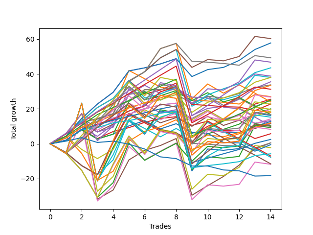

# Long Pointer 009 DB 
- Symbol: ES_830-900
- Date Range: 03/18/2022 - 12/30/2022
- Trading Period: 8:30-9:0
- Number of Trades: 14



| Name | Win Percent | Profit | Avg Profit / Trade | Avg Time / Trade |      | Name | Win Percent | Profit | Avg Profit / Trade | Avg Time / Trade |
| ---- | ----------- | ------ | ------------------ | ---------------- | ---- | ---- | ----------- | ------ | ------------------ | ---------------- |
| Sorted By <br> Profit | | | | | | Sorted By <br> Win Percentage ||||
| BB-100 Mid SL-10 | 78.57 | 30125.00 | 2151.79 | 19:43 |     | BB-50 Mid SL-10 | 92.86 | 28875.00 | 2062.50 | 09:52 |
| BB-50 Mid SL-10 | 92.86 | 28875.00 | 2062.50 | 09:52 |     | BB-50 Mid | 92.86 | 17750.00 | 1267.86 | 13:55 |
| BB-200 Mid SL-10 | 64.29 | 24625.00 | 1758.93 | 17:10 |     | TP-4 | 92.86 | 12500.00 | 892.86 | 13:18 |
| V U/L 1SD SL-10 | 57.14 | 23375.00 | 1669.64 | 29:48 |     | TP-3 | 92.86 | 6000.00 | 428.57 | 11:50 |
| BB-20 U/L 2SD C SL-10 | 85.71 | 21750.00 | 1553.57 | 14:08 |     | TP-2 | 92.86 | 1250.00 | 89.29 | 08:41 |
| TP-6 | 85.71 | 19375.00 | 1383.93 | 21:03 |     | TP-1 | 92.86 | -2875.00 | -205.36 | 07:27 |
| BB-20 U/L 2SD SL-10 | 85.71 | 19000.00 | 1357.14 | 13:13 |     | BB-20 U/L 2SD C SL-10 | 85.71 | 21750.00 | 1553.57 | 14:08 |
| BB-100 Mid | 78.57 | 19000.00 | 1357.14 | 23:46 |     | TP-6 | 85.71 | 19375.00 | 1383.93 | 21:03 |
| BB-50 Mid | 92.86 | 17750.00 | 1267.86 | 13:55 |     | BB-20 U/L 2SD SL-10 | 85.71 | 19000.00 | 1357.14 | 13:13 |
| BB-20 U/L 1SD SL-10 | 85.71 | 16875.00 | 1205.36 | 07:25 |     | BB-20 U/L 1SD SL-10 | 85.71 | 16875.00 | 1205.36 | 07:25 |
| BB-50 U/L 1SD SL-10 | 78.57 | 16750.00 | 1196.43 | 20:37 |     | TP-5 | 85.71 | 15625.00 | 1116.07 | 19:19 |
| TP-5 | 85.71 | 15625.00 | 1116.07 | 19:19 |     | BB-20 U/L 2SD C | 85.71 | 12750.00 | 910.71 | 19:40 |
| BB-200 Mid | 64.29 | 13500.00 | 964.29 | 21:12 |     | BB-20 U/L 2SD | 85.71 | 10000.00 | 714.29 | 18:46 |
| BB-100 U/L 2SD SL-10 | 42.86 | 13375.00 | 955.36 | 43:16 |     | BB-20 Mid SL-10 | 85.71 | 9875.00 | 705.36 | 03:32 |
| BB-20 U/L 2SD C | 85.71 | 12750.00 | 910.71 | 19:40 |     | BB-20 Mid | 85.71 | 6375.00 | 455.36 | 05:27 |
| TP-4 | 92.86 | 12500.00 | 892.86 | 13:18 |     | BB-20 U/L 1SD | 85.71 | 5750.00 | 410.71 | 11:08 |
| BB-50 Mid SL-5 | 64.29 | 12500.00 | 892.86 | 07:03 |     | BB-50 U/L 1SD | 85.71 | 250.00 | 17.86 | 28:29 |
| V U/L 1SD SL-5 | 42.86 | 12000.00 | 857.14 | 19:22 |     | BB-100 Mid SL-10 | 78.57 | 30125.00 | 2151.79 | 19:43 |
| V Mid SL-10 | 64.29 | 11375.00 | 812.50 | 10:45 |     | BB-100 Mid | 78.57 | 19000.00 | 1357.14 | 23:46 |
| TP-10 | 57.14 | 11375.00 | 812.50 | 41:12 |     | BB-50 U/L 1SD SL-10 | 78.57 | 16750.00 | 1196.43 | 20:37 |
| BB-20 U/L 2SD | 85.71 | 10000.00 | 714.29 | 18:46 |     | BB-20 Mid SL-5 | 71.43 | 2875.00 | 205.36 | 02:33 |
| BB-20 Mid SL-10 | 85.71 | 9875.00 | 705.36 | 03:32 |     | BB-200 Mid SL-10 | 64.29 | 24625.00 | 1758.93 | 17:10 |
| BB-200 U/L 2SD SL-10 | 42.86 | 9875.00 | 705.36 | 45:17 |     | BB-200 Mid | 64.29 | 13500.00 | 964.29 | 21:12 |
| BB-50 U/L 1SD SL-5 | 57.14 | 9375.00 | 669.64 | 15:17 |     | BB-50 Mid SL-5 | 64.29 | 12500.00 | 892.86 | 07:03 |
| NEWFI 06 | 50.00 | 9000.00 | 642.86 | 58:09 |     | V Mid SL-10 | 64.29 | 11375.00 | 812.50 | 10:45 |
| TP-9 | 57.14 | 8375.00 | 598.21 | 41:01 |     | NEWFI 000 | 64.29 | 7625.00 | 544.64 | 50:21 |
| BB-100 Mid SL-5 | 57.14 | 8375.00 | 598.21 | 11:29 |     | BB-20 U/L 1SD SL-5 | 64.29 | 6625.00 | 473.21 | 05:49 |
| BB-100 U/L 2SD | 50.00 | 8125.00 | 580.36 | 55:50 |     | TP-7 | 64.29 | 5000.00 | 357.14 | 35:57 |
| NEWFI 000 | 64.29 | 7625.00 | 544.64 | 50:21 |     | V Mid | 64.29 | 250.00 | 17.86 | 14:47 |
| BB-20 U/L 2SD C SL-5 | 57.14 | 7125.00 | 508.93 | 10:54 |     | V U/L 1SD SL-10 | 57.14 | 23375.00 | 1669.64 | 29:48 |
| BB-20 U/L 1SD SL-5 | 64.29 | 6625.00 | 473.21 | 05:49 |     | TP-10 | 57.14 | 11375.00 | 812.50 | 41:12 |
| BB-20 Mid | 85.71 | 6375.00 | 455.36 | 05:27 |     | BB-50 U/L 1SD SL-5 | 57.14 | 9375.00 | 669.64 | 15:17 |
| TP-3 | 92.86 | 6000.00 | 428.57 | 11:50 |     | TP-9 | 57.14 | 8375.00 | 598.21 | 41:01 |
| BB-20 U/L 1SD | 85.71 | 5750.00 | 410.71 | 11:08 |     | BB-100 Mid SL-5 | 57.14 | 8375.00 | 598.21 | 11:29 |
| BB-20 U/L 2SD SL-5 | 57.14 | 5750.00 | 410.71 | 10:02 |     | BB-20 U/L 2SD C SL-5 | 57.14 | 7125.00 | 508.93 | 10:54 |
| BB-50 U/L 2SD SL-10 | 50.00 | 5125.00 | 366.07 | 33:55 |     | BB-20 U/L 2SD SL-5 | 57.14 | 5750.00 | 410.71 | 10:02 |
| BB-200 Mid SL-5 | 42.86 | 5125.00 | 366.07 | 08:31 |     | TP-8 | 57.14 | 4125.00 | 294.64 | 39:13 |
| TP-7 | 64.29 | 5000.00 | 357.14 | 35:57 |     | V U/L 1SD | 57.14 | -1125.00 | -80.36 | 38:54 |
| BB-200 U/L 2SD | 50.00 | 4625.00 | 330.36 | 57:51 |     | BB-50 U/L 2SD | 57.14 | -5875.00 | -419.64 | 44:25 |
| TP-8 | 57.14 | 4125.00 | 294.64 | 39:13 |     | NEWFI 06 | 50.00 | 9000.00 | 642.86 | 58:09 |
| BB-20 Mid SL-5 | 71.43 | 2875.00 | 205.36 | 02:33 |     | BB-100 U/L 2SD | 50.00 | 8125.00 | 580.36 | 55:50 |
| TP-2 | 92.86 | 1250.00 | 89.29 | 08:41 |     | BB-50 U/L 2SD SL-10 | 50.00 | 5125.00 | 366.07 | 33:55 |
| BB-50 U/L 1SD | 85.71 | 250.00 | 17.86 | 28:29 |     | BB-200 U/L 2SD | 50.00 | 4625.00 | 330.36 | 57:51 |
| V Mid | 64.29 | 250.00 | 17.86 | 14:47 |     | V Mid SL-5 | 50.00 | -250.00 | -17.86 | 04:15 |
| V Mid SL-5 | 50.00 | -250.00 | -17.86 | 04:15 |     | BB-100 U/L 2SD SL-10 | 42.86 | 13375.00 | 955.36 | 43:16 |
| V U/L 1SD | 57.14 | -1125.00 | -80.36 | 38:54 |     | V U/L 1SD SL-5 | 42.86 | 12000.00 | 857.14 | 19:22 |
| TP-1 | 92.86 | -2875.00 | -205.36 | 07:27 |     | BB-200 U/L 2SD SL-10 | 42.86 | 9875.00 | 705.36 | 45:17 |
| BB-100 U/L 2SD SL-5 | 21.43 | -3500.00 | -250.00 | 28:40 |     | BB-200 Mid SL-5 | 42.86 | 5125.00 | 366.07 | 08:31 |
| BB-50 U/L 2SD SL-5 | 28.57 | -3875.00 | -276.79 | 23:10 |     | NEWFI 0000 | 35.71 | -9125.00 | -651.79 | 10:35 |
| BB-200 U/L 2SD SL-5 | 21.43 | -5750.00 | -410.71 | 29:56 |     | BB-50 U/L 2SD SL-5 | 28.57 | -3875.00 | -276.79 | 23:10 |
| BB-50 U/L 2SD | 57.14 | -5875.00 | -419.64 | 44:25 |     | BB-100 U/L 2SD SL-5 | 21.43 | -3500.00 | -250.00 | 28:40 |
| NEWFI 0000 | 35.71 | -9125.00 | -651.79 | 10:35 |     | BB-200 U/L 2SD SL-5 | 21.43 | -5750.00 | -410.71 | 29:56 |

## NO STOPLOSS

### Test BB-20 Mid
* Sell when price hits the middle line of the 20p bollinger
* No Stoploss
* Results:
```
Total Trades: 14
Percent Up: 85.71
Percent Down: 14.29
Total Points Moved Up: 12.75
Potential Profit: 6375.00
Total Points Ups: 32.00 Count Ups: 12
Total Points Downs: -19.25 Count Downs: 2
```

<details><summary>Trades</summary>

<code>In: 2022-03-31 08:37:00		Out: 2022-03-31 08:38:15		Total Position Time: 01:15		Total Move Up: 2.00		Total to Date: 2.00</code> <br />
<code>In: 2022-05-06 09:03:00		Out: 2022-05-06 09:04:10		Total Position Time: 01:10		Total Move Up: 6.25		Total to Date: 8.25</code> <br />
<code>In: 2022-05-11 09:14:00		Out: 2022-05-11 09:21:05		Total Position Time: 07:05		Total Move Up: 2.50		Total to Date: 10.75</code> <br />
<code>In: 2022-05-16 09:47:00		Out: 2022-05-16 09:48:15		Total Position Time: 01:15		Total Move Up: 4.00		Total to Date: 14.75</code> <br />
<code>In: 2022-05-31 12:05:00		Out: 2022-05-31 12:07:20		Total Position Time: 02:20		Total Move Up: 2.25		Total to Date: 17.00</code> <br />
<code>In: 2022-06-27 10:10:00		Out: 2022-06-27 10:11:25		Total Position Time: 01:25		Total Move Up: 3.00		Total to Date: 20.00</code> <br />
<code>In: 2022-07-08 09:48:00		Out: 2022-07-08 09:49:10		Total Position Time: 01:10		Total Move Up: 2.25		Total to Date: 22.25</code> <br />
<code>In: 2022-07-12 10:28:00		Out: 2022-07-12 10:29:10		Total Position Time: 01:10		Total Move Up: 1.00		Total to Date: 23.25</code> <br />
<code>In: 2022-09-02 09:47:00		Out: 2022-09-02 10:18:10		Total Position Time: 31:10		Total Move Up: -17.25		Total to Date: 6.00</code> <br />
<code>In: 2022-09-14 09:09:00		Out: 2022-09-14 09:13:20		Total Position Time: 04:20		Total Move Up: 2.50		Total to Date: 8.50</code> <br />
<code>In: 2022-09-14 11:06:00		Out: 2022-09-14 11:15:30		Total Position Time: 09:30		Total Move Up: -2.00		Total to Date: 6.50</code> <br />
<code>In: 2022-10-17 11:28:00		Out: 2022-10-17 11:35:40		Total Position Time: 07:40		Total Move Up: 0.00		Total to Date: 6.50</code> <br />
<code>In: 2022-11-10 09:58:00		Out: 2022-11-10 10:02:05		Total Position Time: 04:05		Total Move Up: 3.50		Total to Date: 10.00</code> <br />
<code>In: 2022-12-09 10:14:00		Out: 2022-12-09 10:16:50		Total Position Time: 02:50		Total Move Up: 2.75		Total to Date: 12.75</code> <br />


</details>

### Test BB-20 U/L 1SD
* Sell when the price hits the upper line of the 20p 1std bollinger
* No Stoploss
* Results:
```
Total Trades: 14
Percent Up: 85.71
Percent Down: 14.29
Total Points Moved Up: 11.50
Potential Profit: 5750.00
Total Points Ups: 45.00 Count Ups: 12
Total Points Downs: -33.50 Count Downs: 2
```

<details><summary>Trades</summary>

<code>In: 2022-03-31 08:37:00		Out: 2022-03-31 08:40:35		Total Position Time: 03:35		Total Move Up: 3.25		Total to Date: 3.25</code> <br />
<code>In: 2022-05-06 09:03:00		Out: 2022-05-06 09:04:10		Total Position Time: 01:10		Total Move Up: 6.25		Total to Date: 9.50</code> <br />
<code>In: 2022-05-11 09:14:00		Out: 2022-05-11 09:23:10		Total Position Time: 09:10		Total Move Up: 3.25		Total to Date: 12.75</code> <br />
<code>In: 2022-05-16 09:47:00		Out: 2022-05-16 09:50:05		Total Position Time: 03:05		Total Move Up: 6.75		Total to Date: 19.50</code> <br />
<code>In: 2022-05-31 12:05:00		Out: 2022-05-31 12:09:15		Total Position Time: 04:15		Total Move Up: 5.25		Total to Date: 24.75</code> <br />
<code>In: 2022-06-27 10:10:00		Out: 2022-06-27 10:16:10		Total Position Time: 06:10		Total Move Up: 6.25		Total to Date: 31.00</code> <br />
<code>In: 2022-07-08 09:48:00		Out: 2022-07-08 10:06:55		Total Position Time: 18:55		Total Move Up: 0.00		Total to Date: 31.00</code> <br />
<code>In: 2022-07-12 10:28:00		Out: 2022-07-12 10:30:05		Total Position Time: 02:05		Total Move Up: 1.75		Total to Date: 32.75</code> <br />
<code>In: 2022-09-02 09:47:00		Out: 2022-09-02 10:43:30		Total Position Time: 56:30		Total Move Up: -32.50		Total to Date: 0.25</code> <br />
<code>In: 2022-09-14 09:09:00		Out: 2022-09-14 09:18:05		Total Position Time: 09:05		Total Move Up: 4.75		Total to Date: 5.00</code> <br />
<code>In: 2022-09-14 11:06:00		Out: 2022-09-14 11:19:10		Total Position Time: 13:10		Total Move Up: -1.00		Total to Date: 4.00</code> <br />
<code>In: 2022-10-17 11:28:00		Out: 2022-10-17 11:36:10		Total Position Time: 08:10		Total Move Up: 2.50		Total to Date: 6.50</code> <br />
<code>In: 2022-11-10 09:58:00		Out: 2022-11-10 10:02:05		Total Position Time: 04:05		Total Move Up: 3.50		Total to Date: 10.00</code> <br />
<code>In: 2022-12-09 10:14:00		Out: 2022-12-09 10:30:40		Total Position Time: 16:40		Total Move Up: 1.50		Total to Date: 11.50</code> <br />


</details>

### Test BB-20 U/L 2SD
* Sell when the price hits the upper line of the 20p 2std bollinger
* No Stoploss
* Results:
```
Total Trades: 14
Percent Up: 85.71
Percent Down: 14.29
Total Points Moved Up: 20.00
Potential Profit: 10000.00
Total Points Ups: 58.25 Count Ups: 12
Total Points Downs: -38.25 Count Downs: 2
```

<details><summary>Trades</summary>

<code>In: 2022-03-31 08:37:00		Out: 2022-03-31 08:41:10		Total Position Time: 04:10		Total Move Up: 5.75		Total to Date: 5.75</code> <br />
<code>In: 2022-05-06 09:03:00		Out: 2022-05-06 09:04:10		Total Position Time: 01:10		Total Move Up: 6.25		Total to Date: 12.00</code> <br />
<code>In: 2022-05-11 09:14:00		Out: 2022-05-11 09:23:35		Total Position Time: 09:35		Total Move Up: 6.25		Total to Date: 18.25</code> <br />
<code>In: 2022-05-16 09:47:00		Out: 2022-05-16 10:06:30		Total Position Time: 19:30		Total Move Up: 4.50		Total to Date: 22.75</code> <br />
<code>In: 2022-05-31 12:05:00		Out: 2022-05-31 12:15:05		Total Position Time: 10:05		Total Move Up: 10.25		Total to Date: 33.00</code> <br />
<code>In: 2022-06-27 10:10:00		Out: 2022-06-27 11:10:55		Total Position Time: 60:55		Total Move Up: -7.75		Total to Date: 25.25</code> <br />
<code>In: 2022-07-08 09:48:00		Out: 2022-07-08 10:11:05		Total Position Time: 23:05		Total Move Up: 2.25		Total to Date: 27.50</code> <br />
<code>In: 2022-07-12 10:28:00		Out: 2022-07-12 10:31:30		Total Position Time: 03:30		Total Move Up: 3.00		Total to Date: 30.50</code> <br />
<code>In: 2022-09-02 09:47:00		Out: 2022-09-02 10:43:50		Total Position Time: 56:50		Total Move Up: -30.50		Total to Date: 0.00</code> <br />
<code>In: 2022-09-14 09:09:00		Out: 2022-09-14 09:25:55		Total Position Time: 16:55		Total Move Up: 5.75		Total to Date: 5.75</code> <br />
<code>In: 2022-09-14 11:06:00		Out: 2022-09-14 11:30:30		Total Position Time: 24:30		Total Move Up: 2.50		Total to Date: 8.25</code> <br />
<code>In: 2022-10-17 11:28:00		Out: 2022-10-17 11:37:30		Total Position Time: 09:30		Total Move Up: 3.00		Total to Date: 11.25</code> <br />
<code>In: 2022-11-10 09:58:00		Out: 2022-11-10 10:03:45		Total Position Time: 05:45		Total Move Up: 6.00		Total to Date: 17.25</code> <br />
<code>In: 2022-12-09 10:14:00		Out: 2022-12-09 10:31:15		Total Position Time: 17:15		Total Move Up: 2.75		Total to Date: 20.00</code> <br />


</details>

### Test BB-20 U/L 2SD C
* Sell when the price hits the upper line of the 20p 2std bollinger
* No Stoploss
* Results:
```
Total Trades: 14
Percent Up: 85.71
Percent Down: 14.29
Total Points Moved Up: 25.50
Potential Profit: 12750.00
Total Points Ups: 63.75 Count Ups: 12
Total Points Downs: -38.25 Count Downs: 2
```

<details><summary>Trades</summary>

<code>In: 2022-03-31 08:37:00		Out: 2022-03-31 08:41:10		Total Position Time: 04:10		Total Move Up: 5.75		Total to Date: 5.75</code> <br />
<code>In: 2022-05-06 09:03:00		Out: 2022-05-06 09:05:00		Total Position Time: 02:00		Total Move Up: 7.25		Total to Date: 13.00</code> <br />
<code>In: 2022-05-11 09:14:00		Out: 2022-05-11 09:23:40		Total Position Time: 09:40		Total Move Up: 7.75		Total to Date: 20.75</code> <br />
<code>In: 2022-05-16 09:47:00		Out: 2022-05-16 10:07:00		Total Position Time: 20:00		Total Move Up: 5.25		Total to Date: 26.00</code> <br />
<code>In: 2022-05-31 12:05:00		Out: 2022-05-31 12:15:05		Total Position Time: 10:05		Total Move Up: 10.25		Total to Date: 36.25</code> <br />
<code>In: 2022-06-27 10:10:00		Out: 2022-06-27 11:10:55		Total Position Time: 60:55		Total Move Up: -7.75		Total to Date: 28.50</code> <br />
<code>In: 2022-07-08 09:48:00		Out: 2022-07-08 10:11:05		Total Position Time: 23:05		Total Move Up: 2.25		Total to Date: 30.75</code> <br />
<code>In: 2022-07-12 10:28:00		Out: 2022-07-12 10:41:40		Total Position Time: 13:40		Total Move Up: 4.00		Total to Date: 34.75</code> <br />
<code>In: 2022-09-02 09:47:00		Out: 2022-09-02 10:43:50		Total Position Time: 56:50		Total Move Up: -30.50		Total to Date: 4.25</code> <br />
<code>In: 2022-09-14 09:09:00		Out: 2022-09-14 09:25:55		Total Position Time: 16:55		Total Move Up: 5.75		Total to Date: 10.00</code> <br />
<code>In: 2022-09-14 11:06:00		Out: 2022-09-14 11:30:55		Total Position Time: 24:55		Total Move Up: 3.50		Total to Date: 13.50</code> <br />
<code>In: 2022-10-17 11:28:00		Out: 2022-10-17 11:37:55		Total Position Time: 09:55		Total Move Up: 3.00		Total to Date: 16.50</code> <br />
<code>In: 2022-11-10 09:58:00		Out: 2022-11-10 10:03:55		Total Position Time: 05:55		Total Move Up: 6.25		Total to Date: 22.75</code> <br />
<code>In: 2022-12-09 10:14:00		Out: 2022-12-09 10:31:20		Total Position Time: 17:20		Total Move Up: 2.75		Total to Date: 25.50</code> <br />


</details>

### Test BB-50 Mid
* Sell when price hits the middle line of the 50p bollinger
* No Stoploss
* Results:
```
Total Trades: 14
Percent Up: 92.86
Percent Down: 7.14
Total Points Moved Up: 35.50
Potential Profit: 17750.00
Total Points Ups: 68.00 Count Ups: 13
Total Points Downs: -32.50 Count Downs: 1
```

<details><summary>Trades</summary>

<code>In: 2022-03-31 08:37:00		Out: 2022-03-31 08:41:05		Total Position Time: 04:05		Total Move Up: 4.25		Total to Date: 4.25</code> <br />
<code>In: 2022-05-06 09:03:00		Out: 2022-05-06 09:06:05		Total Position Time: 03:05		Total Move Up: 10.25		Total to Date: 14.50</code> <br />
<code>In: 2022-05-11 09:14:00		Out: 2022-05-11 09:23:45		Total Position Time: 09:45		Total Move Up: 8.25		Total to Date: 22.75</code> <br />
<code>In: 2022-05-16 09:47:00		Out: 2022-05-16 09:50:05		Total Position Time: 03:05		Total Move Up: 6.75		Total to Date: 29.50</code> <br />
<code>In: 2022-05-31 12:05:00		Out: 2022-05-31 12:15:15		Total Position Time: 10:15		Total Move Up: 12.25		Total to Date: 41.75</code> <br />
<code>In: 2022-06-27 10:10:00		Out: 2022-06-27 10:11:15		Total Position Time: 01:15		Total Move Up: 1.75		Total to Date: 43.50</code> <br />
<code>In: 2022-07-08 09:48:00		Out: 2022-07-08 10:11:10		Total Position Time: 23:10		Total Move Up: 2.25		Total to Date: 45.75</code> <br />
<code>In: 2022-07-12 10:28:00		Out: 2022-07-12 10:41:35		Total Position Time: 13:35		Total Move Up: 3.00		Total to Date: 48.75</code> <br />
<code>In: 2022-09-02 09:47:00		Out: 2022-09-02 10:47:55		Total Position Time: 60:55		Total Move Up: -32.50		Total to Date: 16.25</code> <br />
<code>In: 2022-09-14 09:09:00		Out: 2022-09-14 09:14:55		Total Position Time: 05:55		Total Move Up: 4.00		Total to Date: 20.25</code> <br />
<code>In: 2022-09-14 11:06:00		Out: 2022-09-14 11:29:30		Total Position Time: 23:30		Total Move Up: 1.25		Total to Date: 21.50</code> <br />
<code>In: 2022-10-17 11:28:00		Out: 2022-10-17 11:39:15		Total Position Time: 11:15		Total Move Up: 4.00		Total to Date: 25.50</code> <br />
<code>In: 2022-11-10 09:58:00		Out: 2022-11-10 10:03:55		Total Position Time: 05:55		Total Move Up: 6.25		Total to Date: 31.75</code> <br />
<code>In: 2022-12-09 10:14:00		Out: 2022-12-09 10:33:05		Total Position Time: 19:05		Total Move Up: 3.75		Total to Date: 35.50</code> <br />


</details>

### Test BB-50 U/L 1SD
* Sell when the price hits the upper line of the 50p 1std bollinger
* No Stoploss
* Results:
```
Total Trades: 14
Percent Up: 85.71
Percent Down: 14.29
Total Points Moved Up: 0.50
Potential Profit: 250.00
Total Points Ups: 77.50 Count Ups: 12
Total Points Downs: -77.00 Count Downs: 2
```

<details><summary>Trades</summary>

<code>In: 2022-03-31 08:37:00		Out: 2022-03-31 09:00:15		Total Position Time: 23:15		Total Move Up: 4.25		Total to Date: 4.25</code> <br />
<code>In: 2022-05-06 09:03:00		Out: 2022-05-06 09:23:05		Total Position Time: 20:05		Total Move Up: 8.50		Total to Date: 12.75</code> <br />
<code>In: 2022-05-11 09:14:00		Out: 2022-05-11 10:14:55		Total Position Time: 60:55		Total Move Up: -44.50		Total to Date: -31.75</code> <br />
<code>In: 2022-05-16 09:47:00		Out: 2022-05-16 10:07:05		Total Position Time: 20:05		Total Move Up: 5.25		Total to Date: -26.50</code> <br />
<code>In: 2022-05-31 12:05:00		Out: 2022-05-31 12:28:25		Total Position Time: 23:25		Total Move Up: 17.25		Total to Date: -9.25</code> <br />
<code>In: 2022-06-27 10:10:00		Out: 2022-06-27 10:13:05		Total Position Time: 03:05		Total Move Up: 5.50		Total to Date: -3.75</code> <br />
<code>In: 2022-07-08 09:48:00		Out: 2022-07-08 10:26:30		Total Position Time: 38:30		Total Move Up: 2.75		Total to Date: -1.00</code> <br />
<code>In: 2022-07-12 10:28:00		Out: 2022-07-12 10:53:20		Total Position Time: 25:20		Total Move Up: 4.00		Total to Date: 3.00</code> <br />
<code>In: 2022-09-02 09:47:00		Out: 2022-09-02 10:47:55		Total Position Time: 60:55		Total Move Up: -32.50		Total to Date: -29.50</code> <br />
<code>In: 2022-09-14 09:09:00		Out: 2022-09-14 09:38:20		Total Position Time: 29:20		Total Move Up: 5.50		Total to Date: -24.00</code> <br />
<code>In: 2022-09-14 11:06:00		Out: 2022-09-14 11:32:05		Total Position Time: 26:05		Total Move Up: 5.25		Total to Date: -18.75</code> <br />
<code>In: 2022-10-17 11:28:00		Out: 2022-10-17 11:43:20		Total Position Time: 15:20		Total Move Up: 6.50		Total to Date: -12.25</code> <br />
<code>In: 2022-11-10 09:58:00		Out: 2022-11-10 10:13:45		Total Position Time: 15:45		Total Move Up: 9.75		Total to Date: -2.50</code> <br />
<code>In: 2022-12-09 10:14:00		Out: 2022-12-09 10:50:45		Total Position Time: 36:45		Total Move Up: 3.00		Total to Date: 0.50</code> <br />


</details>

### Test BB-50 U/L 2SD
* Sell when the price hits the upper line of the 50p 2std bollinger
* No Stoploss
* Results:
```
Total Trades: 14
Percent Up: 57.14
Percent Down: 42.86
Total Points Moved Up: -11.75
Potential Profit: -5875.00
Total Points Ups: 80.50 Count Ups: 8
Total Points Downs: -92.25 Count Downs: 6
```

<details><summary>Trades</summary>

<code>In: 2022-03-31 08:37:00		Out: 2022-03-31 09:37:55		Total Position Time: 60:55		Total Move Up: -5.50		Total to Date: -5.50</code> <br />
<code>In: 2022-05-06 09:03:00		Out: 2022-05-06 09:35:05		Total Position Time: 32:05		Total Move Up: 17.25		Total to Date: 11.75</code> <br />
<code>In: 2022-05-11 09:14:00		Out: 2022-05-11 10:14:55		Total Position Time: 60:55		Total Move Up: -44.50		Total to Date: -32.75</code> <br />
<code>In: 2022-05-16 09:47:00		Out: 2022-05-16 10:07:35		Total Position Time: 20:35		Total Move Up: 8.50		Total to Date: -24.25</code> <br />
<code>In: 2022-05-31 12:05:00		Out: 2022-05-31 12:31:05		Total Position Time: 26:05		Total Move Up: 22.75		Total to Date: -1.50</code> <br />
<code>In: 2022-06-27 10:10:00		Out: 2022-06-27 11:10:55		Total Position Time: 60:55		Total Move Up: -7.75		Total to Date: -9.25</code> <br />
<code>In: 2022-07-08 09:48:00		Out: 2022-07-08 10:27:00		Total Position Time: 39:00		Total Move Up: 5.00		Total to Date: -4.25</code> <br />
<code>In: 2022-07-12 10:28:00		Out: 2022-07-12 10:54:05		Total Position Time: 26:05		Total Move Up: 4.75		Total to Date: 0.50</code> <br />
<code>In: 2022-09-02 09:47:00		Out: 2022-09-02 10:47:55		Total Position Time: 60:55		Total Move Up: -32.50		Total to Date: -32.00</code> <br />
<code>In: 2022-09-14 09:09:00		Out: 2022-09-14 09:42:25		Total Position Time: 33:25		Total Move Up: 8.50		Total to Date: -23.50</code> <br />
<code>In: 2022-09-14 11:06:00		Out: 2022-09-14 12:06:55		Total Position Time: 60:55		Total Move Up: -0.75		Total to Date: -24.25</code> <br />
<code>In: 2022-10-17 11:28:00		Out: 2022-10-17 12:28:55		Total Position Time: 60:55		Total Move Up: 1.00		Total to Date: -23.25</code> <br />
<code>In: 2022-11-10 09:58:00		Out: 2022-11-10 10:16:15		Total Position Time: 18:15		Total Move Up: 12.75		Total to Date: -10.50</code> <br />
<code>In: 2022-12-09 10:14:00		Out: 2022-12-09 11:14:55		Total Position Time: 60:55		Total Move Up: -1.25		Total to Date: -11.75</code> <br />


</details>

### Test V Mid
* Sell when the price hits the middle line of the 1std VWAP
* No Stoploss
* Results:
```
Total Trades: 14
Percent Up: 64.29
Percent Down: 35.71
Total Points Moved Up: 0.50
Potential Profit: 250.00
Total Points Ups: 36.50 Count Ups: 9
Total Points Downs: -36.00 Count Downs: 5
```

<details><summary>Trades</summary>

<code>In: 2022-03-31 08:37:00		Out: 2022-03-31 08:38:10		Total Position Time: 01:10		Total Move Up: 1.75		Total to Date: 1.75</code> <br />
<code>In: 2022-05-06 09:03:00		Out: 2022-05-06 09:04:10		Total Position Time: 01:10		Total Move Up: 6.25		Total to Date: 8.00</code> <br />
<code>In: 2022-05-11 09:14:00		Out: 2022-05-11 09:23:10		Total Position Time: 09:10		Total Move Up: 3.25		Total to Date: 11.25</code> <br />
<code>In: 2022-05-16 09:47:00		Out: 2022-05-16 09:48:10		Total Position Time: 01:10		Total Move Up: 2.75		Total to Date: 14.00</code> <br />
<code>In: 2022-05-31 12:05:00		Out: 2022-05-31 12:07:50		Total Position Time: 02:50		Total Move Up: 4.75		Total to Date: 18.75</code> <br />
<code>In: 2022-06-27 10:10:00		Out: 2022-06-27 10:11:25		Total Position Time: 01:25		Total Move Up: 3.00		Total to Date: 21.75</code> <br />
<code>In: 2022-07-08 09:48:00		Out: 2022-07-08 10:29:10		Total Position Time: 41:10		Total Move Up: 8.00		Total to Date: 29.75</code> <br />
<code>In: 2022-07-12 10:28:00		Out: 2022-07-12 10:31:15		Total Position Time: 03:15		Total Move Up: 3.00		Total to Date: 32.75</code> <br />
<code>In: 2022-09-02 09:47:00		Out: 2022-09-02 10:47:55		Total Position Time: 60:55		Total Move Up: -32.50		Total to Date: 0.25</code> <br />
<code>In: 2022-09-14 09:09:00		Out: 2022-09-14 09:10:10		Total Position Time: 01:10		Total Move Up: -0.50		Total to Date: -0.25</code> <br />
<code>In: 2022-09-14 11:06:00		Out: 2022-09-14 12:06:55		Total Position Time: 60:55		Total Move Up: -0.75		Total to Date: -1.00</code> <br />
<code>In: 2022-10-17 11:28:00		Out: 2022-10-17 11:29:10		Total Position Time: 01:10		Total Move Up: -0.25		Total to Date: -1.25</code> <br />
<code>In: 2022-11-10 09:58:00		Out: 2022-11-10 10:00:30		Total Position Time: 02:30		Total Move Up: -2.00		Total to Date: -3.25</code> <br />
<code>In: 2022-12-09 10:14:00		Out: 2022-12-09 10:33:05		Total Position Time: 19:05		Total Move Up: 3.75		Total to Date: 0.50</code> <br />


</details>

### Test V U/L 1SD
* Sell when the price hits the upper line of the 1std VWAP
* No Stoploss
* Results:
```
Total Trades: 14
Percent Up: 57.14
Percent Down: 42.86
Total Points Moved Up: -2.25
Potential Profit: -1125.00
Total Points Ups: 86.25 Count Ups: 8
Total Points Downs: -88.50 Count Downs: 6
```

<details><summary>Trades</summary>

<code>In: 2022-03-31 08:37:00		Out: 2022-03-31 08:41:10		Total Position Time: 04:10		Total Move Up: 5.75		Total to Date: 5.75</code> <br />
<code>In: 2022-05-06 09:03:00		Out: 2022-05-06 09:06:40		Total Position Time: 03:40		Total Move Up: 11.50		Total to Date: 17.25</code> <br />
<code>In: 2022-05-11 09:14:00		Out: 2022-05-11 10:14:55		Total Position Time: 60:55		Total Move Up: -44.50		Total to Date: -27.25</code> <br />
<code>In: 2022-05-16 09:47:00		Out: 2022-05-16 10:07:35		Total Position Time: 20:35		Total Move Up: 8.50		Total to Date: -18.75</code> <br />
<code>In: 2022-05-31 12:05:00		Out: 2022-05-31 12:30:55		Total Position Time: 25:55		Total Move Up: 21.50		Total to Date: 2.75</code> <br />
<code>In: 2022-06-27 10:10:00		Out: 2022-06-27 11:10:55		Total Position Time: 60:55		Total Move Up: -7.75		Total to Date: -5.00</code> <br />
<code>In: 2022-07-08 09:48:00		Out: 2022-07-08 10:48:55		Total Position Time: 60:55		Total Move Up: 13.25		Total to Date: 8.25</code> <br />
<code>In: 2022-07-12 10:28:00		Out: 2022-07-12 11:28:55		Total Position Time: 60:55		Total Move Up: -1.75		Total to Date: 6.50</code> <br />
<code>In: 2022-09-02 09:47:00		Out: 2022-09-02 10:47:55		Total Position Time: 60:55		Total Move Up: -32.50		Total to Date: -26.00</code> <br />
<code>In: 2022-09-14 09:09:00		Out: 2022-09-14 09:42:25		Total Position Time: 33:25		Total Move Up: 8.50		Total to Date: -17.50</code> <br />
<code>In: 2022-09-14 11:06:00		Out: 2022-09-14 12:06:55		Total Position Time: 60:55		Total Move Up: -0.75		Total to Date: -18.25</code> <br />
<code>In: 2022-10-17 11:28:00		Out: 2022-10-17 11:40:40		Total Position Time: 12:40		Total Move Up: 4.75		Total to Date: -13.50</code> <br />
<code>In: 2022-11-10 09:58:00		Out: 2022-11-10 10:15:50		Total Position Time: 17:50		Total Move Up: 12.50		Total to Date: -1.00</code> <br />
<code>In: 2022-12-09 10:14:00		Out: 2022-12-09 11:14:55		Total Position Time: 60:55		Total Move Up: -1.25		Total to Date: -2.25</code> <br />


</details>

### Test BB-100 Mid
* Move to BB100 Mid
* No Stoploss
* Results:
```
Total Trades: 14
Percent Up: 78.57
Percent Down: 21.43
Total Points Moved Up: 38.00
Potential Profit: 19000.00
Total Points Ups: 72.50 Count Ups: 11
Total Points Downs: -34.50 Count Downs: 3
```

<details><summary>Trades</summary>

<code>In: 2022-03-31 08:37:00		Out: 2022-03-31 08:38:10		Total Position Time: 01:10		Total Move Up: 1.75		Total to Date: 1.75</code> <br />
<code>In: 2022-05-06 09:03:00		Out: 2022-05-06 09:04:10		Total Position Time: 01:10		Total Move Up: 6.25		Total to Date: 8.00</code> <br />
<code>In: 2022-05-11 09:14:00		Out: 2022-05-11 09:23:35		Total Position Time: 09:35		Total Move Up: 6.25		Total to Date: 14.25</code> <br />
<code>In: 2022-05-16 09:47:00		Out: 2022-05-16 09:48:10		Total Position Time: 01:10		Total Move Up: 2.75		Total to Date: 17.00</code> <br />
<code>In: 2022-05-31 12:05:00		Out: 2022-05-31 12:30:15		Total Position Time: 25:15		Total Move Up: 18.75		Total to Date: 35.75</code> <br />
<code>In: 2022-06-27 10:10:00		Out: 2022-06-27 10:20:05		Total Position Time: 10:05		Total Move Up: 5.50		Total to Date: 41.25</code> <br />
<code>In: 2022-07-08 09:48:00		Out: 2022-07-08 10:29:10		Total Position Time: 41:10		Total Move Up: 8.00		Total to Date: 49.25</code> <br />
<code>In: 2022-07-12 10:28:00		Out: 2022-07-12 10:54:05		Total Position Time: 26:05		Total Move Up: 4.75		Total to Date: 54.00</code> <br />
<code>In: 2022-09-02 09:47:00		Out: 2022-09-02 10:47:55		Total Position Time: 60:55		Total Move Up: -32.50		Total to Date: 21.50</code> <br />
<code>In: 2022-09-14 09:09:00		Out: 2022-09-14 09:18:10		Total Position Time: 09:10		Total Move Up: 4.50		Total to Date: 26.00</code> <br />
<code>In: 2022-09-14 11:06:00		Out: 2022-09-14 12:06:55		Total Position Time: 60:55		Total Move Up: -0.75		Total to Date: 25.25</code> <br />
<code>In: 2022-10-17 11:28:00		Out: 2022-10-17 11:36:10		Total Position Time: 08:10		Total Move Up: 2.50		Total to Date: 27.75</code> <br />
<code>In: 2022-11-10 09:58:00		Out: 2022-11-10 10:15:00		Total Position Time: 17:00		Total Move Up: 11.50		Total to Date: 39.25</code> <br />
<code>In: 2022-12-09 10:14:00		Out: 2022-12-09 11:14:55		Total Position Time: 60:55		Total Move Up: -1.25		Total to Date: 38.00</code> <br />


</details>

### Test BB-100 U/L 2SD
* Move to BB100 Upper Band
* No Stoploss
* Results:
```
Total Trades: 14
Percent Up: 50.00
Percent Down: 50.00
Total Points Moved Up: 16.25
Potential Profit: 8125.00
Total Points Ups: 110.25 Count Ups: 7
Total Points Downs: -94.00 Count Downs: 7
```

<details><summary>Trades</summary>

<code>In: 2022-03-31 08:37:00		Out: 2022-03-31 09:37:55		Total Position Time: 60:55		Total Move Up: -5.50		Total to Date: -5.50</code> <br />
<code>In: 2022-05-06 09:03:00		Out: 2022-05-06 10:03:55		Total Position Time: 60:55		Total Move Up: 28.75		Total to Date: 23.25</code> <br />
<code>In: 2022-05-11 09:14:00		Out: 2022-05-11 10:14:55		Total Position Time: 60:55		Total Move Up: -44.50		Total to Date: -21.25</code> <br />
<code>In: 2022-05-16 09:47:00		Out: 2022-05-16 10:24:00		Total Position Time: 37:00		Total Move Up: 18.50		Total to Date: -2.75</code> <br />
<code>In: 2022-05-31 12:05:00		Out: 2022-05-31 12:47:00		Total Position Time: 42:00		Total Move Up: 16.00		Total to Date: 13.25</code> <br />
<code>In: 2022-06-27 10:10:00		Out: 2022-06-27 11:10:55		Total Position Time: 60:55		Total Move Up: -7.75		Total to Date: 5.50</code> <br />
<code>In: 2022-07-08 09:48:00		Out: 2022-07-08 10:48:55		Total Position Time: 60:55		Total Move Up: 13.25		Total to Date: 18.75</code> <br />
<code>In: 2022-07-12 10:28:00		Out: 2022-07-12 11:28:55		Total Position Time: 60:55		Total Move Up: -1.75		Total to Date: 17.00</code> <br />
<code>In: 2022-09-02 09:47:00		Out: 2022-09-02 10:47:55		Total Position Time: 60:55		Total Move Up: -32.50		Total to Date: -15.50</code> <br />
<code>In: 2022-09-14 09:09:00		Out: 2022-09-14 09:52:15		Total Position Time: 43:15		Total Move Up: 12.50		Total to Date: -3.00</code> <br />
<code>In: 2022-09-14 11:06:00		Out: 2022-09-14 12:06:55		Total Position Time: 60:55		Total Move Up: -0.75		Total to Date: -3.75</code> <br />
<code>In: 2022-10-17 11:28:00		Out: 2022-10-17 12:28:55		Total Position Time: 60:55		Total Move Up: 1.00		Total to Date: -2.75</code> <br />
<code>In: 2022-11-10 09:58:00		Out: 2022-11-10 10:48:15		Total Position Time: 50:15		Total Move Up: 20.25		Total to Date: 17.50</code> <br />
<code>In: 2022-12-09 10:14:00		Out: 2022-12-09 11:14:55		Total Position Time: 60:55		Total Move Up: -1.25		Total to Date: 16.25</code> <br />


</details>

### Test BB-200 Mid
* Move to BB200 Mid
* No Stoploss
* Results:
```
Total Trades: 14
Percent Up: 64.29
Percent Down: 35.71
Total Points Moved Up: 27.00
Potential Profit: 13500.00
Total Points Ups: 63.00 Count Ups: 9
Total Points Downs: -36.00 Count Downs: 5
```

<details><summary>Trades</summary>

<code>In: 2022-03-31 08:37:00		Out: 2022-03-31 08:41:10		Total Position Time: 04:10		Total Move Up: 5.75		Total to Date: 5.75</code> <br />
<code>In: 2022-05-06 09:03:00		Out: 2022-05-06 09:04:10		Total Position Time: 01:10		Total Move Up: 6.25		Total to Date: 12.00</code> <br />
<code>In: 2022-05-11 09:14:00		Out: 2022-05-11 09:21:05		Total Position Time: 07:05		Total Move Up: 2.50		Total to Date: 14.50</code> <br />
<code>In: 2022-05-16 09:47:00		Out: 2022-05-16 09:48:10		Total Position Time: 01:10		Total Move Up: 2.75		Total to Date: 17.25</code> <br />
<code>In: 2022-05-31 12:05:00		Out: 2022-05-31 12:30:15		Total Position Time: 25:15		Total Move Up: 18.75		Total to Date: 36.00</code> <br />
<code>In: 2022-06-27 10:10:00		Out: 2022-06-27 10:12:55		Total Position Time: 02:55		Total Move Up: 5.25		Total to Date: 41.25</code> <br />
<code>In: 2022-07-08 09:48:00		Out: 2022-07-08 10:48:55		Total Position Time: 60:55		Total Move Up: 13.25		Total to Date: 54.50</code> <br />
<code>In: 2022-07-12 10:28:00		Out: 2022-07-12 10:31:15		Total Position Time: 03:15		Total Move Up: 3.00		Total to Date: 57.50</code> <br />
<code>In: 2022-09-02 09:47:00		Out: 2022-09-02 10:47:55		Total Position Time: 60:55		Total Move Up: -32.50		Total to Date: 25.00</code> <br />
<code>In: 2022-09-14 09:09:00		Out: 2022-09-14 09:10:10		Total Position Time: 01:10		Total Move Up: -0.50		Total to Date: 24.50</code> <br />
<code>In: 2022-09-14 11:06:00		Out: 2022-09-14 12:06:55		Total Position Time: 60:55		Total Move Up: -0.75		Total to Date: 23.75</code> <br />
<code>In: 2022-10-17 11:28:00		Out: 2022-10-17 11:29:35		Total Position Time: 01:35		Total Move Up: -1.00		Total to Date: 22.75</code> <br />
<code>In: 2022-11-10 09:58:00		Out: 2022-11-10 10:03:35		Total Position Time: 05:35		Total Move Up: 5.50		Total to Date: 28.25</code> <br />
<code>In: 2022-12-09 10:14:00		Out: 2022-12-09 11:14:55		Total Position Time: 60:55		Total Move Up: -1.25		Total to Date: 27.00</code> <br />


</details>

### Test BB-200 U/L 2SD
* Move to BB200 Upper Band
* No Stoploss
* Results:
```
Total Trades: 14
Percent Up: 50.00
Percent Down: 50.00
Total Points Moved Up: 9.25
Potential Profit: 4625.00
Total Points Ups: 103.25 Count Ups: 7
Total Points Downs: -94.00 Count Downs: 7
```

<details><summary>Trades</summary>

<code>In: 2022-03-31 08:37:00		Out: 2022-03-31 09:37:55		Total Position Time: 60:55		Total Move Up: -5.50		Total to Date: -5.50</code> <br />
<code>In: 2022-05-06 09:03:00		Out: 2022-05-06 10:03:55		Total Position Time: 60:55		Total Move Up: 28.75		Total to Date: 23.25</code> <br />
<code>In: 2022-05-11 09:14:00		Out: 2022-05-11 10:14:55		Total Position Time: 60:55		Total Move Up: -44.50		Total to Date: -21.25</code> <br />
<code>In: 2022-05-16 09:47:00		Out: 2022-05-16 10:24:05		Total Position Time: 37:05		Total Move Up: 19.25		Total to Date: -2.00</code> <br />
<code>In: 2022-05-31 12:05:00		Out: 2022-05-31 12:47:00		Total Position Time: 42:00		Total Move Up: 16.00		Total to Date: 14.00</code> <br />
<code>In: 2022-06-27 10:10:00		Out: 2022-06-27 11:10:55		Total Position Time: 60:55		Total Move Up: -7.75		Total to Date: 6.25</code> <br />
<code>In: 2022-07-08 09:48:00		Out: 2022-07-08 10:48:55		Total Position Time: 60:55		Total Move Up: 13.25		Total to Date: 19.50</code> <br />
<code>In: 2022-07-12 10:28:00		Out: 2022-07-12 11:28:55		Total Position Time: 60:55		Total Move Up: -1.75		Total to Date: 17.75</code> <br />
<code>In: 2022-09-02 09:47:00		Out: 2022-09-02 10:47:55		Total Position Time: 60:55		Total Move Up: -32.50		Total to Date: -14.75</code> <br />
<code>In: 2022-09-14 09:09:00		Out: 2022-09-14 10:09:55		Total Position Time: 60:55		Total Move Up: 7.25		Total to Date: -7.50</code> <br />
<code>In: 2022-09-14 11:06:00		Out: 2022-09-14 12:06:55		Total Position Time: 60:55		Total Move Up: -0.75		Total to Date: -8.25</code> <br />
<code>In: 2022-10-17 11:28:00		Out: 2022-10-17 12:28:55		Total Position Time: 60:55		Total Move Up: 1.00		Total to Date: -7.25</code> <br />
<code>In: 2022-11-10 09:58:00		Out: 2022-11-10 10:58:55		Total Position Time: 60:55		Total Move Up: 17.75		Total to Date: 10.50</code> <br />
<code>In: 2022-12-09 10:14:00		Out: 2022-12-09 11:14:55		Total Position Time: 60:55		Total Move Up: -1.25		Total to Date: 9.25</code> <br />


</details>

## STOPLOSS OF 5

### Test BB-20 Mid SL-5
* Sell when price hits the middle line of the 20p bollinger
* Stoploss is 5 points
* Results:
```
Total Trades: 14
Percent Up: 71.43
Percent Down: 28.57
Total Points Moved Up: 5.75
Potential Profit: 2875.00
Total Points Ups: 26.00 Count Ups: 10
Total Points Downs: -20.25 Count Downs: 4
```

<details><summary>Trades</summary>

<code>In: 2022-03-31 08:37:00		Out: 2022-03-31 08:38:15		Total Position Time: 01:15		Total Move Up: 2.00		Total to Date: 2.00</code> <br />
<code>In: 2022-05-06 09:03:00		Out: 2022-05-06 09:04:10		Total Position Time: 01:10		Total Move Up: 6.25		Total to Date: 8.25</code> <br />
<code>In: 2022-05-11 09:14:00		Out: 2022-05-11 09:19:05		Total Position Time: 05:05		Total Move Up: -5.25		Total to Date: 3.00</code> <br />
<code>In: 2022-05-16 09:47:00		Out: 2022-05-16 09:48:15		Total Position Time: 01:15		Total Move Up: 4.00		Total to Date: 7.00</code> <br />
<code>In: 2022-05-31 12:05:00		Out: 2022-05-31 12:07:20		Total Position Time: 02:20		Total Move Up: 2.25		Total to Date: 9.25</code> <br />
<code>In: 2022-06-27 10:10:00		Out: 2022-06-27 10:11:25		Total Position Time: 01:25		Total Move Up: 3.00		Total to Date: 12.25</code> <br />
<code>In: 2022-07-08 09:48:00		Out: 2022-07-08 09:49:10		Total Position Time: 01:10		Total Move Up: 2.25		Total to Date: 14.50</code> <br />
<code>In: 2022-07-12 10:28:00		Out: 2022-07-12 10:29:10		Total Position Time: 01:10		Total Move Up: 1.00		Total to Date: 15.50</code> <br />
<code>In: 2022-09-02 09:47:00		Out: 2022-09-02 09:48:15		Total Position Time: 01:15		Total Move Up: -5.00		Total to Date: 10.50</code> <br />
<code>In: 2022-09-14 09:09:00		Out: 2022-09-14 09:13:20		Total Position Time: 04:20		Total Move Up: 2.50		Total to Date: 13.00</code> <br />
<code>In: 2022-09-14 11:06:00		Out: 2022-09-14 11:09:05		Total Position Time: 03:05		Total Move Up: -5.25		Total to Date: 7.75</code> <br />
<code>In: 2022-10-17 11:28:00		Out: 2022-10-17 11:35:40		Total Position Time: 07:40		Total Move Up: 0.00		Total to Date: 7.75</code> <br />
<code>In: 2022-11-10 09:58:00		Out: 2022-11-10 09:59:50		Total Position Time: 01:50		Total Move Up: -4.75		Total to Date: 3.00</code> <br />
<code>In: 2022-12-09 10:14:00		Out: 2022-12-09 10:16:50		Total Position Time: 02:50		Total Move Up: 2.75		Total to Date: 5.75</code> <br />


</details>

### Test BB-20 U/L 1SD SL-5
* Sell when the price hits the upper line of the 20p 1std bollinger
* Stoploss is 5 points
* Results:
```
Total Trades: 14
Percent Up: 64.29
Percent Down: 35.71
Total Points Moved Up: 13.25
Potential Profit: 6625.00
Total Points Ups: 38.25 Count Ups: 9
Total Points Downs: -25.00 Count Downs: 5
```

<details><summary>Trades</summary>

<code>In: 2022-03-31 08:37:00		Out: 2022-03-31 08:40:35		Total Position Time: 03:35		Total Move Up: 3.25		Total to Date: 3.25</code> <br />
<code>In: 2022-05-06 09:03:00		Out: 2022-05-06 09:04:10		Total Position Time: 01:10		Total Move Up: 6.25		Total to Date: 9.50</code> <br />
<code>In: 2022-05-11 09:14:00		Out: 2022-05-11 09:19:05		Total Position Time: 05:05		Total Move Up: -5.25		Total to Date: 4.25</code> <br />
<code>In: 2022-05-16 09:47:00		Out: 2022-05-16 09:50:05		Total Position Time: 03:05		Total Move Up: 6.75		Total to Date: 11.00</code> <br />
<code>In: 2022-05-31 12:05:00		Out: 2022-05-31 12:09:15		Total Position Time: 04:15		Total Move Up: 5.25		Total to Date: 16.25</code> <br />
<code>In: 2022-06-27 10:10:00		Out: 2022-06-27 10:16:10		Total Position Time: 06:10		Total Move Up: 6.25		Total to Date: 22.50</code> <br />
<code>In: 2022-07-08 09:48:00		Out: 2022-07-08 10:04:00		Total Position Time: 16:00		Total Move Up: -4.75		Total to Date: 17.75</code> <br />
<code>In: 2022-07-12 10:28:00		Out: 2022-07-12 10:30:05		Total Position Time: 02:05		Total Move Up: 1.75		Total to Date: 19.50</code> <br />
<code>In: 2022-09-02 09:47:00		Out: 2022-09-02 09:48:15		Total Position Time: 01:15		Total Move Up: -5.00		Total to Date: 14.50</code> <br />
<code>In: 2022-09-14 09:09:00		Out: 2022-09-14 09:18:05		Total Position Time: 09:05		Total Move Up: 4.75		Total to Date: 19.25</code> <br />
<code>In: 2022-09-14 11:06:00		Out: 2022-09-14 11:09:05		Total Position Time: 03:05		Total Move Up: -5.25		Total to Date: 14.00</code> <br />
<code>In: 2022-10-17 11:28:00		Out: 2022-10-17 11:36:10		Total Position Time: 08:10		Total Move Up: 2.50		Total to Date: 16.50</code> <br />
<code>In: 2022-11-10 09:58:00		Out: 2022-11-10 09:59:50		Total Position Time: 01:50		Total Move Up: -4.75		Total to Date: 11.75</code> <br />
<code>In: 2022-12-09 10:14:00		Out: 2022-12-09 10:30:40		Total Position Time: 16:40		Total Move Up: 1.50		Total to Date: 13.25</code> <br />


</details>

### Test BB-20 U/L 2SD SL-5
* Sell when the price hits the upper line of the 20p 2std bollinger
* Stoploss is 5 points
* Results:
```
Total Trades: 14
Percent Up: 57.14
Percent Down: 42.86
Total Points Moved Up: 11.50
Potential Profit: 5750.00
Total Points Ups: 41.25 Count Ups: 8
Total Points Downs: -29.75 Count Downs: 6
```

<details><summary>Trades</summary>

<code>In: 2022-03-31 08:37:00		Out: 2022-03-31 08:41:10		Total Position Time: 04:10		Total Move Up: 5.75		Total to Date: 5.75</code> <br />
<code>In: 2022-05-06 09:03:00		Out: 2022-05-06 09:04:10		Total Position Time: 01:10		Total Move Up: 6.25		Total to Date: 12.00</code> <br />
<code>In: 2022-05-11 09:14:00		Out: 2022-05-11 09:19:05		Total Position Time: 05:05		Total Move Up: -5.25		Total to Date: 6.75</code> <br />
<code>In: 2022-05-16 09:47:00		Out: 2022-05-16 10:06:30		Total Position Time: 19:30		Total Move Up: 4.50		Total to Date: 11.25</code> <br />
<code>In: 2022-05-31 12:05:00		Out: 2022-05-31 12:15:05		Total Position Time: 10:05		Total Move Up: 10.25		Total to Date: 21.50</code> <br />
<code>In: 2022-06-27 10:10:00		Out: 2022-06-27 10:41:20		Total Position Time: 31:20		Total Move Up: -4.75		Total to Date: 16.75</code> <br />
<code>In: 2022-07-08 09:48:00		Out: 2022-07-08 10:04:00		Total Position Time: 16:00		Total Move Up: -4.75		Total to Date: 12.00</code> <br />
<code>In: 2022-07-12 10:28:00		Out: 2022-07-12 10:31:30		Total Position Time: 03:30		Total Move Up: 3.00		Total to Date: 15.00</code> <br />
<code>In: 2022-09-02 09:47:00		Out: 2022-09-02 09:48:15		Total Position Time: 01:15		Total Move Up: -5.00		Total to Date: 10.00</code> <br />
<code>In: 2022-09-14 09:09:00		Out: 2022-09-14 09:25:55		Total Position Time: 16:55		Total Move Up: 5.75		Total to Date: 15.75</code> <br />
<code>In: 2022-09-14 11:06:00		Out: 2022-09-14 11:09:05		Total Position Time: 03:05		Total Move Up: -5.25		Total to Date: 10.50</code> <br />
<code>In: 2022-10-17 11:28:00		Out: 2022-10-17 11:37:30		Total Position Time: 09:30		Total Move Up: 3.00		Total to Date: 13.50</code> <br />
<code>In: 2022-11-10 09:58:00		Out: 2022-11-10 09:59:50		Total Position Time: 01:50		Total Move Up: -4.75		Total to Date: 8.75</code> <br />
<code>In: 2022-12-09 10:14:00		Out: 2022-12-09 10:31:15		Total Position Time: 17:15		Total Move Up: 2.75		Total to Date: 11.50</code> <br />


</details>

### Test BB-20 U/L 2SD C SL-5
* Sell when the price hits the upper line of the 20p 2std bollinger
* Stoploss is 5 points
* Results:
```
Total Trades: 14
Percent Up: 57.14
Percent Down: 42.86
Total Points Moved Up: 14.25
Potential Profit: 7125.00
Total Points Ups: 44.00 Count Ups: 8
Total Points Downs: -29.75 Count Downs: 6
```

<details><summary>Trades</summary>

<code>In: 2022-03-31 08:37:00		Out: 2022-03-31 08:41:10		Total Position Time: 04:10		Total Move Up: 5.75		Total to Date: 5.75</code> <br />
<code>In: 2022-05-06 09:03:00		Out: 2022-05-06 09:05:00		Total Position Time: 02:00		Total Move Up: 7.25		Total to Date: 13.00</code> <br />
<code>In: 2022-05-11 09:14:00		Out: 2022-05-11 09:19:05		Total Position Time: 05:05		Total Move Up: -5.25		Total to Date: 7.75</code> <br />
<code>In: 2022-05-16 09:47:00		Out: 2022-05-16 10:07:00		Total Position Time: 20:00		Total Move Up: 5.25		Total to Date: 13.00</code> <br />
<code>In: 2022-05-31 12:05:00		Out: 2022-05-31 12:15:05		Total Position Time: 10:05		Total Move Up: 10.25		Total to Date: 23.25</code> <br />
<code>In: 2022-06-27 10:10:00		Out: 2022-06-27 10:41:20		Total Position Time: 31:20		Total Move Up: -4.75		Total to Date: 18.50</code> <br />
<code>In: 2022-07-08 09:48:00		Out: 2022-07-08 10:04:00		Total Position Time: 16:00		Total Move Up: -4.75		Total to Date: 13.75</code> <br />
<code>In: 2022-07-12 10:28:00		Out: 2022-07-12 10:41:40		Total Position Time: 13:40		Total Move Up: 4.00		Total to Date: 17.75</code> <br />
<code>In: 2022-09-02 09:47:00		Out: 2022-09-02 09:48:15		Total Position Time: 01:15		Total Move Up: -5.00		Total to Date: 12.75</code> <br />
<code>In: 2022-09-14 09:09:00		Out: 2022-09-14 09:25:55		Total Position Time: 16:55		Total Move Up: 5.75		Total to Date: 18.50</code> <br />
<code>In: 2022-09-14 11:06:00		Out: 2022-09-14 11:09:05		Total Position Time: 03:05		Total Move Up: -5.25		Total to Date: 13.25</code> <br />
<code>In: 2022-10-17 11:28:00		Out: 2022-10-17 11:37:55		Total Position Time: 09:55		Total Move Up: 3.00		Total to Date: 16.25</code> <br />
<code>In: 2022-11-10 09:58:00		Out: 2022-11-10 09:59:50		Total Position Time: 01:50		Total Move Up: -4.75		Total to Date: 11.50</code> <br />
<code>In: 2022-12-09 10:14:00		Out: 2022-12-09 10:31:20		Total Position Time: 17:20		Total Move Up: 2.75		Total to Date: 14.25</code> <br />


</details>

### Test BB-50 Mid SL-5
* Sell when price hits the middle line of the 50p bollinger
* Stoploss is 5 points
* Results:
```
Total Trades: 14
Percent Up: 64.29
Percent Down: 35.71
Total Points Moved Up: 25.00
Potential Profit: 12500.00
Total Points Ups: 50.00 Count Ups: 9
Total Points Downs: -25.00 Count Downs: 5
```

<details><summary>Trades</summary>

<code>In: 2022-03-31 08:37:00		Out: 2022-03-31 08:41:05		Total Position Time: 04:05		Total Move Up: 4.25		Total to Date: 4.25</code> <br />
<code>In: 2022-05-06 09:03:00		Out: 2022-05-06 09:06:05		Total Position Time: 03:05		Total Move Up: 10.25		Total to Date: 14.50</code> <br />
<code>In: 2022-05-11 09:14:00		Out: 2022-05-11 09:19:05		Total Position Time: 05:05		Total Move Up: -5.25		Total to Date: 9.25</code> <br />
<code>In: 2022-05-16 09:47:00		Out: 2022-05-16 09:50:05		Total Position Time: 03:05		Total Move Up: 6.75		Total to Date: 16.00</code> <br />
<code>In: 2022-05-31 12:05:00		Out: 2022-05-31 12:15:15		Total Position Time: 10:15		Total Move Up: 12.25		Total to Date: 28.25</code> <br />
<code>In: 2022-06-27 10:10:00		Out: 2022-06-27 10:11:15		Total Position Time: 01:15		Total Move Up: 1.75		Total to Date: 30.00</code> <br />
<code>In: 2022-07-08 09:48:00		Out: 2022-07-08 10:04:00		Total Position Time: 16:00		Total Move Up: -4.75		Total to Date: 25.25</code> <br />
<code>In: 2022-07-12 10:28:00		Out: 2022-07-12 10:41:35		Total Position Time: 13:35		Total Move Up: 3.00		Total to Date: 28.25</code> <br />
<code>In: 2022-09-02 09:47:00		Out: 2022-09-02 09:48:15		Total Position Time: 01:15		Total Move Up: -5.00		Total to Date: 23.25</code> <br />
<code>In: 2022-09-14 09:09:00		Out: 2022-09-14 09:14:55		Total Position Time: 05:55		Total Move Up: 4.00		Total to Date: 27.25</code> <br />
<code>In: 2022-09-14 11:06:00		Out: 2022-09-14 11:09:05		Total Position Time: 03:05		Total Move Up: -5.25		Total to Date: 22.00</code> <br />
<code>In: 2022-10-17 11:28:00		Out: 2022-10-17 11:39:15		Total Position Time: 11:15		Total Move Up: 4.00		Total to Date: 26.00</code> <br />
<code>In: 2022-11-10 09:58:00		Out: 2022-11-10 09:59:50		Total Position Time: 01:50		Total Move Up: -4.75		Total to Date: 21.25</code> <br />
<code>In: 2022-12-09 10:14:00		Out: 2022-12-09 10:33:05		Total Position Time: 19:05		Total Move Up: 3.75		Total to Date: 25.00</code> <br />


</details>

### Test BB-50 U/L 1SD SL-5
* Sell when the price hits the upper line of the 50p 1std bollinger
* Stoploss is 5 points
* Results:
```
Total Trades: 14
Percent Up: 57.14
Percent Down: 42.86
Total Points Moved Up: 18.75
Potential Profit: 9375.00
Total Points Ups: 51.25 Count Ups: 8
Total Points Downs: -32.50 Count Downs: 6
```

<details><summary>Trades</summary>

<code>In: 2022-03-31 08:37:00		Out: 2022-03-31 09:00:15		Total Position Time: 23:15		Total Move Up: 4.25		Total to Date: 4.25</code> <br />
<code>In: 2022-05-06 09:03:00		Out: 2022-05-06 09:13:15		Total Position Time: 10:15		Total Move Up: -7.50		Total to Date: -3.25</code> <br />
<code>In: 2022-05-11 09:14:00		Out: 2022-05-11 09:19:05		Total Position Time: 05:05		Total Move Up: -5.25		Total to Date: -8.50</code> <br />
<code>In: 2022-05-16 09:47:00		Out: 2022-05-16 10:07:05		Total Position Time: 20:05		Total Move Up: 5.25		Total to Date: -3.25</code> <br />
<code>In: 2022-05-31 12:05:00		Out: 2022-05-31 12:28:25		Total Position Time: 23:25		Total Move Up: 17.25		Total to Date: 14.00</code> <br />
<code>In: 2022-06-27 10:10:00		Out: 2022-06-27 10:13:05		Total Position Time: 03:05		Total Move Up: 5.50		Total to Date: 19.50</code> <br />
<code>In: 2022-07-08 09:48:00		Out: 2022-07-08 10:04:00		Total Position Time: 16:00		Total Move Up: -4.75		Total to Date: 14.75</code> <br />
<code>In: 2022-07-12 10:28:00		Out: 2022-07-12 10:53:20		Total Position Time: 25:20		Total Move Up: 4.00		Total to Date: 18.75</code> <br />
<code>In: 2022-09-02 09:47:00		Out: 2022-09-02 09:48:15		Total Position Time: 01:15		Total Move Up: -5.00		Total to Date: 13.75</code> <br />
<code>In: 2022-09-14 09:09:00		Out: 2022-09-14 09:38:20		Total Position Time: 29:20		Total Move Up: 5.50		Total to Date: 19.25</code> <br />
<code>In: 2022-09-14 11:06:00		Out: 2022-09-14 11:09:05		Total Position Time: 03:05		Total Move Up: -5.25		Total to Date: 14.00</code> <br />
<code>In: 2022-10-17 11:28:00		Out: 2022-10-17 11:43:20		Total Position Time: 15:20		Total Move Up: 6.50		Total to Date: 20.50</code> <br />
<code>In: 2022-11-10 09:58:00		Out: 2022-11-10 09:59:50		Total Position Time: 01:50		Total Move Up: -4.75		Total to Date: 15.75</code> <br />
<code>In: 2022-12-09 10:14:00		Out: 2022-12-09 10:50:45		Total Position Time: 36:45		Total Move Up: 3.00		Total to Date: 18.75</code> <br />


</details>

### Test BB-50 U/L 2SD SL-5
* Sell when the price hits the upper line of the 50p 2std bollinger
* Stoploss is 5 points
* Results:
```
Total Trades: 14
Percent Up: 28.57
Percent Down: 71.43
Total Points Moved Up: -7.75
Potential Profit: -3875.00
Total Points Ups: 44.50 Count Ups: 4
Total Points Downs: -52.25 Count Downs: 10
```

<details><summary>Trades</summary>

<code>In: 2022-03-31 08:37:00		Out: 2022-03-31 09:21:55		Total Position Time: 44:55		Total Move Up: -5.00		Total to Date: -5.00</code> <br />
<code>In: 2022-05-06 09:03:00		Out: 2022-05-06 09:13:15		Total Position Time: 10:15		Total Move Up: -7.50		Total to Date: -12.50</code> <br />
<code>In: 2022-05-11 09:14:00		Out: 2022-05-11 09:19:05		Total Position Time: 05:05		Total Move Up: -5.25		Total to Date: -17.75</code> <br />
<code>In: 2022-05-16 09:47:00		Out: 2022-05-16 10:07:35		Total Position Time: 20:35		Total Move Up: 8.50		Total to Date: -9.25</code> <br />
<code>In: 2022-05-31 12:05:00		Out: 2022-05-31 12:31:05		Total Position Time: 26:05		Total Move Up: 22.75		Total to Date: 13.50</code> <br />
<code>In: 2022-06-27 10:10:00		Out: 2022-06-27 10:41:20		Total Position Time: 31:20		Total Move Up: -4.75		Total to Date: 8.75</code> <br />
<code>In: 2022-07-08 09:48:00		Out: 2022-07-08 10:04:00		Total Position Time: 16:00		Total Move Up: -4.75		Total to Date: 4.00</code> <br />
<code>In: 2022-07-12 10:28:00		Out: 2022-07-12 10:54:05		Total Position Time: 26:05		Total Move Up: 4.75		Total to Date: 8.75</code> <br />
<code>In: 2022-09-02 09:47:00		Out: 2022-09-02 09:48:15		Total Position Time: 01:15		Total Move Up: -5.00		Total to Date: 3.75</code> <br />
<code>In: 2022-09-14 09:09:00		Out: 2022-09-14 09:42:25		Total Position Time: 33:25		Total Move Up: 8.50		Total to Date: 12.25</code> <br />
<code>In: 2022-09-14 11:06:00		Out: 2022-09-14 11:09:05		Total Position Time: 03:05		Total Move Up: -5.25		Total to Date: 7.00</code> <br />
<code>In: 2022-10-17 11:28:00		Out: 2022-10-17 12:21:05		Total Position Time: 53:05		Total Move Up: -5.00		Total to Date: 2.00</code> <br />
<code>In: 2022-11-10 09:58:00		Out: 2022-11-10 09:59:50		Total Position Time: 01:50		Total Move Up: -4.75		Total to Date: -2.75</code> <br />
<code>In: 2022-12-09 10:14:00		Out: 2022-12-09 11:05:20		Total Position Time: 51:20		Total Move Up: -5.00		Total to Date: -7.75</code> <br />


</details>

### Test V Mid SL-5
* Sell when the price hits the middle line of the 1std VWAP
* Stoploss is 5 points
* Results:
```
Total Trades: 14
Percent Up: 50.00
Percent Down: 50.00
Total Points Moved Up: -0.50
Potential Profit: -250.00
Total Points Ups: 25.25 Count Ups: 7
Total Points Downs: -25.75 Count Downs: 7
```

<details><summary>Trades</summary>

<code>In: 2022-03-31 08:37:00		Out: 2022-03-31 08:38:10		Total Position Time: 01:10		Total Move Up: 1.75		Total to Date: 1.75</code> <br />
<code>In: 2022-05-06 09:03:00		Out: 2022-05-06 09:04:10		Total Position Time: 01:10		Total Move Up: 6.25		Total to Date: 8.00</code> <br />
<code>In: 2022-05-11 09:14:00		Out: 2022-05-11 09:19:05		Total Position Time: 05:05		Total Move Up: -5.25		Total to Date: 2.75</code> <br />
<code>In: 2022-05-16 09:47:00		Out: 2022-05-16 09:48:10		Total Position Time: 01:10		Total Move Up: 2.75		Total to Date: 5.50</code> <br />
<code>In: 2022-05-31 12:05:00		Out: 2022-05-31 12:07:50		Total Position Time: 02:50		Total Move Up: 4.75		Total to Date: 10.25</code> <br />
<code>In: 2022-06-27 10:10:00		Out: 2022-06-27 10:11:25		Total Position Time: 01:25		Total Move Up: 3.00		Total to Date: 13.25</code> <br />
<code>In: 2022-07-08 09:48:00		Out: 2022-07-08 10:04:00		Total Position Time: 16:00		Total Move Up: -4.75		Total to Date: 8.50</code> <br />
<code>In: 2022-07-12 10:28:00		Out: 2022-07-12 10:31:15		Total Position Time: 03:15		Total Move Up: 3.00		Total to Date: 11.50</code> <br />
<code>In: 2022-09-02 09:47:00		Out: 2022-09-02 09:48:15		Total Position Time: 01:15		Total Move Up: -5.00		Total to Date: 6.50</code> <br />
<code>In: 2022-09-14 09:09:00		Out: 2022-09-14 09:10:10		Total Position Time: 01:10		Total Move Up: -0.50		Total to Date: 6.00</code> <br />
<code>In: 2022-09-14 11:06:00		Out: 2022-09-14 11:09:05		Total Position Time: 03:05		Total Move Up: -5.25		Total to Date: 0.75</code> <br />
<code>In: 2022-10-17 11:28:00		Out: 2022-10-17 11:29:10		Total Position Time: 01:10		Total Move Up: -0.25		Total to Date: 0.50</code> <br />
<code>In: 2022-11-10 09:58:00		Out: 2022-11-10 09:59:50		Total Position Time: 01:50		Total Move Up: -4.75		Total to Date: -4.25</code> <br />
<code>In: 2022-12-09 10:14:00		Out: 2022-12-09 10:33:05		Total Position Time: 19:05		Total Move Up: 3.75		Total to Date: -0.50</code> <br />


</details>

### Test V U/L 1SD SL-5
* Sell when the price hits the upper line of the 1std VWAP
* Stoploss is 5 points
* Results:
```
Total Trades: 14
Percent Up: 42.86
Percent Down: 57.14
Total Points Moved Up: 24.00
Potential Profit: 12000.00
Total Points Ups: 60.50 Count Ups: 6
Total Points Downs: -36.50 Count Downs: 8
```

<details><summary>Trades</summary>

<code>In: 2022-03-31 08:37:00		Out: 2022-03-31 08:41:10		Total Position Time: 04:10		Total Move Up: 5.75		Total to Date: 5.75</code> <br />
<code>In: 2022-05-06 09:03:00		Out: 2022-05-06 09:06:40		Total Position Time: 03:40		Total Move Up: 11.50		Total to Date: 17.25</code> <br />
<code>In: 2022-05-11 09:14:00		Out: 2022-05-11 09:19:05		Total Position Time: 05:05		Total Move Up: -5.25		Total to Date: 12.00</code> <br />
<code>In: 2022-05-16 09:47:00		Out: 2022-05-16 10:07:35		Total Position Time: 20:35		Total Move Up: 8.50		Total to Date: 20.50</code> <br />
<code>In: 2022-05-31 12:05:00		Out: 2022-05-31 12:30:55		Total Position Time: 25:55		Total Move Up: 21.50		Total to Date: 42.00</code> <br />
<code>In: 2022-06-27 10:10:00		Out: 2022-06-27 10:41:20		Total Position Time: 31:20		Total Move Up: -4.75		Total to Date: 37.25</code> <br />
<code>In: 2022-07-08 09:48:00		Out: 2022-07-08 10:04:00		Total Position Time: 16:00		Total Move Up: -4.75		Total to Date: 32.50</code> <br />
<code>In: 2022-07-12 10:28:00		Out: 2022-07-12 11:28:55		Total Position Time: 60:55		Total Move Up: -1.75		Total to Date: 30.75</code> <br />
<code>In: 2022-09-02 09:47:00		Out: 2022-09-02 09:48:15		Total Position Time: 01:15		Total Move Up: -5.00		Total to Date: 25.75</code> <br />
<code>In: 2022-09-14 09:09:00		Out: 2022-09-14 09:42:25		Total Position Time: 33:25		Total Move Up: 8.50		Total to Date: 34.25</code> <br />
<code>In: 2022-09-14 11:06:00		Out: 2022-09-14 11:09:05		Total Position Time: 03:05		Total Move Up: -5.25		Total to Date: 29.00</code> <br />
<code>In: 2022-10-17 11:28:00		Out: 2022-10-17 11:40:40		Total Position Time: 12:40		Total Move Up: 4.75		Total to Date: 33.75</code> <br />
<code>In: 2022-11-10 09:58:00		Out: 2022-11-10 09:59:50		Total Position Time: 01:50		Total Move Up: -4.75		Total to Date: 29.00</code> <br />
<code>In: 2022-12-09 10:14:00		Out: 2022-12-09 11:05:20		Total Position Time: 51:20		Total Move Up: -5.00		Total to Date: 24.00</code> <br />


</details>

### Test BB-100 Mid SL-5
* Move to BB100 Mid
* Stoploss is 5 points
* Results:
```
Total Trades: 14
Percent Up: 57.14
Percent Down: 42.86
Total Points Moved Up: 16.75
Potential Profit: 8375.00
Total Points Ups: 46.75 Count Ups: 8
Total Points Downs: -30.00 Count Downs: 6
```

<details><summary>Trades</summary>

<code>In: 2022-03-31 08:37:00		Out: 2022-03-31 08:38:10		Total Position Time: 01:10		Total Move Up: 1.75		Total to Date: 1.75</code> <br />
<code>In: 2022-05-06 09:03:00		Out: 2022-05-06 09:04:10		Total Position Time: 01:10		Total Move Up: 6.25		Total to Date: 8.00</code> <br />
<code>In: 2022-05-11 09:14:00		Out: 2022-05-11 09:19:05		Total Position Time: 05:05		Total Move Up: -5.25		Total to Date: 2.75</code> <br />
<code>In: 2022-05-16 09:47:00		Out: 2022-05-16 09:48:10		Total Position Time: 01:10		Total Move Up: 2.75		Total to Date: 5.50</code> <br />
<code>In: 2022-05-31 12:05:00		Out: 2022-05-31 12:30:15		Total Position Time: 25:15		Total Move Up: 18.75		Total to Date: 24.25</code> <br />
<code>In: 2022-06-27 10:10:00		Out: 2022-06-27 10:20:05		Total Position Time: 10:05		Total Move Up: 5.50		Total to Date: 29.75</code> <br />
<code>In: 2022-07-08 09:48:00		Out: 2022-07-08 10:04:00		Total Position Time: 16:00		Total Move Up: -4.75		Total to Date: 25.00</code> <br />
<code>In: 2022-07-12 10:28:00		Out: 2022-07-12 10:54:05		Total Position Time: 26:05		Total Move Up: 4.75		Total to Date: 29.75</code> <br />
<code>In: 2022-09-02 09:47:00		Out: 2022-09-02 09:48:15		Total Position Time: 01:15		Total Move Up: -5.00		Total to Date: 24.75</code> <br />
<code>In: 2022-09-14 09:09:00		Out: 2022-09-14 09:18:10		Total Position Time: 09:10		Total Move Up: 4.50		Total to Date: 29.25</code> <br />
<code>In: 2022-09-14 11:06:00		Out: 2022-09-14 11:09:05		Total Position Time: 03:05		Total Move Up: -5.25		Total to Date: 24.00</code> <br />
<code>In: 2022-10-17 11:28:00		Out: 2022-10-17 11:36:10		Total Position Time: 08:10		Total Move Up: 2.50		Total to Date: 26.50</code> <br />
<code>In: 2022-11-10 09:58:00		Out: 2022-11-10 09:59:50		Total Position Time: 01:50		Total Move Up: -4.75		Total to Date: 21.75</code> <br />
<code>In: 2022-12-09 10:14:00		Out: 2022-12-09 11:05:20		Total Position Time: 51:20		Total Move Up: -5.00		Total to Date: 16.75</code> <br />


</details>

### Test BB-100 U/L 2SD SL-5
* Move to BB100 Upper Band
* Stoploss is 5 points
* Results:
```
Total Trades: 14
Percent Up: 21.43
Percent Down: 78.57
Total Points Moved Up: -7.00
Potential Profit: -3500.00
Total Points Ups: 47.00 Count Ups: 3
Total Points Downs: -54.00 Count Downs: 11
```

<details><summary>Trades</summary>

<code>In: 2022-03-31 08:37:00		Out: 2022-03-31 09:21:55		Total Position Time: 44:55		Total Move Up: -5.00		Total to Date: -5.00</code> <br />
<code>In: 2022-05-06 09:03:00		Out: 2022-05-06 09:13:15		Total Position Time: 10:15		Total Move Up: -7.50		Total to Date: -12.50</code> <br />
<code>In: 2022-05-11 09:14:00		Out: 2022-05-11 09:19:05		Total Position Time: 05:05		Total Move Up: -5.25		Total to Date: -17.75</code> <br />
<code>In: 2022-05-16 09:47:00		Out: 2022-05-16 10:24:00		Total Position Time: 37:00		Total Move Up: 18.50		Total to Date: 0.75</code> <br />
<code>In: 2022-05-31 12:05:00		Out: 2022-05-31 12:47:00		Total Position Time: 42:00		Total Move Up: 16.00		Total to Date: 16.75</code> <br />
<code>In: 2022-06-27 10:10:00		Out: 2022-06-27 10:41:20		Total Position Time: 31:20		Total Move Up: -4.75		Total to Date: 12.00</code> <br />
<code>In: 2022-07-08 09:48:00		Out: 2022-07-08 10:04:00		Total Position Time: 16:00		Total Move Up: -4.75		Total to Date: 7.25</code> <br />
<code>In: 2022-07-12 10:28:00		Out: 2022-07-12 11:28:55		Total Position Time: 60:55		Total Move Up: -1.75		Total to Date: 5.50</code> <br />
<code>In: 2022-09-02 09:47:00		Out: 2022-09-02 09:48:15		Total Position Time: 01:15		Total Move Up: -5.00		Total to Date: 0.50</code> <br />
<code>In: 2022-09-14 09:09:00		Out: 2022-09-14 09:52:15		Total Position Time: 43:15		Total Move Up: 12.50		Total to Date: 13.00</code> <br />
<code>In: 2022-09-14 11:06:00		Out: 2022-09-14 11:09:05		Total Position Time: 03:05		Total Move Up: -5.25		Total to Date: 7.75</code> <br />
<code>In: 2022-10-17 11:28:00		Out: 2022-10-17 12:21:05		Total Position Time: 53:05		Total Move Up: -5.00		Total to Date: 2.75</code> <br />
<code>In: 2022-11-10 09:58:00		Out: 2022-11-10 09:59:50		Total Position Time: 01:50		Total Move Up: -4.75		Total to Date: -2.00</code> <br />
<code>In: 2022-12-09 10:14:00		Out: 2022-12-09 11:05:20		Total Position Time: 51:20		Total Move Up: -5.00		Total to Date: -7.00</code> <br />


</details>

### Test BB-200 Mid SL-5
* Move to BB200 Mid
* Stoploss is 5 points
* Results:
```
Total Trades: 14
Percent Up: 42.86
Percent Down: 57.14
Total Points Moved Up: 10.25
Potential Profit: 5125.00
Total Points Ups: 41.75 Count Ups: 6
Total Points Downs: -31.50 Count Downs: 8
```

<details><summary>Trades</summary>

<code>In: 2022-03-31 08:37:00		Out: 2022-03-31 08:41:10		Total Position Time: 04:10		Total Move Up: 5.75		Total to Date: 5.75</code> <br />
<code>In: 2022-05-06 09:03:00		Out: 2022-05-06 09:04:10		Total Position Time: 01:10		Total Move Up: 6.25		Total to Date: 12.00</code> <br />
<code>In: 2022-05-11 09:14:00		Out: 2022-05-11 09:19:05		Total Position Time: 05:05		Total Move Up: -5.25		Total to Date: 6.75</code> <br />
<code>In: 2022-05-16 09:47:00		Out: 2022-05-16 09:48:10		Total Position Time: 01:10		Total Move Up: 2.75		Total to Date: 9.50</code> <br />
<code>In: 2022-05-31 12:05:00		Out: 2022-05-31 12:30:15		Total Position Time: 25:15		Total Move Up: 18.75		Total to Date: 28.25</code> <br />
<code>In: 2022-06-27 10:10:00		Out: 2022-06-27 10:12:55		Total Position Time: 02:55		Total Move Up: 5.25		Total to Date: 33.50</code> <br />
<code>In: 2022-07-08 09:48:00		Out: 2022-07-08 10:04:00		Total Position Time: 16:00		Total Move Up: -4.75		Total to Date: 28.75</code> <br />
<code>In: 2022-07-12 10:28:00		Out: 2022-07-12 10:31:15		Total Position Time: 03:15		Total Move Up: 3.00		Total to Date: 31.75</code> <br />
<code>In: 2022-09-02 09:47:00		Out: 2022-09-02 09:48:15		Total Position Time: 01:15		Total Move Up: -5.00		Total to Date: 26.75</code> <br />
<code>In: 2022-09-14 09:09:00		Out: 2022-09-14 09:10:10		Total Position Time: 01:10		Total Move Up: -0.50		Total to Date: 26.25</code> <br />
<code>In: 2022-09-14 11:06:00		Out: 2022-09-14 11:09:05		Total Position Time: 03:05		Total Move Up: -5.25		Total to Date: 21.00</code> <br />
<code>In: 2022-10-17 11:28:00		Out: 2022-10-17 11:29:35		Total Position Time: 01:35		Total Move Up: -1.00		Total to Date: 20.00</code> <br />
<code>In: 2022-11-10 09:58:00		Out: 2022-11-10 09:59:50		Total Position Time: 01:50		Total Move Up: -4.75		Total to Date: 15.25</code> <br />
<code>In: 2022-12-09 10:14:00		Out: 2022-12-09 11:05:20		Total Position Time: 51:20		Total Move Up: -5.00		Total to Date: 10.25</code> <br />


</details>

### Test BB-200 U/L 2SD SL-5
* Move to BB200 Upper Band
* Stoploss is 5 points
* Results:
```
Total Trades: 14
Percent Up: 21.43
Percent Down: 78.57
Total Points Moved Up: -11.50
Potential Profit: -5750.00
Total Points Ups: 42.50 Count Ups: 3
Total Points Downs: -54.00 Count Downs: 11
```

<details><summary>Trades</summary>

<code>In: 2022-03-31 08:37:00		Out: 2022-03-31 09:21:55		Total Position Time: 44:55		Total Move Up: -5.00		Total to Date: -5.00</code> <br />
<code>In: 2022-05-06 09:03:00		Out: 2022-05-06 09:13:15		Total Position Time: 10:15		Total Move Up: -7.50		Total to Date: -12.50</code> <br />
<code>In: 2022-05-11 09:14:00		Out: 2022-05-11 09:19:05		Total Position Time: 05:05		Total Move Up: -5.25		Total to Date: -17.75</code> <br />
<code>In: 2022-05-16 09:47:00		Out: 2022-05-16 10:24:05		Total Position Time: 37:05		Total Move Up: 19.25		Total to Date: 1.50</code> <br />
<code>In: 2022-05-31 12:05:00		Out: 2022-05-31 12:47:00		Total Position Time: 42:00		Total Move Up: 16.00		Total to Date: 17.50</code> <br />
<code>In: 2022-06-27 10:10:00		Out: 2022-06-27 10:41:20		Total Position Time: 31:20		Total Move Up: -4.75		Total to Date: 12.75</code> <br />
<code>In: 2022-07-08 09:48:00		Out: 2022-07-08 10:04:00		Total Position Time: 16:00		Total Move Up: -4.75		Total to Date: 8.00</code> <br />
<code>In: 2022-07-12 10:28:00		Out: 2022-07-12 11:28:55		Total Position Time: 60:55		Total Move Up: -1.75		Total to Date: 6.25</code> <br />
<code>In: 2022-09-02 09:47:00		Out: 2022-09-02 09:48:15		Total Position Time: 01:15		Total Move Up: -5.00		Total to Date: 1.25</code> <br />
<code>In: 2022-09-14 09:09:00		Out: 2022-09-14 10:09:55		Total Position Time: 60:55		Total Move Up: 7.25		Total to Date: 8.50</code> <br />
<code>In: 2022-09-14 11:06:00		Out: 2022-09-14 11:09:05		Total Position Time: 03:05		Total Move Up: -5.25		Total to Date: 3.25</code> <br />
<code>In: 2022-10-17 11:28:00		Out: 2022-10-17 12:21:05		Total Position Time: 53:05		Total Move Up: -5.00		Total to Date: -1.75</code> <br />
<code>In: 2022-11-10 09:58:00		Out: 2022-11-10 09:59:50		Total Position Time: 01:50		Total Move Up: -4.75		Total to Date: -6.50</code> <br />
<code>In: 2022-12-09 10:14:00		Out: 2022-12-09 11:05:20		Total Position Time: 51:20		Total Move Up: -5.00		Total to Date: -11.50</code> <br />


</details>

## STOPLOSS OF 10

### Test BB-20 Mid SL-10
* Sell when price hits the middle line of the 20p bollinger
* Stoploss is 10 points
* Results:
```
Total Trades: 14
Percent Up: 85.71
Percent Down: 14.29
Total Points Moved Up: 19.75
Potential Profit: 9875.00
Total Points Ups: 32.00 Count Ups: 12
Total Points Downs: -12.25 Count Downs: 2
```

<details><summary>Trades</summary>

<code>In: 2022-03-31 08:37:00		Out: 2022-03-31 08:38:15		Total Position Time: 01:15		Total Move Up: 2.00		Total to Date: 2.00</code> <br />
<code>In: 2022-05-06 09:03:00		Out: 2022-05-06 09:04:10		Total Position Time: 01:10		Total Move Up: 6.25		Total to Date: 8.25</code> <br />
<code>In: 2022-05-11 09:14:00		Out: 2022-05-11 09:21:05		Total Position Time: 07:05		Total Move Up: 2.50		Total to Date: 10.75</code> <br />
<code>In: 2022-05-16 09:47:00		Out: 2022-05-16 09:48:15		Total Position Time: 01:15		Total Move Up: 4.00		Total to Date: 14.75</code> <br />
<code>In: 2022-05-31 12:05:00		Out: 2022-05-31 12:07:20		Total Position Time: 02:20		Total Move Up: 2.25		Total to Date: 17.00</code> <br />
<code>In: 2022-06-27 10:10:00		Out: 2022-06-27 10:11:25		Total Position Time: 01:25		Total Move Up: 3.00		Total to Date: 20.00</code> <br />
<code>In: 2022-07-08 09:48:00		Out: 2022-07-08 09:49:10		Total Position Time: 01:10		Total Move Up: 2.25		Total to Date: 22.25</code> <br />
<code>In: 2022-07-12 10:28:00		Out: 2022-07-12 10:29:10		Total Position Time: 01:10		Total Move Up: 1.00		Total to Date: 23.25</code> <br />
<code>In: 2022-09-02 09:47:00		Out: 2022-09-02 09:51:20		Total Position Time: 04:20		Total Move Up: -10.25		Total to Date: 13.00</code> <br />
<code>In: 2022-09-14 09:09:00		Out: 2022-09-14 09:13:20		Total Position Time: 04:20		Total Move Up: 2.50		Total to Date: 15.50</code> <br />
<code>In: 2022-09-14 11:06:00		Out: 2022-09-14 11:15:30		Total Position Time: 09:30		Total Move Up: -2.00		Total to Date: 13.50</code> <br />
<code>In: 2022-10-17 11:28:00		Out: 2022-10-17 11:35:40		Total Position Time: 07:40		Total Move Up: 0.00		Total to Date: 13.50</code> <br />
<code>In: 2022-11-10 09:58:00		Out: 2022-11-10 10:02:05		Total Position Time: 04:05		Total Move Up: 3.50		Total to Date: 17.00</code> <br />
<code>In: 2022-12-09 10:14:00		Out: 2022-12-09 10:16:50		Total Position Time: 02:50		Total Move Up: 2.75		Total to Date: 19.75</code> <br />


</details>

### Test BB-20 U/L 1SD SL-10
* Sell when the price hits the upper line of the 20p 1std bollinger
* Stoploss is 10 points
* Results:
```
Total Trades: 14
Percent Up: 85.71
Percent Down: 14.29
Total Points Moved Up: 33.75
Potential Profit: 16875.00
Total Points Ups: 45.00 Count Ups: 12
Total Points Downs: -11.25 Count Downs: 2
```

<details><summary>Trades</summary>

<code>In: 2022-03-31 08:37:00		Out: 2022-03-31 08:40:35		Total Position Time: 03:35		Total Move Up: 3.25		Total to Date: 3.25</code> <br />
<code>In: 2022-05-06 09:03:00		Out: 2022-05-06 09:04:10		Total Position Time: 01:10		Total Move Up: 6.25		Total to Date: 9.50</code> <br />
<code>In: 2022-05-11 09:14:00		Out: 2022-05-11 09:23:10		Total Position Time: 09:10		Total Move Up: 3.25		Total to Date: 12.75</code> <br />
<code>In: 2022-05-16 09:47:00		Out: 2022-05-16 09:50:05		Total Position Time: 03:05		Total Move Up: 6.75		Total to Date: 19.50</code> <br />
<code>In: 2022-05-31 12:05:00		Out: 2022-05-31 12:09:15		Total Position Time: 04:15		Total Move Up: 5.25		Total to Date: 24.75</code> <br />
<code>In: 2022-06-27 10:10:00		Out: 2022-06-27 10:16:10		Total Position Time: 06:10		Total Move Up: 6.25		Total to Date: 31.00</code> <br />
<code>In: 2022-07-08 09:48:00		Out: 2022-07-08 10:06:55		Total Position Time: 18:55		Total Move Up: 0.00		Total to Date: 31.00</code> <br />
<code>In: 2022-07-12 10:28:00		Out: 2022-07-12 10:30:05		Total Position Time: 02:05		Total Move Up: 1.75		Total to Date: 32.75</code> <br />
<code>In: 2022-09-02 09:47:00		Out: 2022-09-02 09:51:20		Total Position Time: 04:20		Total Move Up: -10.25		Total to Date: 22.50</code> <br />
<code>In: 2022-09-14 09:09:00		Out: 2022-09-14 09:18:05		Total Position Time: 09:05		Total Move Up: 4.75		Total to Date: 27.25</code> <br />
<code>In: 2022-09-14 11:06:00		Out: 2022-09-14 11:19:10		Total Position Time: 13:10		Total Move Up: -1.00		Total to Date: 26.25</code> <br />
<code>In: 2022-10-17 11:28:00		Out: 2022-10-17 11:36:10		Total Position Time: 08:10		Total Move Up: 2.50		Total to Date: 28.75</code> <br />
<code>In: 2022-11-10 09:58:00		Out: 2022-11-10 10:02:05		Total Position Time: 04:05		Total Move Up: 3.50		Total to Date: 32.25</code> <br />
<code>In: 2022-12-09 10:14:00		Out: 2022-12-09 10:30:40		Total Position Time: 16:40		Total Move Up: 1.50		Total to Date: 33.75</code> <br />


</details>

### Test BB-20 U/L 2SD SL-10
* Sell when the price hits the upper line of the 20p 2std bollinger
* Stoploss is 10 points
* Results:
```
Total Trades: 14
Percent Up: 85.71
Percent Down: 14.29
Total Points Moved Up: 38.00
Potential Profit: 19000.00
Total Points Ups: 58.25 Count Ups: 12
Total Points Downs: -20.25 Count Downs: 2
```

<details><summary>Trades</summary>

<code>In: 2022-03-31 08:37:00		Out: 2022-03-31 08:41:10		Total Position Time: 04:10		Total Move Up: 5.75		Total to Date: 5.75</code> <br />
<code>In: 2022-05-06 09:03:00		Out: 2022-05-06 09:04:10		Total Position Time: 01:10		Total Move Up: 6.25		Total to Date: 12.00</code> <br />
<code>In: 2022-05-11 09:14:00		Out: 2022-05-11 09:23:35		Total Position Time: 09:35		Total Move Up: 6.25		Total to Date: 18.25</code> <br />
<code>In: 2022-05-16 09:47:00		Out: 2022-05-16 10:06:30		Total Position Time: 19:30		Total Move Up: 4.50		Total to Date: 22.75</code> <br />
<code>In: 2022-05-31 12:05:00		Out: 2022-05-31 12:15:05		Total Position Time: 10:05		Total Move Up: 10.25		Total to Date: 33.00</code> <br />
<code>In: 2022-06-27 10:10:00		Out: 2022-06-27 10:45:55		Total Position Time: 35:55		Total Move Up: -10.00		Total to Date: 23.00</code> <br />
<code>In: 2022-07-08 09:48:00		Out: 2022-07-08 10:11:05		Total Position Time: 23:05		Total Move Up: 2.25		Total to Date: 25.25</code> <br />
<code>In: 2022-07-12 10:28:00		Out: 2022-07-12 10:31:30		Total Position Time: 03:30		Total Move Up: 3.00		Total to Date: 28.25</code> <br />
<code>In: 2022-09-02 09:47:00		Out: 2022-09-02 09:51:20		Total Position Time: 04:20		Total Move Up: -10.25		Total to Date: 18.00</code> <br />
<code>In: 2022-09-14 09:09:00		Out: 2022-09-14 09:25:55		Total Position Time: 16:55		Total Move Up: 5.75		Total to Date: 23.75</code> <br />
<code>In: 2022-09-14 11:06:00		Out: 2022-09-14 11:30:30		Total Position Time: 24:30		Total Move Up: 2.50		Total to Date: 26.25</code> <br />
<code>In: 2022-10-17 11:28:00		Out: 2022-10-17 11:37:30		Total Position Time: 09:30		Total Move Up: 3.00		Total to Date: 29.25</code> <br />
<code>In: 2022-11-10 09:58:00		Out: 2022-11-10 10:03:45		Total Position Time: 05:45		Total Move Up: 6.00		Total to Date: 35.25</code> <br />
<code>In: 2022-12-09 10:14:00		Out: 2022-12-09 10:31:15		Total Position Time: 17:15		Total Move Up: 2.75		Total to Date: 38.00</code> <br />


</details>

### Test BB-20 U/L 2SD C SL-10
* Sell when the price hits the upper line of the 20p 2std bollinger
* Stoploss is 10 points
* Results:
```
Total Trades: 14
Percent Up: 85.71
Percent Down: 14.29
Total Points Moved Up: 43.50
Potential Profit: 21750.00
Total Points Ups: 63.75 Count Ups: 12
Total Points Downs: -20.25 Count Downs: 2
```

<details><summary>Trades</summary>

<code>In: 2022-03-31 08:37:00		Out: 2022-03-31 08:41:10		Total Position Time: 04:10		Total Move Up: 5.75		Total to Date: 5.75</code> <br />
<code>In: 2022-05-06 09:03:00		Out: 2022-05-06 09:05:00		Total Position Time: 02:00		Total Move Up: 7.25		Total to Date: 13.00</code> <br />
<code>In: 2022-05-11 09:14:00		Out: 2022-05-11 09:23:40		Total Position Time: 09:40		Total Move Up: 7.75		Total to Date: 20.75</code> <br />
<code>In: 2022-05-16 09:47:00		Out: 2022-05-16 10:07:00		Total Position Time: 20:00		Total Move Up: 5.25		Total to Date: 26.00</code> <br />
<code>In: 2022-05-31 12:05:00		Out: 2022-05-31 12:15:05		Total Position Time: 10:05		Total Move Up: 10.25		Total to Date: 36.25</code> <br />
<code>In: 2022-06-27 10:10:00		Out: 2022-06-27 10:45:55		Total Position Time: 35:55		Total Move Up: -10.00		Total to Date: 26.25</code> <br />
<code>In: 2022-07-08 09:48:00		Out: 2022-07-08 10:11:05		Total Position Time: 23:05		Total Move Up: 2.25		Total to Date: 28.50</code> <br />
<code>In: 2022-07-12 10:28:00		Out: 2022-07-12 10:41:40		Total Position Time: 13:40		Total Move Up: 4.00		Total to Date: 32.50</code> <br />
<code>In: 2022-09-02 09:47:00		Out: 2022-09-02 09:51:20		Total Position Time: 04:20		Total Move Up: -10.25		Total to Date: 22.25</code> <br />
<code>In: 2022-09-14 09:09:00		Out: 2022-09-14 09:25:55		Total Position Time: 16:55		Total Move Up: 5.75		Total to Date: 28.00</code> <br />
<code>In: 2022-09-14 11:06:00		Out: 2022-09-14 11:30:55		Total Position Time: 24:55		Total Move Up: 3.50		Total to Date: 31.50</code> <br />
<code>In: 2022-10-17 11:28:00		Out: 2022-10-17 11:37:55		Total Position Time: 09:55		Total Move Up: 3.00		Total to Date: 34.50</code> <br />
<code>In: 2022-11-10 09:58:00		Out: 2022-11-10 10:03:55		Total Position Time: 05:55		Total Move Up: 6.25		Total to Date: 40.75</code> <br />
<code>In: 2022-12-09 10:14:00		Out: 2022-12-09 10:31:20		Total Position Time: 17:20		Total Move Up: 2.75		Total to Date: 43.50</code> <br />


</details>

### Test BB-50 Mid SL-10
* Sell when price hits the middle line of the 50p bollinger
* Stoploss is 10 points
* Results:
```
Total Trades: 14
Percent Up: 92.86
Percent Down: 7.14
Total Points Moved Up: 57.75
Potential Profit: 28875.00
Total Points Ups: 68.00 Count Ups: 13
Total Points Downs: -10.25 Count Downs: 1
```

<details><summary>Trades</summary>

<code>In: 2022-03-31 08:37:00		Out: 2022-03-31 08:41:05		Total Position Time: 04:05		Total Move Up: 4.25		Total to Date: 4.25</code> <br />
<code>In: 2022-05-06 09:03:00		Out: 2022-05-06 09:06:05		Total Position Time: 03:05		Total Move Up: 10.25		Total to Date: 14.50</code> <br />
<code>In: 2022-05-11 09:14:00		Out: 2022-05-11 09:23:45		Total Position Time: 09:45		Total Move Up: 8.25		Total to Date: 22.75</code> <br />
<code>In: 2022-05-16 09:47:00		Out: 2022-05-16 09:50:05		Total Position Time: 03:05		Total Move Up: 6.75		Total to Date: 29.50</code> <br />
<code>In: 2022-05-31 12:05:00		Out: 2022-05-31 12:15:15		Total Position Time: 10:15		Total Move Up: 12.25		Total to Date: 41.75</code> <br />
<code>In: 2022-06-27 10:10:00		Out: 2022-06-27 10:11:15		Total Position Time: 01:15		Total Move Up: 1.75		Total to Date: 43.50</code> <br />
<code>In: 2022-07-08 09:48:00		Out: 2022-07-08 10:11:10		Total Position Time: 23:10		Total Move Up: 2.25		Total to Date: 45.75</code> <br />
<code>In: 2022-07-12 10:28:00		Out: 2022-07-12 10:41:35		Total Position Time: 13:35		Total Move Up: 3.00		Total to Date: 48.75</code> <br />
<code>In: 2022-09-02 09:47:00		Out: 2022-09-02 09:51:20		Total Position Time: 04:20		Total Move Up: -10.25		Total to Date: 38.50</code> <br />
<code>In: 2022-09-14 09:09:00		Out: 2022-09-14 09:14:55		Total Position Time: 05:55		Total Move Up: 4.00		Total to Date: 42.50</code> <br />
<code>In: 2022-09-14 11:06:00		Out: 2022-09-14 11:29:30		Total Position Time: 23:30		Total Move Up: 1.25		Total to Date: 43.75</code> <br />
<code>In: 2022-10-17 11:28:00		Out: 2022-10-17 11:39:15		Total Position Time: 11:15		Total Move Up: 4.00		Total to Date: 47.75</code> <br />
<code>In: 2022-11-10 09:58:00		Out: 2022-11-10 10:03:55		Total Position Time: 05:55		Total Move Up: 6.25		Total to Date: 54.00</code> <br />
<code>In: 2022-12-09 10:14:00		Out: 2022-12-09 10:33:05		Total Position Time: 19:05		Total Move Up: 3.75		Total to Date: 57.75</code> <br />


</details>

### Test BB-50 U/L 1SD SL-10
* Sell when the price hits the upper line of the 50p 1std bollinger
* Stoploss is 10 points
* Results:
```
Total Trades: 14
Percent Up: 78.57
Percent Down: 21.43
Total Points Moved Up: 33.50
Potential Profit: 16750.00
Total Points Ups: 69.00 Count Ups: 11
Total Points Downs: -35.50 Count Downs: 3
```

<details><summary>Trades</summary>

<code>In: 2022-03-31 08:37:00		Out: 2022-03-31 09:00:15		Total Position Time: 23:15		Total Move Up: 4.25		Total to Date: 4.25</code> <br />
<code>In: 2022-05-06 09:03:00		Out: 2022-05-06 09:15:15		Total Position Time: 12:15		Total Move Up: -9.75		Total to Date: -5.50</code> <br />
<code>In: 2022-05-11 09:14:00		Out: 2022-05-11 09:29:15		Total Position Time: 15:15		Total Move Up: -15.50		Total to Date: -21.00</code> <br />
<code>In: 2022-05-16 09:47:00		Out: 2022-05-16 10:07:05		Total Position Time: 20:05		Total Move Up: 5.25		Total to Date: -15.75</code> <br />
<code>In: 2022-05-31 12:05:00		Out: 2022-05-31 12:28:25		Total Position Time: 23:25		Total Move Up: 17.25		Total to Date: 1.50</code> <br />
<code>In: 2022-06-27 10:10:00		Out: 2022-06-27 10:13:05		Total Position Time: 03:05		Total Move Up: 5.50		Total to Date: 7.00</code> <br />
<code>In: 2022-07-08 09:48:00		Out: 2022-07-08 10:26:30		Total Position Time: 38:30		Total Move Up: 2.75		Total to Date: 9.75</code> <br />
<code>In: 2022-07-12 10:28:00		Out: 2022-07-12 10:53:20		Total Position Time: 25:20		Total Move Up: 4.00		Total to Date: 13.75</code> <br />
<code>In: 2022-09-02 09:47:00		Out: 2022-09-02 09:51:20		Total Position Time: 04:20		Total Move Up: -10.25		Total to Date: 3.50</code> <br />
<code>In: 2022-09-14 09:09:00		Out: 2022-09-14 09:38:20		Total Position Time: 29:20		Total Move Up: 5.50		Total to Date: 9.00</code> <br />
<code>In: 2022-09-14 11:06:00		Out: 2022-09-14 11:32:05		Total Position Time: 26:05		Total Move Up: 5.25		Total to Date: 14.25</code> <br />
<code>In: 2022-10-17 11:28:00		Out: 2022-10-17 11:43:20		Total Position Time: 15:20		Total Move Up: 6.50		Total to Date: 20.75</code> <br />
<code>In: 2022-11-10 09:58:00		Out: 2022-11-10 10:13:45		Total Position Time: 15:45		Total Move Up: 9.75		Total to Date: 30.50</code> <br />
<code>In: 2022-12-09 10:14:00		Out: 2022-12-09 10:50:45		Total Position Time: 36:45		Total Move Up: 3.00		Total to Date: 33.50</code> <br />


</details>

### Test BB-50 U/L 2SD SL-10
* Sell when the price hits the upper line of the 50p 2std bollinger
* Stoploss is 10 points
* Results:
```
Total Trades: 14
Percent Up: 50.00
Percent Down: 50.00
Total Points Moved Up: 10.25
Potential Profit: 5125.00
Total Points Ups: 63.25 Count Ups: 7
Total Points Downs: -53.00 Count Downs: 7
```

<details><summary>Trades</summary>

<code>In: 2022-03-31 08:37:00		Out: 2022-03-31 09:37:55		Total Position Time: 60:55		Total Move Up: -5.50		Total to Date: -5.50</code> <br />
<code>In: 2022-05-06 09:03:00		Out: 2022-05-06 09:15:15		Total Position Time: 12:15		Total Move Up: -9.75		Total to Date: -15.25</code> <br />
<code>In: 2022-05-11 09:14:00		Out: 2022-05-11 09:29:15		Total Position Time: 15:15		Total Move Up: -15.50		Total to Date: -30.75</code> <br />
<code>In: 2022-05-16 09:47:00		Out: 2022-05-16 10:07:35		Total Position Time: 20:35		Total Move Up: 8.50		Total to Date: -22.25</code> <br />
<code>In: 2022-05-31 12:05:00		Out: 2022-05-31 12:31:05		Total Position Time: 26:05		Total Move Up: 22.75		Total to Date: 0.50</code> <br />
<code>In: 2022-06-27 10:10:00		Out: 2022-06-27 10:45:55		Total Position Time: 35:55		Total Move Up: -10.00		Total to Date: -9.50</code> <br />
<code>In: 2022-07-08 09:48:00		Out: 2022-07-08 10:27:00		Total Position Time: 39:00		Total Move Up: 5.00		Total to Date: -4.50</code> <br />
<code>In: 2022-07-12 10:28:00		Out: 2022-07-12 10:54:05		Total Position Time: 26:05		Total Move Up: 4.75		Total to Date: 0.25</code> <br />
<code>In: 2022-09-02 09:47:00		Out: 2022-09-02 09:51:20		Total Position Time: 04:20		Total Move Up: -10.25		Total to Date: -10.00</code> <br />
<code>In: 2022-09-14 09:09:00		Out: 2022-09-14 09:42:25		Total Position Time: 33:25		Total Move Up: 8.50		Total to Date: -1.50</code> <br />
<code>In: 2022-09-14 11:06:00		Out: 2022-09-14 12:06:55		Total Position Time: 60:55		Total Move Up: -0.75		Total to Date: -2.25</code> <br />
<code>In: 2022-10-17 11:28:00		Out: 2022-10-17 12:28:55		Total Position Time: 60:55		Total Move Up: 1.00		Total to Date: -1.25</code> <br />
<code>In: 2022-11-10 09:58:00		Out: 2022-11-10 10:16:15		Total Position Time: 18:15		Total Move Up: 12.75		Total to Date: 11.50</code> <br />
<code>In: 2022-12-09 10:14:00		Out: 2022-12-09 11:14:55		Total Position Time: 60:55		Total Move Up: -1.25		Total to Date: 10.25</code> <br />


</details>

### Test V Mid SL-10
* Sell when the price hits the middle line of the 1std VWAP
* Stoploss is 10 points
* Results:
```
Total Trades: 14
Percent Up: 64.29
Percent Down: 35.71
Total Points Moved Up: 22.75
Potential Profit: 11375.00
Total Points Ups: 36.50 Count Ups: 9
Total Points Downs: -13.75 Count Downs: 5
```

<details><summary>Trades</summary>

<code>In: 2022-03-31 08:37:00		Out: 2022-03-31 08:38:10		Total Position Time: 01:10		Total Move Up: 1.75		Total to Date: 1.75</code> <br />
<code>In: 2022-05-06 09:03:00		Out: 2022-05-06 09:04:10		Total Position Time: 01:10		Total Move Up: 6.25		Total to Date: 8.00</code> <br />
<code>In: 2022-05-11 09:14:00		Out: 2022-05-11 09:23:10		Total Position Time: 09:10		Total Move Up: 3.25		Total to Date: 11.25</code> <br />
<code>In: 2022-05-16 09:47:00		Out: 2022-05-16 09:48:10		Total Position Time: 01:10		Total Move Up: 2.75		Total to Date: 14.00</code> <br />
<code>In: 2022-05-31 12:05:00		Out: 2022-05-31 12:07:50		Total Position Time: 02:50		Total Move Up: 4.75		Total to Date: 18.75</code> <br />
<code>In: 2022-06-27 10:10:00		Out: 2022-06-27 10:11:25		Total Position Time: 01:25		Total Move Up: 3.00		Total to Date: 21.75</code> <br />
<code>In: 2022-07-08 09:48:00		Out: 2022-07-08 10:29:10		Total Position Time: 41:10		Total Move Up: 8.00		Total to Date: 29.75</code> <br />
<code>In: 2022-07-12 10:28:00		Out: 2022-07-12 10:31:15		Total Position Time: 03:15		Total Move Up: 3.00		Total to Date: 32.75</code> <br />
<code>In: 2022-09-02 09:47:00		Out: 2022-09-02 09:51:20		Total Position Time: 04:20		Total Move Up: -10.25		Total to Date: 22.50</code> <br />
<code>In: 2022-09-14 09:09:00		Out: 2022-09-14 09:10:10		Total Position Time: 01:10		Total Move Up: -0.50		Total to Date: 22.00</code> <br />
<code>In: 2022-09-14 11:06:00		Out: 2022-09-14 12:06:55		Total Position Time: 60:55		Total Move Up: -0.75		Total to Date: 21.25</code> <br />
<code>In: 2022-10-17 11:28:00		Out: 2022-10-17 11:29:10		Total Position Time: 01:10		Total Move Up: -0.25		Total to Date: 21.00</code> <br />
<code>In: 2022-11-10 09:58:00		Out: 2022-11-10 10:00:30		Total Position Time: 02:30		Total Move Up: -2.00		Total to Date: 19.00</code> <br />
<code>In: 2022-12-09 10:14:00		Out: 2022-12-09 10:33:05		Total Position Time: 19:05		Total Move Up: 3.75		Total to Date: 22.75</code> <br />


</details>

### Test V U/L 1SD SL-10
* Sell when the price hits the upper line of the 1std VWAP
* Stoploss is 10 points
* Results:
```
Total Trades: 14
Percent Up: 57.14
Percent Down: 42.86
Total Points Moved Up: 46.75
Potential Profit: 23375.00
Total Points Ups: 86.25 Count Ups: 8
Total Points Downs: -39.50 Count Downs: 6
```

<details><summary>Trades</summary>

<code>In: 2022-03-31 08:37:00		Out: 2022-03-31 08:41:10		Total Position Time: 04:10		Total Move Up: 5.75		Total to Date: 5.75</code> <br />
<code>In: 2022-05-06 09:03:00		Out: 2022-05-06 09:06:40		Total Position Time: 03:40		Total Move Up: 11.50		Total to Date: 17.25</code> <br />
<code>In: 2022-05-11 09:14:00		Out: 2022-05-11 09:29:15		Total Position Time: 15:15		Total Move Up: -15.50		Total to Date: 1.75</code> <br />
<code>In: 2022-05-16 09:47:00		Out: 2022-05-16 10:07:35		Total Position Time: 20:35		Total Move Up: 8.50		Total to Date: 10.25</code> <br />
<code>In: 2022-05-31 12:05:00		Out: 2022-05-31 12:30:55		Total Position Time: 25:55		Total Move Up: 21.50		Total to Date: 31.75</code> <br />
<code>In: 2022-06-27 10:10:00		Out: 2022-06-27 10:45:55		Total Position Time: 35:55		Total Move Up: -10.00		Total to Date: 21.75</code> <br />
<code>In: 2022-07-08 09:48:00		Out: 2022-07-08 10:48:55		Total Position Time: 60:55		Total Move Up: 13.25		Total to Date: 35.00</code> <br />
<code>In: 2022-07-12 10:28:00		Out: 2022-07-12 11:28:55		Total Position Time: 60:55		Total Move Up: -1.75		Total to Date: 33.25</code> <br />
<code>In: 2022-09-02 09:47:00		Out: 2022-09-02 09:51:20		Total Position Time: 04:20		Total Move Up: -10.25		Total to Date: 23.00</code> <br />
<code>In: 2022-09-14 09:09:00		Out: 2022-09-14 09:42:25		Total Position Time: 33:25		Total Move Up: 8.50		Total to Date: 31.50</code> <br />
<code>In: 2022-09-14 11:06:00		Out: 2022-09-14 12:06:55		Total Position Time: 60:55		Total Move Up: -0.75		Total to Date: 30.75</code> <br />
<code>In: 2022-10-17 11:28:00		Out: 2022-10-17 11:40:40		Total Position Time: 12:40		Total Move Up: 4.75		Total to Date: 35.50</code> <br />
<code>In: 2022-11-10 09:58:00		Out: 2022-11-10 10:15:50		Total Position Time: 17:50		Total Move Up: 12.50		Total to Date: 48.00</code> <br />
<code>In: 2022-12-09 10:14:00		Out: 2022-12-09 11:14:55		Total Position Time: 60:55		Total Move Up: -1.25		Total to Date: 46.75</code> <br />


</details>

### Test BB-100 Mid SL-10
* Move to BB100 Mid
* Stoploss is 10 points
* Results:
```
Total Trades: 14
Percent Up: 78.57
Percent Down: 21.43
Total Points Moved Up: 60.25
Potential Profit: 30125.00
Total Points Ups: 72.50 Count Ups: 11
Total Points Downs: -12.25 Count Downs: 3
```

<details><summary>Trades</summary>

<code>In: 2022-03-31 08:37:00		Out: 2022-03-31 08:38:10		Total Position Time: 01:10		Total Move Up: 1.75		Total to Date: 1.75</code> <br />
<code>In: 2022-05-06 09:03:00		Out: 2022-05-06 09:04:10		Total Position Time: 01:10		Total Move Up: 6.25		Total to Date: 8.00</code> <br />
<code>In: 2022-05-11 09:14:00		Out: 2022-05-11 09:23:35		Total Position Time: 09:35		Total Move Up: 6.25		Total to Date: 14.25</code> <br />
<code>In: 2022-05-16 09:47:00		Out: 2022-05-16 09:48:10		Total Position Time: 01:10		Total Move Up: 2.75		Total to Date: 17.00</code> <br />
<code>In: 2022-05-31 12:05:00		Out: 2022-05-31 12:30:15		Total Position Time: 25:15		Total Move Up: 18.75		Total to Date: 35.75</code> <br />
<code>In: 2022-06-27 10:10:00		Out: 2022-06-27 10:20:05		Total Position Time: 10:05		Total Move Up: 5.50		Total to Date: 41.25</code> <br />
<code>In: 2022-07-08 09:48:00		Out: 2022-07-08 10:29:10		Total Position Time: 41:10		Total Move Up: 8.00		Total to Date: 49.25</code> <br />
<code>In: 2022-07-12 10:28:00		Out: 2022-07-12 10:54:05		Total Position Time: 26:05		Total Move Up: 4.75		Total to Date: 54.00</code> <br />
<code>In: 2022-09-02 09:47:00		Out: 2022-09-02 09:51:20		Total Position Time: 04:20		Total Move Up: -10.25		Total to Date: 43.75</code> <br />
<code>In: 2022-09-14 09:09:00		Out: 2022-09-14 09:18:10		Total Position Time: 09:10		Total Move Up: 4.50		Total to Date: 48.25</code> <br />
<code>In: 2022-09-14 11:06:00		Out: 2022-09-14 12:06:55		Total Position Time: 60:55		Total Move Up: -0.75		Total to Date: 47.50</code> <br />
<code>In: 2022-10-17 11:28:00		Out: 2022-10-17 11:36:10		Total Position Time: 08:10		Total Move Up: 2.50		Total to Date: 50.00</code> <br />
<code>In: 2022-11-10 09:58:00		Out: 2022-11-10 10:15:00		Total Position Time: 17:00		Total Move Up: 11.50		Total to Date: 61.50</code> <br />
<code>In: 2022-12-09 10:14:00		Out: 2022-12-09 11:14:55		Total Position Time: 60:55		Total Move Up: -1.25		Total to Date: 60.25</code> <br />


</details>

### Test BB-100 U/L 2SD SL-10
* Move to BB100 Upper Band
* Stoploss is 10 points
* Results:
```
Total Trades: 14
Percent Up: 42.86
Percent Down: 57.14
Total Points Moved Up: 26.75
Potential Profit: 13375.00
Total Points Ups: 81.50 Count Ups: 6
Total Points Downs: -54.75 Count Downs: 8
```

<details><summary>Trades</summary>

<code>In: 2022-03-31 08:37:00		Out: 2022-03-31 09:37:55		Total Position Time: 60:55		Total Move Up: -5.50		Total to Date: -5.50</code> <br />
<code>In: 2022-05-06 09:03:00		Out: 2022-05-06 09:15:15		Total Position Time: 12:15		Total Move Up: -9.75		Total to Date: -15.25</code> <br />
<code>In: 2022-05-11 09:14:00		Out: 2022-05-11 09:29:15		Total Position Time: 15:15		Total Move Up: -15.50		Total to Date: -30.75</code> <br />
<code>In: 2022-05-16 09:47:00		Out: 2022-05-16 10:24:00		Total Position Time: 37:00		Total Move Up: 18.50		Total to Date: -12.25</code> <br />
<code>In: 2022-05-31 12:05:00		Out: 2022-05-31 12:47:00		Total Position Time: 42:00		Total Move Up: 16.00		Total to Date: 3.75</code> <br />
<code>In: 2022-06-27 10:10:00		Out: 2022-06-27 10:45:55		Total Position Time: 35:55		Total Move Up: -10.00		Total to Date: -6.25</code> <br />
<code>In: 2022-07-08 09:48:00		Out: 2022-07-08 10:48:55		Total Position Time: 60:55		Total Move Up: 13.25		Total to Date: 7.00</code> <br />
<code>In: 2022-07-12 10:28:00		Out: 2022-07-12 11:28:55		Total Position Time: 60:55		Total Move Up: -1.75		Total to Date: 5.25</code> <br />
<code>In: 2022-09-02 09:47:00		Out: 2022-09-02 09:51:20		Total Position Time: 04:20		Total Move Up: -10.25		Total to Date: -5.00</code> <br />
<code>In: 2022-09-14 09:09:00		Out: 2022-09-14 09:52:15		Total Position Time: 43:15		Total Move Up: 12.50		Total to Date: 7.50</code> <br />
<code>In: 2022-09-14 11:06:00		Out: 2022-09-14 12:06:55		Total Position Time: 60:55		Total Move Up: -0.75		Total to Date: 6.75</code> <br />
<code>In: 2022-10-17 11:28:00		Out: 2022-10-17 12:28:55		Total Position Time: 60:55		Total Move Up: 1.00		Total to Date: 7.75</code> <br />
<code>In: 2022-11-10 09:58:00		Out: 2022-11-10 10:48:15		Total Position Time: 50:15		Total Move Up: 20.25		Total to Date: 28.00</code> <br />
<code>In: 2022-12-09 10:14:00		Out: 2022-12-09 11:14:55		Total Position Time: 60:55		Total Move Up: -1.25		Total to Date: 26.75</code> <br />


</details>

### Test BB-200 Mid SL-10
* Move to BB200 Mid
* Stoploss is 10 points
* Results:
```
Total Trades: 14
Percent Up: 64.29
Percent Down: 35.71
Total Points Moved Up: 49.25
Potential Profit: 24625.00
Total Points Ups: 63.00 Count Ups: 9
Total Points Downs: -13.75 Count Downs: 5
```

<details><summary>Trades</summary>

<code>In: 2022-03-31 08:37:00		Out: 2022-03-31 08:41:10		Total Position Time: 04:10		Total Move Up: 5.75		Total to Date: 5.75</code> <br />
<code>In: 2022-05-06 09:03:00		Out: 2022-05-06 09:04:10		Total Position Time: 01:10		Total Move Up: 6.25		Total to Date: 12.00</code> <br />
<code>In: 2022-05-11 09:14:00		Out: 2022-05-11 09:21:05		Total Position Time: 07:05		Total Move Up: 2.50		Total to Date: 14.50</code> <br />
<code>In: 2022-05-16 09:47:00		Out: 2022-05-16 09:48:10		Total Position Time: 01:10		Total Move Up: 2.75		Total to Date: 17.25</code> <br />
<code>In: 2022-05-31 12:05:00		Out: 2022-05-31 12:30:15		Total Position Time: 25:15		Total Move Up: 18.75		Total to Date: 36.00</code> <br />
<code>In: 2022-06-27 10:10:00		Out: 2022-06-27 10:12:55		Total Position Time: 02:55		Total Move Up: 5.25		Total to Date: 41.25</code> <br />
<code>In: 2022-07-08 09:48:00		Out: 2022-07-08 10:48:55		Total Position Time: 60:55		Total Move Up: 13.25		Total to Date: 54.50</code> <br />
<code>In: 2022-07-12 10:28:00		Out: 2022-07-12 10:31:15		Total Position Time: 03:15		Total Move Up: 3.00		Total to Date: 57.50</code> <br />
<code>In: 2022-09-02 09:47:00		Out: 2022-09-02 09:51:20		Total Position Time: 04:20		Total Move Up: -10.25		Total to Date: 47.25</code> <br />
<code>In: 2022-09-14 09:09:00		Out: 2022-09-14 09:10:10		Total Position Time: 01:10		Total Move Up: -0.50		Total to Date: 46.75</code> <br />
<code>In: 2022-09-14 11:06:00		Out: 2022-09-14 12:06:55		Total Position Time: 60:55		Total Move Up: -0.75		Total to Date: 46.00</code> <br />
<code>In: 2022-10-17 11:28:00		Out: 2022-10-17 11:29:35		Total Position Time: 01:35		Total Move Up: -1.00		Total to Date: 45.00</code> <br />
<code>In: 2022-11-10 09:58:00		Out: 2022-11-10 10:03:35		Total Position Time: 05:35		Total Move Up: 5.50		Total to Date: 50.50</code> <br />
<code>In: 2022-12-09 10:14:00		Out: 2022-12-09 11:14:55		Total Position Time: 60:55		Total Move Up: -1.25		Total to Date: 49.25</code> <br />


</details>

### Test BB-200 U/L 2SD SL-10
* Move to BB200 Upper Band
* Stoploss is 10 points
* Results:
```
Total Trades: 14
Percent Up: 42.86
Percent Down: 57.14
Total Points Moved Up: 19.75
Potential Profit: 9875.00
Total Points Ups: 74.50 Count Ups: 6
Total Points Downs: -54.75 Count Downs: 8
```

<details><summary>Trades</summary>

<code>In: 2022-03-31 08:37:00		Out: 2022-03-31 09:37:55		Total Position Time: 60:55		Total Move Up: -5.50		Total to Date: -5.50</code> <br />
<code>In: 2022-05-06 09:03:00		Out: 2022-05-06 09:15:15		Total Position Time: 12:15		Total Move Up: -9.75		Total to Date: -15.25</code> <br />
<code>In: 2022-05-11 09:14:00		Out: 2022-05-11 09:29:15		Total Position Time: 15:15		Total Move Up: -15.50		Total to Date: -30.75</code> <br />
<code>In: 2022-05-16 09:47:00		Out: 2022-05-16 10:24:05		Total Position Time: 37:05		Total Move Up: 19.25		Total to Date: -11.50</code> <br />
<code>In: 2022-05-31 12:05:00		Out: 2022-05-31 12:47:00		Total Position Time: 42:00		Total Move Up: 16.00		Total to Date: 4.50</code> <br />
<code>In: 2022-06-27 10:10:00		Out: 2022-06-27 10:45:55		Total Position Time: 35:55		Total Move Up: -10.00		Total to Date: -5.50</code> <br />
<code>In: 2022-07-08 09:48:00		Out: 2022-07-08 10:48:55		Total Position Time: 60:55		Total Move Up: 13.25		Total to Date: 7.75</code> <br />
<code>In: 2022-07-12 10:28:00		Out: 2022-07-12 11:28:55		Total Position Time: 60:55		Total Move Up: -1.75		Total to Date: 6.00</code> <br />
<code>In: 2022-09-02 09:47:00		Out: 2022-09-02 09:51:20		Total Position Time: 04:20		Total Move Up: -10.25		Total to Date: -4.25</code> <br />
<code>In: 2022-09-14 09:09:00		Out: 2022-09-14 10:09:55		Total Position Time: 60:55		Total Move Up: 7.25		Total to Date: 3.00</code> <br />
<code>In: 2022-09-14 11:06:00		Out: 2022-09-14 12:06:55		Total Position Time: 60:55		Total Move Up: -0.75		Total to Date: 2.25</code> <br />
<code>In: 2022-10-17 11:28:00		Out: 2022-10-17 12:28:55		Total Position Time: 60:55		Total Move Up: 1.00		Total to Date: 3.25</code> <br />
<code>In: 2022-11-10 09:58:00		Out: 2022-11-10 10:58:55		Total Position Time: 60:55		Total Move Up: 17.75		Total to Date: 21.00</code> <br />
<code>In: 2022-12-09 10:14:00		Out: 2022-12-09 11:14:55		Total Position Time: 60:55		Total Move Up: -1.25		Total to Date: 19.75</code> <br />


</details>

## TAKE PROFIT

### Test TP-1
* Take Profit of 1 Point
* No Stoploss
* Results:
```
Total Trades: 14
Percent Up: 92.86
Percent Down: 7.14
Total Points Moved Up: -5.75
Potential Profit: -2875.00
Total Points Ups: 26.75 Count Ups: 13
Total Points Downs: -32.50 Count Downs: 1
```

<details><summary>Trades</summary>

<code>In: 2022-03-31 08:37:00		Out: 2022-03-31 08:38:10		Total Position Time: 01:10		Total Move Up: 1.75		Total to Date: 1.75</code> <br />
<code>In: 2022-05-06 09:03:00		Out: 2022-05-06 09:04:10		Total Position Time: 01:10		Total Move Up: 6.25		Total to Date: 8.00</code> <br />
<code>In: 2022-05-11 09:14:00		Out: 2022-05-11 09:16:15		Total Position Time: 02:15		Total Move Up: 1.25		Total to Date: 9.25</code> <br />
<code>In: 2022-05-16 09:47:00		Out: 2022-05-16 09:48:10		Total Position Time: 01:10		Total Move Up: 2.75		Total to Date: 12.00</code> <br />
<code>In: 2022-05-31 12:05:00		Out: 2022-05-31 12:07:05		Total Position Time: 02:05		Total Move Up: 1.25		Total to Date: 13.25</code> <br />
<code>In: 2022-06-27 10:10:00		Out: 2022-06-27 10:11:10		Total Position Time: 01:10		Total Move Up: 2.00		Total to Date: 15.25</code> <br />
<code>In: 2022-07-08 09:48:00		Out: 2022-07-08 09:49:10		Total Position Time: 01:10		Total Move Up: 2.25		Total to Date: 17.50</code> <br />
<code>In: 2022-07-12 10:28:00		Out: 2022-07-12 10:29:15		Total Position Time: 01:15		Total Move Up: 1.25		Total to Date: 18.75</code> <br />
<code>In: 2022-09-02 09:47:00		Out: 2022-09-02 10:47:55		Total Position Time: 60:55		Total Move Up: -32.50		Total to Date: -13.75</code> <br />
<code>In: 2022-09-14 09:09:00		Out: 2022-09-14 09:13:00		Total Position Time: 04:00		Total Move Up: 1.25		Total to Date: -12.50</code> <br />
<code>In: 2022-09-14 11:06:00		Out: 2022-09-14 11:20:50		Total Position Time: 14:50		Total Move Up: 1.00		Total to Date: -11.50</code> <br />
<code>In: 2022-10-17 11:28:00		Out: 2022-10-17 11:35:55		Total Position Time: 07:55		Total Move Up: 1.25		Total to Date: -10.25</code> <br />
<code>In: 2022-11-10 09:58:00		Out: 2022-11-10 10:02:05		Total Position Time: 04:05		Total Move Up: 3.50		Total to Date: -6.75</code> <br />
<code>In: 2022-12-09 10:14:00		Out: 2022-12-09 10:15:15		Total Position Time: 01:15		Total Move Up: 1.00		Total to Date: -5.75</code> <br />


</details>

### Test TP-2
* Take Profit of 2 Point
* No Stoploss
* Results:
```
Total Trades: 14
Percent Up: 92.86
Percent Down: 7.14
Total Points Moved Up: 2.50
Potential Profit: 1250.00
Total Points Ups: 35.00 Count Ups: 13
Total Points Downs: -32.50 Count Downs: 1
```

<details><summary>Trades</summary>

<code>In: 2022-03-31 08:37:00		Out: 2022-03-31 08:38:15		Total Position Time: 01:15		Total Move Up: 2.00		Total to Date: 2.00</code> <br />
<code>In: 2022-05-06 09:03:00		Out: 2022-05-06 09:04:10		Total Position Time: 01:10		Total Move Up: 6.25		Total to Date: 8.25</code> <br />
<code>In: 2022-05-11 09:14:00		Out: 2022-05-11 09:21:05		Total Position Time: 07:05		Total Move Up: 2.50		Total to Date: 10.75</code> <br />
<code>In: 2022-05-16 09:47:00		Out: 2022-05-16 09:48:10		Total Position Time: 01:10		Total Move Up: 2.75		Total to Date: 13.50</code> <br />
<code>In: 2022-05-31 12:05:00		Out: 2022-05-31 12:07:20		Total Position Time: 02:20		Total Move Up: 2.25		Total to Date: 15.75</code> <br />
<code>In: 2022-06-27 10:10:00		Out: 2022-06-27 10:11:10		Total Position Time: 01:10		Total Move Up: 2.00		Total to Date: 17.75</code> <br />
<code>In: 2022-07-08 09:48:00		Out: 2022-07-08 09:49:10		Total Position Time: 01:10		Total Move Up: 2.25		Total to Date: 20.00</code> <br />
<code>In: 2022-07-12 10:28:00		Out: 2022-07-12 10:30:05		Total Position Time: 02:05		Total Move Up: 1.75		Total to Date: 21.75</code> <br />
<code>In: 2022-09-02 09:47:00		Out: 2022-09-02 10:47:55		Total Position Time: 60:55		Total Move Up: -32.50		Total to Date: -10.75</code> <br />
<code>In: 2022-09-14 09:09:00		Out: 2022-09-14 09:13:20		Total Position Time: 04:20		Total Move Up: 2.50		Total to Date: -8.25</code> <br />
<code>In: 2022-09-14 11:06:00		Out: 2022-09-14 11:30:30		Total Position Time: 24:30		Total Move Up: 2.50		Total to Date: -5.75</code> <br />
<code>In: 2022-10-17 11:28:00		Out: 2022-10-17 11:36:10		Total Position Time: 08:10		Total Move Up: 2.50		Total to Date: -3.25</code> <br />
<code>In: 2022-11-10 09:58:00		Out: 2022-11-10 10:02:05		Total Position Time: 04:05		Total Move Up: 3.50		Total to Date: 0.25</code> <br />
<code>In: 2022-12-09 10:14:00		Out: 2022-12-09 10:16:10		Total Position Time: 02:10		Total Move Up: 2.25		Total to Date: 2.50</code> <br />


</details>

### Test TP-3
* Take Profit of 3 Point
* No Stoploss
* Results:
```
Total Trades: 14
Percent Up: 92.86
Percent Down: 7.14
Total Points Moved Up: 12.00
Potential Profit: 6000.00
Total Points Ups: 44.50 Count Ups: 13
Total Points Downs: -32.50 Count Downs: 1
```

<details><summary>Trades</summary>

<code>In: 2022-03-31 08:37:00		Out: 2022-03-31 08:40:35		Total Position Time: 03:35		Total Move Up: 3.25		Total to Date: 3.25</code> <br />
<code>In: 2022-05-06 09:03:00		Out: 2022-05-06 09:04:10		Total Position Time: 01:10		Total Move Up: 6.25		Total to Date: 9.50</code> <br />
<code>In: 2022-05-11 09:14:00		Out: 2022-05-11 09:22:05		Total Position Time: 08:05		Total Move Up: 3.00		Total to Date: 12.50</code> <br />
<code>In: 2022-05-16 09:47:00		Out: 2022-05-16 09:48:15		Total Position Time: 01:15		Total Move Up: 4.00		Total to Date: 16.50</code> <br />
<code>In: 2022-05-31 12:05:00		Out: 2022-05-31 12:07:45		Total Position Time: 02:45		Total Move Up: 4.00		Total to Date: 20.50</code> <br />
<code>In: 2022-06-27 10:10:00		Out: 2022-06-27 10:11:25		Total Position Time: 01:25		Total Move Up: 3.00		Total to Date: 23.50</code> <br />
<code>In: 2022-07-08 09:48:00		Out: 2022-07-08 10:11:20		Total Position Time: 23:20		Total Move Up: 2.75		Total to Date: 26.25</code> <br />
<code>In: 2022-07-12 10:28:00		Out: 2022-07-12 10:31:15		Total Position Time: 03:15		Total Move Up: 3.00		Total to Date: 29.25</code> <br />
<code>In: 2022-09-02 09:47:00		Out: 2022-09-02 10:47:55		Total Position Time: 60:55		Total Move Up: -32.50		Total to Date: -3.25</code> <br />
<code>In: 2022-09-14 09:09:00		Out: 2022-09-14 09:13:25		Total Position Time: 04:25		Total Move Up: 3.00		Total to Date: -0.25</code> <br />
<code>In: 2022-09-14 11:06:00		Out: 2022-09-14 11:30:35		Total Position Time: 24:35		Total Move Up: 3.00		Total to Date: 2.75</code> <br />
<code>In: 2022-10-17 11:28:00		Out: 2022-10-17 11:37:30		Total Position Time: 09:30		Total Move Up: 3.00		Total to Date: 5.75</code> <br />
<code>In: 2022-11-10 09:58:00		Out: 2022-11-10 10:02:05		Total Position Time: 04:05		Total Move Up: 3.50		Total to Date: 9.25</code> <br />
<code>In: 2022-12-09 10:14:00		Out: 2022-12-09 10:31:20		Total Position Time: 17:20		Total Move Up: 2.75		Total to Date: 12.00</code> <br />


</details>

### Test TP-4
* Take Profit of 4 Point
* No Stoploss
* Results:
```
Total Trades: 14
Percent Up: 92.86
Percent Down: 7.14
Total Points Moved Up: 25.00
Potential Profit: 12500.00
Total Points Ups: 57.50 Count Ups: 13
Total Points Downs: -32.50 Count Downs: 1
```

<details><summary>Trades</summary>

<code>In: 2022-03-31 08:37:00		Out: 2022-03-31 08:41:05		Total Position Time: 04:05		Total Move Up: 4.25		Total to Date: 4.25</code> <br />
<code>In: 2022-05-06 09:03:00		Out: 2022-05-06 09:04:10		Total Position Time: 01:10		Total Move Up: 6.25		Total to Date: 10.50</code> <br />
<code>In: 2022-05-11 09:14:00		Out: 2022-05-11 09:23:15		Total Position Time: 09:15		Total Move Up: 6.25		Total to Date: 16.75</code> <br />
<code>In: 2022-05-16 09:47:00		Out: 2022-05-16 09:48:15		Total Position Time: 01:15		Total Move Up: 4.00		Total to Date: 20.75</code> <br />
<code>In: 2022-05-31 12:05:00		Out: 2022-05-31 12:07:45		Total Position Time: 02:45		Total Move Up: 4.00		Total to Date: 24.75</code> <br />
<code>In: 2022-06-27 10:10:00		Out: 2022-06-27 10:12:00		Total Position Time: 02:00		Total Move Up: 4.25		Total to Date: 29.00</code> <br />
<code>In: 2022-07-08 09:48:00		Out: 2022-07-08 10:12:25		Total Position Time: 24:25		Total Move Up: 4.00		Total to Date: 33.00</code> <br />
<code>In: 2022-07-12 10:28:00		Out: 2022-07-12 10:41:40		Total Position Time: 13:40		Total Move Up: 4.00		Total to Date: 37.00</code> <br />
<code>In: 2022-09-02 09:47:00		Out: 2022-09-02 10:47:55		Total Position Time: 60:55		Total Move Up: -32.50		Total to Date: 4.50</code> <br />
<code>In: 2022-09-14 09:09:00		Out: 2022-09-14 09:14:55		Total Position Time: 05:55		Total Move Up: 4.00		Total to Date: 8.50</code> <br />
<code>In: 2022-09-14 11:06:00		Out: 2022-09-14 11:31:00		Total Position Time: 25:00		Total Move Up: 4.50		Total to Date: 13.00</code> <br />
<code>In: 2022-10-17 11:28:00		Out: 2022-10-17 11:39:15		Total Position Time: 11:15		Total Move Up: 4.00		Total to Date: 17.00</code> <br />
<code>In: 2022-11-10 09:58:00		Out: 2022-11-10 10:03:25		Total Position Time: 05:25		Total Move Up: 4.00		Total to Date: 21.00</code> <br />
<code>In: 2022-12-09 10:14:00		Out: 2022-12-09 10:33:10		Total Position Time: 19:10		Total Move Up: 4.00		Total to Date: 25.00</code> <br />


</details>

### Test TP-5
* Take Profit of 5 Point
* No Stoploss
* Results:
```
Total Trades: 14
Percent Up: 85.71
Percent Down: 14.29
Total Points Moved Up: 31.25
Potential Profit: 15625.00
Total Points Ups: 65.00 Count Ups: 12
Total Points Downs: -33.75 Count Downs: 2
```

<details><summary>Trades</summary>

<code>In: 2022-03-31 08:37:00		Out: 2022-03-31 08:41:10		Total Position Time: 04:10		Total Move Up: 5.75		Total to Date: 5.75</code> <br />
<code>In: 2022-05-06 09:03:00		Out: 2022-05-06 09:04:10		Total Position Time: 01:10		Total Move Up: 6.25		Total to Date: 12.00</code> <br />
<code>In: 2022-05-11 09:14:00		Out: 2022-05-11 09:23:15		Total Position Time: 09:15		Total Move Up: 6.25		Total to Date: 18.25</code> <br />
<code>In: 2022-05-16 09:47:00		Out: 2022-05-16 09:48:45		Total Position Time: 01:45		Total Move Up: 5.00		Total to Date: 23.25</code> <br />
<code>In: 2022-05-31 12:05:00		Out: 2022-05-31 12:07:55		Total Position Time: 02:55		Total Move Up: 5.50		Total to Date: 28.75</code> <br />
<code>In: 2022-06-27 10:10:00		Out: 2022-06-27 10:12:55		Total Position Time: 02:55		Total Move Up: 5.25		Total to Date: 34.00</code> <br />
<code>In: 2022-07-08 09:48:00		Out: 2022-07-08 10:28:05		Total Position Time: 40:05		Total Move Up: 5.25		Total to Date: 39.25</code> <br />
<code>In: 2022-07-12 10:28:00		Out: 2022-07-12 10:54:15		Total Position Time: 26:15		Total Move Up: 5.25		Total to Date: 44.50</code> <br />
<code>In: 2022-09-02 09:47:00		Out: 2022-09-02 10:47:55		Total Position Time: 60:55		Total Move Up: -32.50		Total to Date: 12.00</code> <br />
<code>In: 2022-09-14 09:09:00		Out: 2022-09-14 09:24:05		Total Position Time: 15:05		Total Move Up: 4.75		Total to Date: 16.75</code> <br />
<code>In: 2022-09-14 11:06:00		Out: 2022-09-14 11:31:50		Total Position Time: 25:50		Total Move Up: 5.00		Total to Date: 21.75</code> <br />
<code>In: 2022-10-17 11:28:00		Out: 2022-10-17 11:41:40		Total Position Time: 13:40		Total Move Up: 5.25		Total to Date: 27.00</code> <br />
<code>In: 2022-11-10 09:58:00		Out: 2022-11-10 10:03:35		Total Position Time: 05:35		Total Move Up: 5.50		Total to Date: 32.50</code> <br />
<code>In: 2022-12-09 10:14:00		Out: 2022-12-09 11:14:55		Total Position Time: 60:55		Total Move Up: -1.25		Total to Date: 31.25</code> <br />


</details>

### Test TP-6
* Take Profit of 6 Point
* No Stoploss
* Results:
```
Total Trades: 14
Percent Up: 85.71
Percent Down: 14.29
Total Points Moved Up: 38.75
Potential Profit: 19375.00
Total Points Ups: 72.50 Count Ups: 12
Total Points Downs: -33.75 Count Downs: 2
```

<details><summary>Trades</summary>

<code>In: 2022-03-31 08:37:00		Out: 2022-03-31 08:41:50		Total Position Time: 04:50		Total Move Up: 6.00		Total to Date: 6.00</code> <br />
<code>In: 2022-05-06 09:03:00		Out: 2022-05-06 09:04:10		Total Position Time: 01:10		Total Move Up: 6.25		Total to Date: 12.25</code> <br />
<code>In: 2022-05-11 09:14:00		Out: 2022-05-11 09:23:15		Total Position Time: 09:15		Total Move Up: 6.25		Total to Date: 18.50</code> <br />
<code>In: 2022-05-16 09:47:00		Out: 2022-05-16 09:50:00		Total Position Time: 03:00		Total Move Up: 5.75		Total to Date: 24.25</code> <br />
<code>In: 2022-05-31 12:05:00		Out: 2022-05-31 12:09:20		Total Position Time: 04:20		Total Move Up: 6.25		Total to Date: 30.50</code> <br />
<code>In: 2022-06-27 10:10:00		Out: 2022-06-27 10:15:55		Total Position Time: 05:55		Total Move Up: 6.00		Total to Date: 36.50</code> <br />
<code>In: 2022-07-08 09:48:00		Out: 2022-07-08 10:28:15		Total Position Time: 40:15		Total Move Up: 6.00		Total to Date: 42.50</code> <br />
<code>In: 2022-07-12 10:28:00		Out: 2022-07-12 10:55:00		Total Position Time: 27:00		Total Move Up: 6.00		Total to Date: 48.50</code> <br />
<code>In: 2022-09-02 09:47:00		Out: 2022-09-02 10:47:55		Total Position Time: 60:55		Total Move Up: -32.50		Total to Date: 16.00</code> <br />
<code>In: 2022-09-14 09:09:00		Out: 2022-09-14 09:38:50		Total Position Time: 29:50		Total Move Up: 6.00		Total to Date: 22.00</code> <br />
<code>In: 2022-09-14 11:06:00		Out: 2022-09-14 11:33:00		Total Position Time: 27:00		Total Move Up: 6.00		Total to Date: 28.00</code> <br />
<code>In: 2022-10-17 11:28:00		Out: 2022-10-17 11:42:45		Total Position Time: 14:45		Total Move Up: 6.00		Total to Date: 34.00</code> <br />
<code>In: 2022-11-10 09:58:00		Out: 2022-11-10 10:03:45		Total Position Time: 05:45		Total Move Up: 6.00		Total to Date: 40.00</code> <br />
<code>In: 2022-12-09 10:14:00		Out: 2022-12-09 11:14:55		Total Position Time: 60:55		Total Move Up: -1.25		Total to Date: 38.75</code> <br />


</details>

### Test TP-7
* Take Profit of 7 Point
* No Stoploss
* Results:
```
Total Trades: 14
Percent Up: 64.29
Percent Down: 35.71
Total Points Moved Up: 10.00
Potential Profit: 5000.00
Total Points Ups: 58.75 Count Ups: 9
Total Points Downs: -48.75 Count Downs: 5
```

<details><summary>Trades</summary>

<code>In: 2022-03-31 08:37:00		Out: 2022-03-31 09:37:55		Total Position Time: 60:55		Total Move Up: -5.50		Total to Date: -5.50</code> <br />
<code>In: 2022-05-06 09:03:00		Out: 2022-05-06 09:05:00		Total Position Time: 02:00		Total Move Up: 7.25		Total to Date: 1.75</code> <br />
<code>In: 2022-05-11 09:14:00		Out: 2022-05-11 09:23:40		Total Position Time: 09:40		Total Move Up: 7.75		Total to Date: 9.50</code> <br />
<code>In: 2022-05-16 09:47:00		Out: 2022-05-16 09:50:05		Total Position Time: 03:05		Total Move Up: 6.75		Total to Date: 16.25</code> <br />
<code>In: 2022-05-31 12:05:00		Out: 2022-05-31 12:09:40		Total Position Time: 04:40		Total Move Up: 7.00		Total to Date: 23.25</code> <br />
<code>In: 2022-06-27 10:10:00		Out: 2022-06-27 11:10:55		Total Position Time: 60:55		Total Move Up: -7.75		Total to Date: 15.50</code> <br />
<code>In: 2022-07-08 09:48:00		Out: 2022-07-08 10:28:55		Total Position Time: 40:55		Total Move Up: 7.25		Total to Date: 22.75</code> <br />
<code>In: 2022-07-12 10:28:00		Out: 2022-07-12 11:28:55		Total Position Time: 60:55		Total Move Up: -1.75		Total to Date: 21.00</code> <br />
<code>In: 2022-09-02 09:47:00		Out: 2022-09-02 10:47:55		Total Position Time: 60:55		Total Move Up: -32.50		Total to Date: -11.50</code> <br />
<code>In: 2022-09-14 09:09:00		Out: 2022-09-14 09:40:55		Total Position Time: 31:55		Total Move Up: 7.00		Total to Date: -4.50</code> <br />
<code>In: 2022-09-14 11:06:00		Out: 2022-09-14 11:41:15		Total Position Time: 35:15		Total Move Up: 7.00		Total to Date: 2.50</code> <br />
<code>In: 2022-10-17 11:28:00		Out: 2022-10-17 12:28:55		Total Position Time: 60:55		Total Move Up: 1.00		Total to Date: 3.50</code> <br />
<code>In: 2022-11-10 09:58:00		Out: 2022-11-10 10:08:25		Total Position Time: 10:25		Total Move Up: 7.75		Total to Date: 11.25</code> <br />
<code>In: 2022-12-09 10:14:00		Out: 2022-12-09 11:14:55		Total Position Time: 60:55		Total Move Up: -1.25		Total to Date: 10.00</code> <br />


</details>

### Test TP-8
* Take Profit of 8 Point
* No Stoploss
* Results:
```
Total Trades: 14
Percent Up: 57.14
Percent Down: 42.86
Total Points Moved Up: 8.25
Potential Profit: 4125.00
Total Points Ups: 57.75 Count Ups: 8
Total Points Downs: -49.50 Count Downs: 6
```

<details><summary>Trades</summary>

<code>In: 2022-03-31 08:37:00		Out: 2022-03-31 09:37:55		Total Position Time: 60:55		Total Move Up: -5.50		Total to Date: -5.50</code> <br />
<code>In: 2022-05-06 09:03:00		Out: 2022-05-06 09:05:30		Total Position Time: 02:30		Total Move Up: 8.00		Total to Date: 2.50</code> <br />
<code>In: 2022-05-11 09:14:00		Out: 2022-05-11 09:23:45		Total Position Time: 09:45		Total Move Up: 8.25		Total to Date: 10.75</code> <br />
<code>In: 2022-05-16 09:47:00		Out: 2022-05-16 10:07:35		Total Position Time: 20:35		Total Move Up: 8.50		Total to Date: 19.25</code> <br />
<code>In: 2022-05-31 12:05:00		Out: 2022-05-31 12:09:55		Total Position Time: 04:55		Total Move Up: 8.25		Total to Date: 27.50</code> <br />
<code>In: 2022-06-27 10:10:00		Out: 2022-06-27 11:10:55		Total Position Time: 60:55		Total Move Up: -7.75		Total to Date: 19.75</code> <br />
<code>In: 2022-07-08 09:48:00		Out: 2022-07-08 10:29:10		Total Position Time: 41:10		Total Move Up: 8.00		Total to Date: 27.75</code> <br />
<code>In: 2022-07-12 10:28:00		Out: 2022-07-12 11:28:55		Total Position Time: 60:55		Total Move Up: -1.75		Total to Date: 26.00</code> <br />
<code>In: 2022-09-02 09:47:00		Out: 2022-09-02 10:47:55		Total Position Time: 60:55		Total Move Up: -32.50		Total to Date: -6.50</code> <br />
<code>In: 2022-09-14 09:09:00		Out: 2022-09-14 09:42:20		Total Position Time: 33:20		Total Move Up: 7.75		Total to Date: 1.25</code> <br />
<code>In: 2022-09-14 11:06:00		Out: 2022-09-14 12:06:55		Total Position Time: 60:55		Total Move Up: -0.75		Total to Date: 0.50</code> <br />
<code>In: 2022-10-17 11:28:00		Out: 2022-10-17 12:28:55		Total Position Time: 60:55		Total Move Up: 1.00		Total to Date: 1.50</code> <br />
<code>In: 2022-11-10 09:58:00		Out: 2022-11-10 10:08:30		Total Position Time: 10:30		Total Move Up: 8.00		Total to Date: 9.50</code> <br />
<code>In: 2022-12-09 10:14:00		Out: 2022-12-09 11:14:55		Total Position Time: 60:55		Total Move Up: -1.25		Total to Date: 8.25</code> <br />


</details>

### Test TP-9
* Take Profit of 9 Point
* No Stoploss
* Results:
```
Total Trades: 14
Percent Up: 57.14
Percent Down: 42.86
Total Points Moved Up: 16.75
Potential Profit: 8375.00
Total Points Ups: 66.25 Count Ups: 8
Total Points Downs: -49.50 Count Downs: 6
```

<details><summary>Trades</summary>

<code>In: 2022-03-31 08:37:00		Out: 2022-03-31 09:37:55		Total Position Time: 60:55		Total Move Up: -5.50		Total to Date: -5.50</code> <br />
<code>In: 2022-05-06 09:03:00		Out: 2022-05-06 09:06:00		Total Position Time: 03:00		Total Move Up: 8.75		Total to Date: 3.25</code> <br />
<code>In: 2022-05-11 09:14:00		Out: 2022-05-11 09:24:05		Total Position Time: 10:05		Total Move Up: 9.50		Total to Date: 12.75</code> <br />
<code>In: 2022-05-16 09:47:00		Out: 2022-05-16 10:11:25		Total Position Time: 24:25		Total Move Up: 9.75		Total to Date: 22.50</code> <br />
<code>In: 2022-05-31 12:05:00		Out: 2022-05-31 12:15:05		Total Position Time: 10:05		Total Move Up: 10.25		Total to Date: 32.75</code> <br />
<code>In: 2022-06-27 10:10:00		Out: 2022-06-27 11:10:55		Total Position Time: 60:55		Total Move Up: -7.75		Total to Date: 25.00</code> <br />
<code>In: 2022-07-08 09:48:00		Out: 2022-07-08 10:39:20		Total Position Time: 51:20		Total Move Up: 9.00		Total to Date: 34.00</code> <br />
<code>In: 2022-07-12 10:28:00		Out: 2022-07-12 11:28:55		Total Position Time: 60:55		Total Move Up: -1.75		Total to Date: 32.25</code> <br />
<code>In: 2022-09-02 09:47:00		Out: 2022-09-02 10:47:55		Total Position Time: 60:55		Total Move Up: -32.50		Total to Date: -0.25</code> <br />
<code>In: 2022-09-14 09:09:00		Out: 2022-09-14 09:42:30		Total Position Time: 33:30		Total Move Up: 9.00		Total to Date: 8.75</code> <br />
<code>In: 2022-09-14 11:06:00		Out: 2022-09-14 12:06:55		Total Position Time: 60:55		Total Move Up: -0.75		Total to Date: 8.00</code> <br />
<code>In: 2022-10-17 11:28:00		Out: 2022-10-17 12:28:55		Total Position Time: 60:55		Total Move Up: 1.00		Total to Date: 9.00</code> <br />
<code>In: 2022-11-10 09:58:00		Out: 2022-11-10 10:13:35		Total Position Time: 15:35		Total Move Up: 9.00		Total to Date: 18.00</code> <br />
<code>In: 2022-12-09 10:14:00		Out: 2022-12-09 11:14:55		Total Position Time: 60:55		Total Move Up: -1.25		Total to Date: 16.75</code> <br />


</details>

### Test TP-10
* Take Profit of 10 Point
* No Stoploss
* Results:
```
Total Trades: 14
Percent Up: 57.14
Percent Down: 42.86
Total Points Moved Up: 22.75
Potential Profit: 11375.00
Total Points Ups: 72.25 Count Ups: 8
Total Points Downs: -49.50 Count Downs: 6
```

<details><summary>Trades</summary>

<code>In: 2022-03-31 08:37:00		Out: 2022-03-31 09:37:55		Total Position Time: 60:55		Total Move Up: -5.50		Total to Date: -5.50</code> <br />
<code>In: 2022-05-06 09:03:00		Out: 2022-05-06 09:06:05		Total Position Time: 03:05		Total Move Up: 10.25		Total to Date: 4.75</code> <br />
<code>In: 2022-05-11 09:14:00		Out: 2022-05-11 09:24:10		Total Position Time: 10:10		Total Move Up: 10.50		Total to Date: 15.25</code> <br />
<code>In: 2022-05-16 09:47:00		Out: 2022-05-16 10:11:30		Total Position Time: 24:30		Total Move Up: 9.75		Total to Date: 25.00</code> <br />
<code>In: 2022-05-31 12:05:00		Out: 2022-05-31 12:15:05		Total Position Time: 10:05		Total Move Up: 10.25		Total to Date: 35.25</code> <br />
<code>In: 2022-06-27 10:10:00		Out: 2022-06-27 11:10:55		Total Position Time: 60:55		Total Move Up: -7.75		Total to Date: 27.50</code> <br />
<code>In: 2022-07-08 09:48:00		Out: 2022-07-08 10:40:55		Total Position Time: 52:55		Total Move Up: 10.50		Total to Date: 38.00</code> <br />
<code>In: 2022-07-12 10:28:00		Out: 2022-07-12 11:28:55		Total Position Time: 60:55		Total Move Up: -1.75		Total to Date: 36.25</code> <br />
<code>In: 2022-09-02 09:47:00		Out: 2022-09-02 10:47:55		Total Position Time: 60:55		Total Move Up: -32.50		Total to Date: 3.75</code> <br />
<code>In: 2022-09-14 09:09:00		Out: 2022-09-14 09:42:55		Total Position Time: 33:55		Total Move Up: 10.25		Total to Date: 14.00</code> <br />
<code>In: 2022-09-14 11:06:00		Out: 2022-09-14 12:06:55		Total Position Time: 60:55		Total Move Up: -0.75		Total to Date: 13.25</code> <br />
<code>In: 2022-10-17 11:28:00		Out: 2022-10-17 12:28:55		Total Position Time: 60:55		Total Move Up: 1.00		Total to Date: 14.25</code> <br />
<code>In: 2022-11-10 09:58:00		Out: 2022-11-10 10:13:45		Total Position Time: 15:45		Total Move Up: 9.75		Total to Date: 24.00</code> <br />
<code>In: 2022-12-09 10:14:00		Out: 2022-12-09 11:14:55		Total Position Time: 60:55		Total Move Up: -1.25		Total to Date: 22.75</code> <br />


</details>

## Indicator Exits

### Test NEWFI 000
* Newfi 0000
* No Stoploss
* Results:
```
Total Trades: 14
Percent Up: 64.29
Percent Down: 35.71
Total Points Moved Up: 15.25
Potential Profit: 7625.00
Total Points Ups: 106.75 Count Ups: 9
Total Points Downs: -91.50 Count Downs: 5
```

<details><summary>Trades</summary>

<code>In: 2022-03-31 08:37:00		Out: 2022-03-31 09:37:55		Total Position Time: 60:55		Total Move Up: -5.50		Total to Date: -5.50</code> <br />
<code>In: 2022-05-06 09:03:00		Out: 2022-05-06 10:03:55		Total Position Time: 60:55		Total Move Up: 28.75		Total to Date: 23.25</code> <br />
<code>In: 2022-05-11 09:14:00		Out: 2022-05-11 10:14:55		Total Position Time: 60:55		Total Move Up: -44.50		Total to Date: -21.25</code> <br />
<code>In: 2022-05-16 09:47:00		Out: 2022-05-16 10:17:05		Total Position Time: 30:05		Total Move Up: 15.00		Total to Date: -6.25</code> <br />
<code>In: 2022-05-31 12:05:00		Out: 2022-05-31 12:37:05		Total Position Time: 32:05		Total Move Up: 20.00		Total to Date: 13.75</code> <br />
<code>In: 2022-06-27 10:10:00		Out: 2022-06-27 11:10:55		Total Position Time: 60:55		Total Move Up: -7.75		Total to Date: 6.00</code> <br />
<code>In: 2022-07-08 09:48:00		Out: 2022-07-08 10:45:05		Total Position Time: 57:05		Total Move Up: 9.25		Total to Date: 15.25</code> <br />
<code>In: 2022-07-12 10:28:00		Out: 2022-07-12 11:01:05		Total Position Time: 33:05		Total Move Up: 3.00		Total to Date: 18.25</code> <br />
<code>In: 2022-09-02 09:47:00		Out: 2022-09-02 10:47:55		Total Position Time: 60:55		Total Move Up: -32.50		Total to Date: -14.25</code> <br />
<code>In: 2022-09-14 09:09:00		Out: 2022-09-14 09:47:05		Total Position Time: 38:05		Total Move Up: 7.25		Total to Date: -7.00</code> <br />
<code>In: 2022-09-14 11:06:00		Out: 2022-09-14 11:40:05		Total Position Time: 34:05		Total Move Up: 5.00		Total to Date: -2.00</code> <br />
<code>In: 2022-10-17 11:28:00		Out: 2022-10-17 12:28:55		Total Position Time: 60:55		Total Move Up: 1.00		Total to Date: -1.00</code> <br />
<code>In: 2022-11-10 09:58:00		Out: 2022-11-10 10:52:05		Total Position Time: 54:05		Total Move Up: 17.50		Total to Date: 16.50</code> <br />
<code>In: 2022-12-09 10:14:00		Out: 2022-12-09 11:14:55		Total Position Time: 60:55		Total Move Up: -1.25		Total to Date: 15.25</code> <br />


</details>

### Test NEWFI 0000
* Newfi 0000
* No Stoploss
* Results:
```
Total Trades: 14
Percent Up: 35.71
Percent Down: 64.29
Total Points Moved Up: -18.25
Potential Profit: -9125.00
Total Points Ups: 4.50 Count Ups: 5
Total Points Downs: -22.75 Count Downs: 9
```

<details><summary>Trades</summary>

<code>In: 2022-03-31 08:37:00		Out: 2022-03-31 08:38:05		Total Position Time: 01:05		Total Move Up: 1.50		Total to Date: 1.50</code> <br />
<code>In: 2022-05-06 09:03:00		Out: 2022-05-06 09:19:05		Total Position Time: 16:05		Total Move Up: 2.00		Total to Date: 3.50</code> <br />
<code>In: 2022-05-11 09:14:00		Out: 2022-05-11 09:15:05		Total Position Time: 01:05		Total Move Up: -2.75		Total to Date: 0.75</code> <br />
<code>In: 2022-05-16 09:47:00		Out: 2022-05-16 09:48:05		Total Position Time: 01:05		Total Move Up: 0.75		Total to Date: 1.50</code> <br />
<code>In: 2022-05-31 12:05:00		Out: 2022-05-31 12:06:05		Total Position Time: 01:05		Total Move Up: -1.75		Total to Date: -0.25</code> <br />
<code>In: 2022-06-27 10:10:00		Out: 2022-06-27 10:36:05		Total Position Time: 26:05		Total Move Up: -2.75		Total to Date: -3.00</code> <br />
<code>In: 2022-07-08 09:48:00		Out: 2022-07-08 10:02:05		Total Position Time: 14:05		Total Move Up: -4.50		Total to Date: -7.50</code> <br />
<code>In: 2022-07-12 10:28:00		Out: 2022-07-12 11:27:05		Total Position Time: 59:05		Total Move Up: -1.00		Total to Date: -8.50</code> <br />
<code>In: 2022-09-02 09:47:00		Out: 2022-09-02 09:48:05		Total Position Time: 01:05		Total Move Up: -4.25		Total to Date: -12.75</code> <br />
<code>In: 2022-09-14 09:09:00		Out: 2022-09-14 09:32:05		Total Position Time: 23:05		Total Move Up: 0.00		Total to Date: -12.75</code> <br />
<code>In: 2022-09-14 11:06:00		Out: 2022-09-14 11:07:05		Total Position Time: 01:05		Total Move Up: -2.25		Total to Date: -15.00</code> <br />
<code>In: 2022-10-17 11:28:00		Out: 2022-10-17 11:29:05		Total Position Time: 01:05		Total Move Up: -0.50		Total to Date: -15.50</code> <br />
<code>In: 2022-11-10 09:58:00		Out: 2022-11-10 09:59:05		Total Position Time: 01:05		Total Move Up: -3.00		Total to Date: -18.50</code> <br />
<code>In: 2022-12-09 10:14:00		Out: 2022-12-09 10:15:05		Total Position Time: 01:05		Total Move Up: 0.25		Total to Date: -18.25</code> <br />


</details>

### Test NEWFI 06
* Newfi 06
* No Stoploss
* Results:
```
Total Trades: 14
Percent Up: 50.00
Percent Down: 50.00
Total Points Moved Up: 18.00
Potential Profit: 9000.00
Total Points Ups: 112.00 Count Ups: 7
Total Points Downs: -94.00 Count Downs: 7
```

<details><summary>Trades</summary>

<code>In: 2022-03-31 08:37:00		Out: 2022-03-31 09:37:55		Total Position Time: 60:55		Total Move Up: -5.50		Total to Date: -5.50</code> <br />
<code>In: 2022-05-06 09:03:00		Out: 2022-05-06 10:03:55		Total Position Time: 60:55		Total Move Up: 28.75		Total to Date: 23.25</code> <br />
<code>In: 2022-05-11 09:14:00		Out: 2022-05-11 10:14:55		Total Position Time: 60:55		Total Move Up: -44.50		Total to Date: -21.25</code> <br />
<code>In: 2022-05-16 09:47:00		Out: 2022-05-16 10:47:55		Total Position Time: 60:55		Total Move Up: 23.00		Total to Date: 1.75</code> <br />
<code>In: 2022-05-31 12:05:00		Out: 2022-05-31 12:38:05		Total Position Time: 33:05		Total Move Up: 20.50		Total to Date: 22.25</code> <br />
<code>In: 2022-06-27 10:10:00		Out: 2022-06-27 11:10:55		Total Position Time: 60:55		Total Move Up: -7.75		Total to Date: 14.50</code> <br />
<code>In: 2022-07-08 09:48:00		Out: 2022-07-08 10:48:55		Total Position Time: 60:55		Total Move Up: 13.25		Total to Date: 27.75</code> <br />
<code>In: 2022-07-12 10:28:00		Out: 2022-07-12 11:28:55		Total Position Time: 60:55		Total Move Up: -1.75		Total to Date: 26.00</code> <br />
<code>In: 2022-09-02 09:47:00		Out: 2022-09-02 10:47:55		Total Position Time: 60:55		Total Move Up: -32.50		Total to Date: -6.50</code> <br />
<code>In: 2022-09-14 09:09:00		Out: 2022-09-14 09:59:05		Total Position Time: 50:05		Total Move Up: 7.75		Total to Date: 1.25</code> <br />
<code>In: 2022-09-14 11:06:00		Out: 2022-09-14 12:06:55		Total Position Time: 60:55		Total Move Up: -0.75		Total to Date: 0.50</code> <br />
<code>In: 2022-10-17 11:28:00		Out: 2022-10-17 12:28:55		Total Position Time: 60:55		Total Move Up: 1.00		Total to Date: 1.50</code> <br />
<code>In: 2022-11-10 09:58:00		Out: 2022-11-10 10:58:55		Total Position Time: 60:55		Total Move Up: 17.75		Total to Date: 19.25</code> <br />
<code>In: 2022-12-09 10:14:00		Out: 2022-12-09 11:14:55		Total Position Time: 60:55		Total Move Up: -1.25		Total to Date: 18.00</code> <br />


</details>