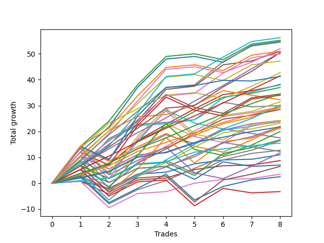

# Short Labrador 008 
- Symbol: ES_830-900
- Date Range: 03/18/2022 - 12/30/2022
- Trading Period: 8:30-9:0
- Number of Trades: 8



| Name | Win Percent | Profit | Avg Profit / Trade | Avg Time / Trade |      | Name | Win Percent | Profit | Avg Profit / Trade | Avg Time / Trade |
| ---- | ----------- | ------ | ------------------ | ---------------- | ---- | ---- | ----------- | ------ | ------------------ | ---------------- |
| Sorted By <br> Profit | | | | | | Sorted By <br> Win Percentage ||||
| NEWFI 000 | 100.00 | 28125.00 | 3515.62 | 43:46 |     | NEWFI 000 | 100.00 | 28125.00 | 3515.62 | 43:46 |
| BB-200 U/L 2SD | 87.50 | 27625.00 | 3453.12 | 55:20 |     | TP-9 | 100.00 | 27250.00 | 3406.25 | 33:36 |
| BB-100 U/L 2SD | 87.50 | 27375.00 | 3421.88 | 52:13 |     | BB-50 U/L 1SD | 100.00 | 25500.00 | 3187.50 | 22:13 |
| TP-9 | 100.00 | 27250.00 | 3406.25 | 33:36 |     | TP-7 | 100.00 | 25250.00 | 3156.25 | 28:29 |
| BB-50 U/L 2SD | 87.50 | 26000.00 | 3250.00 | 39:29 |     | TP-6 | 100.00 | 25250.00 | 3156.25 | 20:25 |
| BB-50 U/L 1SD | 100.00 | 25500.00 | 3187.50 | 22:13 |     | TP-8 | 100.00 | 25000.00 | 3125.00 | 31:15 |
| NEWFI 06 | 87.50 | 25500.00 | 3187.50 | 55:42 |     | TP-5 | 100.00 | 20750.00 | 2593.75 | 19:26 |
| TP-7 | 100.00 | 25250.00 | 3156.25 | 28:29 |     | BB-100 Mid | 100.00 | 19125.00 | 2390.62 | 18:25 |
| TP-6 | 100.00 | 25250.00 | 3156.25 | 20:25 |     | BB-20 U/L 2SD C | 100.00 | 19000.00 | 2375.00 | 13:50 |
| TP-8 | 100.00 | 25000.00 | 3125.00 | 31:15 |     | BB-20 U/L 2SD | 100.00 | 18500.00 | 2312.50 | 13:08 |
| TP-10 | 87.50 | 23625.00 | 2953.12 | 40:15 |     | TP-4 | 100.00 | 17250.00 | 2156.25 | 09:34 |
| V U/L 1SD | 87.50 | 21375.00 | 2671.88 | 41:27 |     | TP-3 | 100.00 | 14750.00 | 1843.75 | 08:16 |
| TP-5 | 100.00 | 20750.00 | 2593.75 | 19:26 |     | BB-20 U/L 1SD | 100.00 | 14625.00 | 1828.12 | 05:16 |
| NEWFI 0000 | 75.00 | 20625.00 | 2578.12 | 34:46 |     | TP-2 | 100.00 | 10875.00 | 1359.38 | 04:15 |
| BB-100 Mid | 100.00 | 19125.00 | 2390.62 | 18:25 |     | TP-1 | 100.00 | 7750.00 | 968.75 | 03:56 |
| BB-20 U/L 2SD C | 100.00 | 19000.00 | 2375.00 | 13:50 |     | BB-200 U/L 2SD | 87.50 | 27625.00 | 3453.12 | 55:20 |
| BB-20 U/L 2SD | 100.00 | 18500.00 | 2312.50 | 13:08 |     | BB-100 U/L 2SD | 87.50 | 27375.00 | 3421.88 | 52:13 |
| TP-4 | 100.00 | 17250.00 | 2156.25 | 09:34 |     | BB-50 U/L 2SD | 87.50 | 26000.00 | 3250.00 | 39:29 |
| BB-200 U/L 2SD SL-5 | 62.50 | 17250.00 | 2156.25 | 41:59 |     | NEWFI 06 | 87.50 | 25500.00 | 3187.50 | 55:42 |
| BB-100 U/L 2SD SL-5 | 62.50 | 17000.00 | 2125.00 | 38:51 |     | TP-10 | 87.50 | 23625.00 | 2953.12 | 40:15 |
| BB-200 Mid | 75.00 | 16125.00 | 2015.62 | 08:56 |     | V U/L 1SD | 87.50 | 21375.00 | 2671.88 | 41:27 |
| BB-50 U/L 1SD SL-5 | 75.00 | 15750.00 | 1968.75 | 13:13 |     | V Mid | 87.50 | 15000.00 | 1875.00 | 16:35 |
| BB-50 U/L 2SD SL-5 | 62.50 | 15125.00 | 1890.62 | 27:48 |     | BB-20 U/L 2SD C SL-5 | 87.50 | 14750.00 | 1843.75 | 11:44 |
| V Mid | 87.50 | 15000.00 | 1875.00 | 16:35 |     | BB-20 U/L 2SD SL-5 | 87.50 | 14250.00 | 1781.25 | 11:03 |
| TP-3 | 100.00 | 14750.00 | 1843.75 | 08:16 |     | BB-20 U/L 2SD C SL-10 | 87.50 | 12125.00 | 1515.62 | 12:52 |
| BB-20 U/L 2SD C SL-5 | 87.50 | 14750.00 | 1843.75 | 11:44 |     | BB-50 Mid | 87.50 | 12125.00 | 1515.62 | 15:07 |
| BB-20 U/L 1SD | 100.00 | 14625.00 | 1828.12 | 05:16 |     | BB-20 U/L 2SD SL-10 | 87.50 | 11625.00 | 1453.12 | 12:11 |
| BB-20 U/L 2SD SL-5 | 87.50 | 14250.00 | 1781.25 | 11:03 |     | BB-20 U/L 1SD SL-5 | 87.50 | 10875.00 | 1359.38 | 03:50 |
| BB-20 U/L 2SD C SL-10 | 87.50 | 12125.00 | 1515.62 | 12:52 |     | BB-20 U/L 1SD SL-10 | 87.50 | 8250.00 | 1031.25 | 04:58 |
| BB-50 Mid | 87.50 | 12125.00 | 1515.62 | 15:07 |     | BB-20 Mid | 87.50 | 5500.00 | 687.50 | 04:08 |
| BB-200 U/L 2SD SL-10 | 62.50 | 12125.00 | 1515.62 | 44:41 |     | BB-20 Mid SL-5 | 87.50 | 4375.00 | 546.88 | 02:46 |
| BB-100 U/L 2SD SL-10 | 62.50 | 11875.00 | 1484.38 | 41:33 |     | BB-20 Mid SL-10 | 87.50 | 1750.00 | 218.75 | 03:55 |
| BB-20 U/L 2SD SL-10 | 87.50 | 11625.00 | 1453.12 | 12:11 |     | NEWFI 0000 | 75.00 | 20625.00 | 2578.12 | 34:46 |
| V U/L 1SD SL-5 | 62.50 | 11000.00 | 1375.00 | 28:06 |     | BB-200 Mid | 75.00 | 16125.00 | 2015.62 | 08:56 |
| TP-2 | 100.00 | 10875.00 | 1359.38 | 04:15 |     | BB-50 U/L 1SD SL-5 | 75.00 | 15750.00 | 1968.75 | 13:13 |
| BB-20 U/L 1SD SL-5 | 87.50 | 10875.00 | 1359.38 | 03:50 |     | BB-50 U/L 1SD SL-10 | 75.00 | 10625.00 | 1328.12 | 15:55 |
| BB-50 U/L 1SD SL-10 | 75.00 | 10625.00 | 1328.12 | 15:55 |     | BB-100 Mid SL-5 | 75.00 | 8375.00 | 1046.88 | 06:53 |
| BB-50 U/L 2SD SL-10 | 62.50 | 10000.00 | 1250.00 | 30:30 |     | BB-50 Mid SL-5 | 75.00 | 6375.00 | 796.88 | 08:28 |
| BB-200 Mid SL-5 | 62.50 | 8750.00 | 1093.75 | 05:15 |     | BB-100 Mid SL-10 | 75.00 | 3250.00 | 406.25 | 09:35 |
| BB-100 Mid SL-5 | 75.00 | 8375.00 | 1046.88 | 06:53 |     | BB-50 Mid SL-10 | 75.00 | 1250.00 | 156.25 | 11:10 |
| BB-20 U/L 1SD SL-10 | 87.50 | 8250.00 | 1031.25 | 04:58 |     | BB-200 U/L 2SD SL-5 | 62.50 | 17250.00 | 2156.25 | 41:59 |
| TP-1 | 100.00 | 7750.00 | 968.75 | 03:56 |     | BB-100 U/L 2SD SL-5 | 62.50 | 17000.00 | 2125.00 | 38:51 |
| BB-50 Mid SL-5 | 75.00 | 6375.00 | 796.88 | 08:28 |     | BB-50 U/L 2SD SL-5 | 62.50 | 15125.00 | 1890.62 | 27:48 |
| BB-200 Mid SL-10 | 62.50 | 6125.00 | 765.62 | 06:23 |     | BB-200 U/L 2SD SL-10 | 62.50 | 12125.00 | 1515.62 | 44:41 |
| V U/L 1SD SL-10 | 62.50 | 5875.00 | 734.38 | 30:48 |     | BB-100 U/L 2SD SL-10 | 62.50 | 11875.00 | 1484.38 | 41:33 |
| BB-20 Mid | 87.50 | 5500.00 | 687.50 | 04:08 |     | V U/L 1SD SL-5 | 62.50 | 11000.00 | 1375.00 | 28:06 |
| BB-20 Mid SL-5 | 87.50 | 4375.00 | 546.88 | 02:46 |     | BB-50 U/L 2SD SL-10 | 62.50 | 10000.00 | 1250.00 | 30:30 |
| V Mid SL-5 | 62.50 | 3500.00 | 437.50 | 04:50 |     | BB-200 Mid SL-5 | 62.50 | 8750.00 | 1093.75 | 05:15 |
| BB-100 Mid SL-10 | 75.00 | 3250.00 | 406.25 | 09:35 |     | BB-200 Mid SL-10 | 62.50 | 6125.00 | 765.62 | 06:23 |
| BB-20 Mid SL-10 | 87.50 | 1750.00 | 218.75 | 03:55 |     | V U/L 1SD SL-10 | 62.50 | 5875.00 | 734.38 | 30:48 |
| BB-50 Mid SL-10 | 75.00 | 1250.00 | 156.25 | 11:10 |     | V Mid SL-5 | 62.50 | 3500.00 | 437.50 | 04:50 |
| V Mid SL-10 | 62.50 | -1625.00 | -203.12 | 07:32 |     | V Mid SL-10 | 62.50 | -1625.00 | -203.12 | 07:32 |

## NO STOPLOSS

### Test BB-20 Mid
* Sell when price hits the middle line of the 20p bollinger
* No Stoploss
* Results:
```
Total Trades: 8
Percent Up: 12.50
Percent Down: 87.50
Total Points Moved Down: 11.00
Potential Profit: 5500.00
Total Points Ups: 2.75 Count Ups: 1
Total Points Downs: 13.75 Count Downs: 7
```

<details><summary>Trades</summary>

<code>In: 2022-03-29 08:53:00		Out: 2022-03-29 08:56:20		Total Position Time: 03:20		Total Move Down: 0.75		Total to Date: 0.75</code> <br />
<code>In: 2022-05-16 08:52:00		Out: 2022-05-16 09:05:50		Total Position Time: 13:50		Total Move Down: -2.75		Total to Date: -2.00</code> <br />
<code>In: 2022-06-14 08:48:00		Out: 2022-06-14 08:49:10		Total Position Time: 01:10		Total Move Down: 5.50		Total to Date: 3.50</code> <br />
<code>In: 2022-06-16 08:31:00		Out: 2022-06-16 08:32:10		Total Position Time: 01:10		Total Move Down: 0.75		Total to Date: 4.25</code> <br />
<code>In: 2022-07-05 08:59:00		Out: 2022-07-05 09:03:00		Total Position Time: 04:00		Total Move Down: 3.25		Total to Date: 7.50</code> <br />
<code>In: 2022-07-12 08:34:00		Out: 2022-07-12 08:37:00		Total Position Time: 03:00		Total Move Down: 1.50		Total to Date: 9.00</code> <br />
<code>In: 2022-08-22 08:45:00		Out: 2022-08-22 08:47:30		Total Position Time: 02:30		Total Move Down: 0.25		Total to Date: 9.25</code> <br />
<code>In: 2022-11-16 08:31:00		Out: 2022-11-16 08:35:05		Total Position Time: 04:05		Total Move Down: 1.75		Total to Date: 11.00</code> <br />


</details>

### Test BB-20 U/L 1SD
* Sell when the price hits the lower line of the 20p 1std bollinger
* No Stoploss
* Results:
```
Total Trades: 8
Percent Up: 0.00
Percent Down: 100.00
Total Points Moved Down: 29.25
Potential Profit: 14625.00
Total Points Ups: 0.00 Count Ups: 0
Total Points Downs: 29.25 Count Downs: 8
```

<details><summary>Trades</summary>

<code>In: 2022-03-29 08:53:00		Out: 2022-03-29 08:58:40		Total Position Time: 05:40		Total Move Down: 2.25		Total to Date: 2.25</code> <br />
<code>In: 2022-05-16 08:52:00		Out: 2022-05-16 09:06:25		Total Position Time: 14:25		Total Move Down: 2.50		Total to Date: 4.75</code> <br />
<code>In: 2022-06-14 08:48:00		Out: 2022-06-14 08:49:10		Total Position Time: 01:10		Total Move Down: 5.50		Total to Date: 10.25</code> <br />
<code>In: 2022-06-16 08:31:00		Out: 2022-06-16 08:32:30		Total Position Time: 01:30		Total Move Down: 3.50		Total to Date: 13.75</code> <br />
<code>In: 2022-07-05 08:59:00		Out: 2022-07-05 09:03:30		Total Position Time: 04:30		Total Move Down: 4.75		Total to Date: 18.50</code> <br />
<code>In: 2022-07-12 08:34:00		Out: 2022-07-12 08:38:10		Total Position Time: 04:10		Total Move Down: 4.50		Total to Date: 23.00</code> <br />
<code>In: 2022-08-22 08:45:00		Out: 2022-08-22 08:48:20		Total Position Time: 03:20		Total Move Down: 2.50		Total to Date: 25.50</code> <br />
<code>In: 2022-11-16 08:31:00		Out: 2022-11-16 08:38:25		Total Position Time: 07:25		Total Move Down: 3.75		Total to Date: 29.25</code> <br />


</details>

### Test BB-20 U/L 2SD
* Sell when the price hits the lower line of the 20p 2std bollinger
* No Stoploss
* Results:
```
Total Trades: 8
Percent Up: 0.00
Percent Down: 100.00
Total Points Moved Down: 37.00
Potential Profit: 18500.00
Total Points Ups: 0.00 Count Ups: 0
Total Points Downs: 37.00 Count Downs: 8
```

<details><summary>Trades</summary>

<code>In: 2022-03-29 08:53:00		Out: 2022-03-29 09:01:40		Total Position Time: 08:40		Total Move Down: 3.75		Total to Date: 3.75</code> <br />
<code>In: 2022-05-16 08:52:00		Out: 2022-05-16 09:11:45		Total Position Time: 19:45		Total Move Down: 3.50		Total to Date: 7.25</code> <br />
<code>In: 2022-06-14 08:48:00		Out: 2022-06-14 08:51:40		Total Position Time: 03:40		Total Move Down: 9.00		Total to Date: 16.25</code> <br />
<code>In: 2022-06-16 08:31:00		Out: 2022-06-16 08:36:10		Total Position Time: 05:10		Total Move Down: 5.50		Total to Date: 21.75</code> <br />
<code>In: 2022-07-05 08:59:00		Out: 2022-07-05 09:05:50		Total Position Time: 06:50		Total Move Down: 6.00		Total to Date: 27.75</code> <br />
<code>In: 2022-07-12 08:34:00		Out: 2022-07-12 08:41:10		Total Position Time: 07:10		Total Move Down: 5.50		Total to Date: 33.25</code> <br />
<code>In: 2022-08-22 08:45:00		Out: 2022-08-22 09:08:15		Total Position Time: 23:15		Total Move Down: 1.50		Total to Date: 34.75</code> <br />
<code>In: 2022-11-16 08:31:00		Out: 2022-11-16 09:01:40		Total Position Time: 30:40		Total Move Down: 2.25		Total to Date: 37.00</code> <br />


</details>

### Test BB-20 U/L 2SD C
* Sell when the price hits the lower line of the 20p 2std bollinger
* No Stoploss
* Results:
```
Total Trades: 8
Percent Up: 0.00
Percent Down: 100.00
Total Points Moved Down: 38.00
Potential Profit: 19000.00
Total Points Ups: 0.00 Count Ups: 0
Total Points Downs: 38.00 Count Downs: 8
```

<details><summary>Trades</summary>

<code>In: 2022-03-29 08:53:00		Out: 2022-03-29 09:01:40		Total Position Time: 08:40		Total Move Down: 3.75		Total to Date: 3.75</code> <br />
<code>In: 2022-05-16 08:52:00		Out: 2022-05-16 09:11:45		Total Position Time: 19:45		Total Move Down: 3.50		Total to Date: 7.25</code> <br />
<code>In: 2022-06-14 08:48:00		Out: 2022-06-14 08:51:45		Total Position Time: 03:45		Total Move Down: 9.25		Total to Date: 16.50</code> <br />
<code>In: 2022-06-16 08:31:00		Out: 2022-06-16 08:41:35		Total Position Time: 10:35		Total Move Down: 6.25		Total to Date: 22.75</code> <br />
<code>In: 2022-07-05 08:59:00		Out: 2022-07-05 09:05:50		Total Position Time: 06:50		Total Move Down: 6.00		Total to Date: 28.75</code> <br />
<code>In: 2022-07-12 08:34:00		Out: 2022-07-12 08:41:10		Total Position Time: 07:10		Total Move Down: 5.50		Total to Date: 34.25</code> <br />
<code>In: 2022-08-22 08:45:00		Out: 2022-08-22 09:08:15		Total Position Time: 23:15		Total Move Down: 1.50		Total to Date: 35.75</code> <br />
<code>In: 2022-11-16 08:31:00		Out: 2022-11-16 09:01:40		Total Position Time: 30:40		Total Move Down: 2.25		Total to Date: 38.00</code> <br />


</details>

### Test BB-50 Mid
* Sell when price hits the middle line of the 50p bollinger
* No Stoploss
* Results:
```
Total Trades: 8
Percent Up: 12.50
Percent Down: 87.50
Total Points Moved Down: 24.25
Potential Profit: 12125.00
Total Points Ups: 3.50 Count Ups: 1
Total Points Downs: 27.75 Count Downs: 7
```

<details><summary>Trades</summary>

<code>In: 2022-03-29 08:53:00		Out: 2022-03-29 09:01:25		Total Position Time: 08:25		Total Move Down: 2.75		Total to Date: 2.75</code> <br />
<code>In: 2022-05-16 08:52:00		Out: 2022-05-16 09:15:30		Total Position Time: 23:30		Total Move Down: 5.00		Total to Date: 7.75</code> <br />
<code>In: 2022-06-14 08:48:00		Out: 2022-06-14 08:49:10		Total Position Time: 01:10		Total Move Down: 5.50		Total to Date: 13.25</code> <br />
<code>In: 2022-06-16 08:31:00		Out: 2022-06-16 08:36:10		Total Position Time: 05:10		Total Move Down: 5.50		Total to Date: 18.75</code> <br />
<code>In: 2022-07-05 08:59:00		Out: 2022-07-05 09:43:40		Total Position Time: 44:40		Total Move Down: -3.50		Total to Date: 15.25</code> <br />
<code>In: 2022-07-12 08:34:00		Out: 2022-07-12 08:38:20		Total Position Time: 04:20		Total Move Down: 5.25		Total to Date: 20.50</code> <br />
<code>In: 2022-08-22 08:45:00		Out: 2022-08-22 08:48:20		Total Position Time: 03:20		Total Move Down: 2.50		Total to Date: 23.00</code> <br />
<code>In: 2022-11-16 08:31:00		Out: 2022-11-16 09:01:25		Total Position Time: 30:25		Total Move Down: 1.25		Total to Date: 24.25</code> <br />


</details>

### Test BB-50 U/L 1SD
* Sell when the price hits the lower line of the 50p 1std bollinger
* No Stoploss
* Results:
```
Total Trades: 8
Percent Up: 0.00
Percent Down: 100.00
Total Points Moved Down: 51.00
Potential Profit: 25500.00
Total Points Ups: 0.00 Count Ups: 0
Total Points Downs: 51.00 Count Downs: 8
```

<details><summary>Trades</summary>

<code>In: 2022-03-29 08:53:00		Out: 2022-03-29 09:02:15		Total Position Time: 09:15		Total Move Down: 6.75		Total to Date: 6.75</code> <br />
<code>In: 2022-05-16 08:52:00		Out: 2022-05-16 09:30:55		Total Position Time: 38:55		Total Move Down: 8.25		Total to Date: 15.00</code> <br />
<code>In: 2022-06-14 08:48:00		Out: 2022-06-14 08:51:40		Total Position Time: 03:40		Total Move Down: 9.00		Total to Date: 24.00</code> <br />
<code>In: 2022-06-16 08:31:00		Out: 2022-06-16 08:42:25		Total Position Time: 11:25		Total Move Down: 12.25		Total to Date: 36.25</code> <br />
<code>In: 2022-07-05 08:59:00		Out: 2022-07-05 09:47:10		Total Position Time: 48:10		Total Move Down: 1.25		Total to Date: 37.50</code> <br />
<code>In: 2022-07-12 08:34:00		Out: 2022-07-12 08:43:55		Total Position Time: 09:55		Total Move Down: 8.25		Total to Date: 45.75</code> <br />
<code>In: 2022-08-22 08:45:00		Out: 2022-08-22 09:08:20		Total Position Time: 23:20		Total Move Down: 1.50		Total to Date: 47.25</code> <br />
<code>In: 2022-11-16 08:31:00		Out: 2022-11-16 09:04:10		Total Position Time: 33:10		Total Move Down: 3.75		Total to Date: 51.00</code> <br />


</details>

### Test BB-50 U/L 2SD
* Sell when the price hits the lower line of the 50p 2std bollinger
* No Stoploss
* Results:
```
Total Trades: 8
Percent Up: 12.50
Percent Down: 87.50
Total Points Moved Down: 52.00
Potential Profit: 26000.00
Total Points Ups: 2.25 Count Ups: 1
Total Points Downs: 54.25 Count Downs: 7
```

<details><summary>Trades</summary>

<code>In: 2022-03-29 08:53:00		Out: 2022-03-29 09:10:45		Total Position Time: 17:45		Total Move Down: 8.50		Total to Date: 8.50</code> <br />
<code>In: 2022-05-16 08:52:00		Out: 2022-05-16 09:39:35		Total Position Time: 47:35		Total Move Down: 10.75		Total to Date: 19.25</code> <br />
<code>In: 2022-06-14 08:48:00		Out: 2022-06-14 09:04:05		Total Position Time: 16:05		Total Move Down: 12.50		Total to Date: 31.75</code> <br />
<code>In: 2022-06-16 08:31:00		Out: 2022-06-16 09:07:40		Total Position Time: 36:40		Total Move Down: 12.25		Total to Date: 44.00</code> <br />
<code>In: 2022-07-05 08:59:00		Out: 2022-07-05 09:59:55		Total Position Time: 60:55		Total Move Down: 1.00		Total to Date: 45.00</code> <br />
<code>In: 2022-07-12 08:34:00		Out: 2022-07-12 09:34:55		Total Position Time: 60:55		Total Move Down: -2.25		Total to Date: 42.75</code> <br />
<code>In: 2022-08-22 08:45:00		Out: 2022-08-22 09:12:35		Total Position Time: 27:35		Total Move Down: 4.00		Total to Date: 46.75</code> <br />
<code>In: 2022-11-16 08:31:00		Out: 2022-11-16 09:19:25		Total Position Time: 48:25		Total Move Down: 5.25		Total to Date: 52.00</code> <br />


</details>

### Test V Mid
* Sell when the price hits the middle line of the 1std VWAP
* No Stoploss
* Results:
```
Total Trades: 8
Percent Up: 12.50
Percent Down: 87.50
Total Points Moved Down: 30.00
Potential Profit: 15000.00
Total Points Ups: 1.75 Count Ups: 1
Total Points Downs: 31.75 Count Downs: 7
```

<details><summary>Trades</summary>

<code>In: 2022-03-29 08:53:00		Out: 2022-03-29 09:02:10		Total Position Time: 09:10		Total Move Down: 5.25		Total to Date: 5.25</code> <br />
<code>In: 2022-05-16 08:52:00		Out: 2022-05-16 09:40:05		Total Position Time: 48:05		Total Move Down: 12.00		Total to Date: 17.25</code> <br />
<code>In: 2022-06-14 08:48:00		Out: 2022-06-14 08:49:10		Total Position Time: 01:10		Total Move Down: 5.50		Total to Date: 22.75</code> <br />
<code>In: 2022-06-16 08:31:00		Out: 2022-06-16 08:32:10		Total Position Time: 01:10		Total Move Down: 0.75		Total to Date: 23.50</code> <br />
<code>In: 2022-07-05 08:59:00		Out: 2022-07-05 09:59:55		Total Position Time: 60:55		Total Move Down: 1.00		Total to Date: 24.50</code> <br />
<code>In: 2022-07-12 08:34:00		Out: 2022-07-12 08:41:50		Total Position Time: 07:50		Total Move Down: 6.75		Total to Date: 31.25</code> <br />
<code>In: 2022-08-22 08:45:00		Out: 2022-08-22 08:46:10		Total Position Time: 01:10		Total Move Down: -1.75		Total to Date: 29.50</code> <br />
<code>In: 2022-11-16 08:31:00		Out: 2022-11-16 08:34:15		Total Position Time: 03:15		Total Move Down: 0.50		Total to Date: 30.00</code> <br />


</details>

### Test V U/L 1SD
* Sell when the price hits the lower line of the 1std VWAP
* No Stoploss
* Results:
```
Total Trades: 8
Percent Up: 12.50
Percent Down: 87.50
Total Points Moved Down: 42.75
Potential Profit: 21375.00
Total Points Ups: 2.25 Count Ups: 1
Total Points Downs: 45.00 Count Downs: 7
```

<details><summary>Trades</summary>

<code>In: 2022-03-29 08:53:00		Out: 2022-03-29 09:27:55		Total Position Time: 34:55		Total Move Down: 13.50		Total to Date: 13.50</code> <br />
<code>In: 2022-05-16 08:52:00		Out: 2022-05-16 09:52:55		Total Position Time: 60:55		Total Move Down: 9.75		Total to Date: 23.25</code> <br />
<code>In: 2022-06-14 08:48:00		Out: 2022-06-14 08:49:10		Total Position Time: 01:10		Total Move Down: 5.50		Total to Date: 28.75</code> <br />
<code>In: 2022-06-16 08:31:00		Out: 2022-06-16 08:35:30		Total Position Time: 04:30		Total Move Down: 5.25		Total to Date: 34.00</code> <br />
<code>In: 2022-07-05 08:59:00		Out: 2022-07-05 09:59:55		Total Position Time: 60:55		Total Move Down: 1.00		Total to Date: 35.00</code> <br />
<code>In: 2022-07-12 08:34:00		Out: 2022-07-12 09:34:55		Total Position Time: 60:55		Total Move Down: -2.25		Total to Date: 32.75</code> <br />
<code>In: 2022-08-22 08:45:00		Out: 2022-08-22 09:44:55		Total Position Time: 59:55		Total Move Down: 4.75		Total to Date: 37.50</code> <br />
<code>In: 2022-11-16 08:31:00		Out: 2022-11-16 09:19:25		Total Position Time: 48:25		Total Move Down: 5.25		Total to Date: 42.75</code> <br />


</details>

### Test BB-100 Mid
* Move to BB100 Mid
* No Stoploss
* Results:
```
Total Trades: 8
Percent Up: 0.00
Percent Down: 100.00
Total Points Moved Down: 38.25
Potential Profit: 19125.00
Total Points Ups: 0.00 Count Ups: 0
Total Points Downs: 38.25 Count Downs: 8
```

<details><summary>Trades</summary>

<code>In: 2022-03-29 08:53:00		Out: 2022-03-29 09:02:15		Total Position Time: 09:15		Total Move Down: 6.75		Total to Date: 6.75</code> <br />
<code>In: 2022-05-16 08:52:00		Out: 2022-05-16 09:39:05		Total Position Time: 47:05		Total Move Down: 10.00		Total to Date: 16.75</code> <br />
<code>In: 2022-06-14 08:48:00		Out: 2022-06-14 08:49:10		Total Position Time: 01:10		Total Move Down: 5.50		Total to Date: 22.25</code> <br />
<code>In: 2022-06-16 08:31:00		Out: 2022-06-16 08:32:10		Total Position Time: 01:10		Total Move Down: 0.75		Total to Date: 23.00</code> <br />
<code>In: 2022-07-05 08:59:00		Out: 2022-07-05 09:59:05		Total Position Time: 60:05		Total Move Down: 1.50		Total to Date: 24.50</code> <br />
<code>In: 2022-07-12 08:34:00		Out: 2022-07-12 08:54:25		Total Position Time: 20:25		Total Move Down: 8.50		Total to Date: 33.00</code> <br />
<code>In: 2022-08-22 08:45:00		Out: 2022-08-22 08:48:15		Total Position Time: 03:15		Total Move Down: 2.25		Total to Date: 35.25</code> <br />
<code>In: 2022-11-16 08:31:00		Out: 2022-11-16 08:35:55		Total Position Time: 04:55		Total Move Down: 3.00		Total to Date: 38.25</code> <br />


</details>

### Test BB-100 U/L 2SD
* Move to BB100 Upper Band
* No Stoploss
* Results:
```
Total Trades: 8
Percent Up: 12.50
Percent Down: 87.50
Total Points Moved Down: 54.75
Potential Profit: 27375.00
Total Points Ups: 2.25 Count Ups: 1
Total Points Downs: 57.00 Count Downs: 7
```

<details><summary>Trades</summary>

<code>In: 2022-03-29 08:53:00		Out: 2022-03-29 09:26:35		Total Position Time: 33:35		Total Move Down: 12.00		Total to Date: 12.00</code> <br />
<code>In: 2022-05-16 08:52:00		Out: 2022-05-16 09:52:55		Total Position Time: 60:55		Total Move Down: 9.75		Total to Date: 21.75</code> <br />
<code>In: 2022-06-14 08:48:00		Out: 2022-06-14 09:07:10		Total Position Time: 19:10		Total Move Down: 15.25		Total to Date: 37.00</code> <br />
<code>In: 2022-06-16 08:31:00		Out: 2022-06-16 09:31:55		Total Position Time: 60:55		Total Move Down: 11.00		Total to Date: 48.00</code> <br />
<code>In: 2022-07-05 08:59:00		Out: 2022-07-05 09:59:55		Total Position Time: 60:55		Total Move Down: 1.00		Total to Date: 49.00</code> <br />
<code>In: 2022-07-12 08:34:00		Out: 2022-07-12 09:34:55		Total Position Time: 60:55		Total Move Down: -2.25		Total to Date: 46.75</code> <br />
<code>In: 2022-08-22 08:45:00		Out: 2022-08-22 09:45:25		Total Position Time: 60:25		Total Move Down: 6.50		Total to Date: 53.25</code> <br />
<code>In: 2022-11-16 08:31:00		Out: 2022-11-16 09:31:55		Total Position Time: 60:55		Total Move Down: 1.50		Total to Date: 54.75</code> <br />


</details>

### Test BB-200 Mid
* Move to BB200 Mid
* No Stoploss
* Results:
```
Total Trades: 8
Percent Up: 25.00
Percent Down: 75.00
Total Points Moved Down: 32.25
Potential Profit: 16125.00
Total Points Ups: 3.50 Count Ups: 2
Total Points Downs: 35.75 Count Downs: 6
```

<details><summary>Trades</summary>

<code>In: 2022-03-29 08:53:00		Out: 2022-03-29 09:21:50		Total Position Time: 28:50		Total Move Down: 10.50		Total to Date: 10.50</code> <br />
<code>In: 2022-05-16 08:52:00		Out: 2022-05-16 09:24:25		Total Position Time: 32:25		Total Move Down: 9.75		Total to Date: 20.25</code> <br />
<code>In: 2022-06-14 08:48:00		Out: 2022-06-14 08:49:10		Total Position Time: 01:10		Total Move Down: 5.50		Total to Date: 25.75</code> <br />
<code>In: 2022-06-16 08:31:00		Out: 2022-06-16 08:32:10		Total Position Time: 01:10		Total Move Down: 0.75		Total to Date: 26.50</code> <br />
<code>In: 2022-07-05 08:59:00		Out: 2022-07-05 09:00:10		Total Position Time: 01:10		Total Move Down: 3.75		Total to Date: 30.25</code> <br />
<code>In: 2022-07-12 08:34:00		Out: 2022-07-12 08:38:25		Total Position Time: 04:25		Total Move Down: 5.50		Total to Date: 35.75</code> <br />
<code>In: 2022-08-22 08:45:00		Out: 2022-08-22 08:46:10		Total Position Time: 01:10		Total Move Down: -1.75		Total to Date: 34.00</code> <br />
<code>In: 2022-11-16 08:31:00		Out: 2022-11-16 08:32:10		Total Position Time: 01:10		Total Move Down: -1.75		Total to Date: 32.25</code> <br />


</details>

### Test BB-200 U/L 2SD
* Move to BB200 Upper Band
* No Stoploss
* Results:
```
Total Trades: 8
Percent Up: 12.50
Percent Down: 87.50
Total Points Moved Down: 55.25
Potential Profit: 27625.00
Total Points Ups: 2.25 Count Ups: 1
Total Points Downs: 57.50 Count Downs: 7
```

<details><summary>Trades</summary>

<code>In: 2022-03-29 08:53:00		Out: 2022-03-29 09:53:55		Total Position Time: 60:55		Total Move Down: 14.25		Total to Date: 14.25</code> <br />
<code>In: 2022-05-16 08:52:00		Out: 2022-05-16 09:52:55		Total Position Time: 60:55		Total Move Down: 9.75		Total to Date: 24.00</code> <br />
<code>In: 2022-06-14 08:48:00		Out: 2022-06-14 09:04:20		Total Position Time: 16:20		Total Move Down: 14.00		Total to Date: 38.00</code> <br />
<code>In: 2022-06-16 08:31:00		Out: 2022-06-16 09:31:55		Total Position Time: 60:55		Total Move Down: 11.00		Total to Date: 49.00</code> <br />
<code>In: 2022-07-05 08:59:00		Out: 2022-07-05 09:59:55		Total Position Time: 60:55		Total Move Down: 1.00		Total to Date: 50.00</code> <br />
<code>In: 2022-07-12 08:34:00		Out: 2022-07-12 09:34:55		Total Position Time: 60:55		Total Move Down: -2.25		Total to Date: 47.75</code> <br />
<code>In: 2022-08-22 08:45:00		Out: 2022-08-22 09:45:55		Total Position Time: 60:55		Total Move Down: 6.00		Total to Date: 53.75</code> <br />
<code>In: 2022-11-16 08:31:00		Out: 2022-11-16 09:31:55		Total Position Time: 60:55		Total Move Down: 1.50		Total to Date: 55.25</code> <br />


</details>

## STOPLOSS OF 5

### Test BB-20 Mid SL-5
* Sell when price hits the middle line of the 20p bollinger
* Stoploss is -5 points
* Results:
```
Total Trades: 8
Percent Up: 12.50
Percent Down: 87.50
Total Points Moved Down: 8.75
Potential Profit: 4375.00
Total Points Ups: 5.00 Count Ups: 1
Total Points Downs: 13.75 Count Downs: 7
```

<details><summary>Trades</summary>

<code>In: 2022-03-29 08:53:00		Out: 2022-03-29 08:56:20		Total Position Time: 03:20		Total Move Down: 0.75		Total to Date: 0.75</code> <br />
<code>In: 2022-05-16 08:52:00		Out: 2022-05-16 08:55:00		Total Position Time: 03:00		Total Move Down: -5.00		Total to Date: -4.25</code> <br />
<code>In: 2022-06-14 08:48:00		Out: 2022-06-14 08:49:10		Total Position Time: 01:10		Total Move Down: 5.50		Total to Date: 1.25</code> <br />
<code>In: 2022-06-16 08:31:00		Out: 2022-06-16 08:32:10		Total Position Time: 01:10		Total Move Down: 0.75		Total to Date: 2.00</code> <br />
<code>In: 2022-07-05 08:59:00		Out: 2022-07-05 09:03:00		Total Position Time: 04:00		Total Move Down: 3.25		Total to Date: 5.25</code> <br />
<code>In: 2022-07-12 08:34:00		Out: 2022-07-12 08:37:00		Total Position Time: 03:00		Total Move Down: 1.50		Total to Date: 6.75</code> <br />
<code>In: 2022-08-22 08:45:00		Out: 2022-08-22 08:47:30		Total Position Time: 02:30		Total Move Down: 0.25		Total to Date: 7.00</code> <br />
<code>In: 2022-11-16 08:31:00		Out: 2022-11-16 08:35:05		Total Position Time: 04:05		Total Move Down: 1.75		Total to Date: 8.75</code> <br />


</details>

### Test BB-20 U/L 1SD SL-5
* Sell when the price hits the lower line of the 20p 1std bollinger
* Stoploss is -5 points
* Results:
```
Total Trades: 8
Percent Up: 12.50
Percent Down: 87.50
Total Points Moved Down: 21.75
Potential Profit: 10875.00
Total Points Ups: 5.00 Count Ups: 1
Total Points Downs: 26.75 Count Downs: 7
```

<details><summary>Trades</summary>

<code>In: 2022-03-29 08:53:00		Out: 2022-03-29 08:58:40		Total Position Time: 05:40		Total Move Down: 2.25		Total to Date: 2.25</code> <br />
<code>In: 2022-05-16 08:52:00		Out: 2022-05-16 08:55:00		Total Position Time: 03:00		Total Move Down: -5.00		Total to Date: -2.75</code> <br />
<code>In: 2022-06-14 08:48:00		Out: 2022-06-14 08:49:10		Total Position Time: 01:10		Total Move Down: 5.50		Total to Date: 2.75</code> <br />
<code>In: 2022-06-16 08:31:00		Out: 2022-06-16 08:32:30		Total Position Time: 01:30		Total Move Down: 3.50		Total to Date: 6.25</code> <br />
<code>In: 2022-07-05 08:59:00		Out: 2022-07-05 09:03:30		Total Position Time: 04:30		Total Move Down: 4.75		Total to Date: 11.00</code> <br />
<code>In: 2022-07-12 08:34:00		Out: 2022-07-12 08:38:10		Total Position Time: 04:10		Total Move Down: 4.50		Total to Date: 15.50</code> <br />
<code>In: 2022-08-22 08:45:00		Out: 2022-08-22 08:48:20		Total Position Time: 03:20		Total Move Down: 2.50		Total to Date: 18.00</code> <br />
<code>In: 2022-11-16 08:31:00		Out: 2022-11-16 08:38:25		Total Position Time: 07:25		Total Move Down: 3.75		Total to Date: 21.75</code> <br />


</details>

### Test BB-20 U/L 2SD SL-5
* Sell when the price hits the lower line of the 20p 2std bollinger
* Stoploss is -5 points
* Results:
```
Total Trades: 8
Percent Up: 12.50
Percent Down: 87.50
Total Points Moved Down: 28.50
Potential Profit: 14250.00
Total Points Ups: 5.00 Count Ups: 1
Total Points Downs: 33.50 Count Downs: 7
```

<details><summary>Trades</summary>

<code>In: 2022-03-29 08:53:00		Out: 2022-03-29 09:01:40		Total Position Time: 08:40		Total Move Down: 3.75		Total to Date: 3.75</code> <br />
<code>In: 2022-05-16 08:52:00		Out: 2022-05-16 08:55:00		Total Position Time: 03:00		Total Move Down: -5.00		Total to Date: -1.25</code> <br />
<code>In: 2022-06-14 08:48:00		Out: 2022-06-14 08:51:40		Total Position Time: 03:40		Total Move Down: 9.00		Total to Date: 7.75</code> <br />
<code>In: 2022-06-16 08:31:00		Out: 2022-06-16 08:36:10		Total Position Time: 05:10		Total Move Down: 5.50		Total to Date: 13.25</code> <br />
<code>In: 2022-07-05 08:59:00		Out: 2022-07-05 09:05:50		Total Position Time: 06:50		Total Move Down: 6.00		Total to Date: 19.25</code> <br />
<code>In: 2022-07-12 08:34:00		Out: 2022-07-12 08:41:10		Total Position Time: 07:10		Total Move Down: 5.50		Total to Date: 24.75</code> <br />
<code>In: 2022-08-22 08:45:00		Out: 2022-08-22 09:08:15		Total Position Time: 23:15		Total Move Down: 1.50		Total to Date: 26.25</code> <br />
<code>In: 2022-11-16 08:31:00		Out: 2022-11-16 09:01:40		Total Position Time: 30:40		Total Move Down: 2.25		Total to Date: 28.50</code> <br />


</details>

### Test BB-20 U/L 2SD C SL-5
* Sell when the price hits the lower line of the 20p 2std bollinger
* Stoploss is -5 points
* Results:
```
Total Trades: 8
Percent Up: 12.50
Percent Down: 87.50
Total Points Moved Down: 29.50
Potential Profit: 14750.00
Total Points Ups: 5.00 Count Ups: 1
Total Points Downs: 34.50 Count Downs: 7
```

<details><summary>Trades</summary>

<code>In: 2022-03-29 08:53:00		Out: 2022-03-29 09:01:40		Total Position Time: 08:40		Total Move Down: 3.75		Total to Date: 3.75</code> <br />
<code>In: 2022-05-16 08:52:00		Out: 2022-05-16 08:55:00		Total Position Time: 03:00		Total Move Down: -5.00		Total to Date: -1.25</code> <br />
<code>In: 2022-06-14 08:48:00		Out: 2022-06-14 08:51:45		Total Position Time: 03:45		Total Move Down: 9.25		Total to Date: 8.00</code> <br />
<code>In: 2022-06-16 08:31:00		Out: 2022-06-16 08:41:35		Total Position Time: 10:35		Total Move Down: 6.25		Total to Date: 14.25</code> <br />
<code>In: 2022-07-05 08:59:00		Out: 2022-07-05 09:05:50		Total Position Time: 06:50		Total Move Down: 6.00		Total to Date: 20.25</code> <br />
<code>In: 2022-07-12 08:34:00		Out: 2022-07-12 08:41:10		Total Position Time: 07:10		Total Move Down: 5.50		Total to Date: 25.75</code> <br />
<code>In: 2022-08-22 08:45:00		Out: 2022-08-22 09:08:15		Total Position Time: 23:15		Total Move Down: 1.50		Total to Date: 27.25</code> <br />
<code>In: 2022-11-16 08:31:00		Out: 2022-11-16 09:01:40		Total Position Time: 30:40		Total Move Down: 2.25		Total to Date: 29.50</code> <br />


</details>

### Test BB-50 Mid SL-5
* Sell when price hits the middle line of the 50p bollinger
* Stoploss is -5 points
* Results:
```
Total Trades: 8
Percent Up: 25.00
Percent Down: 75.00
Total Points Moved Down: 12.75
Potential Profit: 6375.00
Total Points Ups: 10.00 Count Ups: 2
Total Points Downs: 22.75 Count Downs: 6
```

<details><summary>Trades</summary>

<code>In: 2022-03-29 08:53:00		Out: 2022-03-29 09:01:25		Total Position Time: 08:25		Total Move Down: 2.75		Total to Date: 2.75</code> <br />
<code>In: 2022-05-16 08:52:00		Out: 2022-05-16 08:55:00		Total Position Time: 03:00		Total Move Down: -5.00		Total to Date: -2.25</code> <br />
<code>In: 2022-06-14 08:48:00		Out: 2022-06-14 08:49:10		Total Position Time: 01:10		Total Move Down: 5.50		Total to Date: 3.25</code> <br />
<code>In: 2022-06-16 08:31:00		Out: 2022-06-16 08:36:10		Total Position Time: 05:10		Total Move Down: 5.50		Total to Date: 8.75</code> <br />
<code>In: 2022-07-05 08:59:00		Out: 2022-07-05 09:11:00		Total Position Time: 12:00		Total Move Down: -5.00		Total to Date: 3.75</code> <br />
<code>In: 2022-07-12 08:34:00		Out: 2022-07-12 08:38:20		Total Position Time: 04:20		Total Move Down: 5.25		Total to Date: 9.00</code> <br />
<code>In: 2022-08-22 08:45:00		Out: 2022-08-22 08:48:20		Total Position Time: 03:20		Total Move Down: 2.50		Total to Date: 11.50</code> <br />
<code>In: 2022-11-16 08:31:00		Out: 2022-11-16 09:01:25		Total Position Time: 30:25		Total Move Down: 1.25		Total to Date: 12.75</code> <br />


</details>

### Test BB-50 U/L 1SD SL-5
* Sell when the price hits the lower line of the 50p 1std bollinger
* Stoploss is -5 points
* Results:
```
Total Trades: 8
Percent Up: 25.00
Percent Down: 75.00
Total Points Moved Down: 31.50
Potential Profit: 15750.00
Total Points Ups: 10.00 Count Ups: 2
Total Points Downs: 41.50 Count Downs: 6
```

<details><summary>Trades</summary>

<code>In: 2022-03-29 08:53:00		Out: 2022-03-29 09:02:15		Total Position Time: 09:15		Total Move Down: 6.75		Total to Date: 6.75</code> <br />
<code>In: 2022-05-16 08:52:00		Out: 2022-05-16 08:55:00		Total Position Time: 03:00		Total Move Down: -5.00		Total to Date: 1.75</code> <br />
<code>In: 2022-06-14 08:48:00		Out: 2022-06-14 08:51:40		Total Position Time: 03:40		Total Move Down: 9.00		Total to Date: 10.75</code> <br />
<code>In: 2022-06-16 08:31:00		Out: 2022-06-16 08:42:25		Total Position Time: 11:25		Total Move Down: 12.25		Total to Date: 23.00</code> <br />
<code>In: 2022-07-05 08:59:00		Out: 2022-07-05 09:11:00		Total Position Time: 12:00		Total Move Down: -5.00		Total to Date: 18.00</code> <br />
<code>In: 2022-07-12 08:34:00		Out: 2022-07-12 08:43:55		Total Position Time: 09:55		Total Move Down: 8.25		Total to Date: 26.25</code> <br />
<code>In: 2022-08-22 08:45:00		Out: 2022-08-22 09:08:20		Total Position Time: 23:20		Total Move Down: 1.50		Total to Date: 27.75</code> <br />
<code>In: 2022-11-16 08:31:00		Out: 2022-11-16 09:04:10		Total Position Time: 33:10		Total Move Down: 3.75		Total to Date: 31.50</code> <br />


</details>

### Test BB-50 U/L 2SD SL-5
* Sell when the price hits the lower line of the 50p 2std bollinger
* Stoploss is -5 points
* Results:
```
Total Trades: 8
Percent Up: 37.50
Percent Down: 62.50
Total Points Moved Down: 30.25
Potential Profit: 15125.00
Total Points Ups: 12.25 Count Ups: 3
Total Points Downs: 42.50 Count Downs: 5
```

<details><summary>Trades</summary>

<code>In: 2022-03-29 08:53:00		Out: 2022-03-29 09:10:45		Total Position Time: 17:45		Total Move Down: 8.50		Total to Date: 8.50</code> <br />
<code>In: 2022-05-16 08:52:00		Out: 2022-05-16 08:55:00		Total Position Time: 03:00		Total Move Down: -5.00		Total to Date: 3.50</code> <br />
<code>In: 2022-06-14 08:48:00		Out: 2022-06-14 09:04:05		Total Position Time: 16:05		Total Move Down: 12.50		Total to Date: 16.00</code> <br />
<code>In: 2022-06-16 08:31:00		Out: 2022-06-16 09:07:40		Total Position Time: 36:40		Total Move Down: 12.25		Total to Date: 28.25</code> <br />
<code>In: 2022-07-05 08:59:00		Out: 2022-07-05 09:11:00		Total Position Time: 12:00		Total Move Down: -5.00		Total to Date: 23.25</code> <br />
<code>In: 2022-07-12 08:34:00		Out: 2022-07-12 09:34:55		Total Position Time: 60:55		Total Move Down: -2.25		Total to Date: 21.00</code> <br />
<code>In: 2022-08-22 08:45:00		Out: 2022-08-22 09:12:35		Total Position Time: 27:35		Total Move Down: 4.00		Total to Date: 25.00</code> <br />
<code>In: 2022-11-16 08:31:00		Out: 2022-11-16 09:19:25		Total Position Time: 48:25		Total Move Down: 5.25		Total to Date: 30.25</code> <br />


</details>

### Test V Mid SL-5
* Sell when the price hits the middle line of the 1std VWAP
* Stoploss is -5 points
* Results:
```
Total Trades: 8
Percent Up: 37.50
Percent Down: 62.50
Total Points Moved Down: 7.00
Potential Profit: 3500.00
Total Points Ups: 11.75 Count Ups: 3
Total Points Downs: 18.75 Count Downs: 5
```

<details><summary>Trades</summary>

<code>In: 2022-03-29 08:53:00		Out: 2022-03-29 09:02:10		Total Position Time: 09:10		Total Move Down: 5.25		Total to Date: 5.25</code> <br />
<code>In: 2022-05-16 08:52:00		Out: 2022-05-16 08:55:00		Total Position Time: 03:00		Total Move Down: -5.00		Total to Date: 0.25</code> <br />
<code>In: 2022-06-14 08:48:00		Out: 2022-06-14 08:49:10		Total Position Time: 01:10		Total Move Down: 5.50		Total to Date: 5.75</code> <br />
<code>In: 2022-06-16 08:31:00		Out: 2022-06-16 08:32:10		Total Position Time: 01:10		Total Move Down: 0.75		Total to Date: 6.50</code> <br />
<code>In: 2022-07-05 08:59:00		Out: 2022-07-05 09:11:00		Total Position Time: 12:00		Total Move Down: -5.00		Total to Date: 1.50</code> <br />
<code>In: 2022-07-12 08:34:00		Out: 2022-07-12 08:41:50		Total Position Time: 07:50		Total Move Down: 6.75		Total to Date: 8.25</code> <br />
<code>In: 2022-08-22 08:45:00		Out: 2022-08-22 08:46:10		Total Position Time: 01:10		Total Move Down: -1.75		Total to Date: 6.50</code> <br />
<code>In: 2022-11-16 08:31:00		Out: 2022-11-16 08:34:15		Total Position Time: 03:15		Total Move Down: 0.50		Total to Date: 7.00</code> <br />


</details>

### Test V U/L 1SD SL-5
* Sell when the price hits the lower line of the 1std VWAP
* Stoploss is -5 points
* Results:
```
Total Trades: 8
Percent Up: 37.50
Percent Down: 62.50
Total Points Moved Down: 22.00
Potential Profit: 11000.00
Total Points Ups: 12.25 Count Ups: 3
Total Points Downs: 34.25 Count Downs: 5
```

<details><summary>Trades</summary>

<code>In: 2022-03-29 08:53:00		Out: 2022-03-29 09:27:55		Total Position Time: 34:55		Total Move Down: 13.50		Total to Date: 13.50</code> <br />
<code>In: 2022-05-16 08:52:00		Out: 2022-05-16 08:55:00		Total Position Time: 03:00		Total Move Down: -5.00		Total to Date: 8.50</code> <br />
<code>In: 2022-06-14 08:48:00		Out: 2022-06-14 08:49:10		Total Position Time: 01:10		Total Move Down: 5.50		Total to Date: 14.00</code> <br />
<code>In: 2022-06-16 08:31:00		Out: 2022-06-16 08:35:30		Total Position Time: 04:30		Total Move Down: 5.25		Total to Date: 19.25</code> <br />
<code>In: 2022-07-05 08:59:00		Out: 2022-07-05 09:11:00		Total Position Time: 12:00		Total Move Down: -5.00		Total to Date: 14.25</code> <br />
<code>In: 2022-07-12 08:34:00		Out: 2022-07-12 09:34:55		Total Position Time: 60:55		Total Move Down: -2.25		Total to Date: 12.00</code> <br />
<code>In: 2022-08-22 08:45:00		Out: 2022-08-22 09:44:55		Total Position Time: 59:55		Total Move Down: 4.75		Total to Date: 16.75</code> <br />
<code>In: 2022-11-16 08:31:00		Out: 2022-11-16 09:19:25		Total Position Time: 48:25		Total Move Down: 5.25		Total to Date: 22.00</code> <br />


</details>

### Test BB-100 Mid SL-5
* Move to BB100 Mid
* Stoploss is -5 points
* Results:
```
Total Trades: 8
Percent Up: 25.00
Percent Down: 75.00
Total Points Moved Down: 16.75
Potential Profit: 8375.00
Total Points Ups: 10.00 Count Ups: 2
Total Points Downs: 26.75 Count Downs: 6
```

<details><summary>Trades</summary>

<code>In: 2022-03-29 08:53:00		Out: 2022-03-29 09:02:15		Total Position Time: 09:15		Total Move Down: 6.75		Total to Date: 6.75</code> <br />
<code>In: 2022-05-16 08:52:00		Out: 2022-05-16 08:55:00		Total Position Time: 03:00		Total Move Down: -5.00		Total to Date: 1.75</code> <br />
<code>In: 2022-06-14 08:48:00		Out: 2022-06-14 08:49:10		Total Position Time: 01:10		Total Move Down: 5.50		Total to Date: 7.25</code> <br />
<code>In: 2022-06-16 08:31:00		Out: 2022-06-16 08:32:10		Total Position Time: 01:10		Total Move Down: 0.75		Total to Date: 8.00</code> <br />
<code>In: 2022-07-05 08:59:00		Out: 2022-07-05 09:11:00		Total Position Time: 12:00		Total Move Down: -5.00		Total to Date: 3.00</code> <br />
<code>In: 2022-07-12 08:34:00		Out: 2022-07-12 08:54:25		Total Position Time: 20:25		Total Move Down: 8.50		Total to Date: 11.50</code> <br />
<code>In: 2022-08-22 08:45:00		Out: 2022-08-22 08:48:15		Total Position Time: 03:15		Total Move Down: 2.25		Total to Date: 13.75</code> <br />
<code>In: 2022-11-16 08:31:00		Out: 2022-11-16 08:35:55		Total Position Time: 04:55		Total Move Down: 3.00		Total to Date: 16.75</code> <br />


</details>

### Test BB-100 U/L 2SD SL-5
* Move to BB100 Upper Band
* Stoploss is -5 points
* Results:
```
Total Trades: 8
Percent Up: 37.50
Percent Down: 62.50
Total Points Moved Down: 34.00
Potential Profit: 17000.00
Total Points Ups: 12.25 Count Ups: 3
Total Points Downs: 46.25 Count Downs: 5
```

<details><summary>Trades</summary>

<code>In: 2022-03-29 08:53:00		Out: 2022-03-29 09:26:35		Total Position Time: 33:35		Total Move Down: 12.00		Total to Date: 12.00</code> <br />
<code>In: 2022-05-16 08:52:00		Out: 2022-05-16 08:55:00		Total Position Time: 03:00		Total Move Down: -5.00		Total to Date: 7.00</code> <br />
<code>In: 2022-06-14 08:48:00		Out: 2022-06-14 09:07:10		Total Position Time: 19:10		Total Move Down: 15.25		Total to Date: 22.25</code> <br />
<code>In: 2022-06-16 08:31:00		Out: 2022-06-16 09:31:55		Total Position Time: 60:55		Total Move Down: 11.00		Total to Date: 33.25</code> <br />
<code>In: 2022-07-05 08:59:00		Out: 2022-07-05 09:11:00		Total Position Time: 12:00		Total Move Down: -5.00		Total to Date: 28.25</code> <br />
<code>In: 2022-07-12 08:34:00		Out: 2022-07-12 09:34:55		Total Position Time: 60:55		Total Move Down: -2.25		Total to Date: 26.00</code> <br />
<code>In: 2022-08-22 08:45:00		Out: 2022-08-22 09:45:25		Total Position Time: 60:25		Total Move Down: 6.50		Total to Date: 32.50</code> <br />
<code>In: 2022-11-16 08:31:00		Out: 2022-11-16 09:31:55		Total Position Time: 60:55		Total Move Down: 1.50		Total to Date: 34.00</code> <br />


</details>

### Test BB-200 Mid SL-5
* Move to BB200 Mid
* Stoploss is -5 points
* Results:
```
Total Trades: 8
Percent Up: 37.50
Percent Down: 62.50
Total Points Moved Down: 17.50
Potential Profit: 8750.00
Total Points Ups: 8.50 Count Ups: 3
Total Points Downs: 26.00 Count Downs: 5
```

<details><summary>Trades</summary>

<code>In: 2022-03-29 08:53:00		Out: 2022-03-29 09:21:50		Total Position Time: 28:50		Total Move Down: 10.50		Total to Date: 10.50</code> <br />
<code>In: 2022-05-16 08:52:00		Out: 2022-05-16 08:55:00		Total Position Time: 03:00		Total Move Down: -5.00		Total to Date: 5.50</code> <br />
<code>In: 2022-06-14 08:48:00		Out: 2022-06-14 08:49:10		Total Position Time: 01:10		Total Move Down: 5.50		Total to Date: 11.00</code> <br />
<code>In: 2022-06-16 08:31:00		Out: 2022-06-16 08:32:10		Total Position Time: 01:10		Total Move Down: 0.75		Total to Date: 11.75</code> <br />
<code>In: 2022-07-05 08:59:00		Out: 2022-07-05 09:00:10		Total Position Time: 01:10		Total Move Down: 3.75		Total to Date: 15.50</code> <br />
<code>In: 2022-07-12 08:34:00		Out: 2022-07-12 08:38:25		Total Position Time: 04:25		Total Move Down: 5.50		Total to Date: 21.00</code> <br />
<code>In: 2022-08-22 08:45:00		Out: 2022-08-22 08:46:10		Total Position Time: 01:10		Total Move Down: -1.75		Total to Date: 19.25</code> <br />
<code>In: 2022-11-16 08:31:00		Out: 2022-11-16 08:32:10		Total Position Time: 01:10		Total Move Down: -1.75		Total to Date: 17.50</code> <br />


</details>

### Test BB-200 U/L 2SD SL-5
* Move to BB200 Upper Band
* Stoploss is -5 points
* Results:
```
Total Trades: 8
Percent Up: 37.50
Percent Down: 62.50
Total Points Moved Down: 34.50
Potential Profit: 17250.00
Total Points Ups: 12.25 Count Ups: 3
Total Points Downs: 46.75 Count Downs: 5
```

<details><summary>Trades</summary>

<code>In: 2022-03-29 08:53:00		Out: 2022-03-29 09:53:55		Total Position Time: 60:55		Total Move Down: 14.25		Total to Date: 14.25</code> <br />
<code>In: 2022-05-16 08:52:00		Out: 2022-05-16 08:55:00		Total Position Time: 03:00		Total Move Down: -5.00		Total to Date: 9.25</code> <br />
<code>In: 2022-06-14 08:48:00		Out: 2022-06-14 09:04:20		Total Position Time: 16:20		Total Move Down: 14.00		Total to Date: 23.25</code> <br />
<code>In: 2022-06-16 08:31:00		Out: 2022-06-16 09:31:55		Total Position Time: 60:55		Total Move Down: 11.00		Total to Date: 34.25</code> <br />
<code>In: 2022-07-05 08:59:00		Out: 2022-07-05 09:11:00		Total Position Time: 12:00		Total Move Down: -5.00		Total to Date: 29.25</code> <br />
<code>In: 2022-07-12 08:34:00		Out: 2022-07-12 09:34:55		Total Position Time: 60:55		Total Move Down: -2.25		Total to Date: 27.00</code> <br />
<code>In: 2022-08-22 08:45:00		Out: 2022-08-22 09:45:55		Total Position Time: 60:55		Total Move Down: 6.00		Total to Date: 33.00</code> <br />
<code>In: 2022-11-16 08:31:00		Out: 2022-11-16 09:31:55		Total Position Time: 60:55		Total Move Down: 1.50		Total to Date: 34.50</code> <br />


</details>

## STOPLOSS OF 10

### Test BB-20 Mid SL-10
* Sell when price hits the middle line of the 20p bollinger
* Stoploss is -10 points
* Results:
```
Total Trades: 8
Percent Up: 12.50
Percent Down: 87.50
Total Points Moved Down: 3.50
Potential Profit: 1750.00
Total Points Ups: 10.25 Count Ups: 1
Total Points Downs: 13.75 Count Downs: 7
```

<details><summary>Trades</summary>

<code>In: 2022-03-29 08:53:00		Out: 2022-03-29 08:56:20		Total Position Time: 03:20		Total Move Down: 0.75		Total to Date: 0.75</code> <br />
<code>In: 2022-05-16 08:52:00		Out: 2022-05-16 09:04:05		Total Position Time: 12:05		Total Move Down: -10.25		Total to Date: -9.50</code> <br />
<code>In: 2022-06-14 08:48:00		Out: 2022-06-14 08:49:10		Total Position Time: 01:10		Total Move Down: 5.50		Total to Date: -4.00</code> <br />
<code>In: 2022-06-16 08:31:00		Out: 2022-06-16 08:32:10		Total Position Time: 01:10		Total Move Down: 0.75		Total to Date: -3.25</code> <br />
<code>In: 2022-07-05 08:59:00		Out: 2022-07-05 09:03:00		Total Position Time: 04:00		Total Move Down: 3.25		Total to Date: 0.00</code> <br />
<code>In: 2022-07-12 08:34:00		Out: 2022-07-12 08:37:00		Total Position Time: 03:00		Total Move Down: 1.50		Total to Date: 1.50</code> <br />
<code>In: 2022-08-22 08:45:00		Out: 2022-08-22 08:47:30		Total Position Time: 02:30		Total Move Down: 0.25		Total to Date: 1.75</code> <br />
<code>In: 2022-11-16 08:31:00		Out: 2022-11-16 08:35:05		Total Position Time: 04:05		Total Move Down: 1.75		Total to Date: 3.50</code> <br />


</details>

### Test BB-20 U/L 1SD SL-10
* Sell when the price hits the lower line of the 20p 1std bollinger
* Stoploss is -10 points
* Results:
```
Total Trades: 8
Percent Up: 12.50
Percent Down: 87.50
Total Points Moved Down: 16.50
Potential Profit: 8250.00
Total Points Ups: 10.25 Count Ups: 1
Total Points Downs: 26.75 Count Downs: 7
```

<details><summary>Trades</summary>

<code>In: 2022-03-29 08:53:00		Out: 2022-03-29 08:58:40		Total Position Time: 05:40		Total Move Down: 2.25		Total to Date: 2.25</code> <br />
<code>In: 2022-05-16 08:52:00		Out: 2022-05-16 09:04:05		Total Position Time: 12:05		Total Move Down: -10.25		Total to Date: -8.00</code> <br />
<code>In: 2022-06-14 08:48:00		Out: 2022-06-14 08:49:10		Total Position Time: 01:10		Total Move Down: 5.50		Total to Date: -2.50</code> <br />
<code>In: 2022-06-16 08:31:00		Out: 2022-06-16 08:32:30		Total Position Time: 01:30		Total Move Down: 3.50		Total to Date: 1.00</code> <br />
<code>In: 2022-07-05 08:59:00		Out: 2022-07-05 09:03:30		Total Position Time: 04:30		Total Move Down: 4.75		Total to Date: 5.75</code> <br />
<code>In: 2022-07-12 08:34:00		Out: 2022-07-12 08:38:10		Total Position Time: 04:10		Total Move Down: 4.50		Total to Date: 10.25</code> <br />
<code>In: 2022-08-22 08:45:00		Out: 2022-08-22 08:48:20		Total Position Time: 03:20		Total Move Down: 2.50		Total to Date: 12.75</code> <br />
<code>In: 2022-11-16 08:31:00		Out: 2022-11-16 08:38:25		Total Position Time: 07:25		Total Move Down: 3.75		Total to Date: 16.50</code> <br />


</details>

### Test BB-20 U/L 2SD SL-10
* Sell when the price hits the lower line of the 20p 2std bollinger
* Stoploss is -10 points
* Results:
```
Total Trades: 8
Percent Up: 12.50
Percent Down: 87.50
Total Points Moved Down: 23.25
Potential Profit: 11625.00
Total Points Ups: 10.25 Count Ups: 1
Total Points Downs: 33.50 Count Downs: 7
```

<details><summary>Trades</summary>

<code>In: 2022-03-29 08:53:00		Out: 2022-03-29 09:01:40		Total Position Time: 08:40		Total Move Down: 3.75		Total to Date: 3.75</code> <br />
<code>In: 2022-05-16 08:52:00		Out: 2022-05-16 09:04:05		Total Position Time: 12:05		Total Move Down: -10.25		Total to Date: -6.50</code> <br />
<code>In: 2022-06-14 08:48:00		Out: 2022-06-14 08:51:40		Total Position Time: 03:40		Total Move Down: 9.00		Total to Date: 2.50</code> <br />
<code>In: 2022-06-16 08:31:00		Out: 2022-06-16 08:36:10		Total Position Time: 05:10		Total Move Down: 5.50		Total to Date: 8.00</code> <br />
<code>In: 2022-07-05 08:59:00		Out: 2022-07-05 09:05:50		Total Position Time: 06:50		Total Move Down: 6.00		Total to Date: 14.00</code> <br />
<code>In: 2022-07-12 08:34:00		Out: 2022-07-12 08:41:10		Total Position Time: 07:10		Total Move Down: 5.50		Total to Date: 19.50</code> <br />
<code>In: 2022-08-22 08:45:00		Out: 2022-08-22 09:08:15		Total Position Time: 23:15		Total Move Down: 1.50		Total to Date: 21.00</code> <br />
<code>In: 2022-11-16 08:31:00		Out: 2022-11-16 09:01:40		Total Position Time: 30:40		Total Move Down: 2.25		Total to Date: 23.25</code> <br />


</details>

### Test BB-20 U/L 2SD C SL-10
* Sell when the price hits the lower line of the 20p 2std bollinger
* Stoploss is -10 points
* Results:
```
Total Trades: 8
Percent Up: 12.50
Percent Down: 87.50
Total Points Moved Down: 24.25
Potential Profit: 12125.00
Total Points Ups: 10.25 Count Ups: 1
Total Points Downs: 34.50 Count Downs: 7
```

<details><summary>Trades</summary>

<code>In: 2022-03-29 08:53:00		Out: 2022-03-29 09:01:40		Total Position Time: 08:40		Total Move Down: 3.75		Total to Date: 3.75</code> <br />
<code>In: 2022-05-16 08:52:00		Out: 2022-05-16 09:04:05		Total Position Time: 12:05		Total Move Down: -10.25		Total to Date: -6.50</code> <br />
<code>In: 2022-06-14 08:48:00		Out: 2022-06-14 08:51:45		Total Position Time: 03:45		Total Move Down: 9.25		Total to Date: 2.75</code> <br />
<code>In: 2022-06-16 08:31:00		Out: 2022-06-16 08:41:35		Total Position Time: 10:35		Total Move Down: 6.25		Total to Date: 9.00</code> <br />
<code>In: 2022-07-05 08:59:00		Out: 2022-07-05 09:05:50		Total Position Time: 06:50		Total Move Down: 6.00		Total to Date: 15.00</code> <br />
<code>In: 2022-07-12 08:34:00		Out: 2022-07-12 08:41:10		Total Position Time: 07:10		Total Move Down: 5.50		Total to Date: 20.50</code> <br />
<code>In: 2022-08-22 08:45:00		Out: 2022-08-22 09:08:15		Total Position Time: 23:15		Total Move Down: 1.50		Total to Date: 22.00</code> <br />
<code>In: 2022-11-16 08:31:00		Out: 2022-11-16 09:01:40		Total Position Time: 30:40		Total Move Down: 2.25		Total to Date: 24.25</code> <br />


</details>

### Test BB-50 Mid SL-10
* Sell when price hits the middle line of the 50p bollinger
* Stoploss is -10 points
* Results:
```
Total Trades: 8
Percent Up: 25.00
Percent Down: 75.00
Total Points Moved Down: 2.50
Potential Profit: 1250.00
Total Points Ups: 20.25 Count Ups: 2
Total Points Downs: 22.75 Count Downs: 6
```

<details><summary>Trades</summary>

<code>In: 2022-03-29 08:53:00		Out: 2022-03-29 09:01:25		Total Position Time: 08:25		Total Move Down: 2.75		Total to Date: 2.75</code> <br />
<code>In: 2022-05-16 08:52:00		Out: 2022-05-16 09:04:05		Total Position Time: 12:05		Total Move Down: -10.25		Total to Date: -7.50</code> <br />
<code>In: 2022-06-14 08:48:00		Out: 2022-06-14 08:49:10		Total Position Time: 01:10		Total Move Down: 5.50		Total to Date: -2.00</code> <br />
<code>In: 2022-06-16 08:31:00		Out: 2022-06-16 08:36:10		Total Position Time: 05:10		Total Move Down: 5.50		Total to Date: 3.50</code> <br />
<code>In: 2022-07-05 08:59:00		Out: 2022-07-05 09:23:30		Total Position Time: 24:30		Total Move Down: -10.00		Total to Date: -6.50</code> <br />
<code>In: 2022-07-12 08:34:00		Out: 2022-07-12 08:38:20		Total Position Time: 04:20		Total Move Down: 5.25		Total to Date: -1.25</code> <br />
<code>In: 2022-08-22 08:45:00		Out: 2022-08-22 08:48:20		Total Position Time: 03:20		Total Move Down: 2.50		Total to Date: 1.25</code> <br />
<code>In: 2022-11-16 08:31:00		Out: 2022-11-16 09:01:25		Total Position Time: 30:25		Total Move Down: 1.25		Total to Date: 2.50</code> <br />


</details>

### Test BB-50 U/L 1SD SL-10
* Sell when the price hits the lower line of the 50p 1std bollinger
* Stoploss is -10 points
* Results:
```
Total Trades: 8
Percent Up: 25.00
Percent Down: 75.00
Total Points Moved Down: 21.25
Potential Profit: 10625.00
Total Points Ups: 20.25 Count Ups: 2
Total Points Downs: 41.50 Count Downs: 6
```

<details><summary>Trades</summary>

<code>In: 2022-03-29 08:53:00		Out: 2022-03-29 09:02:15		Total Position Time: 09:15		Total Move Down: 6.75		Total to Date: 6.75</code> <br />
<code>In: 2022-05-16 08:52:00		Out: 2022-05-16 09:04:05		Total Position Time: 12:05		Total Move Down: -10.25		Total to Date: -3.50</code> <br />
<code>In: 2022-06-14 08:48:00		Out: 2022-06-14 08:51:40		Total Position Time: 03:40		Total Move Down: 9.00		Total to Date: 5.50</code> <br />
<code>In: 2022-06-16 08:31:00		Out: 2022-06-16 08:42:25		Total Position Time: 11:25		Total Move Down: 12.25		Total to Date: 17.75</code> <br />
<code>In: 2022-07-05 08:59:00		Out: 2022-07-05 09:23:30		Total Position Time: 24:30		Total Move Down: -10.00		Total to Date: 7.75</code> <br />
<code>In: 2022-07-12 08:34:00		Out: 2022-07-12 08:43:55		Total Position Time: 09:55		Total Move Down: 8.25		Total to Date: 16.00</code> <br />
<code>In: 2022-08-22 08:45:00		Out: 2022-08-22 09:08:20		Total Position Time: 23:20		Total Move Down: 1.50		Total to Date: 17.50</code> <br />
<code>In: 2022-11-16 08:31:00		Out: 2022-11-16 09:04:10		Total Position Time: 33:10		Total Move Down: 3.75		Total to Date: 21.25</code> <br />


</details>

### Test BB-50 U/L 2SD SL-10
* Sell when the price hits the lower line of the 50p 2std bollinger
* Stoploss is -10 points
* Results:
```
Total Trades: 8
Percent Up: 37.50
Percent Down: 62.50
Total Points Moved Down: 20.00
Potential Profit: 10000.00
Total Points Ups: 22.50 Count Ups: 3
Total Points Downs: 42.50 Count Downs: 5
```

<details><summary>Trades</summary>

<code>In: 2022-03-29 08:53:00		Out: 2022-03-29 09:10:45		Total Position Time: 17:45		Total Move Down: 8.50		Total to Date: 8.50</code> <br />
<code>In: 2022-05-16 08:52:00		Out: 2022-05-16 09:04:05		Total Position Time: 12:05		Total Move Down: -10.25		Total to Date: -1.75</code> <br />
<code>In: 2022-06-14 08:48:00		Out: 2022-06-14 09:04:05		Total Position Time: 16:05		Total Move Down: 12.50		Total to Date: 10.75</code> <br />
<code>In: 2022-06-16 08:31:00		Out: 2022-06-16 09:07:40		Total Position Time: 36:40		Total Move Down: 12.25		Total to Date: 23.00</code> <br />
<code>In: 2022-07-05 08:59:00		Out: 2022-07-05 09:23:30		Total Position Time: 24:30		Total Move Down: -10.00		Total to Date: 13.00</code> <br />
<code>In: 2022-07-12 08:34:00		Out: 2022-07-12 09:34:55		Total Position Time: 60:55		Total Move Down: -2.25		Total to Date: 10.75</code> <br />
<code>In: 2022-08-22 08:45:00		Out: 2022-08-22 09:12:35		Total Position Time: 27:35		Total Move Down: 4.00		Total to Date: 14.75</code> <br />
<code>In: 2022-11-16 08:31:00		Out: 2022-11-16 09:19:25		Total Position Time: 48:25		Total Move Down: 5.25		Total to Date: 20.00</code> <br />


</details>

### Test V Mid SL-10
* Sell when the price hits the middle line of the 1std VWAP
* Stoploss is -10 points
* Results:
```
Total Trades: 8
Percent Up: 37.50
Percent Down: 62.50
Total Points Moved Down: -3.25
Potential Profit: -1625.00
Total Points Ups: 22.00 Count Ups: 3
Total Points Downs: 18.75 Count Downs: 5
```

<details><summary>Trades</summary>

<code>In: 2022-03-29 08:53:00		Out: 2022-03-29 09:02:10		Total Position Time: 09:10		Total Move Down: 5.25		Total to Date: 5.25</code> <br />
<code>In: 2022-05-16 08:52:00		Out: 2022-05-16 09:04:05		Total Position Time: 12:05		Total Move Down: -10.25		Total to Date: -5.00</code> <br />
<code>In: 2022-06-14 08:48:00		Out: 2022-06-14 08:49:10		Total Position Time: 01:10		Total Move Down: 5.50		Total to Date: 0.50</code> <br />
<code>In: 2022-06-16 08:31:00		Out: 2022-06-16 08:32:10		Total Position Time: 01:10		Total Move Down: 0.75		Total to Date: 1.25</code> <br />
<code>In: 2022-07-05 08:59:00		Out: 2022-07-05 09:23:30		Total Position Time: 24:30		Total Move Down: -10.00		Total to Date: -8.75</code> <br />
<code>In: 2022-07-12 08:34:00		Out: 2022-07-12 08:41:50		Total Position Time: 07:50		Total Move Down: 6.75		Total to Date: -2.00</code> <br />
<code>In: 2022-08-22 08:45:00		Out: 2022-08-22 08:46:10		Total Position Time: 01:10		Total Move Down: -1.75		Total to Date: -3.75</code> <br />
<code>In: 2022-11-16 08:31:00		Out: 2022-11-16 08:34:15		Total Position Time: 03:15		Total Move Down: 0.50		Total to Date: -3.25</code> <br />


</details>

### Test V U/L 1SD SL-10
* Sell when the price hits the lower line of the 1std VWAP
* Stoploss is -10 points
* Results:
```
Total Trades: 8
Percent Up: 37.50
Percent Down: 62.50
Total Points Moved Down: 11.75
Potential Profit: 5875.00
Total Points Ups: 22.50 Count Ups: 3
Total Points Downs: 34.25 Count Downs: 5
```

<details><summary>Trades</summary>

<code>In: 2022-03-29 08:53:00		Out: 2022-03-29 09:27:55		Total Position Time: 34:55		Total Move Down: 13.50		Total to Date: 13.50</code> <br />
<code>In: 2022-05-16 08:52:00		Out: 2022-05-16 09:04:05		Total Position Time: 12:05		Total Move Down: -10.25		Total to Date: 3.25</code> <br />
<code>In: 2022-06-14 08:48:00		Out: 2022-06-14 08:49:10		Total Position Time: 01:10		Total Move Down: 5.50		Total to Date: 8.75</code> <br />
<code>In: 2022-06-16 08:31:00		Out: 2022-06-16 08:35:30		Total Position Time: 04:30		Total Move Down: 5.25		Total to Date: 14.00</code> <br />
<code>In: 2022-07-05 08:59:00		Out: 2022-07-05 09:23:30		Total Position Time: 24:30		Total Move Down: -10.00		Total to Date: 4.00</code> <br />
<code>In: 2022-07-12 08:34:00		Out: 2022-07-12 09:34:55		Total Position Time: 60:55		Total Move Down: -2.25		Total to Date: 1.75</code> <br />
<code>In: 2022-08-22 08:45:00		Out: 2022-08-22 09:44:55		Total Position Time: 59:55		Total Move Down: 4.75		Total to Date: 6.50</code> <br />
<code>In: 2022-11-16 08:31:00		Out: 2022-11-16 09:19:25		Total Position Time: 48:25		Total Move Down: 5.25		Total to Date: 11.75</code> <br />


</details>

### Test BB-100 Mid SL-10
* Move to BB100 Mid
* Stoploss is -10 points
* Results:
```
Total Trades: 8
Percent Up: 25.00
Percent Down: 75.00
Total Points Moved Down: 6.50
Potential Profit: 3250.00
Total Points Ups: 20.25 Count Ups: 2
Total Points Downs: 26.75 Count Downs: 6
```

<details><summary>Trades</summary>

<code>In: 2022-03-29 08:53:00		Out: 2022-03-29 09:02:15		Total Position Time: 09:15		Total Move Down: 6.75		Total to Date: 6.75</code> <br />
<code>In: 2022-05-16 08:52:00		Out: 2022-05-16 09:04:05		Total Position Time: 12:05		Total Move Down: -10.25		Total to Date: -3.50</code> <br />
<code>In: 2022-06-14 08:48:00		Out: 2022-06-14 08:49:10		Total Position Time: 01:10		Total Move Down: 5.50		Total to Date: 2.00</code> <br />
<code>In: 2022-06-16 08:31:00		Out: 2022-06-16 08:32:10		Total Position Time: 01:10		Total Move Down: 0.75		Total to Date: 2.75</code> <br />
<code>In: 2022-07-05 08:59:00		Out: 2022-07-05 09:23:30		Total Position Time: 24:30		Total Move Down: -10.00		Total to Date: -7.25</code> <br />
<code>In: 2022-07-12 08:34:00		Out: 2022-07-12 08:54:25		Total Position Time: 20:25		Total Move Down: 8.50		Total to Date: 1.25</code> <br />
<code>In: 2022-08-22 08:45:00		Out: 2022-08-22 08:48:15		Total Position Time: 03:15		Total Move Down: 2.25		Total to Date: 3.50</code> <br />
<code>In: 2022-11-16 08:31:00		Out: 2022-11-16 08:35:55		Total Position Time: 04:55		Total Move Down: 3.00		Total to Date: 6.50</code> <br />


</details>

### Test BB-100 U/L 2SD SL-10
* Move to BB100 Upper Band
* Stoploss is -10 points
* Results:
```
Total Trades: 8
Percent Up: 37.50
Percent Down: 62.50
Total Points Moved Down: 23.75
Potential Profit: 11875.00
Total Points Ups: 22.50 Count Ups: 3
Total Points Downs: 46.25 Count Downs: 5
```

<details><summary>Trades</summary>

<code>In: 2022-03-29 08:53:00		Out: 2022-03-29 09:26:35		Total Position Time: 33:35		Total Move Down: 12.00		Total to Date: 12.00</code> <br />
<code>In: 2022-05-16 08:52:00		Out: 2022-05-16 09:04:05		Total Position Time: 12:05		Total Move Down: -10.25		Total to Date: 1.75</code> <br />
<code>In: 2022-06-14 08:48:00		Out: 2022-06-14 09:07:10		Total Position Time: 19:10		Total Move Down: 15.25		Total to Date: 17.00</code> <br />
<code>In: 2022-06-16 08:31:00		Out: 2022-06-16 09:31:55		Total Position Time: 60:55		Total Move Down: 11.00		Total to Date: 28.00</code> <br />
<code>In: 2022-07-05 08:59:00		Out: 2022-07-05 09:23:30		Total Position Time: 24:30		Total Move Down: -10.00		Total to Date: 18.00</code> <br />
<code>In: 2022-07-12 08:34:00		Out: 2022-07-12 09:34:55		Total Position Time: 60:55		Total Move Down: -2.25		Total to Date: 15.75</code> <br />
<code>In: 2022-08-22 08:45:00		Out: 2022-08-22 09:45:25		Total Position Time: 60:25		Total Move Down: 6.50		Total to Date: 22.25</code> <br />
<code>In: 2022-11-16 08:31:00		Out: 2022-11-16 09:31:55		Total Position Time: 60:55		Total Move Down: 1.50		Total to Date: 23.75</code> <br />


</details>

### Test BB-200 Mid SL-10
* Move to BB200 Mid
* Stoploss is -10 points
* Results:
```
Total Trades: 8
Percent Up: 37.50
Percent Down: 62.50
Total Points Moved Down: 12.25
Potential Profit: 6125.00
Total Points Ups: 13.75 Count Ups: 3
Total Points Downs: 26.00 Count Downs: 5
```

<details><summary>Trades</summary>

<code>In: 2022-03-29 08:53:00		Out: 2022-03-29 09:21:50		Total Position Time: 28:50		Total Move Down: 10.50		Total to Date: 10.50</code> <br />
<code>In: 2022-05-16 08:52:00		Out: 2022-05-16 09:04:05		Total Position Time: 12:05		Total Move Down: -10.25		Total to Date: 0.25</code> <br />
<code>In: 2022-06-14 08:48:00		Out: 2022-06-14 08:49:10		Total Position Time: 01:10		Total Move Down: 5.50		Total to Date: 5.75</code> <br />
<code>In: 2022-06-16 08:31:00		Out: 2022-06-16 08:32:10		Total Position Time: 01:10		Total Move Down: 0.75		Total to Date: 6.50</code> <br />
<code>In: 2022-07-05 08:59:00		Out: 2022-07-05 09:00:10		Total Position Time: 01:10		Total Move Down: 3.75		Total to Date: 10.25</code> <br />
<code>In: 2022-07-12 08:34:00		Out: 2022-07-12 08:38:25		Total Position Time: 04:25		Total Move Down: 5.50		Total to Date: 15.75</code> <br />
<code>In: 2022-08-22 08:45:00		Out: 2022-08-22 08:46:10		Total Position Time: 01:10		Total Move Down: -1.75		Total to Date: 14.00</code> <br />
<code>In: 2022-11-16 08:31:00		Out: 2022-11-16 08:32:10		Total Position Time: 01:10		Total Move Down: -1.75		Total to Date: 12.25</code> <br />


</details>

### Test BB-200 U/L 2SD SL-10
* Move to BB200 Upper Band
* Stoploss is -10 points
* Results:
```
Total Trades: 8
Percent Up: 37.50
Percent Down: 62.50
Total Points Moved Down: 24.25
Potential Profit: 12125.00
Total Points Ups: 22.50 Count Ups: 3
Total Points Downs: 46.75 Count Downs: 5
```

<details><summary>Trades</summary>

<code>In: 2022-03-29 08:53:00		Out: 2022-03-29 09:53:55		Total Position Time: 60:55		Total Move Down: 14.25		Total to Date: 14.25</code> <br />
<code>In: 2022-05-16 08:52:00		Out: 2022-05-16 09:04:05		Total Position Time: 12:05		Total Move Down: -10.25		Total to Date: 4.00</code> <br />
<code>In: 2022-06-14 08:48:00		Out: 2022-06-14 09:04:20		Total Position Time: 16:20		Total Move Down: 14.00		Total to Date: 18.00</code> <br />
<code>In: 2022-06-16 08:31:00		Out: 2022-06-16 09:31:55		Total Position Time: 60:55		Total Move Down: 11.00		Total to Date: 29.00</code> <br />
<code>In: 2022-07-05 08:59:00		Out: 2022-07-05 09:23:30		Total Position Time: 24:30		Total Move Down: -10.00		Total to Date: 19.00</code> <br />
<code>In: 2022-07-12 08:34:00		Out: 2022-07-12 09:34:55		Total Position Time: 60:55		Total Move Down: -2.25		Total to Date: 16.75</code> <br />
<code>In: 2022-08-22 08:45:00		Out: 2022-08-22 09:45:55		Total Position Time: 60:55		Total Move Down: 6.00		Total to Date: 22.75</code> <br />
<code>In: 2022-11-16 08:31:00		Out: 2022-11-16 09:31:55		Total Position Time: 60:55		Total Move Down: 1.50		Total to Date: 24.25</code> <br />


</details>

## TAKE PROFIT

### Test TP-1
* Take Profit of 1 Point
* No Stoploss
* Results:
```
Total Trades: 8
Percent Up: 0.00
Percent Down: 100.00
Total Points Moved Down: 15.50
Potential Profit: 7750.00
Total Points Ups: 0.00 Count Ups: 0
Total Points Downs: 15.50 Count Downs: 8
```

<details><summary>Trades</summary>

<code>In: 2022-03-29 08:53:00		Out: 2022-03-29 08:57:35		Total Position Time: 04:35		Total Move Down: 1.00		Total to Date: 1.00</code> <br />
<code>In: 2022-05-16 08:52:00		Out: 2022-05-16 09:06:10		Total Position Time: 14:10		Total Move Down: 1.00		Total to Date: 2.00</code> <br />
<code>In: 2022-06-14 08:48:00		Out: 2022-06-14 08:49:10		Total Position Time: 01:10		Total Move Down: 5.50		Total to Date: 7.50</code> <br />
<code>In: 2022-06-16 08:31:00		Out: 2022-06-16 08:32:10		Total Position Time: 01:10		Total Move Down: 0.75		Total to Date: 8.25</code> <br />
<code>In: 2022-07-05 08:59:00		Out: 2022-07-05 09:00:10		Total Position Time: 01:10		Total Move Down: 3.75		Total to Date: 12.00</code> <br />
<code>In: 2022-07-12 08:34:00		Out: 2022-07-12 08:36:55		Total Position Time: 02:55		Total Move Down: 1.25		Total to Date: 13.25</code> <br />
<code>In: 2022-08-22 08:45:00		Out: 2022-08-22 08:47:45		Total Position Time: 02:45		Total Move Down: 1.25		Total to Date: 14.50</code> <br />
<code>In: 2022-11-16 08:31:00		Out: 2022-11-16 08:34:40		Total Position Time: 03:40		Total Move Down: 1.00		Total to Date: 15.50</code> <br />


</details>

### Test TP-2
* Take Profit of 2 Point
* No Stoploss
* Results:
```
Total Trades: 8
Percent Up: 0.00
Percent Down: 100.00
Total Points Moved Down: 21.75
Potential Profit: 10875.00
Total Points Ups: 0.00 Count Ups: 0
Total Points Downs: 21.75 Count Downs: 8
```

<details><summary>Trades</summary>

<code>In: 2022-03-29 08:53:00		Out: 2022-03-29 08:58:35		Total Position Time: 05:35		Total Move Down: 2.00		Total to Date: 2.00</code> <br />
<code>In: 2022-05-16 08:52:00		Out: 2022-05-16 09:06:25		Total Position Time: 14:25		Total Move Down: 2.50		Total to Date: 4.50</code> <br />
<code>In: 2022-06-14 08:48:00		Out: 2022-06-14 08:49:10		Total Position Time: 01:10		Total Move Down: 5.50		Total to Date: 10.00</code> <br />
<code>In: 2022-06-16 08:31:00		Out: 2022-06-16 08:32:20		Total Position Time: 01:20		Total Move Down: 2.00		Total to Date: 12.00</code> <br />
<code>In: 2022-07-05 08:59:00		Out: 2022-07-05 09:00:10		Total Position Time: 01:10		Total Move Down: 3.75		Total to Date: 15.75</code> <br />
<code>In: 2022-07-12 08:34:00		Out: 2022-07-12 08:37:05		Total Position Time: 03:05		Total Move Down: 2.00		Total to Date: 17.75</code> <br />
<code>In: 2022-08-22 08:45:00		Out: 2022-08-22 08:48:15		Total Position Time: 03:15		Total Move Down: 2.25		Total to Date: 20.00</code> <br />
<code>In: 2022-11-16 08:31:00		Out: 2022-11-16 08:35:05		Total Position Time: 04:05		Total Move Down: 1.75		Total to Date: 21.75</code> <br />


</details>

### Test TP-3
* Take Profit of 3 Point
* No Stoploss
* Results:
```
Total Trades: 8
Percent Up: 0.00
Percent Down: 100.00
Total Points Moved Down: 29.50
Potential Profit: 14750.00
Total Points Ups: 0.00 Count Ups: 0
Total Points Downs: 29.50 Count Downs: 8
```

<details><summary>Trades</summary>

<code>In: 2022-03-29 08:53:00		Out: 2022-03-29 09:01:35		Total Position Time: 08:35		Total Move Down: 3.25		Total to Date: 3.25</code> <br />
<code>In: 2022-05-16 08:52:00		Out: 2022-05-16 09:11:45		Total Position Time: 19:45		Total Move Down: 3.50		Total to Date: 6.75</code> <br />
<code>In: 2022-06-14 08:48:00		Out: 2022-06-14 08:49:10		Total Position Time: 01:10		Total Move Down: 5.50		Total to Date: 12.25</code> <br />
<code>In: 2022-06-16 08:31:00		Out: 2022-06-16 08:32:30		Total Position Time: 01:30		Total Move Down: 3.50		Total to Date: 15.75</code> <br />
<code>In: 2022-07-05 08:59:00		Out: 2022-07-05 09:00:10		Total Position Time: 01:10		Total Move Down: 3.75		Total to Date: 19.50</code> <br />
<code>In: 2022-07-12 08:34:00		Out: 2022-07-12 08:38:05		Total Position Time: 04:05		Total Move Down: 4.00		Total to Date: 23.50</code> <br />
<code>In: 2022-08-22 08:45:00		Out: 2022-08-22 09:10:05		Total Position Time: 25:05		Total Move Down: 3.00		Total to Date: 26.50</code> <br />
<code>In: 2022-11-16 08:31:00		Out: 2022-11-16 08:35:55		Total Position Time: 04:55		Total Move Down: 3.00		Total to Date: 29.50</code> <br />


</details>

### Test TP-4
* Take Profit of 4 Point
* No Stoploss
* Results:
```
Total Trades: 8
Percent Up: 0.00
Percent Down: 100.00
Total Points Moved Down: 34.50
Potential Profit: 17250.00
Total Points Ups: 0.00 Count Ups: 0
Total Points Downs: 34.50 Count Downs: 8
```

<details><summary>Trades</summary>

<code>In: 2022-03-29 08:53:00		Out: 2022-03-29 09:01:40		Total Position Time: 08:40		Total Move Down: 3.75		Total to Date: 3.75</code> <br />
<code>In: 2022-05-16 08:52:00		Out: 2022-05-16 09:11:55		Total Position Time: 19:55		Total Move Down: 4.00		Total to Date: 7.75</code> <br />
<code>In: 2022-06-14 08:48:00		Out: 2022-06-14 08:49:10		Total Position Time: 01:10		Total Move Down: 5.50		Total to Date: 13.25</code> <br />
<code>In: 2022-06-16 08:31:00		Out: 2022-06-16 08:34:05		Total Position Time: 03:05		Total Move Down: 4.25		Total to Date: 17.50</code> <br />
<code>In: 2022-07-05 08:59:00		Out: 2022-07-05 09:03:30		Total Position Time: 04:30		Total Move Down: 4.75		Total to Date: 22.25</code> <br />
<code>In: 2022-07-12 08:34:00		Out: 2022-07-12 08:38:10		Total Position Time: 04:10		Total Move Down: 4.50		Total to Date: 26.75</code> <br />
<code>In: 2022-08-22 08:45:00		Out: 2022-08-22 09:12:35		Total Position Time: 27:35		Total Move Down: 4.00		Total to Date: 30.75</code> <br />
<code>In: 2022-11-16 08:31:00		Out: 2022-11-16 08:38:30		Total Position Time: 07:30		Total Move Down: 3.75		Total to Date: 34.50</code> <br />


</details>

### Test TP-5
* Take Profit of 5 Point
* No Stoploss
* Results:
```
Total Trades: 8
Percent Up: 0.00
Percent Down: 100.00
Total Points Moved Down: 41.50
Potential Profit: 20750.00
Total Points Ups: 0.00 Count Ups: 0
Total Points Downs: 41.50 Count Downs: 8
```

<details><summary>Trades</summary>

<code>In: 2022-03-29 08:53:00		Out: 2022-03-29 09:02:10		Total Position Time: 09:10		Total Move Down: 5.25		Total to Date: 5.25</code> <br />
<code>In: 2022-05-16 08:52:00		Out: 2022-05-16 09:15:25		Total Position Time: 23:25		Total Move Down: 5.25		Total to Date: 10.50</code> <br />
<code>In: 2022-06-14 08:48:00		Out: 2022-06-14 08:49:10		Total Position Time: 01:10		Total Move Down: 5.50		Total to Date: 16.00</code> <br />
<code>In: 2022-06-16 08:31:00		Out: 2022-06-16 08:35:10		Total Position Time: 04:10		Total Move Down: 5.25		Total to Date: 21.25</code> <br />
<code>In: 2022-07-05 08:59:00		Out: 2022-07-05 09:03:45		Total Position Time: 04:45		Total Move Down: 4.75		Total to Date: 26.00</code> <br />
<code>In: 2022-07-12 08:34:00		Out: 2022-07-12 08:38:15		Total Position Time: 04:15		Total Move Down: 5.00		Total to Date: 31.00</code> <br />
<code>In: 2022-08-22 08:45:00		Out: 2022-08-22 09:45:15		Total Position Time: 60:15		Total Move Down: 5.25		Total to Date: 36.25</code> <br />
<code>In: 2022-11-16 08:31:00		Out: 2022-11-16 09:19:25		Total Position Time: 48:25		Total Move Down: 5.25		Total to Date: 41.50</code> <br />


</details>

### Test TP-6
* Take Profit of 6 Point
* No Stoploss
* Results:
```
Total Trades: 8
Percent Up: 0.00
Percent Down: 100.00
Total Points Moved Down: 50.50
Potential Profit: 25250.00
Total Points Ups: 0.00 Count Ups: 0
Total Points Downs: 50.50 Count Downs: 8
```

<details><summary>Trades</summary>

<code>In: 2022-03-29 08:53:00		Out: 2022-03-29 09:02:15		Total Position Time: 09:15		Total Move Down: 6.75		Total to Date: 6.75</code> <br />
<code>In: 2022-05-16 08:52:00		Out: 2022-05-16 09:15:55		Total Position Time: 23:55		Total Move Down: 6.50		Total to Date: 13.25</code> <br />
<code>In: 2022-06-14 08:48:00		Out: 2022-06-14 08:49:15		Total Position Time: 01:15		Total Move Down: 6.25		Total to Date: 19.50</code> <br />
<code>In: 2022-06-16 08:31:00		Out: 2022-06-16 08:37:05		Total Position Time: 06:05		Total Move Down: 5.75		Total to Date: 25.25</code> <br />
<code>In: 2022-07-05 08:59:00		Out: 2022-07-05 09:03:50		Total Position Time: 04:50		Total Move Down: 6.50		Total to Date: 31.75</code> <br />
<code>In: 2022-07-12 08:34:00		Out: 2022-07-12 08:41:15		Total Position Time: 07:15		Total Move Down: 6.00		Total to Date: 37.75</code> <br />
<code>In: 2022-08-22 08:45:00		Out: 2022-08-22 09:45:25		Total Position Time: 60:25		Total Move Down: 6.50		Total to Date: 44.25</code> <br />
<code>In: 2022-11-16 08:31:00		Out: 2022-11-16 09:21:20		Total Position Time: 50:20		Total Move Down: 6.25		Total to Date: 50.50</code> <br />


</details>

### Test TP-7
* Take Profit of 7 Point
* No Stoploss
* Results:
```
Total Trades: 8
Percent Up: 0.00
Percent Down: 100.00
Total Points Moved Down: 50.50
Potential Profit: 25250.00
Total Points Ups: 0.00 Count Ups: 0
Total Points Downs: 50.50 Count Downs: 8
```

<details><summary>Trades</summary>

<code>In: 2022-03-29 08:53:00		Out: 2022-03-29 09:02:15		Total Position Time: 09:15		Total Move Down: 6.75		Total to Date: 6.75</code> <br />
<code>In: 2022-05-16 08:52:00		Out: 2022-05-16 09:16:05		Total Position Time: 24:05		Total Move Down: 7.25		Total to Date: 14.00</code> <br />
<code>In: 2022-06-14 08:48:00		Out: 2022-06-14 08:50:15		Total Position Time: 02:15		Total Move Down: 7.25		Total to Date: 21.25</code> <br />
<code>In: 2022-06-16 08:31:00		Out: 2022-06-16 08:41:55		Total Position Time: 10:55		Total Move Down: 7.75		Total to Date: 29.00</code> <br />
<code>In: 2022-07-05 08:59:00		Out: 2022-07-05 09:59:55		Total Position Time: 60:55		Total Move Down: 1.00		Total to Date: 30.00</code> <br />
<code>In: 2022-07-12 08:34:00		Out: 2022-07-12 08:42:20		Total Position Time: 08:20		Total Move Down: 7.25		Total to Date: 37.25</code> <br />
<code>In: 2022-08-22 08:45:00		Out: 2022-08-22 09:45:55		Total Position Time: 60:55		Total Move Down: 6.00		Total to Date: 43.25</code> <br />
<code>In: 2022-11-16 08:31:00		Out: 2022-11-16 09:22:15		Total Position Time: 51:15		Total Move Down: 7.25		Total to Date: 50.50</code> <br />


</details>

### Test TP-8
* Take Profit of 8 Point
* No Stoploss
* Results:
```
Total Trades: 8
Percent Up: 0.00
Percent Down: 100.00
Total Points Moved Down: 50.00
Potential Profit: 25000.00
Total Points Ups: 0.00 Count Ups: 0
Total Points Downs: 50.00 Count Downs: 8
```

<details><summary>Trades</summary>

<code>In: 2022-03-29 08:53:00		Out: 2022-03-29 09:10:20		Total Position Time: 17:20		Total Move Down: 7.75		Total to Date: 7.75</code> <br />
<code>In: 2022-05-16 08:52:00		Out: 2022-05-16 09:18:00		Total Position Time: 26:00		Total Move Down: 8.50		Total to Date: 16.25</code> <br />
<code>In: 2022-06-14 08:48:00		Out: 2022-06-14 08:51:25		Total Position Time: 03:25		Total Move Down: 8.25		Total to Date: 24.50</code> <br />
<code>In: 2022-06-16 08:31:00		Out: 2022-06-16 08:42:05		Total Position Time: 11:05		Total Move Down: 9.25		Total to Date: 33.75</code> <br />
<code>In: 2022-07-05 08:59:00		Out: 2022-07-05 09:59:55		Total Position Time: 60:55		Total Move Down: 1.00		Total to Date: 34.75</code> <br />
<code>In: 2022-07-12 08:34:00		Out: 2022-07-12 08:43:30		Total Position Time: 09:30		Total Move Down: 7.75		Total to Date: 42.50</code> <br />
<code>In: 2022-08-22 08:45:00		Out: 2022-08-22 09:45:55		Total Position Time: 60:55		Total Move Down: 6.00		Total to Date: 48.50</code> <br />
<code>In: 2022-11-16 08:31:00		Out: 2022-11-16 09:31:55		Total Position Time: 60:55		Total Move Down: 1.50		Total to Date: 50.00</code> <br />


</details>

### Test TP-9
* Take Profit of 9 Point
* No Stoploss
* Results:
```
Total Trades: 8
Percent Up: 0.00
Percent Down: 100.00
Total Points Moved Down: 54.50
Potential Profit: 27250.00
Total Points Ups: 0.00 Count Ups: 0
Total Points Downs: 54.50 Count Downs: 8
```

<details><summary>Trades</summary>

<code>In: 2022-03-29 08:53:00		Out: 2022-03-29 09:10:50		Total Position Time: 17:50		Total Move Down: 9.00		Total to Date: 9.00</code> <br />
<code>In: 2022-05-16 08:52:00		Out: 2022-05-16 09:24:25		Total Position Time: 32:25		Total Move Down: 9.75		Total to Date: 18.75</code> <br />
<code>In: 2022-06-14 08:48:00		Out: 2022-06-14 08:51:40		Total Position Time: 03:40		Total Move Down: 9.00		Total to Date: 27.75</code> <br />
<code>In: 2022-06-16 08:31:00		Out: 2022-06-16 08:42:05		Total Position Time: 11:05		Total Move Down: 9.25		Total to Date: 37.00</code> <br />
<code>In: 2022-07-05 08:59:00		Out: 2022-07-05 09:59:55		Total Position Time: 60:55		Total Move Down: 1.00		Total to Date: 38.00</code> <br />
<code>In: 2022-07-12 08:34:00		Out: 2022-07-12 08:55:10		Total Position Time: 21:10		Total Move Down: 9.00		Total to Date: 47.00</code> <br />
<code>In: 2022-08-22 08:45:00		Out: 2022-08-22 09:45:55		Total Position Time: 60:55		Total Move Down: 6.00		Total to Date: 53.00</code> <br />
<code>In: 2022-11-16 08:31:00		Out: 2022-11-16 09:31:55		Total Position Time: 60:55		Total Move Down: 1.50		Total to Date: 54.50</code> <br />


</details>

### Test TP-10
* Take Profit of 10 Point
* No Stoploss
* Results:
```
Total Trades: 8
Percent Up: 12.50
Percent Down: 87.50
Total Points Moved Down: 47.25
Potential Profit: 23625.00
Total Points Ups: 2.25 Count Ups: 1
Total Points Downs: 49.50 Count Downs: 7
```

<details><summary>Trades</summary>

<code>In: 2022-03-29 08:53:00		Out: 2022-03-29 09:21:45		Total Position Time: 28:45		Total Move Down: 10.00		Total to Date: 10.00</code> <br />
<code>In: 2022-05-16 08:52:00		Out: 2022-05-16 09:25:35		Total Position Time: 33:35		Total Move Down: 10.25		Total to Date: 20.25</code> <br />
<code>In: 2022-06-14 08:48:00		Out: 2022-06-14 08:52:55		Total Position Time: 04:55		Total Move Down: 10.50		Total to Date: 30.75</code> <br />
<code>In: 2022-06-16 08:31:00		Out: 2022-06-16 08:42:10		Total Position Time: 11:10		Total Move Down: 10.25		Total to Date: 41.00</code> <br />
<code>In: 2022-07-05 08:59:00		Out: 2022-07-05 09:59:55		Total Position Time: 60:55		Total Move Down: 1.00		Total to Date: 42.00</code> <br />
<code>In: 2022-07-12 08:34:00		Out: 2022-07-12 09:34:55		Total Position Time: 60:55		Total Move Down: -2.25		Total to Date: 39.75</code> <br />
<code>In: 2022-08-22 08:45:00		Out: 2022-08-22 09:45:55		Total Position Time: 60:55		Total Move Down: 6.00		Total to Date: 45.75</code> <br />
<code>In: 2022-11-16 08:31:00		Out: 2022-11-16 09:31:55		Total Position Time: 60:55		Total Move Down: 1.50		Total to Date: 47.25</code> <br />


</details>

## Indicator Exits

### Test NEWFI 000
* Newfi 0000
* No Stoploss
* Results:
```
Total Trades: 8
Percent Up: 0.00
Percent Down: 100.00
Total Points Moved Down: 56.25
Potential Profit: 28125.00
Total Points Ups: 0.00 Count Ups: 0
Total Points Downs: 56.25 Count Downs: 8
```

<details><summary>Trades</summary>

<code>In: 2022-03-29 08:53:00		Out: 2022-03-29 09:14:05		Total Position Time: 21:05		Total Move Down: 7.50		Total to Date: 7.50</code> <br />
<code>In: 2022-05-16 08:52:00		Out: 2022-05-16 09:49:05		Total Position Time: 57:05		Total Move Down: 7.00		Total to Date: 14.50</code> <br />
<code>In: 2022-06-14 08:48:00		Out: 2022-06-14 09:11:05		Total Position Time: 23:05		Total Move Down: 12.50		Total to Date: 27.00</code> <br />
<code>In: 2022-06-16 08:31:00		Out: 2022-06-16 09:13:05		Total Position Time: 42:05		Total Move Down: 14.25		Total to Date: 41.25</code> <br />
<code>In: 2022-07-05 08:59:00		Out: 2022-07-05 09:59:55		Total Position Time: 60:55		Total Move Down: 1.00		Total to Date: 42.25</code> <br />
<code>In: 2022-07-12 08:34:00		Out: 2022-07-12 08:58:05		Total Position Time: 24:05		Total Move Down: 6.50		Total to Date: 48.75</code> <br />
<code>In: 2022-08-22 08:45:00		Out: 2022-08-22 09:45:55		Total Position Time: 60:55		Total Move Down: 6.00		Total to Date: 54.75</code> <br />
<code>In: 2022-11-16 08:31:00		Out: 2022-11-16 09:31:55		Total Position Time: 60:55		Total Move Down: 1.50		Total to Date: 56.25</code> <br />


</details>

### Test NEWFI 0000
* Newfi 0000
* No Stoploss
* Results:
```
Total Trades: 8
Percent Up: 25.00
Percent Down: 75.00
Total Points Moved Down: 41.25
Potential Profit: 20625.00
Total Points Ups: 5.50 Count Ups: 2
Total Points Downs: 46.75 Count Downs: 6
```

<details><summary>Trades</summary>

<code>In: 2022-03-29 08:53:00		Out: 2022-03-29 09:53:55		Total Position Time: 60:55		Total Move Down: 14.25		Total to Date: 14.25</code> <br />
<code>In: 2022-05-16 08:52:00		Out: 2022-05-16 08:58:05		Total Position Time: 06:05		Total Move Down: -5.25		Total to Date: 9.00</code> <br />
<code>In: 2022-06-14 08:48:00		Out: 2022-06-14 09:48:55		Total Position Time: 60:55		Total Move Down: 17.00		Total to Date: 26.00</code> <br />
<code>In: 2022-06-16 08:31:00		Out: 2022-06-16 09:31:55		Total Position Time: 60:55		Total Move Down: 11.00		Total to Date: 37.00</code> <br />
<code>In: 2022-07-05 08:59:00		Out: 2022-07-05 09:15:05		Total Position Time: 16:05		Total Move Down: 0.75		Total to Date: 37.75</code> <br />
<code>In: 2022-07-12 08:34:00		Out: 2022-07-12 09:29:05		Total Position Time: 55:05		Total Move Down: 2.00		Total to Date: 39.75</code> <br />
<code>In: 2022-08-22 08:45:00		Out: 2022-08-22 08:59:05		Total Position Time: 14:05		Total Move Down: -0.25		Total to Date: 39.50</code> <br />
<code>In: 2022-11-16 08:31:00		Out: 2022-11-16 08:35:05		Total Position Time: 04:05		Total Move Down: 1.75		Total to Date: 41.25</code> <br />


</details>

### Test NEWFI 06
* Newfi 06
* No Stoploss
* Results:
```
Total Trades: 8
Percent Up: 12.50
Percent Down: 87.50
Total Points Moved Down: 51.00
Potential Profit: 25500.00
Total Points Ups: 2.25 Count Ups: 1
Total Points Downs: 53.25 Count Downs: 7
```

<details><summary>Trades</summary>

<code>In: 2022-03-29 08:53:00		Out: 2022-03-29 09:53:55		Total Position Time: 60:55		Total Move Down: 14.25		Total to Date: 14.25</code> <br />
<code>In: 2022-05-16 08:52:00		Out: 2022-05-16 09:49:05		Total Position Time: 57:05		Total Move Down: 7.00		Total to Date: 21.25</code> <br />
<code>In: 2022-06-14 08:48:00		Out: 2022-06-14 09:11:05		Total Position Time: 23:05		Total Move Down: 12.50		Total to Date: 33.75</code> <br />
<code>In: 2022-06-16 08:31:00		Out: 2022-06-16 09:31:55		Total Position Time: 60:55		Total Move Down: 11.00		Total to Date: 44.75</code> <br />
<code>In: 2022-07-05 08:59:00		Out: 2022-07-05 09:59:55		Total Position Time: 60:55		Total Move Down: 1.00		Total to Date: 45.75</code> <br />
<code>In: 2022-07-12 08:34:00		Out: 2022-07-12 09:34:55		Total Position Time: 60:55		Total Move Down: -2.25		Total to Date: 43.50</code> <br />
<code>In: 2022-08-22 08:45:00		Out: 2022-08-22 09:45:55		Total Position Time: 60:55		Total Move Down: 6.00		Total to Date: 49.50</code> <br />
<code>In: 2022-11-16 08:31:00		Out: 2022-11-16 09:31:55		Total Position Time: 60:55		Total Move Down: 1.50		Total to Date: 51.00</code> <br />


</details>