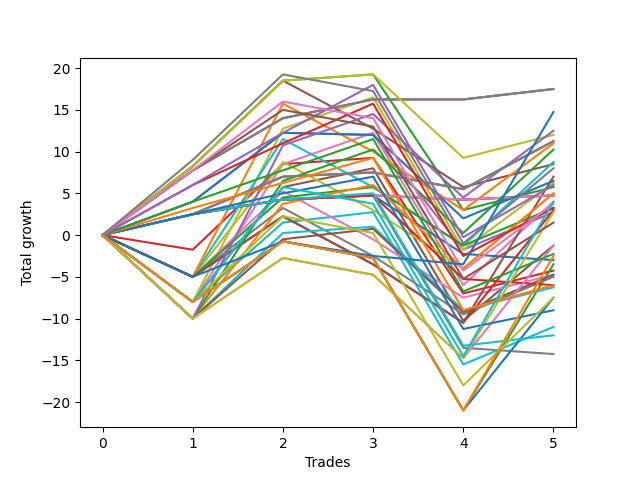

# Short Labrador 012 
- Symbol: ES_830-900
- Date Range: 03/18/2022 - 12/30/2022
- Trading Period: 8:30-9:0
- Number of Trades: 5



| Name | Win Percent | Profit | Avg Profit / Trade | Avg Time / Trade |      | Name | Win Percent | Profit | Avg Profit / Trade | Avg Time / Trade |
| ---- | ----------- | ------ | ------------------ | ---------------- | ---- | ---- | ----------- | ------ | ------------------ | ---------------- |
| Sorted By <br> Profit | | | | | | Sorted By <br> Win Percentage ||||
| BB-20 U/L 1SD SL-10 | 80.00 | 8750.00 | 1750.00 | 05:05 |     | BB-20 U/L 1SD SL-10 | 80.00 | 8750.00 | 1750.00 | 05:05 |
| BB-20 U/L 1SD SL-5 | 80.00 | 8750.00 | 1750.00 | 05:05 |     | BB-20 U/L 1SD SL-5 | 80.00 | 8750.00 | 1750.00 | 05:05 |
| BB-20 U/L 1SD | 80.00 | 8750.00 | 1750.00 | 05:05 |     | BB-20 U/L 1SD | 80.00 | 8750.00 | 1750.00 | 05:05 |
| NEWFI 0000 | 40.00 | 7375.00 | 1475.00 | 32:27 |     | BB-20 U/L 2SD SL-10 | 80.00 | 6000.00 | 1200.00 | 12:21 |
| V U/L 1SD SL-10 | 60.00 | 6250.00 | 1250.00 | 24:54 |     | BB-200 Mid SL-10 | 80.00 | 5625.00 | 1125.00 | 02:20 |
| BB-20 U/L 2SD SL-10 | 80.00 | 6000.00 | 1200.00 | 12:21 |     | BB-200 Mid SL-5 | 80.00 | 5625.00 | 1125.00 | 02:20 |
| BB-200 Mid SL-10 | 80.00 | 5625.00 | 1125.00 | 02:20 |     | BB-200 Mid | 80.00 | 5625.00 | 1125.00 | 02:20 |
| BB-200 Mid SL-5 | 80.00 | 5625.00 | 1125.00 | 02:20 |     | TP-6 | 80.00 | 3000.00 | 600.00 | 24:32 |
| BB-200 Mid | 80.00 | 5625.00 | 1125.00 | 02:20 |     | BB-20 U/L 2SD | 80.00 | 2875.00 | 575.00 | 18:01 |
| V U/L 1SD SL-5 | 40.00 | 5500.00 | 1100.00 | 18:12 |     | BB-20 Mid SL-10 | 80.00 | 2375.00 | 475.00 | 02:41 |
| BB-50 U/L 2SD SL-10 | 60.00 | 5125.00 | 1025.00 | 26:41 |     | BB-20 Mid SL-5 | 80.00 | 2375.00 | 475.00 | 02:41 |
| BB-50 U/L 2SD SL-5 | 40.00 | 4375.00 | 875.00 | 19:59 |     | BB-20 Mid | 80.00 | 2375.00 | 475.00 | 02:41 |
| BB-20 U/L 2SD SL-5 | 60.00 | 4250.00 | 850.00 | 11:14 |     | TP-5 | 80.00 | 1625.00 | 325.00 | 24:02 |
| TP-9 | 60.00 | 4000.00 | 800.00 | 30:40 |     | TP-4 | 80.00 | -1125.00 | -225.00 | 23:39 |
| BB-200 U/L 2SD SL-5 | 40.00 | 3500.00 | 700.00 | 30:26 |     | TP-3 | 80.00 | -3000.00 | -600.00 | 20:24 |
| BB-50 Mid SL-10 | 60.00 | 3250.00 | 650.00 | 14:46 |     | TP-2 | 80.00 | -4500.00 | -900.00 | 13:34 |
| V U/L 1SD | 60.00 | 3125.00 | 625.00 | 41:22 |     | TP-1 | 80.00 | -6000.00 | -1200.00 | 13:24 |
| TP-6 | 80.00 | 3000.00 | 600.00 | 24:32 |     | V U/L 1SD SL-10 | 60.00 | 6250.00 | 1250.00 | 24:54 |
| BB-20 U/L 2SD | 80.00 | 2875.00 | 575.00 | 18:01 |     | BB-50 U/L 2SD SL-10 | 60.00 | 5125.00 | 1025.00 | 26:41 |
| BB-50 U/L 1SD SL-10 | 60.00 | 2500.00 | 500.00 | 19:59 |     | BB-20 U/L 2SD SL-5 | 60.00 | 4250.00 | 850.00 | 11:14 |
| BB-50 U/L 1SD SL-5 | 40.00 | 2500.00 | 500.00 | 16:20 |     | TP-9 | 60.00 | 4000.00 | 800.00 | 30:40 |
| BB-20 Mid SL-10 | 80.00 | 2375.00 | 475.00 | 02:41 |     | BB-50 Mid SL-10 | 60.00 | 3250.00 | 650.00 | 14:46 |
| BB-20 Mid SL-5 | 80.00 | 2375.00 | 475.00 | 02:41 |     | V U/L 1SD | 60.00 | 3125.00 | 625.00 | 41:22 |
| BB-20 Mid | 80.00 | 2375.00 | 475.00 | 02:41 |     | BB-50 U/L 1SD SL-10 | 60.00 | 2500.00 | 500.00 | 19:59 |
| BB-50 U/L 2SD | 60.00 | 2000.00 | 400.00 | 43:09 |     | BB-50 U/L 2SD | 60.00 | 2000.00 | 400.00 | 43:09 |
| NEWFI 000 | 40.00 | 2000.00 | 400.00 | 52:11 |     | TP-8 | 60.00 | 1875.00 | 375.00 | 30:04 |
| TP-8 | 60.00 | 1875.00 | 375.00 | 30:04 |     | BB-100 Mid SL-5 | 60.00 | 1625.00 | 325.00 | 08:57 |
| TP-5 | 80.00 | 1625.00 | 325.00 | 24:02 |     | BB-50 Mid | 60.00 | 1375.00 | 275.00 | 22:22 |
| BB-100 Mid SL-5 | 60.00 | 1625.00 | 325.00 | 08:57 |     | TP-7 | 60.00 | 750.00 | 150.00 | 28:53 |
| BB-100 U/L 2SD SL-5 | 40.00 | 1500.00 | 300.00 | 30:20 |     | BB-50 U/L 1SD | 60.00 | -625.00 | -125.00 | 36:27 |
| BB-50 Mid | 60.00 | 1375.00 | 275.00 | 22:22 |     | V Mid SL-5 | 60.00 | -1500.00 | -300.00 | 03:37 |
| BB-200 U/L 2SD SL-10 | 40.00 | 1375.00 | 275.00 | 40:26 |     | BB-20 U/L 2SD C | 60.00 | -2125.00 | -425.00 | 25:06 |
| TP-7 | 60.00 | 750.00 | 150.00 | 28:53 |     | BB-100 Mid SL-10 | 60.00 | -2375.00 | -475.00 | 11:01 |
| BB-50 U/L 1SD | 60.00 | -625.00 | -125.00 | 36:27 |     | V Mid SL-10 | 60.00 | -3000.00 | -600.00 | 03:39 |
| BB-100 U/L 2SD SL-10 | 40.00 | -625.00 | -125.00 | 40:20 |     | BB-20 U/L 2SD C SL-10 | 60.00 | -3125.00 | -625.00 | 15:54 |
| TP-4 | 80.00 | -1125.00 | -225.00 | 23:39 |     | BB-100 Mid | 60.00 | -5500.00 | -1100.00 | 27:29 |
| NEWFI 06 | 40.00 | -1250.00 | -250.00 | 59:21 |     | V Mid | 60.00 | -7125.00 | -1425.00 | 13:07 |
| V Mid SL-5 | 60.00 | -1500.00 | -300.00 | 03:37 |     | NEWFI 0000 | 40.00 | 7375.00 | 1475.00 | 32:27 |
| BB-200 U/L 2SD | 40.00 | -1750.00 | -350.00 | 56:54 |     | V U/L 1SD SL-5 | 40.00 | 5500.00 | 1100.00 | 18:12 |
| BB-20 U/L 2SD C | 60.00 | -2125.00 | -425.00 | 25:06 |     | BB-50 U/L 2SD SL-5 | 40.00 | 4375.00 | 875.00 | 19:59 |
| BB-100 Mid SL-10 | 60.00 | -2375.00 | -475.00 | 11:01 |     | BB-200 U/L 2SD SL-5 | 40.00 | 3500.00 | 700.00 | 30:26 |
| BB-20 U/L 2SD C SL-5 | 40.00 | -2375.00 | -475.00 | 12:45 |     | BB-50 U/L 1SD SL-5 | 40.00 | 2500.00 | 500.00 | 16:20 |
| BB-50 Mid SL-5 | 40.00 | -2500.00 | -500.00 | 12:48 |     | NEWFI 000 | 40.00 | 2000.00 | 400.00 | 52:11 |
| TP-3 | 80.00 | -3000.00 | -600.00 | 20:24 |     | BB-100 U/L 2SD SL-5 | 40.00 | 1500.00 | 300.00 | 30:20 |
| V Mid SL-10 | 60.00 | -3000.00 | -600.00 | 03:39 |     | BB-200 U/L 2SD SL-10 | 40.00 | 1375.00 | 275.00 | 40:26 |
| BB-20 U/L 2SD C SL-10 | 60.00 | -3125.00 | -625.00 | 15:54 |     | BB-100 U/L 2SD SL-10 | 40.00 | -625.00 | -125.00 | 40:20 |
| TP-10 | 40.00 | -3750.00 | -750.00 | 41:54 |     | NEWFI 06 | 40.00 | -1250.00 | -250.00 | 59:21 |
| BB-100 U/L 2SD | 40.00 | -3750.00 | -750.00 | 56:48 |     | BB-200 U/L 2SD | 40.00 | -1750.00 | -350.00 | 56:54 |
| TP-2 | 80.00 | -4500.00 | -900.00 | 13:34 |     | BB-20 U/L 2SD C SL-5 | 40.00 | -2375.00 | -475.00 | 12:45 |
| BB-100 Mid | 60.00 | -5500.00 | -1100.00 | 27:29 |     | BB-50 Mid SL-5 | 40.00 | -2500.00 | -500.00 | 12:48 |
| TP-1 | 80.00 | -6000.00 | -1200.00 | 13:24 |     | TP-10 | 40.00 | -3750.00 | -750.00 | 41:54 |
| V Mid | 60.00 | -7125.00 | -1425.00 | 13:07 |     | BB-100 U/L 2SD | 40.00 | -3750.00 | -750.00 | 56:48 |

## NO STOPLOSS

### Test BB-20 Mid
* Sell when price hits the middle line of the 20p bollinger
* No Stoploss
* Results:
```
Total Trades: 5
Percent Up: 20.00
Percent Down: 80.00
Total Points Moved Down: 4.75
Potential Profit: 2375.00
Total Points Ups: 0.50 Count Ups: 1
Total Points Downs: 5.25 Count Downs: 4
```

<details><summary>Trades</summary>

<code>In: 2022-06-13 08:47:00		Out: 2022-06-13 08:48:10		Total Position Time: 01:10		Total Move Down: 2.50		Total to Date: 2.50</code> <br />
<code>In: 2022-06-17 08:35:00		Out: 2022-06-17 08:36:10		Total Position Time: 01:10		Total Move Down: 1.75		Total to Date: 4.25</code> <br />
<code>In: 2022-11-16 08:35:00		Out: 2022-11-16 08:36:10		Total Position Time: 01:10		Total Move Down: 0.50		Total to Date: 4.75</code> <br />
<code>In: 2022-11-17 08:42:00		Out: 2022-11-17 08:49:45		Total Position Time: 07:45		Total Move Down: -0.50		Total to Date: 4.25</code> <br />
<code>In: 2022-11-18 08:35:00		Out: 2022-11-18 08:37:10		Total Position Time: 02:10		Total Move Down: 0.50		Total to Date: 4.75</code> <br />


</details>

### Test BB-20 U/L 1SD
* Sell when the price hits the lower line of the 20p 1std bollinger
* No Stoploss
* Results:
```
Total Trades: 5
Percent Up: 20.00
Percent Down: 80.00
Total Points Moved Down: 17.50
Potential Profit: 8750.00
Total Points Ups: 0.00 Count Ups: 1
Total Points Downs: 17.50 Count Downs: 4
```

<details><summary>Trades</summary>

<code>In: 2022-06-13 08:47:00		Out: 2022-06-13 08:52:05		Total Position Time: 05:05		Total Move Down: 7.75		Total to Date: 7.75</code> <br />
<code>In: 2022-06-17 08:35:00		Out: 2022-06-17 08:39:05		Total Position Time: 04:05		Total Move Down: 6.25		Total to Date: 14.00</code> <br />
<code>In: 2022-11-16 08:35:00		Out: 2022-11-16 08:38:25		Total Position Time: 03:25		Total Move Down: 2.25		Total to Date: 16.25</code> <br />
<code>In: 2022-11-17 08:42:00		Out: 2022-11-17 08:52:30		Total Position Time: 10:30		Total Move Down: -0.00		Total to Date: 16.25</code> <br />
<code>In: 2022-11-18 08:35:00		Out: 2022-11-18 08:37:20		Total Position Time: 02:20		Total Move Down: 1.25		Total to Date: 17.50</code> <br />


</details>

### Test BB-20 U/L 2SD
* Sell when the price hits the lower line of the 20p 2std bollinger
* No Stoploss
* Results:
```
Total Trades: 5
Percent Up: 20.00
Percent Down: 80.00
Total Points Moved Down: 5.75
Potential Profit: 2875.00
Total Points Ups: 16.25 Count Ups: 1
Total Points Downs: 22.00 Count Downs: 4
```

<details><summary>Trades</summary>

<code>In: 2022-06-13 08:47:00		Out: 2022-06-13 08:55:10		Total Position Time: 08:10		Total Move Down: 8.25		Total to Date: 8.25</code> <br />
<code>In: 2022-06-17 08:35:00		Out: 2022-06-17 08:45:15		Total Position Time: 10:15		Total Move Down: 10.25		Total to Date: 18.50</code> <br />
<code>In: 2022-11-16 08:35:00		Out: 2022-11-16 09:01:40		Total Position Time: 26:40		Total Move Down: 0.75		Total to Date: 19.25</code> <br />
<code>In: 2022-11-17 08:42:00		Out: 2022-11-17 09:23:55		Total Position Time: 41:55		Total Move Down: -16.25		Total to Date: 3.00</code> <br />
<code>In: 2022-11-18 08:35:00		Out: 2022-11-18 08:38:05		Total Position Time: 03:05		Total Move Down: 2.75		Total to Date: 5.75</code> <br />


</details>

### Test BB-20 U/L 2SD C
* Sell when the price hits the lower line of the 20p 2std bollinger
* No Stoploss
* Results:
```
Total Trades: 5
Percent Up: 40.00
Percent Down: 60.00
Total Points Moved Down: -4.25
Potential Profit: -2125.00
Total Points Ups: 18.00 Count Ups: 2
Total Points Downs: 13.75 Count Downs: 3
```

<details><summary>Trades</summary>

<code>In: 2022-06-13 08:47:00		Out: 2022-06-13 09:30:35		Total Position Time: 43:35		Total Move Down: -1.75		Total to Date: -1.75</code> <br />
<code>In: 2022-06-17 08:35:00		Out: 2022-06-17 08:45:15		Total Position Time: 10:15		Total Move Down: 10.25		Total to Date: 8.50</code> <br />
<code>In: 2022-11-16 08:35:00		Out: 2022-11-16 09:01:40		Total Position Time: 26:40		Total Move Down: 0.75		Total to Date: 9.25</code> <br />
<code>In: 2022-11-17 08:42:00		Out: 2022-11-17 09:23:55		Total Position Time: 41:55		Total Move Down: -16.25		Total to Date: -7.00</code> <br />
<code>In: 2022-11-18 08:35:00		Out: 2022-11-18 08:38:05		Total Position Time: 03:05		Total Move Down: 2.75		Total to Date: -4.25</code> <br />


</details>

### Test BB-50 Mid
* Sell when price hits the middle line of the 50p bollinger
* No Stoploss
* Results:
```
Total Trades: 5
Percent Up: 40.00
Percent Down: 60.00
Total Points Moved Down: 2.75
Potential Profit: 1375.00
Total Points Ups: 14.00 Count Ups: 2
Total Points Downs: 16.75 Count Downs: 3
```

<details><summary>Trades</summary>

<code>In: 2022-06-13 08:47:00		Out: 2022-06-13 09:07:15		Total Position Time: 20:15		Total Move Down: 4.00		Total to Date: 4.00</code> <br />
<code>In: 2022-06-17 08:35:00		Out: 2022-06-17 08:45:05		Total Position Time: 10:05		Total Move Down: 8.25		Total to Date: 12.25</code> <br />
<code>In: 2022-11-16 08:35:00		Out: 2022-11-16 09:01:25		Total Position Time: 26:25		Total Move Down: -0.25		Total to Date: 12.00</code> <br />
<code>In: 2022-11-17 08:42:00		Out: 2022-11-17 09:33:35		Total Position Time: 51:35		Total Move Down: -13.75		Total to Date: -1.75</code> <br />
<code>In: 2022-11-18 08:35:00		Out: 2022-11-18 08:38:30		Total Position Time: 03:30		Total Move Down: 4.50		Total to Date: 2.75</code> <br />


</details>

### Test BB-50 U/L 1SD
* Sell when the price hits the lower line of the 50p 1std bollinger
* No Stoploss
* Results:
```
Total Trades: 5
Percent Up: 40.00
Percent Down: 60.00
Total Points Moved Down: -1.25
Potential Profit: -625.00
Total Points Ups: 26.25 Count Ups: 2
Total Points Downs: 25.00 Count Downs: 3
```

<details><summary>Trades</summary>

<code>In: 2022-06-13 08:47:00		Out: 2022-06-13 09:47:55		Total Position Time: 60:55		Total Move Down: -8.00		Total to Date: -8.00</code> <br />
<code>In: 2022-06-17 08:35:00		Out: 2022-06-17 08:51:25		Total Position Time: 16:25		Total Move Down: 13.75		Total to Date: 5.75</code> <br />
<code>In: 2022-11-16 08:35:00		Out: 2022-11-16 09:04:10		Total Position Time: 29:10		Total Move Down: 2.25		Total to Date: 8.00</code> <br />
<code>In: 2022-11-17 08:42:00		Out: 2022-11-17 09:42:55		Total Position Time: 60:55		Total Move Down: -18.25		Total to Date: -10.25</code> <br />
<code>In: 2022-11-18 08:35:00		Out: 2022-11-18 08:49:50		Total Position Time: 14:50		Total Move Down: 9.00		Total to Date: -1.25</code> <br />


</details>

### Test BB-50 U/L 2SD
* Sell when the price hits the lower line of the 50p 2std bollinger
* No Stoploss
* Results:
```
Total Trades: 5
Percent Up: 40.00
Percent Down: 60.00
Total Points Moved Down: 4.00
Potential Profit: 2000.00
Total Points Ups: 26.25 Count Ups: 2
Total Points Downs: 30.25 Count Downs: 3
```

<details><summary>Trades</summary>

<code>In: 2022-06-13 08:47:00		Out: 2022-06-13 09:47:55		Total Position Time: 60:55		Total Move Down: -8.00		Total to Date: -8.00</code> <br />
<code>In: 2022-06-17 08:35:00		Out: 2022-06-17 08:52:10		Total Position Time: 17:10		Total Move Down: 16.50		Total to Date: 8.50</code> <br />
<code>In: 2022-11-16 08:35:00		Out: 2022-11-16 09:19:25		Total Position Time: 44:25		Total Move Down: 3.75		Total to Date: 12.25</code> <br />
<code>In: 2022-11-17 08:42:00		Out: 2022-11-17 09:42:55		Total Position Time: 60:55		Total Move Down: -18.25		Total to Date: -6.00</code> <br />
<code>In: 2022-11-18 08:35:00		Out: 2022-11-18 09:07:20		Total Position Time: 32:20		Total Move Down: 10.00		Total to Date: 4.00</code> <br />


</details>

### Test V Mid
* Sell when the price hits the middle line of the 1std VWAP
* No Stoploss
* Results:
```
Total Trades: 5
Percent Up: 40.00
Percent Down: 60.00
Total Points Moved Down: -14.25
Potential Profit: -7125.00
Total Points Ups: 19.00 Count Ups: 2
Total Points Downs: 4.75 Count Downs: 3
```

<details><summary>Trades</summary>

<code>In: 2022-06-13 08:47:00		Out: 2022-06-13 08:48:10		Total Position Time: 01:10		Total Move Down: 2.50		Total to Date: 2.50</code> <br />
<code>In: 2022-06-17 08:35:00		Out: 2022-06-17 08:36:10		Total Position Time: 01:10		Total Move Down: 1.75		Total to Date: 4.25</code> <br />
<code>In: 2022-11-16 08:35:00		Out: 2022-11-16 08:36:10		Total Position Time: 01:10		Total Move Down: 0.50		Total to Date: 4.75</code> <br />
<code>In: 2022-11-17 08:42:00		Out: 2022-11-17 09:42:55		Total Position Time: 60:55		Total Move Down: -18.25		Total to Date: -13.50</code> <br />
<code>In: 2022-11-18 08:35:00		Out: 2022-11-18 08:36:10		Total Position Time: 01:10		Total Move Down: -0.75		Total to Date: -14.25</code> <br />


</details>

### Test V U/L 1SD
* Sell when the price hits the lower line of the 1std VWAP
* No Stoploss
* Results:
```
Total Trades: 5
Percent Up: 40.00
Percent Down: 60.00
Total Points Moved Down: 6.25
Potential Profit: 3125.00
Total Points Ups: 26.25 Count Ups: 2
Total Points Downs: 32.50 Count Downs: 3
```

<details><summary>Trades</summary>

<code>In: 2022-06-13 08:47:00		Out: 2022-06-13 09:47:55		Total Position Time: 60:55		Total Move Down: -8.00		Total to Date: -8.00</code> <br />
<code>In: 2022-06-17 08:35:00		Out: 2022-06-17 09:03:15		Total Position Time: 28:15		Total Move Down: 20.75		Total to Date: 12.75</code> <br />
<code>In: 2022-11-16 08:35:00		Out: 2022-11-16 09:19:25		Total Position Time: 44:25		Total Move Down: 3.75		Total to Date: 16.50</code> <br />
<code>In: 2022-11-17 08:42:00		Out: 2022-11-17 09:42:55		Total Position Time: 60:55		Total Move Down: -18.25		Total to Date: -1.75</code> <br />
<code>In: 2022-11-18 08:35:00		Out: 2022-11-18 08:47:20		Total Position Time: 12:20		Total Move Down: 8.00		Total to Date: 6.25</code> <br />


</details>

### Test BB-100 Mid
* Move to BB100 Mid
* No Stoploss
* Results:
```
Total Trades: 5
Percent Up: 40.00
Percent Down: 60.00
Total Points Moved Down: -11.00
Potential Profit: -5500.00
Total Points Ups: 26.25 Count Ups: 2
Total Points Downs: 15.25 Count Downs: 3
```

<details><summary>Trades</summary>

<code>In: 2022-06-13 08:47:00		Out: 2022-06-13 09:47:55		Total Position Time: 60:55		Total Move Down: -8.00		Total to Date: -8.00</code> <br />
<code>In: 2022-06-17 08:35:00		Out: 2022-06-17 08:45:25		Total Position Time: 10:25		Total Move Down: 9.50		Total to Date: 1.50</code> <br />
<code>In: 2022-11-16 08:35:00		Out: 2022-11-16 08:36:40		Total Position Time: 01:40		Total Move Down: 1.25		Total to Date: 2.75</code> <br />
<code>In: 2022-11-17 08:42:00		Out: 2022-11-17 09:42:55		Total Position Time: 60:55		Total Move Down: -18.25		Total to Date: -15.50</code> <br />
<code>In: 2022-11-18 08:35:00		Out: 2022-11-18 08:38:30		Total Position Time: 03:30		Total Move Down: 4.50		Total to Date: -11.00</code> <br />


</details>

### Test BB-100 U/L 2SD
* Move to BB100 Upper Band
* No Stoploss
* Results:
```
Total Trades: 5
Percent Up: 60.00
Percent Down: 40.00
Total Points Moved Down: -7.50
Potential Profit: -3750.00
Total Points Ups: 28.25 Count Ups: 3
Total Points Downs: 20.75 Count Downs: 2
```

<details><summary>Trades</summary>

<code>In: 2022-06-13 08:47:00		Out: 2022-06-13 09:47:55		Total Position Time: 60:55		Total Move Down: -8.00		Total to Date: -8.00</code> <br />
<code>In: 2022-06-17 08:35:00		Out: 2022-06-17 09:35:55		Total Position Time: 60:55		Total Move Down: 7.25		Total to Date: -0.75</code> <br />
<code>In: 2022-11-16 08:35:00		Out: 2022-11-16 09:35:55		Total Position Time: 60:55		Total Move Down: -2.00		Total to Date: -2.75</code> <br />
<code>In: 2022-11-17 08:42:00		Out: 2022-11-17 09:42:55		Total Position Time: 60:55		Total Move Down: -18.25		Total to Date: -21.00</code> <br />
<code>In: 2022-11-18 08:35:00		Out: 2022-11-18 09:15:20		Total Position Time: 40:20		Total Move Down: 13.50		Total to Date: -7.50</code> <br />


</details>

### Test BB-200 Mid
* Move to BB200 Mid
* No Stoploss
* Results:
```
Total Trades: 5
Percent Up: 20.00
Percent Down: 80.00
Total Points Moved Down: 11.25
Potential Profit: 5625.00
Total Points Ups: 2.00 Count Ups: 1
Total Points Downs: 13.25 Count Downs: 4
```

<details><summary>Trades</summary>

<code>In: 2022-06-13 08:47:00		Out: 2022-06-13 08:48:10		Total Position Time: 01:10		Total Move Down: 2.50		Total to Date: 2.50</code> <br />
<code>In: 2022-06-17 08:35:00		Out: 2022-06-17 08:38:50		Total Position Time: 03:50		Total Move Down: 4.50		Total to Date: 7.00</code> <br />
<code>In: 2022-11-16 08:35:00		Out: 2022-11-16 08:36:10		Total Position Time: 01:10		Total Move Down: 0.50		Total to Date: 7.50</code> <br />
<code>In: 2022-11-17 08:42:00		Out: 2022-11-17 08:43:10		Total Position Time: 01:10		Total Move Down: -2.00		Total to Date: 5.50</code> <br />
<code>In: 2022-11-18 08:35:00		Out: 2022-11-18 08:39:20		Total Position Time: 04:20		Total Move Down: 5.75		Total to Date: 11.25</code> <br />


</details>

### Test BB-200 U/L 2SD
* Move to BB200 Upper Band
* No Stoploss
* Results:
```
Total Trades: 5
Percent Up: 60.00
Percent Down: 40.00
Total Points Moved Down: -3.50
Potential Profit: -1750.00
Total Points Ups: 28.25 Count Ups: 3
Total Points Downs: 24.75 Count Downs: 2
```

<details><summary>Trades</summary>

<code>In: 2022-06-13 08:47:00		Out: 2022-06-13 09:47:55		Total Position Time: 60:55		Total Move Down: -8.00		Total to Date: -8.00</code> <br />
<code>In: 2022-06-17 08:35:00		Out: 2022-06-17 09:35:55		Total Position Time: 60:55		Total Move Down: 7.25		Total to Date: -0.75</code> <br />
<code>In: 2022-11-16 08:35:00		Out: 2022-11-16 09:35:55		Total Position Time: 60:55		Total Move Down: -2.00		Total to Date: -2.75</code> <br />
<code>In: 2022-11-17 08:42:00		Out: 2022-11-17 09:42:55		Total Position Time: 60:55		Total Move Down: -18.25		Total to Date: -21.00</code> <br />
<code>In: 2022-11-18 08:35:00		Out: 2022-11-18 09:15:50		Total Position Time: 40:50		Total Move Down: 17.50		Total to Date: -3.50</code> <br />


</details>

## STOPLOSS OF 5

### Test BB-20 Mid SL-5
* Sell when price hits the middle line of the 20p bollinger
* Stoploss is -5 points
* Results:
```
Total Trades: 5
Percent Up: 20.00
Percent Down: 80.00
Total Points Moved Down: 4.75
Potential Profit: 2375.00
Total Points Ups: 0.50 Count Ups: 1
Total Points Downs: 5.25 Count Downs: 4
```

<details><summary>Trades</summary>

<code>In: 2022-06-13 08:47:00		Out: 2022-06-13 08:48:10		Total Position Time: 01:10		Total Move Down: 2.50		Total to Date: 2.50</code> <br />
<code>In: 2022-06-17 08:35:00		Out: 2022-06-17 08:36:10		Total Position Time: 01:10		Total Move Down: 1.75		Total to Date: 4.25</code> <br />
<code>In: 2022-11-16 08:35:00		Out: 2022-11-16 08:36:10		Total Position Time: 01:10		Total Move Down: 0.50		Total to Date: 4.75</code> <br />
<code>In: 2022-11-17 08:42:00		Out: 2022-11-17 08:49:45		Total Position Time: 07:45		Total Move Down: -0.50		Total to Date: 4.25</code> <br />
<code>In: 2022-11-18 08:35:00		Out: 2022-11-18 08:37:10		Total Position Time: 02:10		Total Move Down: 0.50		Total to Date: 4.75</code> <br />


</details>

### Test BB-20 U/L 1SD SL-5
* Sell when the price hits the lower line of the 20p 1std bollinger
* Stoploss is -5 points
* Results:
```
Total Trades: 5
Percent Up: 20.00
Percent Down: 80.00
Total Points Moved Down: 17.50
Potential Profit: 8750.00
Total Points Ups: 0.00 Count Ups: 1
Total Points Downs: 17.50 Count Downs: 4
```

<details><summary>Trades</summary>

<code>In: 2022-06-13 08:47:00		Out: 2022-06-13 08:52:05		Total Position Time: 05:05		Total Move Down: 7.75		Total to Date: 7.75</code> <br />
<code>In: 2022-06-17 08:35:00		Out: 2022-06-17 08:39:05		Total Position Time: 04:05		Total Move Down: 6.25		Total to Date: 14.00</code> <br />
<code>In: 2022-11-16 08:35:00		Out: 2022-11-16 08:38:25		Total Position Time: 03:25		Total Move Down: 2.25		Total to Date: 16.25</code> <br />
<code>In: 2022-11-17 08:42:00		Out: 2022-11-17 08:52:30		Total Position Time: 10:30		Total Move Down: -0.00		Total to Date: 16.25</code> <br />
<code>In: 2022-11-18 08:35:00		Out: 2022-11-18 08:37:20		Total Position Time: 02:20		Total Move Down: 1.25		Total to Date: 17.50</code> <br />


</details>

### Test BB-20 U/L 2SD SL-5
* Sell when the price hits the lower line of the 20p 2std bollinger
* Stoploss is -5 points
* Results:
```
Total Trades: 5
Percent Up: 40.00
Percent Down: 60.00
Total Points Moved Down: 8.50
Potential Profit: 4250.00
Total Points Ups: 12.75 Count Ups: 2
Total Points Downs: 21.25 Count Downs: 3
```

<details><summary>Trades</summary>

<code>In: 2022-06-13 08:47:00		Out: 2022-06-13 08:55:10		Total Position Time: 08:10		Total Move Down: 8.25		Total to Date: 8.25</code> <br />
<code>In: 2022-06-17 08:35:00		Out: 2022-06-17 08:45:15		Total Position Time: 10:15		Total Move Down: 10.25		Total to Date: 18.50</code> <br />
<code>In: 2022-11-16 08:35:00		Out: 2022-11-16 08:56:15		Total Position Time: 21:15		Total Move Down: -5.75		Total to Date: 12.75</code> <br />
<code>In: 2022-11-17 08:42:00		Out: 2022-11-17 08:55:25		Total Position Time: 13:25		Total Move Down: -7.00		Total to Date: 5.75</code> <br />
<code>In: 2022-11-18 08:35:00		Out: 2022-11-18 08:38:05		Total Position Time: 03:05		Total Move Down: 2.75		Total to Date: 8.50</code> <br />


</details>

### Test BB-20 U/L 2SD C SL-5
* Sell when the price hits the lower line of the 20p 2std bollinger
* Stoploss is -5 points
* Results:
```
Total Trades: 5
Percent Up: 60.00
Percent Down: 40.00
Total Points Moved Down: -4.75
Potential Profit: -2375.00
Total Points Ups: 17.75 Count Ups: 3
Total Points Downs: 13.00 Count Downs: 2
```

<details><summary>Trades</summary>

<code>In: 2022-06-13 08:47:00		Out: 2022-06-13 09:02:45		Total Position Time: 15:45		Total Move Down: -5.00		Total to Date: -5.00</code> <br />
<code>In: 2022-06-17 08:35:00		Out: 2022-06-17 08:45:15		Total Position Time: 10:15		Total Move Down: 10.25		Total to Date: 5.25</code> <br />
<code>In: 2022-11-16 08:35:00		Out: 2022-11-16 08:56:15		Total Position Time: 21:15		Total Move Down: -5.75		Total to Date: -0.50</code> <br />
<code>In: 2022-11-17 08:42:00		Out: 2022-11-17 08:55:25		Total Position Time: 13:25		Total Move Down: -7.00		Total to Date: -7.50</code> <br />
<code>In: 2022-11-18 08:35:00		Out: 2022-11-18 08:38:05		Total Position Time: 03:05		Total Move Down: 2.75		Total to Date: -4.75</code> <br />


</details>

### Test BB-50 Mid SL-5
* Sell when price hits the middle line of the 50p bollinger
* Stoploss is -5 points
* Results:
```
Total Trades: 5
Percent Up: 60.00
Percent Down: 40.00
Total Points Moved Down: -5.00
Potential Profit: -2500.00
Total Points Ups: 17.75 Count Ups: 3
Total Points Downs: 12.75 Count Downs: 2
```

<details><summary>Trades</summary>

<code>In: 2022-06-13 08:47:00		Out: 2022-06-13 09:02:45		Total Position Time: 15:45		Total Move Down: -5.00		Total to Date: -5.00</code> <br />
<code>In: 2022-06-17 08:35:00		Out: 2022-06-17 08:45:05		Total Position Time: 10:05		Total Move Down: 8.25		Total to Date: 3.25</code> <br />
<code>In: 2022-11-16 08:35:00		Out: 2022-11-16 08:56:15		Total Position Time: 21:15		Total Move Down: -5.75		Total to Date: -2.50</code> <br />
<code>In: 2022-11-17 08:42:00		Out: 2022-11-17 08:55:25		Total Position Time: 13:25		Total Move Down: -7.00		Total to Date: -9.50</code> <br />
<code>In: 2022-11-18 08:35:00		Out: 2022-11-18 08:38:30		Total Position Time: 03:30		Total Move Down: 4.50		Total to Date: -5.00</code> <br />


</details>

### Test BB-50 U/L 1SD SL-5
* Sell when the price hits the lower line of the 50p 1std bollinger
* Stoploss is -5 points
* Results:
```
Total Trades: 5
Percent Up: 60.00
Percent Down: 40.00
Total Points Moved Down: 5.00
Potential Profit: 2500.00
Total Points Ups: 17.75 Count Ups: 3
Total Points Downs: 22.75 Count Downs: 2
```

<details><summary>Trades</summary>

<code>In: 2022-06-13 08:47:00		Out: 2022-06-13 09:02:45		Total Position Time: 15:45		Total Move Down: -5.00		Total to Date: -5.00</code> <br />
<code>In: 2022-06-17 08:35:00		Out: 2022-06-17 08:51:25		Total Position Time: 16:25		Total Move Down: 13.75		Total to Date: 8.75</code> <br />
<code>In: 2022-11-16 08:35:00		Out: 2022-11-16 08:56:15		Total Position Time: 21:15		Total Move Down: -5.75		Total to Date: 3.00</code> <br />
<code>In: 2022-11-17 08:42:00		Out: 2022-11-17 08:55:25		Total Position Time: 13:25		Total Move Down: -7.00		Total to Date: -4.00</code> <br />
<code>In: 2022-11-18 08:35:00		Out: 2022-11-18 08:49:50		Total Position Time: 14:50		Total Move Down: 9.00		Total to Date: 5.00</code> <br />


</details>

### Test BB-50 U/L 2SD SL-5
* Sell when the price hits the lower line of the 50p 2std bollinger
* Stoploss is -5 points
* Results:
```
Total Trades: 5
Percent Up: 60.00
Percent Down: 40.00
Total Points Moved Down: 8.75
Potential Profit: 4375.00
Total Points Ups: 17.75 Count Ups: 3
Total Points Downs: 26.50 Count Downs: 2
```

<details><summary>Trades</summary>

<code>In: 2022-06-13 08:47:00		Out: 2022-06-13 09:02:45		Total Position Time: 15:45		Total Move Down: -5.00		Total to Date: -5.00</code> <br />
<code>In: 2022-06-17 08:35:00		Out: 2022-06-17 08:52:10		Total Position Time: 17:10		Total Move Down: 16.50		Total to Date: 11.50</code> <br />
<code>In: 2022-11-16 08:35:00		Out: 2022-11-16 08:56:15		Total Position Time: 21:15		Total Move Down: -5.75		Total to Date: 5.75</code> <br />
<code>In: 2022-11-17 08:42:00		Out: 2022-11-17 08:55:25		Total Position Time: 13:25		Total Move Down: -7.00		Total to Date: -1.25</code> <br />
<code>In: 2022-11-18 08:35:00		Out: 2022-11-18 09:07:20		Total Position Time: 32:20		Total Move Down: 10.00		Total to Date: 8.75</code> <br />


</details>

### Test V Mid SL-5
* Sell when the price hits the middle line of the 1std VWAP
* Stoploss is -5 points
* Results:
```
Total Trades: 5
Percent Up: 40.00
Percent Down: 60.00
Total Points Moved Down: -3.00
Potential Profit: -1500.00
Total Points Ups: 7.75 Count Ups: 2
Total Points Downs: 4.75 Count Downs: 3
```

<details><summary>Trades</summary>

<code>In: 2022-06-13 08:47:00		Out: 2022-06-13 08:48:10		Total Position Time: 01:10		Total Move Down: 2.50		Total to Date: 2.50</code> <br />
<code>In: 2022-06-17 08:35:00		Out: 2022-06-17 08:36:10		Total Position Time: 01:10		Total Move Down: 1.75		Total to Date: 4.25</code> <br />
<code>In: 2022-11-16 08:35:00		Out: 2022-11-16 08:36:10		Total Position Time: 01:10		Total Move Down: 0.50		Total to Date: 4.75</code> <br />
<code>In: 2022-11-17 08:42:00		Out: 2022-11-17 08:55:25		Total Position Time: 13:25		Total Move Down: -7.00		Total to Date: -2.25</code> <br />
<code>In: 2022-11-18 08:35:00		Out: 2022-11-18 08:36:10		Total Position Time: 01:10		Total Move Down: -0.75		Total to Date: -3.00</code> <br />


</details>

### Test V U/L 1SD SL-5
* Sell when the price hits the lower line of the 1std VWAP
* Stoploss is -5 points
* Results:
```
Total Trades: 5
Percent Up: 60.00
Percent Down: 40.00
Total Points Moved Down: 11.00
Potential Profit: 5500.00
Total Points Ups: 17.75 Count Ups: 3
Total Points Downs: 28.75 Count Downs: 2
```

<details><summary>Trades</summary>

<code>In: 2022-06-13 08:47:00		Out: 2022-06-13 09:02:45		Total Position Time: 15:45		Total Move Down: -5.00		Total to Date: -5.00</code> <br />
<code>In: 2022-06-17 08:35:00		Out: 2022-06-17 09:03:15		Total Position Time: 28:15		Total Move Down: 20.75		Total to Date: 15.75</code> <br />
<code>In: 2022-11-16 08:35:00		Out: 2022-11-16 08:56:15		Total Position Time: 21:15		Total Move Down: -5.75		Total to Date: 10.00</code> <br />
<code>In: 2022-11-17 08:42:00		Out: 2022-11-17 08:55:25		Total Position Time: 13:25		Total Move Down: -7.00		Total to Date: 3.00</code> <br />
<code>In: 2022-11-18 08:35:00		Out: 2022-11-18 08:47:20		Total Position Time: 12:20		Total Move Down: 8.00		Total to Date: 11.00</code> <br />


</details>

### Test BB-100 Mid SL-5
* Move to BB100 Mid
* Stoploss is -5 points
* Results:
```
Total Trades: 5
Percent Up: 40.00
Percent Down: 60.00
Total Points Moved Down: 3.25
Potential Profit: 1625.00
Total Points Ups: 12.00 Count Ups: 2
Total Points Downs: 15.25 Count Downs: 3
```

<details><summary>Trades</summary>

<code>In: 2022-06-13 08:47:00		Out: 2022-06-13 09:02:45		Total Position Time: 15:45		Total Move Down: -5.00		Total to Date: -5.00</code> <br />
<code>In: 2022-06-17 08:35:00		Out: 2022-06-17 08:45:25		Total Position Time: 10:25		Total Move Down: 9.50		Total to Date: 4.50</code> <br />
<code>In: 2022-11-16 08:35:00		Out: 2022-11-16 08:36:40		Total Position Time: 01:40		Total Move Down: 1.25		Total to Date: 5.75</code> <br />
<code>In: 2022-11-17 08:42:00		Out: 2022-11-17 08:55:25		Total Position Time: 13:25		Total Move Down: -7.00		Total to Date: -1.25</code> <br />
<code>In: 2022-11-18 08:35:00		Out: 2022-11-18 08:38:30		Total Position Time: 03:30		Total Move Down: 4.50		Total to Date: 3.25</code> <br />


</details>

### Test BB-100 U/L 2SD SL-5
* Move to BB100 Upper Band
* Stoploss is -5 points
* Results:
```
Total Trades: 5
Percent Up: 60.00
Percent Down: 40.00
Total Points Moved Down: 3.00
Potential Profit: 1500.00
Total Points Ups: 17.75 Count Ups: 3
Total Points Downs: 20.75 Count Downs: 2
```

<details><summary>Trades</summary>

<code>In: 2022-06-13 08:47:00		Out: 2022-06-13 09:02:45		Total Position Time: 15:45		Total Move Down: -5.00		Total to Date: -5.00</code> <br />
<code>In: 2022-06-17 08:35:00		Out: 2022-06-17 09:35:55		Total Position Time: 60:55		Total Move Down: 7.25		Total to Date: 2.25</code> <br />
<code>In: 2022-11-16 08:35:00		Out: 2022-11-16 08:56:15		Total Position Time: 21:15		Total Move Down: -5.75		Total to Date: -3.50</code> <br />
<code>In: 2022-11-17 08:42:00		Out: 2022-11-17 08:55:25		Total Position Time: 13:25		Total Move Down: -7.00		Total to Date: -10.50</code> <br />
<code>In: 2022-11-18 08:35:00		Out: 2022-11-18 09:15:20		Total Position Time: 40:20		Total Move Down: 13.50		Total to Date: 3.00</code> <br />


</details>

### Test BB-200 Mid SL-5
* Move to BB200 Mid
* Stoploss is -5 points
* Results:
```
Total Trades: 5
Percent Up: 20.00
Percent Down: 80.00
Total Points Moved Down: 11.25
Potential Profit: 5625.00
Total Points Ups: 2.00 Count Ups: 1
Total Points Downs: 13.25 Count Downs: 4
```

<details><summary>Trades</summary>

<code>In: 2022-06-13 08:47:00		Out: 2022-06-13 08:48:10		Total Position Time: 01:10		Total Move Down: 2.50		Total to Date: 2.50</code> <br />
<code>In: 2022-06-17 08:35:00		Out: 2022-06-17 08:38:50		Total Position Time: 03:50		Total Move Down: 4.50		Total to Date: 7.00</code> <br />
<code>In: 2022-11-16 08:35:00		Out: 2022-11-16 08:36:10		Total Position Time: 01:10		Total Move Down: 0.50		Total to Date: 7.50</code> <br />
<code>In: 2022-11-17 08:42:00		Out: 2022-11-17 08:43:10		Total Position Time: 01:10		Total Move Down: -2.00		Total to Date: 5.50</code> <br />
<code>In: 2022-11-18 08:35:00		Out: 2022-11-18 08:39:20		Total Position Time: 04:20		Total Move Down: 5.75		Total to Date: 11.25</code> <br />


</details>

### Test BB-200 U/L 2SD SL-5
* Move to BB200 Upper Band
* Stoploss is -5 points
* Results:
```
Total Trades: 5
Percent Up: 60.00
Percent Down: 40.00
Total Points Moved Down: 7.00
Potential Profit: 3500.00
Total Points Ups: 17.75 Count Ups: 3
Total Points Downs: 24.75 Count Downs: 2
```

<details><summary>Trades</summary>

<code>In: 2022-06-13 08:47:00		Out: 2022-06-13 09:02:45		Total Position Time: 15:45		Total Move Down: -5.00		Total to Date: -5.00</code> <br />
<code>In: 2022-06-17 08:35:00		Out: 2022-06-17 09:35:55		Total Position Time: 60:55		Total Move Down: 7.25		Total to Date: 2.25</code> <br />
<code>In: 2022-11-16 08:35:00		Out: 2022-11-16 08:56:15		Total Position Time: 21:15		Total Move Down: -5.75		Total to Date: -3.50</code> <br />
<code>In: 2022-11-17 08:42:00		Out: 2022-11-17 08:55:25		Total Position Time: 13:25		Total Move Down: -7.00		Total to Date: -10.50</code> <br />
<code>In: 2022-11-18 08:35:00		Out: 2022-11-18 09:15:50		Total Position Time: 40:50		Total Move Down: 17.50		Total to Date: 7.00</code> <br />


</details>

## STOPLOSS OF 10

### Test BB-20 Mid SL-10
* Sell when price hits the middle line of the 20p bollinger
* Stoploss is -10 points
* Results:
```
Total Trades: 5
Percent Up: 20.00
Percent Down: 80.00
Total Points Moved Down: 4.75
Potential Profit: 2375.00
Total Points Ups: 0.50 Count Ups: 1
Total Points Downs: 5.25 Count Downs: 4
```

<details><summary>Trades</summary>

<code>In: 2022-06-13 08:47:00		Out: 2022-06-13 08:48:10		Total Position Time: 01:10		Total Move Down: 2.50		Total to Date: 2.50</code> <br />
<code>In: 2022-06-17 08:35:00		Out: 2022-06-17 08:36:10		Total Position Time: 01:10		Total Move Down: 1.75		Total to Date: 4.25</code> <br />
<code>In: 2022-11-16 08:35:00		Out: 2022-11-16 08:36:10		Total Position Time: 01:10		Total Move Down: 0.50		Total to Date: 4.75</code> <br />
<code>In: 2022-11-17 08:42:00		Out: 2022-11-17 08:49:45		Total Position Time: 07:45		Total Move Down: -0.50		Total to Date: 4.25</code> <br />
<code>In: 2022-11-18 08:35:00		Out: 2022-11-18 08:37:10		Total Position Time: 02:10		Total Move Down: 0.50		Total to Date: 4.75</code> <br />


</details>

### Test BB-20 U/L 1SD SL-10
* Sell when the price hits the lower line of the 20p 1std bollinger
* Stoploss is -10 points
* Results:
```
Total Trades: 5
Percent Up: 20.00
Percent Down: 80.00
Total Points Moved Down: 17.50
Potential Profit: 8750.00
Total Points Ups: 0.00 Count Ups: 1
Total Points Downs: 17.50 Count Downs: 4
```

<details><summary>Trades</summary>

<code>In: 2022-06-13 08:47:00		Out: 2022-06-13 08:52:05		Total Position Time: 05:05		Total Move Down: 7.75		Total to Date: 7.75</code> <br />
<code>In: 2022-06-17 08:35:00		Out: 2022-06-17 08:39:05		Total Position Time: 04:05		Total Move Down: 6.25		Total to Date: 14.00</code> <br />
<code>In: 2022-11-16 08:35:00		Out: 2022-11-16 08:38:25		Total Position Time: 03:25		Total Move Down: 2.25		Total to Date: 16.25</code> <br />
<code>In: 2022-11-17 08:42:00		Out: 2022-11-17 08:52:30		Total Position Time: 10:30		Total Move Down: -0.00		Total to Date: 16.25</code> <br />
<code>In: 2022-11-18 08:35:00		Out: 2022-11-18 08:37:20		Total Position Time: 02:20		Total Move Down: 1.25		Total to Date: 17.50</code> <br />


</details>

### Test BB-20 U/L 2SD SL-10
* Sell when the price hits the lower line of the 20p 2std bollinger
* Stoploss is -10 points
* Results:
```
Total Trades: 5
Percent Up: 20.00
Percent Down: 80.00
Total Points Moved Down: 12.00
Potential Profit: 6000.00
Total Points Ups: 10.00 Count Ups: 1
Total Points Downs: 22.00 Count Downs: 4
```

<details><summary>Trades</summary>

<code>In: 2022-06-13 08:47:00		Out: 2022-06-13 08:55:10		Total Position Time: 08:10		Total Move Down: 8.25		Total to Date: 8.25</code> <br />
<code>In: 2022-06-17 08:35:00		Out: 2022-06-17 08:45:15		Total Position Time: 10:15		Total Move Down: 10.25		Total to Date: 18.50</code> <br />
<code>In: 2022-11-16 08:35:00		Out: 2022-11-16 09:01:40		Total Position Time: 26:40		Total Move Down: 0.75		Total to Date: 19.25</code> <br />
<code>In: 2022-11-17 08:42:00		Out: 2022-11-17 08:55:35		Total Position Time: 13:35		Total Move Down: -10.00		Total to Date: 9.25</code> <br />
<code>In: 2022-11-18 08:35:00		Out: 2022-11-18 08:38:05		Total Position Time: 03:05		Total Move Down: 2.75		Total to Date: 12.00</code> <br />


</details>

### Test BB-20 U/L 2SD C SL-10
* Sell when the price hits the lower line of the 20p 2std bollinger
* Stoploss is -10 points
* Results:
```
Total Trades: 5
Percent Up: 40.00
Percent Down: 60.00
Total Points Moved Down: -6.25
Potential Profit: -3125.00
Total Points Ups: 20.00 Count Ups: 2
Total Points Downs: 13.75 Count Downs: 3
```

<details><summary>Trades</summary>

<code>In: 2022-06-13 08:47:00		Out: 2022-06-13 09:12:55		Total Position Time: 25:55		Total Move Down: -10.00		Total to Date: -10.00</code> <br />
<code>In: 2022-06-17 08:35:00		Out: 2022-06-17 08:45:15		Total Position Time: 10:15		Total Move Down: 10.25		Total to Date: 0.25</code> <br />
<code>In: 2022-11-16 08:35:00		Out: 2022-11-16 09:01:40		Total Position Time: 26:40		Total Move Down: 0.75		Total to Date: 1.00</code> <br />
<code>In: 2022-11-17 08:42:00		Out: 2022-11-17 08:55:35		Total Position Time: 13:35		Total Move Down: -10.00		Total to Date: -9.00</code> <br />
<code>In: 2022-11-18 08:35:00		Out: 2022-11-18 08:38:05		Total Position Time: 03:05		Total Move Down: 2.75		Total to Date: -6.25</code> <br />


</details>

### Test BB-50 Mid SL-10
* Sell when price hits the middle line of the 50p bollinger
* Stoploss is -10 points
* Results:
```
Total Trades: 5
Percent Up: 40.00
Percent Down: 60.00
Total Points Moved Down: 6.50
Potential Profit: 3250.00
Total Points Ups: 10.25 Count Ups: 2
Total Points Downs: 16.75 Count Downs: 3
```

<details><summary>Trades</summary>

<code>In: 2022-06-13 08:47:00		Out: 2022-06-13 09:07:15		Total Position Time: 20:15		Total Move Down: 4.00		Total to Date: 4.00</code> <br />
<code>In: 2022-06-17 08:35:00		Out: 2022-06-17 08:45:05		Total Position Time: 10:05		Total Move Down: 8.25		Total to Date: 12.25</code> <br />
<code>In: 2022-11-16 08:35:00		Out: 2022-11-16 09:01:25		Total Position Time: 26:25		Total Move Down: -0.25		Total to Date: 12.00</code> <br />
<code>In: 2022-11-17 08:42:00		Out: 2022-11-17 08:55:35		Total Position Time: 13:35		Total Move Down: -10.00		Total to Date: 2.00</code> <br />
<code>In: 2022-11-18 08:35:00		Out: 2022-11-18 08:38:30		Total Position Time: 03:30		Total Move Down: 4.50		Total to Date: 6.50</code> <br />


</details>

### Test BB-50 U/L 1SD SL-10
* Sell when the price hits the lower line of the 50p 1std bollinger
* Stoploss is -10 points
* Results:
```
Total Trades: 5
Percent Up: 40.00
Percent Down: 60.00
Total Points Moved Down: 5.00
Potential Profit: 2500.00
Total Points Ups: 20.00 Count Ups: 2
Total Points Downs: 25.00 Count Downs: 3
```

<details><summary>Trades</summary>

<code>In: 2022-06-13 08:47:00		Out: 2022-06-13 09:12:55		Total Position Time: 25:55		Total Move Down: -10.00		Total to Date: -10.00</code> <br />
<code>In: 2022-06-17 08:35:00		Out: 2022-06-17 08:51:25		Total Position Time: 16:25		Total Move Down: 13.75		Total to Date: 3.75</code> <br />
<code>In: 2022-11-16 08:35:00		Out: 2022-11-16 09:04:10		Total Position Time: 29:10		Total Move Down: 2.25		Total to Date: 6.00</code> <br />
<code>In: 2022-11-17 08:42:00		Out: 2022-11-17 08:55:35		Total Position Time: 13:35		Total Move Down: -10.00		Total to Date: -4.00</code> <br />
<code>In: 2022-11-18 08:35:00		Out: 2022-11-18 08:49:50		Total Position Time: 14:50		Total Move Down: 9.00		Total to Date: 5.00</code> <br />


</details>

### Test BB-50 U/L 2SD SL-10
* Sell when the price hits the lower line of the 50p 2std bollinger
* Stoploss is -10 points
* Results:
```
Total Trades: 5
Percent Up: 40.00
Percent Down: 60.00
Total Points Moved Down: 10.25
Potential Profit: 5125.00
Total Points Ups: 20.00 Count Ups: 2
Total Points Downs: 30.25 Count Downs: 3
```

<details><summary>Trades</summary>

<code>In: 2022-06-13 08:47:00		Out: 2022-06-13 09:12:55		Total Position Time: 25:55		Total Move Down: -10.00		Total to Date: -10.00</code> <br />
<code>In: 2022-06-17 08:35:00		Out: 2022-06-17 08:52:10		Total Position Time: 17:10		Total Move Down: 16.50		Total to Date: 6.50</code> <br />
<code>In: 2022-11-16 08:35:00		Out: 2022-11-16 09:19:25		Total Position Time: 44:25		Total Move Down: 3.75		Total to Date: 10.25</code> <br />
<code>In: 2022-11-17 08:42:00		Out: 2022-11-17 08:55:35		Total Position Time: 13:35		Total Move Down: -10.00		Total to Date: 0.25</code> <br />
<code>In: 2022-11-18 08:35:00		Out: 2022-11-18 09:07:20		Total Position Time: 32:20		Total Move Down: 10.00		Total to Date: 10.25</code> <br />


</details>

### Test V Mid SL-10
* Sell when the price hits the middle line of the 1std VWAP
* Stoploss is -10 points
* Results:
```
Total Trades: 5
Percent Up: 40.00
Percent Down: 60.00
Total Points Moved Down: -6.00
Potential Profit: -3000.00
Total Points Ups: 10.75 Count Ups: 2
Total Points Downs: 4.75 Count Downs: 3
```

<details><summary>Trades</summary>

<code>In: 2022-06-13 08:47:00		Out: 2022-06-13 08:48:10		Total Position Time: 01:10		Total Move Down: 2.50		Total to Date: 2.50</code> <br />
<code>In: 2022-06-17 08:35:00		Out: 2022-06-17 08:36:10		Total Position Time: 01:10		Total Move Down: 1.75		Total to Date: 4.25</code> <br />
<code>In: 2022-11-16 08:35:00		Out: 2022-11-16 08:36:10		Total Position Time: 01:10		Total Move Down: 0.50		Total to Date: 4.75</code> <br />
<code>In: 2022-11-17 08:42:00		Out: 2022-11-17 08:55:35		Total Position Time: 13:35		Total Move Down: -10.00		Total to Date: -5.25</code> <br />
<code>In: 2022-11-18 08:35:00		Out: 2022-11-18 08:36:10		Total Position Time: 01:10		Total Move Down: -0.75		Total to Date: -6.00</code> <br />


</details>

### Test V U/L 1SD SL-10
* Sell when the price hits the lower line of the 1std VWAP
* Stoploss is -10 points
* Results:
```
Total Trades: 5
Percent Up: 40.00
Percent Down: 60.00
Total Points Moved Down: 12.50
Potential Profit: 6250.00
Total Points Ups: 20.00 Count Ups: 2
Total Points Downs: 32.50 Count Downs: 3
```

<details><summary>Trades</summary>

<code>In: 2022-06-13 08:47:00		Out: 2022-06-13 09:12:55		Total Position Time: 25:55		Total Move Down: -10.00		Total to Date: -10.00</code> <br />
<code>In: 2022-06-17 08:35:00		Out: 2022-06-17 09:03:15		Total Position Time: 28:15		Total Move Down: 20.75		Total to Date: 10.75</code> <br />
<code>In: 2022-11-16 08:35:00		Out: 2022-11-16 09:19:25		Total Position Time: 44:25		Total Move Down: 3.75		Total to Date: 14.50</code> <br />
<code>In: 2022-11-17 08:42:00		Out: 2022-11-17 08:55:35		Total Position Time: 13:35		Total Move Down: -10.00		Total to Date: 4.50</code> <br />
<code>In: 2022-11-18 08:35:00		Out: 2022-11-18 08:47:20		Total Position Time: 12:20		Total Move Down: 8.00		Total to Date: 12.50</code> <br />


</details>

### Test BB-100 Mid SL-10
* Move to BB100 Mid
* Stoploss is -10 points
* Results:
```
Total Trades: 5
Percent Up: 40.00
Percent Down: 60.00
Total Points Moved Down: -4.75
Potential Profit: -2375.00
Total Points Ups: 20.00 Count Ups: 2
Total Points Downs: 15.25 Count Downs: 3
```

<details><summary>Trades</summary>

<code>In: 2022-06-13 08:47:00		Out: 2022-06-13 09:12:55		Total Position Time: 25:55		Total Move Down: -10.00		Total to Date: -10.00</code> <br />
<code>In: 2022-06-17 08:35:00		Out: 2022-06-17 08:45:25		Total Position Time: 10:25		Total Move Down: 9.50		Total to Date: -0.50</code> <br />
<code>In: 2022-11-16 08:35:00		Out: 2022-11-16 08:36:40		Total Position Time: 01:40		Total Move Down: 1.25		Total to Date: 0.75</code> <br />
<code>In: 2022-11-17 08:42:00		Out: 2022-11-17 08:55:35		Total Position Time: 13:35		Total Move Down: -10.00		Total to Date: -9.25</code> <br />
<code>In: 2022-11-18 08:35:00		Out: 2022-11-18 08:38:30		Total Position Time: 03:30		Total Move Down: 4.50		Total to Date: -4.75</code> <br />


</details>

### Test BB-100 U/L 2SD SL-10
* Move to BB100 Upper Band
* Stoploss is -10 points
* Results:
```
Total Trades: 5
Percent Up: 60.00
Percent Down: 40.00
Total Points Moved Down: -1.25
Potential Profit: -625.00
Total Points Ups: 22.00 Count Ups: 3
Total Points Downs: 20.75 Count Downs: 2
```

<details><summary>Trades</summary>

<code>In: 2022-06-13 08:47:00		Out: 2022-06-13 09:12:55		Total Position Time: 25:55		Total Move Down: -10.00		Total to Date: -10.00</code> <br />
<code>In: 2022-06-17 08:35:00		Out: 2022-06-17 09:35:55		Total Position Time: 60:55		Total Move Down: 7.25		Total to Date: -2.75</code> <br />
<code>In: 2022-11-16 08:35:00		Out: 2022-11-16 09:35:55		Total Position Time: 60:55		Total Move Down: -2.00		Total to Date: -4.75</code> <br />
<code>In: 2022-11-17 08:42:00		Out: 2022-11-17 08:55:35		Total Position Time: 13:35		Total Move Down: -10.00		Total to Date: -14.75</code> <br />
<code>In: 2022-11-18 08:35:00		Out: 2022-11-18 09:15:20		Total Position Time: 40:20		Total Move Down: 13.50		Total to Date: -1.25</code> <br />


</details>

### Test BB-200 Mid SL-10
* Move to BB200 Mid
* Stoploss is -10 points
* Results:
```
Total Trades: 5
Percent Up: 20.00
Percent Down: 80.00
Total Points Moved Down: 11.25
Potential Profit: 5625.00
Total Points Ups: 2.00 Count Ups: 1
Total Points Downs: 13.25 Count Downs: 4
```

<details><summary>Trades</summary>

<code>In: 2022-06-13 08:47:00		Out: 2022-06-13 08:48:10		Total Position Time: 01:10		Total Move Down: 2.50		Total to Date: 2.50</code> <br />
<code>In: 2022-06-17 08:35:00		Out: 2022-06-17 08:38:50		Total Position Time: 03:50		Total Move Down: 4.50		Total to Date: 7.00</code> <br />
<code>In: 2022-11-16 08:35:00		Out: 2022-11-16 08:36:10		Total Position Time: 01:10		Total Move Down: 0.50		Total to Date: 7.50</code> <br />
<code>In: 2022-11-17 08:42:00		Out: 2022-11-17 08:43:10		Total Position Time: 01:10		Total Move Down: -2.00		Total to Date: 5.50</code> <br />
<code>In: 2022-11-18 08:35:00		Out: 2022-11-18 08:39:20		Total Position Time: 04:20		Total Move Down: 5.75		Total to Date: 11.25</code> <br />


</details>

### Test BB-200 U/L 2SD SL-10
* Move to BB200 Upper Band
* Stoploss is -10 points
* Results:
```
Total Trades: 5
Percent Up: 60.00
Percent Down: 40.00
Total Points Moved Down: 2.75
Potential Profit: 1375.00
Total Points Ups: 22.00 Count Ups: 3
Total Points Downs: 24.75 Count Downs: 2
```

<details><summary>Trades</summary>

<code>In: 2022-06-13 08:47:00		Out: 2022-06-13 09:12:55		Total Position Time: 25:55		Total Move Down: -10.00		Total to Date: -10.00</code> <br />
<code>In: 2022-06-17 08:35:00		Out: 2022-06-17 09:35:55		Total Position Time: 60:55		Total Move Down: 7.25		Total to Date: -2.75</code> <br />
<code>In: 2022-11-16 08:35:00		Out: 2022-11-16 09:35:55		Total Position Time: 60:55		Total Move Down: -2.00		Total to Date: -4.75</code> <br />
<code>In: 2022-11-17 08:42:00		Out: 2022-11-17 08:55:35		Total Position Time: 13:35		Total Move Down: -10.00		Total to Date: -14.75</code> <br />
<code>In: 2022-11-18 08:35:00		Out: 2022-11-18 09:15:50		Total Position Time: 40:50		Total Move Down: 17.50		Total to Date: 2.75</code> <br />


</details>

## TAKE PROFIT

### Test TP-1
* Take Profit of 1 Point
* No Stoploss
* Results:
```
Total Trades: 5
Percent Up: 20.00
Percent Down: 80.00
Total Points Moved Down: -12.00
Potential Profit: -6000.00
Total Points Ups: 18.25 Count Ups: 1
Total Points Downs: 6.25 Count Downs: 4
```

<details><summary>Trades</summary>

<code>In: 2022-06-13 08:47:00		Out: 2022-06-13 08:48:10		Total Position Time: 01:10		Total Move Down: 2.50		Total to Date: 2.50</code> <br />
<code>In: 2022-06-17 08:35:00		Out: 2022-06-17 08:36:10		Total Position Time: 01:10		Total Move Down: 1.75		Total to Date: 4.25</code> <br />
<code>In: 2022-11-16 08:35:00		Out: 2022-11-16 08:36:25		Total Position Time: 01:25		Total Move Down: 0.75		Total to Date: 5.00</code> <br />
<code>In: 2022-11-17 08:42:00		Out: 2022-11-17 09:42:55		Total Position Time: 60:55		Total Move Down: -18.25		Total to Date: -13.25</code> <br />
<code>In: 2022-11-18 08:35:00		Out: 2022-11-18 08:37:20		Total Position Time: 02:20		Total Move Down: 1.25		Total to Date: -12.00</code> <br />


</details>

### Test TP-2
* Take Profit of 2 Point
* No Stoploss
* Results:
```
Total Trades: 5
Percent Up: 20.00
Percent Down: 80.00
Total Points Moved Down: -9.00
Potential Profit: -4500.00
Total Points Ups: 18.25 Count Ups: 1
Total Points Downs: 9.25 Count Downs: 4
```

<details><summary>Trades</summary>

<code>In: 2022-06-13 08:47:00		Out: 2022-06-13 08:48:10		Total Position Time: 01:10		Total Move Down: 2.50		Total to Date: 2.50</code> <br />
<code>In: 2022-06-17 08:35:00		Out: 2022-06-17 08:36:15		Total Position Time: 01:15		Total Move Down: 2.50		Total to Date: 5.00</code> <br />
<code>In: 2022-11-16 08:35:00		Out: 2022-11-16 08:37:00		Total Position Time: 02:00		Total Move Down: 2.00		Total to Date: 7.00</code> <br />
<code>In: 2022-11-17 08:42:00		Out: 2022-11-17 09:42:55		Total Position Time: 60:55		Total Move Down: -18.25		Total to Date: -11.25</code> <br />
<code>In: 2022-11-18 08:35:00		Out: 2022-11-18 08:37:30		Total Position Time: 02:30		Total Move Down: 2.25		Total to Date: -9.00</code> <br />


</details>

### Test TP-3
* Take Profit of 3 Point
* No Stoploss
* Results:
```
Total Trades: 5
Percent Up: 20.00
Percent Down: 80.00
Total Points Moved Down: -6.00
Potential Profit: -3000.00
Total Points Ups: 18.25 Count Ups: 1
Total Points Downs: 12.25 Count Downs: 4
```

<details><summary>Trades</summary>

<code>In: 2022-06-13 08:47:00		Out: 2022-06-13 08:51:10		Total Position Time: 04:10		Total Move Down: 3.25		Total to Date: 3.25</code> <br />
<code>In: 2022-06-17 08:35:00		Out: 2022-06-17 08:36:55		Total Position Time: 01:55		Total Move Down: 3.00		Total to Date: 6.25</code> <br />
<code>In: 2022-11-16 08:35:00		Out: 2022-11-16 09:07:00		Total Position Time: 32:00		Total Move Down: 3.00		Total to Date: 9.25</code> <br />
<code>In: 2022-11-17 08:42:00		Out: 2022-11-17 09:42:55		Total Position Time: 60:55		Total Move Down: -18.25		Total to Date: -9.00</code> <br />
<code>In: 2022-11-18 08:35:00		Out: 2022-11-18 08:38:00		Total Position Time: 03:00		Total Move Down: 3.00		Total to Date: -6.00</code> <br />


</details>

### Test TP-4
* Take Profit of 4 Point
* No Stoploss
* Results:
```
Total Trades: 5
Percent Up: 20.00
Percent Down: 80.00
Total Points Moved Down: -2.25
Potential Profit: -1125.00
Total Points Ups: 18.25 Count Ups: 1
Total Points Downs: 16.00 Count Downs: 4
```

<details><summary>Trades</summary>

<code>In: 2022-06-13 08:47:00		Out: 2022-06-13 08:51:15		Total Position Time: 04:15		Total Move Down: 4.00		Total to Date: 4.00</code> <br />
<code>In: 2022-06-17 08:35:00		Out: 2022-06-17 08:38:35		Total Position Time: 03:35		Total Move Down: 3.75		Total to Date: 7.75</code> <br />
<code>In: 2022-11-16 08:35:00		Out: 2022-11-16 09:21:00		Total Position Time: 46:00		Total Move Down: 3.75		Total to Date: 11.50</code> <br />
<code>In: 2022-11-17 08:42:00		Out: 2022-11-17 09:42:55		Total Position Time: 60:55		Total Move Down: -18.25		Total to Date: -6.75</code> <br />
<code>In: 2022-11-18 08:35:00		Out: 2022-11-18 08:38:30		Total Position Time: 03:30		Total Move Down: 4.50		Total to Date: -2.25</code> <br />


</details>

### Test TP-5
* Take Profit of 5 Point
* No Stoploss
* Results:
```
Total Trades: 5
Percent Up: 20.00
Percent Down: 80.00
Total Points Moved Down: 3.25
Potential Profit: 1625.00
Total Points Ups: 18.25 Count Ups: 1
Total Points Downs: 21.50 Count Downs: 4
```

<details><summary>Trades</summary>

<code>In: 2022-06-13 08:47:00		Out: 2022-06-13 08:51:35		Total Position Time: 04:35		Total Move Down: 6.00		Total to Date: 6.00</code> <br />
<code>In: 2022-06-17 08:35:00		Out: 2022-06-17 08:39:00		Total Position Time: 04:00		Total Move Down: 5.00		Total to Date: 11.00</code> <br />
<code>In: 2022-11-16 08:35:00		Out: 2022-11-16 09:21:20		Total Position Time: 46:20		Total Move Down: 4.75		Total to Date: 15.75</code> <br />
<code>In: 2022-11-17 08:42:00		Out: 2022-11-17 09:42:55		Total Position Time: 60:55		Total Move Down: -18.25		Total to Date: -2.50</code> <br />
<code>In: 2022-11-18 08:35:00		Out: 2022-11-18 08:39:20		Total Position Time: 04:20		Total Move Down: 5.75		Total to Date: 3.25</code> <br />


</details>

### Test TP-6
* Take Profit of 6 Point
* No Stoploss
* Results:
```
Total Trades: 5
Percent Up: 20.00
Percent Down: 80.00
Total Points Moved Down: 6.00
Potential Profit: 3000.00
Total Points Ups: 18.25 Count Ups: 1
Total Points Downs: 24.25 Count Downs: 4
```

<details><summary>Trades</summary>

<code>In: 2022-06-13 08:47:00		Out: 2022-06-13 08:51:35		Total Position Time: 04:35		Total Move Down: 6.00		Total to Date: 6.00</code> <br />
<code>In: 2022-06-17 08:35:00		Out: 2022-06-17 08:39:05		Total Position Time: 04:05		Total Move Down: 6.25		Total to Date: 12.25</code> <br />
<code>In: 2022-11-16 08:35:00		Out: 2022-11-16 09:22:15		Total Position Time: 47:15		Total Move Down: 5.75		Total to Date: 18.00</code> <br />
<code>In: 2022-11-17 08:42:00		Out: 2022-11-17 09:42:55		Total Position Time: 60:55		Total Move Down: -18.25		Total to Date: -0.25</code> <br />
<code>In: 2022-11-18 08:35:00		Out: 2022-11-18 08:40:50		Total Position Time: 05:50		Total Move Down: 6.25		Total to Date: 6.00</code> <br />


</details>

### Test TP-7
* Take Profit of 7 Point
* No Stoploss
* Results:
```
Total Trades: 5
Percent Up: 40.00
Percent Down: 60.00
Total Points Moved Down: 1.50
Potential Profit: 750.00
Total Points Ups: 20.25 Count Ups: 2
Total Points Downs: 21.75 Count Downs: 3
```

<details><summary>Trades</summary>

<code>In: 2022-06-13 08:47:00		Out: 2022-06-13 08:52:05		Total Position Time: 05:05		Total Move Down: 7.75		Total to Date: 7.75</code> <br />
<code>In: 2022-06-17 08:35:00		Out: 2022-06-17 08:45:00		Total Position Time: 10:00		Total Move Down: 7.25		Total to Date: 15.00</code> <br />
<code>In: 2022-11-16 08:35:00		Out: 2022-11-16 09:35:55		Total Position Time: 60:55		Total Move Down: -2.00		Total to Date: 13.00</code> <br />
<code>In: 2022-11-17 08:42:00		Out: 2022-11-17 09:42:55		Total Position Time: 60:55		Total Move Down: -18.25		Total to Date: -5.25</code> <br />
<code>In: 2022-11-18 08:35:00		Out: 2022-11-18 08:42:30		Total Position Time: 07:30		Total Move Down: 6.75		Total to Date: 1.50</code> <br />


</details>

### Test TP-8
* Take Profit of 8 Point
* No Stoploss
* Results:
```
Total Trades: 5
Percent Up: 40.00
Percent Down: 60.00
Total Points Moved Down: 3.75
Potential Profit: 1875.00
Total Points Ups: 20.25 Count Ups: 2
Total Points Downs: 24.00 Count Downs: 3
```

<details><summary>Trades</summary>

<code>In: 2022-06-13 08:47:00		Out: 2022-06-13 08:53:05		Total Position Time: 06:05		Total Move Down: 7.75		Total to Date: 7.75</code> <br />
<code>In: 2022-06-17 08:35:00		Out: 2022-06-17 08:45:05		Total Position Time: 10:05		Total Move Down: 8.25		Total to Date: 16.00</code> <br />
<code>In: 2022-11-16 08:35:00		Out: 2022-11-16 09:35:55		Total Position Time: 60:55		Total Move Down: -2.00		Total to Date: 14.00</code> <br />
<code>In: 2022-11-17 08:42:00		Out: 2022-11-17 09:42:55		Total Position Time: 60:55		Total Move Down: -18.25		Total to Date: -4.25</code> <br />
<code>In: 2022-11-18 08:35:00		Out: 2022-11-18 08:47:20		Total Position Time: 12:20		Total Move Down: 8.00		Total to Date: 3.75</code> <br />


</details>

### Test TP-9
* Take Profit of 9 Point
* No Stoploss
* Results:
```
Total Trades: 5
Percent Up: 40.00
Percent Down: 60.00
Total Points Moved Down: 8.00
Potential Profit: 4000.00
Total Points Ups: 20.25 Count Ups: 2
Total Points Downs: 28.25 Count Downs: 3
```

<details><summary>Trades</summary>

<code>In: 2022-06-13 08:47:00		Out: 2022-06-13 08:54:20		Total Position Time: 07:20		Total Move Down: 9.00		Total to Date: 9.00</code> <br />
<code>In: 2022-06-17 08:35:00		Out: 2022-06-17 08:45:15		Total Position Time: 10:15		Total Move Down: 10.25		Total to Date: 19.25</code> <br />
<code>In: 2022-11-16 08:35:00		Out: 2022-11-16 09:35:55		Total Position Time: 60:55		Total Move Down: -2.00		Total to Date: 17.25</code> <br />
<code>In: 2022-11-17 08:42:00		Out: 2022-11-17 09:42:55		Total Position Time: 60:55		Total Move Down: -18.25		Total to Date: -1.00</code> <br />
<code>In: 2022-11-18 08:35:00		Out: 2022-11-18 08:48:55		Total Position Time: 13:55		Total Move Down: 9.00		Total to Date: 8.00</code> <br />


</details>

### Test TP-10
* Take Profit of 10 Point
* No Stoploss
* Results:
```
Total Trades: 5
Percent Up: 60.00
Percent Down: 40.00
Total Points Moved Down: -7.50
Potential Profit: -3750.00
Total Points Ups: 28.25 Count Ups: 3
Total Points Downs: 20.75 Count Downs: 2
```

<details><summary>Trades</summary>

<code>In: 2022-06-13 08:47:00		Out: 2022-06-13 09:47:55		Total Position Time: 60:55		Total Move Down: -8.00		Total to Date: -8.00</code> <br />
<code>In: 2022-06-17 08:35:00		Out: 2022-06-17 08:45:15		Total Position Time: 10:15		Total Move Down: 10.25		Total to Date: 2.25</code> <br />
<code>In: 2022-11-16 08:35:00		Out: 2022-11-16 09:35:55		Total Position Time: 60:55		Total Move Down: -2.00		Total to Date: 0.25</code> <br />
<code>In: 2022-11-17 08:42:00		Out: 2022-11-17 09:42:55		Total Position Time: 60:55		Total Move Down: -18.25		Total to Date: -18.00</code> <br />
<code>In: 2022-11-18 08:35:00		Out: 2022-11-18 08:51:30		Total Position Time: 16:30		Total Move Down: 10.50		Total to Date: -7.50</code> <br />


</details>

## Indicator Exits

### Test NEWFI 000
* Newfi 0000
* No Stoploss
* Results:
```
Total Trades: 5
Percent Up: 60.00
Percent Down: 40.00
Total Points Moved Down: 4.00
Potential Profit: 2000.00
Total Points Ups: 28.25 Count Ups: 3
Total Points Downs: 32.25 Count Downs: 2
```

<details><summary>Trades</summary>

<code>In: 2022-06-13 08:47:00		Out: 2022-06-13 09:47:55		Total Position Time: 60:55		Total Move Down: -8.00		Total to Date: -8.00</code> <br />
<code>In: 2022-06-17 08:35:00		Out: 2022-06-17 09:00:05		Total Position Time: 25:05		Total Move Down: 13.75		Total to Date: 5.75</code> <br />
<code>In: 2022-11-16 08:35:00		Out: 2022-11-16 09:35:55		Total Position Time: 60:55		Total Move Down: -2.00		Total to Date: 3.75</code> <br />
<code>In: 2022-11-17 08:42:00		Out: 2022-11-17 09:42:55		Total Position Time: 60:55		Total Move Down: -18.25		Total to Date: -14.50</code> <br />
<code>In: 2022-11-18 08:35:00		Out: 2022-11-18 09:28:05		Total Position Time: 53:05		Total Move Down: 18.50		Total to Date: 4.00</code> <br />


</details>

### Test NEWFI 0000
* Newfi 0000
* No Stoploss
* Results:
```
Total Trades: 5
Percent Up: 60.00
Percent Down: 40.00
Total Points Moved Down: 14.75
Potential Profit: 7375.00
Total Points Ups: 7.75 Count Ups: 3
Total Points Downs: 22.50 Count Downs: 2
```

<details><summary>Trades</summary>

<code>In: 2022-06-13 08:47:00		Out: 2022-06-13 09:11:05		Total Position Time: 24:05		Total Move Down: -5.00		Total to Date: -5.00</code> <br />
<code>In: 2022-06-17 08:35:00		Out: 2022-06-17 09:30:05		Total Position Time: 55:05		Total Move Down: 4.25		Total to Date: -0.75</code> <br />
<code>In: 2022-11-16 08:35:00		Out: 2022-11-16 08:50:05		Total Position Time: 15:05		Total Move Down: -1.75		Total to Date: -2.50</code> <br />
<code>In: 2022-11-17 08:42:00		Out: 2022-11-17 08:49:05		Total Position Time: 07:05		Total Move Down: -1.00		Total to Date: -3.50</code> <br />
<code>In: 2022-11-18 08:35:00		Out: 2022-11-18 09:35:55		Total Position Time: 60:55		Total Move Down: 18.25		Total to Date: 14.75</code> <br />


</details>

### Test NEWFI 06
* Newfi 06
* No Stoploss
* Results:
```
Total Trades: 5
Percent Up: 60.00
Percent Down: 40.00
Total Points Moved Down: -2.50
Potential Profit: -1250.00
Total Points Ups: 28.25 Count Ups: 3
Total Points Downs: 25.75 Count Downs: 2
```

<details><summary>Trades</summary>

<code>In: 2022-06-13 08:47:00		Out: 2022-06-13 09:47:55		Total Position Time: 60:55		Total Move Down: -8.00		Total to Date: -8.00</code> <br />
<code>In: 2022-06-17 08:35:00		Out: 2022-06-17 09:35:55		Total Position Time: 60:55		Total Move Down: 7.25		Total to Date: -0.75</code> <br />
<code>In: 2022-11-16 08:35:00		Out: 2022-11-16 09:35:55		Total Position Time: 60:55		Total Move Down: -2.00		Total to Date: -2.75</code> <br />
<code>In: 2022-11-17 08:42:00		Out: 2022-11-17 09:42:55		Total Position Time: 60:55		Total Move Down: -18.25		Total to Date: -21.00</code> <br />
<code>In: 2022-11-18 08:35:00		Out: 2022-11-18 09:28:05		Total Position Time: 53:05		Total Move Down: 18.50		Total to Date: -2.50</code> <br />


</details>