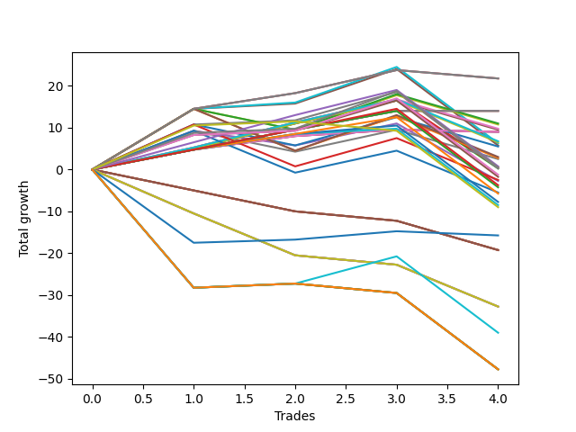

# Short Labrador 017 
- Symbol: ES_830-900
- Date Range: 03/18/2022 - 12/30/2022
- Trading Period: 8:30-9:0
- Number of Trades: 4



| Name | Win Percent | Profit | Avg Profit / Trade | Avg Time / Trade |      | Name | Win Percent | Profit | Avg Profit / Trade | Avg Time / Trade |
| ---- | ----------- | ------ | ------------------ | ---------------- | ---- | ---- | ----------- | ------ | ------------------ | ---------------- |
| Sorted By <br> Profit | | | | | | Sorted By <br> Win Percentage ||||
| BB-200 Mid SL-10 | 75.00 | 10875.00 | 2718.75 | 04:10 |     | BB-200 Mid SL-10 | 75.00 | 10875.00 | 2718.75 | 04:10 |
| BB-200 Mid SL-5 | 75.00 | 10875.00 | 2718.75 | 04:10 |     | BB-200 Mid SL-5 | 75.00 | 10875.00 | 2718.75 | 04:10 |
| BB-200 Mid | 75.00 | 10875.00 | 2718.75 | 04:10 |     | BB-200 Mid | 75.00 | 10875.00 | 2718.75 | 04:10 |
| BB-20 U/L 1SD SL-10 | 75.00 | 7000.00 | 1750.00 | 05:05 |     | BB-20 U/L 1SD SL-10 | 75.00 | 7000.00 | 1750.00 | 05:05 |
| BB-20 U/L 1SD SL-5 | 75.00 | 7000.00 | 1750.00 | 05:05 |     | BB-20 U/L 1SD SL-5 | 75.00 | 7000.00 | 1750.00 | 05:05 |
| BB-20 U/L 1SD | 75.00 | 7000.00 | 1750.00 | 05:05 |     | BB-20 U/L 1SD | 75.00 | 7000.00 | 1750.00 | 05:05 |
| BB-100 Mid SL-5 | 50.00 | 5500.00 | 1375.00 | 13:45 |     | BB-20 U/L 2SD C SL-5 | 75.00 | 4875.00 | 1218.75 | 07:26 |
| BB-50 U/L 1SD SL-5 | 50.00 | 5375.00 | 1343.75 | 11:07 |     | BB-20 U/L 2SD SL-5 | 75.00 | 4750.00 | 1187.50 | 07:20 |
| BB-20 U/L 2SD C SL-5 | 75.00 | 4875.00 | 1218.75 | 07:26 |     | BB-20 Mid SL-10 | 75.00 | 4500.00 | 1125.00 | 03:58 |
| BB-20 U/L 2SD SL-5 | 75.00 | 4750.00 | 1187.50 | 07:20 |     | BB-20 Mid SL-5 | 75.00 | 4500.00 | 1125.00 | 03:58 |
| BB-20 Mid SL-10 | 75.00 | 4500.00 | 1125.00 | 03:58 |     | BB-20 Mid | 75.00 | 4500.00 | 1125.00 | 03:58 |
| BB-20 Mid SL-5 | 75.00 | 4500.00 | 1125.00 | 03:58 |     | BB-20 U/L 2SD C SL-10 | 75.00 | 3375.00 | 843.75 | 07:28 |
| BB-20 Mid | 75.00 | 4500.00 | 1125.00 | 03:58 |     | BB-20 U/L 2SD SL-10 | 75.00 | 3250.00 | 812.50 | 07:22 |
| BB-20 U/L 2SD C SL-10 | 75.00 | 3375.00 | 843.75 | 07:28 |     | BB-100 Mid | 75.00 | 3125.00 | 781.25 | 37:38 |
| BB-20 U/L 2SD SL-10 | 75.00 | 3250.00 | 812.50 | 07:22 |     | BB-50 U/L 1SD | 75.00 | 2875.00 | 718.75 | 32:02 |
| BB-100 Mid | 75.00 | 3125.00 | 781.25 | 37:38 |     | TP-6 | 75.00 | 375.00 | 93.75 | 18:51 |
| BB-50 U/L 1SD | 75.00 | 2875.00 | 718.75 | 32:02 |     | TP-9 | 75.00 | 250.00 | 62.50 | 36:28 |
| V Mid SL-5 | 50.00 | 2750.00 | 687.50 | 10:16 |     | BB-20 U/L 2SD C | 75.00 | 250.00 | 62.50 | 14:33 |
| BB-100 Mid SL-10 | 50.00 | 1500.00 | 375.00 | 16:55 |     | V Mid | 75.00 | 125.00 | 31.25 | 34:22 |
| BB-50 U/L 1SD SL-10 | 50.00 | 1375.00 | 343.75 | 14:17 |     | BB-20 U/L 2SD | 75.00 | 125.00 | 31.25 | 14:27 |
| BB-50 Mid SL-5 | 50.00 | 1250.00 | 312.50 | 08:16 |     | TP-8 | 75.00 | -625.00 | -156.25 | 33:28 |
| TP-6 | 75.00 | 375.00 | 93.75 | 18:51 |     | TP-7 | 75.00 | -875.00 | -218.75 | 33:11 |
| TP-9 | 75.00 | 250.00 | 62.50 | 36:28 |     | TP-5 | 75.00 | -1875.00 | -468.75 | 17:46 |
| BB-20 U/L 2SD C | 75.00 | 250.00 | 62.50 | 14:33 |     | TP-4 | 75.00 | -2125.00 | -531.25 | 17:41 |
| V Mid | 75.00 | 125.00 | 31.25 | 34:22 |     | TP-3 | 75.00 | -2875.00 | -718.75 | 16:50 |
| BB-20 U/L 2SD | 75.00 | 125.00 | 31.25 | 14:27 |     | TP-2 | 75.00 | -3875.00 | -968.75 | 16:35 |
| TP-8 | 75.00 | -625.00 | -156.25 | 33:28 |     | TP-1 | 75.00 | -4250.00 | -1062.50 | 16:32 |
| TP-7 | 75.00 | -875.00 | -218.75 | 33:11 |     | BB-100 Mid SL-5 | 50.00 | 5500.00 | 1375.00 | 13:45 |
| V Mid SL-10 | 50.00 | -1250.00 | -312.50 | 13:26 |     | BB-50 U/L 1SD SL-5 | 50.00 | 5375.00 | 1343.75 | 11:07 |
| BB-50 Mid | 50.00 | -1375.00 | -343.75 | 25:58 |     | V Mid SL-5 | 50.00 | 2750.00 | 687.50 | 10:16 |
| TP-5 | 75.00 | -1875.00 | -468.75 | 17:46 |     | BB-100 Mid SL-10 | 50.00 | 1500.00 | 375.00 | 16:55 |
| TP-4 | 75.00 | -2125.00 | -531.25 | 17:41 |     | BB-50 U/L 1SD SL-10 | 50.00 | 1375.00 | 343.75 | 14:17 |
| BB-50 Mid SL-10 | 50.00 | -2750.00 | -687.50 | 11:26 |     | BB-50 Mid SL-5 | 50.00 | 1250.00 | 312.50 | 08:16 |
| TP-3 | 75.00 | -2875.00 | -718.75 | 16:50 |     | V Mid SL-10 | 50.00 | -1250.00 | -312.50 | 13:26 |
| TP-2 | 75.00 | -3875.00 | -968.75 | 16:35 |     | BB-50 Mid | 50.00 | -1375.00 | -343.75 | 25:58 |
| TP-1 | 75.00 | -4250.00 | -1062.50 | 16:32 |     | BB-50 Mid SL-10 | 50.00 | -2750.00 | -687.50 | 11:26 |
| TP-10 | 50.00 | -4500.00 | -1125.00 | 47:33 |     | TP-10 | 50.00 | -4500.00 | -1125.00 | 47:33 |
| NEWFI 0000 | 50.00 | -7875.00 | -1968.75 | 31:50 |     | NEWFI 0000 | 50.00 | -7875.00 | -1968.75 | 31:50 |
| BB-200 U/L 2SD SL-5 | 0.00 | -9625.00 | -2406.25 | 31:36 |     | NEWFI 000 | 50.00 | -19500.00 | -4875.00 | 51:42 |
| BB-100 U/L 2SD SL-5 | 0.00 | -9625.00 | -2406.25 | 31:36 |     | NEWFI 06 | 25.00 | -23875.00 | -5968.75 | 60:55 |
| V U/L 1SD SL-5 | 0.00 | -9625.00 | -2406.25 | 31:36 |     | BB-200 U/L 2SD | 25.00 | -23875.00 | -5968.75 | 60:55 |
| BB-50 U/L 2SD SL-5 | 0.00 | -9625.00 | -2406.25 | 31:36 |     | BB-100 U/L 2SD | 25.00 | -23875.00 | -5968.75 | 60:55 |
| BB-200 U/L 2SD SL-10 | 0.00 | -16375.00 | -4093.75 | 35:45 |     | V U/L 1SD | 25.00 | -23875.00 | -5968.75 | 60:55 |
| BB-100 U/L 2SD SL-10 | 0.00 | -16375.00 | -4093.75 | 35:45 |     | BB-50 U/L 2SD | 25.00 | -23875.00 | -5968.75 | 60:55 |
| V U/L 1SD SL-10 | 0.00 | -16375.00 | -4093.75 | 35:45 |     | BB-200 U/L 2SD SL-5 | 0.00 | -9625.00 | -2406.25 | 31:36 |
| BB-50 U/L 2SD SL-10 | 0.00 | -16375.00 | -4093.75 | 35:45 |     | BB-100 U/L 2SD SL-5 | 0.00 | -9625.00 | -2406.25 | 31:36 |
| NEWFI 000 | 50.00 | -19500.00 | -4875.00 | 51:42 |     | V U/L 1SD SL-5 | 0.00 | -9625.00 | -2406.25 | 31:36 |
| NEWFI 06 | 25.00 | -23875.00 | -5968.75 | 60:55 |     | BB-50 U/L 2SD SL-5 | 0.00 | -9625.00 | -2406.25 | 31:36 |
| BB-200 U/L 2SD | 25.00 | -23875.00 | -5968.75 | 60:55 |     | BB-200 U/L 2SD SL-10 | 0.00 | -16375.00 | -4093.75 | 35:45 |
| BB-100 U/L 2SD | 25.00 | -23875.00 | -5968.75 | 60:55 |     | BB-100 U/L 2SD SL-10 | 0.00 | -16375.00 | -4093.75 | 35:45 |
| V U/L 1SD | 25.00 | -23875.00 | -5968.75 | 60:55 |     | V U/L 1SD SL-10 | 0.00 | -16375.00 | -4093.75 | 35:45 |
| BB-50 U/L 2SD | 25.00 | -23875.00 | -5968.75 | 60:55 |     | BB-50 U/L 2SD SL-10 | 0.00 | -16375.00 | -4093.75 | 35:45 |

## NO STOPLOSS

### Test BB-20 Mid
* Sell when price hits the middle line of the 20p bollinger
* No Stoploss
* Results:
```
Total Trades: 4
Percent Up: 25.00
Percent Down: 75.00
Total Points Moved Down: 9.00
Potential Profit: 4500.00
Total Points Ups: 0.50 Count Ups: 1
Total Points Downs: 9.50 Count Downs: 3
```

<details><summary>Trades</summary>

<code>In: 2022-04-28 08:37:00		Out: 2022-04-28 08:38:10		Total Position Time: 01:10		Total Move Down: 4.75		Total to Date: 4.75</code> <br />
<code>In: 2022-07-05 08:59:00		Out: 2022-07-05 09:03:00		Total Position Time: 04:00		Total Move Down: 3.25		Total to Date: 8.00</code> <br />
<code>In: 2022-07-12 08:34:00		Out: 2022-07-12 08:37:00		Total Position Time: 03:00		Total Move Down: 1.50		Total to Date: 9.50</code> <br />
<code>In: 2022-11-17 08:42:00		Out: 2022-11-17 08:49:45		Total Position Time: 07:45		Total Move Down: -0.50		Total to Date: 9.00</code> <br />


</details>

### Test BB-20 U/L 1SD
* Sell when the price hits the lower line of the 20p 1std bollinger
* No Stoploss
* Results:
```
Total Trades: 4
Percent Up: 25.00
Percent Down: 75.00
Total Points Moved Down: 14.00
Potential Profit: 7000.00
Total Points Ups: 0.00 Count Ups: 1
Total Points Downs: 14.00 Count Downs: 3
```

<details><summary>Trades</summary>

<code>In: 2022-04-28 08:37:00		Out: 2022-04-28 08:38:10		Total Position Time: 01:10		Total Move Down: 4.75		Total to Date: 4.75</code> <br />
<code>In: 2022-07-05 08:59:00		Out: 2022-07-05 09:03:30		Total Position Time: 04:30		Total Move Down: 4.75		Total to Date: 9.50</code> <br />
<code>In: 2022-07-12 08:34:00		Out: 2022-07-12 08:38:10		Total Position Time: 04:10		Total Move Down: 4.50		Total to Date: 14.00</code> <br />
<code>In: 2022-11-17 08:42:00		Out: 2022-11-17 08:52:30		Total Position Time: 10:30		Total Move Down: -0.00		Total to Date: 14.00</code> <br />


</details>

### Test BB-20 U/L 2SD
* Sell when the price hits the lower line of the 20p 2std bollinger
* No Stoploss
* Results:
```
Total Trades: 4
Percent Up: 25.00
Percent Down: 75.00
Total Points Moved Down: 0.25
Potential Profit: 125.00
Total Points Ups: 16.25 Count Ups: 1
Total Points Downs: 16.50 Count Downs: 3
```

<details><summary>Trades</summary>

<code>In: 2022-04-28 08:37:00		Out: 2022-04-28 08:38:55		Total Position Time: 01:55		Total Move Down: 5.00		Total to Date: 5.00</code> <br />
<code>In: 2022-07-05 08:59:00		Out: 2022-07-05 09:05:50		Total Position Time: 06:50		Total Move Down: 6.00		Total to Date: 11.00</code> <br />
<code>In: 2022-07-12 08:34:00		Out: 2022-07-12 08:41:10		Total Position Time: 07:10		Total Move Down: 5.50		Total to Date: 16.50</code> <br />
<code>In: 2022-11-17 08:42:00		Out: 2022-11-17 09:23:55		Total Position Time: 41:55		Total Move Down: -16.25		Total to Date: 0.25</code> <br />


</details>

### Test BB-20 U/L 2SD C
* Sell when the price hits the lower line of the 20p 2std bollinger
* No Stoploss
* Results:
```
Total Trades: 4
Percent Up: 25.00
Percent Down: 75.00
Total Points Moved Down: 0.50
Potential Profit: 250.00
Total Points Ups: 16.25 Count Ups: 1
Total Points Downs: 16.75 Count Downs: 3
```

<details><summary>Trades</summary>

<code>In: 2022-04-28 08:37:00		Out: 2022-04-28 08:39:20		Total Position Time: 02:20		Total Move Down: 5.25		Total to Date: 5.25</code> <br />
<code>In: 2022-07-05 08:59:00		Out: 2022-07-05 09:05:50		Total Position Time: 06:50		Total Move Down: 6.00		Total to Date: 11.25</code> <br />
<code>In: 2022-07-12 08:34:00		Out: 2022-07-12 08:41:10		Total Position Time: 07:10		Total Move Down: 5.50		Total to Date: 16.75</code> <br />
<code>In: 2022-11-17 08:42:00		Out: 2022-11-17 09:23:55		Total Position Time: 41:55		Total Move Down: -16.25		Total to Date: 0.50</code> <br />


</details>

### Test BB-50 Mid
* Sell when price hits the middle line of the 50p bollinger
* No Stoploss
* Results:
```
Total Trades: 4
Percent Up: 50.00
Percent Down: 50.00
Total Points Moved Down: -2.75
Potential Profit: -1375.00
Total Points Ups: 17.25 Count Ups: 2
Total Points Downs: 14.50 Count Downs: 2
```

<details><summary>Trades</summary>

<code>In: 2022-04-28 08:37:00		Out: 2022-04-28 08:40:20		Total Position Time: 03:20		Total Move Down: 9.25		Total to Date: 9.25</code> <br />
<code>In: 2022-07-05 08:59:00		Out: 2022-07-05 09:43:40		Total Position Time: 44:40		Total Move Down: -3.50		Total to Date: 5.75</code> <br />
<code>In: 2022-07-12 08:34:00		Out: 2022-07-12 08:38:20		Total Position Time: 04:20		Total Move Down: 5.25		Total to Date: 11.00</code> <br />
<code>In: 2022-11-17 08:42:00		Out: 2022-11-17 09:33:35		Total Position Time: 51:35		Total Move Down: -13.75		Total to Date: -2.75</code> <br />


</details>

### Test BB-50 U/L 1SD
* Sell when the price hits the lower line of the 50p 1std bollinger
* No Stoploss
* Results:
```
Total Trades: 4
Percent Up: 25.00
Percent Down: 75.00
Total Points Moved Down: 5.75
Potential Profit: 2875.00
Total Points Ups: 18.25 Count Ups: 1
Total Points Downs: 24.00 Count Downs: 3
```

<details><summary>Trades</summary>

<code>In: 2022-04-28 08:37:00		Out: 2022-04-28 08:46:10		Total Position Time: 09:10		Total Move Down: 14.50		Total to Date: 14.50</code> <br />
<code>In: 2022-07-05 08:59:00		Out: 2022-07-05 09:47:10		Total Position Time: 48:10		Total Move Down: 1.25		Total to Date: 15.75</code> <br />
<code>In: 2022-07-12 08:34:00		Out: 2022-07-12 08:43:55		Total Position Time: 09:55		Total Move Down: 8.25		Total to Date: 24.00</code> <br />
<code>In: 2022-11-17 08:42:00		Out: 2022-11-17 09:42:55		Total Position Time: 60:55		Total Move Down: -18.25		Total to Date: 5.75</code> <br />


</details>

### Test BB-50 U/L 2SD
* Sell when the price hits the lower line of the 50p 2std bollinger
* No Stoploss
* Results:
```
Total Trades: 4
Percent Up: 75.00
Percent Down: 25.00
Total Points Moved Down: -47.75
Potential Profit: -23875.00
Total Points Ups: 48.75 Count Ups: 3
Total Points Downs: 1.00 Count Downs: 1
```

<details><summary>Trades</summary>

<code>In: 2022-04-28 08:37:00		Out: 2022-04-28 09:37:55		Total Position Time: 60:55		Total Move Down: -28.25		Total to Date: -28.25</code> <br />
<code>In: 2022-07-05 08:59:00		Out: 2022-07-05 09:59:55		Total Position Time: 60:55		Total Move Down: 1.00		Total to Date: -27.25</code> <br />
<code>In: 2022-07-12 08:34:00		Out: 2022-07-12 09:34:55		Total Position Time: 60:55		Total Move Down: -2.25		Total to Date: -29.50</code> <br />
<code>In: 2022-11-17 08:42:00		Out: 2022-11-17 09:42:55		Total Position Time: 60:55		Total Move Down: -18.25		Total to Date: -47.75</code> <br />


</details>

### Test V Mid
* Sell when the price hits the middle line of the 1std VWAP
* No Stoploss
* Results:
```
Total Trades: 4
Percent Up: 25.00
Percent Down: 75.00
Total Points Moved Down: 0.25
Potential Profit: 125.00
Total Points Ups: 18.25 Count Ups: 1
Total Points Downs: 18.50 Count Downs: 3
```

<details><summary>Trades</summary>

<code>In: 2022-04-28 08:37:00		Out: 2022-04-28 08:44:50		Total Position Time: 07:50		Total Move Down: 10.75		Total to Date: 10.75</code> <br />
<code>In: 2022-07-05 08:59:00		Out: 2022-07-05 09:59:55		Total Position Time: 60:55		Total Move Down: 1.00		Total to Date: 11.75</code> <br />
<code>In: 2022-07-12 08:34:00		Out: 2022-07-12 08:41:50		Total Position Time: 07:50		Total Move Down: 6.75		Total to Date: 18.50</code> <br />
<code>In: 2022-11-17 08:42:00		Out: 2022-11-17 09:42:55		Total Position Time: 60:55		Total Move Down: -18.25		Total to Date: 0.25</code> <br />


</details>

### Test V U/L 1SD
* Sell when the price hits the lower line of the 1std VWAP
* No Stoploss
* Results:
```
Total Trades: 4
Percent Up: 75.00
Percent Down: 25.00
Total Points Moved Down: -47.75
Potential Profit: -23875.00
Total Points Ups: 48.75 Count Ups: 3
Total Points Downs: 1.00 Count Downs: 1
```

<details><summary>Trades</summary>

<code>In: 2022-04-28 08:37:00		Out: 2022-04-28 09:37:55		Total Position Time: 60:55		Total Move Down: -28.25		Total to Date: -28.25</code> <br />
<code>In: 2022-07-05 08:59:00		Out: 2022-07-05 09:59:55		Total Position Time: 60:55		Total Move Down: 1.00		Total to Date: -27.25</code> <br />
<code>In: 2022-07-12 08:34:00		Out: 2022-07-12 09:34:55		Total Position Time: 60:55		Total Move Down: -2.25		Total to Date: -29.50</code> <br />
<code>In: 2022-11-17 08:42:00		Out: 2022-11-17 09:42:55		Total Position Time: 60:55		Total Move Down: -18.25		Total to Date: -47.75</code> <br />


</details>

### Test BB-100 Mid
* Move to BB100 Mid
* No Stoploss
* Results:
```
Total Trades: 4
Percent Up: 25.00
Percent Down: 75.00
Total Points Moved Down: 6.25
Potential Profit: 3125.00
Total Points Ups: 18.25 Count Ups: 1
Total Points Downs: 24.50 Count Downs: 3
```

<details><summary>Trades</summary>

<code>In: 2022-04-28 08:37:00		Out: 2022-04-28 08:46:10		Total Position Time: 09:10		Total Move Down: 14.50		Total to Date: 14.50</code> <br />
<code>In: 2022-07-05 08:59:00		Out: 2022-07-05 09:59:05		Total Position Time: 60:05		Total Move Down: 1.50		Total to Date: 16.00</code> <br />
<code>In: 2022-07-12 08:34:00		Out: 2022-07-12 08:54:25		Total Position Time: 20:25		Total Move Down: 8.50		Total to Date: 24.50</code> <br />
<code>In: 2022-11-17 08:42:00		Out: 2022-11-17 09:42:55		Total Position Time: 60:55		Total Move Down: -18.25		Total to Date: 6.25</code> <br />


</details>

### Test BB-100 U/L 2SD
* Move to BB100 Upper Band
* No Stoploss
* Results:
```
Total Trades: 4
Percent Up: 75.00
Percent Down: 25.00
Total Points Moved Down: -47.75
Potential Profit: -23875.00
Total Points Ups: 48.75 Count Ups: 3
Total Points Downs: 1.00 Count Downs: 1
```

<details><summary>Trades</summary>

<code>In: 2022-04-28 08:37:00		Out: 2022-04-28 09:37:55		Total Position Time: 60:55		Total Move Down: -28.25		Total to Date: -28.25</code> <br />
<code>In: 2022-07-05 08:59:00		Out: 2022-07-05 09:59:55		Total Position Time: 60:55		Total Move Down: 1.00		Total to Date: -27.25</code> <br />
<code>In: 2022-07-12 08:34:00		Out: 2022-07-12 09:34:55		Total Position Time: 60:55		Total Move Down: -2.25		Total to Date: -29.50</code> <br />
<code>In: 2022-11-17 08:42:00		Out: 2022-11-17 09:42:55		Total Position Time: 60:55		Total Move Down: -18.25		Total to Date: -47.75</code> <br />


</details>

### Test BB-200 Mid
* Move to BB200 Mid
* No Stoploss
* Results:
```
Total Trades: 4
Percent Up: 25.00
Percent Down: 75.00
Total Points Moved Down: 21.75
Potential Profit: 10875.00
Total Points Ups: 2.00 Count Ups: 1
Total Points Downs: 23.75 Count Downs: 3
```

<details><summary>Trades</summary>

<code>In: 2022-04-28 08:37:00		Out: 2022-04-28 08:46:55		Total Position Time: 09:55		Total Move Down: 14.50		Total to Date: 14.50</code> <br />
<code>In: 2022-07-05 08:59:00		Out: 2022-07-05 09:00:10		Total Position Time: 01:10		Total Move Down: 3.75		Total to Date: 18.25</code> <br />
<code>In: 2022-07-12 08:34:00		Out: 2022-07-12 08:38:25		Total Position Time: 04:25		Total Move Down: 5.50		Total to Date: 23.75</code> <br />
<code>In: 2022-11-17 08:42:00		Out: 2022-11-17 08:43:10		Total Position Time: 01:10		Total Move Down: -2.00		Total to Date: 21.75</code> <br />


</details>

### Test BB-200 U/L 2SD
* Move to BB200 Upper Band
* No Stoploss
* Results:
```
Total Trades: 4
Percent Up: 75.00
Percent Down: 25.00
Total Points Moved Down: -47.75
Potential Profit: -23875.00
Total Points Ups: 48.75 Count Ups: 3
Total Points Downs: 1.00 Count Downs: 1
```

<details><summary>Trades</summary>

<code>In: 2022-04-28 08:37:00		Out: 2022-04-28 09:37:55		Total Position Time: 60:55		Total Move Down: -28.25		Total to Date: -28.25</code> <br />
<code>In: 2022-07-05 08:59:00		Out: 2022-07-05 09:59:55		Total Position Time: 60:55		Total Move Down: 1.00		Total to Date: -27.25</code> <br />
<code>In: 2022-07-12 08:34:00		Out: 2022-07-12 09:34:55		Total Position Time: 60:55		Total Move Down: -2.25		Total to Date: -29.50</code> <br />
<code>In: 2022-11-17 08:42:00		Out: 2022-11-17 09:42:55		Total Position Time: 60:55		Total Move Down: -18.25		Total to Date: -47.75</code> <br />


</details>

## STOPLOSS OF 5

### Test BB-20 Mid SL-5
* Sell when price hits the middle line of the 20p bollinger
* Stoploss is -5 points
* Results:
```
Total Trades: 4
Percent Up: 25.00
Percent Down: 75.00
Total Points Moved Down: 9.00
Potential Profit: 4500.00
Total Points Ups: 0.50 Count Ups: 1
Total Points Downs: 9.50 Count Downs: 3
```

<details><summary>Trades</summary>

<code>In: 2022-04-28 08:37:00		Out: 2022-04-28 08:38:10		Total Position Time: 01:10		Total Move Down: 4.75		Total to Date: 4.75</code> <br />
<code>In: 2022-07-05 08:59:00		Out: 2022-07-05 09:03:00		Total Position Time: 04:00		Total Move Down: 3.25		Total to Date: 8.00</code> <br />
<code>In: 2022-07-12 08:34:00		Out: 2022-07-12 08:37:00		Total Position Time: 03:00		Total Move Down: 1.50		Total to Date: 9.50</code> <br />
<code>In: 2022-11-17 08:42:00		Out: 2022-11-17 08:49:45		Total Position Time: 07:45		Total Move Down: -0.50		Total to Date: 9.00</code> <br />


</details>

### Test BB-20 U/L 1SD SL-5
* Sell when the price hits the lower line of the 20p 1std bollinger
* Stoploss is -5 points
* Results:
```
Total Trades: 4
Percent Up: 25.00
Percent Down: 75.00
Total Points Moved Down: 14.00
Potential Profit: 7000.00
Total Points Ups: 0.00 Count Ups: 1
Total Points Downs: 14.00 Count Downs: 3
```

<details><summary>Trades</summary>

<code>In: 2022-04-28 08:37:00		Out: 2022-04-28 08:38:10		Total Position Time: 01:10		Total Move Down: 4.75		Total to Date: 4.75</code> <br />
<code>In: 2022-07-05 08:59:00		Out: 2022-07-05 09:03:30		Total Position Time: 04:30		Total Move Down: 4.75		Total to Date: 9.50</code> <br />
<code>In: 2022-07-12 08:34:00		Out: 2022-07-12 08:38:10		Total Position Time: 04:10		Total Move Down: 4.50		Total to Date: 14.00</code> <br />
<code>In: 2022-11-17 08:42:00		Out: 2022-11-17 08:52:30		Total Position Time: 10:30		Total Move Down: -0.00		Total to Date: 14.00</code> <br />


</details>

### Test BB-20 U/L 2SD SL-5
* Sell when the price hits the lower line of the 20p 2std bollinger
* Stoploss is -5 points
* Results:
```
Total Trades: 4
Percent Up: 25.00
Percent Down: 75.00
Total Points Moved Down: 9.50
Potential Profit: 4750.00
Total Points Ups: 7.00 Count Ups: 1
Total Points Downs: 16.50 Count Downs: 3
```

<details><summary>Trades</summary>

<code>In: 2022-04-28 08:37:00		Out: 2022-04-28 08:38:55		Total Position Time: 01:55		Total Move Down: 5.00		Total to Date: 5.00</code> <br />
<code>In: 2022-07-05 08:59:00		Out: 2022-07-05 09:05:50		Total Position Time: 06:50		Total Move Down: 6.00		Total to Date: 11.00</code> <br />
<code>In: 2022-07-12 08:34:00		Out: 2022-07-12 08:41:10		Total Position Time: 07:10		Total Move Down: 5.50		Total to Date: 16.50</code> <br />
<code>In: 2022-11-17 08:42:00		Out: 2022-11-17 08:55:25		Total Position Time: 13:25		Total Move Down: -7.00		Total to Date: 9.50</code> <br />


</details>

### Test BB-20 U/L 2SD C SL-5
* Sell when the price hits the lower line of the 20p 2std bollinger
* Stoploss is -5 points
* Results:
```
Total Trades: 4
Percent Up: 25.00
Percent Down: 75.00
Total Points Moved Down: 9.75
Potential Profit: 4875.00
Total Points Ups: 7.00 Count Ups: 1
Total Points Downs: 16.75 Count Downs: 3
```

<details><summary>Trades</summary>

<code>In: 2022-04-28 08:37:00		Out: 2022-04-28 08:39:20		Total Position Time: 02:20		Total Move Down: 5.25		Total to Date: 5.25</code> <br />
<code>In: 2022-07-05 08:59:00		Out: 2022-07-05 09:05:50		Total Position Time: 06:50		Total Move Down: 6.00		Total to Date: 11.25</code> <br />
<code>In: 2022-07-12 08:34:00		Out: 2022-07-12 08:41:10		Total Position Time: 07:10		Total Move Down: 5.50		Total to Date: 16.75</code> <br />
<code>In: 2022-11-17 08:42:00		Out: 2022-11-17 08:55:25		Total Position Time: 13:25		Total Move Down: -7.00		Total to Date: 9.75</code> <br />


</details>

### Test BB-50 Mid SL-5
* Sell when price hits the middle line of the 50p bollinger
* Stoploss is -5 points
* Results:
```
Total Trades: 4
Percent Up: 50.00
Percent Down: 50.00
Total Points Moved Down: 2.50
Potential Profit: 1250.00
Total Points Ups: 12.00 Count Ups: 2
Total Points Downs: 14.50 Count Downs: 2
```

<details><summary>Trades</summary>

<code>In: 2022-04-28 08:37:00		Out: 2022-04-28 08:40:20		Total Position Time: 03:20		Total Move Down: 9.25		Total to Date: 9.25</code> <br />
<code>In: 2022-07-05 08:59:00		Out: 2022-07-05 09:11:00		Total Position Time: 12:00		Total Move Down: -5.00		Total to Date: 4.25</code> <br />
<code>In: 2022-07-12 08:34:00		Out: 2022-07-12 08:38:20		Total Position Time: 04:20		Total Move Down: 5.25		Total to Date: 9.50</code> <br />
<code>In: 2022-11-17 08:42:00		Out: 2022-11-17 08:55:25		Total Position Time: 13:25		Total Move Down: -7.00		Total to Date: 2.50</code> <br />


</details>

### Test BB-50 U/L 1SD SL-5
* Sell when the price hits the lower line of the 50p 1std bollinger
* Stoploss is -5 points
* Results:
```
Total Trades: 4
Percent Up: 50.00
Percent Down: 50.00
Total Points Moved Down: 10.75
Potential Profit: 5375.00
Total Points Ups: 12.00 Count Ups: 2
Total Points Downs: 22.75 Count Downs: 2
```

<details><summary>Trades</summary>

<code>In: 2022-04-28 08:37:00		Out: 2022-04-28 08:46:10		Total Position Time: 09:10		Total Move Down: 14.50		Total to Date: 14.50</code> <br />
<code>In: 2022-07-05 08:59:00		Out: 2022-07-05 09:11:00		Total Position Time: 12:00		Total Move Down: -5.00		Total to Date: 9.50</code> <br />
<code>In: 2022-07-12 08:34:00		Out: 2022-07-12 08:43:55		Total Position Time: 09:55		Total Move Down: 8.25		Total to Date: 17.75</code> <br />
<code>In: 2022-11-17 08:42:00		Out: 2022-11-17 08:55:25		Total Position Time: 13:25		Total Move Down: -7.00		Total to Date: 10.75</code> <br />


</details>

### Test BB-50 U/L 2SD SL-5
* Sell when the price hits the lower line of the 50p 2std bollinger
* Stoploss is -5 points
* Results:
```
Total Trades: 4
Percent Up: 100.00
Percent Down: 0.00
Total Points Moved Down: -19.25
Potential Profit: -9625.00
Total Points Ups: 19.25 Count Ups: 4
Total Points Downs: 0.00 Count Downs: 0
```

<details><summary>Trades</summary>

<code>In: 2022-04-28 08:37:00		Out: 2022-04-28 09:17:05		Total Position Time: 40:05		Total Move Down: -5.00		Total to Date: -5.00</code> <br />
<code>In: 2022-07-05 08:59:00		Out: 2022-07-05 09:11:00		Total Position Time: 12:00		Total Move Down: -5.00		Total to Date: -10.00</code> <br />
<code>In: 2022-07-12 08:34:00		Out: 2022-07-12 09:34:55		Total Position Time: 60:55		Total Move Down: -2.25		Total to Date: -12.25</code> <br />
<code>In: 2022-11-17 08:42:00		Out: 2022-11-17 08:55:25		Total Position Time: 13:25		Total Move Down: -7.00		Total to Date: -19.25</code> <br />


</details>

### Test V Mid SL-5
* Sell when the price hits the middle line of the 1std VWAP
* Stoploss is -5 points
* Results:
```
Total Trades: 4
Percent Up: 50.00
Percent Down: 50.00
Total Points Moved Down: 5.50
Potential Profit: 2750.00
Total Points Ups: 12.00 Count Ups: 2
Total Points Downs: 17.50 Count Downs: 2
```

<details><summary>Trades</summary>

<code>In: 2022-04-28 08:37:00		Out: 2022-04-28 08:44:50		Total Position Time: 07:50		Total Move Down: 10.75		Total to Date: 10.75</code> <br />
<code>In: 2022-07-05 08:59:00		Out: 2022-07-05 09:11:00		Total Position Time: 12:00		Total Move Down: -5.00		Total to Date: 5.75</code> <br />
<code>In: 2022-07-12 08:34:00		Out: 2022-07-12 08:41:50		Total Position Time: 07:50		Total Move Down: 6.75		Total to Date: 12.50</code> <br />
<code>In: 2022-11-17 08:42:00		Out: 2022-11-17 08:55:25		Total Position Time: 13:25		Total Move Down: -7.00		Total to Date: 5.50</code> <br />


</details>

### Test V U/L 1SD SL-5
* Sell when the price hits the lower line of the 1std VWAP
* Stoploss is -5 points
* Results:
```
Total Trades: 4
Percent Up: 100.00
Percent Down: 0.00
Total Points Moved Down: -19.25
Potential Profit: -9625.00
Total Points Ups: 19.25 Count Ups: 4
Total Points Downs: 0.00 Count Downs: 0
```

<details><summary>Trades</summary>

<code>In: 2022-04-28 08:37:00		Out: 2022-04-28 09:17:05		Total Position Time: 40:05		Total Move Down: -5.00		Total to Date: -5.00</code> <br />
<code>In: 2022-07-05 08:59:00		Out: 2022-07-05 09:11:00		Total Position Time: 12:00		Total Move Down: -5.00		Total to Date: -10.00</code> <br />
<code>In: 2022-07-12 08:34:00		Out: 2022-07-12 09:34:55		Total Position Time: 60:55		Total Move Down: -2.25		Total to Date: -12.25</code> <br />
<code>In: 2022-11-17 08:42:00		Out: 2022-11-17 08:55:25		Total Position Time: 13:25		Total Move Down: -7.00		Total to Date: -19.25</code> <br />


</details>

### Test BB-100 Mid SL-5
* Move to BB100 Mid
* Stoploss is -5 points
* Results:
```
Total Trades: 4
Percent Up: 50.00
Percent Down: 50.00
Total Points Moved Down: 11.00
Potential Profit: 5500.00
Total Points Ups: 12.00 Count Ups: 2
Total Points Downs: 23.00 Count Downs: 2
```

<details><summary>Trades</summary>

<code>In: 2022-04-28 08:37:00		Out: 2022-04-28 08:46:10		Total Position Time: 09:10		Total Move Down: 14.50		Total to Date: 14.50</code> <br />
<code>In: 2022-07-05 08:59:00		Out: 2022-07-05 09:11:00		Total Position Time: 12:00		Total Move Down: -5.00		Total to Date: 9.50</code> <br />
<code>In: 2022-07-12 08:34:00		Out: 2022-07-12 08:54:25		Total Position Time: 20:25		Total Move Down: 8.50		Total to Date: 18.00</code> <br />
<code>In: 2022-11-17 08:42:00		Out: 2022-11-17 08:55:25		Total Position Time: 13:25		Total Move Down: -7.00		Total to Date: 11.00</code> <br />


</details>

### Test BB-100 U/L 2SD SL-5
* Move to BB100 Upper Band
* Stoploss is -5 points
* Results:
```
Total Trades: 4
Percent Up: 100.00
Percent Down: 0.00
Total Points Moved Down: -19.25
Potential Profit: -9625.00
Total Points Ups: 19.25 Count Ups: 4
Total Points Downs: 0.00 Count Downs: 0
```

<details><summary>Trades</summary>

<code>In: 2022-04-28 08:37:00		Out: 2022-04-28 09:17:05		Total Position Time: 40:05		Total Move Down: -5.00		Total to Date: -5.00</code> <br />
<code>In: 2022-07-05 08:59:00		Out: 2022-07-05 09:11:00		Total Position Time: 12:00		Total Move Down: -5.00		Total to Date: -10.00</code> <br />
<code>In: 2022-07-12 08:34:00		Out: 2022-07-12 09:34:55		Total Position Time: 60:55		Total Move Down: -2.25		Total to Date: -12.25</code> <br />
<code>In: 2022-11-17 08:42:00		Out: 2022-11-17 08:55:25		Total Position Time: 13:25		Total Move Down: -7.00		Total to Date: -19.25</code> <br />


</details>

### Test BB-200 Mid SL-5
* Move to BB200 Mid
* Stoploss is -5 points
* Results:
```
Total Trades: 4
Percent Up: 25.00
Percent Down: 75.00
Total Points Moved Down: 21.75
Potential Profit: 10875.00
Total Points Ups: 2.00 Count Ups: 1
Total Points Downs: 23.75 Count Downs: 3
```

<details><summary>Trades</summary>

<code>In: 2022-04-28 08:37:00		Out: 2022-04-28 08:46:55		Total Position Time: 09:55		Total Move Down: 14.50		Total to Date: 14.50</code> <br />
<code>In: 2022-07-05 08:59:00		Out: 2022-07-05 09:00:10		Total Position Time: 01:10		Total Move Down: 3.75		Total to Date: 18.25</code> <br />
<code>In: 2022-07-12 08:34:00		Out: 2022-07-12 08:38:25		Total Position Time: 04:25		Total Move Down: 5.50		Total to Date: 23.75</code> <br />
<code>In: 2022-11-17 08:42:00		Out: 2022-11-17 08:43:10		Total Position Time: 01:10		Total Move Down: -2.00		Total to Date: 21.75</code> <br />


</details>

### Test BB-200 U/L 2SD SL-5
* Move to BB200 Upper Band
* Stoploss is -5 points
* Results:
```
Total Trades: 4
Percent Up: 100.00
Percent Down: 0.00
Total Points Moved Down: -19.25
Potential Profit: -9625.00
Total Points Ups: 19.25 Count Ups: 4
Total Points Downs: 0.00 Count Downs: 0
```

<details><summary>Trades</summary>

<code>In: 2022-04-28 08:37:00		Out: 2022-04-28 09:17:05		Total Position Time: 40:05		Total Move Down: -5.00		Total to Date: -5.00</code> <br />
<code>In: 2022-07-05 08:59:00		Out: 2022-07-05 09:11:00		Total Position Time: 12:00		Total Move Down: -5.00		Total to Date: -10.00</code> <br />
<code>In: 2022-07-12 08:34:00		Out: 2022-07-12 09:34:55		Total Position Time: 60:55		Total Move Down: -2.25		Total to Date: -12.25</code> <br />
<code>In: 2022-11-17 08:42:00		Out: 2022-11-17 08:55:25		Total Position Time: 13:25		Total Move Down: -7.00		Total to Date: -19.25</code> <br />


</details>

## STOPLOSS OF 10

### Test BB-20 Mid SL-10
* Sell when price hits the middle line of the 20p bollinger
* Stoploss is -10 points
* Results:
```
Total Trades: 4
Percent Up: 25.00
Percent Down: 75.00
Total Points Moved Down: 9.00
Potential Profit: 4500.00
Total Points Ups: 0.50 Count Ups: 1
Total Points Downs: 9.50 Count Downs: 3
```

<details><summary>Trades</summary>

<code>In: 2022-04-28 08:37:00		Out: 2022-04-28 08:38:10		Total Position Time: 01:10		Total Move Down: 4.75		Total to Date: 4.75</code> <br />
<code>In: 2022-07-05 08:59:00		Out: 2022-07-05 09:03:00		Total Position Time: 04:00		Total Move Down: 3.25		Total to Date: 8.00</code> <br />
<code>In: 2022-07-12 08:34:00		Out: 2022-07-12 08:37:00		Total Position Time: 03:00		Total Move Down: 1.50		Total to Date: 9.50</code> <br />
<code>In: 2022-11-17 08:42:00		Out: 2022-11-17 08:49:45		Total Position Time: 07:45		Total Move Down: -0.50		Total to Date: 9.00</code> <br />


</details>

### Test BB-20 U/L 1SD SL-10
* Sell when the price hits the lower line of the 20p 1std bollinger
* Stoploss is -10 points
* Results:
```
Total Trades: 4
Percent Up: 25.00
Percent Down: 75.00
Total Points Moved Down: 14.00
Potential Profit: 7000.00
Total Points Ups: 0.00 Count Ups: 1
Total Points Downs: 14.00 Count Downs: 3
```

<details><summary>Trades</summary>

<code>In: 2022-04-28 08:37:00		Out: 2022-04-28 08:38:10		Total Position Time: 01:10		Total Move Down: 4.75		Total to Date: 4.75</code> <br />
<code>In: 2022-07-05 08:59:00		Out: 2022-07-05 09:03:30		Total Position Time: 04:30		Total Move Down: 4.75		Total to Date: 9.50</code> <br />
<code>In: 2022-07-12 08:34:00		Out: 2022-07-12 08:38:10		Total Position Time: 04:10		Total Move Down: 4.50		Total to Date: 14.00</code> <br />
<code>In: 2022-11-17 08:42:00		Out: 2022-11-17 08:52:30		Total Position Time: 10:30		Total Move Down: -0.00		Total to Date: 14.00</code> <br />


</details>

### Test BB-20 U/L 2SD SL-10
* Sell when the price hits the lower line of the 20p 2std bollinger
* Stoploss is -10 points
* Results:
```
Total Trades: 4
Percent Up: 25.00
Percent Down: 75.00
Total Points Moved Down: 6.50
Potential Profit: 3250.00
Total Points Ups: 10.00 Count Ups: 1
Total Points Downs: 16.50 Count Downs: 3
```

<details><summary>Trades</summary>

<code>In: 2022-04-28 08:37:00		Out: 2022-04-28 08:38:55		Total Position Time: 01:55		Total Move Down: 5.00		Total to Date: 5.00</code> <br />
<code>In: 2022-07-05 08:59:00		Out: 2022-07-05 09:05:50		Total Position Time: 06:50		Total Move Down: 6.00		Total to Date: 11.00</code> <br />
<code>In: 2022-07-12 08:34:00		Out: 2022-07-12 08:41:10		Total Position Time: 07:10		Total Move Down: 5.50		Total to Date: 16.50</code> <br />
<code>In: 2022-11-17 08:42:00		Out: 2022-11-17 08:55:35		Total Position Time: 13:35		Total Move Down: -10.00		Total to Date: 6.50</code> <br />


</details>

### Test BB-20 U/L 2SD C SL-10
* Sell when the price hits the lower line of the 20p 2std bollinger
* Stoploss is -10 points
* Results:
```
Total Trades: 4
Percent Up: 25.00
Percent Down: 75.00
Total Points Moved Down: 6.75
Potential Profit: 3375.00
Total Points Ups: 10.00 Count Ups: 1
Total Points Downs: 16.75 Count Downs: 3
```

<details><summary>Trades</summary>

<code>In: 2022-04-28 08:37:00		Out: 2022-04-28 08:39:20		Total Position Time: 02:20		Total Move Down: 5.25		Total to Date: 5.25</code> <br />
<code>In: 2022-07-05 08:59:00		Out: 2022-07-05 09:05:50		Total Position Time: 06:50		Total Move Down: 6.00		Total to Date: 11.25</code> <br />
<code>In: 2022-07-12 08:34:00		Out: 2022-07-12 08:41:10		Total Position Time: 07:10		Total Move Down: 5.50		Total to Date: 16.75</code> <br />
<code>In: 2022-11-17 08:42:00		Out: 2022-11-17 08:55:35		Total Position Time: 13:35		Total Move Down: -10.00		Total to Date: 6.75</code> <br />


</details>

### Test BB-50 Mid SL-10
* Sell when price hits the middle line of the 50p bollinger
* Stoploss is -10 points
* Results:
```
Total Trades: 4
Percent Up: 50.00
Percent Down: 50.00
Total Points Moved Down: -5.50
Potential Profit: -2750.00
Total Points Ups: 20.00 Count Ups: 2
Total Points Downs: 14.50 Count Downs: 2
```

<details><summary>Trades</summary>

<code>In: 2022-04-28 08:37:00		Out: 2022-04-28 08:40:20		Total Position Time: 03:20		Total Move Down: 9.25		Total to Date: 9.25</code> <br />
<code>In: 2022-07-05 08:59:00		Out: 2022-07-05 09:23:30		Total Position Time: 24:30		Total Move Down: -10.00		Total to Date: -0.75</code> <br />
<code>In: 2022-07-12 08:34:00		Out: 2022-07-12 08:38:20		Total Position Time: 04:20		Total Move Down: 5.25		Total to Date: 4.50</code> <br />
<code>In: 2022-11-17 08:42:00		Out: 2022-11-17 08:55:35		Total Position Time: 13:35		Total Move Down: -10.00		Total to Date: -5.50</code> <br />


</details>

### Test BB-50 U/L 1SD SL-10
* Sell when the price hits the lower line of the 50p 1std bollinger
* Stoploss is -10 points
* Results:
```
Total Trades: 4
Percent Up: 50.00
Percent Down: 50.00
Total Points Moved Down: 2.75
Potential Profit: 1375.00
Total Points Ups: 20.00 Count Ups: 2
Total Points Downs: 22.75 Count Downs: 2
```

<details><summary>Trades</summary>

<code>In: 2022-04-28 08:37:00		Out: 2022-04-28 08:46:10		Total Position Time: 09:10		Total Move Down: 14.50		Total to Date: 14.50</code> <br />
<code>In: 2022-07-05 08:59:00		Out: 2022-07-05 09:23:30		Total Position Time: 24:30		Total Move Down: -10.00		Total to Date: 4.50</code> <br />
<code>In: 2022-07-12 08:34:00		Out: 2022-07-12 08:43:55		Total Position Time: 09:55		Total Move Down: 8.25		Total to Date: 12.75</code> <br />
<code>In: 2022-11-17 08:42:00		Out: 2022-11-17 08:55:35		Total Position Time: 13:35		Total Move Down: -10.00		Total to Date: 2.75</code> <br />


</details>

### Test BB-50 U/L 2SD SL-10
* Sell when the price hits the lower line of the 50p 2std bollinger
* Stoploss is -10 points
* Results:
```
Total Trades: 4
Percent Up: 100.00
Percent Down: 0.00
Total Points Moved Down: -32.75
Potential Profit: -16375.00
Total Points Ups: 32.75 Count Ups: 4
Total Points Downs: 0.00 Count Downs: 0
```

<details><summary>Trades</summary>

<code>In: 2022-04-28 08:37:00		Out: 2022-04-28 09:21:00		Total Position Time: 44:00		Total Move Down: -10.50		Total to Date: -10.50</code> <br />
<code>In: 2022-07-05 08:59:00		Out: 2022-07-05 09:23:30		Total Position Time: 24:30		Total Move Down: -10.00		Total to Date: -20.50</code> <br />
<code>In: 2022-07-12 08:34:00		Out: 2022-07-12 09:34:55		Total Position Time: 60:55		Total Move Down: -2.25		Total to Date: -22.75</code> <br />
<code>In: 2022-11-17 08:42:00		Out: 2022-11-17 08:55:35		Total Position Time: 13:35		Total Move Down: -10.00		Total to Date: -32.75</code> <br />


</details>

### Test V Mid SL-10
* Sell when the price hits the middle line of the 1std VWAP
* Stoploss is -10 points
* Results:
```
Total Trades: 4
Percent Up: 50.00
Percent Down: 50.00
Total Points Moved Down: -2.50
Potential Profit: -1250.00
Total Points Ups: 20.00 Count Ups: 2
Total Points Downs: 17.50 Count Downs: 2
```

<details><summary>Trades</summary>

<code>In: 2022-04-28 08:37:00		Out: 2022-04-28 08:44:50		Total Position Time: 07:50		Total Move Down: 10.75		Total to Date: 10.75</code> <br />
<code>In: 2022-07-05 08:59:00		Out: 2022-07-05 09:23:30		Total Position Time: 24:30		Total Move Down: -10.00		Total to Date: 0.75</code> <br />
<code>In: 2022-07-12 08:34:00		Out: 2022-07-12 08:41:50		Total Position Time: 07:50		Total Move Down: 6.75		Total to Date: 7.50</code> <br />
<code>In: 2022-11-17 08:42:00		Out: 2022-11-17 08:55:35		Total Position Time: 13:35		Total Move Down: -10.00		Total to Date: -2.50</code> <br />


</details>

### Test V U/L 1SD SL-10
* Sell when the price hits the lower line of the 1std VWAP
* Stoploss is -10 points
* Results:
```
Total Trades: 4
Percent Up: 100.00
Percent Down: 0.00
Total Points Moved Down: -32.75
Potential Profit: -16375.00
Total Points Ups: 32.75 Count Ups: 4
Total Points Downs: 0.00 Count Downs: 0
```

<details><summary>Trades</summary>

<code>In: 2022-04-28 08:37:00		Out: 2022-04-28 09:21:00		Total Position Time: 44:00		Total Move Down: -10.50		Total to Date: -10.50</code> <br />
<code>In: 2022-07-05 08:59:00		Out: 2022-07-05 09:23:30		Total Position Time: 24:30		Total Move Down: -10.00		Total to Date: -20.50</code> <br />
<code>In: 2022-07-12 08:34:00		Out: 2022-07-12 09:34:55		Total Position Time: 60:55		Total Move Down: -2.25		Total to Date: -22.75</code> <br />
<code>In: 2022-11-17 08:42:00		Out: 2022-11-17 08:55:35		Total Position Time: 13:35		Total Move Down: -10.00		Total to Date: -32.75</code> <br />


</details>

### Test BB-100 Mid SL-10
* Move to BB100 Mid
* Stoploss is -10 points
* Results:
```
Total Trades: 4
Percent Up: 50.00
Percent Down: 50.00
Total Points Moved Down: 3.00
Potential Profit: 1500.00
Total Points Ups: 20.00 Count Ups: 2
Total Points Downs: 23.00 Count Downs: 2
```

<details><summary>Trades</summary>

<code>In: 2022-04-28 08:37:00		Out: 2022-04-28 08:46:10		Total Position Time: 09:10		Total Move Down: 14.50		Total to Date: 14.50</code> <br />
<code>In: 2022-07-05 08:59:00		Out: 2022-07-05 09:23:30		Total Position Time: 24:30		Total Move Down: -10.00		Total to Date: 4.50</code> <br />
<code>In: 2022-07-12 08:34:00		Out: 2022-07-12 08:54:25		Total Position Time: 20:25		Total Move Down: 8.50		Total to Date: 13.00</code> <br />
<code>In: 2022-11-17 08:42:00		Out: 2022-11-17 08:55:35		Total Position Time: 13:35		Total Move Down: -10.00		Total to Date: 3.00</code> <br />


</details>

### Test BB-100 U/L 2SD SL-10
* Move to BB100 Upper Band
* Stoploss is -10 points
* Results:
```
Total Trades: 4
Percent Up: 100.00
Percent Down: 0.00
Total Points Moved Down: -32.75
Potential Profit: -16375.00
Total Points Ups: 32.75 Count Ups: 4
Total Points Downs: 0.00 Count Downs: 0
```

<details><summary>Trades</summary>

<code>In: 2022-04-28 08:37:00		Out: 2022-04-28 09:21:00		Total Position Time: 44:00		Total Move Down: -10.50		Total to Date: -10.50</code> <br />
<code>In: 2022-07-05 08:59:00		Out: 2022-07-05 09:23:30		Total Position Time: 24:30		Total Move Down: -10.00		Total to Date: -20.50</code> <br />
<code>In: 2022-07-12 08:34:00		Out: 2022-07-12 09:34:55		Total Position Time: 60:55		Total Move Down: -2.25		Total to Date: -22.75</code> <br />
<code>In: 2022-11-17 08:42:00		Out: 2022-11-17 08:55:35		Total Position Time: 13:35		Total Move Down: -10.00		Total to Date: -32.75</code> <br />


</details>

### Test BB-200 Mid SL-10
* Move to BB200 Mid
* Stoploss is -10 points
* Results:
```
Total Trades: 4
Percent Up: 25.00
Percent Down: 75.00
Total Points Moved Down: 21.75
Potential Profit: 10875.00
Total Points Ups: 2.00 Count Ups: 1
Total Points Downs: 23.75 Count Downs: 3
```

<details><summary>Trades</summary>

<code>In: 2022-04-28 08:37:00		Out: 2022-04-28 08:46:55		Total Position Time: 09:55		Total Move Down: 14.50		Total to Date: 14.50</code> <br />
<code>In: 2022-07-05 08:59:00		Out: 2022-07-05 09:00:10		Total Position Time: 01:10		Total Move Down: 3.75		Total to Date: 18.25</code> <br />
<code>In: 2022-07-12 08:34:00		Out: 2022-07-12 08:38:25		Total Position Time: 04:25		Total Move Down: 5.50		Total to Date: 23.75</code> <br />
<code>In: 2022-11-17 08:42:00		Out: 2022-11-17 08:43:10		Total Position Time: 01:10		Total Move Down: -2.00		Total to Date: 21.75</code> <br />


</details>

### Test BB-200 U/L 2SD SL-10
* Move to BB200 Upper Band
* Stoploss is -10 points
* Results:
```
Total Trades: 4
Percent Up: 100.00
Percent Down: 0.00
Total Points Moved Down: -32.75
Potential Profit: -16375.00
Total Points Ups: 32.75 Count Ups: 4
Total Points Downs: 0.00 Count Downs: 0
```

<details><summary>Trades</summary>

<code>In: 2022-04-28 08:37:00		Out: 2022-04-28 09:21:00		Total Position Time: 44:00		Total Move Down: -10.50		Total to Date: -10.50</code> <br />
<code>In: 2022-07-05 08:59:00		Out: 2022-07-05 09:23:30		Total Position Time: 24:30		Total Move Down: -10.00		Total to Date: -20.50</code> <br />
<code>In: 2022-07-12 08:34:00		Out: 2022-07-12 09:34:55		Total Position Time: 60:55		Total Move Down: -2.25		Total to Date: -22.75</code> <br />
<code>In: 2022-11-17 08:42:00		Out: 2022-11-17 08:55:35		Total Position Time: 13:35		Total Move Down: -10.00		Total to Date: -32.75</code> <br />


</details>

## TAKE PROFIT

### Test TP-1
* Take Profit of 1 Point
* No Stoploss
* Results:
```
Total Trades: 4
Percent Up: 25.00
Percent Down: 75.00
Total Points Moved Down: -8.50
Potential Profit: -4250.00
Total Points Ups: 18.25 Count Ups: 1
Total Points Downs: 9.75 Count Downs: 3
```

<details><summary>Trades</summary>

<code>In: 2022-04-28 08:37:00		Out: 2022-04-28 08:38:10		Total Position Time: 01:10		Total Move Down: 4.75		Total to Date: 4.75</code> <br />
<code>In: 2022-07-05 08:59:00		Out: 2022-07-05 09:00:10		Total Position Time: 01:10		Total Move Down: 3.75		Total to Date: 8.50</code> <br />
<code>In: 2022-07-12 08:34:00		Out: 2022-07-12 08:36:55		Total Position Time: 02:55		Total Move Down: 1.25		Total to Date: 9.75</code> <br />
<code>In: 2022-11-17 08:42:00		Out: 2022-11-17 09:42:55		Total Position Time: 60:55		Total Move Down: -18.25		Total to Date: -8.50</code> <br />


</details>

### Test TP-2
* Take Profit of 2 Point
* No Stoploss
* Results:
```
Total Trades: 4
Percent Up: 25.00
Percent Down: 75.00
Total Points Moved Down: -7.75
Potential Profit: -3875.00
Total Points Ups: 18.25 Count Ups: 1
Total Points Downs: 10.50 Count Downs: 3
```

<details><summary>Trades</summary>

<code>In: 2022-04-28 08:37:00		Out: 2022-04-28 08:38:10		Total Position Time: 01:10		Total Move Down: 4.75		Total to Date: 4.75</code> <br />
<code>In: 2022-07-05 08:59:00		Out: 2022-07-05 09:00:10		Total Position Time: 01:10		Total Move Down: 3.75		Total to Date: 8.50</code> <br />
<code>In: 2022-07-12 08:34:00		Out: 2022-07-12 08:37:05		Total Position Time: 03:05		Total Move Down: 2.00		Total to Date: 10.50</code> <br />
<code>In: 2022-11-17 08:42:00		Out: 2022-11-17 09:42:55		Total Position Time: 60:55		Total Move Down: -18.25		Total to Date: -7.75</code> <br />


</details>

### Test TP-3
* Take Profit of 3 Point
* No Stoploss
* Results:
```
Total Trades: 4
Percent Up: 25.00
Percent Down: 75.00
Total Points Moved Down: -5.75
Potential Profit: -2875.00
Total Points Ups: 18.25 Count Ups: 1
Total Points Downs: 12.50 Count Downs: 3
```

<details><summary>Trades</summary>

<code>In: 2022-04-28 08:37:00		Out: 2022-04-28 08:38:10		Total Position Time: 01:10		Total Move Down: 4.75		Total to Date: 4.75</code> <br />
<code>In: 2022-07-05 08:59:00		Out: 2022-07-05 09:00:10		Total Position Time: 01:10		Total Move Down: 3.75		Total to Date: 8.50</code> <br />
<code>In: 2022-07-12 08:34:00		Out: 2022-07-12 08:38:05		Total Position Time: 04:05		Total Move Down: 4.00		Total to Date: 12.50</code> <br />
<code>In: 2022-11-17 08:42:00		Out: 2022-11-17 09:42:55		Total Position Time: 60:55		Total Move Down: -18.25		Total to Date: -5.75</code> <br />


</details>

### Test TP-4
* Take Profit of 4 Point
* No Stoploss
* Results:
```
Total Trades: 4
Percent Up: 25.00
Percent Down: 75.00
Total Points Moved Down: -4.25
Potential Profit: -2125.00
Total Points Ups: 18.25 Count Ups: 1
Total Points Downs: 14.00 Count Downs: 3
```

<details><summary>Trades</summary>

<code>In: 2022-04-28 08:37:00		Out: 2022-04-28 08:38:10		Total Position Time: 01:10		Total Move Down: 4.75		Total to Date: 4.75</code> <br />
<code>In: 2022-07-05 08:59:00		Out: 2022-07-05 09:03:30		Total Position Time: 04:30		Total Move Down: 4.75		Total to Date: 9.50</code> <br />
<code>In: 2022-07-12 08:34:00		Out: 2022-07-12 08:38:10		Total Position Time: 04:10		Total Move Down: 4.50		Total to Date: 14.00</code> <br />
<code>In: 2022-11-17 08:42:00		Out: 2022-11-17 09:42:55		Total Position Time: 60:55		Total Move Down: -18.25		Total to Date: -4.25</code> <br />


</details>

### Test TP-5
* Take Profit of 5 Point
* No Stoploss
* Results:
```
Total Trades: 4
Percent Up: 25.00
Percent Down: 75.00
Total Points Moved Down: -3.75
Potential Profit: -1875.00
Total Points Ups: 18.25 Count Ups: 1
Total Points Downs: 14.50 Count Downs: 3
```

<details><summary>Trades</summary>

<code>In: 2022-04-28 08:37:00		Out: 2022-04-28 08:38:10		Total Position Time: 01:10		Total Move Down: 4.75		Total to Date: 4.75</code> <br />
<code>In: 2022-07-05 08:59:00		Out: 2022-07-05 09:03:45		Total Position Time: 04:45		Total Move Down: 4.75		Total to Date: 9.50</code> <br />
<code>In: 2022-07-12 08:34:00		Out: 2022-07-12 08:38:15		Total Position Time: 04:15		Total Move Down: 5.00		Total to Date: 14.50</code> <br />
<code>In: 2022-11-17 08:42:00		Out: 2022-11-17 09:42:55		Total Position Time: 60:55		Total Move Down: -18.25		Total to Date: -3.75</code> <br />


</details>

### Test TP-6
* Take Profit of 6 Point
* No Stoploss
* Results:
```
Total Trades: 4
Percent Up: 25.00
Percent Down: 75.00
Total Points Moved Down: 0.75
Potential Profit: 375.00
Total Points Ups: 18.25 Count Ups: 1
Total Points Downs: 19.00 Count Downs: 3
```

<details><summary>Trades</summary>

<code>In: 2022-04-28 08:37:00		Out: 2022-04-28 08:39:25		Total Position Time: 02:25		Total Move Down: 6.50		Total to Date: 6.50</code> <br />
<code>In: 2022-07-05 08:59:00		Out: 2022-07-05 09:03:50		Total Position Time: 04:50		Total Move Down: 6.50		Total to Date: 13.00</code> <br />
<code>In: 2022-07-12 08:34:00		Out: 2022-07-12 08:41:15		Total Position Time: 07:15		Total Move Down: 6.00		Total to Date: 19.00</code> <br />
<code>In: 2022-11-17 08:42:00		Out: 2022-11-17 09:42:55		Total Position Time: 60:55		Total Move Down: -18.25		Total to Date: 0.75</code> <br />


</details>

### Test TP-7
* Take Profit of 7 Point
* No Stoploss
* Results:
```
Total Trades: 4
Percent Up: 25.00
Percent Down: 75.00
Total Points Moved Down: -1.75
Potential Profit: -875.00
Total Points Ups: 18.25 Count Ups: 1
Total Points Downs: 16.50 Count Downs: 3
```

<details><summary>Trades</summary>

<code>In: 2022-04-28 08:37:00		Out: 2022-04-28 08:39:35		Total Position Time: 02:35		Total Move Down: 8.25		Total to Date: 8.25</code> <br />
<code>In: 2022-07-05 08:59:00		Out: 2022-07-05 09:59:55		Total Position Time: 60:55		Total Move Down: 1.00		Total to Date: 9.25</code> <br />
<code>In: 2022-07-12 08:34:00		Out: 2022-07-12 08:42:20		Total Position Time: 08:20		Total Move Down: 7.25		Total to Date: 16.50</code> <br />
<code>In: 2022-11-17 08:42:00		Out: 2022-11-17 09:42:55		Total Position Time: 60:55		Total Move Down: -18.25		Total to Date: -1.75</code> <br />


</details>

### Test TP-8
* Take Profit of 8 Point
* No Stoploss
* Results:
```
Total Trades: 4
Percent Up: 25.00
Percent Down: 75.00
Total Points Moved Down: -1.25
Potential Profit: -625.00
Total Points Ups: 18.25 Count Ups: 1
Total Points Downs: 17.00 Count Downs: 3
```

<details><summary>Trades</summary>

<code>In: 2022-04-28 08:37:00		Out: 2022-04-28 08:39:35		Total Position Time: 02:35		Total Move Down: 8.25		Total to Date: 8.25</code> <br />
<code>In: 2022-07-05 08:59:00		Out: 2022-07-05 09:59:55		Total Position Time: 60:55		Total Move Down: 1.00		Total to Date: 9.25</code> <br />
<code>In: 2022-07-12 08:34:00		Out: 2022-07-12 08:43:30		Total Position Time: 09:30		Total Move Down: 7.75		Total to Date: 17.00</code> <br />
<code>In: 2022-11-17 08:42:00		Out: 2022-11-17 09:42:55		Total Position Time: 60:55		Total Move Down: -18.25		Total to Date: -1.25</code> <br />


</details>

### Test TP-9
* Take Profit of 9 Point
* No Stoploss
* Results:
```
Total Trades: 4
Percent Up: 25.00
Percent Down: 75.00
Total Points Moved Down: 0.50
Potential Profit: 250.00
Total Points Ups: 18.25 Count Ups: 1
Total Points Downs: 18.75 Count Downs: 3
```

<details><summary>Trades</summary>

<code>In: 2022-04-28 08:37:00		Out: 2022-04-28 08:39:55		Total Position Time: 02:55		Total Move Down: 8.75		Total to Date: 8.75</code> <br />
<code>In: 2022-07-05 08:59:00		Out: 2022-07-05 09:59:55		Total Position Time: 60:55		Total Move Down: 1.00		Total to Date: 9.75</code> <br />
<code>In: 2022-07-12 08:34:00		Out: 2022-07-12 08:55:10		Total Position Time: 21:10		Total Move Down: 9.00		Total to Date: 18.75</code> <br />
<code>In: 2022-11-17 08:42:00		Out: 2022-11-17 09:42:55		Total Position Time: 60:55		Total Move Down: -18.25		Total to Date: 0.50</code> <br />


</details>

### Test TP-10
* Take Profit of 10 Point
* No Stoploss
* Results:
```
Total Trades: 4
Percent Up: 50.00
Percent Down: 50.00
Total Points Moved Down: -9.00
Potential Profit: -4500.00
Total Points Ups: 20.50 Count Ups: 2
Total Points Downs: 11.50 Count Downs: 2
```

<details><summary>Trades</summary>

<code>In: 2022-04-28 08:37:00		Out: 2022-04-28 08:44:30		Total Position Time: 07:30		Total Move Down: 10.50		Total to Date: 10.50</code> <br />
<code>In: 2022-07-05 08:59:00		Out: 2022-07-05 09:59:55		Total Position Time: 60:55		Total Move Down: 1.00		Total to Date: 11.50</code> <br />
<code>In: 2022-07-12 08:34:00		Out: 2022-07-12 09:34:55		Total Position Time: 60:55		Total Move Down: -2.25		Total to Date: 9.25</code> <br />
<code>In: 2022-11-17 08:42:00		Out: 2022-11-17 09:42:55		Total Position Time: 60:55		Total Move Down: -18.25		Total to Date: -9.00</code> <br />


</details>

## Indicator Exits

### Test NEWFI 000
* Newfi 0000
* No Stoploss
* Results:
```
Total Trades: 4
Percent Up: 50.00
Percent Down: 50.00
Total Points Moved Down: -39.00
Potential Profit: -19500.00
Total Points Ups: 46.50 Count Ups: 2
Total Points Downs: 7.50 Count Downs: 2
```

<details><summary>Trades</summary>

<code>In: 2022-04-28 08:37:00		Out: 2022-04-28 09:37:55		Total Position Time: 60:55		Total Move Down: -28.25		Total to Date: -28.25</code> <br />
<code>In: 2022-07-05 08:59:00		Out: 2022-07-05 09:59:55		Total Position Time: 60:55		Total Move Down: 1.00		Total to Date: -27.25</code> <br />
<code>In: 2022-07-12 08:34:00		Out: 2022-07-12 08:58:05		Total Position Time: 24:05		Total Move Down: 6.50		Total to Date: -20.75</code> <br />
<code>In: 2022-11-17 08:42:00		Out: 2022-11-17 09:42:55		Total Position Time: 60:55		Total Move Down: -18.25		Total to Date: -39.00</code> <br />


</details>

### Test NEWFI 0000
* Newfi 0000
* No Stoploss
* Results:
```
Total Trades: 4
Percent Up: 50.00
Percent Down: 50.00
Total Points Moved Down: -15.75
Potential Profit: -7875.00
Total Points Ups: 18.50 Count Ups: 2
Total Points Downs: 2.75 Count Downs: 2
```

<details><summary>Trades</summary>

<code>In: 2022-04-28 08:37:00		Out: 2022-04-28 09:26:05		Total Position Time: 49:05		Total Move Down: -17.50		Total to Date: -17.50</code> <br />
<code>In: 2022-07-05 08:59:00		Out: 2022-07-05 09:15:05		Total Position Time: 16:05		Total Move Down: 0.75		Total to Date: -16.75</code> <br />
<code>In: 2022-07-12 08:34:00		Out: 2022-07-12 09:29:05		Total Position Time: 55:05		Total Move Down: 2.00		Total to Date: -14.75</code> <br />
<code>In: 2022-11-17 08:42:00		Out: 2022-11-17 08:49:05		Total Position Time: 07:05		Total Move Down: -1.00		Total to Date: -15.75</code> <br />


</details>

### Test NEWFI 06
* Newfi 06
* No Stoploss
* Results:
```
Total Trades: 4
Percent Up: 75.00
Percent Down: 25.00
Total Points Moved Down: -47.75
Potential Profit: -23875.00
Total Points Ups: 48.75 Count Ups: 3
Total Points Downs: 1.00 Count Downs: 1
```

<details><summary>Trades</summary>

<code>In: 2022-04-28 08:37:00		Out: 2022-04-28 09:37:55		Total Position Time: 60:55		Total Move Down: -28.25		Total to Date: -28.25</code> <br />
<code>In: 2022-07-05 08:59:00		Out: 2022-07-05 09:59:55		Total Position Time: 60:55		Total Move Down: 1.00		Total to Date: -27.25</code> <br />
<code>In: 2022-07-12 08:34:00		Out: 2022-07-12 09:34:55		Total Position Time: 60:55		Total Move Down: -2.25		Total to Date: -29.50</code> <br />
<code>In: 2022-11-17 08:42:00		Out: 2022-11-17 09:42:55		Total Position Time: 60:55		Total Move Down: -18.25		Total to Date: -47.75</code> <br />


</details>