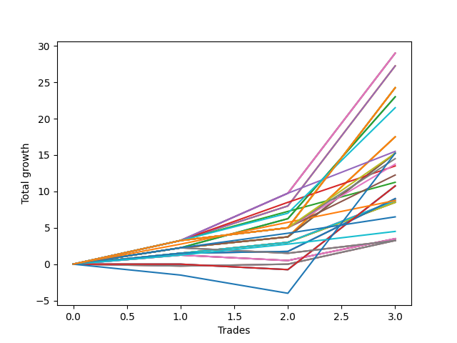

# Short Malinois 001 
- Symbol: ES_830-900
- Date Range: 03/18/2022 - 12/30/2022
- Trading Period: 8:30-9:0
- Number of Trades: 3



| Name | Win Percent | Profit | Avg Profit / Trade | Avg Time / Trade |      | Name | Win Percent | Profit | Avg Profit / Trade | Avg Time / Trade |
| ---- | ----------- | ------ | ------------------ | ---------------- | ---- | ---- | ----------- | ------ | ------------------ | ---------------- |
| Sorted By <br> Profit | | | | | | Sorted By <br> Win Percentage ||||
| BB-100 U/L 2SD SL-10 | 100.00 | 14500.00 | 4833.33 | 56:05 |     | BB-100 U/L 2SD SL-10 | 100.00 | 14500.00 | 4833.33 | 56:05 |
| BB-100 U/L 2SD SL-5 | 100.00 | 14500.00 | 4833.33 | 56:05 |     | BB-100 U/L 2SD SL-5 | 100.00 | 14500.00 | 4833.33 | 56:05 |
| BB-100 U/L 2SD | 100.00 | 14500.00 | 4833.33 | 56:05 |     | BB-100 U/L 2SD | 100.00 | 14500.00 | 4833.33 | 56:05 |
| V U/L 1SD SL-10 | 100.00 | 13625.00 | 4541.67 | 55:55 |     | V U/L 1SD SL-10 | 100.00 | 13625.00 | 4541.67 | 55:55 |
| V U/L 1SD SL-5 | 100.00 | 13625.00 | 4541.67 | 55:55 |     | V U/L 1SD SL-5 | 100.00 | 13625.00 | 4541.67 | 55:55 |
| V U/L 1SD | 100.00 | 13625.00 | 4541.67 | 55:55 |     | V U/L 1SD | 100.00 | 13625.00 | 4541.67 | 55:55 |
| NEWFI 06 | 100.00 | 12125.00 | 4041.67 | 60:55 |     | NEWFI 06 | 100.00 | 12125.00 | 4041.67 | 60:55 |
| BB-200 U/L 2SD SL-10 | 100.00 | 12125.00 | 4041.67 | 60:55 |     | BB-200 U/L 2SD SL-10 | 100.00 | 12125.00 | 4041.67 | 60:55 |
| BB-200 U/L 2SD SL-5 | 100.00 | 12125.00 | 4041.67 | 60:55 |     | BB-200 U/L 2SD SL-5 | 100.00 | 12125.00 | 4041.67 | 60:55 |
| BB-200 U/L 2SD | 100.00 | 12125.00 | 4041.67 | 60:55 |     | BB-200 U/L 2SD | 100.00 | 12125.00 | 4041.67 | 60:55 |
| BB-50 U/L 2SD SL-10 | 100.00 | 11500.00 | 3833.33 | 25:16 |     | BB-50 U/L 2SD SL-10 | 100.00 | 11500.00 | 3833.33 | 25:16 |
| BB-50 U/L 2SD SL-5 | 100.00 | 11500.00 | 3833.33 | 25:16 |     | BB-50 U/L 2SD SL-5 | 100.00 | 11500.00 | 3833.33 | 25:16 |
| BB-50 U/L 2SD | 100.00 | 11500.00 | 3833.33 | 25:16 |     | BB-50 U/L 2SD | 100.00 | 11500.00 | 3833.33 | 25:16 |
| NEWFI 000 | 100.00 | 10750.00 | 3583.33 | 46:21 |     | NEWFI 000 | 100.00 | 10750.00 | 3583.33 | 46:21 |
| BB-50 U/L 1SD SL-10 | 100.00 | 8750.00 | 2916.67 | 20:16 |     | BB-50 U/L 1SD SL-10 | 100.00 | 8750.00 | 2916.67 | 20:16 |
| BB-50 U/L 1SD SL-5 | 100.00 | 8750.00 | 2916.67 | 20:16 |     | BB-50 U/L 1SD SL-5 | 100.00 | 8750.00 | 2916.67 | 20:16 |
| BB-50 U/L 1SD | 100.00 | 8750.00 | 2916.67 | 20:16 |     | BB-50 U/L 1SD | 100.00 | 8750.00 | 2916.67 | 20:16 |
| TP-6 | 100.00 | 7750.00 | 2583.33 | 40:00 |     | TP-6 | 100.00 | 7750.00 | 2583.33 | 40:00 |
| TP-10 | 100.00 | 7625.00 | 2541.67 | 46:48 |     | TP-10 | 100.00 | 7625.00 | 2541.67 | 46:48 |
| BB-100 Mid SL-10 | 100.00 | 7625.00 | 2541.67 | 20:01 |     | BB-100 Mid SL-10 | 100.00 | 7625.00 | 2541.67 | 20:01 |
| BB-100 Mid SL-5 | 100.00 | 7625.00 | 2541.67 | 20:01 |     | BB-100 Mid SL-5 | 100.00 | 7625.00 | 2541.67 | 20:01 |
| BB-100 Mid | 100.00 | 7625.00 | 2541.67 | 20:01 |     | BB-100 Mid | 100.00 | 7625.00 | 2541.67 | 20:01 |
| NEWFI 0000 | 33.33 | 7625.00 | 2541.67 | 27:01 |     | TP-9 | 100.00 | 7250.00 | 2416.67 | 46:46 |
| TP-9 | 100.00 | 7250.00 | 2416.67 | 46:46 |     | TP-8 | 100.00 | 6875.00 | 2291.67 | 46:45 |
| TP-8 | 100.00 | 6875.00 | 2291.67 | 46:45 |     | TP-5 | 100.00 | 6750.00 | 2250.00 | 36:56 |
| TP-5 | 100.00 | 6750.00 | 2250.00 | 36:56 |     | TP-7 | 100.00 | 6125.00 | 2041.67 | 46:28 |
| TP-7 | 100.00 | 6125.00 | 2041.67 | 46:28 |     | TP-4 | 100.00 | 5625.00 | 1875.00 | 25:56 |
| TP-4 | 100.00 | 5625.00 | 1875.00 | 25:56 |     | BB-50 Mid SL-10 | 100.00 | 4500.00 | 1500.00 | 15:35 |
| V Mid SL-10 | 33.33 | 5375.00 | 1791.67 | 07:18 |     | BB-50 Mid SL-5 | 100.00 | 4500.00 | 1500.00 | 15:35 |
| V Mid SL-5 | 33.33 | 5375.00 | 1791.67 | 07:18 |     | BB-50 Mid | 100.00 | 4500.00 | 1500.00 | 15:35 |
| V Mid | 33.33 | 5375.00 | 1791.67 | 07:18 |     | TP-3 | 100.00 | 4375.00 | 1458.33 | 23:33 |
| BB-50 Mid SL-10 | 100.00 | 4500.00 | 1500.00 | 15:35 |     | BB-20 U/L 2SD C SL-10 | 100.00 | 4375.00 | 1458.33 | 14:03 |
| BB-50 Mid SL-5 | 100.00 | 4500.00 | 1500.00 | 15:35 |     | BB-20 U/L 2SD C SL-5 | 100.00 | 4375.00 | 1458.33 | 14:03 |
| BB-50 Mid | 100.00 | 4500.00 | 1500.00 | 15:35 |     | BB-20 U/L 2SD C | 100.00 | 4375.00 | 1458.33 | 14:03 |
| TP-3 | 100.00 | 4375.00 | 1458.33 | 23:33 |     | BB-20 U/L 2SD SL-10 | 100.00 | 4250.00 | 1416.67 | 14:00 |
| BB-20 U/L 2SD C SL-10 | 100.00 | 4375.00 | 1458.33 | 14:03 |     | BB-20 U/L 2SD SL-5 | 100.00 | 4250.00 | 1416.67 | 14:00 |
| BB-20 U/L 2SD C SL-5 | 100.00 | 4375.00 | 1458.33 | 14:03 |     | BB-20 U/L 2SD | 100.00 | 4250.00 | 1416.67 | 14:00 |
| BB-20 U/L 2SD C | 100.00 | 4375.00 | 1458.33 | 14:03 |     | TP-2 | 100.00 | 3250.00 | 1083.33 | 14:16 |
| BB-20 U/L 2SD SL-10 | 100.00 | 4250.00 | 1416.67 | 14:00 |     | TP-1 | 100.00 | 2250.00 | 750.00 | 04:11 |
| BB-20 U/L 2SD SL-5 | 100.00 | 4250.00 | 1416.67 | 14:00 |     | BB-20 Mid SL-10 | 66.67 | 1750.00 | 583.33 | 02:08 |
| BB-20 U/L 2SD | 100.00 | 4250.00 | 1416.67 | 14:00 |     | BB-20 Mid SL-5 | 66.67 | 1750.00 | 583.33 | 02:08 |
| TP-2 | 100.00 | 3250.00 | 1083.33 | 14:16 |     | BB-20 Mid | 66.67 | 1750.00 | 583.33 | 02:08 |
| TP-1 | 100.00 | 2250.00 | 750.00 | 04:11 |     | BB-200 Mid SL-10 | 66.67 | 1625.00 | 541.67 | 19:56 |
| BB-20 Mid SL-10 | 66.67 | 1750.00 | 583.33 | 02:08 |     | BB-20 U/L 1SD SL-10 | 66.67 | 1625.00 | 541.67 | 12:40 |
| BB-20 Mid SL-5 | 66.67 | 1750.00 | 583.33 | 02:08 |     | BB-200 Mid SL-5 | 66.67 | 1625.00 | 541.67 | 19:56 |
| BB-20 Mid | 66.67 | 1750.00 | 583.33 | 02:08 |     | BB-20 U/L 1SD SL-5 | 66.67 | 1625.00 | 541.67 | 12:40 |
| BB-200 Mid SL-10 | 66.67 | 1625.00 | 541.67 | 19:56 |     | BB-200 Mid | 66.67 | 1625.00 | 541.67 | 19:56 |
| BB-20 U/L 1SD SL-10 | 66.67 | 1625.00 | 541.67 | 12:40 |     | BB-20 U/L 1SD | 66.67 | 1625.00 | 541.67 | 12:40 |
| BB-200 Mid SL-5 | 66.67 | 1625.00 | 541.67 | 19:56 |     | NEWFI 0000 | 33.33 | 7625.00 | 2541.67 | 27:01 |
| BB-20 U/L 1SD SL-5 | 66.67 | 1625.00 | 541.67 | 12:40 |     | V Mid SL-10 | 33.33 | 5375.00 | 1791.67 | 07:18 |
| BB-200 Mid | 66.67 | 1625.00 | 541.67 | 19:56 |     | V Mid SL-5 | 33.33 | 5375.00 | 1791.67 | 07:18 |
| BB-20 U/L 1SD | 66.67 | 1625.00 | 541.67 | 12:40 |     | V Mid | 33.33 | 5375.00 | 1791.67 | 07:18 |

## NO STOPLOSS

### Test BB-20 Mid
* Sell when price hits the middle line of the 20p bollinger
* No Stoploss
* Results:
```
Total Trades: 3
Percent Up: 33.33
Percent Down: 66.67
Total Points Moved Down: 3.50
Potential Profit: 1750.00
Total Points Ups: 0.75 Count Ups: 1
Total Points Downs: 4.25 Count Downs: 2
```

<details><summary>Trades</summary>

<code>In: 2022-07-18 08:48:00		Out: 2022-07-18 08:50:10		Total Position Time: 02:10		Total Move Down: 1.25		Total to Date: 1.25</code> <br />
<code>In: 2022-08-22 08:59:00		Out: 2022-08-22 09:00:10		Total Position Time: 01:10		Total Move Down: -0.75		Total to Date: 0.50</code> <br />
<code>In: 2022-09-29 08:59:00		Out: 2022-09-29 09:02:05		Total Position Time: 03:05		Total Move Down: 3.00		Total to Date: 3.50</code> <br />


</details>

### Test BB-20 U/L 1SD
* Sell when the price hits the lower line of the 20p 1std bollinger
* No Stoploss
* Results:
```
Total Trades: 3
Percent Up: 33.33
Percent Down: 66.67
Total Points Moved Down: 3.25
Potential Profit: 1625.00
Total Points Ups: 0.25 Count Ups: 1
Total Points Downs: 3.50 Count Downs: 2
```

<details><summary>Trades</summary>

<code>In: 2022-07-18 08:48:00		Out: 2022-07-18 09:05:10		Total Position Time: 17:10		Total Move Down: -0.25		Total to Date: -0.25</code> <br />
<code>In: 2022-08-22 08:59:00		Out: 2022-08-22 09:07:55		Total Position Time: 08:55		Total Move Down: 0.25		Total to Date: 0.00</code> <br />
<code>In: 2022-09-29 08:59:00		Out: 2022-09-29 09:10:55		Total Position Time: 11:55		Total Move Down: 3.25		Total to Date: 3.25</code> <br />


</details>

### Test BB-20 U/L 2SD
* Sell when the price hits the lower line of the 20p 2std bollinger
* No Stoploss
* Results:
```
Total Trades: 3
Percent Up: 0.00
Percent Down: 100.00
Total Points Moved Down: 8.50
Potential Profit: 4250.00
Total Points Ups: 0.00 Count Ups: 0
Total Points Downs: 8.50 Count Downs: 3
```

<details><summary>Trades</summary>

<code>In: 2022-07-18 08:48:00		Out: 2022-07-18 09:08:15		Total Position Time: 20:15		Total Move Down: 1.50		Total to Date: 1.50</code> <br />
<code>In: 2022-08-22 08:59:00		Out: 2022-08-22 09:08:15		Total Position Time: 09:15		Total Move Down: 1.50		Total to Date: 3.00</code> <br />
<code>In: 2022-09-29 08:59:00		Out: 2022-09-29 09:11:30		Total Position Time: 12:30		Total Move Down: 5.50		Total to Date: 8.50</code> <br />


</details>

### Test BB-20 U/L 2SD C
* Sell when the price hits the lower line of the 20p 2std bollinger
* No Stoploss
* Results:
```
Total Trades: 3
Percent Up: 0.00
Percent Down: 100.00
Total Points Moved Down: 8.75
Potential Profit: 4375.00
Total Points Ups: 0.00 Count Ups: 0
Total Points Downs: 8.75 Count Downs: 3
```

<details><summary>Trades</summary>

<code>In: 2022-07-18 08:48:00		Out: 2022-07-18 09:08:15		Total Position Time: 20:15		Total Move Down: 1.50		Total to Date: 1.50</code> <br />
<code>In: 2022-08-22 08:59:00		Out: 2022-08-22 09:08:15		Total Position Time: 09:15		Total Move Down: 1.50		Total to Date: 3.00</code> <br />
<code>In: 2022-09-29 08:59:00		Out: 2022-09-29 09:11:40		Total Position Time: 12:40		Total Move Down: 5.75		Total to Date: 8.75</code> <br />


</details>

### Test BB-50 Mid
* Sell when price hits the middle line of the 50p bollinger
* No Stoploss
* Results:
```
Total Trades: 3
Percent Up: 0.00
Percent Down: 100.00
Total Points Moved Down: 9.00
Potential Profit: 4500.00
Total Points Ups: 0.00 Count Ups: 0
Total Points Downs: 9.00 Count Downs: 3
```

<details><summary>Trades</summary>

<code>In: 2022-07-18 08:48:00		Out: 2022-07-18 09:08:15		Total Position Time: 20:15		Total Move Down: 1.50		Total to Date: 1.50</code> <br />
<code>In: 2022-08-22 08:59:00		Out: 2022-08-22 09:07:55		Total Position Time: 08:55		Total Move Down: 0.25		Total to Date: 1.75</code> <br />
<code>In: 2022-09-29 08:59:00		Out: 2022-09-29 09:16:35		Total Position Time: 17:35		Total Move Down: 7.25		Total to Date: 9.00</code> <br />


</details>

### Test BB-50 U/L 1SD
* Sell when the price hits the lower line of the 50p 1std bollinger
* No Stoploss
* Results:
```
Total Trades: 3
Percent Up: 0.00
Percent Down: 100.00
Total Points Moved Down: 17.50
Potential Profit: 8750.00
Total Points Ups: 0.00 Count Ups: 0
Total Points Downs: 17.50 Count Downs: 3
```

<details><summary>Trades</summary>

<code>In: 2022-07-18 08:48:00		Out: 2022-07-18 09:19:25		Total Position Time: 31:25		Total Move Down: 2.25		Total to Date: 2.25</code> <br />
<code>In: 2022-08-22 08:59:00		Out: 2022-08-22 09:08:20		Total Position Time: 09:20		Total Move Down: 1.50		Total to Date: 3.75</code> <br />
<code>In: 2022-09-29 08:59:00		Out: 2022-09-29 09:19:05		Total Position Time: 20:05		Total Move Down: 13.75		Total to Date: 17.50</code> <br />


</details>

### Test BB-50 U/L 2SD
* Sell when the price hits the lower line of the 50p 2std bollinger
* No Stoploss
* Results:
```
Total Trades: 3
Percent Up: 0.00
Percent Down: 100.00
Total Points Moved Down: 23.00
Potential Profit: 11500.00
Total Points Ups: 0.00 Count Ups: 0
Total Points Downs: 23.00 Count Downs: 3
```

<details><summary>Trades</summary>

<code>In: 2022-07-18 08:48:00		Out: 2022-07-18 09:26:30		Total Position Time: 38:30		Total Move Down: 2.25		Total to Date: 2.25</code> <br />
<code>In: 2022-08-22 08:59:00		Out: 2022-08-22 09:12:35		Total Position Time: 13:35		Total Move Down: 4.00		Total to Date: 6.25</code> <br />
<code>In: 2022-09-29 08:59:00		Out: 2022-09-29 09:22:45		Total Position Time: 23:45		Total Move Down: 16.75		Total to Date: 23.00</code> <br />


</details>

### Test V Mid
* Sell when the price hits the middle line of the 1std VWAP
* No Stoploss
* Results:
```
Total Trades: 3
Percent Up: 66.67
Percent Down: 33.33
Total Points Moved Down: 10.75
Potential Profit: 5375.00
Total Points Ups: 0.75 Count Ups: 2
Total Points Downs: 11.50 Count Downs: 1
```

<details><summary>Trades</summary>

<code>In: 2022-07-18 08:48:00		Out: 2022-07-18 08:49:25		Total Position Time: 01:25		Total Move Down: -0.00		Total to Date: 0.00</code> <br />
<code>In: 2022-08-22 08:59:00		Out: 2022-08-22 09:00:10		Total Position Time: 01:10		Total Move Down: -0.75		Total to Date: -0.75</code> <br />
<code>In: 2022-09-29 08:59:00		Out: 2022-09-29 09:18:20		Total Position Time: 19:20		Total Move Down: 11.50		Total to Date: 10.75</code> <br />


</details>

### Test V U/L 1SD
* Sell when the price hits the lower line of the 1std VWAP
* No Stoploss
* Results:
```
Total Trades: 3
Percent Up: 0.00
Percent Down: 100.00
Total Points Moved Down: 27.25
Potential Profit: 13625.00
Total Points Ups: 0.00 Count Ups: 0
Total Points Downs: 27.25 Count Downs: 3
```

<details><summary>Trades</summary>

<code>In: 2022-07-18 08:48:00		Out: 2022-07-18 09:48:55		Total Position Time: 60:55		Total Move Down: 3.25		Total to Date: 3.25</code> <br />
<code>In: 2022-08-22 08:59:00		Out: 2022-08-22 09:44:55		Total Position Time: 45:55		Total Move Down: 4.75		Total to Date: 8.00</code> <br />
<code>In: 2022-09-29 08:59:00		Out: 2022-09-29 09:59:55		Total Position Time: 60:55		Total Move Down: 19.25		Total to Date: 27.25</code> <br />


</details>

### Test BB-100 Mid
* Move to BB100 Mid
* No Stoploss
* Results:
```
Total Trades: 3
Percent Up: 0.00
Percent Down: 100.00
Total Points Moved Down: 15.25
Potential Profit: 7625.00
Total Points Ups: 0.00 Count Ups: 0
Total Points Downs: 15.25 Count Downs: 3
```

<details><summary>Trades</summary>

<code>In: 2022-07-18 08:48:00		Out: 2022-07-18 09:19:25		Total Position Time: 31:25		Total Move Down: 2.25		Total to Date: 2.25</code> <br />
<code>In: 2022-08-22 08:59:00		Out: 2022-08-22 09:08:20		Total Position Time: 09:20		Total Move Down: 1.50		Total to Date: 3.75</code> <br />
<code>In: 2022-09-29 08:59:00		Out: 2022-09-29 09:18:20		Total Position Time: 19:20		Total Move Down: 11.50		Total to Date: 15.25</code> <br />


</details>

### Test BB-100 U/L 2SD
* Move to BB100 Upper Band
* No Stoploss
* Results:
```
Total Trades: 3
Percent Up: 0.00
Percent Down: 100.00
Total Points Moved Down: 29.00
Potential Profit: 14500.00
Total Points Ups: 0.00 Count Ups: 0
Total Points Downs: 29.00 Count Downs: 3
```

<details><summary>Trades</summary>

<code>In: 2022-07-18 08:48:00		Out: 2022-07-18 09:48:55		Total Position Time: 60:55		Total Move Down: 3.25		Total to Date: 3.25</code> <br />
<code>In: 2022-08-22 08:59:00		Out: 2022-08-22 09:45:25		Total Position Time: 46:25		Total Move Down: 6.50		Total to Date: 9.75</code> <br />
<code>In: 2022-09-29 08:59:00		Out: 2022-09-29 09:59:55		Total Position Time: 60:55		Total Move Down: 19.25		Total to Date: 29.00</code> <br />


</details>

### Test BB-200 Mid
* Move to BB200 Mid
* No Stoploss
* Results:
```
Total Trades: 3
Percent Up: 33.33
Percent Down: 66.67
Total Points Moved Down: 3.25
Potential Profit: 1625.00
Total Points Ups: 0.75 Count Ups: 1
Total Points Downs: 4.00 Count Downs: 2
```

<details><summary>Trades</summary>

<code>In: 2022-07-18 08:48:00		Out: 2022-07-18 09:45:30		Total Position Time: 57:30		Total Move Down: 2.25		Total to Date: 2.25</code> <br />
<code>In: 2022-08-22 08:59:00		Out: 2022-08-22 09:00:10		Total Position Time: 01:10		Total Move Down: -0.75		Total to Date: 1.50</code> <br />
<code>In: 2022-09-29 08:59:00		Out: 2022-09-29 09:00:10		Total Position Time: 01:10		Total Move Down: 1.75		Total to Date: 3.25</code> <br />


</details>

### Test BB-200 U/L 2SD
* Move to BB200 Upper Band
* No Stoploss
* Results:
```
Total Trades: 3
Percent Up: 0.00
Percent Down: 100.00
Total Points Moved Down: 24.25
Potential Profit: 12125.00
Total Points Ups: 0.00 Count Ups: 0
Total Points Downs: 24.25 Count Downs: 3
```

<details><summary>Trades</summary>

<code>In: 2022-07-18 08:48:00		Out: 2022-07-18 09:48:55		Total Position Time: 60:55		Total Move Down: 3.25		Total to Date: 3.25</code> <br />
<code>In: 2022-08-22 08:59:00		Out: 2022-08-22 09:59:55		Total Position Time: 60:55		Total Move Down: 1.75		Total to Date: 5.00</code> <br />
<code>In: 2022-09-29 08:59:00		Out: 2022-09-29 09:59:55		Total Position Time: 60:55		Total Move Down: 19.25		Total to Date: 24.25</code> <br />


</details>

## STOPLOSS OF 5

### Test BB-20 Mid SL-5
* Sell when price hits the middle line of the 20p bollinger
* Stoploss is -5 points
* Results:
```
Total Trades: 3
Percent Up: 33.33
Percent Down: 66.67
Total Points Moved Down: 3.50
Potential Profit: 1750.00
Total Points Ups: 0.75 Count Ups: 1
Total Points Downs: 4.25 Count Downs: 2
```

<details><summary>Trades</summary>

<code>In: 2022-07-18 08:48:00		Out: 2022-07-18 08:50:10		Total Position Time: 02:10		Total Move Down: 1.25		Total to Date: 1.25</code> <br />
<code>In: 2022-08-22 08:59:00		Out: 2022-08-22 09:00:10		Total Position Time: 01:10		Total Move Down: -0.75		Total to Date: 0.50</code> <br />
<code>In: 2022-09-29 08:59:00		Out: 2022-09-29 09:02:05		Total Position Time: 03:05		Total Move Down: 3.00		Total to Date: 3.50</code> <br />


</details>

### Test BB-20 U/L 1SD SL-5
* Sell when the price hits the lower line of the 20p 1std bollinger
* Stoploss is -5 points
* Results:
```
Total Trades: 3
Percent Up: 33.33
Percent Down: 66.67
Total Points Moved Down: 3.25
Potential Profit: 1625.00
Total Points Ups: 0.25 Count Ups: 1
Total Points Downs: 3.50 Count Downs: 2
```

<details><summary>Trades</summary>

<code>In: 2022-07-18 08:48:00		Out: 2022-07-18 09:05:10		Total Position Time: 17:10		Total Move Down: -0.25		Total to Date: -0.25</code> <br />
<code>In: 2022-08-22 08:59:00		Out: 2022-08-22 09:07:55		Total Position Time: 08:55		Total Move Down: 0.25		Total to Date: 0.00</code> <br />
<code>In: 2022-09-29 08:59:00		Out: 2022-09-29 09:10:55		Total Position Time: 11:55		Total Move Down: 3.25		Total to Date: 3.25</code> <br />


</details>

### Test BB-20 U/L 2SD SL-5
* Sell when the price hits the lower line of the 20p 2std bollinger
* Stoploss is -5 points
* Results:
```
Total Trades: 3
Percent Up: 0.00
Percent Down: 100.00
Total Points Moved Down: 8.50
Potential Profit: 4250.00
Total Points Ups: 0.00 Count Ups: 0
Total Points Downs: 8.50 Count Downs: 3
```

<details><summary>Trades</summary>

<code>In: 2022-07-18 08:48:00		Out: 2022-07-18 09:08:15		Total Position Time: 20:15		Total Move Down: 1.50		Total to Date: 1.50</code> <br />
<code>In: 2022-08-22 08:59:00		Out: 2022-08-22 09:08:15		Total Position Time: 09:15		Total Move Down: 1.50		Total to Date: 3.00</code> <br />
<code>In: 2022-09-29 08:59:00		Out: 2022-09-29 09:11:30		Total Position Time: 12:30		Total Move Down: 5.50		Total to Date: 8.50</code> <br />


</details>

### Test BB-20 U/L 2SD C SL-5
* Sell when the price hits the lower line of the 20p 2std bollinger
* Stoploss is -5 points
* Results:
```
Total Trades: 3
Percent Up: 0.00
Percent Down: 100.00
Total Points Moved Down: 8.75
Potential Profit: 4375.00
Total Points Ups: 0.00 Count Ups: 0
Total Points Downs: 8.75 Count Downs: 3
```

<details><summary>Trades</summary>

<code>In: 2022-07-18 08:48:00		Out: 2022-07-18 09:08:15		Total Position Time: 20:15		Total Move Down: 1.50		Total to Date: 1.50</code> <br />
<code>In: 2022-08-22 08:59:00		Out: 2022-08-22 09:08:15		Total Position Time: 09:15		Total Move Down: 1.50		Total to Date: 3.00</code> <br />
<code>In: 2022-09-29 08:59:00		Out: 2022-09-29 09:11:40		Total Position Time: 12:40		Total Move Down: 5.75		Total to Date: 8.75</code> <br />


</details>

### Test BB-50 Mid SL-5
* Sell when price hits the middle line of the 50p bollinger
* Stoploss is -5 points
* Results:
```
Total Trades: 3
Percent Up: 0.00
Percent Down: 100.00
Total Points Moved Down: 9.00
Potential Profit: 4500.00
Total Points Ups: 0.00 Count Ups: 0
Total Points Downs: 9.00 Count Downs: 3
```

<details><summary>Trades</summary>

<code>In: 2022-07-18 08:48:00		Out: 2022-07-18 09:08:15		Total Position Time: 20:15		Total Move Down: 1.50		Total to Date: 1.50</code> <br />
<code>In: 2022-08-22 08:59:00		Out: 2022-08-22 09:07:55		Total Position Time: 08:55		Total Move Down: 0.25		Total to Date: 1.75</code> <br />
<code>In: 2022-09-29 08:59:00		Out: 2022-09-29 09:16:35		Total Position Time: 17:35		Total Move Down: 7.25		Total to Date: 9.00</code> <br />


</details>

### Test BB-50 U/L 1SD SL-5
* Sell when the price hits the lower line of the 50p 1std bollinger
* Stoploss is -5 points
* Results:
```
Total Trades: 3
Percent Up: 0.00
Percent Down: 100.00
Total Points Moved Down: 17.50
Potential Profit: 8750.00
Total Points Ups: 0.00 Count Ups: 0
Total Points Downs: 17.50 Count Downs: 3
```

<details><summary>Trades</summary>

<code>In: 2022-07-18 08:48:00		Out: 2022-07-18 09:19:25		Total Position Time: 31:25		Total Move Down: 2.25		Total to Date: 2.25</code> <br />
<code>In: 2022-08-22 08:59:00		Out: 2022-08-22 09:08:20		Total Position Time: 09:20		Total Move Down: 1.50		Total to Date: 3.75</code> <br />
<code>In: 2022-09-29 08:59:00		Out: 2022-09-29 09:19:05		Total Position Time: 20:05		Total Move Down: 13.75		Total to Date: 17.50</code> <br />


</details>

### Test BB-50 U/L 2SD SL-5
* Sell when the price hits the lower line of the 50p 2std bollinger
* Stoploss is -5 points
* Results:
```
Total Trades: 3
Percent Up: 0.00
Percent Down: 100.00
Total Points Moved Down: 23.00
Potential Profit: 11500.00
Total Points Ups: 0.00 Count Ups: 0
Total Points Downs: 23.00 Count Downs: 3
```

<details><summary>Trades</summary>

<code>In: 2022-07-18 08:48:00		Out: 2022-07-18 09:26:30		Total Position Time: 38:30		Total Move Down: 2.25		Total to Date: 2.25</code> <br />
<code>In: 2022-08-22 08:59:00		Out: 2022-08-22 09:12:35		Total Position Time: 13:35		Total Move Down: 4.00		Total to Date: 6.25</code> <br />
<code>In: 2022-09-29 08:59:00		Out: 2022-09-29 09:22:45		Total Position Time: 23:45		Total Move Down: 16.75		Total to Date: 23.00</code> <br />


</details>

### Test V Mid SL-5
* Sell when the price hits the middle line of the 1std VWAP
* Stoploss is -5 points
* Results:
```
Total Trades: 3
Percent Up: 66.67
Percent Down: 33.33
Total Points Moved Down: 10.75
Potential Profit: 5375.00
Total Points Ups: 0.75 Count Ups: 2
Total Points Downs: 11.50 Count Downs: 1
```

<details><summary>Trades</summary>

<code>In: 2022-07-18 08:48:00		Out: 2022-07-18 08:49:25		Total Position Time: 01:25		Total Move Down: -0.00		Total to Date: 0.00</code> <br />
<code>In: 2022-08-22 08:59:00		Out: 2022-08-22 09:00:10		Total Position Time: 01:10		Total Move Down: -0.75		Total to Date: -0.75</code> <br />
<code>In: 2022-09-29 08:59:00		Out: 2022-09-29 09:18:20		Total Position Time: 19:20		Total Move Down: 11.50		Total to Date: 10.75</code> <br />


</details>

### Test V U/L 1SD SL-5
* Sell when the price hits the lower line of the 1std VWAP
* Stoploss is -5 points
* Results:
```
Total Trades: 3
Percent Up: 0.00
Percent Down: 100.00
Total Points Moved Down: 27.25
Potential Profit: 13625.00
Total Points Ups: 0.00 Count Ups: 0
Total Points Downs: 27.25 Count Downs: 3
```

<details><summary>Trades</summary>

<code>In: 2022-07-18 08:48:00		Out: 2022-07-18 09:48:55		Total Position Time: 60:55		Total Move Down: 3.25		Total to Date: 3.25</code> <br />
<code>In: 2022-08-22 08:59:00		Out: 2022-08-22 09:44:55		Total Position Time: 45:55		Total Move Down: 4.75		Total to Date: 8.00</code> <br />
<code>In: 2022-09-29 08:59:00		Out: 2022-09-29 09:59:55		Total Position Time: 60:55		Total Move Down: 19.25		Total to Date: 27.25</code> <br />


</details>

### Test BB-100 Mid SL-5
* Move to BB100 Mid
* Stoploss is -5 points
* Results:
```
Total Trades: 3
Percent Up: 0.00
Percent Down: 100.00
Total Points Moved Down: 15.25
Potential Profit: 7625.00
Total Points Ups: 0.00 Count Ups: 0
Total Points Downs: 15.25 Count Downs: 3
```

<details><summary>Trades</summary>

<code>In: 2022-07-18 08:48:00		Out: 2022-07-18 09:19:25		Total Position Time: 31:25		Total Move Down: 2.25		Total to Date: 2.25</code> <br />
<code>In: 2022-08-22 08:59:00		Out: 2022-08-22 09:08:20		Total Position Time: 09:20		Total Move Down: 1.50		Total to Date: 3.75</code> <br />
<code>In: 2022-09-29 08:59:00		Out: 2022-09-29 09:18:20		Total Position Time: 19:20		Total Move Down: 11.50		Total to Date: 15.25</code> <br />


</details>

### Test BB-100 U/L 2SD SL-5
* Move to BB100 Upper Band
* Stoploss is -5 points
* Results:
```
Total Trades: 3
Percent Up: 0.00
Percent Down: 100.00
Total Points Moved Down: 29.00
Potential Profit: 14500.00
Total Points Ups: 0.00 Count Ups: 0
Total Points Downs: 29.00 Count Downs: 3
```

<details><summary>Trades</summary>

<code>In: 2022-07-18 08:48:00		Out: 2022-07-18 09:48:55		Total Position Time: 60:55		Total Move Down: 3.25		Total to Date: 3.25</code> <br />
<code>In: 2022-08-22 08:59:00		Out: 2022-08-22 09:45:25		Total Position Time: 46:25		Total Move Down: 6.50		Total to Date: 9.75</code> <br />
<code>In: 2022-09-29 08:59:00		Out: 2022-09-29 09:59:55		Total Position Time: 60:55		Total Move Down: 19.25		Total to Date: 29.00</code> <br />


</details>

### Test BB-200 Mid SL-5
* Move to BB200 Mid
* Stoploss is -5 points
* Results:
```
Total Trades: 3
Percent Up: 33.33
Percent Down: 66.67
Total Points Moved Down: 3.25
Potential Profit: 1625.00
Total Points Ups: 0.75 Count Ups: 1
Total Points Downs: 4.00 Count Downs: 2
```

<details><summary>Trades</summary>

<code>In: 2022-07-18 08:48:00		Out: 2022-07-18 09:45:30		Total Position Time: 57:30		Total Move Down: 2.25		Total to Date: 2.25</code> <br />
<code>In: 2022-08-22 08:59:00		Out: 2022-08-22 09:00:10		Total Position Time: 01:10		Total Move Down: -0.75		Total to Date: 1.50</code> <br />
<code>In: 2022-09-29 08:59:00		Out: 2022-09-29 09:00:10		Total Position Time: 01:10		Total Move Down: 1.75		Total to Date: 3.25</code> <br />


</details>

### Test BB-200 U/L 2SD SL-5
* Move to BB200 Upper Band
* Stoploss is -5 points
* Results:
```
Total Trades: 3
Percent Up: 0.00
Percent Down: 100.00
Total Points Moved Down: 24.25
Potential Profit: 12125.00
Total Points Ups: 0.00 Count Ups: 0
Total Points Downs: 24.25 Count Downs: 3
```

<details><summary>Trades</summary>

<code>In: 2022-07-18 08:48:00		Out: 2022-07-18 09:48:55		Total Position Time: 60:55		Total Move Down: 3.25		Total to Date: 3.25</code> <br />
<code>In: 2022-08-22 08:59:00		Out: 2022-08-22 09:59:55		Total Position Time: 60:55		Total Move Down: 1.75		Total to Date: 5.00</code> <br />
<code>In: 2022-09-29 08:59:00		Out: 2022-09-29 09:59:55		Total Position Time: 60:55		Total Move Down: 19.25		Total to Date: 24.25</code> <br />


</details>

## STOPLOSS OF 10

### Test BB-20 Mid SL-10
* Sell when price hits the middle line of the 20p bollinger
* Stoploss is -10 points
* Results:
```
Total Trades: 3
Percent Up: 33.33
Percent Down: 66.67
Total Points Moved Down: 3.50
Potential Profit: 1750.00
Total Points Ups: 0.75 Count Ups: 1
Total Points Downs: 4.25 Count Downs: 2
```

<details><summary>Trades</summary>

<code>In: 2022-07-18 08:48:00		Out: 2022-07-18 08:50:10		Total Position Time: 02:10		Total Move Down: 1.25		Total to Date: 1.25</code> <br />
<code>In: 2022-08-22 08:59:00		Out: 2022-08-22 09:00:10		Total Position Time: 01:10		Total Move Down: -0.75		Total to Date: 0.50</code> <br />
<code>In: 2022-09-29 08:59:00		Out: 2022-09-29 09:02:05		Total Position Time: 03:05		Total Move Down: 3.00		Total to Date: 3.50</code> <br />


</details>

### Test BB-20 U/L 1SD SL-10
* Sell when the price hits the lower line of the 20p 1std bollinger
* Stoploss is -10 points
* Results:
```
Total Trades: 3
Percent Up: 33.33
Percent Down: 66.67
Total Points Moved Down: 3.25
Potential Profit: 1625.00
Total Points Ups: 0.25 Count Ups: 1
Total Points Downs: 3.50 Count Downs: 2
```

<details><summary>Trades</summary>

<code>In: 2022-07-18 08:48:00		Out: 2022-07-18 09:05:10		Total Position Time: 17:10		Total Move Down: -0.25		Total to Date: -0.25</code> <br />
<code>In: 2022-08-22 08:59:00		Out: 2022-08-22 09:07:55		Total Position Time: 08:55		Total Move Down: 0.25		Total to Date: 0.00</code> <br />
<code>In: 2022-09-29 08:59:00		Out: 2022-09-29 09:10:55		Total Position Time: 11:55		Total Move Down: 3.25		Total to Date: 3.25</code> <br />


</details>

### Test BB-20 U/L 2SD SL-10
* Sell when the price hits the lower line of the 20p 2std bollinger
* Stoploss is -10 points
* Results:
```
Total Trades: 3
Percent Up: 0.00
Percent Down: 100.00
Total Points Moved Down: 8.50
Potential Profit: 4250.00
Total Points Ups: 0.00 Count Ups: 0
Total Points Downs: 8.50 Count Downs: 3
```

<details><summary>Trades</summary>

<code>In: 2022-07-18 08:48:00		Out: 2022-07-18 09:08:15		Total Position Time: 20:15		Total Move Down: 1.50		Total to Date: 1.50</code> <br />
<code>In: 2022-08-22 08:59:00		Out: 2022-08-22 09:08:15		Total Position Time: 09:15		Total Move Down: 1.50		Total to Date: 3.00</code> <br />
<code>In: 2022-09-29 08:59:00		Out: 2022-09-29 09:11:30		Total Position Time: 12:30		Total Move Down: 5.50		Total to Date: 8.50</code> <br />


</details>

### Test BB-20 U/L 2SD C SL-10
* Sell when the price hits the lower line of the 20p 2std bollinger
* Stoploss is -10 points
* Results:
```
Total Trades: 3
Percent Up: 0.00
Percent Down: 100.00
Total Points Moved Down: 8.75
Potential Profit: 4375.00
Total Points Ups: 0.00 Count Ups: 0
Total Points Downs: 8.75 Count Downs: 3
```

<details><summary>Trades</summary>

<code>In: 2022-07-18 08:48:00		Out: 2022-07-18 09:08:15		Total Position Time: 20:15		Total Move Down: 1.50		Total to Date: 1.50</code> <br />
<code>In: 2022-08-22 08:59:00		Out: 2022-08-22 09:08:15		Total Position Time: 09:15		Total Move Down: 1.50		Total to Date: 3.00</code> <br />
<code>In: 2022-09-29 08:59:00		Out: 2022-09-29 09:11:40		Total Position Time: 12:40		Total Move Down: 5.75		Total to Date: 8.75</code> <br />


</details>

### Test BB-50 Mid SL-10
* Sell when price hits the middle line of the 50p bollinger
* Stoploss is -10 points
* Results:
```
Total Trades: 3
Percent Up: 0.00
Percent Down: 100.00
Total Points Moved Down: 9.00
Potential Profit: 4500.00
Total Points Ups: 0.00 Count Ups: 0
Total Points Downs: 9.00 Count Downs: 3
```

<details><summary>Trades</summary>

<code>In: 2022-07-18 08:48:00		Out: 2022-07-18 09:08:15		Total Position Time: 20:15		Total Move Down: 1.50		Total to Date: 1.50</code> <br />
<code>In: 2022-08-22 08:59:00		Out: 2022-08-22 09:07:55		Total Position Time: 08:55		Total Move Down: 0.25		Total to Date: 1.75</code> <br />
<code>In: 2022-09-29 08:59:00		Out: 2022-09-29 09:16:35		Total Position Time: 17:35		Total Move Down: 7.25		Total to Date: 9.00</code> <br />


</details>

### Test BB-50 U/L 1SD SL-10
* Sell when the price hits the lower line of the 50p 1std bollinger
* Stoploss is -10 points
* Results:
```
Total Trades: 3
Percent Up: 0.00
Percent Down: 100.00
Total Points Moved Down: 17.50
Potential Profit: 8750.00
Total Points Ups: 0.00 Count Ups: 0
Total Points Downs: 17.50 Count Downs: 3
```

<details><summary>Trades</summary>

<code>In: 2022-07-18 08:48:00		Out: 2022-07-18 09:19:25		Total Position Time: 31:25		Total Move Down: 2.25		Total to Date: 2.25</code> <br />
<code>In: 2022-08-22 08:59:00		Out: 2022-08-22 09:08:20		Total Position Time: 09:20		Total Move Down: 1.50		Total to Date: 3.75</code> <br />
<code>In: 2022-09-29 08:59:00		Out: 2022-09-29 09:19:05		Total Position Time: 20:05		Total Move Down: 13.75		Total to Date: 17.50</code> <br />


</details>

### Test BB-50 U/L 2SD SL-10
* Sell when the price hits the lower line of the 50p 2std bollinger
* Stoploss is -10 points
* Results:
```
Total Trades: 3
Percent Up: 0.00
Percent Down: 100.00
Total Points Moved Down: 23.00
Potential Profit: 11500.00
Total Points Ups: 0.00 Count Ups: 0
Total Points Downs: 23.00 Count Downs: 3
```

<details><summary>Trades</summary>

<code>In: 2022-07-18 08:48:00		Out: 2022-07-18 09:26:30		Total Position Time: 38:30		Total Move Down: 2.25		Total to Date: 2.25</code> <br />
<code>In: 2022-08-22 08:59:00		Out: 2022-08-22 09:12:35		Total Position Time: 13:35		Total Move Down: 4.00		Total to Date: 6.25</code> <br />
<code>In: 2022-09-29 08:59:00		Out: 2022-09-29 09:22:45		Total Position Time: 23:45		Total Move Down: 16.75		Total to Date: 23.00</code> <br />


</details>

### Test V Mid SL-10
* Sell when the price hits the middle line of the 1std VWAP
* Stoploss is -10 points
* Results:
```
Total Trades: 3
Percent Up: 66.67
Percent Down: 33.33
Total Points Moved Down: 10.75
Potential Profit: 5375.00
Total Points Ups: 0.75 Count Ups: 2
Total Points Downs: 11.50 Count Downs: 1
```

<details><summary>Trades</summary>

<code>In: 2022-07-18 08:48:00		Out: 2022-07-18 08:49:25		Total Position Time: 01:25		Total Move Down: -0.00		Total to Date: 0.00</code> <br />
<code>In: 2022-08-22 08:59:00		Out: 2022-08-22 09:00:10		Total Position Time: 01:10		Total Move Down: -0.75		Total to Date: -0.75</code> <br />
<code>In: 2022-09-29 08:59:00		Out: 2022-09-29 09:18:20		Total Position Time: 19:20		Total Move Down: 11.50		Total to Date: 10.75</code> <br />


</details>

### Test V U/L 1SD SL-10
* Sell when the price hits the lower line of the 1std VWAP
* Stoploss is -10 points
* Results:
```
Total Trades: 3
Percent Up: 0.00
Percent Down: 100.00
Total Points Moved Down: 27.25
Potential Profit: 13625.00
Total Points Ups: 0.00 Count Ups: 0
Total Points Downs: 27.25 Count Downs: 3
```

<details><summary>Trades</summary>

<code>In: 2022-07-18 08:48:00		Out: 2022-07-18 09:48:55		Total Position Time: 60:55		Total Move Down: 3.25		Total to Date: 3.25</code> <br />
<code>In: 2022-08-22 08:59:00		Out: 2022-08-22 09:44:55		Total Position Time: 45:55		Total Move Down: 4.75		Total to Date: 8.00</code> <br />
<code>In: 2022-09-29 08:59:00		Out: 2022-09-29 09:59:55		Total Position Time: 60:55		Total Move Down: 19.25		Total to Date: 27.25</code> <br />


</details>

### Test BB-100 Mid SL-10
* Move to BB100 Mid
* Stoploss is -10 points
* Results:
```
Total Trades: 3
Percent Up: 0.00
Percent Down: 100.00
Total Points Moved Down: 15.25
Potential Profit: 7625.00
Total Points Ups: 0.00 Count Ups: 0
Total Points Downs: 15.25 Count Downs: 3
```

<details><summary>Trades</summary>

<code>In: 2022-07-18 08:48:00		Out: 2022-07-18 09:19:25		Total Position Time: 31:25		Total Move Down: 2.25		Total to Date: 2.25</code> <br />
<code>In: 2022-08-22 08:59:00		Out: 2022-08-22 09:08:20		Total Position Time: 09:20		Total Move Down: 1.50		Total to Date: 3.75</code> <br />
<code>In: 2022-09-29 08:59:00		Out: 2022-09-29 09:18:20		Total Position Time: 19:20		Total Move Down: 11.50		Total to Date: 15.25</code> <br />


</details>

### Test BB-100 U/L 2SD SL-10
* Move to BB100 Upper Band
* Stoploss is -10 points
* Results:
```
Total Trades: 3
Percent Up: 0.00
Percent Down: 100.00
Total Points Moved Down: 29.00
Potential Profit: 14500.00
Total Points Ups: 0.00 Count Ups: 0
Total Points Downs: 29.00 Count Downs: 3
```

<details><summary>Trades</summary>

<code>In: 2022-07-18 08:48:00		Out: 2022-07-18 09:48:55		Total Position Time: 60:55		Total Move Down: 3.25		Total to Date: 3.25</code> <br />
<code>In: 2022-08-22 08:59:00		Out: 2022-08-22 09:45:25		Total Position Time: 46:25		Total Move Down: 6.50		Total to Date: 9.75</code> <br />
<code>In: 2022-09-29 08:59:00		Out: 2022-09-29 09:59:55		Total Position Time: 60:55		Total Move Down: 19.25		Total to Date: 29.00</code> <br />


</details>

### Test BB-200 Mid SL-10
* Move to BB200 Mid
* Stoploss is -10 points
* Results:
```
Total Trades: 3
Percent Up: 33.33
Percent Down: 66.67
Total Points Moved Down: 3.25
Potential Profit: 1625.00
Total Points Ups: 0.75 Count Ups: 1
Total Points Downs: 4.00 Count Downs: 2
```

<details><summary>Trades</summary>

<code>In: 2022-07-18 08:48:00		Out: 2022-07-18 09:45:30		Total Position Time: 57:30		Total Move Down: 2.25		Total to Date: 2.25</code> <br />
<code>In: 2022-08-22 08:59:00		Out: 2022-08-22 09:00:10		Total Position Time: 01:10		Total Move Down: -0.75		Total to Date: 1.50</code> <br />
<code>In: 2022-09-29 08:59:00		Out: 2022-09-29 09:00:10		Total Position Time: 01:10		Total Move Down: 1.75		Total to Date: 3.25</code> <br />


</details>

### Test BB-200 U/L 2SD SL-10
* Move to BB200 Upper Band
* Stoploss is -10 points
* Results:
```
Total Trades: 3
Percent Up: 0.00
Percent Down: 100.00
Total Points Moved Down: 24.25
Potential Profit: 12125.00
Total Points Ups: 0.00 Count Ups: 0
Total Points Downs: 24.25 Count Downs: 3
```

<details><summary>Trades</summary>

<code>In: 2022-07-18 08:48:00		Out: 2022-07-18 09:48:55		Total Position Time: 60:55		Total Move Down: 3.25		Total to Date: 3.25</code> <br />
<code>In: 2022-08-22 08:59:00		Out: 2022-08-22 09:59:55		Total Position Time: 60:55		Total Move Down: 1.75		Total to Date: 5.00</code> <br />
<code>In: 2022-09-29 08:59:00		Out: 2022-09-29 09:59:55		Total Position Time: 60:55		Total Move Down: 19.25		Total to Date: 24.25</code> <br />


</details>

## TAKE PROFIT

### Test TP-1
* Take Profit of 1 Point
* No Stoploss
* Results:
```
Total Trades: 3
Percent Up: 0.00
Percent Down: 100.00
Total Points Moved Down: 4.50
Potential Profit: 2250.00
Total Points Ups: 0.00 Count Ups: 0
Total Points Downs: 4.50 Count Downs: 3
```

<details><summary>Trades</summary>

<code>In: 2022-07-18 08:48:00		Out: 2022-07-18 08:50:10		Total Position Time: 02:10		Total Move Down: 1.25		Total to Date: 1.25</code> <br />
<code>In: 2022-08-22 08:59:00		Out: 2022-08-22 09:08:15		Total Position Time: 09:15		Total Move Down: 1.50		Total to Date: 2.75</code> <br />
<code>In: 2022-09-29 08:59:00		Out: 2022-09-29 09:00:10		Total Position Time: 01:10		Total Move Down: 1.75		Total to Date: 4.50</code> <br />


</details>

### Test TP-2
* Take Profit of 2 Point
* No Stoploss
* Results:
```
Total Trades: 3
Percent Up: 0.00
Percent Down: 100.00
Total Points Moved Down: 6.50
Potential Profit: 3250.00
Total Points Ups: 0.00 Count Ups: 0
Total Points Downs: 6.50 Count Downs: 3
```

<details><summary>Trades</summary>

<code>In: 2022-07-18 08:48:00		Out: 2022-07-18 09:19:25		Total Position Time: 31:25		Total Move Down: 2.25		Total to Date: 2.25</code> <br />
<code>In: 2022-08-22 08:59:00		Out: 2022-08-22 09:09:10		Total Position Time: 10:10		Total Move Down: 2.00		Total to Date: 4.25</code> <br />
<code>In: 2022-09-29 08:59:00		Out: 2022-09-29 09:00:15		Total Position Time: 01:15		Total Move Down: 2.25		Total to Date: 6.50</code> <br />


</details>

### Test TP-3
* Take Profit of 3 Point
* No Stoploss
* Results:
```
Total Trades: 3
Percent Up: 0.00
Percent Down: 100.00
Total Points Moved Down: 8.75
Potential Profit: 4375.00
Total Points Ups: 0.00 Count Ups: 0
Total Points Downs: 8.75 Count Downs: 3
```

<details><summary>Trades</summary>

<code>In: 2022-07-18 08:48:00		Out: 2022-07-18 09:46:15		Total Position Time: 58:15		Total Move Down: 2.75		Total to Date: 2.75</code> <br />
<code>In: 2022-08-22 08:59:00		Out: 2022-08-22 09:10:05		Total Position Time: 11:05		Total Move Down: 3.00		Total to Date: 5.75</code> <br />
<code>In: 2022-09-29 08:59:00		Out: 2022-09-29 09:00:20		Total Position Time: 01:20		Total Move Down: 3.00		Total to Date: 8.75</code> <br />


</details>

### Test TP-4
* Take Profit of 4 Point
* No Stoploss
* Results:
```
Total Trades: 3
Percent Up: 0.00
Percent Down: 100.00
Total Points Moved Down: 11.25
Potential Profit: 5625.00
Total Points Ups: 0.00 Count Ups: 0
Total Points Downs: 11.25 Count Downs: 3
```

<details><summary>Trades</summary>

<code>In: 2022-07-18 08:48:00		Out: 2022-07-18 09:48:55		Total Position Time: 60:55		Total Move Down: 3.25		Total to Date: 3.25</code> <br />
<code>In: 2022-08-22 08:59:00		Out: 2022-08-22 09:12:35		Total Position Time: 13:35		Total Move Down: 4.00		Total to Date: 7.25</code> <br />
<code>In: 2022-09-29 08:59:00		Out: 2022-09-29 09:02:20		Total Position Time: 03:20		Total Move Down: 4.00		Total to Date: 11.25</code> <br />


</details>

### Test TP-5
* Take Profit of 5 Point
* No Stoploss
* Results:
```
Total Trades: 3
Percent Up: 0.00
Percent Down: 100.00
Total Points Moved Down: 13.50
Potential Profit: 6750.00
Total Points Ups: 0.00 Count Ups: 0
Total Points Downs: 13.50 Count Downs: 3
```

<details><summary>Trades</summary>

<code>In: 2022-07-18 08:48:00		Out: 2022-07-18 09:48:55		Total Position Time: 60:55		Total Move Down: 3.25		Total to Date: 3.25</code> <br />
<code>In: 2022-08-22 08:59:00		Out: 2022-08-22 09:45:15		Total Position Time: 46:15		Total Move Down: 5.25		Total to Date: 8.50</code> <br />
<code>In: 2022-09-29 08:59:00		Out: 2022-09-29 09:02:40		Total Position Time: 03:40		Total Move Down: 5.00		Total to Date: 13.50</code> <br />


</details>

### Test TP-6
* Take Profit of 6 Point
* No Stoploss
* Results:
```
Total Trades: 3
Percent Up: 0.00
Percent Down: 100.00
Total Points Moved Down: 15.50
Potential Profit: 7750.00
Total Points Ups: 0.00 Count Ups: 0
Total Points Downs: 15.50 Count Downs: 3
```

<details><summary>Trades</summary>

<code>In: 2022-07-18 08:48:00		Out: 2022-07-18 09:48:55		Total Position Time: 60:55		Total Move Down: 3.25		Total to Date: 3.25</code> <br />
<code>In: 2022-08-22 08:59:00		Out: 2022-08-22 09:45:25		Total Position Time: 46:25		Total Move Down: 6.50		Total to Date: 9.75</code> <br />
<code>In: 2022-09-29 08:59:00		Out: 2022-09-29 09:11:40		Total Position Time: 12:40		Total Move Down: 5.75		Total to Date: 15.50</code> <br />


</details>

### Test TP-7
* Take Profit of 7 Point
* No Stoploss
* Results:
```
Total Trades: 3
Percent Up: 0.00
Percent Down: 100.00
Total Points Moved Down: 12.25
Potential Profit: 6125.00
Total Points Ups: 0.00 Count Ups: 0
Total Points Downs: 12.25 Count Downs: 3
```

<details><summary>Trades</summary>

<code>In: 2022-07-18 08:48:00		Out: 2022-07-18 09:48:55		Total Position Time: 60:55		Total Move Down: 3.25		Total to Date: 3.25</code> <br />
<code>In: 2022-08-22 08:59:00		Out: 2022-08-22 09:59:55		Total Position Time: 60:55		Total Move Down: 1.75		Total to Date: 5.00</code> <br />
<code>In: 2022-09-29 08:59:00		Out: 2022-09-29 09:16:35		Total Position Time: 17:35		Total Move Down: 7.25		Total to Date: 12.25</code> <br />


</details>

### Test TP-8
* Take Profit of 8 Point
* No Stoploss
* Results:
```
Total Trades: 3
Percent Up: 0.00
Percent Down: 100.00
Total Points Moved Down: 13.75
Potential Profit: 6875.00
Total Points Ups: 0.00 Count Ups: 0
Total Points Downs: 13.75 Count Downs: 3
```

<details><summary>Trades</summary>

<code>In: 2022-07-18 08:48:00		Out: 2022-07-18 09:48:55		Total Position Time: 60:55		Total Move Down: 3.25		Total to Date: 3.25</code> <br />
<code>In: 2022-08-22 08:59:00		Out: 2022-08-22 09:59:55		Total Position Time: 60:55		Total Move Down: 1.75		Total to Date: 5.00</code> <br />
<code>In: 2022-09-29 08:59:00		Out: 2022-09-29 09:17:25		Total Position Time: 18:25		Total Move Down: 8.75		Total to Date: 13.75</code> <br />


</details>

### Test TP-9
* Take Profit of 9 Point
* No Stoploss
* Results:
```
Total Trades: 3
Percent Up: 0.00
Percent Down: 100.00
Total Points Moved Down: 14.50
Potential Profit: 7250.00
Total Points Ups: 0.00 Count Ups: 0
Total Points Downs: 14.50 Count Downs: 3
```

<details><summary>Trades</summary>

<code>In: 2022-07-18 08:48:00		Out: 2022-07-18 09:48:55		Total Position Time: 60:55		Total Move Down: 3.25		Total to Date: 3.25</code> <br />
<code>In: 2022-08-22 08:59:00		Out: 2022-08-22 09:59:55		Total Position Time: 60:55		Total Move Down: 1.75		Total to Date: 5.00</code> <br />
<code>In: 2022-09-29 08:59:00		Out: 2022-09-29 09:17:30		Total Position Time: 18:30		Total Move Down: 9.50		Total to Date: 14.50</code> <br />


</details>

### Test TP-10
* Take Profit of 10 Point
* No Stoploss
* Results:
```
Total Trades: 3
Percent Up: 0.00
Percent Down: 100.00
Total Points Moved Down: 15.25
Potential Profit: 7625.00
Total Points Ups: 0.00 Count Ups: 0
Total Points Downs: 15.25 Count Downs: 3
```

<details><summary>Trades</summary>

<code>In: 2022-07-18 08:48:00		Out: 2022-07-18 09:48:55		Total Position Time: 60:55		Total Move Down: 3.25		Total to Date: 3.25</code> <br />
<code>In: 2022-08-22 08:59:00		Out: 2022-08-22 09:59:55		Total Position Time: 60:55		Total Move Down: 1.75		Total to Date: 5.00</code> <br />
<code>In: 2022-09-29 08:59:00		Out: 2022-09-29 09:17:35		Total Position Time: 18:35		Total Move Down: 10.25		Total to Date: 15.25</code> <br />


</details>

## Indicator Exits

### Test NEWFI 000
* Newfi 0000
* No Stoploss
* Results:
```
Total Trades: 3
Percent Up: 0.00
Percent Down: 100.00
Total Points Moved Down: 21.50
Potential Profit: 10750.00
Total Points Ups: 0.00 Count Ups: 0
Total Points Downs: 21.50 Count Downs: 3
```

<details><summary>Trades</summary>

<code>In: 2022-07-18 08:48:00		Out: 2022-07-18 09:48:55		Total Position Time: 60:55		Total Move Down: 3.25		Total to Date: 3.25</code> <br />
<code>In: 2022-08-22 08:59:00		Out: 2022-08-22 09:50:05		Total Position Time: 51:05		Total Move Down: 3.75		Total to Date: 7.00</code> <br />
<code>In: 2022-09-29 08:59:00		Out: 2022-09-29 09:26:05		Total Position Time: 27:05		Total Move Down: 14.50		Total to Date: 21.50</code> <br />


</details>

### Test NEWFI 0000
* Newfi 0000
* No Stoploss
* Results:
```
Total Trades: 3
Percent Up: 66.67
Percent Down: 33.33
Total Points Moved Down: 15.25
Potential Profit: 7625.00
Total Points Ups: 4.00 Count Ups: 2
Total Points Downs: 19.25 Count Downs: 1
```

<details><summary>Trades</summary>

<code>In: 2022-07-18 08:48:00		Out: 2022-07-18 09:01:05		Total Position Time: 13:05		Total Move Down: -1.50		Total to Date: -1.50</code> <br />
<code>In: 2022-08-22 08:59:00		Out: 2022-08-22 09:06:05		Total Position Time: 07:05		Total Move Down: -2.50		Total to Date: -4.00</code> <br />
<code>In: 2022-09-29 08:59:00		Out: 2022-09-29 09:59:55		Total Position Time: 60:55		Total Move Down: 19.25		Total to Date: 15.25</code> <br />


</details>

### Test NEWFI 06
* Newfi 06
* No Stoploss
* Results:
```
Total Trades: 3
Percent Up: 0.00
Percent Down: 100.00
Total Points Moved Down: 24.25
Potential Profit: 12125.00
Total Points Ups: 0.00 Count Ups: 0
Total Points Downs: 24.25 Count Downs: 3
```

<details><summary>Trades</summary>

<code>In: 2022-07-18 08:48:00		Out: 2022-07-18 09:48:55		Total Position Time: 60:55		Total Move Down: 3.25		Total to Date: 3.25</code> <br />
<code>In: 2022-08-22 08:59:00		Out: 2022-08-22 09:59:55		Total Position Time: 60:55		Total Move Down: 1.75		Total to Date: 5.00</code> <br />
<code>In: 2022-09-29 08:59:00		Out: 2022-09-29 09:59:55		Total Position Time: 60:55		Total Move Down: 19.25		Total to Date: 24.25</code> <br />


</details>