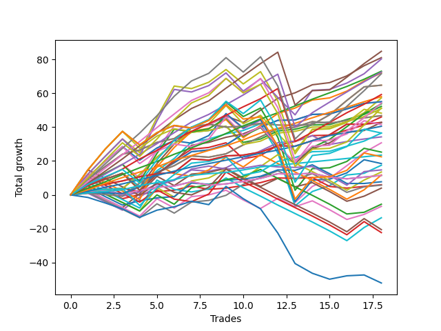

# Short Malinois 003 
- Symbol: ES_830-900
- Date Range: 03/18/2022 - 12/30/2022
- Trading Period: 8:30-9:0
- Number of Trades: 18



| Name | Win Percent | Profit | Avg Profit / Trade | Avg Time / Trade |      | Name | Win Percent | Profit | Avg Profit / Trade | Avg Time / Trade |
| ---- | ----------- | ------ | ------------------ | ---------------- | ---- | ---- | ----------- | ------ | ------------------ | ---------------- |
| Sorted By <br> Profit | | | | | | Sorted By <br> Win Percentage ||||
| TP-7 | 94.44 | 42375.00 | 2354.17 | 26:44 |     | TP-4 | 100.00 | 36500.00 | 2027.78 | 14:38 |
| BB-50 U/L 1SD | 88.89 | 40500.00 | 2250.00 | 23:45 |     | TP-3 | 100.00 | 29000.00 | 1611.11 | 11:21 |
| V U/L 1SD SL-10 | 72.22 | 40125.00 | 2229.17 | 35:43 |     | TP-2 | 100.00 | 20250.00 | 1125.00 | 08:39 |
| TP-4 | 100.00 | 36500.00 | 2027.78 | 14:38 |     | TP-1 | 100.00 | 11750.00 | 652.78 | 06:12 |
| TP-6 | 94.44 | 36250.00 | 2013.89 | 22:55 |     | TP-7 | 94.44 | 42375.00 | 2354.17 | 26:44 |
| BB-50 U/L 1SD SL-10 | 88.89 | 36000.00 | 2000.00 | 19:52 |     | TP-6 | 94.44 | 36250.00 | 2013.89 | 22:55 |
| TP-9 | 83.33 | 35750.00 | 1986.11 | 37:45 |     | TP-5 | 94.44 | 29625.00 | 1645.83 | 21:16 |
| BB-200 Mid SL-10 | 83.33 | 32375.00 | 1798.61 | 19:08 |     | BB-20 U/L 2SD | 94.44 | 26125.00 | 1451.39 | 17:52 |
| BB-200 Mid | 83.33 | 32375.00 | 1798.61 | 19:08 |     | BB-20 U/L 2SD SL-10 | 94.44 | 25500.00 | 1416.67 | 16:37 |
| TP-5 | 94.44 | 29625.00 | 1645.83 | 21:16 |     | BB-50 U/L 1SD | 88.89 | 40500.00 | 2250.00 | 23:45 |
| TP-3 | 100.00 | 29000.00 | 1611.11 | 11:21 |     | BB-50 U/L 1SD SL-10 | 88.89 | 36000.00 | 2000.00 | 19:52 |
| V U/L 1SD | 72.22 | 28625.00 | 1590.28 | 44:10 |     | BB-50 Mid SL-10 | 88.89 | 27500.00 | 1527.78 | 13:00 |
| BB-50 Mid SL-10 | 88.89 | 27500.00 | 1527.78 | 13:00 |     | BB-50 Mid | 88.89 | 27500.00 | 1527.78 | 13:00 |
| BB-50 Mid | 88.89 | 27500.00 | 1527.78 | 13:00 |     | BB-20 U/L 2SD C | 88.89 | 23000.00 | 1277.78 | 19:52 |
| TP-8 | 83.33 | 27125.00 | 1506.94 | 33:59 |     | BB-20 U/L 2SD C SL-10 | 88.89 | 18250.00 | 1013.89 | 17:38 |
| BB-50 U/L 2SD SL-10 | 72.22 | 26875.00 | 1493.06 | 30:30 |     | TP-9 | 83.33 | 35750.00 | 1986.11 | 37:45 |
| BB-20 U/L 2SD | 94.44 | 26125.00 | 1451.39 | 17:52 |     | BB-200 Mid SL-10 | 83.33 | 32375.00 | 1798.61 | 19:08 |
| TP-10 | 77.78 | 25625.00 | 1423.61 | 45:21 |     | BB-200 Mid | 83.33 | 32375.00 | 1798.61 | 19:08 |
| BB-20 U/L 2SD SL-10 | 94.44 | 25500.00 | 1416.67 | 16:37 |     | TP-8 | 83.33 | 27125.00 | 1506.94 | 33:59 |
| BB-200 U/L 2SD SL-10 | 66.67 | 24125.00 | 1340.28 | 52:27 |     | BB-100 Mid SL-10 | 83.33 | 21375.00 | 1187.50 | 17:35 |
| BB-20 U/L 1SD SL-10 | 77.78 | 23375.00 | 1298.61 | 08:00 |     | V Mid SL-10 | 83.33 | 21375.00 | 1187.50 | 09:22 |
| BB-20 U/L 1SD | 77.78 | 23375.00 | 1298.61 | 08:00 |     | V Mid | 83.33 | 21375.00 | 1187.50 | 09:22 |
| BB-20 U/L 2SD C | 88.89 | 23000.00 | 1277.78 | 19:52 |     | BB-100 Mid | 83.33 | 8750.00 | 486.11 | 23:49 |
| BB-100 Mid SL-10 | 83.33 | 21375.00 | 1187.50 | 17:35 |     | TP-10 | 77.78 | 25625.00 | 1423.61 | 45:21 |
| V Mid SL-10 | 83.33 | 21375.00 | 1187.50 | 09:22 |     | BB-20 U/L 1SD SL-10 | 77.78 | 23375.00 | 1298.61 | 08:00 |
| V Mid | 83.33 | 21375.00 | 1187.50 | 09:22 |     | BB-20 U/L 1SD | 77.78 | 23375.00 | 1298.61 | 08:00 |
| BB-100 U/L 2SD SL-10 | 66.67 | 20750.00 | 1152.78 | 49:55 |     | BB-20 U/L 1SD SL-5 | 77.78 | 17125.00 | 951.39 | 06:15 |
| TP-2 | 100.00 | 20250.00 | 1125.00 | 08:39 |     | V U/L 1SD SL-10 | 72.22 | 40125.00 | 2229.17 | 35:43 |
| BB-20 U/L 2SD C SL-10 | 88.89 | 18250.00 | 1013.89 | 17:38 |     | V U/L 1SD | 72.22 | 28625.00 | 1590.28 | 44:10 |
| NEWFI 000 | 72.22 | 18250.00 | 1013.89 | 42:25 |     | BB-50 U/L 2SD SL-10 | 72.22 | 26875.00 | 1493.06 | 30:30 |
| BB-20 U/L 1SD SL-5 | 77.78 | 17125.00 | 951.39 | 06:15 |     | NEWFI 000 | 72.22 | 18250.00 | 1013.89 | 42:25 |
| BB-50 U/L 2SD | 72.22 | 15375.00 | 854.17 | 38:57 |     | BB-50 U/L 2SD | 72.22 | 15375.00 | 854.17 | 38:57 |
| BB-200 U/L 2SD | 66.67 | 12625.00 | 701.39 | 60:55 |     | BB-20 Mid SL-10 | 72.22 | 5750.00 | 319.44 | 03:46 |
| TP-1 | 100.00 | 11750.00 | 652.78 | 06:12 |     | BB-20 Mid | 72.22 | 5750.00 | 319.44 | 03:46 |
| NEWFI 06 | 66.67 | 11250.00 | 625.00 | 57:40 |     | BB-20 Mid SL-5 | 72.22 | 3000.00 | 166.67 | 03:00 |
| BB-100 U/L 2SD | 66.67 | 9250.00 | 513.89 | 58:22 |     | BB-200 U/L 2SD SL-10 | 66.67 | 24125.00 | 1340.28 | 52:27 |
| BB-100 Mid | 83.33 | 8750.00 | 486.11 | 23:49 |     | BB-100 U/L 2SD SL-10 | 66.67 | 20750.00 | 1152.78 | 49:55 |
| BB-200 Mid SL-5 | 61.11 | 7375.00 | 409.72 | 10:40 |     | BB-200 U/L 2SD | 66.67 | 12625.00 | 701.39 | 60:55 |
| BB-50 U/L 1SD SL-5 | 50.00 | 6750.00 | 375.00 | 14:09 |     | NEWFI 06 | 66.67 | 11250.00 | 625.00 | 57:40 |
| V U/L 1SD SL-5 | 38.89 | 5875.00 | 326.39 | 22:00 |     | BB-100 U/L 2SD | 66.67 | 9250.00 | 513.89 | 58:22 |
| BB-20 Mid SL-10 | 72.22 | 5750.00 | 319.44 | 03:46 |     | BB-200 Mid SL-5 | 61.11 | 7375.00 | 409.72 | 10:40 |
| BB-20 Mid | 72.22 | 5750.00 | 319.44 | 03:46 |     | V Mid SL-5 | 61.11 | 3875.00 | 215.28 | 05:37 |
| V Mid SL-5 | 61.11 | 3875.00 | 215.28 | 05:37 |     | BB-50 Mid SL-5 | 61.11 | 2875.00 | 159.72 | 09:26 |
| BB-20 Mid SL-5 | 72.22 | 3000.00 | 166.67 | 03:00 |     | BB-20 U/L 2SD SL-5 | 55.56 | 2000.00 | 111.11 | 11:42 |
| BB-50 Mid SL-5 | 61.11 | 2875.00 | 159.72 | 09:26 |     | BB-50 U/L 1SD SL-5 | 50.00 | 6750.00 | 375.00 | 14:09 |
| BB-20 U/L 2SD SL-5 | 55.56 | 2000.00 | 111.11 | 11:42 |     | BB-100 Mid SL-5 | 50.00 | -2750.00 | -152.78 | 11:55 |
| BB-100 Mid SL-5 | 50.00 | -2750.00 | -152.78 | 11:55 |     | BB-20 U/L 2SD C SL-5 | 50.00 | -3375.00 | -187.50 | 12:09 |
| BB-20 U/L 2SD C SL-5 | 50.00 | -3375.00 | -187.50 | 12:09 |     | V U/L 1SD SL-5 | 38.89 | 5875.00 | 326.39 | 22:00 |
| BB-50 U/L 2SD SL-5 | 33.33 | -6750.00 | -375.00 | 21:29 |     | BB-50 U/L 2SD SL-5 | 33.33 | -6750.00 | -375.00 | 21:29 |
| BB-200 U/L 2SD SL-5 | 27.78 | -10250.00 | -569.44 | 30:55 |     | NEWFI 0000 | 33.33 | -26000.00 | -1444.44 | 28:14 |
| BB-100 U/L 2SD SL-5 | 27.78 | -11125.00 | -618.06 | 30:08 |     | BB-200 U/L 2SD SL-5 | 27.78 | -10250.00 | -569.44 | 30:55 |
| NEWFI 0000 | 33.33 | -26000.00 | -1444.44 | 28:14 |     | BB-100 U/L 2SD SL-5 | 27.78 | -11125.00 | -618.06 | 30:08 |

## NO STOPLOSS

### Test BB-20 Mid
* Sell when price hits the middle line of the 20p bollinger
* No Stoploss
* Results:
```
Total Trades: 18
Percent Up: 27.78
Percent Down: 72.22
Total Points Moved Down: 11.50
Potential Profit: 5750.00
Total Points Ups: 8.00 Count Ups: 5
Total Points Downs: 19.50 Count Downs: 13
```

<details><summary>Trades</summary>

<code>In: 2022-03-29 08:37:00		Out: 2022-03-29 08:41:05		Total Position Time: 04:05		Total Move Down: 2.25		Total to Date: 2.25</code> <br />
<code>In: 2022-03-29 08:41:00		Out: 2022-03-29 08:42:10		Total Position Time: 01:10		Total Move Down: 0.50		Total to Date: 2.75</code> <br />
<code>In: 2022-03-29 08:42:00		Out: 2022-03-29 08:56:20		Total Position Time: 14:20		Total Move Down: -2.50		Total to Date: 0.25</code> <br />
<code>In: 2022-06-13 08:47:00		Out: 2022-06-13 08:48:10		Total Position Time: 01:10		Total Move Down: 2.50		Total to Date: 2.75</code> <br />
<code>In: 2022-06-17 08:35:00		Out: 2022-06-17 08:36:10		Total Position Time: 01:10		Total Move Down: 1.75		Total to Date: 4.50</code> <br />
<code>In: 2022-06-17 08:36:00		Out: 2022-06-17 08:37:10		Total Position Time: 01:10		Total Move Down: 0.75		Total to Date: 5.25</code> <br />
<code>In: 2022-07-12 08:36:00		Out: 2022-07-12 08:37:10		Total Position Time: 01:10		Total Move Down: 2.50		Total to Date: 7.75</code> <br />
<code>In: 2022-07-18 08:50:00		Out: 2022-07-18 09:01:05		Total Position Time: 11:05		Total Move Down: -2.00		Total to Date: 5.75</code> <br />
<code>In: 2022-08-09 08:31:00		Out: 2022-08-09 08:32:35		Total Position Time: 01:35		Total Move Down: 0.75		Total to Date: 6.50</code> <br />
<code>In: 2022-08-29 08:41:00		Out: 2022-08-29 08:42:25		Total Position Time: 01:25		Total Move Down: 1.50		Total to Date: 8.00</code> <br />
<code>In: 2022-09-01 08:41:00		Out: 2022-09-01 08:42:10		Total Position Time: 01:10		Total Move Down: 1.75		Total to Date: 9.75</code> <br />
<code>In: 2022-10-05 08:45:00		Out: 2022-10-05 08:48:40		Total Position Time: 03:40		Total Move Down: 2.75		Total to Date: 12.50</code> <br />
<code>In: 2022-10-05 08:49:00		Out: 2022-10-05 08:50:10		Total Position Time: 01:10		Total Move Down: -0.25		Total to Date: 12.25</code> <br />
<code>In: 2022-10-06 08:32:00		Out: 2022-10-06 08:33:10		Total Position Time: 01:10		Total Move Down: 0.50		Total to Date: 12.75</code> <br />
<code>In: 2022-10-17 08:47:00		Out: 2022-10-17 08:59:05		Total Position Time: 12:05		Total Move Down: -2.25		Total to Date: 10.50</code> <br />
<code>In: 2022-10-17 08:59:00		Out: 2022-10-17 09:03:00		Total Position Time: 04:00		Total Move Down: -1.00		Total to Date: 9.50</code> <br />
<code>In: 2022-11-15 08:39:00		Out: 2022-11-15 08:44:10		Total Position Time: 05:10		Total Move Down: 1.00		Total to Date: 10.50</code> <br />
<code>In: 2022-12-01 08:48:00		Out: 2022-12-01 08:49:10		Total Position Time: 01:10		Total Move Down: 1.00		Total to Date: 11.50</code> <br />


</details>

### Test BB-20 U/L 1SD
* Sell when the price hits the lower line of the 20p 1std bollinger
* No Stoploss
* Results:
```
Total Trades: 18
Percent Up: 22.22
Percent Down: 77.78
Total Points Moved Down: 46.75
Potential Profit: 23375.00
Total Points Ups: 3.50 Count Ups: 4
Total Points Downs: 50.25 Count Downs: 14
```

<details><summary>Trades</summary>

<code>In: 2022-03-29 08:37:00		Out: 2022-03-29 08:58:40		Total Position Time: 21:40		Total Move Down: 1.00		Total to Date: 1.00</code> <br />
<code>In: 2022-03-29 08:41:00		Out: 2022-03-29 08:58:40		Total Position Time: 17:40		Total Move Down: -0.75		Total to Date: 0.25</code> <br />
<code>In: 2022-03-29 08:42:00		Out: 2022-03-29 08:58:40		Total Position Time: 16:40		Total Move Down: -1.00		Total to Date: -0.75</code> <br />
<code>In: 2022-06-13 08:47:00		Out: 2022-06-13 08:52:05		Total Position Time: 05:05		Total Move Down: 7.75		Total to Date: 7.00</code> <br />
<code>In: 2022-06-17 08:35:00		Out: 2022-06-17 08:39:05		Total Position Time: 04:05		Total Move Down: 6.25		Total to Date: 13.25</code> <br />
<code>In: 2022-06-17 08:36:00		Out: 2022-06-17 08:39:05		Total Position Time: 03:05		Total Move Down: 4.00		Total to Date: 17.25</code> <br />
<code>In: 2022-07-12 08:36:00		Out: 2022-07-12 08:38:10		Total Position Time: 02:10		Total Move Down: 5.75		Total to Date: 23.00</code> <br />
<code>In: 2022-07-18 08:50:00		Out: 2022-07-18 09:05:10		Total Position Time: 15:10		Total Move Down: -0.75		Total to Date: 22.25</code> <br />
<code>In: 2022-08-09 08:31:00		Out: 2022-08-09 08:34:05		Total Position Time: 03:05		Total Move Down: 2.00		Total to Date: 24.25</code> <br />
<code>In: 2022-08-29 08:41:00		Out: 2022-08-29 08:43:30		Total Position Time: 02:30		Total Move Down: 5.25		Total to Date: 29.50</code> <br />
<code>In: 2022-09-01 08:41:00		Out: 2022-09-01 08:44:15		Total Position Time: 03:15		Total Move Down: 4.75		Total to Date: 34.25</code> <br />
<code>In: 2022-10-05 08:45:00		Out: 2022-10-05 08:51:05		Total Position Time: 06:05		Total Move Down: 4.75		Total to Date: 39.00</code> <br />
<code>In: 2022-10-05 08:49:00		Out: 2022-10-05 08:51:05		Total Position Time: 02:05		Total Move Down: 1.00		Total to Date: 40.00</code> <br />
<code>In: 2022-10-06 08:32:00		Out: 2022-10-06 08:37:35		Total Position Time: 05:35		Total Move Down: 3.25		Total to Date: 43.25</code> <br />
<code>In: 2022-10-17 08:47:00		Out: 2022-10-17 09:04:15		Total Position Time: 17:15		Total Move Down: -1.00		Total to Date: 42.25</code> <br />
<code>In: 2022-10-17 08:59:00		Out: 2022-10-17 09:04:15		Total Position Time: 05:15		Total Move Down: 1.75		Total to Date: 44.00</code> <br />
<code>In: 2022-11-15 08:39:00		Out: 2022-11-15 08:50:50		Total Position Time: 11:50		Total Move Down: 1.50		Total to Date: 45.50</code> <br />
<code>In: 2022-12-01 08:48:00		Out: 2022-12-01 08:49:35		Total Position Time: 01:35		Total Move Down: 1.25		Total to Date: 46.75</code> <br />


</details>

### Test BB-20 U/L 2SD
* Sell when the price hits the lower line of the 20p 2std bollinger
* No Stoploss
* Results:
```
Total Trades: 18
Percent Up: 5.56
Percent Down: 94.44
Total Points Moved Down: 52.25
Potential Profit: 26125.00
Total Points Ups: 9.50 Count Ups: 1
Total Points Downs: 61.75 Count Downs: 17
```

<details><summary>Trades</summary>

<code>In: 2022-03-29 08:37:00		Out: 2022-03-29 09:01:40		Total Position Time: 24:40		Total Move Down: 2.50		Total to Date: 2.50</code> <br />
<code>In: 2022-03-29 08:41:00		Out: 2022-03-29 09:01:40		Total Position Time: 20:40		Total Move Down: 0.75		Total to Date: 3.25</code> <br />
<code>In: 2022-03-29 08:42:00		Out: 2022-03-29 09:01:40		Total Position Time: 19:40		Total Move Down: 0.50		Total to Date: 3.75</code> <br />
<code>In: 2022-06-13 08:47:00		Out: 2022-06-13 08:55:10		Total Position Time: 08:10		Total Move Down: 8.25		Total to Date: 12.00</code> <br />
<code>In: 2022-06-17 08:35:00		Out: 2022-06-17 08:45:15		Total Position Time: 10:15		Total Move Down: 10.25		Total to Date: 22.25</code> <br />
<code>In: 2022-06-17 08:36:00		Out: 2022-06-17 08:45:15		Total Position Time: 09:15		Total Move Down: 8.00		Total to Date: 30.25</code> <br />
<code>In: 2022-07-12 08:36:00		Out: 2022-07-12 08:41:10		Total Position Time: 05:10		Total Move Down: 6.75		Total to Date: 37.00</code> <br />
<code>In: 2022-07-18 08:50:00		Out: 2022-07-18 09:08:15		Total Position Time: 18:15		Total Move Down: 1.00		Total to Date: 38.00</code> <br />
<code>In: 2022-08-09 08:31:00		Out: 2022-08-09 08:36:20		Total Position Time: 05:20		Total Move Down: 2.50		Total to Date: 40.50</code> <br />
<code>In: 2022-08-29 08:41:00		Out: 2022-08-29 09:24:35		Total Position Time: 43:35		Total Move Down: -9.50		Total to Date: 31.00</code> <br />
<code>In: 2022-09-01 08:41:00		Out: 2022-09-01 09:36:10		Total Position Time: 55:10		Total Move Down: 2.00		Total to Date: 33.00</code> <br />
<code>In: 2022-10-05 08:45:00		Out: 2022-10-05 09:02:25		Total Position Time: 17:25		Total Move Down: 4.75		Total to Date: 37.75</code> <br />
<code>In: 2022-10-05 08:49:00		Out: 2022-10-05 09:02:25		Total Position Time: 13:25		Total Move Down: 1.00		Total to Date: 38.75</code> <br />
<code>In: 2022-10-06 08:32:00		Out: 2022-10-06 08:39:05		Total Position Time: 07:05		Total Move Down: 2.50		Total to Date: 41.25</code> <br />
<code>In: 2022-10-17 08:47:00		Out: 2022-10-17 09:12:25		Total Position Time: 25:25		Total Move Down: 0.25		Total to Date: 41.50</code> <br />
<code>In: 2022-10-17 08:59:00		Out: 2022-10-17 09:12:25		Total Position Time: 13:25		Total Move Down: 3.00		Total to Date: 44.50</code> <br />
<code>In: 2022-11-15 08:39:00		Out: 2022-11-15 09:01:30		Total Position Time: 22:30		Total Move Down: 3.00		Total to Date: 47.50</code> <br />
<code>In: 2022-12-01 08:48:00		Out: 2022-12-01 08:50:25		Total Position Time: 02:25		Total Move Down: 4.75		Total to Date: 52.25</code> <br />


</details>

### Test BB-20 U/L 2SD C
* Sell when the price hits the lower line of the 20p 2std bollinger
* No Stoploss
* Results:
```
Total Trades: 18
Percent Up: 11.11
Percent Down: 88.89
Total Points Moved Down: 46.00
Potential Profit: 23000.00
Total Points Ups: 11.25 Count Ups: 2
Total Points Downs: 57.25 Count Downs: 16
```

<details><summary>Trades</summary>

<code>In: 2022-03-29 08:37:00		Out: 2022-03-29 09:01:40		Total Position Time: 24:40		Total Move Down: 2.50		Total to Date: 2.50</code> <br />
<code>In: 2022-03-29 08:41:00		Out: 2022-03-29 09:01:40		Total Position Time: 20:40		Total Move Down: 0.75		Total to Date: 3.25</code> <br />
<code>In: 2022-03-29 08:42:00		Out: 2022-03-29 09:01:40		Total Position Time: 19:40		Total Move Down: 0.50		Total to Date: 3.75</code> <br />
<code>In: 2022-06-13 08:47:00		Out: 2022-06-13 09:30:35		Total Position Time: 43:35		Total Move Down: -1.75		Total to Date: 2.00</code> <br />
<code>In: 2022-06-17 08:35:00		Out: 2022-06-17 08:45:15		Total Position Time: 10:15		Total Move Down: 10.25		Total to Date: 12.25</code> <br />
<code>In: 2022-06-17 08:36:00		Out: 2022-06-17 08:45:15		Total Position Time: 09:15		Total Move Down: 8.00		Total to Date: 20.25</code> <br />
<code>In: 2022-07-12 08:36:00		Out: 2022-07-12 08:41:10		Total Position Time: 05:10		Total Move Down: 6.75		Total to Date: 27.00</code> <br />
<code>In: 2022-07-18 08:50:00		Out: 2022-07-18 09:08:15		Total Position Time: 18:15		Total Move Down: 1.00		Total to Date: 28.00</code> <br />
<code>In: 2022-08-09 08:31:00		Out: 2022-08-09 08:36:40		Total Position Time: 05:40		Total Move Down: 2.75		Total to Date: 30.75</code> <br />
<code>In: 2022-08-29 08:41:00		Out: 2022-08-29 09:24:35		Total Position Time: 43:35		Total Move Down: -9.50		Total to Date: 21.25</code> <br />
<code>In: 2022-09-01 08:41:00		Out: 2022-09-01 09:36:10		Total Position Time: 55:10		Total Move Down: 2.00		Total to Date: 23.25</code> <br />
<code>In: 2022-10-05 08:45:00		Out: 2022-10-05 09:02:30		Total Position Time: 17:30		Total Move Down: 6.00		Total to Date: 29.25</code> <br />
<code>In: 2022-10-05 08:49:00		Out: 2022-10-05 09:02:30		Total Position Time: 13:30		Total Move Down: 2.25		Total to Date: 31.50</code> <br />
<code>In: 2022-10-06 08:32:00		Out: 2022-10-06 08:39:10		Total Position Time: 07:10		Total Move Down: 3.50		Total to Date: 35.00</code> <br />
<code>In: 2022-10-17 08:47:00		Out: 2022-10-17 09:12:25		Total Position Time: 25:25		Total Move Down: 0.25		Total to Date: 35.25</code> <br />
<code>In: 2022-10-17 08:59:00		Out: 2022-10-17 09:12:25		Total Position Time: 13:25		Total Move Down: 3.00		Total to Date: 38.25</code> <br />
<code>In: 2022-11-15 08:39:00		Out: 2022-11-15 09:01:30		Total Position Time: 22:30		Total Move Down: 3.00		Total to Date: 41.25</code> <br />
<code>In: 2022-12-01 08:48:00		Out: 2022-12-01 08:50:25		Total Position Time: 02:25		Total Move Down: 4.75		Total to Date: 46.00</code> <br />


</details>

### Test BB-50 Mid
* Sell when price hits the middle line of the 50p bollinger
* No Stoploss
* Results:
```
Total Trades: 18
Percent Up: 11.11
Percent Down: 88.89
Total Points Moved Down: 55.00
Potential Profit: 27500.00
Total Points Ups: 0.75 Count Ups: 2
Total Points Downs: 55.75 Count Downs: 16
```

<details><summary>Trades</summary>

<code>In: 2022-03-29 08:37:00		Out: 2022-03-29 09:01:25		Total Position Time: 24:25		Total Move Down: 1.50		Total to Date: 1.50</code> <br />
<code>In: 2022-03-29 08:41:00		Out: 2022-03-29 09:01:25		Total Position Time: 20:25		Total Move Down: -0.25		Total to Date: 1.25</code> <br />
<code>In: 2022-03-29 08:42:00		Out: 2022-03-29 09:01:25		Total Position Time: 19:25		Total Move Down: -0.50		Total to Date: 0.75</code> <br />
<code>In: 2022-06-13 08:47:00		Out: 2022-06-13 09:07:15		Total Position Time: 20:15		Total Move Down: 4.00		Total to Date: 4.75</code> <br />
<code>In: 2022-06-17 08:35:00		Out: 2022-06-17 08:45:05		Total Position Time: 10:05		Total Move Down: 8.25		Total to Date: 13.00</code> <br />
<code>In: 2022-06-17 08:36:00		Out: 2022-06-17 08:45:05		Total Position Time: 09:05		Total Move Down: 6.00		Total to Date: 19.00</code> <br />
<code>In: 2022-07-12 08:36:00		Out: 2022-07-12 08:38:20		Total Position Time: 02:20		Total Move Down: 6.50		Total to Date: 25.50</code> <br />
<code>In: 2022-07-18 08:50:00		Out: 2022-07-18 09:08:15		Total Position Time: 18:15		Total Move Down: 1.00		Total to Date: 26.50</code> <br />
<code>In: 2022-08-09 08:31:00		Out: 2022-08-09 08:50:40		Total Position Time: 19:40		Total Move Down: 3.00		Total to Date: 29.50</code> <br />
<code>In: 2022-08-29 08:41:00		Out: 2022-08-29 08:45:00		Total Position Time: 04:00		Total Move Down: 6.50		Total to Date: 36.00</code> <br />
<code>In: 2022-09-01 08:41:00		Out: 2022-09-01 08:43:50		Total Position Time: 02:50		Total Move Down: 4.00		Total to Date: 40.00</code> <br />
<code>In: 2022-10-05 08:45:00		Out: 2022-10-05 09:01:45		Total Position Time: 16:45		Total Move Down: 4.00		Total to Date: 44.00</code> <br />
<code>In: 2022-10-05 08:49:00		Out: 2022-10-05 09:01:45		Total Position Time: 12:45		Total Move Down: 0.25		Total to Date: 44.25</code> <br />
<code>In: 2022-10-06 08:32:00		Out: 2022-10-06 08:37:35		Total Position Time: 05:35		Total Move Down: 3.25		Total to Date: 47.50</code> <br />
<code>In: 2022-10-17 08:47:00		Out: 2022-10-17 09:12:25		Total Position Time: 25:25		Total Move Down: 0.25		Total to Date: 47.75</code> <br />
<code>In: 2022-10-17 08:59:00		Out: 2022-10-17 09:12:25		Total Position Time: 13:25		Total Move Down: 3.00		Total to Date: 50.75</code> <br />
<code>In: 2022-11-15 08:39:00		Out: 2022-11-15 08:47:20		Total Position Time: 08:20		Total Move Down: 3.25		Total to Date: 54.00</code> <br />
<code>In: 2022-12-01 08:48:00		Out: 2022-12-01 08:49:10		Total Position Time: 01:10		Total Move Down: 1.00		Total to Date: 55.00</code> <br />


</details>

### Test BB-50 U/L 1SD
* Sell when the price hits the lower line of the 50p 1std bollinger
* No Stoploss
* Results:
```
Total Trades: 18
Percent Up: 11.11
Percent Down: 88.89
Total Points Moved Down: 81.00
Potential Profit: 40500.00
Total Points Ups: 11.75 Count Ups: 2
Total Points Downs: 92.75 Count Downs: 16
```

<details><summary>Trades</summary>

<code>In: 2022-03-29 08:37:00		Out: 2022-03-29 09:02:15		Total Position Time: 25:15		Total Move Down: 5.50		Total to Date: 5.50</code> <br />
<code>In: 2022-03-29 08:41:00		Out: 2022-03-29 09:02:15		Total Position Time: 21:15		Total Move Down: 3.75		Total to Date: 9.25</code> <br />
<code>In: 2022-03-29 08:42:00		Out: 2022-03-29 09:02:15		Total Position Time: 20:15		Total Move Down: 3.50		Total to Date: 12.75</code> <br />
<code>In: 2022-06-13 08:47:00		Out: 2022-06-13 09:47:55		Total Position Time: 60:55		Total Move Down: -8.00		Total to Date: 4.75</code> <br />
<code>In: 2022-06-17 08:35:00		Out: 2022-06-17 08:51:25		Total Position Time: 16:25		Total Move Down: 13.75		Total to Date: 18.50</code> <br />
<code>In: 2022-06-17 08:36:00		Out: 2022-06-17 08:51:25		Total Position Time: 15:25		Total Move Down: 11.50		Total to Date: 30.00</code> <br />
<code>In: 2022-07-12 08:36:00		Out: 2022-07-12 08:43:55		Total Position Time: 07:55		Total Move Down: 9.50		Total to Date: 39.50</code> <br />
<code>In: 2022-07-18 08:50:00		Out: 2022-07-18 09:19:25		Total Position Time: 29:25		Total Move Down: 1.75		Total to Date: 41.25</code> <br />
<code>In: 2022-08-09 08:31:00		Out: 2022-08-09 08:59:45		Total Position Time: 28:45		Total Move Down: 5.25		Total to Date: 46.50</code> <br />
<code>In: 2022-08-29 08:41:00		Out: 2022-08-29 09:36:50		Total Position Time: 55:50		Total Move Down: -3.75		Total to Date: 42.75</code> <br />
<code>In: 2022-09-01 08:41:00		Out: 2022-09-01 08:53:20		Total Position Time: 12:20		Total Move Down: 7.25		Total to Date: 50.00</code> <br />
<code>In: 2022-10-05 08:45:00		Out: 2022-10-05 09:03:05		Total Position Time: 18:05		Total Move Down: 7.00		Total to Date: 57.00</code> <br />
<code>In: 2022-10-05 08:49:00		Out: 2022-10-05 09:03:05		Total Position Time: 14:05		Total Move Down: 3.25		Total to Date: 60.25</code> <br />
<code>In: 2022-10-06 08:32:00		Out: 2022-10-06 08:56:25		Total Position Time: 24:25		Total Move Down: 4.75		Total to Date: 65.00</code> <br />
<code>In: 2022-10-17 08:47:00		Out: 2022-10-17 09:19:00		Total Position Time: 32:00		Total Move Down: 1.25		Total to Date: 66.25</code> <br />
<code>In: 2022-10-17 08:59:00		Out: 2022-10-17 09:19:00		Total Position Time: 20:00		Total Move Down: 4.00		Total to Date: 70.25</code> <br />
<code>In: 2022-11-15 08:39:00		Out: 2022-11-15 09:01:50		Total Position Time: 22:50		Total Move Down: 6.00		Total to Date: 76.25</code> <br />
<code>In: 2022-12-01 08:48:00		Out: 2022-12-01 08:50:25		Total Position Time: 02:25		Total Move Down: 4.75		Total to Date: 81.00</code> <br />


</details>

### Test BB-50 U/L 2SD
* Sell when the price hits the lower line of the 50p 2std bollinger
* No Stoploss
* Results:
```
Total Trades: 18
Percent Up: 27.78
Percent Down: 72.22
Total Points Moved Down: 30.75
Potential Profit: 15375.00
Total Points Ups: 66.50 Count Ups: 5
Total Points Downs: 97.25 Count Downs: 13
```

<details><summary>Trades</summary>

<code>In: 2022-03-29 08:37:00		Out: 2022-03-29 09:10:45		Total Position Time: 33:45		Total Move Down: 7.25		Total to Date: 7.25</code> <br />
<code>In: 2022-03-29 08:41:00		Out: 2022-03-29 09:10:45		Total Position Time: 29:45		Total Move Down: 5.50		Total to Date: 12.75</code> <br />
<code>In: 2022-03-29 08:42:00		Out: 2022-03-29 09:10:45		Total Position Time: 28:45		Total Move Down: 5.25		Total to Date: 18.00</code> <br />
<code>In: 2022-06-13 08:47:00		Out: 2022-06-13 09:47:55		Total Position Time: 60:55		Total Move Down: -8.00		Total to Date: 10.00</code> <br />
<code>In: 2022-06-17 08:35:00		Out: 2022-06-17 08:52:10		Total Position Time: 17:10		Total Move Down: 16.50		Total to Date: 26.50</code> <br />
<code>In: 2022-06-17 08:36:00		Out: 2022-06-17 08:52:10		Total Position Time: 16:10		Total Move Down: 14.25		Total to Date: 40.75</code> <br />
<code>In: 2022-07-12 08:36:00		Out: 2022-07-12 09:36:55		Total Position Time: 60:55		Total Move Down: -1.50		Total to Date: 39.25</code> <br />
<code>In: 2022-07-18 08:50:00		Out: 2022-07-18 09:26:30		Total Position Time: 36:30		Total Move Down: 1.75		Total to Date: 41.00</code> <br />
<code>In: 2022-08-09 08:31:00		Out: 2022-08-09 09:03:05		Total Position Time: 32:05		Total Move Down: 6.50		Total to Date: 47.50</code> <br />
<code>In: 2022-08-29 08:41:00		Out: 2022-08-29 09:41:55		Total Position Time: 60:55		Total Move Down: -8.50		Total to Date: 39.00</code> <br />
<code>In: 2022-09-01 08:41:00		Out: 2022-09-01 09:41:55		Total Position Time: 60:55		Total Move Down: 5.00		Total to Date: 44.00</code> <br />
<code>In: 2022-10-05 08:45:00		Out: 2022-10-05 09:45:55		Total Position Time: 60:55		Total Move Down: -17.25		Total to Date: 26.75</code> <br />
<code>In: 2022-10-05 08:49:00		Out: 2022-10-05 09:49:55		Total Position Time: 60:55		Total Move Down: -31.25		Total to Date: -4.50</code> <br />
<code>In: 2022-10-06 08:32:00		Out: 2022-10-06 08:57:05		Total Position Time: 25:05		Total Move Down: 9.50		Total to Date: 5.00</code> <br />
<code>In: 2022-10-17 08:47:00		Out: 2022-10-17 09:22:05		Total Position Time: 35:05		Total Move Down: 4.75		Total to Date: 9.75</code> <br />
<code>In: 2022-10-17 08:59:00		Out: 2022-10-17 09:22:05		Total Position Time: 23:05		Total Move Down: 7.50		Total to Date: 17.25</code> <br />
<code>In: 2022-11-15 08:39:00		Out: 2022-11-15 09:23:10		Total Position Time: 44:10		Total Move Down: 7.75		Total to Date: 25.00</code> <br />
<code>In: 2022-12-01 08:48:00		Out: 2022-12-01 09:02:05		Total Position Time: 14:05		Total Move Down: 5.75		Total to Date: 30.75</code> <br />


</details>

### Test V Mid
* Sell when the price hits the middle line of the 1std VWAP
* No Stoploss
* Results:
```
Total Trades: 18
Percent Up: 16.67
Percent Down: 83.33
Total Points Moved Down: 42.75
Potential Profit: 21375.00
Total Points Ups: 1.00 Count Ups: 3
Total Points Downs: 43.75 Count Downs: 15
```

<details><summary>Trades</summary>

<code>In: 2022-03-29 08:37:00		Out: 2022-03-29 09:02:10		Total Position Time: 25:10		Total Move Down: 4.00		Total to Date: 4.00</code> <br />
<code>In: 2022-03-29 08:41:00		Out: 2022-03-29 09:02:10		Total Position Time: 21:10		Total Move Down: 2.25		Total to Date: 6.25</code> <br />
<code>In: 2022-03-29 08:42:00		Out: 2022-03-29 09:02:10		Total Position Time: 20:10		Total Move Down: 2.00		Total to Date: 8.25</code> <br />
<code>In: 2022-06-13 08:47:00		Out: 2022-06-13 08:48:10		Total Position Time: 01:10		Total Move Down: 2.50		Total to Date: 10.75</code> <br />
<code>In: 2022-06-17 08:35:00		Out: 2022-06-17 08:36:10		Total Position Time: 01:10		Total Move Down: 1.75		Total to Date: 12.50</code> <br />
<code>In: 2022-06-17 08:36:00		Out: 2022-06-17 08:37:10		Total Position Time: 01:10		Total Move Down: 0.75		Total to Date: 13.25</code> <br />
<code>In: 2022-07-12 08:36:00		Out: 2022-07-12 08:41:50		Total Position Time: 05:50		Total Move Down: 8.00		Total to Date: 21.25</code> <br />
<code>In: 2022-07-18 08:50:00		Out: 2022-07-18 09:05:10		Total Position Time: 15:10		Total Move Down: -0.75		Total to Date: 20.50</code> <br />
<code>In: 2022-08-09 08:31:00		Out: 2022-08-09 08:34:10		Total Position Time: 03:10		Total Move Down: 2.50		Total to Date: 23.00</code> <br />
<code>In: 2022-08-29 08:41:00		Out: 2022-08-29 08:42:10		Total Position Time: 01:10		Total Move Down: 0.50		Total to Date: 23.50</code> <br />
<code>In: 2022-09-01 08:41:00		Out: 2022-09-01 08:42:10		Total Position Time: 01:10		Total Move Down: 1.75		Total to Date: 25.25</code> <br />
<code>In: 2022-10-05 08:45:00		Out: 2022-10-05 08:49:00		Total Position Time: 04:00		Total Move Down: 3.75		Total to Date: 29.00</code> <br />
<code>In: 2022-10-05 08:49:00		Out: 2022-10-05 08:50:15		Total Position Time: 01:15		Total Move Down: -0.25		Total to Date: 28.75</code> <br />
<code>In: 2022-10-06 08:32:00		Out: 2022-10-06 08:37:35		Total Position Time: 05:35		Total Move Down: 3.25		Total to Date: 32.00</code> <br />
<code>In: 2022-10-17 08:47:00		Out: 2022-10-17 09:20:40		Total Position Time: 33:40		Total Move Down: 3.50		Total to Date: 35.50</code> <br />
<code>In: 2022-10-17 08:59:00		Out: 2022-10-17 09:20:40		Total Position Time: 21:40		Total Move Down: 6.25		Total to Date: 41.75</code> <br />
<code>In: 2022-11-15 08:39:00		Out: 2022-11-15 08:44:00		Total Position Time: 05:00		Total Move Down: -0.00		Total to Date: 41.75</code> <br />
<code>In: 2022-12-01 08:48:00		Out: 2022-12-01 08:49:10		Total Position Time: 01:10		Total Move Down: 1.00		Total to Date: 42.75</code> <br />


</details>

### Test V U/L 1SD
* Sell when the price hits the lower line of the 1std VWAP
* No Stoploss
* Results:
```
Total Trades: 18
Percent Up: 27.78
Percent Down: 72.22
Total Points Moved Down: 57.25
Potential Profit: 28625.00
Total Points Ups: 66.50 Count Ups: 5
Total Points Downs: 123.75 Count Downs: 13
```

<details><summary>Trades</summary>

<code>In: 2022-03-29 08:37:00		Out: 2022-03-29 09:27:55		Total Position Time: 50:55		Total Move Down: 12.25		Total to Date: 12.25</code> <br />
<code>In: 2022-03-29 08:41:00		Out: 2022-03-29 09:27:55		Total Position Time: 46:55		Total Move Down: 10.50		Total to Date: 22.75</code> <br />
<code>In: 2022-03-29 08:42:00		Out: 2022-03-29 09:27:55		Total Position Time: 45:55		Total Move Down: 10.25		Total to Date: 33.00</code> <br />
<code>In: 2022-06-13 08:47:00		Out: 2022-06-13 09:47:55		Total Position Time: 60:55		Total Move Down: -8.00		Total to Date: 25.00</code> <br />
<code>In: 2022-06-17 08:35:00		Out: 2022-06-17 09:03:15		Total Position Time: 28:15		Total Move Down: 20.75		Total to Date: 45.75</code> <br />
<code>In: 2022-06-17 08:36:00		Out: 2022-06-17 09:03:15		Total Position Time: 27:15		Total Move Down: 18.50		Total to Date: 64.25</code> <br />
<code>In: 2022-07-12 08:36:00		Out: 2022-07-12 09:36:55		Total Position Time: 60:55		Total Move Down: -1.50		Total to Date: 62.75</code> <br />
<code>In: 2022-07-18 08:50:00		Out: 2022-07-18 09:49:15		Total Position Time: 59:15		Total Move Down: 3.75		Total to Date: 66.50</code> <br />
<code>In: 2022-08-09 08:31:00		Out: 2022-08-09 09:03:15		Total Position Time: 32:15		Total Move Down: 7.50		Total to Date: 74.00</code> <br />
<code>In: 2022-08-29 08:41:00		Out: 2022-08-29 09:41:55		Total Position Time: 60:55		Total Move Down: -8.50		Total to Date: 65.50</code> <br />
<code>In: 2022-09-01 08:41:00		Out: 2022-09-01 08:53:20		Total Position Time: 12:20		Total Move Down: 7.25		Total to Date: 72.75</code> <br />
<code>In: 2022-10-05 08:45:00		Out: 2022-10-05 09:45:55		Total Position Time: 60:55		Total Move Down: -17.25		Total to Date: 55.50</code> <br />
<code>In: 2022-10-05 08:49:00		Out: 2022-10-05 09:49:55		Total Position Time: 60:55		Total Move Down: -31.25		Total to Date: 24.25</code> <br />
<code>In: 2022-10-06 08:32:00		Out: 2022-10-06 08:59:15		Total Position Time: 27:15		Total Move Down: 14.50		Total to Date: 38.75</code> <br />
<code>In: 2022-10-17 08:47:00		Out: 2022-10-17 09:47:55		Total Position Time: 60:55		Total Move Down: 0.50		Total to Date: 39.25</code> <br />
<code>In: 2022-10-17 08:59:00		Out: 2022-10-17 09:59:55		Total Position Time: 60:55		Total Move Down: 3.75		Total to Date: 43.00</code> <br />
<code>In: 2022-11-15 08:39:00		Out: 2022-11-15 09:01:45		Total Position Time: 22:45		Total Move Down: 5.50		Total to Date: 48.50</code> <br />
<code>In: 2022-12-01 08:48:00		Out: 2022-12-01 09:03:40		Total Position Time: 15:40		Total Move Down: 8.75		Total to Date: 57.25</code> <br />


</details>

### Test BB-100 Mid
* Move to BB100 Mid
* No Stoploss
* Results:
```
Total Trades: 18
Percent Up: 16.67
Percent Down: 83.33
Total Points Moved Down: 17.50
Potential Profit: 8750.00
Total Points Ups: 56.50 Count Ups: 3
Total Points Downs: 74.00 Count Downs: 15
```

<details><summary>Trades</summary>

<code>In: 2022-03-29 08:37:00		Out: 2022-03-29 09:02:15		Total Position Time: 25:15		Total Move Down: 5.50		Total to Date: 5.50</code> <br />
<code>In: 2022-03-29 08:41:00		Out: 2022-03-29 09:02:15		Total Position Time: 21:15		Total Move Down: 3.75		Total to Date: 9.25</code> <br />
<code>In: 2022-03-29 08:42:00		Out: 2022-03-29 09:02:15		Total Position Time: 20:15		Total Move Down: 3.50		Total to Date: 12.75</code> <br />
<code>In: 2022-06-13 08:47:00		Out: 2022-06-13 09:47:55		Total Position Time: 60:55		Total Move Down: -8.00		Total to Date: 4.75</code> <br />
<code>In: 2022-06-17 08:35:00		Out: 2022-06-17 08:45:25		Total Position Time: 10:25		Total Move Down: 9.50		Total to Date: 14.25</code> <br />
<code>In: 2022-06-17 08:36:00		Out: 2022-06-17 08:45:25		Total Position Time: 09:25		Total Move Down: 7.25		Total to Date: 21.50</code> <br />
<code>In: 2022-07-12 08:36:00		Out: 2022-07-12 08:54:25		Total Position Time: 18:25		Total Move Down: 9.75		Total to Date: 31.25</code> <br />
<code>In: 2022-07-18 08:50:00		Out: 2022-07-18 09:19:25		Total Position Time: 29:25		Total Move Down: 1.75		Total to Date: 33.00</code> <br />
<code>In: 2022-08-09 08:31:00		Out: 2022-08-09 08:50:40		Total Position Time: 19:40		Total Move Down: 3.00		Total to Date: 36.00</code> <br />
<code>In: 2022-08-29 08:41:00		Out: 2022-08-29 08:42:30		Total Position Time: 01:30		Total Move Down: 2.00		Total to Date: 38.00</code> <br />
<code>In: 2022-09-01 08:41:00		Out: 2022-09-01 08:43:50		Total Position Time: 02:50		Total Move Down: 4.00		Total to Date: 42.00</code> <br />
<code>In: 2022-10-05 08:45:00		Out: 2022-10-05 09:45:55		Total Position Time: 60:55		Total Move Down: -17.25		Total to Date: 24.75</code> <br />
<code>In: 2022-10-05 08:49:00		Out: 2022-10-05 09:49:55		Total Position Time: 60:55		Total Move Down: -31.25		Total to Date: -6.50</code> <br />
<code>In: 2022-10-06 08:32:00		Out: 2022-10-06 08:56:40		Total Position Time: 24:40		Total Move Down: 8.50		Total to Date: 2.00</code> <br />
<code>In: 2022-10-17 08:47:00		Out: 2022-10-17 09:20:45		Total Position Time: 33:45		Total Move Down: 3.50		Total to Date: 5.50</code> <br />
<code>In: 2022-10-17 08:59:00		Out: 2022-10-17 09:20:45		Total Position Time: 21:45		Total Move Down: 6.25		Total to Date: 11.75</code> <br />
<code>In: 2022-11-15 08:39:00		Out: 2022-11-15 08:44:10		Total Position Time: 05:10		Total Move Down: 1.00		Total to Date: 12.75</code> <br />
<code>In: 2022-12-01 08:48:00		Out: 2022-12-01 08:50:25		Total Position Time: 02:25		Total Move Down: 4.75		Total to Date: 17.50</code> <br />


</details>

### Test BB-100 U/L 2SD
* Move to BB100 Upper Band
* No Stoploss
* Results:
```
Total Trades: 18
Percent Up: 33.33
Percent Down: 66.67
Total Points Moved Down: 18.50
Potential Profit: 9250.00
Total Points Ups: 68.75 Count Ups: 6
Total Points Downs: 87.25 Count Downs: 12
```

<details><summary>Trades</summary>

<code>In: 2022-03-29 08:37:00		Out: 2022-03-29 09:26:35		Total Position Time: 49:35		Total Move Down: 10.75		Total to Date: 10.75</code> <br />
<code>In: 2022-03-29 08:41:00		Out: 2022-03-29 09:26:35		Total Position Time: 45:35		Total Move Down: 9.00		Total to Date: 19.75</code> <br />
<code>In: 2022-03-29 08:42:00		Out: 2022-03-29 09:26:35		Total Position Time: 44:35		Total Move Down: 8.75		Total to Date: 28.50</code> <br />
<code>In: 2022-06-13 08:47:00		Out: 2022-06-13 09:47:55		Total Position Time: 60:55		Total Move Down: -8.00		Total to Date: 20.50</code> <br />
<code>In: 2022-06-17 08:35:00		Out: 2022-06-17 09:35:55		Total Position Time: 60:55		Total Move Down: 7.25		Total to Date: 27.75</code> <br />
<code>In: 2022-06-17 08:36:00		Out: 2022-06-17 09:36:55		Total Position Time: 60:55		Total Move Down: 4.25		Total to Date: 32.00</code> <br />
<code>In: 2022-07-12 08:36:00		Out: 2022-07-12 09:36:55		Total Position Time: 60:55		Total Move Down: -1.50		Total to Date: 30.50</code> <br />
<code>In: 2022-07-18 08:50:00		Out: 2022-07-18 09:50:55		Total Position Time: 60:55		Total Move Down: 4.50		Total to Date: 35.00</code> <br />
<code>In: 2022-08-09 08:31:00		Out: 2022-08-09 09:29:10		Total Position Time: 58:10		Total Move Down: 13.00		Total to Date: 48.00</code> <br />
<code>In: 2022-08-29 08:41:00		Out: 2022-08-29 09:41:55		Total Position Time: 60:55		Total Move Down: -8.50		Total to Date: 39.50</code> <br />
<code>In: 2022-09-01 08:41:00		Out: 2022-09-01 09:41:55		Total Position Time: 60:55		Total Move Down: 5.00		Total to Date: 44.50</code> <br />
<code>In: 2022-10-05 08:45:00		Out: 2022-10-05 09:45:55		Total Position Time: 60:55		Total Move Down: -17.25		Total to Date: 27.25</code> <br />
<code>In: 2022-10-05 08:49:00		Out: 2022-10-05 09:49:55		Total Position Time: 60:55		Total Move Down: -31.25		Total to Date: -4.00</code> <br />
<code>In: 2022-10-06 08:32:00		Out: 2022-10-06 09:32:55		Total Position Time: 60:55		Total Move Down: 12.75		Total to Date: 8.75</code> <br />
<code>In: 2022-10-17 08:47:00		Out: 2022-10-17 09:47:55		Total Position Time: 60:55		Total Move Down: 0.50		Total to Date: 9.25</code> <br />
<code>In: 2022-10-17 08:59:00		Out: 2022-10-17 09:59:55		Total Position Time: 60:55		Total Move Down: 3.75		Total to Date: 13.00</code> <br />
<code>In: 2022-11-15 08:39:00		Out: 2022-11-15 09:39:55		Total Position Time: 60:55		Total Move Down: 7.75		Total to Date: 20.75</code> <br />
<code>In: 2022-12-01 08:48:00		Out: 2022-12-01 09:48:55		Total Position Time: 60:55		Total Move Down: -2.25		Total to Date: 18.50</code> <br />


</details>

### Test BB-200 Mid
* Move to BB200 Mid
* No Stoploss
* Results:
```
Total Trades: 18
Percent Up: 16.67
Percent Down: 83.33
Total Points Moved Down: 64.75
Potential Profit: 32375.00
Total Points Ups: 3.00 Count Ups: 3
Total Points Downs: 67.75 Count Downs: 15
```

<details><summary>Trades</summary>

<code>In: 2022-03-29 08:37:00		Out: 2022-03-29 09:21:50		Total Position Time: 44:50		Total Move Down: 9.25		Total to Date: 9.25</code> <br />
<code>In: 2022-03-29 08:41:00		Out: 2022-03-29 09:21:50		Total Position Time: 40:50		Total Move Down: 7.50		Total to Date: 16.75</code> <br />
<code>In: 2022-03-29 08:42:00		Out: 2022-03-29 09:21:50		Total Position Time: 39:50		Total Move Down: 7.25		Total to Date: 24.00</code> <br />
<code>In: 2022-06-13 08:47:00		Out: 2022-06-13 08:48:10		Total Position Time: 01:10		Total Move Down: 2.50		Total to Date: 26.50</code> <br />
<code>In: 2022-06-17 08:35:00		Out: 2022-06-17 08:38:50		Total Position Time: 03:50		Total Move Down: 4.50		Total to Date: 31.00</code> <br />
<code>In: 2022-06-17 08:36:00		Out: 2022-06-17 08:38:50		Total Position Time: 02:50		Total Move Down: 2.25		Total to Date: 33.25</code> <br />
<code>In: 2022-07-12 08:36:00		Out: 2022-07-12 08:38:25		Total Position Time: 02:25		Total Move Down: 6.75		Total to Date: 40.00</code> <br />
<code>In: 2022-07-18 08:50:00		Out: 2022-07-18 09:45:30		Total Position Time: 55:30		Total Move Down: 1.75		Total to Date: 41.75</code> <br />
<code>In: 2022-08-09 08:31:00		Out: 2022-08-09 08:32:10		Total Position Time: 01:10		Total Move Down: -1.75		Total to Date: 40.00</code> <br />
<code>In: 2022-08-29 08:41:00		Out: 2022-08-29 08:42:10		Total Position Time: 01:10		Total Move Down: 0.50		Total to Date: 40.50</code> <br />
<code>In: 2022-09-01 08:41:00		Out: 2022-09-01 08:42:10		Total Position Time: 01:10		Total Move Down: 1.75		Total to Date: 42.25</code> <br />
<code>In: 2022-10-05 08:45:00		Out: 2022-10-05 08:46:10		Total Position Time: 01:10		Total Move Down: -1.00		Total to Date: 41.25</code> <br />
<code>In: 2022-10-05 08:49:00		Out: 2022-10-05 08:50:10		Total Position Time: 01:10		Total Move Down: -0.25		Total to Date: 41.00</code> <br />
<code>In: 2022-10-06 08:32:00		Out: 2022-10-06 08:33:10		Total Position Time: 01:10		Total Move Down: 0.50		Total to Date: 41.50</code> <br />
<code>In: 2022-10-17 08:47:00		Out: 2022-10-17 09:43:35		Total Position Time: 56:35		Total Move Down: 5.75		Total to Date: 47.25</code> <br />
<code>In: 2022-10-17 08:59:00		Out: 2022-10-17 09:43:35		Total Position Time: 44:35		Total Move Down: 8.50		Total to Date: 55.75</code> <br />
<code>In: 2022-11-15 08:39:00		Out: 2022-11-15 09:23:05		Total Position Time: 44:05		Total Move Down: 8.00		Total to Date: 63.75</code> <br />
<code>In: 2022-12-01 08:48:00		Out: 2022-12-01 08:49:10		Total Position Time: 01:10		Total Move Down: 1.00		Total to Date: 64.75</code> <br />


</details>

### Test BB-200 U/L 2SD
* Move to BB200 Upper Band
* No Stoploss
* Results:
```
Total Trades: 18
Percent Up: 33.33
Percent Down: 66.67
Total Points Moved Down: 25.25
Potential Profit: 12625.00
Total Points Ups: 68.75 Count Ups: 6
Total Points Downs: 94.00 Count Downs: 12
```

<details><summary>Trades</summary>

<code>In: 2022-03-29 08:37:00		Out: 2022-03-29 09:37:55		Total Position Time: 60:55		Total Move Down: 14.75		Total to Date: 14.75</code> <br />
<code>In: 2022-03-29 08:41:00		Out: 2022-03-29 09:41:55		Total Position Time: 60:55		Total Move Down: 12.25		Total to Date: 27.00</code> <br />
<code>In: 2022-03-29 08:42:00		Out: 2022-03-29 09:42:55		Total Position Time: 60:55		Total Move Down: 10.50		Total to Date: 37.50</code> <br />
<code>In: 2022-06-13 08:47:00		Out: 2022-06-13 09:47:55		Total Position Time: 60:55		Total Move Down: -8.00		Total to Date: 29.50</code> <br />
<code>In: 2022-06-17 08:35:00		Out: 2022-06-17 09:35:55		Total Position Time: 60:55		Total Move Down: 7.25		Total to Date: 36.75</code> <br />
<code>In: 2022-06-17 08:36:00		Out: 2022-06-17 09:36:55		Total Position Time: 60:55		Total Move Down: 4.25		Total to Date: 41.00</code> <br />
<code>In: 2022-07-12 08:36:00		Out: 2022-07-12 09:36:55		Total Position Time: 60:55		Total Move Down: -1.50		Total to Date: 39.50</code> <br />
<code>In: 2022-07-18 08:50:00		Out: 2022-07-18 09:50:55		Total Position Time: 60:55		Total Move Down: 4.50		Total to Date: 44.00</code> <br />
<code>In: 2022-08-09 08:31:00		Out: 2022-08-09 09:31:55		Total Position Time: 60:55		Total Move Down: 10.75		Total to Date: 54.75</code> <br />
<code>In: 2022-08-29 08:41:00		Out: 2022-08-29 09:41:55		Total Position Time: 60:55		Total Move Down: -8.50		Total to Date: 46.25</code> <br />
<code>In: 2022-09-01 08:41:00		Out: 2022-09-01 09:41:55		Total Position Time: 60:55		Total Move Down: 5.00		Total to Date: 51.25</code> <br />
<code>In: 2022-10-05 08:45:00		Out: 2022-10-05 09:45:55		Total Position Time: 60:55		Total Move Down: -17.25		Total to Date: 34.00</code> <br />
<code>In: 2022-10-05 08:49:00		Out: 2022-10-05 09:49:55		Total Position Time: 60:55		Total Move Down: -31.25		Total to Date: 2.75</code> <br />
<code>In: 2022-10-06 08:32:00		Out: 2022-10-06 09:32:55		Total Position Time: 60:55		Total Move Down: 12.75		Total to Date: 15.50</code> <br />
<code>In: 2022-10-17 08:47:00		Out: 2022-10-17 09:47:55		Total Position Time: 60:55		Total Move Down: 0.50		Total to Date: 16.00</code> <br />
<code>In: 2022-10-17 08:59:00		Out: 2022-10-17 09:59:55		Total Position Time: 60:55		Total Move Down: 3.75		Total to Date: 19.75</code> <br />
<code>In: 2022-11-15 08:39:00		Out: 2022-11-15 09:39:55		Total Position Time: 60:55		Total Move Down: 7.75		Total to Date: 27.50</code> <br />
<code>In: 2022-12-01 08:48:00		Out: 2022-12-01 09:48:55		Total Position Time: 60:55		Total Move Down: -2.25		Total to Date: 25.25</code> <br />


</details>

## STOPLOSS OF 5

### Test BB-20 Mid SL-5
* Sell when price hits the middle line of the 20p bollinger
* Stoploss is -5 points
* Results:
```
Total Trades: 18
Percent Up: 27.78
Percent Down: 72.22
Total Points Moved Down: 6.00
Potential Profit: 3000.00
Total Points Ups: 13.50 Count Ups: 5
Total Points Downs: 19.50 Count Downs: 13
```

<details><summary>Trades</summary>

<code>In: 2022-03-29 08:37:00		Out: 2022-03-29 08:41:05		Total Position Time: 04:05		Total Move Down: 2.25		Total to Date: 2.25</code> <br />
<code>In: 2022-03-29 08:41:00		Out: 2022-03-29 08:42:10		Total Position Time: 01:10		Total Move Down: 0.50		Total to Date: 2.75</code> <br />
<code>In: 2022-03-29 08:42:00		Out: 2022-03-29 08:48:40		Total Position Time: 06:40		Total Move Down: -5.00		Total to Date: -2.25</code> <br />
<code>In: 2022-06-13 08:47:00		Out: 2022-06-13 08:48:10		Total Position Time: 01:10		Total Move Down: 2.50		Total to Date: 0.25</code> <br />
<code>In: 2022-06-17 08:35:00		Out: 2022-06-17 08:36:10		Total Position Time: 01:10		Total Move Down: 1.75		Total to Date: 2.00</code> <br />
<code>In: 2022-06-17 08:36:00		Out: 2022-06-17 08:37:10		Total Position Time: 01:10		Total Move Down: 0.75		Total to Date: 2.75</code> <br />
<code>In: 2022-07-12 08:36:00		Out: 2022-07-12 08:37:10		Total Position Time: 01:10		Total Move Down: 2.50		Total to Date: 5.25</code> <br />
<code>In: 2022-07-18 08:50:00		Out: 2022-07-18 09:01:05		Total Position Time: 11:05		Total Move Down: -2.00		Total to Date: 3.25</code> <br />
<code>In: 2022-08-09 08:31:00		Out: 2022-08-09 08:32:35		Total Position Time: 01:35		Total Move Down: 0.75		Total to Date: 4.00</code> <br />
<code>In: 2022-08-29 08:41:00		Out: 2022-08-29 08:42:25		Total Position Time: 01:25		Total Move Down: 1.50		Total to Date: 5.50</code> <br />
<code>In: 2022-09-01 08:41:00		Out: 2022-09-01 08:42:10		Total Position Time: 01:10		Total Move Down: 1.75		Total to Date: 7.25</code> <br />
<code>In: 2022-10-05 08:45:00		Out: 2022-10-05 08:48:40		Total Position Time: 03:40		Total Move Down: 2.75		Total to Date: 10.00</code> <br />
<code>In: 2022-10-05 08:49:00		Out: 2022-10-05 08:50:10		Total Position Time: 01:10		Total Move Down: -0.25		Total to Date: 9.75</code> <br />
<code>In: 2022-10-06 08:32:00		Out: 2022-10-06 08:33:10		Total Position Time: 01:10		Total Move Down: 0.50		Total to Date: 10.25</code> <br />
<code>In: 2022-10-17 08:47:00		Out: 2022-10-17 08:52:50		Total Position Time: 05:50		Total Move Down: -5.25		Total to Date: 5.00</code> <br />
<code>In: 2022-10-17 08:59:00		Out: 2022-10-17 09:03:00		Total Position Time: 04:00		Total Move Down: -1.00		Total to Date: 4.00</code> <br />
<code>In: 2022-11-15 08:39:00		Out: 2022-11-15 08:44:10		Total Position Time: 05:10		Total Move Down: 1.00		Total to Date: 5.00</code> <br />
<code>In: 2022-12-01 08:48:00		Out: 2022-12-01 08:49:10		Total Position Time: 01:10		Total Move Down: 1.00		Total to Date: 6.00</code> <br />


</details>

### Test BB-20 U/L 1SD SL-5
* Sell when the price hits the lower line of the 20p 1std bollinger
* Stoploss is -5 points
* Results:
```
Total Trades: 18
Percent Up: 22.22
Percent Down: 77.78
Total Points Moved Down: 34.25
Potential Profit: 17125.00
Total Points Ups: 16.00 Count Ups: 4
Total Points Downs: 50.25 Count Downs: 14
```

<details><summary>Trades</summary>

<code>In: 2022-03-29 08:37:00		Out: 2022-03-29 08:58:40		Total Position Time: 21:40		Total Move Down: 1.00		Total to Date: 1.00</code> <br />
<code>In: 2022-03-29 08:41:00		Out: 2022-03-29 08:48:45		Total Position Time: 07:45		Total Move Down: -5.00		Total to Date: -4.00</code> <br />
<code>In: 2022-03-29 08:42:00		Out: 2022-03-29 08:48:40		Total Position Time: 06:40		Total Move Down: -5.00		Total to Date: -9.00</code> <br />
<code>In: 2022-06-13 08:47:00		Out: 2022-06-13 08:52:05		Total Position Time: 05:05		Total Move Down: 7.75		Total to Date: -1.25</code> <br />
<code>In: 2022-06-17 08:35:00		Out: 2022-06-17 08:39:05		Total Position Time: 04:05		Total Move Down: 6.25		Total to Date: 5.00</code> <br />
<code>In: 2022-06-17 08:36:00		Out: 2022-06-17 08:39:05		Total Position Time: 03:05		Total Move Down: 4.00		Total to Date: 9.00</code> <br />
<code>In: 2022-07-12 08:36:00		Out: 2022-07-12 08:38:10		Total Position Time: 02:10		Total Move Down: 5.75		Total to Date: 14.75</code> <br />
<code>In: 2022-07-18 08:50:00		Out: 2022-07-18 09:05:10		Total Position Time: 15:10		Total Move Down: -0.75		Total to Date: 14.00</code> <br />
<code>In: 2022-08-09 08:31:00		Out: 2022-08-09 08:34:05		Total Position Time: 03:05		Total Move Down: 2.00		Total to Date: 16.00</code> <br />
<code>In: 2022-08-29 08:41:00		Out: 2022-08-29 08:43:30		Total Position Time: 02:30		Total Move Down: 5.25		Total to Date: 21.25</code> <br />
<code>In: 2022-09-01 08:41:00		Out: 2022-09-01 08:44:15		Total Position Time: 03:15		Total Move Down: 4.75		Total to Date: 26.00</code> <br />
<code>In: 2022-10-05 08:45:00		Out: 2022-10-05 08:51:05		Total Position Time: 06:05		Total Move Down: 4.75		Total to Date: 30.75</code> <br />
<code>In: 2022-10-05 08:49:00		Out: 2022-10-05 08:51:05		Total Position Time: 02:05		Total Move Down: 1.00		Total to Date: 31.75</code> <br />
<code>In: 2022-10-06 08:32:00		Out: 2022-10-06 08:37:35		Total Position Time: 05:35		Total Move Down: 3.25		Total to Date: 35.00</code> <br />
<code>In: 2022-10-17 08:47:00		Out: 2022-10-17 08:52:50		Total Position Time: 05:50		Total Move Down: -5.25		Total to Date: 29.75</code> <br />
<code>In: 2022-10-17 08:59:00		Out: 2022-10-17 09:04:15		Total Position Time: 05:15		Total Move Down: 1.75		Total to Date: 31.50</code> <br />
<code>In: 2022-11-15 08:39:00		Out: 2022-11-15 08:50:50		Total Position Time: 11:50		Total Move Down: 1.50		Total to Date: 33.00</code> <br />
<code>In: 2022-12-01 08:48:00		Out: 2022-12-01 08:49:35		Total Position Time: 01:35		Total Move Down: 1.25		Total to Date: 34.25</code> <br />


</details>

### Test BB-20 U/L 2SD SL-5
* Sell when the price hits the lower line of the 20p 2std bollinger
* Stoploss is -5 points
* Results:
```
Total Trades: 18
Percent Up: 44.44
Percent Down: 55.56
Total Points Moved Down: 4.00
Potential Profit: 2000.00
Total Points Ups: 42.25 Count Ups: 8
Total Points Downs: 46.25 Count Downs: 10
```

<details><summary>Trades</summary>

<code>In: 2022-03-29 08:37:00		Out: 2022-03-29 09:01:40		Total Position Time: 24:40		Total Move Down: 2.50		Total to Date: 2.50</code> <br />
<code>In: 2022-03-29 08:41:00		Out: 2022-03-29 08:48:45		Total Position Time: 07:45		Total Move Down: -5.00		Total to Date: -2.50</code> <br />
<code>In: 2022-03-29 08:42:00		Out: 2022-03-29 08:48:40		Total Position Time: 06:40		Total Move Down: -5.00		Total to Date: -7.50</code> <br />
<code>In: 2022-06-13 08:47:00		Out: 2022-06-13 08:55:10		Total Position Time: 08:10		Total Move Down: 8.25		Total to Date: 0.75</code> <br />
<code>In: 2022-06-17 08:35:00		Out: 2022-06-17 08:45:15		Total Position Time: 10:15		Total Move Down: 10.25		Total to Date: 11.00</code> <br />
<code>In: 2022-06-17 08:36:00		Out: 2022-06-17 08:40:15		Total Position Time: 04:15		Total Move Down: -5.50		Total to Date: 5.50</code> <br />
<code>In: 2022-07-12 08:36:00		Out: 2022-07-12 08:41:10		Total Position Time: 05:10		Total Move Down: 6.75		Total to Date: 12.25</code> <br />
<code>In: 2022-07-18 08:50:00		Out: 2022-07-18 09:08:15		Total Position Time: 18:15		Total Move Down: 1.00		Total to Date: 13.25</code> <br />
<code>In: 2022-08-09 08:31:00		Out: 2022-08-09 08:36:20		Total Position Time: 05:20		Total Move Down: 2.50		Total to Date: 15.75</code> <br />
<code>In: 2022-08-29 08:41:00		Out: 2022-08-29 08:55:20		Total Position Time: 14:20		Total Move Down: -5.75		Total to Date: 10.00</code> <br />
<code>In: 2022-09-01 08:41:00		Out: 2022-09-01 09:15:25		Total Position Time: 34:25		Total Move Down: -5.00		Total to Date: 5.00</code> <br />
<code>In: 2022-10-05 08:45:00		Out: 2022-10-05 09:02:25		Total Position Time: 17:25		Total Move Down: 4.75		Total to Date: 9.75</code> <br />
<code>In: 2022-10-05 08:49:00		Out: 2022-10-05 08:56:20		Total Position Time: 07:20		Total Move Down: -5.00		Total to Date: 4.75</code> <br />
<code>In: 2022-10-06 08:32:00		Out: 2022-10-06 08:39:05		Total Position Time: 07:05		Total Move Down: 2.50		Total to Date: 7.25</code> <br />
<code>In: 2022-10-17 08:47:00		Out: 2022-10-17 08:52:50		Total Position Time: 05:50		Total Move Down: -5.25		Total to Date: 2.00</code> <br />
<code>In: 2022-10-17 08:59:00		Out: 2022-10-17 09:07:55		Total Position Time: 08:55		Total Move Down: -5.75		Total to Date: -3.75</code> <br />
<code>In: 2022-11-15 08:39:00		Out: 2022-11-15 09:01:30		Total Position Time: 22:30		Total Move Down: 3.00		Total to Date: -0.75</code> <br />
<code>In: 2022-12-01 08:48:00		Out: 2022-12-01 08:50:25		Total Position Time: 02:25		Total Move Down: 4.75		Total to Date: 4.00</code> <br />


</details>

### Test BB-20 U/L 2SD C SL-5
* Sell when the price hits the lower line of the 20p 2std bollinger
* Stoploss is -5 points
* Results:
```
Total Trades: 18
Percent Up: 50.00
Percent Down: 50.00
Total Points Moved Down: -6.75
Potential Profit: -3375.00
Total Points Ups: 47.25 Count Ups: 9
Total Points Downs: 40.50 Count Downs: 9
```

<details><summary>Trades</summary>

<code>In: 2022-03-29 08:37:00		Out: 2022-03-29 09:01:40		Total Position Time: 24:40		Total Move Down: 2.50		Total to Date: 2.50</code> <br />
<code>In: 2022-03-29 08:41:00		Out: 2022-03-29 08:48:45		Total Position Time: 07:45		Total Move Down: -5.00		Total to Date: -2.50</code> <br />
<code>In: 2022-03-29 08:42:00		Out: 2022-03-29 08:48:40		Total Position Time: 06:40		Total Move Down: -5.00		Total to Date: -7.50</code> <br />
<code>In: 2022-06-13 08:47:00		Out: 2022-06-13 09:02:45		Total Position Time: 15:45		Total Move Down: -5.00		Total to Date: -12.50</code> <br />
<code>In: 2022-06-17 08:35:00		Out: 2022-06-17 08:45:15		Total Position Time: 10:15		Total Move Down: 10.25		Total to Date: -2.25</code> <br />
<code>In: 2022-06-17 08:36:00		Out: 2022-06-17 08:40:15		Total Position Time: 04:15		Total Move Down: -5.50		Total to Date: -7.75</code> <br />
<code>In: 2022-07-12 08:36:00		Out: 2022-07-12 08:41:10		Total Position Time: 05:10		Total Move Down: 6.75		Total to Date: -1.00</code> <br />
<code>In: 2022-07-18 08:50:00		Out: 2022-07-18 09:08:15		Total Position Time: 18:15		Total Move Down: 1.00		Total to Date: 0.00</code> <br />
<code>In: 2022-08-09 08:31:00		Out: 2022-08-09 08:36:40		Total Position Time: 05:40		Total Move Down: 2.75		Total to Date: 2.75</code> <br />
<code>In: 2022-08-29 08:41:00		Out: 2022-08-29 08:55:20		Total Position Time: 14:20		Total Move Down: -5.75		Total to Date: -3.00</code> <br />
<code>In: 2022-09-01 08:41:00		Out: 2022-09-01 09:15:25		Total Position Time: 34:25		Total Move Down: -5.00		Total to Date: -8.00</code> <br />
<code>In: 2022-10-05 08:45:00		Out: 2022-10-05 09:02:30		Total Position Time: 17:30		Total Move Down: 6.00		Total to Date: -2.00</code> <br />
<code>In: 2022-10-05 08:49:00		Out: 2022-10-05 08:56:20		Total Position Time: 07:20		Total Move Down: -5.00		Total to Date: -7.00</code> <br />
<code>In: 2022-10-06 08:32:00		Out: 2022-10-06 08:39:10		Total Position Time: 07:10		Total Move Down: 3.50		Total to Date: -3.50</code> <br />
<code>In: 2022-10-17 08:47:00		Out: 2022-10-17 08:52:50		Total Position Time: 05:50		Total Move Down: -5.25		Total to Date: -8.75</code> <br />
<code>In: 2022-10-17 08:59:00		Out: 2022-10-17 09:07:55		Total Position Time: 08:55		Total Move Down: -5.75		Total to Date: -14.50</code> <br />
<code>In: 2022-11-15 08:39:00		Out: 2022-11-15 09:01:30		Total Position Time: 22:30		Total Move Down: 3.00		Total to Date: -11.50</code> <br />
<code>In: 2022-12-01 08:48:00		Out: 2022-12-01 08:50:25		Total Position Time: 02:25		Total Move Down: 4.75		Total to Date: -6.75</code> <br />


</details>

### Test BB-50 Mid SL-5
* Sell when price hits the middle line of the 50p bollinger
* Stoploss is -5 points
* Results:
```
Total Trades: 18
Percent Up: 38.89
Percent Down: 61.11
Total Points Moved Down: 5.75
Potential Profit: 2875.00
Total Points Ups: 36.50 Count Ups: 7
Total Points Downs: 42.25 Count Downs: 11
```

<details><summary>Trades</summary>

<code>In: 2022-03-29 08:37:00		Out: 2022-03-29 09:01:25		Total Position Time: 24:25		Total Move Down: 1.50		Total to Date: 1.50</code> <br />
<code>In: 2022-03-29 08:41:00		Out: 2022-03-29 08:48:45		Total Position Time: 07:45		Total Move Down: -5.00		Total to Date: -3.50</code> <br />
<code>In: 2022-03-29 08:42:00		Out: 2022-03-29 08:48:40		Total Position Time: 06:40		Total Move Down: -5.00		Total to Date: -8.50</code> <br />
<code>In: 2022-06-13 08:47:00		Out: 2022-06-13 09:02:45		Total Position Time: 15:45		Total Move Down: -5.00		Total to Date: -13.50</code> <br />
<code>In: 2022-06-17 08:35:00		Out: 2022-06-17 08:45:05		Total Position Time: 10:05		Total Move Down: 8.25		Total to Date: -5.25</code> <br />
<code>In: 2022-06-17 08:36:00		Out: 2022-06-17 08:40:15		Total Position Time: 04:15		Total Move Down: -5.50		Total to Date: -10.75</code> <br />
<code>In: 2022-07-12 08:36:00		Out: 2022-07-12 08:38:20		Total Position Time: 02:20		Total Move Down: 6.50		Total to Date: -4.25</code> <br />
<code>In: 2022-07-18 08:50:00		Out: 2022-07-18 09:08:15		Total Position Time: 18:15		Total Move Down: 1.00		Total to Date: -3.25</code> <br />
<code>In: 2022-08-09 08:31:00		Out: 2022-08-09 08:50:40		Total Position Time: 19:40		Total Move Down: 3.00		Total to Date: -0.25</code> <br />
<code>In: 2022-08-29 08:41:00		Out: 2022-08-29 08:45:00		Total Position Time: 04:00		Total Move Down: 6.50		Total to Date: 6.25</code> <br />
<code>In: 2022-09-01 08:41:00		Out: 2022-09-01 08:43:50		Total Position Time: 02:50		Total Move Down: 4.00		Total to Date: 10.25</code> <br />
<code>In: 2022-10-05 08:45:00		Out: 2022-10-05 09:01:45		Total Position Time: 16:45		Total Move Down: 4.00		Total to Date: 14.25</code> <br />
<code>In: 2022-10-05 08:49:00		Out: 2022-10-05 08:56:20		Total Position Time: 07:20		Total Move Down: -5.00		Total to Date: 9.25</code> <br />
<code>In: 2022-10-06 08:32:00		Out: 2022-10-06 08:37:35		Total Position Time: 05:35		Total Move Down: 3.25		Total to Date: 12.50</code> <br />
<code>In: 2022-10-17 08:47:00		Out: 2022-10-17 08:52:50		Total Position Time: 05:50		Total Move Down: -5.25		Total to Date: 7.25</code> <br />
<code>In: 2022-10-17 08:59:00		Out: 2022-10-17 09:07:55		Total Position Time: 08:55		Total Move Down: -5.75		Total to Date: 1.50</code> <br />
<code>In: 2022-11-15 08:39:00		Out: 2022-11-15 08:47:20		Total Position Time: 08:20		Total Move Down: 3.25		Total to Date: 4.75</code> <br />
<code>In: 2022-12-01 08:48:00		Out: 2022-12-01 08:49:10		Total Position Time: 01:10		Total Move Down: 1.00		Total to Date: 5.75</code> <br />


</details>

### Test BB-50 U/L 1SD SL-5
* Sell when the price hits the lower line of the 50p 1std bollinger
* Stoploss is -5 points
* Results:
```
Total Trades: 18
Percent Up: 50.00
Percent Down: 50.00
Total Points Moved Down: 13.50
Potential Profit: 6750.00
Total Points Ups: 47.25 Count Ups: 9
Total Points Downs: 60.75 Count Downs: 9
```

<details><summary>Trades</summary>

<code>In: 2022-03-29 08:37:00		Out: 2022-03-29 09:02:15		Total Position Time: 25:15		Total Move Down: 5.50		Total to Date: 5.50</code> <br />
<code>In: 2022-03-29 08:41:00		Out: 2022-03-29 08:48:45		Total Position Time: 07:45		Total Move Down: -5.00		Total to Date: 0.50</code> <br />
<code>In: 2022-03-29 08:42:00		Out: 2022-03-29 08:48:40		Total Position Time: 06:40		Total Move Down: -5.00		Total to Date: -4.50</code> <br />
<code>In: 2022-06-13 08:47:00		Out: 2022-06-13 09:02:45		Total Position Time: 15:45		Total Move Down: -5.00		Total to Date: -9.50</code> <br />
<code>In: 2022-06-17 08:35:00		Out: 2022-06-17 08:51:25		Total Position Time: 16:25		Total Move Down: 13.75		Total to Date: 4.25</code> <br />
<code>In: 2022-06-17 08:36:00		Out: 2022-06-17 08:40:15		Total Position Time: 04:15		Total Move Down: -5.50		Total to Date: -1.25</code> <br />
<code>In: 2022-07-12 08:36:00		Out: 2022-07-12 08:43:55		Total Position Time: 07:55		Total Move Down: 9.50		Total to Date: 8.25</code> <br />
<code>In: 2022-07-18 08:50:00		Out: 2022-07-18 09:19:25		Total Position Time: 29:25		Total Move Down: 1.75		Total to Date: 10.00</code> <br />
<code>In: 2022-08-09 08:31:00		Out: 2022-08-09 08:59:45		Total Position Time: 28:45		Total Move Down: 5.25		Total to Date: 15.25</code> <br />
<code>In: 2022-08-29 08:41:00		Out: 2022-08-29 08:55:20		Total Position Time: 14:20		Total Move Down: -5.75		Total to Date: 9.50</code> <br />
<code>In: 2022-09-01 08:41:00		Out: 2022-09-01 08:53:20		Total Position Time: 12:20		Total Move Down: 7.25		Total to Date: 16.75</code> <br />
<code>In: 2022-10-05 08:45:00		Out: 2022-10-05 09:03:05		Total Position Time: 18:05		Total Move Down: 7.00		Total to Date: 23.75</code> <br />
<code>In: 2022-10-05 08:49:00		Out: 2022-10-05 08:56:20		Total Position Time: 07:20		Total Move Down: -5.00		Total to Date: 18.75</code> <br />
<code>In: 2022-10-06 08:32:00		Out: 2022-10-06 08:52:30		Total Position Time: 20:30		Total Move Down: -5.00		Total to Date: 13.75</code> <br />
<code>In: 2022-10-17 08:47:00		Out: 2022-10-17 08:52:50		Total Position Time: 05:50		Total Move Down: -5.25		Total to Date: 8.50</code> <br />
<code>In: 2022-10-17 08:59:00		Out: 2022-10-17 09:07:55		Total Position Time: 08:55		Total Move Down: -5.75		Total to Date: 2.75</code> <br />
<code>In: 2022-11-15 08:39:00		Out: 2022-11-15 09:01:50		Total Position Time: 22:50		Total Move Down: 6.00		Total to Date: 8.75</code> <br />
<code>In: 2022-12-01 08:48:00		Out: 2022-12-01 08:50:25		Total Position Time: 02:25		Total Move Down: 4.75		Total to Date: 13.50</code> <br />


</details>

### Test BB-50 U/L 2SD SL-5
* Sell when the price hits the lower line of the 50p 2std bollinger
* Stoploss is -5 points
* Results:
```
Total Trades: 18
Percent Up: 66.67
Percent Down: 33.33
Total Points Moved Down: -13.50
Potential Profit: -6750.00
Total Points Ups: 59.00 Count Ups: 12
Total Points Downs: 45.50 Count Downs: 6
```

<details><summary>Trades</summary>

<code>In: 2022-03-29 08:37:00		Out: 2022-03-29 09:10:45		Total Position Time: 33:45		Total Move Down: 7.25		Total to Date: 7.25</code> <br />
<code>In: 2022-03-29 08:41:00		Out: 2022-03-29 08:48:45		Total Position Time: 07:45		Total Move Down: -5.00		Total to Date: 2.25</code> <br />
<code>In: 2022-03-29 08:42:00		Out: 2022-03-29 08:48:40		Total Position Time: 06:40		Total Move Down: -5.00		Total to Date: -2.75</code> <br />
<code>In: 2022-06-13 08:47:00		Out: 2022-06-13 09:02:45		Total Position Time: 15:45		Total Move Down: -5.00		Total to Date: -7.75</code> <br />
<code>In: 2022-06-17 08:35:00		Out: 2022-06-17 08:52:10		Total Position Time: 17:10		Total Move Down: 16.50		Total to Date: 8.75</code> <br />
<code>In: 2022-06-17 08:36:00		Out: 2022-06-17 08:40:15		Total Position Time: 04:15		Total Move Down: -5.50		Total to Date: 3.25</code> <br />
<code>In: 2022-07-12 08:36:00		Out: 2022-07-12 09:36:55		Total Position Time: 60:55		Total Move Down: -1.50		Total to Date: 1.75</code> <br />
<code>In: 2022-07-18 08:50:00		Out: 2022-07-18 09:26:30		Total Position Time: 36:30		Total Move Down: 1.75		Total to Date: 3.50</code> <br />
<code>In: 2022-08-09 08:31:00		Out: 2022-08-09 09:03:05		Total Position Time: 32:05		Total Move Down: 6.50		Total to Date: 10.00</code> <br />
<code>In: 2022-08-29 08:41:00		Out: 2022-08-29 08:55:20		Total Position Time: 14:20		Total Move Down: -5.75		Total to Date: 4.25</code> <br />
<code>In: 2022-09-01 08:41:00		Out: 2022-09-01 09:15:25		Total Position Time: 34:25		Total Move Down: -5.00		Total to Date: -0.75</code> <br />
<code>In: 2022-10-05 08:45:00		Out: 2022-10-05 09:07:25		Total Position Time: 22:25		Total Move Down: -5.25		Total to Date: -6.00</code> <br />
<code>In: 2022-10-05 08:49:00		Out: 2022-10-05 08:56:20		Total Position Time: 07:20		Total Move Down: -5.00		Total to Date: -11.00</code> <br />
<code>In: 2022-10-06 08:32:00		Out: 2022-10-06 08:52:30		Total Position Time: 20:30		Total Move Down: -5.00		Total to Date: -16.00</code> <br />
<code>In: 2022-10-17 08:47:00		Out: 2022-10-17 08:52:50		Total Position Time: 05:50		Total Move Down: -5.25		Total to Date: -21.25</code> <br />
<code>In: 2022-10-17 08:59:00		Out: 2022-10-17 09:07:55		Total Position Time: 08:55		Total Move Down: -5.75		Total to Date: -27.00</code> <br />
<code>In: 2022-11-15 08:39:00		Out: 2022-11-15 09:23:10		Total Position Time: 44:10		Total Move Down: 7.75		Total to Date: -19.25</code> <br />
<code>In: 2022-12-01 08:48:00		Out: 2022-12-01 09:02:05		Total Position Time: 14:05		Total Move Down: 5.75		Total to Date: -13.50</code> <br />


</details>

### Test V Mid SL-5
* Sell when the price hits the middle line of the 1std VWAP
* Stoploss is -5 points
* Results:
```
Total Trades: 18
Percent Up: 38.89
Percent Down: 61.11
Total Points Moved Down: 7.75
Potential Profit: 3875.00
Total Points Ups: 22.00 Count Ups: 7
Total Points Downs: 29.75 Count Downs: 11
```

<details><summary>Trades</summary>

<code>In: 2022-03-29 08:37:00		Out: 2022-03-29 09:02:10		Total Position Time: 25:10		Total Move Down: 4.00		Total to Date: 4.00</code> <br />
<code>In: 2022-03-29 08:41:00		Out: 2022-03-29 08:48:45		Total Position Time: 07:45		Total Move Down: -5.00		Total to Date: -1.00</code> <br />
<code>In: 2022-03-29 08:42:00		Out: 2022-03-29 08:48:40		Total Position Time: 06:40		Total Move Down: -5.00		Total to Date: -6.00</code> <br />
<code>In: 2022-06-13 08:47:00		Out: 2022-06-13 08:48:10		Total Position Time: 01:10		Total Move Down: 2.50		Total to Date: -3.50</code> <br />
<code>In: 2022-06-17 08:35:00		Out: 2022-06-17 08:36:10		Total Position Time: 01:10		Total Move Down: 1.75		Total to Date: -1.75</code> <br />
<code>In: 2022-06-17 08:36:00		Out: 2022-06-17 08:37:10		Total Position Time: 01:10		Total Move Down: 0.75		Total to Date: -1.00</code> <br />
<code>In: 2022-07-12 08:36:00		Out: 2022-07-12 08:41:50		Total Position Time: 05:50		Total Move Down: 8.00		Total to Date: 7.00</code> <br />
<code>In: 2022-07-18 08:50:00		Out: 2022-07-18 09:05:10		Total Position Time: 15:10		Total Move Down: -0.75		Total to Date: 6.25</code> <br />
<code>In: 2022-08-09 08:31:00		Out: 2022-08-09 08:34:10		Total Position Time: 03:10		Total Move Down: 2.50		Total to Date: 8.75</code> <br />
<code>In: 2022-08-29 08:41:00		Out: 2022-08-29 08:42:10		Total Position Time: 01:10		Total Move Down: 0.50		Total to Date: 9.25</code> <br />
<code>In: 2022-09-01 08:41:00		Out: 2022-09-01 08:42:10		Total Position Time: 01:10		Total Move Down: 1.75		Total to Date: 11.00</code> <br />
<code>In: 2022-10-05 08:45:00		Out: 2022-10-05 08:49:00		Total Position Time: 04:00		Total Move Down: 3.75		Total to Date: 14.75</code> <br />
<code>In: 2022-10-05 08:49:00		Out: 2022-10-05 08:50:15		Total Position Time: 01:15		Total Move Down: -0.25		Total to Date: 14.50</code> <br />
<code>In: 2022-10-06 08:32:00		Out: 2022-10-06 08:37:35		Total Position Time: 05:35		Total Move Down: 3.25		Total to Date: 17.75</code> <br />
<code>In: 2022-10-17 08:47:00		Out: 2022-10-17 08:52:50		Total Position Time: 05:50		Total Move Down: -5.25		Total to Date: 12.50</code> <br />
<code>In: 2022-10-17 08:59:00		Out: 2022-10-17 09:07:55		Total Position Time: 08:55		Total Move Down: -5.75		Total to Date: 6.75</code> <br />
<code>In: 2022-11-15 08:39:00		Out: 2022-11-15 08:44:00		Total Position Time: 05:00		Total Move Down: -0.00		Total to Date: 6.75</code> <br />
<code>In: 2022-12-01 08:48:00		Out: 2022-12-01 08:49:10		Total Position Time: 01:10		Total Move Down: 1.00		Total to Date: 7.75</code> <br />


</details>

### Test V U/L 1SD SL-5
* Sell when the price hits the lower line of the 1std VWAP
* Stoploss is -5 points
* Results:
```
Total Trades: 18
Percent Up: 61.11
Percent Down: 38.89
Total Points Moved Down: 11.75
Potential Profit: 5875.00
Total Points Ups: 54.00 Count Ups: 11
Total Points Downs: 65.75 Count Downs: 7
```

<details><summary>Trades</summary>

<code>In: 2022-03-29 08:37:00		Out: 2022-03-29 09:27:55		Total Position Time: 50:55		Total Move Down: 12.25		Total to Date: 12.25</code> <br />
<code>In: 2022-03-29 08:41:00		Out: 2022-03-29 08:48:45		Total Position Time: 07:45		Total Move Down: -5.00		Total to Date: 7.25</code> <br />
<code>In: 2022-03-29 08:42:00		Out: 2022-03-29 08:48:40		Total Position Time: 06:40		Total Move Down: -5.00		Total to Date: 2.25</code> <br />
<code>In: 2022-06-13 08:47:00		Out: 2022-06-13 09:02:45		Total Position Time: 15:45		Total Move Down: -5.00		Total to Date: -2.75</code> <br />
<code>In: 2022-06-17 08:35:00		Out: 2022-06-17 09:03:15		Total Position Time: 28:15		Total Move Down: 20.75		Total to Date: 18.00</code> <br />
<code>In: 2022-06-17 08:36:00		Out: 2022-06-17 08:40:15		Total Position Time: 04:15		Total Move Down: -5.50		Total to Date: 12.50</code> <br />
<code>In: 2022-07-12 08:36:00		Out: 2022-07-12 09:36:55		Total Position Time: 60:55		Total Move Down: -1.50		Total to Date: 11.00</code> <br />
<code>In: 2022-07-18 08:50:00		Out: 2022-07-18 09:49:15		Total Position Time: 59:15		Total Move Down: 3.75		Total to Date: 14.75</code> <br />
<code>In: 2022-08-09 08:31:00		Out: 2022-08-09 09:03:15		Total Position Time: 32:15		Total Move Down: 7.50		Total to Date: 22.25</code> <br />
<code>In: 2022-08-29 08:41:00		Out: 2022-08-29 08:55:20		Total Position Time: 14:20		Total Move Down: -5.75		Total to Date: 16.50</code> <br />
<code>In: 2022-09-01 08:41:00		Out: 2022-09-01 08:53:20		Total Position Time: 12:20		Total Move Down: 7.25		Total to Date: 23.75</code> <br />
<code>In: 2022-10-05 08:45:00		Out: 2022-10-05 09:07:25		Total Position Time: 22:25		Total Move Down: -5.25		Total to Date: 18.50</code> <br />
<code>In: 2022-10-05 08:49:00		Out: 2022-10-05 08:56:20		Total Position Time: 07:20		Total Move Down: -5.00		Total to Date: 13.50</code> <br />
<code>In: 2022-10-06 08:32:00		Out: 2022-10-06 08:52:30		Total Position Time: 20:30		Total Move Down: -5.00		Total to Date: 8.50</code> <br />
<code>In: 2022-10-17 08:47:00		Out: 2022-10-17 08:52:50		Total Position Time: 05:50		Total Move Down: -5.25		Total to Date: 3.25</code> <br />
<code>In: 2022-10-17 08:59:00		Out: 2022-10-17 09:07:55		Total Position Time: 08:55		Total Move Down: -5.75		Total to Date: -2.50</code> <br />
<code>In: 2022-11-15 08:39:00		Out: 2022-11-15 09:01:45		Total Position Time: 22:45		Total Move Down: 5.50		Total to Date: 3.00</code> <br />
<code>In: 2022-12-01 08:48:00		Out: 2022-12-01 09:03:40		Total Position Time: 15:40		Total Move Down: 8.75		Total to Date: 11.75</code> <br />


</details>

### Test BB-100 Mid SL-5
* Move to BB100 Mid
* Stoploss is -5 points
* Results:
```
Total Trades: 18
Percent Up: 50.00
Percent Down: 50.00
Total Points Moved Down: -5.50
Potential Profit: -2750.00
Total Points Ups: 46.75 Count Ups: 9
Total Points Downs: 41.25 Count Downs: 9
```

<details><summary>Trades</summary>

<code>In: 2022-03-29 08:37:00		Out: 2022-03-29 09:02:15		Total Position Time: 25:15		Total Move Down: 5.50		Total to Date: 5.50</code> <br />
<code>In: 2022-03-29 08:41:00		Out: 2022-03-29 08:48:45		Total Position Time: 07:45		Total Move Down: -5.00		Total to Date: 0.50</code> <br />
<code>In: 2022-03-29 08:42:00		Out: 2022-03-29 08:48:40		Total Position Time: 06:40		Total Move Down: -5.00		Total to Date: -4.50</code> <br />
<code>In: 2022-06-13 08:47:00		Out: 2022-06-13 09:02:45		Total Position Time: 15:45		Total Move Down: -5.00		Total to Date: -9.50</code> <br />
<code>In: 2022-06-17 08:35:00		Out: 2022-06-17 08:45:25		Total Position Time: 10:25		Total Move Down: 9.50		Total to Date: 0.00</code> <br />
<code>In: 2022-06-17 08:36:00		Out: 2022-06-17 08:40:15		Total Position Time: 04:15		Total Move Down: -5.50		Total to Date: -5.50</code> <br />
<code>In: 2022-07-12 08:36:00		Out: 2022-07-12 08:54:25		Total Position Time: 18:25		Total Move Down: 9.75		Total to Date: 4.25</code> <br />
<code>In: 2022-07-18 08:50:00		Out: 2022-07-18 09:19:25		Total Position Time: 29:25		Total Move Down: 1.75		Total to Date: 6.00</code> <br />
<code>In: 2022-08-09 08:31:00		Out: 2022-08-09 08:50:40		Total Position Time: 19:40		Total Move Down: 3.00		Total to Date: 9.00</code> <br />
<code>In: 2022-08-29 08:41:00		Out: 2022-08-29 08:42:30		Total Position Time: 01:30		Total Move Down: 2.00		Total to Date: 11.00</code> <br />
<code>In: 2022-09-01 08:41:00		Out: 2022-09-01 08:43:50		Total Position Time: 02:50		Total Move Down: 4.00		Total to Date: 15.00</code> <br />
<code>In: 2022-10-05 08:45:00		Out: 2022-10-05 09:07:25		Total Position Time: 22:25		Total Move Down: -5.25		Total to Date: 9.75</code> <br />
<code>In: 2022-10-05 08:49:00		Out: 2022-10-05 08:56:20		Total Position Time: 07:20		Total Move Down: -5.00		Total to Date: 4.75</code> <br />
<code>In: 2022-10-06 08:32:00		Out: 2022-10-06 08:52:30		Total Position Time: 20:30		Total Move Down: -5.00		Total to Date: -0.25</code> <br />
<code>In: 2022-10-17 08:47:00		Out: 2022-10-17 08:52:50		Total Position Time: 05:50		Total Move Down: -5.25		Total to Date: -5.50</code> <br />
<code>In: 2022-10-17 08:59:00		Out: 2022-10-17 09:07:55		Total Position Time: 08:55		Total Move Down: -5.75		Total to Date: -11.25</code> <br />
<code>In: 2022-11-15 08:39:00		Out: 2022-11-15 08:44:10		Total Position Time: 05:10		Total Move Down: 1.00		Total to Date: -10.25</code> <br />
<code>In: 2022-12-01 08:48:00		Out: 2022-12-01 08:50:25		Total Position Time: 02:25		Total Move Down: 4.75		Total to Date: -5.50</code> <br />


</details>

### Test BB-100 U/L 2SD SL-5
* Move to BB100 Upper Band
* Stoploss is -5 points
* Results:
```
Total Trades: 18
Percent Up: 72.22
Percent Down: 27.78
Total Points Moved Down: -22.25
Potential Profit: -11125.00
Total Points Ups: 65.50 Count Ups: 13
Total Points Downs: 43.25 Count Downs: 5
```

<details><summary>Trades</summary>

<code>In: 2022-03-29 08:37:00		Out: 2022-03-29 09:26:35		Total Position Time: 49:35		Total Move Down: 10.75		Total to Date: 10.75</code> <br />
<code>In: 2022-03-29 08:41:00		Out: 2022-03-29 08:48:45		Total Position Time: 07:45		Total Move Down: -5.00		Total to Date: 5.75</code> <br />
<code>In: 2022-03-29 08:42:00		Out: 2022-03-29 08:48:40		Total Position Time: 06:40		Total Move Down: -5.00		Total to Date: 0.75</code> <br />
<code>In: 2022-06-13 08:47:00		Out: 2022-06-13 09:02:45		Total Position Time: 15:45		Total Move Down: -5.00		Total to Date: -4.25</code> <br />
<code>In: 2022-06-17 08:35:00		Out: 2022-06-17 09:35:55		Total Position Time: 60:55		Total Move Down: 7.25		Total to Date: 3.00</code> <br />
<code>In: 2022-06-17 08:36:00		Out: 2022-06-17 08:40:15		Total Position Time: 04:15		Total Move Down: -5.50		Total to Date: -2.50</code> <br />
<code>In: 2022-07-12 08:36:00		Out: 2022-07-12 09:36:55		Total Position Time: 60:55		Total Move Down: -1.50		Total to Date: -4.00</code> <br />
<code>In: 2022-07-18 08:50:00		Out: 2022-07-18 09:50:55		Total Position Time: 60:55		Total Move Down: 4.50		Total to Date: 0.50</code> <br />
<code>In: 2022-08-09 08:31:00		Out: 2022-08-09 09:29:10		Total Position Time: 58:10		Total Move Down: 13.00		Total to Date: 13.50</code> <br />
<code>In: 2022-08-29 08:41:00		Out: 2022-08-29 08:55:20		Total Position Time: 14:20		Total Move Down: -5.75		Total to Date: 7.75</code> <br />
<code>In: 2022-09-01 08:41:00		Out: 2022-09-01 09:15:25		Total Position Time: 34:25		Total Move Down: -5.00		Total to Date: 2.75</code> <br />
<code>In: 2022-10-05 08:45:00		Out: 2022-10-05 09:07:25		Total Position Time: 22:25		Total Move Down: -5.25		Total to Date: -2.50</code> <br />
<code>In: 2022-10-05 08:49:00		Out: 2022-10-05 08:56:20		Total Position Time: 07:20		Total Move Down: -5.00		Total to Date: -7.50</code> <br />
<code>In: 2022-10-06 08:32:00		Out: 2022-10-06 08:52:30		Total Position Time: 20:30		Total Move Down: -5.00		Total to Date: -12.50</code> <br />
<code>In: 2022-10-17 08:47:00		Out: 2022-10-17 08:52:50		Total Position Time: 05:50		Total Move Down: -5.25		Total to Date: -17.75</code> <br />
<code>In: 2022-10-17 08:59:00		Out: 2022-10-17 09:07:55		Total Position Time: 08:55		Total Move Down: -5.75		Total to Date: -23.50</code> <br />
<code>In: 2022-11-15 08:39:00		Out: 2022-11-15 09:39:55		Total Position Time: 60:55		Total Move Down: 7.75		Total to Date: -15.75</code> <br />
<code>In: 2022-12-01 08:48:00		Out: 2022-12-01 09:31:05		Total Position Time: 43:05		Total Move Down: -6.50		Total to Date: -22.25</code> <br />


</details>

### Test BB-200 Mid SL-5
* Move to BB200 Mid
* Stoploss is -5 points
* Results:
```
Total Trades: 18
Percent Up: 38.89
Percent Down: 61.11
Total Points Moved Down: 14.75
Potential Profit: 7375.00
Total Points Ups: 24.00 Count Ups: 7
Total Points Downs: 38.75 Count Downs: 11
```

<details><summary>Trades</summary>

<code>In: 2022-03-29 08:37:00		Out: 2022-03-29 09:21:50		Total Position Time: 44:50		Total Move Down: 9.25		Total to Date: 9.25</code> <br />
<code>In: 2022-03-29 08:41:00		Out: 2022-03-29 08:48:45		Total Position Time: 07:45		Total Move Down: -5.00		Total to Date: 4.25</code> <br />
<code>In: 2022-03-29 08:42:00		Out: 2022-03-29 08:48:40		Total Position Time: 06:40		Total Move Down: -5.00		Total to Date: -0.75</code> <br />
<code>In: 2022-06-13 08:47:00		Out: 2022-06-13 08:48:10		Total Position Time: 01:10		Total Move Down: 2.50		Total to Date: 1.75</code> <br />
<code>In: 2022-06-17 08:35:00		Out: 2022-06-17 08:38:50		Total Position Time: 03:50		Total Move Down: 4.50		Total to Date: 6.25</code> <br />
<code>In: 2022-06-17 08:36:00		Out: 2022-06-17 08:38:50		Total Position Time: 02:50		Total Move Down: 2.25		Total to Date: 8.50</code> <br />
<code>In: 2022-07-12 08:36:00		Out: 2022-07-12 08:38:25		Total Position Time: 02:25		Total Move Down: 6.75		Total to Date: 15.25</code> <br />
<code>In: 2022-07-18 08:50:00		Out: 2022-07-18 09:45:30		Total Position Time: 55:30		Total Move Down: 1.75		Total to Date: 17.00</code> <br />
<code>In: 2022-08-09 08:31:00		Out: 2022-08-09 08:32:10		Total Position Time: 01:10		Total Move Down: -1.75		Total to Date: 15.25</code> <br />
<code>In: 2022-08-29 08:41:00		Out: 2022-08-29 08:42:10		Total Position Time: 01:10		Total Move Down: 0.50		Total to Date: 15.75</code> <br />
<code>In: 2022-09-01 08:41:00		Out: 2022-09-01 08:42:10		Total Position Time: 01:10		Total Move Down: 1.75		Total to Date: 17.50</code> <br />
<code>In: 2022-10-05 08:45:00		Out: 2022-10-05 08:46:10		Total Position Time: 01:10		Total Move Down: -1.00		Total to Date: 16.50</code> <br />
<code>In: 2022-10-05 08:49:00		Out: 2022-10-05 08:50:10		Total Position Time: 01:10		Total Move Down: -0.25		Total to Date: 16.25</code> <br />
<code>In: 2022-10-06 08:32:00		Out: 2022-10-06 08:33:10		Total Position Time: 01:10		Total Move Down: 0.50		Total to Date: 16.75</code> <br />
<code>In: 2022-10-17 08:47:00		Out: 2022-10-17 08:52:50		Total Position Time: 05:50		Total Move Down: -5.25		Total to Date: 11.50</code> <br />
<code>In: 2022-10-17 08:59:00		Out: 2022-10-17 09:07:55		Total Position Time: 08:55		Total Move Down: -5.75		Total to Date: 5.75</code> <br />
<code>In: 2022-11-15 08:39:00		Out: 2022-11-15 09:23:05		Total Position Time: 44:05		Total Move Down: 8.00		Total to Date: 13.75</code> <br />
<code>In: 2022-12-01 08:48:00		Out: 2022-12-01 08:49:10		Total Position Time: 01:10		Total Move Down: 1.00		Total to Date: 14.75</code> <br />


</details>

### Test BB-200 U/L 2SD SL-5
* Move to BB200 Upper Band
* Stoploss is -5 points
* Results:
```
Total Trades: 18
Percent Up: 72.22
Percent Down: 27.78
Total Points Moved Down: -20.50
Potential Profit: -10250.00
Total Points Ups: 65.50 Count Ups: 13
Total Points Downs: 45.00 Count Downs: 5
```

<details><summary>Trades</summary>

<code>In: 2022-03-29 08:37:00		Out: 2022-03-29 09:37:55		Total Position Time: 60:55		Total Move Down: 14.75		Total to Date: 14.75</code> <br />
<code>In: 2022-03-29 08:41:00		Out: 2022-03-29 08:48:45		Total Position Time: 07:45		Total Move Down: -5.00		Total to Date: 9.75</code> <br />
<code>In: 2022-03-29 08:42:00		Out: 2022-03-29 08:48:40		Total Position Time: 06:40		Total Move Down: -5.00		Total to Date: 4.75</code> <br />
<code>In: 2022-06-13 08:47:00		Out: 2022-06-13 09:02:45		Total Position Time: 15:45		Total Move Down: -5.00		Total to Date: -0.25</code> <br />
<code>In: 2022-06-17 08:35:00		Out: 2022-06-17 09:35:55		Total Position Time: 60:55		Total Move Down: 7.25		Total to Date: 7.00</code> <br />
<code>In: 2022-06-17 08:36:00		Out: 2022-06-17 08:40:15		Total Position Time: 04:15		Total Move Down: -5.50		Total to Date: 1.50</code> <br />
<code>In: 2022-07-12 08:36:00		Out: 2022-07-12 09:36:55		Total Position Time: 60:55		Total Move Down: -1.50		Total to Date: 0.00</code> <br />
<code>In: 2022-07-18 08:50:00		Out: 2022-07-18 09:50:55		Total Position Time: 60:55		Total Move Down: 4.50		Total to Date: 4.50</code> <br />
<code>In: 2022-08-09 08:31:00		Out: 2022-08-09 09:31:55		Total Position Time: 60:55		Total Move Down: 10.75		Total to Date: 15.25</code> <br />
<code>In: 2022-08-29 08:41:00		Out: 2022-08-29 08:55:20		Total Position Time: 14:20		Total Move Down: -5.75		Total to Date: 9.50</code> <br />
<code>In: 2022-09-01 08:41:00		Out: 2022-09-01 09:15:25		Total Position Time: 34:25		Total Move Down: -5.00		Total to Date: 4.50</code> <br />
<code>In: 2022-10-05 08:45:00		Out: 2022-10-05 09:07:25		Total Position Time: 22:25		Total Move Down: -5.25		Total to Date: -0.75</code> <br />
<code>In: 2022-10-05 08:49:00		Out: 2022-10-05 08:56:20		Total Position Time: 07:20		Total Move Down: -5.00		Total to Date: -5.75</code> <br />
<code>In: 2022-10-06 08:32:00		Out: 2022-10-06 08:52:30		Total Position Time: 20:30		Total Move Down: -5.00		Total to Date: -10.75</code> <br />
<code>In: 2022-10-17 08:47:00		Out: 2022-10-17 08:52:50		Total Position Time: 05:50		Total Move Down: -5.25		Total to Date: -16.00</code> <br />
<code>In: 2022-10-17 08:59:00		Out: 2022-10-17 09:07:55		Total Position Time: 08:55		Total Move Down: -5.75		Total to Date: -21.75</code> <br />
<code>In: 2022-11-15 08:39:00		Out: 2022-11-15 09:39:55		Total Position Time: 60:55		Total Move Down: 7.75		Total to Date: -14.00</code> <br />
<code>In: 2022-12-01 08:48:00		Out: 2022-12-01 09:31:05		Total Position Time: 43:05		Total Move Down: -6.50		Total to Date: -20.50</code> <br />


</details>

## STOPLOSS OF 10

### Test BB-20 Mid SL-10
* Sell when price hits the middle line of the 20p bollinger
* Stoploss is -10 points
* Results:
```
Total Trades: 18
Percent Up: 27.78
Percent Down: 72.22
Total Points Moved Down: 11.50
Potential Profit: 5750.00
Total Points Ups: 8.00 Count Ups: 5
Total Points Downs: 19.50 Count Downs: 13
```

<details><summary>Trades</summary>

<code>In: 2022-03-29 08:37:00		Out: 2022-03-29 08:41:05		Total Position Time: 04:05		Total Move Down: 2.25		Total to Date: 2.25</code> <br />
<code>In: 2022-03-29 08:41:00		Out: 2022-03-29 08:42:10		Total Position Time: 01:10		Total Move Down: 0.50		Total to Date: 2.75</code> <br />
<code>In: 2022-03-29 08:42:00		Out: 2022-03-29 08:56:20		Total Position Time: 14:20		Total Move Down: -2.50		Total to Date: 0.25</code> <br />
<code>In: 2022-06-13 08:47:00		Out: 2022-06-13 08:48:10		Total Position Time: 01:10		Total Move Down: 2.50		Total to Date: 2.75</code> <br />
<code>In: 2022-06-17 08:35:00		Out: 2022-06-17 08:36:10		Total Position Time: 01:10		Total Move Down: 1.75		Total to Date: 4.50</code> <br />
<code>In: 2022-06-17 08:36:00		Out: 2022-06-17 08:37:10		Total Position Time: 01:10		Total Move Down: 0.75		Total to Date: 5.25</code> <br />
<code>In: 2022-07-12 08:36:00		Out: 2022-07-12 08:37:10		Total Position Time: 01:10		Total Move Down: 2.50		Total to Date: 7.75</code> <br />
<code>In: 2022-07-18 08:50:00		Out: 2022-07-18 09:01:05		Total Position Time: 11:05		Total Move Down: -2.00		Total to Date: 5.75</code> <br />
<code>In: 2022-08-09 08:31:00		Out: 2022-08-09 08:32:35		Total Position Time: 01:35		Total Move Down: 0.75		Total to Date: 6.50</code> <br />
<code>In: 2022-08-29 08:41:00		Out: 2022-08-29 08:42:25		Total Position Time: 01:25		Total Move Down: 1.50		Total to Date: 8.00</code> <br />
<code>In: 2022-09-01 08:41:00		Out: 2022-09-01 08:42:10		Total Position Time: 01:10		Total Move Down: 1.75		Total to Date: 9.75</code> <br />
<code>In: 2022-10-05 08:45:00		Out: 2022-10-05 08:48:40		Total Position Time: 03:40		Total Move Down: 2.75		Total to Date: 12.50</code> <br />
<code>In: 2022-10-05 08:49:00		Out: 2022-10-05 08:50:10		Total Position Time: 01:10		Total Move Down: -0.25		Total to Date: 12.25</code> <br />
<code>In: 2022-10-06 08:32:00		Out: 2022-10-06 08:33:10		Total Position Time: 01:10		Total Move Down: 0.50		Total to Date: 12.75</code> <br />
<code>In: 2022-10-17 08:47:00		Out: 2022-10-17 08:59:05		Total Position Time: 12:05		Total Move Down: -2.25		Total to Date: 10.50</code> <br />
<code>In: 2022-10-17 08:59:00		Out: 2022-10-17 09:03:00		Total Position Time: 04:00		Total Move Down: -1.00		Total to Date: 9.50</code> <br />
<code>In: 2022-11-15 08:39:00		Out: 2022-11-15 08:44:10		Total Position Time: 05:10		Total Move Down: 1.00		Total to Date: 10.50</code> <br />
<code>In: 2022-12-01 08:48:00		Out: 2022-12-01 08:49:10		Total Position Time: 01:10		Total Move Down: 1.00		Total to Date: 11.50</code> <br />


</details>

### Test BB-20 U/L 1SD SL-10
* Sell when the price hits the lower line of the 20p 1std bollinger
* Stoploss is -10 points
* Results:
```
Total Trades: 18
Percent Up: 22.22
Percent Down: 77.78
Total Points Moved Down: 46.75
Potential Profit: 23375.00
Total Points Ups: 3.50 Count Ups: 4
Total Points Downs: 50.25 Count Downs: 14
```

<details><summary>Trades</summary>

<code>In: 2022-03-29 08:37:00		Out: 2022-03-29 08:58:40		Total Position Time: 21:40		Total Move Down: 1.00		Total to Date: 1.00</code> <br />
<code>In: 2022-03-29 08:41:00		Out: 2022-03-29 08:58:40		Total Position Time: 17:40		Total Move Down: -0.75		Total to Date: 0.25</code> <br />
<code>In: 2022-03-29 08:42:00		Out: 2022-03-29 08:58:40		Total Position Time: 16:40		Total Move Down: -1.00		Total to Date: -0.75</code> <br />
<code>In: 2022-06-13 08:47:00		Out: 2022-06-13 08:52:05		Total Position Time: 05:05		Total Move Down: 7.75		Total to Date: 7.00</code> <br />
<code>In: 2022-06-17 08:35:00		Out: 2022-06-17 08:39:05		Total Position Time: 04:05		Total Move Down: 6.25		Total to Date: 13.25</code> <br />
<code>In: 2022-06-17 08:36:00		Out: 2022-06-17 08:39:05		Total Position Time: 03:05		Total Move Down: 4.00		Total to Date: 17.25</code> <br />
<code>In: 2022-07-12 08:36:00		Out: 2022-07-12 08:38:10		Total Position Time: 02:10		Total Move Down: 5.75		Total to Date: 23.00</code> <br />
<code>In: 2022-07-18 08:50:00		Out: 2022-07-18 09:05:10		Total Position Time: 15:10		Total Move Down: -0.75		Total to Date: 22.25</code> <br />
<code>In: 2022-08-09 08:31:00		Out: 2022-08-09 08:34:05		Total Position Time: 03:05		Total Move Down: 2.00		Total to Date: 24.25</code> <br />
<code>In: 2022-08-29 08:41:00		Out: 2022-08-29 08:43:30		Total Position Time: 02:30		Total Move Down: 5.25		Total to Date: 29.50</code> <br />
<code>In: 2022-09-01 08:41:00		Out: 2022-09-01 08:44:15		Total Position Time: 03:15		Total Move Down: 4.75		Total to Date: 34.25</code> <br />
<code>In: 2022-10-05 08:45:00		Out: 2022-10-05 08:51:05		Total Position Time: 06:05		Total Move Down: 4.75		Total to Date: 39.00</code> <br />
<code>In: 2022-10-05 08:49:00		Out: 2022-10-05 08:51:05		Total Position Time: 02:05		Total Move Down: 1.00		Total to Date: 40.00</code> <br />
<code>In: 2022-10-06 08:32:00		Out: 2022-10-06 08:37:35		Total Position Time: 05:35		Total Move Down: 3.25		Total to Date: 43.25</code> <br />
<code>In: 2022-10-17 08:47:00		Out: 2022-10-17 09:04:15		Total Position Time: 17:15		Total Move Down: -1.00		Total to Date: 42.25</code> <br />
<code>In: 2022-10-17 08:59:00		Out: 2022-10-17 09:04:15		Total Position Time: 05:15		Total Move Down: 1.75		Total to Date: 44.00</code> <br />
<code>In: 2022-11-15 08:39:00		Out: 2022-11-15 08:50:50		Total Position Time: 11:50		Total Move Down: 1.50		Total to Date: 45.50</code> <br />
<code>In: 2022-12-01 08:48:00		Out: 2022-12-01 08:49:35		Total Position Time: 01:35		Total Move Down: 1.25		Total to Date: 46.75</code> <br />


</details>

### Test BB-20 U/L 2SD SL-10
* Sell when the price hits the lower line of the 20p 2std bollinger
* Stoploss is -10 points
* Results:
```
Total Trades: 18
Percent Up: 5.56
Percent Down: 94.44
Total Points Moved Down: 51.00
Potential Profit: 25500.00
Total Points Ups: 10.75 Count Ups: 1
Total Points Downs: 61.75 Count Downs: 17
```

<details><summary>Trades</summary>

<code>In: 2022-03-29 08:37:00		Out: 2022-03-29 09:01:40		Total Position Time: 24:40		Total Move Down: 2.50		Total to Date: 2.50</code> <br />
<code>In: 2022-03-29 08:41:00		Out: 2022-03-29 09:01:40		Total Position Time: 20:40		Total Move Down: 0.75		Total to Date: 3.25</code> <br />
<code>In: 2022-03-29 08:42:00		Out: 2022-03-29 09:01:40		Total Position Time: 19:40		Total Move Down: 0.50		Total to Date: 3.75</code> <br />
<code>In: 2022-06-13 08:47:00		Out: 2022-06-13 08:55:10		Total Position Time: 08:10		Total Move Down: 8.25		Total to Date: 12.00</code> <br />
<code>In: 2022-06-17 08:35:00		Out: 2022-06-17 08:45:15		Total Position Time: 10:15		Total Move Down: 10.25		Total to Date: 22.25</code> <br />
<code>In: 2022-06-17 08:36:00		Out: 2022-06-17 08:45:15		Total Position Time: 09:15		Total Move Down: 8.00		Total to Date: 30.25</code> <br />
<code>In: 2022-07-12 08:36:00		Out: 2022-07-12 08:41:10		Total Position Time: 05:10		Total Move Down: 6.75		Total to Date: 37.00</code> <br />
<code>In: 2022-07-18 08:50:00		Out: 2022-07-18 09:08:15		Total Position Time: 18:15		Total Move Down: 1.00		Total to Date: 38.00</code> <br />
<code>In: 2022-08-09 08:31:00		Out: 2022-08-09 08:36:20		Total Position Time: 05:20		Total Move Down: 2.50		Total to Date: 40.50</code> <br />
<code>In: 2022-08-29 08:41:00		Out: 2022-08-29 09:02:00		Total Position Time: 21:00		Total Move Down: -10.75		Total to Date: 29.75</code> <br />
<code>In: 2022-09-01 08:41:00		Out: 2022-09-01 09:36:10		Total Position Time: 55:10		Total Move Down: 2.00		Total to Date: 31.75</code> <br />
<code>In: 2022-10-05 08:45:00		Out: 2022-10-05 09:02:25		Total Position Time: 17:25		Total Move Down: 4.75		Total to Date: 36.50</code> <br />
<code>In: 2022-10-05 08:49:00		Out: 2022-10-05 09:02:25		Total Position Time: 13:25		Total Move Down: 1.00		Total to Date: 37.50</code> <br />
<code>In: 2022-10-06 08:32:00		Out: 2022-10-06 08:39:05		Total Position Time: 07:05		Total Move Down: 2.50		Total to Date: 40.00</code> <br />
<code>In: 2022-10-17 08:47:00		Out: 2022-10-17 09:12:25		Total Position Time: 25:25		Total Move Down: 0.25		Total to Date: 40.25</code> <br />
<code>In: 2022-10-17 08:59:00		Out: 2022-10-17 09:12:25		Total Position Time: 13:25		Total Move Down: 3.00		Total to Date: 43.25</code> <br />
<code>In: 2022-11-15 08:39:00		Out: 2022-11-15 09:01:30		Total Position Time: 22:30		Total Move Down: 3.00		Total to Date: 46.25</code> <br />
<code>In: 2022-12-01 08:48:00		Out: 2022-12-01 08:50:25		Total Position Time: 02:25		Total Move Down: 4.75		Total to Date: 51.00</code> <br />


</details>

### Test BB-20 U/L 2SD C SL-10
* Sell when the price hits the lower line of the 20p 2std bollinger
* Stoploss is -10 points
* Results:
```
Total Trades: 18
Percent Up: 11.11
Percent Down: 88.89
Total Points Moved Down: 36.50
Potential Profit: 18250.00
Total Points Ups: 20.75 Count Ups: 2
Total Points Downs: 57.25 Count Downs: 16
```

<details><summary>Trades</summary>

<code>In: 2022-03-29 08:37:00		Out: 2022-03-29 09:01:40		Total Position Time: 24:40		Total Move Down: 2.50		Total to Date: 2.50</code> <br />
<code>In: 2022-03-29 08:41:00		Out: 2022-03-29 09:01:40		Total Position Time: 20:40		Total Move Down: 0.75		Total to Date: 3.25</code> <br />
<code>In: 2022-03-29 08:42:00		Out: 2022-03-29 09:01:40		Total Position Time: 19:40		Total Move Down: 0.50		Total to Date: 3.75</code> <br />
<code>In: 2022-06-13 08:47:00		Out: 2022-06-13 09:12:55		Total Position Time: 25:55		Total Move Down: -10.00		Total to Date: -6.25</code> <br />
<code>In: 2022-06-17 08:35:00		Out: 2022-06-17 08:45:15		Total Position Time: 10:15		Total Move Down: 10.25		Total to Date: 4.00</code> <br />
<code>In: 2022-06-17 08:36:00		Out: 2022-06-17 08:45:15		Total Position Time: 09:15		Total Move Down: 8.00		Total to Date: 12.00</code> <br />
<code>In: 2022-07-12 08:36:00		Out: 2022-07-12 08:41:10		Total Position Time: 05:10		Total Move Down: 6.75		Total to Date: 18.75</code> <br />
<code>In: 2022-07-18 08:50:00		Out: 2022-07-18 09:08:15		Total Position Time: 18:15		Total Move Down: 1.00		Total to Date: 19.75</code> <br />
<code>In: 2022-08-09 08:31:00		Out: 2022-08-09 08:36:40		Total Position Time: 05:40		Total Move Down: 2.75		Total to Date: 22.50</code> <br />
<code>In: 2022-08-29 08:41:00		Out: 2022-08-29 09:02:00		Total Position Time: 21:00		Total Move Down: -10.75		Total to Date: 11.75</code> <br />
<code>In: 2022-09-01 08:41:00		Out: 2022-09-01 09:36:10		Total Position Time: 55:10		Total Move Down: 2.00		Total to Date: 13.75</code> <br />
<code>In: 2022-10-05 08:45:00		Out: 2022-10-05 09:02:30		Total Position Time: 17:30		Total Move Down: 6.00		Total to Date: 19.75</code> <br />
<code>In: 2022-10-05 08:49:00		Out: 2022-10-05 09:02:30		Total Position Time: 13:30		Total Move Down: 2.25		Total to Date: 22.00</code> <br />
<code>In: 2022-10-06 08:32:00		Out: 2022-10-06 08:39:10		Total Position Time: 07:10		Total Move Down: 3.50		Total to Date: 25.50</code> <br />
<code>In: 2022-10-17 08:47:00		Out: 2022-10-17 09:12:25		Total Position Time: 25:25		Total Move Down: 0.25		Total to Date: 25.75</code> <br />
<code>In: 2022-10-17 08:59:00		Out: 2022-10-17 09:12:25		Total Position Time: 13:25		Total Move Down: 3.00		Total to Date: 28.75</code> <br />
<code>In: 2022-11-15 08:39:00		Out: 2022-11-15 09:01:30		Total Position Time: 22:30		Total Move Down: 3.00		Total to Date: 31.75</code> <br />
<code>In: 2022-12-01 08:48:00		Out: 2022-12-01 08:50:25		Total Position Time: 02:25		Total Move Down: 4.75		Total to Date: 36.50</code> <br />


</details>

### Test BB-50 Mid SL-10
* Sell when price hits the middle line of the 50p bollinger
* Stoploss is -10 points
* Results:
```
Total Trades: 18
Percent Up: 11.11
Percent Down: 88.89
Total Points Moved Down: 55.00
Potential Profit: 27500.00
Total Points Ups: 0.75 Count Ups: 2
Total Points Downs: 55.75 Count Downs: 16
```

<details><summary>Trades</summary>

<code>In: 2022-03-29 08:37:00		Out: 2022-03-29 09:01:25		Total Position Time: 24:25		Total Move Down: 1.50		Total to Date: 1.50</code> <br />
<code>In: 2022-03-29 08:41:00		Out: 2022-03-29 09:01:25		Total Position Time: 20:25		Total Move Down: -0.25		Total to Date: 1.25</code> <br />
<code>In: 2022-03-29 08:42:00		Out: 2022-03-29 09:01:25		Total Position Time: 19:25		Total Move Down: -0.50		Total to Date: 0.75</code> <br />
<code>In: 2022-06-13 08:47:00		Out: 2022-06-13 09:07:15		Total Position Time: 20:15		Total Move Down: 4.00		Total to Date: 4.75</code> <br />
<code>In: 2022-06-17 08:35:00		Out: 2022-06-17 08:45:05		Total Position Time: 10:05		Total Move Down: 8.25		Total to Date: 13.00</code> <br />
<code>In: 2022-06-17 08:36:00		Out: 2022-06-17 08:45:05		Total Position Time: 09:05		Total Move Down: 6.00		Total to Date: 19.00</code> <br />
<code>In: 2022-07-12 08:36:00		Out: 2022-07-12 08:38:20		Total Position Time: 02:20		Total Move Down: 6.50		Total to Date: 25.50</code> <br />
<code>In: 2022-07-18 08:50:00		Out: 2022-07-18 09:08:15		Total Position Time: 18:15		Total Move Down: 1.00		Total to Date: 26.50</code> <br />
<code>In: 2022-08-09 08:31:00		Out: 2022-08-09 08:50:40		Total Position Time: 19:40		Total Move Down: 3.00		Total to Date: 29.50</code> <br />
<code>In: 2022-08-29 08:41:00		Out: 2022-08-29 08:45:00		Total Position Time: 04:00		Total Move Down: 6.50		Total to Date: 36.00</code> <br />
<code>In: 2022-09-01 08:41:00		Out: 2022-09-01 08:43:50		Total Position Time: 02:50		Total Move Down: 4.00		Total to Date: 40.00</code> <br />
<code>In: 2022-10-05 08:45:00		Out: 2022-10-05 09:01:45		Total Position Time: 16:45		Total Move Down: 4.00		Total to Date: 44.00</code> <br />
<code>In: 2022-10-05 08:49:00		Out: 2022-10-05 09:01:45		Total Position Time: 12:45		Total Move Down: 0.25		Total to Date: 44.25</code> <br />
<code>In: 2022-10-06 08:32:00		Out: 2022-10-06 08:37:35		Total Position Time: 05:35		Total Move Down: 3.25		Total to Date: 47.50</code> <br />
<code>In: 2022-10-17 08:47:00		Out: 2022-10-17 09:12:25		Total Position Time: 25:25		Total Move Down: 0.25		Total to Date: 47.75</code> <br />
<code>In: 2022-10-17 08:59:00		Out: 2022-10-17 09:12:25		Total Position Time: 13:25		Total Move Down: 3.00		Total to Date: 50.75</code> <br />
<code>In: 2022-11-15 08:39:00		Out: 2022-11-15 08:47:20		Total Position Time: 08:20		Total Move Down: 3.25		Total to Date: 54.00</code> <br />
<code>In: 2022-12-01 08:48:00		Out: 2022-12-01 08:49:10		Total Position Time: 01:10		Total Move Down: 1.00		Total to Date: 55.00</code> <br />


</details>

### Test BB-50 U/L 1SD SL-10
* Sell when the price hits the lower line of the 50p 1std bollinger
* Stoploss is -10 points
* Results:
```
Total Trades: 18
Percent Up: 11.11
Percent Down: 88.89
Total Points Moved Down: 72.00
Potential Profit: 36000.00
Total Points Ups: 20.75 Count Ups: 2
Total Points Downs: 92.75 Count Downs: 16
```

<details><summary>Trades</summary>

<code>In: 2022-03-29 08:37:00		Out: 2022-03-29 09:02:15		Total Position Time: 25:15		Total Move Down: 5.50		Total to Date: 5.50</code> <br />
<code>In: 2022-03-29 08:41:00		Out: 2022-03-29 09:02:15		Total Position Time: 21:15		Total Move Down: 3.75		Total to Date: 9.25</code> <br />
<code>In: 2022-03-29 08:42:00		Out: 2022-03-29 09:02:15		Total Position Time: 20:15		Total Move Down: 3.50		Total to Date: 12.75</code> <br />
<code>In: 2022-06-13 08:47:00		Out: 2022-06-13 09:12:55		Total Position Time: 25:55		Total Move Down: -10.00		Total to Date: 2.75</code> <br />
<code>In: 2022-06-17 08:35:00		Out: 2022-06-17 08:51:25		Total Position Time: 16:25		Total Move Down: 13.75		Total to Date: 16.50</code> <br />
<code>In: 2022-06-17 08:36:00		Out: 2022-06-17 08:51:25		Total Position Time: 15:25		Total Move Down: 11.50		Total to Date: 28.00</code> <br />
<code>In: 2022-07-12 08:36:00		Out: 2022-07-12 08:43:55		Total Position Time: 07:55		Total Move Down: 9.50		Total to Date: 37.50</code> <br />
<code>In: 2022-07-18 08:50:00		Out: 2022-07-18 09:19:25		Total Position Time: 29:25		Total Move Down: 1.75		Total to Date: 39.25</code> <br />
<code>In: 2022-08-09 08:31:00		Out: 2022-08-09 08:59:45		Total Position Time: 28:45		Total Move Down: 5.25		Total to Date: 44.50</code> <br />
<code>In: 2022-08-29 08:41:00		Out: 2022-08-29 09:02:00		Total Position Time: 21:00		Total Move Down: -10.75		Total to Date: 33.75</code> <br />
<code>In: 2022-09-01 08:41:00		Out: 2022-09-01 08:53:20		Total Position Time: 12:20		Total Move Down: 7.25		Total to Date: 41.00</code> <br />
<code>In: 2022-10-05 08:45:00		Out: 2022-10-05 09:03:05		Total Position Time: 18:05		Total Move Down: 7.00		Total to Date: 48.00</code> <br />
<code>In: 2022-10-05 08:49:00		Out: 2022-10-05 09:03:05		Total Position Time: 14:05		Total Move Down: 3.25		Total to Date: 51.25</code> <br />
<code>In: 2022-10-06 08:32:00		Out: 2022-10-06 08:56:25		Total Position Time: 24:25		Total Move Down: 4.75		Total to Date: 56.00</code> <br />
<code>In: 2022-10-17 08:47:00		Out: 2022-10-17 09:19:00		Total Position Time: 32:00		Total Move Down: 1.25		Total to Date: 57.25</code> <br />
<code>In: 2022-10-17 08:59:00		Out: 2022-10-17 09:19:00		Total Position Time: 20:00		Total Move Down: 4.00		Total to Date: 61.25</code> <br />
<code>In: 2022-11-15 08:39:00		Out: 2022-11-15 09:01:50		Total Position Time: 22:50		Total Move Down: 6.00		Total to Date: 67.25</code> <br />
<code>In: 2022-12-01 08:48:00		Out: 2022-12-01 08:50:25		Total Position Time: 02:25		Total Move Down: 4.75		Total to Date: 72.00</code> <br />


</details>

### Test BB-50 U/L 2SD SL-10
* Sell when the price hits the lower line of the 50p 2std bollinger
* Stoploss is -10 points
* Results:
```
Total Trades: 18
Percent Up: 27.78
Percent Down: 72.22
Total Points Moved Down: 53.75
Potential Profit: 26875.00
Total Points Ups: 43.50 Count Ups: 5
Total Points Downs: 97.25 Count Downs: 13
```

<details><summary>Trades</summary>

<code>In: 2022-03-29 08:37:00		Out: 2022-03-29 09:10:45		Total Position Time: 33:45		Total Move Down: 7.25		Total to Date: 7.25</code> <br />
<code>In: 2022-03-29 08:41:00		Out: 2022-03-29 09:10:45		Total Position Time: 29:45		Total Move Down: 5.50		Total to Date: 12.75</code> <br />
<code>In: 2022-03-29 08:42:00		Out: 2022-03-29 09:10:45		Total Position Time: 28:45		Total Move Down: 5.25		Total to Date: 18.00</code> <br />
<code>In: 2022-06-13 08:47:00		Out: 2022-06-13 09:12:55		Total Position Time: 25:55		Total Move Down: -10.00		Total to Date: 8.00</code> <br />
<code>In: 2022-06-17 08:35:00		Out: 2022-06-17 08:52:10		Total Position Time: 17:10		Total Move Down: 16.50		Total to Date: 24.50</code> <br />
<code>In: 2022-06-17 08:36:00		Out: 2022-06-17 08:52:10		Total Position Time: 16:10		Total Move Down: 14.25		Total to Date: 38.75</code> <br />
<code>In: 2022-07-12 08:36:00		Out: 2022-07-12 09:36:55		Total Position Time: 60:55		Total Move Down: -1.50		Total to Date: 37.25</code> <br />
<code>In: 2022-07-18 08:50:00		Out: 2022-07-18 09:26:30		Total Position Time: 36:30		Total Move Down: 1.75		Total to Date: 39.00</code> <br />
<code>In: 2022-08-09 08:31:00		Out: 2022-08-09 09:03:05		Total Position Time: 32:05		Total Move Down: 6.50		Total to Date: 45.50</code> <br />
<code>In: 2022-08-29 08:41:00		Out: 2022-08-29 09:02:00		Total Position Time: 21:00		Total Move Down: -10.75		Total to Date: 34.75</code> <br />
<code>In: 2022-09-01 08:41:00		Out: 2022-09-01 09:41:55		Total Position Time: 60:55		Total Move Down: 5.00		Total to Date: 39.75</code> <br />
<code>In: 2022-10-05 08:45:00		Out: 2022-10-05 09:11:00		Total Position Time: 26:00		Total Move Down: -11.00		Total to Date: 28.75</code> <br />
<code>In: 2022-10-05 08:49:00		Out: 2022-10-05 09:07:35		Total Position Time: 18:35		Total Move Down: -10.25		Total to Date: 18.50</code> <br />
<code>In: 2022-10-06 08:32:00		Out: 2022-10-06 08:57:05		Total Position Time: 25:05		Total Move Down: 9.50		Total to Date: 28.00</code> <br />
<code>In: 2022-10-17 08:47:00		Out: 2022-10-17 09:22:05		Total Position Time: 35:05		Total Move Down: 4.75		Total to Date: 32.75</code> <br />
<code>In: 2022-10-17 08:59:00		Out: 2022-10-17 09:22:05		Total Position Time: 23:05		Total Move Down: 7.50		Total to Date: 40.25</code> <br />
<code>In: 2022-11-15 08:39:00		Out: 2022-11-15 09:23:10		Total Position Time: 44:10		Total Move Down: 7.75		Total to Date: 48.00</code> <br />
<code>In: 2022-12-01 08:48:00		Out: 2022-12-01 09:02:05		Total Position Time: 14:05		Total Move Down: 5.75		Total to Date: 53.75</code> <br />


</details>

### Test V Mid SL-10
* Sell when the price hits the middle line of the 1std VWAP
* Stoploss is -10 points
* Results:
```
Total Trades: 18
Percent Up: 16.67
Percent Down: 83.33
Total Points Moved Down: 42.75
Potential Profit: 21375.00
Total Points Ups: 1.00 Count Ups: 3
Total Points Downs: 43.75 Count Downs: 15
```

<details><summary>Trades</summary>

<code>In: 2022-03-29 08:37:00		Out: 2022-03-29 09:02:10		Total Position Time: 25:10		Total Move Down: 4.00		Total to Date: 4.00</code> <br />
<code>In: 2022-03-29 08:41:00		Out: 2022-03-29 09:02:10		Total Position Time: 21:10		Total Move Down: 2.25		Total to Date: 6.25</code> <br />
<code>In: 2022-03-29 08:42:00		Out: 2022-03-29 09:02:10		Total Position Time: 20:10		Total Move Down: 2.00		Total to Date: 8.25</code> <br />
<code>In: 2022-06-13 08:47:00		Out: 2022-06-13 08:48:10		Total Position Time: 01:10		Total Move Down: 2.50		Total to Date: 10.75</code> <br />
<code>In: 2022-06-17 08:35:00		Out: 2022-06-17 08:36:10		Total Position Time: 01:10		Total Move Down: 1.75		Total to Date: 12.50</code> <br />
<code>In: 2022-06-17 08:36:00		Out: 2022-06-17 08:37:10		Total Position Time: 01:10		Total Move Down: 0.75		Total to Date: 13.25</code> <br />
<code>In: 2022-07-12 08:36:00		Out: 2022-07-12 08:41:50		Total Position Time: 05:50		Total Move Down: 8.00		Total to Date: 21.25</code> <br />
<code>In: 2022-07-18 08:50:00		Out: 2022-07-18 09:05:10		Total Position Time: 15:10		Total Move Down: -0.75		Total to Date: 20.50</code> <br />
<code>In: 2022-08-09 08:31:00		Out: 2022-08-09 08:34:10		Total Position Time: 03:10		Total Move Down: 2.50		Total to Date: 23.00</code> <br />
<code>In: 2022-08-29 08:41:00		Out: 2022-08-29 08:42:10		Total Position Time: 01:10		Total Move Down: 0.50		Total to Date: 23.50</code> <br />
<code>In: 2022-09-01 08:41:00		Out: 2022-09-01 08:42:10		Total Position Time: 01:10		Total Move Down: 1.75		Total to Date: 25.25</code> <br />
<code>In: 2022-10-05 08:45:00		Out: 2022-10-05 08:49:00		Total Position Time: 04:00		Total Move Down: 3.75		Total to Date: 29.00</code> <br />
<code>In: 2022-10-05 08:49:00		Out: 2022-10-05 08:50:15		Total Position Time: 01:15		Total Move Down: -0.25		Total to Date: 28.75</code> <br />
<code>In: 2022-10-06 08:32:00		Out: 2022-10-06 08:37:35		Total Position Time: 05:35		Total Move Down: 3.25		Total to Date: 32.00</code> <br />
<code>In: 2022-10-17 08:47:00		Out: 2022-10-17 09:20:40		Total Position Time: 33:40		Total Move Down: 3.50		Total to Date: 35.50</code> <br />
<code>In: 2022-10-17 08:59:00		Out: 2022-10-17 09:20:40		Total Position Time: 21:40		Total Move Down: 6.25		Total to Date: 41.75</code> <br />
<code>In: 2022-11-15 08:39:00		Out: 2022-11-15 08:44:00		Total Position Time: 05:00		Total Move Down: -0.00		Total to Date: 41.75</code> <br />
<code>In: 2022-12-01 08:48:00		Out: 2022-12-01 08:49:10		Total Position Time: 01:10		Total Move Down: 1.00		Total to Date: 42.75</code> <br />


</details>

### Test V U/L 1SD SL-10
* Sell when the price hits the lower line of the 1std VWAP
* Stoploss is -10 points
* Results:
```
Total Trades: 18
Percent Up: 27.78
Percent Down: 72.22
Total Points Moved Down: 80.25
Potential Profit: 40125.00
Total Points Ups: 43.50 Count Ups: 5
Total Points Downs: 123.75 Count Downs: 13
```

<details><summary>Trades</summary>

<code>In: 2022-03-29 08:37:00		Out: 2022-03-29 09:27:55		Total Position Time: 50:55		Total Move Down: 12.25		Total to Date: 12.25</code> <br />
<code>In: 2022-03-29 08:41:00		Out: 2022-03-29 09:27:55		Total Position Time: 46:55		Total Move Down: 10.50		Total to Date: 22.75</code> <br />
<code>In: 2022-03-29 08:42:00		Out: 2022-03-29 09:27:55		Total Position Time: 45:55		Total Move Down: 10.25		Total to Date: 33.00</code> <br />
<code>In: 2022-06-13 08:47:00		Out: 2022-06-13 09:12:55		Total Position Time: 25:55		Total Move Down: -10.00		Total to Date: 23.00</code> <br />
<code>In: 2022-06-17 08:35:00		Out: 2022-06-17 09:03:15		Total Position Time: 28:15		Total Move Down: 20.75		Total to Date: 43.75</code> <br />
<code>In: 2022-06-17 08:36:00		Out: 2022-06-17 09:03:15		Total Position Time: 27:15		Total Move Down: 18.50		Total to Date: 62.25</code> <br />
<code>In: 2022-07-12 08:36:00		Out: 2022-07-12 09:36:55		Total Position Time: 60:55		Total Move Down: -1.50		Total to Date: 60.75</code> <br />
<code>In: 2022-07-18 08:50:00		Out: 2022-07-18 09:49:15		Total Position Time: 59:15		Total Move Down: 3.75		Total to Date: 64.50</code> <br />
<code>In: 2022-08-09 08:31:00		Out: 2022-08-09 09:03:15		Total Position Time: 32:15		Total Move Down: 7.50		Total to Date: 72.00</code> <br />
<code>In: 2022-08-29 08:41:00		Out: 2022-08-29 09:02:00		Total Position Time: 21:00		Total Move Down: -10.75		Total to Date: 61.25</code> <br />
<code>In: 2022-09-01 08:41:00		Out: 2022-09-01 08:53:20		Total Position Time: 12:20		Total Move Down: 7.25		Total to Date: 68.50</code> <br />
<code>In: 2022-10-05 08:45:00		Out: 2022-10-05 09:11:00		Total Position Time: 26:00		Total Move Down: -11.00		Total to Date: 57.50</code> <br />
<code>In: 2022-10-05 08:49:00		Out: 2022-10-05 09:07:35		Total Position Time: 18:35		Total Move Down: -10.25		Total to Date: 47.25</code> <br />
<code>In: 2022-10-06 08:32:00		Out: 2022-10-06 08:59:15		Total Position Time: 27:15		Total Move Down: 14.50		Total to Date: 61.75</code> <br />
<code>In: 2022-10-17 08:47:00		Out: 2022-10-17 09:47:55		Total Position Time: 60:55		Total Move Down: 0.50		Total to Date: 62.25</code> <br />
<code>In: 2022-10-17 08:59:00		Out: 2022-10-17 09:59:55		Total Position Time: 60:55		Total Move Down: 3.75		Total to Date: 66.00</code> <br />
<code>In: 2022-11-15 08:39:00		Out: 2022-11-15 09:01:45		Total Position Time: 22:45		Total Move Down: 5.50		Total to Date: 71.50</code> <br />
<code>In: 2022-12-01 08:48:00		Out: 2022-12-01 09:03:40		Total Position Time: 15:40		Total Move Down: 8.75		Total to Date: 80.25</code> <br />


</details>

### Test BB-100 Mid SL-10
* Move to BB100 Mid
* Stoploss is -10 points
* Results:
```
Total Trades: 18
Percent Up: 16.67
Percent Down: 83.33
Total Points Moved Down: 42.75
Potential Profit: 21375.00
Total Points Ups: 31.25 Count Ups: 3
Total Points Downs: 74.00 Count Downs: 15
```

<details><summary>Trades</summary>

<code>In: 2022-03-29 08:37:00		Out: 2022-03-29 09:02:15		Total Position Time: 25:15		Total Move Down: 5.50		Total to Date: 5.50</code> <br />
<code>In: 2022-03-29 08:41:00		Out: 2022-03-29 09:02:15		Total Position Time: 21:15		Total Move Down: 3.75		Total to Date: 9.25</code> <br />
<code>In: 2022-03-29 08:42:00		Out: 2022-03-29 09:02:15		Total Position Time: 20:15		Total Move Down: 3.50		Total to Date: 12.75</code> <br />
<code>In: 2022-06-13 08:47:00		Out: 2022-06-13 09:12:55		Total Position Time: 25:55		Total Move Down: -10.00		Total to Date: 2.75</code> <br />
<code>In: 2022-06-17 08:35:00		Out: 2022-06-17 08:45:25		Total Position Time: 10:25		Total Move Down: 9.50		Total to Date: 12.25</code> <br />
<code>In: 2022-06-17 08:36:00		Out: 2022-06-17 08:45:25		Total Position Time: 09:25		Total Move Down: 7.25		Total to Date: 19.50</code> <br />
<code>In: 2022-07-12 08:36:00		Out: 2022-07-12 08:54:25		Total Position Time: 18:25		Total Move Down: 9.75		Total to Date: 29.25</code> <br />
<code>In: 2022-07-18 08:50:00		Out: 2022-07-18 09:19:25		Total Position Time: 29:25		Total Move Down: 1.75		Total to Date: 31.00</code> <br />
<code>In: 2022-08-09 08:31:00		Out: 2022-08-09 08:50:40		Total Position Time: 19:40		Total Move Down: 3.00		Total to Date: 34.00</code> <br />
<code>In: 2022-08-29 08:41:00		Out: 2022-08-29 08:42:30		Total Position Time: 01:30		Total Move Down: 2.00		Total to Date: 36.00</code> <br />
<code>In: 2022-09-01 08:41:00		Out: 2022-09-01 08:43:50		Total Position Time: 02:50		Total Move Down: 4.00		Total to Date: 40.00</code> <br />
<code>In: 2022-10-05 08:45:00		Out: 2022-10-05 09:11:00		Total Position Time: 26:00		Total Move Down: -11.00		Total to Date: 29.00</code> <br />
<code>In: 2022-10-05 08:49:00		Out: 2022-10-05 09:07:35		Total Position Time: 18:35		Total Move Down: -10.25		Total to Date: 18.75</code> <br />
<code>In: 2022-10-06 08:32:00		Out: 2022-10-06 08:56:40		Total Position Time: 24:40		Total Move Down: 8.50		Total to Date: 27.25</code> <br />
<code>In: 2022-10-17 08:47:00		Out: 2022-10-17 09:20:45		Total Position Time: 33:45		Total Move Down: 3.50		Total to Date: 30.75</code> <br />
<code>In: 2022-10-17 08:59:00		Out: 2022-10-17 09:20:45		Total Position Time: 21:45		Total Move Down: 6.25		Total to Date: 37.00</code> <br />
<code>In: 2022-11-15 08:39:00		Out: 2022-11-15 08:44:10		Total Position Time: 05:10		Total Move Down: 1.00		Total to Date: 38.00</code> <br />
<code>In: 2022-12-01 08:48:00		Out: 2022-12-01 08:50:25		Total Position Time: 02:25		Total Move Down: 4.75		Total to Date: 42.75</code> <br />


</details>

### Test BB-100 U/L 2SD SL-10
* Move to BB100 Upper Band
* Stoploss is -10 points
* Results:
```
Total Trades: 18
Percent Up: 33.33
Percent Down: 66.67
Total Points Moved Down: 41.50
Potential Profit: 20750.00
Total Points Ups: 45.75 Count Ups: 6
Total Points Downs: 87.25 Count Downs: 12
```

<details><summary>Trades</summary>

<code>In: 2022-03-29 08:37:00		Out: 2022-03-29 09:26:35		Total Position Time: 49:35		Total Move Down: 10.75		Total to Date: 10.75</code> <br />
<code>In: 2022-03-29 08:41:00		Out: 2022-03-29 09:26:35		Total Position Time: 45:35		Total Move Down: 9.00		Total to Date: 19.75</code> <br />
<code>In: 2022-03-29 08:42:00		Out: 2022-03-29 09:26:35		Total Position Time: 44:35		Total Move Down: 8.75		Total to Date: 28.50</code> <br />
<code>In: 2022-06-13 08:47:00		Out: 2022-06-13 09:12:55		Total Position Time: 25:55		Total Move Down: -10.00		Total to Date: 18.50</code> <br />
<code>In: 2022-06-17 08:35:00		Out: 2022-06-17 09:35:55		Total Position Time: 60:55		Total Move Down: 7.25		Total to Date: 25.75</code> <br />
<code>In: 2022-06-17 08:36:00		Out: 2022-06-17 09:36:55		Total Position Time: 60:55		Total Move Down: 4.25		Total to Date: 30.00</code> <br />
<code>In: 2022-07-12 08:36:00		Out: 2022-07-12 09:36:55		Total Position Time: 60:55		Total Move Down: -1.50		Total to Date: 28.50</code> <br />
<code>In: 2022-07-18 08:50:00		Out: 2022-07-18 09:50:55		Total Position Time: 60:55		Total Move Down: 4.50		Total to Date: 33.00</code> <br />
<code>In: 2022-08-09 08:31:00		Out: 2022-08-09 09:29:10		Total Position Time: 58:10		Total Move Down: 13.00		Total to Date: 46.00</code> <br />
<code>In: 2022-08-29 08:41:00		Out: 2022-08-29 09:02:00		Total Position Time: 21:00		Total Move Down: -10.75		Total to Date: 35.25</code> <br />
<code>In: 2022-09-01 08:41:00		Out: 2022-09-01 09:41:55		Total Position Time: 60:55		Total Move Down: 5.00		Total to Date: 40.25</code> <br />
<code>In: 2022-10-05 08:45:00		Out: 2022-10-05 09:11:00		Total Position Time: 26:00		Total Move Down: -11.00		Total to Date: 29.25</code> <br />
<code>In: 2022-10-05 08:49:00		Out: 2022-10-05 09:07:35		Total Position Time: 18:35		Total Move Down: -10.25		Total to Date: 19.00</code> <br />
<code>In: 2022-10-06 08:32:00		Out: 2022-10-06 09:32:55		Total Position Time: 60:55		Total Move Down: 12.75		Total to Date: 31.75</code> <br />
<code>In: 2022-10-17 08:47:00		Out: 2022-10-17 09:47:55		Total Position Time: 60:55		Total Move Down: 0.50		Total to Date: 32.25</code> <br />
<code>In: 2022-10-17 08:59:00		Out: 2022-10-17 09:59:55		Total Position Time: 60:55		Total Move Down: 3.75		Total to Date: 36.00</code> <br />
<code>In: 2022-11-15 08:39:00		Out: 2022-11-15 09:39:55		Total Position Time: 60:55		Total Move Down: 7.75		Total to Date: 43.75</code> <br />
<code>In: 2022-12-01 08:48:00		Out: 2022-12-01 09:48:55		Total Position Time: 60:55		Total Move Down: -2.25		Total to Date: 41.50</code> <br />


</details>

### Test BB-200 Mid SL-10
* Move to BB200 Mid
* Stoploss is -10 points
* Results:
```
Total Trades: 18
Percent Up: 16.67
Percent Down: 83.33
Total Points Moved Down: 64.75
Potential Profit: 32375.00
Total Points Ups: 3.00 Count Ups: 3
Total Points Downs: 67.75 Count Downs: 15
```

<details><summary>Trades</summary>

<code>In: 2022-03-29 08:37:00		Out: 2022-03-29 09:21:50		Total Position Time: 44:50		Total Move Down: 9.25		Total to Date: 9.25</code> <br />
<code>In: 2022-03-29 08:41:00		Out: 2022-03-29 09:21:50		Total Position Time: 40:50		Total Move Down: 7.50		Total to Date: 16.75</code> <br />
<code>In: 2022-03-29 08:42:00		Out: 2022-03-29 09:21:50		Total Position Time: 39:50		Total Move Down: 7.25		Total to Date: 24.00</code> <br />
<code>In: 2022-06-13 08:47:00		Out: 2022-06-13 08:48:10		Total Position Time: 01:10		Total Move Down: 2.50		Total to Date: 26.50</code> <br />
<code>In: 2022-06-17 08:35:00		Out: 2022-06-17 08:38:50		Total Position Time: 03:50		Total Move Down: 4.50		Total to Date: 31.00</code> <br />
<code>In: 2022-06-17 08:36:00		Out: 2022-06-17 08:38:50		Total Position Time: 02:50		Total Move Down: 2.25		Total to Date: 33.25</code> <br />
<code>In: 2022-07-12 08:36:00		Out: 2022-07-12 08:38:25		Total Position Time: 02:25		Total Move Down: 6.75		Total to Date: 40.00</code> <br />
<code>In: 2022-07-18 08:50:00		Out: 2022-07-18 09:45:30		Total Position Time: 55:30		Total Move Down: 1.75		Total to Date: 41.75</code> <br />
<code>In: 2022-08-09 08:31:00		Out: 2022-08-09 08:32:10		Total Position Time: 01:10		Total Move Down: -1.75		Total to Date: 40.00</code> <br />
<code>In: 2022-08-29 08:41:00		Out: 2022-08-29 08:42:10		Total Position Time: 01:10		Total Move Down: 0.50		Total to Date: 40.50</code> <br />
<code>In: 2022-09-01 08:41:00		Out: 2022-09-01 08:42:10		Total Position Time: 01:10		Total Move Down: 1.75		Total to Date: 42.25</code> <br />
<code>In: 2022-10-05 08:45:00		Out: 2022-10-05 08:46:10		Total Position Time: 01:10		Total Move Down: -1.00		Total to Date: 41.25</code> <br />
<code>In: 2022-10-05 08:49:00		Out: 2022-10-05 08:50:10		Total Position Time: 01:10		Total Move Down: -0.25		Total to Date: 41.00</code> <br />
<code>In: 2022-10-06 08:32:00		Out: 2022-10-06 08:33:10		Total Position Time: 01:10		Total Move Down: 0.50		Total to Date: 41.50</code> <br />
<code>In: 2022-10-17 08:47:00		Out: 2022-10-17 09:43:35		Total Position Time: 56:35		Total Move Down: 5.75		Total to Date: 47.25</code> <br />
<code>In: 2022-10-17 08:59:00		Out: 2022-10-17 09:43:35		Total Position Time: 44:35		Total Move Down: 8.50		Total to Date: 55.75</code> <br />
<code>In: 2022-11-15 08:39:00		Out: 2022-11-15 09:23:05		Total Position Time: 44:05		Total Move Down: 8.00		Total to Date: 63.75</code> <br />
<code>In: 2022-12-01 08:48:00		Out: 2022-12-01 08:49:10		Total Position Time: 01:10		Total Move Down: 1.00		Total to Date: 64.75</code> <br />


</details>

### Test BB-200 U/L 2SD SL-10
* Move to BB200 Upper Band
* Stoploss is -10 points
* Results:
```
Total Trades: 18
Percent Up: 33.33
Percent Down: 66.67
Total Points Moved Down: 48.25
Potential Profit: 24125.00
Total Points Ups: 45.75 Count Ups: 6
Total Points Downs: 94.00 Count Downs: 12
```

<details><summary>Trades</summary>

<code>In: 2022-03-29 08:37:00		Out: 2022-03-29 09:37:55		Total Position Time: 60:55		Total Move Down: 14.75		Total to Date: 14.75</code> <br />
<code>In: 2022-03-29 08:41:00		Out: 2022-03-29 09:41:55		Total Position Time: 60:55		Total Move Down: 12.25		Total to Date: 27.00</code> <br />
<code>In: 2022-03-29 08:42:00		Out: 2022-03-29 09:42:55		Total Position Time: 60:55		Total Move Down: 10.50		Total to Date: 37.50</code> <br />
<code>In: 2022-06-13 08:47:00		Out: 2022-06-13 09:12:55		Total Position Time: 25:55		Total Move Down: -10.00		Total to Date: 27.50</code> <br />
<code>In: 2022-06-17 08:35:00		Out: 2022-06-17 09:35:55		Total Position Time: 60:55		Total Move Down: 7.25		Total to Date: 34.75</code> <br />
<code>In: 2022-06-17 08:36:00		Out: 2022-06-17 09:36:55		Total Position Time: 60:55		Total Move Down: 4.25		Total to Date: 39.00</code> <br />
<code>In: 2022-07-12 08:36:00		Out: 2022-07-12 09:36:55		Total Position Time: 60:55		Total Move Down: -1.50		Total to Date: 37.50</code> <br />
<code>In: 2022-07-18 08:50:00		Out: 2022-07-18 09:50:55		Total Position Time: 60:55		Total Move Down: 4.50		Total to Date: 42.00</code> <br />
<code>In: 2022-08-09 08:31:00		Out: 2022-08-09 09:31:55		Total Position Time: 60:55		Total Move Down: 10.75		Total to Date: 52.75</code> <br />
<code>In: 2022-08-29 08:41:00		Out: 2022-08-29 09:02:00		Total Position Time: 21:00		Total Move Down: -10.75		Total to Date: 42.00</code> <br />
<code>In: 2022-09-01 08:41:00		Out: 2022-09-01 09:41:55		Total Position Time: 60:55		Total Move Down: 5.00		Total to Date: 47.00</code> <br />
<code>In: 2022-10-05 08:45:00		Out: 2022-10-05 09:11:00		Total Position Time: 26:00		Total Move Down: -11.00		Total to Date: 36.00</code> <br />
<code>In: 2022-10-05 08:49:00		Out: 2022-10-05 09:07:35		Total Position Time: 18:35		Total Move Down: -10.25		Total to Date: 25.75</code> <br />
<code>In: 2022-10-06 08:32:00		Out: 2022-10-06 09:32:55		Total Position Time: 60:55		Total Move Down: 12.75		Total to Date: 38.50</code> <br />
<code>In: 2022-10-17 08:47:00		Out: 2022-10-17 09:47:55		Total Position Time: 60:55		Total Move Down: 0.50		Total to Date: 39.00</code> <br />
<code>In: 2022-10-17 08:59:00		Out: 2022-10-17 09:59:55		Total Position Time: 60:55		Total Move Down: 3.75		Total to Date: 42.75</code> <br />
<code>In: 2022-11-15 08:39:00		Out: 2022-11-15 09:39:55		Total Position Time: 60:55		Total Move Down: 7.75		Total to Date: 50.50</code> <br />
<code>In: 2022-12-01 08:48:00		Out: 2022-12-01 09:48:55		Total Position Time: 60:55		Total Move Down: -2.25		Total to Date: 48.25</code> <br />


</details>

## TAKE PROFIT

### Test TP-1
* Take Profit of 1 Point
* No Stoploss
* Results:
```
Total Trades: 18
Percent Up: 0.00
Percent Down: 100.00
Total Points Moved Down: 23.50
Potential Profit: 11750.00
Total Points Ups: 0.00 Count Ups: 0
Total Points Downs: 23.50 Count Downs: 18
```

<details><summary>Trades</summary>

<code>In: 2022-03-29 08:37:00		Out: 2022-03-29 08:38:45		Total Position Time: 01:45		Total Move Down: 1.25		Total to Date: 1.25</code> <br />
<code>In: 2022-03-29 08:41:00		Out: 2022-03-29 09:01:40		Total Position Time: 20:40		Total Move Down: 0.75		Total to Date: 2.00</code> <br />
<code>In: 2022-03-29 08:42:00		Out: 2022-03-29 09:01:45		Total Position Time: 19:45		Total Move Down: 1.00		Total to Date: 3.00</code> <br />
<code>In: 2022-06-13 08:47:00		Out: 2022-06-13 08:48:10		Total Position Time: 01:10		Total Move Down: 2.50		Total to Date: 5.50</code> <br />
<code>In: 2022-06-17 08:35:00		Out: 2022-06-17 08:36:10		Total Position Time: 01:10		Total Move Down: 1.75		Total to Date: 7.25</code> <br />
<code>In: 2022-06-17 08:36:00		Out: 2022-06-17 08:37:15		Total Position Time: 01:15		Total Move Down: 1.75		Total to Date: 9.00</code> <br />
<code>In: 2022-07-12 08:36:00		Out: 2022-07-12 08:37:10		Total Position Time: 01:10		Total Move Down: 2.50		Total to Date: 11.50</code> <br />
<code>In: 2022-07-18 08:50:00		Out: 2022-07-18 09:08:15		Total Position Time: 18:15		Total Move Down: 1.00		Total to Date: 12.50</code> <br />
<code>In: 2022-08-09 08:31:00		Out: 2022-08-09 08:32:35		Total Position Time: 01:35		Total Move Down: 0.75		Total to Date: 13.25</code> <br />
<code>In: 2022-08-29 08:41:00		Out: 2022-08-29 08:42:25		Total Position Time: 01:25		Total Move Down: 1.50		Total to Date: 14.75</code> <br />
<code>In: 2022-09-01 08:41:00		Out: 2022-09-01 08:42:10		Total Position Time: 01:10		Total Move Down: 1.75		Total to Date: 16.50</code> <br />
<code>In: 2022-10-05 08:45:00		Out: 2022-10-05 08:47:05		Total Position Time: 02:05		Total Move Down: 1.00		Total to Date: 17.50</code> <br />
<code>In: 2022-10-05 08:49:00		Out: 2022-10-05 08:51:05		Total Position Time: 02:05		Total Move Down: 1.00		Total to Date: 18.50</code> <br />
<code>In: 2022-10-06 08:32:00		Out: 2022-10-06 08:33:55		Total Position Time: 01:55		Total Move Down: 1.00		Total to Date: 19.50</code> <br />
<code>In: 2022-10-17 08:47:00		Out: 2022-10-17 09:12:30		Total Position Time: 25:30		Total Move Down: 1.00		Total to Date: 20.50</code> <br />
<code>In: 2022-10-17 08:59:00		Out: 2022-10-17 09:03:25		Total Position Time: 04:25		Total Move Down: 1.00		Total to Date: 21.50</code> <br />
<code>In: 2022-11-15 08:39:00		Out: 2022-11-15 08:44:10		Total Position Time: 05:10		Total Move Down: 1.00		Total to Date: 22.50</code> <br />
<code>In: 2022-12-01 08:48:00		Out: 2022-12-01 08:49:10		Total Position Time: 01:10		Total Move Down: 1.00		Total to Date: 23.50</code> <br />


</details>

### Test TP-2
* Take Profit of 2 Point
* No Stoploss
* Results:
```
Total Trades: 18
Percent Up: 0.00
Percent Down: 100.00
Total Points Moved Down: 40.50
Potential Profit: 20250.00
Total Points Ups: 0.00 Count Ups: 0
Total Points Downs: 40.50 Count Downs: 18
```

<details><summary>Trades</summary>

<code>In: 2022-03-29 08:37:00		Out: 2022-03-29 08:41:05		Total Position Time: 04:05		Total Move Down: 2.25		Total to Date: 2.25</code> <br />
<code>In: 2022-03-29 08:41:00		Out: 2022-03-29 09:02:10		Total Position Time: 21:10		Total Move Down: 2.25		Total to Date: 4.50</code> <br />
<code>In: 2022-03-29 08:42:00		Out: 2022-03-29 09:02:10		Total Position Time: 20:10		Total Move Down: 2.00		Total to Date: 6.50</code> <br />
<code>In: 2022-06-13 08:47:00		Out: 2022-06-13 08:48:10		Total Position Time: 01:10		Total Move Down: 2.50		Total to Date: 9.00</code> <br />
<code>In: 2022-06-17 08:35:00		Out: 2022-06-17 08:36:15		Total Position Time: 01:15		Total Move Down: 2.50		Total to Date: 11.50</code> <br />
<code>In: 2022-06-17 08:36:00		Out: 2022-06-17 08:38:40		Total Position Time: 02:40		Total Move Down: 2.50		Total to Date: 14.00</code> <br />
<code>In: 2022-07-12 08:36:00		Out: 2022-07-12 08:37:10		Total Position Time: 01:10		Total Move Down: 2.50		Total to Date: 16.50</code> <br />
<code>In: 2022-07-18 08:50:00		Out: 2022-07-18 09:26:40		Total Position Time: 36:40		Total Move Down: 2.00		Total to Date: 18.50</code> <br />
<code>In: 2022-08-09 08:31:00		Out: 2022-08-09 08:33:55		Total Position Time: 02:55		Total Move Down: 2.00		Total to Date: 20.50</code> <br />
<code>In: 2022-08-29 08:41:00		Out: 2022-08-29 08:42:30		Total Position Time: 01:30		Total Move Down: 2.00		Total to Date: 22.50</code> <br />
<code>In: 2022-09-01 08:41:00		Out: 2022-09-01 08:43:20		Total Position Time: 02:20		Total Move Down: 2.00		Total to Date: 24.50</code> <br />
<code>In: 2022-10-05 08:45:00		Out: 2022-10-05 08:48:35		Total Position Time: 03:35		Total Move Down: 2.00		Total to Date: 26.50</code> <br />
<code>In: 2022-10-05 08:49:00		Out: 2022-10-05 09:02:30		Total Position Time: 13:30		Total Move Down: 2.25		Total to Date: 28.75</code> <br />
<code>In: 2022-10-06 08:32:00		Out: 2022-10-06 08:37:35		Total Position Time: 05:35		Total Move Down: 3.25		Total to Date: 32.00</code> <br />
<code>In: 2022-10-17 08:47:00		Out: 2022-10-17 09:12:40		Total Position Time: 25:40		Total Move Down: 3.00		Total to Date: 35.00</code> <br />
<code>In: 2022-10-17 08:59:00		Out: 2022-10-17 09:04:15		Total Position Time: 05:15		Total Move Down: 1.75		Total to Date: 36.75</code> <br />
<code>In: 2022-11-15 08:39:00		Out: 2022-11-15 08:44:30		Total Position Time: 05:30		Total Move Down: 1.75		Total to Date: 38.50</code> <br />
<code>In: 2022-12-01 08:48:00		Out: 2022-12-01 08:49:40		Total Position Time: 01:40		Total Move Down: 2.00		Total to Date: 40.50</code> <br />


</details>

### Test TP-3
* Take Profit of 3 Point
* No Stoploss
* Results:
```
Total Trades: 18
Percent Up: 0.00
Percent Down: 100.00
Total Points Moved Down: 58.00
Potential Profit: 29000.00
Total Points Ups: 0.00 Count Ups: 0
Total Points Downs: 58.00 Count Downs: 18
```

<details><summary>Trades</summary>

<code>In: 2022-03-29 08:37:00		Out: 2022-03-29 08:41:45		Total Position Time: 04:45		Total Move Down: 3.00		Total to Date: 3.00</code> <br />
<code>In: 2022-03-29 08:41:00		Out: 2022-03-29 09:02:15		Total Position Time: 21:15		Total Move Down: 3.75		Total to Date: 6.75</code> <br />
<code>In: 2022-03-29 08:42:00		Out: 2022-03-29 09:02:15		Total Position Time: 20:15		Total Move Down: 3.50		Total to Date: 10.25</code> <br />
<code>In: 2022-06-13 08:47:00		Out: 2022-06-13 08:51:10		Total Position Time: 04:10		Total Move Down: 3.25		Total to Date: 13.50</code> <br />
<code>In: 2022-06-17 08:35:00		Out: 2022-06-17 08:36:55		Total Position Time: 01:55		Total Move Down: 3.00		Total to Date: 16.50</code> <br />
<code>In: 2022-06-17 08:36:00		Out: 2022-06-17 08:39:05		Total Position Time: 03:05		Total Move Down: 4.00		Total to Date: 20.50</code> <br />
<code>In: 2022-07-12 08:36:00		Out: 2022-07-12 08:37:15		Total Position Time: 01:15		Total Move Down: 2.75		Total to Date: 23.25</code> <br />
<code>In: 2022-07-18 08:50:00		Out: 2022-07-18 09:49:10		Total Position Time: 59:10		Total Move Down: 3.00		Total to Date: 26.25</code> <br />
<code>In: 2022-08-09 08:31:00		Out: 2022-08-09 08:34:15		Total Position Time: 03:15		Total Move Down: 2.75		Total to Date: 29.00</code> <br />
<code>In: 2022-08-29 08:41:00		Out: 2022-08-29 08:43:05		Total Position Time: 02:05		Total Move Down: 3.50		Total to Date: 32.50</code> <br />
<code>In: 2022-09-01 08:41:00		Out: 2022-09-01 08:43:50		Total Position Time: 02:50		Total Move Down: 4.00		Total to Date: 36.50</code> <br />
<code>In: 2022-10-05 08:45:00		Out: 2022-10-05 08:48:45		Total Position Time: 03:45		Total Move Down: 2.75		Total to Date: 39.25</code> <br />
<code>In: 2022-10-05 08:49:00		Out: 2022-10-05 09:02:50		Total Position Time: 13:50		Total Move Down: 3.00		Total to Date: 42.25</code> <br />
<code>In: 2022-10-06 08:32:00		Out: 2022-10-06 08:37:35		Total Position Time: 05:35		Total Move Down: 3.25		Total to Date: 45.50</code> <br />
<code>In: 2022-10-17 08:47:00		Out: 2022-10-17 09:20:25		Total Position Time: 33:25		Total Move Down: 3.25		Total to Date: 48.75</code> <br />
<code>In: 2022-10-17 08:59:00		Out: 2022-10-17 09:12:25		Total Position Time: 13:25		Total Move Down: 3.00		Total to Date: 51.75</code> <br />
<code>In: 2022-11-15 08:39:00		Out: 2022-11-15 08:47:20		Total Position Time: 08:20		Total Move Down: 3.25		Total to Date: 55.00</code> <br />
<code>In: 2022-12-01 08:48:00		Out: 2022-12-01 08:50:00		Total Position Time: 02:00		Total Move Down: 3.00		Total to Date: 58.00</code> <br />


</details>

### Test TP-4
* Take Profit of 4 Point
* No Stoploss
* Results:
```
Total Trades: 18
Percent Up: 0.00
Percent Down: 100.00
Total Points Moved Down: 73.00
Potential Profit: 36500.00
Total Points Ups: 0.00 Count Ups: 0
Total Points Downs: 73.00 Count Downs: 18
```

<details><summary>Trades</summary>

<code>In: 2022-03-29 08:37:00		Out: 2022-03-29 09:02:10		Total Position Time: 25:10		Total Move Down: 4.00		Total to Date: 4.00</code> <br />
<code>In: 2022-03-29 08:41:00		Out: 2022-03-29 09:02:15		Total Position Time: 21:15		Total Move Down: 3.75		Total to Date: 7.75</code> <br />
<code>In: 2022-03-29 08:42:00		Out: 2022-03-29 09:02:20		Total Position Time: 20:20		Total Move Down: 4.25		Total to Date: 12.00</code> <br />
<code>In: 2022-06-13 08:47:00		Out: 2022-06-13 08:51:15		Total Position Time: 04:15		Total Move Down: 4.00		Total to Date: 16.00</code> <br />
<code>In: 2022-06-17 08:35:00		Out: 2022-06-17 08:38:35		Total Position Time: 03:35		Total Move Down: 3.75		Total to Date: 19.75</code> <br />
<code>In: 2022-06-17 08:36:00		Out: 2022-06-17 08:39:15		Total Position Time: 03:15		Total Move Down: 4.25		Total to Date: 24.00</code> <br />
<code>In: 2022-07-12 08:36:00		Out: 2022-07-12 08:37:40		Total Position Time: 01:40		Total Move Down: 3.75		Total to Date: 27.75</code> <br />
<code>In: 2022-07-18 08:50:00		Out: 2022-07-18 09:50:20		Total Position Time: 60:20		Total Move Down: 4.00		Total to Date: 31.75</code> <br />
<code>In: 2022-08-09 08:31:00		Out: 2022-08-09 08:50:55		Total Position Time: 19:55		Total Move Down: 4.50		Total to Date: 36.25</code> <br />
<code>In: 2022-08-29 08:41:00		Out: 2022-08-29 08:43:15		Total Position Time: 02:15		Total Move Down: 4.50		Total to Date: 40.75</code> <br />
<code>In: 2022-09-01 08:41:00		Out: 2022-09-01 08:43:50		Total Position Time: 02:50		Total Move Down: 4.00		Total to Date: 44.75</code> <br />
<code>In: 2022-10-05 08:45:00		Out: 2022-10-05 08:49:05		Total Position Time: 04:05		Total Move Down: 3.75		Total to Date: 48.50</code> <br />
<code>In: 2022-10-05 08:49:00		Out: 2022-10-05 09:03:10		Total Position Time: 14:10		Total Move Down: 4.00		Total to Date: 52.50</code> <br />
<code>In: 2022-10-06 08:32:00		Out: 2022-10-06 08:39:25		Total Position Time: 07:25		Total Move Down: 4.00		Total to Date: 56.50</code> <br />
<code>In: 2022-10-17 08:47:00		Out: 2022-10-17 09:21:25		Total Position Time: 34:25		Total Move Down: 3.75		Total to Date: 60.25</code> <br />
<code>In: 2022-10-17 08:59:00		Out: 2022-10-17 09:12:30		Total Position Time: 13:30		Total Move Down: 3.75		Total to Date: 64.00</code> <br />
<code>In: 2022-11-15 08:39:00		Out: 2022-11-15 09:01:35		Total Position Time: 22:35		Total Move Down: 4.25		Total to Date: 68.25</code> <br />
<code>In: 2022-12-01 08:48:00		Out: 2022-12-01 08:50:25		Total Position Time: 02:25		Total Move Down: 4.75		Total to Date: 73.00</code> <br />


</details>

### Test TP-5
* Take Profit of 5 Point
* No Stoploss
* Results:
```
Total Trades: 18
Percent Up: 5.56
Percent Down: 94.44
Total Points Moved Down: 59.25
Potential Profit: 29625.00
Total Points Ups: 31.25 Count Ups: 1
Total Points Downs: 90.50 Count Downs: 17
```

<details><summary>Trades</summary>

<code>In: 2022-03-29 08:37:00		Out: 2022-03-29 09:02:15		Total Position Time: 25:15		Total Move Down: 5.50		Total to Date: 5.50</code> <br />
<code>In: 2022-03-29 08:41:00		Out: 2022-03-29 09:10:20		Total Position Time: 29:20		Total Move Down: 4.75		Total to Date: 10.25</code> <br />
<code>In: 2022-03-29 08:42:00		Out: 2022-03-29 09:10:25		Total Position Time: 28:25		Total Move Down: 5.00		Total to Date: 15.25</code> <br />
<code>In: 2022-06-13 08:47:00		Out: 2022-06-13 08:51:35		Total Position Time: 04:35		Total Move Down: 6.00		Total to Date: 21.25</code> <br />
<code>In: 2022-06-17 08:35:00		Out: 2022-06-17 08:39:00		Total Position Time: 04:00		Total Move Down: 5.00		Total to Date: 26.25</code> <br />
<code>In: 2022-06-17 08:36:00		Out: 2022-06-17 08:45:05		Total Position Time: 09:05		Total Move Down: 6.00		Total to Date: 32.25</code> <br />
<code>In: 2022-07-12 08:36:00		Out: 2022-07-12 08:38:05		Total Position Time: 02:05		Total Move Down: 5.25		Total to Date: 37.50</code> <br />
<code>In: 2022-07-18 08:50:00		Out: 2022-07-18 09:50:55		Total Position Time: 60:55		Total Move Down: 4.50		Total to Date: 42.00</code> <br />
<code>In: 2022-08-09 08:31:00		Out: 2022-08-09 08:51:05		Total Position Time: 20:05		Total Move Down: 5.00		Total to Date: 47.00</code> <br />
<code>In: 2022-08-29 08:41:00		Out: 2022-08-29 08:43:20		Total Position Time: 02:20		Total Move Down: 5.00		Total to Date: 52.00</code> <br />
<code>In: 2022-09-01 08:41:00		Out: 2022-09-01 08:44:25		Total Position Time: 03:25		Total Move Down: 4.75		Total to Date: 56.75</code> <br />
<code>In: 2022-10-05 08:45:00		Out: 2022-10-05 09:02:30		Total Position Time: 17:30		Total Move Down: 6.00		Total to Date: 62.75</code> <br />
<code>In: 2022-10-05 08:49:00		Out: 2022-10-05 09:49:55		Total Position Time: 60:55		Total Move Down: -31.25		Total to Date: 31.50</code> <br />
<code>In: 2022-10-06 08:32:00		Out: 2022-10-06 08:40:15		Total Position Time: 08:15		Total Move Down: 5.50		Total to Date: 37.00</code> <br />
<code>In: 2022-10-17 08:47:00		Out: 2022-10-17 09:43:35		Total Position Time: 56:35		Total Move Down: 5.75		Total to Date: 42.75</code> <br />
<code>In: 2022-10-17 08:59:00		Out: 2022-10-17 09:12:40		Total Position Time: 13:40		Total Move Down: 5.75		Total to Date: 48.50</code> <br />
<code>In: 2022-11-15 08:39:00		Out: 2022-11-15 09:01:40		Total Position Time: 22:40		Total Move Down: 5.00		Total to Date: 53.50</code> <br />
<code>In: 2022-12-01 08:48:00		Out: 2022-12-01 09:02:00		Total Position Time: 14:00		Total Move Down: 5.75		Total to Date: 59.25</code> <br />


</details>

### Test TP-6
* Take Profit of 6 Point
* No Stoploss
* Results:
```
Total Trades: 18
Percent Up: 5.56
Percent Down: 94.44
Total Points Moved Down: 72.50
Potential Profit: 36250.00
Total Points Ups: 31.25 Count Ups: 1
Total Points Downs: 103.75 Count Downs: 17
```

<details><summary>Trades</summary>

<code>In: 2022-03-29 08:37:00		Out: 2022-03-29 09:02:20		Total Position Time: 25:20		Total Move Down: 6.25		Total to Date: 6.25</code> <br />
<code>In: 2022-03-29 08:41:00		Out: 2022-03-29 09:10:50		Total Position Time: 29:50		Total Move Down: 6.00		Total to Date: 12.25</code> <br />
<code>In: 2022-03-29 08:42:00		Out: 2022-03-29 09:11:40		Total Position Time: 29:40		Total Move Down: 5.75		Total to Date: 18.00</code> <br />
<code>In: 2022-06-13 08:47:00		Out: 2022-06-13 08:51:35		Total Position Time: 04:35		Total Move Down: 6.00		Total to Date: 24.00</code> <br />
<code>In: 2022-06-17 08:35:00		Out: 2022-06-17 08:39:05		Total Position Time: 04:05		Total Move Down: 6.25		Total to Date: 30.25</code> <br />
<code>In: 2022-06-17 08:36:00		Out: 2022-06-17 08:45:10		Total Position Time: 09:10		Total Move Down: 6.50		Total to Date: 36.75</code> <br />
<code>In: 2022-07-12 08:36:00		Out: 2022-07-12 08:38:15		Total Position Time: 02:15		Total Move Down: 6.25		Total to Date: 43.00</code> <br />
<code>In: 2022-07-18 08:50:00		Out: 2022-07-18 09:50:55		Total Position Time: 60:55		Total Move Down: 4.50		Total to Date: 47.50</code> <br />
<code>In: 2022-08-09 08:31:00		Out: 2022-08-09 08:51:10		Total Position Time: 20:10		Total Move Down: 5.75		Total to Date: 53.25</code> <br />
<code>In: 2022-08-29 08:41:00		Out: 2022-08-29 08:44:05		Total Position Time: 03:05		Total Move Down: 5.75		Total to Date: 59.00</code> <br />
<code>In: 2022-09-01 08:41:00		Out: 2022-09-01 08:45:55		Total Position Time: 04:55		Total Move Down: 6.25		Total to Date: 65.25</code> <br />
<code>In: 2022-10-05 08:45:00		Out: 2022-10-05 09:02:30		Total Position Time: 17:30		Total Move Down: 6.00		Total to Date: 71.25</code> <br />
<code>In: 2022-10-05 08:49:00		Out: 2022-10-05 09:49:55		Total Position Time: 60:55		Total Move Down: -31.25		Total to Date: 40.00</code> <br />
<code>In: 2022-10-06 08:32:00		Out: 2022-10-06 08:56:40		Total Position Time: 24:40		Total Move Down: 8.50		Total to Date: 48.50</code> <br />
<code>In: 2022-10-17 08:47:00		Out: 2022-10-17 09:43:55		Total Position Time: 56:55		Total Move Down: 6.25		Total to Date: 54.75</code> <br />
<code>In: 2022-10-17 08:59:00		Out: 2022-10-17 09:20:35		Total Position Time: 21:35		Total Move Down: 6.00		Total to Date: 60.75</code> <br />
<code>In: 2022-11-15 08:39:00		Out: 2022-11-15 09:01:50		Total Position Time: 22:50		Total Move Down: 6.00		Total to Date: 66.75</code> <br />
<code>In: 2022-12-01 08:48:00		Out: 2022-12-01 09:02:05		Total Position Time: 14:05		Total Move Down: 5.75		Total to Date: 72.50</code> <br />


</details>

### Test TP-7
* Take Profit of 7 Point
* No Stoploss
* Results:
```
Total Trades: 18
Percent Up: 5.56
Percent Down: 94.44
Total Points Moved Down: 84.75
Potential Profit: 42375.00
Total Points Ups: 31.25 Count Ups: 1
Total Points Downs: 116.00 Count Downs: 17
```

<details><summary>Trades</summary>

<code>In: 2022-03-29 08:37:00		Out: 2022-03-29 09:10:25		Total Position Time: 33:25		Total Move Down: 7.00		Total to Date: 7.00</code> <br />
<code>In: 2022-03-29 08:41:00		Out: 2022-03-29 09:21:45		Total Position Time: 40:45		Total Move Down: 7.00		Total to Date: 14.00</code> <br />
<code>In: 2022-03-29 08:42:00		Out: 2022-03-29 09:21:50		Total Position Time: 39:50		Total Move Down: 7.25		Total to Date: 21.25</code> <br />
<code>In: 2022-06-13 08:47:00		Out: 2022-06-13 08:52:05		Total Position Time: 05:05		Total Move Down: 7.75		Total to Date: 29.00</code> <br />
<code>In: 2022-06-17 08:35:00		Out: 2022-06-17 08:45:00		Total Position Time: 10:00		Total Move Down: 7.25		Total to Date: 36.25</code> <br />
<code>In: 2022-06-17 08:36:00		Out: 2022-06-17 08:45:15		Total Position Time: 09:15		Total Move Down: 8.00		Total to Date: 44.25</code> <br />
<code>In: 2022-07-12 08:36:00		Out: 2022-07-12 08:41:10		Total Position Time: 05:10		Total Move Down: 6.75		Total to Date: 51.00</code> <br />
<code>In: 2022-07-18 08:50:00		Out: 2022-07-18 09:50:55		Total Position Time: 60:55		Total Move Down: 4.50		Total to Date: 55.50</code> <br />
<code>In: 2022-08-09 08:31:00		Out: 2022-08-09 09:03:15		Total Position Time: 32:15		Total Move Down: 7.50		Total to Date: 63.00</code> <br />
<code>In: 2022-08-29 08:41:00		Out: 2022-08-29 08:46:30		Total Position Time: 05:30		Total Move Down: 7.25		Total to Date: 70.25</code> <br />
<code>In: 2022-09-01 08:41:00		Out: 2022-09-01 08:53:20		Total Position Time: 12:20		Total Move Down: 7.25		Total to Date: 77.50</code> <br />
<code>In: 2022-10-05 08:45:00		Out: 2022-10-05 09:02:55		Total Position Time: 17:55		Total Move Down: 6.75		Total to Date: 84.25</code> <br />
<code>In: 2022-10-05 08:49:00		Out: 2022-10-05 09:49:55		Total Position Time: 60:55		Total Move Down: -31.25		Total to Date: 53.00</code> <br />
<code>In: 2022-10-06 08:32:00		Out: 2022-10-06 08:56:40		Total Position Time: 24:40		Total Move Down: 8.50		Total to Date: 61.50</code> <br />
<code>In: 2022-10-17 08:47:00		Out: 2022-10-17 09:47:55		Total Position Time: 60:55		Total Move Down: 0.50		Total to Date: 62.00</code> <br />
<code>In: 2022-10-17 08:59:00		Out: 2022-10-17 09:22:05		Total Position Time: 23:05		Total Move Down: 7.50		Total to Date: 69.50</code> <br />
<code>In: 2022-11-15 08:39:00		Out: 2022-11-15 09:03:10		Total Position Time: 24:10		Total Move Down: 8.00		Total to Date: 77.50</code> <br />
<code>In: 2022-12-01 08:48:00		Out: 2022-12-01 09:03:10		Total Position Time: 15:10		Total Move Down: 7.25		Total to Date: 84.75</code> <br />


</details>

### Test TP-8
* Take Profit of 8 Point
* No Stoploss
* Results:
```
Total Trades: 18
Percent Up: 16.67
Percent Down: 83.33
Total Points Moved Down: 54.25
Potential Profit: 27125.00
Total Points Ups: 57.00 Count Ups: 3
Total Points Downs: 111.25 Count Downs: 15
```

<details><summary>Trades</summary>

<code>In: 2022-03-29 08:37:00		Out: 2022-03-29 09:11:40		Total Position Time: 34:40		Total Move Down: 7.75		Total to Date: 7.75</code> <br />
<code>In: 2022-03-29 08:41:00		Out: 2022-03-29 09:22:05		Total Position Time: 41:05		Total Move Down: 8.00		Total to Date: 15.75</code> <br />
<code>In: 2022-03-29 08:42:00		Out: 2022-03-29 09:25:05		Total Position Time: 43:05		Total Move Down: 8.00		Total to Date: 23.75</code> <br />
<code>In: 2022-06-13 08:47:00		Out: 2022-06-13 08:53:05		Total Position Time: 06:05		Total Move Down: 7.75		Total to Date: 31.50</code> <br />
<code>In: 2022-06-17 08:35:00		Out: 2022-06-17 08:45:05		Total Position Time: 10:05		Total Move Down: 8.25		Total to Date: 39.75</code> <br />
<code>In: 2022-06-17 08:36:00		Out: 2022-06-17 08:45:15		Total Position Time: 09:15		Total Move Down: 8.00		Total to Date: 47.75</code> <br />
<code>In: 2022-07-12 08:36:00		Out: 2022-07-12 08:41:50		Total Position Time: 05:50		Total Move Down: 8.00		Total to Date: 55.75</code> <br />
<code>In: 2022-07-18 08:50:00		Out: 2022-07-18 09:50:55		Total Position Time: 60:55		Total Move Down: 4.50		Total to Date: 60.25</code> <br />
<code>In: 2022-08-09 08:31:00		Out: 2022-08-09 09:03:25		Total Position Time: 32:25		Total Move Down: 8.50		Total to Date: 68.75</code> <br />
<code>In: 2022-08-29 08:41:00		Out: 2022-08-29 09:41:55		Total Position Time: 60:55		Total Move Down: -8.50		Total to Date: 60.25</code> <br />
<code>In: 2022-09-01 08:41:00		Out: 2022-09-01 08:56:45		Total Position Time: 15:45		Total Move Down: 8.50		Total to Date: 68.75</code> <br />
<code>In: 2022-10-05 08:45:00		Out: 2022-10-05 09:45:55		Total Position Time: 60:55		Total Move Down: -17.25		Total to Date: 51.50</code> <br />
<code>In: 2022-10-05 08:49:00		Out: 2022-10-05 09:49:55		Total Position Time: 60:55		Total Move Down: -31.25		Total to Date: 20.25</code> <br />
<code>In: 2022-10-06 08:32:00		Out: 2022-10-06 08:56:40		Total Position Time: 24:40		Total Move Down: 8.50		Total to Date: 28.75</code> <br />
<code>In: 2022-10-17 08:47:00		Out: 2022-10-17 09:47:55		Total Position Time: 60:55		Total Move Down: 0.50		Total to Date: 29.25</code> <br />
<code>In: 2022-10-17 08:59:00		Out: 2022-10-17 09:43:35		Total Position Time: 44:35		Total Move Down: 8.50		Total to Date: 37.75</code> <br />
<code>In: 2022-11-15 08:39:00		Out: 2022-11-15 09:03:15		Total Position Time: 24:15		Total Move Down: 7.75		Total to Date: 45.50</code> <br />
<code>In: 2022-12-01 08:48:00		Out: 2022-12-01 09:03:30		Total Position Time: 15:30		Total Move Down: 8.75		Total to Date: 54.25</code> <br />


</details>

### Test TP-9
* Take Profit of 9 Point
* No Stoploss
* Results:
```
Total Trades: 18
Percent Up: 16.67
Percent Down: 83.33
Total Points Moved Down: 71.50
Potential Profit: 35750.00
Total Points Ups: 57.00 Count Ups: 3
Total Points Downs: 128.50 Count Downs: 15
```

<details><summary>Trades</summary>

<code>In: 2022-03-29 08:37:00		Out: 2022-03-29 09:21:50		Total Position Time: 44:50		Total Move Down: 9.25		Total to Date: 9.25</code> <br />
<code>In: 2022-03-29 08:41:00		Out: 2022-03-29 09:26:35		Total Position Time: 45:35		Total Move Down: 9.00		Total to Date: 18.25</code> <br />
<code>In: 2022-03-29 08:42:00		Out: 2022-03-29 09:27:15		Total Position Time: 45:15		Total Move Down: 9.25		Total to Date: 27.50</code> <br />
<code>In: 2022-06-13 08:47:00		Out: 2022-06-13 08:54:20		Total Position Time: 07:20		Total Move Down: 9.00		Total to Date: 36.50</code> <br />
<code>In: 2022-06-17 08:35:00		Out: 2022-06-17 08:45:15		Total Position Time: 10:15		Total Move Down: 10.25		Total to Date: 46.75</code> <br />
<code>In: 2022-06-17 08:36:00		Out: 2022-06-17 08:51:25		Total Position Time: 15:25		Total Move Down: 11.50		Total to Date: 58.25</code> <br />
<code>In: 2022-07-12 08:36:00		Out: 2022-07-12 08:43:30		Total Position Time: 07:30		Total Move Down: 9.00		Total to Date: 67.25</code> <br />
<code>In: 2022-07-18 08:50:00		Out: 2022-07-18 09:50:55		Total Position Time: 60:55		Total Move Down: 4.50		Total to Date: 71.75</code> <br />
<code>In: 2022-08-09 08:31:00		Out: 2022-08-09 09:23:05		Total Position Time: 52:05		Total Move Down: 9.25		Total to Date: 81.00</code> <br />
<code>In: 2022-08-29 08:41:00		Out: 2022-08-29 09:41:55		Total Position Time: 60:55		Total Move Down: -8.50		Total to Date: 72.50</code> <br />
<code>In: 2022-09-01 08:41:00		Out: 2022-09-01 08:56:50		Total Position Time: 15:50		Total Move Down: 9.00		Total to Date: 81.50</code> <br />
<code>In: 2022-10-05 08:45:00		Out: 2022-10-05 09:45:55		Total Position Time: 60:55		Total Move Down: -17.25		Total to Date: 64.25</code> <br />
<code>In: 2022-10-05 08:49:00		Out: 2022-10-05 09:49:55		Total Position Time: 60:55		Total Move Down: -31.25		Total to Date: 33.00</code> <br />
<code>In: 2022-10-06 08:32:00		Out: 2022-10-06 08:57:05		Total Position Time: 25:05		Total Move Down: 9.50		Total to Date: 42.50</code> <br />
<code>In: 2022-10-17 08:47:00		Out: 2022-10-17 09:47:55		Total Position Time: 60:55		Total Move Down: 0.50		Total to Date: 43.00</code> <br />
<code>In: 2022-10-17 08:59:00		Out: 2022-10-17 09:44:10		Total Position Time: 45:10		Total Move Down: 9.25		Total to Date: 52.25</code> <br />
<code>In: 2022-11-15 08:39:00		Out: 2022-11-15 09:23:35		Total Position Time: 44:35		Total Move Down: 9.25		Total to Date: 61.50</code> <br />
<code>In: 2022-12-01 08:48:00		Out: 2022-12-01 09:04:15		Total Position Time: 16:15		Total Move Down: 10.00		Total to Date: 71.50</code> <br />


</details>

### Test TP-10
* Take Profit of 10 Point
* No Stoploss
* Results:
```
Total Trades: 18
Percent Up: 22.22
Percent Down: 77.78
Total Points Moved Down: 51.25
Potential Profit: 25625.00
Total Points Ups: 65.00 Count Ups: 4
Total Points Downs: 116.25 Count Downs: 14
```

<details><summary>Trades</summary>

<code>In: 2022-03-29 08:37:00		Out: 2022-03-29 09:25:05		Total Position Time: 48:05		Total Move Down: 10.00		Total to Date: 10.00</code> <br />
<code>In: 2022-03-29 08:41:00		Out: 2022-03-29 09:27:55		Total Position Time: 46:55		Total Move Down: 10.50		Total to Date: 20.50</code> <br />
<code>In: 2022-03-29 08:42:00		Out: 2022-03-29 09:27:55		Total Position Time: 45:55		Total Move Down: 10.25		Total to Date: 30.75</code> <br />
<code>In: 2022-06-13 08:47:00		Out: 2022-06-13 09:47:55		Total Position Time: 60:55		Total Move Down: -8.00		Total to Date: 22.75</code> <br />
<code>In: 2022-06-17 08:35:00		Out: 2022-06-17 08:45:15		Total Position Time: 10:15		Total Move Down: 10.25		Total to Date: 33.00</code> <br />
<code>In: 2022-06-17 08:36:00		Out: 2022-06-17 08:51:25		Total Position Time: 15:25		Total Move Down: 11.50		Total to Date: 44.50</code> <br />
<code>In: 2022-07-12 08:36:00		Out: 2022-07-12 08:54:50		Total Position Time: 18:50		Total Move Down: 9.75		Total to Date: 54.25</code> <br />
<code>In: 2022-07-18 08:50:00		Out: 2022-07-18 09:50:55		Total Position Time: 60:55		Total Move Down: 4.50		Total to Date: 58.75</code> <br />
<code>In: 2022-08-09 08:31:00		Out: 2022-08-09 09:23:55		Total Position Time: 52:55		Total Move Down: 10.00		Total to Date: 68.75</code> <br />
<code>In: 2022-08-29 08:41:00		Out: 2022-08-29 09:41:55		Total Position Time: 60:55		Total Move Down: -8.50		Total to Date: 60.25</code> <br />
<code>In: 2022-09-01 08:41:00		Out: 2022-09-01 09:41:55		Total Position Time: 60:55		Total Move Down: 5.00		Total to Date: 65.25</code> <br />
<code>In: 2022-10-05 08:45:00		Out: 2022-10-05 09:45:55		Total Position Time: 60:55		Total Move Down: -17.25		Total to Date: 48.00</code> <br />
<code>In: 2022-10-05 08:49:00		Out: 2022-10-05 09:49:55		Total Position Time: 60:55		Total Move Down: -31.25		Total to Date: 16.75</code> <br />
<code>In: 2022-10-06 08:32:00		Out: 2022-10-06 08:57:10		Total Position Time: 25:10		Total Move Down: 10.25		Total to Date: 27.00</code> <br />
<code>In: 2022-10-17 08:47:00		Out: 2022-10-17 09:47:55		Total Position Time: 60:55		Total Move Down: 0.50		Total to Date: 27.50</code> <br />
<code>In: 2022-10-17 08:59:00		Out: 2022-10-17 09:59:55		Total Position Time: 60:55		Total Move Down: 3.75		Total to Date: 31.25</code> <br />
<code>In: 2022-11-15 08:39:00		Out: 2022-11-15 09:28:15		Total Position Time: 49:15		Total Move Down: 10.00		Total to Date: 41.25</code> <br />
<code>In: 2022-12-01 08:48:00		Out: 2022-12-01 09:04:15		Total Position Time: 16:15		Total Move Down: 10.00		Total to Date: 51.25</code> <br />


</details>

## Indicator Exits

### Test NEWFI 000
* Newfi 0000
* No Stoploss
* Results:
```
Total Trades: 18
Percent Up: 27.78
Percent Down: 72.22
Total Points Moved Down: 36.50
Potential Profit: 18250.00
Total Points Ups: 66.00 Count Ups: 5
Total Points Downs: 102.50 Count Downs: 13
```

<details><summary>Trades</summary>

<code>In: 2022-03-29 08:37:00		Out: 2022-03-29 09:14:05		Total Position Time: 37:05		Total Move Down: 6.25		Total to Date: 6.25</code> <br />
<code>In: 2022-03-29 08:41:00		Out: 2022-03-29 09:14:05		Total Position Time: 33:05		Total Move Down: 4.50		Total to Date: 10.75</code> <br />
<code>In: 2022-03-29 08:42:00		Out: 2022-03-29 09:14:05		Total Position Time: 32:05		Total Move Down: 4.25		Total to Date: 15.00</code> <br />
<code>In: 2022-06-13 08:47:00		Out: 2022-06-13 09:47:55		Total Position Time: 60:55		Total Move Down: -8.00		Total to Date: 7.00</code> <br />
<code>In: 2022-06-17 08:35:00		Out: 2022-06-17 09:00:05		Total Position Time: 25:05		Total Move Down: 13.75		Total to Date: 20.75</code> <br />
<code>In: 2022-06-17 08:36:00		Out: 2022-06-17 09:00:05		Total Position Time: 24:05		Total Move Down: 11.50		Total to Date: 32.25</code> <br />
<code>In: 2022-07-12 08:36:00		Out: 2022-07-12 08:58:05		Total Position Time: 22:05		Total Move Down: 7.75		Total to Date: 40.00</code> <br />
<code>In: 2022-07-18 08:50:00		Out: 2022-07-18 09:50:55		Total Position Time: 60:55		Total Move Down: 4.50		Total to Date: 44.50</code> <br />
<code>In: 2022-08-09 08:31:00		Out: 2022-08-09 09:31:55		Total Position Time: 60:55		Total Move Down: 10.75		Total to Date: 55.25</code> <br />
<code>In: 2022-08-29 08:41:00		Out: 2022-08-29 09:41:05		Total Position Time: 60:05		Total Move Down: -7.25		Total to Date: 48.00</code> <br />
<code>In: 2022-09-01 08:41:00		Out: 2022-09-01 08:57:05		Total Position Time: 16:05		Total Move Down: 8.00		Total to Date: 56.00</code> <br />
<code>In: 2022-10-05 08:45:00		Out: 2022-10-05 09:45:55		Total Position Time: 60:55		Total Move Down: -17.25		Total to Date: 38.75</code> <br />
<code>In: 2022-10-05 08:49:00		Out: 2022-10-05 09:49:55		Total Position Time: 60:55		Total Move Down: -31.25		Total to Date: 7.50</code> <br />
<code>In: 2022-10-06 08:32:00		Out: 2022-10-06 09:04:05		Total Position Time: 32:05		Total Move Down: 15.75		Total to Date: 23.25</code> <br />
<code>In: 2022-10-17 08:47:00		Out: 2022-10-17 09:25:05		Total Position Time: 38:05		Total Move Down: 1.25		Total to Date: 24.50</code> <br />
<code>In: 2022-10-17 08:59:00		Out: 2022-10-17 09:25:05		Total Position Time: 26:05		Total Move Down: 4.00		Total to Date: 28.50</code> <br />
<code>In: 2022-11-15 08:39:00		Out: 2022-11-15 09:31:05		Total Position Time: 52:05		Total Move Down: 10.25		Total to Date: 38.75</code> <br />
<code>In: 2022-12-01 08:48:00		Out: 2022-12-01 09:48:55		Total Position Time: 60:55		Total Move Down: -2.25		Total to Date: 36.50</code> <br />


</details>

### Test NEWFI 0000
* Newfi 0000
* No Stoploss
* Results:
```
Total Trades: 18
Percent Up: 66.67
Percent Down: 33.33
Total Points Moved Down: -52.00
Potential Profit: -26000.00
Total Points Ups: 74.75 Count Ups: 12
Total Points Downs: 22.75 Count Downs: 6
```

<details><summary>Trades</summary>

<code>In: 2022-03-29 08:37:00		Out: 2022-03-29 08:53:05		Total Position Time: 16:05		Total Move Down: -1.50		Total to Date: -1.50</code> <br />
<code>In: 2022-03-29 08:41:00		Out: 2022-03-29 08:53:05		Total Position Time: 12:05		Total Move Down: -3.25		Total to Date: -4.75</code> <br />
<code>In: 2022-03-29 08:42:00		Out: 2022-03-29 08:53:05		Total Position Time: 11:05		Total Move Down: -3.50		Total to Date: -8.25</code> <br />
<code>In: 2022-06-13 08:47:00		Out: 2022-06-13 09:11:05		Total Position Time: 24:05		Total Move Down: -5.00		Total to Date: -13.25</code> <br />
<code>In: 2022-06-17 08:35:00		Out: 2022-06-17 09:30:05		Total Position Time: 55:05		Total Move Down: 4.25		Total to Date: -9.00</code> <br />
<code>In: 2022-06-17 08:36:00		Out: 2022-06-17 09:30:05		Total Position Time: 54:05		Total Move Down: 2.00		Total to Date: -7.00</code> <br />
<code>In: 2022-07-12 08:36:00		Out: 2022-07-12 09:29:05		Total Position Time: 53:05		Total Move Down: 3.25		Total to Date: -3.75</code> <br />
<code>In: 2022-07-18 08:50:00		Out: 2022-07-18 09:01:05		Total Position Time: 11:05		Total Move Down: -2.00		Total to Date: -5.75</code> <br />
<code>In: 2022-08-09 08:31:00		Out: 2022-08-09 09:31:55		Total Position Time: 60:55		Total Move Down: 10.75		Total to Date: 5.00</code> <br />
<code>In: 2022-08-29 08:41:00		Out: 2022-08-29 08:59:05		Total Position Time: 18:05		Total Move Down: -7.25		Total to Date: -2.25</code> <br />
<code>In: 2022-09-01 08:41:00		Out: 2022-09-01 09:18:05		Total Position Time: 37:05		Total Move Down: -6.00		Total to Date: -8.25</code> <br />
<code>In: 2022-10-05 08:45:00		Out: 2022-10-05 09:16:05		Total Position Time: 31:05		Total Move Down: -14.25		Total to Date: -22.50</code> <br />
<code>In: 2022-10-05 08:49:00		Out: 2022-10-05 09:16:05		Total Position Time: 27:05		Total Move Down: -18.00		Total to Date: -40.50</code> <br />
<code>In: 2022-10-06 08:32:00		Out: 2022-10-06 08:53:05		Total Position Time: 21:05		Total Move Down: -5.75		Total to Date: -46.25</code> <br />
<code>In: 2022-10-17 08:47:00		Out: 2022-10-17 08:57:05		Total Position Time: 10:05		Total Move Down: -3.50		Total to Date: -49.75</code> <br />
<code>In: 2022-10-17 08:59:00		Out: 2022-10-17 09:12:05		Total Position Time: 13:05		Total Move Down: 2.00		Total to Date: -47.75</code> <br />
<code>In: 2022-11-15 08:39:00		Out: 2022-11-15 08:45:05		Total Position Time: 06:05		Total Move Down: 0.50		Total to Date: -47.25</code> <br />
<code>In: 2022-12-01 08:48:00		Out: 2022-12-01 09:35:05		Total Position Time: 47:05		Total Move Down: -4.75		Total to Date: -52.00</code> <br />


</details>

### Test NEWFI 06
* Newfi 06
* No Stoploss
* Results:
```
Total Trades: 18
Percent Up: 33.33
Percent Down: 66.67
Total Points Moved Down: 22.50
Potential Profit: 11250.00
Total Points Ups: 68.75 Count Ups: 6
Total Points Downs: 91.25 Count Downs: 12
```

<details><summary>Trades</summary>

<code>In: 2022-03-29 08:37:00		Out: 2022-03-29 09:37:55		Total Position Time: 60:55		Total Move Down: 14.75		Total to Date: 14.75</code> <br />
<code>In: 2022-03-29 08:41:00		Out: 2022-03-29 09:41:55		Total Position Time: 60:55		Total Move Down: 12.25		Total to Date: 27.00</code> <br />
<code>In: 2022-03-29 08:42:00		Out: 2022-03-29 09:42:55		Total Position Time: 60:55		Total Move Down: 10.50		Total to Date: 37.50</code> <br />
<code>In: 2022-06-13 08:47:00		Out: 2022-06-13 09:47:55		Total Position Time: 60:55		Total Move Down: -8.00		Total to Date: 29.50</code> <br />
<code>In: 2022-06-17 08:35:00		Out: 2022-06-17 09:35:55		Total Position Time: 60:55		Total Move Down: 7.25		Total to Date: 36.75</code> <br />
<code>In: 2022-06-17 08:36:00		Out: 2022-06-17 09:36:55		Total Position Time: 60:55		Total Move Down: 4.25		Total to Date: 41.00</code> <br />
<code>In: 2022-07-12 08:36:00		Out: 2022-07-12 09:36:55		Total Position Time: 60:55		Total Move Down: -1.50		Total to Date: 39.50</code> <br />
<code>In: 2022-07-18 08:50:00		Out: 2022-07-18 09:50:55		Total Position Time: 60:55		Total Move Down: 4.50		Total to Date: 44.00</code> <br />
<code>In: 2022-08-09 08:31:00		Out: 2022-08-09 09:23:05		Total Position Time: 52:05		Total Move Down: 9.25		Total to Date: 53.25</code> <br />
<code>In: 2022-08-29 08:41:00		Out: 2022-08-29 09:41:55		Total Position Time: 60:55		Total Move Down: -8.50		Total to Date: 44.75</code> <br />
<code>In: 2022-09-01 08:41:00		Out: 2022-09-01 09:01:05		Total Position Time: 20:05		Total Move Down: 1.25		Total to Date: 46.00</code> <br />
<code>In: 2022-10-05 08:45:00		Out: 2022-10-05 09:45:55		Total Position Time: 60:55		Total Move Down: -17.25		Total to Date: 28.75</code> <br />
<code>In: 2022-10-05 08:49:00		Out: 2022-10-05 09:49:55		Total Position Time: 60:55		Total Move Down: -31.25		Total to Date: -2.50</code> <br />
<code>In: 2022-10-06 08:32:00		Out: 2022-10-06 09:32:55		Total Position Time: 60:55		Total Move Down: 12.75		Total to Date: 10.25</code> <br />
<code>In: 2022-10-17 08:47:00		Out: 2022-10-17 09:47:55		Total Position Time: 60:55		Total Move Down: 0.50		Total to Date: 10.75</code> <br />
<code>In: 2022-10-17 08:59:00		Out: 2022-10-17 09:59:55		Total Position Time: 60:55		Total Move Down: 3.75		Total to Date: 14.50</code> <br />
<code>In: 2022-11-15 08:39:00		Out: 2022-11-15 09:31:05		Total Position Time: 52:05		Total Move Down: 10.25		Total to Date: 24.75</code> <br />
<code>In: 2022-12-01 08:48:00		Out: 2022-12-01 09:48:55		Total Position Time: 60:55		Total Move Down: -2.25		Total to Date: 22.50</code> <br />


</details>