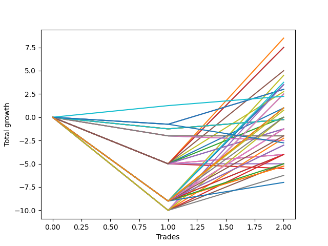

# Long Labrador 008 
- Symbol: ES_900-930
- Date Range: 03/18/2022 - 12/30/2022
- Trading Period: 9:0-9:30
- Number of Trades: 2



| Name | Win Percent | Profit | Avg Profit / Trade | Avg Time / Trade |      | Name | Win Percent | Profit | Avg Profit / Trade | Avg Time / Trade |
| ---- | ----------- | ------ | ------------------ | ---------------- | ---- | ---- | ----------- | ------ | ------------------ | ---------------- |
| Sorted By <br> Profit | | | | | | Sorted By <br> Win Percentage ||||
| V U/L 1SD SL-5 | 50.00 | 4250.00 | 2125.00 | 21:27 |     | TP-1 | 100.00 | 1125.00 | 562.50 | 07:20 |
| BB-100 U/L 2SD SL-5 | 50.00 | 3750.00 | 1875.00 | 20:22 |     | V U/L 1SD SL-5 | 50.00 | 4250.00 | 2125.00 | 21:27 |
| BB-50 U/L 2SD SL-5 | 50.00 | 3750.00 | 1875.00 | 20:22 |     | BB-100 U/L 2SD SL-5 | 50.00 | 3750.00 | 1875.00 | 20:22 |
| BB-200 U/L 2SD SL-5 | 50.00 | 2500.00 | 1250.00 | 35:07 |     | BB-50 U/L 2SD SL-5 | 50.00 | 3750.00 | 1875.00 | 20:22 |
| V U/L 1SD | 50.00 | 2250.00 | 1125.00 | 47:15 |     | BB-200 U/L 2SD SL-5 | 50.00 | 2500.00 | 1250.00 | 35:07 |
| NEWFI 000 | 50.00 | 1875.00 | 937.50 | 49:00 |     | V U/L 1SD | 50.00 | 2250.00 | 1125.00 | 47:15 |
| V U/L 1SD SL-10 | 50.00 | 1750.00 | 875.00 | 46:07 |     | NEWFI 000 | 50.00 | 1875.00 | 937.50 | 49:00 |
| BB-100 U/L 2SD | 50.00 | 1750.00 | 875.00 | 46:10 |     | V U/L 1SD SL-10 | 50.00 | 1750.00 | 875.00 | 46:07 |
| BB-50 U/L 2SD | 50.00 | 1750.00 | 875.00 | 46:10 |     | BB-100 U/L 2SD | 50.00 | 1750.00 | 875.00 | 46:10 |
| BB-50 Mid SL-10 | 50.00 | 1500.00 | 750.00 | 21:12 |     | BB-50 U/L 2SD | 50.00 | 1750.00 | 875.00 | 46:10 |
| BB-50 Mid | 50.00 | 1500.00 | 750.00 | 21:12 |     | BB-50 Mid SL-10 | 50.00 | 1500.00 | 750.00 | 21:12 |
| BB-50 U/L 1SD SL-5 | 50.00 | 1375.00 | 687.50 | 13:35 |     | BB-50 Mid | 50.00 | 1500.00 | 750.00 | 21:12 |
| BB-100 U/L 2SD SL-10 | 50.00 | 1250.00 | 625.00 | 45:02 |     | BB-50 U/L 1SD SL-5 | 50.00 | 1375.00 | 687.50 | 13:35 |
| BB-50 U/L 2SD SL-10 | 50.00 | 1250.00 | 625.00 | 45:02 |     | BB-100 U/L 2SD SL-10 | 50.00 | 1250.00 | 625.00 | 45:02 |
| TP-1 | 100.00 | 1125.00 | 562.50 | 07:20 |     | BB-50 U/L 2SD SL-10 | 50.00 | 1250.00 | 625.00 | 45:02 |
| NEWFI 06 | 50.00 | 500.00 | 250.00 | 60:55 |     | NEWFI 06 | 50.00 | 500.00 | 250.00 | 60:55 |
| V Mid SL-5 | 50.00 | 500.00 | 250.00 | 13:05 |     | V Mid SL-5 | 50.00 | 500.00 | 250.00 | 13:05 |
| BB-200 U/L 2SD | 50.00 | 500.00 | 250.00 | 60:55 |     | BB-200 U/L 2SD | 50.00 | 500.00 | 250.00 | 60:55 |
| TP-10 | 50.00 | 375.00 | 187.50 | 44:37 |     | TP-10 | 50.00 | 375.00 | 187.50 | 44:37 |
| TP-9 | 50.00 | 0.00 | 0.00 | 40:00 |     | TP-9 | 50.00 | 0.00 | 0.00 | 40:00 |
| BB-200 U/L 2SD SL-10 | 50.00 | 0.00 | 0.00 | 59:47 |     | BB-200 U/L 2SD SL-10 | 50.00 | 0.00 | 0.00 | 59:47 |
| BB-100 Mid SL-5 | 50.00 | 0.00 | 0.00 | 11:42 |     | BB-100 Mid SL-5 | 50.00 | 0.00 | 0.00 | 11:42 |
| BB-20 U/L 2SD C SL-10 | 50.00 | -125.00 | -62.50 | 19:57 |     | BB-20 U/L 2SD C SL-10 | 50.00 | -125.00 | -62.50 | 19:57 |
| BB-20 U/L 2SD SL-10 | 50.00 | -125.00 | -62.50 | 19:57 |     | BB-20 U/L 2SD SL-10 | 50.00 | -125.00 | -62.50 | 19:57 |
| BB-20 U/L 2SD C | 50.00 | -125.00 | -62.50 | 19:57 |     | BB-20 U/L 2SD C | 50.00 | -125.00 | -62.50 | 19:57 |
| BB-20 U/L 2SD | 50.00 | -125.00 | -62.50 | 19:57 |     | BB-20 U/L 2SD | 50.00 | -125.00 | -62.50 | 19:57 |
| TP-8 | 50.00 | -625.00 | -312.50 | 39:22 |     | TP-8 | 50.00 | -625.00 | -312.50 | 39:22 |
| BB-200 Mid SL-5 | 50.00 | -625.00 | -312.50 | 11:30 |     | BB-200 Mid SL-5 | 50.00 | -625.00 | -312.50 | 11:30 |
| BB-50 Mid SL-5 | 50.00 | -625.00 | -312.50 | 11:30 |     | BB-50 Mid SL-5 | 50.00 | -625.00 | -312.50 | 11:30 |
| BB-50 U/L 1SD | 50.00 | -625.00 | -312.50 | 39:22 |     | BB-50 U/L 1SD | 50.00 | -625.00 | -312.50 | 39:22 |
| TP-7 | 50.00 | -1000.00 | -500.00 | 39:07 |     | TP-7 | 50.00 | -1000.00 | -500.00 | 39:07 |
| BB-20 U/L 1SD SL-10 | 50.00 | -1000.00 | -500.00 | 18:05 |     | BB-20 U/L 1SD SL-10 | 50.00 | -1000.00 | -500.00 | 18:05 |
| BB-20 U/L 1SD | 50.00 | -1000.00 | -500.00 | 18:05 |     | BB-20 U/L 1SD | 50.00 | -1000.00 | -500.00 | 18:05 |
| BB-50 U/L 1SD SL-10 | 50.00 | -1125.00 | -562.50 | 38:15 |     | BB-50 U/L 1SD SL-10 | 50.00 | -1125.00 | -562.50 | 38:15 |
| BB-20 Mid SL-10 | 0.00 | -1250.00 | -625.00 | 13:42 |     | TP-6 | 50.00 | -1500.00 | -750.00 | 38:52 |
| BB-20 Mid | 0.00 | -1250.00 | -625.00 | 13:42 |     | V Mid | 50.00 | -1500.00 | -750.00 | 38:52 |
| NEWFI 0000 | 0.00 | -1375.00 | -687.50 | 07:05 |     | TP-5 | 50.00 | -2000.00 | -1000.00 | 37:30 |
| TP-6 | 50.00 | -1500.00 | -750.00 | 38:52 |     | V Mid SL-10 | 50.00 | -2000.00 | -1000.00 | 37:45 |
| V Mid | 50.00 | -1500.00 | -750.00 | 38:52 |     | BB-20 U/L 2SD C SL-5 | 50.00 | -2000.00 | -1000.00 | 10:57 |
| TP-5 | 50.00 | -2000.00 | -1000.00 | 37:30 |     | BB-20 U/L 2SD SL-5 | 50.00 | -2000.00 | -1000.00 | 10:57 |
| V Mid SL-10 | 50.00 | -2000.00 | -1000.00 | 37:45 |     | BB-100 Mid | 50.00 | -2000.00 | -1000.00 | 37:30 |
| BB-20 U/L 2SD C SL-5 | 50.00 | -2000.00 | -1000.00 | 10:57 |     | TP-4 | 50.00 | -2500.00 | -1250.00 | 37:22 |
| BB-20 U/L 2SD SL-5 | 50.00 | -2000.00 | -1000.00 | 10:57 |     | BB-100 Mid SL-10 | 50.00 | -2500.00 | -1250.00 | 36:22 |
| BB-100 Mid | 50.00 | -2000.00 | -1000.00 | 37:30 |     | BB-20 U/L 1SD SL-5 | 50.00 | -2500.00 | -1250.00 | 10:42 |
| TP-4 | 50.00 | -2500.00 | -1250.00 | 37:22 |     | TP-3 | 50.00 | -2625.00 | -1312.50 | 37:17 |
| BB-100 Mid SL-10 | 50.00 | -2500.00 | -1250.00 | 36:22 |     | BB-200 Mid | 50.00 | -2625.00 | -1312.50 | 37:17 |
| BB-20 U/L 1SD SL-5 | 50.00 | -2500.00 | -1250.00 | 10:42 |     | BB-200 Mid SL-10 | 50.00 | -3125.00 | -1562.50 | 36:10 |
| TP-3 | 50.00 | -2625.00 | -1312.50 | 37:17 |     | TP-2 | 50.00 | -3500.00 | -1750.00 | 37:12 |
| BB-200 Mid | 50.00 | -2625.00 | -1312.50 | 37:17 |     | BB-20 Mid SL-10 | 0.00 | -1250.00 | -625.00 | 13:42 |
| BB-20 Mid SL-5 | 0.00 | -2750.00 | -1375.00 | 10:35 |     | BB-20 Mid | 0.00 | -1250.00 | -625.00 | 13:42 |
| BB-200 Mid SL-10 | 50.00 | -3125.00 | -1562.50 | 36:10 |     | NEWFI 0000 | 0.00 | -1375.00 | -687.50 | 07:05 |
| TP-2 | 50.00 | -3500.00 | -1750.00 | 37:12 |     | BB-20 Mid SL-5 | 0.00 | -2750.00 | -1375.00 | 10:35 |

## NO STOPLOSS

### Test BB-20 Mid
* Sell when price hits the middle line of the 20p bollinger
* No Stoploss
* Results:
```
Total Trades: 2
Percent Up: 0.00
Percent Down: 100.00
Total Points Moved Up: -2.50
Potential Profit: -1250.00
Total Points Ups: 0.00 Count Ups: 0
Total Points Downs: -2.50 Count Downs: 2
```

<details><summary>Trades</summary>

<code>In: 2022-03-31 09:17:00		Out: 2022-03-31 09:32:35		Total Position Time: 15:35		Total Move Up: -2.00		Total to Date: -2.00</code> <br />
<code>In: 2022-04-20 09:19:00		Out: 2022-04-20 09:30:50		Total Position Time: 11:50		Total Move Up: -0.50		Total to Date: -2.50</code> <br />


</details>

### Test BB-20 U/L 1SD
* Sell when the price hits the upper line of the 20p 1std bollinger
* No Stoploss
* Results:
```
Total Trades: 2
Percent Up: 50.00
Percent Down: 50.00
Total Points Moved Up: -2.00
Potential Profit: -1000.00
Total Points Ups: 0.00 Count Ups: 1
Total Points Downs: -2.00 Count Downs: 1
```

<details><summary>Trades</summary>

<code>In: 2022-03-31 09:17:00		Out: 2022-03-31 09:41:05		Total Position Time: 24:05		Total Move Up: -2.00		Total to Date: -2.00</code> <br />
<code>In: 2022-04-20 09:19:00		Out: 2022-04-20 09:31:05		Total Position Time: 12:05		Total Move Up: 0.00		Total to Date: -2.00</code> <br />


</details>

### Test BB-20 U/L 2SD
* Sell when the price hits the upper line of the 20p 2std bollinger
* No Stoploss
* Results:
```
Total Trades: 2
Percent Up: 50.00
Percent Down: 50.00
Total Points Moved Up: -0.25
Potential Profit: -125.00
Total Points Ups: 1.00 Count Ups: 1
Total Points Downs: -1.25 Count Downs: 1
```

<details><summary>Trades</summary>

<code>In: 2022-03-31 09:17:00		Out: 2022-03-31 09:44:20		Total Position Time: 27:20		Total Move Up: -1.25		Total to Date: -1.25</code> <br />
<code>In: 2022-04-20 09:19:00		Out: 2022-04-20 09:31:35		Total Position Time: 12:35		Total Move Up: 1.00		Total to Date: -0.25</code> <br />


</details>

### Test BB-20 U/L 2SD C
* Sell when the price hits the upper line of the 20p 2std bollinger
* No Stoploss
* Results:
```
Total Trades: 2
Percent Up: 50.00
Percent Down: 50.00
Total Points Moved Up: -0.25
Potential Profit: -125.00
Total Points Ups: 1.00 Count Ups: 1
Total Points Downs: -1.25 Count Downs: 1
```

<details><summary>Trades</summary>

<code>In: 2022-03-31 09:17:00		Out: 2022-03-31 09:44:20		Total Position Time: 27:20		Total Move Up: -1.25		Total to Date: -1.25</code> <br />
<code>In: 2022-04-20 09:19:00		Out: 2022-04-20 09:31:35		Total Position Time: 12:35		Total Move Up: 1.00		Total to Date: -0.25</code> <br />


</details>

### Test BB-50 Mid
* Sell when price hits the middle line of the 50p bollinger
* No Stoploss
* Results:
```
Total Trades: 2
Percent Up: 50.00
Percent Down: 50.00
Total Points Moved Up: 3.00
Potential Profit: 1500.00
Total Points Ups: 3.75 Count Ups: 1
Total Points Downs: -0.75 Count Downs: 1
```

<details><summary>Trades</summary>

<code>In: 2022-03-31 09:17:00		Out: 2022-03-31 09:45:45		Total Position Time: 28:45		Total Move Up: -0.75		Total to Date: -0.75</code> <br />
<code>In: 2022-04-20 09:19:00		Out: 2022-04-20 09:32:40		Total Position Time: 13:40		Total Move Up: 3.75		Total to Date: 3.00</code> <br />


</details>

### Test BB-50 U/L 1SD
* Sell when the price hits the upper line of the 50p 1std bollinger
* No Stoploss
* Results:
```
Total Trades: 2
Percent Up: 50.00
Percent Down: 50.00
Total Points Moved Up: -1.25
Potential Profit: -625.00
Total Points Ups: 7.75 Count Ups: 1
Total Points Downs: -9.00 Count Downs: 1
```

<details><summary>Trades</summary>

<code>In: 2022-03-31 09:17:00		Out: 2022-03-31 10:17:55		Total Position Time: 60:55		Total Move Up: -9.00		Total to Date: -9.00</code> <br />
<code>In: 2022-04-20 09:19:00		Out: 2022-04-20 09:36:50		Total Position Time: 17:50		Total Move Up: 7.75		Total to Date: -1.25</code> <br />


</details>

### Test BB-50 U/L 2SD
* Sell when the price hits the upper line of the 50p 2std bollinger
* No Stoploss
* Results:
```
Total Trades: 2
Percent Up: 50.00
Percent Down: 50.00
Total Points Moved Up: 3.50
Potential Profit: 1750.00
Total Points Ups: 12.50 Count Ups: 1
Total Points Downs: -9.00 Count Downs: 1
```

<details><summary>Trades</summary>

<code>In: 2022-03-31 09:17:00		Out: 2022-03-31 10:17:55		Total Position Time: 60:55		Total Move Up: -9.00		Total to Date: -9.00</code> <br />
<code>In: 2022-04-20 09:19:00		Out: 2022-04-20 09:50:25		Total Position Time: 31:25		Total Move Up: 12.50		Total to Date: 3.50</code> <br />


</details>

### Test V Mid
* Sell when the price hits the middle line of the 1std VWAP
* No Stoploss
* Results:
```
Total Trades: 2
Percent Up: 50.00
Percent Down: 50.00
Total Points Moved Up: -3.00
Potential Profit: -1500.00
Total Points Ups: 6.00 Count Ups: 1
Total Points Downs: -9.00 Count Downs: 1
```

<details><summary>Trades</summary>

<code>In: 2022-03-31 09:17:00		Out: 2022-03-31 10:17:55		Total Position Time: 60:55		Total Move Up: -9.00		Total to Date: -9.00</code> <br />
<code>In: 2022-04-20 09:19:00		Out: 2022-04-20 09:35:50		Total Position Time: 16:50		Total Move Up: 6.00		Total to Date: -3.00</code> <br />


</details>

### Test V U/L 1SD
* Sell when the price hits the upper line of the 1std VWAP
* No Stoploss
* Results:
```
Total Trades: 2
Percent Up: 50.00
Percent Down: 50.00
Total Points Moved Up: 4.50
Potential Profit: 2250.00
Total Points Ups: 13.50 Count Ups: 1
Total Points Downs: -9.00 Count Downs: 1
```

<details><summary>Trades</summary>

<code>In: 2022-03-31 09:17:00		Out: 2022-03-31 10:17:55		Total Position Time: 60:55		Total Move Up: -9.00		Total to Date: -9.00</code> <br />
<code>In: 2022-04-20 09:19:00		Out: 2022-04-20 09:52:35		Total Position Time: 33:35		Total Move Up: 13.50		Total to Date: 4.50</code> <br />


</details>

### Test BB-100 Mid
* Move to BB100 Mid
* No Stoploss
* Results:
```
Total Trades: 2
Percent Up: 50.00
Percent Down: 50.00
Total Points Moved Up: -4.00
Potential Profit: -2000.00
Total Points Ups: 5.00 Count Ups: 1
Total Points Downs: -9.00 Count Downs: 1
```

<details><summary>Trades</summary>

<code>In: 2022-03-31 09:17:00		Out: 2022-03-31 10:17:55		Total Position Time: 60:55		Total Move Up: -9.00		Total to Date: -9.00</code> <br />
<code>In: 2022-04-20 09:19:00		Out: 2022-04-20 09:33:05		Total Position Time: 14:05		Total Move Up: 5.00		Total to Date: -4.00</code> <br />


</details>

### Test BB-100 U/L 2SD
* Move to BB100 Upper Band
* No Stoploss
* Results:
```
Total Trades: 2
Percent Up: 50.00
Percent Down: 50.00
Total Points Moved Up: 3.50
Potential Profit: 1750.00
Total Points Ups: 12.50 Count Ups: 1
Total Points Downs: -9.00 Count Downs: 1
```

<details><summary>Trades</summary>

<code>In: 2022-03-31 09:17:00		Out: 2022-03-31 10:17:55		Total Position Time: 60:55		Total Move Up: -9.00		Total to Date: -9.00</code> <br />
<code>In: 2022-04-20 09:19:00		Out: 2022-04-20 09:50:25		Total Position Time: 31:25		Total Move Up: 12.50		Total to Date: 3.50</code> <br />


</details>

### Test BB-200 Mid
* Move to BB200 Mid
* No Stoploss
* Results:
```
Total Trades: 2
Percent Up: 50.00
Percent Down: 50.00
Total Points Moved Up: -5.25
Potential Profit: -2625.00
Total Points Ups: 3.75 Count Ups: 1
Total Points Downs: -9.00 Count Downs: 1
```

<details><summary>Trades</summary>

<code>In: 2022-03-31 09:17:00		Out: 2022-03-31 10:17:55		Total Position Time: 60:55		Total Move Up: -9.00		Total to Date: -9.00</code> <br />
<code>In: 2022-04-20 09:19:00		Out: 2022-04-20 09:32:40		Total Position Time: 13:40		Total Move Up: 3.75		Total to Date: -5.25</code> <br />


</details>

### Test BB-200 U/L 2SD
* Move to BB200 Upper Band
* No Stoploss
* Results:
```
Total Trades: 2
Percent Up: 50.00
Percent Down: 50.00
Total Points Moved Up: 1.00
Potential Profit: 500.00
Total Points Ups: 10.00 Count Ups: 1
Total Points Downs: -9.00 Count Downs: 1
```

<details><summary>Trades</summary>

<code>In: 2022-03-31 09:17:00		Out: 2022-03-31 10:17:55		Total Position Time: 60:55		Total Move Up: -9.00		Total to Date: -9.00</code> <br />
<code>In: 2022-04-20 09:19:00		Out: 2022-04-20 10:19:55		Total Position Time: 60:55		Total Move Up: 10.00		Total to Date: 1.00</code> <br />


</details>

## STOPLOSS OF 5

### Test BB-20 Mid SL-5
* Sell when price hits the middle line of the 20p bollinger
* Stoploss is 5 points
* Results:
```
Total Trades: 2
Percent Up: 0.00
Percent Down: 100.00
Total Points Moved Up: -5.50
Potential Profit: -2750.00
Total Points Ups: 0.00 Count Ups: 0
Total Points Downs: -5.50 Count Downs: 2
```

<details><summary>Trades</summary>

<code>In: 2022-03-31 09:17:00		Out: 2022-03-31 09:26:20		Total Position Time: 09:20		Total Move Up: -5.00		Total to Date: -5.00</code> <br />
<code>In: 2022-04-20 09:19:00		Out: 2022-04-20 09:30:50		Total Position Time: 11:50		Total Move Up: -0.50		Total to Date: -5.50</code> <br />


</details>

### Test BB-20 U/L 1SD SL-5
* Sell when the price hits the upper line of the 20p 1std bollinger
* Stoploss is 5 points
* Results:
```
Total Trades: 2
Percent Up: 50.00
Percent Down: 50.00
Total Points Moved Up: -5.00
Potential Profit: -2500.00
Total Points Ups: 0.00 Count Ups: 1
Total Points Downs: -5.00 Count Downs: 1
```

<details><summary>Trades</summary>

<code>In: 2022-03-31 09:17:00		Out: 2022-03-31 09:26:20		Total Position Time: 09:20		Total Move Up: -5.00		Total to Date: -5.00</code> <br />
<code>In: 2022-04-20 09:19:00		Out: 2022-04-20 09:31:05		Total Position Time: 12:05		Total Move Up: 0.00		Total to Date: -5.00</code> <br />


</details>

### Test BB-20 U/L 2SD SL-5
* Sell when the price hits the upper line of the 20p 2std bollinger
* Stoploss is 5 points
* Results:
```
Total Trades: 2
Percent Up: 50.00
Percent Down: 50.00
Total Points Moved Up: -4.00
Potential Profit: -2000.00
Total Points Ups: 1.00 Count Ups: 1
Total Points Downs: -5.00 Count Downs: 1
```

<details><summary>Trades</summary>

<code>In: 2022-03-31 09:17:00		Out: 2022-03-31 09:26:20		Total Position Time: 09:20		Total Move Up: -5.00		Total to Date: -5.00</code> <br />
<code>In: 2022-04-20 09:19:00		Out: 2022-04-20 09:31:35		Total Position Time: 12:35		Total Move Up: 1.00		Total to Date: -4.00</code> <br />


</details>

### Test BB-20 U/L 2SD C SL-5
* Sell when the price hits the upper line of the 20p 2std bollinger
* Stoploss is 5 points
* Results:
```
Total Trades: 2
Percent Up: 50.00
Percent Down: 50.00
Total Points Moved Up: -4.00
Potential Profit: -2000.00
Total Points Ups: 1.00 Count Ups: 1
Total Points Downs: -5.00 Count Downs: 1
```

<details><summary>Trades</summary>

<code>In: 2022-03-31 09:17:00		Out: 2022-03-31 09:26:20		Total Position Time: 09:20		Total Move Up: -5.00		Total to Date: -5.00</code> <br />
<code>In: 2022-04-20 09:19:00		Out: 2022-04-20 09:31:35		Total Position Time: 12:35		Total Move Up: 1.00		Total to Date: -4.00</code> <br />


</details>

### Test BB-50 Mid SL-5
* Sell when price hits the middle line of the 50p bollinger
* Stoploss is 5 points
* Results:
```
Total Trades: 2
Percent Up: 50.00
Percent Down: 50.00
Total Points Moved Up: -1.25
Potential Profit: -625.00
Total Points Ups: 3.75 Count Ups: 1
Total Points Downs: -5.00 Count Downs: 1
```

<details><summary>Trades</summary>

<code>In: 2022-03-31 09:17:00		Out: 2022-03-31 09:26:20		Total Position Time: 09:20		Total Move Up: -5.00		Total to Date: -5.00</code> <br />
<code>In: 2022-04-20 09:19:00		Out: 2022-04-20 09:32:40		Total Position Time: 13:40		Total Move Up: 3.75		Total to Date: -1.25</code> <br />


</details>

### Test BB-50 U/L 1SD SL-5
* Sell when the price hits the upper line of the 50p 1std bollinger
* Stoploss is 5 points
* Results:
```
Total Trades: 2
Percent Up: 50.00
Percent Down: 50.00
Total Points Moved Up: 2.75
Potential Profit: 1375.00
Total Points Ups: 7.75 Count Ups: 1
Total Points Downs: -5.00 Count Downs: 1
```

<details><summary>Trades</summary>

<code>In: 2022-03-31 09:17:00		Out: 2022-03-31 09:26:20		Total Position Time: 09:20		Total Move Up: -5.00		Total to Date: -5.00</code> <br />
<code>In: 2022-04-20 09:19:00		Out: 2022-04-20 09:36:50		Total Position Time: 17:50		Total Move Up: 7.75		Total to Date: 2.75</code> <br />


</details>

### Test BB-50 U/L 2SD SL-5
* Sell when the price hits the upper line of the 50p 2std bollinger
* Stoploss is 5 points
* Results:
```
Total Trades: 2
Percent Up: 50.00
Percent Down: 50.00
Total Points Moved Up: 7.50
Potential Profit: 3750.00
Total Points Ups: 12.50 Count Ups: 1
Total Points Downs: -5.00 Count Downs: 1
```

<details><summary>Trades</summary>

<code>In: 2022-03-31 09:17:00		Out: 2022-03-31 09:26:20		Total Position Time: 09:20		Total Move Up: -5.00		Total to Date: -5.00</code> <br />
<code>In: 2022-04-20 09:19:00		Out: 2022-04-20 09:50:25		Total Position Time: 31:25		Total Move Up: 12.50		Total to Date: 7.50</code> <br />


</details>

### Test V Mid SL-5
* Sell when the price hits the middle line of the 1std VWAP
* Stoploss is 5 points
* Results:
```
Total Trades: 2
Percent Up: 50.00
Percent Down: 50.00
Total Points Moved Up: 1.00
Potential Profit: 500.00
Total Points Ups: 6.00 Count Ups: 1
Total Points Downs: -5.00 Count Downs: 1
```

<details><summary>Trades</summary>

<code>In: 2022-03-31 09:17:00		Out: 2022-03-31 09:26:20		Total Position Time: 09:20		Total Move Up: -5.00		Total to Date: -5.00</code> <br />
<code>In: 2022-04-20 09:19:00		Out: 2022-04-20 09:35:50		Total Position Time: 16:50		Total Move Up: 6.00		Total to Date: 1.00</code> <br />


</details>

### Test V U/L 1SD SL-5
* Sell when the price hits the upper line of the 1std VWAP
* Stoploss is 5 points
* Results:
```
Total Trades: 2
Percent Up: 50.00
Percent Down: 50.00
Total Points Moved Up: 8.50
Potential Profit: 4250.00
Total Points Ups: 13.50 Count Ups: 1
Total Points Downs: -5.00 Count Downs: 1
```

<details><summary>Trades</summary>

<code>In: 2022-03-31 09:17:00		Out: 2022-03-31 09:26:20		Total Position Time: 09:20		Total Move Up: -5.00		Total to Date: -5.00</code> <br />
<code>In: 2022-04-20 09:19:00		Out: 2022-04-20 09:52:35		Total Position Time: 33:35		Total Move Up: 13.50		Total to Date: 8.50</code> <br />


</details>

### Test BB-100 Mid SL-5
* Move to BB100 Mid
* Stoploss is 5 points
* Results:
```
Total Trades: 2
Percent Up: 50.00
Percent Down: 50.00
Total Points Moved Up: 0.00
Potential Profit: 0.00
Total Points Ups: 5.00 Count Ups: 1
Total Points Downs: -5.00 Count Downs: 1
```

<details><summary>Trades</summary>

<code>In: 2022-03-31 09:17:00		Out: 2022-03-31 09:26:20		Total Position Time: 09:20		Total Move Up: -5.00		Total to Date: -5.00</code> <br />
<code>In: 2022-04-20 09:19:00		Out: 2022-04-20 09:33:05		Total Position Time: 14:05		Total Move Up: 5.00		Total to Date: 0.00</code> <br />


</details>

### Test BB-100 U/L 2SD SL-5
* Move to BB100 Upper Band
* Stoploss is 5 points
* Results:
```
Total Trades: 2
Percent Up: 50.00
Percent Down: 50.00
Total Points Moved Up: 7.50
Potential Profit: 3750.00
Total Points Ups: 12.50 Count Ups: 1
Total Points Downs: -5.00 Count Downs: 1
```

<details><summary>Trades</summary>

<code>In: 2022-03-31 09:17:00		Out: 2022-03-31 09:26:20		Total Position Time: 09:20		Total Move Up: -5.00		Total to Date: -5.00</code> <br />
<code>In: 2022-04-20 09:19:00		Out: 2022-04-20 09:50:25		Total Position Time: 31:25		Total Move Up: 12.50		Total to Date: 7.50</code> <br />


</details>

### Test BB-200 Mid SL-5
* Move to BB200 Mid
* Stoploss is 5 points
* Results:
```
Total Trades: 2
Percent Up: 50.00
Percent Down: 50.00
Total Points Moved Up: -1.25
Potential Profit: -625.00
Total Points Ups: 3.75 Count Ups: 1
Total Points Downs: -5.00 Count Downs: 1
```

<details><summary>Trades</summary>

<code>In: 2022-03-31 09:17:00		Out: 2022-03-31 09:26:20		Total Position Time: 09:20		Total Move Up: -5.00		Total to Date: -5.00</code> <br />
<code>In: 2022-04-20 09:19:00		Out: 2022-04-20 09:32:40		Total Position Time: 13:40		Total Move Up: 3.75		Total to Date: -1.25</code> <br />


</details>

### Test BB-200 U/L 2SD SL-5
* Move to BB200 Upper Band
* Stoploss is 5 points
* Results:
```
Total Trades: 2
Percent Up: 50.00
Percent Down: 50.00
Total Points Moved Up: 5.00
Potential Profit: 2500.00
Total Points Ups: 10.00 Count Ups: 1
Total Points Downs: -5.00 Count Downs: 1
```

<details><summary>Trades</summary>

<code>In: 2022-03-31 09:17:00		Out: 2022-03-31 09:26:20		Total Position Time: 09:20		Total Move Up: -5.00		Total to Date: -5.00</code> <br />
<code>In: 2022-04-20 09:19:00		Out: 2022-04-20 10:19:55		Total Position Time: 60:55		Total Move Up: 10.00		Total to Date: 5.00</code> <br />


</details>

## STOPLOSS OF 10

### Test BB-20 Mid SL-10
* Sell when price hits the middle line of the 20p bollinger
* Stoploss is 10 points
* Results:
```
Total Trades: 2
Percent Up: 0.00
Percent Down: 100.00
Total Points Moved Up: -2.50
Potential Profit: -1250.00
Total Points Ups: 0.00 Count Ups: 0
Total Points Downs: -2.50 Count Downs: 2
```

<details><summary>Trades</summary>

<code>In: 2022-03-31 09:17:00		Out: 2022-03-31 09:32:35		Total Position Time: 15:35		Total Move Up: -2.00		Total to Date: -2.00</code> <br />
<code>In: 2022-04-20 09:19:00		Out: 2022-04-20 09:30:50		Total Position Time: 11:50		Total Move Up: -0.50		Total to Date: -2.50</code> <br />


</details>

### Test BB-20 U/L 1SD SL-10
* Sell when the price hits the upper line of the 20p 1std bollinger
* Stoploss is 10 points
* Results:
```
Total Trades: 2
Percent Up: 50.00
Percent Down: 50.00
Total Points Moved Up: -2.00
Potential Profit: -1000.00
Total Points Ups: 0.00 Count Ups: 1
Total Points Downs: -2.00 Count Downs: 1
```

<details><summary>Trades</summary>

<code>In: 2022-03-31 09:17:00		Out: 2022-03-31 09:41:05		Total Position Time: 24:05		Total Move Up: -2.00		Total to Date: -2.00</code> <br />
<code>In: 2022-04-20 09:19:00		Out: 2022-04-20 09:31:05		Total Position Time: 12:05		Total Move Up: 0.00		Total to Date: -2.00</code> <br />


</details>

### Test BB-20 U/L 2SD SL-10
* Sell when the price hits the upper line of the 20p 2std bollinger
* Stoploss is 10 points
* Results:
```
Total Trades: 2
Percent Up: 50.00
Percent Down: 50.00
Total Points Moved Up: -0.25
Potential Profit: -125.00
Total Points Ups: 1.00 Count Ups: 1
Total Points Downs: -1.25 Count Downs: 1
```

<details><summary>Trades</summary>

<code>In: 2022-03-31 09:17:00		Out: 2022-03-31 09:44:20		Total Position Time: 27:20		Total Move Up: -1.25		Total to Date: -1.25</code> <br />
<code>In: 2022-04-20 09:19:00		Out: 2022-04-20 09:31:35		Total Position Time: 12:35		Total Move Up: 1.00		Total to Date: -0.25</code> <br />


</details>

### Test BB-20 U/L 2SD C SL-10
* Sell when the price hits the upper line of the 20p 2std bollinger
* Stoploss is 10 points
* Results:
```
Total Trades: 2
Percent Up: 50.00
Percent Down: 50.00
Total Points Moved Up: -0.25
Potential Profit: -125.00
Total Points Ups: 1.00 Count Ups: 1
Total Points Downs: -1.25 Count Downs: 1
```

<details><summary>Trades</summary>

<code>In: 2022-03-31 09:17:00		Out: 2022-03-31 09:44:20		Total Position Time: 27:20		Total Move Up: -1.25		Total to Date: -1.25</code> <br />
<code>In: 2022-04-20 09:19:00		Out: 2022-04-20 09:31:35		Total Position Time: 12:35		Total Move Up: 1.00		Total to Date: -0.25</code> <br />


</details>

### Test BB-50 Mid SL-10
* Sell when price hits the middle line of the 50p bollinger
* Stoploss is 10 points
* Results:
```
Total Trades: 2
Percent Up: 50.00
Percent Down: 50.00
Total Points Moved Up: 3.00
Potential Profit: 1500.00
Total Points Ups: 3.75 Count Ups: 1
Total Points Downs: -0.75 Count Downs: 1
```

<details><summary>Trades</summary>

<code>In: 2022-03-31 09:17:00		Out: 2022-03-31 09:45:45		Total Position Time: 28:45		Total Move Up: -0.75		Total to Date: -0.75</code> <br />
<code>In: 2022-04-20 09:19:00		Out: 2022-04-20 09:32:40		Total Position Time: 13:40		Total Move Up: 3.75		Total to Date: 3.00</code> <br />


</details>

### Test BB-50 U/L 1SD SL-10
* Sell when the price hits the upper line of the 50p 1std bollinger
* Stoploss is 10 points
* Results:
```
Total Trades: 2
Percent Up: 50.00
Percent Down: 50.00
Total Points Moved Up: -2.25
Potential Profit: -1125.00
Total Points Ups: 7.75 Count Ups: 1
Total Points Downs: -10.00 Count Downs: 1
```

<details><summary>Trades</summary>

<code>In: 2022-03-31 09:17:00		Out: 2022-03-31 10:15:40		Total Position Time: 58:40		Total Move Up: -10.00		Total to Date: -10.00</code> <br />
<code>In: 2022-04-20 09:19:00		Out: 2022-04-20 09:36:50		Total Position Time: 17:50		Total Move Up: 7.75		Total to Date: -2.25</code> <br />


</details>

### Test BB-50 U/L 2SD SL-10
* Sell when the price hits the upper line of the 50p 2std bollinger
* Stoploss is 10 points
* Results:
```
Total Trades: 2
Percent Up: 50.00
Percent Down: 50.00
Total Points Moved Up: 2.50
Potential Profit: 1250.00
Total Points Ups: 12.50 Count Ups: 1
Total Points Downs: -10.00 Count Downs: 1
```

<details><summary>Trades</summary>

<code>In: 2022-03-31 09:17:00		Out: 2022-03-31 10:15:40		Total Position Time: 58:40		Total Move Up: -10.00		Total to Date: -10.00</code> <br />
<code>In: 2022-04-20 09:19:00		Out: 2022-04-20 09:50:25		Total Position Time: 31:25		Total Move Up: 12.50		Total to Date: 2.50</code> <br />


</details>

### Test V Mid SL-10
* Sell when the price hits the middle line of the 1std VWAP
* Stoploss is 10 points
* Results:
```
Total Trades: 2
Percent Up: 50.00
Percent Down: 50.00
Total Points Moved Up: -4.00
Potential Profit: -2000.00
Total Points Ups: 6.00 Count Ups: 1
Total Points Downs: -10.00 Count Downs: 1
```

<details><summary>Trades</summary>

<code>In: 2022-03-31 09:17:00		Out: 2022-03-31 10:15:40		Total Position Time: 58:40		Total Move Up: -10.00		Total to Date: -10.00</code> <br />
<code>In: 2022-04-20 09:19:00		Out: 2022-04-20 09:35:50		Total Position Time: 16:50		Total Move Up: 6.00		Total to Date: -4.00</code> <br />


</details>

### Test V U/L 1SD SL-10
* Sell when the price hits the upper line of the 1std VWAP
* Stoploss is 10 points
* Results:
```
Total Trades: 2
Percent Up: 50.00
Percent Down: 50.00
Total Points Moved Up: 3.50
Potential Profit: 1750.00
Total Points Ups: 13.50 Count Ups: 1
Total Points Downs: -10.00 Count Downs: 1
```

<details><summary>Trades</summary>

<code>In: 2022-03-31 09:17:00		Out: 2022-03-31 10:15:40		Total Position Time: 58:40		Total Move Up: -10.00		Total to Date: -10.00</code> <br />
<code>In: 2022-04-20 09:19:00		Out: 2022-04-20 09:52:35		Total Position Time: 33:35		Total Move Up: 13.50		Total to Date: 3.50</code> <br />


</details>

### Test BB-100 Mid SL-10
* Move to BB100 Mid
* Stoploss is 10 points
* Results:
```
Total Trades: 2
Percent Up: 50.00
Percent Down: 50.00
Total Points Moved Up: -5.00
Potential Profit: -2500.00
Total Points Ups: 5.00 Count Ups: 1
Total Points Downs: -10.00 Count Downs: 1
```

<details><summary>Trades</summary>

<code>In: 2022-03-31 09:17:00		Out: 2022-03-31 10:15:40		Total Position Time: 58:40		Total Move Up: -10.00		Total to Date: -10.00</code> <br />
<code>In: 2022-04-20 09:19:00		Out: 2022-04-20 09:33:05		Total Position Time: 14:05		Total Move Up: 5.00		Total to Date: -5.00</code> <br />


</details>

### Test BB-100 U/L 2SD SL-10
* Move to BB100 Upper Band
* Stoploss is 10 points
* Results:
```
Total Trades: 2
Percent Up: 50.00
Percent Down: 50.00
Total Points Moved Up: 2.50
Potential Profit: 1250.00
Total Points Ups: 12.50 Count Ups: 1
Total Points Downs: -10.00 Count Downs: 1
```

<details><summary>Trades</summary>

<code>In: 2022-03-31 09:17:00		Out: 2022-03-31 10:15:40		Total Position Time: 58:40		Total Move Up: -10.00		Total to Date: -10.00</code> <br />
<code>In: 2022-04-20 09:19:00		Out: 2022-04-20 09:50:25		Total Position Time: 31:25		Total Move Up: 12.50		Total to Date: 2.50</code> <br />


</details>

### Test BB-200 Mid SL-10
* Move to BB200 Mid
* Stoploss is 10 points
* Results:
```
Total Trades: 2
Percent Up: 50.00
Percent Down: 50.00
Total Points Moved Up: -6.25
Potential Profit: -3125.00
Total Points Ups: 3.75 Count Ups: 1
Total Points Downs: -10.00 Count Downs: 1
```

<details><summary>Trades</summary>

<code>In: 2022-03-31 09:17:00		Out: 2022-03-31 10:15:40		Total Position Time: 58:40		Total Move Up: -10.00		Total to Date: -10.00</code> <br />
<code>In: 2022-04-20 09:19:00		Out: 2022-04-20 09:32:40		Total Position Time: 13:40		Total Move Up: 3.75		Total to Date: -6.25</code> <br />


</details>

### Test BB-200 U/L 2SD SL-10
* Move to BB200 Upper Band
* Stoploss is 10 points
* Results:
```
Total Trades: 2
Percent Up: 50.00
Percent Down: 50.00
Total Points Moved Up: 0.00
Potential Profit: 0.00
Total Points Ups: 10.00 Count Ups: 1
Total Points Downs: -10.00 Count Downs: 1
```

<details><summary>Trades</summary>

<code>In: 2022-03-31 09:17:00		Out: 2022-03-31 10:15:40		Total Position Time: 58:40		Total Move Up: -10.00		Total to Date: -10.00</code> <br />
<code>In: 2022-04-20 09:19:00		Out: 2022-04-20 10:19:55		Total Position Time: 60:55		Total Move Up: 10.00		Total to Date: 0.00</code> <br />


</details>

## TAKE PROFIT

### Test TP-1
* Take Profit of 1 Point
* No Stoploss
* Results:
```
Total Trades: 2
Percent Up: 100.00
Percent Down: 0.00
Total Points Moved Up: 2.25
Potential Profit: 1125.00
Total Points Ups: 2.25 Count Ups: 2
Total Points Downs: 0.00 Count Downs: 0
```

<details><summary>Trades</summary>

<code>In: 2022-03-31 09:17:00		Out: 2022-03-31 09:19:05		Total Position Time: 02:05		Total Move Up: 1.25		Total to Date: 1.25</code> <br />
<code>In: 2022-04-20 09:19:00		Out: 2022-04-20 09:31:35		Total Position Time: 12:35		Total Move Up: 1.00		Total to Date: 2.25</code> <br />


</details>

### Test TP-2
* Take Profit of 2 Point
* No Stoploss
* Results:
```
Total Trades: 2
Percent Up: 50.00
Percent Down: 50.00
Total Points Moved Up: -7.00
Potential Profit: -3500.00
Total Points Ups: 2.00 Count Ups: 1
Total Points Downs: -9.00 Count Downs: 1
```

<details><summary>Trades</summary>

<code>In: 2022-03-31 09:17:00		Out: 2022-03-31 10:17:55		Total Position Time: 60:55		Total Move Up: -9.00		Total to Date: -9.00</code> <br />
<code>In: 2022-04-20 09:19:00		Out: 2022-04-20 09:32:30		Total Position Time: 13:30		Total Move Up: 2.00		Total to Date: -7.00</code> <br />


</details>

### Test TP-3
* Take Profit of 3 Point
* No Stoploss
* Results:
```
Total Trades: 2
Percent Up: 50.00
Percent Down: 50.00
Total Points Moved Up: -5.25
Potential Profit: -2625.00
Total Points Ups: 3.75 Count Ups: 1
Total Points Downs: -9.00 Count Downs: 1
```

<details><summary>Trades</summary>

<code>In: 2022-03-31 09:17:00		Out: 2022-03-31 10:17:55		Total Position Time: 60:55		Total Move Up: -9.00		Total to Date: -9.00</code> <br />
<code>In: 2022-04-20 09:19:00		Out: 2022-04-20 09:32:40		Total Position Time: 13:40		Total Move Up: 3.75		Total to Date: -5.25</code> <br />


</details>

### Test TP-4
* Take Profit of 4 Point
* No Stoploss
* Results:
```
Total Trades: 2
Percent Up: 50.00
Percent Down: 50.00
Total Points Moved Up: -5.00
Potential Profit: -2500.00
Total Points Ups: 4.00 Count Ups: 1
Total Points Downs: -9.00 Count Downs: 1
```

<details><summary>Trades</summary>

<code>In: 2022-03-31 09:17:00		Out: 2022-03-31 10:17:55		Total Position Time: 60:55		Total Move Up: -9.00		Total to Date: -9.00</code> <br />
<code>In: 2022-04-20 09:19:00		Out: 2022-04-20 09:32:50		Total Position Time: 13:50		Total Move Up: 4.00		Total to Date: -5.00</code> <br />


</details>

### Test TP-5
* Take Profit of 5 Point
* No Stoploss
* Results:
```
Total Trades: 2
Percent Up: 50.00
Percent Down: 50.00
Total Points Moved Up: -4.00
Potential Profit: -2000.00
Total Points Ups: 5.00 Count Ups: 1
Total Points Downs: -9.00 Count Downs: 1
```

<details><summary>Trades</summary>

<code>In: 2022-03-31 09:17:00		Out: 2022-03-31 10:17:55		Total Position Time: 60:55		Total Move Up: -9.00		Total to Date: -9.00</code> <br />
<code>In: 2022-04-20 09:19:00		Out: 2022-04-20 09:33:05		Total Position Time: 14:05		Total Move Up: 5.00		Total to Date: -4.00</code> <br />


</details>

### Test TP-6
* Take Profit of 6 Point
* No Stoploss
* Results:
```
Total Trades: 2
Percent Up: 50.00
Percent Down: 50.00
Total Points Moved Up: -3.00
Potential Profit: -1500.00
Total Points Ups: 6.00 Count Ups: 1
Total Points Downs: -9.00 Count Downs: 1
```

<details><summary>Trades</summary>

<code>In: 2022-03-31 09:17:00		Out: 2022-03-31 10:17:55		Total Position Time: 60:55		Total Move Up: -9.00		Total to Date: -9.00</code> <br />
<code>In: 2022-04-20 09:19:00		Out: 2022-04-20 09:35:50		Total Position Time: 16:50		Total Move Up: 6.00		Total to Date: -3.00</code> <br />


</details>

### Test TP-7
* Take Profit of 7 Point
* No Stoploss
* Results:
```
Total Trades: 2
Percent Up: 50.00
Percent Down: 50.00
Total Points Moved Up: -2.00
Potential Profit: -1000.00
Total Points Ups: 7.00 Count Ups: 1
Total Points Downs: -9.00 Count Downs: 1
```

<details><summary>Trades</summary>

<code>In: 2022-03-31 09:17:00		Out: 2022-03-31 10:17:55		Total Position Time: 60:55		Total Move Up: -9.00		Total to Date: -9.00</code> <br />
<code>In: 2022-04-20 09:19:00		Out: 2022-04-20 09:36:20		Total Position Time: 17:20		Total Move Up: 7.00		Total to Date: -2.00</code> <br />


</details>

### Test TP-8
* Take Profit of 8 Point
* No Stoploss
* Results:
```
Total Trades: 2
Percent Up: 50.00
Percent Down: 50.00
Total Points Moved Up: -1.25
Potential Profit: -625.00
Total Points Ups: 7.75 Count Ups: 1
Total Points Downs: -9.00 Count Downs: 1
```

<details><summary>Trades</summary>

<code>In: 2022-03-31 09:17:00		Out: 2022-03-31 10:17:55		Total Position Time: 60:55		Total Move Up: -9.00		Total to Date: -9.00</code> <br />
<code>In: 2022-04-20 09:19:00		Out: 2022-04-20 09:36:50		Total Position Time: 17:50		Total Move Up: 7.75		Total to Date: -1.25</code> <br />


</details>

### Test TP-9
* Take Profit of 9 Point
* No Stoploss
* Results:
```
Total Trades: 2
Percent Up: 50.00
Percent Down: 50.00
Total Points Moved Up: 0.00
Potential Profit: 0.00
Total Points Ups: 9.00 Count Ups: 1
Total Points Downs: -9.00 Count Downs: 1
```

<details><summary>Trades</summary>

<code>In: 2022-03-31 09:17:00		Out: 2022-03-31 10:17:55		Total Position Time: 60:55		Total Move Up: -9.00		Total to Date: -9.00</code> <br />
<code>In: 2022-04-20 09:19:00		Out: 2022-04-20 09:38:05		Total Position Time: 19:05		Total Move Up: 9.00		Total to Date: 0.00</code> <br />


</details>

### Test TP-10
* Take Profit of 10 Point
* No Stoploss
* Results:
```
Total Trades: 2
Percent Up: 50.00
Percent Down: 50.00
Total Points Moved Up: 0.75
Potential Profit: 375.00
Total Points Ups: 9.75 Count Ups: 1
Total Points Downs: -9.00 Count Downs: 1
```

<details><summary>Trades</summary>

<code>In: 2022-03-31 09:17:00		Out: 2022-03-31 10:17:55		Total Position Time: 60:55		Total Move Up: -9.00		Total to Date: -9.00</code> <br />
<code>In: 2022-04-20 09:19:00		Out: 2022-04-20 09:47:20		Total Position Time: 28:20		Total Move Up: 9.75		Total to Date: 0.75</code> <br />


</details>

## Indicator Exits

### Test NEWFI 000
* Newfi 0000
* No Stoploss
* Results:
```
Total Trades: 2
Percent Up: 50.00
Percent Down: 50.00
Total Points Moved Up: 3.75
Potential Profit: 1875.00
Total Points Ups: 12.75 Count Ups: 1
Total Points Downs: -9.00 Count Downs: 1
```

<details><summary>Trades</summary>

<code>In: 2022-03-31 09:17:00		Out: 2022-03-31 10:17:55		Total Position Time: 60:55		Total Move Up: -9.00		Total to Date: -9.00</code> <br />
<code>In: 2022-04-20 09:19:00		Out: 2022-04-20 09:56:05		Total Position Time: 37:05		Total Move Up: 12.75		Total to Date: 3.75</code> <br />


</details>

### Test NEWFI 0000
* Newfi 0000
* No Stoploss
* Results:
```
Total Trades: 2
Percent Up: 0.00
Percent Down: 100.00
Total Points Moved Up: -2.75
Potential Profit: -1375.00
Total Points Ups: 0.00 Count Ups: 0
Total Points Downs: -2.75 Count Downs: 2
```

<details><summary>Trades</summary>

<code>In: 2022-03-31 09:17:00		Out: 2022-03-31 09:20:05		Total Position Time: 03:05		Total Move Up: -0.75		Total to Date: -0.75</code> <br />
<code>In: 2022-04-20 09:19:00		Out: 2022-04-20 09:30:05		Total Position Time: 11:05		Total Move Up: -2.00		Total to Date: -2.75</code> <br />


</details>

### Test NEWFI 06
* Newfi 06
* No Stoploss
* Results:
```
Total Trades: 2
Percent Up: 50.00
Percent Down: 50.00
Total Points Moved Up: 1.00
Potential Profit: 500.00
Total Points Ups: 10.00 Count Ups: 1
Total Points Downs: -9.00 Count Downs: 1
```

<details><summary>Trades</summary>

<code>In: 2022-03-31 09:17:00		Out: 2022-03-31 10:17:55		Total Position Time: 60:55		Total Move Up: -9.00		Total to Date: -9.00</code> <br />
<code>In: 2022-04-20 09:19:00		Out: 2022-04-20 10:19:55		Total Position Time: 60:55		Total Move Up: 10.00		Total to Date: 1.00</code> <br />


</details>