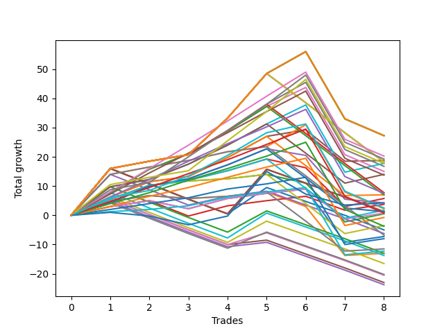

# Long Labrador 011 
- Symbol: ES_900-930
- Date Range: 03/18/2022 - 12/30/2022
- Trading Period: 9:0-9:30
- Number of Trades: 8



| Name | Win Percent | Profit | Avg Profit / Trade | Avg Time / Trade |      | Name | Win Percent | Profit | Avg Profit / Trade | Avg Time / Trade |
| ---- | ----------- | ------ | ------------------ | ---------------- | ---- | ---- | ----------- | ------ | ------------------ | ---------------- |
| Sorted By <br> Profit | | | | | | Sorted By <br> Win Percentage ||||
| NEWFI 06 | 75.00 | 13625.00 | 1703.12 | 60:55 |     | BB-50 U/L 1SD | 87.50 | 9375.00 | 1171.88 | 35:28 |
| BB-200 U/L 2SD | 75.00 | 13625.00 | 1703.12 | 60:55 |     | BB-100 Mid | 87.50 | 8875.00 | 1109.38 | 38:25 |
| BB-100 U/L 2SD | 75.00 | 13625.00 | 1703.12 | 60:55 |     | TP-3 | 87.50 | -375.00 | -46.88 | 20:04 |
| V U/L 1SD | 75.00 | 13625.00 | 1703.12 | 60:55 |     | TP-2 | 87.50 | -4000.00 | -500.00 | 09:41 |
| TP-8 | 75.00 | 10125.00 | 1265.62 | 43:53 |     | TP-1 | 87.50 | -6125.00 | -765.62 | 09:00 |
| TP-9 | 75.00 | 9625.00 | 1203.12 | 47:31 |     | NEWFI 06 | 75.00 | 13625.00 | 1703.12 | 60:55 |
| BB-50 U/L 1SD | 87.50 | 9375.00 | 1171.88 | 35:28 |     | BB-200 U/L 2SD | 75.00 | 13625.00 | 1703.12 | 60:55 |
| BB-200 U/L 2SD SL-10 | 62.50 | 9125.00 | 1140.62 | 46:23 |     | BB-100 U/L 2SD | 75.00 | 13625.00 | 1703.12 | 60:55 |
| BB-100 U/L 2SD SL-10 | 62.50 | 9125.00 | 1140.62 | 46:23 |     | V U/L 1SD | 75.00 | 13625.00 | 1703.12 | 60:55 |
| V U/L 1SD SL-10 | 62.50 | 9125.00 | 1140.62 | 46:23 |     | TP-8 | 75.00 | 10125.00 | 1265.62 | 43:53 |
| BB-100 Mid | 87.50 | 8875.00 | 1109.38 | 38:25 |     | TP-9 | 75.00 | 9625.00 | 1203.12 | 47:31 |
| TP-10 | 75.00 | 8875.00 | 1109.38 | 51:01 |     | TP-10 | 75.00 | 8875.00 | 1109.38 | 51:01 |
| V Mid | 75.00 | 8375.00 | 1046.88 | 54:17 |     | V Mid | 75.00 | 8375.00 | 1046.88 | 54:17 |
| BB-50 U/L 2SD | 75.00 | 7500.00 | 937.50 | 42:30 |     | BB-50 U/L 2SD | 75.00 | 7500.00 | 937.50 | 42:30 |
| BB-100 Mid SL-10 | 75.00 | 7000.00 | 875.00 | 28:43 |     | BB-100 Mid SL-10 | 75.00 | 7000.00 | 875.00 | 28:43 |
| TP-7 | 75.00 | 6875.00 | 859.38 | 40:11 |     | TP-7 | 75.00 | 6875.00 | 859.38 | 40:11 |
| V Mid SL-10 | 62.50 | 3875.00 | 484.38 | 39:46 |     | TP-6 | 75.00 | 3750.00 | 468.75 | 37:21 |
| TP-6 | 75.00 | 3750.00 | 468.75 | 37:21 |     | BB-50 U/L 1SD SL-10 | 75.00 | 3500.00 | 437.50 | 27:26 |
| BB-50 U/L 1SD SL-10 | 75.00 | 3500.00 | 437.50 | 27:26 |     | BB-20 U/L 2SD C | 75.00 | 2875.00 | 359.38 | 20:38 |
| BB-50 U/L 2SD SL-10 | 62.50 | 3500.00 | 437.50 | 30:49 |     | BB-20 Mid SL-5 | 75.00 | 1875.00 | 234.38 | 04:01 |
| BB-20 U/L 2SD C | 75.00 | 2875.00 | 359.38 | 20:38 |     | NEWFI 000 | 75.00 | 1250.00 | 156.25 | 47:23 |
| BB-50 Mid | 62.50 | 2125.00 | 265.62 | 24:51 |     | BB-200 Mid | 75.00 | 1125.00 | 140.62 | 45:45 |
| NEWFI 0000 | 50.00 | 2125.00 | 265.62 | 11:56 |     | BB-20 U/L 2SD C SL-10 | 75.00 | 875.00 | 109.38 | 15:39 |
| BB-20 Mid SL-5 | 75.00 | 1875.00 | 234.38 | 04:01 |     | TP-5 | 75.00 | 375.00 | 46.88 | 31:11 |
| NEWFI 000 | 75.00 | 1250.00 | 156.25 | 47:23 |     | BB-20 Mid SL-10 | 75.00 | 375.00 | 46.88 | 05:46 |
| BB-200 Mid | 75.00 | 1125.00 | 140.62 | 45:45 |     | BB-20 U/L 2SD | 75.00 | 250.00 | 31.25 | 20:05 |
| BB-20 U/L 2SD C SL-10 | 75.00 | 875.00 | 109.38 | 15:39 |     | BB-20 U/L 2SD SL-10 | 75.00 | -1750.00 | -218.75 | 15:06 |
| BB-50 Mid SL-10 | 62.50 | 625.00 | 78.12 | 17:50 |     | TP-4 | 75.00 | -1875.00 | -234.38 | 27:55 |
| BB-200 U/L 2SD SL-5 | 25.00 | 625.00 | 78.12 | 21:09 |     | BB-20 Mid | 75.00 | -3625.00 | -453.12 | 07:55 |
| BB-100 U/L 2SD SL-5 | 25.00 | 625.00 | 78.12 | 21:09 |     | BB-200 U/L 2SD SL-10 | 62.50 | 9125.00 | 1140.62 | 46:23 |
| V U/L 1SD SL-5 | 25.00 | 625.00 | 78.12 | 21:09 |     | BB-100 U/L 2SD SL-10 | 62.50 | 9125.00 | 1140.62 | 46:23 |
| TP-5 | 75.00 | 375.00 | 46.88 | 31:11 |     | V U/L 1SD SL-10 | 62.50 | 9125.00 | 1140.62 | 46:23 |
| BB-20 Mid SL-10 | 75.00 | 375.00 | 46.88 | 05:46 |     | V Mid SL-10 | 62.50 | 3875.00 | 484.38 | 39:46 |
| BB-20 U/L 2SD | 75.00 | 250.00 | 31.25 | 20:05 |     | BB-50 U/L 2SD SL-10 | 62.50 | 3500.00 | 437.50 | 30:49 |
| TP-3 | 87.50 | -375.00 | -46.88 | 20:04 |     | BB-50 Mid | 62.50 | 2125.00 | 265.62 | 24:51 |
| BB-20 U/L 2SD SL-10 | 75.00 | -1750.00 | -218.75 | 15:06 |     | BB-50 Mid SL-10 | 62.50 | 625.00 | 78.12 | 17:50 |
| TP-4 | 75.00 | -1875.00 | -234.38 | 27:55 |     | BB-200 Mid SL-10 | 62.50 | -3375.00 | -421.88 | 31:14 |
| V Mid SL-5 | 25.00 | -2500.00 | -312.50 | 17:28 |     | BB-20 U/L 1SD SL-10 | 62.50 | -5750.00 | -718.75 | 13:24 |
| BB-200 Mid SL-5 | 37.50 | -3125.00 | -390.62 | 13:18 |     | BB-20 U/L 1SD | 62.50 | -6500.00 | -812.50 | 17:52 |
| BB-200 Mid SL-10 | 62.50 | -3375.00 | -421.88 | 31:14 |     | NEWFI 0000 | 50.00 | 2125.00 | 265.62 | 11:56 |
| BB-20 Mid | 75.00 | -3625.00 | -453.12 | 07:55 |     | BB-200 Mid SL-5 | 37.50 | -3125.00 | -390.62 | 13:18 |
| TP-2 | 87.50 | -4000.00 | -500.00 | 09:41 |     | BB-200 U/L 2SD SL-5 | 25.00 | 625.00 | 78.12 | 21:09 |
| BB-20 U/L 1SD SL-10 | 62.50 | -5750.00 | -718.75 | 13:24 |     | BB-100 U/L 2SD SL-5 | 25.00 | 625.00 | 78.12 | 21:09 |
| TP-1 | 87.50 | -6125.00 | -765.62 | 09:00 |     | V U/L 1SD SL-5 | 25.00 | 625.00 | 78.12 | 21:09 |
| BB-20 U/L 1SD | 62.50 | -6500.00 | -812.50 | 17:52 |     | V Mid SL-5 | 25.00 | -2500.00 | -312.50 | 17:28 |
| BB-100 Mid SL-5 | 25.00 | -6500.00 | -812.50 | 11:58 |     | BB-100 Mid SL-5 | 25.00 | -6500.00 | -812.50 | 11:58 |
| BB-50 U/L 2SD SL-5 | 25.00 | -6875.00 | -859.38 | 12:11 |     | BB-50 U/L 2SD SL-5 | 25.00 | -6875.00 | -859.38 | 12:11 |
| BB-50 U/L 1SD SL-5 | 25.00 | -8250.00 | -1031.25 | 10:47 |     | BB-50 U/L 1SD SL-5 | 25.00 | -8250.00 | -1031.25 | 10:47 |
| BB-50 Mid SL-5 | 25.00 | -10125.00 | -1265.62 | 07:43 |     | BB-50 Mid SL-5 | 25.00 | -10125.00 | -1265.62 | 07:43 |
| BB-20 U/L 2SD C SL-5 | 25.00 | -10250.00 | -1281.25 | 08:26 |     | BB-20 U/L 2SD C SL-5 | 25.00 | -10250.00 | -1281.25 | 08:26 |
| BB-20 U/L 2SD SL-5 | 25.00 | -11500.00 | -1437.50 | 08:13 |     | BB-20 U/L 2SD SL-5 | 25.00 | -11500.00 | -1437.50 | 08:13 |
| BB-20 U/L 1SD SL-5 | 25.00 | -11875.00 | -1484.38 | 07:33 |     | BB-20 U/L 1SD SL-5 | 25.00 | -11875.00 | -1484.38 | 07:33 |

## NO STOPLOSS

### Test BB-20 Mid
* Sell when price hits the middle line of the 20p bollinger
* No Stoploss
* Results:
```
Total Trades: 8
Percent Up: 75.00
Percent Down: 25.00
Total Points Moved Up: -7.25
Potential Profit: -3625.00
Total Points Ups: 13.75 Count Ups: 6
Total Points Downs: -21.00 Count Downs: 2
```

<details><summary>Trades</summary>

<code>In: 2022-03-28 09:21:00		Out: 2022-03-28 09:22:50		Total Position Time: 01:50		Total Move Up: 3.00		Total to Date: 3.00</code> <br />
<code>In: 2022-06-06 09:15:00		Out: 2022-06-06 09:26:40		Total Position Time: 11:40		Total Move Up: 2.00		Total to Date: 5.00</code> <br />
<code>In: 2022-08-08 09:22:00		Out: 2022-08-08 09:39:15		Total Position Time: 17:15		Total Move Up: -2.75		Total to Date: 2.25</code> <br />
<code>In: 2022-09-12 09:07:00		Out: 2022-09-12 09:08:15		Total Position Time: 01:15		Total Move Up: 3.50		Total to Date: 5.75</code> <br />
<code>In: 2022-09-12 09:13:00		Out: 2022-09-12 09:14:10		Total Position Time: 01:10		Total Move Up: 1.75		Total to Date: 7.50</code> <br />
<code>In: 2022-09-23 09:15:00		Out: 2022-09-23 09:19:50		Total Position Time: 04:50		Total Move Up: 1.50		Total to Date: 9.00</code> <br />
<code>In: 2022-09-27 09:05:00		Out: 2022-09-27 09:27:30		Total Position Time: 22:30		Total Move Up: -18.25		Total to Date: -9.25</code> <br />
<code>In: 2022-11-09 09:18:00		Out: 2022-11-09 09:20:55		Total Position Time: 02:55		Total Move Up: 2.00		Total to Date: -7.25</code> <br />


</details>

### Test BB-20 U/L 1SD
* Sell when the price hits the upper line of the 20p 1std bollinger
* No Stoploss
* Results:
```
Total Trades: 8
Percent Up: 62.50
Percent Down: 37.50
Total Points Moved Up: -13.00
Potential Profit: -6500.00
Total Points Ups: 9.75 Count Ups: 5
Total Points Downs: -22.75 Count Downs: 3
```

<details><summary>Trades</summary>

<code>In: 2022-03-28 09:21:00		Out: 2022-03-28 09:25:35		Total Position Time: 04:35		Total Move Up: 4.75		Total to Date: 4.75</code> <br />
<code>In: 2022-06-06 09:15:00		Out: 2022-06-06 09:37:35		Total Position Time: 22:35		Total Move Up: 2.00		Total to Date: 6.75</code> <br />
<code>In: 2022-08-08 09:22:00		Out: 2022-08-08 09:43:00		Total Position Time: 21:00		Total Move Up: -1.00		Total to Date: 5.75</code> <br />
<code>In: 2022-09-12 09:07:00		Out: 2022-09-12 09:21:25		Total Position Time: 14:25		Total Move Up: 0.75		Total to Date: 6.50</code> <br />
<code>In: 2022-09-12 09:13:00		Out: 2022-09-12 09:21:25		Total Position Time: 08:25		Total Move Up: 1.50		Total to Date: 8.00</code> <br />
<code>In: 2022-09-23 09:15:00		Out: 2022-09-23 09:46:10		Total Position Time: 31:10		Total Move Up: -5.00		Total to Date: 3.00</code> <br />
<code>In: 2022-09-27 09:05:00		Out: 2022-09-27 09:31:05		Total Position Time: 26:05		Total Move Up: -16.75		Total to Date: -13.75</code> <br />
<code>In: 2022-11-09 09:18:00		Out: 2022-11-09 09:32:45		Total Position Time: 14:45		Total Move Up: 0.75		Total to Date: -13.00</code> <br />


</details>

### Test BB-20 U/L 2SD
* Sell when the price hits the upper line of the 20p 2std bollinger
* No Stoploss
* Results:
```
Total Trades: 8
Percent Up: 75.00
Percent Down: 25.00
Total Points Moved Up: 0.50
Potential Profit: 250.00
Total Points Ups: 16.75 Count Ups: 6
Total Points Downs: -16.25 Count Downs: 2
```

<details><summary>Trades</summary>

<code>In: 2022-03-28 09:21:00		Out: 2022-03-28 09:30:55		Total Position Time: 09:55		Total Move Up: 5.50		Total to Date: 5.50</code> <br />
<code>In: 2022-06-06 09:15:00		Out: 2022-06-06 09:41:50		Total Position Time: 26:50		Total Move Up: 4.75		Total to Date: 10.25</code> <br />
<code>In: 2022-08-08 09:22:00		Out: 2022-08-08 09:45:40		Total Position Time: 23:40		Total Move Up: 1.50		Total to Date: 11.75</code> <br />
<code>In: 2022-09-12 09:07:00		Out: 2022-09-12 09:21:25		Total Position Time: 14:25		Total Move Up: 0.75		Total to Date: 12.50</code> <br />
<code>In: 2022-09-12 09:13:00		Out: 2022-09-12 09:21:25		Total Position Time: 08:25		Total Move Up: 1.50		Total to Date: 14.00</code> <br />
<code>In: 2022-09-23 09:15:00		Out: 2022-09-23 09:46:55		Total Position Time: 31:55		Total Move Up: -3.00		Total to Date: 11.00</code> <br />
<code>In: 2022-09-27 09:05:00		Out: 2022-09-27 09:34:25		Total Position Time: 29:25		Total Move Up: -13.25		Total to Date: -2.25</code> <br />
<code>In: 2022-11-09 09:18:00		Out: 2022-11-09 09:34:10		Total Position Time: 16:10		Total Move Up: 2.75		Total to Date: 0.50</code> <br />


</details>

### Test BB-20 U/L 2SD C
* Sell when the price hits the upper line of the 20p 2std bollinger
* No Stoploss
* Results:
```
Total Trades: 8
Percent Up: 75.00
Percent Down: 25.00
Total Points Moved Up: 5.75
Potential Profit: 2875.00
Total Points Ups: 22.00 Count Ups: 6
Total Points Downs: -16.25 Count Downs: 2
```

<details><summary>Trades</summary>

<code>In: 2022-03-28 09:21:00		Out: 2022-03-28 09:30:55		Total Position Time: 09:55		Total Move Up: 5.50		Total to Date: 5.50</code> <br />
<code>In: 2022-06-06 09:15:00		Out: 2022-06-06 09:41:50		Total Position Time: 26:50		Total Move Up: 4.75		Total to Date: 10.25</code> <br />
<code>In: 2022-08-08 09:22:00		Out: 2022-08-08 09:45:55		Total Position Time: 23:55		Total Move Up: 1.75		Total to Date: 12.00</code> <br />
<code>In: 2022-09-12 09:07:00		Out: 2022-09-12 09:23:10		Total Position Time: 16:10		Total Move Up: 3.25		Total to Date: 15.25</code> <br />
<code>In: 2022-09-12 09:13:00		Out: 2022-09-12 09:23:10		Total Position Time: 10:10		Total Move Up: 4.00		Total to Date: 19.25</code> <br />
<code>In: 2022-09-23 09:15:00		Out: 2022-09-23 09:46:55		Total Position Time: 31:55		Total Move Up: -3.00		Total to Date: 16.25</code> <br />
<code>In: 2022-09-27 09:05:00		Out: 2022-09-27 09:34:25		Total Position Time: 29:25		Total Move Up: -13.25		Total to Date: 3.00</code> <br />
<code>In: 2022-11-09 09:18:00		Out: 2022-11-09 09:34:45		Total Position Time: 16:45		Total Move Up: 2.75		Total to Date: 5.75</code> <br />


</details>

### Test BB-50 Mid
* Sell when price hits the middle line of the 50p bollinger
* No Stoploss
* Results:
```
Total Trades: 8
Percent Up: 62.50
Percent Down: 37.50
Total Points Moved Up: 4.25
Potential Profit: 2125.00
Total Points Ups: 22.75 Count Ups: 5
Total Points Downs: -18.50 Count Downs: 3
```

<details><summary>Trades</summary>

<code>In: 2022-03-28 09:21:00		Out: 2022-03-28 09:24:15		Total Position Time: 03:15		Total Move Up: 4.25		Total to Date: 4.25</code> <br />
<code>In: 2022-06-06 09:15:00		Out: 2022-06-06 09:43:15		Total Position Time: 28:15		Total Move Up: 5.75		Total to Date: 10.00</code> <br />
<code>In: 2022-08-08 09:22:00		Out: 2022-08-08 09:49:00		Total Position Time: 27:00		Total Move Up: 2.50		Total to Date: 12.50</code> <br />
<code>In: 2022-09-12 09:07:00		Out: 2022-09-12 09:24:10		Total Position Time: 17:10		Total Move Up: 4.75		Total to Date: 17.25</code> <br />
<code>In: 2022-09-12 09:13:00		Out: 2022-09-12 09:24:10		Total Position Time: 11:10		Total Move Up: 5.50		Total to Date: 22.75</code> <br />
<code>In: 2022-09-23 09:15:00		Out: 2022-09-23 09:48:45		Total Position Time: 33:45		Total Move Up: -2.25		Total to Date: 20.50</code> <br />
<code>In: 2022-09-27 09:05:00		Out: 2022-09-27 09:48:50		Total Position Time: 43:50		Total Move Up: -15.00		Total to Date: 5.50</code> <br />
<code>In: 2022-11-09 09:18:00		Out: 2022-11-09 09:52:25		Total Position Time: 34:25		Total Move Up: -1.25		Total to Date: 4.25</code> <br />


</details>

### Test BB-50 U/L 1SD
* Sell when the price hits the upper line of the 50p 1std bollinger
* No Stoploss
* Results:
```
Total Trades: 8
Percent Up: 87.50
Percent Down: 12.50
Total Points Moved Up: 18.75
Potential Profit: 9375.00
Total Points Ups: 29.50 Count Ups: 7
Total Points Downs: -10.75 Count Downs: 1
```

<details><summary>Trades</summary>

<code>In: 2022-03-28 09:21:00		Out: 2022-03-28 09:35:05		Total Position Time: 14:05		Total Move Up: 6.25		Total to Date: 6.25</code> <br />
<code>In: 2022-06-06 09:15:00		Out: 2022-06-06 09:55:15		Total Position Time: 40:15		Total Move Up: 5.25		Total to Date: 11.50</code> <br />
<code>In: 2022-08-08 09:22:00		Out: 2022-08-08 10:06:15		Total Position Time: 44:15		Total Move Up: 1.75		Total to Date: 13.25</code> <br />
<code>In: 2022-09-12 09:07:00		Out: 2022-09-12 09:37:50		Total Position Time: 30:50		Total Move Up: 6.50		Total to Date: 19.75</code> <br />
<code>In: 2022-09-12 09:13:00		Out: 2022-09-12 09:37:50		Total Position Time: 24:50		Total Move Up: 7.25		Total to Date: 27.00</code> <br />
<code>In: 2022-09-23 09:15:00		Out: 2022-09-23 09:51:30		Total Position Time: 36:30		Total Move Up: 2.25		Total to Date: 29.25</code> <br />
<code>In: 2022-09-27 09:05:00		Out: 2022-09-27 09:54:15		Total Position Time: 49:15		Total Move Up: -10.75		Total to Date: 18.50</code> <br />
<code>In: 2022-11-09 09:18:00		Out: 2022-11-09 10:01:50		Total Position Time: 43:50		Total Move Up: 0.25		Total to Date: 18.75</code> <br />


</details>

### Test BB-50 U/L 2SD
* Sell when the price hits the upper line of the 50p 2std bollinger
* No Stoploss
* Results:
```
Total Trades: 8
Percent Up: 75.00
Percent Down: 25.00
Total Points Moved Up: 15.00
Potential Profit: 7500.00
Total Points Ups: 43.75 Count Ups: 6
Total Points Downs: -28.75 Count Downs: 2
```

<details><summary>Trades</summary>

<code>In: 2022-03-28 09:21:00		Out: 2022-03-28 09:39:50		Total Position Time: 18:50		Total Move Up: 7.75		Total to Date: 7.75</code> <br />
<code>In: 2022-06-06 09:15:00		Out: 2022-06-06 09:56:20		Total Position Time: 41:20		Total Move Up: 8.00		Total to Date: 15.75</code> <br />
<code>In: 2022-08-08 09:22:00		Out: 2022-08-08 10:13:20		Total Position Time: 51:20		Total Move Up: 5.25		Total to Date: 21.00</code> <br />
<code>In: 2022-09-12 09:07:00		Out: 2022-09-12 09:44:15		Total Position Time: 37:15		Total Move Up: 7.75		Total to Date: 28.75</code> <br />
<code>In: 2022-09-12 09:13:00		Out: 2022-09-12 09:44:15		Total Position Time: 31:15		Total Move Up: 8.50		Total to Date: 37.25</code> <br />
<code>In: 2022-09-23 09:15:00		Out: 2022-09-23 09:53:10		Total Position Time: 38:10		Total Move Up: 6.50		Total to Date: 43.75</code> <br />
<code>In: 2022-09-27 09:05:00		Out: 2022-09-27 10:05:55		Total Position Time: 60:55		Total Move Up: -23.00		Total to Date: 20.75</code> <br />
<code>In: 2022-11-09 09:18:00		Out: 2022-11-09 10:18:55		Total Position Time: 60:55		Total Move Up: -5.75		Total to Date: 15.00</code> <br />


</details>

### Test V Mid
* Sell when the price hits the middle line of the 1std VWAP
* No Stoploss
* Results:
```
Total Trades: 8
Percent Up: 75.00
Percent Down: 25.00
Total Points Moved Up: 16.75
Potential Profit: 8375.00
Total Points Ups: 45.50 Count Ups: 6
Total Points Downs: -28.75 Count Downs: 2
```

<details><summary>Trades</summary>

<code>In: 2022-03-28 09:21:00		Out: 2022-03-28 10:21:55		Total Position Time: 60:55		Total Move Up: 16.00		Total to Date: 16.00</code> <br />
<code>In: 2022-06-06 09:15:00		Out: 2022-06-06 10:15:55		Total Position Time: 60:55		Total Move Up: 2.50		Total to Date: 18.50</code> <br />
<code>In: 2022-08-08 09:22:00		Out: 2022-08-08 10:22:55		Total Position Time: 60:55		Total Move Up: 2.25		Total to Date: 20.75</code> <br />
<code>In: 2022-09-12 09:07:00		Out: 2022-09-12 09:44:25		Total Position Time: 37:25		Total Move Up: 8.25		Total to Date: 29.00</code> <br />
<code>In: 2022-09-12 09:13:00		Out: 2022-09-12 09:44:25		Total Position Time: 31:25		Total Move Up: 9.00		Total to Date: 38.00</code> <br />
<code>In: 2022-09-23 09:15:00		Out: 2022-09-23 10:15:55		Total Position Time: 60:55		Total Move Up: 7.50		Total to Date: 45.50</code> <br />
<code>In: 2022-09-27 09:05:00		Out: 2022-09-27 10:05:55		Total Position Time: 60:55		Total Move Up: -23.00		Total to Date: 22.50</code> <br />
<code>In: 2022-11-09 09:18:00		Out: 2022-11-09 10:18:55		Total Position Time: 60:55		Total Move Up: -5.75		Total to Date: 16.75</code> <br />


</details>

### Test V U/L 1SD
* Sell when the price hits the upper line of the 1std VWAP
* No Stoploss
* Results:
```
Total Trades: 8
Percent Up: 75.00
Percent Down: 25.00
Total Points Moved Up: 27.25
Potential Profit: 13625.00
Total Points Ups: 56.00 Count Ups: 6
Total Points Downs: -28.75 Count Downs: 2
```

<details><summary>Trades</summary>

<code>In: 2022-03-28 09:21:00		Out: 2022-03-28 10:21:55		Total Position Time: 60:55		Total Move Up: 16.00		Total to Date: 16.00</code> <br />
<code>In: 2022-06-06 09:15:00		Out: 2022-06-06 10:15:55		Total Position Time: 60:55		Total Move Up: 2.50		Total to Date: 18.50</code> <br />
<code>In: 2022-08-08 09:22:00		Out: 2022-08-08 10:22:55		Total Position Time: 60:55		Total Move Up: 2.25		Total to Date: 20.75</code> <br />
<code>In: 2022-09-12 09:07:00		Out: 2022-09-12 10:07:55		Total Position Time: 60:55		Total Move Up: 12.50		Total to Date: 33.25</code> <br />
<code>In: 2022-09-12 09:13:00		Out: 2022-09-12 10:13:55		Total Position Time: 60:55		Total Move Up: 15.25		Total to Date: 48.50</code> <br />
<code>In: 2022-09-23 09:15:00		Out: 2022-09-23 10:15:55		Total Position Time: 60:55		Total Move Up: 7.50		Total to Date: 56.00</code> <br />
<code>In: 2022-09-27 09:05:00		Out: 2022-09-27 10:05:55		Total Position Time: 60:55		Total Move Up: -23.00		Total to Date: 33.00</code> <br />
<code>In: 2022-11-09 09:18:00		Out: 2022-11-09 10:18:55		Total Position Time: 60:55		Total Move Up: -5.75		Total to Date: 27.25</code> <br />


</details>

### Test BB-100 Mid
* Move to BB100 Mid
* No Stoploss
* Results:
```
Total Trades: 8
Percent Up: 87.50
Percent Down: 12.50
Total Points Moved Up: 17.75
Potential Profit: 8875.00
Total Points Ups: 40.75 Count Ups: 7
Total Points Downs: -23.00 Count Downs: 1
```

<details><summary>Trades</summary>

<code>In: 2022-03-28 09:21:00		Out: 2022-03-28 09:44:30		Total Position Time: 23:30		Total Move Up: 9.75		Total to Date: 9.75</code> <br />
<code>In: 2022-06-06 09:15:00		Out: 2022-06-06 10:15:55		Total Position Time: 60:55		Total Move Up: 2.50		Total to Date: 12.25</code> <br />
<code>In: 2022-08-08 09:22:00		Out: 2022-08-08 10:13:15		Total Position Time: 51:15		Total Move Up: 5.25		Total to Date: 17.50</code> <br />
<code>In: 2022-09-12 09:07:00		Out: 2022-09-12 09:37:50		Total Position Time: 30:50		Total Move Up: 6.50		Total to Date: 24.00</code> <br />
<code>In: 2022-09-12 09:13:00		Out: 2022-09-12 09:37:50		Total Position Time: 24:50		Total Move Up: 7.25		Total to Date: 31.25</code> <br />
<code>In: 2022-09-23 09:15:00		Out: 2022-09-23 09:53:10		Total Position Time: 38:10		Total Move Up: 6.50		Total to Date: 37.75</code> <br />
<code>In: 2022-09-27 09:05:00		Out: 2022-09-27 10:05:55		Total Position Time: 60:55		Total Move Up: -23.00		Total to Date: 14.75</code> <br />
<code>In: 2022-11-09 09:18:00		Out: 2022-11-09 09:34:55		Total Position Time: 16:55		Total Move Up: 3.00		Total to Date: 17.75</code> <br />


</details>

### Test BB-100 U/L 2SD
* Move to BB100 Upper Band
* No Stoploss
* Results:
```
Total Trades: 8
Percent Up: 75.00
Percent Down: 25.00
Total Points Moved Up: 27.25
Potential Profit: 13625.00
Total Points Ups: 56.00 Count Ups: 6
Total Points Downs: -28.75 Count Downs: 2
```

<details><summary>Trades</summary>

<code>In: 2022-03-28 09:21:00		Out: 2022-03-28 10:21:55		Total Position Time: 60:55		Total Move Up: 16.00		Total to Date: 16.00</code> <br />
<code>In: 2022-06-06 09:15:00		Out: 2022-06-06 10:15:55		Total Position Time: 60:55		Total Move Up: 2.50		Total to Date: 18.50</code> <br />
<code>In: 2022-08-08 09:22:00		Out: 2022-08-08 10:22:55		Total Position Time: 60:55		Total Move Up: 2.25		Total to Date: 20.75</code> <br />
<code>In: 2022-09-12 09:07:00		Out: 2022-09-12 10:07:55		Total Position Time: 60:55		Total Move Up: 12.50		Total to Date: 33.25</code> <br />
<code>In: 2022-09-12 09:13:00		Out: 2022-09-12 10:13:55		Total Position Time: 60:55		Total Move Up: 15.25		Total to Date: 48.50</code> <br />
<code>In: 2022-09-23 09:15:00		Out: 2022-09-23 10:15:55		Total Position Time: 60:55		Total Move Up: 7.50		Total to Date: 56.00</code> <br />
<code>In: 2022-09-27 09:05:00		Out: 2022-09-27 10:05:55		Total Position Time: 60:55		Total Move Up: -23.00		Total to Date: 33.00</code> <br />
<code>In: 2022-11-09 09:18:00		Out: 2022-11-09 10:18:55		Total Position Time: 60:55		Total Move Up: -5.75		Total to Date: 27.25</code> <br />


</details>

### Test BB-200 Mid
* Move to BB200 Mid
* No Stoploss
* Results:
```
Total Trades: 8
Percent Up: 75.00
Percent Down: 25.00
Total Points Moved Up: 2.25
Potential Profit: 1125.00
Total Points Ups: 31.00 Count Ups: 6
Total Points Downs: -28.75 Count Downs: 2
```

<details><summary>Trades</summary>

<code>In: 2022-03-28 09:21:00		Out: 2022-03-28 10:20:05		Total Position Time: 59:05		Total Move Up: 14.00		Total to Date: 14.00</code> <br />
<code>In: 2022-06-06 09:15:00		Out: 2022-06-06 10:15:55		Total Position Time: 60:55		Total Move Up: 2.50		Total to Date: 16.50</code> <br />
<code>In: 2022-08-08 09:22:00		Out: 2022-08-08 10:22:55		Total Position Time: 60:55		Total Move Up: 2.25		Total to Date: 18.75</code> <br />
<code>In: 2022-09-12 09:07:00		Out: 2022-09-12 09:08:10		Total Position Time: 01:10		Total Move Up: 3.00		Total to Date: 21.75</code> <br />
<code>In: 2022-09-12 09:13:00		Out: 2022-09-12 09:14:15		Total Position Time: 01:15		Total Move Up: 1.75		Total to Date: 23.50</code> <br />
<code>In: 2022-09-23 09:15:00		Out: 2022-09-23 10:15:55		Total Position Time: 60:55		Total Move Up: 7.50		Total to Date: 31.00</code> <br />
<code>In: 2022-09-27 09:05:00		Out: 2022-09-27 10:05:55		Total Position Time: 60:55		Total Move Up: -23.00		Total to Date: 8.00</code> <br />
<code>In: 2022-11-09 09:18:00		Out: 2022-11-09 10:18:55		Total Position Time: 60:55		Total Move Up: -5.75		Total to Date: 2.25</code> <br />


</details>

### Test BB-200 U/L 2SD
* Move to BB200 Upper Band
* No Stoploss
* Results:
```
Total Trades: 8
Percent Up: 75.00
Percent Down: 25.00
Total Points Moved Up: 27.25
Potential Profit: 13625.00
Total Points Ups: 56.00 Count Ups: 6
Total Points Downs: -28.75 Count Downs: 2
```

<details><summary>Trades</summary>

<code>In: 2022-03-28 09:21:00		Out: 2022-03-28 10:21:55		Total Position Time: 60:55		Total Move Up: 16.00		Total to Date: 16.00</code> <br />
<code>In: 2022-06-06 09:15:00		Out: 2022-06-06 10:15:55		Total Position Time: 60:55		Total Move Up: 2.50		Total to Date: 18.50</code> <br />
<code>In: 2022-08-08 09:22:00		Out: 2022-08-08 10:22:55		Total Position Time: 60:55		Total Move Up: 2.25		Total to Date: 20.75</code> <br />
<code>In: 2022-09-12 09:07:00		Out: 2022-09-12 10:07:55		Total Position Time: 60:55		Total Move Up: 12.50		Total to Date: 33.25</code> <br />
<code>In: 2022-09-12 09:13:00		Out: 2022-09-12 10:13:55		Total Position Time: 60:55		Total Move Up: 15.25		Total to Date: 48.50</code> <br />
<code>In: 2022-09-23 09:15:00		Out: 2022-09-23 10:15:55		Total Position Time: 60:55		Total Move Up: 7.50		Total to Date: 56.00</code> <br />
<code>In: 2022-09-27 09:05:00		Out: 2022-09-27 10:05:55		Total Position Time: 60:55		Total Move Up: -23.00		Total to Date: 33.00</code> <br />
<code>In: 2022-11-09 09:18:00		Out: 2022-11-09 10:18:55		Total Position Time: 60:55		Total Move Up: -5.75		Total to Date: 27.25</code> <br />


</details>

## STOPLOSS OF 5

### Test BB-20 Mid SL-5
* Sell when price hits the middle line of the 20p bollinger
* Stoploss is 5 points
* Results:
```
Total Trades: 8
Percent Up: 75.00
Percent Down: 25.00
Total Points Moved Up: 3.75
Potential Profit: 1875.00
Total Points Ups: 13.75 Count Ups: 6
Total Points Downs: -10.00 Count Downs: 2
```

<details><summary>Trades</summary>

<code>In: 2022-03-28 09:21:00		Out: 2022-03-28 09:22:50		Total Position Time: 01:50		Total Move Up: 3.00		Total to Date: 3.00</code> <br />
<code>In: 2022-06-06 09:15:00		Out: 2022-06-06 09:26:40		Total Position Time: 11:40		Total Move Up: 2.00		Total to Date: 5.00</code> <br />
<code>In: 2022-08-08 09:22:00		Out: 2022-08-08 09:28:20		Total Position Time: 06:20		Total Move Up: -5.25		Total to Date: -0.25</code> <br />
<code>In: 2022-09-12 09:07:00		Out: 2022-09-12 09:08:15		Total Position Time: 01:15		Total Move Up: 3.50		Total to Date: 3.25</code> <br />
<code>In: 2022-09-12 09:13:00		Out: 2022-09-12 09:14:10		Total Position Time: 01:10		Total Move Up: 1.75		Total to Date: 5.00</code> <br />
<code>In: 2022-09-23 09:15:00		Out: 2022-09-23 09:19:50		Total Position Time: 04:50		Total Move Up: 1.50		Total to Date: 6.50</code> <br />
<code>In: 2022-09-27 09:05:00		Out: 2022-09-27 09:07:15		Total Position Time: 02:15		Total Move Up: -4.75		Total to Date: 1.75</code> <br />
<code>In: 2022-11-09 09:18:00		Out: 2022-11-09 09:20:55		Total Position Time: 02:55		Total Move Up: 2.00		Total to Date: 3.75</code> <br />


</details>

### Test BB-20 U/L 1SD SL-5
* Sell when the price hits the upper line of the 20p 1std bollinger
* Stoploss is 5 points
* Results:
```
Total Trades: 8
Percent Up: 25.00
Percent Down: 75.00
Total Points Moved Up: -23.75
Potential Profit: -11875.00
Total Points Ups: 6.25 Count Ups: 2
Total Points Downs: -30.00 Count Downs: 6
```

<details><summary>Trades</summary>

<code>In: 2022-03-28 09:21:00		Out: 2022-03-28 09:25:35		Total Position Time: 04:35		Total Move Up: 4.75		Total to Date: 4.75</code> <br />
<code>In: 2022-06-06 09:15:00		Out: 2022-06-06 09:30:20		Total Position Time: 15:20		Total Move Up: -5.25		Total to Date: -0.50</code> <br />
<code>In: 2022-08-08 09:22:00		Out: 2022-08-08 09:28:20		Total Position Time: 06:20		Total Move Up: -5.25		Total to Date: -5.75</code> <br />
<code>In: 2022-09-12 09:07:00		Out: 2022-09-12 09:09:30		Total Position Time: 02:30		Total Move Up: -5.00		Total to Date: -10.75</code> <br />
<code>In: 2022-09-12 09:13:00		Out: 2022-09-12 09:21:25		Total Position Time: 08:25		Total Move Up: 1.50		Total to Date: -9.25</code> <br />
<code>In: 2022-09-23 09:15:00		Out: 2022-09-23 09:27:30		Total Position Time: 12:30		Total Move Up: -4.75		Total to Date: -14.00</code> <br />
<code>In: 2022-09-27 09:05:00		Out: 2022-09-27 09:07:15		Total Position Time: 02:15		Total Move Up: -4.75		Total to Date: -18.75</code> <br />
<code>In: 2022-11-09 09:18:00		Out: 2022-11-09 09:26:30		Total Position Time: 08:30		Total Move Up: -5.00		Total to Date: -23.75</code> <br />


</details>

### Test BB-20 U/L 2SD SL-5
* Sell when the price hits the upper line of the 20p 2std bollinger
* Stoploss is 5 points
* Results:
```
Total Trades: 8
Percent Up: 25.00
Percent Down: 75.00
Total Points Moved Up: -23.00
Potential Profit: -11500.00
Total Points Ups: 7.00 Count Ups: 2
Total Points Downs: -30.00 Count Downs: 6
```

<details><summary>Trades</summary>

<code>In: 2022-03-28 09:21:00		Out: 2022-03-28 09:30:55		Total Position Time: 09:55		Total Move Up: 5.50		Total to Date: 5.50</code> <br />
<code>In: 2022-06-06 09:15:00		Out: 2022-06-06 09:30:20		Total Position Time: 15:20		Total Move Up: -5.25		Total to Date: 0.25</code> <br />
<code>In: 2022-08-08 09:22:00		Out: 2022-08-08 09:28:20		Total Position Time: 06:20		Total Move Up: -5.25		Total to Date: -5.00</code> <br />
<code>In: 2022-09-12 09:07:00		Out: 2022-09-12 09:09:30		Total Position Time: 02:30		Total Move Up: -5.00		Total to Date: -10.00</code> <br />
<code>In: 2022-09-12 09:13:00		Out: 2022-09-12 09:21:25		Total Position Time: 08:25		Total Move Up: 1.50		Total to Date: -8.50</code> <br />
<code>In: 2022-09-23 09:15:00		Out: 2022-09-23 09:27:30		Total Position Time: 12:30		Total Move Up: -4.75		Total to Date: -13.25</code> <br />
<code>In: 2022-09-27 09:05:00		Out: 2022-09-27 09:07:15		Total Position Time: 02:15		Total Move Up: -4.75		Total to Date: -18.00</code> <br />
<code>In: 2022-11-09 09:18:00		Out: 2022-11-09 09:26:30		Total Position Time: 08:30		Total Move Up: -5.00		Total to Date: -23.00</code> <br />


</details>

### Test BB-20 U/L 2SD C SL-5
* Sell when the price hits the upper line of the 20p 2std bollinger
* Stoploss is 5 points
* Results:
```
Total Trades: 8
Percent Up: 25.00
Percent Down: 75.00
Total Points Moved Up: -20.50
Potential Profit: -10250.00
Total Points Ups: 9.50 Count Ups: 2
Total Points Downs: -30.00 Count Downs: 6
```

<details><summary>Trades</summary>

<code>In: 2022-03-28 09:21:00		Out: 2022-03-28 09:30:55		Total Position Time: 09:55		Total Move Up: 5.50		Total to Date: 5.50</code> <br />
<code>In: 2022-06-06 09:15:00		Out: 2022-06-06 09:30:20		Total Position Time: 15:20		Total Move Up: -5.25		Total to Date: 0.25</code> <br />
<code>In: 2022-08-08 09:22:00		Out: 2022-08-08 09:28:20		Total Position Time: 06:20		Total Move Up: -5.25		Total to Date: -5.00</code> <br />
<code>In: 2022-09-12 09:07:00		Out: 2022-09-12 09:09:30		Total Position Time: 02:30		Total Move Up: -5.00		Total to Date: -10.00</code> <br />
<code>In: 2022-09-12 09:13:00		Out: 2022-09-12 09:23:10		Total Position Time: 10:10		Total Move Up: 4.00		Total to Date: -6.00</code> <br />
<code>In: 2022-09-23 09:15:00		Out: 2022-09-23 09:27:30		Total Position Time: 12:30		Total Move Up: -4.75		Total to Date: -10.75</code> <br />
<code>In: 2022-09-27 09:05:00		Out: 2022-09-27 09:07:15		Total Position Time: 02:15		Total Move Up: -4.75		Total to Date: -15.50</code> <br />
<code>In: 2022-11-09 09:18:00		Out: 2022-11-09 09:26:30		Total Position Time: 08:30		Total Move Up: -5.00		Total to Date: -20.50</code> <br />


</details>

### Test BB-50 Mid SL-5
* Sell when price hits the middle line of the 50p bollinger
* Stoploss is 5 points
* Results:
```
Total Trades: 8
Percent Up: 25.00
Percent Down: 75.00
Total Points Moved Up: -20.25
Potential Profit: -10125.00
Total Points Ups: 9.75 Count Ups: 2
Total Points Downs: -30.00 Count Downs: 6
```

<details><summary>Trades</summary>

<code>In: 2022-03-28 09:21:00		Out: 2022-03-28 09:24:15		Total Position Time: 03:15		Total Move Up: 4.25		Total to Date: 4.25</code> <br />
<code>In: 2022-06-06 09:15:00		Out: 2022-06-06 09:30:20		Total Position Time: 15:20		Total Move Up: -5.25		Total to Date: -1.00</code> <br />
<code>In: 2022-08-08 09:22:00		Out: 2022-08-08 09:28:20		Total Position Time: 06:20		Total Move Up: -5.25		Total to Date: -6.25</code> <br />
<code>In: 2022-09-12 09:07:00		Out: 2022-09-12 09:09:30		Total Position Time: 02:30		Total Move Up: -5.00		Total to Date: -11.25</code> <br />
<code>In: 2022-09-12 09:13:00		Out: 2022-09-12 09:24:10		Total Position Time: 11:10		Total Move Up: 5.50		Total to Date: -5.75</code> <br />
<code>In: 2022-09-23 09:15:00		Out: 2022-09-23 09:27:30		Total Position Time: 12:30		Total Move Up: -4.75		Total to Date: -10.50</code> <br />
<code>In: 2022-09-27 09:05:00		Out: 2022-09-27 09:07:15		Total Position Time: 02:15		Total Move Up: -4.75		Total to Date: -15.25</code> <br />
<code>In: 2022-11-09 09:18:00		Out: 2022-11-09 09:26:30		Total Position Time: 08:30		Total Move Up: -5.00		Total to Date: -20.25</code> <br />


</details>

### Test BB-50 U/L 1SD SL-5
* Sell when the price hits the upper line of the 50p 1std bollinger
* Stoploss is 5 points
* Results:
```
Total Trades: 8
Percent Up: 25.00
Percent Down: 75.00
Total Points Moved Up: -16.50
Potential Profit: -8250.00
Total Points Ups: 13.50 Count Ups: 2
Total Points Downs: -30.00 Count Downs: 6
```

<details><summary>Trades</summary>

<code>In: 2022-03-28 09:21:00		Out: 2022-03-28 09:35:05		Total Position Time: 14:05		Total Move Up: 6.25		Total to Date: 6.25</code> <br />
<code>In: 2022-06-06 09:15:00		Out: 2022-06-06 09:30:20		Total Position Time: 15:20		Total Move Up: -5.25		Total to Date: 1.00</code> <br />
<code>In: 2022-08-08 09:22:00		Out: 2022-08-08 09:28:20		Total Position Time: 06:20		Total Move Up: -5.25		Total to Date: -4.25</code> <br />
<code>In: 2022-09-12 09:07:00		Out: 2022-09-12 09:09:30		Total Position Time: 02:30		Total Move Up: -5.00		Total to Date: -9.25</code> <br />
<code>In: 2022-09-12 09:13:00		Out: 2022-09-12 09:37:50		Total Position Time: 24:50		Total Move Up: 7.25		Total to Date: -2.00</code> <br />
<code>In: 2022-09-23 09:15:00		Out: 2022-09-23 09:27:30		Total Position Time: 12:30		Total Move Up: -4.75		Total to Date: -6.75</code> <br />
<code>In: 2022-09-27 09:05:00		Out: 2022-09-27 09:07:15		Total Position Time: 02:15		Total Move Up: -4.75		Total to Date: -11.50</code> <br />
<code>In: 2022-11-09 09:18:00		Out: 2022-11-09 09:26:30		Total Position Time: 08:30		Total Move Up: -5.00		Total to Date: -16.50</code> <br />


</details>

### Test BB-50 U/L 2SD SL-5
* Sell when the price hits the upper line of the 50p 2std bollinger
* Stoploss is 5 points
* Results:
```
Total Trades: 8
Percent Up: 25.00
Percent Down: 75.00
Total Points Moved Up: -13.75
Potential Profit: -6875.00
Total Points Ups: 16.25 Count Ups: 2
Total Points Downs: -30.00 Count Downs: 6
```

<details><summary>Trades</summary>

<code>In: 2022-03-28 09:21:00		Out: 2022-03-28 09:39:50		Total Position Time: 18:50		Total Move Up: 7.75		Total to Date: 7.75</code> <br />
<code>In: 2022-06-06 09:15:00		Out: 2022-06-06 09:30:20		Total Position Time: 15:20		Total Move Up: -5.25		Total to Date: 2.50</code> <br />
<code>In: 2022-08-08 09:22:00		Out: 2022-08-08 09:28:20		Total Position Time: 06:20		Total Move Up: -5.25		Total to Date: -2.75</code> <br />
<code>In: 2022-09-12 09:07:00		Out: 2022-09-12 09:09:30		Total Position Time: 02:30		Total Move Up: -5.00		Total to Date: -7.75</code> <br />
<code>In: 2022-09-12 09:13:00		Out: 2022-09-12 09:44:15		Total Position Time: 31:15		Total Move Up: 8.50		Total to Date: 0.75</code> <br />
<code>In: 2022-09-23 09:15:00		Out: 2022-09-23 09:27:30		Total Position Time: 12:30		Total Move Up: -4.75		Total to Date: -4.00</code> <br />
<code>In: 2022-09-27 09:05:00		Out: 2022-09-27 09:07:15		Total Position Time: 02:15		Total Move Up: -4.75		Total to Date: -8.75</code> <br />
<code>In: 2022-11-09 09:18:00		Out: 2022-11-09 09:26:30		Total Position Time: 08:30		Total Move Up: -5.00		Total to Date: -13.75</code> <br />


</details>

### Test V Mid SL-5
* Sell when the price hits the middle line of the 1std VWAP
* Stoploss is 5 points
* Results:
```
Total Trades: 8
Percent Up: 25.00
Percent Down: 75.00
Total Points Moved Up: -5.00
Potential Profit: -2500.00
Total Points Ups: 25.00 Count Ups: 2
Total Points Downs: -30.00 Count Downs: 6
```

<details><summary>Trades</summary>

<code>In: 2022-03-28 09:21:00		Out: 2022-03-28 10:21:55		Total Position Time: 60:55		Total Move Up: 16.00		Total to Date: 16.00</code> <br />
<code>In: 2022-06-06 09:15:00		Out: 2022-06-06 09:30:20		Total Position Time: 15:20		Total Move Up: -5.25		Total to Date: 10.75</code> <br />
<code>In: 2022-08-08 09:22:00		Out: 2022-08-08 09:28:20		Total Position Time: 06:20		Total Move Up: -5.25		Total to Date: 5.50</code> <br />
<code>In: 2022-09-12 09:07:00		Out: 2022-09-12 09:09:30		Total Position Time: 02:30		Total Move Up: -5.00		Total to Date: 0.50</code> <br />
<code>In: 2022-09-12 09:13:00		Out: 2022-09-12 09:44:25		Total Position Time: 31:25		Total Move Up: 9.00		Total to Date: 9.50</code> <br />
<code>In: 2022-09-23 09:15:00		Out: 2022-09-23 09:27:30		Total Position Time: 12:30		Total Move Up: -4.75		Total to Date: 4.75</code> <br />
<code>In: 2022-09-27 09:05:00		Out: 2022-09-27 09:07:15		Total Position Time: 02:15		Total Move Up: -4.75		Total to Date: 0.00</code> <br />
<code>In: 2022-11-09 09:18:00		Out: 2022-11-09 09:26:30		Total Position Time: 08:30		Total Move Up: -5.00		Total to Date: -5.00</code> <br />


</details>

### Test V U/L 1SD SL-5
* Sell when the price hits the upper line of the 1std VWAP
* Stoploss is 5 points
* Results:
```
Total Trades: 8
Percent Up: 25.00
Percent Down: 75.00
Total Points Moved Up: 1.25
Potential Profit: 625.00
Total Points Ups: 31.25 Count Ups: 2
Total Points Downs: -30.00 Count Downs: 6
```

<details><summary>Trades</summary>

<code>In: 2022-03-28 09:21:00		Out: 2022-03-28 10:21:55		Total Position Time: 60:55		Total Move Up: 16.00		Total to Date: 16.00</code> <br />
<code>In: 2022-06-06 09:15:00		Out: 2022-06-06 09:30:20		Total Position Time: 15:20		Total Move Up: -5.25		Total to Date: 10.75</code> <br />
<code>In: 2022-08-08 09:22:00		Out: 2022-08-08 09:28:20		Total Position Time: 06:20		Total Move Up: -5.25		Total to Date: 5.50</code> <br />
<code>In: 2022-09-12 09:07:00		Out: 2022-09-12 09:09:30		Total Position Time: 02:30		Total Move Up: -5.00		Total to Date: 0.50</code> <br />
<code>In: 2022-09-12 09:13:00		Out: 2022-09-12 10:13:55		Total Position Time: 60:55		Total Move Up: 15.25		Total to Date: 15.75</code> <br />
<code>In: 2022-09-23 09:15:00		Out: 2022-09-23 09:27:30		Total Position Time: 12:30		Total Move Up: -4.75		Total to Date: 11.00</code> <br />
<code>In: 2022-09-27 09:05:00		Out: 2022-09-27 09:07:15		Total Position Time: 02:15		Total Move Up: -4.75		Total to Date: 6.25</code> <br />
<code>In: 2022-11-09 09:18:00		Out: 2022-11-09 09:26:30		Total Position Time: 08:30		Total Move Up: -5.00		Total to Date: 1.25</code> <br />


</details>

### Test BB-100 Mid SL-5
* Move to BB100 Mid
* Stoploss is 5 points
* Results:
```
Total Trades: 8
Percent Up: 25.00
Percent Down: 75.00
Total Points Moved Up: -13.00
Potential Profit: -6500.00
Total Points Ups: 17.00 Count Ups: 2
Total Points Downs: -30.00 Count Downs: 6
```

<details><summary>Trades</summary>

<code>In: 2022-03-28 09:21:00		Out: 2022-03-28 09:44:30		Total Position Time: 23:30		Total Move Up: 9.75		Total to Date: 9.75</code> <br />
<code>In: 2022-06-06 09:15:00		Out: 2022-06-06 09:30:20		Total Position Time: 15:20		Total Move Up: -5.25		Total to Date: 4.50</code> <br />
<code>In: 2022-08-08 09:22:00		Out: 2022-08-08 09:28:20		Total Position Time: 06:20		Total Move Up: -5.25		Total to Date: -0.75</code> <br />
<code>In: 2022-09-12 09:07:00		Out: 2022-09-12 09:09:30		Total Position Time: 02:30		Total Move Up: -5.00		Total to Date: -5.75</code> <br />
<code>In: 2022-09-12 09:13:00		Out: 2022-09-12 09:37:50		Total Position Time: 24:50		Total Move Up: 7.25		Total to Date: 1.50</code> <br />
<code>In: 2022-09-23 09:15:00		Out: 2022-09-23 09:27:30		Total Position Time: 12:30		Total Move Up: -4.75		Total to Date: -3.25</code> <br />
<code>In: 2022-09-27 09:05:00		Out: 2022-09-27 09:07:15		Total Position Time: 02:15		Total Move Up: -4.75		Total to Date: -8.00</code> <br />
<code>In: 2022-11-09 09:18:00		Out: 2022-11-09 09:26:30		Total Position Time: 08:30		Total Move Up: -5.00		Total to Date: -13.00</code> <br />


</details>

### Test BB-100 U/L 2SD SL-5
* Move to BB100 Upper Band
* Stoploss is 5 points
* Results:
```
Total Trades: 8
Percent Up: 25.00
Percent Down: 75.00
Total Points Moved Up: 1.25
Potential Profit: 625.00
Total Points Ups: 31.25 Count Ups: 2
Total Points Downs: -30.00 Count Downs: 6
```

<details><summary>Trades</summary>

<code>In: 2022-03-28 09:21:00		Out: 2022-03-28 10:21:55		Total Position Time: 60:55		Total Move Up: 16.00		Total to Date: 16.00</code> <br />
<code>In: 2022-06-06 09:15:00		Out: 2022-06-06 09:30:20		Total Position Time: 15:20		Total Move Up: -5.25		Total to Date: 10.75</code> <br />
<code>In: 2022-08-08 09:22:00		Out: 2022-08-08 09:28:20		Total Position Time: 06:20		Total Move Up: -5.25		Total to Date: 5.50</code> <br />
<code>In: 2022-09-12 09:07:00		Out: 2022-09-12 09:09:30		Total Position Time: 02:30		Total Move Up: -5.00		Total to Date: 0.50</code> <br />
<code>In: 2022-09-12 09:13:00		Out: 2022-09-12 10:13:55		Total Position Time: 60:55		Total Move Up: 15.25		Total to Date: 15.75</code> <br />
<code>In: 2022-09-23 09:15:00		Out: 2022-09-23 09:27:30		Total Position Time: 12:30		Total Move Up: -4.75		Total to Date: 11.00</code> <br />
<code>In: 2022-09-27 09:05:00		Out: 2022-09-27 09:07:15		Total Position Time: 02:15		Total Move Up: -4.75		Total to Date: 6.25</code> <br />
<code>In: 2022-11-09 09:18:00		Out: 2022-11-09 09:26:30		Total Position Time: 08:30		Total Move Up: -5.00		Total to Date: 1.25</code> <br />


</details>

### Test BB-200 Mid SL-5
* Move to BB200 Mid
* Stoploss is 5 points
* Results:
```
Total Trades: 8
Percent Up: 37.50
Percent Down: 62.50
Total Points Moved Up: -6.25
Potential Profit: -3125.00
Total Points Ups: 18.75 Count Ups: 3
Total Points Downs: -25.00 Count Downs: 5
```

<details><summary>Trades</summary>

<code>In: 2022-03-28 09:21:00		Out: 2022-03-28 10:20:05		Total Position Time: 59:05		Total Move Up: 14.00		Total to Date: 14.00</code> <br />
<code>In: 2022-06-06 09:15:00		Out: 2022-06-06 09:30:20		Total Position Time: 15:20		Total Move Up: -5.25		Total to Date: 8.75</code> <br />
<code>In: 2022-08-08 09:22:00		Out: 2022-08-08 09:28:20		Total Position Time: 06:20		Total Move Up: -5.25		Total to Date: 3.50</code> <br />
<code>In: 2022-09-12 09:07:00		Out: 2022-09-12 09:08:10		Total Position Time: 01:10		Total Move Up: 3.00		Total to Date: 6.50</code> <br />
<code>In: 2022-09-12 09:13:00		Out: 2022-09-12 09:14:15		Total Position Time: 01:15		Total Move Up: 1.75		Total to Date: 8.25</code> <br />
<code>In: 2022-09-23 09:15:00		Out: 2022-09-23 09:27:30		Total Position Time: 12:30		Total Move Up: -4.75		Total to Date: 3.50</code> <br />
<code>In: 2022-09-27 09:05:00		Out: 2022-09-27 09:07:15		Total Position Time: 02:15		Total Move Up: -4.75		Total to Date: -1.25</code> <br />
<code>In: 2022-11-09 09:18:00		Out: 2022-11-09 09:26:30		Total Position Time: 08:30		Total Move Up: -5.00		Total to Date: -6.25</code> <br />


</details>

### Test BB-200 U/L 2SD SL-5
* Move to BB200 Upper Band
* Stoploss is 5 points
* Results:
```
Total Trades: 8
Percent Up: 25.00
Percent Down: 75.00
Total Points Moved Up: 1.25
Potential Profit: 625.00
Total Points Ups: 31.25 Count Ups: 2
Total Points Downs: -30.00 Count Downs: 6
```

<details><summary>Trades</summary>

<code>In: 2022-03-28 09:21:00		Out: 2022-03-28 10:21:55		Total Position Time: 60:55		Total Move Up: 16.00		Total to Date: 16.00</code> <br />
<code>In: 2022-06-06 09:15:00		Out: 2022-06-06 09:30:20		Total Position Time: 15:20		Total Move Up: -5.25		Total to Date: 10.75</code> <br />
<code>In: 2022-08-08 09:22:00		Out: 2022-08-08 09:28:20		Total Position Time: 06:20		Total Move Up: -5.25		Total to Date: 5.50</code> <br />
<code>In: 2022-09-12 09:07:00		Out: 2022-09-12 09:09:30		Total Position Time: 02:30		Total Move Up: -5.00		Total to Date: 0.50</code> <br />
<code>In: 2022-09-12 09:13:00		Out: 2022-09-12 10:13:55		Total Position Time: 60:55		Total Move Up: 15.25		Total to Date: 15.75</code> <br />
<code>In: 2022-09-23 09:15:00		Out: 2022-09-23 09:27:30		Total Position Time: 12:30		Total Move Up: -4.75		Total to Date: 11.00</code> <br />
<code>In: 2022-09-27 09:05:00		Out: 2022-09-27 09:07:15		Total Position Time: 02:15		Total Move Up: -4.75		Total to Date: 6.25</code> <br />
<code>In: 2022-11-09 09:18:00		Out: 2022-11-09 09:26:30		Total Position Time: 08:30		Total Move Up: -5.00		Total to Date: 1.25</code> <br />


</details>

## STOPLOSS OF 10

### Test BB-20 Mid SL-10
* Sell when price hits the middle line of the 20p bollinger
* Stoploss is 10 points
* Results:
```
Total Trades: 8
Percent Up: 75.00
Percent Down: 25.00
Total Points Moved Up: 0.75
Potential Profit: 375.00
Total Points Ups: 13.75 Count Ups: 6
Total Points Downs: -13.00 Count Downs: 2
```

<details><summary>Trades</summary>

<code>In: 2022-03-28 09:21:00		Out: 2022-03-28 09:22:50		Total Position Time: 01:50		Total Move Up: 3.00		Total to Date: 3.00</code> <br />
<code>In: 2022-06-06 09:15:00		Out: 2022-06-06 09:26:40		Total Position Time: 11:40		Total Move Up: 2.00		Total to Date: 5.00</code> <br />
<code>In: 2022-08-08 09:22:00		Out: 2022-08-08 09:39:15		Total Position Time: 17:15		Total Move Up: -2.75		Total to Date: 2.25</code> <br />
<code>In: 2022-09-12 09:07:00		Out: 2022-09-12 09:08:15		Total Position Time: 01:15		Total Move Up: 3.50		Total to Date: 5.75</code> <br />
<code>In: 2022-09-12 09:13:00		Out: 2022-09-12 09:14:10		Total Position Time: 01:10		Total Move Up: 1.75		Total to Date: 7.50</code> <br />
<code>In: 2022-09-23 09:15:00		Out: 2022-09-23 09:19:50		Total Position Time: 04:50		Total Move Up: 1.50		Total to Date: 9.00</code> <br />
<code>In: 2022-09-27 09:05:00		Out: 2022-09-27 09:10:20		Total Position Time: 05:20		Total Move Up: -10.25		Total to Date: -1.25</code> <br />
<code>In: 2022-11-09 09:18:00		Out: 2022-11-09 09:20:55		Total Position Time: 02:55		Total Move Up: 2.00		Total to Date: 0.75</code> <br />


</details>

### Test BB-20 U/L 1SD SL-10
* Sell when the price hits the upper line of the 20p 1std bollinger
* Stoploss is 10 points
* Results:
```
Total Trades: 8
Percent Up: 62.50
Percent Down: 37.50
Total Points Moved Up: -11.50
Potential Profit: -5750.00
Total Points Ups: 9.75 Count Ups: 5
Total Points Downs: -21.25 Count Downs: 3
```

<details><summary>Trades</summary>

<code>In: 2022-03-28 09:21:00		Out: 2022-03-28 09:25:35		Total Position Time: 04:35		Total Move Up: 4.75		Total to Date: 4.75</code> <br />
<code>In: 2022-06-06 09:15:00		Out: 2022-06-06 09:37:35		Total Position Time: 22:35		Total Move Up: 2.00		Total to Date: 6.75</code> <br />
<code>In: 2022-08-08 09:22:00		Out: 2022-08-08 09:43:00		Total Position Time: 21:00		Total Move Up: -1.00		Total to Date: 5.75</code> <br />
<code>In: 2022-09-12 09:07:00		Out: 2022-09-12 09:21:25		Total Position Time: 14:25		Total Move Up: 0.75		Total to Date: 6.50</code> <br />
<code>In: 2022-09-12 09:13:00		Out: 2022-09-12 09:21:25		Total Position Time: 08:25		Total Move Up: 1.50		Total to Date: 8.00</code> <br />
<code>In: 2022-09-23 09:15:00		Out: 2022-09-23 09:31:10		Total Position Time: 16:10		Total Move Up: -10.00		Total to Date: -2.00</code> <br />
<code>In: 2022-09-27 09:05:00		Out: 2022-09-27 09:10:20		Total Position Time: 05:20		Total Move Up: -10.25		Total to Date: -12.25</code> <br />
<code>In: 2022-11-09 09:18:00		Out: 2022-11-09 09:32:45		Total Position Time: 14:45		Total Move Up: 0.75		Total to Date: -11.50</code> <br />


</details>

### Test BB-20 U/L 2SD SL-10
* Sell when the price hits the upper line of the 20p 2std bollinger
* Stoploss is 10 points
* Results:
```
Total Trades: 8
Percent Up: 75.00
Percent Down: 25.00
Total Points Moved Up: -3.50
Potential Profit: -1750.00
Total Points Ups: 16.75 Count Ups: 6
Total Points Downs: -20.25 Count Downs: 2
```

<details><summary>Trades</summary>

<code>In: 2022-03-28 09:21:00		Out: 2022-03-28 09:30:55		Total Position Time: 09:55		Total Move Up: 5.50		Total to Date: 5.50</code> <br />
<code>In: 2022-06-06 09:15:00		Out: 2022-06-06 09:41:50		Total Position Time: 26:50		Total Move Up: 4.75		Total to Date: 10.25</code> <br />
<code>In: 2022-08-08 09:22:00		Out: 2022-08-08 09:45:40		Total Position Time: 23:40		Total Move Up: 1.50		Total to Date: 11.75</code> <br />
<code>In: 2022-09-12 09:07:00		Out: 2022-09-12 09:21:25		Total Position Time: 14:25		Total Move Up: 0.75		Total to Date: 12.50</code> <br />
<code>In: 2022-09-12 09:13:00		Out: 2022-09-12 09:21:25		Total Position Time: 08:25		Total Move Up: 1.50		Total to Date: 14.00</code> <br />
<code>In: 2022-09-23 09:15:00		Out: 2022-09-23 09:31:10		Total Position Time: 16:10		Total Move Up: -10.00		Total to Date: 4.00</code> <br />
<code>In: 2022-09-27 09:05:00		Out: 2022-09-27 09:10:20		Total Position Time: 05:20		Total Move Up: -10.25		Total to Date: -6.25</code> <br />
<code>In: 2022-11-09 09:18:00		Out: 2022-11-09 09:34:10		Total Position Time: 16:10		Total Move Up: 2.75		Total to Date: -3.50</code> <br />


</details>

### Test BB-20 U/L 2SD C SL-10
* Sell when the price hits the upper line of the 20p 2std bollinger
* Stoploss is 10 points
* Results:
```
Total Trades: 8
Percent Up: 75.00
Percent Down: 25.00
Total Points Moved Up: 1.75
Potential Profit: 875.00
Total Points Ups: 22.00 Count Ups: 6
Total Points Downs: -20.25 Count Downs: 2
```

<details><summary>Trades</summary>

<code>In: 2022-03-28 09:21:00		Out: 2022-03-28 09:30:55		Total Position Time: 09:55		Total Move Up: 5.50		Total to Date: 5.50</code> <br />
<code>In: 2022-06-06 09:15:00		Out: 2022-06-06 09:41:50		Total Position Time: 26:50		Total Move Up: 4.75		Total to Date: 10.25</code> <br />
<code>In: 2022-08-08 09:22:00		Out: 2022-08-08 09:45:55		Total Position Time: 23:55		Total Move Up: 1.75		Total to Date: 12.00</code> <br />
<code>In: 2022-09-12 09:07:00		Out: 2022-09-12 09:23:10		Total Position Time: 16:10		Total Move Up: 3.25		Total to Date: 15.25</code> <br />
<code>In: 2022-09-12 09:13:00		Out: 2022-09-12 09:23:10		Total Position Time: 10:10		Total Move Up: 4.00		Total to Date: 19.25</code> <br />
<code>In: 2022-09-23 09:15:00		Out: 2022-09-23 09:31:10		Total Position Time: 16:10		Total Move Up: -10.00		Total to Date: 9.25</code> <br />
<code>In: 2022-09-27 09:05:00		Out: 2022-09-27 09:10:20		Total Position Time: 05:20		Total Move Up: -10.25		Total to Date: -1.00</code> <br />
<code>In: 2022-11-09 09:18:00		Out: 2022-11-09 09:34:45		Total Position Time: 16:45		Total Move Up: 2.75		Total to Date: 1.75</code> <br />


</details>

### Test BB-50 Mid SL-10
* Sell when price hits the middle line of the 50p bollinger
* Stoploss is 10 points
* Results:
```
Total Trades: 8
Percent Up: 62.50
Percent Down: 37.50
Total Points Moved Up: 1.25
Potential Profit: 625.00
Total Points Ups: 22.75 Count Ups: 5
Total Points Downs: -21.50 Count Downs: 3
```

<details><summary>Trades</summary>

<code>In: 2022-03-28 09:21:00		Out: 2022-03-28 09:24:15		Total Position Time: 03:15		Total Move Up: 4.25		Total to Date: 4.25</code> <br />
<code>In: 2022-06-06 09:15:00		Out: 2022-06-06 09:43:15		Total Position Time: 28:15		Total Move Up: 5.75		Total to Date: 10.00</code> <br />
<code>In: 2022-08-08 09:22:00		Out: 2022-08-08 09:49:00		Total Position Time: 27:00		Total Move Up: 2.50		Total to Date: 12.50</code> <br />
<code>In: 2022-09-12 09:07:00		Out: 2022-09-12 09:24:10		Total Position Time: 17:10		Total Move Up: 4.75		Total to Date: 17.25</code> <br />
<code>In: 2022-09-12 09:13:00		Out: 2022-09-12 09:24:10		Total Position Time: 11:10		Total Move Up: 5.50		Total to Date: 22.75</code> <br />
<code>In: 2022-09-23 09:15:00		Out: 2022-09-23 09:31:10		Total Position Time: 16:10		Total Move Up: -10.00		Total to Date: 12.75</code> <br />
<code>In: 2022-09-27 09:05:00		Out: 2022-09-27 09:10:20		Total Position Time: 05:20		Total Move Up: -10.25		Total to Date: 2.50</code> <br />
<code>In: 2022-11-09 09:18:00		Out: 2022-11-09 09:52:25		Total Position Time: 34:25		Total Move Up: -1.25		Total to Date: 1.25</code> <br />


</details>

### Test BB-50 U/L 1SD SL-10
* Sell when the price hits the upper line of the 50p 1std bollinger
* Stoploss is 10 points
* Results:
```
Total Trades: 8
Percent Up: 75.00
Percent Down: 25.00
Total Points Moved Up: 7.00
Potential Profit: 3500.00
Total Points Ups: 27.25 Count Ups: 6
Total Points Downs: -20.25 Count Downs: 2
```

<details><summary>Trades</summary>

<code>In: 2022-03-28 09:21:00		Out: 2022-03-28 09:35:05		Total Position Time: 14:05		Total Move Up: 6.25		Total to Date: 6.25</code> <br />
<code>In: 2022-06-06 09:15:00		Out: 2022-06-06 09:55:15		Total Position Time: 40:15		Total Move Up: 5.25		Total to Date: 11.50</code> <br />
<code>In: 2022-08-08 09:22:00		Out: 2022-08-08 10:06:15		Total Position Time: 44:15		Total Move Up: 1.75		Total to Date: 13.25</code> <br />
<code>In: 2022-09-12 09:07:00		Out: 2022-09-12 09:37:50		Total Position Time: 30:50		Total Move Up: 6.50		Total to Date: 19.75</code> <br />
<code>In: 2022-09-12 09:13:00		Out: 2022-09-12 09:37:50		Total Position Time: 24:50		Total Move Up: 7.25		Total to Date: 27.00</code> <br />
<code>In: 2022-09-23 09:15:00		Out: 2022-09-23 09:31:10		Total Position Time: 16:10		Total Move Up: -10.00		Total to Date: 17.00</code> <br />
<code>In: 2022-09-27 09:05:00		Out: 2022-09-27 09:10:20		Total Position Time: 05:20		Total Move Up: -10.25		Total to Date: 6.75</code> <br />
<code>In: 2022-11-09 09:18:00		Out: 2022-11-09 10:01:50		Total Position Time: 43:50		Total Move Up: 0.25		Total to Date: 7.00</code> <br />


</details>

### Test BB-50 U/L 2SD SL-10
* Sell when the price hits the upper line of the 50p 2std bollinger
* Stoploss is 10 points
* Results:
```
Total Trades: 8
Percent Up: 62.50
Percent Down: 37.50
Total Points Moved Up: 7.00
Potential Profit: 3500.00
Total Points Ups: 37.25 Count Ups: 5
Total Points Downs: -30.25 Count Downs: 3
```

<details><summary>Trades</summary>

<code>In: 2022-03-28 09:21:00		Out: 2022-03-28 09:39:50		Total Position Time: 18:50		Total Move Up: 7.75		Total to Date: 7.75</code> <br />
<code>In: 2022-06-06 09:15:00		Out: 2022-06-06 09:56:20		Total Position Time: 41:20		Total Move Up: 8.00		Total to Date: 15.75</code> <br />
<code>In: 2022-08-08 09:22:00		Out: 2022-08-08 10:13:20		Total Position Time: 51:20		Total Move Up: 5.25		Total to Date: 21.00</code> <br />
<code>In: 2022-09-12 09:07:00		Out: 2022-09-12 09:44:15		Total Position Time: 37:15		Total Move Up: 7.75		Total to Date: 28.75</code> <br />
<code>In: 2022-09-12 09:13:00		Out: 2022-09-12 09:44:15		Total Position Time: 31:15		Total Move Up: 8.50		Total to Date: 37.25</code> <br />
<code>In: 2022-09-23 09:15:00		Out: 2022-09-23 09:31:10		Total Position Time: 16:10		Total Move Up: -10.00		Total to Date: 27.25</code> <br />
<code>In: 2022-09-27 09:05:00		Out: 2022-09-27 09:10:20		Total Position Time: 05:20		Total Move Up: -10.25		Total to Date: 17.00</code> <br />
<code>In: 2022-11-09 09:18:00		Out: 2022-11-09 10:03:05		Total Position Time: 45:05		Total Move Up: -10.00		Total to Date: 7.00</code> <br />


</details>

### Test V Mid SL-10
* Sell when the price hits the middle line of the 1std VWAP
* Stoploss is 10 points
* Results:
```
Total Trades: 8
Percent Up: 62.50
Percent Down: 37.50
Total Points Moved Up: 7.75
Potential Profit: 3875.00
Total Points Ups: 38.00 Count Ups: 5
Total Points Downs: -30.25 Count Downs: 3
```

<details><summary>Trades</summary>

<code>In: 2022-03-28 09:21:00		Out: 2022-03-28 10:21:55		Total Position Time: 60:55		Total Move Up: 16.00		Total to Date: 16.00</code> <br />
<code>In: 2022-06-06 09:15:00		Out: 2022-06-06 10:15:55		Total Position Time: 60:55		Total Move Up: 2.50		Total to Date: 18.50</code> <br />
<code>In: 2022-08-08 09:22:00		Out: 2022-08-08 10:22:55		Total Position Time: 60:55		Total Move Up: 2.25		Total to Date: 20.75</code> <br />
<code>In: 2022-09-12 09:07:00		Out: 2022-09-12 09:44:25		Total Position Time: 37:25		Total Move Up: 8.25		Total to Date: 29.00</code> <br />
<code>In: 2022-09-12 09:13:00		Out: 2022-09-12 09:44:25		Total Position Time: 31:25		Total Move Up: 9.00		Total to Date: 38.00</code> <br />
<code>In: 2022-09-23 09:15:00		Out: 2022-09-23 09:31:10		Total Position Time: 16:10		Total Move Up: -10.00		Total to Date: 28.00</code> <br />
<code>In: 2022-09-27 09:05:00		Out: 2022-09-27 09:10:20		Total Position Time: 05:20		Total Move Up: -10.25		Total to Date: 17.75</code> <br />
<code>In: 2022-11-09 09:18:00		Out: 2022-11-09 10:03:05		Total Position Time: 45:05		Total Move Up: -10.00		Total to Date: 7.75</code> <br />


</details>

### Test V U/L 1SD SL-10
* Sell when the price hits the upper line of the 1std VWAP
* Stoploss is 10 points
* Results:
```
Total Trades: 8
Percent Up: 62.50
Percent Down: 37.50
Total Points Moved Up: 18.25
Potential Profit: 9125.00
Total Points Ups: 48.50 Count Ups: 5
Total Points Downs: -30.25 Count Downs: 3
```

<details><summary>Trades</summary>

<code>In: 2022-03-28 09:21:00		Out: 2022-03-28 10:21:55		Total Position Time: 60:55		Total Move Up: 16.00		Total to Date: 16.00</code> <br />
<code>In: 2022-06-06 09:15:00		Out: 2022-06-06 10:15:55		Total Position Time: 60:55		Total Move Up: 2.50		Total to Date: 18.50</code> <br />
<code>In: 2022-08-08 09:22:00		Out: 2022-08-08 10:22:55		Total Position Time: 60:55		Total Move Up: 2.25		Total to Date: 20.75</code> <br />
<code>In: 2022-09-12 09:07:00		Out: 2022-09-12 10:07:55		Total Position Time: 60:55		Total Move Up: 12.50		Total to Date: 33.25</code> <br />
<code>In: 2022-09-12 09:13:00		Out: 2022-09-12 10:13:55		Total Position Time: 60:55		Total Move Up: 15.25		Total to Date: 48.50</code> <br />
<code>In: 2022-09-23 09:15:00		Out: 2022-09-23 09:31:10		Total Position Time: 16:10		Total Move Up: -10.00		Total to Date: 38.50</code> <br />
<code>In: 2022-09-27 09:05:00		Out: 2022-09-27 09:10:20		Total Position Time: 05:20		Total Move Up: -10.25		Total to Date: 28.25</code> <br />
<code>In: 2022-11-09 09:18:00		Out: 2022-11-09 10:03:05		Total Position Time: 45:05		Total Move Up: -10.00		Total to Date: 18.25</code> <br />


</details>

### Test BB-100 Mid SL-10
* Move to BB100 Mid
* Stoploss is 10 points
* Results:
```
Total Trades: 8
Percent Up: 75.00
Percent Down: 25.00
Total Points Moved Up: 14.00
Potential Profit: 7000.00
Total Points Ups: 34.25 Count Ups: 6
Total Points Downs: -20.25 Count Downs: 2
```

<details><summary>Trades</summary>

<code>In: 2022-03-28 09:21:00		Out: 2022-03-28 09:44:30		Total Position Time: 23:30		Total Move Up: 9.75		Total to Date: 9.75</code> <br />
<code>In: 2022-06-06 09:15:00		Out: 2022-06-06 10:15:55		Total Position Time: 60:55		Total Move Up: 2.50		Total to Date: 12.25</code> <br />
<code>In: 2022-08-08 09:22:00		Out: 2022-08-08 10:13:15		Total Position Time: 51:15		Total Move Up: 5.25		Total to Date: 17.50</code> <br />
<code>In: 2022-09-12 09:07:00		Out: 2022-09-12 09:37:50		Total Position Time: 30:50		Total Move Up: 6.50		Total to Date: 24.00</code> <br />
<code>In: 2022-09-12 09:13:00		Out: 2022-09-12 09:37:50		Total Position Time: 24:50		Total Move Up: 7.25		Total to Date: 31.25</code> <br />
<code>In: 2022-09-23 09:15:00		Out: 2022-09-23 09:31:10		Total Position Time: 16:10		Total Move Up: -10.00		Total to Date: 21.25</code> <br />
<code>In: 2022-09-27 09:05:00		Out: 2022-09-27 09:10:20		Total Position Time: 05:20		Total Move Up: -10.25		Total to Date: 11.00</code> <br />
<code>In: 2022-11-09 09:18:00		Out: 2022-11-09 09:34:55		Total Position Time: 16:55		Total Move Up: 3.00		Total to Date: 14.00</code> <br />


</details>

### Test BB-100 U/L 2SD SL-10
* Move to BB100 Upper Band
* Stoploss is 10 points
* Results:
```
Total Trades: 8
Percent Up: 62.50
Percent Down: 37.50
Total Points Moved Up: 18.25
Potential Profit: 9125.00
Total Points Ups: 48.50 Count Ups: 5
Total Points Downs: -30.25 Count Downs: 3
```

<details><summary>Trades</summary>

<code>In: 2022-03-28 09:21:00		Out: 2022-03-28 10:21:55		Total Position Time: 60:55		Total Move Up: 16.00		Total to Date: 16.00</code> <br />
<code>In: 2022-06-06 09:15:00		Out: 2022-06-06 10:15:55		Total Position Time: 60:55		Total Move Up: 2.50		Total to Date: 18.50</code> <br />
<code>In: 2022-08-08 09:22:00		Out: 2022-08-08 10:22:55		Total Position Time: 60:55		Total Move Up: 2.25		Total to Date: 20.75</code> <br />
<code>In: 2022-09-12 09:07:00		Out: 2022-09-12 10:07:55		Total Position Time: 60:55		Total Move Up: 12.50		Total to Date: 33.25</code> <br />
<code>In: 2022-09-12 09:13:00		Out: 2022-09-12 10:13:55		Total Position Time: 60:55		Total Move Up: 15.25		Total to Date: 48.50</code> <br />
<code>In: 2022-09-23 09:15:00		Out: 2022-09-23 09:31:10		Total Position Time: 16:10		Total Move Up: -10.00		Total to Date: 38.50</code> <br />
<code>In: 2022-09-27 09:05:00		Out: 2022-09-27 09:10:20		Total Position Time: 05:20		Total Move Up: -10.25		Total to Date: 28.25</code> <br />
<code>In: 2022-11-09 09:18:00		Out: 2022-11-09 10:03:05		Total Position Time: 45:05		Total Move Up: -10.00		Total to Date: 18.25</code> <br />


</details>

### Test BB-200 Mid SL-10
* Move to BB200 Mid
* Stoploss is 10 points
* Results:
```
Total Trades: 8
Percent Up: 62.50
Percent Down: 37.50
Total Points Moved Up: -6.75
Potential Profit: -3375.00
Total Points Ups: 23.50 Count Ups: 5
Total Points Downs: -30.25 Count Downs: 3
```

<details><summary>Trades</summary>

<code>In: 2022-03-28 09:21:00		Out: 2022-03-28 10:20:05		Total Position Time: 59:05		Total Move Up: 14.00		Total to Date: 14.00</code> <br />
<code>In: 2022-06-06 09:15:00		Out: 2022-06-06 10:15:55		Total Position Time: 60:55		Total Move Up: 2.50		Total to Date: 16.50</code> <br />
<code>In: 2022-08-08 09:22:00		Out: 2022-08-08 10:22:55		Total Position Time: 60:55		Total Move Up: 2.25		Total to Date: 18.75</code> <br />
<code>In: 2022-09-12 09:07:00		Out: 2022-09-12 09:08:10		Total Position Time: 01:10		Total Move Up: 3.00		Total to Date: 21.75</code> <br />
<code>In: 2022-09-12 09:13:00		Out: 2022-09-12 09:14:15		Total Position Time: 01:15		Total Move Up: 1.75		Total to Date: 23.50</code> <br />
<code>In: 2022-09-23 09:15:00		Out: 2022-09-23 09:31:10		Total Position Time: 16:10		Total Move Up: -10.00		Total to Date: 13.50</code> <br />
<code>In: 2022-09-27 09:05:00		Out: 2022-09-27 09:10:20		Total Position Time: 05:20		Total Move Up: -10.25		Total to Date: 3.25</code> <br />
<code>In: 2022-11-09 09:18:00		Out: 2022-11-09 10:03:05		Total Position Time: 45:05		Total Move Up: -10.00		Total to Date: -6.75</code> <br />


</details>

### Test BB-200 U/L 2SD SL-10
* Move to BB200 Upper Band
* Stoploss is 10 points
* Results:
```
Total Trades: 8
Percent Up: 62.50
Percent Down: 37.50
Total Points Moved Up: 18.25
Potential Profit: 9125.00
Total Points Ups: 48.50 Count Ups: 5
Total Points Downs: -30.25 Count Downs: 3
```

<details><summary>Trades</summary>

<code>In: 2022-03-28 09:21:00		Out: 2022-03-28 10:21:55		Total Position Time: 60:55		Total Move Up: 16.00		Total to Date: 16.00</code> <br />
<code>In: 2022-06-06 09:15:00		Out: 2022-06-06 10:15:55		Total Position Time: 60:55		Total Move Up: 2.50		Total to Date: 18.50</code> <br />
<code>In: 2022-08-08 09:22:00		Out: 2022-08-08 10:22:55		Total Position Time: 60:55		Total Move Up: 2.25		Total to Date: 20.75</code> <br />
<code>In: 2022-09-12 09:07:00		Out: 2022-09-12 10:07:55		Total Position Time: 60:55		Total Move Up: 12.50		Total to Date: 33.25</code> <br />
<code>In: 2022-09-12 09:13:00		Out: 2022-09-12 10:13:55		Total Position Time: 60:55		Total Move Up: 15.25		Total to Date: 48.50</code> <br />
<code>In: 2022-09-23 09:15:00		Out: 2022-09-23 09:31:10		Total Position Time: 16:10		Total Move Up: -10.00		Total to Date: 38.50</code> <br />
<code>In: 2022-09-27 09:05:00		Out: 2022-09-27 09:10:20		Total Position Time: 05:20		Total Move Up: -10.25		Total to Date: 28.25</code> <br />
<code>In: 2022-11-09 09:18:00		Out: 2022-11-09 10:03:05		Total Position Time: 45:05		Total Move Up: -10.00		Total to Date: 18.25</code> <br />


</details>

## TAKE PROFIT

### Test TP-1
* Take Profit of 1 Point
* No Stoploss
* Results:
```
Total Trades: 8
Percent Up: 87.50
Percent Down: 12.50
Total Points Moved Up: -12.25
Potential Profit: -6125.00
Total Points Ups: 10.75 Count Ups: 7
Total Points Downs: -23.00 Count Downs: 1
```

<details><summary>Trades</summary>

<code>In: 2022-03-28 09:21:00		Out: 2022-03-28 09:22:10		Total Position Time: 01:10		Total Move Up: 1.25		Total to Date: 1.25</code> <br />
<code>In: 2022-06-06 09:15:00		Out: 2022-06-06 09:16:45		Total Position Time: 01:45		Total Move Up: 0.75		Total to Date: 2.00</code> <br />
<code>In: 2022-08-08 09:22:00		Out: 2022-08-08 09:23:40		Total Position Time: 01:40		Total Move Up: 1.25		Total to Date: 3.25</code> <br />
<code>In: 2022-09-12 09:07:00		Out: 2022-09-12 09:08:10		Total Position Time: 01:10		Total Move Up: 3.00		Total to Date: 6.25</code> <br />
<code>In: 2022-09-12 09:13:00		Out: 2022-09-12 09:14:10		Total Position Time: 01:10		Total Move Up: 1.75		Total to Date: 8.00</code> <br />
<code>In: 2022-09-23 09:15:00		Out: 2022-09-23 09:18:05		Total Position Time: 03:05		Total Move Up: 1.50		Total to Date: 9.50</code> <br />
<code>In: 2022-09-27 09:05:00		Out: 2022-09-27 10:05:55		Total Position Time: 60:55		Total Move Up: -23.00		Total to Date: -13.50</code> <br />
<code>In: 2022-11-09 09:18:00		Out: 2022-11-09 09:19:10		Total Position Time: 01:10		Total Move Up: 1.25		Total to Date: -12.25</code> <br />


</details>

### Test TP-2
* Take Profit of 2 Point
* No Stoploss
* Results:
```
Total Trades: 8
Percent Up: 87.50
Percent Down: 12.50
Total Points Moved Up: -8.00
Potential Profit: -4000.00
Total Points Ups: 15.00 Count Ups: 7
Total Points Downs: -23.00 Count Downs: 1
```

<details><summary>Trades</summary>

<code>In: 2022-03-28 09:21:00		Out: 2022-03-28 09:22:15		Total Position Time: 01:15		Total Move Up: 2.00		Total to Date: 2.00</code> <br />
<code>In: 2022-06-06 09:15:00		Out: 2022-06-06 09:17:05		Total Position Time: 02:05		Total Move Up: 2.00		Total to Date: 4.00</code> <br />
<code>In: 2022-08-08 09:22:00		Out: 2022-08-08 09:26:45		Total Position Time: 04:45		Total Move Up: 2.00		Total to Date: 6.00</code> <br />
<code>In: 2022-09-12 09:07:00		Out: 2022-09-12 09:08:10		Total Position Time: 01:10		Total Move Up: 3.00		Total to Date: 9.00</code> <br />
<code>In: 2022-09-12 09:13:00		Out: 2022-09-12 09:14:10		Total Position Time: 01:10		Total Move Up: 1.75		Total to Date: 10.75</code> <br />
<code>In: 2022-09-23 09:15:00		Out: 2022-09-23 09:18:20		Total Position Time: 03:20		Total Move Up: 2.25		Total to Date: 13.00</code> <br />
<code>In: 2022-09-27 09:05:00		Out: 2022-09-27 10:05:55		Total Position Time: 60:55		Total Move Up: -23.00		Total to Date: -10.00</code> <br />
<code>In: 2022-11-09 09:18:00		Out: 2022-11-09 09:20:55		Total Position Time: 02:55		Total Move Up: 2.00		Total to Date: -8.00</code> <br />


</details>

### Test TP-3
* Take Profit of 3 Point
* No Stoploss
* Results:
```
Total Trades: 8
Percent Up: 87.50
Percent Down: 12.50
Total Points Moved Up: -0.75
Potential Profit: -375.00
Total Points Ups: 22.25 Count Ups: 7
Total Points Downs: -23.00 Count Downs: 1
```

<details><summary>Trades</summary>

<code>In: 2022-03-28 09:21:00		Out: 2022-03-28 09:22:50		Total Position Time: 01:50		Total Move Up: 3.00		Total to Date: 3.00</code> <br />
<code>In: 2022-06-06 09:15:00		Out: 2022-06-06 09:19:35		Total Position Time: 04:35		Total Move Up: 3.50		Total to Date: 6.50</code> <br />
<code>In: 2022-08-08 09:22:00		Out: 2022-08-08 09:50:40		Total Position Time: 28:40		Total Move Up: 3.00		Total to Date: 9.50</code> <br />
<code>In: 2022-09-12 09:07:00		Out: 2022-09-12 09:08:15		Total Position Time: 01:15		Total Move Up: 3.50		Total to Date: 13.00</code> <br />
<code>In: 2022-09-12 09:13:00		Out: 2022-09-12 09:22:35		Total Position Time: 09:35		Total Move Up: 3.50		Total to Date: 16.50</code> <br />
<code>In: 2022-09-23 09:15:00		Out: 2022-09-23 09:52:00		Total Position Time: 37:00		Total Move Up: 3.00		Total to Date: 19.50</code> <br />
<code>In: 2022-09-27 09:05:00		Out: 2022-09-27 10:05:55		Total Position Time: 60:55		Total Move Up: -23.00		Total to Date: -3.50</code> <br />
<code>In: 2022-11-09 09:18:00		Out: 2022-11-09 09:34:45		Total Position Time: 16:45		Total Move Up: 2.75		Total to Date: -0.75</code> <br />


</details>

### Test TP-4
* Take Profit of 4 Point
* No Stoploss
* Results:
```
Total Trades: 8
Percent Up: 75.00
Percent Down: 25.00
Total Points Moved Up: -3.75
Potential Profit: -1875.00
Total Points Ups: 25.00 Count Ups: 6
Total Points Downs: -28.75 Count Downs: 2
```

<details><summary>Trades</summary>

<code>In: 2022-03-28 09:21:00		Out: 2022-03-28 09:23:25		Total Position Time: 02:25		Total Move Up: 4.00		Total to Date: 4.00</code> <br />
<code>In: 2022-06-06 09:15:00		Out: 2022-06-06 09:19:45		Total Position Time: 04:45		Total Move Up: 3.75		Total to Date: 7.75</code> <br />
<code>In: 2022-08-08 09:22:00		Out: 2022-08-08 09:51:35		Total Position Time: 29:35		Total Move Up: 4.25		Total to Date: 12.00</code> <br />
<code>In: 2022-09-12 09:07:00		Out: 2022-09-12 09:23:50		Total Position Time: 16:50		Total Move Up: 4.00		Total to Date: 16.00</code> <br />
<code>In: 2022-09-12 09:13:00		Out: 2022-09-12 09:23:20		Total Position Time: 10:20		Total Move Up: 4.25		Total to Date: 20.25</code> <br />
<code>In: 2022-09-23 09:15:00		Out: 2022-09-23 09:52:40		Total Position Time: 37:40		Total Move Up: 4.75		Total to Date: 25.00</code> <br />
<code>In: 2022-09-27 09:05:00		Out: 2022-09-27 10:05:55		Total Position Time: 60:55		Total Move Up: -23.00		Total to Date: 2.00</code> <br />
<code>In: 2022-11-09 09:18:00		Out: 2022-11-09 10:18:55		Total Position Time: 60:55		Total Move Up: -5.75		Total to Date: -3.75</code> <br />


</details>

### Test TP-5
* Take Profit of 5 Point
* No Stoploss
* Results:
```
Total Trades: 8
Percent Up: 75.00
Percent Down: 25.00
Total Points Moved Up: 0.75
Potential Profit: 375.00
Total Points Ups: 29.50 Count Ups: 6
Total Points Downs: -28.75 Count Downs: 2
```

<details><summary>Trades</summary>

<code>In: 2022-03-28 09:21:00		Out: 2022-03-28 09:25:35		Total Position Time: 04:35		Total Move Up: 4.75		Total to Date: 4.75</code> <br />
<code>In: 2022-06-06 09:15:00		Out: 2022-06-06 09:41:50		Total Position Time: 26:50		Total Move Up: 4.75		Total to Date: 9.50</code> <br />
<code>In: 2022-08-08 09:22:00		Out: 2022-08-08 09:52:15		Total Position Time: 30:15		Total Move Up: 4.75		Total to Date: 14.25</code> <br />
<code>In: 2022-09-12 09:07:00		Out: 2022-09-12 09:24:10		Total Position Time: 17:10		Total Move Up: 4.75		Total to Date: 19.00</code> <br />
<code>In: 2022-09-12 09:13:00		Out: 2022-09-12 09:24:05		Total Position Time: 11:05		Total Move Up: 5.25		Total to Date: 24.25</code> <br />
<code>In: 2022-09-23 09:15:00		Out: 2022-09-23 09:52:45		Total Position Time: 37:45		Total Move Up: 5.25		Total to Date: 29.50</code> <br />
<code>In: 2022-09-27 09:05:00		Out: 2022-09-27 10:05:55		Total Position Time: 60:55		Total Move Up: -23.00		Total to Date: 6.50</code> <br />
<code>In: 2022-11-09 09:18:00		Out: 2022-11-09 10:18:55		Total Position Time: 60:55		Total Move Up: -5.75		Total to Date: 0.75</code> <br />


</details>

### Test TP-6
* Take Profit of 6 Point
* No Stoploss
* Results:
```
Total Trades: 8
Percent Up: 75.00
Percent Down: 25.00
Total Points Moved Up: 7.50
Potential Profit: 3750.00
Total Points Ups: 36.25 Count Ups: 6
Total Points Downs: -28.75 Count Downs: 2
```

<details><summary>Trades</summary>

<code>In: 2022-03-28 09:21:00		Out: 2022-03-28 09:31:40		Total Position Time: 10:40		Total Move Up: 6.25		Total to Date: 6.25</code> <br />
<code>In: 2022-06-06 09:15:00		Out: 2022-06-06 09:46:50		Total Position Time: 31:50		Total Move Up: 6.00		Total to Date: 12.25</code> <br />
<code>In: 2022-08-08 09:22:00		Out: 2022-08-08 10:13:55		Total Position Time: 51:55		Total Move Up: 6.25		Total to Date: 18.50</code> <br />
<code>In: 2022-09-12 09:07:00		Out: 2022-09-12 09:33:05		Total Position Time: 26:05		Total Move Up: 6.00		Total to Date: 24.50</code> <br />
<code>In: 2022-09-12 09:13:00		Out: 2022-09-12 09:31:40		Total Position Time: 18:40		Total Move Up: 5.75		Total to Date: 30.25</code> <br />
<code>In: 2022-09-23 09:15:00		Out: 2022-09-23 09:52:50		Total Position Time: 37:50		Total Move Up: 6.00		Total to Date: 36.25</code> <br />
<code>In: 2022-09-27 09:05:00		Out: 2022-09-27 10:05:55		Total Position Time: 60:55		Total Move Up: -23.00		Total to Date: 13.25</code> <br />
<code>In: 2022-11-09 09:18:00		Out: 2022-11-09 10:18:55		Total Position Time: 60:55		Total Move Up: -5.75		Total to Date: 7.50</code> <br />


</details>

### Test TP-7
* Take Profit of 7 Point
* No Stoploss
* Results:
```
Total Trades: 8
Percent Up: 75.00
Percent Down: 25.00
Total Points Moved Up: 13.75
Potential Profit: 6875.00
Total Points Ups: 42.50 Count Ups: 6
Total Points Downs: -28.75 Count Downs: 2
```

<details><summary>Trades</summary>

<code>In: 2022-03-28 09:21:00		Out: 2022-03-28 09:36:00		Total Position Time: 15:00		Total Move Up: 7.25		Total to Date: 7.25</code> <br />
<code>In: 2022-06-06 09:15:00		Out: 2022-06-06 09:56:10		Total Position Time: 41:10		Total Move Up: 7.25		Total to Date: 14.50</code> <br />
<code>In: 2022-08-08 09:22:00		Out: 2022-08-08 10:14:10		Total Position Time: 52:10		Total Move Up: 6.75		Total to Date: 21.25</code> <br />
<code>In: 2022-09-12 09:07:00		Out: 2022-09-12 09:39:50		Total Position Time: 32:50		Total Move Up: 7.00		Total to Date: 28.25</code> <br />
<code>In: 2022-09-12 09:13:00		Out: 2022-09-12 09:33:10		Total Position Time: 20:10		Total Move Up: 7.25		Total to Date: 35.50</code> <br />
<code>In: 2022-09-23 09:15:00		Out: 2022-09-23 09:53:25		Total Position Time: 38:25		Total Move Up: 7.00		Total to Date: 42.50</code> <br />
<code>In: 2022-09-27 09:05:00		Out: 2022-09-27 10:05:55		Total Position Time: 60:55		Total Move Up: -23.00		Total to Date: 19.50</code> <br />
<code>In: 2022-11-09 09:18:00		Out: 2022-11-09 10:18:55		Total Position Time: 60:55		Total Move Up: -5.75		Total to Date: 13.75</code> <br />


</details>

### Test TP-8
* Take Profit of 8 Point
* No Stoploss
* Results:
```
Total Trades: 8
Percent Up: 75.00
Percent Down: 25.00
Total Points Moved Up: 20.25
Potential Profit: 10125.00
Total Points Ups: 49.00 Count Ups: 6
Total Points Downs: -28.75 Count Downs: 2
```

<details><summary>Trades</summary>

<code>In: 2022-03-28 09:21:00		Out: 2022-03-28 09:40:05		Total Position Time: 19:05		Total Move Up: 8.00		Total to Date: 8.00</code> <br />
<code>In: 2022-06-06 09:15:00		Out: 2022-06-06 09:56:20		Total Position Time: 41:20		Total Move Up: 8.00		Total to Date: 16.00</code> <br />
<code>In: 2022-08-08 09:22:00		Out: 2022-08-08 10:16:20		Total Position Time: 54:20		Total Move Up: 8.00		Total to Date: 24.00</code> <br />
<code>In: 2022-09-12 09:07:00		Out: 2022-09-12 09:44:20		Total Position Time: 37:20		Total Move Up: 8.25		Total to Date: 32.25</code> <br />
<code>In: 2022-09-12 09:13:00		Out: 2022-09-12 09:43:10		Total Position Time: 30:10		Total Move Up: 8.50		Total to Date: 40.75</code> <br />
<code>In: 2022-09-23 09:15:00		Out: 2022-09-23 10:02:05		Total Position Time: 47:05		Total Move Up: 8.25		Total to Date: 49.00</code> <br />
<code>In: 2022-09-27 09:05:00		Out: 2022-09-27 10:05:55		Total Position Time: 60:55		Total Move Up: -23.00		Total to Date: 26.00</code> <br />
<code>In: 2022-11-09 09:18:00		Out: 2022-11-09 10:18:55		Total Position Time: 60:55		Total Move Up: -5.75		Total to Date: 20.25</code> <br />


</details>

### Test TP-9
* Take Profit of 9 Point
* No Stoploss
* Results:
```
Total Trades: 8
Percent Up: 75.00
Percent Down: 25.00
Total Points Moved Up: 19.25
Potential Profit: 9625.00
Total Points Ups: 48.00 Count Ups: 6
Total Points Downs: -28.75 Count Downs: 2
```

<details><summary>Trades</summary>

<code>In: 2022-03-28 09:21:00		Out: 2022-03-28 09:42:55		Total Position Time: 21:55		Total Move Up: 8.75		Total to Date: 8.75</code> <br />
<code>In: 2022-06-06 09:15:00		Out: 2022-06-06 10:15:55		Total Position Time: 60:55		Total Move Up: 2.50		Total to Date: 11.25</code> <br />
<code>In: 2022-08-08 09:22:00		Out: 2022-08-08 10:16:40		Total Position Time: 54:40		Total Move Up: 8.75		Total to Date: 20.00</code> <br />
<code>In: 2022-09-12 09:07:00		Out: 2022-09-12 09:47:45		Total Position Time: 40:45		Total Move Up: 9.00		Total to Date: 29.00</code> <br />
<code>In: 2022-09-12 09:13:00		Out: 2022-09-12 09:44:20		Total Position Time: 31:20		Total Move Up: 9.00		Total to Date: 38.00</code> <br />
<code>In: 2022-09-23 09:15:00		Out: 2022-09-23 10:03:45		Total Position Time: 48:45		Total Move Up: 10.00		Total to Date: 48.00</code> <br />
<code>In: 2022-09-27 09:05:00		Out: 2022-09-27 10:05:55		Total Position Time: 60:55		Total Move Up: -23.00		Total to Date: 25.00</code> <br />
<code>In: 2022-11-09 09:18:00		Out: 2022-11-09 10:18:55		Total Position Time: 60:55		Total Move Up: -5.75		Total to Date: 19.25</code> <br />


</details>

### Test TP-10
* Take Profit of 10 Point
* No Stoploss
* Results:
```
Total Trades: 8
Percent Up: 75.00
Percent Down: 25.00
Total Points Moved Up: 17.75
Potential Profit: 8875.00
Total Points Ups: 46.50 Count Ups: 6
Total Points Downs: -28.75 Count Downs: 2
```

<details><summary>Trades</summary>

<code>In: 2022-03-28 09:21:00		Out: 2022-03-28 09:44:35		Total Position Time: 23:35		Total Move Up: 10.50		Total to Date: 10.50</code> <br />
<code>In: 2022-06-06 09:15:00		Out: 2022-06-06 10:15:55		Total Position Time: 60:55		Total Move Up: 2.50		Total to Date: 13.00</code> <br />
<code>In: 2022-08-08 09:22:00		Out: 2022-08-08 10:22:55		Total Position Time: 60:55		Total Move Up: 2.25		Total to Date: 15.25</code> <br />
<code>In: 2022-09-12 09:07:00		Out: 2022-09-12 09:56:30		Total Position Time: 49:30		Total Move Up: 10.25		Total to Date: 25.50</code> <br />
<code>In: 2022-09-12 09:13:00		Out: 2022-09-12 09:55:35		Total Position Time: 42:35		Total Move Up: 10.00		Total to Date: 35.50</code> <br />
<code>In: 2022-09-23 09:15:00		Out: 2022-09-23 10:03:55		Total Position Time: 48:55		Total Move Up: 11.00		Total to Date: 46.50</code> <br />
<code>In: 2022-09-27 09:05:00		Out: 2022-09-27 10:05:55		Total Position Time: 60:55		Total Move Up: -23.00		Total to Date: 23.50</code> <br />
<code>In: 2022-11-09 09:18:00		Out: 2022-11-09 10:18:55		Total Position Time: 60:55		Total Move Up: -5.75		Total to Date: 17.75</code> <br />


</details>

## Indicator Exits

### Test NEWFI 000
* Newfi 0000
* No Stoploss
* Results:
```
Total Trades: 8
Percent Up: 75.00
Percent Down: 25.00
Total Points Moved Up: 2.50
Potential Profit: 1250.00
Total Points Ups: 31.25 Count Ups: 6
Total Points Downs: -28.75 Count Downs: 2
```

<details><summary>Trades</summary>

<code>In: 2022-03-28 09:21:00		Out: 2022-03-28 09:39:05		Total Position Time: 18:05		Total Move Up: 6.00		Total to Date: 6.00</code> <br />
<code>In: 2022-06-06 09:15:00		Out: 2022-06-06 10:15:55		Total Position Time: 60:55		Total Move Up: 2.50		Total to Date: 8.50</code> <br />
<code>In: 2022-08-08 09:22:00		Out: 2022-08-08 10:21:05		Total Position Time: 59:05		Total Move Up: 5.00		Total to Date: 13.50</code> <br />
<code>In: 2022-09-12 09:07:00		Out: 2022-09-12 09:48:05		Total Position Time: 41:05		Total Move Up: 7.00		Total to Date: 20.50</code> <br />
<code>In: 2022-09-12 09:13:00		Out: 2022-09-12 09:48:05		Total Position Time: 35:05		Total Move Up: 7.75		Total to Date: 28.25</code> <br />
<code>In: 2022-09-23 09:15:00		Out: 2022-09-23 09:58:05		Total Position Time: 43:05		Total Move Up: 3.00		Total to Date: 31.25</code> <br />
<code>In: 2022-09-27 09:05:00		Out: 2022-09-27 10:05:55		Total Position Time: 60:55		Total Move Up: -23.00		Total to Date: 8.25</code> <br />
<code>In: 2022-11-09 09:18:00		Out: 2022-11-09 10:18:55		Total Position Time: 60:55		Total Move Up: -5.75		Total to Date: 2.50</code> <br />


</details>

### Test NEWFI 0000
* Newfi 0000
* No Stoploss
* Results:
```
Total Trades: 8
Percent Up: 50.00
Percent Down: 50.00
Total Points Moved Up: 4.25
Potential Profit: 2125.00
Total Points Ups: 20.00 Count Ups: 4
Total Points Downs: -15.75 Count Downs: 4
```

<details><summary>Trades</summary>

<code>In: 2022-03-28 09:21:00		Out: 2022-03-28 09:22:05		Total Position Time: 01:05		Total Move Up: 1.00		Total to Date: 1.00</code> <br />
<code>In: 2022-06-06 09:15:00		Out: 2022-06-06 09:16:05		Total Position Time: 01:05		Total Move Up: -1.25		Total to Date: -0.25</code> <br />
<code>In: 2022-08-08 09:22:00		Out: 2022-08-08 09:32:05		Total Position Time: 10:05		Total Move Up: -3.00		Total to Date: -3.25</code> <br />
<code>In: 2022-09-12 09:07:00		Out: 2022-09-12 09:08:05		Total Position Time: 01:05		Total Move Up: 3.00		Total to Date: -0.25</code> <br />
<code>In: 2022-09-12 09:13:00		Out: 2022-09-12 10:13:55		Total Position Time: 60:55		Total Move Up: 15.25		Total to Date: 15.00</code> <br />
<code>In: 2022-09-23 09:15:00		Out: 2022-09-23 09:34:05		Total Position Time: 19:05		Total Move Up: -7.75		Total to Date: 7.25</code> <br />
<code>In: 2022-09-27 09:05:00		Out: 2022-09-27 09:06:05		Total Position Time: 01:05		Total Move Up: -3.75		Total to Date: 3.50</code> <br />
<code>In: 2022-11-09 09:18:00		Out: 2022-11-09 09:19:05		Total Position Time: 01:05		Total Move Up: 0.75		Total to Date: 4.25</code> <br />


</details>

### Test NEWFI 06
* Newfi 06
* No Stoploss
* Results:
```
Total Trades: 8
Percent Up: 75.00
Percent Down: 25.00
Total Points Moved Up: 27.25
Potential Profit: 13625.00
Total Points Ups: 56.00 Count Ups: 6
Total Points Downs: -28.75 Count Downs: 2
```

<details><summary>Trades</summary>

<code>In: 2022-03-28 09:21:00		Out: 2022-03-28 10:21:55		Total Position Time: 60:55		Total Move Up: 16.00		Total to Date: 16.00</code> <br />
<code>In: 2022-06-06 09:15:00		Out: 2022-06-06 10:15:55		Total Position Time: 60:55		Total Move Up: 2.50		Total to Date: 18.50</code> <br />
<code>In: 2022-08-08 09:22:00		Out: 2022-08-08 10:22:55		Total Position Time: 60:55		Total Move Up: 2.25		Total to Date: 20.75</code> <br />
<code>In: 2022-09-12 09:07:00		Out: 2022-09-12 10:07:55		Total Position Time: 60:55		Total Move Up: 12.50		Total to Date: 33.25</code> <br />
<code>In: 2022-09-12 09:13:00		Out: 2022-09-12 10:13:55		Total Position Time: 60:55		Total Move Up: 15.25		Total to Date: 48.50</code> <br />
<code>In: 2022-09-23 09:15:00		Out: 2022-09-23 10:15:55		Total Position Time: 60:55		Total Move Up: 7.50		Total to Date: 56.00</code> <br />
<code>In: 2022-09-27 09:05:00		Out: 2022-09-27 10:05:55		Total Position Time: 60:55		Total Move Up: -23.00		Total to Date: 33.00</code> <br />
<code>In: 2022-11-09 09:18:00		Out: 2022-11-09 10:18:55		Total Position Time: 60:55		Total Move Up: -5.75		Total to Date: 27.25</code> <br />


</details>