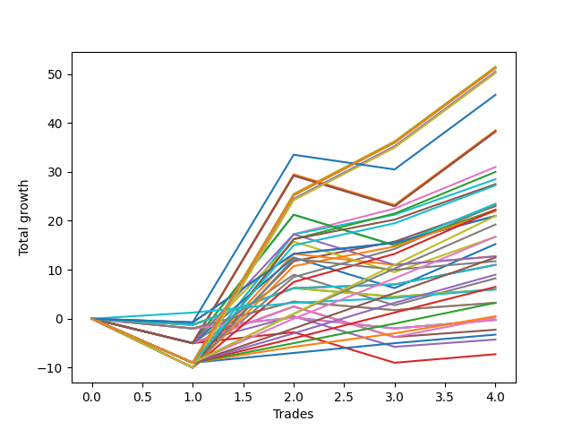

# Long Labrador 017 
- Symbol: ES_900-930
- Date Range: 03/18/2022 - 12/30/2022
- Trading Period: 9:0-9:30
- Number of Trades: 4



| Name | Win Percent | Profit | Avg Profit / Trade | Avg Time / Trade |      | Name | Win Percent | Profit | Avg Profit / Trade | Avg Time / Trade |
| ---- | ----------- | ------ | ------------------ | ---------------- | ---- | ---- | ----------- | ------ | ------------------ | ---------------- |
| Sorted By <br> Profit | | | | | | Sorted By <br> Win Percentage ||||
| V U/L 1SD | 75.00 | 25750.00 | 6437.50 | 57:47 |     | TP-1 | 100.00 | 3000.00 | 750.00 | 04:57 |
| NEWFI 06 | 75.00 | 25625.00 | 6406.25 | 60:55 |     | V U/L 1SD | 75.00 | 25750.00 | 6437.50 | 57:47 |
| BB-200 U/L 2SD | 75.00 | 25625.00 | 6406.25 | 60:55 |     | NEWFI 06 | 75.00 | 25625.00 | 6406.25 | 60:55 |
| BB-100 U/L 2SD | 75.00 | 25625.00 | 6406.25 | 60:55 |     | BB-200 U/L 2SD | 75.00 | 25625.00 | 6406.25 | 60:55 |
| V U/L 1SD SL-10 | 75.00 | 25250.00 | 6312.50 | 57:13 |     | BB-100 U/L 2SD | 75.00 | 25625.00 | 6406.25 | 60:55 |
| BB-200 U/L 2SD SL-10 | 75.00 | 25125.00 | 6281.25 | 60:21 |     | V U/L 1SD SL-10 | 75.00 | 25250.00 | 6312.50 | 57:13 |
| BB-100 U/L 2SD SL-10 | 75.00 | 25125.00 | 6281.25 | 60:21 |     | BB-200 U/L 2SD SL-10 | 75.00 | 25125.00 | 6281.25 | 60:21 |
| NEWFI 0000 | 50.00 | 22875.00 | 5718.75 | 32:30 |     | BB-100 U/L 2SD SL-10 | 75.00 | 25125.00 | 6281.25 | 60:21 |
| V U/L 1SD SL-5 | 50.00 | 19250.00 | 4812.50 | 30:00 |     | BB-50 U/L 2SD | 75.00 | 15500.00 | 3875.00 | 39:07 |
| BB-200 U/L 2SD SL-5 | 50.00 | 19125.00 | 4781.25 | 33:07 |     | BB-50 U/L 2SD SL-10 | 75.00 | 15000.00 | 3750.00 | 38:33 |
| BB-100 U/L 2SD SL-5 | 50.00 | 19125.00 | 4781.25 | 33:07 |     | BB-100 Mid | 75.00 | 14250.00 | 3562.50 | 35:55 |
| BB-50 U/L 2SD | 75.00 | 15500.00 | 3875.00 | 39:07 |     | BB-100 Mid SL-10 | 75.00 | 13750.00 | 3437.50 | 35:21 |
| BB-50 U/L 2SD SL-10 | 75.00 | 15000.00 | 3750.00 | 38:33 |     | NEWFI 000 | 75.00 | 13625.00 | 3406.25 | 41:47 |
| BB-100 Mid | 75.00 | 14250.00 | 3562.50 | 35:55 |     | V Mid | 75.00 | 11625.00 | 2906.25 | 36:22 |
| BB-100 Mid SL-10 | 75.00 | 13750.00 | 3437.50 | 35:21 |     | BB-50 U/L 1SD | 75.00 | 11500.00 | 2875.00 | 35:07 |
| NEWFI 000 | 75.00 | 13625.00 | 3406.25 | 41:47 |     | V Mid SL-10 | 75.00 | 11125.00 | 2781.25 | 35:48 |
| BB-50 U/L 2SD SL-5 | 50.00 | 11750.00 | 2937.50 | 17:30 |     | BB-50 U/L 1SD SL-10 | 75.00 | 11000.00 | 2750.00 | 34:33 |
| V Mid | 75.00 | 11625.00 | 2906.25 | 36:22 |     | TP-10 | 75.00 | 10500.00 | 2625.00 | 42:42 |
| BB-50 U/L 1SD | 75.00 | 11500.00 | 2875.00 | 35:07 |     | BB-50 Mid SL-10 | 75.00 | 10500.00 | 2625.00 | 17:41 |
| V Mid SL-10 | 75.00 | 11125.00 | 2781.25 | 35:48 |     | BB-50 Mid | 75.00 | 10500.00 | 2625.00 | 17:41 |
| BB-100 Mid SL-5 | 50.00 | 11125.00 | 2781.25 | 15:53 |     | TP-9 | 75.00 | 9625.00 | 2406.25 | 39:45 |
| BB-50 U/L 1SD SL-10 | 75.00 | 11000.00 | 2750.00 | 34:33 |     | TP-8 | 75.00 | 8375.00 | 2093.75 | 37:32 |
| TP-10 | 75.00 | 10500.00 | 2625.00 | 42:42 |     | TP-7 | 75.00 | 6250.00 | 1562.50 | 33:48 |
| BB-50 Mid SL-10 | 75.00 | 10500.00 | 2625.00 | 17:41 |     | BB-20 U/L 2SD C SL-10 | 75.00 | 5500.00 | 1375.00 | 14:48 |
| BB-50 Mid | 75.00 | 10500.00 | 2625.00 | 17:41 |     | BB-20 U/L 2SD C | 75.00 | 5500.00 | 1375.00 | 14:48 |
| TP-9 | 75.00 | 9625.00 | 2406.25 | 39:45 |     | TP-6 | 75.00 | 4500.00 | 1125.00 | 30:07 |
| TP-8 | 75.00 | 8375.00 | 2093.75 | 37:32 |     | TP-5 | 75.00 | 3250.00 | 812.50 | 27:25 |
| BB-50 U/L 1SD SL-5 | 50.00 | 8375.00 | 2093.75 | 15:06 |     | TP-4 | 75.00 | 1625.00 | 406.25 | 24:37 |
| V Mid SL-5 | 50.00 | 7625.00 | 1906.25 | 14:42 |     | TP-3 | 75.00 | 250.00 | 62.50 | 24:05 |
| BB-200 Mid SL-5 | 50.00 | 6375.00 | 1593.75 | 07:50 |     | TP-2 | 75.00 | -1625.00 | -406.25 | 19:51 |
| BB-200 Mid | 50.00 | 6375.00 | 1593.75 | 21:26 |     | NEWFI 0000 | 50.00 | 22875.00 | 5718.75 | 32:30 |
| TP-7 | 75.00 | 6250.00 | 1562.50 | 33:48 |     | V U/L 1SD SL-5 | 50.00 | 19250.00 | 4812.50 | 30:00 |
| BB-200 Mid SL-10 | 50.00 | 5875.00 | 1468.75 | 20:52 |     | BB-200 U/L 2SD SL-5 | 50.00 | 19125.00 | 4781.25 | 33:07 |
| BB-20 U/L 2SD C SL-10 | 75.00 | 5500.00 | 1375.00 | 14:48 |     | BB-100 U/L 2SD SL-5 | 50.00 | 19125.00 | 4781.25 | 33:07 |
| BB-20 U/L 2SD C | 75.00 | 5500.00 | 1375.00 | 14:48 |     | BB-50 U/L 2SD SL-5 | 50.00 | 11750.00 | 2937.50 | 17:30 |
| TP-6 | 75.00 | 4500.00 | 1125.00 | 30:07 |     | BB-100 Mid SL-5 | 50.00 | 11125.00 | 2781.25 | 15:53 |
| BB-50 Mid SL-5 | 50.00 | 4125.00 | 1031.25 | 09:07 |     | BB-50 U/L 1SD SL-5 | 50.00 | 8375.00 | 2093.75 | 15:06 |
| TP-5 | 75.00 | 3250.00 | 812.50 | 27:25 |     | V Mid SL-5 | 50.00 | 7625.00 | 1906.25 | 14:42 |
| TP-1 | 100.00 | 3000.00 | 750.00 | 04:57 |     | BB-200 Mid SL-5 | 50.00 | 6375.00 | 1593.75 | 07:50 |
| BB-20 U/L 2SD SL-10 | 50.00 | 3000.00 | 750.00 | 13:56 |     | BB-200 Mid | 50.00 | 6375.00 | 1593.75 | 21:26 |
| BB-20 U/L 2SD | 50.00 | 3000.00 | 750.00 | 13:56 |     | BB-200 Mid SL-10 | 50.00 | 5875.00 | 1468.75 | 20:52 |
| TP-4 | 75.00 | 1625.00 | 406.25 | 24:37 |     | BB-50 Mid SL-5 | 50.00 | 4125.00 | 1031.25 | 09:07 |
| BB-20 U/L 1SD SL-10 | 50.00 | 1625.00 | 406.25 | 12:28 |     | BB-20 U/L 2SD SL-10 | 50.00 | 3000.00 | 750.00 | 13:56 |
| BB-20 U/L 1SD | 50.00 | 1625.00 | 406.25 | 12:28 |     | BB-20 U/L 2SD | 50.00 | 3000.00 | 750.00 | 13:56 |
| TP-3 | 75.00 | 250.00 | 62.50 | 24:05 |     | BB-20 U/L 1SD SL-10 | 50.00 | 1625.00 | 406.25 | 12:28 |
| BB-20 U/L 2SD C SL-5 | 50.00 | 125.00 | 31.25 | 06:51 |     | BB-20 U/L 1SD | 50.00 | 1625.00 | 406.25 | 12:28 |
| BB-20 Mid SL-10 | 50.00 | -125.00 | -31.25 | 05:35 |     | BB-20 U/L 2SD C SL-5 | 50.00 | 125.00 | 31.25 | 06:51 |
| BB-20 Mid | 50.00 | -125.00 | -31.25 | 05:35 |     | BB-20 Mid SL-10 | 50.00 | -125.00 | -31.25 | 05:35 |
| BB-20 U/L 2SD SL-5 | 50.00 | -1125.00 | -281.25 | 06:25 |     | BB-20 Mid | 50.00 | -125.00 | -31.25 | 05:35 |
| TP-2 | 75.00 | -1625.00 | -406.25 | 19:51 |     | BB-20 U/L 2SD SL-5 | 50.00 | -1125.00 | -281.25 | 06:25 |
| BB-20 U/L 1SD SL-5 | 50.00 | -2125.00 | -531.25 | 05:46 |     | BB-20 U/L 1SD SL-5 | 50.00 | -2125.00 | -531.25 | 05:46 |
| BB-20 Mid SL-5 | 50.00 | -3625.00 | -906.25 | 03:18 |     | BB-20 Mid SL-5 | 50.00 | -3625.00 | -906.25 | 03:18 |

## NO STOPLOSS

### Test BB-20 Mid
* Sell when price hits the middle line of the 20p bollinger
* No Stoploss
* Results:
```
Total Trades: 4
Percent Up: 50.00
Percent Down: 50.00
Total Points Moved Up: -0.25
Potential Profit: -125.00
Total Points Ups: 4.00 Count Ups: 2
Total Points Downs: -4.25 Count Downs: 2
```

<details><summary>Trades</summary>

<code>In: 2022-03-31 09:17:00		Out: 2022-03-31 09:32:35		Total Position Time: 15:35		Total Move Up: -2.00		Total to Date: -2.00</code> <br />
<code>In: 2022-09-08 09:25:00		Out: 2022-09-08 09:26:25		Total Position Time: 01:25		Total Move Up: 2.25		Total to Date: 0.25</code> <br />
<code>In: 2022-09-12 09:08:00		Out: 2022-09-12 09:12:10		Total Position Time: 04:10		Total Move Up: -2.25		Total to Date: -2.00</code> <br />
<code>In: 2022-09-12 09:13:00		Out: 2022-09-12 09:14:10		Total Position Time: 01:10		Total Move Up: 1.75		Total to Date: -0.25</code> <br />


</details>

### Test BB-20 U/L 1SD
* Sell when the price hits the upper line of the 20p 1std bollinger
* No Stoploss
* Results:
```
Total Trades: 4
Percent Up: 50.00
Percent Down: 50.00
Total Points Moved Up: 3.25
Potential Profit: 1625.00
Total Points Ups: 7.00 Count Ups: 2
Total Points Downs: -3.75 Count Downs: 2
```

<details><summary>Trades</summary>

<code>In: 2022-03-31 09:17:00		Out: 2022-03-31 09:41:05		Total Position Time: 24:05		Total Move Up: -2.00		Total to Date: -2.00</code> <br />
<code>In: 2022-09-08 09:25:00		Out: 2022-09-08 09:29:00		Total Position Time: 04:00		Total Move Up: 5.50		Total to Date: 3.50</code> <br />
<code>In: 2022-09-12 09:08:00		Out: 2022-09-12 09:21:25		Total Position Time: 13:25		Total Move Up: -1.75		Total to Date: 1.75</code> <br />
<code>In: 2022-09-12 09:13:00		Out: 2022-09-12 09:21:25		Total Position Time: 08:25		Total Move Up: 1.50		Total to Date: 3.25</code> <br />


</details>

### Test BB-20 U/L 2SD
* Sell when the price hits the upper line of the 20p 2std bollinger
* No Stoploss
* Results:
```
Total Trades: 4
Percent Up: 50.00
Percent Down: 50.00
Total Points Moved Up: 6.00
Potential Profit: 3000.00
Total Points Ups: 9.00 Count Ups: 2
Total Points Downs: -3.00 Count Downs: 2
```

<details><summary>Trades</summary>

<code>In: 2022-03-31 09:17:00		Out: 2022-03-31 09:44:20		Total Position Time: 27:20		Total Move Up: -1.25		Total to Date: -1.25</code> <br />
<code>In: 2022-09-08 09:25:00		Out: 2022-09-08 09:31:35		Total Position Time: 06:35		Total Move Up: 7.50		Total to Date: 6.25</code> <br />
<code>In: 2022-09-12 09:08:00		Out: 2022-09-12 09:21:25		Total Position Time: 13:25		Total Move Up: -1.75		Total to Date: 4.50</code> <br />
<code>In: 2022-09-12 09:13:00		Out: 2022-09-12 09:21:25		Total Position Time: 08:25		Total Move Up: 1.50		Total to Date: 6.00</code> <br />


</details>

### Test BB-20 U/L 2SD C
* Sell when the price hits the upper line of the 20p 2std bollinger
* No Stoploss
* Results:
```
Total Trades: 4
Percent Up: 75.00
Percent Down: 25.00
Total Points Moved Up: 11.00
Potential Profit: 5500.00
Total Points Ups: 12.25 Count Ups: 3
Total Points Downs: -1.25 Count Downs: 1
```

<details><summary>Trades</summary>

<code>In: 2022-03-31 09:17:00		Out: 2022-03-31 09:44:20		Total Position Time: 27:20		Total Move Up: -1.25		Total to Date: -1.25</code> <br />
<code>In: 2022-09-08 09:25:00		Out: 2022-09-08 09:31:35		Total Position Time: 06:35		Total Move Up: 7.50		Total to Date: 6.25</code> <br />
<code>In: 2022-09-12 09:08:00		Out: 2022-09-12 09:23:10		Total Position Time: 15:10		Total Move Up: 0.75		Total to Date: 7.00</code> <br />
<code>In: 2022-09-12 09:13:00		Out: 2022-09-12 09:23:10		Total Position Time: 10:10		Total Move Up: 4.00		Total to Date: 11.00</code> <br />


</details>

### Test BB-50 Mid
* Sell when price hits the middle line of the 50p bollinger
* No Stoploss
* Results:
```
Total Trades: 4
Percent Up: 75.00
Percent Down: 25.00
Total Points Moved Up: 21.00
Potential Profit: 10500.00
Total Points Ups: 21.75 Count Ups: 3
Total Points Downs: -0.75 Count Downs: 1
```

<details><summary>Trades</summary>

<code>In: 2022-03-31 09:17:00		Out: 2022-03-31 09:45:45		Total Position Time: 28:45		Total Move Up: -0.75		Total to Date: -0.75</code> <br />
<code>In: 2022-09-08 09:25:00		Out: 2022-09-08 09:39:40		Total Position Time: 14:40		Total Move Up: 14.00		Total to Date: 13.25</code> <br />
<code>In: 2022-09-12 09:08:00		Out: 2022-09-12 09:24:10		Total Position Time: 16:10		Total Move Up: 2.25		Total to Date: 15.50</code> <br />
<code>In: 2022-09-12 09:13:00		Out: 2022-09-12 09:24:10		Total Position Time: 11:10		Total Move Up: 5.50		Total to Date: 21.00</code> <br />


</details>

### Test BB-50 U/L 1SD
* Sell when the price hits the upper line of the 50p 1std bollinger
* No Stoploss
* Results:
```
Total Trades: 4
Percent Up: 75.00
Percent Down: 25.00
Total Points Moved Up: 23.00
Potential Profit: 11500.00
Total Points Ups: 32.00 Count Ups: 3
Total Points Downs: -9.00 Count Downs: 1
```

<details><summary>Trades</summary>

<code>In: 2022-03-31 09:17:00		Out: 2022-03-31 10:17:55		Total Position Time: 60:55		Total Move Up: -9.00		Total to Date: -9.00</code> <br />
<code>In: 2022-09-08 09:25:00		Out: 2022-09-08 09:49:55		Total Position Time: 24:55		Total Move Up: 20.75		Total to Date: 11.75</code> <br />
<code>In: 2022-09-12 09:08:00		Out: 2022-09-12 09:37:50		Total Position Time: 29:50		Total Move Up: 4.00		Total to Date: 15.75</code> <br />
<code>In: 2022-09-12 09:13:00		Out: 2022-09-12 09:37:50		Total Position Time: 24:50		Total Move Up: 7.25		Total to Date: 23.00</code> <br />


</details>

### Test BB-50 U/L 2SD
* Sell when the price hits the upper line of the 50p 2std bollinger
* No Stoploss
* Results:
```
Total Trades: 4
Percent Up: 75.00
Percent Down: 25.00
Total Points Moved Up: 31.00
Potential Profit: 15500.00
Total Points Ups: 40.00 Count Ups: 3
Total Points Downs: -9.00 Count Downs: 1
```

<details><summary>Trades</summary>

<code>In: 2022-03-31 09:17:00		Out: 2022-03-31 10:17:55		Total Position Time: 60:55		Total Move Up: -9.00		Total to Date: -9.00</code> <br />
<code>In: 2022-09-08 09:25:00		Out: 2022-09-08 09:53:05		Total Position Time: 28:05		Total Move Up: 26.25		Total to Date: 17.25</code> <br />
<code>In: 2022-09-12 09:08:00		Out: 2022-09-12 09:44:15		Total Position Time: 36:15		Total Move Up: 5.25		Total to Date: 22.50</code> <br />
<code>In: 2022-09-12 09:13:00		Out: 2022-09-12 09:44:15		Total Position Time: 31:15		Total Move Up: 8.50		Total to Date: 31.00</code> <br />


</details>

### Test V Mid
* Sell when the price hits the middle line of the 1std VWAP
* No Stoploss
* Results:
```
Total Trades: 4
Percent Up: 75.00
Percent Down: 25.00
Total Points Moved Up: 23.25
Potential Profit: 11625.00
Total Points Ups: 32.25 Count Ups: 3
Total Points Downs: -9.00 Count Downs: 1
```

<details><summary>Trades</summary>

<code>In: 2022-03-31 09:17:00		Out: 2022-03-31 10:17:55		Total Position Time: 60:55		Total Move Up: -9.00		Total to Date: -9.00</code> <br />
<code>In: 2022-09-08 09:25:00		Out: 2022-09-08 09:41:45		Total Position Time: 16:45		Total Move Up: 17.50		Total to Date: 8.50</code> <br />
<code>In: 2022-09-12 09:08:00		Out: 2022-09-12 09:44:25		Total Position Time: 36:25		Total Move Up: 5.75		Total to Date: 14.25</code> <br />
<code>In: 2022-09-12 09:13:00		Out: 2022-09-12 09:44:25		Total Position Time: 31:25		Total Move Up: 9.00		Total to Date: 23.25</code> <br />


</details>

### Test V U/L 1SD
* Sell when the price hits the upper line of the 1std VWAP
* No Stoploss
* Results:
```
Total Trades: 4
Percent Up: 75.00
Percent Down: 25.00
Total Points Moved Up: 51.50
Potential Profit: 25750.00
Total Points Ups: 60.50 Count Ups: 3
Total Points Downs: -9.00 Count Downs: 1
```

<details><summary>Trades</summary>

<code>In: 2022-03-31 09:17:00		Out: 2022-03-31 10:17:55		Total Position Time: 60:55		Total Move Up: -9.00		Total to Date: -9.00</code> <br />
<code>In: 2022-09-08 09:25:00		Out: 2022-09-08 10:13:25		Total Position Time: 48:25		Total Move Up: 34.50		Total to Date: 25.50</code> <br />
<code>In: 2022-09-12 09:08:00		Out: 2022-09-12 10:08:55		Total Position Time: 60:55		Total Move Up: 10.75		Total to Date: 36.25</code> <br />
<code>In: 2022-09-12 09:13:00		Out: 2022-09-12 10:13:55		Total Position Time: 60:55		Total Move Up: 15.25		Total to Date: 51.50</code> <br />


</details>

### Test BB-100 Mid
* Move to BB100 Mid
* No Stoploss
* Results:
```
Total Trades: 4
Percent Up: 75.00
Percent Down: 25.00
Total Points Moved Up: 28.50
Potential Profit: 14250.00
Total Points Ups: 37.50 Count Ups: 3
Total Points Downs: -9.00 Count Downs: 1
```

<details><summary>Trades</summary>

<code>In: 2022-03-31 09:17:00		Out: 2022-03-31 10:17:55		Total Position Time: 60:55		Total Move Up: -9.00		Total to Date: -9.00</code> <br />
<code>In: 2022-09-08 09:25:00		Out: 2022-09-08 09:53:05		Total Position Time: 28:05		Total Move Up: 26.25		Total to Date: 17.25</code> <br />
<code>In: 2022-09-12 09:08:00		Out: 2022-09-12 09:37:50		Total Position Time: 29:50		Total Move Up: 4.00		Total to Date: 21.25</code> <br />
<code>In: 2022-09-12 09:13:00		Out: 2022-09-12 09:37:50		Total Position Time: 24:50		Total Move Up: 7.25		Total to Date: 28.50</code> <br />


</details>

### Test BB-100 U/L 2SD
* Move to BB100 Upper Band
* No Stoploss
* Results:
```
Total Trades: 4
Percent Up: 75.00
Percent Down: 25.00
Total Points Moved Up: 51.25
Potential Profit: 25625.00
Total Points Ups: 60.25 Count Ups: 3
Total Points Downs: -9.00 Count Downs: 1
```

<details><summary>Trades</summary>

<code>In: 2022-03-31 09:17:00		Out: 2022-03-31 10:17:55		Total Position Time: 60:55		Total Move Up: -9.00		Total to Date: -9.00</code> <br />
<code>In: 2022-09-08 09:25:00		Out: 2022-09-08 10:25:55		Total Position Time: 60:55		Total Move Up: 34.25		Total to Date: 25.25</code> <br />
<code>In: 2022-09-12 09:08:00		Out: 2022-09-12 10:08:55		Total Position Time: 60:55		Total Move Up: 10.75		Total to Date: 36.00</code> <br />
<code>In: 2022-09-12 09:13:00		Out: 2022-09-12 10:13:55		Total Position Time: 60:55		Total Move Up: 15.25		Total to Date: 51.25</code> <br />


</details>

### Test BB-200 Mid
* Move to BB200 Mid
* No Stoploss
* Results:
```
Total Trades: 4
Percent Up: 50.00
Percent Down: 50.00
Total Points Moved Up: 12.75
Potential Profit: 6375.00
Total Points Ups: 24.00 Count Ups: 2
Total Points Downs: -11.25 Count Downs: 2
```

<details><summary>Trades</summary>

<code>In: 2022-03-31 09:17:00		Out: 2022-03-31 10:17:55		Total Position Time: 60:55		Total Move Up: -9.00		Total to Date: -9.00</code> <br />
<code>In: 2022-09-08 09:25:00		Out: 2022-09-08 09:44:25		Total Position Time: 19:25		Total Move Up: 22.25		Total to Date: 13.25</code> <br />
<code>In: 2022-09-12 09:08:00		Out: 2022-09-12 09:12:10		Total Position Time: 04:10		Total Move Up: -2.25		Total to Date: 11.00</code> <br />
<code>In: 2022-09-12 09:13:00		Out: 2022-09-12 09:14:15		Total Position Time: 01:15		Total Move Up: 1.75		Total to Date: 12.75</code> <br />


</details>

### Test BB-200 U/L 2SD
* Move to BB200 Upper Band
* No Stoploss
* Results:
```
Total Trades: 4
Percent Up: 75.00
Percent Down: 25.00
Total Points Moved Up: 51.25
Potential Profit: 25625.00
Total Points Ups: 60.25 Count Ups: 3
Total Points Downs: -9.00 Count Downs: 1
```

<details><summary>Trades</summary>

<code>In: 2022-03-31 09:17:00		Out: 2022-03-31 10:17:55		Total Position Time: 60:55		Total Move Up: -9.00		Total to Date: -9.00</code> <br />
<code>In: 2022-09-08 09:25:00		Out: 2022-09-08 10:25:55		Total Position Time: 60:55		Total Move Up: 34.25		Total to Date: 25.25</code> <br />
<code>In: 2022-09-12 09:08:00		Out: 2022-09-12 10:08:55		Total Position Time: 60:55		Total Move Up: 10.75		Total to Date: 36.00</code> <br />
<code>In: 2022-09-12 09:13:00		Out: 2022-09-12 10:13:55		Total Position Time: 60:55		Total Move Up: 15.25		Total to Date: 51.25</code> <br />


</details>

## STOPLOSS OF 5

### Test BB-20 Mid SL-5
* Sell when price hits the middle line of the 20p bollinger
* Stoploss is 5 points
* Results:
```
Total Trades: 4
Percent Up: 50.00
Percent Down: 50.00
Total Points Moved Up: -7.25
Potential Profit: -3625.00
Total Points Ups: 4.00 Count Ups: 2
Total Points Downs: -11.25 Count Downs: 2
```

<details><summary>Trades</summary>

<code>In: 2022-03-31 09:17:00		Out: 2022-03-31 09:26:20		Total Position Time: 09:20		Total Move Up: -5.00		Total to Date: -5.00</code> <br />
<code>In: 2022-09-08 09:25:00		Out: 2022-09-08 09:26:25		Total Position Time: 01:25		Total Move Up: 2.25		Total to Date: -2.75</code> <br />
<code>In: 2022-09-12 09:08:00		Out: 2022-09-12 09:09:20		Total Position Time: 01:20		Total Move Up: -6.25		Total to Date: -9.00</code> <br />
<code>In: 2022-09-12 09:13:00		Out: 2022-09-12 09:14:10		Total Position Time: 01:10		Total Move Up: 1.75		Total to Date: -7.25</code> <br />


</details>

### Test BB-20 U/L 1SD SL-5
* Sell when the price hits the upper line of the 20p 1std bollinger
* Stoploss is 5 points
* Results:
```
Total Trades: 4
Percent Up: 50.00
Percent Down: 50.00
Total Points Moved Up: -4.25
Potential Profit: -2125.00
Total Points Ups: 7.00 Count Ups: 2
Total Points Downs: -11.25 Count Downs: 2
```

<details><summary>Trades</summary>

<code>In: 2022-03-31 09:17:00		Out: 2022-03-31 09:26:20		Total Position Time: 09:20		Total Move Up: -5.00		Total to Date: -5.00</code> <br />
<code>In: 2022-09-08 09:25:00		Out: 2022-09-08 09:29:00		Total Position Time: 04:00		Total Move Up: 5.50		Total to Date: 0.50</code> <br />
<code>In: 2022-09-12 09:08:00		Out: 2022-09-12 09:09:20		Total Position Time: 01:20		Total Move Up: -6.25		Total to Date: -5.75</code> <br />
<code>In: 2022-09-12 09:13:00		Out: 2022-09-12 09:21:25		Total Position Time: 08:25		Total Move Up: 1.50		Total to Date: -4.25</code> <br />


</details>

### Test BB-20 U/L 2SD SL-5
* Sell when the price hits the upper line of the 20p 2std bollinger
* Stoploss is 5 points
* Results:
```
Total Trades: 4
Percent Up: 50.00
Percent Down: 50.00
Total Points Moved Up: -2.25
Potential Profit: -1125.00
Total Points Ups: 9.00 Count Ups: 2
Total Points Downs: -11.25 Count Downs: 2
```

<details><summary>Trades</summary>

<code>In: 2022-03-31 09:17:00		Out: 2022-03-31 09:26:20		Total Position Time: 09:20		Total Move Up: -5.00		Total to Date: -5.00</code> <br />
<code>In: 2022-09-08 09:25:00		Out: 2022-09-08 09:31:35		Total Position Time: 06:35		Total Move Up: 7.50		Total to Date: 2.50</code> <br />
<code>In: 2022-09-12 09:08:00		Out: 2022-09-12 09:09:20		Total Position Time: 01:20		Total Move Up: -6.25		Total to Date: -3.75</code> <br />
<code>In: 2022-09-12 09:13:00		Out: 2022-09-12 09:21:25		Total Position Time: 08:25		Total Move Up: 1.50		Total to Date: -2.25</code> <br />


</details>

### Test BB-20 U/L 2SD C SL-5
* Sell when the price hits the upper line of the 20p 2std bollinger
* Stoploss is 5 points
* Results:
```
Total Trades: 4
Percent Up: 50.00
Percent Down: 50.00
Total Points Moved Up: 0.25
Potential Profit: 125.00
Total Points Ups: 11.50 Count Ups: 2
Total Points Downs: -11.25 Count Downs: 2
```

<details><summary>Trades</summary>

<code>In: 2022-03-31 09:17:00		Out: 2022-03-31 09:26:20		Total Position Time: 09:20		Total Move Up: -5.00		Total to Date: -5.00</code> <br />
<code>In: 2022-09-08 09:25:00		Out: 2022-09-08 09:31:35		Total Position Time: 06:35		Total Move Up: 7.50		Total to Date: 2.50</code> <br />
<code>In: 2022-09-12 09:08:00		Out: 2022-09-12 09:09:20		Total Position Time: 01:20		Total Move Up: -6.25		Total to Date: -3.75</code> <br />
<code>In: 2022-09-12 09:13:00		Out: 2022-09-12 09:23:10		Total Position Time: 10:10		Total Move Up: 4.00		Total to Date: 0.25</code> <br />


</details>

### Test BB-50 Mid SL-5
* Sell when price hits the middle line of the 50p bollinger
* Stoploss is 5 points
* Results:
```
Total Trades: 4
Percent Up: 50.00
Percent Down: 50.00
Total Points Moved Up: 8.25
Potential Profit: 4125.00
Total Points Ups: 19.50 Count Ups: 2
Total Points Downs: -11.25 Count Downs: 2
```

<details><summary>Trades</summary>

<code>In: 2022-03-31 09:17:00		Out: 2022-03-31 09:26:20		Total Position Time: 09:20		Total Move Up: -5.00		Total to Date: -5.00</code> <br />
<code>In: 2022-09-08 09:25:00		Out: 2022-09-08 09:39:40		Total Position Time: 14:40		Total Move Up: 14.00		Total to Date: 9.00</code> <br />
<code>In: 2022-09-12 09:08:00		Out: 2022-09-12 09:09:20		Total Position Time: 01:20		Total Move Up: -6.25		Total to Date: 2.75</code> <br />
<code>In: 2022-09-12 09:13:00		Out: 2022-09-12 09:24:10		Total Position Time: 11:10		Total Move Up: 5.50		Total to Date: 8.25</code> <br />


</details>

### Test BB-50 U/L 1SD SL-5
* Sell when the price hits the upper line of the 50p 1std bollinger
* Stoploss is 5 points
* Results:
```
Total Trades: 4
Percent Up: 50.00
Percent Down: 50.00
Total Points Moved Up: 16.75
Potential Profit: 8375.00
Total Points Ups: 28.00 Count Ups: 2
Total Points Downs: -11.25 Count Downs: 2
```

<details><summary>Trades</summary>

<code>In: 2022-03-31 09:17:00		Out: 2022-03-31 09:26:20		Total Position Time: 09:20		Total Move Up: -5.00		Total to Date: -5.00</code> <br />
<code>In: 2022-09-08 09:25:00		Out: 2022-09-08 09:49:55		Total Position Time: 24:55		Total Move Up: 20.75		Total to Date: 15.75</code> <br />
<code>In: 2022-09-12 09:08:00		Out: 2022-09-12 09:09:20		Total Position Time: 01:20		Total Move Up: -6.25		Total to Date: 9.50</code> <br />
<code>In: 2022-09-12 09:13:00		Out: 2022-09-12 09:37:50		Total Position Time: 24:50		Total Move Up: 7.25		Total to Date: 16.75</code> <br />


</details>

### Test BB-50 U/L 2SD SL-5
* Sell when the price hits the upper line of the 50p 2std bollinger
* Stoploss is 5 points
* Results:
```
Total Trades: 4
Percent Up: 50.00
Percent Down: 50.00
Total Points Moved Up: 23.50
Potential Profit: 11750.00
Total Points Ups: 34.75 Count Ups: 2
Total Points Downs: -11.25 Count Downs: 2
```

<details><summary>Trades</summary>

<code>In: 2022-03-31 09:17:00		Out: 2022-03-31 09:26:20		Total Position Time: 09:20		Total Move Up: -5.00		Total to Date: -5.00</code> <br />
<code>In: 2022-09-08 09:25:00		Out: 2022-09-08 09:53:05		Total Position Time: 28:05		Total Move Up: 26.25		Total to Date: 21.25</code> <br />
<code>In: 2022-09-12 09:08:00		Out: 2022-09-12 09:09:20		Total Position Time: 01:20		Total Move Up: -6.25		Total to Date: 15.00</code> <br />
<code>In: 2022-09-12 09:13:00		Out: 2022-09-12 09:44:15		Total Position Time: 31:15		Total Move Up: 8.50		Total to Date: 23.50</code> <br />


</details>

### Test V Mid SL-5
* Sell when the price hits the middle line of the 1std VWAP
* Stoploss is 5 points
* Results:
```
Total Trades: 4
Percent Up: 50.00
Percent Down: 50.00
Total Points Moved Up: 15.25
Potential Profit: 7625.00
Total Points Ups: 26.50 Count Ups: 2
Total Points Downs: -11.25 Count Downs: 2
```

<details><summary>Trades</summary>

<code>In: 2022-03-31 09:17:00		Out: 2022-03-31 09:26:20		Total Position Time: 09:20		Total Move Up: -5.00		Total to Date: -5.00</code> <br />
<code>In: 2022-09-08 09:25:00		Out: 2022-09-08 09:41:45		Total Position Time: 16:45		Total Move Up: 17.50		Total to Date: 12.50</code> <br />
<code>In: 2022-09-12 09:08:00		Out: 2022-09-12 09:09:20		Total Position Time: 01:20		Total Move Up: -6.25		Total to Date: 6.25</code> <br />
<code>In: 2022-09-12 09:13:00		Out: 2022-09-12 09:44:25		Total Position Time: 31:25		Total Move Up: 9.00		Total to Date: 15.25</code> <br />


</details>

### Test V U/L 1SD SL-5
* Sell when the price hits the upper line of the 1std VWAP
* Stoploss is 5 points
* Results:
```
Total Trades: 4
Percent Up: 50.00
Percent Down: 50.00
Total Points Moved Up: 38.50
Potential Profit: 19250.00
Total Points Ups: 49.75 Count Ups: 2
Total Points Downs: -11.25 Count Downs: 2
```

<details><summary>Trades</summary>

<code>In: 2022-03-31 09:17:00		Out: 2022-03-31 09:26:20		Total Position Time: 09:20		Total Move Up: -5.00		Total to Date: -5.00</code> <br />
<code>In: 2022-09-08 09:25:00		Out: 2022-09-08 10:13:25		Total Position Time: 48:25		Total Move Up: 34.50		Total to Date: 29.50</code> <br />
<code>In: 2022-09-12 09:08:00		Out: 2022-09-12 09:09:20		Total Position Time: 01:20		Total Move Up: -6.25		Total to Date: 23.25</code> <br />
<code>In: 2022-09-12 09:13:00		Out: 2022-09-12 10:13:55		Total Position Time: 60:55		Total Move Up: 15.25		Total to Date: 38.50</code> <br />


</details>

### Test BB-100 Mid SL-5
* Move to BB100 Mid
* Stoploss is 5 points
* Results:
```
Total Trades: 4
Percent Up: 50.00
Percent Down: 50.00
Total Points Moved Up: 22.25
Potential Profit: 11125.00
Total Points Ups: 33.50 Count Ups: 2
Total Points Downs: -11.25 Count Downs: 2
```

<details><summary>Trades</summary>

<code>In: 2022-03-31 09:17:00		Out: 2022-03-31 09:26:20		Total Position Time: 09:20		Total Move Up: -5.00		Total to Date: -5.00</code> <br />
<code>In: 2022-09-08 09:25:00		Out: 2022-09-08 09:53:05		Total Position Time: 28:05		Total Move Up: 26.25		Total to Date: 21.25</code> <br />
<code>In: 2022-09-12 09:08:00		Out: 2022-09-12 09:09:20		Total Position Time: 01:20		Total Move Up: -6.25		Total to Date: 15.00</code> <br />
<code>In: 2022-09-12 09:13:00		Out: 2022-09-12 09:37:50		Total Position Time: 24:50		Total Move Up: 7.25		Total to Date: 22.25</code> <br />


</details>

### Test BB-100 U/L 2SD SL-5
* Move to BB100 Upper Band
* Stoploss is 5 points
* Results:
```
Total Trades: 4
Percent Up: 50.00
Percent Down: 50.00
Total Points Moved Up: 38.25
Potential Profit: 19125.00
Total Points Ups: 49.50 Count Ups: 2
Total Points Downs: -11.25 Count Downs: 2
```

<details><summary>Trades</summary>

<code>In: 2022-03-31 09:17:00		Out: 2022-03-31 09:26:20		Total Position Time: 09:20		Total Move Up: -5.00		Total to Date: -5.00</code> <br />
<code>In: 2022-09-08 09:25:00		Out: 2022-09-08 10:25:55		Total Position Time: 60:55		Total Move Up: 34.25		Total to Date: 29.25</code> <br />
<code>In: 2022-09-12 09:08:00		Out: 2022-09-12 09:09:20		Total Position Time: 01:20		Total Move Up: -6.25		Total to Date: 23.00</code> <br />
<code>In: 2022-09-12 09:13:00		Out: 2022-09-12 10:13:55		Total Position Time: 60:55		Total Move Up: 15.25		Total to Date: 38.25</code> <br />


</details>

### Test BB-200 Mid SL-5
* Move to BB200 Mid
* Stoploss is 5 points
* Results:
```
Total Trades: 4
Percent Up: 50.00
Percent Down: 50.00
Total Points Moved Up: 12.75
Potential Profit: 6375.00
Total Points Ups: 24.00 Count Ups: 2
Total Points Downs: -11.25 Count Downs: 2
```

<details><summary>Trades</summary>

<code>In: 2022-03-31 09:17:00		Out: 2022-03-31 09:26:20		Total Position Time: 09:20		Total Move Up: -5.00		Total to Date: -5.00</code> <br />
<code>In: 2022-09-08 09:25:00		Out: 2022-09-08 09:44:25		Total Position Time: 19:25		Total Move Up: 22.25		Total to Date: 17.25</code> <br />
<code>In: 2022-09-12 09:08:00		Out: 2022-09-12 09:09:20		Total Position Time: 01:20		Total Move Up: -6.25		Total to Date: 11.00</code> <br />
<code>In: 2022-09-12 09:13:00		Out: 2022-09-12 09:14:15		Total Position Time: 01:15		Total Move Up: 1.75		Total to Date: 12.75</code> <br />


</details>

### Test BB-200 U/L 2SD SL-5
* Move to BB200 Upper Band
* Stoploss is 5 points
* Results:
```
Total Trades: 4
Percent Up: 50.00
Percent Down: 50.00
Total Points Moved Up: 38.25
Potential Profit: 19125.00
Total Points Ups: 49.50 Count Ups: 2
Total Points Downs: -11.25 Count Downs: 2
```

<details><summary>Trades</summary>

<code>In: 2022-03-31 09:17:00		Out: 2022-03-31 09:26:20		Total Position Time: 09:20		Total Move Up: -5.00		Total to Date: -5.00</code> <br />
<code>In: 2022-09-08 09:25:00		Out: 2022-09-08 10:25:55		Total Position Time: 60:55		Total Move Up: 34.25		Total to Date: 29.25</code> <br />
<code>In: 2022-09-12 09:08:00		Out: 2022-09-12 09:09:20		Total Position Time: 01:20		Total Move Up: -6.25		Total to Date: 23.00</code> <br />
<code>In: 2022-09-12 09:13:00		Out: 2022-09-12 10:13:55		Total Position Time: 60:55		Total Move Up: 15.25		Total to Date: 38.25</code> <br />


</details>

## STOPLOSS OF 10

### Test BB-20 Mid SL-10
* Sell when price hits the middle line of the 20p bollinger
* Stoploss is 10 points
* Results:
```
Total Trades: 4
Percent Up: 50.00
Percent Down: 50.00
Total Points Moved Up: -0.25
Potential Profit: -125.00
Total Points Ups: 4.00 Count Ups: 2
Total Points Downs: -4.25 Count Downs: 2
```

<details><summary>Trades</summary>

<code>In: 2022-03-31 09:17:00		Out: 2022-03-31 09:32:35		Total Position Time: 15:35		Total Move Up: -2.00		Total to Date: -2.00</code> <br />
<code>In: 2022-09-08 09:25:00		Out: 2022-09-08 09:26:25		Total Position Time: 01:25		Total Move Up: 2.25		Total to Date: 0.25</code> <br />
<code>In: 2022-09-12 09:08:00		Out: 2022-09-12 09:12:10		Total Position Time: 04:10		Total Move Up: -2.25		Total to Date: -2.00</code> <br />
<code>In: 2022-09-12 09:13:00		Out: 2022-09-12 09:14:10		Total Position Time: 01:10		Total Move Up: 1.75		Total to Date: -0.25</code> <br />


</details>

### Test BB-20 U/L 1SD SL-10
* Sell when the price hits the upper line of the 20p 1std bollinger
* Stoploss is 10 points
* Results:
```
Total Trades: 4
Percent Up: 50.00
Percent Down: 50.00
Total Points Moved Up: 3.25
Potential Profit: 1625.00
Total Points Ups: 7.00 Count Ups: 2
Total Points Downs: -3.75 Count Downs: 2
```

<details><summary>Trades</summary>

<code>In: 2022-03-31 09:17:00		Out: 2022-03-31 09:41:05		Total Position Time: 24:05		Total Move Up: -2.00		Total to Date: -2.00</code> <br />
<code>In: 2022-09-08 09:25:00		Out: 2022-09-08 09:29:00		Total Position Time: 04:00		Total Move Up: 5.50		Total to Date: 3.50</code> <br />
<code>In: 2022-09-12 09:08:00		Out: 2022-09-12 09:21:25		Total Position Time: 13:25		Total Move Up: -1.75		Total to Date: 1.75</code> <br />
<code>In: 2022-09-12 09:13:00		Out: 2022-09-12 09:21:25		Total Position Time: 08:25		Total Move Up: 1.50		Total to Date: 3.25</code> <br />


</details>

### Test BB-20 U/L 2SD SL-10
* Sell when the price hits the upper line of the 20p 2std bollinger
* Stoploss is 10 points
* Results:
```
Total Trades: 4
Percent Up: 50.00
Percent Down: 50.00
Total Points Moved Up: 6.00
Potential Profit: 3000.00
Total Points Ups: 9.00 Count Ups: 2
Total Points Downs: -3.00 Count Downs: 2
```

<details><summary>Trades</summary>

<code>In: 2022-03-31 09:17:00		Out: 2022-03-31 09:44:20		Total Position Time: 27:20		Total Move Up: -1.25		Total to Date: -1.25</code> <br />
<code>In: 2022-09-08 09:25:00		Out: 2022-09-08 09:31:35		Total Position Time: 06:35		Total Move Up: 7.50		Total to Date: 6.25</code> <br />
<code>In: 2022-09-12 09:08:00		Out: 2022-09-12 09:21:25		Total Position Time: 13:25		Total Move Up: -1.75		Total to Date: 4.50</code> <br />
<code>In: 2022-09-12 09:13:00		Out: 2022-09-12 09:21:25		Total Position Time: 08:25		Total Move Up: 1.50		Total to Date: 6.00</code> <br />


</details>

### Test BB-20 U/L 2SD C SL-10
* Sell when the price hits the upper line of the 20p 2std bollinger
* Stoploss is 10 points
* Results:
```
Total Trades: 4
Percent Up: 75.00
Percent Down: 25.00
Total Points Moved Up: 11.00
Potential Profit: 5500.00
Total Points Ups: 12.25 Count Ups: 3
Total Points Downs: -1.25 Count Downs: 1
```

<details><summary>Trades</summary>

<code>In: 2022-03-31 09:17:00		Out: 2022-03-31 09:44:20		Total Position Time: 27:20		Total Move Up: -1.25		Total to Date: -1.25</code> <br />
<code>In: 2022-09-08 09:25:00		Out: 2022-09-08 09:31:35		Total Position Time: 06:35		Total Move Up: 7.50		Total to Date: 6.25</code> <br />
<code>In: 2022-09-12 09:08:00		Out: 2022-09-12 09:23:10		Total Position Time: 15:10		Total Move Up: 0.75		Total to Date: 7.00</code> <br />
<code>In: 2022-09-12 09:13:00		Out: 2022-09-12 09:23:10		Total Position Time: 10:10		Total Move Up: 4.00		Total to Date: 11.00</code> <br />


</details>

### Test BB-50 Mid SL-10
* Sell when price hits the middle line of the 50p bollinger
* Stoploss is 10 points
* Results:
```
Total Trades: 4
Percent Up: 75.00
Percent Down: 25.00
Total Points Moved Up: 21.00
Potential Profit: 10500.00
Total Points Ups: 21.75 Count Ups: 3
Total Points Downs: -0.75 Count Downs: 1
```

<details><summary>Trades</summary>

<code>In: 2022-03-31 09:17:00		Out: 2022-03-31 09:45:45		Total Position Time: 28:45		Total Move Up: -0.75		Total to Date: -0.75</code> <br />
<code>In: 2022-09-08 09:25:00		Out: 2022-09-08 09:39:40		Total Position Time: 14:40		Total Move Up: 14.00		Total to Date: 13.25</code> <br />
<code>In: 2022-09-12 09:08:00		Out: 2022-09-12 09:24:10		Total Position Time: 16:10		Total Move Up: 2.25		Total to Date: 15.50</code> <br />
<code>In: 2022-09-12 09:13:00		Out: 2022-09-12 09:24:10		Total Position Time: 11:10		Total Move Up: 5.50		Total to Date: 21.00</code> <br />


</details>

### Test BB-50 U/L 1SD SL-10
* Sell when the price hits the upper line of the 50p 1std bollinger
* Stoploss is 10 points
* Results:
```
Total Trades: 4
Percent Up: 75.00
Percent Down: 25.00
Total Points Moved Up: 22.00
Potential Profit: 11000.00
Total Points Ups: 32.00 Count Ups: 3
Total Points Downs: -10.00 Count Downs: 1
```

<details><summary>Trades</summary>

<code>In: 2022-03-31 09:17:00		Out: 2022-03-31 10:15:40		Total Position Time: 58:40		Total Move Up: -10.00		Total to Date: -10.00</code> <br />
<code>In: 2022-09-08 09:25:00		Out: 2022-09-08 09:49:55		Total Position Time: 24:55		Total Move Up: 20.75		Total to Date: 10.75</code> <br />
<code>In: 2022-09-12 09:08:00		Out: 2022-09-12 09:37:50		Total Position Time: 29:50		Total Move Up: 4.00		Total to Date: 14.75</code> <br />
<code>In: 2022-09-12 09:13:00		Out: 2022-09-12 09:37:50		Total Position Time: 24:50		Total Move Up: 7.25		Total to Date: 22.00</code> <br />


</details>

### Test BB-50 U/L 2SD SL-10
* Sell when the price hits the upper line of the 50p 2std bollinger
* Stoploss is 10 points
* Results:
```
Total Trades: 4
Percent Up: 75.00
Percent Down: 25.00
Total Points Moved Up: 30.00
Potential Profit: 15000.00
Total Points Ups: 40.00 Count Ups: 3
Total Points Downs: -10.00 Count Downs: 1
```

<details><summary>Trades</summary>

<code>In: 2022-03-31 09:17:00		Out: 2022-03-31 10:15:40		Total Position Time: 58:40		Total Move Up: -10.00		Total to Date: -10.00</code> <br />
<code>In: 2022-09-08 09:25:00		Out: 2022-09-08 09:53:05		Total Position Time: 28:05		Total Move Up: 26.25		Total to Date: 16.25</code> <br />
<code>In: 2022-09-12 09:08:00		Out: 2022-09-12 09:44:15		Total Position Time: 36:15		Total Move Up: 5.25		Total to Date: 21.50</code> <br />
<code>In: 2022-09-12 09:13:00		Out: 2022-09-12 09:44:15		Total Position Time: 31:15		Total Move Up: 8.50		Total to Date: 30.00</code> <br />


</details>

### Test V Mid SL-10
* Sell when the price hits the middle line of the 1std VWAP
* Stoploss is 10 points
* Results:
```
Total Trades: 4
Percent Up: 75.00
Percent Down: 25.00
Total Points Moved Up: 22.25
Potential Profit: 11125.00
Total Points Ups: 32.25 Count Ups: 3
Total Points Downs: -10.00 Count Downs: 1
```

<details><summary>Trades</summary>

<code>In: 2022-03-31 09:17:00		Out: 2022-03-31 10:15:40		Total Position Time: 58:40		Total Move Up: -10.00		Total to Date: -10.00</code> <br />
<code>In: 2022-09-08 09:25:00		Out: 2022-09-08 09:41:45		Total Position Time: 16:45		Total Move Up: 17.50		Total to Date: 7.50</code> <br />
<code>In: 2022-09-12 09:08:00		Out: 2022-09-12 09:44:25		Total Position Time: 36:25		Total Move Up: 5.75		Total to Date: 13.25</code> <br />
<code>In: 2022-09-12 09:13:00		Out: 2022-09-12 09:44:25		Total Position Time: 31:25		Total Move Up: 9.00		Total to Date: 22.25</code> <br />


</details>

### Test V U/L 1SD SL-10
* Sell when the price hits the upper line of the 1std VWAP
* Stoploss is 10 points
* Results:
```
Total Trades: 4
Percent Up: 75.00
Percent Down: 25.00
Total Points Moved Up: 50.50
Potential Profit: 25250.00
Total Points Ups: 60.50 Count Ups: 3
Total Points Downs: -10.00 Count Downs: 1
```

<details><summary>Trades</summary>

<code>In: 2022-03-31 09:17:00		Out: 2022-03-31 10:15:40		Total Position Time: 58:40		Total Move Up: -10.00		Total to Date: -10.00</code> <br />
<code>In: 2022-09-08 09:25:00		Out: 2022-09-08 10:13:25		Total Position Time: 48:25		Total Move Up: 34.50		Total to Date: 24.50</code> <br />
<code>In: 2022-09-12 09:08:00		Out: 2022-09-12 10:08:55		Total Position Time: 60:55		Total Move Up: 10.75		Total to Date: 35.25</code> <br />
<code>In: 2022-09-12 09:13:00		Out: 2022-09-12 10:13:55		Total Position Time: 60:55		Total Move Up: 15.25		Total to Date: 50.50</code> <br />


</details>

### Test BB-100 Mid SL-10
* Move to BB100 Mid
* Stoploss is 10 points
* Results:
```
Total Trades: 4
Percent Up: 75.00
Percent Down: 25.00
Total Points Moved Up: 27.50
Potential Profit: 13750.00
Total Points Ups: 37.50 Count Ups: 3
Total Points Downs: -10.00 Count Downs: 1
```

<details><summary>Trades</summary>

<code>In: 2022-03-31 09:17:00		Out: 2022-03-31 10:15:40		Total Position Time: 58:40		Total Move Up: -10.00		Total to Date: -10.00</code> <br />
<code>In: 2022-09-08 09:25:00		Out: 2022-09-08 09:53:05		Total Position Time: 28:05		Total Move Up: 26.25		Total to Date: 16.25</code> <br />
<code>In: 2022-09-12 09:08:00		Out: 2022-09-12 09:37:50		Total Position Time: 29:50		Total Move Up: 4.00		Total to Date: 20.25</code> <br />
<code>In: 2022-09-12 09:13:00		Out: 2022-09-12 09:37:50		Total Position Time: 24:50		Total Move Up: 7.25		Total to Date: 27.50</code> <br />


</details>

### Test BB-100 U/L 2SD SL-10
* Move to BB100 Upper Band
* Stoploss is 10 points
* Results:
```
Total Trades: 4
Percent Up: 75.00
Percent Down: 25.00
Total Points Moved Up: 50.25
Potential Profit: 25125.00
Total Points Ups: 60.25 Count Ups: 3
Total Points Downs: -10.00 Count Downs: 1
```

<details><summary>Trades</summary>

<code>In: 2022-03-31 09:17:00		Out: 2022-03-31 10:15:40		Total Position Time: 58:40		Total Move Up: -10.00		Total to Date: -10.00</code> <br />
<code>In: 2022-09-08 09:25:00		Out: 2022-09-08 10:25:55		Total Position Time: 60:55		Total Move Up: 34.25		Total to Date: 24.25</code> <br />
<code>In: 2022-09-12 09:08:00		Out: 2022-09-12 10:08:55		Total Position Time: 60:55		Total Move Up: 10.75		Total to Date: 35.00</code> <br />
<code>In: 2022-09-12 09:13:00		Out: 2022-09-12 10:13:55		Total Position Time: 60:55		Total Move Up: 15.25		Total to Date: 50.25</code> <br />


</details>

### Test BB-200 Mid SL-10
* Move to BB200 Mid
* Stoploss is 10 points
* Results:
```
Total Trades: 4
Percent Up: 50.00
Percent Down: 50.00
Total Points Moved Up: 11.75
Potential Profit: 5875.00
Total Points Ups: 24.00 Count Ups: 2
Total Points Downs: -12.25 Count Downs: 2
```

<details><summary>Trades</summary>

<code>In: 2022-03-31 09:17:00		Out: 2022-03-31 10:15:40		Total Position Time: 58:40		Total Move Up: -10.00		Total to Date: -10.00</code> <br />
<code>In: 2022-09-08 09:25:00		Out: 2022-09-08 09:44:25		Total Position Time: 19:25		Total Move Up: 22.25		Total to Date: 12.25</code> <br />
<code>In: 2022-09-12 09:08:00		Out: 2022-09-12 09:12:10		Total Position Time: 04:10		Total Move Up: -2.25		Total to Date: 10.00</code> <br />
<code>In: 2022-09-12 09:13:00		Out: 2022-09-12 09:14:15		Total Position Time: 01:15		Total Move Up: 1.75		Total to Date: 11.75</code> <br />


</details>

### Test BB-200 U/L 2SD SL-10
* Move to BB200 Upper Band
* Stoploss is 10 points
* Results:
```
Total Trades: 4
Percent Up: 75.00
Percent Down: 25.00
Total Points Moved Up: 50.25
Potential Profit: 25125.00
Total Points Ups: 60.25 Count Ups: 3
Total Points Downs: -10.00 Count Downs: 1
```

<details><summary>Trades</summary>

<code>In: 2022-03-31 09:17:00		Out: 2022-03-31 10:15:40		Total Position Time: 58:40		Total Move Up: -10.00		Total to Date: -10.00</code> <br />
<code>In: 2022-09-08 09:25:00		Out: 2022-09-08 10:25:55		Total Position Time: 60:55		Total Move Up: 34.25		Total to Date: 24.25</code> <br />
<code>In: 2022-09-12 09:08:00		Out: 2022-09-12 10:08:55		Total Position Time: 60:55		Total Move Up: 10.75		Total to Date: 35.00</code> <br />
<code>In: 2022-09-12 09:13:00		Out: 2022-09-12 10:13:55		Total Position Time: 60:55		Total Move Up: 15.25		Total to Date: 50.25</code> <br />


</details>

## TAKE PROFIT

### Test TP-1
* Take Profit of 1 Point
* No Stoploss
* Results:
```
Total Trades: 4
Percent Up: 100.00
Percent Down: 0.00
Total Points Moved Up: 6.00
Potential Profit: 3000.00
Total Points Ups: 6.00 Count Ups: 4
Total Points Downs: 0.00 Count Downs: 0
```

<details><summary>Trades</summary>

<code>In: 2022-03-31 09:17:00		Out: 2022-03-31 09:19:05		Total Position Time: 02:05		Total Move Up: 1.25		Total to Date: 1.25</code> <br />
<code>In: 2022-09-08 09:25:00		Out: 2022-09-08 09:26:15		Total Position Time: 01:15		Total Move Up: 2.00		Total to Date: 3.25</code> <br />
<code>In: 2022-09-12 09:08:00		Out: 2022-09-12 09:23:20		Total Position Time: 15:20		Total Move Up: 1.00		Total to Date: 4.25</code> <br />
<code>In: 2022-09-12 09:13:00		Out: 2022-09-12 09:14:10		Total Position Time: 01:10		Total Move Up: 1.75		Total to Date: 6.00</code> <br />


</details>

### Test TP-2
* Take Profit of 2 Point
* No Stoploss
* Results:
```
Total Trades: 4
Percent Up: 75.00
Percent Down: 25.00
Total Points Moved Up: -3.25
Potential Profit: -1625.00
Total Points Ups: 5.75 Count Ups: 3
Total Points Downs: -9.00 Count Downs: 1
```

<details><summary>Trades</summary>

<code>In: 2022-03-31 09:17:00		Out: 2022-03-31 10:17:55		Total Position Time: 60:55		Total Move Up: -9.00		Total to Date: -9.00</code> <br />
<code>In: 2022-09-08 09:25:00		Out: 2022-09-08 09:26:15		Total Position Time: 01:15		Total Move Up: 2.00		Total to Date: -7.00</code> <br />
<code>In: 2022-09-12 09:08:00		Out: 2022-09-12 09:24:05		Total Position Time: 16:05		Total Move Up: 2.00		Total to Date: -5.00</code> <br />
<code>In: 2022-09-12 09:13:00		Out: 2022-09-12 09:14:10		Total Position Time: 01:10		Total Move Up: 1.75		Total to Date: -3.25</code> <br />


</details>

### Test TP-3
* Take Profit of 3 Point
* No Stoploss
* Results:
```
Total Trades: 4
Percent Up: 75.00
Percent Down: 25.00
Total Points Moved Up: 0.50
Potential Profit: 250.00
Total Points Ups: 9.50 Count Ups: 3
Total Points Downs: -9.00 Count Downs: 1
```

<details><summary>Trades</summary>

<code>In: 2022-03-31 09:17:00		Out: 2022-03-31 10:17:55		Total Position Time: 60:55		Total Move Up: -9.00		Total to Date: -9.00</code> <br />
<code>In: 2022-09-08 09:25:00		Out: 2022-09-08 09:26:35		Total Position Time: 01:35		Total Move Up: 3.25		Total to Date: -5.75</code> <br />
<code>In: 2022-09-12 09:08:00		Out: 2022-09-12 09:32:15		Total Position Time: 24:15		Total Move Up: 2.75		Total to Date: -3.00</code> <br />
<code>In: 2022-09-12 09:13:00		Out: 2022-09-12 09:22:35		Total Position Time: 09:35		Total Move Up: 3.50		Total to Date: 0.50</code> <br />


</details>

### Test TP-4
* Take Profit of 4 Point
* No Stoploss
* Results:
```
Total Trades: 4
Percent Up: 75.00
Percent Down: 25.00
Total Points Moved Up: 3.25
Potential Profit: 1625.00
Total Points Ups: 12.25 Count Ups: 3
Total Points Downs: -9.00 Count Downs: 1
```

<details><summary>Trades</summary>

<code>In: 2022-03-31 09:17:00		Out: 2022-03-31 10:17:55		Total Position Time: 60:55		Total Move Up: -9.00		Total to Date: -9.00</code> <br />
<code>In: 2022-09-08 09:25:00		Out: 2022-09-08 09:27:05		Total Position Time: 02:05		Total Move Up: 4.00		Total to Date: -5.00</code> <br />
<code>In: 2022-09-12 09:08:00		Out: 2022-09-12 09:33:10		Total Position Time: 25:10		Total Move Up: 4.00		Total to Date: -1.00</code> <br />
<code>In: 2022-09-12 09:13:00		Out: 2022-09-12 09:23:20		Total Position Time: 10:20		Total Move Up: 4.25		Total to Date: 3.25</code> <br />


</details>

### Test TP-5
* Take Profit of 5 Point
* No Stoploss
* Results:
```
Total Trades: 4
Percent Up: 75.00
Percent Down: 25.00
Total Points Moved Up: 6.50
Potential Profit: 3250.00
Total Points Ups: 15.50 Count Ups: 3
Total Points Downs: -9.00 Count Downs: 1
```

<details><summary>Trades</summary>

<code>In: 2022-03-31 09:17:00		Out: 2022-03-31 10:17:55		Total Position Time: 60:55		Total Move Up: -9.00		Total to Date: -9.00</code> <br />
<code>In: 2022-09-08 09:25:00		Out: 2022-09-08 09:27:30		Total Position Time: 02:30		Total Move Up: 5.00		Total to Date: -4.00</code> <br />
<code>In: 2022-09-12 09:08:00		Out: 2022-09-12 09:43:10		Total Position Time: 35:10		Total Move Up: 5.25		Total to Date: 1.25</code> <br />
<code>In: 2022-09-12 09:13:00		Out: 2022-09-12 09:24:05		Total Position Time: 11:05		Total Move Up: 5.25		Total to Date: 6.50</code> <br />


</details>

### Test TP-6
* Take Profit of 6 Point
* No Stoploss
* Results:
```
Total Trades: 4
Percent Up: 75.00
Percent Down: 25.00
Total Points Moved Up: 9.00
Potential Profit: 4500.00
Total Points Ups: 18.00 Count Ups: 3
Total Points Downs: -9.00 Count Downs: 1
```

<details><summary>Trades</summary>

<code>In: 2022-03-31 09:17:00		Out: 2022-03-31 10:17:55		Total Position Time: 60:55		Total Move Up: -9.00		Total to Date: -9.00</code> <br />
<code>In: 2022-09-08 09:25:00		Out: 2022-09-08 09:29:05		Total Position Time: 04:05		Total Move Up: 6.00		Total to Date: -3.00</code> <br />
<code>In: 2022-09-12 09:08:00		Out: 2022-09-12 09:44:50		Total Position Time: 36:50		Total Move Up: 6.25		Total to Date: 3.25</code> <br />
<code>In: 2022-09-12 09:13:00		Out: 2022-09-12 09:31:40		Total Position Time: 18:40		Total Move Up: 5.75		Total to Date: 9.00</code> <br />


</details>

### Test TP-7
* Take Profit of 7 Point
* No Stoploss
* Results:
```
Total Trades: 4
Percent Up: 75.00
Percent Down: 25.00
Total Points Moved Up: 12.50
Potential Profit: 6250.00
Total Points Ups: 21.50 Count Ups: 3
Total Points Downs: -9.00 Count Downs: 1
```

<details><summary>Trades</summary>

<code>In: 2022-03-31 09:17:00		Out: 2022-03-31 10:17:55		Total Position Time: 60:55		Total Move Up: -9.00		Total to Date: -9.00</code> <br />
<code>In: 2022-09-08 09:25:00		Out: 2022-09-08 09:31:15		Total Position Time: 06:15		Total Move Up: 7.00		Total to Date: -2.00</code> <br />
<code>In: 2022-09-12 09:08:00		Out: 2022-09-12 09:55:55		Total Position Time: 47:55		Total Move Up: 7.25		Total to Date: 5.25</code> <br />
<code>In: 2022-09-12 09:13:00		Out: 2022-09-12 09:33:10		Total Position Time: 20:10		Total Move Up: 7.25		Total to Date: 12.50</code> <br />


</details>

### Test TP-8
* Take Profit of 8 Point
* No Stoploss
* Results:
```
Total Trades: 4
Percent Up: 75.00
Percent Down: 25.00
Total Points Moved Up: 16.75
Potential Profit: 8375.00
Total Points Ups: 25.75 Count Ups: 3
Total Points Downs: -9.00 Count Downs: 1
```

<details><summary>Trades</summary>

<code>In: 2022-03-31 09:17:00		Out: 2022-03-31 10:17:55		Total Position Time: 60:55		Total Move Up: -9.00		Total to Date: -9.00</code> <br />
<code>In: 2022-09-08 09:25:00		Out: 2022-09-08 09:31:45		Total Position Time: 06:45		Total Move Up: 9.00		Total to Date: 0.00</code> <br />
<code>In: 2022-09-12 09:08:00		Out: 2022-09-12 10:00:20		Total Position Time: 52:20		Total Move Up: 8.25		Total to Date: 8.25</code> <br />
<code>In: 2022-09-12 09:13:00		Out: 2022-09-12 09:43:10		Total Position Time: 30:10		Total Move Up: 8.50		Total to Date: 16.75</code> <br />


</details>

### Test TP-9
* Take Profit of 9 Point
* No Stoploss
* Results:
```
Total Trades: 4
Percent Up: 75.00
Percent Down: 25.00
Total Points Moved Up: 19.25
Potential Profit: 9625.00
Total Points Ups: 28.25 Count Ups: 3
Total Points Downs: -9.00 Count Downs: 1
```

<details><summary>Trades</summary>

<code>In: 2022-03-31 09:17:00		Out: 2022-03-31 10:17:55		Total Position Time: 60:55		Total Move Up: -9.00		Total to Date: -9.00</code> <br />
<code>In: 2022-09-08 09:25:00		Out: 2022-09-08 09:32:30		Total Position Time: 07:30		Total Move Up: 10.00		Total to Date: 1.00</code> <br />
<code>In: 2022-09-12 09:08:00		Out: 2022-09-12 10:07:15		Total Position Time: 59:15		Total Move Up: 9.25		Total to Date: 10.25</code> <br />
<code>In: 2022-09-12 09:13:00		Out: 2022-09-12 09:44:20		Total Position Time: 31:20		Total Move Up: 9.00		Total to Date: 19.25</code> <br />


</details>

### Test TP-10
* Take Profit of 10 Point
* No Stoploss
* Results:
```
Total Trades: 4
Percent Up: 75.00
Percent Down: 25.00
Total Points Moved Up: 21.00
Potential Profit: 10500.00
Total Points Ups: 30.00 Count Ups: 3
Total Points Downs: -9.00 Count Downs: 1
```

<details><summary>Trades</summary>

<code>In: 2022-03-31 09:17:00		Out: 2022-03-31 10:17:55		Total Position Time: 60:55		Total Move Up: -9.00		Total to Date: -9.00</code> <br />
<code>In: 2022-09-08 09:25:00		Out: 2022-09-08 09:32:30		Total Position Time: 07:30		Total Move Up: 10.00		Total to Date: 1.00</code> <br />
<code>In: 2022-09-12 09:08:00		Out: 2022-09-12 10:07:50		Total Position Time: 59:50		Total Move Up: 10.00		Total to Date: 11.00</code> <br />
<code>In: 2022-09-12 09:13:00		Out: 2022-09-12 09:55:35		Total Position Time: 42:35		Total Move Up: 10.00		Total to Date: 21.00</code> <br />


</details>

## Indicator Exits

### Test NEWFI 000
* Newfi 0000
* No Stoploss
* Results:
```
Total Trades: 4
Percent Up: 75.00
Percent Down: 25.00
Total Points Moved Up: 27.25
Potential Profit: 13625.00
Total Points Ups: 36.25 Count Ups: 3
Total Points Downs: -9.00 Count Downs: 1
```

<details><summary>Trades</summary>

<code>In: 2022-03-31 09:17:00		Out: 2022-03-31 10:17:55		Total Position Time: 60:55		Total Move Up: -9.00		Total to Date: -9.00</code> <br />
<code>In: 2022-09-08 09:25:00		Out: 2022-09-08 09:56:05		Total Position Time: 31:05		Total Move Up: 24.00		Total to Date: 15.00</code> <br />
<code>In: 2022-09-12 09:08:00		Out: 2022-09-12 09:48:05		Total Position Time: 40:05		Total Move Up: 4.50		Total to Date: 19.50</code> <br />
<code>In: 2022-09-12 09:13:00		Out: 2022-09-12 09:48:05		Total Position Time: 35:05		Total Move Up: 7.75		Total to Date: 27.25</code> <br />


</details>

### Test NEWFI 0000
* Newfi 0000
* No Stoploss
* Results:
```
Total Trades: 4
Percent Up: 50.00
Percent Down: 50.00
Total Points Moved Up: 45.75
Potential Profit: 22875.00
Total Points Ups: 49.50 Count Ups: 2
Total Points Downs: -3.75 Count Downs: 2
```

<details><summary>Trades</summary>

<code>In: 2022-03-31 09:17:00		Out: 2022-03-31 09:20:05		Total Position Time: 03:05		Total Move Up: -0.75		Total to Date: -0.75</code> <br />
<code>In: 2022-09-08 09:25:00		Out: 2022-09-08 10:25:55		Total Position Time: 60:55		Total Move Up: 34.25		Total to Date: 33.50</code> <br />
<code>In: 2022-09-12 09:08:00		Out: 2022-09-12 09:13:05		Total Position Time: 05:05		Total Move Up: -3.00		Total to Date: 30.50</code> <br />
<code>In: 2022-09-12 09:13:00		Out: 2022-09-12 10:13:55		Total Position Time: 60:55		Total Move Up: 15.25		Total to Date: 45.75</code> <br />


</details>

### Test NEWFI 06
* Newfi 06
* No Stoploss
* Results:
```
Total Trades: 4
Percent Up: 75.00
Percent Down: 25.00
Total Points Moved Up: 51.25
Potential Profit: 25625.00
Total Points Ups: 60.25 Count Ups: 3
Total Points Downs: -9.00 Count Downs: 1
```

<details><summary>Trades</summary>

<code>In: 2022-03-31 09:17:00		Out: 2022-03-31 10:17:55		Total Position Time: 60:55		Total Move Up: -9.00		Total to Date: -9.00</code> <br />
<code>In: 2022-09-08 09:25:00		Out: 2022-09-08 10:25:55		Total Position Time: 60:55		Total Move Up: 34.25		Total to Date: 25.25</code> <br />
<code>In: 2022-09-12 09:08:00		Out: 2022-09-12 10:08:55		Total Position Time: 60:55		Total Move Up: 10.75		Total to Date: 36.00</code> <br />
<code>In: 2022-09-12 09:13:00		Out: 2022-09-12 10:13:55		Total Position Time: 60:55		Total Move Up: 15.25		Total to Date: 51.25</code> <br />


</details>