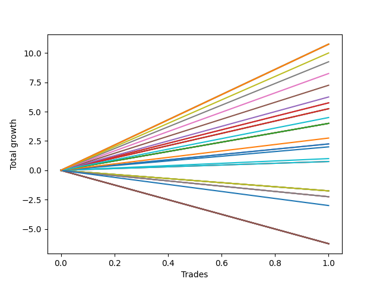

# Long Malinois 002 
- Symbol: ES_900-930
- Date Range: 03/18/2022 - 12/30/2022
- Trading Period: 9:0-9:30
- Number of Trades: 1



| Name | Win Percent | Profit | Avg Profit / Trade | Avg Time / Trade |      | Name | Win Percent | Profit | Avg Profit / Trade | Avg Time / Trade |
| ---- | ----------- | ------ | ------------------ | ---------------- | ---- | ---- | ----------- | ------ | ------------------ | ---------------- |
| Sorted By <br> Profit | | | | | | Sorted By <br> Win Percentage ||||
| NEWFI 06 | 100.00 | 5375.00 | 5375.00 | 60:55 |     | NEWFI 06 | 100.00 | 5375.00 | 5375.00 | 60:55 |
| BB-200 U/L 2SD SL-10 | 100.00 | 5375.00 | 5375.00 | 60:55 |     | BB-200 U/L 2SD SL-10 | 100.00 | 5375.00 | 5375.00 | 60:55 |
| BB-100 U/L 2SD SL-10 | 100.00 | 5375.00 | 5375.00 | 60:55 |     | BB-100 U/L 2SD SL-10 | 100.00 | 5375.00 | 5375.00 | 60:55 |
| V U/L 1SD SL-10 | 100.00 | 5375.00 | 5375.00 | 60:55 |     | V U/L 1SD SL-10 | 100.00 | 5375.00 | 5375.00 | 60:55 |
| BB-200 U/L 2SD | 100.00 | 5375.00 | 5375.00 | 60:55 |     | BB-200 U/L 2SD | 100.00 | 5375.00 | 5375.00 | 60:55 |
| BB-100 U/L 2SD | 100.00 | 5375.00 | 5375.00 | 60:55 |     | BB-100 U/L 2SD | 100.00 | 5375.00 | 5375.00 | 60:55 |
| V U/L 1SD | 100.00 | 5375.00 | 5375.00 | 60:55 |     | V U/L 1SD | 100.00 | 5375.00 | 5375.00 | 60:55 |
| TP-10 | 100.00 | 5000.00 | 5000.00 | 59:50 |     | TP-10 | 100.00 | 5000.00 | 5000.00 | 59:50 |
| TP-9 | 100.00 | 4625.00 | 4625.00 | 59:15 |     | TP-9 | 100.00 | 4625.00 | 4625.00 | 59:15 |
| TP-8 | 100.00 | 4125.00 | 4125.00 | 52:20 |     | TP-8 | 100.00 | 4125.00 | 4125.00 | 52:20 |
| TP-7 | 100.00 | 3625.00 | 3625.00 | 47:55 |     | TP-7 | 100.00 | 3625.00 | 3625.00 | 47:55 |
| TP-6 | 100.00 | 3125.00 | 3125.00 | 36:50 |     | TP-6 | 100.00 | 3125.00 | 3125.00 | 36:50 |
| V Mid SL-10 | 100.00 | 2875.00 | 2875.00 | 36:25 |     | V Mid SL-10 | 100.00 | 2875.00 | 2875.00 | 36:25 |
| V Mid | 100.00 | 2875.00 | 2875.00 | 36:25 |     | V Mid | 100.00 | 2875.00 | 2875.00 | 36:25 |
| TP-5 | 100.00 | 2625.00 | 2625.00 | 35:10 |     | TP-5 | 100.00 | 2625.00 | 2625.00 | 35:10 |
| BB-50 U/L 2SD SL-10 | 100.00 | 2625.00 | 2625.00 | 36:15 |     | BB-50 U/L 2SD SL-10 | 100.00 | 2625.00 | 2625.00 | 36:15 |
| BB-50 U/L 2SD | 100.00 | 2625.00 | 2625.00 | 36:15 |     | BB-50 U/L 2SD | 100.00 | 2625.00 | 2625.00 | 36:15 |
| NEWFI 000 | 100.00 | 2250.00 | 2250.00 | 40:05 |     | NEWFI 000 | 100.00 | 2250.00 | 2250.00 | 40:05 |
| TP-4 | 100.00 | 2000.00 | 2000.00 | 25:10 |     | TP-4 | 100.00 | 2000.00 | 2000.00 | 25:10 |
| BB-100 Mid SL-10 | 100.00 | 2000.00 | 2000.00 | 29:50 |     | BB-100 Mid SL-10 | 100.00 | 2000.00 | 2000.00 | 29:50 |
| BB-50 U/L 1SD SL-10 | 100.00 | 2000.00 | 2000.00 | 29:50 |     | BB-50 U/L 1SD SL-10 | 100.00 | 2000.00 | 2000.00 | 29:50 |
| BB-100 Mid | 100.00 | 2000.00 | 2000.00 | 29:50 |     | BB-100 Mid | 100.00 | 2000.00 | 2000.00 | 29:50 |
| BB-50 U/L 1SD | 100.00 | 2000.00 | 2000.00 | 29:50 |     | BB-50 U/L 1SD | 100.00 | 2000.00 | 2000.00 | 29:50 |
| TP-3 | 100.00 | 1375.00 | 1375.00 | 24:15 |     | TP-3 | 100.00 | 1375.00 | 1375.00 | 24:15 |
| BB-50 Mid SL-10 | 100.00 | 1125.00 | 1125.00 | 16:10 |     | BB-50 Mid SL-10 | 100.00 | 1125.00 | 1125.00 | 16:10 |
| BB-50 Mid | 100.00 | 1125.00 | 1125.00 | 16:10 |     | BB-50 Mid | 100.00 | 1125.00 | 1125.00 | 16:10 |
| TP-2 | 100.00 | 1000.00 | 1000.00 | 16:05 |     | TP-2 | 100.00 | 1000.00 | 1000.00 | 16:05 |
| TP-1 | 100.00 | 500.00 | 500.00 | 15:20 |     | TP-1 | 100.00 | 500.00 | 500.00 | 15:20 |
| BB-20 U/L 2SD C SL-10 | 100.00 | 375.00 | 375.00 | 15:10 |     | BB-20 U/L 2SD C SL-10 | 100.00 | 375.00 | 375.00 | 15:10 |
| BB-20 U/L 2SD C | 100.00 | 375.00 | 375.00 | 15:10 |     | BB-20 U/L 2SD C | 100.00 | 375.00 | 375.00 | 15:10 |
| BB-20 U/L 2SD SL-10 | 0.00 | -875.00 | -875.00 | 13:25 |     | BB-20 U/L 2SD SL-10 | 0.00 | -875.00 | -875.00 | 13:25 |
| BB-20 U/L 1SD SL-10 | 0.00 | -875.00 | -875.00 | 13:25 |     | BB-20 U/L 1SD SL-10 | 0.00 | -875.00 | -875.00 | 13:25 |
| BB-20 U/L 2SD | 0.00 | -875.00 | -875.00 | 13:25 |     | BB-20 U/L 2SD | 0.00 | -875.00 | -875.00 | 13:25 |
| BB-20 U/L 1SD | 0.00 | -875.00 | -875.00 | 13:25 |     | BB-20 U/L 1SD | 0.00 | -875.00 | -875.00 | 13:25 |
| BB-200 Mid SL-10 | 0.00 | -1125.00 | -1125.00 | 04:10 |     | BB-200 Mid SL-10 | 0.00 | -1125.00 | -1125.00 | 04:10 |
| BB-20 Mid SL-10 | 0.00 | -1125.00 | -1125.00 | 04:10 |     | BB-20 Mid SL-10 | 0.00 | -1125.00 | -1125.00 | 04:10 |
| BB-200 Mid | 0.00 | -1125.00 | -1125.00 | 04:10 |     | BB-200 Mid | 0.00 | -1125.00 | -1125.00 | 04:10 |
| BB-20 Mid | 0.00 | -1125.00 | -1125.00 | 04:10 |     | BB-20 Mid | 0.00 | -1125.00 | -1125.00 | 04:10 |
| NEWFI 0000 | 0.00 | -1500.00 | -1500.00 | 05:05 |     | NEWFI 0000 | 0.00 | -1500.00 | -1500.00 | 05:05 |
| BB-200 U/L 2SD SL-5 | 0.00 | -3125.00 | -3125.00 | 01:20 |     | BB-200 U/L 2SD SL-5 | 0.00 | -3125.00 | -3125.00 | 01:20 |
| BB-200 Mid SL-5 | 0.00 | -3125.00 | -3125.00 | 01:20 |     | BB-200 Mid SL-5 | 0.00 | -3125.00 | -3125.00 | 01:20 |
| BB-100 U/L 2SD SL-5 | 0.00 | -3125.00 | -3125.00 | 01:20 |     | BB-100 U/L 2SD SL-5 | 0.00 | -3125.00 | -3125.00 | 01:20 |
| BB-100 Mid SL-5 | 0.00 | -3125.00 | -3125.00 | 01:20 |     | BB-100 Mid SL-5 | 0.00 | -3125.00 | -3125.00 | 01:20 |
| V U/L 1SD SL-5 | 0.00 | -3125.00 | -3125.00 | 01:20 |     | V U/L 1SD SL-5 | 0.00 | -3125.00 | -3125.00 | 01:20 |
| V Mid SL-5 | 0.00 | -3125.00 | -3125.00 | 01:20 |     | V Mid SL-5 | 0.00 | -3125.00 | -3125.00 | 01:20 |
| BB-50 U/L 2SD SL-5 | 0.00 | -3125.00 | -3125.00 | 01:20 |     | BB-50 U/L 2SD SL-5 | 0.00 | -3125.00 | -3125.00 | 01:20 |
| BB-50 U/L 1SD SL-5 | 0.00 | -3125.00 | -3125.00 | 01:20 |     | BB-50 U/L 1SD SL-5 | 0.00 | -3125.00 | -3125.00 | 01:20 |
| BB-50 Mid SL-5 | 0.00 | -3125.00 | -3125.00 | 01:20 |     | BB-50 Mid SL-5 | 0.00 | -3125.00 | -3125.00 | 01:20 |
| BB-20 U/L 2SD C SL-5 | 0.00 | -3125.00 | -3125.00 | 01:20 |     | BB-20 U/L 2SD C SL-5 | 0.00 | -3125.00 | -3125.00 | 01:20 |
| BB-20 U/L 2SD SL-5 | 0.00 | -3125.00 | -3125.00 | 01:20 |     | BB-20 U/L 2SD SL-5 | 0.00 | -3125.00 | -3125.00 | 01:20 |
| BB-20 U/L 1SD SL-5 | 0.00 | -3125.00 | -3125.00 | 01:20 |     | BB-20 U/L 1SD SL-5 | 0.00 | -3125.00 | -3125.00 | 01:20 |
| BB-20 Mid SL-5 | 0.00 | -3125.00 | -3125.00 | 01:20 |     | BB-20 Mid SL-5 | 0.00 | -3125.00 | -3125.00 | 01:20 |

## NO STOPLOSS

### Test BB-20 Mid
* Sell when price hits the middle line of the 20p bollinger
* No Stoploss
* Results:
```
Total Trades: 1
Percent Up: 0.00
Percent Down: 100.00
Total Points Moved Up: -2.25
Potential Profit: -1125.00
Total Points Ups: 0.00 Count Ups: 0
Total Points Downs: -2.25 Count Downs: 1
```

<details><summary>Trades</summary>

<code>In: 2022-09-12 09:08:00		Out: 2022-09-12 09:12:10		Total Position Time: 04:10		Total Move Up: -2.25		Total to Date: -2.25</code> <br />


</details>

### Test BB-20 U/L 1SD
* Sell when the price hits the upper line of the 20p 1std bollinger
* No Stoploss
* Results:
```
Total Trades: 1
Percent Up: 0.00
Percent Down: 100.00
Total Points Moved Up: -1.75
Potential Profit: -875.00
Total Points Ups: 0.00 Count Ups: 0
Total Points Downs: -1.75 Count Downs: 1
```

<details><summary>Trades</summary>

<code>In: 2022-09-12 09:08:00		Out: 2022-09-12 09:21:25		Total Position Time: 13:25		Total Move Up: -1.75		Total to Date: -1.75</code> <br />


</details>

### Test BB-20 U/L 2SD
* Sell when the price hits the upper line of the 20p 2std bollinger
* No Stoploss
* Results:
```
Total Trades: 1
Percent Up: 0.00
Percent Down: 100.00
Total Points Moved Up: -1.75
Potential Profit: -875.00
Total Points Ups: 0.00 Count Ups: 0
Total Points Downs: -1.75 Count Downs: 1
```

<details><summary>Trades</summary>

<code>In: 2022-09-12 09:08:00		Out: 2022-09-12 09:21:25		Total Position Time: 13:25		Total Move Up: -1.75		Total to Date: -1.75</code> <br />


</details>

### Test BB-20 U/L 2SD C
* Sell when the price hits the upper line of the 20p 2std bollinger
* No Stoploss
* Results:
```
Total Trades: 1
Percent Up: 100.00
Percent Down: 0.00
Total Points Moved Up: 0.75
Potential Profit: 375.00
Total Points Ups: 0.75 Count Ups: 1
Total Points Downs: 0.00 Count Downs: 0
```

<details><summary>Trades</summary>

<code>In: 2022-09-12 09:08:00		Out: 2022-09-12 09:23:10		Total Position Time: 15:10		Total Move Up: 0.75		Total to Date: 0.75</code> <br />


</details>

### Test BB-50 Mid
* Sell when price hits the middle line of the 50p bollinger
* No Stoploss
* Results:
```
Total Trades: 1
Percent Up: 100.00
Percent Down: 0.00
Total Points Moved Up: 2.25
Potential Profit: 1125.00
Total Points Ups: 2.25 Count Ups: 1
Total Points Downs: 0.00 Count Downs: 0
```

<details><summary>Trades</summary>

<code>In: 2022-09-12 09:08:00		Out: 2022-09-12 09:24:10		Total Position Time: 16:10		Total Move Up: 2.25		Total to Date: 2.25</code> <br />


</details>

### Test BB-50 U/L 1SD
* Sell when the price hits the upper line of the 50p 1std bollinger
* No Stoploss
* Results:
```
Total Trades: 1
Percent Up: 100.00
Percent Down: 0.00
Total Points Moved Up: 4.00
Potential Profit: 2000.00
Total Points Ups: 4.00 Count Ups: 1
Total Points Downs: 0.00 Count Downs: 0
```

<details><summary>Trades</summary>

<code>In: 2022-09-12 09:08:00		Out: 2022-09-12 09:37:50		Total Position Time: 29:50		Total Move Up: 4.00		Total to Date: 4.00</code> <br />


</details>

### Test BB-50 U/L 2SD
* Sell when the price hits the upper line of the 50p 2std bollinger
* No Stoploss
* Results:
```
Total Trades: 1
Percent Up: 100.00
Percent Down: 0.00
Total Points Moved Up: 5.25
Potential Profit: 2625.00
Total Points Ups: 5.25 Count Ups: 1
Total Points Downs: 0.00 Count Downs: 0
```

<details><summary>Trades</summary>

<code>In: 2022-09-12 09:08:00		Out: 2022-09-12 09:44:15		Total Position Time: 36:15		Total Move Up: 5.25		Total to Date: 5.25</code> <br />


</details>

### Test V Mid
* Sell when the price hits the middle line of the 1std VWAP
* No Stoploss
* Results:
```
Total Trades: 1
Percent Up: 100.00
Percent Down: 0.00
Total Points Moved Up: 5.75
Potential Profit: 2875.00
Total Points Ups: 5.75 Count Ups: 1
Total Points Downs: 0.00 Count Downs: 0
```

<details><summary>Trades</summary>

<code>In: 2022-09-12 09:08:00		Out: 2022-09-12 09:44:25		Total Position Time: 36:25		Total Move Up: 5.75		Total to Date: 5.75</code> <br />


</details>

### Test V U/L 1SD
* Sell when the price hits the upper line of the 1std VWAP
* No Stoploss
* Results:
```
Total Trades: 1
Percent Up: 100.00
Percent Down: 0.00
Total Points Moved Up: 10.75
Potential Profit: 5375.00
Total Points Ups: 10.75 Count Ups: 1
Total Points Downs: 0.00 Count Downs: 0
```

<details><summary>Trades</summary>

<code>In: 2022-09-12 09:08:00		Out: 2022-09-12 10:08:55		Total Position Time: 60:55		Total Move Up: 10.75		Total to Date: 10.75</code> <br />


</details>

### Test BB-100 Mid
* Move to BB100 Mid
* No Stoploss
* Results:
```
Total Trades: 1
Percent Up: 100.00
Percent Down: 0.00
Total Points Moved Up: 4.00
Potential Profit: 2000.00
Total Points Ups: 4.00 Count Ups: 1
Total Points Downs: 0.00 Count Downs: 0
```

<details><summary>Trades</summary>

<code>In: 2022-09-12 09:08:00		Out: 2022-09-12 09:37:50		Total Position Time: 29:50		Total Move Up: 4.00		Total to Date: 4.00</code> <br />


</details>

### Test BB-100 U/L 2SD
* Move to BB100 Upper Band
* No Stoploss
* Results:
```
Total Trades: 1
Percent Up: 100.00
Percent Down: 0.00
Total Points Moved Up: 10.75
Potential Profit: 5375.00
Total Points Ups: 10.75 Count Ups: 1
Total Points Downs: 0.00 Count Downs: 0
```

<details><summary>Trades</summary>

<code>In: 2022-09-12 09:08:00		Out: 2022-09-12 10:08:55		Total Position Time: 60:55		Total Move Up: 10.75		Total to Date: 10.75</code> <br />


</details>

### Test BB-200 Mid
* Move to BB200 Mid
* No Stoploss
* Results:
```
Total Trades: 1
Percent Up: 0.00
Percent Down: 100.00
Total Points Moved Up: -2.25
Potential Profit: -1125.00
Total Points Ups: 0.00 Count Ups: 0
Total Points Downs: -2.25 Count Downs: 1
```

<details><summary>Trades</summary>

<code>In: 2022-09-12 09:08:00		Out: 2022-09-12 09:12:10		Total Position Time: 04:10		Total Move Up: -2.25		Total to Date: -2.25</code> <br />


</details>

### Test BB-200 U/L 2SD
* Move to BB200 Upper Band
* No Stoploss
* Results:
```
Total Trades: 1
Percent Up: 100.00
Percent Down: 0.00
Total Points Moved Up: 10.75
Potential Profit: 5375.00
Total Points Ups: 10.75 Count Ups: 1
Total Points Downs: 0.00 Count Downs: 0
```

<details><summary>Trades</summary>

<code>In: 2022-09-12 09:08:00		Out: 2022-09-12 10:08:55		Total Position Time: 60:55		Total Move Up: 10.75		Total to Date: 10.75</code> <br />


</details>

## STOPLOSS OF 5

### Test BB-20 Mid SL-5
* Sell when price hits the middle line of the 20p bollinger
* Stoploss is 5 points
* Results:
```
Total Trades: 1
Percent Up: 0.00
Percent Down: 100.00
Total Points Moved Up: -6.25
Potential Profit: -3125.00
Total Points Ups: 0.00 Count Ups: 0
Total Points Downs: -6.25 Count Downs: 1
```

<details><summary>Trades</summary>

<code>In: 2022-09-12 09:08:00		Out: 2022-09-12 09:09:20		Total Position Time: 01:20		Total Move Up: -6.25		Total to Date: -6.25</code> <br />


</details>

### Test BB-20 U/L 1SD SL-5
* Sell when the price hits the upper line of the 20p 1std bollinger
* Stoploss is 5 points
* Results:
```
Total Trades: 1
Percent Up: 0.00
Percent Down: 100.00
Total Points Moved Up: -6.25
Potential Profit: -3125.00
Total Points Ups: 0.00 Count Ups: 0
Total Points Downs: -6.25 Count Downs: 1
```

<details><summary>Trades</summary>

<code>In: 2022-09-12 09:08:00		Out: 2022-09-12 09:09:20		Total Position Time: 01:20		Total Move Up: -6.25		Total to Date: -6.25</code> <br />


</details>

### Test BB-20 U/L 2SD SL-5
* Sell when the price hits the upper line of the 20p 2std bollinger
* Stoploss is 5 points
* Results:
```
Total Trades: 1
Percent Up: 0.00
Percent Down: 100.00
Total Points Moved Up: -6.25
Potential Profit: -3125.00
Total Points Ups: 0.00 Count Ups: 0
Total Points Downs: -6.25 Count Downs: 1
```

<details><summary>Trades</summary>

<code>In: 2022-09-12 09:08:00		Out: 2022-09-12 09:09:20		Total Position Time: 01:20		Total Move Up: -6.25		Total to Date: -6.25</code> <br />


</details>

### Test BB-20 U/L 2SD C SL-5
* Sell when the price hits the upper line of the 20p 2std bollinger
* Stoploss is 5 points
* Results:
```
Total Trades: 1
Percent Up: 0.00
Percent Down: 100.00
Total Points Moved Up: -6.25
Potential Profit: -3125.00
Total Points Ups: 0.00 Count Ups: 0
Total Points Downs: -6.25 Count Downs: 1
```

<details><summary>Trades</summary>

<code>In: 2022-09-12 09:08:00		Out: 2022-09-12 09:09:20		Total Position Time: 01:20		Total Move Up: -6.25		Total to Date: -6.25</code> <br />


</details>

### Test BB-50 Mid SL-5
* Sell when price hits the middle line of the 50p bollinger
* Stoploss is 5 points
* Results:
```
Total Trades: 1
Percent Up: 0.00
Percent Down: 100.00
Total Points Moved Up: -6.25
Potential Profit: -3125.00
Total Points Ups: 0.00 Count Ups: 0
Total Points Downs: -6.25 Count Downs: 1
```

<details><summary>Trades</summary>

<code>In: 2022-09-12 09:08:00		Out: 2022-09-12 09:09:20		Total Position Time: 01:20		Total Move Up: -6.25		Total to Date: -6.25</code> <br />


</details>

### Test BB-50 U/L 1SD SL-5
* Sell when the price hits the upper line of the 50p 1std bollinger
* Stoploss is 5 points
* Results:
```
Total Trades: 1
Percent Up: 0.00
Percent Down: 100.00
Total Points Moved Up: -6.25
Potential Profit: -3125.00
Total Points Ups: 0.00 Count Ups: 0
Total Points Downs: -6.25 Count Downs: 1
```

<details><summary>Trades</summary>

<code>In: 2022-09-12 09:08:00		Out: 2022-09-12 09:09:20		Total Position Time: 01:20		Total Move Up: -6.25		Total to Date: -6.25</code> <br />


</details>

### Test BB-50 U/L 2SD SL-5
* Sell when the price hits the upper line of the 50p 2std bollinger
* Stoploss is 5 points
* Results:
```
Total Trades: 1
Percent Up: 0.00
Percent Down: 100.00
Total Points Moved Up: -6.25
Potential Profit: -3125.00
Total Points Ups: 0.00 Count Ups: 0
Total Points Downs: -6.25 Count Downs: 1
```

<details><summary>Trades</summary>

<code>In: 2022-09-12 09:08:00		Out: 2022-09-12 09:09:20		Total Position Time: 01:20		Total Move Up: -6.25		Total to Date: -6.25</code> <br />


</details>

### Test V Mid SL-5
* Sell when the price hits the middle line of the 1std VWAP
* Stoploss is 5 points
* Results:
```
Total Trades: 1
Percent Up: 0.00
Percent Down: 100.00
Total Points Moved Up: -6.25
Potential Profit: -3125.00
Total Points Ups: 0.00 Count Ups: 0
Total Points Downs: -6.25 Count Downs: 1
```

<details><summary>Trades</summary>

<code>In: 2022-09-12 09:08:00		Out: 2022-09-12 09:09:20		Total Position Time: 01:20		Total Move Up: -6.25		Total to Date: -6.25</code> <br />


</details>

### Test V U/L 1SD SL-5
* Sell when the price hits the upper line of the 1std VWAP
* Stoploss is 5 points
* Results:
```
Total Trades: 1
Percent Up: 0.00
Percent Down: 100.00
Total Points Moved Up: -6.25
Potential Profit: -3125.00
Total Points Ups: 0.00 Count Ups: 0
Total Points Downs: -6.25 Count Downs: 1
```

<details><summary>Trades</summary>

<code>In: 2022-09-12 09:08:00		Out: 2022-09-12 09:09:20		Total Position Time: 01:20		Total Move Up: -6.25		Total to Date: -6.25</code> <br />


</details>

### Test BB-100 Mid SL-5
* Move to BB100 Mid
* Stoploss is 5 points
* Results:
```
Total Trades: 1
Percent Up: 0.00
Percent Down: 100.00
Total Points Moved Up: -6.25
Potential Profit: -3125.00
Total Points Ups: 0.00 Count Ups: 0
Total Points Downs: -6.25 Count Downs: 1
```

<details><summary>Trades</summary>

<code>In: 2022-09-12 09:08:00		Out: 2022-09-12 09:09:20		Total Position Time: 01:20		Total Move Up: -6.25		Total to Date: -6.25</code> <br />


</details>

### Test BB-100 U/L 2SD SL-5
* Move to BB100 Upper Band
* Stoploss is 5 points
* Results:
```
Total Trades: 1
Percent Up: 0.00
Percent Down: 100.00
Total Points Moved Up: -6.25
Potential Profit: -3125.00
Total Points Ups: 0.00 Count Ups: 0
Total Points Downs: -6.25 Count Downs: 1
```

<details><summary>Trades</summary>

<code>In: 2022-09-12 09:08:00		Out: 2022-09-12 09:09:20		Total Position Time: 01:20		Total Move Up: -6.25		Total to Date: -6.25</code> <br />


</details>

### Test BB-200 Mid SL-5
* Move to BB200 Mid
* Stoploss is 5 points
* Results:
```
Total Trades: 1
Percent Up: 0.00
Percent Down: 100.00
Total Points Moved Up: -6.25
Potential Profit: -3125.00
Total Points Ups: 0.00 Count Ups: 0
Total Points Downs: -6.25 Count Downs: 1
```

<details><summary>Trades</summary>

<code>In: 2022-09-12 09:08:00		Out: 2022-09-12 09:09:20		Total Position Time: 01:20		Total Move Up: -6.25		Total to Date: -6.25</code> <br />


</details>

### Test BB-200 U/L 2SD SL-5
* Move to BB200 Upper Band
* Stoploss is 5 points
* Results:
```
Total Trades: 1
Percent Up: 0.00
Percent Down: 100.00
Total Points Moved Up: -6.25
Potential Profit: -3125.00
Total Points Ups: 0.00 Count Ups: 0
Total Points Downs: -6.25 Count Downs: 1
```

<details><summary>Trades</summary>

<code>In: 2022-09-12 09:08:00		Out: 2022-09-12 09:09:20		Total Position Time: 01:20		Total Move Up: -6.25		Total to Date: -6.25</code> <br />


</details>

## STOPLOSS OF 10

### Test BB-20 Mid SL-10
* Sell when price hits the middle line of the 20p bollinger
* Stoploss is 10 points
* Results:
```
Total Trades: 1
Percent Up: 0.00
Percent Down: 100.00
Total Points Moved Up: -2.25
Potential Profit: -1125.00
Total Points Ups: 0.00 Count Ups: 0
Total Points Downs: -2.25 Count Downs: 1
```

<details><summary>Trades</summary>

<code>In: 2022-09-12 09:08:00		Out: 2022-09-12 09:12:10		Total Position Time: 04:10		Total Move Up: -2.25		Total to Date: -2.25</code> <br />


</details>

### Test BB-20 U/L 1SD SL-10
* Sell when the price hits the upper line of the 20p 1std bollinger
* Stoploss is 10 points
* Results:
```
Total Trades: 1
Percent Up: 0.00
Percent Down: 100.00
Total Points Moved Up: -1.75
Potential Profit: -875.00
Total Points Ups: 0.00 Count Ups: 0
Total Points Downs: -1.75 Count Downs: 1
```

<details><summary>Trades</summary>

<code>In: 2022-09-12 09:08:00		Out: 2022-09-12 09:21:25		Total Position Time: 13:25		Total Move Up: -1.75		Total to Date: -1.75</code> <br />


</details>

### Test BB-20 U/L 2SD SL-10
* Sell when the price hits the upper line of the 20p 2std bollinger
* Stoploss is 10 points
* Results:
```
Total Trades: 1
Percent Up: 0.00
Percent Down: 100.00
Total Points Moved Up: -1.75
Potential Profit: -875.00
Total Points Ups: 0.00 Count Ups: 0
Total Points Downs: -1.75 Count Downs: 1
```

<details><summary>Trades</summary>

<code>In: 2022-09-12 09:08:00		Out: 2022-09-12 09:21:25		Total Position Time: 13:25		Total Move Up: -1.75		Total to Date: -1.75</code> <br />


</details>

### Test BB-20 U/L 2SD C SL-10
* Sell when the price hits the upper line of the 20p 2std bollinger
* Stoploss is 10 points
* Results:
```
Total Trades: 1
Percent Up: 100.00
Percent Down: 0.00
Total Points Moved Up: 0.75
Potential Profit: 375.00
Total Points Ups: 0.75 Count Ups: 1
Total Points Downs: 0.00 Count Downs: 0
```

<details><summary>Trades</summary>

<code>In: 2022-09-12 09:08:00		Out: 2022-09-12 09:23:10		Total Position Time: 15:10		Total Move Up: 0.75		Total to Date: 0.75</code> <br />


</details>

### Test BB-50 Mid SL-10
* Sell when price hits the middle line of the 50p bollinger
* Stoploss is 10 points
* Results:
```
Total Trades: 1
Percent Up: 100.00
Percent Down: 0.00
Total Points Moved Up: 2.25
Potential Profit: 1125.00
Total Points Ups: 2.25 Count Ups: 1
Total Points Downs: 0.00 Count Downs: 0
```

<details><summary>Trades</summary>

<code>In: 2022-09-12 09:08:00		Out: 2022-09-12 09:24:10		Total Position Time: 16:10		Total Move Up: 2.25		Total to Date: 2.25</code> <br />


</details>

### Test BB-50 U/L 1SD SL-10
* Sell when the price hits the upper line of the 50p 1std bollinger
* Stoploss is 10 points
* Results:
```
Total Trades: 1
Percent Up: 100.00
Percent Down: 0.00
Total Points Moved Up: 4.00
Potential Profit: 2000.00
Total Points Ups: 4.00 Count Ups: 1
Total Points Downs: 0.00 Count Downs: 0
```

<details><summary>Trades</summary>

<code>In: 2022-09-12 09:08:00		Out: 2022-09-12 09:37:50		Total Position Time: 29:50		Total Move Up: 4.00		Total to Date: 4.00</code> <br />


</details>

### Test BB-50 U/L 2SD SL-10
* Sell when the price hits the upper line of the 50p 2std bollinger
* Stoploss is 10 points
* Results:
```
Total Trades: 1
Percent Up: 100.00
Percent Down: 0.00
Total Points Moved Up: 5.25
Potential Profit: 2625.00
Total Points Ups: 5.25 Count Ups: 1
Total Points Downs: 0.00 Count Downs: 0
```

<details><summary>Trades</summary>

<code>In: 2022-09-12 09:08:00		Out: 2022-09-12 09:44:15		Total Position Time: 36:15		Total Move Up: 5.25		Total to Date: 5.25</code> <br />


</details>

### Test V Mid SL-10
* Sell when the price hits the middle line of the 1std VWAP
* Stoploss is 10 points
* Results:
```
Total Trades: 1
Percent Up: 100.00
Percent Down: 0.00
Total Points Moved Up: 5.75
Potential Profit: 2875.00
Total Points Ups: 5.75 Count Ups: 1
Total Points Downs: 0.00 Count Downs: 0
```

<details><summary>Trades</summary>

<code>In: 2022-09-12 09:08:00		Out: 2022-09-12 09:44:25		Total Position Time: 36:25		Total Move Up: 5.75		Total to Date: 5.75</code> <br />


</details>

### Test V U/L 1SD SL-10
* Sell when the price hits the upper line of the 1std VWAP
* Stoploss is 10 points
* Results:
```
Total Trades: 1
Percent Up: 100.00
Percent Down: 0.00
Total Points Moved Up: 10.75
Potential Profit: 5375.00
Total Points Ups: 10.75 Count Ups: 1
Total Points Downs: 0.00 Count Downs: 0
```

<details><summary>Trades</summary>

<code>In: 2022-09-12 09:08:00		Out: 2022-09-12 10:08:55		Total Position Time: 60:55		Total Move Up: 10.75		Total to Date: 10.75</code> <br />


</details>

### Test BB-100 Mid SL-10
* Move to BB100 Mid
* Stoploss is 10 points
* Results:
```
Total Trades: 1
Percent Up: 100.00
Percent Down: 0.00
Total Points Moved Up: 4.00
Potential Profit: 2000.00
Total Points Ups: 4.00 Count Ups: 1
Total Points Downs: 0.00 Count Downs: 0
```

<details><summary>Trades</summary>

<code>In: 2022-09-12 09:08:00		Out: 2022-09-12 09:37:50		Total Position Time: 29:50		Total Move Up: 4.00		Total to Date: 4.00</code> <br />


</details>

### Test BB-100 U/L 2SD SL-10
* Move to BB100 Upper Band
* Stoploss is 10 points
* Results:
```
Total Trades: 1
Percent Up: 100.00
Percent Down: 0.00
Total Points Moved Up: 10.75
Potential Profit: 5375.00
Total Points Ups: 10.75 Count Ups: 1
Total Points Downs: 0.00 Count Downs: 0
```

<details><summary>Trades</summary>

<code>In: 2022-09-12 09:08:00		Out: 2022-09-12 10:08:55		Total Position Time: 60:55		Total Move Up: 10.75		Total to Date: 10.75</code> <br />


</details>

### Test BB-200 Mid SL-10
* Move to BB200 Mid
* Stoploss is 10 points
* Results:
```
Total Trades: 1
Percent Up: 0.00
Percent Down: 100.00
Total Points Moved Up: -2.25
Potential Profit: -1125.00
Total Points Ups: 0.00 Count Ups: 0
Total Points Downs: -2.25 Count Downs: 1
```

<details><summary>Trades</summary>

<code>In: 2022-09-12 09:08:00		Out: 2022-09-12 09:12:10		Total Position Time: 04:10		Total Move Up: -2.25		Total to Date: -2.25</code> <br />


</details>

### Test BB-200 U/L 2SD SL-10
* Move to BB200 Upper Band
* Stoploss is 10 points
* Results:
```
Total Trades: 1
Percent Up: 100.00
Percent Down: 0.00
Total Points Moved Up: 10.75
Potential Profit: 5375.00
Total Points Ups: 10.75 Count Ups: 1
Total Points Downs: 0.00 Count Downs: 0
```

<details><summary>Trades</summary>

<code>In: 2022-09-12 09:08:00		Out: 2022-09-12 10:08:55		Total Position Time: 60:55		Total Move Up: 10.75		Total to Date: 10.75</code> <br />


</details>

## TAKE PROFIT

### Test TP-1
* Take Profit of 1 Point
* No Stoploss
* Results:
```
Total Trades: 1
Percent Up: 100.00
Percent Down: 0.00
Total Points Moved Up: 1.00
Potential Profit: 500.00
Total Points Ups: 1.00 Count Ups: 1
Total Points Downs: 0.00 Count Downs: 0
```

<details><summary>Trades</summary>

<code>In: 2022-09-12 09:08:00		Out: 2022-09-12 09:23:20		Total Position Time: 15:20		Total Move Up: 1.00		Total to Date: 1.00</code> <br />


</details>

### Test TP-2
* Take Profit of 2 Point
* No Stoploss
* Results:
```
Total Trades: 1
Percent Up: 100.00
Percent Down: 0.00
Total Points Moved Up: 2.00
Potential Profit: 1000.00
Total Points Ups: 2.00 Count Ups: 1
Total Points Downs: 0.00 Count Downs: 0
```

<details><summary>Trades</summary>

<code>In: 2022-09-12 09:08:00		Out: 2022-09-12 09:24:05		Total Position Time: 16:05		Total Move Up: 2.00		Total to Date: 2.00</code> <br />


</details>

### Test TP-3
* Take Profit of 3 Point
* No Stoploss
* Results:
```
Total Trades: 1
Percent Up: 100.00
Percent Down: 0.00
Total Points Moved Up: 2.75
Potential Profit: 1375.00
Total Points Ups: 2.75 Count Ups: 1
Total Points Downs: 0.00 Count Downs: 0
```

<details><summary>Trades</summary>

<code>In: 2022-09-12 09:08:00		Out: 2022-09-12 09:32:15		Total Position Time: 24:15		Total Move Up: 2.75		Total to Date: 2.75</code> <br />


</details>

### Test TP-4
* Take Profit of 4 Point
* No Stoploss
* Results:
```
Total Trades: 1
Percent Up: 100.00
Percent Down: 0.00
Total Points Moved Up: 4.00
Potential Profit: 2000.00
Total Points Ups: 4.00 Count Ups: 1
Total Points Downs: 0.00 Count Downs: 0
```

<details><summary>Trades</summary>

<code>In: 2022-09-12 09:08:00		Out: 2022-09-12 09:33:10		Total Position Time: 25:10		Total Move Up: 4.00		Total to Date: 4.00</code> <br />


</details>

### Test TP-5
* Take Profit of 5 Point
* No Stoploss
* Results:
```
Total Trades: 1
Percent Up: 100.00
Percent Down: 0.00
Total Points Moved Up: 5.25
Potential Profit: 2625.00
Total Points Ups: 5.25 Count Ups: 1
Total Points Downs: 0.00 Count Downs: 0
```

<details><summary>Trades</summary>

<code>In: 2022-09-12 09:08:00		Out: 2022-09-12 09:43:10		Total Position Time: 35:10		Total Move Up: 5.25		Total to Date: 5.25</code> <br />


</details>

### Test TP-6
* Take Profit of 6 Point
* No Stoploss
* Results:
```
Total Trades: 1
Percent Up: 100.00
Percent Down: 0.00
Total Points Moved Up: 6.25
Potential Profit: 3125.00
Total Points Ups: 6.25 Count Ups: 1
Total Points Downs: 0.00 Count Downs: 0
```

<details><summary>Trades</summary>

<code>In: 2022-09-12 09:08:00		Out: 2022-09-12 09:44:50		Total Position Time: 36:50		Total Move Up: 6.25		Total to Date: 6.25</code> <br />


</details>

### Test TP-7
* Take Profit of 7 Point
* No Stoploss
* Results:
```
Total Trades: 1
Percent Up: 100.00
Percent Down: 0.00
Total Points Moved Up: 7.25
Potential Profit: 3625.00
Total Points Ups: 7.25 Count Ups: 1
Total Points Downs: 0.00 Count Downs: 0
```

<details><summary>Trades</summary>

<code>In: 2022-09-12 09:08:00		Out: 2022-09-12 09:55:55		Total Position Time: 47:55		Total Move Up: 7.25		Total to Date: 7.25</code> <br />


</details>

### Test TP-8
* Take Profit of 8 Point
* No Stoploss
* Results:
```
Total Trades: 1
Percent Up: 100.00
Percent Down: 0.00
Total Points Moved Up: 8.25
Potential Profit: 4125.00
Total Points Ups: 8.25 Count Ups: 1
Total Points Downs: 0.00 Count Downs: 0
```

<details><summary>Trades</summary>

<code>In: 2022-09-12 09:08:00		Out: 2022-09-12 10:00:20		Total Position Time: 52:20		Total Move Up: 8.25		Total to Date: 8.25</code> <br />


</details>

### Test TP-9
* Take Profit of 9 Point
* No Stoploss
* Results:
```
Total Trades: 1
Percent Up: 100.00
Percent Down: 0.00
Total Points Moved Up: 9.25
Potential Profit: 4625.00
Total Points Ups: 9.25 Count Ups: 1
Total Points Downs: 0.00 Count Downs: 0
```

<details><summary>Trades</summary>

<code>In: 2022-09-12 09:08:00		Out: 2022-09-12 10:07:15		Total Position Time: 59:15		Total Move Up: 9.25		Total to Date: 9.25</code> <br />


</details>

### Test TP-10
* Take Profit of 10 Point
* No Stoploss
* Results:
```
Total Trades: 1
Percent Up: 100.00
Percent Down: 0.00
Total Points Moved Up: 10.00
Potential Profit: 5000.00
Total Points Ups: 10.00 Count Ups: 1
Total Points Downs: 0.00 Count Downs: 0
```

<details><summary>Trades</summary>

<code>In: 2022-09-12 09:08:00		Out: 2022-09-12 10:07:50		Total Position Time: 59:50		Total Move Up: 10.00		Total to Date: 10.00</code> <br />


</details>

## Indicator Exits

### Test NEWFI 000
* Newfi 0000
* No Stoploss
* Results:
```
Total Trades: 1
Percent Up: 100.00
Percent Down: 0.00
Total Points Moved Up: 4.50
Potential Profit: 2250.00
Total Points Ups: 4.50 Count Ups: 1
Total Points Downs: 0.00 Count Downs: 0
```

<details><summary>Trades</summary>

<code>In: 2022-09-12 09:08:00		Out: 2022-09-12 09:48:05		Total Position Time: 40:05		Total Move Up: 4.50		Total to Date: 4.50</code> <br />


</details>

### Test NEWFI 0000
* Newfi 0000
* No Stoploss
* Results:
```
Total Trades: 1
Percent Up: 0.00
Percent Down: 100.00
Total Points Moved Up: -3.00
Potential Profit: -1500.00
Total Points Ups: 0.00 Count Ups: 0
Total Points Downs: -3.00 Count Downs: 1
```

<details><summary>Trades</summary>

<code>In: 2022-09-12 09:08:00		Out: 2022-09-12 09:13:05		Total Position Time: 05:05		Total Move Up: -3.00		Total to Date: -3.00</code> <br />


</details>

### Test NEWFI 06
* Newfi 06
* No Stoploss
* Results:
```
Total Trades: 1
Percent Up: 100.00
Percent Down: 0.00
Total Points Moved Up: 10.75
Potential Profit: 5375.00
Total Points Ups: 10.75 Count Ups: 1
Total Points Downs: 0.00 Count Downs: 0
```

<details><summary>Trades</summary>

<code>In: 2022-09-12 09:08:00		Out: 2022-09-12 10:08:55		Total Position Time: 60:55		Total Move Up: 10.75		Total to Date: 10.75</code> <br />


</details>