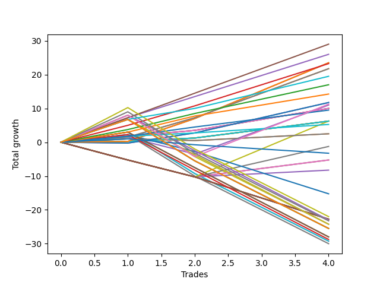

# Short Labrador 002 
- Symbol: ES_900-930
- Date Range: 03/18/2022 - 12/30/2022
- Trading Period: 9:0-9:30
- Number of Trades: 4



| Name | Win Percent | Profit | Avg Profit / Trade | Avg Time / Trade |      | Name | Win Percent | Profit | Avg Profit / Trade | Avg Time / Trade |
| ---- | ----------- | ------ | ------------------ | ---------------- | ---- | ---- | ----------- | ------ | ------------------ | ---------------- |
| Sorted By <br> Profit | | | | | | Sorted By <br> Win Percentage ||||
| TP-7 | 100.00 | 14500.00 | 3625.00 | 29:35 |     | TP-7 | 100.00 | 14500.00 | 3625.00 | 29:35 |
| TP-6 | 100.00 | 13000.00 | 3250.00 | 28:52 |     | TP-6 | 100.00 | 13000.00 | 3250.00 | 28:52 |
| BB-50 U/L 1SD SL-10 | 100.00 | 11750.00 | 2937.50 | 30:05 |     | BB-50 U/L 1SD SL-10 | 100.00 | 11750.00 | 2937.50 | 30:05 |
| BB-50 U/L 1SD | 100.00 | 11750.00 | 2937.50 | 30:05 |     | BB-50 U/L 1SD | 100.00 | 11750.00 | 2937.50 | 30:05 |
| TP-5 | 100.00 | 11625.00 | 2906.25 | 28:08 |     | TP-5 | 100.00 | 11625.00 | 2906.25 | 28:08 |
| BB-200 Mid SL-10 | 100.00 | 10875.00 | 2718.75 | 17:30 |     | BB-200 Mid SL-10 | 100.00 | 10875.00 | 2718.75 | 17:30 |
| BB-200 Mid | 100.00 | 10875.00 | 2718.75 | 17:30 |     | BB-200 Mid | 100.00 | 10875.00 | 2718.75 | 17:30 |
| NEWFI 000 | 100.00 | 9750.00 | 2437.50 | 39:32 |     | NEWFI 000 | 100.00 | 9750.00 | 2437.50 | 39:32 |
| TP-4 | 100.00 | 8500.00 | 2125.00 | 27:58 |     | TP-4 | 100.00 | 8500.00 | 2125.00 | 27:58 |
| TP-3 | 100.00 | 7125.00 | 1781.25 | 18:12 |     | TP-3 | 100.00 | 7125.00 | 1781.25 | 18:12 |
| BB-50 Mid SL-10 | 75.00 | 5875.00 | 1468.75 | 25:32 |     | BB-20 Mid SL-10 | 100.00 | 5000.00 | 1250.00 | 04:25 |
| BB-50 Mid | 75.00 | 5875.00 | 1468.75 | 25:32 |     | BB-20 Mid SL-5 | 100.00 | 5000.00 | 1250.00 | 04:25 |
| TP-8 | 75.00 | 5625.00 | 1406.25 | 39:01 |     | BB-20 Mid | 100.00 | 5000.00 | 1250.00 | 04:25 |
| BB-200 Mid SL-5 | 75.00 | 5500.00 | 1375.00 | 14:21 |     | TP-2 | 100.00 | 4750.00 | 1187.50 | 08:45 |
| BB-20 Mid SL-10 | 100.00 | 5000.00 | 1250.00 | 04:25 |     | BB-20 U/L 2SD C SL-10 | 100.00 | 3125.00 | 781.25 | 20:53 |
| BB-20 Mid SL-5 | 100.00 | 5000.00 | 1250.00 | 04:25 |     | BB-20 U/L 2SD SL-10 | 100.00 | 3125.00 | 781.25 | 20:53 |
| BB-20 Mid | 100.00 | 5000.00 | 1250.00 | 04:25 |     | BB-20 U/L 2SD C | 100.00 | 3125.00 | 781.25 | 20:53 |
| TP-2 | 100.00 | 4750.00 | 1187.50 | 08:45 |     | BB-20 U/L 2SD | 100.00 | 3125.00 | 781.25 | 20:53 |
| BB-20 U/L 2SD C SL-10 | 100.00 | 3125.00 | 781.25 | 20:53 |     | TP-1 | 100.00 | 2625.00 | 656.25 | 03:52 |
| BB-20 U/L 2SD SL-10 | 100.00 | 3125.00 | 781.25 | 20:53 |     | BB-50 Mid SL-10 | 75.00 | 5875.00 | 1468.75 | 25:32 |
| BB-20 U/L 2SD C | 100.00 | 3125.00 | 781.25 | 20:53 |     | BB-50 Mid | 75.00 | 5875.00 | 1468.75 | 25:32 |
| BB-20 U/L 2SD | 100.00 | 3125.00 | 781.25 | 20:53 |     | TP-8 | 75.00 | 5625.00 | 1406.25 | 39:01 |
| BB-50 U/L 1SD SL-5 | 50.00 | 3125.00 | 781.25 | 19:21 |     | BB-200 Mid SL-5 | 75.00 | 5500.00 | 1375.00 | 14:21 |
| TP-1 | 100.00 | 2625.00 | 656.25 | 03:52 |     | BB-20 U/L 1SD SL-10 | 75.00 | 1250.00 | 312.50 | 14:57 |
| BB-20 U/L 1SD SL-10 | 75.00 | 1250.00 | 312.50 | 14:57 |     | BB-20 U/L 1SD | 75.00 | 1250.00 | 312.50 | 14:57 |
| BB-20 U/L 1SD | 75.00 | 1250.00 | 312.50 | 14:57 |     | BB-50 U/L 1SD SL-5 | 50.00 | 3125.00 | 781.25 | 19:21 |
| BB-50 Mid SL-5 | 50.00 | -625.00 | -156.25 | 16:38 |     | BB-50 Mid SL-5 | 50.00 | -625.00 | -156.25 | 16:38 |
| NEWFI 0000 | 25.00 | -1625.00 | -406.25 | 09:35 |     | BB-20 U/L 2SD C SL-5 | 50.00 | -2625.00 | -656.25 | 13:13 |
| BB-20 U/L 2SD C SL-5 | 50.00 | -2625.00 | -656.25 | 13:13 |     | BB-20 U/L 2SD SL-5 | 50.00 | -2625.00 | -656.25 | 13:13 |
| BB-20 U/L 2SD SL-5 | 50.00 | -2625.00 | -656.25 | 13:13 |     | BB-20 U/L 1SD SL-5 | 50.00 | -4125.00 | -1031.25 | 13:03 |
| BB-20 U/L 1SD SL-5 | 50.00 | -4125.00 | -1031.25 | 13:03 |     | NEWFI 0000 | 25.00 | -1625.00 | -406.25 | 09:35 |
| V Mid SL-5 | 25.00 | -7625.00 | -1906.25 | 23:07 |     | V Mid SL-5 | 25.00 | -7625.00 | -1906.25 | 23:07 |
| TP-10 | 25.00 | -11000.00 | -2750.00 | 57:15 |     | TP-10 | 25.00 | -11000.00 | -2750.00 | 57:15 |
| BB-200 U/L 2SD SL-5 | 0.00 | -11375.00 | -2843.75 | 25:03 |     | V U/L 1SD SL-10 | 25.00 | -11500.00 | -2875.00 | 42:46 |
| BB-100 U/L 2SD SL-5 | 0.00 | -11375.00 | -2843.75 | 25:03 |     | TP-9 | 25.00 | -11625.00 | -2906.25 | 57:07 |
| BB-100 Mid SL-5 | 0.00 | -11375.00 | -2843.75 | 25:03 |     | BB-200 U/L 2SD SL-10 | 25.00 | -12125.00 | -3031.25 | 46:55 |
| V U/L 1SD SL-5 | 0.00 | -11375.00 | -2843.75 | 25:03 |     | BB-100 U/L 2SD SL-10 | 25.00 | -12125.00 | -3031.25 | 46:55 |
| BB-50 U/L 2SD SL-5 | 0.00 | -11375.00 | -2843.75 | 25:03 |     | V U/L 1SD | 25.00 | -12125.00 | -3031.25 | 56:46 |
| V U/L 1SD SL-10 | 25.00 | -11500.00 | -2875.00 | 42:46 |     | NEWFI 06 | 25.00 | -12750.00 | -3187.50 | 60:55 |
| TP-9 | 25.00 | -11625.00 | -2906.25 | 57:07 |     | BB-200 U/L 2SD | 25.00 | -12750.00 | -3187.50 | 60:55 |
| BB-200 U/L 2SD SL-10 | 25.00 | -12125.00 | -3031.25 | 46:55 |     | BB-100 U/L 2SD | 25.00 | -12750.00 | -3187.50 | 60:55 |
| BB-100 U/L 2SD SL-10 | 25.00 | -12125.00 | -3031.25 | 46:55 |     | BB-100 Mid SL-10 | 25.00 | -14000.00 | -3500.00 | 41:26 |
| V U/L 1SD | 25.00 | -12125.00 | -3031.25 | 56:46 |     | BB-50 U/L 2SD SL-10 | 25.00 | -14000.00 | -3500.00 | 41:26 |
| NEWFI 06 | 25.00 | -12750.00 | -3187.50 | 60:55 |     | V Mid SL-10 | 25.00 | -14375.00 | -3593.75 | 32:26 |
| BB-200 U/L 2SD | 25.00 | -12750.00 | -3187.50 | 60:55 |     | BB-100 Mid | 25.00 | -14625.00 | -3656.25 | 55:26 |
| BB-100 U/L 2SD | 25.00 | -12750.00 | -3187.50 | 60:55 |     | BB-50 U/L 2SD | 25.00 | -14625.00 | -3656.25 | 55:26 |
| BB-100 Mid SL-10 | 25.00 | -14000.00 | -3500.00 | 41:26 |     | V Mid | 25.00 | -15000.00 | -3750.00 | 46:26 |
| BB-50 U/L 2SD SL-10 | 25.00 | -14000.00 | -3500.00 | 41:26 |     | BB-200 U/L 2SD SL-5 | 0.00 | -11375.00 | -2843.75 | 25:03 |
| V Mid SL-10 | 25.00 | -14375.00 | -3593.75 | 32:26 |     | BB-100 U/L 2SD SL-5 | 0.00 | -11375.00 | -2843.75 | 25:03 |
| BB-100 Mid | 25.00 | -14625.00 | -3656.25 | 55:26 |     | BB-100 Mid SL-5 | 0.00 | -11375.00 | -2843.75 | 25:03 |
| BB-50 U/L 2SD | 25.00 | -14625.00 | -3656.25 | 55:26 |     | V U/L 1SD SL-5 | 0.00 | -11375.00 | -2843.75 | 25:03 |
| V Mid | 25.00 | -15000.00 | -3750.00 | 46:26 |     | BB-50 U/L 2SD SL-5 | 0.00 | -11375.00 | -2843.75 | 25:03 |

## NO STOPLOSS

### Test BB-20 Mid
* Sell when price hits the middle line of the 20p bollinger
* No Stoploss
* Results:
```
Total Trades: 4
Percent Up: 0.00
Percent Down: 100.00
Total Points Moved Down: 10.00
Potential Profit: 5000.00
Total Points Ups: 0.00 Count Ups: 0
Total Points Downs: 10.00 Count Downs: 4
```

<details><summary>Trades</summary>

<code>In: 2022-08-04 09:03:00		Out: 2022-08-04 09:04:10		Total Position Time: 01:10		Total Move Down: 1.75		Total to Date: 1.75</code> <br />
<code>In: 2022-08-29 09:08:00		Out: 2022-08-29 09:14:10		Total Position Time: 06:10		Total Move Down: 1.75		Total to Date: 3.50</code> <br />
<code>In: 2022-08-29 09:09:00		Out: 2022-08-29 09:14:10		Total Position Time: 05:10		Total Move Down: 3.25		Total to Date: 6.75</code> <br />
<code>In: 2022-08-29 09:09:00		Out: 2022-08-29 09:14:10		Total Position Time: 05:10		Total Move Down: 3.25		Total to Date: 10.00</code> <br />


</details>

### Test BB-20 U/L 1SD
* Sell when the price hits the lower line of the 20p 1std bollinger
* No Stoploss
* Results:
```
Total Trades: 4
Percent Up: 25.00
Percent Down: 75.00
Total Points Moved Down: 2.50
Potential Profit: 1250.00
Total Points Ups: 0.50 Count Ups: 1
Total Points Downs: 3.00 Count Downs: 3
```

<details><summary>Trades</summary>

<code>In: 2022-08-04 09:03:00		Out: 2022-08-04 09:16:05		Total Position Time: 13:05		Total Move Down: 1.00		Total to Date: 1.00</code> <br />
<code>In: 2022-08-29 09:08:00		Out: 2022-08-29 09:24:15		Total Position Time: 16:15		Total Move Down: -0.50		Total to Date: 0.50</code> <br />
<code>In: 2022-08-29 09:09:00		Out: 2022-08-29 09:24:15		Total Position Time: 15:15		Total Move Down: 1.00		Total to Date: 1.50</code> <br />
<code>In: 2022-08-29 09:09:00		Out: 2022-08-29 09:24:15		Total Position Time: 15:15		Total Move Down: 1.00		Total to Date: 2.50</code> <br />


</details>

### Test BB-20 U/L 2SD
* Sell when the price hits the lower line of the 20p 2std bollinger
* No Stoploss
* Results:
```
Total Trades: 4
Percent Up: 0.00
Percent Down: 100.00
Total Points Moved Down: 6.25
Potential Profit: 3125.00
Total Points Ups: 0.00 Count Ups: 0
Total Points Downs: 6.25 Count Downs: 4
```

<details><summary>Trades</summary>

<code>In: 2022-08-04 09:03:00		Out: 2022-08-04 09:38:50		Total Position Time: 35:50		Total Move Down: 0.25		Total to Date: 0.25</code> <br />
<code>In: 2022-08-29 09:08:00		Out: 2022-08-29 09:24:35		Total Position Time: 16:35		Total Move Down: 1.00		Total to Date: 1.25</code> <br />
<code>In: 2022-08-29 09:09:00		Out: 2022-08-29 09:24:35		Total Position Time: 15:35		Total Move Down: 2.50		Total to Date: 3.75</code> <br />
<code>In: 2022-08-29 09:09:00		Out: 2022-08-29 09:24:35		Total Position Time: 15:35		Total Move Down: 2.50		Total to Date: 6.25</code> <br />


</details>

### Test BB-20 U/L 2SD C
* Sell when the price hits the lower line of the 20p 2std bollinger
* No Stoploss
* Results:
```
Total Trades: 4
Percent Up: 0.00
Percent Down: 100.00
Total Points Moved Down: 6.25
Potential Profit: 3125.00
Total Points Ups: 0.00 Count Ups: 0
Total Points Downs: 6.25 Count Downs: 4
```

<details><summary>Trades</summary>

<code>In: 2022-08-04 09:03:00		Out: 2022-08-04 09:38:50		Total Position Time: 35:50		Total Move Down: 0.25		Total to Date: 0.25</code> <br />
<code>In: 2022-08-29 09:08:00		Out: 2022-08-29 09:24:35		Total Position Time: 16:35		Total Move Down: 1.00		Total to Date: 1.25</code> <br />
<code>In: 2022-08-29 09:09:00		Out: 2022-08-29 09:24:35		Total Position Time: 15:35		Total Move Down: 2.50		Total to Date: 3.75</code> <br />
<code>In: 2022-08-29 09:09:00		Out: 2022-08-29 09:24:35		Total Position Time: 15:35		Total Move Down: 2.50		Total to Date: 6.25</code> <br />


</details>

### Test BB-50 Mid
* Sell when price hits the middle line of the 50p bollinger
* No Stoploss
* Results:
```
Total Trades: 4
Percent Up: 25.00
Percent Down: 75.00
Total Points Moved Down: 11.75
Potential Profit: 5875.00
Total Points Ups: 0.25 Count Ups: 1
Total Points Downs: 12.00 Count Downs: 3
```

<details><summary>Trades</summary>

<code>In: 2022-08-04 09:03:00		Out: 2022-08-04 09:36:55		Total Position Time: 33:55		Total Move Down: -0.25		Total to Date: -0.25</code> <br />
<code>In: 2022-08-29 09:08:00		Out: 2022-08-29 09:31:25		Total Position Time: 23:25		Total Move Down: 3.00		Total to Date: 2.75</code> <br />
<code>In: 2022-08-29 09:09:00		Out: 2022-08-29 09:31:25		Total Position Time: 22:25		Total Move Down: 4.50		Total to Date: 7.25</code> <br />
<code>In: 2022-08-29 09:09:00		Out: 2022-08-29 09:31:25		Total Position Time: 22:25		Total Move Down: 4.50		Total to Date: 11.75</code> <br />


</details>

### Test BB-50 U/L 1SD
* Sell when the price hits the lower line of the 50p 1std bollinger
* No Stoploss
* Results:
```
Total Trades: 4
Percent Up: 0.00
Percent Down: 100.00
Total Points Moved Down: 23.50
Potential Profit: 11750.00
Total Points Ups: 0.00 Count Ups: 0
Total Points Downs: 23.50 Count Downs: 4
```

<details><summary>Trades</summary>

<code>In: 2022-08-04 09:03:00		Out: 2022-08-04 09:38:50		Total Position Time: 35:50		Total Move Down: 0.25		Total to Date: 0.25</code> <br />
<code>In: 2022-08-29 09:08:00		Out: 2022-08-29 09:36:50		Total Position Time: 28:50		Total Move Down: 6.75		Total to Date: 7.00</code> <br />
<code>In: 2022-08-29 09:09:00		Out: 2022-08-29 09:36:50		Total Position Time: 27:50		Total Move Down: 8.25		Total to Date: 15.25</code> <br />
<code>In: 2022-08-29 09:09:00		Out: 2022-08-29 09:36:50		Total Position Time: 27:50		Total Move Down: 8.25		Total to Date: 23.50</code> <br />


</details>

### Test BB-50 U/L 2SD
* Sell when the price hits the lower line of the 50p 2std bollinger
* No Stoploss
* Results:
```
Total Trades: 4
Percent Up: 75.00
Percent Down: 25.00
Total Points Moved Down: -29.25
Potential Profit: -14625.00
Total Points Ups: 32.25 Count Ups: 3
Total Points Downs: 3.00 Count Downs: 1
```

<details><summary>Trades</summary>

<code>In: 2022-08-04 09:03:00		Out: 2022-08-04 09:42:00		Total Position Time: 39:00		Total Move Down: 3.00		Total to Date: 3.00</code> <br />
<code>In: 2022-08-29 09:08:00		Out: 2022-08-29 10:08:55		Total Position Time: 60:55		Total Move Down: -12.25		Total to Date: -9.25</code> <br />
<code>In: 2022-08-29 09:09:00		Out: 2022-08-29 10:09:55		Total Position Time: 60:55		Total Move Down: -10.00		Total to Date: -19.25</code> <br />
<code>In: 2022-08-29 09:09:00		Out: 2022-08-29 10:09:55		Total Position Time: 60:55		Total Move Down: -10.00		Total to Date: -29.25</code> <br />


</details>

### Test V Mid
* Sell when the price hits the middle line of the 1std VWAP
* No Stoploss
* Results:
```
Total Trades: 4
Percent Up: 75.00
Percent Down: 25.00
Total Points Moved Down: -30.00
Potential Profit: -15000.00
Total Points Ups: 32.25 Count Ups: 3
Total Points Downs: 2.25 Count Downs: 1
```

<details><summary>Trades</summary>

<code>In: 2022-08-04 09:03:00		Out: 2022-08-04 09:06:00		Total Position Time: 03:00		Total Move Down: 2.25		Total to Date: 2.25</code> <br />
<code>In: 2022-08-29 09:08:00		Out: 2022-08-29 10:08:55		Total Position Time: 60:55		Total Move Down: -12.25		Total to Date: -10.00</code> <br />
<code>In: 2022-08-29 09:09:00		Out: 2022-08-29 10:09:55		Total Position Time: 60:55		Total Move Down: -10.00		Total to Date: -20.00</code> <br />
<code>In: 2022-08-29 09:09:00		Out: 2022-08-29 10:09:55		Total Position Time: 60:55		Total Move Down: -10.00		Total to Date: -30.00</code> <br />


</details>

### Test V U/L 1SD
* Sell when the price hits the lower line of the 1std VWAP
* No Stoploss
* Results:
```
Total Trades: 4
Percent Up: 75.00
Percent Down: 25.00
Total Points Moved Down: -24.25
Potential Profit: -12125.00
Total Points Ups: 32.25 Count Ups: 3
Total Points Downs: 8.00 Count Downs: 1
```

<details><summary>Trades</summary>

<code>In: 2022-08-04 09:03:00		Out: 2022-08-04 09:47:20		Total Position Time: 44:20		Total Move Down: 8.00		Total to Date: 8.00</code> <br />
<code>In: 2022-08-29 09:08:00		Out: 2022-08-29 10:08:55		Total Position Time: 60:55		Total Move Down: -12.25		Total to Date: -4.25</code> <br />
<code>In: 2022-08-29 09:09:00		Out: 2022-08-29 10:09:55		Total Position Time: 60:55		Total Move Down: -10.00		Total to Date: -14.25</code> <br />
<code>In: 2022-08-29 09:09:00		Out: 2022-08-29 10:09:55		Total Position Time: 60:55		Total Move Down: -10.00		Total to Date: -24.25</code> <br />


</details>

### Test BB-100 Mid
* Move to BB100 Mid
* No Stoploss
* Results:
```
Total Trades: 4
Percent Up: 75.00
Percent Down: 25.00
Total Points Moved Down: -29.25
Potential Profit: -14625.00
Total Points Ups: 32.25 Count Ups: 3
Total Points Downs: 3.00 Count Downs: 1
```

<details><summary>Trades</summary>

<code>In: 2022-08-04 09:03:00		Out: 2022-08-04 09:42:00		Total Position Time: 39:00		Total Move Down: 3.00		Total to Date: 3.00</code> <br />
<code>In: 2022-08-29 09:08:00		Out: 2022-08-29 10:08:55		Total Position Time: 60:55		Total Move Down: -12.25		Total to Date: -9.25</code> <br />
<code>In: 2022-08-29 09:09:00		Out: 2022-08-29 10:09:55		Total Position Time: 60:55		Total Move Down: -10.00		Total to Date: -19.25</code> <br />
<code>In: 2022-08-29 09:09:00		Out: 2022-08-29 10:09:55		Total Position Time: 60:55		Total Move Down: -10.00		Total to Date: -29.25</code> <br />


</details>

### Test BB-100 U/L 2SD
* Move to BB100 Upper Band
* No Stoploss
* Results:
```
Total Trades: 4
Percent Up: 75.00
Percent Down: 25.00
Total Points Moved Down: -25.50
Potential Profit: -12750.00
Total Points Ups: 32.25 Count Ups: 3
Total Points Downs: 6.75 Count Downs: 1
```

<details><summary>Trades</summary>

<code>In: 2022-08-04 09:03:00		Out: 2022-08-04 10:03:55		Total Position Time: 60:55		Total Move Down: 6.75		Total to Date: 6.75</code> <br />
<code>In: 2022-08-29 09:08:00		Out: 2022-08-29 10:08:55		Total Position Time: 60:55		Total Move Down: -12.25		Total to Date: -5.50</code> <br />
<code>In: 2022-08-29 09:09:00		Out: 2022-08-29 10:09:55		Total Position Time: 60:55		Total Move Down: -10.00		Total to Date: -15.50</code> <br />
<code>In: 2022-08-29 09:09:00		Out: 2022-08-29 10:09:55		Total Position Time: 60:55		Total Move Down: -10.00		Total to Date: -25.50</code> <br />


</details>

### Test BB-200 Mid
* Move to BB200 Mid
* No Stoploss
* Results:
```
Total Trades: 4
Percent Up: 0.00
Percent Down: 100.00
Total Points Moved Down: 21.75
Potential Profit: 10875.00
Total Points Ups: 0.00 Count Ups: 0
Total Points Downs: 21.75 Count Downs: 4
```

<details><summary>Trades</summary>

<code>In: 2022-08-04 09:03:00		Out: 2022-08-04 09:04:15		Total Position Time: 01:15		Total Move Down: 1.50		Total to Date: 1.50</code> <br />
<code>In: 2022-08-29 09:08:00		Out: 2022-08-29 09:31:35		Total Position Time: 23:35		Total Move Down: 5.75		Total to Date: 7.25</code> <br />
<code>In: 2022-08-29 09:09:00		Out: 2022-08-29 09:31:35		Total Position Time: 22:35		Total Move Down: 7.25		Total to Date: 14.50</code> <br />
<code>In: 2022-08-29 09:09:00		Out: 2022-08-29 09:31:35		Total Position Time: 22:35		Total Move Down: 7.25		Total to Date: 21.75</code> <br />


</details>

### Test BB-200 U/L 2SD
* Move to BB200 Upper Band
* No Stoploss
* Results:
```
Total Trades: 4
Percent Up: 75.00
Percent Down: 25.00
Total Points Moved Down: -25.50
Potential Profit: -12750.00
Total Points Ups: 32.25 Count Ups: 3
Total Points Downs: 6.75 Count Downs: 1
```

<details><summary>Trades</summary>

<code>In: 2022-08-04 09:03:00		Out: 2022-08-04 10:03:55		Total Position Time: 60:55		Total Move Down: 6.75		Total to Date: 6.75</code> <br />
<code>In: 2022-08-29 09:08:00		Out: 2022-08-29 10:08:55		Total Position Time: 60:55		Total Move Down: -12.25		Total to Date: -5.50</code> <br />
<code>In: 2022-08-29 09:09:00		Out: 2022-08-29 10:09:55		Total Position Time: 60:55		Total Move Down: -10.00		Total to Date: -15.50</code> <br />
<code>In: 2022-08-29 09:09:00		Out: 2022-08-29 10:09:55		Total Position Time: 60:55		Total Move Down: -10.00		Total to Date: -25.50</code> <br />


</details>

## STOPLOSS OF 5

### Test BB-20 Mid SL-5
* Sell when price hits the middle line of the 20p bollinger
* Stoploss is -5 points
* Results:
```
Total Trades: 4
Percent Up: 0.00
Percent Down: 100.00
Total Points Moved Down: 10.00
Potential Profit: 5000.00
Total Points Ups: 0.00 Count Ups: 0
Total Points Downs: 10.00 Count Downs: 4
```

<details><summary>Trades</summary>

<code>In: 2022-08-04 09:03:00		Out: 2022-08-04 09:04:10		Total Position Time: 01:10		Total Move Down: 1.75		Total to Date: 1.75</code> <br />
<code>In: 2022-08-29 09:08:00		Out: 2022-08-29 09:14:10		Total Position Time: 06:10		Total Move Down: 1.75		Total to Date: 3.50</code> <br />
<code>In: 2022-08-29 09:09:00		Out: 2022-08-29 09:14:10		Total Position Time: 05:10		Total Move Down: 3.25		Total to Date: 6.75</code> <br />
<code>In: 2022-08-29 09:09:00		Out: 2022-08-29 09:14:10		Total Position Time: 05:10		Total Move Down: 3.25		Total to Date: 10.00</code> <br />


</details>

### Test BB-20 U/L 1SD SL-5
* Sell when the price hits the lower line of the 20p 1std bollinger
* Stoploss is -5 points
* Results:
```
Total Trades: 4
Percent Up: 50.00
Percent Down: 50.00
Total Points Moved Down: -8.25
Potential Profit: -4125.00
Total Points Ups: 10.25 Count Ups: 2
Total Points Downs: 2.00 Count Downs: 2
```

<details><summary>Trades</summary>

<code>In: 2022-08-04 09:03:00		Out: 2022-08-04 09:13:45		Total Position Time: 10:45		Total Move Down: -5.25		Total to Date: -5.25</code> <br />
<code>In: 2022-08-29 09:08:00		Out: 2022-08-29 09:19:00		Total Position Time: 11:00		Total Move Down: -5.00		Total to Date: -10.25</code> <br />
<code>In: 2022-08-29 09:09:00		Out: 2022-08-29 09:24:15		Total Position Time: 15:15		Total Move Down: 1.00		Total to Date: -9.25</code> <br />
<code>In: 2022-08-29 09:09:00		Out: 2022-08-29 09:24:15		Total Position Time: 15:15		Total Move Down: 1.00		Total to Date: -8.25</code> <br />


</details>

### Test BB-20 U/L 2SD SL-5
* Sell when the price hits the lower line of the 20p 2std bollinger
* Stoploss is -5 points
* Results:
```
Total Trades: 4
Percent Up: 50.00
Percent Down: 50.00
Total Points Moved Down: -5.25
Potential Profit: -2625.00
Total Points Ups: 10.25 Count Ups: 2
Total Points Downs: 5.00 Count Downs: 2
```

<details><summary>Trades</summary>

<code>In: 2022-08-04 09:03:00		Out: 2022-08-04 09:13:45		Total Position Time: 10:45		Total Move Down: -5.25		Total to Date: -5.25</code> <br />
<code>In: 2022-08-29 09:08:00		Out: 2022-08-29 09:19:00		Total Position Time: 11:00		Total Move Down: -5.00		Total to Date: -10.25</code> <br />
<code>In: 2022-08-29 09:09:00		Out: 2022-08-29 09:24:35		Total Position Time: 15:35		Total Move Down: 2.50		Total to Date: -7.75</code> <br />
<code>In: 2022-08-29 09:09:00		Out: 2022-08-29 09:24:35		Total Position Time: 15:35		Total Move Down: 2.50		Total to Date: -5.25</code> <br />


</details>

### Test BB-20 U/L 2SD C SL-5
* Sell when the price hits the lower line of the 20p 2std bollinger
* Stoploss is -5 points
* Results:
```
Total Trades: 4
Percent Up: 50.00
Percent Down: 50.00
Total Points Moved Down: -5.25
Potential Profit: -2625.00
Total Points Ups: 10.25 Count Ups: 2
Total Points Downs: 5.00 Count Downs: 2
```

<details><summary>Trades</summary>

<code>In: 2022-08-04 09:03:00		Out: 2022-08-04 09:13:45		Total Position Time: 10:45		Total Move Down: -5.25		Total to Date: -5.25</code> <br />
<code>In: 2022-08-29 09:08:00		Out: 2022-08-29 09:19:00		Total Position Time: 11:00		Total Move Down: -5.00		Total to Date: -10.25</code> <br />
<code>In: 2022-08-29 09:09:00		Out: 2022-08-29 09:24:35		Total Position Time: 15:35		Total Move Down: 2.50		Total to Date: -7.75</code> <br />
<code>In: 2022-08-29 09:09:00		Out: 2022-08-29 09:24:35		Total Position Time: 15:35		Total Move Down: 2.50		Total to Date: -5.25</code> <br />


</details>

### Test BB-50 Mid SL-5
* Sell when price hits the middle line of the 50p bollinger
* Stoploss is -5 points
* Results:
```
Total Trades: 4
Percent Up: 50.00
Percent Down: 50.00
Total Points Moved Down: -1.25
Potential Profit: -625.00
Total Points Ups: 10.25 Count Ups: 2
Total Points Downs: 9.00 Count Downs: 2
```

<details><summary>Trades</summary>

<code>In: 2022-08-04 09:03:00		Out: 2022-08-04 09:13:45		Total Position Time: 10:45		Total Move Down: -5.25		Total to Date: -5.25</code> <br />
<code>In: 2022-08-29 09:08:00		Out: 2022-08-29 09:19:00		Total Position Time: 11:00		Total Move Down: -5.00		Total to Date: -10.25</code> <br />
<code>In: 2022-08-29 09:09:00		Out: 2022-08-29 09:31:25		Total Position Time: 22:25		Total Move Down: 4.50		Total to Date: -5.75</code> <br />
<code>In: 2022-08-29 09:09:00		Out: 2022-08-29 09:31:25		Total Position Time: 22:25		Total Move Down: 4.50		Total to Date: -1.25</code> <br />


</details>

### Test BB-50 U/L 1SD SL-5
* Sell when the price hits the lower line of the 50p 1std bollinger
* Stoploss is -5 points
* Results:
```
Total Trades: 4
Percent Up: 50.00
Percent Down: 50.00
Total Points Moved Down: 6.25
Potential Profit: 3125.00
Total Points Ups: 10.25 Count Ups: 2
Total Points Downs: 16.50 Count Downs: 2
```

<details><summary>Trades</summary>

<code>In: 2022-08-04 09:03:00		Out: 2022-08-04 09:13:45		Total Position Time: 10:45		Total Move Down: -5.25		Total to Date: -5.25</code> <br />
<code>In: 2022-08-29 09:08:00		Out: 2022-08-29 09:19:00		Total Position Time: 11:00		Total Move Down: -5.00		Total to Date: -10.25</code> <br />
<code>In: 2022-08-29 09:09:00		Out: 2022-08-29 09:36:50		Total Position Time: 27:50		Total Move Down: 8.25		Total to Date: -2.00</code> <br />
<code>In: 2022-08-29 09:09:00		Out: 2022-08-29 09:36:50		Total Position Time: 27:50		Total Move Down: 8.25		Total to Date: 6.25</code> <br />


</details>

### Test BB-50 U/L 2SD SL-5
* Sell when the price hits the lower line of the 50p 2std bollinger
* Stoploss is -5 points
* Results:
```
Total Trades: 4
Percent Up: 100.00
Percent Down: 0.00
Total Points Moved Down: -22.75
Potential Profit: -11375.00
Total Points Ups: 22.75 Count Ups: 4
Total Points Downs: 0.00 Count Downs: 0
```

<details><summary>Trades</summary>

<code>In: 2022-08-04 09:03:00		Out: 2022-08-04 09:13:45		Total Position Time: 10:45		Total Move Down: -5.25		Total to Date: -5.25</code> <br />
<code>In: 2022-08-29 09:08:00		Out: 2022-08-29 09:19:00		Total Position Time: 11:00		Total Move Down: -5.00		Total to Date: -10.25</code> <br />
<code>In: 2022-08-29 09:09:00		Out: 2022-08-29 09:48:15		Total Position Time: 39:15		Total Move Down: -6.25		Total to Date: -16.50</code> <br />
<code>In: 2022-08-29 09:09:00		Out: 2022-08-29 09:48:15		Total Position Time: 39:15		Total Move Down: -6.25		Total to Date: -22.75</code> <br />


</details>

### Test V Mid SL-5
* Sell when the price hits the middle line of the 1std VWAP
* Stoploss is -5 points
* Results:
```
Total Trades: 4
Percent Up: 75.00
Percent Down: 25.00
Total Points Moved Down: -15.25
Potential Profit: -7625.00
Total Points Ups: 17.50 Count Ups: 3
Total Points Downs: 2.25 Count Downs: 1
```

<details><summary>Trades</summary>

<code>In: 2022-08-04 09:03:00		Out: 2022-08-04 09:06:00		Total Position Time: 03:00		Total Move Down: 2.25		Total to Date: 2.25</code> <br />
<code>In: 2022-08-29 09:08:00		Out: 2022-08-29 09:19:00		Total Position Time: 11:00		Total Move Down: -5.00		Total to Date: -2.75</code> <br />
<code>In: 2022-08-29 09:09:00		Out: 2022-08-29 09:48:15		Total Position Time: 39:15		Total Move Down: -6.25		Total to Date: -9.00</code> <br />
<code>In: 2022-08-29 09:09:00		Out: 2022-08-29 09:48:15		Total Position Time: 39:15		Total Move Down: -6.25		Total to Date: -15.25</code> <br />


</details>

### Test V U/L 1SD SL-5
* Sell when the price hits the lower line of the 1std VWAP
* Stoploss is -5 points
* Results:
```
Total Trades: 4
Percent Up: 100.00
Percent Down: 0.00
Total Points Moved Down: -22.75
Potential Profit: -11375.00
Total Points Ups: 22.75 Count Ups: 4
Total Points Downs: 0.00 Count Downs: 0
```

<details><summary>Trades</summary>

<code>In: 2022-08-04 09:03:00		Out: 2022-08-04 09:13:45		Total Position Time: 10:45		Total Move Down: -5.25		Total to Date: -5.25</code> <br />
<code>In: 2022-08-29 09:08:00		Out: 2022-08-29 09:19:00		Total Position Time: 11:00		Total Move Down: -5.00		Total to Date: -10.25</code> <br />
<code>In: 2022-08-29 09:09:00		Out: 2022-08-29 09:48:15		Total Position Time: 39:15		Total Move Down: -6.25		Total to Date: -16.50</code> <br />
<code>In: 2022-08-29 09:09:00		Out: 2022-08-29 09:48:15		Total Position Time: 39:15		Total Move Down: -6.25		Total to Date: -22.75</code> <br />


</details>

### Test BB-100 Mid SL-5
* Move to BB100 Mid
* Stoploss is -5 points
* Results:
```
Total Trades: 4
Percent Up: 100.00
Percent Down: 0.00
Total Points Moved Down: -22.75
Potential Profit: -11375.00
Total Points Ups: 22.75 Count Ups: 4
Total Points Downs: 0.00 Count Downs: 0
```

<details><summary>Trades</summary>

<code>In: 2022-08-04 09:03:00		Out: 2022-08-04 09:13:45		Total Position Time: 10:45		Total Move Down: -5.25		Total to Date: -5.25</code> <br />
<code>In: 2022-08-29 09:08:00		Out: 2022-08-29 09:19:00		Total Position Time: 11:00		Total Move Down: -5.00		Total to Date: -10.25</code> <br />
<code>In: 2022-08-29 09:09:00		Out: 2022-08-29 09:48:15		Total Position Time: 39:15		Total Move Down: -6.25		Total to Date: -16.50</code> <br />
<code>In: 2022-08-29 09:09:00		Out: 2022-08-29 09:48:15		Total Position Time: 39:15		Total Move Down: -6.25		Total to Date: -22.75</code> <br />


</details>

### Test BB-100 U/L 2SD SL-5
* Move to BB100 Upper Band
* Stoploss is -5 points
* Results:
```
Total Trades: 4
Percent Up: 100.00
Percent Down: 0.00
Total Points Moved Down: -22.75
Potential Profit: -11375.00
Total Points Ups: 22.75 Count Ups: 4
Total Points Downs: 0.00 Count Downs: 0
```

<details><summary>Trades</summary>

<code>In: 2022-08-04 09:03:00		Out: 2022-08-04 09:13:45		Total Position Time: 10:45		Total Move Down: -5.25		Total to Date: -5.25</code> <br />
<code>In: 2022-08-29 09:08:00		Out: 2022-08-29 09:19:00		Total Position Time: 11:00		Total Move Down: -5.00		Total to Date: -10.25</code> <br />
<code>In: 2022-08-29 09:09:00		Out: 2022-08-29 09:48:15		Total Position Time: 39:15		Total Move Down: -6.25		Total to Date: -16.50</code> <br />
<code>In: 2022-08-29 09:09:00		Out: 2022-08-29 09:48:15		Total Position Time: 39:15		Total Move Down: -6.25		Total to Date: -22.75</code> <br />


</details>

### Test BB-200 Mid SL-5
* Move to BB200 Mid
* Stoploss is -5 points
* Results:
```
Total Trades: 4
Percent Up: 25.00
Percent Down: 75.00
Total Points Moved Down: 11.00
Potential Profit: 5500.00
Total Points Ups: 5.00 Count Ups: 1
Total Points Downs: 16.00 Count Downs: 3
```

<details><summary>Trades</summary>

<code>In: 2022-08-04 09:03:00		Out: 2022-08-04 09:04:15		Total Position Time: 01:15		Total Move Down: 1.50		Total to Date: 1.50</code> <br />
<code>In: 2022-08-29 09:08:00		Out: 2022-08-29 09:19:00		Total Position Time: 11:00		Total Move Down: -5.00		Total to Date: -3.50</code> <br />
<code>In: 2022-08-29 09:09:00		Out: 2022-08-29 09:31:35		Total Position Time: 22:35		Total Move Down: 7.25		Total to Date: 3.75</code> <br />
<code>In: 2022-08-29 09:09:00		Out: 2022-08-29 09:31:35		Total Position Time: 22:35		Total Move Down: 7.25		Total to Date: 11.00</code> <br />


</details>

### Test BB-200 U/L 2SD SL-5
* Move to BB200 Upper Band
* Stoploss is -5 points
* Results:
```
Total Trades: 4
Percent Up: 100.00
Percent Down: 0.00
Total Points Moved Down: -22.75
Potential Profit: -11375.00
Total Points Ups: 22.75 Count Ups: 4
Total Points Downs: 0.00 Count Downs: 0
```

<details><summary>Trades</summary>

<code>In: 2022-08-04 09:03:00		Out: 2022-08-04 09:13:45		Total Position Time: 10:45		Total Move Down: -5.25		Total to Date: -5.25</code> <br />
<code>In: 2022-08-29 09:08:00		Out: 2022-08-29 09:19:00		Total Position Time: 11:00		Total Move Down: -5.00		Total to Date: -10.25</code> <br />
<code>In: 2022-08-29 09:09:00		Out: 2022-08-29 09:48:15		Total Position Time: 39:15		Total Move Down: -6.25		Total to Date: -16.50</code> <br />
<code>In: 2022-08-29 09:09:00		Out: 2022-08-29 09:48:15		Total Position Time: 39:15		Total Move Down: -6.25		Total to Date: -22.75</code> <br />


</details>

## STOPLOSS OF 10

### Test BB-20 Mid SL-10
* Sell when price hits the middle line of the 20p bollinger
* Stoploss is -10 points
* Results:
```
Total Trades: 4
Percent Up: 0.00
Percent Down: 100.00
Total Points Moved Down: 10.00
Potential Profit: 5000.00
Total Points Ups: 0.00 Count Ups: 0
Total Points Downs: 10.00 Count Downs: 4
```

<details><summary>Trades</summary>

<code>In: 2022-08-04 09:03:00		Out: 2022-08-04 09:04:10		Total Position Time: 01:10		Total Move Down: 1.75		Total to Date: 1.75</code> <br />
<code>In: 2022-08-29 09:08:00		Out: 2022-08-29 09:14:10		Total Position Time: 06:10		Total Move Down: 1.75		Total to Date: 3.50</code> <br />
<code>In: 2022-08-29 09:09:00		Out: 2022-08-29 09:14:10		Total Position Time: 05:10		Total Move Down: 3.25		Total to Date: 6.75</code> <br />
<code>In: 2022-08-29 09:09:00		Out: 2022-08-29 09:14:10		Total Position Time: 05:10		Total Move Down: 3.25		Total to Date: 10.00</code> <br />


</details>

### Test BB-20 U/L 1SD SL-10
* Sell when the price hits the lower line of the 20p 1std bollinger
* Stoploss is -10 points
* Results:
```
Total Trades: 4
Percent Up: 25.00
Percent Down: 75.00
Total Points Moved Down: 2.50
Potential Profit: 1250.00
Total Points Ups: 0.50 Count Ups: 1
Total Points Downs: 3.00 Count Downs: 3
```

<details><summary>Trades</summary>

<code>In: 2022-08-04 09:03:00		Out: 2022-08-04 09:16:05		Total Position Time: 13:05		Total Move Down: 1.00		Total to Date: 1.00</code> <br />
<code>In: 2022-08-29 09:08:00		Out: 2022-08-29 09:24:15		Total Position Time: 16:15		Total Move Down: -0.50		Total to Date: 0.50</code> <br />
<code>In: 2022-08-29 09:09:00		Out: 2022-08-29 09:24:15		Total Position Time: 15:15		Total Move Down: 1.00		Total to Date: 1.50</code> <br />
<code>In: 2022-08-29 09:09:00		Out: 2022-08-29 09:24:15		Total Position Time: 15:15		Total Move Down: 1.00		Total to Date: 2.50</code> <br />


</details>

### Test BB-20 U/L 2SD SL-10
* Sell when the price hits the lower line of the 20p 2std bollinger
* Stoploss is -10 points
* Results:
```
Total Trades: 4
Percent Up: 0.00
Percent Down: 100.00
Total Points Moved Down: 6.25
Potential Profit: 3125.00
Total Points Ups: 0.00 Count Ups: 0
Total Points Downs: 6.25 Count Downs: 4
```

<details><summary>Trades</summary>

<code>In: 2022-08-04 09:03:00		Out: 2022-08-04 09:38:50		Total Position Time: 35:50		Total Move Down: 0.25		Total to Date: 0.25</code> <br />
<code>In: 2022-08-29 09:08:00		Out: 2022-08-29 09:24:35		Total Position Time: 16:35		Total Move Down: 1.00		Total to Date: 1.25</code> <br />
<code>In: 2022-08-29 09:09:00		Out: 2022-08-29 09:24:35		Total Position Time: 15:35		Total Move Down: 2.50		Total to Date: 3.75</code> <br />
<code>In: 2022-08-29 09:09:00		Out: 2022-08-29 09:24:35		Total Position Time: 15:35		Total Move Down: 2.50		Total to Date: 6.25</code> <br />


</details>

### Test BB-20 U/L 2SD C SL-10
* Sell when the price hits the lower line of the 20p 2std bollinger
* Stoploss is -10 points
* Results:
```
Total Trades: 4
Percent Up: 0.00
Percent Down: 100.00
Total Points Moved Down: 6.25
Potential Profit: 3125.00
Total Points Ups: 0.00 Count Ups: 0
Total Points Downs: 6.25 Count Downs: 4
```

<details><summary>Trades</summary>

<code>In: 2022-08-04 09:03:00		Out: 2022-08-04 09:38:50		Total Position Time: 35:50		Total Move Down: 0.25		Total to Date: 0.25</code> <br />
<code>In: 2022-08-29 09:08:00		Out: 2022-08-29 09:24:35		Total Position Time: 16:35		Total Move Down: 1.00		Total to Date: 1.25</code> <br />
<code>In: 2022-08-29 09:09:00		Out: 2022-08-29 09:24:35		Total Position Time: 15:35		Total Move Down: 2.50		Total to Date: 3.75</code> <br />
<code>In: 2022-08-29 09:09:00		Out: 2022-08-29 09:24:35		Total Position Time: 15:35		Total Move Down: 2.50		Total to Date: 6.25</code> <br />


</details>

### Test BB-50 Mid SL-10
* Sell when price hits the middle line of the 50p bollinger
* Stoploss is -10 points
* Results:
```
Total Trades: 4
Percent Up: 25.00
Percent Down: 75.00
Total Points Moved Down: 11.75
Potential Profit: 5875.00
Total Points Ups: 0.25 Count Ups: 1
Total Points Downs: 12.00 Count Downs: 3
```

<details><summary>Trades</summary>

<code>In: 2022-08-04 09:03:00		Out: 2022-08-04 09:36:55		Total Position Time: 33:55		Total Move Down: -0.25		Total to Date: -0.25</code> <br />
<code>In: 2022-08-29 09:08:00		Out: 2022-08-29 09:31:25		Total Position Time: 23:25		Total Move Down: 3.00		Total to Date: 2.75</code> <br />
<code>In: 2022-08-29 09:09:00		Out: 2022-08-29 09:31:25		Total Position Time: 22:25		Total Move Down: 4.50		Total to Date: 7.25</code> <br />
<code>In: 2022-08-29 09:09:00		Out: 2022-08-29 09:31:25		Total Position Time: 22:25		Total Move Down: 4.50		Total to Date: 11.75</code> <br />


</details>

### Test BB-50 U/L 1SD SL-10
* Sell when the price hits the lower line of the 50p 1std bollinger
* Stoploss is -10 points
* Results:
```
Total Trades: 4
Percent Up: 0.00
Percent Down: 100.00
Total Points Moved Down: 23.50
Potential Profit: 11750.00
Total Points Ups: 0.00 Count Ups: 0
Total Points Downs: 23.50 Count Downs: 4
```

<details><summary>Trades</summary>

<code>In: 2022-08-04 09:03:00		Out: 2022-08-04 09:38:50		Total Position Time: 35:50		Total Move Down: 0.25		Total to Date: 0.25</code> <br />
<code>In: 2022-08-29 09:08:00		Out: 2022-08-29 09:36:50		Total Position Time: 28:50		Total Move Down: 6.75		Total to Date: 7.00</code> <br />
<code>In: 2022-08-29 09:09:00		Out: 2022-08-29 09:36:50		Total Position Time: 27:50		Total Move Down: 8.25		Total to Date: 15.25</code> <br />
<code>In: 2022-08-29 09:09:00		Out: 2022-08-29 09:36:50		Total Position Time: 27:50		Total Move Down: 8.25		Total to Date: 23.50</code> <br />


</details>

### Test BB-50 U/L 2SD SL-10
* Sell when the price hits the lower line of the 50p 2std bollinger
* Stoploss is -10 points
* Results:
```
Total Trades: 4
Percent Up: 75.00
Percent Down: 25.00
Total Points Moved Down: -28.00
Potential Profit: -14000.00
Total Points Ups: 31.00 Count Ups: 3
Total Points Downs: 3.00 Count Downs: 1
```

<details><summary>Trades</summary>

<code>In: 2022-08-04 09:03:00		Out: 2022-08-04 09:42:00		Total Position Time: 39:00		Total Move Down: 3.00		Total to Date: 3.00</code> <br />
<code>In: 2022-08-29 09:08:00		Out: 2022-08-29 09:50:25		Total Position Time: 42:25		Total Move Down: -10.50		Total to Date: -7.50</code> <br />
<code>In: 2022-08-29 09:09:00		Out: 2022-08-29 09:51:10		Total Position Time: 42:10		Total Move Down: -10.25		Total to Date: -17.75</code> <br />
<code>In: 2022-08-29 09:09:00		Out: 2022-08-29 09:51:10		Total Position Time: 42:10		Total Move Down: -10.25		Total to Date: -28.00</code> <br />


</details>

### Test V Mid SL-10
* Sell when the price hits the middle line of the 1std VWAP
* Stoploss is -10 points
* Results:
```
Total Trades: 4
Percent Up: 75.00
Percent Down: 25.00
Total Points Moved Down: -28.75
Potential Profit: -14375.00
Total Points Ups: 31.00 Count Ups: 3
Total Points Downs: 2.25 Count Downs: 1
```

<details><summary>Trades</summary>

<code>In: 2022-08-04 09:03:00		Out: 2022-08-04 09:06:00		Total Position Time: 03:00		Total Move Down: 2.25		Total to Date: 2.25</code> <br />
<code>In: 2022-08-29 09:08:00		Out: 2022-08-29 09:50:25		Total Position Time: 42:25		Total Move Down: -10.50		Total to Date: -8.25</code> <br />
<code>In: 2022-08-29 09:09:00		Out: 2022-08-29 09:51:10		Total Position Time: 42:10		Total Move Down: -10.25		Total to Date: -18.50</code> <br />
<code>In: 2022-08-29 09:09:00		Out: 2022-08-29 09:51:10		Total Position Time: 42:10		Total Move Down: -10.25		Total to Date: -28.75</code> <br />


</details>

### Test V U/L 1SD SL-10
* Sell when the price hits the lower line of the 1std VWAP
* Stoploss is -10 points
* Results:
```
Total Trades: 4
Percent Up: 75.00
Percent Down: 25.00
Total Points Moved Down: -23.00
Potential Profit: -11500.00
Total Points Ups: 31.00 Count Ups: 3
Total Points Downs: 8.00 Count Downs: 1
```

<details><summary>Trades</summary>

<code>In: 2022-08-04 09:03:00		Out: 2022-08-04 09:47:20		Total Position Time: 44:20		Total Move Down: 8.00		Total to Date: 8.00</code> <br />
<code>In: 2022-08-29 09:08:00		Out: 2022-08-29 09:50:25		Total Position Time: 42:25		Total Move Down: -10.50		Total to Date: -2.50</code> <br />
<code>In: 2022-08-29 09:09:00		Out: 2022-08-29 09:51:10		Total Position Time: 42:10		Total Move Down: -10.25		Total to Date: -12.75</code> <br />
<code>In: 2022-08-29 09:09:00		Out: 2022-08-29 09:51:10		Total Position Time: 42:10		Total Move Down: -10.25		Total to Date: -23.00</code> <br />


</details>

### Test BB-100 Mid SL-10
* Move to BB100 Mid
* Stoploss is -10 points
* Results:
```
Total Trades: 4
Percent Up: 75.00
Percent Down: 25.00
Total Points Moved Down: -28.00
Potential Profit: -14000.00
Total Points Ups: 31.00 Count Ups: 3
Total Points Downs: 3.00 Count Downs: 1
```

<details><summary>Trades</summary>

<code>In: 2022-08-04 09:03:00		Out: 2022-08-04 09:42:00		Total Position Time: 39:00		Total Move Down: 3.00		Total to Date: 3.00</code> <br />
<code>In: 2022-08-29 09:08:00		Out: 2022-08-29 09:50:25		Total Position Time: 42:25		Total Move Down: -10.50		Total to Date: -7.50</code> <br />
<code>In: 2022-08-29 09:09:00		Out: 2022-08-29 09:51:10		Total Position Time: 42:10		Total Move Down: -10.25		Total to Date: -17.75</code> <br />
<code>In: 2022-08-29 09:09:00		Out: 2022-08-29 09:51:10		Total Position Time: 42:10		Total Move Down: -10.25		Total to Date: -28.00</code> <br />


</details>

### Test BB-100 U/L 2SD SL-10
* Move to BB100 Upper Band
* Stoploss is -10 points
* Results:
```
Total Trades: 4
Percent Up: 75.00
Percent Down: 25.00
Total Points Moved Down: -24.25
Potential Profit: -12125.00
Total Points Ups: 31.00 Count Ups: 3
Total Points Downs: 6.75 Count Downs: 1
```

<details><summary>Trades</summary>

<code>In: 2022-08-04 09:03:00		Out: 2022-08-04 10:03:55		Total Position Time: 60:55		Total Move Down: 6.75		Total to Date: 6.75</code> <br />
<code>In: 2022-08-29 09:08:00		Out: 2022-08-29 09:50:25		Total Position Time: 42:25		Total Move Down: -10.50		Total to Date: -3.75</code> <br />
<code>In: 2022-08-29 09:09:00		Out: 2022-08-29 09:51:10		Total Position Time: 42:10		Total Move Down: -10.25		Total to Date: -14.00</code> <br />
<code>In: 2022-08-29 09:09:00		Out: 2022-08-29 09:51:10		Total Position Time: 42:10		Total Move Down: -10.25		Total to Date: -24.25</code> <br />


</details>

### Test BB-200 Mid SL-10
* Move to BB200 Mid
* Stoploss is -10 points
* Results:
```
Total Trades: 4
Percent Up: 0.00
Percent Down: 100.00
Total Points Moved Down: 21.75
Potential Profit: 10875.00
Total Points Ups: 0.00 Count Ups: 0
Total Points Downs: 21.75 Count Downs: 4
```

<details><summary>Trades</summary>

<code>In: 2022-08-04 09:03:00		Out: 2022-08-04 09:04:15		Total Position Time: 01:15		Total Move Down: 1.50		Total to Date: 1.50</code> <br />
<code>In: 2022-08-29 09:08:00		Out: 2022-08-29 09:31:35		Total Position Time: 23:35		Total Move Down: 5.75		Total to Date: 7.25</code> <br />
<code>In: 2022-08-29 09:09:00		Out: 2022-08-29 09:31:35		Total Position Time: 22:35		Total Move Down: 7.25		Total to Date: 14.50</code> <br />
<code>In: 2022-08-29 09:09:00		Out: 2022-08-29 09:31:35		Total Position Time: 22:35		Total Move Down: 7.25		Total to Date: 21.75</code> <br />


</details>

### Test BB-200 U/L 2SD SL-10
* Move to BB200 Upper Band
* Stoploss is -10 points
* Results:
```
Total Trades: 4
Percent Up: 75.00
Percent Down: 25.00
Total Points Moved Down: -24.25
Potential Profit: -12125.00
Total Points Ups: 31.00 Count Ups: 3
Total Points Downs: 6.75 Count Downs: 1
```

<details><summary>Trades</summary>

<code>In: 2022-08-04 09:03:00		Out: 2022-08-04 10:03:55		Total Position Time: 60:55		Total Move Down: 6.75		Total to Date: 6.75</code> <br />
<code>In: 2022-08-29 09:08:00		Out: 2022-08-29 09:50:25		Total Position Time: 42:25		Total Move Down: -10.50		Total to Date: -3.75</code> <br />
<code>In: 2022-08-29 09:09:00		Out: 2022-08-29 09:51:10		Total Position Time: 42:10		Total Move Down: -10.25		Total to Date: -14.00</code> <br />
<code>In: 2022-08-29 09:09:00		Out: 2022-08-29 09:51:10		Total Position Time: 42:10		Total Move Down: -10.25		Total to Date: -24.25</code> <br />


</details>

## TAKE PROFIT

### Test TP-1
* Take Profit of 1 Point
* No Stoploss
* Results:
```
Total Trades: 4
Percent Up: 0.00
Percent Down: 100.00
Total Points Moved Down: 5.25
Potential Profit: 2625.00
Total Points Ups: 0.00 Count Ups: 0
Total Points Downs: 5.25 Count Downs: 4
```

<details><summary>Trades</summary>

<code>In: 2022-08-04 09:03:00		Out: 2022-08-04 09:04:10		Total Position Time: 01:10		Total Move Down: 1.75		Total to Date: 1.75</code> <br />
<code>In: 2022-08-29 09:08:00		Out: 2022-08-29 09:13:50		Total Position Time: 05:50		Total Move Down: 1.00		Total to Date: 2.75</code> <br />
<code>In: 2022-08-29 09:09:00		Out: 2022-08-29 09:13:15		Total Position Time: 04:15		Total Move Down: 1.25		Total to Date: 4.00</code> <br />
<code>In: 2022-08-29 09:09:00		Out: 2022-08-29 09:13:15		Total Position Time: 04:15		Total Move Down: 1.25		Total to Date: 5.25</code> <br />


</details>

### Test TP-2
* Take Profit of 2 Point
* No Stoploss
* Results:
```
Total Trades: 4
Percent Up: 0.00
Percent Down: 100.00
Total Points Moved Down: 9.50
Potential Profit: 4750.00
Total Points Ups: 0.00 Count Ups: 0
Total Points Downs: 9.50 Count Downs: 4
```

<details><summary>Trades</summary>

<code>In: 2022-08-04 09:03:00		Out: 2022-08-04 09:05:00		Total Position Time: 02:00		Total Move Down: 1.75		Total to Date: 1.75</code> <br />
<code>In: 2022-08-29 09:08:00		Out: 2022-08-29 09:31:20		Total Position Time: 23:20		Total Move Down: 2.75		Total to Date: 4.50</code> <br />
<code>In: 2022-08-29 09:09:00		Out: 2022-08-29 09:13:50		Total Position Time: 04:50		Total Move Down: 2.50		Total to Date: 7.00</code> <br />
<code>In: 2022-08-29 09:09:00		Out: 2022-08-29 09:13:50		Total Position Time: 04:50		Total Move Down: 2.50		Total to Date: 9.50</code> <br />


</details>

### Test TP-3
* Take Profit of 3 Point
* No Stoploss
* Results:
```
Total Trades: 4
Percent Up: 0.00
Percent Down: 100.00
Total Points Moved Down: 14.25
Potential Profit: 7125.00
Total Points Ups: 0.00 Count Ups: 0
Total Points Downs: 14.25 Count Downs: 4
```

<details><summary>Trades</summary>

<code>In: 2022-08-04 09:03:00		Out: 2022-08-04 09:42:00		Total Position Time: 39:00		Total Move Down: 3.00		Total to Date: 3.00</code> <br />
<code>In: 2022-08-29 09:08:00		Out: 2022-08-29 09:31:30		Total Position Time: 23:30		Total Move Down: 4.75		Total to Date: 7.75</code> <br />
<code>In: 2022-08-29 09:09:00		Out: 2022-08-29 09:14:10		Total Position Time: 05:10		Total Move Down: 3.25		Total to Date: 11.00</code> <br />
<code>In: 2022-08-29 09:09:00		Out: 2022-08-29 09:14:10		Total Position Time: 05:10		Total Move Down: 3.25		Total to Date: 14.25</code> <br />


</details>

### Test TP-4
* Take Profit of 4 Point
* No Stoploss
* Results:
```
Total Trades: 4
Percent Up: 0.00
Percent Down: 100.00
Total Points Moved Down: 17.00
Potential Profit: 8500.00
Total Points Ups: 0.00 Count Ups: 0
Total Points Downs: 17.00 Count Downs: 4
```

<details><summary>Trades</summary>

<code>In: 2022-08-04 09:03:00		Out: 2022-08-04 09:46:45		Total Position Time: 43:45		Total Move Down: 3.75		Total to Date: 3.75</code> <br />
<code>In: 2022-08-29 09:08:00		Out: 2022-08-29 09:31:30		Total Position Time: 23:30		Total Move Down: 4.75		Total to Date: 8.50</code> <br />
<code>In: 2022-08-29 09:09:00		Out: 2022-08-29 09:31:20		Total Position Time: 22:20		Total Move Down: 4.25		Total to Date: 12.75</code> <br />
<code>In: 2022-08-29 09:09:00		Out: 2022-08-29 09:31:20		Total Position Time: 22:20		Total Move Down: 4.25		Total to Date: 17.00</code> <br />


</details>

### Test TP-5
* Take Profit of 5 Point
* No Stoploss
* Results:
```
Total Trades: 4
Percent Up: 0.00
Percent Down: 100.00
Total Points Moved Down: 23.25
Potential Profit: 11625.00
Total Points Ups: 0.00 Count Ups: 0
Total Points Downs: 23.25 Count Downs: 4
```

<details><summary>Trades</summary>

<code>In: 2022-08-04 09:03:00		Out: 2022-08-04 09:47:00		Total Position Time: 44:00		Total Move Down: 5.00		Total to Date: 5.00</code> <br />
<code>In: 2022-08-29 09:08:00		Out: 2022-08-29 09:31:35		Total Position Time: 23:35		Total Move Down: 5.75		Total to Date: 10.75</code> <br />
<code>In: 2022-08-29 09:09:00		Out: 2022-08-29 09:31:30		Total Position Time: 22:30		Total Move Down: 6.25		Total to Date: 17.00</code> <br />
<code>In: 2022-08-29 09:09:00		Out: 2022-08-29 09:31:30		Total Position Time: 22:30		Total Move Down: 6.25		Total to Date: 23.25</code> <br />


</details>

### Test TP-6
* Take Profit of 6 Point
* No Stoploss
* Results:
```
Total Trades: 4
Percent Up: 0.00
Percent Down: 100.00
Total Points Moved Down: 26.00
Potential Profit: 13000.00
Total Points Ups: 0.00 Count Ups: 0
Total Points Downs: 26.00 Count Downs: 4
```

<details><summary>Trades</summary>

<code>In: 2022-08-04 09:03:00		Out: 2022-08-04 09:47:10		Total Position Time: 44:10		Total Move Down: 7.25		Total to Date: 7.25</code> <br />
<code>In: 2022-08-29 09:08:00		Out: 2022-08-29 09:34:20		Total Position Time: 26:20		Total Move Down: 6.25		Total to Date: 13.50</code> <br />
<code>In: 2022-08-29 09:09:00		Out: 2022-08-29 09:31:30		Total Position Time: 22:30		Total Move Down: 6.25		Total to Date: 19.75</code> <br />
<code>In: 2022-08-29 09:09:00		Out: 2022-08-29 09:31:30		Total Position Time: 22:30		Total Move Down: 6.25		Total to Date: 26.00</code> <br />


</details>

### Test TP-7
* Take Profit of 7 Point
* No Stoploss
* Results:
```
Total Trades: 4
Percent Up: 0.00
Percent Down: 100.00
Total Points Moved Down: 29.00
Potential Profit: 14500.00
Total Points Ups: 0.00 Count Ups: 0
Total Points Downs: 29.00 Count Downs: 4
```

<details><summary>Trades</summary>

<code>In: 2022-08-04 09:03:00		Out: 2022-08-04 09:47:10		Total Position Time: 44:10		Total Move Down: 7.25		Total to Date: 7.25</code> <br />
<code>In: 2022-08-29 09:08:00		Out: 2022-08-29 09:37:00		Total Position Time: 29:00		Total Move Down: 7.25		Total to Date: 14.50</code> <br />
<code>In: 2022-08-29 09:09:00		Out: 2022-08-29 09:31:35		Total Position Time: 22:35		Total Move Down: 7.25		Total to Date: 21.75</code> <br />
<code>In: 2022-08-29 09:09:00		Out: 2022-08-29 09:31:35		Total Position Time: 22:35		Total Move Down: 7.25		Total to Date: 29.00</code> <br />


</details>

### Test TP-8
* Take Profit of 8 Point
* No Stoploss
* Results:
```
Total Trades: 4
Percent Up: 25.00
Percent Down: 75.00
Total Points Moved Down: 11.25
Potential Profit: 5625.00
Total Points Ups: 12.25 Count Ups: 1
Total Points Downs: 23.50 Count Downs: 3
```

<details><summary>Trades</summary>

<code>In: 2022-08-04 09:03:00		Out: 2022-08-04 09:47:20		Total Position Time: 44:20		Total Move Down: 8.00		Total to Date: 8.00</code> <br />
<code>In: 2022-08-29 09:08:00		Out: 2022-08-29 10:08:55		Total Position Time: 60:55		Total Move Down: -12.25		Total to Date: -4.25</code> <br />
<code>In: 2022-08-29 09:09:00		Out: 2022-08-29 09:34:25		Total Position Time: 25:25		Total Move Down: 7.75		Total to Date: 3.50</code> <br />
<code>In: 2022-08-29 09:09:00		Out: 2022-08-29 09:34:25		Total Position Time: 25:25		Total Move Down: 7.75		Total to Date: 11.25</code> <br />


</details>

### Test TP-9
* Take Profit of 9 Point
* No Stoploss
* Results:
```
Total Trades: 4
Percent Up: 75.00
Percent Down: 25.00
Total Points Moved Down: -23.25
Potential Profit: -11625.00
Total Points Ups: 32.25 Count Ups: 3
Total Points Downs: 9.00 Count Downs: 1
```

<details><summary>Trades</summary>

<code>In: 2022-08-04 09:03:00		Out: 2022-08-04 09:48:45		Total Position Time: 45:45		Total Move Down: 9.00		Total to Date: 9.00</code> <br />
<code>In: 2022-08-29 09:08:00		Out: 2022-08-29 10:08:55		Total Position Time: 60:55		Total Move Down: -12.25		Total to Date: -3.25</code> <br />
<code>In: 2022-08-29 09:09:00		Out: 2022-08-29 10:09:55		Total Position Time: 60:55		Total Move Down: -10.00		Total to Date: -13.25</code> <br />
<code>In: 2022-08-29 09:09:00		Out: 2022-08-29 10:09:55		Total Position Time: 60:55		Total Move Down: -10.00		Total to Date: -23.25</code> <br />


</details>

### Test TP-10
* Take Profit of 10 Point
* No Stoploss
* Results:
```
Total Trades: 4
Percent Up: 75.00
Percent Down: 25.00
Total Points Moved Down: -22.00
Potential Profit: -11000.00
Total Points Ups: 32.25 Count Ups: 3
Total Points Downs: 10.25 Count Downs: 1
```

<details><summary>Trades</summary>

<code>In: 2022-08-04 09:03:00		Out: 2022-08-04 09:49:15		Total Position Time: 46:15		Total Move Down: 10.25		Total to Date: 10.25</code> <br />
<code>In: 2022-08-29 09:08:00		Out: 2022-08-29 10:08:55		Total Position Time: 60:55		Total Move Down: -12.25		Total to Date: -2.00</code> <br />
<code>In: 2022-08-29 09:09:00		Out: 2022-08-29 10:09:55		Total Position Time: 60:55		Total Move Down: -10.00		Total to Date: -12.00</code> <br />
<code>In: 2022-08-29 09:09:00		Out: 2022-08-29 10:09:55		Total Position Time: 60:55		Total Move Down: -10.00		Total to Date: -22.00</code> <br />


</details>

## Indicator Exits

### Test NEWFI 000
* Newfi 0000
* No Stoploss
* Results:
```
Total Trades: 4
Percent Up: 0.00
Percent Down: 100.00
Total Points Moved Down: 19.50
Potential Profit: 9750.00
Total Points Ups: 0.00 Count Ups: 0
Total Points Downs: 19.50 Count Downs: 4
```

<details><summary>Trades</summary>

<code>In: 2022-08-04 09:03:00		Out: 2022-08-04 10:03:55		Total Position Time: 60:55		Total Move Down: 6.75		Total to Date: 6.75</code> <br />
<code>In: 2022-08-29 09:08:00		Out: 2022-08-29 09:41:05		Total Position Time: 33:05		Total Move Down: 3.25		Total to Date: 10.00</code> <br />
<code>In: 2022-08-29 09:09:00		Out: 2022-08-29 09:41:05		Total Position Time: 32:05		Total Move Down: 4.75		Total to Date: 14.75</code> <br />
<code>In: 2022-08-29 09:09:00		Out: 2022-08-29 09:41:05		Total Position Time: 32:05		Total Move Down: 4.75		Total to Date: 19.50</code> <br />


</details>

### Test NEWFI 0000
* Newfi 0000
* No Stoploss
* Results:
```
Total Trades: 4
Percent Up: 75.00
Percent Down: 25.00
Total Points Moved Down: -3.25
Potential Profit: -1625.00
Total Points Ups: 4.25 Count Ups: 3
Total Points Downs: 1.00 Count Downs: 1
```

<details><summary>Trades</summary>

<code>In: 2022-08-04 09:03:00		Out: 2022-08-04 09:16:05		Total Position Time: 13:05		Total Move Down: 1.00		Total to Date: 1.00</code> <br />
<code>In: 2022-08-29 09:08:00		Out: 2022-08-29 09:09:05		Total Position Time: 01:05		Total Move Down: -1.75		Total to Date: -0.75</code> <br />
<code>In: 2022-08-29 09:09:00		Out: 2022-08-29 09:21:05		Total Position Time: 12:05		Total Move Down: -1.25		Total to Date: -2.00</code> <br />
<code>In: 2022-08-29 09:09:00		Out: 2022-08-29 09:21:05		Total Position Time: 12:05		Total Move Down: -1.25		Total to Date: -3.25</code> <br />


</details>

### Test NEWFI 06
* Newfi 06
* No Stoploss
* Results:
```
Total Trades: 4
Percent Up: 75.00
Percent Down: 25.00
Total Points Moved Down: -25.50
Potential Profit: -12750.00
Total Points Ups: 32.25 Count Ups: 3
Total Points Downs: 6.75 Count Downs: 1
```

<details><summary>Trades</summary>

<code>In: 2022-08-04 09:03:00		Out: 2022-08-04 10:03:55		Total Position Time: 60:55		Total Move Down: 6.75		Total to Date: 6.75</code> <br />
<code>In: 2022-08-29 09:08:00		Out: 2022-08-29 10:08:55		Total Position Time: 60:55		Total Move Down: -12.25		Total to Date: -5.50</code> <br />
<code>In: 2022-08-29 09:09:00		Out: 2022-08-29 10:09:55		Total Position Time: 60:55		Total Move Down: -10.00		Total to Date: -15.50</code> <br />
<code>In: 2022-08-29 09:09:00		Out: 2022-08-29 10:09:55		Total Position Time: 60:55		Total Move Down: -10.00		Total to Date: -25.50</code> <br />


</details>