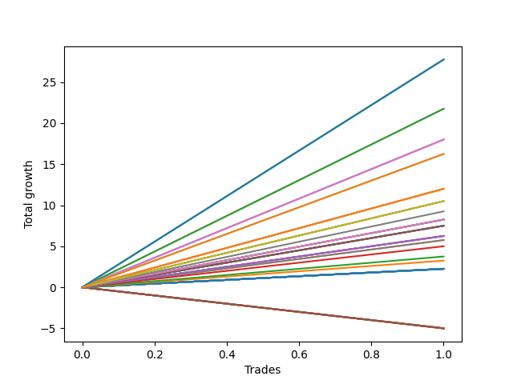

# Short Labrador 006 
- Symbol: ES_900-930
- Date Range: 03/18/2022 - 12/30/2022
- Trading Period: 9:0-9:30
- Number of Trades: 1



| Name | Win Percent | Profit | Avg Profit / Trade | Avg Time / Trade |      | Name | Win Percent | Profit | Avg Profit / Trade | Avg Time / Trade |
| ---- | ----------- | ------ | ------------------ | ---------------- | ---- | ---- | ----------- | ------ | ------------------ | ---------------- |
| Sorted By <br> Profit | | | | | | Sorted By <br> Win Percentage ||||
| NEWFI 0000 | 100.00 | 13875.00 | 13875.00 | 60:55 |     | NEWFI 0000 | 100.00 | 13875.00 | 13875.00 | 60:55 |
| BB-200 U/L 2SD SL-10 | 100.00 | 13875.00 | 13875.00 | 34:05 |     | BB-200 U/L 2SD SL-10 | 100.00 | 13875.00 | 13875.00 | 34:05 |
| BB-200 U/L 2SD | 100.00 | 13875.00 | 13875.00 | 34:05 |     | BB-200 U/L 2SD | 100.00 | 13875.00 | 13875.00 | 34:05 |
| BB-50 U/L 2SD SL-10 | 100.00 | 10875.00 | 10875.00 | 29:10 |     | BB-50 U/L 2SD SL-10 | 100.00 | 10875.00 | 10875.00 | 29:10 |
| BB-50 U/L 2SD | 100.00 | 10875.00 | 10875.00 | 29:10 |     | BB-50 U/L 2SD | 100.00 | 10875.00 | 10875.00 | 29:10 |
| BB-100 U/L 2SD SL-10 | 100.00 | 9000.00 | 9000.00 | 28:45 |     | BB-100 U/L 2SD SL-10 | 100.00 | 9000.00 | 9000.00 | 28:45 |
| BB-100 U/L 2SD | 100.00 | 9000.00 | 9000.00 | 28:45 |     | BB-100 U/L 2SD | 100.00 | 9000.00 | 9000.00 | 28:45 |
| NEWFI 06 | 100.00 | 8125.00 | 8125.00 | 28:05 |     | NEWFI 06 | 100.00 | 8125.00 | 8125.00 | 28:05 |
| NEWFI 000 | 100.00 | 8125.00 | 8125.00 | 28:05 |     | NEWFI 000 | 100.00 | 8125.00 | 8125.00 | 28:05 |
| BB-50 U/L 1SD SL-10 | 100.00 | 6000.00 | 6000.00 | 18:15 |     | BB-50 U/L 1SD SL-10 | 100.00 | 6000.00 | 6000.00 | 18:15 |
| BB-50 U/L 1SD | 100.00 | 6000.00 | 6000.00 | 18:15 |     | BB-50 U/L 1SD | 100.00 | 6000.00 | 6000.00 | 18:15 |
| TP-10 | 100.00 | 5250.00 | 5250.00 | 16:40 |     | TP-10 | 100.00 | 5250.00 | 5250.00 | 16:40 |
| V U/L 1SD SL-10 | 100.00 | 5250.00 | 5250.00 | 17:40 |     | V U/L 1SD SL-10 | 100.00 | 5250.00 | 5250.00 | 17:40 |
| V U/L 1SD | 100.00 | 5250.00 | 5250.00 | 17:40 |     | V U/L 1SD | 100.00 | 5250.00 | 5250.00 | 17:40 |
| TP-9 | 100.00 | 4625.00 | 4625.00 | 14:55 |     | TP-9 | 100.00 | 4625.00 | 4625.00 | 14:55 |
| TP-8 | 100.00 | 4125.00 | 4125.00 | 14:35 |     | TP-8 | 100.00 | 4125.00 | 4125.00 | 14:35 |
| BB-20 U/L 2SD C SL-10 | 100.00 | 4125.00 | 4125.00 | 14:35 |     | BB-20 U/L 2SD C SL-10 | 100.00 | 4125.00 | 4125.00 | 14:35 |
| BB-20 U/L 2SD SL-10 | 100.00 | 4125.00 | 4125.00 | 14:35 |     | BB-20 U/L 2SD SL-10 | 100.00 | 4125.00 | 4125.00 | 14:35 |
| BB-20 U/L 2SD C | 100.00 | 4125.00 | 4125.00 | 14:35 |     | BB-20 U/L 2SD C | 100.00 | 4125.00 | 4125.00 | 14:35 |
| BB-20 U/L 2SD | 100.00 | 4125.00 | 4125.00 | 14:35 |     | BB-20 U/L 2SD | 100.00 | 4125.00 | 4125.00 | 14:35 |
| TP-7 | 100.00 | 3750.00 | 3750.00 | 02:20 |     | TP-7 | 100.00 | 3750.00 | 3750.00 | 02:20 |
| BB-50 Mid SL-10 | 100.00 | 3750.00 | 3750.00 | 02:20 |     | BB-50 Mid SL-10 | 100.00 | 3750.00 | 3750.00 | 02:20 |
| BB-50 Mid SL-5 | 100.00 | 3750.00 | 3750.00 | 02:20 |     | BB-50 Mid SL-5 | 100.00 | 3750.00 | 3750.00 | 02:20 |
| BB-50 Mid | 100.00 | 3750.00 | 3750.00 | 02:20 |     | BB-50 Mid | 100.00 | 3750.00 | 3750.00 | 02:20 |
| TP-6 | 100.00 | 3125.00 | 3125.00 | 02:15 |     | TP-6 | 100.00 | 3125.00 | 3125.00 | 02:15 |
| BB-20 Mid SL-10 | 100.00 | 3125.00 | 3125.00 | 02:15 |     | BB-20 Mid SL-10 | 100.00 | 3125.00 | 3125.00 | 02:15 |
| BB-20 Mid SL-5 | 100.00 | 3125.00 | 3125.00 | 02:15 |     | BB-20 Mid SL-5 | 100.00 | 3125.00 | 3125.00 | 02:15 |
| BB-20 Mid | 100.00 | 3125.00 | 3125.00 | 02:15 |     | BB-20 Mid | 100.00 | 3125.00 | 3125.00 | 02:15 |
| BB-20 U/L 1SD SL-10 | 100.00 | 2875.00 | 2875.00 | 12:10 |     | BB-20 U/L 1SD SL-10 | 100.00 | 2875.00 | 2875.00 | 12:10 |
| BB-20 U/L 1SD | 100.00 | 2875.00 | 2875.00 | 12:10 |     | BB-20 U/L 1SD | 100.00 | 2875.00 | 2875.00 | 12:10 |
| TP-5 | 100.00 | 2500.00 | 2500.00 | 02:10 |     | TP-5 | 100.00 | 2500.00 | 2500.00 | 02:10 |
| TP-4 | 100.00 | 1875.00 | 1875.00 | 01:50 |     | TP-4 | 100.00 | 1875.00 | 1875.00 | 01:50 |
| TP-3 | 100.00 | 1625.00 | 1625.00 | 01:35 |     | TP-3 | 100.00 | 1625.00 | 1625.00 | 01:35 |
| TP-2 | 100.00 | 1125.00 | 1125.00 | 01:10 |     | TP-2 | 100.00 | 1125.00 | 1125.00 | 01:10 |
| TP-1 | 100.00 | 1125.00 | 1125.00 | 01:10 |     | TP-1 | 100.00 | 1125.00 | 1125.00 | 01:10 |
| BB-200 Mid SL-10 | 100.00 | 1125.00 | 1125.00 | 01:10 |     | BB-200 Mid SL-10 | 100.00 | 1125.00 | 1125.00 | 01:10 |
| BB-100 Mid SL-10 | 100.00 | 1125.00 | 1125.00 | 01:10 |     | BB-100 Mid SL-10 | 100.00 | 1125.00 | 1125.00 | 01:10 |
| V Mid SL-10 | 100.00 | 1125.00 | 1125.00 | 01:10 |     | V Mid SL-10 | 100.00 | 1125.00 | 1125.00 | 01:10 |
| BB-200 Mid SL-5 | 100.00 | 1125.00 | 1125.00 | 01:10 |     | BB-200 Mid SL-5 | 100.00 | 1125.00 | 1125.00 | 01:10 |
| BB-100 Mid SL-5 | 100.00 | 1125.00 | 1125.00 | 01:10 |     | BB-100 Mid SL-5 | 100.00 | 1125.00 | 1125.00 | 01:10 |
| V Mid SL-5 | 100.00 | 1125.00 | 1125.00 | 01:10 |     | V Mid SL-5 | 100.00 | 1125.00 | 1125.00 | 01:10 |
| BB-200 Mid | 100.00 | 1125.00 | 1125.00 | 01:10 |     | BB-200 Mid | 100.00 | 1125.00 | 1125.00 | 01:10 |
| BB-100 Mid | 100.00 | 1125.00 | 1125.00 | 01:10 |     | BB-100 Mid | 100.00 | 1125.00 | 1125.00 | 01:10 |
| V Mid | 100.00 | 1125.00 | 1125.00 | 01:10 |     | V Mid | 100.00 | 1125.00 | 1125.00 | 01:10 |
| BB-200 U/L 2SD SL-5 | 0.00 | -2500.00 | -2500.00 | 10:15 |     | BB-200 U/L 2SD SL-5 | 0.00 | -2500.00 | -2500.00 | 10:15 |
| BB-100 U/L 2SD SL-5 | 0.00 | -2500.00 | -2500.00 | 10:15 |     | BB-100 U/L 2SD SL-5 | 0.00 | -2500.00 | -2500.00 | 10:15 |
| V U/L 1SD SL-5 | 0.00 | -2500.00 | -2500.00 | 10:15 |     | V U/L 1SD SL-5 | 0.00 | -2500.00 | -2500.00 | 10:15 |
| BB-50 U/L 2SD SL-5 | 0.00 | -2500.00 | -2500.00 | 10:15 |     | BB-50 U/L 2SD SL-5 | 0.00 | -2500.00 | -2500.00 | 10:15 |
| BB-50 U/L 1SD SL-5 | 0.00 | -2500.00 | -2500.00 | 10:15 |     | BB-50 U/L 1SD SL-5 | 0.00 | -2500.00 | -2500.00 | 10:15 |
| BB-20 U/L 2SD C SL-5 | 0.00 | -2500.00 | -2500.00 | 10:15 |     | BB-20 U/L 2SD C SL-5 | 0.00 | -2500.00 | -2500.00 | 10:15 |
| BB-20 U/L 2SD SL-5 | 0.00 | -2500.00 | -2500.00 | 10:15 |     | BB-20 U/L 2SD SL-5 | 0.00 | -2500.00 | -2500.00 | 10:15 |
| BB-20 U/L 1SD SL-5 | 0.00 | -2500.00 | -2500.00 | 10:15 |     | BB-20 U/L 1SD SL-5 | 0.00 | -2500.00 | -2500.00 | 10:15 |

## NO STOPLOSS

### Test BB-20 Mid
* Sell when price hits the middle line of the 20p bollinger
* No Stoploss
* Results:
```
Total Trades: 1
Percent Up: 0.00
Percent Down: 100.00
Total Points Moved Down: 6.25
Potential Profit: 3125.00
Total Points Ups: 0.00 Count Ups: 0
Total Points Downs: 6.25 Count Downs: 1
```

<details><summary>Trades</summary>

<code>In: 2022-05-02 09:25:00		Out: 2022-05-02 09:27:15		Total Position Time: 02:15		Total Move Down: 6.25		Total to Date: 6.25</code> <br />


</details>

### Test BB-20 U/L 1SD
* Sell when the price hits the lower line of the 20p 1std bollinger
* No Stoploss
* Results:
```
Total Trades: 1
Percent Up: 0.00
Percent Down: 100.00
Total Points Moved Down: 5.75
Potential Profit: 2875.00
Total Points Ups: 0.00 Count Ups: 0
Total Points Downs: 5.75 Count Downs: 1
```

<details><summary>Trades</summary>

<code>In: 2022-05-02 09:25:00		Out: 2022-05-02 09:37:10		Total Position Time: 12:10		Total Move Down: 5.75		Total to Date: 5.75</code> <br />


</details>

### Test BB-20 U/L 2SD
* Sell when the price hits the lower line of the 20p 2std bollinger
* No Stoploss
* Results:
```
Total Trades: 1
Percent Up: 0.00
Percent Down: 100.00
Total Points Moved Down: 8.25
Potential Profit: 4125.00
Total Points Ups: 0.00 Count Ups: 0
Total Points Downs: 8.25 Count Downs: 1
```

<details><summary>Trades</summary>

<code>In: 2022-05-02 09:25:00		Out: 2022-05-02 09:39:35		Total Position Time: 14:35		Total Move Down: 8.25		Total to Date: 8.25</code> <br />


</details>

### Test BB-20 U/L 2SD C
* Sell when the price hits the lower line of the 20p 2std bollinger
* No Stoploss
* Results:
```
Total Trades: 1
Percent Up: 0.00
Percent Down: 100.00
Total Points Moved Down: 8.25
Potential Profit: 4125.00
Total Points Ups: 0.00 Count Ups: 0
Total Points Downs: 8.25 Count Downs: 1
```

<details><summary>Trades</summary>

<code>In: 2022-05-02 09:25:00		Out: 2022-05-02 09:39:35		Total Position Time: 14:35		Total Move Down: 8.25		Total to Date: 8.25</code> <br />


</details>

### Test BB-50 Mid
* Sell when price hits the middle line of the 50p bollinger
* No Stoploss
* Results:
```
Total Trades: 1
Percent Up: 0.00
Percent Down: 100.00
Total Points Moved Down: 7.50
Potential Profit: 3750.00
Total Points Ups: 0.00 Count Ups: 0
Total Points Downs: 7.50 Count Downs: 1
```

<details><summary>Trades</summary>

<code>In: 2022-05-02 09:25:00		Out: 2022-05-02 09:27:20		Total Position Time: 02:20		Total Move Down: 7.50		Total to Date: 7.50</code> <br />


</details>

### Test BB-50 U/L 1SD
* Sell when the price hits the lower line of the 50p 1std bollinger
* No Stoploss
* Results:
```
Total Trades: 1
Percent Up: 0.00
Percent Down: 100.00
Total Points Moved Down: 12.00
Potential Profit: 6000.00
Total Points Ups: 0.00 Count Ups: 0
Total Points Downs: 12.00 Count Downs: 1
```

<details><summary>Trades</summary>

<code>In: 2022-05-02 09:25:00		Out: 2022-05-02 09:43:15		Total Position Time: 18:15		Total Move Down: 12.00		Total to Date: 12.00</code> <br />


</details>

### Test BB-50 U/L 2SD
* Sell when the price hits the lower line of the 50p 2std bollinger
* No Stoploss
* Results:
```
Total Trades: 1
Percent Up: 0.00
Percent Down: 100.00
Total Points Moved Down: 21.75
Potential Profit: 10875.00
Total Points Ups: 0.00 Count Ups: 0
Total Points Downs: 21.75 Count Downs: 1
```

<details><summary>Trades</summary>

<code>In: 2022-05-02 09:25:00		Out: 2022-05-02 09:54:10		Total Position Time: 29:10		Total Move Down: 21.75		Total to Date: 21.75</code> <br />


</details>

### Test V Mid
* Sell when the price hits the middle line of the 1std VWAP
* No Stoploss
* Results:
```
Total Trades: 1
Percent Up: 0.00
Percent Down: 100.00
Total Points Moved Down: 2.25
Potential Profit: 1125.00
Total Points Ups: 0.00 Count Ups: 0
Total Points Downs: 2.25 Count Downs: 1
```

<details><summary>Trades</summary>

<code>In: 2022-05-02 09:25:00		Out: 2022-05-02 09:26:10		Total Position Time: 01:10		Total Move Down: 2.25		Total to Date: 2.25</code> <br />


</details>

### Test V U/L 1SD
* Sell when the price hits the lower line of the 1std VWAP
* No Stoploss
* Results:
```
Total Trades: 1
Percent Up: 0.00
Percent Down: 100.00
Total Points Moved Down: 10.50
Potential Profit: 5250.00
Total Points Ups: 0.00 Count Ups: 0
Total Points Downs: 10.50 Count Downs: 1
```

<details><summary>Trades</summary>

<code>In: 2022-05-02 09:25:00		Out: 2022-05-02 09:42:40		Total Position Time: 17:40		Total Move Down: 10.50		Total to Date: 10.50</code> <br />


</details>

### Test BB-100 Mid
* Move to BB100 Mid
* No Stoploss
* Results:
```
Total Trades: 1
Percent Up: 0.00
Percent Down: 100.00
Total Points Moved Down: 2.25
Potential Profit: 1125.00
Total Points Ups: 0.00 Count Ups: 0
Total Points Downs: 2.25 Count Downs: 1
```

<details><summary>Trades</summary>

<code>In: 2022-05-02 09:25:00		Out: 2022-05-02 09:26:10		Total Position Time: 01:10		Total Move Down: 2.25		Total to Date: 2.25</code> <br />


</details>

### Test BB-100 U/L 2SD
* Move to BB100 Upper Band
* No Stoploss
* Results:
```
Total Trades: 1
Percent Up: 0.00
Percent Down: 100.00
Total Points Moved Down: 18.00
Potential Profit: 9000.00
Total Points Ups: 0.00 Count Ups: 0
Total Points Downs: 18.00 Count Downs: 1
```

<details><summary>Trades</summary>

<code>In: 2022-05-02 09:25:00		Out: 2022-05-02 09:53:45		Total Position Time: 28:45		Total Move Down: 18.00		Total to Date: 18.00</code> <br />


</details>

### Test BB-200 Mid
* Move to BB200 Mid
* No Stoploss
* Results:
```
Total Trades: 1
Percent Up: 0.00
Percent Down: 100.00
Total Points Moved Down: 2.25
Potential Profit: 1125.00
Total Points Ups: 0.00 Count Ups: 0
Total Points Downs: 2.25 Count Downs: 1
```

<details><summary>Trades</summary>

<code>In: 2022-05-02 09:25:00		Out: 2022-05-02 09:26:10		Total Position Time: 01:10		Total Move Down: 2.25		Total to Date: 2.25</code> <br />


</details>

### Test BB-200 U/L 2SD
* Move to BB200 Upper Band
* No Stoploss
* Results:
```
Total Trades: 1
Percent Up: 0.00
Percent Down: 100.00
Total Points Moved Down: 27.75
Potential Profit: 13875.00
Total Points Ups: 0.00 Count Ups: 0
Total Points Downs: 27.75 Count Downs: 1
```

<details><summary>Trades</summary>

<code>In: 2022-05-02 09:25:00		Out: 2022-05-02 09:59:05		Total Position Time: 34:05		Total Move Down: 27.75		Total to Date: 27.75</code> <br />


</details>

## STOPLOSS OF 5

### Test BB-20 Mid SL-5
* Sell when price hits the middle line of the 20p bollinger
* Stoploss is -5 points
* Results:
```
Total Trades: 1
Percent Up: 0.00
Percent Down: 100.00
Total Points Moved Down: 6.25
Potential Profit: 3125.00
Total Points Ups: 0.00 Count Ups: 0
Total Points Downs: 6.25 Count Downs: 1
```

<details><summary>Trades</summary>

<code>In: 2022-05-02 09:25:00		Out: 2022-05-02 09:27:15		Total Position Time: 02:15		Total Move Down: 6.25		Total to Date: 6.25</code> <br />


</details>

### Test BB-20 U/L 1SD SL-5
* Sell when the price hits the lower line of the 20p 1std bollinger
* Stoploss is -5 points
* Results:
```
Total Trades: 1
Percent Up: 100.00
Percent Down: 0.00
Total Points Moved Down: -5.00
Potential Profit: -2500.00
Total Points Ups: 5.00 Count Ups: 1
Total Points Downs: 0.00 Count Downs: 0
```

<details><summary>Trades</summary>

<code>In: 2022-05-02 09:25:00		Out: 2022-05-02 09:35:15		Total Position Time: 10:15		Total Move Down: -5.00		Total to Date: -5.00</code> <br />


</details>

### Test BB-20 U/L 2SD SL-5
* Sell when the price hits the lower line of the 20p 2std bollinger
* Stoploss is -5 points
* Results:
```
Total Trades: 1
Percent Up: 100.00
Percent Down: 0.00
Total Points Moved Down: -5.00
Potential Profit: -2500.00
Total Points Ups: 5.00 Count Ups: 1
Total Points Downs: 0.00 Count Downs: 0
```

<details><summary>Trades</summary>

<code>In: 2022-05-02 09:25:00		Out: 2022-05-02 09:35:15		Total Position Time: 10:15		Total Move Down: -5.00		Total to Date: -5.00</code> <br />


</details>

### Test BB-20 U/L 2SD C SL-5
* Sell when the price hits the lower line of the 20p 2std bollinger
* Stoploss is -5 points
* Results:
```
Total Trades: 1
Percent Up: 100.00
Percent Down: 0.00
Total Points Moved Down: -5.00
Potential Profit: -2500.00
Total Points Ups: 5.00 Count Ups: 1
Total Points Downs: 0.00 Count Downs: 0
```

<details><summary>Trades</summary>

<code>In: 2022-05-02 09:25:00		Out: 2022-05-02 09:35:15		Total Position Time: 10:15		Total Move Down: -5.00		Total to Date: -5.00</code> <br />


</details>

### Test BB-50 Mid SL-5
* Sell when price hits the middle line of the 50p bollinger
* Stoploss is -5 points
* Results:
```
Total Trades: 1
Percent Up: 0.00
Percent Down: 100.00
Total Points Moved Down: 7.50
Potential Profit: 3750.00
Total Points Ups: 0.00 Count Ups: 0
Total Points Downs: 7.50 Count Downs: 1
```

<details><summary>Trades</summary>

<code>In: 2022-05-02 09:25:00		Out: 2022-05-02 09:27:20		Total Position Time: 02:20		Total Move Down: 7.50		Total to Date: 7.50</code> <br />


</details>

### Test BB-50 U/L 1SD SL-5
* Sell when the price hits the lower line of the 50p 1std bollinger
* Stoploss is -5 points
* Results:
```
Total Trades: 1
Percent Up: 100.00
Percent Down: 0.00
Total Points Moved Down: -5.00
Potential Profit: -2500.00
Total Points Ups: 5.00 Count Ups: 1
Total Points Downs: 0.00 Count Downs: 0
```

<details><summary>Trades</summary>

<code>In: 2022-05-02 09:25:00		Out: 2022-05-02 09:35:15		Total Position Time: 10:15		Total Move Down: -5.00		Total to Date: -5.00</code> <br />


</details>

### Test BB-50 U/L 2SD SL-5
* Sell when the price hits the lower line of the 50p 2std bollinger
* Stoploss is -5 points
* Results:
```
Total Trades: 1
Percent Up: 100.00
Percent Down: 0.00
Total Points Moved Down: -5.00
Potential Profit: -2500.00
Total Points Ups: 5.00 Count Ups: 1
Total Points Downs: 0.00 Count Downs: 0
```

<details><summary>Trades</summary>

<code>In: 2022-05-02 09:25:00		Out: 2022-05-02 09:35:15		Total Position Time: 10:15		Total Move Down: -5.00		Total to Date: -5.00</code> <br />


</details>

### Test V Mid SL-5
* Sell when the price hits the middle line of the 1std VWAP
* Stoploss is -5 points
* Results:
```
Total Trades: 1
Percent Up: 0.00
Percent Down: 100.00
Total Points Moved Down: 2.25
Potential Profit: 1125.00
Total Points Ups: 0.00 Count Ups: 0
Total Points Downs: 2.25 Count Downs: 1
```

<details><summary>Trades</summary>

<code>In: 2022-05-02 09:25:00		Out: 2022-05-02 09:26:10		Total Position Time: 01:10		Total Move Down: 2.25		Total to Date: 2.25</code> <br />


</details>

### Test V U/L 1SD SL-5
* Sell when the price hits the lower line of the 1std VWAP
* Stoploss is -5 points
* Results:
```
Total Trades: 1
Percent Up: 100.00
Percent Down: 0.00
Total Points Moved Down: -5.00
Potential Profit: -2500.00
Total Points Ups: 5.00 Count Ups: 1
Total Points Downs: 0.00 Count Downs: 0
```

<details><summary>Trades</summary>

<code>In: 2022-05-02 09:25:00		Out: 2022-05-02 09:35:15		Total Position Time: 10:15		Total Move Down: -5.00		Total to Date: -5.00</code> <br />


</details>

### Test BB-100 Mid SL-5
* Move to BB100 Mid
* Stoploss is -5 points
* Results:
```
Total Trades: 1
Percent Up: 0.00
Percent Down: 100.00
Total Points Moved Down: 2.25
Potential Profit: 1125.00
Total Points Ups: 0.00 Count Ups: 0
Total Points Downs: 2.25 Count Downs: 1
```

<details><summary>Trades</summary>

<code>In: 2022-05-02 09:25:00		Out: 2022-05-02 09:26:10		Total Position Time: 01:10		Total Move Down: 2.25		Total to Date: 2.25</code> <br />


</details>

### Test BB-100 U/L 2SD SL-5
* Move to BB100 Upper Band
* Stoploss is -5 points
* Results:
```
Total Trades: 1
Percent Up: 100.00
Percent Down: 0.00
Total Points Moved Down: -5.00
Potential Profit: -2500.00
Total Points Ups: 5.00 Count Ups: 1
Total Points Downs: 0.00 Count Downs: 0
```

<details><summary>Trades</summary>

<code>In: 2022-05-02 09:25:00		Out: 2022-05-02 09:35:15		Total Position Time: 10:15		Total Move Down: -5.00		Total to Date: -5.00</code> <br />


</details>

### Test BB-200 Mid SL-5
* Move to BB200 Mid
* Stoploss is -5 points
* Results:
```
Total Trades: 1
Percent Up: 0.00
Percent Down: 100.00
Total Points Moved Down: 2.25
Potential Profit: 1125.00
Total Points Ups: 0.00 Count Ups: 0
Total Points Downs: 2.25 Count Downs: 1
```

<details><summary>Trades</summary>

<code>In: 2022-05-02 09:25:00		Out: 2022-05-02 09:26:10		Total Position Time: 01:10		Total Move Down: 2.25		Total to Date: 2.25</code> <br />


</details>

### Test BB-200 U/L 2SD SL-5
* Move to BB200 Upper Band
* Stoploss is -5 points
* Results:
```
Total Trades: 1
Percent Up: 100.00
Percent Down: 0.00
Total Points Moved Down: -5.00
Potential Profit: -2500.00
Total Points Ups: 5.00 Count Ups: 1
Total Points Downs: 0.00 Count Downs: 0
```

<details><summary>Trades</summary>

<code>In: 2022-05-02 09:25:00		Out: 2022-05-02 09:35:15		Total Position Time: 10:15		Total Move Down: -5.00		Total to Date: -5.00</code> <br />


</details>

## STOPLOSS OF 10

### Test BB-20 Mid SL-10
* Sell when price hits the middle line of the 20p bollinger
* Stoploss is -10 points
* Results:
```
Total Trades: 1
Percent Up: 0.00
Percent Down: 100.00
Total Points Moved Down: 6.25
Potential Profit: 3125.00
Total Points Ups: 0.00 Count Ups: 0
Total Points Downs: 6.25 Count Downs: 1
```

<details><summary>Trades</summary>

<code>In: 2022-05-02 09:25:00		Out: 2022-05-02 09:27:15		Total Position Time: 02:15		Total Move Down: 6.25		Total to Date: 6.25</code> <br />


</details>

### Test BB-20 U/L 1SD SL-10
* Sell when the price hits the lower line of the 20p 1std bollinger
* Stoploss is -10 points
* Results:
```
Total Trades: 1
Percent Up: 0.00
Percent Down: 100.00
Total Points Moved Down: 5.75
Potential Profit: 2875.00
Total Points Ups: 0.00 Count Ups: 0
Total Points Downs: 5.75 Count Downs: 1
```

<details><summary>Trades</summary>

<code>In: 2022-05-02 09:25:00		Out: 2022-05-02 09:37:10		Total Position Time: 12:10		Total Move Down: 5.75		Total to Date: 5.75</code> <br />


</details>

### Test BB-20 U/L 2SD SL-10
* Sell when the price hits the lower line of the 20p 2std bollinger
* Stoploss is -10 points
* Results:
```
Total Trades: 1
Percent Up: 0.00
Percent Down: 100.00
Total Points Moved Down: 8.25
Potential Profit: 4125.00
Total Points Ups: 0.00 Count Ups: 0
Total Points Downs: 8.25 Count Downs: 1
```

<details><summary>Trades</summary>

<code>In: 2022-05-02 09:25:00		Out: 2022-05-02 09:39:35		Total Position Time: 14:35		Total Move Down: 8.25		Total to Date: 8.25</code> <br />


</details>

### Test BB-20 U/L 2SD C SL-10
* Sell when the price hits the lower line of the 20p 2std bollinger
* Stoploss is -10 points
* Results:
```
Total Trades: 1
Percent Up: 0.00
Percent Down: 100.00
Total Points Moved Down: 8.25
Potential Profit: 4125.00
Total Points Ups: 0.00 Count Ups: 0
Total Points Downs: 8.25 Count Downs: 1
```

<details><summary>Trades</summary>

<code>In: 2022-05-02 09:25:00		Out: 2022-05-02 09:39:35		Total Position Time: 14:35		Total Move Down: 8.25		Total to Date: 8.25</code> <br />


</details>

### Test BB-50 Mid SL-10
* Sell when price hits the middle line of the 50p bollinger
* Stoploss is -10 points
* Results:
```
Total Trades: 1
Percent Up: 0.00
Percent Down: 100.00
Total Points Moved Down: 7.50
Potential Profit: 3750.00
Total Points Ups: 0.00 Count Ups: 0
Total Points Downs: 7.50 Count Downs: 1
```

<details><summary>Trades</summary>

<code>In: 2022-05-02 09:25:00		Out: 2022-05-02 09:27:20		Total Position Time: 02:20		Total Move Down: 7.50		Total to Date: 7.50</code> <br />


</details>

### Test BB-50 U/L 1SD SL-10
* Sell when the price hits the lower line of the 50p 1std bollinger
* Stoploss is -10 points
* Results:
```
Total Trades: 1
Percent Up: 0.00
Percent Down: 100.00
Total Points Moved Down: 12.00
Potential Profit: 6000.00
Total Points Ups: 0.00 Count Ups: 0
Total Points Downs: 12.00 Count Downs: 1
```

<details><summary>Trades</summary>

<code>In: 2022-05-02 09:25:00		Out: 2022-05-02 09:43:15		Total Position Time: 18:15		Total Move Down: 12.00		Total to Date: 12.00</code> <br />


</details>

### Test BB-50 U/L 2SD SL-10
* Sell when the price hits the lower line of the 50p 2std bollinger
* Stoploss is -10 points
* Results:
```
Total Trades: 1
Percent Up: 0.00
Percent Down: 100.00
Total Points Moved Down: 21.75
Potential Profit: 10875.00
Total Points Ups: 0.00 Count Ups: 0
Total Points Downs: 21.75 Count Downs: 1
```

<details><summary>Trades</summary>

<code>In: 2022-05-02 09:25:00		Out: 2022-05-02 09:54:10		Total Position Time: 29:10		Total Move Down: 21.75		Total to Date: 21.75</code> <br />


</details>

### Test V Mid SL-10
* Sell when the price hits the middle line of the 1std VWAP
* Stoploss is -10 points
* Results:
```
Total Trades: 1
Percent Up: 0.00
Percent Down: 100.00
Total Points Moved Down: 2.25
Potential Profit: 1125.00
Total Points Ups: 0.00 Count Ups: 0
Total Points Downs: 2.25 Count Downs: 1
```

<details><summary>Trades</summary>

<code>In: 2022-05-02 09:25:00		Out: 2022-05-02 09:26:10		Total Position Time: 01:10		Total Move Down: 2.25		Total to Date: 2.25</code> <br />


</details>

### Test V U/L 1SD SL-10
* Sell when the price hits the lower line of the 1std VWAP
* Stoploss is -10 points
* Results:
```
Total Trades: 1
Percent Up: 0.00
Percent Down: 100.00
Total Points Moved Down: 10.50
Potential Profit: 5250.00
Total Points Ups: 0.00 Count Ups: 0
Total Points Downs: 10.50 Count Downs: 1
```

<details><summary>Trades</summary>

<code>In: 2022-05-02 09:25:00		Out: 2022-05-02 09:42:40		Total Position Time: 17:40		Total Move Down: 10.50		Total to Date: 10.50</code> <br />


</details>

### Test BB-100 Mid SL-10
* Move to BB100 Mid
* Stoploss is -10 points
* Results:
```
Total Trades: 1
Percent Up: 0.00
Percent Down: 100.00
Total Points Moved Down: 2.25
Potential Profit: 1125.00
Total Points Ups: 0.00 Count Ups: 0
Total Points Downs: 2.25 Count Downs: 1
```

<details><summary>Trades</summary>

<code>In: 2022-05-02 09:25:00		Out: 2022-05-02 09:26:10		Total Position Time: 01:10		Total Move Down: 2.25		Total to Date: 2.25</code> <br />


</details>

### Test BB-100 U/L 2SD SL-10
* Move to BB100 Upper Band
* Stoploss is -10 points
* Results:
```
Total Trades: 1
Percent Up: 0.00
Percent Down: 100.00
Total Points Moved Down: 18.00
Potential Profit: 9000.00
Total Points Ups: 0.00 Count Ups: 0
Total Points Downs: 18.00 Count Downs: 1
```

<details><summary>Trades</summary>

<code>In: 2022-05-02 09:25:00		Out: 2022-05-02 09:53:45		Total Position Time: 28:45		Total Move Down: 18.00		Total to Date: 18.00</code> <br />


</details>

### Test BB-200 Mid SL-10
* Move to BB200 Mid
* Stoploss is -10 points
* Results:
```
Total Trades: 1
Percent Up: 0.00
Percent Down: 100.00
Total Points Moved Down: 2.25
Potential Profit: 1125.00
Total Points Ups: 0.00 Count Ups: 0
Total Points Downs: 2.25 Count Downs: 1
```

<details><summary>Trades</summary>

<code>In: 2022-05-02 09:25:00		Out: 2022-05-02 09:26:10		Total Position Time: 01:10		Total Move Down: 2.25		Total to Date: 2.25</code> <br />


</details>

### Test BB-200 U/L 2SD SL-10
* Move to BB200 Upper Band
* Stoploss is -10 points
* Results:
```
Total Trades: 1
Percent Up: 0.00
Percent Down: 100.00
Total Points Moved Down: 27.75
Potential Profit: 13875.00
Total Points Ups: 0.00 Count Ups: 0
Total Points Downs: 27.75 Count Downs: 1
```

<details><summary>Trades</summary>

<code>In: 2022-05-02 09:25:00		Out: 2022-05-02 09:59:05		Total Position Time: 34:05		Total Move Down: 27.75		Total to Date: 27.75</code> <br />


</details>

## TAKE PROFIT

### Test TP-1
* Take Profit of 1 Point
* No Stoploss
* Results:
```
Total Trades: 1
Percent Up: 0.00
Percent Down: 100.00
Total Points Moved Down: 2.25
Potential Profit: 1125.00
Total Points Ups: 0.00 Count Ups: 0
Total Points Downs: 2.25 Count Downs: 1
```

<details><summary>Trades</summary>

<code>In: 2022-05-02 09:25:00		Out: 2022-05-02 09:26:10		Total Position Time: 01:10		Total Move Down: 2.25		Total to Date: 2.25</code> <br />


</details>

### Test TP-2
* Take Profit of 2 Point
* No Stoploss
* Results:
```
Total Trades: 1
Percent Up: 0.00
Percent Down: 100.00
Total Points Moved Down: 2.25
Potential Profit: 1125.00
Total Points Ups: 0.00 Count Ups: 0
Total Points Downs: 2.25 Count Downs: 1
```

<details><summary>Trades</summary>

<code>In: 2022-05-02 09:25:00		Out: 2022-05-02 09:26:10		Total Position Time: 01:10		Total Move Down: 2.25		Total to Date: 2.25</code> <br />


</details>

### Test TP-3
* Take Profit of 3 Point
* No Stoploss
* Results:
```
Total Trades: 1
Percent Up: 0.00
Percent Down: 100.00
Total Points Moved Down: 3.25
Potential Profit: 1625.00
Total Points Ups: 0.00 Count Ups: 0
Total Points Downs: 3.25 Count Downs: 1
```

<details><summary>Trades</summary>

<code>In: 2022-05-02 09:25:00		Out: 2022-05-02 09:26:35		Total Position Time: 01:35		Total Move Down: 3.25		Total to Date: 3.25</code> <br />


</details>

### Test TP-4
* Take Profit of 4 Point
* No Stoploss
* Results:
```
Total Trades: 1
Percent Up: 0.00
Percent Down: 100.00
Total Points Moved Down: 3.75
Potential Profit: 1875.00
Total Points Ups: 0.00 Count Ups: 0
Total Points Downs: 3.75 Count Downs: 1
```

<details><summary>Trades</summary>

<code>In: 2022-05-02 09:25:00		Out: 2022-05-02 09:26:50		Total Position Time: 01:50		Total Move Down: 3.75		Total to Date: 3.75</code> <br />


</details>

### Test TP-5
* Take Profit of 5 Point
* No Stoploss
* Results:
```
Total Trades: 1
Percent Up: 0.00
Percent Down: 100.00
Total Points Moved Down: 5.00
Potential Profit: 2500.00
Total Points Ups: 0.00 Count Ups: 0
Total Points Downs: 5.00 Count Downs: 1
```

<details><summary>Trades</summary>

<code>In: 2022-05-02 09:25:00		Out: 2022-05-02 09:27:10		Total Position Time: 02:10		Total Move Down: 5.00		Total to Date: 5.00</code> <br />


</details>

### Test TP-6
* Take Profit of 6 Point
* No Stoploss
* Results:
```
Total Trades: 1
Percent Up: 0.00
Percent Down: 100.00
Total Points Moved Down: 6.25
Potential Profit: 3125.00
Total Points Ups: 0.00 Count Ups: 0
Total Points Downs: 6.25 Count Downs: 1
```

<details><summary>Trades</summary>

<code>In: 2022-05-02 09:25:00		Out: 2022-05-02 09:27:15		Total Position Time: 02:15		Total Move Down: 6.25		Total to Date: 6.25</code> <br />


</details>

### Test TP-7
* Take Profit of 7 Point
* No Stoploss
* Results:
```
Total Trades: 1
Percent Up: 0.00
Percent Down: 100.00
Total Points Moved Down: 7.50
Potential Profit: 3750.00
Total Points Ups: 0.00 Count Ups: 0
Total Points Downs: 7.50 Count Downs: 1
```

<details><summary>Trades</summary>

<code>In: 2022-05-02 09:25:00		Out: 2022-05-02 09:27:20		Total Position Time: 02:20		Total Move Down: 7.50		Total to Date: 7.50</code> <br />


</details>

### Test TP-8
* Take Profit of 8 Point
* No Stoploss
* Results:
```
Total Trades: 1
Percent Up: 0.00
Percent Down: 100.00
Total Points Moved Down: 8.25
Potential Profit: 4125.00
Total Points Ups: 0.00 Count Ups: 0
Total Points Downs: 8.25 Count Downs: 1
```

<details><summary>Trades</summary>

<code>In: 2022-05-02 09:25:00		Out: 2022-05-02 09:39:35		Total Position Time: 14:35		Total Move Down: 8.25		Total to Date: 8.25</code> <br />


</details>

### Test TP-9
* Take Profit of 9 Point
* No Stoploss
* Results:
```
Total Trades: 1
Percent Up: 0.00
Percent Down: 100.00
Total Points Moved Down: 9.25
Potential Profit: 4625.00
Total Points Ups: 0.00 Count Ups: 0
Total Points Downs: 9.25 Count Downs: 1
```

<details><summary>Trades</summary>

<code>In: 2022-05-02 09:25:00		Out: 2022-05-02 09:39:55		Total Position Time: 14:55		Total Move Down: 9.25		Total to Date: 9.25</code> <br />


</details>

### Test TP-10
* Take Profit of 10 Point
* No Stoploss
* Results:
```
Total Trades: 1
Percent Up: 0.00
Percent Down: 100.00
Total Points Moved Down: 10.50
Potential Profit: 5250.00
Total Points Ups: 0.00 Count Ups: 0
Total Points Downs: 10.50 Count Downs: 1
```

<details><summary>Trades</summary>

<code>In: 2022-05-02 09:25:00		Out: 2022-05-02 09:41:40		Total Position Time: 16:40		Total Move Down: 10.50		Total to Date: 10.50</code> <br />


</details>

## Indicator Exits

### Test NEWFI 000
* Newfi 0000
* No Stoploss
* Results:
```
Total Trades: 1
Percent Up: 0.00
Percent Down: 100.00
Total Points Moved Down: 16.25
Potential Profit: 8125.00
Total Points Ups: 0.00 Count Ups: 0
Total Points Downs: 16.25 Count Downs: 1
```

<details><summary>Trades</summary>

<code>In: 2022-05-02 09:25:00		Out: 2022-05-02 09:53:05		Total Position Time: 28:05		Total Move Down: 16.25		Total to Date: 16.25</code> <br />


</details>

### Test NEWFI 0000
* Newfi 0000
* No Stoploss
* Results:
```
Total Trades: 1
Percent Up: 0.00
Percent Down: 100.00
Total Points Moved Down: 27.75
Potential Profit: 13875.00
Total Points Ups: 0.00 Count Ups: 0
Total Points Downs: 27.75 Count Downs: 1
```

<details><summary>Trades</summary>

<code>In: 2022-05-02 09:25:00		Out: 2022-05-02 10:25:55		Total Position Time: 60:55		Total Move Down: 27.75		Total to Date: 27.75</code> <br />


</details>

### Test NEWFI 06
* Newfi 06
* No Stoploss
* Results:
```
Total Trades: 1
Percent Up: 0.00
Percent Down: 100.00
Total Points Moved Down: 16.25
Potential Profit: 8125.00
Total Points Ups: 0.00 Count Ups: 0
Total Points Downs: 16.25 Count Downs: 1
```

<details><summary>Trades</summary>

<code>In: 2022-05-02 09:25:00		Out: 2022-05-02 09:53:05		Total Position Time: 28:05		Total Move Down: 16.25		Total to Date: 16.25</code> <br />


</details>