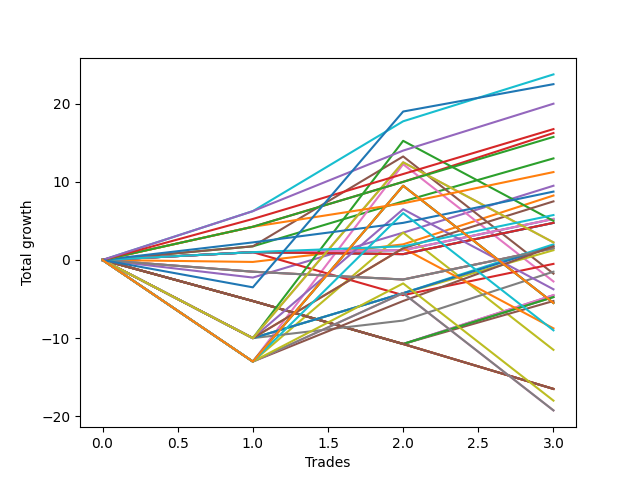

# Short Labrador 008 
- Symbol: ES_900-930
- Date Range: 03/18/2022 - 12/30/2022
- Trading Period: 9:0-9:30
- Number of Trades: 3



| Name | Win Percent | Profit | Avg Profit / Trade | Avg Time / Trade |      | Name | Win Percent | Profit | Avg Profit / Trade | Avg Time / Trade |
| ---- | ----------- | ------ | ------------------ | ---------------- | ---- | ---- | ----------- | ------ | ------------------ | ---------------- |
| Sorted By <br> Profit | | | | | | Sorted By <br> Win Percentage ||||
| BB-100 Mid | 100.00 | 11875.00 | 3958.33 | 17:43 |     | BB-100 Mid | 100.00 | 11875.00 | 3958.33 | 17:43 |
| NEWFI 0000 | 66.67 | 11250.00 | 3750.00 | 31:41 |     | TP-6 | 100.00 | 10000.00 | 3333.33 | 17:06 |
| TP-6 | 100.00 | 10000.00 | 3333.33 | 17:06 |     | TP-5 | 100.00 | 8375.00 | 2791.67 | 16:55 |
| TP-5 | 100.00 | 8375.00 | 2791.67 | 16:55 |     | BB-20 U/L 2SD C | 100.00 | 8125.00 | 2708.33 | 24:10 |
| BB-20 U/L 2SD C | 100.00 | 8125.00 | 2708.33 | 24:10 |     | TP-4 | 100.00 | 7875.00 | 2625.00 | 16:48 |
| TP-4 | 100.00 | 7875.00 | 2625.00 | 16:48 |     | BB-20 U/L 2SD | 100.00 | 6500.00 | 2166.67 | 24:06 |
| BB-20 U/L 2SD | 100.00 | 6500.00 | 2166.67 | 24:06 |     | TP-3 | 100.00 | 5625.00 | 1875.00 | 13:10 |
| TP-3 | 100.00 | 5625.00 | 1875.00 | 13:10 |     | TP-2 | 100.00 | 4375.00 | 1458.33 | 02:53 |
| BB-50 Mid | 66.67 | 4750.00 | 1583.33 | 14:46 |     | TP-1 | 100.00 | 2875.00 | 958.33 | 02:48 |
| TP-2 | 100.00 | 4375.00 | 1458.33 | 02:53 |     | BB-20 Mid SL-10 | 100.00 | 2625.00 | 875.00 | 02:46 |
| BB-20 U/L 1SD | 66.67 | 4125.00 | 1375.00 | 08:40 |     | BB-20 Mid | 100.00 | 2625.00 | 875.00 | 02:46 |
| BB-100 Mid SL-10 | 66.67 | 3750.00 | 1250.00 | 09:18 |     | NEWFI 0000 | 66.67 | 11250.00 | 3750.00 | 31:41 |
| TP-1 | 100.00 | 2875.00 | 958.33 | 02:48 |     | BB-50 Mid | 66.67 | 4750.00 | 1583.33 | 14:46 |
| BB-20 Mid SL-10 | 100.00 | 2625.00 | 875.00 | 02:46 |     | BB-20 U/L 1SD | 66.67 | 4125.00 | 1375.00 | 08:40 |
| BB-20 Mid | 100.00 | 2625.00 | 875.00 | 02:46 |     | BB-100 Mid SL-10 | 66.67 | 3750.00 | 1250.00 | 09:18 |
| BB-50 U/L 2SD SL-10 | 33.33 | 2500.00 | 833.33 | 27:28 |     | V Mid SL-10 | 66.67 | 2375.00 | 791.67 | 01:46 |
| V Mid SL-10 | 66.67 | 2375.00 | 791.67 | 01:46 |     | V Mid SL-5 | 66.67 | 2375.00 | 791.67 | 01:46 |
| V Mid SL-5 | 66.67 | 2375.00 | 791.67 | 01:46 |     | V Mid | 66.67 | 2375.00 | 791.67 | 01:46 |
| V Mid | 66.67 | 2375.00 | 791.67 | 01:46 |     | BB-20 U/L 2SD C SL-10 | 66.67 | 1000.00 | 333.33 | 15:55 |
| BB-200 U/L 2SD SL-10 | 33.33 | 1125.00 | 375.00 | 34:31 |     | TP-7 | 66.67 | 875.00 | 291.67 | 28:05 |
| BB-100 U/L 2SD SL-10 | 33.33 | 1125.00 | 375.00 | 34:31 |     | BB-50 Mid SL-10 | 66.67 | 875.00 | 291.67 | 08:36 |
| BB-20 U/L 2SD C SL-10 | 66.67 | 1000.00 | 333.33 | 15:55 |     | BB-20 U/L 2SD SL-10 | 66.67 | 625.00 | 208.33 | 15:53 |
| TP-7 | 66.67 | 875.00 | 291.67 | 28:05 |     | BB-20 Mid SL-5 | 66.67 | -250.00 | -83.33 | 02:06 |
| BB-50 Mid SL-10 | 66.67 | 875.00 | 291.67 | 08:36 |     | BB-20 U/L 1SD SL-10 | 66.67 | -750.00 | -250.00 | 06:36 |
| BB-200 Mid SL-10 | 33.33 | 750.00 | 250.00 | 01:10 |     | BB-50 U/L 1SD | 66.67 | -875.00 | -291.67 | 37:21 |
| BB-200 Mid SL-5 | 33.33 | 750.00 | 250.00 | 01:10 |     | BB-50 U/L 2SD SL-10 | 33.33 | 2500.00 | 833.33 | 27:28 |
| BB-200 Mid | 33.33 | 750.00 | 250.00 | 01:10 |     | BB-200 U/L 2SD SL-10 | 33.33 | 1125.00 | 375.00 | 34:31 |
| BB-20 U/L 2SD SL-10 | 66.67 | 625.00 | 208.33 | 15:53 |     | BB-100 U/L 2SD SL-10 | 33.33 | 1125.00 | 375.00 | 34:31 |
| BB-20 Mid SL-5 | 66.67 | -250.00 | -83.33 | 02:06 |     | BB-200 Mid SL-10 | 33.33 | 750.00 | 250.00 | 01:10 |
| BB-20 U/L 1SD SL-10 | 66.67 | -750.00 | -250.00 | 06:36 |     | BB-200 Mid SL-5 | 33.33 | 750.00 | 250.00 | 01:10 |
| BB-50 U/L 1SD | 66.67 | -875.00 | -291.67 | 37:21 |     | BB-200 Mid | 33.33 | 750.00 | 250.00 | 01:10 |
| BB-50 U/L 2SD | 33.33 | -1375.00 | -458.33 | 53:51 |     | BB-50 U/L 2SD | 33.33 | -1375.00 | -458.33 | 53:51 |
| V U/L 1SD SL-10 | 33.33 | -1875.00 | -625.00 | 22:23 |     | V U/L 1SD SL-10 | 33.33 | -1875.00 | -625.00 | 22:23 |
| BB-20 U/L 2SD C SL-5 | 33.33 | -2250.00 | -750.00 | 09:55 |     | BB-20 U/L 2SD C SL-5 | 33.33 | -2250.00 | -750.00 | 09:55 |
| BB-20 U/L 1SD SL-5 | 33.33 | -2250.00 | -750.00 | 04:11 |     | BB-20 U/L 1SD SL-5 | 33.33 | -2250.00 | -750.00 | 04:11 |
| BB-100 Mid SL-5 | 33.33 | -2375.00 | -791.67 | 02:36 |     | BB-100 Mid SL-5 | 33.33 | -2375.00 | -791.67 | 02:36 |
| BB-50 Mid SL-5 | 33.33 | -2375.00 | -791.67 | 02:36 |     | BB-50 Mid SL-5 | 33.33 | -2375.00 | -791.67 | 02:36 |
| BB-20 U/L 2SD SL-5 | 33.33 | -2625.00 | -875.00 | 09:53 |     | BB-20 U/L 2SD SL-5 | 33.33 | -2625.00 | -875.00 | 09:53 |
| NEWFI 06 | 33.33 | -2750.00 | -916.67 | 60:55 |     | NEWFI 06 | 33.33 | -2750.00 | -916.67 | 60:55 |
| BB-200 U/L 2SD | 33.33 | -2750.00 | -916.67 | 60:55 |     | BB-200 U/L 2SD | 33.33 | -2750.00 | -916.67 | 60:55 |
| BB-100 U/L 2SD | 33.33 | -2750.00 | -916.67 | 60:55 |     | BB-100 U/L 2SD | 33.33 | -2750.00 | -916.67 | 60:55 |
| BB-50 U/L 1SD SL-10 | 33.33 | -4375.00 | -1458.33 | 20:31 |     | BB-50 U/L 1SD SL-10 | 33.33 | -4375.00 | -1458.33 | 20:31 |
| NEWFI 000 | 33.33 | -4500.00 | -1500.00 | 50:38 |     | NEWFI 000 | 33.33 | -4500.00 | -1500.00 | 50:38 |
| V U/L 1SD | 33.33 | -5750.00 | -1916.67 | 48:46 |     | V U/L 1SD | 33.33 | -5750.00 | -1916.67 | 48:46 |
| BB-200 U/L 2SD SL-5 | 0.00 | -8250.00 | -2750.00 | 12:53 |     | TP-10 | 33.33 | -9000.00 | -3000.00 | 46:25 |
| BB-100 U/L 2SD SL-5 | 0.00 | -8250.00 | -2750.00 | 12:53 |     | TP-9 | 33.33 | -9625.00 | -3208.33 | 46:20 |
| V U/L 1SD SL-5 | 0.00 | -8250.00 | -2750.00 | 12:53 |     | TP-8 | 33.33 | -9625.00 | -3208.33 | 46:20 |
| BB-50 U/L 2SD SL-5 | 0.00 | -8250.00 | -2750.00 | 12:53 |     | BB-200 U/L 2SD SL-5 | 0.00 | -8250.00 | -2750.00 | 12:53 |
| BB-50 U/L 1SD SL-5 | 0.00 | -8250.00 | -2750.00 | 12:53 |     | BB-100 U/L 2SD SL-5 | 0.00 | -8250.00 | -2750.00 | 12:53 |
| TP-10 | 33.33 | -9000.00 | -3000.00 | 46:25 |     | V U/L 1SD SL-5 | 0.00 | -8250.00 | -2750.00 | 12:53 |
| TP-9 | 33.33 | -9625.00 | -3208.33 | 46:20 |     | BB-50 U/L 2SD SL-5 | 0.00 | -8250.00 | -2750.00 | 12:53 |
| TP-8 | 33.33 | -9625.00 | -3208.33 | 46:20 |     | BB-50 U/L 1SD SL-5 | 0.00 | -8250.00 | -2750.00 | 12:53 |

## NO STOPLOSS

### Test BB-20 Mid
* Sell when price hits the middle line of the 20p bollinger
* No Stoploss
* Results:
```
Total Trades: 3
Percent Up: 0.00
Percent Down: 100.00
Total Points Moved Down: 5.25
Potential Profit: 2625.00
Total Points Ups: 0.00 Count Ups: 0
Total Points Downs: 5.25 Count Downs: 3
```

<details><summary>Trades</summary>

<code>In: 2022-04-25 09:29:00		Out: 2022-04-25 09:31:05		Total Position Time: 02:05		Total Move Down: 1.00		Total to Date: 1.00</code> <br />
<code>In: 2022-05-09 09:21:00		Out: 2022-05-09 09:26:05		Total Position Time: 05:05		Total Move Down: 0.25		Total to Date: 1.25</code> <br />
<code>In: 2022-06-17 09:30:00		Out: 2022-06-17 09:31:10		Total Position Time: 01:10		Total Move Down: 4.00		Total to Date: 5.25</code> <br />


</details>

### Test BB-20 U/L 1SD
* Sell when the price hits the lower line of the 20p 1std bollinger
* No Stoploss
* Results:
```
Total Trades: 3
Percent Up: 33.33
Percent Down: 66.67
Total Points Moved Down: 8.25
Potential Profit: 4125.00
Total Points Ups: 0.25 Count Ups: 1
Total Points Downs: 8.50 Count Downs: 2
```

<details><summary>Trades</summary>

<code>In: 2022-04-25 09:29:00		Out: 2022-04-25 09:42:45		Total Position Time: 13:45		Total Move Down: -0.25		Total to Date: -0.25</code> <br />
<code>In: 2022-05-09 09:21:00		Out: 2022-05-09 09:27:05		Total Position Time: 06:05		Total Move Down: 2.25		Total to Date: 2.00</code> <br />
<code>In: 2022-06-17 09:30:00		Out: 2022-06-17 09:36:10		Total Position Time: 06:10		Total Move Down: 6.25		Total to Date: 8.25</code> <br />


</details>

### Test BB-20 U/L 2SD
* Sell when the price hits the lower line of the 20p 2std bollinger
* No Stoploss
* Results:
```
Total Trades: 3
Percent Up: 0.00
Percent Down: 100.00
Total Points Moved Down: 13.00
Potential Profit: 6500.00
Total Points Ups: 0.00 Count Ups: 0
Total Points Downs: 13.00 Count Downs: 3
```

<details><summary>Trades</summary>

<code>In: 2022-04-25 09:29:00		Out: 2022-04-25 10:01:15		Total Position Time: 32:15		Total Move Down: 1.75		Total to Date: 1.75</code> <br />
<code>In: 2022-05-09 09:21:00		Out: 2022-05-09 09:37:50		Total Position Time: 16:50		Total Move Down: 5.75		Total to Date: 7.50</code> <br />
<code>In: 2022-06-17 09:30:00		Out: 2022-06-17 09:53:15		Total Position Time: 23:15		Total Move Down: 5.50		Total to Date: 13.00</code> <br />


</details>

### Test BB-20 U/L 2SD C
* Sell when the price hits the lower line of the 20p 2std bollinger
* No Stoploss
* Results:
```
Total Trades: 3
Percent Up: 0.00
Percent Down: 100.00
Total Points Moved Down: 16.25
Potential Profit: 8125.00
Total Points Ups: 0.00 Count Ups: 0
Total Points Downs: 16.25 Count Downs: 3
```

<details><summary>Trades</summary>

<code>In: 2022-04-25 09:29:00		Out: 2022-04-25 10:01:20		Total Position Time: 32:20		Total Move Down: 4.25		Total to Date: 4.25</code> <br />
<code>In: 2022-05-09 09:21:00		Out: 2022-05-09 09:37:50		Total Position Time: 16:50		Total Move Down: 5.75		Total to Date: 10.00</code> <br />
<code>In: 2022-06-17 09:30:00		Out: 2022-06-17 09:53:20		Total Position Time: 23:20		Total Move Down: 6.25		Total to Date: 16.25</code> <br />


</details>

### Test BB-50 Mid
* Sell when price hits the middle line of the 50p bollinger
* No Stoploss
* Results:
```
Total Trades: 3
Percent Up: 33.33
Percent Down: 66.67
Total Points Moved Down: 9.50
Potential Profit: 4750.00
Total Points Ups: 2.25 Count Ups: 1
Total Points Downs: 11.75 Count Downs: 2
```

<details><summary>Trades</summary>

<code>In: 2022-04-25 09:29:00		Out: 2022-04-25 09:55:05		Total Position Time: 26:05		Total Move Down: -2.25		Total to Date: -2.25</code> <br />
<code>In: 2022-05-09 09:21:00		Out: 2022-05-09 09:37:50		Total Position Time: 16:50		Total Move Down: 5.75		Total to Date: 3.50</code> <br />
<code>In: 2022-06-17 09:30:00		Out: 2022-06-17 09:31:25		Total Position Time: 01:25		Total Move Down: 6.00		Total to Date: 9.50</code> <br />


</details>

### Test BB-50 U/L 1SD
* Sell when the price hits the lower line of the 50p 1std bollinger
* No Stoploss
* Results:
```
Total Trades: 3
Percent Up: 33.33
Percent Down: 66.67
Total Points Moved Down: -1.75
Potential Profit: -875.00
Total Points Ups: 15.00 Count Ups: 1
Total Points Downs: 13.25 Count Downs: 2
```

<details><summary>Trades</summary>

<code>In: 2022-04-25 09:29:00		Out: 2022-04-25 10:01:15		Total Position Time: 32:15		Total Move Down: 1.75		Total to Date: 1.75</code> <br />
<code>In: 2022-05-09 09:21:00		Out: 2022-05-09 09:39:55		Total Position Time: 18:55		Total Move Down: 11.50		Total to Date: 13.25</code> <br />
<code>In: 2022-06-17 09:30:00		Out: 2022-06-17 10:30:55		Total Position Time: 60:55		Total Move Down: -15.00		Total to Date: -1.75</code> <br />


</details>

### Test BB-50 U/L 2SD
* Sell when the price hits the lower line of the 50p 2std bollinger
* No Stoploss
* Results:
```
Total Trades: 3
Percent Up: 66.67
Percent Down: 33.33
Total Points Moved Down: -2.75
Potential Profit: -1375.00
Total Points Ups: 28.00 Count Ups: 2
Total Points Downs: 25.25 Count Downs: 1
```

<details><summary>Trades</summary>

<code>In: 2022-04-25 09:29:00		Out: 2022-04-25 10:29:55		Total Position Time: 60:55		Total Move Down: -13.00		Total to Date: -13.00</code> <br />
<code>In: 2022-05-09 09:21:00		Out: 2022-05-09 10:00:45		Total Position Time: 39:45		Total Move Down: 25.25		Total to Date: 12.25</code> <br />
<code>In: 2022-06-17 09:30:00		Out: 2022-06-17 10:30:55		Total Position Time: 60:55		Total Move Down: -15.00		Total to Date: -2.75</code> <br />


</details>

### Test V Mid
* Sell when the price hits the middle line of the 1std VWAP
* No Stoploss
* Results:
```
Total Trades: 3
Percent Up: 33.33
Percent Down: 66.67
Total Points Moved Down: 4.75
Potential Profit: 2375.00
Total Points Ups: 0.25 Count Ups: 1
Total Points Downs: 5.00 Count Downs: 2
```

<details><summary>Trades</summary>

<code>In: 2022-04-25 09:29:00		Out: 2022-04-25 09:31:05		Total Position Time: 02:05		Total Move Down: 1.00		Total to Date: 1.00</code> <br />
<code>In: 2022-05-09 09:21:00		Out: 2022-05-09 09:23:05		Total Position Time: 02:05		Total Move Down: -0.25		Total to Date: 0.75</code> <br />
<code>In: 2022-06-17 09:30:00		Out: 2022-06-17 09:31:10		Total Position Time: 01:10		Total Move Down: 4.00		Total to Date: 4.75</code> <br />


</details>

### Test V U/L 1SD
* Sell when the price hits the lower line of the 1std VWAP
* No Stoploss
* Results:
```
Total Trades: 3
Percent Up: 66.67
Percent Down: 33.33
Total Points Moved Down: -11.50
Potential Profit: -5750.00
Total Points Ups: 28.00 Count Ups: 2
Total Points Downs: 16.50 Count Downs: 1
```

<details><summary>Trades</summary>

<code>In: 2022-04-25 09:29:00		Out: 2022-04-25 10:29:55		Total Position Time: 60:55		Total Move Down: -13.00		Total to Date: -13.00</code> <br />
<code>In: 2022-05-09 09:21:00		Out: 2022-05-09 09:45:30		Total Position Time: 24:30		Total Move Down: 16.50		Total to Date: 3.50</code> <br />
<code>In: 2022-06-17 09:30:00		Out: 2022-06-17 10:30:55		Total Position Time: 60:55		Total Move Down: -15.00		Total to Date: -11.50</code> <br />


</details>

### Test BB-100 Mid
* Move to BB100 Mid
* No Stoploss
* Results:
```
Total Trades: 3
Percent Up: 0.00
Percent Down: 100.00
Total Points Moved Down: 23.75
Potential Profit: 11875.00
Total Points Ups: 0.00 Count Ups: 0
Total Points Downs: 23.75 Count Downs: 3
```

<details><summary>Trades</summary>

<code>In: 2022-04-25 09:29:00		Out: 2022-04-25 10:01:50		Total Position Time: 32:50		Total Move Down: 6.25		Total to Date: 6.25</code> <br />
<code>In: 2022-05-09 09:21:00		Out: 2022-05-09 09:39:55		Total Position Time: 18:55		Total Move Down: 11.50		Total to Date: 17.75</code> <br />
<code>In: 2022-06-17 09:30:00		Out: 2022-06-17 09:31:25		Total Position Time: 01:25		Total Move Down: 6.00		Total to Date: 23.75</code> <br />


</details>

### Test BB-100 U/L 2SD
* Move to BB100 Upper Band
* No Stoploss
* Results:
```
Total Trades: 3
Percent Up: 66.67
Percent Down: 33.33
Total Points Moved Down: -5.50
Potential Profit: -2750.00
Total Points Ups: 28.00 Count Ups: 2
Total Points Downs: 22.50 Count Downs: 1
```

<details><summary>Trades</summary>

<code>In: 2022-04-25 09:29:00		Out: 2022-04-25 10:29:55		Total Position Time: 60:55		Total Move Down: -13.00		Total to Date: -13.00</code> <br />
<code>In: 2022-05-09 09:21:00		Out: 2022-05-09 10:21:55		Total Position Time: 60:55		Total Move Down: 22.50		Total to Date: 9.50</code> <br />
<code>In: 2022-06-17 09:30:00		Out: 2022-06-17 10:30:55		Total Position Time: 60:55		Total Move Down: -15.00		Total to Date: -5.50</code> <br />


</details>

### Test BB-200 Mid
* Move to BB200 Mid
* No Stoploss
* Results:
```
Total Trades: 3
Percent Up: 66.67
Percent Down: 33.33
Total Points Moved Down: 1.50
Potential Profit: 750.00
Total Points Ups: 2.50 Count Ups: 2
Total Points Downs: 4.00 Count Downs: 1
```

<details><summary>Trades</summary>

<code>In: 2022-04-25 09:29:00		Out: 2022-04-25 09:30:10		Total Position Time: 01:10		Total Move Down: -1.50		Total to Date: -1.50</code> <br />
<code>In: 2022-05-09 09:21:00		Out: 2022-05-09 09:22:10		Total Position Time: 01:10		Total Move Down: -1.00		Total to Date: -2.50</code> <br />
<code>In: 2022-06-17 09:30:00		Out: 2022-06-17 09:31:10		Total Position Time: 01:10		Total Move Down: 4.00		Total to Date: 1.50</code> <br />


</details>

### Test BB-200 U/L 2SD
* Move to BB200 Upper Band
* No Stoploss
* Results:
```
Total Trades: 3
Percent Up: 66.67
Percent Down: 33.33
Total Points Moved Down: -5.50
Potential Profit: -2750.00
Total Points Ups: 28.00 Count Ups: 2
Total Points Downs: 22.50 Count Downs: 1
```

<details><summary>Trades</summary>

<code>In: 2022-04-25 09:29:00		Out: 2022-04-25 10:29:55		Total Position Time: 60:55		Total Move Down: -13.00		Total to Date: -13.00</code> <br />
<code>In: 2022-05-09 09:21:00		Out: 2022-05-09 10:21:55		Total Position Time: 60:55		Total Move Down: 22.50		Total to Date: 9.50</code> <br />
<code>In: 2022-06-17 09:30:00		Out: 2022-06-17 10:30:55		Total Position Time: 60:55		Total Move Down: -15.00		Total to Date: -5.50</code> <br />


</details>

## STOPLOSS OF 5

### Test BB-20 Mid SL-5
* Sell when price hits the middle line of the 20p bollinger
* Stoploss is -5 points
* Results:
```
Total Trades: 3
Percent Up: 33.33
Percent Down: 66.67
Total Points Moved Down: -0.50
Potential Profit: -250.00
Total Points Ups: 5.50 Count Ups: 1
Total Points Downs: 5.00 Count Downs: 2
```

<details><summary>Trades</summary>

<code>In: 2022-04-25 09:29:00		Out: 2022-04-25 09:31:05		Total Position Time: 02:05		Total Move Down: 1.00		Total to Date: 1.00</code> <br />
<code>In: 2022-05-09 09:21:00		Out: 2022-05-09 09:24:05		Total Position Time: 03:05		Total Move Down: -5.50		Total to Date: -4.50</code> <br />
<code>In: 2022-06-17 09:30:00		Out: 2022-06-17 09:31:10		Total Position Time: 01:10		Total Move Down: 4.00		Total to Date: -0.50</code> <br />


</details>

### Test BB-20 U/L 1SD SL-5
* Sell when the price hits the lower line of the 20p 1std bollinger
* Stoploss is -5 points
* Results:
```
Total Trades: 3
Percent Up: 66.67
Percent Down: 33.33
Total Points Moved Down: -4.50
Potential Profit: -2250.00
Total Points Ups: 10.75 Count Ups: 2
Total Points Downs: 6.25 Count Downs: 1
```

<details><summary>Trades</summary>

<code>In: 2022-04-25 09:29:00		Out: 2022-04-25 09:32:20		Total Position Time: 03:20		Total Move Down: -5.25		Total to Date: -5.25</code> <br />
<code>In: 2022-05-09 09:21:00		Out: 2022-05-09 09:24:05		Total Position Time: 03:05		Total Move Down: -5.50		Total to Date: -10.75</code> <br />
<code>In: 2022-06-17 09:30:00		Out: 2022-06-17 09:36:10		Total Position Time: 06:10		Total Move Down: 6.25		Total to Date: -4.50</code> <br />


</details>

### Test BB-20 U/L 2SD SL-5
* Sell when the price hits the lower line of the 20p 2std bollinger
* Stoploss is -5 points
* Results:
```
Total Trades: 3
Percent Up: 66.67
Percent Down: 33.33
Total Points Moved Down: -5.25
Potential Profit: -2625.00
Total Points Ups: 10.75 Count Ups: 2
Total Points Downs: 5.50 Count Downs: 1
```

<details><summary>Trades</summary>

<code>In: 2022-04-25 09:29:00		Out: 2022-04-25 09:32:20		Total Position Time: 03:20		Total Move Down: -5.25		Total to Date: -5.25</code> <br />
<code>In: 2022-05-09 09:21:00		Out: 2022-05-09 09:24:05		Total Position Time: 03:05		Total Move Down: -5.50		Total to Date: -10.75</code> <br />
<code>In: 2022-06-17 09:30:00		Out: 2022-06-17 09:53:15		Total Position Time: 23:15		Total Move Down: 5.50		Total to Date: -5.25</code> <br />


</details>

### Test BB-20 U/L 2SD C SL-5
* Sell when the price hits the lower line of the 20p 2std bollinger
* Stoploss is -5 points
* Results:
```
Total Trades: 3
Percent Up: 66.67
Percent Down: 33.33
Total Points Moved Down: -4.50
Potential Profit: -2250.00
Total Points Ups: 10.75 Count Ups: 2
Total Points Downs: 6.25 Count Downs: 1
```

<details><summary>Trades</summary>

<code>In: 2022-04-25 09:29:00		Out: 2022-04-25 09:32:20		Total Position Time: 03:20		Total Move Down: -5.25		Total to Date: -5.25</code> <br />
<code>In: 2022-05-09 09:21:00		Out: 2022-05-09 09:24:05		Total Position Time: 03:05		Total Move Down: -5.50		Total to Date: -10.75</code> <br />
<code>In: 2022-06-17 09:30:00		Out: 2022-06-17 09:53:20		Total Position Time: 23:20		Total Move Down: 6.25		Total to Date: -4.50</code> <br />


</details>

### Test BB-50 Mid SL-5
* Sell when price hits the middle line of the 50p bollinger
* Stoploss is -5 points
* Results:
```
Total Trades: 3
Percent Up: 66.67
Percent Down: 33.33
Total Points Moved Down: -4.75
Potential Profit: -2375.00
Total Points Ups: 10.75 Count Ups: 2
Total Points Downs: 6.00 Count Downs: 1
```

<details><summary>Trades</summary>

<code>In: 2022-04-25 09:29:00		Out: 2022-04-25 09:32:20		Total Position Time: 03:20		Total Move Down: -5.25		Total to Date: -5.25</code> <br />
<code>In: 2022-05-09 09:21:00		Out: 2022-05-09 09:24:05		Total Position Time: 03:05		Total Move Down: -5.50		Total to Date: -10.75</code> <br />
<code>In: 2022-06-17 09:30:00		Out: 2022-06-17 09:31:25		Total Position Time: 01:25		Total Move Down: 6.00		Total to Date: -4.75</code> <br />


</details>

### Test BB-50 U/L 1SD SL-5
* Sell when the price hits the lower line of the 50p 1std bollinger
* Stoploss is -5 points
* Results:
```
Total Trades: 3
Percent Up: 100.00
Percent Down: 0.00
Total Points Moved Down: -16.50
Potential Profit: -8250.00
Total Points Ups: 16.50 Count Ups: 3
Total Points Downs: 0.00 Count Downs: 0
```

<details><summary>Trades</summary>

<code>In: 2022-04-25 09:29:00		Out: 2022-04-25 09:32:20		Total Position Time: 03:20		Total Move Down: -5.25		Total to Date: -5.25</code> <br />
<code>In: 2022-05-09 09:21:00		Out: 2022-05-09 09:24:05		Total Position Time: 03:05		Total Move Down: -5.50		Total to Date: -10.75</code> <br />
<code>In: 2022-06-17 09:30:00		Out: 2022-06-17 10:02:15		Total Position Time: 32:15		Total Move Down: -5.75		Total to Date: -16.50</code> <br />


</details>

### Test BB-50 U/L 2SD SL-5
* Sell when the price hits the lower line of the 50p 2std bollinger
* Stoploss is -5 points
* Results:
```
Total Trades: 3
Percent Up: 100.00
Percent Down: 0.00
Total Points Moved Down: -16.50
Potential Profit: -8250.00
Total Points Ups: 16.50 Count Ups: 3
Total Points Downs: 0.00 Count Downs: 0
```

<details><summary>Trades</summary>

<code>In: 2022-04-25 09:29:00		Out: 2022-04-25 09:32:20		Total Position Time: 03:20		Total Move Down: -5.25		Total to Date: -5.25</code> <br />
<code>In: 2022-05-09 09:21:00		Out: 2022-05-09 09:24:05		Total Position Time: 03:05		Total Move Down: -5.50		Total to Date: -10.75</code> <br />
<code>In: 2022-06-17 09:30:00		Out: 2022-06-17 10:02:15		Total Position Time: 32:15		Total Move Down: -5.75		Total to Date: -16.50</code> <br />


</details>

### Test V Mid SL-5
* Sell when the price hits the middle line of the 1std VWAP
* Stoploss is -5 points
* Results:
```
Total Trades: 3
Percent Up: 33.33
Percent Down: 66.67
Total Points Moved Down: 4.75
Potential Profit: 2375.00
Total Points Ups: 0.25 Count Ups: 1
Total Points Downs: 5.00 Count Downs: 2
```

<details><summary>Trades</summary>

<code>In: 2022-04-25 09:29:00		Out: 2022-04-25 09:31:05		Total Position Time: 02:05		Total Move Down: 1.00		Total to Date: 1.00</code> <br />
<code>In: 2022-05-09 09:21:00		Out: 2022-05-09 09:23:05		Total Position Time: 02:05		Total Move Down: -0.25		Total to Date: 0.75</code> <br />
<code>In: 2022-06-17 09:30:00		Out: 2022-06-17 09:31:10		Total Position Time: 01:10		Total Move Down: 4.00		Total to Date: 4.75</code> <br />


</details>

### Test V U/L 1SD SL-5
* Sell when the price hits the lower line of the 1std VWAP
* Stoploss is -5 points
* Results:
```
Total Trades: 3
Percent Up: 100.00
Percent Down: 0.00
Total Points Moved Down: -16.50
Potential Profit: -8250.00
Total Points Ups: 16.50 Count Ups: 3
Total Points Downs: 0.00 Count Downs: 0
```

<details><summary>Trades</summary>

<code>In: 2022-04-25 09:29:00		Out: 2022-04-25 09:32:20		Total Position Time: 03:20		Total Move Down: -5.25		Total to Date: -5.25</code> <br />
<code>In: 2022-05-09 09:21:00		Out: 2022-05-09 09:24:05		Total Position Time: 03:05		Total Move Down: -5.50		Total to Date: -10.75</code> <br />
<code>In: 2022-06-17 09:30:00		Out: 2022-06-17 10:02:15		Total Position Time: 32:15		Total Move Down: -5.75		Total to Date: -16.50</code> <br />


</details>

### Test BB-100 Mid SL-5
* Move to BB100 Mid
* Stoploss is -5 points
* Results:
```
Total Trades: 3
Percent Up: 66.67
Percent Down: 33.33
Total Points Moved Down: -4.75
Potential Profit: -2375.00
Total Points Ups: 10.75 Count Ups: 2
Total Points Downs: 6.00 Count Downs: 1
```

<details><summary>Trades</summary>

<code>In: 2022-04-25 09:29:00		Out: 2022-04-25 09:32:20		Total Position Time: 03:20		Total Move Down: -5.25		Total to Date: -5.25</code> <br />
<code>In: 2022-05-09 09:21:00		Out: 2022-05-09 09:24:05		Total Position Time: 03:05		Total Move Down: -5.50		Total to Date: -10.75</code> <br />
<code>In: 2022-06-17 09:30:00		Out: 2022-06-17 09:31:25		Total Position Time: 01:25		Total Move Down: 6.00		Total to Date: -4.75</code> <br />


</details>

### Test BB-100 U/L 2SD SL-5
* Move to BB100 Upper Band
* Stoploss is -5 points
* Results:
```
Total Trades: 3
Percent Up: 100.00
Percent Down: 0.00
Total Points Moved Down: -16.50
Potential Profit: -8250.00
Total Points Ups: 16.50 Count Ups: 3
Total Points Downs: 0.00 Count Downs: 0
```

<details><summary>Trades</summary>

<code>In: 2022-04-25 09:29:00		Out: 2022-04-25 09:32:20		Total Position Time: 03:20		Total Move Down: -5.25		Total to Date: -5.25</code> <br />
<code>In: 2022-05-09 09:21:00		Out: 2022-05-09 09:24:05		Total Position Time: 03:05		Total Move Down: -5.50		Total to Date: -10.75</code> <br />
<code>In: 2022-06-17 09:30:00		Out: 2022-06-17 10:02:15		Total Position Time: 32:15		Total Move Down: -5.75		Total to Date: -16.50</code> <br />


</details>

### Test BB-200 Mid SL-5
* Move to BB200 Mid
* Stoploss is -5 points
* Results:
```
Total Trades: 3
Percent Up: 66.67
Percent Down: 33.33
Total Points Moved Down: 1.50
Potential Profit: 750.00
Total Points Ups: 2.50 Count Ups: 2
Total Points Downs: 4.00 Count Downs: 1
```

<details><summary>Trades</summary>

<code>In: 2022-04-25 09:29:00		Out: 2022-04-25 09:30:10		Total Position Time: 01:10		Total Move Down: -1.50		Total to Date: -1.50</code> <br />
<code>In: 2022-05-09 09:21:00		Out: 2022-05-09 09:22:10		Total Position Time: 01:10		Total Move Down: -1.00		Total to Date: -2.50</code> <br />
<code>In: 2022-06-17 09:30:00		Out: 2022-06-17 09:31:10		Total Position Time: 01:10		Total Move Down: 4.00		Total to Date: 1.50</code> <br />


</details>

### Test BB-200 U/L 2SD SL-5
* Move to BB200 Upper Band
* Stoploss is -5 points
* Results:
```
Total Trades: 3
Percent Up: 100.00
Percent Down: 0.00
Total Points Moved Down: -16.50
Potential Profit: -8250.00
Total Points Ups: 16.50 Count Ups: 3
Total Points Downs: 0.00 Count Downs: 0
```

<details><summary>Trades</summary>

<code>In: 2022-04-25 09:29:00		Out: 2022-04-25 09:32:20		Total Position Time: 03:20		Total Move Down: -5.25		Total to Date: -5.25</code> <br />
<code>In: 2022-05-09 09:21:00		Out: 2022-05-09 09:24:05		Total Position Time: 03:05		Total Move Down: -5.50		Total to Date: -10.75</code> <br />
<code>In: 2022-06-17 09:30:00		Out: 2022-06-17 10:02:15		Total Position Time: 32:15		Total Move Down: -5.75		Total to Date: -16.50</code> <br />


</details>

## STOPLOSS OF 10

### Test BB-20 Mid SL-10
* Sell when price hits the middle line of the 20p bollinger
* Stoploss is -10 points
* Results:
```
Total Trades: 3
Percent Up: 0.00
Percent Down: 100.00
Total Points Moved Down: 5.25
Potential Profit: 2625.00
Total Points Ups: 0.00 Count Ups: 0
Total Points Downs: 5.25 Count Downs: 3
```

<details><summary>Trades</summary>

<code>In: 2022-04-25 09:29:00		Out: 2022-04-25 09:31:05		Total Position Time: 02:05		Total Move Down: 1.00		Total to Date: 1.00</code> <br />
<code>In: 2022-05-09 09:21:00		Out: 2022-05-09 09:26:05		Total Position Time: 05:05		Total Move Down: 0.25		Total to Date: 1.25</code> <br />
<code>In: 2022-06-17 09:30:00		Out: 2022-06-17 09:31:10		Total Position Time: 01:10		Total Move Down: 4.00		Total to Date: 5.25</code> <br />


</details>

### Test BB-20 U/L 1SD SL-10
* Sell when the price hits the lower line of the 20p 1std bollinger
* Stoploss is -10 points
* Results:
```
Total Trades: 3
Percent Up: 33.33
Percent Down: 66.67
Total Points Moved Down: -1.50
Potential Profit: -750.00
Total Points Ups: 10.00 Count Ups: 1
Total Points Downs: 8.50 Count Downs: 2
```

<details><summary>Trades</summary>

<code>In: 2022-04-25 09:29:00		Out: 2022-04-25 09:36:35		Total Position Time: 07:35		Total Move Down: -10.00		Total to Date: -10.00</code> <br />
<code>In: 2022-05-09 09:21:00		Out: 2022-05-09 09:27:05		Total Position Time: 06:05		Total Move Down: 2.25		Total to Date: -7.75</code> <br />
<code>In: 2022-06-17 09:30:00		Out: 2022-06-17 09:36:10		Total Position Time: 06:10		Total Move Down: 6.25		Total to Date: -1.50</code> <br />


</details>

### Test BB-20 U/L 2SD SL-10
* Sell when the price hits the lower line of the 20p 2std bollinger
* Stoploss is -10 points
* Results:
```
Total Trades: 3
Percent Up: 33.33
Percent Down: 66.67
Total Points Moved Down: 1.25
Potential Profit: 625.00
Total Points Ups: 10.00 Count Ups: 1
Total Points Downs: 11.25 Count Downs: 2
```

<details><summary>Trades</summary>

<code>In: 2022-04-25 09:29:00		Out: 2022-04-25 09:36:35		Total Position Time: 07:35		Total Move Down: -10.00		Total to Date: -10.00</code> <br />
<code>In: 2022-05-09 09:21:00		Out: 2022-05-09 09:37:50		Total Position Time: 16:50		Total Move Down: 5.75		Total to Date: -4.25</code> <br />
<code>In: 2022-06-17 09:30:00		Out: 2022-06-17 09:53:15		Total Position Time: 23:15		Total Move Down: 5.50		Total to Date: 1.25</code> <br />


</details>

### Test BB-20 U/L 2SD C SL-10
* Sell when the price hits the lower line of the 20p 2std bollinger
* Stoploss is -10 points
* Results:
```
Total Trades: 3
Percent Up: 33.33
Percent Down: 66.67
Total Points Moved Down: 2.00
Potential Profit: 1000.00
Total Points Ups: 10.00 Count Ups: 1
Total Points Downs: 12.00 Count Downs: 2
```

<details><summary>Trades</summary>

<code>In: 2022-04-25 09:29:00		Out: 2022-04-25 09:36:35		Total Position Time: 07:35		Total Move Down: -10.00		Total to Date: -10.00</code> <br />
<code>In: 2022-05-09 09:21:00		Out: 2022-05-09 09:37:50		Total Position Time: 16:50		Total Move Down: 5.75		Total to Date: -4.25</code> <br />
<code>In: 2022-06-17 09:30:00		Out: 2022-06-17 09:53:20		Total Position Time: 23:20		Total Move Down: 6.25		Total to Date: 2.00</code> <br />


</details>

### Test BB-50 Mid SL-10
* Sell when price hits the middle line of the 50p bollinger
* Stoploss is -10 points
* Results:
```
Total Trades: 3
Percent Up: 33.33
Percent Down: 66.67
Total Points Moved Down: 1.75
Potential Profit: 875.00
Total Points Ups: 10.00 Count Ups: 1
Total Points Downs: 11.75 Count Downs: 2
```

<details><summary>Trades</summary>

<code>In: 2022-04-25 09:29:00		Out: 2022-04-25 09:36:35		Total Position Time: 07:35		Total Move Down: -10.00		Total to Date: -10.00</code> <br />
<code>In: 2022-05-09 09:21:00		Out: 2022-05-09 09:37:50		Total Position Time: 16:50		Total Move Down: 5.75		Total to Date: -4.25</code> <br />
<code>In: 2022-06-17 09:30:00		Out: 2022-06-17 09:31:25		Total Position Time: 01:25		Total Move Down: 6.00		Total to Date: 1.75</code> <br />


</details>

### Test BB-50 U/L 1SD SL-10
* Sell when the price hits the lower line of the 50p 1std bollinger
* Stoploss is -10 points
* Results:
```
Total Trades: 3
Percent Up: 66.67
Percent Down: 33.33
Total Points Moved Down: -8.75
Potential Profit: -4375.00
Total Points Ups: 20.25 Count Ups: 2
Total Points Downs: 11.50 Count Downs: 1
```

<details><summary>Trades</summary>

<code>In: 2022-04-25 09:29:00		Out: 2022-04-25 09:36:35		Total Position Time: 07:35		Total Move Down: -10.00		Total to Date: -10.00</code> <br />
<code>In: 2022-05-09 09:21:00		Out: 2022-05-09 09:39:55		Total Position Time: 18:55		Total Move Down: 11.50		Total to Date: 1.50</code> <br />
<code>In: 2022-06-17 09:30:00		Out: 2022-06-17 10:05:05		Total Position Time: 35:05		Total Move Down: -10.25		Total to Date: -8.75</code> <br />


</details>

### Test BB-50 U/L 2SD SL-10
* Sell when the price hits the lower line of the 50p 2std bollinger
* Stoploss is -10 points
* Results:
```
Total Trades: 3
Percent Up: 66.67
Percent Down: 33.33
Total Points Moved Down: 5.00
Potential Profit: 2500.00
Total Points Ups: 20.25 Count Ups: 2
Total Points Downs: 25.25 Count Downs: 1
```

<details><summary>Trades</summary>

<code>In: 2022-04-25 09:29:00		Out: 2022-04-25 09:36:35		Total Position Time: 07:35		Total Move Down: -10.00		Total to Date: -10.00</code> <br />
<code>In: 2022-05-09 09:21:00		Out: 2022-05-09 10:00:45		Total Position Time: 39:45		Total Move Down: 25.25		Total to Date: 15.25</code> <br />
<code>In: 2022-06-17 09:30:00		Out: 2022-06-17 10:05:05		Total Position Time: 35:05		Total Move Down: -10.25		Total to Date: 5.00</code> <br />


</details>

### Test V Mid SL-10
* Sell when the price hits the middle line of the 1std VWAP
* Stoploss is -10 points
* Results:
```
Total Trades: 3
Percent Up: 33.33
Percent Down: 66.67
Total Points Moved Down: 4.75
Potential Profit: 2375.00
Total Points Ups: 0.25 Count Ups: 1
Total Points Downs: 5.00 Count Downs: 2
```

<details><summary>Trades</summary>

<code>In: 2022-04-25 09:29:00		Out: 2022-04-25 09:31:05		Total Position Time: 02:05		Total Move Down: 1.00		Total to Date: 1.00</code> <br />
<code>In: 2022-05-09 09:21:00		Out: 2022-05-09 09:23:05		Total Position Time: 02:05		Total Move Down: -0.25		Total to Date: 0.75</code> <br />
<code>In: 2022-06-17 09:30:00		Out: 2022-06-17 09:31:10		Total Position Time: 01:10		Total Move Down: 4.00		Total to Date: 4.75</code> <br />


</details>

### Test V U/L 1SD SL-10
* Sell when the price hits the lower line of the 1std VWAP
* Stoploss is -10 points
* Results:
```
Total Trades: 3
Percent Up: 66.67
Percent Down: 33.33
Total Points Moved Down: -3.75
Potential Profit: -1875.00
Total Points Ups: 20.25 Count Ups: 2
Total Points Downs: 16.50 Count Downs: 1
```

<details><summary>Trades</summary>

<code>In: 2022-04-25 09:29:00		Out: 2022-04-25 09:36:35		Total Position Time: 07:35		Total Move Down: -10.00		Total to Date: -10.00</code> <br />
<code>In: 2022-05-09 09:21:00		Out: 2022-05-09 09:45:30		Total Position Time: 24:30		Total Move Down: 16.50		Total to Date: 6.50</code> <br />
<code>In: 2022-06-17 09:30:00		Out: 2022-06-17 10:05:05		Total Position Time: 35:05		Total Move Down: -10.25		Total to Date: -3.75</code> <br />


</details>

### Test BB-100 Mid SL-10
* Move to BB100 Mid
* Stoploss is -10 points
* Results:
```
Total Trades: 3
Percent Up: 33.33
Percent Down: 66.67
Total Points Moved Down: 7.50
Potential Profit: 3750.00
Total Points Ups: 10.00 Count Ups: 1
Total Points Downs: 17.50 Count Downs: 2
```

<details><summary>Trades</summary>

<code>In: 2022-04-25 09:29:00		Out: 2022-04-25 09:36:35		Total Position Time: 07:35		Total Move Down: -10.00		Total to Date: -10.00</code> <br />
<code>In: 2022-05-09 09:21:00		Out: 2022-05-09 09:39:55		Total Position Time: 18:55		Total Move Down: 11.50		Total to Date: 1.50</code> <br />
<code>In: 2022-06-17 09:30:00		Out: 2022-06-17 09:31:25		Total Position Time: 01:25		Total Move Down: 6.00		Total to Date: 7.50</code> <br />


</details>

### Test BB-100 U/L 2SD SL-10
* Move to BB100 Upper Band
* Stoploss is -10 points
* Results:
```
Total Trades: 3
Percent Up: 66.67
Percent Down: 33.33
Total Points Moved Down: 2.25
Potential Profit: 1125.00
Total Points Ups: 20.25 Count Ups: 2
Total Points Downs: 22.50 Count Downs: 1
```

<details><summary>Trades</summary>

<code>In: 2022-04-25 09:29:00		Out: 2022-04-25 09:36:35		Total Position Time: 07:35		Total Move Down: -10.00		Total to Date: -10.00</code> <br />
<code>In: 2022-05-09 09:21:00		Out: 2022-05-09 10:21:55		Total Position Time: 60:55		Total Move Down: 22.50		Total to Date: 12.50</code> <br />
<code>In: 2022-06-17 09:30:00		Out: 2022-06-17 10:05:05		Total Position Time: 35:05		Total Move Down: -10.25		Total to Date: 2.25</code> <br />


</details>

### Test BB-200 Mid SL-10
* Move to BB200 Mid
* Stoploss is -10 points
* Results:
```
Total Trades: 3
Percent Up: 66.67
Percent Down: 33.33
Total Points Moved Down: 1.50
Potential Profit: 750.00
Total Points Ups: 2.50 Count Ups: 2
Total Points Downs: 4.00 Count Downs: 1
```

<details><summary>Trades</summary>

<code>In: 2022-04-25 09:29:00		Out: 2022-04-25 09:30:10		Total Position Time: 01:10		Total Move Down: -1.50		Total to Date: -1.50</code> <br />
<code>In: 2022-05-09 09:21:00		Out: 2022-05-09 09:22:10		Total Position Time: 01:10		Total Move Down: -1.00		Total to Date: -2.50</code> <br />
<code>In: 2022-06-17 09:30:00		Out: 2022-06-17 09:31:10		Total Position Time: 01:10		Total Move Down: 4.00		Total to Date: 1.50</code> <br />


</details>

### Test BB-200 U/L 2SD SL-10
* Move to BB200 Upper Band
* Stoploss is -10 points
* Results:
```
Total Trades: 3
Percent Up: 66.67
Percent Down: 33.33
Total Points Moved Down: 2.25
Potential Profit: 1125.00
Total Points Ups: 20.25 Count Ups: 2
Total Points Downs: 22.50 Count Downs: 1
```

<details><summary>Trades</summary>

<code>In: 2022-04-25 09:29:00		Out: 2022-04-25 09:36:35		Total Position Time: 07:35		Total Move Down: -10.00		Total to Date: -10.00</code> <br />
<code>In: 2022-05-09 09:21:00		Out: 2022-05-09 10:21:55		Total Position Time: 60:55		Total Move Down: 22.50		Total to Date: 12.50</code> <br />
<code>In: 2022-06-17 09:30:00		Out: 2022-06-17 10:05:05		Total Position Time: 35:05		Total Move Down: -10.25		Total to Date: 2.25</code> <br />


</details>

## TAKE PROFIT

### Test TP-1
* Take Profit of 1 Point
* No Stoploss
* Results:
```
Total Trades: 3
Percent Up: 0.00
Percent Down: 100.00
Total Points Moved Down: 5.75
Potential Profit: 2875.00
Total Points Ups: 0.00 Count Ups: 0
Total Points Downs: 5.75 Count Downs: 3
```

<details><summary>Trades</summary>

<code>In: 2022-04-25 09:29:00		Out: 2022-04-25 09:31:05		Total Position Time: 02:05		Total Move Down: 1.00		Total to Date: 1.00</code> <br />
<code>In: 2022-05-09 09:21:00		Out: 2022-05-09 09:26:10		Total Position Time: 05:10		Total Move Down: 0.75		Total to Date: 1.75</code> <br />
<code>In: 2022-06-17 09:30:00		Out: 2022-06-17 09:31:10		Total Position Time: 01:10		Total Move Down: 4.00		Total to Date: 5.75</code> <br />


</details>

### Test TP-2
* Take Profit of 2 Point
* No Stoploss
* Results:
```
Total Trades: 3
Percent Up: 0.00
Percent Down: 100.00
Total Points Moved Down: 8.75
Potential Profit: 4375.00
Total Points Ups: 0.00 Count Ups: 0
Total Points Downs: 8.75 Count Downs: 3
```

<details><summary>Trades</summary>

<code>In: 2022-04-25 09:29:00		Out: 2022-04-25 09:31:10		Total Position Time: 02:10		Total Move Down: 2.25		Total to Date: 2.25</code> <br />
<code>In: 2022-05-09 09:21:00		Out: 2022-05-09 09:26:20		Total Position Time: 05:20		Total Move Down: 2.50		Total to Date: 4.75</code> <br />
<code>In: 2022-06-17 09:30:00		Out: 2022-06-17 09:31:10		Total Position Time: 01:10		Total Move Down: 4.00		Total to Date: 8.75</code> <br />


</details>

### Test TP-3
* Take Profit of 3 Point
* No Stoploss
* Results:
```
Total Trades: 3
Percent Up: 0.00
Percent Down: 100.00
Total Points Moved Down: 11.25
Potential Profit: 5625.00
Total Points Ups: 0.00 Count Ups: 0
Total Points Downs: 11.25 Count Downs: 3
```

<details><summary>Trades</summary>

<code>In: 2022-04-25 09:29:00		Out: 2022-04-25 10:01:20		Total Position Time: 32:20		Total Move Down: 4.25		Total to Date: 4.25</code> <br />
<code>In: 2022-05-09 09:21:00		Out: 2022-05-09 09:27:00		Total Position Time: 06:00		Total Move Down: 3.00		Total to Date: 7.25</code> <br />
<code>In: 2022-06-17 09:30:00		Out: 2022-06-17 09:31:10		Total Position Time: 01:10		Total Move Down: 4.00		Total to Date: 11.25</code> <br />


</details>

### Test TP-4
* Take Profit of 4 Point
* No Stoploss
* Results:
```
Total Trades: 3
Percent Up: 0.00
Percent Down: 100.00
Total Points Moved Down: 15.75
Potential Profit: 7875.00
Total Points Ups: 0.00 Count Ups: 0
Total Points Downs: 15.75 Count Downs: 3
```

<details><summary>Trades</summary>

<code>In: 2022-04-25 09:29:00		Out: 2022-04-25 10:01:20		Total Position Time: 32:20		Total Move Down: 4.25		Total to Date: 4.25</code> <br />
<code>In: 2022-05-09 09:21:00		Out: 2022-05-09 09:37:50		Total Position Time: 16:50		Total Move Down: 5.75		Total to Date: 10.00</code> <br />
<code>In: 2022-06-17 09:30:00		Out: 2022-06-17 09:31:15		Total Position Time: 01:15		Total Move Down: 5.75		Total to Date: 15.75</code> <br />


</details>

### Test TP-5
* Take Profit of 5 Point
* No Stoploss
* Results:
```
Total Trades: 3
Percent Up: 0.00
Percent Down: 100.00
Total Points Moved Down: 16.75
Potential Profit: 8375.00
Total Points Ups: 0.00 Count Ups: 0
Total Points Downs: 16.75 Count Downs: 3
```

<details><summary>Trades</summary>

<code>In: 2022-04-25 09:29:00		Out: 2022-04-25 10:01:40		Total Position Time: 32:40		Total Move Down: 5.25		Total to Date: 5.25</code> <br />
<code>In: 2022-05-09 09:21:00		Out: 2022-05-09 09:37:50		Total Position Time: 16:50		Total Move Down: 5.75		Total to Date: 11.00</code> <br />
<code>In: 2022-06-17 09:30:00		Out: 2022-06-17 09:31:15		Total Position Time: 01:15		Total Move Down: 5.75		Total to Date: 16.75</code> <br />


</details>

### Test TP-6
* Take Profit of 6 Point
* No Stoploss
* Results:
```
Total Trades: 3
Percent Up: 0.00
Percent Down: 100.00
Total Points Moved Down: 20.00
Potential Profit: 10000.00
Total Points Ups: 0.00 Count Ups: 0
Total Points Downs: 20.00 Count Downs: 3
```

<details><summary>Trades</summary>

<code>In: 2022-04-25 09:29:00		Out: 2022-04-25 10:01:50		Total Position Time: 32:50		Total Move Down: 6.25		Total to Date: 6.25</code> <br />
<code>In: 2022-05-09 09:21:00		Out: 2022-05-09 09:38:05		Total Position Time: 17:05		Total Move Down: 7.75		Total to Date: 14.00</code> <br />
<code>In: 2022-06-17 09:30:00		Out: 2022-06-17 09:31:25		Total Position Time: 01:25		Total Move Down: 6.00		Total to Date: 20.00</code> <br />


</details>

### Test TP-7
* Take Profit of 7 Point
* No Stoploss
* Results:
```
Total Trades: 3
Percent Up: 33.33
Percent Down: 66.67
Total Points Moved Down: 1.75
Potential Profit: 875.00
Total Points Ups: 13.00 Count Ups: 1
Total Points Downs: 14.75 Count Downs: 2
```

<details><summary>Trades</summary>

<code>In: 2022-04-25 09:29:00		Out: 2022-04-25 10:29:55		Total Position Time: 60:55		Total Move Down: -13.00		Total to Date: -13.00</code> <br />
<code>In: 2022-05-09 09:21:00		Out: 2022-05-09 09:38:05		Total Position Time: 17:05		Total Move Down: 7.75		Total to Date: -5.25</code> <br />
<code>In: 2022-06-17 09:30:00		Out: 2022-06-17 09:36:15		Total Position Time: 06:15		Total Move Down: 7.00		Total to Date: 1.75</code> <br />


</details>

### Test TP-8
* Take Profit of 8 Point
* No Stoploss
* Results:
```
Total Trades: 3
Percent Up: 66.67
Percent Down: 33.33
Total Points Moved Down: -19.25
Potential Profit: -9625.00
Total Points Ups: 28.00 Count Ups: 2
Total Points Downs: 8.75 Count Downs: 1
```

<details><summary>Trades</summary>

<code>In: 2022-04-25 09:29:00		Out: 2022-04-25 10:29:55		Total Position Time: 60:55		Total Move Down: -13.00		Total to Date: -13.00</code> <br />
<code>In: 2022-05-09 09:21:00		Out: 2022-05-09 09:38:10		Total Position Time: 17:10		Total Move Down: 8.75		Total to Date: -4.25</code> <br />
<code>In: 2022-06-17 09:30:00		Out: 2022-06-17 10:30:55		Total Position Time: 60:55		Total Move Down: -15.00		Total to Date: -19.25</code> <br />


</details>

### Test TP-9
* Take Profit of 9 Point
* No Stoploss
* Results:
```
Total Trades: 3
Percent Up: 66.67
Percent Down: 33.33
Total Points Moved Down: -19.25
Potential Profit: -9625.00
Total Points Ups: 28.00 Count Ups: 2
Total Points Downs: 8.75 Count Downs: 1
```

<details><summary>Trades</summary>

<code>In: 2022-04-25 09:29:00		Out: 2022-04-25 10:29:55		Total Position Time: 60:55		Total Move Down: -13.00		Total to Date: -13.00</code> <br />
<code>In: 2022-05-09 09:21:00		Out: 2022-05-09 09:38:10		Total Position Time: 17:10		Total Move Down: 8.75		Total to Date: -4.25</code> <br />
<code>In: 2022-06-17 09:30:00		Out: 2022-06-17 10:30:55		Total Position Time: 60:55		Total Move Down: -15.00		Total to Date: -19.25</code> <br />


</details>

### Test TP-10
* Take Profit of 10 Point
* No Stoploss
* Results:
```
Total Trades: 3
Percent Up: 66.67
Percent Down: 33.33
Total Points Moved Down: -18.00
Potential Profit: -9000.00
Total Points Ups: 28.00 Count Ups: 2
Total Points Downs: 10.00 Count Downs: 1
```

<details><summary>Trades</summary>

<code>In: 2022-04-25 09:29:00		Out: 2022-04-25 10:29:55		Total Position Time: 60:55		Total Move Down: -13.00		Total to Date: -13.00</code> <br />
<code>In: 2022-05-09 09:21:00		Out: 2022-05-09 09:38:25		Total Position Time: 17:25		Total Move Down: 10.00		Total to Date: -3.00</code> <br />
<code>In: 2022-06-17 09:30:00		Out: 2022-06-17 10:30:55		Total Position Time: 60:55		Total Move Down: -15.00		Total to Date: -18.00</code> <br />


</details>

## Indicator Exits

### Test NEWFI 000
* Newfi 0000
* No Stoploss
* Results:
```
Total Trades: 3
Percent Up: 66.67
Percent Down: 33.33
Total Points Moved Down: -9.00
Potential Profit: -4500.00
Total Points Ups: 28.00 Count Ups: 2
Total Points Downs: 19.00 Count Downs: 1
```

<details><summary>Trades</summary>

<code>In: 2022-04-25 09:29:00		Out: 2022-04-25 10:29:55		Total Position Time: 60:55		Total Move Down: -13.00		Total to Date: -13.00</code> <br />
<code>In: 2022-05-09 09:21:00		Out: 2022-05-09 09:51:05		Total Position Time: 30:05		Total Move Down: 19.00		Total to Date: 6.00</code> <br />
<code>In: 2022-06-17 09:30:00		Out: 2022-06-17 10:30:55		Total Position Time: 60:55		Total Move Down: -15.00		Total to Date: -9.00</code> <br />


</details>

### Test NEWFI 0000
* Newfi 0000
* No Stoploss
* Results:
```
Total Trades: 3
Percent Up: 33.33
Percent Down: 66.67
Total Points Moved Down: 22.50
Potential Profit: 11250.00
Total Points Ups: 3.50 Count Ups: 1
Total Points Downs: 26.00 Count Downs: 2
```

<details><summary>Trades</summary>

<code>In: 2022-04-25 09:29:00		Out: 2022-04-25 09:41:05		Total Position Time: 12:05		Total Move Down: -3.50		Total to Date: -3.50</code> <br />
<code>In: 2022-05-09 09:21:00		Out: 2022-05-09 10:21:55		Total Position Time: 60:55		Total Move Down: 22.50		Total to Date: 19.00</code> <br />
<code>In: 2022-06-17 09:30:00		Out: 2022-06-17 09:52:05		Total Position Time: 22:05		Total Move Down: 3.50		Total to Date: 22.50</code> <br />


</details>

### Test NEWFI 06
* Newfi 06
* No Stoploss
* Results:
```
Total Trades: 3
Percent Up: 66.67
Percent Down: 33.33
Total Points Moved Down: -5.50
Potential Profit: -2750.00
Total Points Ups: 28.00 Count Ups: 2
Total Points Downs: 22.50 Count Downs: 1
```

<details><summary>Trades</summary>

<code>In: 2022-04-25 09:29:00		Out: 2022-04-25 10:29:55		Total Position Time: 60:55		Total Move Down: -13.00		Total to Date: -13.00</code> <br />
<code>In: 2022-05-09 09:21:00		Out: 2022-05-09 10:21:55		Total Position Time: 60:55		Total Move Down: 22.50		Total to Date: 9.50</code> <br />
<code>In: 2022-06-17 09:30:00		Out: 2022-06-17 10:30:55		Total Position Time: 60:55		Total Move Down: -15.00		Total to Date: -5.50</code> <br />


</details>