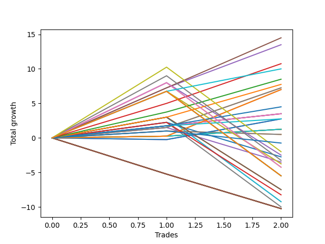

# Short Labrador 014 
- Symbol: ES_900-930
- Date Range: 03/18/2022 - 12/30/2022
- Trading Period: 9:0-9:30
- Number of Trades: 2



| Name | Win Percent | Profit | Avg Profit / Trade | Avg Time / Trade |      | Name | Win Percent | Profit | Avg Profit / Trade | Avg Time / Trade |
| ---- | ----------- | ------ | ------------------ | ---------------- | ---- | ---- | ----------- | ------ | ------------------ | ---------------- |
| Sorted By <br> Profit | | | | | | Sorted By <br> Win Percentage ||||
| TP-7 | 100.00 | 7250.00 | 3625.00 | 36:35 |     | TP-7 | 100.00 | 7250.00 | 3625.00 | 36:35 |
| TP-6 | 100.00 | 6750.00 | 3375.00 | 35:15 |     | TP-6 | 100.00 | 6750.00 | 3375.00 | 35:15 |
| TP-5 | 100.00 | 5375.00 | 2687.50 | 33:47 |     | TP-5 | 100.00 | 5375.00 | 2687.50 | 33:47 |
| NEWFI 000 | 100.00 | 5000.00 | 2500.00 | 47:00 |     | NEWFI 000 | 100.00 | 5000.00 | 2500.00 | 47:00 |
| TP-4 | 100.00 | 4250.00 | 2125.00 | 33:37 |     | TP-4 | 100.00 | 4250.00 | 2125.00 | 33:37 |
| TP-3 | 100.00 | 3875.00 | 1937.50 | 31:15 |     | TP-3 | 100.00 | 3875.00 | 1937.50 | 31:15 |
| BB-200 Mid SL-10 | 100.00 | 3625.00 | 1812.50 | 12:25 |     | BB-200 Mid SL-10 | 100.00 | 3625.00 | 1812.50 | 12:25 |
| BB-200 Mid | 100.00 | 3625.00 | 1812.50 | 12:25 |     | BB-200 Mid | 100.00 | 3625.00 | 1812.50 | 12:25 |
| BB-50 U/L 1SD SL-10 | 100.00 | 3500.00 | 1750.00 | 32:20 |     | BB-50 U/L 1SD SL-10 | 100.00 | 3500.00 | 1750.00 | 32:20 |
| BB-50 U/L 1SD | 100.00 | 3500.00 | 1750.00 | 32:20 |     | BB-50 U/L 1SD | 100.00 | 3500.00 | 1750.00 | 32:20 |
| TP-2 | 100.00 | 2250.00 | 1125.00 | 12:40 |     | TP-2 | 100.00 | 2250.00 | 1125.00 | 12:40 |
| BB-20 Mid SL-10 | 100.00 | 1750.00 | 875.00 | 03:40 |     | BB-20 Mid SL-10 | 100.00 | 1750.00 | 875.00 | 03:40 |
| BB-20 Mid SL-5 | 100.00 | 1750.00 | 875.00 | 03:40 |     | BB-20 Mid SL-5 | 100.00 | 1750.00 | 875.00 | 03:40 |
| BB-20 Mid | 100.00 | 1750.00 | 875.00 | 03:40 |     | BB-20 Mid | 100.00 | 1750.00 | 875.00 | 03:40 |
| TP-1 | 100.00 | 1375.00 | 687.50 | 03:30 |     | TP-1 | 100.00 | 1375.00 | 687.50 | 03:30 |
| BB-50 Mid SL-10 | 50.00 | 1375.00 | 687.50 | 28:40 |     | BB-20 U/L 2SD C SL-10 | 100.00 | 625.00 | 312.50 | 26:12 |
| BB-50 Mid | 50.00 | 1375.00 | 687.50 | 28:40 |     | BB-20 U/L 2SD SL-10 | 100.00 | 625.00 | 312.50 | 26:12 |
| BB-20 U/L 2SD C SL-10 | 100.00 | 625.00 | 312.50 | 26:12 |     | BB-20 U/L 2SD C | 100.00 | 625.00 | 312.50 | 26:12 |
| BB-20 U/L 2SD SL-10 | 100.00 | 625.00 | 312.50 | 26:12 |     | BB-20 U/L 2SD | 100.00 | 625.00 | 312.50 | 26:12 |
| BB-20 U/L 2SD C | 100.00 | 625.00 | 312.50 | 26:12 |     | BB-50 Mid SL-10 | 50.00 | 1375.00 | 687.50 | 28:40 |
| BB-20 U/L 2SD | 100.00 | 625.00 | 312.50 | 26:12 |     | BB-50 Mid | 50.00 | 1375.00 | 687.50 | 28:40 |
| BB-20 U/L 1SD SL-10 | 50.00 | 250.00 | 125.00 | 14:40 |     | BB-20 U/L 1SD SL-10 | 50.00 | 250.00 | 125.00 | 14:40 |
| BB-20 U/L 1SD | 50.00 | 250.00 | 125.00 | 14:40 |     | BB-20 U/L 1SD | 50.00 | 250.00 | 125.00 | 14:40 |
| NEWFI 0000 | 50.00 | -375.00 | -187.50 | 07:05 |     | NEWFI 0000 | 50.00 | -375.00 | -187.50 | 07:05 |
| TP-10 | 50.00 | -1000.00 | -500.00 | 53:35 |     | TP-10 | 50.00 | -1000.00 | -500.00 | 53:35 |
| V U/L 1SD SL-10 | 50.00 | -1250.00 | -625.00 | 43:22 |     | V U/L 1SD SL-10 | 50.00 | -1250.00 | -625.00 | 43:22 |
| V Mid SL-5 | 50.00 | -1375.00 | -687.50 | 07:00 |     | V Mid SL-5 | 50.00 | -1375.00 | -687.50 | 07:00 |
| TP-9 | 50.00 | -1625.00 | -812.50 | 53:20 |     | TP-9 | 50.00 | -1625.00 | -812.50 | 53:20 |
| BB-200 Mid SL-5 | 50.00 | -1750.00 | -875.00 | 06:07 |     | BB-200 Mid SL-5 | 50.00 | -1750.00 | -875.00 | 06:07 |
| BB-200 U/L 2SD SL-10 | 50.00 | -1875.00 | -937.50 | 51:40 |     | BB-200 U/L 2SD SL-10 | 50.00 | -1875.00 | -937.50 | 51:40 |
| BB-100 U/L 2SD SL-10 | 50.00 | -1875.00 | -937.50 | 51:40 |     | BB-100 U/L 2SD SL-10 | 50.00 | -1875.00 | -937.50 | 51:40 |
| TP-8 | 50.00 | -2125.00 | -1062.50 | 52:37 |     | TP-8 | 50.00 | -2125.00 | -1062.50 | 52:37 |
| V U/L 1SD | 50.00 | -2125.00 | -1062.50 | 52:37 |     | V U/L 1SD | 50.00 | -2125.00 | -1062.50 | 52:37 |
| NEWFI 06 | 50.00 | -2750.00 | -1375.00 | 60:55 |     | NEWFI 06 | 50.00 | -2750.00 | -1375.00 | 60:55 |
| BB-200 U/L 2SD | 50.00 | -2750.00 | -1375.00 | 60:55 |     | BB-200 U/L 2SD | 50.00 | -2750.00 | -1375.00 | 60:55 |
| BB-100 U/L 2SD | 50.00 | -2750.00 | -1375.00 | 60:55 |     | BB-100 U/L 2SD | 50.00 | -2750.00 | -1375.00 | 60:55 |
| BB-100 Mid SL-10 | 50.00 | -3750.00 | -1875.00 | 40:42 |     | BB-100 Mid SL-10 | 50.00 | -3750.00 | -1875.00 | 40:42 |
| BB-50 U/L 2SD SL-10 | 50.00 | -3750.00 | -1875.00 | 40:42 |     | BB-50 U/L 2SD SL-10 | 50.00 | -3750.00 | -1875.00 | 40:42 |
| V Mid SL-10 | 50.00 | -4125.00 | -2062.50 | 22:42 |     | V Mid SL-10 | 50.00 | -4125.00 | -2062.50 | 22:42 |
| BB-100 Mid | 50.00 | -4625.00 | -2312.50 | 49:57 |     | BB-100 Mid | 50.00 | -4625.00 | -2312.50 | 49:57 |
| BB-50 U/L 2SD | 50.00 | -4625.00 | -2312.50 | 49:57 |     | BB-50 U/L 2SD | 50.00 | -4625.00 | -2312.50 | 49:57 |
| V Mid | 50.00 | -5000.00 | -2500.00 | 31:57 |     | V Mid | 50.00 | -5000.00 | -2500.00 | 31:57 |
| BB-200 U/L 2SD SL-5 | 0.00 | -5125.00 | -2562.50 | 10:52 |     | BB-200 U/L 2SD SL-5 | 0.00 | -5125.00 | -2562.50 | 10:52 |
| BB-100 U/L 2SD SL-5 | 0.00 | -5125.00 | -2562.50 | 10:52 |     | BB-100 U/L 2SD SL-5 | 0.00 | -5125.00 | -2562.50 | 10:52 |
| BB-100 Mid SL-5 | 0.00 | -5125.00 | -2562.50 | 10:52 |     | BB-100 Mid SL-5 | 0.00 | -5125.00 | -2562.50 | 10:52 |
| V U/L 1SD SL-5 | 0.00 | -5125.00 | -2562.50 | 10:52 |     | V U/L 1SD SL-5 | 0.00 | -5125.00 | -2562.50 | 10:52 |
| BB-50 U/L 2SD SL-5 | 0.00 | -5125.00 | -2562.50 | 10:52 |     | BB-50 U/L 2SD SL-5 | 0.00 | -5125.00 | -2562.50 | 10:52 |
| BB-50 U/L 1SD SL-5 | 0.00 | -5125.00 | -2562.50 | 10:52 |     | BB-50 U/L 1SD SL-5 | 0.00 | -5125.00 | -2562.50 | 10:52 |
| BB-50 Mid SL-5 | 0.00 | -5125.00 | -2562.50 | 10:52 |     | BB-50 Mid SL-5 | 0.00 | -5125.00 | -2562.50 | 10:52 |
| BB-20 U/L 2SD C SL-5 | 0.00 | -5125.00 | -2562.50 | 10:52 |     | BB-20 U/L 2SD C SL-5 | 0.00 | -5125.00 | -2562.50 | 10:52 |
| BB-20 U/L 2SD SL-5 | 0.00 | -5125.00 | -2562.50 | 10:52 |     | BB-20 U/L 2SD SL-5 | 0.00 | -5125.00 | -2562.50 | 10:52 |
| BB-20 U/L 1SD SL-5 | 0.00 | -5125.00 | -2562.50 | 10:52 |     | BB-20 U/L 1SD SL-5 | 0.00 | -5125.00 | -2562.50 | 10:52 |

## NO STOPLOSS

### Test BB-20 Mid
* Sell when price hits the middle line of the 20p bollinger
* No Stoploss
* Results:
```
Total Trades: 2
Percent Up: 0.00
Percent Down: 100.00
Total Points Moved Down: 3.50
Potential Profit: 1750.00
Total Points Ups: 0.00 Count Ups: 0
Total Points Downs: 3.50 Count Downs: 2
```

<details><summary>Trades</summary>

<code>In: 2022-08-04 09:03:00		Out: 2022-08-04 09:04:10		Total Position Time: 01:10		Total Move Down: 1.75		Total to Date: 1.75</code> <br />
<code>In: 2022-08-29 09:08:00		Out: 2022-08-29 09:14:10		Total Position Time: 06:10		Total Move Down: 1.75		Total to Date: 3.50</code> <br />


</details>

### Test BB-20 U/L 1SD
* Sell when the price hits the lower line of the 20p 1std bollinger
* No Stoploss
* Results:
```
Total Trades: 2
Percent Up: 50.00
Percent Down: 50.00
Total Points Moved Down: 0.50
Potential Profit: 250.00
Total Points Ups: 0.50 Count Ups: 1
Total Points Downs: 1.00 Count Downs: 1
```

<details><summary>Trades</summary>

<code>In: 2022-08-04 09:03:00		Out: 2022-08-04 09:16:05		Total Position Time: 13:05		Total Move Down: 1.00		Total to Date: 1.00</code> <br />
<code>In: 2022-08-29 09:08:00		Out: 2022-08-29 09:24:15		Total Position Time: 16:15		Total Move Down: -0.50		Total to Date: 0.50</code> <br />


</details>

### Test BB-20 U/L 2SD
* Sell when the price hits the lower line of the 20p 2std bollinger
* No Stoploss
* Results:
```
Total Trades: 2
Percent Up: 0.00
Percent Down: 100.00
Total Points Moved Down: 1.25
Potential Profit: 625.00
Total Points Ups: 0.00 Count Ups: 0
Total Points Downs: 1.25 Count Downs: 2
```

<details><summary>Trades</summary>

<code>In: 2022-08-04 09:03:00		Out: 2022-08-04 09:38:50		Total Position Time: 35:50		Total Move Down: 0.25		Total to Date: 0.25</code> <br />
<code>In: 2022-08-29 09:08:00		Out: 2022-08-29 09:24:35		Total Position Time: 16:35		Total Move Down: 1.00		Total to Date: 1.25</code> <br />


</details>

### Test BB-20 U/L 2SD C
* Sell when the price hits the lower line of the 20p 2std bollinger
* No Stoploss
* Results:
```
Total Trades: 2
Percent Up: 0.00
Percent Down: 100.00
Total Points Moved Down: 1.25
Potential Profit: 625.00
Total Points Ups: 0.00 Count Ups: 0
Total Points Downs: 1.25 Count Downs: 2
```

<details><summary>Trades</summary>

<code>In: 2022-08-04 09:03:00		Out: 2022-08-04 09:38:50		Total Position Time: 35:50		Total Move Down: 0.25		Total to Date: 0.25</code> <br />
<code>In: 2022-08-29 09:08:00		Out: 2022-08-29 09:24:35		Total Position Time: 16:35		Total Move Down: 1.00		Total to Date: 1.25</code> <br />


</details>

### Test BB-50 Mid
* Sell when price hits the middle line of the 50p bollinger
* No Stoploss
* Results:
```
Total Trades: 2
Percent Up: 50.00
Percent Down: 50.00
Total Points Moved Down: 2.75
Potential Profit: 1375.00
Total Points Ups: 0.25 Count Ups: 1
Total Points Downs: 3.00 Count Downs: 1
```

<details><summary>Trades</summary>

<code>In: 2022-08-04 09:03:00		Out: 2022-08-04 09:36:55		Total Position Time: 33:55		Total Move Down: -0.25		Total to Date: -0.25</code> <br />
<code>In: 2022-08-29 09:08:00		Out: 2022-08-29 09:31:25		Total Position Time: 23:25		Total Move Down: 3.00		Total to Date: 2.75</code> <br />


</details>

### Test BB-50 U/L 1SD
* Sell when the price hits the lower line of the 50p 1std bollinger
* No Stoploss
* Results:
```
Total Trades: 2
Percent Up: 0.00
Percent Down: 100.00
Total Points Moved Down: 7.00
Potential Profit: 3500.00
Total Points Ups: 0.00 Count Ups: 0
Total Points Downs: 7.00 Count Downs: 2
```

<details><summary>Trades</summary>

<code>In: 2022-08-04 09:03:00		Out: 2022-08-04 09:38:50		Total Position Time: 35:50		Total Move Down: 0.25		Total to Date: 0.25</code> <br />
<code>In: 2022-08-29 09:08:00		Out: 2022-08-29 09:36:50		Total Position Time: 28:50		Total Move Down: 6.75		Total to Date: 7.00</code> <br />


</details>

### Test BB-50 U/L 2SD
* Sell when the price hits the lower line of the 50p 2std bollinger
* No Stoploss
* Results:
```
Total Trades: 2
Percent Up: 50.00
Percent Down: 50.00
Total Points Moved Down: -9.25
Potential Profit: -4625.00
Total Points Ups: 12.25 Count Ups: 1
Total Points Downs: 3.00 Count Downs: 1
```

<details><summary>Trades</summary>

<code>In: 2022-08-04 09:03:00		Out: 2022-08-04 09:42:00		Total Position Time: 39:00		Total Move Down: 3.00		Total to Date: 3.00</code> <br />
<code>In: 2022-08-29 09:08:00		Out: 2022-08-29 10:08:55		Total Position Time: 60:55		Total Move Down: -12.25		Total to Date: -9.25</code> <br />


</details>

### Test V Mid
* Sell when the price hits the middle line of the 1std VWAP
* No Stoploss
* Results:
```
Total Trades: 2
Percent Up: 50.00
Percent Down: 50.00
Total Points Moved Down: -10.00
Potential Profit: -5000.00
Total Points Ups: 12.25 Count Ups: 1
Total Points Downs: 2.25 Count Downs: 1
```

<details><summary>Trades</summary>

<code>In: 2022-08-04 09:03:00		Out: 2022-08-04 09:06:00		Total Position Time: 03:00		Total Move Down: 2.25		Total to Date: 2.25</code> <br />
<code>In: 2022-08-29 09:08:00		Out: 2022-08-29 10:08:55		Total Position Time: 60:55		Total Move Down: -12.25		Total to Date: -10.00</code> <br />


</details>

### Test V U/L 1SD
* Sell when the price hits the lower line of the 1std VWAP
* No Stoploss
* Results:
```
Total Trades: 2
Percent Up: 50.00
Percent Down: 50.00
Total Points Moved Down: -4.25
Potential Profit: -2125.00
Total Points Ups: 12.25 Count Ups: 1
Total Points Downs: 8.00 Count Downs: 1
```

<details><summary>Trades</summary>

<code>In: 2022-08-04 09:03:00		Out: 2022-08-04 09:47:20		Total Position Time: 44:20		Total Move Down: 8.00		Total to Date: 8.00</code> <br />
<code>In: 2022-08-29 09:08:00		Out: 2022-08-29 10:08:55		Total Position Time: 60:55		Total Move Down: -12.25		Total to Date: -4.25</code> <br />


</details>

### Test BB-100 Mid
* Move to BB100 Mid
* No Stoploss
* Results:
```
Total Trades: 2
Percent Up: 50.00
Percent Down: 50.00
Total Points Moved Down: -9.25
Potential Profit: -4625.00
Total Points Ups: 12.25 Count Ups: 1
Total Points Downs: 3.00 Count Downs: 1
```

<details><summary>Trades</summary>

<code>In: 2022-08-04 09:03:00		Out: 2022-08-04 09:42:00		Total Position Time: 39:00		Total Move Down: 3.00		Total to Date: 3.00</code> <br />
<code>In: 2022-08-29 09:08:00		Out: 2022-08-29 10:08:55		Total Position Time: 60:55		Total Move Down: -12.25		Total to Date: -9.25</code> <br />


</details>

### Test BB-100 U/L 2SD
* Move to BB100 Upper Band
* No Stoploss
* Results:
```
Total Trades: 2
Percent Up: 50.00
Percent Down: 50.00
Total Points Moved Down: -5.50
Potential Profit: -2750.00
Total Points Ups: 12.25 Count Ups: 1
Total Points Downs: 6.75 Count Downs: 1
```

<details><summary>Trades</summary>

<code>In: 2022-08-04 09:03:00		Out: 2022-08-04 10:03:55		Total Position Time: 60:55		Total Move Down: 6.75		Total to Date: 6.75</code> <br />
<code>In: 2022-08-29 09:08:00		Out: 2022-08-29 10:08:55		Total Position Time: 60:55		Total Move Down: -12.25		Total to Date: -5.50</code> <br />


</details>

### Test BB-200 Mid
* Move to BB200 Mid
* No Stoploss
* Results:
```
Total Trades: 2
Percent Up: 0.00
Percent Down: 100.00
Total Points Moved Down: 7.25
Potential Profit: 3625.00
Total Points Ups: 0.00 Count Ups: 0
Total Points Downs: 7.25 Count Downs: 2
```

<details><summary>Trades</summary>

<code>In: 2022-08-04 09:03:00		Out: 2022-08-04 09:04:15		Total Position Time: 01:15		Total Move Down: 1.50		Total to Date: 1.50</code> <br />
<code>In: 2022-08-29 09:08:00		Out: 2022-08-29 09:31:35		Total Position Time: 23:35		Total Move Down: 5.75		Total to Date: 7.25</code> <br />


</details>

### Test BB-200 U/L 2SD
* Move to BB200 Upper Band
* No Stoploss
* Results:
```
Total Trades: 2
Percent Up: 50.00
Percent Down: 50.00
Total Points Moved Down: -5.50
Potential Profit: -2750.00
Total Points Ups: 12.25 Count Ups: 1
Total Points Downs: 6.75 Count Downs: 1
```

<details><summary>Trades</summary>

<code>In: 2022-08-04 09:03:00		Out: 2022-08-04 10:03:55		Total Position Time: 60:55		Total Move Down: 6.75		Total to Date: 6.75</code> <br />
<code>In: 2022-08-29 09:08:00		Out: 2022-08-29 10:08:55		Total Position Time: 60:55		Total Move Down: -12.25		Total to Date: -5.50</code> <br />


</details>

## STOPLOSS OF 5

### Test BB-20 Mid SL-5
* Sell when price hits the middle line of the 20p bollinger
* Stoploss is -5 points
* Results:
```
Total Trades: 2
Percent Up: 0.00
Percent Down: 100.00
Total Points Moved Down: 3.50
Potential Profit: 1750.00
Total Points Ups: 0.00 Count Ups: 0
Total Points Downs: 3.50 Count Downs: 2
```

<details><summary>Trades</summary>

<code>In: 2022-08-04 09:03:00		Out: 2022-08-04 09:04:10		Total Position Time: 01:10		Total Move Down: 1.75		Total to Date: 1.75</code> <br />
<code>In: 2022-08-29 09:08:00		Out: 2022-08-29 09:14:10		Total Position Time: 06:10		Total Move Down: 1.75		Total to Date: 3.50</code> <br />


</details>

### Test BB-20 U/L 1SD SL-5
* Sell when the price hits the lower line of the 20p 1std bollinger
* Stoploss is -5 points
* Results:
```
Total Trades: 2
Percent Up: 100.00
Percent Down: 0.00
Total Points Moved Down: -10.25
Potential Profit: -5125.00
Total Points Ups: 10.25 Count Ups: 2
Total Points Downs: 0.00 Count Downs: 0
```

<details><summary>Trades</summary>

<code>In: 2022-08-04 09:03:00		Out: 2022-08-04 09:13:45		Total Position Time: 10:45		Total Move Down: -5.25		Total to Date: -5.25</code> <br />
<code>In: 2022-08-29 09:08:00		Out: 2022-08-29 09:19:00		Total Position Time: 11:00		Total Move Down: -5.00		Total to Date: -10.25</code> <br />


</details>

### Test BB-20 U/L 2SD SL-5
* Sell when the price hits the lower line of the 20p 2std bollinger
* Stoploss is -5 points
* Results:
```
Total Trades: 2
Percent Up: 100.00
Percent Down: 0.00
Total Points Moved Down: -10.25
Potential Profit: -5125.00
Total Points Ups: 10.25 Count Ups: 2
Total Points Downs: 0.00 Count Downs: 0
```

<details><summary>Trades</summary>

<code>In: 2022-08-04 09:03:00		Out: 2022-08-04 09:13:45		Total Position Time: 10:45		Total Move Down: -5.25		Total to Date: -5.25</code> <br />
<code>In: 2022-08-29 09:08:00		Out: 2022-08-29 09:19:00		Total Position Time: 11:00		Total Move Down: -5.00		Total to Date: -10.25</code> <br />


</details>

### Test BB-20 U/L 2SD C SL-5
* Sell when the price hits the lower line of the 20p 2std bollinger
* Stoploss is -5 points
* Results:
```
Total Trades: 2
Percent Up: 100.00
Percent Down: 0.00
Total Points Moved Down: -10.25
Potential Profit: -5125.00
Total Points Ups: 10.25 Count Ups: 2
Total Points Downs: 0.00 Count Downs: 0
```

<details><summary>Trades</summary>

<code>In: 2022-08-04 09:03:00		Out: 2022-08-04 09:13:45		Total Position Time: 10:45		Total Move Down: -5.25		Total to Date: -5.25</code> <br />
<code>In: 2022-08-29 09:08:00		Out: 2022-08-29 09:19:00		Total Position Time: 11:00		Total Move Down: -5.00		Total to Date: -10.25</code> <br />


</details>

### Test BB-50 Mid SL-5
* Sell when price hits the middle line of the 50p bollinger
* Stoploss is -5 points
* Results:
```
Total Trades: 2
Percent Up: 100.00
Percent Down: 0.00
Total Points Moved Down: -10.25
Potential Profit: -5125.00
Total Points Ups: 10.25 Count Ups: 2
Total Points Downs: 0.00 Count Downs: 0
```

<details><summary>Trades</summary>

<code>In: 2022-08-04 09:03:00		Out: 2022-08-04 09:13:45		Total Position Time: 10:45		Total Move Down: -5.25		Total to Date: -5.25</code> <br />
<code>In: 2022-08-29 09:08:00		Out: 2022-08-29 09:19:00		Total Position Time: 11:00		Total Move Down: -5.00		Total to Date: -10.25</code> <br />


</details>

### Test BB-50 U/L 1SD SL-5
* Sell when the price hits the lower line of the 50p 1std bollinger
* Stoploss is -5 points
* Results:
```
Total Trades: 2
Percent Up: 100.00
Percent Down: 0.00
Total Points Moved Down: -10.25
Potential Profit: -5125.00
Total Points Ups: 10.25 Count Ups: 2
Total Points Downs: 0.00 Count Downs: 0
```

<details><summary>Trades</summary>

<code>In: 2022-08-04 09:03:00		Out: 2022-08-04 09:13:45		Total Position Time: 10:45		Total Move Down: -5.25		Total to Date: -5.25</code> <br />
<code>In: 2022-08-29 09:08:00		Out: 2022-08-29 09:19:00		Total Position Time: 11:00		Total Move Down: -5.00		Total to Date: -10.25</code> <br />


</details>

### Test BB-50 U/L 2SD SL-5
* Sell when the price hits the lower line of the 50p 2std bollinger
* Stoploss is -5 points
* Results:
```
Total Trades: 2
Percent Up: 100.00
Percent Down: 0.00
Total Points Moved Down: -10.25
Potential Profit: -5125.00
Total Points Ups: 10.25 Count Ups: 2
Total Points Downs: 0.00 Count Downs: 0
```

<details><summary>Trades</summary>

<code>In: 2022-08-04 09:03:00		Out: 2022-08-04 09:13:45		Total Position Time: 10:45		Total Move Down: -5.25		Total to Date: -5.25</code> <br />
<code>In: 2022-08-29 09:08:00		Out: 2022-08-29 09:19:00		Total Position Time: 11:00		Total Move Down: -5.00		Total to Date: -10.25</code> <br />


</details>

### Test V Mid SL-5
* Sell when the price hits the middle line of the 1std VWAP
* Stoploss is -5 points
* Results:
```
Total Trades: 2
Percent Up: 50.00
Percent Down: 50.00
Total Points Moved Down: -2.75
Potential Profit: -1375.00
Total Points Ups: 5.00 Count Ups: 1
Total Points Downs: 2.25 Count Downs: 1
```

<details><summary>Trades</summary>

<code>In: 2022-08-04 09:03:00		Out: 2022-08-04 09:06:00		Total Position Time: 03:00		Total Move Down: 2.25		Total to Date: 2.25</code> <br />
<code>In: 2022-08-29 09:08:00		Out: 2022-08-29 09:19:00		Total Position Time: 11:00		Total Move Down: -5.00		Total to Date: -2.75</code> <br />


</details>

### Test V U/L 1SD SL-5
* Sell when the price hits the lower line of the 1std VWAP
* Stoploss is -5 points
* Results:
```
Total Trades: 2
Percent Up: 100.00
Percent Down: 0.00
Total Points Moved Down: -10.25
Potential Profit: -5125.00
Total Points Ups: 10.25 Count Ups: 2
Total Points Downs: 0.00 Count Downs: 0
```

<details><summary>Trades</summary>

<code>In: 2022-08-04 09:03:00		Out: 2022-08-04 09:13:45		Total Position Time: 10:45		Total Move Down: -5.25		Total to Date: -5.25</code> <br />
<code>In: 2022-08-29 09:08:00		Out: 2022-08-29 09:19:00		Total Position Time: 11:00		Total Move Down: -5.00		Total to Date: -10.25</code> <br />


</details>

### Test BB-100 Mid SL-5
* Move to BB100 Mid
* Stoploss is -5 points
* Results:
```
Total Trades: 2
Percent Up: 100.00
Percent Down: 0.00
Total Points Moved Down: -10.25
Potential Profit: -5125.00
Total Points Ups: 10.25 Count Ups: 2
Total Points Downs: 0.00 Count Downs: 0
```

<details><summary>Trades</summary>

<code>In: 2022-08-04 09:03:00		Out: 2022-08-04 09:13:45		Total Position Time: 10:45		Total Move Down: -5.25		Total to Date: -5.25</code> <br />
<code>In: 2022-08-29 09:08:00		Out: 2022-08-29 09:19:00		Total Position Time: 11:00		Total Move Down: -5.00		Total to Date: -10.25</code> <br />


</details>

### Test BB-100 U/L 2SD SL-5
* Move to BB100 Upper Band
* Stoploss is -5 points
* Results:
```
Total Trades: 2
Percent Up: 100.00
Percent Down: 0.00
Total Points Moved Down: -10.25
Potential Profit: -5125.00
Total Points Ups: 10.25 Count Ups: 2
Total Points Downs: 0.00 Count Downs: 0
```

<details><summary>Trades</summary>

<code>In: 2022-08-04 09:03:00		Out: 2022-08-04 09:13:45		Total Position Time: 10:45		Total Move Down: -5.25		Total to Date: -5.25</code> <br />
<code>In: 2022-08-29 09:08:00		Out: 2022-08-29 09:19:00		Total Position Time: 11:00		Total Move Down: -5.00		Total to Date: -10.25</code> <br />


</details>

### Test BB-200 Mid SL-5
* Move to BB200 Mid
* Stoploss is -5 points
* Results:
```
Total Trades: 2
Percent Up: 50.00
Percent Down: 50.00
Total Points Moved Down: -3.50
Potential Profit: -1750.00
Total Points Ups: 5.00 Count Ups: 1
Total Points Downs: 1.50 Count Downs: 1
```

<details><summary>Trades</summary>

<code>In: 2022-08-04 09:03:00		Out: 2022-08-04 09:04:15		Total Position Time: 01:15		Total Move Down: 1.50		Total to Date: 1.50</code> <br />
<code>In: 2022-08-29 09:08:00		Out: 2022-08-29 09:19:00		Total Position Time: 11:00		Total Move Down: -5.00		Total to Date: -3.50</code> <br />


</details>

### Test BB-200 U/L 2SD SL-5
* Move to BB200 Upper Band
* Stoploss is -5 points
* Results:
```
Total Trades: 2
Percent Up: 100.00
Percent Down: 0.00
Total Points Moved Down: -10.25
Potential Profit: -5125.00
Total Points Ups: 10.25 Count Ups: 2
Total Points Downs: 0.00 Count Downs: 0
```

<details><summary>Trades</summary>

<code>In: 2022-08-04 09:03:00		Out: 2022-08-04 09:13:45		Total Position Time: 10:45		Total Move Down: -5.25		Total to Date: -5.25</code> <br />
<code>In: 2022-08-29 09:08:00		Out: 2022-08-29 09:19:00		Total Position Time: 11:00		Total Move Down: -5.00		Total to Date: -10.25</code> <br />


</details>

## STOPLOSS OF 10

### Test BB-20 Mid SL-10
* Sell when price hits the middle line of the 20p bollinger
* Stoploss is -10 points
* Results:
```
Total Trades: 2
Percent Up: 0.00
Percent Down: 100.00
Total Points Moved Down: 3.50
Potential Profit: 1750.00
Total Points Ups: 0.00 Count Ups: 0
Total Points Downs: 3.50 Count Downs: 2
```

<details><summary>Trades</summary>

<code>In: 2022-08-04 09:03:00		Out: 2022-08-04 09:04:10		Total Position Time: 01:10		Total Move Down: 1.75		Total to Date: 1.75</code> <br />
<code>In: 2022-08-29 09:08:00		Out: 2022-08-29 09:14:10		Total Position Time: 06:10		Total Move Down: 1.75		Total to Date: 3.50</code> <br />


</details>

### Test BB-20 U/L 1SD SL-10
* Sell when the price hits the lower line of the 20p 1std bollinger
* Stoploss is -10 points
* Results:
```
Total Trades: 2
Percent Up: 50.00
Percent Down: 50.00
Total Points Moved Down: 0.50
Potential Profit: 250.00
Total Points Ups: 0.50 Count Ups: 1
Total Points Downs: 1.00 Count Downs: 1
```

<details><summary>Trades</summary>

<code>In: 2022-08-04 09:03:00		Out: 2022-08-04 09:16:05		Total Position Time: 13:05		Total Move Down: 1.00		Total to Date: 1.00</code> <br />
<code>In: 2022-08-29 09:08:00		Out: 2022-08-29 09:24:15		Total Position Time: 16:15		Total Move Down: -0.50		Total to Date: 0.50</code> <br />


</details>

### Test BB-20 U/L 2SD SL-10
* Sell when the price hits the lower line of the 20p 2std bollinger
* Stoploss is -10 points
* Results:
```
Total Trades: 2
Percent Up: 0.00
Percent Down: 100.00
Total Points Moved Down: 1.25
Potential Profit: 625.00
Total Points Ups: 0.00 Count Ups: 0
Total Points Downs: 1.25 Count Downs: 2
```

<details><summary>Trades</summary>

<code>In: 2022-08-04 09:03:00		Out: 2022-08-04 09:38:50		Total Position Time: 35:50		Total Move Down: 0.25		Total to Date: 0.25</code> <br />
<code>In: 2022-08-29 09:08:00		Out: 2022-08-29 09:24:35		Total Position Time: 16:35		Total Move Down: 1.00		Total to Date: 1.25</code> <br />


</details>

### Test BB-20 U/L 2SD C SL-10
* Sell when the price hits the lower line of the 20p 2std bollinger
* Stoploss is -10 points
* Results:
```
Total Trades: 2
Percent Up: 0.00
Percent Down: 100.00
Total Points Moved Down: 1.25
Potential Profit: 625.00
Total Points Ups: 0.00 Count Ups: 0
Total Points Downs: 1.25 Count Downs: 2
```

<details><summary>Trades</summary>

<code>In: 2022-08-04 09:03:00		Out: 2022-08-04 09:38:50		Total Position Time: 35:50		Total Move Down: 0.25		Total to Date: 0.25</code> <br />
<code>In: 2022-08-29 09:08:00		Out: 2022-08-29 09:24:35		Total Position Time: 16:35		Total Move Down: 1.00		Total to Date: 1.25</code> <br />


</details>

### Test BB-50 Mid SL-10
* Sell when price hits the middle line of the 50p bollinger
* Stoploss is -10 points
* Results:
```
Total Trades: 2
Percent Up: 50.00
Percent Down: 50.00
Total Points Moved Down: 2.75
Potential Profit: 1375.00
Total Points Ups: 0.25 Count Ups: 1
Total Points Downs: 3.00 Count Downs: 1
```

<details><summary>Trades</summary>

<code>In: 2022-08-04 09:03:00		Out: 2022-08-04 09:36:55		Total Position Time: 33:55		Total Move Down: -0.25		Total to Date: -0.25</code> <br />
<code>In: 2022-08-29 09:08:00		Out: 2022-08-29 09:31:25		Total Position Time: 23:25		Total Move Down: 3.00		Total to Date: 2.75</code> <br />


</details>

### Test BB-50 U/L 1SD SL-10
* Sell when the price hits the lower line of the 50p 1std bollinger
* Stoploss is -10 points
* Results:
```
Total Trades: 2
Percent Up: 0.00
Percent Down: 100.00
Total Points Moved Down: 7.00
Potential Profit: 3500.00
Total Points Ups: 0.00 Count Ups: 0
Total Points Downs: 7.00 Count Downs: 2
```

<details><summary>Trades</summary>

<code>In: 2022-08-04 09:03:00		Out: 2022-08-04 09:38:50		Total Position Time: 35:50		Total Move Down: 0.25		Total to Date: 0.25</code> <br />
<code>In: 2022-08-29 09:08:00		Out: 2022-08-29 09:36:50		Total Position Time: 28:50		Total Move Down: 6.75		Total to Date: 7.00</code> <br />


</details>

### Test BB-50 U/L 2SD SL-10
* Sell when the price hits the lower line of the 50p 2std bollinger
* Stoploss is -10 points
* Results:
```
Total Trades: 2
Percent Up: 50.00
Percent Down: 50.00
Total Points Moved Down: -7.50
Potential Profit: -3750.00
Total Points Ups: 10.50 Count Ups: 1
Total Points Downs: 3.00 Count Downs: 1
```

<details><summary>Trades</summary>

<code>In: 2022-08-04 09:03:00		Out: 2022-08-04 09:42:00		Total Position Time: 39:00		Total Move Down: 3.00		Total to Date: 3.00</code> <br />
<code>In: 2022-08-29 09:08:00		Out: 2022-08-29 09:50:25		Total Position Time: 42:25		Total Move Down: -10.50		Total to Date: -7.50</code> <br />


</details>

### Test V Mid SL-10
* Sell when the price hits the middle line of the 1std VWAP
* Stoploss is -10 points
* Results:
```
Total Trades: 2
Percent Up: 50.00
Percent Down: 50.00
Total Points Moved Down: -8.25
Potential Profit: -4125.00
Total Points Ups: 10.50 Count Ups: 1
Total Points Downs: 2.25 Count Downs: 1
```

<details><summary>Trades</summary>

<code>In: 2022-08-04 09:03:00		Out: 2022-08-04 09:06:00		Total Position Time: 03:00		Total Move Down: 2.25		Total to Date: 2.25</code> <br />
<code>In: 2022-08-29 09:08:00		Out: 2022-08-29 09:50:25		Total Position Time: 42:25		Total Move Down: -10.50		Total to Date: -8.25</code> <br />


</details>

### Test V U/L 1SD SL-10
* Sell when the price hits the lower line of the 1std VWAP
* Stoploss is -10 points
* Results:
```
Total Trades: 2
Percent Up: 50.00
Percent Down: 50.00
Total Points Moved Down: -2.50
Potential Profit: -1250.00
Total Points Ups: 10.50 Count Ups: 1
Total Points Downs: 8.00 Count Downs: 1
```

<details><summary>Trades</summary>

<code>In: 2022-08-04 09:03:00		Out: 2022-08-04 09:47:20		Total Position Time: 44:20		Total Move Down: 8.00		Total to Date: 8.00</code> <br />
<code>In: 2022-08-29 09:08:00		Out: 2022-08-29 09:50:25		Total Position Time: 42:25		Total Move Down: -10.50		Total to Date: -2.50</code> <br />


</details>

### Test BB-100 Mid SL-10
* Move to BB100 Mid
* Stoploss is -10 points
* Results:
```
Total Trades: 2
Percent Up: 50.00
Percent Down: 50.00
Total Points Moved Down: -7.50
Potential Profit: -3750.00
Total Points Ups: 10.50 Count Ups: 1
Total Points Downs: 3.00 Count Downs: 1
```

<details><summary>Trades</summary>

<code>In: 2022-08-04 09:03:00		Out: 2022-08-04 09:42:00		Total Position Time: 39:00		Total Move Down: 3.00		Total to Date: 3.00</code> <br />
<code>In: 2022-08-29 09:08:00		Out: 2022-08-29 09:50:25		Total Position Time: 42:25		Total Move Down: -10.50		Total to Date: -7.50</code> <br />


</details>

### Test BB-100 U/L 2SD SL-10
* Move to BB100 Upper Band
* Stoploss is -10 points
* Results:
```
Total Trades: 2
Percent Up: 50.00
Percent Down: 50.00
Total Points Moved Down: -3.75
Potential Profit: -1875.00
Total Points Ups: 10.50 Count Ups: 1
Total Points Downs: 6.75 Count Downs: 1
```

<details><summary>Trades</summary>

<code>In: 2022-08-04 09:03:00		Out: 2022-08-04 10:03:55		Total Position Time: 60:55		Total Move Down: 6.75		Total to Date: 6.75</code> <br />
<code>In: 2022-08-29 09:08:00		Out: 2022-08-29 09:50:25		Total Position Time: 42:25		Total Move Down: -10.50		Total to Date: -3.75</code> <br />


</details>

### Test BB-200 Mid SL-10
* Move to BB200 Mid
* Stoploss is -10 points
* Results:
```
Total Trades: 2
Percent Up: 0.00
Percent Down: 100.00
Total Points Moved Down: 7.25
Potential Profit: 3625.00
Total Points Ups: 0.00 Count Ups: 0
Total Points Downs: 7.25 Count Downs: 2
```

<details><summary>Trades</summary>

<code>In: 2022-08-04 09:03:00		Out: 2022-08-04 09:04:15		Total Position Time: 01:15		Total Move Down: 1.50		Total to Date: 1.50</code> <br />
<code>In: 2022-08-29 09:08:00		Out: 2022-08-29 09:31:35		Total Position Time: 23:35		Total Move Down: 5.75		Total to Date: 7.25</code> <br />


</details>

### Test BB-200 U/L 2SD SL-10
* Move to BB200 Upper Band
* Stoploss is -10 points
* Results:
```
Total Trades: 2
Percent Up: 50.00
Percent Down: 50.00
Total Points Moved Down: -3.75
Potential Profit: -1875.00
Total Points Ups: 10.50 Count Ups: 1
Total Points Downs: 6.75 Count Downs: 1
```

<details><summary>Trades</summary>

<code>In: 2022-08-04 09:03:00		Out: 2022-08-04 10:03:55		Total Position Time: 60:55		Total Move Down: 6.75		Total to Date: 6.75</code> <br />
<code>In: 2022-08-29 09:08:00		Out: 2022-08-29 09:50:25		Total Position Time: 42:25		Total Move Down: -10.50		Total to Date: -3.75</code> <br />


</details>

## TAKE PROFIT

### Test TP-1
* Take Profit of 1 Point
* No Stoploss
* Results:
```
Total Trades: 2
Percent Up: 0.00
Percent Down: 100.00
Total Points Moved Down: 2.75
Potential Profit: 1375.00
Total Points Ups: 0.00 Count Ups: 0
Total Points Downs: 2.75 Count Downs: 2
```

<details><summary>Trades</summary>

<code>In: 2022-08-04 09:03:00		Out: 2022-08-04 09:04:10		Total Position Time: 01:10		Total Move Down: 1.75		Total to Date: 1.75</code> <br />
<code>In: 2022-08-29 09:08:00		Out: 2022-08-29 09:13:50		Total Position Time: 05:50		Total Move Down: 1.00		Total to Date: 2.75</code> <br />


</details>

### Test TP-2
* Take Profit of 2 Point
* No Stoploss
* Results:
```
Total Trades: 2
Percent Up: 0.00
Percent Down: 100.00
Total Points Moved Down: 4.50
Potential Profit: 2250.00
Total Points Ups: 0.00 Count Ups: 0
Total Points Downs: 4.50 Count Downs: 2
```

<details><summary>Trades</summary>

<code>In: 2022-08-04 09:03:00		Out: 2022-08-04 09:05:00		Total Position Time: 02:00		Total Move Down: 1.75		Total to Date: 1.75</code> <br />
<code>In: 2022-08-29 09:08:00		Out: 2022-08-29 09:31:20		Total Position Time: 23:20		Total Move Down: 2.75		Total to Date: 4.50</code> <br />


</details>

### Test TP-3
* Take Profit of 3 Point
* No Stoploss
* Results:
```
Total Trades: 2
Percent Up: 0.00
Percent Down: 100.00
Total Points Moved Down: 7.75
Potential Profit: 3875.00
Total Points Ups: 0.00 Count Ups: 0
Total Points Downs: 7.75 Count Downs: 2
```

<details><summary>Trades</summary>

<code>In: 2022-08-04 09:03:00		Out: 2022-08-04 09:42:00		Total Position Time: 39:00		Total Move Down: 3.00		Total to Date: 3.00</code> <br />
<code>In: 2022-08-29 09:08:00		Out: 2022-08-29 09:31:30		Total Position Time: 23:30		Total Move Down: 4.75		Total to Date: 7.75</code> <br />


</details>

### Test TP-4
* Take Profit of 4 Point
* No Stoploss
* Results:
```
Total Trades: 2
Percent Up: 0.00
Percent Down: 100.00
Total Points Moved Down: 8.50
Potential Profit: 4250.00
Total Points Ups: 0.00 Count Ups: 0
Total Points Downs: 8.50 Count Downs: 2
```

<details><summary>Trades</summary>

<code>In: 2022-08-04 09:03:00		Out: 2022-08-04 09:46:45		Total Position Time: 43:45		Total Move Down: 3.75		Total to Date: 3.75</code> <br />
<code>In: 2022-08-29 09:08:00		Out: 2022-08-29 09:31:30		Total Position Time: 23:30		Total Move Down: 4.75		Total to Date: 8.50</code> <br />


</details>

### Test TP-5
* Take Profit of 5 Point
* No Stoploss
* Results:
```
Total Trades: 2
Percent Up: 0.00
Percent Down: 100.00
Total Points Moved Down: 10.75
Potential Profit: 5375.00
Total Points Ups: 0.00 Count Ups: 0
Total Points Downs: 10.75 Count Downs: 2
```

<details><summary>Trades</summary>

<code>In: 2022-08-04 09:03:00		Out: 2022-08-04 09:47:00		Total Position Time: 44:00		Total Move Down: 5.00		Total to Date: 5.00</code> <br />
<code>In: 2022-08-29 09:08:00		Out: 2022-08-29 09:31:35		Total Position Time: 23:35		Total Move Down: 5.75		Total to Date: 10.75</code> <br />


</details>

### Test TP-6
* Take Profit of 6 Point
* No Stoploss
* Results:
```
Total Trades: 2
Percent Up: 0.00
Percent Down: 100.00
Total Points Moved Down: 13.50
Potential Profit: 6750.00
Total Points Ups: 0.00 Count Ups: 0
Total Points Downs: 13.50 Count Downs: 2
```

<details><summary>Trades</summary>

<code>In: 2022-08-04 09:03:00		Out: 2022-08-04 09:47:10		Total Position Time: 44:10		Total Move Down: 7.25		Total to Date: 7.25</code> <br />
<code>In: 2022-08-29 09:08:00		Out: 2022-08-29 09:34:20		Total Position Time: 26:20		Total Move Down: 6.25		Total to Date: 13.50</code> <br />


</details>

### Test TP-7
* Take Profit of 7 Point
* No Stoploss
* Results:
```
Total Trades: 2
Percent Up: 0.00
Percent Down: 100.00
Total Points Moved Down: 14.50
Potential Profit: 7250.00
Total Points Ups: 0.00 Count Ups: 0
Total Points Downs: 14.50 Count Downs: 2
```

<details><summary>Trades</summary>

<code>In: 2022-08-04 09:03:00		Out: 2022-08-04 09:47:10		Total Position Time: 44:10		Total Move Down: 7.25		Total to Date: 7.25</code> <br />
<code>In: 2022-08-29 09:08:00		Out: 2022-08-29 09:37:00		Total Position Time: 29:00		Total Move Down: 7.25		Total to Date: 14.50</code> <br />


</details>

### Test TP-8
* Take Profit of 8 Point
* No Stoploss
* Results:
```
Total Trades: 2
Percent Up: 50.00
Percent Down: 50.00
Total Points Moved Down: -4.25
Potential Profit: -2125.00
Total Points Ups: 12.25 Count Ups: 1
Total Points Downs: 8.00 Count Downs: 1
```

<details><summary>Trades</summary>

<code>In: 2022-08-04 09:03:00		Out: 2022-08-04 09:47:20		Total Position Time: 44:20		Total Move Down: 8.00		Total to Date: 8.00</code> <br />
<code>In: 2022-08-29 09:08:00		Out: 2022-08-29 10:08:55		Total Position Time: 60:55		Total Move Down: -12.25		Total to Date: -4.25</code> <br />


</details>

### Test TP-9
* Take Profit of 9 Point
* No Stoploss
* Results:
```
Total Trades: 2
Percent Up: 50.00
Percent Down: 50.00
Total Points Moved Down: -3.25
Potential Profit: -1625.00
Total Points Ups: 12.25 Count Ups: 1
Total Points Downs: 9.00 Count Downs: 1
```

<details><summary>Trades</summary>

<code>In: 2022-08-04 09:03:00		Out: 2022-08-04 09:48:45		Total Position Time: 45:45		Total Move Down: 9.00		Total to Date: 9.00</code> <br />
<code>In: 2022-08-29 09:08:00		Out: 2022-08-29 10:08:55		Total Position Time: 60:55		Total Move Down: -12.25		Total to Date: -3.25</code> <br />


</details>

### Test TP-10
* Take Profit of 10 Point
* No Stoploss
* Results:
```
Total Trades: 2
Percent Up: 50.00
Percent Down: 50.00
Total Points Moved Down: -2.00
Potential Profit: -1000.00
Total Points Ups: 12.25 Count Ups: 1
Total Points Downs: 10.25 Count Downs: 1
```

<details><summary>Trades</summary>

<code>In: 2022-08-04 09:03:00		Out: 2022-08-04 09:49:15		Total Position Time: 46:15		Total Move Down: 10.25		Total to Date: 10.25</code> <br />
<code>In: 2022-08-29 09:08:00		Out: 2022-08-29 10:08:55		Total Position Time: 60:55		Total Move Down: -12.25		Total to Date: -2.00</code> <br />


</details>

## Indicator Exits

### Test NEWFI 000
* Newfi 0000
* No Stoploss
* Results:
```
Total Trades: 2
Percent Up: 0.00
Percent Down: 100.00
Total Points Moved Down: 10.00
Potential Profit: 5000.00
Total Points Ups: 0.00 Count Ups: 0
Total Points Downs: 10.00 Count Downs: 2
```

<details><summary>Trades</summary>

<code>In: 2022-08-04 09:03:00		Out: 2022-08-04 10:03:55		Total Position Time: 60:55		Total Move Down: 6.75		Total to Date: 6.75</code> <br />
<code>In: 2022-08-29 09:08:00		Out: 2022-08-29 09:41:05		Total Position Time: 33:05		Total Move Down: 3.25		Total to Date: 10.00</code> <br />


</details>

### Test NEWFI 0000
* Newfi 0000
* No Stoploss
* Results:
```
Total Trades: 2
Percent Up: 50.00
Percent Down: 50.00
Total Points Moved Down: -0.75
Potential Profit: -375.00
Total Points Ups: 1.75 Count Ups: 1
Total Points Downs: 1.00 Count Downs: 1
```

<details><summary>Trades</summary>

<code>In: 2022-08-04 09:03:00		Out: 2022-08-04 09:16:05		Total Position Time: 13:05		Total Move Down: 1.00		Total to Date: 1.00</code> <br />
<code>In: 2022-08-29 09:08:00		Out: 2022-08-29 09:09:05		Total Position Time: 01:05		Total Move Down: -1.75		Total to Date: -0.75</code> <br />


</details>

### Test NEWFI 06
* Newfi 06
* No Stoploss
* Results:
```
Total Trades: 2
Percent Up: 50.00
Percent Down: 50.00
Total Points Moved Down: -5.50
Potential Profit: -2750.00
Total Points Ups: 12.25 Count Ups: 1
Total Points Downs: 6.75 Count Downs: 1
```

<details><summary>Trades</summary>

<code>In: 2022-08-04 09:03:00		Out: 2022-08-04 10:03:55		Total Position Time: 60:55		Total Move Down: 6.75		Total to Date: 6.75</code> <br />
<code>In: 2022-08-29 09:08:00		Out: 2022-08-29 10:08:55		Total Position Time: 60:55		Total Move Down: -12.25		Total to Date: -5.50</code> <br />


</details>