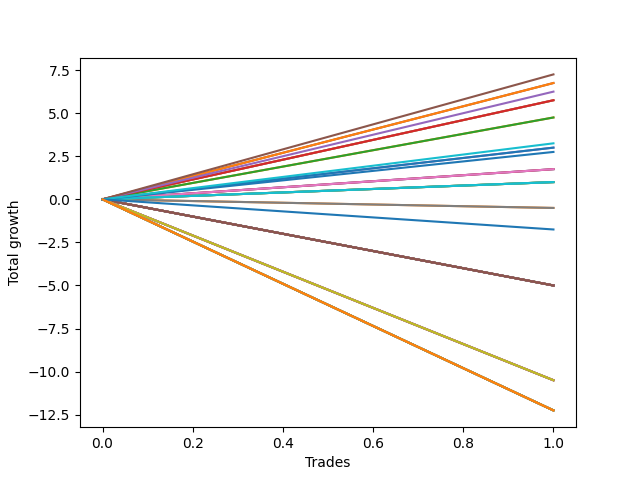

# Short Labrador 016 
- Symbol: ES_900-930
- Date Range: 03/18/2022 - 12/30/2022
- Trading Period: 9:0-9:30
- Number of Trades: 1



| Name | Win Percent | Profit | Avg Profit / Trade | Avg Time / Trade |      | Name | Win Percent | Profit | Avg Profit / Trade | Avg Time / Trade |
| ---- | ----------- | ------ | ------------------ | ---------------- | ---- | ---- | ----------- | ------ | ------------------ | ---------------- |
| Sorted By <br> Profit | | | | | | Sorted By <br> Win Percentage ||||
| TP-7 | 100.00 | 3625.00 | 3625.00 | 29:00 |     | TP-7 | 100.00 | 3625.00 | 3625.00 | 29:00 |
| BB-50 U/L 1SD SL-10 | 100.00 | 3375.00 | 3375.00 | 28:50 |     | BB-50 U/L 1SD SL-10 | 100.00 | 3375.00 | 3375.00 | 28:50 |
| BB-50 U/L 1SD | 100.00 | 3375.00 | 3375.00 | 28:50 |     | BB-50 U/L 1SD | 100.00 | 3375.00 | 3375.00 | 28:50 |
| TP-6 | 100.00 | 3125.00 | 3125.00 | 26:20 |     | TP-6 | 100.00 | 3125.00 | 3125.00 | 26:20 |
| TP-5 | 100.00 | 2875.00 | 2875.00 | 23:35 |     | TP-5 | 100.00 | 2875.00 | 2875.00 | 23:35 |
| BB-200 Mid SL-10 | 100.00 | 2875.00 | 2875.00 | 23:35 |     | BB-200 Mid SL-10 | 100.00 | 2875.00 | 2875.00 | 23:35 |
| BB-200 Mid | 100.00 | 2875.00 | 2875.00 | 23:35 |     | BB-200 Mid | 100.00 | 2875.00 | 2875.00 | 23:35 |
| TP-4 | 100.00 | 2375.00 | 2375.00 | 23:30 |     | TP-4 | 100.00 | 2375.00 | 2375.00 | 23:30 |
| TP-3 | 100.00 | 2375.00 | 2375.00 | 23:30 |     | TP-3 | 100.00 | 2375.00 | 2375.00 | 23:30 |
| NEWFI 000 | 100.00 | 1625.00 | 1625.00 | 33:05 |     | NEWFI 000 | 100.00 | 1625.00 | 1625.00 | 33:05 |
| BB-50 Mid SL-10 | 100.00 | 1500.00 | 1500.00 | 23:25 |     | BB-50 Mid SL-10 | 100.00 | 1500.00 | 1500.00 | 23:25 |
| BB-50 Mid | 100.00 | 1500.00 | 1500.00 | 23:25 |     | BB-50 Mid | 100.00 | 1500.00 | 1500.00 | 23:25 |
| TP-2 | 100.00 | 1375.00 | 1375.00 | 23:20 |     | TP-2 | 100.00 | 1375.00 | 1375.00 | 23:20 |
| BB-20 Mid SL-10 | 100.00 | 875.00 | 875.00 | 06:10 |     | BB-20 Mid SL-10 | 100.00 | 875.00 | 875.00 | 06:10 |
| BB-20 Mid SL-5 | 100.00 | 875.00 | 875.00 | 06:10 |     | BB-20 Mid SL-5 | 100.00 | 875.00 | 875.00 | 06:10 |
| BB-20 Mid | 100.00 | 875.00 | 875.00 | 06:10 |     | BB-20 Mid | 100.00 | 875.00 | 875.00 | 06:10 |
| TP-1 | 100.00 | 500.00 | 500.00 | 05:50 |     | TP-1 | 100.00 | 500.00 | 500.00 | 05:50 |
| BB-20 U/L 2SD C SL-10 | 100.00 | 500.00 | 500.00 | 16:35 |     | BB-20 U/L 2SD C SL-10 | 100.00 | 500.00 | 500.00 | 16:35 |
| BB-20 U/L 2SD SL-10 | 100.00 | 500.00 | 500.00 | 16:35 |     | BB-20 U/L 2SD SL-10 | 100.00 | 500.00 | 500.00 | 16:35 |
| BB-20 U/L 2SD C | 100.00 | 500.00 | 500.00 | 16:35 |     | BB-20 U/L 2SD C | 100.00 | 500.00 | 500.00 | 16:35 |
| BB-20 U/L 2SD | 100.00 | 500.00 | 500.00 | 16:35 |     | BB-20 U/L 2SD | 100.00 | 500.00 | 500.00 | 16:35 |
| BB-20 U/L 1SD SL-10 | 0.00 | -250.00 | -250.00 | 16:15 |     | BB-20 U/L 1SD SL-10 | 0.00 | -250.00 | -250.00 | 16:15 |
| BB-20 U/L 1SD | 0.00 | -250.00 | -250.00 | 16:15 |     | BB-20 U/L 1SD | 0.00 | -250.00 | -250.00 | 16:15 |
| NEWFI 0000 | 0.00 | -875.00 | -875.00 | 01:05 |     | NEWFI 0000 | 0.00 | -875.00 | -875.00 | 01:05 |
| BB-200 U/L 2SD SL-5 | 0.00 | -2500.00 | -2500.00 | 11:00 |     | BB-200 U/L 2SD SL-5 | 0.00 | -2500.00 | -2500.00 | 11:00 |
| BB-200 Mid SL-5 | 0.00 | -2500.00 | -2500.00 | 11:00 |     | BB-200 Mid SL-5 | 0.00 | -2500.00 | -2500.00 | 11:00 |
| BB-100 U/L 2SD SL-5 | 0.00 | -2500.00 | -2500.00 | 11:00 |     | BB-100 U/L 2SD SL-5 | 0.00 | -2500.00 | -2500.00 | 11:00 |
| BB-100 Mid SL-5 | 0.00 | -2500.00 | -2500.00 | 11:00 |     | BB-100 Mid SL-5 | 0.00 | -2500.00 | -2500.00 | 11:00 |
| V U/L 1SD SL-5 | 0.00 | -2500.00 | -2500.00 | 11:00 |     | V U/L 1SD SL-5 | 0.00 | -2500.00 | -2500.00 | 11:00 |
| V Mid SL-5 | 0.00 | -2500.00 | -2500.00 | 11:00 |     | V Mid SL-5 | 0.00 | -2500.00 | -2500.00 | 11:00 |
| BB-50 U/L 2SD SL-5 | 0.00 | -2500.00 | -2500.00 | 11:00 |     | BB-50 U/L 2SD SL-5 | 0.00 | -2500.00 | -2500.00 | 11:00 |
| BB-50 U/L 1SD SL-5 | 0.00 | -2500.00 | -2500.00 | 11:00 |     | BB-50 U/L 1SD SL-5 | 0.00 | -2500.00 | -2500.00 | 11:00 |
| BB-50 Mid SL-5 | 0.00 | -2500.00 | -2500.00 | 11:00 |     | BB-50 Mid SL-5 | 0.00 | -2500.00 | -2500.00 | 11:00 |
| BB-20 U/L 2SD C SL-5 | 0.00 | -2500.00 | -2500.00 | 11:00 |     | BB-20 U/L 2SD C SL-5 | 0.00 | -2500.00 | -2500.00 | 11:00 |
| BB-20 U/L 2SD SL-5 | 0.00 | -2500.00 | -2500.00 | 11:00 |     | BB-20 U/L 2SD SL-5 | 0.00 | -2500.00 | -2500.00 | 11:00 |
| BB-20 U/L 1SD SL-5 | 0.00 | -2500.00 | -2500.00 | 11:00 |     | BB-20 U/L 1SD SL-5 | 0.00 | -2500.00 | -2500.00 | 11:00 |
| BB-200 U/L 2SD SL-10 | 0.00 | -5250.00 | -5250.00 | 42:25 |     | BB-200 U/L 2SD SL-10 | 0.00 | -5250.00 | -5250.00 | 42:25 |
| BB-100 U/L 2SD SL-10 | 0.00 | -5250.00 | -5250.00 | 42:25 |     | BB-100 U/L 2SD SL-10 | 0.00 | -5250.00 | -5250.00 | 42:25 |
| BB-100 Mid SL-10 | 0.00 | -5250.00 | -5250.00 | 42:25 |     | BB-100 Mid SL-10 | 0.00 | -5250.00 | -5250.00 | 42:25 |
| V U/L 1SD SL-10 | 0.00 | -5250.00 | -5250.00 | 42:25 |     | V U/L 1SD SL-10 | 0.00 | -5250.00 | -5250.00 | 42:25 |
| V Mid SL-10 | 0.00 | -5250.00 | -5250.00 | 42:25 |     | V Mid SL-10 | 0.00 | -5250.00 | -5250.00 | 42:25 |
| BB-50 U/L 2SD SL-10 | 0.00 | -5250.00 | -5250.00 | 42:25 |     | BB-50 U/L 2SD SL-10 | 0.00 | -5250.00 | -5250.00 | 42:25 |
| NEWFI 06 | 0.00 | -6125.00 | -6125.00 | 60:55 |     | NEWFI 06 | 0.00 | -6125.00 | -6125.00 | 60:55 |
| TP-10 | 0.00 | -6125.00 | -6125.00 | 60:55 |     | TP-10 | 0.00 | -6125.00 | -6125.00 | 60:55 |
| TP-9 | 0.00 | -6125.00 | -6125.00 | 60:55 |     | TP-9 | 0.00 | -6125.00 | -6125.00 | 60:55 |
| TP-8 | 0.00 | -6125.00 | -6125.00 | 60:55 |     | TP-8 | 0.00 | -6125.00 | -6125.00 | 60:55 |
| BB-200 U/L 2SD | 0.00 | -6125.00 | -6125.00 | 60:55 |     | BB-200 U/L 2SD | 0.00 | -6125.00 | -6125.00 | 60:55 |
| BB-100 U/L 2SD | 0.00 | -6125.00 | -6125.00 | 60:55 |     | BB-100 U/L 2SD | 0.00 | -6125.00 | -6125.00 | 60:55 |
| BB-100 Mid | 0.00 | -6125.00 | -6125.00 | 60:55 |     | BB-100 Mid | 0.00 | -6125.00 | -6125.00 | 60:55 |
| V U/L 1SD | 0.00 | -6125.00 | -6125.00 | 60:55 |     | V U/L 1SD | 0.00 | -6125.00 | -6125.00 | 60:55 |
| V Mid | 0.00 | -6125.00 | -6125.00 | 60:55 |     | V Mid | 0.00 | -6125.00 | -6125.00 | 60:55 |
| BB-50 U/L 2SD | 0.00 | -6125.00 | -6125.00 | 60:55 |     | BB-50 U/L 2SD | 0.00 | -6125.00 | -6125.00 | 60:55 |

## NO STOPLOSS

### Test BB-20 Mid
* Sell when price hits the middle line of the 20p bollinger
* No Stoploss
* Results:
```
Total Trades: 1
Percent Up: 0.00
Percent Down: 100.00
Total Points Moved Down: 1.75
Potential Profit: 875.00
Total Points Ups: 0.00 Count Ups: 0
Total Points Downs: 1.75 Count Downs: 1
```

<details><summary>Trades</summary>

<code>In: 2022-08-29 09:08:00		Out: 2022-08-29 09:14:10		Total Position Time: 06:10		Total Move Down: 1.75		Total to Date: 1.75</code> <br />


</details>

### Test BB-20 U/L 1SD
* Sell when the price hits the lower line of the 20p 1std bollinger
* No Stoploss
* Results:
```
Total Trades: 1
Percent Up: 100.00
Percent Down: 0.00
Total Points Moved Down: -0.50
Potential Profit: -250.00
Total Points Ups: 0.50 Count Ups: 1
Total Points Downs: 0.00 Count Downs: 0
```

<details><summary>Trades</summary>

<code>In: 2022-08-29 09:08:00		Out: 2022-08-29 09:24:15		Total Position Time: 16:15		Total Move Down: -0.50		Total to Date: -0.50</code> <br />


</details>

### Test BB-20 U/L 2SD
* Sell when the price hits the lower line of the 20p 2std bollinger
* No Stoploss
* Results:
```
Total Trades: 1
Percent Up: 0.00
Percent Down: 100.00
Total Points Moved Down: 1.00
Potential Profit: 500.00
Total Points Ups: 0.00 Count Ups: 0
Total Points Downs: 1.00 Count Downs: 1
```

<details><summary>Trades</summary>

<code>In: 2022-08-29 09:08:00		Out: 2022-08-29 09:24:35		Total Position Time: 16:35		Total Move Down: 1.00		Total to Date: 1.00</code> <br />


</details>

### Test BB-20 U/L 2SD C
* Sell when the price hits the lower line of the 20p 2std bollinger
* No Stoploss
* Results:
```
Total Trades: 1
Percent Up: 0.00
Percent Down: 100.00
Total Points Moved Down: 1.00
Potential Profit: 500.00
Total Points Ups: 0.00 Count Ups: 0
Total Points Downs: 1.00 Count Downs: 1
```

<details><summary>Trades</summary>

<code>In: 2022-08-29 09:08:00		Out: 2022-08-29 09:24:35		Total Position Time: 16:35		Total Move Down: 1.00		Total to Date: 1.00</code> <br />


</details>

### Test BB-50 Mid
* Sell when price hits the middle line of the 50p bollinger
* No Stoploss
* Results:
```
Total Trades: 1
Percent Up: 0.00
Percent Down: 100.00
Total Points Moved Down: 3.00
Potential Profit: 1500.00
Total Points Ups: 0.00 Count Ups: 0
Total Points Downs: 3.00 Count Downs: 1
```

<details><summary>Trades</summary>

<code>In: 2022-08-29 09:08:00		Out: 2022-08-29 09:31:25		Total Position Time: 23:25		Total Move Down: 3.00		Total to Date: 3.00</code> <br />


</details>

### Test BB-50 U/L 1SD
* Sell when the price hits the lower line of the 50p 1std bollinger
* No Stoploss
* Results:
```
Total Trades: 1
Percent Up: 0.00
Percent Down: 100.00
Total Points Moved Down: 6.75
Potential Profit: 3375.00
Total Points Ups: 0.00 Count Ups: 0
Total Points Downs: 6.75 Count Downs: 1
```

<details><summary>Trades</summary>

<code>In: 2022-08-29 09:08:00		Out: 2022-08-29 09:36:50		Total Position Time: 28:50		Total Move Down: 6.75		Total to Date: 6.75</code> <br />


</details>

### Test BB-50 U/L 2SD
* Sell when the price hits the lower line of the 50p 2std bollinger
* No Stoploss
* Results:
```
Total Trades: 1
Percent Up: 100.00
Percent Down: 0.00
Total Points Moved Down: -12.25
Potential Profit: -6125.00
Total Points Ups: 12.25 Count Ups: 1
Total Points Downs: 0.00 Count Downs: 0
```

<details><summary>Trades</summary>

<code>In: 2022-08-29 09:08:00		Out: 2022-08-29 10:08:55		Total Position Time: 60:55		Total Move Down: -12.25		Total to Date: -12.25</code> <br />


</details>

### Test V Mid
* Sell when the price hits the middle line of the 1std VWAP
* No Stoploss
* Results:
```
Total Trades: 1
Percent Up: 100.00
Percent Down: 0.00
Total Points Moved Down: -12.25
Potential Profit: -6125.00
Total Points Ups: 12.25 Count Ups: 1
Total Points Downs: 0.00 Count Downs: 0
```

<details><summary>Trades</summary>

<code>In: 2022-08-29 09:08:00		Out: 2022-08-29 10:08:55		Total Position Time: 60:55		Total Move Down: -12.25		Total to Date: -12.25</code> <br />


</details>

### Test V U/L 1SD
* Sell when the price hits the lower line of the 1std VWAP
* No Stoploss
* Results:
```
Total Trades: 1
Percent Up: 100.00
Percent Down: 0.00
Total Points Moved Down: -12.25
Potential Profit: -6125.00
Total Points Ups: 12.25 Count Ups: 1
Total Points Downs: 0.00 Count Downs: 0
```

<details><summary>Trades</summary>

<code>In: 2022-08-29 09:08:00		Out: 2022-08-29 10:08:55		Total Position Time: 60:55		Total Move Down: -12.25		Total to Date: -12.25</code> <br />


</details>

### Test BB-100 Mid
* Move to BB100 Mid
* No Stoploss
* Results:
```
Total Trades: 1
Percent Up: 100.00
Percent Down: 0.00
Total Points Moved Down: -12.25
Potential Profit: -6125.00
Total Points Ups: 12.25 Count Ups: 1
Total Points Downs: 0.00 Count Downs: 0
```

<details><summary>Trades</summary>

<code>In: 2022-08-29 09:08:00		Out: 2022-08-29 10:08:55		Total Position Time: 60:55		Total Move Down: -12.25		Total to Date: -12.25</code> <br />


</details>

### Test BB-100 U/L 2SD
* Move to BB100 Upper Band
* No Stoploss
* Results:
```
Total Trades: 1
Percent Up: 100.00
Percent Down: 0.00
Total Points Moved Down: -12.25
Potential Profit: -6125.00
Total Points Ups: 12.25 Count Ups: 1
Total Points Downs: 0.00 Count Downs: 0
```

<details><summary>Trades</summary>

<code>In: 2022-08-29 09:08:00		Out: 2022-08-29 10:08:55		Total Position Time: 60:55		Total Move Down: -12.25		Total to Date: -12.25</code> <br />


</details>

### Test BB-200 Mid
* Move to BB200 Mid
* No Stoploss
* Results:
```
Total Trades: 1
Percent Up: 0.00
Percent Down: 100.00
Total Points Moved Down: 5.75
Potential Profit: 2875.00
Total Points Ups: 0.00 Count Ups: 0
Total Points Downs: 5.75 Count Downs: 1
```

<details><summary>Trades</summary>

<code>In: 2022-08-29 09:08:00		Out: 2022-08-29 09:31:35		Total Position Time: 23:35		Total Move Down: 5.75		Total to Date: 5.75</code> <br />


</details>

### Test BB-200 U/L 2SD
* Move to BB200 Upper Band
* No Stoploss
* Results:
```
Total Trades: 1
Percent Up: 100.00
Percent Down: 0.00
Total Points Moved Down: -12.25
Potential Profit: -6125.00
Total Points Ups: 12.25 Count Ups: 1
Total Points Downs: 0.00 Count Downs: 0
```

<details><summary>Trades</summary>

<code>In: 2022-08-29 09:08:00		Out: 2022-08-29 10:08:55		Total Position Time: 60:55		Total Move Down: -12.25		Total to Date: -12.25</code> <br />


</details>

## STOPLOSS OF 5

### Test BB-20 Mid SL-5
* Sell when price hits the middle line of the 20p bollinger
* Stoploss is -5 points
* Results:
```
Total Trades: 1
Percent Up: 0.00
Percent Down: 100.00
Total Points Moved Down: 1.75
Potential Profit: 875.00
Total Points Ups: 0.00 Count Ups: 0
Total Points Downs: 1.75 Count Downs: 1
```

<details><summary>Trades</summary>

<code>In: 2022-08-29 09:08:00		Out: 2022-08-29 09:14:10		Total Position Time: 06:10		Total Move Down: 1.75		Total to Date: 1.75</code> <br />


</details>

### Test BB-20 U/L 1SD SL-5
* Sell when the price hits the lower line of the 20p 1std bollinger
* Stoploss is -5 points
* Results:
```
Total Trades: 1
Percent Up: 100.00
Percent Down: 0.00
Total Points Moved Down: -5.00
Potential Profit: -2500.00
Total Points Ups: 5.00 Count Ups: 1
Total Points Downs: 0.00 Count Downs: 0
```

<details><summary>Trades</summary>

<code>In: 2022-08-29 09:08:00		Out: 2022-08-29 09:19:00		Total Position Time: 11:00		Total Move Down: -5.00		Total to Date: -5.00</code> <br />


</details>

### Test BB-20 U/L 2SD SL-5
* Sell when the price hits the lower line of the 20p 2std bollinger
* Stoploss is -5 points
* Results:
```
Total Trades: 1
Percent Up: 100.00
Percent Down: 0.00
Total Points Moved Down: -5.00
Potential Profit: -2500.00
Total Points Ups: 5.00 Count Ups: 1
Total Points Downs: 0.00 Count Downs: 0
```

<details><summary>Trades</summary>

<code>In: 2022-08-29 09:08:00		Out: 2022-08-29 09:19:00		Total Position Time: 11:00		Total Move Down: -5.00		Total to Date: -5.00</code> <br />


</details>

### Test BB-20 U/L 2SD C SL-5
* Sell when the price hits the lower line of the 20p 2std bollinger
* Stoploss is -5 points
* Results:
```
Total Trades: 1
Percent Up: 100.00
Percent Down: 0.00
Total Points Moved Down: -5.00
Potential Profit: -2500.00
Total Points Ups: 5.00 Count Ups: 1
Total Points Downs: 0.00 Count Downs: 0
```

<details><summary>Trades</summary>

<code>In: 2022-08-29 09:08:00		Out: 2022-08-29 09:19:00		Total Position Time: 11:00		Total Move Down: -5.00		Total to Date: -5.00</code> <br />


</details>

### Test BB-50 Mid SL-5
* Sell when price hits the middle line of the 50p bollinger
* Stoploss is -5 points
* Results:
```
Total Trades: 1
Percent Up: 100.00
Percent Down: 0.00
Total Points Moved Down: -5.00
Potential Profit: -2500.00
Total Points Ups: 5.00 Count Ups: 1
Total Points Downs: 0.00 Count Downs: 0
```

<details><summary>Trades</summary>

<code>In: 2022-08-29 09:08:00		Out: 2022-08-29 09:19:00		Total Position Time: 11:00		Total Move Down: -5.00		Total to Date: -5.00</code> <br />


</details>

### Test BB-50 U/L 1SD SL-5
* Sell when the price hits the lower line of the 50p 1std bollinger
* Stoploss is -5 points
* Results:
```
Total Trades: 1
Percent Up: 100.00
Percent Down: 0.00
Total Points Moved Down: -5.00
Potential Profit: -2500.00
Total Points Ups: 5.00 Count Ups: 1
Total Points Downs: 0.00 Count Downs: 0
```

<details><summary>Trades</summary>

<code>In: 2022-08-29 09:08:00		Out: 2022-08-29 09:19:00		Total Position Time: 11:00		Total Move Down: -5.00		Total to Date: -5.00</code> <br />


</details>

### Test BB-50 U/L 2SD SL-5
* Sell when the price hits the lower line of the 50p 2std bollinger
* Stoploss is -5 points
* Results:
```
Total Trades: 1
Percent Up: 100.00
Percent Down: 0.00
Total Points Moved Down: -5.00
Potential Profit: -2500.00
Total Points Ups: 5.00 Count Ups: 1
Total Points Downs: 0.00 Count Downs: 0
```

<details><summary>Trades</summary>

<code>In: 2022-08-29 09:08:00		Out: 2022-08-29 09:19:00		Total Position Time: 11:00		Total Move Down: -5.00		Total to Date: -5.00</code> <br />


</details>

### Test V Mid SL-5
* Sell when the price hits the middle line of the 1std VWAP
* Stoploss is -5 points
* Results:
```
Total Trades: 1
Percent Up: 100.00
Percent Down: 0.00
Total Points Moved Down: -5.00
Potential Profit: -2500.00
Total Points Ups: 5.00 Count Ups: 1
Total Points Downs: 0.00 Count Downs: 0
```

<details><summary>Trades</summary>

<code>In: 2022-08-29 09:08:00		Out: 2022-08-29 09:19:00		Total Position Time: 11:00		Total Move Down: -5.00		Total to Date: -5.00</code> <br />


</details>

### Test V U/L 1SD SL-5
* Sell when the price hits the lower line of the 1std VWAP
* Stoploss is -5 points
* Results:
```
Total Trades: 1
Percent Up: 100.00
Percent Down: 0.00
Total Points Moved Down: -5.00
Potential Profit: -2500.00
Total Points Ups: 5.00 Count Ups: 1
Total Points Downs: 0.00 Count Downs: 0
```

<details><summary>Trades</summary>

<code>In: 2022-08-29 09:08:00		Out: 2022-08-29 09:19:00		Total Position Time: 11:00		Total Move Down: -5.00		Total to Date: -5.00</code> <br />


</details>

### Test BB-100 Mid SL-5
* Move to BB100 Mid
* Stoploss is -5 points
* Results:
```
Total Trades: 1
Percent Up: 100.00
Percent Down: 0.00
Total Points Moved Down: -5.00
Potential Profit: -2500.00
Total Points Ups: 5.00 Count Ups: 1
Total Points Downs: 0.00 Count Downs: 0
```

<details><summary>Trades</summary>

<code>In: 2022-08-29 09:08:00		Out: 2022-08-29 09:19:00		Total Position Time: 11:00		Total Move Down: -5.00		Total to Date: -5.00</code> <br />


</details>

### Test BB-100 U/L 2SD SL-5
* Move to BB100 Upper Band
* Stoploss is -5 points
* Results:
```
Total Trades: 1
Percent Up: 100.00
Percent Down: 0.00
Total Points Moved Down: -5.00
Potential Profit: -2500.00
Total Points Ups: 5.00 Count Ups: 1
Total Points Downs: 0.00 Count Downs: 0
```

<details><summary>Trades</summary>

<code>In: 2022-08-29 09:08:00		Out: 2022-08-29 09:19:00		Total Position Time: 11:00		Total Move Down: -5.00		Total to Date: -5.00</code> <br />


</details>

### Test BB-200 Mid SL-5
* Move to BB200 Mid
* Stoploss is -5 points
* Results:
```
Total Trades: 1
Percent Up: 100.00
Percent Down: 0.00
Total Points Moved Down: -5.00
Potential Profit: -2500.00
Total Points Ups: 5.00 Count Ups: 1
Total Points Downs: 0.00 Count Downs: 0
```

<details><summary>Trades</summary>

<code>In: 2022-08-29 09:08:00		Out: 2022-08-29 09:19:00		Total Position Time: 11:00		Total Move Down: -5.00		Total to Date: -5.00</code> <br />


</details>

### Test BB-200 U/L 2SD SL-5
* Move to BB200 Upper Band
* Stoploss is -5 points
* Results:
```
Total Trades: 1
Percent Up: 100.00
Percent Down: 0.00
Total Points Moved Down: -5.00
Potential Profit: -2500.00
Total Points Ups: 5.00 Count Ups: 1
Total Points Downs: 0.00 Count Downs: 0
```

<details><summary>Trades</summary>

<code>In: 2022-08-29 09:08:00		Out: 2022-08-29 09:19:00		Total Position Time: 11:00		Total Move Down: -5.00		Total to Date: -5.00</code> <br />


</details>

## STOPLOSS OF 10

### Test BB-20 Mid SL-10
* Sell when price hits the middle line of the 20p bollinger
* Stoploss is -10 points
* Results:
```
Total Trades: 1
Percent Up: 0.00
Percent Down: 100.00
Total Points Moved Down: 1.75
Potential Profit: 875.00
Total Points Ups: 0.00 Count Ups: 0
Total Points Downs: 1.75 Count Downs: 1
```

<details><summary>Trades</summary>

<code>In: 2022-08-29 09:08:00		Out: 2022-08-29 09:14:10		Total Position Time: 06:10		Total Move Down: 1.75		Total to Date: 1.75</code> <br />


</details>

### Test BB-20 U/L 1SD SL-10
* Sell when the price hits the lower line of the 20p 1std bollinger
* Stoploss is -10 points
* Results:
```
Total Trades: 1
Percent Up: 100.00
Percent Down: 0.00
Total Points Moved Down: -0.50
Potential Profit: -250.00
Total Points Ups: 0.50 Count Ups: 1
Total Points Downs: 0.00 Count Downs: 0
```

<details><summary>Trades</summary>

<code>In: 2022-08-29 09:08:00		Out: 2022-08-29 09:24:15		Total Position Time: 16:15		Total Move Down: -0.50		Total to Date: -0.50</code> <br />


</details>

### Test BB-20 U/L 2SD SL-10
* Sell when the price hits the lower line of the 20p 2std bollinger
* Stoploss is -10 points
* Results:
```
Total Trades: 1
Percent Up: 0.00
Percent Down: 100.00
Total Points Moved Down: 1.00
Potential Profit: 500.00
Total Points Ups: 0.00 Count Ups: 0
Total Points Downs: 1.00 Count Downs: 1
```

<details><summary>Trades</summary>

<code>In: 2022-08-29 09:08:00		Out: 2022-08-29 09:24:35		Total Position Time: 16:35		Total Move Down: 1.00		Total to Date: 1.00</code> <br />


</details>

### Test BB-20 U/L 2SD C SL-10
* Sell when the price hits the lower line of the 20p 2std bollinger
* Stoploss is -10 points
* Results:
```
Total Trades: 1
Percent Up: 0.00
Percent Down: 100.00
Total Points Moved Down: 1.00
Potential Profit: 500.00
Total Points Ups: 0.00 Count Ups: 0
Total Points Downs: 1.00 Count Downs: 1
```

<details><summary>Trades</summary>

<code>In: 2022-08-29 09:08:00		Out: 2022-08-29 09:24:35		Total Position Time: 16:35		Total Move Down: 1.00		Total to Date: 1.00</code> <br />


</details>

### Test BB-50 Mid SL-10
* Sell when price hits the middle line of the 50p bollinger
* Stoploss is -10 points
* Results:
```
Total Trades: 1
Percent Up: 0.00
Percent Down: 100.00
Total Points Moved Down: 3.00
Potential Profit: 1500.00
Total Points Ups: 0.00 Count Ups: 0
Total Points Downs: 3.00 Count Downs: 1
```

<details><summary>Trades</summary>

<code>In: 2022-08-29 09:08:00		Out: 2022-08-29 09:31:25		Total Position Time: 23:25		Total Move Down: 3.00		Total to Date: 3.00</code> <br />


</details>

### Test BB-50 U/L 1SD SL-10
* Sell when the price hits the lower line of the 50p 1std bollinger
* Stoploss is -10 points
* Results:
```
Total Trades: 1
Percent Up: 0.00
Percent Down: 100.00
Total Points Moved Down: 6.75
Potential Profit: 3375.00
Total Points Ups: 0.00 Count Ups: 0
Total Points Downs: 6.75 Count Downs: 1
```

<details><summary>Trades</summary>

<code>In: 2022-08-29 09:08:00		Out: 2022-08-29 09:36:50		Total Position Time: 28:50		Total Move Down: 6.75		Total to Date: 6.75</code> <br />


</details>

### Test BB-50 U/L 2SD SL-10
* Sell when the price hits the lower line of the 50p 2std bollinger
* Stoploss is -10 points
* Results:
```
Total Trades: 1
Percent Up: 100.00
Percent Down: 0.00
Total Points Moved Down: -10.50
Potential Profit: -5250.00
Total Points Ups: 10.50 Count Ups: 1
Total Points Downs: 0.00 Count Downs: 0
```

<details><summary>Trades</summary>

<code>In: 2022-08-29 09:08:00		Out: 2022-08-29 09:50:25		Total Position Time: 42:25		Total Move Down: -10.50		Total to Date: -10.50</code> <br />


</details>

### Test V Mid SL-10
* Sell when the price hits the middle line of the 1std VWAP
* Stoploss is -10 points
* Results:
```
Total Trades: 1
Percent Up: 100.00
Percent Down: 0.00
Total Points Moved Down: -10.50
Potential Profit: -5250.00
Total Points Ups: 10.50 Count Ups: 1
Total Points Downs: 0.00 Count Downs: 0
```

<details><summary>Trades</summary>

<code>In: 2022-08-29 09:08:00		Out: 2022-08-29 09:50:25		Total Position Time: 42:25		Total Move Down: -10.50		Total to Date: -10.50</code> <br />


</details>

### Test V U/L 1SD SL-10
* Sell when the price hits the lower line of the 1std VWAP
* Stoploss is -10 points
* Results:
```
Total Trades: 1
Percent Up: 100.00
Percent Down: 0.00
Total Points Moved Down: -10.50
Potential Profit: -5250.00
Total Points Ups: 10.50 Count Ups: 1
Total Points Downs: 0.00 Count Downs: 0
```

<details><summary>Trades</summary>

<code>In: 2022-08-29 09:08:00		Out: 2022-08-29 09:50:25		Total Position Time: 42:25		Total Move Down: -10.50		Total to Date: -10.50</code> <br />


</details>

### Test BB-100 Mid SL-10
* Move to BB100 Mid
* Stoploss is -10 points
* Results:
```
Total Trades: 1
Percent Up: 100.00
Percent Down: 0.00
Total Points Moved Down: -10.50
Potential Profit: -5250.00
Total Points Ups: 10.50 Count Ups: 1
Total Points Downs: 0.00 Count Downs: 0
```

<details><summary>Trades</summary>

<code>In: 2022-08-29 09:08:00		Out: 2022-08-29 09:50:25		Total Position Time: 42:25		Total Move Down: -10.50		Total to Date: -10.50</code> <br />


</details>

### Test BB-100 U/L 2SD SL-10
* Move to BB100 Upper Band
* Stoploss is -10 points
* Results:
```
Total Trades: 1
Percent Up: 100.00
Percent Down: 0.00
Total Points Moved Down: -10.50
Potential Profit: -5250.00
Total Points Ups: 10.50 Count Ups: 1
Total Points Downs: 0.00 Count Downs: 0
```

<details><summary>Trades</summary>

<code>In: 2022-08-29 09:08:00		Out: 2022-08-29 09:50:25		Total Position Time: 42:25		Total Move Down: -10.50		Total to Date: -10.50</code> <br />


</details>

### Test BB-200 Mid SL-10
* Move to BB200 Mid
* Stoploss is -10 points
* Results:
```
Total Trades: 1
Percent Up: 0.00
Percent Down: 100.00
Total Points Moved Down: 5.75
Potential Profit: 2875.00
Total Points Ups: 0.00 Count Ups: 0
Total Points Downs: 5.75 Count Downs: 1
```

<details><summary>Trades</summary>

<code>In: 2022-08-29 09:08:00		Out: 2022-08-29 09:31:35		Total Position Time: 23:35		Total Move Down: 5.75		Total to Date: 5.75</code> <br />


</details>

### Test BB-200 U/L 2SD SL-10
* Move to BB200 Upper Band
* Stoploss is -10 points
* Results:
```
Total Trades: 1
Percent Up: 100.00
Percent Down: 0.00
Total Points Moved Down: -10.50
Potential Profit: -5250.00
Total Points Ups: 10.50 Count Ups: 1
Total Points Downs: 0.00 Count Downs: 0
```

<details><summary>Trades</summary>

<code>In: 2022-08-29 09:08:00		Out: 2022-08-29 09:50:25		Total Position Time: 42:25		Total Move Down: -10.50		Total to Date: -10.50</code> <br />


</details>

## TAKE PROFIT

### Test TP-1
* Take Profit of 1 Point
* No Stoploss
* Results:
```
Total Trades: 1
Percent Up: 0.00
Percent Down: 100.00
Total Points Moved Down: 1.00
Potential Profit: 500.00
Total Points Ups: 0.00 Count Ups: 0
Total Points Downs: 1.00 Count Downs: 1
```

<details><summary>Trades</summary>

<code>In: 2022-08-29 09:08:00		Out: 2022-08-29 09:13:50		Total Position Time: 05:50		Total Move Down: 1.00		Total to Date: 1.00</code> <br />


</details>

### Test TP-2
* Take Profit of 2 Point
* No Stoploss
* Results:
```
Total Trades: 1
Percent Up: 0.00
Percent Down: 100.00
Total Points Moved Down: 2.75
Potential Profit: 1375.00
Total Points Ups: 0.00 Count Ups: 0
Total Points Downs: 2.75 Count Downs: 1
```

<details><summary>Trades</summary>

<code>In: 2022-08-29 09:08:00		Out: 2022-08-29 09:31:20		Total Position Time: 23:20		Total Move Down: 2.75		Total to Date: 2.75</code> <br />


</details>

### Test TP-3
* Take Profit of 3 Point
* No Stoploss
* Results:
```
Total Trades: 1
Percent Up: 0.00
Percent Down: 100.00
Total Points Moved Down: 4.75
Potential Profit: 2375.00
Total Points Ups: 0.00 Count Ups: 0
Total Points Downs: 4.75 Count Downs: 1
```

<details><summary>Trades</summary>

<code>In: 2022-08-29 09:08:00		Out: 2022-08-29 09:31:30		Total Position Time: 23:30		Total Move Down: 4.75		Total to Date: 4.75</code> <br />


</details>

### Test TP-4
* Take Profit of 4 Point
* No Stoploss
* Results:
```
Total Trades: 1
Percent Up: 0.00
Percent Down: 100.00
Total Points Moved Down: 4.75
Potential Profit: 2375.00
Total Points Ups: 0.00 Count Ups: 0
Total Points Downs: 4.75 Count Downs: 1
```

<details><summary>Trades</summary>

<code>In: 2022-08-29 09:08:00		Out: 2022-08-29 09:31:30		Total Position Time: 23:30		Total Move Down: 4.75		Total to Date: 4.75</code> <br />


</details>

### Test TP-5
* Take Profit of 5 Point
* No Stoploss
* Results:
```
Total Trades: 1
Percent Up: 0.00
Percent Down: 100.00
Total Points Moved Down: 5.75
Potential Profit: 2875.00
Total Points Ups: 0.00 Count Ups: 0
Total Points Downs: 5.75 Count Downs: 1
```

<details><summary>Trades</summary>

<code>In: 2022-08-29 09:08:00		Out: 2022-08-29 09:31:35		Total Position Time: 23:35		Total Move Down: 5.75		Total to Date: 5.75</code> <br />


</details>

### Test TP-6
* Take Profit of 6 Point
* No Stoploss
* Results:
```
Total Trades: 1
Percent Up: 0.00
Percent Down: 100.00
Total Points Moved Down: 6.25
Potential Profit: 3125.00
Total Points Ups: 0.00 Count Ups: 0
Total Points Downs: 6.25 Count Downs: 1
```

<details><summary>Trades</summary>

<code>In: 2022-08-29 09:08:00		Out: 2022-08-29 09:34:20		Total Position Time: 26:20		Total Move Down: 6.25		Total to Date: 6.25</code> <br />


</details>

### Test TP-7
* Take Profit of 7 Point
* No Stoploss
* Results:
```
Total Trades: 1
Percent Up: 0.00
Percent Down: 100.00
Total Points Moved Down: 7.25
Potential Profit: 3625.00
Total Points Ups: 0.00 Count Ups: 0
Total Points Downs: 7.25 Count Downs: 1
```

<details><summary>Trades</summary>

<code>In: 2022-08-29 09:08:00		Out: 2022-08-29 09:37:00		Total Position Time: 29:00		Total Move Down: 7.25		Total to Date: 7.25</code> <br />


</details>

### Test TP-8
* Take Profit of 8 Point
* No Stoploss
* Results:
```
Total Trades: 1
Percent Up: 100.00
Percent Down: 0.00
Total Points Moved Down: -12.25
Potential Profit: -6125.00
Total Points Ups: 12.25 Count Ups: 1
Total Points Downs: 0.00 Count Downs: 0
```

<details><summary>Trades</summary>

<code>In: 2022-08-29 09:08:00		Out: 2022-08-29 10:08:55		Total Position Time: 60:55		Total Move Down: -12.25		Total to Date: -12.25</code> <br />


</details>

### Test TP-9
* Take Profit of 9 Point
* No Stoploss
* Results:
```
Total Trades: 1
Percent Up: 100.00
Percent Down: 0.00
Total Points Moved Down: -12.25
Potential Profit: -6125.00
Total Points Ups: 12.25 Count Ups: 1
Total Points Downs: 0.00 Count Downs: 0
```

<details><summary>Trades</summary>

<code>In: 2022-08-29 09:08:00		Out: 2022-08-29 10:08:55		Total Position Time: 60:55		Total Move Down: -12.25		Total to Date: -12.25</code> <br />


</details>

### Test TP-10
* Take Profit of 10 Point
* No Stoploss
* Results:
```
Total Trades: 1
Percent Up: 100.00
Percent Down: 0.00
Total Points Moved Down: -12.25
Potential Profit: -6125.00
Total Points Ups: 12.25 Count Ups: 1
Total Points Downs: 0.00 Count Downs: 0
```

<details><summary>Trades</summary>

<code>In: 2022-08-29 09:08:00		Out: 2022-08-29 10:08:55		Total Position Time: 60:55		Total Move Down: -12.25		Total to Date: -12.25</code> <br />


</details>

## Indicator Exits

### Test NEWFI 000
* Newfi 0000
* No Stoploss
* Results:
```
Total Trades: 1
Percent Up: 0.00
Percent Down: 100.00
Total Points Moved Down: 3.25
Potential Profit: 1625.00
Total Points Ups: 0.00 Count Ups: 0
Total Points Downs: 3.25 Count Downs: 1
```

<details><summary>Trades</summary>

<code>In: 2022-08-29 09:08:00		Out: 2022-08-29 09:41:05		Total Position Time: 33:05		Total Move Down: 3.25		Total to Date: 3.25</code> <br />


</details>

### Test NEWFI 0000
* Newfi 0000
* No Stoploss
* Results:
```
Total Trades: 1
Percent Up: 100.00
Percent Down: 0.00
Total Points Moved Down: -1.75
Potential Profit: -875.00
Total Points Ups: 1.75 Count Ups: 1
Total Points Downs: 0.00 Count Downs: 0
```

<details><summary>Trades</summary>

<code>In: 2022-08-29 09:08:00		Out: 2022-08-29 09:09:05		Total Position Time: 01:05		Total Move Down: -1.75		Total to Date: -1.75</code> <br />


</details>

### Test NEWFI 06
* Newfi 06
* No Stoploss
* Results:
```
Total Trades: 1
Percent Up: 100.00
Percent Down: 0.00
Total Points Moved Down: -12.25
Potential Profit: -6125.00
Total Points Ups: 12.25 Count Ups: 1
Total Points Downs: 0.00 Count Downs: 0
```

<details><summary>Trades</summary>

<code>In: 2022-08-29 09:08:00		Out: 2022-08-29 10:08:55		Total Position Time: 60:55		Total Move Down: -12.25		Total to Date: -12.25</code> <br />


</details>