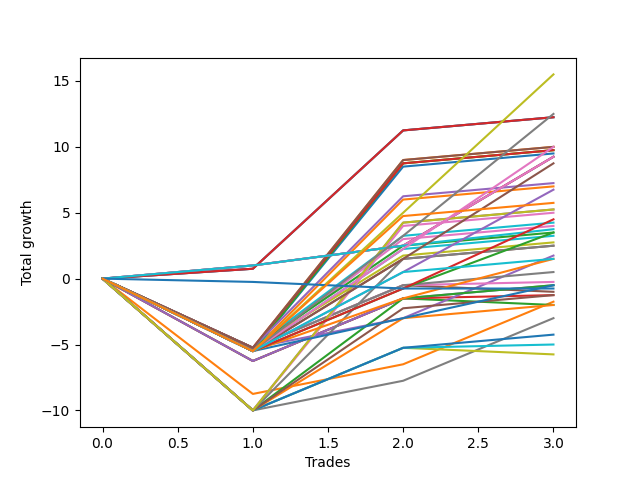

# Long Pointer 003 SD 
- Symbol: ES_930-1000
- Date Range: 12/22/2022 - 12/30/2022
- Trading Period: 9:30-10:0
- Number of Trades: 3



| Name | Win Percent | Profit | Avg Profit / Trade | Avg Time / Trade |      | Name | Win Percent | Profit | Avg Profit / Trade | Avg Time / Trade |
| ---- | ----------- | ------ | ------------------ | ---------------- | ---- | ---- | ----------- | ------ | ------------------ | ---------------- |
| Sorted By <br> Profit | | | | | | Sorted By <br> Win Percentage ||||
| TP-10 | 66.67 | 7750.00 | 2583.33 | 31:15 |     | V Mid SL-10 | 100.00 | 6125.00 | 2041.67 | 29:18 |
| TP-9 | 66.67 | 6250.00 | 2083.33 | 31:05 |     | V Mid SL-5 | 100.00 | 6125.00 | 2041.67 | 29:18 |
| V Mid SL-10 | 100.00 | 6125.00 | 2041.67 | 29:18 |     | V Mid | 100.00 | 6125.00 | 2041.67 | 29:18 |
| V Mid SL-5 | 100.00 | 6125.00 | 2041.67 | 29:18 |     | BB-20 Mid SL-10 | 100.00 | 4625.00 | 1541.67 | 02:11 |
| V Mid | 100.00 | 6125.00 | 2041.67 | 29:18 |     | BB-20 Mid SL-5 | 100.00 | 4625.00 | 1541.67 | 02:11 |
| TP-8 | 66.67 | 5000.00 | 1666.67 | 24:25 |     | BB-20 Mid | 100.00 | 4625.00 | 1541.67 | 02:11 |
| BB-200 U/L 2SD SL-5 | 66.67 | 5000.00 | 1666.67 | 43:11 |     | TP-1 | 100.00 | 1875.00 | 625.00 | 01:36 |
| V U/L 1SD SL-5 | 66.67 | 5000.00 | 1666.67 | 43:11 |     | TP-10 | 66.67 | 7750.00 | 2583.33 | 31:15 |
| BB-100 U/L 2SD SL-5 | 66.67 | 4875.00 | 1625.00 | 34:05 |     | TP-9 | 66.67 | 6250.00 | 2083.33 | 31:05 |
| BB-200 U/L 2SD | 66.67 | 4875.00 | 1625.00 | 60:55 |     | TP-8 | 66.67 | 5000.00 | 1666.67 | 24:25 |
| V U/L 1SD | 66.67 | 4875.00 | 1625.00 | 60:55 |     | BB-200 U/L 2SD SL-5 | 66.67 | 5000.00 | 1666.67 | 43:11 |
| BB-100 U/L 2SD | 66.67 | 4750.00 | 1583.33 | 51:48 |     | V U/L 1SD SL-5 | 66.67 | 5000.00 | 1666.67 | 43:11 |
| BB-20 Mid SL-10 | 100.00 | 4625.00 | 1541.67 | 02:11 |     | BB-100 U/L 2SD SL-5 | 66.67 | 4875.00 | 1625.00 | 34:05 |
| BB-20 Mid SL-5 | 100.00 | 4625.00 | 1541.67 | 02:11 |     | BB-200 U/L 2SD | 66.67 | 4875.00 | 1625.00 | 60:55 |
| BB-20 Mid | 100.00 | 4625.00 | 1541.67 | 02:11 |     | V U/L 1SD | 66.67 | 4875.00 | 1625.00 | 60:55 |
| TP-7 | 66.67 | 4375.00 | 1458.33 | 24:00 |     | BB-100 U/L 2SD | 66.67 | 4750.00 | 1583.33 | 51:48 |
| BB-200 Mid SL-5 | 66.67 | 3625.00 | 1208.33 | 32:41 |     | TP-7 | 66.67 | 4375.00 | 1458.33 | 24:00 |
| BB-200 Mid | 66.67 | 3500.00 | 1166.67 | 50:25 |     | BB-200 Mid SL-5 | 66.67 | 3625.00 | 1208.33 | 32:41 |
| TP-6 | 66.67 | 3375.00 | 1125.00 | 22:58 |     | BB-200 Mid | 66.67 | 3500.00 | 1166.67 | 50:25 |
| NEWFI 06 | 66.67 | 2875.00 | 958.33 | 53:38 |     | TP-6 | 66.67 | 3375.00 | 1125.00 | 22:58 |
| BB-200 U/L 2SD SL-10 | 66.67 | 2625.00 | 875.00 | 53:51 |     | NEWFI 06 | 66.67 | 2875.00 | 958.33 | 53:38 |
| V U/L 1SD SL-10 | 66.67 | 2625.00 | 875.00 | 53:51 |     | BB-200 U/L 2SD SL-10 | 66.67 | 2625.00 | 875.00 | 53:51 |
| BB-100 U/L 2SD SL-10 | 66.67 | 2500.00 | 833.33 | 44:45 |     | V U/L 1SD SL-10 | 66.67 | 2625.00 | 875.00 | 53:51 |
| TP-5 | 66.67 | 2250.00 | 750.00 | 22:16 |     | BB-100 U/L 2SD SL-10 | 66.67 | 2500.00 | 833.33 | 44:45 |
| BB-50 U/L 2SD SL-5 | 66.67 | 2125.00 | 708.33 | 28:56 |     | TP-5 | 66.67 | 2250.00 | 750.00 | 22:16 |
| BB-50 U/L 2SD | 66.67 | 2000.00 | 666.67 | 46:40 |     | BB-50 U/L 2SD SL-5 | 66.67 | 2125.00 | 708.33 | 28:56 |
| TP-1 | 100.00 | 1875.00 | 625.00 | 01:36 |     | BB-50 U/L 2SD | 66.67 | 2000.00 | 666.67 | 46:40 |
| TP-4 | 66.67 | 1750.00 | 583.33 | 22:11 |     | TP-4 | 66.67 | 1750.00 | 583.33 | 22:11 |
| BB-100 Mid SL-5 | 66.67 | 1750.00 | 583.33 | 25:50 |     | BB-100 Mid SL-5 | 66.67 | 1750.00 | 583.33 | 25:50 |
| BB-100 Mid | 66.67 | 1625.00 | 541.67 | 43:33 |     | BB-100 Mid | 66.67 | 1625.00 | 541.67 | 43:33 |
| BB-50 U/L 1SD SL-5 | 66.67 | 1375.00 | 458.33 | 25:35 |     | BB-50 U/L 1SD SL-5 | 66.67 | 1375.00 | 458.33 | 25:35 |
| BB-200 Mid SL-10 | 66.67 | 1250.00 | 416.67 | 43:21 |     | BB-200 Mid SL-10 | 66.67 | 1250.00 | 416.67 | 43:21 |
| BB-50 U/L 1SD | 66.67 | 1250.00 | 416.67 | 43:18 |     | BB-50 U/L 1SD | 66.67 | 1250.00 | 416.67 | 43:18 |
| BB-20 U/L 1SD SL-5 | 66.67 | 875.00 | 291.67 | 15:08 |     | BB-20 U/L 1SD SL-5 | 66.67 | 875.00 | 291.67 | 15:08 |
| NEWFI 000 | 66.67 | 750.00 | 250.00 | 47:58 |     | NEWFI 000 | 66.67 | 750.00 | 250.00 | 47:58 |
| TP-3 | 66.67 | 750.00 | 250.00 | 21:55 |     | TP-3 | 66.67 | 750.00 | 250.00 | 21:55 |
| BB-50 Mid SL-5 | 66.67 | 250.00 | 83.33 | 24:00 |     | BB-50 Mid SL-5 | 66.67 | 250.00 | 83.33 | 24:00 |
| BB-20 U/L 2SD C SL-5 | 66.67 | -125.00 | -41.67 | 23:56 |     | BB-20 U/L 2SD C SL-5 | 66.67 | -125.00 | -41.67 | 23:56 |
| TP-2 | 66.67 | -250.00 | -83.33 | 21:36 |     | TP-2 | 66.67 | -250.00 | -83.33 | 21:36 |
| BB-50 U/L 2SD SL-10 | 66.67 | -250.00 | -83.33 | 39:36 |     | BB-50 U/L 2SD SL-10 | 66.67 | -250.00 | -83.33 | 39:36 |
| BB-50 Mid | 66.67 | -250.00 | -83.33 | 40:51 |     | BB-50 Mid | 66.67 | -250.00 | -83.33 | 40:51 |
| NEWFI 0000 | 33.33 | -375.00 | -125.00 | 01:05 |     | BB-100 Mid SL-10 | 66.67 | -625.00 | -208.33 | 36:30 |
| BB-20 U/L 2SD SL-5 | 33.33 | -500.00 | -166.67 | 23:53 |     | BB-20 U/L 2SD C | 66.67 | -625.00 | -208.33 | 40:48 |
| BB-100 Mid SL-10 | 66.67 | -625.00 | -208.33 | 36:30 |     | BB-20 U/L 1SD | 66.67 | -875.00 | -291.67 | 31:46 |
| BB-20 U/L 2SD C | 66.67 | -625.00 | -208.33 | 40:48 |     | BB-50 U/L 1SD SL-10 | 66.67 | -1000.00 | -333.33 | 36:15 |
| BB-20 U/L 1SD | 66.67 | -875.00 | -291.67 | 31:46 |     | BB-20 U/L 1SD SL-10 | 66.67 | -1500.00 | -500.00 | 25:48 |
| BB-50 U/L 1SD SL-10 | 66.67 | -1000.00 | -333.33 | 36:15 |     | BB-50 Mid SL-10 | 66.67 | -2125.00 | -708.33 | 34:40 |
| BB-20 U/L 2SD | 33.33 | -1000.00 | -333.33 | 40:45 |     | BB-20 U/L 2SD C SL-10 | 66.67 | -2500.00 | -833.33 | 34:36 |
| BB-20 U/L 1SD SL-10 | 66.67 | -1500.00 | -500.00 | 25:48 |     | NEWFI 0000 | 33.33 | -375.00 | -125.00 | 01:05 |
| BB-50 Mid SL-10 | 66.67 | -2125.00 | -708.33 | 34:40 |     | BB-20 U/L 2SD SL-5 | 33.33 | -500.00 | -166.67 | 23:53 |
| BB-20 U/L 2SD C SL-10 | 66.67 | -2500.00 | -833.33 | 34:36 |     | BB-20 U/L 2SD | 33.33 | -1000.00 | -333.33 | 40:45 |
| BB-20 U/L 2SD SL-10 | 33.33 | -2875.00 | -958.33 | 34:33 |     | BB-20 U/L 2SD SL-10 | 33.33 | -2875.00 | -958.33 | 34:33 |

## NO STOPLOSS

### Test BB-20 Mid
* Sell when price hits the middle line of the 20p bollinger
* No Stoploss
* Results:
```
Total Trades: 3
Percent Up: 100.00
Percent Down: 0.00
Total Points Moved Up: 9.25
Potential Profit: 4625.00
Total Points Ups: 9.25 Count Ups: 3
Total Points Downs: 0.00 Count Downs: 0
```

<details><summary>Trades</summary>

<code>In: 2022-12-27 10:48:00		Out: 2022-12-27 10:49:25		Total Position Time: 01:25		Total Move Up: 1.00		Total to Date: 1.00</code> <br />
<code>In: 2022-12-27 11:43:00		Out: 2022-12-27 11:45:05		Total Position Time: 02:05		Total Move Up: 1.50		Total to Date: 2.50</code> <br />
<code>In: 2022-12-30 10:28:00		Out: 2022-12-30 10:31:05		Total Position Time: 03:05		Total Move Up: 6.75		Total to Date: 9.25</code> <br />


</details>

### Test BB-20 U/L 1SD
* Sell when the price hits the upper line of the 20p 1std bollinger
* No Stoploss
* Results:
```
Total Trades: 3
Percent Up: 66.67
Percent Down: 33.33
Total Points Moved Up: -1.75
Potential Profit: -875.00
Total Points Ups: 7.00 Count Ups: 2
Total Points Downs: -8.75 Count Downs: 1
```

<details><summary>Trades</summary>

<code>In: 2022-12-27 10:48:00		Out: 2022-12-27 11:45:40		Total Position Time: 57:40		Total Move Up: -8.75		Total to Date: -8.75</code> <br />
<code>In: 2022-12-27 11:43:00		Out: 2022-12-27 11:45:40		Total Position Time: 02:40		Total Move Up: 2.25		Total to Date: -6.50</code> <br />
<code>In: 2022-12-30 10:28:00		Out: 2022-12-30 11:03:00		Total Position Time: 35:00		Total Move Up: 4.75		Total to Date: -1.75</code> <br />


</details>

### Test BB-20 U/L 2SD
* Sell when the price hits the upper line of the 20p 2std bollinger
* No Stoploss
* Results:
```
Total Trades: 3
Percent Up: 33.33
Percent Down: 66.67
Total Points Moved Up: -2.00
Potential Profit: -1000.00
Total Points Ups: 4.75 Count Ups: 1
Total Points Downs: -6.75 Count Downs: 2
```

<details><summary>Trades</summary>

<code>In: 2022-12-27 10:48:00		Out: 2022-12-27 11:46:20		Total Position Time: 58:20		Total Move Up: -6.25		Total to Date: -6.25</code> <br />
<code>In: 2022-12-27 11:43:00		Out: 2022-12-27 11:46:20		Total Position Time: 03:20		Total Move Up: 4.75		Total to Date: -1.50</code> <br />
<code>In: 2022-12-30 10:28:00		Out: 2022-12-30 11:28:35		Total Position Time: 60:35		Total Move Up: -0.50		Total to Date: -2.00</code> <br />


</details>

### Test BB-20 U/L 2SD C
* Sell when the price hits the upper line of the 20p 2std bollinger
* No Stoploss
* Results:
```
Total Trades: 3
Percent Up: 66.67
Percent Down: 33.33
Total Points Moved Up: -1.25
Potential Profit: -625.00
Total Points Ups: 5.00 Count Ups: 2
Total Points Downs: -6.25 Count Downs: 1
```

<details><summary>Trades</summary>

<code>In: 2022-12-27 10:48:00		Out: 2022-12-27 11:46:20		Total Position Time: 58:20		Total Move Up: -6.25		Total to Date: -6.25</code> <br />
<code>In: 2022-12-27 11:43:00		Out: 2022-12-27 11:46:20		Total Position Time: 03:20		Total Move Up: 4.75		Total to Date: -1.50</code> <br />
<code>In: 2022-12-30 10:28:00		Out: 2022-12-30 11:28:45		Total Position Time: 60:45		Total Move Up: 0.25		Total to Date: -1.25</code> <br />


</details>

### Test BB-50 Mid
* Sell when price hits the middle line of the 50p bollinger
* No Stoploss
* Results:
```
Total Trades: 3
Percent Up: 66.67
Percent Down: 33.33
Total Points Moved Up: -0.50
Potential Profit: -250.00
Total Points Ups: 5.75 Count Ups: 2
Total Points Downs: -6.25 Count Downs: 1
```

<details><summary>Trades</summary>

<code>In: 2022-12-27 10:48:00		Out: 2022-12-27 11:46:20		Total Position Time: 58:20		Total Move Up: -6.25		Total to Date: -6.25</code> <br />
<code>In: 2022-12-27 11:43:00		Out: 2022-12-27 11:46:20		Total Position Time: 03:20		Total Move Up: 4.75		Total to Date: -1.50</code> <br />
<code>In: 2022-12-30 10:28:00		Out: 2022-12-30 11:28:55		Total Position Time: 60:55		Total Move Up: 1.00		Total to Date: -0.50</code> <br />


</details>

### Test BB-50 U/L 1SD
* Sell when the price hits the upper line of the 50p 1std bollinger
* No Stoploss
* Results:
```
Total Trades: 3
Percent Up: 66.67
Percent Down: 33.33
Total Points Moved Up: 2.50
Potential Profit: 1250.00
Total Points Ups: 8.00 Count Ups: 2
Total Points Downs: -5.50 Count Downs: 1
```

<details><summary>Trades</summary>

<code>In: 2022-12-27 10:48:00		Out: 2022-12-27 11:48:55		Total Position Time: 60:55		Total Move Up: -5.50		Total to Date: -5.50</code> <br />
<code>In: 2022-12-27 11:43:00		Out: 2022-12-27 11:51:05		Total Position Time: 08:05		Total Move Up: 7.00		Total to Date: 1.50</code> <br />
<code>In: 2022-12-30 10:28:00		Out: 2022-12-30 11:28:55		Total Position Time: 60:55		Total Move Up: 1.00		Total to Date: 2.50</code> <br />


</details>

### Test BB-50 U/L 2SD
* Sell when the price hits the upper line of the 50p 2std bollinger
* No Stoploss
* Results:
```
Total Trades: 3
Percent Up: 66.67
Percent Down: 33.33
Total Points Moved Up: 4.00
Potential Profit: 2000.00
Total Points Ups: 9.50 Count Ups: 2
Total Points Downs: -5.50 Count Downs: 1
```

<details><summary>Trades</summary>

<code>In: 2022-12-27 10:48:00		Out: 2022-12-27 11:48:55		Total Position Time: 60:55		Total Move Up: -5.50		Total to Date: -5.50</code> <br />
<code>In: 2022-12-27 11:43:00		Out: 2022-12-27 12:01:10		Total Position Time: 18:10		Total Move Up: 8.50		Total to Date: 3.00</code> <br />
<code>In: 2022-12-30 10:28:00		Out: 2022-12-30 11:28:55		Total Position Time: 60:55		Total Move Up: 1.00		Total to Date: 4.00</code> <br />


</details>

### Test V Mid
* Sell when the price hits the middle line of the 1std VWAP
* No Stoploss
* Results:
```
Total Trades: 3
Percent Up: 100.00
Percent Down: 0.00
Total Points Moved Up: 12.25
Potential Profit: 6125.00
Total Points Ups: 12.25 Count Ups: 3
Total Points Downs: 0.00 Count Downs: 0
```

<details><summary>Trades</summary>

<code>In: 2022-12-27 10:48:00		Out: 2022-12-27 10:49:20		Total Position Time: 01:20		Total Move Up: 0.75		Total to Date: 0.75</code> <br />
<code>In: 2022-12-27 11:43:00		Out: 2022-12-27 12:08:40		Total Position Time: 25:40		Total Move Up: 10.50		Total to Date: 11.25</code> <br />
<code>In: 2022-12-30 10:28:00		Out: 2022-12-30 11:28:55		Total Position Time: 60:55		Total Move Up: 1.00		Total to Date: 12.25</code> <br />


</details>

### Test V U/L 1SD
* Sell when the price hits the upper line of the 1std VWAP
* No Stoploss
* Results:
```
Total Trades: 3
Percent Up: 66.67
Percent Down: 33.33
Total Points Moved Up: 9.75
Potential Profit: 4875.00
Total Points Ups: 15.25 Count Ups: 2
Total Points Downs: -5.50 Count Downs: 1
```

<details><summary>Trades</summary>

<code>In: 2022-12-27 10:48:00		Out: 2022-12-27 11:48:55		Total Position Time: 60:55		Total Move Up: -5.50		Total to Date: -5.50</code> <br />
<code>In: 2022-12-27 11:43:00		Out: 2022-12-27 12:43:55		Total Position Time: 60:55		Total Move Up: 14.25		Total to Date: 8.75</code> <br />
<code>In: 2022-12-30 10:28:00		Out: 2022-12-30 11:28:55		Total Position Time: 60:55		Total Move Up: 1.00		Total to Date: 9.75</code> <br />


</details>

### Test BB-100 Mid
* Move to BB100 Mid
* No Stoploss
* Results:
```
Total Trades: 3
Percent Up: 66.67
Percent Down: 33.33
Total Points Moved Up: 3.25
Potential Profit: 1625.00
Total Points Ups: 8.75 Count Ups: 2
Total Points Downs: -5.50 Count Downs: 1
```

<details><summary>Trades</summary>

<code>In: 2022-12-27 10:48:00		Out: 2022-12-27 11:48:55		Total Position Time: 60:55		Total Move Up: -5.50		Total to Date: -5.50</code> <br />
<code>In: 2022-12-27 11:43:00		Out: 2022-12-27 11:51:50		Total Position Time: 08:50		Total Move Up: 7.75		Total to Date: 2.25</code> <br />
<code>In: 2022-12-30 10:28:00		Out: 2022-12-30 11:28:55		Total Position Time: 60:55		Total Move Up: 1.00		Total to Date: 3.25</code> <br />


</details>

### Test BB-100 U/L 2SD
* Move to BB100 Upper Band
* No Stoploss
* Results:
```
Total Trades: 3
Percent Up: 66.67
Percent Down: 33.33
Total Points Moved Up: 9.50
Potential Profit: 4750.00
Total Points Ups: 15.00 Count Ups: 2
Total Points Downs: -5.50 Count Downs: 1
```

<details><summary>Trades</summary>

<code>In: 2022-12-27 10:48:00		Out: 2022-12-27 11:48:55		Total Position Time: 60:55		Total Move Up: -5.50		Total to Date: -5.50</code> <br />
<code>In: 2022-12-27 11:43:00		Out: 2022-12-27 12:16:35		Total Position Time: 33:35		Total Move Up: 14.00		Total to Date: 8.50</code> <br />
<code>In: 2022-12-30 10:28:00		Out: 2022-12-30 11:28:55		Total Position Time: 60:55		Total Move Up: 1.00		Total to Date: 9.50</code> <br />


</details>

### Test BB-200 Mid
* Move to BB200 Mid
* No Stoploss
* Results:
```
Total Trades: 3
Percent Up: 66.67
Percent Down: 33.33
Total Points Moved Up: 7.00
Potential Profit: 3500.00
Total Points Ups: 12.50 Count Ups: 2
Total Points Downs: -5.50 Count Downs: 1
```

<details><summary>Trades</summary>

<code>In: 2022-12-27 10:48:00		Out: 2022-12-27 11:48:55		Total Position Time: 60:55		Total Move Up: -5.50		Total to Date: -5.50</code> <br />
<code>In: 2022-12-27 11:43:00		Out: 2022-12-27 12:12:25		Total Position Time: 29:25		Total Move Up: 11.50		Total to Date: 6.00</code> <br />
<code>In: 2022-12-30 10:28:00		Out: 2022-12-30 11:28:55		Total Position Time: 60:55		Total Move Up: 1.00		Total to Date: 7.00</code> <br />


</details>

### Test BB-200 U/L 2SD
* Move to BB200 Upper Band
* No Stoploss
* Results:
```
Total Trades: 3
Percent Up: 66.67
Percent Down: 33.33
Total Points Moved Up: 9.75
Potential Profit: 4875.00
Total Points Ups: 15.25 Count Ups: 2
Total Points Downs: -5.50 Count Downs: 1
```

<details><summary>Trades</summary>

<code>In: 2022-12-27 10:48:00		Out: 2022-12-27 11:48:55		Total Position Time: 60:55		Total Move Up: -5.50		Total to Date: -5.50</code> <br />
<code>In: 2022-12-27 11:43:00		Out: 2022-12-27 12:43:55		Total Position Time: 60:55		Total Move Up: 14.25		Total to Date: 8.75</code> <br />
<code>In: 2022-12-30 10:28:00		Out: 2022-12-30 11:28:55		Total Position Time: 60:55		Total Move Up: 1.00		Total to Date: 9.75</code> <br />


</details>

## STOPLOSS OF 5

### Test BB-20 Mid SL-5
* Sell when price hits the middle line of the 20p bollinger
* Stoploss is 5 points
* Results:
```
Total Trades: 3
Percent Up: 100.00
Percent Down: 0.00
Total Points Moved Up: 9.25
Potential Profit: 4625.00
Total Points Ups: 9.25 Count Ups: 3
Total Points Downs: 0.00 Count Downs: 0
```

<details><summary>Trades</summary>

<code>In: 2022-12-27 10:48:00		Out: 2022-12-27 10:49:25		Total Position Time: 01:25		Total Move Up: 1.00		Total to Date: 1.00</code> <br />
<code>In: 2022-12-27 11:43:00		Out: 2022-12-27 11:45:05		Total Position Time: 02:05		Total Move Up: 1.50		Total to Date: 2.50</code> <br />
<code>In: 2022-12-30 10:28:00		Out: 2022-12-30 10:31:05		Total Position Time: 03:05		Total Move Up: 6.75		Total to Date: 9.25</code> <br />


</details>

### Test BB-20 U/L 1SD SL-5
* Sell when the price hits the upper line of the 20p 1std bollinger
* Stoploss is 5 points
* Results:
```
Total Trades: 3
Percent Up: 66.67
Percent Down: 33.33
Total Points Moved Up: 1.75
Potential Profit: 875.00
Total Points Ups: 7.00 Count Ups: 2
Total Points Downs: -5.25 Count Downs: 1
```

<details><summary>Trades</summary>

<code>In: 2022-12-27 10:48:00		Out: 2022-12-27 10:55:45		Total Position Time: 07:45		Total Move Up: -5.25		Total to Date: -5.25</code> <br />
<code>In: 2022-12-27 11:43:00		Out: 2022-12-27 11:45:40		Total Position Time: 02:40		Total Move Up: 2.25		Total to Date: -3.00</code> <br />
<code>In: 2022-12-30 10:28:00		Out: 2022-12-30 11:03:00		Total Position Time: 35:00		Total Move Up: 4.75		Total to Date: 1.75</code> <br />


</details>

### Test BB-20 U/L 2SD SL-5
* Sell when the price hits the upper line of the 20p 2std bollinger
* Stoploss is 5 points
* Results:
```
Total Trades: 3
Percent Up: 33.33
Percent Down: 66.67
Total Points Moved Up: -1.00
Potential Profit: -500.00
Total Points Ups: 4.75 Count Ups: 1
Total Points Downs: -5.75 Count Downs: 2
```

<details><summary>Trades</summary>

<code>In: 2022-12-27 10:48:00		Out: 2022-12-27 10:55:45		Total Position Time: 07:45		Total Move Up: -5.25		Total to Date: -5.25</code> <br />
<code>In: 2022-12-27 11:43:00		Out: 2022-12-27 11:46:20		Total Position Time: 03:20		Total Move Up: 4.75		Total to Date: -0.50</code> <br />
<code>In: 2022-12-30 10:28:00		Out: 2022-12-30 11:28:35		Total Position Time: 60:35		Total Move Up: -0.50		Total to Date: -1.00</code> <br />


</details>

### Test BB-20 U/L 2SD C SL-5
* Sell when the price hits the upper line of the 20p 2std bollinger
* Stoploss is 5 points
* Results:
```
Total Trades: 3
Percent Up: 66.67
Percent Down: 33.33
Total Points Moved Up: -0.25
Potential Profit: -125.00
Total Points Ups: 5.00 Count Ups: 2
Total Points Downs: -5.25 Count Downs: 1
```

<details><summary>Trades</summary>

<code>In: 2022-12-27 10:48:00		Out: 2022-12-27 10:55:45		Total Position Time: 07:45		Total Move Up: -5.25		Total to Date: -5.25</code> <br />
<code>In: 2022-12-27 11:43:00		Out: 2022-12-27 11:46:20		Total Position Time: 03:20		Total Move Up: 4.75		Total to Date: -0.50</code> <br />
<code>In: 2022-12-30 10:28:00		Out: 2022-12-30 11:28:45		Total Position Time: 60:45		Total Move Up: 0.25		Total to Date: -0.25</code> <br />


</details>

### Test BB-50 Mid SL-5
* Sell when price hits the middle line of the 50p bollinger
* Stoploss is 5 points
* Results:
```
Total Trades: 3
Percent Up: 66.67
Percent Down: 33.33
Total Points Moved Up: 0.50
Potential Profit: 250.00
Total Points Ups: 5.75 Count Ups: 2
Total Points Downs: -5.25 Count Downs: 1
```

<details><summary>Trades</summary>

<code>In: 2022-12-27 10:48:00		Out: 2022-12-27 10:55:45		Total Position Time: 07:45		Total Move Up: -5.25		Total to Date: -5.25</code> <br />
<code>In: 2022-12-27 11:43:00		Out: 2022-12-27 11:46:20		Total Position Time: 03:20		Total Move Up: 4.75		Total to Date: -0.50</code> <br />
<code>In: 2022-12-30 10:28:00		Out: 2022-12-30 11:28:55		Total Position Time: 60:55		Total Move Up: 1.00		Total to Date: 0.50</code> <br />


</details>

### Test BB-50 U/L 1SD SL-5
* Sell when the price hits the upper line of the 50p 1std bollinger
* Stoploss is 5 points
* Results:
```
Total Trades: 3
Percent Up: 66.67
Percent Down: 33.33
Total Points Moved Up: 2.75
Potential Profit: 1375.00
Total Points Ups: 8.00 Count Ups: 2
Total Points Downs: -5.25 Count Downs: 1
```

<details><summary>Trades</summary>

<code>In: 2022-12-27 10:48:00		Out: 2022-12-27 10:55:45		Total Position Time: 07:45		Total Move Up: -5.25		Total to Date: -5.25</code> <br />
<code>In: 2022-12-27 11:43:00		Out: 2022-12-27 11:51:05		Total Position Time: 08:05		Total Move Up: 7.00		Total to Date: 1.75</code> <br />
<code>In: 2022-12-30 10:28:00		Out: 2022-12-30 11:28:55		Total Position Time: 60:55		Total Move Up: 1.00		Total to Date: 2.75</code> <br />


</details>

### Test BB-50 U/L 2SD SL-5
* Sell when the price hits the upper line of the 50p 2std bollinger
* Stoploss is 5 points
* Results:
```
Total Trades: 3
Percent Up: 66.67
Percent Down: 33.33
Total Points Moved Up: 4.25
Potential Profit: 2125.00
Total Points Ups: 9.50 Count Ups: 2
Total Points Downs: -5.25 Count Downs: 1
```

<details><summary>Trades</summary>

<code>In: 2022-12-27 10:48:00		Out: 2022-12-27 10:55:45		Total Position Time: 07:45		Total Move Up: -5.25		Total to Date: -5.25</code> <br />
<code>In: 2022-12-27 11:43:00		Out: 2022-12-27 12:01:10		Total Position Time: 18:10		Total Move Up: 8.50		Total to Date: 3.25</code> <br />
<code>In: 2022-12-30 10:28:00		Out: 2022-12-30 11:28:55		Total Position Time: 60:55		Total Move Up: 1.00		Total to Date: 4.25</code> <br />


</details>

### Test V Mid SL-5
* Sell when the price hits the middle line of the 1std VWAP
* Stoploss is 5 points
* Results:
```
Total Trades: 3
Percent Up: 100.00
Percent Down: 0.00
Total Points Moved Up: 12.25
Potential Profit: 6125.00
Total Points Ups: 12.25 Count Ups: 3
Total Points Downs: 0.00 Count Downs: 0
```

<details><summary>Trades</summary>

<code>In: 2022-12-27 10:48:00		Out: 2022-12-27 10:49:20		Total Position Time: 01:20		Total Move Up: 0.75		Total to Date: 0.75</code> <br />
<code>In: 2022-12-27 11:43:00		Out: 2022-12-27 12:08:40		Total Position Time: 25:40		Total Move Up: 10.50		Total to Date: 11.25</code> <br />
<code>In: 2022-12-30 10:28:00		Out: 2022-12-30 11:28:55		Total Position Time: 60:55		Total Move Up: 1.00		Total to Date: 12.25</code> <br />


</details>

### Test V U/L 1SD SL-5
* Sell when the price hits the upper line of the 1std VWAP
* Stoploss is 5 points
* Results:
```
Total Trades: 3
Percent Up: 66.67
Percent Down: 33.33
Total Points Moved Up: 10.00
Potential Profit: 5000.00
Total Points Ups: 15.25 Count Ups: 2
Total Points Downs: -5.25 Count Downs: 1
```

<details><summary>Trades</summary>

<code>In: 2022-12-27 10:48:00		Out: 2022-12-27 10:55:45		Total Position Time: 07:45		Total Move Up: -5.25		Total to Date: -5.25</code> <br />
<code>In: 2022-12-27 11:43:00		Out: 2022-12-27 12:43:55		Total Position Time: 60:55		Total Move Up: 14.25		Total to Date: 9.00</code> <br />
<code>In: 2022-12-30 10:28:00		Out: 2022-12-30 11:28:55		Total Position Time: 60:55		Total Move Up: 1.00		Total to Date: 10.00</code> <br />


</details>

### Test BB-100 Mid SL-5
* Move to BB100 Mid
* Stoploss is 5 points
* Results:
```
Total Trades: 3
Percent Up: 66.67
Percent Down: 33.33
Total Points Moved Up: 3.50
Potential Profit: 1750.00
Total Points Ups: 8.75 Count Ups: 2
Total Points Downs: -5.25 Count Downs: 1
```

<details><summary>Trades</summary>

<code>In: 2022-12-27 10:48:00		Out: 2022-12-27 10:55:45		Total Position Time: 07:45		Total Move Up: -5.25		Total to Date: -5.25</code> <br />
<code>In: 2022-12-27 11:43:00		Out: 2022-12-27 11:51:50		Total Position Time: 08:50		Total Move Up: 7.75		Total to Date: 2.50</code> <br />
<code>In: 2022-12-30 10:28:00		Out: 2022-12-30 11:28:55		Total Position Time: 60:55		Total Move Up: 1.00		Total to Date: 3.50</code> <br />


</details>

### Test BB-100 U/L 2SD SL-5
* Move to BB100 Upper Band
* Stoploss is 5 points
* Results:
```
Total Trades: 3
Percent Up: 66.67
Percent Down: 33.33
Total Points Moved Up: 9.75
Potential Profit: 4875.00
Total Points Ups: 15.00 Count Ups: 2
Total Points Downs: -5.25 Count Downs: 1
```

<details><summary>Trades</summary>

<code>In: 2022-12-27 10:48:00		Out: 2022-12-27 10:55:45		Total Position Time: 07:45		Total Move Up: -5.25		Total to Date: -5.25</code> <br />
<code>In: 2022-12-27 11:43:00		Out: 2022-12-27 12:16:35		Total Position Time: 33:35		Total Move Up: 14.00		Total to Date: 8.75</code> <br />
<code>In: 2022-12-30 10:28:00		Out: 2022-12-30 11:28:55		Total Position Time: 60:55		Total Move Up: 1.00		Total to Date: 9.75</code> <br />


</details>

### Test BB-200 Mid SL-5
* Move to BB200 Mid
* Stoploss is 5 points
* Results:
```
Total Trades: 3
Percent Up: 66.67
Percent Down: 33.33
Total Points Moved Up: 7.25
Potential Profit: 3625.00
Total Points Ups: 12.50 Count Ups: 2
Total Points Downs: -5.25 Count Downs: 1
```

<details><summary>Trades</summary>

<code>In: 2022-12-27 10:48:00		Out: 2022-12-27 10:55:45		Total Position Time: 07:45		Total Move Up: -5.25		Total to Date: -5.25</code> <br />
<code>In: 2022-12-27 11:43:00		Out: 2022-12-27 12:12:25		Total Position Time: 29:25		Total Move Up: 11.50		Total to Date: 6.25</code> <br />
<code>In: 2022-12-30 10:28:00		Out: 2022-12-30 11:28:55		Total Position Time: 60:55		Total Move Up: 1.00		Total to Date: 7.25</code> <br />


</details>

### Test BB-200 U/L 2SD SL-5
* Move to BB200 Upper Band
* Stoploss is 5 points
* Results:
```
Total Trades: 3
Percent Up: 66.67
Percent Down: 33.33
Total Points Moved Up: 10.00
Potential Profit: 5000.00
Total Points Ups: 15.25 Count Ups: 2
Total Points Downs: -5.25 Count Downs: 1
```

<details><summary>Trades</summary>

<code>In: 2022-12-27 10:48:00		Out: 2022-12-27 10:55:45		Total Position Time: 07:45		Total Move Up: -5.25		Total to Date: -5.25</code> <br />
<code>In: 2022-12-27 11:43:00		Out: 2022-12-27 12:43:55		Total Position Time: 60:55		Total Move Up: 14.25		Total to Date: 9.00</code> <br />
<code>In: 2022-12-30 10:28:00		Out: 2022-12-30 11:28:55		Total Position Time: 60:55		Total Move Up: 1.00		Total to Date: 10.00</code> <br />


</details>

## STOPLOSS OF 10

### Test BB-20 Mid SL-10
* Sell when price hits the middle line of the 20p bollinger
* Stoploss is 10 points
* Results:
```
Total Trades: 3
Percent Up: 100.00
Percent Down: 0.00
Total Points Moved Up: 9.25
Potential Profit: 4625.00
Total Points Ups: 9.25 Count Ups: 3
Total Points Downs: 0.00 Count Downs: 0
```

<details><summary>Trades</summary>

<code>In: 2022-12-27 10:48:00		Out: 2022-12-27 10:49:25		Total Position Time: 01:25		Total Move Up: 1.00		Total to Date: 1.00</code> <br />
<code>In: 2022-12-27 11:43:00		Out: 2022-12-27 11:45:05		Total Position Time: 02:05		Total Move Up: 1.50		Total to Date: 2.50</code> <br />
<code>In: 2022-12-30 10:28:00		Out: 2022-12-30 10:31:05		Total Position Time: 03:05		Total Move Up: 6.75		Total to Date: 9.25</code> <br />


</details>

### Test BB-20 U/L 1SD SL-10
* Sell when the price hits the upper line of the 20p 1std bollinger
* Stoploss is 10 points
* Results:
```
Total Trades: 3
Percent Up: 66.67
Percent Down: 33.33
Total Points Moved Up: -3.00
Potential Profit: -1500.00
Total Points Ups: 7.00 Count Ups: 2
Total Points Downs: -10.00 Count Downs: 1
```

<details><summary>Trades</summary>

<code>In: 2022-12-27 10:48:00		Out: 2022-12-27 11:27:45		Total Position Time: 39:45		Total Move Up: -10.00		Total to Date: -10.00</code> <br />
<code>In: 2022-12-27 11:43:00		Out: 2022-12-27 11:45:40		Total Position Time: 02:40		Total Move Up: 2.25		Total to Date: -7.75</code> <br />
<code>In: 2022-12-30 10:28:00		Out: 2022-12-30 11:03:00		Total Position Time: 35:00		Total Move Up: 4.75		Total to Date: -3.00</code> <br />


</details>

### Test BB-20 U/L 2SD SL-10
* Sell when the price hits the upper line of the 20p 2std bollinger
* Stoploss is 10 points
* Results:
```
Total Trades: 3
Percent Up: 33.33
Percent Down: 66.67
Total Points Moved Up: -5.75
Potential Profit: -2875.00
Total Points Ups: 4.75 Count Ups: 1
Total Points Downs: -10.50 Count Downs: 2
```

<details><summary>Trades</summary>

<code>In: 2022-12-27 10:48:00		Out: 2022-12-27 11:27:45		Total Position Time: 39:45		Total Move Up: -10.00		Total to Date: -10.00</code> <br />
<code>In: 2022-12-27 11:43:00		Out: 2022-12-27 11:46:20		Total Position Time: 03:20		Total Move Up: 4.75		Total to Date: -5.25</code> <br />
<code>In: 2022-12-30 10:28:00		Out: 2022-12-30 11:28:35		Total Position Time: 60:35		Total Move Up: -0.50		Total to Date: -5.75</code> <br />


</details>

### Test BB-20 U/L 2SD C SL-10
* Sell when the price hits the upper line of the 20p 2std bollinger
* Stoploss is 10 points
* Results:
```
Total Trades: 3
Percent Up: 66.67
Percent Down: 33.33
Total Points Moved Up: -5.00
Potential Profit: -2500.00
Total Points Ups: 5.00 Count Ups: 2
Total Points Downs: -10.00 Count Downs: 1
```

<details><summary>Trades</summary>

<code>In: 2022-12-27 10:48:00		Out: 2022-12-27 11:27:45		Total Position Time: 39:45		Total Move Up: -10.00		Total to Date: -10.00</code> <br />
<code>In: 2022-12-27 11:43:00		Out: 2022-12-27 11:46:20		Total Position Time: 03:20		Total Move Up: 4.75		Total to Date: -5.25</code> <br />
<code>In: 2022-12-30 10:28:00		Out: 2022-12-30 11:28:45		Total Position Time: 60:45		Total Move Up: 0.25		Total to Date: -5.00</code> <br />


</details>

### Test BB-50 Mid SL-10
* Sell when price hits the middle line of the 50p bollinger
* Stoploss is 10 points
* Results:
```
Total Trades: 3
Percent Up: 66.67
Percent Down: 33.33
Total Points Moved Up: -4.25
Potential Profit: -2125.00
Total Points Ups: 5.75 Count Ups: 2
Total Points Downs: -10.00 Count Downs: 1
```

<details><summary>Trades</summary>

<code>In: 2022-12-27 10:48:00		Out: 2022-12-27 11:27:45		Total Position Time: 39:45		Total Move Up: -10.00		Total to Date: -10.00</code> <br />
<code>In: 2022-12-27 11:43:00		Out: 2022-12-27 11:46:20		Total Position Time: 03:20		Total Move Up: 4.75		Total to Date: -5.25</code> <br />
<code>In: 2022-12-30 10:28:00		Out: 2022-12-30 11:28:55		Total Position Time: 60:55		Total Move Up: 1.00		Total to Date: -4.25</code> <br />


</details>

### Test BB-50 U/L 1SD SL-10
* Sell when the price hits the upper line of the 50p 1std bollinger
* Stoploss is 10 points
* Results:
```
Total Trades: 3
Percent Up: 66.67
Percent Down: 33.33
Total Points Moved Up: -2.00
Potential Profit: -1000.00
Total Points Ups: 8.00 Count Ups: 2
Total Points Downs: -10.00 Count Downs: 1
```

<details><summary>Trades</summary>

<code>In: 2022-12-27 10:48:00		Out: 2022-12-27 11:27:45		Total Position Time: 39:45		Total Move Up: -10.00		Total to Date: -10.00</code> <br />
<code>In: 2022-12-27 11:43:00		Out: 2022-12-27 11:51:05		Total Position Time: 08:05		Total Move Up: 7.00		Total to Date: -3.00</code> <br />
<code>In: 2022-12-30 10:28:00		Out: 2022-12-30 11:28:55		Total Position Time: 60:55		Total Move Up: 1.00		Total to Date: -2.00</code> <br />


</details>

### Test BB-50 U/L 2SD SL-10
* Sell when the price hits the upper line of the 50p 2std bollinger
* Stoploss is 10 points
* Results:
```
Total Trades: 3
Percent Up: 66.67
Percent Down: 33.33
Total Points Moved Up: -0.50
Potential Profit: -250.00
Total Points Ups: 9.50 Count Ups: 2
Total Points Downs: -10.00 Count Downs: 1
```

<details><summary>Trades</summary>

<code>In: 2022-12-27 10:48:00		Out: 2022-12-27 11:27:45		Total Position Time: 39:45		Total Move Up: -10.00		Total to Date: -10.00</code> <br />
<code>In: 2022-12-27 11:43:00		Out: 2022-12-27 12:01:10		Total Position Time: 18:10		Total Move Up: 8.50		Total to Date: -1.50</code> <br />
<code>In: 2022-12-30 10:28:00		Out: 2022-12-30 11:28:55		Total Position Time: 60:55		Total Move Up: 1.00		Total to Date: -0.50</code> <br />


</details>

### Test V Mid SL-10
* Sell when the price hits the middle line of the 1std VWAP
* Stoploss is 10 points
* Results:
```
Total Trades: 3
Percent Up: 100.00
Percent Down: 0.00
Total Points Moved Up: 12.25
Potential Profit: 6125.00
Total Points Ups: 12.25 Count Ups: 3
Total Points Downs: 0.00 Count Downs: 0
```

<details><summary>Trades</summary>

<code>In: 2022-12-27 10:48:00		Out: 2022-12-27 10:49:20		Total Position Time: 01:20		Total Move Up: 0.75		Total to Date: 0.75</code> <br />
<code>In: 2022-12-27 11:43:00		Out: 2022-12-27 12:08:40		Total Position Time: 25:40		Total Move Up: 10.50		Total to Date: 11.25</code> <br />
<code>In: 2022-12-30 10:28:00		Out: 2022-12-30 11:28:55		Total Position Time: 60:55		Total Move Up: 1.00		Total to Date: 12.25</code> <br />


</details>

### Test V U/L 1SD SL-10
* Sell when the price hits the upper line of the 1std VWAP
* Stoploss is 10 points
* Results:
```
Total Trades: 3
Percent Up: 66.67
Percent Down: 33.33
Total Points Moved Up: 5.25
Potential Profit: 2625.00
Total Points Ups: 15.25 Count Ups: 2
Total Points Downs: -10.00 Count Downs: 1
```

<details><summary>Trades</summary>

<code>In: 2022-12-27 10:48:00		Out: 2022-12-27 11:27:45		Total Position Time: 39:45		Total Move Up: -10.00		Total to Date: -10.00</code> <br />
<code>In: 2022-12-27 11:43:00		Out: 2022-12-27 12:43:55		Total Position Time: 60:55		Total Move Up: 14.25		Total to Date: 4.25</code> <br />
<code>In: 2022-12-30 10:28:00		Out: 2022-12-30 11:28:55		Total Position Time: 60:55		Total Move Up: 1.00		Total to Date: 5.25</code> <br />


</details>

### Test BB-100 Mid SL-10
* Move to BB100 Mid
* Stoploss is 10 points
* Results:
```
Total Trades: 3
Percent Up: 66.67
Percent Down: 33.33
Total Points Moved Up: -1.25
Potential Profit: -625.00
Total Points Ups: 8.75 Count Ups: 2
Total Points Downs: -10.00 Count Downs: 1
```

<details><summary>Trades</summary>

<code>In: 2022-12-27 10:48:00		Out: 2022-12-27 11:27:45		Total Position Time: 39:45		Total Move Up: -10.00		Total to Date: -10.00</code> <br />
<code>In: 2022-12-27 11:43:00		Out: 2022-12-27 11:51:50		Total Position Time: 08:50		Total Move Up: 7.75		Total to Date: -2.25</code> <br />
<code>In: 2022-12-30 10:28:00		Out: 2022-12-30 11:28:55		Total Position Time: 60:55		Total Move Up: 1.00		Total to Date: -1.25</code> <br />


</details>

### Test BB-100 U/L 2SD SL-10
* Move to BB100 Upper Band
* Stoploss is 10 points
* Results:
```
Total Trades: 3
Percent Up: 66.67
Percent Down: 33.33
Total Points Moved Up: 5.00
Potential Profit: 2500.00
Total Points Ups: 15.00 Count Ups: 2
Total Points Downs: -10.00 Count Downs: 1
```

<details><summary>Trades</summary>

<code>In: 2022-12-27 10:48:00		Out: 2022-12-27 11:27:45		Total Position Time: 39:45		Total Move Up: -10.00		Total to Date: -10.00</code> <br />
<code>In: 2022-12-27 11:43:00		Out: 2022-12-27 12:16:35		Total Position Time: 33:35		Total Move Up: 14.00		Total to Date: 4.00</code> <br />
<code>In: 2022-12-30 10:28:00		Out: 2022-12-30 11:28:55		Total Position Time: 60:55		Total Move Up: 1.00		Total to Date: 5.00</code> <br />


</details>

### Test BB-200 Mid SL-10
* Move to BB200 Mid
* Stoploss is 10 points
* Results:
```
Total Trades: 3
Percent Up: 66.67
Percent Down: 33.33
Total Points Moved Up: 2.50
Potential Profit: 1250.00
Total Points Ups: 12.50 Count Ups: 2
Total Points Downs: -10.00 Count Downs: 1
```

<details><summary>Trades</summary>

<code>In: 2022-12-27 10:48:00		Out: 2022-12-27 11:27:45		Total Position Time: 39:45		Total Move Up: -10.00		Total to Date: -10.00</code> <br />
<code>In: 2022-12-27 11:43:00		Out: 2022-12-27 12:12:25		Total Position Time: 29:25		Total Move Up: 11.50		Total to Date: 1.50</code> <br />
<code>In: 2022-12-30 10:28:00		Out: 2022-12-30 11:28:55		Total Position Time: 60:55		Total Move Up: 1.00		Total to Date: 2.50</code> <br />


</details>

### Test BB-200 U/L 2SD SL-10
* Move to BB200 Upper Band
* Stoploss is 10 points
* Results:
```
Total Trades: 3
Percent Up: 66.67
Percent Down: 33.33
Total Points Moved Up: 5.25
Potential Profit: 2625.00
Total Points Ups: 15.25 Count Ups: 2
Total Points Downs: -10.00 Count Downs: 1
```

<details><summary>Trades</summary>

<code>In: 2022-12-27 10:48:00		Out: 2022-12-27 11:27:45		Total Position Time: 39:45		Total Move Up: -10.00		Total to Date: -10.00</code> <br />
<code>In: 2022-12-27 11:43:00		Out: 2022-12-27 12:43:55		Total Position Time: 60:55		Total Move Up: 14.25		Total to Date: 4.25</code> <br />
<code>In: 2022-12-30 10:28:00		Out: 2022-12-30 11:28:55		Total Position Time: 60:55		Total Move Up: 1.00		Total to Date: 5.25</code> <br />


</details>

## TAKE PROFIT

### Test TP-1
* Take Profit of 1 Point
* No Stoploss
* Results:
```
Total Trades: 3
Percent Up: 100.00
Percent Down: 0.00
Total Points Moved Up: 3.75
Potential Profit: 1875.00
Total Points Ups: 3.75 Count Ups: 3
Total Points Downs: 0.00 Count Downs: 0
```

<details><summary>Trades</summary>

<code>In: 2022-12-27 10:48:00		Out: 2022-12-27 10:49:25		Total Position Time: 01:25		Total Move Up: 1.00		Total to Date: 1.00</code> <br />
<code>In: 2022-12-27 11:43:00		Out: 2022-12-27 11:45:05		Total Position Time: 02:05		Total Move Up: 1.50		Total to Date: 2.50</code> <br />
<code>In: 2022-12-30 10:28:00		Out: 2022-12-30 10:29:20		Total Position Time: 01:20		Total Move Up: 1.25		Total to Date: 3.75</code> <br />


</details>

### Test TP-2
* Take Profit of 2 Point
* No Stoploss
* Results:
```
Total Trades: 3
Percent Up: 66.67
Percent Down: 33.33
Total Points Moved Up: -0.50
Potential Profit: -250.00
Total Points Ups: 5.00 Count Ups: 2
Total Points Downs: -5.50 Count Downs: 1
```

<details><summary>Trades</summary>

<code>In: 2022-12-27 10:48:00		Out: 2022-12-27 11:48:55		Total Position Time: 60:55		Total Move Up: -5.50		Total to Date: -5.50</code> <br />
<code>In: 2022-12-27 11:43:00		Out: 2022-12-27 11:45:25		Total Position Time: 02:25		Total Move Up: 2.50		Total to Date: -3.00</code> <br />
<code>In: 2022-12-30 10:28:00		Out: 2022-12-30 10:29:30		Total Position Time: 01:30		Total Move Up: 2.50		Total to Date: -0.50</code> <br />


</details>

### Test TP-3
* Take Profit of 3 Point
* No Stoploss
* Results:
```
Total Trades: 3
Percent Up: 66.67
Percent Down: 33.33
Total Points Moved Up: 1.50
Potential Profit: 750.00
Total Points Ups: 7.00 Count Ups: 2
Total Points Downs: -5.50 Count Downs: 1
```

<details><summary>Trades</summary>

<code>In: 2022-12-27 10:48:00		Out: 2022-12-27 11:48:55		Total Position Time: 60:55		Total Move Up: -5.50		Total to Date: -5.50</code> <br />
<code>In: 2022-12-27 11:43:00		Out: 2022-12-27 11:46:15		Total Position Time: 03:15		Total Move Up: 4.00		Total to Date: -1.50</code> <br />
<code>In: 2022-12-30 10:28:00		Out: 2022-12-30 10:29:35		Total Position Time: 01:35		Total Move Up: 3.00		Total to Date: 1.50</code> <br />


</details>

### Test TP-4
* Take Profit of 4 Point
* No Stoploss
* Results:
```
Total Trades: 3
Percent Up: 66.67
Percent Down: 33.33
Total Points Moved Up: 3.50
Potential Profit: 1750.00
Total Points Ups: 9.00 Count Ups: 2
Total Points Downs: -5.50 Count Downs: 1
```

<details><summary>Trades</summary>

<code>In: 2022-12-27 10:48:00		Out: 2022-12-27 11:48:55		Total Position Time: 60:55		Total Move Up: -5.50		Total to Date: -5.50</code> <br />
<code>In: 2022-12-27 11:43:00		Out: 2022-12-27 11:46:20		Total Position Time: 03:20		Total Move Up: 4.75		Total to Date: -0.75</code> <br />
<code>In: 2022-12-30 10:28:00		Out: 2022-12-30 10:30:20		Total Position Time: 02:20		Total Move Up: 4.25		Total to Date: 3.50</code> <br />


</details>

### Test TP-5
* Take Profit of 5 Point
* No Stoploss
* Results:
```
Total Trades: 3
Percent Up: 66.67
Percent Down: 33.33
Total Points Moved Up: 4.50
Potential Profit: 2250.00
Total Points Ups: 10.00 Count Ups: 2
Total Points Downs: -5.50 Count Downs: 1
```

<details><summary>Trades</summary>

<code>In: 2022-12-27 10:48:00		Out: 2022-12-27 11:48:55		Total Position Time: 60:55		Total Move Up: -5.50		Total to Date: -5.50</code> <br />
<code>In: 2022-12-27 11:43:00		Out: 2022-12-27 11:46:20		Total Position Time: 03:20		Total Move Up: 4.75		Total to Date: -0.75</code> <br />
<code>In: 2022-12-30 10:28:00		Out: 2022-12-30 10:30:35		Total Position Time: 02:35		Total Move Up: 5.25		Total to Date: 4.50</code> <br />


</details>

### Test TP-6
* Take Profit of 6 Point
* No Stoploss
* Results:
```
Total Trades: 3
Percent Up: 66.67
Percent Down: 33.33
Total Points Moved Up: 6.75
Potential Profit: 3375.00
Total Points Ups: 12.25 Count Ups: 2
Total Points Downs: -5.50 Count Downs: 1
```

<details><summary>Trades</summary>

<code>In: 2022-12-27 10:48:00		Out: 2022-12-27 11:48:55		Total Position Time: 60:55		Total Move Up: -5.50		Total to Date: -5.50</code> <br />
<code>In: 2022-12-27 11:43:00		Out: 2022-12-27 11:48:10		Total Position Time: 05:10		Total Move Up: 6.00		Total to Date: 0.50</code> <br />
<code>In: 2022-12-30 10:28:00		Out: 2022-12-30 10:30:50		Total Position Time: 02:50		Total Move Up: 6.25		Total to Date: 6.75</code> <br />


</details>

### Test TP-7
* Take Profit of 7 Point
* No Stoploss
* Results:
```
Total Trades: 3
Percent Up: 66.67
Percent Down: 33.33
Total Points Moved Up: 8.75
Potential Profit: 4375.00
Total Points Ups: 14.25 Count Ups: 2
Total Points Downs: -5.50 Count Downs: 1
```

<details><summary>Trades</summary>

<code>In: 2022-12-27 10:48:00		Out: 2022-12-27 11:48:55		Total Position Time: 60:55		Total Move Up: -5.50		Total to Date: -5.50</code> <br />
<code>In: 2022-12-27 11:43:00		Out: 2022-12-27 11:51:05		Total Position Time: 08:05		Total Move Up: 7.00		Total to Date: 1.50</code> <br />
<code>In: 2022-12-30 10:28:00		Out: 2022-12-30 10:31:00		Total Position Time: 03:00		Total Move Up: 7.25		Total to Date: 8.75</code> <br />


</details>

### Test TP-8
* Take Profit of 8 Point
* No Stoploss
* Results:
```
Total Trades: 3
Percent Up: 66.67
Percent Down: 33.33
Total Points Moved Up: 10.00
Potential Profit: 5000.00
Total Points Ups: 15.50 Count Ups: 2
Total Points Downs: -5.50 Count Downs: 1
```

<details><summary>Trades</summary>

<code>In: 2022-12-27 10:48:00		Out: 2022-12-27 11:48:55		Total Position Time: 60:55		Total Move Up: -5.50		Total to Date: -5.50</code> <br />
<code>In: 2022-12-27 11:43:00		Out: 2022-12-27 11:51:50		Total Position Time: 08:50		Total Move Up: 7.75		Total to Date: 2.25</code> <br />
<code>In: 2022-12-30 10:28:00		Out: 2022-12-30 10:31:30		Total Position Time: 03:30		Total Move Up: 7.75		Total to Date: 10.00</code> <br />


</details>

### Test TP-9
* Take Profit of 9 Point
* No Stoploss
* Results:
```
Total Trades: 3
Percent Up: 66.67
Percent Down: 33.33
Total Points Moved Up: 12.50
Potential Profit: 6250.00
Total Points Ups: 18.00 Count Ups: 2
Total Points Downs: -5.50 Count Downs: 1
```

<details><summary>Trades</summary>

<code>In: 2022-12-27 10:48:00		Out: 2022-12-27 11:48:55		Total Position Time: 60:55		Total Move Up: -5.50		Total to Date: -5.50</code> <br />
<code>In: 2022-12-27 11:43:00		Out: 2022-12-27 12:08:15		Total Position Time: 25:15		Total Move Up: 8.75		Total to Date: 3.25</code> <br />
<code>In: 2022-12-30 10:28:00		Out: 2022-12-30 10:35:05		Total Position Time: 07:05		Total Move Up: 9.25		Total to Date: 12.50</code> <br />


</details>

### Test TP-10
* Take Profit of 10 Point
* No Stoploss
* Results:
```
Total Trades: 3
Percent Up: 66.67
Percent Down: 33.33
Total Points Moved Up: 15.50
Potential Profit: 7750.00
Total Points Ups: 21.00 Count Ups: 2
Total Points Downs: -5.50 Count Downs: 1
```

<details><summary>Trades</summary>

<code>In: 2022-12-27 10:48:00		Out: 2022-12-27 11:48:55		Total Position Time: 60:55		Total Move Up: -5.50		Total to Date: -5.50</code> <br />
<code>In: 2022-12-27 11:43:00		Out: 2022-12-27 12:08:40		Total Position Time: 25:40		Total Move Up: 10.50		Total to Date: 5.00</code> <br />
<code>In: 2022-12-30 10:28:00		Out: 2022-12-30 10:35:10		Total Position Time: 07:10		Total Move Up: 10.50		Total to Date: 15.50</code> <br />


</details>

## Indicator Exits

### Test NEWFI 000
* Newfi 0000
* No Stoploss
* Results:
```
Total Trades: 3
Percent Up: 66.67
Percent Down: 33.33
Total Points Moved Up: 1.50
Potential Profit: 750.00
Total Points Ups: 7.00 Count Ups: 2
Total Points Downs: -5.50 Count Downs: 1
```

<details><summary>Trades</summary>

<code>In: 2022-12-27 10:48:00		Out: 2022-12-27 11:48:55		Total Position Time: 60:55		Total Move Up: -5.50		Total to Date: -5.50</code> <br />
<code>In: 2022-12-27 11:43:00		Out: 2022-12-27 12:05:05		Total Position Time: 22:05		Total Move Up: 6.00		Total to Date: 0.50</code> <br />
<code>In: 2022-12-30 10:28:00		Out: 2022-12-30 11:28:55		Total Position Time: 60:55		Total Move Up: 1.00		Total to Date: 1.50</code> <br />


</details>

### Test NEWFI 0000
* Newfi 0000
* No Stoploss
* Results:
```
Total Trades: 3
Percent Up: 33.33
Percent Down: 66.67
Total Points Moved Up: -0.75
Potential Profit: -375.00
Total Points Ups: 0.00 Count Ups: 1
Total Points Downs: -0.75 Count Downs: 2
```

<details><summary>Trades</summary>

<code>In: 2022-12-27 10:48:00		Out: 2022-12-27 10:49:05		Total Position Time: 01:05		Total Move Up: -0.25		Total to Date: -0.25</code> <br />
<code>In: 2022-12-27 11:43:00		Out: 2022-12-27 11:44:05		Total Position Time: 01:05		Total Move Up: -0.50		Total to Date: -0.75</code> <br />
<code>In: 2022-12-30 10:28:00		Out: 2022-12-30 10:29:05		Total Position Time: 01:05		Total Move Up: 0.00		Total to Date: -0.75</code> <br />


</details>

### Test NEWFI 06
* Newfi 06
* No Stoploss
* Results:
```
Total Trades: 3
Percent Up: 66.67
Percent Down: 33.33
Total Points Moved Up: 5.75
Potential Profit: 2875.00
Total Points Ups: 11.25 Count Ups: 2
Total Points Downs: -5.50 Count Downs: 1
```

<details><summary>Trades</summary>

<code>In: 2022-12-27 10:48:00		Out: 2022-12-27 11:48:55		Total Position Time: 60:55		Total Move Up: -5.50		Total to Date: -5.50</code> <br />
<code>In: 2022-12-27 11:43:00		Out: 2022-12-27 12:22:05		Total Position Time: 39:05		Total Move Up: 10.25		Total to Date: 4.75</code> <br />
<code>In: 2022-12-30 10:28:00		Out: 2022-12-30 11:28:55		Total Position Time: 60:55		Total Move Up: 1.00		Total to Date: 5.75</code> <br />


</details>