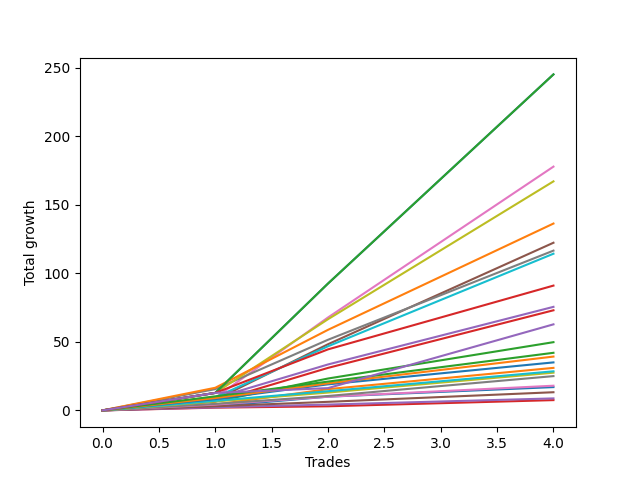

# Long Labrador 002 
- Symbol: ES_FOMC
- Date Range: 11/30/2022 - 12/14/2022
- Trading Period: 8:30-12:30
- Number of Trades: 4



| Name | Win Percent | Profit | Avg Profit / Trade | Avg Time / Trade |      | Name | Win Percent | Profit | Avg Profit / Trade | Avg Time / Trade |
| ---- | ----------- | ------ | ------------------ | ---------------- | ---- | ---- | ----------- | ------ | ------------------ | ---------------- |
| Sorted By <br> Profit | | | | | | Sorted By <br> Win Percentage ||||
| BB-200 U/L 2SD | 100.00 | 122500.00 | 30625.00 | 33:51 |     | BB-200 U/L 2SD | 100.00 | 122500.00 | 30625.00 | 33:51 |
| BB-100 U/L 2SD | 100.00 | 122500.00 | 30625.00 | 33:51 |     | BB-100 U/L 2SD | 100.00 | 122500.00 | 30625.00 | 33:51 |
| BB-50 U/L 2SD | 100.00 | 88875.00 | 22218.75 | 26:22 |     | BB-50 U/L 2SD | 100.00 | 88875.00 | 22218.75 | 26:22 |
| V U/L 1SD | 100.00 | 83500.00 | 20875.00 | 32:17 |     | V U/L 1SD | 100.00 | 83500.00 | 20875.00 | 32:17 |
| BB-200 Mid | 100.00 | 68125.00 | 17031.25 | 25:32 |     | BB-200 Mid | 100.00 | 68125.00 | 17031.25 | 25:32 |
| BB-50 U/L 1SD | 100.00 | 61125.00 | 15281.25 | 23:38 |     | BB-50 U/L 1SD | 100.00 | 61125.00 | 15281.25 | 23:38 |
| V Mid | 100.00 | 58250.00 | 14562.50 | 25:01 |     | V Mid | 100.00 | 58250.00 | 14562.50 | 25:01 |
| BB-100 Mid | 100.00 | 57125.00 | 14281.25 | 19:47 |     | BB-100 Mid | 100.00 | 57125.00 | 14281.25 | 19:47 |
| NEWFI 000 | 100.00 | 45500.00 | 11375.00 | 60:55 |     | NEWFI 000 | 100.00 | 45500.00 | 11375.00 | 60:55 |
| BB-50 Mid | 100.00 | 37750.00 | 9437.50 | 11:46 |     | BB-50 Mid | 100.00 | 37750.00 | 9437.50 | 11:46 |
| BB-20 U/L 2SD C | 100.00 | 36500.00 | 9125.00 | 10:50 |     | BB-20 U/L 2SD C | 100.00 | 36500.00 | 9125.00 | 10:50 |
| NEWFI 0000 | 100.00 | 31375.00 | 7843.75 | 45:57 |     | NEWFI 0000 | 100.00 | 31375.00 | 7843.75 | 45:57 |
| BB-20 U/L 2SD | 100.00 | 24875.00 | 6218.75 | 09:35 |     | BB-20 U/L 2SD | 100.00 | 24875.00 | 6218.75 | 09:35 |
| TP-10 | 100.00 | 21000.00 | 5250.00 | 06:05 |     | TP-10 | 100.00 | 21000.00 | 5250.00 | 06:05 |
| TP-9 | 100.00 | 19625.00 | 4906.25 | 05:46 |     | TP-9 | 100.00 | 19625.00 | 4906.25 | 05:46 |
| TP-8 | 100.00 | 17500.00 | 4375.00 | 05:22 |     | TP-8 | 100.00 | 17500.00 | 4375.00 | 05:22 |
| BB-20 U/L 1SD | 100.00 | 15500.00 | 3875.00 | 04:40 |     | BB-20 U/L 1SD | 100.00 | 15500.00 | 3875.00 | 04:40 |
| TP-7 | 100.00 | 14250.00 | 3562.50 | 04:35 |     | TP-7 | 100.00 | 14250.00 | 3562.50 | 04:35 |
| TP-6 | 100.00 | 13750.00 | 3437.50 | 03:41 |     | TP-6 | 100.00 | 13750.00 | 3437.50 | 03:41 |
| TP-5 | 100.00 | 12500.00 | 3125.00 | 03:27 |     | TP-5 | 100.00 | 12500.00 | 3125.00 | 03:27 |
| TP-4 | 100.00 | 9000.00 | 2250.00 | 03:23 |     | TP-4 | 100.00 | 9000.00 | 2250.00 | 03:23 |
| BB-20 Mid | 100.00 | 8500.00 | 2125.00 | 01:33 |     | BB-20 Mid | 100.00 | 8500.00 | 2125.00 | 01:33 |
| TP-3 | 100.00 | 6625.00 | 1656.25 | 01:22 |     | TP-3 | 100.00 | 6625.00 | 1656.25 | 01:22 |
| TP-2 | 100.00 | 4375.00 | 1093.75 | 01:13 |     | TP-2 | 100.00 | 4375.00 | 1093.75 | 01:13 |
| TP-1 | 100.00 | 3750.00 | 937.50 | 01:10 |     | TP-1 | 100.00 | 3750.00 | 937.50 | 01:10 |

## NO STOPLOSS

### Test BB-20 Mid
* Sell when price hits the middle line of the 20p bollinger
* No Stoploss
* Results:
```
Total Trades: 4
Percent Up: 100.00
Percent Down: 0.00
Total Points Moved Up: 17.00
Potential Profit: 8500.00
Total Points Ups: 17.00 Count Ups: 4
Total Points Downs: 0.00 Count Downs: 0
```

<details><summary>Trades</summary>

<code>In: 2022-05-25 09:40:00		Out: 2022-05-25 09:41:30		Total Position Time: 01:30		Total Move Up: 3.00		Total to Date: 3.00</code> <br />
<code>In: 2022-09-21 11:20:00		Out: 2022-09-21 11:22:15		Total Position Time: 02:15		Total Move Up: 7.00		Total to Date: 10.00</code> <br />
<code>In: 2022-09-21 11:21:00		Out: 2022-09-21 11:22:15		Total Position Time: 01:15		Total Move Up: 3.50		Total to Date: 13.50</code> <br />
<code>In: 2022-09-21 11:21:00		Out: 2022-09-21 11:22:15		Total Position Time: 01:15		Total Move Up: 3.50		Total to Date: 17.00</code> <br />


</details>

### Test BB-20 U/L 1SD
* Sell when the price hits the upper line of the 20p 1std bollinger
* No Stoploss
* Results:
```
Total Trades: 4
Percent Up: 100.00
Percent Down: 0.00
Total Points Moved Up: 31.00
Potential Profit: 15500.00
Total Points Ups: 31.00 Count Ups: 4
Total Points Downs: 0.00 Count Downs: 0
```

<details><summary>Trades</summary>

<code>In: 2022-05-25 09:40:00		Out: 2022-05-25 09:44:25		Total Position Time: 04:25		Total Move Up: 4.25		Total to Date: 4.25</code> <br />
<code>In: 2022-09-21 11:20:00		Out: 2022-09-21 11:25:25		Total Position Time: 05:25		Total Move Up: 11.25		Total to Date: 15.50</code> <br />
<code>In: 2022-09-21 11:21:00		Out: 2022-09-21 11:25:25		Total Position Time: 04:25		Total Move Up: 7.75		Total to Date: 23.25</code> <br />
<code>In: 2022-09-21 11:21:00		Out: 2022-09-21 11:25:25		Total Position Time: 04:25		Total Move Up: 7.75		Total to Date: 31.00</code> <br />


</details>

### Test BB-20 U/L 2SD
* Sell when the price hits the upper line of the 20p 2std bollinger
* No Stoploss
* Results:
```
Total Trades: 4
Percent Up: 100.00
Percent Down: 0.00
Total Points Moved Up: 49.75
Potential Profit: 24875.00
Total Points Ups: 49.75 Count Ups: 4
Total Points Downs: 0.00 Count Downs: 0
```

<details><summary>Trades</summary>

<code>In: 2022-05-25 09:40:00		Out: 2022-05-25 09:45:20		Total Position Time: 05:20		Total Move Up: 6.50		Total to Date: 6.50</code> <br />
<code>In: 2022-09-21 11:20:00		Out: 2022-09-21 11:31:40		Total Position Time: 11:40		Total Move Up: 16.75		Total to Date: 23.25</code> <br />
<code>In: 2022-09-21 11:21:00		Out: 2022-09-21 11:31:40		Total Position Time: 10:40		Total Move Up: 13.25		Total to Date: 36.50</code> <br />
<code>In: 2022-09-21 11:21:00		Out: 2022-09-21 11:31:40		Total Position Time: 10:40		Total Move Up: 13.25		Total to Date: 49.75</code> <br />


</details>

### Test BB-20 U/L 2SD C
* Sell when the price hits the upper line of the 20p 2std bollinger
* No Stoploss
* Results:
```
Total Trades: 4
Percent Up: 100.00
Percent Down: 0.00
Total Points Moved Up: 73.00
Potential Profit: 36500.00
Total Points Ups: 73.00 Count Ups: 4
Total Points Downs: 0.00 Count Downs: 0
```

<details><summary>Trades</summary>

<code>In: 2022-05-25 09:40:00		Out: 2022-05-25 09:45:20		Total Position Time: 05:20		Total Move Up: 6.50		Total to Date: 6.50</code> <br />
<code>In: 2022-09-21 11:20:00		Out: 2022-09-21 11:33:20		Total Position Time: 13:20		Total Move Up: 24.50		Total to Date: 31.00</code> <br />
<code>In: 2022-09-21 11:21:00		Out: 2022-09-21 11:33:20		Total Position Time: 12:20		Total Move Up: 21.00		Total to Date: 52.00</code> <br />
<code>In: 2022-09-21 11:21:00		Out: 2022-09-21 11:33:20		Total Position Time: 12:20		Total Move Up: 21.00		Total to Date: 73.00</code> <br />


</details>

### Test BB-50 Mid
* Sell when price hits the middle line of the 50p bollinger
* No Stoploss
* Results:
```
Total Trades: 4
Percent Up: 100.00
Percent Down: 0.00
Total Points Moved Up: 75.50
Potential Profit: 37750.00
Total Points Ups: 75.50 Count Ups: 4
Total Points Downs: 0.00 Count Downs: 0
```

<details><summary>Trades</summary>

<code>In: 2022-05-25 09:40:00		Out: 2022-05-25 09:49:05		Total Position Time: 09:05		Total Move Up: 9.00		Total to Date: 9.00</code> <br />
<code>In: 2022-09-21 11:20:00		Out: 2022-09-21 11:33:20		Total Position Time: 13:20		Total Move Up: 24.50		Total to Date: 33.50</code> <br />
<code>In: 2022-09-21 11:21:00		Out: 2022-09-21 11:33:20		Total Position Time: 12:20		Total Move Up: 21.00		Total to Date: 54.50</code> <br />
<code>In: 2022-09-21 11:21:00		Out: 2022-09-21 11:33:20		Total Position Time: 12:20		Total Move Up: 21.00		Total to Date: 75.50</code> <br />


</details>

### Test BB-50 U/L 1SD
* Sell when the price hits the upper line of the 50p 1std bollinger
* No Stoploss
* Results:
```
Total Trades: 4
Percent Up: 100.00
Percent Down: 0.00
Total Points Moved Up: 122.25
Potential Profit: 61125.00
Total Points Ups: 122.25 Count Ups: 4
Total Points Downs: 0.00 Count Downs: 0
```

<details><summary>Trades</summary>

<code>In: 2022-05-25 09:40:00		Out: 2022-05-25 10:10:05		Total Position Time: 30:05		Total Move Up: 7.75		Total to Date: 7.75</code> <br />
<code>In: 2022-09-21 11:20:00		Out: 2022-09-21 11:42:10		Total Position Time: 22:10		Total Move Up: 40.50		Total to Date: 48.25</code> <br />
<code>In: 2022-09-21 11:21:00		Out: 2022-09-21 11:42:10		Total Position Time: 21:10		Total Move Up: 37.00		Total to Date: 85.25</code> <br />
<code>In: 2022-09-21 11:21:00		Out: 2022-09-21 11:42:10		Total Position Time: 21:10		Total Move Up: 37.00		Total to Date: 122.25</code> <br />


</details>

### Test BB-50 U/L 2SD
* Sell when the price hits the upper line of the 50p 2std bollinger
* No Stoploss
* Results:
```
Total Trades: 4
Percent Up: 100.00
Percent Down: 0.00
Total Points Moved Up: 177.75
Potential Profit: 88875.00
Total Points Ups: 177.75 Count Ups: 4
Total Points Downs: 0.00 Count Downs: 0
```

<details><summary>Trades</summary>

<code>In: 2022-05-25 09:40:00		Out: 2022-05-25 10:16:30		Total Position Time: 36:30		Total Move Up: 9.25		Total to Date: 9.25</code> <br />
<code>In: 2022-09-21 11:20:00		Out: 2022-09-21 11:43:40		Total Position Time: 23:40		Total Move Up: 58.50		Total to Date: 67.75</code> <br />
<code>In: 2022-09-21 11:21:00		Out: 2022-09-21 11:43:40		Total Position Time: 22:40		Total Move Up: 55.00		Total to Date: 122.75</code> <br />
<code>In: 2022-09-21 11:21:00		Out: 2022-09-21 11:43:40		Total Position Time: 22:40		Total Move Up: 55.00		Total to Date: 177.75</code> <br />


</details>

### Test V Mid
* Sell when the price hits the middle line of the 1std VWAP
* No Stoploss
* Results:
```
Total Trades: 4
Percent Up: 100.00
Percent Down: 0.00
Total Points Moved Up: 116.50
Potential Profit: 58250.00
Total Points Ups: 116.50 Count Ups: 4
Total Points Downs: 0.00 Count Downs: 0
```

<details><summary>Trades</summary>

<code>In: 2022-05-25 09:40:00		Out: 2022-05-25 10:37:05		Total Position Time: 57:05		Total Move Up: 15.50		Total to Date: 15.50</code> <br />
<code>In: 2022-09-21 11:20:00		Out: 2022-09-21 11:35:00		Total Position Time: 15:00		Total Move Up: 36.00		Total to Date: 51.50</code> <br />
<code>In: 2022-09-21 11:21:00		Out: 2022-09-21 11:35:00		Total Position Time: 14:00		Total Move Up: 32.50		Total to Date: 84.00</code> <br />
<code>In: 2022-09-21 11:21:00		Out: 2022-09-21 11:35:00		Total Position Time: 14:00		Total Move Up: 32.50		Total to Date: 116.50</code> <br />


</details>

### Test V U/L 1SD
* Sell when the price hits the upper line of the 1std VWAP
* No Stoploss
* Results:
```
Total Trades: 4
Percent Up: 100.00
Percent Down: 0.00
Total Points Moved Up: 167.00
Potential Profit: 83500.00
Total Points Ups: 167.00 Count Ups: 4
Total Points Downs: 0.00 Count Downs: 0
```

<details><summary>Trades</summary>

<code>In: 2022-05-25 09:40:00		Out: 2022-05-25 10:40:55		Total Position Time: 60:55		Total Move Up: 12.75		Total to Date: 12.75</code> <br />
<code>In: 2022-09-21 11:20:00		Out: 2022-09-21 11:43:25		Total Position Time: 23:25		Total Move Up: 53.75		Total to Date: 66.50</code> <br />
<code>In: 2022-09-21 11:21:00		Out: 2022-09-21 11:43:25		Total Position Time: 22:25		Total Move Up: 50.25		Total to Date: 116.75</code> <br />
<code>In: 2022-09-21 11:21:00		Out: 2022-09-21 11:43:25		Total Position Time: 22:25		Total Move Up: 50.25		Total to Date: 167.00</code> <br />


</details>

### Test BB-100 Mid
* Move to BB100 Mid
* No Stoploss
* Results:
```
Total Trades: 4
Percent Up: 100.00
Percent Down: 0.00
Total Points Moved Up: 114.25
Potential Profit: 57125.00
Total Points Ups: 114.25 Count Ups: 4
Total Points Downs: 0.00 Count Downs: 0
```

<details><summary>Trades</summary>

<code>In: 2022-05-25 09:40:00		Out: 2022-05-25 10:16:25		Total Position Time: 36:25		Total Move Up: 9.50		Total to Date: 9.50</code> <br />
<code>In: 2022-09-21 11:20:00		Out: 2022-09-21 11:34:55		Total Position Time: 14:55		Total Move Up: 37.25		Total to Date: 46.75</code> <br />
<code>In: 2022-09-21 11:21:00		Out: 2022-09-21 11:34:55		Total Position Time: 13:55		Total Move Up: 33.75		Total to Date: 80.50</code> <br />
<code>In: 2022-09-21 11:21:00		Out: 2022-09-21 11:34:55		Total Position Time: 13:55		Total Move Up: 33.75		Total to Date: 114.25</code> <br />


</details>

### Test BB-100 U/L 2SD
* Move to BB100 Upper Band
* No Stoploss
* Results:
```
Total Trades: 4
Percent Up: 100.00
Percent Down: 0.00
Total Points Moved Up: 245.00
Potential Profit: 122500.00
Total Points Ups: 245.00 Count Ups: 4
Total Points Downs: 0.00 Count Downs: 0
```

<details><summary>Trades</summary>

<code>In: 2022-05-25 09:40:00		Out: 2022-05-25 10:40:55		Total Position Time: 60:55		Total Move Up: 12.75		Total to Date: 12.75</code> <br />
<code>In: 2022-09-21 11:20:00		Out: 2022-09-21 11:45:30		Total Position Time: 25:30		Total Move Up: 79.75		Total to Date: 92.50</code> <br />
<code>In: 2022-09-21 11:21:00		Out: 2022-09-21 11:45:30		Total Position Time: 24:30		Total Move Up: 76.25		Total to Date: 168.75</code> <br />
<code>In: 2022-09-21 11:21:00		Out: 2022-09-21 11:45:30		Total Position Time: 24:30		Total Move Up: 76.25		Total to Date: 245.00</code> <br />


</details>

### Test BB-200 Mid
* Move to BB200 Mid
* No Stoploss
* Results:
```
Total Trades: 4
Percent Up: 100.00
Percent Down: 0.00
Total Points Moved Up: 136.25
Potential Profit: 68125.00
Total Points Ups: 136.25 Count Ups: 4
Total Points Downs: 0.00 Count Downs: 0
```

<details><summary>Trades</summary>

<code>In: 2022-05-25 09:40:00		Out: 2022-05-25 10:37:10		Total Position Time: 57:10		Total Move Up: 16.50		Total to Date: 16.50</code> <br />
<code>In: 2022-09-21 11:20:00		Out: 2022-09-21 11:35:40		Total Position Time: 15:40		Total Move Up: 42.25		Total to Date: 58.75</code> <br />
<code>In: 2022-09-21 11:21:00		Out: 2022-09-21 11:35:40		Total Position Time: 14:40		Total Move Up: 38.75		Total to Date: 97.50</code> <br />
<code>In: 2022-09-21 11:21:00		Out: 2022-09-21 11:35:40		Total Position Time: 14:40		Total Move Up: 38.75		Total to Date: 136.25</code> <br />


</details>

### Test BB-200 U/L 2SD
* Move to BB200 Upper Band
* No Stoploss
* Results:
```
Total Trades: 4
Percent Up: 100.00
Percent Down: 0.00
Total Points Moved Up: 245.00
Potential Profit: 122500.00
Total Points Ups: 245.00 Count Ups: 4
Total Points Downs: 0.00 Count Downs: 0
```

<details><summary>Trades</summary>

<code>In: 2022-05-25 09:40:00		Out: 2022-05-25 10:40:55		Total Position Time: 60:55		Total Move Up: 12.75		Total to Date: 12.75</code> <br />
<code>In: 2022-09-21 11:20:00		Out: 2022-09-21 11:45:30		Total Position Time: 25:30		Total Move Up: 79.75		Total to Date: 92.50</code> <br />
<code>In: 2022-09-21 11:21:00		Out: 2022-09-21 11:45:30		Total Position Time: 24:30		Total Move Up: 76.25		Total to Date: 168.75</code> <br />
<code>In: 2022-09-21 11:21:00		Out: 2022-09-21 11:45:30		Total Position Time: 24:30		Total Move Up: 76.25		Total to Date: 245.00</code> <br />


</details>

## TAKE PROFIT

### Test TP-1
* Take Profit of 1 Point
* No Stoploss
* Results:
```
Total Trades: 4
Percent Up: 100.00
Percent Down: 0.00
Total Points Moved Up: 7.50
Potential Profit: 3750.00
Total Points Ups: 7.50 Count Ups: 4
Total Points Downs: 0.00 Count Downs: 0
```

<details><summary>Trades</summary>

<code>In: 2022-05-25 09:40:00		Out: 2022-05-25 09:41:10		Total Position Time: 01:10		Total Move Up: 2.00		Total to Date: 2.00</code> <br />
<code>In: 2022-09-21 11:20:00		Out: 2022-09-21 11:21:10		Total Position Time: 01:10		Total Move Up: 1.00		Total to Date: 3.00</code> <br />
<code>In: 2022-09-21 11:21:00		Out: 2022-09-21 11:22:10		Total Position Time: 01:10		Total Move Up: 2.25		Total to Date: 5.25</code> <br />
<code>In: 2022-09-21 11:21:00		Out: 2022-09-21 11:22:10		Total Position Time: 01:10		Total Move Up: 2.25		Total to Date: 7.50</code> <br />


</details>

### Test TP-2
* Take Profit of 2 Point
* No Stoploss
* Results:
```
Total Trades: 4
Percent Up: 100.00
Percent Down: 0.00
Total Points Moved Up: 8.75
Potential Profit: 4375.00
Total Points Ups: 8.75 Count Ups: 4
Total Points Downs: 0.00 Count Downs: 0
```

<details><summary>Trades</summary>

<code>In: 2022-05-25 09:40:00		Out: 2022-05-25 09:41:20		Total Position Time: 01:20		Total Move Up: 2.25		Total to Date: 2.25</code> <br />
<code>In: 2022-09-21 11:20:00		Out: 2022-09-21 11:21:15		Total Position Time: 01:15		Total Move Up: 2.00		Total to Date: 4.25</code> <br />
<code>In: 2022-09-21 11:21:00		Out: 2022-09-21 11:22:10		Total Position Time: 01:10		Total Move Up: 2.25		Total to Date: 6.50</code> <br />
<code>In: 2022-09-21 11:21:00		Out: 2022-09-21 11:22:10		Total Position Time: 01:10		Total Move Up: 2.25		Total to Date: 8.75</code> <br />


</details>

### Test TP-3
* Take Profit of 3 Point
* No Stoploss
* Results:
```
Total Trades: 4
Percent Up: 100.00
Percent Down: 0.00
Total Points Moved Up: 13.25
Potential Profit: 6625.00
Total Points Ups: 13.25 Count Ups: 4
Total Points Downs: 0.00 Count Downs: 0
```

<details><summary>Trades</summary>

<code>In: 2022-05-25 09:40:00		Out: 2022-05-25 09:41:30		Total Position Time: 01:30		Total Move Up: 3.00		Total to Date: 3.00</code> <br />
<code>In: 2022-09-21 11:20:00		Out: 2022-09-21 11:21:30		Total Position Time: 01:30		Total Move Up: 3.25		Total to Date: 6.25</code> <br />
<code>In: 2022-09-21 11:21:00		Out: 2022-09-21 11:22:15		Total Position Time: 01:15		Total Move Up: 3.50		Total to Date: 9.75</code> <br />
<code>In: 2022-09-21 11:21:00		Out: 2022-09-21 11:22:15		Total Position Time: 01:15		Total Move Up: 3.50		Total to Date: 13.25</code> <br />


</details>

### Test TP-4
* Take Profit of 4 Point
* No Stoploss
* Results:
```
Total Trades: 4
Percent Up: 100.00
Percent Down: 0.00
Total Points Moved Up: 18.00
Potential Profit: 9000.00
Total Points Ups: 18.00 Count Ups: 4
Total Points Downs: 0.00 Count Downs: 0
```

<details><summary>Trades</summary>

<code>In: 2022-05-25 09:40:00		Out: 2022-05-25 09:44:25		Total Position Time: 04:25		Total Move Up: 4.25		Total to Date: 4.25</code> <br />
<code>In: 2022-09-21 11:20:00		Out: 2022-09-21 11:21:40		Total Position Time: 01:40		Total Move Up: 5.75		Total to Date: 10.00</code> <br />
<code>In: 2022-09-21 11:21:00		Out: 2022-09-21 11:24:45		Total Position Time: 03:45		Total Move Up: 4.00		Total to Date: 14.00</code> <br />
<code>In: 2022-09-21 11:21:00		Out: 2022-09-21 11:24:45		Total Position Time: 03:45		Total Move Up: 4.00		Total to Date: 18.00</code> <br />


</details>

### Test TP-5
* Take Profit of 5 Point
* No Stoploss
* Results:
```
Total Trades: 4
Percent Up: 100.00
Percent Down: 0.00
Total Points Moved Up: 25.00
Potential Profit: 12500.00
Total Points Ups: 25.00 Count Ups: 4
Total Points Downs: 0.00 Count Downs: 0
```

<details><summary>Trades</summary>

<code>In: 2022-05-25 09:40:00		Out: 2022-05-25 09:44:30		Total Position Time: 04:30		Total Move Up: 4.75		Total to Date: 4.75</code> <br />
<code>In: 2022-09-21 11:20:00		Out: 2022-09-21 11:21:40		Total Position Time: 01:40		Total Move Up: 5.75		Total to Date: 10.50</code> <br />
<code>In: 2022-09-21 11:21:00		Out: 2022-09-21 11:24:50		Total Position Time: 03:50		Total Move Up: 7.25		Total to Date: 17.75</code> <br />
<code>In: 2022-09-21 11:21:00		Out: 2022-09-21 11:24:50		Total Position Time: 03:50		Total Move Up: 7.25		Total to Date: 25.00</code> <br />


</details>

### Test TP-6
* Take Profit of 6 Point
* No Stoploss
* Results:
```
Total Trades: 4
Percent Up: 100.00
Percent Down: 0.00
Total Points Moved Up: 27.50
Potential Profit: 13750.00
Total Points Ups: 27.50 Count Ups: 4
Total Points Downs: 0.00 Count Downs: 0
```

<details><summary>Trades</summary>

<code>In: 2022-05-25 09:40:00		Out: 2022-05-25 09:45:20		Total Position Time: 05:20		Total Move Up: 6.50		Total to Date: 6.50</code> <br />
<code>In: 2022-09-21 11:20:00		Out: 2022-09-21 11:21:45		Total Position Time: 01:45		Total Move Up: 6.50		Total to Date: 13.00</code> <br />
<code>In: 2022-09-21 11:21:00		Out: 2022-09-21 11:24:50		Total Position Time: 03:50		Total Move Up: 7.25		Total to Date: 20.25</code> <br />
<code>In: 2022-09-21 11:21:00		Out: 2022-09-21 11:24:50		Total Position Time: 03:50		Total Move Up: 7.25		Total to Date: 27.50</code> <br />


</details>

### Test TP-7
* Take Profit of 7 Point
* No Stoploss
* Results:
```
Total Trades: 4
Percent Up: 100.00
Percent Down: 0.00
Total Points Moved Up: 28.50
Potential Profit: 14250.00
Total Points Ups: 28.50 Count Ups: 4
Total Points Downs: 0.00 Count Downs: 0
```

<details><summary>Trades</summary>

<code>In: 2022-05-25 09:40:00		Out: 2022-05-25 09:48:25		Total Position Time: 08:25		Total Move Up: 7.00		Total to Date: 7.00</code> <br />
<code>In: 2022-09-21 11:20:00		Out: 2022-09-21 11:22:15		Total Position Time: 02:15		Total Move Up: 7.00		Total to Date: 14.00</code> <br />
<code>In: 2022-09-21 11:21:00		Out: 2022-09-21 11:24:50		Total Position Time: 03:50		Total Move Up: 7.25		Total to Date: 21.25</code> <br />
<code>In: 2022-09-21 11:21:00		Out: 2022-09-21 11:24:50		Total Position Time: 03:50		Total Move Up: 7.25		Total to Date: 28.50</code> <br />


</details>

### Test TP-8
* Take Profit of 8 Point
* No Stoploss
* Results:
```
Total Trades: 4
Percent Up: 100.00
Percent Down: 0.00
Total Points Moved Up: 35.00
Potential Profit: 17500.00
Total Points Ups: 35.00 Count Ups: 4
Total Points Downs: 0.00 Count Downs: 0
```

<details><summary>Trades</summary>

<code>In: 2022-05-25 09:40:00		Out: 2022-05-25 09:48:50		Total Position Time: 08:50		Total Move Up: 8.25		Total to Date: 8.25</code> <br />
<code>In: 2022-09-21 11:20:00		Out: 2022-09-21 11:24:50		Total Position Time: 04:50		Total Move Up: 10.75		Total to Date: 19.00</code> <br />
<code>In: 2022-09-21 11:21:00		Out: 2022-09-21 11:24:55		Total Position Time: 03:55		Total Move Up: 8.00		Total to Date: 27.00</code> <br />
<code>In: 2022-09-21 11:21:00		Out: 2022-09-21 11:24:55		Total Position Time: 03:55		Total Move Up: 8.00		Total to Date: 35.00</code> <br />


</details>

### Test TP-9
* Take Profit of 9 Point
* No Stoploss
* Results:
```
Total Trades: 4
Percent Up: 100.00
Percent Down: 0.00
Total Points Moved Up: 39.25
Potential Profit: 19625.00
Total Points Ups: 39.25 Count Ups: 4
Total Points Downs: 0.00 Count Downs: 0
```

<details><summary>Trades</summary>

<code>In: 2022-05-25 09:40:00		Out: 2022-05-25 09:49:05		Total Position Time: 09:05		Total Move Up: 9.00		Total to Date: 9.00</code> <br />
<code>In: 2022-09-21 11:20:00		Out: 2022-09-21 11:24:50		Total Position Time: 04:50		Total Move Up: 10.75		Total to Date: 19.75</code> <br />
<code>In: 2022-09-21 11:21:00		Out: 2022-09-21 11:25:35		Total Position Time: 04:35		Total Move Up: 9.75		Total to Date: 29.50</code> <br />
<code>In: 2022-09-21 11:21:00		Out: 2022-09-21 11:25:35		Total Position Time: 04:35		Total Move Up: 9.75		Total to Date: 39.25</code> <br />


</details>

### Test TP-10
* Take Profit of 10 Point
* No Stoploss
* Results:
```
Total Trades: 4
Percent Up: 100.00
Percent Down: 0.00
Total Points Moved Up: 42.00
Potential Profit: 21000.00
Total Points Ups: 42.00 Count Ups: 4
Total Points Downs: 0.00 Count Downs: 0
```

<details><summary>Trades</summary>

<code>In: 2022-05-25 09:40:00		Out: 2022-05-25 09:49:30		Total Position Time: 09:30		Total Move Up: 10.25		Total to Date: 10.25</code> <br />
<code>In: 2022-09-21 11:20:00		Out: 2022-09-21 11:24:50		Total Position Time: 04:50		Total Move Up: 10.75		Total to Date: 21.00</code> <br />
<code>In: 2022-09-21 11:21:00		Out: 2022-09-21 11:26:00		Total Position Time: 05:00		Total Move Up: 10.50		Total to Date: 31.50</code> <br />
<code>In: 2022-09-21 11:21:00		Out: 2022-09-21 11:26:00		Total Position Time: 05:00		Total Move Up: 10.50		Total to Date: 42.00</code> <br />


</details>

## Indicator Exits

### Test NEWFI 000
* Newfi 0000
* No Stoploss
* Results:
```
Total Trades: 4
Percent Up: 100.00
Percent Down: 0.00
Total Points Moved Up: 91.00
Potential Profit: 45500.00
Total Points Ups: 91.00 Count Ups: 4
Total Points Downs: 0.00 Count Downs: 0
```

<details><summary>Trades</summary>

<code>In: 2022-05-25 09:40:00		Out: 2022-05-25 10:40:55		Total Position Time: 60:55		Total Move Up: 12.75		Total to Date: 12.75</code> <br />
<code>In: 2022-09-21 11:20:00		Out: 2022-09-21 12:20:55		Total Position Time: 60:55		Total Move Up: 31.75		Total to Date: 44.50</code> <br />
<code>In: 2022-09-21 11:21:00		Out: 2022-09-21 12:21:55		Total Position Time: 60:55		Total Move Up: 23.25		Total to Date: 67.75</code> <br />
<code>In: 2022-09-21 11:21:00		Out: 2022-09-21 12:21:55		Total Position Time: 60:55		Total Move Up: 23.25		Total to Date: 91.00</code> <br />


</details>

### Test NEWFI 0000
* Newfi 0000
* No Stoploss
* Results:
```
Total Trades: 4
Percent Up: 100.00
Percent Down: 0.00
Total Points Moved Up: 62.75
Potential Profit: 31375.00
Total Points Ups: 62.75 Count Ups: 4
Total Points Downs: 0.00 Count Downs: 0
```

<details><summary>Trades</summary>

<code>In: 2022-05-25 09:40:00		Out: 2022-05-25 10:40:55		Total Position Time: 60:55		Total Move Up: 12.75		Total to Date: 12.75</code> <br />
<code>In: 2022-09-21 11:20:00		Out: 2022-09-21 11:21:05		Total Position Time: 01:05		Total Move Up: 3.50		Total to Date: 16.25</code> <br />
<code>In: 2022-09-21 11:21:00		Out: 2022-09-21 12:21:55		Total Position Time: 60:55		Total Move Up: 23.25		Total to Date: 39.50</code> <br />
<code>In: 2022-09-21 11:21:00		Out: 2022-09-21 12:21:55		Total Position Time: 60:55		Total Move Up: 23.25		Total to Date: 62.75</code> <br />


</details>