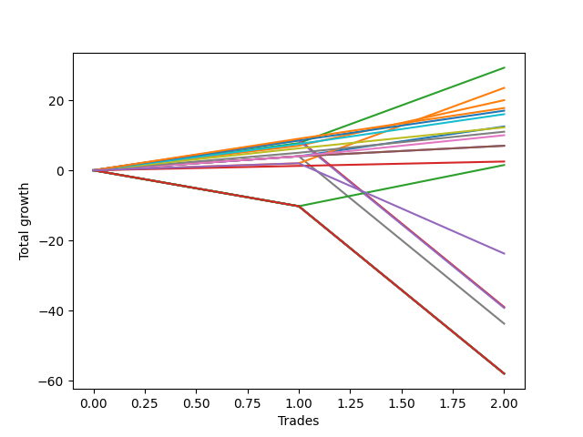

# Long Labrador 005 
- Symbol: ES_FOMC
- Date Range: 11/30/2022 - 12/14/2022
- Trading Period: 8:30-12:30
- Number of Trades: 2



| Name | Win Percent | Profit | Avg Profit / Trade | Avg Time / Trade |      | Name | Win Percent | Profit | Avg Profit / Trade | Avg Time / Trade |
| ---- | ----------- | ------ | ------------------ | ---------------- | ---- | ---- | ----------- | ------ | ------------------ | ---------------- |
| Sorted By <br> Profit | | | | | | Sorted By <br> Win Percentage ||||
| BB-20 U/L 2SD | 100.00 | 14625.00 | 7312.50 | 16:05 |     | BB-20 U/L 2SD | 100.00 | 14625.00 | 7312.50 | 16:05 |
| BB-200 Mid | 100.00 | 11750.00 | 5875.00 | 06:55 |     | BB-200 Mid | 100.00 | 11750.00 | 5875.00 | 06:55 |
| BB-20 U/L 1SD | 100.00 | 10000.00 | 5000.00 | 09:50 |     | BB-20 U/L 1SD | 100.00 | 10000.00 | 5000.00 | 09:50 |
| TP-9 | 100.00 | 8875.00 | 4437.50 | 15:50 |     | TP-9 | 100.00 | 8875.00 | 4437.50 | 15:50 |
| TP-8 | 100.00 | 8500.00 | 4250.00 | 12:02 |     | TP-8 | 100.00 | 8500.00 | 4250.00 | 12:02 |
| TP-7 | 100.00 | 8000.00 | 4000.00 | 07:07 |     | TP-7 | 100.00 | 8000.00 | 4000.00 | 07:07 |
| BB-20 Mid | 100.00 | 6250.00 | 3125.00 | 04:52 |     | BB-20 Mid | 100.00 | 6250.00 | 3125.00 | 04:52 |
| TP-6 | 100.00 | 6125.00 | 3062.50 | 05:17 |     | TP-6 | 100.00 | 6125.00 | 3062.50 | 05:17 |
| TP-5 | 100.00 | 5500.00 | 2750.00 | 04:20 |     | TP-5 | 100.00 | 5500.00 | 2750.00 | 04:20 |
| TP-4 | 100.00 | 5000.00 | 2500.00 | 04:12 |     | TP-4 | 100.00 | 5000.00 | 2500.00 | 04:12 |
| TP-3 | 100.00 | 3500.00 | 1750.00 | 02:32 |     | TP-3 | 100.00 | 3500.00 | 1750.00 | 02:32 |
| TP-2 | 100.00 | 3500.00 | 1750.00 | 02:32 |     | TP-2 | 100.00 | 3500.00 | 1750.00 | 02:32 |
| TP-1 | 100.00 | 1250.00 | 625.00 | 02:25 |     | TP-1 | 100.00 | 1250.00 | 625.00 | 02:25 |
| TP-10 | 50.00 | 750.00 | 375.00 | 35:20 |     | TP-10 | 50.00 | 750.00 | 375.00 | 35:20 |
| NEWFI 0000 | 50.00 | -11875.00 | -5937.50 | 28:35 |     | NEWFI 0000 | 50.00 | -11875.00 | -5937.50 | 28:35 |
| BB-20 U/L 2SD C | 50.00 | -19500.00 | -9750.00 | 34:45 |     | BB-20 U/L 2SD C | 50.00 | -19500.00 | -9750.00 | 34:45 |
| BB-50 Mid | 50.00 | -19625.00 | -9812.50 | 32:42 |     | BB-50 Mid | 50.00 | -19625.00 | -9812.50 | 32:42 |
| V Mid | 50.00 | -21875.00 | -10937.50 | 25:32 |     | V Mid | 50.00 | -21875.00 | -10937.50 | 25:32 |
| NEWFI 000 | 0.00 | -29000.00 | -14500.00 | 54:27 |     | NEWFI 000 | 0.00 | -29000.00 | -14500.00 | 54:27 |
| BB-200 U/L 2SD | 0.00 | -29000.00 | -14500.00 | 54:27 |     | BB-200 U/L 2SD | 0.00 | -29000.00 | -14500.00 | 54:27 |
| BB-100 U/L 2SD | 0.00 | -29000.00 | -14500.00 | 54:27 |     | BB-100 U/L 2SD | 0.00 | -29000.00 | -14500.00 | 54:27 |
| BB-100 Mid | 0.00 | -29000.00 | -14500.00 | 54:27 |     | BB-100 Mid | 0.00 | -29000.00 | -14500.00 | 54:27 |
| V U/L 1SD | 0.00 | -29000.00 | -14500.00 | 54:27 |     | V U/L 1SD | 0.00 | -29000.00 | -14500.00 | 54:27 |
| BB-50 U/L 2SD | 0.00 | -29000.00 | -14500.00 | 54:27 |     | BB-50 U/L 2SD | 0.00 | -29000.00 | -14500.00 | 54:27 |
| BB-50 U/L 1SD | 0.00 | -29000.00 | -14500.00 | 54:27 |     | BB-50 U/L 1SD | 0.00 | -29000.00 | -14500.00 | 54:27 |

## NO STOPLOSS

### Test BB-20 Mid
* Sell when price hits the middle line of the 20p bollinger
* No Stoploss
* Results:
```
Total Trades: 2
Percent Up: 100.00
Percent Down: 0.00
Total Points Moved Up: 12.50
Potential Profit: 6250.00
Total Points Ups: 12.50 Count Ups: 2
Total Points Downs: 0.00 Count Downs: 0
```

<details><summary>Trades</summary>

<code>In: 2022-05-25 08:41:00		Out: 2022-05-25 08:44:05		Total Position Time: 03:05		Total Move Up: 4.00		Total to Date: 4.00</code> <br />
<code>In: 2022-11-02 11:59:00		Out: 2022-11-02 12:05:40		Total Position Time: 06:40		Total Move Up: 8.50		Total to Date: 12.50</code> <br />


</details>

### Test BB-20 U/L 1SD
* Sell when the price hits the upper line of the 20p 1std bollinger
* No Stoploss
* Results:
```
Total Trades: 2
Percent Up: 100.00
Percent Down: 0.00
Total Points Moved Up: 20.00
Potential Profit: 10000.00
Total Points Ups: 20.00 Count Ups: 2
Total Points Downs: 0.00 Count Downs: 0
```

<details><summary>Trades</summary>

<code>In: 2022-05-25 08:41:00		Out: 2022-05-25 08:50:50		Total Position Time: 09:50		Total Move Up: 7.00		Total to Date: 7.00</code> <br />
<code>In: 2022-11-02 11:59:00		Out: 2022-11-02 12:08:50		Total Position Time: 09:50		Total Move Up: 13.00		Total to Date: 20.00</code> <br />


</details>

### Test BB-20 U/L 2SD
* Sell when the price hits the upper line of the 20p 2std bollinger
* No Stoploss
* Results:
```
Total Trades: 2
Percent Up: 100.00
Percent Down: 0.00
Total Points Moved Up: 29.25
Potential Profit: 14625.00
Total Points Ups: 29.25 Count Ups: 2
Total Points Downs: 0.00 Count Downs: 0
```

<details><summary>Trades</summary>

<code>In: 2022-05-25 08:41:00		Out: 2022-05-25 09:02:20		Total Position Time: 21:20		Total Move Up: 7.75		Total to Date: 7.75</code> <br />
<code>In: 2022-11-02 11:59:00		Out: 2022-11-02 12:09:50		Total Position Time: 10:50		Total Move Up: 21.50		Total to Date: 29.25</code> <br />


</details>

### Test BB-20 U/L 2SD C
* Sell when the price hits the upper line of the 20p 2std bollinger
* No Stoploss
* Results:
```
Total Trades: 2
Percent Up: 50.00
Percent Down: 50.00
Total Points Moved Up: -39.00
Potential Profit: -19500.00
Total Points Ups: 8.75 Count Ups: 1
Total Points Downs: -47.75 Count Downs: 1
```

<details><summary>Trades</summary>

<code>In: 2022-05-25 08:41:00		Out: 2022-05-25 09:02:30		Total Position Time: 21:30		Total Move Up: 8.75		Total to Date: 8.75</code> <br />
<code>In: 2022-11-02 11:59:00		Out: 2022-11-02 12:47:00		Total Position Time: 48:00		Total Move Up: -47.75		Total to Date: -39.00</code> <br />


</details>

### Test BB-50 Mid
* Sell when price hits the middle line of the 50p bollinger
* No Stoploss
* Results:
```
Total Trades: 2
Percent Up: 50.00
Percent Down: 50.00
Total Points Moved Up: -39.25
Potential Profit: -19625.00
Total Points Ups: 8.50 Count Ups: 1
Total Points Downs: -47.75 Count Downs: 1
```

<details><summary>Trades</summary>

<code>In: 2022-05-25 08:41:00		Out: 2022-05-25 08:58:25		Total Position Time: 17:25		Total Move Up: 8.50		Total to Date: 8.50</code> <br />
<code>In: 2022-11-02 11:59:00		Out: 2022-11-02 12:47:00		Total Position Time: 48:00		Total Move Up: -47.75		Total to Date: -39.25</code> <br />


</details>

### Test BB-50 U/L 1SD
* Sell when the price hits the upper line of the 50p 1std bollinger
* No Stoploss
* Results:
```
Total Trades: 2
Percent Up: 0.00
Percent Down: 100.00
Total Points Moved Up: -58.00
Potential Profit: -29000.00
Total Points Ups: 0.00 Count Ups: 0
Total Points Downs: -58.00 Count Downs: 2
```

<details><summary>Trades</summary>

<code>In: 2022-05-25 08:41:00		Out: 2022-05-25 09:41:55		Total Position Time: 60:55		Total Move Up: -10.25		Total to Date: -10.25</code> <br />
<code>In: 2022-11-02 11:59:00		Out: 2022-11-02 12:47:00		Total Position Time: 48:00		Total Move Up: -47.75		Total to Date: -58.00</code> <br />


</details>

### Test BB-50 U/L 2SD
* Sell when the price hits the upper line of the 50p 2std bollinger
* No Stoploss
* Results:
```
Total Trades: 2
Percent Up: 0.00
Percent Down: 100.00
Total Points Moved Up: -58.00
Potential Profit: -29000.00
Total Points Ups: 0.00 Count Ups: 0
Total Points Downs: -58.00 Count Downs: 2
```

<details><summary>Trades</summary>

<code>In: 2022-05-25 08:41:00		Out: 2022-05-25 09:41:55		Total Position Time: 60:55		Total Move Up: -10.25		Total to Date: -10.25</code> <br />
<code>In: 2022-11-02 11:59:00		Out: 2022-11-02 12:47:00		Total Position Time: 48:00		Total Move Up: -47.75		Total to Date: -58.00</code> <br />


</details>

### Test V Mid
* Sell when the price hits the middle line of the 1std VWAP
* No Stoploss
* Results:
```
Total Trades: 2
Percent Up: 50.00
Percent Down: 50.00
Total Points Moved Up: -43.75
Potential Profit: -21875.00
Total Points Ups: 4.00 Count Ups: 1
Total Points Downs: -47.75 Count Downs: 1
```

<details><summary>Trades</summary>

<code>In: 2022-05-25 08:41:00		Out: 2022-05-25 08:44:05		Total Position Time: 03:05		Total Move Up: 4.00		Total to Date: 4.00</code> <br />
<code>In: 2022-11-02 11:59:00		Out: 2022-11-02 12:47:00		Total Position Time: 48:00		Total Move Up: -47.75		Total to Date: -43.75</code> <br />


</details>

### Test V U/L 1SD
* Sell when the price hits the upper line of the 1std VWAP
* No Stoploss
* Results:
```
Total Trades: 2
Percent Up: 0.00
Percent Down: 100.00
Total Points Moved Up: -58.00
Potential Profit: -29000.00
Total Points Ups: 0.00 Count Ups: 0
Total Points Downs: -58.00 Count Downs: 2
```

<details><summary>Trades</summary>

<code>In: 2022-05-25 08:41:00		Out: 2022-05-25 09:41:55		Total Position Time: 60:55		Total Move Up: -10.25		Total to Date: -10.25</code> <br />
<code>In: 2022-11-02 11:59:00		Out: 2022-11-02 12:47:00		Total Position Time: 48:00		Total Move Up: -47.75		Total to Date: -58.00</code> <br />


</details>

### Test BB-100 Mid
* Move to BB100 Mid
* No Stoploss
* Results:
```
Total Trades: 2
Percent Up: 0.00
Percent Down: 100.00
Total Points Moved Up: -58.00
Potential Profit: -29000.00
Total Points Ups: 0.00 Count Ups: 0
Total Points Downs: -58.00 Count Downs: 2
```

<details><summary>Trades</summary>

<code>In: 2022-05-25 08:41:00		Out: 2022-05-25 09:41:55		Total Position Time: 60:55		Total Move Up: -10.25		Total to Date: -10.25</code> <br />
<code>In: 2022-11-02 11:59:00		Out: 2022-11-02 12:47:00		Total Position Time: 48:00		Total Move Up: -47.75		Total to Date: -58.00</code> <br />


</details>

### Test BB-100 U/L 2SD
* Move to BB100 Upper Band
* No Stoploss
* Results:
```
Total Trades: 2
Percent Up: 0.00
Percent Down: 100.00
Total Points Moved Up: -58.00
Potential Profit: -29000.00
Total Points Ups: 0.00 Count Ups: 0
Total Points Downs: -58.00 Count Downs: 2
```

<details><summary>Trades</summary>

<code>In: 2022-05-25 08:41:00		Out: 2022-05-25 09:41:55		Total Position Time: 60:55		Total Move Up: -10.25		Total to Date: -10.25</code> <br />
<code>In: 2022-11-02 11:59:00		Out: 2022-11-02 12:47:00		Total Position Time: 48:00		Total Move Up: -47.75		Total to Date: -58.00</code> <br />


</details>

### Test BB-200 Mid
* Move to BB200 Mid
* No Stoploss
* Results:
```
Total Trades: 2
Percent Up: 100.00
Percent Down: 0.00
Total Points Moved Up: 23.50
Potential Profit: 11750.00
Total Points Ups: 23.50 Count Ups: 2
Total Points Downs: 0.00 Count Downs: 0
```

<details><summary>Trades</summary>

<code>In: 2022-05-25 08:41:00		Out: 2022-05-25 08:44:00		Total Position Time: 03:00		Total Move Up: 2.00		Total to Date: 2.00</code> <br />
<code>In: 2022-11-02 11:59:00		Out: 2022-11-02 12:09:50		Total Position Time: 10:50		Total Move Up: 21.50		Total to Date: 23.50</code> <br />


</details>

### Test BB-200 U/L 2SD
* Move to BB200 Upper Band
* No Stoploss
* Results:
```
Total Trades: 2
Percent Up: 0.00
Percent Down: 100.00
Total Points Moved Up: -58.00
Potential Profit: -29000.00
Total Points Ups: 0.00 Count Ups: 0
Total Points Downs: -58.00 Count Downs: 2
```

<details><summary>Trades</summary>

<code>In: 2022-05-25 08:41:00		Out: 2022-05-25 09:41:55		Total Position Time: 60:55		Total Move Up: -10.25		Total to Date: -10.25</code> <br />
<code>In: 2022-11-02 11:59:00		Out: 2022-11-02 12:47:00		Total Position Time: 48:00		Total Move Up: -47.75		Total to Date: -58.00</code> <br />


</details>

## TAKE PROFIT

### Test TP-1
* Take Profit of 1 Point
* No Stoploss
* Results:
```
Total Trades: 2
Percent Up: 100.00
Percent Down: 0.00
Total Points Moved Up: 2.50
Potential Profit: 1250.00
Total Points Ups: 2.50 Count Ups: 2
Total Points Downs: 0.00 Count Downs: 0
```

<details><summary>Trades</summary>

<code>In: 2022-05-25 08:41:00		Out: 2022-05-25 08:43:55		Total Position Time: 02:55		Total Move Up: 1.25		Total to Date: 1.25</code> <br />
<code>In: 2022-11-02 11:59:00		Out: 2022-11-02 12:00:55		Total Position Time: 01:55		Total Move Up: 1.25		Total to Date: 2.50</code> <br />


</details>

### Test TP-2
* Take Profit of 2 Point
* No Stoploss
* Results:
```
Total Trades: 2
Percent Up: 100.00
Percent Down: 0.00
Total Points Moved Up: 7.00
Potential Profit: 3500.00
Total Points Ups: 7.00 Count Ups: 2
Total Points Downs: 0.00 Count Downs: 0
```

<details><summary>Trades</summary>

<code>In: 2022-05-25 08:41:00		Out: 2022-05-25 08:44:05		Total Position Time: 03:05		Total Move Up: 4.00		Total to Date: 4.00</code> <br />
<code>In: 2022-11-02 11:59:00		Out: 2022-11-02 12:01:00		Total Position Time: 02:00		Total Move Up: 3.00		Total to Date: 7.00</code> <br />


</details>

### Test TP-3
* Take Profit of 3 Point
* No Stoploss
* Results:
```
Total Trades: 2
Percent Up: 100.00
Percent Down: 0.00
Total Points Moved Up: 7.00
Potential Profit: 3500.00
Total Points Ups: 7.00 Count Ups: 2
Total Points Downs: 0.00 Count Downs: 0
```

<details><summary>Trades</summary>

<code>In: 2022-05-25 08:41:00		Out: 2022-05-25 08:44:05		Total Position Time: 03:05		Total Move Up: 4.00		Total to Date: 4.00</code> <br />
<code>In: 2022-11-02 11:59:00		Out: 2022-11-02 12:01:00		Total Position Time: 02:00		Total Move Up: 3.00		Total to Date: 7.00</code> <br />


</details>

### Test TP-4
* Take Profit of 4 Point
* No Stoploss
* Results:
```
Total Trades: 2
Percent Up: 100.00
Percent Down: 0.00
Total Points Moved Up: 10.00
Potential Profit: 5000.00
Total Points Ups: 10.00 Count Ups: 2
Total Points Downs: 0.00 Count Downs: 0
```

<details><summary>Trades</summary>

<code>In: 2022-05-25 08:41:00		Out: 2022-05-25 08:44:05		Total Position Time: 03:05		Total Move Up: 4.00		Total to Date: 4.00</code> <br />
<code>In: 2022-11-02 11:59:00		Out: 2022-11-02 12:04:20		Total Position Time: 05:20		Total Move Up: 6.00		Total to Date: 10.00</code> <br />


</details>

### Test TP-5
* Take Profit of 5 Point
* No Stoploss
* Results:
```
Total Trades: 2
Percent Up: 100.00
Percent Down: 0.00
Total Points Moved Up: 11.00
Potential Profit: 5500.00
Total Points Ups: 11.00 Count Ups: 2
Total Points Downs: 0.00 Count Downs: 0
```

<details><summary>Trades</summary>

<code>In: 2022-05-25 08:41:00		Out: 2022-05-25 08:44:20		Total Position Time: 03:20		Total Move Up: 5.00		Total to Date: 5.00</code> <br />
<code>In: 2022-11-02 11:59:00		Out: 2022-11-02 12:04:20		Total Position Time: 05:20		Total Move Up: 6.00		Total to Date: 11.00</code> <br />


</details>

### Test TP-6
* Take Profit of 6 Point
* No Stoploss
* Results:
```
Total Trades: 2
Percent Up: 100.00
Percent Down: 0.00
Total Points Moved Up: 12.25
Potential Profit: 6125.00
Total Points Ups: 12.25 Count Ups: 2
Total Points Downs: 0.00 Count Downs: 0
```

<details><summary>Trades</summary>

<code>In: 2022-05-25 08:41:00		Out: 2022-05-25 08:46:15		Total Position Time: 05:15		Total Move Up: 6.25		Total to Date: 6.25</code> <br />
<code>In: 2022-11-02 11:59:00		Out: 2022-11-02 12:04:20		Total Position Time: 05:20		Total Move Up: 6.00		Total to Date: 12.25</code> <br />


</details>

### Test TP-7
* Take Profit of 7 Point
* No Stoploss
* Results:
```
Total Trades: 2
Percent Up: 100.00
Percent Down: 0.00
Total Points Moved Up: 16.00
Potential Profit: 8000.00
Total Points Ups: 16.00 Count Ups: 2
Total Points Downs: 0.00 Count Downs: 0
```

<details><summary>Trades</summary>

<code>In: 2022-05-25 08:41:00		Out: 2022-05-25 08:48:35		Total Position Time: 07:35		Total Move Up: 7.50		Total to Date: 7.50</code> <br />
<code>In: 2022-11-02 11:59:00		Out: 2022-11-02 12:05:40		Total Position Time: 06:40		Total Move Up: 8.50		Total to Date: 16.00</code> <br />


</details>

### Test TP-8
* Take Profit of 8 Point
* No Stoploss
* Results:
```
Total Trades: 2
Percent Up: 100.00
Percent Down: 0.00
Total Points Moved Up: 17.00
Potential Profit: 8500.00
Total Points Ups: 17.00 Count Ups: 2
Total Points Downs: 0.00 Count Downs: 0
```

<details><summary>Trades</summary>

<code>In: 2022-05-25 08:41:00		Out: 2022-05-25 08:58:25		Total Position Time: 17:25		Total Move Up: 8.50		Total to Date: 8.50</code> <br />
<code>In: 2022-11-02 11:59:00		Out: 2022-11-02 12:05:40		Total Position Time: 06:40		Total Move Up: 8.50		Total to Date: 17.00</code> <br />


</details>

### Test TP-9
* Take Profit of 9 Point
* No Stoploss
* Results:
```
Total Trades: 2
Percent Up: 100.00
Percent Down: 0.00
Total Points Moved Up: 17.75
Potential Profit: 8875.00
Total Points Ups: 17.75 Count Ups: 2
Total Points Downs: 0.00 Count Downs: 0
```

<details><summary>Trades</summary>

<code>In: 2022-05-25 08:41:00		Out: 2022-05-25 09:03:00		Total Position Time: 22:00		Total Move Up: 9.00		Total to Date: 9.00</code> <br />
<code>In: 2022-11-02 11:59:00		Out: 2022-11-02 12:08:40		Total Position Time: 09:40		Total Move Up: 8.75		Total to Date: 17.75</code> <br />


</details>

### Test TP-10
* Take Profit of 10 Point
* No Stoploss
* Results:
```
Total Trades: 2
Percent Up: 50.00
Percent Down: 50.00
Total Points Moved Up: 1.50
Potential Profit: 750.00
Total Points Ups: 11.75 Count Ups: 1
Total Points Downs: -10.25 Count Downs: 1
```

<details><summary>Trades</summary>

<code>In: 2022-05-25 08:41:00		Out: 2022-05-25 09:41:55		Total Position Time: 60:55		Total Move Up: -10.25		Total to Date: -10.25</code> <br />
<code>In: 2022-11-02 11:59:00		Out: 2022-11-02 12:08:45		Total Position Time: 09:45		Total Move Up: 11.75		Total to Date: 1.50</code> <br />


</details>

## Indicator Exits

### Test NEWFI 000
* Newfi 0000
* No Stoploss
* Results:
```
Total Trades: 2
Percent Up: 0.00
Percent Down: 100.00
Total Points Moved Up: -58.00
Potential Profit: -29000.00
Total Points Ups: 0.00 Count Ups: 0
Total Points Downs: -58.00 Count Downs: 2
```

<details><summary>Trades</summary>

<code>In: 2022-05-25 08:41:00		Out: 2022-05-25 09:41:55		Total Position Time: 60:55		Total Move Up: -10.25		Total to Date: -10.25</code> <br />
<code>In: 2022-11-02 11:59:00		Out: 2022-11-02 12:47:00		Total Position Time: 48:00		Total Move Up: -47.75		Total to Date: -58.00</code> <br />


</details>

### Test NEWFI 0000
* Newfi 0000
* No Stoploss
* Results:
```
Total Trades: 2
Percent Up: 50.00
Percent Down: 50.00
Total Points Moved Up: -23.75
Potential Profit: -11875.00
Total Points Ups: 2.00 Count Ups: 1
Total Points Downs: -25.75 Count Downs: 1
```

<details><summary>Trades</summary>

<code>In: 2022-05-25 08:41:00		Out: 2022-05-25 09:13:05		Total Position Time: 32:05		Total Move Up: 2.00		Total to Date: 2.00</code> <br />
<code>In: 2022-11-02 11:59:00		Out: 2022-11-02 12:24:05		Total Position Time: 25:05		Total Move Up: -25.75		Total to Date: -23.75</code> <br />


</details>