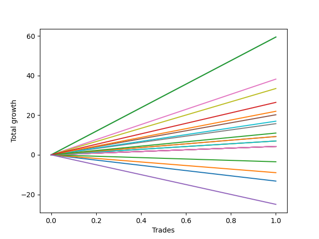

# Long Labrador 007 
- Symbol: ES_FOMC
- Date Range: 11/30/2022 - 12/14/2022
- Trading Period: 8:30-12:30
- Number of Trades: 1



| Name | Win Percent | Profit | Avg Profit / Trade | Avg Time / Trade |      | Name | Win Percent | Profit | Avg Profit / Trade | Avg Time / Trade |
| ---- | ----------- | ------ | ------------------ | ---------------- | ---- | ---- | ----------- | ------ | ------------------ | ---------------- |
| Sorted By <br> Profit | | | | | | Sorted By <br> Win Percentage ||||
| BB-200 U/L 2SD | 100.00 | 29750.00 | 29750.00 | 36:30 |     | BB-200 U/L 2SD | 100.00 | 29750.00 | 29750.00 | 36:30 |
| BB-100 U/L 2SD | 100.00 | 29750.00 | 29750.00 | 36:30 |     | BB-100 U/L 2SD | 100.00 | 29750.00 | 29750.00 | 36:30 |
| BB-50 U/L 2SD | 100.00 | 19125.00 | 19125.00 | 34:40 |     | BB-50 U/L 2SD | 100.00 | 19125.00 | 19125.00 | 34:40 |
| V U/L 1SD | 100.00 | 16750.00 | 16750.00 | 34:25 |     | V U/L 1SD | 100.00 | 16750.00 | 16750.00 | 34:25 |
| NEWFI 000 | 100.00 | 13250.00 | 13250.00 | 60:55 |     | NEWFI 000 | 100.00 | 13250.00 | 13250.00 | 60:55 |
| BB-200 Mid | 100.00 | 11000.00 | 11000.00 | 26:40 |     | BB-200 Mid | 100.00 | 11000.00 | 11000.00 | 26:40 |
| BB-50 U/L 1SD | 100.00 | 10125.00 | 10125.00 | 33:10 |     | BB-50 U/L 1SD | 100.00 | 10125.00 | 10125.00 | 33:10 |
| BB-100 Mid | 100.00 | 8500.00 | 8500.00 | 25:55 |     | BB-100 Mid | 100.00 | 8500.00 | 8500.00 | 25:55 |
| V Mid | 100.00 | 7875.00 | 7875.00 | 26:00 |     | V Mid | 100.00 | 7875.00 | 7875.00 | 26:00 |
| TP-10 | 100.00 | 5500.00 | 5500.00 | 25:40 |     | TP-10 | 100.00 | 5500.00 | 5500.00 | 25:40 |
| TP-9 | 100.00 | 4625.00 | 4625.00 | 25:05 |     | TP-9 | 100.00 | 4625.00 | 4625.00 | 25:05 |
| TP-8 | 100.00 | 4625.00 | 4625.00 | 25:05 |     | TP-8 | 100.00 | 4625.00 | 4625.00 | 25:05 |
| TP-7 | 100.00 | 3500.00 | 3500.00 | 24:35 |     | TP-7 | 100.00 | 3500.00 | 3500.00 | 24:35 |
| TP-6 | 100.00 | 3500.00 | 3500.00 | 24:35 |     | TP-6 | 100.00 | 3500.00 | 3500.00 | 24:35 |
| TP-5 | 100.00 | 3500.00 | 3500.00 | 24:35 |     | TP-5 | 100.00 | 3500.00 | 3500.00 | 24:35 |
| TP-4 | 100.00 | 2125.00 | 2125.00 | 24:20 |     | TP-4 | 100.00 | 2125.00 | 2125.00 | 24:20 |
| TP-3 | 100.00 | 2125.00 | 2125.00 | 24:20 |     | TP-3 | 100.00 | 2125.00 | 2125.00 | 24:20 |
| TP-2 | 100.00 | 2125.00 | 2125.00 | 24:20 |     | TP-2 | 100.00 | 2125.00 | 2125.00 | 24:20 |
| TP-1 | 100.00 | 2125.00 | 2125.00 | 24:20 |     | TP-1 | 100.00 | 2125.00 | 2125.00 | 24:20 |
| BB-50 Mid | 100.00 | 2125.00 | 2125.00 | 24:20 |     | BB-50 Mid | 100.00 | 2125.00 | 2125.00 | 24:20 |
| BB-20 U/L 2SD C | 100.00 | 2125.00 | 2125.00 | 24:20 |     | BB-20 U/L 2SD C | 100.00 | 2125.00 | 2125.00 | 24:20 |
| BB-20 U/L 2SD | 0.00 | -1750.00 | -1750.00 | 22:40 |     | BB-20 U/L 2SD | 0.00 | -1750.00 | -1750.00 | 22:40 |
| BB-20 U/L 1SD | 0.00 | -4500.00 | -4500.00 | 16:25 |     | BB-20 U/L 1SD | 0.00 | -4500.00 | -4500.00 | 16:25 |
| BB-20 Mid | 0.00 | -6625.00 | -6625.00 | 13:15 |     | BB-20 Mid | 0.00 | -6625.00 | -6625.00 | 13:15 |
| NEWFI 0000 | 0.00 | -12500.00 | -12500.00 | 08:05 |     | NEWFI 0000 | 0.00 | -12500.00 | -12500.00 | 08:05 |

## NO STOPLOSS

### Test BB-20 Mid
* Sell when price hits the middle line of the 20p bollinger
* No Stoploss
* Results:
```
Total Trades: 1
Percent Up: 0.00
Percent Down: 100.00
Total Points Moved Up: -13.25
Potential Profit: -6625.00
Total Points Ups: 0.00 Count Ups: 0
Total Points Downs: -13.25 Count Downs: 1
```

<details><summary>Trades</summary>

<code>In: 2022-09-21 11:09:00		Out: 2022-09-21 11:22:15		Total Position Time: 13:15		Total Move Up: -13.25		Total to Date: -13.25</code> <br />


</details>

### Test BB-20 U/L 1SD
* Sell when the price hits the upper line of the 20p 1std bollinger
* No Stoploss
* Results:
```
Total Trades: 1
Percent Up: 0.00
Percent Down: 100.00
Total Points Moved Up: -9.00
Potential Profit: -4500.00
Total Points Ups: 0.00 Count Ups: 0
Total Points Downs: -9.00 Count Downs: 1
```

<details><summary>Trades</summary>

<code>In: 2022-09-21 11:09:00		Out: 2022-09-21 11:25:25		Total Position Time: 16:25		Total Move Up: -9.00		Total to Date: -9.00</code> <br />


</details>

### Test BB-20 U/L 2SD
* Sell when the price hits the upper line of the 20p 2std bollinger
* No Stoploss
* Results:
```
Total Trades: 1
Percent Up: 0.00
Percent Down: 100.00
Total Points Moved Up: -3.50
Potential Profit: -1750.00
Total Points Ups: 0.00 Count Ups: 0
Total Points Downs: -3.50 Count Downs: 1
```

<details><summary>Trades</summary>

<code>In: 2022-09-21 11:09:00		Out: 2022-09-21 11:31:40		Total Position Time: 22:40		Total Move Up: -3.50		Total to Date: -3.50</code> <br />


</details>

### Test BB-20 U/L 2SD C
* Sell when the price hits the upper line of the 20p 2std bollinger
* No Stoploss
* Results:
```
Total Trades: 1
Percent Up: 100.00
Percent Down: 0.00
Total Points Moved Up: 4.25
Potential Profit: 2125.00
Total Points Ups: 4.25 Count Ups: 1
Total Points Downs: 0.00 Count Downs: 0
```

<details><summary>Trades</summary>

<code>In: 2022-09-21 11:09:00		Out: 2022-09-21 11:33:20		Total Position Time: 24:20		Total Move Up: 4.25		Total to Date: 4.25</code> <br />


</details>

### Test BB-50 Mid
* Sell when price hits the middle line of the 50p bollinger
* No Stoploss
* Results:
```
Total Trades: 1
Percent Up: 100.00
Percent Down: 0.00
Total Points Moved Up: 4.25
Potential Profit: 2125.00
Total Points Ups: 4.25 Count Ups: 1
Total Points Downs: 0.00 Count Downs: 0
```

<details><summary>Trades</summary>

<code>In: 2022-09-21 11:09:00		Out: 2022-09-21 11:33:20		Total Position Time: 24:20		Total Move Up: 4.25		Total to Date: 4.25</code> <br />


</details>

### Test BB-50 U/L 1SD
* Sell when the price hits the upper line of the 50p 1std bollinger
* No Stoploss
* Results:
```
Total Trades: 1
Percent Up: 100.00
Percent Down: 0.00
Total Points Moved Up: 20.25
Potential Profit: 10125.00
Total Points Ups: 20.25 Count Ups: 1
Total Points Downs: 0.00 Count Downs: 0
```

<details><summary>Trades</summary>

<code>In: 2022-09-21 11:09:00		Out: 2022-09-21 11:42:10		Total Position Time: 33:10		Total Move Up: 20.25		Total to Date: 20.25</code> <br />


</details>

### Test BB-50 U/L 2SD
* Sell when the price hits the upper line of the 50p 2std bollinger
* No Stoploss
* Results:
```
Total Trades: 1
Percent Up: 100.00
Percent Down: 0.00
Total Points Moved Up: 38.25
Potential Profit: 19125.00
Total Points Ups: 38.25 Count Ups: 1
Total Points Downs: 0.00 Count Downs: 0
```

<details><summary>Trades</summary>

<code>In: 2022-09-21 11:09:00		Out: 2022-09-21 11:43:40		Total Position Time: 34:40		Total Move Up: 38.25		Total to Date: 38.25</code> <br />


</details>

### Test V Mid
* Sell when the price hits the middle line of the 1std VWAP
* No Stoploss
* Results:
```
Total Trades: 1
Percent Up: 100.00
Percent Down: 0.00
Total Points Moved Up: 15.75
Potential Profit: 7875.00
Total Points Ups: 15.75 Count Ups: 1
Total Points Downs: 0.00 Count Downs: 0
```

<details><summary>Trades</summary>

<code>In: 2022-09-21 11:09:00		Out: 2022-09-21 11:35:00		Total Position Time: 26:00		Total Move Up: 15.75		Total to Date: 15.75</code> <br />


</details>

### Test V U/L 1SD
* Sell when the price hits the upper line of the 1std VWAP
* No Stoploss
* Results:
```
Total Trades: 1
Percent Up: 100.00
Percent Down: 0.00
Total Points Moved Up: 33.50
Potential Profit: 16750.00
Total Points Ups: 33.50 Count Ups: 1
Total Points Downs: 0.00 Count Downs: 0
```

<details><summary>Trades</summary>

<code>In: 2022-09-21 11:09:00		Out: 2022-09-21 11:43:25		Total Position Time: 34:25		Total Move Up: 33.50		Total to Date: 33.50</code> <br />


</details>

### Test BB-100 Mid
* Move to BB100 Mid
* No Stoploss
* Results:
```
Total Trades: 1
Percent Up: 100.00
Percent Down: 0.00
Total Points Moved Up: 17.00
Potential Profit: 8500.00
Total Points Ups: 17.00 Count Ups: 1
Total Points Downs: 0.00 Count Downs: 0
```

<details><summary>Trades</summary>

<code>In: 2022-09-21 11:09:00		Out: 2022-09-21 11:34:55		Total Position Time: 25:55		Total Move Up: 17.00		Total to Date: 17.00</code> <br />


</details>

### Test BB-100 U/L 2SD
* Move to BB100 Upper Band
* No Stoploss
* Results:
```
Total Trades: 1
Percent Up: 100.00
Percent Down: 0.00
Total Points Moved Up: 59.50
Potential Profit: 29750.00
Total Points Ups: 59.50 Count Ups: 1
Total Points Downs: 0.00 Count Downs: 0
```

<details><summary>Trades</summary>

<code>In: 2022-09-21 11:09:00		Out: 2022-09-21 11:45:30		Total Position Time: 36:30		Total Move Up: 59.50		Total to Date: 59.50</code> <br />


</details>

### Test BB-200 Mid
* Move to BB200 Mid
* No Stoploss
* Results:
```
Total Trades: 1
Percent Up: 100.00
Percent Down: 0.00
Total Points Moved Up: 22.00
Potential Profit: 11000.00
Total Points Ups: 22.00 Count Ups: 1
Total Points Downs: 0.00 Count Downs: 0
```

<details><summary>Trades</summary>

<code>In: 2022-09-21 11:09:00		Out: 2022-09-21 11:35:40		Total Position Time: 26:40		Total Move Up: 22.00		Total to Date: 22.00</code> <br />


</details>

### Test BB-200 U/L 2SD
* Move to BB200 Upper Band
* No Stoploss
* Results:
```
Total Trades: 1
Percent Up: 100.00
Percent Down: 0.00
Total Points Moved Up: 59.50
Potential Profit: 29750.00
Total Points Ups: 59.50 Count Ups: 1
Total Points Downs: 0.00 Count Downs: 0
```

<details><summary>Trades</summary>

<code>In: 2022-09-21 11:09:00		Out: 2022-09-21 11:45:30		Total Position Time: 36:30		Total Move Up: 59.50		Total to Date: 59.50</code> <br />


</details>

## TAKE PROFIT

### Test TP-1
* Take Profit of 1 Point
* No Stoploss
* Results:
```
Total Trades: 1
Percent Up: 100.00
Percent Down: 0.00
Total Points Moved Up: 4.25
Potential Profit: 2125.00
Total Points Ups: 4.25 Count Ups: 1
Total Points Downs: 0.00 Count Downs: 0
```

<details><summary>Trades</summary>

<code>In: 2022-09-21 11:09:00		Out: 2022-09-21 11:33:20		Total Position Time: 24:20		Total Move Up: 4.25		Total to Date: 4.25</code> <br />


</details>

### Test TP-2
* Take Profit of 2 Point
* No Stoploss
* Results:
```
Total Trades: 1
Percent Up: 100.00
Percent Down: 0.00
Total Points Moved Up: 4.25
Potential Profit: 2125.00
Total Points Ups: 4.25 Count Ups: 1
Total Points Downs: 0.00 Count Downs: 0
```

<details><summary>Trades</summary>

<code>In: 2022-09-21 11:09:00		Out: 2022-09-21 11:33:20		Total Position Time: 24:20		Total Move Up: 4.25		Total to Date: 4.25</code> <br />


</details>

### Test TP-3
* Take Profit of 3 Point
* No Stoploss
* Results:
```
Total Trades: 1
Percent Up: 100.00
Percent Down: 0.00
Total Points Moved Up: 4.25
Potential Profit: 2125.00
Total Points Ups: 4.25 Count Ups: 1
Total Points Downs: 0.00 Count Downs: 0
```

<details><summary>Trades</summary>

<code>In: 2022-09-21 11:09:00		Out: 2022-09-21 11:33:20		Total Position Time: 24:20		Total Move Up: 4.25		Total to Date: 4.25</code> <br />


</details>

### Test TP-4
* Take Profit of 4 Point
* No Stoploss
* Results:
```
Total Trades: 1
Percent Up: 100.00
Percent Down: 0.00
Total Points Moved Up: 4.25
Potential Profit: 2125.00
Total Points Ups: 4.25 Count Ups: 1
Total Points Downs: 0.00 Count Downs: 0
```

<details><summary>Trades</summary>

<code>In: 2022-09-21 11:09:00		Out: 2022-09-21 11:33:20		Total Position Time: 24:20		Total Move Up: 4.25		Total to Date: 4.25</code> <br />


</details>

### Test TP-5
* Take Profit of 5 Point
* No Stoploss
* Results:
```
Total Trades: 1
Percent Up: 100.00
Percent Down: 0.00
Total Points Moved Up: 7.00
Potential Profit: 3500.00
Total Points Ups: 7.00 Count Ups: 1
Total Points Downs: 0.00 Count Downs: 0
```

<details><summary>Trades</summary>

<code>In: 2022-09-21 11:09:00		Out: 2022-09-21 11:33:35		Total Position Time: 24:35		Total Move Up: 7.00		Total to Date: 7.00</code> <br />


</details>

### Test TP-6
* Take Profit of 6 Point
* No Stoploss
* Results:
```
Total Trades: 1
Percent Up: 100.00
Percent Down: 0.00
Total Points Moved Up: 7.00
Potential Profit: 3500.00
Total Points Ups: 7.00 Count Ups: 1
Total Points Downs: 0.00 Count Downs: 0
```

<details><summary>Trades</summary>

<code>In: 2022-09-21 11:09:00		Out: 2022-09-21 11:33:35		Total Position Time: 24:35		Total Move Up: 7.00		Total to Date: 7.00</code> <br />


</details>

### Test TP-7
* Take Profit of 7 Point
* No Stoploss
* Results:
```
Total Trades: 1
Percent Up: 100.00
Percent Down: 0.00
Total Points Moved Up: 7.00
Potential Profit: 3500.00
Total Points Ups: 7.00 Count Ups: 1
Total Points Downs: 0.00 Count Downs: 0
```

<details><summary>Trades</summary>

<code>In: 2022-09-21 11:09:00		Out: 2022-09-21 11:33:35		Total Position Time: 24:35		Total Move Up: 7.00		Total to Date: 7.00</code> <br />


</details>

### Test TP-8
* Take Profit of 8 Point
* No Stoploss
* Results:
```
Total Trades: 1
Percent Up: 100.00
Percent Down: 0.00
Total Points Moved Up: 9.25
Potential Profit: 4625.00
Total Points Ups: 9.25 Count Ups: 1
Total Points Downs: 0.00 Count Downs: 0
```

<details><summary>Trades</summary>

<code>In: 2022-09-21 11:09:00		Out: 2022-09-21 11:34:05		Total Position Time: 25:05		Total Move Up: 9.25		Total to Date: 9.25</code> <br />


</details>

### Test TP-9
* Take Profit of 9 Point
* No Stoploss
* Results:
```
Total Trades: 1
Percent Up: 100.00
Percent Down: 0.00
Total Points Moved Up: 9.25
Potential Profit: 4625.00
Total Points Ups: 9.25 Count Ups: 1
Total Points Downs: 0.00 Count Downs: 0
```

<details><summary>Trades</summary>

<code>In: 2022-09-21 11:09:00		Out: 2022-09-21 11:34:05		Total Position Time: 25:05		Total Move Up: 9.25		Total to Date: 9.25</code> <br />


</details>

### Test TP-10
* Take Profit of 10 Point
* No Stoploss
* Results:
```
Total Trades: 1
Percent Up: 100.00
Percent Down: 0.00
Total Points Moved Up: 11.00
Potential Profit: 5500.00
Total Points Ups: 11.00 Count Ups: 1
Total Points Downs: 0.00 Count Downs: 0
```

<details><summary>Trades</summary>

<code>In: 2022-09-21 11:09:00		Out: 2022-09-21 11:34:40		Total Position Time: 25:40		Total Move Up: 11.00		Total to Date: 11.00</code> <br />


</details>

## Indicator Exits

### Test NEWFI 000
* Newfi 0000
* No Stoploss
* Results:
```
Total Trades: 1
Percent Up: 100.00
Percent Down: 0.00
Total Points Moved Up: 26.50
Potential Profit: 13250.00
Total Points Ups: 26.50 Count Ups: 1
Total Points Downs: 0.00 Count Downs: 0
```

<details><summary>Trades</summary>

<code>In: 2022-09-21 11:09:00		Out: 2022-09-21 12:09:55		Total Position Time: 60:55		Total Move Up: 26.50		Total to Date: 26.50</code> <br />


</details>

### Test NEWFI 0000
* Newfi 0000
* No Stoploss
* Results:
```
Total Trades: 1
Percent Up: 0.00
Percent Down: 100.00
Total Points Moved Up: -25.00
Potential Profit: -12500.00
Total Points Ups: 0.00 Count Ups: 0
Total Points Downs: -25.00 Count Downs: 1
```

<details><summary>Trades</summary>

<code>In: 2022-09-21 11:09:00		Out: 2022-09-21 11:17:05		Total Position Time: 08:05		Total Move Up: -25.00		Total to Date: -25.00</code> <br />


</details>