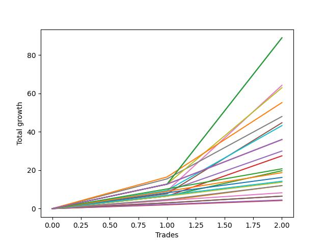

# Long Labrador 008 
- Symbol: ES_FOMC
- Date Range: 11/30/2022 - 12/14/2022
- Trading Period: 8:30-12:30
- Number of Trades: 2



| Name | Win Percent | Profit | Avg Profit / Trade | Avg Time / Trade |      | Name | Win Percent | Profit | Avg Profit / Trade | Avg Time / Trade |
| ---- | ----------- | ------ | ------------------ | ---------------- | ---- | ---- | ----------- | ------ | ------------------ | ---------------- |
| Sorted By <br> Profit | | | | | | Sorted By <br> Win Percentage ||||
| BB-200 U/L 2SD | 100.00 | 44500.00 | 22250.00 | 42:42 |     | BB-200 U/L 2SD | 100.00 | 44500.00 | 22250.00 | 42:42 |
| BB-100 U/L 2SD | 100.00 | 44500.00 | 22250.00 | 42:42 |     | BB-100 U/L 2SD | 100.00 | 44500.00 | 22250.00 | 42:42 |
| BB-50 U/L 2SD | 100.00 | 32125.00 | 16062.50 | 29:35 |     | BB-50 U/L 2SD | 100.00 | 32125.00 | 16062.50 | 29:35 |
| V U/L 1SD | 100.00 | 31500.00 | 15750.00 | 41:40 |     | V U/L 1SD | 100.00 | 31500.00 | 15750.00 | 41:40 |
| BB-200 Mid | 100.00 | 27625.00 | 13812.50 | 35:55 |     | BB-200 Mid | 100.00 | 27625.00 | 13812.50 | 35:55 |
| V Mid | 100.00 | 24000.00 | 12000.00 | 35:32 |     | V Mid | 100.00 | 24000.00 | 12000.00 | 35:32 |
| BB-50 U/L 1SD | 100.00 | 22375.00 | 11187.50 | 25:37 |     | BB-50 U/L 1SD | 100.00 | 22375.00 | 11187.50 | 25:37 |
| BB-100 Mid | 100.00 | 21625.00 | 10812.50 | 25:10 |     | BB-100 Mid | 100.00 | 21625.00 | 10812.50 | 25:10 |
| NEWFI 0000 | 100.00 | 18000.00 | 9000.00 | 60:55 |     | NEWFI 0000 | 100.00 | 18000.00 | 9000.00 | 60:55 |
| NEWFI 000 | 100.00 | 18000.00 | 9000.00 | 60:55 |     | NEWFI 000 | 100.00 | 18000.00 | 9000.00 | 60:55 |
| BB-50 Mid | 100.00 | 15000.00 | 7500.00 | 10:42 |     | BB-50 Mid | 100.00 | 15000.00 | 7500.00 | 10:42 |
| BB-20 U/L 2SD C | 100.00 | 13750.00 | 6875.00 | 08:50 |     | BB-20 U/L 2SD C | 100.00 | 13750.00 | 6875.00 | 08:50 |
| TP-10 | 100.00 | 10375.00 | 5187.50 | 07:15 |     | TP-10 | 100.00 | 10375.00 | 5187.50 | 07:15 |
| BB-20 U/L 2SD | 100.00 | 9875.00 | 4937.50 | 08:00 |     | BB-20 U/L 2SD | 100.00 | 9875.00 | 4937.50 | 08:00 |
| TP-9 | 100.00 | 9375.00 | 4687.50 | 06:50 |     | TP-9 | 100.00 | 9375.00 | 4687.50 | 06:50 |
| TP-8 | 100.00 | 8125.00 | 4062.50 | 06:22 |     | TP-8 | 100.00 | 8125.00 | 4062.50 | 06:22 |
| TP-7 | 100.00 | 7125.00 | 3562.50 | 06:07 |     | TP-7 | 100.00 | 7125.00 | 3562.50 | 06:07 |
| TP-6 | 100.00 | 6875.00 | 3437.50 | 04:35 |     | TP-6 | 100.00 | 6875.00 | 3437.50 | 04:35 |
| TP-5 | 100.00 | 6000.00 | 3000.00 | 04:10 |     | TP-5 | 100.00 | 6000.00 | 3000.00 | 04:10 |
| BB-20 U/L 1SD | 100.00 | 6000.00 | 3000.00 | 04:25 |     | BB-20 U/L 1SD | 100.00 | 6000.00 | 3000.00 | 04:25 |
| TP-4 | 100.00 | 4125.00 | 2062.50 | 04:05 |     | TP-4 | 100.00 | 4125.00 | 2062.50 | 04:05 |
| TP-3 | 100.00 | 3250.00 | 1625.00 | 01:22 |     | TP-3 | 100.00 | 3250.00 | 1625.00 | 01:22 |
| BB-20 Mid | 100.00 | 3250.00 | 1625.00 | 01:22 |     | BB-20 Mid | 100.00 | 3250.00 | 1625.00 | 01:22 |
| TP-2 | 100.00 | 2250.00 | 1125.00 | 01:15 |     | TP-2 | 100.00 | 2250.00 | 1125.00 | 01:15 |
| TP-1 | 100.00 | 2125.00 | 1062.50 | 01:10 |     | TP-1 | 100.00 | 2125.00 | 1062.50 | 01:10 |

## NO STOPLOSS

### Test BB-20 Mid
* Sell when price hits the middle line of the 20p bollinger
* No Stoploss
* Results:
```
Total Trades: 2
Percent Up: 100.00
Percent Down: 0.00
Total Points Moved Up: 6.50
Potential Profit: 3250.00
Total Points Ups: 6.50 Count Ups: 2
Total Points Downs: 0.00 Count Downs: 0
```

<details><summary>Trades</summary>

<code>In: 2022-05-25 09:40:00		Out: 2022-05-25 09:41:30		Total Position Time: 01:30		Total Move Up: 3.00		Total to Date: 3.00</code> <br />
<code>In: 2022-09-21 11:21:00		Out: 2022-09-21 11:22:15		Total Position Time: 01:15		Total Move Up: 3.50		Total to Date: 6.50</code> <br />


</details>

### Test BB-20 U/L 1SD
* Sell when the price hits the upper line of the 20p 1std bollinger
* No Stoploss
* Results:
```
Total Trades: 2
Percent Up: 100.00
Percent Down: 0.00
Total Points Moved Up: 12.00
Potential Profit: 6000.00
Total Points Ups: 12.00 Count Ups: 2
Total Points Downs: 0.00 Count Downs: 0
```

<details><summary>Trades</summary>

<code>In: 2022-05-25 09:40:00		Out: 2022-05-25 09:44:25		Total Position Time: 04:25		Total Move Up: 4.25		Total to Date: 4.25</code> <br />
<code>In: 2022-09-21 11:21:00		Out: 2022-09-21 11:25:25		Total Position Time: 04:25		Total Move Up: 7.75		Total to Date: 12.00</code> <br />


</details>

### Test BB-20 U/L 2SD
* Sell when the price hits the upper line of the 20p 2std bollinger
* No Stoploss
* Results:
```
Total Trades: 2
Percent Up: 100.00
Percent Down: 0.00
Total Points Moved Up: 19.75
Potential Profit: 9875.00
Total Points Ups: 19.75 Count Ups: 2
Total Points Downs: 0.00 Count Downs: 0
```

<details><summary>Trades</summary>

<code>In: 2022-05-25 09:40:00		Out: 2022-05-25 09:45:20		Total Position Time: 05:20		Total Move Up: 6.50		Total to Date: 6.50</code> <br />
<code>In: 2022-09-21 11:21:00		Out: 2022-09-21 11:31:40		Total Position Time: 10:40		Total Move Up: 13.25		Total to Date: 19.75</code> <br />


</details>

### Test BB-20 U/L 2SD C
* Sell when the price hits the upper line of the 20p 2std bollinger
* No Stoploss
* Results:
```
Total Trades: 2
Percent Up: 100.00
Percent Down: 0.00
Total Points Moved Up: 27.50
Potential Profit: 13750.00
Total Points Ups: 27.50 Count Ups: 2
Total Points Downs: 0.00 Count Downs: 0
```

<details><summary>Trades</summary>

<code>In: 2022-05-25 09:40:00		Out: 2022-05-25 09:45:20		Total Position Time: 05:20		Total Move Up: 6.50		Total to Date: 6.50</code> <br />
<code>In: 2022-09-21 11:21:00		Out: 2022-09-21 11:33:20		Total Position Time: 12:20		Total Move Up: 21.00		Total to Date: 27.50</code> <br />


</details>

### Test BB-50 Mid
* Sell when price hits the middle line of the 50p bollinger
* No Stoploss
* Results:
```
Total Trades: 2
Percent Up: 100.00
Percent Down: 0.00
Total Points Moved Up: 30.00
Potential Profit: 15000.00
Total Points Ups: 30.00 Count Ups: 2
Total Points Downs: 0.00 Count Downs: 0
```

<details><summary>Trades</summary>

<code>In: 2022-05-25 09:40:00		Out: 2022-05-25 09:49:05		Total Position Time: 09:05		Total Move Up: 9.00		Total to Date: 9.00</code> <br />
<code>In: 2022-09-21 11:21:00		Out: 2022-09-21 11:33:20		Total Position Time: 12:20		Total Move Up: 21.00		Total to Date: 30.00</code> <br />


</details>

### Test BB-50 U/L 1SD
* Sell when the price hits the upper line of the 50p 1std bollinger
* No Stoploss
* Results:
```
Total Trades: 2
Percent Up: 100.00
Percent Down: 0.00
Total Points Moved Up: 44.75
Potential Profit: 22375.00
Total Points Ups: 44.75 Count Ups: 2
Total Points Downs: 0.00 Count Downs: 0
```

<details><summary>Trades</summary>

<code>In: 2022-05-25 09:40:00		Out: 2022-05-25 10:10:05		Total Position Time: 30:05		Total Move Up: 7.75		Total to Date: 7.75</code> <br />
<code>In: 2022-09-21 11:21:00		Out: 2022-09-21 11:42:10		Total Position Time: 21:10		Total Move Up: 37.00		Total to Date: 44.75</code> <br />


</details>

### Test BB-50 U/L 2SD
* Sell when the price hits the upper line of the 50p 2std bollinger
* No Stoploss
* Results:
```
Total Trades: 2
Percent Up: 100.00
Percent Down: 0.00
Total Points Moved Up: 64.25
Potential Profit: 32125.00
Total Points Ups: 64.25 Count Ups: 2
Total Points Downs: 0.00 Count Downs: 0
```

<details><summary>Trades</summary>

<code>In: 2022-05-25 09:40:00		Out: 2022-05-25 10:16:30		Total Position Time: 36:30		Total Move Up: 9.25		Total to Date: 9.25</code> <br />
<code>In: 2022-09-21 11:21:00		Out: 2022-09-21 11:43:40		Total Position Time: 22:40		Total Move Up: 55.00		Total to Date: 64.25</code> <br />


</details>

### Test V Mid
* Sell when the price hits the middle line of the 1std VWAP
* No Stoploss
* Results:
```
Total Trades: 2
Percent Up: 100.00
Percent Down: 0.00
Total Points Moved Up: 48.00
Potential Profit: 24000.00
Total Points Ups: 48.00 Count Ups: 2
Total Points Downs: 0.00 Count Downs: 0
```

<details><summary>Trades</summary>

<code>In: 2022-05-25 09:40:00		Out: 2022-05-25 10:37:05		Total Position Time: 57:05		Total Move Up: 15.50		Total to Date: 15.50</code> <br />
<code>In: 2022-09-21 11:21:00		Out: 2022-09-21 11:35:00		Total Position Time: 14:00		Total Move Up: 32.50		Total to Date: 48.00</code> <br />


</details>

### Test V U/L 1SD
* Sell when the price hits the upper line of the 1std VWAP
* No Stoploss
* Results:
```
Total Trades: 2
Percent Up: 100.00
Percent Down: 0.00
Total Points Moved Up: 63.00
Potential Profit: 31500.00
Total Points Ups: 63.00 Count Ups: 2
Total Points Downs: 0.00 Count Downs: 0
```

<details><summary>Trades</summary>

<code>In: 2022-05-25 09:40:00		Out: 2022-05-25 10:40:55		Total Position Time: 60:55		Total Move Up: 12.75		Total to Date: 12.75</code> <br />
<code>In: 2022-09-21 11:21:00		Out: 2022-09-21 11:43:25		Total Position Time: 22:25		Total Move Up: 50.25		Total to Date: 63.00</code> <br />


</details>

### Test BB-100 Mid
* Move to BB100 Mid
* No Stoploss
* Results:
```
Total Trades: 2
Percent Up: 100.00
Percent Down: 0.00
Total Points Moved Up: 43.25
Potential Profit: 21625.00
Total Points Ups: 43.25 Count Ups: 2
Total Points Downs: 0.00 Count Downs: 0
```

<details><summary>Trades</summary>

<code>In: 2022-05-25 09:40:00		Out: 2022-05-25 10:16:25		Total Position Time: 36:25		Total Move Up: 9.50		Total to Date: 9.50</code> <br />
<code>In: 2022-09-21 11:21:00		Out: 2022-09-21 11:34:55		Total Position Time: 13:55		Total Move Up: 33.75		Total to Date: 43.25</code> <br />


</details>

### Test BB-100 U/L 2SD
* Move to BB100 Upper Band
* No Stoploss
* Results:
```
Total Trades: 2
Percent Up: 100.00
Percent Down: 0.00
Total Points Moved Up: 89.00
Potential Profit: 44500.00
Total Points Ups: 89.00 Count Ups: 2
Total Points Downs: 0.00 Count Downs: 0
```

<details><summary>Trades</summary>

<code>In: 2022-05-25 09:40:00		Out: 2022-05-25 10:40:55		Total Position Time: 60:55		Total Move Up: 12.75		Total to Date: 12.75</code> <br />
<code>In: 2022-09-21 11:21:00		Out: 2022-09-21 11:45:30		Total Position Time: 24:30		Total Move Up: 76.25		Total to Date: 89.00</code> <br />


</details>

### Test BB-200 Mid
* Move to BB200 Mid
* No Stoploss
* Results:
```
Total Trades: 2
Percent Up: 100.00
Percent Down: 0.00
Total Points Moved Up: 55.25
Potential Profit: 27625.00
Total Points Ups: 55.25 Count Ups: 2
Total Points Downs: 0.00 Count Downs: 0
```

<details><summary>Trades</summary>

<code>In: 2022-05-25 09:40:00		Out: 2022-05-25 10:37:10		Total Position Time: 57:10		Total Move Up: 16.50		Total to Date: 16.50</code> <br />
<code>In: 2022-09-21 11:21:00		Out: 2022-09-21 11:35:40		Total Position Time: 14:40		Total Move Up: 38.75		Total to Date: 55.25</code> <br />


</details>

### Test BB-200 U/L 2SD
* Move to BB200 Upper Band
* No Stoploss
* Results:
```
Total Trades: 2
Percent Up: 100.00
Percent Down: 0.00
Total Points Moved Up: 89.00
Potential Profit: 44500.00
Total Points Ups: 89.00 Count Ups: 2
Total Points Downs: 0.00 Count Downs: 0
```

<details><summary>Trades</summary>

<code>In: 2022-05-25 09:40:00		Out: 2022-05-25 10:40:55		Total Position Time: 60:55		Total Move Up: 12.75		Total to Date: 12.75</code> <br />
<code>In: 2022-09-21 11:21:00		Out: 2022-09-21 11:45:30		Total Position Time: 24:30		Total Move Up: 76.25		Total to Date: 89.00</code> <br />


</details>

## TAKE PROFIT

### Test TP-1
* Take Profit of 1 Point
* No Stoploss
* Results:
```
Total Trades: 2
Percent Up: 100.00
Percent Down: 0.00
Total Points Moved Up: 4.25
Potential Profit: 2125.00
Total Points Ups: 4.25 Count Ups: 2
Total Points Downs: 0.00 Count Downs: 0
```

<details><summary>Trades</summary>

<code>In: 2022-05-25 09:40:00		Out: 2022-05-25 09:41:10		Total Position Time: 01:10		Total Move Up: 2.00		Total to Date: 2.00</code> <br />
<code>In: 2022-09-21 11:21:00		Out: 2022-09-21 11:22:10		Total Position Time: 01:10		Total Move Up: 2.25		Total to Date: 4.25</code> <br />


</details>

### Test TP-2
* Take Profit of 2 Point
* No Stoploss
* Results:
```
Total Trades: 2
Percent Up: 100.00
Percent Down: 0.00
Total Points Moved Up: 4.50
Potential Profit: 2250.00
Total Points Ups: 4.50 Count Ups: 2
Total Points Downs: 0.00 Count Downs: 0
```

<details><summary>Trades</summary>

<code>In: 2022-05-25 09:40:00		Out: 2022-05-25 09:41:20		Total Position Time: 01:20		Total Move Up: 2.25		Total to Date: 2.25</code> <br />
<code>In: 2022-09-21 11:21:00		Out: 2022-09-21 11:22:10		Total Position Time: 01:10		Total Move Up: 2.25		Total to Date: 4.50</code> <br />


</details>

### Test TP-3
* Take Profit of 3 Point
* No Stoploss
* Results:
```
Total Trades: 2
Percent Up: 100.00
Percent Down: 0.00
Total Points Moved Up: 6.50
Potential Profit: 3250.00
Total Points Ups: 6.50 Count Ups: 2
Total Points Downs: 0.00 Count Downs: 0
```

<details><summary>Trades</summary>

<code>In: 2022-05-25 09:40:00		Out: 2022-05-25 09:41:30		Total Position Time: 01:30		Total Move Up: 3.00		Total to Date: 3.00</code> <br />
<code>In: 2022-09-21 11:21:00		Out: 2022-09-21 11:22:15		Total Position Time: 01:15		Total Move Up: 3.50		Total to Date: 6.50</code> <br />


</details>

### Test TP-4
* Take Profit of 4 Point
* No Stoploss
* Results:
```
Total Trades: 2
Percent Up: 100.00
Percent Down: 0.00
Total Points Moved Up: 8.25
Potential Profit: 4125.00
Total Points Ups: 8.25 Count Ups: 2
Total Points Downs: 0.00 Count Downs: 0
```

<details><summary>Trades</summary>

<code>In: 2022-05-25 09:40:00		Out: 2022-05-25 09:44:25		Total Position Time: 04:25		Total Move Up: 4.25		Total to Date: 4.25</code> <br />
<code>In: 2022-09-21 11:21:00		Out: 2022-09-21 11:24:45		Total Position Time: 03:45		Total Move Up: 4.00		Total to Date: 8.25</code> <br />


</details>

### Test TP-5
* Take Profit of 5 Point
* No Stoploss
* Results:
```
Total Trades: 2
Percent Up: 100.00
Percent Down: 0.00
Total Points Moved Up: 12.00
Potential Profit: 6000.00
Total Points Ups: 12.00 Count Ups: 2
Total Points Downs: 0.00 Count Downs: 0
```

<details><summary>Trades</summary>

<code>In: 2022-05-25 09:40:00		Out: 2022-05-25 09:44:30		Total Position Time: 04:30		Total Move Up: 4.75		Total to Date: 4.75</code> <br />
<code>In: 2022-09-21 11:21:00		Out: 2022-09-21 11:24:50		Total Position Time: 03:50		Total Move Up: 7.25		Total to Date: 12.00</code> <br />


</details>

### Test TP-6
* Take Profit of 6 Point
* No Stoploss
* Results:
```
Total Trades: 2
Percent Up: 100.00
Percent Down: 0.00
Total Points Moved Up: 13.75
Potential Profit: 6875.00
Total Points Ups: 13.75 Count Ups: 2
Total Points Downs: 0.00 Count Downs: 0
```

<details><summary>Trades</summary>

<code>In: 2022-05-25 09:40:00		Out: 2022-05-25 09:45:20		Total Position Time: 05:20		Total Move Up: 6.50		Total to Date: 6.50</code> <br />
<code>In: 2022-09-21 11:21:00		Out: 2022-09-21 11:24:50		Total Position Time: 03:50		Total Move Up: 7.25		Total to Date: 13.75</code> <br />


</details>

### Test TP-7
* Take Profit of 7 Point
* No Stoploss
* Results:
```
Total Trades: 2
Percent Up: 100.00
Percent Down: 0.00
Total Points Moved Up: 14.25
Potential Profit: 7125.00
Total Points Ups: 14.25 Count Ups: 2
Total Points Downs: 0.00 Count Downs: 0
```

<details><summary>Trades</summary>

<code>In: 2022-05-25 09:40:00		Out: 2022-05-25 09:48:25		Total Position Time: 08:25		Total Move Up: 7.00		Total to Date: 7.00</code> <br />
<code>In: 2022-09-21 11:21:00		Out: 2022-09-21 11:24:50		Total Position Time: 03:50		Total Move Up: 7.25		Total to Date: 14.25</code> <br />


</details>

### Test TP-8
* Take Profit of 8 Point
* No Stoploss
* Results:
```
Total Trades: 2
Percent Up: 100.00
Percent Down: 0.00
Total Points Moved Up: 16.25
Potential Profit: 8125.00
Total Points Ups: 16.25 Count Ups: 2
Total Points Downs: 0.00 Count Downs: 0
```

<details><summary>Trades</summary>

<code>In: 2022-05-25 09:40:00		Out: 2022-05-25 09:48:50		Total Position Time: 08:50		Total Move Up: 8.25		Total to Date: 8.25</code> <br />
<code>In: 2022-09-21 11:21:00		Out: 2022-09-21 11:24:55		Total Position Time: 03:55		Total Move Up: 8.00		Total to Date: 16.25</code> <br />


</details>

### Test TP-9
* Take Profit of 9 Point
* No Stoploss
* Results:
```
Total Trades: 2
Percent Up: 100.00
Percent Down: 0.00
Total Points Moved Up: 18.75
Potential Profit: 9375.00
Total Points Ups: 18.75 Count Ups: 2
Total Points Downs: 0.00 Count Downs: 0
```

<details><summary>Trades</summary>

<code>In: 2022-05-25 09:40:00		Out: 2022-05-25 09:49:05		Total Position Time: 09:05		Total Move Up: 9.00		Total to Date: 9.00</code> <br />
<code>In: 2022-09-21 11:21:00		Out: 2022-09-21 11:25:35		Total Position Time: 04:35		Total Move Up: 9.75		Total to Date: 18.75</code> <br />


</details>

### Test TP-10
* Take Profit of 10 Point
* No Stoploss
* Results:
```
Total Trades: 2
Percent Up: 100.00
Percent Down: 0.00
Total Points Moved Up: 20.75
Potential Profit: 10375.00
Total Points Ups: 20.75 Count Ups: 2
Total Points Downs: 0.00 Count Downs: 0
```

<details><summary>Trades</summary>

<code>In: 2022-05-25 09:40:00		Out: 2022-05-25 09:49:30		Total Position Time: 09:30		Total Move Up: 10.25		Total to Date: 10.25</code> <br />
<code>In: 2022-09-21 11:21:00		Out: 2022-09-21 11:26:00		Total Position Time: 05:00		Total Move Up: 10.50		Total to Date: 20.75</code> <br />


</details>

## Indicator Exits

### Test NEWFI 000
* Newfi 0000
* No Stoploss
* Results:
```
Total Trades: 2
Percent Up: 100.00
Percent Down: 0.00
Total Points Moved Up: 36.00
Potential Profit: 18000.00
Total Points Ups: 36.00 Count Ups: 2
Total Points Downs: 0.00 Count Downs: 0
```

<details><summary>Trades</summary>

<code>In: 2022-05-25 09:40:00		Out: 2022-05-25 10:40:55		Total Position Time: 60:55		Total Move Up: 12.75		Total to Date: 12.75</code> <br />
<code>In: 2022-09-21 11:21:00		Out: 2022-09-21 12:21:55		Total Position Time: 60:55		Total Move Up: 23.25		Total to Date: 36.00</code> <br />


</details>

### Test NEWFI 0000
* Newfi 0000
* No Stoploss
* Results:
```
Total Trades: 2
Percent Up: 100.00
Percent Down: 0.00
Total Points Moved Up: 36.00
Potential Profit: 18000.00
Total Points Ups: 36.00 Count Ups: 2
Total Points Downs: 0.00 Count Downs: 0
```

<details><summary>Trades</summary>

<code>In: 2022-05-25 09:40:00		Out: 2022-05-25 10:40:55		Total Position Time: 60:55		Total Move Up: 12.75		Total to Date: 12.75</code> <br />
<code>In: 2022-09-21 11:21:00		Out: 2022-09-21 12:21:55		Total Position Time: 60:55		Total Move Up: 23.25		Total to Date: 36.00</code> <br />


</details>