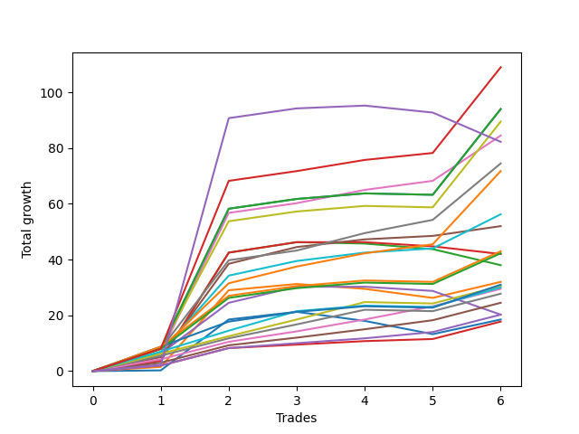

# Long Labrador 011 
- Symbol: ES_FOMC
- Date Range: 11/30/2022 - 12/14/2022
- Trading Period: 8:30-12:30
- Number of Trades: 6



| Name | Win Percent | Profit | Avg Profit / Trade | Avg Time / Trade |      | Name | Win Percent | Profit | Avg Profit / Trade | Avg Time / Trade |
| ---- | ----------- | ------ | ------------------ | ---------------- | ---- | ---- | ----------- | ------ | ------------------ | ---------------- |
| Sorted By <br> Profit | | | | | | Sorted By <br> Win Percentage ||||
| NEWFI 000 | 100.00 | 54500.00 | 9083.33 | 43:00 |     | NEWFI 000 | 100.00 | 54500.00 | 9083.33 | 43:00 |
| BB-200 U/L 2SD | 83.33 | 47000.00 | 7833.33 | 48:06 |     | BB-50 U/L 2SD | 100.00 | 42250.00 | 7041.67 | 37:21 |
| BB-100 U/L 2SD | 83.33 | 47000.00 | 7833.33 | 48:06 |     | V Mid | 100.00 | 37250.00 | 6208.33 | 39:37 |
| V U/L 1SD | 83.33 | 44750.00 | 7458.33 | 48:05 |     | BB-200 Mid | 100.00 | 35875.00 | 5979.17 | 37:28 |
| BB-50 U/L 2SD | 100.00 | 42250.00 | 7041.67 | 37:21 |     | BB-100 Mid | 100.00 | 28125.00 | 4687.50 | 31:51 |
| NEWFI 0000 | 66.67 | 41125.00 | 6854.17 | 21:32 |     | BB-50 U/L 1SD | 100.00 | 26000.00 | 4333.33 | 32:00 |
| V Mid | 100.00 | 37250.00 | 6208.33 | 39:37 |     | TP-4 | 100.00 | 14750.00 | 2458.33 | 17:50 |
| BB-200 Mid | 100.00 | 35875.00 | 5979.17 | 37:28 |     | TP-3 | 100.00 | 12250.00 | 2041.67 | 13:05 |
| BB-100 Mid | 100.00 | 28125.00 | 4687.50 | 31:51 |     | TP-2 | 100.00 | 10125.00 | 1687.50 | 12:14 |
| BB-50 U/L 1SD | 100.00 | 26000.00 | 4333.33 | 32:00 |     | TP-1 | 100.00 | 8875.00 | 1479.17 | 06:37 |
| TP-9 | 83.33 | 21500.00 | 3583.33 | 45:52 |     | BB-200 U/L 2SD | 83.33 | 47000.00 | 7833.33 | 48:06 |
| TP-10 | 83.33 | 21125.00 | 3520.83 | 45:55 |     | BB-100 U/L 2SD | 83.33 | 47000.00 | 7833.33 | 48:06 |
| BB-20 U/L 2SD C | 66.67 | 21000.00 | 3500.00 | 21:47 |     | V U/L 1SD | 83.33 | 44750.00 | 7458.33 | 48:05 |
| BB-20 U/L 2SD | 50.00 | 19000.00 | 3166.67 | 21:10 |     | TP-9 | 83.33 | 21500.00 | 3583.33 | 45:52 |
| BB-20 U/L 1SD | 66.67 | 16000.00 | 2666.67 | 15:02 |     | TP-10 | 83.33 | 21125.00 | 3520.83 | 45:55 |
| TP-8 | 83.33 | 15500.00 | 2583.33 | 45:35 |     | TP-8 | 83.33 | 15500.00 | 2583.33 | 45:35 |
| TP-6 | 83.33 | 15250.00 | 2541.67 | 22:46 |     | TP-6 | 83.33 | 15250.00 | 2541.67 | 22:46 |
| TP-7 | 83.33 | 15000.00 | 2500.00 | 29:12 |     | TP-7 | 83.33 | 15000.00 | 2500.00 | 29:12 |
| TP-4 | 100.00 | 14750.00 | 2458.33 | 17:50 |     | TP-5 | 83.33 | 13875.00 | 2312.50 | 22:10 |
| TP-5 | 83.33 | 13875.00 | 2312.50 | 22:10 |     | NEWFI 0000 | 66.67 | 41125.00 | 6854.17 | 21:32 |
| TP-3 | 100.00 | 12250.00 | 2041.67 | 13:05 |     | BB-20 U/L 2SD C | 66.67 | 21000.00 | 3500.00 | 21:47 |
| TP-2 | 100.00 | 10125.00 | 1687.50 | 12:14 |     | BB-20 U/L 1SD | 66.67 | 16000.00 | 2666.67 | 15:02 |
| BB-50 Mid | 66.67 | 10125.00 | 1687.50 | 23:08 |     | BB-50 Mid | 66.67 | 10125.00 | 1687.50 | 23:08 |
| BB-20 Mid | 66.67 | 9250.00 | 1541.67 | 11:36 |     | BB-20 Mid | 66.67 | 9250.00 | 1541.67 | 11:36 |
| TP-1 | 100.00 | 8875.00 | 1479.17 | 06:37 |     | BB-20 U/L 2SD | 50.00 | 19000.00 | 3166.67 | 21:10 |

## NO STOPLOSS

### Test BB-20 Mid
* Sell when price hits the middle line of the 20p bollinger
* No Stoploss
* Results:
```
Total Trades: 6
Percent Up: 66.67
Percent Down: 33.33
Total Points Moved Up: 18.50
Potential Profit: 9250.00
Total Points Ups: 26.50 Count Ups: 4
Total Points Downs: -8.00 Count Downs: 2
```

<details><summary>Trades</summary>

<code>In: 2022-05-25 09:30:00		Out: 2022-05-25 09:41:30		Total Position Time: 11:30		Total Move Up: 0.25		Total to Date: 0.25</code> <br />
<code>In: 2022-06-15 11:36:00		Out: 2022-06-15 11:38:05		Total Position Time: 02:05		Total Move Up: 18.25		Total to Date: 18.50</code> <br />
<code>In: 2022-10-12 12:07:00		Out: 2022-10-12 12:08:20		Total Position Time: 01:20		Total Move Up: 2.75		Total to Date: 21.25</code> <br />
<code>In: 2022-11-02 09:20:00		Out: 2022-11-02 09:43:40		Total Position Time: 23:40		Total Move Up: -3.25		Total to Date: 18.00</code> <br />
<code>In: 2022-11-02 09:21:00		Out: 2022-11-02 09:43:40		Total Position Time: 22:40		Total Move Up: -4.75		Total to Date: 13.25</code> <br />
<code>In: 2022-12-14 11:13:00		Out: 2022-12-14 11:21:25		Total Position Time: 08:25		Total Move Up: 5.25		Total to Date: 18.50</code> <br />


</details>

### Test BB-20 U/L 1SD
* Sell when the price hits the upper line of the 20p 1std bollinger
* No Stoploss
* Results:
```
Total Trades: 6
Percent Up: 66.67
Percent Down: 33.33
Total Points Moved Up: 32.00
Potential Profit: 16000.00
Total Points Ups: 37.00 Count Ups: 4
Total Points Downs: -5.00 Count Downs: 2
```

<details><summary>Trades</summary>

<code>In: 2022-05-25 09:30:00		Out: 2022-05-25 09:44:25		Total Position Time: 14:25		Total Move Up: 1.50		Total to Date: 1.50</code> <br />
<code>In: 2022-06-15 11:36:00		Out: 2022-06-15 11:38:10		Total Position Time: 02:10		Total Move Up: 27.50		Total to Date: 29.00</code> <br />
<code>In: 2022-10-12 12:07:00		Out: 2022-10-12 12:15:20		Total Position Time: 08:20		Total Move Up: 2.25		Total to Date: 31.25</code> <br />
<code>In: 2022-11-02 09:20:00		Out: 2022-11-02 09:45:00		Total Position Time: 25:00		Total Move Up: -1.75		Total to Date: 29.50</code> <br />
<code>In: 2022-11-02 09:21:00		Out: 2022-11-02 09:45:00		Total Position Time: 24:00		Total Move Up: -3.25		Total to Date: 26.25</code> <br />
<code>In: 2022-12-14 11:13:00		Out: 2022-12-14 11:29:20		Total Position Time: 16:20		Total Move Up: 5.75		Total to Date: 32.00</code> <br />


</details>

### Test BB-20 U/L 2SD
* Sell when the price hits the upper line of the 20p 2std bollinger
* No Stoploss
* Results:
```
Total Trades: 6
Percent Up: 50.00
Percent Down: 50.00
Total Points Moved Up: 38.00
Potential Profit: 19000.00
Total Points Ups: 46.25 Count Ups: 3
Total Points Downs: -8.25 Count Downs: 3
```

<details><summary>Trades</summary>

<code>In: 2022-05-25 09:30:00		Out: 2022-05-25 09:45:20		Total Position Time: 15:20		Total Move Up: 3.75		Total to Date: 3.75</code> <br />
<code>In: 2022-06-15 11:36:00		Out: 2022-06-15 11:38:55		Total Position Time: 02:55		Total Move Up: 38.75		Total to Date: 42.50</code> <br />
<code>In: 2022-10-12 12:07:00		Out: 2022-10-12 12:18:30		Total Position Time: 11:30		Total Move Up: 3.75		Total to Date: 46.25</code> <br />
<code>In: 2022-11-02 09:20:00		Out: 2022-11-02 09:45:15		Total Position Time: 25:15		Total Move Up: -0.50		Total to Date: 45.75</code> <br />
<code>In: 2022-11-02 09:21:00		Out: 2022-11-02 09:45:15		Total Position Time: 24:15		Total Move Up: -2.00		Total to Date: 43.75</code> <br />
<code>In: 2022-12-14 11:13:00		Out: 2022-12-14 12:00:45		Total Position Time: 47:45		Total Move Up: -5.75		Total to Date: 38.00</code> <br />


</details>

### Test BB-20 U/L 2SD C
* Sell when the price hits the upper line of the 20p 2std bollinger
* No Stoploss
* Results:
```
Total Trades: 6
Percent Up: 66.67
Percent Down: 33.33
Total Points Moved Up: 42.00
Potential Profit: 21000.00
Total Points Ups: 46.25 Count Ups: 4
Total Points Downs: -4.25 Count Downs: 2
```

<details><summary>Trades</summary>

<code>In: 2022-05-25 09:30:00		Out: 2022-05-25 09:45:20		Total Position Time: 15:20		Total Move Up: 3.75		Total to Date: 3.75</code> <br />
<code>In: 2022-06-15 11:36:00		Out: 2022-06-15 11:38:55		Total Position Time: 02:55		Total Move Up: 38.75		Total to Date: 42.50</code> <br />
<code>In: 2022-10-12 12:07:00		Out: 2022-10-12 12:18:30		Total Position Time: 11:30		Total Move Up: 3.75		Total to Date: 46.25</code> <br />
<code>In: 2022-11-02 09:20:00		Out: 2022-11-02 09:46:05		Total Position Time: 26:05		Total Move Up: 0.00		Total to Date: 46.25</code> <br />
<code>In: 2022-11-02 09:21:00		Out: 2022-11-02 09:46:05		Total Position Time: 25:05		Total Move Up: -1.50		Total to Date: 44.75</code> <br />
<code>In: 2022-12-14 11:13:00		Out: 2022-12-14 12:02:50		Total Position Time: 49:50		Total Move Up: -2.75		Total to Date: 42.00</code> <br />


</details>

### Test BB-50 Mid
* Sell when price hits the middle line of the 50p bollinger
* No Stoploss
* Results:
```
Total Trades: 6
Percent Up: 66.67
Percent Down: 33.33
Total Points Moved Up: 20.25
Potential Profit: 10125.00
Total Points Ups: 30.25 Count Ups: 4
Total Points Downs: -10.00 Count Downs: 2
```

<details><summary>Trades</summary>

<code>In: 2022-05-25 09:30:00		Out: 2022-05-25 09:49:05		Total Position Time: 19:05		Total Move Up: 6.25		Total to Date: 6.25</code> <br />
<code>In: 2022-06-15 11:36:00		Out: 2022-06-15 11:38:05		Total Position Time: 02:05		Total Move Up: 18.25		Total to Date: 24.50</code> <br />
<code>In: 2022-10-12 12:07:00		Out: 2022-10-12 12:22:55		Total Position Time: 15:55		Total Move Up: 5.75		Total to Date: 30.25</code> <br />
<code>In: 2022-11-02 09:20:00		Out: 2022-11-02 09:49:30		Total Position Time: 29:30		Total Move Up: 0.00		Total to Date: 30.25</code> <br />
<code>In: 2022-11-02 09:21:00		Out: 2022-11-02 09:49:30		Total Position Time: 28:30		Total Move Up: -1.50		Total to Date: 28.75</code> <br />
<code>In: 2022-12-14 11:13:00		Out: 2022-12-14 11:56:45		Total Position Time: 43:45		Total Move Up: -8.50		Total to Date: 20.25</code> <br />


</details>

### Test BB-50 U/L 1SD
* Sell when the price hits the upper line of the 50p 1std bollinger
* No Stoploss
* Results:
```
Total Trades: 6
Percent Up: 100.00
Percent Down: 0.00
Total Points Moved Up: 52.00
Potential Profit: 26000.00
Total Points Ups: 52.00 Count Ups: 6
Total Points Downs: 0.00 Count Downs: 0
```

<details><summary>Trades</summary>

<code>In: 2022-05-25 09:30:00		Out: 2022-05-25 10:10:05		Total Position Time: 40:05		Total Move Up: 5.00		Total to Date: 5.00</code> <br />
<code>In: 2022-06-15 11:36:00		Out: 2022-06-15 11:38:50		Total Position Time: 02:50		Total Move Up: 33.50		Total to Date: 38.50</code> <br />
<code>In: 2022-10-12 12:07:00		Out: 2022-10-12 12:35:25		Total Position Time: 28:25		Total Move Up: 6.00		Total to Date: 44.50</code> <br />
<code>In: 2022-11-02 09:20:00		Out: 2022-11-02 09:55:50		Total Position Time: 35:50		Total Move Up: 2.75		Total to Date: 47.25</code> <br />
<code>In: 2022-11-02 09:21:00		Out: 2022-11-02 09:55:50		Total Position Time: 34:50		Total Move Up: 1.25		Total to Date: 48.50</code> <br />
<code>In: 2022-12-14 11:13:00		Out: 2022-12-14 12:03:05		Total Position Time: 50:05		Total Move Up: 3.50		Total to Date: 52.00</code> <br />


</details>

### Test BB-50 U/L 2SD
* Sell when the price hits the upper line of the 50p 2std bollinger
* No Stoploss
* Results:
```
Total Trades: 6
Percent Up: 100.00
Percent Down: 0.00
Total Points Moved Up: 84.50
Potential Profit: 42250.00
Total Points Ups: 84.50 Count Ups: 6
Total Points Downs: 0.00 Count Downs: 0
```

<details><summary>Trades</summary>

<code>In: 2022-05-25 09:30:00		Out: 2022-05-25 10:16:30		Total Position Time: 46:30		Total Move Up: 6.50		Total to Date: 6.50</code> <br />
<code>In: 2022-06-15 11:36:00		Out: 2022-06-15 11:41:00		Total Position Time: 05:00		Total Move Up: 50.25		Total to Date: 56.75</code> <br />
<code>In: 2022-10-12 12:07:00		Out: 2022-10-12 12:47:00		Total Position Time: 40:00		Total Move Up: 3.50		Total to Date: 60.25</code> <br />
<code>In: 2022-11-02 09:20:00		Out: 2022-11-02 09:57:50		Total Position Time: 37:50		Total Move Up: 4.75		Total to Date: 65.00</code> <br />
<code>In: 2022-11-02 09:21:00		Out: 2022-11-02 09:57:50		Total Position Time: 36:50		Total Move Up: 3.25		Total to Date: 68.25</code> <br />
<code>In: 2022-12-14 11:13:00		Out: 2022-12-14 12:11:00		Total Position Time: 58:00		Total Move Up: 16.25		Total to Date: 84.50</code> <br />


</details>

### Test V Mid
* Sell when the price hits the middle line of the 1std VWAP
* No Stoploss
* Results:
```
Total Trades: 6
Percent Up: 100.00
Percent Down: 0.00
Total Points Moved Up: 74.50
Potential Profit: 37250.00
Total Points Ups: 74.50 Count Ups: 6
Total Points Downs: 0.00 Count Downs: 0
```

<details><summary>Trades</summary>

<code>In: 2022-05-25 09:30:00		Out: 2022-05-25 10:30:55		Total Position Time: 60:55		Total Move Up: 8.00		Total to Date: 8.00</code> <br />
<code>In: 2022-06-15 11:36:00		Out: 2022-06-15 11:38:45		Total Position Time: 02:45		Total Move Up: 31.75		Total to Date: 39.75</code> <br />
<code>In: 2022-10-12 12:07:00		Out: 2022-10-12 12:47:00		Total Position Time: 40:00		Total Move Up: 3.50		Total to Date: 43.25</code> <br />
<code>In: 2022-11-02 09:20:00		Out: 2022-11-02 09:58:20		Total Position Time: 38:20		Total Move Up: 6.25		Total to Date: 49.50</code> <br />
<code>In: 2022-11-02 09:21:00		Out: 2022-11-02 09:58:20		Total Position Time: 37:20		Total Move Up: 4.75		Total to Date: 54.25</code> <br />
<code>In: 2022-12-14 11:13:00		Out: 2022-12-14 12:11:25		Total Position Time: 58:25		Total Move Up: 20.25		Total to Date: 74.50</code> <br />


</details>

### Test V U/L 1SD
* Sell when the price hits the upper line of the 1std VWAP
* No Stoploss
* Results:
```
Total Trades: 6
Percent Up: 83.33
Percent Down: 16.67
Total Points Moved Up: 89.50
Potential Profit: 44750.00
Total Points Ups: 90.00 Count Ups: 5
Total Points Downs: -0.50 Count Downs: 1
```

<details><summary>Trades</summary>

<code>In: 2022-05-25 09:30:00		Out: 2022-05-25 10:30:55		Total Position Time: 60:55		Total Move Up: 8.00		Total to Date: 8.00</code> <br />
<code>In: 2022-06-15 11:36:00		Out: 2022-06-15 11:40:55		Total Position Time: 04:55		Total Move Up: 45.75		Total to Date: 53.75</code> <br />
<code>In: 2022-10-12 12:07:00		Out: 2022-10-12 12:47:00		Total Position Time: 40:00		Total Move Up: 3.50		Total to Date: 57.25</code> <br />
<code>In: 2022-11-02 09:20:00		Out: 2022-11-02 10:20:55		Total Position Time: 60:55		Total Move Up: 2.00		Total to Date: 59.25</code> <br />
<code>In: 2022-11-02 09:21:00		Out: 2022-11-02 10:21:55		Total Position Time: 60:55		Total Move Up: -0.50		Total to Date: 58.75</code> <br />
<code>In: 2022-12-14 11:13:00		Out: 2022-12-14 12:13:55		Total Position Time: 60:55		Total Move Up: 30.75		Total to Date: 89.50</code> <br />


</details>

### Test BB-100 Mid
* Move to BB100 Mid
* No Stoploss
* Results:
```
Total Trades: 6
Percent Up: 100.00
Percent Down: 0.00
Total Points Moved Up: 56.25
Potential Profit: 28125.00
Total Points Ups: 56.25 Count Ups: 6
Total Points Downs: 0.00 Count Downs: 0
```

<details><summary>Trades</summary>

<code>In: 2022-05-25 09:30:00		Out: 2022-05-25 10:16:25		Total Position Time: 46:25		Total Move Up: 6.75		Total to Date: 6.75</code> <br />
<code>In: 2022-06-15 11:36:00		Out: 2022-06-15 11:38:10		Total Position Time: 02:10		Total Move Up: 27.50		Total to Date: 34.25</code> <br />
<code>In: 2022-10-12 12:07:00		Out: 2022-10-12 12:20:15		Total Position Time: 13:15		Total Move Up: 5.25		Total to Date: 39.50</code> <br />
<code>In: 2022-11-02 09:20:00		Out: 2022-11-02 09:56:15		Total Position Time: 36:15		Total Move Up: 3.00		Total to Date: 42.50</code> <br />
<code>In: 2022-11-02 09:21:00		Out: 2022-11-02 09:56:15		Total Position Time: 35:15		Total Move Up: 1.50		Total to Date: 44.00</code> <br />
<code>In: 2022-12-14 11:13:00		Out: 2022-12-14 12:10:50		Total Position Time: 57:50		Total Move Up: 12.25		Total to Date: 56.25</code> <br />


</details>

### Test BB-100 U/L 2SD
* Move to BB100 Upper Band
* No Stoploss
* Results:
```
Total Trades: 6
Percent Up: 83.33
Percent Down: 16.67
Total Points Moved Up: 94.00
Potential Profit: 47000.00
Total Points Ups: 94.50 Count Ups: 5
Total Points Downs: -0.50 Count Downs: 1
```

<details><summary>Trades</summary>

<code>In: 2022-05-25 09:30:00		Out: 2022-05-25 10:30:55		Total Position Time: 60:55		Total Move Up: 8.00		Total to Date: 8.00</code> <br />
<code>In: 2022-06-15 11:36:00		Out: 2022-06-15 11:41:00		Total Position Time: 05:00		Total Move Up: 50.25		Total to Date: 58.25</code> <br />
<code>In: 2022-10-12 12:07:00		Out: 2022-10-12 12:47:00		Total Position Time: 40:00		Total Move Up: 3.50		Total to Date: 61.75</code> <br />
<code>In: 2022-11-02 09:20:00		Out: 2022-11-02 10:20:55		Total Position Time: 60:55		Total Move Up: 2.00		Total to Date: 63.75</code> <br />
<code>In: 2022-11-02 09:21:00		Out: 2022-11-02 10:21:55		Total Position Time: 60:55		Total Move Up: -0.50		Total to Date: 63.25</code> <br />
<code>In: 2022-12-14 11:13:00		Out: 2022-12-14 12:13:55		Total Position Time: 60:55		Total Move Up: 30.75		Total to Date: 94.00</code> <br />


</details>

### Test BB-200 Mid
* Move to BB200 Mid
* No Stoploss
* Results:
```
Total Trades: 6
Percent Up: 100.00
Percent Down: 0.00
Total Points Moved Up: 71.75
Potential Profit: 35875.00
Total Points Ups: 71.75 Count Ups: 6
Total Points Downs: 0.00 Count Downs: 0
```

<details><summary>Trades</summary>

<code>In: 2022-05-25 09:30:00		Out: 2022-05-25 10:30:55		Total Position Time: 60:55		Total Move Up: 8.00		Total to Date: 8.00</code> <br />
<code>In: 2022-06-15 11:36:00		Out: 2022-06-15 11:38:15		Total Position Time: 02:15		Total Move Up: 23.50		Total to Date: 31.50</code> <br />
<code>In: 2022-10-12 12:07:00		Out: 2022-10-12 12:35:25		Total Position Time: 28:25		Total Move Up: 6.00		Total to Date: 37.50</code> <br />
<code>In: 2022-11-02 09:20:00		Out: 2022-11-02 09:57:50		Total Position Time: 37:50		Total Move Up: 4.75		Total to Date: 42.25</code> <br />
<code>In: 2022-11-02 09:21:00		Out: 2022-11-02 09:57:50		Total Position Time: 36:50		Total Move Up: 3.25		Total to Date: 45.50</code> <br />
<code>In: 2022-12-14 11:13:00		Out: 2022-12-14 12:11:35		Total Position Time: 58:35		Total Move Up: 26.25		Total to Date: 71.75</code> <br />


</details>

### Test BB-200 U/L 2SD
* Move to BB200 Upper Band
* No Stoploss
* Results:
```
Total Trades: 6
Percent Up: 83.33
Percent Down: 16.67
Total Points Moved Up: 94.00
Potential Profit: 47000.00
Total Points Ups: 94.50 Count Ups: 5
Total Points Downs: -0.50 Count Downs: 1
```

<details><summary>Trades</summary>

<code>In: 2022-05-25 09:30:00		Out: 2022-05-25 10:30:55		Total Position Time: 60:55		Total Move Up: 8.00		Total to Date: 8.00</code> <br />
<code>In: 2022-06-15 11:36:00		Out: 2022-06-15 11:41:00		Total Position Time: 05:00		Total Move Up: 50.25		Total to Date: 58.25</code> <br />
<code>In: 2022-10-12 12:07:00		Out: 2022-10-12 12:47:00		Total Position Time: 40:00		Total Move Up: 3.50		Total to Date: 61.75</code> <br />
<code>In: 2022-11-02 09:20:00		Out: 2022-11-02 10:20:55		Total Position Time: 60:55		Total Move Up: 2.00		Total to Date: 63.75</code> <br />
<code>In: 2022-11-02 09:21:00		Out: 2022-11-02 10:21:55		Total Position Time: 60:55		Total Move Up: -0.50		Total to Date: 63.25</code> <br />
<code>In: 2022-12-14 11:13:00		Out: 2022-12-14 12:13:55		Total Position Time: 60:55		Total Move Up: 30.75		Total to Date: 94.00</code> <br />


</details>

## TAKE PROFIT

### Test TP-1
* Take Profit of 1 Point
* No Stoploss
* Results:
```
Total Trades: 6
Percent Up: 100.00
Percent Down: 0.00
Total Points Moved Up: 17.75
Potential Profit: 8875.00
Total Points Ups: 17.75 Count Ups: 6
Total Points Downs: 0.00 Count Downs: 0
```

<details><summary>Trades</summary>

<code>In: 2022-05-25 09:30:00		Out: 2022-05-25 09:31:10		Total Position Time: 01:10		Total Move Up: 2.00		Total to Date: 2.00</code> <br />
<code>In: 2022-06-15 11:36:00		Out: 2022-06-15 11:37:10		Total Position Time: 01:10		Total Move Up: 6.25		Total to Date: 8.25</code> <br />
<code>In: 2022-10-12 12:07:00		Out: 2022-10-12 12:08:10		Total Position Time: 01:10		Total Move Up: 1.25		Total to Date: 9.50</code> <br />
<code>In: 2022-11-02 09:20:00		Out: 2022-11-02 09:21:10		Total Position Time: 01:10		Total Move Up: 1.25		Total to Date: 10.75</code> <br />
<code>In: 2022-11-02 09:21:00		Out: 2022-11-02 09:54:55		Total Position Time: 33:55		Total Move Up: 0.75		Total to Date: 11.50</code> <br />
<code>In: 2022-12-14 11:13:00		Out: 2022-12-14 11:14:10		Total Position Time: 01:10		Total Move Up: 6.25		Total to Date: 17.75</code> <br />


</details>

### Test TP-2
* Take Profit of 2 Point
* No Stoploss
* Results:
```
Total Trades: 6
Percent Up: 100.00
Percent Down: 0.00
Total Points Moved Up: 20.25
Potential Profit: 10125.00
Total Points Ups: 20.25 Count Ups: 6
Total Points Downs: 0.00 Count Downs: 0
```

<details><summary>Trades</summary>

<code>In: 2022-05-25 09:30:00		Out: 2022-05-25 09:31:10		Total Position Time: 01:10		Total Move Up: 2.00		Total to Date: 2.00</code> <br />
<code>In: 2022-06-15 11:36:00		Out: 2022-06-15 11:37:10		Total Position Time: 01:10		Total Move Up: 6.25		Total to Date: 8.25</code> <br />
<code>In: 2022-10-12 12:07:00		Out: 2022-10-12 12:08:15		Total Position Time: 01:15		Total Move Up: 1.75		Total to Date: 10.00</code> <br />
<code>In: 2022-11-02 09:20:00		Out: 2022-11-02 09:52:10		Total Position Time: 32:10		Total Move Up: 1.75		Total to Date: 11.75</code> <br />
<code>In: 2022-11-02 09:21:00		Out: 2022-11-02 09:57:30		Total Position Time: 36:30		Total Move Up: 2.25		Total to Date: 14.00</code> <br />
<code>In: 2022-12-14 11:13:00		Out: 2022-12-14 11:14:10		Total Position Time: 01:10		Total Move Up: 6.25		Total to Date: 20.25</code> <br />


</details>

### Test TP-3
* Take Profit of 3 Point
* No Stoploss
* Results:
```
Total Trades: 6
Percent Up: 100.00
Percent Down: 0.00
Total Points Moved Up: 24.50
Potential Profit: 12250.00
Total Points Ups: 24.50 Count Ups: 6
Total Points Downs: 0.00 Count Downs: 0
```

<details><summary>Trades</summary>

<code>In: 2022-05-25 09:30:00		Out: 2022-05-25 09:31:45		Total Position Time: 01:45		Total Move Up: 3.00		Total to Date: 3.00</code> <br />
<code>In: 2022-06-15 11:36:00		Out: 2022-06-15 11:37:10		Total Position Time: 01:10		Total Move Up: 6.25		Total to Date: 9.25</code> <br />
<code>In: 2022-10-12 12:07:00		Out: 2022-10-12 12:08:20		Total Position Time: 01:20		Total Move Up: 2.75		Total to Date: 12.00</code> <br />
<code>In: 2022-11-02 09:20:00		Out: 2022-11-02 09:56:15		Total Position Time: 36:15		Total Move Up: 3.00		Total to Date: 15.00</code> <br />
<code>In: 2022-11-02 09:21:00		Out: 2022-11-02 09:57:50		Total Position Time: 36:50		Total Move Up: 3.25		Total to Date: 18.25</code> <br />
<code>In: 2022-12-14 11:13:00		Out: 2022-12-14 11:14:10		Total Position Time: 01:10		Total Move Up: 6.25		Total to Date: 24.50</code> <br />


</details>

### Test TP-4
* Take Profit of 4 Point
* No Stoploss
* Results:
```
Total Trades: 6
Percent Up: 100.00
Percent Down: 0.00
Total Points Moved Up: 29.50
Potential Profit: 14750.00
Total Points Ups: 29.50 Count Ups: 6
Total Points Downs: 0.00 Count Downs: 0
```

<details><summary>Trades</summary>

<code>In: 2022-05-25 09:30:00		Out: 2022-05-25 09:48:10		Total Position Time: 18:10		Total Move Up: 4.25		Total to Date: 4.25</code> <br />
<code>In: 2022-06-15 11:36:00		Out: 2022-06-15 11:37:10		Total Position Time: 01:10		Total Move Up: 6.25		Total to Date: 10.50</code> <br />
<code>In: 2022-10-12 12:07:00		Out: 2022-10-12 12:18:35		Total Position Time: 11:35		Total Move Up: 3.75		Total to Date: 14.25</code> <br />
<code>In: 2022-11-02 09:20:00		Out: 2022-11-02 09:57:40		Total Position Time: 37:40		Total Move Up: 4.25		Total to Date: 18.50</code> <br />
<code>In: 2022-11-02 09:21:00		Out: 2022-11-02 09:58:20		Total Position Time: 37:20		Total Move Up: 4.75		Total to Date: 23.25</code> <br />
<code>In: 2022-12-14 11:13:00		Out: 2022-12-14 11:14:10		Total Position Time: 01:10		Total Move Up: 6.25		Total to Date: 29.50</code> <br />


</details>

### Test TP-5
* Take Profit of 5 Point
* No Stoploss
* Results:
```
Total Trades: 6
Percent Up: 83.33
Percent Down: 16.67
Total Points Moved Up: 27.75
Potential Profit: 13875.00
Total Points Ups: 28.25 Count Ups: 5
Total Points Downs: -0.50 Count Downs: 1
```

<details><summary>Trades</summary>

<code>In: 2022-05-25 09:30:00		Out: 2022-05-25 09:48:50		Total Position Time: 18:50		Total Move Up: 5.50		Total to Date: 5.50</code> <br />
<code>In: 2022-06-15 11:36:00		Out: 2022-06-15 11:37:10		Total Position Time: 01:10		Total Move Up: 6.25		Total to Date: 11.75</code> <br />
<code>In: 2022-10-12 12:07:00		Out: 2022-10-12 12:20:05		Total Position Time: 13:05		Total Move Up: 5.00		Total to Date: 16.75</code> <br />
<code>In: 2022-11-02 09:20:00		Out: 2022-11-02 09:57:55		Total Position Time: 37:55		Total Move Up: 5.25		Total to Date: 22.00</code> <br />
<code>In: 2022-11-02 09:21:00		Out: 2022-11-02 10:21:55		Total Position Time: 60:55		Total Move Up: -0.50		Total to Date: 21.50</code> <br />
<code>In: 2022-12-14 11:13:00		Out: 2022-12-14 11:14:10		Total Position Time: 01:10		Total Move Up: 6.25		Total to Date: 27.75</code> <br />


</details>

### Test TP-6
* Take Profit of 6 Point
* No Stoploss
* Results:
```
Total Trades: 6
Percent Up: 83.33
Percent Down: 16.67
Total Points Moved Up: 30.50
Potential Profit: 15250.00
Total Points Ups: 31.00 Count Ups: 5
Total Points Downs: -0.50 Count Downs: 1
```

<details><summary>Trades</summary>

<code>In: 2022-05-25 09:30:00		Out: 2022-05-25 09:49:05		Total Position Time: 19:05		Total Move Up: 6.25		Total to Date: 6.25</code> <br />
<code>In: 2022-06-15 11:36:00		Out: 2022-06-15 11:37:10		Total Position Time: 01:10		Total Move Up: 6.25		Total to Date: 12.50</code> <br />
<code>In: 2022-10-12 12:07:00		Out: 2022-10-12 12:23:00		Total Position Time: 16:00		Total Move Up: 6.00		Total to Date: 18.50</code> <br />
<code>In: 2022-11-02 09:20:00		Out: 2022-11-02 09:58:20		Total Position Time: 38:20		Total Move Up: 6.25		Total to Date: 24.75</code> <br />
<code>In: 2022-11-02 09:21:00		Out: 2022-11-02 10:21:55		Total Position Time: 60:55		Total Move Up: -0.50		Total to Date: 24.25</code> <br />
<code>In: 2022-12-14 11:13:00		Out: 2022-12-14 11:14:10		Total Position Time: 01:10		Total Move Up: 6.25		Total to Date: 30.50</code> <br />


</details>

### Test TP-7
* Take Profit of 7 Point
* No Stoploss
* Results:
```
Total Trades: 6
Percent Up: 83.33
Percent Down: 16.67
Total Points Moved Up: 30.00
Potential Profit: 15000.00
Total Points Ups: 30.50 Count Ups: 5
Total Points Downs: -0.50 Count Downs: 1
```

<details><summary>Trades</summary>

<code>In: 2022-05-25 09:30:00		Out: 2022-05-25 09:49:25		Total Position Time: 19:25		Total Move Up: 7.00		Total to Date: 7.00</code> <br />
<code>In: 2022-06-15 11:36:00		Out: 2022-06-15 11:37:20		Total Position Time: 01:20		Total Move Up: 7.50		Total to Date: 14.50</code> <br />
<code>In: 2022-10-12 12:07:00		Out: 2022-10-12 12:36:35		Total Position Time: 29:35		Total Move Up: 7.00		Total to Date: 21.50</code> <br />
<code>In: 2022-11-02 09:20:00		Out: 2022-11-02 10:20:55		Total Position Time: 60:55		Total Move Up: 2.00		Total to Date: 23.50</code> <br />
<code>In: 2022-11-02 09:21:00		Out: 2022-11-02 10:21:55		Total Position Time: 60:55		Total Move Up: -0.50		Total to Date: 23.00</code> <br />
<code>In: 2022-12-14 11:13:00		Out: 2022-12-14 11:16:05		Total Position Time: 03:05		Total Move Up: 7.00		Total to Date: 30.00</code> <br />


</details>

### Test TP-8
* Take Profit of 8 Point
* No Stoploss
* Results:
```
Total Trades: 6
Percent Up: 83.33
Percent Down: 16.67
Total Points Moved Up: 31.00
Potential Profit: 15500.00
Total Points Ups: 31.50 Count Ups: 5
Total Points Downs: -0.50 Count Downs: 1
```

<details><summary>Trades</summary>

<code>In: 2022-05-25 09:30:00		Out: 2022-05-25 10:29:45		Total Position Time: 59:45		Total Move Up: 8.75		Total to Date: 8.75</code> <br />
<code>In: 2022-06-15 11:36:00		Out: 2022-06-15 11:37:30		Total Position Time: 01:30		Total Move Up: 9.00		Total to Date: 17.75</code> <br />
<code>In: 2022-10-12 12:07:00		Out: 2022-10-12 12:47:00		Total Position Time: 40:00		Total Move Up: 3.50		Total to Date: 21.25</code> <br />
<code>In: 2022-11-02 09:20:00		Out: 2022-11-02 10:20:55		Total Position Time: 60:55		Total Move Up: 2.00		Total to Date: 23.25</code> <br />
<code>In: 2022-11-02 09:21:00		Out: 2022-11-02 10:21:55		Total Position Time: 60:55		Total Move Up: -0.50		Total to Date: 22.75</code> <br />
<code>In: 2022-12-14 11:13:00		Out: 2022-12-14 12:03:25		Total Position Time: 50:25		Total Move Up: 8.25		Total to Date: 31.00</code> <br />


</details>

### Test TP-9
* Take Profit of 9 Point
* No Stoploss
* Results:
```
Total Trades: 6
Percent Up: 83.33
Percent Down: 16.67
Total Points Moved Up: 43.00
Potential Profit: 21500.00
Total Points Ups: 43.50 Count Ups: 5
Total Points Downs: -0.50 Count Downs: 1
```

<details><summary>Trades</summary>

<code>In: 2022-05-25 09:30:00		Out: 2022-05-25 10:30:40		Total Position Time: 60:40		Total Move Up: 8.75		Total to Date: 8.75</code> <br />
<code>In: 2022-06-15 11:36:00		Out: 2022-06-15 11:38:05		Total Position Time: 02:05		Total Move Up: 18.25		Total to Date: 27.00</code> <br />
<code>In: 2022-10-12 12:07:00		Out: 2022-10-12 12:47:00		Total Position Time: 40:00		Total Move Up: 3.50		Total to Date: 30.50</code> <br />
<code>In: 2022-11-02 09:20:00		Out: 2022-11-02 10:20:55		Total Position Time: 60:55		Total Move Up: 2.00		Total to Date: 32.50</code> <br />
<code>In: 2022-11-02 09:21:00		Out: 2022-11-02 10:21:55		Total Position Time: 60:55		Total Move Up: -0.50		Total to Date: 32.00</code> <br />
<code>In: 2022-12-14 11:13:00		Out: 2022-12-14 12:03:40		Total Position Time: 50:40		Total Move Up: 11.00		Total to Date: 43.00</code> <br />


</details>

### Test TP-10
* Take Profit of 10 Point
* No Stoploss
* Results:
```
Total Trades: 6
Percent Up: 83.33
Percent Down: 16.67
Total Points Moved Up: 42.25
Potential Profit: 21125.00
Total Points Ups: 42.75 Count Ups: 5
Total Points Downs: -0.50 Count Downs: 1
```

<details><summary>Trades</summary>

<code>In: 2022-05-25 09:30:00		Out: 2022-05-25 10:30:55		Total Position Time: 60:55		Total Move Up: 8.00		Total to Date: 8.00</code> <br />
<code>In: 2022-06-15 11:36:00		Out: 2022-06-15 11:38:05		Total Position Time: 02:05		Total Move Up: 18.25		Total to Date: 26.25</code> <br />
<code>In: 2022-10-12 12:07:00		Out: 2022-10-12 12:47:00		Total Position Time: 40:00		Total Move Up: 3.50		Total to Date: 29.75</code> <br />
<code>In: 2022-11-02 09:20:00		Out: 2022-11-02 10:20:55		Total Position Time: 60:55		Total Move Up: 2.00		Total to Date: 31.75</code> <br />
<code>In: 2022-11-02 09:21:00		Out: 2022-11-02 10:21:55		Total Position Time: 60:55		Total Move Up: -0.50		Total to Date: 31.25</code> <br />
<code>In: 2022-12-14 11:13:00		Out: 2022-12-14 12:03:40		Total Position Time: 50:40		Total Move Up: 11.00		Total to Date: 42.25</code> <br />


</details>

## Indicator Exits

### Test NEWFI 000
* Newfi 0000
* No Stoploss
* Results:
```
Total Trades: 6
Percent Up: 100.00
Percent Down: 0.00
Total Points Moved Up: 109.00
Potential Profit: 54500.00
Total Points Ups: 109.00 Count Ups: 6
Total Points Downs: 0.00 Count Downs: 0
```

<details><summary>Trades</summary>

<code>In: 2022-05-25 09:30:00		Out: 2022-05-25 10:30:55		Total Position Time: 60:55		Total Move Up: 8.00		Total to Date: 8.00</code> <br />
<code>In: 2022-06-15 11:36:00		Out: 2022-06-15 11:49:05		Total Position Time: 13:05		Total Move Up: 60.25		Total to Date: 68.25</code> <br />
<code>In: 2022-10-12 12:07:00		Out: 2022-10-12 12:47:00		Total Position Time: 40:00		Total Move Up: 3.50		Total to Date: 71.75</code> <br />
<code>In: 2022-11-02 09:20:00		Out: 2022-11-02 10:02:05		Total Position Time: 42:05		Total Move Up: 4.00		Total to Date: 75.75</code> <br />
<code>In: 2022-11-02 09:21:00		Out: 2022-11-02 10:02:05		Total Position Time: 41:05		Total Move Up: 2.50		Total to Date: 78.25</code> <br />
<code>In: 2022-12-14 11:13:00		Out: 2022-12-14 12:13:55		Total Position Time: 60:55		Total Move Up: 30.75		Total to Date: 109.00</code> <br />


</details>

### Test NEWFI 0000
* Newfi 0000
* No Stoploss
* Results:
```
Total Trades: 6
Percent Up: 66.67
Percent Down: 33.33
Total Points Moved Up: 82.25
Potential Profit: 41125.00
Total Points Ups: 95.25 Count Ups: 4
Total Points Downs: -13.00 Count Downs: 2
```

<details><summary>Trades</summary>

<code>In: 2022-05-25 09:30:00		Out: 2022-05-25 09:31:05		Total Position Time: 01:05		Total Move Up: 2.25		Total to Date: 2.25</code> <br />
<code>In: 2022-06-15 11:36:00		Out: 2022-06-15 12:36:55		Total Position Time: 60:55		Total Move Up: 88.50		Total to Date: 90.75</code> <br />
<code>In: 2022-10-12 12:07:00		Out: 2022-10-12 12:47:00		Total Position Time: 40:00		Total Move Up: 3.50		Total to Date: 94.25</code> <br />
<code>In: 2022-11-02 09:20:00		Out: 2022-11-02 09:21:05		Total Position Time: 01:05		Total Move Up: 1.00		Total to Date: 95.25</code> <br />
<code>In: 2022-11-02 09:21:00		Out: 2022-11-02 09:26:05		Total Position Time: 05:05		Total Move Up: -2.50		Total to Date: 92.75</code> <br />
<code>In: 2022-12-14 11:13:00		Out: 2022-12-14 11:34:05		Total Position Time: 21:05		Total Move Up: -10.50		Total to Date: 82.25</code> <br />


</details>